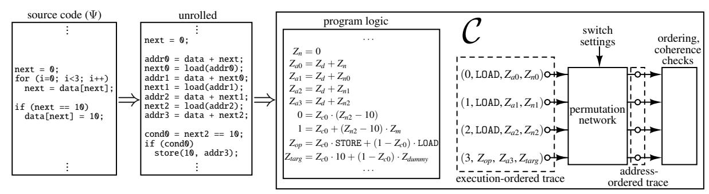
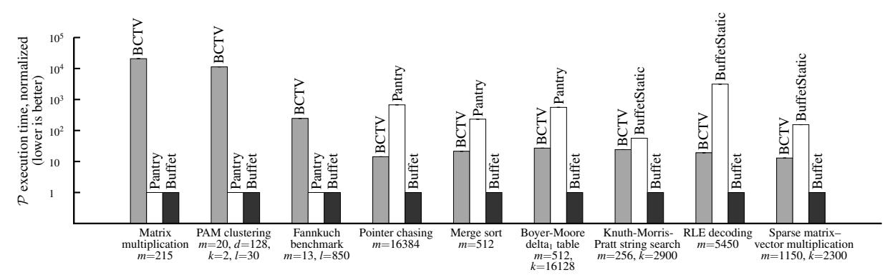

# Efficient RAM and control flow in verifiable outsourced computation

Riad S. Wahby<sup>⋆</sup> , Srinath Setty† , Max Howald‡ , Zuocheng Ren† , Andrew J. Blumberg† , and Michael Walfish<sup>⋆</sup>

<sup>⋆</sup>New York University {rsw,mwalfish}@cs.nyu.edu

†The University of Texas at Austin {srinath@cs,ren@cs,blumberg@math}.utexas.edu ‡The Cooper Union howald@cooper.edu

Abstract. Recent work on *proof-based verifiable computation* has resulted in built systems that employ tools from complexity theory and cryptography to address a basic problem in systems security: allowing a local computer to outsource the execution of a program while providing the local computer with a guarantee of integrity and the remote computer with a guarantee of privacy. However, support for programs that use RAM and control flow has been problematic. State of the art systems either restrict the use of these constructs (e.g., requiring static loop bounds), incur sizeable overhead on every step, or pay tremendous costs when the constructs are invoked.

This paper describes Buffet, a built system that solves these problems by providing inexpensive "a la carte" RAM and dynamic control flow. Buffet composes an elegant prior approach to RAM with a novel adaptation of techniques from the compilers literature. Buffet allows the programmer to express programs in an expansive subset of C (disallowing only "goto" and function pointers), can handle essentially any example in the verifiable computation literature, and achieves the best performance in the area by multiple orders of magnitude.

# <span id="page-0-0"></span>1 Introduction

How can a client outsource a computation to a server and then check that the server executed correctly?<sup>1</sup> And can this be done in a way that allows the server to supply private inputs and keep them confidential? Variants of this problem have been around for decades [\[11\]](#page-22-0); today, cloud computing is a particularly pertinent use case. Indeed, because cloud providers are large-scale, we cannot assume that execution is always correct; because they are opaque, we cannot assume that the causes of incorrect execution (corruption of data, hardware faults, malice, and more) are readily detectable. And many common cloud applications involve private server input that must remain confidential (e.g., database interactions).

Classical solutions to this problem depend on potentially undesirable assumptions or restrictions. For example, replication [\[30,](#page-23-0) [31,](#page-23-1) [57\]](#page-23-2) assumes that replica failures are not correlated (which does not hold in homogeneous cloud platforms). Auditing [\[48,](#page-23-3) [61\]](#page-24-0) assumes that failures follow a most-or-none distribution. Trusted hardware and attestation [\[65,](#page-24-1) [69,](#page-24-2) [70\]](#page-24-3) assumes that the hardware is not faulty (and sometimes requires a global root of trust). Tailored solutions exist (see [\[64,](#page-24-4) [73,](#page-24-5) [78\]](#page-24-6) for surveys) but only for restricted classes of computations.

Over the last few years, a new solution has emerged, called *proof-based verifiable computation* [\[80\]](#page-24-7), that gives comprehensive guarantees, makes few or no assumptions about the server, and applies generally [\[17,](#page-22-1) [20,](#page-22-2) [29,](#page-23-4) [34,](#page-23-5) [38,](#page-23-6) [41,](#page-23-7) [53,](#page-23-8) [64,](#page-24-4) [71](#page-24-8)[–76,](#page-24-9) [78\]](#page-24-6). Although the details differ, all of these works are based on sophisticated cryptographic and complexity-theoretic machinery: probabilistically checkable proofs (PCPs) [\[8,](#page-22-3) [9\]](#page-22-4), efficient arguments [\[22,](#page-23-9) [23,](#page-23-10) [27,](#page-23-11) [41,](#page-23-7) [42,](#page-23-12) [47,](#page-23-13) [50\]](#page-23-14) (including zero-knowledge variants), interactive proofs [\[10,](#page-22-5) [45,](#page-23-15) [46,](#page-23-16) [55\]](#page-23-17), etc. To be clear, it had long been known that this machinery was relevant to verifying outsourced computations [\[11\]](#page-22-0); the work of proof-based verifiable computation has been refining the theory and building systems around it.

<sup>1</sup>Checking that a given program is expressed correctly is program verification, which is a different but complementary problem.

Indeed, publications in this area have showcased dramatic performance and usability improvements relative to naive implementations of the theory: factors-of-a-trillion speedups; compilers; and sophisticated implementations on smart phones, on GPUs, and across distributed servers. As a notable example, recent work [\[38\]](#page-23-6), building on [\[41,](#page-23-7) [64\]](#page-24-4), compiles zero-knowledge applications (that preserve the confidentiality of the server's private inputs) into a form that is practical for real use.

All of this work has taken place in the context of built systems that have two major components: a *frontend* translates programs into the formalism required by a cryptographic and complexity-theoretic *back-end*. In more detail, the front-end translates a computation that is expressed in a high-level language into a system of equations, or set of *constraints*; a solution to these constraints corresponds to a valid execution of the computation. The back-end is a probabilistic proof protocol [\[44\]](#page-23-18) (particularly an interactive argument [\[47,](#page-23-13) [50\]](#page-23-14) or a non-interactive argument [\[22,](#page-23-9) [24,](#page-23-19) [41,](#page-23-7) [64\]](#page-24-4)) by which the server (or *prover*) convinces the client (or *verifier*) that it holds a solution to the constraints.

The guiding intuition for the area is that the theoretical advantages of the back-end proof protocol should result in powerful systems: the prover can keep its solution private (when using zero-knowledge variants), and the verifier handles only a short certificate, the checks of which are in principle very efficient. However, there is overhead from the front-end, the back-end, and their interaction. This overhead manifests most prominently in setup costs incurred by the verifier and the costs paid by both verifier and prover for each input-output instance that the verifier wishes to check.

After a great deal of work, there is now a single approach to the back-end: in all of the recent systems [\[17,](#page-22-1) [20,](#page-22-2) [29,](#page-23-4) [38,](#page-23-6) [53,](#page-23-8) [64,](#page-24-4) [72\]](#page-24-10), the core probabilistically checkable encoding is the remarkable construction of GGPR [\[41\]](#page-23-7) (or is based on it [\[53\]](#page-23-8)). This encoding has slashed prover costs and verifier setup costs—though neither cost is low by usual systems standards. Furthermore, there has been a real victory: the verifier's per-instance costs are genuinely inexpensive. In fact, under certain usage models [\[15,](#page-22-6) [29,](#page-23-4) [35\]](#page-23-20), the verifier's total costs (amortized setup plus incremental) can be considered practical.

The front-end has also been a locus of activity, but the situation there is far less clear. Currently, there is a tradeoff between programmability and costs [\[20,](#page-22-2) §5.4; [80,](#page-24-7) Fig. 2], specifically the verifier's setup and the prover's costs. These costs are driven by the number of constraints required to represent a computation. The tradeoff is clear from the two major front-end approaches.

One approach is BCTV [\[20\]](#page-22-2), which is currently the state of the art in an elegant line of work [\[16,](#page-22-7) [17\]](#page-22-1). Here, the constraints represent the unrolled execution of a general-purpose MIPS-like CPU, called TinyRAM [\[18\]](#page-22-8); one of the inputs to the constraints is a program expressed in this CPU's assembly language. In BCTV, the representation of RAM operations uses a clever technique [\[16\]](#page-22-7) based on permutation networks ([§2.3\)](#page-5-0).

A principal advantage of BCTV is that the programmer can use standard C (to produce the assembly program); this is the best programmability in the verifiable computation literature. Furthermore, BCTV allows the verifier's setup work to be reused across different computations. The principal disadvantage is cost. For a computation that takes *t* program steps, the constraints include *t* copies of the simulated CPU's fetch-decode-execute loop; that is, every program step incurs the cost (in number of constraints) of the CPU's fetch-decode-execute logic. On top of that, each of those *t* steps brings additional constraints to verify RAM operations.

The other front-end approach is to require the programmer to write in a subset of C that is carefully restricted to allow a line-by-line translation from the program to constraints; for each line of code, the resulting constraints contain designated logic to verify that line. The state of the art here is embodied in Pantry [\[29\]](#page-23-4), which builds on, and includes the functionality of, its predecessors: Pinocchio [\[64\]](#page-24-4) and

Zaatar [\[72\]](#page-24-10).<sup>2</sup> Often, the representation that arises is very concise; for example, adding two variables costs only one constraint. An important exception is RAM: each load or store results in multiple invocations of a cryptographic hash function, each of which is translated into constraints. Although this technique is far less expensive than prior RAM representations [\[64,](#page-24-4) [72,](#page-24-10) [74\]](#page-24-11) (for all but the smallest memories [\[53\]](#page-23-8)), the technique is still costly in absolute terms.

Pantry's advantages are roughly the inverse of BCTV's. Depending on the computation, Pantry can handle executions of comparatively long lengths. Also, it pays for RAM operations only when they are used. On the other hand, the price of those RAM operations, in number of constraints, is very high—far higher than BCTV's per-operation cost [\[20,](#page-22-2) §5; [29,](#page-23-4) §8.1]. Furthermore, the subset of C that is exposed to the programmer lacks key constructs, most notably data dependent control flow.

This analogy is inexact, but if a Pantry constraint representation is like an ASIC, then BCTV is like a CPU that is controlled with software. Unfortunately, in the context of verifiable computation, both the cost of BCTV's generality and the restriction on Pantry's programmability present severe obstacles to practicality. This state of affairs raises a natural question: *Can we achieve excellent programmability (that is, present the programmer with a language that is very close to standard C) together with an efficient translation into constraints?* To that end, this paper makes the following contributions:

- 1. We design and build a new system, called *Buffet*, that answers the above question in the affirmative. Buffet incorporates the following technical innovations:
  - Buffet composes BCTV's RAM abstraction with the line-by-line compilation approach of Pantry, resulting in a Pantry-BCTV hybrid approach to RAM ([§3\)](#page-8-0).
  - Buffet achieves nearly the expressiveness of BCTV without an underlying CPU abstraction, by adapting loop flattening techniques from the compilers literature ([§4\)](#page-12-0). Buffet supports all of C except goto and function pointers.
- 2. We develop a conceptual framework for understanding Pantry and BCTV as points on the same design spectrum, thereby providing a unified description of the state of the art verifiable computation approaches ([§3.3,](#page-11-0) [§4.3\)](#page-14-0). The resulting perspective directly enabled the design of Buffet.
- 3. We carry out a three-way performance comparison, based on implementations of Buffet, BCTV, and Pantry ([§5\)](#page-15-0). Besides experimentally evaluating Buffet, this study carefully compares Pantry and BCTV, which is the first detailed comparison of these approaches.

The result is the best of both worlds: Buffet has the best performance in the literature (orders of magnitude better than BCTV and Pantry) and supports almost all of standard C.

There are some disadvantages to Buffet, compared to BCTV. Buffet has worse amortization behavior in terms of what computations the setup cost can be reused over. Moreover, Buffet does not provide a machine abstraction, which could hinder higher-level programmability. However, as discussed in Section [7,](#page-21-0) we believe that both issues are more pronounced in principle than they will be in practice.

The most significant limitation of Buffet is one that is endemic to this research area: in every system released so far, the prover overhead and setup costs are still too high to be considered truly practical. Nevertheless, we regard Buffet as substantial progress: we believe that it is close to optimal, at least until the next breakthrough on the back-end occurs.

### <span id="page-2-0"></span>2 Background

This section presents the general framework in which Pantry [\[29\]](#page-23-4) and BCTV [\[17,](#page-22-1) [20\]](#page-22-2) operate, and then gives details on each of them. Parts of this description are influenced by prior work [\[20,](#page-22-2) [64,](#page-24-4) [72,](#page-24-10) [78,](#page-24-6) [80\]](#page-24-7);

<sup>2</sup>There is recent work at the forefront of performance that handles set operations efficiently [\[53\]](#page-23-8), using the same line-by-line compilation approach. There is also a cousin of this approach represented by a different line of work [\[34,](#page-23-5) [75,](#page-24-12) [76,](#page-24-9) [78\]](#page-24-6). But these works are targeted to particular classes of computations so fall outside of our focus. (See Section [6.](#page-20-0))

most notably, there are textual debts to Pantry [\[29\]](#page-23-4). Our description is tailored to the problem of verifying outsourced deterministic computations [\[40,](#page-23-21) [45\]](#page-23-15). However, Buffet itself and many of the prior systems (including BCTV, Pantry, and Pinocchio [\[64\]](#page-24-4)) handle a more general problem—a *zero-knowledge proof of knowledge* [\[22,](#page-23-9) [41\]](#page-23-7)—in which the prover can supply inputs to the computation and keep them private (for example, a private database for which the verifier knows a digest [\[20,](#page-22-2) [29,](#page-23-4) [64\]](#page-24-4)).

# <span id="page-3-0"></span>2.1 Overview and framework

Existing systems (BCTV, Pantry, etc.) enable the following. A client, or verifier V, sends a program Ψ, expressed in a high-level language, to a server, or prover P. V sends input *x* to P and receives output *y*, which is supposed to be Ψ(*x*). V also receives a short certificate that it can efficiently and probabilistically *check* to determine whether *y* is in fact Ψ(*x*). There are no assumptions about whether and how P malfunctions, though there is an assumed computational bound on P. The guarantees are probabilistic, over V's random choices. They are as follows. *End-to-end Completeness*: If *y* = Ψ(*x*), then a correct P makes V accept *y* with probability 1. *End-to-end Soundness*: If *y* ̸= Ψ(*x*), then V's checks pass with less than ϵ probability, where ϵ is very small. The existing systems work in three steps:

- 1. Compile, produce constraints. V and P compile the program into a system of equations over a set of variables, including *x* and *y*. The equations have a solution if and only if *y* = Ψ(*x*).
- 2. Solve. P identifies a solution.
- 3. Argue. P convinces V that it has indeed identified a solution, which establishes for V that *y* = Ψ(*x*).

This paper's focus is the front-end (steps 1 and 2); the Pantry and BCTV instantiations of this component are described in Sections [2.2](#page-4-0) and [2.3,](#page-5-0) respectively.

As a consequence of this focus, we fix a common back-end (step 3) for all systems under investigation. We can standardize this way because Buffet, Pantry, and BCTV (and many prior systems for verifiable computation) are modular: their front-ends can work with each other's back-ends. Our common back-end is the Pinocchio protocol [\[64\]](#page-24-4) (as implemented and optimized by libsnark [\[4\]](#page-22-9)).<sup>3</sup> Pinocchio is a descendant of GGPR [\[41\]](#page-23-7),which we summarize below; details and formal definitions appear elsewhere [\[20,](#page-22-2) [24,](#page-23-19) [41,](#page-23-7) [64,](#page-24-4) [72\]](#page-24-10).

For our purposes, GGPR is a *zero-knowledge SNARK (Succinct Non-interactive Argument of Knowledge) with preprocessing* [\[22,](#page-23-9) [41\]](#page-23-7), which is to say that it is a protocol with the following structure and properties. There are two parties, a verifier and prover; the input to the protocol is a set of equations (or *constraints*) <sup>4</sup> C, to which the prover purportedly holds a solution (or *satisfying assignment*), *z*. In the verifiable computation context, the constraints and solution are generated by steps 1 and 2 above. In a separate setup phase, the verifier, or some entity that the verifier trusts, follows a randomized algorithm to generate, and encode, a query. Online, for each new (*x*, *y*) pair, the prover responds to the encoded query with a certificate; the verifier checks the certificate, and accepts or rejects it. GGPR has the following properties:

- *Completeness*: If there is a satisfying assignment to C, a correct prover causes the verifier's checks to accept.
- *Proof of knowledge*: If the prover does not have access to a satisfying assignment *z*, then—except with very small probability—the prover's purported certificate causes the verifier to reject. One can use this property and the prior one, Completeness, to show that the full system (front-end plus back-end) meets the End-to-end Completeness and Soundness properties stated earlier [\[29,](#page-23-4) Apdx. A].

<sup>3</sup>An alternative is Zaatar's back-end [\[72\]](#page-24-10), which we have tested and run with our Pantry, BCTV, and Buffet front-end implementations. This back-end [\[47,](#page-23-13) [73,](#page-24-5) [74\]](#page-24-11) includes a linear PCP constructed from GGPR's QAP formalism [\[41\]](#page-23-7).

<sup>4</sup>Throughout this paper, we refer to the back-end as working with "constraints". Another name for the same formalism is "arithmetic circuits with non-deterministic inputs" [\[20,](#page-22-2) [64\]](#page-24-4).

- *Zero-knowledge*: The protocol provides no information to the verifier—beyond what the verifier can deduce itself—about the values in *z*. In particular, the protocol reveals no information to the verifier about any input supplied by the prover, *provided that input cannot be easily guessed*. (As with prior work [\[17,](#page-22-1) [20,](#page-22-2) [64\]](#page-24-4), our evaluated examples ([§5\)](#page-15-0) do not have private prover input. However, Buffet supports the property, and example applications of it are evaluated elsewhere [\[15,](#page-22-6) [29,](#page-23-4) [38\]](#page-23-6).)
- *Efficiency*: We detail costs in Section [2.4.](#page-7-0) For now, we note that the verifier's check is fast and the prover's response is short. The principal costs are the setup work and the prover's work to generate the certificate.

# <span id="page-4-0"></span>2.2 Pantry

Step 1: Compile, produce constraints. The programmer expresses a computation Ψ in a subset of C. This subset [\[29,](#page-23-4) [64,](#page-24-4) [72\]](#page-24-10) contains loops (with static bounds), functions, structs, typedefs, preprocessor definitions, if-else statements, explicit type conversion, and standard integer and bitwise operations. In addition, Pantry includes a RAM abstraction.

Using a compiler [\[28,](#page-23-22) [56,](#page-23-23) [64,](#page-24-4) [72,](#page-24-10) [74\]](#page-24-11), V and P transform Ψ into a set of constraints C over (*X*, *Y*, *Z*), where *X* and *Y* are vectors of variables that represent the inputs and outputs; we call the variables in *Z* intermediate variables. Let C(*X*=*x*, *Y*=*y*) mean C with *X* bound to *x* (V's requested input) and *Y* bound to *y* (the purported output). Note that C(*X*=*x*, *Y*=*y*) is a set of constraints over *Z*. C is constructed so that for any *x* and *y*, we have: *y* = Ψ(*x*) if and only if C(*X*=*x*, *Y*=*y*) is satisfiable (by some *Z*=*z*). Step 3 ([§2.1\)](#page-3-0) then works over C(*X*=*x*, *Y*=*y*).

A basic example [\[28,](#page-23-22) [29\]](#page-23-4) is the computation add-1, whose corresponding constraints are C = {*Z*−*X* = 0, *Z* + 1 − *Y* = 0}: for all pairs (*x*, *y*), there is a *Z*=*z* that satisfies C(*X*=*x*, *Y*=*y*) if and only if *y* = *x* + 1.

Some technical points: The domain of all variables is a large finite field, F*<sup>p</sup>* (the integers mod a prime *p*); *p* typically has at least 128 bits. Also, each constraint has degree 2 and is of a particular form, described elsewhere [\[64,](#page-24-4) [72\]](#page-24-10). Constraint variables are represented by upper-case letters (*X*, *Y*, *Z*, . . .); concrete values taken by those variables are represented by lower-case letters (*x*, *y*,*z*, . . .).

Compilation process. Given a program, the compiler unrolls loops (each iteration gets its own variables) and converts the code to static single assignment (details are described in [\[28\]](#page-23-22)). The compiler then transforms each line into one or more constraints. Arithmetic operations compile concisely. For example, the line of code z3=z1+z2; compiles to *Z*<sup>3</sup> = *Z*<sup>1</sup> + *Z*2. 5

As in all of the works that use large finite fields to represent computations [\[17,](#page-22-1) [28,](#page-23-22) [64,](#page-24-4) [72,](#page-24-10) [74\]](#page-24-11), inequality comparisons and bitwise operations cost ≈*w* constraints, where *w* is the bit width of the variables in question.

Conditional branches include constraints for both branches. As an example, Figure [1](#page-5-1) illustrates a simple if-else statement and the corresponding constraints.

RAM. Pantry includes primitives for verifiable remote state, called GetBlock and PutBlock. Each of these primitives compiles into constraints that represent the operation of a collision-resistant hash function, *H*(·). One way to use GetBlock is for V to supply as part of the input to Ψ a hash (or digest) *d* of a remote input *b* that Ψ is supposed to work over (though V does not know *b*). Then, satisfying the constraints that represent GetBlock requires P to set the variables *B* so that *H*(*B*) = *d*. 6

<sup>5</sup>One might wonder whether, because the constraint *Z*<sup>3</sup> = *Z*<sup>1</sup> + *Z*<sup>2</sup> is over F*p*, its semantics with respect to overflow are different from the programmer's expectations. First, we note that the constraint is a semantically valid translation of the original statement—integer overflow is undefined behavior, according to the C standard [\[3,](#page-22-10) §6.5]. Second, Pantry's compiler gives the programmer the option to globally enforce the more familiar two's complement wrapping behavior for integer types, at the cost of additional constraints; alternatively, the programmer might choose to manually emulate two's complement wrapping only where necessary.

<sup>6</sup>With GetBlock, *y* = Ψ(*x*) is no longer logically equivalent to the satisfiability of C(*X*=*x*, *Y*=*y*). However, collision-resistance together with a suitable application of proof of knowledge ([§2.1\)](#page-3-0) implies End-to-end Soundness, i.e., the verifier rejects wrong outputs with high probability [\[29,](#page-23-4) Apdx. A].

```
if (Z1 == 1) {
    Z2 = 10;
} else if (Z1 == 2) {
    Z2 = 20;
} else {
    Z2 = 100;
}
                   (a) Source.
                                                  { 0 = M0(Z1 − 1),
                                                   0 = M0(Z2 − 10),
                                                   0 = (1 − M0)(M2(Z1 − 1) − 1),
                                                   0 = (1 − M0)(M1(Z1 − 2)),
                                                   0 = (1 − M0)(M1(Z2 − 20)),
                                                   0 = (1 − M0)((1 − M1)(M3(Z1 − 2) − 1)),
                                                   0 = (1 − M0)((1 − M1)(Z2 − 100)) }
                                                                        (b) Constraints.
```

FIGURE 1—A conditional statement and corresponding constraints, under Pantry. For clarity, constraints with degree greater than two are not expanded.

Applying well-known techniques [\[25,](#page-23-24) [39,](#page-23-25) [54,](#page-23-26) [58\]](#page-24-13), Pantry uses GetBlock and PutBlock to create a RAM abstraction. Concretely, each Load and Store compiles into multiple GetBlock and PutBlock calls—and thus multiple invocations of *H*(·).

Step 2: Solve. To produce a satisfying assignment, P proceeds constraint-by-constraint. In cases when the solution is not immediate, a constraint has a compiler-produced *annotation* that tells P how to solve it. As an example, if *Z*<sup>1</sup> and *Z*<sup>2</sup> are already determined, then the solution to *Z*<sup>3</sup> = *Z*<sup>2</sup> + *Z*<sup>1</sup> is immediate. But in the constraints that correspond to the if-else statement of Figure [1,](#page-5-1) the annotations tell P how to set *M*0, . . . , *M*3. Similarly, to satisfy the constraints that represent GetBlock (and in response to a PutBlock), the annotations instruct P to interact with a backing store. We refer to such annotations and actions as being exogenous to the constraint formalism (the theoretical term is "non-deterministic input").

#### <span id="page-5-0"></span>2.3 BCTV

As in Pantry, BCTV's constraints are over the finite field F*p*, and the constraints have input variables *X*, output variables *Y*, and intermediate variables *Z*.

Step 1: Compile, produce constraints. The programmer expresses a computation Ψ in standard C, and then runs a compiler to transform Ψ to an assembly program for a simulated MIPS-like CPU called TinyRAM [\[17,](#page-22-1) [18,](#page-22-8) [20\]](#page-22-2); we notate this program text *x*Ψ. The programmer must statically bound *t*, the number of machine steps required to execute *x*<sup>Ψ</sup> on the simulated CPU. The constraints themselves are produced by V and P in a separate, offline step that is parameterized by *t*. The constraints decompose into three subsets, described below.

CPU execution. The first set of constraints, Ccpu, represents the simulated CPU's execution, for *t* steps, purportedly starting with memory that contains *x*<sup>Ψ</sup> and *x* and producing output *y* (this will be enforced below). The constraints have *t* repeated blocks; each has variables for the CPU's state (registers, flag, program counter, and instruction) and represents one fetch-decode-execute cycle, the logic for which is shown in Figure [2.](#page-6-0)

Any assignment (satisfying or otherwise) to Ccpu corresponds to a purported *execution-ordered transcript* of the CPU: a list of its state at each step in the execution. In any *satisfying* assignment to Ccpu, the variable settings correspond to the correct operation of the CPU, under the assumption that the results of LOAD operations are correct; that is, Ccpu leaves LOAD target variables unconstrained. These variables are restricted by the next two sets of constraints.

Memory operations. Define an *address-ordered transcript* as a sort of the execution-ordered transcript by memory address, with ties broken by execution order. Observe that in an address-ordered transcript, each LOAD is preceded either by its corresponding STORE or by another LOAD at the same address. Thus, one can establish the correctness of an address-ordered transcript by checking that sequential entries are *coherent*, meaning that a load from a memory cell returns the most recently stored value to that cell.

```
ProcessorState states[t]
state[0].pc = state[0].flag = 0
state[0].regs[0] = ... = state[0].regs[NUM_REGS-1] = 0
for S in [0, t-1):
   state[S].instruction = LOAD(state[S].pc)
   decode(state[S].instruction,
          &opcode, &target, &arg1, &arg2)
   next_flag = state[S].flag
   for i in [0, NUM_REGS):
      if (i != target):
         state[S+1].regs[i] = state[S].regs[i]
   switch (opcode):
      case OP_ADD:
         state[S+1].regs[target] = arg1 + arg2
         next_flag = (arg1 + arg2) > REGISTER_MAX
         break
      case OP_CJMP:
         if (state[S].flag)
            state[S+1].pc = arg1
         break
      case OP_LOAD:
         state[S+1].regs[target] = LOAD(arg1)
         break
      ...
   state[S+1].flag = next_flag
   if (opcode != OP_CJMP && opcode != OP_CNJMP
                         && opcode != OP_JMP):
      state[S+1].pc = state[S].pc + 1
state[t-1].instruction = LOAD(state[t-1].pc)
decode(state[t-1].instruction,
       &opcode, &target, &arg1, &arg2)
assert opcode == OP_ANSWER
return arg1 // expands to Y = arg1
```

FIGURE 2—Pseudocode for Ccpu, the constraints that represent TinyRAM's execution [\[18\]](#page-22-8). In the constraints, the for loop is unrolled: the constraints contain *t* repeated blocks, one for each iteration.

Leveraging these observations, the remaining constraints include variables that represent an addressordered transcript, T ; these constraints are satisfiable if and only if T is a sort of the execution-ordered transcript that is pairwise coherent. Specifically, the constraints are divided into two groups, Cperm and Cck-sort. Cperm is satisfiable if and only if T is at least a permutation (but not necessarily a sort) of the execution-ordered transcript. Cck-sort is satisfiable if and only if this permutation is indeed sorted and pairwise coherent.

In more detail, Cperm represents the logic of a permutation network [\[14,](#page-22-11) [21\]](#page-22-12). The inputs to this network are variables from the execution-ordered transcript, specifically two tuples (timestamp, op code, address, data) per machine cycle. One tuple represents the instruction fetch; the other, whatever the instruction requested (LOAD, STORE, or no RAM operation). Cperm also has variables that represent switch settings of the permutation network. By construction, Cperm is satisfiable if and only if its outputs are assigned to a

| certificate length | 288 bytes                         |
|--------------------|-----------------------------------|
| V setup            | C  · 180µs                        |
| V per-instance     | 6 ms + ( x  +  y ) · 3 µs         |
| P per-instance     | C  · 60 µs +  C  log  C  · 0.9 µs |

*x*, *y* ∈ F*p*: inputs and outputs of C

<span id="page-7-1"></span>FIGURE 3—End-to-end costs of any system (including BCTV [\[20\]](#page-22-2), Pantry [\[29\]](#page-23-4), and Buffet) built on the optimized libsnark implementation [\[4,](#page-22-9) [20\]](#page-22-2) of the Pinocchio back-end [\[64\]](#page-24-4) with 128-bit security, applied to constraints C. The cost of steps 1–2 is captured in the number of constraints, |C|. We extracted parameters for this model from microbenchmarks and experimental data ([§5.4\)](#page-17-0). The model assumes that |C| equals the number of intermediate variables (|*Z*|) and that the average constraint acts on only a few intermediate variables; these assumptions hold in our benchmark applications ([§5.2\)](#page-17-1) and elsewhere [\[29\]](#page-23-4). BCTV's setup costs amortize better than Pantry's ([§2.4\)](#page-7-0).

permutation of its inputs. Note that although we have referred to "inputs" and "outputs," all variables are intermediate; the prover must obtain values (in its assignment *z*) for all of them.

Cck-sort works over the output variables in Cperm, and is satisfiable if and only if the assigned values respect the pairwise relation establishing ordering and coherence.

Putting the pieces together. Where do the inputs and outputs (*x*Ψ, *x*, *y*) appear? A BCTV execution begins with a "boot" phase that stores *x*<sup>Ψ</sup> into the beginning of memory and *x* into a well-known memory location that Ψ expects. Concretely, the memory transcript that feeds into Cperm includes tuples for *x*<sup>Ψ</sup> and *x*; for example, (*j*, STORE, *j*, *x*Ψ[*j*]), *j* ∈ {0, . . . , |*x*Ψ| − 1}, where |*x*Ψ| is the length of the program text. Notice that the relevant values are assigned by the *verifier* (that is, they are not part of the assignment *z*) and thus tether the execution to the verifier's request. For the output *y*, our description assumes that the output of Ψ is a single machine word that is returned at the end of the execution.<sup>7</sup> Concretely, the final constraint in Ccpu is *y* − *Z* <sup>∗</sup> = 0, where *Z* <sup>∗</sup> here is the constraint variable that represents the final setting of the register arg1 (Fig. [2\)](#page-6-0).

To recap, any satisfying assignment to Ccpu corresponds to an execution-ordered transcript that (1) correctly represents non-RAM operations (ALU, control flow, etc.), and (2) ends with the purported output, *y*. For Cperm and Cck-sort to be satisfiable, the values LOADed in the execution-ordered transcript must be correct and, in particular, consistent with program text *x*<sup>Ψ</sup> and program input *x*. Thus, the three sets of constraints as a whole are satisfiable if and only if *y* is the correct output of the simulated CPU, given program Ψ and input *x*.

Step 2: Solve. To produce the satisfying assignment *z* to the constraint variables, the prover, given *x*<sup>Ψ</sup> and *x*, runs a routine on its native CPU that simulates the execution of *x*Ψ. This routine produces an execution-ordered transcript, yielding a satisfying assignment to the variables of Ccpu. <sup>8</sup> This routine further selects the switch settings and determines the assignment to the address-ordered transcript variables, in Cperm.

#### <span id="page-7-0"></span>2.4 Costs, amortization, and accounting

The end-to-end costs of BCTV and Pantry (and Buffet) are summarized in Figure [3.](#page-7-1) There are several things to note here. Most importantly, the principal costs—setup costs and P's work for each protocol run—scale with the number of constraints (|C|). Thus, there will be an impetus, in the sections ahead, to translate program structures into economical constraint representations.

<sup>7</sup>A more general way to handle outputs is to supply *y* as auxiliary *input* [\[16,](#page-22-7) [20\]](#page-22-2), and to write Ψ so that, after computing its output, it accepts iff that output equals *y*. This alternative is supported by our BCTV implementation and matches the original description of BCTV.

<sup>8</sup>Thus, Ccpu can be equivalently understood as validating the state transitions in a transcript that is non-deterministically supplied by P; this view is the one presented in [\[17,](#page-22-1) [20\]](#page-22-2).

Second, we are charging setup costs to V, even though our evaluation uses the public verifier variant [\[41\]](#page-23-7) of the back-end ([§5.3\)](#page-17-2); we explain this choice at the end of the section. Third, setup costs are incurred for each new set of constraints, yielding different amortization. Under Pantry, these costs are incurred for each computation Ψ and amortize over all instances (input-output pairs) that the verifier invokes. In BCTV, all computations of a given length use the same set of constraints, so the amortization behavior is potentially better. (BCTV's constraints are sometimes said to be *universal*. However, as discussed in Section [7,](#page-21-0) in practice BCTV would have thousands of constraints sets, and, potentially, the same qualitative amortization regime as Pantry.)

To be relevant, Pantry and BCTV need to operate in one of two regimes. The first is when a given V runs the protocol multiple times on the same set of constraints (for Pantry, this means the same Ψ; for BCTV, it means different Ψ that have approximately the same *t*); the number of times must be high enough that amortized overhead drops below the naive solution, namely running the computation at V. The second regime is when the computation is not otherwise feasible (because the inputs are remote or private or both); in this case, we are less concerned with the amortized overhead of the system, but the setup costs must still be tolerable. Example computations and analysis are given in [\[29\]](#page-23-4).

As noted above, we have charged V for setup costs, even though the cost could instead be incurred by a *query generator* ([§2.1\)](#page-3-0) G that is separate from V. To explain this choice, we note that V must trust G (if G colludes with P, End-to-end Soundness ([§2.1\)](#page-3-0) is lost). Meanwhile, our high-level problem ([§1\)](#page-0-0) is partially motivated by a reluctance to rely on a globally trusted G (if we had a centralized root of trust, we could base verifiable outsourcing on trusted hardware, etc., as noted in the Introduction). If we instead posit various decentralized roots of trust, we could provide naive verifiable outsourcing by simply executing Ψ at a G that V trusts. And we could again analyze the applicability of Pantry or BCTV; the analysis focuses on G's costs and is similar to the previous paragraph, replacing "a given V" with "all V that trust a given G", and "at V" with "at that G". For simplicity, the rest of this paper assumes that V trusts no one besides itself.

### <span id="page-8-0"></span>3 Representing RAM operations efficiently

As noted in the Introduction and elaborated in Section [2.4,](#page-7-0) end-to-end protocol costs are largely driven by |C|, the size of the constraint representation. Under this metric, both BCTV and Pantry pay a steep price to expose a RAM abstraction to programmers. While Pantry pays only when memory is used, the cost per operation is exorbitant. In BCTV, by contrast, it is much cheaper to check memory, but the cost is incurred on every operation—even if the operation is not a load or store. Concretely, a load or store in Pantry compiles to tens or hundreds of thousands of constraints [\[29,](#page-23-4) §8.1]; in BCTV, every program step compiles to one to two thousand constraints, of which several hundred are for memory checking ([§3.1\)](#page-8-1).

In light of the above, we ask, *Can Buffet pay for RAM only when the operations are used (as in Pantry), and furthermore can Buffet pay less per operation than either system?*

We find that the answer is yes: Buffet's approach is to graft BCTV's permutation networks into Pantry's constraints for non-RAM operations. Described that way, Buffet's approach might sound straightforward; instantiating it was not. The fundamental issue is that BCTV's techniques are tied to its execution model; indeed, lifting these techniques from their context had been regarded as an "intriguing open question" [\[20,](#page-22-2) §5.4]. Nevertheless, we have been able to make the hybrid approach work. The result is orders-of-magnitude savings versus BCTV and Pantry, for computations that interact with RAM.

#### <span id="page-8-1"></span>3.1 Hybridizing Pantry and BCTV

Under Buffet, the programmer of Ψ interacts with RAM using standard C pointers and arrays; the compiler transforms each pointer dereference or array interaction to val=load(addr) or store(data,addr) in the intermediate unrolled program.

<span id="page-9-0"></span>

FIGURE 4—Buffet's instantiation of step 1 in the framework of §2.1. Buffet's compiler translates from an expansive subset of C to an intermediate representation, and then to three sets of constraints. The first set captures program logic, and results from applying Pantry's line-by-line compilation approach [29]. The other sets adapt the permutation network and memory coherence checks of BCTV [17, 20].

The compiler produces three sets of constraints, depicted in Figure 4. The first set is the same as Pantry's constraints, except that they do not restrict the return values of load (the *parameters* to a load or store are restricted by usual program logic, as expressed by constraints "upstream" of the operation). As in BCTV, the second set of constraints represents a permutation network; the inputs to this network are the return values and parameters of all of the loads and stores. And as in BCTV, the third set of constraints is satisfiable if and only if the permutation network's output is sorted and pairwise coherent—which ensures that a satisfying assignment to all of the constraints respects both program logic and memory correctness.

**Refinements and savings.** The preceding picture is based on BCTV's technique for RAM (§2.3) but with some important refinements. The cost savings from these refinements are summarized in Figure 5.

First, Buffet sheds the t repeated copies of the simulated CPU's fetch-decode-execute logic, saving  $c_{\rm cpu}$  constraints on every operation. Of course, Buffet must still pay for each operation; Figure 5 summarizes this cost using  $c_{\rm avg}$ , which captures the average cost in constraints of a non-RAM operation in the Pantry model (shared by its base systems, Pinocchio [64] and Zaatar [72]).  $c_{\rm avg}$  is computation-dependent, but we can impose reasonable bounds, since the cost of non-RAM operations ranges from 1 (for arithmetic operations) to 34 (for operations on 32-bit values that require separating numbers into their bits, such as inequality comparisons and bitwise operations). We obtained  $c_{\rm avg} = 22$  in the figure by conservatively assuming that non-RAM operations occur with uniform frequency.

Second, Buffet's permutation network works over what we call a *trace*: a set of tuples, one for each of the k' operations that specifically interacts with memory. By contrast, recall that in BCTV (§2.3), the input to the permutation network is a *transcript*: two tuples for each of the t execution steps. These distinctions—trace versus transcript, one versus two tuples—are reflected in Figure 5, specifically the  $c'_{\text{mem}} \cdot k'$  contribution in the Buffet row and  $2 \cdot c_{\text{mem}} \cdot t$  in the BCTV row.

A critique of the preceding analysis is that t and t' are different kinds of quantities. For one thing, t counts steps of the simulated CPU's execution, whereas t' counts operations in Buffet's intermediate unrolled representation. However, this objection is not fundamental, as the operations in the latter roughly correspond to those in the former. A more serious issue is that t counts the program steps actually taken whereas t' includes operations in branches not taken. However, this distinction does not affect the analysis much either: even if we take  $t' = 10 \cdot t$  (which is highly pessimistic: it means that conditional statements entail 10 branches on average), Buffet's costs are nearly an order of magnitude less than BCTV's.

**Details.** Below, we describe how Buffet handles loads and stores, in terms of steps 1 and 2 in the framework of Section 2.1. As a backdrop, we note that in step 1, the Buffet compiler maintains a monotonically increasing counter, *mem-ts*, that tracks memory operations. In step 2, the Buffet prover maintains a simulated RAM inside its own address space.

#### per-op contribution to $|\mathcal{C}|$

<span id="page-10-0"></span>

| system                                  | one RAM op.                               | one non-RAM op.                                                          | total # of constraints ( $ \mathcal{C} $ )                  |  |
|-----------------------------------------|-------------------------------------------|--------------------------------------------------------------------------|-------------------------------------------------------------|--|
| Pinocchio [64], Zaatar [72]             | $3 \cdot 2^r$                             | $c_{\rm avg}$                                                            | $(3\cdot 2^r)\cdot k' + c_{\text{avg}}\cdot (t'-k')$        |  |
| Pantry [29]                             | $4700 \cdot r$                            | $c_{\mathrm{avg}}$                                                       | $(4700 \cdot r) \cdot k' + c_{\text{avg}} \cdot (t' - k')$  |  |
| BCTV [20]                               | $2 \cdot c_{\text{mem}} + c_{\text{cpu}}$ | $2 \cdot c_{\text{mem}} + c_{\text{cpu}}$                                | $(2 \cdot c_{\text{mem}} + c_{\text{cpu}}) \cdot t$         |  |
| Buffet                                  | $c'_{\rm mem}$                            | $c_{\mathrm{avg}}$                                                       | $c'_{\text{mem}} \cdot k' + c_{\text{avg}} \cdot (t' - k')$ |  |
| t: number of steps to execute $\Psi$ on | the simulated CPU (§2.3)                  | $t'$ ( $\approx t$ ); number of program steps to execute $\Psi$ in P/Z/P |                                                             |  |

 $c_{\text{cpu}} = 1114$ : number of steps to execute  $\Psi$  on the simulated CPU (§2.3)  $c_{\text{cpu}} = 1114$ : number of constraints for one BCTV CPU cycle  $c_{\text{mem}} = 67 + 4 \cdot \log 2t + 9r$ : per-tuple constraint cost in BCTV

t' ( $\approx t$ ): number of program steps to execute  $\Psi$  in P/Z/P k' ( $\leq t'$ ): number of memory operations in  $\Psi$  in P/Z/P  $c_{\rm avg} \approx 22$ : avg. non-RAM constraints per step for  $\Psi$  in P/Z/P  $c'_{\rm mem} = 21 + 10 \cdot \log k' + 2r$ : per-tuple constraint cost in Buffet

FIGURE 5—Per-operation and total constraint costs, for a given computation  $\Psi$ . Buffet improves on the others both qualitatively and quantitatively: its RAM verification costs scale with the number of memory operations (k') rather than the number of program steps (t,t'), and the scaling factor  $(c'_{\text{mem}})$  is much lower than in BCTV  $(2 \cdot c_{\text{mem}} + c_{\text{cpu}})$  and Pantry  $(4700 \cdot r)$  for a load; a store costs twice as much [29, Fig. 9]). "P/Z/P" stands for "Pinocchio/Zaatar/Pantry execution model". In Zaatar and Pinocchio (Pantry's baselines), dynamically-addressed loads and stores translate to costly switch/case statements [20, 29].  $c_{\text{mem}}$  is taken from [20, §5.1] for a CPU with 16 registers of 32 bits. Section 3.1 explains  $c_{\text{avg}}$ , t, and t'.

Loads. For step 1, when the compiler encounters Zval=load(Zaddr), it creates constraints that "wire" the tuple (mem-ts, LOAD,  $Z_{addr}$ ,  $Z_{val}$ ) into the permutation network. The compiler also inserts an annotation for step 2, which tells  $\mathcal{P}$  to set  $Z_{val}$  by loading address  $Z_{addr}$  from its simulated RAM.

*Stores*. When executed unconditionally (meaning outside of an if-then or if-then-else block), stores are similar to loads. However, inside of a conditional block, a store operation creates complexity in both steps 1 and 2.

Concerning step 1, the problem is as follows. If a branch that contains a store operation is taken during execution, then the variables of that store must enter the permutation network. But if the branch is not taken, then the store must not be part of the execution-ordered trace. Meanwhile, Buffet's compiler must decide statically what enters the permutation network (without knowing which branches will be taken). Buffet resolves this issue by "dynamically casting" the store to a dummy load at run time, if the branch is not taken. Specifically, when the compiler encounters store(Zdata, Zaddr) inside a conditional block, it wires the following tuple (§2.3) into the permutation network:

( mem-ts,
$$Z_{\rm cond} \cdot {\tt STORE} + (1-Z_{\rm cond}) \cdot {\tt LOAD},$$

$$Z_{\rm addr},$$

$$Z_{\rm cond} \cdot Z_{\rm data} + (1-Z_{\rm cond}) \cdot Z_{\rm dummy} ),$$

where  $Z_{\text{cond}}$  captures the conditions that surround the store operation. If  $Z_{\text{cond}}=0$  at run time, then observe that  $\mathcal{P}$  is obliged to treat this tuple (more precisely, the constraints to which this tuple expands) as a dummy load rather than a store.

Concerning step 2, recall that during Pantry's solving phase, there is no longer an explicit notion of control flow, conditionality, etc. Pantry's prover simply walks a list of constraints, solving each one, as instructed by annotations (§2.2). The difficulty in our present context is that, if a store operation is in an untaken branch,  $\mathcal{P}$  should not actually apply the update to its simulated RAM—if  $\mathcal{P}$  did so, future loads would return incorrect values, and the coherence-checking constraints would not be satisfied. To address

this issue, the Buffet compiler creates an annotation that instructs P to apply the store operation to its simulated RAM only if P also sets *Z*cond=1.<sup>9</sup>

# <span id="page-11-1"></span>3.2 Optimizations

Consistent with Buffet's goal of paying for RAM operations only when necessary, its compiler eliminates loads and stores where possible; the result is fewer constraints and hence better performance. Of course, the compilers of BCTV and Pantry could apply similar analysis, but the overall effect on their performance would be muted, as we explain in Section [3.3.](#page-11-0)

Buffet applies two classes of optimizations. First, the compiler can defer, and sometimes eliminate, RAM operations if the address is available at compile time. To do so, the compiler maintains a table that maps addresses to intermediate variables. When the compiler encounters store(Zdata,Zaddr) where *Z*addr is statically determined, it produces no corresponding constraints; it simply adds a new entry in the table, to map the value of *Z*addr to *Z*data. When the compiler encounters Zval=load(Zaddr) where *Z*addr is statically determined, it consults the table. If there is a mapping between *Z*addr and an intermediate variable *Z*upstream, the compiler produces a constraint that assigns *Z*val = *Z*upstream (rather than wiring a new tuple into the permutation network).

When the compiler encounters a load or store whose address *A* cannot be fully resolved at compile time, it must apply the delayed writes for any memory that could be referenced by *A*. Specifically, for each entry (*a<sup>i</sup>* , *Zi*) in the delayed writes table, the compiler uses pointer aliasing analysis [\[62\]](#page-24-14) to determine whether *A* and *a<sup>i</sup>* could possibly reference the same memory. If so, the compiler produces constraints that store the value *Z<sup>i</sup>* to address *a<sup>i</sup>* , and removes (*a<sup>i</sup>* , *Zi*) from the table.

The second type of optimization is classical load and store elimination [\[62\]](#page-24-14). In cases when Buffet's compiler determines that two operations share the same address (even if the compiler does not know the address itself), it applies three reductions: (R1) For two load operations from the same address with no intervening store, replace the return value of the second load with the return value of the first, and eliminate the second load. (R2) For two store operations to the same address with no intervening load, let the second store obviate the first. (R3) For a store immediately followed by a load targeting the same address, eliminate the load, and refer to the data directly.

As an example, consider the following pseudocode:

```
out[offset] = 0
for i in [0, 10):
   out[offset] += input[i]
```

This code seems to access input[i] 10 times and out[offset] 21 times. But the optimizations above would reduce it to only a single store operation. Specifically, the compiler can statically determine the address input + i; it then avoids the corresponding loads, using the table described earlier. At this point, the remaining RAM operations are an alternating sequence of stores and loads, at address out + offset; reduction R3 then eliminates the loads. Finally, reduction R2 eliminates all but the final store.

# <span id="page-11-0"></span>3.3 Discussion

What is the fundamental reason that Buffet can pay for memory only when it is used, whereas BCTV has to incur the cost on every operation ([§3.1\)](#page-8-1)? And why is load-store elimination of far more benefit to Buffet than BCTV ([§3.2\)](#page-11-1)?

<sup>9</sup>Why doesn't Pantry face the issues just described? Recall that Pantry's RAM is implemented on a content-addressable block store ([§2.2\)](#page-4-0), which maps digests *d* to blocks *B*, where *H*(*B*) = *d*. When RAM is built this way [\[25,](#page-23-24) [39,](#page-23-25) [54\]](#page-23-26), each configuration of memory has its own digest. Furthermore, each load and store takes a digest as an argument, and each store returns a new digest [\[29,](#page-23-4) §5.1]. Thus, if Pantry applied a store to its simulated RAM, but the store happened in an untaken branch, the (digest, block) entries added to the block store would be harmless: they would not overwrite other entries (because digests are functionally unique), and they would be unreferenced by the downstream program logic (because the branch is not taken).

These questions have the same answer: the different abstraction barriers in the two systems. In Buffet, the C compiler produces constraints tailored to the computation, which is why it can wire selected operations into the permutation network ([§3.1\)](#page-8-1) and optimize out unneeded constraints ([§3.2\)](#page-11-1).

In BCTV, the C compiler produces assembly for the simulated CPU (the Ψ → *x*<sup>Ψ</sup> step in Section [2.3\)](#page-5-0). Meanwhile, this assembly program has no influence on the constraints themselves [\[20\]](#page-22-2). Beyond this, recall that each step of the unrolled CPU execution contains the logic needed to execute any possible assembly instruction ([§2.3,](#page-5-0) Fig. [2\)](#page-6-0); since any step might be a load or store, every step in the execution must be wired into the permutation network. Therefore, while the BCTV compiler could apply the optimizations in Section [3.2,](#page-11-1) the result would only be to reduce program text length |*x*Ψ| (and potentially *t*). There is no sense in which the compiler could eliminate expensive operations: each program step induces the same cost.

Pantry, in contrast, *could* apply the optimizations of Section [3.2](#page-11-1) to reduce the number of expensive operations. However, the ultimate efficacy would be limited by the extremely high cost of its RAM abstraction: in practice, Pantry is limited to at most several tens of RAM operations ([§5.4\)](#page-18-0).

# <span id="page-12-0"></span>4 Efficient data dependent control flow

Using the work of the preceding section, Buffet produces concise constraints for straight line computations (because it inherits Pantry's line-by-line compilation), but the subset of C supported so far does not include a key programming construct: data dependent control flow. BCTV lets the programmer use all of C (due to the underlying abstraction of a general-purpose CPU); however, as discussed in the previous sections, BCTV's abstraction brings significant overhead.

The challenge is again for Buffet to provide the best of both worlds. Buffet's high-level solution is a source-to-source translation that adapts techniques from the compilers literature and exploits aspects of the constraint idiom. Specifically, the Buffet compiler accepts programs written in a nearly complete subset of C and applies a *flattening* transformation to produce a C program that is less concise but has no data dependent control structures; the compiler then translates the modified source efficiently into constraints. This approach works because there is no cost to making the intermediate source verbose—the constraint formalism unrolls computations anyway.

#### <span id="page-12-1"></span>4.1 The programmer's interface

Buffet supports all C control flow constructs except for goto and function pointers. The programmer annotates any looping construct that should be flattened, using a C++11-style attribute, buffet::fsm. This attribute takes one argument, a bound on the number of iterations in the flattened loop. This is similar to how the BCTV programmer must choose *t* ([§2.3\)](#page-5-0), as we discuss in Section [4.3.](#page-14-0)

#### <span id="page-12-2"></span>4.2 The transformation

As an example, consider the code of Figure [6a.](#page-13-0) (Consistent with the language supported by the Buffet compiler, our examples in this section refer to C code; they are depicted in a Python-like pseudocode for visual clarity.) Pantry cannot compile this program ([§2.2\)](#page-4-0), since the number of iterations in the inner loop is determined at runtime. The programmer might naively try to make the program suitable for Pantry by upper-bounding both loops separately, but this would come at a quadratic cost, specifically MAX1 · LIMIT unrolled iterations (where LIMIT is the maximum possible value that get\_limit can return).

An alternative transformation is shown in Figure [6b.](#page-13-0) The compiler creates one outer loop that implements a state machine; the state is which loop or block the program is in. In more detail,when state transitions from 0 to 1 in the flattened code, this corresponds in the original code to onset of the inner loop; similarly, the transition from 1 to 2 corresponds to the inner loop's exit. If j reaches the original outer loop's bound before dummy reaches MAXITERS (for example, because of data dependent logic in

```
while j < MAX1:
    <BODY 1>
    // data dependent bound
    limit = get_limit(j)
    for i in [0, limit):
        <BODY 2>
    <BODY 3>
                       (a) Original.
                                                           state = dummy = 0
                                                           while dummy < MAXITERS:
                                                              if state == 0:
                                                                 if j < MAX1:
                                                                     <BODY 1>
                                                                     limit = get_limit(j)
                                                                     i = 0
                                                                     state = 1
                                                                 else:
                                                                     state = 3
                                                              if state == 1:
                                                                 if i < limit:
                                                                     <BODY 2>
                                                                     i++
                                                                 else:
                                                                     state = 2
                                                              if state == 2:
                                                                 <BODY 3>
                                                                 state = 0
                                                              dummy++
                                                                                 (b) Flattened.
```

FIGURE 6—Loop flattening example. The original and flattened pseudocode have equivalent control flow.

<BODY 2>), state becomes 3, which causes implicit self-transitions for the remainder of execution, corresponding to termination of the original outer loop.

Note that the MAXITERS bound on dummy cannot be automatically determined for general data dependent code. The programmer supplies this bound when annotating the loop ([§4.1\)](#page-12-1).

Transformations for while and do are similar to the example just given. All of these are inspired by similar, but not identical, transformations in the context of parallelizing compilers [\[43,](#page-23-27) [49,](#page-23-28) [51,](#page-23-29) [67,](#page-24-15) [81\]](#page-24-16) (see Section [6\)](#page-20-0).

break and continue. Figure [7](#page-14-1) depicts Buffet's handling of break. The flattened code achieves the desired control flow as follows: (1) the break statement is replaced by an assignment updating state; and (2) <BODY 2> is if guarded such that it is not executed after a break.

Similarly, for a continue before <BODY 2>: (1) the continue statement is replaced by an assignment incrementing the inner loop counter; and (2) <BODY 2> is if guarded.

Generalizing the transformation. The flattening transformation for a single nested loop generalizes directly to deeper nesting and sequential inner loops. In fact, the Buffet compiler flattens arbitrary loop nests, with break and continue.

The key observation is that each loop comprises one or more states, with state transitions determined by the loop conditionals. When the compiler reaches a loop to be flattened, it constructs a control flow graph in which the vertices correspond to segments of code inside which control flow is unconditional. The edges of this graph correspond to control flow decisions connecting these code segments; the compiler determines these decisions by analyzing the loop body and conditionals. For example, when the compiler encounters a break statement, it (1) splits the enclosing vertex into two vertices, corresponding to code before and after the break statement, and (2) adds two new edges to the graph, one that connects from the pre-break vertex to the post-break vertex (no break executed), and the other connecting the pre-break vertex to the vertex containing the next statement after loop execution ends (break executed).

After the compiler has assembled this control flow graph, it emits corresponding C code. This code comprises a statically bounded while loop containing a sequence of states and transitions as in the examples above. The states are code sequences corresponding to the vertices of the control flow graph,

```
while j < MAX1:
   <BODY 1>
   // data dependent bound
   limit = get_limit(j)
   for i in [0, limit):
      // data dependent break
      if condition(i, j):
         break
      <BODY 2>
   <BODY 3>
                       (a) Original.
                                                           state = dummy = 0
                                                           while dummy < MAXITERS:
                                                              if state == 0:
                                                                 if j < MAX1:
                                                                    <BODY 1>
                                                                    limit = get_limit(j)
                                                                    i = 0
                                                                    state = 1
                                                                 else:
                                                                    state = 3
                                                              if state == 1:
                                                                 if i < limit:
                                                                    if condition(i, j):
                                                                        state = 2
                                                                    else:
                                                                        <BODY 2>
                                                                        i++
                                                                 else:
                                                                    state = 2
                                                              if state == 2:
                                                                 <BODY 3>
                                                                 state = 0
                                                              dummy++
                                                                                 (b) Flattened.
```

FIGURE 7—Flattening a loop containing break statements. The flattened pseudocode emulates the control flow of break.

with if guards that test the value of a state variable. Transitions, which correspond to the graph edges, are expressed as assignments that update the state variable.

# <span id="page-14-0"></span>4.3 Discussion

With regard to control flow, the three systems (Pantry, BCTV, and Buffet) can be seen as points on the same design spectrum, with different tradeoffs. We first cover their similarities and then their differences.

All three systems require static bounds on execution length. Pantry requires the programmer to impose bounds on all loops, nested or otherwise ([§2.2,](#page-4-0) Step 1); BCTV requires the programmer to set *t* to bound the processor's loop ([§2.3\)](#page-5-0); and for each flattened loop in Buffet, the programmer must provide a bound ([§4.1\)](#page-12-1).

In addition, the three systems handle conditionality in similar ways. For each if statement in the original computation, Pantry includes constraints to represent both branches ([§2.2,](#page-4-0) Fig. [1\)](#page-5-1). In BCTV, the constraint set for each processor step includes separate constraints for every instruction type ([§2.3,](#page-5-0) Fig. [2\)](#page-6-0). Buffet has aspects of BCTV and Pantry: the constraint set for each iteration of a flattened loop includes separate constraints for every case within the switch. Note that Buffet and BCTV support data dependent control flow using essentially the same mechanism: each iteration of a flattened loop and each fetch-decode-execute step is a *state machine transition*, where the choice of the next state is dynamically determined.

The source of these correspondences is the underlying constraint formalism, specifically that constraints project time and conditionality onto space. Indeed, constraints are equivalent to (Boolean or arithmetic) acyclic circuits, where the flow through the circuit is analogous to the passage of time.

One distinction between Buffet and BCTV is that the former transforms sections of the program into a state machine, while the latter simulates the (finite state) execution of a general-purpose CPU on which the program runs. Buffet's approach is consistent with paying only for what is needed, first, because Buffet's compiler tailors the transition function to the loop, and second, because the Buffet compiler applies the transformation only as directed by the programmer. Buffet thus pays lower overhead than BCTV in almost all cases.<sup>10</sup>

Another apparent distinction between the systems concerns programmability. BCTV elegantly supports not only all of C (as noted throughout) but also in principle *any* high-level programming language. Indeed, this programmability was the motivation for BCTV's simulated CPU abstraction [\[16,](#page-22-7) §1.1]. Buffet, by contrast, does not expose a machine interface; hence, it has no concept of a software-controlled program counter, and thus does not easily support language features that involve choosing arbitrary control flow at run time. In the context of C, this means that Buffet does not support function pointers. (Buffet also lacks goto support, as noted earlier, but this lacuna is not fundamental.) We discuss programmability further in Section [7.](#page-21-0)

# <span id="page-15-0"></span>5 Implementation and empirical evaluation

This section answers the following questions:

- 1. How do Pantry and BCTV compare on (a) straight line computations and (b) random memory access?
- 2. What is the gain of Buffet's RAM abstraction ([§3\)](#page-8-0)?
- 3. What is the gain of Buffet's flattening transformation ([§4\)](#page-12-0)?

We base this evaluation on implementations of Buffet, Pantry, and BCTV, running on several benchmarks. Our principal focus is on the various front-ends. As noted earlier ([§2.4,](#page-7-0) Fig. [3\)](#page-7-1), the costs imposed by the front-end appear in *the number of constraints that the back-end works over*. To provide context, we will also report end-to-end costs, although these depend upon both front-end and back-end performance.

The summary of the comparison is as follows. For straight line computations, Buffet matches Pantry's performance; both outperform BCTV by 2–4 orders of magnitude. For RAM operations, Buffet improves on BCTV's performance by 1–2 orders of magnitude, and on Pantry's by 2–3 orders of magnitude. For data dependent looping, Buffet again exceeds BCTV's performance by 1–2 orders of magnitude.

#### <span id="page-15-1"></span>5.1 Implementation

Our Buffet implementation is built on the Pantry codebase [\[1\]](#page-22-13). We extended the compiler to provide support for RAM operations using C syntax. (Pantry's compiler requires arrays and pointers to be statically determined, and RAM operations require explicit annotation [\[29,](#page-23-4) §3].)

The Pantry and Buffet compilers operate in two stages. The first stage transforms programs into an intermediate set of constraints and *pseudoconstraints*, which abstract operations that require multiple constraints (for example, inequalities). In the second stage, the compiler expands pseudoconstraints and adds annotations ([§2.2\)](#page-4-0).

Buffet enhances the first stage by adding new pseudoconstraints corresponding to RAM operations ([§3.1\)](#page-8-1), and by optimizing the generation of these pseudocontraints ([§3.2\)](#page-11-1). In the second stage, Buffet adds new annotations for RAM operations.

To support the flattening transformation ([§4\)](#page-12-0), Buffet uses a separate C source-to-source compiler based on Clang [\[5\]](#page-22-14); we modify Clang to support the buffet::fsm attribute ([§4.1\)](#page-12-1). The output of this compiler is the input to the compiler described just above.

The modifications to the Pantry compiler comprise 1700 lines of Java, 400 lines of Python, and 340 lines of C++. The source-to-source compiler comprises 1000 lines of C++.

<sup>10</sup>In principle, Buffet's tailored transition function could incur greater overhead than BCTV's simulated CPU. However, we believe that this is not a problem in practice, as such behavior occurs only in degenerate cases (extremely deep nesting and complex conditionals). Further, all programs can be compiled with overhead at most equal to BCTV's: the compiler could determine which approach is less costly and produce constraints accordingly [\[78\]](#page-24-6).

<span id="page-16-0"></span>

| computation (Ψ)                                 | size                                               | type           |  |
|-------------------------------------------------|----------------------------------------------------|----------------|--|
| Matrix multiplication                           | m×m                                                | straight line  |  |
| PAM clustering [77]                             | m points, d dimensions,<br>k medoids, ℓ iterations | straight line  |  |
| Fannkuch benchmark [7]                          | m elements, ℓ iterations                           | straight line  |  |
| Pointer chasing                                 | m dereferences                                     | RAM            |  |
| Merge sort                                      | m elements                                         | RAM            |  |
| Boyer-Moore delta1 table<br>generation [26]     | m length pattern,<br>k length alphabet             | RAM            |  |
| Knuth-Morris-Pratt<br>string search [52]        | m length pattern,<br>k length string               | data dependent |  |
| RLE decoding                                    | output length m                                    | data dependent |  |
| CSR sparse matrix–vector<br>multiplication [43] | m×m matrix,<br>k nonzero elements                  | data dependent |  |

FIGURE 8—Benchmark applications.

# <span id="page-16-1"></span>5.2 Baselines and benchmarks

Pantry. Our Pantry evaluation uses the released codebase [\[1\]](#page-22-13).

BCTV. No source code was available for BCTV's front-end or its simulated CPU architecture, TinyRAM [\[18\]](#page-22-8), so we built an independent implementation. Our implementation differs from the original in several ways, described below. However, as discussed later ([§5.3\)](#page-17-3), the two have comparable performance.

First, our instruction set is slightly different from the published description [\[18\]](#page-22-8), with the aim of optimizing the cost of Ccpu ([§2.3\)](#page-5-0) while retaining equivalent functionality. In brief, we borrow the *zero register* concept from MIPS [\[60\]](#page-24-18), obviating several of the TinyRAM architecture's conditional instructions. We also shorten immediate operands such that instructions fit in one rather than two memory words, and update the immediate semantics of several operations (e.g., SUB) to compensate.

Second, we use a different method to generate the simulated CPU's constraint set (Ccpu, Cperm, and Cck-sort). Whereas the original implementation uses a hand-optimized "circuit gadget" approach [\[17,](#page-22-1) §2.3.3], we implement the CPU logic, permutation network, and coherence checks ([§2.3\)](#page-5-0) in the Pantry subset of C, and compile this code with the Pantry compiler. To accommodate this, we added support for a new pseudoconstraint, exo\_compute, to the Pantry prover. This primitive instructs P to execute a program on a simulated CPU and to retain an execution-ordered transcript, which P then uses (together with switch settings that it computes) as the satisfying assignment.

Third, to permute memory operation tuples ([§2.3,](#page-5-0) [§3.1\)](#page-8-1), our implementation uses a Beneš network [\[21\]](#page-22-12), whereas BCTV uses a Waksman network [\[14\]](#page-22-11). The former requires a power-of-2 sized input; the latter does not.

Finally, during compilation ([§2.1,](#page-3-0) step 1), our software analyzes the simulated CPU's assembly code and removes from Ccpu the logic corresponding to unused instructions. For many programs, this results in substantially fewer constraints.<sup>11</sup>

Our BCTV implementation comprises 280 lines of Pantry-C for the simulated CPU and memory constraints, and 7200 lines of Java for the CPU's assembler, disassembler, and simulator.

BCGTV [\[17\]](#page-22-1) report on a compiler from standard C to the simulated CPU's assembly (Ψ → *x*Ψ, [§2.3\)](#page-5-0). We did not reimplement this; instead, we programmed the benchmarks, described below, directly in assembly.

<sup>11</sup>This optimization interferes with self-modifying code if the program generates instructions that do not otherwise appear in the program text.

<span id="page-17-1"></span>Benchmarks. Figure [8](#page-16-0) lists our benchmarks. We implemented each for native execution, Pantry, BCTV, and Buffet.

Native benchmarks are written in C or C++, compiled with Intel's C++ compiler v14 with maximum optimizations (-O3).

The Pantry benchmarks are written in Pantry-C. The straight line code is identical to the native benchmarks. For memory benchmarks, the size of verifiable RAM is the minimum required for each computation, based on the input size.

The BCTV benchmark implementations are written for a simulated CPU comprising 32 registers of 32 bits. Each benchmark is written in heavily optimized, hand coded assembly. In producing the constraint set for each benchmark, we parameterize based on the exact values required for *t*, |*x*|, and |*x*Ψ| ([§2.3\)](#page-5-0); our hand optimizations mean that *t* and |*x*Ψ| are small.

The Buffet benchmark implementations are written in the Buffet subset of C. For the straight line benchmarks we use the native benchmark code, as in Pantry. For the RAM and data dependent benchmarks, Buffet uses the code from the native implementations, except that in the data dependent benchmarks, we inserted the buffet::fsm attribute ([§4.1,](#page-12-1) [§5.1\)](#page-15-1).

#### <span id="page-17-3"></span>5.3 Setup

<span id="page-17-2"></span>Configuration. We standardize the back-end protocol to be Pinocchio [\[64\]](#page-24-4), as described earlier ([§2.1\)](#page-3-0). We use the libsnark implementation [\[4\]](#page-22-9), which is optimized for speed, and includes a minor protocol modification that improves V's costs [\[20\]](#page-22-2). We run in public verifier mode at 128-bit equivalent security [\[20\]](#page-22-2).

Our testbed is a cluster of machines, each of which runs Linux on a 16-core Intel Xeon E5-2680 with 32 GB RAM; the nodes are connected by a 56 Gb/s InfiniBand network.

(The experiments in this report have been updated to use a patched version of libsnark. The patch corrects a minor error identified by Parno [\[63\]](#page-24-19); as expected [\[20,](#page-22-2) §2.3], the change has had no detectable impact.)

Measurement procedure. For each system and benchmark, we execute the computation ten times, averaging the result (for all reported execution times, the standard deviation is less than 5%). The Pantry and Buffet compilers report |C|, the number of constraints. The Pantry compiler also reports |C| for the simulated CPU's constraint set in each BCTV benchmark. V and P each track resource costs with getrusage and PAPI [\[2\]](#page-22-16).

Calibrating baselines. Our BCTV implementation ([§5.2\)](#page-16-1) results in slightly larger values of |C| than are reported in [\[20,](#page-22-2) §5.1] for the same execution lengths. We have carefully analyzed this discrepancy. It results, first, from the fact that our implementation and the original apply different optimizations ([§5.2\)](#page-16-1). Second, we experiment with a simulated CPU that has 32 registers of 32 bits each; by contrast, the relevant results in [\[20\]](#page-22-2) are for a CPU with 16 such registers. We use the "more powerful" CPU because it tends to reduce *t* and hence BCTV's costs. These choices can increase *c*cpu by 15% in the worst case (note from Figure [5](#page-10-0) that reducing *t* and increasing *c*cpu are opposing effects). At the very worst, then, we are overstating BCTV's costs by 15%—but this difference is swamped by the multiple orders of magnitude that separate BCTV and Buffet.

For the data dependent benchmarks (Fig. [8\)](#page-16-0), we measure Buffet not against Pantry but against a related system, *BuffetStatic*; BuffetStatic requires static loop bounds, like Pantry, but uses Buffet's memory abstraction. The purpose of BuffetStatic is to isolate the effects of Section [4,](#page-12-0) versus Pantry.

### <span id="page-17-0"></span>5.4 Method and results

We wish to do an apples-to-apples comparison of the three systems: an examination of their running times on the same computations, on the same input sizes. However, the maximum input size for which each

<span id="page-18-1"></span>

| benchmark                                          | system             | size                     | C  (millions) | V setup  | P exec   |  |  |
|----------------------------------------------------|--------------------|--------------------------|---------------|----------|----------|--|--|
| Matrix mult.                                       | BCTV               | m=7                      | 6.67          | 20.7 min | 8.7 min  |  |  |
|                                                    | Pantry             | m=215                    | 9.94          | 29.0 min | 16.8 min |  |  |
| native: 4610 µs Buffet                             |                    | m=215                    | 9.94          | 29.0 min | 16.8 min |  |  |
| PAM                                                | BCTV               | †                        | 10.2          | 30.5 min | 12.5 min |  |  |
|                                                    | Pantry             | ‡                        | 10            | 28.8 min | 14.5 min |  |  |
| native: 2140 µs Buffet                             |                    | ‡                        | 10            | 28.8 min | 14.5 min |  |  |
| Fannkuch                                           | BCTV               | m=7, l=20                | 9.9           | 30.2 min | 12.7 min |  |  |
|                                                    | Pantry             | m=13, l=850              | 10            | 30.3 min | 13.6 min |  |  |
| native: 96.1 µs                                    | Buffet             | m=13, l=850              | 10            | 30.3 min | 13.6 min |  |  |
| Pointer chase                                      | Pantry             | m=32                     | 2.41          | 10.7 min | 3.4 min  |  |  |
|                                                    | BCTV               | m=1664                   | 9.98          | 30.7 min | 12.3 min |  |  |
| native: 40.2 µs                                    | Buffet             | m=16384                  | 7.54          | 21.5 min | 9.4 min  |  |  |
| Merge sort                                         | Pantry             | m=8                      | 2.44          | 10.8 min | 3.5 min  |  |  |
|                                                    | BCTV               | m=32                     | 5.37          | 16.8 min | 6.8 min  |  |  |
| native: 25.3 µs                                    | Buffet             | m=512                    | 7.9           | 22.2 min | 9.3 min  |  |  |
| Boyer-Moore                                        | Pantry             | m=16, k=32               | 3.13          | 13.8 min | 4.3 min  |  |  |
|                                                    | BCTV               | m=32, k=448              | 10.1          | 30.7 min | 12.4 min |  |  |
| native: 7.64 µs                                    | Buffet             | m=512, k=16128           | 7.55          | 21.3 min | 9.3 min  |  |  |
| K-M-P search                                       | BCTV               | m=16, k=160              | 9.71          | 29.7 min | 11.9 min |  |  |
|                                                    |                    | BuffetStatic m=36, k=432 | 7.77          | 22.2 min | 9.2 min  |  |  |
| native: 7.7 µs                                     | Buffet             | m=256, k=2900            | 8.56          | 24.2 min | 10.3 min |  |  |
| RLE decode                                         | BuffetStatic m=128 |                          | 8.75          | 24.3 min | 10.4 min |  |  |
|                                                    | BCTV               | m=432                    | 10            | 30.7 min | 12.6 min |  |  |
| native: 2.35 µs                                    | Buffet             | m=5450                   | 8.37          | 23.5 min | 9.6 min  |  |  |
| Sparse mat–vec BuffetStatic m=125, k=250           |                    |                          | 10.1          | 28.0 min | 12.3 min |  |  |
|                                                    | BCTV               | m=150, k=300             | 10.5          | 32.7 min | 14.7 min |  |  |
| native: 4.19 µs                                    | Buffet             | m=1150, k=2300           | 8.03          | 22.5 min | 9.5 min  |  |  |
| †: m=4, d=4, k=2, l=5<br>‡: m=20, d=128, k=2, l=30 |                    |                          |               |          |          |  |  |

FIGURE 9—Scaling limits of BCTV, Pantry, and Buffet: the problem sizes (in terms of input size and resulting number of constraints, |C|) for each benchmark that each system is able to handle. V's setup time and P's execution time (depicted) depend largely on C ([§2.4\)](#page-7-0). V's verification time is not depicted because it is nearly the same for all systems, independent of |C| (Figure [3\)](#page-7-1), and not the principal protocol cost ([§1,](#page-0-0) [§2\)](#page-2-0). Native execution times correspond to the largest input size. The first three benchmarks are straight line computations; the middle three are RAM benchmarks; the final three use data dependent control flow. Computations are limited (by available testbed RAM) to about ten million constraints or less. This corresponds to different computation sizes per system because of the different efficiency with which each system represents the execution of Ψ in constraints.

system is able to execute a given benchmark differs. Thus, our method is as follows. First, we obtain measurements of each system by running it on the maximum input size that it can handle, in our testbed. These measurements both give us ground truth and indicate the qualitative performance of the systems. Second, we use these measurements to extrapolate the performance of the baseline systems to the input size at which Buffet executes the benchmark. Third, we perform a three-way comparison of the systems, using this extrapolated performance.

#### <span id="page-18-0"></span>*Ground truth and extrapolation*

Figure [9](#page-18-1) details our measurements. The results demonstrate, first, that all computations are limited to about ten million constraints or less in all of the systems (using our experimental configuration). The limiting factor is testbed memory. Specifically, V's setup and P's "argue" step ([§2.1,](#page-3-0) step 3) use multiexponentiation, and P also does polynomial arithmetic based on the fast Fourier transform; these operations require memory proportional to |C| [\[20,](#page-22-2) [33,](#page-23-32) [41,](#page-23-7) [64,](#page-24-4) [72\]](#page-24-10). Second, for each system, this constraint

<span id="page-19-0"></span>

FIGURE 10—Comparative performance evaluation:  $\mathcal{P}$ 's execution time, normalized to Buffet.  $\mathcal{V}$ 's setup time is roughly proportional, and both track  $|\mathcal{C}|$  (§2.4, Fig. 3). For each benchmark, we extrapolate the performance of BCTV, Pantry, and/or BuffetStatic on the input size for which Buffet completed the computation (§5.4). All systems run on the same back-end (§2.1, §5.3); thus, the ratio of end-to-end  $\mathcal{P}$  cost is a measure of the relative front-end performance of each system.

budget corresponds to very different computation sizes. The reason is that the systems vary widely in their *efficiency at representing computations in constraints*. <sup>12</sup>

To extrapolate to larger input sizes, we do the following for BCTV: (1) compute the per-cycle cost,  $|\mathcal{C}_{measured}|/t_{measured}$ ; (2) determine the number of cycles needed to execute the larger computation; and (3) account for the logarithmic increase in the per-cycle cost due to the growth of the permutation network. This yields the per-cycle constraint cost at the larger computation size and thus  $|\mathcal{C}_{extrapolated}|$ . We also check the measured and computed per-cycle constraint costs against the published BCTV figures [20, §5.1] to ensure that our model and implementation accurately represent BCTV's performance. We apply analogous procedures for the other baseline systems. Furthermore, we verify our extrapolation model for each baseline with a series of measurements at different computation sizes.

#### Three-way comparison

We report  $\mathcal{P}$ 's execution time normalized to Buffet, as this quantity captures the front-end efficiency of each system; the reason is that  $\mathcal{V}$ 's setup costs are roughly proportional to  $\mathcal{P}$ 's execution time ( $\approx 3\times$ , per Figs. 3 and 9), and both end-to-end figures are driven by  $|\mathcal{C}|$ . Figure 10 summarizes the results.

**Pantry and BCTV.** In comparing Pantry and BCTV, we consider the straight line and RAM benchmarks of Figure 8. Because Pantry turns arithmetic operations into at most tens of constraints (§2.2), we expect excellent performance on straight line computations; conversely, we expect these computations to be inefficient under BCTV because every operation pays  $c_{\rm cpu}$  (§3.1, Fig. 5) to represent the logic of a CPU cycle (§2.3, Fig. 2). For computations involving random memory access, however, BCTV should outperform Pantry because of the latter's expensive hashing (§2.2).

The predicted performance is evident in Figure 10: on straight line computations, Pantry outperforms BCTV by 2–4 orders of magnitude, while BCTV is consistently 1–2 orders of magnitude more efficient for random memory access.

**RAM performance in Buffet.** As summarized in Figure 5, we expect Buffet to retain Pantry's performance on straight line benchmarks, and substantially outperform both systems for RAM operations. Figure 10 confirms this hypothesis: Buffet and Pantry show identical performance on straight line programs. Meanwhile, Buffet's performance on RAM operations is 1–2 orders of magnitude better than

<sup>&</sup>lt;sup>12</sup>Another important factor in determining  $\mathcal{V}$ 's and  $\mathcal{P}$ 's memory consumption is the number of intermediate variables each constraint in  $\mathcal{C}$  acts on [20, §5.2, Rmk. 5.1]. As previously noted (§2.4, Fig. 3), on average constraints act on just a few intermediate variables. However, the constraints in the Pantry RAM benchmarks are an outlier in this respect. Because of the structure of the Pantry RAM primitive's collision-resistant hash (§2.2), in these benchmarks the average constraint acts on about 10× more intermediate variables than in other benchmarks. This explains why  $|\mathcal{C}|$  for these benchmarks is only ≈3 million, rather than ≈10 million as in the other benchmarks (Fig. 9).

BCTV's, which is itself 1–2 orders of magnitude better than Pantry's.

Data dependent control flow in Buffet. The final set of benchmarks evaluates the performance of BCTV, BuffetStatic ([§5.3\)](#page-17-3), and Buffet on data dependent computations. We expect that Buffet will perform better than BCTV, owing to its lower overhead for individual arithmetic, logical, and RAM operations. Similarly, we expect that while Buffet and BuffetStatic have identical *per-operation* performance, BuffetStatic will execute many more operations ([§4.2\)](#page-12-2).

In Figure [10,](#page-19-0) it is evident that Buffet exceeds the performance of the other systems by 1–3 orders of magnitude, consistent with expectations. Importantly, the large performance gap between BuffetStatic and Buffet on all benchmarks demonstrates the impact of Buffet's flattening transformation in enabling efficient data dependent control flow in the Pantry model.

# <span id="page-20-1"></span>5.5 Results in context

The foregoing discussion compares front-end performance; we now turn briefly to the more general question of applicability. As discussed in Section [2.4,](#page-7-0) there are two scenarios in which any of these systems can be considered applicable: (1) when V can save work by verifiable outsourcing, relative to executing locally; and (2) when the system is used for computations that V cannot perform itself.

An important concept for the first scenario is V's *cross-over point*: the number of instances that V must outsource before the amortized setup cost drops below the cost of local execution [\[29,](#page-23-4) §8.2; [72,](#page-24-10) §4]. For example, if V can save 60 ms per instance, it can amortize a 20 minute setup after outsourcing 20,000 instances. Note that V can only break even when local execution takes more than 6 ms, since this is the minimum cost to check P ([§2.4,](#page-7-0) Fig. [3\)](#page-7-1). (None of our benchmarks meets this criterion, though matrix multiplication comes close (Fig. [9\)](#page-18-1).)

We briefly discuss the second scenario in Section [2.4.](#page-7-0)

#### <span id="page-20-0"></span>6 Related work

As described in the Introduction, there has been an explosion of work in the last few years on implemented systems for general-purpose verifiable computation based on probabilistic proof systems (PCPs, etc.) and sophisticated cryptography. The literature has grown to the point that we cannot do a complete summary here. However, there is a survey that covers the area [\[80\]](#page-24-7), including works [\[12,](#page-22-17) [45,](#page-23-15) [75,](#page-24-12) [76,](#page-24-9) [78\]](#page-24-6) that are not specifically relevant here, given Buffet's focus on general-purpose computation with potentially private server inputs.

Buffet builds on Pantry [\[29\]](#page-23-4) and BCTV [\[20\]](#page-22-2). The technical details of these systems were described in Section [2;](#page-2-0) here, we cover their significance and debts.

Pantry builds on Zaatar [\[72\]](#page-24-10) (an improvement on [\[73,](#page-24-5) [74\]](#page-24-11); this line of work refines the PCP-based interactive argument protocol of IKO [\[47\]](#page-23-13)) and on Pinocchio [\[64\]](#page-24-4) (an implementation of GGPR [\[41\]](#page-23-7), which itself is described in Section [2.1\)](#page-3-0). Pantry's central contribution is extending verifiable computation to allow the programmer to work with state. Its core abstraction is a verifiable block store, which enables applications under certain usage regimes (MapReduce, remote databases, and private server state). Using this block store for RAM, however, is prohibitively expensive (as experiments reveal).

Our other foundation, BCTV [\[20\]](#page-22-2), is the most recent in a line of work [\[16,](#page-22-7) [17\]](#page-22-1) that supports a general programming interface, including RAM and control flow constructs. The central contributions here are the decision to represent a general-purpose CPU in constraints, and the permutation network approach to verifying RAM. BCTV comprises a front-end, described in Section [2.3,](#page-5-0) and a highly optimized implementation of Pinocchio's protocol, described in Section [5.3.](#page-17-2)

Several systems have applied and built on these foundations. For example, Trueset handles set operations efficiently, by refining GGPR and Pinocchio [\[53\]](#page-23-8). Like Buffet, Trueset uses the front-end strategy of line-by-line compilation; it could be profitably integrated with Buffet. In a similar vein, Backes et al. [\[13\]](#page-22-18) extend Pinocchio to efficiently support operations where the prover receives the input from a trusted third party and the verifier learns only the output. As another example, ZØ [\[38\]](#page-23-6) extends C#; ZØ uses Pinocchio or ZQL [\[37\]](#page-23-33), with the selection controlled by sophisticated cost models, to compile code regions that invoke zero-knowledge features. As a final example, some works [\[15,](#page-22-6) [35\]](#page-23-20) use the same back-end that Buffet does and, in lieu of a front-end, manually write constraints that work in the execution model of Pantry, Zaatar, and Pinocchio; the goal is to extend the Bitcoin protocol to provide anonymity.

Recent work [\[19\]](#page-22-19) has combined BCTV with theoretical foundations for the back-end [\[23\]](#page-23-10) that make the verifier's setup work (and the prover's memory requirement) independent of the computation length. Although this is an exciting development, so far the gains are mostly theoretical. For instance, the verifier must still do expensive setup work (proportional to the cost of representing the verifier's checking step in constraints), and the prover's computational costs are many orders of magnitude more than in Pantry, BCTV, and Buffet.

Section [4](#page-12-0) adapts the idea of loop flattening, which has been described in other contexts [\[43,](#page-23-27) [49,](#page-23-28) [51,](#page-23-29) [67\]](#page-24-15). Unlike Buffet, none of these systems handle control statements (break and continue); also, Buffet supports irregular loop nests whereas some of the prior techniques handle only regular loop nests. Macah [\[81\]](#page-24-16) uses loop flattening in the context of a programming language and compiler for FPGAs. Like Buffet, Macah appears to be able to handle break and continue; however, few details are given, so the precise relationship is unclear.

# <span id="page-21-0"></span>7 Summary, discussion, and future work

The experimental results ([§5.4\)](#page-17-0) demonstrate that Buffet achieves its goals. RAM operations are dramatically less expensive than in BCTV and Pantry, and they incur no overhead unless used. Data dependent control flow is supported and is again substantially less expensive than in BCTV.

Nevertheless, Buffet has some limitations as compared to BCTV. First, Buffet's circuits are not universal, in the sense that BCTV uses the term (recall that BCTV's constraints work for all computations that satisfy a bound on execution time). In practice, however, BCTV would need thousands of constraint sets. This is because BCTV's constraints have three parameters (*t*, |*x*Ψ|, |*x*|) [\[20\]](#page-22-2). Supposing that we construct constraints for exponentially increasing values of each, we would require roughly *n*=(log<sup>2</sup> *M*) 3 constraint sets, where *M* upper-bounds the parameters; for *M* = 32000 [\[20\]](#page-22-2), *n* ≈ 3000.

Moreover, we have assumed throughout that Buffet and BCTV have similar per-instance verification costs ([§1,](#page-0-0) [§2.1,](#page-3-0) [§2.4,](#page-7-0) [§5\)](#page-15-0). In reality, BCTV's are strictly higher: *x*<sup>Ψ</sup> is an input to C, and thus contributes to V's per-instance cost ([§2.4,](#page-7-0) Fig. [3\)](#page-7-1). The verifier can amortize this additional cost over multiple runs of Ψ—but this induces the same amortization regime as Buffet, Pantry, and Pinocchio (albeit with less to amortize for each Ψ).

A second comparative limitation is expressiveness. In principle, TinyRAM supports any programming language that compiles to machine instructions ([§4.3\)](#page-14-0). However, Buffet's disadvantage here is not clear cut: although Buffet's approach has implications for the programming *languages* that it can support, it does not necessarily sacrifice support for particular program *constructs*. In more detail, the absence of a machine abstraction means that Buffet cannot support function pointers in C ([§4.3\)](#page-14-0). More generally, Buffet cannot efficiently compile code that controls an abstract machine's program counter at runtime, such as object-oriented constructs in C++ or Java, which involve indirection through a dispatch table. On the other hand, there are programming languages in which polymorphism and other language features do not require direct manipulation of the program counter. For example, polymorphism in Haskell [\[66\]](#page-24-20) and Rust [\[6\]](#page-22-20) works statically [\[79\]](#page-24-21); and some Standard ML [\[59\]](#page-24-22) compilers transform higher-order function calls (a powerful construct) into a form with no indirect dispatching [\[32,](#page-23-34) [36,](#page-23-35) [68\]](#page-24-23).

Based on this discussion, we conjecture that Buffet's compiler can map a rich set of higher-level programming language features to economical representations in Buffet's execution model. This conjecture implies that higher-level programmability does not require a machine abstraction, given a suitable choice of programming language. In fact, there is a broader research question here: if a computation is to be compiled to constraints (or non-deterministic circuits), what is the right combination of programming language and execution model? We leave these questions to the future.

For the present, there are two vantages from which one can summarize Buffet. One view is that Buffet has the same limitation of all systems in this research area ([§6\)](#page-20-0): overhead for the prover is simply too high to be useful for general applications. Thus, applicability is restricted to situations when the costs of the protocol are acceptable for one reason or another, as discussed briefly in Section [5.5](#page-20-1) and explored at length elsewhere [\[29\]](#page-23-4) (other examples include [\[15,](#page-22-6) [35,](#page-23-20) [38\]](#page-23-6)). The other view is that verifiable computation as an area has tremendous potential and that—within the context of this area—Buffet strikes a sensible balance between cost and programmability.

# Acknowledgements

Helpful comments by Eli Ben-Sasson, Alessandro Chiesa, Josh Leners, Bryan Parno, and Justin Thaler improved this draft. The Texas Advanced Computing Center (TACC) at UT supplied computing resources. This work was supported by ONR grant N000141410469; NSF grants 1040083, 1048269, 1055057, and 1423249; a Sloan Fellowship; and an Intel Early Career Faculty Award.

Buffet's source code is publically available [\[1\]](#page-22-13).

# References

- <span id="page-22-13"></span>[1] <https://github.com/pepper-project>.
- <span id="page-22-16"></span>[2] PAPI: Performance API. <http://icl.cs.utk.edu/papi/>.
- <span id="page-22-10"></span>[3] *ISO/IEC 9899:2011 — C*. ISO, Dec. 2011.
- <span id="page-22-9"></span>[4] <https://github.com/scipr-lab/libsnark>, 2014.
- <span id="page-22-14"></span>[5] <http://clang.llvm.org>, 2014.
- <span id="page-22-20"></span>[6] The Rust programming language. <http://www.rust-lang.org>, 2014.
- <span id="page-22-15"></span>[7] K. R. Anderson and D. Rettig. Performing Lisp: Analysis of the Fannkuch benchmark. *ACM SIGPLAN Lisp Pointers*, VII(4), Oct. 1994.
- <span id="page-22-3"></span>[8] S. Arora, C. Lund, R. Motwani, M. Sudan, and M. Szegedy. Proof verification and the hardness of approximation problems. *J. of the ACM*, 45(3):501–555, May 1998.
- <span id="page-22-4"></span>[9] S. Arora and S. Safra. Probabilistic checking of proofs: a new characterization of NP. *J. of the ACM*, 45(1):70–122, Jan. 1998.
- <span id="page-22-5"></span>[10] L. Babai. Trading group theory for randomness. In *STOC*, May 1985.
- <span id="page-22-0"></span>[11] L. Babai, L. Fortnow, L. A. Levin, and M. Szegedy. Checking computations in polylogarithmic time. In *STOC*, May 1991.
- <span id="page-22-17"></span>[12] M. Backes, D. Fiore, and R. M. Reischuk. Verifiable delegation of computation on outsourced data. In *ACM CCS*, Nov. 2013.
- <span id="page-22-18"></span>[13] M. Backes, D. Fiore, and R. M. Reischuk. Nearly practical and privacy-preserving proofs on authenticated data. Cryptology ePrint Archive, Report 2014/617, Aug. 2014.
- <span id="page-22-11"></span>[14] B. Beauquier and E. Darrot. On arbitrary size Waksman networks and their vulnerability. *Parallel Processing Letters*, 12(3–4):287–296, 2002.
- <span id="page-22-6"></span>[15] E. Ben-Sasson, A. Chiesa, C. Garman, M. Green, I. Miers, E. Tromer, and M. Virza. Decentralized anonymous payments from Bitcoin. In *IEEE S&P*, May 2014.
- <span id="page-22-7"></span>[16] E. Ben-Sasson, A. Chiesa, D. Genkin, and E. Tromer. Fast reductions from RAMs to delegatable succinct constraint satisfaction problems. In *ITCS*, Jan. 2013.
- <span id="page-22-1"></span>[17] E. Ben-Sasson, A. Chiesa, D. Genkin, E. Tromer, and M. Virza. SNARKs for C: Verifying program executions succinctly and in zero knowledge. In *CRYPTO*, Aug. 2013.
- <span id="page-22-8"></span>[18] E. Ben-Sasson, A. Chiesa, D. Genkin, E. Tromer, and M. Virza. TinyRAM architecture specification, v0.991. <http://www.scipr-lab.org/system/files/TinyRAM-spec-0.991.pdf>, 2013.
- <span id="page-22-19"></span>[19] E. Ben-Sasson, A. Chiesa, E. Tromer, and M. Virza. Scalable zero knowledge via cycles of elliptic curves. In *CRYPTO*, Aug. 2014.
- <span id="page-22-2"></span>[20] E. Ben-Sasson, A. Chiesa, E. Tromer, and M. Virza. Succinct non-interactive zero knowledge for a von Neumann architecture. In *USENIX Security*, Aug. 2014. <http://eprint.iacr.org/2013/879/20140901:001903>.
- <span id="page-22-12"></span>[21] V. Beneš. *Mathematical theory of connecting networks and telephone traffic*. Mathematics in Science and Engineering. Elsevier Science, 1965.

- <span id="page-23-9"></span>[22] N. Bitansky, R. Canetti, A. Chiesa, and E. Tromer. From extractable collision resistance to succinct non-interactive arguments of knowledge, and back again. In *ITCS*, Jan. 2012.
- <span id="page-23-10"></span>[23] N. Bitansky, R. Canetti, A. Chiesa, and E. Tromer. Recursive composition and bootstrapping for SNARKs and proof-carrying data. In *STOC*, 2013.
- <span id="page-23-19"></span>[24] N. Bitansky, A. Chiesa, Y. Ishai, R. Ostrovsky, and O. Paneth. Succinct non-interactive arguments via linear interactive proofs. In *IACR TCC*, Mar. 2013.
- <span id="page-23-24"></span>[25] M. Blum, W. Evans, P. Gemmell, S. Kannan, and M. Naor. Checking the correctness of memories. In *FOCS*, Oct. 1991.
- <span id="page-23-30"></span>[26] R. S. Boyer and J. S. Moore. A fast string searching algorithm. *Communications of the ACM*, 20(10):762–772, Oct. 1977.
- <span id="page-23-11"></span>[27] G. Brassard, D. Chaum, and C. Crépeau. Minimum disclosure proofs of knowledge. *J. of Comp. and Sys. Sciences*, 37(2):156–189, Oct. 1988.
- <span id="page-23-22"></span>[28] B. Braun. Compiling computations to constraints for verified computation. UT Austin Honors thesis HR-12-10, Dec. 2012.
- <span id="page-23-4"></span>[29] B. Braun, A. J. Feldman, Z. Ren, S. Setty, A. J. Blumberg, and M. Walfish. Verifying computations with state. In *SOSP*, Nov. 2013. Extended version: <http://eprint.iacr.org/2013/356>.
- <span id="page-23-0"></span>[30] R. Canetti, B. Riva, and G. Rothblum. Practical delegation of computation using multiple servers. In *ACM CCS*, Oct. 2011.
- <span id="page-23-1"></span>[31] M. Castro and B. Liskov. Practical Byzantine fault tolerance and proactive recovery. *ACM Trans. on Comp. Sys.*, 20(4):398–461, 2002.
- <span id="page-23-34"></span>[32] H. Cejtin, S. Jagannathan, and S. Weeks. Flow-directed closure conversion for typed languages. In *European Symposium on Programming*, Mar. 2000.
- <span id="page-23-32"></span>[33] J. W. Cooley and J. W. Tukey. An algorithm for the machine calculation of complex Fourier series. *Math. of Computation*, 19(90):297–301, 1965.
- <span id="page-23-5"></span>[34] G. Cormode, M. Mitzenmacher, and J. Thaler. Practical verified computation with streaming interactive proofs. In *ITCS*, Jan. 2012.
- <span id="page-23-20"></span>[35] G. Danezis, C. Fournet, M. Kohlweiss, and B. Parno. Pinocchio coin: Building zerocoin from a succinct pairing-based proof system. In *Workshop on Language Support for Privacy-enhancing Technologies*, Nov. 2013.
- <span id="page-23-35"></span>[36] O. Danvy and L. R. Nielsen. Defunctionalization at work. In *ACM PPDP*, Sept. 2001.
- <span id="page-23-33"></span>[37] C. Fournet, M. Kohlweiss, G. Danezis, and Z. Luo. ZQL: A compiler for privacy-preserving data processing. In *USENIX Security*, Aug. 2013.
- <span id="page-23-6"></span>[38] M. Fredrikson and B. Livshits. ZØ: An optimizing distributing zero-knowledge compiler. In *USENIX Security*, Aug. 2014.
- <span id="page-23-25"></span>[39] K. Fu, M. F. Kaashoek, and D. Mazières. Fast and secure distributed read-only file system. In *OSDI*, Oct. 2000.
- <span id="page-23-21"></span>[40] R. Gennaro, C. Gentry, and B. Parno. Non-interactive verifiable computing: Outsourcing computation to untrusted workers. In *CRYPTO*, Aug. 2010.
- <span id="page-23-7"></span>[41] R. Gennaro, C. Gentry, B. Parno, and M. Raykova. Quadratic span programs and succinct NIZKs without PCPs. In *EUROCRYPT*, 2013.
- <span id="page-23-12"></span>[42] C. Gentry and D. Wichs. Separating succinct non-interactive arguments from all falsifiable assumptions. In *STOC*, June 2011.
- <span id="page-23-27"></span>[43] A. M. Ghuloum and A. L. Fisher. Flattening and parallelizing irregular, recurrent loop nests. In *ACM PPoPP*, July 1995.
- <span id="page-23-18"></span>[44] O. Goldreich. Probabilistic proof systems – a primer. *Foundations and Trends in Theoretical Computer Science*, 3(1):1–91, 2007.
- <span id="page-23-15"></span>[45] S. Goldwasser, Y. T. Kalai, and G. N. Rothblum. Delegating computation: Interactive proofs for muggles. In *STOC*, May 2008.
- <span id="page-23-16"></span>[46] S. Goldwasser, S. Micali, and C. Rackoff. The knowledge complexity of interactive proof systems. *SIAM J. on Comp.*, 18(1):186–208, 1989.
- <span id="page-23-13"></span>[47] Y. Ishai, E. Kushilevitz, and R. Ostrovsky. Efficient arguments without short PCPs. In *Conference on Computational Complexity (CCC)*, 2007.
- <span id="page-23-3"></span>[48] G. O. Karame, M. Strasser, and S. Capkun. Secure remote execution of sequential computations. In ˇ *ICICS*, Dec. 2009.
- <span id="page-23-28"></span>[49] A. Kejariwal, A. Nicolau, and C. D. Polychronopoulos. Enhanced loop coalescing: A compiler technique for transforming non-uniform iteration spaces. In *ISHPC05/ALPS06*, Sept. 2005.
- <span id="page-23-14"></span>[50] J. Kilian. A note on efficient zero-knowledge proofs and arguments (extended abstract). In *STOC*, May 1992.
- <span id="page-23-29"></span>[51] P. M. W. Knijnenburg. Flattening: VLIW code generation for imperfectly nested loops. In *CPC98*, June 1998.
- <span id="page-23-31"></span>[52] D. E. Knuth, J. H. Morris, and V. R. Pratt. Fast pattern matching in strings. *SIAM Journal on Computing*, 6(2):323–350, June 1977.
- <span id="page-23-8"></span>[53] A. E. Kosba, D. Papadopoulos, C. Papamanthou, M. F. Sayed, E. Shi, and N. Triandopoulos. TRUESET: Faster verifiable set computations. In *USENIX Security*, Aug. 2014.
- <span id="page-23-26"></span>[54] J. Li, M. N. Krohn, D. Mazières, and D. Shasha. Secure untrusted data repository (SUNDR). In *OSDI*, Dec. 2004.
- <span id="page-23-17"></span>[55] C. Lund, L. Fortnow, H. J. Karloff, and N. Nisan. Algebraic methods for interactive proof systems. *J. of the ACM*, 39(4):859–868, 1992.
- <span id="page-23-23"></span>[56] D. Malkhi, N. Nisan, B. Pinkas, and Y. Sella. Fairplay—a secure two-party computation system. In *USENIX Security*, Aug. 2004.
- <span id="page-23-2"></span>[57] D. Malkhi and M. Reiter. Byzantine quorum systems. *Distributed Computing*, 11(4):203–213, Oct. 1998.

- <span id="page-24-13"></span>[58] R. C. Merkle. A digital signature based on a conventional encryption function. In *CRYPTO*, Aug. 1987.
- <span id="page-24-22"></span>[59] R. Milner, R. Harper, D. MacQueen, and M. Tofte. *The Definition of Standard ML, revised edition*. MIT Press, 1997.
- <span id="page-24-18"></span>[60] MIPS Technologies. *MIPS32™ Architecture for Programmers*, 2001.
- <span id="page-24-0"></span>[61] F. Monrose, P. Wycko, and A. D. Rubin. Distributed execution with remote audit. In *NDSS*, Feb. 1999.
- <span id="page-24-14"></span>[62] S. S. Muchnick. *Advanced Compiler Design and Implementation*. Morgan Kaufmann, 1997.
- <span id="page-24-19"></span>[63] B. Parno. A note on the unsoundness of vnTinyRAM's SNARK. Cryptology ePrint Archive, Report 2015/437, May 2015.
- <span id="page-24-4"></span>[64] B. Parno, C. Gentry, J. Howell, and M. Raykova. Pinocchio: Nearly practical verifiable computation. In *IEEE S&P*, May 2013.
- <span id="page-24-1"></span>[65] B. Parno, J. M. McCune, and A. Perrig. *Bootstrapping Trust in Modern Computers*. Springer, 2011.
- <span id="page-24-20"></span>[66] S. Peyton Jones, L. Augustsson, D. Barton, B. Boutel, W. Burton, J. Fasel, K. Hammond, R. Hinze, P. Hudak, J. Hughes, T. Johnsson, M. Jones, J. Launchbury, E. Meijer, J. Peterson, A. Reid, C. Runciman, and P. Wadler. The Haskell 98 language report, 2002. <http://www.haskell.org/onlinereport/>.
- <span id="page-24-15"></span>[67] C. D. Polychronopoulos. Loop coalescing: A compiler transformation for parallel machines. In *ICPP*, Aug. 1987.
- <span id="page-24-23"></span>[68] J. C. Reynolds. Definitional interpreters for higher-order programming languages. In *ACM National Conference*, Aug. 1972.
- <span id="page-24-2"></span>[69] A.-R. Sadeghi, T. Schneider, and M. Winandy. Token-based cloud computing: secure outsourcing of data and arbitrary computations with lower latency. In *TRUST*, June 2010.
- <span id="page-24-3"></span>[70] J. Schiffman, T. Moyer, H. Vijayakumar, T. Jaeger, and P. McDaniel. Seeding clouds with trust anchors. In *ACM Workshop on Cloud Computing Security*, Oct. 2010.
- <span id="page-24-8"></span>[71] S. Setty, A. J. Blumberg, and M. Walfish. Toward practical and unconditional verification of remote computations. In *HotOS*, May 2011.
- <span id="page-24-10"></span>[72] S. Setty, B. Braun, V. Vu, A. J. Blumberg, B. Parno, and M. Walfish. Resolving the conflict between generality and plausibility in verified computation. In *EuroSys*, Apr. 2013.
- <span id="page-24-5"></span>[73] S. Setty, R. McPherson, A. J. Blumberg, and M. Walfish. Making argument systems for outsourced computation practical (sometimes). In *NDSS*, Feb. 2012.
- <span id="page-24-11"></span>[74] S. Setty, V. Vu, N. Panpalia, B. Braun, A. J. Blumberg, and M. Walfish. Taking proof-based verified computation a few steps closer to practicality. In *USENIX Security*, Aug. 2012.
- <span id="page-24-12"></span>[75] J. Thaler. Time-optimal interactive proofs for circuit evaluation. In *CRYPTO*, Aug. 2013.
- <span id="page-24-9"></span>[76] J. Thaler, M. Roberts, M. Mitzenmacher, and H. Pfister. Verifiable computation with massively parallel interactive proofs. In *USENIX HotCloud Workshop*, June 2012.
- <span id="page-24-17"></span>[77] S. Theodoridis and K. Koutroumbas. *Pattern Recognition, Third Edition*. Academic Press, Inc., 2006.
- <span id="page-24-6"></span>[78] V. Vu, S. Setty, A. J. Blumberg, and M. Walfish. A hybrid architecture for interactive verifiable computation. In *IEEE S&P*, May 2013.
- <span id="page-24-21"></span>[79] P. Wadler and S. Blott. How to make ad-hoc polymorphism less ad hoc. In *POPL*, Jan. 1989.
- <span id="page-24-7"></span>[80] M. Walfish and A. J. Blumberg. Verifying computations without reexecuting them: from theoretical possibility to near practicality. *Communications of the ACM*, Feb. 2015.
- <span id="page-24-16"></span>[81] B. Ylvisaker, A. Carroll, S. Friedman, B. Van Essen, C. Ebeling, D. Grossman, and S. Huack. Macah: A "C-level" language for programming kernels on coprocessor accelerators. Technical report, University of Washington, Department of CSE, 2008.