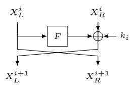
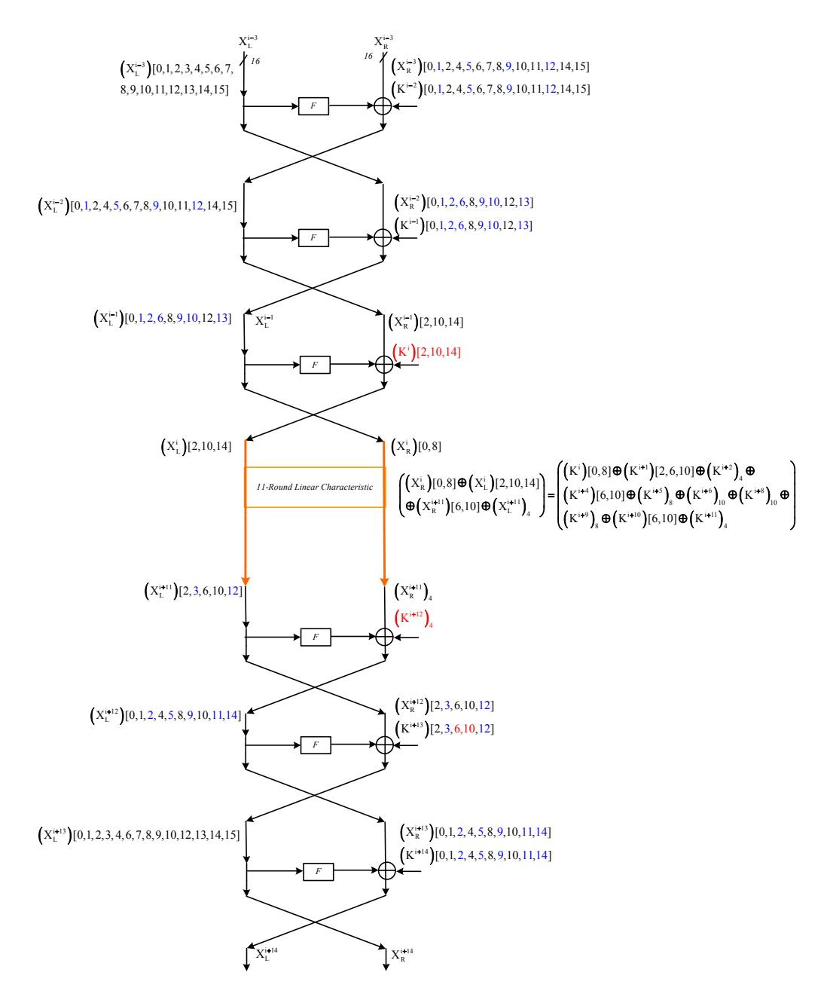
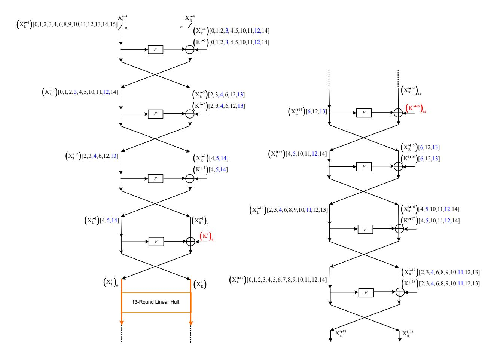
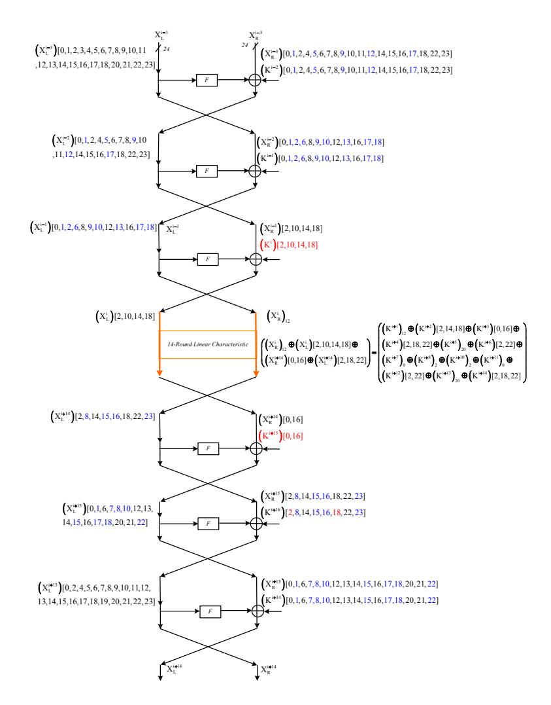
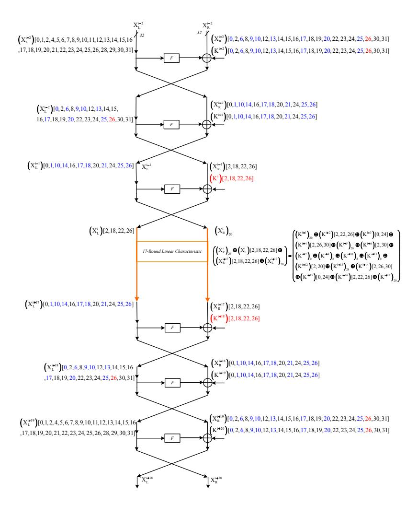
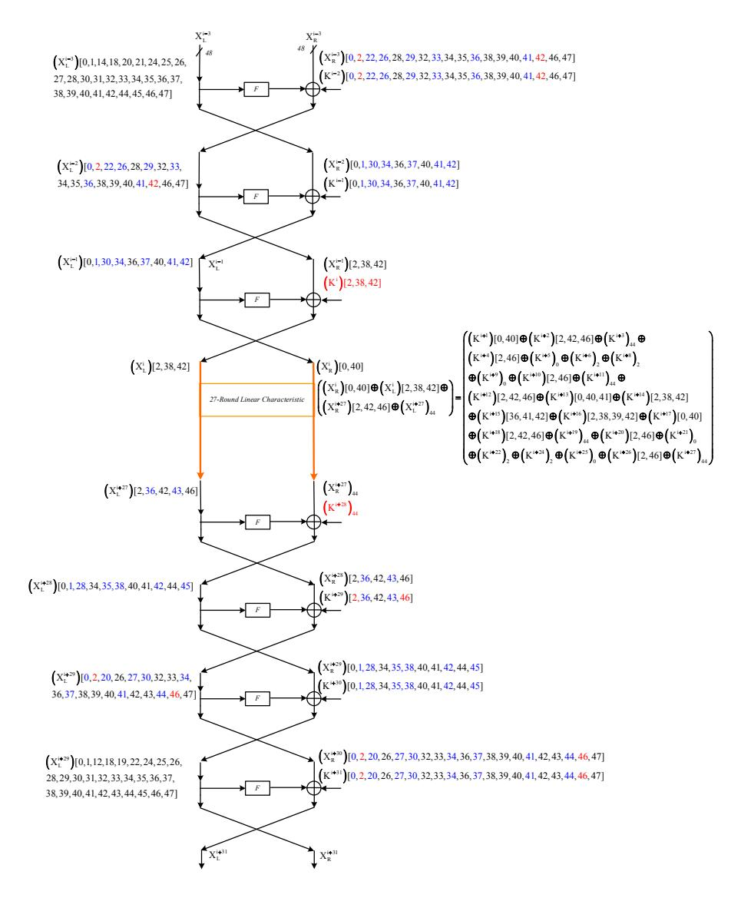
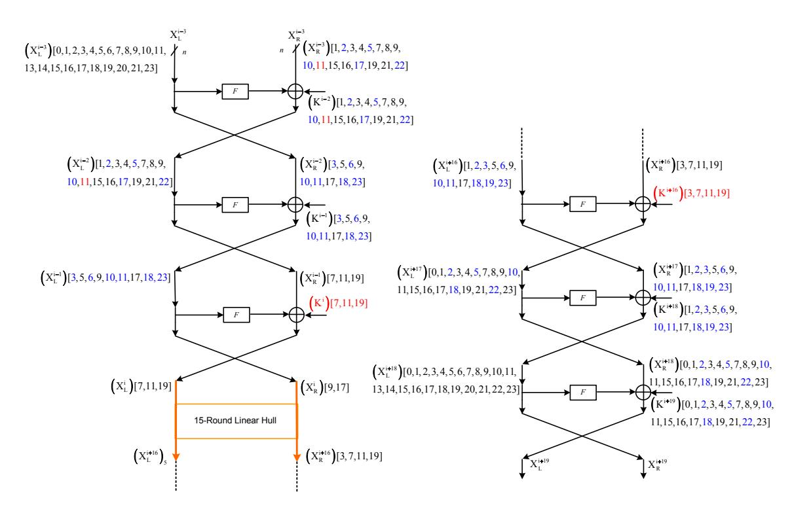
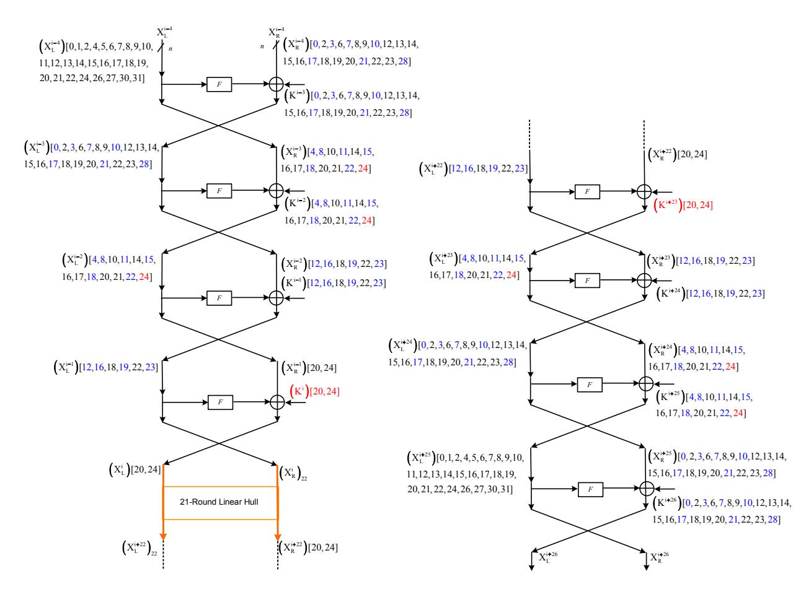
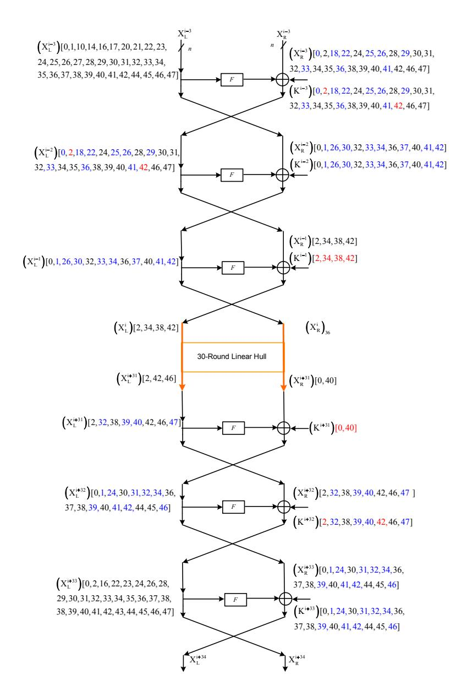
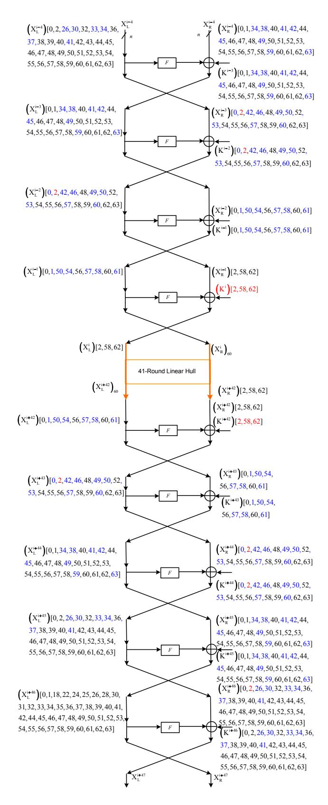

# Improved Linear Cryptanalysis of Reduced-round SIMON

Mohamed Ahmed Abdelraheem<sup>1</sup> , Javad Alizadeh<sup>2</sup> , Hoda A. Alkhzaimi<sup>1</sup> , Mohammad Reza Aref<sup>2</sup> , Nasour Bagheri<sup>3</sup> , Praveen Gauravaram<sup>4</sup> , and Martin M. Lauridsen<sup>1</sup>

<sup>1</sup> Section for Cryptology, DTU Compute, Technical University of Denmark, Denmark, {hoalk,mohab,mmeh}@dtu.dk

Abstract. SIMON is a family of ten lightweight block ciphers published by Beaulieu et al. from U.S. National Security Agency (NSA). In this paper we investigate the security of SI-MON against different variants of linear cryptanalysis techniques, i.e. classical and multiple linear cryptanalysis and linear hulls. We present a connection between linear- and differential characteristics as well as differentials and linear hulls in SIMON. We employ it to adapt the current known results on differential cryptanalysis of SIMON into the linear setting. In addition to finding a linear approximation with a single characteristic, we show the effect of the linear hulls in SIMON by finding better approximations that enable us to improve the previous results.

Our best linear cryptanalysis employs average squared correlation of the linear hull of SIMON based on correlation matrices. The result covers 21 out of 32 rounds of SIMON32/64 with time and data complexity 2<sup>54</sup>.<sup>56</sup> and 2<sup>30</sup>.<sup>56</sup> respectively. We have implemented our attacks for small scale variants of SIMON and our experiments confirm the theoretical biases and correlation presented in this work. So far, our results are the best known with respect to linear cryptanalysis for any variant of SIMON.

Keywords: SIMON, linear cryptanalysis, multiple linear cryptanalysis, linear hull, correlation matrix, branch and bound

# 1 Introduction

The rise of ubiquitous computing applications in the past decade has highlighted the criticality of using low-computing devices that are usually incapable of fully performing standard cryptographic algorithms in RFID and sensor networks environments. This trend has increased the need for lightweight cryptographic schemes. Therefore, design of lightweight cryptosystems has been regular practice over the last few years. For example, stream ciphers such as Grain [\[26\]](#page-24-0) and Trivium [\[17\]](#page-24-1), block ciphers such as PRESENT [\[15\]](#page-24-2), LED [\[24\]](#page-24-3) and PRINCE [\[16\]](#page-24-4) to hash functions such as QUARK [\[7\]](#page-23-0), PHOTON [\[23\]](#page-24-5) and SPONGENT [\[14\]](#page-24-6) have all been designed meeting the processing and storage demands of resource constrained devices.

In this direction, Beaulieu et al. of the U.S. National Security Agency (NSA) designed the SIMON and SPECK families of lightweight block ciphers that are targeted towards optimal hardware and software performance, respectively [\[8\]](#page-23-1). The SIMON family is constructed to meet hardware implementation flexibility and support efficient implementations across a wide

<sup>2</sup> ISSL, E.E. Department, Sharif University of Technology, Iran, alizadja@gmail.com <sup>3</sup> E.E. Department, Shahid Rajaee Teacher Training University, Iran, NBagheri@srttu.edu <sup>4</sup> Queensland University of Technology, Brisbane, Australia, p.gauravaram@gmail.com

variety of platforms. In particular, SIMON was designed to meet the hardware requirements of low-power limited gate devices such as RFID devices. It is designed to provide block sizes of 32, 48, 64, 96 and 128 bits, with up to three key sizes for each block size. SIMON N/K denotes a variant of SIMON that has the plaintext block length of size N bits and the key size of length K bits. There are ten variants of SIMON, forming a family of lightweight block ciphers.

Previous Work. In [\[2](#page-23-2)[,3\]](#page-23-3), Abed et al. presented analysis of SIMON using various cryptanalytic techniques including linear-, differential-, impossible differential- and rectangular attacks. In the direction of differential cryptanalysis, the authors presented differential attacks on reduced-round versions of all SIMON variants. In the direction of impossible differential analysis, attacks are presented on 13 out of 32 rounds for SIMON 32/64 with data and time complexities 2<sup>30</sup> respectively 250.<sup>1</sup> , and up to 25 out of 72 rounds for SIMON 128/256 with data and time complexities 2<sup>119</sup> respectively 2195. With respect to linear cryptanalysis, [\[3\]](#page-23-3) presented key-recovery attacks on variants of SIMON reduced to 11, 14, 16, 20 and 23 rounds for the respective block sizes of 32, 48, 64, 96 and 128 bits respectively.

Later, Alizadeh et al. [\[4\]](#page-23-4) improved linear cryptanalysis of SIMON and presented attacks on 13-round SIMON32, 16-round SIMON48, 19-round SIMON64, 29-round SIMON96 and 36 round SIMON128/128.

In [\[12\]](#page-23-5), Biryukov et al. presented a method for searching for differentials in ARX ciphers. The authors apply the method to SIMON and improve the previous differential characteristics to present attacks on 18 out of 32 rounds for SIMON 32/64 and up to 26 out of 44 rounds for SIMON 64/128.

Most recently, Wang et al. [\[36\]](#page-25-0) improved the known results on differential cryptanalysis of SIMON and presented attacks on 21-round SIMON32/64, 22-round SIMON48/72, 22-round SIMON48/96, 28-round SIMON64/96 and SIMON64/128. In [\[37\]](#page-25-1), Wang et al. also improved results for SIMON32/64 for impossible differential cryptanalysis to 18 rounds for data and time complexities of 2<sup>32</sup> and 2<sup>61</sup> respectively. Other attack vectors are also presented; zerocorrelation attacks are applied to 20 rounds with data and time complexities 2<sup>32</sup> respectively 2 <sup>56</sup>.<sup>9</sup> and integral cryptanalysis techniques to 21 rounds with data and time complexities of 2 <sup>31</sup> respectively 2<sup>63</sup> .

Contributions. In this paper we analyze the security of SIMON against variants of linear cryptanalysis. In the direction of classic linear cryptanalysis, using Algorithm 2 of Matsui, we extend attack of [\[4\]](#page-23-4) to 17, 20, 23, 34 and 43 rounds for the respective block sizes of 32, 48, 64, 96 and 128 bits respectively. We also present a generalized algorithm based on the connection given by Alizadeh et al. in [\[4\]](#page-23-4) to convert any given differential characteristic to a linear characteristic for SIMON.

For multiple linear attacks, we attack 18, 20, 22, 33 and 39 rounds of respective block sizes of 32, 48, 64, 96 and 128 bits respectively. Furthermore, the connection between linear and differential characteristics is generalized to a connection between capacity of a system of approximations (in multiple linear cryptanalysis) and a differential (in differential cryptanalysis) for SIMON.

We also establish a connection between capacity of a linear hull and differential for SIMON and use the known results on differential cryptanalysis of SIMON to attack 21, 21, 29, 36, and 50 rounds of the respective block/key sizes of 32/64, 48/96, 64/128, 96/144, and 128/256 bits. Our focus on improving the linear cryptanalysis results on SIMON by estimating the average squared correlation of linear hulls. We show the linear hull effect by finding better approximations that enable us to break more rounds. A brief summary of our results are presented in Table [1.](#page-2-0)

Organization. The paper is structured as follows. In Section [2](#page-3-0) a brief description of SIMON is presented. In Section [3](#page-3-1) the different concepts and notations around linear cryptanalysis of SIMON are described. Also, in Section [4](#page-6-0) it is shown that there are different links and connections related to linear cryptanalysis and differential cryptanalysis, multiple linear cryptanalysis and linear hulls of SIMON, which can be used to improve attack results. In Section [5](#page-17-0) we used squared correlation matrix to establish a linear hull of SIMON and investigate the data and time complexity for the smallest variant of SIMON. Finally, the paper is concluded in Section [7.](#page-21-0)

<span id="page-2-0"></span>Table 1. Linear cryptanalysis of SIMON using Matsui's Algorithm 1 and 2, multiple linear, and linear hulls

|                          | SIMON   | # Rounds | Data   | Time        |
|--------------------------|---------|----------|--------|-------------|
| Matsui's Algorithm 1 [4] | 32/64   | 13       | 232    | 32<br>2     |
| Matsui's Algorithm 2     | 32/64   | 17       | 232    | 59.5<br>2   |
|                          | 48/72   | 19       | 246    | 70<br>2     |
|                          | 48/96   | 20       | 246    | 86.5<br>2   |
|                          | 64/96   | 22       | 258    | 91<br>2     |
|                          | 64/128  | 23       | 258    | 108<br>2    |
|                          | 96/144  | 34       | 294    | 136.5<br>2  |
|                          | 128/192 | 40       | 2128   | 176.5<br>2  |
|                          | 128/256 | 42       | 2128   | 235.5<br>2  |
| Multiple Linear          | 32/64   | 18       | 232    | 32<br>2     |
|                          | 48/K    | 20       | 247.42 | 47.42<br>2  |
|                          | 64/K    | 22       | 259    | 59<br>2     |
|                          | 96/K    | 33       | 294.42 | 94.42<br>2  |
|                          | 128/K   | 39       | 2128   | 128<br>2    |
| Linear Hull              | 32/64   | 21       | 231.69 | 63.69<br>2  |
|                          | 32/64   | 21       | 230.56 | 55.56<br>2  |
|                          | 48/72   | 20       | 244.11 | 70.61<br>2  |
|                          | 48/96   | 21       | 244.11 | 87.11<br>2  |
|                          | 64/96   | 27       | 262.53 | 88.53<br>2  |
|                          | 64/128  | 29       | 262.53 | 123.53<br>2 |
|                          | 96/144  | 36       | 294.2  | 135.2<br>2  |
|                          | 128/192 | 48       | 2126.6 | 187.6<br>2  |
|                          | 128/256 | 50       | 2126.6 | 242.6<br>2  |

## <span id="page-3-0"></span>2 Description of SIMON

SIMON is a family of lightweight block ciphers, designed by the NSA and published in 2013, to achieve an optimal hardware performance [8]. SIMON has a classical Feistel structure with the round block size of N=2n bits, where n is the word size representing the left or the right branch of the Feistel scheme at each round. The number of rounds is denoted by r and depends on the variant of SIMON. In this paper, we denote the right part and the left part of the plaintext P by  $P_R$  and  $P_L$  respectively. Similarly, we denote the right part and the left part of the ciphertext C by  $C_R$  and  $C_L$  respectively. The output of round r is denoted by  $X^r = X_L^r ||X_R^r|$  and the subkey used in round r is denoted by  $K^r$ . Given a string X,  $(X)_i$  denotes the ith bit of X. Bitwise circular left-rotation of string a by b positions to the left is denoted by  $a \ll b$ . Further,  $\oplus$  and & denote bitwise XOR and AND operations respectively.

Each round of SIMON applies a non-linear, non-bijective (and hence non-invertible) function  $F: \mathbb{F}_2^n \to \mathbb{F}_2^n$  to the left half of the state. The output of F is added using XOR to the right half along with a round key, and the two halves are swapped. The function F is defined as

$$F(x) = ((x \ll 8) \& (x \ll 1)) \oplus (x \ll 2)$$

The single round of SIMON is represented in Figure 1. The subkeys are derived from a



<span id="page-3-2"></span>Fig. 1. The SIMON round function

master key. Depending on the size K of the master key, the key schedule of SIMON operates on two, three or four n-bit word registers. Detailed description of SIMON structure and key scheduling can be found in [8].

### <span id="page-3-1"></span>3 Preliminaries

This section presents the main concepts used in the different cryptanalytic methods used throughout the paper.

Linear Cryptanalysis. Linear cryptanalysis [30] is a well-known cryptanalytic technique that has been employed on several block ciphers. Examples include the DES, FEAL-4, Serpent, Shannon and SAFER [30,35,19,25,28]. The most important fact about the linear cryptanalysis is that it is a known plaintext attack, which is a more practical and realistic attack

model that that of differential cryptanalysis which works under the chosen plaintext model. Linear cryptanalysis tries to find a highly probable linear expressions involving plaintext bits, ciphertext bits and the subkey bits as

$$\bigoplus_{i\in\mathcal{P}} P_i \bigoplus_{j\in\mathcal{C}} C_j = \bigoplus_{w\in\mathcal{K}} K_w.$$

for some sets  $\mathcal{P}, \mathcal{C}, \mathcal{K} \subset \{0, \dots, N-1\}$ , and P, C, and K represents the plaintext, ciphertext and key, respectively. In this scenario, the attacker has no way to select which plaintexts (and corresponding ciphertexts) are available, which is a reasonable assumption in many applications and scenarios.

Multiple Linear Cryptanalysis. For improving the linear cryptanalysis, Kaliski and Robshaw proposed in 1994 an algorithm that used several linear approximations [27]. The main constraint in the approach is that it uses only approximations in the same bits of subkeys K, i.e.  $\bigoplus_{w \in K} K_w$ . In 2004 Biryukov et al. proposed multiple linear cryptanalysis technique that does not require the constraint [11]. They successfully applied their approach to the DES. This approach has been also used in the cryptanalysis of reduced Serpent [20,21].

Linear Hulls. If there are several linear characteristics with the same input and output mask, one can combine these characteristics as a linear hull, which has probability at least as good compared to the classic linear characteristics. Linear hulls have been studied in [31] and used in cryptanalysis of several block ciphers such as PRESENT [29,?]. Linear hulls can be used in Matsui's Algorithm 2 [30] to decrease the complexity of linear attacks.

Multiple Linear Hulls. This is a combination of multiple linear cryptanalysis and linear hulls where if there are several linear hulls for a cipher, they can be used in the multiple linear cryptanalysis framework of Biryukov et al. [11] to decrease the complexity of linear attacks.

Correlation Matrix. Linear cryptanalysis finds a linear relation between some plaintexts bits, ciphertexts bits and some secret key bits and then exploits the bias or the correlation of this linear relation. In other words, the adversary finds an input mask  $\alpha$  and an output mask  $\beta$  that yield a higher absolute bias  $\epsilon_F(\alpha, \beta) \in [-\frac{1}{2}, \frac{1}{2}]$ . In other words

$$Pr[\langle \alpha, X \rangle + \langle \beta, F_K(X) \rangle = \langle \gamma, K \rangle] = \frac{1}{2} + \epsilon_F(\alpha, \beta)$$

deviates from  $\frac{1}{2}$ , where  $\langle \cdot, \cdot \rangle$  denotes an inner product. The correlation of a linear approximation is defined as

$$C_F(\alpha, \beta) := 2\epsilon_F(\alpha, \beta)$$

Another definition of the correlation which we will use later is

$$C_F(\alpha,\beta) := \hat{F}(\alpha,\beta)/2^n$$

where n is the block size of F in bits and  $\hat{F}(\alpha, \beta)$  is the Walsh transform of F defined as follows

$$\hat{F}(\alpha,\beta) := \sum_{x \in \{0,1\}^n} (-1)^{\beta \cdot F(x) \oplus \alpha \cdot x}$$

For a given output mask  $\beta$ , the Fast Walsh Transform algorithm computes the Walsh transforms of an n-bit block size function F for all possible input masks  $\alpha$  with output mask  $\beta$  using  $n2^n$  arithmetic operations.

In order to find good linear approximations, one can construct a correlation matrix (or a squared correlation matrix). In the following, we state the definition the correlation matrix and show how the average squared correlation over all the keys is estimated.

Given a composite function  $F: \mathbb{F}_2^n \to \mathbb{F}_2^n$  such that

$$F = F_r \circ \cdots \circ F_2 \circ F_1$$

We estimate the correlation of an r-round linear approximation  $(\alpha_0, \alpha_r)$  by considering the correlation of each linear characteristic between  $\alpha_0$  and  $\alpha_r$ . The correlation of *i*th linear characteristic  $(\alpha_0 = \alpha_{0i}, \alpha_{1i}, \dots, \alpha_{(r-1)i}, \alpha_r = \alpha_{ri})$  is

$$C_i = \prod_{j=1}^r C_{F_j}(\alpha_{(j-1)i}, \alpha_{ji})$$

It is well known, see e.g. [22], that the correlation of a linear approximation is the sum of all correlations of linear trails starting with the same input mask  $\alpha$  and ending with the same output mask  $\beta$ , i.e.  $C_F(\alpha_0, \alpha_r) = \sum_{i=1}^{N_l} C_i$ , where  $N_l$  is the number of all the possible linear characteristics between  $(\alpha_0, \alpha_r)$ .

When considering the round keys which affects the sign of the correlation of a linear trail, the correlation of the linear hull  $(\alpha, \beta)$  is

$$C_F(\alpha, \beta) = \sum_{i=1}^{N_l} (-1)^{d_i} C_i,$$

where  $d_i \in \mathbb{F}_2$  refers to the sign of the addition of the subkey bits on the *i*th linear trail. In order to estimate the data complexity of a linear attack, one uses the average squared correlation over all the keys which is equivalent to the sum of the squares of the correlations of all trails,  $\sum_i C_i^2$ , assuming independent round keys [22].

Let C denote the correlation matrix of an n-bit key-alternating cipher. C has size  $2^n \times 2^n$  and  $C_{i,j}$  corresponds to the correlation of an input mask, say  $\alpha_i$ , and output mask, say  $\beta_j$ . Now the correlation matrix for the keyed round function is obtained by changing the signs of each row in C according to the round subkey bits or the round constant bits involved. Squaring each entry of the correlation matrix gives us the squared correlation matrix M. Computing  $M^r$  gives us the squared correlations after r number of rounds. This can not be used for real block ciphers that have block sizes of at least 32-bit as in the case of Simon32/64. So in order to find linear approximations one can construct a submatrix of the correlation (or the squared correlation) matrix [1,14]. In Section 5, we construct a squared correlation submatrix for Simon in order to find good linear approximations.

## <span id="page-6-0"></span>4 Connections and Linear Cryptanalysis of SIMON

In this section we will investigate the possibility to use connections between differential and linear cryptanalysis and its variants in order to provide better results on SIMON. In some cases as in multiple linear cryptanalysis and linear hulls, this yields a better time and data complexity for more rounds.

#### <span id="page-6-3"></span>4.1 Connections between Linear- and Differential Characteristics for SIMON

In this section, we explain the connections described in [4] pertaining to the connection between linear- and differential characteristics for SIMON, and its application to SIMON variants other than SIMON32/64.

In the round function of SIMON, the only non-linear operation is the bitwise AND. Note that, given single bits A and B, the output of (A&B) is 0 with probability  $\frac{3}{4}$ . Hence, we can extract the following highly biased linear expressions for the F-function:

<span id="page-6-2"></span>Approximation 1:
$$Pr[(F(X))_i = (X)_{i-2}] = \frac{3}{4}$$

Approximation 2:  $Pr[(F(X))_i = (X)_{i-2} \oplus (X)_{i-1}] = \frac{3}{4}$
Approximation 3:  $Pr[(F(X))_i = (X)_{i-2} \oplus (X)_{i-8}] = \frac{3}{4}$
Approximation 4:  $Pr[(F(X))_i = (X)_{i-2} \oplus ((X)_{i-1} \oplus (X)_{i-8})] = \frac{1}{4}$

Similarly, differential cryptanalysis [10] is a widely used chosen plaintext/ciphertext cryptanalytic attack technique. In a differential attack we look for an input pair with difference  $\Delta X$  that propagates to an output pair with difference  $\Delta Y$  with a high probability p. This differential characteristic is denoted by  $\Delta X \xrightarrow{p} \Delta Y$ .

There are many works which discuss connection between differential and linear characteristics [18,13]. We observe that there is an explicit connection between linear characteristic and differential characteristic for SIMON. This observation is explained as follows. We can also extract the following highly probable differential expressions for the F-function:

<span id="page-6-1"></span>Differential Characteristic 1:
$$(\Delta X)_i \xrightarrow{\frac{1}{4}} (\Delta F(X))_{i+2}$$

Differential Characteristic 2:  $(\Delta X)_i \xrightarrow{\frac{1}{4}} (\Delta F(X))_{i+2,i+1}$
Differential Characteristic 3:  $(\Delta X)_i \xrightarrow{\frac{1}{4}} (\Delta F(X))_{i+2,i+8}$
Differential Characteristic 4:  $(\Delta X)_i \xrightarrow{\frac{1}{4}} (\Delta F(X))_{i+2,i+1,i+8}$  (2)

where  $(\Delta F(X))_{i+1,i+8}$  denotes differences in (i+1)-th and (i+8)-th bits for  $\Delta F(X)$  to be 1 and remaining bit positions of  $\Delta F(X)$  are 0 (and similarly for the other expressions). Given Equations 2 and comparing it with the related equation for a linear approximation of the function F, i.e. Equations 1, and the fact that for linear characteristic we approximate bits from output of F by bits from its input and for a differential characteristic we propagate differences in bits of input to the bits of output of F, we see a unique connection between Equations 1 and Equations 2. In other words, each approximation in Equation 1 can be mapped to a differential characteristic in Equation 2. Based on this observation, Algorithm 1

**Algorithm 1:** A general algorithm to convert an r-round differential characteristic (DC) for SIMON N/K to an equivalent r-round linear characteristic (LC) for SIMON N/K.

#### Input:

- An r-round DC for SIMON N/K, where
  - $(\Delta X)_L^i$ ;  $(\Delta X)_R^i$  for  $0 \le i \le r$
  - $\bullet$  N=2n
  - DC is given as a sequence of the location of active bits for each round in the left/right side.

```
left/right side. 1 \ X_L^i \leftarrow (\Delta X)_R^i \ \text{and} \ X_R^i \leftarrow (\Delta X)_L^i, \ \text{for} \ 0 \leq i \leq r \\ // \ (\Delta X)_R^i \ \text{is the sequence of active bits in the right side of round } i \ \text{of the given DC}; 2 \ \text{if} \ (\Delta X)_R^i \neq \phi \ \text{then} \qquad // \ (\Delta X)_R^0 \neq \phi \ \text{means there is no active bit in} \ (\Delta X)_R^0 \\ 3 \ \ \ \  \  \  \  \  \  \  \  \  \  \
```

<span id="page-7-0"></span>represents an approach to convert an r-round differential characteristic to an equivalent r-round linear characteristic.

Now we investigate the strength of different variants of SIMON against linear attack, given the above observation and the known results on differential cryptanalysis of variants of SIMON from [2]. For SIMON32/64 reduced to 11 rounds, a linear characteristics based on the Abed *et. al.* [2] approach will have bias of  $2^{-17}$ . However, we considered the propagation of number of approximations for this variant of SIMON on more rounds and found the following pattern

```
\dots, 1, 2, 1, 3, 2, 3, 1, 2, 1, 1, 0, 1, 1, 2, 1, 3, 2, 3, 1, 2, 1, 1, 0, 1, 1, 2, 1, 3, 2, 3, \dots
```

Based on this pattern, it is possible to generate a pattern that has bias of  $2^{-16}$  for 11-round, as

Based on a similar strategy, it is possible to present linear characteristics for other variants of SIMON. We summarize the parameters of our linear attacks for the different variants of SIMON in Table 2. On the other hand, to use an approximation with the bias of  $\epsilon$  to mount a linear attack the expected complexity is  $O(\epsilon^{-2})$  [30]. Hence, we consider a case where  $\epsilon \geq 2^{-n+2}$ , where N=2n and for the complexity of  $8 \times \epsilon^{-2}$  the success probability of key recovery attack would be 0.997 [2,30]. Our results for different variants of SIMON when  $\epsilon \geq 2^{-n+2}$  have been represented in Table 3.

<span id="page-8-0"></span>**Table 2.** Summary of linear analysis for the different variants of SIMON [4]. In this table **KR** denotes a linear characteristic that can be used trough a key recovery attack, **Dis** denotes a linear characteristic that can be used trough a distinguishing attack and **App.** denotes approximation.

|         | Linear Expression                      |                               |                                      |                                  |          |        |            |        |
|---------|----------------------------------------|-------------------------------|--------------------------------------|----------------------------------|----------|--------|------------|--------|
|         | Start                                  |                               | End                                  |                                  | -        |        |            |        |
| SIMON   | Active bits in the left side           | Active bits in the right side | Active bits in<br>the left side      | Active bits in<br>the right side | # Rounds | # App. | Bias       | Attack |
| 32/64   | 10, 6, 2, 6, 14                        | 8,0                           | 2, 10, 6, 2                          | 4                                | 11       | 15     | $2^{-16}$  | KR     |
| 32/64   | 4, 8, 4, 0                             | 10, 6, 2                      | 2, 14, 10                            | 12                               | 22       | 31     | $2^{-32}$  | Dis    |
| 48/96   | 2, 18, 14, 10                          | 12                            | 20, 0, 20, 16                        | 2, 22, 18                        | 14       | 22     | $2^{-23}$  | KR     |
| 48/96   | 2, 18, 14, 10                          | 12                            | 10, 22, 6, 6                         | 8                                | 23       | 46     | $2^{-47}$  | Dis    |
| 64/128  | 2, 26, 22, 18                          | 20                            | 2, 26, 22, 18                        | 20                               | 17       | 28     | $2^{-29}$  | KR     |
| 64/128  | $2, 26, 18, 28, 14, \\ 28, 62, 24, 10$ | 30, 0, 26, 12                 | 2, 26, 18, 28, 14,<br>28, 62, 24, 10 | 30, 0, 26, 12                    | 25       | 60     | $2^{-61}$  | Dis    |
| 96/144  | 2, 46, 42, 46, 38                      | 0,40                          | 2, 46, 42                            | 44                               | 27       | 46     | $2^{-47}$  | KR     |
| 96/144  | 2, 42, 38, 34,<br>46, 38, 30           | 0, 40, 32                     | 36, 0, 40, 36, 32                    | 2, 42, 38, 34                    | 36       | 70     | $2^{-71}$  | Dis    |
| 128/256 | 52, 0, 56, 52, 48                      | 2, 58, 54, 50                 | 2, 58, 54, 50                        | 52                               | 34       | 63     | $2^{-64}$  | KR     |
| 128/256 | 36, 0, 48, 40, 36, 32                  | 2, 50, 42, 38, 34             | 2, 50, 42, 38, 34,<br>62, 46, 38, 30 | 0, 48, 40, 32                    | 52       | 127    | $2^{-128}$ | Dis    |

<span id="page-8-1"></span>**Table 3.** Summary of linear analysis for the different variants of SIMON such that one can mount a linear attack with the success probability of 0.997 [4]. In this table **App.** denotes approximation.

|                  | Linear Expression                    |                                  |                                 |                                  |          |          |                     |
|------------------|--------------------------------------|----------------------------------|---------------------------------|----------------------------------|----------|----------|---------------------|
|                  | Start                                |                                  | End                             |                                  |          |          |                     |
| SIMON            | Active bits in the left side         | Active bits in<br>the right side | Active bits in<br>the left side | Active bits in<br>the right side | # Rounds | # App.   | Bias                |
| 32/64            | 10, 6, 2                             | 4                                | 0, 8, 0, 8, 4                   | 2, 10, 6                         | 10       | 13       | $2^{-14}$ $2^{-20}$ |
| 48/96 $64/128$   | $2, 18, 14, 10 \\ 2, 26, 22, 18$     | $\frac{12}{20}$                  | 2, 22, 18<br>2, 26, 22, 18      | 20<br>20                         | 13<br>17 | 19<br>28 | $2^{-29}$           |
| 96/144 $128/256$ | $2, 46, 42, 46, 38 \\ 2, 58, 54, 50$ | $0,40 \\ 52$                     | 0, 0, 4 $2, 58, 54, 50$         | $2,46 \\ 52$                     | 26<br>33 | 45<br>59 | $2^{-46}$ $2^{-60}$ |

Letting  $(X)[i_1,...,i_m] = (X)_{i_1} \oplus ... \oplus (X)_{i_m}$ , it is possible to extract the linear expression related to each variant of SIMON that include only input, output and key bits. For example, the 11-round linear expression for SIMON32/64 is

<span id="page-8-2"></span>
$$\begin{pmatrix} (P_R)[0,8] \oplus (P_L)[2,10,14] \\ \oplus (C_R)[6,10] \oplus (C_L)_4 \end{pmatrix} = \begin{pmatrix} (K^1)[0,8] \oplus (K^2)[2,6,10] \oplus (K^3)_4 \oplus \\ (K^4)[6,10] \oplus (K^5)_8 \oplus (K^6)_{10} \oplus (K^8)_{10} \\ \oplus (K^9)_8 \oplus (K^{10})[6,10] \oplus (K^{11})_4 \end{pmatrix}. \tag{3}$$

### <span id="page-8-3"></span>4.2 A Key Recovery Attack on SIMON Using the Matsui's Algorithm 2

Given an 11-round linear characteristic such as Equation 3, we can add another one round to the beginning and one round to the end of the characteristic to extend the attack up to

13-rounds free of any extra approximation [4]. To extend the 11-round linear characteristic to more rounds we use Algorithm 2 of Matsui to recover the key, where we guess subkyes of rounds at the beginning and the end of the cipher and determine the correlation of the following linear relation to filter the wrong subkeys:

$$(X_R^i)[0,8] \oplus (X_L^i)[2,10,14] \oplus (X_R^{i+11})[6,10] \oplus (X_L^{i+11})_4.$$
 (4)

With respect to Figure 2, we can append a further round to the beginning of the cipher to find a new 12-round linear characteristic. Since SIMON injects the subkey at the end of its round function, then this work does not have any computational complexity. More precisely, for the current 11-round linear hull, we evaluate  $(X_R^i)[0,8] \oplus (X_L^i)[2,10,14] \oplus (X_R^{i+11})[6,10] \oplus (X_L^{i+11})_4$ . If we add a round in the backwards direction, i.e. round i-1, we can determine  $(X_L^i)[2,10,14]$  as a function of  $F(X_L^{i-1})[2,10,14] \oplus (K^i)[2,10,14] \oplus X_R^i)[2,10,14]$ , where we know  $X_R^{i-1}$  and  $X_L^{i-1}$ . Hence, it is possible to use the correlation of the following linear relation to filter the wrong subkeys:

$$(X_R^i)[0,8] \oplus (X_L^i)[2,10,14] \oplus (X_R^{i+11})[6,10] \oplus (X_L^{i+11})_4 \oplus (K^i)[2,10,14].$$

We can continue our method to add more rounds to the beginning of linear hull in the cost of guessing some bits of subkeys. To add more rounds in backward, for example we must guess the bit  $(F(X_L^{i-1}))_2 = (X_L^{i-1})_0 \oplus ((X_L^{i-1})_1 \& (X_L^{i-1})_{10})$ . On the other hand, to determine  $(F(X_L^{i-1}))_2$  one should guess  $(X_L^{i-1})_0$  and  $(X_L^{i-1})_1$  only if the guessed value for  $(X_L^{i-1})_{10}$  is 1. So, in average we need one bit guess for  $(X_L^{i-1})_1$  and  $(X_L^{i-1})_{10}$  (in Figure 2 such bits are indicated in blue).

Figure 2 shows the bits of subkeys that should be guessed when we add 3 rounds to the beginning and 3 rounds to the end of the above 11-round characteristic (27.5 bits of subkeys). Hence, we can attack 17 rounds of SIMON32/64 using Algorithm 2 of Matsui to recover the key. The time complexity for this attack is  $2^{59.5}$  and the data complexity is  $2^{32}$ .

Similarly, in Appendix B, we apply this technique to the variants SIMON48/K, SIMON64/K, SIMON96/K and SIMON128/K, to extend the linear characteristics to more rounds. In particular, we use Algorithm 2 of Matsui to recover the key, where we guess subkeys of rounds at the beginning and the end of each characteristic and determine the correlation of the related linear relation between the input and the output of the characteristic to filter the wrong subkeys. Figures 5, 6, 7 and 8 in Appendix B show the bits of subkeys that should be guessed when we add extra rounds to each variants of SIMON. The results using Matsui's Algorithm 2 are summarized in Table 1.

#### 4.3 Multiple Linear Cryptanalysis of SIMON

The technique of multiple linear cryptanalysis, an improved version of the linear cryptanalysis, is proposed by Biryukov et al. in 2004 [11]. This attack is applicable to (reduced-round) ciphers that have more than one approximation. Suppose that, there are m approximations on r rounds of a cipher as follows:

<span id="page-9-0"></span>
$$P_{p_j}^i \oplus C_{c_k}^i = K_{k_l}^i \quad (1 \leqslant i \leqslant m). \tag{5}$$



<span id="page-10-0"></span>**Fig. 2.** The keys (in *black*) that should be guessed to attack 17 rounds of SIMON32/64. The red bits are not required to be guessed and the blue bits cost guessing a half bit on average.

The goal is to recover bits of key or finding some informations about the key bits that appear in Equation 5. An explicit approach is that a counter  $t_i$  is associated with each approximation and increased when the corresponding linear approximation is verified for a particular pair of known plaintext and ciphertext. As for algorithm 1 of Matsui [30], the values of  $K_{k_l}^i$  are determined from the experimental bias  $(t_i - N/2)/N$  and the theoretical bias  $\epsilon_i$  (bias of the approximation i) by means of a maximum likelihood rule [30,20]. In [11] the authors show that the theoretical data complexity of the generalized multiple linear cryptanalysis is decreased compared to the original attack. The data complexity of the attack is inversely proportional to the capacity of the system of m approximations used, which is given by

<span id="page-11-0"></span>
$$\bar{c}^2 = 4 \times \sum_{i=1}^{m} \epsilon_i^2. \tag{6}$$

In other words, by increasing the quantity of Equation 6, one can decrease the data complexity of the attack. Therefore, finding more approximations is the main task in multiple linear cryptanalysis.

For each variant of reduced-round SIMON, one can find more than one linear characteristic with desirable bias. Thus, we can use the multiple linear cryptanalysis technique to present an improved linear attack on SIMON. To find a linear characteristic for SIMON32/64, if bit "2" in the right half of state is considered, the round function is approximated for the bit, and propagation of the approximation is followed in the forward and the backward direction for SIMON32/64. The results are presented in Table 11. Now, if another bit, except bit "2", is considered at the beginning of the work, then another table, different from Table 11, and another 11-round linear characteristic with bias  $2^{-16}$  for SIMON32/64 is produced. Since there are 16 bits in the right half of state of SIMON32/64, 16 tables like Table 11 and 16 linear characteristics of bias  $2^{-16}$  for 11-round SIMON can be found.

On the other hand, it is possible to approximate active bits at the beginning and the end of a linear characteristic using approximation 1, 2, 3 or 4 in Equation 1. These changes have no impact on the bias of the linear characteristic. Therefore, corresponding to each active bit at the beginning or the end of a linear characteristic of bias  $\epsilon$ , there are four linear characteristics of the same bias,  $\epsilon$ . For example, for the 11-round linear characteristic for SIMON32/64 in table 2, there are two active bits in the beginning (the bits "8" and "0") and one active bit in the end (bit "4"). The bits can be approximated by 4³ different approximations, but identical probability. The different approximations produce 64 linear characteristics of bias  $2^{-16}$  for 11-round SIMON32/64. With respect to the 16 bits of right half of state in SIMON32/64, the number of 11-round linear characteristics of bias  $2^{-16}$  is

$$4^3 \times 16 = 2^{10}$$
.

Given these approximations, one can present an improved linear attack on reduced-round SIMON, explained for SIMON32/64 in Section 4.3.

Similarly, many approximations for reduced rounds of other variants of SIMON can be found, see Tables 11, 12, 13, 14, and 15. Note that the patterns in Tables 11, 12, 13, 14, and 15, are produced by considering only one bit in the state of cipher.

# Connection between Capacity and Expected Differential Probability for SIMON.

A differential of SIMON with fixed input and output difference is composed of many differential characteristics of the cipher, with the same input and output difference. Suppose that there are m differential characteristics with input difference α and output difference β of probability pi(α, β), 1 ≤ i ≤ m. Then Expected Differential Probability for the differential with the same input and output difference is defined in the following way:

$$EDP(\alpha, \beta) = \sum_{i} p_i(\alpha, \beta).$$
 (7)

In this section, we extend the given connection between a linear characteristic and differential characteristic in Section [4.1](#page-6-3) to a connection between capacity of a system of approximations (in multiple linear cryptanalysis) and expected differential probability for SIMON as Theorem [1.](#page-12-0)

<span id="page-12-0"></span>Theorem 1. Suppose that there are m differential characteristics for SIMON reduced to r rounds that result a differential with probability p for the r rounds. Then there are m linear characteristics for SIMON reduced to r rounds that produce a system of approximations of capacity:

$$\overline{c}^2 = p.$$

Proof. Suppose that differential characteristic i has probability p<sup>i</sup> where 1 ≤ i ≤ m. Then expected differential probability, p, for the m differential characteristics is:

$$p = \sum_{i=1}^{m} p_i.$$

On the other hand in Section [4.1,](#page-6-3) it is shown that for a differential characteristic of probability q, there is a linear characteristic of bias 2−<sup>1</sup> · q 1/2 for SIMON. Therefore, using the m differential characteristics of probability p<sup>i</sup> , m linear characteristics of bias <sup>i</sup> can be found where <sup>i</sup> = 2−<sup>1</sup> · p 1/2 i or equivalently 2 <sup>i</sup> = 2−<sup>2</sup> · p<sup>i</sup> . Then

$$p = \sum_{i=1}^{n} p_i = \sum_{i=1}^{n} 4 \times \epsilon_i^2 = 4 \times \sum_{i=1}^{n} \epsilon_i^2 = \overline{c}^2.$$
 (8)

ut

Now, given Theorem [1,](#page-12-0) the connection between capacity and differentials for SIMON can be exploited to find other multiple linear attacks on SIMON based on the differentials that are presented for the cipher. For example, if the differentials for SIMON32/K, 48/K and 64/K in [\[12\]](#page-23-5) are considered, then it is possible to present a linear attack on 16, 17, and 23 rounds of the variants, with data complexity 230.94, 242.<sup>11</sup> , and 260.53, respectively. The results on different variants are summarized in Table [4.](#page-13-1)

Table 4. The number of approximations and cumulative capacities of the extended approximations for SIMON

<span id="page-13-1"></span>

| SIMON | # rounds | log2 bias,<br>approx. | # approx.              | log2<br>capacity | # rounds<br>attacked |
|-------|----------|-----------------------|------------------------|------------------|----------------------|
| 32/64 | 11       | −16                   | 42 × 4 × 16            | −20              | 13                   |
| 32/64 | 16       | −22; −23; −24         | 28<br>; 211; 212       | −32              | 18                   |
| 32/64 | 13       |                       | 45083                  | −29.69           | 15                   |
| 32/64 | 13       |                       | full search            | −28.11           | 15                   |
| 32/64 | 14       |                       | full search            | −30.94           | 16                   |
| 48/K  | 14       | −23                   | 3 × 24<br>4 × 4        | −31.42           | 16                   |
| 48/K  | 18       | −33; −34; −35         | 214.58; 217.58; 218.58 | −47.42           | 20                   |
| 48/K  | 15       |                       | 112573                 | −42.11           | 17                   |
| 64/K  | 17       | −29                   | 4 × 4 × 32             | −47              | 19                   |
| 64/K  | 20       | −40                   | 43 × 4<br>4 × 32       | −59              | 22                   |
| 64/K  | 20       |                       | 210771                 | −58.68           | 22                   |
| 64/K  | 21       |                       | 337309                 | −60.53           | 23                   |
| 96/K  | 27       | −47                   | 42 × 4 × 48            | −80.42           | 29                   |
| 96/K  | 31       | −58                   | 43 × 4<br>4 × 48       | −94.42           | 33                   |
| 128/K | 34       | −64                   | 44 × 4 × 64            | −110             | 36                   |
| 128/K | 37       | −74                   | 43 × 4<br>3 × 64       | −128             | 39                   |

<span id="page-13-0"></span>A Key Recovery Attack on 18-round of SIMON32/64 based on Multiple Linear Cryptanalysis. In this section, the multiple linear attack on SIMON32/64 is described. One can use Table [11](#page-26-0) to construct 4 × 4 × 16 approximations of bias 2−<sup>22</sup> for 16-round SIMON32/64. The capacity of the system based on those approximations is:

$$4 \times 4 \times 16 \times 4 \times 2^{-44} = 2^{-34}$$
.

Thus, the data complexity of a linear attack based on the system exceeds the full codebook. However, another system of approximations with desirable properties can be constructed. For this, consider Table [5](#page-14-0) which is a partition of Table [11.](#page-26-0) The active bit (the bit that must be approximated) in the right side of 15th round in Table [5](#page-14-0) is bit "2". This bit can be approximated using one of the four approximations in Equation [1.](#page-6-2)

Suppose that approximation 1 is used. Then the active bit in the right side of 16th round will be bit "0" which can be approximated using one of the four approximations in Equation [1.](#page-6-2) This results in 4×16×4 linear characteristics of bias 2−<sup>22</sup> for 16-round SIMON. Now, suppose that bit "2" in the right side of 15th round is approximated using approximation 2 in Equation [1.](#page-6-2) Then, the active bits in the right side of 16th round are bits "0" and "1" that each of them can be approximated using one of the four approximations in Equation [1](#page-6-2) and 4×16×4 2 linear characteristics of bias 2−<sup>23</sup> can be found for 16-round SIMON. If bit "2" in the right side of 15th round is approximated using approximation 3 in Equation [1,](#page-6-2) another 4×16×4 2 linear characteristics of bias 2−<sup>23</sup> for 16-round SIMON can be produced. Finally, if bit "2" in the right side of 15th round is approximated using approximation 4 in Equation [1,](#page-6-2) then the active bits in the right side of 16th round are bits "0", "1", and "10" that each of them can be approximated using one of the four approximations in Equation [1.](#page-6-2) In other words, 4×16×4 3 linear characteristics of bias 2−<sup>24</sup> for 16-round SIMON32/64 can be found. The results are summarized in Table [6.](#page-14-1) Hence, the capacity of those approximations will be

<span id="page-14-0"></span>Table 5. A system of linear equations for SIMON32/64 reduced to 16 rounds

| r  | Active bits in the left side   | Active bits in the right side  | Used App.        | # App.      |
|----|--------------------------------|--------------------------------|------------------|-------------|
| 1  |                                | 10                             | 1 or 2 or 3 or 4 | 1           |
| 2  | 10                             | −                              | −                | 0           |
| 3  | 8, 8                           | 10                             | 1                | 1           |
| 4  | 10, 6, 6                       | 8                              | 1                | 1           |
| 5  | 4, 8, 4                        | 10, 6                          | 1; 1             | 2           |
| 6  | 2, 10, 6, 2                    | 4                              | 1                | 1           |
| 7  | 0, 8, 0, 8, 4                  | 2, 10, 6                       | 1; 1; 1          | 3           |
| 8  | 2, 14, 10, 14, 6               | 0, 8                           | 1; 1             | 2           |
| 9  | 12, 0, 12, 8                   | 2, 14, 10                      | 1; 1; 1          | 3           |
| 10 | 2, 14, 10                      | 12                             | 1                | 1           |
| 11 | 0, 0, 12                       | 2, 14                          | 1; 1             | 2           |
| 12 | 2, 14                          | 0                              | 1                | 1           |
| 13 | 0                              | 2                              | 1                | 1           |
| 14 | 2                              | −                              | −                | 0           |
| 15 | 0 or 0, 1 or 0, 10 or 0, 1, 10 | 2                              | 1 or 2 or 3 or 4 | 1           |
| 16 |                                | 0 or 0, 1 or 0, 10 or 0, 1, 10 | 1 or 2 or 3 or 4 | 1 or 2 or 3 |

determined as

$$\overline{c}^2 = 4 \times 16 \times 4 \times (4 \times 2^{-44} + 2 \times 4^2 \times 2^{-46} + 4^3 \times 2^{-48}) = 2^{-32}.$$

Therefore, given this capacity for a 16-round multiple linear characteristics and the fact that one round to the beginning and one round to the end of each characteristic can be added without any extra approximation, the attack can be applied on 18 rounds of SIMON32/64.

<span id="page-14-1"></span>Table 6. Different approximations of bit "2" in the 15th round

| App. variant | active bit(s) in the<br>left of 15th round | active bit(s) in the<br>right of 16th round | # app in the<br>16th round | # equations for<br>16-round | log2 bias of the<br>16-round char. |
|--------------|--------------------------------------------|---------------------------------------------|----------------------------|-----------------------------|------------------------------------|
| 1            | 0                                          | 0                                           | 1                          | 4 × 16 × 4                  | −22                                |
| 2            | 0, 1                                       | 0, 1                                        | 2                          | 2<br>4 × 16 × 4             | −23                                |
| 3            | 0, 10                                      | 0, 10                                       | 2                          | 2<br>4 × 16 × 4             | −23                                |
| 4            | 0, 1, 10                                   | 0, 1, 10                                    | 3                          | 3<br>4 × 16 × 4             | −24                                |

# 4.4 Linear Hulls of SIMON

Similarly to the connection between EDP of a differential and capacity of a system of linear equations (in the multiple linear cryptanalysis), one can show a relation between EDP of a differential and capacity of a system of linear hull for SIMON as Theorem [2.](#page-14-2)

<span id="page-14-2"></span>Theorem 2. Suppose that there are m differential characteristics for SIMON reduced to r rounds, with fixed input and output difference, that result a differential with probability p for the r rounds. Then there are m linear characteristics for SIMON reduced to r rounds, with fixed input and output mask, that produce a linear hull of capacity

$$\overline{c}_{LH}^2 = 2^{-2} \cdot p.$$

Alkhzaimi and Lauridsen in [6] and Abed et al. in [3] found many differential characteristics for some variants of SIMON which yield the desirable differentials for the cipher. In addition, a maximum number of the differential characteristics for some variants of SIMON was investigated by Biryukov et al. [12]. Based on the connection between linear hulls and differentials of SIMON, one can use the differentials by Abed et al. in [3] or differentials by Biryukov et al. in [12] to find the corresponding linear hulls for variants of reduced-round SIMON. We find the linear characteristics for SIMON32/64, 48/K, and 64/K reduced to 13, 15, and 21 rounds, respectively, based on the differential trails by Biryukov et al. For SIMON 96/K and 128/K reduced to 30 and 41 rounds, we use differential trails by Abed et al. Using those linear characteristics, we can find suitable linear hulls for each variant of SIMON. The summary of the results are presented in Table 7, and Tables 16, 17, 18, and 19 in Appendix C.

<span id="page-15-0"></span>**Table 7.** Linear characteristics based on the differential trials by Biryukov et al. for SIMON32/64

|    | Differential                                   |               | Linear                    |                                                                 |           |  |
|----|------------------------------------------------|---------------|---------------------------|-----------------------------------------------------------------|-----------|--|
| r  | $\triangle_L$                                  | $\triangle_R$ | $\overline{X_L}$          | $X_R$                                                           | Used App. |  |
| 0  | _                                              | 6             | 6                         | _                                                               | _         |  |
| 1  | 6                                              | _             | _                         | 6                                                               | 1         |  |
| 2  | 8                                              | 6             | 6                         | 4                                                               | 1         |  |
| 3  | 6, 10                                          | 8             | 4                         | 2, 6                                                            | 1;1       |  |
| 4  | 12                                             | 6, 10         | 2, 6                      | 0                                                               | 1         |  |
| 5  | 6, 10, 14                                      | 12            | 0                         | 2, 6, 14                                                        | 1; 1; 1   |  |
| 6  | 0,8                                            | 6, 10, 14     | 2, 6, 14                  | 4, 12                                                           | 1;1       |  |
| 7  | 2, 6, 14                                       | 0, 8          | 4, 12                     | 6, 10, 14                                                       | 1; 1; 1   |  |
| 8  | 4                                              | 2, 6, 14      | 6, 10, 14                 | 8                                                               | 1         |  |
| 9  | 2,14                                           | 4             | 8                         | 10, 14                                                          | 1;1       |  |
| 10 | 0                                              | 2, 14         | 10, 14                    | 12                                                              | 1         |  |
| 11 | 14                                             | 0             | 12                        | 14                                                              | 1         |  |
| 12 | _                                              | 14            | 14                        | _                                                               | _         |  |
| 13 | 14                                             | _             | _                         | 14                                                              | _         |  |
|    | $\sum_{r} \log_2 pr = -36$                     |               | $\log_2 \epsilon^2 = -38$ |                                                                 |           |  |
|    | $\log_2 p_{diff} = -29.69$<br># trails = 45083 |               |                           | $\log_2 \overline{c}_{LH}^2 = -31.69$ # characteristics = 45083 |           |  |

Extending Linear Hulls and Key Recovery Attack on SIMON32/64. Similar to the approach we used to extend a linear characteristic when it is used in Algorithm 2 of Matsui (see Section 4.2), it is possible to extend a given linear hull for more rounds. For example, consider the linear hull based on the differential by Biryukov et al. for 13-round SIMON32/64. The input and output mask of the linear hull is  $(\Gamma_6, -)$  and  $(-, \Gamma_{14})$ . We extend it by adding some rounds to the beginning and the end of the cipher, as follows.

In the backwards direction. With respect to Figure 3, we can append a further round to the beginning of the cipher to find a new 14-round linear hull by input mask  $(-, \Gamma_6)$ .

Since SIMON injects the subkey at the end of its round function, then this work does not have any computational complexity. We can continue our method to add more rounds to the beginning of linear hull in the cost of guessing some bits of subkeys similar to the approach presented in section 4.2.

In the forward direction. We can use the same approach to add some rounds to the end of linear hull in the cost of guessing some bits of subkeys. More details are depicted in Figure 3.



<span id="page-16-0"></span>**Fig. 3.** The subkey bits (in black) that should be guessed to attack 21 rounds of SIMON32/64. The red bits are not required to be guessed.

We can extend the 13-round linear hull of SIMON32/64 by eight rounds (by adding four rounds at the beginning and four rounds to the end) in a key-recovery attack such that the total computational effort for collecting plaintext-ciphertext pairs and testing all sub-key candidates for the appended rounds remains significantly smaller than for exhaustively searching the full key space.

Attack Complexity. We require 231.<sup>69</sup> known plaintexts. We also need 231.<sup>69</sup> encryptions for producing the required known plaintexts and 231.69×2 <sup>32</sup> encryptions to find the round-key bits on average. Therefore, the time complexity of the attack is 231.<sup>69</sup> + 231.<sup>69</sup> × 2 <sup>32</sup> ≈ 2 63.69 .

# 4.5 Key Recovery Attack on Other Variants of SIMON

In the above, we explain a key recovery attack which uses a linear hull on SIMON32/64. The same procedure can be applied to other variants of SIMON, see Appendix [D](#page-30-3) for more details. A summary of our results on the linear hull cryptanalysis of SIMON48/K, 64/K, 96/K, and 128/K is presented in Table [1.](#page-2-0) It must be noted that we use the linear hulls in Tables [16,](#page-34-0) [17,](#page-34-1) [18,](#page-35-0) and [19](#page-36-0) throughout these attacks.

# <span id="page-17-0"></span>5 Linear Hull Effect in SIMON

In this section we will investigate the linear hull effect on SIMON using the correlation matrix method to compute the average squared correlation.

# 5.1 Correlation of the SIMON F Function

This section is provides an analysis on some linear properties of the SIMON F function regarding the squared correlation. This will assist in providing an intuition around the design rationale when it comes to linear properties of SIMON round Function F. A general linear analysis was applied on the F function of SIMON, with regards to limits around the squared correlations for all possible Hamming weights on input masks α and output masks β, for SIMON32/64. The following observations were made based on results in Table [9.](#page-20-0)

- The best linear characteristics for a single application of F is obtained for input and output masks with Hamming weight as low as 1 and 2.
- The best squared correlation obtained is 2−<sup>2</sup> and the lowest is 2−<sup>16</sup> for all possible Hamming weights on the input and output masks of F.

## 5.2 Constructing Correlation Submatrix for SIMON

To construct a correlation submatrix for SIMON, we make use of the following proposition.

Proposition 1 (Correlation of a one-round linear approximation [\[9\]](#page-23-10)). Let α = (αL, αR) and β = (βL, βR) be the input and output masks of a one-round linear approximation of SIMON. Let α<sup>F</sup> and β<sup>F</sup> be the input and output masks of the SIMON F function. Then the correlation of the linear approximation (α, β) is C(α, β) = C<sup>F</sup> (α<sup>F</sup> , β<sup>F</sup> ) where α<sup>F</sup> = α<sup>L</sup> ⊕ β<sup>R</sup> and β<sup>F</sup> = β<sup>L</sup> = αR.

As our goal is to perform a linear attack on SIMON, we construct a squared correlation matrix in order to compute the average squared correlation (the sum of the squares of the correlations of all trails) in order to estimate the required data complexity. Algorithm [2](#page-18-0) constructs a squared correlation submatrix whose input and output masks have Hamming weight less than a certain Hamming weight m. Algorithm 2 uses the Fast Walsh Transform algorithm to compute the correlations of a given input and output masks for the F function of SIMON.

```
Algorithm 2: Construction of SIMON's Correlation Submatrix
 Require: Hamming weight m, bit size of SIMON's F function n and a map function.
 Ensure: Squared Correlation Submatrix M
   1: for all output masks \beta with Hamming weight \leq m do
         Extract from \beta the left/right output masks \beta_L and \beta_R.
   2:
   3:
         \alpha_R \leftarrow \beta_L.
         Compute F(\alpha_F, \beta_L) to SIMON's F function for all possible \alpha_F.
         for all input masks \alpha_F to SIMON's F function do
            c \leftarrow F(\alpha_F, \beta_L)/2^n.
   6:
            \alpha_L \leftarrow \alpha_F \oplus \beta_R.
   7:
            \alpha = \alpha_L || \alpha_R.
   8:
            if c \neq 0 and Hamming weight of \alpha \leq m then
   9:
              i \leftarrow map(\alpha). {map \alpha to a row index i in the matrix M}
  10:
              j \leftarrow map(\beta). {map \alpha to a column index j in the matrix M}
  11:
  12:
              M(i,j) = c \times c.
            end if
  13:
         end for
  14:
  15: end for
```

The size of the submatrix is  $\sum_{i=0}^{m} {2n \choose i} \times \sum_{i=0}^{m} {2n \choose i}$  where n is the block size of SIMON's F function. One can see that the time complexity is in the order of  $2^n \sum_{i=0}^{m} {2n \choose i}$  arithmetic operations. The submatrix size is large when m > 5, but most of its elements are zero and therefore it can easily fit in memory using a sparse matrix storage format. The table below shows the number of nonzero elements of the squared correlation submatrices of SIMON32/K when  $1 \le m \le 9$ . One can see that these matrices are very sparse (see Table 8). For instance, when  $m \le 8$ , the density of the correlation matrix is very low, namely  $\frac{133253381}{15033173 \times 15033173} \approx 2^{-20.7}$ .

<span id="page-18-1"></span>**Table 8.** SIMON32/K matrices using masks with Hamming weight  $\leq m$ , nnz = number of nonzero elements

| $\overline{m}$ | Size of $M$                | nnz       |
|----------------|----------------------------|-----------|
| 1              | $33 \times 33$             | 17        |
| 2              | $529 \times 529$           | 233       |
| 3              | $5489 \times 5489$         | 2835      |
| 4              | $41449 \times 41449$       | 31381     |
| 5              | $242825 \times 242825$     | 308805    |
| 6              | $1149017 \times 1149017$   | 2671829   |
| 7              | $4514873 \times 4514873$   | 20206757  |
| 8              | $15033173 \times 15033173$ | 133253381 |
| 9              | $43081973 \times 43081973$ | 763347577 |

## 5.3 Improved Linear Approximations

One can see that Algorithm [2](#page-18-0) is embarrassingly parallelizable. Thus, the memory complexity rather than the time complexity is dominating. On a standard PC, we are able to construct a sparse squared correlation matrix of SIMON32/K with input and output masks that have Hamming weight ≤ 8. Using this matrix, we find new 14-round linear approximations with an average squared correlation ≤ 2 <sup>−</sup><sup>32</sup> for SIMON32/K. We also get better estimations for the previously found linear approximations which were estimated before using only a single linear characteristic rather than considering many linear characteristics with the same input and output masks. For example, in [\[3\]](#page-23-3), the squared correlation of the 9-round single linear characteristic with input mask 0x01110004 and output mask 0x00040111 is 2−20. Using our matrix, we find that this same approximation has a squared correlation ≈ 2 <sup>−</sup>18.<sup>4</sup> with 11455 ≈ 2 13.5 trails, which gives us an improvement by a factor of 21.<sup>5</sup> . Note that this approximation can be found using a smaller correlation matrix of Hamming weight ≤ 4 and we get an estimated squared correlation equal to 2−18.<sup>83</sup> and only 9 trails. So the large number of other trails resulting covering Hamming weights ≥ 5 is insignificant as they only cause a factor of 20.<sup>5</sup> improvement.

Also, the 10-round linear characteristic in [\[5\]](#page-23-11) with input mask 0x01014404 and output mask 0x10004404 has squared correlation 2−26. Using our correlation matrix, we find that this same approximation has an estimated squared correlation 2−23.<sup>2</sup> and the number of trails is 588173 ≈ 2 19.2 . This gives an improvement by a factor of 2<sup>3</sup> . Note also that this approximation can be found using a smaller correlation matrix with Hamming weight ≤ 5 and we get an estimated squared correlation equal to 2−23.<sup>66</sup> and only 83 trails. So the large number of other trails resulting covering Hamming weights ≥ 5 is insignificant as they only cause a factor of 20.<sup>4</sup> improvement. Both of these approximations give us squared correlations less than 2−<sup>32</sup> when considering more than 12 rounds.

In the following, we describe the new 14-round linear hulls found using a squared correlation matrix with Hamming weight ≤ 8.

New 14-round Linear Hulls. Consider a squared correlation matrix M whose input and output masks have Hamming weight m. When m ≥ 6, raising the matrix to the rth power, in order to estimate the average squared correlation, will not work as the resulting matrix will not be sparse even when r is small. For example, we are able only to compute M<sup>6</sup> where M is a squared correlation matrix whose masks have Hamming weight ≤ 6. Therefore, we use matrix-vector multiplication or row-vector matrix multiplications in order to estimate the squared correlations for any number of rounds r.

It is obvious that input and output masks with low Hamming weight gives us better estimations for the squared correlation. So we performed row-vector matrix multiplications using row vectors corresponding to Hamming weight one. We found that when the left part of the input mask has Hamming weight one and the right part of input mask is zero, we always get a 14-round squared correlation ≈ 2 −30.9 for four different output masks. So in total we get 64 linear approximations with an estimated 14-round squared correlation ≈ 2 −30.9 .

We also constructed a correlation matrix with masks of Hamming weight ≤ 9 but we have only got a slight improvement for these 14-round approximations by a factor of 20.<sup>3</sup> . We have found no 15-round approximation with squared correlation more than 2−32. Table [10](#page-20-1) shows the 14-round approximations with input and output masks written in hexadecimal notation.

<span id="page-20-0"></span>Table 9. General analysis to the best and lowest squared correlations in SIMON32/64 for all possible Hamming weights entering the F function

| Hamming<br>weight | Best<br>Sq. Corr | Lowest<br>Sq. Corr |
|-------------------|------------------|--------------------|
| 1                 | 2−2              | −2<br>2            |
| 2                 | 2−2              | −4<br>2            |
| 3                 | 2−4              | −6<br>2            |
| 4                 | 2−4              | −8<br>2            |
| 5                 | 2−6              | −10<br>2           |
| 6                 | 2−6              | −12<br>2           |
| 7                 | 2−8              | −14<br>2           |
| 8                 | 2−8              | −16<br>2           |
| 9                 | 2−10             | −16<br>2           |
| 10                | 2−10             | −16<br>2           |
| 11                | 2−12             | −16<br>2           |
| 12                | 2−12             | −16<br>2           |
| 13                | 2−14             | −16<br>2           |
| 14                | 2−14             | −16<br>2           |
| 15                | 2−16             | −16<br>2           |
| 16                | 2−14             | −14<br>2           |

Table 10. 14-round linear hulls for SIMON32/K found, using Hamming weight ≤ 9

<span id="page-20-1"></span>

| α        | β |                                        | 2<br>log2<br>c | log2<br>Nt |
|----------|---|----------------------------------------|----------------|------------|
| 80000000 |   | 00800020, 00800060, 00808020, 00808060 | −30.5815       | 28.11      |
| 40000000 |   | 00400010, 00400030, 00404010, 00404030 | −30.5815       | 28.11      |
| 20000000 |   | 00200008, 00200018, 00202008, 00202018 | −30.5815       | 28.11      |
| 10000000 |   | 00100004, 0010000C, 00101004, 0010100C | −30.5815       | 28.11      |
| 08000000 |   | 00080002, 00080006, 00080802, 00080806 | −30.5815       | 28.11      |
| 04000000 |   | 00040001, 00040003, 00040401, 00040403 | −30.5816       | 28.11      |
| 02000000 |   | 00028000, 00028001, 00028200, 00028201 | −30.5815       | 28.10      |
| 01000000 |   | 00014000, 00014100, 0001C000, 0001C100 | −30.5815       | 28.10      |
| 00800000 |   | 80002000, 80002080, 80006000, 80006080 | −30.5816       | 28.06      |
| 00400000 |   | 40001000, 40001040, 40003000, 40003040 | −30.5815       | 28.11      |
| 00200000 |   | 20000800, 20000820, 20001800, 20001820 | −30.5815       | 28.11      |
| 00100000 |   | 10000400, 10000410, 10000C00, 10000C10 | −30.5815       | 28.11      |
| 00080000 |   | 08000200, 08000208, 08000600, 08000608 | −30.5815       | 28.11      |
| 00040000 |   | 04000100, 04000104, 04000300, 04000304 | −30.5816       | 28.10      |
| 00020000 |   | 02000080, 02000082, 02000180, 02000182 | −30.5815       | 28.11      |
| 00010000 |   | 01000040, 01000041, 010000C0, 010000C1 | −30.5814       | 28.11      |

## 6 Key Recovery Attack using Linear Hulls

Similar to the approach we used in previous sections to add extra rounds to the given linear trail, we extend the given linear hull for 14 rounds of SIMON32/64 by adding some rounds to the beginning and the end of the cipher, as follows.

In the backward direction. We start with the input mask of the 14-round linear hull (e.g.  $(\Gamma_0, -)$ ) and go backwards to add some rounds to the beginning. With respect to Figure 4, we can append a further round to the beginning of the cipher to find a new 15-round linear hull by input mask  $(-, \Gamma_0)$ . Since SIMON injects the subkey at the end of its round function, then this work does not have any computational complexity. More precisely, for the current 14-round linear hull, we evaluate  $((X_L^i)_0 \oplus (X_R^{i+14})_8 \oplus (X_L^{i+14})_6)$ . If we add a round in the backwards direction, i.e. round i-1, we know  $X_R^{i-1}$  and  $X_L^{i-1}$ , so

$$(X_L^{i-1})_{14} \oplus ((X_L^{i-1})_{15} \& (X_L^{i-1})_8) = (X_R^{i-1})_0 \oplus (K^i)_0 \oplus (X_L^i)_0.$$

Hence, we can consider  $((X_L^i)_0 \oplus (X_R^{i+14})_8 \oplus (X_L^{i+14})_6) \oplus (K^i)_0$  as the new linear hull. We can continue our method to add more rounds to the beginning of linear hull at the cost of guessing some bits of subkeys.

To add more rounds in the backwards direction, we must guess the bit

$$(F(X_L^{i-1}))_0 = (X_L^{i-1})_{14} \oplus ((X_L^{i-1})_{15} \& (X_L^{i-1})_8).$$

On the other hand, to determine  $(F(X_L^{i-1}))_0$  one should guess  $(X_L^{i-1})_{14}$  and  $(X_L^{i-1})_{15}$  only if the guessed value for  $(X_L^{i-1})_8$  is 1. So, in average we need one bit guess for  $(X_L^{i-1})_{15}$  and  $(X_L^{i-1})_8$  (in Figure 4 such bits are indicated in blue).

In the forward direction. We can use the same approach to add some rounds to the end of linear hull in the cost of guessing some bits of subkeys. More details are depicted in Figure 4.

**Attack Complexity.** We require  $2^{30.5593}$  known plaintexts. We also need  $2^{30.5593}$  encryptions for producing the required known plaintexts and  $2^{30.5593} \times 2^{25}$  encryptions to find the related key bits of the extended rounds. Therefore, the time complexity of the attack is

$$2^{30.5593} + 2^{30.5593} \times 2^{25} \approx 2^{55.56}.$$

#### <span id="page-21-0"></span>7 Conclusion

In this paper we have analyzed the security of SIMON against different variants of linear cryptanalysis, i.e. classical- and multiple linear cryptanalysis as well as linear hull attacks. We mainly used a connection between linear- and differential characteristics and extended it to a connection between linear hulls and differentials. Given these connections, we used the


<span id="page-22-0"></span>**Fig. 4.** The subkey bits (in black) that should be guessed to attack 20 rounds of SIMON 32/64. The red bits are not required to be guessed and the blue bits cost guessing a half bit on average.

known results on differential cryptanalysis on SIMON variants to present the best known results on SIMON using linear cryptanalysis.

Furthermore, we have investigated the linear hull effect on SIMON32/64 using the correlation matrix of the average squared correlations. Utilizing this technique, we achieve a lower time and data complexity than other attack variants by having a key recovery attack on 21-round SIMON32/64 with data complexity 230.<sup>56</sup> and time complexity 255.<sup>6</sup> .

# Acknowledgments

The authors would like to thank Arnab Roy for many useful discussions about linear and differential cryptanalysis of Simon.

# References

- <span id="page-23-7"></span>1. Mohamed Ahmed Abdelraheem. Estimating the Probabilities of Low-Weight Differential and Linear Approximations on PRESENT-Like Ciphers. In Taekyoung Kwon, Mun-Kyu Lee, and Daesung Kwon, editors, Information Security and Cryptology - ICISC 2012 - 15th International Conference, Seoul, Korea, November 28-30, 2012, Revised Selected Papers, volume 7839 of Lecture Notes in Computer Science, pages 368–382. Springer, 2012.
- <span id="page-23-2"></span>2. Farzaneh Abed, Eik List, Stefan Lucks, and Jakob Wenzel. Differential Cryptanalysis of Reduced-Round Simon. IACR Cryptology ePrint Archive, 2013:526, 2013.
- <span id="page-23-3"></span>3. Farzaneh Abed, Eik List, Jakob Wenzel, and Stefan Lucks. Differential Cryptanalysis of round-reduced Simon and Speck. In FSE (to appear), 2014.
- <span id="page-23-4"></span>4. Javad Alizadeh, Hoda A. Alkhzaimi, Mohammad Reza Aref, Nasour Bagheri, Praveen Gauravaram, Abhishek Kumar, Martin M. Lauridsen, and Somitra Kumar Sanadhya. Cryptanalysis of SIMON Variants with Connections. In RFIDSec'14, volume 8651 of Lecture Notes in Computer Science, pages 1–20. Springer, 2014.
- <span id="page-23-11"></span>5. Javad Alizadeh, Nasour Bagheri, Praveen Gauravaram, Abhishek Kumar, and Somitra Kumar Sanadhya. Linear Cryptanalysis of Round Reduced SIMON. IACR Cryptology ePrint Archive, 2013:663, 2013.
- <span id="page-23-9"></span>6. Hoda AlKhzaimi and Martin M. Lauridsen. Cryptanalysis of the SIMON Family of Block Ciphers. IACR Cryptology ePrint Archive, 2013:543, 2013.
- <span id="page-23-0"></span>7. Jean-Philippe Aumasson, Luca Henzen, Willi Meier, and Mar´ıa Naya-Plasencia. Quark: A Lightweight Hash. In Stefan Mangard and Fran¸cois-Xavier Standaert, editors, Cryptographic Hardware and Embedded Systems, CHES 2010, 12th International Workshop, Santa Barbara, CA, USA, August 17-20, 2010. Proceedings, volume 6225 of Lecture Notes in Computer Science, pages 1–15. Springer, 2010.
- <span id="page-23-1"></span>8. Ray Beaulieu, Douglas Shors, Jason Smith, Stefan Treatman-Clark, Bryan Weeks, and Louis Wingers. The SIMON and SPECK Families of Lightweight Block Ciphers. IACR Cryptology ePrint Archive, 2013:404, 2013.
- <span id="page-23-10"></span>9. Eli Biham. On Matsui's Linear Cryptanalysis. In Santis [\[34\]](#page-25-7), pages 341–355.
- <span id="page-23-8"></span>10. Eli Biham and Adi Shamir. Differential Cryptanalysis of the Full 16-Round DES. In Ernest F. Brickell, editor, Advances in Cryptology - CRYPTO '92, 12th Annual International Cryptology Conference, Santa Barbara, California, USA, August 16-20, 1992, Proceedings, volume 740 of Lecture Notes in Computer Science, pages 487–496. Springer, 1992.
- <span id="page-23-6"></span>11. Alex Biryukov, Christophe De Canni`ere, and Micha¨el Quisquater. On Multiple Linear Approximations. In Matthew K. Franklin, editor, Advances in Cryptology - CRYPTO 2004, 24th Annual International CryptologyConference, Santa Barbara, California, USA, August 15-19, 2004, Proceedings, volume 3152 of Lecture Notes in Computer Science, pages 1–22. Springer, 2004.
- <span id="page-23-5"></span>12. Alex Biryukov, Arnab Roy, and Vesselin Velichkov. Differential analysis of block ciphers SIMON and SPECK. FSE (to appear), 2014.

- <span id="page-24-14"></span>13. C´eline Blondeau and Kaisa Nyberg. New Links between Differential and Linear Cryptanalysis. In Thomas Johansson and Phong Q. Nguyen, editors, Advances in Cryptology - EUROCRYPT 2013, 32nd Annual International Conference on the Theory and Applications of Cryptographic Techniques, Athens, Greece, May 26-30, 2013. Proceedings, volume 7881 of Lecture Notes in Computer Science, pages 388–404. Springer, 2013.
- <span id="page-24-6"></span>14. Andrey Bogdanov, Miroslav Knezevic, Gregor Leander, Deniz Toz, Kerem Varici, and Ingrid Verbauwhede. SPONGENT: A Lightweight Hash Function. In Preneel and Takagi [\[32\]](#page-25-8), pages 312–325.
- <span id="page-24-2"></span>15. Andrey Bogdanov, Lars R. Knudsen, Gregor Leander, Christof Paar, Axel Poschmann, Matthew J. B. Robshaw, Yannick Seurin, and C. Vikkelsoe. PRESENT: An Ultra-Lightweight Block Cipher. In Pascal Paillier and Ingrid Verbauwhede, editors, Cryptographic Hardware and Embedded Systems - CHES 2007, 9th International Workshop, Vienna, Austria, September 10-13, 2007, Proceedings, volume 4727 of Lecture Notes in Computer Science, pages 450–466. Springer, 2007.
- <span id="page-24-4"></span>16. Julia Borghoff, Anne Canteaut, Tim G¨uneysu, Elif Bilge Kavun, Miroslav Knezevic, Lars R. Knudsen, Gregor Leander, Ventzislav Nikov, Christof Paar, Christian Rechberger, Peter Rombouts, Søren S. Thomsen, and Tolga Yal¸cin. PRINCE - A low-latency block cipher for pervasive computing applications - extended abstract. In Xiaoyun Wang and Kazue Sako, editors, Advances in Cryptology - ASIACRYPT 2012 - 18th International Conference on the Theory and Application of Cryptology and Information Security, Beijing, China, December 2-6, 2012. Proceedings, volume 7658 of Lecture Notes in Computer Science, pages 208–225. Springer, 2012.
- <span id="page-24-1"></span>17. Christophe De Canni`ere and Bart Preneel. Trivium. In Robshaw and Billet [\[33\]](#page-25-9), pages 244–266.
- <span id="page-24-13"></span>18. Florent Chabaud and Serge Vaudenay. Links Between Differential and Linear Cryptoanalysis. In Santis [\[34\]](#page-25-7), pages 356–365.
- <span id="page-24-7"></span>19. Joo Yeon Cho, Miia Hermelin, and Kaisa Nyberg. A New Technique for Multidimensional Linear Cryptanalysis with Applications on Reduced Round Serpent. In Pil Joong Lee and Jung Hee Cheon, editors, Information Security and Cryptology - ICISC 2008, 11th International Conference, Seoul, Korea, December 3-5, 2008, Revised Selected Papers, volume 5461 of Lecture Notes in Computer Science, pages 383–398. Springer, 2008.
- <span id="page-24-10"></span>20. Baudoin Collard, Fran¸cois-Xavier Standaert, and Jean-Jacques Quisquater. Improved and Multiple Linear Cryptanalysis of Reduced Round Serpent. In Dingyi Pei, Moti Yung, Dongdai Lin, and Chuankun Wu, editors, Information Security and Cryptology, Third SKLOIS Conference, Inscrypt 2007, Xining, China, August 31 - September 5, 2007, Revised Selected Papers, volume 4990 of Lecture Notes in Computer Science, pages 51–65. Springer, 2007.
- <span id="page-24-11"></span>21. Baudoin Collard, Fran¸cois-Xavier Standaert, and Jean-Jacques Quisquater. Experiments on the Multiple Linear Cryptanalysis of Reduced Round Serpent. In Kaisa Nyberg, editor, Fast Software Encryption, 15th International Workshop, FSE 2008, Lausanne, Switzerland, February 10-13, 2008, Revised Selected Papers, volume 5086 of Lecture Notes in Computer Science, pages 382–397. Springer, 2008.
- <span id="page-24-12"></span>22. Joan Daemen and Vincent Rijmen. The Design of Rijndael: AES - The Advanced Encryption Standard. Information Security and Cryptography. Springer, 2002.
- <span id="page-24-5"></span>23. Jian Guo, Thomas Peyrin, and Axel Poschmann. The PHOTON Family of Lightweight Hash Functions. In Phillip Rogaway, editor, Advances in Cryptology - CRYPTO 2011 - 31st Annual Cryptology Conference, Santa Barbara, CA, USA, August 14-18, 2011. Proceedings, volume 6841 of Lecture Notes in Computer Science, pages 222–239. Springer, 2011.
- <span id="page-24-3"></span>24. Jian Guo, Thomas Peyrin, Axel Poschmann, and Matthew J. B. Robshaw. The LED Block Cipher. In Preneel and Takagi [\[32\]](#page-25-8), pages 326–341.
- <span id="page-24-8"></span>25. Risto M. Hakala and Kaisa Nyberg. Linear Distinguishing Attack on Shannon. In Yi Mu, Willy Susilo, and Jennifer Seberry, editors, Information Security and Privacy, 13th Australasian Conference, ACISP 2008, Wollongong, Australia, July 7-9, 2008, Proceedings, volume 5107 of Lecture Notes in Computer Science, pages 297–305. Springer, 2008.
- <span id="page-24-0"></span>26. Martin Hell, Thomas Johansson, Alexander Maximov, and Willi Meier. The Grain Family of Stream Ciphers. In Robshaw and Billet [\[33\]](#page-25-9), pages 179–190.
- <span id="page-24-9"></span>27. Burton S. Kaliski Jr. and Matthew J. B. Robshaw. Linear Cryptanalysis Using Multiple Approximations. In Yvo Desmedt, editor, Advances in Cryptology - CRYPTO '94, 14th Annual International Cryptology Conference, Santa Barbara, California, USA, August 21-25, 1994, Proceedings, volume 839 of Lecture Notes in Computer Science, pages 26–39. Springer, 1994.

- <span id="page-25-4"></span>28. Jorge Nakahara Jr., Bart Preneel, and Joos Vandewalle. Linear cryptanalysis of reduced-round versions of the SAFER block cipher family. In Bruce Schneier, editor, Fast Software Encryption, 7th International Workshop, FSE 2000, New York, NY, USA, April 10-12, 2000, Proceedings, volume 1978 of Lecture Notes in Computer Science, pages 244–261. Springer, 2000.
- <span id="page-25-6"></span>29. Gregor Leander. On linear hulls, statistical saturation attacks, PRESENT and a cryptanalysis of PUF-FIN. In Kenneth G. Paterson, editor, Advances in Cryptology - EUROCRYPT 2011 - 30th Annual International Conference on the Theory and Applications of Cryptographic Techniques, Tallinn, Estonia, May 15-19, 2011. Proceedings, volume 6632 of Lecture Notes in Computer Science, pages 303–322. Springer, 2011.
- <span id="page-25-2"></span>30. Mitsuru Matsui. Linear Cryptoanalysis Method for DES Cipher. In Tor Helleseth, editor, Advances in Cryptology - EUROCRYPT '93, Workshop on the Theory and Application of of Cryptographic Techniques, Lofthus, Norway, May 23-27, 1993, Proceedings, volume 765 of Lecture Notes in Computer Science, pages 386–397. Springer, 1993.
- <span id="page-25-5"></span>31. Kaisa Nyberg. Linear Approximation of Block Ciphers. In Santis [\[34\]](#page-25-7), pages 439–444.
- <span id="page-25-8"></span>32. Bart Preneel and Tsuyoshi Takagi, editors. Cryptographic Hardware and Embedded Systems - CHES 2011 - 13th International Workshop, Nara, Japan, September 28 - October 1, 2011. Proceedings, volume 6917 of Lecture Notes in Computer Science. Springer, 2011.
- <span id="page-25-9"></span>33. Matthew J. B. Robshaw and Olivier Billet, editors. New Stream Cipher Designs - The eSTREAM Finalists, volume 4986 of Lecture Notes in Computer Science. Springer, 2008.
- <span id="page-25-7"></span>34. Alfredo De Santis, editor. Advances in Cryptology - EUROCRYPT '94, Workshop on the Theory and Application of Cryptographic Techniques, Perugia, Italy, May 9-12, 1994, Proceedings, volume 950 of Lecture Notes in Computer Science. Springer, 1995.
- <span id="page-25-3"></span>35. Anne Tardy-Corfdir and Henri Gilbert. A Known Plaintext Attack of FEAL-4 and FEAL-6. In Joan Feigenbaum, editor, Advances in Cryptology - CRYPTO '91, 11th Annual International Cryptology Conference, Santa Barbara, California, USA, August 11-15, 1991, Proceedings, volume 576 of Lecture Notes in Computer Science, pages 172–181. Springer, 1991.
- <span id="page-25-0"></span>36. Ning Wang, Xiaoyun Wang, Keting Jia, and Jingyuan Zhao. Improved Differential Attacks on Reduced SIMON Versions, 2014.
- <span id="page-25-1"></span>37. Qingju Wang, Zhiqiang Liu, Kerem Varici, Yu Sasaki, Vincent Rijmen, and Yosuke Todo. Cryptanalysis of Reduced-Round SIMON32 and SIMON48, 2014.

# A Sequences of Approximation used through Driving the Linear Characteristic of each Variant of SIMON

Tables [11](#page-26-0) represent the propagation of our linear characteristics for SIMON32/64, entries under used App. column denotes approximation used for corresponding active bit of column 2 of the table.

<span id="page-26-0"></span>Table 11. Sequences of approximation for SIMON32/64

| Active bits in the left side | Active bits in the right side | Used App. | # App. |
|------------------------------|-------------------------------|-----------|--------|
| 10, 6, 2, 6, 14              | 8, 0                          | 1; 1      | 2      |
| 4, 8, 4, 0                   | 10, 6, 2                      | 1; 1; 1   | 3      |
| 10, 6, 2                     | 4                             | 1         | 1      |
| 8, 8, 4                      | 10, 6                         | 1; 1      | 2      |
| 10, 6                        | 8                             | 1         | 1      |
| 8                            | 10                            | 1         | 1      |
| 10                           | −                             | −         | 0      |
| 8, 8                         | 10                            | 1         | 1      |
| 10, 6, 6                     | 8                             | 1         | 1      |
| 4, 8, 4                      | 10, 6                         | 1; 1      | 2      |
| 2, 10, 6, 2                  | 4                             | 1         | 1      |
| 0, 8, 0, 8, 4                | 2, 10, 6                      | 1; 1; 1   | 3      |
| 2, 14, 10, 14, 6             | 0, 8                          | 1; 1      | 2      |
| 12, 0, 12, 8                 | 2, 14, 10                     | 1; 1; 1   | 3      |
| 2, 14, 10                    | 12                            | 1         | 1      |
| 0, 0, 12                     | 2, 14                         | 1; 1      | 2      |
| 2, 14                        | 0                             | 1         | 1      |
| 0                            | 2                             | 1         | 1      |
| 2                            | −                             | −         | 0      |
| 0                            | 2                             | 1         | 1      |
| 2, 14                        | 0                             | 1         | 1      |
| 0, 0, 12                     | 2, 14                         | 1; 1      | 2      |
| 2, 14, 10                    | 12                            | 1         | 1      |
| 12, 0, 12, 8                 | 2, 14, 10                     | 1; 1; 1   | 3      |

<span id="page-27-0"></span>Table 12. Sequences of approximation for SIMON48/96

| Active bits in the left side | Active bits in the right side | Used App.  | # App. |
|------------------------------|-------------------------------|------------|--------|
| 12, 0, 16, 12, 8             | 2, 18, 14, 10                 | 1; 1; 1; 1 | 4      |
| 2, 18, 14, 10                | 12                            | 1          | 1      |
| 0, 16, 0, 16, 12             | 2, 18, 14                     | 1; 1; 1    | 3      |
| 2, 22, 18, 22, 14            | 0, 16                         | 1; 1       | 2      |
| 20, 0, 20, 16                | 2, 22, 18                     | 1; 1; 1    | 3      |
| 2, 22, 18                    | 20                            | 1          | 1      |
| 0, 0, 20                     | 2, 22                         | 1; 1       | 2      |
| 2, 22                        | 0                             | 1          | 1      |
| 0                            | 2                             | 1          | 1      |
| 2                            | −                             | −          | 0      |
| 0                            | 2                             | 1          | 1      |
| 2, 22                        | 0                             | 1          | 1      |
| 0, 0, 20                     | 2, 22                         | 1; 1       | 2      |
| 2, 22, 18                    | 20                            | 1          | 1      |
| 20, 0, 20, 16                | 2, 22, 18                     | 1; 1; 1    | 3      |
| 2, 22, 18, 22, 14            | 0, 16                         | 1; 1       | 2      |
| 0, 16, 0, 16, 12             | 2, 18, 14                     | 1; 1; 1    | 3      |
| 2, 18, 14, 10                | 12                            | 1          | 1      |
| 12, 0, 16, 12, 8             | 2, 18, 14, 10                 | 1; 1; 1; 1 | 4      |

<span id="page-27-1"></span>Table 13. Sequences of approximation for SIMON64/128

| Active bits in the left side | Active bits in the right side | Used App.  | # App. |
|------------------------------|-------------------------------|------------|--------|
| 20, 30, 24, 20, 16           | 2, 26, 22, 18                 | 1; 1; 1; 1 | 4      |
| 2, 26, 22, 18                | 20                            | 1          | 1      |
| 0, 24, 0, 24, 20             | 2, 26, 22                     | 1; 1; 1    | 3      |
| 2, 30, 26, 30, 22            | 0, 24                         | 1; 1       | 2      |
| 28, 0, 28, 24                | 2, 30, 26                     | 1; 1; 1    | 3      |
| 2, 30, 26                    | 28                            | 1          | 1      |
| 0, 0, 28                     | 2, 30                         | 1; 1       | 2      |
| 2, 30                        | 0                             | 1          | 1      |
| 0                            | 2                             | 1          | 1      |
| 2                            | −                             | −          | 0      |
| 0                            | 2                             | 1          | 1      |
| 2, 30                        | 0                             | 1          | 1      |
| 0, 0, 28                     | 2, 30                         | 1; 1       | 2      |
| 2, 30, 26                    | 28                            | 1          | 1      |
| 28, 0, 28, 24                | 2, 30, 26                     | 1; 1; 1    | 3      |
| 2, 30, 26, 30, 22            | 0, 24                         | 1; 1       | 2      |
| 0, 24, 0, 24, 20             | 2, 26, 22                     | 1; 1; 1    | 3      |
| 2, 26, 22, 18                | 20                            | 1          | 1      |
| 20, 30, 24, 20, 16           | 2, 26, 22, 18                 | 1; 1; 1; 1 | 4      |

<span id="page-28-0"></span>Table 14. Sequences of approximation for SIMON96/144

| Active bits in the left side      | Active bits in the right side | Used App.  | # App. |
|-----------------------------------|-------------------------------|------------|--------|
| 36, 0, 40, 36, 32                 | 2, 42, 38, 34                 | 1; 1; 1; 1 | 4      |
| 2, 42, 38, 34                     | 36                            | 1          | 1      |
| 0, 40, 0, 40, 36                  | 2, 42, 38                     | 1; 1; 1    | 3      |
| 2, 46, 42, 46, 38                 | 0, 40                         | 1; 1       | 2      |
| 44, 0, 44, 40                     | 2, 46, 42                     | 1; 1; 1    | 3      |
| 2, 46, 42                         | 44                            | 1          | 1      |
| 0, 0, 44                          | 2, 46                         | 1; 1       | 2      |
| 2, 46                             | 0                             | 1          | 1      |
| 0                                 | 2                             | 1          | 1      |
| 2                                 | −                             | −          | 0      |
| 0, 0                              | 2                             | 1          | 1      |
| 2, 46, 46                         | 0                             | 1;         | 1      |
| 44, 0, 44                         | 2, 46                         | 1; 1       | 2      |
| 2, 46, 42, 42                     | 44                            | 1          | 1      |
| 0, 41, 40, 0, 44, 41, 40,         | 2, 46, 42                     | 1; 1; 2    | 3      |
| 2, 42, 38, 46, 39, 39, 38         | 0, 41, 40                     | 1; 1; 2    | 3      |
| 42, 41, 36, 0, 42, 40, 36         | 2, 42, 38                     | 3; 1; 1;   | 3      |
| 2, 42, 39, 38, 40, 34, 40, 39, 34 | 42, 41, 36                    | 3; 2; 1    | 3      |
| 0, 40, 0, 42, 41, 40, 37, 37, 36  | 2, 42, 39, 38                 | 3; 2; 1; 2 | 4      |
| 2, 46, 42, 46, 39, 38             | 0, 40                         | 1; 2       | 2      |
| 44, 0, 44, 40                     | 2, 46, 42                     | 1; 1; 1;   | 3      |
| 2, 46, 42                         | 44                            | 1          | 1      |
| 0, 0, 44                          | 2, 46                         | 1; 1       | 2      |
| 2, 46                             | 0                             | 1          | 1      |
| 0                                 | 2                             | 1          | 1      |
| 2                                 | −                             | −          | 0      |
| 0                                 | 2                             | 1          | 1      |
| 2, 46                             | 0                             | 1          | 1      |
| 0, 0, 44                          | 2, 46                         | 1; 1       | 2      |
| 2, 46, 42                         | 44                            | 1          | 1      |
| 44, 0, 44, 40                     | 2, 46, 42                     | 1; 1; 1    | 3      |
| 2, 46, 42, 46, 38                 | 0, 40                         | 1; 1       | 2      |
| 0, 40, 0, 40, 36                  | 2, 42, 38                     | 1; 1; 1    | 3      |
| 2, 42, 38, 34                     | 36                            | 1          | 1      |

<span id="page-29-0"></span>Table 15. Sequences of approximation for SIMON128/256

| Active bits in the left side      | Active bits in the right side | Used App.  | # App. |
|-----------------------------------|-------------------------------|------------|--------|
| 52, 0, 56, 52, 48                 | 2, 58, 54, 50                 | 1; 1; 1; 1 | 4      |
| 2, 58, 54, 50                     | 52                            | 1          | 1      |
| 0, 56, 0, 56, 52                  | 2, 58, 54                     | 1; 1; 1    | 3      |
| 2, 62, 58, 62, 54                 | 0, 56                         | 1; 1       | 2      |
| 60, 0, 60, 56                     | 2, 62, 58                     | 1; 1; 1    | 3      |
| 2, 62, 58                         | 60                            | 1          | 1      |
| 0, 0, 60                          | 2, 62                         | 1; 1       | 2      |
| 2, 62                             | 0                             | 1          | 1      |
| 0                                 | 2                             | 1          | 1      |
| 2                                 | −                             | −          | 0      |
| 0, 0                              | 2                             | 1          | 1      |
| 2, 62, 62                         | 0                             | 1;         | 1      |
| 60, 0, 60                         | 2, 62                         | 1; 1       | 2      |
| 2, 62, 58, 58                     | 60                            | 1          | 1      |
| 0, 57, 56, 0, 60, 57, 56,         | 2, 62, 58                     | 1; 1; 2    | 3      |
| 2, 58, 54, 62, 55, 55, 54         | 0, 57, 56                     | 1; 1; 2    | 3      |
| 58, 57, 52, 0, 58, 56, 52         | 2, 58, 54                     | 3; 1; 1;   | 3      |
| 2, 58, 55, 54, 56, 50, 56, 55, 50 | 58, 57, 52                    | 3; 2; 1    | 3      |
| 0, 56, 0, 58, 57, 56, 53, 53, 52  | 2, 58, 55, 54                 | 3; 2; 1; 2 | 4      |
| 2, 62, 58, 62, 55, 54             | 0, 56                         | 1; 2       | 2      |
| 60, 0, 60, 56                     | 2, 62, 58                     | 1; 1; 1;   | 3      |
| 2, 62, 58                         | 60                            | 1          | 1      |
| 0, 0, 60                          | 2, 62                         | 1; 1       | 2      |
| 2, 62                             | 0                             | 1          | 1      |
| 0                                 | 2                             | 1          | 1      |
| 2                                 | −                             | −          | 0      |
| 0                                 | 2                             | 1          | 1      |
| 2, 62                             | 0                             | 1          | 1      |
| 0, 0, 60                          | 2, 62                         | 1; 1       | 2      |
| 2, 62, 58                         | 60                            | 1          | 1      |
| 60, 0, 60, 56                     | 2, 62, 58                     | 1; 1; 1    | 3      |
| 2, 62, 58, 62, 54                 | 0, 56                         | 1; 1       | 2      |
| 0, 56, 0, 56, 52                  | 2, 58, 54                     | 1; 1; 1    | 3      |
| 2, 58, 54, 50                     | 52                            | 1          | 1      |

# <span id="page-30-0"></span>B Adding Extra Rounds to Each Variants of SIMON When Algorithm 2 of Matsui is Used



<span id="page-30-1"></span>**Fig. 5.** The keys (in *black*) that should be guessed to attack 19 rounds of SIMON48/72 (exclude round i-2). The red bits are not required to be guessed. For SIMON48/96 we include round i-2 that needs guessing 16 bits of its subkey in average.

- <span id="page-30-2"></span>C Linear Hulls for SIMON
- <span id="page-30-3"></span>D Linear Hulls Extensions and Based on Correlation Matrix of SIMON



<span id="page-31-0"></span>**Fig. 6.** The keys (in *black*) that should be guessed to attack 22 rounds of SIMON64/96 (exclude round i-2). The red bits are not required to be guessed. For SIMON64/128 we include round i-2 that needs guessing 17 bits of its subkey in average.



<span id="page-32-0"></span>Fig. 7. The keys (in black) that should be guessed to attack 34 rounds of SIMON96/144. The red bits are not required to be guessed.


<span id="page-33-0"></span>**Fig. 8.** The keys (in *black*) that should be guessed to attack 40 rounds of SIMON128/192. The red bits are not required to be guessed. For SIMON128/256 we add one round to the end and one round to the beginning of the current characteristic that needs guessing 61.5 bits of their subkey in average.

**Table 16.** Linear characteristics based on the differential trials by Biryukov et al. for SIMON48/K

<span id="page-34-0"></span>

|    | Differential                                   |               | Linear                           |              |           |
|----|------------------------------------------------|---------------|----------------------------------|--------------|-----------|
| r  | $\triangle_L$                                  | $\triangle_R$ | $X_L$                            | $X_R$        | Used App. |
| 0  | 5,21                                           | 3, 7, 19      | 7, 11, 19                        | 9,17         | 1; 1      |
| 1  | 3, 19, 23                                      | 5, 21         | 9,17                             | 11, 15, 19   | 1;1;1     |
| 2  | 1                                              | 3, 19, 23     | 11, 15, 19                       | 13           | 1         |
| 3  | 19, 23                                         | 1             | 13                               | 15, 19       | 1;1       |
| 4  | 21                                             | 19, 23        | 15, 19                           | 17           | 1         |
| 5  | 19                                             | 21            | 17                               | 19           | 1         |
| 6  | _                                              | 19            | 19                               | _            | _         |
| 7  | 19                                             | _             | _                                | 19           | 1         |
| 8  | 21                                             | 19            | 19                               | 17           | 1         |
| 9  | 19,23                                          | 21            | 17                               | 15, 19       | 1;1       |
| 10 | 1                                              | 19,23         | 15, 19                           | 13           | 1         |
| 11 | 3, 19, 23                                      | 1             | 13                               | 11, 15, 19   | 1; 1; 1   |
| 12 | 5, 21                                          | 3, 19, 23     | 11, 15, 19                       | 9,17         | 1;1       |
| 13 | 3, 7, 19                                       | 5, 21         | 9.17                             | 7, 11, 19    | 1;1;1     |
| 14 | 9                                              | 3, 7, 19      | 7, 11, 19                        | 5            | 1         |
| 15 | 3, 7, 11, 19                                   | 9             | 5                                | 3, 7, 11, 19 | _         |
|    | $\sum_{r} \log_2 p$                            | r = -48       | $\log_2 \epsilon^2 = -50$        |              |           |
|    | $\log_2 p_{diff}$                              |               | $\log_2 \bar{c}_{LH}^2 = -44.11$ |              |           |
|    | # trails = 112573 $#$ characteristics = 112573 |               |                                  | = 112573     |           |

Table 17. Linear characteristics based on the differential trials by Biryukov et al. for  $\mathrm{SIMON64}/K$

<span id="page-34-1"></span>

|    | Differential Linear                                                                                                                                                                                                       |               |                |                |            |
|----|---------------------------------------------------------------------------------------------------------------------------------------------------------------------------------------------------------------------------|---------------|----------------|----------------|------------|
| r  | $\triangle_L$                                                                                                                                                                                                             | $\triangle_R$ | $X_L$          | $X_R$          | Used App.  |
| 0  | 26                                                                                                                                                                                                                        | 24, 28        | 20, 24         | 22             | 1          |
| 1  | 24                                                                                                                                                                                                                        | 26            | 22             | 24             | 1          |
| 2  | _                                                                                                                                                                                                                         | 24            | 24             | _              | _          |
| 3  | 24                                                                                                                                                                                                                        | _             | _              | 24             | 1          |
| 4  | 26                                                                                                                                                                                                                        | 24            | 24             | 22             | 1          |
| 5  | 24, 28                                                                                                                                                                                                                    | 26            | 22             | 20, 24         | 1; 2       |
| 6  | 29,30                                                                                                                                                                                                                     | 24, 28        | 20, 24         | 18, 19         | 2;2        |
| 7  | 0, 24, 28, 30                                                                                                                                                                                                             | 29,30         | 18, 19         | 16, 18, 20, 24 |            |
| 8  | 2,26                                                                                                                                                                                                                      | 0, 24, 28, 30 | 16, 18, 20, 24 | 14, 22         | 1; 1       |
| 9  | 0, 4, 24, 30                                                                                                                                                                                                              | 2,26          | 14, 22         | 12, 16, 18, 24 | 1; 1; 3; 3 |
| 10 | _                                                                                                                                                                                                                         | 0, 4, 24, 30  | 12, 16, 18, 24 | _              | _          |
| 11 | 0, 4, 24, 30                                                                                                                                                                                                              | · -           |                | 12, 16, 18, 24 | 1; 1; 3; 3 |
| 12 | 2,26                                                                                                                                                                                                                      | 0, 4, 24, 30  | 12, 16, 18, 24 | 14, 22         | 1; 1       |
| 13 | 0, 24, 28, 30                                                                                                                                                                                                             | 2,26          | 14, 22         | 16, 18, 20, 24 | 1; 3; 2; 1 |
| 14 | 29,30                                                                                                                                                                                                                     | 0, 24, 28, 30 | 16, 18, 20, 24 | 18, 19         | 2; 2       |
| 15 | 24, 28                                                                                                                                                                                                                    | 29,30         | 18, 19         | 20, 24         | 1; 2       |
| 16 | 26                                                                                                                                                                                                                        | 24, 28        | 20, 24         | 22             | 1          |
| 17 | 24                                                                                                                                                                                                                        | 26            | 22             | 24             | 1          |
| 18 | _                                                                                                                                                                                                                         | 24            | 24             | _              | _          |
| 19 | 24                                                                                                                                                                                                                        | _             | _              | 24             | 1          |
| 20 | 26                                                                                                                                                                                                                        | 24            | 24             | 22             | 1          |
| 21 | 24, 28                                                                                                                                                                                                                    | 26            | 22             | 20, 24         |            |
|    | $\begin{array}{lll} \sum_r \log_2 pr = -72 & \log_2 \epsilon^2 = -74 \\ \log_2 p_{diff} = -60.53 & \log_2 \overline{c}_{LH}^2 = -62.53 \\ \# \ \text{trails} = 337309 & \# \ \text{characteristics} = 337309 \end{array}$ |               |                |                |            |

Table 18. Linear characteristics based on the differential trials by Abed et al. for  ${\rm SIMON96}/K$

<span id="page-35-0"></span>

| Differential                |               |               | Linear                            |               |            |
|-----------------------------|---------------|---------------|-----------------------------------|---------------|------------|
| r                           | $\triangle_L$ | $\triangle_R$ | $X_L$                             | $X_R$         | Used App.  |
| 0                           | 20            | 6, 14, 18, 22 | 2, 42, 38, 34                     | 36            | 1          |
| 1                           | 6, 14, 18     | 20            | 0, 40, 0, 40, 36                  | 2, 42, 38     | 1; 1; 1    |
| 2                           | 8, 16         | 6, 14, 18     | 2, 46, 42, 46, 38                 | 0,40          | 1;1        |
| 3                           | 6, 10, 14     | 8, 16         | 44, 0, 44, 40                     | 2, 46, 42     | 1; 1; 1    |
| 4                           | 12            | 6, 10, 14     | 2, 46, 42                         | 44            | 1          |
| 5                           | 6, 10         | 12            | 0, 0, 44                          | 2,46          | 1;1        |
| 6                           | 8             | 6, 10         | 2,46                              | 0             | 1          |
| 7                           | 6             | 8             | 0                                 | 2             | 1          |
| 8                           | _             | 6             | 2                                 | _             | _          |
| 9                           | 6             | _             | 0, 0                              | 2             | 1          |
| 10                          | 8             | 6             | 2, 46, 46                         | 0             | 1          |
| 11                          | 6, 10         | 8             | 44, 0, 44                         | 2,46          | 1;1        |
| 12                          | 12            | 6, 10         | 2, 46, 42, 42                     | 44            | 1          |
| 13                          | 6, 10, 14     | 12            | 0, 41, 40, 0, 44, 41, 40,         | 2, 46, 42     | 1; 1; 2    |
| 14                          | 8, 15, 16     | 6, 10, 14     | 2, 42, 38, 46, 39, 39, 38         | 0, 41, 40     | 1; 1; 2    |
| 15                          | 6, 14, 18     | 8, 15, 16     | 42, 41, 36, 0, 42, 40, 36         | 2, 42, 38     | 3; 1; 1    |
| 16                          | 14, 15, 20    | 6, 14, 18     | 2, 42, 39, 38, 40, 34, 40, 39, 34 | 42, 41, 36    | 3; 2; 1    |
| 17                          | 6, 14, 17, 18 | 14, 15, 20    | 0, 40, 0, 42, 41, 40, 37, 37, 36  | 2, 42, 39, 38 | 3; 2; 1; 2 |
| 18                          | 8, 16         | 6, 14, 17, 18 | 2, 46, 42, 46, 39, 38             | 0,40          | 1;2        |
| 19                          | 6, 10, 14     | 8, 16         | 44, 0, 44, 40                     | 2, 46, 42     | 1;1;1      |
| 20                          | 12            | 6, 10, 14     | 2, 46, 42                         | 44            | 1          |
| 21                          | 6, 10         | 12            | 0, 0, 44                          | 2,46          | 1;1        |
| 22                          | 8             | 6, 10         | 2,46                              | 0             | 1          |
| 23                          | 6             | 8             | 0                                 | 2             | 1          |
| 24                          | _             | 6             | 2                                 | _             | _          |
| 25                          | 6             | _             | 0                                 | 2             | 1          |
| 26                          | 8             | 6             | 2,46                              | 0             | 1          |
| 27                          | 6, 10         | 8             | 0, 0, 44                          | 2,46          | 1;1        |
| 28                          | 12            | 6, 10         | 2, 46, 42                         | 44            | 1          |
| 29                          | 6, 10, 14     | 12            | 44, 0, 44, 40                     | 2, 46, 42     | 1;1;1      |
| 30                          | 8, 16         | 6, 10, 14     | 2, 46, 42                         | 0,40          |            |
| $\sum_{r} \log_2 pr = -106$ |               |               | $\log_2 \epsilon^2 = -108$        |               |            |
| $\log_2 p_{diff} = -92.20$  |               |               | $\log_2 \overline{c}_{LH}^2 =$    | -94.20        |            |

Table 19. Linear characteristics based on the differential trials by Abed et al. for  $\mathrm{SIMON128}/K$

<span id="page-36-0"></span>

|                             | Differential  |               | Linear                                |                      |            |
|-----------------------------|---------------|---------------|---------------------------------------|----------------------|------------|
| $\mathbf{r}$                | $\triangle_L$ | $\triangle_R$ | $X_L$                                 | $X_R$                | Used App.  |
| 0                           | 12            | 6, 10, 14     | 2, 62, 58                             | 60                   | 1          |
| 1                           | 6, 10         | 12            | 0, 0, 60                              | 2,62                 | 1;1        |
| 2                           | 8             | 6, 10         | 2,62                                  | 0                    | 1          |
| 3                           | 6             | 8             | 0                                     | 2                    | 1          |
| 4                           | _             | 6             | 2                                     | _                    | _          |
| 5                           | 6             | _             | 0,0                                   | 2                    | 1          |
| 6                           | 8             | 6             | 2,62,62                               | 0                    | 1          |
| 7                           | 6, 10         | 8             | 60, 0, 60                             | 2,62                 | 1;1        |
| 8                           | 12            | 6, 10         | 2, 62, 58, 58                         | 60                   | 1          |
| 9                           | 6, 10, 14     | 12            | 0, 57, 56, 0, 60, 57, 56,             | 2,62,58              | 1; 1; 2    |
| 10                          | 8, 15, 16     | 6, 10, 14     | 2, 58, 54, 62, 55, 55, 54             | 0, 57, 56            | 1; 1; 2    |
| 11                          | 6, 14, 18     | 8, 15, 16     | 58, 57, 52, 0, 58, 56, 52             | 2, 58, 54            | 3; 1; 1    |
| 12                          | 14, 15, 20    | 6, 14, 18     | 2, 58, 55, 54, 56, 50, 56, 55, 50     | 58, 57, 52           | 3; 2; 1    |
| 13                          | 6, 14, 17, 18 | 14, 15, 20    | 0, 56, 0, 58, 57, 56, 53, 53, 52      | 2, 58, 55, 54        | 3; 2; 1; 2 |
| 14                          | 8, 16         | 6, 14, 17, 18 | 2,62,58,62,55,54                      | 0,56                 | 1;2        |
| 15                          | 6, 10, 14     | 8, 16         | 60, 0, 60, 56                         | 2,62,58              | 1; 1; 1    |
| 16                          | 12            | 6, 10, 14     | 2,62,58                               | 60                   | 1          |
| 17                          | 6, 10         | 12            | 0, 0, 60                              | 2,62                 | 1;1        |
| 18                          | 8             | 6, 10         | 2,62                                  | 0                    | 1          |
| 19                          | 6             | 8             | 0                                     | 2                    | 1          |
| 20                          | _             | 6             | 2                                     | _                    | _          |
| 21                          | 6             | _             | 0                                     | 2                    | 1          |
| 22                          | 8             | 6             | 2,62                                  | 0                    | 1          |
| 23                          | 6, 10         | 8             | 0, 0, 60                              | 2,62                 | 1; 1       |
| 24                          | 12            | 6, 10         | 2,62,58                               | 60                   | 1          |
| 25                          | 6, 10, 14     | 12            | 60, 0, 60, 56, 57                     | 2,62,58              | 1; 1; 2    |
| 26                          | 8, 15, 16     | 6, 10, 14     | 2, 62, 58, 62, 55, 54, 55             | 0, 57, 56            | 1; 1; 2    |
| 27                          | 6, 14, 18     | 8, 15, 16     | 0, 57, 56, 0, 58, 56, 52              | 2, 58, 54            | 3; 1; 1    |
| 28                          | 14, 15, 20    | 6, 14, 18     | 2, 58, 54, 56, 50, 55, 56, 50         | 58, 57, 52           | 3; 2; 1    |
| 29                          | 6, 14, 17, 18 | 14, 15, 20    | 58, 57, 52, 0, 58, 56, 57, 53, 52, 53 | 2, 58, 55, 54        | 3; 2; 1; 2 |
| 30                          | 8, 16         | 6, 14, 17, 18 | 2, 58, 55, 54, 62, 54, 55             | 0,56                 | 1;2        |
| 31                          | 6, 10, 14     | 8, 16         | 0, 56, 0, 60, 56                      | 2,62,58              | 1; 1; 1    |
| 32                          | 12            | 6, 10, 14     | 2, 62, 58, 58                         | 60                   | 1          |
| 33                          | 6, 10         | 12            | 60, 0, 60                             | 2,62                 | 1; 1       |
| 34                          | 8             | 6, 10         | 2, 62, 62                             | 0                    | 1          |
| 35                          | 6             | 8             | 0,0                                   | $\overset{\circ}{2}$ | 1          |
| 36                          | _             | 6             | 2                                     | _                    | _          |
| 37                          | 6             | _             | 0                                     | 2                    | 1          |
| 38                          | 8             | 6             | 2,62                                  | 0                    | 1          |
| 39                          | 6,10          | 8             | 0, 0, 60                              | 2,62                 | 1; 1       |
| 40                          | 12            | 6,10          | 2,62,58                               | 60                   | 1          |
| 41                          | 6, 10, 14     | 12            | 60                                    | 2,62,58              | _          |
| $\sum_{r} \log_2 pr = -144$ |               |               | $\log_2 \epsilon^2 = -146$            |                      |            |



Fig. 9. Adding some rounds to the beginning and the end of the 15-round linear hull for SIMON48/K



Fig. 10. Adding some rounds to the beginning and the end of the 21-round linear hull for SIMON64/K



Fig. 11. Adding some rounds to the beginning and the end of the 30-round linear hull for SIMON96/K



**Fig. 12.** Adding some rounds to the beginning and the end of the 30-round linear hull for SIMON128/K