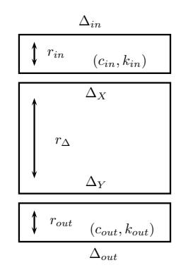
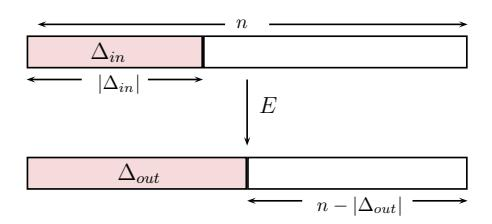
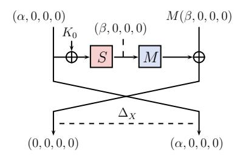
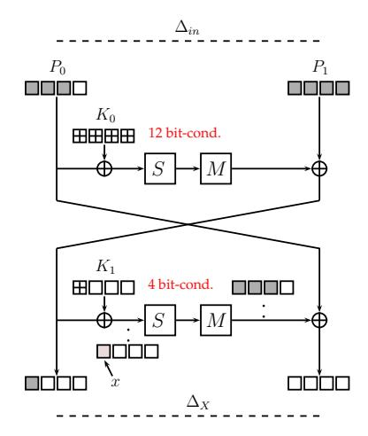
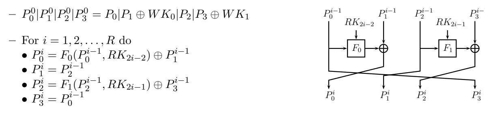
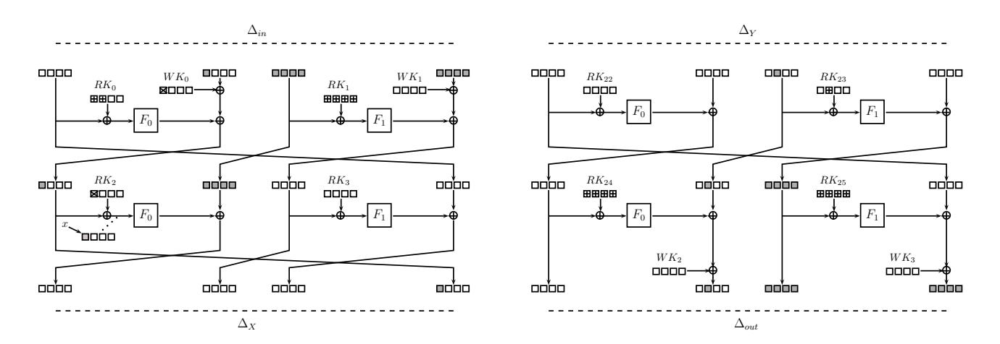
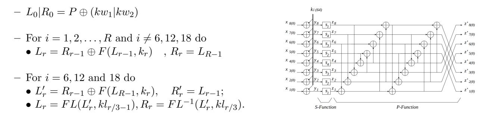
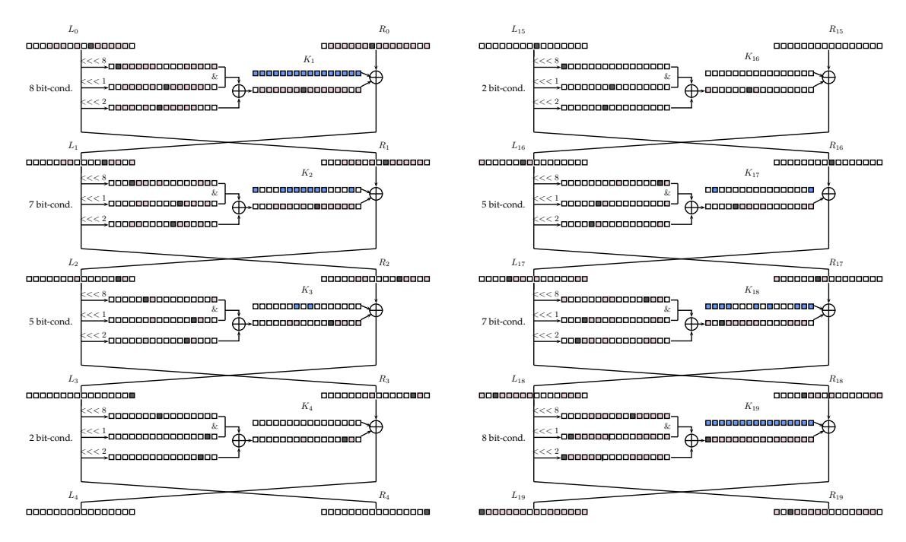
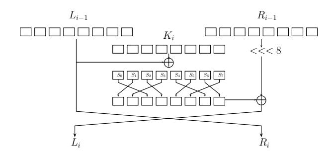
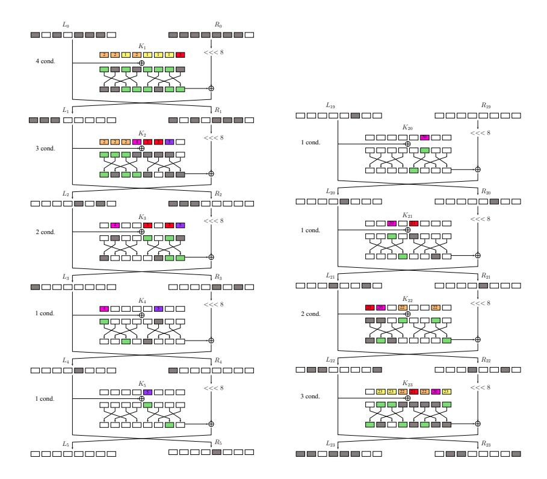

# Scrutinizing and Improving Impossible Differential Attacks: Applications to CLEFIA, Camellia, LBlock and Simon (Full Version)\*

Christina Boura1, María Naya-Plasencia2, Valentin Suder2

Versailles Saint-Quentin-en-Yvelines University, France christina.boura@prism.uvsq.fr

2 Inria, France
Maria.Naya\_Plasencia@inria.fr, Valentin.Suder@inria.fr

Abstract. Impossible differential cryptanalysis has shown to be a very powerful form of cryptanalysis against block ciphers. These attacks, even if extensively used, remain not fully understood because of their high technicality. Indeed, numerous are the applications where mistakes have been discovered or where the attacks lack optimality. This paper aims in a first step at formalizing and improving this type of attacks and in a second step at applying our work to block ciphers based on the Feistel construction. In this context, we derive generic complexity analysis formulas for mounting such attacks and develop new ideas for optimizing impossible differential cryptanalysis. These ideas include for example the testing of parts of the internal state for reducing the number of involved key bits. We also develop in a more general way the concept of using multiple differential paths, an idea introduced before in a more restrained context. These advances lead to the improvement of previous attacks against well known ciphers such as CLEFIA-128 and Camellia, while also to new attacks against 23-round LBlock and all members of the SIMON family.

Keywords. block ciphers, impossible differential attacks, CLEFIA, Camellia, LBlock, SIMON.

### 1 Introduction

Impossible differential attacks were independently introduced by Knudsen [22] and Biham et al. [7]. Unlike differential attacks [8] that exploit differential paths of high probability, the aim of impossible differential cryptanalysis is to use differentials that have a probability of zero to occur in order to eliminate the key candidates leading to such impossible differentials.

The first step in an impossible differential attack is to find an impossible differential covering the maximum number of rounds. This is a procedure that has been extensively studied and there exist algorithms for finding such impossible differentials efficiently [21, 20, 12]. Once such a maximum-length impossible differential has been found and placed, one extends it by some rounds to both directions. After this, if a candidate key partially encrypts/decrypts a given pair to the impossible differential, then this key certainly cannot be the right one and is thus rejected. This technique provides a sieving of the key space and the remaining candidates can be tested by exhaustive search.

Despite the fact that impossible differential cryptanalysis has been extensively employed, the key sieving step of the attack does not seem yet fully understood. Indeed, this part of the procedure is highly technical and many parameters have to be taken into consideration. Questions that naturally arise concern the way to choose the plaintext/ciphertext pairs, the way to calculate the necessary data to mount the attack, the time complexity of the overall procedure as well as which are the parameters that optimize the attack. However, no simple and generalized way for answering these questions has been provided until now and the generality of most of the published attacks is lost within the tedious details of each application. The problems that arise from this approach is that mistakes become very common and attacks become difficult to verify. Errors in the analysis are often discovered and as we demonstrate in the next paragraph, many papers in the literature present flaws. These flaws include errors in the computation of the time or the data complexity, in the analysis of the memory requirements or of the complexity of some intermediate steps of the attacks. We can cite many such cases for different algorithms, as shown in Table 1. Note however, that the list of flaws presented in this table is not exhaustive.

\*Partially supported by the French Agence Nationale de la Recherche through the BLOC project under Contract ANR-11-INS-011. ©IACR 2014. This article is the full version of the paper submitted by the authors to the IACR and to Springer-Verlag in September 2014, to appear in the proceedings of ASIACRYPT 2014.

| Algorithm                     | # rounds        | Reference | Type of error           | Gravity of error       | Where discovered |
|-------------------------------|-----------------|-----------|-------------------------|------------------------|------------------|
| CLEFIA-128                    | 14              | [40]      | data complexity higher  | attack does not work   | [32]             |
| (without whit. layers)        |                 |           | than codebook           |                        |                  |
| CLEFIA-128                    | 13              | [33]      | cannot be verified      | -                      | [10]             |
|                               |                 |           | without implementation  |                        |                  |
| Camellia                      | 12              | [38]      | big flaw in computation | attack does not work   | this paper       |
| (without F L/F L−1 layers) |                 |           | as in [37]              |                        |                  |
| Camellia-128                  | 12              | [37]      | big flaw in computation | attack does not work   | [26]             |
| Camellia-128/192/256          | 11/13/14        | [24]      | small complexity flaws  | corrected attacks work | [38]             |
| (without F L/F L−1 layers) |                 |           |                         |                        |                  |
| LBlock                        | 22              | [27]      | small complexity flaw   | corrected attack works | [28]             |
| Simon (all versions)       | 14/15/15/16/16/ | [4]       | data complexity higher  | attacks do not work    | Table 1 of [4]   |
|                               | 19/19/22/22/22  |           | than codebook           |                        |                  |
| Simon (all versions)       | 13/15/17/20/25/ | [1, 2]    | big flaw in computation | attacks do not work    | Appendix A.2     |

Table 1. Summary of flaws in previous impossible differential attacks on CLEFIA-128, Camellia, LBlock and Simon.

Instances of such flaws can for example be found in analyses of the cipher CLEFIA. CLEFIA is a lightweight 128-bit block cipher developed by SONY in 2007 [29] and adopted as an international ISO/IEC 29192 standard in lightweight cryptography. This cipher has attracted the attention of many researchers and numerous attacks have been published so far on reduced round versions [34, 35, 33, 25, 31, 11]. Most of these attacks rely on impossible differential cryptanalysis. However, as pointed out by the designers of CLEFIA [30], some of these attacks seem to have flaws, especially in the key filtering phase. We can cite here a recent paper by Blondeau [10] that challenges the validity of the results in [33], or a claimed attack on 14 rounds of CLEFIA-128 [40], for which the designers of CLEFIA showed that the necessary data exceeds the whole codebook [32]. Another extensively analyzed cipher is the ISO/IEC 18033 standard Camellia, designed by Mitsubishi and NTT [5]. Among the numerous attacks presented against this cipher, some of the more successful ones rely on impossible differential cryptanalysis [38, 37, 23, 26, 24]. In the same way as for CLEFIA, some of these attacks were detected to have flaws. For instance, the attack from [37] was shown in [26] to be invalid. We discovered a similar error in the computation that invalidated the attack of [38]. Also, [38] reveals small flaws in [24]. Errors in impossible differential attacks were also detected for other ciphers. For example, in a cryptanalysis against the lightweight block cipher LBlock [27], the time complexity revealed to be incorrectly computed [28]. Another problem can be found in [4], where the data complexity is higher than the amount of data available in the block cipher Simon, or in [1, 2], where some parameters are not correctly computed. During our analysis, we equally discovered problems in some attacks that do not seem to have been pointed out before. In addition to all this, the more the procedure becomes complicated, the more the approach lacks optimality. To illustrate this lack of optimality presented in many attacks we can mention a cryptanalysis against 22-round LBlock [19], that could easily be extended to 23 rounds if a more optimal approach had been used to evaluate the data and time complexities, as well as an analysis of Camellia [23] which we improve in Section 4.

The above examples clearly show that impossible differential attacks suffer from the lack of a unified and optimized approach. For this reason, the first aim of our paper is to provide a general framework for dealing with impossible differential attacks. In this direction, we provide new generic formulas for computing the data, time and memory complexities. These formulas take into account the different parameters that intervene into the attacks and provide a highly optimized way for mounting them. Furthermore, we present some new techniques that can be applied in order to reduce the data needed or to reduce the number of key bits that need to be guessed. In particular we present a new method that helps reducing the number of key bits to be guessed by testing instead some bits of the internal state during the sieving phase. This technique has some similarities with the methods introduced in [15, 17], however important differences exist as both techniques are applied in a completely different context. In addition to this, we apply and develop the idea of multiple impossible differentials, introduced in [35], to obtain more data for mounting our attacks. To illustrate the strength of our new approach we consider Feistel constructions and we apply the above ideas to a number of lightweight block ciphers, namely CLEFIA, Camellia, LBlock and Simon.

More precisely, we present an attack as well as different time/data trade-offs on 13-round CLEFIA-128 that improve the time and data complexity of the previous best known attack [26] and improvements in the complexity of the best known attacks against all versions of Camellia [23]. In addition, in order to demonstrate the generality of our method, we provide the results of our attacks against 23-round LBlock and all versions of the Simon block cipher. The attack on LBlock is the best attack so far in the single-key setting 3, while our attacks on Simon are the best known impossible differential attacks for this family of ciphers and the best attacks in general for the three smaller versions of Simon.

Summary of our attacks. We present here a summary of our results on the block ciphers CLEFIA-128, Camellia, LBlock and Simon and compare them to the best impossible differential attacks known for the four analyzed algorithms. This summary is given in Table 2, where we point out with a '\*' if the mentioned attack is the best cryptanalysis result on the target cipher or not, i.e. by the best known attack we consider any attack reaching the highest number of rounds, and with the best complexities among them.

| Algorithm                               | # Rounds |                  | \ /          | Memory (Blocks)    | Reference        |
|-----------------------------------------|----------|------------------|--------------|--------------------|------------------|
| CLEFIA-128                              | 13       | $2^{121.2}$      | $2^{117.8}$  | 286.8              | [25]             |
| using state-test technique              | 13       | $2^{116.90}$     | $2^{116.33}$ | $2^{83.33}$        | Section 3        |
| using multiple impossible differentials | 13       | $2^{122.26}$     | $2^{111.02}$ | $2^{82.60}$        | Section 3*       |
| combining with state-test technique     | 13       | $2^{116.16}$     | $2^{114.58}$ | $2^{83.16}$        | Section 3*       |
| Camellia-128                            | 11       | $2^{122}$        | $2^{122}$    | $2^{98}$           | [23]             |
|                                         | 11       | $2^{118.43}$     | $2^{118.4}$  | $2^{92.4}$         | Section 4*       |
| Camellia-192                            | 12       | $2^{187.2}$      | $2^{123}$    | $2^{155.41}$       | [23]             |
|                                         | 12       | $2^{161.06}$     | $2^{119.7}$  | $2^{150.7}$        | Section 4*       |
| Camellia-256                            | 13       | $2^{251.1}$      | $2^{123}$    | $2^{203}$          | [23]             |
|                                         | 13       | $2^{225.06}$     | -            | $2^{198.71}$       | Section 4*       |
| Camellia-256 †               | 14       | $2^{250.5}$      | $2^{120}$    | $2^{120}$          | [23]             |
|                                         | 14       | 2 220 | $2^{118}$    | $2^{173}$          | Section 4        |
| LBlock                                  | 22       | $2^{79.28}$      | $2^{58}$     | 2 72.67 | [19]             |
|                                         | 22       | $2^{71.53}$      | $2^{60}$     | $2^{59}$           | Appendix B,[13]  |
|                                         | 23       | $2^{75.36}$      | $2^{59}$     | $2^{74}$           | Appendix B,[13]* |
| Simon32/64                              | 19       | $2^{62.56}$      | $2^{32}$     | $2^{44}$           | Appendix A*      |
| SIMON48/72                              | 20       | $2^{70.69}$      | $2^{48}$     | $2^{58}$           | Appendix A*      |
| SIMON48/96                              | 21       | $2^{94.73}$      | $2^{48}$     | $2^{70}$           | Appendix A*      |
| Simon64/96                              | 21       | $2^{94.56}$      | $2^{64}$     | $2^{60}$           | Appendix A       |
| Simon64/128                             | 22       | $2^{126.56}$     | $2^{64}$     | $2^{75}$           | Appendix A       |
| Simon96/96                              | 24       | $2^{94.62}$      | $2^{94}$     | $2^{61}$           | Appendix A       |
| Simon96/144                             | 25       | $2^{190.56}$     | $2^{128}$    | $2^{77}$           | Appendix A       |
| SIMON128/128                            | 27       | $2^{126.6}$      | $2^{94}$     | $2^{61}$           | Appendix A       |
| SIMON128/192                            | 28       | $2^{190.56}$     | $2^{128}$    | $2^{77}$           | Appendix A       |
| SIMON128/256                            | 30       | $2^{254.68}$     | $2^{128}$    | $2^{111}$          | Appendix A       |

**Table 2.** Summary of the best impossible differential attacks on CLEFIA-128, Camellia, LBlock and SIMON and presentation of our results. The presence of a '\*' mentions if the current attack is the best known attack against the target cipher. Note here that we provide only the best of our results with respect to the time complexity. Other trade-offs can be found in the following sections. † see Section 4.1 for details.

The rest of the paper is organized as follows. In Section 2 we present a generic methodology for mounting impossible differential attacks, provide our complexity formulas and show new techniques and improvements for attacking a Feistel-like block cipher using impossible differential cryptanalysis. Section 3 is dedicated to the details of our attacks on CLEFIA and Section 4 presents our applications to all versions of Camellia. Finally, our attacks on the other ciphers can be found in Appendix A and B.

&lt;sup>3In [14], an independent and simultaneous result on 23-round LBlock with worse time complexity was proposed.

#### 2 Complexity analysis

We provide in this section a comprehensive complexity analysis of impossible differential attacks against block ciphers as well as some new ideas that help improving the time and data complexities. We derive in this direction new generic formulas for the complexity evaluation of such attacks. The role of these formulas is twofold; on the one hand we aim at clarifying the attack procedure by rendering it as general as possible and on the other hand help at optimizing the time and data requirements. Establishing generic formulas should help mounting as well as verifying such attacks by avoiding the use of complicated procedures often leading to mistakes.

An impossible differential attack consists mainly of two general steps. The first one deals with the discovery of a maximum-length impossible differential, that is an input difference  $\Delta_X$  and an output difference  $\Delta_Y$  such that the probability that  $\Delta_X$  propagates after a certain number of rounds,  $r_{\Delta}$ , to  $\Delta_Y$  is zero. The second step, called the key sieving phase, consists in the addition of some rounds to potentially both directions. These extra added rounds serve to verify which key candidates partially encrypt (resp. decrypt) data to the impossible differential. As this impossible differential is of probability zero, keys showing such behavior are clearly not the right encryption key and are thus removed from the candidate keys space.

We start by introducing the notation that will be used in the rest of the paper. As in this work we are principally interested in the key sieving phase, we start our attack after a maximum impossible differential has been found for the target cipher.

The differential  $(\Delta_X \to \Delta_{in})$  (resp.  $(\Delta_Y \to \Delta_{out})$ ) occurs with probability 1 while the differential  $(\Delta_X \leftarrow \Delta_{in})$  (resp.  $(\Delta_Y \leftarrow \Delta_{out})$ ) is verified with probability  $\frac{1}{2^{c_{in}}}$  (resp.  $\frac{1}{2^{c_{out}}}$ ), where  $c_{in}$  (resp.  $c_{out}$ ) is the number of bit-conditions that have to be verified to obtain  $\Delta_X$  from  $\Delta_{in}$  (resp.  $\Delta_Y$  from  $\Delta_{out}$ ).

It is important to correctly determine the number of key bits intervening during an attack. We call this quantity information key bits. In an impossible differential attack, one starts by determining all the subkey bits that are involved in the attack. We denote by  $k_{in}$  the subset of subkey bits involved in the attack during the first  $r_{in}$  rounds, and  $k_{out}$  during the last  $r_{out}$  ones. However, some of these subkey bits can be related between them. For example, two different subkey bits can actually be the same bit of the master key. Alternatively, a bit in the set can be some combination, or can be easily determined by some other bits of the set. The way that the different key bits in the target set are related is determined by the key schedule. The actual parameter that we need to determine for computing the complexity of the attacks is the information key bits intervening in total, that is from an information theoretical point of view, the log of the entropy of the involved key bits, that we denote by  $|k_{in} \cup k_{out}|$ .

- $-\Delta_X, \Delta_Y$ : input (resp. output) differences of the impossible differential.
- $-r_{\Delta}$ : number of rounds of the impossible differential
- $-\Delta_{in}, \Delta_{out}$ : set of all possible input (resp. output) differences of the cipher.
- $-r_{in}$ : number of rounds of the differential path $(\Delta_X, \Delta_{in})$ .
- $r_{out}$ : number of rounds of the differential path $(\Delta_Y, \Delta_{out})$ .

We continue now by describing our attack scenario on  $(r_{in} + r_{\Delta} + r_{out})$  rounds of a given cipher.

#### 2.1 Attack scenario

Suppose that we are dealing with a block cipher of block size n parametrized by a key K of size |K|. Let the impossible differential be placed between the rounds  $(r_{in} + 1)$  and  $(r_{in} + r_{\Delta})$ . As already said, the impossible differential implies that it is not feasible that an input difference  $\Delta_X$  at round  $(r_{in} + 1)$

propagates to an output difference  $\Delta_Y$  at the end of round  $(r_{in} + r_{\Delta})$ . Thus, the goal is, for each given pair of inputs (and their corresponding outputs), to discard the keys that generate a difference  $\Delta_X$  at the beginning of round  $(r_{in} + 1)$  and at the same time, a difference  $\Delta_Y$  at the output of round  $(r_{in} + r_{\Delta})$ . We need then enough pairs so that the number of non-discarded keys is significantly lower than the a priori total number of key candidates.

Suppose that the first  $r_{in}$  rounds have an input truncated difference in  $\Delta_{in}$  and an output difference  $\Delta_X$ , which is the input of the impossible differential. Suppose that there are  $c_{in}$  bit-conditions that need to be verified so that  $\Delta_{in}$  propagates to  $\Delta_X$  and  $|k_{in}|$  information key bits involved.

In a similar way, suppose that the last  $r_{out}$  rounds have a truncated output difference in  $\Delta_{out}$  and an input difference  $\Delta_Y$ , which is the output of the impossible differential. Suppose that there are  $c_{out}$  bit-conditions that need to be verified so that  $\Delta_{out}$  propagates to  $\Delta_Y$  in the backward direction and  $|k_{out}|$  information key bits involved.

We show next how to determine the amount of data needed for an attack.

### 2.2 Data complexity

The probability that for a given key, a pair of inputs already satisfying the differences  $\Delta_{in}$  and  $\Delta_{out}$  verifies all the  $(c_{in} + c_{out})$  bit-conditions is  $2^{-(c_{in} + c_{out})}$ . In other words, this is the probability that for a pair of inputs having a difference in  $\Delta_{in}$  and an output difference in  $\Delta_{out}$ , a key from the possible key set is discarded. Therefore, by repeating the procedure with N different input (or output) pairs, the probability that a trial key is kept in the candidate keys set is  $P = (1 - 2^{-(c_{in} + c_{out})})^N$ .

There is not a unique strategy for choosing the amount of input (or output) pairs N. This choice principally depends on the overall time complexity, which is influenced by N, and the induced data complexity. Different trade-offs are therefore possible. A popular strategy, generally used by default is to choose N such that only the right key is left after the sieving procedure. This amounts to choose P as

$$P = (1 - 2^{-(c_{in} + c_{out})})^N < \frac{1}{2^{|k_{in} \cup k_{out}|}}.$$

In this paper we adopt a different approach that can help reducing the number of pairs needed for the attack and offers better trade-offs between the data and time complexity. More precisely, we permit smaller values of N. By proceeding like this, we will be probably left with more than one key in our candidate keys set and we will need to proceed to an exhaustive search among the remaining candidates, but the total time complexity of the attack will probably be much lower. In practice, we will start considering values of N such that P is slightly smaller than  $\frac{1}{2}$  so to reduce the exhaustive search by at least one bit. The smallest value of N, denoted by  $N_{\min}$ , verifying

$$P = (1 - 2^{-(c_{in} + c_{out})})^{N_{\min}} \simeq e^{-N_{\min} \times 2^{-(c_{in} + c_{out})}} < \frac{1}{2}$$

is approximately  $N_{\min} = 2^{c_{in} + c_{out}}$ . Then we have to choose  $N \geq N_{\min}$ .

We provide now a solution for determining the cost of obtaining N pairs such that their input difference belongs to  $\Delta_{in}$  and their output difference belongs to  $\Delta_{out}$ . To the best of our knowledge, this is the first generic solution to this problem.

Finding N pairs verifying a given truncated differential. Gilbert and Peyrin gave in [16] a solution to the so-called limited birthday problem that searches for a pair of inputs whose difference lies in an input space  $\Delta_{in}$  and whose output (ciphertext) difference lies in an output space  $\Delta_{out}$  (see Figure 1). According to this solution, prooved in [18], the cost for finding one such pair is given by

$$C_1 = \max \left\{ \min_{\Delta \in \{\Delta_{in}, \Delta_{out}\}} \left\{ \sqrt{2^{n+1-|\Delta|}} \right\}, 2^{n+1-(|\Delta_{in}|+|\Delta_{out}|)} \right\}.$$

Fig. 1. A pair of inputs to the encryption function can differ in the subspace  $\Delta_{in}$  and the difference of the ciphertext values can lie in the subspace  $\Delta_{out}$ .

In our attack we search for a solution to a generalization of this problem, i.e. we want to determine the cost of finding not just one but N pairs lying in the given input and output spaces  $\Delta_{in}$  and  $\Delta_{out}$ . A direct way to treat this problem would be to estimate this cost by  $N \times C_1$ . However, this solution is not always optimal. In particular, as we will explain in a while, when the input space  $\Delta_{in}$  is relatively large, the number of inputs that we will need, which determines the data complexity of the attack and at the same time the cost for constructing N pairs, can be lower than  $N \times C_1$ . We denote, the number of necessary inputs as  $C_N$ , as this quantity corresponds equally to the cost of constructing N pairs.

We can distinguish between two cases, depending on the dimension of the input space,  $|\Delta_{in}|$ , the dimension of the output space,  $|\Delta_{out}|$  and the value of N. More precisely, the cost for constructing N pairs will depend on the value of

$$\frac{2^{|\Delta_{in}|}2^{|\Delta_{in}|-1}}{2^{n-|\Delta_{out}|}}$$

compared to N. The quantity  $2^{|\Delta_{in}|}2^{|\Delta_{in}|-1}$  corresponds to the number of pairs that can be constructed if the values in  $\Delta_{in}$  can take all possible values. On the other hand, the quantity  $n - |\Delta_{out}|$  stands for the size of the partial collision, as we permit the output of these pairs to vary only in the subspace  $\Delta_{out}$ .

- If  $N \leq \frac{2^{|\Delta_{in}|}2^{|\Delta_{in}|-1}}{2^{n-|\Delta_{out}|}}$ , this means that  $|\Delta_{in}|$  is large enough to allow us to build  $C_N$  inputs belonging to the same structure  $(C_N \leq 2^{|\Delta_{in}|})$ . For the sake of clarity, we define a structure, as the set of inputs that can take all possible values in the subspace  $\Delta_{in}$  and whose remaining  $n-|\Delta_{in}|$  bits are fixed to a constant value. Therefore  $N = \frac{C_N \cdot C_N/2}{2^{n-|\Delta_{out}|}}$ , which means that we need  $C_N = \sqrt{N2^{n-|\Delta_{out}|+1}}$  inputs.

   Otherwise, if  $N > \frac{2^{|\Delta_{in}|}2^{|\Delta_{in}|-1}}{2^{n-|\Delta_{out}|}}$  which means that  $|\Delta_{in}|$  is not large enough, we will need to consider
- Otherwise, if  $N > \frac{2^{|\Delta_{in}|}2^{|\Delta_{in}|-1}}{2^{n-|\Delta_{out}|}}$  which means that  $|\Delta_{in}|$  is not large enough, we will need to consider several structures of size  $2^{|\Delta_{in}|}$ . Let  $2^y$  be the number of these extra structures chosen in a way that  $N = 2^y \frac{2^{|\Delta_{in}|}2^{|\Delta_{in}|-1}}{2^{n-|\Delta_{out}|}}$ . The number of inputs is in this case given by:

$$C_N = 2^y 2^{|\Delta_{in}|} = N 2^{n-|\Delta_{out}|-|\Delta_{in}|+1}.$$

By taking all of this into account together with the fact that we are dealing with a permutation (having thus a symmetry in both directions) and by considering the attacker to be able to choose the ciphertexts as well as the plaintexts, we can conclude that the cost of obtaining the N pairs will be:

$$C_N = \max \left\{ \min_{\Delta \in \{\Delta_{in}, \Delta_{out}\}} \left\{ \sqrt{N2^{n+1-|\Delta|}} \right\}, N2^{n+1-|\Delta_{in}|-|\Delta_{out}|} \right\}.$$
 (1)

We can observe thus that we gain a factor of  $\sqrt{N}$  in the first of the two above cases compared to the trivial solution of taking  $C_N = N \times C_1$ . As we've already mentioned the cost  $C_N$  represents the amount of data needed for the attack. Obviously, as the size of the state is equal to n, the following inequality, should hold:

$$C_N < 2^n$$
.

This inequality simply states that the total amount of data used for the attack cannot exceed the codebook. These conditions are not verified in several cases from [4], as well as in the corrected version of [40] which invalidates the corresponding attacks.

### 2.3 Time and memory complexity

We are going to detail now the computation of the time complexity of the attack. Note that the formulas that we are presenting in this section are the first generic formulas given for estimating the complexity of impossible differential attacks.

By following the early abort technique [24], the attack consists in storing the N pairs and testing out step by step the key candidates, by reducing at each time the size of the remaining possible pairs. The time complexity is then determined by three quantities. The first term is the cost  $C_N$ , that is the amount of needed data (see Formula (1)) for obtaining the N pairs, where N is such that P < 1/2. The second term corresponds to the number of candidate keys  $2^{|k_{in} \cup k_{out}|}$ , multiplied by the average cost of testing the remaining pairs. For all the applications that we have studied, this cost can be very closely approximated by  $\left(N + 2^{|k_{in} \cup k_{out}|} \frac{N}{2^{c_{in} + c_{out}}}\right) C'_E$ , where  $C'_E$  is the ratio of the cost of partial encryption to the full encryption. Finally, the third term is the cost of the exhaustive search for the key candidates still in the candidate keys set after the sieving. By taking into account the cost of one encryption  $C_E$ , we conclude that the time complexity of the attack is

$$T_{comp} = \left( C_N + \left( N + 2^{|k_{in} \cup k_{out}|} \frac{N}{2^{c_{in} + c_{out}}} \right) C_E' + 2^{|K|} P \right) C_E, \tag{2}$$

where  $C_N = \max \left\{ \min_{\Delta \in \{\Delta_{in}, \Delta_{out}\}} \left\{ \sqrt{N2^{n+1-|\Delta|}} \right\}, N2^{n+1-|\Delta_{in}|-|\Delta_{out}|} \right\}$ , with N such that  $P = (1 - 1/(2^{c_{in}+c_{out}}))^N < 1/2$  and where the last term corresponds to  $2^{|K|-|k_{in}\cup k_{out}|}P2^{|k_{in}\cup k_{out}|}$ . Obviously, as we want the attack complexity to be smaller than the exhaustive search complexity, the above quantity should be smaller than  $2^{|K|}C_E$ .

It must be noted here that this is a minimum estimation of the complexity, that, in practice, and thanks to the idea of Section 2.4, it approximates really well the actual time complexity, as it can be seen in the applications, and in particular, in the tight correspondance shown between the LBlock estimation that we detail in Appendix B and the exact calculation from [13]. The precise evaluation of  $C'_E$  (that is always smaller than 1) can only be done once the attack parameters are known. However,  $C'_E$  can be estimated quite easily by calculating the ratio between the active SBoxes during a partial encryption and the total number of SBoxes (thought it is not always the best approximation, it is a common practice).

Memory complexity. By using the early abort technique [24], the only elements that need to be stored are the N pairs. Therefore, the memory complexity  $^4$  of the attack is determined by N.

#### 2.4 Choosing $\Delta_{in}, \Delta_{out}, c_{in}$ and $c_{out}$ .

We explain now, the two possible ways for choosing  $\Delta_{in}$ ,  $\Delta_{out}$ ,  $c_{in}$  and  $c_{out}$ . For this, we introduce the following example that can be visualized in Figure 2 and where we consider an Sbox-based cipher. In this example, we will only talk about  $\Delta_{in}$  and  $c_{in}$ , however the approach for  $\Delta_{out}$  and  $c_{out}$  is identical.

Suppose that the state is composed of two branches of four nibbles each. The round function is composed of a non-linear layer S, seen as a concatenation of four Sboxes  $S_0, S_1, S_2$  and  $S_3$ , followed by a linear layer M. There exist two different ways for choosing  $|\Delta_{in}|$  and  $c_{in}$ :

1. The most intuitive way is to consider  $|\Delta_{in}| = 4 + 4$  and  $c_{in} = 4$ , as the size of  $\alpha$  and of  $\beta$  is 4 bits, and in the first round we want 4 bits to collide. In this case, for a certain key, the average probability that a pair taken out of the  $2^{4+4}2^{4+4-1}$  pairs belonging to  $\Delta_{in}$  leads to  $\Delta_X$  is  $2^{-4}$ .

 $4 \text{If } N > 2^{|k_{in} \cup k_{out}|}$  we could store the discarded key candidates instead, but in practice this is rarely the case. We can therefore consider a memory complexity of min $\{N, 2^{|k_{in} \cup k_{out}|}\}$ .

**Fig. 2.** Choosing  $\Delta_{in}$  and  $c_{in}$

2. In general, the difference  $\alpha$  can take  $2^4-1$  different values. However, each value can be associated by the differential distribution table of the Sbox  $S_0$  to  $2^3$  output differences on average5, so the possibilities for the difference  $\beta$  are limited to  $2^3$ . Therefore, we can consider that  $|\Delta_{in}| \approx 4+3$ . But, in this case  $c_{in}=3$ , as for each input pair belonging to the  $2^{4+3}2^{4+3-1}$  possible ones, there exist on average 2 values that make the differential transition  $\alpha \to \beta$  possible (instead of 1 in the previous case).

We can see, by using the generic formulas provided in Section 2.3, that both cases induce practically the same time complexity, as the difference in N compensates with the difference in  $c_{in} + c_{out}$ . However, the memory complexity, given by N, is slightly better in case 2. Furthermore, case 2, in which a preliminary filtering of the pairs is done, allows to reduce the average cost of using the early abort technique [24].

In several papers, for example in [37] and [24], the second case is followed. However, its application is partial (either for the input or the output part) and this with no apparent reason. Note however, that in these papers, the associated  $c_{out}$  was not always correctly computed and sometimes, 8-bit conditions were considered when 7-bit conditions should have been accounted for. For reasons of simplicity, we will consider case 1 in our applications and check afterwards the actual memory needed.

#### 2.5 Using multiple impossible differentials to reduce the data complexity

We explain in this section a method to reduce the data complexity of an attack. This method is inspired by the notion of multiple impossible differentials that was introduced by Tsunoo et al. [35] and applied to 12-round CLEFIA-128. The idea in this technique is to consider simultaneously several impossible differentials, instead of taking just one. We assume, as done in [16], that the differences in  $\Delta_{in}$  (and in  $\Delta_{out}$ ) lie in a closed set. We can mention two ways in which this can be a priori done:

- 1. Take rotated versions of a certain impossible differential. We call  $n_{in}$  the number of different input pattern differences generated by the rotated versions of the chosen impossible differential.
- 2. When the middle conditions have several impossible combinations, we can consider the same first half of the differential path together with a rotated version of the second one, in a way to get a different impossible differential. We call  $n_{out}$  the number of different output pattern differences generated by the rotated versions of the second part of the path that we will consider. For the sake of simplicity and without loss of generality we will only consider the case of rotating the second half of the path.

It is important to point out that for our analysis to be valid, in both cases the number of conditions associated to the impossible differential attack should stay the same. Both cases can be translated into a higher amount of available data by redefining two quantities,  $|\Delta'_{in}|$  and  $|\Delta'_{out}|$ , that will take the previous roles of  $|\Delta_{in}|$  and  $|\Delta_{out}|$ ,

$$|\Delta'_{in}| = |\Delta_{in}| + \log_2(n_{in}) \text{ and } |\Delta'_{out}| = |\Delta_{out}| + \log_2(n_{out}).$$

 $|\Delta'_{in}|$  is the log of the total size of the set of possible input differences, and  $|\Delta'_{out}|$  is the log of the total size of the set of possible output differences.

&lt;sup>5This quantity depends on the Sbox. In this example, we consider that all four Sboxes have good cryptographic properties.

In this case, the data complexity  $C_N$  is computed with the corrected values for the input sizes and is, as can be easily seen, smaller than if only one path had been used. The time complexity remains the same, except for the  $C_N$  term. Indeed, the middle term of Formula (2) remains the same, as for a given pair, the number of key bits involved stays  $2^{|k_{in} \cup k_{out}|}$ . Equally, as the number of partial possible keys involved in the attack is  $n_{in}n_{out}2^{|k_{in} \cup k_{out}|}$ , the last term of Formula (2) is now

$$\frac{2^{|K|}}{n_{in} \cdot n_{out} 2^{|k_{in} \cup k_{out}|}} (P \cdot n_{in} \cdot n_{out} \cdot 2^{|k_{in} \cup k_{out}|}) = 2^{|K|} P$$

and so also stays the same.

In Section 3 we present our attacks on CLEFIA. In part of these attacks, we use multiple impossible differentials to reduce the data complexity. Besides, this technique shows particularly useful for mounting attacks on some versions of the Simon family for which there is not enough available data to mount a valid attack with the traditional method.

### 2.6 Introducing the state-test technique

We introduce now a new method that consists in making a test for some part of the internal state instead of guessing the necessary key bits for computing it. This somewhat reminds the techniques presented in [15, 17] in the context of meet-in-the-middle attacks. However, the technique that we present in this section, and that we call the *state-test* technique is different since it consists in checking the values of the internal state to verify if we can discard all the involved candidates.

Very often during the key filtering phase of impossible differential attacks, the size of the internal state that needs to be known is smaller than the number of key bits on which it depends. As we will see, focusing on the values that a part of the state can take permits to eliminate some key candidates without considering all the values for the involved key bits. The state-test technique works by fixing s bits of the plaintexts, something which allows us to reduce the number of information key bits by s. We will explain how this method works by a small example.

Consider a 32-bit Feistel construction, where each branch can be seen as a concatenation of four nibbles (see Figure 3). Suppose that the round function is composed of a non-linear layer S, seen as a concatenation of four 4-bit invertible Sboxes  $(S_0, S_1, S_2, S_3)$  and of a linear layer M on  $\mathbb{F}_{2^4}$ . We suppose for this example that the branch number of M, that is the minimal number of active Sboxes in any two consecutive rounds, is less than 5. Let  $\Delta_X = (\alpha, 0, 0, 0)|(0, 0, 0, 0)$  be the input difference of the impossible differential, placed at the end of the second round and let  $\Delta_{in} = (*, *, *, 0)|(*, *, *, *)$  be the difference at the input of the block cipher. Note however that in reality, the leftmost side of  $\Delta_{in}$  only depends on a 4-bit non-zero difference  $\delta$ , i.e.  $\Delta_{in} = M(\delta, 0, 0, 0)|(*, *, *, *)$ .

As can be seen in Figure 3, there are in total 4 active Sboxes and thus there are  $c_{in} = 16$  conditions that have to be verified in order to have a transition from  $\Delta_{in}$  to  $\Delta_X$ . Therefore, the first step is to collect N pairs such that  $P = (1 - 2^{-(c_{in} + c_{out})})^N = (1 - 2^{-c_{in}})^N = (1 - 2^{-16})^N < \frac{1}{2}$ . The exact value of N will be chosen in a way to obtain the best trade-off for the complexities. Before describing the new method, we start by explaining how this attack would have worked in the classical way. As we can see in Figure 3, there are  $3 \times 4$  bits that have to be guessed  $(K_{0,0}, K_{0,1} \text{ and } K_{0,2})$  in order to verify the conditions on the first round and there are  $2 \times 4$  bits that have to be guessed  $(K_{0,3} \text{ and } K_{1,0})$  in order to verify the conditions on the second round. Therefore, for all N pairs, one starts by testing all the  $2^4$  possible values for the first nibble of  $K_0$ . After this first guess,  $N \times 2^{-4}$  pairs remain in average, as there are 4-bit conditions that need to be verified by the guess through the first round. Then one continues by testing the second and the third nibble of  $K_0$  and finally the last nibble of  $K_0$  and the first nibble of  $K_1$ . At each step, the amount of data remaining is divided by  $2^4$ . To summarize, we have  $|k_{in} \cup k_{out}| = |k_{in}| = 20$  and  $2^{c_{in} + c_{out}} = 2^{d_2} 2^4 2^4 2^4$ . Then Formula (2) can be used to evaluate the time complexity of the attack as

$$\left(C_N + \left(N + 2^{20} \frac{N}{2^{16}}\right) C_E' + 2^{20} P 2^{|K| - 20}\right) C_E.$$
(3)

**Fig. 3.** Grey color stands for nibbles with non-zero difference. Hatched key nibbles correspond to the part of the subkeys that have to be guessed. The nibble x is the part of the state on which we apply the state-test technique.

We will see now how the state-test technique applies to this example and how it permits to decrease the time complexity. Consider the first nibble of the left part of the state after the addition of the subkey  $K_1$ . We denote this nibble by x. Note that mathematically, x can be expressed as

$$x = K_{1,0} \oplus P_{1,0} \oplus M(S(K_0 \oplus P_0))_0$$

$$x \oplus P_{1,0} = K_{1,0} \oplus m_0 S_0(K_{0,0} \oplus P_{0,0}) \oplus m_1 S_1(K_{0,1} \oplus P_{0,1}) \oplus m_2 S_2(K_{0,2} \oplus P_{0,2}) \oplus m_3 S_3(K_{0,3} \oplus P_{0,3}),$$
(4)

where the  $m_i$ 's are coefficients in  $\mathbb{F}_2^4$ .

Suppose now that for all pairs, we fix the last s=4 bits of  $P_0$  to the same constant value. One can verify that this is a reasonable assumption, as by fixing this part of the inputs we still have enough data to mount the attack. Then one starts as before, by guessing the first three nibbles of  $K_0$ . After this 12-bit guess, approximately  $N \times 2^{-12}$  pairs remain. We know for each pair the input and output differences of the Sbox of the second round as the needed part of  $K_0$  has been guessed. Therefore, by a simple lookup at the differential distribution table of the involved Sbox, we obtain one value for x that verifies the second round conditions in average per pair (about half of the time the transition is not possible, whereas for the other half we find two values). Equation (4) becomes

$$x \oplus P_{1,0} \oplus m_0 S_0(K_{0,0} \oplus P_{0,0}) \oplus m_1 S_1(K_{0,1} \oplus P_{0,1}) \oplus m_2 S_2(K_{0,2} \oplus P_{0,2}) = K_{1,0} \oplus m_3 S_3(K_{0,3} \oplus P_{0,3}), (5)$$

where the left side of Equation (5), that we denote by x', is known for each pair.

Thus, for each guess of  $(K_{0,0}, K_{0,1}, K_{0,2})$ , we construct a table of size  $N \times 2^{-12}$ , where we store these values of x'. The last and more important step consists now in looking if all  $2^4$  possible values of x' appear in the table. Note here, that as  $N \ge 2^{16}$ , the size of the table is necessarily greater than or equal to  $2^4$ .

Since  $P_{0,3}$  is fixed, the only unknown values in Equation (5) are  $K_{1,0}$  and  $K_{0,3}$ . If all values for x' are in the table and since  $S_3$  is a permutation, for any choice of  $K_{1,0}$  and any choice of  $K_{0,3}$ , there will always exist (at least) one pair such that  $K_{1,0} \oplus m_3S_3(K_{0,3} \oplus P_{0,3})$  is in the table, leading thus to the impossible differential. As a conclusion, we know that if x' takes all the possible values in the table, we can remove the keys composed by the guessed value  $(K_{0,0}, K_{0,1}, K_{0,3})$  from the candidate keys set, as for all the values of  $(K_{1,0}, K_{0,3})$ , they would imply the impossible differential. If instead, x' does not take all the possible values for a certain value of  $(K_{0,0}, K_{0,1}, K_{0,3})$ , we can test this partial key combined to all the possibilities of the remaining key bits that verify Equation (5) for the missing x', as they belong to the remaining key candidates.

The main gain of the state-test technique is that it decreases the number of information key bits and therefore the time complexity. For instance, in this example, the variable x' can be seen as 4 information

key bits 6 instead of  $2 \times 4$  key bits we had to guess in the classic approach (the bits of  $K_{0,3}$  and of  $K_{1,0}$ ). We have s=4 less bits to guess thanks to the s=4 bits of the plaintext that we have fixed. Thus the time complexity in this case becomes

$$\left(C_N + \left(N + 2^{20-4} \frac{N}{2^{16}}\right) C_E' + 2^{20-4} P 2^{|K| - (20-4)}\right) C_E.$$
(6)

One can see now by comparing Equations (6) and (3) that the time complexity is lower with the state-test technique, than with the trivial method. Indeed, the first and the third term of the Equations (6) and (3) remain the same, while the second term is lower in Equation (6). Finally, note that the probability P for a key to be still in the candidate keys set remains the same as before. Indeed, during the attack we detect all and the same candidate keys for which none of the N pairs implies the impossible differential, which are the same candidate keys that we would have detected in a classic attack.

We would like to note here that we have implemented the state-test technique on a toy cipher, having a structure similar to the one that we introduced in this section, and we have verified its correcteness.

Application of the state-test technique in parallel for decreasing the probability P. An issue that could appear with this technique is that as we have to fix a part of the plaintexts, s bits, the amount of data available for computing the N pairs is reduced. The probability P associated to an attack is the probability for a key to remain in the candidate keys set. When the amount of available data is small, the number of pairs N that we can construct is equally small and thus the probability P is high. In such a situation, the dominant term of the time complexity (Formula (2)), is in general the third one, i.e.  $2^{|K|}P$ .

More precisely, we need the sum of  $\log_2(C_N)$  and s, the number of plaintext bits that we fix, to be less than or equal to the block size. This limits the size of N that we can consider, leading to higher probabilities P, and could lead, sometimes, to higher time complexities. To avoid this, one can repeat the attack in parallel for several different values, say Y, of the fixed part of the plaintext. In this case, the data and memory needed are multiplied by Y. On the other hand, repeating the attack in parallel permits to detect more efficiently if a guessed key could be the right one. Indeed, for a guessed key, only if none of the tables constructed as described above contains all the values for x', one can test if this guessed key is the correct one.

To summarize, by repeating the state-test technique in parallel, we multiply the available data by Y, as well as the available pairs, and since the attack is done Y times in parallel, the probability P becomes  $P^Y$ . The probability decreases much faster than the data or the other terms of the time complexity increase. Therefore, the Formula (2) becomes in this case:

$$\left(C_N \times Y + \left(N \times Y + 2^{|k_{in} \cup k_{out}| - s} \frac{N \times Y}{2^{c_{in} + c_{out}}}\right) C_E' + 2^{|K|} P^Y\right) C_E.$$
(7)

In Section 3, we are going to see an application of this technique to 13-round CLEFIA-128, and at the end of Section 4.1 we show an application on Camellia-256.

### 3 Application to CLEFIA

CLEFIA is a lightweight 128-bit block cipher designed by Shirai et al. in 2007 [29] and based on a 4-branch generalized Feistel network. We provide here a short description of the algorithm specifications. See [29] for a more complete description.

&lt;sup>6Note that we could, equivalently, consider all possible values of x' in the last step, and consider the associated remaining pairs table, that would have a size of  $N2^{-16}$  (empty if the key is a good candidate, not empty otherwise), obtaining the same key candidates of 16 bits, 12 from  $(K_{0,0}, K_{0,1}, K_{0,3})$  and 4 information key bits from x', with the same complexity as in the previously described method.

#### 3.1 Description of CLEFIA

Encryption algorithm. Denote by  $P = P_0|P_1|P_2|P_3$  a 128-bit plaintext, where each  $P_i$ , i = 0, 1, 2, 3, is a 32-bit vector. Denote by C be the corresponding ciphertext. CLEFIA supports keys of size 128, 192 or 256 bits and the total number of iterations, say R, depends on the key size. More precisely, R = 18 for the 128-bit version, while R = 22 and R = 26 for the two following variants. A key-scheduling algorithm, whose description we omit, is used to generate 2R round keys  $RK_0, \ldots, RK_{2R-1}$  and 4 whitening keys  $WK_0, \ldots, WK_3$ . The encryption is performed as follows:

 $- C = P_0^R | P_1^R \oplus W K_2 | P_2^R | P_3^R \oplus W K_3.$

Fig. 4. A round of CLEFIA.

Round functions  $F_0$ ,  $F_1$ . Each round of CLEFIA is composed of two 32-bit round functions  $F_0$  and  $F_1$  (see Figure 4) that have the same structure. The first step in the function  $F_0$  (resp.  $F_1$ ) is an XOR between the 32-bit subkey  $RK_{2i-2}$  (resp.  $RK_{2i-1}$ ) and  $P_0^{i-1}$  (resp.  $P_2^{i-1}$ ). Then, two 8 × 8-bit SBoxes  $S_0$  and  $S_1$  compose a layer which is applied to the result. Finally, the four obtained bytes are mixed by a 4 × 4-byte matrix,  $M_0$  (resp.  $M_1$ ) that has a maximal branch number, i.e. 5. A detailed description of the SBoxes  $S_0$ ,  $S_1$  while also the matrices  $M_0$ ,  $M_1$  can be found in [29].

We are going to describe now an impossible differential cryptanalysis of 13-round CLEFIA-128.

#### 3.2 Impossible Differential Cryptanalysis of 13-round CLEFIA-128

The authors of [34] noticed that a difference on the internal state of CLEFIA of the form  $P^i = 0_{32}|0_{32}|A$  cannot lead to a difference  $P^{i+9} = 0_{32}|0_{32}|B|0_{32}$  after 9 rounds, where A and B are 4-byte vectors for which only one byte in a different position is active (e.g.  $A = (\alpha, 0_8, 0_8, 0_8)$  and  $B = (0_8, \beta, 0_8, 0_8)$ ). We use this same 9-round impossible differential and place it between rounds 3 and 11. Therefore, for our attack,  $r_{in} = r_{out} = 2$  and  $r_{\Delta} = 9$ , as in [25].

Fig. 5. The attack on CLEFIA-128. Grey color stands for bytes with a non-zero difference, while hatched bytes are the subkey bytes that have to be guessed.

The differential placed on the top and at the bottom of the impossible differential are depicted in Figure 5. We describe now the parameters for our cryptanalysis of 13-round CLEFIA-128. As can be seen

in Figure 5 there are  $c_{in} + c_{out} = 40 + 40$  bit-conditions that need to be verified so that the difference in the plaintexts  $\Delta_{in} = 0_{32}|(*_8, 0_8, 0_8, 0_8)|M_0(*_8, 0_8, 0_8, 0_8)|*_{32}$  propagates to  $\Delta_X = 0_{32}|0_{32}|0_{32}|(\alpha, 0_8, 0_8, 0_8)$  and the difference in the ciphertexts  $\Delta_{out} = 0_{32}|(0_8, *_8, 0_8, 0_8)|M_1(0_8, *_8, 0_8, 0_8)|*_{32}$  propagates to  $\Delta_Y = 0_{32}|0_{32}|(0_8, \beta, 0_8, 0_8)|0_{32}$ . In this way,  $|\Delta_{in}| = |\Delta_{out}| = 48$ .

Following the complexity analysis of Section 2, we need to construct at least  $N_{\min} = 2^{80}$  pairs whose input difference is in  $\Delta_{in}$  and whose output difference is in  $\Delta_{out}$ . The cost to construct these pairs is

$$C_{N_{\min}} = \max\left\{\sqrt{2^{80}2^{129-48}}, 2^{80}2^{129-48-48}\right\} = 2^{113}.$$

Using the state-test technique. We use now the state-test technique, described in Section 2.6 to test the 8 bits of the internal state denoted by x in Figure 5, instead of guessing the whole subkey  $RK_0$  and the XOR of the leftmost byte of  $RK_2$  and  $WK_0$ . For doing this, we need to fix part of the 32 leftmost bits of the plaintexts. As the number of needed data is  $C_{N_{\min}} = 2^{113}$ , we can fix at most 128 - 113 = 15 bits. However, as each Sbox is applied to 8 bits, we will only fix one byte of this part of the plaintexts. We will guess then 24 bits of the subkey  $RK_0$  which are situated on the other bytes.

During a classical attack procedure, we would need to guess 32 bits of  $RK_1$ , 32 bits of  $RK_0$  and 8 bits of  $RK_2 \oplus WK_0$ , thus  $k_{in} = 72$ . We would also need to guess 8 bits of  $RK_{23} \oplus WK_2$ , 32 bits of  $RK_{24}$  and 32 bits of  $RK_{25}$ , therefore  $k_{out} = 72$ . However, the subkeys  $RK_1$  and  $RK_{24}$  share 22 bits in common. As a consequence, the number of information key bits would be  $|k_{in} \cup k_{out}| = 72 + 72 - 22 = 122$ . As we will fix 8 bits of the plaintexts, with respect to Section 2 on the state-test technique, it is the same to say that there will be  $|k_{in} \cup k_{out}| - 8 = 122 - 8 = 114$  bits to test. The time complexity of our attack, computed using Formula (2) is then

$$\left(C_N + \left(N + 2^{114} \frac{N}{2^{80}}\right) \frac{18}{104} + 2^{128} P\right) C_E,$$

where the fraction 18/104 is the ratio of the cost of partial encryption to the full encryption, that we noted  $C'_E$ . Since our attack needs at least  $2^{113}$  plaintexts and since we fixed 8 bits out of them, we have 128 - 113 - 8 = 7 bits of freedom for building structures. Among all the possible trade-offs with respect to the amount of data, the best time complexity we obtained is  $2^{116.90}C_E$  with  $2^{83.33}$  pairs built from  $2^{116.33}$  plaintexts.

Using multiple impossible differentials. The authors of [34] noticed that there exist several different 9-round impossible differentials, see [34, Table 1]. In [35], the authors used these multiple impossible differentials to attack 12 rounds of CLEFIA-128. Here, we will apply our formalized approach of this idea presented in Section 2.5, to reduce the data complexity of the attack on 13 rounds of CLEFIA-128.

We use the  $n_{in}=2\times 4$  different inputs to the impossible differentials, that is  $P^i=0_{32}|A|0_{32}|0_{32}$  and  $P^i=0_{32}|0_{32}|0_{32}|A$ , where A can take a difference on only one of the four possible bytes. For each one of them, there are  $n_{out}=3$  different output impossible differences  $P^{i+9}=0_{32}|0_{32}|B|0_{32}$  after 9 rounds, where B has only one byte active in a different position than the active byte in A. We have now  $|\Delta'_{in}|=|\Delta_{in}|+\log_2(8)=48+3$  and  $|\Delta'_{out}|=|\Delta_{out}|+\log_2(3)=48+1.58$ . Since the bit-conditions remain unchanged,  $c_{in}+c_{out}=80$ , the minimal number of pairs needed for the attack to work is  $N_{\min}=2^{80}$ . For this number of pairs, we need  $C_{N_{\min}}=2^{113-4.58}=2^{108.42}$  plaintexts. The number of information key bits is  $|k_{in}\cup k_{out}|=122$ . We have then  $\left(C_N+\left(N+2^{122}\frac{N}{2^{80}}\right)\frac{18}{104}+P2^{128}\right)C_E$ . Among all the possible trade-offs with respect to the amount of data, the best time complexity we obtained is  $2^{122.26}C_E$  with  $2^{82.6}$  pairs built from  $2^{111.02}$  plaintexts. Recall here that the aim of this approach was to reduce data complexity. Thus, in this attack the gain on the data complexity is the important part  $^7$ .

Combining the state-test technique with multiple impossible differentials. We can combine now both previous approaches in order to reduce at the same time the time and the data complexity.

We consider here only 2 out of the 3 different  $n_{out}$  presented in the previous paragraph for one fixed first half of the impossible differential. We have now  $|\Delta'_{out}| = |\Delta_{out}| + \log_2(2) = 48 + 1$  while  $|\Delta_{in}|$  remains

 $\overline{^{7}\text{In}}$  [25], the authors used a loose approximation for a partial encryption as  $C'_E = 1/104$ .

48. Since the bit-conditions remain unchanged, i.e.  $c_{in} + c_{out} = 80$ , the minimal number of pairs needed for the attack to work is  $N_{\min} = 2^{80}$ . For this number of pairs, we need  $C_{N_{\min}} = 2^{113-1} = 2^{112}$  plaintexts which allow us to fix 16 bits on the plaintexts in order to use the state-test technique. Fixing 16 bits on the plaintexts means that we only have to guess 16 bits of the subkey  $RK_0$ .

As we are fixing s = 16 bits of the plaintexts, the number of information key bits is then  $|k_{in} \cup k_{out}| = 122 - 16 = 106$ . Then, by combining multiple impossible differentials and the state-test technique we have

$$\left(C_N + \left(N \times 2^7 + 2^{106} \frac{N \times 2^7}{2^{80}}\right) \frac{18}{104} + P2^{128}\right) C_E,$$

where the second term is multiplied by  $2^7$ , which is the cost for checking the table combinations of the different output impossible differentials. If we consider  $N = 2^{80+3.16}$  pairs, we need  $C_N = 2^{115}$  plaintexts to construct them and thus the time complexity is  $2^{116.16}C_E$ .

# 4 Applications to Camellia

Camellia is a 128-bit block cipher designed by Aoki et. al. in 2000 [5]. It is a Feistel-like construction where two key-dependent layers FL and  $FL^{-1}$  are applied every 6 rounds to each branch. There exist three different versions of the cipher, that we note Camellia-128, Camellia-192 and Camellia-256, depending on the key size used. The number of iterations, say R, is R=18 for the 128-bit version and R=24 rounds for the other two versions. We give here a brief description of the algorithm specifications. For more details, one can refer to [5].

### 4.1 Description of Camellia.

We briefly describe the encryption process for Camellia. A 128-bit plaintext P is first XORed with the prewhitening key  $kw_1|kw_2$ . The encryption process, is as follows:

 $-C = (R_{24}|L_{24}) \oplus kw_3|kw_4,$  Fig. 6. Round function of Camellia.

where  $kw_3$  and  $kw_4$  are the two postwhitening keys,  $kl_r$  are the keys parametrizing the FL-layers and  $k_r$  are the round subkeys. The round function F can be visualized in Figure 6.

**Previous Cryptanalysis.** Camellia is since 2005 an international ISO/IEC standard and has therefore attracted a lot of attention from the cryptographic community. Since Camellia has a particular design, involving the so-called  $FL/FL^{-1}$  layers, its cryptanalysis can be classified in several categories. Some attacks consider the  $FL/FL^{-1}$  functions, while others do not take them into consideration. Equally, some attacks take into account the whitening keys, whereas others don't and finally all attacks do not start from the same round. The best attacks on Camellia in terms of the number of rounds and the complexities are those presented in [23, Section 4.2]. In this section we first present improvements of the best attacks that include the  $FL/FL^{-1}$  layers and the whitening keys. Next we build an attack using the state-test technique on 14-round Camellia-256 starting from the first round but without the  $FL/FL^{-1}$  layers and the whitening keys.

Improvements. We improve here the complexities of the previous attacks that take into account the  $FL/FL^{-1}$  layers and the whitening keys on all three versions of Camellia. By using the complexity analysis introduced in Section 2, we can optimize the complexities of the corresponding attacks from [23]. Note that we use for this the same parameters as in [23]. The parameters of our attacks on 11-round Camellia-128, 12-round Camellia-192 and 13-round Camellia-256 are depicted in Table 3. As can be seen in Table 2, the time complexity of our improved attack on Camellia-128 is  $2^{118.43}C_E$ , with data complexity  $2^{118.4}$  and memory complexity  $2^{92.4}$ . For Camellia-192, the time, data and memory complexities are  $2^{161.06}C_E$ ,  $2^{119.7}$  and  $2^{150.7}$  respectively, while for Camellia-256 the corresponding complexities are  $2^{225.06}C_E$ ,  $2^{119.71}$  and  $2^{198.71}$ .

| Algorithm    | $ \Delta_{in} $ | $ \Delta_{out} $ | $r_{in}$ | $r_{out}$ | $r_{\Delta}$ | $c_{in}$ | $c_{out}$ | $ k_{in} \cup k_{out} $ |
|--------------|-----------------|------------------|----------|-----------|--------------|----------|-----------|-------------------------|
| Camellia-128 | 23              | 80               | 1        | 2         | 8            | 32       | 57        | 96                      |
| Camellia-192 | 80              | 80               | 2        | 2         | 8            | 73       | 73        | 160                     |
| Camellia-256 | 80              | 128              | 2        | 3         | 8            | 73       | 121       | 224                     |

Table 3. Attack parameters against all versions of Camellia

Using the state-test technique on Camellia-256. We provide here an impossible differential attack on Camellia-256 without  $FL/FL^{-1}$  layers and without whitening keys by using the state-test technique. Note here, that unlike all previous attacks of this kind that do not start from the first round in order to take advantage of the key schedule asymmetry, our attack starts from the first round of the cipher. This attack covers 14 rounds of Camellia-256 which is, based on our knowledge, the highest number of rounds attacked for this version of the cipher. In [23] another attack on 14 rounds of Camellia-256 without  $FL/FL^{-1}$  and whitening keys is presented, however, as said before, it does not start from the first round, and it equally uses a specific property of the key schedule in the rounds where it is applied.

In this attack, we consider the same 8-round impossible differential as in [26] and we add 4+2 rounds such that  $r_{in}=4$ ,  $r_{out}=2$  and  $r_{\Delta}=8$ . We have  $|\Delta_{in}|=128$ ,  $|\Delta_{out}|=56$ ,  $c_{in}=120$  and  $c_{out}=48$ . Then we need at least  $N_{\min}=2^{168}$  plaintext pairs for our attack to work. The amount of data needed to construct these pairs is  $C_{N_{\min}}=\max\left\{\sqrt{2^{168}2^{129-128}},2^{168}2^{129-184}\right\}=2^{113}$ . There remain then 128-113=15 bits of freedom. Thus, we can fix s=8 bits on the ciphertexts to apply the state-test technique on the 8 bits of the internal state at the penultimate round. The number of information key bits is  $|k_{in}\cup k_{out}|=227-8=219$  since there are 45 bits shared between the subkeys with respect to the key schedule of Camellia-256. The best attack is obtained with  $N=2^{118}$  pairs. In this case, the time complexity is  $2^{220}C_E$ , the data complexity is  $2^{118}$  plaintexts and the memory is  $2^{118}$ .

### 5 Conclusion

To start with, we have proposed in this paper a generic vision of impossible differential attacks with the aim of simplifying and helping the construction and verification of this type of cryptanalysis. Until now, these attacks were very tedious to mount and even more to verify, and so, very often flaws appeared in the computations. We believe that our objective has been successfully reached, as it can be seen by the high amount of new improved attacks that we have been able to propose, as well as by all the different possible trade-offs for each one of them, something that would be near to unthinkable prior to our work.

Next, the generic and clear vision of impossible differental attacks has allowed us to discover and propose new ideas for improving these attacks. In particular, we have proposed the *state-test* technique, that allows to reduce the number of key bits involved in the attack, and so to reduce the time complexity. We have also formalized and adapted to our generic scenario the notion introduced in [35] of multiple impossible differentials. This option allows reducing the data complexity. Finally, we have proposed several applications to different variants of the Feistel block ciphers CLEFIA, Camellia, LBlock and SIMON, providing in most of the cases, the best known attack on reduced-round versions of these ciphers.

We hope that these results will simplify and improve future impossible attacks on Feistel ciphers, as well as their possible combination with other attacks. For instance, in [39] a combination of impossible differential with linear attacks is proposed. We have not been able to verify these results, but this direction could be promising.

# References

- 1. F. Abed, E. List, S. Lucks, and J. Wenzel. Differential and linear cryptanalysis of reduced-round SIMON. Cryptology ePrint Archive, Report 2013/526, 2013.
- 2. F. Abed, E. List, J. Wenzel, and S. Lucks. Differential Cryptanalysis of round-reduced Simon and Speck. In FSE 2014, LNCS. Springer, 2014. To appear.
- 3. J. Alizadeh, N. Bagheri, P. Gauravaram, A. Kumar, and S. K. Sanadhya. Linear Cryptanalysis of Round Reduced Variants of SIMON. Cryptology ePrint Archive, Report 2013/663, 2013.
- 4. H. A. Alkhzaimi and M. M. Lauridsen. Cryptanalysis of the SIMON Family of Block Ciphers. Cryptology ePrint Archive, Report 2013/543, 2013.
- 5. K. Aoki, T. Ichikawa, M. Kanda, M. Matsui, S. Moriai, J. Nakajima, and T. Tokita. Camellia: A 128-Bit Block Cipher Suitable for Multiple Platforms - Design and Analysis. In Selected Areas in Cryptography - SAC 2000, volume 2012 of LNCS, pages 39–56. Springer, 2000.
- 6. R. Beaulieu, D. Shors, J. Smith, S. Treatman-Clark, B. Weeks, and L. Wingers. The SIMON and SPECK Families of Lightweight Block Ciphers. Cryptology ePrint Archive, Report 2013/404, 2013.
- 7. E. Biham, A. Biryukov, and A. Shamir. Cryptanalysis of Skipjack Reduced to 31 Rounds Using Impossible Differentials. In EUROCRYPT 1999, volume 1592 of LNCS, pages 12–23. Springer, 1999.
- 8. E. Biham and A. Shamir. Differential Cryptanalysis of DES-like Cryptosystems. In CRYPTO 1990, volume 537 of LNCS, pages 2–21. Springer, 1990.
- 9. A. Biryukov, A. Roy, and V. Velichkov. Differential Analysis of Block Ciphers SIMON and SPECK. In FSE 2014, LNCS. Springer, 2014. To appear.
- 10. C. Blondeau. Improbable Differential from Impossible Differential: On the Validity of the Model. In INDOCRYPT, volume 8250 of LNCS, pages 149–160. Springer, 2013.
- 11. A. Bogdanov, H. Geng, M. Wang, L. Wen, and B. Collard. Zero-Correlation Linear Cryptanalysis with FFT and Improved Attacks on ISO Standards Camellia and CLEFIA. In Selected Areas in Cryptography - SAC 2013, volume 8282 of LNCS, pages 306–323. Springer, 2013.
- 12. C. Bouillaguet, O. Dunkelman, P-A. Fouque, and G. Leurent. New Insights on Impossible Differential Cryptanalysis. In Selected Areas in Cryptography-SAC 2011, volume 7118 of LNCS, pages 243–259. Springer, 2011.
- 13. C. Boura, M. Minier, M. Naya-Plasencia, and V. Suder. Improved Impossible Differential Attacks against Round-Reduced LBlock. Cryptology ePrint Archive, Report 2014/279, 2014.
- 14. J. Chen, Y. Futa, A. Miyaji, and C. Su. Impossible differential cryptanalysis of LBlock with concrete investigation of key scheduling algorithm. Cryptology ePrint Archive, Report 2014/272, 2014.
- 15. O. Dunkelman, G. Sekar, and B. Preneel. Improved Meet-in-the-Middle Attacks on Reduced-Round DES. In IN-DOCRYPT, volume 4859 of LNCS, pages 86–100. Springer, 2007.
- 16. H. Gilbert and T. Peyrin. Super-Sbox Cryptanalysis: Improved Attacks for AES-Like Permutations. In FSE 2010, volume 6147 of LNCS, pages 365–383. Springer, 2010.
- 17. T. Isobe and K. Shibutani. Generic Key Recovery Attack on Feistel Scheme. In ASIACRYPT (1), volume 8269 of LNCS, pages 464–485. Springer, 2013.
- 18. M. Iwamoto, T. Peyrin, and Y. Sasaki. Limited-Birthday Distinguishers for Hash Functions Collisions beyond the Birthday Bound Can Be Meaningful. In ASIACRYPT (2), volume 8269 of LNCS, pages 504–523. Springer, 2013.
- 19. F. Karako¸c, H. Demirci, and A. E. Harmanci. Impossible Differential Cryptanalysis of Reduced-Round LBlock. In WISTP 2012, volume 7322 of LNCS, pages 179–188. Springer, 2012.
- 20. J. Kim, S. Hong, and J. Lim. Impossible differential cryptanalysis using matrix method. Discrete Mathematics, 310(5):988–1002, 2010.
- 21. J. Kim, S. Hong, J. Sung, C. Lee, and S. Lee. Impossible Differential Cryptanalysis for Block Cipher Structures. In INDOCRYPT 2003, volume 2904 of LNCS, pages 82–96. Springer, 2003.
- 22. L. R. Knudsen. DEAL A 128-bit cipher. Technical Report, Department of Informatics, University of Bergen, Norway, 1998.
- 23. Y. Liu, L. Li, D. Gu, X. Wang, Z. Liu, J. Chen, and W. Li. New Observations on Impossible Differential Cryptanalysis of Reduced-Round Camellia. In FSE 2012, volume 7549 of LNCS, pages 90–109. Springer, 2012.
- 24. J. Lu, J. Kim, N. Keller, and O. Dunkelman. Improving the Efficiency of Impossible Differential Cryptanalysis of Reduced Camellia and MISTY1. In CT-RSA, volume 4964 of LNCS, pages 370–386. Springer, 2008.
- 25. H. Mala, M. Dakhilalian, and M. Shakiba. Impossible Differential Attacks on 13-Round CLEFIA-128. J. Comput. Sci. Technol., 26(4):744–750, 2011.
- 26. H. Mala, M. Shakiba, M. Dakhilalian, and G. Bagherikaram. New Results on Impossible Differential Cryptanalysis of Reduced-Round Camellia-128. In Selected Areas in Cryptography-SAC 2009, volume 5867 of LNCS, pages 281–294. Springer, 2009.

- 27. M. Minier and M. Naya-Plasencia. A Related Key Impossible Differential Attack Against 22 Rounds of the Lightweight Block Cipher LBlock. *Inf. Process. Lett.*, 112(16):624–629, 2012.
- 28. M. Minier and M. Naya-Plasencia. Private communication, May 2013.
- 29. T. Shirai, K. Shibutani, T. Akishita, S. Moriai, and T. Iwata. The 128-Bit Blockcipher CLEFIA (Extended Abstract). In Fast Software Encryption FSE 2007, volume 4593 of LNCS, pages 181–195. Springer, 2007.
- 30. T. Shirai, K. Shibutani, T. Akishita, S. Moriai, and T. Iwata. Private communication, May 2014.
- 31. X. Tang, B. Sun, R. Li, and C. Li. Impossible differential cryptanalysis of 13-round CLEFIA-128. *Journal of Systems and Software*, 84(7):1191–1196, 2011.
- 32. CLEFIA Design Team. Comments on the impossible differential analysis of reduced round CLEFIA presented at Inscrypt 2008, Jan. 8, 2009.
- 33. C. Tezcan. The Improbable Differential Attack: Cryptanalysis of Reduced Round CLEFIA. In *INDOCRYPT*, volume 6498 of *LNCS*, pages 197–209. Springer, 2010.
- 34. Y. Tsunoo, E. Tsujihara, M. Shigeri, T. Saito, T. Suzaki, and H. Kubo. Impossible Differential Cryptanalysis of CLEFIA. In FSE, volume 5086 of LNCS, pages 398–411. Springer, 2008.
- 35. Y. Tsunoo, E. Tsujihara, M. Shigeri, T. Suzaki, and T. Kawabata. Cryptanalysis of CLEFIA using multiple impossible differentials. In *Information Theory and Its Applications. ISITA 2008*, pages 1–6, 2008.
- 36. W. Wu and L. Zhang. LBlock: A Lightweight Block Cipher. In ACNS 2011, volume 6715 of LNCS, pages 327–344. Springer, 2011.
- 37. W. Wu, L. Zhang, and W. Zhang. Improved Impossible Differential Cryptanalysis of Reduced-Round Camellia. In Selected Areas in Cryptography-SAC 2008, volume 5381 of LNCS, pages 442–456. Springer, 2008.
- 38. W. Wu, W. Zhang, and D. Feng. Impossible Differential Cryptanalysis of Reduced-Round ARIA and Camellia. *J. Comput. Sci. Technol.*, 22(3):449–456, 2007.
- 39. Z. Yuan, X. Li, and H. Liu. Impossible Differential-Linear Cryptanalysis of Reduced-Round CLEFIA-128. Cryptology ePrint Archive, Report 2013/301, 2013.
- W. Zhang and J. Han. Impossible Differential Analysis of Reduced Round CLEFIA. In *Inscrypt*, volume 5487 of *LNCS*, pages 181–191. Springer, 2008.

# A Application to the Simon family of block ciphers

SIMON is a family of lightweight block ciphers, optimized for performance on hardware devices, recently proposed by the NSA [6]. Though its very recent appearance and the fact that nothing is said about its resistance against cryptanalysis in the description document, several results on reduced versions have already appeared [4, 2, 3, 9]. We apply here our method on SIMON and come out with the best impossible differential attacks for all versions of the algorithm, as well as with the best known attacks on the smaller variants.

#### A.1 Brief description of the Simon family

The SIMON family of block ciphers is based on a classical Feistel construction operating on two *n*-bit branches. Therefore, the total block size is equal to 2n bits. The round function is composed of very simple operations consisting of rotations, XORs and the AND operation. More precisely, at each round, a nonlinear function  $F: \mathbb{F}_2^n \to \mathbb{F}_2^n$  transforms the left branch in the following way:

$$F(L_{i-1}) = ((L_{i-1} \ll 8) \& (L_{i-1} \ll 1)) \oplus (L_{i-1} \ll 2).$$

The output of F is then XORed with the round subkey and with the right branch  $R_{i-1}$  to form the left input of the next round. The round function is iterated r times, where the exact number of iterations r depends on the cipher's version. There exist in total ten members of the SIMON family, each one characterized by different block and key sizes. We denote a member of the SIMON family by SIMONX/x', where x denotes the block size and x' the key size. All versions can be seen in column 1 of Table 2. For the key schedule description, we refer to the description document [6].

### A.2 Previous cryptanalysis and comparison to our results

Since its recent publication, SIMON has received a remarkable amount of analysis from the community. Most of these works [4, 2, 3, 9] analyze the resistance of the cipher against differential, impossible differential linear and rectangle attacks. The best current results are due to differential cryptanalysis [2, 9], while

the number of attacked rounds with impossible differential attacks is much lower for all versions. Also, proposed impossible differential attacks on SIMON present flaws. In [4], the data complexity is too high for the attack to work, while in [1, 2] the computed  $c_{in}$  is not correct, as we can check from our Figure 7, where the input rounds are the same as in their case, and  $c_{in}$  should be 22, instead of 10.

We provide here impossible differential attacks for all members of the Simon family. With these results we attack, for all versions, much more rounds than the previous best impossible differential attacks. Furthermore, our attacks constitute the best known cryptanalysis results for the three smaller versions.

### A.3 Impossible differential attacks on Simon

We provide here our attacks on the Simon family. As the approach used in our analysis is the same for all the versions except of Simon96/96 and 128/128, we will only present the details of the attack on Simon32/64 and give briefly the attack parameters for the other versions.

Without using the improvements of Section 2.5, it would not have been possible to mount impossible differential attacks on any version of SIMON, as the data available from the obtained patterns would not have been enough. Indeed, for all versions of SIMON, it holds that  $c_{in} = |\Delta_{in}|$  and  $c_{out} = |\Delta_{out}|$  implying that  $C_N \geq 2^{n+1}$  for all  $N \geq 2^{c_{in}+c_{out}}$ . This is why we mount our attacks by rotating the second part of the impossible differential while keeping the same first part (see Section 2.5) so that another impossibility in the middle is produced. If we rotate the output pattern by 2 bits (see Table 4), it is possible to generate a second impossible differential with the same first part of the differential. More precisely, for each version of SIMON, there exist at least two output patterns that give the longest impossible differential for a given input pattern. Therefore, for all versions  $|\Delta'_{out}| = |\Delta_{out}| + 1$ . This method ensures enough data to attack all versions of the SIMON family except for SIMON96/96 and 128/128.

In Section A.5 we present an example of how to simultaneously apply both ideas from Section 2.5. This approach does not change the number of attacked rounds but it permits to improve the data complexity for all versions and to provide valid attacks against SIMON96/96 and 128/128.

Attack on Simon32/64. By following the previous approach we found that the longest impossible differentials (32 in total) are covering 11 rounds. The impossible differentials that we used for our attack can be visualized in Table 4. However, we note here, that any other maximum-length differential would have led to an equivalent attack. This differential was placed between rounds 5 and 16 and extended by  $r_{in} = 4$  rounds and  $r_{out} = 4$  rounds to both directions. In such a way, the first 19 (= 4 + 11 + 4) rounds of the cipher were attacked. It can be seen in Figure 7 that the number of bit-conditions is  $c_{in} + c_{out} = 44$ , with  $c_{in} = c_{out} = 22$ . We can equally see that  $|\Delta_{in}| = 22$  and  $|\Delta'_{out}| = 23$ . Determining the number of information key bits is simply the sum of the different subkey bits intervening in the attack. These bits are marked in blue in Figure 7, from where we can easily verify that  $|k_{in} \cup k_{out}| = 2 * 27 = 54$ . The complexity of our attack can be seen in Table 5. Notice that for this attack on Simon32/64,  $C'_E = \frac{54}{16.19} = 2^{-2.49}$ .

| r  | Left branch $L_r$                              | Right branch $R_r$                               |
|----|------------------------------------------------|--------------------------------------------------|
| 4  | 000000000000000000                             | 000000000000000000                               |
| 5  | 000000000000000000                             | 000000000000000000                               |
| 6  | 0000000*00001*0                                | 000000000000000001                               |
| 7  | 00000**00001**0*                               | 0 0 0 0 0 0 0 0 * 0 0 0 0 0 1 * 0                |
| 8  | 000***01*****                                  | 0 0 0 0 0 0 * * 0 0 0 0 1 * * 0 *                |
| 9  | 0 * * * * * * 1 * * * * * * 0 *                | 0 0 0 * * * 0 * 0 1 * * * * * 0                  |
| 10 | * * * * * * * * * * * * * * *                  | 0 * * * * * * 1 * * * * * * 0 *                  |
| 10 | * 0 1 * * * * * * 0 0 0 0 0 * * * * 0          | 1 * * * * * * * 0 * 0 * * * * * * *              |
| 11 | 00001**0*00000**                               | * 0 1 * * * * * * 0 0 0 0 0 * * * 0              |
| 12 | * 0 0 0 0 0 1 * 0 0 0 0 0 0 0                  | 0 0 0 0 1 * * 0 * 0 0 0 0 0 * *                  |
| 13 | $ 0\ 0\ 0\ 0\ 0\ 0\ 0\ 0\ 1\ 0\ 0\ 0\ 0\ 0\ 0$ | * 0 0 0 0 0 1 * 0 0 0 0 0 0 0 0                  |
| 14 | $ 0\ 0\ 0\ 0\ 0\ 0\ 0\ 0\ 0\ 0\ 0\ 0\ 0\ 0$    | $0\ 0\ 0\ 0\ 0\ 0\ 0\ 0\ 1\ 0\ 0\ 0\ 0\ 0\ 0\ 0$ |
| 15 | 000000001000000                                | 0 0 0 0 0 0 0 0 0 0 0 0 0 0 0 0 0 0 0            |

**Table 4.** Impossible differential for the attack on SIMON32/64. 0 denotes a bit without difference, 1 denotes a bit with a difference, and \* denotes a bit for which we do not know whether there is a difference or not.

Fig. 7. The initial rounds (on the left) and the final rounds (on the right) of the attack on SIMON32/64.

#### A.4 Attacks on the other versions

We used the same strategy to attack the other versions of the Simon family. The results for all versions except for Simon96/96 and 128/128 are summarized in Table 5.

|        | SIMON 32/64 | Simon 48/72 | Simon 48/96 | Simon 64/96 | SIMON 64/128 | Simon 96/144 | SIMON 128/192 | Simon 128/256 |
|--------|----------------|----------------|----------------|----------------|-----------------|-----------------|------------------|------------------|
| Rounds | 19             | 20             | 21             | 21             | 22              | 25              | 28               | 30               |
| Time   | $2^{62.56}$    | $2^{70.69}$    | $2^{94.73}$    | $2^{94.56}$    | $2^{126.56}$    | $2^{142.59}$    | $2^{190.56}$     | $2^{254.68}$     |
| Data   | $2^{32}$       | $2^{48}$       | $2^{48}$       | $2^{64}$       | $2^{64}$        | $2^{96}$        | $2^{128}$        | $2^{128}$        |
| Memory | $2^{44}$       | $2^{58}$       | $2^{70}$       | $2^{60}$       | $2^{75}$        | $2^{77}$        | $2^{77}$         | $2^{111}$        |

Table 5. Complexity summary of our attacks on the majority of Simon versions.

### A.5 Using multiple impossible differentials for attacking Simon32/64-96/96 and 128/128

Example on SIMON32/64. When considering both possibilities from Section 2.5, we can easily find 4 rotated input patterns (by 0,7,8,31 to the left), independent one from another. We can then define  $|\Delta'_{in}| = 22 + \log 4 = 24$  and  $|\Delta'_{out}| = 22 + \log 2 = 23$ . All the remaining parameters stay the same as in the attack described in Section A.3. The best complexities for the attack are given by considering  $N = 2^{45}$ , with  $C_N = 2^{31}$  and a time complexity of  $2^{61.12}C_E$ , or by using the whole codebook giving a time complexity of  $2^{58.28}C_E$ .

Example on Simon96/96 and 128/128. In the 96/96 case, we consider an attack on 24 rounds (4+16+4), where we can find 8 independent input patterns generated by rotations of an original one (by 0,7,8,16,19,25,31,37 to the left). With  $|\Delta'_{in}|=33$  and  $|\Delta'_{out}|=31$ , if we consider  $N=2^{61}$ , we

have  $C_N = 2^{94}$  and a time complexity of  $2^{94.62}C_E$ . The same can be done with 128/128 and 27 rounds (4+19+4), obtaining a time complexity of  $2^{126.6}C_E$ .

# B Application to LBlock

LBlock is a lightweight block cipher designed by Wu and Zhang in 2011 [36]. It is an iterated construction that can be seen as a variant of a Feistel network. The total number of iterations is equal to 32. The cipher operates on a 64-bit state and encrypts messages by using a 80-bit key.

We start by providing a short description of the algorithm specifications. For a more complete description one can refer to [36].

### B.1 Description of LBlock

Encryption algorithm. Denote by  $P = L_0|R_0$  a 64-bit plaintext, where  $L_0$  and  $R_0$  are 32-bit vectors. The encryption procedure is as follows.

- For i = 1, 2, ..., 31 do
  - $\bullet \ R_i = L_{i-1}$
  - $L_i = F(L_{i-1}, K_i) \oplus (R_{i-1} \ll 8).$
- $-L_{32}=L_{31}$
- $-R_{32} = F(L_{31}, K_{32}) \oplus (R_{31} \ll 8).$
- Output the ciphertext  $C = L_{32}|R_{32}$ .

Fig. 8. A round of LBlock

Round function F. A round of LBlock is depicted in Figure 8. The round function F can be divided into three steps. First, the 32-bit subkey  $K_i$  is added to  $L_{i-1}$  by a simple XOR. Then, a nonlinear layer applies to the result. This nonlinear layer consists of the application nibble by nibble of eight different 4-bit Sboxes  $S_0, \ldots, S_7$ . The description of these Sboxes can be found in [36]. Finally, the resulting nibbles are permuted as seen in Figure 8.

We are going now to describe our attack against 23 rounds of LBlock. To our knowledge, this is so far the best known attack against this cipher. We will equally present an improved impossible differential attack of the one published so far on 22 rounds. Here, we show how to build the attack using the generic attack strategy and the time complexity estimation, and it can be seen in [13] how this generic estimation perfectly corresponds to the detailed and careful time complexity computation.

#### B.2 Impossible differential attack on 23 rounds of LBlock

First, we notice that a difference  $P^i = 0_{32}|(0_4, 0_4, 0_4, 0_4, 0_4, 0_4, 0_4, 0_4)$  cannot lead to a difference  $P^{i+14} = (0_4, 0_4, 0_4, 0_4, 0_4, 0_4, 0_4, 0_4,$

We extend this impossible differential by adding  $r_{in} = 5$  rounds to the input and  $r_{out} = 4$  rounds to the output and attack therefore the 23 first rounds of the cipher. As can be seen in Figure 9, the number of input bit-conditions is  $c_{in} = 4 \times 11 = 44$  and the number of output bit-conditions  $c_{out} = 4 \times 7 = 28$ . In the same way,  $|\Delta_{in}| = 12 \times 4 = 48$  and  $|\Delta_{out}| = 8 \times 4 = 32$ .

the same way,  $|\Delta_{in}| = 12 \times 4 = 48$  and  $|\Delta_{out}| = 8 \times 4 = 32$ . As  $c_{in} + c_{out} = 72$ , we see that we need at least  $N_{\min} = 2^{72}$  pairs for the attack to work. By trying different values for N, we found out that the best time complexity is given when choosing  $N = 2^{74}$ . The amount of data we need to construct these pairs is

$$C_N = \max\left\{\sqrt{2^{74}2^{65-48}}, 2^{74}2^{65-48-32}\right\} = 2^{59}.$$

Fig. 9. The initial rounds (on the left) and the final rounds (on the right). Different colors stand for the round that these key bits intervene.

When analyzing the key schedule of LBlock, whose detailed description can be found in [36], we noticed that the amount of information key bits in our attack is  $|k_{in} \cup k_{out}| = 73$  bits.

We briefly recall in Figure 10 the parameters of our attack on 23 rounds.

| $\Delta_{in}$  | (*0 * 0 * * * 0, * * * * * * * * * * * * | $\Delta_X$ | $(00000000,0000\alpha000)$ | ] [ | $ \Delta_{in} $ | $ \Delta_{out} $ | $r_{in}$ | $r_{out}$ | $r_{\Delta}$ | $c_{in}$ | $c_{out}$ | $ k_{in} \cup k_{out} $ |
|----------------|------------------------------------------|------------|----------------------------|-----|-----------------|------------------|----------|-----------|--------------|----------|-----------|-------------------------|
| $\Delta_{out}$ | (**0***00,0**0000*)                      | $\Delta_Y$ | $(00000\beta00,00000000)$  |     | 48              | 32               | 5        | 4         | 14           | 44       | 28        | 73                      |

Fig. 10. Parameters of our impossible differential cryptanalysis of 23-round LBlock.

By using the Formula (2) we compute the time complexity of our 23-round attack on LBlock with  $2^{59}$  chosen plaintexts, to be  $2^{75.36}C_E$ . The memory complexity, determined by N, is  $2^{74}$ . It is important to point out that this estimated complexity perfectly correspond to the carefully computed one that is detailed in [13], showing that our time complexity estimation is indeed very tight.

#### B.3 Improvement of the Impossible Differential Cryptanalysis of 22-round LBlock

The previous best known attack against LBlock was an impossible differential attack on 22 rounds [19], of time complexity  $2^{79.28}C_E$ . We show here that it is possible to mount an 22-round attack with an improved time complexity. More precisely, by applying the formulas of Section 2, we obtain an attack of data complexity  $2^{60}$ , time complexity  $2^{71.53}C_E$  and memory complexity  $2^{59}$ . The parameters of our attack are depicted in Figure 11.

| $\Delta_{in} \left[ (***00000, *0*0****0) \right]$ | $\Delta_X (00000000, 0000\alpha000)$ | $ \Delta_{in}   \Delta_{out} $ | $r_{in} r_{out}$ | $r_{\Delta}    c_{in} c_{out}   $ | $\#(k_{in} \cup k_{out})$ |
|----------------------------------------------------|--------------------------------------|--------------------------------|------------------|-----------------------------------|---------------------------|
| $\Delta_{out}   (**0***00, 0**0000*)  $            |                                      |                                |                  |                                   |                           |

Fig. 11. Parameters of our impossible differential cryptanalysis of 22 rounds of LBlock.