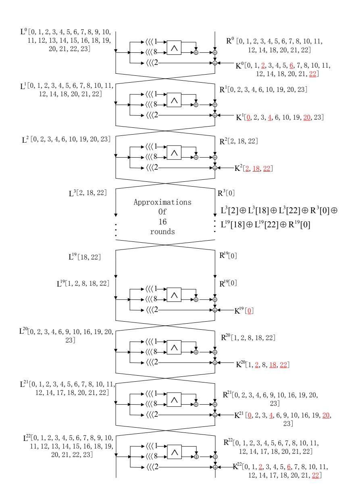

## Towards Finding the Best Characteristics of Some Bit-oriented Block Ciphers and Automatic Enumeration of (Related-key) Differential and Linear Characteristics with Predefined Properties

Siwei Sun1,<sup>2</sup> , Lei Hu1,<sup>2</sup> , Meiqin Wang<sup>3</sup> , Peng Wang1,<sup>2</sup> , Kexin Qiao1,<sup>2</sup> , Xiaoshuang Ma1,<sup>2</sup> , Danping Shi1,<sup>2</sup> , Ling Song1,<sup>2</sup> , Kai Fu<sup>3</sup>

> <sup>1</sup>State Key Laboratory of Information Security, Institute of Information Engineering, Chinese Academy of Sciences, Beijing 100093, China <sup>2</sup>Data Assurance and Communication Security Research Center, Chinese Academy of Sciences, Beijing 100093, China <sup>3</sup>Key Laboratory of Cryptologic Technology and Information Security, Ministry of Education, Shandong University, Jinan 250100, China {sunsiwei,hulei}@iie.ac.cn, mqwang@sdu.edu.cn, {wpeng,qiaokexin,maxiaoshuang,shidanping,songling}@iie.ac.cn

Abstract. In this paper, we investigate the Mixed-integer Linear Programming (MILP) modelling of the differential and linear behavior of a wide range of block ciphers. We point out that the differential behavior of an arbitrary S-box can be exactly described by a small system of linear inequalities.

Based on this observation and MILP technique, we propose an automatic method for finding high probability (related-key) differential or linear characteristics of block ciphers. Compared with Sun et al.'s heuristic method presented in Asiacrypt 2014, the new method is exact for most ciphers in the sense that every feasible 0-1 solution of the MILP model generated by the new method corresponds to a valid characteristic, and therefore there is no need to repeatedly add valid cutting-off inequalities into the MILP model as is done in Sun et al.'s method; the new method is more powerful which allows us to get the exact lower bounds of the number of differentially or linearly active S-boxes; and the new method is more efficient which allows to obtain characteristic with higher probability or covering more rounds of a cipher (sometimes with less computational effort).

Further, by encoding the probability information of the differentials of an S-boxes into its differential patterns, we present a novel MILP modelling technique which can be used to search for the characteristics with the maximal probability, rather than the characteristics with the smallest number of active S-boxes. With this technique, we are able to get tighter security bounds and find better characteristics.

Moreover, by employing a type of specially constructed linear inequalities which can remove exactly one feasible 0-1 solution from the feasible region of an MILP problem, we propose a method for automatic enumeration of all (related-key) differential or linear characteristics with some predefined properties, e.g., characteristics with given input or/and output difference/mask, or with a limited number of active S-boxes. Such a method is very useful in the automatic (related-key) differential analysis, truncated (related-key) differential analysis, linear hull analysis, and the automatic construction of (related-key) boomerang/rectangle distinguishers.

The methods presented in this paper are very simple and straightforward, based on which we implement a Python framework for automatic cryptanalysis, and extensive experiments are performed using this framework. To demonstrate the usefulness of these methods, we apply them to SIMON, PRESENT, Serpent, LBlock, DESL, and we obtain some improved cryptanalytic results.

Keywords: Automatic cryptanalysis, Related-key differential cryptanalysis, Linear cryptanalysis, Mixedinteger Linear Programming, Convex hull, Enumeration

## 1 Introduction

Differential cryptanalysis [1] and linear cryptanalysis [2] are two of the most powerful attacks on modern symmetric-key ciphers. Based on differential and linear cryptanalysis, lots of techniques have been developed for analyzing the security of block ciphers, such as the related-key differential attack [3–5], truncated differential attack [6], statistical saturation attack [7] (it has been shown in [8] that a statistical saturation attack is the same as a truncated differential attack), (probabilistic) higher order differential attack [6, 9], impossible differential attack [10, 11], boomerang attack [12], multiple differential attack [13–16], differential-linear cryptanalysis [17], multiple linear attack [18–22] and so on so forth. To a large extent, providing a security evaluation with respect to the differential and linear attacks has become a basic requirement for a newly designed block cipher to be accepted by the cryptographic community.

Matsui's branch and bound search algorithm [23] is one of the most powerful and classic methods for obtaining a security bound with respect to differential and linear attack. However, in some cases this method is impractical. Calculating the minimum number of active S-boxes is another way to evaluate the resistance of a block cipher against the differential and linear attack [24–29]. Searching for differential and linear characteristics is not only performed in basic differential and linear attacks, but also is indispensable in some new cryptanalytic techniques such as the rebound attack [30] and the sieve-in-the-middle technique [31]. Moreover, some new technique for cryptanalysis (e.g., the biclique attack [32]) and some symmetric-key cryptographic schemes which can be designed based on block ciphers (e.g., the authenticated encryption schemes) make the related-key model more important and highly relevant to the design and cryptanalysis of symmetric-key primitives. Therefore, methods which can be used to evaluate the security of a block cipher with respect to the (related-key) differential and linear attacks, and search for (related-key) differential or linear characteristics are of great importance. In fact, this direction of research has got much attention from many cryptanalysts [23, 33–38].

Mouha et al. [39] and Wu et al. [40] translated the problem of counting the minimum number of differentially active S-boxes, into an MILP problem which can be solved automatically with open source or commercially available MILP solvers. This method has been applied in evaluating the security against (related-key) differential attacks of many word-oriented symmetric schemes, as well as in searching for linear or differential characteristics with specific patterns [41, 42]. By introducing bit-level representations, Winnen et al. [43] and Sun et al. [44] extended Mouha et al.'s framework, and presented methods for counting the minimum number of differentially active S-boxes of bit-oriented block ciphers both in the single-key and related-key models. We notice that such MILP based methods are also mentioned or used in the recent analysis and design of several authenticated encryption schemes [25, 42, 45–50].

In Asiacrypt 2014, two systematic methods for generating linear inequalities describing the differential properties of an arbitrary S-box were given in [51]. With these inequalities, the authors of [51] were able to construct an MILP model whose feasible region is a more accurate description of the differential behavior of a given cipher. Based on such MILP models, the authors of [51] proposed a heuristic algorithm for finding (related-key) differential characteristics, which is applicable to a wide range of block ciphers. However, some important problems have not been solved yet in [51]. For example, is it possible to construct an MILP model whose feasible region of all 0-1 solutions is exactly the set of all possible (related-key) differential or linear characteristics? Is it possible to find the characteristics with the maximal probability instead of characteristics with the minimal number of active S-boxes by an MILP technique? Can we extract all characteristics with some predefined properties (e.g., characteristics with given input or/and output difference/mask, or with a limited number of active S-boxes)? In this work, we make a first step towards solving these problems.

Our contribution. In this work, we investigate the MILP modelling of the differential and linear behavior of a wide range of block ciphers. We point out that the convex hull description presented in Sun et al.'s work [51] is exact for any set P ⊆ {0, 1} <sup>n</sup> ⊆ R <sup>n</sup> (which can be seen as the set of all differential or linear patterns of an operation) according to a fact which have been known since at least 1972 [52]: for any x ∈ {0, 1} <sup>n</sup>, x is in the convex hull of P if and only if x ∈ P. This fact has some important implications. Firstly, we now know that there is no need to use the inequalities generated by the method based on logical condition modelling presented in [51] since the inequalities generated by the method based on convex hull computation are already enough. Secondly, Sun et al.'s heuristic method for finding (related-key) differential (or linear) characteristics can be transformed into an exact algorithm (for most ciphers) by adding all the linear inequalities in the H-representation of the convex hull, since by doing this, the feasible region of the MILP problem is exactly the set of all possible (related-key) differential (or linear) characteristics.<sup>1</sup>

However, as already pointed in [51], there are so many inequalities in the H-representation of the convex hull and adding all of them to the MILP problem will make it insolvable in practical time. To overcome this obstacle, we select only a small number of inequalities from the convex hull such that the feasible region of the

<sup>1</sup> Here by heuristic we mean that the solution extracted from the feasible region (all 0-1 solutions) of the underlying MILP model may be an invalid (related-key) differential or linear characteristic, and by exact we mean that every 0-1 solution of the underlying MILP model is a valid characteristic. While for most ciphers our method is exact, SIMON is an exceptional case in the sense that the models generated for SIMON by our method contain invalid characteristics due to the special differential properties of SIMON. However, we can easily filter out these invalid characteristics by the method presented in [53].

resulting MILP problem is still the set of all possible (related-key) differential or linear characteristics, and this is accomplished by a minor modification of Sun et al.'s greedy algorithm [51] for selecting inequalities from the convex hull. Eventually, we are able to build an exact and practical algorithm for finding (related-key) differential and linear characteristics.

Further, by encoding the probability information of an 4×4 S-box into its differential patterns, we present an MILP based method which can be used to find the differential characteristic with the maximal probability instead of minimal active S-boxes for block ciphers with 4 × 4 S-boxes.

Moreover, based on a type of specially constructed inequalities which can remove exactly one 0-1 solution from the feasible region of an MILP problem, we present a method for enumerating all the (related-key) differential and linear characteristics with some predefined properties, which is very useful differential- and linear-type cryptanalysis, such as the analysis of differential and linear hull effect.

Based on the methods presented in this paper, we develop a Python [54] based framework for automatic (related-key) differential and linear (hull) analysis, automatic truncated (related-key) differential analysis, and automatic construction of boomerang distinguishers. Using this framework, we obtain the following results:

- 1. We get the exact lower bounds of the number of differentially active S-boxes for some round-reduced versions of LBlock, and we prove that the probability of any related-key differential characteristic for the full LBlock is upper bounded by 2−68, which is the tightest security bound so far for the cipher LBlock. Moreover, the computational cost used to derive this bound is significantly reduced than that of [51].
- 2. We automatically prove that there is no single-key differential characteristic for Serpent [55] (one of the AES finalist) with probability higher than 2<sup>−</sup><sup>128</sup> in no more than 73 minutes on a PC. Note that obtaining this bound is a very difficult task at the time of the AES selection process. We also show that this bound can be further improved by using the MILP technique for finding the characteristic with the maximal probability presented in Sect. 5.
- 3. For the 8-round DESL, we find a related-key differential characteristic with probability 2<sup>−</sup>33.<sup>45</sup> on a PC in no more than 4 minutes. Note that the best previously published related-key characteristic (whose probability is 2<sup>−</sup>34.78) for the 8-round DESL was found on a PC using roughly 10 minutes. In addition, we automatically find a truncated related-key differential with probability 2<sup>−</sup>34.<sup>06</sup> for the 9-round DESL on a PC using no more than 28 minutes. Moreover, we find a 4-round differential characteristic with probability 2 <sup>−</sup><sup>40</sup> covering 4 rounds (using S-boxes: S5, S6, S7, S0) of Serpent. While the best characteristic covering this 4 rounds of Serpent published previously is given in [56], whose probability is 2<sup>−</sup><sup>47</sup> .
- 4. We find a 16-round standard (non truncated) related-key differential with probability 2<sup>−</sup>55.64, which is even better than the best truncated related-key differential published previously for the 16-round LBlock whose probability is about 2<sup>−</sup><sup>59</sup> [57]. To the best of our knowledge, this is the best (related-key) differential for LBlock published so far, and this is the first concrete result demonstrating the related-key differential effect.
- 5. We present a single-key differential covering 16 rounds of SIMON48 whose probability is at least 2<sup>−</sup>44.<sup>65</sup> , and a single-key differential covering 22 rounds of SIMON64 whose probability is at least 2<sup>−</sup>62.21. To the best of our knowledge, there are no published single-key differentials covering more than 15 rounds of SIMON48 and 21 rounds of SIMON64. These differentials can be used to produce the best known attacks on SIMON48 and SIMON64 with the technique presented in [58].
- 6. We present a linear characteristic for the 55-round SIMON128 which covering more rounds and with higher bias than the 52-round linear characteristic given in [59]. We also present a 16-round linear hull with potential 2<sup>−</sup>44.<sup>92</sup> for SIMON48 leading to an attack on 23-round SIMON48. To the best of our knowledge, this is so far the best attack on SIMON48.
- 7. We improve the currently best known related-key boomerang distinguishers for the 14-round PRESENT-128 and the 16-round LBlock.

We would like to emphasis that the specific result is not the focus of this paper, and we believe that there always exists a dedicated method for a specific cipher which can produce better results than ours. Instead, the focus is the methodology, which is simple, straight-forward and automatic. Moreover, the results presented in this paper probably can be further improved by taking more computational effort. We have set up a web site at http://siweisun.github.io/ where we present some MILP models such that anyone can solve them and try to produce better results. Besides, this method has some limitations which will be discussed in Sect. 7, and if we have any progress on dealing with the limitations, we will present the new findings to the web site as soon as possible. This site also contains some other applications of the method. For example, based on Zhao et. al.'s work [60], in [61] our tool produces the currently best single-key differential attack on the block cipher PRIDE [62], and more new results concerning the linear analysis of SIMON are presented in [63].

Organization. We start with a brief introduction of Sun et al.'s method [44,51] for automatic differential cryptanalysis of bit-oriented block ciphers in Sect. 2. Then, in Sect. 3, we investigate the problem of describing an arbitrary subset of  $\{0,1\}^n \subseteq \mathbb{R}^n$  with linear inequalities, and present some theorems which are of fundamental importance for the remaining work of this paper. In Sect. 4, a method for constructing an MILP model whose feasible region is exactly the set of all (related-key) differential or linear characteristics is proposed with its application in obtaining exact lower bound of the number of active S-boxes, and searching for (related-key) differential or linear characteristics. We show how to search for the best characteristic of ciphers with  $4 \times 4$  S-boxes in Sect. 5. Based on the work of Sect. 4 and a type of specially constructed inequality, we present a method for automatic enumeration of (related-key) differential or linear characteristics with some predefined properties in Sect. 6, which is applicable in the automatic (related-key) differential and linear (hull) analysis, automatic truncated (related-key) differential analysis, and the automatic construction of boomerang/rectangle distinguishers. In Sect.7, we discuss the limitations of our methods. Sect. 8 is the conclusion.

## 2 Automatic (Related-key) Differential and Linear Analysis of Bit-oriented Block Ciphers

In this section, we give a brief introduction of Sun *et al.*'s method which can be used to search for (related-key) differential characteristics and obtain security bounds of a cipher with respect to the (related-key) differential attack automatically. We refer the reader to [44,51] for more information. In addition, the same method can be used in automatic linear analysis, and we present it in Appendix A.

Sun et al.'s method [51] is an extension of Mouha et al.'s technique [39] which describes the differential behavior of a cipher by an MILP problem, and it is applicable to block ciphers involving bitwise XOR, bitwise permutation L which permutes the bit positions of a n dimensional vector in  $\mathbb{F}_2^n$ , and S-box operation  $S: \mathbb{F}_2^{\omega} \to \mathbb{F}_2^{\nu}$ .

Theoretically, Sun *et al.*'s method is also applicable to ciphers containing general linear transformation  $T: \mathbb{F}_2^n \to \mathbb{F}_2^m$ , since T can be converted into some XOR summations of different bits. However, such operation will introduce a large number of variables and constraints into the MILP problem and make it very difficult to be solved in practical time.

For every input and output bit-level differences, introduce a new 0-1 variable  $x_i$  to denote whether this bit has a nonzero difference or not:

$$x_i = \begin{cases} 1, & \text{for nonzero difference at this bit,} \\ 0, & \text{otherwise.} \end{cases}$$

Also, for every S-box in the schematic diagram of the cipher under consideration, including the encryption process and the key schedule algorithm, introduce a new 0-1 variable  $A_j$  such that

$$A_j = \begin{cases} 1, & \text{if the input word of the Sbox is nonzero,} \\ 0, & \text{otherwise.} \end{cases}$$

Here we say that  $A_i$  indicates the activity of an S-box, or an S-box is marked by  $A_i$ .

Now, we are ready to describe Sun *et al.*'s method by clarifying the objective function and constraints in the MILP model. Note that we assume that all variables involved are 0-1 variables.

**Objective Function.** The objective function is to minimize the sum of all variables indicating the activities of the S-boxes appearing in the schematic description of the encryption and key schedule algorithm of a cipher:  $\sum_{j} A_{j}$ .

Constraints. Firstly, for every XOR operation with bit-level input differences a, b and bit-level output difference c, include the following constraints

$$\begin{cases}
d_{\oplus} \ge a, \ d_{\oplus} \ge b, \ d_{\oplus} \ge c \\
a+b+c \ge 2d_{\oplus} \\
a+b+c \le 2
\end{cases}$$
(1)

where  $d_{\oplus}$  is a dummy variable.

Assuming  $(x_{i_0}, \dots, x_{i_{\omega-1}})$  and  $(y_{i_0}, \dots, y_{i_{\nu-1}})$  are the input and output differences of an  $\omega \times \nu$  S-box marked by  $A_t$ , we have

$$\begin{cases}
A_t - x_{i_k} \ge 0, & k \in \{0, \dots, \omega - 1\} \\
-A_t + \sum_{j=0}^{\omega - 1} x_{i_j} \ge 0
\end{cases}$$
(2)

which ensures that nonzero input difference must activate the S-box. Moreover, the Hamming weight of the  $(\omega + \nu)$ -bit word  $x_{i_0} \cdots x_{i_{\omega-1}} y_{j_0} \cdots y_{j_{\nu-1}}$  must be greater than or equal to the branch number  $\mathcal{B}_{\mathcal{S}}$  of the S-box for nonzero input difference  $x_{i_0} \cdots x_{i_{\omega-1}}$ :

$$\begin{cases} \sum_{k=0}^{\omega-1} x_{i_k} + \sum_{k=0}^{\nu-1} y_{j_k} \ge \mathcal{B}_{\mathcal{S}} d_{\mathcal{S}} \\ d_{\mathcal{S}} \ge x_{i_k}, & 0 \le k \le \omega - 1 \\ d_{\mathcal{S}} \ge y_{j_k}, & 0 \le k \le \nu - 1 \end{cases}$$
(3)

where  $d_{\mathcal{S}}$  is a dummy variable, and the branch number  $\mathcal{B}_{\mathcal{S}}$  of an S-box  $\mathcal{S}$ , is defined as  $\min_{a\neq b} \{ \text{wt}((a \oplus b)||(\mathcal{S}(a) \oplus \mathcal{S}(b)) : a, b \in \mathbb{F}_2^{\omega} \}$  and  $\text{wt}(\cdot)$  is the standard Hamming weight of a  $(\omega + \nu)$ -bit word.

For an bijective S-box we have

$$\begin{cases} \omega \sum_{k=0}^{\nu-1} y_{j_k} - \sum_{k=0}^{\omega-1} x_{i_k} \ge 0\\ \nu \sum_{k=0}^{\omega-1} x_{i_k} - \sum_{k=0}^{\nu-1} y_{j_k} \ge 0 \end{cases}$$
(4)

since nonzero input difference must result in nonzero output difference and vice versa. Note that for an S-box with branch number  $\mathcal{B}_{\mathcal{S}} = 2$ , the constraints presented in (3) are redundant [51].

To describe the differential properties of an S-box more accurately, Sun *et al.* proposed two systematic ways for generating valid cutting-off inequalities [51] which are used to remove some impossible differential patterns of the S-box from the feasible region of the MILP problem:

**Logical Condition Modelling.** Borrowing the idea from general MILP modelling technique for logical conditions, Sun *et al.* showed that some conditional differential properties of an S-box can be described by linear inequalities. For example, the least significant bit of the output difference of the PRESENT S-box is always 0 if the input difference is 1001. This conditional differential property is equivalent to the following constraint

$$-x_0 + x_1 + x_2 - x_3 - y_3 + 2 \ge 0$$

where  $x_i, y_i \in \{0, 1\} \subseteq \mathbb{R}$ , and  $(x_0, \dots, x_3)$  and  $(y_0, \dots, y_3)$  are the input and output difference respectively. This fact can be easily verified by enumerating all possible 0-1 assignments of the variables  $x_i$  and  $y_i$ .

Convex Hull Computation. A convex hull of a finite set P of points is the smallest convex set that contains P. Sun et al. treat every possible input-output differential pattern  $(x_0, \dots, x_{\omega-1}) \to (y_0, \dots, y_{\nu-1})$  of an  $\omega \times \nu$  S-box as an  $(\omega + \nu)$ -dimensional vector  $(x_0, \dots, x_{\omega-1}, y_0, \dots, y_{\nu-1}) \in \{0, 1\}^{\omega + \nu} \subseteq \mathbb{R}^{\omega + \nu}$ . By computing the H-Representation of the convex hull of all possible input-output differential patterns of an S-box, many linear inequalities which can be used to remove some impossible differential patterns of the S-box are obtained. Moreover, a greedy algorithm is developed for selecting a small number of inequalities from the H-representation of the convex hull.

Finally, we note that Sun  $et\ al.$ 's method [51] is also applicable in automatic linear cryptanalysis, and the MILP modelling process is given in Appendix A.

## 3 Describing Subsets of $\{0,1\}^n \subseteq \mathbb{R}^n$ with Linear Inequalities

In this section, we start by thoroughly investigating the problem of describing an arbitrary set  $P \subseteq \{0,1\}^n \subseteq \mathbb{R}^n$  with linear inequalities, which eventually leads us to the construction of MILP models whose feasible regions are exactly the sets of all (related-key) differential (or linear) characteristics for a wide range of ciphers.

Firstly, we introduce some notations for the convenience of discussion. Let  $\mathcal{L} = \{l_0, \dots, l_{m-1}\}$  be a system of linear inequalities of the form  $l_i : \sum_{j=0}^{n-1} \lambda_{ij} x_j + \beta_i \geq 0, 0 \leq i \leq m-1$ . Then, we use  $Sol(\mathcal{L})$  to denote the set of all solutions of  $\mathcal{L}$  in  $\mathbb{R}^n$ . In addition,  $Sol(\mathcal{L}) \cap A$  is represented by  $Sol_A(\mathcal{L})$ , where A is a subset of  $\mathbb{R}^n$ . Under these notations,  $Sol_{\mathbb{B}^n}(\mathcal{L}) = Sol(\mathcal{L}) \cap \mathbb{B}^n$  is the set of all 0-1 solutions of  $\mathcal{L}$ , where  $\mathbb{B} = \{0,1\} \subseteq \mathbb{R}$ .

Moreover, we use  $Cut_{\mathbb{B}^n}(l_i) = Cut_{\mathbb{B}^n}(\sum_{j=0}^{n-1} \lambda_{ij}x_j + \beta_i \geq 0)$  to denote the set of all 0-1 vectors in  $\mathbb{R}^n$  which are not satisfied by  $l_i$ . That is,  $Cut_{\mathbb{B}^n}(l_i) = \mathbb{B}^n - Sol_{\mathbb{B}^n}(\{l_i\})$ . Also, we use  $Cut_{\mathbb{B}^n}(\mathcal{L})$  to represent the set  $\bigcup_{l_i \in \mathcal{L}} Cut_{\mathbb{B}^n}(l_i)$ . According to this notation, we have  $Cut_{\mathbb{B}^n}(\mathcal{L}) = \mathbb{B}^n - Sol_{\mathbb{B}^n}(\mathcal{L})$ .

**Definition 1.** A set  $C \subseteq \mathbb{R}^n$  is said to be convex if, for all  $x, y \in C$  and all  $t \in [0, 1]$ , the point (1 - t)x + ty also belongs to C.

**Definition 2.** The smallest convex set that contains  $P \subseteq \mathbb{R}^n$  is said to be the convex hull of P, and is denoted by  $\operatorname{conv}(P)$ .

Lemma 1. The set of all solutions of the following system of (in)equalities

$$\begin{cases} \lambda_{0,0} x_0 + \dots + \lambda_{0,n-1} x_{n-1} + \lambda_{0,n} \ge 0 \\ \dots \\ \gamma_{0,0} x_0 + \dots + \gamma_{0,n-1} x_{n-1} + \gamma_{0,n} = 0 \\ \dots \end{cases}$$
(5)

is convex, where  $\lambda_{i,j}$  and  $\gamma_{i,j}$  are fixed real numbers. For any subset  $X \subseteq \mathbb{R}^n$  with finitely many discrete points, there exists a system  $\mathcal{H}_{conv(X)}$  of linear inequalities of the form of (5), such that  $Sol(\mathcal{H}_{conv(X)}) = conv(X)$ , and we call  $\mathcal{H}_{conv(X)}$  the H-representation of conv(X).

The above definitions and lemma are well known in computational geometry, and for a given set  $P \subseteq \mathbb{R}^n$  of finitely many points, there are algorithms which can compute the H-representation of  $\operatorname{conv}(P)$  [64–67].

**Lemma 2.** For a given 0-1 vector  $\delta = (\delta_0, \delta_1, \dots, \delta_{n-1}) \in \{0, 1\}^n \subseteq \mathbb{R}^n$ ,  $Cut_{\mathbb{B}^n}(\sum_{i=0}^{n-1} [\delta_i + (-1)^{\delta_i} x_i] \ge 1) = \{(\delta_0, \delta_1, \dots, \delta_{n-1})\}.$

**Proof**. Without loss of generality, we assume

$$\delta = (\delta_0, \dots, \delta_{n-1}) = (\delta_0, \dots, \delta_{s-1}; \delta_s, \dots, \delta_{n-1}) = (1, \dots, 1; 0, 0, \dots, 0).$$

For other 0-1 pattern, it can be permuted into such a form and this will not affect our proof. Firstly, substituting  $x_i$  by  $\delta_i$ , we have

$$\sum_{i=0}^{n-1} [\delta_i + (-1)^{\delta_i} x_i] = \sum_{i=0}^{s_1-1} \delta_i + \sum_{i=0}^{s_1-1} (-1)^{\delta_i} \delta_i = 0 < 1.$$

That is,  $\delta$  is not satisfied by  $\sum_{i=0}^{n-1} [\delta_i + (-1)^{\delta_i} x_i] \geq 1$ . Secondly, for  $\delta' = (\delta'_0, \dots, \delta'_{n-1}) \neq \delta$ , substituting  $x_i$  by  $\delta'_i$ , we have

$$\sum_{i=0}^{n-1} [\delta_i + (-1)^{\delta_i} x_i] = \sum_{i=0}^{s_1-1} \delta_i + \sum_{i=0}^{n-1} (-1)^{\delta_i} \delta_i' \ge s_1 - s_1 + 1 = 1.$$

That is, all vectors other than  $\delta$  are satisfied by  $\sum_{i=0}^{n-1} [\delta_i + (-1)^{\delta_i} x_i] \ge 1$ . The proof is completed.

Below, we use  $l^{(\delta_0,\delta_1,\cdots,\delta_{n-1})}$  or  $l^{(\delta)}$  to denote the linear inequality  $\sum_{i=0}^{n-1} [\delta_i + (-1)^{\delta_i} x_i] \geq 1$ . Therefore, we have  $Cut_{\mathbb{B}^n_i}(l^{(\delta)}) = Cut_{\mathbb{B}^n}(l^{(\delta_0,\cdots,\delta_{n-1})}) = \{\delta\} = \{(\delta_0,\cdots,\delta_{n-1})\}.$

That is,  $l^{(\delta)}$  can be used to remove exactly one 0-1 vector. This kind of inequalities plays a significant role in our algorithm for enumerating (related-key) differential (or linear) characteristics, and is useful for proving the following theorem. Recently, some researchers inform us that the following theorem has already been proved by Egon Balas et al. [52] in 1972 (Although they are different in appearance, they are the same in essential). Hence, this theorem should be attributed to Egon Balas et al. Still, we would like to provide our proof for the sake of completeness.

**Theorem 1.** Assume  $x \in \{0,1\}^n$  and let conv(X) be the convex hull of  $X \subseteq \{0,1\}^n \subseteq \mathbb{R}^n$ . Then  $x \in conv(X)$  if and only if  $x \in X$ .

**Proof.** Since conv(X) is the convex hull of X which is the smallest convex set containing X, we have  $x \in conv(X)$  for every  $x \in X$ .

Then, we prove that  $y \in X$  for every 0-1 vector  $y \in \text{conv}(X)$  by contradiction. If this is not the case, then there exists a 0-1 vector  $y^* \in \text{conv}(X)$ , such that  $y^* \notin X$ . Consider the set of linear inequalities  $\mathcal{L} = \mathcal{H}_{\text{conv}(X)} \cup \{l^{(y^*)}\}$ , where  $\mathcal{H}_{\text{conv}(X)}$  is the H-representation of conv(X).

On the one hand, We have  $Cut_{\mathbb{B}^n}(\mathcal{L}) = Cut_{\mathbb{B}^n}(\mathcal{H}_{\operatorname{conv}(X)}) \cup \{y^*\}$  according to the definition of  $l^{(y^*)}$  and Lemma 2. Hence,  $Sol_{\mathbb{B}^n}(\mathcal{L}) = \mathbb{B}^n - Cut_{\mathbb{B}^n}(\mathcal{H}_{\operatorname{conv}(X)}) - \{y^*\} = Sol_{\mathbb{B}^n}(\mathcal{H}_{\operatorname{conv}(X)}) - \{y^*\} = \operatorname{conv}(X) \cap \mathbb{B}^n - \{y^*\}$ , from which we can deduce that  $Sol_{\mathbb{B}^n}(\mathcal{L}) \subsetneq \operatorname{conv}(X) \cap \mathbb{B}^n$ .

On the other hand,  $\operatorname{conv}(X) \subseteq \operatorname{Sol}(\mathcal{L})$  since  $\operatorname{Sol}(\mathcal{L})$  is a convex set containing X and  $\operatorname{conv}(X)$  is the smallest convex set containing X. Consequently,  $\operatorname{conv}(X) \cap \mathbb{B}^n \subseteq \operatorname{Sol}_{\mathbb{B}^n}(\mathcal{L})$ , which is a contradiction. The proof is completed.

## 4 MILP Models with Feasible Regions Equal to the Sets of All (Related-key) Differential (or Linear) Characteristics and Its Applications

#### 4.1 Model Construction

The key idea behind Sun et al.'s work [44] on automatic differential cryptanalysis for bit-oriented block ciphers is to construct an MILP model whose feasible region contains the set of all differential characteristics of the cipher under consideration. Such a model is constructed in [44] by introducing 0-1 variables for every bit-level input and output differences of every operation involved in the cipher, and modelling the constraints on differential propagation imposed by every operation as a system of linear inequalities. For block ciphers involving XOR, bit permutation, and S-boxes, the modelling technique presented in [44] leads to MILP models whose feasible region are much larger than the sets of all valid (related-key) differential characteristics of the cipher under consideration, since the linear inequalities used in these MILP models are far from being perfect to rule out all invalid (related-key) differential characteristics of a cipher.

Subsequently, Sun et al. [51] introduce the concept of valid cutting-off inequalities which can be used to remove some impossible differential patterns from the feasible region, and they design a heuristic algorithm for finding (related-key) differential characteristics. This algorithm tries to extract a differential characteristic with a small number of active S-boxes from the feasible region of the MILP model which may contain invalid characteristics, and the extracted solution is not guaranteed to be a valid characteristic. Therefore, the algorithm needs to repeatedly add valid cutting-off inequalities to the MILP model to make the feasible region more restrictive until the extracted solution pass the check that it is indeed a valid characteristic.

In the following, we show that we can construct MILP models whose feasible region are exactly the sets of all valid (related-key) differential characteristics for a wide range of block ciphers by using the convex hull computation approach.

For linear analysis, by using a similar method, we can construct MILP models whose feasible regions are exactly the set of all linear characteristics, and the method is presented in Appendix A.

**Definition 3.** Let  $\mathcal{L}$  be a set of linear inequalities and  $X \subseteq \{0,1\}^n \subseteq \mathbb{R}^n$ . We say  $\mathcal{L}$  is a linear-inequality description of X if  $X \subseteq Sol_{\mathbb{B}^n}(\mathcal{L})$ , and we say the description is exact for X if  $Sol_{\mathbb{B}^n}(\mathcal{L}) = X$ .

In order to construct an MILP model whose feasible region is exactly the set of all (related-key) differential characteristics of a given cipher, we must use constraints that are exact linear-inequality descriptions of the differential behavior for all operations involved in the cipher.

For block ciphers involving bit permutations, XOR operations, and S-boxes, the S-box operations are the most difficult parts since we already have exact descriptions for bit permutations and XOR operations (see Sect. 2). Next, we show how to deal with the S-box parts.

**Definition 4.** Let S be an arbitrary  $\omega \times \nu$  S-box such that  $(b_0, \ldots, b_{\nu-1}) = S(a_0, \ldots, a_{\omega-1})$ . The differential set  $\mathcal{D}_S$  of S is defined to be the set of all differential patterns of S. That is,  $\mathcal{D}_S = \{(x_0, \ldots, x_{\omega-1}, y_0, \ldots, y_{\nu-1}) \in \mathbb{B}^{\omega+\nu} : \Pr_S[(x_0, \ldots, x_{\omega-1}) \to (y_0, \ldots, y_{\nu-1})] > 0\}$ , where  $\Pr_S[(x_0, \ldots, x_{\omega-1}) \to (y_0, \ldots, y_{\nu-1})]$  is the probability associated with the differential  $(x_0, \ldots, x_{\omega-1}) \to (y_0, \ldots, y_{\nu-1})$  across the S-box operation.

Note that  $\mathcal{D}_S$  can be built directly from the differential distribution table of S.

Fact 1. Let S be an arbitrary ω × ν S-box, and D<sup>S</sup> ⊆ {0, 1} ω+ν be the set of all differential patterns with probability greater than 0. Then Hconv(D<sup>S</sup> ) is an exact linear-inequality description of DS, where Hconv(D<sup>S</sup> ) is the H-representation of conv(DS).

Proof. Assuming x ∈ {0, 1} <sup>n</sup>, then x ∈ conv(DS) if and only if x ∈ D<sup>S</sup> according to Theorem 1. Therefore, conv(DS) ∩ B <sup>n</sup> = SolB<sup>n</sup> (Hconv(D<sup>S</sup> )) = DS. Hence, Hconv(D<sup>S</sup> ) is an exact description of DS. The proof is completed.

According to Fact 1, we can build an MILP model whose feasible region is exactly the set of all (relatedkey) differential characteristics for a given cipher by following the modelling process introduced in Sect. 2 and adding all the linear inequalities in the H-representations of the convex hulls of all S-boxes involved into the MILP model.

However, as already pointed out in [51], there are too many inequalities in the H-representation, and MILP models with a large number of constraints are very difficult to solve. Therefore, we need to construct MILP models with less constraints while the sets of all 0-1 solutions of these models are still the sets of all valid (related-key) differential or linear characteristics.

Definition 5. Let L be a system of linear inequalities of the following form

$$\begin{cases} \lambda_{0,0}x_0 + \dots + \lambda_{0,n-1}x_{n-1} + \lambda_{0,n} \ge 0 \\ \dots \\ \gamma_{0,0}x_0 + \dots + \gamma_{0,n-1}x_{n-1} + \gamma_{0,n} = 0 \\ \dots \end{cases}$$

Then, a set L <sup>∗</sup> ⊆ L is said to be cutting-off equivalent to L if Cut<sup>B</sup><sup>n</sup> (L ∗ ) = Cut<sup>B</sup><sup>n</sup> (L).

In order to reduce the number of inequalities in the MILP model, we give the following algorithm which can be used to select a subset of Hconv(D<sup>S</sup> ) with less inequalities that is cutting-off equivalent to Hconv(D<sup>S</sup> ) .

## Algorithm 1: Select a system of inequalities from Hconv(D<sup>S</sup> )

```
Input: Hconv(DS )
                      : the set of all inequalities in the H-representation of the convex hull of an S-box S;
   Output: OS: A set of inequalities selected from Hconv(DS ) which is cutting-off equivalent to Hconv(DS )
                                                                                                        .
 1 l
   ∗
     := None;
 2 X := the set of all impossible differential patterns of an S-box;
 3 X
     ∗
      := X ;
 4 H∗
      := Hconv(DS )
                   ;
 5 OS := ∅;
 6 while True do
 7 l
       ∗
         := The inequality in H∗ which maximizes the number of removed impossible differential
      patterns from X
                      ∗
                        ;
 8 X
        ∗
          := X
               ∗ − CutBn ({l
                            ∗});
 9 H∗
          := H∗ − {l
                    ∗};
10 OS := OS ∪ {l
                      ∗};
11 if X
           ∗ = ∅ then
12 return OS and Terminate
13 end
14 end
```

Algorithm 1 builds up a set O<sup>S</sup> of valid cutting-off inequalities by selecting at each step an inequality from Hconv(D<sup>S</sup> ) until there is no inequality in Hconv(D<sup>S</sup> ) − O<sup>S</sup> which can remove an impossible differential pattern of S which satisfies all inequalities already in OS.

Therefore, we have Cut<sup>B</sup><sup>n</sup> (OS) = Cut<sup>B</sup><sup>n</sup> (Hconv(D<sup>S</sup> )). That is, O<sup>S</sup> is cutting-off equivalent to Hconv(D<sup>S</sup> ) . Consequently, we can include OS, instead of Hconv(D<sup>S</sup> ) , as the constraints imposed by the differential properties of S, and the resulting MILP model will be easier to solve if the number of inequalities in O<sup>S</sup> is much smaller than that of Hconv(D<sup>S</sup> ) .

Definition 6. We call the set O<sup>S</sup> of inequalities produced by algorithm 1 for an S-box S a critical set of Hconv(D<sup>S</sup> ) .

We have computed the critical sets for some typical 4 × 4 S-boxes, and the results show that the number of inequalities in O<sup>S</sup> is indeed much smaller than that of Hconv(D<sup>S</sup> ) (see Table 1).

| S-box                | #OS | #Hconv(DS<br>) | S-box           | #OS | #Hconv(DS<br>) |
|----------------------|-----|----------------|-----------------|-----|----------------|
| Klein [68]           | 22  | 311            | LBlock S6       | 27  | 205            |
| Piccolo [69]         | 23  | 202            | LBlock S7       | 27  | 205            |
| TWINE [70]           | 23  | 324            | LBlock S8       | 28  | 205            |
| PRINCE [27, 28]      | 26  | 300            | LBlock S9       | 27  | 205            |
| MIBS [71]            | 27  | 378            | Serpent S0 [55] | 23  | 327            |
| PRESENT/LED [24, 72] | 22  | 327            | Serpent S1      | 24  | 327            |
| LBlock S0 [73]       | 28  | 205            | Serpent S2      | 25  | 325            |
| LBlock S1            | 27  | 205            | Serpent S3      | 31  | 368            |
| LBlock S2            | 27  | 205            | Serpent S4      | 26  | 321            |
| LBlock S3            | 27  | 205            | Serpent S5      | 25  | 321            |
| LBlock S4            | 28  | 205            | Serpent S6      | 22  | 327            |
| LBlock S5            | 27  | 205            | Serpent S7      | 30  | 368            |

Table 1: Numbers of inequalities in O<sup>S</sup> and Hconv(D<sup>S</sup> ) for typical 4 × 4 S-boxes.

#### 4.2 Applications in Obtaining Security Bound and Searching for High Probability Characteristics

According to the above analysis, we are now able to construct MILP models whose feasible regions are exactly the sets of all (related-key) differential or linear characteristics, which leads to the following applications.

Obtaining Exact Lower Bounds of the Numbers of Active S-boxes. By setting the objective function to be P <sup>j</sup> A<sup>j</sup> , where A<sup>j</sup> 's are the variables marking the activities of the involved S-boxes, we can obtain an MILP model whose optimized solution corresponds to a (related-key) differential characteristic which has the minimum number of active S-boxes, and the objective value of this solution is the exact lower bound of the number of active S-boxes.

We apply the method to LBlock, and the results are listed in Table 2. From Table 2, we can see that there are at least 10 differentially active S-boxes for consecutive 10 rounds of LBlock, and 12 active S-boxes for consecutive 11 rounds of LBlock in the related-key model. Therefore, the probability of the best related-key characteristic for the 32-round LBlock is at most (2<sup>−</sup><sup>2</sup> ) 12+12+10 = 2<sup>−</sup>68. While the previously published best result concerning the security bound of LBlock in the related-key model is given in [51] stating that the probability of the best related-key characteristic for the 32-round LBlock is at most 2<sup>−</sup>60. Moreover, the bound presented in this paper is obtained on a PC in no more than 6 days, while the bound presented in [51] was obtained on a PC using more than 49 days. The main reason of the reduction of the computational effort is that we can get better bounds without considering characteristics covering more rounds, and we refer the reader to [51] for more information.

Table 2: The exact lower bounds of the number of differentially active S-boxes for round-reduced variants of LBlock in the related-key model

|    | Rounds The number of active S-boxes |      | Time (in seconds) |       |
|----|-------------------------------------|------|-------------------|-------|
|    | This paper                          | [51] | This paper        | [51]  |
| 5  | 1                                   | 1    | 3                 | 2     |
| 6  | 2                                   | 2    | 35                | 12    |
| 7  | 4                                   | 3    | 70                | 38    |
| 8  | 6                                   | 5    | 271               | 128   |
| 9  | 8                                   | 6    | 11656             | 386   |
| 10 | 10                                  | 8    | 105475            | 19932 |
| 11 | 12                                  | 10   | 376235            | 43793 |

We also apply the method to Serpent (one of the AES finalists), and we automatically prove that the probability of the best single-key differential characteristic for the 27-round Serpent is upper bounded by 2 <sup>−</sup><sup>132</sup>. The detail of the result is given in Appendix B.

An Exact Method for Finding (Related-key) Differential and Linear Characteristics. For a given cipher, build an MILP problem whose feasible region is exactly the set of all related-key differential or linear characteristics of the cipher. Then solve it using any MILP optimizer, e.g., Gurobi [74] or SCIP [75]. When the value of the objective function decreases to N, terminate the solving process and extract the current solution whose objective value is N. This solution corresponds to a (related-key) differential or linear characteristic with N active S-boxes.

Using this method, we find an 8-round related-key differential characteristic for DESL with probability 2 <sup>−</sup>33.<sup>45</sup> (see Table 3 and Table 4). This result is obtained on a PC in no more than 4 minutes. Compared with the method presented in [51], which outputs an 8-round related-key characteristic with probability 2−34.<sup>78</sup> on a PC using roughly 10 minutes, the new method presented in this paper produces a better characteristic with less computational effort.

Table 3: An 8-round related-key differential characteristic for DESL (characteristic in the encryption process)

| Rounds | Left | Right                                                             |
|--------|------|-------------------------------------------------------------------|
| 0      |      | 00010000000000000000000000000010 00000000000000000000010000000000 |
| 1      |      | 00000000000000000000010000000000 00000000000000000000000000000010 |
| 2      |      | 00000000000000000000000000000010 00000000000000000000110000000000 |
| 3      |      | 00000000000000000000110000000000 00000000000000000000000000001010 |
| 4      |      | 00000000000000000000000000001010 00000000000000000000010000000000 |
| 5      |      | 00000000000000000000010000000000 00000000000000000000000000001010 |
| 6      |      | 00000000000000000000000000001010 00000000000000000000110000000000 |
| 7      |      | 00000000000000000000110000000000 00000000000000000000000000000010 |
| 8      |      | 00000000000000000000000000000010 00000000001000100010010000101000 |

Table 4: An 8-round related-key differential characteristic for DESL (characteristic in the key schedule algorithm)

| Rounds | Differences in the Key Register                  |
|--------|--------------------------------------------------|
| 1      | 000000000000000000000000000000100000000000000000 |
| 2      | 000000000000000000000000000000000000000000000010 |
| 3      | 000000000000000000000000000001000000000000000000 |
| 4      | 000000000000000000000000000000000000000001000000 |
| 5      | 000000000000000000000000000000001000000000000000 |
| 6      | 000000000000000000000000000000000000010000000000 |
| 7      | 000000000000000000000000000010000000000000000000 |
| 8      | 000000000000000000000000000000000100000000000000 |

We also use this method to search for linear characteristics for round-reduced versions of SIMON128, and the results are given in Appendix C. Very recently, Alizadeh et al. [59] presented a 52-round linear characteristic for SIMON128 with bias 2<sup>−</sup><sup>128</sup>, while the characteristic we find covers 55 rounds and the bias of this characteristic is 2<sup>−</sup><sup>109</sup>. Moreover, the method of this section is a basic tool used to search for (related-key) differential characteristics in the following sections.

## 5 Towards Finding the Best Characteristic with MILP Technique

Finding the best characteristic of a cipher is generally an extremely difficult task. Matsui's approach [23] and its variants and improvements [33, 76–78] are the most important and effective methods used to search for the best characteristics. However, Matsui's approach has some important limitations making it not practically applicable in many cases. Moreover, some speeding up techniques employed by Matsui's approach is intimately related to the special properties and structure of the cipher under consideration, which makes it very difficult to implement. In this section, we provide another method for finding the best characteristic for block ciphers using 4 × 4 S-boxes based on MILP technique. Compared with the method presented in Sect. 4, the main differences of the new technique involve the modeling of the differential patterns of the S-boxes, and the selection of the objective function. However, we think the contribution of this new method is in fact very limited since preliminary experiments show that the MILP model generated by this method is very difficult to solve, which is one of the reasons that we only apply our method to block ciphers with  $4 \times 4$  S-boxes.

One main drawback of the method presented in Sect. 4 is that it only focuses on finding characteristics with minimal (or very small) number of active S-boxes. However, it is well possible that the characteristics with the maximal probability do not have the minimal number of active S-boxes. Therefore, we may miss some better characteristics by using the method presented in Sect. 4 even we are given unlimited computational power, which makes us very uncomfortable. In the following, we show how to model the differential behavior of an  $4 \times 4$  S-box without losing its information of differential probability.

Take the PRESENT S-box S for example. For every possible differential pattern  $(x_0, x_1, x_2, x_3) \rightarrow (y_0, y_1, y_2, y_3)$ , we can construct a corresponding differential pattern with probability information  $(x_0, x_1, x_2, x_3, y_0, y_1, y_2, y_3; p_0, p_1) \in \mathbb{B}^{8+2}$  where the two extra bits  $(p_0, p_1)$  are used to encode the differential probability  $\Pr_S[(x_0, \dots, x_{\omega-1}) \rightarrow (y_0, \dots, y_{\nu-1})]$  as follows

$$\begin{cases}
(p_0, p_1) = (0, 0) \in \mathbb{B}^2, & \text{if } \Pr_S[(x_0, \dots, x_{\omega - 1}) \to (y_0, \dots, y_{\nu - 1})] = 2^{-0} = 1; \\
(p_0, p_1) = (0, 1) \in \mathbb{B}^2, & \text{if } \Pr_S[(x_0, \dots, x_{\omega - 1}) \to (y_0, \dots, y_{\nu - 1})] = 2^{-2}; \\
(p_0, p_1) = (1, 1) \in \mathbb{B}^2, & \text{if } \Pr_S[(x_0, \dots, x_{\omega - 1}) \to (y_0, \dots, y_{\nu - 1})] = 2^{-3}.
\end{cases}$$
(6)

Note that there are only 3 different entries in the differential distribution table of the PRESENT S-box, and  $(p_0, p_1)$  is exactly the binary encoding of  $-\log_2 2^{-x}$ . Hence, the probability of the differential pattern  $(x_0, x_1, x_2, x_3) \to (y_0, y_1, y_2, y_3)$  is  $2^{-(p_0+2p_1)}$ . In the new technique, the constraints for S-boxes is the critical sets of all differential patterns with probability information instead of ordinary differential patterns, and the objective function is chosen to be minimizing  $\sum (p_0 + 2p_1)$ . Now, the optimized solution of the MILP model generated by this technique corresponds to a characteristic with the maximal probability, that is, the best characteristic.

We implement the above technique in our Python framework for automatic cryptanalysis, and apply it to Serpent on a PC. We find a single-key differential characteristic covering rounds 5, 6, 7, and 8 of Serpent with Probability  $2^{-40}$  (see Table 5), whereas the previously published best characteristic covering these rounds of Serpent is given in [56] with probability  $2^{-47}$ .

This method is not only useful in finding improved characteristics, but also enable us to obtain the *exact* upper bound of the probability of the characteristics for round-reduced versions of a block cipher, which may lead to a tighter security bound for the full cipher. For example, using the method presented in this section, we can prove that the probability of the best characteristic covering rounds 0, 1, 2 of Serpent (using S-boxes  $S_0$ ,  $S_1$  and  $S_2$ ) is  $2^{-19}$ , which is better than the result presented in Appendix B stating that the probability is upper bounded by  $(2^{-2})^8 = 2^{-16}$  (see Table 17 in Appendix B).

Table 5: A 4-round differential characteristic of Serpent

|           |                                         | 1                                       |
|-----------|-----------------------------------------|-----------------------------------------|
| Rounds    | Input difference of the S-box layer     | Output difference of the S-box layer    |
|           | 0010010000000000011001001000000         | 000000000000000001000000000000000000000 |
| 4 3       | 00100100000000000011000001000000        | 00000100000000000010010000000000        |
| $5 (S_5)$ | 00100100000000000001001001000000        | 000000000000000000000000000000000000000 |
|           | 0000010000000000011000001000000         | 0010000000000000001001000000000         |
|           | 100000000000000000000000000000000000000 | 000000000000000000000000000000000000000 |
| - (~)     | 000000000000000000000000000000000000000 | 000000000000000000000000000000000000000 |
| $6 (S_6)$ | 100000000000000000000000000000000000000 | 100000000000000000000000000000000000000 |
|           | 000000000000000000000000000000000000000 | 000000000000000000000000000000000000000 |
|           | 000000000000000000000000000000000000000 | 000000000000000000000000000000000000000 |
| - (~)     | 000000000000000000000000000000000000000 | 000000000000000000000000000000000000000 |
| $7 (S_7)$ | 000000100000000000000000000000000000000 | 000000100000000000000000000000000000000 |
|           | 000000000000000000000000000000000000000 | 000000100000000000000000000000000000000 |
|           | 000000000000000000000000000000000000000 | 1001000000000100000000000000100         |
| $8 (S_0)$ | 000100000000000000000000000000000000000 | 000100010010000000000000010010010       |
|           | 000000100100010000000000000000000000000 | 1001000000000100000000010010110         |
|           | 100000000000000000000000000000000000000 | 10010001001000100000000010010110        |
|           |                                         | -                                       |

Although the new method produces better results for a specific cipher, experimental results show that the model generated by the new technique is more difficult to solve than that generated by the method presented in Sect. 4. For example, we also apply the method to PRESENT. For 4-round PRESENT, we find its best single-key differential characteristic whose probability is 2−<sup>12</sup> in 5 seconds, and for 8-round PRESENT, we find its best single-key differential characteristic with probability 2−<sup>32</sup> in 358675 seconds, and the corresponding characteristics are listed in Table 6 and Table 7. Compared with the models generated by the method presented in Sect. 4, the models generated by this technique involve more variables and constraints, which makes it more difficult to solve.

In practice, we can also use the new technique to find good (instead of the best) characteristic by extracting a solution from the optimizer as soon as the objective value is low enough. Although we can not make sure that the extracted solution is one of the best characteristics, this approach will reduce the time of computation significantly. Take the 8-round PRESENT as an example, the Gurobi optimizer can discover an 8-round characteristic with probability 2−<sup>32</sup> in no more than 35008 seconds, and an 8-round characteristic with probability 2−<sup>34</sup> in no more than 18962 seconds. Note that before the Gurobi complete its computation (cost 358675 seconds in total), we can not make sure that the probability of the best characteristic is 2−<sup>32</sup> though a characteristic with this probability has already been found in just 35008 seconds.

Table 6: A 4-round single-key differential characteristic for PRESENT with the maximal possible probability

| The input and output differences of the S-box layer |    |                                                                                                                                   |  |  |
|-----------------------------------------------------|----|-----------------------------------------------------------------------------------------------------------------------------------|--|--|
| Rounds                                              | In | Out                                                                                                                               |  |  |
| 1                                                   |    | 0000000000000000000000000000000000000000000000000111000000001111 0000000000000000000000000000000000000000000000000001000000000001 |  |  |
| 2                                                   |    | 0000000000000000000000000000000000000000000000000000000000001001 0000000000000000000000000000000000000000000000000000000000000100 |  |  |
| 3                                                   |    | 0000000000000000000000000000000100000000000000000000000000000000 0000000000000000000000000000100100000000000000000000000000000000 |  |  |
| 4                                                   |    | 0000000100000000000000000000000000000000000000000000000100000000 0000001100000000000000000000000000000000000000000000100100000000 |  |  |

Table 7: An 8-round single-key differential characteristic for PRESENT with the maximal possible probability

|        | The input and output differences of the S-box layer |                                                                                                                                   |  |  |  |  |  |  |
|--------|-----------------------------------------------------|-----------------------------------------------------------------------------------------------------------------------------------|--|--|--|--|--|--|
| Rounds | In                                                  | Out                                                                                                                               |  |  |  |  |  |  |
| 1      |                                                     | 0000000000000000000000000000000000000000000000000000000000001111 0000000000000000000000000000000000000000000000000000000000000001 |  |  |  |  |  |  |
| 2      |                                                     | 0000000000000000000000000000000000000000000000000000000000000001 0000000000000000000000000000000000000000000000000000000000001001 |  |  |  |  |  |  |
| 3      |                                                     | 0000000000000001000000000000000000000000000000000000000000000001 0000000000001001000000000000000000000000000000000000000000001001 |  |  |  |  |  |  |
| 4      |                                                     | 0001000000000001000000000000000000000000000000000001000000000001 1001000000001001000000000000000000000000000000001001000000001001 |  |  |  |  |  |  |
| 5      |                                                     | 1001000000001001000000000000000000000000000000001001000000001001 0100000000000100000000000000000000000000000000000100000000000100 |  |  |  |  |  |  |
| 6      |                                                     | 0000000000000000100100000000100100000000000000000000000000000000 0000000000000000010000000000010000000000000000000000000000000000 |  |  |  |  |  |  |
| 7      |                                                     | 0000000000000000000010010000000000000000000000000000000000000000 0000000000000000000001000000000000000000000000000000000000000000 |  |  |  |  |  |  |
| 8      |                                                     | 0000000000000000000001000000000000000000000000000000000000000000 0000000000000000000001010000000000000000000000000000000000000000 |  |  |  |  |  |  |
|        |                                                     |                                                                                                                                   |  |  |  |  |  |  |

## 6 Automatic Enumeration of (Related-key) Differential and Linear Characteristics with Predefined Properties

By now, we are able to search for (related-key) differential or linear characteristics for a wide range of ciphers. However, just being able to obtain a characteristic with a small number of active S-boxes is not enough. Several works [79–81] have demonstrated that the differential attack based on one characteristic can be strengthened with multiple characteristics with the same input and output differences (the so called differential), and therefore we want to find all high probability characteristics with the same input and output differences. In the linear hull analysis, we need to find all linear characteristics with the same input and output linear masks. In the (related-key) boomerang/rectangle attack, two short differentials α → β and γ → δ are used to construct a boomerang distinguisher. By allowing β and γ to change, the probability of the constructed distinguisher can be improved. Hence, we want to find all high probability differential characteristics with a fixed input (or output) difference. In the structure attack [79], a form of differential cryptanalysis exploiting differentials with multiple input differences and a single output difference, we also need to search for characteristics sharing a same output difference. To summarize, we need to find all characteristics of some given properties according to the context, and the procedure for enumerating all characteristics covering round 1 to round r of a cipher with some given properties is listed as follows.

Step 1. Construct an MILP model M describing the differential (or linear) behavior of the cipher (round 1 to round r) according to Sect. 4 (or Appendix A).

Step 2. Add the constraints imposed by the given properties (concrete examples will be given in the following sections).

Step 3. Solve the model using an MILP optimizer. If a feasible solution x is found, save x to a file and update the model by adding the linear inequality l (x) to remove x from the feasible region of M; if the updated model M is infeasible, go to Step 4. Otherwise, repeat Step 3.

Step 4. Terminate the procedure and extract all the characteristics with the given properties from the saved solutions.

In the following subsections, we show concrete applications of the above method.

#### 6.1 Automatic (Related-key) Differential and Linear Hull Analysis

The clustering of multiple differential characteristics satisfying the same (fixed) input and output difference is referred to as the differential effect. By considering the differential effect, the computed expected differential probability (EDP) may become significantly higher than that of any differential characteristic in the differential. Therefore, the probability of the differential serves to be a more accurate indication of the security of a block cipher with respect to the differential attack.

Currently available methods for searching for high probability single-key differential characteristics include the branch-and-bound approach [82], variants of Matsui's algorithm [53, 83], and those rather dedicated methods [79, 81]. In what follows we will propose a generic and automatic method for searching for differential characteristics in a given differential in both the single-key and related-key model. The new method is not only conceptually simpler, but also easier to implement compared to existing methods.

Given an r-round differential characteristic (α0, α1, . . . , αr−1, αr), we can find all r-round differential characteristics with the following properties: (1) the input difference is α<sup>0</sup> and the output difference is αr, (2) the characteristic activates at most N<sup>A</sup> S-boxes. This can be done by the following procedure.

Step 1. Construct an MILP model M describing the differential behavior of the cipher (from round 1 to round r) according to Sect. 4.

Step 2. Add the constraints describing that the input difference must be α<sup>0</sup> and the output difference must be α<sup>r</sup> (these constraints are simple equations fixing the input and output bit-level differences), and add the constraint P <sup>j</sup> S<sup>j</sup> ≤ NA, where the S<sup>j</sup> 's are variables marking the activities of the S-boxes involved.

Step 3. Solve the model using an MILP optimizer. If a feasible solution x is found, save x to a file and update the model by adding the linear inequality l (x) to remove x from the feasible region of M; if the updated model M is infeasible, go to Step 4. Otherwise, repeat Step 3.

Step 4. Terminate the procedure and extract all the differential characteristics in the differential with at most N<sup>A</sup> active S-boxes from the saved solutions.

Differential Analysis of SIMON and LBlock. SIMON [84] is a family of lightweight block ciphers designed by the U.S. National Security Agency (NSA). The design of SIMONnb/n<sup>K</sup> is a Feistel scheme with a block size of n<sup>b</sup> bits and key size of n<sup>K</sup> bits. The bitwise AND operation is the only nonlinear operation of SIMONnb/nK. For a detailed description of SIMON and existing attacks on it, we refer the reader to [53, 58, 59, 82, 84–87].

By treating the AND (F<sup>2</sup> × F<sup>2</sup> → F2) operation as a 2 × 1 S-box, we apply our method to SIMON in the single-key model. In our MILP models we treat the input bits of the AND operation as independent input bits, and the dependencies of the input bits to the AND operation are not considered. Therefore, the characteristic obtained by our method is not guaranteed to be valid for SIMON (other ciphers do not have this problem). Hence, every time after the Gurobi optimizer outputs a good solution (characteristic), we check its validity and compute its probability by the method presented in [53].

We find a 16-round single-key differential characteristic for SIMON48 with probability 2<sup>−</sup><sup>50</sup> (see Table 8). Then we compute the probability of the differential with its input and output differences fixed to the values given in Table 8 with the method presented in this section. To be more specific, we search for all characteristics with probability p such that 2<sup>−</sup><sup>60</sup> ≤ p ≤ 2 <sup>−</sup><sup>50</sup> in this differential, and the distribution of these characteristics is given in Table 9, from which we can deduce that the probability of this differential is greater than 2<sup>−</sup>44.<sup>65</sup>. To the best of our knowledge, this is the first published single-key differential covering more than 15 rounds of SIMON48.

In addition, using the method presented in Sect. 4, we find a 21-round single-key differential characteristic for SIMON64 with probability 2<sup>−</sup><sup>70</sup> which is given in Table 10. Note that the probability of the best previously published single-key differential characteristic for the 21-round SIMON64 is 2<sup>−</sup><sup>72</sup> [53].

.

.

Table 8: A single-key differential characteristic of 16-round SIMON48 with probability 2−<sup>50</sup>

| Rounds    | The input differences                                         |
|-----------|---------------------------------------------------------------|
| 0 (Input) | 100000000000000000000000 001000100000000010000010             |
| 1         | 001000100000000000000000 100000000000000000000000             |
| 2         | 000010000000000000000000 001000100000000000000000             |
| 3         | 000000100000000000000000 000010000000000000000000             |
| 4         | 000000000000000000000000 000000100000000000000000             |
| 5         | 000000100000000000000000 000000000000000000000000             |
| 6         | 000010000000000000000010 000000100000000000000000             |
| 7         | 001000100000001000000000 000010000000000000000010             |
| 8         | 100000100000100000100000 001000100000001000000000             |
| 9         | 001000100000001000000000 100000100000100000100000             |
| 10        | 000010000000000000000010 001000100000001000000000             |
| 11        | 000000100000000000000000 000010000000000000000010             |
| 12        | 000000000000000000000000 000000100000000000000000             |
| 13        | 000000100000000000000000 000000000000000000000000             |
| 14        | 000010000000000000000000 000000100000000000000000             |
| 15        | 001000100000000000000000 000010000000000000000000             |
|           | 16 (Output) 100000000000000000000000 001000100000000000000000 |
|           |                                                               |

Table 9: The distribution of the characteristics of SIMON48 in the differential specified by the input and output differences given in Table 8. The invalid characteristics is due to the special property of the dependent inputs of the AND operations in SIMON, and we refer the reader to [51, 53] for more information.

| Probability      | −50 2<br>2 | −51 2 | −52 2 | −53 2 | −54 2 | −55 2 | −56 2 | −57 2 | −58 2 | −59 2 |     | −60 Invalid |  |
|------------------|------------|-------|-------|-------|-------|-------|-------|-------|-------|-------|-----|-------------|--|
| #Characteristics | 1          | 6     | 15    | 46    | 100   | 114   | 379   | 685   | 953   | 913   | 724 | 3568        |  |

Table 10: A single-key differential characteristic of the 21-round SIMON64 with probability 2<sup>−</sup><sup>70</sup>

| Rounds    | The input differences                                                         |
|-----------|-------------------------------------------------------------------------------|
| 0 (Input) | 00000000000010000000000000000000 00000000001000100010000000000000             |
| 1         | 00000000000000100010000000000000 00000000000010000000000000000000             |
| 2         | 00000000000000001000000000000000 00000000000000100010000000000000             |
| 3         | 00000000000000000010000000000000 00000000000000001000000000000000             |
| 4         | 00000000000000000000000000000000 00000000000000000010000000000000             |
| 5         | 00000000000000000010000000000000 00000000000000000000000000000000             |
| 6         | 00000000000000001000000000000000 00000000000000000010000000000000             |
| 7         | 00000000000000100010000000000000 00000000000000001000000000000000             |
| 8         | 00000000000010000000000000000000 00000000000000100010000000000000             |
| 9         | 00000000001000100010000000000000 00000000000010000000000000000000             |
| 10        | 00000000100000001000000000000000 00000000001000100010000000000000             |
| 11        | 00000010001000000010000000000000 00000000100000001000000000000000             |
| 12        | 00001000011000000000000000000000 00000010001000000010000000000000             |
| 13        | 00000011001000000010000000000000 00001000011000000000000000000000             |
| 14        | 00000000100000001000000000000000 00000011001000000010000000000000             |
| 15        | 00000000001000100010000000000000 00000000100000001000000000000000             |
| 16        | 00000000000010000000000000000000 00000000001000100010000000000000             |
| 17        | 00000000000000100010000000000000 00000000000010000000000000000000             |
| 18        | 00000000000000001000000000000000 00000000000000100010000000000000             |
| 19        | 00000000000000000010000000000000 00000000000000001000000000000000             |
| 20        | 00000000000000000000000000000000 00000000000000000010000000000000             |
|           | 21 (Output) 00000000000000000010000000000000 00000000000000000000000000000000 |

Table 11: The distribution of the characteristics of SIMON64 in the differential specified by the input and output differences given in Table 10.

| Probability      | −70 2<br>2 | −71 2 | −72 2 | −73 2 | −74 2 | −75 | −76<br>2 | −77<br>2 | −78<br>2 | −79<br>2 | Invalid                                     |
|------------------|------------|-------|-------|-------|-------|-----|----------|----------|----------|----------|---------------------------------------------|
| #Characteristics | 2          | 14    | 74    |       |       |     |          |          |          |          | 306 1105 3502 10213 25553 48016 50827 19942 |

By adding the constraints that the input and output differences are fixed to be the values suggested in Table 10, we search for all characteristics in this differential with probability p such that 2−<sup>79</sup> ≤ p ≤ 2 <sup>−</sup>70. We obtain 159554 characteristics (including 19942 invalid ones) in total with varying probability. The details of the distribution of these characteristics are given in Table 11, from which we can deduce that the probability of the differential for the 21-round SIMON64 is greater than 2−60.21. Note that the probability of the best previously published 21-round differential for SIMON64 is 2−60.53. By extending one more round of this differential, we obtain a 22-round single-key differential characteristic for SIMON64 with probability at least 2 <sup>−</sup>62.21, which is the first published single-key differential characteristic covering more than 21 rounds of SIMON64. Note that the 21-round characteristic presented in [53] can not be simply extended to obtain a 22-round characteristic with probability less than 2−64, since the Hamming weight of its output is higher and extending one more round will decrease the probability significantly. The differentials presented in this paper for SIMON can be used to produce the best differential attacks on SIMON48 and SIMON64 with Wang et al.'s technique [58].

We also apply the method to LBlock, and we find a 16-round standard (non truncated) related-key differential with probability 2−55.64, which is even better than the previously published best truncated relatedkey differential for the 16-round LBlock whose probability is about 2−<sup>59</sup> [57]. The results are given in Appendix D.

Linear (Hull) Analysis of SIMON48. For the sake of completeness, we also present an example on SIMON48 demonstrating that our method is also applicable in linear hull analysis, and this part can be safely skipped by the readers since there is no essential difference between the two methods for differential and linear hull analysis. A linear hull, first announced by Nyberg et al. in [88], is a collection of linear characteristics with a certain (fixed) input and output masks. It is the counterpart to differentials in differential cryptanalysis, and there are a lot of works (e.g. [89–95]) studying the linear hull effect.

Using the MILP technique, we find a 16-round linear characteristic with bias 2<sup>−</sup><sup>26</sup> (see Table 12). By considering multiple linear approximations with the same input and output masks specified in Table 12, we obtain 394271 linear characteristics where 16767 characteristics are valid, which lead to a linear hull with potential 2 <sup>−</sup>44.92. Using Matsui's Algorithm 2 [96], we can attack 23-round SIMON48/96 by adding 3 rounds at the top and 4 rounds at the bottom of the linear hull (see Fig. 1 in Appendix E). Note that the subkey bits without underscore are secret bits to be guessed in the attack. To the best of our knowledge, there is no published linear attack on SIMON48/96 which can cover 23 rounds of SIMON48/96.

Table 12: A 16-round linear characteristic for SIMON48

| Round | Left | Right                                             |
|-------|------|---------------------------------------------------|
| 0     |      | 001000000000000000100010 100000000000000000000000 |
| 1     |      | 100000000000000000000000 000000000000000000100010 |
| 2     |      | 000000000000000000100010 000000000000000000001000 |
| 3     |      | 000000000000000000001000 000000000000000000100000 |
| 4     |      | 000000000000000000100000 000000000000000000000000 |
| 5     |      | 000000000000000000000000 000000000000000000100000 |
| 6     |      | 000000000000000000100000 001000000000000000001000 |
| 7     |      | 001000000000000000001000 000000000010000000100010 |
| 8     |      | 000000000010000000100010 100000100000100000100000 |
| 9     |      | 100000100000100000100000 000000000010000000100010 |
| 10    |      | 000000000010000000100010 001000000000000000001000 |
| 11    |      | 001000000000000000001000 000000000000000000100000 |
| 12    |      | 000000000000000000100000 000000000000000000000000 |
| 13    |      | 000000000000000000000000 000000000000000000100000 |
| 14    |      | 000000000000000000100000 000000000000000000001000 |
| 15    |      | 000000000000000000001000 000000000000000000100010 |
| 16    |      | 000000000000000000100010 100000000000000000000000 |

#### 6.2 Automatic Truncated (Related-key) Differential Analysis

In basic truncated differential analysis, the fixed output difference  $\beta$  of a differential  $\alpha \to \beta$  is truncated to be a bit string with some specific bits allowed to be any valued in  $\{0,1\}$ . With this relaxation, the probability of the truncated differential can be increased. Truncated differential is a very useful tool in cryptanalysis and several ciphers which are secure against standard differential attack are vulnerable to truncated differential attack.

We now present an automatic method for enumerating all high probability (related-key) differential characteristics in a given truncated (related-key) differential.

Step 1. Construct an MILP model  $\mathcal{M}$  describing the differential behavior of the cipher (from round 1 to round r) according to Sect. 4.

Step 2. For a given truncated differential  $\alpha_0 \to \alpha_r$  where  $\alpha_r = (\alpha_{r,0}, \dots, \alpha_{r,n-1})$  and

$$\begin{cases}
\alpha_{j_0} = 0, \dots, \alpha_{j_{s_r}} = 0 \\
\alpha_{j_{s_r+1}} = 1, \dots, \alpha_{j_{s_t}} = 1 \\
\alpha_{j_{s_t+1}} = *, \dots, \alpha_{j_{n-1}} = *,
\end{cases}$$
(7)

add the system of equations

$$\begin{cases} \alpha_{j_0} = 0, \dots, \alpha_{j_{s_r}} = 0\\ \alpha_{j_{s_r+1}} = 1, \dots, \alpha_{j_{s_t}} = 1 \end{cases}$$
(8)

and the constraint  $\sum_{j} S_{j} \leq N_{A}$  into the model  $\mathcal{M}$ , where the  $S_{j}$ 's are the variables marking the activities of the S-boxes involved.

Step 3. Solve the model using an MILP optimizer. If a feasible solution x is found, save x to a file and update the model by adding the linear inequality  $l^{(x)}$  to remove x from the feasible region of  $\mathcal{M}$ ; if the updated model  $\mathcal{M}$  is infeasible, go to Step 4. Otherwise, repeat Step 3.

Step 4. Terminate the procedure and extract all the differential characteristics in the given truncated differential with at most  $N_A$  active S-boxes from the saved solutions.

We apply the above method to DESL. Firstly, we find a related-key differential characteristic for the 9-round DESL, and the results are given in Table 13 and Table 14.

Table 13: A 9-round related-key differential characteristic for DESL (characteristic in the encryption process)

| Rounds | Left                                  | Right                                 |
|--------|---------------------------------------|---------------------------------------|
| 0      | 00000000000000100000000000000000      | 0000000010000000000000000000000000000 |
| 1      | 000000001000000000000000000000000     | 000000000000000000000000000000000000  |
| 2      | 000000000000000000000000000000000000  | 000000001000000000000000000000000     |
| 3      | 0000000010000000000000000000000000000 | 0000010000000000000000000000000000000 |
| 4      | 0000010000000000000000000000000000000 | 000000001000000100000000000000000     |
| 5      | 000000001000000100000000000000000     | 001000000000000000000110000000        |
| 6      | 001000000000000000000110000000        | 000000101100000001000000000000000     |
| 7      | 000000101100000001000000000000000     | 000000000000100000000000000000000     |
| 8      | 000000000000100000000000000000000     | 00000010100000001000000000000000      |
| 9      | 00000010100000001000000000000000      | 0010010000001000000000000000000000    |

Then, we truncate the output difference (the input difference of the 10th round) to be

00000010100000001000000000000 0\*\*0\*0\*0\*0

and we try to find all related-key differential characteristic with at most 21 active S-boxes in this truncated related-key differential. Finally, we find 14700 characteristics in total leading to a 9-round truncated related-key differential for DESL with probability  $2^{-34.06}$ .

#### 6.3 Automatic Construction of (Related-key) Boomerang/Rectangle Distinguishers

The main idea behind the boomerang/rectangle attack is to exploit two short differentials with high probabilities instead of one long differential with a low probability. Let  $E: \{0,1\}^n \times \{0,1\}^k \to \{0,1\}^n$  be a

| Table 14: A 9-round related-key differential characteristic for DESL (characteristic in the key schedule algo |  |
|---------------------------------------------------------------------------------------------------------------|--|
| rithm)                                                                                                        |  |

| Rounds | The differences in the key register              |
|--------|--------------------------------------------------|
| 1      | 000000000000000010000000000000000000000000000000 |
| 2      | 000000000000000000000000000000000000000000000000 |
| 3      | 000000000000100000000000000000000000000000000000 |
| 4      | 000000000010000000000000000000000000000000000000 |
| 5      | 000000000000010000000000000000000000000000000000 |
| 6      | 010000000000000000000000000000000000000000000000 |
| 7      | 000000001000000000000000000000000000000000000000 |
| 8      | 000000000000000000000010000000000000000000000000 |
| 9      | 000000000000001000000000000000000000000000000000 |

block cipher which can be described as E = E<sup>1</sup> ◦ E0, such that for E<sup>0</sup> there exists a differential α → β with probability p, and for E<sup>1</sup> there exists a differential γ → δ with probability q.

In the rectangle distinguisher, the attacker constructs quartets of plaintexts of the form (P1, P2, P3, P4) such that P<sup>1</sup> ⊕ P<sup>2</sup> = P<sup>3</sup> ⊕ P<sup>4</sup> = α. A quartet is said to be a right quartet if the following conditions are satisfied:

- 1. E0(P1) ⊕ E0(P2) = E0(P3) ⊕ E0(P4) = β;
- 2. E0(P1) ⊕ E0(P3) = γ (or E0(P2) ⊕ E0(P4) = γ);
- 3. C<sup>1</sup> ⊕ C<sup>3</sup> = C<sup>2</sup> ⊕ C<sup>4</sup> = δ.

It can be shown that the probability of a quartet to be right is approximately 2<sup>−</sup>n(pq) 2 . The above process can be used to distinguish E from a random permutation if (pq) <sup>2</sup> > 2 <sup>−</sup>n, since for a random permutation, the probability of C<sup>1</sup> ⊕ C<sup>3</sup> = C<sup>2</sup> ⊕ C<sup>4</sup> = δ is 2<sup>−</sup>2n.

It is suggested in [97] that the attack can be mounted for all possible β's and γ's to improve the attack. Therefore the rectangle process can be employed to distinguish E from a random permutation if (ˆpqˆ) <sup>2</sup> > 2 <sup>−</sup>n, where

$$\hat{p} = \sqrt{\sum_{\beta} Pr^2[\alpha \to \beta]} \ \ and \ \ \hat{q} = \sqrt{\sum_{\gamma} Pr^2[\gamma \to \delta]}$$

In some cases, this improvement reduces the complexity for the rectangle attack significantly. In practice, pˆ is computed as follows. Firstly, the attacker finds a differential (or differential characteristic) α → β for E<sup>0</sup> with probability p0. Then he or she tries to find all high probability differentials with input difference α. For example, if he or she obtain n<sup>j</sup> differential (characteristics) with probability p<sup>j</sup> , then ˆp can be approximated by qP j njp<sup>j</sup> <sup>2</sup>. Similar situation is also encountered in the so called structure attack [79], in which the attacker needs to find high probability differentials sharing the same output difference. We now show that such tasks can be accomplished automatically with an MILP technique, and the procedure is presented as follows.

- Step 1. Construct an MILP model M describing the differential behavior of E<sup>0</sup> according to Sect. 4.
- Step 2. Add the constraints describing that the input difference must be α<sup>0</sup> (these constraints are simple equations fixing the input bit-level differences), and add the constraint P <sup>j</sup> S<sup>j</sup> ≤ NA, where the S<sup>j</sup> 's are variables marking the activities of the S-boxes involved and N<sup>A</sup> is chosen by the attacker to make sure that the probabilities of the characteristics found are not too small.
- Step 3. Solve the model using an MILP optimizer. If a feasible solution x is found, save x to a file and update the model by adding the linear inequality l (x) to remove x from the feasible region of M; if the updated model M is infeasible, go to Step 4. Otherwise, repeat Step 3.

Step 4. Terminate the procedure and extract all the differential characteristics in the differential with at most N<sup>A</sup> active S-boxes from the saved solutions, and compute ˆp by the above method.

Application to PRESENT-128 and LBlock. For PRESENT-128, using the method presented in Sect. 4.2, we find a related-key characteristic of E<sup>0</sup> (E<sup>0</sup> and E<sup>1</sup> are specified in [98]) with 0 active S-boxes in the key schedule and probability 2<sup>−</sup><sup>11</sup> (5 active S-boxes) and the characteristic is given in Table 15 and Table 16, which is almost the same characteristic presented in [51]. Then we use the method presented in this section to find all characteristics with at most 9 active S-boxes whose input difference to the S-box of the first round is

#### 0010000000000000000000000000000000000000000000000000000000000000.

Finally, we obtain totally 1028 characteristics. There are 4 characteristics with probability 2−11, 128 characteristics with probability 2−19, 256 characteristics with probability 2−20, 512 characteristics with probability 2 <sup>−</sup>21, and 128 characteristics with probability 2−22. Hence the overall probability ˆp for E<sup>0</sup> is approximately

$$\sqrt{4 \times (2^{-11})^2 + 128 \times (2^{-19})^2 + 256 \times (2^{-20})^2 + 512 \times (2^{-21})^2 + 128 \times (2^{-22})^2} \approx 2^{-10}.$$

Table 15: A 7-round related-key characteristic for PRESENT-128 (characteristic in the encryption process)

|        | The input and output differences of the S-box layer |                                                                                                                                   |  |  |  |  |
|--------|-----------------------------------------------------|-----------------------------------------------------------------------------------------------------------------------------------|--|--|--|--|
| Rounds | In                                                  | Out                                                                                                                               |  |  |  |  |
| 1      |                                                     | 0010000000000000000000000000000000000000000000000000000000000000 0101000000000000000000000000000000000000000000000000000000000000 |  |  |  |  |
| 2      |                                                     | 0000000000000000000000000000000000000000000000000000000000000000 0000000000000000000000000000000000000000000000000000000000000000 |  |  |  |  |
| 3      |                                                     | 0000000000000000000000000001000000000000000000000000000000000000 0000000000000000000000001101000000000000000000000000000000000000 |  |  |  |  |
| 4      |                                                     | 0000001000000000000000000000000000000000000000000000000000000000 0000001100000000000000000000000000000000000000000000000000000000 |  |  |  |  |
| 5      |                                                     | 0000000000000000000000000000000000000000000000000100000000000000 0000000000000000000000000000000000000000000000000101000000000000 |  |  |  |  |
| 6      |                                                     | 0000000000000000000000000000000000000000000000000000000000000000 0000000000000000000000000000000000000000000000000000000000000000 |  |  |  |  |
| 7      |                                                     | 0000000000000000000000000000000000000001000000000000000000000000 0000000000000000000000000000000000000111000000000000000000000000 |  |  |  |  |

Table 16: A 7-round related-key characteristic for PRESENT-128 (characteristic in the key schedule algorithm)

| Rounds | The differences in the key register                                                                                                             |  |  |  |
|--------|-------------------------------------------------------------------------------------------------------------------------------------------------|--|--|--|
|        | 0 (Master Key) 00000000000000000000010000000000000000000000000000000000000000000000000000000100000000000000000000000000000001000000000000000000 |  |  |  |
| 1      | 00000000000000001000000000000000000000000000000010000000000000000000000000000000000000001000000000000000000000000000000000000000                |  |  |  |
| 2      | 00000000000000000000000000010000000000000000000000000000000000000000000000000000000100000000000000000000000000000001000000000000                |  |  |  |
| 3      | 00000000000000000000001000000000000000000000000000000010000000000000000000000000000000000000001000000000000000000000000000000000                |  |  |  |
| 4      | 00000000000000000000000000000000010000000000000000000000000000000000000000000000000000000100000000000000000000000000000001000000                |  |  |  |
| 5      | 00000000000000000000000000001000000000000000000000000000000010000000000000000000000000000000000000001000000000000000000000000000                |  |  |  |
| 6      | 00000000000000000000000000000000000000010000000000000000000000000000000000000000000000000000000100000000000000000000000000000001                |  |  |  |
| 7      | 00000000000000000000000000000000001000000000000000000000000000000010000000000000000000000000000000000000001000000000000000000000                |  |  |  |
| 8      | 00000101000000000000000000000000000000000000010000000000000000000000000000000000000000000000000000000100000000000000000000000000                |  |  |  |

Using this result and the related-key differential characteristic covering E<sup>1</sup> (specified in [98]) with probability ˆq ≈ 2 <sup>−</sup><sup>12</sup> presented in [98], we can produce an improved related-key rectangle attack on the 17-round PRESENT-128 using the same method presented in [98].

Using the same method, we also obtain an improved related-key boomerang distinguisher for LBlock, and the result is given in Appendix F.

## 7 Limitations of the Method

The method presented in this paper has some limitations which we are not able to overcome. Firstly, this method is not practically applicable to evaluate the security of ARX/LRX constructions. Although we can treat the addition mod 2<sup>n</sup> as a 2n × n S-box and compute the convex hull of all its differential patterns, this is impractical for real ARX ciphers where n is typically at least 16. For practical tools which can be applied to ARX/LRX constructions, we refer the reader to [83, 99–103]. For ARX/LRX constructions, we think the approaches proposed by Mouha et al. [99], Aumasson et al. [103] and K¨olbl [104] are promising.

Secondly, the method is not exact for all ciphers. In the case of SIMON, we do not know how to construct an MILP model whose feasible region contains no invalid characteristics due to its dependent inputs. A method which can be used to construct an exact model for SIMON will make the analysis of SIMON much more convenient.

Finally, it seems that the technique can be applied mostly to lightweight ciphers since the solution of a MILP model with thousands of variables and constrains is really difficult. Therefore, further investigation of how to solve such models efficiently is of great importance.

In addition, if we have any progress on dealing with these limitations, we will present our new findings to the website http://siweisun.github.io/ as soon as possible.

## 8 Conclusion

In this work, we show that there is an exact linear-inequality description for any subset of {0, 1} <sup>n</sup> ⊆ R n. Thanks to this, we are now able to construct MILP models whose feasible regions are exactly the sets of all valid (related-key) differential (or linear) characteristics for a wide range of ciphers. Based on these MILP models, we convert Sun et al.'s heuristic algorithm for finding (related-key) differential (or linear) characteristics into an exact one, and present a method which can be employed to find all (related-key) differential (or linear) characteristics with some given properties. Such a method is very useful in differential and linear-type cryptanalysis.

Moreover, the methods presented in this paper are automatic, and can be applied to a wide range of ciphers. We have developed a Python based framework for automatic differential- and linear-type cryptanalysis. With the help of this framework, we obtain new cryptanalytic results for Serpent, SIMON, LBlock, PRESENT and DESL. In addition, we believe that the results presented in this paper can be further improved by taking more computational effort.

## References

- 1. Eli Biham and Adi Shamir. Differential cryptanalysis of DES-like cryptosystems. Journal of Cryptology, 4(1):3– 72, 1991.
- 2. Mitsuru Matsui, Atsuhiro Yamagishi. A new method for known plaintext attack of FEAL cipher. In Advances in Cryptology–EUROCRYPT 1992, pages 81–91. Springer, 1993.
- 3. Eli Biham. New types of cryptanalytic attacks using related keys. Journal of Cryptology, 7(4):229–246, 1994.
- 4. Alex Biryukov, Dmitry Khovratovich and Ivica Nikoli´c. Distinguisher and related-key attack on the full AES-256. In Advances in Cryptology–CRYPTO 2009, pages 231–249. Springer, 2009.
- 5. Alex Biryukov and Dmitry Khovratovich. Related-key cryptanalysis of the full AES-192 and AES-256. In Advances in Cryptology–ASIACRYPT 2009, pages 1–18. Springer, 2009.
- 6. Lars R. Knudsen. Truncated and higher order differentials. In Fast Software Encryption FSE 1995, pages 196–211. Springer, 1995.
- 7. Baudoin Collard and Francois-Xavier Standaert. A statistical saturation attack against the block cipher PRESENT. In Topics in Cryptology–CT-RSA 2009, pages 195–210. Springer, 2009.
- 8. C´eline Blondeau and Kaisa Nyberg. Links between truncated differential and multidimensional linear properties of block ciphers and underlying attack complexities. In Advances in Cryptology–EUROCRYPT 2014, pages 165–182. Springer, 2014.
- 9. Tetsu Iwata, Kaoru Kurosawa. Probabilistic higher order differential attack and higher order bent functions. In Advances in Cryptology–ASIACRYPT 1999, pages 62–74. Springer, 1999.
- 10. Alex Biryukov. Impossible differential attack. In Encyclopedia of Cryptography and Security, pages 597–597. Springer, 2011.
- 11. Lars Knudsen. DEAL-a 128-bit block cipher. Complexity, 258(2), 1998.
- 12. David Wagner. The boomerang attack. In Fast Software Encryption FSE 1999, pages 156–170. Springer, 1999.
- 13. Anne Canteaut, Thomas Fuhr, Henri Gilbert, Mar´ıa Naya-Plasencia and Jean-Ren´e Reinhard. Multiple differential cryptanalysis of round-reduced PRINCE. In Fast Software Encryption – FSE 2014. Springer, 2014.
- 14. Anne Canteaut, Thomas Fuhr, Henri Gilbert, Mar´ıa Naya-Plasencia and Jean-Ren´e Reinhard. Multiple differential cryptanalysis of round-reduced PRINCE (full version). IACR Cryptology ePrint Archive, Report 2014/089, 2014. http://eprint.iacr.org/2014/089.
- 15. C´eline Blondeau and Benoˆıt G´erard. Multiple differential cryptanalysis: Theory and practice. In Fast Software Encryption – FSE 2011, pages 35–54. Springer, 2011.
- 16. C´eline Blondeau, Benoˆıt G´erard and Kaisa Nyberg. Multiple differential cryptanalysis using LLR and χ 2 statistics. In Security and Cryptography for Networks, pages 343–360. Springer, 2012.
- 17. Susan K. Langford and Martin E. Hellman. Differential-linear cryptanalysis. In Advances in Cryptology– CRYPTO 1994, pages 17–25. Springer, 1994.
- 18. Alex Biryukov, Christophe De Canniere and Micha¨el Quisquater. On multiple linear approximations. In Advances in Cryptology–CRYPTO 2004, pages 1–22. Springer, 2004.
- 19. Burton S. Kaliski Jr., Matthew J. B. Robshaw. Linear cryptanalysis using multiple approximations. In Advances in Cryptology–CRYPTO 1994, pages 26–39. Springer, 1994.
- 20. Miia Hermelin, Kaisa Nyberg. Linear cryptanalysis using multiple linear approximations. IACR Cryptology ePrint Archive, Report 2011/93, 2011. https://eprint.iacr.org/2011/093.
- 21. Miia Hermelin, Joo Yeon Cho, Kaisa Nyberg. Multidimensional linear cryptanalysis of reduced round Serpent. In Information Security and Privacy, pages 203–215. Springer, 2008.
- 22. Miia Hermelin, Joo Yeon Cho and Kaisa Nyberg. Multidimensional extension of Matsuis algorithm 2. In Fast Software Encryption – FSE 2009, pages 209–227. Springer, 2009.

- 23. Mitsuru Matsui. On correlation between the order of S-boxes and the strength of DES. In Advances in Cryptology– EUROCRYPT 1994, pages 366–375. Springer, 1995.
- 24. Andrey Bogdanov, Lars R. Knudsen, Gregor Leander, Christof Paar, Axel Poschmann, Matthew J. B. Robshaw, Yannick Seurin and Charlotte Vikkelsoe. PRESENT: An ultra-lightweight block cipher. In Cryptographic Hardware and Embedded Systems – CHES 2007, pages 450–466. Springer, 2007.
- 25. Beg¨ul Bilgin, Andrey Bogdanov, Miroslav Kneˇzevi´c, Florian Mendel and Qingju Wang. Fides: Lightweight authenticated cipher with side-channel resistance for constrained hardware. In Cryptographic Hardware and Embedded Systems, pages 142–158. Springer, 2013.
- 26. Joan Daemen and Vincent Rijmen. AES Proposal: Rijndael. In Proceedings from the First Advanced Encryption Standard Candidate Conference, 1998.
- 27. Julia Borghoff, Anne Canteaut, Tim G¨uneysu, Elif Bilge Kavun, Lars R. Knudsen, Leander Gregor, Christof Paar, Christian Rechberger, Peter Rombouts and others. PRINCE–a low-latency block cipher for pervasive computing applications Full version. IACR Cryptology ePrint Archive, Report 2012/529, 2012. http://eprint. iacr.org/2012/529.
- 28. Julia Borghoff, Anne Canteaut, Tim G¨uneysu, Elif Bilge Kavun, Miroslav Knezevic, Lars R. Knudsen, Gregor Leander, Ventzislav Nikov, Christof Paar, Christian Rechberger, and others. PRINCE–a low-latency block cipher for pervasive computing applications. In Advances in Cryptology–ASIACRYPT 2012, pages 208–225. Springer, 2012.
- 29. Kazumaro Aoki, Tetsuya Ichikawa, Masayuki Kanda, Mitsuru Matsui, Shiho Moriai, Junko Nakajima and Toshio Tokita. Camellia: A 128-bit block cipher suitable for multiple platforms–design and analysis. In Selected Areas in Cryptography – SAC 2001, pages 39–56. Springer, 2001.
- 30. Florian Mendel, Christian Rechberger, Martin Schl¨affer and Søren S. Thomsen. The rebound attack: Cryptanalysis of reduced Whirlpool and Grøstl. In Fast Software Encryption – FSE 2009, pages 260–276. Springer, 2009.
- 31. Anne Canteaut, Mar´ıa Naya-Plasencia and Bastien Vayssi`ere. Sieve-in-the-middle: improved MITM attacks. In Advances in Cryptology–CRYPTO 2013, pages 222–240. Springer, 2013.
- 32. Andrey Bogdanov, Dmitry Khovratovich, Christian Rechberger. Biclique cryptanalysis of the full AES. In Advances in Cryptology–ASIACRYPT 2011, pages 344–371. Springer, 2011.
- 33. Alex Biryukov and Ivica Nikoli´c . Search for related-key differential characteristics in DES-like ciphers. In Fast Software Encryption – FSE 2011, pages 18–34. Springer, 2011.
- 34. Alex Biryukov and Ivica Nikoli´c. Automatic search for related-key differential characteristics in byte-oriented block ciphers: Application to AES, Camellia, Khazad and others. In Advances in Cryptology–EUROCRYPT 2010, pages 322–344. Springer, 2010.
- 35. Ivica Nikolic. Tweaking AES. In Selected Areas in Cryptography SAC 2010, pages 198–210. Springer, 2010.
- 36. Pierre-Alain Fouque, J´er´emy Jean and Thomas Peyrin. Structural Evaluation of AES and Chosen-Key Distinguisher of 9-Round AES-128. In Advances in Cryptology–CRYPTO 2013, pages 183–203. Springer, 2013.
- 37. Sareh Emami, San Ling, Ivica Nikoli´c, Josef Pieprzyk and Huaxiong Wang. The resistance of PRESENT-80 against related-key differential attacks. Cryptography and Communications, pages 1–17, 2013.
- 38. J´er´emy Jean, Ivica Nikoli´c, Thomas Peyrin. Tweaks and Keys for Block Ciphers: the TWEAKEY Framework. In Advances in Cryptology–ASIACRYPT 2014, 2014.
- 39. Nicky Mouha, Qingju Wang, Dawu Gu and Bart Preneel. Differential and linear cryptanalysis using mixedinteger linear programming. In Information Security and Cryptology –ISC 2012, pages 57–76. Springer, 2012.
- 40. Shengbao Wu and Mingsheng Wang. Security evaluation against differential cryptanalysis for block cipher structures. IACR Cryptology ePrint Archive, Report 2011/551, 2011. https://eprint.iacr.org/2011/551.
- 41. Mingjie Liu and Jiazhe Chen. Improved linear attacks on the Chinese block cipher standard. IACR Cryptology ePrint Archive, Report 2013/626, 2013. http://eprint.iacr.org/2013/626.
- 42. Shengbao Wu, Hongjun Wu, Tao Huang, Mingsheng Wang and Wenling Wu. Leaked-state-forgery attack against the authenticated encryption algorithm ALE. In Advances in Cryptology–ASIACRYPT 2013, pages 377–404. Springer, 2013.
- 43. Laura Winnen. Sage S-box milp toolkit. http://www.ecrypt.eu.org/tools/sage-s-box-milp-toolkit.
- 44. Siwei Sun, Lei Hu, Ling Song, Yonghong Xie and Peng Wang. Automatic security evaluation of block ciphers with S-bP structures against related-key differential attacks. In Inscrypt 2013, 2014.
- 45. Elena Andreeva, Beg¨ul Bilgin, Andrey Bogdanov, Atul Luykx, Florian Mendel, Bart Mennink, Nicky Mouha, Qingju Wang and Kan Yasuda. PRIMATEs v1. CAESAR submission, 2014. http://competitions.cr.yp.to/ round1/primatesv1.pdf.
- 46. Elif Bilge Kavun, Martin M. Lauridsen, Gregor Leander, Christian Rechberger, Peter Schwabe and Tolga Yalcin. Pr∅st v1. CAESAR submission, 2014. http://competitions.cr.yp.to/round1/proestv1.pdf.
- 47. J´er´emy Jean, Ivica Nikoli´c and Thomas Peyrin. Deoxys v1. CAESAR submission, 2014. http://competitions. cr.yp.to/round1/deoxysv1.pdf.
- 48. J´er´emy Jean, Ivica Nikoli´c and Thomas Peyrin. Joltik v1. CAESAR submission, 2014. http://competitions. cr.yp.to/round1/joltikv1.pdf.
- 49. J´er´emy Jean, Ivica Nikoli´c and Thomas Peyrin. Kiasu v1. CAESAR submission, 2014. http://competitions. cr.yp.to/round1/kiasuv1.pdf.

- 50. Yu Sasaki, Yosuke Todo, Kazumaro Aoki, Yusuke Naito, Takeshi Sugawara, Yumiko Murakami, Mitsuru Matsui and Shoichi Hirose. Minalpher v1. CAESAR submission, 2014. http://competitions.cr.yp.to/round1/ minalpherv1.pdf.
- 51. Siwei Sun, Lei Hu, Peng Wang, Kexin Qiao, Xiaoshuang Ma and Ling Song. Automatic Security Evaluation and (Related-key) Differential Characteristic Search: Application to SIMON, PRESENT, LBlock, DES(L) and Other Bit-oriented Block Ciphers. In Advances in Cryptology–ASIACRYPT 2014, 2014.
- 52. Egon Balas, Robert Jeroslow. Canonical cuts on the unit hypercube. SIAM Journal on Applied Mathematics, 23(1):61–69, 1972.
- 53. Alex Biryukov, Arnab Roy, Vesselin Velichkov. Differential analysis of block ciphers SIMON and SPECK. In Fast Software Encryption – FSE 2014. Springer, 2014.
- 54. Guido Van Rossum et al. Python programming language. In USENIX Annual Technical Conference, 2007.
- 55. Eli Biham, Ross Anderson and Lars Knudsen. Serpent: A new block cipher proposal. In Fast Software Encryption, pages 222–238. Springer, 1998.
- 56. Eli Biham, Orr Dunkelman, Nathan Keller. Rectangle Attack–Rectangling the Serpent. In Advances in Cryptology–EUROCRYPT 2001, pages 340–357. Springer, 2001.
- 57. Shusheng Liu, Zheng Gong and Libin Wang. Improved related-key differential attacks on reduced-round LBlock. In Information and Communications Security, pages 58–69. Springer, 2012.
- 58. Ning Wang, Xiaoyun Wang, Keting Jia and Jingyuan Zhao. Improved differential attacks on reduced SIMON versions. IACR Cryptology ePrint Archive, Report 2014/448, 2014. http://eprint.iacr.org/2014/448.
- 59. Javad Alizadeh, Hoda A. Alkhzaimi, Mohammad Reza Aref, Nasour Bagheri, Praveen Gauravaram, and Martin M.Lauridsen . Improved linear cryptanalysis of round reduced SIMON. IACR Cryptology ePrint Archive, Reprot 2014/681, 2014. http://eprint.iacr.org/2014/681.pdf.
- 60. Jingyuan Zhao, Xiaoyun Wang, Meiqin Wang, Xiaoyang Dong. Differential Analysis on Block Cipher PRIDE. IACR Cryptology ePrint Archive, Report 2014/525, 2014. http://eprint.iacr.org/2014/525.
- 61. Qianqian Yang, Lei Hu, Siwei Sun, Kexin Qiao, Ling Song, Jinyong Shan, Xiaoshuang Ma. Improved Differential Analysis of Block Cipher PRIDE. IACR Cryptology ePrint Archive, Report 2014/978, 2014. http://eprint. iacr.org/2014/978.
- 62. Martin R. Albrecht, Benedikt Driessen, Elif Bilge Kavun, Gregor Leander, Christof Paar, Tolga Yal¸cın. Block Ciphers–Focus on the Linear Layer (feat. PRIDE). In Advances in Cryptology–CRYPTO 2014, pages 57–76. Springer, 2014.
- 63. Danping Shi, Lei Hu, Siwei Sun, Ling Song, Kexin Qiao, Xiaoshuang Ma. Improved Linear (hull) Cryptanalysis of Round-reduced Versions of SIMON. IACR Cryptology ePrint Archive, Report 2014/973, 2014. http://eprint. iacr.org/2014/973.
- 64. Franco P. Preparata and Michael I. Shamos. Computational geometry: An introduction. 1985.
- 65. Jacob E. Goodman and Joseph O'Rourke. Handbook of discrete and computational geometry. CRC press, 2010.
- 66. Joseph O'Rourke. Computational geometry in C. Cambridge university press, 1998.
- 67. Mark de Berg, Marc van Kreveld, Mark Overmars and Otfried Schwarzkopf. Computational geometry: Algorithms and applications. 2000.
- 68. Zheng Gong, Svetla Nikova and Yee Wei Law. KLEIN: a new family of lightweight block ciphers. In RFID. Security and Privacy, pages 1–18. Springer, 2012.
- 69. Kyoji Shibutani, Takanori Isobe, Harunaga Hiwatari, Atsushi Mitsuda, Toru Akishita and Taizo Shirai. Piccolo: an ultra-lightweight blockcipher. In Cryptographic Hardware and Embedded Systems – CHES 2011, pages 342– 357. Springer, 2011.
- 70. Tomoyasu Suzaki, Kazuhiko Minematsu, Sumio Morioka and Eita Kobayashi. TWINE: A lightweight, versatile block cipher. In ECRYPT Workshop on Lightweight Cryptography, pages 146–169, 2011.
- 71. Maryam Izadi, Babak Sadeghiyan, Seyed Saeed Sadeghian and Hossein Arabnezhad Khanooki. MIBS: a new lightweight block cipher. In Cryptology and Network Security, pages 334–348. Springer, 2009.
- 72. Jian Guo, Thomas Peyrin, Axel Poschmann, Matthew J. B. Robshaw. The LED block cipher. In Cryptographic Hardware and Embedded Systems – CHES 2011, pages 326–341. Springer, 2011.
- 73. Wenling Wu and Lei Zhang. LBlock: a lightweight block cipher. In Applied Cryptography and Network Security – ACNS 2011, pages 327–344. Springer, 2011.
- 74. Gurobi Optimization. Gurobi optimizer reference manual. 2013. http://www.gurobi.com.
- 75. Tobias Achterberg. SCIP-a framework to integrate constraint and mixed integer programming. Konrad-Zuse-Zentrum f¨ur Informationstechnik Berlin, 2004.
- 76. Kazuo Ohta, Shiho Moriai, Kazumaro Aoki. Improving the search algorithm for the best linear expression. In Advances in Cryptology – CRYPT0 1995, pages 157–170. Springer, 1995.
- 77. Kazumaro Aoki, Kunio Kobayashi, Shiho Moriai. Best differential characteristic search of feal. In Fast Software Encryption – FSE, pages 41–53. Springer, 1997.
- 78. Zhenzhen Bao, Wentao Zhang, Dongdai Lin. Speeding up the Search Algorithm for the Best Differential and Best Linear Trails. In Inscrypt 2014, 2014.
- 79. Meiqin Wang, Yue Sun, Elmar Tischhauser and Bart Preneel. A model for structure attacks, with applications to PRESENT and Serpent. In Fast Software Encryption – FSE 2012, pages 49–68. Springer, 2012.

- 80. Xuejia Lai, James L. Massey and Sean Murphy. Markov ciphers and differential cryptanalysis. In Advances in Cryptology–EUROCRYPT 1991, pages 17–38. Springer, 1991.
- 81. Yue Sun, Meiqin Wang, Shujia Jiang and Qiumei Sun. Differential cryptanalysis of reduced-round ICEBERG. In Progress in Cryptology–AFRICACRYPT 2012, pages 155–171. Springer, 2012.
- 82. Hoda A. Alkhzaimi, Martin M. Lauridsen. Cryptanalysis of the SIMON family of block ciphers. IACR Cryptology ePrint Archive, Report 2013/543, 2013. http://eprint.iacr.org/2013/543.
- 83. Alex Biryukov and Vesselin Velichkov. Automatic search for differential trails in ARX ciphers. In Topics in Cryptology–CT-RSA 2014, pages 227–250. Springer, 2014.
- 84. Ray Beaulieu, Douglas Shors, Jason Smith, Stefan Treatman-Clark, Bryan Weeks and Louis Wingers. The SIMON and SPECK families of lightweight block ciphers. IACR Cryptology ePrint Archive, Report 2013/404, 2013. http://eprint.iacr.org/2013/404.
- 85. Farzaneh Abed, Eik List, Jakob Wenzel and Stefan Lucks. Differential cryptanalysis of round-reduced SIMON and SPECK. In Fast Software Encryption – FSE 2014, 2014.
- 86. Javad Alizadeh, Nasour Bagheri, Praveen Gauravaram, Abhishek Kumar, and Somitra Kumar Sanadhya. Linear cryptanalysis of round reduced SIMON. IACR Cryptology ePrint Archive, Report 2013/663, 2013. http: //eprint.iacr.org/2013/663.
- 87. Christina Boura, Mara Naya-Plasencia, Valentin Suder. Scrutinizing and Improving Impossible Differential Attacks: Applications to CLEFIA, Camellia, LBlock and Simon. In Advances in Cryptology–ASIACRYPT 2014, pages 179–199, 2014.
- 88. Kaisa Nyberg. Linear approximation of block ciphers. In Advances in Cryptology–EUROCRYPT 1994, pages 439–444. Springer, 1995.
- 89. Jorge Nakahara Jr, Pouyan Sepehrdad, Bingsheng Zhang and Meiqin Wang. Linear (hull) and algebraic cryptanalysis of the block cipher PRESENT. In Cryptology and Network Security, pages 58–75. Springer, 2009.
- 90. Gregor Leander. On linear hulls, statistical saturation attacks, PRESENT and a cryptanalysis of PUFFIN. In Advances in Cryptology–EUROCRYPT 2011, pages 303–322. Springer, 2011.
- 91. Kenji Ohkuma. Weak keys of reduced-round PRESENT for linear cryptanalysis. In Selected Areas in Cryptography – SAC 2009, pages 249–265. Springer, 2009.
- 92. Mohamed Ahmed Abdelraheem, Martin ˚Agren, Peter Beelen and Gregor Leander. On the distribution of linear biases: Three instructive examples. In Advances in Cryptology–CRYPTO 2012, pages 50–67. Springer, 2012.
- 93. Sean Murphy. The effectiveness of the linear hull effect. Journal of Mathematical Cryptology, 6(2):137–147, 2012.
- 94. Stanislav Bulygin. More on linear hulls of PRESENT-like ciphers and a cryptanalysis of full-round EPCBC–96. IACR Cryptology ePrint Archive, Report 2013/028, 2013. https://eprint.iacr.org/2013/028.
- 95. Mohamed Ahmed Abdelraheem. Estimating the probabilities of low-weight differential and linear approximations on present-like ciphers. In Information Security and Cryptology–ICISC 2012, pages 368–382. Springer, 2013.
- 96. Mitsuru Matsui. Linear cryptanalysis method for des cipher. In Advances in Cryptology–EUROCRYPT 1993, pages 386–397. Springer, 1994.
- 97. John Kelsey, Tadayoshi Kohno and Bruce Schneier. Amplified boomerang attacks against reduced-round MARS and Serpent. In Fast Software Encryption – FSE 2001, pages 75–93. Springer, 2001.
- 98. Onur Ozen, Kerem Varıcı, Cihangir Tezcan and C¸ elebi Kocair. Lightweight block ciphers revisited: Cryptanalysis ¨ of reduced round PRESENT and HIGHT. In Information Security and Privacy, pages 90–107. Springer, 2009.
- 99. Nicky Mouha and Bart Preneel. Towards finding optimal differential characteristics for ARX: Application to Salsa20. IACR Cryptology ePrint Archive, Report 2013/328, 2013. http://eprint.iacr.org/2013/328.
- 100. Ga¨etan Leurent. Construction of differential characteristics in ARX designs application to skein. In Advances in Cryptology–CRYPTO 2013, pages 241–258. Springer, 2013.
- 101. Helger Lipmaa and Shiho Moriai. Efficient algorithms for computing differential properties of addition. In Fast Software Encryption – FSE 2002, pages 336–350. Springer, 2002.
- 102. Helger Lipmaa, Johan Wall´en, and Philippe Dumas. On the additive differential probability of exclusive-or. In Fast Software Encryption – FSE 2004, pages 317–331. Springer, 2004.
- 103. Jean-Philippe Aumasson, Philipp Jovanovic, Samuel Neves. Analysis of NORX: Investigating Differential and Rotational Properties. In Latincrypt 2014, 2014.
- 104. Stefan K¨olbl. CryptoSMT: An easy to use tool for cryptanalysis of symmetric primitives. https://github.com/ kste/cryptosmt.
- 105. Xiaoyun Wang and L. C. K. Hui etc. Differential cryptanalysis of an AES finalist-Serpent. 2000. Technical report.
- 106. Ali Aydın Sel¸cuk. On probability of success in linear and differential cryptanalysis. Journal of Cryptology, 21(1):131–147, 2008.

## A Constructing MILP Models for Automatic Linear Analysis

Based on Sun et al.'s methods [44, 51], we can construct an MILP model whose feasible region is exactly the set of all valid linear characteristics for a cipher involving the following operations

- bitwise XOR:
- bitwise permutation L which permutes the bit positions of a n dimensional vector in  $\mathbb{F}_2^n$ ;
- three-forked branch operation (see [39]);
- S-box,  $\mathcal{S}: \mathbb{F}_2^{\omega} \to \mathbb{F}_2^{\nu}$ .

For every bit of the linear masks introduce a 0-1 variable  $x_i$ . Also, for every S-box in the schematic description of the cipher under consideration, introduce a new 0-1 variable  $A_j$  such that

$$A_j = \begin{cases} 1, & \text{if the output mask of the Sbox is nonzero,} \\ 0, & \text{otherwise.} \end{cases}$$

Here we say that  $A_j$  indicates the linear activity of an S-box, or an S-box is marked by  $A_j$ .

**Objective Function.** The objective function is to minimize the sum of all variables indicating the linear activities of the S-boxes appearing in the schematic description of the cipher:  $\sum_{i} A_{j}$ .

Constraints. For every XOR operation with input masks a, b and output mask c, include the following constraints

$$a = b = c. (9)$$

For every three-forked branch with input mask a, and output mask b, c, include the following constraints

$$\begin{cases}
d_{\lambda} \ge a, \ d_{\lambda} \ge b, \ d_{\lambda} \ge c \\
a+b+c \ge d_{\lambda} \\
a+b+c \le 2
\end{cases}$$
(10)

where  $d_{\times}$  is a dummy variable.

Assuming  $(x_{i_0}, \ldots, x_{i_{\omega-1}})$  and  $(y_{i_0}, \ldots, y_{i_{\nu-1}})$  are the input and output linear masks of an  $\omega \times \nu$  S-box marked by  $A_t$ , we have

$$\begin{cases}
A_t - y_{i_k} \ge 0, \ k \in \{0, \dots, \nu - 1\} \\
(\sum_{j=0}^{\nu-1} y_{i_j}) - A_t \ge 0
\end{cases}$$
(11)

which ensures that nonzero output linear mask must activate the S-box.

For an bijective S-box we have

$$\begin{cases}
\omega \sum_{k=0}^{\nu-1} y_{j_k} - \sum_{k=0}^{\omega-1} x_{i_k} \ge 0 \\
\nu \sum_{k=0}^{\omega-1} x_{i_k} - \sum_{k=0}^{\nu-1} y_{j_k} \ge 0
\end{cases}$$
(12)

since nonzero input linear mask must result in nonzero output linear mask and vice versa.

For every S-box appearing in the schematic description of the cipher, compute the critical set  $\mathcal{O}_S$  of  $\mathcal{H}_{\text{conv}(\mathcal{M}_S)}$  using Algorithm 1, and add all the linear inequalities in the critical set to the MILP model, where  $\mathcal{M}_S$  is defined as following.

**Definition 7.** Let S be an arbitrary  $\omega \times \nu$  S-box such that  $(x_0, \ldots, x_{\omega-1})$  and  $(y_0, \ldots, y_{\nu-1})$  are its input and output linear masks respectively. The linear approximation set  $\mathcal{M}_S$  of S is defined to be the set of all linear approximation patterns of S. That is,  $\mathcal{M}_S = \{(x_0, \ldots, x_{\omega-1}, y_0, \ldots, y_{\nu-1}) \in \mathbb{B}^{\omega+\nu} : \text{the bias of the resulting linear approximation is nonzero}\}.$

# B The Security Bound of Serpent with respect to Single-key Differential Attack

We apply the method for obtaining the exact lower bound of the number of active S-boxes to Serpent, one of the AES finalists, and the results are summarized in Table 17, from which we can deduce that the probability of the best single-key differential characteristic for the 27-round Serpent is upper bounded by  $(2^{-2})^{8+7+8+7+7+7+7+8} = 2^{-132}$ , and the result is obtained on a PC in no more than 1.3 hours.

At the time of the AES selection process, it is very hard to obtain the security bound of Serpent with respect to the single-key differential attack, and the designers of Serpent conjectured that the probability of the best 28-round differential for Serpent is not higher than  $2^{-120}$ . In this work, our tool confirms this conjecture automatically. Note that this is not the best published bound for Serpent (see Wang *et al.*'s work [105]). However, compared with Wang *et al.*'s method [105] which involves tedious case by case study of the differential propagation, our approach is much more simple and straightforward.

Table 17: The exact lower bounds of the number of differentially active S-boxes for round-reduced variants of Serpent in the single-key model. Note that there is no need to computed the model covering rounds 24-25-26 since it uses the same S-boxes as rounds 0-1-2.

| Rounds covered | S-boxes used      | #Active S-boxes | Time (in seconds)  |  |  |
|----------------|-------------------|-----------------|--------------------|--|--|
| 0-1-2          | $S_0 - S_1 - S_2$ | 8               | 897                |  |  |
| 3-4-5          | $S_3 - S_4 - S_5$ | 7               | 481                |  |  |
| 6-7-8          | $S_6 - S_7 - S_0$ | 8               | 985                |  |  |
| 9-10-11        | $S_1 - S_2 - S_3$ | 7               | 370                |  |  |
| 12-13-14       | $S_4 - S_5 - S_6$ | 7               | 288                |  |  |
| 15-16-17       | $S_7 - S_0 - S_1$ | 7               | 331                |  |  |
| 18-19-20       | $S_2 - S_3 - S_4$ | 7               | 536                |  |  |
| 21-22-23       | $S_5 - S_6 - S_7$ | 7               | 491                |  |  |
| 24-25-26       | $S_0 - S_1 - S_2$ | 8               | No need to compute |  |  |

#### C Linear Characteristic of SIMON128

The 55-round characteristic we find for SIMON128 with bias  $2^{-109}$  is given in Table 18 and Table 19. Note that the previously published longest linear characteristic for SIMON128 is a 52-round characteristic with bias  $2^{-128}$  [59]. Before the readers checking this characteristic, we would like to give a remark on the computation of the bias of the linear characteristic for SIMON.

 $L^r$ : the left half input of the r-th round  $R^r$ : the right half input of the r-th round

 $K^r$ : the subkey of the r-th round X[j]: the  $(j \mod 64)$ -th bit of X

 $X \ll i$ : the left circular shift of X by i bits

∧: bitwise AND

S: the 2 × 1 S-box with 2-bit input and 1-bit output, that is,  $S(x,y) = x \wedge y$

Under the above notations, the round function can be described as follows

$$L^{r+1} = R^r \oplus K^r \oplus (L^r \lll 2) \oplus (G(L^r))$$

$$R^{r+1} = L^r$$

where  $G(L^r) = (L^r \ll 1) \wedge (L^r \ll 8)$ .

Clearly,  $G(L^r)[j] = L^r[j+1] \wedge (L^r[j+8]) = S(L^r[j+1], L^r[j+8])$ . Let  $\alpha^r$  be the mask of  $L^r \ll 1$ ,  $\beta^r$  be the mask of  $L^r \ll 8$ , and  $\gamma^r$  be the output mask of  $G(L^r)$ . Let  $y^r$  be the 64-bit output of  $G(L^r)$ . Then

$$y^r[j] = L^r[j+1] \wedge L^r[j+8] = S(L^r[j+1], L^r[j+8]).$$

The linear approximation expression of the jth AND operation in the rth round is

$$\alpha^r[j] \cdot L^r[j+1] \oplus \beta^r[j] \cdot L^r[j+8] = \gamma^r[j] \cdot y^r[j], \tag{13}$$

and we assume (13) holds with probability  $P^r[j]$ . Let  $\epsilon^r[j] = |P^r[j] - 1/2|$  be the bias of (13). If  $\gamma^r[j] = 0$ , then  $(\alpha^r[j], \beta^r[j]) = (0, 0)$  and  $\epsilon^r[j] = 1/2$ . If  $\gamma^r[j] \neq 0$ , then  $\epsilon^r[j] = 1/4$ .

Typically, the inputs of the S-boxes in each round of a cipher are independent. However, this is not the case for SIMON. Therefore, we should be careful when compute the bias of the characteristics for SIMON. For example,

$$y^{r}[1] = S(L^{r}[2], L^{r}[9])$$

 $y^{r}[8] = S(L^{r}[9], L^{r}[16])$

Suppose these two S-boxes are both active, then the two linear approximation expressions are

$$\alpha^{r}[1] \cdot L^{r}[2] \oplus \beta^{r}[1] \cdot L^{r}[9] \oplus y^{r}[1] = 0 \tag{14}$$

$$\alpha^{r}[8] \cdot L^{r}[9] \oplus \beta^{r}[8] \cdot L^{r}[16] \oplus y^{r}[8] = 0 \tag{15}$$

If (14) and (15) are independent, then the bias of (14) + (15) would be  $2^{-3} = 2 \cdot 2^{-2} \cdot 2^{-2}$  according to the piling-up lemma. However (14) and (15) are not independent here, and the bias of

```
α
    r
      [1] · L
             r
               [2] ⊕ β
                        r
                          [1] · L
                                  r
                                   [9] ⊕ y
                                            r
                                              [1] ⊕ α
                                                       r
                                                        [8] · L
                                                                r
                                                                  [9] ⊕ β
                                                                           r
                                                                             [8] · L
                                                                                     r
                                                                                      [16] ⊕ y
                                                                                                 r
                                                                                                  [8]
=α
    r
      [1] · L
             r
               [2] ⊕ β
                        r
                          [1] · L
                                  r
                                   [9] ⊕ α
                                             r
                                              [8] · L
                                                      r
                                                       [9] ⊕ β
                                                                 r
                                                                  [8] · L
                                                                          r
                                                                            [16] ⊕ L
                                                                                       r
                                                                                        [2] · L
                                                                                                r
                                                                                                  [9] ⊕ L
                                                                                                           r
                                                                                                             [9] · L
                                                                                                                    r
                                                                                                                      [16]
=α
    r
      [1] · L
             r
               [2] ⊕ (β
                          r
                           [1] ⊕ α
                                    r
                                      [8]) · L
                                               r
                                                [9] ⊕ β
                                                          r
                                                           [8] · L
                                                                   r
                                                                     [16] ⊕ (L
                                                                                 r
                                                                                   [2] ⊕ L
                                                                                            r
                                                                                              [16]) · L
                                                                                                        r
                                                                                                          [9]
=0
```

is 0 or 2−<sup>2</sup> 6= 2 · 2 −2 · 2 −2 . Hence, when we compute the bias of the characteristic of SIMON, we should take this phenomenon into account.

## D A 16-round Related-key Differential of LBlock

We find a 16-round standard (non truncated) related-key differential with probability 2−55.64, which is even better than the previously published best truncated related-key differential for the 16-round LBlock whose probability is about 2−<sup>59</sup> [57].

This related-key differential characteristic is discovered as follows. Firstly, by using the method presented in Sect. 4.2, we find a related-key differential characteristic for the 15-round LBlock with 23 active S-boxes and probability 2<sup>−</sup><sup>63</sup> (see Table 20 and Table 21).

Then, we use the method presented in Sect. 5.1 to search for all related-key differential characteristics whose input/output differences and master-key difference are fixed to the values suggested in Table 20 and Table 21 respectively. To further reduce the searching space, we require that any one of these characteristics has at most 25 active S-boxes.

Finally, we find all the characteristics enjoying the above properties, and the distribution of these characteristics are given in Table 22. Interestingly, all these characteristics share the same differential patterns in the key schedule algorithm.

From Table 22, it can be computed that the probability of the 15-round related-key differential for LBlock specified by the input, output and master-key differences given in Table 20 and Table 21 is at least 2<sup>−</sup>53.<sup>64</sup> . Since the Hamming weight of the left part of the output difference of the 15th round is low and the subkey difference of the 16th round is 0, by extending one more round of this related-key differential, we obtain a related-key differential with probability at least 2<sup>−</sup>(53.64+2) = 2<sup>−</sup>55.<sup>64</sup> .

Table 18: A 55-round linear characteristic for SIMON128 (the input masks of the left parts)

| Rounds | The input linear mask of the left half                           |  |
|--------|------------------------------------------------------------------|--|
| 0      | 0000000000000000000000000000000000000000001000000000000000000000 |  |
| 1      | 0000000000000000000000000000000000000000100010000000000000000000 |  |
| 2      | 0000000000000000000000000000000000000000000000100000000000000000 |  |
| 3      | 0000000000000000000000000000000000000000100010001000000000000000 |  |
| 4      | 0000000000000000000000000000000000000000001000000010000000000000 |  |
| 5      | 0000000000000000000000000000000000000000100000001000100000000000 |  |
| 6      | 0000000000000000000000000000000000000000000000001100001000000000 |  |
| 7      | 0000000000000000000000000000000000000000100000001001100000000000 |  |
| 8      | 0000000000000000000000000000000000000000001000000010000000000000 |  |
| 9      | 0000000000000000000000000000000000000000100010001000000000000000 |  |
| 10     | 0000000000000000000000000000000000000000000000100000000000000000 |  |
| 11     | 0000000000000000000000000000000000000000100010000000000000000000 |  |
| 12     | 0000000000000000000000000000000000000000001000000000000000000000 |  |
| 13     | 0000000000000000000000000000000000000000100000000000000000000000 |  |
| 14     | 0000000000000000000000000000000000000000000000000000000000000000 |  |
| 15     | 0000000000000000000000000000000000000000100000000000000000000000 |  |
| 16     | 0000000000000000000000000000000000000000001000000000000000000000 |  |
| 17     | 0000000000000000000000000000000000000000100010000000000000000000 |  |
| 18     | 0000000000000000000000000000000000000000000000100000000000000000 |  |
| 19     | 0000000000000000000000000000000000000000100010001000000000000000 |  |
| 20     | 0000000000000000000000000000000000000000001000000010000000000000 |  |
| 21     | 0000000000000000000000000000000000000000100000001000100000000000 |  |
| 22     | 0000000000000000000000000000000000000000000000001000001000000000 |  |
| 23     | 0000000000000000000000000000000000000000100000001010100000000000 |  |
| 24     | 0000000000000000000000000000000000000000001000000010100000000000 |  |
| 25     | 0000000000000000000000000000000000000000100010001000001000000000 |  |
| 26     | 0000000000000000000000000000000000000000000000100000000000000000 |  |
| 27     | 0000000000000000000000000000000000000000100010000000000000000000 |  |
| 28     | 0000000000000000000000000000000000000000001000000000000000000000 |  |
| 29     | 0000000000000000000000000000000000000000100000000000000000000000 |  |
| 30     | 0000000000000000000000000000000000000000000000000000000000000000 |  |
| 31     | 0000000000000000000000000000000000000000100000000000000000000000 |  |
|        |                                                                  |  |
| 32     | 0000000000000000000000000000000000000000001000000000000000000000 |  |
| 33     | 0000000000000000000000000000000000000000100010000000000000000000 |  |
| 34     | 0000000000000000000000000000000000000000000000100000000000000000 |  |
| 35     | 0000000000000000000000000000000000000000100010001000000000000000 |  |
| 36     | 0000000000000000000000000000000000000000001000000010000000000000 |  |
| 37     | 0000000000000000000000000000000000000000100000001000100000000000 |  |
| 38     | 0000000000000000000000000000000000000000000000001000001000000000 |  |
| 39     | 0000000000000000000000000000000000000000100000001010100000000000 |  |
| 40     | 0000000000000000000000000000000000000000001000000010100000000000 |  |
| 41     | 0000000000000000000000000000000000000000100010001000001000000000 |  |
| 42     | 0000000000000000000000000000000000000000000000100000000000000000 |  |
| 43     | 0000000000000000000000000000000000000000100010000000000000000000 |  |
| 44     | 0000000000000000000000000000000000000000001000000000000000000000 |  |
| 45     | 0000000000000000000000000000000000000000100000000000000000000000 |  |
| 46     | 0000000000000000000000000000000000000000000000000000000000000000 |  |
| 47     | 0000000000000000000000000000000000000000100000000000000000000000 |  |
| 48     | 0000000000000000000000000000000000000000001000000000000000000000 |  |
| 49     | 0000000000000000000000000000000000000000100010000000000000000000 |  |
| 50     | 0000000000000000000000000000000000000000000000100000000000000000 |  |
| 51     | 0000000000000000000000000000000000000000100010001000000000000000 |  |
| 52     | 0000000000000000000000000000000000000000001000000010000000000000 |  |
| 53     | 0000000000000000000000000000000000000000100000001000100000000000 |  |
| 54     | 0000000000000000000000000000000000000000000000000000001000000000 |  |
| 55     | 0000000000000000000000000000000000000000100000001000100010000000 |  |
|        |                                                                  |  |

Table 19: A 55-round linear characteristic for SIMON128 (the input masks of the right parts)

| Rounds | The input linear mask of the right half                          |
|--------|------------------------------------------------------------------|
| 0      | 0000000000000000000000000000000000000000100010000000000000000000 |
| 1      | 0000000000000000000000000000000000000000000000100000000000000000 |
| 2      | 0000000000000000000000000000000000000000100010001000000000000000 |
| 3      | 0000000000000000000000000000000000000000001000000010000000000000 |
| 4      | 0000000000000000000000000000000000000000100000001000100000000000 |
| 5      | 0000000000000000000000000000000000000000000000001100001000000000 |
| 6      | 0000000000000000000000000000000000000000100000001001100000000000 |
| 7      | 0000000000000000000000000000000000000000001000000010000000000000 |
| 8      | 0000000000000000000000000000000000000000100010001000000000000000 |
| 9      | 0000000000000000000000000000000000000000000000100000000000000000 |
| 10     | 0000000000000000000000000000000000000000100010000000000000000000 |
| 11     | 0000000000000000000000000000000000000000001000000000000000000000 |
| 12     | 0000000000000000000000000000000000000000100000000000000000000000 |
| 13     | 0000000000000000000000000000000000000000000000000000000000000000 |
| 14     | 0000000000000000000000000000000000000000100000000000000000000000 |
| 15     | 0000000000000000000000000000000000000000001000000000000000000000 |
| 16     | 0000000000000000000000000000000000000000100010000000000000000000 |
| 17     | 0000000000000000000000000000000000000000000000100000000000000000 |
| 18     | 0000000000000000000000000000000000000000100010001000000000000000 |
| 19     | 0000000000000000000000000000000000000000001000000010000000000000 |
| 20     | 0000000000000000000000000000000000000000100000001000100000000000 |
| 21     | 0000000000000000000000000000000000000000000000001000001000000000 |
| 22     | 0000000000000000000000000000000000000000100000001010100000000000 |
| 23     | 0000000000000000000000000000000000000000001000000010100000000000 |
| 24     | 0000000000000000000000000000000000000000100010001000001000000000 |
| 25     | 0000000000000000000000000000000000000000000000100000000000000000 |
| 26     | 0000000000000000000000000000000000000000100010000000000000000000 |
| 27     | 0000000000000000000000000000000000000000001000000000000000000000 |
| 28     | 0000000000000000000000000000000000000000100000000000000000000000 |
| 29     | 0000000000000000000000000000000000000000000000000000000000000000 |
| 30     | 0000000000000000000000000000000000000000100000000000000000000000 |
| 31     | 0000000000000000000000000000000000000000001000000000000000000000 |
| 32     | 0000000000000000000000000000000000000000100010000000000000000000 |
| 33     | 0000000000000000000000000000000000000000000000100000000000000000 |
| 34     | 0000000000000000000000000000000000000000100010001000000000000000 |
| 35     | 0000000000000000000000000000000000000000001000000010000000000000 |
| 36     | 0000000000000000000000000000000000000000100000001000100000000000 |
| 37     | 0000000000000000000000000000000000000000000000001000001000000000 |
| 38     | 0000000000000000000000000000000000000000100000001010100000000000 |
| 39     | 0000000000000000000000000000000000000000001000000010100000000000 |
| 40     | 0000000000000000000000000000000000000000100010001000001000000000 |
| 41     | 0000000000000000000000000000000000000000000000100000000000000000 |
| 42     | 0000000000000000000000000000000000000000100010000000000000000000 |
| 43     | 0000000000000000000000000000000000000000001000000000000000000000 |
| 44     | 0000000000000000000000000000000000000000100000000000000000000000 |
| 45     | 0000000000000000000000000000000000000000000000000000000000000000 |
| 46     | 0000000000000000000000000000000000000000100000000000000000000000 |
| 47     | 0000000000000000000000000000000000000000001000000000000000000000 |
| 48     | 0000000000000000000000000000000000000000100010000000000000000000 |
| 49     | 0000000000000000000000000000000000000000000000100000000000000000 |
| 50     | 0000000000000000000000000000000000000000100010001000000000000000 |
| 51     | 0000000000000000000000000000000000000000001000000010000000000000 |
| 52     | 0000000000000000000000000000000000000000100000001000100000000000 |
| 53     | 0000000000000000000000000000000000000000000000000000001000000000 |
| 54     | 0000000000000000000000000000000000000000100000001000100010000000 |
| 55     | 0000000000000000000000000000000000000000001000000010000000100000 |
|        |                                                                  |

Table 20: A 15-round related-key differential characteristic for LBlock with probability 2−<sup>63</sup> (characteristic in the encryption process).

| Rounds    | The differences                                                              |
|-----------|------------------------------------------------------------------------------|
| 0 (Input) | 0000000000000000000011000000000000000000101000000000000000111111             |
| 1         | 1010000000000000000011110000000000000000000000000000110000000000             |
| 2         | 0000000000011100110100000000000010100000000000000000111100000000             |
| 3         | 0000000000001111000000000000000000000000000111001101000000000000             |
| 4         | 0001000011010000000000000000000000000000000011110000000000000000             |
| 5         | 0000111110111010000000000000000000010000110100000000000000000000             |
| 6         | 0000000100001000000000000001000000001111101110100000000000000000             |
| 7         | 0000000000000000000000000000000000000001000010000000000000010000             |
| 8         | 0000100000000000000100000000000000000000000000000000000000000000             |
| 9         | 0011000000000000000000001101000000001000000000000001000000000000             |
| 10        | 0000000000000000000000000000000000110000000000000000000011010000             |
| 11        | 0000000000000000000000000000000000000000000000000000000000000000             |
| 12        | 0000000000000000000000000000000000000000000000000000000000000000             |
| 13        | 0000000000000000000000000000000000000000000000000000000000000000             |
| 14        | 0000100000000000000000000000000000000000000000000000000000000000             |
|           | 15 (Output) 0001000000000000000000000000000000001000000000000000000000000000 |

Table 21: A 15-round related-key differential characteristic for LBlock with probability 2<sup>−</sup><sup>63</sup> (characteristic in the key schedule algorithm).

| Rounds    | The differences of the master key and subkeys                                               |
|-----------|---------------------------------------------------------------------------------------------|
|           | Master Key 00000000000000000000000000000000000000000000000000000000000000000000011100000000 |
| Subkey 1  | 00000000000000000000000000000000                                                            |
| Subkey 2  | 00000000000000000000000000000000                                                            |
| Subkey 3  | 00000000000111000000000000000000                                                            |
| Subkey 4  | 00000000000000000000000000000000                                                            |
| Subkey 5  | 00000000000000000000000000000000                                                            |
| Subkey 6  | 00001100000000000000000000000000                                                            |
| Subkey 7  | 00000000000000000000000000000000                                                            |
| Subkey 8  | 00000000000000000000000000110000                                                            |
| Subkey 9  | 00000000000000000000000000000000                                                            |
| Subkey 10 | 00000000000000000000000000000000                                                            |
| Subkey 11 | 00000000000000000001100000000000                                                            |
| Subkey 12 | 00000000000000000000000000000000                                                            |
| Subkey 13 | 00000000000000000000000000000000                                                            |
| Subkey 14 | 00000000000011000000000000000000                                                            |
| Subkey 15 | 00000000000000000000000000000000                                                            |
| Subkey 16 | 00000000000000000000000000000000                                                            |

Table 22: The distribution of the related-key differential characteristics of LBlock in the differential specified by the input and output differences given in Table 20.

| Probability      | −60 2<br>2 | −61 2 | −62 2 | −63 2 | −64 2 | −65 2 | −66 2 | −67 2 | −68 2 | −69 2 | −70 2 | −71 |
|------------------|------------|-------|-------|-------|-------|-------|-------|-------|-------|-------|-------|-----|
| #Characteristics | 2          | 18    | 25    | 71    | 164   | 375   | 499   | 583   | 797   | 772   | 561   | 142 |

#### E Linear Hull Analysis of 23-round SIMON48/96

The 16-round linear hull presented in Sect. 6.1 Table 12 can be extended to a linear attack on 23-round SIMON48/96.



Fig. 1: Linear hull cryptanalysis of SIMON48/96

Considering the linear approximation corresponding to the 16-round linear hull:

$$L^{3}[2] \oplus L^{3}[18] \oplus L^{3}[22] \oplus R^{3}[0] \oplus L^{19}[18] \oplus L^{19}[22] \oplus R^{19}[0]$$
 (16)

each bit in the approximation can be expressed by some bits of plaintext, ciphertext and subkeys. For example,  $L^{3}[i] = K^{2}[i] \oplus K^{0}[i] \oplus R^{0}[i] \oplus L^{0}[i+2] \oplus L^{0}[i+1] \wedge L^{0}[i+8] \oplus K^{1}[i+2] \oplus L^{0}[i+2] \oplus K^{0}[i+4] \oplus R^{0}[i+4] \oplus L^{0}[i+6] \oplus L^{0}[i+5] \wedge L^{0}[i+12] \oplus (K^{0}[i+3] \oplus R^{0}[i+3] \oplus L^{0}[i+5] \oplus L^{0}[i+4] \wedge L^{0}[i+11]) \wedge (K^{0}[i+10] \oplus R^{0}[i+10] \oplus L^{0}[i+11] \oplus L^{0}[i+11] \oplus L^{0}[i+11] \oplus L^{0}[i+11] \oplus L^{0}[i+3] \oplus L^{0}[i+3] \oplus L^{0}[i+3] \oplus L^{0}[i+11] \oplus L^{0}[i+11] \oplus L^{0}[i+3] \oplus L^{0}[i+11] \oplus L^{0}[i+11] \oplus L^{0}[i+11] \oplus L^{0}[i+11] \oplus L^{0}[i+11] \oplus L^{0}[i+11] \oplus L^{0}[i+11] \oplus L^{0}[i+11] \oplus L^{0}[i+11] \oplus L^{0}[i+11] \oplus L^{0}[i+11] \oplus L^{0}[i+11] \oplus L^{0}[i+11] \oplus L^{0}[i+11] \oplus L^{0}[i+11] \oplus L^{0}[i+11] \oplus L^{0}[i+11] \oplus L^{0}[i+11] \oplus L^{0}[i+11] \oplus L^{0}[i+11] \oplus L^{0}[i+11] \oplus L^{0}[i+11] \oplus L^{0}[i+11] \oplus L^{0}[i+11] \oplus L^{0}[i+11] \oplus L^{0}[i+11] \oplus L^{0}[i+11] \oplus L^{0}[i+11] \oplus L^{0}[i+11] \oplus L^{0}[i+11] \oplus L^{0}[i+11] \oplus L^{0}[i+11] \oplus L^{0}[i+11] \oplus L^{0}[i+11] \oplus L^{0}[i+11] \oplus L^{0}[i+11] \oplus L^{0}[i+11] \oplus L^{0}[i+11] \oplus L^{0}[i+11] \oplus L^{0}[i+11] \oplus L^{0}[i+11] \oplus L^{0}[i+11] \oplus L^{0}[i+11] \oplus L^{0}[i+11] \oplus L^{0}[i+11] \oplus L^{0}[i+11] \oplus L^{0}[i+11] \oplus L^{0}[i+11] \oplus L^{0}[i+11] \oplus L^{0}[i+11] \oplus L^{0}[i+11] \oplus L^{0}[i+11] \oplus L^{0}[i+11] \oplus L^{0}[i+11] \oplus L^{0}[i+11] \oplus L^{0}[i+11] \oplus L^{0}[i+11] \oplus L^{0}[i+11] \oplus L^{0}[i+11] \oplus L^{0}[i+11] \oplus L^{0}[i+11] \oplus L^{0}[i+11] \oplus L^{0}[i+11] \oplus L^{0}[i+11] \oplus L^{0}[i+11] \oplus L^{0}[i+11] \oplus L^{0}[i+11] \oplus L^{0}[i+11] \oplus L^{0}[i+11] \oplus L^{0}[i+11] \oplus L^{0}[i+11] \oplus L^{0}[i+11] \oplus L^{0}[i+11] \oplus L^{0}[i+11] \oplus L^{0}[i+11] \oplus L^{0}[i+11] \oplus L^{0}[i+11] \oplus L^{0}[i+11] \oplus L^{0}[i+11] \oplus L^{0}[i+11] \oplus L^{0}[i+11] \oplus L^{0}[i+11] \oplus L^{0}[i+11] \oplus L^{0}[i+11] \oplus L^{0}[i+11] \oplus L^{0}[i+11] \oplus L^{0}[i+11] \oplus L^{0}[i+11] \oplus L^{0}[i+11] \oplus L^{0}[i+11] \oplus L^{0}[i+11] \oplus L^{0}[i+11] \oplus L^{0}[i+11] \oplus L^{0}[i+11] \oplus L^{0}[i+11] \oplus L^{0}[i+11] \oplus L^{0}[i+11] \oplus L^{0}[i+11] \oplus L^{0}[i+11] \oplus L^{0}[i+11] \oplus L^{0}[i+11] \oplus L^{0}[i+11] \oplus L^{0}[i+11] \oplus L^{0}[i+11] \oplus L^{0}[i+11] \oplus L^{0}[i+11] \oplus L^{0}[i+11] \oplus L^{0}[i+11] \oplus L^{0}[i+11] \oplus$

10]∧L 0 [i+ 17])} ∧ {K<sup>1</sup> [i+ 8]⊕L 0 [i+ 8]⊕K<sup>0</sup> [i+ 10]⊕R<sup>0</sup> [i+ 10]⊕L 0 [i+ 12]⊕L 0 [i+ 11]∧L 0 [i+ 18]⊕(K<sup>0</sup> [i+ 9]⊕R<sup>0</sup> [i+ 9]⊕L 0 [i+ 11]⊕L 0 [i+ 10]∧L 0 [i+ 17])∧(K<sup>0</sup> [i+ 16]⊕R<sup>0</sup> [i+ 16]⊕L 0 [i+ 18]⊕L 0 [i+ 17]∧L 0 [i+ 24])}. Not that all additions are modulo 24.

From the above equation, L 3 [i] can be computed from some bits of plaintext and subkeys: K<sup>0</sup> [i], K<sup>0</sup> [i + 4], K<sup>1</sup> [i+ 2], K<sup>0</sup> [i+ 2], K<sup>0</sup> [i+ 3], K<sup>0</sup> [i+ 9], K<sup>0</sup> [i+ 10], K<sup>0</sup> [i+ 16], K<sup>1</sup> [i+ 1], K<sup>1</sup> [i+ 8], K<sup>2</sup> [i]. Since K<sup>0</sup> [i], K<sup>0</sup> [i+ 4], K<sup>2</sup> [i], K<sup>1</sup> [i + 2] are in linear form, thus they have no effect on the absolute value of the bias of the approximation presented in equation (16). Therefore, we do not need to guess such bits in the attack which are labeled with underscores in Fig. 1, from which we can see that 45 bits need to bo be guessed.

By choosing N = 8 · 2 <sup>−</sup>44.<sup>92</sup> = 247.<sup>92</sup> pairs of plaintext and ciphertext, the probability of success will achieve 97% with 8-bit advantage [106], and the time complexity is N · 2 <sup>45</sup> = 292.<sup>92</sup> .

## F Improved Related-key Boomerang Distinguisher For LBlock

Using the method presented in Sect. 4.2, we find a related-key differential characteristic for the 8-round LBlock with 6 active S-boxes in total (zero active S-box in its key schedule algorithm), and the results are given in Table 20 and Table 21.

Table 23: An 8-round related-key differential characteristic with 6 active S-boxes for LBlock (characteristic in the key schedule algorithm).

| Rounds   | The differences of the master key and subkeys |
|----------|-----------------------------------------------|
|          | 00000000000000000000000000000000000000        |
| ·        | 000000000000000000000000000000000000000       |
| Subkey 1 |                                               |
| Subkey 2 | 0000000000000000000000011000                  |
| Subkey 3 | 000000000000000000000000000000000000000       |
| Subkey 4 | 000000000000000000000000000000000000000       |
| Subkey 5 | 0000000000000000011000000000                  |
| Subkey 6 | 000000000000000000000000000000000000000       |
| Subkey 7 | 000000000000000000000000000000000000000       |
| Subkey 8 | 0000000000011000000000000000                  |

Table 24: An 8-round related-key differential characteristic with 6 active S-boxes for LBlock (characteristic in the encryption process).

| Rounds     | The differences                            |
|------------|--------------------------------------------|
| 0 (Input)  | 0000001100000000000000000000000000000      |
| 1          | 000000000000000000000000000000000000       |
| 2          | $00000000000000000000000001100 \ 00000000$ |
| 3          | 000000000000000000000000000000000000       |
| 4          | 0000000000000000001100000000000000000      |
| 5          | 000000000000000000000000000000000000       |
| 6          | 0000000000110000000000000000000000000      |
| 7          | 0000100100000000000000000000000000000      |
| 8 (Output) | $) \ 110011110000000000000000000000000000$ |

Then we use the method presented in Sect. 5 to find all the related-key differential characteristics with input difference

0000001100000000000000000000000000100000

and master-key difference

#### 000000000000000000000000000000000000

each of which has at most 6 active S-boxes. We obtain 300 such characteristics in no more than 10 seconds on a PC. And there are 28 characteristics with probability  $2^{-15}$ , 128 characteristics with probability  $2^{-16}$ , and 144 characteristics with probability  $2^{-17}$ . Hence, the overall probability  $\hat{p}$  for  $E_0$  is approximately

$$\sqrt{28 \times (2^{-15})^2 + 128 \times (2^{-16})^2 + 144 \times (2^{-17})^2} \approx 2^{-12}$$
.

Using this result and the related-key differential characteristic covering  $E_1$  with probability  $\hat{q} \approx 2^{-16}$  presented in [57], a 16-round related-key boomerang distinguisher with probability  $(2^{-12} \times 2^{-16})^2 = 2^{-56}$  can be constructed. Note that the probability of the best previously published boomerang distinguisher for the 16-round LBlock is  $2^{-60}$  [57].