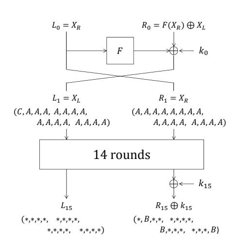
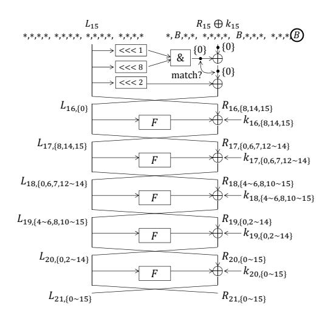
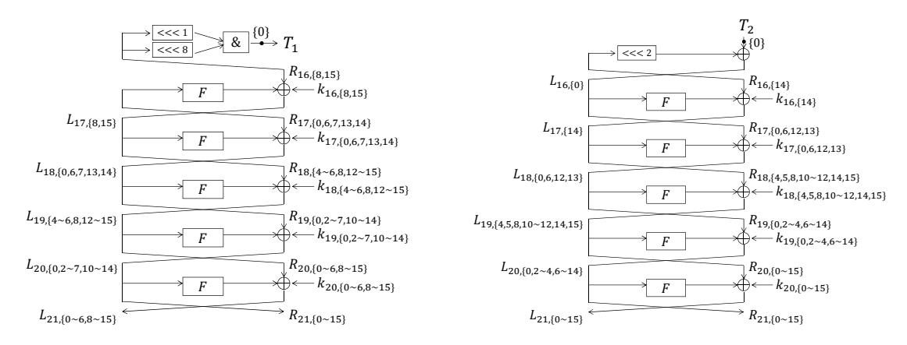
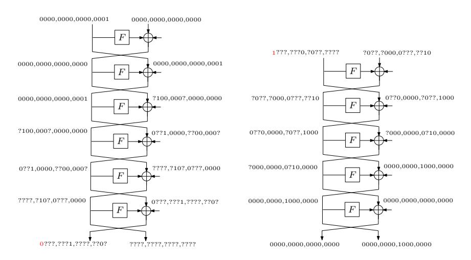
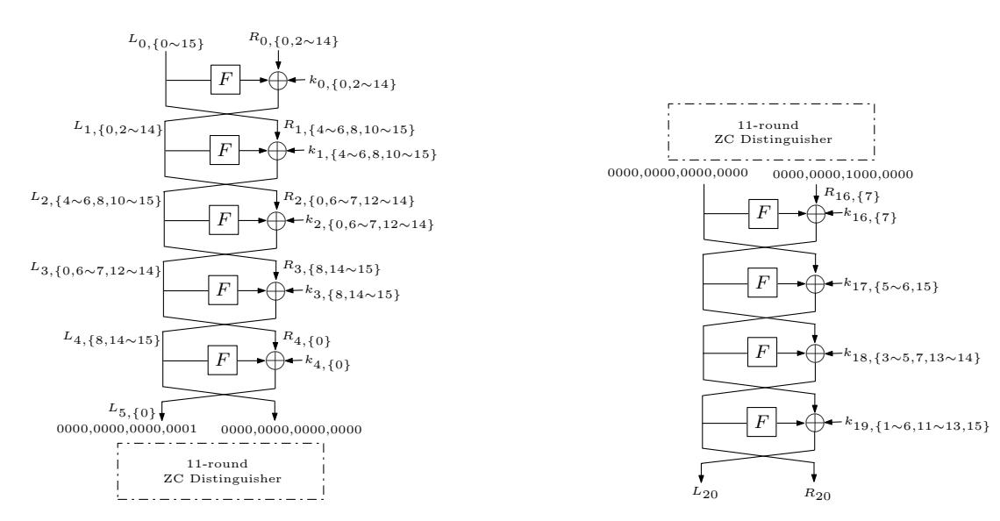
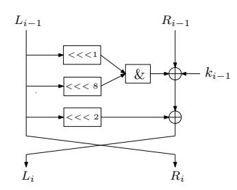
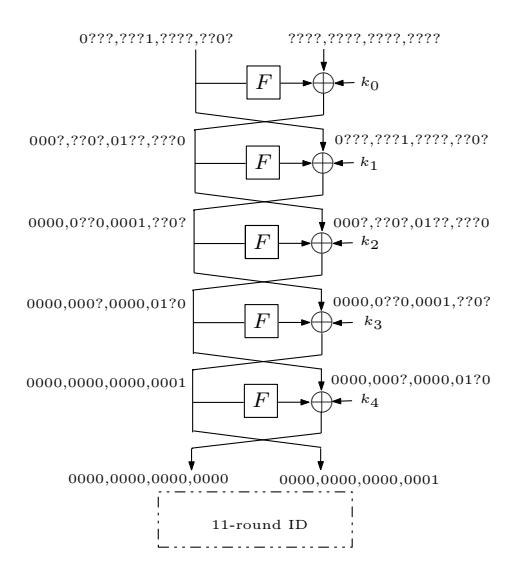
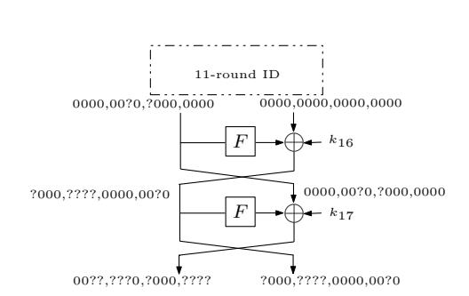

# Cryptanalysis of Reduced-round SIMON32 and SIMON48<sup>⋆</sup>

```
Qingju Wang1,2
               , Zhiqiang Liu1,2⋆⋆, Kerem Varıcı2,3⋆⋆, Yu Sasaki4⋆⋆
                                                                   ,
             Vincent Rijmen2⋆⋆, and Yosuke Todo4⋆⋆
```

<sup>1</sup> Department of Computer Science and Engineering, Shanghai Jiao Tong University, China <sup>2</sup> KU Leuven, ESAT/COSIC and iMinds, Belgium 3 ICTEAM-Crypto Group, Universite catholique de Louvain, Belgium <sup>4</sup> NTT Secure Platform Laboratories, Japan {qingju.wang,vincent.rijmen}@esat.kuleuven.be, ilu zq@sjtu.edu.cn, kerem.varici@uclouvain.be, {sasaki.yu,todo.yosuke}@lab.ntt.co.jp

Abstract. SIMON family is one of the recent lightweight block cipher designs introduced by NSA. So far there have been several cryptanalytic results on this cipher by means of differential, linear and impossible differential cryptanalysis. In this paper, we study the security of SIMON32, SIMON48/72 and SIMON48/96 by using integral, zero-correlation linear and impossible differential cryptanalysis. Firstly, we present a novel experimental approach to construct the best known integral distinguishers of SIMON32. The small block size, 32 bits, of SIMON32 enables us to experimentally find a 15-round integral distinguisher, based on which we present a key recovery attack on 21-round SIMON32, while previous best results published in FSE 2014 only achieved 19 rounds. Actually, our approach provides a very efficient way to elaborate good integral distinguishers of block ciphers with small block size. Moreover, by applying the divide-and-conquer technique delicately, we attack 20-round SIMON32, 20 round SIMON48/72 and 21-round SIMON48/96 based on 11 and 12-round zero-correlation linear hulls of SIMON32 and SIMON48 respectively. The results for SIMON32 and SIMON48/96 are better than the known results published in FSE 2014. Finally, we propose impossible differential attacks on 18 round SIMON32, 18-round SIMON48/72 and 19-round SIMON48/96, which significantly improve the previous impossible differential attacks. Our analysis together with the previous results show that SIMON maintains enough security margin even if various approaches of cryptanalysis are considered.

Keywords: SIMON, block cipher, cryptanalysis, integral, zero-correlation, impossible differential

# 1 Introduction

In cryptography, lightweight primitives are designed to be efficient for limited resource environments, but they should also ensure that the message is transmitted confidentially. Therefore, the vital motivation in the development of new lightweight cryptographic primitives is to maintain a reasonable trade-off between the security and performance. During recent years, many lightweight ciphers have been designed to meet these needs. Prominent examples are included but it is not limited to these: ICEBERG [2], mCrypton [3], HIGHT [4], PRESENT [5], KATAN [6], LED [7], Piccolo [8], KLEIN [9], EPCBC [10], PRINCE [11] and TWINE [12].

In 2013, NSA also proposed two families of highly-optimized block ciphers, SIMON and SPECK [13], which are flexible to provide excellent performance in both hardware and software environments. Moreover both families offer large variety of block and key sizes such that the users can easily match the security requirements of their applications without sacrificing the performance. However, there are no cryptanalysis results included in the specification of these algorithms.

Related Work and Our Contributions. Due to their simple but elegant structures, SIMON and SPECK have already become the target of various cryptanalytical efforts immediately after their release. On the one hand, several external cryptanalysis results on SIMON and SPECK were published. In [14,15], differential attacks are presented on various state sizes of SIMON and SPECK, while the best linear attacks on SIMON are given in [16]. In [17] Biryukov et al. exploit the threshold

<sup>⋆</sup> This is the full version of [1].

<sup>⋆⋆</sup> Corresponding authors.

search technique [18], where they showed better differential characteristics and proposed attacks with better results on several versions of SIMON and SPECK. Very recently, there are some differential attack results about SIMON32 and SIMON48 in ePrint [19]. These results need to be further verified although they seem interesting. On the other hand, applying various types of attacks with enough optimization to SIMON is interesting and important since this will help evaluate the security of the cipher in different aspects.

In this paper, we investigate the security of SIMON32, SIMON48/72 and SIMON48/96 by using integral, zero-correlation linear and impossible differential cryptanalysis. We firstly evaluate these SIMON variants by means of integral cryptanalysis. Regarding SIMON32, because the block size is only 32 bits, we can experimentally observe the behaviors of all the plaintexts under a fixed key. Our experiments show that the number of distinguished rounds rapidly increases when the number of active bits becomes close to the block size. On the contrary, exploiting such an integral distinguisher with a large number of active bits for recovering the key is hard in general. To recover the key, the integral attack usually requires several sets of the integral distinguisher by changing the values of inactive bits. When the number of active bits is too many, the number of inactive bits becomes too small, and thus cannot produce many sets of the distinguisher. Indeed, our distinguisher needs 31 active bits, and thus has only one inactive bit. To make the data complexity smaller than the code book, we cannot iterate the analysis even for two sets of the distinguisher. We solve the problem by exploiting the fact that the key schedule consists of simple linear equations, and show that reducing any fraction of subkey space can immediately reduce the main key space by solving the linear equations with Gaussian elimination. This enables us to make the attack valid only with one set of the distinguisher. By combining several cryptanalytic techniques such as the partial-sum [20] and the meet-in-the-middle techniques exploiting the linearity [21], we present an attack on 21-round SIMON32/64 which improves the results on FSE 2014 by two rounds. In fact, this novel experimental approach provides a very efficient way to elaborate good integral distinguishers of block ciphers with small block size. As for SIMON48, the approach cannot be applied due to the large search space. However, according to the experimental results for SIMON32, we may expect that there exist good integral distinguishers of SIMON48 when the number of active bits is near the block size.

Moreover, we construct 11 and 12-round zero-correlation linear hulls of SIMON32 and SIMON48 respectively by using miss-in-the-middle technique. Then based on these distinguishers, we mount attacks on 20-round SIMON32, 20-round SIMON48/72 and 21-round SIMON48/96 delicately with the help of divide-and-conquer technique. Our results improve the best known cryptanalytic results on SIMON32 and SIMON48/96 published in FSE 2014. Finally, we demonstrate impossible differential attacks on 18-round SIMON32, 18-round SIMON48/72 and 19-round SIMON48/96. Although these results are not better than the ones achieved by using differential, integral and zero-correlation linear cryptanalysis, they are the currently best impossible differential attacks for SIMON32 and SIMON48. Our work together with the previous results show that SIMON maintains enough security margin even if various cryptanalytic approaches are taken into account. Our improvements upon the stateof-the-art cryptanalysis for SIMON are given in Table [1.](#page-2-0)

Organization. The remainder of this paper is organized as follows. In Section [2,](#page-1-0) we give a brief description of SIMON. Section [3](#page-3-0) covers the integral attack. In Section [4,](#page-7-0) zero-correlation cryptanalysis is studied. Finally, we conclude the paper in Section [5.](#page-11-0) Our impossible differential attacks are shown in Appendix. Table [2](#page-2-1) contains the notations that we will use throughout this paper.

# <span id="page-1-0"></span>2 Brief Description of SIMON

We denote the SIMON block cipher using n-bit words by SIMON2n, with n ∈ {16, 24, 32, 48, 64}. SIMON2n with an m-word key will be referred to SIMON2n/mn throughout this paper.

<span id="page-2-0"></span>Table 1. Summary of Attack Results on SIMON

| Cipher         | Full<br>Rounds | Cryptanalysis |        |              | Complex                 | -             | Source      |
|----------------|----------------|---------------|--------|--------------|-------------------------|---------------|-------------|
| -              | Rounds         |               | Rounds | Time(EN)     | Data                    | Memory(Bytes) |             |
|                |                | Imp. Diff.    | 13     | $2^{50.1}$   | $2^{30.0}\mathrm{KP}$   | $2^{20.0}$    | [22]        |
|                |                | Imp. Diff.    | 18     | $2^{61.14}$  | $2^{32}KP$              | $2^{47.67}$   | App. C.2    |
|                |                | Diff.         | 16     | $2^{26.481}$ | $2^{29.481}CP$          | $2^{16}$      | [15]        |
| SIMON32/64     | 32             | Diff.         | 18     | $2^{46.0}$   | $2^{31.2}CP$            | $2^{15.0}$    | [14]        |
| ,              |                | Diff.         | 19     | $2^{32}$     | $2^{31}$ CP             | _             | [17]        |
|                |                | Zero-Corr.    | 20     | $2^{56.96}$  | $2^{32}KP$              | $2^{41.42}$   | Subsect 4.2 |
|                |                | Integral      | 21     | $2^{63.00}$  | $2^{31}\mathrm{CP}$     | $2^{54}$      | Subsect 3.2 |
|                | 36             | Imp. Diff.    | 18     | $2^{61.87}$  | $2^{48}\mathrm{KP}$     | $2^{42.12}$   | App. C.3    |
|                |                | Diff.         | 18     | $2^{43.253}$ | $2^{46.426}\mathrm{CP}$ | $2^{24}$      | [15]        |
| SIMON48/72     |                | Diff.         | 19     | $2^{52.0}$   | $2^{46.0}$ CC           | $2^{20.0}$    | [14]        |
| ,              |                | Diff.         | 20     | $2^{52}$     | $2^{46}$ CP             | _             | [17]        |
|                |                | Zero-Corr.    | 20     | $2^{59.7}$   | $2^{48}\mathrm{KP}$     | $2^{43}$      | Subsect 4.3 |
|                |                | Imp. Diff.    | 15     | $2^{53.0}$   | $2^{38.0}{\rm KP}$      | $2^{20.6}$    | [22]        |
|                |                | Imp. Diff.    | 19     | $2^{85.82}$  | $2^{48}\mathrm{KP}$     | $2^{66.68}$   | App. C.3    |
| CIN (ON 10 /00 | 9.0            | Diff.         | 18     | $2^{69.079}$ | $2^{50.262}\mathrm{CP}$ | $2^{45.618}$  | [15]        |
| SIMON48/96     | 36             | Diff.         | 19     | $2^{76.0}$   | $2^{46.0}$ CC           | $2^{20.0}$    | [14]        |
|                |                | Diff.         | 20     | $2^{75}$     | $2^{46}$ CP             | _             | [17]        |
|                |                | Zero-Corr.    | 21     | $2^{72.63}$  | $2^{48}\mathrm{KP}$     | $2^{46.73}$   | Subsect 4.3 |

CP: Chosen Plaintext; KP: Known Plaintext; CC: Chosen Ciphertext; EN: Encryptions

**Table 2.** Notations: Top 8 are for general purpose and bottom 4 are particular for integral attack.

<span id="page-2-1"></span>

| $L_r, R_r$                             | left(L) and $right(R)$ branches of the input state to the r-th round                                             |  |  |  |  |  |
|----------------------------------------|------------------------------------------------------------------------------------------------------------------|--|--|--|--|--|
| $L_{r,\{i\sim j\}}, R_{r,\{i\sim j\}}$ |                                                                                                                  |  |  |  |  |  |
| $\Delta L_r, \Delta R_r$               | the left(L) and right(R) branches of the input difference of state to the r-th round                             |  |  |  |  |  |
| $\Gamma L_r, \Gamma R_r$               | the $left(L)$ and $right(R)$ branches of the input linear mask of state to the r-th round                        |  |  |  |  |  |
| $\Delta F(\cdot)$                      | the output difference after round function $F$                                                                   |  |  |  |  |  |
| $k_r$                                  | the subkey in the $r$ -th round                                                                                  |  |  |  |  |  |
| $k_{r,\{i\sim i\}}$                    | $\{i \sim j\}$ the bits from bit i to bit j of $k_r$                                                             |  |  |  |  |  |
| ?                                      | an undetermined difference or linear mask                                                                        |  |  |  |  |  |
| Let $\Lambda$ be a collect             | tion of state vectors $X = (x_0, \dots, x_{n-1})$ where $x_i \in \mathbb{F}_2$ is the <i>i</i> -th word of $X$ : |  |  |  |  |  |
| A                                      | if all i-th words $x_i$ in $\Lambda$ are distinct, $x_i$ is called active                                        |  |  |  |  |  |
| В                                      | if the sum of all i-th words $x_i$ in $\Lambda$ can be predicted, $x_i$ is called balanced                       |  |  |  |  |  |
| $\mathbf{C}$                           | if the values of all i-th words $x_i$ in $\Lambda$ are equal, $x_i$ is called passive/constant                   |  |  |  |  |  |
| *                                      | if the sum of all <i>i</i> -th words $x_i$ in $\Lambda$ can not be predicted                                     |  |  |  |  |  |

SIMON is a two-branch balanced Feistel network with simple low complexity round functions consisting of three operations: AND (&), XOR ( $\oplus$ ) and rotation ( $\ll$ ). In round i-1, by using a function  $F(x) = (x \ll 1) \& (x \ll 8) \oplus (x \ll 2)$ ,  $(L_{i-1}, R_{i-1})$  are updated to  $(L_i, R_i)$  as follows:

$$L_i = F(L_{i-1}) \oplus R_{i-1} \oplus k_{i-1}, \ R_i = L_{i-1}$$

The output of the last round  $(L_r, R_r)$  (r is the number of rounds) yields the ciphertext. The structure of the round function of SIMON is depicted in Figure 8 in Appendix A.

The key schedule of SIMON processes three different procedures depending on the key size. The first mn round keys are directly initialized with the main key, while the remaining key words are generated by three slightly different procedures depending on the key words value m:

$$k_{i+m} = c \oplus (z_j)_i \oplus k_i \oplus Y_m \oplus (Y_m \lll 1), \quad Y_m = \begin{cases} k_{i+1} \lll 3, & \text{if } m = 2, \\ k_{i+2} \lll 3, & \text{if } m = 3, \\ k_{i+3} \lll 3 \oplus k_{i+1}, & \text{if } m = 4. \end{cases}$$

Here, the value c is constant Oxff...fc, and  $(z_j)_i$  denotes the i-th (least significant) bit from one of the five constant sequences  $z_j$  ( $0 \le j \le 4$ ). The main key can be derived if any sequence of m consecutive subkeys are known. For more detailed specification, we refer to [13].

# <span id="page-3-0"></span>3 Integral Cryptanalysis of SIMON

The integral attack [23,24] first constructs an integral distinguisher, which is a set of plaintexts such that the states after several rounds have a certain property, e.g. the XOR sum of all states in the set is 0. Then, several rounds are appended to the distinguisher for recovering subkeys. In this section, we investigate the integral properties and give integral attacks on 21-round SIMON32/64.

# <span id="page-3-3"></span>3.1 Integral Distinguishers of SIMON32

We experimentally find the integrals of SIMON32. The results are shown in Table 3. Here the active bits are the ones in the input of round 1. An interesting observation is that the number of rounds increases rapidly when the number of active bits becomes close to the block size. Giving a theoretical reasoning for this observation seems hard. In other words, experiment-based approaches are useful especially for a small block size such that all plaintexts can be processed in a practical time.

<span id="page-3-1"></span>Table 3. The Number of Rounds of SIMON32 Integral Distinguishers with Active Bits in the Input

| Num. of Active E | Bits 16 | 17 | 18 | 19 | 20 | 21 | 22 | 23 | 24 | 25 | 26 | 27 | 28 | 29 | 30 | 31 |
|------------------|---------|----|----|----|----|----|----|----|----|----|----|----|----|----|----|----|
| Num. of Rounds   | 9       | 9  | 9  | 9  | 10 | 10 | 10 | 10 | 11 | 11 | 11 | 12 | 13 | 13 | 14 | 15 |

We explain the algorithm of our experiments as follows:

- 1. Firstly, we generate  $2^t$  plaintexts  $(t \ge 16)$  by setting the right half (16 bits) and (t 16) bits of the left half of the input in round 1 to be active, while keeping the remaining bits as constant.
- 2. (a) Choose the main key randomly. Encrypt  $2^t$  plaintexts r rounds and check whether certain bits of the output are balanced (i.e., for each of these bits, the XOR sum of the bit over  $2^t$  output states is 0). If yes, keep this as an integral candidate.
  - (b) Repeat (a)  $2^{13}$  times and verify if the integral candidate always holds. If not, discard it.
- 3. If there is an integral candidate for all the structures with the same pattern (i.e., with the same t active bits), we regard this as an r-round integral distinguisher of SIMON32.

As a result, we obtain a 15-round integral distinguisher (Figure 1) with 31 active bits:

<span id="page-3-2"></span>
$$(CAAA, AAAA, AAAA, AAAA, AAAA, AAAA, AAAA, AAAA)$$

 $\rightarrow (***, ***, ***, ***, ***, *B**, ***, *B**, ***).$  (1)

The distinguisher in (1) is not ensured for all of the  $2^{64}$  keys. Because our experiment did not return any failure, we expect that the success probability of this distinguisher is at least  $1 - 2^{-13}$ . More integral distinguishers can be constructed by using the following property

Property 1 (Rotational Invariance of Integrals). Assume that  $(A^{n_1}, A^{16}) \to (*, B^{n_2})$  is a r-round integral over SIMON32, where  $A^{n_1}, A^{16}, *, B^{n_2} \in \mathbb{F}_2^{16} \setminus \{0\}$ , and  $0 \le n_1, n_2 \le 16$ . Then, for any s where  $0 \le s \le 15$ ,  $(A^{n_1} \ll s, A^{16}) \to (*, B^{n_2} \ll s)$  is also a r-round integral.





<span id="page-4-1"></span>Fig. 1. 15-round Integral Distinguisher

<span id="page-4-2"></span>Fig. 2. Computations for 6-round Key-Recovery

# <span id="page-4-0"></span>3.2 21-round Integral Attack of SIMON32/64

We use a 15-round integral distinguisher shown in Figure 1. We first prepare  $2^{31}$  internal state values  $(X_L||X_R)$  in which 31 bits are active, then compute the corresponding plaintext  $(L_0||R_0)$  as  $L_0 \leftarrow X_R$  and  $R_0 \leftarrow F(X_R) \oplus X_L$ . Those  $2^{31}$  plaintexts yield balanced bits in 3 positions after 15 rounds, i.e.  $(L_{15}, R_{15})$ . Moreover, the subsequent subkey XOR to  $R_{15}$  in round 16 never breaks the balanced property as long as the number of plaintexts in a set is even. We then mount a key recovery attack on 21-round SIMON-32/64 by adding six rounds after the distinguisher, which is illustrated in Figure 2.

**3.2.1** Overall Strategy. The attacker guesses a part of the last 5-round subkeys  $k_{16}, k_{17}, \ldots, k_{20}$ . Then he partially decrypts the  $2^{31}$  ciphertexts up to the state  $R_{15} \oplus k_{15}$ , and computes their XOR sum at the balanced bits. The 15-round distinguisher in Figure 1 has 3 balanced bits. However, the partial decryption up to all of those 3 bits requires too much subkey guesses. Then we only use 1 balanced bit at bit-position 0. Thus, the subkey space can be reduced by 1 bit per set of  $2^{30}$  plaintexts. In Figure 2, bit-position 0 of  $(R_{15} \oplus k_{15})$  is circled and the related bits to the partial decryption from the ciphertext are shown. 3 bits of  $k_{16}$ , 6 bits of  $k_{17}$ , 10 bits of  $k_{18}$ , 14 bits of  $k_{19}$ , 16 bits of  $k_{20}$ , in total 49 subkey bits are related. Because the block size of SIMON32 is 32 bits, the analysis with  $2^{31}$  plaintexts can be iterated at most twice, which implies that the 49-bit subkey space can be reduced at most 2 bits. Hence, the correct subkey value cannot be determined only with this procedure.

To detect the correct subkey, we further utilize the key schedule. The knowledge of 4 consecutive subkey values can reveal the main key value. Hence, we aim to recover 64 bits of  $k_{17}, \ldots, k_{20}$ . Among 64 bits, 46 bits are suggested from the 6-round partial decryption. Moreover, because 5 subkeys from  $k_{16}, \ldots, k_{20}$  are linked only with linear equations, 3 bits of  $k_{16}, \{8,14,15\}$  can be converted to 3-bit information for the remaining 18 bits of  $k_{17}, \ldots, k_{20}$  by solving linear equations with Gaussian elimination. Thus, for each of 49 subkey bits suggested by the 6-round partial decryption, the attacker can obtain 64 bits of  $k_{17}, \ldots, k_{20}$  only by guessing 15-bit information of  $k_{17}, \ldots, k_{20}$ . In summary, reducing the subkey space for 49 subkey bits immediately reduces the subkey space for  $k_{17}, \ldots, k_{20}$ , which leads to a faster key recovery attack than the exhaustive search.

**3.2.2 Efficient Subkey Recovery.** We explain the strategy for efficiently performing the 6-round partial decryption with 49-bit subkey guess. With a straight-forward method, partial decryption for  $2^{31}$  ciphertexts with  $2^{49}$  guesses are performed, which requires  $2^{31+49} = 2^{80}$  computations i.e. more



<span id="page-5-1"></span>**Fig. 3.** Computations of  $\bigoplus (L_{15,\{15\}} \& L_{15,\{8\}})$  **Fig. 4.** Computations of  $\bigoplus (L_{15,\{14\}} \oplus L_{16,\{0\}})$

than the exhaustive search. Several methods are known to reduce the complexity. Here, we use partial-sum [20], meet-in-the-middle match [25], and exploiting linearity for meet-in-the-middle match [21].

The goal of the partial decryption is to find 49 subkey bits satisfying  $\bigoplus (R_{15} \oplus k_{15})_{\{0\}} = 0$ , which is equivalent to  $\bigoplus ((L_{15,\{15\}} \& L_{15,\{8\}}) \oplus L_{15,\{14\}} \oplus L_{16,\{0\}}) = 0$ . This is further converted to

<span id="page-5-2"></span><span id="page-5-0"></span>
$$\bigoplus (L_{15,\{15\}} \& L_{15,\{8\}}) = \bigoplus (L_{15,\{14\}} \oplus L_{16,\{0\}}). \tag{2}$$

Hence, we can compute the left-hand side and right-hand side of Equation (2) independently, and later find the match between two independent computations as the meet-in-the-middle attack. In Figure 2, the computation in round 16 is detailed and the approach is illustrated. The computation of the left-hand side of Equation (2) is shown in Figure 3, in which 42 bits of subkeys are involved. The computation of the right-hand side of Equation (2) is shown in Figure 4, in which 42 bits of subkeys are involved. Compared to the original 6-round partial decryption in Figure 2, the number of related subkey bits are reduced from 49 to 42, which contributes to reduce the attack complexity. Inside computations of the left-hand side and the right-hand side of Equation (2), the complexity is reduced by the partial-sum technique. Namely, every time subkey bits are guessed and state values are updated, we compress the amount of data only by keeping the state values appearing odd times.

3.2.2.1 Computation of  $\bigoplus (L_{15,\{15\}}\&L_{15,\{8\}})$ . Given a set including  $2^{31}$  plaintexts,  $\bigoplus (L_{15,\{15\}}\&L_{15,\{8\}})$  for  $2^{42}$  distinct subkey values can be computed with  $2^{50.55}$  21-round SIMON32 computations. The computed results along with 42-bit guessed subkeys are stored in a table  $T_1$ . We first initialize the following counters which remembers the parity of internal state values.

- $-2^{27}$  counters  $T_{20}^x$ , each corresponding to the value  $x=(L_{20,\{0,2\sim7,10\sim14\}},R_{20,\{0\sim6,8\sim15\}})$ .
- $-2^{20}$  counters  $T_{19}^{x}$ , each corresponding to the value  $x=(L_{19,\{4\sim6,8,12\sim15\}},R_{19,\{0,2\sim7,10\sim14\}})$ .
- $-2^{13}$  counters  $T_{18}^{x}$ , each corresponding to the value  $x=(L_{18,\{0,6,7,13,14\}},R_{18,\{4\sim6,8,12\sim15\}})$ .
- $-2^7$  counters  $T_{17}^x$ , each corresponding to the value  $x=(L_{17,\{8,15\}},R_{17,\{0,6,7,13,14\}})$ .

We then compute  $\bigoplus (L_{15,\{15\}}\&L_{15,\{8\}})$  by the following procedure.

- 1. For  $2^{15}$  guesses of  $k_{20,\{0\sim6,8\sim15\}}$  and for each  $2^{31}$  ciphertext values, calculate 27 bits of  $(L_{20,\{0,2\sim7,10\sim14\}},R_{20,\{0\sim6,8\sim15\}})$ , and increase the relevant counter  $T_{20}^x$  by 1. Keep the values of  $(L_{20,\{0,2\sim7,10\sim14\}},R_{20,\{0\sim6,8\sim15\}})$  which appear odd times.
- 2. For  $2^{12}$  guesses of  $k_{19,\{0,2\sim7,10\sim14\}}$  and for each  $2^{27}$  remaining values, calculate 20 bits of  $(L_{19,\{4\sim6,8,12\sim15\}}, R_{19,\{0,2\sim7,10\sim14\}})$  and increase the counter  $T_{19}^x$ . Keep the values which appear odd times.

- 3. For  $2^8$  guesses of  $k_{18,\{4\sim6,8,12\sim15\}}$  and for each  $2^{20}$  remaining values, calculate 13 bits of  $(L_{18,\{0,6,7,13,14\}},$  $R_{18,\{4\sim6,8,12\sim15\}}$ ) and increase the counter  $T_{18}^x$ . Keep the values which appear odd times.
- 4. For  $2^5$  guesses of  $k_{17,\{0,6,7,13,14\}}$  and for each  $2^{13}$  remaining values, calculate 7 bits of  $(L_{17,\{8,15\}},$  $R_{17,\{0,6,7,13,14\}}$ ) and increase the counter  $T_{17}^x$ . Keep the values which appear odd times. 5. For  $2^2$  guesses of  $k_{16,\{8,15\}}$  and for each  $2^7$  remaining values, calculate 2 bits of  $L_{15,\{8,15\}}$  and then
- 1-bit of  $(L_{15,\{15\}}\&L_{15,\{8\}})$ . Store it in a table  $T_1$  along with the guesses for 42-bit subkeys.

We then evaluate the computational cost. The unit is a single execution of 21-round SIMON32. Updating one bit of the state is equivalent to  $1/(16 \cdot 21)$  21-round SIMON32 computation.

```
Step 1. 2^{31} \cdot 2^{15} \cdot 15/(16 \cdot 21) \approx 2^{41.51}.
Step 2. 2^{27} \cdot 2^{15} \cdot 2^{12} \cdot 12/(16 \cdot 21) \approx 2^{49.19}
Step 3. 2^{20} \cdot 2^{15} \cdot 2^{12} \cdot 2^8 \cdot 8/(16 \cdot 21) \approx 2^{49.61}
Step 4. 2^{13} \cdot 2^{15} \cdot 2^{12} \cdot 2^8 \cdot 2^5 \cdot 5/(16 \cdot 21) \approx 2^{46.93}
Step 5. 2^7 \cdot 2^{15} \cdot 2^{12} \cdot 2^8 \cdot 2^5 \cdot 2^2 \cdot 3/(16 \cdot 21) \approx 2^{42.19}
```

The sum of the above 5 steps is  $2^{50.55}$  21-round SIMON32 computations. The table  $T_1$  contains  $2^{42}$ elements of 43-bit information, which is less than 2<sup>45</sup> bytes.

- 3.2.2.2 Computation of  $\bigoplus (L_{15,\{14\}} \oplus L_{16,\{0\}})$ . For each of  $2^{31}$  plaintexts set,  $\bigoplus (L_{15,\{14\}} \oplus L_{16,\{0\}})$ for distinct  $2^{42}$  subkey values can be computed with  $2^{54.01}$  21-round SIMON32 computations. The computed results along with 42-bit guessed subkeys are stored in a table  $T_2$ . Because the procedure is similar to the computation of  $T_1$ , the attack is explained shortly.
- 1. For  $2^{16}$  guesses of  $k_{20,\{0\sim15\}}$  and  $2^{31}$  ciphertext values, calculate 29 bits of  $(L_{20,\{0,2\sim4,6\sim14\}}, R_{20,\{0\sim15\}})$ . The complexity of this step is  $2^{31} \cdot 2^{16} \cdot 16/(16 \cdot 21) \approx 2^{42.61}$ .
- 2. For  $2^{13}$  guesses of  $k_{19,\{0,2\sim4,6\sim14\}}$  and  $2^{29}$  remaining values, calculate 21 bits of  $(L_{19,\{4,5,8,10\sim12,14,15\}})$ ,  $R_{19,\{0,2\sim4.6\sim14\}}$ . The complexity of this step is  $2^{29} \cdot 2^{16} \cdot 2^{13} \cdot 13/(16 \cdot 21) \approx 2^{53.31}$ .
- 3. For  $2^8$  guesses of  $k_{18,\{4,5,8,10\sim12,14,15\}}$  and  $2^{21}$  remaining values, calculate 12 bits of  $(L_{18,\{0,6,12,13\}},$  $R_{18,\{4,5,8,10\sim12,14,15\}}$ ). The complexity of this step is  $2^{21} \cdot 2^{16} \cdot 2^{13} \cdot 2^8 \cdot 8/(16 \cdot 21) \approx 2^{52.61}$ .
- 4. For  $2^4$  guesses of  $k_{17,\{0.6,12,13\}}$  and  $2^{12}$  remaining values, calculate 5 bits of  $(L_{17,\{14\}}, R_{17,\{0.6,12,13\}})$ . The complexity of this step is  $2^{12} \cdot 2^{16} \cdot 2^{13} \cdot 2^8 \cdot 2^4 \cdot 4/(16 \cdot 21) \approx 2^{46.61}$ .
- 5. For 2 guesses of  $k_{16,\{14\}}$  and  $2^5$  remaining values, calculate 2 bits of  $L_{15,\{14\}}$  and then 1-bit of  $(L_{15,\{14\}} \oplus L_{16,\{0\}})$ . Store it in a table  $T_2$  along with the guesses for 42-bit subkeys. The complexity of this step is  $2^5 \cdot 2^{16} \cdot 2^{13} \cdot 2^8 \cdot 2^4 \cdot 2 \cdot 2/(16 \cdot 21) \approx 2^{39.61}$ .

The table  $T_2$  contains  $2^{42}$  elements of 43-bit information, which is less than  $2^{45}$  bytes.

3.2.2.3 Matching  $T_1$  and  $T_2$ . After  $T_1$  and  $T_2$  are independently generated, we derive valid 49-bit subkey candidates. Because both of  $T_1$  and  $T_2$  contain  $2^{42}$  elements, the number of pairs is  $2^{84}$ . From Equation (2), the valid candidates will match the 1-bit result in  $T_1$  and  $T_2$ . Moreover, 42-bit subkeys used in  $T_1$  and 42-bit subkeys in  $T_2$  overlap in 35 bits. Thus,  $2^{84-1-35}=2^{48}$  valid candidates are generated, which reduces the entire 49-bit space by one bit.

#### **Entire Attack Procedure and Complexity Evaluation** 3.2.3

- 1. Represent the three subkey bits  $k_{15,\{8,14\sim15\}}$  by using  $k_{16}||k_{17}||k_{18}||k_{19}$  according to the key schedule of SIMON32/64 and keep these three linear equations.
- <span id="page-6-0"></span>2. Generate a set of  $2^{31}$  plaintexts.
- 3. For each of  $2^{31}$  plaintexts, compute  $T_1$  and  $T_2$  as explained before, and identify the correct key candidates to reduce the subkey space of 49 bits in the last 6 rounds.
- <span id="page-6-1"></span>4. For each of remaining subkey candidates, guess the 15 bits  $k_{19,\{1,15\}} \| k_{18,\{0\sim3,7,9\}} \| k_{17,\{1\sim5,11,15\}} \|$ and obtain three bits of  $k_{17,\{8\sim10\}}$  by solving the linear equations with Gaussian elimination. Then compute all bits of the original key by inverting the key schedule, and check the correctness of the guess by using two plaintext-ciphertext pairs.

The data complexity of the attack is  $2^{31}$  chosen-plaintexts. The time complexity for Step 3 is  $2^{50.55} + 2^{54.01} \approx 2^{54.13}$  21-round SIMON32 computations. After Step 3,  $2^{48}$  subkey candidates remain. In Step 4, the cost of Gaussian elimination is much smaller than 21-round SIMON32, and thus is ignored. The check with two plaintext-ciphertext pairs can be done one by one, that is, the check for the second pair is performed only with the first check is passed with probability  $2^{-32}$ . Hence, the time complexity is  $2^{48} \cdot 2^{15}(1+2^{-32}) \approx 2^{63}$  21-round SIMON32 computations. In total, the time complexity is  $2^{54.13} + 2^{63} \approx 2^{63.00}$  21-round SIMON32 computations. The memory complexity is  $2 \cdot 2^{45}$  bytes for constructing  $T_1$  and  $T_2$  and  $T_3$  and  $T_4$  and  $T_5$  and  $T_7$  and  $T_8$  and  $T_8$  and  $T_8$  and  $T_8$  and  $T_8$  and  $T_8$  and  $T_8$  and  $T_8$  and  $T_8$  and  $T_8$  and  $T_8$  and  $T_8$  and  $T_8$  and  $T_8$  and  $T_8$  and  $T_8$  and  $T_8$  and  $T_8$  and  $T_8$  and  $T_8$  and  $T_8$  and  $T_8$  and  $T_8$  and  $T_8$  and  $T_8$  and  $T_8$  and  $T_8$  and  $T_8$  and  $T_8$  and  $T_8$  and  $T_8$  and  $T_8$  and  $T_8$  are the probability of the 15-round distinguisher.

# <span id="page-7-0"></span>4 Zero-Correlation Linear Cryptanalysis of SIMON

The zero-correlation attack is one of the recent cryptanalytic method introduced by Bogdanov and Rijmen [26]. The attack is based on linear approximations with zero correlation (i.e. linear approximations with probability exactly 1/2). We introduce 11 and 12-round zero-correlation linear approximations of SIMON32 and SIMON48, based on which we present key recovery attacks on 20-round SIMON32, 20-round SIMON48/72 and 21-round SIMON48/96 respectively.

# <span id="page-7-2"></span>4.1 Zero-Correlation Linear Distinguishers of SIMON



<span id="page-7-1"></span>**Fig. 5.** Zero-Correlation Linear Approximations of 11-round SIMON32. The '0' at bottom left and the '1' at top right (in red) constitute the contradiction that ensures correlation zero.

By applying miss-in-the-middle technique, we construct 11-round zero-correlation linear hull for SIMON32 (see Figure 5). More specifically, this distinguisher consists of two parts: forward part (along the encryption direction) and backward part (along the decryption direction). For the forward part, we find that for any 6-round non-zero correlation linear hull with input mask being (0x0001,0x0000), the most significant bit of the left half of its output mask must be 0. As to the backward part, we observe that for any 5-round non-zero correlation linear hull with input mask being (0x0000,0x0080), the most significant bit of the left half of its output mask must be 1. Combining the above two parts, we can deduce that an 11-round linear hull with input and output masks being (0x0001,0x0000) and (0x0000,0x0080) must be a zero-correlation linear hull. Similarly, a 12-round zero-correlation linear hull for SIMON48 can be derived (see Table 4 in Appendix B).

Moreover, due to the simplicity of SIMON's round function, we observe the following rotational property which can be used to generate more zero-correlation linear hulls of SIMON.

Property 2 (Rotational Invariance of zero-correlations). Assume that  $(\Gamma L_i, 0) \nrightarrow (0, \Gamma R_j)$  is a (j-i)-round zero-correlation linear approximation for SIMON where  $\Gamma L_i, \Gamma R_j \in \mathbb{F}_2^n \setminus \{0\}$ . Then for any r, where  $0 \le r \le n-1$ , one can construct a set of (j-i)-round zero-correlation linear approximations as  $(\Gamma L_i \ll r, 0) \nrightarrow (0, \Gamma R_j \ll r)$ .

#### <span id="page-8-0"></span>4.2 Zero-Correlation Linear Attack on 20-round SIMON32



<span id="page-8-1"></span>Fig. 6. Add 5-round before the Distinguisher

<span id="page-8-2"></span>Fig. 7. Add 4-round after the Distinguisher

Let E denote the 20-round SIMON32 from round 0 to round 19. Suppose that the 11-round zero-correlation linear distinguisher given in Figure 5 covers from round 5 to round 15. We now present an attack on E based on this distinguisher by adding five rounds before the distinguisher and four rounds after the distinguisher, which is illustrated in Figure 6 and Figure 7.

**4.2.1 Overall Strategy.** For each of the  $2^{32}$  plaintext-ciphertext pairs, the attacker first guesses a part of the last 4-round subkeys  $k_{16}$ ,  $k_{17}$ ,  $k_{18}$ ,  $k_{19}$  and partially decrypts the ciphertext up to the state  $R_{16,\{7\}}$ . Then he guesses a part of the first 5-round subkeys  $k_0, k_1, \ldots, k_4$  and partially encrypts the plaintext up to the state  $L_{5,\{0\}}$ . Finally, the attacker computes the value of  $L_{5,\{0\}} \oplus R_{16,\{7\}}$ . The subkey bits related to the above partial encryption and partial decryption are shown in Figure 6 and Figure 7. We can see that 14 bits of  $k_0$ , 10 bits of  $k_1$ , 6 bits of  $k_2$ , 3 bits of  $k_3$ , one bit of  $k_4$ , one bit of  $k_{16}$ , 3 bits of  $k_{17}$ , 6 bits of  $k_{18}$ , 10 bits of  $k_{19}$ , in total 54 subkey bits are related.

For a guessed value of the 54 subkey bits, if the event that  $L_{5,\{0\}} \oplus R_{16,\{7\}}$  is equal to 0 happens  $2^{31}$  times (i.e., the correlation of the linear equation  $L_{5,\{0\}} \oplus R_{16,\{7\}} = 0$  is exactly 0), then we take this guessed subkey information as a correct subkey candidate. According to [26] and the Wrong-Key Randomization Hypothesis given in [27], for a wrong subkey candidate, the probability that the correlation of  $L_{5,\{0\}} \oplus R_{16,\{7\}} = 0$  is 0 can be estimated as  $\frac{1}{\sqrt{2\pi}} 2^{\frac{4-32}{2}} \approx 2^{-15.33}$ . Thus the 54-bit subkey space can be reduced by a factor of  $2^{15.33}$  approximately.

In order to recover the master key value (i.e.,  $k_0, k_1, k_2, k_3$ ), we further exploit the key schedule. Among 64 bits of the master key, 33 bits are suggested from the above procedure. Moreover,  $k_4$ ,  $k_{16}$ ,  $k_{17}$ ,  $k_{18}$ ,  $k_{19}$  can be derived from the master key by using linear equations, therefore, one bit of  $k_4$ , one bit of  $k_{16}$ , 3 bits of  $k_{17}$ , 6 bits of  $k_{18}$  and 10 bits of  $k_{19}$  (totally 21 subkey bits) can be converted to 21-bit information for the remaining 31 bits of the master key. More specifically, for each of the 33 master key bits suggested above, the attacker can guess 10-bit information of the master key and then obtain 21 linear equations of 21 variables (i.e., the remaining 21 bits of the master key). By solving these linear equations with Gaussian elimination, the attacker can retrieve the master key value.

- 4.2.2Efficient Subkey Recovery. We now explain the strategy for efficiently performing 4-round partial decryption and 5-round partial encryption with 54-bit subkey guess. By using a straightforward approach, we need to do the partial decryption and partial encryption for  $2^{32}$  plaintextciphertext pairs with  $2^{54}$  subkey guesses. This requires  $2^{32+54} = 2^{86}$  computations, which is much more than the exhaustive key search. In our attack, we adopt the divide-and-conquer technique delicately to reduce the time complexity. More specifically, checking whether  $L_{5,\{0\}} \oplus R_{16,\{7\}} = 0$ has a zero correlation or not can be done by counting the number of occurrences of the event that  $L_{5,\{0\}} \| R_{16,\{7\}}$  is equal to "00" or "11" (If this number is  $2^{31}$ , then the correlation of  $L_{5,\{0\}} \oplus R_{16,\{7\}} = 0$ is exactly zero). To do this, we first guess the 20 bits of the last four-round subkeys relevant to  $R_{16,\{7\}}$ and get the value of  $L_{0,\{0\sim15\}}\|R_{0,\{0,2\sim14\}}\|R_{16,\{7\}}$  (regarded as the starting state), based on which, we set a starting counter and update the state bit-by-bit for the first six rounds (the counters corresponding to the states are obtained accordingly). Eventually we derive the counter with respect to the value of  $L_{5,\{0\}}||R_{16,\{7\}}$ . Note that all the bit-by-bit state transitions are chosen elaborately to make the time complexity of our attack optimal, and all the counters involved in this attack need to be initialized firstly. The reason why we do not use all the plaintext-ciphertext bits related to  $L_{5,\{0\}}$ and  $R_{16,\{7\}}$  as the starting state is that the size of this state is too large for us to mount an efficient attack. The detailed attack procedure is given as below.
- 1. Collect all the  $2^{32}$  plaintext-ciphertext pairs of E. Let  $T_1$  be a vector of  $2^{31}$  counters which correspond to all possible values of  $L_{0,\{0\sim15\}}\|R_{0,\{0,2\sim14\}}\|R_{16,\{7\}}$  (denoted as  $S_1^1$ ). Guess the 20 subkey bits  $k_{16,\{7\}}\|k_{17,\{5\sim6,15\}}\|k_{18,\{3\sim5,7,13\sim14\}}\|k_{19,\{1\sim6,11\sim13,15\}}$ . Then for each plaintext-ciphertext pair:
  - (a) Do partial decryption to get the value of  $R_{16,\{7\}}$  and increase the corresponding counter  $T_{1,S_1^1}$  by one according to the value of  $S_1^1$ . After that, we will do bit-by-bit state transitions based on  $S_1^1$  and update the counters corresponding to the intermediate states.
  - (b) Let  $T_2$  be a vector of  $2^{30}$  counters which correspond to all possible values of  $L_{0,\{1\sim15\}}\|R_{0,\{0,3\sim7,9\sim14\}}\|L_{1,\{2,8\}}\|R_{16,\{7\}}$  (denoted as  $S_2^1$ ). Guess the subkey bits  $k_{0,\{2,8\}}$ . Encrypt partially for each possible value of  $S_1^1$  to obtain the value of  $L_{1,\{2,8\}}$ , then add  $T_{1,S_1^1}$  to the relevant counter  $T_{2,S_2^1}$  according to the value of  $S_2^1$ .
  - (c) Guess the subkey bits  $k_{0,\{9\}}$ ,  $k_{0,\{3\}}$ ,  $k_{0,\{4,10\}}$ ,  $k_{0,\{11\}}$ ,  $k_{0,\{5\}}$  and  $k_{0,\{0,6\sim7,12\sim14\}}$  step by step (see Table 5 in Appendix B). Do similarly to the above and finally get the values of the counters corresponding to the state  $L_{1,\{0,2\sim14\}} \| R_{1,\{4\sim6,8,10\sim15\}} \| R_{16,\{7\}}$  (denoted as  $S_0^2$ ).
- corresponding to the state  $L_{1,\{0,2\sim14\}}\|R_{1,\{4\sim6,8,10\sim15\}}\|R_{16,\{7\}}$  (denoted as  $S_0^2$ ).

  2. Let  $X_1$  be a vector of  $2^{24}$  counters which correspond to all possible values of  $L_{1,\{0,2\sim7,9\sim14\}}\|R_{1,\{4\sim6,8,11\sim15\}}\|L_{2,\{10\}}\|R_{16,\{7\}}$  (denoted as  $S_1^2$ ). Guess the subkey bit  $k_{1,\{10\}}$ . For each possible value of  $S_0^2$ , do partial encryption to derive the value of  $L_{2,\{10\}}$  and add  $L_{8,S_0^2}$  to the corresponding counter  $L_{1,S_1^2}$  according to the value of  $L_{2,\{10\}}$  are subkey bits  $L_{1,\{4\}}$ ,  $L_{1,\{11\}}$ ,  $L_{1,\{12\}}$ ,  $L_{1,\{13\}}$ ,  $L_{1,\{5\}}$ ,  $L_{1,\{6\}}$  and  $L_{1,\{8,14\sim15\}}$  sequentially (see Table 6 in Appendix B). Do similarly to the above and eventually obtain the values of the counters corresponding to the state  $L_{2,\{4\sim6,8,10\sim15\}}\|R_{2,\{0,6\sim7,12\sim14\}}\|R_{16,\{7\}}$  (denoted as  $L_{2,\{4\sim6,8,10\sim15\}}\|R_{2,\{0,6\sim7,12\sim14\}}\|R_{16,\{7\}}$  (denoted as  $L_{2,\{4\sim6,8,11\sim15\}}\|R_{2,\{4\sim6,8,11\sim15\}}\|R_{2,\{4\sim6,8,11\sim15\}}\|R_{2,\{4\sim6,8,11\sim15\}}\|R_{2,\{4\sim6,8,11\sim15\}}\|R_{2,\{4\sim6,8,11\sim15\}}\|R_{2,\{4\sim6,8,11\sim15\}}\|R_{2,\{4\sim6,8,11\sim15\}}\|R_{2,\{4\sim6,8,11\sim15\}}\|R_{2,\{4\sim6,8,11\sim15\}}\|R_{2,\{4\sim6,8,11\sim15\}}\|R_{2,\{4\sim6,8,11\sim15\}}\|R_{2,\{4\sim6,8,11\sim15\}}\|R_{2,\{4\sim6,8,11\sim15\}}\|R_{2,\{4\sim6,8,11\sim15\}}\|R_{2,\{4\sim6,8,11\sim15\}}\|R_{2,\{4\sim6,8,11\sim15\}}\|R_{2,\{4\sim6,8,11\sim15\}}\|R_{2,\{4\sim6,8,11\sim15\}}\|R_{2,\{4\sim6,8,11\sim15\}}\|R_{2,\{4\sim6,8,11\sim15\}}\|R_{2,\{4\sim6,8,11\sim15\}}\|R_{2,\{4\sim6,8,11\sim15\}}\|R_{2,\{4\sim6,8,11\sim15\}}\|R_{2,\{4\sim6,8,11\sim15\}}\|R_{2,\{4\sim6,8,11\sim15\}}\|R_{2,\{4\sim6,8,11\sim15\}}\|R_{2,\{4\sim6,8,11\sim15\}}\|R_{2,\{4\sim6,8,11\sim15\}}\|R_{2,\{4\sim6,8,11\sim15\}}\|R_{2,\{4\sim6,8,11\sim15\}}\|R_{2,\{4\sim6,8,11\sim15\}}\|R_{2,\{4\sim6,8,11\sim15\}}\|R_{2,\{4\sim6,8,11\sim15\}}\|R_{2,\{4\sim6,8,11\sim15\}}\|R_{2,\{4\sim6,8,11\sim15\}}\|R_{2,\{4\sim6,8,11\sim15\}}\|R_{2,\{4\sim6,8,11\sim15\}}\|R_{2,\{4\sim6,8,11\sim15\}}\|R_{2,\{4\sim6,8,11\sim15\}}\|R_{2,\{4\sim6,8,11\sim15\}}\|R_{2,\{4\sim6,8,11\sim15\}}\|R_{2,\{4\sim6,8,11\sim15\}}\|R_{2,\{4\sim6,8,11\sim15\}}\|R_{2,\{4\sim6,8,11\sim15\}}\|R_{2,\{4\sim6,8,11\sim15\}}\|R_{2,\{4\sim6,8,11\sim15\}}\|R_{2,\{4\sim6,8,11\sim15\}}\|R_{2,\{4\sim6,8,11\sim15\}}\|R_{2,\{4\sim6,8,11\sim15\}}\|R_{2,\{4\sim6,8,11\sim15\}}\|R_{2,\{4\sim6,8,11\sim15\}}\|R_{2,\{4\sim6,8,11\sim15\}}\|R_{2,\{4\sim6,8,11\sim15\}}\|R_{2,\{4\sim6,8,11\sim15\}}\|R_{2,\{4\sim6,8,11\sim15\}}\|R_{2,\{4\sim6,8,11\sim15\}}\|R_{2,\{4\sim$
- 3. Let  $Y_1$  be a vector of  $2^{16}$  counters which correspond to all possible values of  $L_{2,\{4\sim6,8,11\sim15\}}$   $\|R_{2,\{0,6\sim7,13\sim14\}}\|L_{3,\{12\}}\|R_{16,\{7\}}$  (denoted as  $S_1^3$ ). Guess the subkey bit  $k_{2,\{12\}}$ . For each possible value of  $S_0^3$ , do partial encryption to gain the value of  $L_{3,\{12\}}$  and add  $X_{8,S_0^3}$  to the relevant

- counter  $Y_{1,S_1^3}$  according to the value of  $S_1^3$ . Then guess the subkey bits  $k_{2,\{13\}}$ ,  $k_{2,\{14\}}$ ,  $k_{2,\{6\}}$ ,  $k_{2,\{7\}}$  and  $k_{2,\{0\}}$  step by step (see Table 7 in Appendix B). Do similarly to the above and finally derive the values of the counters corresponding to the state  $L_{3,\{0,6\sim7,12\sim14\}} \|R_{3,\{8,14\sim15\}}\|R_{16,\{7\}}$  (denoted as  $S_0^4$ ).
- 4. Let  $Z_1$  be a vector of  $2^9$  counters which correspond to all possible values of  $L_{3,\{0,6\sim7,12\sim13\}}\|$   $R_{3,\{8,15\}}\|L_{4,\{14\}}\|R_{16,\{7\}}$  (denoted as  $S_1^4$ ). Guess the subkey bit  $k_{3,\{14\}}$ . For each possible value of  $S_0^4$ , do partial encryption to get the value of  $L_{4,\{14\}}$  and add  $Y_{6,S_0^4}$  to the corresponding counter  $Z_{1,S_1^4}$  according to the value of  $S_1^4$ . After that, guess the subkey bits  $k_{3,\{15\}}$  and  $k_{3,\{8\}}$  step by step (see Table 8 in Appendix B). Do similarly to the above and eventually get the values of the counters corresponding to the state  $L_{4,\{8,14\sim15\}}\|R_{4,\{0\}}\|R_{16,\{7\}}$  (denoted as  $S_0^5$ ).
- 5. Let W be a vector of  $2^2$  counters which correspond to all possible values of  $L_{5,\{0\}} \| R_{16,\{7\}}$ . Guess the subkey bit  $k_{4,\{0\}}$ . For each possible value of  $S_0^5$ , do partial encryption to obtain the value of  $L_{5,\{0\}}$  and add  $Z_{3,S_0^5}$  to the relevant counter in W according to the value of  $L_{5,\{0\}} \| R_{16,\{7\}}$ . If  $W_0 + W_3 = 2^{31}$  (Note that  $W_0$ ,  $W_3$  are the counters corresponding to the cases that  $L_{5,\{0\}} \| R_{16,\{7\}} =$  "00" and  $L_{5,\{0\}} \| R_{16,\{7\}} =$  "11", respectively), keep the guessed 54-bit subkey information (i.e.,  $k_{0,\{0,2\sim 14\}} \| k_{1,\{4\sim 6,8,10\sim 15\}} \| k_{2,\{0,6\sim 7,12\sim 14\}} \| k_{3,\{8,14\sim 15\}} \| k_{4,\{0\}} \| k_{16,\{7\}} \| k_{17,\{5\sim 6,15\}} \| k_{18,\{3\sim 5,7,13\sim 14\}} \| k_{19,\{1\sim 6,11\sim 13,15\}}$ , denoted as  $\eta$ ) as a possible subkey candidate, and discard it otherwise.

According to [26] and the Wrong-Key Randomization Hypothesis given in [27], the probability that a wrong subkey candidate for  $\eta$  is kept after Step 5 can be approximated as  $\frac{1}{\sqrt{2\pi}}2^{-14}\approx 2^{-15.33}$ , thus about  $2^{54}\times 2^{-15.33}=2^{38.67}$  subkey candidates for  $\eta$  will be left after the above procedure.

# 4.2.3 Master Key Recovery.

- 1. Represent the subkey bits  $k_{4,\{0\}}$ ,  $k_{16,\{7\}}$ ,  $k_{17,\{5\sim6,15\}}$ ,  $k_{18,\{3\sim5,7,13\sim14\}}$  and  $k_{19,\{1\sim6,11\sim13,15\}}$  by using  $k_{0,\{0\sim15\}}$ ,  $k_{1,\{0\sim15\}}$ ,  $k_{2,\{0\sim15\}}$  and  $k_{3,\{0\sim15\}}$  according to the key schedule of SIMON32 and keep these 21 linear equations.
- 2. For each of the remaining  $2^{38.67}$  values of  $\eta$ , do the following to recover the 64-bit master key:
  - (a) Guess the 10 subkey bits  $k_{0,\{1,15\}}$ ,  $k_{1,\{0\sim3,7,9\}}$  and  $k_{2,\{1\sim2\}}$  and obtain 21 linear equations with respect to  $k_{2,\{3\sim5,8\sim11,15\}}$  and  $k_{3,\{0\sim7,9\sim13\}}$ .
  - (b) Solve the linear equations by means of Gaussian elimination so as to get the value of  $k_{2,\{3\sim5,8\sim11,15\}}$   $\|k_{3,\{0\sim7,9\sim13\}}$ , thus all bits of master key can be gained. Verify whether the master key is correct or not by using two plaintext-ciphertext pairs (the verification is done for one pair firstly, if the master key can pass the test, then do the verification for the other pair).
- **4.2.4 Complexity of the Attack.** The data complexity of this attack is  $2^{32}$  known plaintexts. The memory complexity is primarily owing to keeping the remaining subkey candidates for  $\eta$  in Step 5 of the *Efficient subkey recovery* phase, thus it can be estimated as  $2^{38.67} \cdot 54/8 \approx 2^{41.42}$  bytes.

Regarding the time complexity of this attack, it is mainly dominated by Steps 1–4 of the  $\it Efficient$   $\it subkey recovery$  phase and Step 2(b) of the  $\it Master key recovery$  phase, which can be derived as follows.

- 1. In Step 1 of the *Efficient subkey recovery* phase, the time complexity can be estimated as  $2^{52}/5 + 3 \cdot 2^{48}/5 + 2 \cdot 2^{47}/5 + 2^{49}/5 + 2^{54} \cdot 3/5 \approx 2^{53.42}$  20-round SIMON32 encryptions (See Table 5 in Appendix B).
- 2. In Step 2 of the *Efficient subkey recovery* phase, the time complexity can be estimated as  $7 \cdot 2^{54}/5 + 2^{55} \cdot 3/5 \approx 2^{55.38}$  20-round SIMON32 encryptions (See Table 6 in Appendix B).
- 3. In Step 3 of the *Efficient subkey recovery* phase, the time complexity can be measured as  $3 \cdot 2^{56}/5 + 2 \cdot 2^{55}/5 + 2^{54}/5 \approx 2^{55.77}$  20-round SIMON32 encryptions (See Table 7 in Appendix B).
- 4. In Step 4 of the *Efficient subkey recovery* phase, the time complexity can be measured as  $2 \cdot 2^{55}/5 + 2^{54}/5 = 2^{54}$  20-round SIMON32 encryptions (See Table 8 in Appendix B).

5. In Step 2(b) of the *Master key recovery* phase, solving 21 linear equations with 21 variables by using Gaussian elimination needs about  $\frac{1}{3} \cdot 21^3 \approx 3087$  bit-XOR operations, which can be measured by  $\frac{3087}{16\cdot 4\cdot 20} \approx 2^{1.27}$  20-round SIMON32 encryptions (Note that there are three XOR operations and one AND operation in the round function of SIMON. For simplicity, we approximate them as four XOR operations in our analysis), thus the time complexity of this step can be approximated as  $2^{38.67} \cdot 2^{10} \cdot 2^{1.27} + 2^{38.67} \cdot 2^{10} \approx 2^{50.44}$  20-round SIMON32 encryptions.

Therefore, the total time complexity of this attack is about  $2^{53.42} + 2^{55.38} + 2^{55.77} + 2^{54} + 2^{50.44} \approx 2^{56.96}$  20-round SIMON32 encryptions.

### <span id="page-11-1"></span>4.3 Zero-Correlation Linear Attacks on SIMON48

Similarly, by using the 12-round zero-correlation linear distinguisher in Table 4 in Appendix, we can mount key recovery attacks on 20-round SIMON48/72 and 21-round SIMON48/96. For the former, the data, memory and time complexities are about  $2^{48}$  known plaintexts,  $2^{43}$  bytes and  $2^{59.7}$  20-round SIMON48/72 encryptions, respectively. As to the latter, the data, memory and time complexities are about  $2^{48}$  known plaintexts,  $2^{46.73}$  bytes and  $2^{72.63}$  21-round SIMON48/96 encryptions, respectively.

#### <span id="page-11-0"></span>5 Discussion and Conclusion

**Discussion.** As mentioned before, applying our experiments to SIMON48 is hard due to the large block size especially when the number of active bits is close to the block size. We then did experiments in which the number of active bits is 24 (i.e., half of the state) and 30 (i.e., 5/8 of the state), and found 9 and 10-round distinguishers, respectively. Interestingly, according to the experimental results for SIMON32 in Table 3, we observed that if half of the state (16 bits) are active, 9-round distinguishers can be found, and if 5/8 of the state (20 bits) are active, 10-round distinguishers can be derived. It seems that the ratio between the number of active bits and the block size for SIMON48 matches with SIMON32 well, thus we may find 13-round distinguisher with 7/8 of the state (42 bits) being active and 15-round distinguisher with 47 active bits for SIMON48. It remains an open problem to apply this experimental approach efficiently to block ciphers with larger block size.

It was recently shown by Blondeau et al. [28] that zero-correlation linear and impossible differential attacks are closely related for Feistel ciphers, while our paper demonstrated that for SIMON, the former is much better than the latter in terms of the number of attacked rounds. Actually, our results do not contradict the observations given in [28] due to the following facts:

- Blondeau et al. investigated the relation between impossible differential and zero-correlation linear hull without considering the details of round functions. More specifically, they assumed that the Ffunction adopted in a Feistel cipher is an invertible function. In this case, only 5-round impossible differentials and 5-round zero-correlation linear hulls can be found for a balanced Feistel cipher. While in our paper, we do take into account the details of the F-function adopted in SIMON when constructing impossible differentials and zero-correlation linear hulls of the cipher.
- They focused on the relation between impossible differential and zero-correlation linear hull (i.e., two kinds of distinguishers), while our results are the key recovery attack results with respect to impossible differential and zero-correlation linear cryptanalysis.

Moreover, in 2012, Bogdanov et al. [29] showed that zero-correlation linear hull could lead to integral distinguisher under certain conditions and vice versa. With this result and the 11-round zero-correlation linear hull given in Section 4.1, we can derive an 11-round integral distinguisher of SIMON32. Nevertheless, this integral distinguisher is not as good as the one presented in Section 3.1. On the other hand, it would be intriguing if our 15-round integral distinguisher of SIMON32 could result in a 15-round zero-correlation linear hull. Unfortunately, our integral distinguisher does

not meet the definition of integral distinguisher specified in [29], thus can not be used to generate a zero-correlation linear hull.

Conclusion. In this paper, we investigated the security of SIMON32 and SIMON48 by using integral, zero-correlation linear and impossible differential cryptanalysis, and obtained some new results on these ciphers. Firstly, we introduced a novel approach to find a 15-round integral distinguisher of SIMON32, with which an efficient attack was mounted on 21-round SIMON32. This approach gives a new way of constructing integral distinguishers for block ciphers with small block size. Secondly, we presented attacks on 20-round SIMON32, 20-round SIMON48/72 and 21-round SIMON48/96 delicately based on 11 and 12-round zero-correlation linear hulls of SIMON32 and SIMON48 respectively. Our attacks improved the previous best results (appeared in FSE 2014) in terms of the number of attacked rounds. Moreover, we proposed improved impossible differential attacks on SIMON32 and SIMON48. It is expected that our results could be beneficial to the security evaluation of SIMON.

Acknowledgments The authors are grateful to all anonymous reviewers for their valuable comments. We also thank Lauren De Meyer, Tomer Ashur and Andras Boho for helping with the integral distinguishers. Moreover, the authors are supported by the National Natural Science Foundation of China (no. 61202371), Major State Basic Research Development Program (973 Plan, no. 2013CB338004), China Postdoctoral Science Foundation (no. 2012M521829) and Shanghai Postdoctoral Research Funding Program (no. 12R21414500).

# References

- 1. Qingju Wang, Zhiqiang Liu, Kerem Varıcı, Yu Sasaki, Vincent Rijmen, and Yosuke Todo. Cryptanalysis of Reducedround SIMON32 and SIMON48. INDOCRYPT 2014.
- 2. Fran¸cois-Xavier Standaert, Gilles Piret, Ga¨el Rouvroy, Jean-Jacques Quisquater, and Jean-Didier Legat. ICEBERG : An Involutional Cipher Efficient for Block Encryption in Reconfigurable Hardware. In Bimal K. Roy and Willi Meier, editors, FSE, volume 3017 of Lecture Notes in Computer Science, pages 279–299. Springer, 2004.
- 3. Chae Hoon Lim and Tymur Korkishko. mCrypton A Lightweight Block Cipher for Security of Low-Cost RFID Tags and Sensors. In JooSeok Song, Taekyoung Kwon, and Moti Yung, editors, WISA, volume 3786 of Lecture Notes in Computer Science, pages 243–258. Springer, 2005.
- 4. Deukjo Hong, Jaechul Sung, Seokhie Hong, Jongin Lim, Sangjin Lee, Bonseok Koo, Changhoon Lee, Donghoon Chang, Jaesang Lee, Kitae Jeong, Hyun Kim, Jongsung Kim, and Seongtaek Chee. HIGHT: A New Block Cipher Suitable for Low-Resource Device. In Louis Goubin and Mitsuru Matsui, editors, CHES, volume 4249 of Lecture Notes in Computer Science, pages 46–59. Springer, 2006.
- 5. Andrey Bogdanov, Lars R. Knudsen, Gregor Leander, Christof Paar, Axel Poschmann, Matthew J. B. Robshaw, Yannick Seurin, and C. Vikkelsoe. PRESENT: An Ultra-Lightweight Block Cipher. In Pascal Paillier and Ingrid Verbauwhede, editors, CHES, volume 4727 of Lecture Notes in Computer Science, pages 450–466. Springer, 2007.
- 6. Christophe De Canni`ere, Orr Dunkelman, and Miroslav Knezevic. KATAN and KTANTAN A Family of Small and Efficient Hardware-Oriented Block Ciphers. In Christophe Clavier and Kris Gaj, editors, CHES, volume 5747 of LNCS, pages 272–288. Springer, 2009.
- 7. Jian Guo, Thomas Peyrin, Axel Poschmann, and Matthew J. B. Robshaw. The LED Block Cipher. In Preneel and Takagi [32], pages 326–341.
- 8. Kyoji Shibutani, Takanori Isobe, Harunaga Hiwatari, Atsushi Mitsuda, Toru Akishita, and Taizo Shirai. Piccolo: An Ultra-Lightweight Blockcipher. In Preneel and Takagi [32], pages 342–357.
- 9. Zheng Gong, Svetla Nikova, and Yee Wei Law. KLEIN: A New Family of Lightweight Block Ciphers. In Ari Juels and Christof Paar, editors, RFIDSec, volume 7055 of Lecture Notes in Computer Science, pages 1–18. Springer, 2011.
- 10. Huihui Yap, Khoongming Khoo, Axel Poschmann, and Matt Henricksen. EPCBC A Block Cipher Suitable for Electronic Product Code Encryption. In Dongdai Lin, Gene Tsudik, and Xiaoyun Wang, editors, CANS, volume 7092 of Lecture Notes in Computer Science, pages 76–97. Springer, 2011.
- 11. Julia Borghoff, Anne Canteaut, Tim G¨uneysu, Elif Bilge Kavun, Miroslav Knezevic, Lars R. Knudsen, Gregor Leander, Ventzislav Nikov, Christof Paar, Christian Rechberger, Peter Rombouts, Søren S. Thomsen, and Tolga Yal¸cin. PRINCE - A Low-Latency Block Cipher for Pervasive Computing Applications - Extended Abstract. In Wang and Sako [33], pages 208–225.

- 12. Tomoyasu Suzaki, Kazuhiko Minematsu, Sumio Morioka, and Eita Kobayashi. TWINE: A Lightweight Block Cipher for Multiple Platforms. In Knudsen and Wu [34], pages 339–354.
- 13. Ray Beaulieu, Douglas Shors, Jason Smith, Stefan Treatman-Clark, Bryan Weeks, and Louis Wingers. The SIMON and SPECK Families of Lightweight Block Ciphers. Cryptology ePrint Archive, Report 2013/404, 2013.
- 14. Farzaneh Abed, Eik List, Jakob Wenzel, and Stefan Lucks. Differential Cryptanalysis of round-reduced Simon and Speck. In Carlos Cid and Christian Rechberger, editors, International Workshop on Fast Software Encryption - FSE 2014, Lecture Notes in Computer Science. Springer, 2104.
- 15. Hoda A. Alkhzaimi and Martin M. Lauridsen. Cryptanalysis of the SIMON Family of Block Ciphers. Cryptology ePrint Archive, Report 2013/543, 2013. <http://eprint.iacr.org/>.
- 16. Javad Alizadeh, Nasour Bagheri, Praveen Gauravaram, Abhishek Kumar, and Somitra Kumar Sanadhya. Linear Cryptanalysis of Round Reduced SIMON. Cryptology ePrint Archive, Report 2013/663, 2013. <http://eprint.iacr.org/>.
- 17. Alex Biryukov, Arnab Roy, and Vesselin Velichkov. Differential Analysis of Block Ciphers SIMON and SPECK. In Carlos Cid and Christian Rechberger, editors, International Workshop on Fast Software Encryption - FSE 2014, Lecture Notes in Computer Science. Springer, 2104.
- 18. Alex Biryukov and Vesselin Velichkov. Automatic Search for Differential Trails in ARX Ciphers. In Josh Benaloh, editor, CT-RSA, volume 8366 of Lecture Notes in Computer Science, pages 227–250. Springer, 2014.
- 19. Ning Wang, Xiaoyun Wang, Keting Jia, and Jingyuan Zhao. Improved Differential Attacks on Reduced SIMON Versions. Cryptology ePrint Archive, Report 2014/448, 2014. <http://eprint.iacr.org/>.
- 20. Niels Ferguson, John Kelsey, Stefan Lucks, Bruce Schneier, Michael Stay, David Wagner, and Doug Whiting. Improved Cryptanalysis of Rijndael. In Bruce Schneier, editor, FSE, volume 1978 of Lecture Notes in Computer Science, pages 213–230. Springer, 2000.
- 21. Yu Sasaki and Lei Wang. Bitwise Partial-sum on HIGHT: A New Tool for Integral Analysis against ARX Designs. In ICISC, Lecture Notes in Computer Science. Springer, 2013.
- 22. Farzaneh Abed, Eik List, Stefan Lucks, and Jakob Wenzel. Differential and Linear Cryptanalysis of Reduced-Round Simon. Cryptology ePrint Archive, Report 2013/526, 2013. <http://eprint.iacr.org/>.
- 23. Joan Daemen, Lars R. Knudsen, and Vincent Rijmen. The Block Cipher Square. In Eli Biham, editor, FSE, volume 1267 of Lecture Notes in Computer Science, pages 149–165. Springer, 1997.
- 24. Lars R. Knudsen and David Wagner. Integral Cryptanalysis. In Joan Daemen and Vincent Rijmen, editors, FSE, volume 2365 of Lecture Notes in Computer Science, pages 112–127. Springer, 2002.
- 25. Yu Sasaki and Lei Wang. Meet-in-the-Middle Technique for Integral Attacks against Feistel Ciphers. In Knudsen and Wu [34], pages 234–251.
- 26. Andrey Bogdanov and Vincent Rijmen. Linear hulls with correlation zero and linear cryptanalysis of block ciphers. Des. Codes Cryptography, 70(3):369–383, 2014.
- 27. Carlo Harpes, Gerhard G. Kramer, and James L. Massey. A Generalization of Linear Cryptanalysis and the Applicability of Matsui's Piling-Up Lemma. In Louis C. Guillou and Jean-Jacques Quisquater, editors, EUROCRYPT, volume 921 of Lecture Notes in Computer Science, pages 24–38. Springer, 1995.
- 28. C´eline Blondeau, Andrey Bogdanov, and Meiqin Wang. On the (In)Equivalence of Impossible Differential and Zero-Correlation Distinguishers for Feistel- and Skipjack-Type Ciphers. In Ioana Boureanu, Philippe Owesarski, and Serge Vaudenay, editors, ACNS, volume 8479 of Lecture Notes in Computer Science, pages 271–288. Springer, 2014.
- 29. Andrey Bogdanov, Gregor Leander, Kaisa Nyberg, and Meiqin Wang. Integral and Multidimensional Linear Distinguishers with Correlation Zero. In Wang and Sako [33], pages 244–261.
- 30. Eli Biham, Alex Biryukov, and Adi Shamir. Cryptanalysis of Skipjack Reduced to 31 Rounds Using Impossible Differentials. In Jacques Stern, editor, Advances in Cryptology - EUROCRYPT '99, volume 1592 of LNCS, pages 12–23. Springer, 1999.
- 31. Lars Knudsen. DEAL A 128-bit Block Cipher. NIST AES Proposal, 1998.
- 32. Bart Preneel and Tsuyoshi Takagi, editors. Cryptographic Hardware and Embedded Systems CHES 2011 13th International Workshop, Nara, Japan, September 28 - October 1, 2011. Proceedings, volume 6917 of Lecture Notes in Computer Science. Springer, 2011.
- 33. Xiaoyun Wang and Kazue Sako, editors. Advances in Cryptology ASIACRYPT 2012 18th International Conference on the Theory and Application of Cryptology and Information Security, Beijing, China, December 2-6, 2012. Proceedings, volume 7658 of Lecture Notes in Computer Science. Springer, 2012.
- 34. Lars R. Knudsen and Huapeng Wu, editors. Selected Areas in Cryptography, 19th International Conference, SAC 2012, Windsor, ON, Canada, August 15-16, 2012, Revised Selected Papers, volume 7707 of Lecture Notes in Computer Science. Springer, 2013.

# <span id="page-14-1"></span>A Round Function of SIMON



<span id="page-14-0"></span>Fig. 8. The Round Function of SIMON

# <span id="page-14-3"></span>B Zero-Correlation Linear Cryptanalysis of SIMON32 and SIMON48

<span id="page-14-2"></span>Round Left Right Forward 0 0000,0000,0000,0000,0000,0001 0000,0000,0000,0000,0000,0000 1 0000,0000,0000,0000,0000,0000 0000,0000,0000,0000,0000,0001 2 0000,0000,0000,0000,0000,0001 ?100,000?,0000,0000,0000,0000 3 ?100,000?,0000,0000,0000,0000 0??1,0000,??00,000?,0000,0001 4 0??1,0000,??00,000?,0000,0001 ?0??,?10?,0???,0000,??00,000? 5 ?0??,?10?,0???,0000,??00,000? ????,????,????,??0?,0???,0001 6 ????,????,????,??0?,0???,0001 ????,????,????,????,????,??0? 7 ????,????,????,????,????,??0? ????,????,????,????,????,???? Backward 5 ????,????,????,?0?0,???0,001? 0???,10?0,???0,000?,?000,00?? 4 0???,10?0,???0,000?,?000,00?? ??10,000?,?000,00?0,0000,0010 3 ??10,000?,?000,00?0,0000,0010 1000,00?0,0000,0000,0000,000? 2 1000,00?0,0000,0000,0000,000? 0000,0000,0000,0000,0000,0010 1 0000,0000,0000,0000,0000,0010 0000,0000,0000,0000,0000,0000

0 0000,0000,0000,0000,0000,0000 0000,0000,0000,0000,0000,0010

Table 4. Zero-Correlation Linear Approximations of 12-round SIMON48

# C Impossible Differential Cryptanalysis of SIMON32 and SIMON48

The impossible differential attack was independently proposed by Biham et al. [30] and Knudsen [31]. The attack starts with finding an input difference that can never result in a certain output difference, which makes up an impossible differential. After that, an adversary adds several rounds before and/or after the distinguisher, and collects plaintext pairs with certain differences. If there exists a pair that meets the input and output values of the impossible differential under some guessed subkeys, discard these subkeys. Finally, exhaustively search the rest of subkeys to recover the main key.

In this Section, we propose 11 and 12-round impossible differentials of SIMON32 and SIMON48, based on which we attack 18-round SIMON32, 18-round SIMON48/72 and 19-round SIMON48/96.

#### C.1 Impossible Differentials of SIMON32 and SIMON48

By applying the miss-in-the-middle approach, we obtain 11-round, 12-round impossible differential characteristics of SIMON32 and SIMON48 respectively (see Table [9](#page-16-3) and [10\)](#page-17-0).

<span id="page-15-0"></span>Table 5. Attack Procedure in Step 1

| i | Input state $S_i^1$                                                                                                                     | Guessed subkey bit                                                                                                                            | Output state $S_{i+1}^1$                                                                                                                   | Counters related to $S_{i+1}^1$                                             |
|---|-----------------------------------------------------------------------------------------------------------------------------------------|-----------------------------------------------------------------------------------------------------------------------------------------------|--------------------------------------------------------------------------------------------------------------------------------------------|-----------------------------------------------------------------------------|
| 0 | $L_{0,\{0\sim15\}}\ R_{0,\{0\sim15\}}$                                                                                                  | $ \begin{vmatrix} k_{16,\{7\}}    k_{17,\{5\sim6,15\}}    \\ k_{18,\{3\sim5,7,13\sim14\}}    \\ k_{19,\{1\sim6,11\sim13,15\}} \end{vmatrix} $ | $L_{0,\{0\sim15\}}\ R_{0,\{0,2\sim14\}}\ R_{16,\{7\}}$                                                                                     | $T_{1,S_1^1}$                                                               |
| 1 | $L_{0,\{0\sim15\}}\ R_{0,\{0,2\sim14\}}\ R_{16,\{7\}}$                                                                                  | $k_{0,\{2,8\}}$                                                                                                                               | $ \begin{array}{c} L_{0,\{1\sim15\}} \  R_{0,\{0,3\sim7,9\sim14\}} \\ \  L_{1,\{2,8\}} \  R_{16,\{7\}} \end{array} $                       | $T_{2,S_2^1}$                                                               |
| 2 | $L_{0,\{1\sim15\}}\ R_{0,\{0,3\sim7,9\sim14\}} \\ \ L_{1,\{2,8\}}\ R_{16,\{7\}}$                                                        | $k_{0,\{9\}}$                                                                                                                                 | $ \begin{array}{c c} L_{0,\{1\sim6,8\sim15\}} \  R_{0,\{0,3\sim7,10\sim14\}} \\ \  L_{1,\{2,8\sim9\}} \  R_{16,\{7\}} \end{array} $        | $T_{3,S_3^1}$                                                               |
| 3 | $L_{0,\{1\sim6,8\sim15\}} \  R_{0,\{0,3\sim7,10\sim14\}} $<br>$\  L_{1,\{2,8\sim9\}} \  R_{16,\{7\}} $                                  | $k_{0,\{3\}}$                                                                                                                                 | $ \begin{array}{c} L_{0,\{2\sim6,8\sim15\}} \  R_{0,\{0,4\sim7,10\sim14\}} \\ \  L_{1,\{2\sim3,8\sim9\}} \  R_{16,\{7\}} \end{array} $     | $T_{4,S_4^1}$                                                               |
| 4 | $ L_{0,\{2\sim6,8\sim15\}} \  R_{0,\{0,4\sim7,10\sim14\}} \\ \  L_{1,\{2\sim3,8\sim9\}} \  R_{16,\{7\}} $                               | $k_{0,\{4,10\}}$                                                                                                                              | $ \begin{array}{c} L_{0,\{3\sim6,8\sim15\}} \  R_{0,\{0,5\sim7,11\sim14\}} \\ \  L_{1,\{2\sim4,8\sim10\}} \  R_{16,\{7\}} \end{array} $    | $T_{5,S_5^1}$                                                               |
| 5 | $ \begin{array}{c} L_{0,\{3\sim6,8\sim15\}} \  R_{0,\{0,5\sim7,11\sim14\}} \\ \  L_{1,\{2\sim4,8\sim10\}} \  R_{16,\{7\}} \end{array} $ | $k_{0,\{11\}}$                                                                                                                                | $ \begin{array}{c} L_{0,\{3\sim6,8,10\sim15\}} \  R_{0,\{0,5\sim7,12\sim14\}} \\ \  L_{1,\{2\sim4,8\sim11\}} \  R_{16,\{7\}} \end{array} $ | $T_{6,S_6^1}$                                                               |
| 6 | $\frac{L_{0,\{3\sim6,8,10\sim15\}}\ R_{0,\{0,5\sim7,12\sim14\}}}{\ L_{1,\{2\sim4,8\sim11\}}\ R_{16,\{7\}}}$                             | $k_{0,\{5\}}$                                                                                                                                 | $ \begin{array}{c} L_{0,\{4\sim6,8,10\sim15\}} \  R_{0,\{0,6\sim7,12\sim14\}} \\ \  L_{1,\{2\sim5,8\sim11\}} \  R_{16,\{7\}} \end{array} $ | $T_{7,S_{7}^{1}}$                                                           |
| 7 |                                                                                                                                         | $k_{0,\{0,6\sim7,12\sim14\}}$                                                                                                                 | $ \frac{L_{1,\{0,2\sim14\}} \ R_{1,\{4\sim6,8,10\sim15\}} \ R_{16,\{7\}}}{\text{(also denoted as } S_0^2)} $                               | $ \begin{array}{c} T_{8,S_8^1} \\ \text{(i.e., } T_{8,S_0^2}) \end{array} $ |

The time complexities of substeps 0-7 are estimated as follows:

```
substep 0: 2^{20} \cdot 2^{32} \cdot 4/20 = 2^{52}/5;
substep 3: 2^{20} \cdot 2^{30} \cdot 2^3/(16 \cdot 20) = 2^{47}/5;
substep 4: 2^{20} \cdot 2^{28} \cdot 2^6 \cdot 2/(16 \cdot 20) = 2^{49}/5;
```

substep 6:  $2^{20} \cdot 2^{26} \cdot 2^8 / (16 \cdot 20) = 2^{48} / 5$ ;

substep 1:  $2^{20} \cdot 2^{31} \cdot 2^2 \cdot 2/(16 \cdot 20) = 2^{48}/5$ ; substep 3:  $2^{20} \cdot 2^{29} \cdot 2^4 / (16 \cdot 20) = 2^{47} / 5$ ; substep 5:  $2^{20} \cdot 2^{27} \cdot 2^7/(16 \cdot 20) = 2^{48}/5$ ;

substep 7:  $2^{20} \cdot 2^{25} \cdot 2^{14} \cdot 6/(16 \cdot 20) = 2^{54} \cdot 3/5$ .

<span id="page-15-1"></span>**Table 6.** Attack Procedure in Step 2

| i | Input state $S_i^2$                                                                                         | Guessed<br>subkey bit  | Output state $S_{i+1}^2$                                                                                                                 | Counters related to $S_{i+1}^2$                                           |
|---|-------------------------------------------------------------------------------------------------------------|------------------------|------------------------------------------------------------------------------------------------------------------------------------------|---------------------------------------------------------------------------|
| 0 | $L_{1,\{0,2\sim14\}} \  R_{1,\{4\sim6,8,10\sim15\}} \  R_{16,\{7\}}$                                        | $k_{1,\{10\}}$         | $ \begin{array}{c} L_{1,\{0,2\sim7,9\sim14\}} \  R_{1,\{4\sim6,8,11\sim15\}} \\ \  L_{2,\{10\}} \  R_{16,\{7\}} \end{array} $            | $X_{1,S_1^2}$                                                             |
| 1 | $L_{1,\{0,2\sim7,9\sim14\}}\ R_{1,\{4\sim6,8,11\sim15\}}\ L_{2,10}\ R_{16,\{7\}}$                           | $k_{1,\{4\}}$          | $ \begin{array}{c c} L_{1,\{0,3\sim7,9\sim14\}} \  R_{1,\{5\sim6,8,11\sim15\}} \\ \  L_{2,\{4,10\}} \  R_{16,\{7\}} \end{array} $        | $X_{2,S_2^2}$                                                             |
| 2 | $L_{1,\{0,3\sim7,9\sim14\}} \  R_{1,\{5\sim6,8,11\sim15\}} $<br>$\  L_{2,\{4,10\}} \  R_{16,\{7\}}$         | $k_{1,\{11\}}$         | $ \begin{array}{c c} L_{1,\{0,3\sim7,10\sim14\}} \  R_{1,\{5\sim6,8,12\sim15\}} \\ \  L_{2,\{4,10\sim11\}} \  R_{16,\{7\}} \end{array} $ | $X_{3,S_3^2}$                                                             |
| 3 | $L_{1,\{0,3\sim7,10\sim14\}} \  R_{1,\{5\sim6,8,12\sim15\}} $<br>$\  L_{2,\{4,10\sim11\}} \  R_{16,\{7\}}$  | $k_{1,\{12\}}$         | $ \begin{array}{c c} L_{1,\{0,3\sim7,11\sim14\}} \  R_{1,\{5\sim6,8,13\sim15\}} \\ \  L_{2,\{4,10\sim12\}} \  R_{16,\{7\}} \end{array} $ | $X_{4,S_4^2}$                                                             |
| 4 | $L_{1,\{0,3\sim7,11\sim14\}} \  R_{1,\{5\sim6,8,13\sim15\}} $<br>$\  L_{2,\{4,10\sim12\}} \  R_{16,\{7\}} $ | $k_{1,\{13\}}$         | $ \begin{array}{c} L_{1,\{0,3\sim7,12\sim14\}} \  R_{1,\{5\sim6,8,14\sim15\}} \\ \  L_{2,\{4,10\sim13\}} \  R_{16,\{7\}} \end{array} $   | $X_{5,S_{5}^{2}}$                                                         |
| 5 | $L_{1,\{0,3\sim7,12\sim14\}} \  R_{1,\{5\sim6,8,14\sim15\}} $<br>$\  L_{2,\{4,10\sim13\}} \  R_{16,\{7\}}$  | $k_{1,\{5\}}$          | $ \begin{array}{c} L_{1,\{0,4\sim7,12\sim14\}} \  R_{1,\{6,8,14\sim15\}} \\ \  L_{2,\{4\sim5,10\sim13\}} \  R_{16,\{7\}} \end{array} $   | $X_{6,S_{6}^{2}}$                                                         |
| 6 | $L_{1,\{0,4\sim7,12\sim14\}}\ R_{1,\{6,8,14\sim15\}}\ L_{2,\{4\sim5,10\sim13\}}\ R_{16,\{7\}}$              | $k_{1,\{6\}}$          | $ \begin{array}{c} L_{1,\{0,6\sim7,12\sim14\}} \  R_{1,\{8,14\sim15\}} \\ \  L_{2,\{4\sim6,10\sim13\}} \  R_{16,\{7\}} \end{array} $     | $X_{7,S_{7}^{2}}$                                                         |
| 7 | $ L_{1,\{0,6\sim7,12\sim14\}} \  R_{1,\{8,14\sim15\}} $ $ \  L_{2,\{4\sim6,10\sim13\}} \  R_{16,\{7\}} $    | $k_{1,\{8,14\sim15\}}$ | $ \frac{L_{2,\{4\sim6,8,10\sim15\}} \ R_{2,\{0,6\sim7,12\sim14\}} \ R_{16,\{7\}}}{\text{(also denoted as } S_0^3)} $                     | $\begin{array}{c} X_{8,S_8^2} \\ \text{(i.e., } X_{8,S_0^3}) \end{array}$ |

The time complexities of substeps 0-7 are estimated as follows:

```
substep 0: 2^{20} \cdot 2^{14} \cdot 2^{25} \cdot 2/(16 \cdot 20) = 2^{54}/5; substep 2: 2^{20} \cdot 2^{14} \cdot 2^{23} \cdot 2^3/(16 \cdot 20) = 2^{54}/5; substep 4: 2^{20} \cdot 2^{14} \cdot 2^{21} \cdot 2^5/(16 \cdot 20) = 2^{54}/5;
                                                                                                                                                                                                                    substep 1: 2^{20} \cdot 2^{14} \cdot 2^{24} \cdot 2^2 / (16 \cdot 20) = 2^{54} / 5;
                                                                                                                                                                                                                    substep 1: 2^{20} \cdot 2^{14} \cdot 2^{22} \cdot 2^4/(16 \cdot 20) = 2^{54}/5; substep 5: 2^{20} \cdot 2^{14} \cdot 2^{20} \cdot 2^6/(16 \cdot 20) = 2^{54}/5; substep 5: 2^{20} \cdot 2^{14} \cdot 2^{20} \cdot 2^6/(16 \cdot 20) = 2^{54}/5;
```

substep 6:  $2^{20} \cdot 2^{14} \cdot 2^{19} \cdot 2^{7}/(16 \cdot 20) = 2^{54}/5$ ; substep 7:  $2^{20} \cdot 2^{14} \cdot 2^{17} \cdot 2^{10} \cdot 3/(16 \cdot 20) = 2^{55} \cdot 3/5$ .

By applying the miss-in-the-middle approach together with Property 3, we obtain 11-round, 12round impossible differential characteristics of SIMON32 and SIMON48 respectively (see Table 9 and 10).

<span id="page-15-2"></span>Property 3 (Rotational Invariance of Impossible Differentials). Assume that  $(0, \Delta R_i) \rightarrow (\Delta L_j, 0)$  is a (j-i)-round impossible differential for SIMON where  $\Delta R_i, \Delta L_j \in \mathbb{F}_2^n \setminus \{0\}$ . Then for any r, where  $0 \le r \le n-1$ , one can construct a set of (j-i)-round impossible differentials as  $(0, \Delta R_i \ll r) \nrightarrow$  $(\Delta L_i \ll r, 0).$

<span id="page-16-1"></span>Table 7. Attack Procedure in Step 3

| i | Input state $S_i^3$                                                                                               | Guessed<br>subkey bit | Output state $S_{i+1}^3$                                                                                                         | Counters related to $S_{i+1}^3$                                             |
|---|-------------------------------------------------------------------------------------------------------------------|-----------------------|----------------------------------------------------------------------------------------------------------------------------------|-----------------------------------------------------------------------------|
| 0 | $L_{2,\{4\sim6,8,10\sim15\}} \  R_{2,\{0,6\sim7,12\sim14\}} \  R_{16,\{7\}}$                                      | $k_{2,\{12\}}$        | $ \begin{array}{c c} L_{2,\{4\sim6,8,11\sim15\}} \  R_{2,\{0,6\sim7,13\sim14\}} \\ \  L_{3,\{12\}} \  R_{16,\{7\}} \end{array} $ | $Y_{1,S_1^3}$                                                               |
| 1 | $L_{2,\{4\sim6,8,11\sim15\}}\ R_{2,\{0,6\sim7,13\sim14\}} \ \ L_{3,\{12\}}\ R_{16,\{7\}}$                         | $k_{2,\{13\}}$        | $ \begin{array}{c c} L_{2,\{4\sim6,8,12\sim15\}} \  R_{2,\{0,6\sim7,14\}} \\ \  L_{3,\{12\sim13\}} \  R_{16,\{7\}} \end{array} $ | $Y_{2,S_2^3}$                                                               |
| 2 | $L_{2,\{4\sim6,8,12\sim15\}}\ R_{2,\{0,6\sim7,14\}}\ L_{3,\{12\sim13\}}\ R_{16,\{7\}}$                            | $k_{2,\{14\}}$        | $ \begin{array}{c} L_{2,\{4\sim6,8,14\sim15\}} \  R_{2,\{0,6\sim7\}} \\ \  L_{3,\{12\sim14\}} \  R_{16,\{7\}} \end{array} $      | $Y_{3,S_3^3}$                                                               |
| 3 | $L_{2,\{4\sim6,8,14\sim15\}}\ R_{2,\{0,6\sim7\}} \ \ L_{3,\{12\sim14\}}\ R_{16,\{7\}}$                            | $k_{2,\{6\}}$         | $L_{2,\{5\sim6,8,14\sim15\}}\ R_{2,\{0,7\}}\ L_{3,\{6,12\sim14\}}\ R_{16,\{7\}}$                                                 | $Y_{4,S_4^3}$                                                               |
| 4 | $L_{2,\{5\sim6,8,14\sim15\}}\ R_{2,\{0,7\}}\ L_{3,\{6,12\sim14\}}\ R_{16,\{7\}}$                                  | $k_{2,\{7\}}$         | $ \begin{array}{c} L_{2,\{8,14\sim15\}} \  R_{2,\{0\}} \  \\ L_{3,\{6\sim7,12\sim14\}} \  R_{16,\{7\}} \end{array} $             | $Y_{5,S_5^3}$                                                               |
| 5 | $\begin{array}{l} L_{2,\{8,14\sim15\}} \  R_{2,\{0\}} \  \ L_{3,\{6\sim7,12\sim14\}} \  R_{16,\{7\}} \end{array}$ | $k_{2,\{0\}}$         | $ \frac{L_{3,\{0,6\sim7,12\sim14\}} \ R_{3,\{8,14\sim15\}} \ R_{16,\{7\}}}{\text{(also denoted as } S_0^4)} $                    | $ \begin{array}{c} Y_{6,S_6^3} \\ \text{(i.e., } Y_{6,S_0^4}) \end{array} $ |

The time complexities of substeps 0-5 are estimated as follows:

substep 0:  $2^{20} \cdot 2^{14} \cdot 2^{10} \cdot 2^{17} \cdot 2/(16 \cdot 20) = 2^{56}/5$ ; substep 1:  $2^{20} \cdot 2^{14} \cdot 2^{10} \cdot 2^{16} \cdot 2^2/(16 \cdot 20) = 2^{56}/5$ ; substep 2:  $2^{20} \cdot 2^{14} \cdot 2^{10} \cdot 2^{15} \cdot 2^3/(16 \cdot 20) = 2^{56}/5$ ; substep 3:  $2^{20} \cdot 2^{14} \cdot 2^{10} \cdot 2^{15} \cdot 2^3/(16 \cdot 20) = 2^{55}/5$ ; substep 4:  $2^{20} \cdot 2^{14} \cdot 2^{10} \cdot 2^{12} \cdot 2^5/(16 \cdot 20) = 2^{55}/5$ ; substep 5:  $2^{20} \cdot 2^{14} \cdot 2^{10} \cdot 2^{10} \cdot 2^{10} \cdot 2^{10} \cdot 2^{10} \cdot 2^{10} \cdot 2^{10} \cdot 2^{10} \cdot 2^{10} \cdot 2^{10} \cdot 2^{10} \cdot 2^{10} \cdot 2^{10} \cdot 2^{10} \cdot 2^{10} \cdot 2^{10} \cdot 2^{10} \cdot 2^{10} \cdot 2^{10} \cdot 2^{10} \cdot 2^{10} \cdot 2^{10} \cdot 2^{10} \cdot 2^{10} \cdot 2^{10} \cdot 2^{10} \cdot 2^{10} \cdot 2^{10} \cdot 2^{10} \cdot 2^{10} \cdot 2^{10} \cdot 2^{10} \cdot 2^{10} \cdot 2^{10} \cdot 2^{10} \cdot 2^{10} \cdot 2^{10} \cdot 2^{10} \cdot 2^{10} \cdot 2^{10} \cdot 2^{10} \cdot 2^{10} \cdot 2^{10} \cdot 2^{10} \cdot 2^{10} \cdot 2^{10} \cdot 2^{10} \cdot 2^{10} \cdot 2^{10} \cdot 2^{10} \cdot 2^{10} \cdot 2^{10} \cdot 2^{10} \cdot 2^{10} \cdot 2^{10} \cdot 2^{10} \cdot 2^{10} \cdot 2^{10} \cdot 2^{10} \cdot 2^{10} \cdot 2^{10} \cdot 2^{10} \cdot 2^{10} \cdot 2^{10} \cdot 2^{10} \cdot 2^{10} \cdot 2^{10} \cdot 2^{10} \cdot 2^{10} \cdot 2^{10} \cdot 2^{10} \cdot 2^{10} \cdot 2^{10} \cdot 2^{10} \cdot 2^{10} \cdot 2^{10} \cdot 2^{10} \cdot 2^{10} \cdot 2^{10} \cdot 2^{10} \cdot 2^{10} \cdot 2^{10} \cdot 2^{10} \cdot 2^{10} \cdot 2^{10} \cdot 2^{10} \cdot 2^{10} \cdot 2^{10} \cdot 2^{10} \cdot 2^{10} \cdot 2^{10} \cdot 2^{10} \cdot 2^{10} \cdot 2^{10} \cdot 2^{10} \cdot 2^{10} \cdot 2^{10} \cdot 2^{10} \cdot 2^{10} \cdot 2^{10} \cdot 2^{10} \cdot 2^{10} \cdot 2^{10} \cdot 2^{10} \cdot 2^{10} \cdot 2^{10} \cdot 2^{10} \cdot 2^{10} \cdot 2^{10} \cdot 2^{10} \cdot 2^{10} \cdot 2^{10} \cdot 2^{10} \cdot 2^{10} \cdot 2^{10} \cdot 2^{10} \cdot 2^{10} \cdot 2^{10} \cdot 2^{10} \cdot 2^{10} \cdot 2^{10} \cdot 2^{10} \cdot 2^{10} \cdot 2^{10} \cdot 2^{10} \cdot 2^{10} \cdot 2^{10} \cdot 2^{10} \cdot 2^{10} \cdot 2^{10} \cdot 2^{10} \cdot 2^{10} \cdot 2^{10} \cdot 2^{10} \cdot 2^{10} \cdot 2^{10} \cdot 2^{10} \cdot 2^{10} \cdot 2^{10} \cdot 2^{10} \cdot 2^{10} \cdot 2^{10} \cdot 2^{10} \cdot 2^{10} \cdot 2^{10} \cdot 2^{10} \cdot 2^{10} \cdot 2^{10} \cdot 2^{10} \cdot 2^{10} \cdot 2^{10} \cdot 2^{10} \cdot 2^{10} \cdot 2^{10} \cdot 2^{10} \cdot 2^{10} \cdot 2^{10} \cdot 2^{10} \cdot 2^{10} \cdot 2^{10} \cdot 2^{10} \cdot 2^{10} \cdot 2^{10} \cdot 2^{10} \cdot 2^{10} \cdot 2^{10} \cdot 2^{10} \cdot 2^{10} \cdot 2^{10} \cdot 2^{10} \cdot 2^{10} \cdot 2^{10} \cdot 2^{10} \cdot 2^{10} \cdot 2^{10} \cdot 2^{10} \cdot 2^{10} \cdot 2^{10} \cdot 2^{10} \cdot 2^{10} \cdot 2^{10} \cdot 2^{10} \cdot 2^{1$

<span id="page-16-2"></span>**Table 8.** Attack Procedure in Step 4

| i | Input state $S_i^4$                                                            | Guessed<br>subkey bit | Output state $S_{i+1}^4$                                                         | Counters related to $S_{i+1}^4$ |
|---|--------------------------------------------------------------------------------|-----------------------|----------------------------------------------------------------------------------|---------------------------------|
| 0 | $L_{3,\{0,6\sim7,12\sim14\}} \ R_{3,\{8,14\sim15\}}\ R_{16,\{7\}}\ $           | $k_{3,\{14\}}$        | $ L_{3,\{0,6\sim7,13\sim14\}}  R_{3,\{8,15\}}  L_{4,\{14\}}  R_{16,\{7\}}  $     | $Z_{1,S_1^4}$                   |
| 1 | $L_{3,\{0,6\sim7,13\sim14\}} \ R_{3,\{8,15\}}\  L_{4,\{14\}} \ R_{16,\{7\}}\ $ | $k_{3,\{15\}}$        | $L_{3,\{0,6\sim7\}} \ R_{3,\{8\}}\  L_{4,\{14\sim15\}} \ R_{16,\{7\}}\ $         | $Z_{2,S_2^4}$                   |
| 2 | $L_{3,\{0,6\sim7\}} \ R_{3,\{8\}}\  L_{4,\{14\sim15\}} \ R_{16,\{7\}}\ $       | $k_{3,\{8\}}$         | $L_{4,\{8,14\sim15\}} \  R_{4,\{0\}} \  R_{16,\{7\}}$ (also denoted as $S_0^5$ ) | $(i.e., Z_{3,S_0^5})$           |

The time complexities of substeps 0-2 are estimated as follows: substep 0:  $2^{20} \cdot 2^{14} \cdot 2^{10} \cdot 2^6 \cdot 2^{10} \cdot 2/(16 \cdot 20) = 2^{55}/5$ ; substep 1:  $2^{20} \cdot 2^{14} \cdot 2^{10} \cdot 2^6 \cdot 2^9 \cdot 2^2/(16 \cdot 20) = 2^{55}/5$ ; substep 2:  $2^{20} \cdot 2^{14} \cdot 2^{10} \cdot 2^6 \cdot 2^7 \cdot 2^3/(16 \cdot 20) = 2^{54}/5$ .

<span id="page-16-3"></span>**Table 9.** 11-round Impossible Differential of SIMON32

|         | Round | Left                | Right                              |
|---------|-------|---------------------|------------------------------------|
|         | 0     | 0000,0000,0000,0000 | 0000,0000,0000,0001                |
|         | 1     | 0000,0000,0000,0001 | 0000,0000,0000,0000                |
| Ä       | 2     | 0000,000?,0000,01?0 | 0000,0000,0000,0001                |
| orward  | 3     | 0000,0??0,0001,??0? | 0000,000?,0000,01?0                |
| /ar     | 4     | 000?,??0?,01??,???0 | 0000,0??0,0001,??0?                |
| മ്      | 5     | 0???,???1,????,??0? | 000?,??0?,01??,???0                |
|         | 6     | ????,????,????,???? | 0???,??? <mark>1</mark> ,????,??0? |
|         | 5     | ????,????,00??,???0 | ????,??? <mark>0</mark> ,????,???? |
| ₩       | 4     | 00??,???0,?000,???? | ????,????,00??,???0                |
| ac      | 3     | ?000,????,0000,00?0 | 00??,???0,?000,????                |
| kw      | 2     | 0000,00?0,?000,0000 | ?000,????,0000,00?0                |
| ackward | 1     | 0000,0000,0000,0000 | 0000,00?0,?000,0000                |
|         | 0     | 0000,00?0,?000,0000 | 0000,0000,0000,0000                |

#### <span id="page-16-0"></span>Impossible Differential Attack on SIMON32

Based on the 11-round (rounds 5~15 of SIMON32) impossible differential characteristic in Table 9, we now present a key recovery attack on 18-round SIMON32 (rounds  $0\sim17$ ) by adding five rounds before the distinguisher and 2 rounds after the distinguisher (see Figure 9 and 10).

The attack procedure is divided into three phases: Precomputation phase, Data Collection phase and Key Recovery phase.

**Precomputation.** Derive the subkey bits  $k_{17,\{0,2,7,9,14\}}$  from  $k_{0,\{0\sim15\}}$ ,  $k_{1,\{0\sim15\}}$ ,  $k_{2,\{0\sim15\}}$  and  $k_{3,\{0\sim15\}}$

<span id="page-17-0"></span>Table 10. 12-round Impossible Differential of SIMON48

|            | Round | Left                          | Right                         |
|------------|-------|-------------------------------|-------------------------------|
|            | 0     | 0000,0000,0000,0000,0000,0000 | 0000,0000,0000,0000,0000,0001 |
|            | 1     | 0000,0000,0000,0000,0000,0001 | 0000,0000,0000,0000,0000,0000 |
|            | 2     | 0000,0000,0000,000?,0000,01?0 | 0000,0000,0000,0000,0000,0001 |
| Foi        | 3     | 0000,000?,0000,0??0,0001,??01 | 0000,0000,0000,000?,0000,01?0 |
| CW2        | 4     | 0000,0??0,000?,??0?,01??,?0?? | 0000,000?,0000,0??0,0001,??01 |
| ırd        | 5     | 000?,??0?,0???,????,????,???1 | 0000,0??0,000?,??0?,01??,?0?? |
|            | 6     | 0???,????,????,????,????,???? | 000?,??0?,0???,????,????,???1 |
|            | 7     | ????,????,???,???,,????,,???? | 0???,????,????,????,????      |
|            | 5     | ?00?,????,0???,????,????,???? | 1???,????,????,????,????      |
| ₩          | 4     | 1?00,0???,?00?,????,0???,???? | ?00?,????,0???,????,????,???? |
|            | 3     | 0000,0000,0?00,0???,?00?,???? | 1?00,0???,?00?,????,0???,???? |
| ackw       | 2     | 1000,0000,0000,0000,0?00,0??? | 0000,0000,0?00,0???,?00?,???? |
| ard        | 1     | 0000,0000,0000,0000,0000,0000 | 1000,0000,0000,0000,0?00,0??? |
| , <u>,</u> | 0     | 1000,0000,0000,0000,0?00,0??? | 0000,0000,0000,0000,0000,0000 |





<span id="page-17-1"></span>Fig. 9. Add 5-round before the Distinguisher

<span id="page-17-2"></span>Fig. 10. Add 2-round after the Distinguisher

according to the key schedule of SIMON32 and keep these five linear equations.

**Data Collection.** Given all the  $2^{32}$  plaintexts, divide them into  $2^2$  structures, each of which consists of two sets of  $2^{29}$  plaintexts with the forms  $(x_1???????????x_2?, ???????????????????????????????????$

#### Key Recovery.

1. For each remaining pair, calculate  $\Delta F(L_0) \oplus \Delta R_0$  and check if it has the form 000???0?01??????0. If not, discard this pair. After this step, about  $2^{44} \times 2^{-7} = 2^{37}$  pairs will be kept.

- 2. Verify whether  $\Delta F(R_{18}) \oplus \Delta L_{18}$  has the form 000000?0?0000000 for each left pair. If not, remove this pair. The expected number of remaining pairs is about  $2^{37} \times 2^{-8} = 2^{29}$ .
- 3. Guess the 9 subkey bits  $k_{0,\{3\sim5,10\sim15\}}$ . For each remaining pair, compute  $\Delta F(L_1)\oplus\Delta R_1$  and check whether it has the form 00000??00001??0?. If not, discard this pair. After this step, about  $2^{29}\times 2^{-8}=2^{21}$  pairs will be left.
- 4. Guess the 14 subkey bits  $k_{0,\{0\sim2,7\sim9\}}$  and  $k_{1,\{1\sim3,9\sim13\}}$ . Calculate  $\Delta F(L_2) \oplus \Delta R_2$  for each remaining pair and keep only the pairs satisfying that  $\Delta F(L_2) \oplus \Delta R_2 = 0000000?000001?0$ . About  $2^{21} \times 2^{-7} = 2^{14}$  pairs will be kept.
- 5. Guess the 13 subkey bits  $k_{0,6}$ ,  $k_{1,\{0,6\sim8,14\sim15\}}$  and  $k_{2,\{1,8\sim11,15\}}$ . For each remaining pair, test whether  $\Delta F(L_3) \oplus \Delta R_3 = 000000000000001$  holds or not. If not, this pair will be removed. The expected number of remaining pairs is approximately  $2^{14} \times 2^{-5} = 2^9$ .
- 6. Guess the 7 subkey bits  $k_{1,\{4\sim5\}}, k_{2,\{5\sim7\}}$  and  $k_{3,\{7,9\}}$ . For each left pair, check whether  $\Delta F(L_4) \oplus \Delta R_4 = 0000000000000000000$  holds or not. If not, discard this pair. After this step, about  $2^9 \times 2^{-2} = 2^7$  pairs will be kept.
- 7. Guess the 5 subkey bits  $k_{17,\{0,2,7,9,14\}}$ . For the remaining  $2^7$  pairs, test whether  $\Delta F(R_{17}) \oplus \Delta L_{17} = 0000000000000000$  holds or not. The probability that a pair can pass the test is about  $2^{-6}$ . If any of the  $2^7$  pairs passes the test, the guessed subkey bits in this step together with the subkey bits guessed before will be removed. Keep the left subkey candidates in a table.
- 8. Among all possible values of the 48 guessed subkey bits  $k_{0,\{0\sim15\}}$ ,  $k_{1,\{0\sim15\}}$ ,  $k_{2,\{1,5\sim11,15\}}$ ,  $k_{3,\{7,9\}}$  and  $k_{17,\{0,2,7,9,14\}}$ , the expected number of the remaining subkeys is approximately  $2^{48} \times (1-2^{-6})^{2^7} \approx 2^{45.09}$ . Note that the correct subkey is definitely included in the remaining subkey set. For each of the  $2^{45.09}$  subkeys, guess the 16 subkey bits  $k_{3,\{0\sim6,8,10\sim15\}}$  and  $k_{2,\{0,2\}}$  and obtain five linear equations with five variables  $k_{2,3}$ ,  $k_{2,4}$ ,  $k_{2,12}$ ,  $k_{2,13}$  and  $k_{2,14}$  in terms of the linear equations given in the *precomputation* phase. Solve the linear equations by means of Gaussian elimination for  $k_{2,\{3\sim4,12\sim14\}}$ , thus all bits of main key can be gained. Finally, verify whether the main key is correct or not by using two plaintext-ciphertext pairs.

Complexity of the Attack. The data complexity of this attack is  $2^{32}$  known plaintexts. The memory complexity is primarily owing to storing the remaining subkey candidates in the step 7 of the key recovery phase, thus it can be estimated as  $2^{45.09} \times 48/8 \approx 2^{47.67}$  bytes. Regarding the time complexity of this attack, it is mainly dominated by the steps 7,8 of the key recovery phase and can be derived as follows. In step 7, the time complexity can be estimated as  $2^{48} \times 2^7 \times 2 \times \frac{6+5}{16 \times 18} \approx 2^{51.29}$  18-round SIMON32 encryptions. In step 8, solving five linear equations with five variables by using Gaussian elimination needs about  $\frac{1}{3} \times 5^3 \approx 42$  bit-XOR operations, which can be measured by  $\frac{42}{16 \times 4 \times 18} \approx 2^{-4.78}$  18-round SIMON32 encryptions, thus the time complexity of this step can be approximated as  $2^{45.09} \times 2^{16} \times 2^{-4.78} + 2^{45.09} \times 2^{16} \approx 2^{61.14}$  18-round SIMON32 encryptions. Therefore, the total time complexity of this attack is about  $2^{61.14}$  18-round SIMON32 encryptions.

#### <span id="page-18-0"></span>C.3 Impossible Differential Attack on SIMON48

Similarly, with the 12-round impossible differential characteristic shown in Table 10, we can mount key recovery attacks on 18-round SIMON48/72 and 19-round SIMON48/96 respectively. For the former, the data, memory and time complexities are about  $2^{48}$  known plaintexts,  $2^{42.12}$  bytes and  $2^{61.87}$  18-round SIMON48/72 encryptions, respectively. As to the latter, the data, memory and time complexities are about  $2^{48}$  known plaintexts,  $2^{66.68}$  bytes and  $2^{85.82}$  19-round SIMON48/96 encryptions, respectively.