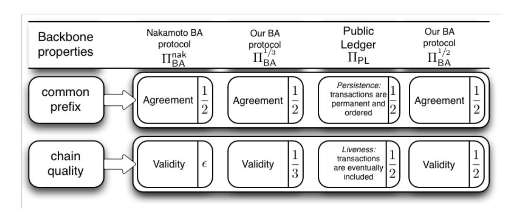
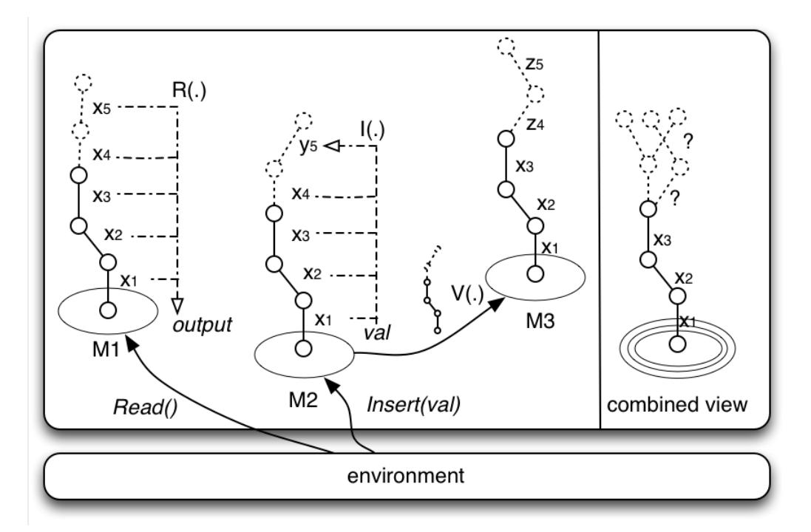
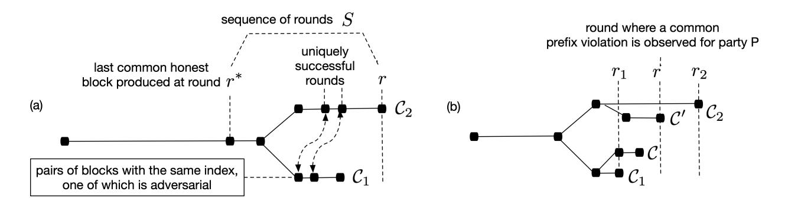

# The Bitcoin Backbone Protocol: Analysis and Applications<sup>∗</sup>

Juan A. Garay Texas A&M University garay@tamu.edu

Aggelos Kiayias†‡ University of Edinburgh, IOHK akiayias@inf.ed.ac.uk

Nikos Leonardos†§ National and Kapodistrian University of Athens. nikos.leonardos@gmail.com

August 14, 2020

#### Abstract

Bitcoin is the first and most popular decentralized cryptocurrency to date. In this work, we extract and analyze the core of the Bitcoin protocol, which we term the Bitcoin backbone, and prove two of its fundamental properties which we call common prefix and chain quality in the static setting where the number of players remains fixed. Our proofs hinge on appropriate and novel assumptions on the "hashing power" of the adversary relative to network synchronicity; we show our results to be tight under high synchronization.

Next, we propose and analyze applications that can be built "on top" of the backbone protocol, specifically focusing on Byzantine agreement (BA) and on the notion of a public transaction ledger. Regarding BA, we observe that Nakamoto's suggestion falls short of solving it, and present a simple alternative which works assuming that the adversary's hashing power is bounded by 1/3. The public transaction ledger captures the essence of Bitcoin's operation as a cryptocurrency, in the sense that it guarantees the liveness and persistence of committed transactions. Based on this notion we describe and analyze the Bitcoin system as well as a more elaborate BA protocol, proving them secure assuming high network synchronicity and that the adversary's hashing power is strictly less than 1/2, while the adversarial bound needed for security decreases as the network desynchronizes.

Finally, we extend our analysis of the Bitcoin backbone protocol for synchronous networks with relative ease to the partially synchronous model, where the upper bound in the delay of messages is unknown to the honest parties, showing its security for a suitable range of parameter values.

### 1 Introduction

Bitcoin, introduced in [Nak08a], is a decentralized payment system that is based on maintaining a public transaction ledger in a distributed manner. The ledger is maintained by anonymous participants ("players") called miners, executing a protocol that maintains and extends a distributed

<sup>∗</sup>An abridged version of this paper appears in Proc. Eurocrypt 2015.

<sup>†</sup>Research partly supported by ERC project CODAMODA, # 259152.

<sup>‡</sup>Work partly done while at the National and Kapodistrian University of Athens

<sup>§</sup>Work partly done while at LIAFA, Universit´e Paris Diderot–Paris 7.

data structure called the blockchain. The protocol requires from miners to solve a "proof of work" (POW, aka "cryptographic puzzle" — see, e.g., [DN92, RSW96, Bac97, JB99]), which essentially amounts to brute-forcing a hash inequality based on SHA-256, in order to generate new blocks for the blockchain. The blocks that comprise the blockchain contain sets of transactions that are generated at will by owners of bitcoins, who issue transactions that credit any entity of their choice who accepts payments in bitcoin. Payers broadcast transactions and miners include the transactions they receive into the blocks they generate. Miners are rewarded for maintaining the blockchain by receiving bitcoins; it is in this manner bitcoins are created and distributed among the miners who are the first recipients of newly minted bitcoins.

An important concern in Bitcoin (or any e-payment system for that matter) is the prevention of double-spending attacks. Specifically, in the context of Bitcoin, a double-spending attack can occur when the attacker initially credits an account, receives service or goods by the account holder, but then manages to reorganize the transaction ledger so that the transaction that credits the account holder is reverted. In this way, the attacker keeps her bitcoin while receiving services and thus she is able to spend it again somewhere else.

In [Nak08a], Nakamoto provides an initial set of arguments of why the Bitcoin system will prevent double-spending attacks. Specifically, he argues that if a payee waits for the transaction that gives her credit to advance into the blockchain a number of k blocks, then the probability that an attacker can build an alternative blockchain that "reorganizes" the public blockchain (which contains the credit transaction) drops exponentially with k. Nakamoto argues this by modeling the attacker and the set of honest players as two competing actors performing a random walk moving toward a single direction with probabilistic steps. He demonstrates that the k blocks the payee waits are enough to ensure a negligible (in k) probability of the attacker catching up with the honest players.

Nevertheless, the above analysis can be easily seen to be oversimplified: in particular, it does not account for the fact that in Bitcoin's decentralized setting the attacker may attempt to introduce disagreement between the honest miners, thus splitting their hashing power on different POW instances. Nakamoto himself appeared to recognize the relevance of agreement in the context of Bitcoin, arguing in a forum post [Nak08b] that actually "Bitcoin's basic concept" of building and exchanging a blockchain is capable of solving Byzantine agreement (BA) [PSL80, LSP82] in the presence of an actively malicious adversary.<sup>1</sup> However a thorough analysis establishing the exact security properties of the Bitcoin system has yet to appear.

Our results. In this paper we extract, formally describe, and analyze the core of the Bitcoin protocol. We call this protocol the Bitcoin backbone, as we describe it in a way that is versatile and extensible and can be used to solve other problems as well — not just the problem of maintaining a public transaction ledger. The Bitcoin backbone protocol is executed by players that build a blockchain following the Bitcoin source code [Nak09] and allows a set of players to maintain a blockchain in a distributed fashion. The protocol is parameterized by three external functions V (·), I(·), R(·) which we call the content validation predicate, the input contribution function, and the chain reading function, respectively. At a high level, V (·) determines the proper structure of the information that is stored into the blockchain, I(·) specifies how the contents of the blocks are formed by the players, and R(·) determines how a blockchain is supposed to be interpreted in the

<sup>1</sup> In [Nak08b], Nakamoto refers to the problem as "Byzantine Generals," which is often used to refer to the singlesource version of the problem. Note that since more than one general may propose a time to attack this in fact is the case where every party has an input value, i.e., Byzantine agreement. In fact, in an anonymous setting such as Bitcoin's, the single-source version is nonsensical. Note that in the traditional cryptographic setting, with trusted setup, the two problems are not equivalent in terms of the number of tolerated misbehaving parties t (t < n vs. t < n/2, respectively).

context of the application. Note that the structure, contents, and interpretation of the blockchain are not important for the description of the backbone protocol and are left to be specified by the three external functions above, which are application-specific (we provide examples of these functions in Section 5).

Analysis of the Bitcoin backbone protocol. We analyze the protocol in a static setting when the participants operate in a synchronous communication network (more details below and in Section 2; see also Section 7 for an extension of the analysis to the partially synchronous model [DLS88, PSS16]) in the presence of an adversary that controls a subset of the players. We assume that the protocol is executed by a fixed number n of players; note, however, that this number is not necessarily known to the protocol participants. The players themselves cannot authenticate each other and therefore there is no way to know the source of a message; we capture this by allowing the adversary to "spoof" the source address of any message that is delivered. We assume that messages are eventually delivered and all parties in the network are able to synchronize in the course of a "round." The notion of round is not important for the description of the backbone protocol (which can also be executed in a loose and asynchronous fashion in the same way that Bitcoin works), however, it is important in terms of Bitcoin's inherent computational assumption regarding the players' ability to produce POWs.

Specifically, we assume that in a single round, all parties involved are allowed the same number of queries to a cryptographic hash function, as well as to communicate with the other participants. The hash function is modeled as a random oracle [BR93]. For simplicity we assume a "flat model," where all parties have the same quota of hashing queries per round, say q; the non-flat model where parties have differing hashing power capabilities can be easily captured by clustering the flat-model parties into larger virtual entities that are comprised by more than one flat-model player. In fact "mining pools" in Bitcoin can be thought of such aggregations of flat-model players. The adversary itself represents such pool as it controls t < n players; for this reason, the adversary's quota per round is  $t \cdot q$  hashing queries. Note that in this setting, the fact t < n/2 directly corresponds to the adversary controlling strictly less than half of the system's total "hashing power" that all players collectively harness, thus, we will use terms such as "honest majority" and "(1/2)-bounded adversary" interchangeably.

In our analysis of the Bitcoin backbone protocol we formalize and prove two fundamental properties it possesses. The properties are quantified by parameter f that represents the probability of a successful POW calculation by an honest party during a round of protocol execution.

- The common prefix property. We prove that if  $\frac{t}{n-t}$  is suitably bounded below 1, then the blockchains maintained by the honest players will possess a large common prefix. More specifically, if an honest party "prunes" (i.e., cuts off) k blocks from the end of its local chain, the probability that the resulting pruned chain will not be a prefix of another honest party's chain drops exponentially in the security parameter (see Definition 3 for the precise formulation of the property and Theorem 15 for the precise statement). The parameter f plays a critical role in the analysis of the property and should be small in order to approximate honest majority, i.e., allowing t to be close to n/2. A small choice for f, suggests also that the network synchronizes significantly faster than the rate of finding POW's. On the other hand, when the network "desynchronizes" and f gets closer to 1, achieving provably a common prefix requires almost all parties to be honest.
- The chain quality property. We prove that the ratio of blocks in the chain of any honest player that are contributed by malicious players is bounded by  $\frac{t}{n-t}$ . Again observe that in an honest majority setting, i.e., allowing t is bounded below n/2, we obtain that the blockchain maintained by honest players is guaranteed to have few, but still some, blocks contributed by



Figure 1: An overview of the backbone protocol's applications: Nakamoto's BA protocol  $\Pi_{\mathsf{BA}}^{\mathsf{nak}}$ , our BA protocols  $\Pi_{\mathsf{BA}}^{1/3}$  and  $\Pi_{\mathsf{BA}}^{1/2}$ , and the public ledger protocol  $\Pi_{\mathsf{PL}}$ . All properties must be satisfied with overwhelming probability. In each box we state the name of the property as well as the maximum ratio of the adversarial hashing power that we can prove the protocol withstands (based on the corresponding backbone property). The value  $\epsilon$  stands for a negligible quantity.

honest players; a higher ratio would be necessary to guarantee bigger percentages of blocks contributed by honest players in the blockchain. We also observe that this result is basically tight, i.e., that the adversary is capable of following a strategy (that deviates from the strategy of honest players) that enables the introduction of that many blocks in the blockchain, under a favorable (for the adversary) assumption on the propagation of adversarial blocks in the network.

While the above two security properties may seem rather abstract since they refer to properties of the data structure that is maintained distributedly by the parties, we demonstrate that they are in fact quite powerful and show that the Bitcoin backbone protocol armed with the above properties can be used as a basis for solving other problems, including the problem of distributively maintaining a "robust" public transaction ledger. In Figure 1 we show how the two properties relate to the properties of the applications that are explained below and is provided in order to assist the reader in conceptualizing the logic behind the security proofs of the applications.

In fact, a third property that is convenient to consider explicitly in conjunction with the above two and was introduced in follow-up work [KP15] is *chain growth*, which, at a high level, quantifies the number of blocks that are added to the blockchain during any given number of rounds. In our original exposition [GKL15], this property was not identified explicitly but rather proven and used directly in the form of a lemma. Nevertheless, identifying it as a separate property allows making more modular our proof arguments and for this reason we make it explicit in this version of the paper (cf. Section 3.2).

Byzantine agreement for (1/3)-bounded adversaries. As a first application, we show how a randomized BA protocol can be built on top of the Bitcoin backbone protocol more or less directly, and based solely on the POW assumption. We instantiate the  $V(\cdot), I(\cdot), R(\cdot)$  functions so that parties form blockchains and act according to the following rules: each party i attempts to insert its own input  $v_i \in \{0,1\}$  into the blockchain; a blockchain is valid only if blocks contain elements in  $\{0,1\}$ ; the protocol terminates when the blockchain has reached a sufficient length; and, the blockchain is read by the honest parties by pruning k elements from its end and returning the majority bit appearing in the resulting blockchain's prefix. We show how the common prefix property and

the chain quality property of the backbone protocol ensure Agreement and Validity (BA's basic properties; see Section 2) with high probability, thus turning the Bitcoin backbone protocol into a probabilistic BA protocol.

Observe that for the above protocol to work the chain quality property should ensure that a majority of blocks in the blockchain originate from the honest players (otherwise Validity is lost). Our chain quality property enables this with overwhelming probability assuming the adversarial power is bounded by 1/3. This approach is different from Nakamoto's proposal [Nak08b] for BA, which, as we also show, only guarantees Validity with overwhelming probability if the adversary has a negligible amount of hashing power. On the positive side, we stress that Nakamoto's protocol fails gracefully when the adversarial power gets close to 50% as Validity can be shown with constant probability (but not overwhelming).

Public transaction ledgers and BA for honest majority. Next, we focus on how a "robust public transaction ledger" can be built on top of the Bitcoin backbone. We instantiate the V (·), I(·), R(·) functions so that parties form blockchains and act according to the following rules: each party (which in this context is called a "miner") receives a set S of transactions on its input tape and attempts to insert those in its blockchain, omitting any transactions in S that are already included in it. (A Bitcoin transaction is, for example, a statement of the type "account A credits account B a z number of bitcoins," which is signed using the secret key that corresponds to account A's Bitcoin address; each account has a unique Bitcoin address.) Reading a blockchain, on the other hand, amounts to returning the total sequence of transactions that is contained in the blockchain of the miner (and note that miners may disagree about the chain they report).

We show how the common prefix property and the chain quality property ensure two properties needed by the ledger, which we call Persistence and Liveness, assuming an honest majority and arbitrary adversarial behavior. Persistence states that once a transaction goes more than k blocks "deep" into the blockchain of one honest player, then it will be included in every honest player's blockchain with overwhelming probability, and it will be assigned a permanent position in the ledger. On the other hand, Liveness says that all transactions originating from honest account holders will eventually end up at a depth more than k blocks in an honest player's blockchain, and hence the adversary cannot perform a selective denial of service attack against honest account holders. For both properties to hold we require an honest majority (i.e., that the adversary's hashing power is strictly less than 50%) assuming high network synchronicity (i.e., the duration of a round in terms of the number of computational steps the parties take towards finding a POW is close to 0). If this is violated, Persistence requires stricter bounds on adversarial hashing power in order to be preserved following the bounds of the common prefix property.

In the context of Bitcoin, our analysis implies that the Bitcoin backbone provides an operational transaction ledger under the assumptions: (i) the adversary controls less than half of the total hashing power, and (ii) the network synchronizes much faster relative to the POW solution rate, (iii) digital signatures cannot be forged. On the other hand, when the network desynchronizes our results cannot support that the ledger is maintained by assuming an honest majority. This negative result is consistent with the experimental analysis provided by Decker and Wattenhoffer [DW13], who predicted a drop below 50% in the required adversarial bound for any setting when information propagation is problematic. Our result also provides some justification for the "slow" rate of 10 minute increments used in Bitcoin block generation. Specifically, information propagation in the Bitcoin network is on the order of seconds<sup>2</sup> so the ratio (essentially f) of this time window over the average 10-minute period is reasonably close to "small" and thus transaction persistence can be shown for roughly an honest majority. On the other hand, cryptocurrencies including Litecoin,

<sup>2</sup>See, for example, http://bitcoinstats.com/network/propagation/.

Primecoin and others, reacting to the demand to offer faster transaction processing, opted for a faster response rate (some as small as 1 minute), which results in more precarious situations, e.g., f > 0.1, which is far from being sufficiently close to 0 and thus cannot support our analysis that a common prefix would be guaranteed by merely assuming an honest majority. We finally note that the Persistence and Liveness properties we put forth and prove should not be interpreted as proofs that all Bitcoin's objectives are met. In particular, they do not guarantee that miners are properly incentivized to carry out the backbone protocol, and they can only offer guarantees in a setting of an honest majority amongst a fixed number of players as opposed to a setting where there is an ever changing population of parties acting rationally; see related work below as well as Section 8 for further discussion.

Next, we present a BA protocol assuming an honest majority, by suitably exploiting the properties of the robust transaction ledger above. The protocol substitutes Bitcoin's transactions with a type of transactions that are themselves based on POWs, and hence uses POWs in two distinct ways: for the maintenance of the ledger and for the generation of the transactions. We show that the ledger's Persistence implies Agreement, and that Liveness implies Validity, because assuming the ledger is maintained for long enough, a majority of transactions originating from the honest parties will be included (despite the fact that honest parties may control a minority of blocks in the blockchain). The protocol requires special care in the way it employs POWs since the adversary should be incapable of "shifting" work between the two POW tasks that it faces in each round. To solve this problem, we introduce a special strategy for POW-based protocol composition which we call "2-for-1 POWs."

The Bitcoin backbone in the bounded-delay model. In this version of the paper, we extend our analysis for the synchronous model with relative ease to the partially synchronous model [DLS88, PSS16], where, in a nutshell, instead of messages sent in a round being guaranteed to arrive by the end of the round, there is an upper bound of ∆ rounds for each message delivery event that is unknown to the honest parties. This new analysis is presented in Section 7. The analysis shows that the protocol is secure provided the difficulty level is in a favorable relation with respect to ∆. Treating ∆ as a separate parameter bounding the message passing delay enables to express the honest majority assumption also as a function of ∆ showing how approaching the 50% bound hinges on ∆ being sufficiently small.

Related work. Realizing a digital currency with a centralized entity but while achieving strong privacy was proposed early on by Chaum in [Cha82]. A number of other works improved various aspects of this concept, however the approach remained centralized. Nakamoto [Nak08a] proposed the first decentralized currency system based on POWs while relaxing the anonymity property of the payment system to mere pseudonymity. This work was followed by a multitude of other related proposals including Litecoin<sup>3</sup> , Ethereum<sup>4</sup> , to mention a few. Our analysis of the Bitcoin backbone covers all these works as well, since they are based on exactly the same protocol.

It is interesting to juxtapose our positive results to the results of Eyal and Sirer [ES14], who introduce an attack strategy called "selfish mining" that shows how the number of blocks contributed to the blockchain by an adversary can exceed the percentage of the hashing power the adversary possesses. Their results are consistent and complementary to ours. The crux of the issue is (in our terminology) in terms of the chain quality property, as its formulation is quite permissive: in particular we show that if the adversary controls a suitably bounded amount of hashing power, then it is also suitably bounded in terms of the number of blocks it has managed to insert in the blockchain that honest players maintain. Specifically, recall that we prove that the adversary may

<sup>3</sup> http://www.litecoin.com.

<sup>4</sup> https://www.ethereum.org.

control at most a  $\frac{t}{n-t}$  percentage of the blocks in the chain. For instance, if the adversary has less than 1/3 of the hashing power, then it will provably control less than 50% of the blocks in the honest players' blockchain. As it can be easily seen, this does not guarantee that the rate of a party's hashing power translates to an equal rate of rewards (recall that in Bitcoin the rewards are linearly proportional to the number of blocks that a party contributes in the chain). We define as ideal chain quality the property that for any coalition of parties (following any mining strategy) the percentage of blocks in the blockchain is exactly proportional to their collective hashing power, i.e.  $\frac{t}{n}$ . The chain quality property that we prove is not ideal and the results of [ES14] show that in fact there is a strategy that magnifies the percentage of a malicious coalition. Still, their mining attack does much worse than our bound. To close the gap, we sketch (cf. Remark 4) a simple selfish mining strategy that matches our upper bound and hence our chain quality result is tight in our model<sup>5</sup> assuming the number of honest parties is large.

Byzantine agreement (BA, aka "consensus") [PSL80, LSP82] considers a set of n parties connected by reliable and authenticated pair-wise communication links and with possible conflicting initial inputs that wish to agree on a common output in the presence of the disruptive (even malicious) behavior of some of them. The problem has received a considerable amount of attention under various models. In this paper we are interested in randomized solutions to the problem (e.g., [BO83, Rab83, BG93, FM97, FG03, KK09])<sup>6</sup> as in the particular setting we are in, deterministic BA algorithms are not possible. In more detail, we consider BA in the anonymous synchronous setting, i.e., when processors do not have identifiers and cannot correlate messages to their sources, even across rounds, and, further, there is no trusted setup nor a limit to the number of messages delivered per round. Okun, motivated by earlier work [BSV<sup>+</sup>96], considered a slightly weaker model called "anonymous model without port awareness," which matches the above except for imposing a limit on the number of messages per round and proved the aforementioned impossibility result, that deterministic algorithms are impossible for even a single failure [Oku05b, Oku05a]. In addition, Okun showed that probabilistic BA is feasible in his setting by suitably adapting Ben-Or's protocol [BO83] for the standard, non-anonymous setting (cf. [Oku05b])<sup>7</sup>; the protocol, however, takes exponentially many rounds. It turns out that by additionally assuming that the parties are "port-aware" (i.e., they can correlate messages to sources across rounds), deterministic protocols are possible and some more efficient solutions were proposed in [OB08].

The anonymous synchronous setting for BA without limits on messages per round and hence prone to Sybil attacks [Dou02], was considered by Aspnes et al. [AJK05] who pointed to the potential usefulness of proofs of work (e.g., [DN92, RSW96, Bac97, JB99]) as an identity assignment tool, in such a way that the number of identities assigned to the honest and adversarial parties can be made proportional to their aggregate computational power, respectively. For example, by assuming that the adversary's computational power is less than 50%, one of the algorithms in [AJK05] results in a number of adversarial identities less than half of that obtained by the honest parties. By running this procedure in a pre-processing stage, it is then suggested that a standard authenticated BA protocol could be run. Such protocols, however, would require the establishment of a consistent PKI (as well as of digital signatures), details of which are not laid out in [AJK05].

In contrast, and as mentioned above, building on our analysis of the Bitcoin backbone proto-

<sup>&</sup>lt;sup>5</sup>Our model allows the unfavorable event of adversarial messages winning all head-to-head races in terms of delivery with honestly generated messages in any given round.

<sup>&</sup>lt;sup>6</sup>We remark that, in contrast to the approach used in typical randomized solutions to the problem, where achieving BA is reduced to (the construction of) a shared random coin, the probabilistic aspect here stems from the parties' likelihood of being able to provide proofs of work. In addition, as our analysis relies on the random oracle model [BR93], we are interested in computational/cryptographic solutions to the problem.

<sup>&</sup>lt;sup>7</sup>Hence, BA in this setting shares a similar profile with BA in the asynchronous setting [FLP85].

col, we propose two BA protocols solely based on POWs that operate in O(k) rounds with error probability e −Ω(k) . The protocols solve BA with overwhelming probability under the assumption that the adversary controls less than 1/3 and 1/2 of the computational power, respectively.

The connection between Bitcoin and probabilistic BA was also considered by Miller and LaViola in [ML14] where they take a different approach compared to ours, by not formalizing how Bitcoin works, but rather only focusing on Nakamoto's suggestion for BA [Nak08b] as a standalone protocol. As we observe here, and also recognized in [ML14], Nakamoto's protocol does not quite solve BA since it does not satisfy Validity with overwhelming probability. The exact repercussions of this fact are left open in [ML14], while with our analysis, we provide explicit answers regarding the transaction ledger's actual properties and the level of security that the Bitcoin backbone realization can offer.

We refer to [GK18] for a systematized overview of the consensus problem in the context of blockchain protocols.

Finally, related to the anonymous setting, the feasibility of secure computation without authenticated links was considered by Barak et al. in [BCL+11] in a more extreme model where all messages sent by the parties are controlled by the adversary and can be tampered with and modified (i.e., not only source addresses can be "spoofed," but also messages' contents can be altered and messages may not be delivered). It is shown in [BCL+11] that it is possible to limit the adversary so that all he can do is to partition the network into disjoint sets, where in each set the computation is secure, and also independent of the computation in the other sets. Evidently, in such system, one cannot hope to build a global ledger.

Summary of differences with [GKL15]. The most important difference in the current version of the paper compared to the original one [GKL15] is the complete rewrite of all our proofs, which now follow a much more streamlined and easier presentation. In particular, this version incorporates the concept of a typical execution that we have in fact introduced in [GKL16, GKL17] (analysis of the backbone protocol with chains of variable difficulty) and which greatly simplifies our probabilistic analysis, concentrating it on a single theorem (specifically, Theorem 10, showing that most executions are typical).

The present version also includes the explicit treatment of security against adaptive adversaries, showing how to reduce the analysis to the case of static adversaries (Section 4.4). We also present an analysis of the Bitcoin backbone protocol in the partially synchronous model [DLS88] against static adversaries, where an unknown upper bound is imposed on message delivery (cf. Section 7). This model was considered by Pass et al. [PSS16]; nevertheless, here we show how our model can also extend to the bounded-delay setting and our proof strategy using typical executions can provide a simple security proof. This suggests that the notion of typical executions of [GKL16, GKL17] and the associated analysis approach are useful tools with the potential of wider applicability in the analysis of blockchain protocols.

In the current version we refer to the length of the hash function output κ as the (sole) security parameter, and refer to λ—typically the number of consecutive rounds for which a statement would hold—as the tail-bounds parameter. This way, making λ polylogarithmic in the security parameter (e.g., Ω(log<sup>2</sup> (κ))) allows us to clearly express how blockchain properties and applications (e.g., consensus) are satisfied except with negligible probability after that many rounds.

Organization of the paper. The rest of the paper is organized as follows. In Section 2 we present our model within which we formally express the Bitcoin backbone protocol and prove its basic properties. The backbone protocol builds "blockchains" based on a cryptographic hash function; we introduce notation for this data structure as well as the backbone protocol itself in Section 3, followed by its analysis in Section 4. Sections 5 and 6 are dedicated to the applications built on top of the backbone protocol—(simple) BA protocols and a robust transaction ledger, respectively. Specifically, Section 5 covers Nakamoto's (insufficient) suggestion for BA as well as our solution for 1/3 adversarial power, while in Section 6 we present our treatment of a robust public ledger (Section 6.1) formalizing the properties of Persistence and Liveness and how they apply to Bitcoin (Section 6.2). We also include in this section (Section 6.3) our BA protocol for 1/2 adversarial power. The extension of our analysis to the partially synchronous model is presented in Section 7, while some directions for future research are offered in Section 8.

### 2 Model and Definitions

In this section we define our notion of protocol execution and provide a definition of Byzantine agreement in our model. We will describe and analyze our protocols in a multiparty setting that employs elements from previous formulations of secure multiparty computation (specifically, Canetti's formulation of "real world" execution as in [Can00a] and [Can00b, Can01]). We adopt the notation and definitions of [Can00b, Can01] while we also employ ideas regarding the formulation of synchronous, proceeding in rounds, multiparty computation from [KMTZ13].

Programs involved in a protocol execution. The execution of a protocol Π is driven by an "environment" program Z that may spawn multiple instances running the protocol Π. The programs in question can be thought of as "interactive Turing machines" (ITM) that have communication, input and output tapes. An instance of an ITM running a certain program will be referred to as an interactive Turing machine instance or ITI. The spawning of new ITI's by an existing ITI as well as the interaction between them is at the discretion of a control program which is also an ITM and is denoted by C. The pair (Z, C) is called a system of ITM's, cf. [Can00b]. As in this latter paper we will be restricting our exposition to "locally polynomial-bounded" systems of ITM's which ensures a polynomial-time execution overall [Can00b, Proposition 3]. Moreover, we will be using a more stringent control program C that will be forcing the environment to perform a "round-robin" participant execution sequence for a fixed set of parties.

Specifically, the execution driven by Z is defined with respect to a protocol Π, an adversary A (also an ITM) and a set of parties P1, . . . , Pn; these are hardcoded in the control program C. The protocol Π is defined in a "hybrid" setting and has access to two "ideal functionalities," which are two other ITM's to be defined below, called the random oracle and the diffusion channel. They are used as subroutines by the programs involved in the execution (the ITI's of Π and A) and they are accessible by all parties once they are spawned.

Initially, the environment Z is restricted by C to spawn the adversary A. Each time the adversary is activated, it may send one or more messages of the form (Corrupt, Pi) to C. The control program C will register party P<sup>i</sup> as corrupted, only provided that the environment has previously given an input of the form (Corrupt, Pi) to A and that the number of corrupted parties is less or equal t, a bound that is also hardcoded in C. The first ITI party to be spawned running protocol Π is restricted by C to be party P1. After a party P<sup>i</sup> is activated, the environment is restricted to activate party Pi+1, except when P<sup>n</sup> is activated in which case the next ITI to be activated is always the adversary A. Note that when a corrupted party P<sup>i</sup> is activated the adversary A is activated instead.

Communication and "hashing power." We describe next the two functionalities that are accessible to the parties. These functionalities will reflect the parties' ability (i) to communicate with each other and (ii) to calculate values of a hash function H(·) : {0, 1} <sup>∗</sup> → {0, 1} κ concurrently. We note that they share a state and thus they can be viewed as a single functionality, nevertheless it is convenient to describe them as separate entities.

- The random oracle (RO) functionality. When queried by honest party  $P_i$  with a value x marked for "calculation" for the function  $H(\cdot)$ , assuming x has not been queried before, it returns a value y which is selected at random from  $\{0,1\}^{\kappa}$ ; furthermore, it stores the pair (x,y) in the table of  $H(\cdot)$ . Each honest party  $P_i$  is allowed to ask q queries in each round as determined by the "diffuse" functionality (see below). On the other hand, each honest party is given unlimited queries for "verification" for the function  $H(\cdot)$ . In a similar vein, the adversary  $\mathcal{A}$  is given  $t' \cdot q$  queries in each round as determined by the diffuse functionality where t' is the number of corrupted parties. No verification queries are provided to  $\mathcal{A}$ . Note that q is a function of  $\kappa$ . We note that the functionality may maintain tables for functions other than  $H(\cdot)$  as well (for instance, in our protocol descriptions, we will utilise a function  $G(\cdot)$ ), but, by convention the functionality will impose query quotas to function  $H(\cdot)$  only.
- The diffuse functionality. Initially, the functionality sets a variable round to be 1. It also maintains a Receive() string defined for each party  $P_i$ . A party is allowed at any moment to fetch the contents of its personal Receive() string. Moreover, when the functionality receives an instruction to diffuse a message m from party  $P_i$  it marks the party as complete for the current round; note that m is allowed to be empty. At any moment, the adversary A is allowed to receive the contents of all messages for the round and specify the contents of the Receive() string for each party  $P_i$ . The adversary has to specify when it is complete for the current round. When all parties are complete for the current round, the functionality inspects the contents of all Receive() strings and includes any messages m that were diffused by the parties in the current round but not contributed by the adversary to the Receive() tapes. The variable round is then incremented.

We note that by adopting the resource bounded computation modeling of systems of ITM's by [Can00b, Can01] we obviate the need of imposing a strict upper bound on the number of messages that may be transmitted by the adversary in each activation. In our setting, honest parties, at the discretion of the environment, are given sufficient time to process all messages delivered via the diffuse functionality including all messages that are injected by the adversary. This is also facilitated by the fact that the q bound that is imposed on queries to  $H(\cdot)$  is not imposed for hash verification (with foresight, the q-bound will be only imposed for hash computations during the proof of work stage of the protocol).

Note that the above formulation also reflects the fact that the communication graph is not fully connected and messages are delivered through "diffusion", a communication means that reflects Bitcoin's peer-to-peer structure. As evidenced by the above, our adversarial model in the network is "adaptive," meaning that the adversary is allowed to take control of parties on the fly, and "rushing," meaning that in any given round the adversary gets to see all honest players' messages before deciding his strategy, and, furthermore, there is no definite source information that can be guaranteed for each delivered message. Note that the adversary cannot change the contents of the messages sent by honest parties nor prevent them from being delivered as restricted by the diffuse functionality. Effectively, this parallels communication over TCP/IP in the Internet where messages between parties are delivered reliably, but nevertheless malicious parties may "spoof" the source of a message they transmit and make it appear as originating from an arbitrary party (including another honest party) in the view of the receiver. Note that the adversary is permitted to abuse the diffusion mechanism and attempt to confuse honest parties by sending and delivering inconsistent messages to them (thus diffuse does not constitute a reliable broadcast).<sup>8</sup>

<sup>&</sup>lt;sup>8</sup>In the conference version of this paper [GKL15] we used the term BROADCAST instead of DIFFUSE to mean the same thing. Given that this leads to some misunderstanding we changed the terminology to employ the term

The parties' inputs are provided by the environment  $\mathcal{Z}$  which also receives the parties' outputs. Parties that receive no input from the environment remain inactive, in the sense that they will not act when their turn comes in each round. The environment activates parties in each round by writing to their input tape. Note that C forces the environment to give all parties an activation in round-robin fashion. In our exposition we will denote by INPUT() the input tape of each party.

The q-bounded synchronous setting. Based on the above, we can now use the notation  $\{\text{EXEC}_{\Pi,\mathcal{A},\mathcal{Z}}^{t,n}(z)\}_{z\in\{0,1\}^*}$  to denote the random variable ensemble that determines the output of the environment  $\mathcal{Z}$  on input z for a protocol  $\Pi$  that uses the two functionalities of random oracle and diffuse (we will only be concerned with such protocols). Moreover, we will use the notation  $\{\text{VIEW}_{\Pi,\mathcal{A},\mathcal{Z}}^{P,t,n}(z)\}_{z\in\{0,1\}^*}$  to denote the random variable ensemble describing the view of party P after the completion of an execution with environment  $\mathcal{Z}$ , running protocol  $\Pi$ , and adversary  $\mathcal{A}$ , on auxiliary input  $z\in\{0,1\}^*$ .

In our exposition we are concerned with a "stand-alone" execution of  $\Pi$  and thus we will consider z to be fixed to  $1^{\kappa}$  for  $\kappa \in \mathbb{N}$ . For this reason we will simply refer to the ensemble by  $\operatorname{VIEW}_{\Pi,\mathcal{A},\mathcal{Z}}^{P_t,n}$ . If n parties  $P_1,\ldots,P_n$  execute  $\Pi$ , the concatenation of the view of all parties  $\langle \operatorname{VIEW}_{\Pi,\mathcal{A},\mathcal{Z}}^{P_t,t,n} \rangle_{i=1,\ldots,n}$  is denoted by  $\operatorname{VIEW}_{\Pi,\mathcal{A},\mathcal{Z}}^{t,n}$ . With foresight, we note that, in contrast to the standard setting where parties are aware of the number of parties executing the protocol, we are interested in protocols  $\Pi$  that do not make explicit use of the number of parties n or their identities. Further, note that because of the unauthenticated nature of the communication model the parties may never be certain about the number of participants in a protocol execution. Nonetheless note that the number of parties is fixed during the course of the protocol execution, as this is hardcoded in the control program C.

The parties' limited ability to produce POWs is reflected in the limit imposed to all parties in their access of the function  $H(\cdot)$ . Parties are allowed to perform a number of queries q per round. We remark that this is a "flat-model" interpretation of the parties' computation power, where all parties are assumed equal. In the real world, different honest parties may have different "hashing power;" nevertheless, our flat-model does not sacrifice generality since one can imagine that real honest parties are simply clusters of some arbitrary number of honest flat-model parties. The adversary  $\mathcal{A}$  is allowed to perform  $t' \cdot q$  queries per round, where  $t' \leq t$  is the number of corrupted parties. The environment  $\mathcal{Z}$ , on the other hand, is not permitted any queries to  $H(\cdot)$ . The rationale for this, is that we would like to bound the "CPU power" [Nak08a] of the adversary to be proportionate to the number of parties it controls while making it infeasible for them to be aided by external sources or by transferring the hashing power potentially invested in concurrent or previous protocol executions. This underscores the fact that our analysis is in the standalone setting, where a single protocol instance is executed in isolation.

We will refer to all the above restrictions on the environment, the parties and the adversary as the q-bounded synchronous setting.

**Properties of protocols.** In our theorems we will be concerned with *properties* of protocols  $\Pi$  in the q-bounded synchronous setting. Such properties will be defined as predicates over the random variable  $\text{VIEW}_{\Pi,\mathcal{A},\mathcal{Z}}^{t,n}$  by quantifying over all possible adversaries  $\mathcal{A}$  and environments  $\mathcal{Z}$  that are polynomially bounded. Note that all our protocols will only satisfy properties with a small probability of error in  $\kappa$  as well as in potentially other parameters. The probability space is determined by the random choices of the random oracle functionality as well as the private coins of all ITI's.

<sup>&</sup>quot;Diffuse" instead of "Broadcast." As in the conference version, note that "Diffuse" remains an atomic operation and hence the corruption of a party may not happen while the operation is taking place (cf. [HZ10, GKKZ11]).

**Definition 1.** Given a predicate Q and a bound  $q, t, n \in \mathbb{N}$  with t < n, we say that the protocol  $\Pi$  satisfies property Q in the q-bounded setting for n parties assuming the number of corruptions is bounded by t, provided that for all polynomial-time  $\mathcal{Z}, \mathcal{A}$ , the probability that  $Q(\text{VIEW}_{\Pi, \mathcal{A}, \mathcal{Z}}^{t, n})$  is false is negligible in  $\kappa$ .

Note that we will only consider properties that are polynomial-time computable predicates.

Byzantine agreement. As a simple illustration of the formulation above we define the properties of a Byzantine agreement (BA) protocol.

**Definition 2.** A protocol  $\Pi$  solves BA in the q-bounded synchronous setting provided it satisfies the following two properties:

- Agreement. There is a round after which all honest parties return the same output if queried by the environment.
- Validity. The output returned by an honest party P equals the input of some party P' at round 1 that is honest at the round P's output is produced.

We note that in our protocols, the participants are capable of detecting agreement and furthermore they can also detect whether other parties detect agreement, thus termination can be easily achieved by all honest parties. In the traditional cryptographic setting with no trusted setup, it is known that the problem does not have a solution if  $t \ge \frac{n}{3}$  [Bor96]. Interestingly, one of our POW-based BA protocols works for  $t < \frac{n}{2}$ , assuming only a simultaneous start without a PKI, the same bound that is achievable when a PKI is available.

The formulation of Validity above is intended to capture security/correctness against adaptive adversaries. The notion (specifically, the requirement that the output value be one of the honest parties' inputs) has also been called "Strong Validity" [Nei94], but the distinction is only important in the case of non-binary inputs. In either case, it is known that in the synchronous cryptographic setting with trusted setup the problem has a solution if and only if n > |V|t, where V is the input/decision domain [FG03]. Our POW-based protocol also achieves this bound.

Remark 1. One may consider a model where a certain percentage of the honest parties is not always able to receive all messages broadcast on the network. We point out that such a situation is subsumed by our adversarial model: simply we let the adversary control these players and simulate them honestly while dropping messages from their incoming tape arbitrarily. Of course, to apply the theorems we prove, one should adjust the total power of the adversary accordingly and add these parties to the adversarial ones.

### 3 The Bitcoin Backbone Protocol

We start by introducing blockchain notation. Let  $G(\cdot)$ ,  $H(\cdot)$  be cryptographic hash functions with output in  $\{0,1\}^{\kappa}$ . A *block* is any triple of the form  $B = \langle s, x, ctr \rangle$  where  $s \in \{0,1\}^{\kappa}$ ,  $x \in \{0,1\}^{\kappa}$ ,  $ctr \in \mathbb{N}$  are such that satisfy predicate validblock  $q^T(B)$  defined as

$$(H(ctr,G(s,x)) < T) \wedge (ctr \leq q).$$

The parameter  $T \in \mathbb{N}$  is also called the block's difficulty level. The parameter  $q \in \mathbb{N}$  is a bound that in the Bitcoin implementation determines the size of the register ctr; in our treatment we allow this to be arbitrary, and use it to denote the maximum allowed number of hash queries in a round. We do this for convenience and our analysis applies in a straightforward manner to the case that ctr is restricted to the range  $0 \le ctr < 2^{32}$  and q is independent of ctr.

A blockchain, or simply a chain is a sequence of blocks. The rightmost block is the head of the chain, denoted head(C). Note that the empty string ε is also a chain; by convention we set head(ε) = ε. A chain C with head(C) = hs 0 , x<sup>0</sup> , ctr<sup>0</sup> i can be extended to a longer chain by appending a valid block B = hs, x, ctri that satisfies s = H(ctr<sup>0</sup> , G(s 0 , x<sup>0</sup> )). In case C = ε, by convention any valid block of the form hs, x, ctri may extend it. In either case we have an extended chain Cnew = CB that satisfies head(Cnew) = B.

The length of a chain len(C) is its number of blocks. Given a chain C that has length len(C) = n > 0 we can define a vector x<sup>C</sup> = hx1, . . . , xni that contains all the x-values that are stored in the chain such that x<sup>i</sup> is the value of the i-th block.

Consider a chain C of length m and any nonnegative integer k. We denote by C dk the chain resulting from the "pruning" the k rightmost blocks. Note that for k ≥ len(C), C <sup>d</sup><sup>k</sup> = ε. If C<sup>1</sup> is a prefix of C<sup>2</sup> we write C<sup>1</sup> C2.

We note that Bitcoin uses chains of variable difficulty, i.e., the value T may change across different blocks within the same chain according to some rule that is determined by the x values stored in the chain<sup>9</sup> . This is done to account for the fact that the number of parties (and hence the total hashing power of the system) is variable from round to round (as opposed to the unknown but fixed number of parties n we assume). See Section 8 for further discussion. We are now ready to describe the protocol.

### 3.1 The backbone protocol

The Bitcoin backbone protocol is executed by an arbitrary number of parties over an unauthenticated network. For concreteness, we assume that the number of parties running the protocol is n; however, parties need not be aware of this number when they execute the protocol. As mentioned in Section 2, communication over the network is achieved by utilizing a send-to-all Broadcast functionality that is available to all parties (and maybe abused by the adversary in the sense of delivering different messages to different parties). Each party maintains a blockchain, as defined above, starting from the empty chain and mining a block that contains the value s = 0 (by convention this is the "genesis block")10. Each party's chain may be different, but, as we will prove, under certain well-defined conditions, the chains of honest parties will share a large common prefix. (Figure 2 depicts the local view of each party as well as the shared portion of their chains.)

In the protocol description we intentionally avoid specifying the type of values that parties try to insert in the chain, the type of chain validation they perform (beyond checking for its structural properties with respect to the hash functions G(·), H(·)), and the way they interpret the chain. In our description, these actions are abstracted by the external functions V (·), I(·), R(·) which are specified by the application that runs "on top" of the backbone protocol. We will purposely leave these functions undetermined in our description assuming they conform to the following specifications. We will provide explicit instantiations of them in Section 5. Briefly, they are described as follows:

• Content validation predicate V (·). The content validation predicate receives as input the content of a chain C, denoted by xC, and will return 1 if and only if the contents are consistent with the intended application implemented on top of the chain. In its simplest form, V (·) can ensure that the elements of x<sup>C</sup> are of the proper type.

<sup>9</sup> In Bitcoin every 2016 blocks the difficulty is recalibrated according to the time-stamps stored in the blocks so that the block generation rate remains at approximately 10 minutes per block.

<sup>10</sup>Alternatively, s can point to an actual block that contains some trusted setup information (in the case of Bitcoin the genesis block contains the string "The Times 03/Jan/2009 Chancellor on brink of second bailout for banks"). Our analysis however is in the standalone setting and thus we choose the simplest possible genesis block.



Figure 2: Overview of the basic operation of the Bitcoin backbone protocol. Miner M<sup>1</sup> receives from the environment a Read instruction that results in the application of the R(·) function on the contents of its chain which are equal to the vector hx1, x2, x3, x4, x5i. Miner M<sup>2</sup> receives from the environment an Insert instruction and uses the function I(·) to determine the value y<sup>5</sup> that it subsequently successfully inserts in its local block chain by solving a proof of work; this results in a broadcast of the newly extended chain. Finally miner M<sup>3</sup> receives the newly extended chain and validates it both structurally as well as using the content validation predicate V (·). M<sup>3</sup> will adopt this chain if M<sup>3</sup> deems it better than its local chain as specified by the backbone protocol. Note that the joint view of M1, M2, M<sup>3</sup> is inconsistent but there is agreement on the prefix hx1, x2, x3i.

- Input contribution function I(·). It receives as input a tuple, (st, C, round, Input(), Receive()), that stands respectively for state data st, current chain C, current round round, contents of input tape Input() and contents of network tape Receive(). Given these, it will produce an updated state st<sup>0</sup> as well as an input x that should be the next input to be inserted in a block. For instance, I(·) can be as simple as copying the contents of the input tape into x and keeping st = , or performing a more complex operation that involves parsing C or even maintaining old input values that have not yet been processed as part of the state st.
- Chain reading function R(·). It receives as input a chain C and provides an interpretation of it. In the simplest case it can be just returning x<sup>C</sup> and leaving it to the callee to process the contents of the chain.

In general our treatment will be independent of the exact operation of V, I, R apart from requiring the following minimal set of conditions.

1. Input Validity. The input contribution function should produce values that are deemed acceptable by the content validation predicate. Formally, for any chain C with x<sup>C</sup> = hx1, . . . , xni, the value x produced by an invocation of I(·, C, ·, ·, ·) should satisfy V (hx1, . . . , xn, xi) = 1. By convention, V (ε) = 1.

**Algorithm 1** The *chain validation predicate*, parameterized by q, T, the hash functions  $G(\cdot), H(\cdot)$ , and the *content validation predicate*  $V(\cdot)$ . The input is C.

```
1: function validate(C)
           b \leftarrow V(\mathbf{x}_{\mathcal{C}})
 2:
 3:
           if b \wedge (\mathcal{C} \neq \varepsilon) then
                                                                              \triangleright The chain is non-empty and meaningful w.r.t. V(\cdot)
                  \langle s, x, ctr \rangle \leftarrow \text{head}(\mathcal{C})
 4:
                  s' \leftarrow H(ctr, G(s, x))
 5:
                  repeat
 6:
                        \langle s, x, ctr \rangle \leftarrow \text{head}(\mathcal{C})
 7:
                       if validblock_q^T(\langle s, x, ctr \rangle) \wedge (H(ctr, G(s, x)) = s') then
 8:
                                                                                                                                         ▶ Retain hash value
 9:
                             \mathcal{C} \leftarrow \mathcal{C}^{\lceil 1 \rceil}
                                                                                                                             \triangleright Remove the head from \mathcal{C}
10:
11:
                        else
                              b \leftarrow \text{False}
12:
                        end if
13:
                  until (C = \varepsilon) \vee (b = \text{False})
14:
           end if
15:
           return(b)
16:
17: end function
```

2. Input Entropy. The probability of the event that two independent invocations of  $I(st, \mathcal{C}, round, v, w)$ , where  $st, \mathcal{C}, round, v, w$  are arbitrary values consistent with the input of  $I(\cdot)$ , result in the same output value x is negligible in  $\kappa$ .

The Bitcoin backbone protocol is specified as Algorithm 4. Before describing it in detail we first introduce the protocol's three supporting algorithms.

Chain validation. The first algorithm, called validate performs a validation of the structural properties of a given chain  $\mathcal{C}$ , cf. Algorithm 1. It is given as input the values q and T, as well as a hash function  $H(\cdot)$ . It is parameterized by the content validation predicate  $V(\cdot)$ . For each block of the chain, the algorithm checks that the proof of work is properly solved, that the counter ctr does not exceed q and that the hash of the previous block is properly included in the block. It further collects all the inputs from the chain's blocks and assembles them into a vector  $\mathbf{x}_{\mathcal{C}}$ . If all blocks verify and  $V(\mathbf{x}_{\mathcal{C}})$  is true then the chain is valid; otherwise it is rejected. As mentioned we purposely leave the predicate  $V(\cdot)$  undetermined.

Chain comparison. The objective of the second algorithm, called maxvalid, is to find the "best possible" chain when given a set of chains, cf. Algorithm 2. The algorithm is straightforward and is parameterized by a  $\max(\cdot)$  function that applies some ordering in the space of chains. The most important aspect is the chains' length, in which case  $\max(\mathcal{C}_1, \mathcal{C}_2)$  will return the longest of the two. In case  $\operatorname{len}(\mathcal{C}_1) = \operatorname{len}(\mathcal{C}_2)$ , some other characteristic can be used to break the tie. In our case,  $\max(\cdot, \cdot)$  will always return the first operand<sup>11</sup>; alternatively, other options exist, such as

<sup>&</sup>lt;sup>11</sup>Note that the way we deploy maxvalid, amounts to parties always giving preference to their local chain as opposed to any incoming chain. This is consistent with current Bitcoin operation; however, some debate about alternate tiebreaking rules has ensued in Bitcoin forums, e.g., see [Cun13].

**Algorithm 2** The function that finds the "best" chain, parameterized by function  $\max(\cdot)$ . The input is  $\{C_1, \ldots, C_k\}$ .

```
1: function maxvalid(C_1, \dots, C_k)
2: temp \leftarrow \varepsilon
3: for i = 1 \text{ to } k \text{ do}
4: if \text{ validate}(C_i) \text{ then}
5: temp \leftarrow \max(C_i, temp)
6: end if
7: end for
8: end for
9: end function
```

lexicographic order or picking a chain at random. The analysis we will perform will essentially be independent of the tie-breaking  ${\rm rule}^{12}$ .

**Proof of work.** The third algorithm, called pow, is the main "workhorse" of the backbone protocol, cf. Algorithm 3. It takes as input a chain and attempts to extend it via solving a proof of work. This algorithm is parameterized by two hash functions  $H(\cdot)$ ,  $G(\cdot)$  (which in our analysis will be modeled as random oracles),  $^{13}$  as well as two positive integers q, T; q represents the number of times the algorithm is going to attempt to brute-force the hash function inequality that determines the POW instance, and T determines the "difficulty" of the POW. The algorithm works as follows. Given a chain  $\mathcal{C}$  and a value x to be inserted in the chain, it hashes these values to obtain h and initializes a counter ctr. Subsequently, it increments ctr and checks to see whether H(ctr, h) < T; this is the only invocation of  $H(\cdot)$  that is subject to the bound q. If a suitable ctr is found then the algorithm succeeds in solving the POW and extends chain  $\mathcal{C}$  by one block inserting x as well as ctr (which serves as the POW). If no suitable ctr is found, the algorithm simply returns the chain unaltered. (See Algorithm 3.)

The backbone protocol. Given the three algorithms above, we are now ready to describe the Bitcoin backbone protocol, cf. Algorithm 4. This is the protocol that is executed by the miners and which is assumed to run "indefinitely" (our security analysis will apply when the total running time is polynomial in  $\kappa$ ). It is parameterized by two functions, the input contribution function  $I(\cdot)$  and the chain reading function  $R(\cdot)$ , which is applied to the values stored in the chain.

Each miner starts a round with a local chain  $\mathcal{C}$  (we say that the miner has chain  $\mathcal{C}$  at this round) and checks its communication tape Receive() to see whether a "better" chain has been received and in such case it adopts it resulting in chain  $\tilde{\mathcal{C}}$  (we say that the miner *adopts* chain  $\tilde{\mathcal{C}}$  at this round). Choosing the chain  $\tilde{\mathcal{C}}$  is done using the maxvalid function; note that it could be that  $\mathcal{C} = \tilde{\mathcal{C}}$ . Then, the miner attempts to extend  $\tilde{\mathcal{C}}$  by running the POW algorithm pow described above.

The value that the miner attempts to insert in the chain is determined by function  $I(\cdot)$ . The input to  $I(\cdot)$  is the state st, the current chain  $\mathcal{C}$ , the contents of the miner's input tape INPUT() (recall that they can be written by the environment  $\mathcal{Z}$  at the beginning of any round) and commu-

 $<sup>^{12}</sup>$ It is worth to point out that the behavior of  $\mathsf{maxvalid}(\cdot)$  is associated with some stability aspects of the backbone protocol and currently there are proposals to modify it (e.g., by randomizing it — cf. [ES14]). It is an interesting question whether any improvement in our results can be achieved by randomizing the  $\mathsf{maxvalid}$  operation.

 $<sup>^{13}</sup>$ In reality the same hash function (SHA-256) instantiates both G and H; however, it is notationally more convenient to consider them as distinct.

**Algorithm** 3 The *proof of work* function, parameterized by q, T and hash functions  $H(\cdot)$ ,  $G(\cdot)$ . The input is  $(x, \mathcal{C})$ .

```
1: function pow(x, C)
          if C = \varepsilon then
                                                                                             ▶ Determine proof of work instance
               s \leftarrow 0
 3:
          else
 4:
                \langle s', x', ctr' \rangle \leftarrow \text{head}(\mathcal{C})
 5:
               s \leftarrow H(ctr', G(s', x'))
 6:
          end if
 7:
          ctr \leftarrow 1
 8:
          B \leftarrow \varepsilon
 9:
          h \leftarrow G(s,x)
10:
11:
          while (ctr \leq q) do
                                                                             \triangleright This H(\cdot) invocation subject to the q-bound
               if (H(ctr, h) < T) then
12:
                    B \leftarrow \langle s, x, ctr \rangle
13:
                    break
14:
               end if
15:
16:
               ctr \leftarrow ctr + 1
          end while
17:
          \mathcal{C} \leftarrow \mathcal{C}B
                                                                                                                            ▷ Extend chain
18:
          return C
19:
20: end function
```

nication tape Receive(), as well as the current round number *round*. The protocol expects two types of entries in the input tape, Read and (Insert, *value*); other inputs are ignored.

As mentioned, we purposely leave the functions  $I(\cdot), R(\cdot)$  undetermined in the description of the backbone protocol, as their specifics will vary according to the application. When the input x is determined by  $I(\cdot)$ , the protocol attempts to insert it into the chain  $\mathcal{C}$  by invoking pow. In case the local chain  $\mathcal{C}$  is modified during the above steps, the protocol transmits ("broadcasts") the new chain to the other parties. Finally, in case a Read symbol is present in the communication tape, the protocol applies function  $R(\cdot)$  to its current chain and writes the result onto the output tape Output(). The round ends when the algorithm diffuses a message ( $\bot$  in case no message is to be diffused).

### 3.2 (Desired) Properties of the backbone protocol

We next define the two main properties of the backbone protocol that we will prove. The first property is called the *common prefix property* and is parameterized by a value  $k \in \mathbb{N}$ . It considers an arbitrary environment and adversary in the q-bounded setting, and it holds as long as removing k blocks from an honest party's chain results to a prefix of another honest party's chain.

**Definition 3** (Common Prefix Property). The common prefix property  $Q_{\sf cp}$  with parameter  $k \in \mathbb{N}$  states that for any pair of honest players  $P_1, P_2$  adopting the chains  $C_1, C_2$  at rounds  $r_1 \leq r_2$  in  $VIEW_{\Pi, \mathcal{A}, \mathcal{Z}}^{t,n}$  respectively, it holds that  $C_1^{\lceil k} \leq C_2$ .

**Algorithm 4** The Bitcoin backbone protocol, parameterized by the *input contribution function*  $I(\cdot)$  and the *chain reading function*  $R(\cdot)$ . At the onset it is assumed "init= True".

```
1: if (init) then
           \mathcal{C} \leftarrow \varepsilon
 2:
           st \leftarrow \varepsilon
 3:
           round \leftarrow 1
 4:
           init \leftarrow False
 5:
 6: else
           \tilde{\mathcal{C}} \leftarrow \mathsf{maxvalid}(\mathcal{C}, \mathsf{any} \; \mathsf{chain} \; \mathcal{C}' \; \mathsf{found} \; \mathsf{in} \; \mathsf{Receive}())
 7:
           if INPUT() contains READ then
 8:
                  write R(\mathcal{C}) to OUTPUT()
                                                                             ▶ Produce necessary output before the POW stage.
 9:
           end if
10:
           \langle st, x \rangle \leftarrow I(st, \tilde{\mathcal{C}}, round, \text{INPUT}(), \text{RECEIVE}())
                                                                                                                          \triangleright Determine the x-value.
11:
           \mathcal{C}_{\mathsf{new}} \leftarrow \mathsf{pow}(x, \tilde{\mathcal{C}})
12:
           if C \neq C_{new} then
13:
14:
                 \mathcal{C} \leftarrow \mathcal{C}_{\mathsf{new}}
                 Diffuse(C)
                                                                           ▶ Broadcast the chain in case of adoption/extension.
15:
           else
16:
                 Diffuse(\bot)
                                                                  ▷ Signals the end of the round to the diffuse functionality.
17:
18:
           end if
           round \leftarrow round + 1
19:
20: end if
```

We note that this is a stronger version of the common prefix property compared to the one originally considered in [GKL15], where the property was stated for  $r_1 = r_2$ . The stronger formulation enables a more modular proof of the persistence property in Section 6.1 and for this reason we opt for it here. This was observed in [PSS16]. Note also that  $P_1$  and  $P_2$  could be the same party.

The second property, which we call the *chain quality property*, aims at expressing the number of honest-player contributions that are contained in a sufficiently long and continuous part of an honest player's chain. Specifically, for parameters  $\ell \in \mathbb{N}$  and  $\mu \in (0,1)$ , the rate of adversarial block contributions in a continuous part of an honest party's chain of length at least  $\ell$  is bounded by  $1-\mu$ .<sup>14</sup> This is intended to capture that at any moment that an honest player looks at a sufficiently long part of its blockchain, that part will be of sufficient "quality," i.e., the number of adversarial blocks present in that portion of the chain will be suitably bounded.

**Definition 4** (Chain Quality Property). The chain quality property  $Q_{\mathsf{cq}}$  with parameters  $\mu \in \mathbb{R}$  and  $\ell \in \mathbb{N}$  states that for any honest party P with chain  $\mathcal{C}$  in  $\mathsf{VIEW}_{\Pi,\mathcal{A},\mathcal{Z}}^{t,n}$ , it holds that for any  $\ell$  consecutive blocks of  $\mathcal{C}$  the ratio of honest blocks is at least  $\mu$ .

It is easy to see that, in the absence of an adversary, any set of, say, h honest parties, obtain as many blocks as their proportion of the total hashing power, i.e., h/n. We say that a protocol  $\Pi$  satisfies *ideal chain quality* if this is the case for adversarial parties as well, i.e.,  $\mu = 1 - t/n$  with

<sup>&</sup>lt;sup>14</sup>For the sake of readability, we modified the original formulation in [GKL15] from  $\mu$  to  $1 - \mu$  so that the chain quality coefficient  $\mu$  is increasing in favor of the honest parties.

respect to those parties. The ideal chain quality is not achieved by the Bitcoin backbone protocol, cf. Remark 4.

A third property that is convenient to consider in conjunction to the above two and was introduced in follow up work, [KP15], to our original exposition is *chain growth*.

**Definition 5** (Chain Growth Property). The chain growth property  $Q_{cg}$  with parameters  $\tau \in \mathbb{R}$  and  $s \in \mathbb{N}$  states that for any honest party P that has a chain  $\mathcal{C}$  in  $VIEW_{\Pi,\mathcal{A},\mathcal{Z}}^{t,n}$ , it holds that after any s consecutive rounds it adopts a chain that is at least  $\tau \cdot s$  blocks longer than  $\mathcal{C}$ .

In our original exposition [GKL15] this property was not identified explicitly but rather proven and used directly in the form of a lemma. Nevertheless, as observed in [KP15], identifying it as a separate property, allows making more modular our proof arguments and for this reason we adopt it here as well.

## 4 Analysis of the Bitcoin Backbone

In this section we perform the analysis of the protocol presented in the previous section. We will first consider the case of static adversaries; then, in Section 4.4, we will show how an adaptive adversary reduces to a static one.

### 4.1 Definitions and Preliminary Lemmas

Let  $\{0,1\}^{\kappa}$  be the range of  $H(\cdot)$ . Recall that n is the number of parties, t of which can be corrupted by the adversary. In the analysis we are going to assume that the honest parties are sufficiently greater in number than the parties the adversary controls. In particular, we are going to require the following (cf. Table 1 for the definition all of the relevant parameters).

**Honest Majority Assumption.** A number of t out of n parties are corrupted such that  $t \leq (1 - \delta)(n - t)$ , where  $3f + 3\epsilon < \delta \leq 1$ .

It will be useful for verifying some calculations to note that  $3f + 3\epsilon < \delta$  implies  $(1 + \epsilon)(1 + f) < (1 - \epsilon)(1 - f)(1 + \delta) < (1 - \epsilon)(1 - f)/(1 - \delta)$  and  $f, \epsilon < \frac{1}{3}$ .

We will call a query of a party successful if it submits a pair (ctr, h) such that  $H(ctr, h) \leq T$ . For each round  $i, j \in [q]$ , and  $k \in [t]$ , we define Boolean random variables  $X_i, Y_i$  and  $Z_{ijk}$  as follows. If at round i an honest party obtains a POW, then  $X_i = 1$ , otherwise  $X_i = 0$ . If at round i exactly one honest party obtains a POW, then  $Y_i = 1$ , otherwise  $Y_i = 0$ . Regarding the adversary, if at round i, the j-th query of the k-th corrupted party is successful, then  $Z_{ijk} = 1$ , otherwise  $Z_{ijk} = 0$ . Define also  $Z_i = \sum_{k=1}^t \sum_{j=1}^q Z_{ijk}$ . For a set of rounds S, let  $X(S) = \sum_{r \in S} X_r$  and similarly define Y(S) and Z(S). Further, if  $X_i = 1$ , we call i a successful round and if  $Y_i = 1$ , a uniquely successful round. Uniquely successful rounds have the following important property.

**Lemma 6.** Suppose the k-th block B of a chain C was computed by an honest party in a uniquely successful round. Then the k-th block a chain C' either is B or has been computed by the adversary.

*Proof.* Suppose B' is the k-th block of a chain C' that has been computed by an honest party and B' is not B. Since B was computed in a uniquely successful round, B and B' cannot have been computed in the same round. Let r be the earliest round on which B or B' was computed. Since it was computed by an honest party, every other honest party will receive it in the next round and so will adopt a chain of length at least k. It follows that every block computed after round r will be extending a chain of length more than k.

 $\kappa$ : security parameter; length of the hash function output

 $\lambda$ : tail-bounds parameter

n: number of parties mining; t out of which are controlled by the adversary

T: the target hash value used by parties for solving POW's

t: number of parties controlled by the adversary

 $\delta$ : advantage of honest parties,  $(t/(n-t) \leq 1-\delta)$

f: probability at least one honest party succeeds in finding a POW in a round

 $\epsilon$ : quality of concentration of random variables in typical executions, cf. Definition 9

k: number of blocks for the common prefix property

 $\ell$ : number of blocks for the chain quality property

 $\mu$ : chain quality parameter

s: number of rounds for the chain growth property

 $\tau$ : chain growth parameter

L: the total run-time of the system

Q: the total number of queries to the RO oracle (Q = qnL)

Table 1: The parameters in our analysis. Positive integers  $n, t, L, s, \ell, T, k, \kappa$  where  $\log T$  is linearly related to  $\kappa$ ; positive reals  $f, \epsilon, \delta, \mu, \tau, \lambda$ , where  $f, \epsilon, \delta, \mu \in (0, 1)$ .

An important parameter of the protocol is the probability that at least one honest party computes a solution at given round. We denote this parameter by f and we have

$$(1-f)pq(n-t) < f = \mathbb{E}[X_i] = 1 - (1-p)^{q(n-t)} < pq(n-t), \tag{1}$$

where  $p = T/2^{\kappa}$  is the probability of success of a single query. For the inequalities we used  $1+x \leq e^x$  (for all real x) and Bernoulli's inequality  $(1+x)^{\alpha} > 1 + \alpha x$  (for reals x > -1 and  $\alpha > 1$ ). For example,

$$\frac{f}{1-f} = \frac{1 - (1-p)^{q(n-t)}}{(1-p)^{q(n-t)}} = (1-p)^{-q(n-t)} - 1 > (1+p)^{q(n-t)} - 1 > pq(n-t).$$

We now provide bounds for the random variables defined above,  $^{15}$  which relate their expectations to f. With respect to the honest parties we have

$$\mathbb{E}[Y_i] \ge q(n-t)p(1-p)^{q(n-t)-1} > pq(n-t)[1-pq(n-t)] \ge f(1-f) > \left(1-\frac{\delta}{3}\right)f.$$

For the first inequality we estimate from below pretending that honest parties make all q queries even after a successful one and summing over all queries the probability that it is the only successful one. The last inequality follows from the fact that  $x\mapsto x(1-x)$  is increasing in  $(0,\frac{1}{2})$ , since  $f< pq(n-t)< f(1-f)^{-1}<\frac{\delta}{3}(1-\frac{\delta}{3})^{-1}\leq \frac{1}{2}$  (we used the bounds on f above and the assumption  $3\epsilon+3f<\delta\leq 1$ ). With respect to the expected number of blocks the adversary can compute in a single round we note the bound

$$\mathbb{E}[Z_i] = pqt = \frac{t}{n-t} \cdot pq(n-t) < \frac{t}{n-t} \cdot \frac{f}{1-f} < \left(1 + \frac{\delta}{2}\right) \cdot f \cdot \frac{t}{n-t}.$$

<sup>&</sup>lt;sup>15</sup>In previous versions of this paper, including [GKL15], we expressed the analysis using parameters  $\alpha = pq(n-t)$ ,  $\beta = pqt$ ,  $\gamma = \alpha - \alpha^2$ , f = pqn. Observe that using this notation and for the random variables  $X_i, Y_i, Z_i$  defined above, it holds that  $\mathbb{E}[X_i] \leq \alpha$ ,  $\mathbb{E}[Y_i] \geq \gamma$ ,  $\mathbb{E}[Z_i] \leq \beta$ , leading to a more refined analysis. Also, the previous choice of f is an upper-bound on  $\mathbb{E}[X_i + Z_i]$ . Instead, now, we opt to define f as  $\mathbb{E}[X_i]$  and drop the notation  $\alpha, \beta, \gamma$ . We believe the new choice of f is more versatile and highlights the role of the parameter better while dropping  $\alpha, \beta, \gamma$  simplifies the conditions of the security theorems. Moreover, it unifies our exposition with our follow up work [GKL17].

The inequality follows from the bounds on f above.

We next prove the Chain Growth Lemma. It states that, at any round, the length of any honest party's chain will be at least as large as the number of successful rounds. As a consequence, the chain of honest parties will grow at least at the rate of successful rounds, no matter what strategy the adversary employs.

**Lemma 7** (Chain Growth Lemma). Suppose that at round r an honest party has a chain of length  $\ell$ . Then, by round  $s \ge r$ , every honest party has adopted a chain of length at least  $\ell + \sum_{i=r}^{s-1} X_i$ .

*Proof.* By induction on  $s-r \ge 0$ . For the basis (s=r), observe that if at round r an honest party has  $^{16}$  a chain  $\mathcal{C}$  of length  $\ell$ , then that party broadcast  $\mathcal{C}$  at a round earlier than r. It follows that every honest party will receive  $\mathcal{C}$  by round r.

For the inductive step, note that by the inductive hypothesis every honest party has received a chain of length at least  $\ell' = \ell + \sum_{i=r}^{s-2} X_i$  by round s-1. When  $X_{s-1} = 0$  the statement follows directly, so assume  $X_{s-1} = 1$ . Observe that every honest party queried the oracle with a chain of length at least  $\ell'$  at round s-1. If follows that all honest parties successful at round s-1 broadcast a chain of length at least  $\ell' + 1$ . Since  $\ell' + 1 = \ell + \sum_{i=r}^{s-1} X_i$ , this completes the proof.

We now define our typical set of executions. Informally, this set consists of those executions with polynomially many rounds and with the property that the sum of the X,Y,Z variables over any  $\lambda = \Omega(\kappa)$  consecutive rounds does not deviate too much from its expectation.

First, we define a few bad events relevant to the properties of the hash function. In the random oracle model (as long as the execution is polynomially bounded in  $\kappa$ ), these events occur with probability exponentially small in  $\kappa$ .

**Definition 8.** An *insertion* occurs when, given a chain  $\mathcal{C}$  with two consecutive blocks B and B', a block  $B^*$  created after B' is such that  $B, B^*, B'$  form three consecutive blocks of a valid chain. A *copy* occurs if the same block exists in two different positions. A *prediction* occurs when a block extends one which was computed at a later round.

**Definition 9** (Typical execution). An execution is  $(\epsilon, \lambda)$ -typical (or just typical), for  $\epsilon \in (0, 1)$  and integer  $\lambda \geq 2/f$ , if, for any set S of at least  $\lambda$  consecutive rounds, the following hold.

- $\text{(a)} \ \ (1-\epsilon)\mathbb{E}[X(S)] < X(S) < (1+\epsilon)\mathbb{E}[X(S)] \ \ \text{and} \ \ (1-\epsilon)\mathbb{E}[Y(S)] < Y(S).$
- (b)  $Z(S) < \mathbb{E}[Z(S)] + \epsilon \mathbb{E}[X(S)].$
- (c) No insertions, no copies, and no predictions occurred.

**Theorem 10.** An execution is typical with probability  $1 - e^{-\Omega(\epsilon^2 \lambda f + \kappa - \log(L))}$ .

Proof. First we note that the input entropy requirement on the input contribution function  $I(\cdot)$ , allows us to condition our probability space on the event that no two honest parties in a polynomially bounded execution queried the  $H(\cdot)$  oracle with the same input. In this space, the variables  $X_i$  (and similarly  $Y_i$  and  $Z_{ijk}$ ) are independent Bernoulli trials. Since each trial is successful with probability  $\Theta(f)$ , the result follows from the standard Chernoff bound. (Note also that  $\mathbb{E}[Z(S)] < \mathbb{E}[X(S)]$ .)

For part (c) and  $i \in \{1, 2, 3\}$ , let  $B_i = \langle st_i, x_i, ctr_i \rangle$  and  $g_i = G(st_i, x_i)$ . If the total number of rounds is L then it holds that there are at most Q = qnL queries posed to G and H. It follows that the probability of a collision occurring is  $Q^2/2^{\kappa} = e^{-\Omega(\kappa - \log Q)}$ . We observe now that if a

Recall that we say a party "has" a chain  $\mathcal{C}^*$  at round r, if the value of variable  $\mathcal{C}$  at line 7 of Algorithm 4 is  $\mathcal{C}^*$ , while it "adopts" a chain  $\mathcal{C}^*$  if the value of variable  $\tilde{\mathcal{C}}$  is equal to  $\mathcal{C}^*$ .

block extends two distinct blocks, then a collision has occurred. To see this, suppose block B<sup>3</sup> extents two distinct blocks B<sup>1</sup> and B2. Then st<sup>3</sup> = H(ctr1, g1) = H(ctr2, g2); implying a collision either in H or in G, since B<sup>1</sup> and B<sup>2</sup> are distinct. It is not hard to see that an insertion or a copy imply the existence of a block that extends two distinct blocks (consider the first time such an event occurs). Finally, suppose a prediction occurs and block B<sup>2</sup> extends a block B<sup>3</sup> computed at a later round. This means that the hash value the oracle assigned B<sup>3</sup> equals st2, which should be an answer of the oracle to a previous query. It follows that the probability a prediction occurs is at most Q2/2 <sup>κ</sup> = e −Ω(κ−log Q) .

Remark 2. Choosing λ = Ω(log<sup>2</sup> κ), the execution fails to be typical with negligible probability in the security parameter κ. We are going to show that all the properties required for our applications hold for a typical execution.

The next two Lemmas are simple, but will make convenient the appeal to the properties of a typical execution.

Lemma 11. The following hold for any set S of at least λ consecutive rounds in a typical execution.

(a)
$$(1 - \epsilon)f|S| < X(S) < (1 + \epsilon)f|S|$$
 and  $(1 - \frac{\delta}{3})f|S| < (1 - \epsilon)f(1 - f)|S| < Y(S)$ .

(b)
$$Z(S) < \frac{t}{n-t} \cdot \frac{f}{1-f} \cdot |S| + \epsilon f|S| \le (1 - \frac{2\delta}{3})f|S|$$
.

(c)
$$Z(S) < (1 + \frac{\delta}{2}) \cdot \frac{t}{n-t} \cdot X(S) + \epsilon f|S| < (1 - \frac{\delta}{2})X(S)$$
 and  $Z(S) < Y(S)$ .

Proof. Parts (a) and (b) follow easily from the bounds shown in the beginning of this subsection. Part (c) uses the bounds of parts (a) and (b) and the assumption 3f + 3 < δ ≤ 1.

Remark 3. From the above relations, one can see the importance of the parameter f and the way that the moderate hardness of proof of work is relevant to the analysis. In particular f should be large enough so that E[X(S)] becomes sufficiently bigger than 0 to be useful. If f is too small, (i.e., producing PoW's is too hard) the honest participants will produce too few PoW's for the system to make progress (with foresight, chain growth will be hurt, which in turn will hurt the liveness of the transaction ledger). On the other hand, f cannot be too large, because then the lower bound on Y will be too small (as it depends multiplicatively on (1 − f) as well as f). This means that uniquely successful rounds will not produce sufficiently many PoW's to overcome the PoW's produced by the adversary. In practice, this underscores the importance of calibrating the difficulty of the proof of work to maintain a suitable value of f within the range (0, 1). Such calibration takes place in the Bitcoin system every 2016 blocks and attempts to keep f somewhere between 2–3% (assuming a full communication round takes place every up to 20 seconds).

A corollary of this lemma and the Chain Growth Lemma (Lemma 7) is the following theorem concerning the chain growth property.

Theorem 12 (Chain Growth). In a typical execution the chain growth property holds with parameters τ = (1 − )f and s ≥ λ.

Proof. Suppose that at a round r and honest party P has a chain C of length `. By the Chain Growth Lemma (Lemma 7), after s rounds, P has adopted a chain C <sup>0</sup> of length at least ` + X(S), where S = {i : r ≤ i < r + s}. By assumption, |S| ≥ λ and Lemma 11(a) applies. Thus, in a typical execution, X(S) > (1 − )f|S| = τ · s.

Lemma 13. In a typical execution, any k ≥ 2λf consecutive blocks of a chain have been computed in more than <sup>k</sup> 2f consecutive rounds.

*Proof.* Assume there is a set of consecutive rounds S' in which the k blocks were computed and  $|S'| < \frac{k}{2f}$ . Then, there is a set S of consecutive rounds with  $|S| = \lceil \frac{k}{2f} \rceil + 1$  such that  $X(S) + Z(S) \ge k$  (adding rounds to S' favors the upper bound that follows). However,

$$X(S) + Z(S) < (2 + \epsilon - \frac{2\delta}{3})f|S| \le (2 - 2f)f|S| \le (1 - f)(k + 4f) < k,$$

where the first inequality uses Lemma 11(a) and (b) (note that  $\lceil \frac{k}{2f} \rceil \ge \lambda$ ), the second  $3f + 3\epsilon \le \delta$ , and the third  $|S| = \lceil \frac{k}{2f} \rceil + 1 \le \frac{k}{2f} + 2$  and  $k \ge 4$  (recall  $\lambda \ge 2/f$ ).

### 4.2 Common Prefix Property

**Lemma 14** (Common Prefix Lemma). Suppose that at round r of a typical execution an honest party has a chain  $C_1$ , while a chain  $C_2$  of length at least len $(C_1)$  is adopted by an honest party, then  $C_1^{\lceil k \rceil} \leq C_2$  and  $C_2^{\lceil k \rceil} \leq C_1$  for  $k \geq 2\lambda f$ .

*Proof.* Assume, towards a contradiction, an execution in which the assumptions of the lemma hold, but either  $C_1^{\lceil k} \not\preceq C_2$  or  $C_2^{\lceil k} \not\preceq C_1$  for some  $k \geq 2\lambda f$ . Consider the last block on the common prefix of  $C_1$  and  $C_2$  that was computed by an honest party and let  $r^*$  be the round at which it was computed; if no such block exists let  $r^* = 0$ . Define the set of rounds  $S = \{i : r^* < i < r\}$ . We claim that

$$Z(S) \ge Y(S)$$
.

We show this by pairing each uniquely successful round in S with an adversarial block computed in S. Note that if the block computed at round  $r^*$  was at position  $\ell$ , then each of these blocks will be extending a chain of length at least  $\ell$ . For a uniquely successful round  $u \in S$ , let  $j_u$  be the position of the corresponding block. Consider the set

$$J = \{j_u : u \text{ is a uniquely successful round in } S\}.$$

Note that both chains have length at least max J, because the honest party that computed the chain which corresponds to max J has diffused it and any chain adopted at any later round should be at least as long. It follows that for every  $j \in J$  there is a block in position j of either chain. We now argue that for every  $j \in J$  there is an adversarial block in the j-th position either in  $C_1$  or in  $C_2$ . If j lies on the common prefix of  $C_1$  and  $C_2$ , then the corresponding block is adversarial by the definition of  $r^*$ . Otherwise, there is one block in  $C_1$  and another one in  $C_2$ , and by Lemma 6 they cannot both be honest. An illustration of this argument is shown in Figure 3(a). This completes the proof of the claim.

To finish the proof, note that by Lemma 13 the properties of a typical execution apply to the set of rounds S. But then  $Z(S) \geq Y(S)$  contradicts Lemma 11, which establishes the set of conditions that hold for a typical execution.

**Theorem 15** (Common Prefix). In a typical execution the common prefix property holds with parameter  $k \geq 2\lambda f$ .

Proof. Refer to Definition 3, and consider chains  $C_1$  and  $C_2$  adopted by parties  $P_1$  and  $P_2$  in rounds  $r_1$  and  $r_2$ , in violation of the common prefix property, i.e.,  $C_1^{\lceil k} \not\preceq C_2$ . It is not hard to see that there must be a round  $r \geq r_1$  in which an honest party P has a chain C containing  $C_1^{\lceil k}$  and adopts another chain C' such that  $C_1^{\lceil k} \not\preceq C'$ . Clearly,  $C^{\lceil k} \not\preceq C'$  and  $len(C') \geq len(C)$ , contradicting Lemma 14. An illustration of this argument is shown in Figure 3(b).



Figure 3: Illustration of proofs of Lemma 14 and Theorem 15.

#### 4.3 Chain Quality Property

**Theorem 16** (Chain Quality). In a typical execution the chain quality property holds with parameters  $\ell \geq 2\lambda f$  and  $\mu = 1 - (1 + \frac{\delta}{2}) \cdot \frac{t}{n-t} - \frac{\epsilon}{1-\epsilon} > 1 - (1 + \frac{\delta}{2}) \cdot \frac{t}{n-t} - \frac{\delta}{2}$ .

Proof. Let us denote by  $B_i$  the *i*-th block of the chain  $\mathcal{C}$  of an honest party P at some round r so that  $\mathcal{C} = B_1 \dots B_{\text{len}(\mathcal{C})}$  and consider some  $\ell$  consecutive blocks  $B_u, \dots, B_v$ . Define L as the least number of consecutive blocks  $B_{u'}, \dots, B_{v'}$  that include the  $\ell$  given ones (i.e.,  $u' \leq u$  and  $v \leq v'$ ) and have the properties (1) that the block  $B_{u'}$  was computed by an honest party or is  $B_1$  in case such block does not exist, and (2) that there exists a round at which an honest party was trying to extend the chain ending at block  $B_{v'}$ . Observe that number L is well defined since  $B_{\text{len}(\mathcal{C})}$  is at the head of a chain that an honest party is trying to extend. Define also  $r_1$  as the round that  $B_{u'}$  was created  $(r_1 = 0 \text{ if } B_{u'})$  is the genesis block),  $r_2$  as the first round that an honest party attempts to extend  $B_{v'}$ , and let  $S = \{r : r_1 \leq r < r_2\}$ .

Now, define  $\mu$  as in the statement and let x denote the number of blocks from honest parties that are included in the  $\ell$  blocks and, towards a contradiction, assume that

$$x < \mu \ell \le \mu L$$
.

Suppose first that all the L blocks  $\{B_j : u' \leq j \leq v'\}$  have been computed during the rounds in the set S. Then

$$Z(S) \ge L - x > (1 - \mu)L \ge (1 - \mu)X(S) \ge \left( (1 + \frac{\delta}{2}) \cdot \frac{t}{n - t} + \frac{\epsilon}{1 - \epsilon} \right) X(S).$$

The first inequality comes from the fact that the adversary computed L-x of the L blocks. The second one comes from the postulated relation between x and L. The last inequality follows from Lemma 7 and the properties (1) and (2) of the L blocks. To show this, we assume X(S) > L and contradict property (2). Note that at round  $r_1$  an honest party has produced block  $B_{u'}$  and has a chain of length u'. By Lemma 7, every honest party at round  $r_2$  will have a chain of length at least u' + X(S) > u' + L = v' + 1 > v'. On the other hand,  $|S| \ge \lambda$  by Lemma 13. The properties of a typical execution apply for the set of rounds S and using Lemma 11 on the lower bound for Z(S) above gives the following contradiction.

$$Z(S) \ge (1 + \frac{\delta}{2}) \cdot \frac{t}{n-t} \cdot X(S) + \epsilon f|S| > Z(S).$$

We used part (a) of Lemma 11 for the first inequality and part (c) for the second.

To finish the proof we need to consider the case in which these L blocks contain blocks that the adversary computed in rounds outside S. It is not hard to see that this implies an insertion, a copy, or a prediction, and cannot occur in a typical execution.

We now observe that  $\mu = 1 - (1 + \frac{\delta}{2}) \cdot \frac{t}{n-t} - \frac{\epsilon}{1-\epsilon} > 1 - (1 + \frac{\delta}{2}) \cdot \frac{t}{n-t} - \frac{\delta}{2} \ge \frac{n-2t}{n-t} - \delta + \frac{\delta^2}{2} \ge \frac{\delta^2}{2} > 0$ . Since  $\mu > 0$  we have the following.

Corollary 17. Any  $\lceil 2\lambda f \rceil$  consecutive blocks in the chain of an honest party during a typical execution contain at least one honest block.

Remark 4. We are able to argue that Theorem 16 is tight under the simplification that ties between blockchains of equal length always favor the adversary. In particular, we assume that the function maxvalid at line 5 of Algorithm 4, in case of chains of equal length, will always return the suggestion of the adversary if there is one. This simplification is made without loss of generality in our model since the adversary is rushing and hence in case two chains are transmitted in a single round the adversary can always arrange it so that its own solution arrives first<sup>17</sup>. Furthermore, if the number of honest parties is large, when an honest party discovers a solution in a round, all other honest parties will prefer the one transmitted by the adversary and thus the effect of a single honest party opting for its own block will be negligible.

The attack below is a type of "selfish mining" attack (it is a variation of the one in [ES14] and appears to be folklore in bitcoin circles) that accomplishes the stated bound. The attack is as follows. Initially, the adversary works on the same chain as every honest party. However, whenever it finds a solution it keeps it private and keeps on extending a private chain. Whenever an honest party finds a solution, the (rushing) adversary releases one block from the private chain; if the private chain is depleted the adversary returns to the public chain. We now argue (informally) that this strategy exploits the conditions stated above and maximizes the adversarial blocks in the blockchain up to the upper bound of Theorem 16.

Consider a set S of consecutive rounds. With constant probability, in this set of rounds, the adversary will obtain more than z = pqt|S| solutions, while the honest parties at most x = pq(n-t)|S|. The adversary, by announcing each one of his blocks simultaneously with a block announced by an honest party, he manages to leave (with high probability) z honest blocks out of the x blocks unused. Now, for the smallest sequence of blocks that include the z blocks of the adversary,  $\mu < (x-z)/x = (n-2t)/(n-t)$ .

From the above, it follows that in order to obtain better chain quality one should consider mechanisms that result in more favorable (for the honest parties) behavior in the function maxvalid.

### 4.4 Adaptive Adversaries

In this section we show that the ability to corrupt parties adaptively does not provide any advantage to the adversary. We perform this via reduction to a static adversary and environment. We will in fact reduce the adaptive security of the backbone protocol  $\Pi_{bb}$  to the static security of a variant of the protocol,  $\Pi'_{bb}$ , which behaves identically with the sole difference that parties instead of adopting the first chain of a certain length they become aware of, they adopt the most recent one. It is straightforward to see that all the results of this section apply to  $\Pi'_{bb}$  as well (in fact all our proofs are independent of any chain "tie-breaking" performed by honest parties).

**Proposition 18.** For any  $q, t, n \in \mathbb{N}$  with t < n, consider any adaptive adversary and environment pair  $\mathcal{A}, \mathcal{Z}$  as well as an event  $E \in \{B_{\mathsf{cp}}, B_{\mathsf{cq}}, B_{\mathsf{cg}}\}$  over the view  $\mathsf{EXEC}^{t,n}_{\Pi_{\mathsf{bb}}, \mathcal{A}, \mathcal{Z}}$ , corresponding to the failure of one of the three properties defined in Section 3.2, respectively. Then, there is a static adversary and environment pair  $\mathcal{A}', \mathcal{Z}'$  such that it holds that E has the same probability over  $\mathsf{EXEC}^{t,n}_{\Pi'_{\mathsf{bb}}, \mathcal{A}', \mathcal{Z}'}$ .

<sup>&</sup>lt;sup>17</sup>In fact, this rushing capability was argued to be realistic in [ES14] through the dispersion of sybil nodes in the Bitcoin peer-to-peer network that echo the adversary's messages.

Proof. We describe  $\mathcal{A}', \mathcal{Z}'$  that simulate  $\mathcal{A}, \mathcal{Z}$ .  $\mathcal{A}'$  keeps a counter c, initially set to 0, and initializes a mapping  $F: \{P_1, \ldots, P_n\} \to \{P_1, \ldots, P_n\}$  to the identity mapping.  $\mathcal{A}'$  keeps  $\mathcal{Z}'$  up to date about F.  $\mathcal{A}'$  and  $\mathcal{Z}'$  use the correspondence F to route the party activations initiated by  $\mathcal{A}$  and  $\mathcal{Z}$ . At the onset,  $\mathcal{A}'$  corrupts all parties with identities  $\{P_1, \ldots, P_t\}$ . From this point on it simulates all parties, running the honest protocol until a corruption by  $\mathcal{A}$  occurs. Moreover  $\mathcal{A}'$  keeps track of the state of all honest parties and orders the messages in all incoming tapes so that any chains of the same length are sequenced with the one possessed by the honest party last (in this way  $\mathcal{A}'$  ensures that honest parties' state in the  $\Pi'_{\mathsf{bb}}$  execution matches that of  $\Pi_{\mathsf{bb}}$  execution).

When  $\mathcal{A}$  corrupts a party  $P_i$ ,  $\mathcal{A}'$  increments c, and updates F with the correspondence  $i \leftrightarrow c$ . Let  $\mathcal{C}$  be the chain of party  $P_i$  and  $\mathcal{C}'$  the chain of party  $P_c$  at the time of corruption.  $\mathcal{A}'$  delivers  $\mathcal{C}$  as the internal state of  $P_i$  to  $\mathcal{A}$  (despite the fact that  $P_i$  remains uncorrupted in the static execution).  $\mathcal{A}'$  also copies all messages directed to  $P_c$  to the incoming tape of  $P_i$ . Furthermore, in case  $|\mathcal{C}| = |\mathcal{C}'|$ ,  $\mathcal{A}'$  delivers to party  $P_i$  the chain  $\mathcal{C}'$  as the last message in the upcoming round (so that party  $P_i$  adopts it). Next, we argue that the divergence by the above actions is not detectable by  $\mathcal{A}$ .

In case  $|\mathcal{C}| < |\mathcal{C}'|$ , this could only be caused by the fact that  $P_c$  updated his state in the current round and hence a message containing  $\mathcal{C}'$  is on its way. As a result, during the next activation of party  $P_c$  by  $\mathcal{A}$ , party  $P_i$  will be activated instead by  $\mathcal{A}'$  and they would become up to date having received  $\mathcal{C}'$ , and thus  $P_i$  will behave identically to the way party  $P_c$  would have. In case  $|\mathcal{C}'| < |\mathcal{C}|$ , this similarly means that the message containing  $\mathcal{C}$  originating from  $P_i$  is on its way; as a result, the next time  $\mathcal{A}$  activates party  $P_c$ , it is an  $\mathcal{A}$ 's expectation that the update of party  $P_i$  would be in its incoming tape, and thus party  $P_c$ 's expected behavior matches party  $P_i$ 's. Finally, in case  $|\mathcal{C}'| = |\mathcal{C}|$ , the substitution of the state of party  $P_i$  with that of party  $P_c$  guarantees that party  $P_i$  will behave identically to party  $P_c$ , and hence will be undetectable in the view of  $\mathcal{Z}$ ,  $\mathcal{A}$  (recall that in both protocols  $\Pi_{\text{bb}}$ ,  $\Pi'_{\text{bb}}$  all parties run exactly the same code and ignore their identity).

Based on the above it is easy to see that the probability of the events  $B_{cp}$ ,  $B_{cg}$  remain the same in both executions as they refer to purely structural aspects of the honest parties' state. The event  $B_{cq}$  relates to the contents of an honest party's state; to see that this is also unaffected observe that an adaptive corruption at any point of the execution does not change the honest/adversarial designation of any block produced prior to that point.

## 5 Simple POW-based Byzantine Agreement Protocols

We now turn to applications of the Bitcoin backbone protocol, showing how it can be used as a basis to solve other problems. We start in this section by analyzing Nakamoto's suggestion for solving BA, observing that it falls short of satisfying Definition 2; we then present our simple instantiation which solves BA. This protocol, however, only tolerates an adversarial hashing power less than 1/3, which takes us to the next section, where we present Bitcoin's essential task, namely, distributively maintaining a public transaction ledger, as well as a more elaborate BA protocol tolerating an adversarial power strictly less than 1/2. An overview of our applications and the way their properties depend on those of the backbone protocol was already presented in Figure 1.

#### 5.1 Nakamoto's suggestion for Byzantine agreement

As our first illustration of how the Bitcoin backbone can be used we present Nakamoto's suggestion for solving BA, as presented in a forum post [Nak08b]. We describe his solution (call it  $\Pi_{BA}^{nak}$ ) via

 $<sup>^{18}</sup>$ Note that Nakamoto's description is quite informal. We make the most plausible interpretation of it in our formal framework.

the backbone protocol by specifying the functions  $V(\cdot), I(\cdot), R(\cdot)$  in a suitable way (see Figure 4). The content validation predicate  $V(\cdot)$  will be defined to require that all valid chains contain the same input value together with a nonce. The chain reading function  $R(\cdot)$  simply returns this value (ignoring the nonce) in case the chain has length at least k (which is the security parameter); otherwise it is undefined. The input contribution function  $I(\cdot)$  examines the contents of the current chain  $\mathcal{C}$  and the contents of the input tape INPUT(). In case  $\mathcal{C} = \varepsilon$  the input contribution for the next block is taken *verbatim* from the input tape; otherwise, the input contribution is determined as the (unique) value that is already present in  $\mathcal{C}$  (and in this case the local input is ignored). Note that we will only consider environments  $\mathcal{Z}$  that provide an input symbol to all parties. Note that the nonce is added to ensure "work independence": the parties need to introduce a fresh random  $\kappa$ -bit nonce at each block (cf. the beginning of Sec. 4).

It follows that initially the protocol builds various chains all containing the same value. The intuition is that Agreement will follow from the fact that the honest players will eventually agree on a single chain, as long as the majority of the hashing power lies with the honest parties. While this is true, as we will demonstrate, the second necessary property does not hold: this protocol cannot provide Validity (with high probability).

| Content validation pred-     | $V(\langle x_1,\ldots,x_n\rangle)$ is true if and only if it holds that $v_1=\ldots=v_n\in$                                |
|------------------------------|----------------------------------------------------------------------------------------------------------------------------|
| icate $V(\cdot)$             | $\{0,1\}, \rho_1, \dots, \rho_n \in \{0,1\}^{\kappa} \text{ where } x_i = \langle v_i, \rho_i \rangle, \text{ or } n = 0.$ |
| Chain reading function       | If $V(\mathbf{x}_{\mathcal{C}}) = \text{True and len}(\mathcal{C}) > k$ , the value of $R(\mathcal{C})$ is the (unique)    |
| $R(\cdot)$ (parameterized by | value $v$ that is present in each block of $\mathcal{C}$ , while it is undefined if                                        |
| $ k\rangle$                  | $V(\mathbf{x}_{\mathcal{C}}) = \text{False or len}(\mathcal{C}) \leq k.$                                                   |
| Input contribution func-     | If $C = \emptyset$ and (INSERT, $v$ ) is in the input tape then                                                            |
| tion $I(\cdot)$              | $I(st, \mathcal{C}, round, Input())$ is equal to $\langle v, \rho \rangle$ where $\rho \in \{0, 1\}^{\kappa}$ is a ran-    |
|                              | dom value; otherwise (i.e., the case $\mathcal{C} \neq \emptyset$ ), it is equal to $\langle v, \rho \rangle$ where        |
|                              | v is the unique $v \in \{0,1\}$ value that is present in $\mathcal{C}$ and $\rho \in \{0,1\}^{\kappa}$ is                  |
|                              | a random value. The state $st$ always remains $\epsilon$ .                                                                 |

Figure 4: Expressing Nakamoto's BA protocol  $\Pi_{\mathsf{BA}}^{\mathsf{nak}}$  over the Bitcoin backbone protocol via the specification of  $V(\cdot), R(\cdot), I(\cdot)$ .

As we now show, Agreement follows easily from the common prefix property. Indeed, as long as there is a common prefix (irrespective of its length), it is ensured that when  $R(\cdot)$  becomes defined, all honest parties will produce the same output.

**Lemma 19** (Agreement). Under the Honest Majority Assumption, it holds that  $\Pi_{\mathsf{BA}}^{\mathsf{nak}}$  from Fig. 4 parameterized with  $k = \lceil 2f\lambda \rceil$  running for a total number of rounds  $L \geq 2k/f$ , satisfies Agreement (cf. Definition 2) with probability at least  $1 - e^{-\Omega(\epsilon^2 f\lambda)}$ .

*Proof.* First note that after L rounds every honest party has a chain with more than k blocks. This follows from chain growth property (see Theorem 12), since  $\tau L \geq 2(1-\epsilon)k > k$  (where  $\epsilon < 1/2$  follows from the Honest Majority Assumption).

Observe that chains contain unique values (ignoring the nonces), therefore a disagreement between honest parties implies that two parties have disjoint chains (essentially, this is equivalent to a fork that happens at the onset). It follows from the common prefix property (Theorem 15) that two chains of length more than k that are completely disjoint do not exist in a typical execution.

On the other hand, it is easy to see that Validity cannot be guaranteed with overwhelming probability unless the hashing power of the adversary is negligible compared to the honest players,

i.e., t/n is negligible. This is because in case the adversary finds a solution first, then every honest player will extend the adversary's solution and switch to the adversarial input hence abandoning the original input. While one can still show that Validity can be ensured with non-zero probability (and thus the protocol fails gracefully assuming honest majority),  $\Pi_{BA}^{nak}$  falls short from providing a solution to BA. Interestingly, by appropriately modifying the way the backbone protocol is used, we show in the next section how a solution can be derived.

### 5.2 A Byzantine agreement protocol for (1/3)-bounded adversaries

We now show that the Bitcoin backbone can be directly used to satisfy BA's properties with an error that decreases exponentially in the length of the chain, assuming however that the adversary's hashing power is less than 1/3. There are two important differences with respect to the approach in the previous section: (i) parties never abandon their original input but instead they do insist in inserting it into the blockchain, and (ii) after round L they output the majority of their local length-k prefix (note that here we consider binary BA). The protocol (i.e., the specification of the functions  $V(\cdot), I(\cdot), R(\cdot)$ ) is presented in Figure 5.

| Content validation pred-     | $V(\langle x_1,\ldots,x_n\rangle)$ is true if and only if $v_1,\ldots,v_n\in\{0,1\},\rho_1,\ldots,\rho_n\in\{0,1\}$    |
|------------------------------|------------------------------------------------------------------------------------------------------------------------|
| icate $V(\cdot)$             | $\{0,1\}^{\kappa}$ where $v_i, \rho_i$ are the values from the pair $x_i = \langle v_i, \rho_i \rangle$ , or $n = 0$ . |
| Chain reading function       | If $V(\langle x_1,\ldots,x_n\rangle)$ = True and $n\geq 2k$ , the value $R(\mathcal{C})$ is the ma-                    |
| $R(\cdot)$ (parameterized by | jority bit of $v_1, \ldots, v_k$ where $x_i = \langle v_i, \rho_i \rangle$ ; otherwise (i.e., the case                 |
| (k)                          | $V(\langle x_1,\ldots,x_n\rangle)$ = False or $n<2k$ ) the output value is undefined.                                  |
| Input contribution func-     | $I(st, \mathcal{C}, round, Input())$ is equal to $\langle v, \rho \rangle$ if the input tape contains                  |
| tion $I(\cdot)$              | (Insert, $v$ ); $\rho$ is a random $\kappa$ -bit string. The state $st$ remains always                                 |
|                              | $\epsilon$ .                                                                                                           |

Figure 5: Protocol  $\Pi_{\mathsf{BA}}^{1/3}$  over the Bitcoin backbone via the specification of  $V(\cdot), R(\cdot), I(\cdot)$ .

**Lemma 20** (Agreement). Under the Honest Majority Assumption, it holds that  $\Pi_{\mathsf{BA}}^{1/3}$  from Fig. 5 parameterized with  $k = \lceil 2f\lambda \rceil$  running for a total number of rounds  $L \geq 4k/f$ , satisfies Agreement with probability at least  $1 - e^{-\Omega(\epsilon^2 f\lambda)}$ .

*Proof.* In order for agreement to be satisfied, it suffices to argue that the chains of all honest parties begin with the same k blocks. Note that in a typical execution, by Lemma 11 and the Chain-Growth Lemma, upon termination (i.e., after L rounds) the chain of every honest party has more than  $(1-\epsilon)fL \geq 4(1-\epsilon)k > 2k$  blocks (for the inequality note that  $\epsilon \leq \delta/3 < 1/2$ ). Therefore, disagreement in the first k blocks among two chains  $C_1$  and  $C_2$  implies  $C_1^{\lceil k \rceil} \not\preceq C_2$ , in violation of the common prefix property. The statement follows by Theorem 15, assuming a typical execution.  $\square$

We now turn to the Validity property. In order to prove it we need to show that, upon termination of the protocol, the chain of any honest party will contain among the first k inputs more inputs from honest players than provided by the adversary. As we will see, this is a consequence of the chain quality property.

**Lemma 21** (Validity). Under the Honest Majority Assumption strengthened so that  $t \leq \frac{1-\delta}{2} \cdot (n-t)$ , it holds that  $\Pi_{\mathsf{BA}}^{1/3}$  from Fig. 5 parameterized with  $k = \lceil 2f\lambda \rceil$  running for a total number of rounds  $L \geq 4k/f$ , satisfies Validity (cf. Definition 2) with probability at least  $1 - e^{-\Omega(\epsilon^2 f\lambda)}$ .

*Proof.* For the property to be satisfied we only need to ensure that among the first k blocks of any chain  $\mathcal{C}$  that belongs to an honest party upon termination, the majority of the inputs was computed by the honest parties. Assuming a typical execution, Theorem 16 applies  $k \geq 2f\lambda$  and the fraction of adversarial blocks is less than  $\frac{t}{n-t} + \frac{\delta}{2} \leq \frac{1}{2}$ .

Note that  $\Pi_{\mathsf{BA}}^{1/3}$  solves BA only in case the adversary's hashing power is bounded by 1/3. In case adversarial blocks win all head-to-head races within a round (as it is the case with a rushing adversary), the result is tight, as argued in Remark 4. In the next section we show a more elaborate construction based on a transaction ledger which can tolerate an adversary with hashing power bounded by 1/2.

We can thus state the following.

**Theorem 22.** Under the Honest Majority Assumption strengthened so that  $t \leq \frac{1-\delta}{2} \cdot (n-t)$ , it holds that protocol  $\Pi_{\mathsf{BA}}^{1/3}$  parameterized with  $k = 2f\lambda$  running for a total number of rounds  $L \geq 4k/f$ , satisfies Agreement and Validity (cf. Definition 2) with probability at least  $1 - e^{-\Omega(\epsilon^2 f\lambda)}$ .

Remark 5. In particular, setting  $\lambda = \Theta(\log^2 \kappa)$ , we can achieve negligible probability of error in  $O(\log^2 \kappa)$  rounds.

Remark 6. As mentioned in Section 2, "Strong Validity" refers to the requirement that the output value be one of the honest parties' inputs, and the distinction is relevant in the case of non-binary inputs, i.e., coming from an arbitrary set V, |V| > 2. It is easy to modify the above algorithm to also satisfy this property by making the chain reading function the element with highest plurality in the chain (ties broken favoring the lexicographically smallest element in V), as opposed to majority, and by imposing a more stringent bound on the adversary, namely, by bounding the hashing power of the adversary by  $(1 - \delta)/|V|$ . This ensures that the expected number of blocks in the blockchain that are controlled by the adversary is less than  $\frac{1}{|V|}$ , and maintains validity even in the worst case that the honest parties' inputs are equally split among all possible values but one (i.e., there are |V| - 1 inputs equally proportioned among the honest parties). Agreement is ensured in the same way as before via the common prefix property.

Remark 7. It is interesting to note that to successfully solve consensus with protocol  $\Pi_{\mathsf{BA}}^{1/3}$ , we do not need to know the precise number of parties before hand. A crude estimate  $\frac{N}{c} \leq n \leq N$  for some constant c, suffices to obtain the same results. In particular, we may state the following.

**Theorem 23.** Under the Honest Majority Assumption strengthened so that  $t \leq \frac{1-\delta}{2} \cdot (n-t)$  and assuming  $\frac{N}{c} \leq n \leq N$  for some constant c, it holds that protocol  $\Pi_{\mathsf{BA}}^{1/3}$  parameterized with  $k = \lceil 2f\lambda \rceil$  running for a total number of rounds  $L \geq 4ck/f$ , satisfies Agreement and Validity (cf. Definition 2) with probability at least  $1 - e^{-\Omega(\epsilon^2 f\lambda)}$ .

*Proof.* The parameter of interest is f, which depends on the values of n and T. We may run the protocol with the parameters chosen for the extreme case n = N. Note that this implies that the probability of a successful round f' will be less than f. It is not hard to verify, however, that  $f' \geq f/c$ . Allowing the protocol to run c times longer, the same analysis holds.

## 6 Public Transaction Ledgers

We now come to the application which the Bitcoin backbone was designed to solve: maintaining a public transaction ledger. We first formally introduce this object — a "book" where transactions are recorded — and its properties, and then we show how it can be used to implement the Bitcoin ledger and BA in the honest majority setting by properly instantiating the notion of a transaction.

#### 6.1 Robust public transaction ledgers

A public transaction ledger is defined with respect to a set of valid ledgers L and a set of valid transactions T , each one possessing an efficient membership test. A ledger x ∈ L is a vector of sequences of transactions tx ∈ T . Each transaction tx may be associated with one or more accounts, denoted a1, a2, . . . etc.

The backbone protocol parties, called miners in the context of this section, process sequences of transactions of the form x = tx<sup>1</sup> . . .tx<sup>e</sup> that are supposed to be incorporated into their local chain C. The input inserted at each block of the chain C is the sequence x of transactions. Thus, a ledger is a vector of transaction sequences hx1, . . . , xmi, and a chain C of length m contains the ledger x<sup>C</sup> = hx1, . . . , xmi if the input of the j-th block in C is x<sup>j</sup> . The position of transaction tx<sup>j</sup> in the ledger x<sup>C</sup> is the pair (i, j) where x<sup>i</sup> = tx<sup>1</sup> . . .txe.

The description and properties of the ledger protocol will be expressed relative to an oracle Txgen which will control a set of accounts by creating them and issuing transactions on their behalf. In an execution of the backbone protocol, the environment Z as well as the miners will have access to Txgen. Specifically, Txgen is a stateful oracle that responds to two types of queries (which we purposely only describe at a high level):

- GenAccount(1<sup>κ</sup> ): It generates an account a.
- IssueTrans(1<sup>κ</sup> ,tx): It returns a transaction tx provided that ˜ tx is some suitably formed string, ˜ or ⊥.

We also consider a symmetric relation on T , denoted by C(·, ·), which indicates when two transactions tx1,tx<sup>2</sup> are conflicting. Valid ledgers x ∈ L can never contain two conflicting transactions. We call oracle Txgen unambiguous if it holds that for all PPT A, the probability that ATxgen produces a transaction tx<sup>0</sup> such that C(tx<sup>0</sup> ,tx) = 1, for a tx issued by Txgen, is negligible in κ. We only consider unambiguous Txgen oracles. Moreover, to simplify the exposition of this section, we will assume that any sequence of non-conflicting transactions constitutes a valid ledger (our results, however, hold for even more constrained ledger languages — cf. Section 6.2).

Finally, a transaction tx is called neutral if C(tx,tx<sup>0</sup> ) = 0 for any other transaction tx<sup>0</sup> . The presence of neutral transactions in the ledger can be helpful for a variety of purposes, as we will see next and in the BA protocol that we build on top of the ledger. For convenience we will assume that a single random nonce ρ ∈ {0, 1} κ is also a valid transaction. Nonces will be neutral transactions and may be included in the ledger for the sole purpose of ensuring independence between the POW instances solved by the honest parties.

Next, we determine the three functions V (·), I(·), R(·) that will turn the backbone protocol into ΠPL, a protocol realizing a public transaction ledger. See Figure 6.

| Content validation pred      | V<br>(hx1, , xmi) is true if and only if the vector<br>hx1, , xmi<br>is a valid         |
|------------------------------|-----------------------------------------------------------------------------------------|
| icate<br>V<br>(·)            | ledger, i.e.,<br>hx1, , xmi ∈ L.                                                        |
| Chain<br>reading<br>function | If<br>V<br>(hx1, , xmi) = True, the value<br>R(C) is equal to<br>hx1, , xmi;            |
| R(·)                         | undefined otherwise.                                                                    |
| Input contribution func      | Input()) operates as follows: if the input tape contains<br>C, round,<br>I(st,          |
| tion<br>I(·)                 | (Insert, v), it parses<br>v<br>as a sequence of transactions and retains the            |
|                              | 0<br>largest subsequence<br>x<br>v<br>that is valid with respect to<br>xC<br>(and whose |
|                              | 0 where<br>transactions are not already included in<br>xC). Finally,<br>x<br>= tx0x     |
|                              | tx0<br>is a neutral random nonce transaction.<br>The state<br>st<br>remains             |
|                              | always<br>.                                                                             |

Figure 6: The public transaction ledger protocol ΠPL, built on the Bitcoin backbone.

We now introduce two essential properties for a protocol maintaning a public transaction ledger: (i) Persistence and (ii) Liveness. In a nutshell, Persistence states that once an honest player reports a transaction "deep enough" in the ledger, then all other honest players will report it indefinitely whenever they are asked, and at exactly the same position in the ledger (essentially, this means that all honest players agree on all the transactions that took place and in what order). In a more concrete Bitcoin-like setting, Persistence is essential to ensure that credits are final and that they happened at a certain "time" in the system's timeline (which is implicitly defined by the ledger itself).

Note that Persistence is useful but not enough to ensure that the ledger makes progress, i.e., that transactions are eventually inserted in a chain. This is captured by the Liveness property, which states that as long as a transaction comes from an honest account holder and is provided by the environment to all honest players, then it will be inserted into the honest players' ledgers, assuming the environment keeps providing it as an input for a sufficient number of rounds.<sup>19</sup>

We define the two properties below.<sup>20</sup>

Definition 24. A protocol Π implements a robust public transaction ledger in the q-bounded synchronous setting if it organizes the ledger as a hashchain of blocks of transactions and it satisfies the following two properties:

- Persistence: Parameterized by k ∈ N (the "depth" parameter), if in a certain round an honest player reports a ledger that contains a transaction tx in a block more than k blocks away from the end of the ledger (such transaction will be called "stable"), then tx will be reported by any honest player in the same position in the ledger, from this round on.
- Liveness: Parameterized by u, k ∈ N (the "wait time" and "depth" parameters, resp.), provided that a transaction either (i) issued by Txgen, or (ii) is neutral, is given as input to all honest players continuously for u consecutive rounds, then all honest parties will report this transaction more than k blocks from the end of the ledger, i.e., all report it as stable.

Remark 8. Since in our model we abstract the transaction transmission to happen within the environment program Z, we require that all honest parties should be given as input (from Z) each transaction so that the liveness property will guarantee its inclusion to the ledger. An alternate formulation of the liveness property that would require transaction exchange between parties is possible, in which case a single honest party would suffice to receive it as input.

We prove the two properties separately, starting with Persistence. We note first that it is essential to require that the stability of the transaction is reported from the "next round on" from the time that an honest party reports it as stable. Indeed, it is not guaranteed that parties simultaneously report a transaction as stable: the adversary may advance the chain of a certain player at a specific round and thus make the transaction appear as stable when the environment checks it; nevertheless at that round other honest parties may still have chains that have not advanced sufficiently enough and thus report the transaction as not stable. This is akin to the lack of simultaneous termination in early-stopping consensus protocols (cf. [DRS90]).

<sup>19</sup>Observe that here we take the view that new transactions are available to all honest players and the way they are propagated is handled by the environment that feeds the backbone protocol. While this makes sense in the honest/malicious cryptographic model, it has been challenged in a model where all players are rational [BDOZ12]. Analysis of the backbone protocol in a setting where transaction propagation is governed by rational players is beyond the scope of our paper. Still, it is straightforward to use our results to argue about liveness even when some players do not receive all transactions by applying the same reasoning as in Remark 1.

<sup>20</sup>We note that we provide a slightly different formulation for persistence and liveness compared to our original formulation in [GKL15]. Even though the conjunction of the two properties remains equivalent to the original formulation we believe the current formulation is simpler to present.

The proof is essentially based on the common prefix property of the backbone protocol (recall Definition 3 and Theorem 15).

**Lemma 25** (Persistence). Under the Honest Majority Assumption, it holds that  $\Pi_{PL}$  from Fig. 6 parameterized with  $k = \lceil 2\lambda f \rceil$  satisfies Persistence (cf. Definition 24) with probability at least  $1 - e^{-\Omega(\epsilon^2 \lambda f)}$ .

*Proof.* Consider a typical execution and let  $C_1$  be the chain of honest player  $P_1$  at round  $r_1$ . Suppose a transaction tx is included in  $C_1^{\lceil k}$  at round  $r_1$  (i.e., it is stable). Consider the chain  $C_2$  of an honest party  $P_2$  at a round  $r_2 \geq r_1$ . By the common prefix property,  $C_1^{\lceil k} \leq C_2$ . The statement follows.  $\square$

We next prove Liveness, which is based on the chain quality property (recall Definition 4 and Theorem 16) and the fact that the chain of honest parties grows at least as fast as the number of blocks they produce (proven in Chain Growth Lemma 7).

**Lemma 26** (Liveness). Under the Honest Majority Assumption, it holds that  $\Pi_{PL}$  from Fig. 6 parameterized with  $u = \lceil 4\lambda/(1-\epsilon) \rceil$  rounds and  $k = \lceil 2\lambda f \rceil$  satisfies Liveness (cf. Definition 24) with probability at least  $1 - e^{-\Omega(\epsilon^2 \lambda f)}$ .

*Proof.* We prove that assuming all honest players receive as input the transaction tx for at least u rounds, then in a typical execution there exists an honest party with chain  $\mathcal{C}$  such that tx is included in  $\mathcal{C}^{\lceil k}$ . Indeed, in a typical execution, after u rounds the honest parties have at least  $4\lambda f = 2k$  successful rounds. Invoking Chain Growth Lemma (Lemma 7), we infer that the chain's length of any honest party has increased by at least 2k blocks.

Finally, the chain quality property (Theorem 16) implies that at least one of the blocks in the length-k suffix of  $\mathcal{C}^{\lceil k}$  was computed by an honest party. Such a block would include tx since it is infeasible for adversarial  $\mathcal{Z}, \mathcal{A}$  to produce a conflicting transaction tx' (which would be the only event making an honest player drop tx from the sequence of transactions x that it attempts to insert in the blockchain). Thus, the lemma follows.

#### 6.2 Bitcoin-like transactions and ledger

Next, we show how to instantiate the public transaction ledger for Bitcoin, by defining the sets of transactions and valid ledgers.

Transactions and accounts are defined with respect to a digital signature scheme that is comprised of three algorithms  $\langle \mathsf{KeyGen}, \mathsf{Sign}, \mathsf{Verify} \rangle$ . An *account* will be a pair a = (vk, G(vk)) where  $G(\cdot)$  is a hash function and G(vk) is the "address" corresponding to the account.

A transaction tx is of the form " $\{a_1, a_2, \ldots, a_i\} \to (\sigma, \{(a'_1, b'_1), \ldots, (a'_o, b'_o)\})$ ," where  $a_1, \ldots, a_i$  are the accounts to be debited,  $a'_1, \ldots, a'_o$  are the addresses of the accounts<sup>21</sup> to be credited with funds  $b'_1, \ldots, b'_o$ , respectively, and  $\sigma$  is a vector  $\langle (vk_1, \sigma_1), \ldots, (vk_i, \sigma_i) \rangle$  of verification keys and digital signatures issued under them, on the same message  $\{(a'_1, b'_1), \ldots, (a'_o, b'_o)\}$ . (We note that Bitcoin transactions can be more expressive but the above description is sufficient for the purpose of our analysis).

Next, we specify the Txgen oracle, which in the context of our analysis abstracts transaction generation on behalf of the honest users.

<sup>&</sup>lt;sup>21</sup>In bitcoin terminology every account has an address that is used to uniquely identify it. Payments directed to an account require only this "bitcoin address." The actual verification key corresponding to the account will be revealed only when the account makes a payment.

- GenAccount(1<sup> $\kappa$ </sup>): It generates an account a by running KeyGen and computing the hash  $G(\cdot)$  on the verification key. The account is the pair (vk, G(vk)), where G(vk) is the account's address. The corresponding secret key, sk, is kept in the state of Txgen.
- IssueTrans $(1^{\kappa}, \tilde{tx})$ : It returns a transaction tx provided that  $\tilde{tx}$  is a transaction that is only missing the signatures by accounts that are maintained by Txgen. (Recall the format of transactions above.) Each account is only allowed a single transaction.

Note that the above restriction on IssueTrans is without loss of generality, as in Bitcoin, entities typically maintain a number of accounts and are allowed (although not forced) to move their balances forward to a new account as they make new transactions. The conflict relation  $C(\cdot,\cdot)$  over  $\mathcal{T}$  satisfies that  $C(tx_1,tx_2)=1$  if and only if  $tx_1\neq tx_2$  and  $tx_1,tx_2$  have an input account in common<sup>22</sup>. Thus, we can easily prove the unambiguity of the Txgen oracle based on the unforgeability of the underlying digital signature.

**Lemma 27.** Assume that  $\langle KeyGen, Sign, Verify \rangle$  is an existentially unforgeable signature scheme. Then oracle Txgen is unambiguous.

In order to define the set of valid Bitcoin ledgers we first need to determine in what sense a transaction may be valid with respect to a ledger. Then we will define the set of valid ledgers recursively as the maximal set of vectors of sequences of transactions that satisfy this condition. So here it goes.

A transaction tx is valid with respect to a Bitcoin ledger  $\mathbf{x} = \langle x_1, \dots, x_m \rangle$  provided that all digital signatures verify and  $\sum_{j=1}^{i} b_j \geq \sum_{j=1}^{o} b_j'$ , where  $b_j$  is the balance that was credited to account  $a_j$  in the latest transaction involving  $a_j$  in  $\mathbf{x}$ . In case  $e = \sum_{j=1}^{i} b_j - \sum_{j=1}^{o} b_j' > 0$ , then e is a transaction fee that may be claimed separately in a special transaction of the form " $\emptyset \to \dots$ ," called a *coinbase* transaction. In more detail, a coinbase transaction has no inputs and its purpose is to enable miners to be rewarded for maintaining the legder. The transaction is of the form " $\emptyset \to \{(a_1, b_1), \dots, (a_o, b_o)\}$ ," and  $\sum_{j=1}^{o} b_j$  is determined based on the other transactions that are "bundled" in the block as well as a flat reward fee, as explain below.

A sequence of transactions  $x = \langle \emptyset \to \{(a_1, b_1), \dots, (a_o, b_o)\}, \mathsf{tx}_1, \dots, \mathsf{tx}_l \rangle$  is said to be valid with respect to a ledger  $\mathbf{x} = \langle x_1, \dots, x_m \rangle$ , if each transaction  $\mathsf{tx}_j$  is valid with respect to the ledger  $\mathbf{x}$  extended by the transactions  $\mathsf{tx}_1, \dots, \mathsf{tx}_{j-1}$ . I.e., for all  $j = 1, \dots, l$  the transaction  $\mathsf{tx}_j$  should be valid with respect to ledger

$$\langle x_1, \ldots, x_m, \operatorname{tx}_1 \ldots \operatorname{tx}_{j-1} \rangle,$$

and furthermore, the total fee  $e = \sum_{j=1}^{o} b_j$  collected in the transaction  $\emptyset \to \{(a_1, b_1), \dots, (a_o, b_o)\}$  does not exceed  $r_m + \sum_{j=1}^{m} e_j$ , which includes all the individual fees corresponding to transactions  $\operatorname{tx}_1, \dots, \operatorname{tx}_e$ , plus a value  $r_m$  that is the flat reward given for extending a ledger of length m to a ledger of length m+1.<sup>23</sup>

The set of valid ledgers  $\mathcal{L}$  with respect to a reward progression  $\{r_j\}_{j\in\mathbb{N}}$  contains  $\varepsilon$  (the empty ledger), and any ledger  $\mathbf{x}$  which extends a ledger in  $\mathcal{L}$  by a valid sequence of transactions. Note that the first transaction sequence of any ledger  $\mathbf{x} \in \mathcal{L}$  contains a single transaction of the form  $\emptyset \to \{(a_1, b_1), \ldots, (a_o, b_o)\}$  that satisfies  $\sum_{j=1}^o b_j = r_0$ , where  $r_0$  is the initial flat reward. This first transaction "distributes an initial amount of money" to the ledger's initiator(s).<sup>24</sup> It is easy to see that  $\mathcal{L}$  has an efficient membership test.

<sup>&</sup>lt;sup>22</sup>The conflict relation is more permissive in the actual Bitcoin ledger. We adopt the more simplified version given above as it does not change the gist of the analysis.

<sup>&</sup>lt;sup>23</sup>Originally, the flat reward for extending the Bitcoin chain was 50 BTC. The sequence  $r_0, r_1, \ldots$  for Bitcoin follows a geometric progression with large constant intervals.

<sup>&</sup>lt;sup>24</sup>In the case of Bitcoin, it was supposedly Nakamoto himself who collected this first reward of 50 BTC.

Given the existence of coinbase transactions in this application we can do away with random nonces as standalone transactions and the description of the input contribution function I in Fig. 6, is modified to include their generation each time an input sequence of transactions is determined to be inserted in the ledger. Specifically,  $I(\cdot)$  will form a coinbase transaction  $\emptyset \to \{(a,b)\}$ , where  $b = r_{\text{len}(\mathcal{C})} + \sum_{j=1}^m e_j$  and  $e_j$  is the fee corresponding to x's j-th transaction. Account a is a freshly created account that is obtained via running KeyGen.  $I(\cdot)$  will append account a and the corresponding (vk, sk) to its private state st.

We will refer to the modified  $\Pi_{\sf PL}$  protocol by the moniker  $\Pi_{\sf BTC}$ .  $\Pi_{\sf BTC}$  inherits from  $\Pi_{\sf PL}$  the properties of Persistence and Liveness which will ensure the following with overwhelming probability in k.

- Apart from its latest k blocks, the transaction ledger is fixed and immutable for all honest miners.
- If a majority of miners<sup>25</sup> receive an honest transaction and attempt to insert it following the protocol for a sufficient number of rounds (equal to parameter u, the "wait time"), it will become a permanent entry in the ledger (no matter the adversarial strategy of the remaining miners).

*Remark* 9. We remark that in the adaptive corruption setting, the Txgen oracle would safeguard the keys of honest parties from the adversary.

### 6.3 Byzantine agreement for honest majority

We now use the public transaction ledger formulation to achieve POW-based BA for an honest majority by properly instantiating the notion of a transaction, thus improving on the simple BA protocol tolerating a (1/3)-bounded adversary presented in Section 5.

Here we consider a set of valid ledgers  $\mathcal{L}$  that contain sequences of transactions of the form  $\langle nonce, v, ctr \rangle$ , and satisfy the predicate:

$$(H_1(ctr, G(nonce, v)) < T) \land (ctr \le q),$$
 (2)

where  $H_1(\cdot), G(\cdot)$  are two hash functions as in the definition of the backbone protocol, and  $v \in \{0, 1\}$  is a party's input. (Recall that T is the difficulty level and q determines how many calls to  $H_1(\cdot)$  a party is allowed to make per round.) To distinguish the oracles, in this section we will use  $H_0(\cdot)$  to refer to the oracle used in the backbone protocol.

For the ledger we consider in this section, there will be no accounts and all transactions will be neutral — i.e., the conflict predicate  $C(\cdot, \cdot)$  will be false for all pairs of transactions.

We first provide a high level description of the BA protocol assuming parties have q queries per round to each oracle  $H_0(\cdot), H_1(\cdot)$ . We then show how to use a single oracle  $H(\cdot)$  to achieve the combined functionality of both of them while only using q queries per round.

At a high level, the protocol,  $\Pi_{\mathsf{BA}}^{1/2}$ , works as follows:

- Operation: In each round, parties run two protocols in parallel. The first protocol is protocol  $\Pi_{PL}$  (Fig. 6), which maintains the transaction ledger and requires q queries to the oracle  $H_0(\cdot)$ . The second process is a "transaction production" protocol  $\Pi_{tx}$  (Fig. 7), which continuously generates transactions satisfying predicate (2). The protocol makes q queries to the  $H_1(\cdot)$  oracle.
- Termination: After (a predetermined) round L, a party collects all the unique POW transactions that are present in the first  $\lceil \frac{9k}{\delta} \rceil + k$  blocks and returns the majority bit from the bits

<sup>&</sup>lt;sup>25</sup>Recall that we assume a flat model w.r.t. hashing power; a majority of miners corresponds to a set of parties controlling the majority of the hashing power.

**Algorithm 5** The POW-based transaction production protocol  $\Pi_{\mathsf{tx}}$ , parameterized by q, T and hash functions  $H_1(\cdot), G(\cdot)$ .

```
1: v \leftarrow \text{Input}()
 2: ctr \leftarrow 1
 3: tx \leftarrow \varepsilon
 4: h \leftarrow G(nonce, v)
                                                                                            \triangleright nonce is a random \kappa-bit string
 5: while (ctr \leq q) do
                                                                                                     ▷ Proof of work succeeded
         if (H_1(ctr,h) < T) then
 6:
              tx \leftarrow \langle nonce, v, ctr \rangle
 7:
 8:
              break
         end if
 9:
         ctr \leftarrow ctr + 1
10:
11: end while
12: Broadcast(tx)
```

Figure 7: The transaction production protocol  $\Pi_{tx}$ .

occurring in these transactions (note that uniqueness takes also the nonce of each transaction into account).

As described, protocol  $\Pi_{\mathsf{BA}}^{1/2}$  does not conform to the q-bounded setting since parties require q queries to oracle  $H_0(\cdot)$  and q queries to oracle  $H_1(\cdot)$  to perform the computation of a single round (the setting imposes a bound of q queries to a single oracle for all parties). Note that a naïve simulation of  $H_0(\cdot)$ ,  $H_1(\cdot)$  by a single oracle  $H(\cdot)$  in the (2q)-bounded setting (e.g., by setting  $H_b(x) = H(b,x)$ ) would violate the restriction imposed on each oracle individually, since nothing would prevent the adversary, for example, from querying  $H_0(\cdot)$  2q times. Next, we show how we can combine the two protocols into a single protocol that utilizes at most q queries to a single random oracle in a way that the adversary will remain q-bounded for each oracle. This transformation, explained below, completes the description of  $\Pi_{\mathsf{RA}}^{1/2}$ .

**2-for-1 POWs.** We now tackle the problem of how to turn a protocol operation that uses two separate POW subprocedures involving two distinct and independent oracles  $H_0(\cdot), H_1(\cdot)$  into a protocol that utilizes a single oracle  $H(\cdot)$  for a total number of q queries per round. Our transformation is general and works for any pair of protocols that utilize  $H_0(\cdot), H_1(\cdot)$ , provided that certain conditions are met (which are satisfied by protocol  $\Pi_{\mathsf{BA}}^{1/2}$  above). In more detail, we consider two protocols  $\Pi_0, \Pi_1$  that utilize a POW step as shown in Algorithm 6 in Figure 8.

In order to achieve composition of the two protocols  $\Pi_0$ ,  $\Pi_1$  in the q-bounded setting with access to a single oracle  $H(\cdot)$ , we will substitute steps 2-11 in both protocols with a call to a new function, double-pow, defined below. First, observe that in  $\Pi_b$ ,  $b \in \{0,1\}$ , the POW steps 2-11 operate with input  $w_b$  and produce output in  $B_b$  if the POW succeeds. The probability of obtaining a solution is  $T \cdot 2^{-\kappa}$ .

The modification consists in changing the structure of the POWs from pairs of the form (w, ctr) to triples of the form (w, ctr, label), where label is a  $\kappa$ -bit string that is neutral from the point of view of the proof. This will further require the modification of the verification step for POWs in both protocols  $\Pi_0, \Pi_1$  in the following manner.

**Algorithm 6** POW-based protocol fragment of  $\Pi_b$ ,  $b \in \{0,1\}$  parameterized by q, T and hash functions  $H_b(\cdot)$ ,  $G(\cdot)$ ,  $b \in \{0,1\}$ . The value  $w_b$  is determined from the protocol's context.

```
1: ...
                                 \triangleright Value w_b is determined
 2: ctr \leftarrow 1
 3: B_b \leftarrow \varepsilon
 4: h_b \leftarrow G(w_b)
 5: while (ctr \leq q) do
          if (H(ctr, h_b) < T) then
               B_b \leftarrow \langle w_b, ctr \rangle
 7:
 8:
               break
          end if
 9:
          ctr \leftarrow ctr + 1
10:
11: end while
                       \triangleright The POW B is exploited here
12: ...
```

**Algorithm 7** The double proof of work function, parameterized by q, T and hash functions  $H(\cdot), G(\cdot)$  that substitutes steps 2-11 of two POW-based protocols.

```
1: function double-pow(w_0, w_1)
 2:
           B_0, B_1 \leftarrow \varepsilon
           ctr \leftarrow 1
 3:
 4:
           h \leftarrow \langle G(w_0), G(w_1) \rangle
           while (ctr \leq q) do
 5:
 6:
                 u \leftarrow H(ctr, h)
 7:
                 if (u < T) \land (B_0 = \varepsilon) then
                      B_0 \leftarrow \langle w_0, ctr, G(w_1) \rangle
 8:
 9:
                 if ([u]^{\mathsf{R}} < T) \wedge (B_1 = \varepsilon) then
10:
                       B_1 \leftarrow \langle w_1, ctr, G(w_0) \rangle
11:
                 end if
12:
                 ctr \leftarrow ctr + 1
13:
           end while
14:
           return \langle B_0, B_1 \rangle
15:
16: end function
```

Figure 8: The 2-for-1 POW transformation.

- Any verification step in  $\Pi_0$  of a POW  $\langle w_0, ctr \rangle$  which is of the form  $H(ctr, G(w_0)) < T$ , will now operate with a POW of the form  $\langle w_0, ctr, label \rangle$  and will verify the relation

$$H(ctr, \langle G(w_0), label \rangle) < T.$$

- Any verification step in  $\Pi_1$  of a POW  $\langle w_1, ctr \rangle$  which is of the form  $H(ctr, G(w_1)) < T$ , will now operate with a POW of the form  $\langle w_1, ctr, label \rangle$  and will verify the relation

$$[H(ctr, \langle label, G(w_1) \rangle)]^{\mathsf{R}} < T,$$

where  $[a]^{\mathsf{R}}$  denotes the reverse of the bitstring a.

This parallel composition strategy in the form of function double-pow is shown in Algorithm 7. Either or both the solutions it returns,  $B_0$ ,  $B_1$ , may be empty if no solution is found.

Protocol  $\Pi_{\mathsf{BA}}^{1/2}$  will employ double-pow, which will substitute the individual POW operation of the two underlying protocols  $\Pi_0$ ,  $\Pi_1$  as defined in lines 2-11 of Algorithm 6. The correctness of the above composition strategy follows from the following simple observation.

**Lemma 28.** Consider a uniform random variable U over the integers in  $[0, 2^{\kappa})$  and an integer T such that  $T = 2^t$  for some positive integer  $t > \kappa/2$ . Then, the events (U < T) and  $([U]^{\mathsf{R}} < T)$  are independent and they both occur with probability  $T \cdot 2^{-\kappa}$ .

*Proof.* It is easy to see that each event happens with probability  $T \cdot 2^{-\kappa}$ . The conjunction of the two events involves the choice of an integer U which satisfies U < T and  $[U]^{\mathsf{R}} < T$ . Observe that because  $T = 2^t$ , it follows that the conditioning on U < T leaves the t least significant bits

of U uniformly random while fixing the remaining  $\kappa-t$  bits. Consider the space conditioned on the event U < T. By the discussion above, t most significant bits of  $[U]^{\mathsf{R}}$  are uniformly random, while the event  $[U]^{\mathsf{R}} < T$  fixes  $\kappa-t$  of these. It follows that the event  $[U]^{\mathsf{R}} < T$  has probability  $2^{t-(\kappa-t)}/2^t = T \cdot 2^{-\kappa}$ , in the conditional space, and so the two events are independent.

**Theorem 29.** Under the Honest Majority Assumption, it holds that protocol  $\Pi_{\mathsf{BA}}^{1/2}$  parameterized with  $k = \lceil 2\lambda f \rceil$  running for a total number of rounds  $L \geq \frac{12k}{(1-\epsilon)\delta f}$ , satisfies Agreement and Validity (cf. Definition 2) with probability at least  $1 - e^{-\Omega(\epsilon^2 \lambda f)}$ .

Remark 10. As we remarked after Theorem 22, setting  $\lambda = \Theta(\log^2 \kappa)$  we achieve optimally resilient consensus with negligible probability of error in  $O(\log^2 \kappa)$  rounds.

*Proof.* First observe that due to Lemma 28 the success probability for all parties to solve a proof of work of either kind in each round is independent. In the following, we assume a typical execution.

To verify Agreement, note that by Chain Growth (Theorem 12) the chain of every honest party is of length at least  $(1-\epsilon)fL \geq \frac{12k}{\delta} \geq \frac{9k}{\delta} + 1 + 2k \geq \lceil \frac{9k}{\delta} \rceil + 2k$  at the end of the L rounds. Thus, the parties prune at least k blocks and Agreement follows directly from the common prefix property.

We next focus on Validity. Consider the prefix  $\mathcal{C}$  of length  $\lceil \frac{9k}{\delta} \rceil + k$  of an honest party's chain upon termination. By Lemma 13, the first  $\lceil \frac{9k}{\delta} \rceil$  blocks of  $\mathcal{C}$  were computed after round  $\frac{9k}{2\delta f} > \lambda$ . By the chain quality property (see Corollary 17), the last k blocks of  $\mathcal{C}$  do contain an honest block. Thus, for S the set of all the rounds up to the round that this block was computed,  $|S| \geq \frac{9k}{2\delta f}$  and there are at least X(S) honest inputs in  $\mathcal{C}$ . On the other hand, the adversarial blocks in  $\mathcal{C}$  are less than Z(S) + k. The following sequence of inequalities shows that the majority of inputs are honest.

$$\frac{Z(S) + k}{X(S)} < \frac{(1 - \frac{\delta}{2})X(S) + k}{X(S)} < 1 - \frac{\delta}{2} + \frac{k}{(1 - \epsilon)f|S|} < 1 - \frac{\delta}{2} + \frac{2\delta fk}{9(1 - \epsilon)fk} < 1.$$

The first and second inequality use Lemma 11, the third the lower bound on |S|, and the fourth  $\epsilon < 1/3$ . Validity follows.

Remark 11. Regarding Strong Validity in the multivalued BA setting, i.e., where the input domain is V and has a constant cardinality strictly larger than 2 we can adapt the above protocol to return the plurality from the values stored in the transactions that are found in the ledger. In order to ensure strong Validity by this modification we restrict the hashing power of the adversary to  $(1-\delta)/(|V|-1)$  since this will ensure that the adversary's number of transactions cannot overturn the plurality value as defined by the honest parties' inputs (even if those are evenly distributed amongst them). The bound is in-line with the known bounds for the computational setting with trusted setup, n > |V|t, cf. [FG03].

## 7 The Bitcoin Backbone in the Bounded-Delay Model

We now show how, with relative ease, we can extend our analysis to the bounded delay model with static adversaries. The bounded delay model is identical to the model of Section 2 with the following modifications: (1) the parameter q is fixed to be 1, (2) the diffuse functionality allows for  $\Delta$ -delays, i.e., when it inspects the contents of all Receive() strings, it will only include messages that were omitted if they are  $\Delta$  rounds old. Note that  $\Delta$  is a parameter of the execution that is unknown to the honest protocol participants (in contrast to q). Observe that "rounds" still exist in the model, but now these are not synchronization rounds where messages are supposed to be delivered to honest parties.

We now describe how to extend our analysis in the bounded delay setting. The most crucial observation is in the notion of uniquely successful round: specifically, while in the synchronous setting we were counting uniquely successful rounds, now we need to count  $\Delta$ -isolated uniquely successful rounds, where isolated means that there is a window of  $\Delta$  rounds before and after where no other successful round took place for the honest parties. (This notion is analogous to the definition of convergence opportunity in [PSS16].)

In more details, we will replace the  $Y_i$  random variable by  $Y_i'$  defined as follows. It takes values in  $\{0,1\}$  and  $Y_i'=1$  when round i was uniquely successful (i.e.,  $Y_i=1$ ) and  $X_j=0$  for each  $j\neq i$  such that  $|j-i|<\Delta$ . When  $Y_i'=1$ , we call i a  $\Delta$ -isolated uniquely successful round (we may drop  $\Delta$  if it is clear from the context). We have

$$\mathbb{E}[Y_i'] \ge f(1-f)^{2\Delta - 1} \ge f[1 - (2\Delta - 1)f].$$

We remark that the definition of isolated successful round is adopted with the goal that the (easy but crucial) observation of Lemma 6 still holds. This is the main difference with the q-bounded model; in what follows we will argue that the same lemmas and theorems still hold, with small modifications of proofs and parameters.

To obtain a Chain Growth Lemma, cf. Lemma 7, although we could use the isolated uniquely successful rounds, it is more natural and gives slightly better results if we use a new Boolean variable  $X'_i$ . For a round i, we define  $X'_i = 1$ , if  $X_i = 1$  and  $X_j = 0$  for each j such that  $i - \Delta < j < i$ . When  $X'_i = 1$ , we call i an isolated successful round. We have

$$\mathbb{E}[X_i'] = f(1-f)^{\Delta-1} \ge f[1 - (\Delta - 1)f].$$

**Lemma 30** (Chain Growth Lemma in the bounded-delay model). Suppose that at round u an honest party has a chain of length  $\ell$ . Then, by round  $v \ge r + \Delta - 1$ , every honest party has adopted a chain of length at least

$$\ell + \sum_{u \le r \le v - \Delta} X_r'.$$

*Proof.* By induction on v. For the basis  $(v = u + \Delta - 1)$ , observe that if at round u an honest party has a chain  $\mathcal{C}$  of length  $\ell$ , then that party broadcast  $\mathcal{C}$  at a round earlier than u. It follows that every honest party will receive  $\mathcal{C}$  by round  $u - 1 + \Delta = v$ .

For the inductive step, assume the inductive hypothesis for v-1 and consider two cases. First, consider  $X'_{v-\Delta}=0$ , in which case we have

$$\ell + \sum_{u \le r \le v - \Delta} X'_r = \ell + \sum_{u \le r < v - \Delta} X'_r = \ell'.$$

By the inductive hypothesis every honest party has received a chain of length at least  $\ell'$  by round v-1.

For the second case,  $X'_{v-\Delta} = 1$ . By the inductive hypothesis, by round  $v - \Delta$ , every honest party has adopted a chain of length at least

$$\ell' = \ell + \sum_{u \le r \le v - 2\Delta} X'_r = \ell + \sum_{u \le r < v - \Delta} X'_r,$$

where the second equality holds because  $X'_{v-\Delta} = 1$  implies  $X'_r = 0$  for all  $v - 2\Delta < r < v - \Delta$ . It follows that every honest party queried the oracle with a chain of length at least  $\ell'$  at round  $v - \Delta$ . Hence, all honest parties successful at round  $v - \Delta$  broadcast a chain of length at least  $\ell' + X_{v-\Delta}$ .

This chain will be received by every honest party by round v. Since  $X'_{v-\Delta} = 1$ , using the expression for  $\ell'$  displayed above, we have

$$\ell' + X_{v-\Delta} = \ell' + X'_{v-\Delta} = \ell + \sum_{u \le r \le v-\Delta} X'_r$$

and this completes the case and the proof.

**Definition 31** (Typical execution in the bounded-delay model). An execution is  $(\epsilon, \lambda, \Delta)$ -typical, with  $\epsilon \in (0,1)$ ,  $\lambda \geq 2/f$ , and integer  $\Delta$ , if, for any set S of at least  $\lambda$  consecutive rounds, the following hold.

- (a)  $(1 \epsilon)\mathbb{E}[X'(S)] < X'(S), \ X(S) < (1 + \epsilon)\mathbb{E}[X(S)], \ \text{and} \ (1 \epsilon)\mathbb{E}[Y'(S)] < Y'(S).$
- (b)  $Z(S) < \mathbb{E}[Z(S)] + \epsilon \mathbb{E}[X'(S)].$
- (c) No insertions, no copies, and no predictions occurred.

**Theorem 32.** An execution is typical with probability  $1 - e^{-\Omega(\epsilon^2 f^2(1-f)^{4\Delta-2}\lambda + \kappa - \log(L))}$ .

Proof. Note that  $Y_i'$  and  $Y_j'$  are not independent anymore when  $|i-j| < 2\Delta$  and the standard Chernoff bound does not apply. (Similarly for  $X_i'$  and  $X_j'$ .) However, it is not hard to verify that Y'(S) is 2-Lipschitz with respect to the independent (pairs of) variables  $\{(X_i, Y_i) : i \in S\}$ . This is because  $X_i$  affects  $Y_j'$  if  $|i-j| < \Delta$  and there can be at most two  $Y_j'$ 's equal to 1 in an interval of length  $2\Delta - 1$ . The statement then follows by Theorem 40.

The honest majority assumption needs to be strengthened to accommodate the decreased value of  $\mathbb{E}[Y_i']$ .

Honest Majority Assumption (Bounded Delay). A number of t out of n parties are corrupted such that  $t \leq (1 - \delta)(n - t)$ , with  $\delta$  such that  $\epsilon + 2\Delta f + \frac{2\Delta}{\lambda} \leq \frac{\delta}{5}$ .

**Lemma 33.** Let  $S, S' = \{r, \dots, r'\}$  be sets of at least  $\lambda$  consecutive rounds in a typical execution.

(a)
$$(1 - \epsilon)f(1 - f)^{\Delta - 1}|S| < X'(S)$$
 and  $(1 - \frac{\delta}{3})f|S| < (1 - \epsilon)f(1 - f)^{2\Delta - 1}|S| < Y'(S)$ .

(b)
$$Z(S) < \frac{t}{n-t} \cdot \frac{f}{1-f} \cdot |S| + \epsilon f (1-f)^{\Delta-1} |S| \le (1 - \frac{2\delta}{3}) f |S|$$
.

(c) For
$$S = \{r, \dots, r' + \Delta\}, Z(S) < \frac{1 + \Delta/\lambda}{(1 - \epsilon)(1 - f)^{\Delta}} \cdot \frac{t}{n - t} \cdot X'(S') + \epsilon f(1 - f)^{\Delta - 1} |S| < (1 - \frac{\delta}{2})X'(S')$$
.

(d) For
$$S = \{r - \Delta, \dots, r' + \Delta\}, Z(S) < Y'(S').$$

*Proof.* Part (a) uses the bounds on the  $\mathbb{E}[X_i']$  and  $\mathbb{E}[Y_i']$  mentioned in the beginning of this section. Part (b) is the same as in the *q*-bounded model. Parts (c) and (d), using parts (a) and (b), both follow from the Honest Majority Assumption.

Note that Lemma 13 holds as is, since its proof relies only on the bounds for X(S) and Z(S). Combining with the Chain Growth Lemma (Lemma 30) for this model, we obtain the following theorem with respect to the chain growth property.

**Theorem 34.** In a typical execution in the bounded-delay model, the chain growth property holds with parameters  $\tau = (1 - \epsilon)f(1 - f)^{\Delta - 1}$  and  $s \ge \lambda$ .

#### 7.1 Common Prefix and Chain Quality in the Bounded-Delay Model

We prove now a Common-Prefix Lemma that corresponds to Lemma 14. It holds with the depth parameter slightly increased.

**Lemma 35.** Assume a typical execution and consider two chains  $C_1$  and  $C_2$  at round r as in Lemma 14. Then,  $C_1^{\lceil k} \leq C_2$  and  $C_2^{\lceil k} \leq C_1$  for  $k \geq 2f\lambda + 4\Delta f$ .

*Proof.* The proof is basically the same as the proof of Lemma 14. The difference is that with respect to the honest parties we consider the set of rounds  $S' = \{i : r^* + \Delta < i < r - \Delta\}$ . Note that  $|S'| = |S| - 2\Delta \ge \lambda$ , by Lemma 13. One then argues that

$$Z(S) \ge Y'(S')$$

as in Lemma 14, pairing each isolated uniquely successful round in S' with an adversarial block computed in S. The contradiction is obtained due to Lemma 33(d).

Then, the common-prefix property for a typical execution follows with exactly the same proof as that of Theorem 15 stated as follows:

**Theorem 36** (Common Prefix). In a typical execution the common-prefix property holds with parameter  $k \geq 2\lambda f + 2\Delta$ .

Finally, chain quality is also easy to prove.

**Theorem 37** (Chain Quality). In a typical execution the chain quality property holds with parameters  $\ell \geq 2\lambda f + 2\Delta f$  and  $\mu = 1 - \frac{1}{(1-\epsilon)(1-f)^{\Delta}} \cdot \frac{t}{n-t} - \frac{\epsilon}{1-\epsilon} \cdot (1+\frac{\Delta}{\lambda})$ .

*Proof.* Let  $S' = \{r : r_1 \le r < r_2 - \Delta\}$ . Note that  $|S'| = |S| - \Delta \ge \lambda$ , by Lemma 13. It can be argued as in Theorem 16 that

$$Z(S) \ge (1 - \mu)X'(S') \ge \left(\frac{1}{(1 - \epsilon)(1 - f)^{\Delta}} \cdot \frac{t}{n - t} + \frac{\epsilon}{1 - \epsilon} \cdot (1 + \frac{\Delta}{\lambda})\right)X'(S').$$

By Lemma 33(a),  $X'(S') > (1-\epsilon)f(1-f)^{\Delta-1}|S'|$ . Since  $|S'|(1+\frac{\Delta}{\lambda}) \ge |S|$ , Lemma 33(c) is contradicted.

Remark 12. Given the above results on the three basic properties, chain growth, chain quality and common prefix, it follows in a straightforward manner that all our applications from Sections 5 and 6 can be ported to the bounded-delay setting. With respect to the consensus protocols in particular, if parameter k is sufficiently large to absorb an additive term  $2\Delta$  (see chain quality and common prefix properties) and parameter L is sufficiently large to incorporate a multiplicative factor  $(1-f)^{1-\Delta}$  (see chain growth property), then the same arguments carry over. Note that this does not contradict the impossibility result of [DLS88] as the security of the resulting consensus protocols cannot be inferred for any choice of  $\Delta$  but only hold if  $\Delta$ , L, k, f satisfy the above relations.

## 8 Summary and Directions for Future Work

In this paper we presented a formal treatment of the Bitcoin backbone, the protocol used at the core of Bitcoin's transaction ledger. We identified and proved basic properties of the backbone protocol—"common prefix," "chain quality," "chain growth"— and showed how they can be used as foundations for designing Byzantine agreement and robust public transaction ledger protocols. Our

results show that an honest majority among the (equally equipped) participants suffices, assuming the network synchronizes much faster than the proof of work rate (f is relatively small in our notation), the proper inputs (e.g., transactions) are available to the honest majority<sup>26</sup>, while the bound on the adversary for honest parties to reach agreement degenerates as f gets larger.

While these are encouraging results, we have demonstrated deviations that are of concern for the proper operation of Bitcoin. Importantly, we show that as the network ceases to synchronize fast enough compared to the proof-of-work rate (i.e., the worst-case time that takes honest players to "hear" each other becomes substantial compared to the time it takes to solve a proof of work), the honest majority property ceases to hold and the bound offered by our analysis that is required to obtain a robust transaction ledger approaches 0 as f approaches 1. Note that the effects of bad synchronization is in the maintenance of the common-prefix property, which is the critical property for showing agreement.

A second important concern is regarding the chain quality property, where our results show that if an adversary controls a hashing power ratio corresponding to some  $\beta$  then the ratio of the blocks it can contribute to the blockchain is bounded but can be strictly bigger than  $\beta$ .

The above caveats in the two basic properties of the backbone protocol have repercussions on the Persistence and Liveness properties of the Bitcoin ledger. Firstly, they illustrate that fast information propagation amongst honest players (in relation to proof of work) is essential for transaction persistence. Secondly, they show that transaction liveness becomes more fragile as the relative adversarial power  $\frac{t}{n-t}$ , gets close to 1. Note that we achieve Liveness for any relative power less than 1 but we do not assume any upper bound on the number of transactions that may be inserted in a block<sup>27</sup>; it is obvious that the fewer blocks the honest miners get into the blockchain the harder may be for a transaction to get through. Furthermore, the fact that chain quality demonstrably fails to preserve a one-to-one correspondence between a party's hashing power and the ratio of its contributions to the ledger point to the fact that Bitcoin's rewarding mechanism is not incentive compatible (cf. [ES14]). In fact we show that the relative hashing power  $\frac{t}{n-t}$  is the essential upper bound on chain quality for the Bitcoin backbone — a result we show also to be tight in our rushing adversary model. In this way, our results flesh out the incentive compatibility problems of the Bitcoin backbone, but, on a more positive note, they also point to the fact that honest hashing-power majority is sufficient to maintain the public ledger (under favorable network conditions), and hence suggest that the Bitcoin protocol can work as long as the majority of the miners want it to work (without taking into account the rationality of their decision — see below for follow-up work in this direction).

The above observations apply to the setting where the number of participants is fixed. In the dynamic setting (where the number of parties running the protocol may change from round to round), given the flat model that we consider, the difficulty of the blockchain, determined by the target T, may be calibrated according to the number of players n that are active in the system. If T is set by an omniscient trusted party then the analysis carries in a straightforward way but otherwise, if T is somehow calculated by the parties themselves, the adversary can try to exploit its calculation. Note that in this case the maxvalid function would need to take the difficulty's variability into account and thus choose the "most difficult" chain (as opposed to the longest). Comparing chains based on difficulty is simply done by computing the length of a chain by counting blocks proportionally to how difficult they are (for example, a block whose difficulty is two times larger than a given difficulty value would contribute twice as much in "length"). The analysis of

<sup>&</sup>lt;sup>26</sup>Our formalization is a way to formally express what perhaps was Nakamoto's intuition when he wrote about Bitcoin that "it takes advantage of the nature of information being easy to spread but hard to stifle" [Nak09].

<sup>&</sup>lt;sup>27</sup>At the time of this writing, there is an upper bound of 1MB for blocks in Bitcoin's implementation, hence the number transactions per block is limited.

the Bitcoin backbone protocol with chains of variable of difficulty is the subject of our follow-up work [GKL17].

Our security analysis is property-based, and holds for stand-alone executions. A follow-up work, which offers a simulation-based, composable treatment of the Bitcoin backbone protocol was recently presented by Badertscher et al. in [BMTZ17]. Further, we mentioned above incentive compatibility and majority of miners wanting the protocol to work. Recent follow-up work has focused on the security analysis of the Bitcoin backbone protocol in a rational setting as opposed to our cryptographically standard honest/malicious ssetting. In particular, in [BGM+18] Badertscher et al. formally show that assuming a natural class of incentives for the miners' behavior — i.e., rewarding them for adding blocks to the blockchain but having them pay for mining — one can reserve the honest-majority assumption as a fallback, or even, depending on the application, completely replace it by the assumption that the miners aim to maximize their revenue.

Other interesting open questions include the substitution of the random oracle assumption with a suitable computational assumption, as well as the development of backbone modifications that improve its characteristics in terms of common prefix and chain quality; see [GKP17, GKP19] for recent work in this direction. In terms of the ledger application, transaction processing times (i.e., reducing the wait time parameter u in the Liveness property) is also an interesting question with implications to practice (since real-world payment systems benefit greatly from fast transaction confirmation and verification — see, e.g., [CDE+16] for scalability issues and suggestions). In all these cases, our work offers a formal foundation that allows analyzing the security properties of "tweaks" on the backbone protocol (such as the randomization rule of [ES14] or the "GHOST" rule in [SZ13] used in Ethereum28) towards meeting the above goals.

We remark that follow-up work to the present paper has examined additional backbone protocol properties, protocols and model extensions. For instance, we have already mentioned the chain growth property, explicitly introduced in [KP15] and now also stated in the current version of this paper, which enables one to abstract the blockchain feature of being able to grow unhindered by the adversary. While this is a quite simple property to prove for the Bitcoin backbone, it becomes far more complex in alternative blockchain protocols such as those using the GHOST rule [SZ13]; see [KP16] for an analysis of such protocols. In [PSS16], Pass et al. put forth a property called self-consistency, which refers to the inability of the adversary to make honest parties disagree with themselves as the protocol advances. Chain growth and self-consistency are useful if one wants to do a black-box reduction of Persistence and Liveness of the ledger to the underlying properties of the blockchain, an approach also fulfilled in the current version of this paper, where the common prefix property in Section 3.2 captures self-consistency and chain growth is explicitly treated. Further, [PSS16] also studied the robustness of transaction ledger in the partially synchronous model, where messages may not be delivered at the end of a round, but there is still a certain bound within which all messages are eventually delivered, see [DLS88]. This version of the paper also shows how the analysis for the synchronous model extends to that setting, cf. Section 7.

Another set of interesting directions include the development of other applications that may be built on top of the Bitcoin backbone protocol. A notable example is secure multiparty computation (MPC) [Yao82, GMW87] with properties such as fairness and guaranteed output delivery (current works in this direction, e.g., [ADMM14, BK14a, BK14b, KZZ16, KB16, KVV16] assume an idealized version of the Bitcoin system).

Recently, further contrast between the solvability of "classical" BA and POW-based BA in terms of setup assumptions has been established in works such as [AD15, GKLP18], where it established

<sup>28</sup>https://www.ethereum.org/

how the latter can be achieved "from scratch" — i.e., with no trusted setup, as opposed to the classical setting, where a PKI is required. We refer to [GK18] for a more detailed treatment of this subject.

The core protocol construct for BA introduced in Section 6.3 (namely composing two POW sub-protocols, one maintaining a blockchain and the other creating POWs to enter inputs in the blockchain that are provably in proportion to the honest parties' computational power) has found further applications in designing blockchain protocols. Specifically, in [PS17] it was shown that it can be used to achieve a type of fairness in terms of rewards while in [BKT+18] it was shown that it can be used to increase transaction throughput. In [KRDO17] and later in [FGKR18] a "proof-of-stake" equivalent concept was developed that was shown it can be used to achieve similar objectives.

## Acknowledgements

The authors are grateful to Peter Gaˇzi, Giorgos Panagiotakos, Sergio Rajsbaum and Hong-Sheng Zhou for helpful comments and discussions.

### References

- [AD15] Marcin Andrychowicz and Stefan Dziembowski. Pow-based distributed cryptography with no trusted setup. In Rosario Gennaro and Matthew Robshaw, editors, Advances in Cryptology - CRYPTO 2015 - 35th Annual Cryptology Conference, Santa Barbara, CA, USA, August 16-20, 2015, Proceedings, Part II, volume 9216 of Lecture Notes in Computer Science, pages 379–399. Springer, 2015.
- [ADMM14] Marcin Andrychowicz, Stefan Dziembowski, Daniel Malinowski, and Lukasz Mazurek. Secure multiparty computations on bitcoin. IEEE Security and Privacy, 2014.
- [AJK05] James Aspnes, Collin Jackson, and Arvind Krishnamurthy. Exposing computationallychallenged Byzantine impostors. Technical Report YALEU/DCS/TR-1332, Yale University Department of Computer Science, July 2005.
- [Bac97] Adam Back. Hashcash. http://www.cypherspace.org/hashcash, 1997.
- [BCL+11] Boaz Barak, Ran Canetti, Yehuda Lindell, Rafael Pass, and Tal Rabin. Secure computation without authentication. J. Cryptology, 24(4):720–760, 2011.
- [BDOZ12] Moshe Babaioff, Shahar Dobzinski, Sigal Oren, and Aviv Zohar. On bitcoin and red balloons. In Boi Faltings, Kevin Leyton-Brown, and Panos Ipeirotis, editors, EC, pages 56–73. ACM, 2012.
- [BG93] Piotr Berman and Juan A. Garay. Randomized distributed agreement revisited. In Digest of Papers: FTCS-23, The Twenty-Third Annual International Symposium on Fault-Tolerant Computing, Toulouse, France, June 22-24, 1993, pages 412–419. IEEE Computer Society, 1993.
- [BGM<sup>+</sup>18] Christian Badertscher, Juan A. Garay, Ueli Maurer, Daniel Tschudi, and Vassilis Zikas. But why does it work? A rational protocol design treatment of bitcoin. In Jesper Buus Nielsen and Vincent Rijmen, editors, Advances in Cryptology - EUROCRYPT 2018 - 37th Annual International Conference on the Theory and Applications of Cryptographic Techniques, Tel Aviv, Israel, April 29 - May 3, 2018 Proceedings, Part II, volume 10821 of Lecture Notes in Computer Science, pages 34–65. Springer, 2018.
- [BK14a] Iddo Bentov and Ranjit Kumaresan. How to use bitcoin to design fair protocols. In Advances in Cryptology - CRYPTO 2014 - 34th Annual Cryptology Conference, Santa Barbara, CA, USA, August 17-21, 2014, Proceedings, Part II, pages 421–439, 2014.

- [BK14b] Iddo Bentov and Ranjit Kumaresan. How to use bitcoin to incentivize correct computations. ACM CCS 2014, 2014.
- [BKT+18] Vivek Kumar Bagaria, Sreeram Kannan, David Tse, Giulia C. Fanti, and Pramod Viswanath. Deconstructing the blockchain to approach physical limits. IACR Cryptology ePrint Archive, 2018:992, 2018.
- [BMTZ17] Christian Badertscher, Ueli Maurer, Daniel Tschudi, and Vassilis Zikas. Bitcoin as a transaction ledger: A composable treatment. IACR Cryptology ePrint Archive, 2017:149, 2017.
- [BO83] Michael Ben-Or. Another advantage of free choice: Completely asynchronous agreement protocols (extended abstract). In Robert L. Probert, Nancy A. Lynch, and Nicola Santoro, editors, PODC, pages 27–30. ACM, 1983.
- [Bor96] Malte Borderding. Levels of authentication in distributed agreement. In Ozalp Babaoglu and ¨ Keith Marzullo, editors, Distributed Algorithms, 10th International Workshop, WDAG '96, Bologna, Italy, October 9-11, 1996, Proceedings, volume 1151 of Lecture Notes in Computer Science, pages 40–55. Springer, 1996.
- [BR93] Mihir Bellare and Phillip Rogaway. Random oracles are practical: A paradigm for designing efficient protocols. In CCS '93, Proceedings of the 1st ACM Conference on Computer and Communications Security, Fairfax, Virginia, USA, November 3-5, 1993., pages 62–73, 1993.
- [BSV+96] Paolo Boldi, Shella Shammah, Sebastiano Vigna, Bruno Codenotti, Peter Gemmell, and Janos Simon. Symmetry breaking in anonymous networks: Characterizations. In Fourth Israel Symposium on Theory of Computing and Systems, ISTCS 1996, Jerusalem, Israel, June 10-12, 1996, Proceedings, pages 16–26. IEEE Computer Society, 1996.
- [Can00a] Ran Canetti. Security and composition of multiparty cryptographic protocols. J. Cryptology, 13(1):143–202, 2000.
- [Can00b] Ran Canetti. Universally composable security: A new paradigm for cryptographic protocols. Cryptology ePrint Archive, Report 2000/067, 2000. http://eprint.iacr.org/2000/067.
- [Can01] Ran Canetti. Universally composable security: A new paradigm for cryptographic protocols. In 42nd Annual Symposium on Foundations of Computer Science, FOCS 2001, 14-17 October 2001, Las Vegas, Nevada, USA, pages 136–145. IEEE Computer Society, 2001.
- [CDE+16] Kyle Croman, Christian Decker, Ittay Eyal, Adem Efe Gencer, Ari Juels, Ahmed E. Kosba, Andrew Miller, Prateek Saxena, Elaine Shi, Emin G¨un Sirer, Dawn Song, and Roger Wattenhofer. On scaling decentralized blockchains - (A position paper). In Jeremy Clark, Sarah Meiklejohn, Peter Y. A. Ryan, Dan S. Wallach, Michael Brenner, and Kurt Rohloff, editors, Financial Cryptography and Data Security - FC 2016 International Workshops, BITCOIN, VOTING, and WAHC, Christ Church, Barbados, February 26, 2016, Revised Selected Papers, volume 9604 of Lecture Notes in Computer Science, pages 106–125. Springer, 2016.
- [Cha82] David Chaum. Blind signatures for untraceable payments. pages 199–203, 1982.
- [Cun13] Cunicula. Why doesn't bitcoin use a tiebreaking rule when comparing chains of equal length? https://bitcointalk.org/index.php?topic=355644.0. 2013.
- [DLS88] Cynthia Dwork, Nancy A. Lynch, and Larry J. Stockmeyer. Consensus in the presence of partial synchrony. J. ACM, 35(2):288–323, 1988.
- [DN92] Cynthia Dwork and Moni Naor. Pricing via processing or combatting junk mail. In Ernest F. Brickell, editor, CRYPTO, volume 740 of Lecture Notes in Computer Science, pages 139–147. Springer, 1992.
- [Dou02] John R. Douceur. The sybil attack. In Peter Druschel, M. Frans Kaashoek, and Antony I. T. Rowstron, editors, Peer-to-Peer Systems, First International Workshop, IPTPS 2002, Cambridge, MA, USA, March 7-8, 2002, Revised Papers, volume 2429 of Lecture Notes in Computer Science, pages 251–260. Springer, 2002.

- [DP12] Devdatt P. Dubhashi and Alessandro Panconesi. Concentration of Measure for the Analysis of Randomized Algorithms. Cambridge University Press, New York, NY, USA, 2012.
- [DRS90] Danny Dolev, R¨udiger Reischuk, and H. Raymond Strong. Early stopping in byzantine agreement. J. ACM, 37(4):720–741, 1990.
- [DW13] Christian Decker and Roger Wattenhofer. Information propagation in the bitcoin network. In P2P, pages 1–10. IEEE, 2013.
- [ES14] Ittay Eyal and Emin Gun Sirer. Majority is not enough: Bitcoin mining is vulnerable. In Financial Cryptography, 2014.
- [FG03] Matthias Fitzi and Juan A. Garay. Efficient player-optimal protocols for strong and differential consensus. In Elizabeth Borowsky and Sergio Rajsbaum, editors, PODC, pages 211–220. ACM, 2003.
- [FGKR18] Matthias Fitzi, Peter Gazi, Aggelos Kiayias, and Alexander Russell. Parallel chains: Improving throughput and latency of blockchain protocols via parallel composition. IACR Cryptology ePrint Archive, 2018:1119, 2018.
- [FLP85] Michael J. Fischer, Nancy A. Lynch, and Mike Paterson. Impossibility of distributed consensus with one faulty process. J. ACM, 32(2):374–382, 1985.
- [FM97] Pesech Feldman and Silvio Micali. An optimal probabilistic protocol for synchronous byzantine agreement. SIAM J. Comput., 26(4):873–933, 1997.
- [GK18] Juan Garay and Aggelos Kiayias. Sok: A consensus taxonomy in the blockchain era. Cryptology ePrint Archive, Report 2018/754, 2018. https://eprint.iacr.org/2018/754.
- [GKKZ11] Juan A. Garay, Jonathan Katz, Ranjit Kumaresan, and Hong-Sheng Zhou. Adaptively secure broadcast, revisited. In Cyril Gavoille and Pierre Fraigniaud, editors, Proceedings of the 30th Annual ACM Symposium on Principles of Distributed Computing, PODC 2011, San Jose, CA, USA, June 6-8, 2011, pages 179–186. ACM, 2011.
- [GKL15] Juan A. Garay, Aggelos Kiayias, and Nikos Leonardos. The Bitcoin Backbone Protocol: Analysis and Applications. In Advances in Cryptology - EUROCRYPT 2015 - 34th Annual International Conference on the Theory and Applications of Cryptographic Techniques, Sofia, Bulgaria, April 26-30, 2015, Proceedings, Part II, pages 281–310, 2015.
- [GKL16] Juan A. Garay, Aggelos Kiayias, and Nikos Leonardos. The Bitcoin Backbone Protocol with Chains of Variable Difficulty. IACR Cryptology ePrint Archive, 2016:1048, 2016.
- [GKL17] Juan A. Garay, Aggelos Kiayias, and Nikos Leonardos. The Bitcoin Backbone Protocol with Chains of Variable Difficulty, 2017.
- [GKLP18] Juan A. Garay, Aggelos Kiayias, Nikos Leonardos, and Giorgos Panagiotakos. Bootstrapping the blockchain, with applications to consensus and fast PKI setup. In Michel Abdalla and Ricardo Dahab, editors, Public-Key Cryptography - PKC 2018 - 21st IACR International Conference on Practice and Theory of Public-Key Cryptography, Rio de Janeiro, Brazil, March 25-29, 2018, Proceedings, Part II, volume 10770 of Lecture Notes in Computer Science, pages 465–495. Springer, 2018.
- [GKP17] Juan A. Garay, Aggelos Kiayias, and Giorgos Panagiotakos. Consensus from signatures of work. Cryptology ePrint Archive, Report 2017/775, 2017. https://eprint.iacr.org/2017/775.
- [GKP19] Juan A. Garay, Aggelos Kiayias, and Giorgos Panagiotakos. Iterated search problems and blockchain security under falsifiable assumptions. Cryptology ePrint Archive, Report 2019/315, 2019. https://eprint.iacr.org/2019/315.
- [GMW87] Oded Goldreich, Silvio Micali, and Avi Wigderson. How to play any mental game or a completeness theorem for protocols with honest majority. In STOC, pages 218–229. ACM, 1987.

- [HZ10] Martin Hirt and Vassilis Zikas. Adaptively secure broadcast. In Henri Gilbert, editor, Advances in Cryptology - EUROCRYPT 2010, 29th Annual International Conference on the Theory and Applications of Cryptographic Techniques, French Riviera, May 30 - June 3, 2010. Proceedings, volume 6110 of Lecture Notes in Computer Science, pages 466–485. Springer, 2010.
- [JB99] Ari Juels and John G. Brainard. Client puzzles: A cryptographic countermeasure against connection depletion attacks. In NDSS. The Internet Society, 1999.
- [KB16] Ranjit Kumaresan and Iddo Bentov. Amortizing secure computation with penalties. In Weippl et al. [WKK+16], pages 418–429.
- [KK09] Jonathan Katz and Chiu-Yuen Koo. On expected constant-round protocols for byzantine agreement. Journal of Computer and System Sciences, 75(2):91 – 112, 2009.
- [KMTZ13] Jonathan Katz, Ueli Maurer, Bj¨orn Tackmann, and Vassilis Zikas. Universally composable synchronous computation. In TCC, pages 477–498, 2013.
- [KP15] Aggelos Kiayias and Giorgos Panagiotakos. Speed-security tradeoffs in blockchain protocols. IACR Cryptology ePrint Archive, 2015:1019, 2015.
- [KP16] Aggelos Kiayias and Giorgos Panagiotakos. On trees, chains and fast transactions in the blockchain. IACR Cryptology ePrint Archive, 2016:545, 2016.
- [KRDO17] Aggelos Kiayias, Alexander Russell, Bernardo David, and Roman Oliynykov. Ouroboros: A provably secure proof-of-stake blockchain protocol. In Katz and Shacham [KS17], pages 357– 388.
- [KS17] Jonathan Katz and Hovav Shacham, editors. Advances in Cryptology CRYPTO 2017 37th Annual International Cryptology Conference, Santa Barbara, CA, USA, August 20-24, 2017, Proceedings, Part I, volume 10401 of Lecture Notes in Computer Science. Springer, 2017.
- [KVV16] Ranjit Kumaresan, Vinod Vaikuntanathan, and Prashant Nalini Vasudevan. Improvements to secure computation with penalties. In Weippl et al. [WKK+16], pages 406–417.
- [KZZ16] Aggelos Kiayias, Hong-Sheng Zhou, and Vassilis Zikas. Fair and robust multi-party computation using a global transaction ledger. In Marc Fischlin and Jean-S´ebastien Coron, editors, Advances in Cryptology - EUROCRYPT 2016 - 35th Annual International Conference on the Theory and Applications of Cryptographic Techniques, Vienna, Austria, May 8-12, 2016, Proceedings, Part II, volume 9666 of Lecture Notes in Computer Science, pages 705–734. Springer, 2016.
- [LSP82] Leslie Lamport, Robert E. Shostak, and Marshall C. Pease. The byzantine generals problem. ACM Trans. Program. Lang. Syst., 4(3):382–401, 1982.
- [ML14] Andrew Miller and Joseph J. LaViola. Anonymous byzantine consensus from moderately-hard puzzles: A model for bitcoin. University of Central Florida. Tech Report, CS-TR-14-01, April 2014.
- [Nak08a] Satoshi Nakamoto. Bitcoin: A peer-to-peer electronic cash system. http://bitcoin.org/bitcoin.pdf, 2008.
- [Nak08b] Satoshi Nakamoto. "the proof-of-work chain is a solution to the byzantine generals' problem". The Cryptography Mailing List, https://www.mailarchive.com/cryptography@metzdowd.com/msg09997.html, November 2008.
- [Nak09] Satoshi Nakamoto. Bitcoin open source implementation of p2p currency. http://p2pfoundation.ning.com/forum/topics/bitcoin-open-source, February 2009.
- [Nei94] Gil Neiger. Distributed consensus revisited. Inf. Process. Lett., 49(4):195–201, 1994.
- [OB08] Michael Okun and Amnon Barak. Efficient algorithms for anonymous byzantine agreement. Theor. Comp. Sys., 42(2):222–238, January 2008.
- [Oku05a] Michael Okun. Agreement among unacquainted byzantine generals. In Pierre Fraigniaud, editor, DISC, volume 3724 of Lecture Notes in Computer Science, pages 499–500. Springer, 2005.

- [Oku05b] Michael Okun. Distributed computing among unacquainted processors in the presence of byzantine distributed computing among unacquainted processors in the presence of byzantine failures. Ph.D. Thesis Hebrew University of Jerusalem, 2005.
- [PS17] Rafael Pass and Elaine Shi. Fruitchains: A fair blockchain. In Elad Michael Schiller and Alexander A. Schwarzmann, editors, *Proceedings of the ACM Symposium on Principles of Distributed Computing, PODC 2017, Washington, DC, USA, July 25-27, 2017*, pages 315–324. ACM, 2017.
- [PSL80] Marshall C. Pease, Robert E. Shostak, and Leslie Lamport. Reaching agreement in the presence of faults. *J. ACM*, 27(2):228–234, 1980.
- [PSS16] Rafael Pass, Lior Seeman, and Abhi Shelat. Analysis of the blockchain protocol in asynchronous networks. *IACR Cryptology ePrint Archive*, 2016:454, 2016.
- [Rab83] Michael O. Rabin. Randomized byzantine generals. In *FOCS*, pages 403–409. IEEE Computer Society, 1983.
- [RSW96] R. L. Rivest, A. Shamir, and D. A. Wagner. Time-lock puzzles and timed-release crypto. Technical report, Cambridge, MA, USA, 1996.
- [SZ13] Yonatan Sompolinsky and Aviv Zohar. Accelerating bitcoin's transaction processing. fast money grows on trees, not chains. *IACR Cryptology ePrint Archive*, 2013:881, 2013.
- [WKK<sup>+</sup>16] Edgar R. Weippl, Stefan Katzenbeisser, Christopher Kruegel, Andrew C. Myers, and Shai Halevi, editors. *Proceedings of the 2016 ACM SIGSAC Conference on Computer and Communications Security, Vienna, Austria, October 24-28, 2016.* ACM, 2016.
- [Yao82] Andrew Chi-Chih Yao. Protocols for secure computations (extended abstract). In FOCS, pages 160-164. IEEE, 1982.

## A Useful Inequalities

We will require the following inequalities.

Fact 1 (Bernoulli's inequality). For  $q \ge 1$  and  $0 \le p \le 1$ ,  $(1-p)^q \ge 1-pq$ .

Fact 2. For any real
$$\alpha > 0$$
,  $1 - \alpha < e^{-\alpha} < 1 - \alpha + \frac{\alpha^2}{2}$ .

We provide here the form of the Chernoff bound we use in the proofs.

**Theorem 38** (Chernoff bounds). Suppose  $\{X_i : i \in [n]\}$  are mutually independent Boolean random variables, with  $\Pr[X_i = 1] = p$ , for all  $i \in [n]$ . Let  $X = \sum_{i=1}^n X_i$  and  $\mu = pn$ . Then, for any  $\delta \in (0,1]$ ,

$$\Pr[X \le (1 - \delta)\mu] \le e^{-\delta^2 \mu/2}$$
 and  $\Pr[X \ge (1 + \delta)\mu] \le e^{-\delta^2 \mu/3}$ .

Also, for all t > 0,

$$\Pr[X \ge \mu + t] \le e^{-2t^2/n}.$$

In Section 7 we need more general concentration bounds. We provide here the relevant definition and bounds. (See [DP12, Corollary 5.2])

**Definition 39.** A function  $f(x_1, ..., x_n)$  is k-Lipschitz if  $|f(x) - f(x')| \le k$ , whenever x and x' differ in at most one coordinate.

**Theorem 40.** If f is k-Lipschitz and  $X_1, \ldots, X_n$  are independent random variables, then

$$\Pr[f > \mathbb{E}f + t] \le \exp\left(-\frac{2t^2}{nk^2}\right) \quad and \quad \Pr[f < \mathbb{E}f - t] \le \exp\left(-\frac{2t^2}{nk^2}\right).$$