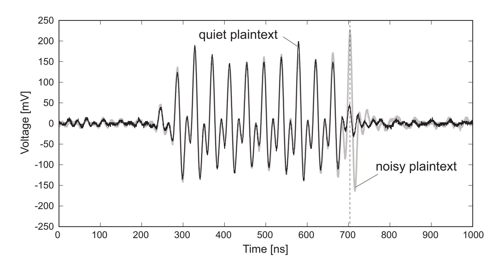

{0}------------------------------------------------

# AES Cipher Keys Suitable for Efficient Side-Channel Vulnerability Evaluation

Takaaki Mizuki Yu-ichi Hayashi

Tohoku University tm-paper+aes10rd[atmark]g-mail.tohoku-university.jp

#### **Abstract**

This paper investigates pairs of AES-128 cipher keys and plaintexts which result in being "quiet" in the final round, i.e., whose 128-bit State holds the same bit pattern before and after Round 10. We show that the number of such quiet plaintexts (resulting in Hamming distance 0) for any cipher key is at most 5,914,624, and that there exist exactly 729 cipher keys having such a maximum number. The same holds if "quiet" is replaced by "noisy" (which means to have Hamming distance 128). Because such quiet and noisy plaintexts make extreme actions in the final round of the AES encryption, these AES-128 cipher keys are quite useful for AES hardware designers to efficiently evaluate the vulnerabilities of their products, for instance, the performance of their side-channel attack countermeasures.

# **1 Introduction**

Consider the execution of the AES (Advanced Encryption Standard) encryption, for instance, the Cipher specified in AES-128 [13]. Then, a cipher key and a plaintext determine its entire action, of course, i.e., the 128-bit State deterministically changes in rounds by transformations (SubBytes, ShiftRows, MixColumns, and AddroundKey) and the key expansion according to the algorithm. For example, if we fix an AES-128 cipher key as

Cipher Key = 
$$07 c2 f0 bb c0 c3 df 42 d4 85 0c 5f 39 9a 0f c6,$$
 (1)

then inputting a 128-bit plaintext, say

Input = 4b 32 f8 2e c4 48 7e ed 21 66 32 8b dd 2f 8b 67, (2)

to the State changes it as follows.

| before Round 1 | 4c | f0 | 08 | 95 | 04 | 8b | a1 | af | f5 | e3 | 3e | d4 | e4 | b5 | 84 | a1 |
|----------------|----|----|----|----|----|----|----|----|----|----|----|----|----|----|----|----|
| after Round 1  | 2b | 18 | 79 | 39 | c7 | 6c | b8 | fc | 50 | 8c | 4f | 92 | b4 | 1c | c1 | e7 |
| after Round 2  | e0 | a0 | 11 | 9a | d6 | 11 | fb | f7 | 32 | 76 | 7b | 8e | 70 | 28 | b9 | 8b |
| after Round 3  | 65 | 32 | 08 | 3a | eb | d3 | 40 | 41 | 67 | de | 49 | 6c | a6 | fd | ed | 19 |
| after Round 4  | 38 | 73 | ce | 47 | 66 | d0 | c0 | 48 | 94 | e2 | d3 | b9 | 97 | 4a | 70 | 85 |
| after Round 5  | 63 | 9b | 16 | 45 | 75 | 76 | f8 | 93 | 67 | 60 | f9 | 9f | 15 | 4c | f1 | 79 |

{1}------------------------------------------------

| after Round 6  | 8a | 37 | df | 13 | d4 | 37 | 58 | 96 | 3b | 64 | 55 | de | a6 | 8d | d2 | f7 |
|----------------|----|----|----|----|----|----|----|----|----|----|----|----|----|----|----|----|
| after Round 7  | f4 | e3 | 22 | d0 | e5 | 35 | 9e | b7 | 84 | 95 | 58 | 21 | 8a | a8 | 4d | a6 |
| after Round 8  | 40 | b4 | 6f | e9 | f6 | 27 | 23 | bd | d9 | c7 | b6 | f9 | 39 | bc | 93 | 79 |
| after Round 9  | 17 | 0a | 05 | 0a | 17 | b4 | 05 | e0 | 17 | 66 | 63 | 66 | 17 | e0 | 63 | b4 |
| after Round 10 | 17 | 0a | 05 | 0a | 17 | b4 | 05 | e0 | 17 | 66 | 63 | 66 | 17 | e0 | 63 | b4 |

Here, the last two 128-bit sequences are worthy of notice because they are the same; in other words, their Hamming distance is 0. We say that such a plaintext is *quiet* (in Round 10) for that cipher key.

Then, are there any other quiet plaintexts for the above cipher key? The answer is YES, and in fact, it has 5,914,624 quiet plaintexts. So, what about other cipher keys?—does every cipher key have a quiet plaintext? The answer is NO; 97.37% of 2128 cipher keys have no quiet plaintext. Thus, in this paper, we investigate the relationship between cipher keys and their quiet (and "noisy") plaintexts in detail.

### **1.1 Our Results for Quiet and Noisy Plaintexts**

As mentioned, the above cipher key has 5,914,624 quiet plaintexts, and in fact, this is the maximum number of quiet plaintexts that any cipher key can have. More specifically, there are only 729 cipher keys that have this maximum number of quiet plaintexts. We present further details in Sections 2 to 6.

Similarly, we can easily deal with *noisy* plaintexts, that mean to have Hamming distance 128. That is, there are also exactly 729 cipher keys that have the maximum number (5,914,624) of noisy plaintexts. In addition, we investigate cipher keys that have both quiet and noisy plaintexts (as many as possible) in Section 7.

### **1.2 Motivation**

Undoubtedly, the AES plays an important role in an information-oriented society, and enormous amounts of research and development such as implementation and cryptanalysis have been devoted to it (e.g., [1, 3, 4, 5, 11]). One of these continuously growing research areas is the field of side-channel attacks and countermeasures, where breaking and/or protecting cryptographic devices implementing AES is studied (refer to [10] for a comprehensive survey). The side-channel attack often utilizes the difference of power consumption depending on cipher keys and plaintexts (e.g., [2, 8]).

Since quiet and noisy plaintexts make extreme actions in the final round of AES encryption, the cipher keys reported in this paper can be used by AES hardware designers to evaluate their side-channel attack countermeasures. In fact, choosing plaintexts suitable for vulnerability evaluation has been considered in some recent research (e.g., [6, 7]). In this paper, we also discuss the application of quiet and noisy plaintexts to side-channel vulnerability evaluation in Section 8.

{2}------------------------------------------------

### 2 Road Map for Determining Quiet Plaintexts

As mentioned before, this paper focuses on the final round of the AES-128 encryption, i.e., it addresses change of the 128-bit State before and after the 10th round. Note that the 10th round applies SubBytes, ShiftRows, and AddroundKey in this order, and that, contrary to other rounds, MixColumns is not applied.

We first review Round 10 and describe the necessary notation in Section 2.1. We then outline our approach to determine quiet plaintexts in Section 2.2.

#### 2.1 Notation

We denote the State just before Round 10 by an array

| $s_{0,0}$ | $s_{0,1}$ | $s_{0,2}$ | $s_{0,3}$ |   |
|-----------|-----------|-----------|-----------|---|
| $s_{1,0}$ | $s_{1,1}$ | $s_{1,2}$ | $s_{1,3}$ |   |
| $s_{2,0}$ | $s_{2,1}$ | $s_{2,2}$ | $s_{2,3}$ | , |
| $s_{3,0}$ | $s_{3,1}$ | $s_{3,2}$ | $s_{3,3}$ |   |

that is,  $s_{i,j}$  is an intermediate (one-byte) value immediately after Round 9 for each  $0 \le i, j \le 3$ . For a byte  $s \in \{0,1\}^8$ , we denote by  $\mathrm{Sb}(s)$  the output of the S-box (used in SubBytes) inputting s. Furthermore, we denote the round key used in Round 10 by

| $w_{0,0}$ | $w_{0,1}$ | $w_{0,2}$ | $w_{0,3}$ |
|-----------|-----------|-----------|-----------|
| $w_{1,0}$ | $w_{1,1}$ | $w_{1,2}$ | $w_{1,3}$ |
| $w_{2,0}$ | $w_{2,1}$ | $w_{2,2}$ | $w_{2,3}$ |
| $w_{3,0}$ | $w_{3,1}$ | $w_{3,2}$ | $w_{3,3}$ |

According to the notation above, after applying SubBytes, ShiftRows, and AddroundKey, i.e., after Round 10 ends, we have the State

| $\boxed{\operatorname{Sb}(s_{0,0}) \oplus w_{0,0}}$ | $\operatorname{Sb}(s_{0,1}) \oplus w_{0,1}$ | $\mathrm{Sb}(s_{0,2}) \oplus w_{0,2}$                  | $\boxed{\operatorname{Sb}(s_{0,3}) \oplus w_{0,3}}$                |
|-----------------------------------------------------|---------------------------------------------|--------------------------------------------------------|--------------------------------------------------------------------|
| $\boxed{\operatorname{Sb}(s_{1,1}) \oplus w_{1,0}}$ | $\operatorname{Sb}(s_{1,2}) \oplus w_{1,1}$ | $\mathrm{Sb}(s_{1,3}) \oplus w_{1,2}$                  | $\boxed{\operatorname{Sb}(s_{1,0}) \oplus w_{1,3}}$                |
| $\overline{\mathrm{Sb}(s_{2,2})} \oplus w_{2,0}$    | $\operatorname{Sb}(s_{2,3}) \oplus w_{2,1}$ | $\overline{\operatorname{Sb}(s_{2,0})} \oplus w_{2,2}$ | $\overline{\left(\operatorname{Sb}(s_{2,1})\oplus w_{2,3}\right)}$ |
| $\operatorname{Sb}(s_{3,3}) \oplus w_{3,0}$         | $\operatorname{Sb}(s_{3,0}) \oplus w_{3,1}$ | $\mathrm{Sb}(s_{3,1}) \oplus w_{3,2}$                  | $\boxed{\operatorname{Sb}(s_{3,2}) \oplus w_{3,3}}$                |

which is the resulting ciphertext (because Round 10 is the final one), denoted also by

| $c_{0,0}$ | $c_{0,1}$ | $c_{0,2}$ | $c_{0,3}$ |
|-----------|-----------|-----------|-----------|
| $c_{1,0}$ | $c_{1,1}$ | $c_{1,2}$ | $c_{1,3}$ |
| $c_{2,0}$ | $c_{2,1}$ | $c_{2,2}$ | $c_{2,3}$ |
| $c_{3,0}$ | $c_{3,1}$ | $c_{3,2}$ | $c_{3,3}$ |

Throughout this paper, as above, we use  $s_{i,j}$ ,  $w_{i,j}$ , and  $c_{i,j}$  for  $0 \le i, j \le 3$  to represent an intermediate value, a part of the round key, and a part of the ciphertext, respectively.

{3}------------------------------------------------

### **2.2 Outline of Our Approach**

Our approach to determine quiet plaintexts is simple and straightforward: we search for a pair (s*i,j* , w*i,j* ) such that s*i,j* = c*i,j* .

Because of the specification of ShiftRows, tactics slightly differ for each row in the State. For example, computing s ⊕ Sb(s) for every byte s ∈ {0, 1}8 is sufficient to enumerate all possible such pairs (s0*,j* , w0*,j* ) for 0 ≤ j ≤ 3, as shown in Section 3 in detail. On the other hand, with regard to the second and fourth rows, we compute

$$(s^0 \oplus \operatorname{Sb}(s^1), s^1 \oplus \operatorname{Sb}(s^2), s^2 \oplus \operatorname{Sb}(s^3), s^3 \oplus \operatorname{Sb}(s^0))$$

for every quadruple (s0, s1, s2, s3) ∈ ({0, 1}8)4, as shown in Section 4. Thus, the former needs to search 28 elements, and the latter needs to search 232 elements, both of which are feasible (within our computational capabilities). We also consider the third row in Section 5.

Merging these observations, we can obtain the results on quiet plaintexts, as presented in Section 6.

# **3 Quiet 1-Byte Intermediate Values**

In this section, we explore the relationship between 1-byte partial round keys and their quiet 1-byte intermediate values. In fact, Nakasone et al. have already clarified such a relationship when they calculated the frequency of "clockwise collisions" [12]. Below, we rephrase that to fit our context, adding a little something not seen before (Table 2).

We start with an example. From the specification for the S-box of the AES, we calculate

$$\mathbf{17} \oplus \operatorname{Sb}(\mathbf{17}) = \mathbf{47} \oplus \operatorname{Sb}(\mathbf{47}) = \mathbf{56} \oplus \operatorname{Sb}(\mathbf{56}) = \mathbf{c2} \oplus \operatorname{Sb}(\mathbf{c2}) = \mathbf{e7}.$$

Therefore, if we set a 1-byte partial round key (applied to the first row of the State) to w0*,j* = e7 for every 0 ≤ j ≤ 3, then each intermediate value s0*,j* ∈ {17, 47, 56, c2} satisfies

$$s_{0,j} \oplus c_{0,j} = s_{0,j} \oplus (\mathrm{Sb}(s_{0,j}) \oplus w_{0,j}) = (s_{0,j} \oplus \mathrm{Sb}(s_{0,j})) \oplus \mathsf{e7} = \mathsf{o0},$$

meaning that the Hamming distance between s0*,j* and c0*,j* is 0, namely, all the intermediate values 17, 47, 56, and c2 are quiet for partial round key e7. Consequently, the 4-byte partial round key (often called a word) e7e7e7e7 has 44 quiet 4-byte intermediate values

[17|47|56|c2].[17|47|56|c2].[17|47|56|c2].[17|47|56|c2]

where [ ·|·|·|· ] indicates that we can choose any one of the four strings (and a period indicates concatenation throughout this paper).

As listed in Table 2, in addition to e7, there are two 1-byte partial round keys b9 and 8d that have four quiet intermediate values. Including e7, these three 1-byte partial round keys have the maximum number of quiet intermediate values, as can be seen in Table 3.

Furthermore, the last row in Table 3 implies that there exist 1-byte partial round keys that have no 1-byte quiet intermediate value; precisely, 93 partial round keys have no quiet intermediate value (and the remaining 163 of those have at least one). Hence, regarding (4-byte) words, 1 − (163/256)4 = 83.56% of all 4-byte partial round keys have no quiet intermediate value.

{4}------------------------------------------------

| s                       | s ⊕ Sb(s) |
|-------------------------|--------------|
| 17, 47, 56, c2 | e7           |
| 1d, c1, d8, f8 | b9           |
| 7e, 81, da, e4 | 8d           |

Table 2: Four 1-byte intermediate values s that have the same value of s ⊕ Sb(s).

| Rank | # of quiet values | # of keys |
|------|-------------------|-----------|
| 1    | 4                 | 3         |
| 2    | 3                 | 15        |
| 3    | 2                 | 54        |
| 4    | 1                 | 91        |
| 5    | 0                 | 93        |

Table 3: The ranking of the numbers of 1-byte quiet intermediate values. The same statistics appeared in [12].

# **4 Quiet 4-Byte Intermediate Values**

While the previous section tackled the first row in the State, this section deals with the second and fourth rows, addressing 4-byte partial round keys along with their quiet 4-byte intermediate values, as follows.

First, consider the second row in the State, namely s1*,j* , w1*,j* , and c1*,j* for 0 ≤ j ≤ 3. For example, if we set a 4-byte intermediate value and a 4-byte partial round key to

$$s_{1,0}.s_{1,1}.s_{1,2}.s_{1,3} = 1$$
c88859a

and

$$w_{1,0}.w_{1,1}.w_{1,2}.w_{1,3} = d81f3d06,$$

respectively, then we have

$$\begin{array}{lll} c_{1,0} &=& \operatorname{Sb}(s_{1,1}) \oplus w_{1,0} = \operatorname{Sb}(88) \oplus \mathtt{d}8 = \mathtt{c}4 \oplus \mathtt{d}8 = \mathtt{1c} \ c_{1,1} &=& \operatorname{Sb}(s_{1,2}) \oplus w_{1,1} = \operatorname{Sb}(85) \oplus \mathtt{1f} = \mathtt{97} \oplus \mathtt{1f} = \mathtt{88} \ c_{1,2} &=& \operatorname{Sb}(s_{1,3}) \oplus w_{1,2} = \operatorname{Sb}(\mathtt{9a}) \oplus \mathtt{3d} = \mathtt{b}8 \oplus \mathtt{3d} = \mathtt{85} \ c_{1,3} &=& \operatorname{Sb}(s_{1,0}) \oplus w_{1,3} = \operatorname{Sb}(\mathtt{1c}) \oplus \mathtt{06} = \mathtt{9c} \oplus \mathtt{06} = \mathtt{9a}, \end{array}$$

and hence the intermediate value is quiet (in the second row) for the partial round key (including 1c88859a, there are 12 quiet intermediate values).

Table 4 shows the ranking for the 4-byte quiet intermediate values. Notice that there is only one partial round key that has the maximum number, namely 19, of quiet intermediate values; that key is

$$w_{1,0}.w_{1,1}.w_{1,2}.w_{1,3} = 87878787,$$

{5}------------------------------------------------

| Rank | # of quiet values | # of keys     |
|------|-------------------|---------------|
| 1    | 19                | 1             |
| 2    | 13                | 3             |
| 3    | 12                | 7             |
| 4    | 11                | 54            |
| 5    | 10                | 555           |
| 6    | 9                 | 4,484         |
| 7    | 8                 | 39,570        |
| 8    | 7                 | 315,317       |
| 9    | 6                 | 2,192,877     |
| 10   | 5                 | 13,165,436    |
| 11   | 4                 | 65,860,301    |
| 12   | 3                 | 263,357,982   |
| 13   | 2                 | 789,948,680   |
| 14   | 1                 | 1,579,999,923 |
| 15   | 0                 | 1,580,082,106 |

Table 4: The ranking of the numbers of 4-byte quiet intermediate values.

and it has the following 19 quiet intermediate values:

$$s_{1,0}.s_{1,1}.s_{1,2}.s_{1,3} =$$
 $0ab466e0, b466e00a, 66e00ab4, e00ab466,$ 
 $0dcfd450, cfd4500d, d4500dcf, 500dcfd4,$ 
 $2f6fc892, 6fc8922f, c8922f6f, 922f6fc8,$ 
 $46dd46dd, dd46dd46,$ 
 $6dbb6dbb, bb6dbb6d,$ 
 $b9d1b9d1, d1b9d1b9,$ 
 $ccccccc.$ 

Note that since the key consists of four bytes of the same value (namely, 87), if an intermediate value

$$s^0.s^1.s^2.s^3$$

is quiet, then s1.s2.s3.s0 (shifted cyclically) is also quiet.

Somewhat surprisingly, the second largest number of quiet intermediate values is 13 as shown in Table 4. That is, there is no partial round key having 18, 17, 16, 15, or 14 quiet intermediate values. Table 4 also shows that 36.79% of all 4-byte partial round keys have no quiet intermediate value.

With respect to the fourth row in the State, we can utilize the above results directly, that is, it suffices to apply some shift. In contrast, concerning the third row, we need another computation, as detailed in the next section.

{6}------------------------------------------------

# 5 Quiet 2-Byte Intermediate Values

Similarly to the previous two sections, we calculate the ranking for the 2-byte case as shown in Table 5.

| Rank | # of quiet values | # of keys |
|------|-------------------|-----------|
| 1    | 8                 | 3         |
| 2    | 7                 | 12        |
| 3    | 6                 | 46        |
| 4    | 5                 | 190       |
| 5    | 4                 | 966       |
| 6    | 3                 | 3,984     |
| 7    | 2                 | 12,148    |
| 8    | 1                 | 24,090    |
| 9    | 0                 | 24,097    |

Table 5: The ranking of the numbers of 2-byte quiet intermediate values.

Thus, the maximum number of quiet intermediate values is eight, and there are three partial round keys that have such values, as listed in Table 6. Note that the keys fe08 and 08fe along with their intermediate values are "symmetric," as is the key a6a6 itself.

| Intermediate values                            | Round key |
|------------------------------------------------|-----------|
| 0563, 3410, 3a88, b365, d50b, d93d, e0e9, f281 | fe08      |
| 00c5, 1756, 2e97, 5f69, c500, 5617, 972e, 695f | a6a6      |
| 6305, 1034, 883a, 65b3, 0bd5, 3dd9, e9e0, 81f2 | 08fe      |

Table 6: All 2-byte round keys that have eight quiet intermediate values.

# 6 Cipher Keys with Quiet Plaintexts

In this section, based on the observations thus far, we discuss 128-bit cipher keys with quiet plaintexts.

We here explore all cipher keys having the maximum number of quiet plaintexts. To this end, we summarize the corresponding round keys used in Round 10. As shown in Section 3, each  $w_{0,j}$  in the first row can be one of three candidates: e7, b9, or 8d. As shown in Section 4, both  $w_{1,0}.w_{1,1}.w_{1,2}.w_{1,3}$  in the second row and  $w_{3,0}.w_{3,1}.w_{3,2}.w_{3,3}$  in the fourth row can be only 87878787. As seen in Section 5, both  $w_{2,0}.w_{2,2}$  and  $w_{2,1}.w_{2,3}$  in the third row can be one of three candidates: fe08, a6a6, or 08fe. In other words, we have determined the desired round keys as

| $w_{0,0}$ | $w_{0,1}$ | $w_{0,2}$ | $w_{0,3}$ |
|-----------|-----------|-----------|-----------|
| 87        | 87        | 87        | 87        |
| $w_{2,0}$ | $w_{2,1}$ | $w_{2,2}$ | $w_{2,3}$ |
| 87        | 87        | 87        | 87        |

{7}------------------------------------------------

such that

$$\begin{array}{lcl} w_{0,0},\,w_{0,1},\,w_{0,2},\,w_{0,3} &\in & \{\texttt{e7},\texttt{b9},\texttt{8d}\} \\ w_{2,0}.w_{2,2},\,w_{2,1}.w_{2,3} &\in & \{\texttt{fe08},\texttt{a6a6},\texttt{08fe}\}. \end{array}$$

Therefore, there are exactly 34×32 = 729 candidate round keys, and hence the same number of corresponding AES-128 cipher keys exist. Note that, given a round key in Round 10, one can easily calculate the corresponding AES-128 cipher key following the specification of the AES-128 round key schedule algorithm.

Let us fix a cipher key that has the maximum number of quiet plaintexts. The first row then has 44 candidates for intermediate values (as shown in Table 2), the second and fourth rows have 19 candidates each (as shown in Eq. (3)), and the third rows has 82 candidates (as shown in Table 6). Therefore, there are exactly 44 × 192 × 82 = 5, 914, 624 quiet plaintexts. Note that one can easily generate such quiet plaintexts using the intermediate values in Table 2, Eq. (3), and Table 6.

Furthermore, the rate of cipher keys that have no quiet plaintext can be computed as follows:

$$1 - \left(\frac{2^8 - 93}{2^8}\right)^4 \times \left(\frac{2^{32} - 1580082106}{2^{32}}\right)^2 \times \left(\frac{2^{16} - 24097}{2^{16}}\right)^2 = 97.37\%.$$

# **7 Considering Noisy Plaintexts**

Until now, we have considered only quiet plaintexts, but we can easily deal with noisy plaintexts (which mean to have Hamming distance 128) as well; in Section 7.1, we enumerate all of the cipher keys that have the maximum number of noisy plaintexts in a similar manner. We also consider cipher keys that have both quiet and noisy plaintexts in Section 7.2.

### **7.1 The 729 Cipher Keys with Noisy Plaintexts**

We are able to discuss the 'noisy' case in the same way as the 'quiet' case simply by negating all bits in the round key. That is, the 729 cipher keys having the maximum number 5, 914, 624 of noisy plaintexts are characterized by the round keys:

| w0,0 | w0,1 | w0,2 | w0,3 |
|------|------|------|------|
| 78   | 78   | 78   | 78   |
| w2,0 | w2,1 | w2,2 | w2,3 |
| 78   | 78   | 78   | 78   |

where

$$\begin{array}{rcl} w_{0,0}, \, w_{0,1}, \, w_{0,2}, \, w_{0,3} & \in & \{ \texttt{18}, \texttt{46}, \texttt{72} \} \\ w_{2,0}.w_{2,2}, \, w_{2,1}.w_{2,3} & \in & \{ \texttt{01f7}, \texttt{5959}, \texttt{f701} \}. \end{array}$$

One can also easily produce such noisy plaintexts using the intermediate values in Table 2, Eq. (3), and Table 6.

{8}------------------------------------------------

### 7.2 Cipher Keys Having Both Quiet and Noisy Plaintexts

Given a cipher key  $K \in \{0,1\}^{128}$ , we denote the number of its quiet plaintexts by quiet(K), and the number of its noisy ones by noisy(K). Here, we reveal the cipher keys K such that  $min\{quiet(K), noisy(K)\}$  is maximized. Actually, our calculation has shown that one can enumerate all such cipher keys (and their quiet/noisy plaintexts) using the following table.

| 72/8d       |                                                                                |
|-------------|--------------------------------------------------------------------------------|
| quiet/noisy | c6, 49                                                                         |
| noisy/quiet | e4, da, 81, 7e                                                                 |
| 5959/a6a6   |                                                                                |
| quiet/noisy | f61b, a67d, a263, 7da6, 63a2, 4343, 1bf6                                       |
| noisy/quiet | c500, 972e, 695f, 5f69, 5617, 2e97, 1756, 00c5                                 |
| 659a659a/9a | a659a65                                                                        |
| quiet/noisy | 7be98fbb, 7e449c69, 8fbb7be9, 9c697e44, 9f14e641, ce0ee711, e6419f14, e711ce0e |
| noisy/quiet | 0ee711ce, 11ce0ee7, 14e6419f, 419f14e6, 449c697e, 697e449c, bb7be98f, e98fbb7b |
| ab54ab54/54 | 1ab54ab                                                                        |
| quiet/noisy | 4e2a8a7b, 52698b54, 717ac3f7, 85c385c3, 8a7b4e2a, 8b545269, c3f7717a, dfcadfca |
| noisy/quiet | 2a8a7b4e, 5452698b, 698b5452, 7ac3f771, 7b4e2a8a, c385c385, cadfcadf, f7717ac3 |
| afd8afd8/50 | 0275027                                                                        |
| quiet/noisy | 040e4a2a, 06b706b7, 115a115a, 4a2a040e, 4d3b4d3b, 56695669, 5f175f17, 772d772d |
| noisy/quiet | 1eb6ac55, 2b03a6d6, 47874787, a6d62b03, ac551eb6, b0a0eac0, d341d341, eac0b0a0 |
| d8afd8af/27 | 7502750                                                                        |
| quiet/noisy | 0e4a2a04, 175f175f, 2a040e4a, 2d772d77, 3b4d3b4d, 5a115a11, 69566956, b706b706 |
| noisy/quiet | 03a6d62b, 41d341d3, 551eb6ac, 87478747, a0eac0b0, b6ac551e, c0b0a0ea, d62b03a6 |

This table indicates that partial round key 72 has two quiet intermediate values (c6, 49) and four noisy ones (e4, da, 81, 7e), key 8d has two noisy ones (c6, 49) and four quiet ones (e4, da, 81, 7e), key 5959 has seven quiet ones and eight noisy ones, and so on. For example, if we set a round key to be

| 72 | 72 | 8d | 8d |   |
|----|----|----|----|---|
| 65 | 9a | 65 | 9a |   |
| 59 | a6 | 59 | a6 | ; |
| 65 | 9a | 65 | 9a |   |

then the corresponding cipher key,

Cipher Key = bb 05 16 0c 54 5a 7a cc a0 8e be 2d 80 8d 49 55, 
$$(4)$$

has  $(2^2 \times 4^2) \times 8 \times (7 \times 8) \times 8 = 229,376$  quiet plaintexts and the same number of noisy ones. Thus, there are exactly  $\binom{4}{2} \times 8 \times 2 \times 8 = 768$  cipher keys K that have the maximum value of  $\min\{\mathsf{quiet}(K),\mathsf{noisy}(K)\} = 229,376$ .

We would admit that there is no big technical challenge to computing everything mentioned in this paper thus far (and hence anyone could have easily obtained the same results

{9}------------------------------------------------

given the motivation and computing resources). However, we report these results because quiet/noisy plaintexts can play an important role in designing AES-implemented hardware, as discussed in the next section.

# **8 Applications to Side-Channel Vulnerability Evaluation**

In this section, we propose applications of quiet/noisy plaintexts to efficient side-channel vulnerability evaluation; they will be useful when designing secure AES-implemented hardware.

We first explain briefly how quiet and noisy plaintexts can be utilized for efficient sidechannel vulnerability evaluation in Section 8.1. We then demonstrate this efficient evaluation method: we present the theoretical background in Section 8.2 and show the results of an experiment in Section 8.3.

### **8.1 Basic Idea**

As shown above, the cipher keys found in the previous sections have numerous quiet and noisy plaintexts. Any one of these cipher keys along with any of its quiet and noisy plaintexts results in a Hamming distance of 0 and 128, respectively, between the State before and after the final round during the AES-128 encryption. Furthermore, it is well-known that fluctuation of the power consumption in the AES-implemented hardware can leak information about the cipher key stored inside the hardware, and that the amount of power consumption depends on the Hamming distance (e.g., [10]).

Thus, if a designer with a prototype stores a cipher key chosen from the found keys and inputs both some quiet plaintexts and some noisy ones, then he/she can generate a large power consumption fluctuation. Using this idea, we can efficiently evaluate how much and/or how far the cipher-key information leaks around an AES device by measuring the voltage drop or probing the electromagnetic field. We could even determine a 3D leakage map around the prototype hardware. The key point is that we need only a small number of plaintexts for the evaluation (and can therefore dramatically reduce the measurement time and computation cost).

### **8.2 Theoretical Background**

To evaluate side-channel vulnerability, we present an efficient method for measuring "Signalto-Noise Ratios (SNR)" (in the context of power analysis attack scenarios) [10], that indicate how much information leakage occurs.

Assume that there is an AES-128-implemented device in which a cipher key is set. We input a bunch of random plaintexts while measuring the power consumption. Then, following the notation in [10], the power consumption P can be modeled as

$$P = P_{\exp} + P_{\text{noise}} + C$$

where Pexp is a random variable indicating the exploitable power consumption, Pnoise is a random variable representing the noise, and C is the constant component. Furthermore, the SNR is defined as

$$\mathsf{SNR} = \frac{\mathrm{Var}(P_{\mathrm{exp}})}{\mathrm{Var}(P_{\mathrm{noise}})}.$$

{10}------------------------------------------------

We suppose that the device obeys the so-called Hamming-distance model, i.e., the exploitable power consumption can be written as Pexp = dH where d is a constant, and H is a random variable representing the Hamming distance between the State before and after the final round. Since the plaintexts are chosen randomly, one may assume that H follows a binomial distribution B(128, 1/2). Therefore, we have

$$Var(P_{exp}) = Var(dH) = d^2 \cdot 128 \cdot (1/2)(1 - 1/2) = 32d^2.$$

Regarding the noise component, one may assume that Pnoise follows a normal distribution N(μ, σ2) for some μ and σ2. Hence, we have

$$\mathsf{SNR} = \frac{32d^2}{\sigma^2}.$$

Thus, in order to determine how much cipher key information leaks (at the measuring position), it is sufficient to learn d and σ2.

To this end, we can utilize quiet and noisy plaintexts as follows. Note that, when the plaintext is quiet, the power consumption will be Pnoise + C; when the plaintext is noisy, it will be 128d + Pnoise + C. Now, as designers, we wish to learn d and σ2 of the device efficiently. First, we choose one of the cipher keys given in Section 7.2 and prepare a number of quiet and noisy plaintexts for the key. We then measure the power consumption while inputting these quiet plaintexts; we calculate the average of the power consumption pquiet and its empirical variance s2. Similarly, we obtain the average of the power consumption pnoisy by inputting the noisy plaintexts. As can easily be noticed, the difference pnoisy−pquiet corresponds to an estimation of 128d. Also, σ2 can be estimated just by s2. In this way, we can easily and efficiently estimate d and σ2 and hence the SNR by the use of quiet/noisy plaintexts.

### **8.3 Experiment**

Based on the idea mentioned in the previous subsection, we conducted a fundamental experiment using a standard side-channel attack evaluation board, the SASEBO-G [14], in which the AES-128 encryption is implemented on its FPGA. We set an AES-128 cipher key as given in Eq. (4). Executing encryption of the 10 quiet plaintexts and the 10 noisy plaintexts given in Appendix A, we measured the electromagnetic field by a magnetic probe at five positions on and near the FPGA (namely, 0.0, 0.5, 1.0, 2.0, and 3.0 cm away from the FPGA). For every position and every plaintext, we obtained 100 waveforms. That is, we have 1,000 waveforms of quiet plaintexts and 1,000 waveforms of noisy ones in total for each position.

Figure 1 shows a waveform of a quiet plaintext and a waveform of a noisy one at the position contacting the FPGA (0.0 cm away). As can be seen in the figure, there is a significant difference between the two waveforms at 704 ns where the manipulation related to Round 10 occurred. That is, we can confirm that quiet/noisy plaintexts made extreme actions in the final round of the AES encryption.

We calculated the averages pquiet, pnoisy, and the empirical variance s2 to estimate the SNR. Table 8 shows the results, where

$$\hat{\mathsf{SNR}} = \frac{32 \left( (\overline{p}_{\mathrm{noisy}} - \overline{p}_{\mathrm{quiet}}) / 128 \right)^2}{s^2}$$

{11}------------------------------------------------

Figure 1: A waveform of a quiet plaintext and a waveform of a noisy one.

is the estimated value.

| Position | pquiet (mV) | pnoisy (mV) | s2 (mV2) | SNRˆ  |
|----------|----------------|----------------|----------|-------|
| 0.0 cm   | 40.9           | 215.5          | 29.17    | 2.041 |
| 0.5 cm   | 17.8           | 36.2           | 6.71     | 0.098 |
| 1.0 cm   | 9.2            | 12.9           | 7.13     | 0.003 |
| 2.0 cm   | 5.0            | 5.7            | 6.16     | 0.000 |
| 3.0 cm   | 3.5            | 3.6            | 5.27     | 0.000 |

Table 8: The Estimated SNR at various distances from the FPGA.

Thus, even with a small number of waveforms, we can check for cipher-key information leakage, allowing us to efficiently evaluate side-channel attack vulnerability.

# **9 Conclusion**

In this paper, we investigated pairs of AES-128 cipher keys and plaintexts which result in being quiet/noisy in the final round. We described some interesting cipher keys that have quiet and/or noisy plaintexts. Since both the quiet and noisy plaintexts make extreme actions in the final round of AES encryption, the AES-128 cipher keys described here are quite useful for evaluating side-channel attack vulnerability, as we demonstrated.

Although we admit the weakness of the technical challenge of the proposed method, we believe that it is quite useful for cryptographic hardware designers. The straightforwardness 

{12}------------------------------------------------

of our technique is in fact an advantage because our evaluation method is simple and hence can be easily implemented by almost all designers with little cost and effort.

Note that quiet/noisy plaintexts would be useful for cryptographic hardware designers, but not for attackers (at least not directly). Actually, some recent research has been adopting the idea that suitable plaintexts, say those with rather small (but non-zero) Hamming distances in the final round, are chosen for efficient side-channel attack evaluation (e.g., [6, 7]). However, to the best of our knowledge, there has not been any study that uses quiet plaintexts (i.e., those with exactly-zero-Hamming distance) yet. Therefore, we believe that our results in this paper will enhance the efficiency of existing methods for side-channel attack evaluation. It should be noted that there is a gap between the almost-zero-Hamming distance and exactly-zero-Hamming distance cases because the action for the latter case tends to be somewhat different from the others (cf., [9, 12]).

# **References**

- [1] C. Bouillaguet, P. Derbez, and P. Fouque, "Automatic search of attacks on roundreduced AES and applications," Advances in Cryptology CRYPTO 2011, Lecture Notes in Computer Science, Vol. 6841, pp. 169–187, 2011.
- [2] E. Brier, C. Clavier, and F. Olivier, "Correlation power analysis with a leakage model," CHES 2004, Lecture Notes in Computer Science, Vol. 3156, pp. 16–29, 2004.
- [3] P.A. Fouque, J. Jean, and T. Peyrin, "Structural evaluation of AES and chosen-key distinguisher of 9-Round AES-128," Advances in Cryptology CRYPTO 2013, Lecture Notes in Computer Science, Vol. 8042, pp. 183–203, 2013.
- [4] C. Gentry, S. Halevi, and N. P. Smart, "Homomorphic evaluation of the AES circuit," Advances in Cryptology CRYPTO 2012, Lecture Notes in Computer Science, Vol. 7417, pp. 850–867, 2012.
- [5] V. Grosso, F.X. Standaert, and S. Faust, "Masking vs. multiparty computation: how large is the gap for AES?," CHES 2013, Lecture Notes in Computer Science, Vol. 8086, pp. 400–416, 2013.
- [6] Y. Hayashi, N. Homma, T. Mizuki, H. Shimada, T. Aoki, H. Sone, L. Sauvage, and J.-L. Danger, "Efficient evaluation of EM radiation associated with information leakage from cryptographic devices," IEEE Trans. on Electromagnetic Compatibility, Vol. 55, No. 3, pp. 555–563, 2013.
- [7] Y. Kim, T. Sugawara, N. Homma, T. Aoki, and A. Satoh, "Biasing power traces to improve correlation power analysis attacks," Proc. Int. Workshop Constructive Side-Channel Anal. Secure Design, pp. 77–80, 2010.
- [8] P. C. Kocher, J. Jaffe, and B. Jun, "Differential power analysis," Advances in Cryptology CRYPTO 1999, Lecture Notes in Computer Science, Vol. 1666, pp. 388–397, 1999.

{13}------------------------------------------------

- [9] Y. Li, D. Nakatsu, Q. Li, K. Ohta, and K. Sakiyama, "Clockwise collision analysis overlooked side-channel leakage inside your measurements. cryptology," ePrint Archive, Report 2011/579, 2011.
- [10] S. Mangard, E. Oswald, and T. Popp, Power Analysis Attacks: Revealing the Secrets of Smart Cards, Springer-Verlag New York, Inc., Secaucus, NJ, USA, 2007.
- [11] A. Moradi, A. Poschmann, S. Ling, C. Paar, and H. Wang, "Pushing the limits: a very compact and a threshold implementation of AES," Advances in Cryptology EURO-CRYPT 2011, Lecture Notes in Computer Science, Vol. 6632, pp. 69–88, 2011.
- [12] T. Nakasone, Y. Li, Y. Sasaki, M. Iwamoto, K. Ohta, and K. Sakiyama, "Keydependent weakness of AES-based ciphers under clockwise collision distinguisher," Information Security and Cryptology (ICISC 2012), Lecture Notes in Computer Science, Vol. 7839, pp. 395–409, 2013.
- [13] NIST FIPS PUB 197, "Announcing the ADVANCED ENCRYPTION STANDARD (AES)," National Institute of Standards and Technology, U. S. Department of Commerce, 2001.
- [14] Side-channel Attack Standard Evaluation Board, 2007. http://www.risec.aist.go.jp/project/sasebo/

# **A Quiet and Noisy Plaintexts used in our Experiment**

Fix a cipher key:

Cipher Key = bb 05 16 0c 54 5a 7a cc a0 8e be 2d 80 8d 49 55.

The following table lists 10 of its quiet plaintexts.

| 09 | c2 | 59 | 35 | cb | da | 4f | 6d | 6a | 66 | 0e | 98 | 79 | 06 | f3 | 2a |
|----|----|----|----|----|----|----|----|----|----|----|----|----|----|----|----|
| 72 | e4 | 59 | 81 | f5 | b9 | 3a | 60 | b4 | 5a | 2e | 02 | 6c | 1b | 93 | fb |
| af | 7c | 99 | f4 | 03 | 1e | 5a | 96 | 70 | 35 | 3e | cf | 3a | 84 | 5c | b6 |
| 97 | 76 | a8 | ac | c9 | d8 | cb | 1b | 96 | a8 | 50 | 91 | 0d | 7d | 5f | 94 |
| 04 | d5 | 29 | 6a | 0c | 42 | 90 | 85 | 2d | 75 | 20 | 26 | 41 | 2a | 9c | 1a |
| 83 | 2c | 67 | c7 | 4a | ef | f1 | 82 | da | 94 | d9 | a3 | 11 | d5 | bf | 4a |
| 24 | c0 | 21 | 0a | 0b | b6 | fe | 53 | 7b | 53 | e2 | 1d | 39 | b6 | 6d | 03 |
| 36 | 52 | 0a | 47 | 31 | 42 | 0d | 6e | 62 | e4 | ea | 89 | 69 | c5 | 15 | b2 |
| a6 | 3b | 89 | ac | 3f | 1b | 95 | 2d | 14 | a2 | de | 20 | 78 | 55 | 7f | 23 |
| 10 | b6 | 73 | ef | 7d | c0 | 93 | 22 | be | 6c | 99 | c1 | 24 | 99 | 85 | 46 |

The following table lists 10 of its noisy plaintexts.

{14}------------------------------------------------

| 46 | 3c | f7 | 92 | 98 | 83 | cd         | e1 | a1 | 04 | 5a | се | b8 | bc | cf | 5e |
|----|----|----|----|----|----|------------|----|----|----|----|----|----|----|----|----|
| с6 | 81 | 54 | 1d | 15 | 80 | 31         | e7 | 72 | 63 | 00 | ab | b8 | 4e | 28 | 70 |
| 8e | 47 | 44 | 28 | 81 | 88 | ae         | 52 | db | 1f | 85 | 49 | 7c | bс | 83 | b7 |
| 26 | 22 | 37 | e7 | 9b | 3a | 80         | de | 7a | b9 | a7 | 5d | се | dc | Зе | 7c |
| e5 | cd | 87 | 37 | 2a | 28 | de         | af | 07 | 06 | de | b2 | d4 | 58 | Зе | 07 |
| 1b | 29 | c0 | 2d | 5e | dc | c7         | e7 | a2 | de | aa | 6a | 60 | eb | bc | 0c |
| aa | f9 | db | d3 | с9 | 4a | <b>a</b> 0 | 1e | 4e | 56 | 1c | e4 | b7 | 74 | ea | 37 |
| 7c | 7e | b2 | 45 | ef | 7a | 07         | 3b | 26 | 0e | ba | b6 | 7f | 3d | fb | d3 |
| 39 | 43 | 6d | 00 | 92 | 9d | 80         | 3a | 2a | 33 | 55 | СС | 27 | f1 | 40 | 01 |
| 2d | a7 | 56 | e2 | 6f | 9f | e8         | ca | 10 | f4 | 53 | 9с | ес | b7 | 91 | 4a |