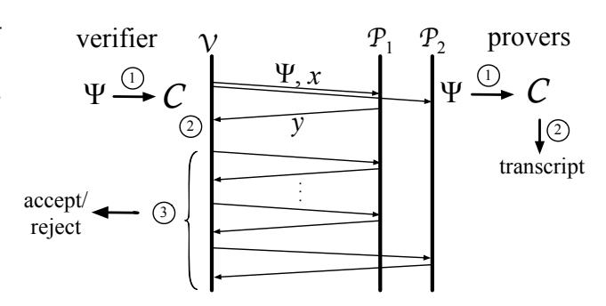
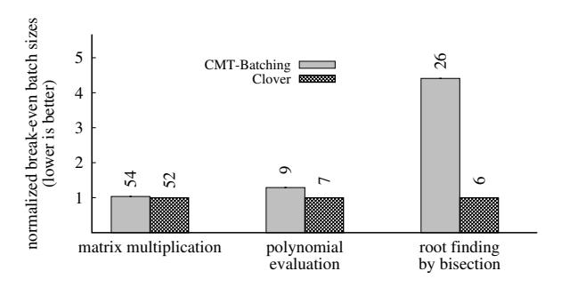
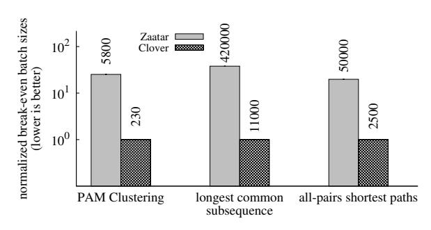
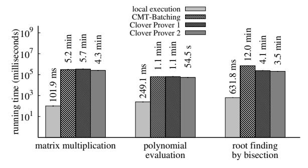
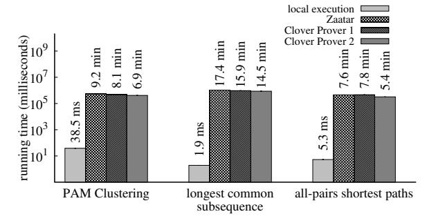

# Verifiable computation using multiple provers

Andrew J. Blumberg\* Justin Thaler† Victor Vu‡ Michael Walfish§

#### Abstract

The increasing ubiquity of the cloud computing paradigm has renewed focus on the classical problem of allowing weak clients to check the results of computation *delegated* to powerful servers. Recent advances in proof-based verifiable computation have led to several near-practical protocols. Protocols based on *interactive proofs* (IPs) work with highly restrictive models of computation and are thus efficient only for a limited class of computations. In contrast, protocols based on *argument systems* apply to a much larger class of computations, but efficiency requires amortization of very expensive setup costs.

This paper initiates the study of the practical efficiency of *multiprover interactive proofs* (MIPs). We present a new MIP for delegating computation that extends insights from a powerful IP protocol (Goldwasser et al., STOC, 2008). Without reductions or amplification, our protocol uses only two provers (departing from prior work on MIPs), and achieves both the efficiency of interactive proof-based protocols and the generality of argument system-based protocols. Also, this result, together with recently developed machinery, creates a potential avenue toward concretely efficient arguments *without* setup costs.

We describe Clover, a built system for verifiable computation, based on our protocol. Although Clover does not implement the full theory (it has setup costs), it applies to problems that existing IPs cannot efficiently handle, and achieves performance comparable to, or better than, the best argument systems.

<sup>\*</sup>The University of Texas at Austin

<sup>†</sup>Yahoo! Labs. The majority of this work was performed while the author was a graduate student at Harvard University. Supported by an NSF Graduate Research Fellowship.

<sup>‡</sup> Sandia National Laboratories

<sup>§</sup>New York University

## 1 Introduction

In recent years, the rise of cloud computing has renewed interest in the problem of how a weak client can verifiably outsource computation to a powerful but untrusted server. As a motivating example, suppose that a client wants to use the cloud to perform an expensive computation. There are many potential sources of error in the results, including bugs in the server, hardware failures, and malicious behavior. In such applications, it is often infeasible for the client to locally verify the correctness of the results.

There are many solutions to this problem (e.g., replication [\[6,](#page-15-0) [29,](#page-16-0) [45,](#page-16-1) [50,](#page-17-0) [55\]](#page-17-1), trusted hardware [\[30,](#page-16-2) [65\]](#page-17-2), attestation [\[5,](#page-15-1) [56,](#page-17-3) [62,](#page-17-4) [66,](#page-17-5) [67,](#page-17-6) [73\]](#page-17-7), or auditing [\[45,](#page-16-1) [47,](#page-16-3) [59\]](#page-17-8)) that make strong assumptions about the usage model or setup (e.g., uncorrelated errors, a chain of trust, intermediate results amenable to checking, etc.).

It has long been known that there are theoretical solutions to this problem that make no such assumptions other than perhaps standard cryptographic ones [\[8,](#page-15-2) [9,](#page-15-3) [40,](#page-16-4) [40,](#page-16-4) [42,](#page-16-5) [46,](#page-16-6) [51,](#page-17-9) [54,](#page-17-10) [72\]](#page-17-11). Roughly speaking, the client, or *verifier*, and server, or *prover*, represent a high-level program as a circuit; verification consists of the prover using cryptographic or complexity-theoretic machinery to convince the verifier that it holds a valid assignment to the wires of the circuit. Recently, there has emerged a new area of secure systems research, called proof-based verifiable computation [\[78\]](#page-17-12), that strives to build real systems using refinements of the theory [\[17,](#page-15-4) [18,](#page-15-5) [26,](#page-16-7) [31,](#page-16-8) [61,](#page-17-13) [68](#page-17-14)[–71,](#page-17-15) [75,](#page-17-16) [76\]](#page-17-17). Principal goals of these systems are to have minimal overhead for the prover and for verification to be cheaper for the verifier than doing the computation locally.

Three approaches have been implemented. The first is based on *interactive proofs* (IPs) [\[11,](#page-15-6) [40,](#page-16-4) [42,](#page-16-5) [54,](#page-17-10) [72\]](#page-17-11) and is due to Cormode et al. (CMT) [\[31,](#page-16-8) [74,](#page-17-18) [75\]](#page-17-16), who refined the GKR protocol [\[40\]](#page-16-4). The second approach combines cryptographic commitments [\[51\]](#page-17-9) with probabilistically checkable circuit encodings (of the kind that appear in probabilistically checkable proofs, or PCPs [\[8,](#page-15-2) [9\]](#page-15-3)) to obtain efficient *argument systems* [\[25\]](#page-16-9) (i.e., interactive proofs secure only against polynomial-time provers). Setty et al. [\[26,](#page-16-7) [69–](#page-17-19)[71\]](#page-17-15) build on work of Ishai et al. [\[46\]](#page-16-6) and GGPR [\[37\]](#page-16-10). The third approach is based on *non-interactive* arguments (also known as SNARGs [\[39\]](#page-16-11) or SNARKs [\[21\]](#page-16-12)). Parno et al. describe a system [\[61\]](#page-17-13) that realizes the full promise of GGPR [\[37\]](#page-16-10); Ben-Sasson et al. [\[17,](#page-15-4) [18\]](#page-15-5) likewise build on GGPR and several other works [\[15,](#page-15-7) [24\]](#page-16-13).

The IP-based approach of CMT has a number of advantages. Most notably, for circuits with *regular* wiring patterns (defined formally in [§4.5.3;](#page-11-0) roughly, the circuit consists of repeated, structurally similar blocks [\[31,](#page-16-8) [74\]](#page-17-18)), CMT does not require preprocessing, has a highly efficient verifier, and achieves extremely low overhead for the prover [\[74\]](#page-17-18) (small constant factors over native execution). By contrast, the argument systems require an expensive preprocessing stage for the verifier and have very high prover overhead. On the other hand, CMT is less general. It applies only to small-depth circuits (i.e., parallelizable computation). And it does not support *non-deterministic circuits*, which can be extremely useful for representing high-level programs as circuits [\[15,](#page-15-7) [17,](#page-15-4) [26,](#page-16-7) [61,](#page-17-13) [69,](#page-17-19) [71\]](#page-17-15); operations such as random memory access and comparisons, among others, are problematic for interactive proofs but not argument systems.

Our goal in this paper is to develop a protocol that simultaneously achieves the efficiency of CMT and the generality of the argument systems. To accomplish this, we give up on the single prover of prior built systems. Instead, we develop a practical implementation of *multi-prover interactive proofs* (MIPs), using CMT as a base. Specifically, our protocol uses *two* provers, and provided that the provers do not communicate once the interrogation phase of the protocol begins, the verifier will detect arbitrary error or misbehavior on their part.

Motivation. We have two reasons to study the practical efficiency of MIPs. First, although the MIP model (stated above) is not always appropriate, it does correspond to some realistic scenarios: namely, those in which there is replication but in which we do not want to assume that at least one of the replicas functions correctly. (Indeed, if we are willing to assume that at least one of the replicas performs correctly, one can use Refereed games and related protocols [\[27,](#page-16-14) [28,](#page-16-15) [52\]](#page-17-20), as noted in Section [2.](#page-2-0)) Examples include the growing use of efficient yet unreliable hardware, or a single cloud provider with a homogenous platform. In these cases, many nodes (and hence both "provers") can fail simultaneously. More broadly, the MIP model applies whenever one would use (Byzantine Fault-Tolerant) replication [\[4,](#page-15-8) [6,](#page-15-0) [29,](#page-16-0) [55\]](#page-17-1); however, unlike replication, the MIP model tolerates correlated error.

Our second motivation stems from intense recent interest in non-interactive and succint arguments [17, 21, 22, 24, 32, 33, 37, 41, 43, 53, 58, 61], especially SNARKs (succinct non-interactive arguments of knowledge) without preprocessing. Bitansky and Chiesa [23] give a powerful technique for obtaining such SNARKs; using fully-homomorphic encryption (FHE) [38], they compile any complexity preserving MIP that also has a proof-of-knowledge (PoK) property into a complexity preserving SNARK (under a natural but non-standard assumption). This reduction (and other closely related ones [3, 35, 48, 49]) creates a potential avenue toward a concretely efficient SNARK: (1) develop a more practical compiler (in particular, one not based on FHE), and (2) develop a complexity preserving MIP with PoK that has inexpensive concrete costs (few provers, few queries, etc.). In this work, we focus on the second of these prongs, in the hope that future work will target the first. Of course, Bitansky and Chiesa also describe a complexity preserving MIP with PoK, but it has substantially higher quantitative costs, as discussed in Sections 2 and 4.5.3.

**Summary of contributions.** This paper contains both theoretical contributions and systems innovations. As our primary contribution, we describe a new MIP (with PoK) for the problem of non-deterministic circuit evaluation (§3–§4). Our MIP improves on prior work by several logarithmic factors (which reduces concrete costs substantially). Also, ours is the first complexity preserving MIP that has two provers and requires only one protocol repetition. Our protocol combines several new ideas (a new circuit arithmetization and a soundness analysis that avoids repetition, as outlined in Section 4), with existing ideas [12, 31, 40, 76].

We also describe a built system, called *Clover* (Section 5); given code written in a subset of C, Clover produces a verifier and provers that implement the protocol. This system allows us to perform a preliminary evaluation of the concrete efficiency properties of our MIP (§6). We find that Clover has better applicability than existing IP-based approaches (i.e., CMT) and better efficiency than existing argument-based approaches. However, Clover does not implement our MIP in full generality; specifically, Clover requires preprocessing (also known as setup costs for the verifier). The reason for the discrepancy is that our MIP avoids preprocessing only for regular circuits and Clover does not yet produce such circuits for general-purpose computations. (However, such circuits exist in principle: we show that the RAM-into-circuit techniques of Ben-Sasson et al. [15] can be modified to yield regular circuits.) Instead, Clover applies techniques [70, 71, 76] that produce *ir* regular circuits. Amortizing the resulting setup costs requires working over a *batch* of computation instances (the same computation, with different inputs). While not ideal, the restriction is not disastrous: this model is encountered in realistic applications of cloud computing (MapReduce, other data parallel computations, etc.).

#### <span id="page-2-0"></span>2 Related work

Although there has been a great deal of classical systems work on verifiable computation, the majority of the literature either makes strong assumptions about the usage model (e.g., trusted hardware) or is special-purpose. See for example [61, 62, 70] for partial surveys of the area. Herein we focus on the recent body of work on proof-based verifiable computation, and the tools it draws on.

**GKR-CMT.** We described GKR-CMT [31, 40, 74, 76] in the introduction; our MIP extends several ideas from this protocol, achieving the following advantages. First, our protocol's costs depend logarithmically on the circuit's size, with no dependence on the depth. In GKR-CMT, by contrast, the verifier's costs grow logarithmically in the circuit's size and *linearly* in the depth, rendering the protocol inapplicable to deep circuits. Second, our protocol does not require circuits to be layered, leading to much smaller circuit representations. Third, our protocol requires fewer rounds, improving over GKR-CMT by a factor equal to the circuit depth. Fourth, our protocol handles non-deterministic circuits; this permits the use of efficient reductions from high-level programs to circuits [15, 61, 69, 76], a point we elaborate on below.

<sup>&</sup>lt;sup>1</sup>An argument system or MIP is *complexity preserving* if when applied to a computation that can be solved by a (non-deterministic) Random Access Machine that runs in time T(n) and space S(n), the verifier runs in time  $\tilde{O}(n)$ , and the provers run in total time  $\tilde{O}(T(n))$  and space  $\tilde{O}(S(n))$ . Here, n is the size of the input to the RAM, and the  $\tilde{O}$  notation hides factors polylogarithmic in T(n).

**Fast reductions from RAMs to circuits.** Ben-Sasson et al. [15], building on foundational work by, e.g., Gurevich and Shelah [44] and Robson [63], develop efficient methods for turning high-level programs (non-deterministic RAMs) into non-deterministic circuits. We adapt the techniques of [15] to construct circuits that compose with our MIP.

**Prior work on MIPs.** Babai et al. famously proved that MIP=NEXP [12]: the class of problems solvable by multi-prover interactive proofs with a polynomial-time verifier equals the class of languages solvable in non-deterministic exponential time. The protocol that they use in their proof inspired a number of our techniques. In both protocols, the verifier runs a sum-check protocol (§3.3) with one prover to determine whether some polynomial identity holds, and then asks another prover for help in performing the final check.

The actual polynomial identity that we use differs substantially from that of Babai et al. Moreover, their analysis assumes that provers are non-adaptive. While a protocol secure against non-adaptive provers can always be transformed into one secure against adaptive provers [14, 36], these transformations either use many provers or require repeating the protocol many times, leading to unacceptable concrete costs.

As stated in the introduction, Bitansky and Chiesa also do foundational work in MIPs, in particular giving the first (and, prior to our work, the only) complexity preserving MIP [23]. However, their MIP has substantially higher quantitative costs than ours, particularly for the provers. In our MIP, both provers run in  $O(|\mathcal{C}|\log^2|\mathcal{C}|)$  time for a given circuit  $\mathcal{C}$ . While [23] does not include a careful accounting of logarithmic factors, we estimate that even an optimized implementation of the MIP described in [23] requires total runtime at least  $\tilde{\Omega}(|\mathcal{C}|\log^6|\mathcal{C}|)$  for the provers, where  $\tilde{\Omega}$  hides factors of  $\log\log(|\mathcal{C}|)$ . (In Section 4, we briefly describe the reasons for these higher costs.) In addition, the MIP of [23] requires either hundreds of provers or else thousands of repetitions.<sup>2</sup>

One might wonder whether state of the art PCPs, together with parallel repetition, would lead to 2-prover complexity preserving MIPs. The answer is no, because the work required to construct the PCP does not preserve the prover's space complexity.

**Refereed games and refereed delegation of computation.** Recent work in the setting of *refereed games* [28, 52] and *refereed delegation of computation* (RDoC) [27] has provided verifiable computation protocols using two provers. These approaches assume that at least one of the provers is honest (the difference between them is that refereed games provide information-theoretic security, while RDoC protocols are secure against polynomial time provers). By contrast, MIPs do not assume that *either* of the provers is honest.

Canetti et al. [27] report on an RDoC implementation that, for some computations, achieves a slowdown for the prover of a factor of 8. While our MIPs cannot compete with this efficiency, the assumption of a correct and honest prover is not suitable for all cryptographic settings, as noted in the introduction. Moreover, it is MIPs' combination of information-theoretic security and security, even when all provers are dishonest, that allows them to be compiled into single-prover arguments [23, 49].

**Argument systems without pre-processing.** A standard technique for producing argument systems is to compile one from a short PCP [8, 9, 19, 20, 34], using collision-resistant hash functions [13, 51, 57]. Ben-Sasson et al. [15, 16] focus on reducing the concrete costs of short PCPs, toward a potentially practical solution. On the one hand, such an approach is appealing: there is no preprocessing for the verifier. On the other, although we do not know the concrete costs (existing work on this topic is still theoretical, though implementation efforts are reportedly underway), they are likely to be quite high: the short PCPs in [16] require many repetitions for soundness amplification.

**Argument systems with pre-processing.** Ishai et al. [46] obtain interactive argument systems, using *long* PCPs (short PCPs are complicated and often a bottleneck); however, the verifier requires pre-processing. Gennaro et al. (GGPR) [37], working in a similar model to [43, 53], use an ingenious encoding of circuits to

<sup>&</sup>lt;sup>2</sup>The reason for this tradeoff is that a generic reduction [14] from m to 2 provers yields a soundness error of 1 - 1/m, which in turn would require thousands of repetitions to drive the soundness error below, say, one part in one million.

construct efficient *non-interactive* argument systems that also avoid short PCPs. This work is the theoretical foundation of several of the built systems described below.

SNARKs. SNARKs are a kind of non-interactive argument. At a high level, there are four known techniques for constructing SNARKs. We break these down into two sub-classes:

*Non-complexity preserving SNARKs.* One can construct SNARKs by compiling them from short PCPs using *extractable collision resistant hash functions* [\[21,](#page-16-12) [32,](#page-16-17) [33,](#page-16-18) [41,](#page-16-19) [58\]](#page-17-22). However, this approach does not directly yield complexity preserving SNARKs because existing fast constructions of short PCPs do not preserve the space complexity of the prover. A second approach avoids short PCPs but requires a costly pre-processing stage for the verifier (see argument systems with pre-processing above) [\[24,](#page-16-13) [37,](#page-16-10) [43,](#page-16-20) [53\]](#page-17-21).

*Complexity preserving SNARKs.* A third approach to constructing SNARKs is compiling them from MIPs of knowledge [\[23\]](#page-16-21), as discussed in the introduction. If the original MIP is complexity preserving, the resulting SNARK is too (the resulting SNARK is *designated-verifier*). A fourth method, *bootstrapping* [\[22\]](#page-16-16), uses an "inefficient" SNARK to produce one that is both publicly verifiable and complexity preserving. While bootstrapping yields remarkable asymptotic results, the approach is intrinsically indirect (roughly speaking, it requires running the inefficient SNARK on many sub-computations).

Built systems. CMT [\[31\]](#page-16-8) implements the interactive proof of GKR [\[40\]](#page-16-4); Vu et al. incorporate refinements into a system called Allspice [\[76\]](#page-17-17), and Thaler [\[74\]](#page-17-18) accelerates the prover. In another line of work, Setty et al. [\[69–](#page-17-19)[71\]](#page-17-15) refine the argument protocol of Ishai et al. [\[46\]](#page-16-6); the best-performing in this line is called Zaatar.<sup>3</sup> Parno et al. realize the SNARKs of GGPR [\[37\]](#page-16-10) in Pinocchio [\[61\]](#page-17-13). Ben-Sasson et al. [\[17,](#page-15-4) [18\]](#page-15-5) borrow and optimize this SNARK and combine it with the RAM-to-circuit reductions described above [\[15\]](#page-15-7); we will refer to this work as BCTV. Pantry [\[26\]](#page-16-7) builds on Zaatar [\[69\]](#page-17-19) and Pinocchio; it compiles C to SNARKs (as does BCTV), handles programs that work with RAM (as does BCTV), and computations that work with external state (which BCTV does not handle). Finally, Buffet [\[77\]](#page-17-26) incorporates the best features of Pantry and BCTV.

Each of these systems separates into a front-end (an algorithm that transforms a high-level program into a circuit) and a back-end (the "proof machinery"). The approaches built on GKR-CMT have the most efficient back-end when they apply, but their applicability is limited, as noted earlier. The back-ends of Zaatar and Pinocchio have the same rough efficiency as each other. However, Pinocchio provides non-interactivity and zero-knowledge (by definition), which Zaatar does not (neither does GKR-CMT). The remaining differences in the systems (Pinocchio, Pantry, BCTV, Buffet) concern the *front-ends*; this is because all of these systems are built on the same back-end, namely the protocol of Pinocchio (whose parameters are optimized by BCTV). Of these systems, Buffet's circuits are equal or better in efficiency than its predecessors (the differences approach two orders of magnitude for computations that interact with RAM), with almost no sacrifice of expressiveness relative to the most expressive system (which is BCTV).

# <span id="page-4-0"></span>3 Preliminaries

### <span id="page-4-1"></span>3.1 Problem statement: multi-prover interactive proofs

We begin by defining multi-prover interactive proofs (MIPs). We primarily consider two-prover protocols and specialize the definition to this case.

Definition 3.1. A two-prover interactive proof protocol for a language L ⊆ {0, 1} ∗ involves three parties: a probabilistic *verifier* and two *provers*. The verifier exchanges a sequence of messages with each prover; each prover's message is a function of the input message and the messages that it has seen so far. At the end of the interaction, the verifier outputs 0 or 1. (V,P1,P2) form a two-prover interactive protocol for L if the following two conditions are satisfied, where the probabilities below are taken over V's internal randomness.

<sup>3</sup>The argument protocol underlying [\[69](#page-17-19)[–71\]](#page-17-15) can also be modified to yield a two-prover MIP. The major advantage of our MIP over this alternative is that the latter inherently requires an expensive pre-processing phase for the verifier that we can avoid.

- *Completeness*: For any input  $x \in \mathcal{L}$ , the verifier  $\mathcal{V}$  outputs 1 with probability 1 when interacting with provers  $\mathcal{P}_1$  and  $\mathcal{P}_2$ .
- *Soundness*: For all  $x \notin \mathcal{L}$  and all provers  $\mathcal{P}_1^*$ ,  $\mathcal{P}_2^*$ , the probability that  $\mathcal{V}$  outputs 1 on input x when interacting with  $\mathcal{P}_1^*$  and  $\mathcal{P}_2^*$  is at most  $\epsilon$ , for some  $\epsilon < 1/3$ . The parameter  $\epsilon$  is called the *soundness error* of the protocol.

For simplicity, we will often refer to two-prover interactive proofs simply as MIPs. We also consider functions  $f: \{0,1\}^* \to \mathcal{R}$ , for a finite range  $\mathcal{R}$ , rather than languages. An *MIP for f* is an MIP for the language  $\{(x,f(x))\}$ . We will sometimes consider MIPs for functions f with k>1 outputs; to apply the definition above to such functions, we interpret a k-tuple of outputs over range  $\mathcal{R}$  as a single output over the larger range  $\mathcal{R}^k$ . Clearly an MIP for f is interesting only if it is cheaper for  $\mathcal{V}$  than computing f unaided. We remark that the requirement of  $\epsilon < 1/3$  is chosen for consistency with the MIP literature (see e.g. [7, Chapter 8]); in our implementation,  $\epsilon$  will be less than  $2^{-23}$ . Finally, a prover may in practice not be a single machine (e.g., a prover may be implemented on a compute cluster).

**Cost model.** Whenever we work over a finite field  $\mathbb{F}$ , we assume that a single field operation can be computed in a single machine operation.

#### 3.2 Other definitions

**Circuits and transcripts.** A *arithmetic circuit*  $\mathcal{C}$  is defined over a field  $\mathbb{F}$  and has input gates, output gates, intermediate gates, and directed wires between them. Each gate computes addition or multiplication over  $\mathbb{F}$ .  $\mathcal{C}$  can be *non-deterministic* (i.e., it can take auxiliary inputs). We will describe the gates in  $\mathcal{C}$  as having *values*: the value of an addition (multiplication) gate is set to be the sum (product) of its in-neighbors. We refer to the number of gates in  $\mathcal{C}$  as its *size*, and denote this quantity by  $|\mathcal{C}|$ . A fundamental notion used by our MIP is that of a *correct transcript* for a circuit  $\mathcal{C}$  given input  $x \in \{0,1\}^n$  and output(s)  $y \in \mathcal{R}$ .

<span id="page-5-1"></span>**Definition 3.2.** A *transcript* for an arithmetic circuit  $\mathcal{C}$  is an assignment of values to the circuit gates; a *correct* transcript for  $\{\mathcal{C}, x, y\}$  is a transcript in which the values assigned to the input gates are those of x, the intermediate values correspond to the correct operation of each gate in  $\mathcal{C}$ , and the values assigned to the output gates are y. Given a triple  $\{\mathcal{C}, x, y\}$ , we refer to the problem of determining whether there is a correct transcript for  $\{\mathcal{C}, x, y\}$  as the non-deterministic circuit evaluation problem.

**Low-degree extensions.** Let  $g: \{0,1\}^m \to \mathbb{F}$  be any function. We say that a polynomial  $\tilde{g}: \mathbb{F}^m \to \mathbb{F}$  is a *polynomial extension* of g if  $\tilde{g}$  agrees with g everywhere that g is defined; i.e., if  $\tilde{g}(x) = g(x)$  for all  $x \in \{0,1\}^m$ . Notice that  $\tilde{g}$  is defined over  $\mathbb{F}^m$  whereas g is defined only over  $\{0,1\}^m$ . We will often work with *multilinear extensions*, meaning that  $\tilde{g}$  has degree at most one in each of its m variables.

#### <span id="page-5-2"></span>3.3 Technical background

**Schwartz-Zippel lemma.** We will often make use of the following basic property of polynomials.

<span id="page-5-3"></span>**Lemma 3.1** ([79]). Let  $\mathbb{F}$  be any field, and let  $f: \mathbb{F}^m \to \mathbb{F}$  be a nonzero polynomial of total degree d. Then on any finite set  $S \subseteq \mathbb{F}$ ,  $\Pr_{x \leftarrow S^m}[f(x) = 0] \le d/|S|$ . In particular, any two distinct polynomials of total degree d can agree on at most d/|S| fraction of points in  $S^m$ .

<span id="page-5-0"></span>**Sum-check protocol.** Our MIP makes essential use of two standard tools from the literature on IPs and MIPs: sum-check protocols [54, 72] (see also [7, §8.3.1] and [64, §3.2.3]), and low-degree tests [10, 12, 60]. We describe sum-check protocols here and low-degree tests in context (§4.4).

Sum-check protocols are interactive; there is a verifier  $\mathcal{V}_{SC}$  and a prover  $\mathcal{P}_{SC}$ , and  $\mathcal{V}_{SC}$  begins with an m-variate polynomial  $g \colon \mathbb{F}^m \to \mathbb{F}$  as well as with a claim K (which is often originated by  $\mathcal{P}_{SC}$ ). The protocol allows  $\mathcal{P}_{SC}$  to prove to  $\mathcal{V}_{SC}$  that K equals the sum of the evaluations of g over all  $2^m$  Boolean inputs, namely:

 $K = \sum_{u_1 \in \{0,1\}} \sum_{u_2 \in \{0,1\}} \cdots \sum_{u_m \in \{0,1\}} g(u_1,\ldots,u_m)$ . If the true sum is K, then a correct  $\mathcal{P}_{SC}$  can convince  $\mathcal{V}_{SC}$ ; otherwise,  $\mathcal{V}_{SC}$  is highly unlikely to be convinced.

The power of this protocol is that  $\mathcal{V}_{SC}$  has to do far less work than the apparently exponential work that is required to compute the sum locally.  $\mathcal{V}_{SC}$ 's main burden is to perform a *single* evaluation of  $g(r_1, \ldots, r_m)$ , for a point  $(r_1, \ldots, r_m)$  chosen uniformly at random from  $\mathbb{F}^m$ . Moreover, the protocol requires only 2m-1 messages to be exchanged over m rounds, with each message consisting of a small number of field elements.

#### 3.4 Framework

Here we introduce the framework around which our MIP is designed. This high-level description also loosely applies to many of the recently implemented systems for proof-based verifiable computation [17, 18, 26, 31, 61, 69–71, 75, 76]; the primary difference is our use of two provers.

Our MIP has three steps, depicted in Figure 1. In Step 1,  $\mathcal{V}$  starts with a specification  $\Psi$  of a Random Access Machine computing a function f, and sends  $\Psi$  to the provers. In practice,  $\Psi$  will typically be a program expressed in a high-level language (in our prototype implementation, a subset of C). The provers and the verifier compile  $\Psi$  into a (non-deterministic) arithmetic circuit  $\mathcal{C}$ .<sup>4</sup>

In Step 2,  $\mathcal{P}_1$  and  $\mathcal{P}_2$  execute the computation  $\Psi$  on input x, and  $\mathcal{P}_1$  returns output y. In performing this step, the provers are expected to obtain a correct transcript for  $\{\mathcal{C}, x, y\}$ . Notice that if the claimed output is incorrect—that is, if  $y \neq f(x)$ —then a correct transcript for  $\{\mathcal{C}, x, y\}$  simply does not exist: in any transcript that represents the inputs and the computation of each gate correctly, the output wires would not be y.



<span id="page-6-1"></span>Figure 1—Our high-level framework. In step ①, a verifier  $\mathcal V$  and two provers  $\mathcal P_1, \mathcal P_2$  compile a computation  $\Psi$  to an arithmetic circuit,  $\mathcal C$ . In step ②,  $\mathcal V$  requests evaluation of  $\Psi$  on input x;  $\mathcal P_1$  returns purported output y, and both provers obtain a transcript for the execution of  $\mathcal C$  on x. In step ③,  $\mathcal V$  queries  $\mathcal P_1$  in rounds and submits a final query to  $\mathcal P_2$ ; if  $y{\ne}\Psi(x)$ , then the responses from non-colluding  $\mathcal P_1, \mathcal P_2$  do not, except with very low probability, convince  $\mathcal V$  that  $\Psi$  was executed correctly.

In Step 3,  $\mathcal{P}_1$  and  $\mathcal{P}_2$  want to prove to  $\mathcal{V}$  that a correct transcript for  $\{\mathcal{C}, x, y\}$  exists. Of course, there is a simple proof that a correct transcript exists: the transcript itself. Unfortunately,  $\mathcal{V}$  can check this transcript for correctness only by examining all of it, which would be as much work as having executed  $\Psi$  in the first place. Instead,  $\mathcal{P}_1$  and  $\mathcal{P}_2$  use low-degree extensions to *encode* the transcript (as a much longer string) in such a way that a transcript's correctness (or lack thereof) can be determined by inspecting only a few of the locations in the encoded version; this "inspection" will take the form of queries from the verifier to the provers.

Herein, our primary focus will be on Step 3, i.e., on giving a novel two-prover protocol for (non-deterministic) circuit evaluation.

#### <span id="page-6-0"></span>4 An MIP for non-deterministic circuit evaluation

#### 4.1 Overview of the ideas

Given an arithmetic circuit C, input x, and claimed outputs y, our protocol *encodes* a purported transcript W (Defn. 3.2) as a polynomial  $\widetilde{G}_{x,y}$  in such a way that  $\widetilde{G}_{x,y}$  evaluates to 0 on a particular subset of its domain if and only if W is correct for  $\{C, x, y\}$ . Omitting many details, our MIP then uses a sum-check protocol (§3.3), run with  $\mathcal{P}_1$ , to check that  $\widetilde{G}_{x,y}$  in fact evaluates to 0 all over the subset in question. At the end of this sum-check protocol,  $\mathcal{P}_1$  is forced to make a claim about  $\widetilde{W}(w_4)$  for a point  $w_4$  chosen at random by the

<sup>&</sup>lt;sup>4</sup>If  $\mathcal{C}$  satisfies certain regularity conditions (made formal in §4.5.3), our protocol will allow  $\mathcal{V}$  to avoid materializing the full circuit  $\mathcal{C}$  during this step, enabling  $\mathcal{V}$  to run in time sub-linear in  $|\mathcal{C}|$ .

verifier, where *<sup>W</sup>*<sup>e</sup> is the multilinear extension of *<sup>W</sup>*. Even checking this claim is too expensive for <sup>V</sup>, so <sup>V</sup> outsources it to P2, using a low-degree test ([§4.4\)](#page-10-0).

In many respects, our approach can be seen as a careful adaptation of the ideas underlying the GKR protocol [\[40\]](#page-16-4) to the multi-prover setting. While GKR verifies the correctness of a transcript for {C, *x*, *y*} layer by layer, with a a different instance of the sum-check protocol required for each layer of C, our MIP verifies the whole computation in one shot, using a single invocation of the sum-check protocol.

While this "sum-check protocol + low-degree test" paradigm for constructing two-prover MIPs is not new [\[12\]](#page-15-10), several aspects of our protocol require new ideas. One is the choice of the polynomial *<sup>G</sup>*e*x*,*y*, which is meant to vanish at all Boolean inputs if and only P1's answers are consistent with a correct transcript *W*. The difficulty in defining a suitable polynomial is that, for each output gate *<sup>a</sup>*, *<sup>G</sup>*e*x*,*<sup>y</sup>* must ensure both that *<sup>W</sup>*(*a*) is consistent with claimed output *y and* that *W*(*a*) is correct, given the values of *a*'s in-neighbors. Though our definition of *<sup>G</sup>*e*x*,*<sup>y</sup>* may appear obvious in hindsight, it carefully exploits cancellation to achieve this property (Lemma [4.1](#page-8-0) has details).

To the best of our knowledge, some aspects of our soundness analysis are also novel. In particular, in standard analyses of low-degree tests, the assumption is that a prover is a function only of the queries issued by the verifier within the test. However, recall that in our context V uses a low-degree test to check P1's claim about *<sup>W</sup>*<sup>e</sup> (*w*4), and <sup>P</sup>1's claim can depend not just on *<sup>w</sup>*4, but instead on the entire sequence of messages exchanged with V over the course of the protocol. This makes it non-trivial to apply existing analyses of low-degree tests to our setting, without resorting to expensive generic reductions or the use of additional provers to force P<sup>1</sup> to be non-adaptive.

## <span id="page-7-0"></span>4.2 Details of the MIP

We imagine a single input vector *x* and a claimed output *y* (which may be a vector), for a given computation Ψ, compiled to an arithmetic circuit C of fan-in two. We stress that C may be non-deterministic. Each entry in *x*, *y*, and all intermediate values, are contained in a finite field F = F*<sup>p</sup>* (the integers mod a large prime *p*). In our built system, *p* will always be 300 or 400 bits ([§5\)](#page-13-1).

Denote the number of gates in C, or its size, as |C|, and take *s* = dlog |C|e. Now, assume we have fixed an ordering of the gates. Associate with every gate in C a label of *s* bits, in the natural way: the zero'th gate gets the label 0, the next gate gets the label 1, etc. We will move back and forth between representing a label as an integer (for example, 0, 1, etc.) and as a bit vector: (0,0,. . . ,0), (0,0,. . . ,1), etc.

Now, we will model a transcript of C as a list of every gate in C (including the input gates) together with a purported value for that gate. It is convenient to represent that list as a function *W* : {0, 1} *<sup>s</sup>* → F that maps a gate's label to the gate's purported value; it is also convenient to imagine that P<sup>1</sup> is holding such a function *W*. At this point, V wants to know whether *W* is a correct transcript (Defn. [3.2\)](#page-5-1).

How can V check *W* for correctness? If V asks P<sup>1</sup> only for the values of *W* for the input and output gates, V has no way of knowing if the answers are correct. If V asks P<sup>1</sup> for all of *W*, then V does not save work. Instead, V translates the claim that *W* is correct into an equivalent algebraic claim that is amenable to probabilistic checking. This algebraic claim concerns the properties of a carefully constructed polynomial.

To present this polynomial, we must introduce some functions that capture C's structure: add, mult, and io. Let add: {0, 1} <sup>3</sup>*<sup>s</sup>* → {0, 1} denote a function that takes as input three gate labels:

$$add(a, b, c) = \begin{cases} 1 & \text{if gate } a \text{ adds the outputs of gates } b \text{ and } c \\ 0 & \text{otherwise} \end{cases}$$

Likewise, mult: {0, 1} <sup>3</sup>*<sup>s</sup>* → {0, 1} returns 1 when gate *a* is the product of gates *b* and *c*, and 0 otherwise. These two functions, add(·, ·, ·) and mult(·, ·, ·), are used in GKR [\[40\]](#page-16-4), and are called *wiring predicates* by CMT [\[31\]](#page-16-8).<sup>5</sup> We add a third wiring predicate: let io: {0, 1} <sup>3</sup>*<sup>s</sup>* → {0, 1} denote a function that takes as input

<sup>5</sup>A difference is that in those works, a circuit must be layered, and there are separate wiring predicates for each layer.

gate labels (a, b, c) and returns 1 when gate a is a (non-auxiliary) input gate or one of the output gates, and b and c are the in-neighbors of a (input gates have in-neighbors b = c = 0); otherwise, io returns 0.

Notice that add, mult, and io are independent of the inputs and purported outputs. Our last function, however, depends on the inputs and purported outputs. Define  $I_{x,y}$ :  $\{0,1\}^s \to \mathbb{F}$  such that  $I_{x,y}(a) = x_a$  if a is the label of an input gate,  $I_{x,y}(a) = y_a$  if a is the label of an output gate, and  $I_{x,y}(a) = 0$  otherwise.

We now use add, mult, io, and  $I_{x,y}$  to write a function that captures whether a transcript W is correct for  $\{C, x, y\}$ .

<span id="page-8-0"></span>**Lemma 4.1.** For  $G_{x,y}(a,b,c)$  defined as below,  $G_{x,y}(a,b,c) = 0$  for all  $(a,b,c) \in \{0,1\}^{3s}$  if and only if W is a correct transcript for  $\{\mathcal{C},x,y\}$ :

$$G_{x,y}(a,b,c) = \mathrm{io}(a,b,c) \cdot (I_{x,y}(a) - W(a)) + \mathrm{add}(a,b,c) \cdot (W(a) - (W(b) + W(c))) + \mathrm{mult}(a,b,c) \cdot (W(a) - W(b) \cdot W(c)).$$

*Proof.* If W is not a correct transcript, there are five cases:

- 1. Suppose  $a \in \{0,1\}^s$  is the label of an input gate. If  $W(a) \neq x_a$ , then  $G_{x,y}(a,0,0) = I_{x,y}(a) W(a) = x_a W(a) \neq 0$ .
- 2. Suppose  $a \in \{0,1\}^s$  is the label of a non-output addition gate with in-neighbors b and c. If  $W(a) \neq W(b) + W(c)$ , then  $G_{x,y}(a,b,c) = W(a) (W(b) + W(c)) \neq 0$ .
- 3. Suppose  $a \in \{0,1\}^s$  is the label of a non-output multiplication gate with in-neighbors b and c. If  $W(a) \neq W(b) \cdot W(c)$ , then  $G_{x,y}(a,b,c) = W(a) (W(b) \cdot W(c)) \neq 0$ .
- 4. Suppose  $a \in \{0, 1\}^s$  is the label of an output addition gate with in-neighbors b and c. If  $y_a \neq W(b) + W(c)$ , then  $G_{x,y}(a,b,c) = I_{x,y}(a) W(a) + (W(a) (W(b) + W(c))) = y_a (W(b) + W(c)) \neq 0$ .
- 5. Suppose  $a \in \{0,1\}^s$  is the label of an output multiplication gate with in-neighbors b and c. If  $y_a \neq W(b) \cdot W(c)$ , then  $G_{x,y}(a,b,c) = I_{x,y}(a) W(a) + (W(a) (W(b) \cdot W(c))) = y_a (W(b) \cdot W(c)) \neq 0$ . On the other hand, if W is a correct transcript then it is immediate from the definition of  $G_{x,y}$  that  $G_{x,y}(a,b,c) = 0$  for all  $(a,b,c) \in \{0,1\}^{3s}$ .

The lemma implies that in order for  $\mathcal V$  to check that W is a correct transcript, it suffices for  $\mathcal V$  to check that  $G_{x,y}$  vanishes on all inputs in the Boolean hypercube. However, this check must be "outsourced" because  $\mathcal V$  cannot handle all of  $G_{x,y}$ . We briefly consider a straw man approach to such outsourcing: use a sum-check protocol (§3.3) to check whether  $0\stackrel{?}{=}\sum_{a,b,c\in\{0,1\}^s}G_{x,y}(a,b,c)$ . This is a straw man because, first, the sum-check protocol works with a polynomial (and  $G_{x,y}$  is not a polynomial), and, second, a sum of zero does not actually imply that  $G_{x,y}$  vanishes on the desired subspace (the evaluations of  $G_{x,y}(a,b,c)$  could "cancel out").

As a next step, consider the following polynomial extension  $\widetilde{G}_{x,y} \colon \mathbb{F}^{3s} \to \mathbb{F}$  of  $G_{x,y}$ :

<span id="page-8-1"></span>
$$\widetilde{G}_{x,y}(u_1, u_2, u_3) = \widetilde{\text{io}}(u_1, u_2, u_3) \cdot (\widetilde{I}_{x,y}(u_1) - \widetilde{W}(u_1))$$

$$+ \widetilde{\text{add}}(u_1, u_2, u_3) \cdot (\widetilde{W}(u_1) - (\widetilde{W}(u_2) + \widetilde{W}(u_3)))$$

$$+ \widetilde{\text{mult}}(u_1, u_2, u_3) \cdot (\widetilde{W}(u_1) - \widetilde{W}(u_2) \cdot \widetilde{W}(u_3)).$$

$$(1)$$

Here,  $\widetilde{\text{io}}$ ,  $\widetilde{I_{x,y}}$ ,  $\widetilde{W}$ ,  $\widetilde{\text{add}}$ , and  $\widetilde{\text{mult}}$  respectively denote polynomial extensions of io,  $I_{x,y}$ , W, add, and mult. For efficiency, all of the polynomial extensions appearing in Equation (1) must be low-degree. We will always use the *multilinear* extension  $\widetilde{W}$  of W, and we will always use multilinear or carefully chosen *cubic* extensions io, add and mult of io, add, and mult (these choices are essential for practical efficiency, as discussed in Section 4.5.2). At this point, we have a polynomial (in 3s variables) over  $\mathbb{F}$ , and we want to use the sum-check protocol directly to prove to  $\mathcal{V}$  that  $0 = \sum_{a,b,c \in \{0,1\}^s} \widetilde{G}_{x,y}(a,b,c)$ . However, as noted above, cancellations mean that a sum of zero does not guarantee that  $\widetilde{G}_{x,y}(a,b,c)$  evaluates to 0 over all  $(a,b,c) \in \{0,1\}^{3s}$ , which was the algebraic property that we were trying to establish. This brings us to the actual protocol.

We consider a polynomial  $F_{x,y}$  whose *coefficients* are given by the evaluations of  $\widetilde{G}_{x,y}$  on  $\{0,1\}^{3s}$ .

Specifically, define

<span id="page-9-0"></span>
$$F_{x,y}(t) = \sum_{u \in \{0,1\}^{3s}} \widetilde{G}_{x,y}(u) \cdot t^{u}.$$
 (2)

Here, the bit string  $u \in \{0,1\}^{3s}$  in the exponent denotes the integer  $\sum_{i=0}^{3s-1} u_i \cdot 2^i$  (i.e., the integer whose binary representation is u). Notice that  $F_{x,y}$  is the zero polynomial if and only if  $\widetilde{G}_{x,y}$  vanishes on  $\{0,1\}^{3s}$  (and hence if and only if  $\widetilde{G}_{x,y}$  encodes a correct transcript, and hence if and only if y is the correct output). But by the Schwartz-Zippel lemma, any non-zero low-degree polynomial has few roots, so if  $\mathcal{V}$  picks a random point  $q \in \mathbb{F}$  and determines that  $F_{x,y}(q) = 0$ , it is safe for  $\mathcal{V}$  to believe that  $F_{x,y}$  is the zero polynomial and hence that  $\widetilde{G}_{x,y}$  vanishes on  $\{0,1\}^{3s}$  as claimed by  $\mathcal{P}_1$  (our soundness analysis is made formal in Appendix A).

Thus, in our MIP, V chooses q uniformly at random from  $\mathbb{F}$ , and is convinced that W is a correct transcript for  $(\mathcal{C}, x, y)$  as long as  $F_{x,y}(q) = 0$ . As explained below, V will outsource the computation of  $F_{x,y}(q)$  by writing  $F_{x,y}(q)$  in a form that is amenable to checking via the sum-check protocol (this approach was first proposed by Babai et al. in the original MIP=NEXP proof [12]).

To this end, notice that for any  $q \in \mathbb{F}$  and  $u \in \{0,1\}^{3s}$ , we can write  $q^u$  as a multilinear polynomial  $g_q$  in the coordinates of u as follows. Define  $q^{(i)} = q^{2^i}$ . Then it holds that  $q^u = \prod_{i=0}^{3s-1} q^{(i)^{u_i}} = \prod_{i=0}^{3s-1} \left(1 + (q^{(i)} - 1)u_i\right) := g_q(u)$ . Defining the polynomial  $h_q$  as  $\widetilde{G}_{x,y} \cdot g_q$ , we obtain the following identity:

<span id="page-9-1"></span>
$$F_{x,y}(q) = \sum_{u \in \{0,1\}^{3s}} \widetilde{G}_{x,y}(u) \cdot g_q(u) = \sum_{u \in \{0,1\}^{3s}} h_q(u).$$
 (3)

Notice that  $h_q$  is a low-degree polynomial in the coordinates of u ( $h_q$  has degree at most 3 in each variable, if the multilinear extensions of add, mult and io are used in the definition of  $\widetilde{G}_{x,y}$ ). We now describe how  $\mathcal{V}$  outsources computation of  $\sum_{u \in \{0,1\}^{3s}} h_q(u)$  to  $\mathcal{P}_1$  using a sum-check protocol.

## 4.3 Interaction with the first prover

The full protocol is given in Figure 5 (in Appendix E) and proceeds as follows.  $\mathcal{V}$  picks a random  $q \in \mathbb{F}$  (see above for motivation) and sends it to the prover  $\mathcal{P}_1$ . The two parties then run the sum-check protocol over the polynomial  $h_q$  to prove to  $\mathcal{V}$  that  $0 = \sum_{u \in \{0,1\}^{3s}} h_q(u) = F_{x,y}(q)$ .

Now, the final check in the sum-check protocol requires  $\mathcal{V}$  to evaluate  $h_q(\cdot)$  at a randomly selected point  $(w_1, w_2, w_3)$  (see Section 3.3). If  $\mathcal{V}$  could do this efficiently, we would be done. However, in our setting  $\mathcal{V}$  cannot evaluate  $h_q(w_1, w_2, w_3)$ : doing so would require evaluating  $\widetilde{G}_{x,y}(w_1, w_2, w_3)$  and hence (by the definition of  $\widetilde{G}_{x,y}$ ) evaluating  $\widetilde{W}(w_1)$ ,  $\widetilde{W}(w_2)$ , and  $\widetilde{W}(w_3)$ , which in turn would require constructing  $\widetilde{W}(\cdot)$ , which would be at least as much work as handling the unencoded transcript W.

Instead,  $\mathcal{V}$  asks  $\mathcal{P}_1$  for help:  $\mathcal{P}_1$  gives  $\mathcal{V}$  three field elements that are purported to be  $\widetilde{W}(w_1)$ ,  $\widetilde{W}(w_2)$ , and  $\widetilde{W}(w_3)$ . Then, using a now-standard technique (see, e.g. [40]) the protocol reduces the uncertainty surrounding the correctness of these values to a claim:  $v_4 \stackrel{?}{=} \widetilde{W}(w_4)$ . This reduction is the content of lines 7–21 in Figure 5, and occurs as follows. Let  $\ell(t)$  be the degree-two curve passing through the points  $w_1, w_2$ , and  $w_3$  defined via  $\ell(0) = w_1, \ell(1) = w_2$ , and  $\ell(2) = w_3$ .  $\mathcal{V}$  asks  $\mathcal{P}_1$  to send her a degree 2s univariate polynomial  $H^*$  claimed to equal  $\widetilde{W} \circ \ell$ , i.e.,  $\widetilde{W}$  restricted to the curve  $\ell$ .  $\mathcal{V}$  checks that  $H^*(0), H^*(1)$ , and  $H^*(2)$  equal  $v_1, v_2$ , and  $v_3$  respectively.  $\mathcal{V}$  then picks a random point  $\tau \in \mathbb{F}$ , chooses  $w_4$  as  $\ell(\tau)$ , evaluates  $H(\tau)$ , and treats  $H(\tau)$  as an implicit claim by  $\mathcal{P}_1$  about the value of  $\widetilde{W}(w_4)$ . The Schwartz-Zippel lemma implies that if  $H^* \neq \widetilde{W} \circ \ell$ , then  $H^*(\tau) \neq \widetilde{W}(\ell(\tau))$  with probability  $1 - 2s/\mathbb{F}$  over  $\tau \stackrel{R}{\leftarrow} \mathbb{F}$ . Hence,  $\mathcal{V}$  chooses  $\tau$  at random from  $\mathbb{F}$ , and is convinced that  $H^* = \widetilde{W} \circ \ell$  (and hence that  $v_i = \widetilde{W}(w_i)$  for  $i \in \{1, 2, 3\}$ ) as long as  $H^*(\tau) = \widetilde{W}(w_4)$  (again, our formal proof of soundness appears in Appendix A).

At this point, the protocol has provided the following guarantee to V, which we state loosely. V should believe that  $0 = F_{x,y}(q)$ —and hence that a correct transcript exists and hence that the computation was done correctly—if and only if V can establish that  $v_4 = \widetilde{W}(w_4)$  for some low-degree polynomial  $\widetilde{W}$ . But how can

 $\mathcal{V}$  check this? As noted, it would be too expensive for  $\mathcal{V}$  to evaluate  $\widetilde{W}$ . For this purpose,  $\mathcal{V}$  turns to the second prover.

## <span id="page-10-0"></span>4.4 Interaction with the second prover

To validate  $\mathcal{P}_1$ 's claim that  $v_4 = \widetilde{W}(w_4)$ ,  $\mathcal{V}$  engages the second prover,  $\mathcal{P}_2$ , using a low-degree test [10, 60] (see Figure 5, lines 23–24). We use the point vs. plane low-degree test, as analyzed by Moshkovitz and Raz [60]. This test works by asking  $\mathcal{P}_2$  to send a very small "excerpt" of the encoded transcript  $\widetilde{W}$ ; to get this transcript,  $\mathcal{P}_2$  must execute the computation, just as  $\mathcal{P}_1$  does. The "excerpt" is a low-degree polynomial claimed to equal  $\widetilde{W}$  restricted to a low-dimensional subspace. In the test we use, this subspace is a plane that passes through  $w_4$ , and  $\mathcal{V}$  conceals which point in the subspace is  $w_4$ . Because  $\mathcal{V}$  obtains (a description of)  $\widetilde{W}$  over the entire subspace,  $\mathcal{V}$  extracts an implicit claim by  $\mathcal{P}_2$  about the value of  $\widetilde{W}(w_4)$ . At this point,  $\mathcal{V}$  rejects if there is a discrepancy in the two provers' claims about  $\widetilde{W}(w_4)$  (see Figure 5, line 24).

In more detail, in the point vs. plane test, V sends  $\mathcal{P}_2$  a random plane Q (i.e., a two-dimensional affine subspace of  $\mathbb{F}^s$ ) through the point  $w_4$ , parameterized in a way that reveals no information about the point  $w_4$  to  $\mathcal{P}_2$ , other than that  $w_4$  lies somewhere on Q.  $\mathcal{P}_2$  responds with a bivariate polynomial  $H_Q^*$  of degree s in each variable claimed to equal  $\widetilde{W} \circ Q$ . Let  $(t_1, t_2)$  be the point such that  $Q(t_1, t_2) = w_4$ . V considers  $H_Q^*(t_1, t_2)$  to be  $\mathcal{P}_2$ 's claim about the value of  $\widetilde{W}(w_4)$ .

Moshkovitz and Raz [60] have analyzed the point vs. plane test to be sound for reasonable field sizes (see Lemma A.1 in Appendix A for details). Note that Moshkovitz and Raz state explicitly that they made no attempt to optimize the constants appearing in their analysis, and even small improvements in the constants would yield substantial improvements to the soundness guarantee for our protocol. This would allow us to work over smaller fields; the current implementation works over a very large field so as to achieve low soundness error, and the field size is a substantial contributor to the costs of our implementation.

#### 4.5 Guarantees and costs

#### 4.5.1 Correctness

Our MIP guarantees completeness and soundness, as defined in Section 3.1. An upper-bound on our MIP's soundness error,  $\epsilon$ , assuming  $|\mathbb{F}| > |\mathcal{C}|^8$ , is  $(2^9 \cdot \log |\mathcal{C}|)/|\mathbb{F}|^{1/8}$ . Thus, for a field size of 300 bits,  $\epsilon < 2^{-23}$  for any circuit  $\mathcal{C}$  with fewer than  $2^{40}$  gates, and for a field size of 400 bits,  $\epsilon < 2^{-35}$ . We establish this formally in Appendix A.

#### 4.5.2 Overview of Costs

We now give a brief overview of the costs of our MIP, before formalizing them in Theorem 4.1.

 $\mathcal{V}$ 's costs. The principal bottleneck in  $\mathcal{V}$ 's running time is that  $\mathcal{V}$ 's final check in the sum-check protocol requires evaluating the low-degree extensions add and mult at  $(w_1, w_2, w_3) \in \mathbb{F}^{3s}$ . We take two approaches. The first approach requires pre-processing but applies to arbitrary circuits; we use this approach in our prototype implementation (cf. §5). The second uses carefully generated circuits for which the verifier can evaluate add and mult in polylogarithmic time, and hence avoid a pre-processing phase. We have not yet implemented this circuit generator, leaving it to near-term future work. In more detail:

Approach 1. Our implemented compiler from high-level programs to circuits uses the multilinear extensions add and mult. While this leads to  $O(|\mathcal{C}|)$  pre-processing time for  $\mathcal{V}$ , the costs can be amortized (§5 gives details).

Approach 2. We adapt work of Ben-Sasson et al. [15] to turn arbitrary RAMs into small circuits with repeated structure. There are *cubic* extensions of the wiring predicate of these circuits that V can evaluate at any point in polylogarithmic time (and  $P_1$ 's costs can be controlled when using these extensions, using techniques of Thaler [74]; see below). Using this approach, V does not need to materialize the circuit, and thus does not

incur the cost of compiling the high-level program into the circuit. In this approach, the verifier processes the input in O(n) time, and the rest of the protocol requires polylogarithmic time in *total*.

<span id="page-11-1"></span> $\mathcal{P}_1$ 's and  $\mathcal{P}_2$ 's costs. In both Approach 1 and Approach 2,  $\mathcal{P}_1$  in each round has to compute a univariate polynomial, defined as a sum of up to  $|\mathcal{C}|^3$  other univariate polynomials. However, techniques of CMT [31] and Thaler [74] show that under both approaches, each gate in  $\mathcal{C}$  contributes to O(1) terms in the sum, allowing  $\mathcal{P}_1$  to run in  $O(|\mathcal{C}|\log|\mathcal{C}|)$  time.  $\mathcal{P}_2$ 's computation is identical in both approaches: the point-vs-plane test requires  $\mathcal{P}_2$  to evaluate  $\widetilde{W}(\cdot)$  at  $(\log|\mathcal{C}|+1)^2$  points. This can be done with  $4|\mathcal{C}|$  field multiplications per point using a memoization idea from [76, §5.1]. In settings (such as our built system) in which  $\mathcal{V}$  wants to evaluate a circuit  $\mathcal{C}$  on many inputs, both  $\mathcal{P}_1$  and  $\mathcal{P}_2$  can reuse some work across instances. In §5, we describe such reusable work as *setup costs* for  $\mathcal{P}_1$  and  $\mathcal{P}_2$ .

Remark. Thaler [74] also shows how to reduce the prover's total work in the GKR-CMT protocol to be proportional to  $|\mathcal{C}|$  rather than  $|\mathcal{C}| \log |\mathcal{C}|$  for a large class of wiring patterns, and demonstrates experimentally that these techniques can reduce the prover's runtime by two orders of magnitude relative to the original CMT implementation that appeared in [31]. These techniques apply equally well to the first prover in our MIP protocol. However, we have not yet incorporated them into our prototype implementation (indeed, our prototype currently uses circuits that do not satisfy the conditions required by the optimizations of [74]).

The next subsection formalizes the costs and guarantees of Approach 2.

## <span id="page-11-0"></span>4.5.3 A complexity preserving MIP

<span id="page-11-2"></span>**Theorem 4.1.** There is a two-prover MIP protocol satisfying the following properties. In order to check that a T(n)-time S(n)-space Random-Access Machine M non-deterministically accepts an input x of length n, the MIP verifier runs in time  $O(n \cdot \operatorname{polylog}(T(n)))$ , and both MIP provers run in time  $O(T(n) \cdot \operatorname{polylog}(T(n)))$  and space  $O(S(n) \cdot \operatorname{polylog}(T(n)))$  if given an (input, witness) pair (x ; w) for M. Moreover, each MIP prover can be computed "gate-by-gate" as a circuit by an evaluator algorithm in time  $O(T(n) \cdot \operatorname{polylog}(T(n)))$  and space  $O(S(n) \cdot \operatorname{polylog}(T(n)))$ .

To clarify, Bitansky and Chiesa [23] obtained an identical result to Theorem 4.1 up to factors hidden by the polylog(T(n)) terms, using very different techniques from our own (their MIP uses  $m = \Theta(\log S(n)/\log\log(S(n)))$  many provers, but one can obtain a two-prover MIP from their construction using a generic reduction that "only" blows up the costs by logarithmic factors). We state Theorem 4.1 not for its novelty, but because it formalizes the costs and properties of our MIP.

We note, however, that our MIP has substantially improved quantitative costs compared to [23]. When instantiated on a particular circuit  $\mathcal{C}$ , both of our provers run in time  $O(|\mathcal{C}|\log^2|\mathcal{C}|)$ , whereas the provers in the MIP of [23] appear to require total time at least  $\tilde{\Omega}(|\mathcal{C}|\log^6|\mathcal{C}|)$ , even before invoking the reduction to two provers. There are two main reasons for their higher costs. First, their protocol requires running  $\Omega(\log |\mathcal{C}|/\log \log |\mathcal{C}|)$  low-degree tests, compared to our single low-degree test. Second, each of the polynomials to which they apply a low-degree test has total degree  $\tilde{\Omega}(\log^2|\mathcal{C}|)$ ; in comparison, the polynomial used in our MIP has total degree  $O(\log |\mathcal{C}|)$ . This means that each low-degree test in the MIP of [23] requires the prover to either evaluate the relevant polynomial at  $\tilde{\Omega}(\log^4|\mathcal{C}|)$  points or compute this many coefficients, and each such evaluation appears to require  $\tilde{\Omega}(|\mathcal{C}|\log |\mathcal{C}|)$  time.

Bitansky and Chiesa also showed how to transform any MIP with the properties guaranteed by Theorem 4.1 into a four-message complexity preserving argument system.

<span id="page-11-3"></span>*Proof of Theorem 4.1.* The proof relies on the following lemma, which shows that it is possible to very efficiently transform an arbitrary RAM program into an arithmetic circuit  $\mathcal{C}$  for which there exist *cubic* extensions of add and mult can be evaluated in polylogarithmic time. Moreover, when applying the sum-check protocol to the polynomial  $h_q$  derived from these extensions, the prover  $\mathcal{P}_1$  can still be made to run in time  $O(|\mathcal{C}|\log|\mathcal{C}|)$ .

Lemma 4.2. Let *M* be an arbitrary (non-deterministic) Random Access Machine that on inputs of length *n* runs in time *T*(*n*) and space *S*(*n*). *M* can be transformed into an equivalent (non-deterministic) arithmetic circuit <sup>C</sup> over a field <sup>F</sup> of size polylog(*T*(*n*)). Moreover, there exist cubic extensions add <sup>f</sup> and mult <sup>g</sup> of the wiring predicates add and mult of C that satisfy the following properties.

- 1. C has size *O*(*T*(*n*) · polylog(*T*(*n*))).
- 2. The cubic extensions add and <sup>f</sup> mult of <sup>g</sup> <sup>C</sup> can each be evaluated in time *<sup>O</sup>*(polylog(*T*(*n*))).
- 3. An (input, witness) pair (*x* ; *w*) that makes *M* accept can be mapped to a correct transcript *W* for C in time *O*(*T*(*n*) · polylog(*T*(*n*))) and space *O*(*S*(*n*) · polylog(*T*(*n*))). Furthermore, *w* is a substring of the transcript *W*, and any correct transcript *W*<sup>0</sup> for C possesses a witness *w* 0 for (*M*, *x*) as a substring.
- 4. <sup>P</sup><sup>1</sup> can run in time *<sup>O</sup>*(|C| log |C|) when applying the sum-check protocol to the polynomial *<sup>h</sup><sup>q</sup>* <sup>=</sup> *<sup>G</sup>*e*x*,*<sup>y</sup>* ·*g<sup>q</sup>* derived from add, <sup>f</sup> mult, and the transcript <sup>g</sup> *<sup>W</sup>* (see Equation [\(1\)](#page-8-1)).
- 5. C can be evaluated "gate-by-gate" in time *O*(*T*(*n*) · polylog(*T*(*n*))) and space *O*(*S*(*n*) · polylog(*T*(*n*))).

The proof of Lemma [4.2](#page-11-3) adapts techniques for transforming RAMs into circuits pursued by Ben-Sasson et al. [\[15\]](#page-15-7), combined with techniques of Thaler [\[74\]](#page-17-18) for obtaining the appropriate cubic extensions. A detailed sketch of this result is in Appendix [D.](#page-25-0)

Given a (non-deterministic) Random Access Machine *M*, let C be the circuit whose existence is guaranteed by Lemma [4.2.](#page-11-3) Insights of CMT [\[31\]](#page-16-8) show that each gate in the circuit C contributes independently to each of P1's messages. Thus, P<sup>1</sup> can compute each message in time *O*(*T*(*n*) · polylog(*T*(*n*))) and space *O*(*S*(*n*)· polylog(*T*(*n*))) by evaluating the circuit gate-by-gate, computing the contribution of each gate to the current message, and "forgetting" the value of the gate immediately after. While this requires P to reevaluate the circuit for every message, P<sup>1</sup> sends only 3 log |C| many messages in total, and therefore revaluation of C introduces only a *O*(log |C|) factor overhead in P1's runtime. (To clarify, if we did not care about keeping the space complexity of P<sup>1</sup> small, then P<sup>1</sup> can store the value of each gate and avoid this overhead). We conclude that when applying our MIP protocol to C, P<sup>1</sup> runs in total time *O*(*T*(*n*) · polylog(*T*(*n*))) and space *O*(*S*(*n*) · polylog(*T*(*n*))).

Similar observations imply that P<sup>2</sup> can be made to run within the same time and space bounds when applied to the circuit C, completing the proof of the theorem.

Proof-of-Knowledge. Bitansky and Chiesa [\[23\]](#page-16-21) also give a hardness assumption under which any complexity preserving MIP that satisfies a *proof-of-knowledge* (PoK) property can be transformed into a complexity preserving SNARK. In Appendix [C,](#page-23-0) we show that our MIP satisfies this PoK property, and hence the transformation of [\[23\]](#page-16-21) can turn it into a complexity-preserving SNARK.

## <span id="page-12-0"></span>5 Clover, the built system

As discussed earlier, Clover (the built system) does not yet incorporate complexity-preserving reductions from high-level programs into the circuits required by Theorem [4.1.](#page-11-2) Instead, Clover relies on an existing approach to circuit generation [\[26,](#page-16-7) [61,](#page-17-13) [70,](#page-17-23) [71,](#page-17-15) [76\]](#page-17-17) that produces circuits for which the verifier cannot evaluate low-degree extensions add <sup>f</sup> and mult <sup>g</sup> in polylogarithmic time. However, even for these circuits, the multilinear extensions can be evaluated in time proportional to |C| by iterating over every gate in C and computing its contribution to the evaluation [\[31,](#page-16-8) [76\]](#page-17-17). Borrowing an idea from Allspice [\[76,](#page-17-17) §4.2], we move this computation to a setup phase and amortize its cost by reusing this work across a *batch* of inputs *x* (1) , . . . , *x* (β) . Our built system includes some additional optimizations that require pre-processing (full details in Appendix [B.2\)](#page-22-0).

<span id="page-13-1"></span>Costs of Clover. Figure [2](#page-13-2) reports the concrete costs of our built system. To briefly compare these costs to those of built systems based on arguments with preprocessing [\[17,](#page-15-4) [18,](#page-15-5) [26,](#page-16-7) [61,](#page-17-13) [69\]](#page-17-19), the costs for the prover and verifier in these systems are the same as, or lower than, Clover's—in *asymptotic* terms. However, in *concrete* terms, the argument systems require many expensive cryptographic operations. For instance, in Zaatar [\[69\]](#page-17-19), each operation in the setup phase requires a modular exponentiation that costs two orders of magnitude more [\[69,](#page-17-19) §5.1] than a field operation—the only kind of operation required for Clover. Additional comparisons are in [§2.](#page-2-0)

## <span id="page-13-0"></span>6 Experimental evaluation

We are interested in two performance metrics: (1) the verifier's *break-even batch size*, i.e., the minimum number of computation instances that the verifier must outsource

| V's setup costs<br>V's per-instance costs  | f · (9 ·  C  + 3 · ( x  +  y ))<br>2 +<br><br><br>f ·<br>(log  C  + 1)<br>11 log  C  +  x  +  y |
|--------------------------------------------|-------------------------------------------------------------------------------------------------|
| P1's setup costs<br>P1's per-instance cost | f · (22.5 C  log  C  + 3 C )<br>f · (18.5 C  log  C  + 7 C )                                    |
| P2's setup costs<br>P2's per-instance cost | 2<br>f · 3 C  · (1 + log  C )<br>2<br>f ·  C  · (1 + log  C )                                   |
| Network costs<br>Protocol rounds           | p  · (log2<br> C  + 15 · log  C  + 5)<br>3 · log  C  + 1 with P1, 1 with P2                     |
| Soundness error (§A)                       | −23 when<br>Clover<br>< 2<br> p  ≥ 300<br>−35 when<br>Clover<br>< 2<br> p  ≥ 400                |

|*x*|, |*y*|: number of elements in input, output

|C|: number of gates in C

|*p*|: length of an element in F

<span id="page-13-2"></span>Figure 2—Costs of Clover (the built system) for a computation represented as an arithmetic circuit C with |C| gates. *f* represents the cost of field multiplication.

in a batch before the cost of local execution exceeds the cost of verification, and (2) the prover's overhead, split into per-instance and setup costs (see Figure [2\)](#page-13-2). We note that item (1) accounts for the verifier's per-instance verification time and per-computation setup cost (which is the dominant cost in all of the protocols in the literature).

Points of comparison. Besides local computation, our points of comparison are CMT-batching [\[76\]](#page-17-17) (the refinement to CMT that is part of Allspice) and Zaatar [\[69\]](#page-17-19). To explain this choice of baseline, we give a ballpark comparison among three systems for verifiable computation: Zaatar [\[69\]](#page-17-19), Pinocchio [\[61\]](#page-17-13), and CMT-batching [\[76\]](#page-17-17). We choose these three because we are focused on the "back-end" in this paper. As noted in Section [2,](#page-2-0) the other systems for general-purpose verifiable computation—BCTV [\[17,](#page-15-4) [18\]](#page-15-5), Pantry [\[26\]](#page-16-7), and Buffet [\[77\]](#page-17-26)—differ primarily in their "front-ends"; their back-end is Pinocchio or optimizations thereof.

For the verifier's costs, Zaatar's per-instance verification time is roughly three times Pinocchio's, but Pinocchio's setup costs are considerably larger [\[78,](#page-17-12) Figs. 2-3]; as a result, Pinocchio's break-even point is roughly twice Zaatar's [\[78,](#page-17-12) Fig. 4]. And when CMT is applicable, it has the best batch sizes in the literature, by several orders of magnitude [\[76\]](#page-17-17). For the prover's costs, Pinocchio's prover costs roughly twice Zaatar's; for details, see [\[78,](#page-17-12) Fig. 5][\[76,](#page-17-17) §8][\[76,](#page-17-17) Fig. 10][\[26,](#page-16-7) §2.3,§9]. Summarizing, CMT-batching and Zaatar do better on the key metrics (prover costs, verifier break-even points), so these are the comparison points for Clover.6,7

Top-level summary of results. Clover achieves break-even batch sizes that are competitive with CMTbatching (for computations for which CMT-batching even *has* a break-even batch size) and are significantly superior to Zaatar, while simultaneously yielding prover costs that are competitive to both.

Method and setup. We evaluate Clover on the following benchmark computations: (1) *m* × *m* matrix multiplication (*m*=128), (2) evaluating a degree-2 polynomial in *m* variables (*m*=512), (3) finding the roots

<sup>6</sup>An area where Zaatar is not the best is amortization behavior. Whereas Zaatar's setup costs amortize only over a batch, Pinocchio's set-up costs amortize over an indefinite number of instances of the same computation. And BCTV's amortize over an indefinite number of instances of all computations of the same length. Clover and Zaatar work under the same amortization model.

<sup>7</sup>Our comparison here has considered the original version of Pinocchio. Very recently, BCTV [\[18\]](#page-15-5) have released an optimized implementation of this protocol that achieves approximately a 5× performance improvement [\[2\]](#page-15-18), which would imply a performance improvement over Zaatar of roughly 2.5×. Work is underway to incorporate this optimized protocol as a comparison point. In the meantime, our comparison to Zaatar provides a high-level illustration of Clover's costs compared to the systems based on arguments.

<span id="page-14-0"></span>



(a) Break-even batch sizes for matrix multiplication (m=128), polynomial evaluation (m=512), and root finding by bisection (m=256, L=8) under CMT-batching and Clover.

<span id="page-14-1"></span>(b) Break-even batch sizes for PAM clustering (d=128, m=20), all-pairs shortest path (m=25), and longest common subsequence (m=300) under Zaatar and Clover. The y-axis is log-scaled.

Figure 3—Clover has a superior break-even size in all of our experiments.

of a degree-2 polynomial in m variables using bisection (m=256, L=8), (4) clustering a set of m data points, where each data points have d dimensions, using PAM clustering (d=128, m=20), (5) Floyd-Warshall all-pairs shortest paths in a graph with m vertices (m=25), and (6) finding the longest common subsequence of two length-m strings (m=300). These computations were expressed in a high-level language and automatically compiled into circuits. The sizes of the resulting circuits range from 1 million gates for polynomial evaluation to 12.6 million gates for longest common subsequence. We evaluated Clover against CMT-batching for the first three computations, and against Zaatar for the remaining ones.

We run CMT-batching and Zaatar over a finite field with a 128-bit prime modulus for computations that take integer inputs and a field with a 220-bit prime modulus for computations that take floating-point inputs. We run Clover with a 300-bit prime modulus field for all computations, corresponding to soundness error of at most  $2^{-23}$ . Costs grow roughly linearly with the bit length; for example, increasing the modulus to 400 bits to guarantee soundness error  $2^{-35}$  results in a 20–41% increase in the numbers reported below.

We run the verifier and provers on different machines in the same local cluster and use getrusage to measure their CPU usages. Each machine has two Intel Xeon E5-2680 2.7 GHz processors with 32GB of RAM (Clover required approximately 8GB of RAM in our largest experiment.) To compute the verifier's break-even batch size, we run one instance locally and one instance under verification (splitting the verifier's costs into setup and per-instance costs), then solve for the point  $\beta$  at which verification of  $\beta$  instances is cheaper running them locally.

Clover's break-even batch size. Figures 3(a) and 3(b) show Clover's break-even batch sizes in comparison to CMT-batching and Zaatar, respectively. Clover's break-even batch size is slightly smaller than CMT-batching's for matrix multiplication and polynomial evaluation and much smaller for root finding by bisection. Against Zaatar, Clover fared even better, achieving a break-even batch size that is  $20{\text -}40\times$  smaller.

Clover's prover overhead. Figures 4(a) and 4(b) show the running time of Clover's two provers in comparison to the two baseline protocols' provers and to local execution of the computation. Clover's provers' per-instance costs are competitive with both baseline protocols' provers for all computations, despite having to work in a larger 300-bit modulus field. Its total per-instance prover overhead is no more than twice that of the baseline protocols, and it beats CMT-batching in the root finding computation. Clover's provers have setup costs that are not shown in the referenced figures. However, these costs are no more than  $3 \times$  each prover's per-instance costs; they can be easily amortized away at reasonable batch sizes.

In summary, while we have not yet implemented the full theory, we are encouraged by our results: Clover handles problems that existing interactive proofs cannot, and achieves performance comparable to, or better than, state of the art single-prover protocols that inherently require a pre-processing phase for the verifier.

<span id="page-15-19"></span>



(a) Per-instance running time of local executions and of the CMT-batching and Clover provers for matrix multiplication (m=128), polynomial evaluation (m=512), and root finding by bisection (m=256, L=8). The y-axis is log-scaled.

<span id="page-15-20"></span>(b) Per-instance running time of local execution and of the Zaatar and Clover provers for PAM clustering (d=128, m=20), all-pairs shortest path (m=25), and longest common subsequence (m=300). The y-axis is log-scaled.

Figure 4—Clover's provers are competitive with both CMT-batching's and Zaatar's provers. Clover's first prover's setup costs (not shown) are  $1.5 \times$  its per-instance costs; Clover's second provers's setup costs are  $2-3 \times$  its per-instance costs; CMT-batching's prover's setup costs are  $0.3 \times$  its per-instance costs; and Zaatar's prover has no significant setup costs.

## References

- <span id="page-15-21"></span>[1] Open MPI (http://www.open-mpi.org).
- <span id="page-15-18"></span>[2] https://github.com/scipr-lab/libsnark, 2014.
- <span id="page-15-9"></span>[3] W. Aiello, S. N. Bhatt, R. Ostrovsky, and S. Rajagopalan. Fast verification of any remote procedure call: Short witness-indistinguishable one-round proofs for np. In U. Montanari, J. D. P. Rolim, and E. Welzl, editors, *ICALP*, volume 1853 of *Lecture Notes in Computer Science*, pages 463–474. Springer, 2000.
- <span id="page-15-8"></span>[4] P. A. Alsberg and J. D. Day. A principle for resilient sharing of distributed resources. pages 562–570, 1976.
- <span id="page-15-1"></span>[5] S. Alsouri, S. Katzenbeisser, and S. Biedermann. Trustable outsourcing of business processes to cloud computing environments. In *The Conference on Network and System Security (NSS)*, 2011.
- <span id="page-15-0"></span>[6] D. P. Anderson, J. Cobb, E. Korpela, M. Lebofsky, and D. Werthimer. SETI@home: An experiment in public-resource computing. *CACM*, 45(11):56–61, Nov. 2002.
- <span id="page-15-16"></span>[7] S. Arora and B. Barak. Computational Complexity: A modern approach. Cambridge University Press, 2009.
- <span id="page-15-2"></span>[8] S. Arora, C. Lund, R. Motwani, M. Sudan, and M. Szegedy. Proof verification and the hardness of approximation problems. *J. of the ACM*, 45(3):501–555, May 1998.
- <span id="page-15-3"></span>[9] S. Arora and S. Safra. Probabilistic checking of proofs: a new characterization of NP. *J. of the ACM*, 45(1):70–122, Jan. 1998.
- <span id="page-15-17"></span>[10] S. Arora and M. Sudan. Improved low-degree testing and its applications. Combinatorica, 23(3):365–426, 2003.
- <span id="page-15-6"></span>[11] L. Babai. Trading group theory for randomness. In STOC, 1985.
- <span id="page-15-10"></span>[12] L. Babai, L. Fortnow, and C. Lund. Non-deterministic exponential time has two-prover interactive protocols. *Computational Complexity*, 1(1):3–40, 1991.
- <span id="page-15-14"></span>[13] B. Barak and O. Goldreich. Universal arguments and their applications. *SIAM J. Comput.*, 38(5):1661–1694, 2008.
- <span id="page-15-11"></span>[14] M. Ben-Or, S. Goldwasser, J. Kilian, and A. Wigderson. Multi-prover interactive proofs: How to remove intractability assumptions. In J. Simon, editor, *STOC*, pages 113–131. ACM, 1988.
- <span id="page-15-7"></span>[15] E. Ben-Sasson, A. Chiesa, D. Genkin, and E. Tromer. Fast reductions from RAMs to delegatable succinct constraint satisfaction problems. In *ITCS*, Jan. 2013.
- <span id="page-15-15"></span>[16] E. Ben-Sasson, A. Chiesa, D. Genkin, and E. Tromer. On the concrete-efficiency threshold of probabilistically-checkable proofs. In *STOC*, June 2013.
- <span id="page-15-4"></span>[17] E. Ben-Sasson, A. Chiesa, D. Genkin, E. Tromer, and M. Virza. SNARKs for C: Verifying program executions succinctly and in zero knowledge. In *CRYPTO*, pages 90–108, Aug. 2013.
- <span id="page-15-5"></span>[18] E. Ben-Sasson, A. Chiesa, E. Tromer, and M. Virza. Succinct non-interactive zero knowledge for a von Neumann architecture. In *USENIX Security*, Aug. 2014.
- <span id="page-15-12"></span>[19] E. Ben-Sasson, O. Goldreich, P. Harsha, M. Sudan, and S. Vadhan. Robust PCPs of proximity, shorter PCPs and applications to coding. *SIAM J. on Comp.*, 36(4):889–974, Dec. 2006.
- <span id="page-15-13"></span>[20] E. Ben-Sasson and M. Sudan. Short PCPs with polylog query complexity. SIAM J. on Comp., 38(2):551-607,

- May 2008.
- <span id="page-16-12"></span>[21] N. Bitansky, R. Canetti, A. Chiesa, and E. Tromer. From extractable collision resistance to succinct non-interactive arguments of knowledge, and back again. In *ITCS*, pages 326–349, Jan. 2012.
- <span id="page-16-16"></span>[22] N. Bitansky, R. Canetti, A. Chiesa, and E. Tromer. Recursive composition and bootstrapping for SNARKs and proof-carrying data. In *STOC*, pages 111–120, June 2013.
- <span id="page-16-21"></span>[23] N. Bitansky and A. Chiesa. Succinct arguments from multi-prover interactive proofs and their efficiency benefits. In *CRYPTO*, pages 255–272, 2012.
- <span id="page-16-13"></span>[24] N. Bitansky, A. Chiesa, Y. Ishai, R. Ostrovsky, and O. Paneth. Succinct non-interactive arguments via linear interactive proofs. In *IACR TCC*, Mar. 2013.
- <span id="page-16-9"></span>[25] G. Brassard, D. Chaum, and C. Crepeau. Minimum disclosure proofs of knowledge. ´ *J. of Comp. and Sys. Sciences*, 37(2):156–189, 1988.
- <span id="page-16-7"></span>[26] B. Braun, A. J. Feldman, Z. Ren, S. Setty, A. J. Blumberg, and M. Walfish. Verifying computations with state. In *SOSP*, 2013.
- <span id="page-16-14"></span>[27] R. Canetti, B. Riva, and G. Rothblum. Practical delegation of computation using multiple servers. In *ACM CCS*, 2011.
- <span id="page-16-15"></span>[28] R. Canetti, B. Riva, and G. N. Rothblum. Refereed delegation of computation. *Inf. Comput.*, 226:16–36, 2013.
- <span id="page-16-0"></span>[29] M. Castro and B. Liskov. Practical Byzantine fault tolerance and proactive recovery. *ACM Trans. on Comp. Sys.*, 20(4):398–461, Nov. 2002.
- <span id="page-16-2"></span>[30] A. Chiesa and E. Tromer. Proof-carrying data and hearsay arguments from signature cards. In *ICS*, 2010.
- <span id="page-16-8"></span>[31] G. Cormode, M. Mitzenmacher, and J. Thaler. Practical verified computation with streaming interactive proofs. In *ITCS*, 2012.
- <span id="page-16-17"></span>[32] G. D. Crescenzo and H. Lipmaa. Succinct NP proofs from an extractability assumption. In A. Beckmann, C. Dimitracopoulos, and B. Lowe, editors, ¨ *CiE*, volume 5028 of *Lecture Notes in Computer Science*, pages 175–185. Springer, 2008.
- <span id="page-16-18"></span>[33] I. Damgard, S. Faust, and C. Hazay. Secure two-party computation with low communication. In R. Cramer, editor, ˚ *TCC*, volume 7194 of *Lecture Notes in Computer Science*, pages 54–74. Springer, 2012.
- <span id="page-16-28"></span>[34] I. Dinur. The PCP theorem by gap amplification. *J. of the ACM*, 54(3):12:1–12:44, June 2007.
- <span id="page-16-23"></span>[35] C. Dwork, M. Langberg, M. Naor, K. Nissim, and O. Reingold. Succinct proofs for NP and spooky interactions. *Manuscript, available at* http: // www. cs. bgu. il/ ~ [kobbi/ papers/ spooky\\_ sub\\_ crypto. pdf](http://www.cs.bgu.il/~kobbi/papers/spooky_sub_crypto.pdf) , 2004.
- <span id="page-16-27"></span>[36] L. Fortnow, J. Rompel, and M. Sipser. On the power of multi-power interactive protocols. In *Structure in Complexity Theory Conference*, pages 156–161. IEEE Computer Society, 1988.
- <span id="page-16-10"></span>[37] R. Gennaro, C. Gentry, B. Parno, and M. Raykova. Quadratic span programs and succinct NIZKs without PCPs. In *EUROCRYPT*, May 2013.
- <span id="page-16-22"></span>[38] C. Gentry. *A fully homomorphic encryption scheme*. PhD thesis, Stanford University, 2009.
- <span id="page-16-11"></span>[39] C. Gentry and D. Wichs. Separating succinct non-interactive arguments from all falsifiable assumptions. In *STOC*, pages 99–108, June 2011.
- <span id="page-16-4"></span>[40] S. Goldwasser, Y. T. Kalai, and G. N. Rothblum. Delegating computation: Interactive proofs for muggles. In *STOC*, 2008.
- <span id="page-16-19"></span>[41] S. Goldwasser, H. Lin, and A. Rubinstein. Delegation of computation without rejection problem from designated verifier CS-proofs. *IACR Cryptology ePrint Archive*, 2011:456, 2011.
- <span id="page-16-5"></span>[42] S. Goldwasser, S. Micali, and C. Rackoff. The knowledge complexity of interactive proof systems. *SIAM J. on Comp.*, 18(1):186–208, 1989.
- <span id="page-16-20"></span>[43] J. Groth. Short pairing-based non-interactive zero-knowledge arguments. In *ASIACRYPT*, 2010.
- <span id="page-16-26"></span>[44] Y. Gurevich and S. Shelah. Nearly linear time. In A. R. Meyer and M. A. Taitslin, editors, *Logic at Botik*, volume 363 of *Lecture Notes in Computer Science*, pages 108–118. Springer, 1989.
- <span id="page-16-1"></span>[45] A. Haeberlen, P. Kouznetsov, and P. Druschel. PeerReview: Practical accountability for distributed systems. In *SOSP*, 2007.
- <span id="page-16-6"></span>[46] Y. Ishai, E. Kushilevitz, and R. Ostrovsky. Efficient arguments without short PCPs. In *Conference on Computational Complexity (CCC)*, 2007.
- <span id="page-16-3"></span>[47] S. Jha, S. Katzenbeisser, C. Schallhart, H. Veith, and S. Chenney. Semantic integrity in large-scale online simulations. *ACM Transactions on Internet Technology (TOIT)*, 10(1), Feb. 2010.
- <span id="page-16-24"></span>[48] Y. T. Kalai, R. Raz, and R. Rothblum. How to delegate computations: The power of no-signaling proofs. *Electronic Colloquium on Computational Complexity (ECCC)*, 20:183, 2013.
- <span id="page-16-25"></span>[49] Y. T. Kalai, R. Raz, and R. D. Rothblum. Delegation for bounded space. In D. Boneh, T. Roughgarden, and

- J. Feigenbaum, editors, *STOC*, pages 565–574. ACM, 2013.
- <span id="page-17-0"></span>[50] G. O. Karame, M. Strasser, and S. Capkun. Secure remote execution of sequential computations. In *Intl. Conf. on Information and Communications Security*, 2009.
- <span id="page-17-9"></span>[51] J. Kilian. A note on efficient zero-knowledge proofs and arguments (extended abstract). In *STOC*, 1992.
- <span id="page-17-20"></span>[52] G. Kol and R. Raz. Competing provers protocols for circuit evaluation. In R. D. Kleinberg, editor, *ITCS*, pages 473–484. ACM, 2013.
- <span id="page-17-21"></span>[53] H. Lipmaa. Progression-free sets and sublinear pairing-based non-interactive zero-knowledge arguments. In *IACR TCC*, 2011.
- <span id="page-17-10"></span>[54] C. Lund, L. Fortnow, H. J. Karloff, and N. Nisan. Algebraic methods for interactive proof systems. *J. of the ACM*, 39(4):859–868, 1992.
- <span id="page-17-1"></span>[55] D. Malkhi and M. Reiter. Byzantine quorum systems. *Distributed Computing*, 11(4):203–213, 1998.
- <span id="page-17-3"></span>[56] J. M. McCune, B. J. Parno, A. Perrig, M. K. Reiter, and H. Isozaki. Flicker: An execution infrastructure for TCB minimization. In *EuroSys*, 2008.
- <span id="page-17-25"></span>[57] S. Micali. Computationally sound proofs. *SIAM J. on Comp.*, 30(4):1253–1298, 2000.
- <span id="page-17-22"></span>[58] T. Mie. Polylogarithmic two-round argument systems. *J. Mathematical Cryptology*, 2(4):343–363, 2008.
- <span id="page-17-8"></span>[59] F. Monrose, P. Wycko, and A. D. Rubin. Distributed execution with remote audit. In *NDSS*, 1999.
- <span id="page-17-29"></span>[60] D. Moshkovitz and R. Raz. Sub-constant error low degree test of almost-linear size. *SIAM J. Comput.*, 38(1):140–180, 2008.
- <span id="page-17-13"></span>[61] B. Parno, C. Gentry, J. Howell, and M. Raykova. Pinocchio: Nearly practical verifiable computation. In *IEEE Symposium on Security and Privacy*, 2013.
- <span id="page-17-4"></span>[62] B. Parno, J. M. McCune, and A. Perrig. *Bootstrapping Trust in Modern Computers*. Springer, 2011.
- <span id="page-17-24"></span>[63] J. M. Robson. An *O*(*T* log *T*) reduction from RAM computations to satisfiability. *Theor. Comput. Sci.*, 82(1):141–149, 1991.
- <span id="page-17-28"></span>[64] G. N. Rothblum. *Delegating Computation Reliably: Paradigms and Constructions*. PhD thesis, Massachusetts Institute of Technology, 2009.
- <span id="page-17-2"></span>[65] A.-R. Sadeghi, T. Schneider, and M. Winandy. Token-based cloud computing: secure outsourcing of data and arbitrary computations with lower latency. In *TRUST*, 2010.
- <span id="page-17-5"></span>[66] R. Sailer, X. Zhang, T. Jaeger, and L. van Doorn. Design and implementation of a TCG-based integrity measurement architecture. In *USENIX Security*, 2004.
- <span id="page-17-6"></span>[67] A. Seshadri, M. Luk, E. Shi, A. Perrig, L. van Doorn, and P. Khosla. Pioneer: Verifying integrity and guaranteeing execution of code on legacy platforms. In *SOSP*, 2005.
- <span id="page-17-14"></span>[68] S. Setty, A. J. Blumberg, and M. Walfish. Toward practical and unconditional verification of remote computations. In *HotOS*, 2011.
- <span id="page-17-19"></span>[69] S. Setty, B. Braun, V. Vu, A. J. Blumberg, B. Parno, and M. Walfish. Resolving the conflict between generality and plausibility in verified computation. In *EuroSys*, Apr. 2013.
- <span id="page-17-23"></span>[70] S. Setty, R. McPherson, A. J. Blumberg, and M. Walfish. Making argument systems for outsourced computation practical (sometimes). In *NDSS*, 2012.
- <span id="page-17-15"></span>[71] S. Setty, V. Vu, N. Panpalia, B. Braun, A. J. Blumberg, and M. Walfish. Taking proof-based verified computation a few steps closer to practicality. In *USENIX Security*, 2012.
- <span id="page-17-11"></span>[72] A. Shamir. IP = PSPACE. *J. of the ACM*, 39(4):869–877, 1992.
- <span id="page-17-7"></span>[73] F. Stumpf, A. Fuchs, S. Katzenbeisser, and C. Eckert. Improving the scalability of platform attestation. In *ACM Workshop on Scalable Trusted Computing*, 2008.
- <span id="page-17-18"></span>[74] J. Thaler. Time-optimal interactive proofs for circuit evaluation. In *CRYPTO*, 2013.
- <span id="page-17-16"></span>[75] J. Thaler, M. Roberts, M. Mitzenmacher, and H. Pfister. Verifiable computation with massively parallel interactive proofs. In *USENIX HotCloud Workshop*, 2012.
- <span id="page-17-17"></span>[76] V. Vu, S. Setty, A. J. Blumberg, and M. Walfish. A hybrid architecture for interactive verifiable computation. In *IEEE Symposium on Security and Privacy*, 2013.
- <span id="page-17-26"></span>[77] R. Wahby, S. Setty, Z. Ren, A. J. Blumberg, and M. Walfish. Efficient RAM and control flow in verifiable outsourced computation. Cryptology ePrint Archive, Report 2014/674, 2014.
- <span id="page-17-12"></span>[78] M. Walfish and A. J. Blumberg. Verifying computations without reexecuting them: from theoretical possibility to near practicality. Technical Report TR13-165, Electronic Colloquium on Computational Complexity (ECCC), Nov. 2013. <http://eccc.hpi-web.de/report/2013/165/>. Forthcoming in *Communications of the ACM (CACM)*.
- <span id="page-17-27"></span>[79] R. Zippel. Probabilistic algorithms for sparse polynomials. In E. W. Ng, editor, *EUROSAM*, volume 72 of *Lecture*

## <span id="page-18-0"></span>A Soundness analysis

In this section, we detail our proof of soundness for our MIP. The starting point is the soundness guarantee for the point vs. plane low-degree test obtained by Moshkovitz and Raz [60].

In the following, let A denote an oracle that on input  $w_4 \in \mathbb{F}^s$  returns some value  $A(w_4)$  (purported to be  $\widetilde{W}(w_4)$ ). Let Q denote the set of all planes in  $\mathbb{F}^s$ . Let A' denote an oracle that on input  $Q \in Q$  returns some bivariate polynomial A'(Q) of degree s in each variable (purported to be  $\widetilde{W} \circ Q$ , the restriction of  $\widetilde{W}$  to the plane specified by Q).

<span id="page-18-1"></span>**Lemma A.1** ([60]). Denote  $\epsilon = 2^7 s \left( |\mathbb{F}|^{-1/8} + s^2 |\mathbb{F}|^{-1/4} \right)$ . For every pair of oracles A, A', the following holds. For every  $\delta > 2\epsilon$ , there exist  $t \leq 2/\delta$  polynomials  $T_1, \ldots, T_t : \mathbb{F}^m \to \mathbb{F}$  with  $\deg(T_i) \leq s^2$ , such that with probability at least  $1 - \delta - 2\epsilon$ , either A and A' make conflicting claims about  $\widetilde{W}(w_4)$ , or the test picks a point  $w_4 \in \mathbb{F}^s$  such that  $A(w_4) = T_i(w_4)$  for some  $i \in \{1, \ldots, 2/\delta\}$  (or both).

In our setting,  $\mathcal{P}_2$  is equivalent to the oracle A' in Lemma A.1, as  $\mathcal{V}$  poses just a single question to  $\mathcal{P}_2$ . Nonetheless, we still cannot directly apply Lemma A.1. The problem is that invoking the lemma would require us to view  $\mathcal{P}_1$  as an oracle mapping  $w_4$  to  $v_4$  (i.e. mapping  $w_4$  to the claimed value of  $\widetilde{W}(w_4)$ ). However,  $\mathcal{P}_1$ 's claim about the value of  $\widetilde{W}(w_4)$  can depend not just on  $w_4$ , but instead on the entire *protocol history*, i.e., the entire sequence of messages exchanged with  $\mathcal{V}$  over the course of the protocol. Hence,  $\mathcal{P}_1$  cannot be viewed as an oracle mapping  $w_4$  to  $v_4$ , and this complicates the application of Lemma A.1.

Nonetheless, we are able to obtain the following variant of Lemma A.1 that suffices for our analysis. A key observation in obtaining this lemma is that although  $\mathcal{P}_1$  can provide different answers on different histories that lead to the query  $w_4$ , only  $\frac{10}{\delta}$  of these answers can be consistent with  $\mathcal{P}_2$ 's claim about  $w_4$  with probability at least  $\delta/10$  over  $\mathcal{V}$ 's choice of a random plane through  $w_4$ . We can safely ignore all other answers on  $w_4$  without significantly affecting our estimate of the soundness error of the protocol.

<span id="page-18-2"></span>**Lemma A.2.** Denote  $\epsilon = 2^7 s \left( |\mathbb{F}|^{-1/8} + s^2 |\mathbb{F}|^{-1/4} \right)$ . For every pair of prover strategies  $\mathcal{P}_1$ ,  $\mathcal{P}_2$  in our protocol, the following holds.

For every  $\delta > 2\epsilon$ , there exist  $t \leq 200/\delta^3$  polynomials  $T_1, \ldots, T_t : \mathbb{F}^m \to \mathbb{F}$  with  $\deg(T_i) \leq s^2$ , such that with probability at least  $1 - 1.25\delta - 2\epsilon$ , either  $\mathcal{P}_1$  and  $\mathcal{P}_2$  make conflicting claims about  $\widetilde{W}(w_4)$ , or the low-degree test picks a point  $w_4 \in \mathbb{F}^s$  such that  $v_4 = T_i(w_4)$  for some  $i \in \{1, \ldots, 200/\delta^3\}$  (or both).

*Proof.* Over the course of the protocol, V sends  $\mathcal{P}_1$  one field element per round, ultimately specifying  $\mathbf{h} = (w_1, w_2, w_3, \tau) \in \mathbb{F}^{3s+1}$ , eventually leading  $\mathcal{P}_1$  to make a claim that  $\widetilde{W}(w_4) = v_4$ , where  $w_4 = \ell_{\mathbf{h}}(\tau)$ , and  $\ell_{\mathbf{h}}$  is the degree-two curve passing through  $(w_1, v_1), (w_2, v_2), (w_3, v_3)$ .

In order to invoke Lemma A.1, we would like to view  $\mathcal{P}_1$  as an oracle mapping  $w_4$  to  $v_4$  (i.e., mapping  $w_4$  to the claimed value of  $\widetilde{W}(w_4)$ ). However, for each  $w_4 \in \mathbb{F}^{3s}$ , there are many **h**'s such that  $w_4 = \ell_{\mathbf{h}}(\tau)$ , and  $\mathcal{P}_1$  may not provide the same answer on every history **h** such that  $\ell_{\mathbf{h}}(\tau) = w_4$ . Thus, it is not straightforward to view  $\mathcal{P}_1$  as an oracle as in Lemma A.1.

We observe that although  $\mathcal{P}_1$  can provide different answers  $v_4$  on different **h**'s that lead to the query  $w_4$ , only  $\frac{10}{\delta}$  of these answers can pass the point vs. plane test (conditioned on the point being  $w_4$ ) with probability  $\delta/10$ . Formally, this follows from Markov's inequality as explained next.

Recall that in the point vs. plane test, V sends  $\mathcal{P}_2$  a random plane Q through the point  $w_4$ .  $\mathcal{P}_2$  responds with a bivariate polynomial  $H_Q^*$  of degree s in each variable claimed to equal  $\widetilde{W} \circ Q$ . Let  $(t_1, t_2)$  be the point such that  $Q(t_1, t_2) = w_4$ . V considers  $H_Q^*(t_1, t_2)$  to be  $\mathcal{P}_2$ 's claim about the value of  $\widetilde{W}(w_4)$ .

Call a value  $v_4 \in \mathbb{F}$  good for query  $\tilde{w}_4 \in \mathbb{F}^s$  if  $\Pr_{Q:w_4 \in Q}[H_Q^*(t_1, t_2) = v_4] \ge \delta/10$ , Here, the probability is taken over all planes Q containing  $w_4$ . Let  $S_{w_4} \subseteq \mathbb{F}$  denote that set of all good values for the query  $w_4$ . Then it holds that

$$1 \geq \sum_{\nu_4 \in \mathcal{S}_{w_4}} \Pr_{Q:w_4 \in \mathcal{Q}} [H_Q^*(t_1, t_2) = \nu_4] \geq |\mathcal{S}_{w_4}| \delta/10.$$

Thus,  $|S_{w_4}| \leq 10/\delta$  as claimed. We can safely ignore all *bad* answers on  $w_4$  without affecting our estimate of the acceptance probability of the point vs. line test by more than an additive  $\delta/10$  factor (we absorb this additive factor into the statement of the theorem). We henceforth assume that on query  $w_4$ ,  $\mathcal{P}_1$  outputs a value  $v_4 \in S_{w_4}$  regardless of the history **h** that led to the query  $w_4$ .

At this point, we can view  $\mathcal{P}_1$  as a probabilistic function that on query  $w_4 \in \mathbb{F}^s$  outputs  $v_4 \in \mathcal{S}_{w_4}$  with some probability  $p(v_4|w_4)$ , where  $\mathcal{S}_{w_4}$  has size at most  $10/\delta$ . Formally, let  $\mathbf{H}_{w_4} = \{\mathbf{h} = (w_1, w_2, w_3, \tau) : \ell_{\mathbf{h}}(\tau) = w_4\}$  denote the set of histories that lead to the query  $w_4$ , and let  $\mathbf{H}_{w_4,v_4} \subseteq \mathbf{H}_{w_4}$  denote the set of histories that lead to query  $w_4$  for which  $\mathcal{P}_1$  outputs the value  $v_4$ . Define  $p(v_4|w_4) = |\mathbf{H}_{w_4,v_4}|/|\mathbf{H}_{w_4}|$ . Notice that  $p(v_4|w_4)$  is the probability  $\mathcal{P}_1$  outputs  $v_4$  conditioned on the query being  $w_4$ .

We further assume that  $p(v_4|w_4)$  is an integer multiple of  $(\delta/10)^2$  for all pairs  $(w_4, v_4)$  – if this is not the case, we round  $p(v_4|w_4)$  to the nearest integer multiple of  $(\delta/10)^2$  and re-normalize to ensure that for each  $w_4 \in \mathbb{F}^s$ ,  $\sum_{v_4 \in \mathbb{F}} p(v_4|w_4) = 1$ . For each  $w_4$ , the total variation distance between the rounded distribution  $p(v_4|w_4)$  and the original distribution is at most  $\frac{1}{2} \sum_{v_4 \in \mathcal{S}_{w_4}} (\delta/10)^2 \le \delta/20$ , and we absorb this  $\delta/20$  factor into the statement of the theorem. For any query  $w_4$ , we can now think of  $p(v_4|w_4)$  as the uniform distribution over a multiset  $\mathcal{M}_{w_4}$  of  $(10/\delta^2)$  items, where we include an item  $v_4$  in the multiset with multiplicity c if  $p(v_4|w_4) = c \cdot (\delta/10)^2$ .

This enables us to view  $\mathcal{P}_1$  as a convex combination of  $(10/\delta)^2$  oracles  $A_j$ , where  $A_j(w_4)$  is the jth item in  $\mathcal{M}_{w_4}$ . That is, for *every*  $w_4 \in \mathbb{F}^{3s}$ ,  $\mathcal{P}_1(w_4)$  is distributed identically to the prover that chooses a j at random from  $\{1, \ldots, (10/\delta)^2\}$  and outputs  $A_j(w_4)$  (where the probability is taken over all histories  $\mathbf{h} = (w_1, w_2, w_3, \tau) \in \mathbb{F}^{3s+1}$  that lead to the query  $w_4 = \ell_{\mathbf{h}}(\tau)$ ).

Lemma A.1 guarantees that for each such oracle  $A_j$ , there is a set  $\mathcal{T}_j$  of  $2/\delta$  polynomials  $T_{j,i}$  such that with probability at least  $1 - \delta - 2\epsilon$ , either the low-degree test fails or it encounters a query  $w_4$  such that  $A_j(w_4) = T_{j,i}$  for some  $i \in \{1, \ldots, 2/\delta\}$ .

Let  $\mathcal{T}$  be the union of the  $T_{j,i}$ 's over all  $A_j$ 's.  $\mathcal{T}$  is a set of  $200/\delta^3$  polynomials. Let  $E_j$  denote the event that given oracles  $A_j$  and A', the low-degree test encounters a point that disagrees with all  $T_{j,i}$ 's and still accepts. The probability that  $\mathcal{V}$  encounters a point  $w_4$  for which  $\mathcal{P}_1$  claims  $\widetilde{W}(w_4) = v_4$ ,  $T_{j,i}(w_4) \neq v_4$  for all (j,i), and the low-degree test passes is at most

$$(\delta/10)^2 \sum_{1 \le j \le (10/\delta)^2} \Pr[E_j] \le (\delta/10)^2 \left( \sum_{j \le (10/\delta)^2} \delta + 2\epsilon \right) = \delta + 2\epsilon.$$

Notice that the size t of the set of polynomials  $\{T_i: i \leq t\}$  in Lemma A.2 is much larger than the size t appearing in Lemma A.1. It turns out that this weakening is not significant in our setting, because the set size t still contributes only low-order terms in our analysis. With Lemma A.2 in hand, the remainder of our analysis shows that if  $\mathcal{P}_1$  passes both the sum-check protocol and the low-degree test even with small probability, then there must be a single polynomial in the set  $\{T_i: i \leq t\}$  whose existence is guaranteed by Lemma A.2 with which  $\mathcal{P}_1$ 's messages in all rounds of our MIP are consistent. Moreover, this polynomial must be an extension of a correct transcript. We obtain the following theorem.

<span id="page-19-0"></span>**Theorem A.1.** Denote  $\epsilon = 2^7 s \left( |\mathbb{F}|^{-1/8} + s^2 |\mathbb{F}|^{-1/4} \right)$ . Let  $\delta > 2\epsilon$ . Suppose  $\mathcal{P}_1$  and  $\mathcal{P}_2$  pass the low-degree test with probability  $1 - 1.25\delta - 2\epsilon$ . Let  $\mathcal{T}$  be the set of at most  $200/\delta^3$  polynomials whose existence is guaranteed by Lemma A.2. Then if no  $T_i \in \mathcal{T}$  is an extension of a valid transcript,  $\mathcal{P}_1$  will fail some consistency test in our MIP with probability at least  $1 - \frac{601s^3 + 3|\mathcal{C}|}{\delta^3 |\mathbb{F}|}$ .

The  $\delta' := \frac{601s^3}{\delta^3|\mathbb{F}|}$  term in Theorem A.1 is a low-order term for the field sizes used in our implementation, because  $\epsilon$ 's dependence on  $|\mathbb{F}|$  is worse than that of  $\delta'$  by a factor of 8 in the exponent.

*Proof.* We begin by considering the final round of  $\mathcal{P}_1$ 's interaction with  $\mathcal{V}$ . Recall that this round is devoted to reducing a claim about  $\widetilde{W}(w_1)$ ,  $\widetilde{W}(w_2)$ , and  $\widetilde{W}(w_3)$  to a claim about  $\widetilde{W}(w_4)$  for a single point  $w_4$  (see lines 7–21 in Figure 5). We show the following easy lemma.

<span id="page-20-0"></span>**Lemma A.3.** In the final round of our MIP, if  $\mathcal{P}_1$  does not send a polynomial K (cf. Line 12 of Figure 5) of the form  $T_i \circ \ell_W$  for some  $T_i \in \mathcal{T}$ , then  $\mathcal{P}_1$  and  $\mathcal{P}_2$  will fail the low-degree test with probability  $1 - 1.25\delta - 2\epsilon$ .

*Proof of Lemma A.3.* The polynomial K that  $\mathcal{P}_1$  sends in the final round of the MIP must be of degree at most 2s, and each  $T_i \circ \ell_W$  is a polynomial of degree at most  $s^2$ . Thus, if K does not equal  $T_i \circ \ell_W$  for some  $T_i \in \mathcal{T}$ , then the Schwartz-Zippel lemma along with a union bound implies that  $K(\tau)$  disagrees with *all* polynomials of the form  $T_i \circ \ell_W$  with probability  $1 - \frac{200s^2}{\delta^3 |\mathbb{F}|}$  over the random choice of  $\tau$ . In this event, Lemma A.2 implies that the low-degree test rejects with probability  $1 - 1.25\delta - 2\epsilon$ .

Recall that in our MIP, V first sends a random element  $q \in \mathbb{F}$  to  $\mathcal{P}_1$  (cf. Line 5 of Figure 5), and then V and  $\mathcal{P}_1$  apply the sum-check protocol to the polynomial

<span id="page-20-1"></span>
$$h_q(u_1, u_2, u_3) = \widetilde{G}_{x,y}(u_1, u_2, u_3) \cdot g_q(u_1, u_2, u_3), \tag{4}$$

where

$$\widetilde{G}_{x,y}(u_1, u_2, u_3) = \left(\widetilde{io}(u_1, u_2, u_3) \cdot (\widetilde{I}_{x,y}(u_1) - \widetilde{W}(u_1)) + \widetilde{add}(u_1, u_2, u_3) \cdot (\widetilde{W}(u_1) - (\widetilde{W}(u_2) + \widetilde{W}(u_3))) + \widetilde{mult}(u_1, u_2, u_3) \cdot (\widetilde{W}(u_1) - \widetilde{W}(u_2) \cdot \widetilde{W}(u_3))\right),$$
(5)

and  $g_q(u_1, u_2, u_3)$  is the multilinear extension of the function  $(u_1, u_2, u_3) \mapsto q^{(u_1, u_2, u_3)}$ . For notational simplicity, throughout the remainder of the proof, we will assume that the polynomials  $\widetilde{io}$ ,  $\widetilde{add}$ , and  $\widetilde{mult}$  in the definition of  $h_q$  are multilinear – the analysis is identical even if their degree is larger, and our stated soundness bound is unaffected as long as the degree of each polynomial in each variable is at most  $s^2$ .

Let  $\widetilde{G}_{x,y}^{T_i}$  denote the polynomial obtained by substituting the polynomial  $T_i$  in place of the polynomial  $\widetilde{W}$  within the right hand side of Equation (5), and let  $h_q^{T_i}(u_1,u_2,u_3)=\widetilde{G}_{x,y}^{T_i}(u_1,u_2,u_3)\cdot g_q(u_1,u_2,u_3)$ . Similarly, let  $H_j^{T_i}$  denote the message from  $\mathcal{P}_1$  prescribed in round j by the sum-check protocol when applied to the polynomial  $h_q^{T_i}$ . Let  $H_j$  denote the message  $\mathcal{P}_1$  actually sends in round j of the sum-check protocol. If  $H_j=H_j^{T_i}$ , we say  $H_j$  is based on polynomial  $T_i$ . We also say that  $\mathcal{P}_1$  is left with a consistent claim in round j+1 if  $H_j(r_j)=H_{j+1}^{T_i}(0)+H_{j+1}^{T_i}(1)$  for some  $T_i\in\mathcal{T}$ , and we say that  $\mathcal{P}_1$  is left with an inconsistent claim otherwise.

<span id="page-20-2"></span>**Lemma A.4.** If  $\mathcal{P}_1$  is left with an inconsistent claim in round j of the sum-check protocol, then either  $\mathcal{V}$ 's check at round j will fail (cf. Line 11 of Figure 6), or  $\mathcal{P}_1$  will be left with an inconsistent claim at round j+1 with probability at least  $1 - \frac{200s^2 + 2}{\delta^3 \mathbb{I}\mathbb{F}^1}$ .

Proof of Theorem A.1, assuming Lemma A.4. Lemma A.4 implies that if  $\mathcal{P}_1$ 's message in the first round of the sum-check protocol is not based on a polynomial  $T_i \in \mathcal{T}$ , then either  $\mathcal{V}$  will halt and reject at some round during the sum-check protocol, or  $\mathcal{P}_1$  will be left with an inconsistent claim in round 3s (i.e., in the final round) of the sum-check protocol with probability at least  $1 - \frac{600s^3}{\delta^3|\mathbb{F}|}$ . In the latter event,  $\mathcal{P}_1$  will be forced to send values  $v_1$ ,  $v_2$ , and  $v_3$  (Line 22 of Figure 6) such that there is no  $T_i \in \mathcal{T}$  satisfying  $T_i(w_i) = v_i$  for all

 $j \in \{1, 2, 3\}$ ; otherwise,  $\mathcal{V}$  will reject in Line 32 of Figure 6 (i.e.,  $v_1, v_2$ , and  $v_3$  will be inconsistent with  $\mathcal{P}_1$ 's claim in the final round of the sum-check protocol). But if there is no  $T_i \in \mathcal{T}$  satisfying  $T_i(w_j) = v_j$  for all  $j \in \{1, 2, 3\}$ , then  $\mathcal{P}_1$  will be forced to send a polynomial K in the final round of the entire MIP (cf. Line 12 of Figure 5) that is not of the form  $T_i \circ \ell_W$  for any  $T_i \in \mathcal{T}$ ; otherwise,  $\mathcal{V}$  will reject in Line 18 of Figure 5 (i.e., K will be inconsistent with  $v_1, v_2$ , and  $v_3$ ). By Lemma A.3, this implies that  $\mathcal{P}_1$  and  $\mathcal{P}_2$  will fail the low-degree test with probability at least  $1 - 1.25\delta - 2\epsilon$ .

Hence, if  $\mathcal{P}_1$  and  $\mathcal{P}_2$  fail the low-degree test with probability less than  $1 - 1.25\delta - 2\epsilon$ , then  $\mathcal{P}_1$ 's message in the first round of the sum-check protocol is based on a polynomial  $T_i \in \mathcal{T}$ . By design, this implies that  $0 = \sum_{u \in \{0,1\}^{3s}} h_q^{T_i}(u)$ .

Let  $F_{x,y}^{T_i}(t)$  denote the polynomial  $\sum_{\{0,1\}^{3s}} \widetilde{G}_{x,y}^{T_i}(u) \cdot g_q(u)$  (i.e.,  $F_{x,y}^{T_i}(t)$  is the polynomial obtained by substituting  $\widetilde{G}_{x,y}^{T_i}$  for  $\widetilde{G}_{x,y}$  in Equation (2)). Then  $F_{x,y}^{T_i}(q) = \sum_{u \in \{0,1\}^{3s}} h_q^{T_i}(u) = 0$ . Since  $F_{x,y}^{T_i}$  has degree at most  $3|\mathcal{C}|$ , and q was chosen at random from  $\mathbb{F}$  by  $\mathcal{V}$ , the Schwartz-Zippel lemma implies that with probability at least  $1 - 3|\mathcal{C}|/\mathbb{F}$ ,  $F_{x,y}^{T_i}$  must be the zero polynomial. This in turn implies that  $T_i$  vanishes at all points in  $\{0,1\}^{3s}$ , and hence that  $T_i$  is an extension of a valid transcript for the circuit C. This completes the proof.  $\square$

Proof of Lemma A.4. For notational simplicity, we assume that j < s. If  $\mathcal{P}_1$  is left with an inconsistent claim at round j, then  $\mathcal{P}_1$  must send a message  $H_j$  that does not equal  $H_j^{T_i}$  for any polynomial  $T_i \in \mathcal{T}$  (otherwise,  $\mathcal{V}$ 's check in round j will fail, and  $\mathcal{V}$  will reject – see Line 11 of Figure 5). We argue that if this is the case, then  $\mathcal{P}_1$ 's message will disagree at all but a  $\frac{200s^2}{\delta^3|\mathbb{F}|}$  fraction of points with all  $200/\delta^3$  messages  $H_k^{T_i}$  that are based on a  $T_i \in \mathcal{T}$ . This holds by the Schwartz-Zippel lemma, as  $\mathcal{P}_1$ 's message in each round is required to be a polynomial of degree at most 3, and each message based on  $T_i \in \mathcal{T}$  is of degree at most  $s^2 + 2$ , since each  $T_i$  itself has degree at most  $s^2$ . In the event that  $\mathcal{V}$  picks a point  $w_{1,j}$  in Round j such that  $\mathcal{P}_1$ 's message disagrees with all polynomials based on  $T_i \in \mathcal{T}$  at this point, then  $\mathcal{P}_1$  is left with a claim in round j + 1 that is inconsistent with all  $T_i \in \mathcal{T}$ .

## **B** Systems innovations and optimizations in Clover

#### **B.1** Systems innovations

As previously mentioned (§5), Clover works with irregular circuits and relies on batching to achieve a cost savings for the verifier. It is implemented in 9839 lines of C++ code; a verifier process communicates with two prover processes via Open MPI [1].

**Expressiveness.** Clover adapts the approach to circuit generation that was implemented in prior work on Zaatar [69] and Allspice [76]. The Zaatar compiler transforms high-level programs into *constraints*, which are slightly more general than arithmetic circuits: a constraint can involve a large number of variables, in contrast to a gate of fan-in 2. To produce arithmetic circuits, the Clover compiler post-processes Zaatar constraints, breaking any constraint involving a large number of variables into many gates of fan-in two.

Clover handles inequalities and comparisons by adding a *compute-advice* and a *check-advice* subcircuit for each such operation; the approach is borrowed from Allspice [76, §4.1]. We modify the io(a, b, c) function to output 1 when a is the output of a *check-advice* circuit. The end result is a built system that is just as general as Zaatar.

**Memory management.** A fundamental issue in realizing our MIP protocol in a built system is that the entire transcript must be kept in a prover's memory at once. The high-level solution consists of several pieces. First, we develop a cache tailored to our application. Our cache provides an array-like interface, and its user can pretend that all of the field elements in the transcript are in a contiguous array. The cache transparently evicts elements to disk when it runs out of memory and reads in elements from disk as needed. Second, we compute multilinear extensions using memory that is linear in  $\log |\mathcal{C}|$ , building on an idea of Allspice We describe our technique in Appendix B.2.2.

#### <span id="page-22-0"></span>**B.2** Algorithmic optimizations in Clover

## B.2.1 Optimizing $\mathcal{P}_1$ 's runtime

Each of  $\mathcal{P}_1$ 's prescribed messages within the sum-check protocol applied to the polynomial  $h_q$  defined in Section 4.2 is a univariate polynomial  $H_j$  of degree at most 3, which can be specified via its evaluations at inputs  $\{0, 1, 2, 3\}$ . Vu et al. [76] showed that, given  $H_j(0)$ , the evaluation  $H_j(1)$  can be computed in constant time. Thus, computing  $H_j(1)$  is essentially free for  $\mathcal{P}_1$ , and  $\mathcal{P}_1$  must only do substantial work to compute  $H_j(0)$  and  $H_j(2)$ ,  $H_j(3)$ .

Thus, if  $H_j$  had degree 2,  $\mathcal{P}_1$  would run approximately 30% faster, as  $\mathcal{P}_1$  would not have to compute  $H_j(3)$ . We show how to achieve this.

In Equation (3) of Section 4.2, we showed how to compute the quantity  $F_{x,y}(q)$  by applying the sum-check protocol to a polynomial  $h_q$  of degree at most 3 in each variable. Here, we give a polynomial  $h_q'$  of degree only two in each variable that can be used in place of  $h_q$ . When we use  $h_q'$  in place of  $h_q$ , verifier in the resulting MIP protocol may require a pre-processing phase *regardless* of whether the circuit  $\mathcal{C}$  satisfies the regularity conditions required by Lemma 4.2. However, our built system requires a pre-processing phase anyway, and hence there is no reason not to use the polynomial  $h_q'$  in our built system. We define the polynomial  $h_q'$  as follows.

Let ioq denote the unique multilinear polynomial satisfying the following property: for each Boolean input  $(u_1, u_2, u_3) \in \{0, 1\}^{3s}$ ,  $\widetilde{\log}(u_1, u_2, u_3) = \widetilde{\mathrm{io}}(u_1, u_2, u_3) q^{(u_1, u_2, u_3)}$ . Similarly, let  $\widetilde{\mathrm{addq}}$  and  $\widetilde{\mathrm{multq}}$  denote the multilinear polynomials defined such that for each Boolean input  $(u_1, u_2, u_3) \in \{0, 1\}^{3s}$ ,  $\widetilde{\mathrm{addq}}(u_1, u_2, u_3) = \widetilde{\mathrm{add}}(u_1, u_2, u_3) q^{(u_1, u_2, u_3)}$ , and  $\widetilde{\mathrm{multq}}(u_1, u_2, u_3) = \widetilde{\mathrm{mult}}(u_1, u_2, u_3) q^{(u_1, u_2, u_3)}$ .

Then we easily obtain the following analog of Equation (3):

$$F_{x,y}(q) = \sum_{(u_1,u_2,u_3)\in\{0,1\}^{3s}} h'_q(u_1,u_2,u_3),$$

where

$$\begin{split} h_q'(u_1,u_2,u_3) &= \widetilde{\operatorname{ioq}}(u_1,u_2,u_3) \cdot (\widetilde{I_{x,y}}(u_1) - \widetilde{W}(u_1)) \\ &+ \widetilde{\operatorname{addq}}(u_1,u_2,u_3) \cdot (\widetilde{W}(u_1) - (\widetilde{W}(u_2) + \widetilde{W}(u_3))) \\ &+ \widetilde{\operatorname{multq}}(u_1,u_2,u_3) \cdot (\widetilde{W}(u_1) - \widetilde{W}(u_2) \cdot \widetilde{W}(u_3)). \end{split}$$

This completes the description of the polynomial  $h'_q$ . At the end of the sum-check protocol applied to  $h'_q$ ,  $\mathcal{V}$  must evaluate  $h'_q$  at a random point  $(w_1, w_2, w_3) \in \mathbb{F}^{3s}$ . Given the evaluations  $\widetilde{W}(w_1)$ ,  $\widetilde{W}(w_2)$  and  $\widetilde{W}(w_3)$ , the bottleneck in  $\mathcal{V}$ 's computation of  $h'_q(w_1, w_2, w_3)$  is in the evaluation of  $\widetilde{\operatorname{addq}}(w_1, w_2, w_3)$ , and  $\operatorname{multq}(w_1, w_2, w_3)$ . Using the techniques of CMT combined with memoization ideas of Allspice, each of these quantities can be evaluated in time  $O(|\mathcal{C}|)$  by enumerating over each gate in  $\mathcal{C}$  and computing that gate's contribution to  $\widetilde{\operatorname{addq}}(w_1, w_2, w_3)$  and  $\widetilde{\operatorname{multq}}(w_1, w_2, w_3)$ .

# <span id="page-22-1"></span>B.2.2 Computing $\widetilde{W}$ in $O(\log |\mathcal{C}|)$ space.

 $\mathcal{P}_2$ 's message (and  $\mathcal{P}_1$ 's message after the sum-check protocol) requires it to evaluate  $\widetilde{W}$  at many points. Vu et al. [76, §5.1] showed that it is possible to perform this evaluation in  $4|\mathcal{C}|$  field multiplications using  $O(|\mathcal{C}|)$  space. We build upon this approach to develop a way to evaluate  $\widetilde{W}$  with the same number of field multiplications but using  $O(\log |\mathcal{C}|)$  space. §

First, let  $\chi^{(0)}(t) = 1 - t$  and  $\chi^{(1)}(t) = t$ . We define a family of functions  $\chi_{g_1,\dots,g_s} : \mathbb{F}^s \to \mathbb{F}$ , where  $\chi_{g_1,\dots,g_s}(u_1,\dots,u_s) = \prod_{i=1}^n \chi^{(g_i)}(u_i)$  (note that in this context,  $g = (g_1,\dots,g_s)$  is a gate label). (note that in this context, g is a gate label).  $\widetilde{W}$  can be written as  $\widetilde{W}(u) = \sum_{g \in \{0,1\}^s} \chi_g(u) \cdot W(g)$ .

<sup>&</sup>lt;sup>8</sup>We do not consider the space required to store the gate values (i.e., the evaluations of *W*) as they can be easily streamed in from disk.

Vu et al.'s technique involves using  $3|\mathcal{C}|$  field multiplications to computing a table containing the value of  $\chi_g(u)$  for all g where  $W(g) \neq 0$ , thus requiring space to store  $|\mathcal{C}|$  field elements. However, notice that there is no need to store all such evaluations of  $\chi_g$ , since we only ever use each evaluation once. Instead, we do the following. When computing  $\chi_g(u)$  for some g, we save the partial products  $\prod_{i=1}^k \chi_{g_i}(u_i)$  for  $k \in [s]$ . This requires space linear in  $s = \lceil \log |\mathcal{C}| \rceil$ . Then, when we must compute  $\chi_{g'}(u)$  for some other  $g' \in \{0,1\}^s$ , we need only use s-k multiplications, where k is the number of consecutive leading bits of g and g' that agree. In the worst case, this is simply s multiplications, but at best it is 1. We then save the new partial products of  $\chi_{g'}(u)$ , throwing away those for  $\chi_g(u)$ .

Our technique, as described so far, requires space linear in  $\log |\mathcal{C}|$ , but by itself does not guarantee that we can compute  $\widetilde{W}$  in  $4|\mathcal{C}|$  multiplications. To achieve this, we must compute the needed evaluations of  $\chi_g(u)$  in a well-defined order: specifically, we begin with  $\chi_{0,\dots,0}(u)$  then  $\chi_{0,\dots,1}(u)$ , then  $\chi_{0,\dots,1,0}(u)$ , and so on in lexicographic order until we reach  $\chi_{1,\dots,1}(u)$ . Evaluating  $\chi_{(0,\dots,0,0)}(u)$  requires n multiplications, but  $\chi_{(0,\dots,0,1)}(u)$  only requires one, and  $\chi_{(0,\dots,1,0)}(u)$  requires two. In fact, if we evaluate in this order, we need to do one multiply for each of the  $2^n$  evaluations, then another for each of the  $2^{n-1}$  evaluations where 2 divides g, another for the  $2^{n-2}$  where 4 divides g, etc. The total number of multiplication is  $\sum_{i=1}^n 2^i < 2^{n+1}$ . By skipping any evaluations of  $\chi_g(u)$  where W(g)=0, the number of multiplications is reduced to  $3|\mathcal{C}|$ . Thus, we require  $4|\mathcal{C}|$  multiplications to evaluate  $\widetilde{W}$ .

This technique can also be used to compute  $\widetilde{\text{addq}}$ ,  $\widetilde{\text{multq}}$ , and  $\widetilde{\text{ioq}}$  in  $O(\log |\mathcal{C}|)$  space.

# B.2.3 Optimizing the evaluation of $\widetilde{W}$ and $\widetilde{I_{x,y}}$ when batching.

In this section, we will use  $\widetilde{I_{x,y}}^{(i)}$  and  $\widetilde{W}^{(i)}$  to refer to the multilinear extensions of the input/output gates and the evaluation function, respectively, for the *i*th instance.

Because Clover re-uses randomness across all instances in a batch, there are points within the protocol where  $\mathcal{V}$ ,  $\mathcal{P}_1$ , or  $\mathcal{P}_2$  must, evaluate  $\widetilde{W}^{(i)}$  or  $\widetilde{I_{x,y}}^{(i)}$  at the same point for every i. Instead of evaluating each  $\widetilde{W}^{(i)}$  independently (thereby taking  $4|\mathcal{C}|$  field multiplications per instance), Clover merges the evaluations that share an input point into a setup phase requiring  $3|\mathcal{C}|$  multiplications, and an online phase requiring  $|\mathcal{C}|$  multiplications per instance. We will describe how Clover does this for  $\widetilde{W}^{(i)}$ . The  $\widetilde{I_{x,y}}^{(i)}$  case is analogous.

Recall from Appendix B.2.2 that for every instance i,  $\widetilde{W}^{(i)} = \sum_{g \in \{0,1\}^s} \chi_g(u) \cdot W^{(i)}(g)$ , where  $W^{(i)}$  is the ith instance's evaluation function. Note that the factors  $\chi_g(u)$  for  $g \in \{0,1\}^s$  are constant across all instances (because u is constant), so we need only compute them once per batch. Clover can compute all required factors in  $3|\mathcal{C}|$  multiplications. Then for every instance, Clover must expend another  $|\mathcal{C}|$  multiplications to multiply the factors with  $W^{(i)}(b_1,\ldots,b_n)$ .

## <span id="page-23-0"></span>C Proof of Knowledge

Bitansky and Chiesa [23] show that under a certain natural but non-standard hardness assumption, any complexity preserving MIP of knowledge can be transformed into a complexity preserving non-interactive succinct argument of knowledge (SNARK). Here, we show that our MIP for circuit satisfiability in fact satisfies this proof-of-knowledge property, and hence can be transformed into a complexity-preserving SNARK.

Bitansky and Chiesa's formalization of their transformation from MIPs of knowledge to SNARKs utilizes the *universal relation*  $\mathcal{R}_{\mathcal{U}}$  and its associated language, defined as follows. Let M denote a specification of a non-deterministic RAM.  $\mathcal{R}_{\mathcal{U}}$  is the relation of instance-witness pairs (y; w), where  $y = (M; x; T), |w| \leq T$ , and M accepts (x; w) after at most T steps. Let  $\mathcal{L}_{\mathcal{R}_{\mathcal{U}}}$  denote the language  $\{y: \exists w \text{ such that}(y, w) \in \mathcal{R}_{\mathcal{U}}\}$ .

Bitansky and Chiesa show how to transform an MIP of knowledge for  $\mathcal{L}_{\mathcal{R}_{\mathcal{U}}}$  into a corresponding SNARK. Their construction of an MIP of knowledge for  $\mathcal{L}_{\mathcal{R}_{\mathcal{U}}}$  works as follows. They first use the circuit-generation techniques of Ben-Sasson et al. [15] to reduce an instance of  $\mathcal{L}_{\mathcal{R}_{\mathcal{U}}}$  to an instance circuit satisfiability, and

then they run their MIP of knowledge for circuit satisfiability. We will take the same approach, using our MIP protocol for circuit satisfiability in place of Bitansky and Chiesa's.

**Definition C.1.** A two-prover MIP protocol with verifier  $\mathcal{V}$  for  $\mathcal{L}_{\mathcal{R}_{\mathcal{U}}}$  is an MIP of knowledge with knowledge threshold  $\tau$  if the following property holds. There is a polynomial time probabilistic oracle machine E, referred to as the extractor algorithm, such that for any pair of provers  $(\mathcal{P}_1^*, \mathcal{P}_2^*)$  that cause  $\mathcal{V}$  to accept on input y = (M; x; T) with probability at least  $\tau$ , it holds that  $(y, E^{(\mathcal{P}_1^*, \mathcal{P}_2^*)}(y, 1^T)) \in \mathcal{R}_{\mathcal{U}}$  with probability at least  $1/n^c$  for some universal constant c > 0.

**Theorem C.1.** The MIP protocol of Theorem 4.1 is an MIP of knowledge with knowledge threshold  $\tau = .96$ .

*Proof.* In the MIP protocol of Theorem 4.1, the instance (M, x, t) is transformed into a circuit  $\mathcal{C}$  using the techniques of Ben-Sasson et al. [15], in such a way that any correct transcript W for  $\mathcal{C}$  possesses a witness w for (M, x) as a substring (see Lemma 4.2). In the MIP protocol,  $\mathcal{P}_1$  then claims to be holding an extension  $\widetilde{W}$  of a valid transcript W for  $\mathcal{C}$ , and  $\mathcal{V}$  forces  $\mathcal{P}_1$  to send a value  $v_4$  claimed to equal  $\widetilde{W}(w_4)$ , for a value  $w_4$  of the verifier's choosing. We let A denote the function  $w_4 \mapsto v_4$  represented by  $\mathcal{P}_1$ . (Strictly speaking,  $\mathcal{P}_1$  may not be a *function* from  $w_4$  to  $v_4$ , as there are many different "histories" that lead  $\mathcal{V}$  to ultimately query the point  $w_4$ , and  $\mathcal{P}_1$ 's response may depend on this history. Assume for the moment, however, that  $\mathcal{P}_1$  is indeed a function  $w_4 \mapsto v_4$ .)

Our soundness analysis (Appendix A) exploits the so-called *list-decoding* property of the point vs. plane low-degree test [60, Theorem 1]. In order to establish our proof-of-knowledge property, we need only invoke the simpler *decoding* property of the point vs. plane test [60, Theorem 1]. This property guarantees that if  $\mathcal{P}_1$  and  $\mathcal{P}_2$  pass the low-degree test with probability  $1-\gamma$ , then there is a polynomial T of degree at most  $O(\log^2 |\mathcal{C}|)$  such that  $\Pr[A(w_4) = T(w_4)] > 1-\gamma-\epsilon$ , where  $\epsilon = 2^7 \log |\mathcal{C}| \left(1/|\mathbb{F}|^{1/8} + \log^2 |\mathcal{C}|/|\mathbb{F}|^{1/4}\right)$ . For fields of size  $\operatorname{poly}(|\mathcal{C}|)$ ,  $\epsilon < .01$ , and we conclude that for any constant  $\gamma > 0$ , the following holds: let  $\gamma' = \gamma - .01$ . If the verifier accepts input  $\gamma$  with probability equal to  $\gamma' = 1-\gamma'$ , then there is some polynomial  $\gamma' = 1-\gamma'$  that agrees with  $\gamma' = 1-\gamma'$  fraction of points.

With this property in hand, our analysis in Appendix A straightforwardly implies the following: if  $\mathcal{P}_1^*$  passes all of  $\mathcal{V}$ 's checks within the sum-check protocol with probability  $\omega(\log |\mathcal{C}|/|\mathbb{F}|)$ , then T extends a valid transcript W. This transcript must contain a witness w for (M, x) as a substring.

If  $\gamma' < .04$ , then T is the closest polynomial of degree  $O(\log^2 |\mathcal{C}|)$  to A. Indeed, if there is another polynomial T' or degree  $O(\log^2 |\mathcal{C}|)$  that agrees with A at a  $.99 - \gamma' > .95$  fraction of points, then T and T' must agree on at least a .9 fraction of points. But the Schwartz-Zippel lemma (Lemma 3.1) implies that T and T' agree on at most  $O(\log^2 |\mathcal{C}|/|\mathbb{F}|) \ll 2\gamma$  fraction of points.

Hence, given oracle access to  $\mathcal{P}_1$  (and hence to A), E can recover any desired evaluation of T using local Reed-Muller decoding. Since any correct transcript (and hence the also extension T) must contain the value of a witness w for (M, x) as a sub-function, this permits the extractor E to recover w.

In the case that  $\mathcal{P}_1$  is *not* a function  $w_4 \mapsto v_4$  (i.e., if  $\mathcal{P}_1$ 's responses depend on the "history" of queries that led to the final query  $w_4$ ), we let  $A(w_4)$  denote the value  $\mathcal{P}_1$  is most likely to output conditioned on the final query being  $w_4$ , breaking ties arbitrarily. As above, suppose  $\mathcal{P}_1^*$  and  $\mathcal{P}_2^*$  pass the point vs. plane test with probability at least  $1-\gamma'$ . If E plays the verifier  $\mathcal{V}$ 's role in our MIP, ultimately querying  $\mathcal{P}_1$  at a point  $w_4$  determined by  $\mathcal{V}$ 's internal randomness, then the probability that  $\mathcal{P}_1$ 's response disagrees with  $A(w_4)$  is  $p \leq 2\gamma'$ . Indeed, if this is not the case, then the probability that  $\mathcal{P}_1^*$  and  $\mathcal{P}_2^*$ 's claims within the low-degree test agree is at most  $1-1/2 \cdot p \leq 1-\gamma'$ , contradicting the assumption that  $\mathcal{P}_1^*$  and  $\mathcal{P}_2^*$  pass the low-degree test with probability at least  $1-\gamma'$ .

Thus, E can run Reed-Muller decoding as above, treating  $\mathcal{P}_1$ 's responses  $as\ A(w_4)$ . Standard Chernoff bounds imply that, with high probability, if E queries the Reed-Muller codeword at poly(n) many points,  $\mathcal{P}_1$ 's responses for at most a  $3\gamma'$  fraction of the queried points will disagree with  $A(w_4)$ . For  $\gamma' < .04$ , we can repeat our earlier analysis, in which we assumed that  $\mathcal{P}_1$ 's responses are independent of the history  $w_4$ , to

conclude that there is a polynomial *T* of degree *O*(log<sup>2</sup> |C|) that agrees with *A* at a .99 − 4γ <sup>0</sup> > .83 fraction of points, and *T* extends a correct transcript for C. Moreover, just as we argued above, *T* must be the closest polynomial of degree *O*(log<sup>2</sup> |C|) to *A*. Hence, local Reed-Muller decoding can still be used to recover the witness *w* for (*M*, *x*) that appears as a substring in the transcript that *T* extends.

## <span id="page-25-0"></span>D Proof of Lemma [4.2](#page-11-3)

## <span id="page-25-2"></span>D.1 Description of the Circuit

Given a Random Access Machine *M* that runs in time *T*(*n*) and space *S*(*n*), we adapt techniques of Ben Sasson et al. [\[15\]](#page-15-7) to describe an arithmetic circuit C of size *O*(*T*(*n*)polylog(*T*(*n*))) that is equivalent to *M* and can be evaluated gate-by-gate in space *O*(*S*(*n*)polylog(*T*(*n*)). In this subsection, it will be convenient to describe a *Boolean* circuit, i.e., a circuit consisting of AND, OR, and NOT gates that takes bits as input. Standard techniques allow one to transform the Boolean circuit to an equivalent arithmetic circuit over a finite field with at most a constant-factor blowup in size and depth (e.g., by replacing each AND gate with multiplication over the underlying field, and each OR and NOT gate with a corresponding arithmetic operation).

At a high level, the circuit takes an entire transcript (sorted by time) of the RAM computation as a non-deterministic input (we refer to these non-deterministic input bits as *transcript bits*), where a transcript consists of (timestamp, configuration) pairs, one for each step taken by the RAM. Here, a configuration of *M* specifies the bits contained in the current program counter and the values of all of *M*'s registers. The circuit then checks that the transcript is valid. This requires checking the transcript for both *time consistency* (i.e., that the claimed state of the machine at time *i* correctly follows from the machine's claimed state at time *i* − 1) and *memory consistency* (i.e., that every time a value is read from memory location, the value that is returned is equal to the last value written to that location).

The circuit checks time-consistency by representing the transition function of the RAM as a small sub-circuit – if the RAM has a word-size of *O*(log *n*), then the transition function can always be represented as a circuit of size polylog(*n*). It then applies this sub-circuit to each entry *i* of the transcript and checks that the output is equal to entry *i* + 1 of the transcript. The circuit checks memory consistency by using routing techniques to re-sort the transcript based on memory location (with ties broken by time), at which point it is straightforward to check that every memory read from a given location returns the last value written to that location. We give more detail on these routing techniques below, closely following some of the exposition of Ben-Sasson et al. [\[15\]](#page-15-7).

Routing networks. A routing network is a graph with a designated set of *source vertices* and a designated set of *sink vertices* (both sets of the same cardinality) satisfying the following property: for any perfect matching between sources and sinks, there is a set of node-disjoint paths that connects each source to the sink to which it is matched. This property is referred to as *rearrangability*.

*De Bruijn graphs* are a class of routing networks that play a central role in the circuits we will use.

Definition D.1. Let *L* = 2 ` be a power of 2. The (κ, *L*) De Bruijn graph, denoted DB(κ, *L*) is a directed 2-regular graph with *L* layers, where each layer contains 2<sup>κ</sup> vertices identified by κ-bit strings. The nodes in layer 0 are considered the *sources* and the nodes in layer *L* − 1 are the *sinks*.

A vertex in layer *i* ∈ {0, . . . , *L* − 2} with identifier *w* ∈ {0, 1} <sup>κ</sup> has two neighbors at layer *i* + 1, with identifiers sr(*w*) and sr(*w*) ⊕ *e*1, where sr denotes the shift-right operation, *e*<sup>1</sup> is the κ-bit string with first entry equal to 1 and all other entries equal to zero, and ⊕ denotes the bitwise XOR operation.

De Bruijn graphs of logarithmic width are rearrangeable, as stated in the next theorem.

<span id="page-25-1"></span>Theorem D.1. [\[15,](#page-15-7) Claim 6.5] Let κ be a positive integer and π : {0, 1} <sup>κ</sup> → {0, 1} κ a permutation. There exists a set *S*<sup>π</sup> of 2<sup>κ</sup> node-disjoint paths such that each vertex (0,*w*) in DB(κ, 4κ − 1) is connected to (*L* − 1, π(*w*)). Moreover, *S*<sup>π</sup> can be found in time and space *O*(κ · 2 κ ) and parallel time *O*(κ 2 ).

We will refer to the set of node-disjoint paths whose existence is guaranteed by Theorem [D.1](#page-25-1) as a *routing*. Notice that in a routing, each node *v* in layers {1, . . . *L* − 1} is in exactly one of the paths, and therefore *v* has a single in-neighbor in the routing (we think of this in-neighbor as forwarding its packet to *v*), and each node *v* in layers {0, . . . , *L* − 2} has exactly one out-neighbor in the routing. Thus, a routing in DB(κ, 4κ − 1) can be specified by assigning each node *v* in layers {0, . . . *L* − 2} a single bit that specifies which of *v*'s two out-neighbors in DB(κ, 4κ − 1) get forwarded a packet by *v*.

Using routing networks to ensure memory consistency. Recall that our circuit will take an entire transcript (sorted by time) of the RAM computation as non-deterministic (i.e., auxiliary) input, and checks that the transcript is valid. This requires checking the transcript for both time consistency and memory consistency.

To check memory consistency, our circuit will sort the transcript based on *memory-order*, which is a partial order on (timestamp, configuration) pairs. Intuitively, sorting a transcript into memory-order is equivalent to sorting the transcript based on memory location with ties broken by time. In more detail, a (time-stamp, configuration) pair (τ , *S*) precedes a configuration (τ 0 , *S* 0 ) in memory-order if configurations *S* and *S* 0 are the immediate result of loads or stores from memory (say, to memory locations *r* and *r* 0 respectively), and one of the following properties is satisfied: 1) *r* < *r* 0 (i.e., if *S* and *S* <sup>0</sup> operate on different memory locations, we sort based on this location) and 2) τ < τ <sup>0</sup> and *r* = *r* 0 (i.e., if *S* and *S* <sup>0</sup> operate on the same memory location, we break the tie based on time).

Given a sorting of the transcript that respects memory-order, the transcript satisfies memory-consistency if and only if for all pairs (τ , *S*), (τ 0 , *S*) satisfying Condition 2 above for which *S* 0 is the immediate result of a load operation from memory location *r* 0 , the value just loaded in configuration *S* 0 equals the value just loaded from or written to this memory location in configuration *S*. Thus, our circuit will sort the (timestamp, configuration) pairs to respect memory-order, and then check for all adjacent pairs in the sorting that this property holds.

To perform the sorting step, the circuit will take additional bits as non-deterministic input. These bits represent the bit-wise specification of a routing as described above, and we refer to these auxiliary input bits as *routing bits*. In practice, the prover would find the necessary routing bits using the algorithm referred to in Theorem [D.1.](#page-25-1)

*Remark:* The space requirements of the routing algorithm described in Theorem [D.1](#page-25-1) are linear in the size of the De Bruijn graph, which is in turn quasilinear in the runtime *T*(*n*) of the original RAM *M*. This will exceed the space complexity *S*(*n*) of the of the original Random Access Machine *M* unless *S*(*n*) = Θ( ˜ *T*(*n*)). Ben-Sasson et al. [\[15\]](#page-15-7) briefly sketch the following approach to circumvent this issue: they first transform the RAM *M* into a new RAM *M*<sup>0</sup> that, every *S*(*n*) time-steps, reads all *S*(*n*) memory cells in order twice in a row. Note this transformation only increases the runtime of *M* by a constant factor. Now when sorting the transcript of *M*<sup>0</sup> from time-order into memory-order, no (timestamp, configuration) pair needs to be routed more than 2*S*(*n*) locations away from its time-ordered position, as every memory location is accessed by *M*<sup>0</sup> every (at most) 2*S*(*n*) steps. This enables use of a routing algorithm that uses space *O*˜(*S*(*n*)). We omit further details for brevity.

Putting it all together. Let *M* be an arbitrary (non-deterministic) Random Access Machine that on an input *x* of length *n* runs in time at most *T*(*n*). We turn *M* into an equivalent non-deterministic circuit C. The explicit input of C is *x*, and the non-deterministic inputs of C specify a sequence of *T*(*n*) (timestamp, configuration) pairs representing a computation transcript sorted by timestep, followed by routing bits that are used in conjunction with a De Bruijn graph to sort the transcript into memory-order. Let *b*(*M*) be the number of bits required to specify a configuration of *M*; assuming that *M* has logarithmic word size and a constant number of registers, it holds that *b*(*M*) = *O*(log *n*).

Our circuit C consists of several different parts, and each part has a hierarchical structure. These parts can be summarized as follows. The first part checks the transcript for time-consistency. The second part sorts the transcript into memory-order using the routing bits. The third part checks that the routing bits in fact specify a valid routing (this is essential to ensure that the routing part did not duplicate or erase any (timestamp, configuration) pairs from the transcript). The fourth part checks that the output of the routing part is indeed in memory-order. The fifth part checks the output of the routing part for memory consistency. Details of each part follow.

- The first part of the circuit checks the transcript for memory consistency, and we refer to this as the *time-consistency check part* of  $\mathcal{C}$ . There exists a polylogarithmic-sized sub-circuit  $\mathcal{C}_1$  that takes as input two (timestamp, configuration) pairs (i,S) and (i',S'), and outputs 1 if and only if i'=i+1 and configuration S' correctly follows from executing one step of the RAM on configuration S. The time-consistency check part of  $\mathcal{C}$  thus consists of a two-level hierarchy. The top level of the hierarchy contains a gate for each time step  $i \in [T(n)]$ . At the second level of the hierarchy, each gate i < T(n) 1 at the top level is expanded into a copy of  $\mathcal{C}_1$  that is applied to the i'th and (i+1)'th (timestamp, configuration) pairs in the computation transcript that is provided to  $\mathcal{C}$  as auxiliary input.
- The second part of  $\mathcal C$  is devoted to sorting the transcript of the RAM computation into memory-order. We refer to this as the *routing part* of the circuit. The routing part contains a three-level hierarchy of gates. At the highest level of the routing part's hierarchy is a  $(\kappa, 4\kappa 1)$  De Bruijn graph used to sort the transcript into memory-order. Here,  $\kappa = \log T(n)$ .

Because each vertex in the De Bruijn graph is used to route an entire (timestamp, configuration) pair rather than a single bit, at the second level of the routing part's hierarchy, each vertex u in the De Bruijn graph is expanded into  $b(M) + \log T(n)$  gates used to "store" the (timestamp, configuration) pair that was forwarded to u in the routing. We can identify any gate at the second level of the hierarchy as (u, v), where u specifies the vertex in the De Bruijn graph, and v specifies which bit of the corresponding (timestamp, configuration) pair is stored at this node.

At the third level of the routing part's hierarchy, each gate (u, v) is expanded into a constant-sized sub-circuit  $C_2$  meant to accomplish the following:  $C_2$  looks at the routing bit for u to determine which of u's in-neighbors forwards a packet to u (let f(u) denote the identity of this in-neighbor) and then sets the value of its output gate to equal the value of gate (f(u), v). Thus, we can let  $C_2$  be the circuit that takes 3 bits as input and outputs its second input if the first input equals 0, and otherwise outputs its third input. We expand gate (u, v) at the second level of the hierarchy into the sub-circuit  $C_2$  applied to the routing bit for u, and the output of the copies of  $C_2$  corresponding to the two in-neighbors of gate (u, v).

- The third part of  $\mathcal{C}$  is devoted to ensuring that the routing bits indeed specify a valid routing we refer to this as the *routing-validity check* part of the circuit. This simply requires checking that each node u in the De Bruijn graph at the highest level of the routing part's hierarchy is forwarded a packet by exactly one of its in-neighbors in DB( $\kappa$ ,  $4\kappa-1$ ) (this is equivalent to ensuring that the routing bits of both of its in-neighbors are 1). Thus, we can let  $C_3$  simply be an AND gate, and for each node u in the De Bruijn graph, we feed the routing bits of each of the in-neighbors of u into  $C_3$ .
- The fourth part of  $\mathcal{C}$  is devoted ensuring that the output of the routing part is indeed in memory-order. We refer to this part as the *memory-order check* part of the circuit. There exists a polylogarithmic-sized sub-circuit  $\mathcal{C}_4$  that takes as input two (timestamp, configuration) pairs and outputs 1 if and only if the second pair does not precede the first in memory-order. Thus, the memory-order check part of  $\mathcal{C}$  consists of a two-level hierarchy entirely analogous to the time-consistency check part. The top level of the hierarchy contains a gate for each time step  $i \in [T(n)]$ . At the second level of the hierarchy, each gate i < T(n) 1 at the top level is expanded into a copy of  $\mathcal{C}_4$  that is applied to the i'th and (i + 1)'th (timestamp, configuration) pairs in the computation transcript output by the routing part of  $\mathcal{C}$ .

• The fifth part of C checks the output of the routing part for memory consistency. We refer to this part as the *memory-consistency check* part of the circuit. There exists a polylogarithmic-sized sub-circuit *C*<sup>5</sup> that takes as input two (timestamp, configuration) pairs and outputs 1 if and only if the second pair is memory-consistent with the first pair (that is, if the two configurations access the same memory location and the second configuration corresponds to a load operation, then the value loaded in the second configuration must equal the value loaded from or read to that location by the first configuration).

Thus, the memory-order check part of C consists of a two-level hierarchy entirely analogous to the time-consistency check and memory-order check parts. The top level of the hierarchy contains a gate for each time step *i* ∈ [*T*(*n*)]. At the second level of the hierarchy, each gate *i* < *T*(*n*) − 1 at the top level is expanded into a copy of C<sup>5</sup> that is applied to the *i*'th and (*i* + 1)'th (timestamp, configuration) pairs in the computation transcript output by the routing part of C.

## D.2 Arithmetizing the Circuit

In this subsection, we use C to denote the arithmetic circuit that is equivalent to the Boolean circuit described in Section [D.1.](#page-25-2)

A labeling of the gates in C. Recall from Section [4.2](#page-7-0) that the function add(*a*, *b*, *c*) (resp., mult) take as input 3 gate labels each consisting of *s* bits, and outputs 1 if and only if the gate with label *a* in C adds (resp., multiplies) the outputs of gates *b* and *c*. To define these functions for C, we must therefore label each gate with a binary string of length *s* = *O*(log |C|) as follows.

The first 3 bits of the string identify which part of the circuit the gate is in (here, we consider there to be exactly eight parts of the circuit, as in addition to the five parts described in Section [D.1,](#page-25-2) we consider the input *x*, the non-deterministic transcript bits, and the non-deterministic routing bits to each be a separate part). We will refer to these as the *part-specifiers* within a gate label. For concreteness, we let the part specifiers of the label of every gate comprising the input *x* be 000, those of gates in the time-consistency check part be 001, those of gates in the routing part be 010, and so on. We let the part specifiers in the label of every transcript gate be 110, and the part specifiers in the label of every routing bit be 111. We choose this numbering scheme for ease of exposition and notation, as this ensures that the part specifier of part *j* of C for *j* ∈ {1, . . . , 5} (i.e. the non-input parts of the circuit specified above) is precisely the binary representation of *j*.

Notice also that each part *j* ∈ {1, . . . , 5} of our circuit ultimately consists of many repeated instances of some sub-circuit C*<sup>j</sup>* , with each instance of C*<sup>j</sup>* being fed different inputs. While it is typical to think of a circuit C*<sup>j</sup>* as having input *wires*, we replace each input wire of C*<sup>j</sup>* with a *gate*. We call this an input gate to C*<sup>j</sup>* , and we implement it as an addition gate with its first in-neighbor set to the corresponding value being fed into C*<sup>j</sup>* , and its second in-neighbor set to a fixed gate z ∈ {0, 1} *<sup>s</sup>* whose value is fixed to 0.

We let the 4th bit of each gate label be an *input-gate indicator bit*. That is, we set this bit to 1 if and only if the gate is an input gate for C*<sup>j</sup>* .

The remaining bits specify a gate's label within its part – this simply involves specifying which copy of C*j* the gate is in, followed by the identify of the actual gate within C*<sup>j</sup>* . For example, the label of a gate in the routing part of C will be of the form 010 ◦ *b*<sup>4</sup> ◦ (*u*, *v*, *w*), where ◦ denotes concatenation, *b*<sup>4</sup> is set to 1 if and only if the gate is an input gate of the constant-sized sub-circuit C2, *u* specifies a node in the (κ, 4κ − 1) De Bruijn graph, *v* ∈ [*b*(*M*) + log *T*(*n*)] specifies a bit in a (timestamp, configuration) pair, and *w* specifies a gate within the constant-sized sub-circuit C2. Notice that the hierarchical structure of each part of C easily lends itself to a labeling plan obtained by labeling each level of the hierarchy separately and concatenating the labels together to obtain a single label. In general, we will denote a gate's label as (*b*1, *b*2, *b*3, *b*4, *u*, *v*) where (*b*1, *b*2, *b*3) specify the part of C in which the gate resides, *b*<sup>4</sup> specifies whether or not the gate is an input gate to C*<sup>i</sup>* , *u* specifies the copy of C*<sup>i</sup>* in which the gate resides, and *v* identifies the actual gate within C*<sup>i</sup>* .

To clarify, each gate in C must have a label of the *same* length *s* – to cope with the fact that some parts of C have more gates than other parts, we simply pad out the labels of gates in smaller parts to ensure that every gate in C is assigned a binary string of length exactly s. In what follows, we will suppress reference to these padding bits to simplify notation.

A low-degree extension of the wiring predicates. We will focus on specifying a low-degree extension of the wiring predicate add :  $\{0,1\}^s \to \{0,1\}$  for  $\mathcal{C}$  as the case of mult :  $\{0,1\}^s \to \{0,1\}$  is entirely analogous.

An essential consequence of the fact that our circuit  $\mathcal{C}$  consists of five independent parts is that we can arithmetize the wiring predicate of each part separately and combine the results into a single unified wiring predicate whose degree in each variable is no larger than each of the parts individually. That is, let  $\operatorname{add}_i(a,b,c):\{0,1\}^{3s}\to\{0,1\}$  denote the function that takes as input three gate labels, and outputs 1 only if the gate with label a is in part i of  $\mathcal{C}$ , and gate a adds the outputs of gates b and c. Let  $\operatorname{add}_i$  be any low-degree extension of  $\operatorname{add}_i$ . Then the polynomial

$$\widetilde{\operatorname{add}}(a,b,c) := \sum_{i=1}^{5} \widetilde{\operatorname{add}}_{i}(a,b,c)$$
(6)

is an extension of add; to see this, note that for any  $(a,b,c) \in \{0,1\}^{3s}$  for which gate a is in Part i of C,  $\widetilde{\mathrm{add}}_j(a,b,c) = 0$  for all  $j \neq i$ , and hence  $\widetilde{\mathrm{add}}(a,b,c) = \widetilde{\mathrm{add}}_i(a,b,c) = \mathrm{add}(a,b,c)$ . Furthermore, the degree of  $\widetilde{\mathrm{add}}$  in each variable is no larger than (the maximum degree of) each of the constituent polynomials  $\widetilde{\mathrm{add}}_i$ .

Since each part i consists of many repeated applications of an (at most) polylogarithmic-sized sub-circuit  $C_i$ , it is relatively straightforward to compute  $\widetilde{\text{add}}_i$  for each i. Essentially, for each copy of  $C_i$ , we arithmetize the wiring information of the input gates of  $C_i$  and the internal gates of  $C_i$  separately.

**Notation.** Fix an  $s^* > 0$ . Let  $\beta^{(2,s^*)}(p,p') : \mathbb{F}^{2s^*} \to \mathbb{F}$  denote the polynomial

$$\beta^{(2,s^*)}(p,p) = \prod_{j=1}^{s^*} \left( p_j p_j' + (1-p_j)(1-p_j') \right).$$

It is easy to check that if  $(p,p') \in \{0,1\}^{2s^*}$ , then  $\beta^{(2,s^*)}(p,p') = 1$  if p = p' and  $\beta(p,p') = 0$  otherwise. That is,  $\beta^{(2,s^*)}$  is the multilinear extension of the function that takes two length- $s^*$  Boolean vectors as inputs and outputs 1 if and only if the two vectors are equal. Similarly, let

$$\beta^{(3,s^*)}(p,p',p'') = \prod_{j=1}^{s^*} (p_j p_j' p_j'' + (1-p_j)(1-p_j')(1-p_j''))$$

denote the multilinear extension of the function that takes three Boolean vectors as inputs and outputs 1 if and only if all three vectors are equal, and  $\beta^{(4,s^*)}(p,p',p'',p''')$  denote the analogous function that takes 4 vectors as inputs.

Let  $s_i$  denote  $\log |C_i|$ , and let  $t_i$  denote the number of copies of  $C_i$  that appear in part i of C. For a part  $i \in \{1, ..., 5\}$ , let  $(i_1, i_2, i_3) \in \{0, 1\}^3$  denote the binary representation of i.

**Handling the internal gates of**  $C_i$ . Let  $\widetilde{\text{add}}_{C_i}: \mathbb{F}^{3s_i} \to \mathbb{F}$  denote the multilinear extension of the wiring predicate  $\text{add}_{C_i}: \{0,1\}^{3s_i} \to \{0,1\}$  for the sub-circuit  $C_i$ . Notice that  $\widetilde{\text{add}}_{C_i}$  can be written as an arithmetic circuit of size  $O(|C_i|s_i)$  using the expression

$$\widetilde{\mathrm{add}}_{\mathcal{C}_{i}}(u_{1}, u_{2}, u_{3}) = \sum_{a \in \{0,1\}^{s_{i}}} \beta^{(2,3s_{i})}\left(\left(a, \operatorname{in}_{1}(a), \operatorname{in}_{2}(a)\right), \left(u_{1}, u_{2}, u_{3}\right)\right),$$

where  $in_1(a)$  denotes the label of the first in-neighbor of gate a in  $C_i$ .

Recall that each gate label in C is of the form  $(b_1, b_2, b_3, b_4, u, v)$  where  $(b_1, b_2, b_3)$  specifies which part i of C the gate is in,  $b_4$  specifies whether the gate is an input gate to  $C_i$ ,  $u \in \{0, 1\}^{t_i}$  specifies which

copy of  $C_i$  the gate is in, and  $v \in \{0,1\}^{s_i}$  specifies the gate within  $C_i$ . Consider three gate labels  $\ell_1 = (b_1^{(1)}, b_2^{(1)}, b_3^{(1)}, b_4^{(1)}, u^{(1)}, v^{(1)}), \ell_2 = (b_1^{(2)}, b_2^{(2)}, b_3^{(2)}, b_4^{(2)}, u^{(2)}, v^{(2)}), \text{ and } \ell_3 = (b_1^{(3)}, b_2^{(3)}, b_3^{(3)}, b_4^{(3)}, u^{(3)}, v^{(3)}),$  and consider the polynomial

$$\begin{split} \widetilde{\mathrm{add}}_{i,\mathrm{internal}}(\ell_1,\ell_2,\ell_3) &= \beta^{(4,3)} \left( i_1,i_2,i_3,b_1^{(1)},b_2^{(1)},b_3^{(1)},b_1^{(2)},b_2^{(2)},b_3^{(2)},b_1^{(3)},b_2^{(3)},b_3^{(3)} \right) \cdot \\ \beta^{(4,1)}(0,b_4^{(1)},b_4^{(2)},b_4^{(3)}) \cdot \beta^{(3,t_i)}(u^{(1)},u^{(2)},u^{(3)}) \cdot \widetilde{\mathrm{add}}_{\mathcal{C}_i}(v^{(1)},v^{(2)},v^{(3)}). \end{split}$$

Intuitively, in the right hand side of the equation above, the first term in the product ensures that all three gates are in part i of  $\mathcal{C}$ , the second term ensures that each gate  $\ell_1, \ell_2, \ell_3$  is not a (copy of) an input gate to  $\mathcal{C}_i$ , the third term ensures that all three gates are in the same copy of  $\mathcal{C}_i$ , and the  $\operatorname{add}_{\mathcal{C}_i}(v^{(1)}, v^{(2)}, v^{(3)})$  term ensures that  $\ell_2$  and  $\ell_3$  are (copies of) the in-neighbors of  $\ell_1$  within  $\mathcal{C}_i$ .

It is straightforward to check that  $add_{i,internal}$  is a multilinear polynomial that satisfies the following property:  $add_{i,internal}$  evaluates to 1 on input  $(\ell_1,\ell_2,\ell_3) \in \{0,1\}^{3s}$  if all three gates are in part i of  $\mathcal{C}$ , and  $\ell_1$  is not a (copy of) an input gate to  $\mathcal{C}_i$ , and  $\ell_2$  and  $\ell_3$  are indeed the first and second in-neighbors of gate  $\ell_1$  in  $\mathcal{C}$ . Moreover,  $add_{i,internal}$  evaluates to 0 on all other Boolean inputs.

**Handling the input gates of**  $C_i$ . Handling input gates to  $C_i$  is somewhat more complicated: each part must be handled separately, and this is where the use of cubic rather than multilinear extensions will be necessary.

Our goal is to construct a low-degree extension of the function  $add_{i,input}(\ell_1,\ell_2,\ell_3): \{0,1\}^s \to \{0,1\}$  that given three gate-labels as input outputs 1 if and only if  $\ell_1$  is a (copy of) an input gate to  $\mathcal{C}_i$  and  $\ell_2$  and  $\ell_3$  are its first and second in-neighbors in  $\mathcal{C}$  respectively. If we succeed in this task, then it will suffice to define  $\widetilde{add}_i(\ell_1,\ell_2,\ell_3) := \widetilde{add}_{i,internal} + \widetilde{add}_{i,input}$ .

We will work through the details in the context of the time-consistency check part and routing part of  $\mathcal{C}$  respectively, as the case of the remaining parts are similar.

• Recall that in the time-consistency check part of C, the u'th copy of the sub-circuit  $C_1$  is fed the u'th and (u+1)'th (timestamp, configuration) pairs in the computation transcript that is provided to C as auxiliary input. Here  $C_1$  is a circuit that takes two (timestamp, configuration) pairs (i, S) and (i', S'), and outputs 1 if and only if i' = i + 1 and configuration S' correctly follows from executing one step of the RAM on configuration S.

We associate the input gates to  $\mathcal{C}_1$  with the labels  $(d_1,v')\in\{0,1\}^{1+b_M}$ , where the bit  $d_1$  specifies whether the input is in the first or second (timestamp, configuration) pair, the  $v'\in\{0,1\}^{b_M}$  specifies the bit within the (timestamp, configuration) pair. Notice that any gate in  $\mathcal{C}$  that is a copy of an input gate to  $\mathcal{C}_1$  has a label of the form  $\ell_1=(0,0,1,1,u,v)$  with  $u\in\{0,1\}^{t_1}$  and  $v=(d_1,v')\in\{0,1\}^{1+b_M}$ . The first in-neighbor of  $\ell_1$  in  $\mathcal{C}$  is the gate  $(1,1,0,0,u+d_1,v')$ , where the expression  $u+d_1$  interprets u and  $d_1$  as integers and denotes the binary representation of their sum. The second in-neighbor of  $\ell_1$  is the designated gate  $\mathbf{z}$  whose value is fixed to 0.

To arithmetize this wiring pattern, we would ideally like to use the multilinear extension of the function that takes binary vectors  $u, u' \in \{0, 1\}^{\log T(n)}$  and outputs 1 if and only if u' = u + 1. Unfortunately, it is not at all evident that the multilinear extension of this function can be evaluated in time polynomial in the length of the vectors u and u'. Fortunately, Thaler [74] considers essentially the same scenario. More specifically, Thaler analyzes a wiring predicate that arises in a circuit solving the pattern matching problem – in this circuit, the first in-neighbor of a gate with label (i,j) of the circuit is the (i+j)'th input to the circuit, and handling this pattern necessitated developing techniques that broadly applied to wiring patterns involving interpreting labels as integers and adding or subtracting them. For completeness, we work through the details of this technique in our setting below.

**Details of the arithmetization of** add<sub>1</sub>. Essentially, the technique in our context appends  $t_1 = \log T(n)$  "dummy bits" to the label of each gate of C corresponding to a (timestamp, configuration) pair in the

computation transcript that is provided to  $\mathcal{C}$  as auxiliary input. The value of the dummy bits appended to the label of a gate in the u'th (timestamp, configuration) pair is the "carry bits" that arise when adding together 1 and u in binary. Thaler shows that under this labeling, there is a cubic extension of the wiring predicate that the verifier can evaluate in polylogarithmic time, and the prover can still be made to run in time  $O(|\mathcal{C}|\log |\mathcal{C}|)$  when using this extension of the wiring predicate.

More formally, let  $\operatorname{inc}(u, c, u'): \{0, 1\}^{3 \log T(n)} \to \{0, 1\}$  denote the function that takes 3 Boolean vectors of length  $\log T(n)$  as input and outputs 1 if and only if u' = u + 1 and the vector c equals the vector of carry bits that arise when adding 1 to u in binary.

Let  $\phi: \{0,1\}^4 \to \{0,1\}$  be the function that evaluates to 1 on input  $(i_1,k_1,c_0,c_1)$  if and only if  $c_1=0$  and  $i_1+k_1+c_0<2$  or  $c_1=1$  and  $i_1+k_1+c_0\geq 2$ . That is,  $\phi$  outputs 1 if and only if  $c_1$  is equal to the carry bit when adding  $i_1,k_1$ , and  $c_0$ . Let  $\tilde{\phi}$  be the multilinear extension of  $\phi$ . Notice  $\tilde{\phi}$  can be evaluated at any point  $r\in\mathbb{F}^4$  in O(1) time.

Now let (i, c) denote a vector in  $\mathbb{F}^{2 \log T(n)}$  and define

$$\Phi(i,c) := \tilde{\phi}(i_1,1,0,c_1) \cdot \prod_{j=2}^{\log T(n)} \tilde{\phi}(i_j,0,c_{j-1},c_j).$$

For any Boolean vector  $(i, c) \in \{0, 1\}^{2 \log T(n)}$ , it is easily verified that  $\Phi(u, c) = 1$  if and only if for all  $j, c_j$  equals the jth carry bit when adding the numbers u and 1 in binary.

Finally, let  $\gamma:\{0,1\}^3 \to \{0,1\}$  be the function that evaluates to 1 on input  $(i_1,k_1,c_1)$  if and only if  $i_1+k_1+c_1=1 \mod 2$ . Let  $\tilde{\gamma}$  be the multilinear extension of  $\gamma$ . Notice  $\tilde{\gamma}$  can be evaluated at any point  $r \in \mathbb{F}^3$  in O(1) time.

Now consider the following  $(3 \log T(n))$ -variate polynomial over  $\mathbb{F}$ :

$$\widetilde{\mathrm{inc}}(u,c,u') = \Phi(u,c) \cdot \beta^{(2,1)}(\widetilde{\gamma}(u_1,1,0),u_1') \cdot \prod_{j=2}^{\log T(n)} \beta^{(2,1)}(\widetilde{\gamma}(u_j,0,c_j),u_j').$$

It is straightforward to check that inc has degree at most three in each variable of (u, c, u'), and that inc extends the function inc. Intuitively, the  $\Phi(u, c)$  term in the above expression checks that the vector c contains the carry bits obtained when adding 1 to u, while the remaining terms ensure that u' is the result of applying the grade school addition algorithm to compute u+1 given that the carry bits are c. At last we are in a position to define  $\widetilde{\operatorname{add}}_{1,\operatorname{input}}(\ell_1,\ell_2,\ell_3)$ . For purposes of this definition, for  $i\in\{1,2,3\}$  we parse the gate labels as  $\ell_i=(b_1^{(i)},b_2^{(i)},b_3^{(i)},b_4^{(i)},u^{(i)},c^{(i)},v^{(i)})$ . Intuitively,  $u^{(1)}\in\{0,1\}^{t_1}$  will be interpreted as specifying a (timestamp, configuration) pair,  $c^{(1)}$  will be interpreted as specifying carry bits, and  $v^{(1)}=(d_1^{(1)},v'^{(1)})\in\{0,1\}^{1+b_M}$  will be interpreted as specifying whether  $\ell_1$  is a (copy of) a gate in the first or second (timestamp, configuration) pair being fed into  $\mathcal{C}_1$ , as well as the bit within the (timestamp, configuration) pair. We define:

$$\begin{split} & \widetilde{\mathsf{add}}_{1,\mathsf{input}}(\ell_1,\ell_2,\ell_3) = \beta^{(2,4)}(0,0,1,1,b_1^{(1)},b_2^{(1)},b_3^{(1)},b_4^{(1)}) \cdot \beta^{(2,4)} \left(1,1,0,0,b_1^{(2)},b_2^{(2)},b_3^{(2)},b_4^{(2)}\right) \\ & \cdot \left((1-d_1^{(1)}) \cdot \beta^{(2,t_1)}(u^{(1)},u^{(2)}) + d_1^{(1)} \cdot \widetilde{\mathsf{inc}} \left(u^{(1)},c^{(1)},u^{(2)}\right)\right) \cdot \beta^{(2,\log b_M)}(v'^{(1)},v'^{(2)}) \cdot \beta^{(2,s)}(\mathbf{z},\ell_3) \end{split}$$

It can be seen that  $\widetilde{\mathrm{add}}_{1,\mathrm{input}}$  is a polynomial of degree (at most) 3 in each variable, and that it extends the function  $\mathrm{add}_{1,\mathrm{input}}(\ell_1,\ell_2,\ell_3):\{0,1\}^s\to\{0,1\}$ . Intuitively, the first term in the equation above

ensures that  $\ell_1$  is the label of an input gate to  $\mathcal{C}_1$ , the second term ensures that  $\ell_2$  is a (non-deterministic) transcript gate to  $\mathcal{C}$ , the third term ensures that  $\ell_2$  is in the appropriate (timestamp, configuration) pair (i.e., is in the u'th pair if  $d_1^{(1)}=0$  and the (u+1)'th pair if  $d_1^{(1)}=1$ ). The fourth term ensures that  $\ell_2$  is the appropriate gate within the u'th or (u+1)'th (timestamp, configuration) pair. The final term ensures that  $\ell_3$  is equal to  $\mathbf{z}$ , the label of the designated gate whose value is fixed to zero.

**Sketch of Prover's computation.** Thaler's observations in Appendix B of the full version of [74] imply that  $\mathcal{P}_1$  can be made to run in O(|C|) time even if we use the cubic extension add<sub>1</sub> of add<sub>1</sub> described above. We briefly sketch these observations. Recall that the sum-check protocol allows the verifier to outsource computation of the quantity  $\sum_{x \in \{0,1\}^{3s}} h_q(x)$ , and that the sum-check protocol requires one round for each of the 3s variables being summed over. In each round i of the sum-check protocol,  $\mathcal{P}_1$  must compute a sum over  $|\mathcal{C}|^3/2^i$  terms, and therefore  $\mathcal{P}_1$  may not have the time even to consider each term in the sum explicitly. It is therefore crucial that we argue that in all rounds, all but O(|C|) of the terms in the sum are zero. This property is guaranteed if we use the cubic extension add<sub>1</sub>, as long as the sum-check protocol considers the variables in the vector in a specific order. More specifically, recall that when arithmetizing the wiring predicate of the time-consistency check part of  $\mathcal{C}$ , we parse gate labels as  $\ell_i = (b_1^{(i)}, b_2^{(i)}, b_3^{(i)}, b_4^{(i)}, u^{(i)}, c^{(i)}, v^{(i)})$ . To ensure  $\mathcal{P}_1$  is efficient, for each  $i \in \{1, \ldots, \log(T(n))\}$ , the sum-check protocol must consider variables  $u_i^{(1)}, c_i^{(1)}$  and  $u_i^{(2)}$  in consecutive rounds for all  $j \in \{1, \dots, \log(T(n))\}$ . This ensures that the following property holds: each gate in  $\mathcal{C}$  contributes to only O(1) terms of the sum, and the contribution of each gate can be computed independently in logarithmic time. At a high level, this property holds because add<sub>1</sub> is multilinear in all variables except those of  $u^{(1)}$  and  $c^{(1)}$ , and it is only non-multilinear in the remaining variables because of use of the function  $\Phi(u,c)$  within the definition of add<sub>1</sub>. Fortunately,  $\Phi(u,c)$  considers each triple of variables  $(u_i, c_i, c_{i-1})$  independently, and thus when considering any Boolean setting of the variables  $u_i$  and  $c_{i-1}$  within the sum defining one of  $\mathcal{P}_1$ 's messages in the sum-check protocol, the only setting of  $c_i$  that  $\mathcal{P}_1$  must consider is the setting corresponding to the carry bit of  $u_i + c_{i-1}$ , i.e.,  $\mathcal{P}_1$  need only consider the unique setting of  $c_i \in \{0, 1\}$  such that  $\phi(u_i, c_i, c_{i-1}) = 1$ . For the other setting of  $c_i$ ,  $\phi(u_j, 0, c_{j-1}, c_j)$  will evaluate to zero, ensuring that the corresponding term in the sum defining  $\mathcal{P}_1$ 's message within the sum-check protocol is zero. This ensures that  $\mathcal{P}_1$  need not consider all possible settings of the variables in  $(u^{(1)}, c^{(1)})$ , but only the settings of these variables such that  $c^{(1)}$  indeed corresponds to the carry bits obtained when interpreting  $u^{(1)}$  as an integer and computing  $u^{(1)} + 1$ .

Thus, when using the cubic extension  $\operatorname{add}_1$  of  $\operatorname{add}_1$ ,  $\mathcal{P}_1$  can compute each message in the sum-check protocol with a single pass over the gates of  $\mathcal{C}$ . This pass requires time  $\tilde{O}(|\mathcal{C}|)$ , and there are only  $O(\log |\mathcal{C}|)$  rounds in total, resulting in a total runtime of  $\tilde{O}(|\mathcal{C}|)$ .

We remark that when using the multilinear extensions of add and mult, each gate contributes to *exactly* 1 term in the sum, and it is irrelevant what order the sum is computed in – in our case, the order in which the sum is computed is crucial, and each gate contributes to O(1) rather than exactly 1 term in the sum.

• Recall that the label  $\ell_1$  of a gate in the routing part of  $\mathcal{C}$  will be parsed as  $\ell_1 = 010 \circ b_4 \circ (u, v, w)$ , where  $\circ$  denotes concatenation,  $b_4$  is set to 1 if and only if the gate is an input gate of the constant-sized sub-circuit  $\mathcal{C}_2$ , u = (i, u') specifies a node in the  $(\kappa, 4\kappa - 1)$  De Bruijn graph (here, i denotes the layer of the De Bruijn graph in which the node resides, and u denotes the identity of the gate within the layer),  $v \in [b(M) + \log T(n)]$  specifies a bit in a (timestamp, configuration) pair, and w specifies a gate within the constant-sized sub-circuit  $\mathcal{C}_2$ . Since  $\mathcal{C}_2$  has three inputs and one output, we will let  $w^{\text{in}_j}$  denote the label of the jth input gate to  $\mathcal{C}_2$  for  $j \in \{1, 2, 3\}$ , and  $w^{\text{out}}$  denote the label of the unique output gate of  $\mathcal{C}_2$ .

If  $\ell_1$  is a (copy of) an input gate to  $\mathcal{C}_2$ , then its second in-neighbor is always the designated gate  $\mathbf{z}$  whose value is fixed to 0, and its first in-neighbor is one of the following: 1) If  $w = w^{\mathrm{in}_1}$ , then the first in-neighbor of  $\ell_1$  is the routing bit corresponding to node u in the De Bruijn graph that was supplied as non-deterministic input to the circuit  $\mathcal{C}$  – this routing bit has label  $111 \circ 0 \circ u$ . 2) If  $w = w^{\mathrm{in}_2}$ , then the first in-neighbor of  $\ell_1$  is the output gate of the copy of  $\mathcal{C}_2$  corresponding to u's first in-neighbor in the De Bruijn graph and to the vth bit of the (timestamp, configuration) pair. This gate has label  $010 \circ 0 \circ ((i-1,\mathrm{sr}(u')),v,w^{\mathrm{out}})$ , where as usual sr denotes the shift-right operation. 3) If  $w = w^{\mathrm{in}_3}$ , then the first in-neighbor of  $\ell_1$  is the output gate of the copy of  $\mathcal{C}_2$  corresponding to u's second in-neighbor in the De Bruijn graph and to the vth bit of the (timestamp, configuration) pair. This gate has label  $010 \circ 0 \circ ((i-1,\mathrm{sr}(u')) \oplus e_1), v, w^{\mathrm{out}})$ .

A crucial observation in arithmetizing this wiring predicate is that the wiring pattern of De Bruijn graphs are "algebraically regular": the in-neighbors of gate u=(i,u') in the De Bruijn graph are of the form and  $(i-1,\operatorname{sr}(u'))$  and  $(i-1,\operatorname{sr}(u)\oplus e_1)$ . The transformation  $i\mapsto i-1$  can be handled exactly as in Part 1 of the circuit (alternatively, as there are only  $\log T(n)$  layers in the De Bruijn graph, we can afford to represent each layer of the De Bruijn in *unary* rather than binary. This will increase the bit-length of each gate label by at most an additive  $\log T(n)$  factor, and permits use of the multilinear extension of add<sub>2</sub> rather than a cubic extension). Meanwhile, the transformations  $u'\mapsto\operatorname{sr}(u')$  and  $u'\mapsto\operatorname{sr}(u')\oplus e_1$  are easy to arithmetize using multilinear extensions. For example, the multilinear extension of the function  $\operatorname{sr-func}(u_1,u_2):\{0,1\}^{2\log T(n)}\to\{0,1\}$  that takes as input two binary vectors  $u_1,u_2$  of length T(n) and outputs 1 if and only if  $u_2=\operatorname{sr}(u_1)$  is simply the function  $\operatorname{sr-func}(u_1,u_2)=\beta^{2,1}(u_{1,1},u_{2,2})\cdot\beta^{2,1}(u_{1,2}u_{2,3})\cdot\cdots\cdot\beta^{2,1}(u_{1,\log T(n)},u_{2,1})$ .

#### <span id="page-34-1"></span>E Pseudocode

```
1: function VERIFYOUTPUTS(Circuit C, Input x, Output y)
           // s is the number of bits needed to represent a gate label.
           s \leftarrow \lceil \log(\operatorname{Size}(C)) \rceil
 3:
           q \stackrel{R}{\leftarrow} \mathbb{F}
 4:
 5:
           SendToProver(\mathcal{P}_1, q)
           // sum-check protocol is being applied to polynomial h_a
 6:
           (w_1, w_2, w_3, v_1, v_2, v_3) \leftarrow \text{SUMCHECK}(\mathcal{P}_1, q, \mathcal{C}, x, y)
 7:
 8:
           // reduce v_1 \stackrel{?}{=} \widetilde{W}(w_1), v_2 \stackrel{?}{=} \widetilde{W}(w_2), v_3 \stackrel{?}{=} \widetilde{W}(w_3)
 9:
           // to v_4 \stackrel{?}{=} \widetilde{W}(w_4)
10:
11:
           k_0, k_1, \ldots, k_{2s} \leftarrow \text{GetFromProver}(\mathcal{P}_1)
12:
           // above, correct prover returns 2s + 1 field elements,
13:
           // specifically K(0), K(1), \ldots, K(2s) \in \mathbb{F}, where
14:
           // K = \widetilde{W} \circ \ell, for \ell : \mathbb{F} \to \mathbb{F}^s, where
15:
           // \ell(t) = 2^{-1}(t-2)(t-1) \cdot w_1 - (t-2)t \cdot w_2 + 2^{-1}t(t-1) \cdot w_3
16:
           if k_0 \neq v_1 or k_1 \neq v_2 or k_2 \neq v_3 then
17:
                  return reject
18:
           \tau \stackrel{R}{\leftarrow} \mathbb{F}
19:
           w_4 \leftarrow \ell(\tau)
20:
           v_4 \leftarrow K^*(\tau) // K^* is poly. interpolation of k_0, \ldots, k_{2s}
21:
22:
           v_4' \leftarrow \text{LowDegreeQuery}(\mathcal{P}_2, w_4)
23:
           if v_4' = v_4 then
24:
                 return accept
25:
26:
           return reject
```

<span id="page-34-0"></span>Figure 5—V's side of our MIP protocol. The SUMCHECK and LOWDEGREEQUERY protocols are given in Figures 6 and 7.

```
1: function SUMCHECK((\mathcal{P}_i, q, \mathcal{C}, x, y))
           s \leftarrow \lceil \log(|\mathcal{C}|) \rceil
           r \stackrel{R}{\leftarrow} \mathbb{F}^{3s}
 3:
           e \leftarrow 0
 4:
           for j = 1, 2, ..., 3s do
 5:
                 H_i(\cdot) \leftarrow \text{GetFromProver}(\mathcal{P}_i)
 6:
                 // \mathcal{P}_i returns H_i(\cdot) as \{H_i(0), H_i(1), H_i(2), H_i(3)\}, which
 7:
 8:
                 // is sufficient to reconstruct H_i because H_i is degree-3
 9:
10:
                 if H_i(0) + H_i(1) \neq e then
                      return reject
11:
12:
                 SendToProver(\mathcal{P}_i, r_i)
13:
                 e \leftarrow H_i(r_i)
14:
15:
           // notation
16:
           w_1 \leftarrow (r_1, \ldots, r_s)
17:
           w_2 \leftarrow (r_{s+1}, \dots, r_{2s})
18:
           w_3 \leftarrow (r_{2s+1}, \dots, r_{3s})
19:
20:
           // \mathcal{P}_i is supposed to set v_i = \tilde{W}(w_i), for i = 1, 2, 3.
21:
           v_1, v_2, v_3 \leftarrow \text{GetFromProver}(\mathcal{P}_i)
22:
23:
           // Below, V performs the final check. In preparation:
24:
25:
           // locally evaluate io(w_1, w_2, w_3), add(w_1, w_2, w_3),
           // \text{mult}(w_1, w_2, w_3), g_a(w_1, w_2, w_3), \text{ and } I_{x,y}(w_1).
26:
27:
          a' \leftarrow g_a(w_1, w_2, w_3) \cdot (\widetilde{io}(w_1, w_2, w_3) \cdot (\widetilde{I_{x,y}}(w_1) - v_1) +
28:
                          add(w_1, w_2, w_3) \cdot (v_1 - (v_2 + v_3)) +
29:
                          \text{mult}(w_1, w_2, w_3) \cdot (v_1 - v_2 \cdot v_3)
30:
31:
           if a' \neq e then
32:
                 return reject
33:
           return (w_1, w_2, w_3, v_1, v_2, v_3)
```

<span id="page-35-0"></span>Figure 6— $\mathcal{V}$ 's side of the sum-check protocol within our MIP. The intent of the protocol is to prove to  $\mathcal{V}$  that  $0 = \sum_{u \in \{0,1\}^{3s}} h_q(u)$ . The inputs are  $\mathcal{P}_i$  (the identity of the prover), q (used in the definition of the polynomial  $h_q$ ), the circuit  $\mathcal{C}$ , the input x, and the purported output y; the protocol returns  $(w_1, w_2, w_3, v_1, v_2, v_3)$ . Roughly speaking, the protocol's guarantee is that if  $\mathcal{V}$  does not reject and if there is a low-degree polynomial  $\widetilde{W}$  such that  $\widetilde{W}(w_1) = v_1$ ,  $\widetilde{W}(w_2) = v_2$ , and  $\widetilde{W}(w_3) = v_3$ , then with high probability  $\widetilde{W}$  is an extension of a correct transcript for  $\mathcal{C}$  on input x and purported outputs y.

```
1: function LOWDEGREEQUERY((\mathcal{P}_i, w))
          s \leftarrow \lceil \log |\mathcal{C}| \rceil
          Let Q: \mathbb{F}^2 \to \mathbb{F}^s be a random plane passing through w.
          Let (r_1, r_2) \in \mathbb{F}^2 be such that Q(r_1, r_2) = w.
 4:
          SendToProver(\mathcal{P}_i, \mathcal{Q})
 5:
          // above, Q can be specified by sending Q(0,0), Q(0,1),
 6:
          // and Q(1,1).
 7:
 8:
          k_{0,0}, \dots k_{s,s} \leftarrow \text{GetFromProver}(\mathcal{P}_i)
 9:
          // above, correct prover returns (s+1)^2 field elements,
10:
          // specifically K(i,j) \in \mathbb{F} for
11:
          //(i,j) \in \{0,\ldots,s\} \times \{0,\ldots,s\}, where K = \widetilde{W} \circ Q.
12:
          v \leftarrow K^*(r_1, r_2) // K^* is poly. interpolation of k_{0,0}, \dots, k_{s,s}
13:
```

<span id="page-36-0"></span>Figure 7— $\mathcal{V}$ 's side of the point vs. plane low-degree test [60]. This protocol forces  $\mathcal{P}_i$  to make an independent claim about  $\widetilde{W}(w)$ .