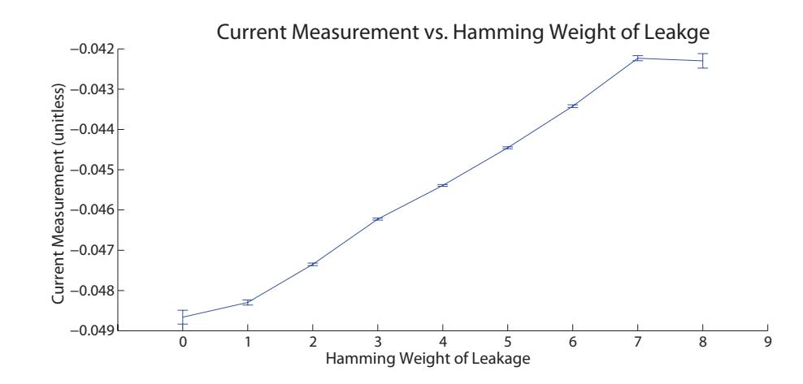
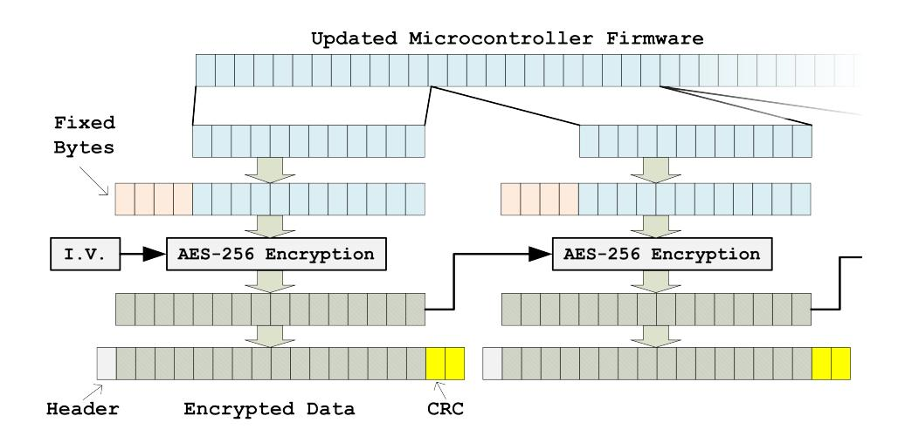
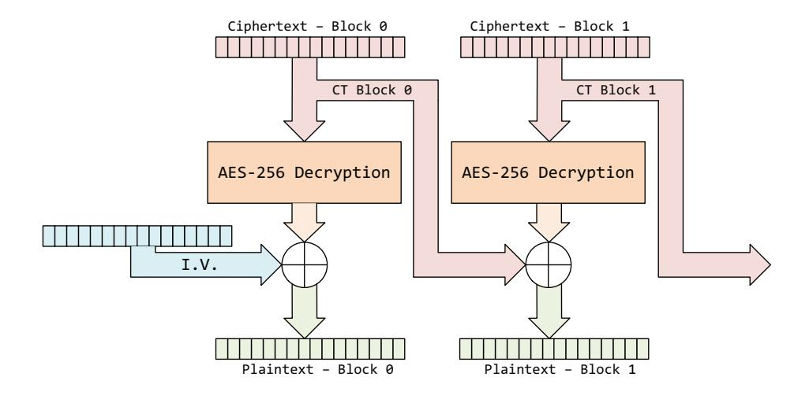
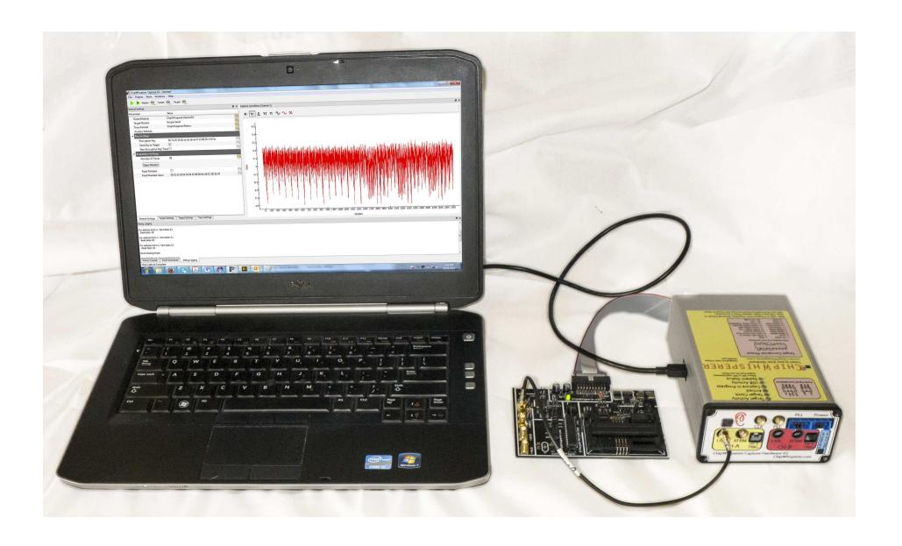
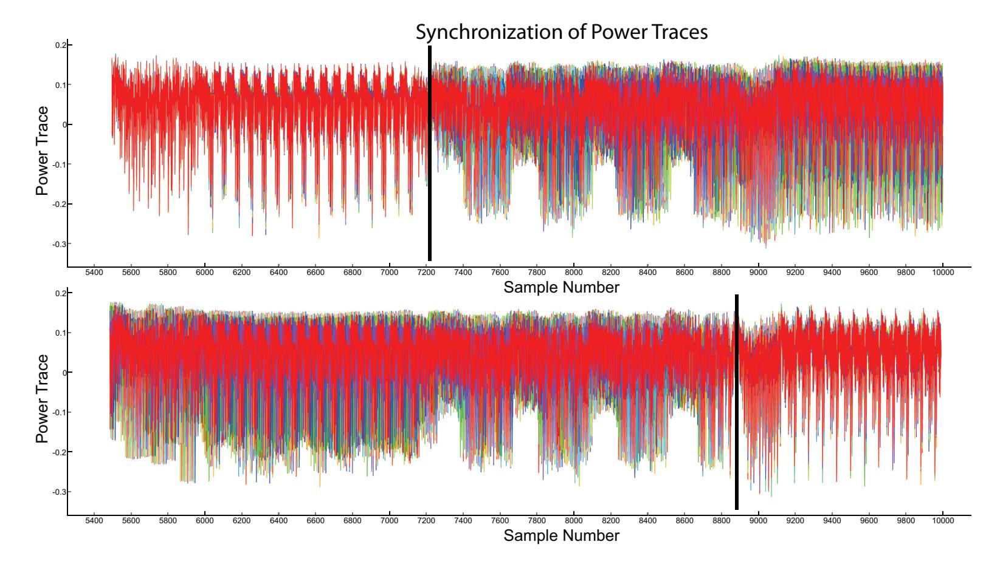
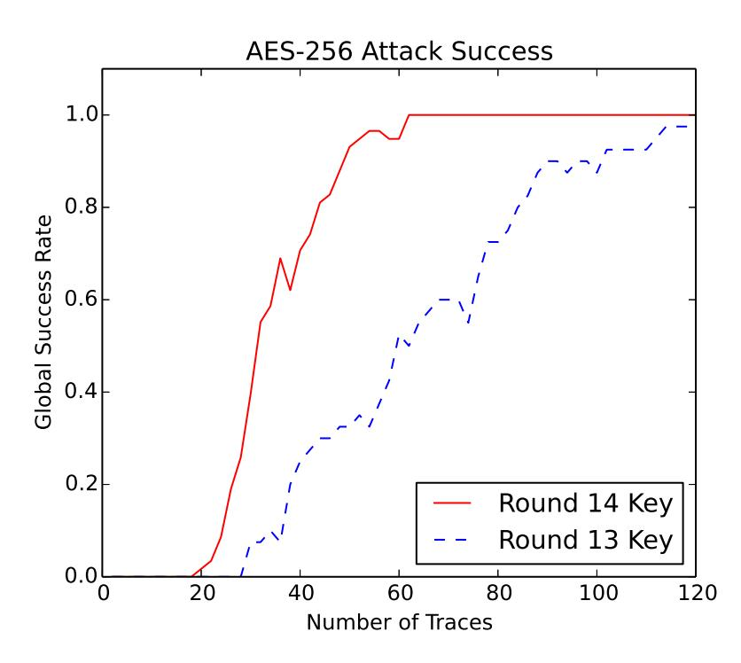
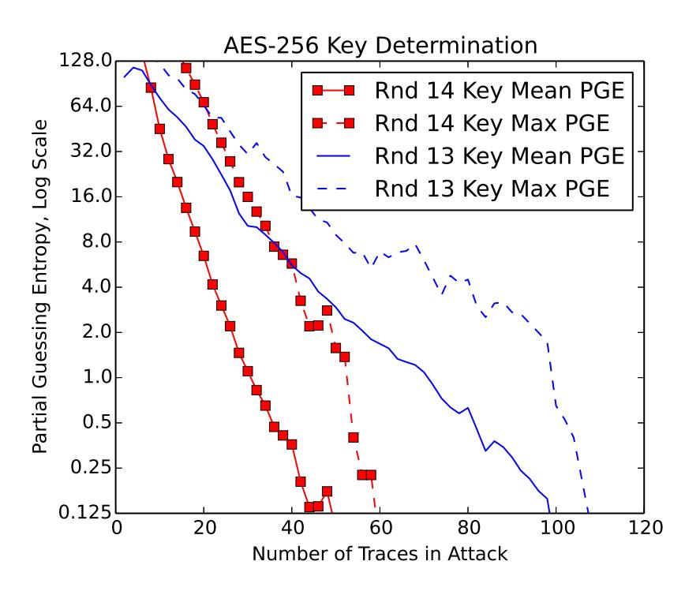
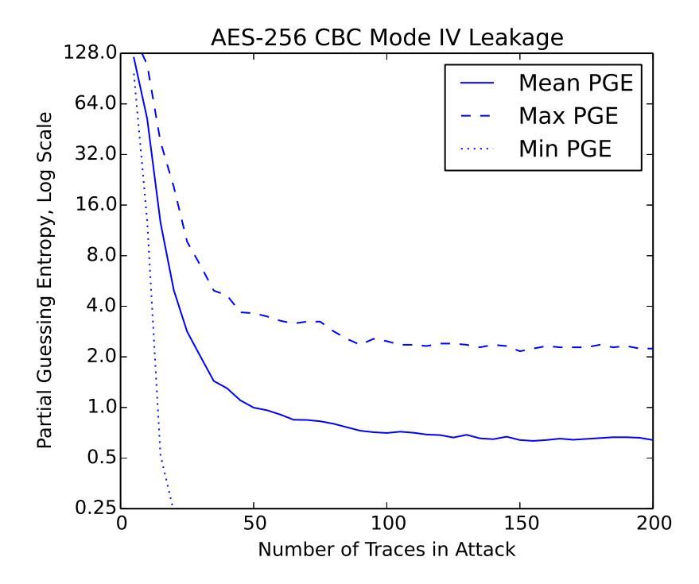

{0}------------------------------------------------

# Side Channel Power Analysis of an AES-256 Bootloader

Colin O'Flynn and Zhizhang (David) Chen

Abstract—Side Channel Attacks (SCA) using power measurements are a known method of breaking cryptographic algorithms such as AES. Published research into attacks on AES frequently target only AES-128, and often target only the core Electronic Code-Book (ECB) algorithm, without discussing surrounding issues such as triggering, along with breaking the initialization vector.

This paper demonstrates a complete attack on a secure bootloader, where the firmware files have been encrypted with AES-256-CBC. A classic Correlation Power Analysis (CPA) attack is performed on AES-256 to recover the complete 32-byte key, and a CPA attack is also used to attempt recovery of the initialization vector (IV).

#### I. INTRODUCTION

Side channel power analysis measures the power consumed by a digital device on each clock cycle. Using this it is possible to infer something about the data being processed by the device, which was first demonstrated as a method of breaking cryptographic algorithms by Kocher et al[1]. This work uses the subsequently published Correlation Power Analysis (CPA) attack by Brier et al[2].

Briefly, we can summarize the attack as follows. It takes a physical charge to change the state of a bus line in a digital device (i.e. setting from low to high). If we knew a priori that all bus lines in a chip where in the low state, and measured the current flow on the VCC (positive) rail, we would expect the magnitude of that current to depend on the number of bus lines being set high. In reality, most microcontrollers set the bus lines to a 'precharge' state which is half-way between a high and a low state before setting the bus lines to the final state. Thus on every clock cycle we can measure the current flow in the VCC line, and the value of this current would be expected to be linearly related to the number of lines going from the precharge state to the high state: the higher the current peak, the more lines switched high.

This assumption will allow us to determine the *Hamming Weight* (HW) of some sensitive data. This will allow us to break a cryptographically sound implementation of AES-256, and directly determine the keying material hidden inside a microcontroller. The validation of the HW leakage assumption on this platform is shown in Fig. 1.

The paper will first describe the bootloader in Section II. A review of AES-256 will be given in Section III, along with a discussion of side channel power attacks. There we will review the modifications required for attacking the full 32-bytes of the AES-256 key. Section IV will briefly outline the hardware used in this work, and in Section V we will

C. O'Flynn and Z. Chen are with Faculty of Electrical and Computer Engineering, Dalhousie University, Halifax, Canada. {coflynn,z.chen}@dal.ca

Fig. 1. Power consumption of device under attack performing an operation on data with different Hamming Weights (HW), showing the average current consumption of the AtMega328P microcontroller for each possible hamming weight of an 8-bit number. Error bars show 95% confidence on average.

describe the format of our results. Finally in Section VI and Section VII the results of a side-channel attack on the encryption key and initialization vector are described. Briefly the recovery of the signature is discussed in Section VIII, before concluding in Section IX.

Interested readers are referred to the open-source Chip-Whisperer Project1, where additional details including a step-by-step tutorial2 of the attack are available, including copies of power traces used to generate figures in this work.

### II. DESCRIPTION OF BOOTLOADER

Rather than use a specific bootloader, a generic bootloader that can run on small microcontrollers will be presented. It can be appreciated that this bootloader is similar to other secure bootloaders available as application notes from vendors for embedded 8-bit, 16-bit, and 32-bit microcontrollers.

A very simple encryption and communication protocol is used. The input data for the entire memory is split into 12-byte chunks, where the final block is padded with random characters. Each chunk has a 4-byte fixed signature sequence prepended which results in a 16-byte block.

The simple 4-byte signature is used to verify that any given 16-byte block was encrypted with the expected encryption key. As the bootloader is highly size-constrained, this simple signature verification is used over something such as a hash of the data.

Fig. 2 shows the generation of an encrypted block, along with the communications protocol. The communications protocol runs over a serial port, and contains a CRC-16 to verify that no communications errors occurred. The signature would

http://www.chipwhisperer.com

 $^2 See\ ChipWhisperer\ HTML\ Documentation,\ available\ at\ http://www.newae.com/sidechannel/cwdocs/tutorialaes256boot. html$ 

{1}------------------------------------------------

also detect communications errors; but a signature failure is not communicated back to the sender to reduce the attack surface. Instead the CRC-16 is used so the sender can verify the correct data was sent, but the sender is supposed to be unaware if the bootloader is accepting the data (i.e. if the correct key was used).

Fig. 2. Data format for AES-256 bootloader showing both encrypted format and communications protocol.

The implementation here does not actually write data to FLASH memory (i.e. it doesn't fully work as a bootloader), as this functionality is not required for this paper. Details of the AES-256 decryption will be discussed next.

#### III. AES-256 DECRYPTION

#### A. Background

The input cipher-text to the AES-256 decryption algorithm is C. The input key is 256 bits (32 bytes), which is expanded to 240 bytes, used 16 bytes at a time (each of the round keys). Each of the round keys is denoted as  $K^r$ , where the round  $r = \{0, 1, 2, \dots, 14\}$ .

As AES decryption is performed with the same structure as AES encryption but 'in reverse', the first round of AES decryption in this work will be denoted as r=14, the next round of AES decryption as r=13, etc.

The input ciphertext C consists of 16 bytes:

$$C = [c_0, c_1, \cdots, c_{15}]$$

The AES algorithm stores an intermediate state X, which is updated after each round of the algorithm. The intermediate state for round r is denoted by a 16-byte array:

$$X^r = [x_0^r, x_1^r, \cdots, x_{15}^r]$$

The complete AES algorithm will use three special functions:

- Sub(): Performs bytewise substitution operation on  $X^r$ .
- Shift(): Shift Rows, reorders bytes in  $X^r$ .
- Mix(): Mix Columns, mixes bytes in  $X^r$  together.

All three functions have inverses, such for example that  $\operatorname{Sub}^{-1}(\operatorname{Sub}(x)) = \operatorname{Sub}(\operatorname{Sub}^{-1}(x)) = x$ .

With the Sub() and Shift() functions a single byte change in the input affects only a single byte of the output. With the Mix() function a single byte change in the input affects four of the output bytes.

The complete AES decryption algorithm can be described as in equations (1) to (5), where (3) is performed multiple times.

$$X^{14} = \mathrm{Sub}^{-1} \left( \mathrm{Shift}^{-1} (C \oplus K^{14}) \right)$$
 (1)

$$X^{13} = \mathrm{Sub}^{-1} \left( \mathrm{Mix}^{-1} \left( \mathrm{Shift}^{-1} (X^{14} \oplus K^{13}) \right) \right)$$
 (2)

. . .

$$X^{i} = \operatorname{Sub}^{-1} \left( \operatorname{Mix}^{-1} \left( \operatorname{Shift}^{-1} (X^{i+1} \oplus K^{i}) \right) \right)$$
 (3)

. . .

$$X^{1} = \operatorname{Sub}^{-1} \left( \operatorname{Mix}^{-1} \left( \operatorname{Shift}^{-1} (X^{2} \oplus K^{1}) \right) \right)$$
 (4)

$$X^0 = X^1 \oplus K^0 \tag{5}$$

### B. Side Channel Power Analysis

When performing a side-channel power analysis attack, we will be attacking the value of  $X^{14}$ . We know the value of C (the input we sent the decryption algorithm), and perform a guess and check on each byte of  $K^{14}$ , where we use a Correlation Power Analysis (CPA)[2] attack with the Hamming Weight (HW) assumption on the leaked value of  $X^{14}$ .

The CPA attack requires us to attack each encryption subkey j (i.e. byte) of  $K^{14}$  independently. Using (1), we can calculate a hypothetical value of  $X_j^{\prime 14}$  based on the known ciphertext  $C_j$ , and some guess of the subkey value  $K_j^{\prime 14}$ . If we see a large correlation between the hamming weight of our hypothetical value  $X_j^{\prime 14}$  and the power measurement trace related to the decryption of C, this suggests the guess of the subkey may be the correct value.

To determine the complete 32-byte encryption key, we will require both  $K^{14}$  and  $K^{13}$ . The classic CPA attack would only recover  $K^{14}$  as above, and a small change to the attack is required to find  $K^{13}$ .

Once  $K^{14}$  is known, the attack is re-run with the leakage function targeting  $X^{13}$ , where we wish to guess each byte of  $K^{13}$ . Due to the presence of  $\mathrm{Mix}^{-1}()$ , it would appear that four bytes of the key must be guessed to achieve a single byte of  $X^{13}$ . This would entail guessing  $2^{32}$  possibilities instead of  $2^{8}$ , a considerably more challenging task.

We can however take advantage of the linearity of the  $\operatorname{Mix}^{-1}(a)$  operation to rearrange (2), as described in [3], and also demonstrated [4]. Using the property that  $\operatorname{Mix}^{-1}(a \oplus b) = \operatorname{Mix}^{-1}(a) \oplus \operatorname{Mix}^{-1}(b)$ , (2) becomes (6), where we are no longer guessing the key  $K^{13}$ , but a version of the key processed by  $\operatorname{Mix}^{-1}(\operatorname{Shift}^{-1}(x))$ :

$$X^{13} = \operatorname{Sub}^{-1} \left( \operatorname{Mix}^{-1} \left( \operatorname{Shift}^{-1} (X^{14} \oplus K^{13}) \right) \right)$$
 (2)

$$X^{13} = \operatorname{Sub}^{-1} \left( \operatorname{Mix}^{-1} \left( \operatorname{Shift}^{-1} (X^{14}) \right) \oplus Y^{13} \right)$$
 (6)

$$Y^{13} = \text{Mix}^{-1} \left( \text{Shift}^{-1}(K^{13}) \right) \tag{7}$$

Once we fully determine  $Y^{13}$ , we can use (8) to determine the desired encryption key for round 13,  $K^{13}$ :

$$K^{13} = \operatorname{Mix}(\operatorname{Shift}(Y^{13})) \tag{8}$$

{2}------------------------------------------------

Fig. 3. AES-256 Cipher Block Chaining (CBC) Mode Decryption

#### C. Cipher Block Chaining Mode

The bootloader uses AES-256 in Cipher Block Chaining (CBC) mode, where before being encrypted each block was XOR'd with the previous ciphertext. Since for the first block there is no previous ciphertext, a random Initialization Vector (IV) is used. The decryption flow is shown in Fig. 3, where the IV used for encryption must also be given to the bootloader. In this case the IV is programmed (along with encryption key) into the device's memory before deployment.

Note that if the decryption key is known, but the IV is not, this allows us to decrypt everything except the first block. If an attacker is simply looking to decrypt a file for reverse engineering purposes, they can probably derive enough useful detail without the first 16 bytes to accomplish this task.

#### IV. HARDWARE

A bootloader as described in Section II is implemented in an Atmel AtMega328P-PU 8-bit microcontroller running at 7.37 MHz. Power measurements are taken using a resistive shunt inserted into the VCC line, where measurements are taken synchronously at 29.5 MS/s using a ChipWhisperer Capture Rev2 platform [5].

In Fig. 4 a photograph of the capture setup is shown. Details of the practicality of the attack will be discussed next.

Fig. 4. Traces are captured from an ATMega328P microcontroller using the ChipWhisperer system.

#### A. Triggering

Typical work demonstrating side-channel attacks uses an IO line of the microcontroller that indicates when the encryption (or decryption) routine is running. This provides an attacker with a perfectly synchronized trigger event, but in real implementations this will not be available.

For this work the Sum of Absolute Differences (SAD) trigger built into the ChipWhisperer is used. This allows triggering on a pattern in the analog waveform. The correct pattern can be determined through trial-and-error: it is known for example when the encrypted block was sent to the microcontroller, and we can infer that sometime after this event the decryption occurs. The SAD trigger can be used to 'walk through' the possible trigger events, until the analysis attack succeeds.

In this implementation of the SAD trigger 128 input samples,  $\vec{T}$ , are continuously compared to a 128 point reference waveform,  $\vec{R}$ , using (9). If the input was exactly the same as the reference waveform, the output of (9) would be 0. Normally the trigger condition is simply when the output of (9) falls below some numerical value.

$$SAD = \sum_{p=0}^{127} |T_p - R_p| \tag{9}$$

#### B. Synchronizing Traces

Traces may also need to be synchronized in time. In particular the AES-256 implementation used here has non-constant execution time, which does introduce another attack vector[6][7], but also means that the later rounds will not be perfectly synchronized even if the initial round is. This can be seen in the upper part of Fig. 5, where traces appear to become unsynchronized after a point in time.

To compensate for this a SAD resynchronization element is used during analysis for the  $13^{th}$  round. In the lower part of Fig. 5 we can see traces appear synchronized toward the last half, but are now unsynchronized for the first half.

### V. RESULT FORMAT

The results will be presented in two formats: the Global Success Rate (GSR), and the average Partial Guessing Entropy (PGE). The use of these result formats will be briefly discussed next.

#### A. Meaning of GSR

If the attack algorithm has access to N traces, we can consider the attack successful if the algorithm successfully determines the correct encryption key with N traces. We can present a number of different sets of N traces, and average the number of times the entire encryption key was successfully recovered with a set of size N.

This gives us the 'global success rate', where a rate of 1.0 means the attack always succeeds. Typically we will consider an attack successful for a gsr about 0.8, i.e. given a specific number of traces, the attack succeeds 80% of the time.

The GSR only indicates when the attack is completely successful – in reality it is sufficient to reduce the guessing

{3}------------------------------------------------

Fig. 5. Power traces may not remain synchronized during the execution of the entire algorithm. The execution of the first round becomes unsynchronized around sample number 7300 in the top traces. They have been resynchronized in the lower example, allowing the attack to continue for the next round.

entropy to a manageable level, instead of requiring the attack to directly give us the complete encryption key. Another metric which provides a measure of the reduction of guessing space is discussed next.

#### B. Meaning of PGE

The 'guessing entropy' is defined as the "average number of successive guesses required with an optimum strategy to determine the true value of a random variable X"[8]. The 'optimum strategy' here is to rank the possible values of the subkey from most to least likely based on the value of the correlation attack (higher correlation output is more likely).

The 'partial' refers to the fact that we are finding the guessing entropy on each subkey. This gives us a PGE for each of the 16 subkeys3. A PGE of 0 indicates the subkey is perfectly known, a PGE of 10 indicates that 10 guesses were [incorrectly] ranked higher than the correct guess.

The attack algorithm is given access to  $1, 2, \cdots, N$  traces, and the PGE for each subkey is calculated. To improve consistency the PGE for each subkey is averaged over several attacks (trials). Finally, we can average the PGE over all 16 subkeys to generate a single 'average PGE' for the attack.

## VI. DETERMINING KEY

Details of the side channel analysis attack used are discussed in Section III-B. The resulting GSR for the CPA attack on the  $14^{th}$  and  $13^{th}$  round encryption key is shown in Fig. 6.

The  $14^{th}$  round key indicates the first 16 bytes recovered by the CPA attack. The  $13^{th}$  round key is the next 16 bytes recovered, where we assume the first 16 bytes had already been recovered. The 'total' success is given by the recovery

Fig. 6. Two CPA attacks are performed to determine both the 14th and 13th round keys. Note the CPA attack on the 13th round key requires the 14th round key. The Global Success Rate(GSR) is displayed for the attack, where the attack has a very good chance of succeeding with 100 traces.

of both the  $14^{th}$  and  $13^{th}$  round keys. With very good probability the entire encryption key can be recovered after 100 power trace measurements.

The PGE of the attack is given in Fig. 7. Again around 100 traces the PGE falls to zero indicating the key is perfectly known. Even with a smaller number of traces the guessing entropy is significantly reduced. The original PGE would be 128 for all subkeys, since each subkey is 8 bits, and we expect the correct key to be found half-way through, but with 60 traces this is reduced to an average PGE of only 2. This greatly reduced entropy could be attacked by brute-force guessing the most likely ranked keys.

&lt;sup>3AES-256 has a 32-byte key, but we attack 16 bytes at a time, since each round only uses 16 bytes of the key.

{4}------------------------------------------------

Fig. 7. The Partial Guessing Entropy (PGE) data for the same attack in Fig. 6. The maximum PGE is the highest (worst) PGE of any of the 16 subkeys, and mean is the average of all subkeys for a given number of traces.

Fig. 8. A CPA attack on the Initialization Vector (IV) being XORd with the plaintext shows that some guessing is still required, as the PGE never reaches 0 for all bytes. Instead an asymptotic behaviour is noted, which occurs due to several key hypothesis having the same correlation, as described in the text.

## VII. DETERMINING IV

If the plaintext was known, the Initialization Vector (IV) can be trivially determined once the encryption key is known. With the encryption key, the attacker can decrypt everything *except* the first 16 bytes; at this point they might be able to determine that the first 16 bytes of the plaintext were part of a fixed file header or similar material. In this case an attacker can determine the IV by XORing the expected plaintext with the output of the AES-256-ECB decryption function.

Without such knowledge, we could use a side-channel attack on the IV itself. We perform a CPA attack on the output of the decryption result XOR'd with the unknown IV, where we will guess each byte of the IV.

Fig. 8 shows the PGE for the IV. The CPA attack never fully recovers the IV even with 5000 traces, thus a GSR is

TABLE I TOP THREE POSITIVE AND NEGATIVE CORRELATION OUTPUTS FOR BYTE 7 OF THE I.V. CORRECT VALUE OF GUESS IS DA.

| Guess(Hex) | Guess(Bin) | Correlation |
|------------|------------|-------------|
| 4A         | 01001010   | 0.8250      |
| 5A         | 01011010   | 0.8150      |
| DA         | 11011010   | 0.7912      |
| 25         | 00100101   | -0.7912     |
| A5         | 10100101   | -0.8150     |
| B5         | 10110101   | -0.8250     |

not shown. We can consider the reason for this difficulty in obtaining a completely successful attack by reviewing again our leakage model and attack point. The application of the IV is as follows in (10).

$$P = X^0 \oplus IV \tag{10}$$

A single bit change in the IV will always result in a single bit change in the output. Thus it would be expected that guesses with small bit differences will be ranked similarly. When attacking the S-Box output in (1), a single-bit change in the input guess will result in multiple bits changing in the hypothetical output. Attacking the S-Box output means that wrong guesses have a considerably different hamming weight from incorrect guesses, and attack performance is considerably improved.

An example of the top-ranked guesses for byte seven of the IV is shown in Table I. In this case the PGE is two, as there are two wrong guesses for the IV byte ranked higher than the correct guess. Note the wrong guesses have a very close bit pattern to the correct value.

In addition, the absolute value of the correlation cannot be used. Due to the linear nature of (10), the correlation of the *bitwise inverse* of the correct guess would have the same absolute value as the correlation as the correct guess, but with the opposite sign. This is demonstrated in the lower three rows of Table I. When attacking the S-Box we *can* use the absolute value of the correlation, since the S-Box is non-linear, and thus properties such as the bitwise inverse do not carry through the S-Box operation.

## VIII. DETERMINING SIGNATURE

It was also described in Section II that a secret 4-byte signature is added before each encrypted block. If the attacker wishes to have the bootloader accept a new data file, this signature must also be determined.

Provided the attacker has access to an encrypted firmware file, they can simply decrypt this file using the key determined with a CPA attack. The signature will be readily apparent due to the presence of a repeated fixed four-byte sequence in the decrypted file.

If attacking an 8-bit microcontroller, timing attacks are also possible on the signature check. If each byte of the signature is checked in sequence, it should be possible to determine from the power trace which byte failed on the signature check. This would require a partial brute-force 

{5}------------------------------------------------

attack, and is only relevant when the signature is checked byte-by-byte.

### IX. CONCLUSIONS

This paper has explored a complete attack on a software implementation of AES-256-CBC used in a bootloader. This demonstrates the relevance of side-channel power analysis attacks to real systems, and not just academic implementations of the cryptographic algorithms.

Extending a standard CPA attack to work on AES-256 requires some modifications to the attack for the second decryption round, as detailed previously in [3] and [4]. In addition this paper has demonstrated the use of a standard CPA attack to determine the Initialization Vector (IV), which in general demonstrates the effectiveness of a CPA attack on a single XOR operation. As many cryptographic algorithms use XOR, the results of the CPA attack on an XOR are of particular interest beyond just the attack on AES. The CPA attack on the XOR operation was part of the original CPA paper experiments[2], and this paper provides some updated data for a recent 8-bit microcontroller.

Simply using a strong encryption such as AES-256 is insufficient to guarantee an embedded device will remain secure. A side-channel power analysis attack can be performed with a reasonable number of traces on a standard AES implementation, revealing the encryption key. If protection against these attacks is required, countermeasures will need to be inserted into the AES implementation. The system designer must trade off the desired resistance to attacks against implementation complexity, and not simply assume that using a large key alone is sufficient to guarantee security.

## REFERENCES

- [1] Kocher, P., Jaffe, J., Jun, B.: Differential power analysis. In: Advances in Cryptology - CRYPTO' 99, Springer-Verlag (1999) 388–397
- [2] Brier, E., Clavier, C., Olivier, F.: Correlation power analysis with a leakage model. Cryptographic Hardware and Embedded Systems – CHES 2004 (2004) 135–152
- [3] Neve, M., Tiri, K.: On the complexity of side-channel attacks on aes-256 – methodology and quantitative results on cache attacks. Cryptology ePrint Archive, Report 2007/318 (2007) http://eprint.iacr.org/.
- [4] Moradi, A., Kasper, M., Paar, C.: Black-box side-channel attacks highlight the importance of countermeasures. In Dunkelman, O., ed.: Topics in Cryptology – CT-RSA 2012. Volume 7178 of Lecture Notes in Computer Science. Springer Berlin Heidelberg (2012) 1–18
- [5] O'Flynn, C., Chen, Z.D.: ChipWhisperer: An Open-Source Platform for Hardware Embedded Security Research. In Prouff, E., ed.: Constructive Side-Channel Analysis and Secure Design. Lecture Notes in Computer Science. Springer International Publishing (2014) 243–260
- [6] Kocher, P.C.: Timing Attacks on Implementations of Diffie-Hellman, RSA, DSS, and Other Systems. In: Proceedings of the 16th Annual International Cryptology Conference on Advances in Cryptology. CRYPTO '96, London, UK, UK, Springer-Verlag (1996) 104–113
- [7] Koeune, F., Koeune, F., Quisquater, J.J., jacques Quisquater, J.: A timing attack against Rijndael. Technical report (1999)
- [8] Massey, J.: Guessing and entropy. In: Information Theory, 1994. Proceedings., 1994 IEEE International Symposium on. (1994) 204–