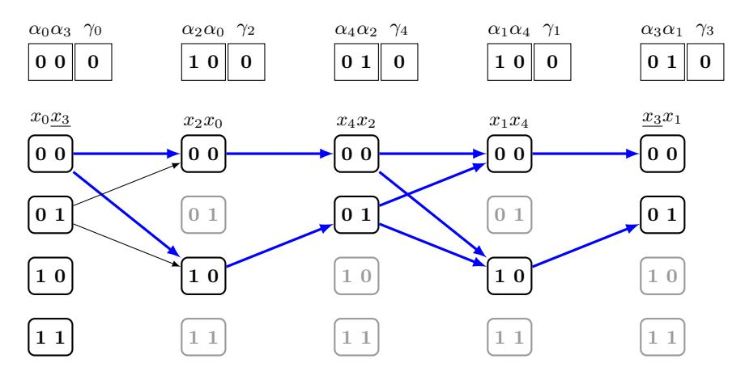
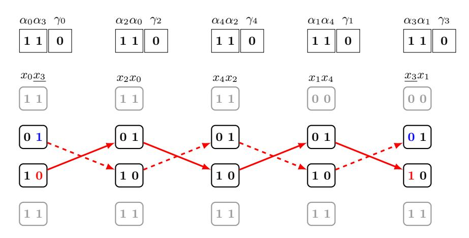
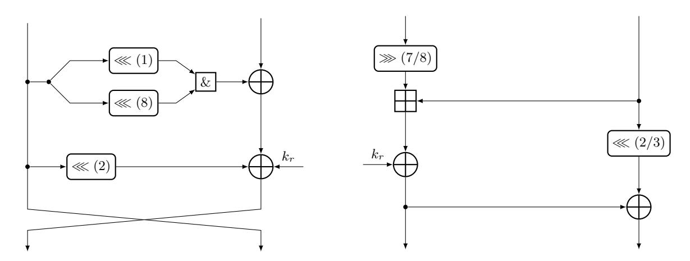
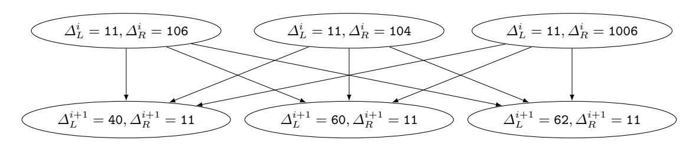
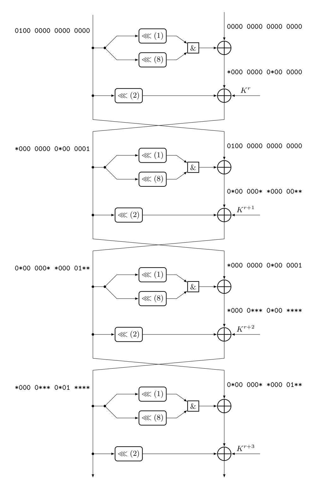
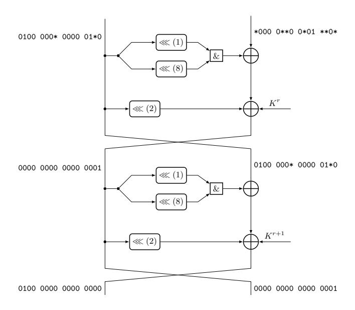
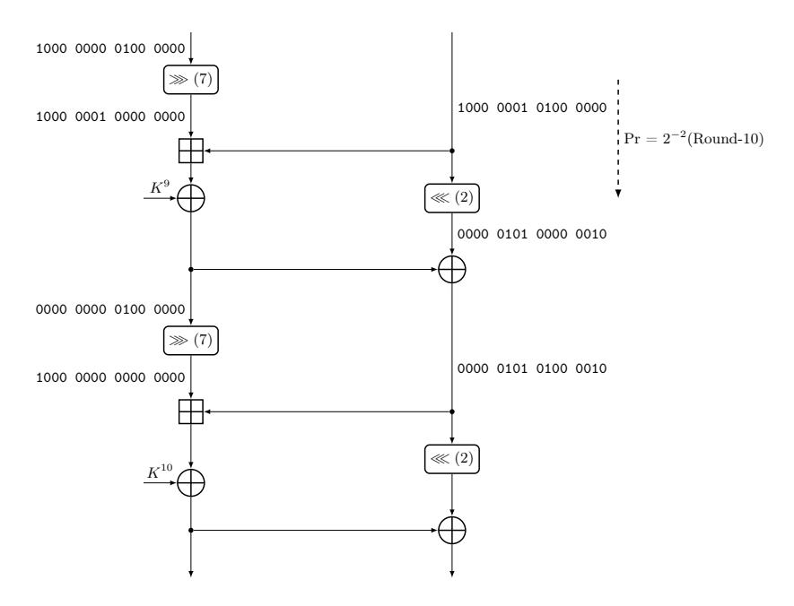
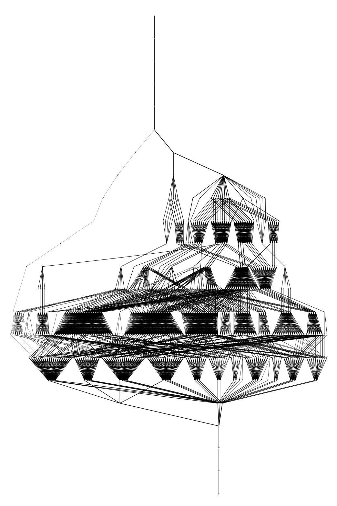

# <span id="page-0-0"></span>Differential Analysis of Block Ciphers SIMON and SPECK

Alex Biryukov, Arnab Roy, and Vesselin Velichkov

Laboratory of Algorithmics, Cryptology and Security (LACS) University of Luxembourg {Alex.Biryukov,Arnab.Roy,Vesselin.Velichkov}@uni.lu

Abstract. In this paper we continue the previous line of research on the analysis of the differential properties of the lightweight block ciphers Simon and Speck. We apply a recently proposed technique for automatic search for differential trails in ARX ciphers and improve the trails in Simon32 and Simon48 previously reported as best. We further extend the search technique for the case of differentials and improve the best previously reported differentials on Simon32, Simon48 and Simon64 by exploiting more effectively the strong differential effect of the cipher. We also present improved trails and differentials on Speck32, Speck48 and Speck64. Using these new results we improve the currently best known attacks on several versions of Simon and Speck. A second major contribution of the paper is a graph based algorithm (linear time) for the computation of the exact differential probability of the main building block of Simon: an AND operation preceded by two bitwise shift operations. This gives us a better insight into the differential property of the Simon round function and differential effect in the cipher. Our algorithm is general and works for any rotation constants. The presented techniques are generic and are therefore applicable to a broader class of ARX designs.

Keywords: symmetric-key, differential trail, tools for cryptanalysis, automatic search, ARX, Simon, Speck, lightweight ciphers

# 1 Introduction

The past decade in technology has been marked by the ever decreasing size of computing devices. This, in combination with their increasingly ubiquitous use e.g. as smart devices, wearable systems, as part of the Internet of Things [\[13\]](#page-19-0), has enabled humans to perform everyday activities more efficiently. At the same time these new technologies have also created new security challenges.

An important problem today is the design of cryptographic algorithms that are both efficient and secure, have small memory footprint and are low-cost and easy to implement and deploy on multiple platforms. Finding an optimal compromise between these, often conflicting, requirements is the difficult area researched by the field of lightweight cryptography. The applications of lightweight cryptographic algorithms vary from mobile devices, through RFID tags to electronic locks and their importance is likely to continue increasing in the future.

To address the persistent need for secure and efficient lightweight primitives, numerous proposals have been made in the past few years. In the area of symmetric-key encryption some of the more prominent block ciphers that were proposed are: Present [\[7\]](#page-19-1), Piccolo [\[18\]](#page-19-2), Klein [\[10\]](#page-19-3), Twine [\[20\]](#page-19-4), Katan and Ktantan [\[8\]](#page-19-5), LED [\[11\]](#page-19-6), HIGHT [\[12\]](#page-19-7) and CLEFIA [\[19\]](#page-19-8).

Most recently, in June 2013, yet two more algorithms have been put forth by researchers from the National Security Agency (NSA) of the USA – the block ciphers Simon and Speck [\[4\]](#page-19-9). Compared to their predecessors, the latter two have very competitive performance, small memory footprint and beat most existing lightweight ciphers in terms of efficiency and compactness. Furthermore, the two designs are very simple and elegant. They are both built on the ARX philosophy [\[21,](#page-19-10)[14\]](#page-19-11), using only basic arithmetic operations such as modular addition, XOR, bitwise AND and bit rotation.

Evidence of the performance and implementation advantages of Simon and Speck exists in the form of extensive results and comparisons to existing lightweight algorithms described in the design document [\[4\]](#page-19-9). However the latter does not provide any security evaluation of the two ciphers and no analysis of their cryptographic strength is given. Recently several external cryptanalytic results on Simon and Speck became available: [\[3,](#page-19-12)[2](#page-19-13)[,1\]](#page-19-14). The first two in particular analyze the differential properties of the ciphers and describe key-recovery attacks on reduced round variants.

Our Contribution. In this paper we further investigate the differential behavior of block ciphers Simon and Speck. We apply a recently proposed technique for automatic search for differential trails in ARX ciphers called threshold search [\[6\]](#page-19-15). We find better differential trails on Simon32 and Simon48 than the ones reported by [\[2\]](#page-19-13) and claimed to be the best and, we confirm the trail on Simon64. Improved trails that cover one round more than the previously reported best trails [\[1\]](#page-19-14) on Speck32, Speck48 and Speck64 are found. We further extend the threshold search technique for finding differentials. With the new tool we improve the differentials on Simon32, Simon48 and Simon64 reported by [\[2\]](#page-19-13) and we present new differentials on Speck32, Speck48 and Speck64. We use these new results to improve the currently best known attacks on several versions of Simon and Speck.

The second major contribution of the paper is an efficient algorithm for the computation of the differential probabilities (DP) of the bitwise AND operation – the single source of non-linearity in the round function of Simon. We describe algorithms for the computation of the exact DP of AND with independent inputs and rotationally dependent inputs (one input is equal to the rotation of the other one) as used in Simon. In addition, methods for computing the maximum DP over all inputs and over all outputs of the AND operation are also proposed. All described algorithms have linear time complexity in the word size. These algorithms are used in the threshold search and in the differential search tool for Simon.

Finally, we briefly comment on the strong differential effect in Simon – a property already noted in [\[3\]](#page-19-12). In addition we provide new insights into the clustering of differential trails that causes this effect. A summary of the main results from the search on trails and differentials is provided in Table [2.](#page-3-0) Note that in this table is mentioned a figure for the time complexity of the attacks on Simon32 and Simon64 described in [\[2\]](#page-19-13) that we were not able to verify. [a](#page-1-0)

The outline of the paper is as follows. We begin with Sect. [2](#page-2-0) where the XOR differential probability of the AND operation is analyzed. Next in Sect. [3](#page-6-0) are presented techniques for searching for trails and differentials in ARX algorithms. The block ciphers Simon and Speck are briefly described in Sect. [4.](#page-9-0) Full differential trails are presented in Sect. [5.](#page-9-1) Finally, in Sect. [6](#page-10-0) we comment on the strong differential effect of Simon. Sect. [9](#page-17-0) concludes the paper.

A few words on notation: with x<sup>i</sup> is denoted the i-th bit of the n-bit word x (x<sup>0</sup> is the LSB); x<sup>i</sup> represents the modulo-2 complementation of x<sup>i</sup> i.e. x<sup>i</sup> = x<sup>i</sup> ⊕ 1; the symbols ∧ and ∨ denote respectively bitwise logical AND and OR operations; the left and right rotation of the bits of x by r positions is denoted respectively with x ≪ r and x ≫ r; |S| represents the cardinality of the set S. The concatenation of the bit strings x and y is denoted by x|y.

<span id="page-1-0"></span><sup>a</sup> Since with one good pair in all the data the counting phase does not give the attacker unique partial key.

| Table 1. Summary of attacks on Simon<br>and Speck. All listed attacks are chosen-plaintext.a,b,cDiffers from [2]. |
|-------------------------------------------------------------------------------------------------------------------|
|-------------------------------------------------------------------------------------------------------------------|

| Cipher  | Key<br>Size | #Rounds<br>Total | #Rounds<br>Attacked | Time<br>Sect. 7, 8 | Data<br>Sect. 7, 8 | Time<br>[2,1] | Data<br>[2,1] |
|---------|-------------|------------------|---------------------|--------------------|--------------------|---------------|---------------|
| Simon32 | 64          | 32               | 18                  |                    |                    | 62 a<br>2     | 31.2<br>2     |
|         | 64          | 32               | 19                  | 34<br>2            | 31.5<br>2          |               |               |
|         | 64          | 32               | 19                  | 40<br>2            | 31<br>2            |               |               |
| Simon48 | 72          | 36               | 19                  | 46<br>2            | 46<br>2            | 52<br>2       | 46<br>2       |
|         | 72          | 36               | 20                  | 52<br>2            | 46<br>2            |               |               |
|         | 96          | 36               | 19                  | 69<br>2            | 46<br>2            | 76<br>2       | 46<br>2       |
|         | 96          | 36               | 20                  | 75<br>2            | 46<br>2            |               |               |
| Simon64 | 96          | 42               | 26                  | 89<br>2            | 63<br>2            | 94 b<br>2     | 63<br>2       |
|         | 128         | 44               | 26                  | 121<br>2           | 63<br>2            | 126 c<br>2    | 63<br>2       |
| Speck32 | 64          | 22               | 10                  |                    |                    | 29.2<br>2     | 29<br>2       |
|         | 64          | 22               | 11                  | 55<br>2            | 31<br>2            |               |               |
| Speck48 | 72/96       | 22               | 12                  | 43<br>2            | 43<br>2            | 45.3<br>2     | 45<br>2       |
| Speck64 | 96/128      | 26               | 15                  |                    |                    | 61.1<br>2     | 61<br>2       |
|         | 96          | 26               | 16                  | 80<br>2            | 63<br>2            |               |               |
|         | 96          | 26               | 16                  | 73<br>2            | 64<br>2            |               |               |
|         | 128         | 27               | 16                  | 80<br>2            | 63<br>2            |               |               |
|         | 128         | 27               | 16                  | 73<br>2            | 64<br>2            |               |               |

# <span id="page-2-0"></span>2 The XOR Differential Probability of AND

# 2.1 Independent Inputs

<span id="page-2-2"></span>Definition 1 (xdp& with independent inputs). Let α, β and γ be fixed n-bit XOR differences. The XOR differential probability (DP) of the logical AND operation (xdp&) is the probability with which α and β propagate to γ through the AND operation, computed over all pairs of n-bit inputs (x, y):

$$\operatorname{xdp}^{\&}(\alpha,\beta\to\gamma) = 2^{-2n} \cdot |\{(x,y) : ((x\oplus\alpha) \land (y\oplus\beta)) \oplus (x\land y) = \gamma\}| . \tag{1}$$

In the remaining of the text the acronym DP will be used to denote XOR differential probability unless specified otherwise. When the input differences α and β are independent, the DP xdp<sup>∧</sup> (α, β → γ) can be efficiently computed according to the following theorem.

<span id="page-2-3"></span>Theorem 1. For fixed n-bit XOR differences α, β and γ the probability xdp&(α, β → γ) is equal to

<span id="page-2-1"></span>
$$\operatorname{xdp}^{\&}(\alpha,\beta\to\gamma) = 2^{-n} \cdot \prod_{i=0}^{n-1} \left( \left( 2 \cdot (\overline{\alpha}_i \wedge \overline{\beta}_i \wedge \overline{\gamma}_i) \right) \vee (\overline{\overline{\alpha}_i \wedge \overline{\beta}_i}) \right) \wedge \overline{\left(\overline{\alpha}_i \wedge \overline{\beta}_i \wedge \gamma_i\right)} \ . \tag{2}$$

Proof. Note that xdp&(α, β → γ) = 0 ⇐⇒ ∃i : 0 ≤ i < n : (α<sup>i</sup> ∧β<sup>i</sup> ∧γi) = 1. Therefore whenever the probability is zero, the term (α<sup>i</sup> ∧ β<sup>i</sup> ∧ γi) evaluates to zero and hence the right hand-side of [\(2\)](#page-2-1) is also zero. If the probability is non-zero and α<sup>i</sup> = β<sup>i</sup> = γ<sup>i</sup> = 0 at bit position i then (αi∧βi∧γ<sup>i</sup> ) = 1 which is multiplied by the number of valid pairs (x<sup>i</sup> , yi) (cf. Definition [1\)](#page-2-2) i.e. 4 . If α<sup>i</sup> 6= β<sup>i</sup> then exactly two pairs (x<sup>i</sup> , yi) satisfy the differential at bit position i irrespective of the value of γ<sup>i</sup> . In this case (α<sup>i</sup> ∧ β<sup>i</sup> ) = 1 and it is multiplied by the number of valid pairs (x<sup>i</sup> , yi) which is 2. Therefore

<span id="page-3-0"></span>Table 2. Summary of the best found differential trails and differentials in SIMON and SPECK; <sup>a</sup>Measured as the average prob. over 128 keys chosen at random and using the full codebook.

| Cipher  | $\mid \# \text{ rounds} \mid$ | $\left \log_2 p,  \mathrm{trail} \right $  | $\log_2 p$ , diff.                                  | # trails                           | ref.                      |
|---------|-------------------------------|--------------------------------------------|-----------------------------------------------------|------------------------------------|---------------------------|
| Simon32 | 12                            | $\begin{vmatrix} -34 \\ -36 \end{vmatrix}$ |                                                     |                                    | Sect. 5 [2]               |
|         | 13                            | -36<br>-36                                 |                                                     | 45083<br>experimental <sup>a</sup> | Sect. 5<br>Sect. 5<br>[2] |
| Simon48 | 15                            | $\begin{vmatrix} -48 \\ -52 \end{vmatrix}$ | -42.11 $-43.01$                                     | 112573                             | Sect. 5 [2]               |
| Simon64 | 20                            | $\begin{vmatrix} -70 \\ -70 \end{vmatrix}$ | -58.07 $-59.01$                                     | 533163                             | Sect. 5 [2]               |
|         | 21                            | $\begin{vmatrix} -72 \\ -72 \end{vmatrix}$ |                                                     | 450536                             | Sect. 5 [2]               |
| Speck32 | 8                             | $\begin{vmatrix} -24 \\ -24 \end{vmatrix}$ | $ \begin{array}{c c} -24 \\ -24 \end{array} $       | 1<br>1                             | Sect. 5<br>[1]            |
|         | 9                             | -31                                        | -31                                                 | 1                                  | Sect. 5                   |
| Speck48 | 10                            | -40                                        | $ \begin{array}{r r} -39.75 \\ -40.55 \end{array} $ | 137                                | Sect. 5<br>[1]            |
|         | 11                            | -47                                        | -46.48                                              | 384                                | Sect. 5                   |
| SPECK64 | 13                            | -58                                        | -57.67 $-58.90$                                     | 198                                | Sect. 5<br>[1]            |
|         | 14                            | -60                                        | -59.02                                              | 934                                | Sect. 5                   |

for non-zero probability, the product on the right-hand size of (2) is a multiple of  $2^n$ . The latter cancels with the term  $2^{-2n}$  (cf. Definition 1) and so the final expression is multiplied by  $2^{-n}$ .

Theorem 1 implies the following corollary.

Corollary 1. Given n-bit input differences  $\alpha, \beta$  and output difference  $\gamma$ , the probability  $xdp^{\&}(\alpha, \beta \rightarrow \gamma)$  can be computed in  $\mathcal{O}(n)$  time.

<span id="page-3-2"></span>

*Proof.* Follows directly from Theorem 1.

### <span id="page-3-3"></span>2.2 Rotationally Dependent Inputs

Note that when the inputs to the AND operation are dependent on each other, the DP computed with Theorem 1 is not accurate. In particular, let the two inputs x, y to AND be such that  $y = (x \ll r)$ . So, an input XOR difference  $\alpha$  applied to x will result into an input difference  $(\alpha \ll r)$  to y. Considering the dependencies between the input variables, the DP in this case is defined as follows:

**Definition 2** (xdp<sup>&</sup> with dependent inputs). For a fixed rotation constant r and n-bit input difference  $\alpha$ , the DP of the bitwise AND operation is defined as

<span id="page-3-1"></span>
$$\operatorname{xdp}^{\&}(\alpha, (\alpha \ll r) \to \gamma) = 2^{-n} \cdot \left| \left\{ x : \left( x \land (x \ll r) \right) \oplus \left( (x \oplus \alpha) \land ((x \oplus \alpha) \ll r) \right) = \gamma \right\} \right| . \tag{3}$$

In the following part of this section we describe a method for the computation of the probability xdp&(α,(α ≪ r) → γ) [\(3\)](#page-3-1) in linear time in the word size n. We begin by stating several necessary definitions and lemmas.

A cycle of length t is a special subset of the set of indices I = {0, 1, . . . , n − 1}(= Zn) indicating the bit positions of an n-bit word x (index 0 denotes the LS bit of x). More formally:

Definition 3. A cycle of length t is a set of bit indices C<sup>i</sup> = {i, i + r, i + 2r, . . . , i + (t − 1)r} ⊆ I, where t ∈ N is such that i + tr = i mod (n) and i is the smallest element of Ci.

In a cycle C<sup>i</sup> of length t, i + (s − 1)r is said to be preceding element to i + sr (1 < s < t). Moreover, i + (t − 1)r is preceding element to i. Since each C<sup>i</sup> for i ∈ I is an equivalence class, I can be partitioned into disjoint cycles:

<span id="page-4-1"></span>Lemma 1. For fixed r ∈ I, C<sup>i</sup> ∩ C<sup>j</sup> = ∅ iff i 6= j : 0 ≤ i, j < n and, I = S Ci.

Example 1. For n = 8 and r = 2 there are exactly 2 cycles each having length t = 4: C<sup>0</sup> = {0, 2, 4, 6} and C<sup>1</sup> = {1, 3, 5, 7}.

By Definition [2,](#page-3-2) computing the probability xdp& is equivalent to counting the number of values x that satisfy the differential (α,(α ≪ r) → γ). For simplicity, let r be such that the set of bit indices I of x has a single cycle C<sup>0</sup> = {0, r, 2r, . . . , n − r}. Within this cycle the bits of the input and output differences are represented as a sequence of 3-tuples in the following way:

<span id="page-4-2"></span><span id="page-4-0"></span>
$$(\alpha_0, \alpha_{(n-r)}, \gamma_0), (\alpha_r, \alpha_0, \gamma_r), (\alpha_{2r}, \alpha_r, \gamma_{2r}), \dots, (\alpha_{(n-r)}, \alpha_{(t-1)r}, \gamma_{(n-r)}) . \tag{4}$$

Note that in sequence[\(4\)](#page-4-0), for each 3-tuple the index of the second element is a preceding index of the index of the first element.

Example 2. Let n = 5 and r = 2. Consider the input differences α = α4α3α2α1α<sup>0</sup> and (α ≪ 2) = α2α1α0α4α<sup>3</sup> and the output difference γ = γ4γ3γ2γ1γ0. In this case there is a single cycle C<sup>0</sup> of length t = 5: C<sup>0</sup> = {0, 1, 2, 3, 4}. The corresponding sequence of 3-tuples is:

<span id="page-4-3"></span>
$$(\alpha_0, \alpha_3, \gamma_0), (\alpha_2, \alpha_0, \gamma_2), (\alpha_4, \alpha_2, \gamma_4), (\alpha_1, \alpha_4, \gamma_1), (\alpha_3, \alpha_1, \gamma_3)$$
 (5)

The difference 3-tuples in [\(4\)](#page-4-0) are satisfied by a number of possible bit assignments of x at the corresponding positions: (x0, xn−r), (xr, x0), (x2r, xr), . . . ,(xn−r, x(t−1)<sup>r</sup> ). In order to efficiently count the number of such assignments we use a variant of the technique proposed in [\[16\]](#page-19-16) for the computation of the DP of modular addition and XOR.

Any 2-tuple of bits of the form (xsr, x(s−1)<sup>r</sup> ) can have 4 values {(0, 0),(0, 1),(1, 0),(1, 1)}, where (0 ≤ s ≤ n − 1). These are viewed as a nodes of a graph. In total, for the full word length n the graph has 4n nodes. A valid assignment of two consecutive 2-tuples (xsr, x(s−1)<sup>r</sup> ) and (x(s+1)<sup>r</sup> , xsr), (0 ≤ s < n − 1) is represented as a directed edge between the corresponding nodes. In this way we can construct a directed acyclic graph (DAG) composed of (n−1) edge-disjoint bipartite subgraphs. Each bipartite subgraph is formed by the nodes from two consecutive 2-tuples of bits of x and the edges between them. A valid path from an initial node (x0, xn−r) to a final node (xn−r, xn−2r) in the DAG corresponds to a value of x that satisfies the differential (α,(α ≪ r) → γ). A path is said to be valid iff the initial and final nodes (x0, xn−r) and (xn−r, xn−2r) are consistent i.e. the value assigned to xn−<sup>r</sup> in both nodes is the same.

The DAG constructed as explained above is represented as a sequence of  $4\times 4$  adjacency matrices, each corresponding to one bipartite subgraph. Computing the probability  $\mathrm{xdp}^{\wedge}$  is then equivalent to counting the number of valid paths in the DAG. This can be performed in linear time in the word size by a sequence of (n-1) multiplications of adjacency matrices. If the number of such paths is N, the final probability  $\mathrm{xdp}^{\&}(\alpha,\beta\to\gamma)$  is  $\frac{N}{2^n}$ . This process is further illustrated with the Example 3.

In case of more than one cycle the described process can be performed independently for each cycle  $C^j, 0 \leq j < m$  due to the fact that all cycles are disjoint (cf. Lemma 1). Let  $N_j$  be the number of paths in the DAG for the j-th cycle. Then the DP is given by  $\frac{\prod_{1}^{m} N_j}{2^n}$ .

<span id="page-5-0"></span>Example 3. Assume the same setting as in Example 2: n=5, r=2 and let  $\alpha=00110_2$  and  $\gamma=00000_2$ . Consider the resulting sequence of 3-tuples (5). In the DAG (Fig 1), the dependency between the bits of x corresponding to two consecutive 3-tuples must be satisfied. For example, an edge between  $(x_0, x_3) = (0, 1)$  corresponding to  $(\alpha_0, \alpha_3, \gamma_0) = (1, 0, 0)$  and  $(x_2, x_0) = (1, 0, 0)$  corresponding to  $(\alpha_2, \alpha_0, \gamma_2) = (0, 1, 0)$  is drawn, because  $x_0 = 0$  for both the nodes. However there is no edge between  $(x_2, x_0) = (0, 0)$  and  $(x_4, x_2) = (0, 1)$  since,  $x_0$  is is not equal for both the nodes. A valid path from an initial node (corresponding to the first 3-tuple  $(\alpha_0, \alpha_3, \gamma_0)$  in the sequence (5))

<span id="page-5-1"></span>

**Fig. 1.** DAG used in the computation of  $\operatorname{xdp}^{\&}(\alpha, (\alpha \ll r) \to \gamma)$  for  $n = 5, r = 2, \alpha = 00110_2, \gamma = 00000_2$ . Every path composed of thick edges is a valid path and hence a valid assignment of bits of x. The fading nodes denote the bit assignments of x which do not satisfy the input output difference

to a final node (corresponding to the last 3-tuple  $(\alpha_3, \alpha_1, \gamma_3)$ ) in this graph is equivalent to a value of x that satisfies the differential. A valid path implies that the initial and final nodes are consistent with each other. For example, no path from the initial node  $(x_0, x_3) = (0, 1)$  is valid, because, all final node have  $x_3 = 0$ . Since the total number of valid paths in the graph is N = 4 the DP is  $\frac{4}{2^5} = 0.125$ .

The method for the computation of the probability  $xdp^{\&}(\alpha, \beta \to \gamma)$  described above supports the following proposition.

**Proposition 1.** For fixed n-bit differences  $\alpha$  and  $\gamma$ , the probability  $xdp^{\&}(\alpha, (\alpha \ll r) \rightarrow \gamma)$  can be computed in  $\mathcal{O}(n)$  time.

Impossible Input-Output Difference For a given (α, γ) an impossible difference can be of two types. Any input/output difference which leads to a difference 3-tuple (α<sup>i</sup> , αi−r, γi) = (0, 0, 1), is an impossible input/output difference. The other types of input difference can be detected while computing the probability of the corresponding difference. Note that in the corresponding DAG, a path can be invalid even if every bipartite directed subgraph valid, e.g. (α, γ) = (111112, 000002). The following DAG shows this case.



Fig. 2. DAG used in the computation of xdp&(111112,(11111<sup>2</sup> ≪ 2) → 000002). Both the paths, composed of thick edges and dashed edges, are invalid path, since there is contradiction in the bit value x3. However, each directed bipartite subgraph is independently valid.

Proposition 2. For a fixed n-bit input difference α and rotation r,

<span id="page-6-1"></span>
$$DP_{\max}(\alpha) = \max_{\gamma} xdp^{\&}(\alpha, \alpha \ll r \to \gamma)$$
(6)

can be computed in O(n) time.

Finally, we note that the approach described above bears some similarity to the technique proposed in [\[16\]](#page-19-16) for the computation of the DP of modular addition and XOR. Similarly to [\[16\]](#page-19-16) we also map the problem of computing differential probabilities to the well-studied problem in graph theory of counting the number of paths in a graph. Apart from this similarity however, we would like to stress that the described method is fundamentally different than [\[16\]](#page-19-16). In the latter the nodes of the graph represent information that is propagated over the bit positions (namely, the carries and borrows resulting from the modular addition) and the edges represent the actual values of the pairs. In our case, the nodes of the graph represent the values of the pairs, while the edges describe the valid connections between the bits of those values so that the correct dependence due to the rotation operation is preserved.

# <span id="page-6-0"></span>3 Automatic Search for Trails and Differentials

# 3.1 Threshold Search

In [\[15\]](#page-19-17) Matsui proposed a practical algorithm for finding the best differential trail for the DES block cipher. Given the best trail on i rounds and an over-estimation of the best probability for i+ 1 rounds the algorithm finds the best trail on i+1 rounds. Starting from i = 1 these steps are repeated recursively until i+ 1 = n. In the process, the differential probabilities of the non-linear components of the target cipher (the S-boxes in the case of DES) are obtained from a pre-computed difference distribution table (DDT). The differentials for the i-th round are then processed in sorted order by probability. For each, the recursion proceeds to round i + 1) only if the estimated probability of the trail for n rounds is equal to- or greater than the initial estimate.

Recently, in [\[6\]](#page-19-15) a variant of Matsui's algorithm is proposed which is applicable to the class of ARX ciphers. What is special about the latter is that they do not have S-boxes. Instead they rely on basic arithmetic operations such as addition modulo n to achieve non-linearity. Computing a full DDT for the modular addition operation would require 4 × 2 <sup>3</sup><sup>n</sup> bytes of memory and is therefore impractical for n > 16. To address this, in [\[6\]](#page-19-15) a partial DDT (pDDT) rather than the full DDT is computed. A pDDT contains (a fraction of) all differentials that have probability above a fixed probability threshold (hence the name – threshold search).

Since some (possibly many) differentials are missing from the initial (also called primary) pDDT, at some point during the search it is likely that for a given input difference the algorithm will require a matching differential that is not present in the primary pDDT. Such differentials are computed on-demand and are stored in a secondary pDDT maintained dynamically during the search.

In order to prevent the size of the secondary pDDT from exploding while at the same time keeping the probability of the constructed trails high, [\[6\]](#page-19-15) further introduce the notion of highways and country roads – resp. high and low probability differentials (w.r.t. the fixed threshold). Every differential from the primary pDDT is a highway while every differential from the secondary pDDT is a country road.

To further control the size of the country roads table, additional restrictions on the considered differences can be added. For example, it may be required that every country road at given round i is such that there is at least one transition at round i+ 1 that is a highway. This reduces the number of possible country roads while at the same time ensures that the considered paths have relatively high probability. This condition has been applied in the trail search for Simon. Another restriction can be on the Hamming weight of the considered differences. Such restriction has been applied in the differential search on Speck.

Several parameters control the performance of the threshold search technique. The most important ones are the probability threshold, which determines which differentials are considered as highways and the maximum size of the primary pDDT (note that it may be infeasible to compute and/or store all differentials that have probability above the threshold). The probability threshold influences the probability of the final trail: the lower the threshold, the more paths are considered and hence the more likely to find a high probability trail. At the same time, with the increase of the number of explored paths, the complexity of the algorithm also grows and hence it takes longer to terminate. The maximum size of the primary pDDT determines the precomputation time and the memory requirements for the algorithm.

# 3.2 Extension to Differentials

We further extend the method outlined above to the case of differentials. Given the best trail found by the threshold search and the corresponding array of best found probabilities for each round, a differential search proceeds according to the above strategy but always starting from the same input difference (corresponding to the best found trail). At every round are explored only paths whose estimated probabilities are by at most a factor ε away from best probability (e.g. ε = 2−15). For example, let B<sup>i</sup> : 1 ≤ i ≤ n be the probabilities of the best found differentials resp. for 1, 2, . . . , n rounds computed with the threshold search. Denote with p1, p2, . . . , pr−<sup>1</sup> the probabilities of a partially constructed trail up to round r − 1. At round r the differential search will explore all transitions that have probability p<sup>r</sup> ≥ (εBn)/(p<sup>1</sup> . . . pr−1Bn−r). A pseudocode of this procedure applied to Simon is listed in Algorithm [1.](#page-8-0)

# Algorithm 1 Search for clusters of trails belonging to the same differential.

<span id="page-8-0"></span>Input: T = (T0, . . . , Tn): the best found trail for n rounds with prob. Bn; B = (B1, B2, . . . , Bn): probs. of best found trails for up to n rounds; r: current round; H: pDDT (the highway table) for the non-linear component f of the round function (e.g. for SIMON f(x) = (x ≪ 1) ∧ (x ≪ 8); for SPECK f is the modular addition); ε: the algorithm searches for trails with probs. at most ε times worse than the best found prob.

Output: Cluster of trails Ω for the differential (T<sup>0</sup> = (α0, β0) → T<sup>n</sup> = (αn, βn)) and probabilitty pΩ(T<sup>0</sup> → Tn) ≥ Bn.

```
1: (α0, β0) ← T0; (αn, βn) ← Tn; Ω ← T; T ← ∅; pΩ ← Bn; r ← 1// Initialization
2: procedure cluster_trails(n, r, αr−1, βr−1, H, T, Ω, pΩ) do
3: if r = n then
4: // If at last round and trail matches output diff. add it to cluster and update the probability
5: if Tn = (αn, βn) then
6: add T to Ω; pΩ ← pΩ + Bn; T ← ∅
7: return
8: if r = 0 then
9: p0 = 1; T ← T0 = (α0, β0, p0).
10: C ← ∅ // Initialize the country roads table
11: pr,min ← (εBn)/(p1p2 · · · pr−1Bn−r) // The min. permissible probability for the new trail
12: for all γr : (pr(αr−1
                         f
                         −→ γr) ≥ pr,min) ∧ ((αr−1, γr, pr) ∈/ H) do
13: add (αr−1, γr, pr) to C // Update country roads table
14: for all (α, γ, p) : α = αr−1 in H and all (α, γ, p) in C do
15: pr ← p, Bn ← p1p2 . . . prBn−r
16: // Proceed to next round only if the estimated prob. is at most ε times worse than the best
17: if Bn ≥ (εBn) then
18: αr = γr ⊕ βr−1 ⊕ (αr−1 ≪ 2); βr ← αr−1
19: add Tr = (αr, βr, pr) to T
20: call cluster_trails(n, r + 1, αr, βr, H, T, Ω, pΩ)
21: return Ω, pΩ
```

Note that a somewhat similar branch-and-bound approach has been applied by [\[3,](#page-19-12)[2,](#page-19-13)[1\]](#page-19-14) to search for differentials in Simon. The main difference is that according to the cited technique, at every round is maintained an array of the best differentials encountered so far ranked by probability. The search proceeds to the next round by considering the top N such differentials.

In our approach instead of storing intermediate differentials, we prune the search tree by limiting the search to an ε region within the best found probability, since the latter is already known from the threshold search.

Note that although the proposed technique searches for differentials starting with best trail found with the threshold search, it can easily be modified to search for multiple input and output differences, while keeping track of the best one. Finally, in order to improve the efficiency, the differential search can be further parametrized by limiting the maximum Hamming weight of the differences.

# <span id="page-9-0"></span>4 Description of SIMON and SPECK

The Simon and Speck families of lightweight block ciphers are defined for word sizes n = 16, 24, 32, 48 and 64 bits. The key is composed of m n-bit words for m = 2, 3, 4 (i.e. the key size mn varies between 64 and 256 bits) depending on the word size n. The block cipher instances corresponding to a fixed word size n (block size 2n) and key size mn are denoted by Simon2n/mn and Speck2n/mn.



Fig. 3. SIMON round function

<span id="page-9-3"></span><span id="page-9-2"></span>Fig. 4. SPECK round function

Block cipher Simon has Feistel structure and its round function under a fixed round key k is defined on inputs x and y as:

$$R_k(x,y) = ((y \oplus f(x) \oplus k), x) . (7)$$

The function f(·) is defined as f(x) = ((x ≪ 1)∧(x ≪ 8))⊕(x ≪ 2), where the symbol ∧ denotes the logical AND operation.

Block cipher Speck has structure similar to Threefish – the block cipher used in the hash function Skein [\[9\]](#page-19-18). Its round function under a fixed round key k is defined on inputs x and y as:

$$R_k(x,y) = (f_k(x,y), f_k(x,y) \oplus (y \ll \beta)) , \qquad (8)$$

where the function fk(·, ·) is defined as fk(x, y) = ((x ≫ α) + y) ⊕ k. The rotation constants are α = 7, β = 2 for block size 32 bits and α = 8, β = 3 for all other block sizes. Although Speck is not a Feistel cipher itself, it can be represented as a composition of two Feistel maps as described in [\[4\]](#page-19-9). The round functions of Simon and Speck are shown in Fig. [3](#page-9-2) and Fig. [4](#page-9-3) respectively. The number of rounds, block size and key size of the block ciphers are summarized in the following table

# <span id="page-9-1"></span>5 Application to SIMON and SPECK

The trails obtained by using the threshold search technique and the differentials found with differential search tool (both described in Sect. [3\)](#page-6-0) are presented in this section. The best found trails for Simon and Speck are shown respectively on Table [5](#page-11-0) and Table [6.](#page-12-1) In the tables, P r log2p<sup>r</sup>

| Block size | Key size | Key words | Rounds |
|------------|----------|-----------|--------|
| 32         | 64       | 4         | 32     |
| 48         | 72       | 3         | 36     |
|            | 96       | 4         | 36     |
| 64         | 96       | 3         | 42     |
|            | 128      | 4         | 44     |

| Tabla | 2 | Parameters | for | CIMON |
|-------|---|------------|-----|-------|

| Block size | Key size | Key words | Rounds |
|------------|----------|-----------|--------|
| 32         | 64       | 4         | 22     |
| 48         | 72       | 3         | 22     |
|            | 96       | 4         | 23     |
| 64         | 96       | 3         | 26     |
|            | 128      | 4         | 27     |

Table 4. Parameters for Speck

represents the probability of a single trail obtained as the sum of the probabilities of its transitions;  $p_{\text{diff}}$  is the probability of the corresponding differential and #trails is the number of trails clustered in the differential; max HW is the maximum Hamming weight allowed for the differences during the search;  $p_{\text{thres}}$  is the probability threshold used in the threshold search algorithm and pDDT denotes the number of elements in the partial DDT.

Note that all trails shown in Table 5 and Table 6 were found using the technique described in Sect. 3 by starting the search from the top round and proceeding downwards. The only exception is the trail on Speck48. Since this trail begins with a very low probability transition, when starting the search from the first round, it was computationally feasible to construct the shown trail only up to round 6. The full trail on 11 rounds shown in Table 6 was found by starting the search from a middle round (round 6) as has also been done in [1].

## <span id="page-10-0"></span>6 Differential Effect in SIMON

The clustering of multiple trails satisfying the same input/output difference (differential effect) in SIMON can be visualized by the digraph in Fig. 9. It depicts a cluster of more than 275 000 trails satisfying the 21 round differential (4000000, 11000000)  $\xrightarrow{21R}$  (11000000, 4000000). The thickness of an edge in the digraph is proportional to the probability of the corresponding input and output difference connected by this edge.

An interesting property clearly visible in the digraph in Fig. 9 is that it is composed of multiple smaller subgraphs positioned at alternate levels. Each such subgraph represents a biclique. Clearly, the bigger the number and size of such bicliques, the stronger the differential effect would be and hence the larger the probability of the differential. Therefore, the ability to obtain good estimation of the probability of a given differential for SIMON is intimately related to the ability to identify and characterize such complete bipartite subgraphs. Thus we take a closer look into those special structures below.



<span id="page-10-1"></span>Fig. 5. Example of a bipartite subgraph embedded in the differential (graph) of Simon32.

Table 5. Differential trails for Simon32, Simon48 and Simon64.

<span id="page-11-0"></span>

|                             | Simon32          |                      |            | Simon32            |                      |            | SIMON48              |                      |            | Simon64                  |                      |            |
|-----------------------------|------------------|----------------------|------------|--------------------|----------------------|------------|----------------------|----------------------|------------|--------------------------|----------------------|------------|
| $\overline{r}$              | $\Delta_{\rm L}$ | $\it \Delta_{\rm R}$ | $\log_2 p$ | $ \Delta_{\rm L} $ | $\it \Delta_{\rm R}$ | $\log_2 p$ | $ $ $\Delta_{\rm L}$ | $\it \Delta_{\rm R}$ | $\log_2 p$ | $\big $ $\Delta_{\rm L}$ | $\it \Delta_{\rm R}$ | $\log_2 p$ |
| 0                           | 400              | 1900                 | -0         | 0                  | 40                   | -0         | 200020               | 80088                | -0         | 4000000                  | 11000000             | -0         |
| 1                           | 100              | 400                  | -2         | 40                 | 0                    | -0         | 880008               | 200020               | -4         | 1000000                  | 4000000              | -2         |
| 2                           | 0                | 100                  | -2         | 100                | 40                   | -2         | 2                    | 880008               | -6         | 0                        | 1000000              | -2         |
| 3                           | 100              | 0                    | -0         | 440                | 100                  | -2         | 880000               | 2                    | -2         | 1000000                  | 0                    | -0         |
| 4                           | 400              | 100                  | -2         | 1000               | 440                  | -4         | 200000               | 880000               | -4         | 4000000                  | 1000000              | -2         |
| 5                           | 1100             | 400                  | -2         | 4440               | 1000                 | -2         | 80000                | 200000               | -2         | 11000000                 | 4000000              | -2         |
| 6                           | 4200             | 1100                 | -4         | 101                | 4440                 | -6         | 0                    | 80000                | -2         | 60000000                 | 11000000             | -4         |
| 7                           | 1D01             | 4200                 | -4         | 4044               | 101                  | -4         | 80000                | 0                    | -0         | 51000001                 | 60000000             | -4         |
| 8                           | 500              | 1D01                 | -8         | 10                 | 4044                 | -6         | 200000               | 80000                | -2         | 4000004                  | 51000001             | -8         |
| 9                           | 100              | 500                  | -3         | 4004               | 10                   | -2         | 880000               | 200000               | -2         | 41000011                 | 4000004              | -4         |
| 10                          | 100              | 100                  | -2         | 1                  | 4004                 | -4         | 2                    | 880000               | -4         | 0                        | 41000011             | -8         |
| 11                          | 500              | 100                  | -2         | 4000               | 1                    | -2         | 880008               | 2                    | -2         | 41000011                 | 0                    | -0         |
| 12                          | 1500             | 500                  | -3         | 0                  | 4000                 | -2         | 200020               | 880008               | -6         | 4000004                  | 41000011             | -8         |
| 13                          |                  |                      |            | 4000               | 0                    | -0         | 80088                | 200020               | -4         | 51000001                 | 4000004              | -4         |
| 14                          |                  |                      |            |                    |                      |            | 200                  | 88008                | -6         | 60000000                 | 51000001             | -8         |
| 15                          |                  |                      |            |                    |                      |            | 80888                | 200                  | -2         | 11000000                 | 60000000             | -4         |
| 16                          |                  |                      |            |                    |                      |            |                      |                      |            | 4000000                  | 11000000             | -4         |
| 17                          |                  |                      |            |                    |                      |            |                      |                      |            | 1000000                  | 4000000              | -2         |
| 18                          |                  |                      |            |                    |                      |            |                      |                      |            | 0                        | 1000000              | -2         |
| 19                          |                  |                      |            |                    |                      |            |                      |                      |            | 1000000                  | 0                    | -0         |
| 20                          |                  |                      |            |                    |                      |            |                      |                      |            | 4000000                  | 1000000              | -2         |
| 21                          |                  |                      |            |                    |                      |            |                      |                      |            | 11000000                 | 4000000              | -2         |
| $\sum_r \log_2 p_r$         |                  |                      | -34        |                    |                      | -36        |                      |                      | -48        |                          |                      | -72        |
| $\log_2 p_{\mathrm{diff}}$  |                  |                      | -34.00     |                    |                      | -29.69     |                      |                      | -42.11     |                          |                      | -60.40     |
| #trails                     |                  |                      | 1          |                    |                      | 45083      |                      |                      | 112573     |                          |                      | 450536     |
| $\log_2 p_{\mathrm{thres}}$ |                  |                      | -4.05      |                    |                      | -4.05      |                      |                      | -4.05      |                          |                      | -4.05      |
| pDDT                        |                  |                      | 128        |                    |                      | 128        |                      |                      | 128        |                          |                      | 128        |
| Time:                       |                  |                      | 36 min.    |                    |                      | 47 min.    |                      |                      | 132 min.   |                          |                      | >778 min.  |

In Fig. 5 is shown an example of a complete bipartite subgraph (biclique) similar to the ones composing the digraph in Fig. 9. Note that each node has the same left input difference  $\Delta_L$  due to the Feistel structure of Simon.

Consider the pair of left and right input differences  $(\Delta_L^i, \Delta_R^i) = (11, 106)$  (hexadecimal values). Through the non-linear component  $f(x) = (x \ll 1) \land (x \ll 8)$  of the round function, the difference  $\Delta_L^i = 11$  propagates to a set of output differences. This set has the form  $\nabla = 000*000*00*00*00*00*00*00*00*00*00*00*0$

Another node with the same input difference  $\Delta_L^i$  to the round function, but with different right difference  $\Delta_R^i$  e.g.  $(\Delta_L^i, \Delta_R^i) = (11, 104)$  (see Fig. 5) produces a corresponding set of output differences  $\nabla'$ , which may or may not have common elements with  $\nabla$  in general. For example, in this case  $\nabla' = \{0100, 0120, 0122\}$  produced by the node (11, 104). In either case though,  $\nabla$  and  $\nabla'$  may still produce the same set of output differences  $(\Delta_L^{i+1}, \Delta_R^{i+1})$ . When this happens then a

Table 6. Differential trails for Speck32, Speck48 and Speck64.

<span id="page-12-1"></span>

|                             | Speck32                     |                      |                    |                             | Sреск48              | 3                  | Speck64                     |                      |                 |  |
|-----------------------------|-----------------------------|----------------------|--------------------|-----------------------------|----------------------|--------------------|-----------------------------|----------------------|-----------------|--|
| r                           | $\vert$ $\varDelta_{\rm L}$ | $\it \Delta_{\rm R}$ | ${\rm log}_2 p$    | $\big $ $\varDelta_{\rm L}$ | $\it \Delta_{\rm R}$ | ${\rm log}_2 p$    | $\big $ $\varDelta_{\rm L}$ | $\it \Delta_{\rm R}$ | ${\rm log}_2 p$ |  |
| 0                           | 8054                        | A900                 | -0                 | 202040                      | 82921                | -0                 | 9                           | 1000000              | -0              |  |
| 1                           | 0                           | A402                 | -3                 | 480901                      | 94009                | -7                 | 8000000                     | 0                    | -2              |  |
| 2                           | A402                        | 3408                 | -3                 | 80802                       | 42084A               | -7                 | 80000                       | 80000                | -1              |  |
| 3                           | 50C0                        | 80E0                 | -8                 | 400052                      | 504200               | -7                 | 80800                       | 480800               | -2              |  |
| 4                           | 181                         | 203                  | -4                 | 820200                      | 1202                 | -5                 | 480008                      | 2084008              | -4              |  |
| 5                           | C                           | 800                  | -5                 | 9000                        | 10                   | -4                 | 6080808                     | 164A0848             | -7              |  |
| 6                           | 2000                        | 0                    | -3                 | 80                          | 0                    | -2                 | F2400040                    | 40104200             | -13             |  |
| 7                           | 40                          | 40                   | -1                 | 800000                      | 800000               | -0                 | 820200                      | 1202                 | -8              |  |
| 8                           | 8040                        | 8140                 | -1                 | 808000                      | 808004               | -1                 | 9000                        | 10                   | -4              |  |
| 9                           | 40                          | 542                  | -2                 | 800084                      | 8400A0               | -3                 | 80                          | 0                    | -2              |  |
| 10                          |                             |                      |                    | 80A0                        | 2085A4               | -4                 | 80000000                    | 80000000             | -0              |  |
| 11                          |                             |                      |                    | 808424                      | 84A905               | -7                 | 80800000                    | 80800004             | -1              |  |
| 12                          |                             |                      |                    |                             |                      |                    | 80008004                    | 84008020             | -3              |  |
| 13                          |                             |                      |                    |                             |                      |                    | 808080A0                    | A08481A4             | -5              |  |
| 14                          |                             |                      |                    |                             |                      |                    | 40024                       | 4200D01              | -8              |  |
| $\sum_{r} \log_2 p_r$       |                             |                      | -30                |                             |                      | -47                |                             |                      | -60             |  |
| $\log_2 p_{\mathrm{diff}}$  |                             |                      | -30.00             |                             |                      | -46.48             |                             |                      | -59.02          |  |
| #trails                     |                             |                      | 1                  |                             |                      | 384                |                             |                      | 934             |  |
| max HW                      |                             |                      | 7                  |                             |                      | 7                  |                             |                      | 7               |  |
| $\log_2 p_{\mathrm{thres}}$ |                             |                      | -5.00              |                             |                      | -5.00              |                             |                      | -5.00           |  |
| $\rm pDDT$                  |                             |                      | $2^{30}$           |                             |                      | $2^{30}$           |                             |                      | $2^{30}$        |  |
| Time:                       |                             |                      | $\approx 240$ min. |                             |                      | $\approx 260$ min. |                             |                      | > 207 min.      |  |

biclique is formed. This is shown in Fig. 5 where both  $\nabla$  and  $\nabla'$  result in the same set of output differences  $(\Delta_L^{i+1}, \Delta_R^{i+1}) \in \{(4,11), (26,11), (6,11)\}.$

In general, when the sets  $\nabla$ ,  $\nabla'$  produced from two different pairs of input differences have high (and possibly equal) probabilities, the complete subgraphs that are formed as a result, have thick edges (corresponding to high probability). Such subgraphs contribute to the clustering of differential trails in SIMON.

Note that the described subgraphs may not be formed for all possible elements in  $\nabla$  of an arbitrary node since, as already mentioned, some of them may propagate with 0 probability through the non-linear component f. Furthermore, because the complete bipartite subgraphs depend on the input differences, they can not occur at arbitrary positions in the digraph (Fig. 9). The frequent occurrence of such special subgraph structures in SIMON in large numbers is the main cause for the strong differential effect observed experimentally using the tool for differential search.

# <span id="page-12-0"></span>7 Key Recovery Attack on SIMON32

In this section we describe a key recovery attack on SIMON32 with 64 bit key. The input difference to Round-r is denoted as  $\Delta^{r-1}$  and, bit positions  $i_1, i_2, ..., i_t$  of x as  $x[i_1, i_2, ..., i_t]$ . Also  $K^r$  denotes the round key for the Round-(r+1) and  $\mathcal{E}_r$  denotes the encryption function used with r rounds.

#### 7.1 Attack on 19 Rounds

To attack 19 rounds of SIMON32 we add 2 rounds on top and 4 rounds at the bottom of a set of four 13 round differentials. For this attack consider the following 13 round differentials

```
\begin{split} \mathcal{D}_1: (0000,0020) &\to (2000,0) \\ \mathcal{D}_2: (0000,0040) &\to (4000,0) \\ \mathcal{D}_3: (0000,0400) &\to (0004,0) \\ \mathcal{D}_4: (0000,0800) &\to (0008,0) \end{split}
```

The truncated difference at the beginning of Round-0, for the above mentioned differentials look as following:

```
(00*0 0000 1*00 0000, **00 001* *0*0 0000)
(0*00 0001 *000 0000, *000 01** 0*00 000*)
(0001 *000 0000 0*00, 01** 0*00 000* *000)
(001* 0000 0000 *000, 1**0 *000 00** 0000)
```

Observing the active and inactive bit positions of the above truncated differentials we can construct a set  $2^{23}$  plaintexts where each  $\mathcal{P} = (P_L, P_R) \in \mathcal{P}$  has 9 bits, e.g.  $P_L[0, 5, 6, 10, 11, 14, 15], P_R[13, 14]$  fixed to an arbitrary value. We can identify  $2^{25}$  pairs of plaintexts (for each differential) from  $\mathcal{P}$  so that the pairs satisfy the corresponding  $(\Delta_L^2, \Delta_R^2)$  after two rounds of encryption. For this we need to guess the following round-key bits  $-(\mathcal{D}_1)K^0[12, 14], (\mathcal{D}_2)K^0[13, 15], (\mathcal{D}_3)K^0[1, 3], (\mathcal{D}_4)K^0[2, 4]$ . Hence with 4 key guesses, 4 sets of  $2^{23}$  pairs of plaintexts corresponding to a differential  $\mathcal{D}_i$  can be identified (where each pair in a set follows the top 2-round differential obtained from  $\mathcal{D}_i$ ). Note that by varying some fixed bits of plaintexts in  $\mathcal{P}$  we can identify  $2^{30.5}$  pairs for each differential and for each (2 bits) key guess.

Each set of identified  $2^{30.5}$  pairs of plaintexts is filtered by verifying the fixed bits of the corresponding truncated difference  $\Delta^{18}$ . This reduces the number of pairs to  $2^{30.5-18} = 2^{12.5}$  for each differential. In order to partially decrypt each pair of ciphertext it is necessary to guess the following key bits (and linear combinations of key bits) from last 3 rounds.

$$\mathcal{D}_{1}^{K} = \{K^{18}, K^{17}[3, 5 - 8, 12, 14], K^{16}[6] \oplus K^{17}[4], K^{16}[4] \oplus K^{17}[2]\}$$
(9)

$$\mathcal{D}_2^K = \{ K^{18}, K^{17}[4, 6 - 9, 13, 15], K^{16}[7] \oplus K^{17}[5], K^{16}[5] \oplus K^{17}[3] \}$$
(10)

$$\mathcal{D}_{3}^{K} = \{K^{18}, K^{17}[8, 10 - 13, 1, 3], K^{16}[11] \oplus K^{17}[9], K^{16}[9] \oplus K^{17}[7]\}$$
(11)

$$\mathcal{D}_4^K = \{ K^{18}, K^{17}[9, 11 - 14, 2, 4], K^{16}[12] \oplus K^{17}[10], K^{16}[10] \oplus K^{17}[8] \}$$
(12)

In each differential we need to guess 25 bits (and linear combination of bits) from last 3 round-keys. So, for any differential  $\mathcal{D}_i$  it is necessary to guess: 25+2 (from  $K^0$ ) = 27 bits. For key recovery attack let us first consider the two differentials  $\mathcal{D}_1$  and  $\mathcal{D}_2$ . Note that there are 19 bits common between  $\mathcal{D}_1^K$  and  $\mathcal{D}_2^K$ . For detecting the correct key we maintain an array of counters of size  $2^{27}$  for each  $\mathcal{D}_1$  and  $\mathcal{D}_2$ . A counter is incremented when it is correctly verified using a partially decrypted pair of plaintexts by comparing with corresponding  $\Delta^{15}$ . For each differential  $\mathcal{D}_1$  and  $\mathcal{D}_2$ , we expect to have  $(2^{27} \times 2^{12.5})/2^{14} = 2^{25.5}$  increments. We expect approximately 4 correct pairs for each

differential and the probability of a counter being incremented is  $1/2^2$ . So, it is expected to have  $(\frac{1}{4})^4 \times 2^{25.5} = 2^{17.5}$  counters with 4 increments for each case. Let these two sets of counters be  $T_1$  and  $T_2$ . Since  $\mathcal{D}_1^K$  and  $\mathcal{D}_2^K$  has 19 common key bits, after combining  $T_1$  and  $T_2$  we expect to obtain  $2^{17.5} \times (2^{17.5}/2^{19}) = 2^{16}$  candidates for 19 + 6 + 6 + 4 = 35 bits. Let us denote this set of counters as T'.

Next we partially decrypt  $2^{12}$  pairs of ciphertexts corresponding to  $\mathcal{D}_3$  to verify the difference  $\Delta^{15}$  for each 27 bit key guess. As described previously, we maintain an array of  $2^{27}$  counters. A counter is incremented when it is verified correctly by a pair of ciphertexts. The expected number of counters having value 4 is  $2^{17.5}$ . Let us denote this set of counters as  $T_3$ .  $\mathcal{D}_3^K$  and  $\mathcal{D}_1^K \cup \mathcal{D}_2^K$  has 20 common round-key bits. Hence, combining  $T_3$  and T' we expect to get  $2^{16} \times (2^{17.5}/2^{20}) = 2^{13.5}$  candidates for 35 + (25 + 2 - 20) = 42 round-key bits (out of which 36 bits correspond to last 3 round keys).

Using the fourth differential  $\mathcal{D}_4$  in a similar way we obtain  $2^9$  candidates for 42+(25-22)+2=47 bits of round-keys, from which we can determine 39 bits of last 3 round-keys.

In order to recover the key we should know all the last 4 round-keys. For the remaining 64-39=25 bits of last four round-keys we use exhaustive search. Hence the total number of key guesses is  $2^{9+25}=2^{34}$ .

Attack Complexity The time complexity for encrypting plaintexts is  $2^{31.5}$ . In the key guessing phase  $2^{12}$  filtered pairs are decrypted for last 4 rounds for each  $2^{25}$  key guesses. This is done for each differential. The partial decryption of ciphertext pairs (and increment of the counters) can be done in steps with partial key guess at each step of the last four rounds. This is done by filtering (due to the fixed bits of the truncated differences) at the beginning of Round-16 to Round-18. The complexity for this process is given as:

$$4 \cdot 4 \cdot (2^{12.5} \cdot 2^{16} + 2^{12.5} \cdot 2^9 \cdot 2^7 + 2^{12.5} \cdot 2^2 \cdot 2^2) \cdot \frac{1}{19} \approx 2^{33}$$
 (13)

For identifying the  $2^{30.5}$  pairs with 4 key guesses for each differential requires  $2^{31.5} \cdot 2^2 = 2^{33.5}$  two round encryptions. The complexity due to this part is  $2^{33.5} \times 4 \times (2/19) \approx 2^{32}$ . Hence the total complexity of the attack is  $\approx 2^{34}$ .

We also show attacks on round-reduced Simon48 and Simon64. The details of these attacks are described in appendix (C and D).

# <span id="page-14-0"></span>8 Key Recovery Attack on Speck32

In this section we describe a chosen plaintext (CP) attack on 11 rounds of Speck32 using the same notations as in Section 7. To attack Speck32 we use the 9 round differential trail with probability  $2^{-30}$  given in Table 6. We add one round (Round-1) at the top of the trail and one round at the bottom (Round-11) of the trail to cover 11 rounds in total. If we encrypt  $2^{30}$  pairs of plaintexts such that ( $\Delta_L^1 = 8054$ ,  $\Delta_R^1 = A900$ ), then it is expected to produce  $2^{30} \times \frac{1}{2^{30}} = 1$  pair of plaintext satisfying the input/output differences at Round-2 and Round-10 and,  $2^{30} \times \frac{1}{2^{28}} = 4$  pairs of plaintexts satisfying the input/output differences at Round-2 and Round-9.

The key recovery attack is performed according to the following steps:



Fig. 6. Truncated difference (in binary notation) in the last 4 rounds of the 18 and 19 round key-recovery attacks on Simon32.



Fig. 7. Top 2 rounds in the attack of Simon32



Fig. 8. Differential trail for Round-10 and Round-11 in SPECK32

- 1. Filtering: The least significant 7 bits of difference after the modular addition at Round-10 are always 100 0000. This implies that  $\Delta^{10}$  should be of the form \*\*\*\* \*\*\*\* \*100 0000, where \* denotes unknown bit values. Hence  $2^{30}$  pairs of plaintext/ciphertexts can be filtered by unrolling the output difference of ciphertexts and verifying the 7 bits of  $\Delta^{10}$ . This reduces the number of pairs to  $2^{30-7} = 2^{23}$ .
- 2. Partial Key Guessing: For the filtered pairs, we guess all 16 bits of  $K^{10}$  and 11 bits of  $K^{9}$  (e.g.  $K^{9}[5-15]$ ) and, one carry bit at bit position 5 (in the modular addition at Round-10). For each of these  $2^{28}$  partial key (and carry bit) guess we keep a counter. A counter is incremented if after partially decrypting (last 2 rounds) a pair of ciphertexts satisfies the difference  $(\Delta_L^9, \Delta_R^9) = (8040, 8140)$ . This will result in  $(2^{28} \times 2^{23})/2^{25} = 2^{26}$  increments of all the counters. Probability of a counter getting incremented is  $2^{26}/2^{28} = \frac{1}{2^2}$  and, 4 pairs are expected to satisfy the condition at the end of Round-9. Hence, number of counters incremented by 4 are  $2^{26} \times (\frac{1}{2^2})^4 = 2^{18}$ .
- 3. Exhaustive Search: For the remaining 64 27 = 37 bits from the last rounds keys  $K^9, K^8, K^7$  we use exhaustive search.

Attack Complexity The complexity for decrypting of  $2^{23}$  ciphertext pairs for each  $2^{28}$  guesses of key bits and carry bit is,  $(2^{28} \cdot 2^{23}) \cdot \frac{1}{11} \approx 2^{47}$ . The total number of key guesses is  $2^{18} \cdot 2^{37} = 2^{55}$ . Hence, total complexity is dominated by  $\approx 2^{55}$ .

With the same attack strategy, we also attack SPECK48 and SPECK64. The details of those attacks are described in appendix (A and B).

# <span id="page-17-0"></span>9 Conclusion

In this paper were presented new results on the differential analysis of lightweight block ciphers Simon and Speck. In particular, by applying new techniques for the automatic search of trails and differentials in ARX ciphers, several previous results were improved. Those improvements were further used to mount the currently best known attacks on several versions of Simon and Speck. In addition an efficient algorithm for the computation of the DP of the AND operation was presented. A detailed analysis of the strong differential effect in Simon was given and the reason for it was analyzed. The described methods are general and are therefore applicable to other ARX designs.

Acknowledgments. We thank our colleagues from the laboratory of algorithmics, cryptology and security (LACS) at the university of Luxembourg for the useful discussions. We are especially thankful to Yann Le Corre for pointing out several inconsistencies in the experimental results on Simon32. We further thank the anonymous reviewers for their time and useful comments. Some of the experiments presented in this paper were carried out using the HPC facility of the University of Luxembourg.



<span id="page-18-0"></span>Fig. 9. Clustering of multiple trails satisfying the 21 round differential (4000000, 11000000) → (11000000, 4000000) in Simon64. The thickness of the edges between two nodes is proportional to the number of right pairs that follow the differential. The graph depicts more than 275 000 differential trails in total.

# References

- <span id="page-19-14"></span>1. F. Abed, E. List, S. Lucks, and J. Wenzel. Cryptanalysis of the speck family of block ciphers. Cryptology ePrint Archive, Report 2013/568, 2013. <http://eprint.iacr.org/>.
- <span id="page-19-13"></span>2. F. Abed, E. List, S. Lucks, and J. Wenzel. Differential and linear cryptanalysis of reduced-round simon. Cryptology ePrint Archive, Report 2013/526, 2013. <http://eprint.iacr.org/>.
- <span id="page-19-12"></span>3. H. A. Alkhzaimi and M. M. Lauridsen. Cryptanalysis of the simon family of block ciphers. Cryptology ePrint Archive, Report 2013/543, 2013. <http://eprint.iacr.org/>.
- <span id="page-19-9"></span>4. R. Beaulieu, D. Shors, J. Smith, S. Treatman-Clark, B. Weeks, and L. Wingers. The SIMON and SPECK Families of Lightweight Block Ciphers. Cryptology ePrint Archive, Report 2013/404, 2013. <http://eprint.iacr.org/>.
- 5. E. Biham and A. Shamir. Differential Cryptanalysis of DES-like Cryptosystems. J. Cryptology, 4(1):3–72, 1991.
- <span id="page-19-15"></span>6. A. Biryukov and V. Velichkov. A Method for Automatic Search for Differential Trails in ARX Ciphers. Under Submission, 2013.
- <span id="page-19-1"></span>7. A. Bogdanov, L. R. Knudsen, G. Leander, C. Paar, A. Poschmann, M. J. B. Robshaw, Y. Seurin, and C. Vikkelsoe. Present: An ultra-lightweight block cipher. In P. Paillier and I. Verbauwhede, editors, CHES, volume 4727 of Lecture Notes in Computer Science, pages 450–466. Springer, 2007.
- <span id="page-19-5"></span>8. C. De Cannière, O. Dunkelman, and M. Knezevic. Katan and ktantan - a family of small and efficient hardwareoriented block ciphers. In C. Clavier and K. Gaj, editors, CHES, volume 5747 of Lecture Notes in Computer Science, pages 272–288. Springer, 2009.
- <span id="page-19-18"></span>9. N. Ferguson, S. Lucks, B. Schneier, D. Whiting, M. Bellare, T. Kohno, J. Callas, and J. Walker. The Skein Hash Function Family. Submission to the NIST SHA-3 Competition (Round 2), 2009.
- <span id="page-19-3"></span>10. Z. Gong, S. Nikova, and Y. W. Law. Klein: A new family of lightweight block ciphers. In A. Juels and C. Paar, editors, RFIDSec, volume 7055 of Lecture Notes in Computer Science, pages 1–18. Springer, 2011.
- <span id="page-19-6"></span>11. J. Guo, T. Peyrin, A. Poschmann, and M. J. B. Robshaw. The led block cipher. In Preneel and Takagi [\[17\]](#page-19-20), pages 326–341.
- <span id="page-19-7"></span>12. D. Hong, J. Sung, S. Hong, J. Lim, S. Lee, B. Koo, C. Lee, D. Chang, J. Lee, K. Jeong, H. Kim, J. Kim, and S. Chee. Hight: A new block cipher suitable for low-resource device. In L. Goubin and M. Matsui, editors, CHES, volume 4249 of Lecture Notes in Computer Science, pages 46–59. Springer, 2006.
- <span id="page-19-0"></span>13. Internet Resource. Internet of Things. Wikipedia, retrieved in July 2013. [http://www.en.wikipedia.org/wiki/](http://www.en.wikipedia.org/wiki/Internet_of_Things) [Internet\\_of\\_Things](http://www.en.wikipedia.org/wiki/Internet_of_Things).
- <span id="page-19-11"></span>14. D. Khovratovich and I. Nikolic. Rotational Cryptanalysis of ARX. In S. Hong and T. Iwata, editors, FSE, volume 6147 of Lecture Notes in Computer Science, pages 333–346. Springer, 2010.
- <span id="page-19-17"></span>15. M. Matsui. On Correlation Between the Order of S-boxes and the Strength of DES. In A. D. Santis, editor, EUROCRYPT, volume 950 of Lecture Notes in Computer Science, pages 366–375. Springer, 1994.
- <span id="page-19-16"></span>16. N. Mouha, V. Velichkov, C. De Cannière, and B. Preneel. The Differential Analysis of S-Functions. In A. Biryukov, G. Gong, and D. R. Stinson, editors, Selected Areas in Cryptography, volume 6544 of Lecture Notes in Computer Science, pages 36–56. Springer, 2010.
- <span id="page-19-20"></span>17. B. Preneel and T. Takagi, editors. Cryptographic Hardware and Embedded Systems - CHES 2011 - 13th International Workshop, Nara, Japan, September 28 - October 1, 2011. Proceedings, volume 6917 of Lecture Notes in Computer Science. Springer, 2011.
- <span id="page-19-2"></span>18. K. Shibutani, T. Isobe, H. Hiwatari, A. Mitsuda, T. Akishita, and T. Shirai. Piccolo: An ultra-lightweight blockcipher. In Preneel and Takagi [\[17\]](#page-19-20), pages 342–357.
- <span id="page-19-8"></span>19. T. Shirai, K. Shibutani, T. Akishita, S. Moriai, and T. Iwata. The 128-bit blockcipher clefia (extended abstract). In A. Biryukov, editor, FSE, volume 4593 of Lecture Notes in Computer Science, pages 181–195. Springer, 2007.
- <span id="page-19-4"></span>20. T. Suzaki, K. Minematsu, S. Morioka, and E. Kobayashi. \${{twine}}\$ : A lightweight block cipher for multiple platforms. In L. R. Knudsen and H. Wu, editors, Selected Areas in Cryptography, volume 7707 of Lecture Notes in Computer Science, pages 339–354. Springer, 2012.
- <span id="page-19-10"></span>21. R.-P. Weinmann. AXR - Crypto Made from Modular Additions, XORs and Word Rotations. Dagstuhl Seminar 09031, January 2009.

# Appendix

# <span id="page-19-19"></span>A Attack on Speck48

To attack Speck48, with key size 72, we use 10 round differential in table with probability 2 −39.46 . By adding one round at the top and one round at the bottom we can attack 12 rounds of the cipher. We encrypt  $2^{42}$  pairs of plaintext so that they satisfy the input difference (202040,82921) at the beginning of Round-2. The expected number of good pairs at the end of Round-11 is  $\approx 4$ . By partially decrypt the last round,  $2^{42}$  pairs of plaintext is filtered to yield  $2^{42-25}=2^{17}$  pairs of plaintexts. Next, we guess 24 bits of the last round key and decrypt the last round. If we keep a counter for each key guess, which are incremented when a key is suggested as correct candidate by a pair of cipher texts, then the total number of increment is  $(2^{24} \times 2^{17})/2^{23} = 2^{18}$ . Since, the probability of a counter having an increment is  $2^{18}/2^{24} = \frac{1}{2^6}$ , we expect exactly one counter having 4 increments, which corresponds to the correct key. By guessing the next two round key successively in the same way we can recover the whole key. The complexity due to the key guessing phase of attack is:  $2^{18} \times 2^{24} \times \frac{1}{12} + 2^{18} \times 2^{24} \times \frac{2}{12} + 2^{18} \times 2^{24} \times \frac{3}{12} = 2^{41}$ . Hence, the total complexity is  $2^{41} + 2^{43} \approx 2^{43}$

In order to attack SPECK48 with key size 96 bit, we should recover the last four round keys. The attack can be performed in the similar way as described above. However, we need to proceed one more round from the bottom during the key guessing phase. The complexity for this phase is:  $2^{18} \times 2^{24} \times \frac{1}{12} + 2^{18} \times 2^{24} \times \frac{2}{12} + 2^{18} \times 2^{24} \times \frac{3}{12} + 2^{18} \times 2^{24} \times \frac{4}{12} \approx 2^{42}$ . Hence, the overall complexity remains the same as before.

### <span id="page-20-0"></span>B Attack on Speck64

To attack Speck64 with key size 96, we use the 14 round differential trail obtained by threshold search method. To attack 16 rounds of the cipher we add one round at the top and one round at the bottom. 2<sup>62</sup> pairs of plaintexts are chosen so that they satisfy the input difference (9, 1000000) to Round-2. Since probability of 14 round differential is  $2^{-60}$ , it is expected to have approximately 4 good pairs at the end of Round-15. Note that the difference at the end of Round-15 is  $(\Delta_L, \Delta_R)$ (40024, 4200d01). So, the difference after modular addition at Round-16 should have the least significant bit active. Using this together with  $\Delta_R^{15}$  (input difference on the right to round-16) we filter out some pairs of cipher texts (obtained from the  $2^{62}$  chosen plaintext pairs) by using the partial difference at the end of Round-15.  $2^{62-33} = 2^{29}$  pairs are left after filtering. We guess the round key  $K^{15}$  by keeping an array of counter for each guess and, a counter is incremented when it is verified with the fixed difference after partial decryption of pair of cipher texts. Total number of increments is given as  $(2^{32} \times 2^{29})/2^{31} = 2^{30}$ . Since probability of a counter being incremented once is  $2^2$ , we expect  $\frac{1}{(2^2)^4} \times 2^{30} = 2^{22}$  counters having 4 increments. Each of these  $2^{22}$  counter corresponds to a candidate for round key  $K^{15}$ . In order to recover the key we need to know the round keys  $K^{14}$ and  $K^{13}$ . So, we proceed by guessing  $K^{14}$ . But, in this phase we maintain an array of  $2^{54}$  counters, each for  $2^{22+32} = 2^{54}$  possible key candidates for  $K^{15}$ ,  $K^{14}$ . Expected number of increments of the counters is:  $(2^{22} \times 2^{29} \times 2^{32})/2^{32} = 2^{51}$ . The number of correct pair after decrypting the cipher-text pairs for last two rounds is expected to be  $2^2 \cdot 2^8 = 2^{10}$ . Hence, after this phase we will get one key candidate for  $K^{15}$ ,  $K^{14}$  (total 64 bits). Recall that for recovering the key we need to know the last 3 round-keys. For  $K^{13}$  we use exhaustive search which requires  $2^{32}$  key guessings.

**Attack Complexity** The complexity of the attack is dominated by the key guessing phase. The complexity during this process is given as

$$2^{32} \times 2^{30} \times \frac{1}{16} + 2^{22} \times 2^{30} \times 2^{32} \times \frac{1.5}{16} \approx 2^{80}$$

Hence the attack complexity is dominated by  $2^{80}$ .

The attack on Speck64 with 128 bit key can be performed in a similar way as described above. However, in this case we need to know the last four round keys. Hence, we perform the partial decryption of ciphertext pairs by guessing a round-key for one more round. The complexity for the key guessing and verifying with fixed difference after partial decryption is

$$(2^{32} \times 2^{30} \times \frac{1}{16} + 2^{22} \times 2^{30} \times 2^{32} \times \frac{1.5}{16} + 2^{32} \times 2^{22} \times \frac{3}{16}) \approx 2^{80}$$

Hence in this case also the complexity of the attack is  $\approx 2^{80}$ .

Note that for both 128 bit and 96 bit key sizes the complexity can be reduced to  $\approx 2^{73}$  if we use the full code book i.e.  $2^{64}$  data.

### <span id="page-21-0"></span>C Attack on Simon48

# C.1 Attacking 19 Rounds

We use the 15 round differential in Table 5 to attack 19 rounds of SIMON48, with key size 72. We add one round on top of this differential and 3 rounds at the end. Since, the probability of the differential is  $2^{-42.11}$ , using  $2^{45}$  pairs of chosen plaintexts we expect to get approximately 8 good pairs at end of Round-16. Propagating the difference (80888,200) through Round-17 and Round-18 we get a truncated difference  $\Delta_L^{17} = (001**000*01**000*001**000)$  and  $\Delta' = (******00**0*****0**0**1*****000)$ , where  $\Delta'$  is the output difference before XORing of round-key and  $\Delta_L^{17} \ll 2$ . Using this truncated difference and unrolling the differences from Round-19 we can filter the plaintext/ciphertext pairs. This leaves  $2^{45-25} = 2^{20}$  pairs of plaintexts.

By guessing 29 round-key bits  $K^{18}[1-6,8-23]$ ,  $K^{17}[0,4,10,12,14,18,20]$  and, a linear combination  $K^{17}[2] \oplus K^{18}[0]$  we can partially decrypt a pair of ciphertexts to verify  $\Delta^{16} = (80888,200)$  This is done by maintaining an array of  $2^{30}$  counters. A counter is incremented when it is suggested by a plaintext pair. Hence, the total number of increment is  $(2^{30} \times 2^{20})/2^{23} = 2^{27}$ , implying that the number of counters incremented by 8 is expected to be  $(\frac{1}{2^3})^8 \times 2^{27} = 2^3$ . For the remaining (72-30)=42 bits of the last three round-keys we use exhaustive search. Hence the total number of key guesses is  $2^{42} \cdot 2^3 = 2^{45}$ .

Attack Complexity The complexity for encrypting plaintexts is  $2^{46}$ . During the guessing process of 30 bits of key(and linear combination) complexity is given as

$$(2^{21} \times 2^{22} + 2^{21} \times 2^7 \times 2^7) \times \frac{1}{19} \approx 2^{39}$$

Hence the complexity is  $\approx 2^{46}$ .

For attacking SIMON48 with key size 96 bits, we use the same technique described above. However in this case we need to know last 4 round-keys. So, after the first stage of the key guessing, we will be left with 96-30=66 bits to guess. For this we use exhaustive search and, the total number of key guesses is  $2^{66+3}=2^{69}$ .

# C.2 Attacking 20 Rounds

To attack 20 rounds of the cipher we use the same technique used for SIMON32. The idea is to add 2 rounds on top of the 15 round differential instead of 1 round. If the difference to Round-3  $\Delta^3 = (200020, 80088)$ , is propagated through Round-2 and Round-1, the we get

$$\Delta_L^0 =$$
 000\* 0000 \*000 \*01\* 000\* \*000
$$\Delta_R^0 =$$
 \*\*\*0 \*0\*\* 00\*\* \*\*\*0 1\*\*\* 1000

We construct a set of plaintexts  $\mathcal{P}$  of size  $2^{20}$  by varying the bit positions in  $P=(P_L,P_R)$  corresponding to \* in all possible ways and keeping other bit positions fixed to an arbitrary value. Using this set  $\mathcal{P}$  and guessing 6 bits of the round key  $K^0$  we can identify  $2^{20}$  pairs which satisfy the input difference to Round-3. Now by varying the fixed bit positions ( $2^{25}$  times) we can identify  $2^{45}$  pairs of plaintexts satisfying the input difference to Round-3. Next we perform the attack as described before (on 19 rounds) for each key guess of  $K^0$ . The complexity of the attack will be roughly  $2^6 \times 2^{46} = 2^{52}$  and  $2^6 \times 2^{69} = 2^{75}$  for key size 72 and 96 respectively.

# <span id="page-22-0"></span>D Attack on Simon64

## D.1 Attack on 26 rounds

To attack SIMON64, with key size 96, we use the 21 round differential with probability  $2^{-60.53}$  (see Table 2). We add one round on the top and 4 rounds at the bottom of the differential. Since the probability of the differential is  $2^{-60.53}$ , using  $2^{62}$  pairs of chosen plaintexts we expect to get approximately 2-3 good pairs at end of Round-22. Propagating the difference  $(\Delta_L^{22}, \Delta_R^{22}) = (11000000, 4000000)$  through Round-23, Round-24 and Round-25 we get a truncated difference with 35 known bits, input to Round-26:

$$\begin{split} & \varDelta_R^{25} = (**01\ **01\ 0000\ 0000\ 000*\ 000*\ 0**0\ 0**1) \\ & \varDelta_L^{25} = (*0**\ *1*0\ 000*\ 000*\ 0**0\ 0***\ ****) \end{split}$$

Using this truncated difference and unrolling the differences from Round-26 we can filter the plaintext/ciphertext pairs. This leaves  $2^{62-35}=2^{27}$  pairs of plaintexts. By guessing 49 round-key bits

```
\begin{aligned} & \text{Round} - 26: K^{25}[0-15,17-31] \\ & \text{Round} - 25: K^{24}[0,2-5,7,9,11,13,16,20,22,23,25,27,29,30] \\ & \text{Round} - 24: K^{23}[31] \end{aligned}
```

and linear combinations of round-key bits  $K^{23}[3] \oplus K^{24}[1]$ ,  $K^{23}[17] \oplus K^{24}[15]$ ,  $K^{23}[21] \oplus K^{24}[19]$  we can partially decrypt a pair of ciphertexts to verify  $(\Delta_L^{22}, \Delta_R^{22}) = (11000000, 4000000)$ . This is done by maintaining an array of  $2^{52}$  counters. A counter is incremented when it is suggested by a plaintext pair. Hence, the total number of increments is  $(2^{52} \times 2^{27})/2^{29} = 2^{50}$ , implying that the number of counters incremented by 2 is expected to be  $(2^{50}/2^{52})^2 = (\frac{1}{2^2})^2 \times 2^{49} = 2^{45}$ . For the remaining 44 bits of the last three round-keys we use exhaustive search. Hence the total number of key guesses is  $2^{45} \cdot 2^{44} = 2^{89}$ .

Attack Complexity For partial decryption part of the attack the complexity is

$$(2^{28} \times 2^{31} + 2^{28} \times 2^{16} \times 2^{17} + 2^{28} \times 2^{16} \times 2^{7} \times 2^{4}) \times \frac{1}{26} \approx 2^{59}.$$

Hence the complexity is dominated by the total number of key guessing part, which is ≈ 2 89 .

For attacking Simon64 with key size 128 bits, we use the same technique described above. However in this case we need to know the last 4 round-keys. So, after the first stage of the key guessing, we will be left with 128 − 52 = 76 bits to guess. For this we use exhaustive search and, the total number of key guesses is 2 45+76 = 2<sup>121</sup> .