{0}------------------------------------------------

## Bicliques with Minimal Data and Time Complexity for AES (Extended Version? )

Andrey Bogdanov1 , Donghoon Chang2 , Mohona Ghosh2 , Somitra Kumar Sanadhya2

> 1 Technical University of Denmark anbog@dtu.dk 2 Indraprastha Institute of Information Technology, Delhi {donghoon,mohonag,somitra}@iiitd.ac.in

Abstract. Biclique cryptanalysis is a recent technique that has been successfully applied to AES resulting in key recovery faster than brute force. However, a major hurdle in carrying out biclique cryptanalysis on AES is that it requires very high data complexity. This naturally warrants questions over the practical feasibility of implementing biclique attack in the real world. In Crypto'13, Canteaut et al. proposed biclique attack where the data complexity of the attack was reduced to a single plaintext-ciphertext pair. However, no application of the same on AES was suggested.

In this paper, we re-evaluate the security-bound of full round AES against biclique attack. Under some reasonable restrictions, we exhaustively analyze the most promising class of biclique cryptanalysis as applied to AES through a computer-assisted search and find optimal attacks towards lowest computational and data complexities:

- Among attacks with the minimal data complexity of the unicity distance, the ones with computational complexity 2126.67 (for AES-128), 2190.9 (for AES-192) and 2255 (for AES-256) are the fastest. Each attack just requires 2 (for AES-128 and AES-192) or 3 (for AES-256) known plaintexts for success probability 1. We obtain these results using the improved biclique attack proposed in Crypto'13.
- Among attacks with data complexity less than the full codebook, for AES-128, the ones of computational complexity 2126.16 are fastest. Within these, the one with data complexity 264 requires the smallest amount of data. Thus, the original attack (with data complexity 288) did not have the optimal data complexity for AES-128. Similar findings are observed for AES-192 as well (data complexity 248 as against 280 in the original attack). For AES-256, we find an attack that has a lower computational complexity of 2254.31 as compared to the original attack complexity of 2254.42 .
- Among all attacks covered, the ones of computational complexity 2125.56 (for AES-128), 2189.51 (for AES-192) and 2253.87 (for AES-256) are fastest, though requiring the full codebook. This can be considered as an indication of the limitations of the independent-biclique attack approach as applied to AES.

Keywords: block ciphers, biclique cryptanalysis, meet-in-the-middle, key recovery, stars, AES-128, minimum data complexity

# 1 Introduction

Today, the most frequently used block cipher is AES (Advanced Encryption Standard) [\[13\]](#page-17-0) — the current U.S. encryption standard selected by NIST in an open competition. AES is the only publicly known cipher that is NSA-approved for protecting secret and top secret government information in the U.S. Recently, the theoretical security of AES has been challenged by biclique cryptanalysis [\[6\]](#page-17-1). Biclique key recovery is based on the meet-in-the-middle approach at its core but borrows an important twist – initial structures – from the domain of hash function cryptanalysis. Namely, biclique cryptanalysis uses the fact that, for some ciphers such as AES, the adversary can efficiently prepare structures of internal states that cover many keys. The work [\[6\]](#page-17-1) scrutinizes the notion of initial structures for block ciphers, formalizes it to bicliques (complete bipartite graphs) which are efficient to construct and proposes key recovery attacks with computational complexities below brute force for all three variants of the full AES. Biclique key recovery may be considered as an advancement in the field of symmetric-key cryptography but it has been prepared by a considerable number of works in the area of meet-in-themiddle (MITM) attacks on block ciphers [\[7,](#page-17-2)[8,](#page-17-3)[10,](#page-17-4)[14,](#page-17-5)[17\]](#page-18-0) and hash function cryptanalysis [\[3,](#page-17-6)[4,](#page-17-7)[15\]](#page-18-1) including the introduction of initial structures [\[22\]](#page-18-2) and bicliques for preimage search in hash functions [\[20\]](#page-18-3). Since the introduction of bicliques, an entire line of research emerged aiming to apply the technique to various block ciphers [\[1,](#page-17-8) [2,](#page-17-9) [11,](#page-17-10) [12,](#page-17-11) [16,](#page-18-4) [18,](#page-18-5) [19,](#page-18-6) [21,](#page-18-7) [23\]](#page-18-8). The original work [\[6\]](#page-17-1) introducing biclique key recovery leaves

? Shorter version of the work published in the proceedings of ICISC 2014

{1}------------------------------------------------

several questions unanswered though, which are crucial to judge the real-world security of AES and implications of the biclique cryptanalysis in general:

- Is there much potential in minimizing the data complexity of the biclique attacks? In fact, it is low data complexity attacks that are most relevant in practice, especially in the context of efficient implementation of the attacks – the point clearly made in [\[5\]](#page-17-12). Actually, the data complexity of the original biclique attack makes any practical implementation of them highly unreasonable since the standard brute force is very likely to be both cheaper and faster in reality (mainly due to the high requirements in terms of storage or oracle access).
- Though the new technique has been coined after bicliques, the initial structures are explicitly limited to balanced bicliques only, i.e,. complete bipartite graphs in which the two set of vertices have exactly the same cardinality. Canteaut et al. in [\[9\]](#page-17-13) first suggested construction of unbalanced bicliques where one set of vertices only contain a single element. We call such bicliques - stars. Can one take any advantage of using such unbalanced bicliques (or stars) as initial structures in AES?
- Finally, no comprehensive investigation of attack optimality in terms of computational complexity, data complexity or both has been performed. So it is still not clear if there are faster biclique attacks, even in the same class of the attacks as proposed in [\[6\]](#page-17-1).

In this paper, we aim to bridge these gaps and answer all three questions in the positive for all the variants of AES namely – AES-128, AES-192 and AES-256. In [\[9\]](#page-17-13), Canteaut et al. also proposed sieve-in-the-middle technique which when combined with the biclique method, further reduces the computational complexities. We examine the combination of sieve-in-the middle process alongwith biclique attack procedure in our work and report the new reduced complexities so found.

## 1.1 Our contributions

The contributions of this paper are as follows:

- In terms of the attack space exploration for biclique cryptanalysis, we limit ourselves to the most promising class of attacks as applied to AES: Namely, we enumerate all truncated independent balanced bicliques and stars whose key modification trails have upto three active bytes in some state of the expanded key. For the sake of conciseness, we will refer to this class of attacks as based on tight truncated independent bicliques and stars (see Section [5\)](#page-7-0). Clearly, this exploration does not cover many advanced and inherently harder-to-analyze attack vectors such as long-bicliques (bicliques of a lower dimension whose key modification differentials share active S-boxes) or narrow bicliques [\[19\]](#page-18-6). That is why, one cannot claim any formal bounds on the complexity of biclique attack complexity in general.
  - Nonetheless, it is the tight truncated independent-biclique approach to key recovery that has resulted in the fastest attack on the full AES-128,192 and 256 so far and we believe that this investigation does provide important new insight into the limits of the current techniques of biclique cryptanalysis especially when applied to AES.
- Using stars as initial structures, we propose the first key recovery attack faster than brute force on AES-128, AES-192 and AES-256 with the minimal theoretically possible data complexity. AES-128 requires 1 or 2 known plaintexts and has computational complexity 2126.67. Similar results are found for AES-192 (2190.9 ) and AES-256 (2255).
- Next, we exhaustively enumerate all attacks based on tight truncated independent bicliques and stars for all AES variants which have a data complexity lower than the full codebook. It turns out that for AES-128, the ones of computational complexity 2126.16 are fastest. Interestingly, this exactly corresponds to the original key recovery on AES-128 [\[6\]](#page-17-1).We further investigate the data complexity of these attacks for the biclique dimension d = 8 and show that the minimum data complexity is 264 (cf. 288 in the original attack). This implies that the original attack did not have the optimal data complexity. We find similar results for AES-192. The fastest attacks have a computational complexity of 2190.16. However, amongst these, the one having 248 (cf. 280 in the original attack) data complexity has the lowest data requirements.

{2}------------------------------------------------

- Interestingly, for AES-256 we find that the fastest attacks having a data complexity lower than full codebook have a computational complexity of  $2^{254.31}$ . This turns out to be lower than  $2^{254.42}$  reported in the original attack in [6], implying again that the original attack did not mention the minimal values. We also find some discrepancies in the complexity estimate of AES-256 in [6]. We show that the time complexity of the attack should be  $2^{254.52}$  as against  $2^{254.42}$  stated in [6].
- To investigate the limits of this class of biclique cryptanalysis, we abandon all restrictions on the data complexity and search for the fastest attacks on AES in this class. We find that the ones with computational complexity of  $2^{125.56}$ ,  $2^{189.51}$  and  $2^{253.87}$  for AES-128, AES-192 and AES-256 respectively are the fastest (though requiring the full code book). An interesting outcome of these constructions is that they utilize the longest biclique covered in the full AES attack so far. For AES-128, the longest biclique has length of 3 rounds whereas for AES-192 and AES-256 the longest bicliques cover 5 rounds each.

Using sieve-in-the-middle technique, the above computational complexities can be reduced further. This extension is discussed in Section 8. The cryptanalytic results of the paper combined with and without sieve-in-the-middle (SIM) technique are summarized in Table 1.

Table 1: Key recovery with bicliques for full AES

| Algorithm | data        | computations         | memory  | computations        | memory   | success | biclique length | property                 | reference |
|-----------|-------------|----------------------|---------|---------------------|----------|---------|-----------------|--------------------------|-----------|
|           |             | without SIM          |         | with SIM            |          | prob    | (rounds)        | shown                    |           |
| AES-128   | $2^{88}$ CC | $2^{126.16}$         | $2^8$   | -                   | _        | 1       | 2.5             | -                        | [6]       |
|           | $2^4$ CP    | $2^{126.89}$         | $2^{8}$ | -                   | -        | 1       | 2               | -                        | [5]       |
|           | $2^{88}$ CC | -                    | -       | $2^{125.69\dagger}$ | $2^{64}$ | 1       | 2.5             | -                        | [9]       |
| AES-128   | Unic. dist: | $2^{126.67}$         | $2^{8}$ | $2^{126.59}$        | $2^{64}$ | 1       | 1               | fastest with             | § 4.1     |
|           | 2 KP        |                      |         |                     |          |         |                 | minimum data             |           |
|           | $2^{64}$ CC | $2^{126.16}$         | $2^{8}$ | $2^{125.98}$        | $2^{64}$ | 1       | 2.5             | fastest with             | § 6.1     |
|           |             |                      |         |                     |          |         |                 | $< 2^{128} \text{ data}$ |           |
|           | $2^{128}$   | $2^{125.56}$         | $2^8$   | $2^{125.35}$        | $2^{64}$ | 1       | 3               | fastest                  | § 7.1     |
| AES-192   | $2^{80}$ CC | $2^{190.16}$         | $2^8$   | -                   | -        | 1       | 3.5             | -                        | [6][2]    |
|           | $2^{48}$ CC | $2^{190.28}$         | $2^8$   | -                   | -        | 1       | 3.5             | -                        | [2]       |
| AES-192   | Unic. dist: | $2^{190.9}$          | $2^{8}$ | $2^{190.83}$        | $2^{64}$ | 1       | 1.5             | fastest with             | § 4.2     |
|           | 2 KP        |                      |         |                     |          |         |                 | minimum data             |           |
|           | $2^{48}$ CC | $2^{190.16}$         | $2^8$   | $2^{190.05}$        | $2^{64}$ | 1       | 3.5             | fastest with             | § 6.2     |
|           |             |                      |         |                     |          |         |                 | $< 2^{128} \text{ data}$ |           |
|           | $2^{128}$   | $2^{189.51}$         | $2^8$   | $2^{189.31}$        | $2^{64}$ | 1       | 5               | fastest                  | § 7.2     |
| AES-256   | $2^{40}$ CC | $2^{254.42\ddagger}$ | $2^8$   | -                   | _        | 1       | 3.5             | -                        | [6]       |
|           | $2^{64}$ CC | $2^{254.53}$         | $2^{8}$ | -                   | -        | 1       | 3.5             | -                        | [2]       |
| AES-256   | Unic. dist: | $2^{255}$            | $2^{8}$ | $2^{254.94}$        | $2^{64}$ | 1       | 1.5             | fastest with             | § 4.3     |
|           | 3 KP        |                      |         |                     |          |         |                 | minimum data             |           |
|           | $2^{64}$ CC | $2^{254.31}$         | $2^8$   | $2^{254.24}$        | $2^{64}$ | 1       | 3.5             | fastest with             | § 6.3     |
|           | $2^{128}$   | 2253.87              | $2^8$   | $2^{253.82}$        | $2^{64}$ | 1       | <u> </u>        | $< 2^{128} \text{ data}$ | 0.7.9     |
|           | 2           | ± 0                  | 2       | 2                   | 2 -      | 1       | 5               | fastest                  | § 7.3     |

&lt;sup>† Our analysis shown in the Section 8 estimates the cost as  $2^{125.98}$ .

# 2 Biclique key recovery for AES

Biclique cryptanalysis for ciphers was proposed by [6] in two different paradigms: independent-biclique and long-biclique approaches. It is the independent-biclique technique that has resulted in key recovery for full AES and is the focus of our work.

&lt;sup>‡ Our analysis shown in the Section 6.3 estimates the cost as  $2^{254.52}$ .

{3}------------------------------------------------

#### 2.1 Description of AES

AES is a block cipher which adopts the classical substitution-permutation network structure. The AES specification defines 3 key sizes - 128 bit, 192 bit and 256 bit with block size limited to a fixed 128 bit size for all the three variants. By design, AES is byte-oriented and follows operations in  $GF(2^8)$ . Each AES variant has a different number of rounds per full encryption, i.e., 10, 12 and 14 rounds for AES-128, AES-192 and AES-256 respectively. Each round consists of 4 steps: SubBytes, ShiftRows, MixColumns and AddRoundKey. AES operates on a state array of  $4 \times 4$  byte matrix and key array of  $4 \times 4$ ,  $4 \times 6$  and  $4 \times 8$  byte size respectively. For further information on AES, please refer to [13].

To avoid confusion and facilitate comparison, we follow the same notation as adopted in [6]. Briefly, in a differential path, terms # 1, #2 represent the state before SubBytes and after MixColumns for Round 1, terms #3, #4 represent the state before SubBytes and after MixColumns for Round 2 and so on. The 128-bit subkeys are denoted as \$0, \$1, \$2 .... and so on. Bytes are addressed column-wise (0-3#first column), (4-7#second column), (8-11#third column) and (12-15#fourth column). The  $i^{th}$  byte in state A is represented as  $A_i$ . The  $j^{th}$  active S-box in any state is represented as  $S_j$ .

## 2.2 Balanced bicliques

Biclique attack is a kind of divide-and-conquer approach. To find the unknown secret key, all possible keys are partitioned into a set of groups. Each group of keys has the structure of a biclique – a complete bipartite graph. In the standard implementation of independent-biclique cryptanalysis, the biclique consists of two sets  $S_x$  and  $S_y$  of intermediate cipher states (two disjoint sets of vertices of the biclique), where each set of states has  $|S_x| = |S_y| = 2^d$  elements and a set of keys having  $|\mathcal{K}| = 2^{2d}$  keys which map each element in one set of states to each element in the other one (edges of the biclique) as shown in Fig. 1. To fix the notation, we denote  $S_x = \{x_j\}$ ,  $S_y = \{y_i\}$ , and  $\mathcal{K} = \{K[i,j]\}$  with  $i, j \in \{0, 2^d - 1\}$ . d is called the biclique dimension.

#### 2.3 Bicliques via independent differentials

So far the most efficient way of building bicliques for AES is from independent related-key differentials. Consider two families of related-key differentials over the rounds covered by biclique (from values  $x_j$  to  $y_i$ ):  $2^d - 1$  distinct  $\Delta$ -differentials:

$$(0, \Delta_i^K) \longmapsto \Delta_i$$

with input state difference 0, input key difference  $\Delta_i^K$  and output state difference  $\Delta_i$  as well as  $2^d - 1$  distinct  $\nabla$ -differentials

$$(\nabla_j, \nabla_j^K) \longmapsto 0$$

with input state difference  $\nabla_j$ , input key difference  $\nabla_j^K$  and output state difference 0. Now we assume that the  $\Delta$ - and  $\nabla$ -differentials do not share any active nonlinear components (S-boxes in the case for AES). Then, it has been shown in [6] that if input  $x_0$ , output  $y_0$  and key K[0,0] conforms to both  $\Delta$ - and  $\nabla$ -differentials, then the values

$$x_j = x_0 \oplus \nabla_j,$$
  
 $y_i = y_0 \oplus \Delta_i,$   
 $K[i,j] = K[0,0] \oplus \nabla_j^K \oplus \Delta_i^K$ 

form a balanced biclique of dimension d, with  $\Delta_0 = \nabla_0 = \Delta_0^K = \nabla_0^K = 0$ . The computation over the biclique rounds from input  $x_0$  to output  $y_0$  with key K[0,0] is called the *base computation*. K[0,0] is called the *base key*.

## 2.4 Key recovery

In [6], a meet-in-the-middle key recovery with partial matching (in one intermediate state byte) and spliceand-cut technique (going over the decryption oracle from the generated ciphertexts to the corresponding 

{4}------------------------------------------------

plaintexts) is applied. The entire space of  $2^n$  keys (where n is the AES key size in bits) is divided into  $2^{n-2d}$  non-overlapping groups (bicliques) of  $2^{2d}$  keys each. In each biclique, the base key is fixed. For each combination of  $x_i$  and  $y_i$  (corresponding to K[i,j]), it is tested if there is a match.

For each biclique, the computational complexity consists of the complexity  $C_{precomp}$  of preparing  $\Delta$ and  $\nabla$ -propagations (including preparing the biclique), the complexity  $C_{recomp}$  of recomputing states
for each key K[i,j], and the complexity  $C_{falsepos}$  of checking the key candidates surviving the partial
matching:

$$C_{full} = 2^{n-2d}(C_{precomp} + C_{recomp} + C_{falsepos}).$$

The computational complexity is dominated by  $C_{recomp}$ . The data complexity is determined by the number of state differences  $\Delta_i$  in all key groups, since the ciphertext of the base computation remains the same in all key groups.

#### 3 Stars

In [9], Canteaut et al. proposed biclique attack where data complexity can be reduced to a single plaintext-ciphertext pair. They suggested construction of bicliques with just one state in one vertex set and  $2^{2d}$  states in the other one:  $S_x = \{x\}$ ,  $S_y = \{y_{i,j}\}$ ,  $i, j \in \{0, 2^d - 1\}$ , where each  $y_{i,j}$  is obtained by encrypting x with key K[i,j], covering  $2^{2d}$  keys. We call such unbalanced bicliques which are trees with one node and many leaves as -a star of dimension d (as shown in Fig. 2). However, in [9], no application of their improved biclique attack with low data complexity is demonstrated on AES. As such, our work can be considered to be the first attempt towards this direction on all the variants of AES.

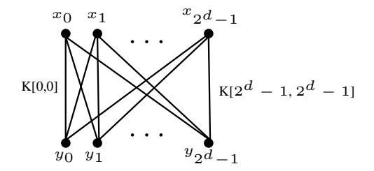

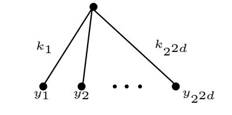

Fig. 1: Balanced biclique of dimension d

Fig. 2: Star: maximally unbalanced biclique of dimension d for the minimum data complexity

If we place the star at the beginning of the cipher, and let x be the plaintext (or ciphertext) - the data complexity of the MITM part of the key recovery will be exactly 1. Note that x can be any value and, thus, we deal with a known-plaintext key recovery here. The overall data complexity is solely defined by the unicity distance of the cipher and, therefore, minimal theoretically attainable.

## 3.1 Stars from independent differentials

Similar to balanced bicliques, stars can be constructed efficiently from independent sets of differentials. Unlike balanced bicliques, however, the necessary form of differentials is different. Suppose we have a set of  $2^d - 1$  distinct related-key  $\Delta$ -differentials from x to  $y_{i,j}$ :

$$(0, \Delta_i^K) \longmapsto \Delta_i$$

and a set of  $2^d-1$  distinct related-key  $\nabla$ -differentials from over the same part of the cipher:

$$(0, \nabla_j^K) \longmapsto \nabla_j.$$

We assume that the  $\Delta$ -differentials and  $\nabla$ -differentials do not share any active nonlinear components. If input x, output  $y_{0,0}$  and key K[0,0] conform to both  $\Delta$ - and  $\nabla$ -differentials, then the values

$$x,$$
 $y_{i,j} = y_{0,0} \oplus \Delta_i \oplus \nabla_j, \text{ and }$ 
 $K[i,j] = K[0,0] \oplus \Delta_i^K \oplus \nabla_j^K$ 

form a star of dimension d, with  $\Delta_0 = \nabla_0 = \Delta_0^K = \nabla_0^K = 0$ .

{5}------------------------------------------------

## 4 Minimum data complexity key recovery for AES

In this section, we apply this concept to demonstrate star-based independent-biclique key recoveries for the full AES-128, AES-192 and AES-256. The star-based biclique can be placed either at the initial rounds of AES or at the last few rounds of the same. We tested the attack complexity for both locations through our C-program and only report the best values for all the three AES variants in the subsequent writeup.

#### 4.1 AES-128

In AES-128, it is possible to construct a star of dimension 8 over the first round. The master key \$0, i.e., the first subkey is taken as the base key. The index i is placed in byte 0 whereas index j is placed in byte 1. The base keys are all 16-byte values with two bytes (i.e., bytes 0 and 1) fixed to 0 whereas the remaining 14-bytes take all possible values. Thus, the 128-bit key space is divided into  $2^{112}$  groups with  $2^{16}$  keys in each group.  $\Delta$ -trail activates byte 0 of key \$0 and  $\nabla$ -trail activates byte 1 of key \$0 (shown in Fig. 3(a)). Difference propagation in these differentials over one round is non-overlapping till the end of round 1. In state #3, there is a linear overlap between those and, already in round 2, one has to recompute 2 S-boxes for each key (shown in Fig. 3(a)). Rather surprisingly, even if the length of the star is just one round, the form of its trails is such that this short biclique still allows the adversary to obtain a reasonable computational advantage over brute force.

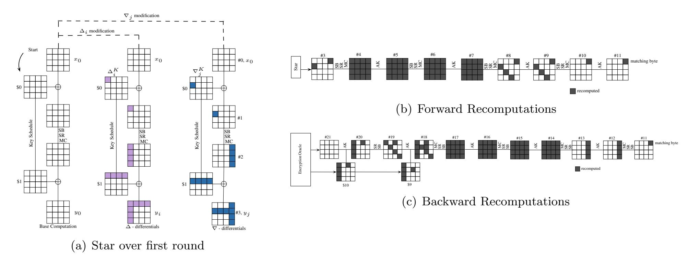

Fig. 3: Fastest biclique attack on AES-128 with minimum data: time  $2^{126.67}$  and data 1 or 2 ciphertexts.

In the forward direction of matching, starting in round 2, a part of the state has to be recomputed for each key. In round 2, only 2 S-boxes have to be recomputed. Starting in round 3 and forwards, the propagation affects the whole state (shown in Fig. 3(b)). In the backward direction of matching, one starts with the ciphertext obtained using the encryption oracle under the right key for plaintext x. The  $\Delta$ - and  $\nabla$ -propagations in the key schedule are such that only 5 bytes of the \$10 depend on both  $\Delta$  and  $\nabla$ . This means that only 5 S-boxes have to be recomputed in round 10. Starting in round 9 and backwards, the propagation affects the full state (as shown in Fig. 3(c)).

We match on byte 12 in state #11 of round 5, in which only one S-boxes need recomputation. In round 4 and round 6, only 4 S-boxes, respectively, are recomputed. The S-boxes in the four remaining rounds need to be recomputed completely (another 64 S-boxes). No S-box recomputations are needed in the key schedule. The full trail is shown in Fig. 15.

The whole process yields a recomputation of 80 out of 200 S-boxes. Thus,  $C_{recomp} \approx 2^{14.67}$  in one key group. About  $2^8$  keys will be suggested in each key group after the meet-in-the-middle filtering, thus  $C_{falsepos} = 2^8$ . The complexity of precomputations and star generation is upper-bounded by  $C_{precomput} \approx 2^{8.5}$  full AES computations. Thus,  $C_{full} \approx 2^{126.67}$ . The data complexity exactly corresponds to the

{6}------------------------------------------------

unicity distance of AES-128 – the minimal data complexity theoretically attainable. One known plaintext-ciphertext pair can sometimes be enough (with success probability of  $1/e \approx 0.3679$ ). Two known plaintext-ciphertext pairs yield a success probability of practically 1. The memory complexity is upper bounded by  $2^8$  computations of sub-cipher involved in the precomputation stage [6].

#### 4.2 AES-192

In AES-192, we construct a star of dimension 8 over the last 1.5 rounds (shown in Fig. 4(a)).  $\Delta$ -trail activates byte 0 of sub-key \$12 and  $\nabla$ -trail activates byte 2 of \$10 sub key. Non-overlapping trails cover rounds 11 and 12. We define the key groups with respect to the expanded key block  $K^7$  which consists of two right columns of \$10 (further denoted by  $10_R$ ) and \$11 subkeys. The index i is placed in bytes 0 and 4 whereas index j is put in bytes 2 and 6. The base key in each group is chosen such that the key coverage is complete and there are no intersections between the key groups. The base keys are all 24 -byte values with two bytes (i.e., bytes 0 and 2) fixed to 0 whereas the remaining 22-bytes taking all possible values. This yields a partition of AES-192 key space into  $2^{176}$  groups with  $2^{16}$  keys in each.

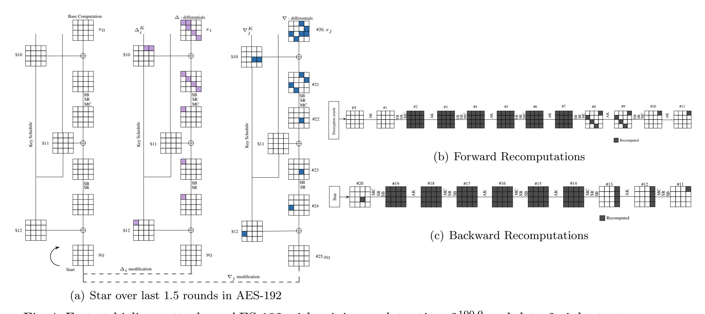

Fig. 4: Fastest biclique attack on AES-192 with minimum data: time  $2^{190.9}$  and data 2 ciphertexts.

In the matching phase we match on byte 12 in state #11. During the forward recomputations (in Fig. 4(b)), we start with plaintext obtained from ciphertext y using the decryption oracle under the right key. The  $\Delta$  and  $\nabla$  propagations in the key schedule are such that there are no overlapping bytes in \$0 which depend on both  $\Delta$  and  $\nabla$  trails. Hence, no recomputations are required in round 1, i.e., state #1. Starting from round 2, 16 + 16 + 16 + 4 = 52 S-boxes are required to be recomputed. Backward recomputations starting from round 10 require 16+16+16+4+1=53 S-boxes to be recomputed in Fig. 4(c). No recomputations in key schedule are required. Hence, a total of 105 out of 224 S-boxes are required for recomputation. Thus  $C_{recomp} \approx 2^{14.82}$ . The precomputations and star generation (based on S-box calculations) are upper bounded by  $C_{precomp} \approx 2^{8.5}$  full AES computations. Thus  $C_{full} \approx 2^{190.9}$ . Two ciphertexts are required to carry out the attack with a success probability of 1. The memory complexity stands at  $2^8$ . The full trail is shown in Fig. 16.

#### 4.3 AES-256

In AES-256, a star of dimension 8 over the last 1.5 rounds (shown in Fig. 5(a)) is constructed.  $\Delta$ -trail activates byte 0 of sub-key \$13 and  $\nabla$ -trail activates byte 5 of \$13 sub key. Non-overlapping trails cover

{7}------------------------------------------------

rounds 13 and 14. We define the key groups with respect to the expanded key block  $K^6$  which consists of \$13 and \$14 subkeys. The index i is placed in byte 16 and index j is put in byte 21. The base keys are all 32 -byte values with two bytes (i.e., bytes 16 and 21) fixed to 0 whereas the remaining 30-bytes taking all possible values. This yields a partition of AES-256 key space into  $2^{240}$  groups with  $2^{16}$  keys in each.

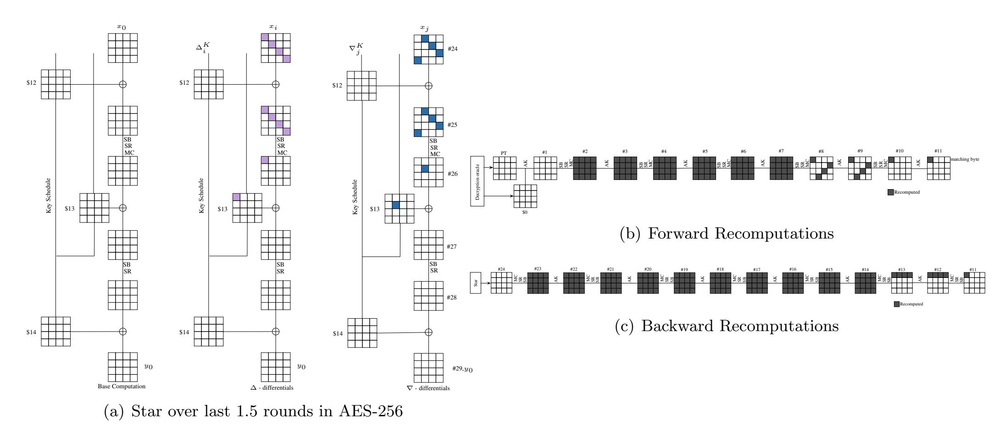

Fig. 5: Fastest biclique attack on AES-256 with minimum data: time  $2^{255}$  and data 2 or 3 ciphertexts.

In the matching phase, we match on byte 1 of state #11. 52 S-boxes (16+16+14+4) in the forward direction (shown in Fig. 5(b)) and 85 S-boxes (1+4+16+16+16+16+16) in the backward direction (Fig. 5(c)) are recomputed. Together with 1 S-box recomputation in key schedule, a total of 138 out of 276 S-boxes are recomputed. Thus,  $C_{full} \approx 2^{255}$ . Two known plaintext-ciphertext pair can sometimes be enough (with success probability of  $1/e \approx 0.3679$ ) whereas three known plaintext-ciphertext pairs yield a success probability of practically 1 with memory not more than  $2^8$  required. The full biclique trail is shown in Fig. 17.

# 5 A search technique for biclique attacks on AES

In this section, we describe how we enumerate all biclique key recoveries in a large promising class of biclique attacks.

#### 5.1 Enumerating bicliques

Clearly, going over all possible initial structures, even without enumerating possibilities for the actual key recovery, would be infeasible for the AES. So we have to confine the search space of attacks by imposing some limitations. We now describe our search strategy along with some justifications for our choices.

- First, we consider bicliques (complete bipartite graphs) as initial structures. We stress that we include both balanced bicliques and stars in our search.
- Second, we restrict the search to *independent-bicliques only*. This constraint excludes such bicliques as long-bicliques [6] and narrow-bicliques [19], which are especially challenging to enumerate. However, despite not being optimal in the number of rounds covered, it is the independent-bicliques that attain the highest advantages over brute force for full AES-128 and its variants so far.

{8}------------------------------------------------

- Third, we confine the search to independent related key-differentials that have a key state in their trails with exactly one or two [3](#page-8-0) or three active bytes [4](#page-8-1) . Note that these bytes do not have to be the bytes where the key difference is injected and the key difference can still be injected in multiple bytes. We also consider the special rules defined in [\[6\]](#page-17-1) for AES-192 as mentioned below and apply it to other AES variants also.
  - We test differential trails in which double byte differences (i1,i2) are injected in ∆ trail and single/double/triple byte differences are injected in ∇ trail. These (i1,i2) are all possible columns that have one zero byte after applying M ixColumns−1 , i.e.,

$$\begin{pmatrix} 0 \\ i_1 \\ i_2 \\ 0 \end{pmatrix} = MixColumns^{-1} \begin{pmatrix} * \\ i \\ * \\ 0 \end{pmatrix} or \begin{pmatrix} i_1 \\ i_2 \\ 0 \\ 0 \end{pmatrix} = MixColumns^{-1} \begin{pmatrix} i \\ * \\ 0 \\ * \end{pmatrix} or \begin{pmatrix} 0 \\ 0 \\ i_1 \\ i_2 \end{pmatrix} = MixColumns^{-1} \begin{pmatrix} 0 \\ * \\ i \\ * \end{pmatrix}.$$

• Similarly, we also test differential trails in which triple byte differences (i1,i2,,i3) are injected in ∆ trail such that all possible (i1,i2,i3) have two zero bytes after applying M ixColumns−1 , i.e.,

$$\begin{pmatrix} i_1 \\ i_2 \\ i_3 \\ 0 \end{pmatrix} = MixColumns^{-1} \begin{pmatrix} 0 \\ i \\ * \\ 0 \end{pmatrix} or \begin{pmatrix} 0 \\ i_1 \\ i_2 \\ i_3 \end{pmatrix} = MixColumns^{-1} \begin{pmatrix} 0 \\ 0 \\ i \\ * \end{pmatrix}.$$

– Finally, to keep the search space from exploding, we consider the trails of the bicliques in a truncated manner: We do not differentiate between the active values of the key modification trails in our bicliques (values of differences in the related-key differentials). In particular, it means that once activated, a difference in a byte of a trail cannot be cancelled out. This is a significant but necessary limitation since we believe it is infeasible to run the exhaustive search otherwise for excessively high computational complexities.

We implemented these restrictions in a C program and were able to successfully enumerate all the tight truncated independent balanced bicliques and stars of AES-128, AES-192 and AES-256.

## 5.2 Searching for key recoveries

Having enumerated all the bicliques as described above exhaustively, we apply meet-in-the-middle (MITM) technique to each of the initial structures obtained to evaluate their time and data complexities. This is done as follows.

First of all, we set the opimization goal as minimizing the time complexity for a given data complexity restriction. That is, in each search for a key recovery, we fix an upper bound on the data complexity. Then we perform the exhaustive search over all possibilities for matching. In terms of key enumeration, we impose the restriction that the forward and backward key modifications should have at least one state of linear intersection. This enables full key space coverage and success probability of 1. The MITM technique used includes partial matching (the matching is performed on a byte of the state to save computations) and the cut-and-splice technique (so that trails can go over the encryption/decryption oracles to win degrees of freedom).

To evaluate the time complexity of a key recovery attack efficiently on-the-fly, the computational model proposed in [\[6\]](#page-17-1) is used: All linear operations (AddRoundKey, ShiftRows, and MixColumns) are ignored and one counts only the number of required S-box computations. As an example, one full AES-128 evaluation requires 200 S-box computations – a metric that proved to be meaningful in practice [\[5\]](#page-17-12). Similarly, one complete evaluation of AES-192 and AES-256 corresponds to 224 and 276 S-boxes respectively. The time complexity is measured as the number of S-box computations that have to be performed

3 Such trails do not collapse into a single active byte in any of the key states.

4 Such trails do not collapse into a single active byte or two active bytes in any of the key states.

{9}------------------------------------------------

per key tested. Again, this is the parameter that has lead to the fastest attacks so far since it makes the key group larger and minimizes the impact of biclique construction on the total complexity.

Depending on the data complexity restriction, the program can find the optimal attack, i.e., the attack with the lowest measured time complexity under the data complexity restriction.

As a second optimization goal, we focus on minimizing the data complexity for a given time complexity. This second optimization is applied once the lowest computational complexity for recovering the key has been found in the previous step. At this point, we already know that there are no faster key recoveries in our search space. So we check if the data complexity of the fastest attack identified can be reduced. For this task, we fix the computational complexity to the value that we obtained in the previous step, and then among all the bicliques having that computational complexity, we search for the one that has the lowest data complexity. This task typically requires much less computations.

## 5.3 Applications to find attacks with minimal data and time complexities

We implemented our program to search for three data complexity restrictions:

- Minimum data complexity: The minimum data complexity attacks for AES-128/192/256 were discovered using this program by setting the upper bounds of the data complexity to its theoretical minimum of the unicity distance. So we can claim that this is the fastest biclique key recovery with the minimal data complexity of exactly the unicity distance in the class of bicliques covered by our program.
- Data complexity strictly lower than the full codebook: This restriction is a standard line that is informally drawn between interesting attacks – that require less than the full codebook of texts - and less interesting attacks – that can only work with the full codebook. It is found that the fastest biclique key recoveries in the covered class with these restrictions have lower computational complexities (for AES-256) and lower data complexities (for AES-128 and AES-192) as compared to the original attack.
- No data complexity constraint: The program finds the fastest biclique key recovery in the entire class of biclique attacks covered when there is no restriction on the amount of data required. This attack provides an important insight into the limits of the independent-biclique approach developed so far.

The fastest key recoveries corresponding to minimum data complexity for AES-128/192/256 are already discussed in Section [4.](#page-5-4) Rest of the above mentioned categories are analyzed for all AES variants and their details are covered in the subsequent sections.

# 6 Fastest biclique key recovery with less than the full codebook of data

In this section, we demonstrate the biclique key recoveries with optimal time complexity for the full AES-128, AES-192 and AES-256.

# 6.1 AES-128

This attack is based on a balanced biclique of dimension 8 over the last 2.5 rounds of AES-128 (shown in Fig. [6\(a\)\)](#page-10-2). The forward and backwards trails in the biclique have an intersection in byte 0 of \$8. However, this intersection is in a linear operation (xor) of the key schedule and does not affect the biclique property. The key is enumerated in \$9 which is the only key state that is linear in the key modification, both in forward and backward trails. The bytes of key enumeration with i and j differences are non-intersecting. The index i is placed in bytes 0,4,8, and 12 while index j is put in bytes 5 and 9. The 2112 base keys are all 16-byte values with two bytes (i.e., bytes 0 and 5) set to 0 whereas the remaining 14-bytes taking all possible values. This yields 216 keys in each group.

For key recovery, in the MITM stage, partial matching is done in byte 12 of data state #7 of round 4, where only one S-box needs recomputation. In round 3 and round 5, only 4 S-boxes, respectively and in round 7, only 8 S-boxes are recomputed. In round 1, 5 S-boxes are recomputed as the plaintext is 

{10}------------------------------------------------

influenced by 5 active bytes of the backward key modification through the key schedule. The S-boxes of rounds 2 and 6 have to be recomputed completely (as shown in Figs. 6(b) and 6(c)). In total, also counting the necessary recomputations in the key schedule, we arrive at 55 S-boxes that have to be recomputed for each key, resulting in  $C_{recomp} \approx 2^{14.14}$ . As in the previous attacks,  $C_{falsepos} \approx 2^8$  and  $C_{precomp} \approx 2^{8.5}$ . This yields  $C_{full} \approx 2^{126.16}$ . Furthermore, since  $\Delta_i^K(\$10_3) = \Delta_i^K(\$10_{11}) = \Delta_i^K(\$10_{15})$ , the ciphertext bytes  $C_3$ ,  $C_{11}$  and  $C_{15}$  are always equal. Hence, the data complexity is  $2^{64}$  chosen ciphertexts. As in all our attacks, the success probability is 1 and memory complexity is  $2^8$ . The full biclique trail is shown in Fig. 21.

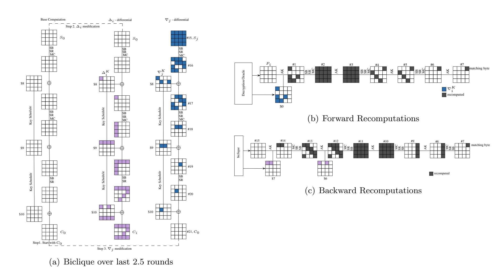

Fig. 6: Fastest biclique attack on AES-128 with less than full codebook: time  $2^{126.16}$  and data  $2^{64}$ .

#### 6.2 AES-192

This attack is based on a balanced biclique of dimension 8 over the last 3.5 rounds of AES-192 (Fig. 7(a)).  $\Delta$ -trail activates byte 1 of sub-key \$10 and  $\nabla$ -trail activates byte 8 of \$12 sub-key. Non-overlapping trails cover rounds 9 to round 12. We define the key groups with respect to the expanded key block  $K^7$  which consists of two right columns of \$10 (further denoted by  $10_R$ ) and \$11 subkeys. The index i is placed in bytes 17 and 21 whereas index j is put in bytes 8 and 12. The base keys are all 24 -byte values with two bytes (i.e., bytes 8 and 17) fixed to 0 whereas the remaining 22-bytes taking all possible values. This allows a partition of AES-192 key space into  $2^{176}$  groups with  $2^{16}$  keys in each. In the matching phase, 33 S-boxes in the forward direction (Fig. 7(b)) and 29 S-boxes in the backward direction (shown in Fig. 7(c)) are recomputed yielding a total of 62 out of 224 S-box recomputations. Thus,  $C_{full} \approx 2^{190.16}$ . The success probability of the attack is 1. Since  $\Delta_i^K(\$12_0) = \Delta_i^K(\$12_4) = \Delta_i^K(\$12_8)$ , the ciphertext bytes  $C_0$ ,  $C_4$  and  $C_8$  are always equal. Hence, the data complexity is  $2^{48}$  chosen ciphertexts with memory complexity being  $2^8$ . The full biclique trail is shown in Fig. 19.

## 6.3 AES-256

Through our automated program we detected certain discrepancies in the cost calculation in [6]. According to our calculations of the same, the computational complexity should be  $2^{254.52}$  (c.f.  $2^{254.42}$  in the original

{11}------------------------------------------------

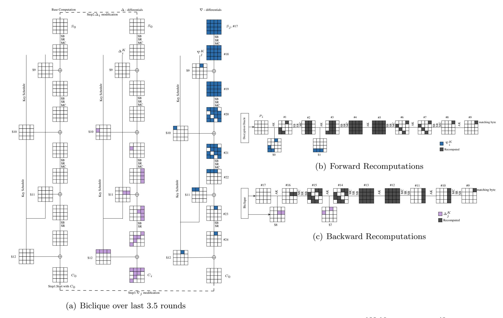

Fig. 7: Fastest biclique attack on AES-192 with less than full codebook: time  $2^{190.16}$  and data  $2^{48}$ .

attack). The details of the same are as follows. Firstly, in Fig. 12 in [6], \$0 and \$1 subkeys have been marked as \$1 and \$2 subkeys respectively. Secondly, the required S-box calculation is given as 5.4375 Sub-Bytes operations which is 87 S-boxes operations in [6] whereas it should be 6.3125 Sub-Bytes operation (101 S-boxes) i.e.,  $2^{14.5}$  runs of full AES-256 (as shown in Fig. 8). As a result, the full computational complexity should be  $2^{240} \times 2^{14.52} = 2^{254.52}$ . The data complexity does not exceed  $2^{40}$  queries.

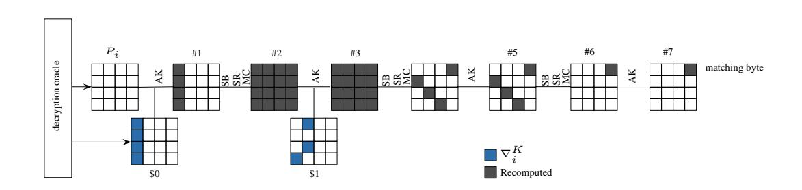

Fig. 8: Corrected AES-256 forward computation.

For the fastest biclique key recovery requiring less than full codebook of data, we could construct a balanced biclique of dimension 8 over the last 3.5 rounds (shown in Fig. 9(a)) with lesser number of S-boxes that need to be recomputed.  $\Delta$ -trail activates byte 13 of sub-key \$10 and  $\nabla$ -trail activates bytes 0 and 4 of \$13 sub key. Non-overlapping trails cover rounds 11 to 14. Key groups are defined with respect to the expanded key block  $K^6$  which consists of subkeys \$10 and \$11. The index i is placed in byte 13 whereas index j is put in bytes 16 and 24. The base keys are all 32-byte values with two bytes (i.e., bytes 13 and 24) fixed to 0 whereas the remaining 30-bytes taking all possible values. This allows a partition of AES-256 key space into  $2^{240}$  groups with  $2^{16}$  keys in each. In the matching phase, forward recomputations require 13 S-boxes (shown in Fig. 9(b)) and backward recomputations require 73 S-boxes (shown in Fig. 9(c)).

{12}------------------------------------------------

No recomputations in key schedule are required. Hence, matching yields a recomputation of total 86 out of 276 S-boxes. Thus  $C_{full}$  is  $\approx 2^{254.31}$ . The data complexity as defined by the form of the biclique is  $2^{64}$  with memory complexity being  $2^8$ . The full biclique trail is shown in Fig. 20.

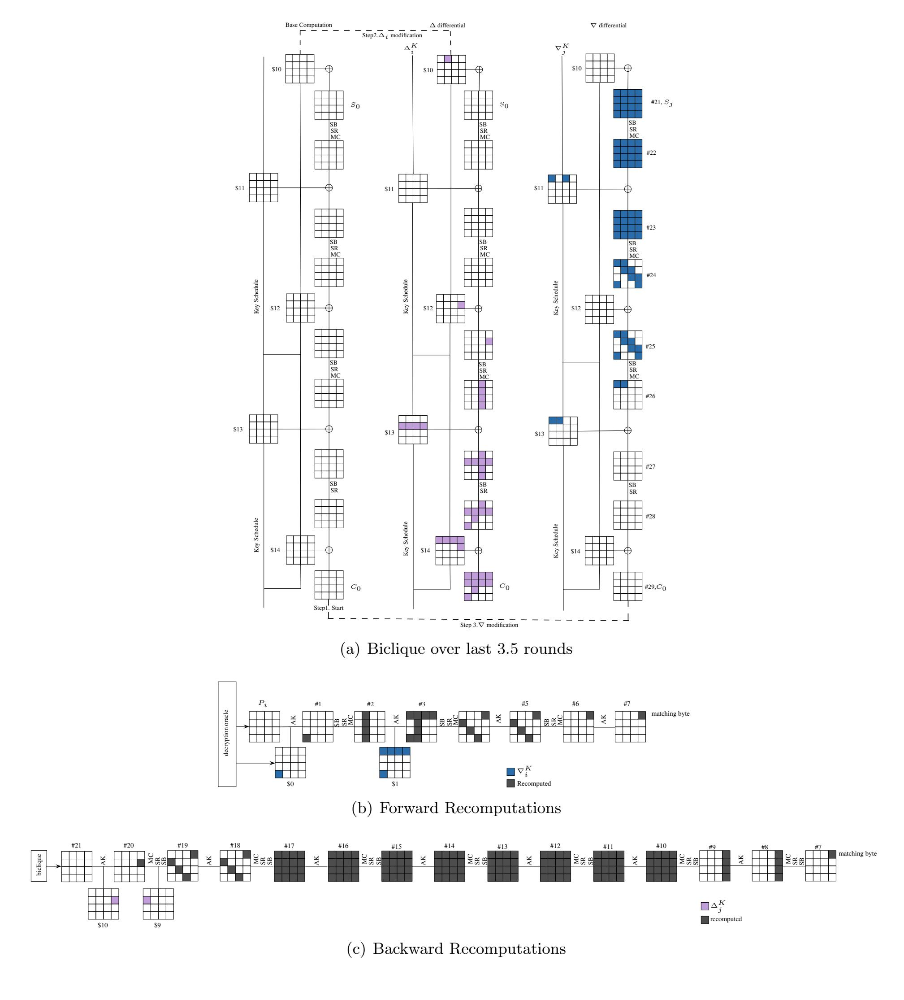

Fig. 9: Fastest biclique attack on AES-256 with less than full codebook: time  $2^{254.31}$  and data  $2^{64}$ .

# 7 Fastest biclique key recovery in AES with no restriction on data complexity

In this section, we demonstrate the fastest biclique key recovery attacks on the full AES-128, AES-192 and AES-256.

{13}------------------------------------------------

#### 7.1 AES-128

When we drop the constraint of data complexity being below the full codebook, we can construct a balanced biclique of dimension over 3 full AES-128 rounds and with the minimal recomputation of just one S-box in the fourth round, immediately after the biclique. The biclique is placed in rounds 2-4 which implies the data complexity of  $2^{128}$  for the backward trail (as shown in Fig. 10(a)). In the forward recomputation, 12 S-boxes are recomputed (as shown in Fig 10(b)) whereas in the backward direction, 25 S-boxes are recomputed (shown in Fig. 10(c)) yielding a total of 37 S-box recomputations. Thus,  $C_{full} \approx 2^{125.56}$ . The data complexity in this attack is the full codebook. The success probability is again 1 since key coverage is complete. The memory complexity stands at  $2^8$  memory blocks for precomputation stage. The full biclique trail is shown in Fig. 15.

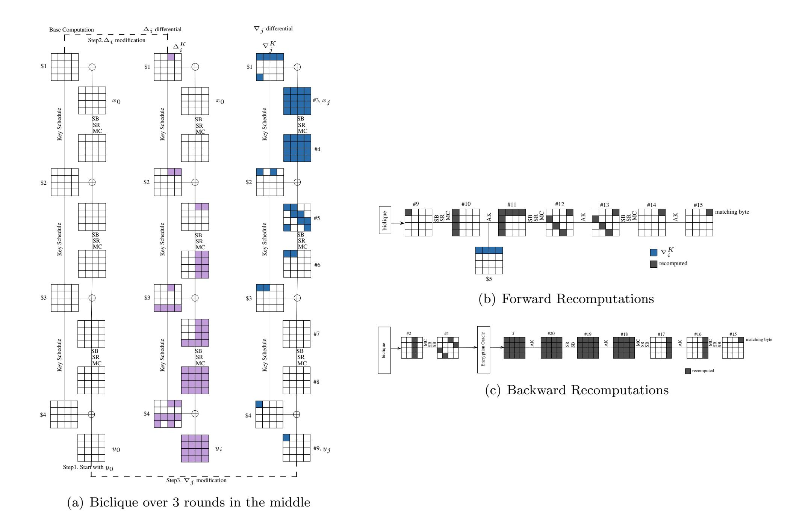

Fig. 10: Fastest biclique attack on AES-128: time  $2^{125.56}$  and data  $2^{128}$ . Here v represents the matching byte.

This key recovery can be converted into a preimage search for the compression function constituted by AES-128 in Davies-Meyer mode. Here the attack works offline and does not have to make any online queries. This preimage attack requires  $2^{125.35}$  AES-128 operations and finds a preimage with probability about 0.632. The generic preimage search would require  $2^{128}$  time to succeed with probability 0.632.

### 7.2 AES-192

For AES-192, we could construct a balanced biclique of dimension 8 over 5 full rounds. The biclique is placed in rounds 2-6 shown in Fig. 11(a).  $\Delta$ -trail activates byte 0 of sub-key \$3 and  $\nabla$ -trail activates byte 1 of \$6 sub key (shown in Fig. 22). In the matching phase, 10 S-boxes in the forward direction (Fig. 11(c)),

{14}------------------------------------------------

29 S-boxes in the backward direction (Fig. 11(b)) and 1 S-box in the key schedule are recomputed leading to a total of 40 out of 224 S-box recomputations. Hence  $C_{full} \approx 2^{189.51}$  with data complexity being  $2^{128}$  and memory complexity of  $2^8$ . This key recovery when converted into a preimage search for the compression function constituted by AES-192 in Davies-Meyer mode requires  $2^{125.51}$  AES-192 operations and finds a preimage with probability about 0.632.

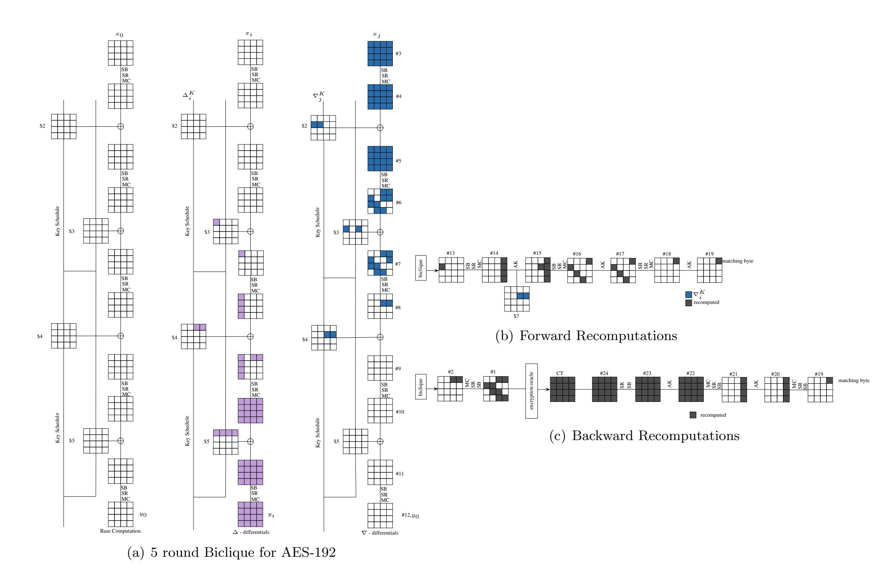

Fig. 11: Fastest biclique attack on AES-192: time 2189.51 and full codebook.

# 7.3 AES-256

For AES-256, we could construct a balanced biclique of dimension 8 over 5 full rounds. The biclique is placed in rounds 2-6 (shown in Fig. 12(a)).  $\Delta$ -trail activates byte 8 of sub-key \$1 and  $\nabla$ -trail activates byte 0 of \$6 sub key. In the matching phase, 25 S-boxes in the forward direction (shown in Fig. 12(c)) and 41 S-boxes in the backward direction (shown in Fig. 12(b)) are recomputed leading to a total of 66 out of 276 S-box recomputations. Hence  $C_{full} \approx 2^{253.87}$  with data complexity being  $2^{128}$ . This key recovery when converted into a preimage search for the compression function constituted by AES-256 in Davies-Meyer mode requires  $2^{125.93}$  AES-256 operations and finds a preimage with probability about 0.632.

{15}------------------------------------------------

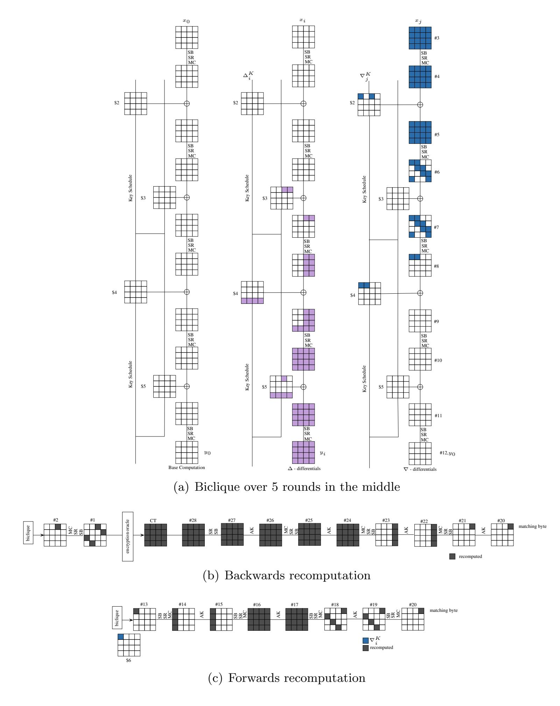

Fig. 12: Fastest biclique attack on AES-256: time  $2^{253.87}$  and full codebook.

# 8 Improving Biclique Attack Complexities on AES through Sieve-in-the-middle process

Sieve-in-the-middle process (SIM), proposed in Crypto 2013 by Canteaut et al. [9], is a variant of the meet-in-the-middle technique. This technique differs from the traditional meet-in-the-middle process in the sense that it searches for the existence of valid transitions through some middle S-box instead of matching at some intermediate state. Canteaut et al. presented analysis of sieve-in-the-middle process on many block ciphers including AES-128 and showed that for AES-128 there is a diminutive decrease in the total time complexity from  $2^{126.1}$  to  $2^{125.69}$ . The application of this technique essentially involves choosing a set of intermediate states which will form a super S-box. A look-up table for that super S-box (say SS), is then constructed where all its possible input-output transitions (i.e., x, y where y = SS(x)) are precomputed and stored. For each (K[i, 0], K[0, j]) pair, where K[i, 0] forms the forwards key and

{16}------------------------------------------------

K[0,j] forms the backwards key, input state x is calculated by forward computation and output state y is computed by backward computation. It is then checked through table lookup if a valid transition from  $x \mapsto y$  exists. If not, then the corresponding key pair is discarded and another (K[i,0],K[0,j]) pair is picked up for testing. The process iterates until a valid key pair is obtained. This saves the recomputation of S-boxes involved in the super S-box each time leading to a slight decrease in the overall cost complexity. 5

We illustrate the application of this process on AES-128. Let us consider the backward recomputations of AES-128 (as shown in Fig. 13) discussed in Section 4. In this case, let us further consider states #11 to #14 (as shown in Fig. 14). Here the states enclosed in the rectangle form the super S-box. This super S-box, i.e., SS (of size 32 x 32) consists of 4 S-boxes namely  $S_0$ ,  $S_1$ ,  $S_2$  and  $S_3$ . It can be seen in Fig. 14 that the super S-box is key dependent i.e., each 32-bit output of SS depends on 32-bit input and 32-bit key. Hence for each guess of the  $2^{32}$  values of key bits, a lookup table having  $2^{32}$  entries is constructed where all 32-bit input-output transitions:  $x \mapsto y$  are precomputed and stored. Thus, we have  $2^{32}$  such tables and total memory required to store these tables is  $2^{32} \times 2^{32} = 2^{64}$ .

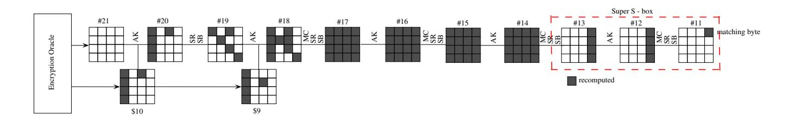

Fig. 13: Backward Recomputations in AES-128 in [6]

In the recomputation stage of biclique attack, S-boxes upto state just before state #11 are recomputed in the forward computation. In the backward computation, S-boxes upto state #14 are recomputed. For each biclique, it can be noted that the key part involved in the super S-box does not involve recomputation of any S-box. Hence, for each biclique group we will choose the table corresponding to the 32-bits of the base key involved in the Super S-box for that biclique. Through lookup table it is then checked if a valid transition from  $\#11_{12} \mapsto \#13_{12,13,14,15}$  exists. If such a transition exists, the corresponding (K[i,0], K[0,j]) key pair forms a valid candidate. Through this process, 5 S-boxes (i.e.,  $\#11_{12}, \#13_{12}, \#13_{13}, \#13_{14}, \#13_{15})$  need not be recomputed each time. Hence, instead of 80 S-boxes (calculated in 4), only 75 S-boxes need to be recomputed in all. This translates to a computational complexity of  $2^{126.59}$  instead of  $2^{126.67}$ . The same procedure can be applied to all other bicliques of AES-128, AES-192 and AES-256. However, as pointed out in [9], this attack is faster only in those platforms where lookup in a table of size  $2^{32}$  is faster than five S-box evaluations. The reduced complexities of the attacks for all the cases are described in Table 1.

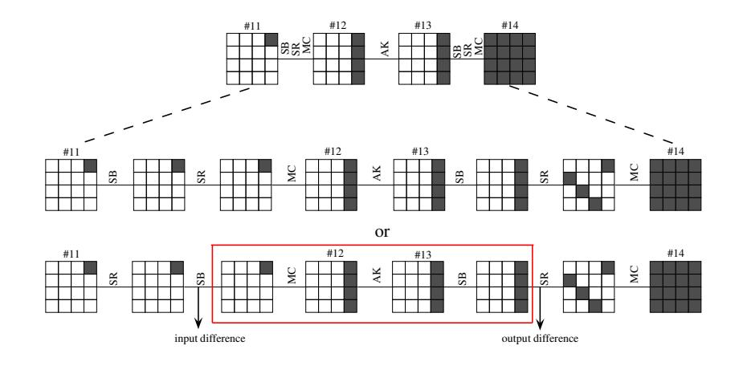

Fig. 14: Super S-box.

&lt;sup>5 Many a times, during forward and backward computations, instead of calculating whole of (x, y), partial intermediate states (u,v) where u is a m-bit  $(m \le |x|)$  part of x and v is a p-bit  $(p \le |y|)$  part of y respectively are computed. It is then checked if the given (u,v) pair forms a valid part of some (x, y) by table lookup [9].

&lt;sup>6 In [9], the attack complexity for AES-128 is mentioned as  $2^{125.69}$ , however we could not validate it. Our analysis estimates this complexity to be  $2^{125.98}$ 

{17}------------------------------------------------

# 9 Conclusions

In this paper, we explore the space of independent bicliques as applied to key recovery for the full AES-128, AES-192 and AES-256. We put some reasonable restrictions on the bicliques to make the search feasible. The class of bicliques analysed by a tool deveoped by us looks most promising in terms of cryptanalysis so far. In fact, the best key recoveries known so far for the full AES-128, AES- 192 and AES-256 belong to this class. Moreover, we utilize star structure (maximally unbalanced bicliques) to reduce the data complexity to the theoretically attainable minimum. We further note that the structure of the biclique is more important for the data complexity of the attack whereas the length of the biclique appears to be correlated with the computational complexity. We also propose biclique attacks which are fastest when there is no restriction on data complexity. We demonstrate that these attacks are the fastest among all independent-biclique attacks we study and might be considered as an indication of the limits beyond the current approaches to AES key recovery using bicliques.

# References

- 1. Farzaneh Abed, Christian Forler, Eik List, Stefan Lucks, and Jakob Wenzel. Biclique Cryptanalysis Of PRESENT, LED and KLEIN. Cryptology ePrint Archive, Report 2012/591, 2012. <http://eprint.iacr.org/2012/591>.
- 2. Farzaneh Abed, Christian Forler, Eik List, Stefan Lucks, and Jakob Wenzel. A Framework for Automated Independent-Biclique Cryptanalysis. In Shiho Moriai, editor, Fast Software Encryption - 20th International Workshop, FSE 2013, Singapore, March 11-13, 2013. Revised Selected Papers, volume 8424 of Lecture Notes in Computer Science, pages 561–581. Springer, 2013.
- 3. Kazumaro Aoki and Yu Sasaki. Preimage attacks on one-block md4, 63-step MD5 and more. In Roberto Maria Avanzi, Liam Keliher, and Francesco Sica, editors, Selected Areas in Cryptography, 15th International Workshop, SAC 2008, Sackville, New Brunswick, Canada, August 14-15, Revised Selected Papers, volume 5381 of Lecture Notes in Computer Science, pages 103–119. Springer, 2008.
- 4. Kazumaro Aoki and Yu Sasaki. Meet-in-the-middle preimage attacks against reduced SHA-0 and SHA-1. In Shai Halevi, editor, Advances in Cryptology - CRYPTO 2009, 29th Annual International Cryptology Conference, Santa Barbara, CA, USA, August 16-20, 2009. Proceedings, volume 5677 of Lecture Notes in Computer Science, pages 70–89. Springer, 2009.
- 5. Andrey Bogdanov, Elif Bilge Kavun, Christof Paar, Christian Rechberger, and Tolga Yalcin. Better than Brute-Force Optimized Hardware Architecture for Effcient Biclique Attacks on AES-128. In SHARCS'12 - Special-Purpose Hardware for Attacking Cryptographic Systems, March 2012, Washington D.C., USA, 2012.
- 6. Andrey Bogdanov, Dmitry Khovratovich, and Christian Rechberger. Biclique cryptanalysis of the full AES. In Dong Hoon Lee and Xiaoyun Wang, editors, Advances in Cryptology - ASIACRYPT 2011 - 17th International Conference on the Theory and Application of Cryptology and Information Security, Seoul, South Korea, December 4-8, 2011. Proceedings, volume 7073 of Lecture Notes in Computer Science, pages 344–371. Springer, 2011.
- 7. Andrey Bogdanov and Christian Rechberger. A 3-subset meet-in-the-middle attack: Cryptanalysis of the lightweight block cipher KTANTAN. In Alex Biryukov, Guang Gong, and Douglas R. Stinson, editors, Selected Areas in Cryptography - 17th International Workshop, SAC 2010, Waterloo, Ontario, Canada, August 12-13, 2010, Revised Selected Papers, volume 6544 of Lecture Notes in Computer Science, pages 229–240. Springer, 2010.
- 8. Charles Bouillaguet, Patrick Derbez, and Pierre-Alain Fouque. Automatic search of attacks on round-reduced AES and applications. In Phillip Rogaway, editor, Advances in Cryptology - CRYPTO 2011 - 31st Annual Cryptology Conference, Santa Barbara, CA, USA, August 14-18, 2011. Proceedings, volume 6841 of Lecture Notes in Computer Science, pages 169–187. Springer, 2011.
- 9. Anne Canteaut, Mar´ıa Naya-Plasencia, and Bastien Vayssi`ere. Sieve-in-the-Middle: Improved MITM Attacks (Full Version). Cryptology ePrint Archive, Report 2013/324, 2013. <http://eprint.iacr.org/2013/324>.
- 10. David Chaum and Jan-Hendrik Evertse. Crytanalysis of DES with a reduced number of rounds: Sequences of linear factors in block ciphers. In Hugh C. Williams, editor, Advances in Cryptology - CRYPTO '85, Santa Barbara, California, USA, August 18-22, 1985, Proceedings, volume 218 of Lecture Notes in Computer Science, pages 192–211. Springer, 1985.
- 11. Shao-zhen Chen and Tian-min Xu. Biclique Attack of the Full ARIA-256. Cryptology ePrint Archive, Report 2012/011, 2012. <http://eprint.iacr.org/2012/011>.
- 12. Mustafa C¸ oban, Ferhat Karako¸c, and Ozkan Boztas. Biclique cryptanalysis of TWINE. In Josef Pieprzyk, Ahmad-Reza ¨ Sadeghi, and Mark Manulis, editors, Cryptology and Network Security, 11th International Conference, CANS 2012, Darmstadt, Germany, December 12-14, 2012. Proceedings, volume 7712, pages 43–55. Springer, 2012.
- 13. Joan Daemen and Vincent Rijmen. The Design of Rijndael: AES - The Advanced Encryption Standard. Information Security and Cryptography. Springer, 2002.
- 14. Orr Dunkelman and Nathan Keller. The effects of the omission of last round's mixcolumns on AES. Inf. Process. Lett., 110(8-9):304–308, 2010.

{18}------------------------------------------------

- 15. Jian Guo, San Ling, Christian Rechberger, and Huaxiong Wang. Advanced meet-in-the-middle preimage attacks: First results on full tiger, and improved results on MD4 and SHA-2. In Masayuki Abe, editor, Advances in Cryptology - ASIACRYPT 2010 - 16th International Conference on the Theory and Application of Cryptology and Information Security, Singapore, December 5-9, 2010. Proceedings, volume 6477 of Lecture Notes in Computer Science, pages 56–75. Springer, 2010.
- 16. Deukjo Hong, Bonwook Koo, and Daesung Kwon. Biclique attack on the full HIGHT. In Howon Kim, editor, Information Security and Cryptology - ICISC 2011 - 14th International Conference, Seoul, Korea, November 30 - December 2, 2011. Revised Selected Papers, volume 7259 of Lecture Notes in Computer Science, pages 365–374. Springer, 2011.
- 17. Takanori Isobe. A single-key attack on the full GOST block cipher. In Antoine Joux, editor, Fast Software Encryption - 18th International Workshop, FSE 2011, Lyngby, Denmark, February 13-16, 2011, Revised Selected Papers, volume 6733 of Lecture Notes in Computer Science, pages 290–305. Springer, 2011.
- 18. Takanori Isobe and Kyoji Shibutani. Security Analysis of the Lightweight Block Ciphers XTEA, LED and Piccolo. In Willy Susilo, Yi Mu, and Jennifer Seberry, editors, Information Security and Privacy - 17th Australasian Conference, ACISP 2012, Wollongong, NSW, Australia, July 9-11, 2012. Proceedings, volume 7372 of Lecture Notes in Computer Science, pages 71–86. Springer, 2012.
- 19. Dmitry Khovratovich, Ga¨etan Leurent, and Christian Rechberger. Narrow-bicliques: Cryptanalysis of full IDEA. In David Pointcheval and Thomas Johansson, editors, Advances in Cryptology - EUROCRYPT 2012 - 31st Annual International Conference on the Theory and Applications of Cryptographic Techniques, Cambridge, UK, April 15-19, 2012. Proceedings, volume 7237 of Lecture Notes in Computer Science, pages 392–410. Springer, 2012.
- 20. Dmitry Khovratovich, Christian Rechberger, and Alexandra Savelieva. Bicliques for Preimages: Attacks on Skein-512 and the SHA-2 family. Cryptology ePrint Archive, Report 2011/286, 2011. <http://eprint.iacr.org/2011/286>.
- 21. Hamid Mala. Biclique Cryptanalysis of the Block Cipher SQUARE. Cryptology ePrint Archive, Report 2011/500, 2011. <http://eprint.iacr.org/2011/500>.
- 22. Yu Sasaki and Kazumaro Aoki. Finding preimages in full MD5 faster than exhaustive search. In Antoine Joux, editor, Advances in Cryptology - EUROCRYPT 2009, 28th Annual International Conference on the Theory and Applications of Cryptographic Techniques, Cologne, Germany, April 26-30, 2009. Proceedings, volume 5479 of Lecture Notes in Computer Science, pages 134–152. Springer, 2009.
- 23. Yanfeng Wang, Wenling Wu, and Xiaoli Yu. Biclique cryptanalysis of reduced-round piccolo block cipher. In Mark Dermot Ryan, Ben Smyth, and Guilin Wang, editors, Information Security Practice and Experience - 8th International Conference, ISPEC 2012, Hangzhou, China, April 9-12, 2012. Proceedings, volume 7232 of Lecture Notes in Computer Science, pages 337–352. Springer, 2012.

{19}------------------------------------------------

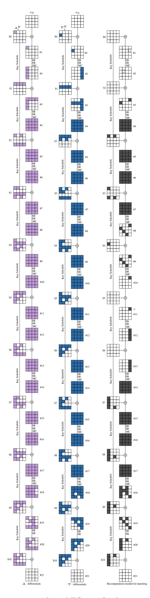

Fig. 15: Precomputations and Recomputations required in AES-128 for key recovery attack with lowest data complexity. The purple and blue colored boxes show the precomputations required in  $\Delta_i$  trail and  $\nabla_j$  trail respectively. The gray colored boxes show the recomputations required in  $\Delta_i \oplus \nabla_j$  for matching.

{20}------------------------------------------------

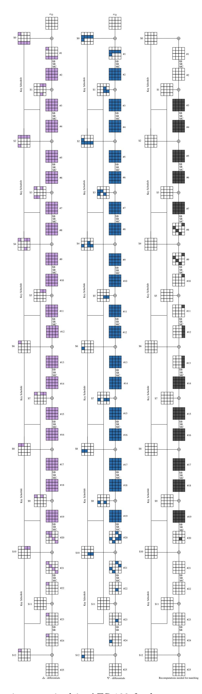

Fig. 16: Precomputations and Recomputations required in AES-192 for key recovery attack with lowest data complexity. The purple and blue colored boxes show the precomputations required in ∆i trail and ∇j trail respectively. The gray colored boxes show the recomputations required in ∆i ⊕ ∇j for matching.

{21}------------------------------------------------

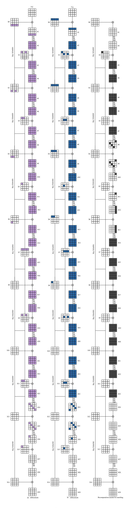

Fig. 17: Precomputations and Recomputations required in AES-256 for key recovery attack with lowest data complexity. The purple and blue colored boxes show the precomputations required in  $\Delta_i$  trail and  $\nabla_j$  trail respectively. The gray colored boxes show the recomputations required in  $\Delta_i \oplus \nabla_j$  for matching.

{22}------------------------------------------------

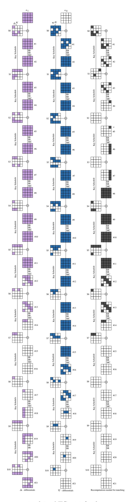

Fig. 18: Precomputations and Recomputations required in AES-128 for key recovery attack with optimal time complexity. The purple and blue colored boxes show the precomputations required in  $\Delta_i$  trail and  $\nabla_j$  trail respectively. The gray colored boxes show the recomputations required in  $\Delta_i \oplus \nabla_j$  for matching.

{23}------------------------------------------------

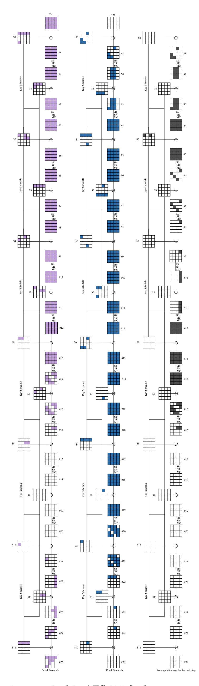

Fig. 19: Precomputations and Recomputations required in AES-192 for key recovery attack with optimal time complexity. The purple and blue colored boxes show the precomputations required in ∆i trail and ∇j trail respectively. The gray colored boxes show the recomputations required in ∆i ⊕ ∇j for matching.

{24}------------------------------------------------

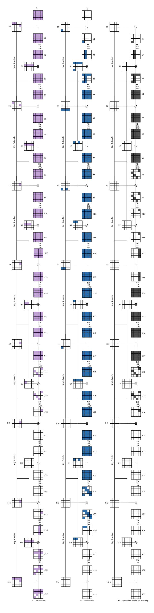

Fig. 20: Precomputations and Recomputations required in AES-256 for key recovery attack with optimal time complexity. The purple and blue colored boxes show the precomputations required in  $\Delta_i$  trail and  $\nabla_j$  trail respectively. The gray colored boxes show the recomputations required in  $\Delta_i \oplus \nabla_j$  for matching.

{25}------------------------------------------------

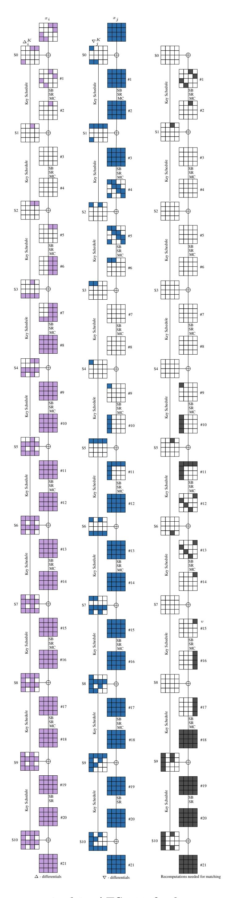

Fig. 21: Precomputations and Recomputations required in AES-128 for key recovery attack with lowest time complexity. The purple and blue colored boxes show the precomputations required in  $\Delta_i$  trail and  $\nabla_j$  trail respectively. The gray colored boxes show the recomputations required in  $\Delta_i \oplus \nabla_j$  for matching.

{26}------------------------------------------------

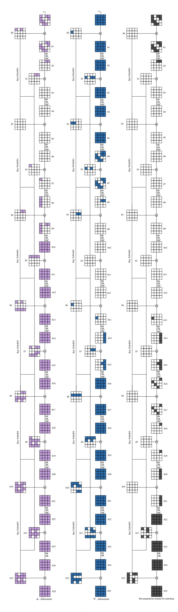

Fig. 22: Precomputations and Recomputations required in AES-192 for key recovery attack with lowest time complexity. The purple and blue colored boxes show the precomputations required in ∆i trail and ∇j trail respectively. The gray colored boxes show the recomputations required in ∆i ⊕ ∇j for matching.

{27}------------------------------------------------

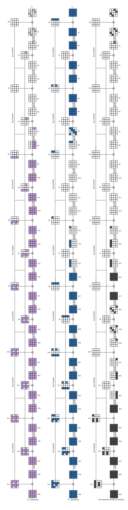

Fig. 23: Precomputations and Recomputations required in AES-256 for key recovery attack with lowest time complexity. The purple and blue colored boxes show the precomputations required in  $\Delta_i$  trail and  $\nabla_j$  trail respectively. The gray colored boxes show the recomputations required in  $\Delta_i \oplus \nabla_j$  for matching.