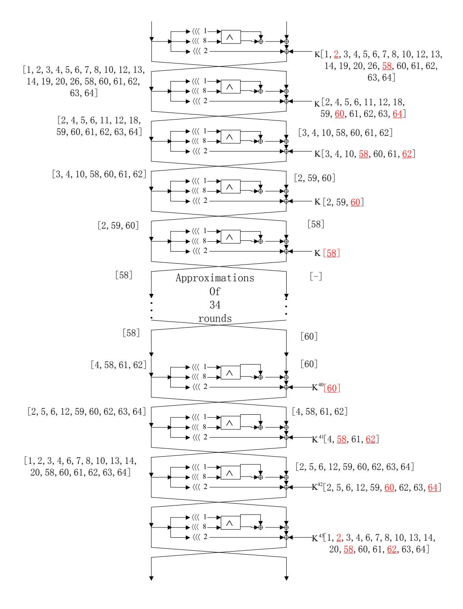
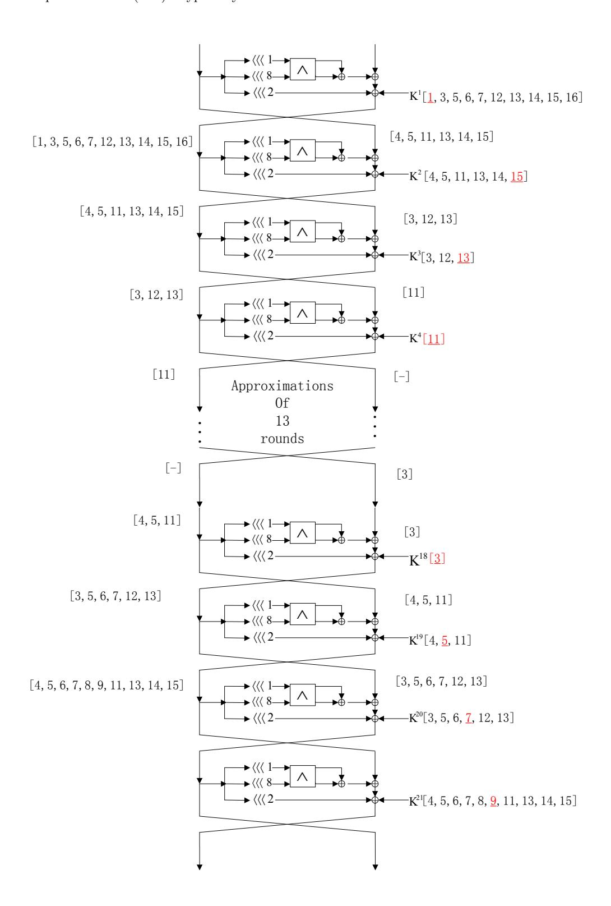
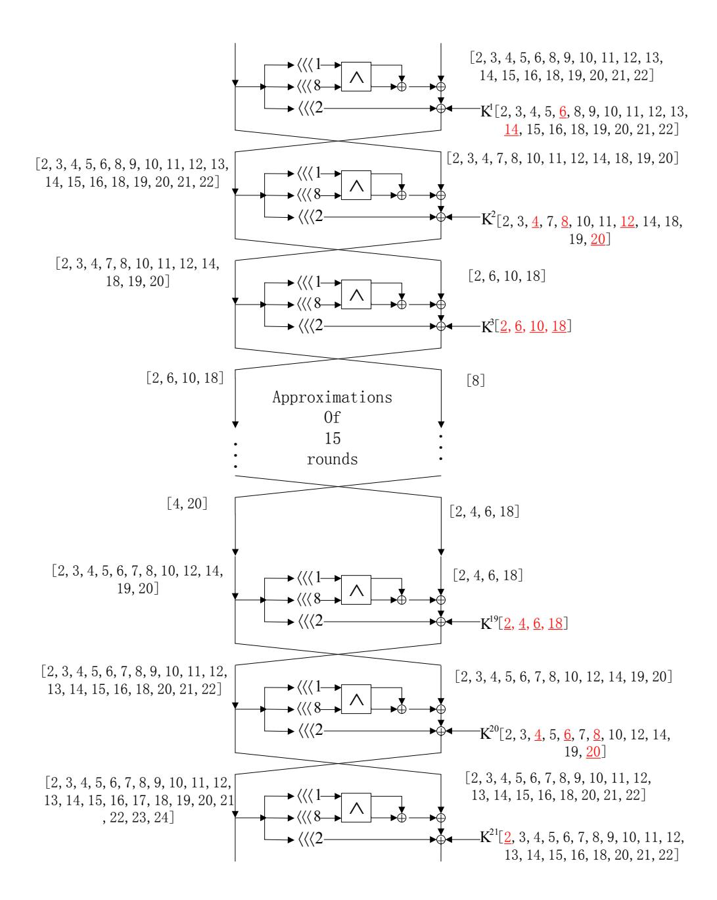
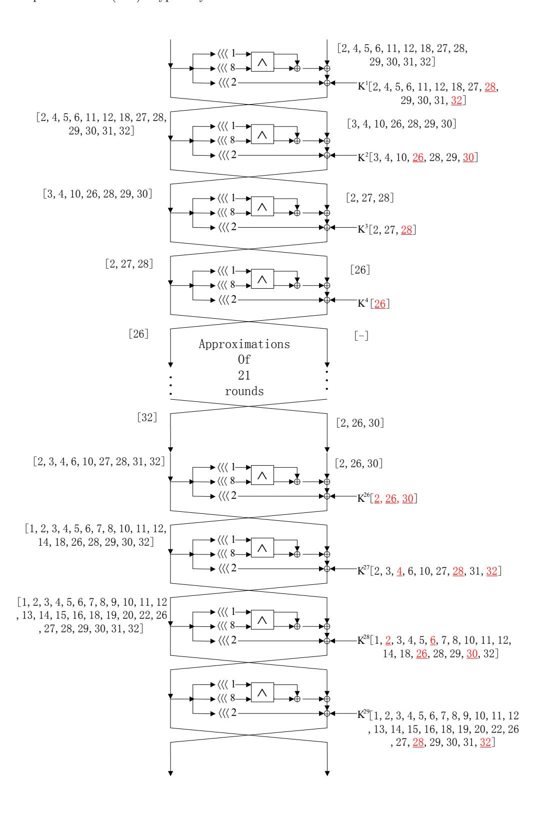

# Improved Linear (hull) Cryptanalysis of Round-reduced Versions of SIMON

Danping Shi1,2 , Lei Hu1,2? , Siwei Sun1,2 , Ling Song1,2 , Kexin Qiao1,2 , Xiaoshuang Ma1,2

1State Key Laboratory of Information Security, Institute of Information Engineering, Chinese Academy of Sciences, Beijing 100093, China 2Data Assurance and Communication Security Research Center, Chinese Academy of Sciences, Beijing 100093, China {dpshi, hu, swsun, lsong, kxqiao13, xshma13}@is.ac.cn

January 5, 2015

Abstract. SIMON is a family of lightweight block ciphers designed by the U.S. National Security Agency (NSA) that has attracted much attention since its publication in 2013. In this paper, we thoroughly investigate the properties of linear approximations of the bitwise AND operation with dependent input bits. By using a Mixed-integer Linear Programming based technique presented in Aasicrypt 2014 for automatic search for characteristics, we obtain improved linear characteristics for several versions of the SIMON family. Moreover, by employing a recently published method for automatic enumeration of differential and linear characteristics by Sun et. al., we present an improved linear hull analysis of some versions of the SIMON family, which are the best results for linear cryptanalysis of SIMON published so far.

Specifically, for SIMON128, where the number denotes the block length, a 34-round linear characteristic with correlation 2−61 is found, which is the longest linear characteristic that can be used in a keyrecovery attack for SIMON128 published so far. Besides, several linear hulls superior to the best ones known previously are presented as follows: linear hulls for the 13-round SIMON32 with potential 2 −28.99 versus previous 2−31.69, for the 15-round SIMON48 with potential 2 −42.28 versus previous 2−44.11 and linear hulls for the 21-round SIMON64 with potential 2 −60.72 versus previous 2−62.53 .

Keywords.SIMON, linear cryptanalysis, probability of success, linear hull, key recovery

# 1 Introduction

With the growing demands of ciphers for resource-constrained devices, secure lightweight ciphers with low cost have attracted many attentions in recent years. Many lightweight block ciphers are introduced these years, such as PRESENT [1], LBLOCK [2], LED [3], PRIDE [4] and so on.

SIMON is a family of lightweight block ciphers presented by the U.S. National Security Agency [5] in 2013 with a feistel structure of different versions of block and key lengths, which performs well in hardware and software implementations. By far, SIMON has attracted many cryptanalysis such as differential analysis [6–10], linear cryptanalysis [11, 12], impossible differential and zero-correlation linear hull cryptanalysis [11, 13].

We focus on the linear cryptanalysis in this paper. Linear cryptanalysis [14] presented by Matsui is an important cryptanalysis method on block ciphers. It aims at finding a linear expression involving bits of plaintexts, "ciphertexts" (including inner states) and subkeys that deviates from a random linear expression. A key recovery attack can then be launched due to this non-randomness. Linear expressions are usually obtained by linear characteristics that consists of masks for each round state and applies the piling-up lemma to concatenate. This method has been extended to linear hull cryptanalysis by Nyberg [15] in 1995 when several linear characteristics with same input and output masks are used. In paper [16, 17], multiple linear cryptanalysis is introduced to reduce the data complexities. But Murphy in paper [18] shows that the statistical assumptions used in paper [16, 17] may not hold. The problem about independence of approximations is solved in paper [19, 20]. After then multidimensional linear cryptanalysis is presented by Hermelin [21]. In 2008, Selcuk in paper [22] presents a ranking method of key candidates with a concept of advantage and a calculation of the success probability with data complexity of Matsui's Algorithm 2.

In this paper, we investigate linear characteristics with consideration of dependence of the S-boxes of the bitwise AND operation with dependent input bits. By the methods of automatic enumeration of differential and linear characteristics presented in [8, 9], some improved results about the linear (hull) cryptanalysis are obtained in this paper.

Specifically, the longest linear characteristic known previously for key recovery on SIMON128 shown in paper [12] is a 34-round linear characteristic with correlation 2−63 while we present one with correlation 2−61 in this paper. Furthermore, the latter can be used to attack SIMON by Matsui's Algorithm 2 with the complexity 2127 and probability of success 97% according to the calculating method in [22] with 8-bit advantage. Besides, for SIMON32 the best linear hull known previously is a 13-round one with potential 2 −31.69 in [12] while we give one with potential 2 −28.99 in this paper. Moreover, a 15-round linear hull for SIMON48 with potential 2 −42.28 is presented, whereas the 15-round linear hull with potential 2 −44.11 proposed in paper [12] was the previous best result for this version. We also find a 21-round linear hull with potential 2 −60.72 and a 22-round linear hull with potential 2 −63.83 for SIMON64. The previous best linear hull for SIMON64 is a 21-round linear hull with potential 2 −62.53 proposed in [12]. All these linear cryptanalysis of Matsui's Algorithm 2 in this paper has achieved probability of success 97% with 8-bit advantage and are best known results in linear cryptanalysis of SIMON. Besides, the 21-round linear hull can be extended to a longest 29-round attack on SIMON64/128. The previous best

Table 1. Summary on improvement of the best linear characteristic/hulls.

| Version  |    | ] Rounds Correlation Reference |            |
|----------|----|--------------------------------|------------|
| SIMON128 | 34 | −63 2                       | [12]       |
|          | 34 | −61 2                       | This paper |
| Version  |    | ] Rounds Potential             | Reference  |
| SIMON32  | 13 | −31.69 2                    | [12]       |
|          | 13 | −28.99 2                    | This paper |
| SIMON48  | 15 | −44.11 2                    | [12]       |
|          | 15 | −42.28 2                    | This paper |
|          | 21 | −62.53 2                    | [12]       |
| SIMON64  | 21 | −60.72 2                    | This paper |
|          | 22 | −63.83 2                    | This paper |

] Rounds: Number of rounds for linear characteristic/hulls.

Table 2. Versions of SIMON

| Block size (2n) Key size (mn) Total rounds |     |    |
|--------------------------------------------|-----|----|
| 32                                         | 64  | 32 |
| 48                                         | 72  | 36 |
|                                            | 96  | 36 |
| 64                                         | 96  | 42 |
|                                            | 128 | 44 |
| 96                                         | 96  | 52 |
|                                            | 144 | 54 |
|                                            | 128 | 68 |
| 128                                        | 192 | 69 |
|                                            | 256 | 72 |

cryptanalysis on this version is a 28-round differential cryptanalysis shown in paper [10, 12]. The results of the linear hulls are summarized in Table 1.

The paper is organized as follows. Section 2 gives a brief description of the block cipher SIMON. Section 3 presents a linear cryptanalysis as well as a linear characteristic/hull searching method on SIMON. The improved results with the linear (hull) cryptanalysis are given in Section 4. We finally conclude the paper in Section 5.

# 2 Brief description of SIMON

The SIMON2n/mn is a feistel structure block cipher with (2n)-bit block length and (mn)-bit key length, where n could be 16, 24, 32, 48, or 64 and m is required to be 2, 3, 4. All versions of SIMON with corresponding number of rounds are listed in Table 2. Before a further description of SIMON, we give the notations used in the paper.

#### 2.1 Notations

L r : left half n-bit input for the r-th round Rr : right half n-bit input for the r-th round  $K^r$ : subkey for the r-th round

X[j]: the  $(j \mod n)$ -th bit of X, where X[1] is the MSB of X

 $n_k$ : the length of the master key

 $X \ll i$ : left circular shift by i bits of X

 $\oplus$ : bitwise XOR  $\wedge$ : bitwise AND

### 2.2 Round function of SIMON

The round function of SIMON is shown as follows:

$$L^{r+1} = R^r \oplus K^r \oplus (L^r \lll 2) \oplus ((L^r \lll 1) \land (L^r \lll 8))$$

$$R^{r+1} = L^r$$

We only consider single key cryptanalysis in this paper and thus the key schedule is omitted here. More details on SIMON can be found in paper [5].

# 3 Linear cryptanalysis of SIMON

A linear approximation of bits in plaintexts, ciphertexts and subkeys is a Boolean function and we use correlation and bias to evaluate it. Let  $f: \mathbb{F}_2^n \to \mathbb{F}_2$  be a Boolean function. The correlation  $\epsilon_f$  of f is defined by

$$2^{-n} \cdot (\sharp \{x \in \mathbb{F}_2^n : f(x) = 0\} - \sharp \{x \in \mathbb{F}_2^n : f(x) = 1\})$$

and  $\delta_f = 1/2 \cdot \epsilon_f$  is denoted as the bias of f. We have  $\delta_f = 2^{-n}(\sharp(f(x) = 0)) - 1/2$ . The higher the magnitude of the correlation  $|\epsilon_f|$  is, the fewer plaintexts are needed in a linear attack.

Nyberg defined the *potential* of a linear hull with the input and output masks  $\alpha$  and  $\beta$  for a block cipher C = f(P, K) in [15] as follows:

$$ALH(\alpha, \beta) = \sum_{\gamma} (Pr(\alpha \cdot P + \beta \cdot C + \gamma \cdot K = 0) - 1/2)^{2}.$$
 (1)

Similarly, a linear hull with a higher potential value leads to a better linear attack as fewer plaintexts are required. To achieving probability of success 97% with 8-bit advantage, the data complexity of Matsui's Algorithm2 will be  $8 \cdot ALH^{-1}$  as shown in paper [22].

#### 3.1 Linear approximation of bitwise AND

We denote the non-linear layer in the round function of SIMON by

$$f^{N}(L^{r}) = (L^{r} \ll 1) \wedge (L^{r} \ll 8).$$

Regarding each bitwise  $\wedge$  as a  $2 \times 1$  S-box, the function  $f^N$  is composed of  $n \times 1$  S-boxes with inputs  $L^r[j+1]$  and  $L^r[j+8]$ , denoted by

$$f_j^N(L^r[j+1], L^r[j+8]) = L^r[j+1] \wedge L^r[j+8].$$

Consider the linear approximation of the function  $f_i^N$  with two input mask bits and one output mask bit. It is easily calculated that magnitude of the correlation of a linear approximation of a  $2 \times 1$  S-box is  $2^{-1}$  if it is with a non-zero output mask, is 0 if it is with the non-zero input mask and the zero output mask, and is 1 if it is with the all-zero input and output. Thus, the number of active S-boxes is the sum of the Hamming weights of output masks of the S-box layers for SIMON, where an active S-box means it is with a non-zero output mask.

### 3.2 Dependence of S-boxes

As shown in [9], the dependence of active S-boxes should be taken into consideration in linear cryptanalysis. Here we illustrate it by an example.

Let  $Y^r$  be the output value of the nonlinear function  $f^N$  in round r,  $I_1^r$  and  $I_8^r$  be the input masks and  $O^r$  the output mask. Suppose two S-boxes  $f_j^N$  and  $f_{j+7}^N$  are active in one round, we have a linear approximation

$$I_1^r[j] \cdot L^r[j+1] \oplus I_8^r[j] \cdot L^r[j+8] \oplus Y^r[j] \oplus I_1^r[j+7] \cdot L^r[j+8] \oplus I_8^r[j+7] \cdot L^r[j+15] \oplus Y^r[j+7]$$
(2)

with correlation 0 or  $\pm 2^{-1}$ , instead of  $\pm 2^{-2}$  by the piling-up lemma [14]. The invalid application of the piling-up lemma is due to the dependence of the two S-boxes, namely both of them take  $L^r[j+8]$  as input. We should take the dependence seriously as it may invalidate a linear characteristic by correlation 0. In the following, we scrutinize the relationship between the input variables of active S-boxes and the correlation of the corresponding expression.

Firstly, the input masks  $(I_1^r, I_8^r)$  of  $f^N$  determine whether the correlation of an approximation is zero or not. For non-zero cases, the output mask determines the absolute value of the correlation. This property comes from a fact on quadratic Boolean functions as follows.

Consider a Boolean function

$$f: \mathbb{F}_2 \times \mathbb{F}_2 \times \cdots \mathbb{F}_2 \to \mathbb{F}_2$$
$$(x_1, x_2, \cdots, x_n) \to L_x(x_1, x_2, \cdots, x_n) + B_x(x_1, x_2, \cdots, x_n),$$

where  $L_x(x_1, x_2, \dots, x_n)$  is linear and  $B_x(x_1, x_2, \dots, x_n)$  is sum of quadratic terms  $x_i \cdot x_j$  and  $x_i, x_j \in \mathbb{F}_2$ . A new quadratic form

$$g: \mathbb{F}_2 \times \mathbb{F}_2 \times \cdots \mathbb{F}_2 \to \mathbb{F}_2$$
$$(y_1, y_2, \cdots, y_n) \to L_y(y_1, y_2, \cdots, y_n) + B_y(y_1, y_2, \cdots, y_n),$$

retaining the same correlation is obtained from  $f(x_1, x_2, \dots, x_n)$  by a nonsingular linear transform y = A \* x, where  $L_y(y_1, y_2, \dots, y_n) = y_{j_1} + y_{j_2} + \dots + y_{j_t}$

and By(y1, y2, · · · , yn) = yi1 · yi2 + yi3 · yi4 + · · · + yi2s−1 · yi2s with all subscripts i1, i2, · · · , i2s not coincident. The absolute value of the correlation of the linear approximation of g is 0 if {j1, j2, · · · , jt} \ {i1, i2, · · · , i2s} is non-empty or 2−s if {j1, j2, · · · , jt} ⊆ {i1, i2, · · · , i2s}. In the latter case, therefore, less variables involved in quadratic terms result in greater absolute value of correlation.

The linear approximation of S-box layer in the r-th round of SIMON is

$$G: \mathbb{F}_2 \times \mathbb{F}_2 \times \dots \times \mathbb{F}_2 \to \mathbb{F}_2$$

 $(L^r[1], L^r[2], \dots, L^r[n]) \to L_G(L^r[1], L^r[2], \dots, L^r[n]) + B_G(L^r[1], L^r[2], \dots, L^r[n]),$

where

$$L_G(L^r[1], L^r[2], \dots, L^r[n]) = \sum_{j=1}^n (I_1^r[j] \cdot L^r[j+1] + I_8^r[j] \cdot L^r[j+8]),$$

$$B_G(L^r[1], L^r[2], \dots, L^r[n]) = \sum_{j=1}^n O^r[j] \cdot (L^r[j+1] \cdot L^r[j+8]).$$

and its correlation should be calculated following the above rules.

# 3.3 Description of automatic enumeration of characteristics with MILP

Automatic search of differential characteristic for bit-oriented block ciphers by Mixed-integer Linear Programming (MILP) modelling was investigated by Sun et al. [8], which is further extended to automatic search linear characteristic and linear hull in [9]. This kind of methods denotes each mask bit as a 0-1 variable and describes their propagation through the cipher as linear inequalities (constraints) subjected to which an optimized value of number of active S-boxes is returned. Specifically, the MILP model is as follows.

### Constraints for linear operation.

These three constraints for linear operation can be directly obtained from paper [9, ?].

1. For each bitwise XOR operation, (α1, α2) and β denote the input masks and output mask of ⊕. The constraints of these mask bits are:

$$\alpha_1 = \alpha_2 = \alpha_3. \tag{3}$$

2. For each branching in the cipher structure, let (α1, α2, α3) denote the masks on three branches. The constraints of the masks are:

$$\begin{cases}
\tau \ge \alpha_1, \tau \ge \alpha_2, \tau \ge \alpha_3; \\
\alpha_1 + \alpha_2 + \alpha_3 \ge 2\tau; \\
\alpha_1 + \alpha_2 + \alpha_3 \le 2.
\end{cases}$$
(4)

where τ is a dummy variable.

3. For operation of left circular shift by i bits, let µ = (µ[1], µ[2], · · · , µ[n]) and ν = (ν[1], ν[2], · · · , ν[n]) be the input and output masks. The constraints of the masks are:

$$\nu[j] = \mu[j+i], j \in \{1, 2, \cdots, n\}$$
 (5)

# Constraints for S-box.

The S-box in SIMON is bitwise AND and to get valid linear characteristics we only allow the active S-boxes with non-zero output masks and inactive S-boxes with all zero masks. This rule can be described as:

$$\begin{cases}
O^r[j] \ge I_1^r[j], \\
O^r[j] \ge I_8^r[j],
\end{cases}$$
(6)

where the symbols are as mentioned earlier. The constraint (6) also means that the output mask must be non-zero if the input mask is non-zero.

#### Constraints dealing with dependence of S-boxes.

As presented in Section 3.2, given the masks (I r 1 , Ir 8 ), Or for the S-box layer in one round, a smaller number of variables involved in quadratic terms leads to a bigger absolute value of the correlation of G. In this paper, we want to find the masks that lead to the least number of variables appearing in quadratic terms. To indicate the number of variables in quadratic terms of the linear approximation of f N , n new 0-1 variables V r [j] (j ∈ {1, 2, · · · , n}) indicating whether L r [j] exists in the quadratic terms are introduced in each round for SIMON. The constraints are

$$\begin{cases} V^{r}[j] \ge O^{r}[j-1], \\ V^{r}[j] \ge O^{r}[j-8], \\ V^{r}[j] \le O^{r}[j-1] + O^{r}[j-8]. \end{cases}$$
 (7)

Thus, Pn j=1 V r [j] is the number of variables appearing in quadratic terms of the

linear approximation for one round and P r Pn j=1 V r [j] is the number of variables appearing in the linear approximation of SIMON. Note that linear characteristics with the same number of active S-boxes may have different correlations due to different cases of dependence of active S-boxes.

#### Objective function.

To get the minimum number of linearly active S-boxes, the objective function is set to be the sum of all output mask bits of S-box layers in [9]. However, it is the correlation of the linear characteristics that determines the effectiveness of the linear cryptanalysis. Therefore, considering the influence of the dependence of active S-boxes on correlation, we set the objective function to be P r Pn j=1 V r [j].

With the constraints and the objective function defined above, we try to find better linear characteristics and linear hulls for SIMON with Gurobi, a solver for MILP models. The linear characteristics found may has correlation value 0 due to the dependence of active S-boxes. It is imperative to test whether the linear characteristic has correlation 0.

### Constraints for linear hulls.

To get linear hulls, we set the input and output mask bits as the ones in a known linear characteristic and get an amount of linear characteristics that form a linear hull.

# 4 Results

For each linear characteristic, we obtain the accurate absolute value of the correlation of the linear approximation for each round by nonsingular transform method shown in Section 3.2. After getting the correlation in each round, apply the piling-up lemma to obtain the absolute value of the correlation of the whole cipher since S-boxes from different rounds can be seen as independent ones with the effect of round keys. The results are as follows.

### 4.1 Linear characteristic

Experiments have been done on SIMON128. A 34-round linear characteristic of SIMON128 with bias 2−62 for a key recovery attack has been found. To the best of our knowledge, the best 34-round characteristic of SIMON128 known previously is presented in [12] and has the bias 2−64. What is more, all active S-boxes in this characteristic are independent according to our test. Besides, this characteristic of SIMON128 with bias 2−62 is the linear characteristic that covers most rounds and simultaneously meets the condition of δ ≥ 2 −n+2, which indicates that the probability of success for key recovery is 0.997 [22]. The previous best result that satisfies the condition is a 33-round characteristic with bias 2 −60 in [12]. The linear mask (separated into left and right parts) is presented in Tables 5 and Table 6 in Appendix.

Our characteristic can be used to attack 36-round SIMON128 with data complexity 2124 and time complexity 2124 by Matsui's algorithm 1 [14], and can be further extended to attack 43 rounds with data complexity 2127 with probability of success 0.997 by Matsui's algorithm 2 [14, 22]. The latter is demonstrated in Figure 1 where the 60 bits of subkeys numbered in black need to be guessed and the red font with underline ones not.

For SIMON64, a 18-round linear characteristic with bias 2−32 is listed in Table 7 in Appendix. The longest linear characteristic known previously with absolute value of bias no less than 2−32 is a 17-round linear characteristic with bias 2−29 presented in [12]. The comparison between our results and the results presented in [12] is in Table 3. Characteristics for SIMON32, SIMON48 are listed in Tables 8-9 in Appendix.

### 4.2 Linear hull

By setting the input and output masks same as the characteristic in Table 8 with an added constraint P r Pn j=1 V r [j] ≤ 48, we find a 13-round linear hull with

 ${\bf Fig.\,1.}$  Linear cryptanalysis of SIMON128/192

Table 3. The comparison between this paper and others.

|  | Version  |    |          | ] Rounds Bias Reference |
|--|----------|----|----------|-------------------------|
|  | SIMON64  | 17 | −29 2 | [12]                    |
|  |          | 18 | 2        | −32 This paper          |
|  | SIMON128 | 34 | −64 2 | [12]                    |
|  |          | 34 | 2        | −62 This paper          |

] Rounds: Number of rounds for linear characteristic.

potential 2 −28.99 for SIMON32. To our knowledge, the best previously found linear hull for SIMON32 was a 13-round linear hull presented in paper [12] with potential 2 −31.69. Actually, 412206 linear characteristics are returned in our model, among which only 196474 have non-zero correlation while others are zero due to the dependence of active S-boxes. Dependence of active S-boxes also exerts influence on valid characteristics. For example, the linear characteristic presented in Table 8 is with correlation 2−18 but with 19 active S-boxes. Further, this linear hull can be used to attack 21 rounds for SIMON32/64 as Figure 2 shows with success probability 97%. The number of the bits guessed for the key is 32.

A 15-round linear hull with potential 2 −42.28 for SIMON48 is obtained by setting input and output masks same as the characteristic shown in Table 9, with an additional constraint P r Pn j=1 V r [j] ≤ 59. As we know, the best previously found linear hull for SIMON48 was a 15-round linear hull presented in paper [12] with potential 2 −44.11. Actually, 50432 linear characteristics are returned among which only 43524 are valid. This linear hull can be used to attack 21 rounds for SIMON48/96 with success probability 97% as Figure 3 shows. The number of the bits guessed for the key is 51.

A 21-round linear hull with potential 2 −60.72 for SIMON64 is obtained whereas the previous best linear hull for this version is a 21-round linear characteristic with potential 2 −62.53 [12]. Among the 115199 linear characteristics found with additional constraint P r Pn j=1 V r [j] ≤ 78, 63996 have non-zero bias. This linear hull can be used to attack 29 rounds for SIMON64/128 demonstrated in Figure 4 achieving success probability 97%. The number of the guessed bits of key is 63. The masks listed in Table 10 in Appendix is a linear characteristic with bias 2−36. Besides, a 22-round linear hull with potential 2 −63.83 for SIMON64 is found in this paper, with the input and output masks same with the linear characteristic listed in Table 11 in Appendix.

Summary of the results about linear hulls in this paper is presented in Table 4.

 $\bf Fig.\,2.$  Linear hull cryptanalysis of SIMON32/62

Fig. 3. Linear hull cryptanalysis of SIMON48/96

 $\textbf{Fig. 4.} \ \text{Linear hull cryptanalysis of SIMON} \\ 64/128$

Version ] Rounds potential ] Returned ] Valid ] Attacked Reference SIMON32/64 13 2 −31.69 - - 20 [12] 13 2 −28.99 412206 196474 21 This paper SIMON48/96 15 2 −44.11 - - 20 [12] 15 2 −42.28 50432 43524 21 This paper SIMON64/128 21 2 −62.53 - - 28 [12] 21 2 −60.72 115199 63996 29 This paper 22 2 −63.83 52840 28590 This paper

Table 4. Summary of results with linear hull.

] Rounds: Number of rounds for linear hull, ] Returned: Number of characteristics returned by the model, ] Valid: Number of characteristics with non-zero correlation, ] Attacked: Number of attacked rounds.

# 5 Conclusion

In this paper, we considered the dependence of S-boxes in the evaluation of correlation of a linear approximation. With a method for automatic enumeration of the differential and linear characteristic, improved results on the linear (hull) cryptanalysis on SIMON were obtained. Simply, the 34-round linear characteristic with correlation 2−61 on SIMON128 presented in this paper is the best linear characteristic as we know. Besides, a 13-round linear hull with potential 2 −28.99 for SIMON32, a 15-round linear hull with potential 2 −42.28 for SIMON48, a 21 round linear hull with potential 2 −60.72 and a 22-round linear hull with potential 2 −63.83 for SIMON64 were presented in this paper. All the results of linear cryptanalysis are best. And the 21-round linear hull for SIMON64 can be extended to the longest cryptanalysis of SIMON64.

# References

- 1. Bogdanov A, Knudsen L R, Leander G, et al. PRESENT: An ultra-lightweight block cipher. Springer Berlin Heidelberg, 2007:450-466.
- 2. Wu W, Zhang L. LBlock: a lightweight block cipher. Applied Cryptography and Network Security. Springer Berlin Heidelberg, 2011: 327-344.
- 3. Guo J, Peyrin T, Poschmann A, et al. The LED block cipher. Cryptographic Hardware and Embedded SystemsCCHES 2011. Springer Berlin Heidelberg, 2011: 326-341.
- 4. Albrecht M R, Driessen B, Kavun E B, et al. Block CiphersCFocus on the Linear Layer (feat. PRIDE). Advances in CryptologyCCRYPTO 2014. Springer Berlin Heidelberg, 2014: 57-76.
- 5. Beaulieu R, Shors D, Smith J, et al. The SIMON and SPECK Families of Lightweight Block Ciphers. IACR Cryptology ePrint Archive, Report 2013/404, 2013.
- 6. Abed F, List E, Wenzel J, et al. Differential Cryptanalysis of round-reduced Simon and Speck. Preproceedings of Fast Software Encryption (FSE 2014)(2014, to appear), 2014.
- 7. Biryukov A, Roy A, Velichkov V. Differential analysis of block ciphers SIMON and SPECK. International Workshop on Fast Software Encryption-FSE. 2014.

- 8. Sun S, Hu L, Wang P, et al. Automatic security evaluation and (related-key) differential characteristic search: Application to simon, present, lblock, des (l) and other bit-oriented block ciphers. Advances in Cryptology-ASIACRYPT 2014. Springer Berlin Heidelberg, 2014: 158-178.
- 9. Sun S, Hu L, Wang M, et al. Automatic Enumeration of (Related-key) Differential and Linear Characteristics with Predefined Properties and Its Applications. Cryptology ePrint Archive, Report 2014/747, 2014.
- 10. Wang N, Wang X, Jia K, et al. Improved differential attacks on reduced SIMON versions. Cryptology ePrint Archive, Report 2014/448, 2014.
- 11. Alizadeh J, Alkhzaimi H A, Aref M R, et al. Cryptanalysis of SIMON Variants with Connections. Radio Frequency Identification: Security and Privacy Issues. Springer International Publishing, 2014: 90-107.
- 12. Alizadeh J, Alkhzaimi H A, Aref M R, et al. Improved linear cryptanalysis of round reduced SIMON. IACR Cryptology ePrint Archive, Reprot 2014/681, 2014.
- 13. Wang Q, Liu Z, Varici K, et al. Cryptanalysis of Reduced-round SIMON32 and SI-MON48. Progress in Cryptology–INDOCRYPT 2014. Springer International Publishing, 2014: 143-160.
- 14. Matsui M. Linear cryptanalysis method for DES cipher. Advances in CryptologyEUROCRYPT93. Springer Berlin Heidelberg, 1994: 386-397.
- 15. Nyberg K. Linear approximation of block ciphers. Advances in CryptologyEURO-CRYPT'94. Springer Berlin Heidelberg, 1995: 439-444.
- 16. Kaliski Jr B S, Robshaw M J B. Linear cryptanalysis using multiple approximations. Advances in CryptologyCrypto94. Springer Berlin Heidelberg, 1994: 26-39.
- 17. Biryukov A, De Canniere C, Quisquater M. On multiple linear approximations. Advances in CryptologyCCRYPTO 2004. Springer Berlin Heidelberg, 2004: 1-22.
- 18. Murphy S. The independence of linear approximations in symmetric cryptanalysis. IEEE Transactions on Information Theory, 2006, 52(12): 5510-5518.
- 19. Baigneres T, Junod P, Vaudenay S. How far can we go beyond linear cryptanalysis. Advances in Cryptology-Asiacrypt 2004. Springer Berlin Heidelberg, 2004: 432-450.
- 20. Baigneres T, Vaudenay S. The complexity of distinguishing distributions (Invited talk). Information Theoretic Security. Springer Berlin Heidelberg, 2008: 210-222.
- 21. Hermelin M, Cho J Y, Nyberg K. Multidimensional linear cryptanalysis of reduced round Serpent. Information Security and Privacy. Springer Berlin Heidelberg, 2008: 203-215.
- 22. Selcuk A A. On probability of success in linear and differential cryptanalysis. Journal of Cryptology, 2008, 21(1): 131-147.
- 23. Bogdanov A, Rijmen V. Linear hulls with correlation zero and linear cryptanalysis of block ciphers. Designs, codes and cryptography, 2014, 70(3): 369-383.

# 6 Appendix

Table 5. The left mask of 34-round linear characteristic for SIMON128

| Rounds | The input linear mask of the left half                           |
|--------|------------------------------------------------------------------|
| 0      | 0000000000000000000000000000000000000000000000000000000001000000 |
| 1      | 0000000000000000000000000000000000000000000000000000000000000000 |
| 2      | 0000000000000000000000000000000000000000000000000000000001000000 |
| 3      | 0000000000000000000000000000000000000000000000000000000000010000 |
| 4      | 0000000000000000000000000000000000000000000000000000000001000100 |
| 5      | 0000000000000000000000000000000000000000000000000000000000000001 |
| 6      | 0100000000000000000000000000000000000000000000000000000001000100 |
| 7      | 0001000000000000000000000000000000000000000000000000000000010000 |
| 8      | 0100110000000000000000000000000000000000000000000000000001000000 |
| 9      | 0110000100000000000000000000000000000000000000000000000000000000 |
| 10     | 0100010000000000000000000000000000000000000000000000000001000000 |
| 11     | 0001000000000000000000000000000000000000000000000000000000010000 |
| 12     | 0100000000000000000000000000000000000000000000000000000001000100 |
| 13     | 0000000000000000000000000000000000000000000000000000000000000001 |
| 14     | 0000000000000000000000000000000000000000000000000000000001000100 |
| 15     | 0000000000000000000000000000000000000000000000000000000000010000 |
| 16     | 0000000000000000000000000000000000000000000000000000000001000000 |
| 17     | 0000000000000000000000000000000000000000000000000000000000000000 |
| 18     | 0000000000000000000000000000000000000000000000000000000001000000 |
| 19     | 0000000000000000000000000000000000000000000000000000000000010000 |
| 20     | 0000000000000000000000000000000000000000000000000000000001000100 |
| 21     | 0000000000000000000000000000000000000000000000000000000000000001 |
| 22     | 0100000000000000000000000000000000000000000000000000000001000100 |
| 23     | 0001000000000000000000000000000000000000000000000000000000010000 |
| 24     | 0100010000000000000000000000000000000000000000000000000001000000 |
| 25     | 0110000100000000000000000000000000000000000000000000000000000000 |
| 26     | 0100110000000000000000000000000000000000000000000000000001000000 |
| 27     | 0001000000000000000000000000000000000000000000000000000000010000 |
| 28     | 0100000000000000000000000000000000000000000000000000000001000100 |
| 29     | 0000000000000000000000000000000000000000000000000000000000000001 |
| 30     | 0000000000000000000000000000000000000000000000000000000001000100 |
| 31     | 0000000000000000000000000000000000000000000000000000000000010000 |
| 32     | 0000000000000000000000000000000000000000000000000000000001000000 |
| 33     | 0000000000000000000000000000000000000000000000000000000000000000 |
| 34     | 0000000000000000000000000000000000000000000000000000000001000000 |

Table 6. The right mask of 34-round linear characteristic for SIMON128

| Rounds | The input linear mask of the right half                          |
|--------|------------------------------------------------------------------|
| 0      | 0000000000000000000000000000000000000000000000000000000000000000 |
| 1      | 0000000000000000000000000000000000000000000000000000000001000000 |
| 2      | 0000000000000000000000000000000000000000000000000000000000010000 |
| 3      | 0000000000000000000000000000000000000000000000000000000001000100 |
| 4      | 0000000000000000000000000000000000000000000000000000000000000001 |
| 5      | 0100000000000000000000000000000000000000000000000000000001000100 |
| 6      | 0001000000000000000000000000000000000000000000000000000000010000 |
| 7      | 0100110000000000000000000000000000000000000000000000000001000000 |
| 8      | 0110000100000000000000000000000000000000000000000000000000000000 |
| 9      | 0100010000000000000000000000000000000000000000000000000001000000 |
| 10     | 0001000000000000000000000000000000000000000000000000000000010000 |
| 11     | 0100000000000000000000000000000000000000000000000000000001000100 |
| 12     | 0000000000000000000000000000000000000000000000000000000000000001 |
| 13     | 0000000000000000000000000000000000000000000000000000000001000100 |
| 14     | 0000000000000000000000000000000000000000000000000000000000010000 |
| 15     | 0000000000000000000000000000000000000000000000000000000001000000 |
| 16     | 0000000000000000000000000000000000000000000000000000000000000000 |
| 17     | 0000000000000000000000000000000000000000000000000000000001000000 |
| 18     | 0000000000000000000000000000000000000000000000000000000000010000 |
| 19     | 0000000000000000000000000000000000000000000000000000000001000100 |
| 20     | 0000000000000000000000000000000000000000000000000000000000000001 |
| 21     | 0100000000000000000000000000000000000000000000000000000001000100 |
| 22     | 0001000000000000000000000000000000000000000000000000000000010000 |
| 23     | 0100010000000000000000000000000000000000000000000000000001000000 |
| 24     | 0110000100000000000000000000000000000000000000000000000000000000 |
| 25     | 0100110000000000000000000000000000000000000000000000000001000000 |
| 26     | 0001000000000000000000000000000000000000000000000000000000010000 |
| 27     | 0100000000000000000000000000000000000000000000000000000001000100 |
| 28     | 0000000000000000000000000000000000000000000000000000000000000001 |
| 29     | 0000000000000000000000000000000000000000000000000000000001000100 |
| 30     | 0000000000000000000000000000000000000000000000000000000000010000 |
| 31     | 0000000000000000000000000000000000000000000000000000000001000000 |
| 32     | 0000000000000000000000000000000000000000000000000000000000000000 |
| 33     | 0000000000000000000000000000000000000000000000000000000001000000 |
| 34     | 0000000000000000000000000000000000000000000000000000000000010000 |

Table 7. The input mask of 18 rounds linear characteristic for SIMON64

| Rounds | The left half | The right half                                                    |
|--------|---------------|-------------------------------------------------------------------|
| 0      |               | 10000000000000000000000000000000 00000000000000000000000000000010 |
| 1      |               | 00000000000000000000000000000010 00000000000000000000000000000000 |
| 2      |               | 00000000000000000000000000000000 00000000000000000000000000000010 |
| 3      |               | 00000000000000000000000000000010 10000000000000000000000000000000 |
| 4      |               | 10000000000000000000000000000000 00100000000000000000000000000010 |
| 5      |               | 00100000000000000000000000000010 00001000000000000000000000000000 |
| 6      |               | 00001000000000000000000000000000 00100010000000000000000000000010 |
| 7      |               | 00100010000000000000000000000010 10000000100000000000000000000000 |
| 8      |               | 10000000100000000000000000000000 00000010011000000000000000000010 |
| 9      |               | 00000010011000000000000000000010 00000011000010000000000000000000 |
| 10     |               | 00000011000010000000000000000000 00000010001000000000000000000010 |
| 11     |               | 00000010001000000000000000000010 10000000100000000000000000000000 |
| 12     |               | 10000000100000000000000000000000 00100010000000000000000000000010 |
| 13     |               | 00100010000000000000000000000010 00001000000000000000000000000000 |
| 14     |               | 00001000000000000000000000000000 00100000000000000000000000000010 |
| 15     |               | 00100000000000000000000000000010 10000000000000000000000000000000 |
| 16     |               | 10000000000000000000000000000000 00000000000000000000000000000010 |
| 17     |               | 00000000000000000000000000000010 00000000000000000000000000000000 |
| 18     |               | 00000000000000000000000000000000 00000000000000000000000000000010 |

Table 8. The input mask of 13-round linear characteristic for SIMON32

| Rounds | The left half | The right half                    |
|--------|---------------|-----------------------------------|
| 0      |               | 0000000000100000 0000000000000000 |
| 1      |               | 0000000000000000 0000000000100000 |
| 2      |               | 0000000000100000 0000000000001000 |
| 3      |               | 0000000000001000 0000000000100010 |
| 4      |               | 0000000000100010 1000000000000000 |
| 5      |               | 1000000000000000 0010000000100010 |
| 6      |               | 0010000000100010 0000100000011000 |
| 7      |               | 0000100000011000 0010001000100000 |
| 8      |               | 0010001000100000 0000000010000000 |
| 9      |               | 0000000010000000 0010001000000000 |
| 10     |               | 0010001000000000 0000100000000000 |
| 11     |               | 0000100000000000 0010000000000000 |
| 12     |               | 0010000000000000 0000000000000000 |
| 13     |               | 0000000000000000 0010000000000000 |

Table 9. The input mask of 15-round linear characteristic for SIMON48

| Rounds | The left half | The right half                                    |
|--------|---------------|---------------------------------------------------|
| 0      |               | 010001000100000001000000 000000010000000000000000 |
| 1      |               | 000000010000000000000000 010001000000000001000000 |
| 2      |               | 010001000000000001000000 000100000000000000010000 |
| 3      |               | 000100000000000000010000 010000000000000001000100 |
| 4      |               | 010000000000000001000100 000000000000000000000001 |
| 5      |               | 000000000000000000000001 000000000000000001000100 |
| 6      |               | 000000000000000001000100 000000000000000000010000 |
| 7      |               | 000000000000000000010000 000000000000000001000000 |
| 8      |               | 000000000000000001000000 000000000000000000000000 |
| 9      |               | 000000000000000000000000 000000000000000001000000 |
| 10     |               | 000000000000000001000000 000000000000000000010000 |
| 11     |               | 000000000000000000010000 000000000000000001000100 |
| 12     |               | 000000000000000001000100 000000000000000000000001 |
| 13     |               | 000000000000000000000001 010000000000000001000100 |
| 14     |               | 010000000000000001000100 000100000000000000010000 |
| 15     |               | 000100000000000000010000 010101000000000001000000 |

Table 10. The input mask of 21-round linear characteristic for SIMON64

| Rounds | The left half | The right half                                                    |
|--------|---------------|-------------------------------------------------------------------|
| 0      |               | 00000000000000000000000001000000 00000000000000000000000000000000 |
| 1      |               | 00000000000000000000000000000000 00000000000000000000000001000000 |
| 2      |               | 00000000000000000000000001000000 00000000000000000000000000010000 |
| 3      |               | 00000000000000000000000000010000 00000000000000000000000001001100 |
| 4      |               | 00000000000000000000000001001100 00000000000000000000000000000111 |
| 5      |               | 00000000000000000000000000000111 01000000000000000000000001001100 |
| 6      |               | 01000000000000000000000001001100 00010000000000000000000000010000 |
| 7      |               | 00010000000000000000000000010000 01000100000000000000000001000000 |
| 8      |               | 01000100000000000000000001000000 01100001000000000000000000000000 |
| 9      |               | 01100001000000000000000000000000 01001100000000000000000001000000 |
| 10     |               | 01001100000000000000000001000000 00010000000000000000000000010000 |
| 11     |               | 00010000000000000000000000010000 01000000000000000000000001000100 |
| 12     |               | 01000000000000000000000001000100 00000000000000000000000000000001 |
| 13     |               | 00000000000000000000000000000001 00000000000000000000000001000100 |
| 14     |               | 00000000000000000000000001000100 00000000000000000000000000010000 |
| 15     |               | 00000000000000000000000000010000 00000000000000000000000001000000 |
| 16     |               | 00000000000000000000000001000000 00000000000000000000000000000000 |
| 17     |               | 00000000000000000000000000000000 00000000000000000000000001000000 |
| 18     |               | 00000000000000000000000001000000 00000000000000000000000000010000 |
| 19     |               | 00000000000000000000000000010000 00000000000000000000000001000100 |
| 20     |               | 00000000000000000000000001000100 00000000000000000000000000000001 |
| 21     |               | 00000000000000000000000000000001 01000000000000000000000001000100 |

Table 11. The input mask of 22-round linear characteristic for SIMON64

| Rounds | The left half | The right half                                                    |
|--------|---------------|-------------------------------------------------------------------|
| 0      |               | 10001000000000000000000000001000 00100000000000000000000000000000 |
| 1      |               | 00100000000000000000000000000000 10000000000000000000000000001000 |
| 2      |               | 10000000000000000000000000001000 00000000000000000000000000000010 |
| 3      |               | 00000000000000000000000000000010 00000000000000000000000000001000 |
| 4      |               | 00000000000000000000000000001000 00000000000000000000000000000000 |
| 5      |               | 00000000000000000000000000000000 00000000000000000000000000001000 |
| 6      |               | 00000000000000000000000000001000 00000000000000000000000000000010 |
| 7      |               | 00000000000000000000000000000010 10000000000000000000000000001000 |
| 8      |               | 10000000000000000000000000001000 00100000000000000000000000000000 |
| 9      |               | 00100000000000000000000000000000 10001000000000000000000000001000 |
| 10     |               | 10001000000000000000000000001000 00000010000000000000000000000010 |
| 11     |               | 00000010000000000000000000000010 00001001100000000000000000001000 |
| 12     |               | 00001001100000000000000000001000 00001100001000000000000000000000 |
| 13     |               | 00001100001000000000000000000000 00001000100000000000000000001000 |
| 14     |               | 00001000100000000000000000001000 00000010000000000000000000000010 |
| 15     |               | 00000010000000000000000000000010 10001000000000000000000000001000 |
| 16     |               | 10001000000000000000000000001000 00100000000000000000000000000000 |
| 17     |               | 00100000000000000000000000000000 10000000000000000000000000001000 |
| 18     |               | 10000000000000000000000000001000 00000000000000000000000000000010 |
| 19     |               | 00000000000000000000000000000010 00000000000000000000000000001000 |
| 20     |               | 00000000000000000000000000001000 00000000000000000000000000000000 |
| 21     |               | 00000000000000000000000000000000 00000000000000000000000000001000 |
| 22     |               | 00000000000000000000000000001000 00000000000000000000000000000110 |