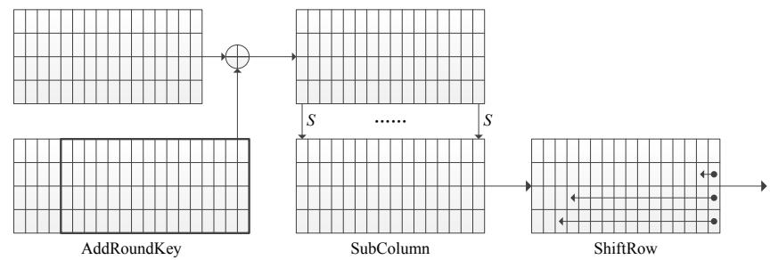
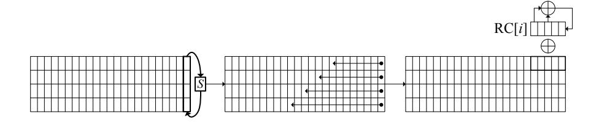

# Related-Key Differential Attack on Round Reduced RECTANGLE-80

Jinyong Shan1,<sup>2</sup> , Lei Hu1,<sup>2</sup> , Ling Song1,<sup>2</sup> , Siwei Sun1,<sup>2</sup> , and Xiaoshuang Ma1,<sup>2</sup>

{jyshan12,hu,lsong,swsun,xshma13}@is.ac.cn

Abstract. RECTANGLE is a newly proposed lightweight block cipher which allows fast implementations for multiple platforms by using bitslice techniques. It is an iterative 25-round SPN block cipher with a 64-bit block size and a 80-bit or 128-bit key size. Until now, the results on analyzing the cipher are not too much, which includes an attack on the 18-round reduced version proposed by the designers themselves. In this paper, we find all 15-round differential characteristics with 26–30 active S-boxes for given input, output and round subkey differences, which have a total probability 2<sup>−</sup>60.<sup>5</sup> . Based on these differential characteristics, we extend the corresponding distinguisher to 2 rounds backward and forward respectively, and propose an attack on the 19-round reduced RECTANGLE-80 with data complexity of 2<sup>62</sup> plaintexts, time complexity of about 2<sup>67</sup>.<sup>42</sup> encryptions and memory complexity of 2<sup>72</sup>. TThese data and time complexities are much lower than that of the designers for the 18-round reduced RECTANGLE-80.

Keywords: RECTANGLE block cipher, Mixed-integer linear programming, Related-key differential attack.

### 1 Introduction

Lightweight block ciphers can be widely used in small embedded devices such as RFIDs and sensor networks. They are becoming more and more popular, and this can be seen from the phenomena that many lightweight algorithms were proposed in recent years, including PRESENT [6], LED [10], LBlock [23], PRINCE [7], Zorro [9], and two lightweight block ciphers designed by the U.S. National Security Agency, Simon and Speck [1]. Very recently, a new lightweight block cipher called RECTANGLE was proposed by Zhang et al. [24], which is an iterative 25-round SPN block cipher with a 64-bit block size and a 80-bit or 128-bit key size to allow fast implementations on multiple platforms by using bit-slice techniques.

Security is crucially important for a cipher, and a new cipher must be able to resist against all known attacks. Differential cryptanalysis [4] and linear cryptanalysis [15] are two of the most basic and effective attacks on block ciphers.

<sup>1</sup> State Key Laboratory of Information Security, Institute of Information Engineering, Chinese Academy of Sciences, Beijing 100093, China

<sup>2</sup> Data Assurance and Communication Security Research Center, Chinese Academy of Sciences, Beijing 100093, China

There are many variants of differential analysis, such as related-key differential attack [2], truncated differential attack [11] and impossible differential attack [3], and essentially, all of these differential attacks study the differential behavior of the target cipher.

A differential characteristic with high probability can be used to construct a distinguisher or recover some secret keys. In general, for SPN block ciphers, the probability of a differential characteristic can be characterized by the number of active S-boxes in the corresponding differential characteristic. Therefore, counting the number of active S-boxes is a useful and interesting problem. On one hand, if the minimum number of active S-boxes is large, it proves that the cipher can resist against the differential attack. On the other hand, a differential characteristic with fewer active S-boxes can be used to construct a distinguisher.

The problem of counting active S-boxes of a word-oriented symmetric cipher was transformed to be a mixed-integer linear programming (MILP) problem by Mouha et al. [16]. They proposed a series of inequalities or equalities over integers to describe some operations over finite fields with characteristic 2, such as XORs and linear transformations. Two word-oriented symmetric ciphers, AES and Enocoro-128v2, were then considered along this line, and they proved that Enocoro-128v2 is secure enough to resist against differential and linear cryptanalysis. Subsequently, Sun et al. proposed a method to obtain a series of inequalities over integers for describing an S-box and generalized Mouha et al.'s method to apply to bit-oriented symmetric ciphers [20, 21]. In [21], it was proved that the cipher PRESENT-80 is secure enough to resist against standard related-key differential attack and the lower bound of probabilities of related-key differential characteristics of the full-round LBlock is upper bounded by 2<sup>−</sup>56. Very recently, by using the method proposed by Mauha et al. and Sun et al., Qiao et al. proved that the cipher FOX is strong enough to resist against single-key differential attack [17] and Ma et al. showed that 18 and 39 rounds are sufficient for the block cipher MIBS to resist against the single-key and related-key differential attacks, respectively [14]. Besides, Sun et al. proposed a method for automatic enumeration of all (related-key) differential characteristics with given input or/and output differences [22].

Some results of security analysis on RECTANGLE have been proposed by the designers in their design document [24]. The designers completed described a 18-round differential attack by two 14-round differential characteristics with the same input and output differences. The time, data and memory complexities are 278.69, 2<sup>64</sup> and 272, respectively. For other attacks, the designers pointed out that the amplitude of the correlation coefficients of the best linear characteristic is 2<sup>−</sup>37, and asserted that RECTANGLE has enough security against the statistical saturation attack [8], impossible differential cryptanalysis [3], integral cryptanalysis [13] and key schedule attacks [2, 5]. Recently, Selvam et al. reduce the key research space from 2<sup>80</sup> to 288 by the differential power analysis [19].

Our contribution. In this paper, we apply the methods proposed by Mouha et al. and Sun et al. to find out a 15-round related-key differential characteristic with 26 active S-boxes, whose input, output and round subkey differences are with low Hamming weight. For the obtained input, output and round subkey differences, we find out all 15-round differential characteristics with 26-30 active S-boxes by using the method proposed in [22]. The number of the differential characteristics is 1254 and the total probability is  $2^{-60.5}$ . Based on these differential characteristics, we extend the corresponding distinguisher to 2 rounds backward and forward respectively and propose an attack on the 19-round reduced RECTANGLE-80. The data complexity of our attack is  $2^{62}$  plaintexts, the time complexity is about  $2^{67.42}$  19-round encryptions and the memory complexity is  $2^{72}$ . Compared with the designers' differential analysis, we can attack one more round, and the data and time complexities are much better.

A difficult point in our attack is that there is a large number of active S-boxes in the extended 2 rounds backward and forward. By a general method, the number of the key counters is more than  $2^{80}$ , here the method we use is to guess a lot of bits in the 0th round subkey, and then more bits in the 1st, 18th and 19th round subkeys are determined according to the key schedule. Thereby, we can reduce the number of the key counters to  $2^{72}$ .

**Organization of this paper.** In Section 2, we briefly describe the RECT-ANGLE block cipher. In Section 3, we introduce the MILP based methods proposed by Mouha *et al.* and Sun *et al.* The related-key differential attack on the round reduced RECTANGLE is proposed in Section 4. Finally, Section 5 concludes this study.

### 2 A Brief Description of RECTANGLE

In this section, we briefly describe the block cipher RECTANGLE and refer the readers to [24] for more details.

RECTANGLE is a lightweight block cipher with an SPN structure proposed by Zhang et al. [24] in 2014. It allows fast implementations on multiple platforms by using bit-slice techniques. Its block length is 64 bits, while two versions of the key length, 80 bits and 128 bits, are provided. In this paper, we only consider the version with 80-bit secret keys.

For convenience, we introduce a notation for a 4*l*-bit block throughout this paper. Let  $B=(b_{4l-1},\cdots,b_{3l},\cdots,b_{l-1},b_0)$  be a 4*l*-bit block, it can be written as a  $4\times 16$  rectangle

$$\begin{bmatrix} b_{l-1} & b_{l-2} & \cdots & b_2 & b_1 & b_0 \\ b_{2l-1} & b_{2l-2} & \cdots & b_{l+2} & b_{l+1} & b_l \\ b_{3l-1} & b_{3l-2} & \cdots & b_{2l+2} & b_{2l+1} & b_{2l} \\ b_{4l-1} & b_{4l-2} & \cdots & b_{3l+2} & b_{3l+1} & b_{3l} \end{bmatrix}.$$

Let  $B^{(j)}$  denote the vector in the jth column of the rectangle, i.e.,  $B^{(j)} = (b_j, b_{j+l}, b_{j+2l}, b_{j+3l})$ , where  $0 \le j \le l-1$ . Let  $B^{(i,j)}$  denote the entry in the ith row and jth column of the rectangle, i.e.,  $B^{(i,j)} = b_{j+il}$ . For example, a 64-bit plaintext, a 64-bit intermediate state, or a 64-bit ciphertext  $(w_{63}, w_{62}, \dots, w_0)$ ,

it is viewed as a  $4 \times 16$  rectangle

```
\begin{bmatrix} w_{15} & w_{14} & \cdots & w_2 & w_1 & w_0 \\ w_{31} & w_{30} & \cdots & w_{18} & w_{17} & w_{16} \\ w_{47} & w_{46} & \cdots & w_{34} & w_{33} & w_{32} \\ w_{63} & w_{62} & \cdots & w_{50} & w_{49} & w_{48} \end{bmatrix}.
```

The master key and the round subkeys  $(k_{79}, k_{78}, \dots, k_0)$  are viewed as  $4 \times 20$  rectangles below.

$$\begin{bmatrix} k_{19} \ k_{18} \cdots k_2 & k_1 & k_0 \\ k_{39} \ k_{38} \cdots k_{22} \ k_{21} \ k_{20} \\ k_{59} \ k_{58} \cdots k_{42} \ k_{41} \ k_{40} \\ k_{79} \ k_{78} \cdots k_{62} \ k_{61} \ k_{60} \end{bmatrix}.$$

The cipher has 25 rounds of iterations. Each round consists of three steps: AddRoundkey, SubColumn and ShiftRow (Please see Figure 1). In the first step



Fig. 1. Round transformation of RECTANGLE.

AddRoundkey, the cipher state is XORed the rightmost 64-bit of the round subkey. In the second step SubColumn, parallelly apply the S-box S to each column of the cipher state, where the S-box S used in RECTANGLE is a 4-bit to 4-bit permutation as described in the following table in hexadecimal notation:

| x    | 0 | 1 | 2 | 3 | 4            | 5 | 6 | 7 | 8            | 9 | Α | В | $\mathbf{C}$ | D | Е | F |
|------|---|---|---|---|--------------|---|---|---|--------------|---|---|---|--------------|---|---|---|
| S(x) | 9 | 4 | F | Α | $\mathbf{E}$ | 1 | 0 | 6 | $\mathbf{C}$ | 7 | 3 | 8 | 2            | В | 5 | D |

In the third step ShiftRow, the last three rows are left rotated 1 bit, 12 bits and 13 bits, respectively. After 25 rounds of iterations, there is a final subkey XOR.

For the key schedule for the 80-bit key version, it also consists of three steps described in Figure 2. The S-box is the same as in a round transformation. The rows are left rotated 7 bits, 9 bits, 11 bits and 13 bits, respectively. The round constants RC[i] ( $0 \le i \le 24$ ) are generated by a 5-bit LFSR with the initial state RC[0]=(0,0,0,0,1). At each round i>0, the round constant  $RC[i]=(r_{i,4},\cdots,r_{i,1},r_{i,0})$  is equal to  $(r_{i-1,3},\cdots,r_{i-1,0},r_{i-1,4}\oplus r_{i-1,2})$ .

Some results of security analysis on the RECTANGLE cipher were proposed by the designers in their design document [24]. Recently, Selvam  $et\ al.$  reduce the key research space from  $2^{80}$  to 288 by the differential power analysis [19]. We will propose the related-key analysis on RECTANGLE-80 by the method based on MILP in this paper.



Fig. 2. Key schedule of RECTANGLE.

### 3 Description of the Extended MILP

In this section, we introduce the MILP based methods proposed by Mouha *et al.* and Sun *et al.* The mixed integer linear programming (MILP) problem is an optimization problem derived from linear programming with some or all variables restricted over integers. It can be described as:

MILP: Find a vector  $x \in \mathbb{Z}^k \times \mathbb{R}^{n-k} \subset \mathbb{R}^n$  with  $Ax \leq b$ , such that the linear function  $c_1x_1 + c_2x_2 + \cdots + c_nx_n$  is minimized (or maximized), where  $(c_1, c_2, \cdots, c_n) \in \mathbb{R}^n$ ,  $A \in \mathbb{R}^{m \times n}$  and  $b \in \mathbb{R}^m$ .

To count the minimum number of active S-boxes for some ciphers, Mouha et al. transformed it to an MILP problem [16]. To this end, some operations over finite fields with characteristic 2 are described by several linear constraints over integers. The following two operations were considered by Mouha et al.

(i) XOR operation  $\oplus$ :  $\mathbb{F}_2^w \times \mathbb{F}_2^w \to \mathbb{F}_2^w$ . Assume that  $a = (a_0, \dots, a_{w-1})$ ,  $b = (b_0, \dots, b_{w-1})$  and  $c = (c_0, \dots, c_{w-1})$  are the input and output differences of the XOR operation, i.e.,  $a_i \oplus b_i = c_i$  for all  $0 \le i \le w-1$ . Then the equality can be described by the following inequalities over integers:

$$\begin{cases}
 a_i + b_i + c_i \ge 2d_i, \\
 d_i \ge a_i, \\
 d_i \ge b_i, \\
 d_i \ge c_i,
\end{cases}$$
(1)

where  $d_i \in \mathbb{F}_2$  is a dummy variable and  $0 \le i \le w - 1$ .

Note that the description on the operation XOR above is not complete. For example, if  $(a_i, b_i, c_i, d_i) = (1, 1, 1, 1)$ , it is easily checked that  $(a_i, b_i, c_i, d_i)$  satisfies inequalities (1), but not satisfies the operation XOR since  $1 \oplus 1 = 0$ . An additional inequality over integers  $a_i + b_i + c_i \leq 2$ , combining with inequalities (1), can equivalently describe the operation XOR.

(ii) Linear transformation  $L: \mathbb{F}_{2^w}^m \to \mathbb{F}_{2^w}^m$ , where m is the word size. The branch number  $\mathcal{B}_L$  of L is defined as

$$\mathcal{B}_L = \min_{x \neq 0} \{ \operatorname{wt}(x) + \operatorname{wt}(Lx) : x \in \mathbb{F}_{2^w}^m \},$$

where the Hamming weight  $\operatorname{wt}(x)$  is the number of the nonzero components of x. Let  $\Delta x = (\Delta x_0, \Delta x_1, \dots, \Delta x_{m-1})$  and  $\Delta y = (\Delta y_0, \Delta y_1, \dots, \Delta y_{m-1})$  be the

input and output differences of L, then ∆xL = ∆y. The linear constraints of L over integers are

$$\begin{cases} \sum_{i=0}^{m-1} (\Delta x_i + \Delta y_i) \ge \mathcal{B}_L d_L, \\ d_L \ge \Delta x_i, \ 0 \le i \le m-1, \\ d_L \ge \Delta y_i, \ 0 \le i \le m-1, \end{cases}$$

where d<sup>L</sup> ∈ F<sup>2</sup> is a dummy variable.

Subsequently, Sun et al. proposed two methods to obtain linear constraints of an S-box based on logical condition modelling and computational geometry [20, 21].

(iii) S-box S: F w <sup>2</sup> → F w 2 . The input and output differences of S are denoted as ∆α = (∆α0, ∆α1, · · · , ∆αw−1) and ∆β = (∆β0, ∆β1, · · · , ∆βw−1), respectively. Let δ denote whether the S-box S is active or not, i.e.,

$$\delta = \begin{cases} 0, (\Delta \alpha_0, \Delta \alpha_1, \cdots, \Delta \alpha_{w-1}) = 0, \\ 1, \text{ otherwise.} \end{cases}$$

The equivalent description over integers between δ and ∆α is

$$\begin{cases} \delta - \Delta \alpha_i \ge 0, \ 0 \le i \le w - 1, \\ \Delta \alpha_0 + \Delta \alpha_1 + \dots + \Delta \alpha_{w-1} - \delta \ge 0. \end{cases}$$
 (2)

Additionally, for an invertible S-box, since the input difference is nonzero if and only if the corresponding output difference is nonzero, the constraints described over integers are as follows:

$$\begin{cases}
(\Delta\alpha_0 + \Delta\alpha_1 + \dots + \Delta\alpha_{w-1})w - (\Delta\beta_0 + \Delta\beta_1 + \dots + \Delta\beta_{w-1}) \ge 0, \\
(\Delta\beta_0 + \Delta\beta_1 + \dots + \Delta\beta_{w-1})w - (\Delta\alpha_0 + \Delta\alpha_1 + \dots + \Delta\alpha_{w-1}) \ge 0.
\end{cases} (3)$$

Finally, similarly as the description of linear transformation, the branch number of an S-box S, denoted by BS, is defined as

$$\mathcal{B}_{S} = \min_{\Delta \alpha \neq 0} \left\{ \operatorname{wt}(\Delta \alpha) + \operatorname{wt}(\Delta \beta) \mid \#(\Delta \alpha, \Delta \beta) > 0 \right\},\,$$

where #(∆α, ∆β) = #{x ∈ F w 2 | S(x)⊕S(x⊕∆α) = ∆β}. The linear constraints of S over integers are

$$\begin{cases} \sum_{i=0}^{w-1} (\Delta \alpha_i + \Delta \beta_i) \ge \mathcal{B}_S d_S, \\ d_S \ge \Delta \alpha_i, \ 0 \le i \le w - 1, \\ d_S \ge \Delta \beta_i, \ 0 \le i \le w - 1, \end{cases}$$

$$(4)$$

where d<sup>S</sup> ∈ F<sup>2</sup> is a dummy variable.

The linear constraints (2), (3) and (4) of an S-box introduced above are not complete. That is, there exists a vector pair simultaneously satisfying inequalities (2), (3) and (4), while the vector pair is an impossible differential characteristic of the S-box. For this reason, Sun et al. proposed a new method based on computational geometry to obtain linear constraints of an S-box, where the constraints are selected from the H-representation of the convex hull of all differential characteristics [21].

H-representation of convex hull. The convex hull of a set X is the minimum convex set containing X, where X is a set of some discrete points in R n. The convex hull can be regarded as the feasible solutions of a system of linear equalities and inequalities. There are a number of algorithms for computing the convex hull for a finite set of points. For an n × n S-box S, all differential characteristics can be regarded as some discrete points in R <sup>2</sup>n, by using the SAGE computer algebra system, the convex hull consisting of several inequalities can be obtained.

In general, the number of equalities and inequalities in the convex hull of a set X ⊂ R <sup>n</sup> increases rapidly as n increases. There are several hundreds of inequalities for a 4 × 4 S-box. To make an MILP problem solvable in practical time, one needs to select a small number of inequalities in the convex hull. Sun et al. utilized a greedy algorithm to choose some "good" inequalities [21].

We refer the readers to [16, 20, 21] for more information on an MILP problem and linear constraints describing several operations over finite fields with characteristic 2.

# 4 Differential Attack on RECTANGLE-80

In this section, we firstly introduce some notations used in the next subsections for convenience. Let P (P 0 ), C (C 0 ), ∆P and ∆C denote the plaintext, the ciphertext, and the differences of the plaintext and ciphertext, respectively. Let K<sup>i</sup> (K<sup>0</sup> i ), I<sup>i</sup> (I 0 i ) and O<sup>i</sup> (O<sup>0</sup> i ) denote the round subkey, the input and output of the operation SubColumn in the ith round, respectively. Similarly, let ∆K<sup>i</sup> , ∆I<sup>i</sup> and ∆O<sup>i</sup> denote the differences of the round subkey, the input and output of the operation SubColumn in the ith round, respectively.

With the preparations above, we will propose a related-key differential attack on 19-round RECTANGLE-80. To this end, we find a huge number of 15-round differential characteristics from the 2nd round to the 17th round with the same input, output and round subkey differences. Subsequently, a related-key differential attack on 19-round RECTANGLE-80 is obtained by respectively extending 2 rounds backward and forward.

#### 4.1 Differential characteristics

In this subsection, we use the methods proposed by Mouha et al. and Sun et al. to obtain several differential characteristics with high probabilities.

In the RECTANGLE block cipher, only the operations XOR and S-box need to be transformed to linear constraints over integers. According to the descriptions in Section 3, the constraint conditions on XOR and S-box are obtained. In addition, since the differential of keys is necessarily nonzero in the related-key attack model, there is an additional constraint condition as " $\Delta k_0 + \Delta k_1 + \cdots + \Delta k_{79} \geq 1$ ". The objective function is that "min  $\sum \delta$ ", where  $\delta$  denotes that the corresponding S-box is active or not introduced by (2) in Section 3. The process above is implemented to generate a ".lp" file which is an MILP instance containing an objective function and linear constraints. Then the Gurobi optimizer is used to solve the MILP instance.

The differential distributions of the S-box in RECTANGLE is showed in Table 1. According to Table 1, we can compute the probability for a specific differential characteristic. The results of related-key attacks on the n-round reduced RECTANGLE are showed in Table 2, where  $7 \le n \le 15$ . The values of the column "Probability" in Table 2 are the probabilities of specific differential characteristics which correspond to the numbers of active S-boxes in Table 2. When the numbers of the rounds are 7, 8 and 9 marked by "\*", the values in the column "Number of active S-boxes" correspond to the minimal numbers of active S-boxes for all possible differential characteristics. When the numbers of the rounds are 10, 11, 12, 13, 14, 15, the values in the column "Number of active S-boxes" correspond to the minimal numbers of active S-boxes for some possible differential characteristics.

|   | 0  | 1 | 2 | 3 | 4 | 5 | 6 | 7 | 8 | 9 | Α | В | С | D | Е | F |
|---|----|---|---|---|---|---|---|---|---|---|---|---|---|---|---|---|
| 0 | 16 | 0 | 0 | 0 | 0 | 0 | 0 | 0 | 0 | 0 | 0 | 0 | 0 | 0 | 0 | 0 |
| 1 | 0  | 0 | 0 | 0 | 0 | 2 | 2 | 0 | 2 | 2 | 0 | 4 | 0 | 2 | 0 | 2 |
| 2 | 0  | 0 | 0 | 0 | 0 | 0 | 4 | 4 | 0 | 0 | 0 | 0 | 0 | 0 | 4 | 4 |
| 3 | 0  | 2 | 0 | 2 | 4 | 0 | 0 | 0 | 2 | 0 | 0 | 2 | 0 | 0 | 2 | 2 |
| 4 | 0  | 0 | 0 | 0 | 0 | 4 | 2 | 2 | 0 | 0 | 0 | 0 | 4 | 0 | 2 | 2 |
| 5 | 0  | 0 | 0 | 0 | 0 | 2 | 0 | 2 | 2 | 2 | 4 | 0 | 0 | 2 | 2 | 0 |
| 6 | 0  | 4 | 2 | 2 | 0 | 0 | 0 | 0 | 0 | 4 | 2 | 2 | 0 | 0 | 0 | 0 |
| 7 | 0  | 2 | 2 | 0 | 4 | 0 | 0 | 0 | 2 | 0 | 2 | 0 | 0 | 0 | 2 | 2 |
| 8 | 0  | 0 | 2 | 2 | 0 | 4 | 0 | 0 | 0 | 0 | 2 | 2 | 4 | 0 | 0 | 0 |
| 9 | 0  | 0 | 0 | 4 | 0 | 2 | 0 | 2 | 2 | 2 | 0 | 0 | 0 | 2 | 2 | 0 |
| A | 0  | 0 | 2 | 2 | 0 | 0 | 0 | 0 | 0 | 0 | 2 | 2 | 4 | 4 | 0 | 0 |
| В | 0  | 2 | 0 | 2 | 4 | 0 | 2 | 2 | 2 | 0 | 0 | 2 | 0 | 0 | 0 | 0 |
| С | 0  | 0 | 2 | 2 | 0 | 0 | 2 | 2 | 0 | 0 | 2 | 2 | 0 | 0 | 2 | 2 |
| D | 0  | 0 | 4 | 0 | 0 | 2 | 2 | 0 | 2 | 2 | 0 | 0 | 0 | 2 | 0 | 2 |
| Е | 0  | 4 | 0 | 0 | 0 | 0 | 0 | 0 | 0 | 4 | 0 | 0 | 4 | 4 | 0 | 0 |
| F | 0  | 2 | 2 | 0 | 4 | 0 | 2 | 2 | 2 | 0 | 2 | 0 | 0 | 0 | 0 | 0 |

Table 1. Differential distributions of the S-box in RECTANGLE

We find a 15-round differential characteristic with probability  $2^{-64}$ . In this differential characteristic, the input difference of the operation SubColumn in the 2nd round and the output difference of the operation SubColumn in the 16th round are

$$\varDelta I_2 = \begin{matrix} 0000010000001000 \\ 000001000000000000$$

| Rounds | Number of active S-boxes |           |
|--------|--------------------------|-----------|
| 7*     | 7                        | $2^{-18}$ |
| 8*     | 10                       | $2^{-25}$ |
| 9*     | 12                       | $2^{-32}$ |
| 10     | 16                       | $2^{-41}$ |
| 11     | 19                       | $2^{-44}$ |
| 12     | 20                       | $2^{-51}$ |
| 13     | 23                       | $2^{-56}$ |
| 14     | 24                       | $2^{-59}$ |
| 15     | 26                       | $2^{-64}$ |

**Table 2.** *n*-round differential characteristics with fewer active S-boxes and the differences of the 2nd round and the 16th round subkeys are

$$\Delta K_2 = \begin{matrix} 0000000000000000000000000000000000$$

By fixing  $\Delta I_2$ ,  $\Delta O_{16}$ ,  $\Delta K_2$  and  $\Delta K_{16}$ , we obtain all 15-round differential characteristics with 26, 27, 28, 29 and 30 active S-boxes by using the method proposed in [22], and the results are listed in Table 3. The total probability of all the differential characteristics in Table 3 is  $2^{-60.5}$ . This high differential probability with given  $\Delta I_2$ ,  $\Delta O_{16}$ ,  $\Delta K_2$  and  $\Delta K_{16}$  can be used to construct a distinguisher and recover partial secret keys. We propose the attack progress in the next subsection.

| Number of active S-boxes | Number of differential characteristics | Total probability |
|--------------------------|----------------------------------------|-------------------|
| 26                       | 4                                      | $2^{-62}$         |
| 27                       | 30                                     | $2^{-62}$         |
| 28                       | 119                                    | $2^{-62.82}$      |
| 29                       | 324                                    | $2^{-64.31}$      |
| 30                       | 777                                    | $2^{-65.97}$      |

**Table 3.** All 15-round differential characteristics with 26 – 30 active S-boxes

#### 4.2 A related-key differential attack on RECTANGLE-80

In this subsection, we will give a related-key differential attack on RECTANGLE-80 by using the differential characteristics in Subsection 4.1 and respectively extending 2 rounds backward and forward. To this goal, we assume that the 19-round reduced RECTANGLE consists of 19 rounds of iterations and a final subkey XOR. We number the rounds from 0 to 19. The 0th round subkey  $K_0$  is the master key and the final subkey is denoted by  $K_{19}$ . Next we propose our attack in detail.

We focus on illustrating how to extend 2 rounds backward and extending 2 rounds forward is similar. By the differences  $\Delta I_2$  and  $\Delta K_2$ , the output difference  $\Delta O_1$  of the operation SubColumn in the 1st round is obtained by the inverse operations AddRoundKey and ShiftRow, which is listed below

$$\Delta O_1 = \begin{array}{c} 000001000001000\\ 00000010000000000\\ 00000000$$

By the differential distributions of the S-box in Table 1, we find that only when the input difference of the S-box is 1100, 0110, 1110, 1101, 0111 or 1111, the output difference of the S-box is 1000 for the 10th column, and similar observations are found for the 3rd and 9th columns. Therefore, the input difference  $\Delta I_1$  of the operation SubColumn in the 1st round must have the following form

$$\Delta I_1 = \begin{array}{c} 00000??00000?000\\ 000001?000000000\\ 00000??00000?000\\ 00000??00000?000 \end{array}$$

where the mark "?" denotes an undetermined value 0 or 1. Further,  $\Delta I_1$  has  $6 \times 7 \times 6 = 2^{7.98}$  cases in total. For a candidate  $\Delta I_1$  in the  $2^{7.98}$  cases, the probability of  $\Delta O_1$  in (5) is equal to  $\frac{1}{6} \times \frac{1}{7} \times \frac{1}{6} = 2^{-7.98}$ . By the key schedule, the difference of the 1st round subkey is

$$\Delta K_1 = \begin{matrix} 000000000000000000000\\ 000000000000$$

Similarly as the analysis of the 1st round, the output and input differences of the operation SubColumn in the 0th round are

$$\Delta O_0 = \begin{matrix} 00000??00000?000 \\ 0000001?00000000 \\ 0??00001?00000000 \\ 00??00000?0000000 \end{matrix} \quad \text{and} \quad \Delta I_0 = \begin{matrix} 0???0??????00?000 \\ 0???0??????0000?0000 \\ 0???0???$$

Note that there are  $2^{7.98}$  cases for  $\Delta O_0$  and  $2^{36}$  cases for  $\Delta I_0$ . Therefore, for a random input difference  $\Delta I_0$ , the probability of the output difference  $\Delta O_0$  belonging to the  $2^{7.98}$  cases is  $2^{-28.02}$ . Besides, the differences of the 0th round subkey and the plaintexts are

$$\Delta K_0 = \begin{pmatrix} 000000000000000000000000000000000$$

Similarly, we can also extend 2 rounds forward. Since the difference of the  $17 \mathrm{th}$  round subkey is

$$\varDelta K_{17} = \begin{matrix} 000000000000000000000 \\ 00000000000$$

the input and output differences of the operation SubColumn in the 17th round are

$$\Delta I_{17} = \begin{pmatrix} 00000010000000000\\ 000000000000000000$$

By the differential distributions of the S-box in Table 1, if the input difference of the S-box is  $\Delta I_S = 0010$ , the output difference of the S-box  $\Delta O_S \in \{1010,0110,1110,0011,0111,1111\}$ . Therefore, the difference of the 18th round subkey is

$$\varDelta K_{18} = \begin{matrix} 000000000000*000000 \\ 0000000000*00000000$$

where \*\*1\* $\in$  {1010,0110,1110,0011,0111,1111}. In our attack, we assume that the difference  $\Delta K_{18}$  is determined, because we can use our attack six times for each value in the set {1010,0110,1110,0011,0111,1111}. Then the differences of the operation SubColumn in the 18th round are

$$\Delta I_{18} = \begin{matrix} 000000?0*000000?\\ 00000?*000000?00\\ 000?1100000?000000,\\ 00?000000?000000, \end{matrix} \quad \Delta O_{18} = \begin{matrix} 00??????0???000??\\ 00????????000??\\ 00??1??????000??\\ 00??????0???000?? \end{matrix}, \end{matrix}$$

where the mark "\*" denotes a determined value in  $\{0,1\}$  for a specific attack and the mark "?" determined an undetermined value in  $\{0,1\}$ . The number of  $\Delta O_{18}$  at most is  $2^{26.54}$ . Since the difference of the final subkey

$$\varDelta K_{19} = \begin{matrix} 00000*00000000000000\\ 0*0000000000000$$

is determined, the number of the difference of the ciphertext

$$\Delta C = \begin{matrix} 0*?????0???000??\\ 0?????0???000??0\\ 00??00?11??0???0\\ 0??00?????0????0$$

at most is  $2^{26.54}$ . Therefore, the probability of the ciphertext difference satisfying the form  $\Delta C$  is  $2^{-37.46}$ .

- -Data Collect Phase. Choose  $2^x$  structures. In each structure, there are  $2^{36}$  plaintexts with fixing the values in the 0th, 1st, 2nd, 4th, 5th, 11th and 15th columns and traversing the values in the 3rd, 6th, 7th, 8th, 9th, 10th, 12th, 13th and 14th columns. The  $2^{36}$  plaintexts can generate about  $2^{72}$  ordered pairs. Combining with the probabilities in the 1st and 0th rounds, the probability that a pair of plaintexts in a structure can result in the expected input difference  $\Delta I_2$  is  $2^{-35.77}$ . Therefore, the expected number of the plaintext pairs corresponding to  $\Delta I_2$  and  $\Delta O_{16}$  is  $2^{x+72-36-60.5} = 2^{x-24.5}$ .
- **-Key Recover Phase.** For each structure, there are  $2^{72-37.46} = 2^{34.54}$  ordered pairs left according to the difference of the ciphertext  $\Delta C$ . Therefore, the excepted number of remaining pairs is  $2^{x+34.54}$ .

- 12
- Step 1. Guess the value of a part of subkey bits of  $K_0$ :
  - (a). Guess  $K_0^{(3)}$ , and compute the output difference of the 3rd S-box for each remaining plaintext pair, i.e.,

$$S(P^{(3)} \oplus K_0^{(3)}) \oplus S(P'^{(3)} \oplus K_0^{(3)} \oplus \Delta K_0^{(3)}).$$

If the difference do not have the form ?000, discard the pair. Then the

- number of expected remaining pairs is  $2^{x+31.54}$ . (b). Repeatedly guess  $K_0^{(6)}$ ,  $K_0^{(7)}$ ,  $K_0^{(8)}$ ,  $K_0^{(9)}$ ,  $K_0^{(10)}$ ,  $K_0^{(12)}$ ,  $K_0^{(13)}$  and  $K_0^{(14)}$ , there are  $2^{x+8.54}$  right pairs left.
- Step 2. Guess the value of a part of subkey bits of  $K_1$  by guessing some bits of  $K_0$  or  $K_1$ :
  - (a). Since many bits of  $K_1$  are obtained from  $K_0$  directly by shifting and adding constant, we only need to guess some bits for a column in  $K_1$ . For the 3rd column of  $K_1$ , by the key schedule we have

$$(K_1^{(0,3)},K_1^{(1,3)},K_1^{(2,3)},K_1^{(3,3)}) = (K_0^{(0,16)},K_0^{(1,14)},K_0^{(2,12)},K_0^{(3,10)}).$$

Therefore, we only need to guess  $K_0^{(0,16)} = K_1^{(0,3)}$ . Then the number of expected remaining pairs is  $2^{x+4.54}$ .

• (b). Guess the bits  $K_0^{(1,1)}$ ,  $K_0^{(2,19)}$ ,  $K_0^{(3,17)}$ , and then check up whether

$$S(I_1^{(10)} \oplus K_1^{(10)}) \oplus S(I_1^{\prime(10)} \oplus K_1^{(10)} \oplus \Delta K_1^{(10)}) = 1000,$$

since  $(K_1^{(0,10)}, K_1^{(1,10)}, K_1^{(2,10)}, K_1^{(3,10)}) = (K_0^{(0,3)}, K_0^{(1,1)}, K_0^{(2,19)}, K_0^{(3,17)})$ . On average, there are  $2^{x+0.54}$  right pairs left.

- (c). Similarly as Step 2(b), guess the bits  $K_0^{(0,2)}$ ,  $K_1^{(1,9)}$ ,  $K_0^{(2,18)}$  and  $K_0^{(3,16)}$ , then there are  $2^{x-3.46}$  right pairs left on average.
- Step 3. Guess the value of a part of subkey bits of  $K_{19}$ :
- (a). For the 11th column of  $O_{18}$ , the secret bits  $K_{19}^{(0,11)}$ ,  $K_{19}^{(1,12)}$ ,  $K_{19}^{(2,7)}$  and  $K_{19}^{(3,8)}$  of  $K_{19}$  are involved. Guess the bits  $K_0^{(0,18)}$ ,  $K_0^{(3,2)}$ ,  $K_0^{(1,2)}$ ,  $K_0^{(0,19)}$  and  $K_0^{(3,1)}$ , then combining with the guessed bits from Step 1 to Step 2, the involved secret bits  $K_{19}^{(0,11)}$ ,  $K_{19}^{(1,12)}$ ,  $K_{19}^{(2,7)}$ ,  $K_{19}^{(3,8)}$  of  $K_{19}$  are determined. Then by using the method in Step 1.a, there are  $2^{x-7.46}$  right pairs left on average. Further, the bits  $K_{19}^{(0,12)}$ ,  $K_{19}^{(1,13)}$ ,  $K_{19}^{(2,8)}$  and  $K_{19}^{(3,9)}$  are also determined, which are related to the 12th solution of  $C_{19}^{(2,12)}$ .  $K_{19}^{(3,9)}$  are also determined, which are related to the 12th column of  $O_{18}$ . Then there are  $2^{x-11.46}$  right pairs left on average.
  - (b). Guess  $K_0^{(1,16)}$ ,  $K_0^{(2,4)}$  and  $K_0^{(1,11)}$ , then combining with the guessed bits from Step 1 to Step 3(a), the secret bits  $K_{19}^{(0,1)}$ ,  $K_{19}^{(1,2)}$ ,  $K_{19}^{(2,13)}$  and  $K_{19}^{(3,14)}$  are determined, which are related to the 1st column of  $O_{18}$ . Then the number of remaining expected pairs is  $2^{x-14.46}$ .
  - (c). Similarly as Steps 3(a) and 3(b), we respectively guess the bits  $K_0^{(0,1)}$ ,  $K_0^{(3,19)}$  and  $K_0^{(0,4)}$  for the 6th column, the bits  $K_{10}^{(1,8)}$ ,  $K_0^{(1,18)}$  and  $K_0^{(2,2)}$

for the 7th column, the bit  $K_{19}^{(2,12)}$  for the 0th column, the bits  $K_{19}^{(0,9)}$ ,  $K_{19}^{(2,5)}$ ,  $K_0^{(0,17)}$ ,  $K_0^{(1,19)}$  and  $K_0^{(2,1)}$  for the 9th column, the bits  $K_{19}^{(2,6)}$  and  $K_{19}^{(3,7)}$  for the 10th column, the bits  $K_{19}^{(0,5)}$ ,  $K_{19}^{(1,6)}$  and  $K_{19}^{(3,2)}$  for the 5th column, and the bits  $K_{19}^{(0,13)}$ ,  $K_{19}^{(1,14)}$  and  $K_{19}^{(2,9)}$  for the 13th column. Then the number of remaining expected pairs is  $2^{x-36.46}$ .

- Step 4. The involved secret bits of  $K_{18}$  have guessed in Steps 1-3, and we do not need to guess any other secret bits. There are  $2^{x-44.46}$  right pairs left on average. Add one to the corresponding counter, if there is a right pair left.
- Step 5. If the counter is larger than 1, keep the guess of the subkey bits as the candidates of the right subkeys. For each survived candidate, compute the seed key by doing an exhaustive search for other secret bits.

**-Complexity Analysis.** Since the expected number of the plaintext pairs corresponding to  $\Delta I_2$  and  $\Delta O_{16}$  is  $2^{x+72-36-60.5}=2^{x-24.5}$ , we take x=26 such that the expected number can reach to 3. Therefore, the data complexity is  $2^{62}$ .

To analyze the time complexity, we will analyze the time complexity in each step. In the encryption phase, the time complexity is  $2^{63}$  19-round encryptions. In Step 1.a, the time complexity is  $2 \times 2^{x+34.54} \times 2^4 \times \frac{1}{16} \times \frac{1}{19} \approx 2^{x+29.54}$  19-round encryptions. In Step 1.b, the time complexity is

$$2 \times \left(2^{x+39.54} + 2^{x+40.54} + 2^{x+41.54} + 2^{x+42.54} + 2^{x+43.54} + 2^{x+44.54} + 2^{x+45.54} + 2^{x+46.54}\right) \times \frac{1}{16} \times \frac{1}{19} \approx 2^{x+40.54}.$$

In Step 2, the time complexity is  $2 \times \left(2^{x+45.54} + 2^{x+44.54} + 2^{x+44.54}\right) \times \frac{1}{16} \times \frac{1}{19} \approx 2^{x+39.54}$  19-round encryptions. In Step 3, the time complexity is

$$2 \times \left(2^{x+45.54} + 2^{x+41.54} + 2^{x+40.54} + 2^{x+40.54} + 2^{x+40.54} + 2^{x+37.54} + 2^{x+39.54} + 2^{x+38.54} + 2^{x+38.54} + 2^{x+38.54} + 2^{x+38.54} + 2^{x+38.54} \right) \times \frac{1}{16} \times \frac{1}{19} \approx 2^{x+38.54}.$$

In Step 4, the time complexity is about  $2^{x+28.54}$  19-round encryptions. Therefore, the total time complexity is  $2^{67.42}$ . The memory complexity is  $2^{72}$  key counters.

#### 5 Conclusions

In this paper, we used the methods proposed by Mouha  $et\ al.$  and Sun  $et\ al.$  to find out a 15-round differential characteristic with 26 active S-boxes and low Hamming weight of the input, output and round subkey differences. Then we found out a huge number of 15-round related-key differential characteristics with the obtained input, output and round subkey differences. The total probability is  $2^{-60.5}$ . Based on these differential characteristics, we proposed a related-key differential attack on the 19-round reduced RECTANGLE by respectively extending 2 rounds backward and forward, with a data complexity of  $2^{62}$ , a time complexity of  $2^{67.42}$  19-round encryptions and a memory complexity of  $2^{72}$ .

A number of related-key differential characteristics with high total probability for more rounds may help to attack RECTANGLE for more rounds. It is meaningful to determine a lower bound of the number of active S-boxes for some rounds which can illustrate whether this cipher is security enough to resist against the standard related-key differential attack.

# References

- [1] Beaulieu, R., Shors, D., Smith, J., Treatman-Clark, S., Weeks, B., Wingers, L.: The simon and speck families of lightweight block ciphers. Cryptology ePrint Archive. Available at https://eprint.iacr.org/2013/404.pdf
- [2] Biham, E.: New types of cryptanalytic attacks using related keys. Journal of Cryptology 7(4), 229-246 (1994)
- [3] Biham, E., Biryukov, A., Shamir, A.: Cryptanalysis of Skipjack reduced to 31 rounds using impossible differentials. In: Advances in Cryptology-Eurocrypt'99, ser. Lecture Notes in Computer Science, vol. 1592, pp. 12-23. Springer, Berlin (1999)
- [4] Biham, E., Shamir, A.: Differential cryptanalysis of DES-like cryptosystems. Journal of Cryptology 4(1), 3-72 (1991)
- [5] Biryukov, A., Wagner, D.: Slide attacks. In: FSE 1999, ser. Lecture Notes in Computer Science, vol. 1636, pp. 245-259. Springer, Berlin (1999)
- [6] Bogdanov, A., Knudsen, L., Leander, G., Paar, C., Poschmann, A., Robshaw, M., Seurin, Y., Vikkelsoe, C.: PRESENT: An ultra-lightweight block cipher. In: CHES 2007, ser. Lecture Notes in Computer Science, vol. 4727, pp. 450-466. Springer, Berlin (2007)
- [7] Borghoff, J., Canteaut, A., G¨uneysu, T., Kavun, E., Knezevic, M., Knudsen, L., Leander, G., Nikov, V., Paar, C., Rechberger, C., Rombouts, P., Thomsen, S., Yal¸cın, T.: PRINCE–A low-latency block cipher for pervasive computing applications. In: Advances in Cryptology-ASIACRYPT 2012, ser. Lecture Notes in Computer Science, vol. 7658, pp. 208-225. Springer, Berlin (2012)
- [8] Collard, B., Standaert, F.: A statistical saturation attack against the block cipher PRESENT. In: Topics in Cryptology-CT-RSA 2009, ser. Lecture Notes in Computer Science, vol. 5473, pp. 195-210. Springer, Berlin (2009)
- [9] G´erard, B., Grosso, V., Naya-Plasencia, M., Standaert, F.: Block ciphers that are easier to mask: how far can we go? In: CHES 2013, ser. Lecture Notes in Computer Science, vol. 8086, pp. 383-399. Springer, Berlin (2013)
- [10] Guo, J., Peyrin, T., Poschmann, A., Robshaw, M.: The LED block cipher. In: CHES 2011, ser. Lecture Notes in Computer Science, vol. 6917, pp. 326-341. Springer, Berlin (2011)
- [11] Knudsen, L.: Truncated and higher order differentials. In: FSE 1995, ser. Lecture Notes in Computer Science, vol. 1008, pp. 196-211. Springer, Berlin (1995)
- [12] Knudsen, L., Robshaw, M.: The block cipher companion. Springer, Berlin (2011)

- [13] Knudsen, L., Wagner, D.: Integral cryptanalysis. In: FSE 2002, ser. Lecture Notes in Computer Science, vol. 2365, pp. 112-127. Springer, Berlin (2002)
- [14] Ma, X., Hu, L., Sun, S., Qiao, K., Shan, J.: Tighter security bound of MIBS block cipher against differential attack. In: NSS 2014, 518-525 (2014)
- [15] Matsui, M.: Linear cryptanalysis method for DES cipher. In: Advances in Cryptology-EUROCRYPT'93, ser. Lecture Notes in Computer Science, vol. 765, pp. 386-397. Springer, Berlin (1994)
- [16] Mouha, N., Wang, Q., Gu, D., Preneel, B.: Differential and linear cryptanalysis using mixed-integer linear programming. In: Inscrypt 2011, ser. Lecture Notes in Computer Science, vol. 7537, pp. 57-76. Springer, Berlin (2012)
- [17] Qiao, K., Hu, L., Sun, S., Ma, X.: Improved MILP modeling for automatic security evaluation and application to FOX. To appear in IEICE Transactions on Fundamentals of Electronics Communications and Computer Sciences
- [18] Sel¸cuk, A.: On probability of success in linear and differential cryptanalysis. Journal of Cryptology 21(1), 131-147 (2008)
- [19] Selvam, R., Shanmugam, D., Annadurai, S.: Side channel attacks: vulnerability analysis of PRINCE and RECTANGLE using DPA. Cryptology ePrint Archive. Available at http://eprint.iacr.org/2014/644.pdf
- [20] Sun, S., Hu, L., Song, L., Xie, Y., Wang, P.: Automatic security evaluation of block ciphers with S-bP structures against related-key differential attack. In: Inscrypt 2013, 39-51 (2013)
- [21] Sun, S., Hu, L., Wang, P., Qiao, K., Ma, X., Song, L.: Automatic Security Evaluation and (Related-key) Differential Characteristic Search: Application to SIMON, PRESENT, LBlock, DES(L) and Other Bit-Oriented Block Ciphers. Advances in Cryptology-ASIACRYPT 2014, volume 8873 of Lecture Notes in Computer Science, pages 158-178. Springer Berlin Heidelberg, 2014.
- [22] Sun, S., Hu, L., Wang, M., Wang, P., Qiao, K., Ma, X., Shi, D., Song, L.: Automaticenumeration of (related-key) differential and linear characteristics with predefined properties and its applications. Cryptology ePrint Archive. Available at http://eprint.iacr.org/2014/747.pdf
- [23] Wu, W., Zhang L.: LBlock: a lightweight block cipher. In: ACNS 2011, ser. Lecture Notes in Computer Science, vol. 6715, pp. 327-344. Springer, Berlin (2011)
- [24] Zhang, W., Bao, Z., Lin, D., Rijmen, V., Yang, B., Verbauwhede, I.: RECT-ANGLE: A bit-slice ultra-lightweight block cipher suitable for multiple platforms. Cryptology ePrint Archive. Available at https://eprint.iacr. org/2014/084.pdf