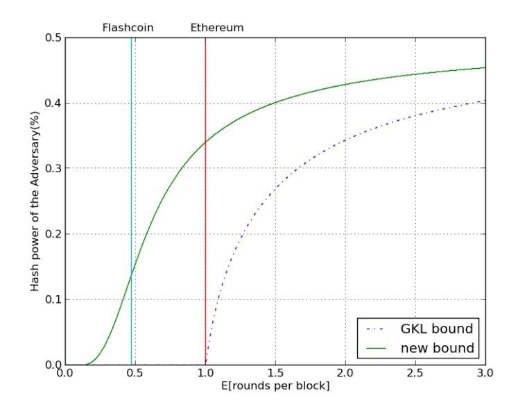
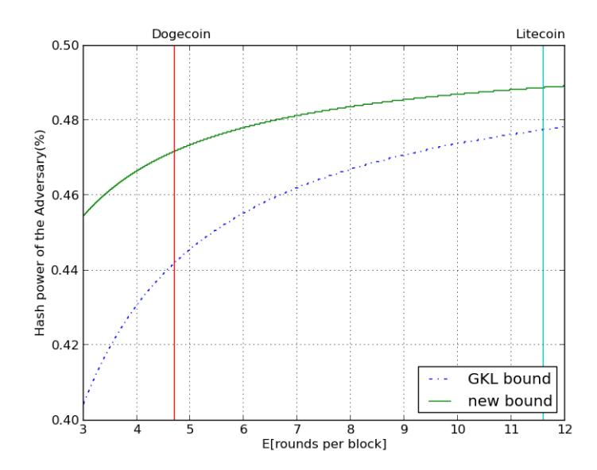
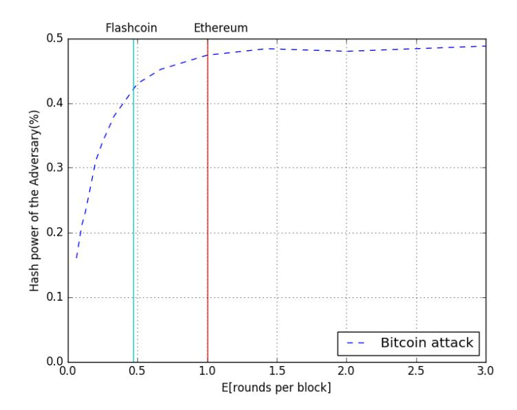

# Speed-Security Tradeos in Blockchain Protocols

Aggelos Kiayias\* School of Informatics, University of Edinburgh akiayias@inf.ed.ac.uk

Giorgos Panagiotakos? School of Informatics, University of Edinburgh giorgos.pan@ed.ac.uk

October 13, 2016

#### Abstract

Transaction processing speed is one of the major considerations in cryptocurrencies that are based on proof of work (POW) such as Bitcoin. At an intuitive level it is widely understood that processing speed is at odds with the security aspects of the underlying POW based consensus mechanism of such protocols, nevertheless the tradeo between the two properties is still not well understood.

In this work, motivated by recent work [\[8\]](#page-14-0) in the formal analysis of the Bitcoin backbone protocol, we investigate the tradeo between provable security and transaction processing speed viewing the latter as a function of the block generation rate. We introduce a new formal property of blockchain protocols, called chain growth, and we show it is fundamental for arguing the security of a robust transaction ledger. We strengthen the results of [\[8\]](#page-14-0) in the following ways: we show how the properties of persistence and liveness of the ledger reduce in a black-box fashion in the underlying properties of the backbone protocol, namely common prex, chain quality and chain growth, and we improve the security bounds showing that the robustness of the ledger holds for even the faster (than Bitcoin's) block generation rates which have been adopted by other alt-coins. We also present a theoretical attack against bitcoin which we validate in simulation that works when blockchain rate is highly accelerated. This presents a natural upper bound in the context of the speed-security tradeo. By combining our positive and negative results we map the speed/security domain for blockchain protocols and list open problems for future work.

\*Work performed while at the National and Kapodistrian University of Athens, supported by ERC project CO-DAMODA #25915.

## Contents

| 1 | Introduction                                                                                                                  | 3                |
|---|-------------------------------------------------------------------------------------------------------------------------------|------------------|
| 2 | Preliminaries 2.1 Model  2.2 Backbone Protocols  2.3 Security properties                           | 6 6 7 7 |
| 3 | Bitcoin's Persistence 3.1 A better bound for the common prex property  3.2 The strong common-prex property  | 7 7 10     |
| 4 | Chain Growth                                                                                                                  | 11               |
| 5 | Common-prex Attack                                                                                                            | 13               |
| 6 | Conclusion                                                                                                                    | 15               |
| A | Properties summary                                                                                                            | 16               |
| B | Probability of uniquely successful rounds                                                                                     | 17               |
| C | Proofs C.1 Lemma 8  C.2 Theorem 9                                                                     | 17 17 18   |

## 1 Introduction

The capability for fast transaction processing is a major consideration in any payment system and a litmus test for its potential to scale at a global level. For blockchain based protocols such as bitcoin [\[14\]](#page-15-1) the current picture is rather grim: some reported[1](#page-2-1) current rates for Bitcoin processing speed is 7 transactions per second (tps) while Paypal handles an average of 115 tps and the VISA network has a peak capacity of 47,000 tps (though it currently needs 2000-4000 tps). It goes without saying that improving transaction processing of cryptocurrencies is one of the major considerations in the research of payment systems like Bitcoin, cf. [\[3\]](#page-14-2).

Bitcoin relies on the distributed maintenance of a data structure called the blockchain by a set of entities called miners that are anonymous and potentially dynamically changing. The protocol that maintains the blockchain relies on proofs of work (POW) for ensuring that miners converge to a unique view of this data structure. The blockchain can be parsed as a ledger of transactions and assuming that the adversarial parties collectively constitute less than half of the network's computational power (also referred to as hashing power since the main computational operation is hashing) it is ensured that all parties have the same view of the ledger. The transactions in the blockchain are organized in blocks and each block is associated with a POW. The number of transactions that t inside each block is bounded (and is currently restricted by a 1MB cap).

Beyond the obvious engineering factors that aect transaction processing speed of blockchain protocols (such as network speed and computational power needed to verify transactions) the two main factors are the size of blocks and the rate that blocks are generated. The current 1MB cap on transactions is heavily debated and proposals for a 20-fold increase have been made[2](#page-2-2) . Regarding the block generation rate recall that the original parameter setting for Bitcoin attempts to stabilize it at 1 block per 10 minutes. This is achieved by suitably calibrating the hardness of the POW instances that are solved by the miners. At an intuitive level, the POW diculty is an intrinsic feature for security as it prohibits the adversary from ooding the network with messages and gives the opportunity to the honest parties to converge to a unied view.

A useful unit of time to measure the block generation rate is a round of full information propagation. Indeed, the eect that the speed of information propagation may have on security is widely understood at least informally and the eect of the former on the latter was predicted by [\[6\]](#page-14-3). In [\[8\]](#page-14-0) a formal relation between the two was proven: it was observed that security can be formally shown if the parameter f, expressing the expected number of POW solutions per complete round of information propagation, is suciently small. In that work it was shown that as f gets closer to 0 the maximum adversarial hashing power that the protocol can withstand approximates 50%, Bitcoin's claimed theoretical limit; on the other hand, as f gets larger the security bound gets worse and it completely vanishes when f = 1, i.e., the rate of expected 1 block per round.

In [\[6\]](#page-14-3) it is argued that for blocks of reasonable sizes (including those currently used), the block size is linearly dependent in the time it takes for a full communication round to be completed. From this one can argue that round duration is linearly related to block size. Furthermore, transaction processing speed is proportional to block size and also proportional to block generation rate per unit of time (say seconds). Given that we measure time in rounds of full communication we can express the following intuitive relation for transaction processing speed (measured in Kb/sec):

transaction processing speed 
$$\propto \frac{\text{block size} \times f}{\text{round duration}}$$

As a result, since scaling the block size is expected to scale the round duration by the same

1See https://en.bitcoin.it/wiki/Scalability

2See e.g., [\[5,](#page-14-4) [18,](#page-15-2) [16\]](#page-15-3) and http://gavintech.blogspot.gr/2015/01/twenty-megabytes-testing-results.html

constant, if we keep the same value of f, the transaction processing speed will be unaected. Hence, the dominant factor for improving transaction processing speed, would not be the block-size, but rather the block generation rate (per round) represented by f. It follows that, given the security critical nature of this parameter, it is important to understand how large it can be selected while maintaining the security of the system.

Interestingly, a number of alternative cryptocurrencies (alt-coins) that are based on Bitcoin have tinkered with the block generation rate of Bitcoin (see Figure [1\)](#page-3-0) to achieve faster processing without however providing any formal arguments about the security implications of such choices.

| Cryptocurrency | block gen. rate (sec) | f (blocks/round) | 1/f        |  |
|----------------|-----------------------|---------------------|------------|--|
| Bitcoin        | 600                   | 0.021               | 47.6       |  |
| Litecoin       | 150                   | 0.084               | 11.9       |  |
| Dogecoin       | 60                    | 0.21                | 4.76       |  |
| Flashcoin      | 6 − 60          | 0.21-2.1            | 0.476-4.76 |  |
| Fastcoin       | 12                    |                     | 0.95       |  |
| Ethereum3      | 12                    | 1.05                | 0.95       |  |

Figure 1: A list of the dierent block generation rates various altcoins have chosen and the corresponding f, 1/f values assuming one full communication round takes 12.6 seconds (this is the average block propagation time as measured in [\[6\]](#page-14-3)). Notice Bitcoin's conservative choice. The value f is the expected number of POW's per communication round. The value 1/f is also given which is roughly the expectation of rounds required to obtain a POW.

Given the above motivation the fundamental question we seek to answer is the following:

For a given block generation rate expressed as the expected number of blocks per round (parameter f), what is the maximum adversarial hashing power that can be provably tolerated by a population of honest miners?

The above question may be posed for the core of the Bitcoin transaction ledger protocol (the Bitcoin backbone protocol as dened in [\[8\]](#page-14-0)) but also for other similar protocols that attempt to use POW's to maintain a blockchain distributively notably the GHOST rule suggested by Sompolinsky and Zohar [\[17\]](#page-15-4).

Our Results. In this work, we investigate speed-security tradeos in blockchain protocols as a relationship between block generation rate f and the bound on the hashing power of the adversary. Specically, our results are as follows.

 We introduce a new property for blockchain protocols, called chain growth that is cast in the model of [\[8\]](#page-14-0) and complements the two properties suggested there (common prex and chain quality). In addition, we introduce a strengthened version of the common-prex property. We argue that chain growth is a fundamental property of backbone protocols independent of the other two. We illustrate this by showing that a backbone protocol satisfying all three properties implements a robust transaction ledger in a black-box fashion (something that we observe to be not true if one relies on just common prex and chain quality the two properties by themselves are insucient to imply a robust transaction ledger[4](#page-3-2) ). Furthermore,

3Currently the Ethereum Frontier reports an average of about 17 seconds, cf. [https://etherchain.org;](https://etherchain.org) the 12 seconds rate was discussed by Buterin in [\[4\]](#page-14-5).

4This does not suggest an error in [\[8\]](#page-14-0) but rather points to the fact that the proof given there regarding the implementation of a robust transaction ledger by the bitcoin backbone is not black-box on the two properties of common prex and chain quality.

chain growth is a property of interest from an attacker's point of view as it is fundamentally linked to the transaction processing speed and can constitute an adversarial goal in its own right: it captures the class of adversaries that are interested in slowing down the growth of the chain and thus also the transaction processing time.

- We substantially improve the level of security for higher rates and in this way we prove security for bounds close to 50% for alternative cryptocurrencies (including e.g., Litecoin) that have opted for much faster block creation rates compared to Bitcoin. See Figures [2](#page-7-0) and [3](#page-8-0) for graphs showing our improved security analysis.
- We nally present simulation results and an attack against the Bitcoin backbone protocol that presents a natural upper barrier in the speed-security domain. The attack focuses on the common prex property and shows how the view of two honest parties can be divergent when the block generation rate becomes too high.
- We reformulate the properties of persistence and liveness of [\[8\]](#page-14-0) to better reect the separation between safety and liveness properties in distributed systems, cf. [\[11\]](#page-14-6). Specically, our persistence property is slightly weaker than the corresponding property of [\[8\]](#page-14-0), while the liveness property is signicantly strengthened in the sense that an existential quantier is substituted by a universal quantier.

Ethereum. Ethereum has attracted considerable attention from investors as well as from the media for the past 3 years. As explained in [\[9\]](#page-14-7), Ethereum uses a variant of the Bitcoin protocol where tie-breaking between chains of the same length is resolved randomly. In the model we consider, the adversary is rushing which means that any attack against randomized chain selection can be simulated (we can suitably restrict the behavior of our adversary so that tie-breaking is resolved randomly by the honest parties). Moreover, the attack we present in Section [5](#page-12-0) is also applicable against Ethereum with insignicant changes. In this way, our work can also contribute in the ongoing dialog regarding the security related choices that are made when designing new alt-cryptocurrencies, from a provable security perspective.

Concurrent and subsequent work. Pass et. al in [\[15\]](#page-15-5) consider the security of the Bitcoin backbone in a partially synchronous setting. Towards this end, a similar denitional framework to that of [\[8\]](#page-14-0) is presented suited for partially synchronous executions. The chain growth property we introduce, as well as the liveness black-box reduction we show, proved also helpful in their domain as well. It is worth pointing out that the chain growth property, as dened in [\[15\]](#page-15-5), is stronger than our formulation. As we will see, cf. Section [4,](#page-10-0) the stronger version cannot be satised by some well-known, other than bitcoin, blockchain protocols that have been proposed. Moreover, [\[15\]](#page-15-5) show how to black-box reduce persistence to chain growth and a property called consistency which is more general than the property of common prex of [\[8\]](#page-14-0) (in which work, a non-black-box proof for persistence was given). The strong common prex property we present here is equivalent to the property of consistency of [\[15\]](#page-15-5), and directly generalizes the common prex property of [\[8\]](#page-14-0).

Limitations and directions for future research. Our analysis is in the standard cryptographic model where parties fall into two categories, those that are honest (and follow the protocol) and those that are dishonest that may deviate in an arbitrary (and coordinated) fashion as dictated by the adversary. It is an interesting direction for future work to consider speed-security tradeos in the rational setting where all parties wish to optimize a certain utility function. Designing suitable incentive mechanisms is a related important consideration, for instance see [\[12\]](#page-14-8) for a suggestion related to the GHOST protocol. The analysis we provide is in the static setting, i.e., we do not take into account the fact that parties change dynamically and that the protocol calibrates the diculty of the POW instances to account for that; we note that this may open the possibility for additional attacks, [\[1\]](#page-14-9), and hence it is an important point for consideration and future work. Our notion of round (borrowed from [\[8\]](#page-14-0)) assumes complete information propagation between all honest parties; in practice information propagation is a random variable that depends on the peer to peer network topology and some parties learn faster than others the messages communicated; depending on the properties of the random variable this can be accounted in our model by including the tail of the distribution as part of the adversary. Finally, the positive and negative results we present between speed and security still have a gray area in which it is unknown whether the protocols are secure or there is an attack that breaks security. While the above four points are limitations (and suggest interesting directions for further research in the area) our model and analysis can be extended to account for such stronger settings and hence our results may serve as the basis for further exploring the tradeo between transaction processing speed and provable security. Another important aspect is privacy in the transaction ledger (cf. [\[2,](#page-14-10) [13\]](#page-15-6)) which our analysis, being at a lower level in the blockchain protocol does not interact with directly.

Organization. In section [2](#page-5-0) we overview the model that we use for expressing the protocols and the security properties. In section [3](#page-6-2) we present our improved analysis for the Bitcoin backbone protocol. In section [4](#page-10-0) we introduce the chain growth property as well as a black-box proof for Liveness. Finally, in section [5](#page-12-0) we present our attack against the common prex property for Bitcoin.

# 2 Preliminaries

## 2.1 Model

For our model we adopt the abstraction proposed in [\[8\]](#page-14-0). Specically, in their setting, called the q-bounded setting, synchronous communication is assumed and each party is allowed q queries to a random oracle. The network supports an anonymous message diusion mechanism that is guaranteed to deliver messages of all honest parties in each round. The adversary is rushing and adaptive. Rushing here means that in any given round he gets to see all honest players' messages before deciding his own strategy. However, after seeing the messages he is not allowed to query the hashing oracle again in this round. In addition, he has complete control of the order that messages arrive to each player. The model is at in terms of computational power in the sense that all honest parties are assumed to have the same computational power while the adversary has computational power proportional to the number of players that it controls.

The total number of parties is n and the adversary is assumed to control t of them (honest parties don't know any of these parameters). Obtaining a new block is achieved by nding a hash value that is smaller than a diculty parameter D. The success probability that a single hashing query produces a solution is p = D 2 κ where κ is the length of the hash. The total hashing power of the honest players is α = pq(n − t), the hashing power of the adversary is β = pqt and the total hashing power is f = α + β. A number of denitions that will be used extensively are listed below.

#### Denition 1. A round is called:

- successful if at least one honest player computes a solution in this round.
- uniquely successful if exactly one honest player computes a solution in this round.

We will denote by Xi (resp. Yi) the random variable which is equal to 1 if i is a successful round (resp. uniquely successful) and 0 otherwise.

Denition 2. In an execution blocks are called:

- honest, if mined by an honest party.
- adversarial, if mined by the adversary.

Denition 3. (chain extension) We will say that a chain C 0 extends another chain C if a prex of C 0 is a sux of C.

In [\[8\]](#page-14-0), a lower bound to the probabilities of two events, that a round is successful or that is uniquely successful (dened bellow), was established and denoted by γu = α−α 2 . While this bound is sucient for the setting of small f, here we will need to use a better lower bound to the probability of those events, denoted by γ, and with value approximately αe−α (see Appendix). Observe that γ > γu.

## 2.2 Backbone Protocols

In order to study the properties of the core Bitcoin protocol, the term Backbone Protocol was introduced in [\[8\]](#page-14-0). On this level of abstraction we are only interested on properties of the blockchain, independently from the data stored inside the blocks. In the same work the Bitcoin backbone protocol is described in a quite abstract and detailed way. The main idea is that honest players, at every round, receive new chains from the network and pick the longest valid one to mine. Then, if they mine a block, they broadcast their chain at the end of the round. For more details we refer to [\[8,](#page-14-0) Subsection 3.1].

## 2.3 Security properties

Two crucial security properties of the Bitcoin Backbone protocol were considered in previous works: the common prex and the chain quality property. The common prex property ensures that two honest players have the same view of the blockchain, if they prune a small number of blocks from the tail of their respective chains. On the other hand, the chain quality property ensures that honest players chains' do not contain long sequences of adversarial blocks. These two properties were shown to hold for the Bitcoin Backbone protocol.

Also in the same work, the robust public transaction ledger primitive was described. This primitive captures the notion of a book, in which transactions are recorded, and was used to implement Byzantine Agreement in the honest majority setting. The primitive satises two properties: persistence and liveness. Persistence ensures that, if a transaction is seen in a block deep enough in the chain, it will stay there. And liveness ensures that if a transaction is given as input to all honest players, it will eventually be inserted in a block, deep enough in the chain, of an honest player. The Bitcoin Backbone was shown to be sucient to construct this kind of ledger. More details about the security properties and the primitive are given in Appendix [A.](#page-15-0)

## 3 Bitcoin's Persistence

### 3.1 A better bound for the common prex property

In this section we present a better security bound than the one in [\[8\]](#page-14-0) regarding the common prex and persistence properties of the Bitcoin backbone protocol. The bound of [\[8\]](#page-14-0) is derived by the observation that the adversary should produce a block for all rounds that are silent and uniquely successful. With this, it is shown that γu ≥ f+ √ f 2+4 2 β is sucient for security; observe that in general the coefficient  $\frac{f+\sqrt{f^2+4}}{2} > 1$  for any f > 0. Here we show that  $\gamma \ge \beta$  is sufficient thus we eliminate entirely the dependence on f in the coefficient of  $\beta$  (also recall  $\gamma \ge \gamma_{\mathsf{u}}$ ). This improvement in the bound has a significant impact in terms of provable security as shown in Figures 2,3.

Figure 2: The level of provable security comparing the results of [8] and our improved results for Bitcoin. Under the curves the common prefix property provably holds. The respective block-rate values chosen for two altroins are depicted on the graph.

Our main tool to derive this is a proof that *all* uniquely successful rounds have to be compensated by the adversary (and not just those that are silent). To show this we have to perform a more delicate analysis that requires some additional terminology. Next we introduce the notion of an *m*-Uniform round as well as that of the base of a round.

**Definition 4.** (*m*-Uniform rounds) We call a round *m*-Uniform if, at that round, *m* is the minimum value such that for all chains  $C_1, C_2$  that any two honest parties adopt at this round, it holds that  $||C_1|| - |C_2|| \le m$ .

**Definition 5.** (base(r)) Let base(r) denote the length of the shortest chain than an honest party adopts at round r.

By definition, if some round r is m-uniform, then it follows that on the next round, honest parties will mine chains of size at least base(r) + m. Moreover, it holds that if some round r is uniquely successful then base(r+1) will be greater or equal to  $base(r) + Y_r$ , since the solution mined by the honest party will be known to all parties by round r+1 and he is mining a chain of length at least base(r). More compactly:

Observation 6. For every m-uniform round r it holds that

$$base(r) + \max\{Y_r, m\} \le base(r+1)$$

As it was discussed earlier, uniquely successful rounds are "bad" for the adversary, because they help honest parties consent on a single blockchain in the following round. On the other hand, *m*-Uniform rounds are "good", since some honest parties may mine on shorter chains and thus waste their hash queries. Unfortunately for the adversary, this type of rounds does not happen naturally

Figure 3: Similar to figure 2 but for larger values of 1/f. Under the curves the common prefix property provably holds. The respective block-rate values chosen for two popular altroins are depicted on the graph. Bitcoin is in the far right (recall from table 1 that for Bitcoin it holds  $1/f \approx 47$ ).

in the system and he must mine and broadcast blocks of his own to make a round non-uniform (m-uniform with m > 0). The adversary must still compensate for all uniquely successful rounds independently of uniformity as shown in the next lemma.

**Lemma 7.** Suppose  $C_1$  is the chain that some honest party  $P_1$  has adopted at round r and there exists chain  $C_2$  of length at least base $(r-1) + Y_{r-1}$  that has been mined until round r and diverges from  $C_1$  at round  $s \leq r$ . Then, for  $t = \sum_{i=s}^{r-1} Y_i$ , the adversary must have mined and broadcast blocks  $b'_1, \ldots, b'_t$  in chains  $C'_1, \ldots, C'_t$  until round r where for  $i \in \{1, \ldots, t\}$ ,  $C'_i$  has a suffix that contains only adversarial blocks, including  $b'_i$ , and some honest party has adopted this chain at some round in [s, r-1].

*Proof.* Suppose round  $r_i$  is  $m_i$ -uniform for  $i \in \{1,..,t\}$ . We prove that the adversary must have broadcast at least t blocks in specific positions in the chains, in order for the fork to be maintained.

Claim 1. Let r be a uniquely successful round that is m-uniform, with  $s \leq r$ , then:

1. if  $m \geq 1$ , there exists a chain C such that blocks at positions

$$base(r) + 1, ..., base(r) + m$$

are mined by the adversary.

2. if m = 0, at the end of round r and onwards and for all pairs of honest parties' chains  $C_1, C_2$  that diverge at round s, there exists an adversarial block in one of the two chains, in position base(r) + 1.

*Proof of Claim.* The first point follows from the fact that all honest parties mine a chain of size at least base(r). So for the round to be m-Uniform a chain of size at least base(r) + m must exist. But honest parties, at the start of round r, have mined blocks on chains of at most size base(r).

Otherwise, no honest party would choose to mine a chain with length base(r). Therefore, blocks at positions base(r) + 1, .., base(r) + m of the aforementioned chain must have been mined by the adversary.

The second point follows from [8, Lemma 7]. Consider the chains  $C_1, C_2$  of two honest parties' at the end of round r and onwards that diverge at round s. For the sake of contradiction, assume that both chains have an honest block at position base(r) + 1. In this case, from [8, Lemma 7] this block must have been produced at round r and thus  $C_1, C_2$  do not diverge at round s. This concludes the proof of the claim.

Notice that, for both cases in the previous claim the adversarial blocks belong to the suffix of some chain which has a purely adversarial suffix and has been adopted by some honest player at least at the same round.

It remains to show that the blocks that the adversary must broadcast for every different uniquely successful round must be in distinct positions, and thus different. If  $m_i \geq 1$ , from the previous claim, item 1, the adversary has broadcast a chain where he has mined blocks at positions base(i) + 1, ..., base(i) + m. On the other hand, if  $m_i = 0$ , then, since  $C_1$  and  $C_2$  diverge at round s, and they have size greater or equal than base(i) + 1, the blocks at positions base(i) + 1 of the two chains cannot be both mined by honest parties (due to the claim above, item 2). Thus, in at least one of the two chains, the block at position base(i) + 1 has been mined by the adversary. Finally, from Observation 6 it holds that  $base(i) + \max(\{Y_{r_i}, m_i\} \leq base(i+1)$ , and therefore all these blocks are on distinct positions on the chains they belong. Thus the lemma follows.

Given the above core lemma we can now easily prove the improved bound for the common-prefix property following the same proof strategy as in [8]. Namely, it can be shown that the adversary cannot use very old solutions to compensate for recent uniquely successful rounds, and thus by suitably limiting his power he will be unable to produce enough solutions to compensate for every uniquely successful round, as it is required by the core lemma (proof in the Appendix).

**Lemma 8.** Assume  $\gamma \geq (1+\delta)\beta$ , for some real  $\delta \in (0,1)$ . Suppose  $\mathcal{C}_1$  is the chain that honest party  $P_1$  adopts at round r and  $\mathcal{C}_2$  is the chain that some honest party  $P_2$  adopts or has at the same round. Then, for any  $s \leq r$ , the probability that  $\mathcal{C}_1$  and  $\mathcal{C}_2$  diverge at round r-s is at most  $e^{-\Omega(\delta^3 s)}$ .

**Theorem 9.** Assume  $\gamma \geq (1+\delta)\beta$ , for some real  $\delta \in (0,1)$ . Let S be the set of the chains that honest parties have at the beginning or have adopted at a given round of the backbone protocol. Then the probability that S does not satisfy the common-prefix property with parameter k is at most  $e^{-\Omega(\delta^3k)}$ 

#### 3.2 The strong common-prefix property

Unfortunately, the common-prefix property as it was originally described in [8] is not sufficient in order to proof Persistence in a black-box fashion. We will show that a stronger variant of the common prefix holds for the Bitcoin Backbone and is sufficient. The proof of the stronger common prefix property is implicitly given in [8]. Our contribution lies on identifying a version of the common-prefix property that is sufficient for a black-box derivation of the persistence property.

**Definition 10** (Strong Common-Prefix). The strong common prefix property  $Q_{cp}$  with parameter  $k \in \mathbb{N}$  states that the chains  $C_1, C_2$  reported by two, not necessarily distinct honest parties  $P_1, P_2$  at rounds  $r_1, r_2$  with  $r_1 \leq r_2$  are such that  $C_1^{\lceil k} \leq C_2$ .

**Theorem 11.** Assume  $\gamma \geq (1+\delta)\beta$ , for some real  $\delta \in (0,1)$ . Let S be the set of the chains of the honest parties from a given round and onwards of the backbone protocol. Then the probability that S does not satisfy the strong common-prefix property with parameter k is at most  $e^{-\Omega(\delta^3k)}$ .

*Proof.* Let  $C_1, C_2$  be the chains of some honest players  $P_1, P_2$  at rounds  $r_1, r_2$ . Let  $E(r_2)$  be the event where player  $P_2$  has chain  $C_2$  at round  $r_2$  such that  $C_1^{\lceil k \rceil} \not\preceq C_2$ . We are going to show that the probability of this event is at most  $e^{-\Omega(\delta^3 k)}$ .

If  $r_1 = r_2$ , the strong common-prefix property collapses to the original common-prefix property (see Theorem 9). Otherwise, w.l.o.g. it holds that  $r_1 < r_2$ . We have two cases. In the first case, at round  $r_2$ ,  $P_1$  has a chain that extends chain  $C_1$ . If  $E(r_2)$  holds in this case, it is implied that the original common-prefix property does not hold for the two chains at round  $r_2$ , and again from Theorem 9 the probability of this event is at most  $e^{-\Omega(\delta^3 k)}$ .

In the second case, at round  $r_2$ ,  $P_1$  has adopted some other chain  $C_3$  before round  $r_2$ , but after round  $r_1$ . If  $\mathcal{C}_3^{\lceil k} \not\preceq \mathcal{C}_2$ , the same analysis as in the previous case applies. Suppose  $\mathcal{C}_3^{\lceil k} \preceq \mathcal{C}_2$ . Since  $|C_3| > |C_1|$  this implies that  $\mathcal{C}_1^{\lceil k} \not\preceq \mathcal{C}_3$ , which happens with probability at most  $e^{-\Omega(\delta^3 k)}$  from Theorem 9, since chains  $C_1$  and  $C_3$  coexist in the same round. Thus with overwhelming probability it holds that  $\mathcal{C}_1^{\lceil k} \preceq \mathcal{C}_3$ . Assuming  $E(r_2)$  in this case implies again that the original common-prefix property does not hold for the two chains at round  $r_2$ , which happens with probability at most  $e^{-\Omega(\delta^3 k)}$ . It follows that the probability of  $E(r_2)$  in this case is also at most  $e^{-\Omega(\delta^3 k)}$ .

By applying the union bound for all events  $E(r_2)$ , where  $r_2 \geq r_1$ , the theorem follows with probability at most  $e^{-\Omega(\delta^3 k)}$ .

**Theorem 12** (Black-Box Persistence). Let S be the set of the chains of the honest parties from a given round and onwards for some protocol  $\Pi$ , that satisfy the strong common-prefix property property with overwhelming probability on parameter k. Then protocol  $\Pi$  satisfies Persistence with overwhelming probability in k, where k is the depth parameter.

Proof. Let  $C_1$  be the chain of some honest player  $P_1$  at round  $r_1$ . We show that if a transaction tx is included in  $C_1^{\lceil k}$  at round  $r_1$ , then this transaction will be always included in every honest player's chain with overwhelming probability. For the sake of contradiction, suppose that persistence does not hold. Then, there exists some player  $P_2$  that at round  $r_2 > r_1$  adopts some chain  $C_2$  such that  $C_2$  does not contain tx in exactly the same position. If  $C_1^{\lceil k} \leq C_2$ , then  $C_2$  would contain tx in the same position as  $C_1$ . Thus, from our assumption it follows that  $C_1^{\lceil k} \not\leq C_2$  which violates the strong common-prefix property. The probability that the strong common-prefix property is violated is at most  $e^{-\Omega(\delta^3 k)}$  and the theorem follows.

#### 4 Chain Growth

In addition to the two security properties of the Bitcoin backbone protocol mentioned in Section 2.3 we define a new property called *chain growth*. This property aims at expressing the minimum rate at which the chains of honest parties grow. It is motivated by an attacker that has objective to slow down the overall transaction processing time of the blockchain system. The common prefix and chain quality properties do not explicitly address this issue, and this can be seen from the fact that both properties can hold even if honest parties' chains do not grow at all.

**Definition 13.** (Chain Growth Property) The chain growth property  $Q_{cg}$  with parameters  $\tau \in \mathcal{R}$  (the "chain speed" coefficient) and  $s \in \mathbb{N}$  states that for any round r > s, where honest party P has chain  $C_1$  at round r and chain  $C_2$  at round r - s in  $\text{VIEW}_{\Pi,\mathcal{A},\mathcal{Z}}^{H(\cdot)}(\kappa,q,z)$ , it holds that  $|C_1| - |C_2| \geq \tau \cdot s$ .

**Bitcoin.** For the Bitcoin backbone protocol this property is satisfied with parameter  $\tau$  equal to  $\gamma$  and with overwhelming probability in s. Since all honest parties choose the longest chain they see, and successful rounds happen with rate  $\gamma$ , their chains will grow at least at this rate. The worst the adversary can do is not participate, so this is a tight bound.

**Theorem 14.** The Bitcoin protocol satisfies the chain growth property with speed coefficient  $(1-\delta)\gamma$  and probability at least  $1-e^{-\Omega(\delta^2 s)}$ , for  $\delta \in (0,1)$ .

*Proof.* In Lemma 6 of [8] it was proved that if at some round r an honest party has a chain of length  $\ell$ , then, by round  $r+s \geq r$ , every honest party will have received a chain of length at least  $\ell + \sum_{i=r}^{r+s-1} X_i$ .

Remember that  $\gamma$  is a lower bound on the probability of a round being successful. From the Chernoff bound at least  $(1-\delta)\gamma s$  such rounds will occur between rounds r and r+s with probability  $1-e^{-\Omega(\delta^2 s)}$ . Thus, by the aforementioned lemma, the chain of any honest party will grow by  $(1-\delta)\gamma s$  blocks with probability  $1-e^{-\Omega(\delta^2 s)}$  and the chain growth property holds with parameter  $\tau$  equal to  $(1-\delta)\gamma$ .

The importance of chain growth as a fundamental property of the backbone protocol that is of the same caliber as common prefix and chain quality can be seen in the fact that the liveness of the ledger essentially depends on it. We elaborate: in [8, Lemma 16] the liveness property was not proved in a black box manner given the chain quality and common prefix properties. Interestingly, by introducing the chain growth property as a prerequisite together with the other two, a simple black box proof can be derived. As expected, the confirmation time parameter u of the liveness property is tightly connected to the chain speed coefficient  $\tau$ .

**Lemma 15** (Black-Box Liveness). Let protocol  $\Pi$  satisfy the chain quality, chain growth and strong common-prefix properties with overwhelming probability on l,s,k and parameters  $\mu(<1),\tau$ . Further, assume oracle Txgen is unambiguous. Then protocol  $\Pi$  satisfies Liveness with wait time  $u=\frac{3}{\tau}\cdot\max(k,\frac{1}{1-\mu})$  rounds and depth parameter k with overwhelming probability in k.

Proof. Let  $C_1$  be the chain of some honest party  $P_1$  at round r and  $C_2$  be his chain at round r+u. Suppose that all three properties hold. We are going to show that tx must be in some block in  $C_2^{\lceil k}$ . From the chain growth property, after u rounds the chain of  $P_1$  has grown by at least  $\tau u (\geq 3k)$  blocks. Hence,  $|C_2| - |C_1| \geq 3k$ . Next, observe that from the chain quality property at the last  $\frac{\tau u}{3}$  blocks of  $C_2^{\lceil k}$  there exists at least  $\frac{\tau u}{3}(1-\mu) \geq 1$  honest block. For the sake of contradiction, suppose that this honest block was mined up to round r, and thus it does not contain tx. Notice that this block is at a height in the chain greater than  $|C_1| + \frac{\tau u}{3} \geq |C_1| + k$ . It follows that some honest party had some chain  $C_3$  of length greater than  $|C_1| + k$  at some point until round r. This implies that  $C_3^{\lceil k} \not\preceq C_1$ , which violates the strong common-prefix property and is a contradiction. Therefore, there exists an honest block in  $C_2^{\lceil k}$  that was mined after round r and thus contains tx. Finally, due to the union bound, and since s, l are of order  $\Omega(k)$ , it follows that all three properties hold with overwhelming probability in k. The lemma follows.

By liveness we are guaranteed that new transactions will be confirmed by at least one honest party after a predetermined amount of rounds, where confirm here means that some party has some transaction at least k blocks deep in its chain. Moreover, by persistence we get that if a transaction is confirmed by some honest party, all other honest parties will see the same transaction in the same position in their chain. Unfortunately, the ledger properties as defined in [8] do not ensure that all parties will eventually confirm a transaction. This is a property that we would expect from a public

transaction ledger. The following stronger definition of liveness provides us with a bound regarding confirmation time by all parties.

**Definition 16.** (Strong) Liveness: Parameterized by  $u, k \in \mathbb{N}$  (the "wait time" and "depth" parameters, resp.), provided that a transaction is either (i) issued by Txgen, or neutral and is given as input to all honest players continuously for u consecutive rounds, (ii) reported by one honest-party more than k blocks deep from the end of the ledger at least u rounds before the current round, then all honest parties will report this transaction at a block more than k blocks from the end of the ledger.

We next show that strong Liveness can be also derived in a black-box fashion from the three backbone-level properties.

**Theorem 17** (Black-Box (Strong) Liveness). Let protocol  $\Pi$  satisfy the chain quality, chain growth and strong common-prefix properties with overwhelming probability on l,s,k and parameters  $\mu(<1),\tau$ . Further, assume oracle Txgen is unambiguous. Then protocol  $\Pi$  satisfies Strong Liveness with wait time  $u=\frac{3}{\tau}\cdot\max(k,\frac{1}{1-\mu})$  rounds and depth parameter k with overwhelming probability in k.

Proof. Let  $P_1$  be some honest player that has chain  $C_1$  at round  $r_1$  and  $P_2$  be some honest player that has chain  $C_2$  at round  $r_2 \geq r_1 + u$ . We only have to show that if a transaction is in some block in  $C_1^{\lceil k \rceil}$  then it will also be at the same block in  $C_2$  and  $|C_2| \geq |C_1|$ . All other properties of strong liveness follow from the black-box derivation of the "old" liveness property. Assume the common-prefix property and the chain growth property hold. From the Persistence property proof we have that if a transaction tx is included in  $C_1^{\lceil k \rceil}$  at round  $r_1$ , then this transaction will be always included in every honest party's chain. Now, let  $C_2'$  be the chain that  $P_2$  has at round  $r_1$ . We are going to show that  $P_2$  will have confirmed transaction tx at round  $r_2$ . Since,  $P_2$  has tx at exactly the same position as  $P_1$  at round  $r_1$ , it follows that  $|C_2'| \geq |C_1| - k$ . Moreover, from the chain growth property it holds that  $|C_2| - |C_2'| \geq \tau \cdot u \geq k$ . Therefore,  $|C_2| \geq |C_1|$  and  $P_2$  will have confirmed tx at round  $r_2$ . Since s is of order  $\Omega(k)$ , by the union bound we get that both common-prefix and chain growth hold with overwhelming probability on k and thus the lemma follows.

In a subsequent work, Pass et al. [15] provide a stronger definition for chain growth. The definition is stronger, since it requires that at every round the length of some honest party's chain is at least equal to the length of the chain that any honest party had in the previous round. We observe that this monotonicity property is not true for well known alternative chain selection rules, e.g. the GHOST or uncle-GHOST selection rule [17, 4]. Our definition is less stringent and can be shown to be satisfied by such other protocols [10], nevertheless we can still prove that it can be used to achieve strong liveness.

# 5 Common-prefix Attack

In [7] an attack (selfish mining) against the chain quality property of Bitcoin was demonstrated. In [8] it was shown that (for the case of a rushing adversary5) it is optimal since it matches the bounds of the security theorem for chain quality. However little is known regarding optimal attacks on the common prefix and chain growth properties. For instance, it is known that a "51% attacker" can break the common prefix with an arbitrarily long fork. However long forks have been predicted to be feasible even for attackers with below 50% of the hashing power in case f is large. In this section, we explore attacks on common prefix in an experimental way (through computer simulations) providing

&lt;sup>5As argued in [7] this is a plausible attack strategy, we refer to their paper for more details.

some interesting insights on the optimality of the theoretical results that we have proven. The attack targets security when f is large, and thus prohibit the increase of the block generation rate in order to increase the transaction speed.

Figure 4: The level of insecurity in terms of the hashing power of the adversary as a function of 1/f. Above the curve, our attack breaks common prex with a fork that is 100 blocks deep with probability of success at least 1%. The respective block-rate values chosen for two altcoins are depicted on the graph.

The idea of the attacks is the following: when a fork of depth 1 naturally happens, the adversary splits its hashing power, as well as the honest parties' power, on the two branches. In our model this is possible because we consider the adversary to be rushing. Then, when an honest party in one of the two branches publishes a new solution, the adversary also publishes one of its solutions (if he has any) on the other branch. If honest parties extend both branches by the same length in the same round, then the adversary just reschedules the messages so again parties are split in half. Otherwise, if possible, the adversary lengthens the chain that is behind by the same amount of blocks, to keep the fork running. Additionally, even if parties modied the backbone protocol by randomly resolving ties, cf. [\[7\]](#page-14-12), they would have 50% probability to go in one of the two branches. Therefore, randomly resolving ties does not seem to help against this attack.

As our theoretical results have predicted, the protocol seems quite robust against our attack when f < 1. However, its security deteriorates as f grows bigger and taking advantage of this attack an adversary can eectively cause deep forks to appear. Graphs on how various cryptocurrencies' (that use dierent parameterization than the Bitcoin protocol) fare in terms of the attacks are also presented. It is interesting to point out that for the choice made in Ethereum (f ≈ 1) our provable security bound is around 35% while for Dogecoin and Litecoin our improved analysis brings the provable security bound to a relatively satisfactory level of over 47%. Extreme choices such as Flashcoin cannot be supported at all by the security analysis, while Bitcoin on the other end of the spectrum opts for the safest choice that enables a near optimal provable security bound of about 49%.

## 6 Conclusion

In this paper we substantially improved the security bounds of the Bitcoin backbone [\[8\]](#page-14-0). With our chain growth denition we introduced a measure of speed, called the chain speed coecient, and we showed that the chain growth property (with a non-zero coecient) is a fundamental security property of a robust transaction ledger. Moreover, we identied a stronger version of the commonprex property, that, along with the chain quality and chain growth properties, is sucient for proving that a protocol implements a robust public transaction ledger in a black-box manner.

## References

- [1] L. Bahack. Theoretical bitcoin attacks with less than half of the computational power (draft). Cryptology ePrint Archive, Report 2013/868, 2013. [http://eprint.iacr.org/.](http://eprint.iacr.org/)
- [2] E. Ben-Sasson, A. Chiesa, C. Garman, M. Green, I. Miers, E. Tromer, and M. Virza. Zerocash: Decentralized anonymous payments from bitcoin. Cryptology ePrint Archive, Report 2014/349, 2014. [http://eprint.iacr.org/.](http://eprint.iacr.org/)
- [3] J. Bonneau, A. Miller, J. Clark, A. Narayanan, J. A. Kroll, and E. W. Felten. Research Perspectives and Challenges for Bitcoin and Cryptocurrencies. In 2015 IEEE Symposium on Security and Privacy, May 2015.
- [4] V. Buterin. Toward a 12-second block time, July 2014. [Online; Posted: July 11th, 2014.].
- [5] G. Cayn. What is the bitcoin block size debate and why does it matter?, August 2015. [Online; posted 21 August 2015].
- [6] C. Decker and R. Wattenhofer. Information propagation in the bitcoin network. In P2P, pages 110. IEEE, 2013.
- [7] I. Eyal and E. G. Sirer. Majority is not enough: Bitcoin mining is vulnerable. In Financial Cryptography, 2014.
- [8] J. A. Garay, A. Kiayias, and N. Leonardos. The bitcoin backbone protocol: Analysis and applications. In Advances in Cryptology - EUROCRYPT 2015 - 34th Annual International Conference on the Theory and Applications of Cryptographic Techniques, Soa, Bulgaria, April 26-30, 2015, Proceedings, Part II, pages 281310, 2015.
- [9] A. Gervais, G. O. Karame, K. Wüst, V. Glykantzis, H. Ritzdorf, and S. Capkun. On the security and performance of proof of work blockchains. Cryptology ePrint Archive, Report 2016/555, 2016. [http://eprint.iacr.org/2016/555.](http://eprint.iacr.org/2016/555)
- [10] A. Kiayias and G. Panagiotakos. On trees, chains and fast transactions in the blockchain. Cryptology ePrint Archive, Report 2016/545, 2016. [http://eprint.iacr.org/2016/545.](http://eprint.iacr.org/2016/545)
- [11] L. Lamport. Proving the correctness of multiprocess programs. IEEE transactions on software engineering, (2):125143, 1977.
- [12] S. D. Lerner. Even faster block-chains with the decor protocol. Cryptology ePrint Archive, Report 2013/881, May 2014. [https://bitslog.wordpress.com/2014/05/02/decor/.](https://bitslog.wordpress.com/2014/05/02/decor/)

- [13] S. Meiklejohn, M. Pomarole, G. Jordan, K. Levchenko, D. McCoy, G. M. Voelker, and S. Savage. A fistful of bitcoins: characterizing payments among men with no names. In *Proceedings of the 2013 Internet Measurement Conference*, IMC 2013, Barcelona, Spain, October 23-25, 2013, pages 127-140, 2013.
- [14] S. Nakamoto. Bitcoin: A peer-to-peer electronic cash system. http://bitcoin.org/bitcoin.pdf, 2008.
- [15] R. Pass, L. Seeman, and abhi shelat. Analysis of the blockchain protocol in asynchronous networks. Cryptology ePrint Archive, Report 2016/454, 2016. http://eprint.iacr.org/ 2016/454.
- [16] Y. B. Perez. Bitcoin in the headlines: Fork-load of drama, August 2015. [Online; posted 21 August 2015].
- [17] Y. Sompolinsky and A. Zohar. Secure high-rate transaction processing in bitcoin. *Financial Cryptography and Data Security*, 2015.
- [18] B. Wiki. Block size limit controversy, August 2015. [Online; Accessed: 24 August 2015].

# A Properties summary

Here, we give a summary of all security definitions that were considered in this paper.

**Definition 18** (Common Prefix Property). The common prefix property  $Q_{cp}$  with parameter  $k \in \mathbb{N}$  states that for any pair of honest players  $P_1, P_2$  maintaining the chains  $C_1, C_2$  in  $VIEW_{\Pi, \mathcal{A}, \mathcal{Z}}^{H(\cdot)}(\kappa, q, z)$ , it holds that

$$C_1^{\lceil k} \preceq C_2 \text{ and } C_2^{\lceil k} \preceq C_1.$$

**Definition 19** (Chain Quality Property). The chain quality property  $Q_{cq}$  with parameters  $\mu \in \mathbb{R}$  and  $\ell \in \mathbb{N}$  states that for any honest party P with chain  $\mathcal{C}$  in  $\text{VIEW}_{\Pi,\mathcal{A},\mathcal{Z}}^{H(\cdot)}(\kappa,q,z)$ , it holds that for any  $\ell$  consecutive blocks of  $\mathcal{C}$  the ratio of adversarial blocks is at most  $\mu$ .

**Definition 20** (Chain Growth Property). The chain growth property  $Q_{cg}$  with parameters  $\tau \in \mathcal{R}$  (the "chain speed" coefficient) and  $s \in \mathbb{N}$  states that for any round r > s, where honest party P has chain  $C_1$  at round r and chain  $C_2$  at round r - s in  $\text{VIEW}_{\Pi,\mathcal{A},\mathcal{Z}}^{H(\cdot)}(\kappa,q,z)$ , it holds that  $|C_1| - |C_2| \geq \tau \cdot s$ .

**Definition 21** (Strong Common-Prefix Property). The strong common prefix property  $Q_{cp}$  with parameter  $k \in \mathbb{N}$  states that the chains  $\mathcal{C}_1, \mathcal{C}_2$  reported by two, not necessarily distinct honest parties  $P_1, P_2$ , at rounds  $r_1, r_2$  with  $r_1 \leq r_2$  are such that  $\mathcal{C}_1^{\lceil k} \leq \mathcal{C}_2$ .

**Definition 22.** A protocol  $\Pi$  implements a robust public transaction ledger in the q-bounded synchronous setting if it satisfies the following two properties:

- Persistence: Parameterized by  $k \in \mathbb{N}$  (the "depth" parameter), if in a certain round an honest player P reports a ledger that contains a transaction tx in a block more than k blocks away from the end of the ledger, then from this round on, tx, if reported at all by any honest player, will be reported in the same position in the ledger as the position reported by P.
- Liveness: Parameterized by  $u, k \in \mathbb{N}$  (the "wait time" and "depth" parameters, resp.), provided that a transaction either (i) issued by Txgen, or (ii) is neutral, is given as input to all honest players continuously for u consecutive rounds, then there exists an honest party who will report this transaction at a block more than k blocks from the end of the ledger.

## B Probability of uniquely successful rounds

In this section we demonstrate a new lower bound on the probability of uniquely successful rounds. This bound allows us to argue about the security of Bitcoin even when f is larger than 1.

**Lemma 23.** For 
$$p < 0.1$$
 and  $a \in (p, 2k)$ :  $e^{-a-kp} \le (1-p)^{\frac{a}{p}-k} \le e^{-a+kp}$ 

*Proof.* The second inequality is well studied and holds for p > 0. For the first inequality by solving for a we get  $a \le k \frac{\ln(1-p)}{1 + \frac{\ln(1-p)}{p}}$  which holds for p < 0.1 and  $a \in (p, 2k)$ .

Let  $\gamma$  be a lower bound on the probability of a uniquely successful round (a round where only one block is found). From the event where (n-t) players throw q coins each and exactly one coin toss comes head, the probability of a uniquely successful rounds is at least:

$$(n-t)qp(1-p)^{q(n-t)-1} \ge \alpha e^{-\alpha - kp}$$

We set  $\gamma = ae^{-a-kp}$ , for the minimum k that satisfies the relation  $\alpha \in (p, 2k)$ . This is a substantially better bound that  $\gamma_u$  and is also a lower bound for the event that at a round is successful.

### C Proofs

#### C.1 Lemma 8

*Proof.* The proof follows the idea of the proof in the analogous lemma in [8]. We will first study the case where both  $C_1$  and  $C_2$  are adopted by the respective honest players. We define three bad events, A, B and C, which we show to hold with probability exponentially small in s. We conclude the proof by showing that if none of these bad events happens, then there cannot exist  $C_1$  and  $C_2$  diverging at round r - s.

The bad event A occurs if, at some round  $r' \geq r - s$ , the adversary broadcasts a chain  $\mathcal{C}$  with the following properties. (1)  $\mathcal{C}$  is returned by the function maxvalid of an honest party; (2) the block head( $\mathcal{C}$ ) was computed by the adversary before round  $r - (1 + \frac{\delta}{8})s$ .

We now give an upper bound on the probability that event A occurs. Let  $r^* \leq r - (1 + \frac{\delta}{8})s$  be the latest round at which a block of  $\mathcal{C}$  was computed by an honest party (if none exists, then  $r^* = 0$ ), and let  $\ell$  denote the length of the chain up to that block. If any other block computed by an honest party exists among the blocks from length  $\ell$  up to len( $\mathcal{C}$ ), then such block was computed in rounds  $r - (1 + \frac{\delta}{8})s$  up to r', and it follows that the probability that the adversary's block can extend it at round r' is negligible in  $(\kappa - \log D)$ . Therefore, we infer that with overwhelming probability the adversary has computed all the blocks from length  $\ell$  to len( $\mathcal{C}$ ), and done so during the rounds  $r^*$  to r'. Let Z denote the total number of solutions the adversary obtained in  $r' - r^*$  rounds. Let also X denote the total number of successful rounds for the honest parties in  $r' - r^*$  rounds. We have

$$Z \ge \operatorname{len}(\mathcal{C}) - \ell \ge X$$
.

The first inequality was argued above and the second one follows from [8, Lemma 5]. Finally, note that, by Lemma [8, Lemma 6], the event  $Z \geq X$  has measure exponentially small in the number of rounds  $r' - r^*$ . Since that number satisfies  $r' - r^* \geq \delta s/8$ , we conclude that  $\Pr[A] \leq e^{-\Omega(\delta^3 s)}$ .

The second bad event occurs if the adversary has obtained a large number of solutions during  $(1+\frac{\delta}{8})s$  rounds. Specifically, let Z denote the number of successful calls to the oracle by the

adversary, for a total of  $(1 + \frac{\delta}{8})s$  rounds. Define B to be the event  $Z \ge (1 + \frac{\delta}{9})(1 + \frac{\delta}{8})\beta s$ . An application of Chernoff bounds gives

$$\Pr[Z \ge (1 + \frac{\delta}{9})(1 + \frac{\delta}{8})\beta s] \le e^{-\Omega(\beta\delta^2 s)}.$$

The third bad event occurs when not enough uniquely successful rounds occur. Consider any number, say, s' of rounds, and denote by X' the number of them that were uniquely successful. We have

$$\Pr[X' \le (1 - \frac{\delta}{4})\gamma s'] \le e^{-\Omega(\gamma \delta^2 s')}.$$

From now on we assume that none of the events A, B and C occurs. Since a round is uniquely successful with probability  $\gamma$ , from the negation of the third bad event we expect at least  $(1-\frac{\delta}{4})\gamma s$  such rounds. Note that, since A does not occur, the adversary may not use solutions computed before round  $r-(1+\frac{\delta}{8})s$  with probability at least  $1-e^{-\Omega(\delta^3 s)}$ . The negation of the second bad event bounds the number of solutions the adversary can obtain. Moreover, for any  $\delta \in (0,1)$  it holds that

$$X' > (1 - \frac{\delta}{4})\gamma s \ge (1 + \frac{\delta}{9})(1 + \frac{\delta}{8})\beta s > Z$$

From Lemma 7 this is a contradiction, since the adversary must have mined at least X' solutions in order to maintain the fork.

We conclude that if  $A \cup B \cup C$  does not occur, then  $C_1$  and  $C_2$  cannot diverge at round r - s. Finally, an application of the union bound on  $A \cup B \cup C$  implies that the adversary can successfully maintain such  $C_1$  and  $C_2$  with probability at most exponentially small in s and the statement of the lemma follows.

The only of the remaining cases that is interesting, is when block  $head(\mathcal{C}_1)$  is the block mined in the uniquely successful round r-1 and  $P_2$  has chain  $\mathcal{C}_2$  at the beginning of round r. It is implied that at round r-1 some honest player mines the chain ending in the parent of  $head(\mathcal{C}_1)$  and  $P_2$  adopts  $\mathcal{C}_2$ . Notice, that the two chains diverge at round r-s and thus by the same argument as before, this happens with probability at most  $e^{-\Omega(\delta^3(s-1))} = e^{-\Omega(\delta^3s)}$ , and the lemma follows. All other cases, can be reduced easily to the first argument.

#### C.2 Theorem 9

*Proof.* If there is only one chain in S then the property is satisfied trivially. First, consider two chains  $C_1$  and  $C_2$  in S that honest parties have adopted at round r and the least integer  $k^*$  such that

$$C_1^{\lceil k^*} \leq C_2 \text{ and } C_2^{\lceil k^*} \leq C_1.$$
 (1)

We need to show that the event  $k^* \geq k$  happens with probability exponentially small in k.

Let r be the current round and let r-s be the round at which the last common block of  $\mathcal{C}_1$  and  $\mathcal{C}_2$  was computed. The length of the chains cannot be greater than the number of solutions Y obtained from the oracle in s rounds. By the Chernoff bound,

$$\Pr[Y \ge (1+\delta)fs] \le e^{-\delta^2 fs/3}.$$

It follows that, with probability  $1 - e^{-\delta^2 f s/3}$ ,  $s > k^*/((1+\delta)f)$ . Thus, if  $k^* \ge k$ , we have a sequence of  $s = \Omega(k)$  consecutive rounds with chains  $\mathcal{C}_1$  and  $\mathcal{C}_2$  diverging at round s, and the theorem follows from Lemma 8.

Otherwise, suppose that without loss of generality  $C_1$  is the chain that some honest player had (at the beginning of the round) at round r, while  $C_2$  has been adopted by some honest player at the same round. Then the analysis we did previously holds, since we can apply Lemma 8 for the

| two chains. | Finally, suppose that both                                     | C1 and | C2 | are chains that honest player |   |                                 | had | at round r. |
|-------------|----------------------------------------------------------------|-----------|----|-------------------------------|---|---------------------------------|-----|----------------|
|             | Then, both chains were adopted by some honest players at round |           |    |                               | r | −1, which is the case we proved |     |                |
|             | initially, and the theorem follows.                            |           |    |                               |   |                                 |     |                |