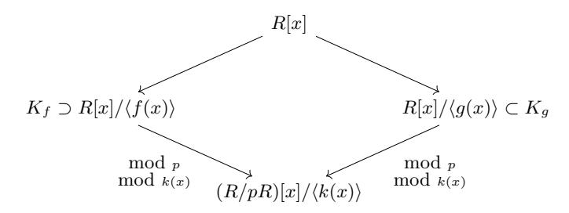
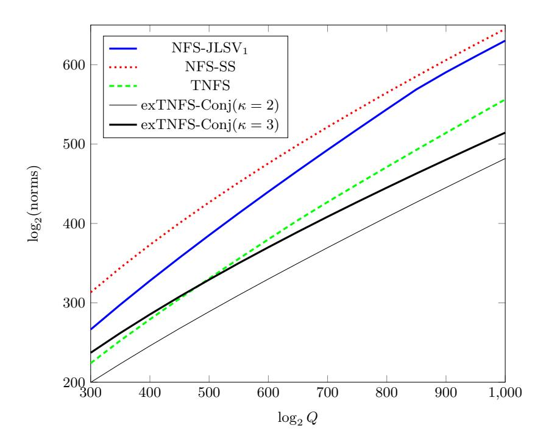
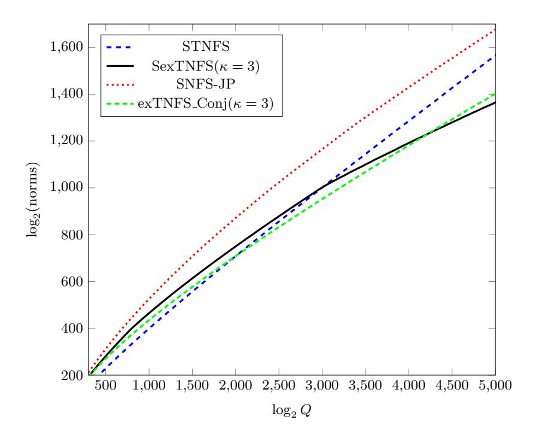
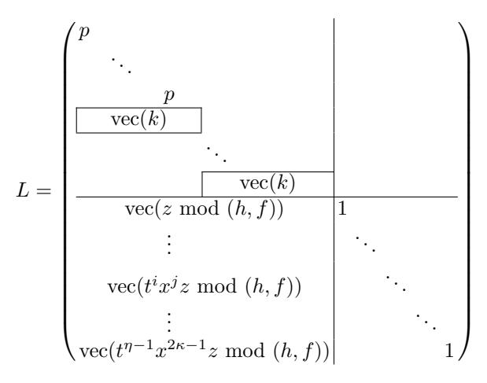

# Extended Tower Number Field Sieve: A New Complexity for the Medium Prime Case?

Taechan Kim<sup>1</sup> and Razvan Barbulescu<sup>2</sup>

<sup>1</sup> NTT Secure Platform Laboratories, Japan taechan.kim@lab.ntt.co.jp

Abstract. We introduce a new variant of the number field sieve algorithm for discrete logarithms in Fp<sup>n</sup> called exTNFS. The most important modification is done in the polynomial selection step, which determines the cost of the whole algorithm: if one knows how to select good polynomials to tackle discrete logarithms in Fp<sup>κ</sup> , exTNFS allows to use this method when tackling Fpηκ whenever gcd(η, κ) = 1. This simple fact has consequences on the asymptotic complexity of NFS in the medium prime case, where the complexity is reduced from LQ(1/3, p<sup>3</sup> 96/9) to LQ(1/3, p<sup>3</sup> 48/9), Q = p n , respectively from LQ(1/3, 2.15) to LQ(1/3, 1.71) if multiple number fields are used. On the practical side, exTNFS can be used when n = 6 and n = 12 and this requires to updating the keysizes used for the associated pairing-based cryptosystems.

Keywords: Discrete Logarithm Problem; Number Field Sieve; Finite Fields; Cryptanalysis

# 1 Introduction

The discrete logarithm problem (DLP) is at the foundation of a series of public key cryptosystems. Over a generic group of cardinality N, the best known algorithm to solve the DLP has an exponential running time of O( √ N). However, if the group has a special structure one can design better algorithms, as is the case for the multiplicative group of finite fields F<sup>Q</sup> = Fp<sup>n</sup> where the DLP can be solved much more efficiently than in the exponential time. For example, when the characteristic p is small compared to the extension degree n, the best known algorithms have quasi-polynomial time complexity [\[6](#page-27-0)[,21\]](#page-28-0).

DLP over fields of medium and large characteristic Recall the usual LQ-notation,

$$L_Q(\ell, c) = \exp\left((c + o(1))(\log Q)^{\ell}(\log\log Q)^{1-\ell}\right),\,$$

<sup>2</sup> CNRS, Univ Paris 6, Univ Paris 7, France razvan.barbulescu@imj-prg.fr

<sup>?</sup> This work is a merged version of two consecutive works [\[24\]](#page-28-1) and [\[4\]](#page-27-1).

for some constants  $0 \le \ell \le 1$  and c > 0. We call the characteristic  $p = L_Q(\ell_p, c_p)$  medium when  $1/3 < \ell_p < 2/3$  and large when  $2/3 < \ell_p \le 1$ . We say that a field  $\mathbb{F}_{p^n}$  is in the boundary case if  $\ell_p = 2/3$ .

For medium and large characteristic, in particular when Q is prime, all the state-of-the-art attacks are variants of the number field sieve (NFS) algorithm. Initially used for factoring, NFS was rapidly introduced in the context of DLP [20,32] to target prime fields. One had to wait almost one decade before the first constructions for  $\mathbb{F}_{p^n}$  with n>1 were proposed [33], known today [7] as the tower number field sieve (TNFS). This case is important because it is used to choose the key sizes for pairing based cryptosystems. Since 2006 one can cover the complete range of large and medium characteristic finite fields [22]. This latter approach that we denote by JLSV has the advantage to be very similar to the variant used to target prime fields, except for the first step called polynomial selection where two new methods were proposed: JLSV<sub>1</sub> and JLSV<sub>2</sub>.

In the recent years NFS in fields  $\mathbb{F}_{p^n}$  with n>1 has become a laboratory where one can push NFS to its limits and test new ideas which are ineffective or impossible in the factorization variant of NFS. Firstly, the polynomial selection methods were supplemented with the generalized Joux-Lercier (GJL) method [27,5], with the Conjugation (Conj) method [5] and the Sarkar-Singh (SS) method [31]. One can see Table 1 for a summary of the consequences of these methods on the asymptotic complexity. In particular, in all these algorithms the complexity for the medium prime case is slightly larger than that of the large prime case.

<span id="page-1-0"></span>Table 1: The complexity of each algorithms in the medium and large prime cases. Each cell indicates c if the complexity is  $L_Q(1/3, (c/9)^{\frac{1}{3}})$ .

| $p = L_Q(\ell_p)$      | $1/3 < \ell_p < 2/3$ | best $\ell_p = 2/3$ | $2/3 < \ell_p < 1$ |
|------------------------|----------------------|---------------------|--------------------|
| TNFS [33,7]            | none                 | none                | 64                 |
| NFS-JLSV [22]          | 128                  | 64                  | 64                 |
| NFS-(Conj and GJL) [5] | 96                   | 48                  | 64                 |
| NFS-SS [31]            | 96                   | 48                  | 64                 |
| exTNFS (this article)  | 48 <sup>1</sup>      | 48 <sup>1</sup>     | 64                 |

Secondly, a classical idea which was introduced in the context of factorization is to replace the two polynomials f and g used in NFS by a polynomial f and several polynomials  $g_i$ , i = 1, 2, ... which play the role of g. All the currently known variants of NFS admit such variants with multiple number fields (MNFS) which have a slightly better asymptotic complexity, as shown in Table 2. The

<sup>&</sup>lt;sup>1</sup> The best complexity is obtained when n has a factor of the appropriate size as specified in Theorem 1.

discrete logarithm problem allows to have a case with no equivalent in the factorization context: instead of having a distinguished polynomial f and many sides  $g_i$  all the polynomials are interchangeable [8].

<span id="page-2-0"></span>Table 2: The complexity of each algorithms using multiple number fields. Each cell indicates an approximation of c if the complexity is  $L_Q(1/3, (c/9)^{\frac{1}{3}})$

| $p = L_Q(\ell_p)$        | $1/3 < \ell_p < 2/3$ | best $\ell_p = 2/3$ | $2/3 < \ell_p < 1$ |
|--------------------------|----------------------|---------------------|--------------------|
| MTNFS [7]                | none                 | none                | 61.93              |
| MNFS-JLSV [8]            | 122.87               | 61.93               | 61.93              |
| MNFS-(Conj and GJL) [30] | 89.45                | 45.00               | 61.93              |
| MNFS-SS [31]             | 89.45                | 45.00               | 61.93              |
| MexTNFS (this article)   | $45.00^2$            | $45.00^2$           | 61.93              |

Thirdly, when the characteristic p has a special form, as it is the case for fields in several pairing-based cryptosystems, one might speed-up the computations by variants called special number field sieve (SNFS). In Table 3 we list the asymptotic complexity of each algorithm. Once again, the medium characteristic case has been harder than the large characteristic one.

<span id="page-2-1"></span>Table 3: The complexity of each algorithms used when the characteristic has a special form (SNFS) Each cell indicates an approximation of c if the complexity is  $L_Q(1/3, (c/9)^{\frac{1}{3}})$

| $p = L_Q(\ell_p)$      | $1/3 < \ell_p < 2/3$ | $2/3 < \ell_p < 1$ |
|------------------------|----------------------|--------------------|
| SNFS-JP [23]           | 64                   | 32                 |
| STNFS [7]              | none                 | 32                 |
| SexTNFS (this article) | $32^{-2}$            | 32                 |

Our contributions Let us place ourselves in the case when the extension degree is composite with relatively prime factors,  $n=\eta\kappa$  with  $\gcd(\eta,\kappa)=1$ . If the particular cases  $\eta=1$  and  $\kappa=1$  we obtain known algorithms but we don't exclude these cases from our presentation. The basic idea is to use the trivial equality

$$\mathbb{F}_{p^n} = \mathbb{F}_{(p^\eta)^\kappa}.$$

<sup>&</sup>lt;sup>2</sup> The best complexity is obtained under the assumption that n has a factor of the appropriate size. See Theorem 1.

In the JLSV algorithm,  $\mathbb{F}_{p^n}$  is constructed as  $\mathbb{F}_p[x]/k(x)$  for an irreducible polynomial k(x) of degree n. In the TNFS algorithm  $\mathbb{F}_{p^n}$  is obtained as R/pR where R is a ring of integers of a number field where p is inert. In our construction  $\mathbb{F}_{p^n} = R/pR$  as in TNFS and  $\mathbb{F}_{p^n} = (R/pR)[x]/(k(x))$  where k is a degree  $\kappa$  irreducible polynomial over  $\mathbb{F}_{p^n}$ .

Interestingly, this construction can be integrated in an algorithm, that we call the extended number field sieve (exTNFS), in which we can target  $\mathbb{F}_{p^{\eta\kappa}}$  with the same complexity as  $\mathbb{F}_{P^{\kappa}}$  for a prime P of the same bitsize as  $p^{\eta}$ . Hence we obtain complexities for composite extension degrees which are similar in the medium characteristic case to the large characteristic case. This is because our construction lets us to consider the norm of an element from a number field  $K_f$  that is 'doubly' extended by h(t) and f(x), i.e.  $K_f := \mathbb{Q}(\iota, \alpha_f)$ , where  $\iota$  and  $\alpha_f$  denote roots of h and f, respectively. It provides a smaller norm size, which plays an important role during the complexity analysis than when we work with an absolute extension of the same degree.

Since the previous algorithms have an "anomaly" in the case  $\ell_p = 2/3$ , where the complexity is better than in the large prime case, when n is composite we obtain a better complexity for the medium prime case than in the large prime case.

Overview We introduce the new algorithm in Section 2 and analyse its complexity in Section 3. The multiple number field variant and the one dedicated to fields of SNFS characteristic are discussed in Section 4. In Section 5 we make a precise comparison to the state-of-the-art algorithms at cryptographic sizes before deriving new key sizes for pairings in Section 6. We conclude with cryptographic implications of our result in Section 7.

# <span id="page-3-0"></span>2 Extended TNFS

#### 2.1 Setting

Throughout this paper, we target fields  $\mathbb{F}_Q$  with  $Q = p^n$  where  $n = \eta \kappa$  such that  $\eta, \kappa \neq 1$ ,  $\gcd(\eta, \kappa) = 1$  and the characteristic p is medium or large, i.e.  $\ell_p > 1/3$ . First we select a polynomial  $h(t) \in \mathbb{Z}[t]$  of degree  $\eta$  which is irreducible modulo p. We put  $R := \mathbb{Z}[t]/h(t)$  and note that  $R/pR \simeq \mathbb{F}_{p^n}$ . Then we select two polynomials f and g with integer coefficients whose reductions modulo p have a common factor k(x) of degree  $\kappa$  which is irreducible over  $\mathbb{F}_{p^n}$ . Our algorithm is unchanged if f and g have coefficients in R because in all the cases we use the number fields  $K_f$  (resp.  $K_g$ ) defined by f (resp. g) above the fraction field of R but this generalization is not needed for the purpose of this paper, except in a MNFS variant.

The conditions on f, g and h yield two ring homomorphisms from R[x]/f(x) (resp. R[x]/g(x)) to  $(R/pR)/k(x) = \mathbb{F}_{p^{\eta\kappa}}$ : in order to compute the reduction of a polynomial in R[x] modulo p then modulo k(x) one can start by reducing modulo f (resp. g) and continue by reducing modulo p and then modulo k(x). The result

is the same if we use f as when we use g. Thus one has the commutative diagram in Figure 1 which is a generalization of the classical diagram of NFS.

<span id="page-4-0"></span>

Fig. 1: Commutative diagram of exTNFS. When  $R = \mathbb{Z}$  this is the diagram of NFS for non-prime fields. When k(x) = x - m for some  $m \in R$  this is the diagram of TNFS. When both  $R = \mathbb{Z}$  and k(x) = x - m this is the diagram of NFS.

After the polynomial selection, the exTNFS algorithm proceeds as all the variants of NFS, following the same steps: relations collection, linear algebra and individual logarithm. Most of these steps are very similar to the TNFS algorithms as we shall explain below.

#### 2.2 Detailed Descriptions

#### <span id="page-4-1"></span>**Polynomial Selection**

Choice of h We have to select a polynomial  $h(t) \in \mathbb{Z}[t]$  of degree  $\eta$  which is irreducible modulo p and whose coefficients are as small as possible. As in TNFS we try random polynomials h with small coefficients and factor them in  $\mathbb{F}_p[t]$  to test irreducibility. Heuristically, one succeeds after  $\eta$  trials and since  $\eta \leq 3^{\eta}$  we expect to find h such that  $||h||_{\infty} = 1$ . For a more rigorous description on the existence of such polynomials one can refer to [7].

Next we select f and g in  $\mathbb{Z}[x]$  which have a common factor k(x) modulo p of degree  $\kappa$  which remains irreducible over  $\mathbb{F}_{p^{\eta}}$ . It is here that we use the condition  $\gcd(\eta,\kappa)=1$  because an irreducible polynomial  $k(x)\in\mathbb{F}_p[x]$  remains irreducible over  $\mathbb{F}_{p^{\eta}}$  if and only if  $\gcd(\eta,\kappa)=1$ . If one has an algorithm to select f and g in R[x] one might drop this condition, but in this paper f and g have integer coefficients. Thus it is enough to test the irreducibility of k(x) over  $\mathbb{F}_p$  and we have the same situation as in the classical variant of NFS for non-prime fields (JLSV): JLSV<sub>1</sub>, JLSV<sub>2</sub>, Conjugation method, GJL and Sarkar-Singh. Let us present two of these methods which are important for results of asymptotic complexity.

 $JLSV_2$  method We briefly describe the polynomial selection introduced in Section 3.2 of [22]. One first chooses a monic polynomial  $f_0(x)$  of degree  $\kappa$  with small

coefficients, which is irreducible over  $\mathbb{F}_p$  (and automatically over  $\mathbb{F}_{p^\eta}$  because  $\gcd(\eta,\kappa)=1$ ). Set an integer  $W\approx p^{1/(D+1)}$ , where D is a parameter determined later subject to the condition  $D\geq \kappa$ . Then we define  $f(x):=f_0(x+W)$ . Take the coefficients of g(x) as the shortest vector of an LLL-reduced basis of the lattice L defined by the columns:

$$L:=(p\cdot \mathbf{x^0},\ldots,p\cdot \mathbf{x}^\kappa,\mathbf{f(x)},\mathbf{xf(x)},\ldots,\mathbf{x^{D+1-\kappa}f(x)}).$$

Here,  $\mathbf{f}(\mathbf{x})$  denotes the vector formed by the coefficients of a polynomial f. Finally, we set k = f then we have

$$\begin{array}{l} - \deg(f) = \kappa \text{ and } \|f\|_{\infty} = O(p^{\frac{\kappa}{D+1}}); \\ - \deg(g) = D \geq \kappa \text{ and } \|g\|_{\infty} = O(p^{\frac{\kappa}{D+1}}). \end{array}$$

Conjugation method We recall the polynomial selection method in Algorithm 4 of [5]. First, one chooses two polynomials  $g_1(x)$  and  $g_0(x)$  with small coefficients such that  $\deg g_1 < \deg g_0 = \kappa$ . Next one chooses a quadratic, monic, irreducible polynomial  $\mu(x) \in \mathbb{Z}[x]$  with small coefficients. If  $\mu(x)$  has a root  $\delta$  in  $\mathbb{F}_p$  and  $g_0 + \delta g_1$  is irreducible over  $\mathbb{F}_p$  (and automatically over  $\mathbb{F}_{p^n}$  because  $\gcd(\eta, \kappa) = 1$ ), then set  $k = g_0 + \delta g_1$ . Otherwise, one repeats the above steps until such  $g_1$ ,  $g_0$ , and  $\delta$  are found. Once it has been done, find u and v such that  $\delta \equiv u/v$  (mod p) and q0 and q1, q2 using rational reconstruction. Finally, we set q3 Resq4 (q4), q6 and q8 and q9 and q9 and q9 and q9 and q9 and q9 and q9 and q9 and q9 and q9 and q9 and q9 and q9 and q9 and q9 and q9 and q9 and q9 and q9 and q9 and q9 and q9 and q9 and q9 and q9 and q9 and q9 and q9 and q9 and q9 and q9 and q9 and q9 and q9 and q9 and q9 and q9 and q9 and q9 and q9 and q9 and q9 and q9 and q9 and q9 and q9 and q9 and q9 and q9 and q9 and q9 and q9 and q9 and q9 and q9 and q9 and q9 and q9 and q9 and q9 and q9 and q9 and q9 and q9 and q9 and q9 and q9 and q9 and q9 and q9 and q9 and q9 and q9 and q9 and q9 and q9 and q9 and q9 and q9 and q9 and q9 and q9 and q9 and q9 and q9 and q9 and q9 and q9 and q9 and q9 and q9 and q9 and q9 and q9 and q9 and q9 and q9 and q9 and q9 and q9 and q9 and q9 and q9 and q9 and q9 and q9 and q9 and q9 and q9 and q9 and q9 and q9 and q9 and q9 and q9 and q9 and q9 and q9 and q9 and q9 and q9 and q9 and q9 and q9 and q9 and q9 and q9 and q9 and q9 and q9 and q9 and q9 and q9 and q9 and q9 and q9 and q9 and q9 and q9 and q9 and q9 and q9 and q9 and q9 and q9 and q9 a

```
 - \deg(f) = 2\kappa \text{ and } ||f||_{\infty} = O(1);
 - \deg(g) = \kappa \text{ and } ||g||_{\infty} = O(\sqrt{p}) = O(Q^{\frac{1}{2\eta\kappa}}).
```

The bound on  $||f||_{\infty}$  depends on the number of polynomials  $g_0 + \delta g_1$  tested before we find one which is irreducible over  $\mathbb{F}_p$ . Heuristically this happens on average after  $2\kappa$  trials. Since there are  $3^{2\kappa} > 2\kappa$  choices of  $g_0$  and  $g_1$  of norm 1 we have  $||f||_{\infty} = O(1)$ .

**Relation Collection** The elements of  $R = \mathbb{Z}[t]/h(t)$  can be represented uniquely as polynomials of  $\mathbb{Z}[t]$  of degree less than deg h.

We proceed as in TNFS and enumerate all the pairs  $(a,b) \in \mathbb{Z}[t]^2$  of degree  $\leq \eta - 1$  such that  $||a||_{\infty}$ ,  $||b||_{\infty} \leq A$  for a parameter A to be determined. We say that we obtain a relation for the pair (a,b) if

$$\begin{aligned} N_f(a,b) &:= \mathrm{Res}_t(\mathrm{Res}_x(a(t)-b(t)x,f(x)),h(t)) \text{ and } \\ N_g(a,b) &:= \mathrm{Res}_t(\mathrm{Res}_x(a(t)-b(t)x,g(x)),h(t)) \end{aligned}$$

are B-smooth for a parameter B to be determined (an integer is B-smooth if all its prime factors are less than B). If  $\iota$  denotes a root of h in R our enumeration is equivalent to putting linear polynomials  $a(\iota) - b(\iota)x$  in the top of the diagram of Figure 1.

One can put non-linear polynomials  $r(x) \in R[x]$  of degree  $\tau - 1$  in the diagram for any  $\tau \geq 2$  but this is not necessary in this paper. Indeed, in this paper we

enumerate polynomials r to attack  $\mathbb{F}_{p^{\kappa\eta}}$  of the same degree as those that one would use to attack  $\mathbb{F}_{p^{\kappa}}$  for a prime  $P \approx p^{\eta}$ . It happens that in the large prime case and for the best parameters of the boundary case the optimal value of  $\tau$  is 2. This determines us to state Lemma 1 only in the case  $\tau = 2$  and to write everywhere  $r = a(\iota) - b(\iota)x$ , but we bear in mind that r could have a larger degree, prove Lemma 2 in Appendix A, use it in the last paragraph of Section 4 and write Table 5 for arbitrary values of  $\tau$  before observing that the optimal value is again  $\tau = 2$ .

<span id="page-6-0"></span>Remark 1. The choice of the polynomials r in the top of the diagram is such that the norm sizes are as small as possible. If one had an algorithm to pinpoint the principal ideals of a number field which have small norms then one would use this algorithm to generate the polynomials r.

As one of the referees notices, the advantage of exTNFS when compared to the classical version of NFS is that our enumeration is less naive. Indeed, since the norms are computed as an iteration of resultants, i.e.  $N_f(r(t,x)) = \operatorname{Res}_t(\operatorname{Res}_x(r(t,x),f(x)),h(t))$ , we can enumerate polynomials r which make the relative norm  $\operatorname{Res}_x(r(t,x),f(x))$  small in some sense, for example we restrict to linear polynomials r.

For each pair (a, b), i.e. r = a - bx, one obtains a linear equation where the unknowns are logarithms of elements of the factor base as in the classical variant of NFS for discrete logarithms. But let us define the factor base in our particular case.

Factor base Let  $\alpha_f$  (resp.  $\alpha_g$ ) be a root of f in  $K_f$  (resp. of g in  $K_g$ ), the number field it defines over the fraction field of R. Then the norm of  $a(\iota) - b(\iota)\alpha_f$  (resp.  $a(\iota) - b(\iota)\alpha_g$ ) over  $\mathbb{Q}$  is  $\mathrm{Res}_t(\mathrm{Res}_x(a(t) - b(t)x, f(x)), h(t))$  (resp.  $\mathrm{Res}_t(\mathrm{Res}_x(a(t) - b(t)x, g(x)), h(t))$ ) up to a power of l(f) (resp. l(g)), the leading coefficient of f (resp. g). We call factor base the set of prime ideals of  $K_f$  and  $K_g$  which can occur in the factorization of  $a(\iota) - b(\iota)\alpha_f$  and  $a(\iota) - b(\iota)\alpha_g$  when both norms are B-smooth. By Proposition 1 in [7] we can give an explicit description of the factor base as  $\mathcal{F}(B) := \mathcal{F}_f(B) \bigcup \mathcal{F}_g(B)$  where

$$\mathcal{F}_f(B) = \left\{ \langle \mathfrak{q}, \alpha - \gamma \rangle : \begin{matrix} \mathfrak{q} \text{ is a prime in } \mathbb{Q}(\iota) \text{ lying over a prime} \\ p \leq B \text{ and } f(\gamma) \equiv 0 \pmod{\mathfrak{q}} \end{matrix} \right\}$$

$$\bigcup \left\{ \text{prime ideals of } K_f \text{ dividing } l(f) \text{Disc}(f) \right\}.$$

and similarly for  $\mathcal{F}_q(B)$ .

Schirokauer maps If  $\langle a(\iota) - b(\iota)\alpha_f \rangle = \prod_{\mathfrak{q} \in \mathcal{F}_f(B)} \mathfrak{q}^{\mathrm{val}_{\mathfrak{q}}(a(\iota) - b(\iota)\alpha_f)}$  and  $\langle a(\iota) - b(\iota)\alpha_g \rangle = \prod_{\mathfrak{q} \in \mathcal{F}_g(B)} \mathfrak{q}^{\mathrm{val}_{\mathfrak{q}}(a(\iota) - b(\iota)\alpha_g)}$  we write

$$\sum_{\mathfrak{q} \in \mathcal{F}_f(B)} \operatorname{val}_{\mathfrak{q}}(a(\iota) - b(\iota)\alpha_f) \log \mathfrak{q} + \epsilon_f(a,b) = \sum_{\mathfrak{q} \in \mathcal{F}_g(B)} \operatorname{val}_{\mathfrak{q}}(a(\iota) - b(\iota)\alpha_g) \log \mathfrak{q} + \epsilon_g(a,b)$$

where the log sign denotes virtual logarithms in the sense of [32] and [22] and  $\epsilon_f$  and  $\epsilon_g$  are correction terms called Schirokauer maps which were first introduced in [32].

The novelty for TNFS and exTNFS with respect to JLSV is that  $K_f$  and  $K_g$  are constructed as tower extensions instead of absolute extensions. On the other hand, it is more convenient to work on absolute extensions when we compute Schirokauer maps. We solve this problem by computing primitive elements  $\theta_f$  (resp.  $\theta_g$ ) of  $K_f/\mathbb{Q}$  (resp.  $K_g/\mathbb{Q}$ ). For a proof we refer to Section 4.3 in [22].

Linear algebra and individual logarithm These two steps are unchanged with respect to the classical variant of NFS. The linear algebra step, comes after relation collection and consists in solving the linear system over  $\mathbb{F}_l$  for some prime factor l of the order of  $\mathbb{F}_Q^*$ . Using Wiedemann's algorithm this has a quasi-quadratic complexity in the size of the linear system, which is equal to the cardinality of the factor base. In [7] it is shown that the factor base has  $(2 + o(1))B/\log B$  elements, so the cost of the linear algebra is  $B^{2+o(1)}$ .

In the individual logarithm step one writes any desired discrete logarithm as a sum of virtual logarithms of elements in the factor base. Since the step is very similar to the corresponding step in NFS we keep the description for the Appendix.

# <span id="page-7-0"></span>3 Complexity

The complexity analysis of exTNFS follows the steps of the analysis of NFS in the case of prime fields. It is expected that the stages of the algorithm other than the relation collection and the linear algebra are negligible, hence we select parameters to minimize their cost and afterwards we check that the other stages are indeed negligible.

Let us call T the time spent in average for each polynomial  $r \in R[x]$  enumerated in the relation collection stage (in this paper  $r = a(\iota) - b(\iota)x$ ), and let  $P_f$  (resp.  $P_g$ ) be the probability that the norm  $N_f$  (resp.  $N_g$ ) of r with respect to f (resp. g) is g-smooth. The number of polynomials that we test before finding each new relation is on average  $1/(P_f P_g)$ , so the cost of the relations collection is  $\#\mathcal{F}(B)T/(P_f P_g)$ .

We make the usual heuristic that the proportion of smooth norms is the same as the proportion of arbitrary positive integers of the same size which are also smooth, so  $P_f = \text{Prob}(N_f, B)$  (resp  $P_g = \text{Prob}(N_g, B)$ ) where Prob(x, y) is the probability that an arbitrary integer less than x is y-smooth. The value of T depends on whether we use a sieving technique or we consider each value and test smoothness with ECM [26]; if we use the latter variant we obtain  $T = L_B(1/2, \sqrt{2})(\log Q)^{O(1)}$ , so  $T = B^{o(1)}$ . Using the algorithm of Wiedemann [34] the cost of the linear algebra is  $(\#\mathcal{F}(B))^{2+o(1)} = B^{2+o(1)}$ . Hence, up to an exponent 1 + o(1), we have

<span id="page-7-1"></span>complexity(exTNFS) =
$$\frac{B}{\text{Prob}(N_f, B)\text{Prob}(N_g, B)} + B^2$$
. (1)

This equation is the same for NFS, TNFS, exTNFS and the corresponding SNFS variants. The differences begin when we look at the size of N<sup>f</sup> and N<sup>g</sup> which depend on the polynomial selection method. In what follows we instantiate Equation [\(1\)](#page-7-1) with various cases and obtain equations which have already been analyzed in the literature.

<span id="page-8-1"></span>Lemma 1. Let h and f be irreducible polynomials over Z and call η := deg h and κ := deg(f). Let a(t), b(t) ∈ Z[t] be polynomials of degree at most η − 1 with kak∞, kbk<sup>∞</sup> ≤ A. We put N<sup>f</sup> (a, b) := Rest(Resx(a(t) − b(t)x, f(x)), h(t)). Then we have

<span id="page-8-2"></span>1.

$$|N_f(a,b)| < A^{\eta \cdot \kappa} ||f||_{\infty}^{\eta} ||h||_{\infty}^{\kappa \cdot (\eta - 1)} C(\eta, \kappa), \tag{2}$$

where C(η, κ) = (η + 1)(3κ+1)η/<sup>2</sup> (κ + 1)3η/<sup>2</sup> .

2. Assume in addition that khk<sup>∞</sup> is bounded by an absolute constant H and that p = LQ(`p, c) for some `<sup>p</sup> > 1/3 and c > 0. Then

$$N_f(a,b) \le E^{\kappa} ||f||_{\infty}^{\eta} L_Q(2/3, o(1)),$$
 (3)

where E = A<sup>η</sup>

Proof. 1. This is proven in Theorem 3 in [\[7\]](#page-27-2).

2. The overhead is bounded as follows

$$\begin{split} \log(\|h\|_{\infty}^{\kappa(\eta-1)}C(\eta,\kappa)) & \leq \kappa\eta \log H + 3\kappa\eta \log \eta + 3\eta \log \kappa \\ & = O(\log(Q)^{1-\ell_p}(\log\log Q)^{\ell_p}) \\ & = o(1)\log(Q)^{2/3}(\log\log Q)^{1/3}. \end{split}$$

ut

If N<sup>f</sup> = LQ(2/3) then we can forget the overhead LQ(2/3, o(1)) as the Canfield-Erd¨os-Pomerance theorem states that the smoothness probability satisfies, uniformly on x and y in the validity domain,

<span id="page-8-0"></span>
$$Prob(x^{1+o(1)}, y) = Prob(x, y)^{1+o(1)}.$$

The next statement summarizes our results.

Theorem 1. (under the classical NFS heuristics) If Q = p <sup>n</sup> is a prime power such that

$$- p = L_Q(\ell_p, c_p) \text{ with } 1/3 < \ell_p;$$

$$- n = \eta \kappa \text{ such that } \eta, \kappa \neq 1 \text{ and } \gcd(\eta, \kappa) = 1$$

then the discrete logarithm over F<sup>Q</sup> can be solved in LQ(1/3, C) where C and the additional conditions are listed in Table [4.](#page-9-0)

In the rest of this section we prove this statement. In any case in the table, one shares the conditions κ = o ( log Q log log Q ) 1 3 or κ ≤ c( log Q log log Q ) 1 <sup>3</sup> for some constant c > 0. These are equivalent to say that P = p <sup>η</sup> = LQ(`<sup>P</sup> ) for some `<sup>P</sup> ≥ 2/3.

<span id="page-9-0"></span>

| algorithm        | C                                                                     | conditions                                                                                                                                                                                                          |
|------------------|-----------------------------------------------------------------------|---------------------------------------------------------------------------------------------------------------------------------------------------------------------------------------------------------------------|
| $exTNFS-JLSV_2$  | $(64/9)^{\frac{1}{3}}$                                                | $\kappa = o\left(\left(\frac{\log Q}{\log\log Q}\right)^{\frac{1}{3}}\right)$                                                                                                                                       |
| exTNFS-GJL       | $(64/9)^{\frac{1}{3}}$                                                | $\kappa \le \left(\frac{8}{3}\right)^{-\frac{1}{3}} \left(\frac{\log Q}{\log\log Q}\right)^{\frac{1}{3}}$                                                                                                           |
| exTNFS-Conj      | $(48/9)^{\frac{1}{3}}$                                                | $\ell_p < 2/3 \text{ or } \ell_p = 2/3 \text{ and } c_p < 12^{\frac{1}{3}}$ $\kappa = 12^{-\frac{1}{3}} \left(\frac{\log Q}{\log \log Q}\right)^{\frac{1}{3}}$                                                      |
| SexTNFS          | $(32/9)^{\frac{1}{3}}$                                                | $\kappa = o\left(\left(\frac{\log Q}{\log\log Q}\right)^{\frac{1}{3}}\right)$ $p \text{ is } d\text{-SNFS with } d = \frac{(2/3)^{\frac{1}{3}} + o(1)}{\kappa}\left(\frac{\log Q}{\log\log Q}\right)^{\frac{1}{3}}$ |
| $MexTNFS-JLSV_2$ |                                                                       | $\kappa = o\left(\left(\frac{\log Q}{\log\log Q}\right)^{\frac{1}{3}}\right)$                                                                                                                                       |
| MexTNFS-GJL      | $\left(\frac{92+26\sqrt{13}}{27}\right)^{\frac{1}{3}}$                | $\kappa \le \left(\frac{7+2\sqrt{13}}{6}\right)^{-1/3} \left(\frac{\log Q}{\log\log Q}\right)^{\frac{1}{3}}$                                                                                                        |
| MexTNFS-Conj     | $\frac{3+\sqrt{3(11+4\sqrt{6})}}{\left(18(7+3\sqrt{6})\right)^{1/3}}$ |                                                                                                                                                                                                                     |

Table 4: Complexity of exTNFS variants.

#### exTNFS-JLSV<sub>2</sub> 3.1

In this section we assume that n has a factor  $\kappa$  such that

$$\kappa = o\left(\left(\frac{\log(Q)}{\log\log(Q)}\right)^{1/3}\right).$$

Let us introduce  $||h||_{\infty} = O(1)$  and the values of  $||f||_{\infty}, ||g||_{\infty} \approx p^{\kappa/(D+1)}$  coming from the  $JLSV_2$  method (Section 2.2) in Equation (2). Then we get

$$|N_f(a,b)| < \left(A^{\eta\kappa}(p^{\frac{\kappa}{D+1}})^{\eta}\right)^{1+o(1)} = \left(E^{\kappa}P^{\frac{\kappa}{D+1}}\right)^{1+o(1)},$$
 (4)

$$|N_f(a,b)| < \left(A^{\eta\kappa} (p^{\frac{\kappa}{D+1}})^{\eta}\right)^{1+o(1)} = \left(E^{\kappa} P^{\frac{\kappa}{D+1}}\right)^{1+o(1)},$$

$$|N_g(a,b)| < \left(A^{\eta D} (p^{\frac{\kappa}{D+1}})^{\eta}\right)^{1+o(1)} = \left(E^{D} P^{\frac{\kappa}{D+1}}\right)^{1+o(1)},$$
(5)

where we set  $E := A^{\eta}$  and  $P := |R/pR| = p^{\eta}$ .

One recognizes the expressions for the norms in the large prime case [22, Appendix A.3.], where P = p and  $\kappa = n$ . We conclude that we have the same complexity:

complexity
(exTNFS with JLSV<sub>2</sub>) =
$$L_Q(1/3, \sqrt[3]{64/9})$$
.

#### exTNFS-GJL 3.2

We relax a bit the condition from the previous section: we assume that n has a factor  $\kappa$  such that

$$\kappa \le (8/3)^{-\frac{1}{3}} \left( \frac{\log(Q)}{\log\log(Q)} \right)^{1/3}.$$

Recall the characteristics of our polynomials: khk<sup>∞</sup> = O(1) and deg h = η; kfk<sup>∞</sup> = O(1) and deg f = D + 1 for a parameter D ≥ κ; kgk<sup>∞</sup> ≈ p κ/(D+1) and deg g = D. We inject these values in Equation [\(2\)](#page-8-2) and we get

$$|N_f(a,b)| < E^{D+1}L_Q(2/3,o(1)),$$
 (6)

$$|N_g(a,b)| < E^D Q^{1/(D+1)} L_Q(2/3, o(1)), \tag{7}$$

where we set E := A<sup>η</sup> and P := |R/pR| = p η . We recognize the expression in the first equation of Section 4.2 in [\[5\]](#page-27-3), so

complexity(exTNFS with GJL) =
$$L_Q(1/3, \sqrt[3]{64/9})$$
.

# 3.3 exTNFS-Conj

We propose here a variant of NFS which combines exTNFS with the Conjugation method of polynomial selection.

Let us consider the case when n = ηκ with

$$\kappa = \left(\frac{1}{12^{1/3}} + o(1)\right) \left(\frac{\log(Q)}{\log\log(Q)}\right)^{1/3}.$$

Note that this implies `<sup>p</sup> ≤ 2/3 so that we are in the medium characteristic or boundary case.

As before, evaluating the values coming from the Conjugation method (Section [2.2\)](#page-4-1) in Equation [\(2\)](#page-8-2), we have

<span id="page-10-1"></span>
$$|N_f(a,b)| < E^{2\kappa} L_Q(2/3,o(1)),$$
 (8)

$$|N_g(a,b)| < E^{\kappa}(p^{\kappa\eta})^{1/(2\kappa)} L_Q(2/3,o(1)). \tag{9}$$

When we combine Equations [\(8\)](#page-10-1) and [\(9\)](#page-10-1) we obtain

$$|N_f(a,b)| \cdot |N_g(a,b)| < E^{3\kappa} Q^{(1+o(1))/(2\kappa)}.$$

But this is Equation (5) in [\[5\]](#page-27-3) when τ = 2 (the parameter τ is written as t in [\[5\]](#page-27-3), the number of coefficients of the sieving polynomial r). The rest of the computations are identical as in point 3. of Theorem 1 in [\[5\]](#page-27-3), so

complexity(exTNFS-Conj) =
$$L_Q(1/3, (48/9)^{1/3})$$
.

# <span id="page-10-0"></span>4 Variants

### 4.1 The case when p has a special form (SexTNFS)

In some pairing-based constructions p has a special form, e.g. in the Barreto-Naehrig curves [\[9\]](#page-27-5) p = 36u <sup>4</sup> + 36u <sup>3</sup> + 24u <sup>2</sup> + 6u + 1 of embedding degree 12 and in the Freeman pairing-friendly constructions of embedding degree 10 [\[18,](#page-28-7) Section 5.3] p = 25u <sup>4</sup> + 25u <sup>3</sup> + 25u <sup>2</sup> + 10u + 3. For a given integer d, an integer

p is d-SNFS if there exists an integer u and a polynomial  $\varPi(x)$  with integer coefficients so that

$$p = \Pi(u),$$

 $\deg \Pi = d$  and  $\|\Pi\|_{\infty}$  is bounded by an absolute constant.

We consider the case when  $n = \eta \kappa$ ,  $\gcd(\eta, \kappa) = 1$  with  $\kappa = o\left(\left(\frac{\log Q}{\log \log Q}\right)^{1/3}\right)$  and p is d-SNFS. In this case exTNFS is unchanged: we select h, f and g three polynomials with integer coefficients so that

- h is irreducible modulo p, deg  $h = \eta$  and  $||h||_{\infty} = O(1)$ ;
- f and g have a common factor k(x) modulo p which is irreducible of degree  $\kappa$ .

Choice of f and g using the method of Joux and Pierrot (as in SNFS-JP). Find a polynomial S of degree  $\kappa-1$  with coefficients in  $\{-1,0,1\}$  so that  $k(x)=x^{\kappa}+S(x)-u$  is irreducible modulo p. Since the proportion of irreducible polynomials in  $\mathbb{F}_p$  of degree  $\kappa$  is  $1/\kappa$  and there are  $3^{\kappa}$  choices we expect this step to succeed. Then we set

$$\begin{cases} g = x^{\kappa} + S(x) - u \\ f = \Pi(x^{\kappa} + S(x)). \end{cases}$$

If f is not irreducible over  $\mathbb{Z}[x]$ , which happens with small probability, start over. Note that g is irreducible modulo p and that f is a multiple of g modulo p. Precisely, as in [23], we choose S(x) so that it is of degree  $O(\log \kappa/\log 3)$ . Since  $3^{O(\log \kappa/\log 3)} > \kappa$ , we still have enough chance to have irreducible g. By construction we have:

$$\begin{array}{l} - \deg(g) = \kappa \text{ and } \|g\|_{\infty} = u = p^{1/d}; \\ - \deg(f) = \kappa d \text{ and } \|f\|_{\infty} = O\big((\log \kappa)^d\big). \end{array}$$

Let us compute the analysis of this particular case of exTNFS. We inject these values in Equations (2) and obtain

$$|N_f(a,b)| \le E^{\kappa d} L_Q(2/3,o(1))$$

 $|N_g(a,b)| \le E^{\kappa} P^{1/d} L_Q(2/3,o(1)),$

where  $E := A^{\eta}$  and  $P := |R/pR| = p^{\eta}$ . We recognize the size of the norms in the analysis by Joux and Pierrot [23, Section 6.3.], so we obtain the same complexity as in their paper:

complexity(SexTNFS) =
$$L_Q(1/3, (32/9)^{1/3})$$
.

### 4.2 The multiple polynomial variants (MexTNFS)

Virtually every variant of NFS can be accelerated using multiple polynomials and exTNFS makes no exception. The multiple variant of exTNFS is as follows: choose f and g which have a common factor k(x) modulo p which is irreducible of degree  $\kappa$  using any of the methods given in Section 2.2. Next we set  $f_1 = f$

and  $f_2 = g$  and select other V-2 irreducible polynomials  $f_i := \mu_i f_1 + \nu_i f_2$  where  $\mu_i = \sum_{j=0}^{\eta-1} \mu_{i,j} \iota^j$  and  $\nu_i = \sum_{j=0}^{\eta-1} \nu_{i,j} \iota^j$  are elements of  $R = \mathbb{Z}[t]/h\mathbb{Z}[t]$  such that  $\|\mu_i\|_{\infty}, \|\nu_i\|_{\infty} \leq V^{\frac{1}{2\eta}}$  where  $V = L_Q(1/3, c_v)$  is a parameter which will be selected later. Denote  $\alpha_i$  a root of  $f_i$  for  $i = 1, 2, \ldots, V$ .

Once again the complexity depends on the manner in which the polynomials f and g are selected.

**MexTNFS-JLSV<sub>2</sub>** Barbulescu and Pierrot [8, Section 5.3.] analysed the complexity of MNFS with JLSV<sub>2</sub>, so we only need to check that the size of the norm is the same for NFS and exTNFS for each polynomial  $f_i$  with  $1 \le i \le V$ . By construction we have:

- $-\operatorname{deg}(f_1) = \kappa \text{ and } \|f_1\|_{\infty} = p^{\frac{\kappa}{D+1}};$
- $-\deg(f_i)=D\geq \kappa \text{ and } \|f_i\|_{\infty}=V^{\frac{1}{2\eta}}p^{\frac{\kappa}{D+1}} \text{ for } 2\leq i\leq V.$

As before, we inject these values in Equations (2) and obtain

$$|N_{f_1}(a,b)| < E^{\kappa}(p^{\kappa\eta})^{\frac{1}{D+1}} L_Q(2/3,o(1))$$

$$|N_{f_i}(a,b)| < E^D(p^{\kappa\eta})^{\frac{1}{D+1}} L_Q(2/3,o(1)) \text{ for } 2 \le i \le V.$$

We emphasize that  $(V^{\frac{1}{2\eta}})^{\eta} = V^{\frac{1}{2}} = L_Q(1/3, c_v/2) = L_Q(2/3, o(1))$  which is true without any condition on  $\eta$ . Hence we obtain

$$\text{complexity}(\text{MexTNFS-JLSV}_2) = L_Q\left(1/3, \left(\frac{92 + 26\sqrt{13}}{27}\right)^{1/3}\right).$$

**MexTNFS-Conj and GJL** Pierrot [30] studied the multiple polynomial variant of NFS when the Conjugation method or GJL are used. To show that we obtain the same complexities we need to show that the norm with respect to each polynomial is the same as in the classical NFS, except for a factor  $L_Q(2/3, o(1))$ , which boils down to testing again that  $(V^{\frac{1}{2\eta}})\eta = L_Q(2/3, o(1))$  which is always true. When  $P = p^{\eta} = L_Q(2/3, c_P)$  such that  $c_P > (\frac{7+2\sqrt{13}}{6})^{1/3}$  and  $\tau$  is the number of coefficients of the enumerated polynomials r, then the complexity obtained is  $L_Q(1/3, C(\tau, c_P))$  where

$$C(\tau, c_P) = \frac{2}{c_P \tau} + \sqrt{\frac{20}{9(c_P \tau)^2} + \frac{2}{3}c_P(\tau - 1)}.$$

The best case is when  $c_P=(\frac{56+24\sqrt{6}}{12})^{1/3}$  and  $\tau=2$  (linear polynomials):

$$\text{complexity(best case of MexTNFS-Conj)} = L_Q\left(1/3, \frac{3+\sqrt{3(11+4\sqrt{6})}}{\left(18(7+3\sqrt{6})\right)^{1/3}}\right),$$

where the second constant being approximated by 1.71.

# <span id="page-13-0"></span>5 Comparison and examples

NFS, TNFS and exTNFS have the same main lines:

- we compute a large number of integer numbers;
- we factor these numbers to test if they are B-smooth for some parameter B;
- we solve a linear system depending on the previous steps.

If we reduce the size of the integers computed in the algorithm we reduce the work needed to find a subset of integers which are *B*-smooth, which further allows us to adapt the other parameters so that the linear algebra is also cheap. A precise analysis is complex because in some variants one tests smoothness using ECM while in others one can sieve (which is faster). Nevertheless, as a first comparison we use the criterion in which one must minimize the bitsize of the product of the norms.

# 5.1 Precise comparison when p is arbitrary

Each method of polynomial selection has a different expression of the norm bitsize, which depends on the number  $\tau$  of coefficients of the polynomials r(x) that are enumerated during the relation collection. Let us reproduce Table 2 in [31], which we extend with TNFS and exTNFS:

<span id="page-13-1"></span>

| Method                 | norms product                                                      | conditions and parameters                                                                                             |
|------------------------|--------------------------------------------------------------------|-----------------------------------------------------------------------------------------------------------------------|
| NFS-JLSV <sub>1</sub>  | $E^{\frac{4n}{\tau}}Q^{\frac{\tau-1}{n}}$                          |                                                                                                                       |
| $NFS$ - $JLSV_2$       | $E^{\frac{2(n+D)}{\tau}}Q^{\frac{\tau-1}{D+1}}$                    | $D = \deg(g) \ge n$                                                                                                   |
| NFS-GJL                | $E^{\frac{2(2D+1)}{\tau}}Q^{\frac{\tau-1}{D+1}}$                   | $D \ge n$                                                                                                             |
| NFS-Conj               | $E^{\frac{6n}{\tau}}Q^{\frac{\tau-1}{2n}}$                         |                                                                                                                       |
| NFS-SS                 | $E^{\frac{2\eta(2K+1)}{\tau}}Q^{\frac{\tau-1}{\eta(K+1)}}$         | $n = \eta \kappa, K \ge \kappa, \deg(g) = \eta K$                                                                     |
| TNFS                   | $E^{\frac{2(d+1)}{\tau}}Q^{\frac{2(\tau-1)}{d+1}}$                 | $n \text{ small}, d = \deg(f)$                                                                                        |
| $exTNFS\text{-}JLSV_1$ |                                                                    | $n = \eta \kappa, \gcd(\eta, \kappa) = 1, \eta \text{ small}$                                                         |
| $exTNFS\text{-}JLSV_2$ |                                                                    | $n = \eta \kappa, \gcd(\eta, \kappa) = 1, \eta \text{ small}, D \ge \kappa$                                           |
| exTNFS-GJL             | $E^{\frac{2(2D+1)}{\tau}}Q^{\frac{\tau-1}{D+1}}$                   | $n = \eta \kappa, \gcd(\eta, \kappa) = 1, \eta \text{ small}, D \ge \kappa$                                           |
| exTNFS-Conj            | $E^{\frac{6\kappa}{\tau}}Q^{\frac{(\tau-1)}{2\kappa}}$             | $n = \eta \kappa, \gcd(\eta, \kappa) = 1, \eta \text{ small}$                                                         |
| exTNFS-SS              | $E^{\frac{2\kappa_0(2K+1)}{\tau}}Q^{\frac{\tau-1}{\kappa_0(K+1)}}$ | $n = \eta \kappa_0 \kappa_1, \gcd(\eta, \kappa_1) = 1,$<br>$\eta \text{ small}, K \ge \kappa_1, \deg(g) = \kappa_0 K$ |

Table 5: Comparison of norm sizes.  $\tau = \deg r(x)$  while D and K are integer parameters subject to the conditions in the last column.

Note that the method of Sarkar and Singh requires that n is composite. The settings based on TNFS (TNFS, exTNFS-GJL etc) have an overhead due to the

combinatorial factor which is not written in this table, so we add the condition that the degree of the intermediate number field must be small. Finally, exTNFS requires the additional condition that κ and η are relatively prime.

Extrapolation of E The parameter E depends on the implementation of NFS and might be different for one variant to another. Let us take for example three computations with NFS which tackle various problems of the same bitsize:

- Danilov and Popovyan [\[16\]](#page-28-8) factored a 180-digit RSA modulus using log<sup>2</sup> E ≈ 30 (although the size of the pairs (a, b) in theirs computations is not written explicitly, one can compute E using the range of special-q's and the default cardinality of the sieving space per special-q, which is 230);
- Bouvier et al. [\[12\]](#page-28-9) computed discrete logarithms in a 180-digit field F<sup>p</sup> using log<sup>2</sup> E ≈ 30 (computed from other parameters).
- Barbulescu et al. [\[5\]](#page-27-3) computed discrete logarithms in a 180-digit field Fp<sup>2</sup> using log<sup>2</sup> E ≈ 29.

We see that in the first approximation E depends only on the bitsize of the field that we target and has the same value as in the factoring variant of NFS. Let us extrapolate E from the pair (log<sup>2</sup> Q = 600, log<sup>2</sup> E = 30) using the formula

$$E = cL_Q(1/3, (8/9)^{1/3}).$$

Since exTNFS requires that gcd(η, κ) = 1, the first case to study is n = 6.

The case of fields Fp<sup>6</sup> When n = 6 we can use the general methods

- NFS-JLSV<sup>1</sup> (bitsize E 24 <sup>τ</sup> Q τ−1 <sup>6</sup> , best values of τ are 3 and 2)
- NFS-GJL with D equal to its optimal value, 6 (bitsize E 26 <sup>τ</sup> Q τ−1 <sup>7</sup> , best values of τ are 3 and 2 )
- TNFS with deg f = 5, its optimal value for this range of fields (bitsize E 12 <sup>τ</sup> Q τ−1 <sup>3</sup> , best value of τ is 2)

as well as the methods which exploit the fact that n is composite

- Sarkar-Singh (NFS-SS) with η = 2 and K = 3, best value so that K ≥ n/η for this range of fields, (E 28 <sup>τ</sup> Q τ−1 <sup>8</sup> ) respectively η = 3 and K = 2, best value so that K ≥ n/η for this range of fields, (bitsize E 30 <sup>τ</sup> Q τ−1 <sup>9</sup> , best τ are 4 and 3 )
- exTNFS with η = 2 or η = 3 and one of two methods for selecting f and g
  - exTNFS-GJL with η = 3, D = 2 its best value so that D ≥ n/η, (bitsize E <sup>τ</sup> Q τ−1 <sup>3</sup> , best value of τ is 2 )
  - exTNFS-GJL with η = 2, D = 3 its best value so that D ≥ n/η, (E 14 <sup>τ</sup> Q <sup>4</sup> , best values of τ are 3 and 2 )
  - exTNFS-Conj with η = 2 (bitsize E 18 <sup>τ</sup> Q τ−1 <sup>6</sup> , best values of τ is 2).
  - exTNFS-Conj with η = 3 (bitsize E 12 <sup>τ</sup> Q τ−1 <sup>4</sup> , best values of τ are 3 and 2).

<span id="page-15-0"></span>

Fig. 2: Plot of the norms bitsize for several variants of NFS. Horizontal axis indicates the bitsize of p <sup>n</sup> while the vertical axis the bitsize of the norms product.

We plot the values of the norms product in Figure 2. Note that exTNFS with the Conjugation method seems to be the best choice for fields between 300 and 1000 bits.

For even more insight we enter into details on a specific field.

**Example 1:** Let us consider the field  $\mathbb{F}_{p^6}$  when

$$p = 3141592653589793238462643383589.$$

The bitsize of  $Q = p^6$  is 608 and its number of decimal digits is 182. Since the parameter E can only be chosen after an effective computation we are bound to make the hypothesis that it will have a similar value as in a series of record computations with NFS having the same input size:

In the following  $\log_2 E = 30$ . Let us make a list with the norm sizes obtained with each version of NFS:

1. NFS-JLSV<sub>1</sub>. We take for example  $f=x^6-1772453850905518$  and  $g=1772453850905514x^6+96769484157337$ . The sieving space contains polynomials of degree two  $r(x)=a+xb+cx^2\in\mathbb{Z}[x]$ , i.e.  $\tau=3$ , and the absolute value of the coefficients is bounded by  $E^{2/3}$ . The upper bound on the norms' product is

norms bitsize(NFS-JLSV<sub>1</sub>) =
$$8\log_2 E + \frac{1}{3}\log_2 Q \approx 440$$
.

2. NFS-Conj. We take  $f=x^{12}+3$  and  $g=1016344366092854x^6-206700367981621$ . We sieve polynomials  $r\in\mathbb{Z}[x]$  of degree 4, i.e.  $\tau=5$ , and the absolute value of the coefficients is bounded by  $E^{2/5}$ . Then we obtain

norms bitsize
(NFS-Conj) =
$$\frac{36}{5}\log_2 E + \frac{1}{3}\log_2 Q \approx 418.$$

3. TNFS. We take  $f=x^5+727139x^3+538962x^2+513716x+691133, g=x-1257274$  and  $h=t^6+t^4+t+1$ . Here, h is chosen so that  $\mathbb{F}_{p^6}=(\mathbb{Z}[t]/h(t))/p(\mathbb{Z}[t]/h(t))$ . The sieving polynomials are of the form  $r(x)=a(\iota)-b(\iota)x$ , i.e.  $\tau=2$ . Here,  $a=\sum_{i=0}^5 a_i \iota^i$  and  $b=\sum_{i=0}^5 a_i \iota^i$  are elements in  $\mathbb{Z}(\iota)=\mathbb{Z}[t]/h(t)$  with the coefficients whose absolute values bounded by  $A=E^{1/\deg(h)}=E^{1/6}$ . Note that the parameter  $d=\deg f$  is equal to 5, so that we have

norms bitsize(TNFS) =
$$6\log_2 E + \frac{1}{3}\log_2 Q \approx 380$$
.

4. exTNFS-Conj with  $\eta=2$  and  $\kappa=3$ . We take  $f=x^6-3$ ,  $g=309331385734750x^3-1851661516636217$  and  $h=t^2+2$ . We sieve polynomials of the form  $a(\iota)-b(\iota)x$ , i.e.  $\tau=2$ , where a and b are linear in  $\iota$  with their coefficients bounded by  $A=E^{1/2}$ . Hence we obtain

norms bitsize(exTNFS
$$\eta = 2$$
) =  $9 \log_2 E + \frac{1}{6} \log_2 Q \approx 370$ .

5. exTNFS-Conj with η = 3 and κ = 2. We take f = x <sup>4</sup> − 2x <sup>3</sup> + x <sup>2</sup> − 3, g = 1542330130901467x <sup>2</sup> − 1542330130901467x − 923667359431967 and h = t <sup>3</sup> + t + 1. Again we sieve polynomials of the form a(ι) − b(ι)x, i.e. τ = 2, where a and b are quadratic in ι with coefficients bounded by A = E1/<sup>3</sup> . This leads to

norms bitsize(exTNFS
$$\kappa = 2$$
) =  $6 \log_2 E + \frac{1}{4} \log_2 Q \approx 330$ .

We conclude that in this example the best choice is exTNFS with κ = 2.

The condition gcd(η, κ) = 1 is also satisfied by n = 10, 12, 14, 18, 20, 24 etc, but we do not discuss these cases in detail.

# 5.2 Precise comparison when p is SNFS

<span id="page-17-0"></span>To compare precise norm sizes when p is a d-SNFS prime, let us consider Table [6.](#page-17-0)

|           | Method norms product              | conditions                           |
|-----------|-----------------------------------|--------------------------------------|
| STNFS     | 2(d+1)<br>τ−1<br>E<br>Q<br>τ<br>d |                                      |
| SNFS-JP E | 2n(d+1)<br>τ−1<br>Q<br>τ<br>nd    |                                      |
| SexTNFS E | 2κ(d+1)<br>τ−1<br>Q<br>τ<br>κd    | n = ηκ<br>gcd(κ, η) = 1<br>2 ≤ η < n |

Table 6: Comparison of norm sizes when p is d-SNFS prime.

Note that SexTNFS encompass SNFS-JP when η = 1, and STNFS when η = n, so we only call it SexTNFS when 2 ≤ η < n.

As in the case when p is arbitrary, we do not have precise estimations of E, especially in the large range of fields log<sup>2</sup> Q ∈ [1000, 10000]. We are going to extrapolate from the pair (log<sup>2</sup> Q = 1039, log<sup>2</sup> E = 30.38), due to the record of [\[1\]](#page-27-6), using the formula

$$E = cL_Q(1/3, (4/9)^{\frac{1}{3}}).$$

Let us introduce a notation for the bitsize of SexTNFS, for any integers κ ≥ 1 and τ ≥ 2:

$$C_{norm}(\tau, \kappa) = \frac{2\kappa(d+1)}{\tau} \log E + \frac{\tau - 1}{\kappa d} \log Q.$$

For each κ, Cnorm(τ, κ) has a minimum at the integer τ ≥ 2 which best approximates 2κ <sup>2</sup>d(d+1) log E log Q <sup>1</sup>/<sup>2</sup> .

The case of 4-SNFS primes . To fix ideas, we restrict at the case d=4. When  $\kappa=1$ , i.e. STNFS, the norm size has its minimum at  $\tau=2$  as soon as  $\frac{\log Q}{\log E} \geq 40/2^2=10$ . In our range of interest  $(300 \leq \log_2 Q \leq 10000)$ , the ratio  $\log Q/\log E$  is always larger than 19. So, we only take care of sieving linear polynomials in the case of STNFS with d=4. Similarly, it suffices to consider sieving linear polynomials in the case of SexTNFS with  $\kappa=2$  (resp.  $\kappa=3$ ) whenever  $\log Q/\log E \geq 40$  (resp.  $\log Q/\log E \geq 90$ ). It is satisfied when Q is of at least 1450 bits (resp. 6300 bits).

Let us compare the norm sizes of STNFS and SexTNFS when we sieve only linear polynomials  $(\tau=2)$  in both cases. The value  $C_{norm}(2,\kappa)$  has a minimum at  $\kappa=\left(\frac{\log Q}{d(d+1)\log E}\right)^{1/2}$ . In the case of d=4, this value has minimum at  $\kappa=2$  or  $\kappa=3$  whenever  $20 \leq \log Q/\log E \leq 180 = 20 \cdot 3^2$ . Thus, in fields with large size, SexTNFS with  $\kappa=2$  or  $\kappa=3$  is better than STNFS.

In Figure 3 we plot the norm sizes of SNFS-JP, STNFS, and SexTNFS for n=12 and d=4 for Q is of from 300 bits to 5000 bits. We also compare these values with the best choice for general prime cases (exTNFS with Conjugation when  $\kappa=3$ ). From the plots we remark that STNFS could be a best choice for small Q otherwise SexTNFS with small  $\kappa$  becomes an important challenger against any other methods as the size of Q grows.

To get a better intuition, let us see in detail a specific field.

**Example 2:** We consider the prime  $p = P_4(u_4)$  where

$$P_4(x) = 36x^4 + 36x^3 + 24x^2 + 6x + 1$$
 and  $u_4 = 2^{158} - 2^{128} - 2^{68} + 1$

(Section 6 in [2]), and note that p is 4-SNFS. The bitsize of  $p^{12}$  is 7647 for which we predict by extrapolation that  $\log_2 E = 76.15$ .

Let us make a list with the norm sizes obtained with each version of NFS:

1. STNFS. The size of the norms is  $E^{2(d+1)/\tau}Q^{(\tau-1)/d}$  and has its minimum for  $\tau=2$ . Take for example  $h=x^{12}+x^{10}+x^9-x^6-1$ ,  $f=P_4$  and  $g=x-u_4$ .

norms bitsize
(STNFS) =
$$5\log_2 E + \frac{1}{4}\log_2 Q \approx 2292.$$

2. SNFS-JP. The size of the norms is  $E^{2n(d+1)/\tau}Q^{(\tau-1)/(nd)}$  and has its minimum when  $\tau=8$ . Take for example  $f=P_4(x^{12}+x^6+x^3+1)$  and  $g=(x^{12}+x^6+x^3+1)-u_4$ .

norms bitsize(SNFS-JP) =
$$\frac{120}{7}\log_2 E + \frac{1}{8}\log_2 Q \approx 2257$$
.

3. SexTNFS-JP  $\eta=4$ . In this case the norm size is  $E^{2\kappa(d+1)/\tau}Q^{\frac{(\tau-1)}{\kappa d}}$  and has its minimum when  $\tau=2$ . Take for example  $h=x^4-x-1$ ,  $f=P_4(x^3-x^2)$  and  $g=x^3-x^2-u_4$ .

norms bitsize(SexTNFS) =
$$15 \log_2 E + \frac{1}{12} \log_2 Q \approx 1779$$
.

One can do a similar analysis in the cases  $d=5,\,d=6$  etc, but we do not present the details here.

<span id="page-19-0"></span>

Fig. 3: Comparison when n = 12 and d = 4 for 300 ≤ log<sup>2</sup> Q ≤ 5000. Horizontal axis indicates the bitsize of p <sup>n</sup> while the vertical axis the bitsize of the norms product.

### <span id="page-20-0"></span>6 On the necessity to update key sizes

Pairings are not included in the 2012 report of NIST [28] but they are included in the 2013 report of ENISA [17, Table 3.6] where pairings and RSA have the same recommended key sizes. This is in accordance with a general belief stated for example by Lenstra [25, Section 5.1]:

"An RSA modulus n and a finite field  $\mathbb{F}_{p^k}$  therefore offer about the same level of security if n and  $p^k$  are of the same order of magnitude."

Freeman, Scott and Teske [19] compiled key size recommendations from different sources in Table 1.1, all of which make or are coherent with the above supposition.

The currently recommended key sizes are derived from the complexity  $L[c] := L_{p^n}(1/3, (c/9)^{1/3})$  with c = 64, which corresponds to NFS over fields whose characteristic is large and doesn't have a special form. This complexity has been a safe choice until recently because the constant c = 64 has been the smallest among the variants of NFS over fields of non-small characteristic.

The case of primes of general form However, exTNFS has a constant c=48 for a vast range of fields, so the safe choice becomes to derive key sizes using L[48]. A more precise evaluation would require to determine what embedding degree is large enough to be in the medium prime case, i.e. c=48, and what degree is smaller so that we use c=64. This seems to be hard to tell, especially after the record computation presented in [5, Section 7] showed that the attack in  $\mathbb{F}_{p^2}$  was 260 times faster than the attack in  $\mathbb{F}_{p'}$  where p and p' are primes so that  $2\log_2(p) \approx \log p'$ .

A crude and naive estimation, when a constant  $c_{\rm old}$  is replaced by  $c_{\rm new}$ , is to write

$$L_{Q_{\text{new}}}(1/3, c_{\text{new}}) = L_{Q_{\text{old}}}(1/3, c_{\text{old}})$$

which is equivalent to

$$\frac{\log Q_{\text{new}}}{\log Q_{\text{old}}} = \frac{c_{\text{old}}}{c_{\text{new}}} + o(1). \tag{10}$$

Overall, we might say that the key size should be increased by  $64/48 \approx 1.33$  in an asymptotic sense (simply ignoring the factor o(1)), which allows to comprehend what means a change in the second constant of NFS. We avoid to derive a table of key sizes using the methods in [29, Appendix H] and [25] not because the formulae are difficult but because we lack the experience with record computations needed to validate the formulae.

The special prime case When the characteristic has a special form the constant c changed twice in three years and there are some subtle points to understand about how the key sizes were computed. Before the algorithm of Joux and Pierrot there was no variant of NFS for  $\mathbb{F}_{p^n}$  with n > 1 and p of special form. Hence, the recommended values correspond to c = 64. Their SNFS algorithm updated the constants to 32 in large characteristic and 64 in the middle prime case.

A pessimistic choice would have been to update the key sizes using c = 32. Nevertheless, the very important example of Barreto-Naehrig pairings has an embedding degree n = 12 which seems to be considered as medium sized (the difference between large and medium characteristic is asymptotic and is hard to translate in practice). Due to SexTNFS the constant is now c = 32 for all fields of non-small characteristic, so we don't need a precise examination anymore, as long as n has a factor ≥ 2. We conclude that the key sizes of pairings where p has a special form, in a polynomial of degree ≥ 3, should increase roughly by a factor cold/cnew = 2.

# <span id="page-21-0"></span>7 Cryptologic consequences

Our work comes in a context of recent progress on the DLP in finite fields p n of degree n ≥ 2. The case n = 2 has been the object of precise estimations and real-life computations and is now known to be weaker than the case of prime fields. On the contrary, the cases n = 6 and n = 12 remained difficult acording to precise practical estimations.

In this paper we proposed the exTNFS which allowed us to apply the polynomials constructed in the case n = 2, which have good properties, to the highly important case n = 6, where the polynomials had less good properties. A precise estimation showed that this invalidates the key sizes currently and we recommend that they should be updated (see Section [6\)](#page-20-0). When p is of special form, as in the Barreto-Naehrig construction, one needs to update the key sizes for large characteristic because of the algorithm proposed by Joux and Pierrot in 2013 but it is not clear if the keys of the Barreto-Naehrig keys had to be updated. Due to exTNFS the key sizes of all pairings of SNFS characteristic need to be updated.

It is interesting to remark that the new variants of NFS exploit those properties of some pairings which made them fast:

- Special form characteristic. The advantage of using special form characteristic is that it eliminates the cost of modular reductions (see for example [\[10,](#page-27-8) Algorithm 4]). It is the same special form of p which allows to use the fastest variant of exTNFS, i.e. SexTNFS, rather than the general case algorithm.
- Composite embedding degree. In this case the pairings computations are done using tower extension field arithmetic, as explained for example in [\[10,](#page-27-8) Section 3.1]. The same structure of tower extension field is a main ingredient of exTNFS, as explained in Remark [1.](#page-6-0)

A large number of pairings have either special form characteristic or an embedding degree divisible by 2 or 3, for example the Barreto-Naehrig curves have both properties. In a recent preprint Chatterjee et al. [\[13\]](#page-28-14) discussed the pairing constructions which are not affected by our algorithms, in particular the pairings of embedding degree one which are as secure as DSA and RSA. This shows that, regardless on the progress on DLP in Fp<sup>n</sup> with n > 1, pairings are a secure tool for cryptography. Nevertheless, safe pairings might be very slow and determine cryptographers to use alternatives, as Chillotti et al. did in [\[14\]](#page-28-15) for an e-voting protocol. We conclude with the question asked by our referee: "Is this the beginning of the end for pairing-based based cryptography?"

# <span id="page-22-1"></span>A Non-linear polynomials

In all the variants of exTNFS that we have discussed, one puts linear polynomials  $r(x) \in R[x]$  in the diagram of Figure 1. This is justified by the fact that exTNFS is a way of copying the setting from large characteristic to the medium prime case. Since in the large characteristic, the best choice is to take linear polynomials in all the variants, NFS, MNFS, SNFS, we have done the same thing in exTNFS, MexTNFS and SexTNFS.

The estimation of the norms sizes given in Lemma 1 is central in the analysis of exTNFS. For completion reasons we generalize this result to arbitrary degrees.

<span id="page-22-0"></span>**Lemma 2.** Let h be an irreducible polynomial over  $\mathbb{Z}$  of degree  $\eta$  and f be an irreducible polynomial over  $\mathbb{Z}[\iota]$  of degree  $\kappa$ . Let  $\iota$  (resp.  $\alpha$ ) be a root of h (resp. f) in its number field and set  $K_f := \mathbb{Q}(\iota, \alpha)$ . Let A > 0 be a real number and  $\tau$  an integer such that  $2 \le \tau \le \kappa$ . For each  $i = 0, \ldots, \kappa - 1$ , let  $a_i(t) \in \mathbb{Z}[t]$  be polynomials of degree  $\le \eta - 1$  with  $||a_i||_{\infty} \le A$ . Put  $r(t, x) = \sum_{i=0}^{\tau-1} a_i(t)x^i$ . Then we have

$$\left|N_{K_f/\mathbb{Q}}\big(r(\iota,\alpha)\big)\right| < A^{\eta\kappa} \|f\|_{\infty}^{(\tau-1)\eta} \|h\|_{\infty}^{(\tau+\kappa-1)(\eta-1)} D(\eta,\kappa),$$

where  $D(\eta, \kappa) = ((2\kappa - 1)(\eta - 1) + 1)^{\eta/2} (\eta + 1)^{(2\kappa - 1)(\eta - 1)/2} ((2\kappa - 1)!\eta^{2\kappa})^{\eta}$ . The above formula remains the same when we restrict the coefficients of f to be integers.

*Proof.* By abusing the notation, we write  $f(t,x) := \sum_i f_i(t)x^i$  with  $\deg_t(f_i) \le \kappa - 1$  for  $f(x) = \sum_i f_i(\iota)x^i \in \mathbb{Z}[\iota][x]$ . We write  $\mathcal{R}(t) := \operatorname{Res}_x \left(A(t,x), f(t,x)\right)$  and have

$$N_{K_f/\mathbb{Q}(\iota)}(r(\iota,\alpha)) = \mathcal{R}(\iota).$$

By Theorem 8 and Theorem 10 in [11], the degree of  $\mathcal{R}(t)$  is given by  $(\kappa + \tau - 1)(\eta - 1)$  and

$$\|\mathcal{R}(t)\|_{\infty} \le (\tau + \kappa - 1)! \eta^{\tau + \kappa - 2} A^{\kappa} \|f\|_{\infty}^{\tau - 1}.$$

Then by Theorem 7 in the same article, we have

$$|N_{\mathbb{Q}(\iota)/\mathbb{Q}}(\mathcal{R}(\iota))| \le (\deg \mathcal{R} + 1)^{\deg h/2} (\deg h + 1)^{\deg \mathcal{R}/2} ||\mathcal{R}||_{\infty}^{\deg h} ||h||_{\infty}^{\deg \mathcal{R}}$$

Combining all together, we obtain the desired result.

This result allows to analyze MexTNFS-SS when  $\kappa = \frac{1}{c_p} (\frac{\log Q}{\log \log Q})^3$  and  $c_p < (\sqrt{78}/9 + 29/36)^{\frac{1}{3}} \approx 1.21$ . Indeed, in this case one puts non-linear polynomials in the diagram, as indicated in Table 4 of [31].

Once again we check when  $D(\eta,\kappa)=L_Q(2/3,o(1))$  and obtain the condition  $\eta\kappa=o((\frac{\log Q}{\log\log Q})^{\frac{2}{3}})$ . The factor  $\|h\|_{\infty}^{(T+\kappa-1)(\eta-1)}$  is also negligible under the same condition. Hence the overhead is negligible for all range  $\ell_p>1/3$ .

### B Individual Logarithm

Let  $s \in \mathbb{F}_{p^n}^* = \mathbb{F}_{p^{\eta\kappa}}^*$  be an element for which we want to compute the discrete logarithm. In general, the discrete logarithm of s can be found by following two steps: smoothing step and special-q descent.

In the smoothing step, the value s is randomized by  $z:=s^e$  for random value e and  $B_1$ -smoothness of z (for pre-determined value  $B_1>B$ ) is tested. Then, for each prime ideal  $\mathfrak D$  which is not in the factor base, one finds a linear relation involving  $\mathfrak D$  and other smaller ideals. This step is called special-q descent. We recursively produce the special-q descent tree, and finally deduce the desired discrete logarithm.

The complexity of the individual logarithm step differs by polynomial selection methods. In the following, to fix ideas, we consider only the JLSV $_2$  and Conjugation methods (exTNFS-JLSV $_2$  and exTNFS-Conj), but similar argument directly applies to any other polynomial selection method.

**Smoothing.** For each  $z \in \mathbb{F}_{p^n}$  we compute an element  $\bar{z} \in K_f = \mathbb{Q}(\iota, \alpha_f)$  which is sent to z when  $\iota$  is mapped to a root of h in  $\mathbb{F}_{p^n}$  and  $\alpha_f$  in a root of f in  $\mathbb{F}_{p^{n\kappa}}$ . Then we test if  $N_{K_f/\mathbb{Q}}(\bar{z})$  is  $B_1$ -smooth and squarefree. Let us discuss how to compute and what is the size of its norm.

 $JLSV_2$  As before, we consider the target field  $\mathbb{F}_{p^n}$  as an extension field  $\mathbb{F}_{p^{\eta\kappa}} = \mathbb{F}_{p^{\eta}}(m) = \mathbb{F}_{p^{\eta}}[x]/k(x)$  over  $\mathbb{F}_{p^{\eta}} = \mathbb{F}_p(\iota) = \mathbb{F}_p[t]/h(t)$ . For a given z in  $\mathbb{F}_{p^n}^*$ , we write  $z = \sum_i z_i(\iota)m^i$ , where the coefficients of  $z_i$  are non-negative intergers bounded by p. We set

$$\bar{z} = \sum_{i=0}^{\kappa - 1} z_i(\iota) \alpha_f^i$$

and, by Lemma 2 for  $T = \kappa$ , we obtain

$$|N_{K_f/\mathbb{Q}}(\bar{z})| \leq \left(p^n(p^{\kappa/(D+1)})^{n-\eta}\right)^{1+o(1)} \leq Q^{2-2/(\kappa+1)+o(1)},$$

where, in the last inequality, we used the condition that  $D \geq \kappa$ .

Conjugation In this case, a direct lift would make that  $\bar{z}$  has degree  $\kappa$  instead of  $2\kappa = \deg K_f$ , and the coefficients  $z_i(t)$  have norm bounded by p. In order to "spread" the coefficients, i.e. compute another polynomial with the same image in  $\mathbb{F}_{p^n}$  of degree  $2\kappa$  and coefficients of norm  $p^{1/2}$ , we need to use the LLL algorithm. With no extra cost we can obtain a further improvement: use the Waterloo improvement which consists in replacing the smoothness condition of integers of a given size X by the smoothness condition of two integers of size  $X^{1/2}$ .

The Waterloo improvement for exTNFS-Conj is as follows: we find two bivariate polynomials  $u(t,x)=\sum_{i=0}^{2\kappa-1}u_i(t)x^i$  and  $v(t,x)=\sum_{i=0}^{2\kappa-1}v_i(t)x^i\in\mathbb{Z}[t,x]$  such that z is the image in  $\mathbb{F}_{p^n}$  of

$$\bar{z} := \frac{u(\iota, \alpha_f)}{v(\iota, \alpha_f)}$$

where  $||u_i||_{\infty}, ||v_j||_{\infty} \leq 2^n p^{1/4}$ . For this we LLL-reduce the lattice of dimension 4n defined by the lines of the matrix



the first n rows contain only the diagonal coefficient equal to p and where, for all bivariate polynomial  $w(t,x) = \sum_{i=0}^{2\kappa-1} w_i(t)x^i$  with  $w_i(t) = \sum_{j=0}^{\eta-1} w_{i,j}t^{\eta-1-j}$ ,  $\operatorname{vec}(w) = (w_{0,0}, \dots, w_{0,\eta-1}, \dots, w_{2\kappa-1,0}, \dots, w_{2\kappa-1,\eta-1})$  of dimension 2n. In particular,  $k \in \mathbb{F}_{p^{\eta}}[x]$  has been seen as a two-variate polynomial.

By dividing if necessary by the leading coefficient, we can assume that k(x) is monic, hence the right-most coordinate of  $\operatorname{vec}(k)$  is 1. Then  $\det L = p^n$  and we have u, v with  $\|u_i\|_{\infty}, \|v_j\|_{\infty} \leq 2^{(4n-1)/4}Q^{\frac{1}{4n}} \leq 2^nQ^{\frac{1}{4n}}$ . By Lemma 2 we obtain that

$$|N_{K_f/\mathbb{Q}}(u(\iota,\alpha_f))N_{K_f/\mathbb{Q}}(v(\iota,\alpha_f))| \le 2^{n^2} Q\left(\|f\|_{\infty}^{(2\kappa-1)\eta}\|h\|_{\infty}^{(3\kappa-1)}(\eta-1)D(\eta,2\kappa)\right)^2.$$

The term in the later bracket is  $L_Q(2/3, o(1))$  and  $2^{n^2}$  is negligible compared to Q if and only if  $\ell_p > 1/2$ . We conclude that when  $\ell_p > 1/2$

$$|N_{K_f/\mathbb{Q}}(u(\iota,\alpha_f))N_{K_f/\mathbb{Q}}(v(\iota,\alpha_f))| = Q^{1+o(1)}.$$

Once the lift  $\bar{z}$  has been computed, the smoothing step is carried out as usual: one tests that the norm of  $\bar{z}$  (or u and v) is squarefree and  $B_1$ -smooth where  $B_1 = L_Q(2/3, \beta_1)$  for some constant  $\beta_1 > 0$ . We recognize the complexity analysis done in [15] in the case of prime fields: the complexity of the smoothing step is  $L_Q(1/3, c_{\text{smooth}})$  with

- $-c_{\text{smooth}} = 6^{\frac{1}{3}} \text{ for exTNFS-JLSV}_2;$
- $-c_{\text{smooth}} = 3^{\frac{1}{3}} \text{ for exTNFS-Coni.}$

**Descent by special-q** Recall how the special-q descent is done in the large characteristic case of NFS (for example NFS-JLSV<sub>2</sub>). Due to the condition that  $N_{K_f/\mathbb{Q}}(\bar{z})$  is squarefree the ideal generated by  $\bar{z}$  factors only into prime ideals of degree 1. For a prime ideal  $\mathfrak{q}$  of degree 1 in  $K_f$  that appears in the factorization of the principal ideal  $(\bar{z})$ , we write the logarithm of  $\mathfrak{q}$  as a formal sum of virtual logarithms of ideals in  $K_f$  and  $K_g$  of norm less than  $N(\mathfrak{q})^c$  for a constant c < 1. For this, we enumerate pairs  $(a,b) \in \mathbb{Z} \times \mathbb{Z}$  such that  $\mathfrak{q}$  divides  $(a-b\alpha_f)$  to find one pair such that

- $(a-b\alpha_f)/\mathfrak{q}$  factors into prime ideals of norm less than  $N(\mathfrak{q})^c,$  and
- the ideal  $(a-b\alpha_g)$  factors into prime ideals of norm less than  $N(\mathfrak{q})^c$ .

To do this we find two pairs  $(a^{(1)}, b^{(1)})$  and  $(a^{(2)}, b^{(2)})$  of euclidean norm less than a constant times  $N(\mathfrak{q})^{\frac{1}{2}}$ , using LLL. Then we enumerate the pairs  $i_1 + i_2$  for all rational integers with  $|i_1|, |i_2| \leq E'$ . The complexity of the descent is mainly determined by the size of the norms:

$$|N_{K_f/\mathbb{Q}}(a-b\alpha_f)| \le \left( (E')^{\kappa} N(\mathfrak{D})^{\kappa/2} Q^{1/(D+1)} \right)^{1+o(1)}.$$

$$|N_{K_g/\mathbb{Q}}(a - b\alpha_g)| \le ((E')^D N(\mathfrak{D})^{D/2} Q^{1/(D+1)})^{1+o(1)}$$

In our two cases, exTNFS-JLSV<sub>2</sub> and exTNFS-Conj, we enumerate  $a(\iota), b(\iota) \in R \subset \mathbb{Q}(\iota)$  where  $a(t), b(t) \in \mathbb{Z}[x]$  of degree  $\leq \eta - 1$  and  $||a||_{\infty}, ||b||_{\infty} \leq (E')^{\frac{1}{\eta}}$  so that  $a(\iota) - b(\iota)\alpha_f \equiv 0 \mod \mathfrak{q}$ . This can be done in the following manner (cf Appendix 7.1 in [7]). First, we construct the lattice

$$L(\mathfrak{q}) := \{(a,b) = (a_0, \dots, a_{n-1}, b_0, \dots, b_{n-1}) \in \mathbb{Z}^{2\eta} : a(\iota) - b(\iota)\alpha_f \equiv 0 \mod \mathfrak{q}\},\$$

which has determinant  $N(\mathfrak{q})$ . Let  $(a^{(k)}, b^{(k)})$ ,  $k = 1, 2, \ldots, 2\eta$ , be the LLL-reduced basis of this lattice. Then we test the above smoothness conditions for pairs  $(a,b) = \sum_{k=1}^{2\eta} i_k(a^{(k)}, b^{(k)})$ , where  $i_k$  are rational integers with absolute value less than  $I := (E')^{\frac{1}{\eta}}$ . By Lemma 1, in the case of exTNFS-JLSV<sub>2</sub> the size of the norms is

$$|N_{K_f/\mathbb{Q}}(a-b\alpha_f)| \le \left( (E')^{\kappa} N(\mathfrak{q})^{\kappa/2} Q^{1/(D+1)} \right)^{1+o(1)}$$

$$|N_{K_g/\mathbb{Q}}(a-b\alpha_g)| \le ((E')^D N(\mathfrak{q})^{D/2} Q^{1/(D+1)})^{1+o(1)}$$

Then, the rest of the analysis is similar to that of Chapter 7.3. in [3] and we conclude that in exTNFS-JLSV<sub>2</sub> the special-q descent is negligible compared to the smoothing step.

In the case of exTNFS-Conj, we use again Lemma 1 and obtain:

$$|N_{K_f/\mathbb{Q}}(a-b\alpha_f)| \le ((E')^{2\kappa}N(\mathfrak{q})^{\kappa})^{1+o(1)},$$

$$|N_{K_g/\mathbb{Q}}(a-b\alpha_g)| \le \left( (E')^{\kappa} N(\mathfrak{q})^{\kappa/2} Q^{1/(2\kappa)} \right)^{1+o(1)}.$$

We make an usual heuristic argument that a number x is y-smooth with the probability of  $\rho(\log x/\log y)$  for Dickman function  $\rho$ . So, the probability of the pair (a,b) to be descended is given by

$$\operatorname{Prob}[(a,b) \text{ descends}] \ge \rho \left( \frac{3\kappa \log E' + (3\kappa/2) \log \nu + (1/(2\kappa)) \log Q}{c \log \nu} \right)^{1+o(1)}, \tag{11}$$

where  $\nu := N(\mathfrak{q})$ .

In the case when  $\nu$  is large, i.e.  $\nu = L_Q(2/3, \beta_1)$ , where  $\beta_1$  is imposed by the smoothing step described above, the inverse of the probability can be approximated by

<span id="page-26-0"></span>
$$\rho\big(\frac{3\kappa}{2c}\big)^{-1+o(1)} = L_Q\left(\frac{1}{3},\frac{c_\kappa}{2c}\right)^{1+o(1)},$$

where  $c_{\kappa} = \kappa/(\frac{\log Q}{\log\log Q})^{\frac{1}{3}} = 12^{-\frac{1}{3}}$ . Multiplying this by the time for  $\nu^c$ -smoothness test the total cost becomes

$$L_Q\left(1/3, \frac{c_\kappa}{2c} + 2\sqrt{\frac{c\beta_1}{3}}\right)^{1+o(1)}.$$

This value is minimized by  $L_Q(1/3, (9\beta_1 c_{\kappa}/2)^{1/3})$  when  $c = \left(\frac{3c_{\kappa}^2}{4\beta_1}\right)^{1/3}$ . When we use that  $\beta_1 = (1/3)^{1/3}$  and  $c_{\kappa} = 12^{-\frac{1}{3}}$ , we deduce the complexity

$$L_Q(1/3, (81/32)^{\frac{1}{9}})$$

that is less than the complexity of the smoothing step.

In the case of small  $\nu$ , i.e.  $\nu = L_Q(1/3)$ , the hardest descent step corresponds to the case when  $\nu^c = B$  (the smoothness bound for the factor base). In this case, again by Equation (11), we have the probability of the descent,

$$L_Q \left( 1/3, \frac{c_\kappa}{2c} + \frac{c_\kappa \epsilon}{\beta} + \frac{1}{6c_\kappa \beta} \right)^{-1+o(1)}$$
.

The complexity is minimized when the size of sieving space equals to the inverse of the above probability. This translates to

$$2\epsilon = \frac{c_{\kappa}}{2c} + \frac{c_{\kappa}\epsilon}{\beta} + \frac{1}{6c_{\kappa}\beta}.$$

This shows that the optimal value for c can be any value close but not equal to 1, e.g. c=0.999, and the optimal complexity of descent step for small  $\nu$  is  $L_Q(1/3, 2\epsilon)$  where

$$\epsilon = \left(\frac{c_{\kappa}}{2} + \frac{1}{6\beta c_{\kappa}}\right) / \left(2 - \frac{c_{\kappa}}{\beta}\right) = 12^{-1/3} \approx 0.44,$$

where we used  $\beta = (2/3)^{1/3}$  and  $c_{\kappa} = 12^{-1/3}$ . This complexity is negligible to the smoothing step.

<span id="page-27-10"></span>

| algorithm                | rels collection<br>+lin. algebra | smoothing              | special-q<br>descent |                |
|--------------------------|----------------------------------|------------------------|----------------------|----------------|
| exTNFS-JLSV <sub>2</sub> | $(64/9)^{\frac{1}{3}}$           | $(54/9)^{\frac{1}{3}}$ | negligible           | -              |
| exTNFS-Conj              | $(48/9)^{\frac{1}{3}}$           | $(27/9)^{\frac{1}{3}}$ | negligible           | $\ell_p > 1/2$ |

Table 7: Complexity of individual logarithm

For medium  $\nu$ , i.e.  $\nu = L_Q(\ell)$  with  $1/3 < \ell < 2/3$ , it is obviously faster than the case of large  $\nu$ . So, we omit detailed analysis for this case and refer to Chapter 7.3. in [3].

We conclude this section of the Appendix with a summary of our results in Table 7.

# References

- <span id="page-27-6"></span>1. K. Aoki, J. Franke, T. Kleinjung, A. K. Lenstra, and D. A. Osvik. A kilobit special number field sieve factorization. In *Advances in Cryptology – ASIACRYPT 2007*, volume 4833 of *Lecture Notes in Comput. Sci.*, pages 1–12, 2007.
- <span id="page-27-7"></span>2. D. F. Aranha, L. Fuentes-Castaneda, E. Knapp, A. Menezes, and F. Rodriguez-Henriquez. Implementing pairings at the 192-bit security level. In *Pairing-Based Cryptography – Pairing 2012*, volume 7708 of *Lecture Notes in Comput. Sci.*, page 177, 2012.
- <span id="page-27-9"></span>3. R. Barbulescu. Algorithms of discrete logarithm in finite fields. Phd thesis, Université de Lorraine, Dec. 2013.
- <span id="page-27-1"></span>4. R. Barbulescu. An appendix for a recent paper of Kim. *IACR Cryptology ePrint Archive*, 2015:1076, 2015.
- <span id="page-27-3"></span> R. Barbulescu, P. Gaudry, A. Guillevic, and F. Morain. Improving NFS for the discrete logarithm problem in non-prime finite fields. In *Advances in Cryptology -EUROCRYPT 2015*, volume 9056 of *Lecture Notes in Comput. Sci.*, pages 129–155, 2015.
- <span id="page-27-0"></span>6. R. Barbulescu, P. Gaudry, A. Joux, and E. Thomé. A heuristic quasi-polynomial algorithm for discrete logarithm in finite fields of small characteristic. In *Advances in Cryptology - EUROCRYPT 2014*, volume 8441 of *Lecture Notes in Comput. Sci.*, pages 1–16, 2014.
- <span id="page-27-2"></span> R. Barbulescu, P. Gaudry, and T. Kleinjung. The Towed Number Field Sieve. In Advances in Cryptology – ASIACRYPT 2015, volume 9453 of Lecture Notes in Comput. Sci., pages 31–55, 2015.
- <span id="page-27-4"></span>8. R. Barbulescu and C. Pierrot. The multiple number field sieve for medium- and high-characteristic finite fields. *LMS Journal of Computation and Mathematics*, 17:230–246, 2014. The published version contains an error which is corrected in version 2 available at https://hal.inria.fr/hal-00952610.
- <span id="page-27-5"></span>9. P. S. L. M. Barreto and M. Naehrig. Pairing-friendly elliptic curves of prime order. In *Selected Areas in Cryptography – SAC 2005*, volume 9566 of *Lecture Notes in Comput. Sci.*, pages 319–331, 2005.
- <span id="page-27-8"></span>10. J.-L. Beuchat, J. E. González-Díaz, S. Mitsunari, E. Okamoto, F. Rodríguez-Henríquez, and T. Teruya. High-speed software implementation of the optimal ate

- pairing over barreto–naehrig curves. In Pairing-Based Cryptography Pairing 2010, volume 6487 of Lecture Notes in Comput. Sci., pages 21–39. 2010.
- <span id="page-28-16"></span>11. Y. Bistritz and A. Lifshitz. Bounds for resultants of univariate and bivariate polynomials. Linear Algebra and its Applications, 432(8):1995 – 2005, 2010. Special issue devoted to the 15th {ILAS} Conference at Cancun, Mexico, June 16-20, 2008.
- <span id="page-28-9"></span>12. C. Bouvier, P. Gaudry, L. Imbert, H. Jeljeli, and E. Thom. Discrete logarithms in GF(p) — 180 digits, 2014. Announcement available at the NMBRTHRY archives, item 004703.
- <span id="page-28-14"></span>13. S. Chatterjee, A. Menezes, and F. Rodriguez-Henriquez. On implementing pairingbased protocols with elliptic curves of embedding degree one. Cryptology ePrint Archive, Report 2016/403, 2016. <http://eprint.iacr.org/2016/403>.
- <span id="page-28-15"></span>14. I. Chillotti, N. Gama, M. Georgieva, and M. Izabach`ene. A homomorphic lwe based e-voting scheme. In Post-Quantum Cryptography – PQCrypto 2016, volume 9606 of Lecture Notes in Comput. Sci., pages 245–265. Springer, 2016.
- <span id="page-28-17"></span>15. A. Commeine and I. Semaev. An algorithm to solve the discrete logarithm problem with the number field sieve. In Public Key Cryptology–PKC 2006, volume 3958 of Lecture Notes in Comput. Sci., pages 174–190, 2006.
- <span id="page-28-8"></span>16. S. Danilov and I. Popovyan. Factorization of RSA-180, 2010. [http://eprint.iacr.](http://eprint.iacr.org/2010/270) [org/2010/270](http://eprint.iacr.org/2010/270).
- <span id="page-28-11"></span>17. European Union Agency of Network and Information Security (ENISA). Algorithms, key sizes and parameters report, 2013 recommandations, version 1.0, October 2013. Publucation available online at [https://www.enisa.europa.eu/](https://www.enisa.europa.eu/publications/algorithms-key-sizes-and-parameters-report) [publications/algorithms-key-sizes-and-parameters-report](https://www.enisa.europa.eu/publications/algorithms-key-sizes-and-parameters-report).
- <span id="page-28-7"></span>18. D. Freeman. Constructing pairing-friendly elliptic curves with embedding degree 10. In Algorithmic Number Theory – ANTS-VII, volume 4076 of Lecture Notes in Comput. Sci., pages 452–465, 2006.
- <span id="page-28-13"></span>19. D. Freeman, M. Scott, and E. Teske. A taxonomy of pairing-friendly elliptic curves. Journal of Cryptology, 23(2):224–280, 2010.
- <span id="page-28-2"></span>20. D. M. Gordon. Discrete logarithms in GF(p) using the number field sieve. SIAM J. Discret. Math., 6(1):124–138, Feb. 1993.
- <span id="page-28-0"></span>21. R. Granger, T. Kleinjung, and J. Zumbr¨agel. On the powers of 2. Cryptology ePrint Archive, Report 2014/300, 2014. <http://eprint.iacr.org/2014/300>.
- <span id="page-28-3"></span>22. A. Joux, R. Lercier, N. P. Smart, and F. Vercauteren. The number field sieve in the medium prime case. In Advances in Cryptology - CRYPTO 2006, volume 4117 of Lecture Notes in Comput. Sci., pages 326–344, 2006.
- <span id="page-28-5"></span>23. A. Joux and C. Pierrot. The special number field sieve in Fp<sup>n</sup> – application to pairing-friendly constructions. In Pairing-Based Cryptography - Pairing 2013, volume 8365 of Lecture Notes in Comput. Sci., pages 45–61, 2013.
- <span id="page-28-1"></span>24. T. Kim. Extended tower number field sieve: A new complexity for medium prime case. IACR Cryptology ePrint Archive, 2015:1027, 2015.
- <span id="page-28-12"></span>25. A. K. Lenstra. Unbelievable security: Matching aes security using public key systems. In Advances in cryptology – ASIACRYPT 2001, volume 2248 of Lecture Notes in Comput. Sci., pages 67–86, 2001.
- <span id="page-28-6"></span>26. H. W. Lenstra Jr. Factoring integers with elliptic curves. Annals of Mathematics, pages 649–673, 1987.
- <span id="page-28-4"></span>27. D. V. Matyukhin. Effective version of the number field sieve for discrete logarithm in a field GF(p k ). Trudy po Diskretnoi Matematike, 9:121–151, 2006.
- <span id="page-28-10"></span>28. National Institute of Standards and Technology (NIST). Nist special publication 800- 57 part 1 (revised) : Recommendation for key management, part 1: General (revised), July 2012. Publication available online at [http://csrc.nist.gov/publications/](http://csrc.nist.gov/publications/nistpubs/800-57/sp800-57-Part1-revised2_Mar08-2007.pdf) [nistpubs/800-57/sp800-57-Part1-revised2\\_Mar08-2007.pdf](http://csrc.nist.gov/publications/nistpubs/800-57/sp800-57-Part1-revised2_Mar08-2007.pdf).

- <span id="page-29-5"></span>29. A. M. Odlyzko. The future of integer factorization. CryptoBytes (The technical newsletter of RSA Laboratories), 1(2):5–12, 1995.
- <span id="page-29-3"></span>30. C. Pierrot. The multiple number field sieve with conjugation and generalized Joux-Lercier methods. In Advances in Cryptology - EUROCRYPT 2015, volume 9056 of Lecture Notes in Comput. Sci., pages 156–170, 2015.
- <span id="page-29-2"></span>31. P. Sarkar and S. Singh. New complexity trade-offs for the (multiple) number field sieve algorithm in non-prime fields. In Advances in Cryptology – EUROCRYPT 2016, volume 9665 of Lecture Notes in Comput. Sci., 2016.
- <span id="page-29-0"></span>32. O. Schirokauer. Discrete logarithms and local units. Philosophical Transactions of the Royal Society of London A: Mathematical, Physical and Engineering Sciences, 345(1676):409–423, 1993.
- <span id="page-29-1"></span>33. O. Schirokauer. Using number fields to compute logarithms in finite fields. Math. Comput., 69(231):1267–1283, 2000.
- <span id="page-29-4"></span>34. D. Wiedemann. Solving sparse linear equations over finite fields. IEEE Trans. Inform. Theory, 32(1):54–62, 1986.