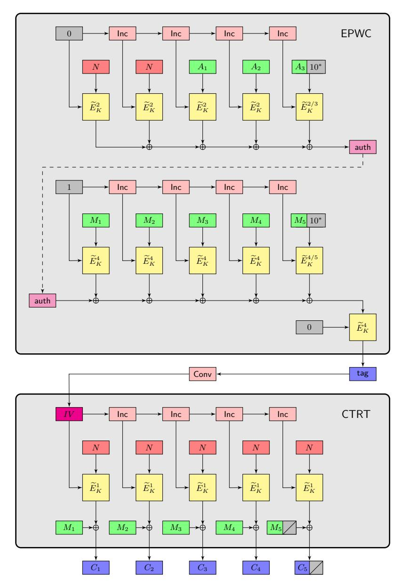
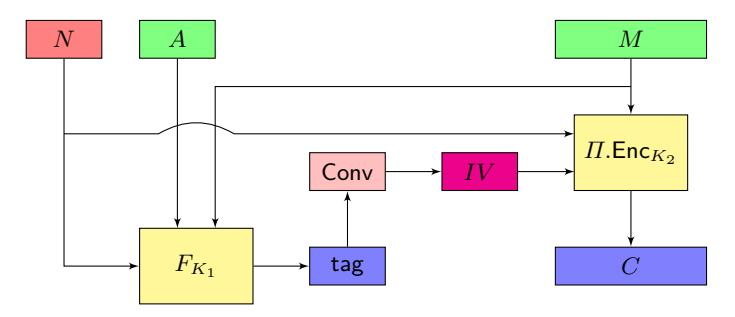
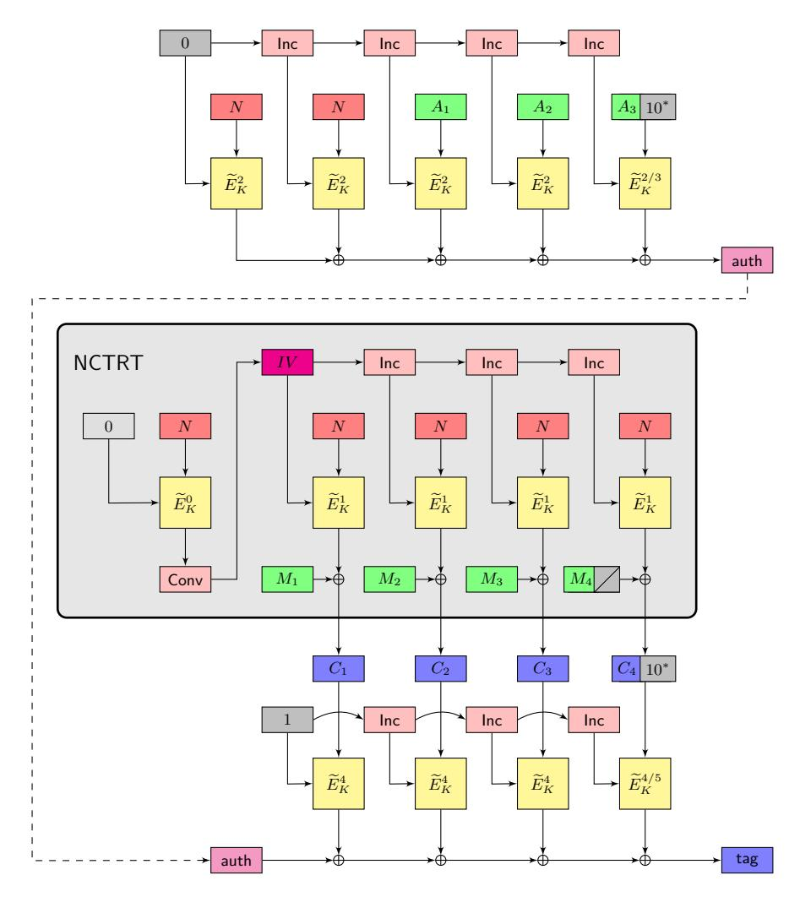

# **Counter-in-Tweak: Authenticated Encryption Modes for Tweakable Block Ciphers***?*

Thomas Peyrin and Yannick Seurin

SPMS, NTU, Singapore ANSSI, Paris, France

thomas.peyrin@ntu.edu.sg yannick.seurin@m4x.org

May 22, 2017

**Abstract.** We propose the Synthetic Counter-in-Tweak (SCT) mode, which turns a tweakable block cipher into a nonce-based authenticated encryption scheme (with associated data). The SCT mode combines in a SIV-like manner a Wegman-Carter MAC inspired from PMAC for the authentication part and a new counter-like mode for the encryption part, with the unusual property that the counter is applied on the tweak input of the underlying tweakable block cipher rather than on the plaintext input. Unlike many previous authenticated encryption modes, SCT enjoys provable security beyond the birthday bound (and even up to roughly 2 *n* tweakable block cipher calls, where *n* is the block length, when the tweak length is sufficiently large) in the nonce-respecting scenario where nonces are never repeated. In addition, SCT ensures security up to the birthday bound even when nonces are reused, in the strong nonce-misuse resistance sense (MRAE) of Rogaway and Shrimpton (EUROCRYPT 2006). To the best of our knowledge, this is the first authenticated encryption mode that provides at the same time close-to-optimal security in the noncerespecting scenario and birthday-bound security for the nonce-misuse scenario. While two passes are necessary to achieve MRAE-security, our mode enjoys a number of desirable features: it is simple, parallelizable, it requires the encryption direction only, it is particularly efficient for small messages compared to other nonce-misuse resistant schemes (no precomputation is required) and it allows incremental update of associated data.

**Keywords:** authenticated encryption, tweakable block cipher, nonce-misuse resistance, beyond-birthday-bound security, CAESAR competition

*<sup>?</sup>* c IACR 2016. This is the full version of the article submitted by the authors to the IACR and to Springer-Verlag in May 2016, which appears in the proceedings of CRYPTO 2016.

### **1 Introduction**

Background on Authenticated Encryption. Confidentiality and authenticity of data are the two main security properties that one must ensure when communicating over an insecure channel. In the symmetric key setting, it has long been known how to ensure both of them independently, e.g., starting from a secure block cipher, by using a suitable encryption mode for confidentiality [\[BDJR97\]](#page-27-0) and a block cipher-based MAC for authenticity [\[BKR00\]](#page-27-1). However, how exactly to combine both tools has long been left to the practitioners, leading to major security breaches [\[Kra01,](#page-29-0) [DR11,](#page-28-0) [AP13\]](#page-27-2). Sometimes, protocol designers even overlooked that authenticity was a necessary requirement besides confidentiality, as exemplified by padding oracle attacks [\[Vau02\]](#page-31-0). Even when the combination of the encryption and the MAC schemes is properly done, it might not be the most efficient solution, especially when the two parts rely on two different primitives. For these reasons, interest has shifted towards designing "integrated" Authenticated Encryption (AE) schemes ensuring jointly authenticity and confidentiality of data, which are more efficient and less likely to be incorrectly used. Besides, it has become standard for an AE scheme to have the ability to handle so-called associated data (AD), which are authenticated but not encrypted [\[Rog02\]](#page-30-0) (such a scheme was for a time called an AEAD scheme, but since this feature is so important in practice, virtually all modern AE schemes provide it; we will only talk of AE in this paper, implicitly meaning AEAD). Even though ad-hoc AE schemes were already used since a long time, the formal treatment of these constructions only started around 2000 [\[BN00,](#page-27-3) [BR00,](#page-27-4) [KY06\]](#page-29-1). At about the same time, provably secure AE designs started to appear, such as IAPM [\[Jut01,](#page-29-2) [Jut08\]](#page-29-3), XCBC [\[GD01\]](#page-28-1), CCM [\[WHF02\]](#page-31-1), OCB [\[RBB03,](#page-30-1) [Rog04a\]](#page-30-2), or GCM [\[MV04\]](#page-30-3). The CAESAR competition [\[CAE\]](#page-28-2) for authenticated encryption, started in 2014, recently put this research topic in the limelight. Various AE schemes were proposed, from purely ad-hoc designs to (tweakable) block cipher operating modes.

Nonce-Misuse Resistance. Since most symmetric-key primitives (in particular block ciphers) from which AE schemes are built are deterministic, a random IV or a nonce (i.e., a value which must never be repeated for the same secret key) is a necessary ingredient for achieving strong security goals. Failing to ensure the corresponding requirement (high entropy for an IV, non-repetition for a nonce) can have dramatic consequences for security. For example, reusing a nonce just a single time for encrypting two messages in OCB completely breaks confidentiality: an attacker can immediately detect repeated message blocks since the corresponding ciphertext blocks will be equal. The non-repeating requirement on the nonce can be challenging to fulfill in some contexts, for example when encryption is implemented in a stateless device.[1](#page-1-0) It is likely (and it has happened before) that some implementations will, e.g., simply generate nonces at random,

<span id="page-1-0"></span><sup>1</sup> Similarly, the high-entropy requirement on the IV is hard to meet when no good randomness source is available.

"hoping" that no collision will occur. For that reason, a recent trend in AE has been to design schemes achieving *nonce-misuse resistance*, which informally means that the impact on security of a nonce repetition should be as limited as possible. This goal was first put forward by Rogaway and Shrimpton [\[RS06\]](#page-30-4), who formalized the notion of *misuse-resistant AE* (MRAE). For a scheme enjoying this property, authenticity is not harmed by nonce repetitions, while confidentiality is only damaged insofar as the adversary can detect whether the same triple of nonce, AD and message values is repeated. Example of schemes achieving this security notion are EAX [\[BRW04\]](#page-28-3), SIV [\[RS06\]](#page-30-4), AEZ [\[HKR15\]](#page-29-4), or GCM-SIV [\[GL15\]](#page-28-4). Because the MRAE notion cannot be achieved for an online scheme (since each bit of the ciphertext must depend on every bit of the plaintext), Fleischmann *et al.* [\[FFL12\]](#page-28-5) proposed a relaxation of the MRAE notion called *online AE* (OAE), which can be achieved with a single pass on the input. Examples of schemes ensuring this security property are McOE [\[FFL12\]](#page-28-5), COPA [\[ABL](#page-27-5)<sup>+</sup>13], or POET [\[AFF](#page-27-6)<sup>+</sup>14]. However, the interest in the OAE notion has been recently reduced by some serious security concerns, notably the so-called chosen-prefix/secret-suffix (CPSS) generic attack [\[HRRV15\]](#page-29-5), that shares some similarities with the BEAST attack [\[DR11\]](#page-28-0).

Birthday and Beyond-Birthday Security. Another important shortcoming of most AE operating modes is that they provide only birthday-bound security with respect to the block length of the underlying primitive. Since virtually all existing block ciphers have block length at most 128 bits (in particular the current block cipher standard AES), this means that security is lost at 2 <sup>64</sup> block cipher calls at best, which is low given modern security requirements (for 64-bit block ciphers, the situation is even more problematic). Moreover, this is rarely a problem with the tightness of the security proof: attacks matching the bound are often known. For example, Ferguson [\[Fer02\]](#page-28-6) described a simple collision-based attack on OCB that breaks authenticity with 2 <sup>64</sup> blocks of messages. Recently, some AE schemes providing security beyond the birthday bound (BBB) were proposed [\[Iwa06,](#page-29-6) [Iwa08\]](#page-29-7), but they usually come at an expensive performance price. One could argue that using a double-block-length block cipher would provide the expected security, but this solution comes with an important efficiency penalty (as can be seen in generic double-block-length block cipher constructions) and would be highly problematic for hardware implementations where internal state size is a major contribution to the total area cost.

AE from Tweakable Block Ciphers. Compared with a conventional block cipher, a tweakable block cipher (TBC) *<sup>E</sup>*<sup>e</sup> takes an additional input called a *tweak* bringing inherent variability to the primitive (equivalently, a TBC can be seen as a family of block ciphers indexed by the tweak). In the same paper that formalized the corresponding security notion [\[LRW02\]](#page-29-8), it was pointed out that a TBC was a very convenient starting point for building various schemes. In particular, for AE schemes, two prominent examples are the sibling modes TAE [\[LRW02\]](#page-29-8) and ΘCB [\[KR11\]](#page-29-9) (the TBC-based generalization of OCB). They have "perfect" security in the sense that, when used with an ideal TBC, the advantage of any adversary is zero against confidentiality and close to 2 <sup>−</sup>*<sup>τ</sup>* against

authenticity, where *τ* is the tag length. However, as already pointed out, a weakness of both TAE and ΘCB (even when used with an ideal TBC) is that their security completely collapses as soon as a nonce is repeated. As a matter of fact, existing AE schemes built from an ideal TBC either ensure perfect security in the nonce-respecting scenario only (like TAE or ΘCB), or fulfill the weak OAE notion only (e.g. COPA, once recast to use an ideal TBC), or ensure MRAEsecurity but only up to the birthday bound, even if nonces are not repeated (like AEZ). The PIV construction by Shrimpton and Terashima [\[ST13\]](#page-31-2) allows to construct a variable-input-length TBC with BBB-security, which in turn allows to construct (via the Encode-then-Encipher method) an AEAD scheme with BBB-security against nonce-respecting adversaries and birthday-bound security against nonce-misusing ones. However, PIV requires as a building block a fixedinput-length TBC with *variable* tweak length (comparable to the maximal input length of the PIV construction), which in turn requires to appeal to universal hash functions with key length comparable to the maximal tweak length. Hence, the resulting AEAD scheme must use very large keys to ensure BBB-security for large messages. As of today, there is no AEAD scheme based on a fixed-tweak-length TBC that ensures both BBB-security in the nonce-respecting scenario and (at least) birthday-bound security in the nonce-misuse scenario. Yet this seems a very desirable goal since such a scheme would at the same time yield very high (BBB) security guarantees in the nominal, nonce-respecting use case and retain acceptable (birthday-bound) security when inadvertently misused.

Our Contributions. In this paper, we propose the SCT (Synthetic Counterin-Tweak) nonce-based AE mode for tweakable block ciphers and prove that it ensures BBB-security in the nonce-respecting scenario, and birthday-bound security in the nonce-misuse scenario (in the strong MRAE sense [\[RS06\]](#page-30-4)). More precisely, for the nonce-respecting case, when using an ideal TBC with block length *n* and "effective" tweak length[2](#page-3-0) *w*, SCT is secure as long as the total number of *n*-bit blocks in encryption/decryption adversarial queries is less than roughly 2 (*n*+*w*)*/*2 , which is always larger than 2 *n/*2 . The SCT mode requires two passes (as is inevitable for MRAE-security), but it is simple, parallelizable, it requires the encryption direction only, it is particularly efficient for small messages compared to other nonce-misuse resistant schemes (no precomputation is required) and it allows incremental update of associated data.

With respect to how authentication and encryption are combined, our design draws inspiration from the SIV generic composition method [\[RS06\]](#page-30-4): the nonce *N*, the associated data *A*, and the message *M* are first input to a keyed function *FK*, yielding an pseudorandom initial value *IV* , which will serve as authentication tag. The message is then encrypted, using the generated *IV and the nonce N* (see Fig. [4\)](#page-25-0). This "recycling" of the nonce in the encryption part of the mode is

<span id="page-3-0"></span><sup>2</sup> The SCT mode uses 5 tweak prefixes to separate the different usages of the TBC. The "effective" tweak length is what remains once 3 bits have been used to encode the prefix.

what makes our high-level construction (called NSIV) crucially different from SIV and allows to reach BBB-security in the nonce-respecting case.[3](#page-4-0)

It remains to instantiate the two components of the NSIV construction, the keyed function *F<sup>K</sup>* and the encryption scheme. Since we aim at BBB-security in the nonce-respecting case, a natural starting point for *F<sup>K</sup>* is the Wegman-Carter paradigm [\[WC81,](#page-31-3) [Bra82,](#page-28-7) [Sho96\]](#page-30-5). Hence, we propose a nonce-based MAC mode called PWC (*Parallel Wegman-Carter*) which combines a xor-universal hash function inspired from PMAC [\[BR02,](#page-27-7) [Rog04a\]](#page-30-2) applied to the AD and the message, and a simple pseudorandom function applied to the nonce. In order to achieve nonce-misuse resistance (which in general Wegman-Carter MACs do not provide), we add an additional encryption layer, which results in the EPWC (*Encrypted PWC*) mode.

The real challenge lies in designing an encryption scheme which is BBB-secure in the nonce-respecting case. Since on one hand it seems hard to leverage on the non-repeating property of the nonce without actually giving the nonce as input to the encryption mode, and on the other hand we need to make use in some way of the pseudorandom IV computed from *FK*, [4](#page-4-1) it appears that what we need to design is actually a *combined nonce- and IV-based encryption scheme* (*nivE scheme* for short). To the best of our knowledge, this notion has never appeared before, and we introduce it in this paper. The encryption mode that we propose, called CTRT (*CounTeR in Tweak*), is a counter-like mode with the unusual property that the counter is applied on the tweak input of the underlying TBC rather than on the plaintext input, where the nonce comes in. The combination of EPWC and CTRT through the NSIV construction (the IV generated by EPWC being used as initial counter in CTRT) yields the SCT mode, illustrated in Fig. [1.](#page-5-0)

For completeness, we also describe the CTPWC (CTRT*-then-*PWC) mode, an *online* nonce-based AE scheme which combines in an "encrypt-then-MAC" manner a slight variant of the CTRT encryption mode and the PWC authentication mode. The security guarantees provided by CTPWC are similar to those of ΘCB, but it is roughly twice less efficient, so that we do not claim that it is of particularly high interest. One small advantage that we see for this mode compared with ΘCB is that the nonce length can be as large as the block length of the underlying TBC, whereas for ΘCB the sum of the nonce length and of the maximal length of encrypted messages must be less than the tweak length of the underlying tweakable block cipher, which might be restrictive in some settings (e.g., for KIASU-BC [\[JNP14c\]](#page-29-10)). It might also escape the patent issues which hindered the adoption of OCB.

Instantiating the TBC. As just discussed, our new AE modes offer BBBsecurity (in the nonce-respecting case) when used with an ideal TBC. If one aims at leveraging this security level in the real world, one must instantiate

<span id="page-4-0"></span><sup>3</sup> While SIV corresponds to generic composition method A4 in the nomenclature of Namprempre *et al.* [\[NRS14\]](#page-30-6), NSIV does not fit any of the NRS schemes.

<span id="page-4-1"></span><sup>4</sup> This excludes for example a simple OCB-like encryption mode since it is only noncebased, not IV-based.



<span id="page-5-0"></span>**Fig. 1.** The SCT mode, using a TBC  $\widetilde{E}$  with tweak space  $\{1,\ldots,5\}\times\mathcal{T}$  and domain  $\mathcal{X}=\{0,1\}^n$ . For each call to  $\widetilde{E}_K$ , the tweak enters left while the plaintext enters on top. We denote  $\widetilde{E}_K^i(T,X)$  for  $\widetilde{E}_K((i,T),X)$  and  $\widetilde{E}_K^{i/j}$  means that prefix i is used when the input block is complete and unpadded, whereas j is used when the input block is incomplete and padded. Function Inc is a cyclic permutation of  $\mathcal{T}$ , and Conv is a regular function from  $\mathcal{X}$  to  $\mathcal{T}$  (e.g., truncation when  $\mathcal{X}=\{0,1\}^n$  and  $\mathcal{T}=\{0,1\}^w, w\leq n$ ).

the TBC with care. Most existing TBCs are built from conventional block ciphers in a generic way, the prominent example being the XE/XEX construction [\[Rog04a\]](#page-30-2) which only ensures security up to the birthday bound. Hence, using XE/XEX in our schemes would in a sense waste their nice security promises.[5](#page-6-0) To remedy this problem, one can use either generic TBC constructions with BBB-security [\[Min09,](#page-30-7) [LST12,](#page-29-11) [LS13,](#page-29-12) [Men15\]](#page-30-8) (but they are often inefficient or provably secure in the ideal cipher model only), or ad-hoc TBC designs without known weaknesses. The second option was chosen for a number of CAESAR candidates [\[JNP14a,](#page-29-13) [JNP14b,](#page-29-14) [JNP14c,](#page-29-10) [GLS](#page-28-8)<sup>+</sup>14]. In fact, the SCT mode was explicitly designed as a replacement to the COPA mode used in versions 1.1 and 1.2 of CAESAR candidates Deoxys [\[JNP14a\]](#page-29-13) (128-bit blocks, 128-bit tweaks) and Joltik [\[JNP14b\]](#page-29-14) (64-bit blocks, 64-bit tweaks).[6](#page-6-1) We refer to the submission documents of these two candidates for a detailed report on implementation results, which are quite competitive. Other potential candidates for instantiating the SCT mode are Scream [\[GLS](#page-28-8)<sup>+</sup>14] and Threefish, the TBC on which the hash function Skein [\[FLS](#page-28-9)<sup>+</sup>10] is based. There is currently a shift towards designing dedicated TBCs achieving higher security and efficiency than generic BC-based constructions, and we hope to see more and more TBC proposals that could be used with SCT.

Open Problems and Future Work. The CTRT encryption scheme has the notable feature that its security degrades gracefully with the maximal number of repetitions of nonces: when the nonce repetitions are limited, security remains close to the security bound in the nonce-respecting case. In contrast, the security of the EPWC authentication mode (and more generally of any encrypted Wegman-Carter MAC) falls back to birthday bound as soon as the adversary can repeat one single nonce twice (see Remark [2](#page-24-0) in Section [5\)](#page-18-0). It remains a pending question to modify EPWC so that it provides graceful security degradation with the maximal number of nonce repetitions as well. This would make the resulting AE scheme a good candidate for high security in both nonce-respecting and nonce-misuse models for most practical scenarios. Another challenging open problem would be to construct an AE scheme which remains BBB-secure even when nonces are arbitrarily repeated. The main difficulty is to build a deterministic, stateless, BBB-secure MAC, which is known to be notably hard [\[Yas11,](#page-31-4) [DS11\]](#page-28-10). Another possible direction for future work would be to design a mode similar to SCT using only one pass and achieving online nonce-misuse resistance in the OAE sense [\[FFL12\]](#page-28-5). Such a feature would allow users to smoothly choose the best security achievable, depending on whether two passes can be tolerated or not by the application. Finally, it would be interesting to analyze how to strengthen SCT against other misuse scenarios such as release of unverified plaintext [\[ABL](#page-27-8)<sup>+</sup>14], and to study how its security is affected by tag truncation [\[HKR15\]](#page-29-4).

<span id="page-6-0"></span><sup>5</sup> Similarly, the only reason why OCB is secure up to the birthday bound whereas ΘCB is "perfectly" secure is because it relies on XE/XEX for instantiating the TBC.

<span id="page-6-1"></span><sup>6</sup> The tweak prefixes used in this paper were chosen for ease of exposition and are slightly different from the ones used in Deoxys and Joltik v1.3, which were chosen mainly for efficiency reasons.

Organization. In Section [2](#page-7-0) we provide a high-level description of the various possibilities that we considered for constructing a BBB-secure nivE scheme. After introducing the notation and standard security notions in Section [3,](#page-8-0) we describe the CTRT encryption scheme and prove its security in Section [4,](#page-12-0) while we describe the PWC and EPWC nonce-based MAC schemes and prove their security in Section [5.](#page-18-0) Finally, we explain how to combine CTRT and EPWC using the NSIV construction to build the nonce-based AE mode SCT and prove its security in Section [6.](#page-24-1) In Appendix [C,](#page-35-0) we describe the CTPWC mode, an online nonce-based AE mode derived from CTRT and PWC.

# <span id="page-7-0"></span>**2 Counter-in-Tweak for Beyond-Birthday Security**

As motivated in introduction, our goal is to design a simple TBC-based AE scheme that provides BBB-security in the nonce-respecting setting and (at least) birthday-bound MRAE-security. As already mentioned, an encrypted Wegman-Carter MAC solves the problem for the authentication part, so that we focus here on encryption. Hence, our problem is as follows: given a nonce and a synthetic IV generated pseudorandomly from the nonce, the AD and the message, how do we use them to encrypt the message with BBB-security? We give a quick overview of the various constructions that we considered and why, except the CTRT encryption mode we propose, they fail or are unsatisfactory.

A natural direction to explore is to start from a scheme providing BBB-security for non-repeating nonces, such as TAE [\[LRW02\]](#page-29-8) or ΘCB [\[KR11\]](#page-29-9), which are similar with regard to encryption: it simply consists in a "tweakable" codebook mode, the tweak holding the nonce and a message block counter. This is obviously not noncemisuse resistant: repeating the nonce a single time will lead to a complete break of confidentiality since a constant message block leads to a constant ciphertext block. One could incorporate the IV by simply concatenating it to the nonce and the counter to form the tweak. However, this would require a TBC with larger tweak, which is usually very costly to achieve.[7](#page-7-1) Rather than concatenating the nonce and the IV, one could try to combine them into a single shorter string *S*, but this would presumably result in birthday security even in the nonce-respecting scenario (since a collision on *S* would directly break confidentiality). Hence, a codebook encryption mode does not seem to be a very convenient starting point.

For this reason, we preferred to consider a counter mode (note that this was the encryption mode favored by Rogaway and Shrimpton to instantiate the SIV composition method [\[RS06\]](#page-30-4)). The question now is: how do we feed the nonce, the IV, and the *i*-th counter to the TBC in order to create the mask that will be xored to the *i*-th message block? We considered several possibilities (we do not claim this to be exhaustive):

(a) One can put the nonce in the tweak input, and the sum of the IV and the counter in the plaintext input. The problem is that confidentiality caps at

<span id="page-7-1"></span><sup>7</sup> For example, for TBCs following the TWEAKEY approach [\[JNP14a,](#page-29-13) [JNP14b,](#page-29-14) [JNP14d\]](#page-29-15), there is a large gap in the number of rounds needed to make the TBC secure as the tweak length increases.

- birthday bound even in the nonce-respecting scenario: the adversary can query the encryption of a single message with 2 *n/*2 equal blocks, and observe that no collision occurs in the corresponding ciphertext blocks (since the nonce is fixed and all TBC calls use the same tweak), which will distinguish the ciphertext from a random string (for which a collision would be expected).
- (b) One can concatenate the nonce and the counter in the tweak input, and use the IV for the plaintext input. Since the tweak is different for each message block position, this solves the issue of the previous solution. We conjecture that this mode meets our security objectives, but an important drawback is that a larger tweak length is required and, as mentioned before, this is very costly.
- (c) One can put the sum of the nonce and the counter in the tweak input (instead of concatenating them) and the IV in the plaintext input. This mode might meet our security objectives, however the adversary can very easily provoke collisions on tweak inputs even in the nonce-respecting scenario, which might complicate the proof of BBB-security. Another drawback is that in the noncemisuse scenario, a collision on the IV immediately breaks confidentiality, which dashes any hope for BBB nonce-misuse resistance. Note that one could imagine variants where the nonce and the IV are first encrypted before being used, but it is not clear if this would prevent the issues just mentioned and this would presumably make the security proof quite complex.
- (d) Finally, one can put the sum of the IV and the counter in the tweak input and the nonce in the plaintext input, which is exactly the CTRT mode. We will prove in Section [4](#page-12-0) that it meets our security goal. The first idea is that the counter in the tweak input ensures that all the calls to the internal TBC will use different tweaks for one single message query, so that the ciphertext looks uniformly random in that case. Thus, the adversary has to query several messages with different nonce values and hope that many collisions will occur between tweak inputs in order to observe a divergence from uniformity in the ciphertexts. However, these collisions are hard to control since they depend on the pseudorandom IV (in contrast with other modes discussed above, where the tweak input can be easily controlled by the adversary). Moreover, the nonce-misuse scenario helps the adversary only if it can repeat the same nonce a very high number of times until a collision happens on the tweaks, so that the security of the CTRT mode degrades gracefully with the maximal number of nonce repetitions.

# <span id="page-8-0"></span>**3 Preliminaries**

Notation. Given a string *X* ∈ {0*,* 1} ∗ , |*X*| denotes its length. If *X* and *Y* are respectively *n*-bit and *m*-bit strings, *n < m*, then *X* ⊕ *Y* denotes the *n*-bit string obtained by xoring *X* with the *n* leftmost bits of *Y* . Given some implicit length *n* and a bit-string *X* of length 1 ≤ |*X*| *< n*, we denote *X*10<sup>∗</sup> the string obtained by appending a single 1 and (*n* − |*X*| − 1) 0's to *X*. Given two sets X and Y, the set of all functions from X to Y is denoted Func(X *,* Y). A function *F* ∈ Func(X *,* Y) is said regular if all  $Y \in \mathcal{Y}$  have the same number of preimages by F (this obviously requires  $|\mathcal{X}|$  to be a multiple of  $|\mathcal{Y}|$ ).

TWEAKABLE BLOCK CIPHERS. A tweakable block cipher (TBC) with key space  $\mathcal{K}$ , tweak space  $\mathcal{T}$ , and domain  $\mathcal{X}$  is a mapping  $\widetilde{E}:\mathcal{K}\times\mathcal{T}\times\mathcal{X}\to\mathcal{X}$  such that for any key  $K\in\mathcal{K}$  and any tweak  $T\in\mathcal{T},X\mapsto\widetilde{E}(K,T,X)$  is a permutation of  $\mathcal{X}$ . We often write  $\widetilde{E}_K(T,X)$  or  $\widetilde{E}_K^T(X)$  in place of  $\widetilde{E}(K,T,X)$ . We denote TBC( $\mathcal{K},\mathcal{T},\mathcal{X}$ ) the set of all tweakable block ciphers with key space  $\mathcal{K}$ , tweak space  $\mathcal{T}$ , and domain  $\mathcal{X}$ . A tweakable permutation with tweak space  $\mathcal{T}$  and domain  $\mathcal{X}$  is a mapping  $\widetilde{P}:\mathcal{T}\times\mathcal{X}\to\mathcal{X}$  such that for any tweak  $T\in\mathcal{T},X\mapsto\widetilde{P}(T,X)$  is a permutation of  $\mathcal{X}$ . We often write  $\widetilde{P}^T(X)$  in place of  $\widetilde{P}(T,X)$ . We denote TP( $\mathcal{T},\mathcal{X}$ ) the set of all tweakable permutations with tweak space  $\mathcal{T}$  and domain  $\mathcal{X}$ . The security of a TBC is defined as follows.

**Definition 1 (TPRP security).** Let  $\widetilde{E} \in \mathsf{TBC}(\mathcal{K}, \mathcal{T}, \mathcal{X})$  and A be an adversary with oracle access to a tweakable permutation with tweak space  $\mathcal{T}$  and domain  $\mathcal{X}$ . The advantage of A in breaking the TPRP-security of  $\widetilde{E}$  is defined as

$$\mathbf{Adv}^{\mathrm{TPRP}}_{\widetilde{E}}(\mathsf{A}) = \left| \mathrm{Pr} \left[ K \leftarrow_{\$} \mathcal{K} : \mathsf{A}^{\widetilde{E}_K} = 1 \right] - \mathrm{Pr} \left[ \widetilde{P} \leftarrow_{\$} \mathsf{TP}(\mathcal{T}, \mathcal{X}) : \mathsf{A}^{\widetilde{P}} = 1 \right] \right|.$$

Note that we do not need the strongest "two-sided" version of TPRP-security (where the adversary also has access to a decryption oracle) since all constructions considered in this paper only use the forward (encryption) direction of the underlying TBC.

TWEAK SEPARATION. Let  $\widetilde{E}$  be a TBC with tweak space of the form  $\mathcal{T}' = \mathcal{I} \times \mathcal{T}$  for some subset  $\mathcal{I} \subset \mathbb{N}$  and some set  $\mathcal{T}$ . We call  $\mathcal{T}$  the effective tweak space of  $\widetilde{E}$ . Then, for  $i \in \mathcal{I}$ , we denote  $\widetilde{E}^i$  the tweakable block cipher with the same key and message spaces as  $\widetilde{E}$  and tweak space  $\mathcal{T}$  defined by

$$\widetilde{E}^{i}(K,T,X) = \widetilde{E}(K,(i,T),X).$$

By the same convention as before, we write  $\widetilde{E}_K^i(T,X)$  or  $\widetilde{E}_K^{i,T}(X)$  for  $\widetilde{E}^i(K,T,X)$ . Clearly, when  $\widetilde{E}$  is an ideal TBC drawn uniformly at random from  $\mathsf{TBC}(\mathcal{K},\mathcal{T}',\mathcal{M})$ , then each  $\widetilde{E}^i$  is an independent ideal TBC drawn uniformly at random from  $\mathsf{TBC}(\mathcal{K},\mathcal{T},\mathcal{M})$ . Given a bit-string X of length  $1 \leq |X| \leq n$ , we compactly write

$$\widetilde{E}^{i/j}(K,T,X(10^*)),\quad \widetilde{E}^{i/j}_K(T,X(10^*)),\quad \text{or}\quad \widetilde{E}^{i/j,T}_K(X(10^*))$$

to mean
$$\widetilde{E}^i(K,T,X)$$
 when  $|X|=n$  and  $\widetilde{E}^j(K,T,X10^*)$  when  $|X|< n$ .

STANDARD SECURITY NOTIONS. We give the security definitions of a nonce-based PRF, a nonce-based MAC, and a nonce-based Authenticated Encryption scheme. All these are standard, except maybe the nonce-based PRF notion which is a straightforward adaptation of the classical definition of a PRF to the nonce-based setting. Our definition of the security of a MAC is indistinguishability-based

(which will be more convenient later), but it is easy to see that it is equivalent to the more conventional unforgeability-based definition. In the following, a nonce-based keyed function is a function  $F: \mathcal{K} \times \mathcal{N} \times \mathcal{D} \to \mathcal{Y}$ , where  $\mathcal{K}$  is the key space,  $\mathcal{N}$  the nonce space,  $\mathcal{D}$  the domain and  $\mathcal{Y}$  the range.

<span id="page-10-0"></span>**Definition 2 (Nonce-Based PRF).** Let  $F: \mathcal{K} \times \mathcal{N} \times \mathcal{D} \to \mathcal{Y}$  be a nonce-based keyed function, and let us write  $F_K(N,D)$  for F(K,N,D). Let A be an adversary with oracle access to a function from  $\mathcal{N} \times \mathcal{D}$  to  $\mathcal{Y}$ . The advantage of A against the PRF-security of F is defined as

$$\begin{split} \mathbf{Adv}_F^{\mathrm{PRF}}(\mathsf{A}) &= \Big| \Pr \left[ K \leftarrow_{\$} \mathcal{K} : \mathsf{A}^{F_K} = 1 \right] \\ &- \Pr \left[ R \leftarrow_{\$} \mathsf{Func}(\mathcal{N} \times \mathcal{D}, \mathcal{Y}) : \mathsf{A}^R = 1 \right] \Big|. \end{split}$$

The adversary is said nonce-respecting if it never repeats a nonce  $N \in \mathcal{N}$  in its oracle queries. In that case, we denote its advantage  $\mathbf{Adv}_F^{\mathrm{nPRF}}(\mathsf{A})$ .

<span id="page-10-2"></span>**Definition 3 (Nonce-Based MAC).** Let F be as in Definition 2. Let B be an adversary with oracle access to two oracles, the first oracle being a function from  $\mathcal{N} \times \mathcal{D}$  to  $\mathcal{Y}$ , the second oracle with inputs in  $\mathcal{N} \times \mathcal{D} \times \mathcal{Y}$  and outputs in  $\{1, \bot\}$ . The advantage of B against the MAC-security of F is defined as

$$\mathbf{Adv}_F^{\mathrm{MAC}}(\mathsf{B}) = \left| \Pr\left[ K \leftarrow_{\$} \mathcal{K} : \mathsf{B}^{F_K,\mathsf{Ver}_K} = 1 \right] - \Pr\left[ K \leftarrow_{\$} \mathcal{K} : \mathsf{B}^{F_K,\mathsf{Rej}} = 1 \right] \right|,$$

where  $\operatorname{Ver}_K$  is an oracle which takes as input a triple  $(N,D,\operatorname{tag}) \in \mathcal{N} \times \mathcal{D} \times \mathcal{Y}$  and returns 1 if  $F_K(N,D) = \operatorname{tag}$ , and  $\bot$  otherwise, and  $\operatorname{Rej}$  is an oracle which always returns  $\bot$ . The adversary is not allowed to ask a verification query  $(N,D,\operatorname{tag})$  if a previous query (N,D) to  $F_K$  returned  $\operatorname{tag}$ . The adversary is said nonce-respecting if it never repeats a nonce  $N \in \mathcal{N}$  in its queries to the first oracle  $F_K$ . In that case, we denote its advantage  $\operatorname{Adv}_F^{\operatorname{nMAC}}(\mathsf{B})$ .

Note that in the general case where the adversary is allowed to repeat nonces, F can be seen as a standard (i.e., not nonce-based) keyed function with domain  $\mathcal{N} \times \mathcal{D}$ , in which case one recovers the standard definitions of a PRF and a MAC (hence our notation of the advantage when the adversary is unrestricted w.r.t. nonces). While it is a well-known fact that if F is a secure PRF, then it is a secure MAC [BKR00, GGM86], we stress that this is not true for the nonce-based variants of the two notions, which are in fact incomparable.<sup>8</sup>

We then give the definition of a nonce-based Authenticated Encryption (nAE) scheme (with associated data), for which we first recall the syntax. Let  $\mathcal{K}$ ,  $\mathcal{N}$ ,  $\mathcal{A}$ , and  $\mathcal{M}$  be non-empty sets. A nAE scheme is a tuple  $\Pi = (\mathcal{K}, \mathcal{N}, \mathcal{A}, \mathcal{M}, \mathsf{Enc}, \mathsf{Dec})$ , where Enc and Dec are deterministic algorithms. The encryption algorithm Enc takes as input a key  $K \in \mathcal{K}$ , a nonce  $N \in \mathcal{N}$ , associated data  $A \in \mathcal{A}$ , and a

<span id="page-10-1"></span> $<sup>^8</sup>$  E.g., an nPRF-secure function F might depend only on the nonce, in which case it is trivial to forge and break nMAC-security, while an nMAC-secure function F might have all its outputs starting with a 0 bit, which allows to trivially break nPRF-security.

message  $M \in \mathcal{M}$ , and outputs a binary string  $C \in \{0,1\}^*$  (we assume that Enc returns  $\bot$  if one of the inputs is not in the intended set). The decryption algorithm Dec takes as input a key  $K \in \mathcal{K}$ , a nonce  $N \in \mathcal{N}$ , associated data  $A \in \mathcal{A}$ , and a binary string  $C \in \{0,1\}^*$ , and outputs either a message  $M \in \mathcal{M}$ , or a special symbol  $\bot$ . We require that  $\operatorname{Dec}(K,N,A,\operatorname{Enc}(K,N,A,M)) = M$  for all tuples  $(K,N,A,M) \in \mathcal{K} \times \mathcal{N} \times \mathcal{A} \times \mathcal{M}$ . We write  $\operatorname{Enc}_K(N,A,M)$  for  $\operatorname{Enc}(K,N,A,M)$  and  $\operatorname{Dec}_K(N,A,C)$  for  $\operatorname{Dec}(K,N,A,C)$ .

<span id="page-11-1"></span>**Definition 4 (Nonce-Based AE).** Let  $\Pi = (\mathcal{K}, \mathcal{N}, \mathcal{A}, \mathcal{M}, \mathsf{Enc}, \mathsf{Dec})$  be a nAE scheme. The advantage of an adversary  $\mathsf{A}$  in breaking  $\Pi$  is defined as

$$\begin{split} \mathbf{Adv}^{\mathrm{AE}}_{\varPi}(\mathsf{A}) &= \Big| \Pr \left[ K \leftarrow_{\$} \mathcal{K} : \mathsf{A}^{\varPi.\mathsf{Enc}_{K}(\cdot,\cdot,\cdot),\,\varPi.\mathsf{Dec}_{K}(\cdot,\cdot,\cdot)} = 1 \right] \\ &- \Pr \left[ \mathsf{A}^{\mathsf{Rand}(\cdot,\cdot,\cdot),\,\mathsf{Rej}(\cdot,\cdot,\cdot)} = 1 \right] \Big|, \end{split}$$

where Rand is an oracle which on input  $(N, A, M) \in \mathcal{N} \times \mathcal{A} \times \mathcal{M}$  outputs a random<sup>9</sup> string of length  $|\Pi.\mathsf{Enc}_K(N,A,M)|$  and Rej is an oracle which always outputs  $\bot$ . The adversary is not allowed to make a decryption query (N,A,C) if a previous encryption query (N,A,M) returned C. The adversary is said noncerespecting if it never repeats a nonce  $N \in \mathcal{N}$  in its encryption queries, in which case we denote its advantage  $\mathbf{Adv}_n^{\mathrm{nAE}}(A)$ .

Note that in the general case where the adversary is allowed to repeat nonces,  $\Pi$  can be seen as a deterministic AE scheme [RS06] with header space (in the terms of [RS06])  $\mathcal{N} \times \mathcal{A}$ , so that one exactly recovers the definition of the MRAE notion of Rogaway and Shrimpton [RS06] (which we simply abbreviate to AE here).

ADVERSARY CHARACTERISTICS. In all the paper, given some implicit parameter n, a  $(q, m, \ell, \sigma, t)$ -adversary against a nonce-based scheme is an adversary:

- which makes at most q oracle queries; when the adversary has access to two oracles (i.e., when attacking the MAC-security of a keyed function or a nAE scheme), this means q queries in total to both oracles;
- which uses any nonce at most m times throughout its queries (m = 1 for a nonce-respecting adversary); when the adversary has access to two oracles, this only applies to queries to its first oracle (MAC or encryption oracle);
- such that the length of any of its queries (nonce excluded) is at most  $\ell$  blocks of n bits; for a keyed function with domain  $\mathcal{D} = \mathcal{A} \times \mathcal{M}$  or a nAE scheme, this means that *both* the AD length and the message length of any query is at most  $\ell$  blocks of n bits;
- such that the total length of all its queries (nonce excluded) is at most  $\sigma$  blocks of n bits; for a keyed function with domain  $\mathcal{D} = \mathcal{A} \times \mathcal{M}$  or a nAE scheme, this means the sum of the AD and the message length over all queries;
- which runs in time at most t.

<span id="page-11-0"></span><sup>&</sup>lt;sup>9</sup> We assume that Rand returns the same output if a query is repeated.

# <span id="page-12-0"></span>4 The CTRT Encryption Mode

#### 4.1 Syntax and Security of nivE Schemes

Most existing encryption schemes are either nonce-based [Rog04b] or IV-based [BDJR97], i.e., they employ an externally provided value which either should not repeat (nonce), or should be selected uniformly at random (IV). (See also [NRS14].) Here, we introduce the notion of combined nonce- and IV-based encryption scheme (nivE for short).

Syntactically, a nivE scheme is a tuple  $\Pi = (\mathcal{K}, \mathcal{N}, \mathcal{IV}, \mathcal{M}, \mathsf{Enc}, \mathsf{Dec})$  where  $\mathcal{K}, \mathcal{N}, \mathcal{IV}$  and  $\mathcal{M}$  are non-empty sets and  $\mathsf{Enc}$  and  $\mathsf{Dec}$  are deterministic algorithms. The encryption algorithm  $\mathsf{Enc}$  takes as input a key  $K \in \mathcal{K}$ , a nonce  $N \in \mathcal{N}$ , an initial value  $IV \in \mathcal{IV}$ , and a message  $M \in \mathcal{M}$ , and outputs a binary string  $C \in \{0,1\}^*$  (we assume that  $\mathsf{Enc}$  returns  $\bot$  if one of the inputs is not in the intended set). The decryption algorithm  $\mathsf{Dec}$  takes as input a key  $K \in \mathcal{K}$ , a nonce  $N \in \mathcal{N}$ , an initial value  $IV \in \mathcal{IV}$ , and a binary string  $C \in \{0,1\}^*$ , and outputs either a message  $M \in \mathcal{M}$ , or a special symbol  $\bot$ . We require that

$$\mathsf{Dec}(K,N,IV,\mathsf{Enc}(K,N,IV,M)) = M$$

for all tuples  $(K, N, IV, M) \in \mathcal{K} \times \mathcal{N} \times \mathcal{IV} \times \mathcal{M}$ .

We denote  $\mathsf{Enc}^\$$  the probabilistic algorithm which takes as input  $(K,N,M) \in \mathcal{K} \times \mathcal{N} \times \mathcal{M}$ , internally generates a uniformly random  $IV \leftarrow_\$ \mathcal{IV}$ , computes  $C = \mathsf{Enc}(K,N,IV,M)$ , and outputs  $(IV,C) \in \mathcal{IV} \times \{0,1\}^*$ . We write  $\mathsf{Enc}_K(N,IV,M)$  for  $\mathsf{Enc}(K,N,IV,M)$  and  $\mathsf{Enc}_K^\$(N,M)$  for  $\mathsf{Enc}(K,N,M)$ . The security of a nivE scheme is defined as follows.

**Definition 5 (Security of a nivE scheme).** Let  $\Pi = (\mathcal{K}, \mathcal{N}, \mathcal{IV}, \mathcal{M}, \mathsf{Enc}, \mathsf{Dec})$  be a nivE scheme. The advantage of an adversary A in breaking  $\Pi$  is defined as

$$\mathbf{Adv}_{II}^{\mathrm{ivE}}(\mathsf{A}) = \left| \Pr \left[ K \leftarrow_{\$} \mathcal{K} : \mathsf{A}^{II.\mathsf{Enc}_{K}^{\$}(\cdot,\cdot)} = 1 \right] - \Pr \left[ \mathsf{A}^{\mathsf{Rand}(\cdot,\cdot)} = 1 \right] \right|,$$

where Rand is an oracle which on input  $(N,M) \in \mathcal{N} \times \mathcal{M}$  outputs a random string of length  $|\Pi.\mathsf{Enc}_K^{\$}(N,M)|$ . The adversary is said nonce-respecting if it never repeats a nonce  $N \in \mathcal{N}$  in its oracle queries, in which case we denote its advantage  $\mathbf{Adv}_H^{\mathrm{nivE}}(\mathsf{A})$ .

Note that when the adversary is allowed to repeat nonces,  $\Pi$  can be seen as a family of purely IV-based encryption (ivE) schemes [NRS14] indexed by the nonce space  $\mathcal{N}$ , hence our notation of the advantage in that case.

#### 4.2 Definition and Analysis of the CTRT Mode

We now define the CTRT (CounTeR in Tweak) mode, turning a tweakable block cipher into a nivE scheme. Let K and T be non-empty sets, and let

```
 \begin{cases} \text{1} & \textbf{algorithm} \ \mathsf{CTRT}[\widetilde{E}].\mathsf{Enc}_K(N,IV,M) \\ \text{2} & \ell := |M|/n \\ \text{3} & \text{parse } M \ \text{as } M_1 \| \cdots \| M_\ell, \ \text{with } |M_1| = \ldots = |M_{\ell-1}| = n \ \text{and } 1 \leq |M_\ell| \leq n \\ \text{4} & \textbf{for } i = 1 \ \textbf{to} \ \ell \ \textbf{do} \\ \text{5} & C_i := M_i \oplus \widetilde{E}_K^{1,IV}(N) \\ \text{6} & IV := \mathsf{Inc}(IV) \\ \text{7} & \textbf{return } C_1 \| C_2 \| \cdots \| C_\ell \end{aligned}
```

<span id="page-13-1"></span>**Fig. 2.** Definition of the CTRT mode, using a TBC  $\widetilde{E} \in \mathsf{TBC}(\mathcal{K}, \mathcal{T}', \mathcal{X})$  with  $\mathcal{T}' = \{1\} \times \mathcal{T}$  and  $\mathcal{X} = \{0,1\}^n$ .

 $\widetilde{E} \in \mathsf{TBC}(\mathcal{K}, \mathcal{T}', \mathcal{X})$  be a tweakable block cipher with key space  $\mathcal{K}$ , tweak space  $\mathcal{T}' = \{1\} \times \mathcal{T}$ , and domain  $\mathcal{X} = \{0,1\}^n$ . Let Inc be a cyclic permutation of  $\mathcal{T}$ . We construct from  $\widetilde{E}$  a nivE scheme  $\mathsf{CTRT}[\widetilde{E}]$  with key space  $\mathcal{K}$ , nonce space  $\mathcal{N} = \mathcal{X} = \{0,1\}^n$ , IV space  $\mathcal{IV} = \mathcal{T}$ , and message space  $\mathcal{M} = \{0,1\}^*$  as defined in Fig. 2 and illustrated on bottom of Fig. 1.

The security of CTRT is captured by Theorem 1 below. Here  $t_{\mathsf{CTRT}}(\sigma)$  is an upper bound on the time needed for computing  $\mathsf{CTRT}[\widetilde{E}].\mathsf{Enc}_K$  on inputs of total message length at most  $\sigma$  blocks of n bits when calls to  $\widetilde{E}_K$  cost unit time.

<span id="page-13-2"></span>**Theorem 1 (Security of CTRT).** Let  $\widetilde{E} \in \mathsf{TBC}(\mathcal{K}, \mathcal{T}', \mathcal{X})$  with  $\mathcal{X} = \{0, 1\}^n$  and  $\mathcal{T}' = \{1\} \times \mathcal{T}$ . Let  $\mathsf{A}$  be a  $(q, m, \ell, \sigma, t)$ -adversary against  $\mathsf{CTRT}[\widetilde{E}]$  with  $\ell \leq |\mathcal{T}|$ . Then there exists an adversary  $\mathsf{A}'$  against the TPRP-security of  $\widetilde{E}$ , making at most  $\sigma$  oracle queries and running in time at most  $t + t_{\mathsf{CTRT}}(\sigma)$ , such that

$$\mathbf{Adv}^{\mathrm{ivE}}_{\mathsf{CTRT}[\widetilde{E}]}(\mathsf{A}) \leq \mathbf{Adv}^{\mathrm{TPRP}}_{\widetilde{E}}(\mathsf{A}') + \frac{2(m-1)\sigma}{|\mathcal{T}|} + \frac{\sigma^2}{2|\mathcal{X}||\mathcal{T}|}.$$

In particular, if A is nonce-respecting (m = 1), one has

$$\mathbf{Adv}^{\mathrm{nivE}}_{\mathsf{CTRT}[\widetilde{E}]}(\mathsf{A}) \leq \mathbf{Adv}^{\mathrm{TPRP}}_{\widetilde{E}}(\mathsf{A}') + \frac{\sigma^2}{2|\mathcal{X}||\mathcal{T}|}.$$

Before proceeding to the proof, we comment the security bound of this theorem. Consider first the case of a nonce-respecting adversary A. Letting  $\mathcal{T} = \{0,1\}^w$ , we see that  $\mathsf{CTRT}[\widetilde{E}]$  is secure up to roughly  $2^{(n+w)/2}$  message blocks, which is always larger than  $2^{n/2}$ . In particular, if w = n/2 (as e.g. for KIASU-BC [JNP14c]), then security is ensured up to roughly  $2^{3n/4}$  message blocks. In the nonce-misuse scenario, note that the additional term  $2(m-1)\sigma/|\mathcal{T}|$  remains small as long as nonces are not repeated too many times (e.g.  $m \leq 100$ ) and  $\sigma \ll |\mathcal{T}|$ , and

<span id="page-13-0"></span> $<sup>^{10}</sup>$  The CTRT mode does not need tweak separation per se. We use a single 1 prefix in order to conveniently combine CTRT with EPWC later.

turns into a birthday-like term only in the extreme case where a few nonces are repeated close to  $\sigma$  times. This means that a few nonce repetitions will not hurt and that nonces must be "seriously" mishandled before security goes down to birthday bound.

PROOF OF THEOREM 1. Fix a  $(q', m, |\mathcal{T}|, \sigma, t)$ -adversary A against CTRT $[\widetilde{E}]$  (we denote q' the maximal number of adversarial queries and will later use q for the actual number of queries in a specific attack). The first part of the proof is standard, and consists in introducing an intermediate game where all calls to  $\widetilde{E}_K$  in the CTRT construction are replaced by calls to a random tweakable permutation  $\widetilde{P}$ . Consider the following adversary A' against the TPRP-security of  $\widetilde{E}$ . Let  $G \in \{\widetilde{E}_K, \widetilde{P}\}$  be the oracle to which A' has access. Adversary A' runs A, answers its encryption queries (N, M) by drawing a random IV and executing the code in Fig. 2 on input (N, IV, M), replacing calls to  $\widetilde{E}_K$  by oracle calls to G, and finally outputs the same bit as A. Clearly, A' makes at most  $\sigma$  oracle queries and runs in time at most  $t + t_{\text{CTRT}}(\sigma)$ . Moreover, it is easy to see that

<span id="page-14-1"></span>
$$\mathbf{Adv}^{\mathrm{ivE}}_{\mathsf{CTRT}[\widetilde{E}]}(\mathsf{A}) \leq \mathbf{Adv}^{\mathrm{TPRP}}_{\widetilde{E}}(\mathsf{A}') + \delta, \tag{1}$$

where

<span id="page-14-0"></span>
$$\delta = \left| \Pr \left[ \widetilde{P} \leftarrow_{\$} \mathsf{TP}(\mathcal{T}, \mathcal{X}) : \mathsf{A}^{\mathsf{CTRT}[\widetilde{P}].\mathsf{Enc}^{\$}} = 1 \right] - \Pr \left[ \mathsf{A}^{\mathsf{Rand}} = 1 \right] \right| \tag{2}$$

and  $\mathsf{CTRT}[\widetilde{P}]$  is a slight abuse of notation for the  $\mathsf{CTRT}$  construction based on an arbitrary tweakable permutation  $\widetilde{P}$ .

Upper bounding  $\delta$  is now a purely information-theoretic problem, so that we allow A to be computationally unbounded, and hence, wlog, deterministic. The adversary is now trying to distinguish between  $\mathsf{CTRT}[\tilde{P}]$  for a random  $\tilde{P}$  (thereafter called the "real world") and  $\mathsf{Rand}$  (thereafter called the "ideal world"). We assume wlog that A always makes queries of length a multiple of the block length n, and of total length  $\sigma$  blocks (if not, we pad all queries whose final block is incomplete with zeros for free, which can only increase the adversary's advantage).

Following the H-coefficients method [Pat08b, CS14], we summarize the interaction of A with its oracle in the so-called transcript of the attack

$$\tau = ((N_1, M_1, IV_1, C_1), \dots, (N_q, M_q, IV_q, C_q)),$$

where  $(N_i, M_i)$  denotes the *i*-th query of the attacker and  $(IV_i, C_i)$  the corresponding answer of the oracle. Furthermore, we denote  $M_i = M_{i,1} \| \cdots \| M_{i,\ell_i}$ ,  $C_i = C_{i,1} \| \cdots \| C_{i,\ell_i}$ , where  $\ell_i$  is the number of blocks of the *i*-th message, and  $IV_{i,j} = \ln c^{j-1}(IV_i)$  the *j*-th counter for the *i*-th message,  $j = 1, \ldots, \ell_i$ . Let  $\Theta_{\text{re}}$ , resp.  $\Theta_{\text{id}}$ , denote the distribution of the transcript in the real world, resp. ideal world. We say that a transcript  $\tau$  is A-attainable (or simply attainable) if the probability to obtain  $\tau$  in the ideal world is non-zero. Note that the number of queries q and the lengths of the queries  $\ell_1, \ldots, \ell_q$  are themselves random variables

(they can vary for distinct A-attainable transcripts), yet by the assumption that the attacker always asks the maximal number of allowed blocks throughout its queries, one always has  $\sum_{i=1}^{q} \ell_i = \sigma$ .

From  $\tau$  we define for each possible tweak  $T \in \mathcal{T}$  the "load" of the tweak as

$$L(T) = |\{(i, j) : IV_{i, j} = T\}|.$$

In words, L(T) is the number of times the tweak T appears as a counter when encrypting the queries of the adversary. Clearly, one has

<span id="page-15-0"></span>
$$\sum_{T \in \mathcal{T}} L(T) = \sigma. \tag{3}$$

The proof relies on the fundamental lemma of the H-coefficients technique (see e.g. [CS14] for the proof).

<span id="page-15-1"></span>**Lemma 1.** Assume that the set of A-attainable transcripts is partitioned into two disjoint sets GoodT and BadT, and that there exists  $\varepsilon_1$  and  $\varepsilon_2$  such that for any  $\tau \in \mathsf{GoodT}$ , one has

$$\frac{\Pr\left[\Theta_{\rm re} = \tau\right]}{\Pr\left[\Theta_{\rm id} = \tau\right]} \ge 1 - \varepsilon_1,$$

and  $\Pr [\Theta_{id} \in \mathsf{BadT}] \leq \varepsilon_2$ . Then  $\delta \leq \varepsilon_1 + \varepsilon_2$ , with  $\delta$  as defined by (2).

We say that an attainable transcript  $\tau$  is bad if one of the two following conditions are met:

- (C-1) there exists  $(i, j) \neq (i', j')$  such that  $IV_{i,j} = IV_{i',j'}$  and  $N_i = N_{i'}$ ;
- (C-2) there exists  $(i, j) \neq (i', j')$  such that  $IV_{i,j} = IV_{i',j'}$ ,  $N_i \neq N_{i'}$ , and  $M_{i,j} \oplus C_{i,j} = M_{i',j'} \oplus C_{i',j'}$ .

Note that condition (C-1) can only be satisfied for a nonce-misuse adversary, since (by the assumption that the length of each query is at most  $|\mathcal{T}|$  blocks of n bits so that counters do not loop)  $IV_{i,j} = IV_{i',j'}$  requires  $i \neq i'$ , which implies that  $N_i \neq N_{i'}$  for a nonce-respecting adversary. Note also that the condition (C-2) can only be satisfied in the ideal world. Indeed, in the real world,  $M_{i,j} \oplus C_{i,j} = \widetilde{P}(IV_{i,j}, N_i)$  and  $M_{i',j'} \oplus C_{i',j'} = \widetilde{P}(IV_{i',j'}, N_{i'})$ , so that if  $IV_{i,j} = IV_{i',j'}$  and  $N_i \neq N_{i'}$  one necessarily has  $M_{i,j} \oplus C_{i,j} \neq M_{i',j'} \oplus C_{i',j'}$ .

We let BadT be the set of bad transcripts, and GoodT be the set of attainable transcripts which are not bad, henceforth called good transcripts. We first consider good transcripts.

<span id="page-15-2"></span>**Lemma 2.** Let  $\tau \in \mathsf{GoodT}$  be a good transcript. Then

$$\frac{\Pr[\Theta_{\mathrm{re}} = \tau]}{\Pr[\Theta_{\mathrm{id}} = \tau]} \geq 1.$$

Proof. Note that a good transcript has the property that for each  $(i,j) \neq (i',j')$  such that  $IV_{i,j} = IV_{i',j'}$ , one has  $N_i \neq N_i'$  and  $M_{i,j} \oplus C_{i,j} \neq M_{i',j'} \oplus C_{i',j'}$ . In other words, the transcript encodes a partial tweakable permutation, where for each tweak  $T \in \mathcal{T}$  there are exactly L(T) distinct values  $N_i$  mapped to some value  $M_{i,j} \oplus C_{i,j}$ . The probability to obtain a good transcript  $\tau$  in the ideal and real worlds can now be easily computed. In the ideal world, since the  $IV_i$ 's and the  $C_i$ 's are uniformly random, one has

$$\Pr[\Theta_{id} = \tau] = \frac{1}{|\mathcal{I}\mathcal{V}|^q \cdot |\mathcal{X}|^\sigma}.$$

In the real world, the  $IV_i$ 's are random as well, but now the probability to obtain the  $C_i$ 's can easily be seen to be the probability that the random tweakable permutation  $\widetilde{P}$  is compatible with the partial tweakable permutation encoded by  $\tau$  [CS14]. Hence, one has

$$\Pr[\Theta_{\mathrm{re}} = \tau] = \frac{1}{|\mathcal{I}\mathcal{V}|^q} \cdot \prod_{T \in \mathcal{T}} \frac{1}{(|\mathcal{X}|)_{L(T)}},$$

where  $(a)_b$  denotes the falling factorial  $a(a-1)\cdots(a-b+1)$ , with  $(a)_0=1$  by convention. From this and Eq. (3), we deduce that

$$\frac{\Pr[\Theta_{\text{re}} = \tau]}{\Pr[\Theta_{\text{id}} = \tau]} = \frac{|\mathcal{X}|^{\sigma}}{\prod_{T \in \mathcal{T}} (|\mathcal{X}|)_{L(T)}} = \prod_{T \in \mathcal{T}} \frac{|\mathcal{X}|^{L(T)}}{(|\mathcal{X}|)_{L(T)}} \ge 1.$$

It remains to upper bound the probability to obtain a bad transcript in the ideal world. For  $i \in \{1, 2\}$ , let  $\mathsf{BadT}_i$  be the set of attainable transcripts satisfying condition (C-i). We first consider condition (C-1).

<span id="page-16-0"></span>Lemma 3. One has

$$\Pr\left[\Theta_{\mathrm{id}} \in \mathsf{BadT}_1\right] \leq \frac{2(m-1)\sigma}{|\mathcal{T}|}.$$

*Proof.* Consider two distinct queries  $(N_i, M_i)$  and  $(N_{i'}, M_{i'})$ . If the nonces are the same  $(N_i = N_{i'})$ , then the probability, over the random draw of  $IV_i$  and  $IV_{i'}$  in  $\mathcal{T}$ , that there exists j and j' such that  $IV_{i,j} = IV_{i',j'}$ , is  $(\ell_i + \ell_{i'} - 1)/|\mathcal{T}|$ . If the nonces are distinct, then clearly condition (C-1) cannot be satisfied for i and i'. Hence, summing over all possible nonces, we have

$$\Pr\left[\Theta_{\mathrm{id}} \in \mathsf{BadT}_1\right] \leq \sum_{\substack{N \in \mathcal{N} \\ N_i = N_{t'} = N}} \frac{\ell_i + \ell_{i'} - 1}{|\mathcal{T}|}.$$

Fix some nonce N, and assume for notational simplicity that the first q' queries use nonce N, with  $q' \leq m$  by assumption. Then the probability that condition

(C-1) is met for nonce N is at most

$$\sum_{i=1}^{q'-1} \sum_{i'=i+1}^{q'} \frac{\ell_i + \ell_{i'} - 1}{|\mathcal{T}|} \le \sum_{i=1}^{q'-1} \frac{(q'-1)\ell_i + \ell(N)}{|\mathcal{T}|}$$
$$\le \frac{2(q'-1)\ell(N)}{|\mathcal{T}|}$$
$$\le \frac{2(m-1)\ell(N)}{|\mathcal{T}|},$$

where  $\ell(N)$  is the total length of queries using nonce N. The result follows by summing over all possible nonces, using  $\sum_{N \in \mathcal{N}} \ell(N) = \sigma$ .

We handle condition (C-2) in the following lemma.

<span id="page-17-0"></span>Lemma 4. One has

$$\Pr\left[\Theta_{\mathrm{id}} \in \mathsf{BadT}_2\right] \leq \frac{\sigma^2}{2|\mathcal{X}||\mathcal{T}|}.$$

Proof. Fix any two distinct pairs of indices  $(i,j) \neq (i',j')$  such that  $N_i \neq N_{i'}$ . If i=i', then necessarily  $IV_{i,j} \neq IV_{i',j'}$  by the assumption that the length of any encryption query is at most  $|\mathcal{T}|$  blocks of n bits so that counters do not loop, and hence condition (C-2) cannot be fulfilled for this pair of indices. Assume now that  $i \neq i'$ . Since  $IV_{i,j} = \operatorname{Inc}^{j-1}(IV_i)$  and  $IV_{i',j'} = \operatorname{Inc}^{j'-1}(IV_{i'})$  where  $IV_i$  and  $IV_{i'}$  are uniformly random and independent, and since  $\operatorname{Inc}$  is a cyclic permutation of  $\mathcal{T}$ , we have that  $IV_{i,j} = IV_{i',j'}$  with probability  $1/|\mathcal{T}|$ . Besides, since in the ideal world  $C_{i,j}$  and  $C_{i',j'}$  are uniformly random and independent in  $\mathcal{X}$ , we have that  $M_{i,j} \oplus C_{i,j} = M_{i',j'} \oplus C_{i',j'}$  with probability  $1/|\mathcal{X}|$ . Summing over the at most  $\sigma^2/2$  pairs of indexes, we get the result.

Completing the Proof of Theorem 1. From Lemmas 3 and 4, we obtain by the union bound that

<span id="page-17-1"></span>
$$\Pr\left[\Theta_{\mathrm{id}} \in \mathsf{BadT}\right] \le \frac{2(m-1)\sigma}{|\mathcal{T}|} + \frac{\sigma^2}{2|\mathcal{X}||\mathcal{T}|}.\tag{4}$$

Combining Eq. (4) with Lemmas 1 and 2 (taking  $\varepsilon_1 = 0$ ), we obtain the same upper bound on the information-theoretic distinguishing advantage  $\delta$  (defined by Eq. (2)), i.e.,

$$\delta \le \frac{2(m-1)\sigma}{|\mathcal{T}|} + \frac{\sigma^2}{2|\mathcal{X}||\mathcal{T}|}.$$

Finally, Eq. (1) yields the result.

VARIANTS. In Appendix B, we describe two variants of CTRT, a purely noncebased one and a purely IV-based one.

#### <span id="page-18-0"></span>5 The PWC and EPWC Message Authentication Codes

In this section, we describe two related modes for message authentication, PWC (Parallel Wegman-Carter) and EPWC (Encrypted PWC). Let  $\mathcal{K}$  and  $\mathcal{T}$  be two sets, and let  $\widetilde{E}$  be a tweakable block cipher with key space  $\mathcal{K}$ , tweak space<sup>11</sup>  $\mathcal{T}' = \{2, \ldots, 5\} \times \mathcal{T}$ , and domain  $\mathcal{X} = \{0, 1\}^n$ . Let Inc be a cyclic permutation of  $\mathcal{T}$ . From  $\widetilde{E}$ , we construct two nonce-based keyed functions, PWC[ $\widetilde{E}$ ] and EPWC[ $\widetilde{E}$ ], both with key space  $\mathcal{K}$ , nonce-space  $\mathcal{N} = \mathcal{X} = \{0, 1\}^n$ , domain  $\mathcal{D} = \mathcal{A} \times \mathcal{M}$ , where  $\mathcal{A} = \mathcal{M} = \{0, 1\}^*, ^{12}$  and range  $\mathcal{Y} = \mathcal{X} = \{0, 1\}^n$ , as defined in Fig. 3 and illustrated on top of Fig. 1 (for PWC, just omit the final call to  $\widetilde{E}_K^{4,0}$ ). We will prove that both PWC[ $\widetilde{E}$ ] and EPWC[ $\widetilde{E}$ ] are  $2^n$ -secure as nonce-based MAC and nonce-based PRF, and that EPWC[ $\widetilde{E}$ ] is moreover a birthday bound-secure PRF in the nonce-misuse scenario.

The PWC construction follows the Wegman-Carter paradigm [WC81, Bra82, Sho96] by combining a xor-universal hash function H inspired from PMAC [BR02, Rog04a] applied to (A, M), and a pseudorandom function F applied to the nonce N. This pseudorandom function is constructed from  $\widetilde{E}$  by summing two independent pseudorandom permutations in order to obtain security beyond the birthday bound [Luc00]. The EPWC construction is simply PWC with an additional layer of encryption to provide nonce-misuse resistance.

Before stating and proving the security results for (E)PWC, we focus on how to obtain the BBB-secure pseudorandom function F from  $\widetilde{E}$ . A straightforward way would be to "put the nonce in the tweak", e.g.,

$$F_K'(N) = \widetilde{E}_K^{6,N}(0).$$

This would result in a uniformly random value for each new nonce, but this is only possible when the intended nonce space is smaller than the effective tweak space  $\mathcal{T}$  of  $\widetilde{E}$ . In order to allow the nonce length to be as large as the block length of  $\widetilde{E}$ , we use instead the "sum-of-PRPs" construction by defining (the exact tweak prefixes are unimportant)

<span id="page-18-3"></span>
$$F_K(N) = \widetilde{E}_K^{2,0}(N) \oplus \widetilde{E}_K^{2,1}(N).$$
 (5)

The pseudorandomness of this construction has been well studied. Assuming that  $\widetilde{E}_K^{2,0}$  and  $\widetilde{E}_K^{2,1}$  are perfectly random and independent permutations, Lucks [Luc00, Theorem 5] showed that an information-theoretic adversary trying to distinguish  $F_K$  from a random function  $\rho: \{0,1\}^n \to \{0,1\}^n$  within q queries has an advantage upper bounded by  $q^3/2^{2n-1}$  (see also [CLP14]). Better bounds were proposed in three different papers: Bellare and Impagliazzo [BI99] proved that

<span id="page-18-1"></span><sup>&</sup>lt;sup>11</sup> We use a set of prefixes which is disjoint from the set used for the CTRT mode in order to later combine the two modes smoothly.

<span id="page-18-2"></span>When constructing an AE scheme, it is more convenient to directly define a vector-input MAC, rather than a string-input MAC that must later be transformed to handle vectors of strings, as required for an AE scheme.

```
algorithm PWC[\widetilde{E}]_K(N, A, M)
                                                                                         \mathsf{EPWC}[\widetilde{E}]_K(N,A,M)
        \ell_a := |A|/n
         \ell_m := |M|/n
         parse A as A_1 \| \cdots \| A_{\ell_a}, with |A_1| = \ldots = |A_{\ell_a - 1}| = n, 1 \le |A_{\ell_a}| \le n
         parse M as M_1 \| \cdots \| M_{\ell_m}, with |M_1| = \ldots = |M_{\ell_m - 1}| = n, 1 \le |M_{\ell_m}| \le n
         \mathsf{auth} := \widetilde{E}_K^{2,0}(N) \oplus \widetilde{E}_K^{2,1}(N)
         if \ell_a > 0 then
             for i = 1 to \ell_a - 1 do
                \mathsf{auth} := \mathsf{auth} \oplus \widetilde{E}_K^{2,i+1}(A_i)
             if |A_{\ell_a}| = n then
10
                \operatorname{auth} := \operatorname{auth} \oplus \widetilde{E}_K^{2,\ell_a+1}(A_{\ell_a})
11
12
                \mathsf{auth} := \mathsf{auth} \oplus \widetilde{E}_K^{3,\ell_a+1}(A_{\ell_a}10^*)
13
         if \ell_m > 0 then
14
             for i = 1 to \ell_m - 1 do
15
                 \operatorname{\mathsf{auth}} := \operatorname{\mathsf{auth}} \oplus \widetilde{E}^{4,i}_K(M_i)
16
             if |M_{\ell_m}| = n then
17
                \mathsf{auth} := \mathsf{auth} \oplus \widetilde{E}_K^{4,\ell_m}(M_{\ell_m})
18
19
                \mathsf{auth} := \mathsf{auth} \oplus \widetilde{E}_K^{5,\ell_m}(M_{\ell_m}10^*)
20
21
         return tag
```

<span id="page-19-0"></span>**Fig. 3.** Definition of the PWC and EPWC modes, using a TBC  $\widetilde{E} \in \mathsf{TBC}(\mathcal{K}, \mathcal{T}', \mathcal{X})$  with  $\mathcal{T}' = \{2, \ldots, 5\} \times \mathcal{T}$  and  $\mathcal{X} = \{0, 1\}^n$ . The boxed statement only applies to EPWC. For notational simplicity, we identify  $\mathcal{T}$  with  $\{0, \ldots, |\mathcal{T}| - 1\}$  and  $\mathsf{Inc}^i(0)$  with i.

the advantage is upper bounded by  $\mathcal{O}(n)(q/2^n)^{1.5}$ , while Patarin proved in two different ways [Pat08a, Pat13] an upper bound  $\mathcal{O}(q/2^n)$ . However, in all three cases the exact  $\mathcal{O}(\cdot)$  function was left unspecified and the upper bound was not explicitly worked out. For the sake of concreteness, we propose the following optimistic conjecture.

<span id="page-19-2"></span>Conjecture 1. There is an absolute constant C such the advantage of any adversary trying to distinguish the sum of two independent random permutations of  $\mathcal{X}$  from a random function from  $\mathcal{X}$  to  $\mathcal{X}$  within q queries is at most  $Cq/|\mathcal{X}|$ .

<span id="page-19-1"></span>The security of PWC and EPWC is captured by Theorems 2 and 3 below. We denote by  $t_{\mathsf{PWC}}(\sigma)$ , resp.  $t_{\mathsf{EPWC}}(\sigma)$ , an upper bound on the time needed to compute  $\mathsf{PWC}[\widetilde{E}]$ , resp.  $\mathsf{EPWC}[\widetilde{E}]$  on inputs of total (AD + message) length at most  $\sigma$  blocks of n bits when calls to  $\widetilde{E}_K$  cost unit time.

**Theorem 2** (PRF-Security of PWC and EPWC). Let  $\widetilde{E} \in \mathsf{TBC}(\mathcal{K}, \mathcal{T}', \mathcal{X})$  with  $\mathcal{X} = \{0,1\}^n$  and  $\mathcal{T}' = \{2,\dots,5\} \times \mathcal{T}$ , and assume Conjecture 1. Let A be a  $(q,m,\ell,\sigma,t)$ -adversary against the PRF-security of  $\mathsf{PWC}[\widetilde{E}]$ , resp.  $\mathsf{EPWC}[\widetilde{E}]$ , with  $\ell \leq |\mathcal{T}| - 2$ . Then there exists an absolute constant C and an adversary  $\mathsf{A}'$ , resp.  $\mathsf{A}''$ , against the TPRP-security of  $\widetilde{E}$ , making at most  $\sigma + 2q$ , resp.  $\sigma + 3q$  oracle queries and running it time at most  $t + t_{\mathsf{PWC}}(\sigma)$ , resp.  $t + t_{\mathsf{EPWC}}(\sigma)$ , such that

(a) if A is nonce-respecting (m=1), then

$$\begin{aligned} \mathbf{Adv}_{\mathsf{PWC}[\widetilde{E}]}^{\mathsf{nPRF}}(\mathsf{A}) &\leq \mathbf{Adv}_{\widetilde{E}}^{\mathsf{TPRP}}(\mathsf{A}') + \frac{Cq}{|\mathcal{X}|}; \\ \mathbf{Adv}_{\mathsf{EPWC}[\widetilde{E}]}^{\mathsf{nPRF}}(\mathsf{A}) &\leq \mathbf{Adv}_{\widetilde{E}}^{\mathsf{TPRP}}(\mathsf{A}'') + \frac{Cq}{|\mathcal{X}|}; \end{aligned}$$

(b) if A is allowed to repeat nonces (m > 1), then

$$\mathbf{Adv}^{\mathrm{PRF}}_{\mathsf{EPWC}[\widetilde{E}]}(\mathsf{A}) \leq \mathbf{Adv}^{\mathrm{TPRP}}_{\widetilde{E}}(\mathsf{A}'') + \frac{q^2}{|\mathcal{X}|}.$$

Proof. Fix a  $(q, m, |\mathcal{T}| - 2, \sigma, t)$ -adversary A against the PRF-security of PWC $[\widetilde{E}]$  or EPWC $[\widetilde{E}]$ , trying to distinguish the construction from a random function  $R \leftarrow_{\$} \mathsf{Func}(\mathcal{N} \times \mathcal{D}, \mathcal{Y})$ , where  $\mathcal{D} = \mathcal{A} \times \mathcal{M}$ . We start by proving (a), assuming A is nonce-respecting (m=1). First, slightly abusing the notation, let us see (E)PWC as a construction based on an arbitrary tweakable permutation, identifying (E)PWC $[\widetilde{E}]_K$  with (E)PWC $[\widetilde{E}_K]$ . We start by replacing  $\widetilde{E}_K$  in the security experiment by a uniformly random tweakable permutation  $\widetilde{P}$ . One can see  $\mathsf{A}^{\mathsf{PWC}[\cdot]}$ , resp.  $\mathsf{A}^{\mathsf{EPWC}[\cdot]}$ , as an adversary  $\mathsf{A}'$ , resp.  $\mathsf{A}''$  against the TPRP-security of  $\widetilde{E}$ , making at most  $\sigma + 2q$ , resp.  $\sigma + 3q$  queries to its oracle (since a query of  $\ell_i$  blocks to PWC, resp.  $\mathsf{EPWC}$ , costs  $\ell_i + 2$ , resp.  $\ell_i + 3$  calls to  $\widetilde{E}$ ) and running in time at most  $t' = t + t_{\mathsf{PWC}}(\sigma)$ , resp.  $t' = t + t_{\mathsf{EPWC}}(\sigma)$ , so that

<span id="page-20-1"></span><span id="page-20-0"></span>
$$\mathbf{Adv}_{\mathsf{PWC}[\widetilde{E}]}^{\mathsf{nPRF}}(\mathsf{A}) \le \mathbf{Adv}_{\widetilde{E}}^{\mathsf{TPRP}}(\mathsf{A}') + \delta, \tag{6}$$

<span id="page-20-2"></span>
$$\mathbf{Adv}_{\mathsf{EPWC}[\widetilde{E}]}^{\mathsf{nPRF}}(\mathsf{A}) \le \mathbf{Adv}_{\widetilde{E}}^{\mathsf{TPRP}}(\mathsf{A}'') + \delta, \tag{7}$$

where

$$\begin{split} \delta &= \Big| \Pr \left[ \widetilde{P} \leftarrow_{\$} \mathsf{TP}(\mathcal{T}', \mathcal{X}) : \mathsf{A}^{(\mathsf{E})\mathsf{PWC}[\widetilde{P}]} = 1 \right] \\ &- \Pr \left[ R \leftarrow_{\$} \mathsf{Func}(\mathcal{N} \times \mathcal{D}, \mathcal{Y}) : \mathsf{A}^R = 1 \right] \Big|. \quad (8) \end{split}$$

In order to upper bound  $\delta$ , we abstract the high-level structure of (E)PWC $[\widetilde{P}]$  as follows. First, we see how A and M are handled as applying a keyed hash

function (the key being  $\widetilde{P}$ ) to the pair (A, M), viz.

$$H_{\widetilde{P}}(A, M) \stackrel{\text{def}}{=} \left( \bigoplus_{i=1}^{\ell_a - 1} \widetilde{P}^{2, i+1}(A_i) \right) \oplus \widetilde{P}^{2/3, \ell_a + 1}(A_{\ell_a}(10^*))$$

$$\oplus \left( \bigoplus_{i=1}^{\ell_m - 1} \widetilde{P}^{4, i}(M_i) \right) \oplus \widetilde{P}^{4/5, \ell_m}(M_{\ell_m}(10^*)). \quad (9)$$

We also define a pseudorandom function (again with key  $\widetilde{P}$ ) as

<span id="page-21-4"></span><span id="page-21-3"></span><span id="page-21-2"></span><span id="page-21-1"></span>
$$F_{\widetilde{P}}(N) \stackrel{\text{def}}{=} \widetilde{P}^{2,0}(N) \oplus \widetilde{P}^{2,1}(N). \tag{10}$$

Then,  $(\mathsf{E})\mathsf{PWC}[\widetilde{P}]$  can be written

$$\mathsf{PWC}[\widetilde{P}](N,A,M) = F_{\widetilde{P}}(N) \oplus H_{\widetilde{P}}(A,M), \tag{11}$$

$$\mathsf{EPWC}[\widetilde{P}](N,A,M) = \widetilde{P}^{4,0}\Big(F_{\widetilde{P}}(N) \oplus H_{\widetilde{P}}(A,M)\Big), \tag{12}$$

which should make it clear that the PWC construction follows the Wegman-Carter paradigm [WC81] with an additional layer of encryption for EPWC (note that the three sets of tweaks used in  $F,\,H,$  and for the final encryption call are disjoint, so that these three building blocks are independent).

We start by showing that the hash function family  $(H_{\widetilde{P}})$ , with  $\widetilde{P} \in \mathsf{TP}(\mathcal{T}', \mathcal{X})$ , is xor-universal, i.e., for any two distinct inputs (A, M), (A', M'), and any  $X \in \mathcal{X} = \{0, 1\}^n$ , the probability, over the random draw of  $\widetilde{P} \leftarrow_{\$} \mathsf{TP}(\mathcal{T}', \mathcal{X})$ , that

<span id="page-21-0"></span>
$$H_{\widetilde{P}}(A,M) \oplus H_{\widetilde{P}}(A',M') = X,$$
 (13)

is less than  $1/|\mathcal{X}|$ . Assume that  $A \neq A'$  (the reasoning is similar if A = A' and  $M \neq M'$ ), let  $\ell_a = |A|/n$  and  $\ell_a' = |A'|/n$ , and assume wlog that  $\ell_a \geq \ell_a'$ . Denote  $A = A_1 \| \cdots \| A_{\ell_a}$  and  $A' = A_1' \| \cdots \| A_{\ell_a'}'$ . Assume first that  $\ell_a > \ell_a'$ . Then (13) is equivalent to

$$\widetilde{P}^{2/3,\ell_a+1}(A_{\ell_a}(10^*)) = Z,$$

where Z is independent of permutations  $\widetilde{P}^{2,\ell_a+1}$  and  $\widetilde{P}^{3,\ell_a+1}$ , hence the probability is exactly  $1/|\mathcal{X}|$ . Assume now that  $\ell_a = \ell'_a$ . There is necessarily an index  $i \leq \ell_a$  such that  $A_i \neq A'_i$ . If  $i < \ell_a$ , then (13) is equivalent to

$$\widetilde{P}^{2,i+1}(A_i) \oplus \widetilde{P}^{2,i+1}(A_i') = Z,$$

where Z is a value potentially depending on  $\widetilde{P}$  for tweaks different from (2, i+1). Since the probability of this equality (over the random draw of  $\widetilde{P}^{2,i+1}$ ) is either 0 when Z=0 or exactly  $1/|\mathcal{X}|$  when  $Z\neq 0$ , it follows that the condition is met with probability at most  $1/|\mathcal{X}|$  in that case. Similarly, if  $i=\ell_a$ , then (13) is equivalent to

$$\widetilde{P}^{2/3,i+1}(A_i(10^*)) \oplus \widetilde{P}^{2/3,i+1}(A_i'(10^*)) = Z,$$

where Z is a value potentially depending on  $\widetilde{P}$  for tweaks different from (2,i+1) and (3,i+1). Again, the condition is met with probability at most  $1/|\mathcal{X}|$  in that case. This concludes the proof that H is xor-universal.

As a second step, we replace  $F_{\widetilde{P}}$  by a uniformly random function  $\rho$  from  $\mathcal{N}=\{0,1\}^n$  to  $\mathcal{X}=\{0,1\}^n$ . Let  $\mathsf{PWC}'[\rho,\widetilde{P}]$ , resp.  $\mathsf{EPWC}'[\rho,\widetilde{P}]$  be defined as in (11), resp. (12), except that  $F_{\widetilde{P}}$  is replaced by a call to  $\rho$ . Since A is noncerespecting, then both  $\mathsf{PWC}'[\rho,\widetilde{P}]$  and  $\mathsf{EPWC}'[\rho,\widetilde{P}]$  are perfectly indistinguishable from Rand (this is obvious for  $\mathsf{PWC}'$ , while for  $\mathsf{EPWC}'$  this follows from the fact that applying any fixed permutation to uniformly random values yields uniformly random values). Hence, it remains to upper bound A's advantage in distinguishing  $(\mathsf{E})\mathsf{PWC}[\widetilde{P}]$  from  $(\mathsf{E})\mathsf{PWC}'[\rho,\widetilde{P}]$ . By a straightforward hybrid argument, this is exactly the advantage of an adversary A''' simulating H (and  $\widetilde{P}^{4,0}$  for  $\mathsf{EPWC}$ ) in distinguishing  $F_{\widetilde{P}}$  from  $\rho$  within at most q queries (since each query to the construction translates in exactly one query to the function applied to the nonce). Using Conjecture 1, this advantage is upper bounded by  $Cq/|\mathcal{X}|$ . Combining this with (6), resp. (7), we obtain the result.

We then prove (b), assuming A is allowed to repeat nonces (m > 1). Exactly as before, one has

$$\mathbf{Adv}^{\mathrm{PRF}}_{\mathsf{EPWC}[\widetilde{E}]}(\mathsf{A}) \leq \mathbf{Adv}^{\mathrm{TPRP}}_{\widetilde{E}}(\mathsf{A}'') + \delta,$$

with  $\delta$  defined as in (8). We now see  $\mathsf{EPWC}[\widetilde{P}]$  as a construction based on a universal hash function applied to (N,A,M) followed by a PRF. More precisely, let

$$H_{\widetilde{P}}'(N,A,M)=F_{\widetilde{P}}(N)\oplus H_{\widetilde{P}}(A,M),$$

with H and F as defined in resp. (9) and (10). Then

$$\mathsf{EPWC}[\widetilde{P}](N,A,M) = \widetilde{P}^{4,0}(H_{\widetilde{P}}'(N,A,M)).$$

It is easy to adapt the proof that H is xor-universal to show that H' is also xor-universal (hence, in particular, universal, which is all we need here). The remaining of the proof is now standard [Sho04], and we only sketch it. We first replace  $\widetilde{P}^{4,0}$  in EPWC[ $\widetilde{P}$ ] by a uniformly random function  $\rho: \mathcal{X} \to \mathcal{X}$ , and denote EPWC"[ $\rho, \widetilde{P}$ ] the resulting construction. By the PRP-PRF switching lemma, A can distinguish EPWC[ $\widetilde{P}$ ] from EPWC"[ $\rho, \widetilde{P}$ ] with advantage at most  $q^2/(2|\mathcal{X}|)$ , and because H' is universal, it can distinguish EPWC"[ $\rho, \widetilde{P}$ ] from Rand with advantage at most  $q^2/(2|\mathcal{X}|)$ . The result follows.

<span id="page-22-0"></span>**Theorem 3 (MAC-Security of PWC and EPWC).** Let  $\widetilde{E} \in \mathsf{TBC}(\mathcal{K}, \mathcal{T}', \mathcal{X})$  with  $\mathcal{X} = \{0,1\}^n$  and  $\mathcal{T}' = \{2,\dots,5\} \times \mathcal{T}$ , and assume Conjecture 1. Let B be a nonce-respecting  $(q,1,\ell,\sigma,t)$ -adversary against the MAC-security of  $\mathsf{PWC}[\widetilde{E}]$ , resp.  $\mathsf{EPWC}[\widetilde{E}]$ , with  $\ell \leq |\mathcal{T}| - 2$ . Then there exists an absolute constant C and an adversary B', resp. B", against the TPRP-security of  $\widetilde{E}$ , making at most

 $\sigma + 2q$ , resp.  $\sigma + 3q$  oracle queries and running it time at most  $t + t_{PWC}(\sigma)$ , resp.  $t + t_{EPWC}(\sigma)$ , such that

$$\begin{split} \mathbf{Adv}_{\mathsf{PWC}[\widetilde{E}]}^{\mathrm{nMAC}}(\mathsf{B}) & \leq \mathbf{Adv}_{\widetilde{E}}^{\mathrm{TPRP}}(\mathsf{B}') + \frac{(C+1)q}{|\mathcal{X}|}; \\ \mathbf{Adv}_{\mathsf{EPWC}[\widetilde{E}]}^{\mathrm{nMAC}}(\mathsf{B}) & \leq \mathbf{Adv}_{\widetilde{E}}^{\mathrm{TPRP}}(\mathsf{B}'') + \frac{(C+1)q}{|\mathcal{X}|}. \end{split}$$

Proof. The proof is standard and only sketched. Let B be a nonce-respecting  $(q,1,|\mathcal{T}|-2,\sigma,t)$ -adversary against the MAC-security of  $\mathsf{PWC}[\widetilde{E}]$  or  $\mathsf{EPWC}[\widetilde{E}]$ . Let  $W_1 = ((\mathsf{E})\mathsf{PWC}[\widetilde{E}]_K,\mathsf{Ver}_K)$  and  $W_4 = ((\mathsf{E})\mathsf{PWC}[\widetilde{E}]_K,\mathsf{Rej})$  be the two worlds that B tries to distinguish, with  $\mathsf{Ver}_K$  and  $\mathsf{Rej}$  as in Definition 3. Let Win be the event that B asks a right (verification) query which returns 1. Clearly, B's distinguishing advantage is equal to the probability of event Win when B interacts with  $W_1$ , which we now upper bound. As in the proof of Theorem 2, we first replace all calls to  $\widetilde{E}_K$  made by the two oracles in  $W_1$  by a call to a uniformly random tweakable permutation  $\widetilde{P}$ , and let (with obvious simplification to the notation)  $W_2 = ((\mathsf{E})\mathsf{PWC}[\widetilde{P}],\mathsf{Ver}_{\widetilde{P}})$ . In  $W_3$ , we further replace the pseudorandom function  $F_{\widetilde{P}}$  as defined by (10) by a uniformly random function  $\rho: \mathcal{N} \to \mathcal{X}$ . Then, depending on whether we are considering PWC or EPWC, and using Conjecture 1, one has

$$\begin{split} \Pr\left[\mathsf{B}^{W_1}:\mathsf{Win}\right] &\leq \left|\Pr\left[\mathsf{B}^{W_1}:\mathsf{Win}\right] - \Pr\left[\mathsf{B}^{W_2}:\mathsf{Win}\right]\right| \\ &+ \left|\Pr\left[\mathsf{B}^{W_2}:\mathsf{Win}\right] - \Pr\left[\mathsf{B}^{W_3}:\mathsf{Win}\right]\right| + \Pr\left[\mathsf{B}^{W_3}:\mathsf{Win}\right] \\ &\leq \mathbf{Adv}_{\widetilde{E}}^{\mathsf{TPRP}}(\mathsf{B}'/\mathsf{B}'') + \frac{Cq}{|\mathcal{X}|} + \Pr\left[\mathsf{B}^{W_3}:\mathsf{Win}\right], \end{split}$$

with  $\mathsf{B}'$  and  $\mathsf{B}''$  as in the statement of the theorem. In  $W_3$ ,  $\mathsf{B}$  is trying to forge a MAC for

$$\mathsf{PWC}'[\rho,\widetilde{P}](N,A,M) = \rho(N) \oplus H_{\widetilde{P}}(A,M), \tag{14}$$

or
$$\mathsf{EPWC}'[\rho,\widetilde{P}](N,A,M) = \widetilde{P}^{4,0}\Big(\rho(N) \oplus H_{\widetilde{P}}(A,M)\Big), \tag{15}$$

where H is defined by (9) and was shown to be xor-universal in the proof of Theorem 2. The classical result on Wegman-Carter MACs [Sho96] applies (the additional encryption layer for EPWC does not modify it), and gives

$$\Pr\left[\mathsf{B}^{W_3}:\mathsf{Win}\right] \leq \frac{q}{|\mathcal{X}|}.$$

This concludes the proof.

Remark 1. While it is in principle possible to save one encryption call in the EPWC construction by keeping the final AD or message block unencrypted as in the standard PMAC construction [BR02, Rog04a], we avoid this to ensure that static AD always gets treated the same, independently of the message. Indeed,

applying this optimization would result in a construction where the final block of AD should be treated differently depending on whether the message is empty or not. Handling the AD independently of the message allows to precompute

$$\mathsf{auth}' = \bigoplus_{i=1}^{\ell_a-1} \widetilde{P}^{2,i+1}(A_i) \oplus \widetilde{P}^{2/3,\ell_a+1}(A_{\ell_a}(10^*))$$

and to process the nonce and the message later (in particular, when the AD is static, auth' need not be recomputed each time).

<span id="page-24-0"></span>Remark 2. In the nonce-misuse scenario, there is a simple birthday attack against  $\mathsf{EPWC}[\widetilde{E}]$  as soon as the adversary can repeat a single nonce twice. The attack proceeds as follows: simply query  $\mathsf{EPWC}[\widetilde{E}]_K$  for roughly  $2^{n/2}$  pairs  $(N_i, A, M)$  with distinct nonces and the same AD and message until a collision occurs on the outputs for two nonces  $N_1$  and  $N_2$ . Clearly, a collision on the MACs implies that  $F_K(N_1) = F_K(N_2)$  (where  $F_K$  is given by (5)). Hence, the adversary can now query  $Y = \mathsf{EPWC}[\widetilde{E}]_K(N_1, A', M')$  for a new pair  $(A', M') \neq (A, M)$ . Then Y is a valid forgery for  $(N_2, A', M')$ . It remains an open problem to design a nonce-based MAC scheme ensuring graceful degradation of security with the maximal number of nonce repetitions.

## <span id="page-24-1"></span>6 The SCT Mode

#### 6.1 The NSIV Construction

In this section, we present the nAE mode SCT and analyze its security. We first describe a generic composition method named NSIV, which defines a nAE scheme from a nonce-based keyed function and an nivE scheme. The NSIV construction results from a small (but important from a security viewpoint) modification to the (generic) SIV construction [RS06]. While in SIV the encryption part is purely IV-based, NSIV relies on a combined nonce- and IV-based encryption (nivE) scheme, the nonce being used as input both to the keyed function and the nivE scheme. This is the only difference with SIV, where the nonce is only given as input to the keyed function.

More formally, let F be a nonce-based keyed function with key-space  $\mathcal{K}_1$ , nonce space  $\mathcal{N}$ , domain  $\mathcal{D} = \mathcal{A} \times \mathcal{M}$ , and range  $\mathcal{Y}$ , and  $\Pi = (\mathcal{K}_2, \mathcal{N}, \mathcal{I}\mathcal{V}, \mathcal{M}, \mathsf{Enc}, \mathsf{Dec})$  be a nivE scheme. Fix a regular function  $\mathsf{Conv}: \mathcal{Y} \to \mathcal{I}\mathcal{V}$ . We define the nAE scheme<sup>13</sup>  $\mathsf{NSIV}[F, \Pi] = (\mathcal{K}, \mathcal{N}, \mathcal{A}, \mathcal{M}, \mathsf{Enc}, \mathsf{Dec})$  with key-space  $\mathcal{K} = \mathcal{K}_1 \times \mathcal{K}_2$  as specified on Fig. 4.

The security of  $\mathsf{NSIV}[F,\Pi]$  is given by Theorem 4 below. We assume that  $\mathcal{A} = \mathcal{M} = \{0,1\}^*$  for convenience, but this restriction can be lifted easily. We denote by  $t_{\Pi}(\sigma)$  an upper bound on the time needed for computing  $\Pi$ .Enc or

<span id="page-24-2"></span><sup>&</sup>lt;sup>13</sup> Our formalization of an nAE scheme in Definition 4 assumes that the ciphertext is a binary string, whereas in our description,  $\mathsf{NSIV}[F,\Pi]$ . Enc returns a pair  $(C,\mathsf{tag})$ . We assume some implicit encoding of this pair into a single binary string.



```
1 algorithm NSIV[F, Π].EncK1,K2
                                (N, A, M)
2 tag := FK1
              (N, A, M)
3 IV := Conv(tag)
4 C := Π.EncK2
                 (N, IV, M)
5 return (C,tag)
6
7 algorithm NSIV[F, Π].DecK1,K2
                                (N, A, C,tag)
8 IV := Conv(tag)
9 M := Π.DecK2
                  (N, IV, C)
10 tag0
        := FK1
               (N, A, M)
11 if tag0 = tag then return M else return ⊥
```

<span id="page-25-0"></span>**Fig. 4.** The NSIV construction, defining a nAE scheme from a nonce-based keyed function *F* : K<sup>1</sup> × N × D → Y where D = A × M and a nivE scheme *Π* = (K2*,* N *,* IV*,*M*,* Enc*,* Dec). Function Conv is a regular function from Y to IV.

*Π.*Dec on inputs of total message length at most *σ* blocks of *n* bits, and we assume that computing Conv(tag) or sampling uniformly from Conv<sup>−</sup><sup>1</sup> (*IV* ) takes negligible time for any tag ∈ Y and *IV* ∈ IV. The proof of this theorem is similar to the security proof of SIV, and deferred to Appendix [A.](#page-31-6)

<span id="page-25-1"></span>**Theorem 4 (Security of** NSIV**).** *Let F* : K<sup>1</sup> ×N × D → Y*, where* D = A×M*, be a nonce-based keyed function, Π* = (K2*,* N *,* IV*,*M*,* Enc*,* Dec) *be a nivE scheme, and* Conv : Y → IV *be a regular function. Let* A *be a* (*q, m, `, σ, t*)*-adversary against* NSIV[*F, Π*]*. Then, letting t* <sup>0</sup> = *t* + *tΠ*(*σ*)*, the following holds:*

*(a) if* A *is allowed to repeat nonces (m >* 1*), then there exists a* (*q, m, `, σ, t*<sup>0</sup> ) *adversary* A <sup>0</sup> *against Π and a* (*q, q, `, σ, t*<sup>0</sup> )*-adversary* A <sup>00</sup> *against the PRFsecurity of F such that*

$$\mathbf{Adv}_{\mathsf{NSIV}[F,H]}^{\mathsf{AE}}(\mathsf{A}) \leq \mathbf{Adv}_{H}^{\mathsf{ivE}}(\mathsf{A}') + \mathbf{Adv}_{F}^{\mathsf{PRF}}(\mathsf{A}'') + \frac{q}{|\mathcal{Y}|};$$

*(b) if* A *is nonce-respecting (m* = 1*), then there exists a* (*q,* 1*, `, σ, t*<sup>0</sup> )*-adversary* A <sup>0</sup> *against Π and* (*q,* 1*, `, σ, t*<sup>0</sup> )*-adversaries* A <sup>00</sup> *and* A <sup>000</sup> *against respectively* the PRF- and the MAC-security of F, all nonce-respecting, such that

$$\mathbf{Adv}^{\mathrm{nAE}}_{\mathsf{NSIV}[F,\varPi]}(\mathsf{A}) \leq \mathbf{Adv}^{\mathrm{nivE}}_{\varPi}(\mathsf{A}') + \mathbf{Adv}^{\mathrm{nPRF}}_{F}(\mathsf{A}'') + \mathbf{Adv}^{\mathrm{nMAC}}_{F}(\mathsf{A'''}).$$

#### 6.2 From NSIV to SCT

The  $\mathsf{SCT}[\widetilde{E}]$  mode is simply  $\mathsf{NSIV}[F,\Pi]$  where F is instantiated with  $\mathsf{EPWC}[\widetilde{E}]$  and  $\Pi$  is instantiated with  $\mathsf{CTRT}[\widetilde{E}]$ . Additionally, in order to be able to use the same key for calls to  $\widetilde{E}$  both in  $\mathsf{EPWC}$  and in  $\mathsf{CTRT}$ , we use tweak separation to ensure that all calls to  $\widetilde{E}$  in  $\mathsf{EPWC}$  and in  $\mathsf{CTRT}$  are independent. The resulting construction is illustrated in Fig. 1. Combining Theorem 4 with Theorems 1, 2, and 3, we finally obtain the following result for the security of  $\mathsf{SCT}.^{14}$  We denote by  $t_{\mathsf{SCT}}(\sigma)$  an upper bound on the time needed for computing  $\mathsf{SCT}[\widetilde{E}].\mathsf{Enc}_K$  or  $\mathsf{SCT}[\widetilde{E}].\mathsf{Dec}_K$  on inputs of total (AD + message) length at most  $\sigma$  blocks of n bits when calls to  $\widetilde{E}_K$  cost unit time.

<span id="page-26-1"></span>**Theorem 5 (Security of SCT).** Let  $\widetilde{E} \in \mathsf{TBC}(\mathcal{K}, \mathcal{T}', \mathcal{X})$  with  $\mathcal{X} = \{0, 1\}^n$  and  $\mathcal{T}' = \{1, \dots, 5\} \times \mathcal{T}$ . Let  $\mathsf{Conv}$  be a regular function from  $\mathcal{X}$  to  $\mathcal{IV} = \mathcal{T}$ . Assume Conjecture 1. Let  $\mathsf{A}$  be a  $(q, m, \ell, \sigma, t)$ -adversary against  $\mathsf{SCT}[\widetilde{E}]$  with  $\ell \leq |\mathcal{T}| - 2$ . Then there exists an absolute constant C and an adversary  $\mathsf{A}'$  against the TPRP-security of  $\widetilde{E}$ , making at most  $\sigma + 3q$  oracle queries and running in time at most  $t + t_{\mathsf{SCT}}(\sigma)$ , such that

(a) if A is allowed to repeat nonces in encryption queries (m > 1), then

$$\mathbf{Adv}_{\mathsf{SCT}[\widetilde{E}]}^{\mathrm{AE}}(\mathsf{A}) \leq \mathbf{Adv}_{\widetilde{E}}^{\mathrm{TPRP}}(\mathsf{A}') + \frac{2(m-1)\sigma}{|\mathcal{T}|} + \frac{\sigma^2}{2|\mathcal{X}||\mathcal{T}|} + \frac{q^2+q}{|\mathcal{X}|};$$

(b) if A is nonce-respecting (m = 1), then

$$\mathbf{Adv}_{\mathsf{SCT}[\widetilde{E}]}^{\mathrm{nAE}}(\mathsf{A}) \leq \mathbf{Adv}_{\widetilde{E}}^{\mathrm{TPRP}}(\mathsf{A}') + \frac{\sigma^2}{2|\mathcal{X}||\mathcal{T}|} + \frac{(2C+1)q}{|\mathcal{X}|}.$$

Remark 3. Note that the regularity condition on Conv, required for the NSIV composition theorem to hold because an arbitrary nivE scheme might fail to provide security when IV is not uniformly random in  $\mathcal{IV}$ , imposes  $|\mathcal{IV}| \leq |\mathcal{X}|$ . When the TBC is such that  $|\mathcal{T}| > |\mathcal{X}|$ , one can always define  $\mathcal{IV}$  to be a subset  $\overline{\mathcal{T}} \subset \mathcal{T}$  of tweaks of size  $|\mathcal{X}|$  and use a cyclic permutation Inc of  $\overline{\mathcal{T}}$  in order to apply Theorem 1, but we remark that the security of the CTRT mode is likely to be improved by using a cyclic permutation of  $\mathcal{T}$  instead.

<span id="page-26-0"></span><sup>&</sup>lt;sup>14</sup> In more details, it is more convenient to prove Theorem 5 by first replacing  $\widetilde{E}_K$  by a uniformly random tweakable permutation, and then applying Theorems 1, 2, and 3 for a perfect TBC.

### **Acknowledgements**

The authors would like to thank Jérémy Jean and Ivica Nikolic for their remarks on early designs, and Mridul Nandi for pointing out a simpler proof of Lemma [4](#page-17-0) leading to a simpler and better bound in Theorem [1.](#page-13-2) The first author is supported by the Singapore National Research Foundation Fellowship 2012 (NRF-NRFF2012-06).

# **References**

- <span id="page-27-5"></span>[ABL<sup>+</sup>13] Elena Andreeva, Andrey Bogdanov, Atul Luykx, Bart Mennink, Elmar Tischhauser, and Kan Yasuda. Parallelizable and Authenticated Online Ciphers. In Kazue Sako and Palash Sarkar, editors, *Advances in Cryptology - ASIACRYPT 2013 (Proceedings, Part I)*, volume 8269 of *LNCS*, pages 424–443. Springer, 2013.
- <span id="page-27-8"></span>[ABL<sup>+</sup>14] Elena Andreeva, Andrey Bogdanov, Atul Luykx, Bart Mennink, Nicky Mouha, and Kan Yasuda. How to Securely Release Unverified Plaintext in Authenticated Encryption. In *Advances in Cryptology - ASIACRYPT 2014 (Proceedings, Part I)*, volume 8873 of *LNCS*, pages 105–125. Springer, 2014.
- <span id="page-27-6"></span>[AFF<sup>+</sup>14] Farzaneh Abed, Scott R. Fluhrer, Christian Forler, Eik List, Stefan Lucks, David A. McGrew, and Jakob Wenzel. Pipelineable On-line Encryption. In Carlos Cid and Christian Rechberger, editors, *Fast Software Encryption - FSE 2014*, volume 8540 of *LNCS*, pages 205–223. Springer, 2014.
- <span id="page-27-2"></span>[AP13] Nadhem J. AlFardan and Kenneth G. Paterson. Lucky Thirteen: Breaking the TLS and DTLS Record Protocols. In *2013 IEEE Symposium on Security and Privacy - SP 2013*, pages 526–540. IEEE Computer Society, 2013.
- <span id="page-27-0"></span>[BDJR97] Mihir Bellare, Anand Desai, E. Jokipii, and Phillip Rogaway. A Concrete Security Treatment of Symmetric Encryption. In *Symposium on Foundations of Computer Science - FOCS '97*, pages 394–403. IEEE Computer Society, 1997.
- <span id="page-27-9"></span>[BI99] Mihir Bellare and Russell Impagliazzo. A tool for obtaining tighter security analyses of pseudorandom function based constructions, with applications to PRP to PRF conversion. IACR Cryptology ePrint Archive, Report 1999/024, 1999. Available at <http://eprint.iacr.org/1999/024>.
- <span id="page-27-1"></span>[BKR00] Mihir Bellare, Joe Kilian, and Phillip Rogaway. The Security of the Cipher Block Chaining Message Authentication Code. *Journal of Computer and System Sciences*, 61(3):362–399, 2000.
- <span id="page-27-3"></span>[BN00] Mihir Bellare and Chanathip Namprempre. Authenticated Encryption: Relations among Notions and Analysis of the Generic Composition Paradigm. In Tatsuaki Okamoto, editor, *Advances in Cryptology - ASIACRYPT 2000*, volume 1976 of *LNCS*, pages 531–545. Springer, 2000.
- <span id="page-27-4"></span>[BR00] Mihir Bellare and Phillip Rogaway. Encode-Then-Encipher Encryption: How to Exploit Nonces or Redundancy in Plaintexts for Efficient Cryptography. In Tatsuaki Okamoto, editor, *Advances in Cryptology - ASIACRYPT 2000*, volume 1976 of *LNCS*, pages 317–330. Springer, 2000.
- <span id="page-27-7"></span>[BR02] John Black and Phillip Rogaway. A Block-Cipher Mode of Operation for Parallelizable Message Authentication. In Lars R. Knudsen, editor, *Advances in Cryptology - EUROCRYPT 2002*, volume 2332 of *LNCS*, pages 384–397. Springer, 2002.

- <span id="page-28-7"></span>[Bra82] Gilles Brassard. On Computationally Secure Authentication Tags Requiring Short Secret Shared Keys. In David Chaum, Ronald L. Rivest, and Alan T. Sherman, editors, *Advances in Cryptology - CRYPTO '82*, pages 79–86. Plenum Press, New York, 1982.
- <span id="page-28-3"></span>[BRW04] Mihir Bellare, Phillip Rogaway, and David Wagner. The EAX Mode of Operation. In Bimal K. Roy and Willi Meier, editors, *Fast Software Encryption - FSE 2004*, volume 3017 of *LNCS*, pages 389–407. Springer, 2004.
- <span id="page-28-2"></span>[CAE] CAESAR: Competition for Authenticated Encryption: Security, Applicability, and Robustness. See <http://competitions.cr.yp.to/caesar.html>.
- <span id="page-28-13"></span>[CLP14] Benoît Cogliati, Rodolphe Lampe, and Jacques Patarin. The Indistinguishability of the XOR of *k* Permutations. In Carlos Cid and Christian Rechberger, editors, *Fast Software Encryption - FSE 2014*, volume 8540 of *LNCS*, pages 285–302. Springer, 2014.
- <span id="page-28-12"></span>[CS14] Shan Chen and John Steinberger. Tight Security Bounds for Key-Alternating Ciphers. In Phong Q. Nguyen and Elisabeth Oswald, editors, *Advances in Cryptology - EUROCRYPT 2014*, volume 8441 of *LNCS*, pages 327–350. Springer, 2014. Full version available at [http:](http://eprint.iacr.org/2013/222) [//eprint.iacr.org/2013/222](http://eprint.iacr.org/2013/222).
- <span id="page-28-0"></span>[DR11] Thai Duong and Juliano Rizzo. Here Come The ⊕ Ninjas. Unpublished manuscript, 2011. Available at [https://bug665814.bugzilla.mozilla.](https://bug665814.bugzilla.mozilla.org/attachment.cgi?id=540839) [org/attachment.cgi?id=540839](https://bug665814.bugzilla.mozilla.org/attachment.cgi?id=540839).
- <span id="page-28-10"></span>[DS11] Yevgeniy Dodis and John P. Steinberger. Domain Extension for MACs Beyond the Birthday Barrier. In Kenneth G. Paterson, editor, *Advances in Cryptology - EUROCRYPT 2011*, volume 6632 of *LNCS*, pages 323–342. Springer, 2011.
- <span id="page-28-6"></span>[Fer02] Niels Ferguson. Collision Attacks on OCB. Unpublished manuscript, 2002. Available at <http://www.cs.ucdavis.edu/~rogaway/ocb/fe02.pdf>.
- <span id="page-28-5"></span>[FFL12] Ewan Fleischmann, Christian Forler, and Stefan Lucks. McOE: A Family of Almost Foolproof On-Line Authenticated Encryption Schemes. In Anne Canteaut, editor, *Fast Software Encryption - FSE 2012*, volume 7549 of *LNCS*, pages 196–215. Springer, 2012.
- <span id="page-28-9"></span>[FLS<sup>+</sup>10] Niels Ferguson, Stefan Lucks, Bruce Schneier, Doug Whiting, Mihir Bellare, Tadayoshi Kohno, Jon Callas, and Jesse Walker. The Skein Hash Function Family. SHA3 Submission to NIST (Round 3), 2010.
- <span id="page-28-1"></span>[GD01] Virgil D. Gligor and Pompiliu Donescu. Fast Encryption and Authentication: XCBC Encryption and XECB Authentication Modes. In Mitsuru Matsui, editor, *Fast Software Encryption - FSE 2001*, volume 2355 of *LNCS*, pages 92–108. Springer, 2001.
- <span id="page-28-11"></span>[GGM86] Oded Goldreich, Shafi Goldwasser, and Silvio Micali. How to construct random functions. *J. ACM*, 33(4):792–807, 1986.
- <span id="page-28-4"></span>[GL15] Shay Gueron and Yehuda Lindell. GCM-SIV: Full Nonce Misuse-Resistant Authenticated Encryption at Under One Cycle per Byte. In Indrajit Ray, Ninghui Li, and Christopher Kruegel, editors, *ACM Conference on Computer and Communications Security - CCS 2015*, pages 109–119. ACM, 2015.
- <span id="page-28-8"></span>[GLS<sup>+</sup>14] Vincent Grosso, Gaëtan Leurent, François-Xavier Standaert, Kerem Varici, François Durvaux, Lubos Gaspar, and Stéphanie Kerckhof. SCREAM and iSCREAM. Submitted to the CAESAR competition, 2014.

- <span id="page-29-4"></span>[HKR15] Viet Tung Hoang, Ted Krovetz, and Phillip Rogaway. Robust Authenticated-Encryption: AEZ and the Problem That It Solves. In Elisabeth Oswald and Marc Fischlin, editors, *Advances in Cryptology - EUROCRYPT 2015 (Proceedings, Part I)*, volume 9056 of *LNCS*, pages 15–44. Springer, 2015.
- <span id="page-29-5"></span>[HRRV15] Viet Tung Hoang, Reza Reyhanitabar, Phillip Rogaway, and Damian Vizár. Online Authenticated-Encryption and its Nonce-Reuse Misuse-Resistance. In Rosario Gennaro and Matthew Robshaw, editors, *Advances in Cryptology - CRYPTO 2015 (Proceedings, Part I)*, volume 9215 of *LNCS*, pages 493–517. Springer, 2015.
- <span id="page-29-6"></span>[Iwa06] Tetsu Iwata. New Blockcipher Modes of Operation with Beyond the Birthday Bound Security. In Matthew J. B. Robshaw, editor, *Fast Software Encryption - FSE 2006*, volume 4047 of *LNCS*, pages 310–327. Springer, 2006.
- <span id="page-29-7"></span>[Iwa08] Tetsu Iwata. Authenticated Encryption Mode for Beyond the Birthday Bound Security. In Serge Vaudenay, editor, *Progress in Cryptology - AFRICACRYPT 2008*, volume 5023 of *LNCS*, pages 125–142. Springer, 2008.
- <span id="page-29-13"></span>[JNP14a] Jérémy Jean, Ivica Nikolic, and Thomas Peyrin. Deoxys v1. Submitted to the CAESAR competition, 2014.
- <span id="page-29-14"></span>[JNP14b] Jérémy Jean, Ivica Nikolic, and Thomas Peyrin. Joltik v1. Submitted to the CAESAR competition, 2014.
- <span id="page-29-10"></span>[JNP14c] Jérémy Jean, Ivica Nikolic, and Thomas Peyrin. KIASU v1. Submitted to the CAESAR competition, 2014.
- <span id="page-29-15"></span>[JNP14d] Jérémy Jean, Ivica Nikolic, and Thomas Peyrin. Tweaks and Keys for Block Ciphers: The TWEAKEY Framework. In Palash Sarkar and Tetsu Iwata, editors, *Advances in Cryptology - ASIACRYPT 2014 (Proceedings, Part II)*, volume 8874 of *LNCS*, pages 274–288. Springer, 2014.
- <span id="page-29-2"></span>[Jut01] Charanjit S. Jutla. Encryption Modes with Almost Free Message Integrity. In Birgit Pfitzmann, editor, *Advances in Cryptology - EUROCRYPT 2001*, volume 2045 of *LNCS*, pages 529–544. Springer, 2001.
- <span id="page-29-3"></span>[Jut08] Charanjit S. Jutla. Encryption Modes with Almost Free Message Integrity. *J. Cryptology*, 21(4):547–578, 2008. Earlier version at EUROCRYPT 2001.
- <span id="page-29-9"></span>[KR11] Ted Krovetz and Phillip Rogaway. The Software Performance of Authenticated-Encryption Modes. In Antoine Joux, editor, *Fast Software Encryption - FSE 2011*, volume 6733 of *LNCS*, pages 306–327. Springer, 2011.
- <span id="page-29-0"></span>[Kra01] Hugo Krawczyk. The Order of Encryption and Authentication for Protecting Communications (or: How Secure Is SSL?). In Joe Kilian, editor, *Advances in Cryptology - CRYPTO 2001*, volume 2139 of *LNCS*, pages 310–331. Springer, 2001.
- <span id="page-29-1"></span>[KY06] Jonathan Katz and Moti Yung. Characterization of Security Notions for Probabilistic Private-Key Encryption. *J. Cryptology*, 19(1):67–95, 2006. Preliminary version in *Proceedings of STOC 2000*.
- <span id="page-29-8"></span>[LRW02] Moses Liskov, Ronald L. Rivest, and David Wagner. Tweakable Block Ciphers. In Moti Yung, editor, *Advances in Cryptology - CRYPTO 2002*, volume 2442 of *LNCS*, pages 31–46. Springer, 2002.
- <span id="page-29-12"></span>[LS13] Rodolphe Lampe and Yannick Seurin. Tweakable Blockciphers with Asymptotically Optimal Security. In Shiho Moriai, editor, *Fast Software Encryption - FSE 2013*, volume 8424 of *LNCS*, pages 133–151. Springer, 2013.
- <span id="page-29-11"></span>[LST12] Will Landecker, Thomas Shrimpton, and R. Seth Terashima. Tweakable Blockciphers with Beyond Birthday-Bound Security. In Reihaneh Safavi-Naini and Ran Canetti, editors, *Advances in Cryptology - CRYPTO 2012*,

- volume 7417 of *LNCS*, pages 14–30. Springer, 2012. Full version available at <http://eprint.iacr.org/2012/450>.
- <span id="page-30-11"></span>[Luc00] Stefan Lucks. The Sum of PRPs Is a Secure PRF. In Bart Preneel, editor, *Advances in Cryptology - EUROCRYPT 2000*, volume 1807 of *LNCS*, pages 470–484. Springer, 2000.
- <span id="page-30-8"></span>[Men15] Bart Mennink. Optimally Secure Tweakable Blockciphers. In Gregor Leander, editor, *Fast Software Encryption - FSE 2015*, volume 9054 of *LNCS*, pages 428–448. Springer, 2015. Full version available at [http:](http://eprint.iacr.org/2015/363) [//eprint.iacr.org/2015/363](http://eprint.iacr.org/2015/363).
- <span id="page-30-7"></span>[Min09] Kazuhiko Minematsu. Beyond-Birthday-Bound Security Based on Tweakable Block Cipher. In Orr Dunkelman, editor, *Fast Software Encryption - FSE 2009*, volume 5665 of *LNCS*, pages 308–326. Springer, 2009.
- <span id="page-30-3"></span>[MV04] David A. McGrew and John Viega. The Security and Performance of the Galois/Counter Mode (GCM) of Operation. In Anne Canteaut and Kapalee Viswanathan, editors, *Progress in Cryptology - INDOCRYPT 2004*, volume 3348 of *LNCS*, pages 343–355. Springer, 2004.
- <span id="page-30-6"></span>[NRS14] Chanathip Namprempre, Phillip Rogaway, and Thomas Shrimpton. Reconsidering Generic Composition. In Phong Q. Nguyen and Elisabeth Oswald, editors, *Advances in Cryptology - EUROCRYPT 2014*, volume 8441 of *LNCS*, pages 257–274. Springer, 2014.
- <span id="page-30-12"></span>[Pat08a] Jacques Patarin. A Proof of Security in *O*(2*<sup>n</sup>* ) for the Xor of Two Random Permutations. In Reihaneh Safavi-Naini, editor, *Information Theoretic Security - ICITS 2008*, volume 5155 of *LNCS*, pages 232–248. Springer, 2008. Full version available at <http://eprint.iacr.org/2008/010>.
- <span id="page-30-10"></span>[Pat08b] Jacques Patarin. The "Coefficients H" Technique. In Roberto Maria Avanzi, Liam Keliher, and Francesco Sica, editors, *Selected Areas in Cryptography - SAC 2008*, volume 5381 of *LNCS*, pages 328–345. Springer, 2008.
- <span id="page-30-13"></span>[Pat13] Jacques Patarin. Security in *O*(2*<sup>n</sup>* ) for the Xor of Two Random Permutations: Proof with the Standard *H* Technique. IACR Cryptology ePrint Archive, Report 2013/368, 2013. Available at [http://eprint.iacr.org/](http://eprint.iacr.org/2013/368) [2013/368](http://eprint.iacr.org/2013/368).
- <span id="page-30-1"></span>[RBB03] Phillip Rogaway, Mihir Bellare, and John Black. OCB: A block-cipher mode of operation for efficient authenticated encryption. *ACM Trans. Inf. Syst. Secur.*, 6(3):365–403, 2003.
- <span id="page-30-0"></span>[Rog02] Phillip Rogaway. Authenticated-encryption with associated-data. In Vijayalakshmi Atluri, editor, *ACM Conference on Computer and Communications Security - CCS 2002*, pages 98–107. ACM, 2002.
- <span id="page-30-2"></span>[Rog04a] Phillip Rogaway. Efficient Instantiations of Tweakable Blockciphers and Refinements to Modes OCB and PMAC. In Pil Joong Lee, editor, *Advances in Cryptology - ASIACRYPT 2004*, volume 3329 of *LNCS*, pages 16–31. Springer, 2004.
- <span id="page-30-9"></span>[Rog04b] Phillip Rogaway. Nonce-Based Symmetric Encryption. In Bimal K. Roy and Willi Meier, editors, *Fast Software Encryption - FSE 2004*, volume 3017 of *LNCS*, pages 348–359. Springer, 2004.
- <span id="page-30-4"></span>[RS06] Phillip Rogaway and Thomas Shrimpton. A Provable-Security Treatment of the Key-Wrap Problem. In Serge Vaudenay, editor, *Advances in Cryptology - EUROCRYPT 2006*, volume 4004 of *LNCS*, pages 373–390. Springer, 2006.
- <span id="page-30-5"></span>[Sho96] Victor Shoup. On Fast and Provably Secure Message Authentication Based on Universal Hashing. In Neal Koblitz, editor, *Advances in Cryptology - CRYPTO '96*, volume 1109 of *LNCS*, pages 313–328. Springer, 1996.

- <span id="page-31-5"></span>[Sho04] Victor Shoup. Sequences of Games: A Tool for Taming Complexity in Security Proofs. IACR Cryptology ePrint Archive, Report 2004/332, 2004. Available at http://eprint.iacr.org/2004/332.pdf.
- <span id="page-31-2"></span>[ST13] Thomas Shrimpton and R. Seth Terashima. A Modular Framework for Building Variable-Input-Length Tweakable Ciphers. In Kazue Sako and Palash Sarkar, editors, *Advances in Cryptology - ASIACRYPT 2013 (Proceedings, Part I)*, volume 8269 of *LNCS*, pages 405–423. Springer, 2013.
- <span id="page-31-0"></span>[Vau02] Serge Vaudenay. Security Flaws Induced by CBC Padding - Applications to SSL, IPSEC, WTLS ... In Lars R. Knudsen, editor, Advances in Cryptology - EUROCRYPT 2002, volume 2332 of LNCS, pages 534–546. Springer, 2002.
- <span id="page-31-3"></span>[WC81] Mark N. Wegman and Larry Carter. New Hash Functions and Their Use in Authentication and Set Equality. J. Comput. Syst. Sci., 22(3):265–279, 1981
- <span id="page-31-1"></span>[WHF02] Doug Whiting, Russ Housley, and Niels Ferguson. Counter with CBC-MAC (CCM). Submission to NIST, 2002. Available at http://csrc.nist.gov/groups/ST/toolkit/BCM/documents/proposedmodes/ccm/ccm.pdf.
- <span id="page-31-4"></span>[Yas11] Kan Yasuda. A New Variant of PMAC: Beyond the Birthday Bound. In Phillip Rogaway, editor, *Advances in Cryptology - CRYPTO 2011*, volume 6841 of *LNCS*, pages 596–609. Springer, 2011.

#### <span id="page-31-6"></span>A Proof of Theorem 4

Let  $\widetilde{H} = \mathsf{NSIV}[F,H]$  and let  $\mathsf{A}$  be a  $(q,m,\ell,\sigma,t)$ -adversary against  $\widetilde{H}$  (we do not specify whether  $\mathsf{A}$  is nonce-respecting or not yet). We denote

$$\begin{split} W_1 &= (\widetilde{\varPi}.\mathsf{Enc}_{K_1,K_2},\widetilde{\varPi}.\mathsf{Dec}_{K_1,K_2}), \\ W_4 &= (\mathsf{Rand},\mathsf{Rej}) \end{split}$$

the two worlds that A must tell apart, where  $\mathsf{Rand}(N,A,M)$  returns a random string of length  $|\widetilde{H}.\mathsf{Enc}_{K_1,K_2}(N,A,M)|$  and  $\mathsf{Rej}$  always returns  $\bot$ . We introduce intermediate worlds  $W_2^{\mathrm{AE}}$ ,  $W_2^{\mathrm{nAE}}$ , and  $W_3$ . As the names suggest,  $W_2^{\mathrm{AE}}$ , resp.  $W_2^{\mathrm{nAE}}$ , will be used for nonce-misuse, resp. nonce-respecting adversaries, while  $W_3$  will be used in both cases. In  $W_2^{\mathrm{AE}}$ , we replace  $F_{K_1}$  by a uniformly random function  $\rho: \mathcal{N} \times \mathcal{D} \to \mathcal{Y}$  in both the encryption and decryption algorithms. Formally, letting  $\widetilde{H}' = \mathsf{NSIV}[\mathsf{Func}(\mathcal{N} \times \mathcal{D}, \mathcal{Y}), H]$ , we define

$$W_2^{\mathrm{AE}} = (\widetilde{\varPi}'.\mathsf{Enc}_{\rho,K_2},\widetilde{\varPi}'.\mathsf{Dec}_{\rho,K_2}).$$

In  $W_2^{\text{nAE}}$ , on the other hand, we replace the decryption algorithm of  $W_1$  by an always-rejecting oracle, i.e.,

$$W_2^{\mathrm{nAE}} = (\widetilde{\varPi}.\mathsf{Enc}_{K_1,K_2},\mathsf{Rej}).$$

Finally, world  $W_3$  is defined as

$$W_3=(\widetilde{\varPi}'.\mathsf{Enc}_{\rho,K_2},\mathsf{Rej}).$$

We first consider A's advantage in distinguishing  $W_3$  from  $W_4$ . Let

$$\delta_{3,4} = \left| \Pr \left[ \mathsf{A}^{W_3} = 1 \right] - \Pr \left[ \mathsf{A}^{W_4} = 1 \right] \right|.$$

Consider the adversary A' against the nivE-security of  $\Pi$  working as follows. Let  $G \in \{\Pi.\mathsf{Enc}_{K_2}^\$,\mathsf{Rand'}\}$  be the oracle to which A' has access, where  $\mathsf{Rand'}(N,M)$  returns a random string of length  $|\Pi.\mathsf{Enc}_{K_2}^\$(N,M)|$ . Adversary A' runs A. When A asks an encryption query (N,A,M), A' queries G(N,M), thereby obtaining an answer (IV,C). It samples uniformly at random tag in the set of preimages  $\mathsf{Conv}^{-1}(IV)$  and returns  $(C,\mathsf{tag})$  to A. When A asks a decryption query, A' simply answers  $\bot$ . When A halts and outputs some bit, A' outputs the same bit. Note that independently of whether G is  $\Pi.\mathsf{Enc}_{K_2}^\$$  or  $\mathsf{Rand'}$ , the first element IV in its answers is uniformly random, and hence tag is uniformly random as well since  $\mathsf{Conv}$  is regular. It follows that A' perfectly simulates  $W_3$  when  $G = \Pi.\mathsf{Enc}_{K_2}^\$$ , and perfectly simulates  $W_4$  when  $G = \mathsf{Rand'}$ . Moreover, it is easy to see that A' is a  $(q,m,\ell,\sigma,t')$ -adversary. In particular, A' is nonce-respecting iff A is nonce-respecting. Hence,

$$\delta_{3,4} \leq \mathbf{Adv}_{II}^{\text{nivE}}(\mathsf{A}') \quad \text{or} \quad \delta_{3,4} \leq \mathbf{Adv}_{II}^{\text{ivE}}(\mathsf{A}'),$$

depending on whether A is nonce-respecting or not.

We now prove part (a) of the theorem, assuming  ${\sf A}$  is allowed to repeat nonces. Let

$$\delta_{1,2}^{\mathrm{AE}} = \left| \mathrm{Pr} \left[ \mathsf{A}^{W_1} = 1 \right] - \mathrm{Pr} \left[ \mathsf{A}^{W_2^{\mathrm{AE}}} = 1 \right] \right|.$$

Let A" be the following adversary against the PRF-security of F. Denote  $G \in \{F_{K_1}, \rho\}$  the oracle to which A" has access. Adversary A" picks a random  $K_2 \leftarrow_{\$} K_2$  and runs A. When A makes an encryption query (N, A, M), or a decryption query  $(N, A, C, \mathsf{tag})$ , A" simply executes the corresponding code of Fig. 4, replacing all calls to  $F_{K_1}$  by a call to its oracle G. When A halts and outputs some bit, A" outputs the same bit. Then A" perfectly simulates  $W_1$  when  $G = F_{K_1}$  for some random key  $K_1$ , and perfectly simulates world  $W_2$  when  $G = \rho$  for some random random function  $\rho$ , so that

$$\delta_{1,2}^{AE} \leq \mathbf{Adv}_F^{PRF}(\mathsf{A}'').$$

Moreover, it is easy to see that  $\mathsf{A}''$  is a  $(q,q,\ell,\sigma,t')$ -adversary. <sup>15</sup> Next, we upper bound

$$\delta_{2,3}^{\mathrm{AE}} = \left| \mathrm{Pr} \left[ \mathsf{A}^{W_2^{\mathrm{AE}}} = 1 \right] - \mathrm{Pr} \left[ \mathsf{A}^{W_3} = 1 \right] \right|.$$

For this, we simply apply the H-coefficients technique. See  $W_2^{AE}$  as the ideal world and  $W_3$  as the real world in the language of Lemma 1, and define a bad

<span id="page-32-0"></span>Note that A" may repeat nonces in its oracle queries even when A is nonce-respecting because a nonce-respecting A is allowed to repeat nonces in *decryption* queries. This is why this transition from  $W_1$  to  $W_2^{AE}$  cannot be used for a nonce-respecting adversary.

transcript as a transcript which contains a decryption query which returned  $M \neq \bot$ . Consequently, an attainable transcript  $\tau$  is good if it only contains decryption queries that were answered by  $\perp$ . Since the encryption oracles are exactly the same in worlds  $W_2^{AE}$  and  $W_3$ , and since the right (decryption) oracle always rejects in world  $W_3$ , it follows that for any good transcript  $\tau$ ,  $\Pr[\Theta_{re} = \tau] \ge \Pr[\Theta_{id} = \tau]$ . It remains to upper bound  $\Pr[\Theta_{id} \in \mathsf{BadT}]$ , i.e., the probability that the adversary makes a decryption query that returns  $M \neq \bot$  in world  $W_2^{AE}$ . Consider a decryption query  $(N, A, C, \mathsf{tag})$ , and let  $IV = \mathsf{Conv}(\mathsf{tag})$ and  $M = \Pi.Dec_{K_2}(N, IV, C)$ . Assume first that there was a previous encryption query (N, A, M) that returned (C, tag'). By our assumption that the adversary never asks a decryption query (N, A, C, tag') if a previous encryption query (N, A, M) returned  $(C, \mathsf{tag'})$ , one necessarily has  $\mathsf{tag} \neq \mathsf{tag'} = \rho(N, A, M)$ , so that the decryption oracle necessarily returns  $\perp$ . Hence, the adversary is essentially trying to guess a random value  $\rho(N, A, M)$  within at most q(N, A, M) trials, where q(N, A, M) is the number of decryption queries of the form (N, A, C, tag)with  $C = \Pi.\mathsf{Enc}_{K_2}(N,\mathsf{Conv}(\mathsf{tag}),M)$ , something it can achieve with probability at most  $q(N, A, M)/|\mathcal{Y}|$ . Summing over all possible values of (N, A, M), we obtain that  $\Pr[\Theta_{id} \in \mathsf{BadT}] \leq q/|\mathcal{Y}|$ . Hence, by Lemma 1, we have

$$\delta_{2,3}^{AE} \le \frac{q}{|\mathcal{Y}|}.$$

The result follows since  $\mathbf{Adv}_{\widetilde{II}}^{\mathrm{AE}}(\mathsf{A}) \leq \delta_{1,2}^{\mathrm{AE}} + \delta_{2,3}^{\mathrm{AE}} + \delta_{3,4}$ . Let us now prove part (b) of the theorem, assuming A is nonce-respecting. Let

$$\delta_{2,3}^{\mathrm{nAE}} = \left| \Pr \left[ \mathsf{A}^{W_{2}^{\mathrm{nAE}}} = 1 \right] - \Pr \left[ \mathsf{A}^{W_{3}} = 1 \right] \right|.$$

Let A" be the following adversary against the nPRF-security of F. Denote  $G \in$  $\{F_{K_1}, \rho\}$  the oracle to which A" has access. Adversary A" samples  $K_2 \leftarrow_{\$} \mathcal{K}_2$  and runs A. When A makes an encryption query (N, A, M), A" asks query (N, A, M)to its G oracle to get the corresponding tag value, computes IV = Conv(tag) and  $C = \Pi.\mathsf{Enc}_{K_2}(N, IV, M)$ , and returns  $(C, \mathsf{tag})$ . When A asks a decryption query, A'' simply returns  $\bot$ . When A halts and returns some output bit, A'' outputs the same bit. It is easy to see that A" perfectly simulates  $W_2^{\text{nAE}}$  when  $G = F_{K_1}$ while it perfectly simulates  $W_3$  when  $G = \rho$ . Moreover, it is easy to see that A" is a  $(q, 1, \ell, \sigma, t')$ -adversary and in particular A" is nonce-respecting because A is nonce-respecting. Hence,

$$\delta_{2,3}^{\text{nAE}} \leq \mathbf{Adv}_F^{\text{nPRF}}(\mathsf{A}'').$$

It remains to upper bound

$$\delta_{1,2}^{\mathrm{nAE}} = \left| \mathrm{Pr} \left[ \mathsf{A}^{W_1} = 1 \right] - \mathrm{Pr} \left[ \mathsf{A}^{W_2^{\mathrm{nAE}}} = 1 \right] \right|.$$

Let A''' be the following adversary against the nMAC-security of F. Denote  $(F_{K_1}, G)$  the two oracles to which A''' has access, with  $G \in \{Ver_{K_1}, Rej\}$ . Adversary A''' samples  $K_2 \leftarrow_{\$} \mathcal{K}_2$  and runs A. When A makes a encryption query (N, A, M), A"" asks query (N,A,M) to its  $F_{K_1}$  oracle to get the corresponding tag value, computes  $IV = \mathsf{Conv}(\mathsf{tag})$  and  $C = II.\mathsf{Enc}_{K_2}(N,IV,M)$ , and returns  $(C,\mathsf{tag})$ . When A asks a decryption query  $(N,A,C,\mathsf{tag})$ , A"" computes  $IV = \mathsf{Conv}(\mathsf{tag})$  and  $M = II.\mathsf{Dec}_{K_2}(N,IV,C)$ , asks query  $(N,A,M,\mathsf{tag})$  to its oracle G, and returns M if  $G(N,A,M,\mathsf{tag}) = 1$  or  $\bot$  if  $G(N,A,M,\mathsf{tag}) = \bot$ . When A halts and returns some output bit, A"" outputs the same bit. It is easy to see that A"" perfectly simulates  $W_1$  when  $G = \mathsf{Ver}_{K_1}$ , while it perfectly simulates  $W_2^{\mathsf{nAE}}$  when  $G = \mathsf{Rej}$ . Moreover, it is easy to see that A"" is a  $(q,1,\ell,\sigma,t')$ -adversary and in particular A"" is nonce-respecting because A is nonce-respecting. Hence,

$$\delta_{1,2}^{\text{nAE}} \leq \mathbf{Adv}_{F}^{\text{nMAC}}(\mathsf{A}''').$$

The result follows since  $\mathbf{Adv}^{\mathrm{nAE}}_{\widetilde{\mathcal{H}}}(\mathsf{A}) \leq \delta^{\mathrm{nAE}}_{1,2} + \delta^{\mathrm{nAE}}_{2,3} + \delta_{3,4}$ .

#### <span id="page-34-0"></span>B Variants of the CTRT Mode

A Pure Nonce-Based Variant. From CTRT, we can define a purely nonce-based encryption scheme by simply generating the IV in a pseudorandom way from the nonce N. Namely, if  $\widetilde{E}$  has tweak space  $\mathcal{T}' = \{0,1\} \times \mathcal{T}$ , then let

$$\begin{split} IV &= \mathsf{Conv}\big(\widetilde{E}_K^{(0,0)}(N)\big), \\ C &= \mathsf{CTRT}[\widetilde{E}].\mathsf{Enc}_K(N,IV,M), \end{split}$$

where Conv is a regular function from  $\mathcal{X}$  to  $\mathcal{IV} = \mathcal{T}$ . We denote the resulting mode NCTRT, and it is illustrated in Fig. 5 (gray box). This mode will be useful when defining the online scheme CTPWC in Section C.

Clearly, the NCTRT mode offers no security against an adversary allowed to repeat nonces. Against nonce-respecting adversaries however, this mode enjoys a security bound very close to the one of Theorem 1 (b). The only differences are an increase in the number of oracle queries made by adversary A' (since there is an additional call to  $\widetilde{E}_K$  for each encryption query), and the fact that the IV's are not uniformly random any more since they are generated by applying Conv to values  $\widetilde{E}_K^{(0,0)}(N)$  drawn (up to replacing  $\widetilde{E}_K^{(0,0)}$  by a random permutation) uniformly at random without replacement. The only modification to bring to the proof of Theorem 1 is in Lemma 4 dealing with condition (C-2) defining a bad transcript. Namely, given two pairs of indices (i,j) and (i',j') such that  $i \neq i'$ , the probability, over the draw of  $IV_i$  and  $IV_{i'}$  uniformly random and distinct in  $\mathcal{X}$ , that  $IV_{i,j} = IV_{i',j'}$ , is at most

$$\frac{|\mathcal{X}|/|\mathcal{T}|}{|\mathcal{X}|-1},$$

<span id="page-34-1"></span>One could, of course, replace  $\widetilde{E}_K^{(0,0)}$  by a random function in the security proof, but this would require the PRP-PRF switching lemma and one would bump into the birthday bound.

since each point in  $|\mathcal{T}|$  has exactly  $|\mathcal{X}|/|\mathcal{T}|$  preimages by Conv. (If i=i' and  $j \neq j'$ , we necessarily have  $IV_{i,j} \neq IV_{i',j'}$ .) Hence condition (C-2) is satisfied with probability at most

$$\frac{\sigma^2|\mathcal{X}|/|\mathcal{T}|}{2|\mathcal{X}|(|\mathcal{X}|-1)} = \frac{\sigma^2}{2|\mathcal{T}|(|\mathcal{X}|-1)},$$

which is also an upper bound for the advantage of any distinguisher against NCTRT[E] when E is ideal (since condition (C-1) can never be met for a noncerespecting adversary).

Remark 4. A more straightforward way to generate a uniformly random IV for each new nonce would be to put the nonce in the tweak, by letting for example  $IV = \mathsf{Conv}(\widetilde{E}_K^{(0,N)}(0))$ . However, this is only possible when the intended nonce space is smaller than the effective tweak space  $\mathcal{T}$  of  $\widetilde{E}$ . Note that, starting from a block cipher with t-bit tweaks, the nonce in that case can be of length at most t-1 bits because of tweak separation.

A Pure IV-Based Variant. We can also define a purely IV-based variant of CTRT. For this, rename N in CTRT IV', and assume that both IV and IV'are chosen uniformly at random at each encryption call. Call the resulting mode IVCTRT. The security of this variant can be easily derived by slightly adapting the proof of Theorem 1. The only change is in the definition of bad transcripts, namely conditions (C-1) and (C-2) defining a bad transcript now become:

- (C-1) there exists  $(i,j) \neq (i',j')$  such that  $IV_{i,j} = IV_{i',j'}$  and  $IV_i' = IV_{i'}'$ ; (C-2) there exists  $(i,j) \neq (i',j')$  such that  $IV_{i,j} = IV_{i',j'}$ ,  $IV_i' \neq IV_{i'}'$ , and  $M_{i,j} \oplus C_{i,j} = M_{i',j'} \oplus C_{i',j'}$ .

The probability of condition (C-1) is now at most  $\sigma^2/(2|\mathcal{X}||\mathcal{T}|)$ , while the probability of (C-2) is also upper bounded by  $\sigma^2/(2|\mathcal{X}||\mathcal{T}|)$  as in Lemma 4. Hence, when E is ideal, the advantage of any adversary A against IVCTRT[E] is at most

$$\frac{\sigma^2}{|\mathcal{X}||\mathcal{T}|}.$$

#### <span id="page-35-0"></span> $\mathbf{C}$ The Online CTPWC Mode

In this section, we propose a nonce-based, online AEAD mode called CTPWC (Counter-in-Tweak then Parallel Wegman-Carter). It combines in an "encryptthen-MAC" manner the NCTRT nonce-based encryption mode described in Appendix B and the nonce-based keyed function PWC of Section 5. More precisely, according to the NRS nomenclature [NRS14], it uses the N2 generic composition method: on input (N, A, M), compute  $C = \mathsf{NCTRT}[E]_K(N, M)$ ,  $tag = PWC[\widetilde{E}]_K(N, A, C)$ , and return (C, tag). This is illustrated in Fig. 5. The nAE-security of this mode is tightly related to the security (as a nonce-based encryption scheme [NRS14]) of NCTRT and the nPRF- and nMAC-security of PWC given in Theorems 2 and 3. We omit the details.



<span id="page-36-0"></span>Fig. 5. The CTPWC mode, using a TBC  $\widetilde{E}$  with tweak space  $\{0,\ldots,5\} \times \mathcal{T}$  and domain  $\mathcal{X} = \{0,1\}^n$ . It is obtained by applying the "encrypt-then-MAC" composition method to NCTRT and PWC. We recall that  $\widetilde{E}_K^i(T,X) = \widetilde{E}_K((i,T),X)$  and that  $\widetilde{E}_K^{i,j}$  means that prefix i is used when the input block is complete and unpadded, whereas j is used when the input block is incomplete and padded. Function Inc is a cyclic permutation of  $\mathcal{T}$ , and Conv is a regular function from  $\mathcal{X}$  to  $\mathcal{T}$  (e.g., truncation when  $\mathcal{X} = \{0,1\}^n$  and  $\mathcal{T} = \{0,1\}^w$  with  $w \leq n$ ).