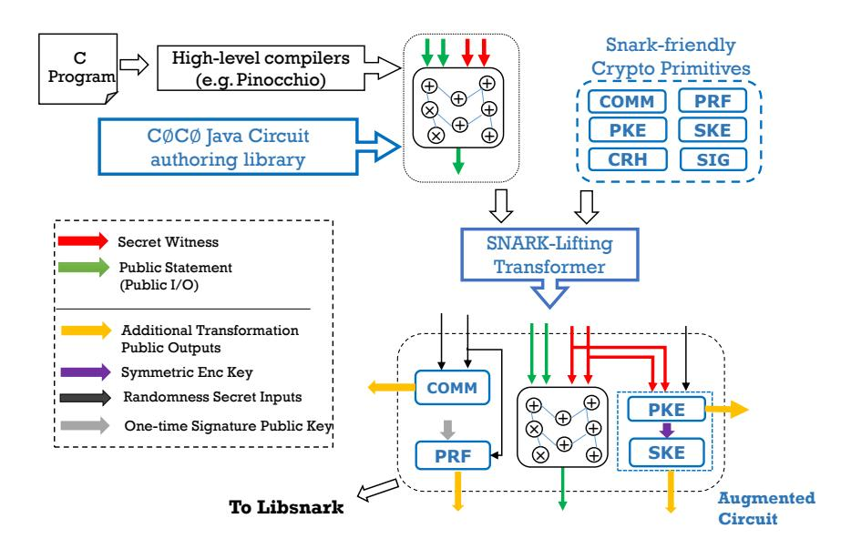

# C∅C∅: A Framework for Building Composable Zero-Knowledge Proofs

Ahmed Kosba† Zhichao Zhao<sup>∗</sup> Andrew Miller† Yi Qian‡ T-H. Hubert Chan<sup>∗</sup> Charalampos Papamanthou† Rafael Pass‡ abhi shelat• Elaine Shi‡

†: UMD ∗: HKU ‡: Cornell •: UVA

#### Abstract

Non-interactive zero-knowledge proofs are a powerful cryptographic primitive used in privacypreserving protocols. We design and build C∅C∅, the first system enabling developers to build efficient, composable, non-interactive zero-knowledge proofs for generic, user-defined statements. C∅C∅ extends state-of-the-art SNARK constructions by applying known strengthening transformations to yield UC-composable zero-knowledge proofs suitable for modular use in larger cryptographic protocols.

To attain fast practical performance, C∅C∅ includes a library of several "SNARK-friendly" cryptographic primitives.

These primitives are used in the strengthening transformations in order to reduce the overhead of achieving composable security. Our open-source library of optimized arithmetic circuits for these functions are up to 40× more efficient than standard implementations and are thus of independent interest for use in other NIZK projects.

Finally, we evaluate C∅C∅ on applications such as anonymous credentials, private smart contracts, and nonoutsourceable proof-of-work puzzles and demonstrate 5× to 8× speedup in these application settings compared to naive implementations.

# 1 Introduction

Non-Interactive Zero-Knowledge proofs (NIZKs) are a powerful building block in the design of expressive cryptographic protocols such as anonymous credentials, anonymous survey systems [\[43\]](#page-23-0), privacy-preserving digital currencies [\[11,](#page-22-0)[47\]](#page-23-1), and multi-party computation [\[39\]](#page-23-2) in general. Typically, NIZKs are used to defend against malicious parties and enforce honest behavior. Specifically, any deviation from the protocol will result in failure of NIZK verification, and thus translate to an aborting (i.e., Denial-of-Service) attack.

Excitingly, recent advent of Succinct Non-Interactive ARguments of Knowledge (SNARKs) [\[19,](#page-22-1) [37\]](#page-23-3) have greatly accelerated the idea to proof-of-concept cycle for systems that employ NIZKs. Although SNARKs have non-privacy-focused applications such as verifiable computation [\[13,](#page-22-2) [31,](#page-22-3) [32,](#page-23-4)[48,](#page-23-5)[55,](#page-24-0)[61,](#page-24-1)[63,](#page-24-2)[64,](#page-24-3)[66,](#page-24-4)[67\]](#page-24-5), here we focus on using SNARKs as a concrete instantiation of NIZKs. In particular, most known SNARK implementations [\[13,](#page-22-2) [32,](#page-23-4) [55,](#page-24-0) [63\]](#page-24-2) provide a zero-knowledge option, often referred to as zk-SNARKs.

Despite their well-known drawback of relying on assumptions that are non-falsifiable, SNARKs are attractive to practitioners not only due to their (relative) practical efficiency, but more importantly for their general-purpose nature. In contrast, until recently, most systems [\[22,](#page-22-4) [23,](#page-22-5) [43\]](#page-23-0) adopted customized NIZK protocols for application-specific statements of interest. Although this customized approach can result in protocols highly optimized for the specific task at hand, the enormous cryptography expertise and time required to develop new protocols for each application severely limit the adoption of modern cryptography building blocks such as NIZKs.

The general-purpose feature of SNARKs is quite compelling, and promises to simplify the usage of NIZKs in secure systems. With latest open-source SNARK implementations [\[2,](#page-21-0)[13,](#page-22-2)[32,](#page-23-4)[55,](#page-24-0)[63\]](#page-24-2), even system builders who are not cryptography experts can easily express a statement to be proven in a familiar programming language, and automated toolchains will generate a corresponding SNARK implementation. Further, this approach in turn enables rapid protocol prototyping, and avoids the need for full-scale protocol redesign when the functionality requirements change (as is often needed for customized protocols), since it is easy to modify a zk-SNARK to prove a different statement.

SNARKs have made an impact since their invention: they have been adopted to instantiate NIZKs in various systems [\[11,](#page-22-0) [33,](#page-23-6) [47,](#page-23-1) [53\]](#page-23-7), including ones built for production usage (e.g., Zero-Cash [\[11\]](#page-22-0)); further, new cryptocurrency systems such as Ethereum [\[65\]](#page-24-6) have pronounced interest in supporting SNARKs as an opcode [\[3\]](#page-21-1).

Composability is the recommended best practice in pragmatic cryptography engineering. Composability of cryptographic building blocks is often imperative in protocol design. When cryptographic building blocks are composable, they do not interfere with other building blocks in the same protocol or with other possibly concurrent protocol instances. For this reason, a universally composable (UC-secure) [\[24,](#page-22-6)[25,](#page-22-7)[27\]](#page-22-8) NIZK is frequently recommended or necessary in designing larger cryptographic systems [\[43,](#page-23-0) [47\]](#page-23-1).

While some may be tempted to dismiss UC as being a theoretical notion, we stress that UC is of vital importance and the recommended best practice in pragmatic cryptography engineering. We give a 10-min crash course on UC for the practitioner in Appendix [B,](#page-24-7) and clearly state why one should care about UC, and why UC provides "worry-free" adoption of cryptographic building blocks as if were "ideal boxes", and help avoid numerous perils and subtle attacks that might arise from lack of composability.

Pitfalls of using zk-SNARKs in protocol design. Unfortunately, known instantiations of zk-SNARKs [\[13,](#page-22-2)[32,](#page-23-4)[55,](#page-24-0)[63\]](#page-24-2) are not known to satisfy composability and therefore often cannot be adopted straight out of the box in the design of larger protocols. From a more technical standpoint, UCsecure protocols would often require simulation sound extractable zero-knowledge proofs. In other words, suppose that a simulator answers an adversary's queries on polynomially many, possibly false statements—nevertheless, whenever the adversary submits a proof for a new statement, the simulator must be able to extract a valid witness except with negligible failure probability. Known zk-SNARKs do not offer such strong soundness properties. Despite the fact that SNARKs allow "knowledge extraction", SNARKs' knowledge extractor is too weak for many UC-secure protocols, since SNARKs' extractor is non-blackbox, must know the concrete algorithm of the adversarial prover. By contrast, in UC-secure protocols, the ideal-world simulator must extract witnesses without knowing the environment's algorithm.

#### 1.1 Our Results and Contributions

In this paper, we design and build C∅C∅ (pronounced "coco", short for Composable 0-knowledge, Compact 0-knowledge). C∅C∅ is the first system that provides practical, UC-secure, non-interactive zero-knowledge proofs for general, user-defined statements. C∅C∅ makes UC-secure NIZKs an accessible building block for system builders who are not necessarily cryptography experts.

C∅C∅ provides UC-secure NIZKs that are circuit succinct, but not witness succinct. In other words, the size of the proofs and verification time are (quasi-)linear in the witness size, but independent of the size of the circuit that encodes the language. Note that in comparison, standard, non-UC-secure SNARKs achieve a stronger notion of succinctness, i.e., they are both circuit- and witness succinct. We note that currently there is also no known UC-secure zero-knowledge proof construction that is circuit- and witness succinct, even under non-standard assumptions—whether or how we can achieve this is left as future work. Below we describe our technical contributions in more detail.

SNARK-lifting transformations optimized for concrete efficiency. At the core, C∅C∅ builds on top of existing SNARKs and hence inherit their generality. To achieve simulation sound extractability, we adopt efficient SNARK-lifting transformations that allow us to transform zk-SNARKs to zero-knowledge proofs with simulation sound extractability, such that they could be adopted in UC-secure protocols. Our transformations are inspired by the work by De Santis et al. transforms an ordinary NIZK to a simulation sound NIZK [\[60\]](#page-24-8). Although De Santis's work only achieves a weaker notion called simulation soundness (without the online extraction property), it is not theoretically difficult to modify their constructions to additionally allow online extraction of the witness. In particular, under the common reference string model, one could encrypt the witness with a public-key encryption scheme, such that the simulator with knowledge of the secret key can extract the witness.

Our main contribution is not to show the theoretical feasibility of a SNARK lifting transformation, but to carefully select and optimize these constructions for concrete efficiency, and offer composable NIZKs as a building block to non-expert programmers. To optimize for concrete efficiency, we made various explorations: 1) we explored and compared different variants of SNARK-lifting transformations (see Sections [3,](#page-7-0) [4](#page-8-0) and [5\)](#page-10-0); 2) we consider "SNARK-friendly cryptography", where we carefully select known cryptographic primitives (e.g., encryption, key exchange, pseudo-random functions, signatures) and express them as efficient algebraic circuits which is the representation recognized by SNARKs. Earlier and concurrent works have considered the optimization of such primitives for specific purposes, such as [\[11,](#page-22-0) [14,](#page-22-9) [33,](#page-23-6) [34\]](#page-23-8). In this paper, we study more possible optimizations/alternatives with a focus on composable SNARKs. For example, we study the trade-offs of existing constructions such as RSA and field extension for key exchange, and propose to use a customized elliptic curve-based construction that is more efficient. Additionally, we select and optimize different block ciphers for symmetric encryption, and compare their performance. Overall, our implementation for encryption for example achieves more than 8x-9x compared to optimized RSA-based constructions.

Beyond the SNARKs, succinct algebraic circuit representation of cryptographic primitives can also be of independent interest in other cryptographic applications such as multi-party computation [\[10\]](#page-22-10) where computation is expressed as an algebraic circuit. Besides our work, earlier work has also considered optimizing cryptographic primitives for SNARK-friendliness in other application contexts [\[11,](#page-22-0) [33,](#page-23-6) [53\]](#page-23-7).

Programming model. C∅C∅ is a Java-based library that allows developers to encode statements to be proven as a circuit, where each gate expresses an algebraic constraint. C∅C∅ provides a development interface similar to that of libsnark [\[15\]](#page-22-11), where the developer can encode a circuit modularly by defining and composing "gadgets".

In comparison with directly using earlier SNARK programming frameworks [\[13,](#page-22-2)[15,](#page-22-11)[32,](#page-23-4)[55,](#page-24-0)[63,](#page-24-2)[64\]](#page-24-3), C∅C∅ provides the following advantages: with previous frameworks, the developer not only needs to implement the user-defined statement to be proven as an algebraic circuit, but would also be faced with the daunting task of implementing the entire SNARK-lifting transformation, including primitives such as encryption and signatures, as algebraic circuits.

With C∅C∅, the developer only needs to implement the high-level application (i.e., user-defined statement), and the C∅C∅ framework handles the remaining automatically and results in highly optimized implementations. To how easy/hard it is to program with C∅C∅, we provide a code sample in Figure [2](#page-25-0) of the Appendix.

Open source and evaluation. Figure [1](#page-4-0) presents the high-level architecture of C∅C∅ and highlights our contributions. A code example can be found in Appendix A. We report the performance of C∅C∅ through both micro-benchmarks as well as three end-to-end applications. First, we show that for individual primitives such as encryption, we achieve 10x to 40x speedup in comparison with a straightforward, unoptimized baseline. Next, we evaluated C∅C∅ with three end-to-end applications, and demonstrate 5× to 8× performance improvement over an unoptimized baseline. To make our work reusable by the community, we are in the process of open sourcing our code and implementations.

Adoption. C∅C∅ has been adopted in subsequent works [\[46,](#page-23-9) [47\]](#page-23-1) to build privacy-preserving protocols. These works adopted an earlier, naive version of C∅C∅ that implemented unoptimized constructions described in Section [3](#page-7-0) of this paper, and without SNARK-friendly cryptography optimizations. Since then, we have adopted more efficient constructions and SNARK-friendly optimizations, allowing us to demonstrate 5× performance improvements in end-to-end applications such as Hawk [\[47\]](#page-23-1) (see Section [7](#page-18-0) for detailed evaluations).

## 1.2 Related Work

Non-interactive zero-knowledge proofs were first proposed by Blum, Feldman, and Micali [\[20\]](#page-22-12), and later extended to multi-theorem by Blum et al. [\[21\]](#page-22-13).

Sahai [\[59\]](#page-24-9) was the first to construct a one-time, simulation-sound NIZK scheme. De Santis et al. [\[60\]](#page-24-8) subsequently provide unbounded simulation-sound NIZKs, allowing the adversary to access many simulated proofs of possibly false statements. Neither technique is practical. Simulation soundness is a slightly weaker condition than simulation sound extractability—the latter requires that even after seeing a polynomial number of simulated proofs of possibly false statements, whenever a polynomial-time adversary produces a valid proof, an extractor can extract a valid witness except with negligible failures. It has been observed [\[41,](#page-23-10) [42\]](#page-23-11) that simulation sound extractable NIZKs are UC-secure NIZKs by Canetti's definition [\[24\]](#page-22-6) in the presence of a static adversary. Groth et al. [\[42\]](#page-23-11) construct perfect NIZK arguments for circuit satisfiability using bilinear groups. They also extend their scheme to construct UC-secure NIZKs. Groth [\[41\]](#page-23-10) also gave more practical, simulation-sound extractable NIZK constructions for an NP language for bilinear groups.

All of the above simulation-sound extractable NIZKs are not succinct—namely the size of the proof is proportional to the size of the witness verification circuit |C| that encodes the language. In

<span id="page-4-0"></span>

Figure 1:  $C\emptyset C\emptyset$ 's architecture. The components that represent our contributions are highlighted in blue.

fact, Gentry and Wichs [38] has shown succinct non-interactive arguments to be impossible from any falsifiable assumption. Existing SNARKs adopt non-falsifiable assumptions to attain succinctness as well as practical efficiency [13, 31, 32, 37, 55, 63].

In general, non-malleability is closely related to and often necessary in composable protocols. Zerocash [11] features a technique bearing resemblance ours to ensure a limited form of non-malleability, called "transaction non-malleability". However, Zerocash is not known to satisfy composable security.

Garman et al. [36] construct a simulation sound SNARK in the CRS model by using well-known techniques to augment the statement with a trapdoor for the simulator. Their goal was to define an ideal model for decentralized anonymous payments, and design a scheme that satisfies the model in the stand-alone setting with static corruptions; their goal was not to achieve composability, and therefore a weaker notion suffices, and they can also achieve witness succinctness. They do not provide implementations details for the costs of their choices.

Finally, Appendix B provides an overview of UC, and explains why UC is the best practice for cryptography engineering.

#### <span id="page-4-1"></span>2 Preliminaries

**Notation.** In the remainder of the paper,  $f(\lambda) \approx g(\lambda)$  means that there exists a negligible function  $\nu(\lambda)$  such that  $|f(\lambda) - g(\lambda)| < \nu(\lambda)$ .

#### <span id="page-5-0"></span>2.1 Non-Interactive Zero-Knowledge Proofs

A non-interactive zero-knowledge proof system (NIZK) for an NP language  $\mathcal{L}$  consists of the following algorithms:

- crs  $\leftarrow \mathcal{K}(1^{\lambda}, \mathcal{L})$ , also written as crs  $\leftarrow$  KeyGen<sub>nizk</sub> $(1^{\lambda}, \mathcal{L})$ : Takes in a security parameter  $\lambda$ , a description of the language  $\mathcal{L}$ , and generates a common reference string crs.
- $\pi \leftarrow \mathcal{P}(\mathsf{crs}, \mathsf{stmt}, w)$ : Takes in  $\mathsf{crs}$ , a statement  $\mathsf{stmt}$ , a witness w such that  $(\mathsf{stmt}, w) \in \mathcal{L}$ , and produces a proof  $\pi$ .
- $b \leftarrow \mathcal{V}(\mathsf{crs}, \mathsf{stmt}, \pi)$ : Takes in a crs, a statement stmt, and a proof  $\pi$ , and outputs 0 or 1, denoting accept or reject.
- $(\widehat{\mathsf{crs}}, \tau, \mathsf{ek}) \leftarrow \widehat{\mathcal{K}}(1^{\lambda}, \mathcal{L})$ : Generates a simulated common reference string  $\widehat{\mathsf{crs}}$ , trapdoor  $\tau$ , and extract key  $\mathsf{ek}$
- $\pi \leftarrow \widehat{\mathcal{P}}(\widehat{\mathsf{crs}}, \tau, \mathsf{stmt})$ : Uses trapdoor  $\tau$  to produce a proof  $\pi$  without needing a witness

**Perfect completeness.** A NIZK system is said to be perfectly complete, if an honest prover with a valid witness can always convince an honest verifier. More formally, for any  $(\mathsf{stmt}, w) \in R$ , we have that

$$\Pr\left[\begin{array}{c} \mathsf{crs} \leftarrow \mathcal{K}(1^\lambda, \mathcal{L}), \ \pi \leftarrow \mathcal{P}(\mathsf{crs}, \mathsf{stmt}, w) : \\ \mathcal{V}(\mathsf{crs}, \mathsf{stmt}, \pi) = 1 \end{array}\right] = 1$$

Computational zero-knowlege. Informally, an NIZK system is computationally zero-knowledge if the proof does not reveal any information about the witness to any polynomial-time adversary. More formally, a NIZK system is said to computationally zero-knowledge, if there exists a polynomial-time simulator  $S = (\widehat{\mathcal{K}}, \widehat{\mathcal{P}})$ , such that for all non-uniform polynomial-time adversary  $\mathcal{A}$ ,

$$\begin{split} & \Pr\left[\mathsf{crs} \leftarrow \mathcal{K}(1^{\lambda}, \mathcal{L}): \mathcal{A}^{\mathcal{P}(\mathsf{crs}, \cdot, \cdot)}(\mathsf{crs}) = 1\right] \\ \approx & \Pr\left[(\widehat{\mathsf{crs}}, \tau, \mathsf{ek}) \leftarrow \widehat{\mathcal{K}}(1^{\lambda}, \mathcal{L}): \mathcal{A}^{\widehat{\mathcal{P}}_1(\widehat{\mathsf{crs}}, \tau, \cdot, \cdot)}(\widehat{\mathsf{crs}}) = 1\right] \end{split}$$

In the above,  $\widehat{\mathcal{P}}_1(\widehat{\mathsf{crs}}, \tau, \mathsf{stmt}, w)$  verifies that  $(\mathsf{stmt}, w) \in \mathcal{L}$ , and if so, outputs  $\widehat{\mathcal{P}}(\widehat{\mathsf{crs}}, \tau, \mathsf{stmt})$  which simulates a proof without knowing a witness. Otherwise, if  $(\mathsf{stmt}, w) \notin \mathcal{L}$ , the experiment aborts. This notion is *adaptive* zero knowledge in the sense that the simulator must specify the reference string before seeing the theorem statements.

Computational soundness. A NIZK scheme for the language  $\mathcal{L}$  is said to be computationally sound, if for all polynomial-time adversaries  $\mathcal{A}$ ,

$$\Pr\left[\begin{array}{l} \mathsf{crs} \leftarrow \mathcal{K}(1^{\lambda}, \mathcal{L}), (\mathsf{stmt}, \pi) \leftarrow \mathcal{A}(\mathsf{crs}) : \\ (\mathcal{V}(\mathsf{crs}, \mathsf{stmt}, \pi) = 1) \wedge (\mathsf{stmt} \notin \mathcal{L}) \end{array}\right] \approx 0$$

Simulation extractability. Simulation extractability is a strong notion which requires that even after seeing many simulated proofs (even for false theorems), whenever the adversary makes a new proof, a simulator is able to extract a witness. Simulation extractability implies simulation soundness and non-malleability (i.e., it is not feasible for an adversary to take a verifying proof and "maul" it into a verifying proof for another statement) since if the simulator can extract a valid witness from an adversary's proof, the statement must belong to the language. More formally,

a NIZK system is said to be simulation extractable if it satisfies computational zero-knowledge and additionally, there exists a polynomial-time algorithm  $\mathcal{E}$ , such that for any polynomial-time adversary  $\mathcal{A}$ , it holds that

$$\Pr\left[\begin{array}{l} (\widehat{\mathsf{crs}},\tau,\mathsf{ek}) \leftarrow \widehat{\mathcal{K}}(1^\lambda,\mathcal{L});\\ (\mathsf{stmt},\pi) \leftarrow \mathcal{A}^{\widehat{\mathcal{P}}(\widehat{\mathsf{crs}},\tau,\cdot)}(\widehat{\mathsf{crs}},\mathsf{ek});\\ w \leftarrow \mathcal{E}(\widehat{\mathsf{crs}},\mathsf{ek},\mathsf{stmt},\pi) : \mathsf{stmt} \notin Q \text{ and}\\ (\mathsf{stmt},w) \notin \mathcal{L} \text{ and } V(\widehat{\mathsf{crs}},\mathsf{stmt},\pi) = 1 \end{array}\right] \approx 0$$

where in the above, Q is the list of oracle queries made by  $\mathcal{A}$  to  $\widehat{\mathcal{P}}(\widehat{\mathsf{crs}}, \tau, \cdot)$ . Here the  $\widehat{\mathcal{K}}$  is identical to the zero-knowledge simulation setup algorithm.

A few remarks about the definition follow. First, note that the extractor algorithm  $\mathcal{E}$  works for all adversaries, and does not therefore depend or have access to the adversary's code. Rather, the extractor's advantage arises entirely from its special access to a trapdoor ek for the  $\widehat{\mathsf{crs}}$ . Next, note that the adversary may be able to fake a (different) proof for a statement that has been queried, however, it is not able to forge a proof for any other invalid statement. There is a natural strengthening of the above notion where the adversary cannot even fake a different proof for a statement queried (in fact, it is this stronger notion that is given as the default in [41]). We define and give constructions for this later in Section 5. In Hawk [47], however, it is shown that the weaker notion defined above suffices for a typical UC application; therefore we focus on this notion first.

Relation between UC secure NIZKs and simulation sound extractability. It is well understood that the notion of simulation-sound extractability and UC-secure NIZKs are roughly speaking interchangeable [26,41]. Therefore, for the remainder of the paper, we will use the notion simulation-sound extractability, and later in Appendix C, we elaborate on the relationship between simulation sound extractability and UC security for NIZKs.

#### 2.2 SNARKs

A SNARK is a NIZK that is succint, perfectly complete, computationally zero-knowledge, and has a knowledge extractor (a stronger property than soundness):

**Succinctness.** A SNARK is said to be succinct if an honestly generated proof has  $poly(\lambda)$  bits and that the verification algorithm  $\mathcal{V}(\mathsf{crs},\mathsf{stmt},\pi)$  runs in  $O(|\mathsf{stmt}|\cdot\mathsf{poly}(\lambda))$ .

Adaptive knowledge extraction. Knowledge extraction requires that if a proof generated by an adversary is accepted by the verifier, then the adversary "knows" a witness for the given instance; i.e., there exists an algorithm  $\mathcal{E}$  which recovers a witness. Furthermore, the extraction property holds adaptively even if the prover picks the statement after seeing the reference string. Formally, a SNARK for language  $\mathcal{L}$  satisfies the knowledge extraction property *iff*:

For all polynomial-sized adversary  $\mathcal{A}$ , there exists a polynomial-size extractor  $\mathcal{E}_{\mathcal{A}}$ , such that for all advice strings  $z \in \{0,1\}^{\mathsf{poly}(\lambda)}$ ,

$$\Pr\left[\begin{array}{l} \operatorname{crs} \leftarrow \mathcal{K}(1^{\lambda}, \mathcal{L}) \\ (\operatorname{stmt}, \pi) \leftarrow \mathcal{A}(\operatorname{crs}, z) \\ a \leftarrow \mathcal{E}_{\mathcal{A}}(\operatorname{crs}, z) \end{array} \right. : \begin{array}{l} \mathcal{V}(\operatorname{crs}, \operatorname{stmt}, \pi) = 1 \\ (\operatorname{stmt}, a) \notin \mathcal{R}_{\mathcal{L}} \end{array}\right] \approx 0$$

Note that the knowledge extraction property implies computationally soundness (defined for NIZK).

# <span id="page-7-0"></span>3 Basic Lifting Transformation

We begin by presenting the theoretical constructions that C∅C∅ implements. In this section, we will start from a simpler basic construction that is relatively inefficient and provides a slightly weaker notion of composability (and nonetheless strong enough for many applications); we then describe improvements and strengthenings in Sections [4](#page-8-0) and [5](#page-10-0) respectively.

We show a construction that transforms any NIZK to one that satisfies simulation sound extractability.

Typically, a NIZK only guarantees soundness, which simply means that if the verifier accepts a proof, then the statement must be in the language. However, in many cases, what we actually desire is to guarantee that the prover actually "knows" a valid witness. For example, given a collision-resistant hash function, it is necessarily true that a collision exists, though to actually compute such a collision is intractable. The definition of simulation extractability captures the desired knowledge property–given a valid proof (and the extraction key produced during setup), the extractor algorithm can efficiently compute a witness.

Intuition. Our first construction makes use of an asymmetric signature scheme and encryption scheme, the public keys for which are embedded in the setup parameters, and the private keys for which are embedded in the trapdoor and extraction key, respectively. The idea is to force every prover to encrypt a witness and a signature, at least one of which must be legitimate. While an honest prover will simply provide a valid witness, the simulated prover will use the signing key to provide a signature. The extractor can simply use the decryption key to recover a valid witness (or at least a signature) from the proof. This guarantees that an adversary who breaks the system can be leveraged to either break the soundness of the underlying NIZK or the unforgeability of the signature scheme.

Construction. In the following, assume Σ is an unforgeable signature scheme, and (KeyGenEnc, Enc, Dec) is a perfectly correct public key encryption scheme.

• K(1<sup>λ</sup> ,L): Run (pk,sk) ← Σ.Gen(1<sup>λ</sup> ). Run (pk<sup>e</sup> ,ske) ← KeyGenEnc(1<sup>λ</sup> ). Let L <sup>0</sup> be the following language: ((stmt, c),(r, w, σ)) ∈ L<sup>0</sup> iff

$$\begin{split} (c &= \mathsf{Enc}(\mathsf{pk}_e, (w, \sigma), r)) \, \wedge \\ ((\mathsf{stmt}, w) &\in \mathcal{L} \vee (\Sigma.\mathcal{V}(\mathsf{pk}, \mathsf{stmt}, \sigma) = 1)) \end{split}$$

Run nizk.crs ← nizk.K(1<sup>λ</sup> ,L 0 ).

Publish crs := (nizk.crs, pk, pk<sup>e</sup> ) as the common reference string.

- P(crs,stmt, w): Parse crs := (nizk.crs, pk). Choose random r, and compute c := Enc(pk<sup>e</sup> ,(w, ⊥), r). Call π := nizk.P(nizk.crs, (stmt, c), (r, w, ⊥)), and output π 0 := (c, π).
- V(crs,stmt, π<sup>0</sup> ): Parse π 0 := (c, π), and output nizk.V(nizk.crs, (stmt, c), π).
- <sup>K</sup>b(1<sup>λ</sup> ,L): Run the honest K algorithm, but retain the signing key sk as the simulation trapdoor <sup>τ</sup> := sk. The extraction key ek := ske, the simulated crs <sup>c</sup> := crs = (nizk.crs, pk, pk<sup>e</sup> ).
- <sup>P</sup>b(crs <sup>c</sup>, τ,stmt): the simulator calls

$$\pi := \mathsf{nizk}.\mathcal{P}(\mathsf{nizk.crs},(\mathsf{stmt},c),(\bot,\bot,\sigma))$$

where σ := Σ.Sign(sk,stmt) and c is an encryption of (⊥, σ). Output (c, π).

<span id="page-8-1"></span>Theorem 1. Assume that the underlying NIZK scheme satisfies perfect completeness, computational soundness, and computational zero-knowlege, that the signature scheme satisfies existential unforgeability under chosen message attack, and that the encryption scheme is semantically secure and perfectly correct, then the above construction is a zero-knowledge proof system satisfying perfect completeness, computational zero-knowledge, and simulation extractability.

The proof for the above theorem appears in the appendix.

This basic SNARK-lifting construction can be further optimized for concrete performance. We defer the details of these optimizations to Appendix [D,](#page-27-0) and instead focus on describing a more efficient construction that avoids evaluating signatures inside a SNARK circuit, but instead relies on pseudorandom functions and commitments.

# <span id="page-8-0"></span>4 Improved SNARK Lifting

The previous section demonstrates the possibility of upgrading any NIZK to an SSE-NIZK. However, the construction relies on the use of signature scheme within an arithmetic circuit, which limits its performance. In this section, we first show a more efficient construction that avoids the use of signature schemes.

Our construction makes use of a pseudo-random function and a perfectly-binding commitment scheme, which together replace the original signature scheme.

Intuition. Recall the intuition for a pseudorandom function f: without the knowledge of the key a, fa(·) behaves like a true random function. However, given a, one can compute fa(·) easily. In order to use this in lieu of a signature, we include a commitment to a in the public parameters, and keep a (and the commitment opening) as the trapdoor.

We then design a transformed language such that a prover with a correct witness can pass; otherwise, the (simulated) prover must give fa(stmt) and an opening of the commitment to the same a.

Construction. Let {f<sup>s</sup> : {0, 1} <sup>∗</sup> → {0, 1} <sup>λ</sup>}s∈{0,1} <sup>λ</sup> be a pseudo-random function family, let comm be a perfectly binding commitment scheme, and let (KeyGenEnc, Enc, Dec) be a semantically secure encryption scheme.

To simplify our description, we assume Enc and comm both take exactly λ random bits as randomness and that the witness for L is exactly λ bits; it is straightforward to adapt the proof when they are of different lengths.

Note that in the language L 0 , c must be a correct encryption of some w and µ, which allows the extractor to decrypt. For a statement-witness pair to be valid, either a witness in R<sup>L</sup> is provided or an opening to ρ together with the value of fa(stmt) is provided, where a is the opened value of ρ (from crs).

For language L with NP relation RL, let L <sup>0</sup> be the language defined as (stmt, c, pk<sup>e</sup> , ρ),(µ, r, r<sup>0</sup> , w, a) ∈ RL<sup>0</sup> iff:

$$\begin{split} c \! &= \! \mathsf{Enc}(\mathsf{pk}_e, (w, \mu); r) \land \\ \left( (\mathsf{stmt}, w) \in \mathcal{R_L} \lor \left( \rho \! = \! \mathsf{comm}(a; r') \land \mu \! = \! f_a(\mathsf{stmt}) \right) \right) \end{split}$$

Our SSE-NIZK construction is defined as follows:

• K(1<sup>λ</sup> ,L): nizk.crs ← nizk.K(1<sup>λ</sup> ,L 0 );

```
\begin{split} s_0, r_0 & \stackrel{\$}{\leftarrow} \{0,1\}^{\lambda}; \ \rho := \mathsf{comm}(s_0; r_0); \\ \mathsf{return} \ \mathsf{crs} := (\mathsf{nizk.crs}, \mathsf{pk}_e, \rho). \end{split}
\bullet \ \mathcal{P}(\mathsf{crs}, \mathsf{stmt}, w) : \\ \mathsf{Parse} \ \mathsf{crs} := (\mathsf{nizk.crs}, \mathsf{pk}_e, \rho); \\ \mathsf{Output} \ \bot \ \mathsf{if} \ (\mathsf{stmt}, w) \notin \mathcal{R}_{\mathcal{L}}; \\ z_0, z_1, z_2, r_1 & \stackrel{\$}{\leftarrow} \{0,1\}^{\lambda}; \\ c \leftarrow \mathsf{Enc}(\mathsf{pk}_e, (w, z_0); r_1); \\ \mathsf{nizk}.\pi \leftarrow \mathsf{nizk}.\mathcal{P}(\mathsf{nizk.crs}, (\mathsf{stmt}, c, \mathsf{pk}_e, \rho), \\ (z_0, r_1, z_1, w, z_2)); \\ \mathsf{return} \ \pi := (c, \mathsf{nizk}.\pi). \end{split}
```

 $(\mathsf{pk}_e, \mathsf{sk}_e) \leftarrow \mathsf{KeyGen}_{\mathrm{Enc}}(1^{\lambda});$ 

- $$\begin{split} \bullet \ \ & \mathcal{V}(\mathsf{crs},\mathsf{stmt},\pi) \colon \\ & \mathsf{Parse} \ \mathsf{crs} := (\mathsf{nizk}.\mathsf{crs},\mathsf{pk}_e,\rho) \ \mathsf{and} \ \pi := (c,\mathsf{nizk}.\pi); \\ & \mathsf{Call} \ \mathsf{nizk}.\mathcal{V}(\mathsf{nizk}.\mathsf{crs},(\mathsf{stmt},c,\mathsf{pk}_e,\rho),\mathsf{nizk}.\pi). \end{split}$$
- $\widehat{\mathcal{K}}(1^{\lambda},\mathcal{L})$ : Run  $\mathcal{K}$  to get  $\widehat{\mathsf{crs}} := \mathsf{crs}$ , but keep trapdoor  $\tau := (s_0, r_0)$ , extraction key  $\mathsf{ek} := \mathsf{sk}_e$ .
- $$\begin{split} \bullet \ \widehat{\mathcal{P}}(\widehat{\mathsf{crs}},\tau,\mathsf{stmt}) \colon \\ & \text{Parse } \widehat{\mathsf{crs}} := (\mathsf{nizk.crs},\mathsf{pk}_e,\rho) \text{ and } \tau := (s_0,r_0); \\ & z_3,r_1 \overset{\$}{\leftarrow} \{0,1\}^\lambda; \ \mu = f_{s_0}(\mathsf{stmt}); \\ & c = \mathsf{Enc}(\mathsf{pk}_e,(z_3,\mu);r_1); \\ & \mathsf{nizk}.\pi \leftarrow \mathsf{nizk}.\mathcal{P}(\mathsf{nizk.crs},(\mathsf{stmt},c,\mathsf{pk}_e,\rho), \\ & (\mu,r_1,r_0,z_3,s_0)); \\ & \mathsf{return} \ \pi := (c,\mathsf{nizk}.\pi). \end{split}$$
- We also define the extractor here:  $\mathcal{E}(\widehat{\mathsf{crs}}, \mathsf{ek}, \mathsf{stmt}, \pi)$ : Parse  $\pi := (c, \mathsf{nizk}.\pi)$ ;  $(w, \mu) \leftarrow \mathsf{Dec}(\mathsf{ek}, c)$ ; return w.

<span id="page-9-0"></span>**Theorem 2.** Assume that the underlying NIZK scheme satisfies perfect completeness, computational soundness, computational zero-knowledge, and that the encryption scheme is semantically secure and perfectly correct, and that the pseudo-random function family is secure, and that the commitment scheme is perfectly binding and computational hiding, then the above construction is a zero-knowledge proof system satisfying perfect completeness, computational zero-knowledge, and simulation sound extractability.

We defer the proof to Appendix E.2.

**Optimization using hash functions.** We demonstrate a way to improve the performance by the use of hash functions. Intuitively, we can apply a collision resistant hash function to the statement before applying the PRF.

We need a collision resistant hash function  $h: \{0,1\}^* \to \{0,1\}^{\lambda}$ . Formally, for any polynomial time adversary  $\mathcal{A}$  we have,

$$\Pr[x_0, x_1 \leftarrow \mathcal{A}(1^{\lambda}) : x_0 \neq x_1 \land h(x_0) = h(x_1)] = \mathsf{negl}(1^k)$$

Next we show how to change our construction. We modify our language  $\mathcal{L}'$  as follows,

For language  $\mathcal{L}$  with NP relation  $\mathcal{R}_{\mathcal{L}}$ , let  $\mathcal{L}'$  be the language defined as  $\left((\mathsf{stmt}, c, \mathsf{pk}_e, \rho), (\mu, r, r', w, a)\right) \in \mathcal{R}_{\mathcal{L}'}$  iff:

$$\begin{split} c \! &= \! \mathsf{Enc}(\mathsf{pk}_e, (w, \mu); r) \land \\ \left( (\mathsf{stmt}, w) \in \mathcal{R}_{\mathcal{L}} \lor \left( \rho \! = \! \mathsf{comm}(a; r') \land \mu \! = \! f_a(h(\mathsf{stmt})) \right) \right) \end{split}$$

Note that instead  $\mu = f_a(\mathsf{stmt})$ , we have  $\mu = f_a(h(\mathsf{stmt}))$ . That is to say, we apply a hash function before applying the PRF. We then modify the algorithms accordingly. The algorithms  $\mathcal{K}$ ,  $\mathcal{P}$ ,  $\widehat{\mathcal{K}}$  and  $\mathcal{E}$  are the same as before. The only part that needs changing is  $\widehat{\mathcal{P}}$ ,

```
\begin{split} \bullet \ \widehat{\mathcal{P}}(\widehat{\mathsf{crs}},\tau,\mathsf{stmt}) \colon \\ & \text{Parse } \widehat{\mathsf{crs}} := (\mathsf{nizk.crs},\mathsf{pk}_e,\rho) \text{ and } \tau := (s_0,r_0); \\ & z_3,r_1 \overset{\$}{\leftarrow} \{0,1\}^\lambda; \ \underline{\mu} = f_{s_0}(h(\mathsf{stmt})); \\ & c = \mathsf{Enc}(\mathsf{pk}_e,(z_3,\mu);r_1); \\ & \mathsf{nizk.}\pi \leftarrow \mathsf{nizk.}\mathcal{P}(\mathsf{nizk.crs},(\mathsf{stmt},c,\mathsf{pk}_e,\rho), \\ & (\mu,r_1,r_0,z_3,s_0)); \\ & \mathsf{return} \ \pi := (c,\mathsf{nizk.}\pi). \end{split}
```

The change is we apply h to stmt as defined in  $\mathcal{L}'$ .

Next we argue the proofs can still go through. For the simulation sound extractability part, the experiments can be defined similarly. The changes are that in step 2,  $\mu = f_{s_0}(\mathsf{stmt}_x)$  or  $\mu = F(\mathsf{stmt}_x)$  and that in step 5, return condition (3) is changed to  $f_{s_0}(\mathsf{stmt}) = \mu$  or  $F(\mathsf{stmt}) = \mu$ . It can be seen that except Claim 5, all claims can go through. Luckily we can still prove Claim 5 similarly. Observe that since  $\mathsf{stmt}$  has not appeared before, we can argue that  $h(\mathsf{stmt})$  has not been queried on F except for negligible probability, hence  $F(h(\mathsf{stmt})) = \mu$  happens with only negligible probability.

For the zero-knowledge part, we also modify the experiments accordingly. Then it can be seen that the proofs can go through naturally.

# <span id="page-10-0"></span>5 A Stronger Version

In this section, we define a strengthened version of simulation sound extractability and provide a construction.

The original definition of simulation sound extractability says that if the adversary does not know a witness for a statement, he can only prove that statement if the he has previously submitted this statement as an oracle query (i.e., to the simulated prover). In our strengthened definition, which we call "strongly simulation sound extractable", we further constrain the adversary to only produce *statement-proof pairs* that have been previously queried. In other words, under the weaker definition, it is possible for an adversary to generate *novel* proofs for previously-queried statements; this is precluded by the stronger definition.

**Strongly simulation sound extractable.** We say a NIZK for a language  $\mathcal{L}$  is strongly simulation extractable *iff* there exists an extractor  $\mathcal{E}$  such that for all polynomial-size adversary  $\mathcal{A}$ , the following holds:

$$\Pr\left[\begin{array}{ll} (\widehat{\mathsf{crs}},\tau,\mathsf{ek}) \leftarrow \widehat{\mathcal{K}}(1^\lambda) & (\mathsf{stmt},\pi) \notin Q \text{ and } \\ (\mathsf{stmt},\pi) \leftarrow \mathcal{A}^{\widehat{\mathcal{P}}(\widehat{\mathsf{crs}},\tau,\cdot)}(\widehat{\mathsf{crs}},\mathsf{ek}) \colon (\mathsf{stmt},w) \notin \mathcal{R}_{\mathcal{L}} \text{ and } \\ w \leftarrow \mathcal{E}(\widehat{\mathsf{crs}},\mathsf{ek},\mathsf{stmt},\pi) & \mathcal{V}(\widehat{\mathsf{crs}},\mathsf{stmt},\pi) = 1 \end{array}\right] \\ = \mathsf{negl}(\lambda)$$

where Q is the set of statement-proof pairs generated by the oracle calls to  $\widehat{\mathcal{P}}.$ 

Intuition. Like before, a prover must always provide an encryption of a (possibly bogus) witness. Our construction makes use of a one-time signature scheme. A pair of one-time signing/verification keys are generated for each proof. Compared with Section 4, the difference is that instead of  $f_a(\mathsf{stmt})$ , a simulated prover is required to provide  $\mu = f_a(\mathsf{pk})$ . Then we require the prover to sign the statement together with the proof, the cipher-text, and  $\mu$ . Briefly, due to the security of signature scheme, the adversary must use a different  $\mathsf{pk}$  from the ones returned from oracle queries. Thus, in order for a statement to pass the verifier without a proper witness, the prover must generate  $f_a(\mathsf{pk})$  without the knowledge of a (thus breaking the pseudo-random function).

**Construction.** Given a language  $\mathcal{L}$  with NP relation  $\mathcal{R}_{\mathcal{L}}$ , let  $\mathcal{L}'$  be the language that  $((\mathsf{stmt}, c, \mu, \mathsf{pk}_s, \mathsf{pk}_e, \rho), (r, r', w, a)) \in \mathcal{R}_{\mathcal{L}'}$  iff:

$$\begin{split} c &= \mathsf{Enc}(\mathsf{pk}_e, w; r) \land \\ \Big( (\mathsf{stmt}, w) \in \mathcal{R_L} \lor \left( \mu = f_a(\mathsf{pk}_s) \land \rho = \mathsf{comm}(a; r') \right) \Big) \end{split}$$

Next we show the construction from NIZK to strong SE-NIZK.

- $$\begin{split} \bullet \ \ \mathcal{K}(1^{\lambda},\mathcal{L}) \colon \\ \text{nizk.crs} \leftarrow \text{nizk.} \mathcal{K}(1^{\lambda},\mathcal{L}') ; \\ (\text{pk}_e,\text{sk}_e) \leftarrow \text{KeyGen}_{\operatorname{Enc}}(1^{\lambda}) ; \ s_0, r_0 \overset{\$}{\leftarrow} \{0,1\}^{\lambda} ; \\ \rho := \operatorname{comm}(s_0;r_0). \ \ \text{return crs} := (\text{nizk.crs},\text{pk}_e,\rho). \end{split}$$
- $$\begin{split} \bullet \ & \mathcal{P}(\mathsf{crs}, \mathsf{stmt}, w) \colon \\ & \mathsf{Parse} \ \mathsf{crs} := (\mathsf{nizk.crs}, \mathsf{pk}_e, \rho); \\ & \mathsf{Abort} \ \mathsf{if} \ (\mathsf{stmt}, w) \notin \mathcal{R}_{\mathcal{L}}; \\ & (\mathsf{pk}_s, \mathsf{sk}_s) \leftarrow \mathsf{KeyGen}_{\mathsf{Sig}}(1^\lambda); \ z_0, z_1, z_2, r_1 \overset{\$}{\leftarrow} \{0, 1\}^\lambda; \\ & c = \mathsf{Enc}(\mathsf{pk}_e, w; r_1); \\ & \mathsf{nizk}.\pi \leftarrow \mathsf{nizk}.\mathcal{P}(\mathsf{nizk.crs}, (\mathsf{stmt}, c, z_0, \mathsf{pk}_s, \mathsf{pk}_e, \rho), \\ & (r_1, z_1, w, z_2)); \\ & \sigma \leftarrow \mathsf{Sign}(\mathsf{sk}_s, (\mathsf{stmt}, c, z_0, \mathsf{nizk}.\pi)); \\ & \mathsf{return} \ \pi := (c, z_0, \mathsf{nizk}.\pi, \mathsf{pk}_s, \sigma). \end{split}$$
- $\begin{array}{l} \bullet \ \, \mathcal{V}(\mathsf{crs},\mathsf{stmt},\pi) \colon \\ \text{Parse } \mathsf{crs} := (\mathsf{nizk.crs},\mathsf{pk}_e,\rho) \ \text{and} \ \pi := (c,\mu,\mathsf{nizk}.\pi,\mathsf{pk}_s,\sigma); \\ \text{Abort } \text{if } \mathsf{Verify}(\mathsf{pk}_s,(\mathsf{stmt},c,\mu,\mathsf{nizk}.\pi),\sigma) = 0; \\ \text{Call } \mathsf{nizk}.\mathcal{V}(\mathsf{nizk.crs},(\mathsf{stmt},c,\mu,\mathsf{pk}_s,\mathsf{pk}_e,\rho),\mathsf{nizk}.\pi). \end{array}$
- $\widehat{\mathcal{K}}(1^{\lambda},\mathcal{L})$ : Run  $\mathcal{K}$  to get  $\widehat{\mathsf{crs}} := \mathsf{crs}$ , but keep trapdoor  $\tau := (s_0, r_0)$ , extraction key  $\mathsf{ek} := \mathsf{sk}_e$ .
- $$\begin{split} \bullet \ \widehat{\mathcal{P}}(\widehat{\mathsf{crs}},\tau,\mathsf{stmt}) \colon \\ & \text{Parse } \widehat{\mathsf{crs}} := (\mathsf{nizk.crs},\mathsf{pk}_e,\rho) \text{ and } \tau := (s_0,r_0); \\ & (\mathsf{pk}_s,\mathsf{sk}_s) \leftarrow \mathsf{KeyGen}_{\mathsf{Sig}}(1^\lambda); \ \mu = f_{s_0}(\mathsf{pk}_s); \\ & z_3,r_1 \overset{\$}{\leftarrow} \{0,1\}^\lambda; \ c = \mathsf{Enc}(\mathsf{pk}_e,z_3;r_1); \\ & \mathsf{nizk}.\pi \leftarrow \mathsf{nizk}.\mathcal{P}(\mathsf{nizk.crs},(\mathsf{stmt},c,\mu,\mathsf{pk}_s,\mathsf{pk}_e,\rho), \\ & (r_1,r_0,z_3,s_0)); \\ & \sigma \leftarrow \mathsf{Sign}(\mathsf{sk}_s,(\mathsf{stmt},c,\mu,\mathsf{nizk}.\pi)); \\ & \mathsf{return} \ \pi := (c,\mu,\mathsf{nizk}.\pi,\mathsf{pk}_s,\sigma). \end{split}$$

• We also define the extractor here: <sup>E</sup>(crs <sup>c</sup>, ek,stmt, π): Parse <sup>π</sup> := (c, µ, nizk.π, pk<sup>s</sup> , σ); w ← Dec(ek, c); return w.

<span id="page-12-0"></span>Theorem 3. Assume that the underlying NIZK scheme satisfies perfect completeness, computational soundness, computational zero-knowledge, that the encryption scheme is semantically secure and perfectly correct, that the pseudo-random function family is secure, that the commitment scheme is perfectly binding and computational hiding, and that the one-time signature scheme is strongly unforgeable. Then the above construction is a zero-knowledge proof system satisfying perfect completeness, computational zero-knowledge, and strongly simulation sound extractability.

The proof uses a similar idea of that in Section [4,](#page-8-0) which we defer to Appendix [E.3.](#page-37-0)

# 6 SNARK-Friendly Cryptography

We now discuss how to efficiently implement the theoretical constructions described in Sections [3,](#page-7-0) [4,](#page-8-0) and [5.](#page-10-0) In particular, our theoretical constructions require implementing several cryptographic primitives such as encryption, commitment, and pseudorandom functions as statements (i.e., circuits) to be proven. This raises interesting challenges in terms of practical performance because traditionally, these cryptographic primitives are optimized for raw execution on modern processor architectures, not as SNARK statements.

In the remainder of the section, we will describe several important optimizations, and report the performance improvement attained through micro-benchmarking numbers.

What is efficient and not efficient for SNARKs. Known SNARK constructions model computation as algebraic circuits modulo a large prime p. Standard implementations and parameter choices for cryptographic primitives are targeted at modern hardware platforms with different constraints than SNARKs. For example, some algebraic operations, like addition and constantscalar multiplication of field elements Fp, which are expensive in hardware, are essentially free in a SNARK; however, while XORing two 32-bit numbers takes a single cycle on an ordinary CPU, this is far more costly in an arithmetic circuit.

The following observations guide our choices. These points were noted by other earlier works [\[6,](#page-21-2) [11,](#page-22-0) [14,](#page-22-9) [33,](#page-23-6) [34,](#page-23-8) [55,](#page-24-0) [62\]](#page-24-10) as well.

- Addition and multiplications by constants in the field Fp, where p is the SNARK field order, are almost for free, and in particular are much cheaper than multiplication. Reducing the number of multiplication gates is the main optimization criteria.
- Bit-level operations are expensive because splitting a field element into n bits requires n + 1 multiplication gates.
- However, once we have a binary representation of a value, operations like Rotation and Shift are free.
- Random-access lookup tables, such as those used in many S-Box symmetric cryptography implementations, are likely a bottleneck. Typically, there are two main approaches to implement lookup tables in a circuit. The first approach is a linear scan to select one element, which results in O(n) cost. The other approach involves using a permutation network to sort a sequence of memory accesses by address and providing a proof of consistency; the complexity of this depends on the number of the accesses to the array. [\[12,](#page-22-15) [13,](#page-22-2) [62\]](#page-24-10)

• Verification can be simpler than forward computation. The SNARK circuits do not always have to compute the result, but can instead represent a verification algorithm. For example, a multiplicative inverse circuit does not have to encode the computation of the inverse, but can instead consist of a single multiplication constraint on the value provided by the prover.

**Designing SNARK-friendly cryptographic primitives.** We explore the following strategies for designing SNARK-friendly cryptographic primitives.

- 1. **Protocol- and algebraic-level choices.** First, for the same cryptographic building block (e.g., encryption, signature), we explore building it from different algebraic building blocks such as RSA and Diffie-Hellman. Certain algebraic structures and operations are by nature more efficient when encoded as SNARK circuits. We also explore various choices such as using public-key encryption vs hybrid encryption.
- 2. Circuit-level optimizations. Once a scheme is fixed, we perform numerous optimizations at the circuit level to reduce the concrete circuit size.

We now describe our protocol choices and optimizations for the cryptographic tasks needed in our SNARK-lifting constructions from Sections 3, 4 and 5.

## 6.1 Encryption

As the costs of all our SNARK-lifting constructions are dominated by the public-key encryption of the witness, we focus most of our efforts on this task.

**Public-Key encryption.** Hawk [47] and Gyges [46] use an earlier version of  $C\emptyset C\emptyset$  that has naïve implementation of RSA with OAEP, which is poorly suited to arithmetic circuits.

We start by implementing an optimized circuit for RSA-OAEP encryption with SHA-256 as the hash and mask generation function [44]. The essential challenge with RSA is that the arithmetic operations are over integers mod n, where n is larger (e.g., 1024 bits) than the SNARK field order p (typically a 254-bit prime). We represent integers mod n as  $\lceil \frac{\log_2 n}{m} \rceil$  m-bit elements. To multiply a pair of such integers  $z := x * y \mod n$ , we construct a circuit that verifies x \* y = q \* n + z, where q and z are  $\lceil \frac{\log_2 n}{m} \rceil$  m-bit elements provided as witnesses by the prover. Our current implementation for big integers uses m = 64 for easy interfacing. It is possible to use larger m, but this results in less than 1% savings in our implementation, as this is not the bottleneck of the circuit. To improve over a naive implementation, we use an efficient approach for long integer equality checks when the chunks are not aligned to reduce the number of comparisons. Furthermore, we use a manually-optimized circuit for SHA-256 to implement the OAEP encoding within the circuit.

**Hybrid encryption.** We consider the use of hybrid encryption, where we use a public-key scheme to exchange/encrypt a symmetric key, and then use the symmetric key to encrypt the plaintext. To explore this alternative, we explored various options for key exchange and symmetric-key encryption as we describe below.

**Key exchange.** Although it is possible to use the optimized RSA circuit above to encrypt and exchange a symmetric key, we explored the following schemes for a SNARK-friendly key exchange in order to find a more efficient alternative than RSA.

• Diffie-Hellman key exchange via a SNARK-friendly field extension. Instead of relying on RSA as the main PKE scheme, we investigate another scheme based on the Discrete-Logarithm problem

in Extension Fields, and use it for symmetric key exchange. Since p is only 254-bit prime, the DL problem in F<sup>p</sup> will not be hard, therefore an extension F<sup>p</sup> <sup>µ</sup> will be used instead. This idea is mainly inspired by the construction in PinocchioCoin [\[33\]](#page-23-6). The key exchange circuit has two generators in that case g, h ∈ F<sup>p</sup> <sup>µ</sup> , where hgi = hhi is a large multiplicative subgroup of order q|p <sup>µ</sup> − 1. We follow Lentra's guidelines for selecting q to be a factor of the µ-th cyclotomic polynomial Φµ(x) when evaluated at x = p [\[49\]](#page-23-15).

The hardness of discrete-log in extension fields has been studied for quite some time; recently quasipolynomial time algorithms [\[40,](#page-23-16)[57\]](#page-24-11) have been designed for the special case of fixed-sized, i.e., small, characteristic fields. The key ideas behind these recent algorithms, however, do not extend to larger characteristic fields. To estimate the security level in our case, we observe that the finite field in our context is related to pairing-based curves due to the underlying implementation of SNARKs using BN curves [\[7\]](#page-21-3). In fact, the prime p has a special form in our case (p can be computed based on a polynomial 36x <sup>4</sup> + 36x <sup>3</sup> + 18x <sup>2</sup> + 6x + 1). This property can be utilized to solve the Discrete-Logarithm problem faster using the the Special Number Field Sieve algorithm proposed by Joux et al [\[45\]](#page-23-17). This is the best attack (see [\[56\]](#page-24-12)) we are aware of; using µ = 4 in our scenario yields about 86-bit security.

The extension field construction requires us to search for large primes that divide Φµ(p). In our implementation using libsnark [\[15\]](#page-22-11), in order to get about 80-bit level of security, we set µ to be 4 as mentioned above, and choose q to be the 398-bit prime factor of the Φ4(p), where p is the SNARK field order of libsnark. For higher security when µ = 6, we found a 313-bit prime order subgroup for the extension field. However, to get higher security levels (i.e., µ > 6), this may require expensive factorization.

• Diffie-Hellman key exchange via a SNARK-friendly Elliptic Curve. The field extension approach above has two drawbacks: 1) The size of public keys and keying material is large. For 80-bit security, the size of the exchanged key is nearly 128 bytes. A hash-based key derivation function (KDF) will have a high cost for SNARKs, especially if we raise the security level of the field extension to above 100. 2) It requires expensive factorization to find suitable parameters to achieve higher bit security. Therefore, we investigated whether we can construct a SNARK-friendly elliptic curve mainly for key exchange. Note that in earlier works that proposed elliptic curves for SNARKs [\[14,](#page-22-9) [32\]](#page-23-4), one goal was to implement the pairing operation efficiently within the circuits. On the other hand, our goal here to implement the operation required in key exchange, i.e. g x , in a more efficient way.

Following the guidelines described in constructing Curve25519 [\[16\]](#page-22-16), we propose a SNARK-friendly Montgomery elliptic curve over the SNARK field Fp, that is specified by the equation: y <sup>2</sup> = x <sup>3</sup> + Ax<sup>2</sup> + x, where A = 126932.

Choosing A = 126932 implies that the order of the curve is 8× 251-bit prime, and the order of its twist is 4× 252-bit prime. Note that the size of the prime order subgroup is above 2<sup>250</sup> , achieving about 125-bit security. The secret key in our construction has the same properties as in Curve25519, i.e. chosen to be a multiple of 8, in order to avoid small subgroup attacks. Note that we don't follow the other efficiency guidelines described for Curve25519, due to the different setting and cost model. Finally, the safety of the parameters of the new curve was verified according to the script available online on the Safe Curves website [\[18\]](#page-22-17).

The implementation of point addition and multiplication using the above curve is very efficient. Assuming affine coordinates, both point doubling and addition can both be encoded using the same number of constraints in our case. In fact, each step only requires 4 multiplication gates. This is because verifying multiplicative inverses in SNARKs is very cheap, costing one multiplication gate per operation. Furthermore, to implement the operation g x efficiently, one possible optimization is to pre-compute all powers for a base g, and hardcode them in the circuit, i.e. {g 2 , g<sup>3</sup> , .., g251}, then use them to compute g x . In our implementation, the operation g x costs 6 multiplications per each bit in x (compared to 60 multiplications in Geppetto's curve [\[32\]](#page-23-4)).

Symmetric-key encryption. After exchanging a secret key using a public key scheme, symmetric encryption is performed in CBC mode using a block cipher. Note that in the case of using the extension field-based scheme or the elliptic curve scheme, we use a hash-based key derivation function to derive a secret key and a secret initialization vector for the symmetric encryption. This process is not required in the RSA case, as the sender can encrypt the random key and initialization vector directly.

Choosing a standard block cipher like AES can be a poor choice for SNARKs due to its complexity. For example, using an available na¨ıve implementation of AES using snarklib [\[28\]](#page-22-18), one AES-128 block requires more than 1 million gates, which would result in very expensive circuits especially when the plaintext is long. A conservative lower bound for naive AES implementation using [\[55\]](#page-24-0) or [\[62\]](#page-24-10) will be about 65k gates. This high cost is mainly because na¨ıve implementations use inefficient look up tables for S-boxes, as well as similarly unoptimized procedures. In our optimized implementation, we substantially reduce the overhead for memory accesses by using a customized efficient manual implementation for the S-Box, and remove other look up tables when more efficient alternatives can be used. Our more efficient implementation costs about 23k gates per block, and about 4.6k gates in the initial key expansion phase (we are also investigating more optimizations in an ongoing work).

To achieve more practical performance, we looked for lightweight ciphers according to the criteria we described in the beginning of the section, and found two promising ciphers, Speck and Chaskey block ciphers. Speck was proposed in 2013 [\[8\]](#page-21-4) by NSA, and in 2015, no attacks have been found so far [\[9\]](#page-22-19). The Chaskey block cipher is an Even-Mansour block cipher that was used in the Chaskey MAC algorithm [\[54\]](#page-24-13). In terms of security, this block cipher relies on a weaker security model, in which the time complexity of an attack is about 2k/D if the attacker obtains D chosen plaintext-ciphertext pairs, and the key size is k bits. For increased security, we use a more secure version of the Chaskey block cipher called Chaskey-LTS, which applies 16 rounds instead of 8 to achieve long-term security. Both Speck and Chaskey-LTS ciphers have more SNARK-friendly implementations compared to AES, but the disadvantage of using these ciphers is that they are new compared to AES. We plan to investigate more lightweight ciphers in the future as well.

Micro-benchmarks. Table [1](#page-16-0) provides the micro-benchmarks for the public key and symmetric key schemes discussed above, compared to their na¨ıve implementations when possible. It should be noted that for PKE schemes, we assumed that the public key is hardcoded in the circuit, which is suitable for our purposes in the transformations. If the public keys are not hardcoded, the cost for the field extension circuit will increase with about 20k gates, and the cost for the elliptic curve scheme will be about 5K gates, but it will result into minor difference in the RSA case. As noted in the table, the cost of SNARK-friendly elliptic curve is more than 10x better than the RSA-2048 case. Also, the cost of Field Extension is about 4x better than the RSA-1024 case, but it costs more gates compared to the elliptic curve setting due to the cost of hash-based key derivation using SHA-256 (Exploring SNARK-friendly key derivation functions can be a direction for future work).

<span id="page-16-0"></span>Table 1: Number of constraints of PKE and symmetric-key encryption. Numbers between (.) represent naive implementation cost, when significant. The field extension uses (µ = 4). The block cipher schemes all use a 128-bit key. The block cipher cost does not include any one-time key expansion cost.

| PKE Scheme      | Key Exchange + Derivation | Block Cipher | Cost / Block  |
|-----------------|---------------------------|--------------|---------------|
| RSA-OAEP (1024) | 205k (330k) + 0           | AES          | 23k (1m, 65k) |
| Field Extension | 3.5k + 52k                | Speck        | 6.5k          |
| RSA-OAEP (2048) | 435k (654k) + 0           | Chaskey      | 5k            |
| Elliptic Curve  | 3k + 26k                  |              |               |

<span id="page-16-1"></span>Table 2: # gates for encrypting 200 bytes for all schemes. RSA uses 2048-bit keys. ECDH refers to key exchange using the SNARK-friendly elliptic curve.

|                        | Total Cost | Cost Per Bit | Ratio |
|------------------------|------------|--------------|-------|
| RSA-OAEP only          | 868k       | 542.47       | 9.5   |
| RSA-OAEP + AES         | 728k       | 455.06       | 7.9   |
| RSA-OAEP + Speck       | 522k       | 326.17       | 5.7   |
| RSA-OAEP + Chaskey LTS | 496k       | 310.11       | 5.4   |
| ECDH + AES             | 323k       | 202.10       | 3.53  |
| ECDH + Speck           | 117k       | 73.21        | 1.28  |
| ECDH + Chaskey         | 91k        | 57.17        | 1.0   |
| LTS [Baseline]         |            |              |       |

For the block ciphers, the table shows about 4x better cost for Speck and Chaskey compared to an optimized version of AES. We also compared with our optimized version of AES (23k multiplication gates) to an auto-generated SNARK circuit using snarklib [\[28\]](#page-22-18) (> 1 million multiplication gates). In this case, our optimized version of AES implementation is at least 40x better than the auto-generated version, and it is also at least 2-3x better than a lower bound estimate for AES implementation using current compilers.

Starting from this point, we will only present results for the high security setting using RSA-2048 and the SNARK-friendly elliptic curve. The results of lower-level security involving Field Extension can be found in Appendix [G.](#page-48-0) Table [2](#page-16-1) provides the cost of encrypting 200 bytes using the above schemes (after optimizations). It can be noted that using the snark-friendly elliptic curve with the two lightweight ciphers provides better performance than the other techniques achieving about 3-9x speedup.

## 6.2 Other Cryptographic Primitives

PRFs and commitments. In our implementation, we instantiate PRFs and Commitments using an efficient SHA-256 circuit. An efficient SHA-256 circuit costs about 26k gates for one block (512 bit input), while its na¨ıve implementation using SNARK compilers costs more than 40k gates. The optimizations are mainly achieved by representing Boolean operations efficiently, and careful circuit design. A previous similar implementation and a detailed discussion of SHA-256 optimizations can be found in [\[11\]](#page-22-0). Our implementation has additional 1000 gates savings via further low-level optimizations across rounds.

Collision resistant hashes. Lattice-based cryptography, including Ajtai's collision resistant hash, are promising for use in SNARKs [\[14\]](#page-22-9). However, existing estimates of concrete security for such schemes only extend to lattices over small finite fields, but do not a priori apply to lattices con-

<span id="page-17-0"></span>Table 3: Application – Privacy-preserving smart contracts: Benchmarks for pour and freeze circuits in Hawk [\[47\]](#page-23-1).

|                        | Transformation in Section 3 |                   |        |                             |                  |        |        |           |
|------------------------|-----------------------------|-------------------|--------|-----------------------------|------------------|--------|--------|-----------|
|                        |                             | Hyb. Enc. w/ ECDH |        | Hyb. Enc. w/ RSA            |                  |        |        | Naive RSA |
|                        | Chaskey LTS                 | Speck             | AES    | Chaskey LTS                 | Speck            | AES    | RSA    | Baseline  |
| [Pour] KeyGen(s)       | 171.72                      | 190.28            | 230.14 | 212.97                      | 213.77           | 233.48 | 301.72 | 451.42    |
| [Pour] Proof(s)        | 55.26                       | 65.67             | 86.74  | 83.81                       | 81.94            | 85.29  | 109.36 | 167.49    |
| [Pour] Verify(s)       | 0.01                        | 0.01              | 0.01   | 0.01                        | 0.01             | 0.01   | 0.01   | 0.01      |
| [Pour] Eval. Key(MB)   | 295.55                      | 314.25            | 421.44 | 383.62                      | 388.84           | 427.91 | 559.22 | 838.33    |
| [Pour] Ver. Key(KB)    | 9.65                        | 9.65              | 9.65   | 9.58                        | 9.58             | 9.58   | 12.39  | 12.39     |
| [Freeze] KeyGen(s)     | 124.53                      | 130.87            | 185.56 | 166.38                      | 170.56           | 188.68 | 389.47 | 389.47    |
| [Freeze] Proof(s)      | 41.59                       | 44.68             | 68.7   | 57.13                       | 54.68            | 67.01  | 132.34 | 132.34    |
| [Freeze] Verify(s)     | 0.01                        | 0.01              | 0.01   | 0.01                        | 0.01             | 0.01   | 0.01   | 0.01      |
| [Freeze] Eval. Key(MB) | 213.36                      | 224.09            | 331.28 | 285.49                      | 290.71           | 337.75 | 732.24 | 732.24    |
| [Freeze] Ver. Key(KB)  | 6.22                        | 6.22              | 6.22   | 6.15                        | 6.15             | 6.15   | 8.95   | 8.95      |
|                        |                             |                   |        | Transformation in Section 4 |                  |        |        |           |
|                        |                             | Hyb. Enc. w/ ECDH |        |                             | Hyb. Enc. w/ RSA |        |        |           |
|                        | Chaskey LTS                 | Speck             | AES    | Chaskey LTS                 | Speck            | AES    | RSA    |           |
| [Pour] KeyGen(s)       | 100.39                      | 104.03            | 133.15 | 150.98                      | 158.21           | 183.97 | 192.48 |           |
| [Pour] Proof(s)        | 32.83                       | 32.95             | 44.38  | 47.93                       | 52.04            | 66.7   | 65.41  |           |
| [Pour] Verify(s)       | 0.01                        | 0.01              | 0.01   | 0.01                        | 0.01             | 0.01   | 0.01   |           |
| [Pour] Eval. Key(MB)   | 169.31                      | 175.22            | 228.78 | 257.65                      | 264.86           | 315.89 | 345.26 |           |
| [Pour] Ver. Key(KB)    | 7.97                        | 7.97              | 7.97   | 9.86                        | 9.86             | 9.86   | 10.42  |           |
| [Freeze] KeyGen(s)     | 70.68                       | 73.99             | 103.18 | 122.9                       | 125.37           | 150.99 | 170.38 |           |
| [Freeze] Proof(s)      | 21.7                        | 23.78             | 34.85  | 41.96                       | 41.07            | 51.55  | 54.86  |           |
| [Freeze] Verify(s)     | 0.01                        | 0.01              | 0.01   | 0.01                        | 0.01             | 0.01   | 0.01   |           |
| [Freeze] Eval. Key(MB) | 115.64                      | 122.05            | 175.11 | 209.96                      | 215.17           | 258.23 | 291.59 |           |
| [Freeze] Ver. Key(KB)  | 4.54                        | 4.54              | 4.54   | 6.43                        | 6.43             | 6.43   | 6.99   |           |
|                        |                             |                   |        | Transformation in Section 5 |                  |        |        |           |
|                        |                             | Hyb. Enc. w/ ECDH |        | Hyb. Enc. w/ RSA            |                  |        |        |           |
|                        | Chaskey LTS                 | Speck             | AES    | Chaskey LTS                 | Speck            | AES    | RSA    |           |
| [Pour] KeyGen(s)       | 94.06                       | 97.92             | 124.1  | 146.52                      | 149.68           | 174.43 | 137.16 |           |
| [Pour] Proof(s)        | 29.98                       | 32.71             | 43.96  | 46.87                       | 47.38            | 57.22  | 42.09  |           |
| [Pour] Verify(s)       | 0.01                        | 0.01              | 0.01   | 0.01                        | 0.01             | 0.01   | 0.01   |           |
| [Pour] Eval. Key(MB)   | 155.25                      | 164.45            | 211.49 | 247.86                      | 253.82           | 299.87 | 236.11 |           |
| [Pour] Ver. Key(KB)    | 8.25                        | 8.25              | 8.25   | 10.42                       | 10.42            | 10.42  | 8.74   |           |
| [Freeze] KeyGen(s)     | 62.48                       | 65.61             | 93.17  | 117.35                      | 120.22           | 144.89 | 111.02 |           |
| [Freeze] Proof(s)      | 20.74                       | 20.95             | 34.52  | 41                          | 41.03            | 48.94  | 40.52  |           |
| [Freeze] Verify(s)     | 0.01                        | 0.01              | 0.01   | 0.01                        | 0.01             | 0.01   | 0.01   |           |
| [Freeze] Eval. Key(MB) | 103.87                      | 109.09            | 156.13 | 200.22                      | 205.43           | 245.01 | 188.71 |           |
| [Freeze] Ver. Key(KB)  | 4.82                        | 4.82              | 4.82   | 6.99                        | 6.99             | 6.99   | 5.31   |           |

structed over a SNARK's (much larger) native field. In Appendix [F,](#page-44-0) we establish that these estimates do indeed apply and show how to parameterize lattice-based schemes.

Signatures. For digital signatures, one possible approach is to use an optimized RSA-PSS signature verification circuit using the PKCS-1 standard v2.1 [\[44\]](#page-23-14). As stated earlier, SNARK circuits do not necessarily have to compute, and since the signature verification in RSA is cheaper (due to the small public exponent), we adopt a signature verification circuit instead, and apply the same optimizations we applied for the RSA Encryption circuit. We currently use SHA-256 to hash the message to be signed. We use this signature circuit to implement the transformation in Section [3.](#page-7-0)

Table 4: Application – anonymous credential

<span id="page-18-1"></span>

|               | Transformation in Section 3 |        |        |                             |        |        |        |           |
|---------------|-----------------------------|--------|--------|-----------------------------|--------|--------|--------|-----------|
|               | Hyb. Enc. w/ ECDH           |        |        | Hyb. Enc. w/ RSA            |        |        |        | Naive RSA |
|               | Chaskey LTS                 | Speck  | AES    | Chaskey LTS                 | Speck  | AES    | RSA    | Baseline  |
| KeyGen(s)     | 219.91                      | 235.66 | 399.83 | 258.2                       | 277.2  | 403.58 | 527.09 | 777.4     |
| Proof(s)      | 82.35                       | 83.13  | 175.61 | 93.74                       | 98.64  | 172.92 | 192.88 | 269.14    |
| Verify(s)     | 0.01                        | 0.01   | 0.01   | 0.01                        | 0.01   | 0.01   | 0.01   | 0.01      |
| Eval. Key(MB) | 403.82                      | 432.46 | 757.07 | 469.98                      | 499.09 | 763.54 | 990.16 | 1508.48   |
| Ver. Key(KB)  | 16.45                       | 16.45  | 16.45  | 16.38                       | 16.38  | 16.38  | 20.86  | 20.86     |
|               |                             |        |        | Transformation in Section 4 |        |        |        |           |
|               | Hyb. Enc. w/ ECDH           |        |        | Hyb. Enc. w/ RSA            |        |        |        |           |
|               | Chaskey LTS                 | Speck  | AES    | Chaskey LTS                 | Speck  | AES    | RSA    |           |
| KeyGen(s)     | 159.36                      | 178.28 | 298.85 | 206.44                      | 218.8  | 342.64 | 423.63 |           |
| Proof(s)      | 54.54                       | 64.35  | 117.47 | 81.64                       | 82.06  | 137.41 | 166.47 |           |
| Verify(s)     | 0.01                        | 0.01   | 0.01   | 0.01                        | 0.01   | 0.01   | 0.01   |           |
| Eval. Key(MB) | 273.76                      | 305.55 | 552.62 | 376.05                      | 399.17 | 639.72 | 804.45 |           |
| Ver. Key(KB)  | 14.77                       | 14.77  | 14.77  | 16.66                       | 16.66  | 16.66  | 18.9   |           |
|               |                             |        |        | Transformation in Section 5 |        |        |        |           |
|               | Hyb. Enc. w/ ECDH           |        |        | Hyb. Enc. w/ RSA            |        |        |        |           |
|               | Chaskey LTS                 | Speck  | AES    | Chaskey LTS                 | Speck  | AES    | RSA    |           |
| KeyGen(s)     | 154.27                      | 172.81 | 285.92 | 202.77                      | 215.08 | 339.11 | 419.53 |           |
| Proof(s)      | 54.27                       | 64.17  | 108    | 81.19                       | 82.4   | 137.2  | 166.99 |           |
| Verify(s)     | 0.01                        | 0.01   | 0.01   | 0.01                        | 0.01   | 0.01   | 0.01   |           |
| Eval. Key(MB) | 264.34                      | 295.44 | 528.02 | 368.66                      | 391.79 | 632.34 | 796.9  |           |
| Ver. Key(KB)  | 15.05                       | 15.05  | 15.05  | 17.22                       | 17.22  | 17.22  | 19.46  |           |

Another optimization that can be done is to use the same approach we used for optimized DH key exchange, by relying on a SNARK-friendly elliptic curve-based scheme for signatures. Such scheme can actually be derived based on the curve used earlier in key exchange, like the relation between the curve used in Ed25519 [\[17\]](#page-22-20) and Curve25519 [\[16\]](#page-22-16). Since our final transformation does not rely mainly on signatures within the circuits, we leave investigating this direction to future work.

# <span id="page-18-0"></span>7 End-to-end Applications

To show the enhancement introduced by our techniques, we evaluate the performance of our transformations and the SNARK-friendly cryptography in the context of three different real applications that use zk-SNARKs. The evaluation will include the three transformations presented in Section [3](#page-7-0) , the transformation in Section [4](#page-8-0) , and the stronger version in Section [5.](#page-10-0) The evaluation will also compare all the encryption schemes presented earlier in Table [8.](#page-49-0) The baseline will be a naive implementation that adopts the first transformation while using unoptimized standard RSA for both encryption and signature. As before, we assume a minimum of 112-bit security in our implementation. Results for 80-bit security are provided in Appendix [G.](#page-48-0)

We ran our experiments on an Amazon EC2 r2.x8 large instance. Our experiments used a single core (2.5 GHz), and 19 GB memory in the worst case. The experiments relied on libsnark as a backend, for which we developed an interface that translates our circuits into libsnark's gadget library constructs. The benchmarks include the initial one-time key generation time, the proof construction time by the prover, and the verification time by the verifier.

<span id="page-19-0"></span>Table 5: Application – nonoutsourceable puzzles for thwarting mining pools (Type II) [\[53\]](#page-23-7).

|               | Transformation in Section 3 |        |                  |                             |        |        |        |           |
|---------------|-----------------------------|--------|------------------|-----------------------------|--------|--------|--------|-----------|
|               | Hyb. Enc. w/ ECDH           |        |                  | Hyb. Enc. w/ RSA            |        |        |        | Naive RSA |
|               | Chaskey LTS                 | Speck  | AES              | Chaskey LTS                 | Speck  | AES    | RSA    | Baseline  |
| KeyGen(s)     | 109.23                      | 119.73 | 173.99           | 152.07                      | 155.84 | 179.08 | 244.36 | 383.46    |
| Proof(s)      | 35.48                       | 43.78  | 61.09            | 50.17                       | 52.06  | 61.57  | 86.41  | 134.31    |
| Verify(s)     | 0.01                        | 0.01   | 0.01             | 0.01                        | 0.01   | 0.01   | 0.01   | 0.01      |
| Eval. Key(MB) | 182.27                      | 200.62 | 296.58           | 256.39                      | 263.26 | 303.05 | 446.85 | 710.03    |
| Ver. Key(KB)  | 6.43                        | 6.43   | 6.43             | 6.36                        | 6.36   | 6.36   | 9.3    | 9.3       |
|               |                             |        |                  | Transformation in Section 4 |        |        |        |           |
|               | Hyb. Enc. w/ ECDH           |        |                  | Hyb. Enc. w/ RSA            |        |        |        |           |
|               | Chaskey LTS                 | Speck  | AES              | Chaskey LTS                 | Speck  | AES    | RSA    |           |
| KeyGen(s)     | 59.39                       | 62.58  | 89.41            | 113.38                      | 116.1  | 135.37 | 163.2  |           |
| Proof(s)      | 23.2                        | 23.31  | 32.44            | 43.28                       | 43.38  | 46.51  | 57.89  |           |
| Verify(s)     | 0.01                        | 0.01   | 0.01             | 0.01                        | 0.01   | 0.01   | 0.01   |           |
| Eval. Key(MB) | 95.53                       | 101.09 | 147.41           | 189.85                      | 194.72 | 230.53 | 272.43 |           |
| Ver. Key(KB)  | 4.75                        | 4.75   | 4.75             | 6.64                        | 6.64   | 6.64   | 7.34   |           |
|               |                             |        |                  | Transformation in Section 5 |        |        |        |           |
|               | Hyb. Enc. w/ ECDH           |        | Hyb. Enc. w/ RSA |                             |        |        |        |           |
|               | Chaskey LTS                 | Speck  | AES              | Chaskey LTS                 | Speck  | AES    | RSA    |           |
| KeyGen(s)     | 47.34                       | 52.18  | 73.48            | 101.3                       | 103.95 | 133.17 | 95.53  |           |
| Proof(s)      | 16.56                       | 19.26  | 26               | 34.69                       | 34.72  | 48.45  | 34.71  |           |
| Verify(s)     | 0.01                        | 0.01   | 0.01             | 0.01                        | 0.01   | 0.01   | 0.01   |           |
| Eval. Key(MB) | 73.81                       | 80.67  | 120.47           | 168.16                      | 173.03 | 216.82 | 157.61 |           |
| Ver. Key(KB)  | 5.03                        | 5.03   | 5.03             | 7.2                         | 7.2    | 7.2    | 5.66   |           |

Privacy-preserving smart contracts. Hawk [\[47\]](#page-23-1) is a recently proposed cryptocurrency system that enables users to run privacy-preserving decentralized applications on top of the blockchain, such as private auctions, crowdfunding, etc. In order to achieve privacy, Hawk relies mainly on zk-SNARKs to main its guarantees. The original Hawk paper [\[47\]](#page-23-1) used the transformation in Section [3](#page-7-0) , using only unoptimized RSA for encryption and signature. We investigate how the proposed transformation can provide better performance.

We applied our transformations to two Hawk circuits: pour and freeze, which mainly enable users to spend or commit to secret coin values that they own. Table [3](#page-17-0) presents the results at the 112-bit security level. It can be noted that the transformation presented in Section [5](#page-10-0) achieves better performance compared to other transformations. Furthermore, for both pour and freeze circuits, usage of SNARK-friendly cryptographic schemes using ECDH and the lightweight ciphers achieved more than 5× speedup compared to the na¨ıve implementation used for the first transformation. As stated in the Hawk paper, Hawk has now switched their implementation to using the C∅C∅ framework.

Anonymous credentials. In this application, a user has a secret credential with multiple attributes. The credential is signed by a trusted public authority, and the main purpose of the circuit is to prove a property regarding one attribute of the credential in zero knowledge, i.e. without leakage any of the credential details. In our experiments, we assume the credential has a total size of 1 KB, and that the credential is signed using RSA-PSS with a 2048-bit key and using SHA-256 as the hash function. The main statement being proved is a simple inequality over a numeric attribute, e.g. check if the age attribute in a secret credential is greater than a certain age.

Table 4 provides the benchmarks for this application at the 112-bit security level, showing more than  $5 \times$  **speedup** compared to the naïve implementation used for the first transformation. The main reason for why the speedup in this application is higher than the previous one is due to the size of the secret witness here, which makes the encryption modules dominant in the circuit.

Nonoutsourceable puzzles. Motivated by the prevalence of Bitcoin mining coalitions, which is harmful to the decentralization goal of cryptocurrency, Miller et al. proposed a technique for deterring coalitions using what is called: Nonoutsourceable Puzzles [53]. These puzzles aims to discourage pool operators from outsourcing mining work to other workers, as they can enable a worker to steal the reward without being implicated. The implementation of these nonoutsourceable puzzles relied on zk-SNARKs as well, and hence we investigate how our techniques will perform in the context of this application.

Table 5 provides the benchmarks at the 112-bit security level, showing that using SNARK-friendly schemes along with the third transformation (the transformation in Section 5) can achieve  $\mathbf{8} \times$  **speedup** compared to the naïve implementation used for the first transformation.

**Discussion: transformation cost.** Although we have noted the perils of non-composability in protocol design, we nonetheless evaluate the cost of our SNARK lifting transformations in Table 6. This table reflects the most efficient transformation (Section 5). Note that the proof size in the table includes any additional outputs that are not part of the original statement. As the table shows, the additional proof size correlates with the size of the secret witness. This is why the anonymous credential application has the largest proof size. In terms of the proof computation time, the transformation we employed resulted in nearly  $2 \times$  higher proof time in the worst case, which is still practical within the context of the applications we considered.

<span id="page-20-0"></span>Table 6: Cost comparison with non-UC secure scheme. Proof size includes any additional outputs that are not part of the original statement, e.g. encrypted witness.

| Application<br>(Witness Size) | Metric          | Non-UC secure | Transformation in Section 5 |  |
|-------------------------------|-----------------|---------------|-----------------------------|--|
|                               | KeyGen(s)       | 73.76         | 92.43                       |  |
|                               | Prove(s)        | 21.09         | 28.12                       |  |
| Hawk [Pour]                   | Verify(s)       | 0.009         | 0.01                        |  |
| (0.18KB)                      | Proof Size (KB) | 0.28          | 0.62                        |  |
|                               | Eval. Key (MB)  | 123.3         | 155.25                      |  |
|                               | Ver. Key (KB)   | 5.59          | 8.25                        |  |
|                               | KeyGen(s)       | 43.42         | 62.61                       |  |
|                               | Prove(s)        | 12.51         | 20.84                       |  |
| Hawk [Freeze]                 | Verify(s)       | 0.008         | 0.01                        |  |
| (0.18KB)                      | Proof Size (KB) | 0.28          | 0.62                        |  |
| ,                             | Eval. Key (MB)  | 68.96         | 103.87                      |  |
|                               | Ver. Key (KB)   | 2.16          | 4.82                        |  |
|                               | KeyGen(s)       | 109.458       | 154.48                      |  |
| A                             | Prove(s)        | 40.44         | 54.56                       |  |
| Anonymous<br>Credential       | Verify(s)       | 0.008         | 0.011                       |  |
|                               | Proof Size (KB) | 0.28          | 1.43                        |  |
| (1KB)                         | Eval. Key (MB)  | 177.42        | 264.34                      |  |
|                               | Ver. Key (KB)   | 5.1           | 15.05                       |  |
|                               | KeyGen(s)       | 28.92         | 47.44                       |  |
|                               | Prove(s)        | 9.49          | 16.54                       |  |
| Nonoutsourceable              | Verify(s)       | 0.008         | 0.01                        |  |
| Puzzle (0.16KB)               | Proof Size (KB) | 0.28          | 0.6                         |  |
| ,                             | Eval. Key (MB)  | 41.87         | 73.81                       |  |
|                               | Ver. Key (KB)   | 2.51          | 5.03                        |  |

# 8 Conclusion

We design and implement a framework called C∅C∅, making composable zero-knowledge proofs a practically efficient and accessible building block for non-specialist programmers for the first time. In comparison with earlier works, C∅C∅ makes it much easier for programmers to code up composable NIZKs for general statements — in particular, the programmer now only needs to code up the high-level application and need not express the SNARK lifting transformation itself as algebraic circuits. We formally prove the security of our constructions, and demonstrate the practical performance of C∅C∅ in several applications that require zero-knowledge proofs. We show that through careful optimizations and design of SNARK-friendly cryptographic primitives, C∅C∅ provides 5× to 8× performance improvement in comparison with naive implementations.

# Acknowledgments

We gratefully acknowledge Jonathan Katz for helpful technical discussions about the zero-knowledge proof constructions. We also thank Dario Fiore for pointing out an error in the previous version in one of the optimizations in the baseline schemes we compare with [1](#page-21-5) . This work is funded in part by NSF grants CNS-1314857, CNS-1453634, CNS-1518765, CNS-1514261, a Packard Fellowship, a Sloan Fellowship, two Google Faculty Research Awards, a VMWare Research Award, as well as grants from the DARPA Safeware and DARPA Brandeis programs. This work was done in part while a subset of the authors were visiting the Simons Institute for the Theory of Computing, supported by the Simons Foundation and by the DIMACS/Simons Collaboration in Cryptography through NSF grant CNS-1523467.

# References

- <span id="page-21-7"></span>[1] Intel SGX for dummies (intel SGX design objectives). [https://software.intel.com/en-us/blogs/](https://software.intel.com/en-us/blogs/2013/09/26/protecting-application-secrets-with-intel-sgx) [2013/09/26/protecting-application-secrets-with-intel-sgx](https://software.intel.com/en-us/blogs/2013/09/26/protecting-application-secrets-with-intel-sgx).
- <span id="page-21-0"></span>[2] jsnark: A java library for building snarks. <oblivm.com/jsnark>.
- <span id="page-21-1"></span>[3] Personal communication with vitalik buterin.
- <span id="page-21-6"></span>[4] Trusted computing group. <http://www.trustedcomputinggroup.org/>.
- <span id="page-21-8"></span>[5] M. R. Albrecht, R. Player, and S. Scott. On the concrete hardness of learning with errors. 2015.
- <span id="page-21-2"></span>[6] M. Backes, M. Barbosa, D. Fiore, and R. M. Reischuk. Adsnark: nearly practical and privacy-preserving proofs on authenticated data. In Security and Privacy (SP), 2015 IEEE Symposium on. IEEE, 2015.
- <span id="page-21-3"></span>[7] P. S. L. M. Barreto and M. Naehrig. Pairing-friendly elliptic curves of prime order. Cryptology ePrint Archive, Report 2005/133, 2005.
- <span id="page-21-4"></span>[8] R. Beaulieu, D. Shors, J. Smith, S. Treatman-Clark, B. Weeks, and L. Wingers. The simon and speck families of lightweight block ciphers. Cryptology ePrint Archive, Report 2013/404, 2013.

<span id="page-21-5"></span><sup>1</sup> In our earlier version, to give the baseline schemes the benefit of the doubt, we made an optimization whose security needs to rely on a relativized assumption as Dario Fiore pointed out [\[35\]](#page-23-18). We have removed those optimizations. This, however, did not affect any of our implementations (including the Hawk application [\[47\]](#page-23-1)), because our implementations adopted the most efficient version described in Section [5](#page-10-0) that does not make use of this optimization. The effect of removing the optimization from the baseline only makes our performance comparison results better because now the baseline schemes we compare with are more expensive.

- <span id="page-22-19"></span>[9] R. Beaulieu, D. Shors, J. Smith, S. Treatman-Clark, B. Weeks, and L. Wingers. Simon and speck: Block ciphers for the internet of things. Cryptology ePrint Archive, Report 2015/585, 2015.
- <span id="page-22-10"></span>[10] M. Ben-Or, S. Goldwasser, and A. Wigderson. Completeness theorems for non-cryptographic faulttolerant distributed computation. In STOC, 1988.
- <span id="page-22-0"></span>[11] E. Ben-Sasson, A. Chiesa, C. Garman, M. Green, I. Miers, E. Tromer, and M. Virza. Zerocash: Decentralized anonymous payments from bitcoin. In S & P, 2014.
- <span id="page-22-15"></span>[12] E. Ben-Sasson, A. Chiesa, D. Genkin, and E. Tromer. Fast reductions from rams to delegatable succinct constraint satisfaction problems: extended abstract. In ITCS, 2013.
- <span id="page-22-2"></span>[13] E. Ben-Sasson, A. Chiesa, D. Genkin, E. Tromer, and M. Virza. Snarks for C: verifying program executions succinctly and in zero knowledge. In CRYPTO, 2013.
- <span id="page-22-9"></span>[14] E. Ben-Sasson, A. Chiesa, E. Tromer, and M. Virza. Scalable zero knowledge via cycles of elliptic curves. In Advances in Cryptology–CRYPTO 2014, pages 276–294. Springer, 2014.
- <span id="page-22-11"></span>[15] E. Ben-Sasson, A. Chiesa, E. Tromer, and M. Virza. Succinct non-interactive zero knowledge for a von neumann architecture. In USENIX Security, 2014.
- <span id="page-22-16"></span>[16] D. J. Bernstein. Curve25519: new diffie-hellman speed records. In Public Key Cryptography-PKC 2006, pages 207–228. Springer, 2006.
- <span id="page-22-20"></span>[17] D. J. Bernstein, N. Duif, T. Lange, P. Schwabe, and B.-Y. Yang. High-speed high-security signatures. Journal of Cryptographic Engineering, 2(2):77–89, 2012.
- <span id="page-22-17"></span>[18] D. J. Bernstein and T. Lange. Safecurves: choosing safe curves for elliptic-curve cryptography. [http:](http://safecurves.cr.yp.to) [//safecurves.cr.yp.to](http://safecurves.cr.yp.to). Accessed: 2016-05-20.
- <span id="page-22-1"></span>[19] N. Bitansky, R. Canetti, A. Chiesa, and E. Tromer. From extractable collision resistance to succinct non-interactive arguments of knowledge, and back again. In ITCS, pages 326–349, 2012.
- <span id="page-22-12"></span>[20] M. Blum, P. Feldman, and S. Micali. Non-interactive zero-knowledge and its applications. In STOC, 1988.
- <span id="page-22-13"></span>[21] M. Blum, A. D. Santis, S. Micali, and G. Persiano. Non-interactive zero knowledge. SIAM Jornal of Computation, 1991.
- <span id="page-22-4"></span>[22] J. Camenisch, S. Hohenberger, and A. Lysyanskaya. Compact e-cash. In EUROCRYPT, 2005.
- <span id="page-22-5"></span>[23] J. Camenisch and A. Lysyanskaya. An efficient system for non-transferable anonymous credentials with optional anonymity revocation. In EUROCRYPT, 2001.
- <span id="page-22-6"></span>[24] R. Canetti. Universally composable security: A new paradigm for cryptographic protocols. In FOCS, 2001.
- <span id="page-22-7"></span>[25] R. Canetti, Y. Dodis, R. Pass, and S. Walfish. Universally composable security with global setup. In TCC. 2007.
- <span id="page-22-14"></span>[26] R. Canetti, Y. Lindell, R. Ostrovsky, and A. Sahai. Universally composable two-party and multi-party secure computation. In STOC, 2002.
- <span id="page-22-8"></span>[27] R. Canetti and T. Rabin. Universal composition with joint state. In CRYPTO, 2003.
- <span id="page-22-18"></span>[28] J. Carlsson. snarklib: a c++ template library for zero knowledge proofs. https://github.com/jancarlsson/snarklib.
- <span id="page-22-22"></span>[29] Y. Chen and P. Q. Nguyen. Bkz 2.0: Better lattice security estimates. In ASIACRYPT, 2011.
- <span id="page-22-21"></span>[30] Y. Chen and P. Q. Nguyen. Bkz 2.0: Better lattice security estimates (full version), 2012.
- <span id="page-22-3"></span>[31] A. Chiesa, E. Tromer, and M. Virza. Cluster computing in zero knowledge. In EUROCRYPT. 2015.

- <span id="page-23-4"></span>[32] C. Costello, C. Fournet, J. Howell, M. Kohlweiss, B. Kreuter, M. Naehrig, B. Parno, and S. Zahur. Geppetto: Versatile verifiable computation. In S&P, 2014.
- <span id="page-23-6"></span>[33] G. Danezis, C. Fournet, M. Kohlweiss, and B. Parno. Pinocchio Coin: building Zerocoin from a succinct pairing-based proof system. In PETShop, 2013.
- <span id="page-23-8"></span>[34] A. Delignat-Lavaud, C. Fournet, M. Kohlweiss, and B. Parno. Turning shabby x.509 certificates into elegant anonymous credentials with the magic of verifiable computation. In S& P, 2016.
- <span id="page-23-18"></span>[35] D. Fiore and A. Nitulescu. On the (in) security of snarks in the presence of oracles. In Theory of Cryptography Conference, pages 108–138. Springer, 2016.
- <span id="page-23-13"></span>[36] C. Garman, M. Green, and I. Miers. Accountable privacy for decentralized anonymous payments. In Financial Crypto'16, 2016.
- <span id="page-23-3"></span>[37] R. Gennaro, C. Gentry, B. Parno, and M. Raykova. Quadratic span programs and succinct NIZKs without PCPs. In Eurocrypt, 2013.
- <span id="page-23-12"></span>[38] C. Gentry and D. Wichs. Separating succinct non-interactive arguments from all falsifiable assumptions. In STOC, 2011.
- <span id="page-23-2"></span>[39] O. Goldreich, S. Micali, and A. Wigderson. How to play any mental game. In ACM symposium on Theory of computing (STOC), 1987.
- <span id="page-23-16"></span>[40] R. Granger, T. Kleinjung, and J. Zumbragel. On the discrete logarithm problem in finite fields of fixed characteristic. IACR ePrint Archive 2015/685, 2015.
- <span id="page-23-10"></span>[41] J. Groth. Simulation-sound nizk proofs for a practical language and constant size group signatures. In ASIACRYPT, 2006.
- <span id="page-23-11"></span>[42] J. Groth, R. Ostrovsky, and A. Sahai. Perfect non-interactive zero knowledge for NP. In EUROCRYPT, 2006.
- <span id="page-23-0"></span>[43] S. Hohenberger, S. Myers, R. Pass, and a. shelat. Anonize: A large-scale anonymous survey system. In S & P, 2014.
- <span id="page-23-14"></span>[44] J. Jonsson and B. Kaliski. Public-Key Cryptography Standards (PKCS) #1: RSA Cryptography Specifications Version 2.1, 2003. RFC 3447.
- <span id="page-23-17"></span>[45] A. Joux and C. Pierrot. The special number field sieve in Fp<sup>n</sup> , application to pairing-friendly constructions. Cryptology ePrint Archive, Report 2013/582, 2013.
- <span id="page-23-9"></span>[46] A. Juels, A. Kosba, and E. Shi. The ring of gyges: Using smart contracts for crime. Manuscript, 2015.
- <span id="page-23-1"></span>[47] A. Kosba, A. Miller, E. Shi, Z. Wen, and C. Papamanthou. Hawk: The blockchain model of cryptography and privacy-preserving smart contracts. In IEEE Symposium on Security and Privacy, 2016.
- <span id="page-23-5"></span>[48] A. E. Kosba, D. Papadopoulos, C. Papamanthou, M. F. Sayed, E. Shi, and N. Triandopoulos. Trueset: Nearly practical verifiable set computations. In Usenix Security Symposium, 2014.
- <span id="page-23-15"></span>[49] A. K. Lenstra. Using cyclotomic polynomials to construct efficient discrete logarithm cryptosystems over finite fields. In Information Security and Privacy, pages 126–138. Springer, 1997.
- <span id="page-23-21"></span>[50] R. Lindner and C. Peikert. Better key sizes (and attacks) for lwe-based encryption. In CT-RSA, Berlin, 2011.
- <span id="page-23-19"></span>[51] C. C. Martin R. Albrecht, J.-C. Faug`ere, R. Fitzpatrick, and L. Per-ret. On the complexity of the bkw algorithm on lwe. In Designs, Codes and Cryptography, volume 74, pages 325–354, 2015.
- <span id="page-23-20"></span>[52] D. Micciancio and O. Regev. Lattice-based cryptography. In Bernstein et al, pages 147–191, 2009.
- <span id="page-23-7"></span>[53] A. Miller, E. Shi, A. Kosba, and J. Katz. Nonoutsourceable Scratch-Off Puzzles to Discourage Bitcoin Mining Coalitions (preprint), 2014.

- <span id="page-24-13"></span>[54] N. Mouha, B. Mennink, A. Van Herrewege, D. Watanabe, B. Preneel, and I. Verbauwhede. Chaskey: An efficient mac algorithm for 32-bit microcontrollers. In Selected Areas in Cryptography. 2014.
- <span id="page-24-0"></span>[55] B. Parno, J. Howell, C. Gentry, and M. Raykova. Pinocchio: Nearly practical verifiable computation. In S & P, 2013.
- <span id="page-24-12"></span>[56] L. G. Pierrick Gaudry and M. Videau. Collecting relations for the number field sieve in gf(p 6 ). IACR ePrint Archive 2016/124, 2016.
- <span id="page-24-11"></span>[57] A. J. Razvan Barbulescu, Pierrick Gaudry and E. Thome. A heuristic quasi-polynomial algorithm for discrete logarithm in finite fields of small characteristic. In EUROCRYPT'14, 2014.
- <span id="page-24-14"></span>[58] M. R¨uckert and M. Schneider. Estimating the security of lattice-based cryptosystems. 2010.
- <span id="page-24-9"></span>[59] A. Sahai. Non-malleable non-interactive zero knowledge and adaptive chosen-ciphertext security. In FOCS '99, 1999.
- <span id="page-24-8"></span>[60] A. D. Santis, G. D. Crescenzo, R. Ostrovsky, G. Persiano, and A. Sahai. Robust non-interactive zero knowledge. In CRYPTO, 2001.
- <span id="page-24-1"></span>[61] S. Setty, V. Vu, N. Panpalia, B. Braun, A. Blumberg, and M. Walfish. Taking proof-based verified computation a few steps closer to actual practicality. In USENIX security, 2012.
- <span id="page-24-10"></span>[62] R. S. Wahby, S. Setty, Z. Ren, A. J. Blumberg, and M. Walfish. Efficient ram and control flow in verifiable outsourced computation. In NDSS, 2015.
- <span id="page-24-2"></span>[63] R. S. Wahby, S. T. V. Setty, Z. Ren, A. J. Blumberg, and M. Walfish. Efficient RAM and control flow in verifiable outsourced computation. In NDSS, 2015.
- <span id="page-24-3"></span>[64] M. Walfish and A. J. Blumberg. Verifying computations without reexecuting them. Communications of the ACM, 58(2):74–84, 2015.
- <span id="page-24-6"></span>[65] G. Wood. Ethereum: A secure decentralized transaction ledger. <http://gavwood.com/paper.pdf>.
- <span id="page-24-4"></span>[66] Y. Zhang, J. Katz, and C. Papamanthou. Integridb: Verifiable SQL for outsourced databases. In ACM CCS, 2015.
- <span id="page-24-5"></span>[67] Y. Zhang, C. Papamanthou, and J. Katz. ALITHEIA: towards practical verifiable graph processing. In ACM CCS, 2014.

# Appendix

# A Sample Code

Figure [2](#page-25-0) illustrates a code example written using C∅C∅ for a circuit that computes a certain property over a secret document or credential that is signed by some authority.

# <span id="page-24-7"></span>B UC 10-Minute Crash Course and Why the Practitioner Should Care

Although universal composability (UC) [\[24\]](#page-22-6) and later variants [\[25,](#page-22-7) [27\]](#page-22-8) are often considered as a theoretical framework for composability, we stress that they are of vital importance in practical engineering of cryptographic protocols. To aid the reader, we explain what UC provides in nontechnical terms below.

```
p u bli c c l a s s AnonymousCredentials e x tend s
     Ci r c ui tG e n e r a t o r {
   p r i v a t e s t a t i c f i n a l i n t BITWIDTH PER WIRE = 6 4;
   p r i v a t e s t a t i c f i n a l i n t CREDENTIAL SIZE = 1024 ∗ 8 ; // i n b i t s
   p r i v a t e s t a t i c f i n a l i n t RSA KEY SIZE = 1 0 2 4; // i n b i t s
  @Override
   p u bli c v oid b u i l d C i r c u i t ( ) {
     // The p u bli c key o f the t r u s t e d a u t h o ri t y ( Part o f the p u bli c s t a temen t )
     // Only the modulus i s s p e c i f i e d h e r e f o r s i m p l i c i t y .
     Wire [ ] pkWires = c re a te Inpu tWi reA r r a y (RSA KEY SIZE / BITWIDTH PER WIRE) ;
     // The s e c r e t s i g n a t u r e wi r e s
     Wire [ ] si g n a t u r eWi r e s = c re a teP r o ve rWi tne s sWi reA r r a y (RSA KEY SIZE
           / BITWIDTH PER WIRE, BITWIDTH PER WIRE) ;
     // The s e c r e t c r e d e n t i a l wi r e s
     Wire [ ] s e c r e t C r e d e n ti alWi r e s = c re a teP r o ve rWi tne s sWi reA r r ay (
           CREDENTIAL SIZE / BITWIDTH PER WIRE, BITWIDTH PER WIRE) ;
     // V e ri f y the s i g n a t u r e
     Wire i s V a l i d S i g n a t u r e = checkRSASignature ( pkWires , si g n a t u r eWi r e s ,
           s e c r e t C r e d e n ti alWi r e s , RSA KEY SIZE , BITWIDTH PER WIRE) ;
     // Check whether a c e r t a i n f i e l d i n the s e c r e t document i s z e r o o r not .
     Wire r e v e al e dP r o p e r t y = s e c r e t C r e d e n ti alWi r e s [ 0 ] . checkNonZero ( ) ;
     // D e fi n e the p u bli c s t a temen t
     Wire [ ] inStmt = pkWires ;
     Wire [ ] outStmt = new Wire [ ] { r e v e al e dP r o p e r t y , i s V a l i d S i g n a t u r e } ;
     // S p e ci f y the wi t n e s s e s
     Wire [ ] wi t n e s s e s = U t i l . c onc a t ( s e c r e t C r e d e n ti alWi r e s , si g n a t u r eWi r e s ) ;
     // Apply the SNARK L i f t i n g T r an s f o rm a ti on
     S n a r k Li f ti n g . s n a r k L i f t ( inStmt , outStmt , wi t n e s s e s , BITWIDTH PER WIRE) ;
  }
  // . .
}
```

Figure 2: A code example for an anonymous credential circuit using C∅C∅.

<span id="page-25-0"></span>UC allows abstraction of cryptography. Cryptographic building blocks and protocols are complex. When programmers in the real world program cryptography, they should not have to think about cryptography at the abstraction of modular exponentiations or RSA hardness. Rather, they should be able to think about cryptography as a blackbox while abstracting away the implementation details.

UC provides a technically correct way for doing this. The programmer can now think about cryptographic building blocks simply as making remote procedural calls to a trusted third party. UC guarantees that every (in)security property that holds in this virtual world where the trusted third party exists would hold in the real world as well — when the cryptographic building blocks are instantiated with building blocks that UC-realize the this trusted third party. Moreover, this holds no matter how many instances of the cryptographic building block or other cryptographic protocols are running, possibly concurrently.

Spirit of UC is in action and perils of non-composability. The spirit of UC is applied in the real world all the time. Programmers never think of cryptographic systems as their full expanded implementation details but rather as ideal boxes. For example, trusted hardware such as TPMs [\[4\]](#page-21-6) and Intel SGX [\[1\]](#page-21-7) run complex cryptographic protocols, but the programmer should not have to be aware of the concrete implementation details. In fact, abstraction is often quoted as one ofthe most powerful tools in all of computer science.

Clearly, it is common practice for programmers to abstract away cryptographic implementation details, i.e., the spirit of UC is implicitly in action every day.

Unfortunately, making up abstractions without formal backing leads to numerous perils and pitfalls. A textbook, introductory example of failure of composability is the following:

Imagine that Alice and Bob play rock-paper-scissors over the Internet. Alice calls a cryptographic commitment scheme to commit "rock", Bob commits "scissors". Alice and Bob then both open their commitments to decide the winner. Traditionally, we think of commitments as a building block that provides two important properties, "hiding" and "binding". Unfortunately, it turns out that simply hiding and biding are not sufficient for this application. In particular, if the commitment scheme is malleable, Bob will be able maul Alice's commitment into a commitment of a winning choice (and later maul Alice's opening accordingly too)!

The fundamental reason of this failure example is the following: While tempting, it is technically incorrect to think of a "hiding" and "binding" commitment as a simple trusted third party that remembers what is committed upon a "commit" invocation, and later reveal what is committed upon an "open" invocation. In other words, simply hiding and binding are not sufficient to realize a UC-secure commitment scheme.

Why should you care? UC provides a formal technical tool to allow programmers to correctly abstract cryptography as simple ideal boxes in practice. UC-secure building blocks are thus the recommended best practice especially for programmers who are not cryptographers, to allow "worry-free" adoption of cryptographic building blocks as if they were ideal boxes, while avoiding many subtle pitfalls and attacks that arise from non-composability.

# <span id="page-26-0"></span>C From SSE-NIZK to UC-Secure NIZKs

As mentioned earlier in Section [2.1,](#page-5-0) the notion of simulation sound extractability (SSE) is roughly speaking equivalent to UC-secure NIZKs. We now elaborate on the relation between SSE-NIZKs and UC-Secure NIZKs.

Recall that in Sections [2](#page-4-1) and [5,](#page-10-0) we defined a weak and a strong notion of SSE respectively. Groth [\[41\]](#page-23-10) showed that the stronger notion of SSE can be used to instantiate a NIZK ideal functionality FNIZK. In a similar fashion, it is not hard to show that the a weak SSE secure NIZK can be used to realize a weaker version of the ideal functionality called FWEAK-NIZK (see Figure [3\)](#page-27-1)

The main difference between the weaker and the stronger version is that the weaker version may permit an adversary to maul an existing proof to a new proof, but for the same statement.

## Functionality FWEAK-NIZK(sid,L)

Prove: On input (prove,stmt, w) from party P ignore if (stmt, w) ∈ L/ . Send (prove,stmt) to A and wait for answer (proof, π). Upon receiving the answer store (proof,stmt, π) and send (proof, π) and send (proof, π) to P.

Maul: On input (maul,stmt, π) from A, ignore unless (stmt, x) is already stored for some π 0 . Record (stmt, π) and send ok to A.

<span id="page-27-1"></span>Verify: On input (verify,stmt, π) from party P, check whether (stmt, π) is stored. If not, then send (verify,stmt, π) to A and wait for an answer (witness, w). Upon receiving the answer, check whether (stmt, w) ∈ L and in that case, store (stmt, π). If (stmt, π) has been stored return (verification, 1) to P, and otherwise return (verification, 0) to P.

Figure 3: A weak NIZK UC ideal functionality

Both versions prevent the adversary from mauling a proof to a related statement. Depending on the application, sometimes the weak SSE notion suffices in protocol design, e.g., in Hawk [\[47\]](#page-23-1).

# <span id="page-27-0"></span>D Witness Optimization for Basic SNARK Lifting Transformation

In this section, we show an improvement of Section [3.](#page-7-0) The idea is simple:

Note in the construction of Section [3,](#page-7-0) for a witness to be valid for RL<sup>0</sup>, either w or σ is valid, but not both. Hence, instead of encrypting both (concatenation), we only need to encrypt the one we actually use.

For language L with NP relation RL, let L <sup>0</sup> be (stmt, c, pk<sup>s</sup> , pk<sup>e</sup> ),(r, w) ∈ RL<sup>0</sup> iff:

$$\begin{split} c &= \mathsf{Enc}(\mathsf{pk}_e, w; r) \land \\ \left( (\mathsf{stmt}, w) \in \mathcal{R_L} \lor \mathsf{Verify}(\mathsf{pk}_s, \mathsf{stmt}, w) = 1 \right) \end{split}$$

The construction is defined as follows:

- K(1<sup>λ</sup> ,L): snark.crs ← snark.K(1<sup>λ</sup> ,L 0 ); (pk<sup>e</sup> ,ske) ← KeyGenEnc(1<sup>λ</sup> ); (pk<sup>s</sup> ,sks) ← KeyGenSig(1<sup>λ</sup> ); return crs := (snark.crs, pk<sup>s</sup> , pk<sup>e</sup> ).
- P(crs,stmt, w): Parse crs := (snark.crs, pk<sup>s</sup> , pk<sup>e</sup> ); Abort if (stmt, w) ∈ R/ <sup>L</sup>; z0, r<sup>1</sup> \$← {0, 1} λ ; c = Enc(pk<sup>e</sup> , w; r1); snark.π ← snark.P(snark.crs,(stmt, c, pk<sup>s</sup> , pk<sup>e</sup> ),(r1, w)); return π := (c,snark.π).
- V(crs,stmt, π): Parse crs := (snark.crs, pk<sup>s</sup> , pk<sup>e</sup> ) and π := (c,snark.π); Call snark.V(snark.crs,(stmt, c, pk<sup>s</sup> , pk<sup>e</sup> ),snark.π).

- $\widehat{\mathcal{K}}(1^{\lambda},\mathcal{L})$ : Run  $\mathcal{K}$  to get  $\widehat{\mathsf{crs}} := \mathsf{crs},$  but keep trapdoor  $\tau := \mathsf{sk}_s,$  extraction key  $\mathsf{ek} := \mathsf{sk}_e.$
- $\widehat{\mathcal{P}}(\widehat{\mathsf{crs}}, \tau, \mathsf{stmt})$ :

```
\begin{split} & \text{Parse } \widehat{\mathsf{crs}} := (\mathsf{snark.crs}, \mathsf{pk}_s, \mathsf{pk}_e) \text{ and } \tau := \mathsf{sk}_s; \\ & z_1, r_1 \overset{\$}{\leftarrow} \{0, 1\}^{\lambda}; \ c = \mathsf{Enc}(\mathsf{pk}_e, \sigma; r_1); \\ & \sigma \leftarrow \mathsf{Sign}(\mathsf{sk}_s, \mathsf{stmt}) \\ & \mathsf{snark.} \pi \leftarrow \mathsf{snark.} \mathcal{P}(\mathsf{snark.crs}, (\mathsf{stmt}, c, \mathsf{pk}_s, \mathsf{pk}_e), \\ & (r_1, \sigma)); \\ & \mathsf{return} \ \pi := (c, \mathsf{snark.} \pi). \end{split}
```

• We also define the extractor here:

```
\mathcal{E}(\widehat{\mathsf{crs}}, \mathsf{ek}, \mathsf{stmt}, \pi) \colon \mathsf{Parse} \ \pi := (c, \mathsf{snark}.\pi); \\ w \leftarrow \mathsf{Dec}(\mathsf{ek}, c); \mathsf{return} \ w.
```

Note that in a SNARK circuit realizing this construction, the size of w has to be the maximum of the signature size and the size of the witness that  $\mathcal{L}$  accepts. In other words, the shorter component will be padded inside the circuit.

We next prove the construction is a SSE-NIZK.

**Theorem 4.** Assume that the underlying NIZK scheme satisfies perfect completeness, computational soundness, and computational zero-knowlege, that the signature scheme satisfies existential unforgeability under chosen message attack, and that the encryption scheme is semantically secure and perfectly correct, then the above construction is a zero-knowledge proof system satisfying perfect completeness, computational zero-knowledge, and simulation sound extractability.

*Proof.* Completeness is obvious. Next we show zero-knowledge and simulation sound extractability.

Lemma 1. The construction is zero-knowledge.

*Proof.* The lemma can be proved similarly as previous one.

**Lemma 2.** The construction is simulation sound extractable.

*Proof.* The proof follows the same idea as the previous proof, We only sketch the hybrid games:

 $\mathsf{Expt}_0$ : Actual game.

 $\mathsf{Expt}_1$ : Change the return condition to,  $w \leftarrow \mathsf{Dec}(\mathsf{ek}, c)$ :

```
(1) stmt \notin Q; (2) \mathcal{V}(\widehat{\mathsf{crs}},\mathsf{stmt},\pi) = 1;
```

(3) 
$$\frac{\mathsf{(stmt,}w) \notin \mathcal{R}_{\mathcal{L}}}{\mathsf{Verify}}(\mathsf{pk}_{\mathfrak{s}},\mathsf{stmt},w) = 1$$

We argue that  $\Pr[\mathsf{Expt}_0] \leq \Pr[\mathsf{Expt}_1] + \mathsf{negl}(\lambda)$ : By the soundness of the underlying NIZK, we know that  $(\mathsf{stmt}, c, \mathsf{pk}_s, \mathsf{pk}_e) \in \mathcal{L}'$  except for negligible probability. Hence we only focus on such cases. By the perfectly correctness of the underlying encryption scheme, all valid witnesses must use the unique w decrypted.

If  $(\mathsf{stmt}, w) \notin \mathcal{R}_{\mathcal{L}}$  then we must have  $\mathsf{Verify}(\mathsf{pk}_s, \mathsf{stmt}, w) = 1$ , which gives  $\Pr[\mathsf{Expt}_0] \leq \Pr[\mathsf{Expt}_1] + \mathsf{negl}(\lambda)$ .

Next we argue that  $\Pr[\mathsf{Expt}_1^{\mathcal{A}}] \leq \mathsf{negl}(\lambda)$ : Consider otherwise, then we use  $\mathsf{Expt}_1^{\mathcal{A}}$  as an adversary for the security game of the signature scheme: Get  $\mathsf{pk}_s$  from the game; Run  $\mathsf{Expt}_1^{\mathcal{A}}$  with the same  $\mathsf{pk}_s$ ; Replace signature with oracle calls (hence  $\mathsf{sk}_s$  is no longer); Output the w decrypted.

## E Omitted Proofs

**Notation.** We adopt several conventions for the convenience of readers following along with our experiment proofs. Sometimes we need placeholders that correspond to different variables in the experiments. To avoid confusing the names, we reserve  $z_0, z_1, \ldots$  for this purpose. For example,  $z_3$  replaces witness "w" in  $\mathsf{Expt}_0$ , although  $z_3$  need not be a valid witness. To highlight the difference between successive experiments, we color the new line red, and may reproduce the previous line it replaces, striken through.

#### E.1 Proof of Theorem 1

*Proof of Theorem 1.* The proof of perfect completeness is obvious. We now show that this transformation gives a zero knowledge and simulation sound extractable NIZK.

**Proof of zero-knowledge**. We now show that no polynomial-time adversary  $\mathcal{A}$  can win the zero knowledge game except with negligible probability.

We construct the following hybrid games:

Expt<sub>A</sub>.  $\widehat{\mathcal{K}}(1^{\lambda}, \mathcal{L})$  and  $\widehat{\mathcal{P}}_1(\widehat{\mathsf{crs}}, \tau, \mathsf{stmt}, w)$  are run as defined. Recall that  $\widehat{\mathcal{P}}_1$  checks the witness w and then calls  $(c, \pi) \leftarrow \widehat{\mathcal{P}}(\widehat{\mathsf{crs}}, \tau, \mathsf{stmt})$ .

#### Expt<sub>B</sub>.

- $\widehat{\mathcal{K}}(1^{\lambda}, \mathcal{L})$ : Use the underlying simulator setup algorithm  $\mathsf{nizk}.\widehat{\mathcal{K}}$ . Return the simulated  $\widehat{\mathsf{crs}} := (\mathsf{nizk}.\widehat{\mathsf{crs}}, \mathsf{pk}, \mathsf{pk}_e)$ , and trapdoor  $\tau := (\mathsf{nizk}.\tau, \mathsf{sk})$ .
- $\widehat{\mathcal{P}}_1(\widehat{\mathsf{crs}}, \tau, \mathsf{stmt}, w)$ : Abort if  $(\mathsf{stmt}, w) \notin \mathcal{L}$ . Output  $(c, \pi)$ , where c is an encryption of  $(\bot, \sigma)$  and  $\pi \leftarrow \mathsf{nizk}.\widehat{\mathcal{P}}(\mathsf{nizk}.\widehat{\mathsf{crs}}, \mathsf{nizk}.\tau, (\mathsf{stmt}, c))$ .

# $\mathsf{Expt}_{\mathsf{C},t},$ where t is a polynomial function of $\lambda$ .

- $\widehat{\mathcal{K}}(1^{\lambda}, \mathcal{L})$ : Same as before.
- $\widehat{\mathcal{P}}_1(\widehat{\mathsf{crs}}, \tau, \mathsf{stmt}, w)$ : Check if  $(\mathsf{stmt}, w) \in \mathcal{L}$ , and abort otherwise. For the first t-1 queries, let c be an encryption of  $(w, \bot)$ , and output  $(c, \pi)$  where  $\pi \leftarrow \mathsf{nizk}.\widehat{\mathcal{P}}(\mathsf{nizk}.\widehat{\mathsf{crs}}, \mathsf{nizk}.\tau, (\mathsf{stmt}, c))$ . However, for the  $t^{th}$  and all subsequent queries, behave the same as in  $\mathsf{Expt}_\mathsf{B}$ .

#### Expt<sub>D</sub>.

- $\widehat{\mathcal{K}}(1^{\lambda}, \mathcal{L})$ : Same as before.
- $\widehat{\mathcal{P}}_1(\widehat{\mathsf{crs}}, \bot, \mathsf{stmt}, w)$ : Check if  $(\mathsf{stmt}, w) \in \mathcal{L}$ , and abort otherwise. Let c be an encryption of  $(w, \bot)$ , and output  $(c, \pi)$  where  $\pi \leftarrow \mathsf{nizk}.\widehat{\mathcal{P}}(\widehat{\mathsf{crs}}, \tau, (\mathsf{stmt}, c))$ .

#### Expt<sub>F</sub>.

- $\widehat{\mathcal{K}}(1^{\lambda}, \mathcal{L})$ : Actually just run  $\mathcal{K}(1^{\lambda}, \mathcal{L})$ , and output (crs,  $\perp$ ,  $\perp$ ).
- $\widehat{\mathcal{P}}_1(\mathsf{crs}, \perp, \mathsf{stmt}, w)$ : Actually just run  $\mathcal{P}(\mathsf{crs}, \mathsf{stmt}, w)$ .

First,  $\mathsf{Expt}_\mathsf{A}$  and  $\mathsf{Expt}_\mathsf{B}$  are indistinguishable by reduction to zero knowledge property of the underlying NIZK. Next, notice that  $\mathsf{Expt}_\mathsf{B}$  and  $\mathsf{Expt}_\mathsf{C,1}$  are identical. We can also prove for every polynomial function  $t \geq 1$  that  $\mathsf{Expt}_\mathsf{C,t}$  and  $\mathsf{Expt}_\mathsf{C,t+1}$  are indistinguishable by a reduction to the semantic security of the underlying encryption scheme. Suppose  $\mathcal A$  distinguishes between  $\mathsf{Expt}_\mathsf{C,t}$  and  $\mathsf{Expt}_\mathsf{C,t+1}$ . Then we can construct an adversary  $\mathcal A'$  for the semantic security game as follows:

- Generate  $(\widehat{\mathsf{crs}}, \tau, ek) \leftarrow \widehat{\mathcal{K}}(1^{\lambda}, \mathcal{L})$
- Call  $b \leftarrow A^{\widehat{\mathcal{P}}^{\dagger}(\widehat{\mathsf{crs}},\tau,\cdot,\cdot)}$ , where  $\widehat{\mathcal{P}}^{\dagger}(\widehat{\mathsf{crs}},\tau,\mathsf{stmt},w)$  checks if  $(stmt,w) \in \mathcal{L}$ , and then does as follows:
  - For the first t-1 queries, behave as in Expt<sub>C.t</sub>.
  - For the  $(t+1)^{th}$  and all subsequent queries, behave as in  $\mathsf{Expt}_{\mathsf{C},t+1}$ .
  - On the  $t^{th}$  query, let  $\sigma := \Sigma.\mathsf{Sign}(\mathsf{sk},\mathsf{stmt})$ , and choose  $m_1 := (w, \bot)$  and  $m_2 := (\bot, \sigma)$  as the adversary's plaintexts in the sematic security game. Let  $c^{\dagger}$  be the resulting challenge ciphertext obtained from the semantic security game. Output  $(c^{\dagger}, \pi^{\dagger})$ , where  $\pi^{\dagger} \leftarrow \mathsf{nizk}.\widehat{\mathcal{P}}(\widehat{\mathsf{crs}}, \tau, (\mathsf{stmt}, c^{\dagger}))$ .
- Output b

This reduction succeeds because conditioned on the challenger choosing  $m_1$  or  $m_2$ , the resulting distribution is identical to  $\mathsf{Expt}_{\mathsf{C},t}$  or  $\mathsf{Expt}_{\mathsf{C},t+1}$  respectively. Next, suppose  $\mathcal A$  is able to distinguish between  $\mathsf{Expt}_\mathsf{B}$  and  $\mathsf{Expt}_\mathsf{D}$ . Let  $t^* > 1$  be a polynomial function that bounds the number of oracle calls made by  $\mathcal A$ . Notice that  $\mathsf{Expt}_{\mathsf{C},t^*}$  is identical to  $\mathsf{Expt}_\mathsf{D}$  when run with  $\mathcal A$ . By induction using the argument above,  $\mathsf{Expt}_{\mathsf{C},1}$  is indistinguishable from  $\mathsf{Expt}_{\mathsf{C},t^*}$ . Finally,  $\mathsf{Expt}_\mathsf{D}$  is indistinguishable from  $\mathsf{Expt}_\mathsf{E}$  because the underlying proof system is zero knowledge.

**Proof of simulation sound extractability.** We construct the following extractor:

•  $\mathcal{E}(\widehat{\mathsf{crs}}, \mathsf{ek}, \mathsf{stmt}, \pi')$ : parse  $\pi' := (c, \pi)$ , and let  $(w, \sigma) := \mathsf{Dec}(\mathsf{sk}_e, c)$ . Output w.

We now show that no polynomial-time adversary A can win the simulation sound extractable game except with negligible probability.

Given that the encryption scheme is perfectly correct, we can assume that the  $(w, \sigma)$  decrypted by  $\mathcal{E}$  is the unique plaintext that produces c as a ciphertext.

Suppose  $\sigma$  is a valid signature, but stmt is not one of the statements signed via an oracle query to  $\widehat{\mathcal{P}}$ . Since the underlying signature scheme is unforgeable, this event occurs with negligible probability.

Otherwise, suppose w is not a valid witness under language  $\mathcal{L}$  (and hence (stmt, c) is not a statement in  $\mathcal{L}'$ ). This reduces to breaking the computational soundness of the underlying NIZK. Note that the adversary  $\mathcal{A}'$  for the computational soundness game must take in a real crs and must generate a valid proof for a false statement. We can therefore construct  $\mathcal{A}'(\mathsf{crs})$  from  $\mathcal{A}$  as follows: First,  $\mathcal{A}'$  runs ( $\widehat{\mathsf{crs}}, \tau, \mathsf{ek}$ )  $\leftarrow \widehat{\mathcal{K}}(1^{\lambda}, \mathcal{L})$ , but then discards  $\widehat{\mathsf{crs}}$ . The crs provided as input will be used instead. Notice that crs and  $\widehat{\mathsf{crs}}$  here are identically distributed, since both the soundness game and  $\widehat{\mathcal{K}}$  both run the ordinary setup nizk. $\mathcal{K}$  directly. Next,  $\mathcal{A}'$  runs (stmt,  $(c, \pi)$ )  $\leftarrow \widehat{\mathcal{A}}^{\widehat{\mathcal{P}}(\mathsf{crs}, \tau, \cdot)}$  as in the simulation sound extractable game, and returns ((stmt, c),  $\pi$ ) to the computational soundness game, winning both games with similar probability. Notice that the oracle  $\widehat{\mathcal{P}}(\mathsf{crs}, \tau, \cdot)$  does not have access to any trapdoor for the underlying NIZK and cannot generate false proofs.

#### <span id="page-31-0"></span>E.2 Proof of Theorem [2](#page-9-0)

Proof. Completeness is obvious.

### Proof of simulation sound extractability.

Lemma 3. The construction is simulation sound extractable.

Proof. We define the simulation soundness extractablility experiment as follows:

#### Expt<sup>0</sup> (Actual game):

1. Setup:

```
nizk.crs ← nizk.K(1λ
                       ,L
                          0
                           );
(pke
    ,ske) ← KeyGenEnc(1λ
                              ); s0, r0
                                        $← {0, 1}
                                                  λ
                                                   ;
ρ := comm(s0; r0); crs c := (nizk.crs, pke
                                            , ρ).
```

2. Define function O(stmtx):

```
z3, r1
      $← {0, 1}
                λ
                  ; µ = fs0
                            (stmtx);
c = Enc(pke
             ,(z3, µ); r1);
nizk.π ← nizk.P(nizk.crs,(stmtx, c, pke
                                           , ρ),
(µ, r1, r0, z3, s0));
return π := (c, nizk.π).
```

- 3. (stmt, π) ← AO(·) (crs <sup>c</sup>, ek);
- 4. Parse π := (c, nizk.π); (w, µ) ← Dec(ek, c);
- 5. Let Q be the set of stmt<sup>x</sup> queried by A. Output 1 iff: (1) stmt <sup>∈</sup>/ <sup>Q</sup>; and (2) <sup>V</sup>(crs <sup>c</sup>,stmt, π) = 1; and (3) (stmt, w) ∈ R/ <sup>L</sup>.

Note that this is exactly the definition. We next show that Pr[Expt<sup>0</sup> ] = negl(λ) by a series of hybrid games, which proves simulation sound extractablility.

#### Expt<sup>1</sup> (Relax return condition):

1. Setup:

$$\begin{split} & \mathsf{nizk.crs} \leftarrow \mathsf{nizk.} \mathcal{K}(1^\lambda, \mathcal{L}'); \\ & (\mathsf{pk}_e, \mathsf{sk}_e) \leftarrow \mathsf{KeyGen}_{\mathrm{Enc}}(1^\lambda); \ s_0, r_0 \xleftarrow{\$} \{0, 1\}^\lambda; \\ & \rho := \mathsf{comm}(s_0; r_0); \ \widehat{\mathsf{crs}} := (\mathsf{nizk.crs}, \mathsf{pk}_e, \rho). \end{split}$$

2. Define function O(stmtx):

$$\begin{split} & z_3, r_1 \overset{\$}{\leftarrow} \{0,1\}^{\lambda}; \ \mu = f_{s_0}(\mathsf{stmt}_x); \\ & c = \mathsf{Enc}(\mathsf{pk}_e, (z_3, \mu); r_1); \\ & \mathsf{nizk}.\pi \leftarrow \mathsf{nizk}.\mathcal{P}(\mathsf{nizk}.\mathsf{crs}, (\mathsf{stmt}_x, c, \mathsf{pk}_e, \rho), \\ & (\mu, r_1, r_0, z_3, s_0)); \\ & \mathsf{return} \ \pi := (c, \mathsf{nizk}.\pi). \end{split}$$

- 3. (stmt, π) ← AO(·) (crs <sup>c</sup>, ek);
- 4. Parse π := (c, nizk.π); (w, µ) ← Dec(ek, c);

```
5. Let Q be the set of \mathsf{stmt}_x queried by \mathcal{A}.
Output 1 iff: (1) \mathsf{stmt} \notin Q; and (2) \mathcal{V}(\widehat{\mathsf{crs}}, \mathsf{stmt}, \pi) = 1; and (3) f_{s_0}(\mathsf{stmt}) = \mu.
```

Claim 1. If the underlying encryption scheme is perfectly correct, and that the commitment scheme scheme is perfectly binding, and that the underlying NIZK is computationally sound, then we have  $\Pr[\mathsf{Expt}_0] \leq \Pr[\mathsf{Expt}_1] + \mathsf{negl}(\lambda)$ .

*Proof.* From the (computational) soundness of the underlying NIZK, we know that  $(\mathsf{stmt}, c, \mathsf{pk}_e, \rho) \in \mathcal{L}'$  holds except for negligible probability.

Since the underlying encryption scheme is perfectly correct, the decrypted  $(w, \mu)$  is the only possible values that encrypts to c, hence it is unique for all valid witnesses. Given  $(\mathsf{stmt}, w) \notin \mathcal{R}_{\mathcal{L}}$ , we consider all such valid witnesses for  $\mathcal{R}_{\mathcal{L}'}$ , there must exist  $s'_0, r'_0$  such that: (1)  $\rho = \mathsf{comm}(s'_0; r'_0)$ ; (2)  $\mu = f_{s'_0}(\mathsf{stmt})$ . From the perfectly binding property of the underlying commitment scheme, all witnesses must use the unique value  $s'_0 = s_0$  (recall  $s_0$  is from setup).

Hence, assuming soundness holds, we have  $f_{s_0} = \mu$ .

# $\mathsf{Expt}_2$ (Use simulation setup):

```
1. Setup:
       (\mathsf{nizk}.\widehat{\mathsf{crs}},\mathsf{nizk}.\tau) \leftarrow \mathsf{nizk}.\widehat{\mathcal{K}}(1^{\lambda}.\mathcal{L}'):
       (\mathsf{pk}_e, \mathsf{sk}_e) \leftarrow \mathsf{KeyGen}_{\mathsf{Enc}}(1^{\lambda}); \ s_0, r_0 \overset{\$}{\leftarrow} \{0, 1\}^{\lambda};
       \rho := \operatorname{comm}(s_0; r_0); \widehat{\operatorname{crs}} := (\operatorname{nizk.\widehat{crs}}, \operatorname{pk}_{\rho}, \rho).
2. Define function O(\mathsf{stmt}_x):
       z_3, r_1 \stackrel{\$}{\leftarrow} \{0, 1\}^{\lambda}; \ \mu = f_{s_0}(\mathsf{stmt}_x);
       c = \mathsf{Enc}(\mathsf{pk}_e, (\mathbf{z_3}, \mu); r_1);
       \mathsf{nizk}.\pi \leftarrow \mathsf{nizk}.\mathcal{P}_1(\mathsf{nizk}.\widehat{\mathsf{crs}},\mathsf{nizk}.\tau,(\mathsf{stmt}_x,c,\mathsf{pk}_e,\rho),
       (\mu, r_1, r_0, z_3, s_0);
       Equivalent:
       \mathsf{nizk}.\pi \leftarrow \mathsf{nizk}.\widehat{\mathcal{P}}(\mathsf{nizk}.\widehat{\mathsf{crs}},\mathsf{nizk}.\tau,(\mathsf{stmt}_x,c,\mathsf{pk}_e,\rho));
       return \pi := (c, \mathsf{nizk}.\pi).
3. (\mathsf{stmt}, \pi) \leftarrow \mathcal{A}^{O(\cdot)}(\widehat{\mathsf{crs}}, \mathsf{ek}):
4. Parse \pi := (c, \mathsf{nizk}.\pi); (w, \mu) \leftarrow \mathsf{Dec}(\mathsf{ek}, c);
5. Let Q be the set of \mathsf{stmt}_x queried by \mathcal{A}.
       Output 1 iff: (1) stmt \notin Q; and (2) \mathcal{V}(\widehat{\mathsf{crs}},\mathsf{stmt},\pi) = 1; and (3) f_{s_0}(\mathsf{stmt}) = \mu.
```

Claim 2. Assuming the underlying NIZK is computationally zero-knowledge, we have  $\Pr[\mathsf{Expt}_1] \leq \Pr[\mathsf{Expt}_2] + \mathsf{negl}(\lambda)$ .

*Proof.* Given any polynomial adversary  $\mathcal{A}$ , we construct the following adversary  $\mathcal{B}$  for the zero-knowledge game of the underlying NIZK.

Run  $\mathsf{Expt}_2$ , with  $\mathsf{nizk}.\widehat{\mathsf{crs}}$  obtained from the zero-knowledge game. Replace all calls to  $\mathsf{nizk}.\widehat{\mathcal{P}}_1$  with oracle calls to the game. Note that we do not have  $\mathsf{nizk}.\tau$ , which is not used anymore.

Observe that  $\mathsf{Expt}_1, \mathsf{Expt}_2$  corresponds to running the game with honest and simulated setup/prover, respectively. I.e.,  $\Pr[\mathcal{B}] = \Pr[\mathsf{Expt}_1]$  with honest setup and  $\Pr[\mathcal{B}] = \Pr[\mathsf{Expt}_2]$  with

simulation setup. As the underlying NIZK is computationally zero-knowledge, and that  $\mathsf{Expt}_2^{\mathcal{A}}$  runs in polynomial time, the claim holds.

# $\mathsf{Expt}_3$ (Separate $s_0$ ):

1. Setup:

$$\begin{split} &(\mathsf{nizk}.\widehat{\mathsf{crs}},\mathsf{nizk}.\tau) \leftarrow \mathsf{nizk}.\widehat{\mathcal{K}}(1^\lambda,\mathcal{L}'); \\ &(\mathsf{pk}_e,\mathsf{sk}_e) \leftarrow \mathsf{KeyGen}_{\mathsf{Enc}}(1^\lambda); \ s_0,s_0',r_0 \overset{\$}{\leftarrow} \{0,1\}^\lambda; \\ &\rho := \mathsf{comm}(s_0';r_0); \ \widehat{\mathsf{crs}} := (\mathsf{nizk}.\widehat{\mathsf{crs}},\mathsf{pk}_e,\rho). \end{split}$$

2. Define function  $O(\mathsf{stmt}_x)$ :

$$\begin{split} & \mathbf{z_3}, r_1 \overset{\$}{\leftarrow} \{0,1\}^{\lambda}; \ \mu = f_{s_0}(\mathsf{stmt}_x); \\ & c = \mathsf{Enc}(\mathsf{pk}_e, (\mathbf{z_3}, \mu); r_1); \\ & \mathsf{nizk}.\pi \leftarrow \mathsf{nizk}.\widehat{\mathcal{P}}(\mathsf{nizk}.\widehat{\mathsf{crs}}, \mathsf{nizk}.\tau, (\mathsf{stmt}_x, c, \mathsf{pk}_e, \rho)); \\ & \mathsf{return} \ \pi := (c, \mathsf{nizk}.\pi). \end{split}$$

- 3.  $(\mathsf{stmt}, \pi) \leftarrow \mathcal{A}^{O(\cdot)}(\widehat{\mathsf{crs}}, \mathsf{ek});$
- 4. Parse  $\pi := (c, \mathsf{nizk}.\pi); (w, \mu) \leftarrow \mathsf{Dec}(\mathsf{ek}, c);$
- 5. Let Q be the set of  $\mathsf{stmt}_x$  queried by  $\mathcal{A}$ . Output 1 iff: (1)  $\mathsf{stmt} \notin Q$ ; and (2)  $\mathcal{V}(\widehat{\mathsf{crs}}, \mathsf{stmt}, \pi) = 1$ ; and (3)  $f_{s_0}(\mathsf{stmt}) = \mu$ .

Claim 3. If the underlying commitment scheme is computationally hiding, we have  $\Pr[\mathsf{Expt}_2] \leq \Pr[\mathsf{Expt}_3] + \mathsf{negl}(\lambda)$ .

*Proof.* By the hiding property of the commitment scheme, we know that for all polynomial adversary  $\mathcal{B}$ , we have

$$\Pr[x_0, x_1 \overset{\$}{\leftarrow} \{0, 1\}^{\lambda}; b \overset{\$}{\leftarrow} \{0, 1\} : \mathcal{B}(x_0, x_1, \mathsf{comm}(x_b)) = b]$$
  
$$\leq \frac{1}{2} + \mathsf{negl}(\lambda)$$

Consider the following adversary  $\mathcal{B}$ : Run  $\mathsf{Expt}_2^{\mathcal{A}}$ , except with  $s_0 = x_1, s_0' = x_0$  and  $\rho = \mathsf{comm}(x_b)$ . Return the output of  $\mathsf{Expt}_2$ .

Observe that getting a commitment of  $s_0$  actually corresponds to  $\mathsf{Expt}_2^{\mathcal{A}}$ , while  $s_0'$  corresponds to  $\mathsf{Expt}_3^{\mathcal{A}}$ . Hence by the hiding property, we have

$$\begin{split} \Pr[B=b] = &\frac{1}{2}\Pr[\mathcal{B}=0|b=0] + \frac{1}{2}\Pr[\mathcal{B}=1|b=1] \\ = &\frac{1}{2}(1-\Pr[\mathsf{Expt}_3]) + \frac{1}{2}\Pr[\mathsf{Expt}_2] \\ \leq &\frac{1}{2} + \mathsf{negl}(\lambda) \end{split}$$

which gives  $\Pr[\mathsf{Expt}_2] - \Pr[\mathsf{Expt}_3] \le \mathsf{negl}(\lambda)$ .

 $Expt_4$  (Replace PRF):

Let F be a true random function.

1. Setup:

$$\begin{split} &(\mathsf{nizk}.\widehat{\mathsf{crs}},\mathsf{nizk}.\tau) \leftarrow \mathsf{nizk}.\widehat{\mathcal{K}}(1^\lambda,\mathcal{L}'); \\ &(\mathsf{pk}_e,\mathsf{sk}_e) \leftarrow \mathsf{KeyGen}_{\mathsf{Enc}}(1^\lambda); \ \underline{s_0},s_0',r_0 \xleftarrow{\$} \{0,1\}^\lambda; \\ &\rho := \mathsf{comm}(s_0';r_0); \ \widehat{\mathsf{crs}} := (\mathsf{nizk}.\widehat{\mathsf{crs}},\mathsf{pk}_e,\rho). \end{split}$$

2. Define function  $O(\mathsf{stmt}_x)$ :

```
\begin{split} & \mathbf{z_3}, r_1 \overset{\$}{\leftarrow} \{0,1\}^{\lambda}; \ \boldsymbol{\mu} \leftarrow F(\mathsf{stmt}_x); \\ & c = \mathsf{Enc}(\mathsf{pk}_e, (\mathbf{z}_3, \boldsymbol{\mu}); r_1); \\ & \mathsf{nizk}.\boldsymbol{\pi} \leftarrow \mathsf{nizk}.\widehat{\mathcal{P}}(\mathsf{nizk}.\widehat{\mathsf{crs}}, \mathsf{nizk}.\boldsymbol{\tau}, (\mathsf{stmt}_x, c, \mathsf{pk}_e, \rho)); \\ & \mathsf{return} \ \boldsymbol{\pi} := (c, \mathsf{nizk}.\boldsymbol{\pi}). \end{split}
```

- 3.  $(\mathsf{stmt}, \pi) \leftarrow \mathcal{A}^{O(\cdot)}(\widehat{\mathsf{crs}}, \mathsf{ek});$
- 4. Parse  $\pi := (c, \mathsf{nizk}.\pi); (w, \mu) \leftarrow \mathsf{Dec}(\mathsf{ek}, c);$
- 5. Let Q be the set of  $\mathsf{stmt}_x$  queried by  $\mathcal{A}$ . Output 1 iff: (1)  $\mathsf{stmt} \notin Q$ ; and (2)  $\mathcal{V}(\widehat{\mathsf{crs}}, \mathsf{stmt}, \pi) = 1$ ; and (3)  $F(\mathsf{stmt}) = \mu$ .

<span id="page-34-2"></span>Claim 4. If the underlying pseudo-random function family  $\{f_s\}_{s\in\{0,1\}^{\lambda}}$  is secure, then we have  $\Pr[\mathsf{Expt}_3] \leq \Pr[\mathsf{Expt}_4] + \mathsf{negl}(\lambda)$ .

*Proof.* By the security of the underlying pseudo-random function family, no polynomial-time algorithm can distinguish a PRF from a true random function F.

We construct the following adversary  $\mathcal{B}$  for the security game of PRF: Run  $\mathsf{Expt}_4^{\mathcal{A}}$ , replace each call to  $F(\cdot)$  with an oracle call to the game. Return the output of  $\mathsf{Expt}_4$ .

Observe that we have  $\Pr[\mathcal{B} = 1 | \text{Run with PRF}] = \Pr[\mathsf{Expt}_3]$  and also  $\Pr[\mathcal{B} = 1 | \text{Run with Random}] = \Pr[\mathsf{Expt}_4]$ , which completes the proof.

<span id="page-34-0"></span>Claim 5. We have  $Pr[\mathsf{Expt}_4] \leq 2^{-\lambda}$ .

*Proof.* We have  $\mathsf{stmt} \notin Q$ . As F is true random function, we can view  $F(\mathsf{stmt})$  as newly generated random bits independent from  $\mu$ . The result follows.

The above claims complete the proof for simulation sound extractability.  $\Box$ 

Proof of computational zero-knowledge. We prove the following lemma first:

<span id="page-34-1"></span>**Lemma 4.** If (KeyGen<sub>Enc</sub>, Enc, Dec) is a semantically secure encryption scheme, then for all polynomial adversary A, we have the following:

$$\begin{split} & \Pr\left[ (\mathsf{pk},\mathsf{sk}) \leftarrow \mathsf{KeyGen}_{Enc}(1^{\lambda}) : \mathcal{A}^{O^0(\mathsf{pk},\cdot,\cdot)}(\mathsf{pk}) = 1 \right] \\ & \approx \Pr\left[ (\mathsf{pk},\mathsf{sk}) \leftarrow \mathsf{KeyGen}_{Enc}(1^{\lambda}) : \mathcal{A}^{O^1(\mathsf{pk},\cdot,\cdot)}(\mathsf{pk}) = 1 \right] \end{split}$$

where  $O^b(\mathsf{pk}, m_0, m_1)$ : Abort if  $|m_0| \neq |m_1|$ . Return  $\mathsf{Enc}(pk, m_b; U_\lambda)$ .

*Proof.* Let  $t^*$  be the polynomial bound on the maximum number of queries. We define oracles  $O_t(m_0, m_1)$ : Abort if  $|m_0| \neq |m_1|$ . Return  $\mathsf{Enc}(\mathsf{pk}, m_1; U_\lambda)$  for the first t queries and  $\mathsf{Enc}(\mathsf{pk}, m_0; U_\lambda)$  otherwise.

Observe that  $O_0 = O^0$  and  $O_{t^*} = O^1$ . We next prove  $O_t$  and  $O_{t+1}$  are indistinguishable by the security game of the encryption.

We construct the following adversary  $\mathcal{B}$  for the security game of the encryption: Get  $\mathsf{pk}$  from the game; Run  $\mathcal{A}^{O_t(\cdot,\cdot)}$  with the (t+1)-th query answered by oracle call to the game. Return the output of  $\mathcal{A}$ . Observe that  $\Pr[\mathcal{B}|\text{ansered by }O^0] = \Pr[\mathcal{A}^{O_t}]$  and  $\Pr[\mathcal{B}|\text{ansered by }O^1] = \Pr[\mathcal{A}^{O_{t+1}}]$ 

By the cipher-text indistinguishability of the encryption scheme, we have  $\Pr[\mathcal{A}^{O_t}] \approx \Pr[\mathcal{A}^{O_{t+1}}]$ 

#### Lemma 5. The construction is computational zero-knowledge.

*Proof.* We prove zero-knowledge by showing any adversary  $\mathcal{A}$  can not distinguish a series of hybrid games.

## Expt<sub>0</sub> (actual game):

```
1. Setup: (just \widehat{\mathcal{K}})

nizk.crs \leftarrow nizk.\mathcal{K}(1^{\lambda}, \mathcal{L}');

(pk<sub>e</sub>, sk<sub>e</sub>) \leftarrow KeyGen<sub>Enc</sub>(1^{\lambda}); s_0, r_0 \stackrel{\$}{\leftarrow} \{0, 1\}^{\lambda};

\rho := \mathsf{comm}(s_0; r_0); \widehat{\mathsf{crs}} := (\mathsf{nizk.crs}, \mathsf{pk}_e, \rho).
```

- 2. Define function  $O(\mathsf{stmt}_x, w)$ : (just  $\widehat{\mathcal{P}}_1$ )

  Abort if  $(\mathsf{stmt}_x, w) \notin \mathcal{R}_{\mathcal{L}}$ ;  $z_3, r_1 \overset{\$}{\leftarrow} \{0, 1\}^{\lambda}$ ;  $\mu = f_{s_0}(\mathsf{stmt}_x)$ ;  $c = \mathsf{Enc}(\mathsf{pk}_e, (z_3, \mu); r_1)$ ;  $\mathsf{nizk}.\pi \leftarrow \mathsf{nizk}.\mathcal{P}(\mathsf{nizk.crs}, (\mathsf{stmt}_x, c, \mathsf{pk}_e, \rho), (\mu, r_1, r_0, z_3, s_0))$ ;  $\mathsf{return} \ \pi := (c, \mathsf{nizk}.\pi)$ .
- 3.  $b \leftarrow \mathcal{A}^{O(\cdot,\cdot)}(\widehat{\mathsf{crs}})$ ; Output b.

#### Expt<sub>1</sub> (use simluation setup):

1. Setup:

```
\begin{split} & (\mathsf{nizk}.\widehat{\mathsf{crs}},\mathsf{nizk}.\tau) \leftarrow \mathsf{nizk}.\widehat{\mathcal{K}}(1^\lambda,\mathcal{L}'); \\ & (\mathsf{pk}_e,\mathsf{sk}_e) \leftarrow \mathsf{KeyGen}_{\mathrm{Enc}}(1^\lambda); \ s_0,r_0 \xleftarrow{\$} \{0,1\}^\lambda; \\ & \rho := \mathsf{comm}(s_0;r_0); \ \widehat{\mathsf{crs}} := (\mathsf{nizk}.\widehat{\mathsf{crs}},\mathsf{pk}_e,\rho). \end{split}
```

2. Define function  $O(\mathsf{stmt}_r, w)$ :

```
Abort if (\mathsf{stmt}_x, w) \notin \mathcal{R}_{\mathcal{L}}; z_3, r_1 \stackrel{\$}{\leftarrow} \{0, 1\}^{\lambda}; \mu = f_{s_0}(\mathsf{stmt}_x); c = \mathsf{Enc}(\mathsf{pk}_e, (z_3, \mu); r_1); \mathsf{nizk}.\pi \leftarrow \mathsf{nizk}.\widehat{\mathcal{P}}_1(\mathsf{nizk}.\widehat{\mathsf{crs}}, \mathsf{nizk}.\tau, (\mathsf{stmt}_x, c, \mathsf{pk}_e, \rho), (\mu, r_1, r_0, z_3, s_0)); \mathsf{Equivalent}: \mathsf{nizk}.\pi \leftarrow \mathsf{nizk}.\widehat{\mathcal{P}}(\mathsf{nizk}.\widehat{\mathsf{crs}}, \mathsf{nizk}.\tau, (\mathsf{stmt}_x, c, \mathsf{pk}_e, \rho)); \mathsf{return} \ \pi := (c, \mathsf{nizk}.\pi).
```

```
3. b \leftarrow \mathcal{A}^{O(\cdot,\cdot)}(\widehat{\mathsf{crs}}); Output b.
```

Claim 6. If the underlying NIZK is zero-knowledge, then we have  $\Pr[\mathsf{Expt}_0] \leq \Pr[\mathsf{Expt}_1] + \mathsf{negl}(\lambda)$ .

*Proof.* Consider the following adversary  $\mathcal{B}$  for the zero-knowledge game: Get crs from the game; Run Expt<sub>1</sub> with crs; Replace all calls to  $\widehat{\mathcal{P}}_1$  with oracle calls. Output the same as Expt<sub>1</sub>

By the zero-knowledge property, we have  $\Pr[\mathcal{B}|\text{honest}] \approx \Pr[\mathcal{B}|\text{simulated}]$ . Observe that  $\Pr[\mathcal{B}|\text{honest}] = \Pr[\mathsf{Expt}_0]$  while  $\Pr[\mathcal{B}|\text{simulated}] = \Pr[\mathsf{Expt}_1]$ .

#### $\mathsf{Expt}_2$ (encrypt true witness):

1. Setup:

```
\begin{split} &(\mathsf{nizk}.\widehat{\mathsf{crs}},\mathsf{nizk}.\tau) \leftarrow \mathsf{nizk}.\widehat{\mathcal{K}}(1^\lambda,\mathcal{L}'); \\ &(\mathsf{pk}_e,\mathsf{sk}_e) \leftarrow \mathsf{KeyGen}_{\mathrm{Enc}}(1^\lambda); \ s_0,r_0 \xleftarrow{\$} \{0,1\}^\lambda; \\ &\rho := \mathsf{comm}(s_0;r_0); \ \widehat{\mathsf{crs}} := (\mathsf{nizk}.\widehat{\mathsf{crs}},\mathsf{pk}_e,\rho). \end{split}
```

2. Define function  $O(\mathsf{stmt}_x, w)$ :

```
Abort if (\mathsf{stmt}_x, w) \notin \mathcal{R}_{\mathcal{L}}; \underset{\mathbf{z_3}}{\not\sim}, z_0, r_1 \overset{\$}{\leftarrow} \{0, 1\}^{\lambda}; \underset{\mathbf{z_3}}{\not\sim} (\mathsf{stmt}_x); c = \mathsf{Enc}(\mathsf{pk}_e, (w, z_0); r_1); \mathsf{nizk}.\pi \leftarrow \mathsf{nizk}.\widehat{\mathcal{P}}(\mathsf{nizk}.\widehat{\mathsf{crs}}, \mathsf{nizk}.\tau, (\mathsf{stmt}_x, c, \mathsf{pk}_e, \rho)); \mathsf{return} \ \pi := (c, \mathsf{nizk}.\pi).
```

3.  $b \leftarrow \mathcal{A}^{O(\cdot,\cdot)}(\widehat{\mathsf{crs}})$ ; Output b.

Claim 7. If the underlying encryption scheme is secure, we have  $Pr[\mathsf{Expt}_1] \approx Pr[\mathsf{Expt}_2]$ .

*Proof.* We construct the following adversary  $\mathcal{B}$  for the game in Lemma 4: Get  $\mathsf{pk}$  from the game; Run  $\mathsf{Expt}_2$  with  $\mathsf{pk}$ ; Replace  $\mathsf{Enc}$  with oracle calls to the game (providing both  $(z_3, \mu), (w, z_0)$  as two messages). Output as  $\mathsf{Expt}_2$ .

By Lemma 4, we have  $\Pr[\mathcal{B}|\text{encrypting }w]\approx\Pr[\mathcal{B}|\text{encrypting }z_3]$ . And observe they corresponds to  $\mathsf{Expt}_2$  and  $\mathsf{Expt}_1$ .

# $\mathsf{Expt}_3 \ (\mathsf{Use} \ \mathsf{nizk}.\widehat{\mathcal{P}}_1)$ :

1. Setup:

```
\begin{split} &(\mathsf{nizk}.\widehat{\mathsf{crs}},\mathsf{nizk}.\tau) \leftarrow \mathsf{nizk}.\widehat{\mathcal{K}}(1^{\lambda},\mathcal{L}'); \\ &(\mathsf{pk}_e,\mathsf{sk}_e) \leftarrow \mathsf{KeyGen}_{\mathrm{Enc}}(1^{\lambda}); \\ &s_0,r_0 \overset{\$}{\leftarrow} \{0,1\}^{\lambda}; \ \rho := \mathsf{comm}(s_0;r_0); \\ &\widehat{\mathsf{crs}} := (\mathsf{nizk}.\widehat{\mathsf{crs}},\mathsf{pk}_e,\rho). \end{split}
```

2. Define function  $O(\mathsf{stmt}_r, w)$ :

```
Abort if (\mathsf{stmt}_x, w) \notin \mathcal{R}_{\mathcal{L}}; z_0, z_1, z_2, r_1 \xleftarrow{\$} \{0, 1\}^{\lambda}; c = \mathsf{Enc}(\mathsf{pk}_e, (w, z_0); r_1); \mathsf{nizk}.\pi \leftarrow \mathsf{nizk}.\widehat{\mathcal{P}}_1(\mathsf{nizk}.\widehat{\mathsf{crs}}, \mathsf{nizk}.\tau, (\mathsf{stmt}_x, c, \mathsf{pk}_e, \rho), (z_0, r_1, z_1, w, z_2)); return \pi := (c, \mathsf{nizk}.\pi).
```

```
3. b \leftarrow \mathcal{A}^{O(\cdot,\cdot)}(\widehat{\mathsf{crs}}); Output b.
```

Claim 8. We have  $Pr[\mathsf{Expt}_3] = Pr[\mathsf{Expt}_2]$ .

*Proof.* The two probabilities are equal, by the definition of  $\mathsf{nizk}.\widehat{\mathcal{K}}_1$  and that  $(z_0, r_1, z_1, w, z_2)$  is valid.

# $\mathsf{Expt}_4$ (Back to $\mathcal{P}$ ):

1. Setup:

```
\begin{split} & \mathsf{nizk.crs} \leftarrow \mathsf{nizk.} \mathcal{K}(1^{\lambda}, \mathcal{L}'); \\ & (\mathsf{pk}_e, \mathsf{sk}_e) \leftarrow \mathsf{KeyGen}_{\mathrm{Enc}}(1^{\lambda}); \ s_0, r_0 \overset{\$}{\leftarrow} \{0, 1\}^{\lambda}; \\ & \rho := \mathsf{comm}(s_0; r_0); \ \widehat{\mathsf{crs}} := (\mathsf{nizk.crs}, \mathsf{pk}_e, \rho). \end{split}
```

2. Define function  $O(\mathsf{stmt}_x, w)$ :

```
Abort if (\mathsf{stmt}_x, w) \notin \mathcal{R}_{\mathcal{L}}; \ z_0, z_1, z_2, r_1 \overset{\$}{\leftarrow} \{0, 1\}^{\lambda}; c = \mathsf{Enc}(\mathsf{pk}_e, (w, z_0); r_1); \mathsf{nizk}.\pi \leftarrow \mathsf{nizk}.\mathcal{P}(\mathsf{nizk.crs}, (\mathsf{stmt}_x, c, \mathsf{pk}_e, \rho), (z_0, r_1, z_1, w, z_2)); return \pi := (c, \mathsf{nizk}.\pi).
```

3.  $b \leftarrow \mathcal{A}^{O(\cdot,\cdot)}(\widehat{\mathsf{crs}});$  Output b.

Claim 9. If the underlying NIZK is zero-knowledge, then we have  $\Pr[\mathsf{Expt}_4] \approx \Pr[\mathsf{Expt}_3]$ .

*Proof.* We construct the following adversary  $\mathcal{B}$  for the zero-knowledge game: Get crs from the game; Run Expt<sub>4</sub><sup> $\mathcal{A}$ </sup> with crs; Replace nizk. $\mathcal{P}$  with oracle calls. Return the output of Expt<sub>4</sub><sup> $\mathcal{A}$ </sup>.

By the zero-knowledge property, we have  $\Pr[\mathcal{B}|\text{honest}] \approx \Pr[\mathcal{B}|\text{simulated}]$ . And observe the two probabilities correspond two  $\Pr[\mathsf{Expt}_4]$  and  $\Pr[\mathsf{Expt}_3]$ .

Note that the last experiment is just the honest prover, which completes the proof of the zero-knowledge property.

The proof of simulation sound extractable and the proof of zero-knowledge completes the theorem.  $\hfill\Box$ 

#### <span id="page-37-0"></span>E.3 Proof of Theorem 3

*Proof of Theorem 3.* Completeness is obvious, we next prove it is also strongly simulation sound extractable and zero-knowledge.

Strong simulation sound extractability.

**Lemma 6.** The construction is strongly simulation sound extractable.

*Proof.* The game for strong simulation sound extractability is defined as follows:

#### Expt<sub>0</sub> (Actual game):

```
nizk.crs ← nizk.K(1λ
                             ,L
                                0
                                );
      (pke
           ,ske) ← KeyGenEnc(1λ
                                    ); s0, r0
                                             $← {0, 1}
                                                      λ
                                                        ;
      ρ := comm(s0; r0). crs c := (nizk.crs, pke
                                                 , ρ).
   2. Define function O(stmtx):
      (pks
           ,sks) ← KeyGenSig(1λ
                                   ); µ = fs0
                                              (pks
                                                   );
      z3, r1
             $← {0, 1}
                      λ
                       ; c = Enc(pke
                                      , z3; r1);
      nizk.π ← nizk.P(nizk.crs,(stmtx, c, µ, pks
                                                   , pke
                                                        , ρ),
      (r1, r0, z3, s0));
      σ ← Sign(sks,(stmt, c, µ, nizk.π));
      return π := (c, µ, nizk.π, pks
                                     , σ).
   3. (stmt, π) ← AO(·)
                          (crs c, ek);
   4. Parse π := (c, µ, nizk.π, pks
                                    , σ); w ← Dec(ek, c);
   5. Let Q be the set of statement-proof pairs generated by O(·)
      Output 1 iff: (1) (stmt, π) ∈/ Q; and (2) V(crs c,stmt, π) = 1; and (3) (stmt, w) ∈ R/ L.
Expt1
       (Relax return condition):
   1. Setup:
      nizk.crs ← nizk.K(1λ
                             ,L
                                0
                                );
      (pke
           ,ske) ← KeyGenEnc(1λ
                                    ); s0, r0
                                             $← {0, 1}
                                                      λ
                                                        ;
      ρ := comm(s0; r0); crs c := (nizk.crs, pke
                                                 , ρ).
   2. Define function O(stmtx):
      (pks
           ,sks) ← KeyGenSig(1λ
                                   ); µ = fs0
                                              (pks
                                                   );
      z3, r1
             $← {0, 1}
                      λ
                       ; c = Enc(pke
                                      , z3; r1);
      nizk.π ← nizk.P(nizk.crs,(stmtx, c, µ, pks
                                                   , pke
                                                        , ρ),
      (r1, r0, z3, s0));
      σ ← Sign(sks,(stmt, c, µ, nizk.π));
      return π := (c, µ, nizk.π, pks
                                     , σ).
```

1. Setup:

3. (stmt, π) ← AO(·)

4. Parse π := (c, µ, nizk.π, pk<sup>s</sup>

(crs <sup>c</sup>, ek);

O(·). The experiment outputs 1 iff:

Claim 10. If the underlying one-time signature scheme is strongly unforgeable, and that the underlying NIZK is sound, then we have Pr[Expt<sup>0</sup> ] ≤ Pr[Expt<sup>1</sup> ] + negl(λ).

5. Let Q be the set of statement-proof pairs and T be the set of verification keys generated by

(pk<sup>s</sup> ).

, σ); w ← Dec(ek, c);

(1) (stmt, π) <sup>∈</sup>/ <sup>Q</sup>; and (2) <sup>V</sup>(crs <sup>c</sup>,stmt, π) = 1; and (3) pk<sup>s</sup> <sup>∈</sup>/ <sup>T</sup>; and (4) <sup>µ</sup> <sup>=</sup> <sup>f</sup>s<sup>0</sup>

*Proof.* Note that if  $(\mathsf{stmt}, \pi) \notin Q$  and " $\mathsf{pk}_s$  has been generated by  $O(\cdot)$ ", then the  $(\mathsf{stmt}, c, \mu, \mathsf{nizk}.\pi)$  (from  $\mathsf{stmt}$  and  $\pi$ ) is a valid message/signature pair. Hence by the unforgeability of the signature scheme, we know that  $(\mathsf{stmt}, \pi) \notin Q$  and " $\mathsf{pk}_s$  has been generated by  $O(\cdot)$ " happens with negligible probability, which allows us to focus on  $\mathsf{pk}_s \notin T$ .

The decrypted w is unique for all valid witnesses. Further, if some witness is valid for  $\mathcal{L}'$  and that  $(\mathsf{stmt}, w) \notin \mathcal{R}_{\mathcal{L}}$ , we know it must be the case that there exists some  $s_0'$ , such that  $\rho$  is a valid commitment of  $s_0'$  and that  $\mu = f_{s_0'}(\mathsf{pk}_s)$ , which implies  $\mu = f_{s_0}(\mathsf{pk}_s)$ , by the perfectly binding property.

## Expt<sub>2</sub> (Use simulation setup):

```
1. Setup:
```

```
\begin{array}{l} (\mathsf{nizk}.\widehat{\mathsf{crs}},\mathsf{nizk}.\tau) \leftarrow \mathsf{nizk}.\mathcal{K}(1^\lambda,\mathcal{L}'); \\ (\mathsf{pk}_e,\mathsf{sk}_e) \leftarrow \mathsf{KeyGen}_{\mathsf{Enc}}(1^\lambda); \ s_0, r_0 \overset{\$}{\leftarrow} \{0,1\}^\lambda; \\ \rho := \mathsf{comm}(s_0;r_0); \ \widehat{\mathsf{crs}} := (\mathsf{nizk}.\widehat{\mathsf{crs}},\mathsf{pk}_e,\rho). \\ \\ 2. \ \ \mathsf{Define} \ \ \mathsf{function} \ \ O(\mathsf{stmt}_x): \\ (\mathsf{pk}_s,\mathsf{sk}_s) \leftarrow \mathsf{KeyGen}_{\mathsf{Sig}}(1^\lambda); \\ \mu = f_{s_0}(\mathsf{pk}_s); \ z_3, r_1 \overset{\$}{\leftarrow} \{0,1\}^\lambda; \\ c = \mathsf{Enc}(\mathsf{pk}_e,z_3;r_1); \\ \mathsf{nizk}.\pi \leftarrow \mathsf{nizk}.\widehat{\mathcal{P}}_1(\mathsf{nizk}.\widehat{\mathsf{crs}},\mathsf{nizk}.\tau, \\ (\mathsf{stmt}_x,c,\mu,\mathsf{pk}_s,\mathsf{pk}_e,\rho), (r_1,r_0,z_3,s_0)); \\ \mathsf{Equivalent}: \\ \mathsf{nizk}.\pi \leftarrow \mathsf{nizk}.\widehat{\mathcal{P}}(\mathsf{nizk}.\widehat{\mathsf{crs}},(\mathsf{stmt}_x,c,\mu,\mathsf{pk}_s,\mathsf{pk}_e,\rho)); \\ \sigma \leftarrow \mathsf{Sign}(\mathsf{sk}_s,(\mathsf{stmt},c,\mu,\mathsf{nizk}.\pi)); \\ \end{array}
```

3.  $(\mathsf{stmt}, \pi) \leftarrow \mathcal{A}^{O(\cdot)}(\widehat{\mathsf{crs}}, \mathsf{ek});$ 

return  $\pi := (c, \mu, \mathsf{nizk}.\pi, \mathsf{pk}_s, \sigma).$ 

- 4. Parse  $\pi := (c, \mu, \mathsf{nizk}.\pi, \mathsf{pk}_s, \sigma); w \leftarrow \mathsf{Dec}(\mathsf{ek}, c);$
- 5. Let Q be the set of statement-proof pairs and T be the set of verification keys generated by  $O(\cdot)$ . The experiment outputs 1 *iff*:
  - (1)  $(\mathsf{stmt}, \pi) \notin Q$ ; and (2)  $\mathcal{V}(\widehat{\mathsf{crs}}, \mathsf{stmt}, \pi) = 1$ ; and (3)  $\mathsf{pk}_s \notin T$ ; and (4)  $\mu = f_{s_0}(\mathsf{pk}_s)$ .

 $\textbf{Claim 11.} \ \textit{If the underlying NIZK is zero-knowledge, then we have} \ \Pr[\mathsf{Expt}_1] \leq \Pr[\mathsf{Expt}_2] + \mathsf{negl}(\lambda).$ 

*Proof.* By the zero-knowledge property, no polynomial-time algorithm can distinguish an honest setup from an simulation setup. Also note that our experiment runs in polynomial time. This completes the proof.  $\Box$ 

# $\mathsf{Expt}_3$ (Separate $s_0$ ):

1. Setup:

```
 \begin{split} &(\mathsf{nizk}.\widehat{\mathsf{crs}},\mathsf{nizk}.\tau) \leftarrow \mathsf{nizk}.\mathcal{K}(1^\lambda,\mathcal{L}'); \\ &(\mathsf{pk}_e,\mathsf{sk}_e) \leftarrow \mathsf{KeyGen}_{\mathsf{Enc}}(1^\lambda); \ s_0,s_0',r_0 \overset{\$}{\leftarrow} \{0,1\}^\lambda; \\ &\rho := \mathsf{comm}(s_0';r_0); \ \widehat{\mathsf{crs}} := (\mathsf{nizk}.\widehat{\mathsf{crs}},\mathsf{pk}_e,\rho). \end{split}
```

```
\begin{aligned} \text{2. Define function } O(\mathsf{stmt}_x) \colon \\ (\mathsf{pk}_s, \mathsf{sk}_s) &\leftarrow \mathsf{KeyGen}_{\mathrm{Sig}}(1^\lambda); \\ \mu &= f_{s_0}(\mathsf{pk}_s); \ z_3, r_1 \overset{\$}{\leftarrow} \{0, 1\}^\lambda; \\ c &= \mathsf{Enc}(\mathsf{pk}_e, z_3; r_1); \\ \mathsf{nizk}.\pi &\leftarrow \mathsf{nizk}.\widehat{\mathcal{P}}(\mathsf{nizk}.\widehat{\mathsf{crs}}, (\mathsf{stmt}_x, c, \mu, \mathsf{pk}_s, \mathsf{pk}_e, \rho)); \\ \sigma &\leftarrow \mathsf{Sign}(\mathsf{sk}_s, (\mathsf{stmt}, c, \mu, \mathsf{nizk}.\pi)); \\ \mathsf{return} \ \pi &:= (c, \mu, \mathsf{nizk}.\pi, \mathsf{pk}_s, \sigma). \end{aligned}
```

- 3.  $(\mathsf{stmt}, \pi) \leftarrow \mathcal{A}^{O(\cdot)}(\widehat{\mathsf{crs}}, \mathsf{ek});$
- 4. Parse  $\pi := (c, \mu, \mathsf{nizk}.\pi, \mathsf{pk}_s, \sigma); w \leftarrow \mathsf{Dec}(\mathsf{ek}, c);$
- 5. Let Q be the set of statement-proof pairs and T be the set of verification keys generated by  $O(\cdot)$ . The experiment outputs 1 *iff*:
  - (1)  $(\mathsf{stmt}, \pi) \notin Q$ ; and (2)  $\mathcal{V}(\widehat{\mathsf{crs}}, \mathsf{stmt}, \pi) = 1$ ; and (3)  $\mathsf{pk}_s \notin T$ ; and (4)  $\mu = f_{s_0}(\mathsf{pk}_s)$ .

Claim 12. If the underlying commitment scheme is computationally hiding, then we have  $\Pr[\mathsf{Expt}_2] \leq \Pr[\mathsf{Expt}_3] + \mathsf{negl}(\lambda)$ .

*Proof.* By the hiding property, no polynomial algorithm can distinguish the commitment of two elements.  $\Box$ 

## Expt<sub>4</sub> (Replace PRF):

Let  $\overline{F}$  be a true random function.

1. Setup:

```
\begin{split} & (\mathsf{nizk}.\widehat{\mathsf{crs}},\mathsf{nizk}.\tau) \leftarrow \mathsf{nizk}.\mathcal{K}(1^\lambda,\mathcal{L}'); \\ & (\mathsf{pk}_e,\mathsf{sk}_e) \leftarrow \mathsf{KeyGen}_{\mathsf{Enc}}(1^\lambda); \ {}_{{\bf 50}},s'_0,r_0 \xleftarrow{\$} \{0,1\}^\lambda; \\ & \rho := \mathsf{comm}(s'_0;r_0); \ \widehat{\mathsf{crs}} := (\mathsf{nizk}.\widehat{\mathsf{crs}},\mathsf{pk}_e,\rho). \end{split}
```

2. Define function  $O(\mathsf{stmt}_x)$ :

```
\begin{split} (\mathsf{pk}_s, \mathsf{sk}_s) &\leftarrow \mathsf{KeyGen}_{\mathrm{Sig}}(1^{\lambda}); \\ \mu &= F(\mathsf{pk}_s); \ z_3, r_1 \overset{\$}{\leftarrow} \{0, 1\}^{\lambda}; \\ c &= \mathsf{Enc}(\mathsf{pk}_e, z_3; r_1); \\ \mathsf{nizk}.\pi &\leftarrow \mathsf{nizk}.\widehat{\mathcal{P}}(\mathsf{nizk}.\widehat{\mathsf{crs}}, (\mathsf{stmt}_x, c, \mu, \mathsf{pk}_s, \mathsf{pk}_e, \rho)); \\ \sigma &\leftarrow \mathsf{Sign}(\mathsf{sk}_s, (\mathsf{stmt}, c, \mu, \mathsf{nizk}.\pi)); \\ \mathsf{return} \ \pi := (c, \mu, \mathsf{nizk}.\pi, \mathsf{pk}_s, \sigma). \end{split}
```

- $3. \ (\mathsf{stmt}, \pi) \leftarrow \mathcal{A}^{O(\cdot)}(\widehat{\mathsf{crs}}, \mathsf{ek});$
- 4. Parse  $\pi := (c, \mu, \mathsf{nizk}.\pi, \mathsf{pk}_s, \sigma); w \leftarrow \mathsf{Dec}(\mathsf{ek}, c);$
- 5. Let Q be the set of statement-proof pairs and T be the set of verification keys generated by  $O(\cdot)$ . The experiment outputs 1 iff:
  - $(1) \ (\mathsf{stmt}, \pi) \not \in Q; \ \mathrm{and} \ (2) \ \mathcal{V}(\widehat{\mathsf{crs}}, \mathsf{stmt}, \pi) = 1; \ \mathrm{and} \ (3) \ \mathsf{pk}_s \not \in T; \ \mathrm{and} \ (4) \ \underline{\mu} = \underline{F}(\mathsf{pk}_s).$

Claim 13. If the underlying PRF is secure, then we have  $Pr[Expt_3] \leq Pr[Expt_4]$ .

*Proof.* Since the PRF is secure, no polynomial-time algorithm can distinguish F from  $f_{s_0}$ .

We convert  $\mathsf{Expt}_4$  to an adversary for the security game of PRF, similar to the proof of Claim 4. It corresponds to  $\mathsf{Expt}_4$  and  $\mathsf{Expt}_3$  when running with random function and PRF, respectively. This completes the proof.

```
Claim 14. We have Pr[\mathsf{Expt}_4] \leq 2^{-\lambda}.
```

*Proof.* Since  $\mathsf{pk}_s \notin T$ , we know that  $F(\mathsf{pk}_s)$  has not been queried before. Hence we may view  $F(\mathsf{pk}_s)$  as newly generated random bits independent from  $\mu$ . This completes the proof.

#### Computationally Zero-knowledge.

Lemma 7. The construction is computationally zero-knowledge.

*Proof.* We prove this by showing a series of indistinguishable hybrids, where the first one is the simulation setup and the last one is the honest setup.

## Expt<sub>0</sub> (actual game):

1. Setup:

```
\begin{split} & \mathsf{nizk.crs} \leftarrow \mathsf{nizk.} \mathcal{K}(1^\lambda, \mathcal{L}'); \\ & (\mathsf{pk}_e, \mathsf{sk}_e) \leftarrow \mathsf{KeyGen}_{\mathrm{Enc}}(1^\lambda); \ s_0, r_0 \overset{\$}{\leftarrow} \{0, 1\}^\lambda; \\ & \rho := \mathsf{comm}(s_0; r_0); \ \widehat{\mathsf{crs}} := (\mathsf{nizk.crs}, \mathsf{pk}_e, \rho). \end{split}
```

2. Define function  $O(\mathsf{stmt}_x, w)$ :

```
Abort if (\mathsf{stmt}_x, w) \notin \mathcal{R}_{\mathcal{L}}; (\mathsf{pk}_s, \mathsf{sk}_s) \leftarrow \mathsf{KeyGen}_{\mathsf{Sig}}(1^\lambda); \mu = f_{s_0}(\mathsf{pk}_s); z_3, r_1 \overset{\$}{\leftarrow} \{0, 1\}^\lambda; c = \mathsf{Enc}(\mathsf{pk}_e, z_3; r_1); \mathsf{nizk}.\pi \leftarrow \mathsf{nizk}.\mathcal{P}(\mathsf{nizk}.\mathsf{crs}, (\mathsf{stmt}, c, \mu, \mathsf{pk}_s, \mathsf{pk}_e, \rho), (r_1, r_0, z_3, s_0)); \sigma \leftarrow \mathsf{Sign}(\mathsf{sk}_s, (\mathsf{stmt}, c, \mu, \mathsf{nizk}.\pi)); \mathsf{return} \ \pi := (c, \mu, \mathsf{nizk}.\pi, \mathsf{pk}_s, \sigma).
```

3.  $b \leftarrow \mathcal{A}^{O(\cdot,\cdot)}(\widehat{\mathsf{crs}})$ ; Output b.

#### Expt<sub>1</sub> (use simulation setup):

1. Setup:

```
\begin{split} & (\mathsf{nizk}.\widehat{\mathsf{crs}},\mathsf{nizk}.\tau) \leftarrow \mathsf{nizk}.\widehat{\mathcal{K}}(1^\lambda,\mathcal{L}'); \\ & (\mathsf{pk}_e,\mathsf{sk}_e) \leftarrow \mathsf{KeyGen}_{\mathrm{Enc}}(1^\lambda); \ s_0,r_0 \xleftarrow{\$} \{0,1\}^\lambda; \\ & \rho := \mathsf{comm}(s_0;r_0); \ \widehat{\mathsf{crs}} := (\mathsf{nizk}.\widehat{\mathsf{crs}},\mathsf{pk}_e,\rho). \end{split}
```

2. Define function  $O(\mathsf{stmt}_x, w)$ :

Abort if 
$$(\mathsf{stmt}_x, w) \notin \mathcal{R}_{\mathcal{L}}$$
;  
 $(\mathsf{pk}_s, \mathsf{sk}_s) \leftarrow \mathsf{KeyGen}_{\mathsf{Sig}}(1^{\lambda})$ ;  $\mu = f_{s_0}(\mathsf{pk}_s)$ ;  
 $z_3, r_1 \stackrel{\$}{\leftarrow} \{0, 1\}^{\lambda}$ ;  $c = \mathsf{Enc}(\mathsf{pk}_s, z_3; r_1)$ ;

```
\begin{split} & \operatorname{nizk}.\pi \leftarrow \operatorname{nizk}.\widehat{\mathcal{P}}_1(\operatorname{nizk}.\widehat{\operatorname{crs}},\operatorname{nizk}.\tau,\\ & (\operatorname{stmt},c,\mu,\operatorname{pk}_s,\operatorname{pk}_e,\rho),(r_1,r_0,z_3,s_0));\\ & \operatorname{Equivalent:} & \operatorname{nizk}.\pi \leftarrow \operatorname{nizk}.\widehat{\mathcal{P}}(\operatorname{nizk}.\widehat{\operatorname{crs}},\operatorname{nizk}.\tau,\\ & (\operatorname{stmt},c,\mu,\operatorname{pk}_s,\operatorname{pk}_e,\rho));\\ & \sigma \leftarrow \operatorname{Sign}(\operatorname{sk}_s,(\operatorname{stmt},c,\mu,\operatorname{nizk}.\pi));\\ & \operatorname{return} & \pi := (c,\mu,\operatorname{nizk}.\pi,\operatorname{pk}_s,\sigma). \end{split} 3. & b \leftarrow \mathcal{A}^{O(\cdot,\cdot)}(\widehat{\operatorname{crs}}); \operatorname{Output} b. \end{split}
```

Claim 15. If the underlying NIZK is zero-knowledge, then we have  $\Pr[\mathsf{Expt}_1] \approx \Pr[\mathsf{Expt}_0]$ .

## Expt<sub>2</sub> (Encrypt true witness):

1. Setup:

```
(\mathsf{nizk}.\widehat{\mathsf{crs}},\mathsf{nizk}.\tau) \leftarrow \mathsf{nizk}.\widehat{\mathcal{K}}(1^{\lambda},\mathcal{L}');
(\mathsf{pk}_e,\mathsf{sk}_e) \leftarrow \mathsf{KeyGen}_{\mathsf{Enc}}(1^{\lambda}); \ s_0, r_0 \stackrel{\$}{\leftarrow} \{0,1\}^{\lambda};
\rho := \mathsf{comm}(s_0; r_0); \ \widehat{\mathsf{crs}} := (\mathsf{nizk}.\widehat{\mathsf{crs}}, \mathsf{pk}_e, \rho).
2. Define function O(\mathsf{stmt}_x, w):
\mathsf{Abort} \ \mathsf{if} \ (\mathsf{stmt}_x, w) \notin \mathcal{R}_{\mathcal{L}};
(\mathsf{pk}, \mathsf{sk},) \leftarrow \mathsf{KeyGen}_{\mathsf{cr}}, (1^{\lambda}); \ u = f_{\mathsf{cr}}(\mathsf{pk}_{\mathsf{cr}}).
```

```
Abort if (\mathsf{stmt}_x, w) \notin \mathcal{R}_{\mathcal{L}}; (\mathsf{pk}_s, \mathsf{sk}_s) \leftarrow \mathsf{KeyGen}_{\mathsf{Sig}}(1^\lambda); \mu = f_{s_0}(\mathsf{pk}_s); \underset{{}^*\!\!\!\!\!\!\!\!\!\!\!\!\!\!\!\!\!\!\!\!\!\!\!\!\!\!\!\!\!\!\!\!\!\!\!
```

3.  $b \leftarrow \mathcal{A}^{O(\cdot,\cdot)}(\widehat{\mathsf{crs}});$  Output b.

Claim 16. If the underlying encryption scheme is semantically secure, then we have  $\Pr[\mathsf{Expt}_2] \approx \Pr[\mathsf{Expt}_1]$ .

*Proof.* By Claim 4, no polynomial-time algorithm can distinguish an oracle that always encrypt the first message from one that always encrypt the second.

We construct the following adversary: Run  $\mathsf{Expt}_2$  but get  $\mathsf{pk}_e$  from the game; Replace generating c with the oracle call, with the two messages being  $z_3$  and w.

Note that encrypting  $z_3$  is identical to the normal  $\mathsf{Expt}_2$ , while encrypting w is identical to running  $\mathsf{Expt}_1$ . The claim follows.

#### $\mathsf{Expt}_3 \ (\mathsf{Separate} \ s_0)$ :

1. Setup:

```
\begin{split} &(\mathsf{nizk}.\widehat{\mathsf{crs}},\mathsf{nizk}.\tau) \leftarrow \mathsf{nizk}.\widehat{\mathcal{K}}(1^\lambda,\mathcal{L}'); \\ &(\mathsf{pk}_e,\mathsf{sk}_e) \leftarrow \mathsf{KeyGen}_{\mathsf{Enc}}(1^\lambda); \ \underline{s_0},\underline{s_0'},\underline{r_0} \xleftarrow{\$} \{0,1\}^\lambda; \\ &\underline{\rho} := \mathsf{comm}(\underline{s_0'};\underline{r_0}); \ \widehat{\mathsf{crs}} := (\mathsf{nizk}.\widehat{\mathsf{crs}},\mathsf{pk}_e,\rho). \end{split}
```

```
2. Define function O(\mathsf{stmt}_x, w):
   Abort if (\mathsf{stmt}_x, w) \notin \mathcal{R}_{\mathcal{L}};
   (\mathsf{pk}_s, \mathsf{sk}_s) \leftarrow \mathsf{KeyGen}_{\mathsf{Sig}}(1^\lambda); \mu = f_{s_0}(\mathsf{pk}_s);
   r_1 \overset{\$}{\leftarrow} \{0, 1\}^\lambda; c = \mathsf{Enc}(\mathsf{pk}_e, w; r_1);
   \mathsf{nizk}.\pi \leftarrow \mathsf{nizk}.\widehat{\mathcal{P}}(\mathsf{nizk}.\widehat{\mathsf{crs}}, \mathsf{nizk}.\tau, (\mathsf{stmt}, c, \mu, \mathsf{pk}_s, \mathsf{pk}_e, \rho));
   \sigma \leftarrow \mathsf{Sign}(\mathsf{sk}_s, (\mathsf{stmt}, c, \mu, \mathsf{nizk}.\pi));
   \mathsf{return} \ \pi := (c, \mu, \mathsf{nizk}.\pi, \mathsf{pk}_s, \sigma).

3. b \leftarrow \mathcal{A}^{O(\cdot, \cdot)}(\widehat{\mathsf{crs}}); Output b.
```

Claim 17. If the underlying commitment scheme is computationally hiding, then we have  $\Pr[\mathsf{Expt}_3] \approx \Pr[\mathsf{Expt}_2]$ .

## Expt<sub>4</sub> (Replace PRF):

1. Setup:

```
\begin{split} & (\mathsf{nizk}.\widehat{\mathsf{crs}},\mathsf{nizk}.\tau) \leftarrow \mathsf{nizk}.\widehat{\mathcal{K}}(1^\lambda,\mathcal{L}'); \\ & (\mathsf{pk}_e,\mathsf{sk}_e) \leftarrow \mathsf{KeyGen}_{\mathsf{Enc}}(1^\lambda); \ \underline{s_0},s_0',r_0 \xleftarrow{\$} \{0,1\}^\lambda; \\ & \rho := \mathsf{comm}(s_0';r_0); \ \widehat{\mathsf{crs}} := (\mathsf{nizk}.\widehat{\mathsf{crs}},\mathsf{pk}_e,\rho). \end{split}
```

2. Define function  $O(\mathsf{stmt}_x, w)$ :

```
\begin{split} & \text{Abort if } (\mathsf{stmt}_x, w) \notin \mathcal{R}_{\mathcal{L}}; \\ & (\mathsf{pk}_s, \mathsf{sk}_s) \leftarrow \mathsf{KeyGen}_{\mathsf{Sig}}(1^\lambda); \ \boldsymbol{\mu} \xleftarrow{\$} \{0, 1\}^\lambda; \\ & r_1 \xleftarrow{\$} \{0, 1\}^\lambda; \ c = \mathsf{Enc}(\mathsf{pk}_e, w; r_1); \\ & \mathsf{nizk}.\pi \leftarrow \mathsf{nizk}.\widehat{\mathcal{P}}(\mathsf{nizk}.\widehat{\mathsf{crs}}, \mathsf{nizk}.\tau, \\ & (\mathsf{stmt}, c, \mu, \mathsf{pk}_s, \mathsf{pk}_e, \rho)); \\ & \sigma \leftarrow \mathsf{Sign}(\mathsf{sk}_s, (\mathsf{stmt}, c, \mu, \mathsf{nizk}.\pi)); \\ & \mathsf{return} \ \pi := (c, \mu, \mathsf{nizk}.\pi, \mathsf{pk}_s, \sigma). \end{split}
```

3.  $b \leftarrow \mathcal{A}^{O(\cdot,\cdot)}(\widehat{\mathsf{crs}})$ ; Output b.

Claim 18. If the underlying PRF is secure and that the underlying one-time signature scheme is unforgeable, then we have  $\Pr[\mathsf{Expt}_4] \approx \Pr[\mathsf{Expt}_3]$ .

*Proof.* First note that the generated  $\mathsf{pk}_s$ 's are distinct except for negligible probability, as otherwise it would break the one-time signature scheme.

Also, we can replace  $f_{s_0}$  in  $\mathsf{Expt}_3$  with a true random function F, which is identical to  $\mathsf{Expt}_4$  when the  $\mathsf{pk}_s$ 's are all distinct.

# $\mathsf{Expt}_5$ (Use nizk. $\widehat{\mathcal{P}}_1$ ):

1. Setup:

$$\begin{split} &(\mathsf{nizk}.\widehat{\mathsf{crs}},\mathsf{nizk}.\tau) \leftarrow \mathsf{nizk}.\widehat{\mathcal{K}}(1^\lambda,\mathcal{L}'); \\ &(\mathsf{pk}_e,\mathsf{sk}_e) \leftarrow \mathsf{KeyGen}_{\mathrm{Enc}}(1^\lambda); \ s_0',r_0 \xleftarrow{\$} \{0,1\}^\lambda; \\ &\rho := \mathsf{comm}(s_0';r_0); \ \widehat{\mathsf{crs}} := (\mathsf{nizk}.\widehat{\mathsf{crs}},\mathsf{pk}_e,\rho). \end{split}$$

```
2. Define function O(\mathsf{stmt}_x, w):
               Abort if (\mathsf{stmt}_x, w) \notin \mathcal{R}_{\mathcal{L}};
               (\mathsf{pk}_s, \mathsf{sk}_s) \leftarrow \mathsf{KeyGen}_{\mathrm{Sig}}(1^\lambda); \, \mu \xleftarrow{\$} \{0, 1\}^\lambda;
               z_1, z_2, r_1 \stackrel{\$}{\leftarrow} \{0, 1\}^{\lambda}; c = \mathsf{Enc}(\mathsf{pk}_e, w; r_1);
               \mathsf{nizk}.\pi \leftarrow \mathsf{nizk}.\widehat{\mathcal{P}}_1(\mathsf{nizk}.\widehat{\mathsf{crs}},\mathsf{nizk}.\tau,
               (\mathsf{stmt}, c, \mu, \mathsf{pk}_s, \mathsf{pk}_e, \rho), (r_1, z_1, w, z_2));
               \sigma \leftarrow \mathsf{Sign}(\mathsf{sk}_s, (\mathsf{stmt}, c, \mu, \mathsf{nizk}.\pi));
               return \pi := (c, \mu, \mathsf{nizk}.\pi, \mathsf{pk}_s, \sigma).
       3. b \leftarrow \mathcal{A}^{O(\cdot,\cdot)}(\widehat{\mathsf{crs}}); Output b.
Claim 19. We have Pr[\mathsf{Expt}_5] = Pr[\mathsf{Expt}_4].
\mathsf{Expt}_6 \; (\mathsf{Use} \; \mathcal{P}):
       1. Setup:
               \mathsf{nizk.crs} \leftarrow \mathsf{nizk.} \mathcal{K}(1^{\lambda}, \mathcal{L}'):
               \begin{split} (\mathsf{pk}_e, \mathsf{sk}_e) &\leftarrow \mathsf{KeyGen}_{\mathrm{Enc}}(1^\lambda); \ s_0', r_0 \xleftarrow{\$} \{0, 1\}^\lambda; \\ \rho &:= \mathsf{comm}(s_0'; r_0); \ \widehat{\mathsf{crs}} := (\mathsf{nizk.crs}, \mathsf{pk}_e, \rho). \end{split} 
       2. Define function O(\mathsf{stmt}_x, w):
               Abort if (\mathsf{stmt}_x, w) \notin \mathcal{R}_{\mathcal{L}};
               (\mathsf{pk}_s, \mathsf{sk}_s) \leftarrow \mathsf{KeyGen}_{\mathsf{Sig}}(1^{\lambda}); \, \mu \stackrel{\$}{\leftarrow} \{0, 1\}^{\lambda};
              \begin{split} &z_1, z_2, r_1 \overset{\$}{\leftarrow} \{0, 1\}^{\lambda}; \ c = \mathsf{Enc}(\mathsf{pk}_e, w; r_1); \\ &\mathsf{nizk}.\pi \leftarrow \mathsf{nizk}.\mathcal{P}(\mathsf{nizk.crs}, (\mathsf{stmt}, c, \mu, \mathsf{pk}_s, \mathsf{pk}_e, \rho), \end{split}
               (r_1, z_1, w, z_2);
               \sigma \leftarrow \mathsf{Sign}(\mathsf{sk}_s, (\mathsf{stmt}, c, \mu, \mathsf{nizk}.\pi));
               return \pi := (c, \mu, \mathsf{nizk}.\pi, \mathsf{pk}_s, \sigma).
       3. b \leftarrow \mathcal{A}^{O(\cdot,\cdot)}(\widehat{\mathsf{crs}}); Output b.
Claim 20. If the underlying NIZK is zero-knowledge, then we have Pr[\mathsf{Expt}_6] \approx Pr[\mathsf{Expt}_5].
```

# <span id="page-44-0"></span>F The Concrete Hardness of SIS and Ajtai Hash

knowledge part.

The Ajtai hash is a lattice-based collision-resistant hash function that shows great promise for use in SNARK-friendly cryptographic applications (e.g., Merkle trees, just for one example). [14, 47].

Note that the last experiment is exactly the definition. This completes the proof for the zero-

Ben-Sasson et al. have suggested a parameterization that they conjecture to be secure based on heuristic extrapolation of earlier estimates [14]. However, this extrapolation is delicate, and a lack of confidence in this heuristic has apparently stalled its use (e.g., it was not used in Zerocash [11], a

practical real-world application for which this construction would provide a significant performance enhancement).

The collision-resistance of the Ajtai hash relies on the hardness of the SIS problem. Hence, it is natural to estimate the hardness of Ajtai hash by evaluating its corresponding SIS problem. So far, the best concrete security analysis of SIS is based on empirical observation of the running time of the best known attack algorithms (LLL,BKZ,BKZ2.0) over a range of parameterizations [\[5,](#page-21-8) [30,](#page-22-21) [51\]](#page-23-19). However, to reap the performance benefits of using this within a SNARK, we must choose a parameterization that lies outside the range covered in this experiment (i.e., the arity of the lattice must be a large prime q ∼ 2 <sup>254</sup>, the native field of the SNARK, whereas prior experiments cover only small prime n <sup>2</sup> ≤ p ≤ n 8 ). Therefore it is not apparent a priori if the concrete security estimates can safely be extrapolated here.

In this note, we review the concrete security analysis for SIS, and reproduce (in part) the empirical experiments from [\[58\]](#page-24-14), extended to the parameter ranges appropriate for SNARK-friendly crypto. We provide a step-by-step algorithm for concrete security analysis of arbitrary SIS instance, and use the algorithm to estimate the security of Ajtai hash functions.

Based on our experiments and calculations, we conclude that:

- 1. It is indeed reasonable to extrapolate from prior concrete hardness estimates of SIS based primitives, such as Ajtai hash, even in the SNARK-friendly parameter ranges.
- 2. To achieve 80 bits of security based on reduction to SIS (against the best-known attacks today), we should increase the dimension of the Ajtai hash to n = 3 (rather than n = 1 as suggested in [\[14\]](#page-22-9)).

## F.1 Preliminaries

Notations. We denote with log the logarithm to base 2. Vectors and matrices are written in boldface, e.g., v and M. We use |v|<sup>p</sup> to denote the l<sup>p</sup> norm of vector v. In particular, we denote with |v| the l<sup>2</sup> norm of vector v.

Definition 1 (Lattice). A (full-dimensional) lattice in R <sup>m</sup> is a discrete subgroup L = {Bx | x ∈ Z <sup>m</sup>}, where typically B = [b1, . . . , bm] ∈ Z <sup>m</sup>×<sup>m</sup> is a matrix of linearly independent vectors. The matrix B is a basis of the lattice L and we write L = L(B). The rank of a lattice L is the rank of the basis matrix B. If the rank equals m, we say that L is full-rank..

The Shortest Vector Problem (SVP) is probably the most fundamental hard problem in lattice literature [\[52\]](#page-23-20).

Definition 2 (Shortest Vector Problem (SVP)). Given a basis B of L and an approximation factor γ ≥ 1, the task of SVP is to find a set v ∈ L such that |v| ≤ γL0, where L<sup>0</sup> denotes the shortest vector in lattice L.

We are only concerned with a type of lattices called "q-array" lattice. Note that every q-ary lattice is full-rank.s

Definition 3 (q-ary). A lattice L is called a q-ary if qZ ⊆ L.

For q ∈ N and A ∈ Z n×m q , we define two most important q-arys.

$$\Lambda_q(\mathbf{A}) = \{ \mathbf{w} \in \mathbb{Z}^n \mid \exists \mathbf{e} \in \mathbb{Z}^m \mathbf{A}^\top \mathbf{e} = \mathbf{w} \, (mod \, q) \}$$
 (1)

$$\Lambda_q^{\perp}(\mathbf{A}) = \{ \mathbf{v} \in \mathbb{Z}^m \,|\, \mathbf{A}\mathbf{v} = \mathbf{0} \,(mod \,q) \}$$
 (2)

**Lemma 8.** Let q be a prime and  $m = O(n \log(n))$ . With high probability, the rows of  $\mathbf{A}$  are linearly independent over  $\mathbb{Z}_q$  and  $det(\Lambda_q^{\perp}(\mathbf{A})) = q^n$ .

The Short Integer Solution (SIS) problem is defined over the q-arry  $\Lambda_{\sigma}^{\perp}(\mathbf{A})$ .

**Definition 4** (Short Integer Solution (SIS)). Given  $n, m, q \in \mathbb{N}$ , a randomly picked  $\mathbf{A} \in \mathbb{Z}_q^{n \times m}$ , and a norm bound  $1 \leq \beta < q$ , the SIS problem, denoted as  $SIS(n, m, q, \beta)$ , is to find  $\mathbf{v} \in \Lambda_q^{\perp}(\mathbf{A})$  with  $0 < |\mathbf{v}| \leq \beta$ .

**Definition 5** (Ajtai Hash). Given  $n, m, q \in \mathbb{N}$ , a randomly picked  $\mathbf{A} \in \mathbb{Z}_q^{n \times m}$ , the Ajtai Hash  $h_{Ajtai(n,m,q)} : \{0,1\}^m \to \mathbb{Z}_q^n$  is defined as

$$h(\mathbf{x}) = \mathbf{A}\mathbf{x} \pmod{q} \tag{3}$$

## F.2 High Level Idea

Our goal is to study the concrete hardness of the Ajtai hash function. Specifically, given an instance  $h_{Ajtai(n,m,q)}$ , what level of bit-security does it satisfy?

The collision-resistance of the Ajtai hash reduces to SIS: In particular, if the adversary can find a collision for  $h_{Ajtai(n,m,q)}$ , then it would also break  $SIS(n,m,q,\sqrt{m})$ . Hence, it is natural to estimate the hardness of the Ajtai hash by evaluating its corresponding SIS problem. We focus on the security analysis of the SIS problem next.

The best known algorithm for solving SIS relies on Lattice Reduction Algorithms such as LLL and BKZ. Given the original input lattice basis  $\mathbf{B}$ , the goal of lattice basis reduction is to find a basis  $\bar{\mathbf{B}}$  with short, nearly orthogonal vectors. If the basis after reduction  $\bar{\mathbf{B}}$  is of "good quality", the shortest row vector in the reduced basis can be a relatively good estimation of the shortest vector in the lattice. We adopt the convention that the first non-zero vector, denoted as  $\bar{\mathbf{b_0}}$ , is the shortest vector in the reduced basis  $\bar{\mathbf{B}}$ . Intuitively, given  $SIS(n, m, q, \beta)$ , the lattice reduction based attack keeps reducing the basis of the q-array  $\Lambda_q^{\perp}(\mathbf{A})$  until its  $\bar{\mathbf{b_0}}$  is  $\leq \beta$ .

In practice, finding the shortest vector for hard lattice instances requires at least exponential running time. The hardness of SIS is estimated by the time cost for the lattice reduction algorithm to find a basis with a certain level of "quality". The quality of a basis B of m-dimensional lattice L is characterized by the root Hermite factor  $\delta_0$ , which is defined such that  $|\mathbf{b_0}| = \delta_0^m |\det(L)|^{1/m}$ . Notice that the q-array  $\Lambda_q^{\perp}(\mathbf{A})$  of  $SIS(n,m,q,\beta)$  has determinant  $\det(\Lambda_q^{\perp}(\mathbf{A})) = q^n$ . The concrete hardness of  $SIS(n,m,q,\beta)$  is estimated by the time cost the for lattice reduction algorithm to find a basis with  $\delta_0 = (\beta/q^{n/m})^{1/m}$ .

#### F.3 Lattice Reduction Algorithm: BKZ, BKZ2.0

Several works in literature have studied the running time of BKZ [5, 30, 50, 58]. Specifically, they provide estimated running time for BKZ/BKZ2.0 to find a basis with certain  $\delta_0$  root Hermite factor. The running time below is measured by clock cycles.

- 1. Ruckert and Schneider [58] provides a table of  $\delta_0$  and BKZ running time based the estimation by extrapolation on "dollar-days" cost.
- 2. Lindner and Peikert [50] gives the estimate on BKZ as:  $T_{LP11} = 2^{1.8/\log \delta_0 78.9}$

| n | $\delta_0$ | $m = 2n \log q$ | $m^*$ | $\lambda = \log T_{ACF15}$ | $\lambda = \log T_{CN12}$ |
|---|------------|-----------------|-------|----------------------------|---------------------------|
| 1 | 1.0139     | 508             | 114   | 26.8                       | 27.8                      |
| 2 | 1.0085     | 1016            | 204   | 63.8                       | 60.6                      |
| 3 | 1.0064     | 1524            | 289   | 111.1                      | 107.5                     |
| 4 | 1.0052     | 2032            | 379   | 167.2                      | 162.0                     |

<span id="page-47-0"></span>Table 7: Security level of the Ajtai Hash for n = 2, 3, 4. Prime modulo is set to  $q = 2^{254}$ . We set m equal to  $2n \log q$  (i.e., as appropriate for a Merkle tree application).

- 3. Albrecht et al. [51] extrapolate a model similar to [50] on BKZ2.0 as:  $T_{ACF15} = 2^{0.009/\log^2 \delta_0 + 4.1}$
- 4. Chen and Nguyen [30] provide a simulation-based estimate for BKZ2.0. We denote the estimated running time as  $T_{CN12}(m^*, \delta_0)$  (The simulation also takes the lattice dimension  $m^*$  as input).

Notice that the experiments in the above works are run with relatively small prime modulo p. In order to show that the empirical results also apply under the setting where the prime modulo is very large q >> p. We repeat the experiments in [58] on BKZ with  $q = 2^{254}$ . Specifically, we run the BKZ reduction algorithm on q-array of randomly generated SIS instance with various  $(n, m, \beta)$  settings. Our running time matches theirs except for a constant speed up (due to a faster CPU) whenever the root Hermite factors under the two settings are equivalent.

BKZ2.0 [29] is an upgraded version of BKZ. These improvements include early termination, extreme pruning, limiting the enumeration radius to the Gaussian Heuristic, and local block preprocessing [29]. We assume with confidence that the empirical results for BKZ2.0 apply in the setting with large prime q. We use the BKZ2.0 estimations  $T_{ACF15}$  and  $T_{CN12}$  in the security analysis next.

Set  $q = 2^{254}$ . We evaluate the concrete security level of the Ajtai hash  $h_{Ajtai(n,m,q)}$  for n = 1, 2, 3, 4 by calling **Security-SIS** on input  $n, q, \sqrt{m}$ . Note that we require input length  $m > n \log q$  in order to obtain a hash function that compresses its input. Also,  $m \ge 2n \log q$  is required for Merkle Tree applications. See Table 7.

#### F.4 Calculating The Bit-Security

#### F.4.1 Choose the optimal sample size $m^*$

The root Hermite factor  $\delta_0$  measures the quality of a lattice basis. Specifically, assume q-array lattice  $\Lambda_q^{\perp}(\mathbf{A})$  of  $SIS(n, m, q, \beta)$  has root Hermite factor  $\delta_0$ , its shortest basis vector  $\mathbf{b_0}$  satisfies

$$|\mathbf{b_0}| = \delta_0^m q^{n/m}.\tag{4}$$

The goal of the lattice reduction algorithm is to find the shortest possible  $b_0$ . The right hand side is minimized when

$$m = m^* = \sqrt{\frac{n \log q}{\log \delta_0}}. (5)$$

This optimal value  $m^*$  is the optimal sample size for lattice reduction algorithm, and is sometimes called the "optimal sub-dimension" [52]. Following many other works [5, 30, 50, 51, 58], we assume  $m^*$  is always chosen for BKZ/BKZ2.0.

#### F.4.2 Calculate the bit-security of SIS

Recall that the security level of  $SIS(n, m, q, \beta)$  can be estimated by the time cost for lattice reduction algorithm to find a basis with  $\delta_0 = (\beta/q^{n/m})^{1/m}$ . The problem here is that m is chosen as the optimal value  $m^* = \sqrt{\frac{n \log q}{\log \delta_0}}$ , which is an expression of  $\delta_0$ . Following the arguments in [58], we give a simple expression of the optimal  $m^*$  that is only dependent on  $(n, q, \beta)$  for SIS problem.

$$m^* = \lceil \frac{2n\log q}{\log \beta} \rceil. \tag{6}$$

Fixing  $\delta_0$  value, the minimum of  $\delta_0^m q^{n/m}$  achieves when  $m=m^*=\sqrt{\frac{n\log q}{\log \delta_0}}$ . Equivalently, fixing  $m=m^*$ , some lattice reduction algorithm can find a basis with  $\delta_0=2^{n\log q/m^{*2}}$ . Therefore, there is some lattice reduction algorithm can find vector of length  $\delta_0^{m^*}q^{n/m^*}=2^{n\log q/m^*}q^{n/m^*}=q^{2n/m^*}$  in  $m^*$ -dimensional lattice. It requires  $q^{2n/m^*}\leq \beta$  to break  $SIS(n,m,q,\beta)$ , which gives  $m^*=\lceil \frac{2n\log q}{\log \beta}\rceil$ .

Combining the above arguments gives us the following algorithm for calculating the bit-security of the SIS problem.

```
Algorithm 1: Calculate the bit-security of SIS(n, m, q, \beta)

Input : (n, q, \beta)

Output: \lambda

begin

Compute m^* = \lceil \frac{2n \log q}{\log \beta} \rceil;

Compute \delta_0 = (\beta/q^{n/m^*})^{1/m^*};

Compute T_{BKZ} using the BKZ2.0 estimation either by T_{ACF15}(\delta_0) or T_{CN12}(m^*, \delta_0);

Return \lambda = \log T_{BKZ}.
\nend
```

## <span id="page-48-0"></span>G Additional Results

In this section, additional results showing the micro-benchmarks and application results using RSA-OAEP with 1024-bit key, and field extension with  $\mu=4$ . Table 8 provides the number of gates needed to encrypt 200 bytes, while Tables 9 , 10 and 11 provide the results of applying these primitives in the three applications considered in the paper.

<span id="page-49-0"></span>Table 8: # gates for encrypting 200 bytes at 80-bits of security. RSA uses 1024-bit key, and Field extension assume µ = 4.

|                         | Total Cost | Cost Per Bit | Ratio |
|-------------------------|------------|--------------|-------|
| RSA-OAEP only           | 820k       | 512.5        | 6.77  |
| RSA-OAEP + AES          | 500k       | 312.5        | 4.13  |
| RSA-OAEP + Speck        | 294k       | 183.75       | 2.43  |
| RSA-OAEP + Chaskey LTS  | 268k       | 167.5        | 2.21  |
| Field Extension + AES   | 353k       | 220.62       | 2.92  |
| Field Extension + Speck | 147k       | 91.88        | 1.21  |
| Field Extension         | 121k       | 75.62        | 1.0   |
| + Chaskey LTS           |            |              |       |
| [Baseline]              |            |              |       |

<span id="page-50-0"></span>Table 9: Application – Privacy-preserving smart contracts: Benchmarks for pour and freeze circuits in Hawk [\[47\]](#page-23-1).

|                        | Transformation in Section 3                            |        |        |             |                                  |        |        |                       |
|------------------------|--------------------------------------------------------|--------|--------|-------------|----------------------------------|--------|--------|-----------------------|
|                        | Hyb. Enc. w/ Field Ext.<br>Chaskey LTS<br>Speck<br>AES |        |        | Chaskey LTS | Hyb. Enc. w/ RSA<br>Speck<br>AES |        |        | Naive RSA<br>Baseline |
| [Pour] KeyGen(s)       | 166.29                                                 | 170.5  | 203.27 | 178.74      | 186.76                           | 199.7  | 288.02 | 396.68                |
| [Pour] Proof(s)        | 54.88                                                  | 55.04  | 69.07  | 55.15       | 64.4                             | 67.61  | 99.3   | 132.14                |
|                        |                                                        |        |        |             |                                  |        |        |                       |
| [Pour] Verify(s)       | 0.01                                                   | 0.01   | 0.01   | 0.01        | 0.01                             | 0.01   | 0.01   | 0.01                  |
| [Pour] Eval. Key(MB)   | 284.41                                                 | 292.38 | 365.51 | 307.76      | 320.94                           | 360.02 | 531.81 | 727.87                |
| [Pour] Ver. Key(KB)    | 8.46                                                   | 8.46   | 8.46   | 8.46        | 8.46                             | 8.46   | 12.39  | 12.39                 |
| [Freeze] KeyGen(s)     | 126.99                                                 | 123.38 | 162.56 | 131.16      | 134.39                           | 159.72 | 340.92 | 340.92                |
| [Freeze] Proof(s)      | 43.12                                                  | 41.5   | 52.94  | 41.06       | 41.37                            | 51.77  | 110.41 | 110.41                |
| [Freeze] Verify(s)     | 0.01                                                   | 0.01   | 0.01   | 0.01        | 0.01                             | 0.01   | 0.01   | 0.01                  |
| [Freeze] Eval. Key(MB) | 202.22                                                 | 210.19 | 279.34 | 225.57      | 230.78                           | 273.84 | 637.71 | 637.71                |
| [Freeze] Ver. Key(KB)  | 5.03                                                   | 5.03   | 5.03   | 5.03        | 5.03                             | 5.03   | 8.95   | 8.95                  |
|                        | Transformation in Section 4                            |        |        |             |                                  |        |        |                       |
|                        | Hyb. Enc. w/ Field Ext.                                |        |        |             | Hyb. Enc. w/ RSA                 |        | RSA    |                       |
|                        | Chaskey LTS                                            | Speck  | AES    | Chaskey LTS | Speck                            | AES    |        |                       |
| [Pour] KeyGen(s)       | 103                                                    | 106.89 | 138.63 | 123.66      | 126.52                           | 151.09 | 188.49 |                       |
| [Pour] Proof(s)        | 32.92                                                  | 35.59  | 46.95  | 41.32       | 41.43                            | 49.88  | 64.83  |                       |
| [Pour] Verify(s)       | 0.01                                                   | 0.01   | 0.01   | 0.01        | 0.01                             | 0.01   | 0.01   |                       |
| [Pour] Eval. Key(MB)   | 173.83                                                 | 179.73 | 233.3  | 211.24      | 216.46                           | 257.52 | 337.66 |                       |
| [Pour] Ver. Key(KB)    | 7.9                                                    | 7.9    | 7.9    | 8.74        | 8.74                             | 8.74   | 10.42  |                       |
| [Freeze] KeyGen(s)     | 76.87                                                  | 77.05  | 110.62 | 97.12       | 96.59                            | 122.39 | 165.62 |                       |
| [Freeze] Proof(s)      | 24.28                                                  | 24.84  | 43.39  | 31.99       | 32.06                            | 42.96  | 55.14  |                       |
| [Freeze] Verify(s)     | 0.01                                                   | 0.01   | 0.01   | 0.01        | 0.01                             | 0.01   | 0.01   |                       |
| [Freeze] Eval. Key(MB) | 120.66                                                 | 128.06 | 187.6  | 157.57      | 162.79                           | 209.83 | 283.99 |                       |
| [Freeze] Ver. Key(KB)  | 4.47                                                   | 4.47   | 4.47   | 5.31        | 5.31                             | 5.31   | 6.99   |                       |
|                        | Transformation in Section 5                            |        |        |             |                                  |        |        |                       |
|                        | Hyb. Enc. w/ Field Ext.                                |        |        |             | Hyb. Enc. w/ RSA                 |        |        |                       |
|                        | Chaskey LTS                                            | Speck  | AES    | Chaskey LTS | Speck                            | AES    | RSA    |                       |
| [Pour] KeyGen(s)       | 97.52                                                  | 100.52 | 126.24 | 122.7       | 122.24                           | 143.09 | 161.56 |                       |
| [Pour] Proof(s)        | 32.6                                                   | 32.77  | 44.06  | 41.71       | 41.6                             | 44.47  | 49.91  |                       |
| [Pour] Verify(s)       | 0.01                                                   | 0.01   | 0.01   | 0.01        | 0.01                             | 0.01   | 0.01   |                       |
| [Pour] Eval. Key(MB)   | 163.7                                                  | 168.92 | 215.96 | 203.15      | 208.36                           | 247.44 | 276.9  |                       |
| [Pour] Ver. Key(KB)    | 8.11                                                   | 8.11   | 8.11   | 9.23        | 9.23                             | 9.23   | 9.79   |                       |
| [Freeze] KeyGen(s)     | 65.03                                                  | 68.56  | 95.66  | 85.74       | 89.63                            | 118.97 | 131.17 |                       |
| [Freeze] Proof(s)      | 20.87                                                  | 21.36  | 35.08  | 27.01       | 27.03                            | 42.96  | 41.81  |                       |
| [Freeze] Verify(s)     | 0.01                                                   | 0.01   | 0.01   | 0.01        | 0.01                             | 0.01   | 0.01   |                       |
| [Freeze] Eval. Key(MB) | 108.34                                                 | 113.56 | 160.6  | 143.8       | 149.01                           | 200.04 | 225.52 |                       |
|                        |                                                        |        |        |             |                                  |        |        |                       |
| [Freeze] Ver. Key(KB)  | 4.68                                                   | 4.68   | 4.68   | 5.8         | 5.8                              | 5.8    | 6.36   |                       |

Table 10: Application – anonymous credential

<span id="page-51-0"></span>

|               | Transformation in Section 3 |        |        |                             |                             |        |         |           |  |
|---------------|-----------------------------|--------|--------|-----------------------------|-----------------------------|--------|---------|-----------|--|
|               | Hyb. Enc. w/ Field Ext.     |        |        | Hyb. Enc. w/ RSA            |                             |        |         | Naive RSA |  |
|               | Chaskey LTS                 | Speck  | AES    | Chaskey LTS                 | Speck                       | AES    | RSA     | Baseline  |  |
| KeyGen(s)     | 214.65                      | 235.25 | 364.38 | 226.33                      | 238.73                      | 364.73 | 922.65  | 922.65    |  |
| Proof(s)      | 81.73                       | 83.67  | 138.8  | 82.11                       | 82.46                       | 140.76 | 339.17  | 339.17    |  |
| Verify(s)     | 0.01                        | 0.01   | 0.01   | 0.01                        | 0.01                        | 0.01   | 0.01    | 0.01      |  |
| Eval. Key(MB) | 392.68                      | 418.57 | 685.2  | 416.03                      | 439.16                      | 679.71 | 1823.48 | 1823.48   |  |
| Ver. Key(KB)  | 15.26                       | 15.26  | 15.26  | 15.26                       | 15.26                       | 15.26  | 26.47   | 26.47     |  |
|               |                             |        |        |                             | Transformation in Section 4 |        |         |           |  |
|               | Hyb. Enc. w/ Field Ext.     |        |        |                             | Hyb. Enc. w/ RSA            |        |         |           |  |
|               | Chaskey LTS                 | Speck  | AES    | Chaskey LTS                 | Speck                       | AES    | RSA     |           |  |
| KeyGen(s)     | 161.23                      | 180.87 | 300.89 | 182.26                      | 194.71                      | 311.3  | 551.61  |           |  |
| Proof(s)      | 54.63                       | 64.21  | 117.91 | 63.68                       | 65.16                       | 117.6  | 202.12  |           |  |
| Verify(s)     | 0.01                        | 0.01   | 0.01   | 0.01                        | 0.01                        | 0.01   | 0.01    |           |  |
| Eval. Key(MB) | 276.79                      | 308.57 | 555.64 | 314.2                       | 337.33                      | 577.87 | 1040.03 |           |  |
| Ver. Key(KB)  | 14.7                        | 14.7   | 14.7   | 15.54                       | 15.54                       | 15.54  | 25.63   |           |  |
|               |                             |        |        | Transformation in Section 5 |                             |        |         |           |  |
|               | Hyb. Enc. w/ Field Ext.     |        |        | Hyb. Enc. w/ RSA            |                             |        |         |           |  |
|               | Chaskey LTS                 | Speck  | AES    | Chaskey LTS                 | Speck                       | AES    | RSA     |           |  |
| KeyGen(s)     | 156.38                      | 176.36 | 288.67 | 179.01                      | 187.79                      | 307.69 | 524.38  |           |  |
| Proof(s)      | 53.88                       | 64.2   | 107.12 | 63.76                       | 64.65                       | 121.06 | 191.97  |           |  |
| Verify(s)     | 0.01                        | 0.01   | 0.01   | 0.01                        | 0.01                        | 0.01   | 0.01    |           |  |
| Eval. Key(MB) | 268.82                      | 299.91 | 532.49 | 308.26                      | 331.39                      | 571.93 | 985.36  |           |  |
| Ver. Key(KB)  | 14.91                       | 14.91  | 14.91  | 16.03                       | 16.03                       | 16.03  | 25      |           |  |

<span id="page-52-0"></span>Table 11: Application – nonoutsourceable puzzles for thwarting mining pools (Type II) [\[53\]](#page-23-7).

|               | Transformation in Section 3 |        |        |                             |                  |        |        |           |
|---------------|-----------------------------|--------|--------|-----------------------------|------------------|--------|--------|-----------|
|               | Hyb. Enc. w/ Field Ext.     |        |        | Hyb. Enc. w/ RSA            |                  |        |        | Naive RSA |
|               | Chaskey LTS                 | Speck  | AES    | Chaskey LTS                 | Speck            | AES    | RSA    | Baseline  |
| KeyGen(s)     | 106.92                      | 108.4  | 150.16 | 120.53                      | 123.27           | 142.72 | 215.37 | 292.6     |
| Proof(s)      | 35.92                       | 35.12  | 48.91  | 43.24                       | 43.6             | 49.81  | 84.37  | 96.98     |
| Verify(s)     | 0.01                        | 0.01   | 0.01   | 0.01                        | 0.01             | 0.01   | 0.01   | 0.01      |
| Eval. Key(MB) | 171.13                      | 178.75 | 248.63 | 202.45                      | 207.32           | 243.13 | 386.84 | 531.29    |
| Ver. Key(KB)  | 5.24                        | 5.24   | 5.24   | 5.24                        | 5.24             | 5.24   | 8.18   | 8.18      |
|               |                             |        |        | Transformation in Section 4 |                  |        |        |           |
|               | Hyb. Enc. w/ Field Ext.     |        |        |                             | Hyb. Enc. w/ RSA |        |        |           |
|               | Chaskey LTS                 | Speck  | AES    | Chaskey LTS                 | Speck            | AES    | RSA    |           |
| KeyGen(s)     | 62.04                       | 65.39  | 94.8   | 80.42                       | 84.4             | 106.82 | 154.42 |           |
| Proof(s)      | 23.32                       | 23.48  | 37.12  | 27.08                       | 29.38            | 37     | 52.01  |           |
| Verify(s)     | 0.01                        | 0.01   | 0.01   | 0.01                        | 0.01             | 0.01   | 0.01   |           |
| Eval. Key(MB) | 100.05                      | 105.61 | 155.92 | 131.49                      | 138.35           | 178.15 | 260.91 |           |
| Ver. Key(KB)  | 4.68                        | 4.68   | 4.68   | 5.52                        | 5.52             | 5.52   | 7.34   |           |
|               |                             |        |        | Transformation in Section 5 |                  |        |        |           |
|               | Hyb. Enc. w/ Field Ext.     |        |        | Hyb. Enc. w/ RSA            |                  |        |        |           |
|               | Chaskey LTS                 | Speck  | AES    | Chaskey LTS                 | Speck            | AES    | RSA    |           |
| KeyGen(s)     | 51.29                       | 54.09  | 77.66  | 70.72                       | 73.62            | 99.5   | 120.51 |           |
| Proof(s)      | 18.87                       | 19.11  | 28.52  | 23.16                       | 23.36            | 36.66  | 43.56  |           |
| Verify(s)     | 0.01                        | 0.01   | 0.01   | 0.01                        | 0.01             | 0.01   | 0.01   |           |
| Eval. Key(MB) | 80.27                       | 85.14  | 125.44 | 115.73                      | 120.6            | 164.38 | 202.41 |           |
| Ver. Key(KB)  | 4.89                        | 4.89   | 4.89   | 6.01                        | 6.01             | 6.01   | 6.71   |           |