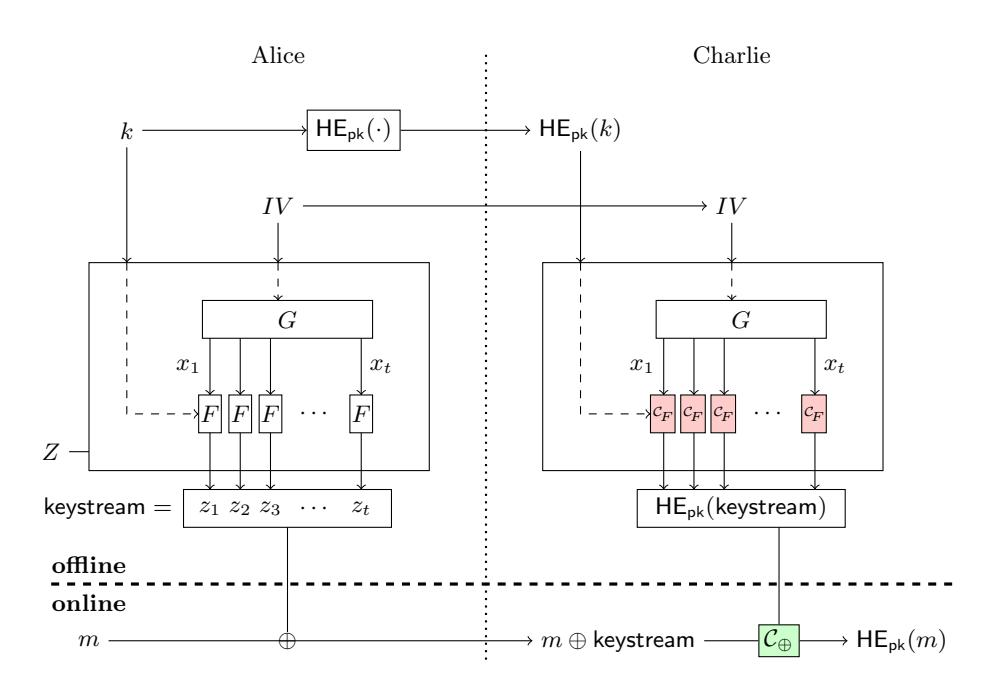
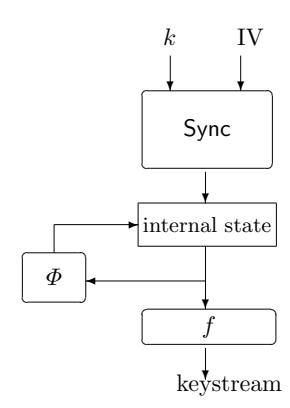

# Stream ciphers: A Practical Solution for Efficient Homomorphic-Ciphertext Compression

Anne Canteaut<sup>1</sup> , Sergiu Carpov<sup>2</sup> , Caroline Fontaine3? , Tancr`ede Lepoint4?? , Mar´ıa Naya-Plasencia<sup>1</sup> , Pascal Paillier4??, and Renaud Sirdey<sup>2</sup>

1 Inria, France, {anne.canteaut,maria.naya plasencia}@inria.fr <sup>2</sup> CEA LIST, France, {sergiu.carpov,renaud.sirdey}@cea.fr <sup>3</sup> CNRS/Lab-STICC and Telecom Bretagne and UEB, caroline.fontaine@telecom-bretagne.eu <sup>4</sup> CryptoExperts, France, {tancrede.lepoint,pascal.paillier}@cryptoexperts.com

Abstract. In typical applications of homomorphic encryption, the first step consists for Alice to encrypt some plaintext m under Bob's public key pk and to send the ciphertext c = HEpk(m) to some third-party evaluator Charlie. This paper specifically considers that first step, i.e. the problem of transmitting c as efficiently as possible from Alice to Charlie. As previously noted, a form of compression is achieved using hybrid encryption. Given a symmetric encryption scheme E, Alice picks a random key k and sends a much smaller ciphertext c <sup>0</sup> = (HEpk(k), Ek(m)) that Charlie decompresses homomorphically into the original c using a decryption circuit CE−<sup>1</sup> .

In this paper, we revisit that paradigm in light of its concrete implementation constraints; in particular E is chosen to be an additive IV-based stream cipher. We investigate the performances offered in this context by Trivium, which belongs to the eSTREAM portfolio, and we also propose a variant with 128-bit security: Kreyvium. We show that Trivium, whose security has been firmly established for over a decade, and the new variant Kreyvium have an excellent performance.

Keywords. Stream Ciphers, Homomorphic cryptography, Ciphertext compression, Trivium

### 1 Introduction

Since the breakthrough result of Gentry [\[Gen09\]](#page-14-0) achieving fully homomorphic encryption (FHE), many works have been published on simpler and more efficient schemes based on homomorphic encryption. Because they allow arbitrary computations on encrypted data, FHE schemes suddenly opened the way to exciting new applications, in particular cloud-based services in several areas (see e.g. [\[NLV11,](#page-15-0)[GLN12,](#page-14-1)[LLN14\]](#page-14-2)).

Compressed encryption. In these cloud applications, it is often assumed that some data is sent encrypted under a homomorphic encryption (HE) scheme to the cloud to be processed in a way or another. It is thus typical to consider, in the first step of these applications, that a user (Alice) encrypts some data m under some other user's public key pk (Bob) and sends some homomorphic ciphertext c = HEpk(m) to a third-party evaluator in the Cloud (Charlie). The roles of Alice and Bob are clearly distinct, even though they might be played by the same entity in some applications.

However, all HE schemes proposed so far suffer from a very large ciphertext expansion; the transmission of c between Alice and Charlie is therefore a very significant bottleneck in practice. The problem of reducing the size of c as efficiently as possible has first been considered in [\[NLV11\]](#page-15-0) wherein m is encrypted with a symmetric encryption scheme E under some key k randomly chosen by Alice, who then sends a much smaller ciphertext c <sup>0</sup> = (HEpk(k), Ek(m)) to Charlie. Given c 0 , Charlie then exploits the homomorphic property of HE and recovers the original

$$c = \mathsf{HE}_{\mathsf{pk}}(m) = \mathcal{C}_{\mathsf{E}^{-1}}\left(\mathsf{HE}_{\mathsf{pk}}(k), \mathsf{E}_k(m)\right)$$

by homomorphically evaluating the decryption circuit CE−<sup>1</sup> . This can be assimilated to a compression method for homomorphic ciphertexts, c <sup>0</sup> being the result of applying a compressed encryption scheme to

<sup>?</sup> This work has received a French governmental support granted to the COMIN Labs excellence laboratory and managed by the National Research Agency in the "Investing for the Future" program under reference ANR-10-LABX-07-01.

<sup>??</sup> This work has been supported in part by the European Union's H2020 Programme under grant agreement number ICT-644209 and the French FUI project CRYPTOCOMP.

the plaintext m and c being recovered from c' using a ciphertext decompression procedure. In that approach obviously, the new encryption rate |c'|/|m| becomes asymptotically close to 1 for long messages, which leaves no significant margin for improvement. However, the paradigm of ciphertext compression leaves totally open the question of how to choose E in a way that minimizes the decompression overhead, while preserving the same security level as originally intended.

Prior art. The cost of a homomorphic evaluation of several symmetric primitives has been investigated, including several optimized implementations of AES [GHS12,CCK<sup>+</sup>13,DHS14], and of the lightweight block ciphers SIMON [LN14] and PRINCE [DSES14]. Usually very simple, lightweight block ciphers seem natural candidates for efficient evaluations in the encrypted domain. However, they may also lead to much worse performances than a homomorphic evaluation of, say, AES. Indeed, contemporary HE schemes use noisy ciphertexts, where a fresh ciphertext includes a noise component which grows along with homomorphic operations. Usually a homomorphic multiplication increases the noise by much larger proportions than a homomorphic addition. The maximum allowable level of noise (determined by the system parameters) then depends mostly on the multiplicative depth of the circuit. Many lightweight block ciphers balance out their simplicity by a large number of rounds, e.g. KATAN and KTANTAN [CDK09], with the effect of considerably increasing their multiplicative depth. This type of design is therefore prohibitive in a HE context. Still PRINCE appears to be a much more suitable block cipher for homomorphic evaluation than AES (and than SIMON), because it specifically targets applications that require a low latency; it is designed to minimize the cost of an unrolled implementation [BCG<sup>+</sup>12] rather than being designed to optimize e.g. silicon area.

At Eurocrypt 2015, Albrecht, Rechberger, Schneider, Tiessen and Zohner observed that the usual criteria that rule the design of lightweight block ciphers are not appropriate when designing a symmetric encryption scheme with a low-cost homomorphic evaluation [ARS+15]. Indeed, both the number of rounds and the number of binary multiplications required to evaluate an Sbox have to be taken into account. Minimizing the number of rounds is a crucial issue for low-latency ciphers like PRINCE, while minimizing the number of multiplications is a requirement when designing a block cipher for efficient masked implementations (see e.q. [GLSV14]).

These two criteria have been considered together for the first time by Albrecht et al. in the recent design of a family of block ciphers called LowMC [ARS+15] with very small multiplicative size and depth<sup>5</sup>. However, the proposed instances of LowMC, namely LowMC-80 and LowMC-128, have recently had some security issues [DLMW15]. They actually present some weaknesses inherent in their low multiplicative complexity. Indeed, the algebraic normal forms (i.e., the multivariate polynomials) describing the encryption and decryption functions are sparse and have a low degree. This type of features is usually exploited in algebraic attacks, cube attacks and their variants, e.g. [CP02,CM03,DS09,ADMS09]. While these attacks are rather general, the improved variant used for breaking LowMC [DLMW15], named interpolation attack [JK97], specifically applies to block ciphers. Indeed it exploits the sparse algebraic normal form of some intermediate bit within the cipher using that this bit can be evaluated both from the plaintext in the forward direction and from the ciphertext in the backward direction. This technique leads to several attacks including a key-recovery attack against LowMC-128 with time complexity 2<sup>118</sup> and data complexity 2<sup>73</sup>, implying that the cipher does not provide the expected 128-bit security level.

Our contributions. We emphasize that beyond the task of designing a HE-friendly block cipher, revisiting the whole compressed encryption scheme (in particular its internal mode of operation) is what is really needed in order to take these concrete HE-related implementation constraints into account.

First, we identify that homomorphic decompression is subject to an offline phase and an online phase. The offline phase is plaintext-independent and therefore can be performed in advance, whereas the online phase completes decompression upon reception of the plaintext-dependent part of the compressed ciphertext. Making the online phase as quick as technically doable leads us to choose **an additive IV-based stream cipher to implement** E. However, we note that the use of a lightweight block cipher as the building-block of that stream cipher usually provides a security level limited to  $2^{n/2}$  where n is the block size [Rog11], thus limiting the number of encrypted blocks to (typically) less than  $2^{32}$  (i.e. 32GB for 64-bit blocks).

<span id="page-1-0"></span><sup>&</sup>lt;sup>5</sup> It is worth noting that in a HE context, reducing the multiplicative size of a symmetric primitive might not be the first concern (while it is critical in a multiparty computation context, which also motivated the work of Albrecht *et al.* [ARS<sup>+</sup>15]), whereas minimizing the multiplicative depth is of prime importance.

As a result, we propose our own candidate for E: the keystream generator Trivium [CP08], which belongs to the eSTREAM portfolio of recommended stream ciphers, and a new proposal called *Kreyvium*, which shares the same internal structure but allows for bigger keys of 128 bits<sup>6</sup>. The main advantage of Kreyvium over Trivium is that it provides 128-bit security (instead of 80-bit) with the same multiplicative depth, and inherits the same security arguments. It is worth noticing that the design of a variant of Trivium which guarantees a 128-bit security level has been raised as an open problem for the last ten years, see e.g. [Eni14, p. 30]. Beside a higher security level, it also accommodates longer IVs, so that it can encrypt up to  $46 \cdot 2^{128}$  plaintext bits under the same key, with multiplicative depth only 12. Moreover, both Trivium and Kreyvium are resistant against the interpolation attacks used for breaking LowMC since these ciphers do not rely on a permutation which would enable the attacker to compute backwards.

We implemented our construction and instantiated it with Trivium, Kreyvium and LowMC in CTR-mode. Our results show that the promising performances attained by the HE-dedicated block cipher LowMC can be achieved with well-known primitives whose security has been firmly established for over a decade.

**Organization of the paper.** We introduce a general model and a generic construction to compress homomorphic ciphertexts in Sec. 2. Our construction using Trivium and Kreyvium is described in Sec. 3. Subsequent experimental results are presented in Sec. 4.<sup>7</sup>

### <span id="page-2-1"></span>2 A Generic Design for Efficient Decompression

In this section, we describe our model and generic construction to transmit compressed homomorphic ciphertexts between Alice and Charlie. We use the same notation as in the introduction: Alice wants to send some plaintext m, encrypted under Bob's public key  $\mathsf{pk}$  (of an homomorphic encryption scheme  $\mathsf{HE}$ ) to a third party evaluator Charlie.

### 2.1 Offline/Online Phases in Ciphertext Decompression

Most practical scenarios would likely find it important to distinguish between three distinct phases within the homomorphic evaluation of  $\mathcal{C}_{\mathsf{E}^{-1}}$ :

- 1. an *offline key-setup* phase which only depends on Bob's public key and can be performed once and for all before Charlie starts receiving compressed ciphertexts encrypted under Bob's key;
- 2. an offline decompression phase which can be performed only based on some plaintext-independent material found in the compressed ciphertext;
- 3. an online decompression phase which aggregates the result of the offline phase with the plaintext-dependent part of the compressed ciphertext and (possibly very quickly) recovers the decompressed ciphertext c.

As such, our general-purpose formulation  $c' = (\mathsf{HE}_{\mathsf{pk}}(k), \mathsf{E}_k(m))$  does not allow to make a clear distinction between these three phases. In our context, it is much more relevant to reformulate the encryption scheme as an IV-based encryption scheme where the encryption and decryption process are both deterministic but depend on an IV:

$$\mathsf{E}_k(m) \stackrel{\text{def}}{=} \left( IV, \mathsf{E}'_{k,IV}(m) \right) \ .$$

Since the IV has a limited length, it can be either transmitted during an offline preprocessing phase, or may alternately correspond to a state which is maintained by the server. Now, to minimize the latency

<span id="page-2-0"></span><sup>&</sup>lt;sup>6</sup> Independently from our results, another variant of Trivium named Trivi-A has been proposed [CCHN15]. It handles larger keys but uses longer registers. It then needs more rounds for mixing the internal state, which means that it is much less adapted to our setting than Kreyvium.

<span id="page-2-2"></span><sup>&</sup>lt;sup>7</sup> In App. D, we also present a second candidate for E that relies on a completely different technique based on the observation that multiplication in binary fields is  $\mathbb{F}_2$ -bilinear, making it possible to homomorphically exponentiate field elements with a log-log-depth circuit. We also report a random oracle based proof that compressed ciphertexts are semantically secure under an appropriate complexity assumption. We show, however, that this second approach remains disappointingly impractical.

of homomorphic decompression for Charlie, the online phase should be reduced to a minimum. The most appropriate choice in this respect consists in using an additive IV-based stream cipher Z so that

$$\mathsf{E}'_{k,IV}(m) = Z(k,IV) \oplus m \; .$$

In this reformulation, the decompression process is clearly divided into a offline precomputation stage which only depends on  $\mathsf{pk}, k$  and IV, and an online phase which is plaintext-dependent. The online phase is thus reduced to a mere XOR between the plaintext-dependent part of the ciphertext  $\mathsf{E}'_{k,IV}(m)$  and the HE-encrypted keystream  $\mathsf{HE}(Z(k,IV))$ , which comes essentially for free in terms of noise growth in HE ciphertexts. All expensive operations (i.e. homomorphic multiplications) are performed during the offline decompression phase where  $\mathsf{HE}(Z(k,IV))$  is computed from  $\mathsf{HE}(k)$  and IV.

#### <span id="page-3-1"></span>2.2 Our Generic Construction

We devise a generic construction based on a homomorphic encryption scheme HE with plaintext space  $\{0,1\}$ , an expansion function G mapping  $\ell_{IV}$ -bit strings to strings of arbitrary size, and a fixed-size parametrized function F with input size  $\ell_x$ , parameter size  $\ell_k$  and output size N. The construction is depicted on Fig. 1.



<span id="page-3-0"></span>**Fig. 1.** Our generic construction. The multiplicative depth of the circuit is equal to the depth of  $C_F$ . This will be the bottleneck in our protocol and we want the multiplicative depth of F to be as small as possible. With current HE schemes, the circuit  $C_{\oplus}$  is usually very fast (addition of ciphertexts) and has a negligible impact on the noise in the ciphertext.

Compressed encryption. Given an  $\ell_m$ -bit plaintext m, Bob's public key pk and  $IV \in \{0,1\}^{\ell_{IV}}$ , the compressed ciphertext c' is computed as follows:

- 1. Set  $t = \lceil \ell_m / N \rceil$ ,
- 2. Set  $(x_1, \ldots, x_t) = G(IV; t\ell_x),$
- 3. Randomly pick  $k \leftarrow \{0,1\}^{\ell_k}$ ,
- 4. For  $1 \leq i \leq t$ , compute  $z_i = F_k(x_i)$ ,
- 5. Set keystream to the  $\ell_m$  leftmost bits of  $z_1 \mid\mid \ldots \mid\mid z_t$ ,
- 6. Output  $c' = (\mathsf{HE}_{\mathsf{pk}}(k), m \oplus \mathsf{keystream}).$

Ciphertext decompression. Given c <sup>0</sup> as above, Bob's public key pk and IV ∈ {0, 1} `IV , the ciphertext decompression is performed as follows:

```
1. Set t = d`m/Ne,
2. Set (x1, . . . , xt) = G(IV ;t`x),
3. For 1 ≤ i ≤ t, compute HEpk(zi) = CF (HEpk(k), xi) with some circuit CF ,
4. Deduce HEpk(keystream) from HEpk(z1), . . . , HEpk(zt),
5. Compute c = HEpk(m) = C⊕ (HEpk(keystream), m ⊕ keystream).
```

The circuit C<sup>⊕</sup> computes HE(a ⊕ b) given HE(a) and b where a and b are bit-strings of the same size. In our construction, the cost of decompression per plaintext block is fixed and roughly equals one single evaluation of the circuit C<sup>F</sup> ; most importantly, the multiplicative depth of the decompression circuit is also fixed, and set to the depth of C<sup>F</sup> .

How secure are compressed ciphertexts? From a high-level perspective, compressed homomorphic encryption is just hybrid encryption and relates to the generic KEM-DEM construct. However it just cannot inherit from the general security results attached to the KEM-DEM framework [\[AGKS05,](#page-13-9)[HK07\]](#page-14-12) since taking some HE scheme to implement the KEM part does not even fulfill the basic requirements that the KEM be IND-CCA or even IND-CCCA. It is usual that HE schemes succeed in achieving CPA security but often grossly fail to realize any form of CCA1 security, to the point of admitting simple key recovery attacks [\[CT15\]](#page-13-10). Therefore common KEM-DEM results just do not apply here.

On the other hand, CPA security is arguably strong enough for compressed homomorphic encryption, given that in practice Alice may always provide a signature σ(c 0 ) together with c 0 to Charlie to ensure origin and data authenticity. Thus, the right level of security requirement on the compressed encryption scheme itself seems to be just IND-CPA for concrete use. However, it is not known what minimal security assumptions to require from a homomorphic KEM and a general-purpose DEM to yield a KEM-DEM scheme that is provably IND-CPA. As a result of that, evidence that CPA security is reached may only be provided on a case-by-case basis given a specific embodiment.

Instantiating the paradigm. The rest of the paper focuses on how to choose the expansion function G and function F so that the homomorphic evaluation of C<sup>F</sup> is as fast (and its multiplicative depth as low) as possible. In our approach, the value of IV is assumed to be shared between Alice and Charlie and needs not be transmitted along with the compressed ciphertext. For instance, IV is chosen to be an absolute constant such as IV = 0` where ` = `IV = `x. Another example is to take for IV ∈ {0, 1} ` a synchronized state that is updated between transmissions. Also, the expansion function G is chosen to implement a counter in the sense of the NIST description of the CTR mode [\[Nat01\]](#page-15-2), for instance

$$G(IV; t\ell) = (IV, IV \boxplus 1, \dots, IV \boxplus (t-1))$$
 where  $a \boxplus b = (a+b) \mod 2^{\ell}$ .

Finally, F is chosen to follow a specific design to ensure both an appropriate security level and a low multiplicative depth. We focus in Section [3](#page-5-0) on the keystream generator corresponding to Trivium, and on a new variant, called Kreyvium.

Interestingly, the output of an iterated PRF used in counter mode is computationally indistinguishable from random [\[BDJR97,](#page-13-11) Th. 13]. Hence, under the assumption that Trivium or Kreyvium is a PRF[8](#page-4-0) , the keystream z<sup>1</sup> || . . . || z<sup>t</sup> produced by our construction is also indistinguishable. However, this is insufficient to prove that the compressed encryption scheme is semantically secure (IND-CPA), because the adversary also sees HEpk(k) during the IND-CPA game, which cannot be proven not to make the keystream distinguishable. Although the security of this approach is empiric, Section [3](#page-5-0) provides a strong rationale for the Kreyvium design and makes it the solution with the smallest homomorphic evaluation latency known so far.

Why not using a block cipher for F? Although not specifically in these terms, the use of lightweight block ciphers like Prince and Simon has been proposed in the context of compressed homomorphic ciphertexts e.g. [\[LN14,](#page-14-5)[DSES14\]](#page-14-6). However a complete encryption scheme based on the ciphers has not been defined. This is a major issue since the security provided by all classical modes of operation (including all variants

<span id="page-4-0"></span><sup>8</sup> Note that this equivalent to say that Kreyvium instantiated with a random key and mapping the IV's to the keystream is secure [\[BG07,](#page-13-12) Sec. 3.2].

of CBC, CTR, CFB, OFB, OCB. . . ) is inherently limited to 2n/<sup>2</sup> where n is the block size [\[Rog11\]](#page-15-1) (this is also emphasized in e.g. [\[KL14,](#page-14-13) p. 95]). Only a very few modes providing beyond-birthday security have been proposed [\[Iwa06](#page-14-14)[,Yas11,](#page-15-3)[LST12\]](#page-15-4) but they induce a higher implementation cost and their security is usually upper-bounded by 22n/<sup>3</sup> .

In other words, the use of a block cipher operating on 64-bit blocks like Prince or Simon-32/64 implies that the number of blocks encrypted under the same key should be significantly less that 2<sup>32</sup> (i.e. 32GB for 64-bit blocks). Therefore, only block ciphers with a large enough block size, like the LowMC instantiation with a 256-bit block proposed in [\[ARS](#page-13-3)+15], are suitable in applications which may require the encryption of more than 2<sup>32</sup> bits under the same key.

# <span id="page-5-0"></span>3 Trivium and Kreyvium, Two Low-Depth Stream Ciphers

Since an additive stream cipher is the optimal choice, we now focus on keystream generation, and on its homomorphic evaluation. An IV-based keystream generator is decomposed into:

- a resynchronization function, Sync, which takes as input the IV and the key (possibly expanded by some precomputation phase), and outputs some n-bit initial state;
- a transition function Φ which computes the next state of the generator;
- a filtering function f which computes a keystream segment from the current internal state.



Since generating N keystream bits may require a circuit of depth up to

$$\left(\operatorname{depth}(\mathsf{Sync}) + N\operatorname{depth}(\varPhi) + \operatorname{depth}(f)\right),$$

the best design strategy for minimizing this value consists in choosing a transition function with a small depth. The extreme option is to choose for Φ a linear function as in the CTR mode where the counter is implemented by an LFSR. An alternative strategy that we will investigate consists in choosing a nonlinear transition whose depth does not increase too fast when it is iterated. In App. [B,](#page-15-5) the reader may find a discussion on the influence of Sync on the multiplicative depth of the circuit depending on which quantity should be encrypted under the HE scheme.

Size of the internal state. A major specificity of our context is that a large internal state can be easily handled. Indeed, in most classical stream ciphers, the internal-state size usually appears as a bottleneck because the overall size of the quantities to be stored highly influences the number of gates in the implementation. This is not the case in our context. It might seem, a priori, that increasing the size of the internal state automatically increases the number of nonlinear operations (because the number of inputs of Φ increases). But, this is not the case if a part of this larger internal state is used, for instance, for storing the secret key. This strategy can be used for increasing the security at no implementation cost. Indeed, the complexity of all generic attacks aiming at recovering the internal state of the generator is O(2n/<sup>2</sup> ) where n is the size of the secret part of the internal state even if some part is not updated during the keystream generation. For instance, the time-memory-data-tradeoff attacks in [\[Bab95,](#page-13-13)[Gol97,](#page-14-15)[BS00\]](#page-13-14) aim at inverting the function which maps the internal state of the generator to the first keystream bits. But precomputing some values of this function must be feasible by the attacker, which is not the case if the filtering or transition function depends on some secret material. On the other hand, the size n <sup>0</sup> of the non-constant secret part of the internal state determines the data complexity for finding a collision on the internal state: the length of the keystream produced from the same key is limited to 2<sup>n</sup> <sup>0</sup>/2 . But, if the transition function or the filtering function depends on the IV, this limitation corresponds to the maximal keystream length produced from the same key/IV pair. It is worth noticing that many attacks require a very long keystream generated from the same key/IV pair and do not apply in our context since the keystream length is strictly limited by the multiplicative depth of the circuit.

#### 3.1 Trivium in the HE setting

Trivium [\[CP08\]](#page-13-7) is one of the seven stream ciphers recommended by the eSTREAM project after a 5-year international competition [\[ECR05\]](#page-14-16). Due to the small number of nonlinear operations in its transition function, it appears as a natural candidate in our context.

Description. Trivium is a synchronous stream cipher with a key and an IV of 80 bits each. Its internal state is composed of three registers of sizes 93, 84 and 111 bits, having an internal state size of 288 bits in total. Here, we use for the internal state the notation introduced by the designers: the leftmost bit of the 93-bit register is s1, and its rightmost one is s93; the leftmost bit of the register of size 84 is s<sup>94</sup> and the rightmost s177; the leftmost bit of register of size 111 is s<sup>178</sup> and the rightmost s288. The initialization and the generation of an N-bit Keystream are described below.

```
(s1, s2, . . . , s93) ← (K0, . . . , K79, 0, . . . , 0)
(s94, s95, . . . , s177) ← (IV0, . . . , IV79, 0, . . . , 0)
(s178, s179, . . . , s288) ← (0, . . . , 0, 1, 1, 1)
for i = 1 to 1152 + N do
   t1 ← s66 + s93
   t2 ← s162 + s177
   t3 ← s243 + s288
       if i > 1152 do
           output zi−1152 ← t1 + t2 + t3
       end if
   t1 ← t1 + s91 · s92 + s171
   t2 ← t2 + s175 · s176 + s264
   t3 ← t3 + s286 · s287 + s69
   (s1, s2, . . . , s93) ← (t3, s1, . . . , s92)
   (s94, s95, . . . , s177) ← (t1, s94, . . . , s176)
   (s178, s179, . . . , s288) ← (t2, s178, . . . , s287)
end for
```

No attack better than an exhaustive key search is known so far on the full Trivium. It can therefore be considered as a secure cipher. The family of attacks that seems to provide the best result on roundreduced versions is the cube attack and its variants [\[DS09,](#page-14-9)[ADMS09,](#page-13-6)[FV13\]](#page-14-17). They recover some key bits (resp. provide a distinguisher on the keystream) if the number of initialization rounds is reduced to 799 (resp. 885) rounds out of 1152. The highest number of initialization rounds that can be attacked is 961: in this case, a distinguisher exists for a class of weak keys [\[KMN11\]](#page-14-18).

Multiplicative depth. It is easy to see that the multiplicative depth grows quite slowly with the number of iterations. An important observation is that, in the internal state, only the first 80 bits in Register 1 (the keybits) are initially encrypted under the HE and that, as a consequence, performing hybrid clear and encrypted data calculations is possible (this is done by means of the following simple rules: 0 · [x] = 0, 1 · [x] = [x], 0 + [x] = [x] and 1 + [x] = [1] + [x], where the square brackets denote encrypted bits and where in all but the latter case, a homomorphic operation is avoided which is specially desirable for multiplications). This optimization allows for instance to increase the number of bits which can be generated (after the 1152 blank rounds) at depth 12 from 42 to 57 (i.e., a 35% increase). Then, the relevant quantity in our context is the multiplicative depth of the circuit which computes N keystream bits from the 80-bit key. The proof of the following proposition is given in the App. [C.](#page-16-0)

Proposition 1. In Trivium, the keystream length N(d) which can be produced from the 80-bit key with a circuit of multiplicative depth d, d ≥ 4, is given by

<span id="page-6-0"></span>
$$N(d) = 282 \times \left\lfloor \frac{d}{3} \right\rfloor + \begin{cases} 81 & \text{if } d \equiv 0 \bmod 3 \\ 160 & \text{if } d \equiv 1 \bmod 3 \\ 269 & \text{if } d \equiv 2 \bmod 3 \end{cases}.$$

### 3.2 Kreyvium

Our first aim is to offer a variant of Trivium with 128-bit key and IV, without increasing the multiplicative depth of the corresponding circuit. Besides a higher security level, another advantage of this variant is that the number of possible IVs, and then the maximal length of data which can be encrypted under the same key, increases from  $2^{80}N_{\text{trivium}}(d)$  to  $2^{128}N_{\text{kreyvium}}(d)$ . Increasing the key and IV-size in Trivium is a challenging task, mentioned as an open problem in [Eni14, p. 30] for instance. In particular, Maximov and Biryukov [MB07] pointed out that increasing the key-size in Trivium without any additional modification cannot be secure due to some attack with complexity less than  $2^{128}$ . A first attempt in this direction has been made in [MB07] but the resulting cipher accommodates 80-bit IV only, and its multiplicative complexity is higher than in Trivium since the number of AND gates is multiplied by 2.

**Description.** Our proposal, Kreyvium, accommodates a key and an IV of 128 bits each. The only difference with the original Trivium is that we have added to the 288-bit internal state a 256-bit part corresponding to the secret key and the IV. This part of the state aims at making both the filtering and transition functions key- and IV-dependent. More precisely, these two functions f and  $\Phi$  depend on the key bits and IV bits, through the successive outputs of two shift-registers  $K^*$  and  $IV^*$  initialized by the key and by the IV respectively. The internal state is then composed of five registers of sizes 93, 84, 111, 128 and 128 bits, having an internal state size of 544 bits in total, among which 416 become unknown to the attacker after initialization.

We will use the same notation as the description of Trivium, and for the additional registers we use the usual shift-register notation: the leftmost bit is denoted by  $K_{127}^*$  (or  $IV_{127}^*$ ), and the rightmost bit (*i.e.*, the output) is denoted by  $K_0^*$  (or  $IV_0^*$ ). Each one of these two registers are rotated independently from the rest of the cipher. The generator is described below, and depicted on Fig. 2.

```
(s_1, s_2, \dots, s_{93}) \leftarrow (K_0, \dots, K_{92})
(s_{94}, s_{95}, \dots, s_{177}) \leftarrow (IV_0, \dots, IV_{83})
(s_{178}, s_{179}, \dots, s_{288}) \leftarrow (IV_{84}, \dots, IV_{127}, 1, \dots, 1, 0)
(K_{127}^*, K_{126}^*, \dots, K_0^*) \leftarrow (K_0, \dots, K_{127})
(IV_{127}^*, IV_{126}^*, \dots, IV_0^*) \leftarrow (IV_0, \dots, IV_{127})
for i = 1 to 1152 + N do
     t_1 \leftarrow s_{66} + s_{93}
     t_2 \leftarrow s_{162} + s_{177}
     t_3 \leftarrow s_{243} + s_{288} + \mathbf{K}_0^*
            if i > 1152 do
                  output z_{i-1152} \leftarrow t_1 + t_2 + t_3
     t_1 \leftarrow t_1 + s_{91} \cdot s_{92} + s_{171} + IV_0^*
      t_2 \leftarrow t_2 + s_{175} \cdot s_{176} + s_{264}
      t_3 \leftarrow t_3 + s_{286} \cdot s_{287} + s_{69}
     t_4 \leftarrow K_0^*
      t_5 \leftarrow IV_0^*
      (s_1, s_2, \dots, s_{93}) \leftarrow (t_3, s_1, \dots, s_{92})
      (s_{94}, s_{95}, \dots, s_{177}) \leftarrow (t_1, s_{94}, \dots, s_{176})
      (s_{178}, s_{179}, \dots, s_{288}) \leftarrow (t_2, s_{178}, \dots, s_{287})
      (K_{127}^*, K_{126}^*, \dots, K_0^*) \leftarrow (t_4, K_{127}^*, \dots, K_1^*)

(IV_{127}^*, IV_{126}^*, \dots, IV_0^*) \leftarrow (t_5, IV_{127}^*, \dots, IV_1^*)
end for
```

Related ciphers. KATAN [CDK09] is a lightweight block cipher with a lot in common with Trivium. It is composed of two registers, whose feedback functions are very sparse, and have a single nonlinear term. The key, instead of being used for initializing the state, is introduced by XORing two key information-bits per round to each feedback bit. The recently proposed stream cipher Sprout [AM15], inspired by Grain but with much smaller registers, also inserts the key in a similar way: instead of using the key for initializing the state, one key information-bit is XORed at each clock to the feedback function. We can see the parallelism between these two ciphers and our newly proposed variant. In particular, the previous security analysis on KATAN shows that this type of design does not introduce any clear


<span id="page-8-0"></span>Fig. 2. Kreyvium. The three registers in the middle correspond to the original Trivium. The modifications defining Kreyvium correspond to the two registers in blue.

weakness. Indeed, the best attacks on round-reduced versions of KATAN so far [FM14] are meet-in-the-middle attacks, that exploit the knowledge of the values of the first and the last internal states (due to the block-cipher setting). As this is not the case here, such attacks, as well as the recent interpolation attacks against LowMC [DLMW15], do not apply. The best attacks against KATAN, when excluding MitM techniques, are conditional differential attacks [KMN10,KMN11].

**Design rationale.** In Kreyvium, we have decided to XOR the keybit  $K_0^*$  to the feedback function of the register that interacts with the content of  $(s_1, \ldots, s_{63})$  the later, since  $(s_1, \ldots, s_{63})$  is initialized with some key bits. The same goes for the  $IV^*$  register. Moreover, as the keybits that start entering the state are the ones that were not in the initial state, all the keybits affect the state at the earliest.

We also decided to initialize the state with some keybits and with all the IV bits, and not with a constant value, as this way the mixing will be performed quicker. Then we can expect that the internal-state bits after initialization are expressed as more complex and less sparse functions in the key and IV bits.

Our change of constant is motivated by the conditional differential attacks from [KMN11]: the conditions needed for a successful attack are that 106 bits from the IV or the key are equal to '0' and a single one needs to be '1'. This suggests that values set to zero "encourage" non-random behaviors, leading to our new constant. In other words, in Trivium, an all-zero internal state is always updated in an all-zero state, while an all-one state will change through time. The 0 at the end of the constant is added for preventing slide attacks.

Multiplicative depth. Exactly as for Trivium, we can compute the number of keystream bits which can be generated from the key at a given depth. The only difference with Trivium is that the first register now contains 93 key bits instead of 80. For this reason, the optimization using hybrid plaintext/ciphertext calculations is a bit less interesting: for any fixed depth  $d \ge 4$ , we can generate 11 bits less than with Trivium.

<span id="page-8-1"></span>**Proposition 2.** In Kreyvium, the keystream length N(d) which can be produced from the 128-bit key with a circuit of multiplicative depth d,  $d \ge 4$ , is given by

$$N(d) = 282 \times \left\lfloor \frac{d}{3} \right\rfloor + \begin{cases} 70 & \text{if } d \equiv 0 \bmod 3 \\ 149 & \text{if } d \equiv 1 \bmod 3 \\ 258 & \text{if } d \equiv 2 \bmod 3 \end{cases}.$$

Security analysis. We investigate in more detail how all the known attacks on Trivium, and some other techniques, can apply to Kreyvium.

TMDTO. TMDTO attacks aiming at recovering the initial state of the cipher do not apply since the size of the secret part of the internal state (416 bits) is much larger than twice the key-size. As discussed at the beginning of Section [3,](#page-5-0) the size of the whole secret internal state has to be taken into account, even if the additional 128-bit part corresponding to K<sup>∗</sup> is independent from the rest of the state. On the other hand, TMDTO aiming at recovering the key have complexity larger than exhaustive key search (even without any restriction on the precomputation time) since the key and the IV have the same size [\[HS05,](#page-14-21)[CLP05\]](#page-13-16).

Internal-state collision. As discussed in Section [3,](#page-5-0) a distinguisher may be built if the attacker is able to find two colliding internal states, since the two keystream sequences produced from colliding states are identical. Finding such a collision requires around 2<sup>144</sup> keystream bits generated from the same key/IV pair, which is much longer than the maximal keystream length allowed by the multiplicative depth of the circuit. But, for a given key, two internal states colliding on all bits except on IV <sup>∗</sup> lead to two keystreams which have the same first 69 bits since IV <sup>∗</sup> affects the keystream only 69 clocks later. Moreover, if the difference between the two values of IV <sup>∗</sup> when the rest of the state collides lies in the leftmost bit, then this difference will affect the keystream bits (69 + 128) = 197 clocks later. This implies that, within around 2<sup>144</sup> keystream bits generated from the same key, we can find two identical runs of 197 consecutive bits which are equal. However, this property does not provide a valid distinguisher because a random sequence of length 2<sup>144</sup> blocks is expected to contain much more collisions on 197-bit runs. Therefore, the birthday-bound of 2<sup>144</sup> bits provides a limit on the number of bits produced from the same key/IV pair, not on the bits produced from the same IV.

Cube attacks [\[DS09,](#page-14-9)[FV13\]](#page-14-17) and cube testers [\[ADMS09\]](#page-13-6). As previously pointed out, they provide the best attacks for round-reduced Trivium. In our case, as we keep the same main function, but we have two additional XORs per round, thus a better mixing of the variables, we can expect the relations to get more involved and hamper the application of previously defined round-reduced distinguishers. One might wonder if the fact that more variables are involved could ease the attacker's task, but we point out here that the limitation in the previous attacks was not the IV size, but the size of the cubes themselves. Therefore, having more variables available is of no help with respect to this point. We can conclude that the resistance of Kreyvium to these types of attacks is at least the resistance of Trivium, and even better.

Conditional differential cryptanalysis. Because of its applicability to both Trivium and KATAN, the attack from [\[KMN11\]](#page-14-18) is definitely of interest in our case. In particular, the highest number of blank rounds is reached if some conditions on two registers are satisfied at the same time (and not only conditions on the register controlled by the IV bits in the original Trivium). In our case, as we have IV bits in two registers, it is important to elucidate whether an attacker can take advantage of introducing differences in two registers simultaneously. First, let us recall that we have changed the constant to one containing mostly 1. We previously saw that the conditions that favor the attacks are values set to zero in the initial state. In Trivium, per design, we have (108+ 4+ 13) = 125 bits already fixed to zero in the initial state, 3 are fixed to one and the others can be controlled by the attacker in the weak-key setting (and the attacker will force them to be zero most of the time). Now, instead, we have 64 bits forced to be 1, 1 equal to zero, and (128+ 93) = 221 bits of the initial state controlled by the attacker in the weak-key setting, plus potentially 21 additional bits from the key still not used, that will be inserted during the first rounds. We can conclude that, while in Trivium is possible in the weak-key setting, to introduce zeros in the whole initial state but in 3 bits, in Kreyvium, we will never be able to set to zero 64 bits, implying that applying the techniques from [\[KMN11\]](#page-14-18) becomes much harder. Additionally, as in the discussion on cube attacks, we can also hope here that we get more involved relations that will provide a better resistance against these attacks.

Algebraic attacks. Several algebraic attacks have been proposed against Trivium, aiming at recovering the 288-bit internal state at the beginning of the keystream generation (i.e., at time t = 1153) from the knowledge of the keystream bits. The most efficient attack of this type is due to Maximov and Biryukov [\[MB07\]](#page-15-6). It exploits the fact that the 22 keystream bits at time 3t 0 , 0 ≤ t <sup>0</sup> < 22, are determined by all bits of the initial state at indexes divisible by 3 (starting from the leftmost bit in each register). Moreover, once all bits at positions 3i are known, then guessing that the outputs of the three AND gates at time 3t <sup>0</sup> are zero provides 3 linear relations between the bits of the internal state and the keystream bits. The attack then consists of an exhaustive search for some bits at indexes divisible by 3. The other bits in such positions are then deduced by solving the linear system derived from the keystream bits at positions 3t 0 . Once all these bits have been determined, the other 192 bits of the initial state are deduced from the other keystream equations. This process must be iterated until the guess for the outputs of the AND gates is correct. In the case of Trivium, the outputs of at least 125 AND gates must be guessed in order to get 192 linear relations involving the 192 bits at indexes 3i + 1 and 3i + 2. This implies that the attack has to be repeated (4/3)<sup>125</sup> = 2<sup>52</sup> times. From these guesses, we get many linear relations involving the bits at positions 3i only, implying that only an exhaustive search with complexity 2<sup>32</sup> for the other bits at positions 3i is needed. Therefore, the overall complexity of the attack is around 2<sup>32</sup> × 2 <sup>52</sup> = 284. A similar algorithm can be applied to Kreyvium, but the main difference is that every linear equation corresponding to a keystream bit also involves one key bit. Moreover, the key bits involved in the generation of any 128 consecutive output bits are independent. It follows that each of the first 128 linear equations introduces a new unknown in the system to solve. For this reason, it is not possible to determine all bits at positions 3i by an exhaustive search on less than 96 bits like for Trivium. Moreover, the outputs of more than 135 AND gates must be guessed for obtaining enough equations on the remaining bits of the initial state. Therefore the overall complexity of the attack exceeds 2 <sup>96</sup> × 2 <sup>52</sup> = 2<sup>148</sup> and is much higher that the cost of the exhaustive key search. It is worth noticing that the attack would have been more efficient if only the feedback bits, and not the keystream bits, would have been dependent on the key. In this case, 22 linear relations independent from the key would have been available to the attacker.

# <span id="page-10-0"></span>4 Experimental Results

In this section, we discuss and compare the practicality of our generic construction when instantiated with Trivium, Kreyvium and the HE-dedicated cipher LowMC. The expansion function G implements a mere counter, and the aforementioned algorithms are used to instantiate the function F that produces N bits of keystream per iteration—cf. Prop. [1](#page-6-0) and [2.](#page-8-1) [9](#page-10-1)

HE framework. In our experiments, we considered two HE schemes: the BGV scheme [\[BGV14\]](#page-13-17) and the FV scheme [\[FV12\]](#page-14-22) (a scale-invariant version of BGV). The BGV scheme is implemented in the library HElib [\[HS14\]](#page-14-23) and has become de facto a standard benchmarking library for HE applications. Similarly, the FV scheme was previously used in several HE benchmarkings [\[FSF](#page-14-24)+13[,LN14](#page-14-5)[,CDS15\]](#page-13-18), is conceptually simpler than the BGV scheme, and is one of the most efficient HE schemes.[10](#page-10-2) Additionally, batching was used [\[SV14\]](#page-15-7), i.e. the HE schemes were set up to encrypt vectors in an SIMD fashion (componentwise operations, and rotations via the Frobenius endomorphism). The number of elements that can be encrypted depends on the number of terms in the factorization modulo 2 of the cyclotomic polynomial used in the implementation. This batching allowed us to perform several Trivium/Kreyvium/LowMC in parallel in order to increase the throughput.

Parameter selection for subsequent homomorphic processing. In all the previous works on the homomorphic evaluation of symmetric encryption schemes, the parameters of the underlying HE scheme were selected for the exact multiplicative depth required and not beyond [\[GHS12,](#page-14-3)[CLT14,](#page-13-19)[LN14,](#page-14-5)[DSES14,](#page-14-6)[ARS](#page-13-3)<sup>+</sup>15]. This means that once the ciphertext is decompressed, no further homomorphic computation can actually be performed by Charlie – this makes the claimed timings considerably less meaningful in a real-world context.

In this work, we benchmarked both parameters for the exact multiplicative depth and parameters able to handle circuits of the minimal multiplicative depth plus 7 to allow further homomorphic processing

<span id="page-10-1"></span><sup>9</sup> Note that these propositions only hold when hybrid clear and encrypted data calculations are possible between IV and HE ciphertexts. This explains the slight differences in the number of keystream bits per iteration (column "N") between Tab. [1](#page-11-0) and [2.](#page-12-0)

<span id="page-10-2"></span><sup>10</sup> In our experiments, we used the Armadillo compiler implementation of FV [\[CDS15\]](#page-13-18). This source-to-source compiler turns a C++ algorithm into a Boolean circuit, optimizes it, and generates an OpenMP parallel code which can then be combined with a HE scheme.

**Table 1.** Latency and throughput for the algorithms using HElib on a single core of a mid-end 48-core server (4 x AMD Opteron 6172 processors with 64GB of RAM).

<span id="page-11-0"></span>

| Algorithm                               | security       | N   | used           | #slots | latency | throughput          |
|-----------------------------------------|----------------|-----|----------------|--------|---------|---------------------|
| <b>0</b> · ·                            | level $\kappa$ |     | $\times$ depth | ,,     | sec.    | $\mathrm{bits/min}$ |
| Trivium-12                              | 80             | 45  | 12             | 600    | 1417.4  | 1143.0              |
| 11111um 1 <b>2</b>                      |                |     | 19             | 720    | 4420.3  | 439.8               |
| Trivium-13                              | 80             | 136 | 13             | 600    | 3650.3  | 1341.3              |
| 111114111 10                            |                |     | 20             | 720    | 11379.7 | 516.3               |
| Kreyvium-12                             | 128            | 42  | 12             | 504    | 1715.0  | 740.5               |
| Tricy vium-12                           |                |     | 19             | 756    | 4956.0  | 384.4               |
| Kreyvium-13                             | 128            | 124 | 13             | 682    | 3987.2  | 1272.6              |
| Tricy vium 19                           | 120            |     | 20             | 480    | 12450.8 | 286.8               |
| LowMC-128                               | ? ≤ 118        | 256 | 13             | 682    | 3608.4  | 2903.1              |
| 20,,,,,,,,,,,,,,,,,,,,,,,,,,,,,,,,,,,,, |                |     | 20             | 480    | 10619.6 | 694.3               |
| LowMC-128 [ARS <sup>+</sup> 15]         | 5] ? < 118     | 256 | 13             | 682    | 3368.8  | 3109.6              |
| LOWING 120 [11100 10]                   | 110            |     | 20             | 480    | 9977.1  | 739.0               |

by Charlie (which is obviously what is expected in applications of homomorphic encryption). We chose 7 because, in practice, numerous applications use algorithms of multiplicative depth smaller than 7 (see e.g. [GLN12,LLN14]). In what follows we compare the results we obtain using Trivium, Kreyvium and also the LowMC cipher. For LowMC, we benchmarked not only our own implementation but also the LowMC implementation of [ARS+15] available at https://bitbucket.org/malb/lowmc-helib. Minor changes to this implementation were made in order to obtain an equivalent parametrization of HElib. The main difference between the latter implementations is that the implementation from [ARS+15] uses an optimized method for multiplying a Boolean vector and a Boolean matrix, namely the "Method of Four Russians". This explains why our implementation is approximately 6% slower, as it performs 2–3 times more ciphertext additions.

**Experimental results using HElib.** For sake of comparison with [ARS<sup>+</sup>15], we ran our implementations and their implementation of LowMC on a single core using HElib. The results are provided in Tab. 1. We recall that the latency refers to the time required to perform the entire homomorphic evaluation whereas the throughput is the number of blocks processed per time unit.

Experimental results using FV. On Tab. 2, we present the benchmarks when using the FV scheme. The experiments were performed using either a single core (in order to compare with BGV) or on all the cores of the machine the tests were performed on. The execution time acceleration factor between 48-core parallel and sequential executions is given in the column "Speed gain". While good accelerations (at least 25 times) were obtained for Trivium and Kreyvium algorithms, the acceleration when using LowMC is significantly smaller ( $\sim 10$  times). This is due to the huge number of operations in LowMC that created memory contention and huge slowdown in memory allocation.

Interpretation. First, we would like to recall that LowMC-128 must be considered in a different category because of the existence of a key-recovery attack with time complexity 2<sup>118</sup> and data complexity 2<sup>73</sup> [DLMW15]. However, it has been included in the table in order to show that the performances achieved by Trivium and Kreyvium are of the same order of magnitude. An increase in the number of rounds of LowMC-128 (typically by 4 rounds) is needed in order to achieve 128-bit security, but this would have a non-negligible impact on its homomorphic evaluation performance, as it would require to increase the depth of the cryptosystem supporting the execution. For instance, a back-of-the-envelope estimation for four additional rounds leads to a degradation of its homomorphic execution performances by a factor of about 2 to 3 (more computations with larger parameters), making the approach in this paper much more competitive.

Table 2. Latency of our construction when using the FV scheme on a mid-end 48-core server (4 x AMD Opteron 6172 processors with 64GB of RAM).

<span id="page-12-0"></span>

| Algorithm   | security | N   | used    | latency (sec.) |          | Speed gain |  |
|-------------|----------|-----|---------|----------------|----------|------------|--|
|             | level κ  |     | × depth | 1 core         | 48 cores |            |  |
| Trivium-12  | 80       | 57  | 12      | 681.5          | 26.8     | × 25.4     |  |
|             |          |     | 19      | 2097.1         | 67.6     | × 31.0     |  |
| Trivium-13  | 80       | 136 | 13      | 888.2          | 33.9     | × 26.2     |  |
|             |          |     | 20      | 2395.0         | 77.2     | × 31.0     |  |
| Kreyvium-12 | 128      | 46  | 12      | 904.4          | 35.3     | × 25.6     |  |
|             |          |     | 19      | 2806.3         | 82.4     | × 34.1     |  |
| Kreyvium-13 | 128      | 125 | 13      | 1318.6         | 49.7     | × 26.5     |  |
|             |          |     | 20      | 3331.4         | 97.9     | × 34.0     |  |
| LowMC-128   | ? ≤ 118  | 256 | 14      | 1531.1         | 171.0    | × 9.0      |  |
|             |          |     | 21      | 3347.8         | 329.0    | × 10.2     |  |

It is worth noticing that the minimal multiplicative depth for which valid LowMC output ciphertexts were obtained was 14 for the FV scheme and 13 for the BGV scheme (the theoretical multiplicative depth is 12 but the high number of additions in LowMC explains this difference[11](#page-12-1)).

Our results show that Trivium and Kreyvium have a smaller latency than LowMC, but have a slightly smaller throughput. As already emphasized in [\[LN14\]](#page-14-5), real-world applications of homomorphic encryption (which are often cloud-based applications) should be implemented in a transparent and user-friendly way. In the context of our approach, the latency of the offline phase is still an important parameter aiming at an acceptable experience for the end-user even when a sufficient amount of homomorphic keystream could not be precomputed early enough because of overall system dimensioning issues.

Also Trivium and Kreyvium are more parallelizable than LowMC is. Therefore, our work shows that the promising performances obtained by the recently proposed HE-dedicated cipher LowMC can also be achieved with Trivium, a well-analyzed stream cipher, and a variant aiming at achieving 128 bits of security. Last but not least, we recall that our construction was aiming at compressing the size of transmissions between Alice and Charlie. We support an encryption rate |c 0 |/|m| that becomes asymptotically close to 1 for long messages, e.g. for `<sup>m</sup> = 1GB message length, our construction instantiated with Trivium (resp. Kreyvium), yields an expansion rate of 1.08 (resp. 1.16).

# 5 Conclusion

Our work shows that the promising performances obtained by the recently proposed HE-dedicated cipher LowMC can also be achieved with Trivium, a well-known primitive whose security has been thoroughly analyzed, e.g. [\[MB07,](#page-15-6)[DS09\]](#page-14-9), and [\[ADMS09,](#page-13-6)[FV13,](#page-14-17)[KMN11\]](#page-14-18). The 10-year analysis effort from the whole community, initiated by the eSTREAM competition, enables us to gain confidence in its security. Also our variant Kreyvium, with a 128-bit security, benefits from the same analysis since the core of the cipher is essentially the same.

From a more fundamental perspective, one may wonder how many multiplicative levels are strictly necessary to achieve a secure compressed encryption scheme, irrespective of any performance metric such as the number of homomorphic bit multiplications to perform in the decompression circuit. We already know that a multiplicative depth of dlog κe + 1 is achievable for κ-bit security (cf. App. [D\)](#page-17-0). Can one do better or prove that this is a lower bound?

<span id="page-12-1"></span><sup>11</sup> We would like to emphasize that the multiplicative depth is only an approximation of the homomorphic depth required to absorb the noise generated by the execution of a given algorithm [\[LP13\]](#page-14-25). This approximation neglects the noise induced by additions and thus does not hold for too addition-intensive algorithms such as those in the LowMC family.

However, the provable security of a KEM-DEM construct where the KEM is homomorphic remains an open question. In particular, assuming the KEM part is just IND-CPA, what would be the minimum security requirements expected from the DEM part to yield an IND-CPA construction?

# References

- <span id="page-13-6"></span>ADMS09. Jean-Philippe Aumasson, Itai Dinur, Willi Meier, and Adi Shamir. Cube Testers and Key Recovery Attacks on Reduced-Round MD6 and Trivium. In FSE, volume 5665 of LNCS, pages 1–22. Springer, 2009.
- <span id="page-13-9"></span>AGKS05. Masayuki Abe, Rosario Gennaro, Kaoru Kurosawa, and Victor Shoup. Tag-KEM/DEM: A New Framework for Hybrid Encryption and A New Analysis of Kurosawa-Desmedt KEM. In EURO-CRYPT, volume 3494 of LNCS, pages 128–146. Springer, 2005.
- <span id="page-13-15"></span>AM15. Frederik Armknecht and Vasily Mikhalev. On Lightweight Stream Ciphers with Shorter Internal States. In FSE, volume 9054 of LNCS, pages 451–470. Springer, 2015.
- <span id="page-13-21"></span>AMOR14. Gora Adj, Alfred Menezes, Thomaz Oliveira, and Francisco Rodr´ıguez-Henr´ıquez. Computing Discrete Logarithms in F 3 <sup>6</sup>∗<sup>137</sup> using Magma. IACR Cryptology ePrint Archive, 2014:57, 2014.
- <span id="page-13-3"></span>ARS<sup>+</sup>15. Martin Albrecht, Christian Rechberger, Thomas Schneider, Tyge Tiessen, and Michael Zohner. Ciphers for MPC and FHE. In EUROCRYPT, volume 9056 of LNCS, pages 430–454. Springer, 2015.
- <span id="page-13-13"></span>Bab95. Steve Babbage. A space/time trade-off in exhaustive search attacks on stream ciphers. In European Convention on Security and Detection, number 408. IEEE Conference Publication, 1995.
- <span id="page-13-2"></span>BCG<sup>+</sup>12. Julia Borghoff, Anne Canteaut, Tim G¨uneysu, Elif Bilge Kavun, Miroslav Knezevic, Lars R. Knudsen, Gregor Leander, Ventzislav Nikov, Christof Paar, Christian Rechberger, Peter Rombouts, Søren S. Thomsen, and Tolga Yal¸cin. PRINCE - A Low-Latency Block Cipher for Pervasive Computing Applications. In ASIACRYPT, volume 7658 of LNCS, pages 208–225. Springer, 2012.
- <span id="page-13-11"></span>BDJR97. Mihir Bellare, Anand Desai, E. Jokipii, and Phillip Rogaway. A Concrete Security Treatment of Symmetric Encryption. In FOCS, pages 394–403. IEEE Computer Society, 1997.
- <span id="page-13-12"></span>BG07. Cˆome Berbain and Henri Gilbert. On the Security of IV Dependent Stream Ciphers. In FSE, volume 4593 of LNCS, pages 254–273. Springer, 2007.
- <span id="page-13-20"></span>BGJT14. Razvan Barbulescu, Pierrick Gaudry, Antoine Joux, and Emmanuel Thom´e. A Heuristic Quasi-Polynomial Algorithm for Discrete Logarithm in Finite Fields of Small Characteristic. In EURO-CRYPT, volume 8441 of LNCS, pages 1–16. Springer, 2014.
- <span id="page-13-17"></span>BGV14. Zvika Brakerski, Craig Gentry, and Vinod Vaikuntanathan. (Leveled) Fully Homomorphic Encryption without Bootstrapping. TOCT, 6(3):13, 2014.
- <span id="page-13-22"></span>Bod07. Marco Bodrato. Towards Optimal Toom-Cook Multiplication for Univariate and Multivariate Polynomials in Characteristic 2 and 0. In WAIFI, volume 4547 of LNCS, pages 116–133. Springer, 2007.
- <span id="page-13-14"></span>BS00. Alex Biryukov and Adi Shamir. Cryptanalytic Time/Memory/Data Tradeoffs for Stream Ciphers. In ASIACRYPT, volume 1976 of LNCS, pages 1–13. Springer, 2000.
- <span id="page-13-8"></span>CCHN15. Avik Chakraborti, Anupam Chattopadhyay, Muhammad Hassan, and Mridul Nandi. TriviA: A fast and secure authenticated encryption scheme. In CHES, volume 9293 of Lecture Notes in Computer Science, pages 330–353. Springer, 2015.
- <span id="page-13-0"></span>CCK<sup>+</sup>13. Jung Hee Cheon, Jean-S´ebastien Coron, Jinsu Kim, Moon Sung Lee, Tancr`ede Lepoint, Mehdi Tibouchi, and Aaram Yun. Batch Fully Homomorphic Encryption over the Integers. In EUROCRYPT, volume 7881 of LNCS, pages 315–335. Springer, 2013.
- <span id="page-13-1"></span>CDK09. Christophe De Canni`ere, Orr Dunkelman, and Miroslav Knezevic. KATAN and KTANTAN - A Family of Small and Efficient Hardware-Oriented Block Ciphers. In CHES, volume 5747 of LNCS, pages 272–288. Springer, 2009.
- <span id="page-13-18"></span>CDS15. Sergiu Carpov, Paul Dubrulle, and Renaud Sirdey. Armadillo: a compilation chain for privacy preserving applications. In ACM CCSW, 2015.
- <span id="page-13-16"></span>CLP05. Christophe De Canni`ere, Joseph Lano, and Bart Preneel. Comments on the rediscovery of time memory data tradeoffs. Technical report, eSTREAM - ECRYPT Stream Cipher Project, 2005.
- <span id="page-13-19"></span>CLT14. Jean-S´ebastien Coron, Tancr`ede Lepoint, and Mehdi Tibouchi. Scale-Invariant Fully Homomorphic Encryption over the Integers. In PKC, volume 8383 of LNCS, pages 311–328. Springer, 2014.
- <span id="page-13-5"></span>CM03. Nicolas Courtois and Willi Meier. Algebraic attacks on stream ciphers with linear feedback. In EUROCRYPT, volume 2656 of LNCS, pages 345–359. Springer, 2003.
- <span id="page-13-4"></span>CP02. Nicolas Courtois and Josef Pieprzyk. Cryptanalysis of block ciphers with overdefined systems of equations. In ASIACRYPT, volume 2501 of LNCS, pages 267–287. Springer, 2002.
- <span id="page-13-7"></span>CP08. Christophe De Canni`ere and Bart Preneel. Trivium. In New Stream Cipher Designs - The eSTREAM Finalists, volume 4986 of LNCS, pages 244–266. Springer, 2008.
- <span id="page-13-10"></span>CT15. Massimo Chenal and Qiang Tang. On Key Recovery Attacks Against Existing Somewhat Homomorphic Encryption Schemes. In LATINCRYPT, volume 8895 of LNCS, pages 239–258. Springer, 2015.

- <span id="page-14-4"></span>DHS14. Yarkin Dor¨oz, Yin Hu, and Berk Sunar. Homomorphic AES Evaluation using NTRU. IACR Cryptology ePrint Archive, 2014:39, 2014.
- <span id="page-14-8"></span>DLMW15. Itai Dinur, Yunwen Liu, Willi Meier, and Qingju Wang. Optimized Interpolation Attacks on LowMC. IACR Cryptology ePrint Archive, 2015:418, 2015.
- <span id="page-14-9"></span>DS09. Itai Dinur and Adi Shamir. Cube Attacks on Tweakable Black Box Polynomials. In EUROCRYPT, volume 5479 of LNCS, pages 278–299. Springer, 2009.
- <span id="page-14-6"></span>DSES14. Yarkin Dor¨oz, Aria Shahverdi, Thomas Eisenbarth, and Berk Sunar. Toward Practical Homomorphic Evaluation of Block Ciphers Using Prince. In WAHC, volume 8438 of LNCS, pages 208–220. Springer, 2014.
- <span id="page-14-16"></span>ECR05. ECRYPT - European Network of Excellence in Cryptology. The eSTREAM Stream Cipher Project. <http://www.ecrypt.eu.org/stream/>, 2005.
- <span id="page-14-11"></span>Eni14. Algorithms, key size and parameters report 2014. Technical report, ENISA - European Union Agency for Network and Information Security, 2014.
- <span id="page-14-19"></span>FM14. Thomas Fuhr and Brice Minaud. Match Box Meet-in-the-Middle Attack against KATAN. In FSE, volume 8540 of LNCS, pages 61–81. Springer, 2014.
- <span id="page-14-24"></span>FSF<sup>+</sup>13. Simon Fau, Renaud Sirdey, Caroline Fontaine, Carlos Aguilar, and Guy Gogniat. Towards practical program execution over fully homomorphic encryption schemes. In IEEE International Conference on P2P, Parallel, Grid, Cloud and Internet Computing, pages 284–290, 2013.
- <span id="page-14-22"></span>FV12. Junfeng Fan and Frederik Vercauteren. Somewhat Practical Fully Homomorphic Encryption. IACR Cryptology ePrint Archive, 2012:144, 2012.
- <span id="page-14-17"></span>FV13. Pierre-Alain Fouque and Thomas Vannet. Improving Key Recovery to 784 and 799 Rounds of Trivium Using Optimized Cube Attacks. In FSE, volume 8424 of LNCS, pages 502–517. Springer, 2013.
- <span id="page-14-0"></span>Gen09. Craig Gentry. Fully homomorphic encryption using ideal lattices. In STOC, pages 169–178. ACM, 2009.
- <span id="page-14-3"></span>GHS12. Craig Gentry, Shai Halevi, and Nigel P. Smart. Homomorphic Evaluation of the AES Circuit. In CRYPTO, volume 7417 of LNCS, pages 850–867. Springer, 2012.
- <span id="page-14-26"></span>GKZ14. Robert Granger, Thorsten Kleinjung, and Jens Zumbr¨agel. Breaking '128-bit Secure' Supersingular Binary Curves - (Or How to Solve Discrete Logarithms in F 2 <sup>4</sup>·<sup>1223</sup> and F 2 <sup>12</sup>·<sup>367</sup>). In CRYPTO, Part II, volume 8617 of LNCS, pages 126–145. Springer, 2014.
- <span id="page-14-1"></span>GLN12. Thore Graepel, Kristin E. Lauter, and Michael Naehrig. ML Confidential: Machine Learning on Encrypted Data. In ICISC, volume 7839 of LNCS, pages 1–21. Springer, 2012.
- <span id="page-14-7"></span>GLSV14. Vincent Grosso, Ga¨etan Leurent, Fran¸cois-Xavier Standaert, and Kerem Varici. LS-Designs: Bitslice Encryption for Efficient Masked Software Implementations. In FSE, volume 8540 of LNCS, pages 18–37. Springer, 2014.
- <span id="page-14-15"></span>Gol97. Jovan Dj. Golic. Cryptanalysis of alleged A5 stream cipher. In EUROCRYPT'97, volume 1233 of LNCS, pages 239–255. Springer-Verlag, 1997.
- <span id="page-14-12"></span>HK07. Dennis Hofheinz and Eike Kiltz. Secure Hybrid Encryption from Weakened Key Encapsulation. In CRYPTO, volume 4622 of LNCS, pages 553–571. Springer, 2007.
- <span id="page-14-21"></span>HS05. Jin Hong and Palash Sarkar. New Applications of Time Memory Data Tradeoffs. In ASIACRYPT, volume 3788 of LNCS, pages 353–372. Springer, 2005.
- <span id="page-14-23"></span>HS14. Shai Halevi and Victor Shoup. Algorithms in HElib. In CRYPTO, Part I, volume 8616 of Lecture Notes in Computer Science, pages 554–571, 2014.
- <span id="page-14-14"></span>Iwa06. Tetsu Iwata. New Blockcipher Modes of Operation with Beyond the Birthday Bound Security. In FSE, volume 4047 of LNCS, pages 310–327. Springer, 2006.
- <span id="page-14-10"></span>JK97. Thomas Jakobsen and Lars R. Knudsen. The interpolation attack on block ciphers. In FSE, volume 1267 of LNCS, pages 28–40. Springer, 1997.
- <span id="page-14-27"></span>JP14. Antoine Joux and C´ecile Pierrot. Improving the Polynomial time Precomputation of Frobenius Representation Discrete Logarithm Algorithms - Simplified Setting for Small Characteristic Finite Fields. In ASIACRYPT, Part I, volume 8873 of LNCS, pages 378–397. Springer, 2014.
- <span id="page-14-13"></span>KL14. Jonathan Katz and Yehuda Lindell. Introduction to Modern Cryptography, Second Edition. Chapman and Hall/CRC Press, 2014.
- <span id="page-14-20"></span>KMN10. Simon Knellwolf, Willi Meier, and Mar´ıa Naya-Plasencia. Conditional Differential Cryptanalysis of NLFSR-Based Cryptosystems. In ASIACRYPT, volume 6477 of LNCS, pages 130–145. Springer, 2010.
- <span id="page-14-18"></span>KMN11. Simon Knellwolf, Willi Meier, and Mar´ıa Naya-Plasencia. Conditional Differential Cryptanalysis of Trivium and KATAN. In SAC, volume 7118 of LNCS, pages 200–212. Springer, 2011.
- <span id="page-14-2"></span>LLN14. Kristin Lauter, Adriana L´opez-Alt, and Michael Naehrig. Private Computation on Encrypted Genomic Data. In LATINCRYPT, LNCS, 2014.
- <span id="page-14-5"></span>LN14. Tancr`ede Lepoint and Michael Naehrig. A Comparison of the Homomorphic Encryption Schemes FV and YASHE. In AFRICACRYPT, volume 8469 of LNCS, pages 318–335. Springer, 2014.
- <span id="page-14-25"></span>LP13. Tancr`ede Lepoint and Pascal Paillier. On the Minimal Number of Bootstrappings in Homomorphic Circuits. In WAHC, volume 7862 of LNCS, pages 189–200. Springer, 2013.

- <span id="page-15-4"></span>LST12. Will Landecker, Thomas Shrimpton, and R. Seth Terashima. Tweakable Blockciphers with Beyond Birthday-Bound Security. In CRYPTO, volume 7417 of LNCS, pages 14–30. Springer, 2012.
- <span id="page-15-6"></span>MB07. Alexander Maximov and Alex Biryukov. Two Trivial Attacks on Trivium. In SAC, volume 4876, pages 36–55. Springer, 2007.
- <span id="page-15-2"></span>Nat01. National Institute of Standards and Technology. NIST Special Publication 800-38A — Recommendation for Block Cipher Modes of Operation. NIST Special Publication 800-38A, 2001.
- <span id="page-15-0"></span>NLV11. Michael Naehrig, Kristin E. Lauter, and Vinod Vaikuntanathan. Can homomorphic encryption be practical? In ACM CCSW, pages 113–124. ACM, 2011.
- <span id="page-15-9"></span>Pin89. Antonio Pincin. A new algorithm for multiplication in finite fields. IEEE Transactions on Computers, 38(7):1045–1049, 1989.
- <span id="page-15-1"></span>Rog11. Phillip Rogaway. Evaluation of some blockcipher modes of operation. Cryptrec, 2011.
- <span id="page-15-7"></span>SV14. Nigel P. Smart and Frederik Vercauteren. Fully homomorphic SIMD operations. Des. Codes Cryptography, 71(1):57–81, 2014.
- <span id="page-15-3"></span>Yas11. Kan Yasuda. A New Variant of PMAC: Beyond the Birthday Bound. In CRYPTO, volume 6841 of LNCS, pages 596–609. Springer, 2011.

# A Number of AND and XOR gates in Trivium and Kreyvium

A more thorough analysis of the number of AND and XOR gates in the different circuits is provided in Table [3.](#page-15-8) The keystream length is the maximum possible for a given multiplicative depth. It is lower for the BGV scheme (batched) because the IV is no more a boolean string so less circuit optimization are possible. For the FV scheme (non-batched) the table gives the number of executed gates in the worst case. The actual number of executed gates can be lower as it depends on the employed IV.

Table 3. Number of AND and XOR gates to homomorphically evaluate in Trivium and Kreyvium for FV and BGV schemes.

<span id="page-15-8"></span>

| Algorithm<br>λ |     | FV    |       |           | BGV   |       |           |  |
|----------------|-----|-------|-------|-----------|-------|-------|-----------|--|
|                |     | #ANDs | #XORs | keystream | #ANDs | #XORs | keystream |  |
| Trivium-12     | 80  | 3237  | 15019 | 57        | 3183  | 14728 | 45        |  |
| Trivium-13     | 80  | 3474  | 16537 | 136       | 3474  | 16537 | 136       |  |
| Kreyvium-12    | 128 | 3311  | 18081 | 46        | 3288  | 17934 | 42        |  |
| Kreyvium-13    | 128 | 3564  | 19878 | 125       | 3561  | 19866 | 124       |  |

### <span id="page-15-5"></span>B Which quantity must be encrypted under the HE?

In order to limit the multiplicative depth of the decryption circuit, we may prefer to transmit a longer secret ˜k, from which more calculations can be done at a small multiplicative depth. Typically, for a block cipher, the sequence formed by all round-keys can be transmitted to the server. In this case, the key scheduling does not have to be taken into account in the homomorphic evaluation of the decryption function. Similarly, stream ciphers offer several such trade-offs between the encryption rate and the encryption throughput. The encryption rate, i.e., the ratio between the size of c <sup>0</sup> = (HEpk(k), Ek(m)) and the plaintext size `m, is defined as

$$\rho = \frac{|c'|}{\ell_m} = \frac{|E_k(m)|}{\ell_m} + \frac{|\tilde{k}| \times (\text{HE expansion rate})}{\ell_m} \; .$$

The extremal situation obviously corresponds to the case where the message encrypted under the homomorphic scheme is sent directly, i.e., c <sup>0</sup> = HEpk(m). The multiplicative depth here is 0, as no decryption needs to be performed. In this case, ρ corresponds to the HE expansion rate.

The following alternative scenarios can then be compared.

1. Only the secret key is encrypted under the homomorphic scheme, i.e., ˜k = k. Then, since we focus on symmetric encryption schemes with rate 1, we get

$$\rho = 1 + \frac{\ell_k \times (\text{HE expansion rate})}{\ell_m}$$

which is the smallest encryption rate we can achieve for an `k-bit security. In a nonce-based stream cipher, `<sup>m</sup> is limited by the IV size `IV and by the maximal keystream length N(d) which can be produced for a fixed multiplicative depth d ≥ depth(Sync) + depth(f). Then, the minimal encryption rate is achieved for messages of any length `<sup>m</sup> ≤ 2 `IV N(d).

2. An intermediate case consists in transmitting the initial state of the generator, i.e., the output of Sync. Then, the number of bits to be encrypted by the HE increases to the size n of the internal state, while the number of keystream bits which can be generated from a given initial state with a circuit of depth d corresponds to N(d + depth(Sync)). Then, we get

$$\rho = 1 + \frac{n \times (\text{HE expansion rate})}{N(d + \text{depth}(\mathsf{Sync}))} \;,$$

for any message length. The size of the internal state is at least twice the size of the key. Therefore, this scenario is not interesting, unless the number of plaintext bits `<sup>m</sup> to be encrypted under the same key is smaller than twice N(d + depth(Sync)).

# <span id="page-16-0"></span>C Proofs of Propositions 1 and 2

We first observe that, within any register in Trivium, the degree of the leftmost bit is greater than or equal to the degrees of the other bits in the register. It is then sufficient to study the evolution of the leftmost bits in the three registers. Let ti(d) denotes the first time instant (starting from t = 1) where the leftmost bit in Register i is computed by a circuit of depth d. The depth of the feedback bit in Register i can increase from d to (d+ 1) if either a bit of depth (d+ 1) reaches a XOR gate in the feedback function, or a bit of depth d reaches one of the inputs of the AND gate. From the distance between the leftmost bit and the first bit involved in the feedback (resp. and the first entry of the AND gate) in each register, we derive that

$$t_1(d+1) = \min(t_3(d+1) + 66, t_3(d) + 109)$$


$$t_2(d+1) = \min(t_1(d+1) + 66, t_1(d) + 91)$$


$$t_3(d+1) = \min(t_2(d+1) + 69, t_2(d) + 82)$$

In Trivium, the first key bits K<sup>78</sup> and K<sup>79</sup> enter the AND gate in Register 1 at time t = 13 (starting from t = 1), implying t2(1) = 14. Then, t3(1) = 83 and t1(1) = 149. This leads to

$$t_1(4) = 401, t_2(4) = 296$$
 and  $t_3(4) = 335$ .

From d = 3, the differences t<sup>i</sup> [d+ 1]−t<sup>i</sup> [d] are large enough so that the minimum in the three recurrence relation corresponds to the right-hand term. We then deduce that, for d ≥ 4,

– if d ≡ 1 mod 3,

$$t_1(d) = 282 \times \frac{(d-1)}{3} + 119, \ t_2(d) = 282 \times \frac{(d-1)}{3} + 14, \ t_3(d) = 282 \times \frac{(d-1)}{3} + 53.$$

– if d ≡ 2 mod 3,

$$t_1(d) = 282 \times \frac{(d-2)}{3} + 162, \ t_2(d) = 282 \times \frac{(d-2)}{3} + 210, \ t_3(d) = 282 \times \frac{(d-2)}{3} + 96.$$

– if d ≡ 0 mod 3,

$$t_1(d) = 282 \times \frac{(d-3)}{3} + 205, \ t_2(d) = 282 \times \frac{(d-3)}{3} + 253, \ t_3(d) = 282 \times \frac{(d-3)}{3} + 292.$$

The degree of the keystream produced at time t corresponds to the minimum between the degrees of the bit at position 66 in Register 1, the bit at position 69 in Register 2 and the bit at position 66 in Register 3. Then, for d > 3,

$$N(d) = \min(t_1(d+1) + 64, t_2(d+1) + 67, t_3(d+1) + 64).$$

This leads to, for any d > 4,

$$N(d) = 282 \times \left\lfloor \frac{d}{3} \right\rfloor + \begin{cases} 81 & \text{if } d \equiv 0 \mod 3 \\ 160 & \text{if } d \equiv 1 \mod 3 \\ 269 & \text{if } d \equiv 2 \mod 3 \end{cases}.$$

In Kreyvium, the recurrence relations defining the  $t_i(d)$  are the same. The only difference is that the first key bits now enter the AND gate in Register 1 at time t = 1, implying  $t_2(1) = 2$ . Then,  $t_3(1) = 71$ ,  $t_1(1) = 137$  and  $t_3[2] = 85$ . The situation is then similar to Trivium, except that we start from

$$t_1(4) = 390, t_2(4) = 285 \text{ and } t_3(4) = 324.$$

These three values are equal to the values obtained with Trivium minus 11. This fixed difference then propagated, leading to, for any  $d \ge 4$ ,

 $- \text{ if } d \equiv 1 \mod 3,$

$$t_1(d) = 282 \times \frac{(d-1)}{3} + 108, \ t_2(d) = 282 \times \frac{(d-1)}{3} + 3, \ t_3(d) = 282 \times \frac{(d-1)}{3} + 42.$$

 $- \text{ if } d \equiv 2 \mod 3.$

$$t_1(d) = 282 \times \frac{(d-2)}{3} + 151, \ t_2(d) = 282 \times \frac{(d-2)}{3} + 199, \ t_3(d) = 282 \times \frac{(d-2)}{3} + 85.$$

 $- \text{ if } d \equiv 0 \mod 3$

$$t_1(d) = 282 \times \frac{(d-3)}{3} + 194, \ t_2(d) = 282 \times \frac{(d-3)}{3} + 242, \ t_3(d) = 282 \times \frac{(d-3)}{3} + 281.$$

We eventually derive that, for Kreyvium, for any  $d \ge 4$ ,

$$N(d) = 282 \times \left\lfloor \frac{d}{3} \right\rfloor + \begin{cases} 70 & \text{if } d \equiv 0 \bmod 3 \\ 149 & \text{if } d \equiv 1 \bmod 3 \\ 258 & \text{if } d \equiv 2 \bmod 3 \end{cases}.$$

### <span id="page-17-0"></span>D Another Approach: Using Discrete Logs on Binary Fields

We now introduce a second, discrete-log based embodiment of the generic compressed encryption scheme of Section 2.2. We recall that the homomorphic encryption scheme  $\mathsf{HE}_{\mathsf{pk}}(\cdot)$  is assumed to encrypt separately each plaintext bit. For  $h \in \mathbb{F}_{2^n}$ , we identify h with the vector of its coefficients and therefore by  $\mathsf{HE}_{\mathsf{pk}}(h)$ , we mean the vector composed of the encrypted coefficients of h.

This approach attempts to achieve provable security while ensuring a low-depth circuit  $C_F$ . For this, we require G to be a PRNG and IV to be chosen at random at encryption time and transmitted within c'. This allows us to prove that c' is semantically secure under a well-defined complexity assumption. Simultaneously, we use exponentiation in a binary field to instantiate F, which yields a circuit  $C_F$  of depth  $\lceil \log \ell_k \rceil$ . Performance estimations, however, show that Approach 2 is rather impractical.

#### D.1 Description

In this approach, the operating mode picks a fresh  $IV \leftarrow \{0,1\}^{\ell_{IV}}$  for each compressed ciphertext. The expansion function G is instantiated by some PRNG that we will view as a random oracle in the security proof. Also, we set

$$\ell_x = N = n \; ,$$

and therefore F maps n-bit inputs to n-bit outputs under  $\ell_k$ -bit parameters. Given  $k \in \{0,1\}^{\ell_k}$  and  $x \in \{0,1\}^n$ ,  $F_k(x)$  views x as a field element in  $\mathbb{F}_{2^n}$  and k as an  $\ell_k$ -bit integer, computes  $z = x^k$  over  $\mathbb{F}_{2^n}$ , views z as an n-bit string and outputs z. This completes the description of the compressed encryption scheme.

#### D.2 A log-log-depth exponentiation circuit over $\mathbb{F}_{2^n}$

We describe a circuit  $\mathcal{C}_{\text{exp}}$  which, given a field element  $h \in \mathbb{F}_{2^n}$  and an encrypted exponent  $\mathsf{HE}_{\mathsf{pk}}(k)$  with  $k \in \{0,1\}^{\ell_k}$ , computes  $\mathsf{HE}_{\mathsf{pk}}(h^k)$  and has multiplicative depth at most  $\lceil \log \ell_k \rceil$ .

Stricto sensu,  $C_{\rm exp}$  is not just a Boolean circuit evaluated homomorphically, as it combines computations in the clear, homomorphic  $\mathbb{F}_2$ -arithmetic on encrypted bits, and  $\mathbb{F}_2$ -arithmetic on mixed cleart-ext/encrypted bits.

 $\mathcal{C}_{\text{exp}}$  uses implicitly some irreducible polynomial p to represent  $\mathbb{F}_{2^n}$  and we denote by  $\oplus$  and  $\otimes_p$  the field operators. The basic idea here is that for any  $a,b\in\mathbb{F}_{2^n}$ , computing  $\mathsf{HE}(a\otimes_p b)$  from  $\mathsf{HE}(a),\mathsf{HE}(b)$  requires only 1 multiplicative level, simply because  $\otimes_p$  is  $\mathbb{F}_2$ -bilinear. Therefore, knowing p and the characteristics of  $\mathsf{HE}$ , we can efficiently implement a bilinear operator on encrypted binary vectors to compute

$$\mathsf{HE}(a \otimes_p b) = \mathsf{HE}(a) \otimes_p^{\mathsf{HE}} \mathsf{HE}(b)$$
.

A second useful observation is that for any  $a \in \mathbb{F}_{2^n}$  and  $\beta \in \{0,1\}$ , there is a multiplication-free way to deduce  $\mathsf{HE}(a^\beta)$  from a and  $\mathsf{HE}(\beta)$ . When  $\beta = 1$ ,  $a^\beta$  is just a and  $a^\beta = 1_{\mathbb{F}_{2^n}} = (1,0,\ldots,0)$  otherwise. Therefore to construct a vector  $v = (v_0,\ldots,v_{n-1}) = \mathsf{HE}(a^\beta)$ , it is enough to set

$$v_i := \begin{cases} \mathsf{HE}(0) & \text{if } a_i = 0 \\ \mathsf{HE}(\beta) & \text{if } a_i = 1 \end{cases}$$

for  $i = 1, \ldots, n-1$  and

$$v_0 := \left\{ \begin{aligned} \mathsf{HE}(\beta \oplus 1) & \text{if } a_0 = 0 \\ \mathsf{HE}(1) & \text{if } a_i = 1 \end{aligned} \right.$$

where it does not matter that the same encryption of 0 be used multiple times. Let us denote this procedure as

$$HE(a^{\beta}) = L_a (HE(\beta))$$
.

Now, given as input  $h \in \mathbb{F}_{2^n}$ ,  $\mathcal{C}_{\exp}$  first computes in the clear  $h_i = h^{2^i}$  for  $i = 0, \dots, \ell_k - 1$ . Since

$$h^k = h_0^{k_0} \otimes_p h_1^{k_1} \otimes_p \cdots \otimes_p h_{\ell_k - 1}^{k_{\ell_k - 1}},$$

one gets

$$\begin{split} \mathsf{HE}(h^k) &= \mathsf{HE}\left(h_0^{k_0}\right) \, \otimes_p^{\mathsf{HE}} \, \mathsf{HE}\left(h_1^{k_1}\right) \, \otimes_p^{\mathsf{HE}} \, \cdots \, \otimes_p^{\mathsf{HE}} \, \mathsf{HE}\left(h_{\ell_k-1}^{k_{\ell_k-1}}\right) \\ &= \mathsf{L}_{h_0}\left(\mathsf{HE}\left(k_0\right)\right) \, \otimes_p^{\mathsf{HE}} \, \mathsf{L}_{h_1}\left(\mathsf{HE}\left(k_1\right)\right) \, \otimes_p^{\mathsf{HE}} \, \cdots \, \otimes_p^{\mathsf{HE}} \, \mathsf{L}_{h_{\ell_k-1}}\left(\mathsf{HE}\left(k_{\ell_k-1}\right)\right) \, . \end{split}$$

Viewing the  $\ell_k$  variables as the leaves of a binary tree,  $\mathcal{C}_{\text{exp}}$  therefore requires at most  $\lceil \log \ell_k \rceil$  levels of homomorphic multiplications to compute and return  $\mathsf{HE}_{\mathsf{pk}}(h^k)$ .

#### D.3 Security Results

Given some homomorphic encryption scheme HE and security parameters  $\kappa, n, \ell_k$ , we define a family of decision problems  $\{\mathsf{DP}_t\}_{t>0}$  as follows.

**Definition 1 (Decision Problem**  $\mathsf{DP}_t$ ). Let  $\mathsf{pk} \leftarrow \mathsf{HE}.\mathsf{KeyGen}(1^\kappa)$  be a random public key,  $k \leftarrow \{0,1\}^{\ell_k}$  a random  $\ell_k$ -bit integer and  $g_1,\ldots,g_t,g_1',\ldots,g_t' \leftarrow \mathbb{F}_{2^n}$ , 2t random field elements. Distinguish the distributions

$$D_{t,1} = (\mathsf{pk}, \mathsf{HE}_{\mathsf{pk}}(k), g_1, \dots, g_t, g_1^k, \dots, g_t^k)$$
 and  $D_{t,0} = (\mathsf{pk}, \mathsf{HE}_{\mathsf{pk}}(k), g_1, \dots, g_t, g_1', \dots, g_t')$ .

**Theorem 1.** Viewing G as a random oracle, the compressed encryption scheme described above is semantically secure (IND-CPA), unless breaking  $\mathsf{DP}_t$  is efficient, for messages of bit-size  $\ell_m$  with  $(t-1)n < \ell_m \leq tn$ .

Proof (Sketch). A random-oracle version of the PRNG function G is an oracle that takes as input a pair  $(IV,\ell)$  where  $IV \in \{0,1\}^{\ell_{IV}}$  and  $\ell \in \mathbb{N}^*$ , and returns an  $\ell$ -bit random string. It is also imposed to the oracle that  $G(IV;\ell_1)$  be a prefix of  $G(IV;\ell_2)$  for any IV and  $\ell_1 \leq \ell_2$ .

We rely on the real-or-random flavor of the IND-CPA security game and build a reduction algorithm  $\mathcal{R}$  that uses an adversary  $\mathcal{A}^G$  against the scheme to break  $\mathsf{DP}_t$  as follows.  $\mathcal{R}$  is given as input some  $(\mathsf{pk},\mathsf{HE}_{\mathsf{pk}}(k),g_1,\ldots,g_t,\tilde{g}_1,\ldots,\tilde{g}_t)$  sampled from  $D_{t,b}$  and has to guess the bit b.  $\mathcal{R}$  runs  $\mathcal{A}^G(\mathsf{pk})$  and receives some challenge plaintext  $m^* \in \{0,1\}^{\ell_m}$  where  $(t-1)n < \ell_m \leq tn$ .  $\mathcal{R}$  makes use of its input to build a compressed ciphertext c' as follows:

- 1. Set keystream to the  $\ell_m$  leftmost bits of  $\tilde{g}_1 \parallel \ldots \parallel \tilde{g}_t$ ,
- 2. Pick a random  $IV^* \leftarrow \{0,1\}^{\ell_{IV}}$ ,
- 3. Abort if  $G(IV^*; \ell')$  is already defined for some  $\ell'$ ,
- 4. Set  $G(IV^*;tn)$  to  $g_1 \parallel \ldots \parallel g_t$ .
- 5. Set  $c' = (\mathsf{HE}_{\mathsf{pk}}(k), IV^{\star}, m^{\star} \oplus \mathsf{keystream}),$

 $\mathcal{R}$  then returns c' to  $\mathcal{A}$  and forwards  $\mathcal{A}$ 's guess  $\hat{b}$  to its own challenger. At any moment,  $\mathcal{R}$  responds to  $\mathcal{A}$ 's queries to G using fresh random strings for each new query or to extend a past query to a larger size. Obviously, all the statistical distributions comply with their specifications. Consequently c' is an encryption of  $m^*$  if the input instance comes from  $D_{t,1}$  and is an encryption of some perfectly uniform plaintext if the instance follows  $D_{t,0}$ . The reduction is tight as long as the abortion probability  $q2^{-\ell_{IV}}$  remains negligible, q being the number of oracle queries made by  $\mathcal{A}$ .

Interestingly, we note the following fact about our family of decision problems.

**Theorem 2.** For any  $t \geq 2$ ,  $\mathsf{DP}_t$  is equivalent to  $\mathsf{DP}_2$ .

Proof. Obviously, a problem instance  $(\mathsf{pk},\mathsf{HE}_{\mathsf{pk}}(k),g_1,\ldots,g_t,\tilde{g}_1,\ldots,\tilde{g}_t)$  sampled from  $D_{t,b}$  can be converted into an instance of  $D_{2,b}$  for the same b, by just removing  $g_3,\ldots,g_t$  and  $\tilde{g}_3,\ldots,\tilde{g}_t$ . This operation preserves the distributions of all inner variables. Therefore  $\mathsf{DP}_t$  can be reduced to  $\mathsf{DP}_2$ . Now, we describe a reduction  $\mathcal R$  which, given an instance  $(\mathsf{pk},\mathsf{HE}_{\mathsf{pk}}(k),g_1,g_2,\tilde{g}_1,\tilde{g}_2)$  sampled from  $D_{2,b}$ , makes use of an adversary  $\mathcal A$  against  $\mathsf{DP}_t$  to successfully guess b.  $\mathcal R$  converts its instance of  $D_{2,b}$  into an instance of  $D_{t,b}$  as follows. For  $i=3,\ldots,t$ ,  $\mathcal R$  randomly selects  $\alpha_i \leftarrow \mathbb Z/(2^n-1)\mathbb Z$  and sets

$$g_i = g_1^{\alpha_i} g_2^{1-\alpha_i} , \quad \tilde{g}_i = \tilde{g}_1^{\alpha_i} \tilde{g}_2^{1-\alpha_i} .$$

It is easily seen that, if  $\tilde{g}_1 = g_1^k$  and  $\tilde{g}_2 = g_2^k$  then  $\tilde{g}_i = g_i^k$  for every i. If however  $\tilde{g}_1, \tilde{g}_2$  are uniformly and independently distributed over  $\mathbb{F}_{2^n}$  then so are  $\tilde{g}_3, \ldots, \tilde{g}_t$ . Our reduction runs  $\mathcal{A}$  over that instance and outputs the guess  $\hat{b}$  returned by  $\mathcal{A}$ . Obviously  $\mathcal{R}$  is tight.

Overall, the security of our compressed encryption scheme relies on breaking  $\mathsf{DP}_1$  for messages of bit-size at most n and on breaking  $\mathsf{DP}_2$  for larger messages. Beyond the fact that  $\mathsf{DP}_2$  reduces to  $\mathsf{DP}_1$ , we note that these two problems are unlikely to be equivalent since  $\mathsf{DP}_2$  is easily broken using a DDH oracle over  $\mathbb{F}_{2^n}$  while  $\mathsf{DP}_1$  seems to remain unaffected by it.

#### D.4 Performance Issues

Concrete security parameters. Note that our decisional security assumptions  $\mathsf{DP}^{\mathsf{exp}}_t$  for all  $t \geq 1$  reduce to the discrete logarithm computation in the finite field  $\mathbb{F}_{2^n}$ . Solving discrete logarithm in finite fields of small characteristics is currently a very active research area, marked notably by the quasipolynomial algorithm of Barbulescu, Gaudry, Joux and Thomé [BGJT14]. In particular, the expected security one can hope for has been recently completely redefined [GKZ14,AMOR14]. In our setting, we will select a prime n so that computing discrete logarithms in  $\mathbb{F}_{2^n}$  has complexity  $2^{\kappa}$  for  $\kappa$ -bit security. The first step of Barbulescu et al. algorithm runs in polynomial time. This step has been extensively studied and its complexity has been brought down to  $\mathcal{O}((2^{\log_2 n})^6)$  using a very complex and tight analysis by Joux and Pierrot [JP14]. As for the quasi-polynomial step of the algorithm, its complexity can be upper-bounded, but in practice numerous trade-off can be used and it is difficult to give to lower bound it [BGJT14,AMOR14]. To remains conservative in our choice of parameters, we will base our security on the first step. To ensure a 80-bit (resp. 128-bit) security level, one should therefore choose a prime n of  $\log_2 n \approx 14$  bits (resp. 23 bits), i.e. work in a finite field of about 16,000 elements (resp. 4 million elements).

How impractical is this approach? We now briefly see why our discrete-log based construction on binary fields is impractical. We focus more specifically on the exponentiation circuit Cexp whose most critical subroutine is a general-purpose field multiplication in the encrypted domain. Taking homomorphic bit multiplication as the complexity unit and neglecting everything else, how fast can we expect to multiply encrypted field elements in F2<sup>n</sup> ?

When working in the cleartext domain, several families of techniques exist with attractive asymptotic complexities for large n, such as algorithms derived from Toom-Cook [\[Bod07\]](#page-13-22) or Sch¨onhage-Strassen [\[Pin89\]](#page-15-9). It is unclear how these different strategies can be adapted to our case and with what complexities[12](#page-20-0). However, let us optimistically assume that they could be adapted somehow and that one of these adaptations would just take n homomorphic bit multiplications.

A straightforward implementation of Cexp consists in viewing all circuit inputs Lh<sup>i</sup> (HE(ki)) as generic encrypted field elements and in performing generic field multiplications along the binary tree, which would require `<sup>k</sup> · n homomorphic bit multiplications. Taking `<sup>k</sup> = 160, n = 16000 and 0.5 seconds for each bit multiplication (as a rough estimate of the timings of Section [4\)](#page-10-0), this accounts for more than 14 days of computation.

This can be improved because the circuit inputs are precisely not generic encrypted field elements; each one of the n ciphertexts in Lh<sup>i</sup> (HE(ki)) is known to equal either HE(ki), HE(k<sup>i</sup> ⊕1), HE(0) or HE(1). Similarly, a circuit variable of depth 1 i.e.

$$\mathsf{L}_{h_i}(\mathsf{HE}(k_i)) \otimes_p^{\mathsf{HE}} \mathsf{L}_{h_{i+1}}(\mathsf{HE}(k_{i+1})) \;,$$

contains n ciphertexts that are all an encryption of one of the 16 quadratic polynomials akiki+1 + bk<sup>i</sup> + cki+1 + d for a, b, c, d ∈ {0, 1}. This leads us to a strategy where one simulates the τ first levels of field multiplications at once, by computing the 2<sup>d</sup>log `ke−<sup>τ</sup> dictionaries of the form

$$\left\{\mathsf{HE}\left(k_i^{b_0}k_{i+1}^{b_1}\cdots k_{i+2^{\tau}-1}^{b_{2^{\tau}-1}}\right)\right\}_{b_0,\dots,b_{2^{\tau}-1}\in\{0,1\}}$$

and computing the binary coefficients (in clear) to be used to reconstruct each bit of the 2<sup>d</sup>log `ke−<sup>τ</sup> intermediate variables of depth τ from the dictionaries through linear (homomorphic) combinations. By assumption, this accounts for nothing in the total computation time. The rest of the binary tree is then performed using generic encrypted field multiplications as before, until the circuit output is fully aggregated. This approach is always more efficient than the straightforward implementation and optimal when the total number

$$\left(2^{2^{\tau}} - 2^{\tau} - 1\right) \cdot 2^{\lceil \log \ell_k \rceil - \tau} + \left(2^{\lceil \log \ell_k \rceil - \tau - 1} - 1\right) \cdot n$$

of required homomorphic bit multiplications is minimal. With `<sup>k</sup> = 160 and n = 16000 again, the best choice is for τ = 4. Assuming 0.5 seconds for each bit multiplication, this still gives a prohibitive 6.71 days of computation for a single evaluation of Cexp.

<span id="page-20-0"></span><sup>12</sup> One could expect these techniques to become the most efficient ones here since their prohibitive overhead would disappear in the context of homomorphic circuits.