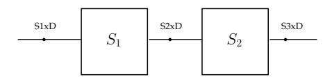
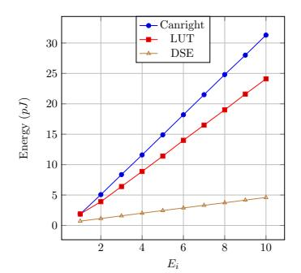
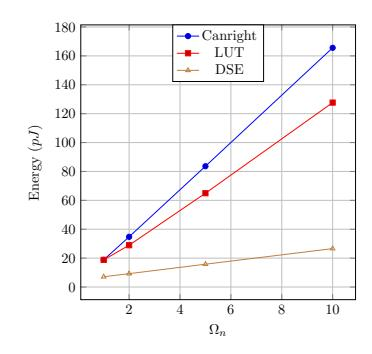
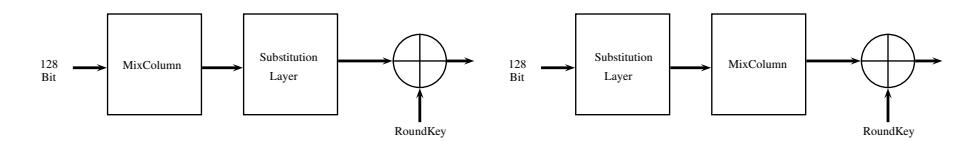
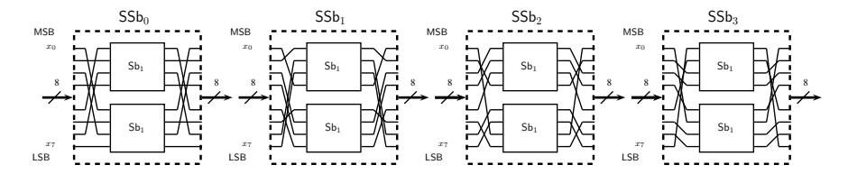
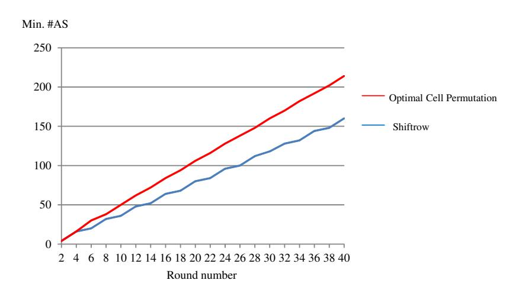
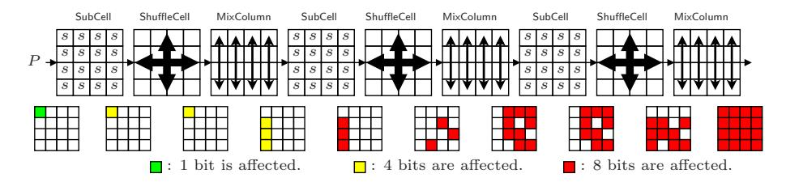
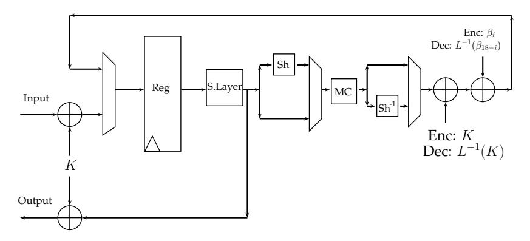
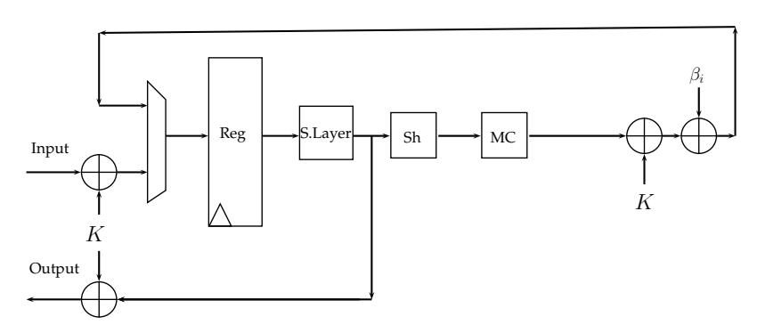
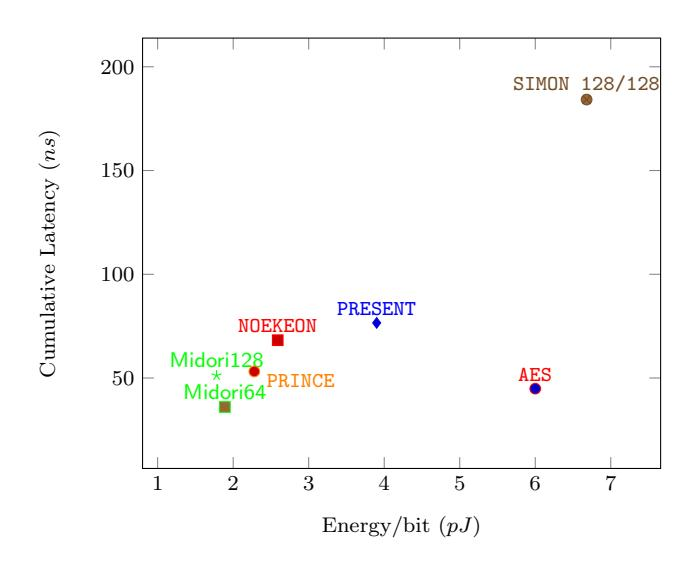

# Midori: A Block Cipher for Low Energy (Extended Version)

Subhadeep Banik<sup>1</sup> , Andrey Bogdanov<sup>1</sup> , Takanori Isobe<sup>2</sup> , Kyoji Shibutani<sup>2</sup> , Harunaga Hiwatari<sup>2</sup> , Toru Akishita<sup>2</sup> , and Francesco Regazzoni<sup>3</sup>

<sup>1</sup> Technical University of Denmark, Denmark. [{subb,anbog}@dtu.dk]({subb, anbog}@dtu.dk) <sup>2</sup> Sony Corporation, Japan. [{Takanori.Isobe,Kyoji.Shibutani,Harunaga.]({Takanori.Isobe, Kyoji.Shibutani, Harunaga.Hiwatari, Toru.Akishita}@jp.sony.com) [Hiwatari,Toru.Akishita}@jp.sony.com]({Takanori.Isobe, Kyoji.Shibutani, Harunaga.Hiwatari, Toru.Akishita}@jp.sony.com)

Abstract. In the past few years, lightweight cryptography has become a popular research discipline with a number of ciphers and hash functions proposed. The designers' focus has been predominantly to minimize the hardware area, while other goals such as low latency have been addressed rather recently only. However, the optimization goal of low energy for block cipher design has not been explicitly addressed so far. At the same time, it is a crucial measure of goodness for an algorithm. Indeed, a cipher optimized with respect to energy has wide applications, especially in constrained environments running on a tight power/energy budget such as medical implants.

This paper presents the block cipher Midori [4](#page-0-0) that is optimized with respect to the energy consumed by the circuit per bit in encryption or decryption operation. We deliberate on the design choices that lead to low energy consumption in an electrical circuit, and try to optimize each component of the circuit as well as its entire architecture for energy. An added motivation is to make both encryption and decryption functionalities available by small tweak in the circuit that would not incur significant area or energy overheads. We propose two energy-efficient block ciphers Midori128 and Midori64 with block sizes equal to 128 and 64 bits respectively. These ciphers have the added property that a circuit that provides both the functionalities of encryption and decryption can be designed with very little overhead in terms of area and energy. We compare our results with other ciphers with similar characteristics: it was found that the energy consumptions of Midori64 and Midori128 are by far better when compared ciphers like PRINCE and NOEKEON.

Keywords: AES, lightweight block cipher, low energy circuits

## 1 Introduction

The field of lightweight cryptography has gone into overdrive as evident from the number of cipher proposals that have emerged in the past few years, like

<sup>3</sup> University of Lugano, Switzerland. <regazzoni@alari.ch>

<span id="page-0-0"></span><sup>4</sup> The name of the cipher is the Japanese translation for the word Green.

CLEFIA [33], KATAN [14], KLEIN [19], LED [20], PRESENT [12], Piccolo [32], PRINCE [13], SIMON/SPECK [6] to name a few. However, the Advanced Encryption Standard (AES) [17] still remains the de-facto standard when it comes to practical lightweight encryption. The past few years have seen several low-power/area architectures for AES being reported in literature [28,31,18]. However, there has been little work that goes on to determine the design choices that lead to the most energy-efficient architecture. There are many parameters that contribute to the efficiency of a given lightweight design, with area, power, throughput and energy being the foremost among them. Power and energy, are correlated parameters, as energy is essentially the time integral of power, and power is equivalent to the energy consumed per unit time or simply the rate of energy consumption. Energy consumption, thus, is a measure of the total work done by voltage source during the execution of an operation. Hence, in many ways, energy rather than power may be a more relevant parameter to measure the efficiency of a design. Serial architectures of any block cipher that reduce the width of the datapath and reuse components, have a smaller power footprint than round based implementations in which the data path is equal to the block length of the cipher. However, serial implementations usually have high latency, that is, they take much longer to compute the result of an encryption operation than their round based counterparts, and as a result may end up consuming more energy. Therefore, there is no guarantee that low power architectures would necessarily lead to low energy architectures and vice versa.

In [22,5], an evaluation of several lightweight block ciphers with respect to various hardware performance metrics, with a particular focus on the energy cost was done. A formal model for energy consumption in any r-round unrolled block cipher architecture was proposed in [3]. However these papers do not specifically outline design choices that lead to energy-efficient designs.

#### 1.1 Our contributions

In this paper, we at first try to identify design choices that are energy-efficient and the related tradeoffs that are involved as a result of it. We throw some light at the design considerations that govern low energy circuits, and look at several factors like clock frequency, architecture, loop unrolling and lay down some general thumb rules that help in optimizing for energy. Then, we choose components specifically tailored to meet the requirements of low energy design. In particular, we develop energy-efficient linear layers and non-linear layers.

We use  $4 \times 4$  almost MDS binary matrices which are more efficient than  $4 \times 4$  MDS matrices in the terms of area and signal-delay. Note that the branch numbers (the smallest nonzero sum of active inputs and outputs of the matrix) of MDS and almost MDS matrices areare 5 and 4, respectively. However, due to a smaller branch number, ciphers employing almost MDS matrices are likely to require the more number of rounds to guarantee its security against several attacks. To address this issue, we propose *optimal cell-permutation layers* which are aimed at improving diffusion speed and increasing the numbers of active

S-boxes in each round with low implementation overheads. Our optimal cellpermutations drastically improve the minimum number of differentially/linearly active S-boxes in each round, and achieve faster diffusion compared to ShiftRowtype permutation. We construct a lightweight and small-delay 4-bit S-box by focusing on the dependency of the computation in S-boxes. The signal delay in our S-boxes is 1.5 times and twice faster than those of PRINCE and PRESENT, respectively. Since the S-box layer is one of the most critical and expensive operations of the cipher, our new S-boxes sufficiently contribute to low energy consumptions.

Combining those new constructions, we design a family of low energy block ciphers Midori which is composed of two variants: Midori64 and Midori128. These provide the functionality for both encryption and decryption with minimal area and energy overhead. The two variants support a 128-bit secret key and a 64/128 bit block, respectively. Security wise, Midori64 and Midori128 do not claim related, known and chosen-key security as it is not relevant in our target application. Using the STM 90nm standard cell library, both these ciphers consume less than 1.89 pJ/bit encrypted, which is by far better when compared ciphers like PRINCE and NOEKEON. These ciphers are particularly useful for applications that run on tight energy budget, e.g. active RFID tags, sensor nodes, medical implants and battery operated portable devices.

### 1.2 Organization of the Paper

In Section [2,](#page-2-0) we look at some design considerations that help to minimize energy consumption in block cipher circuits. In Section [3,](#page-9-0) we outline the algorithmic specifications of the Midori128 and Midori64 ciphers. In Section [4,](#page-13-0) we explain our design decisions vis-a-vis the observations of Section [2.](#page-2-0) In Section [5,](#page-20-0) we outline the security analysis of the ciphers. Section [6](#page-22-0) contains implementation results of our cipher in hardware using the standard cell library of the STM 90nm logic process. Section [7](#page-26-5) concludes the paper.

# <span id="page-2-0"></span>2 Design Considerations for Low Energy

For any given block cipher, three factors are likely to play a dominant role in determining the quantity of energy dissipated in the circuit:

- (a) Frequency of the Clock used to drive the circuit,
- (b) Architecture of the individual components,
- (c) Unrolling round functions in the circuit.

We will try to understand the significance of each of these parameters in the context of energy consumption. Let us start with clock frequency. Two components characterize the amount of energy dissipated in a CMOS circuit :

– Dynamic dissipation due to the charging and discharging of load capacitances and the short-circuit current,



Fig. 1: S-boxes placed sequentially

<span id="page-3-0"></span>– Static dissipation due to leakage current and other current drawn continuously from the power supply.

The total energy dissipation for a CMOS gate can be written as

$$E_{gate} = E_{load} + E_{sc} + E_{leakage}$$

The quantity Eload is the energy dissipated for charging and discharging the capacitive load C<sup>L</sup> of a gate when output transitions occur. The energy dissipated per 0 → 1/1 → 0 transition is given as

$$E = \int_0^t vi \ dt = \int_0^t vC_L \frac{dv}{dt} dt = C_L \int_0^{V_{DD}} v dv = \frac{1}{2} C_L V_{DD}^2.$$

The energy due to the short-circuit current, Esc is dissipated in a CMOS gate, when during a transition both the n and the p-transistors are on for a short period of time. The energy due to leakage currents Eleakage is rather small, and is mainly caused due to the sub-threshold leakage current, which is the drain-source current in a CMOS gate when the transistor is OFF. This figure is becoming increasingly important as the technology is scaling down making the sub-threshold leakage more significant. However as pointed out in [\[3,](#page-26-4)[22\]](#page-27-9), the effect of the leakage energy at high clock frequencies is minimal. As such, energy becomes a metric which is a measure of the total switching activity of a circuit during the process. For sufficiently high frequencies, the energy consumption required to compute an encryption/decryption operation is essentially independent of frequency of operation. In our experiments, for circuits implemented using the standard cell library based on the STM 90nm low leakage process, at frequencies higher than 1 MHz, leakage energy is usually less than 1% of the the total energy dissipated in the circuit.

To understand the significance of the other parameters we performed the following experiments. Consider a case in which two Rijndael S-boxes are placed one after the other in a circuit as shown in Fig. [1.](#page-3-0) The signals to the input of the first S-box, the second S-box, and the output of the 2nd S-box are named S1xD, S2xD and S3xD respectively. Note that, analyzing this situation is particularly useful for understanding the energy consumption trends of unrolled designs where logic blocks are placed sequentially one after the other.

Let us assume that the signal S1xD comes from an 8-bit register, so that it "cleanly" switches between successive byte values, i.e. all the bits of S1xD make logic transitions at the same point of time which is usually the rising clock edge for synchronous circuits. The signal S2xD will switch between various values in a given time interval 0 → τd, before settling down to a stable value. The value

<span id="page-4-0"></span>

|                        |        |            |       | Total Time Range: 199742 - 204426 Page 1 of 1 |
|------------------------|--------|------------|-------|-----------------------------------------------|
| #                      | Desig. | Signal     | Value | Time: 199742 - 204426 X 1PS (C1: 2017812REF)  |
|                        |        |            |       | , 200000 , 201000 , 202000 , 203000 , 204000  |
| $\mathbf{s}\mathbf{G}$ |        | Group 1    |       |                                               |
| 001                    | Sim    | S1xD [7:0] | 8'hbb | 70 bb                                         |
| 002                    | Sim    | S2xD [7:0] | 8'hea | 51 XXXX (65) (65) (65) ea                     |
| 003                    | Sim    | S3xD [7:0] | 8'h87 | d1 )(O)(O)(O)()()()()()()()()()(O)(O)(O)(O)   |
|                        |        |            |       |                                               |
|                        |        |            |       |                                               |
|                        |        |            |       | $0$ $\tau_{\rm d}$ $2\tau_{\rm d}$            |

Fig. 2: The signals S1xD, S2xD, S3xD

 $\tau_d$  which is the delay experienced by the signal S1xD usually depends on the cell library and the architecture adopted to implement the S-boxes. Another parameter dependent on the logic process and architecture of the S-box is the switching activity of S2xD which can be informally defined as the number of logic transitions made by this signal in the period  $0 \to \tau_d$ .

The second S-box  $S_2$ , sees this signal S2xD, which is switching between various values in the time interval  $0 \to \tau_d$ . Therefore, the switching activity of  $S_2$  is actually at least double that of  $S_1$ , as it would continue switching for another  $\tau_d$  before producing a stable signal. Figure 2 provides an example in which, the three signals for the pair of Rijndael S-boxes (implemented using the Canright [15] architecture in the standard cell library of the STM 90nm logic process, at 10 MHz) are shown. The synthesis for each S-box was done separately, so that the synthesis tool would not group together gates from the first and the second S-box in order to save area. Since the energy consumption of a logic block depends on the switching activity of all its nodes, the S-box  $S_2$  should naturally consume more energy than  $S_1$ . Again the exact energy consumed by  $S_2$  relative to  $S_1$  depends on factors like

- (a) the logic process and hence the value of  $\tau_d$ ,
- (b) the architecture of the S-box and hence the amount of "extra" switching experienced by  $S_2$  and
- (c) the algebraic structure of the S-box, i.e. its component Boolean functions.

The extra switching activity would be proportional to the average number of gates that undergo a  $0 \to 1/1 \to 0$  transition during the period  $\tau_d \to 2\tau_d$  (the average is typically taken over all possible transitions of the signal S1xD). Similarly if a third S-box  $S_3$  were placed after  $S_2$ , then too it would experience an increase in switching activity relative to  $S_2$  that would depend on the average number of gates switched in the period  $2\tau_d \to 3\tau_d$ . The increase in switching activity of  $S_3$  over  $S_2$  is likely to be roughly the same as that of  $S_2$  over  $S_1$ , since the number of gates in  $S_2$  that switch in  $\tau_d \to 2\tau_d$  and those in  $S_3$  between  $2\tau_d \to 3\tau_d$  when averaged over  $\binom{256}{2}$  transitions of S1xD, is likely to be same. And so if it so happens that  $S_1, S_2$  and  $S_3$  drive the same amount of capacitive load, the difference between the energy consumed between  $S_2$  and  $S_1$  is likely to be the same as between  $S_3$  and  $S_2$ .

<span id="page-5-0"></span>

<span id="page-5-1"></span>

Fig. 3: Energy per cycle E<sup>i</sup> in i th Sbox S<sup>i</sup>

Fig. 4: Energy Ω<sup>n</sup> required to compute S <sup>10</sup>(x) using n S-boxes

Taking these ideas forward, if we connect a series of n S-boxes sequentially, the energy consumed by each S-box in a given period of time is likely to be more than the previous S-box, as the switching activity of the S-boxes are likely to increase from the first to the last. We tested three different architectures for the Rijndael S-box. The first is the Canright [\[15\]](#page-27-10) architecture which is acknowledged to be smallest known implementation in terms of gate area. The second is the Look-up Table (LUT) based architecture as synthesized by the Synopsys Design Compiler. The LUT architecture, while larger than the Canright architecture in terms of area, is much faster in terms of signal delay from the input to output port. The third is a Decoder-Switch-Encoder (DSE) based architecture [\[8\]](#page-26-6), which is optimal in terms of power/energy consumption. Over the years there has been much research on low power Rijndael S-boxes [\[29,](#page-27-11)[36\]](#page-28-0), but the DSE based architecture is widely believed to be most power/energy-efficient on account of its unique architecture. The 8-bit input is first decoded to a set of 256 wires. The S-box functionality is achieved by a shuffling of wires after which the output is produced by an encoding of the 256 shuffled wires (i.e. the inverse of the decoding process). The entire circuit can be constructed by AND/NAND gates, which have very low switching probability and since the S-box functionality is provided by wire shuffling, all 8-bit S-boxes can be constructed in this manner. The architecture offers very low switching per change of input bit: a maximum of 25% of the gates switch when one of the input bits is flipped.

We connected 10 instances of the S-box constructed using the Canright architecture (using the standard cell library of the STM 90nm logic process) sequentially and used the Synopsys Power Compiler to estimate the energy consumed per clock cycle E<sup>i</sup> in each of the successive S-boxes S<sup>i</sup> at a clock frequency of 10 MHz. We repeated the same experiment for the LUT and DSE based S-boxes. The results can be seen in Fig. [3.](#page-5-0) It can be seen that the successive instances of the LUT based S-box which has a delay of around 2.1 ns consumes much less energy as compared to the Canright S-box which has a delay of around 2.9 ns. In both the LUT and Canright architectures, the switching activity in the circuit is roughly proportional to the signal delay across the input and output ports. This is however not the case for DSE S-box, which although has a delay of around  $2.3 \ ns$ , experiences much lower increase in successive values of  $E_i$  because the total switching activity in the delay period is much lower.

The above analysis is particularly relevant due to two reasons. The first pertains to the structure of especially SPN based ciphers, in which each round typically consists of a substitution, a linear layer and a key addition placed sequentially. A substitution layer with low switching activity and signal delay ensures that the linear layer consumes less energy. Similarly a linear layer with similar characteristics ensures that any circuit placed after it consumes less energy. The second pertains to the consideration of round unrolled circuits. An r-round unrolled circuit for a block cipher is one in which, the circuit computes the results of r successive round functions in a single clock cycle. So if the block cipher specification calls for N executions of the round function, an r-round unrolled circuit will compute the result of the encryption operation in  $\left\lceil \frac{N}{r} \right\rceil$  cycles. An r-round unrolled architecture is constructed by placing the circuits for r round functions sequentially, followed by a register. The above analysis suggests that any multiple round unrolled circuit is unlikely to be efficient in terms of energy consumption. In the above example, using the LUT based S-box, computing the result of two S-box operations (i.e. S(S(x))) over 2 cycles costs 2\*1.88 = 3.76pJ. Computing the same over one cycle by sequential placement of 2 S-boxes will cost  $1.88 + 3.91 = 5.79 \ pJ$ . Similarly computing three S-box operations over three cycles takes 5.64 pJ, whereas the same over one cycle would take  $1.88 + 3.91 + 6.40 = 12.39 \ pJ$ . Figure 4 shows the cumulative energy cost  $\Omega_n$  of computing  $S^{10}(x)$  using a sequence of n S-boxes (i.e. in  $\frac{10}{n}$  cycles), for different values of n. It can be seen that, irrespective of the architecture of the S-box, the energy consumption is optimal for n=1, i.e. computing the operation over 10 cycles using a single S-box, even if this involves updating the register 10 times in the process.

#### 2.1 M-S vs S-M based round functions

An interesting analysis would be to consider circuits in which the linear layer (i.e. the MixColumn logic) is placed before the substitution layer (see Figure 5). We will denote this configuration as M-S based round function, as opposed to S-M based functions in which the substitution layer precedes the linear layer. The block cipher Noekeon is an example of an M-S configuration, whereas Prince uses both S-M and M-S based functions in different rounds. To put things in perspective, we did the energy evaluation for the M-S and S-M configurations for AES (with the DSE architecture for S-box), Prince and Noekeon. The results are given in Table 1. The results suggest that there is not a very significant difference in M-S and S-M configurations, any advantage gained by one configuration over the other would depend on the respective designs. However our experiments suggest that placing the logic block with larger signal delay in the later part of the circuit would be more energy efficient. For example, in AES the substitution layer constitutes a bulk of the critical path, for which the M-S configuration

<span id="page-7-0"></span>

Fig. 5: The M-S and S-M architectures

is more efficient. The Noekeon linear layer has nine levels of logic and hence a larger delay, than the Substitution layer which uses 4-bit S-boxes. For this cipher, the S-M configuration is found to be slightly better. For a cipher like Prince, in which both the linear layer and the substitution layer have very little signal delays the result of the S-M and M-S configurations are almost equally energy efficient.

<span id="page-7-1"></span>

| Design  | Delay in M | Delay in S | Energy per cycle |       |  |  |  |
|---------|------------|------------|------------------|-------|--|--|--|
|         | (ns)       | (ns)       | (pJ)             |       |  |  |  |
|         |            |            | M-S              | S-M   |  |  |  |
| AES     | 0.56       | 2.25       | 12.09            | 14.00 |  |  |  |
| Noekeon | 1.56       | 0.38       | 12.37            | 11.88 |  |  |  |
| Prince  | 0.31       | 0.36       | 2.30             | 2.18  |  |  |  |

Table 1: A comparison of Energy per cycle of M-S/S-M configurations

### <span id="page-7-2"></span>2.2 S-box: 4-bit vs 8-bit

In light of the above analysis, it is clear that a design using a 4-bit S-box is more efficient in terms of energy consumed per cycle than a design using an 8-bit S-box. This is primarily due to the fact that a 4-bit S-box will typically have a lower signal delay as compared to an 8-bit S-box. However 8-bit S-boxes offer higher non-linearity and lower values of the DP/LP co-efficient, and so in order to sustain similar security margins, a design using a 4-bit S-box will typically need more executions of the round function. To put things, in perspective we performed the energy evaluation of the circuit of the SPN round function (with blocksize equal to 128 bits) in which we experimented with two different substitution layers, one having sixteen 8-bit S-boxes and the other having thirty two 4-bit S-boxes. The Rijndael MixColumn was used in both cases, and the STM 90nm cell library was used to synthesize the circuits. For this purpose four different 8-bit S-boxes were chosen. Apart from the LUT and DSE based Rijndael S-boxes, we chose the S-boxes used in mCrypton [\[25\]](#page-27-12) and Whirlpool [\[4\]](#page-26-7). Unlike AES, these S-boxes can be functionally defined in terms of smaller 4-bit S-boxes, and so can be implemented efficiently in hardware. Additionally

<span id="page-8-0"></span>Table 2: A comparison of energy per cycle for round functions constructed with (A) 16 8-bit S-boxes, (B) 32 4-bit S-boxes.

| S-box         | Delay in S | Energy per cycle |
|---------------|------------|------------------|
|               | (ns)       | (pJ)             |
| DSE (8-bit)   | 2.25       | 14.00            |
| Rijndael(LUT) | 2.10       | 38.88            |
| mCrypton      | 1.59       | 13.20            |
| Whirlpool     | 1.33       | 16.38            |
| DSE (4-bit)   | 0.81       | 7.92             |
| PRINCE        | 0.36       | 4.87             |
| PRESENT       | 0.45       | 6.18             |
|               |            |                  |

we chose three 4-bit S-boxes: the generic DSE based S-box (note that since the S-box functionality is provided by a wire shuffle, all DSE S-boxes will have same energy consumption), and the S-boxes used in PRINCE [\[13\]](#page-26-1) and PRESENT [\[12\]](#page-26-0).

Table [2](#page-8-0) reports the energy per cycle figures at a frequency of 10 MHz. It can be seen that the DSE architecture is not as effective as energy saving measure for 4-bit S-boxes. It is also interesting to note that from the point of view of energy 4-bit S-boxes out performs their 8-bit counterparts by a ratio of around 2:1. Thus, the use of 4-bit S-boxes seems to be an efficient configuration even if the number of rounds in the encryption algorithm has to be increased in order to maintain security margins.

### 2.3 Feistel vs SPN and Complex vs Simple Round Function

As far as designing lightweight ciphers is concerned, both SPN and Feistel architectures have their respective advantages and disadvantages. Feistel structures (e.g. TWINE [\[34\]](#page-27-13), Piccolo [\[32\]](#page-27-4), SIMON [\[6\]](#page-26-2)) usually apply a round function to only one half of the state and as such structures can be implemented in hardware with low average power. Also, implementing the inverse of Feistel constructions is not very difficult and hence a circuit that provides functionalities for both encryption and decryption can be designed with minimal overhead. However, given the fact that Feistel structures introduce non-linearity in only one half of the state in every round and hence, to maintain security margins, such constructions usually require more executions of the round functions as compared to SPN structures. As such Feistel, constructions are not suited for low latency implementations. Most SPN constructions, on the other hand, usually apply its transformation function to the entire state and so can be implemented using fewer rounds. In principle, if n rounds of SPN function and m rounds of Feistel function (where m > n) have the same security margin and similar energy expenditure, then using the n round SPN function makes more sense since lesser energy is consumed to update the state and key register for n rounds. A similar argument can be used to resolve the choice between (a) Simple round functions with more rounds (e.g. PRESENT [\[12\]](#page-26-0)) and (b) Complex round functions with lesser rounds.

### 2.4 Effect of Key Schedule

Generating separate round keys in each round by means of a key schedule operation can eat into the energy budget as it incurs the added cost of updating the key register in every round. For example using the STM 90nm standard cell library, in AES (with DSE S-box), the key schedule consumes a total of 25% of the total energy consumed. For PRESENT, the key schedule consumes close to 32% of the total energy. So designs meant primarily for low energy consumption, designers should look to avoid the key schedule operation. This would also be efficient in terms of area as it would not be necessary to include a key register in the design.

### 2.5 Main Conclusion: Low-Energy Design Choices

We can now state some conclusions that will serve as pointers for a good low energy block cipher design. From the point of view of energy, we know that a round based architecture is usually optimal. Thus we concentrate on an efficient round based construction that would with minimal overhead provide both the functionalities of encryption and decryption. A cipher like PRINCE, although provides both encryption/decryption functionalities with minimal tweak in the circuit, does not have an equally energy-efficient round based construction [\[13\]](#page-26-1), as it needs to accommodate 3 different round functions in the same circuit. We have also seen that components with low switching and delay tend to perform better energy wise. So another requirement is choosing components with low area and delay. In this context, it makes sense to choose 4-bit S-boxes over 8-bit S-boxes. We choose SPN architecture over Feistel to minimize the number of rounds in the design. And since providing the functionalities of both encryption and decryption is an added motivation, we try to include components which in addition to having low area/delay, are also involutions. Having such components would minimize any additional overhead required for providing the functionalities of both encryption and decryption. We will now present the specifications for the proposed block cipher and in Section [4](#page-13-0) we will explain the design decisions in the context of the observations made in this Section.

# <span id="page-9-0"></span>3 Specification

Midori is a family of two block ciphers: Midori64 and Midori128. Both ciphers accept 128-bit keys, and have a different block size n (n = 64 for Midori64 and n = 128 for Midori128). The basic parameters of Midori64 and Midori128 are shown in Table [3.](#page-10-0)

Midori is a variant of a Substitution Permutation Network (SPN), which consists of the S-layer and the P-layer, and uses the following 4 × 4 array called

Table 3: Parameters for Midori64 and Midori128

<span id="page-10-0"></span>

|           | block $size(n)$ | $\ker$ size | $\operatorname{cell}  \operatorname{size}(m)$ | number of rounds |
|-----------|-----------------|-------------|-----------------------------------------------|------------------|
| Midori64  | 64              | 128         | 4                                             | 16               |
| Midori128 | 128             | 128         | 8                                             | 20               |

<span id="page-10-1"></span>Table 4: 4-bit bijective S-boxes  $\mathsf{Sb}_0$  and  $\mathsf{Sb}_1$  in hexadecimal form

| x         | 0 | 1 | 2 | 3 | 4 | 5 | 6 | 7 | 8 | 9 | a | b | С | d | е | f |
|-----------|---|---|---|---|---|---|---|---|---|---|---|---|---|---|---|---|
| $Sb_0[x]$ | С | a | d | 3 | е | b | f | 7 | 8 | 9 | 1 | 5 | 0 | 2 | 4 | 6 |
| $Sb_1[x]$ | 1 | 0 | 5 | 3 | е | 2 | f | 7 | d | a | 9 | b | С | 8 | 4 | 6 |

state as a data expression:

$$S = \begin{bmatrix} s_0 \ s_4 \ s_8 \ s_{12} \\ s_1 \ s_5 \ s_9 \ s_{13} \\ s_2 \ s_6 \ s_{10} \ s_{14} \\ s_3 \ s_7 \ s_{11} \ s_{15} \end{bmatrix},$$

where the sizes of each cell m are 4 and 8 bits for Midori64 and Midori128, respectively, i.e.,  $s_i \in \{0,1\}^m$ , m=4 for Midori64 and m=8 for Midori128. A 64-bit or a 128-bit plaintext P is loaded into the state, and the i-th round output state is defined as  $S_i$ , namely  $S_0 = P$ .

### <span id="page-10-2"></span>3.1 S-boxes and Matrices

S-box: Midori utilizes two types of bijective 4-bit S-boxes,  $\mathsf{Sb}_0$  and  $\mathsf{Sb}_1$ , where  $\mathsf{Sb}_0$ ,  $\mathsf{Sb}_1:\{0,1\}^4\to\{0,1\}^4$  (see Table 4).  $\mathsf{Sb}_0$  and  $\mathsf{Sb}_1$  are used in Midori64 and Midori128, respectively. Note that  $\mathsf{Sb}_0$  and  $\mathsf{Sb}_1$  both have the involution property.

Midori128 utilizes four different 8-bit S-boxes  $SSb_0$ ,  $SSb_1$ ,  $SSb_2$  and  $SSb_3$ , where  $SSb_0$ ,  $SSb_1$ ,  $SSb_2$ ,  $SSb_3$ :  $\{0,1\}^8 \to \{0,1\}^8$  Mathematically, each  $SSb_i$  consists of input and output bit permutations and two  $Sb_1$ 's as shown in Fig. 6. Each output bit permutation is taken as the inverse of the corresponding input bit permutation to keep the involution property. Let the input bit permutation of each  $SSb_i$  be referred to as  $p_i$ . Let  $x_{[i]}$  denote the i-th bit of x, where  $x_{[0]}$  is the most significant bit (MSB). Then denoting  $p_i(x) = y^{(i)}$ , we have

$$y_{[0,1,2,3,4,5,6,7]}^{(0)} = x_{[4,1,6,3,0,5,2,7]}, \ y_{[0,1,2,3,4,5,6,7]}^{(1)} = x_{[1,6,7,0,5,2,3,4]}$$

$$y_{[0,1,2,3,4,5,6,7]}^{(2)} = x_{[2,3,4,1,6,7,0,5]}, \ y_{[0,1,2,3,4,5,6,7]}^{(3)} = x_{[7,4,1,2,3,0,5,6]}$$

The output permutation used in each  $SSb_i$  is simply the inverse of the map  $p_i$ .

<span id="page-11-0"></span>

Fig. 6: SSb<sub>0</sub>, SSb<sub>1</sub>, SSb<sub>2</sub> and SSb<sub>3</sub>

Matrix: Midori utilizes an involutive binary matrix M defined as follows:

$$\boldsymbol{M} = \begin{pmatrix} 0 & 1 & 1 & 1 \\ 1 & 0 & 1 & 1 \\ 1 & 1 & 0 & 1 \\ 1 & 1 & 1 & 0 \end{pmatrix}.$$

The matrix M updates four m-bit values  $(x_0, x_1, x_2, x_3)$  as follows:

$$^{t}(x_{0},x_{1},x_{2},x_{3}) \leftarrow \mathbf{M} \cdot ^{t}(x_{0},x_{1},x_{2},x_{3}),$$

where the operations between a matrix and a vector are performed over  $GF(2^m)$ .

### 3.2 Round Function

The round function of Midori consists of an S-layer SubCell:  $\{0,1\}^n \to \{0,1\}^n$ , a P-layer ShuffleCell and MixColumn:  $\{0,1\}^n \to \{0,1\}^n$  and a key-addition layer KeyAdd:  $\{0,1\}^n \times \{0,1\}^n \to \{0,1\}^n$ . Each layer updates an n-bit state S as follows.

SubCell (S): Sb<sub>0</sub> and SSb<sub>i</sub> are applied to every 4 and 8-bit cell of the state S of Midori64 and Midori128 in parallel, respectively. Namely,  $s_i \leftarrow \mathsf{Sb}_0[s_i]$  for Midori64 and  $s_i \leftarrow \mathsf{SSb}_{(i \mod 4)}[s_i]$  for Midori128, where  $0 \le i \le 15$ .

ShuffleCell (S): Each cell of the state is permuted as follows:

 $(s_0, s_1, ..., s_{15}) \leftarrow (s_0, s_{10}, s_5, s_{15}, s_{14}, s_4, s_{11}, s_1, s_9, s_3, s_{12}, s_6, s_7, s_{13}, s_2, s_8).$ 

MixColumn (S): M is applied to every 4m-bit column of the state S, i.e.,

 $^{t}(s_{i}, s_{i+1}, s_{i+2}, s_{i+3}) \leftarrow \mathbf{M}^{t}(s_{i}, s_{i+1}, s_{i+2}, s_{i+3}) \text{ and } i = 0, 4, 8, 12.$ 

KeyAdd(S,  $RK_i$ ): The *i*-th *n*-bit round key  $RK_i$  is XORed to a state S.

### 3.3 Data Processing Part

The data processing part of Midori for encryption  $\mathsf{MidoriCore}_{(R)}$  performs as follows:

$$\mathsf{MidoriCore}_{(R)}: \left\{ \begin{array}{l} \{0,1\}^{16m} \times \{0,1\}^{16m} \times \{\{0,1\}^{16m}\}^{R-1} \to \{0,1\}^{16m} \\ (X,WK,RK_0,...,RK_{R-2}) \mapsto Y \end{array} \right.$$

```
\begin{tabular}{ll} \textbf{Algorithm} & \mathsf{MidoriCore}_{(R)}(X,WK,RK_0,...,RK_{R-2}) : \\ S \leftarrow \mathsf{KeyAdd}(X,WK) \\ \text{for } i = 0 \text{ to } R - 2 \text{ do} \\ S \leftarrow \mathsf{SubCell}(S) \\ S \leftarrow \mathsf{ShuffleCell}(S) \\ S \leftarrow \mathsf{MixColumn}(S) \\ S \leftarrow \mathsf{KeyAdd}(S,RK_i) \\ S \leftarrow \mathsf{SubCell}(S) \\ Y \leftarrow \mathsf{KeyAdd}(S,WK) \\ \end{tabular}
```

where R=16 for Midori64 and R=20 for Midori128. Similarly, the inverse data processing part MidoriCore $_{(R)}^{-1}$  operates as follows:

$$\mathsf{MidoriCore}_{(R)}^{-1}: \left\{ \begin{array}{l} \{0,1\}^{16m} \times \{0,1\}^{16m} \times \{\{0,1\}^{16m}\}^{R-1} \rightarrow \{0,1\}^{16m} \\ (Y,WK,RK_{R-2},...,RK_0) \mapsto X \end{array} \right.$$

```
\label{eq:Algorithm MidoriCore} \begin{split} & \overline{\mathbf{Algorithm}} \ \mathsf{MidoriCore}_{(R)}^{-1}(Y,WK,RK_{R-2},...,RK_0) : \\ & S \leftarrow \mathsf{KeyAdd}(Y,WK) \\ & \text{for } i = (R-2) \ \text{to 0 do} \\ & S \leftarrow \mathsf{SubCell}(S) \\ & S \leftarrow \mathsf{MixColumn}(S) \\ & S \leftarrow \mathsf{InvShuffleCell}(S) \\ & S \leftarrow \mathsf{KeyAdd}(S,L^{-1}(RK_i)) \\ & S \leftarrow \mathsf{SubCell}(S) \\ & X \leftarrow \mathsf{KeyAdd}(S,WK) \end{split}
```

where  $L^{-1}$  (inverse of the linear layer) denotes the composition of the operations InvShuffleCell  $\circ$  MixColumn, and InvShuffleCell permutes each cell of the state as follows.

$$(s_0, s_1, ..., s_{15}) \leftarrow (s_0, s_7, s_{14}, s_9, s_5, s_2, s_{11}, s_{12}, s_{15}, s_8, s_1, s_6, s_{10}, s_{13}, s_4, s_3).$$

#### 3.4 Round Key Generation

For Midori64, a 128-bit secret key K is denoted as two 64-bit keys  $K_0$  and  $K_1$  as  $K = K_0||K_1$ . Then,  $WK = K_0 \oplus K_1$  and  $RK_i = K_{(i \mod 2)} \oplus \alpha_i$ , where  $0 \le i \le 14$ . For Midori128, WK = K and  $RK_i = K \oplus \beta_i$ , where  $0 \le i \le 18$ . The constants  $\beta_i$  are defined in Table 5. It can be seen that the constants are in the form of  $4 \times 4$  binary matrices. They are added bitwise to the LSB of every round key byte in Midori128 and round key nibble in Midori64 respectively. Note that  $\alpha_i = \beta_i$  for  $0 \le i \le 14$ .

#### 3.5 Midori Ciphers

Midori block ciphers are composed of two variants: Midori64 and Midori128 consisting of MidoriCore $_{(16)}$  with m=4 and MidoriCore $_{(20)}$  with m=8, respectively. MidoriCore $_{(16)}$  is depicted in Fig. 7 as an example.

<span id="page-13-1"></span>

| Table 5: The Round Constants $\beta_i$ |                                                                                                 |    |                                                                                                 |    |                                                                                                 |    |                                                                                                 |    |                                                                                                 |    |                                                       |    |                                                                                                 |
|----------------------------------------|-------------------------------------------------------------------------------------------------|----|-------------------------------------------------------------------------------------------------|----|-------------------------------------------------------------------------------------------------|----|-------------------------------------------------------------------------------------------------|----|-------------------------------------------------------------------------------------------------|----|-------------------------------------------------------|----|-------------------------------------------------------------------------------------------------|
| i                                      | $\beta_i$                                                                                       | i  | $\beta_i$                                                                                       | i  | $\beta_i$                                                                                       | i  | $\beta_i$                                                                                       | i  | $\beta_i$                                                                                       | i  | $\beta_i$                                             | i  | $\beta_i$                                                                                       |
| 0                                      | $ \begin{array}{cccccccccccccccccccccccccccccccccccc$                                           | 1  | $\begin{array}{c} 0 & 1 & 1 & 0 \\ 1 & 0 & 1 & 0 \\ 1 & 0 & 0 & 0 \\ 1 & 0 & 0 & 0 \end{array}$ | 2  | $\begin{array}{c} 1 & 0 & 0 & 0 \\ 0 & 1 & 0 & 1 \\ 1 & 0 & 1 & 0 \\ 0 & 0 & 1 & 1 \end{array}$ | 3  | $ \begin{array}{cccccccccccccccccccccccccccccccccccc$                                           | 4  | $ \begin{array}{cccccccccccccccccccccccccccccccccccc$                                           | 5  | $ \begin{array}{cccccccccccccccccccccccccccccccccccc$ | 6  | $\begin{array}{c} 0 & 0 & 0 & 0 \\ 0 & 0 & 1 & 1 \\ 0 & 1 & 1 & 1 \\ 0 & 0 & 0 & 0 \end{array}$ |
| 7                                      | $\begin{array}{c} 0 \ 1 \ 1 \ 1 \\ 0 \ 0 \ 1 \ 1 \\ 0 \ 1 \ 0 \ 0 \\ 0 \ 1 \ 0 \ 0 \end{array}$ | 8  | $\begin{array}{c} 1 \ 0 \ 1 \ 0 \\ 0 \ 1 \ 0 \ 0 \\ 0 \ 0 \ 0 \ 0 \\ 1 \ 0 \ 0 \ 1 \end{array}$ | 9  | $\begin{array}{c} 0 \ 0 \ 1 \ 1 \\ 1 \ 0 \ 0 \ 0 \\ 0 \ 0 \ 1 \ 0 \\ 0 \ 0 \ 1 \ 0 \end{array}$ | 10 | $\begin{array}{c} 0 \ 0 \ 1 \ 0 \\ 1 \ 0 \ 0 \ 1 \\ 1 \ 0 \ 0 \ 1 \\ 1 \ 1 \ 1 \ 1 \end{array}$ | 11 | $\begin{array}{c} 0 \ 0 \ 1 \ 1 \\ 0 \ 0 \ 0 \ 1 \\ 1 \ 1 \ 0 \ 1 \\ 0 \ 0 \ 0 \ 0 \end{array}$ | 12 | $ \begin{array}{cccccccccccccccccccccccccccccccccccc$ | 13 | $ \begin{array}{cccccccccccccccccccccccccccccccccccc$                                           |
| 14                                     | $\begin{array}{c} 1 \ 1 \ 1 \ 0 \\ 1 \ 1 \ 0 \ 0 \\ 0 \ 1 \ 0 \ 0 \end{array}$                  | 15 | $ \begin{array}{cccccccccccccccccccccccccccccccccccc$                                           | 16 | $ \begin{array}{cccccccccccccccccccccccccccccccccccc$                                           | 17 | $ \begin{array}{cccccccccccccccccccccccccccccccccccc$                                           | 18 | $ \begin{array}{cccccccccccccccccccccccccccccccccccc$                                           |    |                                                       |    |                                                                                                 |

<span id="page-13-2"></span> $\begin{array}{c|ccccccccccccccccccccccccccccccccccc$ 

Fig. 7: Overview of Midori64

# <span id="page-13-0"></span>4 Design Decision

Here, we explain our design decisions vis-a-vis the observations of Section 2.

#### 4.1 Linear Layer

Linear layers of the each variant consist of a cell-permutation (ShuffleCell) and four  $4 \times 4$  matrix operations (MixColumn). Those operations are performed over  $GF(2^4)$  and  $GF(2^8)$  for the 64 and 128-bit variants, respectively.

MDS vs Almost MDS. Using the NanGate 45nm open cell library, Table 6 compares three types of  $4 \times 4$  matrices, involutive MDS ( $M_A$ ), non-involutive MDS ( $M_B$ ) and involutive almost MDS matrices ( $M_C$ ) from implementation aspects. These matrices are considered lightweight in each of the three aforementioned criteria [27,32].

$$\bm{M}_A = \begin{pmatrix} 1 & 2 & 6 & 4 \\ 2 & 1 & 4 & 6 \\ 6 & 4 & 1 & 2 \\ 4 & 6 & 2 & 1 \end{pmatrix}, \bm{M}_B = \begin{pmatrix} 2 & 3 & 1 & 1 \\ 1 & 2 & 3 & 1 \\ 1 & 1 & 2 & 3 \\ 3 & 1 & 1 & 2 \end{pmatrix}, \bm{M}_C = \begin{pmatrix} 0 & 1 & 1 & 1 \\ 1 & 0 & 1 & 1 \\ 1 & 1 & 0 & 1 \\ 1 & 1 & 1 & 0 \end{pmatrix}.$$

From Table 6,  $M_C$  is obviously preferable over the others in terms of the gate size and the path delay. In fact, circulant-type almost MDS matrices are adopted

<span id="page-14-0"></span>Table 6: Comparison of three matrices

|                 | MA  | MB   | MC                           |
|-----------------|-----|------|------------------------------|
| Area [GE]       | 108 | 104  | 48                           |
| Delay [ns] 0.93 |     | 0.68 | 0.37                         |
|                 |     |      | Diffusion MDS MDS Almost MDS |
| Involution      | yes | no   | yes                          |

Table 7: Comparison of S-boxes

|            | PRESENT PRINCE Sb0 |      |     | Sb1        |
|------------|--------------------|------|-----|------------|
| Area [GE ] | 24.33              | 16   |     | 13.3 15.33 |
| Delay [ns] | 0.47               | 0.36 |     | 0.24 0.32  |
| Involution | No                 | No   | Yes | Yes        |

in PRINCE [\[13\]](#page-26-1), PRIDE [\[1\]](#page-26-8), FIDES [\[9\]](#page-26-9) and CLOC [\[21\]](#page-27-15). Moreover, Khoo et al. showed that, for a 64-bit block size employing the AES-like structure, the combination of 4 × 4 almost MDS matrices (M<sup>C</sup> ) with ShiftRow and 16 4-bit S-boxes is the most efficient in both a round-based and a serialized implementation by proposing a new comparison metric FOAM (figure of adversarial merit), which combines the inherent security provided by cryptographic structures and components along with their implementation properties [\[23\]](#page-27-16).

While M<sup>C</sup> has efficient implementation properties, its diffusion speed is slower and the minimum number of active S-boxes in each round is smaller than those of ciphers employing MDS matrices due to its lower branch number. It has been known that those properties are directly related to the immunity against several attacks including impossible differential, saturation, differential and linear attacks. To improve security of the almost MDS with low implementation overheads, we adopt optimal cell-permutation layers which are aimed at improving diffusion speed and increasing the number of active S-boxes in each round. The diffusion speed is measured by the number of rounds taken to attain full diffusion, which is the property that all output cells are affected by all input cells. Importantly, changing cell-permutation patterns generally does not require additional implementation costs in a round-based and an unrolled hardware implementation.

# Approach to Find Optimal Cell-Permutation Layers for Almost MDS.

Since it is computationally hard to exhaustively count the minimum number of active S-boxes for all possible permutations (= 16! ≈ 2 <sup>44</sup>.<sup>25</sup>) by Matsui's search approach [\[26,](#page-27-17)[10\]](#page-26-10), we take the following two-step approach to reduce the search space. In the fist step, we restrict the cell-permutations to row-based cellpermutations which permute four cells in each row, e.g. ShiftRow in AES. The number of possible row-based cell-permutations is estimated as 2<sup>18</sup>.<sup>3</sup> (= (4!)<sup>4</sup> ). This step is based on the fact that the full diffusion property relies on only rowbased property of the cell-permutation. As a result of our searches, we find that a class of row-based cell-permutations achieves full diffusion in 3 rounds and its necessary and sufficient condition is as follows.

<span id="page-14-1"></span>Condition 1 (3-round full diffusion) For a 4 × 4 cell-array, after applying a cell-permutation once and twice, each input cell in a column is mapped into a cell in the different column.

From our search, **576** row-based cell-permutations satisfy Condition 1. Interestingly, ShiftRow-type permutation is not included in this class, i.e. it requires 4 rounds for full diffusion.

In the second step, we add a column-based cell-permutation, which permutes four cells in each column, after applying the class of permutations satisfying Condition 1. The target cell permutation consists of the combination of the row-based and column-based permutations. Note that adding a column-based cell-permutation to the row-based permutations satisfying Condition 1 does not affect the full diffusion property. The number of all possible cell-permutations of this class is estimated as  $2^{27.51}$  (=  $576 \times (4!)^4$ ). Consequently, we find a class of cell-permutation achieving the largest number of active S-boxes in each round and the smallest number of rounds to attain full diffusion when satisfying Condition 1 and the following Condition 2 or 3.

<span id="page-15-0"></span>**Condition 2** (The number of active S-box) For a  $4 \times 4$  cell-array, after applying a cell-permutation twice and twice inversely, each input cell in a column is mapped into a cell in the same row.

<span id="page-15-1"></span>**Condition 3** (The number of active S-box) For a  $4 \times 4$  cell-array, after applying a cell-permutation once and three times inversely, each input cell in a column is mapped into a cell in the same row.

The numbers of cell-permutations satisfying Condition 2 and Condition 3 are both 576. We define such **1152** cell-permutation as *optimal cell-permutations*. Table 8 shows the minimum numbers of differentially/linearly active S-boxes of the optimal cell-permutations and the ShiftRow-type permutation. Our optimal cell-permutations drastically improve the minimum number of differentially/linearly active S-boxes in each round while keeping the 3-round full diffusion property as shown in Fig. 8. Thus, our optimal permutations achieve security against several attacks such as differential/linear and impossible attacks in the same number of rounds compared to ShiftRow-type permutation. Midori128 and Midori64 adopt one of optimal cell permutations satisfying both Conditions 1 and 2 as follows.

$$(s_0, s_1, ..., s_{15}) \leftarrow (s_0, s_{10}, s_5, s_{15}, s_{14}, s_4, s_{11}, s_1, s_9, s_3, s_{12}, s_6, s_7, s_{13}, s_2, s_8).$$

Starting from the state  $S_0$ , each cell of  $S_0$  is mapped to  $S_1$ ,  $S_2$ ,  $S_1^{-1}$  and  $S_2^{-1}$  after applying the above cell-permutation once, twice, once inversely and twice inversely, respectively, as follows.

$$S_0 = \begin{bmatrix} s_0 \ s_4 \ s_8 \ s_{12} \\ s_1 \ s_5 \ s_9 \ s_{13} \\ s_2 \ s_6 \ s_{10} \ s_{14} \\ s_3 \ s_7 \ s_{11} \ s_{15} \end{bmatrix}, S_1 = \begin{bmatrix} s_0 \ s_{14} \ s_9 \ s_7 \\ s_{10} \ s_4 \ s_3 \ s_{13} \\ s_5 \ s_{11} \ s_{12} \ s_2 \\ s_{15} \ s_1 \ s_6 \ s_8 \end{bmatrix}, S_2 = \begin{bmatrix} s_0 \ s_2 \ s_3 \ s_1 \\ s_{12} \ s_{14} \ s_{15} \ s_{13} \\ s_4 \ s_6 \ s_7 \ s_5 \\ s_8 \ s_{10} \ s_{11} \ s_9 \end{bmatrix},$$

$$S_{1}^{-1} = \begin{bmatrix} s_{0} & s_{5} & s_{15} & s_{10} \\ s_{7} & s_{2} & s_{8} & s_{13} \\ s_{14} & s_{11} & s_{1} & s_{4} \\ s_{9} & s_{12} & s_{6} & s_{3} \end{bmatrix}, S_{2}^{-1} = \begin{bmatrix} s_{0} & s_{2} & s_{3} & s_{1} \\ s_{12} & s_{14} & s_{15} & s_{13} \\ s_{4} & s_{6} & s_{7} & s_{5} \\ s_{8} & s_{10} & s_{11} & s_{9} \end{bmatrix}.$$

<span id="page-16-0"></span>Table 8: The number of minimum number of differentially/linearly active S-boxes (AS) of Midori64 and Midori128

|                                          |    |    |    |    |    |    |    |    |    | 13 |    |    |    |
|------------------------------------------|----|----|----|----|----|----|----|----|----|----|----|----|----|
| Min. # of AS (Optimal Cell-Permutation)  |    |    |    |    |    |    |    |    |    |    |    |    |    |
| Min. # of AS (ShiftRow-type Permutation) | 16 | 18 | 20 | 26 | 32 | 34 | 36 | 42 | 48 | 50 | 52 | 58 | 64 |

From those mappings, it is clear that the relation among  $S_2^{-1}$ ,  $S_0$  and  $S_2$  satisfies Condition 2. Similarly, all of the pairs  $(S_2^{-1}, S_1^{-1})$ ,  $(S_1^{-1}, S_0)$ ,  $(S_0, S_1)$ ,  $(S_1, S_2)$  satisfy Condition 1.

<span id="page-16-1"></span>

Fig. 8: Comparison of the minimum numbers of differentially/linearly active S-boxes (AS)

### 4.2 S-box Layer

According to analysis of Section 2.2, 4-bit S-boxes are usually more efficient than 8-bit S-boxes in terms of energy consumption per cycle. Also, the small path delay and the small gate area lead to low-energy implementation. To optimize S-layer regarding energy consumption, we aim to develop a small-delay and lightweight 4-bit S-box which fulfill the following requirements: (1) the maximal probability of a differential is  $2^{-2}$ , (2) the maximal absolute bias of a linear approximation is  $2^{-2}$  and (3) involution. The requirement (3) enables us to reduce the number of possible S-boxes from  $2^{44.25}$  to  $2^{25.5}$ .

Approach to Find Small-Delay and Lightweight 4-bit S-box. Our approach starts with a key observation that the path delay is highly related to the dependency of the computation. We introduce a metric depth to estimate the path delay of S-boxes.

**Definition 1 (depth):** The depth is defined as the sum of sequential path delays of basic operations AND, OR, NAND, NOR and NOT.

*Example*. The depth of the computation of  $(x \oplus y) \cdot z$  is estimated as the sum of path delays of XOR and AND, because " $\cdot z$ " operation is feasible only after the computation of  $(x \oplus y)$ ,

In our search, we assume that depths of XOR, AND/OR, NAND/NOR and NOT are weighted as 2, 1.5, 1 and 0.5, respectively, based on the number of the transistors to be sequentially proceeded in the operation. The required gates of NOT, NAND/NOR, AND/OR and XOR/XNOR are estimated as 0.5, 1, 1.5 and 2 [GEs], respectively. We search all S-boxes whose depth is 1, 1.5, 2, ..., and check whether the S-boxes satisfy our security requirements. As a result, we can find  $\mathsf{Sb}_0$  (see Table 4) whose depth and gate size are the lowest and the smallest ones in our search.  $\mathsf{Sb}_0$  can be expressed as follows, where inputs and outputs are defined as  $\{a,b,c,d\}$  and  $\{a',b',c',d'\}$ , and a and a' are the most significant bits.

$$\begin{aligned} a' &= \left(\overline{c} \text{ NAND } (a \text{ NAND } b)\right) \text{ NAND } (a \text{ OR } d) \\ b' &= \left((a \text{ NOR } d) \text{ NOR } (b \text{ AND } c)\right) \text{ NAND } \left((a \text{ AND } c) \text{ NAND } d\right) \\ c' &= \left(b \text{ NAND } d\right) \text{ NAND } \left((b \text{ NOR } d) \text{ OR } a\right) \\ d' &= \left(a \text{ NOR } (b \text{ OR } c)\right) \text{ NOR } \left((a \text{ NAND } b) \text{ NAND } (c \text{ OR } d)\right) \end{aligned}$$

For instance, let us consider the computation of c'. In this computation, (b NAND d) and (b NOR d) can be done at first. After that, the computation of (b NOR d) OR a is done. Then, the last operation of NAND is executable. Thus, the depth of c' is estimated as 3.5 ( = 1 + 1.5 + 1). The depths of the remaining a', b' and d' are also estimated as 3.0 or 3.5.

Considering additional requirement full diffusion property, we find  $\mathsf{Sb}_1$  which has the lowest depth and the smallest gate area among 4-bit bijective S-boxes satisfying the requirements (1), (2), (3) and the full diffusion property.  $\mathsf{Sb}_1$  is expressed as follows:

$$\begin{aligned} a' &= \Big( (b \text{ NAND } c) \text{ NAND } a \Big) \text{ NAND } \Big( (a \text{ NOR } d) \text{ NAND } b \Big) \\ b' &= \Big( (a \text{ XOR } c) \text{ NOR } b \Big) \text{ NOR } \Big( (b \text{ NAND } c) \text{ AND } d \Big) \\ c' &= (c \text{ NAND } d) \text{ NAND } \Big( (a \text{ XOR } b) \text{ NAND } (b \text{ OR } d) \Big) \\ d' &= \Big( (a \text{ NAND } b) \text{ NAND } c \Big) \text{ NAND } (b \text{ OR } d) \end{aligned}$$

Note that an S-box satisfies the full diffusion property if and only if any inputs  $\{a, b, c, d\}$  of the S-box non-linearly affect all outputs  $\{a', b', c', d'\}$ . This full diffusion property enables us to ensure a 3-round property regarding the diffusion in Midori128 (we will explain it in the end of this section).

**Evaluation.** Table 7 shows the comparison of S-boxes of PRESENT, PRINCE,  $\mathsf{Sb}_0$  and  $\mathsf{Sb}_1$  using NanGate 45nm open cell library. The path delay of  $\mathsf{Sb}_0$  is 1.5 times and twice smaller than PRINCE and PRESENT, respectively, and the gate size is also smaller than the others. Those of  $\mathsf{Sb}_1$  are comparable to PRINCE's S-box. Additionally  $\mathsf{Sb}_0$  and  $\mathsf{Sb}_1$  have the involution property.

<span id="page-18-0"></span>Table 9: Input-output bit relations of each S-box

|   | $SSb_0$      | $SSb_1$      | $SSb_2$      | $SSb_3$      |
|---|--------------|--------------|--------------|--------------|
| A | (1, 3, 4, 6) | (0, 1, 6, 7) | (1, 2, 3, 4) | (1, 2, 4, 7) |
| В | (0, 2, 5, 7) | (2, 3, 4, 5) | (0, 5, 6, 7) | (0, 3, 5, 6) |

8-bit S-boxes based on 4-bit S-boxes. From the observation in Section 2.2, we adopt 8-bit S-boxes consisting of two 4-bit S-boxes processed in parallel to minimize the path delay in the round-based implementation. Moreover, in order to avoid having the unfavorable independent property exploited in the full-round attack on KLEIN [24], we add properly-chosen bit-permutations to the begin and the end of 8-bit S-boxes as shown in Fig. 6. As described in Section 3.1, each output bit-permutation is the inverse of the corresponding input bit-permutation to keep the involution property. With a property of our P-layer and those bit-permutations, we claim that no independent property is found after 3 rounds in Midori128. Since  $\mathsf{Sb}_1$  has the full diffusion property, any input bit of  $\mathsf{SSb}_i$  affects the corresponding 4 bits output as shown in Table 9. For example, in  $\mathsf{SSb}_1$ , any of the *i*-th input bit affects all of the *i*-th output bits, where  $i \in \{0,1,6,7\}$ . We choose bit-permutations for  $\mathsf{SSb}_0$ ,  $\mathsf{SSb}_1$ ,  $\mathsf{SSb}_2$  and  $\mathsf{SSb}_3$  so that those satisfy the following property.

<span id="page-18-1"></span>**Property 1** Affected 4-bit positions of outputs of an S-box are included in both of two different input groups of the other three S-boxes.

For example, the group A of  $\mathsf{SSb}_1$  is  $\{0, 1, 6, 7\}$ . Then, those bit positions are found in the groups A and B of  $\mathsf{SSb}_0$ . This implies that the  $\{0, 1, 6, 7\}$ -th input bits of  $\mathsf{SSb}_0$  affect all 8 bits output. For the matrix operation  ${}^t(y_0, y_1, y_2, y_3) \leftarrow \mathbf{M}^t(x_0, x_1, x_2, x_3)$ , we have the following property.

<span id="page-18-2"></span>**Property 2** Each input cell affects three cells in the different cell positions from the input.

<span id="page-19-1"></span>

<span id="page-19-0"></span>Fig. 9: Theorem [1](#page-19-0) : 3-round full diffusion property

For instance, x<sup>0</sup> deterministically affects y1, y<sup>2</sup> and y3, and does not affect y0. From Properties [1](#page-18-1) and [2,](#page-18-2) we obtain the following theorem.

Theorem 1 In Midori128, any input bit nonlinearly affect all 128 bits of the state after 3 rounds.

Proof. An input bit affects 4 bits in the corresponding cell after the first S-layer due to the full diffusion property of Sb1. From Property [2,](#page-18-2) the affected 4 bits in the cell are diffused to three cells in the same column but the different cell position after MixColumn. Note that, in the affected three cells, the affected bit positions are the same. From Property [1,](#page-18-1) in each affected three cells, the affected 4 bits are spreads over all 8 bits in the cell after the 2nd S-layer. Therefore, all bits are affected by any input after 3 rounds (see Fig. [9\)](#page-19-1). ut

### 4.3 Key Scheduling Function

To save energy, Midori128 does not employ any key scheduling function. The same 128 bit key is used as the whitening key and to generate the round key. To make an efficient circuit for decryption, the i-th round key is defined as L −1 (K)⊕ L −1 (β18−i), where L <sup>−</sup><sup>1</sup> denotes the inverse of the linear layer. Computation of L −1 (K) involves a one-time computation with the key at the beginning at the decryption function and so does not consume any significant energy. The round key generation of Midori64, is slightly more complicated, as it involves selecting K<sup>0</sup> and K1, i.e. the most significant and least significant halves of the 128 bit key in alternate rounds. This can be achieved by the use of a single multiplexer. For efficient decryption, a one-time computation of L −1 (K0) and L −1 (K1) can be done at the beginning of the algorithm, which again does not consume any significant energy.

## 4.4 Round Constant

Both Midori128 and Midori64 use 4 × 4 binary matrices as round constants. The constants have been derived from the hexadecimal encoding of the fractional part of π = 3.243f 6a88 85a3 · · · . For example, the 1st, 2nd, 3rd, 4th rows of β<sup>0</sup> when read as a 4-bit binary constant, are the encoding of the hex values 2,4,3,f respectively. Similarly for the other  $\beta_i'$ s. These are added bitwise to the LSB of each round key byte in Midori128 and round key nibble in Midori64. The round constants were chosen in this manner with a view to have an energy-efficient decryption circuit. Both  $\beta_i$  and  $L^{-1}(\beta_i)$  are  $4 \times 4$  binary matrices, and so in both Midori128 and Midori64, the round constant addition requires a total of 16 XOR gates only. The constants  $\beta_i$  and  $L^{-1}(\beta_i)$  can be stored in lookup tables and filtered accordingly in each round.

### <span id="page-20-0"></span>5 Security Evaluation

### 5.1 Differential/Linear Cryptanalysis

The minimum number of differentially and linearly active S-boxes of each round is estimated as shown in Table 8. The maximum differential and linear probabilities of  $Sb_0$ ,  $SSb_0$ ,  $SSb_1$ ,  $SSb_2$  and  $SSb_3$  are  $2^{-2}$ , respectively. Midori64 and Midori128 have more than 32 and 64 active S-boxes after 7 and 13 rounds. Thus, we expect that variants of Midori64 and Midori128 reduced to 7 rounds and 13 rounds do not have any differential and linear trails whose probabilities are higher than  $2^{-64}$  and  $2^{-128}$ .

### 5.2 Boomerang-Type Attack

The boomerang-type attacks first divide the cipher into two sub-ciphers, then find a boomerang quartet with high probability. The probability of constructing a boomerang quartet is denoted as  $\hat{p}^2\hat{q}^2$ , where  $\hat{p}=\sqrt{\sum_{\beta}\Pr^2[\alpha\to\beta]}$ , and  $\alpha$  and  $\beta$  are input and output differences for the first sub-cipher, and  $\hat{q}$  for the second sub-cipher.  $\hat{p}^2$  is bounded by the maximum differential trail probability, i.e.,  $\hat{p}^2 \leq \max_{\beta}\Pr[\alpha\to\beta]$ , and  $\hat{q}^2$  as well. Let p,q be the maximum differential trail probability for the first and the second sub-ciphers. Then, p,q are bounded by multiplying the minimum number of active S-boxes in each sub-cipher. From Table 8, any combination of two sub-ciphers for consisting of Midori64 and Midori128 after 8 and 14 rounds has at least 32 and 64 active S-boxes in total. Note that these bounds of boomerang attacks are very conservative ones, i.e., it requires unrealistic assumptions of  $\hat{p}^2=p$  and  $\hat{q}^2=q$ . Actually, in our active S-box search, we did not find such special events. Thus, we expect that much smaller rounds than 8 and 14 rounds are secure against boomerang-type attacks.

### 5.3 Impossible Differential Attacks

Midori64 and Midori128 achieve the 3-round full diffusion property. Thus, differences of all cells in a state becomes unknown after SubCell of 4 rounds, i.e., there is no any probability-one (truncated) differential characteristic. Following the miss-in-the-middle approach, the maximum number of rounds of impossible differential characteristics is estimated as 7 rounds.

In order to obtain the lower bound of rounds of impossible differential, we try to find actual impossible differential characteristics. We utilize several deterministic properties of four binary matrices M. This approach was also adopted in the security evaluation of FIDES [9]. As a result, we find 6-round impossible differentials such that if only one active cell is input, 6-rounds of Midori64 and Midori128 never produces only one active cell. We believe that full rounds of Midori64 and Midori128 have sufficient number of rounds as the security margin.

### 5.4 Meet-in-the-Middle Attacks

The 3-round full diffusion property with our S-boxes enable us to claim that any inserted key bit of  $\{K_0, K_1\}$  or K non-linearly affects all bits of the state after 3 rounds in the forward and the backward directions in Midori64 and Midori128, respectively. Thus, the number of rounds used for the partial matching (PM) [2] is upper bounded by 5 = (3-1)+(3-1)+1. The condition for the initial structure (IS) [30], also called independent biclique [11], is that key differential trails in the forward direction and those in the backward direction do not share active non-linear components. For Midori64 and Midori128, since any key differential affects all 16 S-boxes after at least 4 rounds in the forward and the backward directions, there is no such differential which shares active S-box in more than 4 rounds. Thus, the number of rounds used for IS is upper bounded by 3. Assuming that the splice-and-cut technique allows an attacker to add more 3 rounds in the worst case, at most 11-round (3 + 3 + 5) MitM attack may be feasible. However, because of white keys in the begin and the end and the actual constraint of key orders, we consider that it is difficult to construct 11-round attacks on Midori64 and Midori128.

### **Integral Attacks**

Integral attacks are likely to be efficient for the SPN ciphers. We define four states for a set of  $2^n$  n-bit cell: **A**: if  $\forall i, j \ i \neq j \Leftrightarrow x_i \neq x_j$ , **C**: if  $\forall i, j \ i \neq j \Leftrightarrow x_i = x_j$ , **B**:  $\bigoplus_i^{2^n-1} x_i$ , and **U**: Other. In order to estimate upper bounds of integral characteristics, we utilize an evaluation method in [35]. At first, we obtain the required number of rounds  $N_A$  for the event of  $(\alpha \to \beta)$ ,  $\alpha$  is a state consisting of one **A** and 15 **C**, and  $\beta$  is a state consisting of all 16 **U**. After that, we estimate the required number of rounds  $N_B$  for the event of  $(\alpha' \to \alpha)$ , where  $\alpha'$  is a state consisting of all 16 **A**. Then, the round number of integral characteristic is bounded by the sum of  $N_A$  and  $N_B$ . Since  $N_A$  and  $N_B$  of Midori64 and Midori128 are 4 and 2, respectively, we expected that the maximum number of round of integral characteristics is 7 rounds To obtain lower bounds, we try to find actual integral characteristics, and obtain a 3.5-round one. By exploiting several techniques used in the integral attack on Prince, we can construct 7-round key recovery attacks based on the distinguisher but more round seems to be infeasible. Thus, full versions of Midori64 and Midori128 are expected to be enough secure against integral attacks.

#### Slide Attacks

Slide attacks exploit self similarities of round functions. Each round of Midori64 and Midori128 accept 16-bit round-dependent constants, and each bit is XORed to all 16 cells. These 16-bit constants make a sufficient difference in each round function. Actually, differences coming from these 16-bit constants are expanded into more than the half of a state after S-layer, and it can efficiently break self similarities to be utilized for slide attacks. Thus, we believe that any slide attacks can not be constructed in Midori64 and Midori128.

### Reflection Attacks

Reflection attacks rely on the structure of the Prince-like block cipher, described as  $F_K^{-1} \circ M \circ F_K$ , and exploits the similarity of  $F_K$  and  $F_K^{-1}$ , where  $F_K$  and  $F_K^{-1}$  are keyed permutation and its inverse function, respectively, and M is an involutive function, namely  $M = M^{-1}$ . Although Midori64 and Midori128 utilize involutive components of S-boxes and Matrixes, the cell-permutation is not involution. Thus, Midori64 and Midori128 are not expressed as a function of  $F_K^{-1} \circ M \circ F_K$ . In addition, 16-bit round-dependent constants break these similarities of the first half and the inverse of last half functions. Thus, we believe that any reflection attacks is not applicable to Midori64 and Midori128.

# <span id="page-22-0"></span>6 Implementation

The main design objectives of Midori were first to achieve efficiency in energy consumption and second to provide both the encryption and decryption (ED) functionalities with minimal overhead. In this context, it is essential to have a round based design optimal in terms of energy consumption, since unrolled designs are unlikely to be efficient in terms of energy consumption. The S-box and the MixColumn layer were specifically chosen for their energy-efficiency and their involutive property. Both these layers have very small logic depth which makes the energy consumption per round figure as small as possible. Structurally MidoriCore and MidoriCore<sup>-1</sup> differ only in the order of application of ShuffleCell, MixColumn and InvShuffleCell operations. And so, the circuit for the round based implementation of the cipher, that accommodates both encryption and decryption can be realized in Fig. 10.

Since the ShuffleCell operation (Sh) and MixColumn (MC) do not commute, the linear layer which is basically the composition of MC $\circ$ Sh (= L say), must be inverted during the decryption by  $L^{-1} = \mathrm{Sh}^{-1} \circ \mathrm{MC}$ . In hardware, this can be achieved in two ways. The first involves filtering the outputs of the L and  $L^{-1}$  operations through a single multiplexer. This requires two instances of the MixColumn logic in the circuit, and since this layer is the most expensive in terms of area and energy consumed, it is not the most efficient way to achieve this functionality. The second method which is better in terms of both area and energy is the one shown in Fig. 10. This involves using two multiplexers

<span id="page-23-0"></span>

Fig. 10: The round based encryption/decryption (ED) architecture

for filtering the outputs of the Sh and Sh<sup>-1</sup> operations and a single instance of the MixColumn logic. To perform the decryption operation using this circuit, the round key needs to be changed to  $L^{-1}(K)$ , and correspondingly the  $i^{th}$  round constant to  $L^{-1}(\beta_{18-i})$ . The first involves a cheap one-time change to the master key, while keeping the whitening key constant. The round constant functionality can be achieved by employing two lookup tables, one each for encryption and decryption and filtering the appropriate round constant through a multiplexer. The round constants have been chosen in a manner so that both  $\beta_i$  and  $L^{-1}(\beta_i)$  are  $4\times 4$  binary matrices, and so this layer requires a total of 16 XOR gates only. The circuit for the 64-bit variant is the same as in Fig. 10, except that it requires an extra filtering between between  $K_0$  and  $K_1$  (the most and least significant halves of the secret key) in alternate rounds. Additionally one can also design an encryption only (E) variant of the circuit as shown in Figure 11.

<span id="page-23-1"></span>

Fig. 11: The round based encryption only (E) architecture

### 6.1 Evaluation

All the designs were initially implemented in VHDL and the functional verification was done using Mentor Graphics ModelSim SE software. The designs were then synthesized using the Synopsys Design Compiler for the Standard Cell library of the STM 90nm Logic Process: CORE90GPHVT v 2.1.a.

<span id="page-24-0"></span>Table 10: A comparison of energy consumption of Midori with selected ciphers for the STM 90nm Logic Process. (Average Power reported at 10 MHz)

| # | Cipher          |     | Block Size Architecture | Area    |       |      | Energy Energy/bit Average Power Critical Path |      |  |  |  |
|---|-----------------|-----|-------------------------|---------|-------|------|-----------------------------------------------|------|--|--|--|
|   |                 |     |                         | (in GE) | pJ    | pJ   | (µW)                                          | (ns) |  |  |  |
| 1 | AES             | 128 | ED                      | 21274   | 769.0 | 6.01 | 699.1                                         | 4.08 |  |  |  |
|   |                 |     | E                       | 12459   | 350.7 | 2.74 | 318.8                                         | 3.32 |  |  |  |
| 2 | NOEKEON         | 128 | ED                      | 3439    | 331.5 | 2.59 | 184.2                                         | 3.79 |  |  |  |
|   |                 |     | E                       | 2284    | 338.0 | 2.64 | 187.8                                         | 3.38 |  |  |  |
|   | 3 SIMON 128/128 | 128 | ED                      | 3480    | 855.6 | 6.68 | 124.0                                         | 2.67 |  |  |  |
|   |                 |     | E                       | 2420    | 664.1 | 5.19 | 96.2                                          | 2.66 |  |  |  |
| 4 | Midori128       | 128 | ED                      | 3661    | 228.3 | 1.78 | 108.7                                         | 2.44 |  |  |  |
|   |                 |     | E                       | 2522    | 187.3 | 1.46 | 89.2                                          | 2.25 |  |  |  |
| 5 | PRESENT         | 64  | ED                      | 2186    | 250.2 | 3.91 | 75.8                                          | 2.32 |  |  |  |
|   |                 |     | E                       | 1440    | 172.3 | 2.69 | 52.2                                          | 2.09 |  |  |  |
| 6 | PRINCE          | 64  | ED                      | 2650    | 146.3 | 2.29 | 112.5                                         | 4.09 |  |  |  |
|   |                 |     | E                       | 2286    | 144.7 | 2.26 | 111.3                                         | 4.06 |  |  |  |
| 7 | Midori64        | 64  | ED                      | 2450    | 121.0 | 1.89 | 71.2                                          | 2.12 |  |  |  |
|   |                 |     | E                       | 1542    | 103.0 | 1.61 | 60.6                                          | 2.06 |  |  |  |
|   |                 |     |                         |         |       |      |                                               |      |  |  |  |

The switching activity file was then generated by performing a timing simulation on the synthesized netlist using the Synopsys VCS Software. The energy was then estimated with the Synopsys Power Compiler by using the switching activity file. An operating frequency of 10 MHz was used in all the simulations since the effect of the leakage power is minimal at this frequency, and so the energy consumed is more or less independent of the clock frequency. The results of the simulation for the 90nm logic process are presented in Table [10](#page-24-0) along with similar evaluations for AES, NOEKEON, SIMON 128/128, PRESENT, PRINCE. It can be seen that Midori128/Midori64 performs better than NOEKEON/PRINCE which were also designed to make the combined functionalities of encryption and decryption easily available. In Fig. [12](#page-25-0) we compare the energy/bit consumption of the ED architectures all the seven ciphers along with the cumulative latency figure (calculated as critical path × number of rounds). It can be seen that Midori128 and Midori64 fare optimally with respect to both parameters.

### 6.2 Simulations with the STM 65 nm logic process

The design flow was repeated with the standard cell library based on the STM 65 nm logic process: CORE65LPHVT v 5.1. The simulation results are tabulated in Table [11.](#page-25-1)

<span id="page-25-0"></span>

Fig. 12: Cumulative Latency vs Energy/bit figures

<span id="page-25-1"></span>Table 11: A comparison of energy consumption of Midori with selcted ciphers for the STM 65nm Logic Process. (Average Power reported at 10 MHz)

| # | Cipher          |     | Block Size Architecture | Area    |       |      | Energy Energy/bit Average Power Critical Path |      |  |  |  |
|---|-----------------|-----|-------------------------|---------|-------|------|-----------------------------------------------|------|--|--|--|
|   |                 |     |                         | (in GE) | pJ    | pJ   | (µW)                                          | (ns) |  |  |  |
| 1 | AES             | 128 | ED                      | 24722   | 449.5 | 3.51 | 408.6                                         | 7.93 |  |  |  |
|   |                 |     | E                       | 14483   | 225.6 | 1.76 | 205.1                                         | 5.27 |  |  |  |
| 2 | Noekeon         | 128 | ED                      | 3640    | 183.2 | 1.43 | 101.8                                         | 6.64 |  |  |  |
|   |                 |     | E                       | 2448    | 229.3 | 1.79 | 127.4                                         | 5.68 |  |  |  |
|   | 3 Simon 128/128 | 128 | ED                      | 3603    | 564.0 | 4.40 | 81.7                                          | 3.13 |  |  |  |
|   |                 |     | E                       | 2612    | 443.1 | 3.46 | 64.2                                          | 3.17 |  |  |  |
| 4 | Midori128       | 128 | ED                      | 3959    | 127.8 | 1.00 | 60.9                                          | 3.51 |  |  |  |
|   |                 |     | E                       | 2714    | 105.8 | 0.83 | 50.4                                          | 3.87 |  |  |  |
| 5 | Present         | 64  | ED                      | 2499    | 171.3 | 2.68 | 51.9                                          | 4.27 |  |  |  |
|   |                 |     | E                       | 1679    | 114.5 | 1.79 | 34.7                                          | 3.70 |  |  |  |
| 6 | Prince          | 64  | ED                      | 3199    | 83.6  | 1.31 | 64.3                                          | 6.43 |  |  |  |
|   |                 |     | E                       | 2780    | 81.0  | 1.27 | 62.3                                          | 6.26 |  |  |  |
| 7 | Midori64        | 64  | ED                      | 2620    | 68.5  | 1.07 | 40.3                                          | 4.09 |  |  |  |
|   |                 |     | E                       | 1638    | 58.5  | 0.91 | 34.4                                          | 3.92 |  |  |  |

# <span id="page-26-5"></span>7 Conclusion

In this paper we present the block ciphers Midori128 and Midori64, optimized with respect to energy consumption. We first identify design choices that make a given algorithm efficient in terms of energy. Thereafter we propose two design components i.e. MixColumn matrix and S-box, that help us achieve the objectives of low energy design. These components are additionally involutive, that makes it easier to design a circuit with functionalities for both encryption and decryption. The energy of the proposed design was then found to be optimal in comparison with state of the art block ciphers available in literature.

# References

- <span id="page-26-8"></span>1. M. Albrecht, B. Driessen, E. Kavun, G. Leander, C. Paar, and T. Yal¸cin. Block ciphers - focus on the linear layer (feat. PRIDE). In CRYPTO 2014, LNCS, Vol. 8616, pp. 57–76.
- <span id="page-26-11"></span>2. K. Aoki and Y. Sasaki. Preimage attacks on One-block MD4, 63-step MD5 and more. In SAC 2008, LNCS, Vol. 5381, pp. 103–119.
- <span id="page-26-4"></span>3. S. Banik, A. Bogdanov and F. Regazzoni. Exploring Energy Efficiency of Lightweight Block Ciphers. To appear in proceedings of SAC 2015.
- <span id="page-26-7"></span>4. P. Barreto and V. Rijmen. The WHIRLPOOL Hash Function. Available at [http:](http://www.larc.usp.br/~pbarreto/WhirlpoolPage.html) [//www.larc.usp.br/~pbarreto/WhirlpoolPage.html](http://www.larc.usp.br/~pbarreto/WhirlpoolPage.html)
- <span id="page-26-3"></span>5. L. Batina, A. Das, B. Ege, E. B. Kavun, N. Mentens, C. Paar, I. Verbauwhede, T. Yal¸cin. Dietary Recommendations for Lightweight Block Ciphers: Power, Energy and Area Analysis of Recently Developed Architectures. In RFIDSec 2013, LNCS, vol. 8262, pp. 103-112.
- <span id="page-26-2"></span>6. R. Beaulieu, D. Shors, J. Smith, S. Treatman-Clark, B. Weeks, L. Wingers. The SI-MON and SPECK Families of Lightweight Block Ciphers. In IACR eprint archive. Available at <https://eprint.iacr.org/2013/404.pdf>.
- 7. G. Bertoni, J. Daemen, M. Peeters, G. V. Assche. The Keccak Reference. Available at <http://keccak.noekeon.org/Keccak-reference-3.0.pdf>.
- <span id="page-26-6"></span>8. G. Bertoni, M. Macchetti, L. Negri, P. Fragneto. Power-efficient ASIC synthesis of cryptographic S-boxes. In 14th ACM Great Lakes Symposium on VLSI, pp. 277-281. ACM (2004).
- <span id="page-26-9"></span>9. B. Bilgin, A. Bogdanov, M. Knezevic, F. Mendel, and Q. Wang. FIDES: Lightweight authenticated cipher with side-channel resistance for constrained hardware. In CHES 2013, LNCS, Vol. 8086, pp. 142–158.
- <span id="page-26-10"></span>10. A. Biryukov and I. Nikolic. Automatic Search for Related-Key Differential Characteristics in Byte-Oriented Block Ciphers: Application to AES, Camellia, Khazad and Others. In EUROCRYPT 2010, LNCS, Vol. 6110, pp. 322–344.
- <span id="page-26-12"></span>11. A. Bogdanov, D. Khovratovich, and C. Rechberger. Biclique Cryptanalysis of the full AES. In ASIACRYPT 2011, LNCS, Vol. 7073, pp. 344–371.
- <span id="page-26-0"></span>12. A. Bogdanov, L. Knudsen, G. Leander, C. Paar, A. Poschmann, M. Robshaw, Y. Seurin, C. Vikkelsoe. PRESENT: An Ultra-Lightweight Block Cipher. In CHES 2007, LNCS, vol. 4727, pp. 450-466.
- <span id="page-26-1"></span>13. J. Borghoff, A. Canteaut, T. G¨uneysu, E. B. Kavun, M. Kneˇzevi´c, L. R. Knudsen, G. Leander, V. Nikov, C. Paar, C. Rechberger, P. Rombouts, S. S. Thomsen, T. Yal¸cin. PRINCE - A Low-Latency Block Cipher for Pervasive Computing Applications - Extended Abstract. In Asiacrypt 2012, LNCS, vol. 7658, pages 208-225.

- <span id="page-27-1"></span>14. C. De Canni`ere, O. Dunkelman, M. Kneˇzevi´c. KATAN and KTANTAN - a family of small and efficient hardware-oriented block ciphers. In CHES 2009, LNCS, vol. 5747, pp. 272-288.
- <span id="page-27-10"></span>15. D. Canright. A very compact S-Box for AES. In CHES 2005, LNCS, vol. 3659, pp. 441-455.
- 16. J. Daemen, M. Peeters, G. V. Assche, V. Rijmen. Nessie Proposal: NOEKEON. Available at <http://gro.noekeon.org/Noekeon-spec.pdf>.
- <span id="page-27-5"></span>17. J. Daemen, V. Rijmen. The design of Rijndael: AES - the Advanced Encryption Standard. Springer-Verlag.
- <span id="page-27-8"></span>18. M. Feldhofer, J. Wolkerstorfer, V. Rijmen. AES Implementation on a Grain of Sand. In IEEE Proceedings of Information Security, vol. 152(1), pages 13-20, 2005.
- <span id="page-27-2"></span>19. Z. Gong, S. Nikova, Y.W. Law. KLEIN: a new family of lightweight block ciphers. In RFIDSec 2011, LNCS, vol. 7055, pp. 1-18.
- <span id="page-27-3"></span>20. J. Guo, T. Peyrin, A. Poschmann, M. J. B. Robshaw. The LED Block Cipher. In CHES 2011, LNCS, vol. 6917, pp. 326-341.
- <span id="page-27-15"></span>21. T. Iwata, K. Minematsu, J. Guo, and S. Morioka. CLOC: Authenticated Encryption for Short Input. In FSE 2014, LNCS, vol. 8540, pp. 149–167.
- <span id="page-27-9"></span>22. S. Kerckhof, F. Durvaux, C. Hocquet, D. Bol, F. X. Standaert. Towards Green Cryptography: a Comparison of Lightweight Ciphers from the Energy Viewpoint. In CHES 2012, LNCS, vol. 7428, pp. 390-407.
- <span id="page-27-16"></span>23. K. Khoo, T. Peyrin, A. Poschmann, and H. Yap. FOAM: Searching for Hardware-Optimal SPN Structures and Components with a Fair Comparison. In CHES 2014, LNCS, Vol. 8731, pp. 433–450.
- <span id="page-27-18"></span>24. V. Lallemand and M. Naya-Plasencia. Cryptanalysis of KLEIN. In FSE 2014, LNCS, vol. 8540, pp. 451–470.
- <span id="page-27-12"></span>25. C.H. Lim and T. Korishhko. mCrypton - A Lightweight Block Cipher for Security of Low-Cost RFID Tags and Sensors. In WISA 2006, LNCS, vol. 3786, pp 243-258.
- <span id="page-27-17"></span>26. M. Matsui. On Correlation Between the Order of S-boxes and the Strength of DES. In EUROCRYPT 1994, LNCS, vol. 950, pp. 366–375.
- <span id="page-27-14"></span>27. S. Meng Sim, K. Khoo, F. Oggier, and T. Peyrin. Lightweight MDS Involution Matrices. To appear in FSE 2015.
- <span id="page-27-6"></span>28. A. Moradi, A. Poschmann, S. Ling, C. Paar, H. Wang. Pushing the Limits: A Very Compact and a Threshold Implementation of AES. In Eurocrypt 2011, LNCS, vol. 6632, pp. 69-88.
- <span id="page-27-11"></span>29. S. Morioka, A. Satoh. An Optimized S-Box Circuit Architecture for Low Power AES Design. In CHES 2002, LNCS, vol. 2523, pp. 172-186.
- <span id="page-27-19"></span>30. Y. Sasaki and K. Aoki. Finding Preimages in Full MD5 Faster Than Exhaustive Search. In EUROCRYPT 2009, LNCS, vol. 5479, pp. 134-152.
- <span id="page-27-7"></span>31. A. Satoh, S. Morioka, K. Takano, S. Munetoh. A Compact Rijndael Hardware Architecture with S-Box Optimization. In Asiacrypt 2001, LNCS, vol. 2248, pp. 239-254.
- <span id="page-27-4"></span>32. K. Shibutani, T. Isobe, H. Hiwatari, A. Mitsuda, T. Akishita, T. Shirai. Piccolo: An Ultra-Lightweight Blockcipher. In CHES 2011, LNCS, vol. 6917, pp. 342-357.
- <span id="page-27-0"></span>33. T. Shirai, K. Shibutani, T. Akishita, S. Moriai, T. Iwata. The 128-bit Block-cipher CLEFIA (Extended Abstract). In FSE 2007, LNCS, vol. 4593, pp. 181-195.
- <span id="page-27-13"></span>34. T. Suzaki, K. Minematsu, S. Morioka, E. Kobayashi. TWINE: A Lightweight Block Cipher for Multiple Platforms. In SAC 2012, LNCS, vol. 7707, pp. 339-354.
- <span id="page-27-20"></span>35. T. Suzaki, K. Minematsu. Improving the Generalized Feistel. In FSE 2010, LNCS, vol. 6147, pp. 19-39.

<span id="page-28-0"></span>36. S. Tillich, M. Feldhofer, and J. Großsch¨adl. Area, Delay, and Power Characteristics of Standard-Cell Implementations of the AES S-Box. In SAMOS 2006, LNCS, vol. 4017, pp. 457-466.

# Appendix A: Test Vectors

#### A. Midori128

1. Plaintext : 00000000000000000000000000000000 Key : 00000000000000000000000000000000 Ciphertext : c055cbb95996d14902b60574d5e728d6

2. Plaintext : 51084ce6e73a5ca2ec87d7babc297543 Key : 687ded3b3c85b3f35b1009863e2a8cbf Ciphertext : 1e0ac4fddff71b4c1801b73ee4afc83d

#### B. Midori64

Plaintext : 0000000000000000

1. Key : 00000000000000000000000000000000

Ciphertext : 3c9cceda2bbd449a

2. Plaintext : 42c20fd3b586879e Key : 687ded3b3c85b3f35b1009863e2a8cbf

Ciphertext : 66bcdc6270d901cd