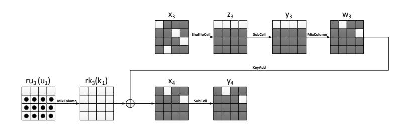
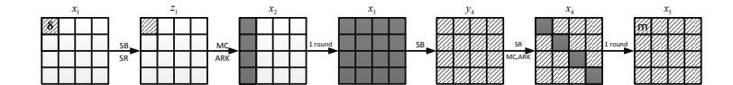
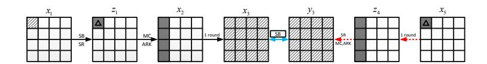
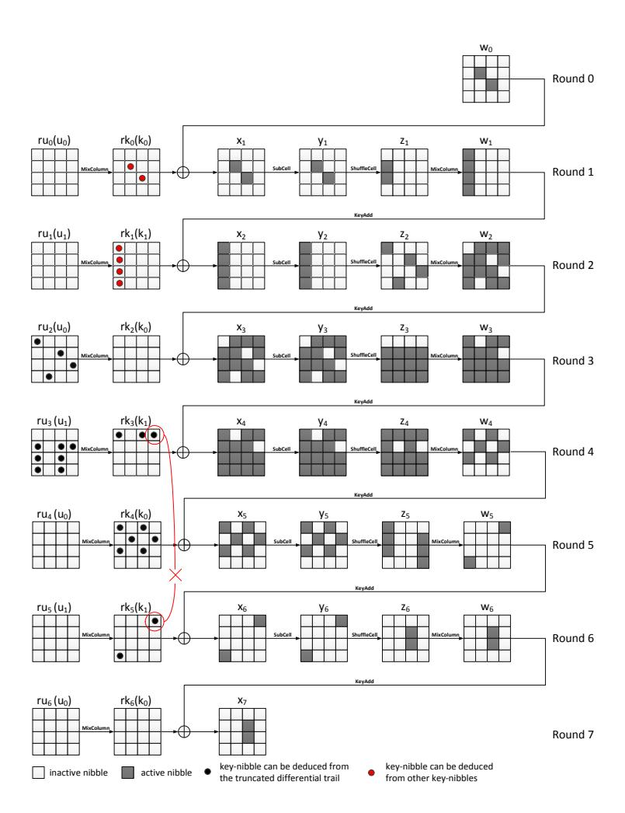
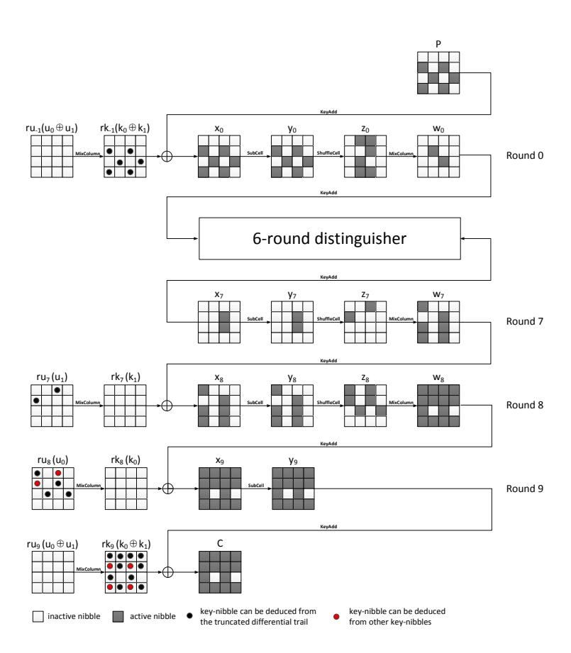
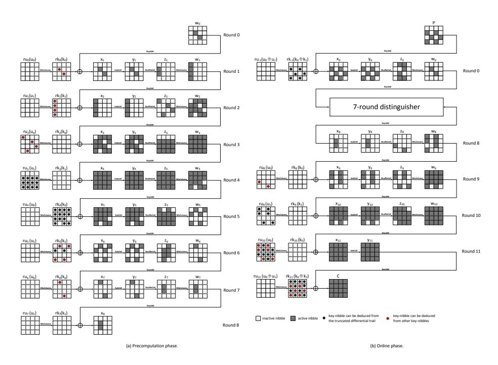

# Meet-in-the-Middle Attacks on Reduced-Round Midori-64

Li Lin and Wenling Wu

Trusted Computing and Information Assurance Laboratory, Institute of Software, Chinese Academy of Sciences, Beijing 100190, China {linli, wwl}@tca.iscas.ac.cn

Abstract. Midori is a lightweight block cipher designed by Banik et al. at ASIACRYPT 2015. One version of Midori uses a 64-bit state, another uses a 128-bit state and we denote these versions Midori-64 and Midori-128. Each of these versions uses a 128-bit key. In this paper, we focus on the key-recovery attacks on reduced-round Midori-64 with meet-in-themiddle method. We use the differential enumeration technique and keydependent sieve technique which are popular to analyze AES to attack Midori-64. We propose a 6-round distinguisher, and achieve a 10-round attack with time complexity of 299.5 10-round Midori-64 encryptions, data complexity of 261.5 chosen-plaintexts and memory complexity of 2 92.7 64-bit blocks. After that, by adding one round at the end, we get an 11-round attack with time complexity of 2122 11-round Midori-64 encryptions, data complexity of 253 chosen-plaintexts and memory complexity of 289.2 64-bit blocks. Finally, with a 7-round distinguisher, we get an attack on 12-round Midori-64 with time complexity of 2125.5 12 round Midori-64 encryptions, data complexity of 255.5 chosen-plaintexts and memory complexity of 2106 64-bit blocks. To the best of our knowledge, this is recently the best attack on Midori-64.

Keywords: Block Cipher, Meet-in-the-Middle Attack, Midori-64.

# 1 Introduction

In the past few years, lightweight cryptography has become a popular research discipline with a number of ciphers and hash functions proposed. The goals of these ciphers range from minimizing the hardware area [\[2,](#page-15-0)[17,](#page-16-0)[16\]](#page-16-1) to low latency[\[3\]](#page-15-1). However, the optimization goal of low energy for block cipher design has not attached much attention. At ASIACRYPT 2015, Banik et al. present a new lightweight block cipher Midori that is optimized with respect to the energy consumed by the circuit per bit in encryption or decryption operation [\[1\]](#page-15-2). Midori is based on the Substitution-Permutation Network (SPN). One version of Midori uses a 64-bit state, another uses a 128-bit state and we denote these versions Midori-64 and Midori-128. Each of these versions uses a 128-bit key.

Meet-in-the-middle attack is first proposed by Diffie and Hellman to attack DES [\[9\]](#page-15-3). In recent years, it is widely researched due to its effectiveness against block cipher AES [\[4\]](#page-15-4). For AES, Gilbert and Minier show in [\[11\]](#page-15-5) some collision attacks on 7-round AES. At FSE 2008, Demirci and Sel¸cuk improve the Gilbert and Minier attacks using meet-in-the-middle technique instead of collision idea. More specifically, they show that the value of each byte of 4-round AES ciphertext can be described by a function of the δ-set, i.e. a set of 256 plaintexts where a byte (called active byte) can take all values and the other 15 bytes are constant, parameterized by 25 [\[6\]](#page-15-6) and 24 [\[7\]](#page-15-7) 8-bit parameters. The last improvement is due to storing differences instead of values. This function is used to build a distinguisher in the offline phase, i.e. they build a lookup table containing all the possible sequences constructed from a δ-set. In the online phase, they identify a δ-set, and then partially decrypt the δ-set through some rounds and check whether it belongs to the table. At ASIACRYPT 2010, Dunkelman, Keller and Shamir develop many new ideas to solve the memory problems of the Demirci and Sel¸cuk attacks [\[10\]](#page-15-8). First of all, they only store multiset, i.e. an unordered sequence with multiplicity, rather than the ordered sequence. The second and main idea is the differential enumeration technique which uses a special property on a truncated differential trail to reduce the number of parameters that describes the set of functions from 24 to 16. Furthermore, Derbez, Fouque and Jean present a significant improvement to the Dunkelman et al.'s differential enumeration technique at EUROCRYPT 2013 [\[8\]](#page-15-9), called efficient tabulation. Using this rebound-like idea, they show that many values in the precomputation table are not reached at all under the constraint of a special truncated differential trail. Actually, the size of the precomputation table is determined by 10 byte-parameters only. At FSE 2014, Li et al. introduce the key-dependent sieve technique, which filters the wrong states based on the key relations, to further reduce the complexity in the precomputaion phase [\[13\]](#page-15-10). Then they give an attack on 9-round AES-192. In [\[14\]](#page-16-2), Li et al. give an attack on 10-round AES-256 with differential enumeration technique and key-dependent sieve technique.

Our contributions. In this paper, we carefully study and apply the variants of Derbez et al. attack on Midori-64. With the differential enumeration technique and key-dependent sieve technique, we present a 6-round distinguisher on Midori-64. Based on this distinguisher, we add 1 round at the beginning and 3 rounds at the end to present a 10-round meet-in-the-middle attack on Midori-64. The time complexity of this attack is 299.5 10-round Midori-64 encryptions, the data complexity is 261.5 chosen-plaintexts and the memory complexity is 292.7 64-bit blocks. After that, by adding one round at the end, we get an 11-round attack with time complexity of 2122 11-round Midori-64 encryptions, data complexity of 253 chosen-plaintexts and memory complexity of 289.2 64-bit blocks. To the best of our knowledge, this is recently the best attack on Midori-64. Finally, with a 7-round distinguisher, we get an attack on 12-round Midori-64 with time complexity of 2125.5 12-round Midori-64 encryptions, data complexity of 255.5 chosen-plaintexts and memory complexity of 2106 64-bit blocks.

Organizations of this paper. The rest of this paper is organized as follows. In section [2,](#page-2-0) we provide a brief description of Midori-64, some definitions and properties, a brief recall of the previous meet-in-the-middle distinguisher and the attack scheme. In section [3,](#page-6-0) we give our attack on 10-round Midori-64. In section 4, we give our attack on 11-round Midori-64. In section 5, we give our attack on 12-round Midori-64. In section 6, we conclude this paper.

### 2 Preliminaries

In this section we give a short description of Midori-64 and gives some definitions and propositions used throughout this paper. Then we briefly recall the previous meet-in-the-middle distinguisher. Finally, the attack scheme is given.

# 2.1 Description of Midori-64

Midori is a lightweight block cipher designed by Banik et al. at ASIACRYPT 2015 [1] and is based on the Substitution-Permutation Network (SPN). One version of Midori uses a 64-bit state, another uses a 128-bit state and we denote these versions Midori-64 and Midori-128. Each of these versions uses a 128-bit key. In this paper, we focus on the 64-bit version of Midori, so we describe it here. The Midori-64 block cipher operates on 64-bit state, and uses the following  $4\times 4$  array called state as a data expression:

$$S = \begin{pmatrix} s_0 \ s_4 \ s_8 \ s_{12} \\ s_1 \ s_5 \ s_9 \ s_{13} \\ s_2 \ s_6 \ s_{10} \ s_{14} \\ s_3 \ s_7 \ s_{11} \ s_{15} \end{pmatrix}$$

where the size of each cell is 4 bits.

A Midori-64 round applies the following four operations to the state matrix:

- **SubCell:** Apply the non-linear  $4 \times 4$  S-box in parallel on each nibble of the state.
- **ShuffleCell:** Each nibble of the state is preformed as follows:  $(s_0, s_1, \dots, s_{15}) \leftarrow (s_0, s_{10}, s_5, s_{15}, s_4, s_{11}, s_1, s_9, s_3, s_{12}, s_6, s_7, s_{13}, s_2, s_8).$
- MixColumn: Midori-64 utilizes an involutive binary matrix M defined as follows:

$$\mathbf{M} = \begin{pmatrix} 0 & 1 & 1 & 1 \\ 1 & 0 & 1 & 1 \\ 1 & 1 & 0 & 1 \\ 1 & 1 & 1 & 0 \end{pmatrix}$$

**M** is applied to every 4-nibble column of the state S, i.e.  ${}^{t}(s_{i}, s_{i+1}, s_{i+2}, s_{i+3}) \leftarrow \mathbf{M} \cdot {}^{t}(s_{i}, s_{i+1}, s_{i+2}, s_{i+3})$  and i = 0, 4, 8, 12.

- **KeyAdd:** The  $i^{th}$  64-bit round key  $rk_i$  is xored to a state S.

Before the first round, an additional KeyAdd operation is applied, and in the last round the ShuffleCell and MixColumn operations are omitted. The total round number of Midori-64 is 16.

The key-schedule of Midori-64 is quite simple. A 128-bit secret key K is denoted as two 64-bit keys  $k_0$  and  $k_1$  as  $K = k_0 || k_1$ . Suppose we focus on

Midori-64 reduced to R-round, the whiten key and the last sub-key are  $rk_{-1} = rk_{R-1} = k_0 \oplus k_1$ , and the sub-key for round i is  $rk_i = k_{(i \mod 2)} \oplus \alpha_i$ , where  $0 \le i \le R - 2$  and  $\alpha_i$  is a constant.

In this paper, the plaintext is denoted by P, the ciphertext is denoted by C. Let  $x_i, y_i, z_i$  and  $w_i$  denote the intermediate states before SubCell, ShuffleCell, MixColumn and KeyAdd operations of round i.  $x_i[j]$  denotes the  $j^{th}$  nibble of round i.  $x_i^k[j]$  denotes the  $k^{th}$  element of a set of some  $x_i[j]$ .  $\Delta x_i^k[j]$  denotes the difference of the  $k^{th}$  element and  $0^{th}$  element of a set, i.e.  $\Delta x_i^k[j] = x_i^k[j] \oplus x_i^0[j]$ .

In some cases, we are interested in interchanging the order of the MixColumn and KeyAdd operations. As these operations are linear, they can be interchanged by first xoring the data with an equivalent key  $ru_i = MixColumn^{-1}(rk_i)$  and then applying the MixColumn operation. And we denote the intermediate state after xoring with  $u_i$  by  $\overline{w_i}$ . We also denote  $u_i = MixColumn^{-1}(k_i)$ , where i = 0, 1.

# 2.2 Definitions and Propositions

In [4], Daemen et al. first proposed the definition of  $\delta$ -set of byte. After that,  $\delta$ -set was used in the meet-in-the-middle attacks on AES and other ciphers. In [12], Li et al. extended the definition of  $\delta$ -set to T active cells, and got T- $\delta$ -set. In this paper, we use 2- $\delta$ -set which defines as follows.

**Definition 1 (2-\delta-set).** Let a 2- $\delta$ -set be a set of  $2^{2\times 4}$  states that are all different in two state nibbles (active nibbles) and all equal in the other state nibbles (inactive nibbles).

In [5], Daemen et al. gave the definition of super S-box for AES. For Midori, we can give a similar definition as follows.

**Definition 2 (Super S-box).** For each value of one column of  $rk_3$ , a Midori Super S-box maps one column of  $z_3$  to one column of  $y_4$  as shown in Fig. 1. It consists of one SubCell operation, one MixColumn operation, one KeyAdd operation and one SubCell operation.

Fig. 1. Super S-box for Midori-64.

For one S-box, we have the following proposition.

Proposition 1 (Differential Property of S-box, [\[8\]](#page-15-9)). Given ∆i and ∆0 two non-zero differences, the equation of S-box

$$S(x) \oplus S(x \oplus \Delta_i) = \Delta_0, \tag{1}$$

has one solution in average.

This proposition also applies to super S-box.

Proposition 2 (Differential Property of Super S-box). Given ∆i and ∆0 two non-zero differences in F2 16 , the equation of super S-box

$$Super - S(x) \oplus Super - S(x \oplus \Delta_i) = \Delta_0, \tag{2}$$

has one solution in average for each key value.

For rui , we have the following proposition.

Proposition 3. As shown in Fig. [1,](#page-3-0) if the first column of z3 is active only in the last 3 nibbles, Proposition [2](#page-4-0) holds for each equivalent sub-key ru3[1, 2, 3].

Proof. We use the equivalent sub-key in this proof. For each y4[0, 1, 2, 3] and ru3[1, 2, 3], since ∆y4[0, 1, 2, 3] is known, one can get w3[0, 1, 2, 3] and ∆w3[0, 1, 2, 3]. With the probability of 2−4 , y3[0, 1, 2, 3] is active only in the last 3 nibbles. By adding ru3[1, 2, 3], one can get ∆z3[1, 2, 3].

Therefore, for each ∆i and ∆0, the average number of input values of Super S-box is 216−12−4 = 1 for each equivalent sub-key.

### 2.3 Reviews of Former Works

In this section, we review the previously meet-in-the-middle distinguishers on AES in [\[6](#page-15-6)[,10,](#page-15-8)[8\]](#page-15-9).

Demirci and Sel¸cuk distinguisher. Consider the set of functions

$$f: \{0,1\}^8 \longrightarrow \{0,1\}^8$$

that maps a byte of a δ-set to another byte of the state after four AES rounds. A convenient way is to view f as an ordered byte sequence (f(0), . . . , f(255)) so that it can be represented by 256 bytes. The crucial observation made by the generalizing Gilbert and Minier attacks [\[11\]](#page-15-5) is that this set is tiny since it can be described by 25 byte-parameters (225·8 = 2200) compared with the set of all functions of this type which counts as may as 28·2 8 = 22048 elements [\[6\]](#page-15-6). Considering the differences (f(0) − f(0), f(1) − f(0), . . . , f(255) − f(0)) rather than values, the set of functions can be described by 24 parameters [\[7\]](#page-15-7). The 24 byte-parameters which map x1[0] to ∆x5[0] are presented as gray cells in Fig. [2.](#page-5-0)

Dunkelman et al. distinguisher and Derbez et al. distinguisher. In [\[10\]](#page-15-8), Dunkelman et al. introduced two new improvements to further reduce the memory complexity of [\[7\]](#page-15-7). The first uses multiset which is an unordered sequence with multiplicity to replace ordered sequence in the offline phase, since there is enough information so that the attack succeeds. The second improvement uses

Fig. 2. The 4-round AES distinguisher used in [\[7\]](#page-15-7). The gray cells represent 24 byteparameters, δ represents the δ-set and m represents the differential sequence to be stored.

a novel idea named differential enumeration technique. The main idea of this technique is to use a special 4-round property on a truncated differential trail to reduce the number of parameters which describes the set of functions from 24 to 16.

In [\[8\]](#page-15-9), Derbez et al. used the efficient tabulation to improve Dunkelman et al.'s differential enumeration technique. Combining with the rebound-like idea, many values in the precomputation table are not reached at all under the constraint of a truncated differential trail.

Proposition 4 (Efficient Tabulation , [\[8\]](#page-15-9)). If a message of δ-set belongs to a pair conforming to the 4-round truncated differential trail outlined in Fig. [3,](#page-5-1) the values of multiset are only determined by 10 byte-parameters of intermediate state ∆z1[0]||x2[0, 1,

2, 3]||∆x5[0]||z4[0, 1, 2, 3] presented as gray cells in this figure.

Fig. 3. The truncated differential trail of 4-round AES used in [\[6\]](#page-15-6), the gray cells represent 10 byte-parameters, ∆ represents difference.

The main idea of their works is that suppose one get a pair of messages conforming to this truncated differential trail, the differences ∆x3 and ∆y3 can be determined by these 10 byte-parameters. By Proposition [1,](#page-3-1) part of the 24 byteparameters in the Demirci and Sel¸cuk distinguisher, i.e. x3, can be determined.

### 2.4 Attack Scheme

In this section, we present a unified view of the meet-in-the-middle attack, where R rounds of block cipher can be split into three consecutive parts: r1, r, and r2, such that a particular set of messages may verify a certain property that we denote ? in the sequel in the middle r rounds as shown in Fig. [4.](#page-6-1)

The general attack scheme uses two successive phases:

### Precomputation phase

**Fig. 4.** General scheme of meet-in-the-middle attack, where some messages in the middle rounds may verify a certain  $\star$  property used to perform the meet-in-the-middle method.

1. In the precomputation phase, we build a lookup table T containing all the possible sequences constructed from a 2- $\delta$ -set such that one message verifies a truncated differential trail.

#### Online phase

- 2. In the online phase, we need to identify a  $2-\delta$ -set containing a message m verifying the desired property. This is done by using a large number of plaintexts and ciphertexts, and expecting that for each key candidate, there is one pair of plaintexts satisfying the truncated differential trail.
- 3. Finally, we partially decrypt the associated 2- $\delta$ -set through the last  $r_2$  rounds and check whether it belongs to T.

#### 3 Meet-in-the-Middle Attack on 10-Round Midori-64

In this section, we first propose a 6-round meet-in-the-middle distinguisher with differential enumeration technique and key-dependent sieve technique on Midori-64. Then, we apply this distinguisher to 10-round Midori-64 by adding 1 round at the beginning and 3 rounds at the end.

#### 3.1 6-Round Distinguisher on Midori-64

Since  $w_6[9] = z_6[8] \oplus z_6[10] \oplus z_6[11]$  and  $w_6[10] = z_6[8] \oplus z_6[9] \oplus z_6[11]$ , we have  $w_6[9] \oplus w_6[10] = z_6[9] \oplus z_6[10]$ . Let  $e_{in} = z_6[9] \oplus z_6[10]$  and  $e_{out} = x_7[9] \oplus x_7[10]$ , then  $e_{out} = e_{in} \oplus rk_6[9] \oplus rk_6[10]$ , the 6-round distinguisher on Midori-64 is based on the proposition below.

**Proposition 5.** Let  $\{w_0^0, w_0^1, \dots, w_0^{255}\}$  be a 2- $\delta$ -set where  $w_0[5]$  and  $w_0[10]$  are the active nibbles. Consider the encryption of the first 33 values  $(w_0^0, w_0^1, \dots, w_0^{33})$  of the 2- $\delta$ -set through  $\delta$ -round Midori- $\delta 4$ , in the case of that a message of the 2- $\delta$ -set belongs to a pair which conforms to the truncated differential trail outlined in Fig. 5, then the corresponding 128-bit ordered sequence  $(e_{out}^1 \oplus e_{out}^0, e_{out}^2 \oplus e_{out}^0, \dots, e_{out}^{32} \oplus e_{out}^0)$  only takes about  $2^{104}$  values (out of the  $2^{128}$  theoretically values).

*Proof.* As shown in Fig. 5, for the encryption of the first 33 values of the 2- $\delta$ -set, the output sequence  $(e^1_{out} \oplus e^0_{out}, e^2_{out} \oplus e^0_{out}, \cdots, e^{32}_{out} \oplus e^0_{out})$  is determined by

the 42 nibble-parameters:

$$w_0[5,10]||x_1[5,10]||x_2[0,1,2,3]||x_3[1,2,3,4,5,6,8,10,11,12,13,15]|| (3)$$

$$x_4[0,1,2,3,5,6,7,8,9,10,11,12,14,15]||rk_4[0,2,5,8,10,13]||rk_5[3,12]$$

At round 1, since  $\Delta x_1^m[5,10] = \Delta w_0^m[5,10]$  (0 <  $m \le 33$ ), we can get  $z_1[1,2]$  by the knowledge of  $x_1[5,10]$ . Since the ShuffleCell, MixColumn and KeyAdd operations are linear,  $\Delta x_2^m[0,1,2,3]$  can be got. Similarly,  $\Delta y_2^m[0,1,2,3]$  can be got by the knowledge of  $x_2[0,1,2,3]$ ,  $\Delta y_3^m[1,2,3,4,5,6,8,10,11,12,13,15]$  can be got by the knowledge of  $x_3[1,2,3,4,5,6,8,10,11,12,13,15]$ ,  $\Delta y_4^m[0,1,2,3,5,6,7,8,9,10,11,12,14,15]$  can be got by the knowledge of  $x_4[0,1,2,3,5,6,7,8,9,10,11,12,14,15]$ ,  $\Delta y_5^m[0,2,5,8,10,13]$  can be got by the knowledge of  $x_4[0,1,2,3,5,6,7,8,9,10,11,12,14,15]$ ,  $\Delta y_5^m[0,2,5,8,10,13]$  can be got by the knowledge of  $x_4[0,2,5,8,10,13]$ , and  $\Delta z_6^m[9,10]$  can be got by the knowledge of  $x_5[3,12]$ . Then we get the value of  $e_{out}^m \oplus e_{out}^0$ . Since  $e_{out}^m \oplus e_{out}^0 \oplus e_{out}^0$ , we can get  $(e_{out}^1 \oplus e_{out}^1, e_{out}^2 \oplus e_{out}^1)$ .

However, if a pair of messages conforms to the truncated differential trail outlined in Fig. 5, the above 42 nibble-parameters are determined by the 27 nibble-parameters:

$$\Delta z_1[1,2]||x_2[0,1,2,3]||x_3[1,2,3,4,5,6,8,10,11,12,13,15]|| y_5[0,2,5,8,10,13]||y_6[3,12]||\Delta z_6[9]$$
 (4)

Since  $\Delta z_1[1,2]$  is known, we can get  $\Delta x_2[0,1,2,3]$ . Since  $\Delta y_2[0,1,2,3]$  can be got by the knowledge of  $x_2[0, 1, 2, 3]$ , we can get  $\Delta x_3[1, 2, 3, 4, 5, 6, 8, 10, 11, 12, 13, 13]$ 15], and  $\Delta x_4$ [0, 1, 2, 3, 5, 6, 7, 8, 9, 10, 11, 12, 14, 15] can be got by the knowledge of  $x_3[1,2,3,4,5,6,8,10,11,12,13,15]$ . For the backward direction, since  $\Delta w_6[8] =$  $\Delta z_6[9] \oplus \Delta z_6[10] \oplus \Delta z_6[11]$ ,  $\Delta z_6[11] = 0$  and  $\Delta w_6[8] = 0$ , we can get that  $\Delta z_6[9] = 0$  $\Delta z_6[10]$ . For the same reason as the forward direction,  $\Delta y_4[0,1,2,3,5,6,7,8,9,10,$ 11, 12, 14, 15] can be got by the knowledge of  $y_5[0, 2, 5, 8, 10, 13] ||y_6[3, 12]|| \Delta z_6[9]$ . According to Property 1, we get one value of intermediate state  $x_4[0, 1, 2, 3, 5, 6, 7,$ 8, 9, 10, 11, 12, 14, 15] on average for the fixed difference  $\Delta x_4[0, 1, 2, 3, 5, 6, 7, 8, 9,$ 10, 11, 12, 14, 15  $||\Delta y_4[0, 1, 2, 3, 5, 6, 7, 8, 9, 10, 11, 12, 14, 15]$ . Apparently,  $ru_2[0, 7, 9, 10, 11, 12, 14, 15]$  $9, 14|||rk_4|0, 2, 5, 8, 10, 13|||rk_5|3, 12|$  is also deduced for every 27 nibble-parameters. Since  $z_3[13, 14, 15]$  is known,  $w_3[12]$  can be got. Then  $rk_3[12]$  can be deduced for the reason that  $rk_3[12] = x_4[12] \oplus w_3[12]$ . According to the key-schedule of Midori-64,  $rk_3[12]$  and  $rk_5[12]$  are affected by the same nibble of  $k_1$ . By the key-dependent sieve technique, there are  $2^{104}$  possible values for the 27 nibbleparameters.

Since  $z_3[1,2,3]$  and  $x_4[0,1,2,3]$  are known,  $ru_3[1,2,3]$  can be got. According to the key-schedule,  $rk_3[3]$  can be got by the knowledge of  $rk_5[3]$ . Since  $rk_3[3] = ru_3[0] \oplus ru_3[1] \oplus ru_3[2]$ ,  $ru_3[0]$  can be got. Then  $rk_3[0,1,2,3]$  can be got. After that, we can deduce  $rk_1[0,1,2,3]$ . We can also deduce  $rk_0[5,10]$  from  $rk_4[5,10]$ . Therefore, we can get  $w_0[5,10]$  and  $x_1[5,10]$  from  $x_2[0,1,2,3]$ .

So the 42 nibble-parameters (3) are determined by 27 nibble-parameters (4), i.e. the sequence  $(e^1_{out} \oplus e^0_{out}, e^2_{out} \oplus e^0_{out}, \cdots, e^{32}_{out} \oplus e^0_{out})$  can take about  $2^{104}$  values.

#### 3.2 Attack on 10-Round Midori-64

The attack is made up of two phase: precomputation phase and online phase. **Precomputation phase:** In the precomputation phase, we need to build a table that contains all the sequence  $(e^1_{out} \oplus e^0_{out}, e^2_{out} \oplus e^0_{out}, \cdots, e^{32}_{out} \oplus e^0_{out})$  described in Propostion 6.

- 1. Guess  $y_6[12]||y_5[2,8,13]$ , and compute  $x_6[12]$  and  $w_5[12]$ . Deduce  $rk_5[12]$  from  $x_6[12]||w_5[12]$ . Store  $y_5[2,8,13]$  in a table  $T_1$  with the index of  $rk_5[12]||y_6[12]$ . There are about  $2^8$  values of  $y_5[2,8,13]$  for each index.
- 2. For each 48-bit  $ru_3[1, 2, 3, 5, 6, 7, 9, 10, 11, 13, 14, 15]$ , do the following steps.
  - (a) Guess  $\Delta z_6[9]$ . Since  $\Delta w_6[8] = \Delta z_6[11] = 0$ , we can deduce  $\Delta z_6[10]$ . Deduce  $rk_5[12]$  from  $ru_3[13,14,15]$ . Guess  $y_6[3,12]||y_5[0,5,10]$ , look up the table  $T_1$  to get about  $2^8$  values of  $y_5[2,8,13]$  by the index of  $rk_5[12]||y_6[12]$ . Then compute  $x_5[0,2,5,8,10,13]||\Delta x_5[0,2,5,8,10,13]$ . Deduce  $rk_5[3]$  from  $y_6[3]$  and  $y_5[0,5,10]$ , then deduce  $rk_1[0,1,2,3]$  from  $rk_5[3]$  and  $ru_3[1,2,3]$ . Store  $rk_1[0,1,2,3]||x_5[0,2,5,8,10,13]$  in a table  $T_2$  with the index of  $\Delta x_5[0,2,5,8,10,13]$ . There are about  $2^8$  values for each index.
  - (b) For all  $2^{40}$  values of  $\Delta y_2[0,1,2,3]$  and  $\Delta x_5[0,2,5,8,10,13]$ , deduce  $\Delta x_3$  and  $\Delta y_4$ . According to Proposition 3, we can get  $x_3[1,2,3,4,5,6,8,10,11,12,13,15]$  and  $y_4[0,1,2,3,5,6,7,8,9,10,11,12,14,15]$ . Then compute  $w_4[0,2,5,8,10,13]$ , and store  $x_3[1,2,3,4,5,6,8,10,11,12,13,15]||x_4[0,1,2,3,5,6,7,8,9,10,11,12,14,15]||w_4[0,2,5,8,10,13]||\Delta x_5[0,2,5,8,10,13]$  in a table  $T_3$  with the index of  $\Delta y_2[0,1,2,3]$ . There are about  $2^{24}$  values for each index.
  - (c) For each  $\Delta z_1[1,2]||x_2[0,1,2,3]|$ , do the following sub-steps:
    - i. Compute  $\Delta y_2[0,1,2,3]$  from  $\Delta z_1[1,2]$  and  $x_2[0,1,2,3]$ . Then look up the table  $T_3$  to get about  $2^{24}$  values  $x_3[1,2,3,4,5,6,8,10,11,12,13,15]||$   $x_4[0,1,2,3,5,6,7,8,9,10,11,12,14,15]||w_4[0,2,5,8,10,13]||\Delta x_5[0,2,5,8,10,13].$  For each of these values, look up the table  $T_2$  to get about  $2^8$  values  $rk_1[0,1,2,3]||x_5[0,2,5,8,10,13].$  Deduce  $rk_4[0,2,5,8,10,13]$  from  $x_5[0,2,5,8,10,13]$  and  $w_4[0,2,5,8,10,13]$ , then deduce  $rk_0[5,10]$  from  $rk_4[5,10]$ . Compute  $x_1[5,10]$  from  $rk_1[0,1,2,3]$  and  $x_2[0,1,2,3]$ , then compute  $w_0[5,10]$  from  $x_1[5,10]$  and  $rk_0[5,10]$ . Therefore, we get the 42 nibble-parameters (3).
    - ii. Compute the sequence  $(e_{out}^1 \oplus e_{out}^0, e_{out}^2 \oplus e_{out}^0, \cdots, e_{out}^{32} \oplus e_{out}^0)$ , and store them along with a 16-bit value  $ru_2[0, 9, 14] || ru_3[1]$  in a table  $T_4$ .
- 3. We build two tables  $T_5^0$  and  $T_5^2$  for online phase. As shown in Fig. 6, for column 0, guess  $\Delta C[0,1,2,3]||\Delta z_8[0,1]$ , and deduce  $\Delta x_9[0,1,2,3]$  and  $\Delta y_9[0,1,2,3]$ . By Proposition 1, we can deduce  $y_9[0,1,2,3]$ . Guess C[1,3],  $rk_9[1,3]$  can be got. One can deduce  $rk_{-1}[1,3]$  from  $rk_9[1,3]$ , and store  $x_9[0,1,2,3]||\Delta z_8[0,1]$  in a table  $T_5^0$  with the index of  $rk_{-1}[1,3]||\Delta C[0,1,2,3]||C[1,3]$ . There is one value for each index in average. Similarly, we can get a table  $T_5^2$  for column 2.

- 4. We build a table  $T_6$  for online phase. Guess  $x_7[9, 10]||\Delta x_7[9]$ , one can deduce  $\Delta y_7[9, 10]$  and  $y_7[9, 10]$  since  $\Delta x_7[9] = \Delta x_7[10]$ . Then  $\Delta x_8[0, 2, 3, 9, 10, 11]$  can be deduced. Guess  $\Delta y_8[0, 2, 3, 9, 10, 11]$ , then  $x_8[0, 2, 3, 9, 10, 11]$  and  $y_8[0, 2, 3, 9, 10, 11]$  can be deduced by Proposition 1. Deduce  $ru_7[1, 8]$  from  $x_7[9, 10]$  and  $x_8[0, 2, 3, 9, 10, 11]$ , and deduce  $ru_8[1, 8] \oplus ru_9[1, 8]$  from  $ru_7[1, 8]$ . Let  $\chi$  denote  $z_8[1, 8] \oplus ru_8[1, 8] \oplus ru_9[1, 8]$ . Store  $y_8[0, 2, 3, 9, 10, 11]||ru_7[1, 8]$  in a table  $T_6$  with the index of  $\chi||\Delta z_8[0, 1, 6, 8, 9, 14]$ . There are  $2^4$  values for each index
- 5. We build another table  $T_7$  for online phase. For all 36-bit sub-keys  $ru_7[1,8]||$   $ru_8[0,1,6,8,9,14]$ , decrypt all 24-bit values  $\overline{w_8}[0,1,6,8,9,14]$  and obtain the value  $e_{out}$ . Store  $e_{out}$  with the index of  $ru_7[1,8]||ru_8[0,1,6,8,9,14]||\overline{w_8}[0,1,6,8,9,14]$  in a table  $T_7$ .

Online phase: In the online phase of the attack, we first find at least one pair which satisfies the truncated differential trail in Fig. 5. To find the right pair, instead of guessing the sub-keys and checking whether this pair satisfy the truncated differential trail, we deduce the sub-keys which make it satisfy the truncated differential trail for each pair. Then we identify the  $2-\delta$ -set, caculate the sequence  $(e_{out}^1 \oplus e_{out}^0, e_{out}^2 \oplus e_{out}^0, \cdots, e_{out}^{32} \oplus e_{out}^0)$  and check whether it belongs to the table  $T_4$ . Finally, we use  $ru_2[0, 9, 14]||ru_3[1]$  to filter the reminding keys and retrieve the correct key.

- 1. Define a structure of  $2^{24}$  plaintexts where P[1,3,6,9,11,14] take all the possible values, and the remaining 10 nibbles are fixed to some constants. Hence, we can generate  $2^{24} \times (2^{24} 1)/2 \approx 2^{47}$  pairs satisfying the plaintext difference. Choose  $2^{29}$  structures to get about  $2^{29+47} = 2^{76}$  pairs. As shown in Fig. 6, the probability to get the truncated differential trail in the forward and backward direction is  $2^{(2-6+1-16)\times 4} = 2^{-76}$ , then about 1 pair follows the truncated differential trail for each guess of the key. Among the  $2^{76}$  pairs, we expect about  $2^{76-8} = 2^{68}$  pairs to verify that  $\Delta C[6,14] = 0$ .
- 2. For each of the  $2^{68}$  remaining pairs, we do the following sub-steps.
  - (a) Guess  $\Delta w_0[5, 10]$ , and deduce  $\Delta y_0[1, 3, 6, 9, 11, 14]$ . According to Proposition 1,  $x_0[1, 3, 6, 9, 11, 14]$  can be got from  $\Delta y_0[1, 3, 6, 9, 11, 14]$  and  $\Delta P[1, 3, 6, 9, 11, 14]$ . Then  $rk_{-1}[1, 3, 6, 9, 11, 14]$  can be got.
  - (b) For each of the  $2^8$  deduced sub-key in (a), encrypt the plaintext pair and get the value  $w_0[4, 6, 7, 8, 9, 11]$ . Change the value of  $w_0[5, 10]$  to be  $(0, 1, \dots, 32)$  and compute their corresponding plaintexts  $(P^0, P^1, \dots, P^{32})$ , then get the corresponding ciphertexts.
  - (c) For each of the deduced  $rk_{-1}[1,3,6,9,11,14]$ , compute  $rk_{9}[1,3]$  (resp.  $rk_{9}[9,11]$ ). Look up the table  $T_{5}^{0}$  (resp.  $T_{5}^{2}$ ) to get about one value  $x_{9}[0,1,2,3]||\Delta z_{8}[0,1]$  (resp.  $x_{9}[8,9,10,11]||\Delta z_{8}[8,9]$ ) with the index of  $rk_{-1}[1,3]||\Delta C[0,1,2,3]||C[1,3]$  (resp.  $rk_{-1}[9,11]||\Delta C[8,9,10,11]||C[9,11]$ ). Deduce  $rk_{9}[0,2]$  (resp.  $rk_{9}[8,10]$ ) from the ciphertext.
  - (d) Guess  $\Delta z_8[6, 14]$ , and deduce  $\Delta x_9[4, 5, 7, 12, 13, 15]$ . Then  $rk_9[4, 5, 7, 12, 13, 15]$  and  $x_9[4, 5, 7, 12, 13, 15]$  can be got. Deduce  $ru_9[1, 8]$  from  $rk_9[0, 2, 3, 9, 10, 11]$ , and deduce  $\overline{w_8}[1, 8]$  from  $x_9[0, 2, 3, 9, 10, 11]$ . Then we can get  $\chi' = ru_9[1, 8] \oplus \overline{w_8}[1, 8]$ , i.e.  $\chi' = z_8[1, 8] \oplus ru_8[1, 8] \oplus ru_9[1, 8]$ . Look up the

- table  $T_6$  to get about  $2^4$  values  $y_8[0,2,3,9,10,11]||ru_7[1,8]$  with the index of  $\chi'||\Delta z_8[0,1,6,8,9,14]$ . Deduce  $ru_8[0,1,6,8,9,14]$  from  $y_8[0,2,3,9,10,11]$  and  $x_9[0,1,2,3,4,5,7,8,9,10,11,12,13,15]$ .
- (e) For about  $2^{20}$  values  $rk_{-1}[1, 3, 6, 9, 11, 14]||rk_9[0, 1, 2, 3, 4, 5, 7, 8, 9, 10, 11, 12, 13, 15]||ru_8[0, 1, 6, 8, 9, 14]||ru_7[1, 8]$  we have got, decrypt the corresponding ciphertexts we made in (b) and get  $(e^1_{out} \oplus e^0_{out}, e^2_{out} \oplus e^0_{out}, \cdots, e^{32}_{out} \oplus e^0_{out})$  using  $T_7$ . Check whether it lies in the precomputation table  $T_4$ . If not, try another one. If so, we check whether  $ru_2[0, 9, 14]||ru_3[1]$  matches  $ru_8[0, 9, 14]||ru_7[1]$ . So the probability for a wrong sub-key to pass this test is  $2^{-24-16} = 2^{-40}$ .
- 3. In the end, there are about  $2^{22\times 4-40}=2^{44}$  sub-keys remaining. Then exhaustively search for the  $2^{44}$  sub-keys and 10 unknown key-nibbles to recover the master key.

Complexity analysis. In the precomputation phase, in order to construct  $T_4$ , we need to perform  $2^{104}$  partial encryptions on 33 messages. The time complexity of this phase is about  $2^{104+5-2}=2^{107}$  10-round Midori-64 encryptions, the memory complexity is about  $2^{104+7.2-6}=2^{105.2}$  64-bit blocks. In the online phase, we need to perform  $2^{20+68}$  partial encryptions on 33 messages. The time complexity of this phase is about  $2^{88+5-3} = 2^{90}$  10-round Midori-64 encryptions, the data complexity is  $2^{24+29} = 2^{53}$  chosen-plaintexts and the memory complexity is 253 64-bit blocks. With data/time/memory tradeoff, the adversary only need to precompute a fraction of  $2^{-8.5}$  of possible sequences, then the time complexity becomes  $2^{107-8.5} = 2^{98.5}$ , the memory complexity becomes  $2^{96.7}$  64-bit blocks. But in the online phase, the adversary will repeat the attack  $2^{8.5}$  times to offset the probability of the failure. So the data complexity increases to  $2^{61.5}$ chosen-plaintexts, and the time complexity increases to  $2^{90+8.5} = 2^{98.5}$ . Otherwise, we can divide the whole attack into series of weak-key attacks according to the relations between the subkeys in the online phase and the precomputation phase as Li et al. presented in [13]. Using the relation of  $ru_3[1]$  (step 2) in the precomputation phase) and  $ru_7[1]$  (step 4 in the precomputation phase and step 2(d) in the online phase), the attack can be divided into 24 weak-key attacks. The memory complexity can be reduced by a fraction of  $2^{-4}$ . In total, the time complexity of this attack is 299.5 10-round Midori-64 encryptions, the data complexity is  $2^{61.5}$  chosen-plaintexts and the memory complexity is  $2^{92.7}$ 64-bit blocks.

### 4 Attack on 11-Round Midori-64

Based on the 10-round attack, we can add one round at the end to mount an 11-round attack on Midori-64.

The precomputation is almost the same as the 10-round attack except the following steps.

1. At step 3, we need to build four tables  $T_5^i$   $(i = 0, \dots, 3)$ . As shown in Fig. 7, for column 0, guess  $\Delta C[0, 1, 2, 3] ||\Delta z_9[0, 1, 2, 3]$ , and deduce  $\Delta x_{10}[0, 1, 2, 3]$

- and  $\Delta y_{10}[0,1,2,3]$ . By Proposition 1, we can deduce  $y_{10}[0,1,2,3]$ . Guess C[1,3],  $rk_{10}[1,3]$  can be got. One can deduce  $rk_{-1}[1,3]$  from  $rk_{10}[1,3]$ , and store  $x_{10}[0,1,2,3]||\Delta z_{9}[0,1,2,3]$  in a table  $T_{5}^{0}$  with the index of  $rk_{-1}[1,3]||\Delta C[0,1,2,3]||C[1,3]$ . There are  $2^{8}$  values for each index in average. Similarly, we can get one table  $T_{5}^{i}$  for column i ( $i=1,\cdots,3$ ), and there are  $2^{8}$  values for each index in each table.
- 2. At step 4, Guess  $x_7[9,10]||\Delta x_7[9]$ , one can deduce  $\Delta y_7[9,10]$  and  $y_7[9,10]$  since  $\Delta x_7[9] = \Delta x_7[10]$ . Then  $\Delta x_8[0,2,3,9,10,11]$  can be deduced. Guess  $\Delta y_8[0,2,3,9,10,11]||\Delta y_9[0,1,2,3,4,5,7,8,9,10,11,12,13,15]$ , then  $x_8[0,2,3,9,10,11]$  and  $y_8[0,2,3,9,10,11]$  can be deduced by Proposition 1, and  $x_9[0,1,2,3,4,5,7,8,9,10,11,12,13,15]$  can be also deduced by Proposition 1. Deduce  $ru_7[1,8]$  from  $x_7[9,10]$  and  $x_8[0,2,3,9,10,11]$ , and deduce  $ru_8[0,1,6,8,9,14]$  from  $y_8[0,2,3,9,10,11]$  and  $x_9[0,1,2,3,4,5,7,8,9,10,11,12,13,15]$ . Deduce  $ru_{10}[1,8]$  from  $ru_{7}[1,8]$  and  $ru_{8}[1,8]$ , and deduce  $ru_{10}[0,1,6,8,9,14] \oplus ru_{10}[0,1,6,8,9,14] \oplus ru_{10}[0,1,6,8,9,14] \oplus ru_{10}[0,1,6,8,9,14] \oplus ru_{10}[0,1,6,8,9,14]$  in a table  $T_6$  with the index of  $ru_{10}[1,8]||x||\Delta z_{9}[0,1,2,3,5,6,7,8,9,10,12,13,14,15]$ . There are  $2^4$  values for each index. We can also reduce the size of  $T_6$  by dividing it into small tables.
- 3. Besides, we need to build two more tables for online phase. For all 28-bit sub-keys  $ru_9[0,2,5,7,9,12,14]$ , decrypt all 28-bit values  $\overline{w_9}[0,2,5,7,9,12,14]$  and obtain  $\overline{w_8}[0,1,6]$ . Store  $\overline{w_8}[0,1,6]$  with the index of  $ru_9[0,2,5,7,9,12,14]||$   $\overline{w_9}[0,2,5,7,9,12,14]$  in a table  $T_8^0$ . For all 28-bit sub-keys  $ru_9[1,3,6,8,10,13,15]$ , decrypt all 28-bit values  $\overline{w_9}[1,3,6,8,10,13,15]$  and obtain  $\overline{w_8}[8,9,14]$ . Store  $\overline{w_8}[8,9,14]$  with the index of  $ru_9[1,3,6,8,10,13,15]||\overline{w_9}[1,3,6,8,10,13,15]$  in a table  $T_8^1$ .

The online phase is different from the 10-round attack at step 2(c), 2(d) and 2(e). And since all nibbles of ciphertext are active, we should try all the  $2^{76}$  pairs.

- 1. At step 2(c), for each of the deduced  $rk_{-1}[1,3]$ , compute  $rk_{10}[1,3]$ . Look up the table  $T_5^0$  to get about  $2^8$  values  $x_{10}[0,1,2,3]||\Delta z_9[0,1,2,3]$  with the index of  $rk_{-1}[1,3]||\Delta C[0,1,2,3]||C[1,3]$ . Deduce  $rk_{10}[0,2]$  from the ciphertext. Do the same things to column i and  $T_5^i$  (i=1,2,3), and deduce about  $2^{32}$  values  $rk_{10}||x_{10}||\Delta z_9[0,1,2,3,5,6,7,8,9,10,12,13,14,15]$ .
- 2. At step 2(d), deduce  $ru_{10}[0, 1, 6, 8, 9, 14]$  from  $rk_{10}$ , and deduce  $\overline{w_9}[0, 1, 6, 8, 9, 14]$  from  $x_{10}$ . Then we can get  $\chi' = ru_{10}[0, 1, 6, 8, 9, 14] \oplus \overline{w_9}[0, 1, 6, 8, 9, 14]$ , i.e.  $\chi' = z_9[0, 1, 6, 8, 9, 14] \oplus ru_9[0, 1, 6, 8, 9, 14] \oplus ru_{10}[0, 1, 6, 8, 9, 14]$ . Look up the table  $T_6$  to get about  $2^4$  values  $y_9[0, 1, 2, 3, 4, 5, 7, 8, 9, 10, 11, 12, 13, 15]||$   $ru_7[1, 8]||ru_8[0, 1, 6, 8, 9, 14]$  with the index of  $ru_{10}[1, 8]||\chi'||\Delta z_9[0, 1, 2, 3, 5, 6, 7, 8, 9, 10, 12, 13, 14, 15]$ . Deduce  $ru_9[0, 1, 2, 3, 5, 6, 7, 8, 9, 10, 12, 13, 14, 15]$  from  $y_9[0, 1, 2, 3, 4, 5, 7, 8, 9, 10, 11, 12, 13, 15]$  and  $x_{10}$ .
- 3. At step 2(e), for about  $2^{44}$  values  $rk_{-1}[1,3,6,9,11,14]||rk_{10}||ru_9[0,1,2,3,5,6,7,8,9,10,12,13,14,15]||ru_8[0,1,6,8,9,14]||ru_7[1,8]|$  we have got, decrypt

the corresponding ciphertexts we made in (b) and get  $(e_{out}^1 \oplus e_{out}^0, e_{out}^2 \oplus e_{out}^0, \cdots, e_{out}^{32} \oplus e_{out}^0)$  using  $T_7$ ,  $T_8^0$  and  $T_8^1$ . Check whether it lies in the precomputation table  $T_4$ . If not, try another one. If so, we check whether  $ru_2[0,9,14]||ru_3[1]$  matches  $ru_8[0,9,14]||ru_7[1]$ . So the probability for a wrong sub-key to pass this test is  $2^{-24-16} = 2^{-40}$ .

Complexity analysis. The time complexity of the precomputation phase is the same as the 10-round attack. In the online phase, we need to perform  $2^{44+76}$  partial encryptions on 33 messages. The time complexity of this phase is about  $2^{120+5-3} = 2^{122}$  11-round Midori-64 encryptions, the data complexity is  $2^{24+29} = 2^{53}$  chosen-plaintexts and the memory complexity is  $2^{53}$  64-bit blocks. Otherwise, we can divide the whole attack into series of weak-key attacks according to the relations between the subkeys in the online phase and the precomputation phase as Li et al. presented in [13]. Using the relation of  $ru_2[0,9,14]||ru_3[1]$  (precomputation phase) and  $ru_8[0,9,14]||ru_7[1]$  (online phase), the attack can be divided into  $2^{16}$  weak-key attacks. The memory complexity can be reduced by a fraction of  $2^{-16}$ . In total, the time complexity of this attack is  $2^{122}$  11-round Midori-64 encryptions, the data complexity is  $2^{53}$  chosen-plaintexts and the memory complexity is  $2^{89.2}$  64-bit blocks.

# 5 Attack on 12-round Midori-64

In this section, we first propose a 7-round meet-in-the-middle distinguisher with differential enumeration technique and key-dependent sieve technique on Midori-64. Then, we apply this distinguisher to 12-round Midori-64 by adding 1 round at the beginning and 4 rounds at the end.

#### 5.1 7-Round Distinguisher on Midori-64

Since  $w_7[5] = z_7[4] \oplus z_7[6] \oplus z_7[7]$  and  $w_7[6] = z_7[4] \oplus z_7[5] \oplus z_7[7]$ , we have  $w_7[5] \oplus w_7[6] = z_7[5] \oplus z_7[6]$ . Let  $e_{in} = z_7[5] \oplus z_7[6]$  and  $e_{out} = x_8[5] \oplus x_8[6]$ , then  $e_{out} = e_{in} \oplus rk_7[5] \oplus rk_7[6]$ , the 7-round distinguisher on Midori-64 is based on the proposition below.

**Proposition 6.** Let  $\{w_0^0, w_0^1, \cdots, w_0^{255}\}$  be a 2- $\delta$ -set where  $w_0[5]$  and  $w_0[10]$  are the active nibbles. Consider the encryption of the first 33 values  $(w_0^0, w_0^1, \cdots, w_0^{33})$  of the 2- $\delta$ -set through 7-round Midori-64, in the case of that a message of the 2- $\delta$ -set belongs to a pair which conforms to the truncated differential trail outlined in Fig. 8(a), then the corresponding 128-bit ordered sequence  $(e_{out}^1 \oplus e_{out}^0, e_{out}^2 \oplus e_{out}^1)$  only takes about  $2^{124}$  values (out of the  $2^{128}$  theoretically values).

*Proof.* As shown in Fig. 8(a), for the encryption of the first 33 values of the 2- $\delta$ -set, the output sequence  $(e_{out}^1 \oplus e_{out}^0, e_{out}^2 \oplus e_{out}^0, \cdots, e_{out}^{32} \oplus e_{out}^0)$  is determined

by the 58 nibble-parameters:

$$w_0[5,10]||x_1[5,10]||x_2[0,1,2,3]||x_3[1,2,3,4,5,6,8,10,11,12,13,15]||x_4| (5)$$

$$rk_4[0,1,2,3,4,5,6,8,9,10,11,12,13,15]||rk_5[1,3,4,9,11,12]||rk_6[4,11]|$$

However, if a pair of messages conforms to the truncated differential trail outlined in Fig. 8(a), the above 58 nibble-parameters are determined by the 41 nibble-parameters:

$$\Delta z_1[1,2]||x_2[0,1,2,3]||x_3[1,2,3,4,5,6,8,10,11,12,13,15]||$$

$$y_5[0,1,2,3,4,5,6,8,9,10,11,12,13,15]||y_6[1,3,4,9,11,12]||y_7[4,11]||\Delta z_7[5]$$
(6)

Meanwhile,  $ru_2[0,7,9,14]||ru_3[1,2,3,5,6,7,9,10,11,13,14,15]||rk_4[0,1,2,3,4,5,6,8,9,10,11,12,13,15]||rk_5[1,3,4,9,11,12]||rk_6[4,11]$  can be determined by the above 41 nibble-parameters. Since  $ru_4[0,7,9,14]$  can be deduced from  $rk_4[0,1,2,3,4,5,6,8,9,10,11,12,13,15]$ ,  $rk_3[4,12]$  can de deduced from  $ru_3[5,6,7,13,14,15]$  and  $rk_3[3,11]$  can be deduced from  $ru_3[1,2,3,9,10,11]||ru_5[1,9]$ , according to the key-schedule of Midori-64,  $ru_2[0,7,9,14]||rk_3[3,4,11,12]||rk_6[4,11]$  and  $ru_4[0,7,9,14]||rk_5[3,4,11,12]||rk_4[4,11]$  are affected by the same nibbles of the master key. By the key-dependent sieve technique, there are  $2^{124}$  possible values for the 41 nibble-parameters.

So the 58 nibble-parameters (5) are determined by 41 nibble-parameters (6), i.e. the sequence  $(e^1_{out} \oplus e^0_{out}, e^2_{out} \oplus e^0_{out}, \cdots, e^{32}_{out} \oplus e^0_{out})$  can take about  $2^{124}$  values.

#### 5.2 12-Round Attack on Midori-64

The attack is made up of two phase: precomputation phase and online phase. **Precomputation phase:** In the precomputation phase, we need to build a table that contains all the sequence  $(e^1_{out} \oplus e^0_{out}, e^2_{out} \oplus e^0_{out}, \cdots, e^{32}_{out} \oplus e^0_{out})$  described in Propostion 6.

- 1. For each 120-bit value  $\Delta z_2[0,7,9,14]||\Delta w_4[0,1,2,3,4,5,6,8,9,10,11,12,13,15]||ru_3[1,2,3,5,6,7,9,10,11,13,14,15],$  deduce  $x_3[1,2,3,4,5,6,8,10,11,12,13,15]||y_4$  by Proposition 3. Compute  $\overline{w_2}[0,7,9,14]$  and  $z_4[0,7,9,14]$ , and let  $\varsigma_1=\overline{w_2}[0,7,9,14]\oplus z_4[0,7,9,14]$ . Deduce  $rk_3[4,12]$  from  $ru_3[5,6,7,13,14,15]$ , and let  $\varsigma_2=rk_3[4,12]||ru_3[1,9]\oplus ru_3[3,11]$ . Store  $x_3[1,2,3,4,5,6,8,10,11,12,13,15]||x_4||w_4[0,1,2,3,4,5,6,8,9,10,11,12,13,15]$  in a table  $T_1$  with the index of  $w_4[4,11]||\varsigma_1||\varsigma_2||\Delta z_2[0,7,9,14]||\Delta w_4[0,1,2,3,4,5,6,8,9,10,11,12,13,15]$ . There are  $2^8$  values for each index.
- 2. For each 92-bit value  $\Delta z_7[5]||\Delta x_7[4,11]||\Delta x_6[1,3,4,9,11,12]||\Delta w_4[0,1,2,3,4,5,6,8,9,10,11,12,13,15],$  deduce  $\Delta z_7[6]$  since  $\Delta z_7[6] = \Delta z_7[5],$  then deduce  $x_7[4,11], x_6[1,3,4,9,11,12]$  and  $x_5[0,1,2,3,4,5,6,8,9,10,11,12,13,15]$  by Proposition 1. Deduce  $rk_6[4,11]$  and  $rk_5[1,3,4,9,11,12].$  Store  $x_5[0,1,2,3,4,5,6,8,9,10,11,12,13,15]||rk_6[4,11]||rk_5[1,3,4,9,11,12]||\Delta w_4[0,1,2,3,4,5,6,8,9,10,11,12,13,15]$  in a table  $T_2$ .

- 3. For each 24-bit value  $\Delta z_1[1,2]||\Delta y_2[0,1,2,3]|$ , deduce  $y_2[0,1,2,3]$ . Store  $y_2[0,1,2,3]||\Delta z_2[0,7,9,14]|$  in a table  $T_3$ .
- 4. For each value of table  $T_2$  and  $T_3$ , do the following steps.
  - (a) Compute  $w_4[4,11]$  from  $rk_5[4,11]$  and  $x_5[4,11]$ , and compute  $\varsigma_1'=z_2[0,7,9,14]\oplus\overline{w_4}[0,7,9,14]$  from  $y_2[0,1,2,3]$  and  $x_5[0,1,2,3,4,5,6,8,9,10,11,12,13,15]$ . Deduce  $\varsigma_2'=rk_3[4,12]||ru_3[1,9]\oplus ru_3[3,11]$  from  $rk_5[1,3,4,9,11,12]$ . Look up the table  $T_1$  to get about  $2^8$  values of  $x_3[1,2,3,4,5,6,8,10,11,12,13,15]||x_4||w_4[0,1,2,3,4,5,6,8,9,10,11,12,13,15]$  with the index of  $w_4[4,11]||\varsigma_1'||\varsigma_2'||\Delta z_2[0,7,9,14]||\Delta w_4[0,1,2,3,4,5,6,8,9,10,11,12,13,15]$ ,  $rk_1[0,1,2,3]$  and  $rk_0[5,10]$ , then deduce  $x_1[5,10]$  and  $w_0[5,10]$ . Therefore, we get the 58 nibble-parameters (5).
  - (b) Compute the sequence  $(e_{out}^1 \oplus e_{out}^0, e_{out}^2 \oplus e_{out}^0, \cdots, e_{out}^{32} \oplus e_{out}^0)$ , and store them along with a 60-bit value  $ru_4[0, 1, 2, 7, 8, 9, 10, 11, 14] || ru_3[0, 1, 7, 8, 9, 15]$  in a table  $T_4$ .

The online phase and the construction of tables  $T_5^i$  ( $i = 0, \dots, 3$ ),  $T_6$ ,  $T_7$ ,  $T_8^0$  and  $T_8^1$  are almost the same as the 11-round attack except the position of nibbles. The procedure of this phase is shown in Fig. 8(b).

Therefore, the time complexity of the precomputation phase is  $2^{124+5-2} = 2^{127}$  12-round Midori-64 encryptions, the memory complexity is  $2^{124+7\cdot 2-6} = 2^{125\cdot 2}$  64-bit blocks. The time complexity of the online phase is about  $2^{120+5-3} = 2^{122}$  12-round Midori-64 encryptions, the data complexity is  $2^{24+29} = 2^{53}$  chosenplaintexts and the memory complexity is  $2^{53}$  64-bit blocks. By data/time/memory tradeoff and weak-key attacks, the time complexity of this attack is about  $2^{125.5}$  12-round Midori-64 encryptions, the data complexity is  $2^{55.5}$  chosen-plaintexts and the memory complexity is  $2^{106}$  64-bit blocks1.

# 6 Conclusions and Further Work

In this paper, we discussed the security of Midori-64 against meet-in-the-middle attacks. Using the differential enumeration technique and key-dependent sieve technique, we proposed a 6-round meet-in-the-middle distinguisher on Midori-64. Based on this distinguisher, we added 1 round at the beginning and 3 rounds at the end to present a 10-round attack with time complexity of  $2^{99.5}$  10-round Midori-64 encryptions, data complexity of  $2^{61.5}$  chosen-plaintexts and memory complexity of  $2^{92.7}$  64-bit blocks. After that, by adding one round at the end, we got an 11-round attack with time complexity of  $2^{122}$  11-round Midori-64 encryptions, data complexity of  $2^{53}$  chosen-plaintexts and memory complexity of  $2^{89.2}$  64-bit blocks. Finally, with a 7-round distinguisher, we got an attack on 12-round Midori-64 with time complexity of  $2^{125.5}$  12-round Midori-64 encryptions, data complexity of  $2^{55.5}$  chosen-plaintexts and memory complexity of  $2^{106}$  64-bit blocks.

&lt;sup>1 The memory comes from the construction of  $T_1$

There are many further works possible: the way to apply this kind of attacks to Midori-128, the way to get better attack complexity with meet-in-the-middle method and the security level against other cryptanalytic methods (e.g. impossible differential and zero-correlation linear) for Midori.

# Acknowledgements

The research presented in this paper is supported by the National Basic Research Program of China (No. 2013CB338002) and National Natural Science Foundation of China (No. 61272476, No.61232009 and No. 61202420).

# References

- 1. Subhadeep Banik, Andrey Bogdanov, Takanori Isobe, Kyoji Shibutani, Harunaga Hiwatari, Toru Akishita, and Francesco Regazzoni. Midori: A Block Cipher for Low Energy (Extended Version). Cryptology ePrint Archive, Report 2015/1142, 2015. <http://eprint.iacr.org/>.
- 2. Andrey Bogdanov, Lars R Knudsen, Gregor Leander, Christof Paar, Axel Poschmann, Matthew JB Robshaw, Yannick Seurin, and Charlotte Vikkelsoe. PRESENT: An Ultra-Lightweight Block Cipher. Springer, 2007.
- 3. Julia Borghoff, Anne Canteaut, Tim Gneysu, Elif Bilge Kavun, Miroslav Knezevic, Lars R. Knudsen, Gregor Leander, Ventzislav Nikov, Christof Paar, and Christian Rechberger. PRINCE C A Low-Latency Block Cipher for Pervasive Computing Applications. Springer Berlin Heidelberg, 2012.
- 4. Joan Daemen and Vincent Rijmen. The Design of Rijndael: AES-the Advanced Encryption Standard. Springer, 2002.
- 5. Joan Daemen and Vincent Rijmen. Understanding two-round differentials in aes. In Security and Cryptography for Networks, pages 78–94. Springer, 2006.
- 6. H¨useyin Demirci and Ali Aydın Sel¸cuk. A Meet-In-the-Middle Attack on 8-Round AES. In Fast Software Encryption, pages 116–126. Springer, 2008.
- 7. H¨useyin Demirci, ˙Ihsan Ta¸skın, Mustafa C¸ oban, and Adnan Baysal. Improved Meet-in-the-Middle Attacks on AES. In Progress in Cryptology-INDOCRYPT 2009, pages 144–156. Springer, 2009.
- 8. Patrick Derbez, Pierre-Alain Fouque, and J´er´emy Jean. Improved Key Recovery Attacks on Reduced-Round AES in the Single-Key Setting. In Advances in Cryptology–EUROCRYPT 2013, pages 371–387. Springer, 2013.
- 9. Whitfield Diffie and Martin E Hellman. Special Feature Exhaustive Cryptanalysis of the NBS Data Encryption Standard. Computer, 10(6):74–84, 1977.
- 10. Orr Dunkelman, Nathan Keller, and Adi Shamir. Improved Single-Key Attacks on 8-Round AES-192 and AES-256. In Advances in Cryptology-ASIACRYPT 2010, pages 158–176. Springer, 2010.
- 11. Henri Gilbert and Marine Minier. A Collisions Attack on the 7-Rounds Rijndael. In In AES Candidate Conference. Citeseer, 2000.
- 12. Leibo Li, Keting Jia, and Xiaoyun Wang. Improved Meet-in-the-Middle Attacks on AES-192 and PRINCE. IACR Cryptology ePrint Archive, 2013:573, 2013.
- 13. Leibo Li, Keting Jia, Xiaoyun Wang, et al. Improved Single-Key Attacks on 9- Round AES-192/256. In FSE 2014 (21st International Workshop on Fast Software Encryption), 2014.

- 14. Rongjia Li and Chenhui Jin. Meet-in-the-Middle Attacks on 10-Round AES-256. Designs, Codes and Cryptography, pages 1–13, 2015.
- 15. Li Lin, Wenling Wu, Yanfeng Wang, and Lei Zhang. General Model of the Single-Key Meet-in-the-Middle Distinguisher on the Word-oriented Block Cipher. In Information Security and Cryptology–ICISC 2013, pages 203–223. Springer, 2014.
- 16. Tomoyasu Suzaki, Kazuhiko Minematsu, Sumio Morioka, and Eita Kobayashi. TWINE: A Lightweight Block Cipher for Multiple Platforms. In Selected Areas in Cryptography, pages 339–354. Springer, 2013.
- 17. Wenling Wu and Lei Zhang. Lblock: A Lightweight Block Cipher. In Applied Cryptography and Network Security, pages 327–344. Springer, 2011.

Fig. 5. The truncated differential trail of 6-round Midori-64.

Fig. 6. Online phase of the attack on 10-round Midori-64.

Fig. 7. Online phase of the attack on 11-round Midori-64.

Fig. 8. The attack on 12-round Midori-64. The 7-round distinguisher is shown in (a), the online phase is shown in (b).