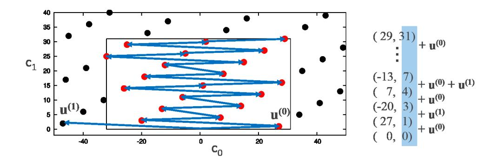
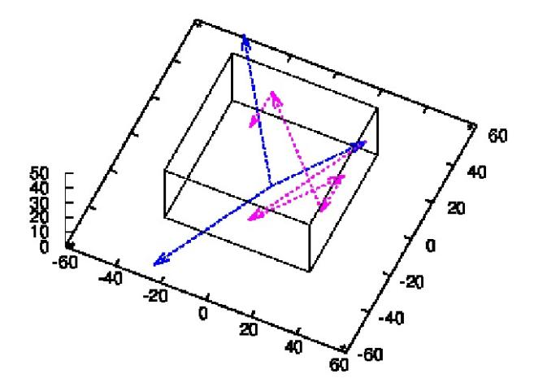

#### **A construction of 3-dimensional lattice sieve for number field sieve over GF(***p n***)** *⋆*

Kenichiro Hayasaka<sup>1</sup> , Kazumaro Aoki<sup>2</sup> , Tetsutaro Kobayashi<sup>2</sup> , and Tsuyoshi Takagi<sup>3</sup>

> Mitsubishi Electric, Japan NTT Secure Platform Laboratories, Japan Kyushu University, Japan

**Abstract.** The security of pairing-based cryptography is based on the hardness of solving the discrete logarithm problem (DLP) over extension field GF(*p n* ) of characteristic *p* and degree *n*. Joux et al. proposed an asymptotically fastest algorithm for solving DLP over GF(*p n* ) (JLSV06-NFS) as the extension of the number field sieve over prime field GF(*p*) (JL03-NFS). The lattice sieve is often used for a largescaled experiment of solving DLP over GF(*p*) by the number field sieve. Franke and Kleinjung proposed a 2-dimensional lattice sieve which efficiently enumerates all the points in a given sieve region of the lattice. However, we have to consider a sieve region of more than 2 dimensions in the lattice sieve of JLSV06-NFS. In this paper, we extend the Franke-Kleinjung method to 3-dimensional sieve region. We construct an appropriate basis using the Hermite normal form, which can enumerate the points in a given sieve region of the 3-dimensional lattice. From our experiment on GF(*p* <sup>12</sup>) of 303 bits, we are able to enumerate more than 90% of the points in a sieve region in the lattice generated by special-q. Moreover, we implement the number field sieve using the proposed 3-dimensional lattice sieve. Our implementation of the JLSV06 over GF(*p* 6 ) of 240 bits is about as efficient as that of the current record over GF(*p* 6 ) using 3-dimensional line sieve by Zajac.

### **1 Introduction**

Let GF(*p <sup>n</sup>*) be a finite field of characteristic *p* and extension degree *n*. The security of pairingbased cryptography is based on the hardness of the discrete logarithm problem (DLP) over finite field GF(*p <sup>n</sup>*). Recently the complexity of solving the DLP over finite field of small characteristic *p* has been improved substantially [8, 1]. Thus we are interested in the pairing constructed over finite field of large characteristic in this paper. For example, the optimal ate pairing [21] that uses BN curves [3] and the Tate pairing that uses MNT curves [15] are two efficient classes of computing paring. The security of pairing-based cryptography using these pairings is based on the DLP over finite field GF(*p <sup>n</sup>*) of *n* = 12 and *n* = 6, respectively.

The number field sieve proposed by Joux et al. at CRYPTO '06 (JLSV06-NFS) [10] is the asymptotically fastest algorithm to solve DLP over GF(*p <sup>n</sup>*) whose characteristic *p* is large with respect to extension degree *n*. JLSV06-NFS is the extension of the number field sieve over a prime field GF(*p*) (JL03-NFS) [9] to an extension field GF(*p <sup>n</sup>*). In order to efficiently implement the number field sieve, we deploy a sieve technique such as the line sieve and the lattice sieve [17]. Recent experiments of JL03-NFS such as [11] show that the lattice sieve is more efficient for a large-scaled implementation to solve the DLP over prime field GF(*p*).

Franke and Kleinjung proposed an excellent algorithm which can effectively enumerate all the points in a sieve region of 2-dimensional lattice [5, 12]. The Franke-Kleinjung method constructs an appropriate basis (*u* (0) 0 *, u* (0) 1 ) <sup>T</sup>*,*(*u* (1) 0 *, u* (1) 1 ) <sup>T</sup> of the 2-dimensional lattice by the

*<sup>⋆</sup>* This work was carried out, when the first author was in the Graduate School of Mathematics, Kyushu University. The preliminary work [7] of this paper was published at the Computer Security Symposium, CSS 2014, held on October 22-24, 2014.

continued fraction expansion, which satisfies three conditions A1:  $|u_0^{(1)}| < I$  and  $|u_0^{(0)}| < I$ , A2:  $|u_0^{(0)} - u_0^{(1)}| \ge I$ , A3:  $u_1^{(0)} > 0$  and  $u_1^{(1)} > 0$ , where I is a bound of the sieve region. Interestingly, we can exhaustively enumerate all the points of the lattice region in the ascending order of v-coordinate just by repeatedly adding  $(u_0^{(0)}, u_1^{(0)})$  or  $(u_0^{(1)}, u_1^{(1)})$ . On the other hand, in the lattice sieve of JLSV06-NFS over extension field  $\mathrm{GF}(p^n)$ , we have to consider the lattice sieve of more than 2 dimensions in general. However, the Franke-Kleinjung method is restricted to the lattice of 2 dimensions due to its construction using the continued fraction expansion.

In this paper, we propose an extension of the Franke-Kleinjung method to 3-dimensional case. We classify the basis of a 3-dimensional lattice generated from special- $\mathfrak q$  by Hermite normal form. There are three different classes. The first one is an orthogonal basis, and we simply apply the line sieve in this lattice. The second one contains a two-dimensional orthogonal projection that satisfies the above Conditions A1, A2 and A3, so that we are able to do the Franke-Kleinjung method of 2 dimensions to this lattice. The third one is a nontrivial case. We give the following conditions as a natural extension of the Franke-Kleinjung method. Indeed we constructs a basis  $\mathbf u^{(0)}=(u_0^{(0)},u_1^{(0)},u_2^{(0)})^{\mathrm T},\ \mathbf u^{(1)}=(u_0^{(1)},u_1^{(1)},u_2^{(1)})^{\mathrm T},\ \mathbf u^{(2)}=(u_0^{(2)},u_1^{(2)},u_2^{(2)})^{\mathrm T}$  of the 3-dimensional lattice, which satisfies four conditions:

```
\begin{array}{l} \text{B1: } |u_0^{(a)}| < I \text{ and } |u_1^{(a)}| < I \text{ for } a = 0,1,2, \\ \text{B2: } |u_0^{(b)} - u_0^{(c)}| \ge I \text{ or } |u_1^{(b)} - u_1^{(c)}| \ge I \text{ for all pairwise differences } (b,c) \in \{0,1,2\}^2, \\ \text{B3: } u_2^{(0)} \ge 0 \text{ and } u_2^{(1)} \ge 0 \text{ and } u_2^{(2)} \ge 0 \text{ and } u_2^{(0)} + u_2^{(1)} + u_2^{(2)} \ne 0. \\ \text{B4: } |i_0 u_0^{(0)} + i_1 u_0^{(1)} + i_2 u_0^{(2)}| \ge I \text{ or } |i_0 u_1^{(0)} + i_1 u_1^{(1)} + i_2 u_1^{(2)}| \ge I, \text{ if one of } i_0, i_1, i_2 \in \mathbb{Z} \text{ is negative and the others are positive or equal to } 0, \end{array}
```

where I is a bound of the sieve region. We present an algorithm that generates the basis that satisfies the above conditions assuming such a basis exists. Here we also propose an explicit algorithm that the points in the sieve region can be enumerated in the ascending order of  $u_2$ -coordinate just by repeatedly adding  $(u_0^{(0)}, u_1^{(0)}, u_2^{(0)}), (u_0^{(1)}, u_1^{(1)}, u_2^{(1)}), \text{ or } (u_0^{(2)}, u_1^{(2)}, u_2^{(2)})$ . Then we prove that all the points of the sieve region can be exhaustively enumerated by the proposed explicit algorithm.

In general the above conditions are not fulfilled in all lattices generated from special- $\mathfrak{q}$ , namely Condition B4 is not achieved due to some exceptional points in some lattices. Indeed, our experiment on  $\mathrm{GF}(p^{12})$  of 303 bits shows that we can generate the basis that satisfies the conditions with a probability of about 74% over 8,000 prime ideals on 10 special- $\mathfrak{q}s$ . However, our experiment in the same field using the proposed explicit algorithm confirms that we can enumerate more than 90% of points in a sieve region of 3-dimensional lattices generated from the same special- $\mathfrak{q}s$ , even though the basis does not satisfy the above conditions. From the proposed basis we are able to enumerate almost all the points in a sieve region of 3-dimensional lattice efficiently.

Finally, we compare the running time of our lattice sieve that uses the extension of Franke-Kleinjung method with the current record of  $GF(p^6)$  of 240 bits by Zajac [22].

This paper is organized as follows. In Section 2 we give a short overview of the number field sieve. Section 3 describes the line sieve and lattice sieve in multi-dimensions. In Section 4 we explained the lattice sieve proposed by Franke and Kleinjung. In Section 5 we propose an extension of Franke-Kleinjung method to the 3-dimensional lattice. Section 6 presents some data in our experiment on the number field sieve using the proposed lattice sieve. In Section 7 we state the concluding remarks and future works.

#### 2 The number field sieve over $GF(p^n)$ (JLSV06-NFS)

In this section, we describe an outline of the number field sieve over an extension field  $GF(p^n)$  proposed by Joux et al. [10] (JLSV06-NFS) that contains a sieve step implemented with the lattice sieve we focus in this paper.

In the polynomial selection step of JLSV06-NFS, we choose two irreducible polynomials  $f_1, f_2 \in \mathbb{Z}[X]$  s.t.  $f_1 \neq f_2$ , deg  $f_1 = n$ ,  $f_1$  are irreducible in GF(p) and  $f_1|f_2 \pmod{p}$ . Such a polynomial  $f_2$  can be generated by adding p to  $f_1$ . Then there exists a common root v of  $f_1(X) = 0$  and  $f_2(X) = 0$  in GF( $p^n$ ). Denote by  $\alpha_1, \alpha_2 \in \mathbb{C}$  a root of  $f_1(X) = 0$  and  $f_2(X) = 0$ , respectively. We also denote by  $\mathcal{O}_1$  and  $\mathcal{O}_2$  the ring of integers of the number fields  $\mathbb{Q}(\alpha_1)$  and  $\mathbb{Q}(\alpha_2)$ , respectively. For the orders  $\mathbb{Z}[\alpha_1] \subseteq \mathcal{O}_1$  and  $\mathbb{Z}[\alpha_2] \subseteq \mathcal{O}_2$ , there are homomorphism maps  $\phi_i : \mathbb{Z}[\alpha_i] \to \text{GF}(p^n)$ ,  $\alpha_i \mapsto v$  (i = 1, 2).

In the sieve step, we try to find many relations arisen from both  $\mathcal{O}_1$  and  $\mathcal{O}_2$ . In the beginning of this step, we choose the smoothness bound  $B_1, B_2 \in \mathbb{R}_{>0}$  and an integer  $t \geq 1$ . For the above polynomials  $f_1, f_2$  and a column vector  $\mathbf{a} = (a_0, a_1, \dots, a_t)^{\mathrm{T}} \in \mathbb{Z}^{t+1}$ , we define the norm of  $\mathbf{a}$  for  $f_i$  as  $N_i(\mathbf{a}) = N_i \left( \sum_{j=0}^t a_j \alpha_i^j \right) = |\mathrm{Res}(\sum_{j=0}^t a_j X^j, f_i(X))|$ , where  $\mathrm{Res}(f, g)$  denotes the resultant of two polynomials f and  $g \in \mathbb{Z}[X]$ .

Let the factor bases  $\mathcal{B}_1, \mathcal{B}_2$  be

$$\mathcal{B}_{i} = \left\{ \begin{array}{c} q: \text{ prime}, q \leq B_{i}, \\ g: \text{ irreducible monic polynomial in } \mathrm{GF}(q)[X], \\ g \mid f_{i} \bmod q, \ \deg g \leq t \right\} \end{array} \right\} (i = 1, 2).$$

We call a hit tuple  $\mathbf{a}=(a_0,a_1,\ldots,a_t)^{\mathrm{T}}\in\mathbb{Z}^{t+1}$  if  $\mathbf{a}$  satisfies following conditions:  $N_1$  ( $\mathbf{a}$ ) is  $B_1$ -smooth,  $N_2$  ( $\mathbf{a}$ ) is  $B_2$ -smooth and  $\sum_{j=0}^t a_j X^j$  is irreducible in  $\mathbb{Z}[X]$ . A hit tuple  $\mathbf{a}$  has a property  $(\sum_{j=0}^t a_j \alpha_i^j) \mathcal{O}_i = \prod_{\mathfrak{q}_{i,j} \in \mathcal{B}_i} \mathfrak{q}_{i,j}^{\varepsilon_{i,j}}$  for i=1 and 2, where  $\varepsilon_{i,j}$  is the exponent that we can compute from the prime decomposition of  $N_i$  ( $\mathbf{a}$ ) =  $\prod_{q: \mathrm{prime}, q \leq B_i} q^{e_q}$  for  $q \nmid [\mathcal{O}_i : \mathbb{Z}[\alpha_i]]$ .

From homomorphism maps  $\phi_1, \phi_2$  and a hit tuple **a**, we obtain the following relation of the discrete logarithm

$$\begin{split} \sum_{\mathfrak{q}_{1,j} \in \mathcal{B}_1} \varepsilon_{i,j} \log \phi_1(\mathfrak{q}_{1,j}) + \sum_{j=1}^{r_1} \lambda_{i,j} \log \varLambda_{1,j} &\equiv \\ \sum_{\mathfrak{q}_{2,j} \in \mathcal{B}_2} \varepsilon_{i,j} \log \phi_2(\mathfrak{q}_{2,j}) + \sum_{j=1}^{r_2} \lambda_{i,j} \log \varLambda_{2,j} \pmod{p^n-1}, \end{split}$$

where  $\log \phi_i(\mathfrak{q}_{i,j})$  and  $\log \Lambda_{i,j}$  are called the virtual logarithms [9, 20],  $\lambda_{i,j}$  is the character map proposed by Schirokauer [19] and  $r_i$  is the torsion-free rank of  $\mathcal{O}_i$  for i = 1, 2.

Let  $\mathcal{H}_a \subset \mathbb{Z}^{t+1}$  be the (t+1)-dimensional sieve region. In the sieve step, we find more than  $\sharp \mathcal{B}_1 + \sharp \mathcal{B}_2 + 2n$  hit tuples **a** in  $\mathcal{H}_a$ .

Finally, in the linear algebra step, we compute  $\log \phi_i(\mathfrak{q}_{i,j})$ ,  $\log \Lambda_{i,j} \pmod{p^n-1}$  by solving the linear system consists of the relations.

#### 3 Sieve in multi-dimensions

In the following we describe how to find relations of JLSV06-NFS using the line sieve and the lattice sieve in multi-dimensions discussed by Zajac in [23,6].

#### 3.1 Line sieve in multi-dimensions

In the sieve method, we search hit tuples  $\mathbf{a} = (a_0, a_1, \dots, a_t)^{\mathrm{T}}$  whose norm  $N_i$  (a) is divisible by  $q^{\deg g}$  for all  $\mathfrak{q} = (q, g) \in \mathcal{B}_i$ . Note that we have relationship

$$g(X) \left| \sum_{j=0}^{t} a_j X^j \mod q \right| \Rightarrow q^{\deg g} \left| N_i(\mathbf{a}) \right|.$$
 (1)

In the following we describe how to find the polynomials that satisfies the sufficient condition in (1), namely polynomials  $\sum_{j=0}^{t} a_j X^j$  divisible by  $g(X) \mod q$ .

Let  $I_d$  be an identity matrix of size  $d \times d$ . The set of all polynomials  $\sum_{j=0}^t a_j X^j$  in  $\mathbb{Z}[X]$  of degree less than or equal to t that is divisible by g(X) mod q is generated by the integer linear combination of the columns of the following matrix of size  $(t+1) \times (t+1)$ :

$$\begin{pmatrix}
qI_{\deg g} & g_0 & 0 \\
\vdots & \ddots & g_0 \\
\vdots & \ddots & \vdots \\
g_{\deg g} & \ddots & \vdots \\
0 & g_{\deg g}
\end{pmatrix},$$
(2)

where  $g_0, \ldots, g_{\deg g}$  are the coefficient of the polynomial  $g(X) = \sum_{j=0}^{\deg g} g_j X^j$ , respectively. Denote by  $M_{\mathfrak{q}}$  the Hermite normal form of this matrix, i.e.,

$$M_{\mathfrak{q}} = \left(\frac{qI_{\deg g} \mid T_{\mathfrak{q}}}{0 \mid I_{t-\deg q+1}}\right),\tag{3}$$

where  $T_{\mathfrak{q}}$  is an integer matrix whose size is  $\deg g \times (t - \deg g + 1)$ . Therefore we obtain the relationship

$$(a_0, a_1, \dots, a_{\deg g-1})^{\mathrm{T}} \equiv T_{\mathfrak{q}} (a_{\deg g}, a_{\deg g+2}, \dots, a_{t+1})^{\mathrm{T}} \mod q$$

for polynomial  $\sum_{j=0}^t a_j X^j$  divisible by  $g(X) \mod q$ . We namely can find the hit tuple  $\mathbf{a} = (a_0, a_1, \dots, a_t)^{\mathrm{T}}$  by repeatedly adding q to each entry of vector  $(a_0, a_1, \dots, a_{\deg q-1})^{\mathrm{T}}$ .

#### 3.2 Lattice sieve in multi-dimensions

The lattice sieve tries to find a candidate of hit tuples in the lattice whose points are divisible by  $\mathfrak{q} \in \mathcal{B}_i$  (i = 1, 2) (called special- $\mathfrak{q}$ ).

Let  $\mathfrak{r}=(r,h)\in\mathcal{B}_i(i=1,2)$  be a different element from  $\mathfrak{q}$ , and we define  $M_{\mathfrak{r}}$  and  $T_{\mathfrak{r}}$  be the matrix generated by the same method of Equation (3), where  $M_{\mathfrak{r}}$  and  $T_{\mathfrak{r}}$  are integer matrices whose sizes are  $(t+1)\times(t+1)$  and  $\deg h\times(t-\deg h+1)$ , respectively. Then we have the relationship  $(a_0,a_1,\ldots,a_{\deg h-1})^{\mathrm{T}}\equiv T_{\mathfrak{r}}\ (a_{\deg h},a_{\deg h+2},\ldots,a_{t+1})^{\mathrm{T}}\ \mathrm{mod}\ r$  for polynomial  $\sum_{j=0}^t a_j X^j$  divisible by h(X) mod r.

Next, let  $M_{\mathfrak{q}}^{\mathrm{LLL}}$  be the matrix generated by LLL reduction algorithm [14] from  $M_{\mathfrak{q}}$  of Equation (3). We decompose the  $(t+1)\times(t+1)$  matrix  $M_{\mathfrak{q}}^{\mathrm{LLL}}$  into the deg  $h\times(t+1)$  matrix  $M_{\mathfrak{q},1}^{\mathrm{LLL}}$  and the  $(t-\deg h+1)\times(t+1)$  matrix  $M_{\mathfrak{q},2}^{\mathrm{LLL}}$  as follows:

$$M_{\mathfrak{q}}^{\mathrm{LLL}} = \left(\frac{M_{\mathfrak{q},1}^{\mathrm{LLL}}}{M_{\mathfrak{q},2}^{\mathrm{LLL}}}\right). \tag{4}$$



**Fig. 1.** An example of an enumeration of lattice points with the generated basis  $\mathbf{u}^{(0)}, \mathbf{u}^{(1)}$  by the Franke-Kleinjung method on 2 dimensions

Then the solution  $\mathbf{x} \in \mathbb{Z}^{t+1}$  of  $(M_{\mathfrak{q},1}^{\mathrm{LLL}} - T_{\mathfrak{r}} M_{\mathfrak{q},2}^{\mathrm{LLL}})\mathbf{x} \equiv 0 \pmod{r}$  becomes a hit tuple in the lattice whose points divisible by  $\mathfrak{q}$ . We denote by  $M_{\mathfrak{q},\mathfrak{r}}$  the matrix whose columns are the basis of kernel of the linear map  $(M_{\mathfrak{q},1}^{\mathrm{LLL}} - T_{\mathfrak{r}} M_{\mathfrak{q},2}^{\mathrm{LLL}}) \pmod{r}$ , then  $M_{\mathfrak{q},\mathfrak{r}}$  becomes a matrix of size  $(t+1) \times (t+1)$ . The basis of  $M_{\mathfrak{q},\mathfrak{r}}$  can be generated by the algorithm proposed by Hayasaka et al. [6].

In the lattice sieve we run the points on lattice  $M_{\mathfrak{q},\mathfrak{r}}$  in the sieve region  $\mathcal{H}_c \subset \mathbb{Z}^{t+1}$  (**c**-space):

$$\mathcal{H}_c = \{(c_0, c_1, \dots, c_t)^{\mathrm{T}} \in \mathbb{Z}^{t+1} \mid -I/2 \le c_i < I/2 (i = 0, 1, \dots, t-1), 0 \le c_t < J\},\$$

where  $I, J \in \mathbb{Z}_{>0}$  and I is even. I, J are called the bound of sieve region. One of the main operations in the lattice sieve is to enumerate the points in the sieve region  $\mathcal{H}_c$  of lattice  $M_{\mathfrak{q},\mathfrak{r}}$ .

#### 4 The Franke-Kleinjung method in 2 dimensions

In this section, we explain how to efficiently enumerate the points in the two-dimensional lattice proposed by Franke and Kleinjung [5].

Let  $L_{\mathfrak{q},\mathfrak{r}}^2$  be the two-dimensional lattice generated by  $M_{\mathfrak{q},\mathfrak{r}}^2$  defined in Section 3.2 for the case of 2 dimension i.e. t=1. Let  $\mathbf{u}^{(0)}=(u_0^{(0)},u_1^{(0)})^{\mathrm{T}},\mathbf{u}^{(1)}=(u_0^{(1)},u_1^{(1)})^{\mathrm{T}}$  be the basis of  $L_{\mathfrak{q},\mathfrak{r}}^2$ . Let  $\mathcal{H}_c^2$  be the sieve region such that

$$\mathcal{H}_c^2 = \{(c_0, c_1)^{\mathrm{T}} \in \mathbb{Z}^2 \mid -I/2 \le c_0 < I/2, \ 0 \le c_1 < J\},\$$

where  $I, J \in \mathbb{Z}_{>0}$  and I is even.

The Franke-Kleinjung method enumerates the points in sieve region  $\mathcal{H}_c^2$  by a special basis  $\mathbf{u}^{(0)}, \mathbf{u}^{(1)}$  of lattice  $L_{\mathfrak{q},\mathfrak{r}}^2$ , which has the following good properties (See Figure 1 for an example:  $\mathbf{u}^{(1)} = (27,1)^{\mathrm{T}}$  and  $\mathbf{u}^{(0)} = (-47,2)^{\mathrm{T}}$  with I=64). (1) We can exhaustively compute all the points in  $\mathcal{H}_c^2 \cap L_{\mathfrak{q},\mathfrak{r}}^2$  by adding vector  $\mathbf{u}^{(0)}, \mathbf{u}^{(1)},$  or  $\mathbf{u}^{(0)} + \mathbf{u}^{(1)}$  recursively. (2) The second coordinate of the points in sieve region  $\mathcal{H}_c^2 \cap L_{\mathfrak{q},\mathfrak{r}}^2$  generated by the enumeration algorithm is monotonically increasing. Indeed we have the following theorem. We also show a proof which will be extended to the case of 3 dimensions in the proposed method in Section 5.

**Theorem 1** ((Franke-Kleinjung [5])). We assume that the basis  $\mathbf{u}^{(0)} = (u_0^{(0)}, u_1^{(0)})^{\mathrm{T}}, \mathbf{u}^{(1)} = (u_0^{(1)}, u_1^{(1)})^{\mathrm{T}}$  of lattice  $L_{\mathfrak{g},\mathfrak{x}}^2$  satisfies the following conditions:

A1:  $|u_0^{(0)}| < I$  and  $|u_0^{(1)}| < I$ , A2:  $|u_0^{(0)} - u_0^{(1)}| \ge I$ , A3:  $u_1^{(0)} > 0$  and  $u_1^{(1)} > 0$ . Let  $\mathbf{p} = (p_0, p_1)^{\mathrm{T}}$ ,  $\mathbf{q} = (q_0, q_1)^{\mathrm{T}}$  be points in  $\mathcal{H}_c^2 \cap L_{\mathfrak{q},\mathfrak{r}}^2$ . If  $q_1 > p_1$  holds, then  $\mathbf{q} = \mathbf{p} + i\mathbf{u}^{(0)} + j\mathbf{u}^{(1)}$  satisfies  $i \ge 0, j \ge 0$  and  $i + j \ne 0$ .

*Proof.* From  $\mathbf{p}, \mathbf{q} \in L^2_{\mathfrak{q},\mathfrak{r}}$ , then we have  $\mathbf{q} = \mathbf{p} + i\mathbf{u}^{(0)} + j\mathbf{u}^{(1)}$ ,  $q_0 = p_0 + iu_0^{(0)} + ju_0^{(1)}$  and  $q_1 = p_1 + iu_1^{(0)} + ju_1^{(1)}$ .

At first, both i=0 and j=0 can not be satisfied due to  $q_1>p_1$ . If i=0 and  $j\neq 0$  hold, then we obtain  $0< q_1-p_1=ju_1^{(1)}$  and thus j>0 from Condition A3. The assertion of the theorem is derived. Similarly, if  $i\neq 0$  and j=0 hold, then the theorem holds.

Next, we assume  $i \neq 0$  and  $j \neq 0$ . We will prove that i > 0 and j > 0 hold under the assumption of  $q_1 > p_1$  and  $\mathbf{p}, \mathbf{q} \in \mathcal{H}_c^2$ , i.e.,  $-I/2 \leq p_0 < I/2$  and  $-I/2 \leq q_0 < I/2$ . At first, if i < 0 and j < 0 hold, then we have  $iu_1^{(0)} + ju_1^{(1)} < 0$  from Condition A3. However, it contradicts from the assumption of  $q_1 > p_1$  due to  $q_1 - p_1 = iu_1^{(0)} + ju_1^{(1)}$ . Next, we consider the case that i and j have the different sign. Note that if  $u_0^{(0)}$  and  $u_0^{(1)}$  satisfy Conditions A1 and A2, then  $u_0^{(0)}u_0^{(1)} < 0$  holds. From  $u_0^{(0)}u_0^{(1)} < 0$ , we know that  $iu_0^{(0)}$  and  $ju_0^{(1)}$  have the same sign and  $|u_0^{(0)}| + |u_0^{(1)}| = |u_0^{(0)} - u_0^{(1)}|$ . Then we obtain  $|q_0 - p_0| = |iu_0^{(0)} + ju_0^{(1)}| = |iu_0^{(0)} + |u_0^{(1)}| = |u_0^{(0)} - u_0^{(1)}| \geq I$  from Condition A2. However, it contradicts  $|q_0 - p_0| < I$  from the assumption of  $\mathbf{p}, \mathbf{q} \in \mathcal{H}_c^2$ .

In the following, we denote by  $M_{\mathfrak{q},\mathfrak{r}}^{\mathrm{FK2}}$  the basis  $(\mathbf{u}^{(0)},\mathbf{u}^{(1)})$  that satisfies Conditions A1, A2 and A3 in Theorem 1. Franke and Kleinjung showed that the basis that satisfies Conditions A1, A2 and A3 in Theorem 1 can be generated by the continued fraction method shown in Algorithm 1.

From Theorem 1 Franke-Kleinjung proved the following theorem [5]. We also show the proof which is extended to the case of 3-dimensions.

**Theorem 2.** Let  $\mathbf{u}^{(0)} = (u_0^{(0)}, u_1^{(0)})^{\mathrm{T}}, \mathbf{u}^{(1)} = (u_0^{(1)}, u_1^{(1)})^{\mathrm{T}}$  be the basis of  $M_{\mathfrak{q},\mathfrak{r}}^{FK2}$ . Let  $\mathbf{p} = (p_0, p_1), \mathbf{q} = (q_0, q_1)$  be points in  $\mathcal{H}_c^2 \cap L_{\mathfrak{q},\mathfrak{r}}^2$ . If  $q_1$  is the smallest among all the points whose second coordinate is larger than  $p_1$ , then  $\mathbf{q}$  is one of the points  $\mathbf{p} + \mathbf{u}^{(0)}, \mathbf{p} + \mathbf{u}^{(1)},$  or  $\mathbf{p} + \mathbf{u}^{(0)} + \mathbf{u}^{(1)}$ .

Proof. From Theorem 1, we know that all the points, whose second coordinate is larger than  $p_1$  in  $\mathcal{H}_c^2 \cap L_{\mathfrak{q},\mathfrak{r}}^2$ , can be obtained by repeatedly adding  $\mathbf{u}^{(0)}$  or  $\mathbf{u}^{(1)}$ . Every time we add point  $\mathbf{u}^{(0)}$  or  $\mathbf{v}$ , then the second coordinate of the resulting point becomes larger from Condition A3. At first note that if  $\mathbf{p} + \mathbf{u}^{(0)}$  is contained in  $\mathcal{H}_c^2$ , then  $\mathbf{p} + \mathbf{u}^{(1)} \notin \mathcal{H}_c^2$  holds from Condition A2. Therefore, if  $\mathbf{p} + \mathbf{u}^{(0)} \in \mathcal{H}_c^2$  holds, then the second coordinate of  $\mathbf{p} + \mathbf{u}^{(0)}$  is the smallest among all points whose second coordinate is larger than  $p_1$  in  $\mathcal{H}_c^2 \cap L_{\mathfrak{q},\mathfrak{r}}^2$ . Similarly, we can prove the case of  $\mathbf{p} + \mathbf{u}^{(1)} \in \mathcal{H}_c^2$ . Finally, if both  $\mathbf{p} + \mathbf{u}^{(1)}$  and  $\mathbf{p} + \mathbf{u}^{(0)}$  are not contained in  $\mathcal{H}_c^2$ , then  $\mathbf{p} + \mathbf{u}^{(0)} + \mathbf{u}^{(1)} \in \mathcal{H}_c^2$  from Condition A2. Therefore either  $\mathbf{p} + \mathbf{u}^{(0)}$ ,  $\mathbf{p} + \mathbf{u}^{(1)}$ , or  $\mathbf{p} + \mathbf{u}^{(0)} + \mathbf{u}^{(1)}$  is contained in  $\mathcal{H}_c^2 \cap L_{\mathfrak{q},\mathfrak{r}}^2$ .

From this monotonically increasing property, we can enumerate all the points in  $\mathcal{H}_c^2 \cap L^2_{\mathfrak{q},\mathfrak{r}}$  by Algorithm 2.

We stress that the Franke-Kleinjung method for  $M_{\mathfrak{q},\mathfrak{r}}^2$  is not required in some cases. The Hermite normal form (HNF) of the basis of  $M_{\mathfrak{q},\mathfrak{r}}^2$  in Section 3.2 becomes one of the following:

$$\text{Cases 1}: \begin{pmatrix} r \ z \\ 0 \ 1 \end{pmatrix}, \ 2: \begin{pmatrix} r \ 0 \\ 0 \ 1 \end{pmatrix}, \ 3: \begin{pmatrix} 1 \ 0 \\ 0 \ r \end{pmatrix}$$

where  $z \in \mathbb{Z}_{>0}$ , z < r. The basis is orthogonal in Cases 2 and 3, and thus we can use the line sieve on **c**-space. Therefore we only deal with Case 1 where r > I for the lattices sieve.

# Algorithm 1: Generation of basis $M_{\mathfrak{g},\mathfrak{r}}^{\mathrm{FK2}}$ of Franke-Kleinjung method

```
Input: bound of the lattice region I, M_{\mathfrak{q},\mathfrak{r}}^2 = (\mathbf{u}^{(0)}, \mathbf{u}^{(1)}) = ((u_0^{(0)}, u_1^{(0)})^\mathrm{T}, (u_0^{(1)}, u_1^{(1)})^\mathrm{T}) = ((r,0)^\mathrm{T}, (z,1)^\mathrm{T}), where r > I and 0 < z < r (Case 1 of HNF in Section 4)

Output: M_{\mathfrak{q},\mathfrak{r}}^{\mathrm{FK2}} that satisfies Conditions A1, A2 and A3 in Theorem 1

1: \mathbf{u}^{(1)} \leftarrow \mathbf{u}^{(1)} - \mathbf{u}^{(0)}

2: while |u_0^{(1)}| \ge I do

3: \mathbf{u}^{(0)} \leftarrow \mathbf{u}^{(0)} + a\mathbf{u}^{(1)}, \ a = \lfloor -u_0^{(0)}/u_0^{(1)} \rfloor

4: \mathrm{SWAP}(\mathbf{u}^{(0)}, \mathbf{u}^{(1)})

5: a \leftarrow \lfloor (|u_0^{(0)}| - I)/|u_0^{(1)}| \rfloor + 1 /* a is the least positive integer s.t. |u_0^{(0)} + au_0^{(1)}| < I */

6: \mathbf{u}^{(0)} \leftarrow \mathbf{u}^{(0)} + a\mathbf{u}^{(1)}

7: \mathbf{return} \ M_{\mathfrak{q},\mathfrak{r}}^{\mathrm{FK2}} = (\mathbf{u}^{(0)}, \mathbf{u}^{(1)})
```

# Algorithm 2 : NEXTFK2 $(I, M_{\mathfrak{g},\mathfrak{r}}^{\text{FK2}}, \mathbf{p})$

```
Input: bound of the lattice region I, M_{\mathfrak{q},\mathfrak{r}}^{\mathrm{FK2}} = (\mathbf{u}^{(0)}, \mathbf{u}^{(1)}) = ((u_0^{(0)}, u_1^{(0)})^{\mathrm{T}}, (u_0^{(1)}, u_1^{(1)})^{\mathrm{T}}), where u_0^{(0)} < 0, point \mathbf{p} = (p_0, p_1)^{\mathrm{T}} \in L_{\mathfrak{q},\mathfrak{r}}^2 \cap \mathcal{H}_c^2 Output: point \mathbf{q} = (q_0, q_1) s.t. \mathbf{q} \in L_{\mathfrak{q},\mathfrak{r}}^2 \cap \mathcal{H}_c^2 and q_1 > p_1 and q_1 - p_1 is the least 1: if -I/2 \le p_0 + u_0^{(0)} then return \mathbf{p} + \mathbf{u}^{(0)} 2: if p_0 + u_0^{(1)} < I/2 then return \mathbf{p} + \mathbf{u}^{(1)} 3: return \mathbf{p} + \mathbf{u}^{(0)} + \mathbf{u}^{(1)}
```

# 5 Proposed extension of the Franke-Kleinjung method to 3 dimensions

In this section, we extend the Franke-Kleinjung method of 2 dimensions in Section 4 to that of 3 dimensions. First we give a classification of matrix  $M_{\mathfrak{q},\tau}^3$  by Hermite normal form. We then explain the conditions for the proposed basis in 3 dimensions and how to generate such a basis in analogue with Section 4. Finally, we present an enumeration algorithm using the proposed basis of the 3-dimensional lattice.

# 5.1 Hermite normal form of $M^3_{\mathfrak{a},\mathfrak{r}}$

Let  $L^3_{\mathfrak{q},\mathfrak{r}}$  be the the 3-dimensional lattice generated by the basis  $M^3_{\mathfrak{q},\mathfrak{r}}$  of size  $3\times 3$  in Section 3.2 for the case of t=2. We classify the HNF matrix  $M^3_{\mathfrak{q},\mathfrak{r}}$  to exclude some trivial cases. The HNF of matrix  $M^3_{\mathfrak{q},\mathfrak{r}}$  becomes one of the following:

$$\begin{aligned} & \text{Cases } \mathbf{1} : \begin{pmatrix} r \ z_1 \ z_2 \\ 0 \ 1 \ 0 \\ 0 \ 0 \ 1 \end{pmatrix}, \ 2 : \begin{pmatrix} r \ z_1 \ 0 \\ 0 \ 1 \ 0 \\ 0 \ 0 \ 1 \end{pmatrix}, \ 3 : \begin{pmatrix} r \ 0 \ z_2 \\ 0 \ 1 \ 0 \\ 0 \ 0 \ 1 \end{pmatrix}, \ 4 : \begin{pmatrix} r \ 0 \ 0 \\ 0 \ 1 \ 0 \\ 0 \ 0 \ 1 \end{pmatrix}, \\ & 5 : \begin{pmatrix} 1 \ 0 \ 0 \\ 0 \ r \ z_2 \\ 0 \ 0 \ 1 \end{pmatrix}, \ 6 : \begin{pmatrix} 1 \ 0 \ 0 \\ 0 \ r \ 0 \\ 0 \ 0 \ 1 \end{pmatrix}, \ 7 : \begin{pmatrix} 1 \ 0 \ 0 \\ 0 \ 1 \ 0 \\ 0 \ 0 \ r \end{pmatrix}, \\ & 8 : \begin{pmatrix} r \ 0 \ z_1 \\ 0 \ r \ z_2 \\ 0 \ 0 \ 1 \end{pmatrix}, \ 9 : \begin{pmatrix} r \ 0 \ 0 \\ 0 \ r \ z_2 \\ 0 \ 0 \ 1 \end{pmatrix}, \ 10 : \begin{pmatrix} r \ 0 \ z_1 \\ 0 \ r \ 0 \\ 0 \ 0 \ 1 \end{pmatrix}, \ 11 : \begin{pmatrix} r \ 0 \ 0 \\ 0 \ r \ 0 \\ 0 \ 0 \ 1 \end{pmatrix}, \\ & 12 : \begin{pmatrix} r \ z_1 \ 0 \\ 0 \ 1 \ 0 \\ 0 \ 0 \ r \end{pmatrix}, \ 13 : \begin{pmatrix} r \ 0 \ 0 \\ 0 \ 1 \ 0 \\ 0 \ 0 \ r \end{pmatrix}, \ 14 : \begin{pmatrix} 1 \ 0 \ 0 \\ 0 \ r \ 0 \\ 0 \ 0 \ r \end{pmatrix}. \end{aligned}$$



Fig. 2. An example of an enumeration of lattice points with the generated basis  $\mathbf{u}^{(0)}, \mathbf{u}^{(1)}$  and  $\mathbf{u}^{(2)}$ by the proposed Franke-Kleinjung method on 3 dimensions

where  $z_1, z_2 \in \mathbb{Z}_{>0}, z_1, z_2 < r$ .

The basis is orthogonal in Cases 4, 6, 7, 11, 13 and 14, and thus we can efficiently use the line sieve on c-space. Moreover, Cases 2, 3, 5, 9, 10, and 12 contain an orthogonal subspace spanned by the 2-dimensional basis of the Franke-Kleinjung type which are colored by gray. We use the line sieve on the non-colored vector and the 2-dimensional Franke-Kleinjung method for its orthogonal projection. Consequently, we have to consider an HNF matrix  $M_{\rm g,r}^3$  that corresponds to one of the Case 1 and 8 in the following.

# The proposed conditions for $M_{\mathfrak{g},\mathbf{r}}^3$

In this section we extend the conditions of Theorem 1 used in the Franke-Kleinjung method to the lattice of 3 dimensions, and then present how to generate the proposed basis.

Let  $\mathcal{H}_c^3$  be the sieve region in  $\mathbb{Z}^3$  such that

$$\mathcal{H}_c^3 = \{(c_0, c_1, c_2)^{\mathrm{T}} \in \mathbb{Z}^3 \mid -I/2 \le c_i < I/2 \ (i = 0, 1), \ 0 \le c_1 < J\},\$$

where  $I, J \in \mathbb{Z}_{>0}$  is a bound of lattice region and I is even. Our proposed enumeration algorithm can generate all the points in sieve region  $\mathcal{H}_c^3$  if we generate an appropriate basis  $\mathbf{u}^{(0)} = (u_0^{(0)}, u_1^{(0)}, u_2^{(0)})^{\mathrm{T}}, \mathbf{u}^{(1)} = (u_0^{(1)}, u_1^{(1)}, u_2^{(1)})^{\mathrm{T}} \text{ and } \mathbf{u}^{(2)} = (u_0^{(2)}, u_1^{(2)}, u_2^{(2)})^{\mathrm{T}} \text{ of lattice } L_{\mathfrak{q},\mathfrak{r}}^3 \text{ with the following properties (See Figure 2 for an example: } \mathbf{u}^{(0)} = (22, 39, 1)^{\mathrm{T}}, \mathbf{u}^{(1)} = (-63, -12, 7)^{\mathrm{T}}, \text{ and } \mathbf{u}^{(2)} = (45, -49, 11)^{\mathrm{T}} \text{ with } I = 64$ ). (1) We can exhaustively compute all the points in  $\mathcal{H}_c^3 \cap L_{\mathfrak{q},\mathfrak{r}}^3$  by adding the linear combination of  $\mathbf{u}^{(0)}, \mathbf{u}^{(1)}$  and  $\mathbf{u}^{(2)}, \mathbf{u}^{(2)}$  recursively. (2) The third coordinate of the points in sieve region  $\mathcal{H}_c^3 \cap L_{\mathfrak{q},\mathfrak{r}}^3$  generated by the enumeration algorithm is monotonically increasing. Indeed we can prove the following theorem.

**Theorem 3.** We assume that the basis  $\mathbf{u}^{(0)} = (u_0^{(0)}, u_1^{(0)}, u_2^{(0)})^{\mathrm{T}}, \ \mathbf{u}^{(1)} = (u_0^{(1)}, u_1^{(1)}, u_2^{(1)})^{\mathrm{T}},$  $\mathbf{u}^{(2)} = (u_0^{(2)}, u_1^{(2)}, u_2^{(2)})^{\mathrm{T}}$  of lattice  $L_{\mathfrak{g}, \mathbf{r}}^3$  satisfies the following conditions:

B1:  $|u_0^{(a)}| < I$  and  $|u_1^{(a)}| < I$  for a = 0, 1, 2,

B2:  $|u_0^{(b)} - u_0^{(c)}| \ge I$  or  $|u_1^{(b)} - u_1^{(c)}| \ge I$  for all pairwise differences  $(b, c) \in \{0, 1, 2\}^2$ ,

B3:  $u_0^{(0)} \ge 0$  and  $u_2^{(1)} \ge 0$  and  $u_2^{(2)} \ge 0$  and  $u_2^{(0)} + u_2^{(1)} + u_2^{(2)} \ne 0$ .

B4:  $|i_0 u_0^{(0)} + i_1 u_0^{(1)} + i_2 u_0^{(2)}| \ge I$  or  $|i_0 u_1^{(0)} + i_1 u_1^{(1)} + i_2 u_1^{(2)}| \ge I$ , if one of  $i_0, i_1, i_2 \in \mathbb{Z}$  is

 $negative \ and \ the \ others \ are \ positive \ or \ equal \ to \ 0.$

Let  $\mathbf{p} = (p_0, p_1, p_2)^{\mathrm{T}}$ ,  $\mathbf{q} = (q_0, q_1, q_2)^{\mathrm{T}}$  be points in  $\mathcal{H}_c^3 \cap L_{\mathfrak{q},\mathfrak{r}}^3$  with  $\mathbf{p} \neq \mathbf{q}$ . If  $q_2 \geq p_2$  holds, then  $\mathbf{q} = \mathbf{p} + j_0 \mathbf{u}^{(0)} + j_1 \mathbf{u}^{(1)} + j_2 \mathbf{u}^{(2)}$  satisfies  $(j_0 \geq 0, j_1 \geq 0, j_2 \geq 0 \text{ and } j_0 + j_1 + j_2 \neq 0)$  or  $(j_0 \leq 0, j_1 \leq 0, j_2 \leq 0 \text{ and } j_0 + j_1 + j_2 \neq 0)$ .

*Proof.* From  $\mathbf{p}, \mathbf{q} \in L^3_{\mathfrak{q},\mathfrak{r}}$ , then we have relation  $\mathbf{q} = \mathbf{p} + j_0 \mathbf{u}^{(0)} + j_1 \mathbf{u}^{(1)} + j_2 \mathbf{u}^{(2)}$ ,  $q_k = p_k + j_0 u_k^{(0)} + j_1 u_k^{(1)} + j_2 u_k^{(2)}$  for  $j_0, j_1, j_2 \in \mathbb{Z}$  and k = 0, 1, 2. Moreover, from  $-I/2 \le p_k < I/2$  and  $-I/2 \le q_k < I/2$  for k = 0, 1, then we have  $|q_k - p_k| < I$  for k = 0, 1.

First of the proof, we prove the theorem in the cases of  $q_2 > p_2$ . We first consider the case that some coefficients  $j_0, j_1, j_2$  are equal to zero. At first  $j_0 = j_1 = j_2 = 0$  can not be satisfied due to  $q_2 > p_2$ . If  $j_0 = 0$ ,  $j_1 = 0$  and  $j_2 \neq 0$  hold, then we obtain  $0 < q_2 - p_2 = j_2 u_2^{(2)}$  and thus  $j_2 > 0$  from Condition B3. The assertion of the theorem is derived. Similarly, two of coefficients  $j_0, j_1, j_2$  are zero, the theorem holds. If we assume that one of coefficients  $j_0, j_1, j_2$  is zero. In the case of  $j_0 \neq 0$ ,  $j_1 \neq 0$  and  $j_2 = 0$ . From Conditions B1 and B2. there exists  $k \in \{0,1\}$  s.t.  $u_k^{(0)} u_k^{(1)} < 0$ . For such k, if  $j_0$  and  $j_1$  have different sign, we have  $|j_0 u_k^{(0)} - j_1 u_k^{(1)}| > I$  in the same manner of Theorem 1. Then, it contradicts  $|q_k - p_k| < I$  for k = 0, 1. On the other hand, if  $j_0 < 0$  and  $j_1 < 0$  holds, we have  $j_0 u_2^{(0)} + j_1 u_2^{(1)} \leq 0$  from Condition B3. Then, it contradicts  $q_2 > p_2$ . Similarly, we can prove that the theorem holds in the case of  $(j_0 \neq 0, j_1 = 0, j_2 \neq 0)$  or  $(j_0 = 0, j_1 \neq 0, j_2 \neq 0)$ . Next, we consider the case of  $j_0 \neq 0, j_1 \neq 0$ , and  $j_2 \neq 0$ . We will prove that  $j_0 > 0, j_1 > 0$  and  $j_2 > 0$  hold under the assumption of Condition B4,  $q_2 > p_2$ , and  $p, q \in \mathcal{H}_o^2$ , i.e.,  $-I/2 \leq p_k < I/2$  and  $-I/2 \leq q_k < I/2$  for k = 0, 1. Recall that Condition B4 assume that  $|u_0| \geq I$  or  $|u_1| \geq I$  for  $(u_0, u_1, u_2)^{\mathrm{T}} = i_0 \mathbf{u}^{(0)} + i_1 \mathbf{u}^{(1)} - i_2 \mathbf{u}^{(2)}$   $(i_0, i_1, i_2 \in \mathbb{Z}_{>0})$ . At first, if  $j_0 < 0, j_1 < 0$  and  $j_2 < 0$  hold, then we have  $j_0 u_2^{(0)} + j_1 u_2^{(1)} + j_2 u_2^{(2)} < 0$  from Condition B3. However, it contradicts from the assumption of  $q_2 > p_2$  due to  $q_2 - p_2 = j_0 u_2^{(0)} + j_1 u_2^{(1)} + j_2 u_2^{(2)}$ . Next, we assume that one of  $j_0, j_1, j_2$  is negative. Here we show the case of  $j_0 < 0, j_1 > 0$  and  $j_2 > 0$  (the other cases can be obtained similarly). From Condition B4, we know that  $|j_0 u_0^{(0)} + j_$

In the following, we prove the case of  $q_2=p_2$ . First, we consider the case that some coefficients  $j_0,j_1,j_2$  are equal to zero. From  $\mathbf{p}\neq\mathbf{q}$  and  $q_2=p_2$  we know that  $p_0\neq q_0$  or  $p_1\neq q_1$ . At first  $j_0=j_1=j_2=0$  can not be satisfied due to  $q_0\neq p_0$  or  $q_1\neq p_1$ . Second, if two of coefficients  $j_0,j_1,j_2$  are zero, the theorem holds. Third, if we assume that one of coefficients  $j_0,j_1,j_2$  is zero. We can prove that the theorem in the same manner of the case of  $q_2>p_2$ . Next, we consider the case of  $j_0\neq 0, j_1\neq 0$  and  $j_2\neq 0$ . At first we assume that two of  $j_0,j_1,j_2$  are negative. Here we show the case of  $j_0<0,j_1>0$  and  $j_2>0$  (the other cases can be obtained similarly). From Condition B4, we know that  $|j_0u_0^{(0)}+j_1u_0^{(1)}+j_2u_0^{(2)}|\geq I$  or  $|j_0u_1^{(0)}+j_1u_1^{(1)}+j_2u_1^{(2)}|\geq I$  holds. However, it contradicts  $|q_0-p_0|< I$  and  $|q_1-p_1|< I$  from the assumption of  $\mathbf{p},\mathbf{q}\in\mathcal{H}_c^3$ . Finally, if one of  $j_0,j_1,j_2$  is negative, then we can show a contradiction using Condition B4 in the same manner.

We propose an algorithm for generating  $M_{\mathfrak{q},\mathfrak{r}}^{\mathrm{FK3}}$  that satisfies Conditions B1, B2, B3 and B4. Algorithm 3 presents a procedure to transform  $M_{\mathfrak{q},\mathfrak{r}}^3$  to  $M_{\mathfrak{q},\mathfrak{r}}^{\mathrm{FK3}}$ . In Algorithm 3, we first reduce  $u_0$  and  $u_1$ -coordinate of  $\mathbf{u}^{(0)},\mathbf{u}^{(1)}$  and  $\mathbf{u}^{(2)}$  to satisfy Condition B1 as Steps 1-6, and we adjust the basis in Steps 7 and 8 to satisfy Conditions B2 and B3. We deal with whether  $M_{\mathfrak{q},\mathfrak{r}}^{\mathrm{FK3}}$  generated by Algorithm 3 satisfies Condition B4 in Section 6.1.

In Step 1 of Algorithm 3, we use Algorithm 1 with respect to  $u_0$  and  $u_1$ -coordinate of  $\mathbf{u}^{(0)}, \mathbf{u}^{(1)}$  and  $\mathbf{u}^{(2)}$ , then we have  $|u_0^{(0)}|, |u_0^{(1)}|, |u_2^{(2)}| < I$ . Note that we don't need to care the values  $|u_2^{(0)}|$  and  $|u_2^{(1)}|$ , since  $|u_2^{(0)}| = |u_2^{(1)}| = 0$ .

**Algorithm 3**: Proposed generation of 3-dimensional basis  $M_{\mathfrak{g},\mathfrak{r}}^{\mathrm{FK3}}$

```
Input: region bound I, integer matrix M_{\mathfrak{q},\mathfrak{r}}^3 = (\mathbf{u}^{(0)}, \mathbf{u}^{(1)}, \mathbf{u}^{(2)}) = ((r,0,0)^{\mathrm{T}}, (z_1,1,0)^{\mathrm{T}}, (z_2,0,1)^{\mathrm{T}}) s.t. r > I, 0 < z_1 < r and 0 < z_2 < r (Case 1 of HNF in Section 5.1).

Output: reduced integer matrix M_{\mathfrak{q},\mathfrak{r}}^{\mathrm{FK3}}

1: reduce by Algorithm 1 with respect to \mathbf{u}^{(0)}, \mathbf{u}^{(1)}.

2: \mathbf{while} \ |u_1^{(2)}| \ge I \ \mathbf{do}

3: \mathrm{RADIATE}(\mathbf{u}^{(0)}, \mathbf{u}^{(1)}, \mathbf{u}^{(2)})

4: \mathbf{if} \ \mathrm{sign}(u_1^{(0)}) = \mathrm{sign}(u_1^{(1)}) \ \mathbf{then} \ \mathbf{do} \ \mathrm{REDUCE1}(\mathbf{u}^{(0)}, \mathbf{u}^{(1)}, \mathbf{u}^{(2)})

5: \mathbf{else} \ \mathbf{do} \ \mathrm{REDUCE2}(\mathbf{u}^{(0)}, \mathbf{u}^{(1)}, \mathbf{u}^{(2)})

6: \mathbf{if} \ |u_1^{(0)}| > |u_1^{(1)}| \ \mathbf{then} \ \mathbf{do} \ \mathrm{SWAP}(\mathbf{u}^{(2)}, \mathbf{u}^{(0)}) \ \mathbf{else} \ \mathbf{do} \ \mathrm{SWAP}(\mathbf{u}^{(2)}, \mathbf{u}^{(1)})

7: \mathbf{if} \ \exists a \in \{0, 1, 2\} \ \mathrm{s.t.} \ u_2^{(a)} < 0 \ \mathbf{then} \ \mathbf{u}^{(a)} \leftarrow -\mathbf{u}^{(a)}

8: \mathrm{ADJUST}(\mathbf{u}^{(0)}, \mathbf{u}^{(1)}, \mathbf{u}^{(2)})

9: \mathbf{return} \ M_{\mathfrak{q},\mathfrak{r}}^{\mathrm{FK3}} = (\mathbf{u}^{(0)}, \mathbf{u}^{(1)}, \mathbf{u}^{(2)})
```

#### $\overline{\textbf{Algorithm 4}: \text{REDUCE1}(\mathbf{u}^{(0)}, \mathbf{u}^{(1)}, \mathbf{u}^{(2)})}$

```
Input: bound of lattice region I, basis \mathbf{u}^{(0)}, \mathbf{u}^{(1)}, \mathbf{u}^{(2)} of the lattice generated by M_{\mathfrak{q},\mathbf{r}}^3 s.t. \operatorname{sign}(u_1^{(0)}) = \operatorname{sign}(u_1^{(1)})

Output: reduced basis \mathbf{u}^{(2)} s.t. |u_1^{(2)}| < |u_1^{(0)}| or |u_1^{(2)}| < |u_1^{(1)}|

1: (\mathbf{x}, \mathbf{y}) \leftarrow (\mathbf{u}^{(0)}, \mathbf{u}^{(1)}) /* (x_0, x_1, x_2) \leftarrow (u_0^{(0)}, u_0^{(0)}, u_0^{(0)}), (y_0, y_1, y_2) \leftarrow (u_0^{(1)}, u_0^{(1)}, u_0^{(1)}) */

2: if x_2 > y_2 then do SWAP(\mathbf{x}, \mathbf{y})

3: else if (x_2 = y_2) \wedge (x_1 > y_1) then do SWAP(\mathbf{x}, \mathbf{y})

4: while true do

5: while |u_0^{(2)} + x_0| < I do

6: if (|u_1^{(2)}| < |x_1|) \vee (|u_1^{(2)}| < I) then return \mathbf{u}^{(2)}

7: \mathbf{u}^{(2)} \leftarrow \mathbf{u}^{(2)} + \mathbf{x}

8: if (|u_1^{(1)}| < |y_1|) \vee (|u_1^{(2)}| < I) then return \mathbf{u}^{(2)}

9: \mathbf{u}^{(2)} \leftarrow \mathbf{u}^{(2)} + \mathbf{y}
```

In Steps 2-6, we reduce  $u_1$ -coordinate of  $\mathbf{u}^{(0)}, \mathbf{u}^{(1)}$  and  $\mathbf{u}^{(2)}$  with keeping the condition of  $|u_0^{(a)}| < I$ , where a = 0, 1 and 2. At first, Step 3 adjusts  $\mathbf{u}^{(0)}, \mathbf{u}^{(1)}$  and  $\mathbf{u}^{(2)}$  to reduce  $\mathbf{u}^{(2)}$  by adding  $\mathbf{u}^{(0)}$  and  $\mathbf{u}^{(1)}$  with the subroutine RADIATE. The subroutine RADIATE in Algorithm 6 transforms  $\mathbf{u}^{(0)}, \mathbf{u}^{(1)}$  and  $\mathbf{u}^{(2)}$  to satisfy that the angle between  $\mathbf{x}$  and  $\mathbf{y}$  is less than  $\pi$ , where  $\mathbf{x}$  and  $\mathbf{y}$  are any two of  $\mathbf{u}^{(0)}, \mathbf{u}^{(1)}$  and  $\mathbf{u}^{(2)}$ .

Second, we generate  $\mathbf{u}^{(2)}$  s.t.  $(u_1^{(2)} \leq u_1^{(0)}) \vee (u_1^{(2)} \leq u_1^{(1)}) \vee (|u_1^{(2)}| < I)$  by adding  $\mathbf{u}^{(1)}$  and  $\mathbf{u}^{(2)}$  in Steps 4 and 5. If  $\mathrm{sign}(u_1^{(0)}) = \mathrm{sign}(u_1^{(1)})$  holds, we use the subroutine REDUCE1 presented in Algorithm 4, otherwise we use REDUCE2 presented in Algorithm 5. In Step 6, we swap  $\mathbf{u}^{(2)}$  for  $\mathbf{u}^{(a)}$  s.t.  $|u_1^{(a)}| = \max(|u_1^{(0)}|, |u_1^{(1)}|)$ , where  $a \in \{0, 1\}$ . From Step 6,  $|u_1^{(2)}| > |u_1^{(0)}|$  and  $|u_1^{(2)}| > |u_1^{(1)}|$  hold at Step 2.

In the following, we explain the subroutine REDUCE1. In Steps 1-3 of REDUCE1, we select two bases  $\mathbf{x}, \mathbf{y} \in \{\mathbf{u}^{(0)}, \mathbf{u}^{(1)}\}$  s.t. the elements  $x_2$  (resp.  $x_1$ ) is less than or equals to  $y_2$  (resp.  $y_1$ ). In Steps 5-7, we reduce  $u_1^{(2)}$  by adding  $\mathbf{x}$  with keeping  $|u_0^{(2)}| < I$ . If  $|u_1^{(2)}| < |x_1|$  in Step 6, then  $\mathbf{u}^{(2)}$  satisfies  $u_1^{(2)} \le u_1^{(0)}$  or  $u_1^{(2)} \le u_1^{(1)}$ . Moreover, if  $|u_1^{(2)}| < I$  holds in Step 6, we have  $|u_1^{(0)}|, |u_1^{(1)}| < I$ , since  $|u_1^{(2)}|$  is the largest in  $|u_1^{(0)}|, |u_1^{(1)}|, |u_1^{(2)}|$  at beginning of REDUCE1, namely then Condition B1 is satisfied. Therefore, we return  $\mathbf{u}^{(2)}$  in Step 6. Similarly, Steps 8-9 reduce  $u_1^{(2)}$  by adding  $\mathbf{y}$ .

In the following, we explain the subroutine REDUCE2. At first, we select two bases  $\mathbf{x}, \mathbf{y} \in \{\mathbf{u}^{(0)}, \mathbf{u}^{(1)}\}$  s.t.  $\operatorname{sign}(x_1) = \operatorname{sign}(u_1^{(2)})$  in Step 1. From  $\operatorname{sign}(x_1) \neq \operatorname{sign}(y_1)$  and  $\operatorname{sign}(x_1) \neq \operatorname{sign}(u_1^{(2)})$ , we have  $\operatorname{sign}(y_1) = \operatorname{sign}(u_1^{(2)})$ . Therefore, we are able to reduce  $u_1^{(2)}$  by adding

#### Algorithm 5: REDUCE2( $\mathbf{u}^{(0)}, \mathbf{u}^{(1)}, \mathbf{u}^{(2)}$ )

```
Input: bound of lattice region I, basis \mathbf{u}^{(0)}, \mathbf{u}^{(1)}, \mathbf{u}^{(2)} of the lattice generated by M_{\mathfrak{a}, \mathbf{r}}^3 \mathbf{u}^{(0)}, \mathbf{u}^{(1)}, \mathbf{u}^{(2)}
          s.t. \mathrm{sign}(u_1^{(0)}) \neq \mathrm{sign}(u_1^{(1)})
Output: reduced basis \mathbf{u}^{(2)} s.t. |u_1^{(2)}| < |u_1^{(0)}| or |u_1^{(2)}| < |u_1^{(1)}|
1: if \operatorname{sign}(u_1^{(0)}) \neq \operatorname{sign}(u_1^{(2)}) then \mathbf{x} \leftarrow \mathbf{u}^{(0)}, \mathbf{y} \leftarrow \mathbf{u}^{(1)} else \mathbf{x} \leftarrow \mathbf{u}^{(1)}, \mathbf{y} \leftarrow \mathbf{u}^{(0)}
  2: while |u_1^{(2)}| < I do
                      \mathbf{u}^{(2)} \leftarrow \mathbf{u}^{(2)} + \mathbf{x}
  3:
                      while |u_0^{(2)}| \ge I \ {\bf do}
  4:
                      \begin{array}{c} \mathbf{u}^{(2)} \leftarrow \mathbf{u}^{(2)} + \mathbf{y} \\ \mathbf{if} \; (|u_1^{(2)}| < |u_1^{(0)}|) \vee (|u_1^{(2)}| < |u_1^{(1)}|) \; \mathbf{then \; break} \end{array}
  5.
```

#### **Algorithm 6**: RADIATE( $\mathbf{u}^{(0)}, \mathbf{u}^{(1)}, \mathbf{u}^{(2)}$ )

```
Input: basis \mathbf{u}^{(0)}, \mathbf{u}^{(1)}, \mathbf{u}^{(2)} of the lattice generated by M_{\mathfrak{q},\mathfrak{r}}^3
Output: basis \mathbf{u}^{(0)}, \mathbf{u}^{(1)}, \mathbf{u}^{(2)} s.t. the angle of any two of \mathbf{u}^{(0)}, \mathbf{u}^{(1)}, \mathbf{u}^{(2)} is less than \pi
  1: if IS_OPPOSITE(\mathbf{u}^{(0)}, \mathbf{u}^{(1)}, \mathbf{u}^{(2)}) is true then

2: if IS_OPPOSITE(\mathbf{u}^{(0)}, \mathbf{u}^{(1)}, \mathbf{u}^{(2)}) is false then \mathbf{u}^{(0)} \leftarrow -\mathbf{u}^{(0)}
               if IS_OPPOSITE(\mathbf{u}^{(1)}, \mathbf{u}^{(2)}, \mathbf{u}^{(0)}) is true then \mathbf{u}^{(1)} \leftarrow -\mathbf{u}^{(1)} else \mathbf{u}^{(2)} \leftarrow -\mathbf{u}^{(2)}
  5: end if
  6: return \mathbf{u}^{(0)}, \mathbf{u}^{(1)}, \mathbf{u}^{(2)}
```

#### **Algorithm 7**: IS\_OPPOSITE( $\mathbf{u}^{(0)}, \mathbf{u}^{(1)}, \mathbf{u}^{(2)}$ )

```
Input: basis \mathbf{u}^{(0)}, \mathbf{u}^{(1)}, \mathbf{u}^{(2)} of the lattice generated by M_{\mathfrak{q},\mathfrak{r}}^3
Output: true: if the angle between \mathbf{u}^{(0)} and \mathbf{u}^{(a)} is less than \pi for a=1 and 2, false: otherwise.
 1: if u_0^{(0)} = 0 then
         if sign(u_0^{(1)}) \neq sign(u_0^{(2)}) then return true else return false
 3: g = u_1^{(0)}/u_0^{(0)}
 4: y = gu_0^{(1)} - u_1^{(1)}, z = gu_0^{(2)} - u_1^{(2)}
 5: if sign(y) \neq sign(z) then return true else return false
```

only **x**. In Steps 2-6, we reduce  $u_1^{(2)}$  by adding **x**. However, we use **y** if  $|u_0^{(2)}| \ge I$  holds in Steps 4 and 5 to satisfy  $|u_0^{(2)}| < I$  again. If  $\mathbf{u}^{(2)}$  satisfies the condition in Step 6, the termination condition of REDUCE2 holds. Therefore, we break while loop in Step 6 and return  $\mathbf{u}^{(2)}$ . Moreover, from the same reason in REDUCE1, if  $|u_1^{(2)}| < I$  holds in Step 2, we also break the while loop and return  $\mathbf{u}^{(2)}$ . Therefore, we repeat the procedures in Step 2-6 in Algorithm 3 until  $|u_1^{(2)}| < I$  is satisfied, then we obtain  $\mathbf{u}^{(0)}, \mathbf{u}^{(1)}$  and  $\mathbf{u}^{(2)}$  that satisfy

Finally, Step 7 of Algorithm 3 negates the bases s.t.  $u_2$ -coordinate is negative, and Step 8 adjusts  $\mathbf{u}^{(0)}, \mathbf{u}^{(1)}$  and  $\mathbf{u}^{(2)}$  to satisfy Conditions B1 and B2.

#### 5.3 The proposed enumeration algorithm

In this section, we propose an enumeration algorithm which can exhaustively enumerate all

the points in the sieve region  $\mathcal{H}_c^3$  using the basis  $M_{\mathfrak{q},\mathfrak{r}}^{\mathrm{FK3}}$  in the previous section. At first, we give an order to all the points in  $\mathcal{H}_c^3 \cap L_{\mathfrak{q},\mathfrak{r}}^3$  using the property of Theorem 3. Let  $\mathbf{a}, \mathbf{b}$  be two points in  $\mathcal{H}_c^3 \cap L_{\mathfrak{q},\mathfrak{r}}^3$ . From Theorem 3, if the third coordinate of  $\mathbf{a}$  is equal to or larger than that of **b**, then we can write  $\mathbf{a} = \mathbf{b} + j_0 \mathbf{u}^{(0)} + j_1 \mathbf{u}^{(1)} + j_2 \mathbf{u}^{(2)}$  for integers  $j_0, j_1, j_2$  that satisfy  $(j_0 \ge 0, j_1 \ge 0, j_2 \ge 0 \text{ and } j_0 + j_1 + j_2 \ne 0)$  or  $(j_0 \le 0, j_1 \le 0, j_2 \le 0)$

## Algorithm 8 : ADJUST $(\mathbf{u}^{(0)}, \mathbf{u}^{(1)}, \mathbf{u}^{(2)})$

```
Input: basis \mathbf{u}^{(0)}, \mathbf{u}^{(1)}, \mathbf{u}^{(2)} of the lattice generated by M_{\mathfrak{q},\mathbf{r}}^3

Output: basis \mathbf{u}^{(0)}, \mathbf{u}^{(1)}, \mathbf{u}^{(2)} that satisfies Conditions B1 and B2 in Theorem 3

1: for any two \mathbf{x}, \mathbf{y} of \mathbf{u}^{(0)}, \mathbf{u}^{(1)} and \mathbf{u}^{(2)} do

2: \mathbf{z} \leftarrow \mathbf{x} - \mathbf{y} /* (z_0, z_1, z_2) \leftarrow (x_0 - y_0, x_1 - y_1, x_2 - y_2) */

3: if (|z_0| < I) \wedge (|z_1| < I) then

4: if |x_2| \ge |y_2| then \mathbf{x} = \mathbf{z} else \mathbf{y} = \mathbf{z}

5: RADIATE(\mathbf{u}^{(0)}, \mathbf{u}^{(1)}, \mathbf{u}^{(2)})

6: return \mathbf{u}^{(0)}, \mathbf{u}^{(1)}, \mathbf{u}^{(2)}
```

# Algorithm 9: NEXTFK3( $\mathcal{H}_{\mathbf{c}}^3, M_{\mathfrak{q},\mathfrak{r}}^{\mathrm{FK3}}, \mathbf{p}$ )

```
Input: bound of lattice region I, point \mathbf{p} = (p_0, p_1, p_2)^{\mathrm{T}} \in L^3_{\mathfrak{q},\mathfrak{r}} \cap \mathcal{H}^3_{\mathbf{c}}, M^{\mathrm{FK3}}_{\mathfrak{q},\mathfrak{r}} = (\mathbf{u}^{(0)}, \mathbf{u}^{(1)}, \mathbf{u}^{(2)})
Output: \mathbf{q} = (q_0, q_1, q_2)^{\mathrm{T}} \in L^3_{\mathfrak{q}, \mathfrak{r}} \cap \mathcal{H}^3_{\mathbf{c}}, s.t. q_2 is the smallest under the condition of q_2 > p_1
 1: while true do
               \mathbf{r} \leftarrow \mathbf{p} \ /^* (r_0, r_1, r_2) \leftarrow (p_0, p_1, p_2) */
 3:
                while true do
                       \mathbf{s} \leftarrow \mathbf{r} \ /* (s_0, s_1, s_2) \leftarrow (r_0, r_1, r_2) */
  4:
                        while true do
 5:
                               \mathbf{s} \leftarrow \mathbf{s} + \mathbf{u}^{(0)}
 6:
 7:
                               if s \in \mathcal{H}_c^3 then return s
                       if I/2 \le s_0 or I/2 \le s_1 then break \mathbf{r} \leftarrow \mathbf{r} + \mathbf{u}^{(1)}
 8:
 g.
10:
                        if I/2 \le r_0 or I/2 \le r_1 then break
                \mathbf{p} \leftarrow \mathbf{p} + \mathbf{u}^{(2)}
11:
```

and  $j_0+j_1+j_2\neq 0$ ). Note that all integers  $j_0,j_1,j_2$  become zero simultaneously, if and only if  $\mathbf{a}=\mathbf{b}$  holds. Here, we define  $\mathbf{b}\prec\mathbf{a}$ , if  $\mathbf{a}-\mathbf{b}$  is equal to  $j_0\mathbf{u}^{(0)}+j_1\mathbf{u}^{(1)}+j_2\mathbf{u}^{(2)}$  for some  $j_0\geq 0, j_1\geq 0, j_2\geq 0$ . Then,  $\mathcal{H}^3_c\cap L^3_{\mathfrak{q},\mathfrak{r}}$  becomes a totally ordered set by order  $\prec$ , and we can enumerate the points in  $\mathcal{H}^2_c\cap L^3_{\mathfrak{q},\mathfrak{r}}$  by introducing a product order for the pair  $(j_0,j_1,j_2)$  of  $j_0\mathbf{u}^{(0)}+j_1\mathbf{u}^{(1)}+j_2\mathbf{u}^{(2)}$ . Here we define the product order  $(j_0,j_1,j_2)\leq (j'_0,j'_1,j'_2)$  for two pairs  $(j_0,j_1,j_2),(j'_0,j'_1,j'_2)\in \mathbb{Z}^2_{>0}$ , if and only if  $j_0\leq j'_0,j_1\leq j'_1$  and  $j_2\leq j'_2$  hold. In Algorithm 9, we show an algorithm for exhaustively enumerating all points in  $\mathcal{H}^3_c\cap L^3_{\mathfrak{q},\mathfrak{r}}$ . Indeed we can prove the following theorem.

**Theorem 4.** Let  $\mathbf{u}^{(0)}, \mathbf{u}^{(1)}, \mathbf{u}^{(2)}$  be the basis of  $M_{\mathfrak{q},\mathfrak{r}}^{FK3}$ . Let  $\mathbf{p} = (p_0, p_1, p_2), \mathbf{q} = (q_0, q_1, q_2)$  be points in  $\mathcal{H}_c^3 \cap L_{\mathfrak{q},\mathfrak{r}}^3$ . If  $q_2$  is the smallest among all the points whose third coordinate is equal to or larger than that of  $p_2$ , then  $\mathbf{q}$  is computed by Algorithm 9.

*Proof.* From Theorem 3, we know that all the points, whose third coordinate is is equal to or larger than  $p_w$  in  $\mathcal{H}_c^3 \cap L_{\mathfrak{q},\mathfrak{r}}^3$ , can be obtained by repeatedly adding  $\mathbf{u}^{(0)}, \mathbf{u}^{(1)}$ , or  $\mathbf{u}^{(2)}$ .

Every time we add basis  $\mathbf{u}^{(0)}, \mathbf{u}^{(1)}$ , or  $\mathbf{u}^{(2)}$  to  $\mathbf{p}$ , then the third coordinate of the resulting point becomes equal to or larger than that of  $\mathbf{p}$  from Condition B3. Note that only one of  $\mathbf{p} + \mathbf{u}^{(0)}, \mathbf{p} + \mathbf{u}^{(1)}$ , and  $\mathbf{p} + \mathbf{u}^{(2)}$  is contained in  $\mathcal{H}_c^3 \cap L_{\mathfrak{q},\mathfrak{r}}^3$ . Therefore, Step 1 checks if there exists  $a \in \{0, 1, 2\}$  s.t.  $\mathbf{p} + \mathbf{u}^{(a)} \in \mathcal{H}_c$ , and we return such a point if exists. In Steps 2-6, we deal with the case of adding more than one basis of  $\mathbf{u}^{(0)}, \mathbf{u}^{(1)},$  or  $\mathbf{u}^{(2)}$  to point  $\mathbf{p}$ . In this step, we search the smallest pair  $(i, j, k) \in \mathbb{Z}_{>0}^3$  in the sense of the above product order that satisfies  $\mathbf{p} + j_0 \mathbf{u}^{(0)} + j_1 \mathbf{u}^{(1)} + j_2 \mathbf{u}^{(2)} \in \mathcal{H}_c^3$ . Such a point satisfies the assertion of the theorem.

From Theorem 5.2, we construct an enumeration algorithm for exhaustively enumerating all the points in  $\mathcal{H}_c^3$  with  $M_{\mathfrak{q},\mathfrak{r}}^{\mathrm{FK3}}$  by repeatedly adding  $\mathbf{u}^{(0)},\mathbf{u}^{(1)},$  or  $\mathbf{u}^{(2)}$ .

Example 1. We show an example of the basis of the proposed algorithm. We choose an extension field  $GF(p^n)$  of size 303 bits s.t. p = 38486027, n = 12, and choose a polynomial

 $f_1(X) = X^{12} + X^2 - 1$ . Additionally, for  $f_1$ , we obtain  $f_2$  by adding p to  $f_1$  as  $f_2(X) = f_1 + p$ . We take special- $\mathfrak{q}$  as  $\mathfrak{q} = (q, g) = (99989, X + 8368)$ , and the other prime ideal  $\mathfrak{r} = (r, h) = (89107, X + 54851)$ . Then, we compute the basis as the HNF matrix of  $M_{\mathfrak{q}}$ ,  $M_{\mathfrak{r}}$  as follows:

$$M_{\mathfrak{q}} = \begin{pmatrix} 99989 \ 8368 & 0 \\ 0 & 1 & 8368 \\ 0 & 0 & 1 \end{pmatrix}, \quad M_{\mathfrak{r}} = \begin{pmatrix} 89107 \ 54851 & 0 \\ 0 & 1 & 54851 \\ 0 & 0 & 1 \end{pmatrix}.$$

We obtain the basis of  $M_{\mathfrak{q},\mathfrak{r}}^3$  and the proposed basis  $M_{\mathfrak{q},\mathfrak{r}}^{\mathrm{FK3}}$  used for the lattice sieve as follows:

$$M_{\mathfrak{q},\mathfrak{r}}^3 = \begin{pmatrix} 89107\ 27083\ -50795 \\ 0 & 1 & 0 \\ 0 & 0 & 1 \end{pmatrix}, \quad M_{\mathfrak{q},\mathfrak{r}}^{\mathrm{FK3}} = \begin{pmatrix} 23\ -57\ 35 \\ 23\ -10\ -48 \\ 7\ 28\ 13 \end{pmatrix}.$$

### 6 Experimental results

In this section, we show some results of experiments on the number field sieve for solving the discrete logarithm problem using the proposed lattice sieve of 3 dimensions. We focus on the finite fields of extension degree 6 and 12, which are often used in pairing-based cryptography.

#### 6.1 Experiment on 3-dimensional lattice sieve

In the following, we show some data of the proposed 3-dimensional lattice sieve. We implemented the sieve step of the number field sieve for solving the discrete logarithm problem over finite field  $GF(p^{12})$ . The finite field of extension degree n=12 is used for efficient implementation of pairing-based cryptography using BN curves [3].

Table 1. Computational environment in our experiment in Section 6.1

| CPU      | Intel Core i7-3770 3.40 GHz |
|----------|-----------------------------|
| RAM      | 8 GBytes                    |
| OS       | Linux (64 bits)             |
| Language | C++                         |
| Compiler | gcc-4.7.2                   |
| Library  | gmp-5.0.5                   |

Table 1 shows the computational environments of our experiment. In order to perform many experiments in this computational resources, we choose a characteristic p=38486027 of 26 bits. In the polynomial selection step, we choose a polynomial  $f_1=x^{12}+x^2-1\in\mathbb{Z}[X]$ , which is irreducible in GF(p) and has small coefficients. Then polynomial  $f_2$  is chosen as  $f_2=f_1+p=x^{12}+x^2+38486026$ .

In our experiment of the 3-dimensional lattice sieve generated by  $M_{\mathfrak{q},\mathfrak{r}}^3$  defined in Section 3.2 for the case of t=2, we set the following parameters. We choose 10 special-qs s.t.  $\mathfrak{q}=(q,g)\in\mathcal{B}_2$  from 99871  $\leq q\leq$  99989. The bound of sieve region is  $I=2^k$  ( $k=7,8,\ldots,11$ ), J=I/2. We generate prime ideals  $\mathfrak{r}=(r,h)\in\mathcal{B}_2$  s.t.  $I< r\leq 85386$  and  $\deg h=1$ . The number of such  $\mathfrak{r}$  is about 8000 for one special-q, namely we deal with about 80000 lattices generated by  $M_{\mathfrak{q},\mathfrak{r}}^3$  for one fixed I.

80000 lattices generated by  $M_{\mathfrak{q},\mathfrak{r}}^3$  for one fixed I.

For chosen special- $\mathfrak{q}$ , I and  $\mathfrak{r}$ , we generate the basis  $M_{\mathfrak{q},\mathfrak{r}}^3$  by the proposed generation algorithm in Section 5. Table 2 shows some probabilities related to the basis  $M_{\mathfrak{q},\mathfrak{r}}^3$  in our experiments. The first column of Table 2 is the number of  $M_{\mathfrak{q},\mathfrak{r}}^3$  we generated for each bound

**Table 2.** Rate of  $M_{\mathfrak{q},\mathfrak{r}}^3$  that satisfies Condition B4

| I    | $\sharp M^3_{\mathfrak{q},\mathfrak{r}}$ | B1, B2, B3, B4 | B1, B2, B4 | B1, B2, B3  |
|------|------------------------------------------|----------------|------------|-------------|
| 128  | 84005                                    | 62395 (74%)    | 3724 (4%)  | 18765 (22%) |
| 256  | 83865                                    | 61717 (73%)    | 322 (0%)   | 21918 (26%) |
| 512  | 83445                                    | 55746~(66%)    | 2(0%)      | 27681 (33%) |
|      | 82645                                    |                | 0 (0%)     | 28425 (34%) |
| 2048 | 81185                                    | 52446~(64%)    | 0 (0%)     | 28725 (35%) |

I. The second column is the number of  $M_{\mathfrak{q},\mathfrak{r}}^3$  that satisfies all conditions in Section 5. The third column is the number of  $M_{\mathfrak{q},\mathfrak{r}}^3$  that does not satisfies only Condition B3. The fourth column is the number of  $M_{\mathfrak{q},\mathfrak{r}}^3$  that does not satisfies only Condition B4. The number of the other types of the basis is less than 2% among the total number of  $M_{\mathfrak{q},\mathfrak{r}}^3$ . About 74% of the basis  $M_{\mathfrak{q},\mathfrak{r}}^3$  fulfill all the conditions for I=128, namely we are able to compute all the points in  $\mathcal{H}_c^3$  in the lattice for the basis  $M_{\mathfrak{q},\mathfrak{r}}^3$ . If the basis  $M_{\mathfrak{q},\mathfrak{r}}^3$  does not fulfill them, Condition B4 is critical for all sieve bound in the experiment.

**Table 3.** Rate of the points that enumerated by  $M_{\mathfrak{q},\mathfrak{r}}^3$  that don't satisfies Condition B4

| I    | rate |
|------|------|
| 128  | 90%  |
| 256  | 94%  |
| 512  | 96%  |
| 1024 | 98%  |
| 2048 | 99%  |

Once the basis  $M_{\mathfrak{q},\mathfrak{r}}^3$  does not fulfill all the conditions in Section 5, Algorithm 9 not always enumerate all the points in the sieve region  $\mathcal{H}_c^3$ . Table 3 shows the percentages of the points generated by Algorithm 9 over the all points in  $\mathcal{H}_c^3$  using the same basis  $M_{\mathfrak{q},\mathfrak{r}}^3$  in the previous experiment. Here we assume that the number of all points in  $\mathcal{H}_c^3$  as  $I^2J/r$ . The proposed enumeration algorithm can enumerate more than 90% of the points in the sieve region using the basis  $M_{\mathfrak{q},\mathfrak{r}}^3$ .

#### 6.2 Experiment on the number field sieve over $GF(p^6)$

In this section, in order to confirm our 3-dimensional lattice sieve works efficiently, we report an experiment on a sieve step of the number field sieve over  $GF(p^6)$ . The finite field of extension degree r is used for efficient implementation of pairing-based cryptography using MNT curves [15]. Zajac solved the discrete logarithm problem over  $GF(p^6)$  of 240 bits [22] (Zaj08-exp), which is the current record of JLSV06-NFS over finite fields of extension degree 6. We perform an experiment on the proposed lattice using same parameter in the experiment of Zaj08-exp.

Our experiment uses the computers in Table 4. We deploy the parameters in our experiment as similar as possible those used in Zaj08-exp. Zajac solved the discrete logarithm problem over the extension field whose characteristic p = 1081034284409 of 40 bits, namely the cardinality of  $GF(p^6)$  is

 $p^6 = 159601440019707774030607239967717569202591735271545334403617706335214504170633521450417063352145041706335214504170633521450417063352145041706335214504170633521450417063352145041706335214504170633521450417063352145041706335214504170633521450417063352145041706335214504170633521450417063352145041706335214504170633521450417063352145041706335214504170633521450417063352145041706335214504170633521450417063352145041706335214504170633521450417063352145041706335214504170633521450417063352145041706335214504170633521450417063352145041706335214504170633521450417063352145041706335214504170633521450417063352145041706335214504170633521450417063352145041706335214504170633521450417063352145041706335214504170633521450417063521450417063521450417063521450417063521450417063521450417063521450417063521450417065041706041706041706041706041706041706041706041706041706041706041706041706041706041706041706041706041706041706041706041706041706041706041706041706041706041706041706041706041706041706041706041706041706041706041706041706041706041706041706041706041706041706041706041706041706041706041706041706041706041706041706041706041706041706041706041706041706041706041706041706041706041706041706041706041706041706041706041706041706041706041706041706041706041706041706041706041706041706041706041706041706041706041706041706041706041706041706041706041706041706041706041706041706041706041706041706041706041706041706041706041706041706041706041706041706041706041706041706041706041706041706041706041706041706041706041706041706041706041706041706041706041706041706041706041706041706041706041706041706041706041706041706041706041706041706041706041706041706041706041706041706041706041706041706041706041706041706041706041706041706041706041706041706041706041706041706041706041706041706041706041706041706041706041706041706041706041706041706041706041706041706041706041706041706041706041706041706041706041706041706041706041706041706041706041706040417060417060417060417060417060400004000$

Table 4. The data of computers that we use in the experiment in Section 6.2

| CPU      | Intel Core i7-3770 3.40 GHz $\times 8$ | Intel Xeon E5-2430L 2.00GHz $\times 24$ |  |
|----------|----------------------------------------|-----------------------------------------|--|
| RAM      | 32 GBytes                              | 32 GBytes                               |  |
| OS       | Linux (64 bits)                        |                                         |  |
| Language | C++                                    |                                         |  |
| Compiler | gcc-4.7.2                              |                                         |  |
| Library  | gmp-5.0.5, openmpi-1.6                 |                                         |  |

of 240 bits. For the extension field, he chose two polynomials

$$f_1(X) = x^6 - 2x^5 + x^3 - x + 2,$$

 $f_2(X) = x^6 - 2x^5 + x^3 - x + 1081034284411.$

Additionally, he also chose smoothness bounds  $B_1 = B_2 = 6532326$  and 3-dimensional sieve region in a-space  $\mathcal{H}_a$  s.t.  $-2^{18} \leq a_0 \leq 2^{18}$ ,  $-2^{13} \leq a_1 \leq 2^{13}$ ,  $1 \leq a_2 \leq 1149$ . In the experiment in Zaj08-exp, he executed 3-dimensional line sieve in  $\mathcal{H}_a$  above with elements in factor bases  $(q, g) \in \mathcal{B}_1 \cup \mathcal{B}_2$  s.t. deg g = 1.

In our experiment, the same parameter  $p, n, f_1, f_2, B_1$  and  $B_2$  were implemented. Instead the **a**-space, our 3-dimensional lattice uses a sieve region over **c**-space  $\mathcal{H}_c^3$ . Here, we try to chose the sieve region  $\mathcal{H}_c^3$  such that the number of hit tuples we can obtain in  $\mathcal{H}_c^3$  is larger than  $\sharp \mathcal{B}_1 + \sharp \mathcal{B}_2 + 2n = 893773$ . In our 3-dimensional lattice sieve, we choose 223595 special- $\mathfrak{q} = (q,g)$  from  $\mathcal{B}_2$  s.t.  $3112117 \leq q \leq 6532291$  and  $\deg g = 1$ . We executed our lattice sieve for 10 special- $\mathfrak{q}$ s that is randomly chosen in  $3112117 \leq q \leq 6532291$  with respect to  $\mathcal{H}_c^3$  whose bound of lattice region is  $I = 2^k$   $(k = 4, 5, \dots 10)$ . Then, we estimated the number of hit tuples we obtain for all special- $\mathfrak{q}$ s in  $3112117 \leq q \leq 6532291$  with respect to  $I = 2^k$   $(k = 4, 5, \dots 10)$ . From the estimated number of hit tuples for  $I = 2^k$   $(k = 4, 5, \dots 10)$ , we chosen  $I = 2^7$  since k = 7 is the least integer s.t. the estimated number of hit tuples is larger than  $\sharp \mathcal{B}_1 + \sharp \mathcal{B}_2 + 2n = 893773$ .

For example, in the case of special- $\mathfrak{q}=(6532291,X+1470092)$  and  $\mathfrak{r}=(751691,X+268635)$ , the basis of  $M_{\mathfrak{q},\mathfrak{r}}^{\mathrm{FK3}}$  becomes

$$M_{\mathfrak{q},\mathfrak{r}}^{\mathrm{FK3}} = \begin{pmatrix} 230 & -6 & -35 \\ -192 & 235 & -42 \\ 27 & 19 & 4 \end{pmatrix}.$$

Then an example of the hit tuple in the lattice generated by  $M_{\mathfrak{q},\mathfrak{r}}^{\mathrm{FK3}}$  is  $\mathbf{a} = (-63189, 410, 72)^{\mathrm{T}}$ , where the norms of  $\mathbf{a}$  are

$$\begin{split} N_1\left(\mathbf{a}\right) &= 62542949671969989956089853213 \\ &= 41^2 \times 2371 \times 6869 \times 101863 \times 4700621 \times 4771049, \\ N_2\left(\mathbf{a}\right) &= 163052524927266549898884794543221597 \\ &= 7 \times 17 \times 12953 \times 22271 \times 116461 \times 1344457 \times 4643843 \times 6532291. \end{split}$$

In the result, the whole running time of the lattice sieve was 50996 seconds, namely about 14 hours, and we got 1041417 hit tuples. Then, we eliminated 103842 duplicate hit tuples. Therefore, we obtained 937575 hit tuples in contrast to 1077984 obtained in Zaj08-exp.

Table 5 shows the experimental data in both our implementation and the previous one in Zaj08-exp. Our experiment deploys about 4 time more CPU cores than Zaj08-exp, but the running time reduces from 3 days to 14 hours.

**Table 5.** Comparison of our experiment with the top record of the number field sieve over GF(*p* 6 )

|                 | Zajac [22]                           | Ours                                         |
|-----------------|--------------------------------------|----------------------------------------------|
| Year            | 2008                                 | 2014                                         |
|                 | CPU and ♯cores Sempron (2.01GHz) × 8 | Core i7 (3.40GHz) × 8<br>Xeon (2.00GHz) × 24 |
| Timing of Sieve | 3 days                               | 14 hours                                     |
| Sieve           | 3-dim. line sieve                    | 3-dim. lattice sieve                         |

#### **7 Conclusion**

In this paper, we proposed the 3-dimensional lattice sieve as an extension of the Franke-Kleinjung method that is used for the efficient implementation of the number field sieve as an efficient algorithm for enumerating the points in 2-dimensional sieve region.

First, we gave a natural extension of the basis conditions used in the Franke-Kleinjung method to the 3-dimensional case. We proved that the basis that satisfies the conditions is able to exhaustively enumerate all points in the sieve region in 3-dimensional lattice. We then proposed an enumeration algorithm that can trace all the points in 3-dimensional sieve region if such a basis exists. In our experiment of GF(*p* <sup>12</sup>) of size 303 bits, the proposed algorithm can enumerate more than 90% of all points in the sieve region of the 3-dimensional lattices, even though the basis does not satisfy the above conditions.

Finally, we compared the running time of the proposed 3-dimensional lattice sieve with the current record of GF(*p* 6 ) of 240 bits by Zajac. In the results, sieve step using our extended 3-dimensional lattice sieve is about as efficient as that of 3-dimensional line sieve by Zajac.

In the future, we try to perform the experiments on solving the DLP using larger *p* with the proposed lattice sieve, and we estimate the secure key-length used in pairing-based cryptography.

### **References**

- 1. R. Barbulescu, P. Gaudry, A. Joux and E. Thom´e, 'A quasi-polynomial algorithm for discrete logarithm in finite fields of small characteristic', Cryptology ePrint Archive: Report 2013/400, (2013).
- 2. P.S.L.M. Barreto, S. Galbraith, C. O. Eigeartaigh, M. Scott, 'Efficient pairing computation on supersingular abelian varieties', Designs, Codes and Crypt., 42 (2007) 239-271.
- 3. P.S.L.M. Barreto and M. Naehrig, 'Pairing-friendly elliptic curves of prime order', SAC 2005, LNCS, Springer, 3897 (2006) 319-331.
- 4. H. Cohen, A course in computational algebraic number theory, Graduate Texts in Math., Springer, 138 (1993).
- 5. J. Franke and T. Kleinjung, 'Continued fractions and lattice sieve', Workshop record of SHARCS, (2005).
- 6. K. Hayasaka, K. Aoki, T. Kobayashi, T. Takagi, 'An experiment of number field sieve for discrete logarithm problem over GF(*p* <sup>12</sup>)', Buchmann Festschrift, LNCS, Springer, 8260 (2013) 108-120.
- 7. K. Hayasaka, K. Aoki, T. Kobayashi, T. Takagi, 'A Verification of 3-dimensional Lattice Sieve', Computer Security Symposium 2014, CSS2014, 1E3-3 (2014) 135-142, . (in Japanese)
- 8. A. Joux, 'A new index calculus algorithm with complexity *L*(1*/*4 + *o*(1)) in very small characteristic', Cryptology ePrint Archive: Report 2013/095, (2013).
- 9. A. Joux and R. Lercier, 'Improvements to the general number field sieve for discrete logarithms in prime fields. A comparison with the Gaussian integer method', Math. Comp., 72 (2003) 953-967.
- 10. A. Joux, R. Lercier, N.P. Smart and F. Vercauteren, 'The number field sieve in the medium prime case', CRYPTO '06, LNCS, Springer, 4117 (2006) 326-344.

- 11. T. Kleinjung et al., 'Discrete logarithms in GF(*p*) 160 digits', email to the NMBRTHRY mailing list, (2007). http://listserv.nodak.edu/cgi-bin/wa.exe?A2=ind0702&L=nmbrthry&T=0& P=194.
- 12. T. Kleinjung, K. Aoki, J. Franke, A.K. Lenstra, E. Thom´e, J.W. Bos, P. Gaudry, A. Kruppa, P.L. Montgomery, D.A. Osvik, H.J.J. te Riele, A. Timofeev and P. Zimmermann, 'Factorization of a 768-bit RSA modulus', CRYPTO '10, LNCS, Springer, 6223 (2010) 333-350.
- 13. A.K. Lenstra and H.W. Lenstra, The development of the number field sieve, Lecture Notes in Math., Springer, 1554 (1993).
- 14. A.K. Lenstra, H.W. Lenstra and L. Lov´asz, 'Factoring polynomials with rational coefficients', Math. Ann., 261 (1982) 515-534.
- 15. A. Miyaji, M. Nakabayashi and S. Takano, 'New explicit conditions of elliptic curve traces for FR-reduction', In IEICE Trans. on Fund., E84-A (5) (2001) 1234-1243.
- 16. B. Murphy, 'Polynomial selection for the number field sieve integer factorisation algorithm', PhD. thesis, The Australian National University, (1999).
- 17. J.M. Pollard, 'The lattice sieve', 43-49 in [13].
- 18. C. Pomerance and J. Smith, 'Reduction of huge, sparse matrices over finite fields via created catastrophes', Experiment. Math., 1 (1992) 89-94.
- 19. O. Schirokauer, 'Discrete logarithms and local units', Philos. Trans. Roy. Soc. London Ser. A, 345 (1993) 409-424.
- 20. O. Schirokauer, 'Virtual logarithms', J. Algorithms, 57 (2005) 140-147.
- 21. F. Vercauteren, 'Optimal pairings', IEEE Trans. on Info. Theory, 56, (2010) 455-461.
- 22. P. Zajac, 'Discrete logarithm problem in degree six finite fields', PhD thesis, Slovak University of Technology, (2008).
- 23. P. Zajac, 'On the use of the lattice sieve in the 3D NFS', Tatra Mt. Math. Publ. 45 (2010) 161-172.