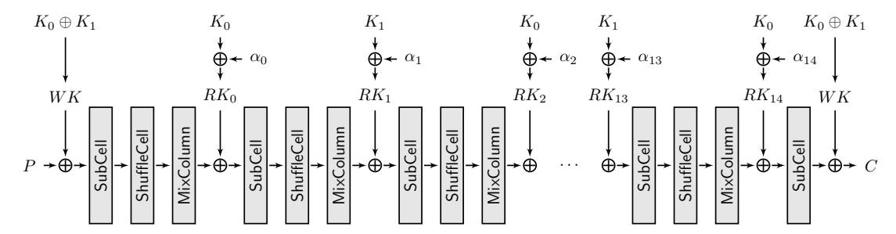

# Invariant Subspace Attack Against Full Midori64

Jian Guo<sup>1</sup> , J´er´emy Jean<sup>1</sup> , Ivica Nikoli´c<sup>1</sup> , Kexin Qiao1,<sup>2</sup> , Yu Sasaki1,<sup>3</sup> , and Siang Meng Sim<sup>1</sup>

- <sup>1</sup> Nanyang Technological University, Singapore
- 2 Institute of Information Engineering, Chinese Academy of Sciences, China
  - <sup>3</sup> NTT Secure Platform Laboratories, Tokyo, Japan

{guojian,JJean,INikolic}@ntu.edu.sg, qiaokexin@iie.ac.cn, sasaki.yu@lab.ntt.co.jp, ssim011@e.ntu.edu.sg

Abstract. In this paper, we present an invariant subspace attack against block cipher Midori64 which has recently been proposed by Banik et al. at Asiacrypt 2015 to achieve low energy consumption. We show that when each nibble of the key has the value 0 or 1 and each nibble of the plaintext has the value 8 or 9, each nibble of the ciphertext also has the value 8 or 9 with probability one regardless of the number of rounds applied. This fact indicates that Midori64 has a class of 2<sup>32</sup> weak keys that can be distinguished with a single query. It also indicates that the number of keys generated uniformly at random for Midori64 must not exceed 2<sup>96</sup> , i.e., the pseudorandom-permutation security of Midori64 is only up to 96 bits instead of 128 bits. Interestingly, given the information that the key is from the 2<sup>32</sup> weak key subspace, key recovery can be performed within time complexity 2<sup>16</sup> and data complexity 2<sup>1</sup> . We have confirmed the correctness of the analysis by implementing the attack. At the current stage, our attacks do not apply to Midori128.

Keywords: Midori, block cipher, invariant subspace attack, S-box, round constant, weak key, pseudorandom-permutation.

## 1 Introduction

Midori is a family of lightweight block ciphers recently published at Asiacrypt 2015 [\[1\]](#page-9-0). They have been advertised as one of the first lightweight ciphers optimized with respect to the energy consumed by the circuit per bit in encryption or decryption operation. To achieve the desired low energy goal, several design decisions were made in Midori. The diffusion layer consists of almost MDS 4 × 4 binary matrices. The 4-bit S-box has a small delay, i.e. 1.5-2 times faster than those of PRINCE [\[3\]](#page-11-0) and PRESENT [\[2\]](#page-10-0). The round constants are seemingly random binary values extracted for the constant π. The key schedule is trivial and thus efficient. Finally, the number of rounds is rather small for lightweight ciphers: only 16-20 rounds are used.

The submission document of Midori contains a standard analysis of the ciphers against various types of attacks: differential and linear, boomerangs, impossible differentials, etc. As a result, it has been concluded that the ciphers provide a safe security margin. Additional analysis of Midori has been provided in [7]. In that work, Lin and Wu show that 12 rounds (out of 16) of Midori64 can be attacked with the meet-in-the-middle technique, with a rather high complexity: the key recovery requires around  $2^{55}$  chosen plaintexts,  $2^{106}$  memory, and  $2^{125.5}$  computations.

Our Contribution. We show that Midori64 has a class of  $2^{32}$  weak keys that can be distinguished with a complexity of a single query. Furthermore, within this class of keys, a key recovery can be achieved efficiently given two plaintext-ciphertext pairs, including one that should verify the distinguisher.

Our analysis is based on the invariant subspace attacks [5] and uses the unfortunate combination in Midori64 of round constants, fixed points for the S-box, and multiplication by binary matrix in the diffusion layer. When each nibble of the master key has the value 0 or 1 (in total  $2^{32}$  such keys), and each nibble of the state (including the plaintext) has the value of 8 or 9, then the transformations in Midori64 keep the state in the same class (of nibbles values 8 and 9). Hence, regardless of the number of rounds, the class is maintained, and as a result, the ciphertext belongs to this class as well. This fact allows to launch an efficient distinguisher. The key recovery uses an additional fact: the values 8 and 9 are fixed points for the S-box used in Midori64. As a result, the whole cipher under the weak-key class becomes a linear transformation (the only non-linear component, the S-box, turns into the identity mapping). Therefore, recovering the key is equivalent to solving a system of linear equations and can be achieved given only two pairs of plaintext-ciphertext verifying the distinguisher.

We have confirmed the correctness of the whole analysis by implementing independently the distinguisher and the key recovery. At the current stage, our attacks do not apply to Midori128.

### 2 Preliminaries

#### 2.1 Description of Midori

Midori consists of two algorithms Midori64 and Midori128. The block size, n, is 64 bits and 128 bits for Midori64 and Midori128, respectively, and the key size is 128 bits for both. Both of Midori64 and Midori128 adopt a standard SPN structure, and the internal state is represented as  $4 \times 4$  cells, where the size of each cell is 4 bits for Midori64 and 8 bits for Midori128. The state S consisting of sixteen cells  $s_0, s_1, \ldots, s_{15}$  has the following data structure:

$$S = \begin{bmatrix} s_0 & s_4 & s_8 & s_{12} \\ s_1 & s_5 & s_9 & s_{13} \\ s_2 & s_6 & s_{10} & s_{14} \\ s_3 & s_7 & s_{11} & s_{15} \end{bmatrix}.$$

In high-level, by using a 128-bit key, Midori64 and Midori128 generate a whitening key WK and r-1 round keys  $RK_0, RK_1, \ldots, RK_{r-2}$ . Here, r is the

number of rounds, which is 16 for Midori64 and 20 for Midori128. The plaintext is first loaded into the state and the whitening key WK is XORed to the state. Then, the round function  $RF: \{0,1\}^n \times \{0,1\}^{128} \mapsto \{0,1\}^n$ , which takes as input the current state and the round key  $RK_i$  and outputs the updated state, is iterated r-2 times. Finally, the last round function  $RF^l$  is applied and the resulting state is output as the ciphertext.

**Key Generation.** In Midori64, the 128-bit key K is separated into two 64-bit states  $K_0$  and  $K_1$ . Then, the whitening key WK is computed by  $K_0 \oplus K_1$ , and the round key  $RK_i$  for  $i=0,1,\ldots 14$  is computed by  $K_{(i \mod 2)} \oplus \alpha_i$ , where  $\alpha_i$  is a round constant described below. In Midori128, WK is simply K and  $RK_i$  for  $i=0,1,\ldots 18$  is  $K_i \oplus \alpha_i$ .

Round constant  $\alpha_i$  where  $i=0,1,\ldots,18$  is the only component which differs in different rounds:  $\alpha_i$  consists of 16 binary cells. The constants have been derived from the hexadecimal encoding of the fractional part of  $\pi$ . For example,  $\alpha_0$  to  $\alpha_3$  are defined as follows.

$$\alpha_0 = \begin{bmatrix} 0 & 0 & 1 & 0 \\ 0 & 1 & 0 & 0 \\ 0 & 0 & 1 & 1 \\ 1 & 1 & 1 & 1 \end{bmatrix}, \alpha_1 = \begin{bmatrix} 0 & 1 & 1 & 0 \\ 1 & 0 & 1 & 0 \\ 1 & 0 & 0 & 0 \\ 1 & 0 & 0 & 0 \end{bmatrix}, \alpha_2 = \begin{bmatrix} 1 & 0 & 0 & 0 \\ 0 & 1 & 0 & 1 \\ 1 & 0 & 1 & 0 \\ 0 & 0 & 1 & 1 \end{bmatrix}, \alpha_3 = \begin{bmatrix} 0 & 0 & 0 & 0 \\ 1 & 0 & 0 & 0 \\ 1 & 1 & 0 & 1 \\ 0 & 0 & 1 & 1 \end{bmatrix}.$$

The other  $\alpha_i$ 's are similarly defined. Refer to [1] for more details. In this paper, we later exploit the fact that all the cells in any  $\alpha_i$  are 0 or 1.

Round Function and the Last Round Function. The round function RF consists of the four operations SubCell, ShuffleCell, MixColumn and KeyAdd that update the n-bit state S.

**SubCell.** This operation in Midori64 applies a 4-bit S-box  $\mathsf{Sb}_0$  to each cell and its equivalent in Midori128 applies four 8-bit S-boxes  $\mathsf{SSb}_0$ ,  $\mathsf{SSb}_1$ ,  $\mathsf{SSb}_2$  and  $\mathsf{SSb}_3$  to each of four cells in Row 0, Row 1, Row 2 and Row 3, respectively. Each  $\mathsf{SSb}_i$  is generated by 4-bit S-box  $\mathsf{Sb}_1$ . Refer to [1] for the details of how to generate  $\mathsf{SSb}_i$  from  $\mathsf{Sb}_1$ . The full specifications of  $\mathsf{Sb}_0$  and  $\mathsf{Sb}_1$  are shown in Table 1.

Table 1: Specifications of  $\mathsf{Sb}_0$  and  $\mathsf{Sb}_1$ .

<span id="page-2-0"></span>

| $\overline{x}$ | 0 | 1 | 2 | 3 | 4 | 5 | 6 | 7 | 8 | 9 | a | b | С | d | е | f |
|----------------|---|---|---|---|---|---|---|---|---|---|---|---|---|---|---|---|
| $Sb_0(x)$      | С | a | d | 3 | е | b | f | 7 | 8 | 9 | 1 | 5 | 0 | 2 | 4 | 6 |
| $Sb_1(x)$      | 1 | 0 | 5 | 3 | е | 2 | f | 7 | d | a | 9 | b | С | 8 | 4 | 6 |

**ShuffleCell.** This transformation is a cell-wise permutation. Each cell is permuted as follows.

$$\begin{bmatrix} s_0 \ s_4 \ s_8 \ s_{12} \\ s_1 \ s_5 \ s_9 \ s_{13} \\ s_2 \ s_6 \ s_{10} \ s_{14} \\ s_3 \ s_7 \ s_{11} \ s_{15} \end{bmatrix} \longrightarrow \begin{bmatrix} s_0 \ s_{14} \ s_9 \ s_7 \\ s_{10} \ s_4 \ s_3 \ s_{13} \\ s_5 \ s_{11} \ s_{12} \ s_2 \\ s_{15} \ s_1 \ s_6 \ s_8 \end{bmatrix}.$$

**MixColumn.** This transformation applies a  $4 \times 4$  binary involution matrix to each column of the state as follows.

$$\begin{pmatrix} s_i \\ s_{i+1} \\ s_{i+2} \\ s_{i+3} \end{pmatrix} = \begin{pmatrix} 0 & 1 & 1 & 1 \\ 1 & 0 & 1 & 1 \\ 1 & 1 & 0 & 1 \\ 1 & 1 & 1 & 0 \end{pmatrix} \begin{pmatrix} s_i \\ s_{i+1} \\ s_{i+2} \\ s_{i+3} \end{pmatrix}, \text{ for } i \in \{0, 4, 8, 12\}.$$

**KeyAdd.** KeyAdd $(S, RK_i)$  XORs  $RK_i$  to the state S.

The last round function  $RF^l$  applies only two operations  $\mathsf{SubCell}(S)$  and  $\mathsf{KeyAdd}(S,WK).$

**Summary.** The encryption of Midori can be summarized as below in Algorithm 1, and in particular Midori64 encryption function is depicted in Figure 1. Note that the decryption can be similarly described. However, since our attack only uses the encryption, we omit the precisions on the decryption.

#### <span id="page-3-0"></span>Algorithm 1 - Midori encryption algorithm.

```
1: function Midori-Encryption(P)
 2:
          S \leftarrow P
 3:
          S \leftarrow \mathsf{KeyAdd}(S, WK)
 4:
          for i = 0, ..., r - 2 do
 5:
               S \leftarrow \mathsf{SubCell}(S)
               S \leftarrow \mathsf{ShuffleCell}(S)
 6:
 7:
               S \leftarrow \mathsf{MixColumn}(S)
               S \leftarrow \mathsf{KeyAdd}(S, RK_i)
 8:
          end for
 9:
          S \leftarrow \mathsf{SubCell}(S)
10:
          S \leftarrow \mathsf{KeyAdd}(S, \mathit{WK})
11:
12:
          return S
13: end function
```

<span id="page-4-0"></span>

Figure 1: Midori64 encryption algorithm.

#### 2.2 The Invariant Subspace Attack

As a method of cryptanalysis, the invariant subspace attack has been introduced by Leander et al. at CRYPTO 2011 [\[5\]](#page-12-1). In this method, the adversary aims to find so-called invariant subspaces, i.e. subsets of the set of all possible state and key values, invariant of the round transformations used in the analyzed cipher. When such a subset exists, then the adversary encrypts plaintexts that belong to the subset, assumes the master key belongs as well to the subset (thus it is a weak-key attack) and expects to obtain corresponding ciphertexts that also belong to the subset. This immediately yields a distinguisher for the cipher, while more advanced approaches can be used for a key recovery.

Non-trivial invariant subspaces not necessarily exist for a given cipher. When they do exist, they are found either by a careful analysis (as it is the case of the analysis of PRINTCipher [\[5\]](#page-12-1)) or with the use of a specialized tool [\[6\]](#page-12-2). To deduce the invariant subspace, the former method requires examination of all the transformations used in the cipher, which usually provide a hint of the possible subspace. On the other hand, the latter method is generic and is achieved by a computer search. Its success depends on the proportion of the sizes of weak to all key class.

# 3 Subspace Attack on Midori64

This section explains our subspace attack on Midori64. Our attack is a weak-key attack, in which the size of the weak-key class is 2<sup>32</sup>. With such a weak key, Midori64 can be distinguished from a random permutation only with one chosen plaintext query, negligible computational cost, and negligible memory amount. Moreover, the key can be recovered from the 2<sup>32</sup> choices with approximately 2<sup>16</sup> operations.

#### 3.1 Distinguisher with Subspace Attack

We first introduce several notations used in this attack.

<sup>K</sup>: a subspace of nibble values consisting of two elements 0 and 1, i.e., <sup>K</sup> , {0, <sup>1</sup>}

 $\mathbb{K}$ : a subspace of state values in which each of its sixteen nibbles belongs to  $\mathcal{K}$ , i.e.,  $\mathbb{K} \triangleq \mathcal{K}^{16}$

 $\mathcal{S}$ : a subspace of nibble values consisting of two elements 8 and 9, i.e.,  $\mathcal{S} \triangleq \{8,9\}$   $\mathbb{S}$ : a subspace of state values in which each of its sixteen nibbles belongs to  $\mathcal{S}$ ; i.e.,  $\mathbb{S} \triangleq \mathcal{S}^{16}$

<span id="page-5-0"></span>**Theorem 1 (Invariant Subspace).** When a 128-bit key  $K_0 || K_1$  satisfies  $K_0, K_1 \in \mathbb{K}$ , any plaintext  $P \in \mathbb{S}$  is mapped to the ciphertext  $C \in \mathbb{S}$  with probability one by Midori64.

Throughout this section, we prove Theorem 1. To achieve this, we focus independently on each transformation used in Midori64.

**Round Key Generation.** Let  $x, y \in \mathcal{K}$ . Then,  $x \oplus y \in \mathcal{K}$ . Therefore, for any  $X, Y \in \mathbb{K}$ ,  $X \oplus Y \in \mathbb{K}$ . This fact enables us to simulate all round keys.

The whitening key WK is computed by  $K_0 \oplus K_1$ . By assuming  $K_0, K_1 \in \mathbb{K}$ , we have  $WK \in \mathbb{K}$ .

The round key for the *i*-th round,  $RK_i$ , is computed by  $K_{(i \mod 2)} \oplus \alpha_i$ . Here, an important observation for our attack is that all the round constants  $\alpha_i$  only consist of 0 and 1, i.e.,  $\alpha_i \in \mathbb{K}$  for  $i = 0, 1, \ldots, 14$ . By assuming  $K_0, K_1 \in \mathbb{K}$ , we have  $RK_i \in \mathbb{K}$  for all  $i = 0, 1, \ldots, 14$ .

**Data Processing Part.** Let  $x \in \mathcal{S}$  and  $y \in \mathcal{K}$ . Then,  $x \oplus y \in \mathcal{S}$ . Therefore, for any  $X \in \mathbb{S}$  and  $Y \in \mathbb{K}$ ,  $X \oplus Y \in \mathbb{S}$ . As long as the plaintext  $P \in \mathbb{S}$ , the state after adding the whitening key,  $WK \in \mathbb{K}$ , belongs to  $\mathbb{S}$ .

Then, the state is processed by the SubCell operation. Here, we exploit two particular data transitions through the S-box for Midori64;  $\mathsf{Sb}_0(8) = 8$  and  $\mathsf{Sb}_0(9) = 9$ . Namely, as long as the input state belongs to  $\mathbb{S}$ , SubCell is equivalent to the identity map. Obviously, we obtain  $\mathbb{S} \leftarrow \mathsf{SubCell}(\mathbb{S})$ .

The subsequent ShuffleCell is a nibble-wise permutation, and since all nibbles in  $\mathbb{S}$  satisfy  $\mathcal{S}$ ,  $\mathbb{S} \leftarrow \mathsf{ShuffleCell}(\mathbb{S})$ .

The MixColumn operation is slightly more complex. Because the diffusion matrix is a binary matrix, each output nibble from MixColumn can be represented as the XOR of three input nibbles. As long as the input state belongs to  $\mathbb{S}$ , each of three nibbles is either 8 or 9. Thus, the possibilities for each output nibble is the following eight cases:

```
8 \oplus 8 \oplus 8 = 8, 8 \oplus 8 \oplus 9 = 9, 8 \oplus 9 \oplus 8 = 9, 8 \oplus 9 \oplus 9 = 8, 9 \oplus 8 \oplus 8 = 9, 9 \oplus 8 \oplus 9 = 8, 9 \oplus 9 \oplus 8 = 8, 9 \oplus 9 \oplus 9 = 9.
```

In any case, each output nibble belongs to S, thus  $S \leftarrow \mathsf{MixColumn}(S)$ .

The KeyAdd operation is the same as the whitening key addition, i.e.,  $\mathbb{S} \leftarrow \mathsf{KeyAdd}(\mathbb{S}, RK_i \in \mathbb{K})$ .

**Summary.** Thanks to the property of  $\alpha_i \in \mathbb{K}$ , any weak key  $K_0, K_1 \in \mathbb{K}$  leads to  $WK \in \mathbb{K}$  and  $RK_i \in \mathbb{K}$ . Let  $P \in \mathbb{S}$ . Then, the state after the whitening key addition becomes  $\mathbb{S} \leftarrow \mathsf{KeyAdd}(P \in \mathbb{S}, WK \in \mathbb{K})$ . Then, the following round function is iterated by incrementing the round number i.

```
\begin{split} \mathbb{S} &\leftarrow \mathsf{SubCell}(\mathbb{S}), \\ \mathbb{S} &\leftarrow \mathsf{ShuffleCell}(\mathbb{S}), \\ \mathbb{S} &\leftarrow \mathsf{MixColumn}(\mathbb{S}), \\ \mathbb{S} &\leftarrow \mathsf{KeyAdd}(\mathbb{S}, RK_i \in \mathbb{K}). \end{split}
```

As a result, regardless of the number of rounds applied, the state belongs to  $\mathbb{S}$  with probability one. The last round only consists of SubCell and the whitening key addition, which does not break the property. This completes the proof of Theorem 1.

**Impact.** The subspace attack is a weak-key attack. Since 16 nibbles in  $K_0$  and 16 nibbles in  $K_1$  can be either 0 or 1, the class contains  $2^{32}$  different weak keys. In other words, the number of keys generated uniformly at random for Midori64 must not exceed  $2^{96}$ . Otherwise, the pseudorandom-permutation (PRP) security will be spoiled.

In provable security, the PRP security of the encryption algorithm  $E_K$  is usually measured by the advantage of the adversary who tries to distinguish a random instantiation of  $E_K$  from a random permutation RP. Let  $\Pi = (\kappa, E_K)$  denote an encryption scheme, where  $\kappa$  is a key space and  $E_K$  is an encryption algorithm. We define \$ be a set of all bijective mappings on the block length. Then, the advantage of the distinguisher  $D^{\mathcal{O}}$  with access to the oracle  $\mathcal{O}$  who tries to break the PRP security of  $\Pi$  can be defined as follows

$$\mathbf{Adv}_{II}^{\mathrm{PRP}}(D) = \Big| \mathrm{Pr} \big[ K \overset{\$}{\leftarrow} \kappa : D^{E_K} = 1 \big] - \mathrm{Pr} \big[ RP \overset{\$}{\leftarrow} \$ : D^{RP} = 1 \big] \Big|,$$

where  $\stackrel{\$}{\leftarrow}$  represents to choose one of the elements in the set uniformly at random. The crucial point here is that the key for the particular encryption algorithm  $E_K$  is chosen uniformly at random, and the adversary's goal is increasing the probability for win rather than distinguishing the target with probability one. Therefore, even though our subspace attack is a weak-key attack by cryptanalyst's words, it gives a certain impact from a provable-security viewpoint, i.e., the PRP security of Midori64 is up to 96 bits instead of 128 bits.

**Experiment.** We implemented our subspace attack and verified its correctness. Some examples are shown in Table 2.

Table 2: Experimental data.

<span id="page-7-0"></span>

|       | Example 1        | Example 2        | Example 3        |
|-------|------------------|------------------|------------------|
| $K_0$ | 0000000000000000 | 1100110011001100 | 0000101001001110 |
| $K_1$ | 0000000000000000 | 0011001100110011 | 1101010100010001 |
| P     | 88888888888888   | 99999999999999   | 988989889898989  |
| C     | 999889988988899  | 899999998898989  | 999998898898889  |

Computer Search of Invariant Subspaces. We found the above invariant subspace by hand. In an attempt to increase the size of the weak-key class or to find other similar subspaces, we performed additionally a computer search. We brute-forced all possible subspaces of values of nibbles in the plaintext (each nibble belongs to the same subset) and all possible values of master key nibbles (similarly, they all belong to another subset). As there are 16 values for the nibbles in each of the two cases, the brute-force required around  $2^{16} \cdot 2^{16} = 2^{32}$  time. We found five subspaces, all subsets of the original subspace. Thus, we can conclude that no larger weak-key classes of the analyzed type exist in Midori64.

#### 3.2 Key Recovery with Invariant Subspace Attack

In this section, we describe how a chosen plaintext P and its corresponding ciphertext C satisfying the subspace distinguisher can be used to efficiently recover the 128-bit weak key. Because the size of the weak-key class is  $2^{32}$ , the exhaustive search on the entire weak keys requires only  $2^{32}$  computations. Hence, our goal is identifying the key with complexity less than  $2^{32}$ .

The main observation pertains to the behavior of the S-box on the subset  $\mathcal{S}$ . Indeed, the S-box  $\mathsf{Sb}_0$  used in Midori64 has four fixed points  $\mathcal{S} \subset \{3,7,8,9\}$ . Consequently, under the assumption that  $S \in \mathbb{S}$ , the S-box behaves like the identity map, which in turn makes the full Midori64 cipher linear.

Therefore, recovering the 128-bit key  $K = K_0 || K_1$  can be done by writing the system of linear equations between  $P \in \mathbb{S}$  and  $C \in \mathbb{S}$ . To describe the system, we denote by  $k_0, \ldots, k_{15}$  the 16 variables from  $K_0$ , and by  $k_{16}, \ldots, k_{31}$  the 16 ones from  $K_1$ . We emphasize that  $k_i \in \mathcal{K}$ , since we assume that K belongs the weak-key class  $\mathbb{K}$ . Similarly, we denote the 16 known variables of the plaintext P by  $p_0, \ldots, p_{15}$  and the 16 known variables of the ciphertext C by  $c_0, \ldots, c_{15}$ ,

<span id="page-7-1"></span><sup>&</sup>lt;sup>4</sup> A more general tool for search of invariant subspaces is given in [6].

that is:

$$K_{0} = \begin{bmatrix} k_{0} & k_{4} & k_{8} & k_{12} \\ k_{1} & k_{5} & k_{9} & k_{13} \\ k_{2} & k_{6} & k_{10} & k_{14} \\ k_{3} & k_{7} & k_{11} & k_{15} \end{bmatrix} \in \mathbb{K}, \qquad K_{1} = \begin{bmatrix} k_{16} & k_{20} & k_{24} & k_{28} \\ k_{17} & k_{21} & k_{25} & k_{29} \\ k_{18} & k_{22} & k_{26} & k_{30} \\ k_{19} & k_{23} & k_{27} & k_{31} \end{bmatrix} \in \mathbb{K},$$

$$P = \begin{bmatrix} p_{0} & p_{4} & p_{8} & p_{12} \\ p_{1} & p_{5} & p_{9} & p_{13} \\ p_{2} & p_{6} & p_{10} & p_{14} \\ p_{3} & p_{7} & p_{11} & p_{15} \end{bmatrix} \in \mathbb{S}, \qquad C = \begin{bmatrix} c_{0} & c_{4} & c_{8} & c_{12} \\ c_{1} & c_{5} & c_{9} & c_{13} \\ c_{2} & c_{6} & c_{10} & c_{14} \\ c_{3} & c_{7} & c_{11} & c_{15} \end{bmatrix} \in \mathbb{S}.$$

Under these notations, the linear system of 16 equations becomes:

```
k_0 \oplus k_{11} \oplus k_{14} \oplus k_{15} \oplus k_{21} \oplus k_{22} \oplus k_{23} \oplus k_{26} \oplus k_{28} \oplus k_{29} \oplus k_{30} \oplus k_{31} = p_0 \oplus p_5 \oplus p_6 \oplus p_7 \oplus p_{10} \oplus p_{11} \oplus p_{12} \oplus p_{13} \oplus p_{14} \oplus p_{15} \oplus p_{15} \oplus p_{15} \oplus p_{15} \oplus p_{15} \oplus p_{15} \oplus p_{15} \oplus p_{15} \oplus p_{15} \oplus p_{15} \oplus p_{15} \oplus p_{15} \oplus p_{15} \oplus p_{15} \oplus p_{15} \oplus p_{15} \oplus p_{15} \oplus p_{15} \oplus p_{15} \oplus p_{15} \oplus p_{15} \oplus p_{15} \oplus p_{15} \oplus p_{15} \oplus p_{15} \oplus p_{15} \oplus p_{15} \oplus p_{15} \oplus p_{15} \oplus p_{15} \oplus p_{15} \oplus p_{15} \oplus p_{15} \oplus p_{15} \oplus p_{15} \oplus p_{15} \oplus p_{15} \oplus p_{15} \oplus p_{15} \oplus p_{15} \oplus p_{15} \oplus p_{15} \oplus p_{15} \oplus p_{15} \oplus p_{15} \oplus p_{15} \oplus p_{15} \oplus p_{15} \oplus p_{15} \oplus p_{15} \oplus p_{15} \oplus p_{15} \oplus p_{15} \oplus p_{15} \oplus p_{15} \oplus p_{15} \oplus p_{15} \oplus p_{15} \oplus p_{15} \oplus p_{15} \oplus p_{15} \oplus p_{15} \oplus p_{15} \oplus p_{15} \oplus p_{15} \oplus p_{15} \oplus p_{15} \oplus p_{15} \oplus p_{15} \oplus p_{15} \oplus p_{15} \oplus p_{15} \oplus p_{15} \oplus p_{15} \oplus p_{15} \oplus p_{15} \oplus p_{15} \oplus p_{15} \oplus p_{15} \oplus p_{15} \oplus p_{15} \oplus p_{15} \oplus p_{15} \oplus p_{15} \oplus p_{15} \oplus p_{15} \oplus p_{15} \oplus p_{15} \oplus p_{15} \oplus p_{15} \oplus p_{15} \oplus p_{15} \oplus p_{15} \oplus p_{15} \oplus p_{15} \oplus p_{15} \oplus p_{15} \oplus p_{15} \oplus p_{15} \oplus p_{15} \oplus p_{15} \oplus p_{15} \oplus p_{15} \oplus p_{15} \oplus p_{15} \oplus p_{15} \oplus p_{15} \oplus p_{15} \oplus p_{15} \oplus p_{15} \oplus p_{15} \oplus p_{15} \oplus p_{15} \oplus p_{15} \oplus p_{15} \oplus p_{15} \oplus p_{15} \oplus p_{15} \oplus p_{15} \oplus p_{15} \oplus p_{15} \oplus p_{15} \oplus p_{15} \oplus p_{15} \oplus p_{15} \oplus p_{15} \oplus p_{15} \oplus p_{15} \oplus p_{15} \oplus p_{15} \oplus p_{15} \oplus p_{15} \oplus p_{15} \oplus p_{15} \oplus p_{15} \oplus p_{15} \oplus p_{15} \oplus p_{15} \oplus p_{15} \oplus p_{15} \oplus p_{15} \oplus p_{15} \oplus p_{15} \oplus p_{15} \oplus p_{15} \oplus p_{15} \oplus p_{15} \oplus p_{15} \oplus p_{15} \oplus p_{15} \oplus p_{15} \oplus p_{15} \oplus p_{15} \oplus p_{15} \oplus p_{15} \oplus p_{15} \oplus p_{15} \oplus p_{15} \oplus p_{15} \oplus p_{15} \oplus p_{15} \oplus p_{15} \oplus p_{15} \oplus p_{15} \oplus p_{15} \oplus p_{15} \oplus p_{15} \oplus p_{15} \oplus p_{15} \oplus p_{15} \oplus p_{15} \oplus p_{15} \oplus p_{15} \oplus p_{15} \oplus p_{15} \oplus p_{15} \oplus p_{15} \oplus p_{15} \oplus p_{15} \oplus p_{15} \oplus p_{15} \oplus p_{15} \oplus p_{15} \oplus p_{15} \oplus p_{15} \oplus p_{15} \oplus p_{15} \oplus p_{15} \oplus p_{15} \oplus p_{15} \oplus p_{15} \oplus p_{15} \oplus p_{15} \oplus p_{15} \oplus p_{15} \oplus p_{15} \oplus p_{15} \oplus p_{15} \oplus p_{15} \oplus p_{15} \oplus p_{15} \oplus p_{15} \oplus p_{15} \oplus p_{15} \oplus p_{15} \oplus p_{15} \oplus p_{15} \oplus p_{15}
                                                                                                                                                                                                                                                                                                                                                                                                                                                                                                                                              \oplus c_5 \oplus c_6 \oplus c_7 \oplus c_{10} \oplus c_{12} \oplus c_{13} \oplus c_{14} \oplus c_{15}
                                                                                                                                                                                                                                      k_1 \oplus k_{11} \oplus k_{19} \oplus k_{24} \oplus k_{26} \oplus k_{29} \oplus k_{31} = p_1 \oplus p_3 \oplus p_8 \oplus p_{10} \oplus p_{11} \oplus p_{13} \oplus p_{15}
                                                                                                                                                                                                                                                                                                                                                                                                                                                                                                                                              \oplus \ c_3 \oplus c_8 \oplus c_{10} \oplus c_{13} \oplus c_{15} \oplus 1
                                                                                              k_2 \oplus k_{14} \oplus k_{19} \oplus k_{21} \oplus k_{22} \oplus k_{23} \oplus k_{24} \oplus k_{28} \oplus k_{30} \oplus k_{31} = p_2 \oplus p_3 \oplus p_5 \oplus p_6 \oplus p_7 \oplus p_8 \oplus p_{12} \oplus p_{15} \oplus p_{15} \oplus p_{15} \oplus p_{15} \oplus p_{15} \oplus p_{15} \oplus p_{15} \oplus p_{15} \oplus p_{15} \oplus p_{15} \oplus p_{15} \oplus p_{15} \oplus p_{15} \oplus p_{15} \oplus p_{15} \oplus p_{15} \oplus p_{15} \oplus p_{15} \oplus p_{15} \oplus p_{15} \oplus p_{15} \oplus p_{15} \oplus p_{15} \oplus p_{15} \oplus p_{15} \oplus p_{15} \oplus p_{15} \oplus p_{15} \oplus p_{15} \oplus p_{15} \oplus p_{15} \oplus p_{15} \oplus p_{15} \oplus p_{15} \oplus p_{15} \oplus p_{15} \oplus p_{15} \oplus p_{15} \oplus p_{15} \oplus p_{15} \oplus p_{15} \oplus p_{15} \oplus p_{15} \oplus p_{15} \oplus p_{15} \oplus p_{15} \oplus p_{15} \oplus p_{15} \oplus p_{15} \oplus p_{15} \oplus p_{15} \oplus p_{15} \oplus p_{15} \oplus p_{15} \oplus p_{15} \oplus p_{15} \oplus p_{15} \oplus p_{15} \oplus p_{15} \oplus p_{15} \oplus p_{15} \oplus p_{15} \oplus p_{15} \oplus p_{15} \oplus p_{15} \oplus p_{15} \oplus p_{15} \oplus p_{15} \oplus p_{15} \oplus p_{15} \oplus p_{15} \oplus p_{15} \oplus p_{15} \oplus p_{15} \oplus p_{15} \oplus p_{15} \oplus p_{15} \oplus p_{15} \oplus p_{15} \oplus p_{15} \oplus p_{15} \oplus p_{15} \oplus p_{15} \oplus p_{15} \oplus p_{15} \oplus p_{15} \oplus p_{15} \oplus p_{15} \oplus p_{15} \oplus p_{15} \oplus p_{15} \oplus p_{15} \oplus p_{15} \oplus p_{15} \oplus p_{15} \oplus p_{15} \oplus p_{15} \oplus p_{15} \oplus p_{15} \oplus p_{15} \oplus p_{15} \oplus p_{15} \oplus p_{15} \oplus p_{15} \oplus p_{15} \oplus p_{15} \oplus p_{15} \oplus p_{15} \oplus p_{15} \oplus p_{15} \oplus p_{15} \oplus p_{15} \oplus p_{15} \oplus p_{15} \oplus p_{15} \oplus p_{15} \oplus p_{15} \oplus p_{15} \oplus p_{15} \oplus p_{15} \oplus p_{15} \oplus p_{15} \oplus p_{15} \oplus p_{15} \oplus p_{15} \oplus p_{15} \oplus p_{15} \oplus p_{15} \oplus p_{15} \oplus p_{15} \oplus p_{15} \oplus p_{15} \oplus p_{15} \oplus p_{15} \oplus p_{15} \oplus p_{15} \oplus p_{15} \oplus p_{15} \oplus p_{15} \oplus p_{15} \oplus p_{15} \oplus p_{15} \oplus p_{15} \oplus p_{15} \oplus p_{15} \oplus p_{15} \oplus p_{15} \oplus p_{15} \oplus p_{15} \oplus p_{15} \oplus p_{15} \oplus p_{15} \oplus p_{15} \oplus p_{15} \oplus p_{15} \oplus p_{15} \oplus p_{15} \oplus p_{15} \oplus p_{15} \oplus p_{15} \oplus p_{15} \oplus p_{15} \oplus p_{15} \oplus p_{15} \oplus p_{15} \oplus p_{15} \oplus p_{15} \oplus p_{15} \oplus p_{15} \oplus p_{15} \oplus p_{15} \oplus p_{15} \oplus p_{15} \oplus p_{15} \oplus p_{15} \oplus p_{15} \oplus p_{15} \oplus p_{15} \oplus p_{15} \oplus p_{15} \oplus p_{15} \oplus p_{15} \oplus p_{15} \oplus p_{15} \oplus p_{15} \oplus p_{15} \oplus p_{15} \oplus p_{15} \oplus p_{15} \oplus p_{15} \oplus p_{15} \oplus p_{15} \oplus p_{15} \oplus p_{15} \oplus p_{15} \oplus p_{15} \oplus p_{15} \oplus p_{15} \oplus p_{15} \oplus p_{15} \oplus p_{15} \oplus p_{15} \oplus p_{15} \oplus p_{15} \oplus p_{15} \oplus p_{15} \oplus p_{15} \oplus p_{15} \oplus p_{15} \oplus p_{15} \oplus p_{15} \oplus p_{15} \oplus p_{1
                                                                                                                                                                                                                                                                                                                                                                                                                                                                                                                                                    \oplus \ c_3 \oplus c_5 \oplus c_6 \oplus c_7 \oplus c_8 \oplus c_{12} \oplus c_{14} \oplus c_{15}
                                                                                                                                                                                                                                                                                  k_{3} \oplus k_{15} \oplus k_{19} \oplus k_{24} \oplus k_{25} \oplus k_{29} = p_{8} \oplus p_{9} \oplus p_{13} \oplus p_{15} \oplus c_{3} \oplus c_{8} \oplus c_{9} \oplus c_{13} \oplus 1
                                                                                            k_4 \oplus k_{11} \oplus k_{13} \oplus k_{15} \oplus k_{22} \oplus k_{25} \oplus k_{27} \oplus k_{28} \oplus k_{29} \oplus k_{30} = p_4 \oplus p_6 \oplus p_9 \oplus p_{12} \oplus p_{14} \oplus p_{15}
                                                                                                                                                                                                                                                                                                                                                                                                                                                                                                                                                     \oplus \ c_6 \oplus c_9 \oplus c_{11} \oplus c_{12} \oplus c_{13} \oplus c_{14} \oplus 1
                                                                                                                                                                                          k_5 \oplus k_{14} \oplus k_{22} \oplus k_{23} \oplus k_{25} \oplus k_{28} \oplus k_{29} \oplus k_{30} = p_5 \oplus p_6 \oplus p_7 \oplus p_9 \oplus p_{12} \oplus p_{13}
                                                                                                                                                                                                                                                                                                                                                                                                                                                                                                                                                \oplus \ c_6 \oplus c_7 \oplus c_9 \oplus c_{12} \oplus c_{13} \oplus c_{14} \oplus 1
                                                                                                                                                                                          k_6 \oplus k_{13} \oplus k_{14} \oplus k_{15} \oplus k_{22} \oplus k_{25} \oplus k_{28} \oplus k_{29} = p_9 \oplus p_{12} \oplus p_{14} \oplus p_{15} \oplus c_6 \oplus c_9 \oplus c_{12} \oplus c_{13} \oplus c_{14} \oplus c_{15} \oplus c_{15} \oplus c_{15} \oplus c_{15} \oplus c_{15} \oplus c_{15} \oplus c_{15} \oplus c_{15} \oplus c_{15} \oplus c_{15} \oplus c_{15} \oplus c_{15} \oplus c_{15} \oplus c_{15} \oplus c_{15} \oplus c_{15} \oplus c_{15} \oplus c_{15} \oplus c_{15} \oplus c_{15} \oplus c_{15} \oplus c_{15} \oplus c_{15} \oplus c_{15} \oplus c_{15} \oplus c_{15} \oplus c_{15} \oplus c_{15} \oplus c_{15} \oplus c_{15} \oplus c_{15} \oplus c_{15} \oplus c_{15} \oplus c_{15} \oplus c_{15} \oplus c_{15} \oplus c_{15} \oplus c_{15} \oplus c_{15} \oplus c_{15} \oplus c_{15} \oplus c_{15} \oplus c_{15} \oplus c_{15} \oplus c_{15} \oplus c_{15} \oplus c_{15} \oplus c_{15} \oplus c_{15} \oplus c_{15} \oplus c_{15} \oplus c_{15} \oplus c_{15} \oplus c_{15} \oplus c_{15} \oplus c_{15} \oplus c_{15} \oplus c_{15} \oplus c_{15} \oplus c_{15} \oplus c_{15} \oplus c_{15} \oplus c_{15} \oplus c_{15} \oplus c_{15} \oplus c_{15} \oplus c_{15} \oplus c_{15} \oplus c_{15} \oplus c_{15} \oplus c_{15} \oplus c_{15} \oplus c_{15} \oplus c_{15} \oplus c_{15} \oplus c_{15} \oplus c_{15} \oplus c_{15} \oplus c_{15} \oplus c_{15} \oplus c_{15} \oplus c_{15} \oplus c_{15} \oplus c_{15} \oplus c_{15} \oplus c_{15} \oplus c_{15} \oplus c_{15} \oplus c_{15} \oplus c_{15} \oplus c_{15} \oplus c_{15} \oplus c_{15} \oplus c_{15} \oplus c_{15} \oplus c_{15} \oplus c_{15} \oplus c_{15} \oplus c_{15} \oplus c_{15} \oplus c_{15} \oplus c_{15} \oplus c_{15} \oplus c_{15} \oplus c_{15} \oplus c_{15} \oplus c_{15} \oplus c_{15} \oplus c_{15} \oplus c_{15} \oplus c_{15} \oplus c_{15} \oplus c_{15} \oplus c_{15} \oplus c_{15} \oplus c_{15} \oplus c_{15} \oplus c_{15} \oplus c_{15} \oplus c_{15} \oplus c_{15} \oplus c_{15} \oplus c_{15} \oplus c_{15} \oplus c_{15} \oplus c_{15} \oplus c_{15} \oplus c_{15} \oplus c_{15} \oplus c_{15} \oplus c_{15} \oplus c_{15} \oplus c_{15} \oplus c_{15} \oplus c_{15} \oplus c_{15} \oplus c_{15} \oplus c_{15} \oplus c_{15} \oplus c_{15} \oplus c_{15} \oplus c_{15} \oplus c_{15} \oplus c_{15} \oplus c_{15} \oplus c_{15} \oplus c_{15} \oplus c_{15} \oplus c_{15} \oplus c_{15} \oplus c_{15} \oplus c_{15} \oplus c_{15} \oplus c_{15} \oplus c_{15} \oplus c_{15} \oplus c_{15} \oplus c_{15} \oplus c_{15} \oplus c_{15} \oplus c_{15} \oplus c_{15} \oplus c_{15} \oplus c_{15} \oplus c_{15} \oplus c_{15} \oplus c_{15} \oplus c_{15} \oplus c_{15} \oplus c_{15} \oplus c_{15} \oplus c_{15} \oplus c_{15} \oplus c_{15} \oplus c_{15} \oplus c_{15} \oplus c_{15} \oplus c_{15} \oplus c_{15} \oplus c_{15} \oplus c_{15} \oplus c_{15} \oplus c_{15} \oplus c_{15} \oplus c_{15} \oplus c_{15} \oplus c_{15} \oplus c_{15} \oplus c_{15} \oplus c_{15} \oplus c_{15} \oplus c_{15} \oplus c_{15} \oplus c_{15} \oplus c_{15} \oplus c_{15} \oplus c_{15} \oplus c_{15} \oplus c_{15} \oplus c_{15} \oplus c_{15} \oplus c_{15} \oplus c_{15} \oplus c_{15} \oplus c_{15} \oplus c_{15} \oplus c_{15} \oplus c_{15} \oplus c_{15} \oplus c_{15} \oplus c_{15} \oplus c_{1
                                                                                                                                                                                                                                                                                                                                    k_7 \oplus k_{13} \oplus k_{14} \oplus k_{15} \oplus k_{23} = p_{13} \oplus p_{14} \oplus p_{15} \oplus c_7
                                                                                                                                                                                                                                                                                                                                                                                k_8 \oplus k_{15} \oplus k_{24} \oplus k_{29} = p_{13} \oplus p_{15} \oplus c_8 \oplus c_{13}
                                                                                                                                                                                                                                                                                        k_9 \oplus k_{11} \oplus k_{13} \oplus k_{14} \oplus k_{24} \oplus k_{28} = p_8 \oplus p_9 \oplus p_{11} \oplus p_{12} \oplus p_{13} \oplus p_{14} \oplus c_8 \oplus c_{12}
                                                                                                                                                                                                                                                                                                                                                                                                                      k_{10} \oplus k_{11} \oplus k_{25} = p_9 \oplus p_{10} \oplus p_{11} \oplus c_9 \oplus 1
                                                                                                                                                                                                                                                                                                                             k_{12} \oplus k_{13} \oplus k_{14} \oplus k_{15} \oplus k_{29} = p_{12} \oplus p_{14} \oplus p_{15} \oplus c_{13}
                                                                                                                                                                                                                                                                               k_{16} \oplus k_{19} \oplus k_{24} \oplus k_{25} \oplus k_{29} \oplus k_{31} = p_0 \oplus p_3 \oplus p_8 \oplus p_9 \oplus p_{13} \oplus p_{15}
                                                                                                                                                                                                                                                                                                                                                                                                                                                                                                                                                    \oplus \ c_0 \oplus c_3 \oplus c_8 \oplus c_9 \oplus c_{13} \oplus c_{15} \oplus 1
                                                                                     k_{17} \oplus k_{19} \oplus k_{22} \oplus k_{23} \oplus k_{24} \oplus k_{25} \oplus k_{26} \oplus k_{27} \oplus k_{28} \oplus k_{31} = p_1 \oplus p_3 \oplus p_6 \oplus p_7 \oplus p_8 \oplus p_9 \oplus p_{10} \oplus p_{11} \oplus p_{12} \oplus p_{15}
                                                                                                                                                                                                                                                                                                                                                                                                                                                                                                                                                \oplus c_1 \oplus c_3 \oplus c_6 \oplus c_7 \oplus c_8 \oplus c_9 \oplus c_{10} \oplus c_{11} \oplus c_{12} \oplus c_{15}
                                                                                     k_{18} \oplus k_{19} \oplus k_{21} \oplus k_{22} \oplus k_{23} \oplus k_{24} \oplus k_{28} \oplus k_{29} \oplus k_{30} \oplus k_{31} = p_2 \oplus p_3 \oplus p_5 \oplus p_6 \oplus p_7 \oplus p_8 \oplus p_{12} \oplus p_{13} \oplus p_{14} \oplus p_{15}
                                                                                                                                                                                                                                                                                                                                                                                                                                                                                                                                                  \oplus \ c_2 \oplus c_3 \oplus c_5 \oplus c_6 \oplus c_7 \oplus c_8 \oplus c_{12} \oplus c_{13} \oplus c_{14} \oplus c_{15} \oplus 1
                                                                                                                                                                                                                                                                               k_{20} \oplus k_{22} \oplus k_{23} \oplus k_{25} \oplus k_{28} \oplus k_{29} = p_4 \oplus p_6 \oplus p_7 \oplus p_9 \oplus p_{12} \oplus p_{13}
                                                                                                                                                                                                                                                                                                                                                                                                                                                                                                                                                \oplus c_4 \oplus c_6 \oplus c_7 \oplus c_9 \oplus c_{12} \oplus c_{13}
```

where there are 32 unknowns. The system being undetermined, the set of solution contains  $2^{16}$  elements, which provides  $2^{16}$  key candidates for the 128-bit master key K. Using an additional known plaintext-ciphertext pair, we uniquely determine the key in  $2^{16}$  operations. More precisely, the above system of equations describe a Gröbner Basis so that one can simply enumerate all the  $2^{16}$  values for  $k_0, k_1, k_2, k_3, k_4, k_5, k_6, k_7, k_8, k_9, k_{10}, k_{12}, k_{16}, k_{17}, k_{18}, k_{20} \in \mathcal{K}$  and uniquely and efficiently determine the remaining 16 key variables.

#### 4 Countermeasures

In this section, we briefly discuss possible countermeasures against our invariant subspace attack without destroying the design policy of Midori64. Note that the invariant subspace attack can work regardless of the number of rounds applied.

Therefore, simply increasing the number of rounds is not sufficient (and not energy-consumption friendly): consequently, a part of the round function or the key generation should be modified.

The first direction is replacing the S-box Sb<sup>0</sup> with another one. The new S-box must be chosen carefully. For example, replacing Sb<sup>0</sup> with Sb<sup>1</sup> prevents the invariant subspace of Theorem [1,](#page-5-0) while it allows another invariant subspace

$$P \in \mathbb{K} \stackrel{K_0, K_1 \in \mathbb{K}}{\mapsto} C \in \mathbb{K}$$

due to the property of Sb1(0) = 1 and Sb1(1) = 0.

The second direction is replacing the round constant α<sup>i</sup> . A conservative way is using all of 0 to 15 in α<sup>i</sup> . Another approach is using different 4-bit values in different rounds, for example, replacing '1' in α<sup>i</sup> with round number counter i.

The third direction is applying bit-permutations during the round function. Fortunately, Midori has already introduced several bit-permutations to generate SSb<sup>i</sup> from Sb1. The same bit-permutations can be reused to break the invariant subspace property.

The last direction we would like to mention is replacing the key generation process, i.e., introducing a light key schedule. The TWEAKEY framework [\[4\]](#page-12-3) seems to fit the design for low energy consumption. Moreover, practical related-key differential attacks on Midori can be prevented at the same time.

# 5 Concluding Remarks

In this paper, we have presented the invariant subspace attack against Midori64. We showed that Midori64 has a class of 2<sup>32</sup> weak keys, and with such keys along with a properly chosen plaintext, the cipher becomes a linear transformation thus can be distinguished with single chosen-plaintext query and even key recovery can be performed by simply solving a system of linear equations.

At the current stage, the attack cannot be applied to Midori128, and this inspires us several countermeasures for Midori64. Investigating the design achieving more secure but retaining almost the same implementation cost as Midori64 is an interesting future research direction.

## A Midori128 8-bit S-boxes

In order to provide convenience for future research, we give here the four 8-bit S-boxes used in the Midori128 block cipher.

# References

<span id="page-9-0"></span>1. Banik, S., Bogdanov, A., Isobe, T., Shibutani, K., Hiwatari, H., Akishita, T., Regazzoni, F.: Midori: A Block Cipher for Low Energy. In Iwata, T., Cheon, J.H., eds.: Advances in Cryptology - ASIACRYPT 2015 - 21st International Conference on the

Table 3: The S-box  $\mathsf{SSb}_0$  used in Midori128.

|    |            |    |    |            | T  |    |    | I  |            | T  |    | T - |    |    |    |
|----|------------|----|----|------------|----|----|----|----|------------|----|----|-----|----|----|----|
| 11 | 10         | 51 | 50 | b4         | 30 | f4 | 70 | 59 | 58         | 19 | 18 | fc  | 78 | bc | 38 |
| 01 | 00         | 13 | 12 | a4         | 20 | b6 | 32 | 0ъ | 0a         | 1b | 1a | ae  | 2a | be | 3a |
| 15 | 31         | 55 | 71 | b5         | 35 | f5 | 75 | 5d | 79         | 1d | 39 | fd  | 7d | bd | 3d |
| 05 | 21         | 17 | 33 | <b>a</b> 5 | 25 | b7 | 37 | Of | 2b         | 1f | Зъ | af  | 2f | bf | 3f |
| 4b | 4a         | 5b | 5a | ee         | 6a | fе | 7a | 49 | 48         | 41 | 40 | ес  | 68 | e4 | 60 |
| 03 | 02         | 53 | 52 | <b>a</b> 6 | 22 | f6 | 72 | 09 | 80         | 43 | 42 | ac  | 28 | е6 | 62 |
| 4f | 6b         | 5f | 7b | ef         | 6f | ff | 7f | 4d | 69         | 45 | 61 | ed  | 6d | е5 | 65 |
| 07 | 23         | 57 | 73 | <b>a</b> 7 | 27 | f7 | 77 | 0d | 29         | 47 | 63 | ad  | 2d | е7 | 67 |
| 95 | b0         | d5 | f0 | 94         | 90 | d4 | d0 | dd | f8         | 9d | b8 | dc  | d8 | 9с | 98 |
| 85 | <b>a</b> 0 | 97 | b2 | 84         | 80 | 96 | 92 | 8f | aa         | 9f | ba | 8e  | 8a | 9е | 9a |
| 91 | b1         | d1 | f1 | 14         | 34 | 54 | 74 | d9 | f9         | 99 | b9 | 5c  | 7с | 1c | Зс |
| 81 | a1         | 93 | b3 | 04         | 24 | 16 | 36 | 8ъ | ab         | 9ъ | bb | 0е  | 2e | 1e | Зе |
| cf | ea         | df | fa | се         | ca | de | da | cd | е8         | с5 | e0 | сс  | с8 | с4 | с0 |
| 87 | a2         | d7 | f2 | 86         | 82 | d6 | d2 | 8d | <b>a</b> 8 | с7 | e2 | 8с  | 88 | с6 | c2 |
| cb | еb         | db | fb | 4e         | 6e | 5e | 7е | с9 | е9         | c1 | e1 | 4c  | 6с | 44 | 64 |
| 83 | a3         | d3 | f3 | 06         | 26 | 56 | 76 | 89 | <b>a</b> 9 | сЗ | еЗ | 0с  | 2c | 46 | 66 |

Table 4: The S-box  $SSb_1$  used in Midori128.

| 88 | 8a | 4b | cb | ac | ae         | 6f | ef         | 80 | 82 | 43 | сЗ | 94 | 96 | 57 | d7 |
|----|----|----|----|----|------------|----|------------|----|----|----|----|----|----|----|----|
| a8 | aa | 6b | eb | 8с | 8e         | 4f | cf         | 98 | 9a | 5b | db | 9с | 9е | 5f | df |
| b4 | b6 | 77 | f7 | a4 | a6         | 67 | е7         | 90 | 92 | 53 | d3 | 84 | 86 | 47 | с7 |
| bc | be | 7f | ff | a0 | a2         | 63 | еЗ         | b8 | ba | 7b | fb | ъ0 | b2 | 73 | f3 |
| ca | с8 | 4a | 0a | ee | ес         | 6e | 2e         | c2 | с0 | 42 | 02 | d6 | d4 | 56 | 16 |
| ea | е8 | 6a | 2a | се | СС         | 4e | 0e         | da | d8 | 5a | 1a | de | dc | 5е | 1e |
| f6 | f4 | 76 | 36 | е6 | e4         | 66 | 26         | d2 | d0 | 52 | 12 | с6 | с4 | 46 | 06 |
| fe | fс | 7е | Зе | e2 | e0         | 62 | 22         | fa | f8 | 7a | 3a | f2 | f0 | 72 | 32 |
| 80 | 89 | 09 | 8ъ | 2c | ad         | 2d | af         | 00 | 81 | 01 | 83 | 14 | 95 | 15 | 97 |
| 28 | a9 | 29 | ab | 0с | 8d         | 0d | 8f         | 18 | 99 | 19 | 9b | 1c | 9d | 1d | 9f |
| 34 | b5 | 35 | b7 | 24 | <b>a</b> 5 | 25 | <b>a</b> 7 | 10 | 91 | 11 | 93 | 04 | 85 | 05 | 87 |
| Зс | bd | 3d | bf | 20 | a1         | 21 | a3         | 38 | b9 | 39 | bb | 30 | b1 | 31 | b3 |
| 49 | с9 | 48 | 0ъ | 6d | ed         | 6с | 2f         | 41 | с1 | 40 | 03 | 55 | d5 | 54 | 17 |
| 69 | е9 | 68 | 2b | 4d | cd         | 4c | Of         | 59 | d9 | 58 | 1b | 5d | dd | 5c | 1f |
| 75 | f5 | 74 | 37 | 65 | е5         | 64 | 27         | 51 | d1 | 50 | 13 | 45 | с5 | 44 | 07 |
| 7d | fd | 7с | 3f | 61 | е1         | 60 | 23         | 79 | f9 | 78 | 3b | 71 | f1 | 70 | 33 |

Theory and Application of Cryptology and Information Security, Auckland, New Zealand, November 29 - December 3, 2015, Proceedings, Part II. Volume 9453 of Lecture Notes in Computer Science., Springer (2015) 411-436

<span id="page-10-0"></span>Bogdanov, A., Knudsen, L.R., Leander, G., Paar, C., Poschmann, A., Robshaw, M.J.B., Seurin, Y., Vikkelsoe, C.: PRESENT: an ultra-lightweight block cipher. In Paillier, P., Verbauwhede, I., eds.: Cryptographic Hardware and Embedded Systems - CHES 2007, 9th International Workshop, Vienna, Austria, September 10-13, 2007, Proceedings. Volume 4727 of Lecture Notes in Computer Science., Springer (2007) 450-466

Table 5: The S-box  $\mathsf{SSb}_2$  used in Midori128.

| 44 | сЗ         | 47 | 43 | 40 | с0         | c2         | 42 | 54 | d3 | 57 | 53 | 50 | d0 | d2 | 52 |
|----|------------|----|----|----|------------|------------|----|----|----|----|----|----|----|----|----|
| Зс | bb         | 3f | 3b | 38 | b8         | ba         | 3a | 7с | fb | 7f | 7b | 78 | f8 | fa | 7a |
| 74 | f3         | 77 | 73 | 70 | f0         | f2         | 72 | 64 | е3 | 67 | 63 | 60 | e0 | e2 | 62 |
| 34 | b3         | 37 | 33 | 30 | b0         | b2         | 32 | 14 | 93 | 17 | 13 | 10 | 90 | 92 | 12 |
| 04 | 83         | 07 | 03 | 00 | 80         | 82         | 02 | 4c | cb | 4f | 4b | 48 | с8 | ca | 4a |
| 0с | 8ъ         | 0f | 0ъ | 80 | 88         | 8a         | 0a | 5c | db | 5f | 5b | 58 | d8 | da | 5a |
| 2c | ab         | 2f | 2b | 28 | <b>a</b> 8 | aa         | 2a | 6с | eb | 6f | 6b | 68 | е8 | ea | 6a |
| 24 | a3         | 27 | 23 | 20 | <b>a</b> 0 | a2         | 22 | 1c | 9ъ | 1f | 1b | 18 | 98 | 9a | 1a |
| 45 | с7         | 46 | 41 | с4 | с5         | с6         | c1 | 55 | d7 | 56 | 51 | d4 | d5 | d6 | d1 |
| 3d | bf         | Зе | 39 | bс | bd         | be         | b9 | 7d | ff | 7е | 79 | fс | fd | fе | f9 |
| 75 | f7         | 76 | 71 | f4 | f5         | f6         | f1 | 65 | е7 | 66 | 61 | е4 | е5 | e6 | e1 |
| 35 | b7         | 36 | 31 | b4 | b5         | b6         | b1 | 15 | 97 | 16 | 11 | 94 | 95 | 96 | 91 |
| 05 | 87         | 06 | 01 | 84 | 85         | 86         | 81 | 4d | cf | 4e | 49 | сс | cd | се | с9 |
| 0d | 8f         | 0е | 09 | 8с | 8d         | 8e         | 89 | 5d | df | 5e | 59 | dc | dd | de | d9 |
| 2d | af         | 2e | 29 | ac | ad         | ae         | a9 | 6d | ef | 6e | 69 | ес | ed | ee | е9 |
| 25 | <b>a</b> 7 | 26 | 21 | a4 | <b>a</b> 5 | <b>a</b> 6 | a1 | 1d | 9f | 1e | 19 | 9с | 9d | 9е | 99 |

Table 6: The S-box  $SSb_3$  used in Midori128.

| 22 | 2b | 20 | 29 | a2 | ab         | 26 | 2f | 4b | 0ъ | 49 | 09 | cb | 8b | 4f | Of |
|----|----|----|----|----|------------|----|----|----|----|----|----|----|----|----|----|
| b2 | bb | 34 | 3d | 32 | 3b         | 36 | 3f | db | 9ъ | 5d | 1d | 5b | 1b | 5f | 1f |
| 02 | 43 | 00 | 41 | 82 | сЗ         | 06 | 47 | 42 | 03 | 40 | 01 | c2 | 83 | 46 | 07 |
| 92 | d3 | 14 | 55 | 12 | 53         | 16 | 57 | d2 | 93 | 54 | 15 | 52 | 13 | 56 | 17 |
| 2a | 23 | 28 | 21 | aa | a3         | 2e | 27 | 6b | 0a | 69 | 80 | eb | 8a | 6f | 0е |
| ba | b3 | 3с | 35 | 3a | 33         | Зе | 37 | fb | 9a | 7d | 1c | 7b | 1a | 7f | 1e |
| 62 | 63 | 60 | 61 | e2 | еЗ         | 66 | 67 | 6a | 4a | 68 | 48 | ea | ca | 6e | 4e |
| f2 | f3 | 74 | 75 | 72 | 73         | 76 | 77 | fa | da | 7с | 5c | 7a | 5a | 7е | 5e |
| b4 | bd | 24 | 2d | b6 | bf         | a6 | af | dd | 9d | 4d | 0d | df | 9f | cf | 8f |
| b0 | b9 | 30 | 39 | a0 | <b>a</b> 9 | a4 | ad | d9 | 99 | 59 | 19 | с9 | 89 | cd | 8d |
| 94 | d5 | 04 | 45 | 96 | d7         | 86 | с7 | d4 | 95 | 44 | 05 | d6 | 97 | с6 | 87 |
| 90 | d1 | 10 | 51 | 80 | c1         | 84 | с5 | d0 | 91 | 50 | 11 | с0 | 81 | c4 | 85 |
| bс | b5 | 2c | 25 | be | b7         | ae | a7 | fd | 9с | 6d | 0с | ff | 9е | ef | 8e |
| b8 | b1 | 38 | 31 | a8 | a1         | ac | a5 | f9 | 98 | 79 | 18 | е9 | 88 | ed | 8с |
| f4 | f5 | 64 | 65 | f6 | f7         | е6 | е7 | fc | dc | 6с | 4c | fe | de | ee | се |
| f0 | f1 | 70 | 71 | e0 | е1         | e4 | е5 | f8 | d8 | 78 | 58 | е8 | с8 | ес | СС |

<span id="page-11-0"></span> Borghoff, J., Canteaut, A., Güneysu, T., Kavun, E.B., Knezevic, M., Knudsen, L.R., Leander, G., Nikov, V., Paar, C., Rechberger, C., Rombouts, P., Thomsen, S.S., Yalçin, T.: PRINCE - A low-latency block cipher for pervasive computing applications - extended abstract. In Wang, X., Sako, K., eds.: Advances in Cryptology - ASIACRYPT 2012 - 18th International Conference on the Theory and Application of Cryptology and Information Security, Beijing, China, December 2-6, 2012. Proceedings. Volume 7658 of Lecture Notes in Computer Science., Springer (2012) 208-225

- <span id="page-12-3"></span>4. Jean, J., Nikolic, I., Peyrin, T.: Tweaks and Keys for Block Ciphers: The TWEAKEY Framework. In Sarkar, P., Iwata, T., eds.: Advances in Cryptology - ASIACRYPT 2014 - 20th International Conference on the Theory and Application of Cryptology and Information Security, Kaoshiung, Taiwan, R.O.C., December 7-11, 2014, Proceedings, Part II. Volume 8874 of Lecture Notes in Computer Science., Springer (2014) 274–288
- <span id="page-12-1"></span>5. Leander, G., Abdelraheem, M.A., AlKhzaimi, H., Zenner, E.: A cryptanalysis of printcipher: The invariant subspace attack. In Rogaway, P., ed.: Advances in Cryptology - CRYPTO 2011 - 31st Annual Cryptology Conference, Santa Barbara, CA, USA, August 14-18, 2011. Proceedings. Volume 6841 of Lecture Notes in Computer Science., Springer (2011) 206–221
- <span id="page-12-2"></span>6. Leander, G., Minaud, B., Rønjom, S.: A generic approach to invariant subspace attacks: Cryptanalysis of robin, iscream and zorro. In Oswald, E., Fischlin, M., eds.: Advances in Cryptology - EUROCRYPT 2015 - 34th Annual International Conference on the Theory and Applications of Cryptographic Techniques, Sofia, Bulgaria, April 26-30, 2015, Proceedings, Part I. Volume 9056 of Lecture Notes in Computer Science., Springer (2015) 254–283
- <span id="page-12-0"></span>7. Lin, L., Wu, W.: Meet-in-the-Middle Attacks on Reduced-Round Midori-64. Cryptology ePrint Archive, Report 2015/1165 (2015)