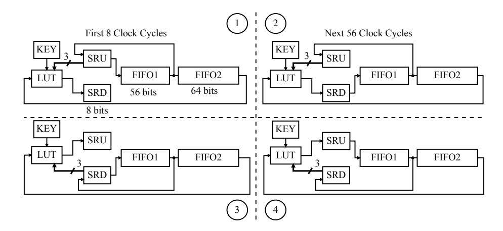
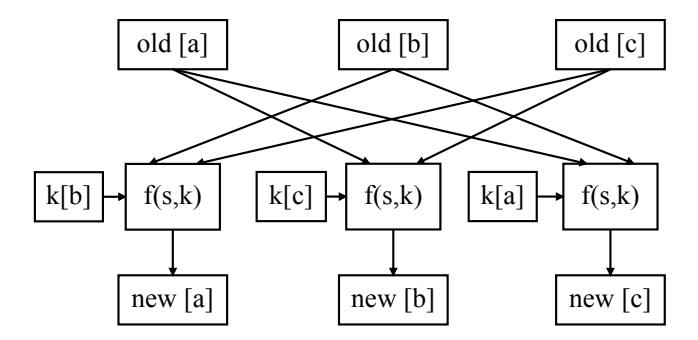
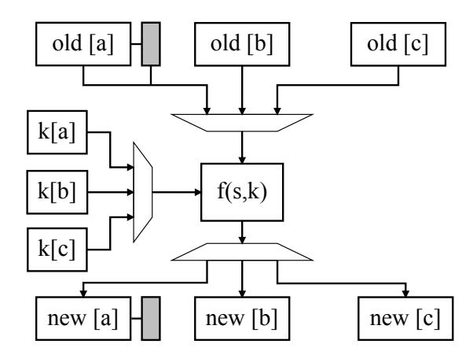
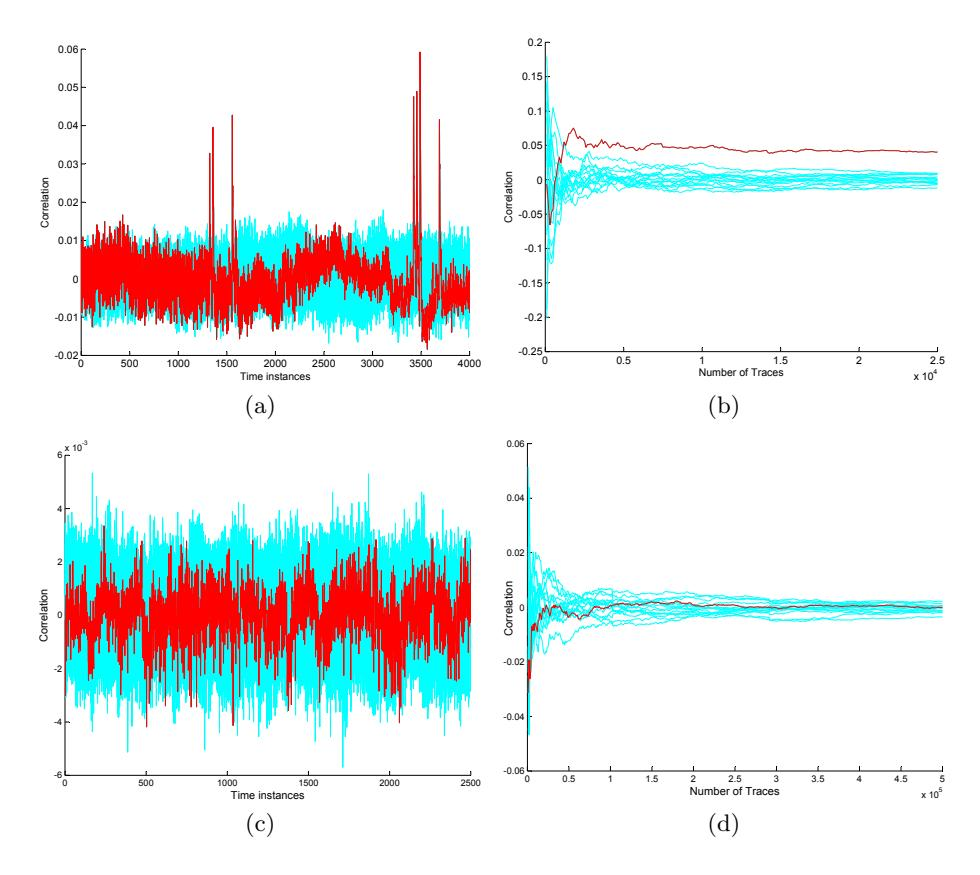
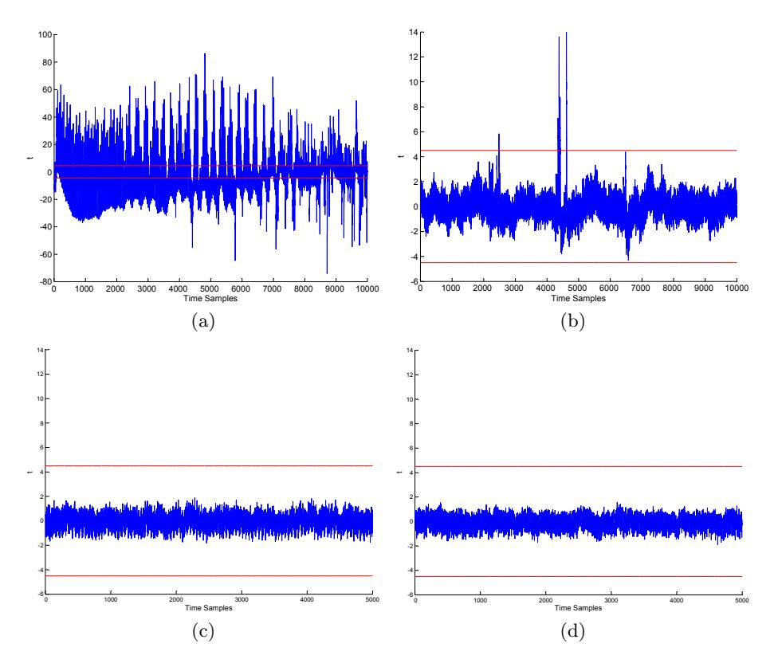

# Silent Simon: A Threshold Implementation under 100 Slices

Aria Shahverdi, Mostafa Taha and Thomas Eisenbarth

Worcester Polytechnic Institute, Worcester, MA 01609, USA Email: {ashahverdi, mtaha, teisenbarth}@wpi.edu

Abstract. Lightweight Cryptography aims at achieving security comparable to conventional cryptography at a much lower cost. SIMON is a lightweight alternative to AES, as it shares same cryptographic parameters, but has been shown to be extremely area-efficient on FPGAs. However, in the embedded setting, protection against side channel analysis is often required. In this work we present a threshold implementation of SIMON. The proposed core splits the information between three shares and achieves provable security against first order side-channel attacks. The core can be implemented in less than 100 slices of a low-cost FPGA, making it the world smallest threshold implementation of a block-cipher. Hence, the proposed core perfectly suits highly-constrained embedded systems including sensor nodes and RFIDs. Security of the proposed core is validated by provable arguments as well as practical DPA attacks and tests for leakage quantification.

#### 1 Introduction

SIMON is a block cipher recently published by NSA as a lightweight alternative to the widely-used AES [1]. SIMON is very promising for hardware-based embedded applications as its internal structure is very simple and bit-oriented. Indeed, its authors show that the ASIC implementation of SIMON requires only 1234 GE (Gate Equivalent) for 128 bits of security, compared to 2400 GE for the smallest AES to date [2]. Also, it was shown that a bit-serialized FPGA implementation of SIMON sets a new area record with only 36 slices for 128 bits of security [3], compared to 264 equivalent slices for AES (including the BRAMs) [4] and 117 slices for PRESENT [5]. However, in order to actually implement SIMON on practical embedded platforms, protection against side-channel analysis must be taken into account.

Side-channel analysis (SCA) can break cryptosystems by exploiting vulnerabilities in the practical implementation of cryptographic schemes. SCA harvests the information leaked through variations in the power consumption, electromagnetic radiation, or execution time. Typically, the adversary builds a power model using a key hypothesis and compares the result with the actual power consumption until the correct key is found. An SCA attack that is mounted using a single trace is called Simple Power Analysis (SPA), while an attack that

combines information across many traces at different inputs is called Differential Power Analysis (DPA). Attacks analyzing the first moment of a single point in the leakage trace are called first order attacks. Higher order DPA attacks extract information from the higher order moments of one or more leakage points. However, higher order attacks suffer from higher noise levels and hence have a worse key distinguishability.

Side-channel analysis of Simon has been studied in [6] and [7]. Moreover, a side-channel countermeasure for Simon was proposed in [6]. They proposed a low-cost realization of the masking scheme. The scheme uses only one datapath and works by partially unmasking the internal variables just before the non-linear operation, and using the input mask to re-randomize the internal state following the Feistel structure. This scheme may practically work if the demasking, processing, and remasking are performed within a single table lookup. Hence, it depends on the realization and is not provably secure. Furthermore, the mask value is fixed throughout the cipher which is not recommended in masking schemes. Moreover, it is not clear how to map the scheme to other hardware architectures.

In this paper, we propose a provably secure masking scheme for Simon using secret-sharing with three shares. Our design achieves all the requirements for being a threshold implementation, which is a special class of secret-sharing countermeasures that are provably secure against first-order SCA attacks [8]. Our core can be realized in less than 100 slices of a low-cost FPGA, making it the smallest protected implementation of a block cipher to date. In fact, the size of our core is comparable to most unprotected block ciphers. Hence, the proposed core perfectly suits highly-constrained embedded systems including sensor nodes and RFIDs. Security of the proposed scheme is validated by provable arguments, and practical tests for leakage quantification.

The paper is organized as follows. Section 2 reviews some background about Simon, the previous unprotected implementation and the requirements for threshold implementations. Section 3 introduces the required equations for the threshold implementation of Simon. Section 4 discusses details of the two FPGA designs proposed in this paper, along with a thorough comparison to previous designs. In Section 5, we study the practical security of the proposed designs with both differential power analysis and leakage quantification. The paper is concluded in Section 6.

# 2 Background

# 2.1 Simon

Simon is a block cipher based on the Feistel structure. Simon accepts plaintexts of size 32, 48, 64, 96 and 128 bits. For each input size, Simon has a set of allowable key sizes ranging from 64 bits to 256 bits. The input is evenly split into two words, following the principles of Feistel structure. The key is also split into two to four words, which are used in the first rounds of Simon. The key scheduling algorithm is used to generate the following round keys. The number of rounds in Simon ranges from 32 rounds to 72 rounds. For example, Simon 64/128 accepts 64 bits of plaintext at a word size of 32 bits and 128 bits of key (four words). It generates a ciphertext after 44 rounds.

Assuming that the input words of round i are li and ri , the output words are:

$$l_{i+1} = r_i \oplus l_i^2 \oplus (l_i^1 \wedge l_i^8) \oplus k_i \qquad r_{i+1} = l_i$$

The upper index Xs indicates left circular shift by s bits. This can be expressed in GF(2), where the XOR operation becomes addition and the AND operation becomes multiplication, as:

$$l_{i+1} = r_i + l_i^2 + (l_i^1 * l_i^8) + k_i$$
  $r_{i+1} = l_i$

Also, assuming that the input words of the key, which are also the first round keys, are k0 and k1 (and possibly k2 and k3, depending on the key size), the next round key is computed as:

$$k_{i+2} = k_i + k_{i+1}^{-3} + k_{i+1}^{-4} + c_i$$
 Two and Three Words

$$k_{i+4} = k_i + k_{i+1} + k_{i+1}^{-1} + k_{i+3}^{-3} + k_{i+3}^{-4} + c_i$$
 Four Words

where ci is a round constant.

#### 2.2 Bit-Serialized Implementation

Aysu et al. in [3] proposed a bit-serialized implementation of Simon where only one bit of the internal state is processed in each clock cycle. Hence, a single round of Simon completes after n cycles, where n is the size of input word. Moreover, two shift-registers were used to store the internal states to simplify the control of sequentially processing and storing individual bits. In fact, the left share of the internal state is passed over as-is to the right share, hence only one shift register of the same size as the input block is actually needed. Here, Simon is implemented as a special class of non-linear feedback shift registers, where the output of the feedback function changes the state only after completing the round function. Since the feedback function requires only four bits of the state, namely ri , l 1 i , l 2 i and l 8 i , only those bits need to be stored. This storage is realized by an extra 8-bit shift register. An overview of this implementation is shown in Fig. 1 in Section 4.

#### 2.3 Threshold Implementation

The Threshold Implementation (TI) countermeasure was proposed by Nikova et al. in [8]. TI applies secret-sharing to achieve provable resistance against first order side channel attacks if the following three requirements are fulfilled:

1. Correctness: Correctness means that combining the output of the different shares retrieves the original output in a correct way.

- 2. Non-completeness: Non-completeness means that the equation used to evaluate any output share should be missing at least one input share. This requirement enforces that the information required to compute the secret value (all the shares) is not present in the system at any time instant. Hence, any vulnerability in the implementation (e.g. glitches) cannot leak the secret key.
- 3. Uniformity: If the input shares are uniformly distributed, the output shares must also be uniformly distributed.

Threshold Implementation of block ciphers have been published for AES [2,9] and Present [10], as well as for Keccak [11].

# 3 Threshold Implementation of Simon

We propose the required equations to process Simon as a threshold implementation. Although a three-shares implementation is required to overcome glitches in hardware modules, we start with a two-shares implementation as a preliminary step.

## 3.1 Simon with Two Shares

In order to process Simon in two shares, we use the following equations. We denote the random mask that affects the input plaintext as m[p][1] and m[p][2]. The input words are given as:

$$r[a]_0 = m[p][1]$$
  $r[b]_0 = m[p][1] + r_0$
 $l[a]_0 = m[p][2]$   $l[b]_0 = m[p][2] + l_0$

Then, the round functions can be expressed as:

$$\begin{split} r[a]_{i+1} &= l[a]_i \qquad r[b]_{i+1} = l[b]_i \\ l[a]_{i+1} &= r[a]_i + l[a]_i^2 + l[a]_i^1 * l[a]_i^8 + l[a]_i^1 * l[b]_i^8 + k[a]_i \\ l[b]_{i+1} &= r[b]_i + l[b]_i^2 + l[b]_i^1 * l[b]_i^8 + l[b]_i^1 * l[a]_i^8 + k[b]_i \end{split}$$

where k[a] and k[b] are the two shares of the round key. We use a different mask to process the key schedule, denoted by m[k]. The size of the mask should be equal to the size of the key. Equations for splitting the key schedule into two shares are straightforward, being an entirely linear operation.

This masking scheme is correct and uniform. However, it is not non-complete because the two input shares are required to process any output share. This masking scheme can work in software implementations if we enforce the order of processing the equation to be from left to right. Hence, we ensure that the compiler does not generate any intermediate variable that is free from the random mask. However, this masking scheme is not provable in hardware implementations where glitches can leak the relation between the two shares. In order for the secret-sharing scheme to provably work in hardware implementations, we need to enforce the requirement of non-completeness. Hence, we propose the three-sharing scheme in the next subsection.

#### 3.2 Simon with Three Shares

The equations used to process Simon in three shares follow the same reasoning of the two shares. Here, we use two random variables, each with the same size as the input plaintext. This generates three shares of each word, denoted by [a], [b] and [c]. The equations used to process the r part are straightforward and hence omitted. The equations to process the l part are as follows:

$$\begin{split} &l[a]_{i+1} = r[b]_i + l[b]_i^2 + l[b]_i^1 * l[b]_i^8 + l[b]_i^1 * l[c]_i^8 + l[c]_i^1 * l[b]_i^8 + k[b]_i \\ &l[b]_{i+1} = r[c]_i + l[c]_i^2 + l[c]_i^1 * l[c]_i^8 + l[c]_i^1 * l[a]_i^8 + l[a]_i^1 * l[c]_i^8 + k[c]_i \\ &l[c]_{i+1} = r[a]_i + l[a]_i^2 + l[a]_i^1 * l[a]_i^8 + l[a]_i^1 * l[b]_i^8 + l[b]_i^1 * l[a]_i^8 + k[a]_i \end{split}$$

This masking scheme is correct, uniform and non-complete. It is non-complete because the equation used to process any output share (e.g. [a]) does not include at least one input share ([a]). Although the system of equations in the data-path (every term in the equations aside from the key) is not invertible, i.e., its mapping is not guaranteed to be one-to-one, which suggests non-uniformity, uniformity is guaranteed by the randomness brought by the key shares (k[a], k[b] and k[c]). The key shares are uniformly distributed as the system of equations to generate them is linear and invertible (assuming that the input random masks are uniform). Then, it is easy to prove that the result of addition in GF(2) between an arbitrary variable that is not necessarily uniform (the data-path) and a uniformly distributed random variable (the key shares), is uniformly distributed. This implies that the above system of equations is uniform. Although the random variable used in one round depends the random variables used in the previous rounds, this does not result in any vulnerability for univariate attacks that harvest information from a single point in the trace.

## 4 FPGA Implementation

Fig. 1 shows the structure of the Simon implementation. At first, the input is loaded into the Shift Register Up (SRU), FIFO1 and FIFO2. During the first 8 cycles (phase 1), the look-up table (LUT) processes three bits from the SRU, a key bit and the output of FIFO2, and the result is stored in the Shift Register Down (SRD). During this phase, SRD stores the new values, while SRU stores the old ones for further processing. Once the SRD is full and before overflowing occurs, instead of SRU, SRD will be connected to FIFO1, where the new values will be stored (phase 2). SRU will still work as the old register for storing old bit values from FIFO1 output. This phase continues for 56 cycles until the round is completed. In the next round, the functionality of SRU and SRD will be flipped, representing phase 3 and 4 as shown in the Fig. 1.

In order to design a threshold implementation for Simon there are two choices, parallel and serial. In both cases the state will be divided into three shares.

Fig. 1. Data-path of the SIMON cipher. In each round, after the first 8 cycles the input of FIFO1 will change. Based on the round, the SRU and SRD will function as input or output of the LUT block.

#### 4.1 Parallel Simon

The parallel implementation uses three copies of the data-path and key schedule units, i.e. one for each share. Note that the three data path units and key schedule units need only one instance of the control unit. Throughout this section we use f(s,k) to denote the modular addition between key bit k and state bit s (f(s,k)=s+k). The state bit and key bit are as follows:

$$s = r[\alpha] + l[\alpha]^2 + l[\alpha]^1 * l[\alpha]^8 + l[\alpha]^1 * l[\beta]^8 + l[\beta]^1 * l[\alpha]^8$$
$$k = k[\alpha]$$

where  $\alpha$  and  $\beta$  denote different input shares.

As can be seen in Fig. 2, the input to the function block comes from two shares (denoted by old) based on the above equation along with one bit from the key. The output is written into one share (denoted by new). The function block is implemented using LUTs. The old share is SRU (or SRD) and the new share is SRD (SRU), if the round is even (odd). The parameters  $\alpha$  and  $\beta$  can be extracted from equations in Section 3.2. At each clock cycle the key schedule unit and data-path unit are enabled to ensure that new values are written for all three shares at each clock cycle.

In order to ensure that each output share is independent of at least one input share the "Keep Hierarchy" property of synthesize tool should be enabled. The keep hierarchy property ensures that parallel LUTs are synthesized so that they never share in one slice. The resistance analysis presented in the next section shows that this level of separation is sufficient for security. Although no component of this core receives all three shares as an input, hence preventing glitches from leaking first-order information, the core as a whole still processes all three

Fig. 2. Parallel Simon. All the three shares are processed at the same time. Each output share is independent of at least one input share.

shares in the same clock cycle. Under rare circumstances, this might result in remaining first order leakage. For this reason, we propose the serialized version of the protected core where each share is strictly accessed in different clock cycles.

## 4.2 Serial Simon

The serial Simon processes only one share at each clock cycle as opposed to parallel implementation. More specifically, in each clock cycle, only one bit is computed and only one register is being shifted. So, updating the three shares takes three clock cycles. To ensure the correctness of the design, Read After Write (RAW) hazard should be prevented. This requires one extra register, added to one of the shares to save the previous value of that share. In order to reduce the overhead caused by the mentioned register, we modify the non-completeness of the equations in Section 3.2, such that shares [a], [b] and [c] are independent of shares [c], [a] and [b], respectively. Based on the new set of equations, only share [a] will face the RAW hazard, so the extra register is added for share [a]. Fig. 3 illustrates the new architecture. Since the design is based on shift registers, adding an extra register is achieved by taking one register out of FIFO1 and adding it to SRU and SRD.

The design ensures that at each cycle only one key bit along with proper states will go through the MUX. The computed result will then be routed in the DEMUX unit and written into the proper share.

## 4.3 Implementation Results

The mentioned designs were implemented in Verilog HDL and synthesized for Spartan-3 xc3s50 using ISE 14.7. Table 1 summarizes the results and provides a comparison to previous implementations on the same platform. Our proposed parallel implementation needs 87 slices when synthesized by setting the optimization goal to area and picking slices using PlanAhead. The occupied slices are less than three times of the unprotected design, since the control logic is

Fig. 3. Serial Simon. Only one share is processed at a time. The extra register is added to share [a] for saving purposes. At each cycle only one key bit along with proper states will go through the MUX. The DEMUX will route the result to the proper share.

not replicated for the parallel design. We also synthesized the parallel design by choosing speed as the main optimization goal, letting synthesize tool pick slices. The serial design is slightly larger than the parallel one, because of the overhead in control logic and some minor changes in the data-path, as discussed above. As highlighted in Table 1, our implementation is more compact than some unprotected ciphers, namely AES and Present. In fact, the small AES implementation from [4] is also outperformed in all compared metrics, though that implementation is not protected against SCA.

Table 1. Implementation results of Parallel and Serial Simon and comparison with the previous work.

| Design             | Area (Slices) | Max. Frequency (MHz) | Throughput (Mbps) |  |
|--------------------|------------------|-------------------------|----------------------|--|
| AES [4]         | 264              | 67                      | 2.2                  |  |
| Present [5]     | 117              | 113                     | 28.4                 |  |
| Unpro-Simon [3] | 36               | 136                     | 3.6                  |  |
| TI-Simon           |                  |                         |                      |  |
| Parallel (area)    | 87               | 108                     | 3                    |  |
| Parallel (speed)   | 96               | 137                     | 3.8                  |  |
| Serial (area)      | 131              | 84                      | 0.7                  |  |
| Serial (speed)     | 137              | 110                     | 1                    |  |

## 5 Resistance Analysis

In this section, we propose a practical attack against the unprotected core of Simon 128/128 as defined in [3]. We highlight that, the previous SCA attacks proposed in [6] and [7] were developed against the full-state implementation, and cannot be used against the bit-serialized version of our focus. Then, we show the results of this attack against the protected core along with a thorough leakage quantification. We implemented this design in a way that the input to the core is already in masked form and the random masks are applied from an external source. Here, we use x(a)b to denote bit number b ∈ [0 : 63] of the word x : l∨r in round number a ∈ [1 : 64]. x can also denote the key k. The practical test setup consists of a SASEBO-GII board to develop the hardware design, a Tektronix DPO-5104 oscilloscope to collect the power traces and a ZFL-1000LN amplifier to improve resolution of the collected traces.

#### 5.1 Practical Attack

The first step in DPA is to identify a sensitive intermediate variable, which depends on both the input data and the secret key in a non-linear equation with as low confusion as possible. Linear equations can also work (as used in [6]), but the attack in this case will need more traces to distinguish between the correct key and close-by ones. Low confusion means that the non-linear operation processes a small number of the key-bits. This is recommended to break the complexity of the secret key into smaller portions (divide-and-conquer).

Hence, we focus on attacking the output of the non-linear operation (the AND gate) in the second round of Simon, where the first key word (k(1)) becomes part of l(2) to compute l(3). We do this analysis bit-by-bit following the bit-serialized implementation. The equation for the first bit of l(3) is:

$$l(3)_0 = r(2)_0 + k(2)_0 + l(2)_{62} + (l(2)_{63} * l(2)_{56})$$

where

$$r(2)_0 = l(1)_0$$
 , and
$$l(2)_i = k(1)_i + r(1)_i + l(1)_{i-2} + (l(1)_{i-1} * l(1)_{i-8})$$

where i ∈ {62, 63, 56} for this particular bit and the subtraction in indexes is done modulo 64. A similar equation can be written for all the bits of the internal state. In short, one bit of the left word in round three (e.g. l(3)0) depends nonlinearly on two key-bits (k(1)63 and k(1)56) and linearly on another two key bits (k(2)0 and k(1)62), along with some input data.

The second step of a successful DPA attack is to select an accurate power model, which is a function that converts the sensitive intermediate variable into relative power consumption. In this work, we use the Hamming Distance (HD) power model which is suitable for hardware modules. The HD represents the number of bit-flips between two clock cycles. For example, we focus on the activity of the first register of the left word, representing the operation of overwriting bit l(3)0 by bit l(3)1 between cycle 65 and 66. However, we first need to consider an equation for the system power consumption.

The system power equation of the unprotected structure (only one share) is:

$$P = P_{SRU} + P_{SRD} + P_{FIFO1} + P_{FIFO2} + N$$

where PSRU , PSRD, PF IF O1 and PF IF O2 represent the power consumption of the SRU, the SRD and the FIFO registers, respectively. N is a noise component which represents the measurement noise along with all on-board activities that do not depend on the input data including the key-schedule circuit. We did not write a separate term for the LUT as its effect can be included in its output register, which is the first register of SRU or SRD depending on the clock cycle (SRU in our example). During the update of cycle 65/66 and following the HD model, the power consumption of each component is:

$$P_{SRU} = HW \Big( (l(3)_0 || r(2)_{63:55}) \oplus (l(3)_1 || l(3)_0 || r(2)_{63:54}) \Big)$$

$$P_{SRD} + P_{FIFO1} = HW \Big( l(2)^1 \oplus l(2)^2 \Big)$$

$$P_{FIFO2} = HW \Big( |(l(2)_0 || r(2))|_{64} \oplus |(l(2)_1 || l(2)_0 || r(2))|_{64} \Big)$$

where HW is the Hamming weight function (the number of set-bits), Xs is a circular shift right by s bits and |x|64 denotes trimming x to the first 64 bits. PSRD + PF IF O1 and PF IF O2 depend linearly on the plaintexts and the bits of k(1). PSRU is the only component in the system power consumption that depends non-linearly on key bits.

Fig. 4 gives the results of attacking the studied Simon cores with Correlation Power Analysis (CPA) [12]. In this attack, we used a 4-bit key hypothesis to represent the non-linear key-bits involved in the computation of l(3)0 and l(3)1. Figures (a) and (b) show results for attacking the unprotected core. Figure 4(a) shows the correlation coefficient as a function of time. Figure 4(b) shows the correlation associated with the correct key against those of the incorrect keys as the number of analyzed traces increases. Although the results highlight the success rate of recovering only four bits of the secret key, the remaining key-bits could also be recovered by selecting another points in the algorithm using the same number of traces. These results shows that the unprotected core can be broken with less than 1200 traces. Figures 4(c) and 4(d) show the results of the same attacks against the protected core. In this experiment, we collected 500,000 traces of the parallel version synthesized with speed optimization. If this core passes the attack and the leakage quantification tests, the serialized version will pass for being designed with more conservative assumptions. It is clear that the attack fails to recover any secret key, which supports our claim of secrecy.

#### 5.2 Leakage Quantification

Although the aforementioned DPA attack is necessary to prove the SCA-security of the proposed module, the attack examines the leakage of a single point in the

Fig. 4. CPA results for the studied cores: (a) and (b) show the results against the unprotected core. (c) and (d) show the results against the protected core.

trace which is not sufficient. In contrary, the technique of leakage quantification examines the entire trace searching for any point where the leakage can be distinguished from random. Here, we do not use any key-recovery attack, but we use statistical tools to prove the indistinguishably of the collected traces.

We use the test suite developed in [13] and previously used in [14, 15]. The test suite consists of two different experiments: Fixed Versus Random (FVR) and Random Versus Random (RVR).

The FVR test depends on collecting two sets of leakage traces, one with a fixed plaintext while the other with randomly varying plaintexts. The traces are collected in an interleaved way to minimize the effect of noise. We compute the sample mean (µ) and sample standard deviation (σ) of the traces in each set. Then, we compute the result of Welchs t-test:

$$t = \frac{\mu_a - \mu_b}{\sqrt{(\sigma_a^2/N_a) + (\sigma_b^2/N_b)}}$$

Fig. 5. Results of leakage quantification. (a) and (b) report results of the FVR and RVR tests for the unprotected core. (c) and (d) results for the protected core.

where a and b denote the two sets and Ni denote the number of traces in set i : a∨b. The device fails the FVR test if the value of t exceeds a certain threshold. In this paper, we follow the threshold of ±4.5 used in [13] and [14].

The RVR test applies the same analysis as above however, all the traces are collected with randomly varying plaintexts. In this case, the two groups of traces are separated based on an intermediate variable. We apply the RVR test to the HD between the first bits of the left and right words of the first two rounds. We also apply the RVR test to the HW of these bits.

These tests are stronger than the previous DPA attack, as they search for the distinguishability in any trace point that may or may not lead to a full key recovery. Fig. 5 shows the results of the FVR and the RVR tests against the studied cores. Figures 5(a) and 5(b) report results of the FVR and the RVR tests for the unprotected core at 100,000 traces, respectively. Figures 5(c) and 5(d) report results for the protected core at 2,000,000 traces. We applied all the aforementioned RVR tests, however, we report results of only one intermediate variable due to space limitation (the HD in the first register during cycle 65/66). The unprotected core failed all the leakage quantification tests (as expected), while the protected code did pass all the tests which again supports our claim of secrecy.

# 6 Conclusion

In this paper, we proposed a threshold implementation of Simon block cipher that can be implemented in less than 100 slices of a low-cost FPGA platform. The proposed core perfectly suits highly-constrained embedded systems that require protection against side-channel attacks including sensor nodes and RFIDs. We showed that the protected core is secure against all first order attacks using provable arguments, practical DPA attacks and tests for leakage quantification.

# Acknowledgment

This material is based upon work supported by the National Science Foundation under Grant No. #1261399 and #1314770.

# References

- 1. R. Beaulieu, D. Shors, J. Smith, S. Treatman-Clark, B. Weeks, and L. Wingers, "The SIMON and SPECK Families of Lightweight Block Ciphers.," IACR Cryptology ePrint Archive, vol. 2013, p. 404, 2013.
- 2. A. Moradi, A. Poschmann, S. Ling, C. Paar, and H. Wang, "Pushing the Limits: A Very Compact and a Threshold Implementation of AES," in Advances in Cryptology — EUROCRYPT 2011 (K. G. Paterson, ed.), vol. 6632 of Springer LNCS, pp. 69–88, 2011.
- 3. A. Aysu, E. Gulcan, and P. Schaumont, "SIMON Says: Break Area Records of Block Ciphers on FPGAs," Embedded Systems Letters, IEEE, vol. 6, pp. 37–40, June 2014.
- 4. T. Good and M. Benaissa, "AES on FPGA from the Fastest to the Smallest," in Cryptographic Hardware and Embedded Systems CHES 2005 (J. Rao and B. Sunar, eds.), vol. 3659 of Springer LNCS, pp. 427–440, 2005.
- 5. P. Yalla and J. Kaps, "Lightweight Cryptography for FPGAs," in International Conference on Reconfigurable Computing and FPGAs, 2009. ReConFig '09., pp. 225–230, Dec 2009.
- 6. S. Bhasin, T. Graba, J.-L. Danger, and Z. Najm, "A look into SIMON from a sidechannel perspective," in IEEE International Symposium on Hardware-Oriented Security and Trust (HOST), 2014, pp. 56–59, May 2014.
- 7. D. Shanmugam, R. Selvam, and S. Annadurai, "Differential Power Analysis Attack on SIMON and LED Block Ciphers," in Security, Privacy, and Applied Cryptography Engineering (R. Chakraborty, V. Matyas, and P. Schaumont, eds.), vol. 8804 of Springer LNCS, pp. 110–125, 2014.
- 8. S. Nikova, C. Rechberger, and V. Rijmen, "Threshold Implementations Against Side-Channel Attacks and Glitches," in Information and Communications Security (P. Ning, S. Qing, and N. Li, eds.), vol. 4307 of Springer LNCS, pp. 529–545, 2006.

- 9. B. Bilgin, B. Gierlichs, S. Nikova, V. Nikov, and V. Rijmen, "A More Efficient AES Threshold Implementation," in Progress in Cryptology –AFRICACRYPT 2014 (D. Pointcheval and D. Vergnaud, eds.), vol. 8469 of Springer LNCS, pp. 267– 284, 2014.
- 10. S. Kutzner, P. Nguyen, A. Poschmann, and H. Wang, "On 3-Share Threshold Implementations for 4-Bit S-boxes," in Constructive Side-Channel Analysis and Secure Design (E. Prouff, ed.), vol. 7864 of Springer LNCS, pp. 99–113, 2013.
- 11. B. Bilgin, J. Daemen, V. Nikov, S. Nikova, V. Rijmen, and G. Van Assche, "Efficient and First-Order DPA Resistant Implementations of Keccak," in Smart Card Research and Advanced Applications (A. Francillon and P. Rohatgi, eds.), Springer LNCS, pp. 187–199, 2014.
- 12. E. Brier, C. Clavier, and F. Olivier, "Correlation Power Analysis with a Leakage Model," in Cryptographic Hardware and Embedded Systems — CHES 2004 (M. Joye and J.-J. Quisquater, eds.), vol. 3156 of Springer LNCS, pp. 135–152, 2004.
- 13. G. Goodwill, B. Jun, J. Jaffe, and P. Rohatgi, "A testing methodology for sidechannel resistance validation." Non-Invasive Attack Testing Workshop, 2011. http://www.cryptography.com/public/pdf/ a-testing-methodology-for-side-channel-resistance-validation.pdf.
- 14. A. J. Leiserson, M. E. Marson, and M. A. Wachs, "Gate-Level Masking under a Path-Based Leakage Metric," in Cryptographic Hardware and Embedded Systems – CHES 2014 (L. Batina and M. Robshaw, eds.), vol. 8731 of Springer LNCS, pp. 580–597, 2014.
- 15. B. Bilgin, B. Gierlichs, S. Nikova, V. Nikov, and V. Rijmen, "Higher-order threshold implementations," in Advances in Cryptology ASIACRYPT 2014 (P. Sarkar and T. Iwata, eds.), vol. 8874 of Springer LNCS, pp. 326–343, 2014.