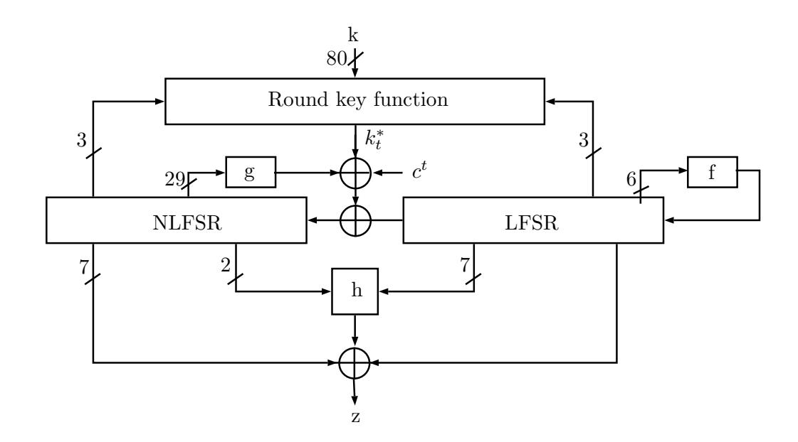
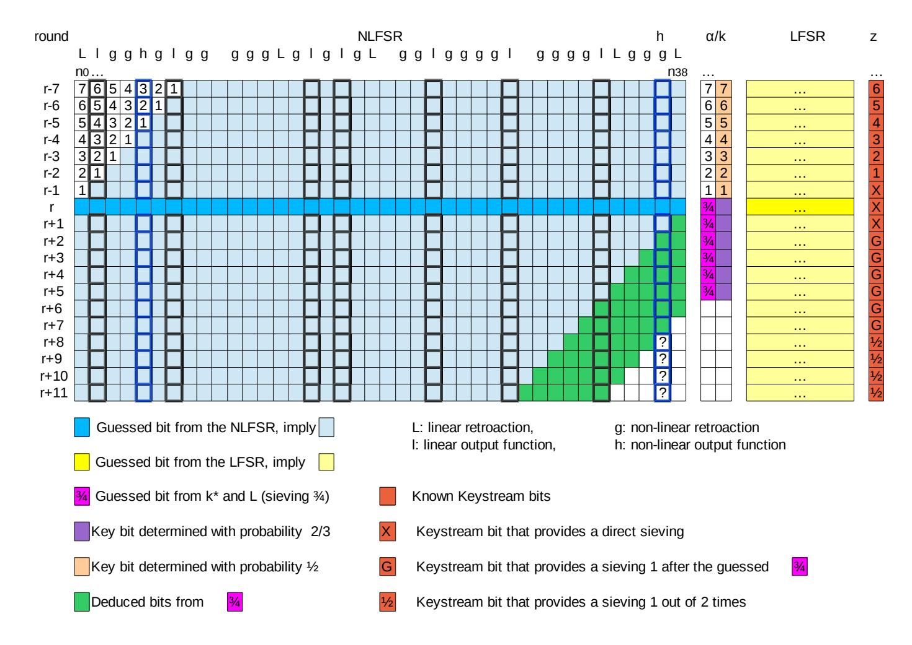
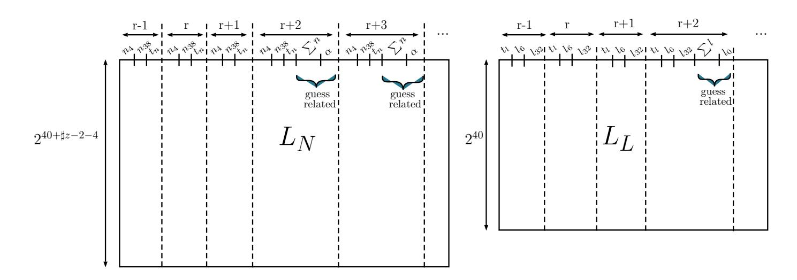
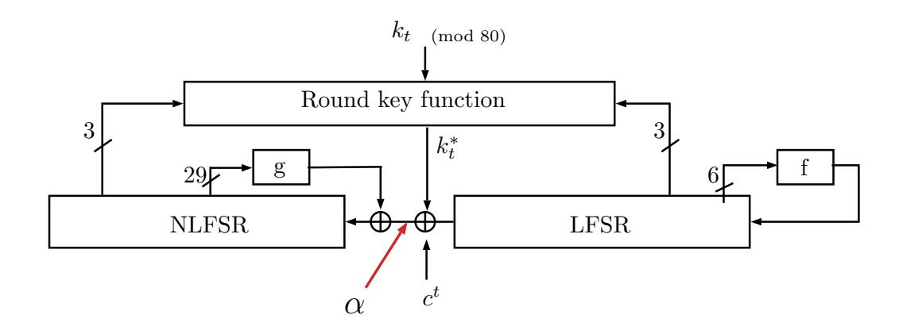
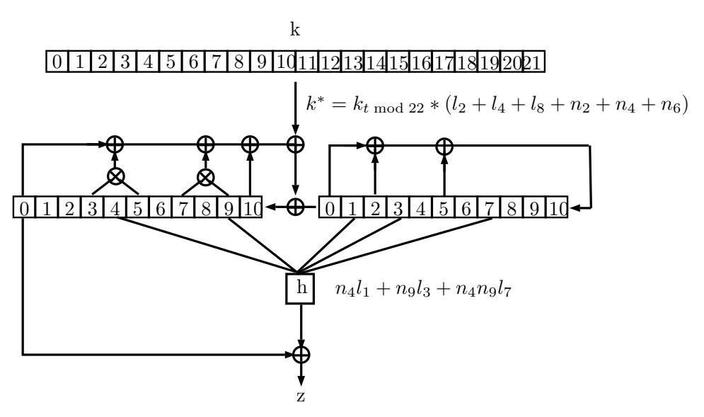

{0}------------------------------------------------

# Cryptanalysis of Full Sprout <sup>∗</sup>

Virginie Lallemand and Mar´ıa Naya-Plasencia

Inria, France

Abstract. A new method for reducing the internal state size of stream cipher registers has been proposed in FSE 2015, allowing to reduce the area in hardware implementations. Along with it, an instantiated proposal of a cipher was also proposed: Sprout. In this paper, we analyze the security of Sprout, and we propose an attack that recovers the whole key more than 2<sup>10</sup> times faster than exhaustive search and has very low data complexity. The attack can be seen as a divide-and-conquer evolved technique, that exploits the non-linear influence of the key bits on the update function. We have implemented the attack on a toy version of Sprout, that conserves the main properties exploited in the attack. The attack completely matches the expected complexities predicted by our theoretical cryptanalysis, which proves its validity. We believe that our attack shows that a more careful analysis should be done in order to instantiate the proposed design method.

Keywords: Stream cipher, Cryptanalysis, Lightweight, Sprout.

# 1 Introduction

The need of low-cost cryptosystems for several emerging applications like RFID tags and sensor networks has drawn considerable attention to the area of lightweight primitives over the last years. Indeed, those new applications have very limited resources and necessitate specific algorithms that ensure a perfect balance between security, power consumption, area size and memory needed. The strong demand from the community (for instance, [\[5\]](#page-18-0)) and from the industry has led to the design of an enormous amount of promising such primitives, with different implementation features. Some examples are PRESENT [\[6\]](#page-18-1), CLEFIA [\[26\]](#page-19-0), KATAN/KTANTAN [\[11\]](#page-18-2), LBlock [\[28\]](#page-19-1), TWINE [\[27\]](#page-19-2), LED [\[17\]](#page-19-3), PRINCE [\[7\]](#page-18-3), KLEIN [\[16\]](#page-19-4), Trivium [\[10\]](#page-18-4) and Grain [\[18\]](#page-19-5).

The need for clearly recommended lightweight ciphers requires that the large number of these potential candidates be narrowed down. In this context, the need for a significant cryptanalysis effort is obvious. This has been proved by the big number of security analyses of the previous primitives that has appeared (to cite a few: [\[20](#page-19-6)[,1,](#page-18-5)[19,](#page-19-7)[21,](#page-19-8)[25](#page-19-9)[,13,](#page-19-10)[24,](#page-19-11)[15\]](#page-19-12)).

Stream ciphers are good candidates for lightweight applications. One of the most important limitations to their lightweight properties is the fact that to

<sup>∗</sup>Partially supported by the French Agence Nationale de la Recherche through the BLOC project under Contract ANR-11-INS-011.

{1}------------------------------------------------

resist time-memory-data trade-off attacks, the size of their internal state must be at least twice the security parameter.

In FSE 2015, Armknecht et al. proposed [\[3,](#page-18-6)[4\]](#page-18-7) a new construction for stream ciphers designed to scale down the area required in hardware. The main intention of their paper is to revisit the common rule to resist against time-memory-data trade-off attacks, and reduce the minimal internal state of stream ciphers. To achieve this goal, the authors decided to involve the secret key not only in the initialization process but also in the keystream generation phase. To support this idea, an instance of this new stream cipher design is specified. This instance is based on the well studied stream cipher Grain128a [\[2\]](#page-18-8) and as such has been named Sprout. In this paper we analyze the security of this cipher, and present an attack on the full version that allows the attacker to recover the whole 80-bit key with a time complexity of 269.<sup>36</sup> , that is 2<sup>10</sup> times faster than exhaustive search and needs very few bits of keystream. Our attack exploits an evolved divide-and-conquer idea.

In order to verify our theoretical estimation of the attack, we have implemented it on a toy version of Sprout that maintains all the properties that we exploit during the attack, and we have corroborated our predicted complexities, being able then to validate our cryptanalysis.

This paper is organised as follows: we first recall the specifications of the stream cipher Sprout in Section [2,](#page-1-0) and then describe our attack in Section [3.](#page-3-0) We provide the details of the implementation that has verified the validity of our attack in Section [4.](#page-14-0) Section [5](#page-17-0) provides a discussion on how the attack affects the particular instantiation and the general idea.

# <span id="page-1-0"></span>2 Description of Sprout

In [\[3\]](#page-18-6) the authors aim at reducing the size of the internal state used in stream ciphers while resisting to time-data-memory trade-off (TMDTO) attacks. They propose to this purpose a new design principle for stream ciphers such that the design paradigm of long states can be avoided. This is done by introducing a state update function that depends on a fixed secret key. The designers expect a minimum time effort equivalent to an exhaustive search of the key for an attacker to lead an attack, since she has to determine the key prior to realise the TMDTO.

Sprout is the concrete instantiation of this new type of stream ciphers developed in [\[3\]](#page-18-6). It has an IV and a key size of 80 bits. Based on Grain128a, this keystream generator is composed of two feedback shift registers of 40 bits, one linear (the LFSR) and one non-linear (the NLFSR), an initialization function and an update function, both key-dependent, and of an output function that produces the keystream (see Figure [1\)](#page-2-0). The maximal keystream length that can be produced under the same IV is 2<sup>40</sup> .

We first recall some notations that will be used in the following:

```
– t clock-cycle number
```

<sup>–</sup> L <sup>t</sup> = (l t 0 , lt 1 , · · · , l<sup>t</sup> <sup>39</sup>) state of the LFSR at clock t

{2}------------------------------------------------



<span id="page-2-0"></span>Fig. 1. Sprout KeyStream Generation

- $-N^t=(n_0^t,n_1^t,\cdots,n_{39}^t)$  state of the NLFSR at clock t
- $-iv = (iv_0, iv_1, \cdots, iv_{69})$  initialisation vector
- $-k=(k_0,k_1,\cdots,k_{79})$  secret key
- $-\ k_t^*$  round key bit generated during the clock-cycle t
- $-z_t$  keystream bit generated during the clock-cycle t
- $-c_t$  round constant at clock t (generated by a counter)

A counter is set to determine the key bit to use at each clock and also to update the non linear register. More specifically, the counter is made up of 9 bits that count until 320 in the initialisation phase, and then count in loop from 0 to 79 in the keystream generation phase. The fourth bit  $(c_4^t)$  is used in the feedback bit computation of the NLFSR.

The 40-bit **LFSR** uses the following retroaction function, that ensures maximal period:  $l_{39}^{t+1} = f(L^t) = l_0^t + l_5^t + l_{15}^t + l_{20}^t + l_{25}^t + l_{34}^t$ . The remaining state is updated as  $l_i^{t+1} = l_{i+1}^t$  for i from 0 to 38.

The **NLFSR** is also 40-bit long and uses a feedback computed by:

$$\begin{split} n_{39}^{t+1} &= g(N^t) + k_t^* + l_0^t + c^t \\ &= k_t^* + l_0^t + c^t + n_0^t + n_{13}^t + n_{19}^t + n_{35}^t + n_{39}^t + n_2^t n_{25}^t + n_3^t n_5^t + n_7^t n_8^t + n_{14}^t n_{21}^t \\ &+ n_{16}^t n_{18}^t + n_{22}^t n_{24}^t + n_{26}^t n_{32}^t + n_{33}^t n_{36}^t n_{37}^t n_{38}^t + n_{10}^t n_{11}^t n_{12}^t + n_{27}^t n_{30}^t n_{31}^t, \end{split}$$

where  $k_t^*$  is defined as:

$$k_t^* = k_t, 0 \le t \le 79$$

$$k_t^* = (k_{t \bmod 80}) \times (l_4^t + l_{21}^t + l_{37}^t + n_9^t + n_{20}^t + n_{29}^t), t \ge 80$$

The remaining state is updated as  $n_i^{t+1} = n_{i+1}^t$  for i from 0 to 38.

In the following, we name by  $\sum l$  the sum of the LFSR bits that intervene in  $k_t^*$  when  $t \ge 80$  (i.e.  $\sum l \triangleq l_4^t + l_{21}^t + l_{37}^t$ ) and by  $\sum n \triangleq n_9^t + n_{20}^t + n_{29}^t$  it NLFSR counterpart, leading to the following equivalent definition of  $k_t^*$  when  $t \geq 80$ :

$$k_t^* = (k_{t \bmod 80}) \times (\sum l + \sum n)$$

{3}------------------------------------------------

**Update and Output Function.-** The output of the stream cipher is a boolean function computed from bits of the LFSR and of the NLFSR. The nonlinear part of it is defined as:

$$h(x) = n_4^t l_6^t + l_8^t l_{10}^t + l_{32}^t l_{17}^t + l_{19}^t l_{23}^t + n_4^t n_{38}^t l_{32}^t$$

And the output bit is given by:

$$z_t = n_4^t l_6^t + l_8^t l_{10}^t + l_{32}^t l_{17}^t + l_{19}^t l_{23}^t + n_4^t n_{38}^t l_{32}^t + l_{30}^t + \sum_{i \in B} n_i^t$$

with  $B = \{1, 6, 15, 17, 23, 28, 34\}$ . Each time a keystream bit is generated, both feedback registers are updated by their retroaction functions.

**Initialization.** The IV is loaded in the initial state in the following way:  $n_i^0 = iv_i, 0 \le i \le 39, l_i = iv_{i+40}, 0 \le i \le 29$  and  $l_i^0 = 1, 30 \le i \le 38, l_{39}^0 = 0$ . The cipher is then clocked 320 times; instead of outputting the keystream bits, these bits are used as feedback in the FSRs:

$$l_{39}^{t+1} = z_t + f(L^t)$$
$$n_{39}^{t+1} = z_t + k_t^* + l^t + c_4^t + g(N^t)$$

**Keystream generation.-** After the 320 initialisation clocks, the keystream starts being generated according to the previously defined output function; one keystream bit per state update.

## <span id="page-3-0"></span>3 Key-Recovery Attack on Full Sprout

The attack described in this section and that has allowed us to attack the full version of Sprout, exploits the short sizes of the registers, the little dependency between them when generating the keystream and the non-linear influence of the keybits in the update function. We use an evolved divide-and-conquer attack, combined with a guess-and-determine technique for recovering the key bits, that resembles the analysis applied to the hash function Shabal from [22,9]. It recovers the whole key much faster than an exhaustive search and needs very little data.

Our attack is composed of three steps: in the first one, the attacker builds and arranges two independent lists of possible internal states for the LFSR and for the NLFSR at an instant r' = 320 + r. For now on, we will refer to time with respect to the state after initialization, being t = 0 the instant where the first keystream bit is output. During the second step, we merge the previous lists with the help of some bits from the keystream that will allow to perform a sieving in order to exclusively keep as candidates the pairs of states that could have generated the known keystream bits. Finally, once a reduced set of possible internal states is kept, we will recover the whole key by using some additional keystream bits. Through all the attack, we consider  $r + \sharp z$  keystream bits as known  $(z_0, \ldots, z_{r+\sharp z-1})$ . The last  $1 + \sharp z$  bits are used in the second step of the

{4}------------------------------------------------

attack, for reducing the number of state candidates. The first r −1 bits are used in the last step of the attack, for recovering the only one correct state and the whole key. We will use these bits in our attack, and therefore they represent the data complexity. As we show in the following, the parameters r and ]z are the ones we adapt to optimize the attack, and in order to mount the best possible attacks, we always have ]z ≥ 6 and r ≥ 1.

We first describe some useful preliminary remarks. Next we describe the three steps of the attack, and finally we provide a summary of the full attack along with the detailed complexities of each step.

## <span id="page-4-1"></span>3.1 Preliminary remarks

We present in this subsection some observations on Sprout, that we use in the following sections for mounting our attack.

Let us consider the internal state of the cipher at time t. If we guessed[1](#page-4-0) both registers at time t, how could we discard some incorrect guesses by using some known keystream bits?

Linear Register.- First of all, let us remark that the linear register state is totally independent from the rest during the keystream generation phase. Then, once its 40-bit value at time t are guessed, we can compute all of its future and past states during the keystream generation, including all its bits involved in the keystream generation.

We describe now the four sievings that can be performed in order to reduce the set of possible states with the help of the conditions imposed by the keystream bits.

Type I: Direct sieving of 2 bits.- From Section [2](#page-1-0) we know that the keystream bit at clock cycle t is given by:

$$z_t = n_4^t l_6^t + l_8^t l_{10}^t + l_{32}^t l_{17}^t + l_{19}^t l_{23}^t + n_4^t n_{38}^t l_{32}^t + l_{30}^t + \sum_{j \in B} n_j^t$$

with B = {1, 6, 15, 17, 23, 28, 34}. We can see that 9 bits of the NLFSR intervene in the keystream bit computation, 7 linearly and 2 as part of terms of degree 2 and 3, as depicted on Figure [2](#page-5-0) (in this figure, instant r corresponds to the generic instant t that we consider in this section). The first observation we can make is that if we know the 80 bits of the internal state at clock t, then we can directly compute the impact of the LFSR and of the NLFSR in the value of z<sup>t</sup> and of zt+1 (see r and r + 1 on Figure [2\)](#page-5-0), which will potentially give us a sieving of two bits: as z<sup>t</sup> and zt+1 are known, the computed values should collide with the known ones. The number of state candidates will then be reduced by a factor of 2−<sup>2</sup> . For instants positioned after t + 1, the bit n t <sup>38</sup> turns unknown so we cannot exploit the same direct sieving. In the full version of the attack, this sieving involves keystream bits z<sup>r</sup> and zr+1.

<span id="page-4-0"></span><sup>1</sup>which cannot be done as it contains 2<sup>80</sup> possible values and therefore exceeds the exhaustive search complexity

{5}------------------------------------------------



<span id="page-5-0"></span>**Fig. 2.** Representation of the full attack. Each line represents the internal values at a certain instant, and the keystream generated at this same instant is represented in the rightmost column.

Type II: Previous round for sieving.— We consider a situation in which we have guessed a state not at instant 0, but at an instant t > 0. This nice idea has the advantage of allowing to additionally exploit the previously generated keystream bits to filter out the wrong states. We can therefore have for free an additional bit of sieving, provided by round t - 1: indeed, as can be seen in Figure 2, for each possible pair of states (NLFSR, LFSR) at round (t - 1) we know all the bits from the NLFSR having an influence on  $z_{t-1}$ , as well as all the bits needed from the LFSR, that are also needed to compute  $z_{t-1}$ . As this keystream bit is known, we can compare it with the computed value: a match occurs with probability 1/2, and therefore the number of possible states is reduced by a factor of  $2^{-1}$ . In the full version of the attack, this sieving involves keystream bit  $z_{t-1}$ .

**Type III: Guessing for sieving.-** To obtain a better sieving, we consider one by one the keystream bits generated at time t+i for i>1. On average, one time out of two,  $n_{38}^{t+i}$  won't be known, as it would depend on the value of  $k_{t+i-2}^*$ . We know that, on average,  $k_{t+i-2}^*$  is null one time out of two with no additional guess. In these cases, we have an additional bit sieving, as we can directly check if  $z_{t+i}$  is the correct one. Moreover, each time the bit  $n_{38}^{t+i}$  is unknown, we can guess the

{6}------------------------------------------------

corresponding  $k_{t+i-2}^*$ , and keep as possible candidate the one that verifies the relation with  $z_{t+i}$ . In this case not only we reduce the number of possible states, but we also recover some associated key bit candidates 2 out of 3 times, as we show in details in Section 3.3. For each bit that we need to guess (×2) we obtain a sieving of  $2^{-1}$ , which compensate. The total number of state candidates, when considering the positions that need a bit guessing and the ones that do not, is reduced by a factor of  $(3/4) \approx 2^{-0.415}$  per keystream bit considered with the type III conditions. For our full attack this gives  $2^{-0.415 \times (\sharp z - 2 - 4)}$ , as  $\sharp z$  is the number of bits considered during conditions of type I, III and IV (the one bit used during type 2 is not included in  $\sharp z$ ). As sieving of type I always uses 2 bits, and conditions of type IV, as we see next, always use 4 bits, sieving of type III remains with  $\sharp z - 2 - 4$  keystream bits. In the full version of the attack, this sieving involves keystream bits  $z_{t+i}$  for i from 2 to  $(\sharp z - 5)$ .

Type IV: Probabilistic sieving. In the full version of the attack, this sieving involves keystream bits  $z_{t+i}$  for i from  $\sharp z - 4$  to  $(\sharp z - 1)$ . Now, we do not guess bits anymore, but instead we analyse what more we can say about the states, *i.e.* whether we can reduce the amount of candidates any further. We point out that  $n_{38}^{t+i}$  only appears in one term from h. What happens if we consider also the next 4 keystream bits? What information can the next keystream bits provide? In fact, as represented in Figure 2, the next four keystream bits could be computed without any additional guesses with each considered pair of states, but for the bit  $n_{38}^{t+i}$ , that is not known. But if we have a look carefully, this bit only affects the corresponding keystream bit one time out of four. Indeed, the partial expression given by h:

$$n_4^{t+i} n_{38}^{t+i} l_{32}^{t+i}$$

is only affected by  $n_{38}^{t+i}$  for 1/4 of the values the other two related variables,  $n_4^{t+i}$  and  $l_{32}^{t+i}$ , can take. Therefore, even without knowing  $n_{38}^{t+i}$ , we can perform a sieving of one bit 3/4 of the times. As a first approximation, this can be done for four keystream bits, marked in Figure 2 with 3/4, so we will obtain an additional sieving of  $4 \times 3/4 = 3$  bits, *i.e.* the number of state candidates will be additionally reduced by  $2^{-3}$ . If we compute the exact value of this sieving, we obtain  $(3/4*1/2+1/4)^4 = 2^{-2.711}$  for 4 keystream bits.

We can now start describing our attack.

### 3.2 Building the lists $L_L$ and $L_N$

We pointed out in the previous section that guessing the whole internal state at once (80 bits) would already be as expensive as the exhaustive key search. Therefore, we start our attack by guessing separately the states of both the NLSFR and the LFSR registers at instant r. For each register we build a list, obtaining two independent lists  $L_L$  and  $L_N$ , which contain respectively the possible state bit values of the internal states of the LFSR, and respectively of the NLFSR, at a certain clock-cycle r' = 320 + r, i.e. r rounds after the first keystream bit is generated.

{7}------------------------------------------------

More precisely,  $L_L$  is filled with the  $2^{40}$  possibilities for the 40 bits of the LFSR at time r (which we denoted by  $l_0$  to  $l_{39}$ ).  $L_N$  is a bigger list that contains  $2^{40+\sharp z-2-4}=2^{34+\sharp z}$  elements<sup>2</sup>, corresponding to the 40-bit state of the NLFSR (denoted by  $n_0$  to  $n_{39}$ ), each coupled to the  $2^{\sharp z-2-4}$  possible values for  $\alpha_r=k_r^*+l_0^r+c_4^r$  to  $\alpha_{r+\sharp z-6}=k_{r+\sharp z-6}^*+l_0^{r+\sharp z-6}+c_4^{r+\sharp z-6}$ . See Figure 4 for a better description of  $\alpha$ .

As detailed next, we also store additional bits deduced from the previous ones to speed up the attack. In  $L_N$ , we store for certain instants of time the bits  $n_4$ ,  $n_{38}$ ,  $t_n \triangleq \sum_{j \in B} n_j$  (the linear contribution of the NLFSR to the output bit z) and  $\sum n = n_9 + n_{20} + n_{29}$  (the sum of the NLFSR bits that appear in the key selection process) while in  $L_L$  it is  $l_6$ ,  $l_{32}$ ,  $t_l \triangleq l_{30} + l_8 l_{10} + l_{19} l_{23} + l_{17} l_{32} + z_t$  and  $\sum l = l_4 + l_{21} + l_{37}$ . These bits are arranged as shown in Figure 3.



<span id="page-7-2"></span>**Fig. 3.** Lists  $L_L$  and  $L_N$  before starting the attack. All the values used for the sorting can be computed from the original states, and the  $\alpha_{r+i}$  in the case of  $L_N$ 

#### <span id="page-7-0"></span>3.3 Reducing the Set of Possible States

The main aim of this step is to use the precomputed lists  $L_L$  and  $L_N$  to combine them and keep only the subset of the crossproduct that corresponds to a full internal state for the registers and that could generate the keystream bits considered. It is easy to see that this problem perfectly corresponds to merging lists with respect to a relation, introduced in [23]. Therefore, we will use the algorithms proposed to solve it in [23,14,12] in order to efficiently find the remaining candidate pairs. Let us point out here that in the complexities we take into account for applying these algorithms, we not only take into account the candidates kept on the lists, but also the cost of sorting and comparing the lists.

<span id="page-7-1"></span><sup>&</sup>lt;sup>2</sup>In the next section we describe how to reduce the state candidates step by step, so if only conditions of type I and II are considered, no guesses are needed and  $L_N$  is of size  $2^{40}$ . When sieving conditions of type III are considered, but not of type IV, as in Table 2, the size of  $L_N$  is  $2^{40+\sharp z-2}$  instead, i.e. the size of the list is  $2^{40+\sharp z-2-\sharp IV}$ , where  $\sharp IV$  are the conditions of type IV considered.

{8}------------------------------------------------

Of course, our aim is to make the number of remaining state candidates shorter than the trivial amount of  $2^{80}$  (the total number of possible internal states for the registers). To achieve this, we use the sieves described in section 3.1 as the relations to consider during the merging of the lists. The sieves were deduced from relations that the known keystream bits and the state bits at time r must satisfy.

For the sake of simplicity, we start by presenting an attack that only uses the sievings of type I and II. Next we will show how to also take into consideration the sieving of type III, and finally we will show how to also take into account the sieving of type IV, and therefore the 4 sievings at once for obtaining a reduced set of possible initial states.



<span id="page-8-0"></span>**Fig. 4.** Position of the Additional Guesses Stored in List  $L_N$ 

Sievings of Type I and II with  $z_{r-1}, z_r$  and  $z_{r+1}$ . Exceptionally, in this simplified version of the attack we consider  $\sharp z=2$ , and t is at least one. We therefore know at least three keystream bits:  $z_{t-1}, z_t$  and  $z_{t+1}$ , that we use for reducing the size of the set of possible internal states at instant t.

We consider the previously built lists  $L_L$  and  $L_N$  both of size  $2^{40}$  (no guesses are performed for this sievings) and are sorted as follows (see the three first columns of lists in Figure 3):

- $L_L$  is sorted according to  $t_l^t = l_{30}^t + l_8^t l_{10}^t + l_{19}^t l_{23}^t + l_{17}^t l_{32}^t + z_t$ ,  $l_6^t$  and  $l_{32}^t$  at instants r 1, r and r + 1.
- $L_N$  is sorted according to  $n_4^t$ ,  $n_{38}^t$  and finally  $t_n^t = \sum_{j \in B} n_j^t$  at time r 1, r and r + 1.

Given our new notations, we can rewrite the equation expressing  $z_t$ , as:

$$t_l^t + t_n^t + n_4^t (n_{38}^t l_{32}^t + l_6^t) = 0$$

We will use it for t from r-1 to r+1. The idea is then to use the relations implied by these three equations to deduce the possible initial state values of the LFSR and of the NLFSR in a guess and determine way.

{9}------------------------------------------------

For instance, if we first consider the situations in which the bits  $n_4^t$  and  $n_{38}^t$  are null, we know that the relation  $t_l^t + t_n^t = 0$  must be satisfied so that we can only combine one eighth of  $L_N$  ( $n_4^t = 0$ ,  $n_{38}^t = 0$  and  $t_n^t = 0$ , or respectively  $n_4 = 0$ ,  $n_{38} = 0$  and  $t_n = 1$ ) with one half of  $L_L$  (in which  $t_l = 0$ , respectively  $t_l = 1$ ). The same way, fixing other values for  $n_4$ ,  $n_{38}$  and  $t_n$  we obtain other restricted number of possibilities for the values of  $t_l^t$ ,  $t_0^t$  and  $t_0^t$ . We reduce the total number of candidate states by  $t_0^{-1}$  per keystream bit considered. When considering the equations from the three keystream bits  $t_0^t$ ,  $t_0^t$  and  $t_0^t$ , we therefore obtain  $t_0^{77}$  possible combinations instead of  $t_0^{80}$ .

This is a direct application of the gradual matching algorithm from [23], and we provide a detailed description of how the algorithm works and should be implemented in Section 4.2.

# Additional Sieving of Type III with $z_{r+2}, \ldots, z_{r+\sharp z-1}$ .

We can easily improve the previous result by taking into account the sieving of type III presented in the previous section. List  $L_N$  will have, in this case, a size of  $2^{40+\sharp z-2}$ , where  $\sharp z-2$  is the number of keystream bits that will be treated with sieving of type III, and therefore, the number of  $\alpha_{t+i}$  bits that will be guessed (for i from 0 to  $\sharp z-2-1$ ). The attacker is given  $(1+\sharp z)$  bits of keystream  $(z_{r-1},\ldots,z_{r+\sharp z-1})$ , and she can directly exploit  $z_{r-1},z_r$  and  $z_{r+1}$  with sieving conditions of type I and II. Next arranging the table as showed in Figure 3 will help exploiting the conditions derived from keystream bits  $z_{r+2},\ldots,z_{r+\sharp z-1}$ .

It has to be noted that the practical use of filter III slightly differs from the explanation given in the paragraph introducing it. While previously we considered making a guess only when needed, during the attack a guess is associated to every element of  $L_N$ . In 1 case out of 4 (as depicted in Table 1, the value of the guess  $\alpha$  will be inconsistent with the given state bits, which leads to a merging filter of  $2^{-0.415}$ . Then, since  $\alpha$  allows to compute the value of the retroaction bit of the NLFSR and from that the associated z, we access an additional sieve of average value  $2^{-1}$ .

We recall that, so far (as we have not discussed yet the application of sieving conditions of type IV), the number of keystream bits treated by type III of conditions is  $\sharp z-2$ . By repeating this process  $\sharp z-2$  times, we finally obtain  $2^{40+\sharp z-2+40-3-(1+0.415)*(\sharp z-2)}=2^{80-3-0.415*(\sharp z-2)}$  possible internal states. We now detail the cost of obtaining this reduced set. The process of the attack considering sievings of type I, II and III simultaneously, which is done using a gradual matching technique as described in [23], can be broadly summarized as follows and can be visualized in Table 2:

1. Consider the two precomputed lists  $L_N$  and  $L_L$  of respective sizes  $2^{40+\sharp z-2}$  and  $2^{40}$ , containing all the possibilities for the 40-bit long internal states of the NLFSR and the  $\sharp z-2$  additional guesses and respectively the 40-bit long possible internal states of the LFSR.

<span id="page-9-0"></span><sup>&</sup>lt;sup>3</sup>In the full attack, the last keystream bit considered here is  $z_{r+\sharp z-1-4}$ , as  $\sharp z$  is four units bigger when considering sieving conditions of type IV

{10}------------------------------------------------

<span id="page-10-0"></span>**Table 1.** Restrictions obtained from the additional guess, deduced from the formula of  $n_{39}^{t+1}$ 

|          |          | 7 .         |          | l. c        |  |  |  |
|----------|----------|-------------|----------|-------------|--|--|--|
| $\alpha$ | $\sum n$ | $l_0 + c_4$ | $\sum l$ | information |  |  |  |
|          |          |             | 0        | none        |  |  |  |
|          | 0        | 0           | 1        | k = 0       |  |  |  |
|          |          |             | 0        | impossible  |  |  |  |
|          |          | 1           | 1        | k=1         |  |  |  |
| 0        |          |             | 0        | k = 0       |  |  |  |
|          | 1        | 0           | 1        | none        |  |  |  |
|          |          |             | 0        | k = 1       |  |  |  |
|          |          | 1           | 1        | impossible  |  |  |  |
|          |          |             | 0        | impossible  |  |  |  |
|          | 0        | 0           | 1        | k = 1       |  |  |  |
|          |          |             | 0        | none        |  |  |  |
|          |          | 1           | 1        | k = 0       |  |  |  |
| 1        |          |             | 0        | k = 1       |  |  |  |
|          | 1        | 0           | 1        | impossible  |  |  |  |
|          |          |             | 0        | k = 0       |  |  |  |
|          |          | 1           | 1        | none        |  |  |  |

- 2. For i from 0 to  $\sharp z$ , consider keystream bit  $z_{r+i}$ , and:
  - (a) if  $i \leq 2$ , divide the current (sub)list from  $L_N$  in  $2^3$  sublists according to the values of  $n_4$ ,  $n_{38}$  and  $t_n$  at time r+i-1 and divide the current (sub)list from  $L_L$  into  $2^3$  sublists according to the values of  $t_l$ ,  $t_6$  and  $t_{32}$  also at time r+i-1. According to the previous discussion, we know that only  $2^{3+3-1}=2^5$  combinations of sublists are possible (for sievings of type I and II). For each one of the  $2^5$  possible combinations, consider the next value for i.
  - (b) if i > 2, divide further the current sublist from  $L_N$  in  $2^5$  sublists according to the values of the 5 bits  $n_4$ ,  $n_{38}$ ,  $t_n$ ,  $\sum n$  and  $\alpha_{r+i-1-2} = (k_{r+i-1-2}^* + l_{r+i-1-2})$  (the additional guess) at time r+i-1 and divide the current sublist from  $L_L$  in  $2^5$  sublists according to the values of the 5 bits  $t_l$ ,  $l_6$ ,  $l_{32}$ ,  $\sum l$  and  $l_0$  at time r+i-1. According to the previous discussion, we know that only  $2^{5+5-1-0.415} = 2^{8.585}$  combinations of those sublists are possible. For each one of the  $2^{8.585}$  possible combinations, consider the next value for i.

For a given value of  $\sharp z$ , the log of the complexity of recursively obtaining the reduced possibilities for the internal state by this method could be computed as the sum of the right most column of Table 2, as this represents the total number of possible sublist combinations to take into account plus the sum of this column and the log of the *relative sizes* in both remaining sublists, which are given in the last line considered, as, for each possible combination of the sublists, we have to try all the elements remaining in one list with all the elements in the other. In

{11}------------------------------------------------

<span id="page-11-0"></span>Table 2.

| i  | $ L_N $ sublists size | $L_L$ sublists size | matching pairs     |  |  |  |  |
|----|-----------------------|---------------------|--------------------|--|--|--|--|
|    | $(\log)$              | $(\log)$            | at this step (log) |  |  |  |  |
|    | $40 + \sharp z - 2$   | 40                  |                    |  |  |  |  |
| 0  | $35+ \sharp z$        | 37                  | 5                  |  |  |  |  |
| 1  | $32+ \sharp z$        | 34                  | 5                  |  |  |  |  |
| 2  | $29 + \sharp z$       | 31                  | 5                  |  |  |  |  |
| 3  | 24+ #z                | 26                  | 8.585              |  |  |  |  |
| 4  | 19+ #z                | 21                  | 8.585              |  |  |  |  |
| 5  | 14+ #z                | 16                  | 8.585              |  |  |  |  |
| 6  | 9+ #z                 | 11                  | 8.585              |  |  |  |  |
| 7  | 4+ #z                 | 6                   | 8.585              |  |  |  |  |
| 8  | # <i>z</i> -1         | 1                   | 8.585              |  |  |  |  |
| 9  | # <i>z</i> -6         | '-4'                | 8.585              |  |  |  |  |
| 10 | # <i>z</i> -11        | '-9'                | 8.585              |  |  |  |  |

the cases where the log is negative (-h), we only check the combinations with the other sublists when we find a non empty one, which happens with probability  $2^{-h}$ , and this also corresponds to the described complexity.

Let us consider  $\sharp z=8$ . The total time complexity<sup>4</sup> will be

$$2^{3*5+6*8.585} + 2^{3*5+6*8.585+8-1+1} \approx 2^{74.51}$$

If we considered for instance  $\sharp z=9$ , we obtain for i=9 a number of possible combinations of  $2^{3*5+7*8.585}\approx 2^{75.095}$  for checking if the corresponding sublist is empty or not, and so the attack will be more expensive than when considering  $\sharp z=8$ , which seems optimal (without including conditions of type IV).

To compare with exhaustive search (so to give the time complexity on encryption functions), we have to multiply  $2^{74.51}$  by  $\frac{8}{(320)}$ , where  $\frac{8}{(320)} = 2^{-5.32}$  is the term comparing our computations with one encryption, i.e. 320 initialization rounds, and we do not take into account the following 80 rounds for recovering one unique key, as with early abort techniques one or two rounds should be enough. This gives  $2^{69.19}$  as time complexity, for recovering  $2^{74.5}$  possible states.

We can still improve this, by using the sieving of type 4, as we show in the next section.

<span id="page-11-2"></span>Additional Sieving of Type IV with  $z_{r+2}, \ldots, z_{r+\sharp z-1}$ . Applying the type IV sieving is quite straight forward, as no additional guesses are needed: It just means that on average, we have an additional extra sieving of  $2^{-2.71}$  per possible state found after the sievings of type I, II and III. In the end, when considering all the sievings, we recover  $2^{71.8}$  possible states with a time

<span id="page-11-1"></span><sup>&</sup>lt;sup>4</sup>we are not giving here the complexity yet in number of encryptions, which will reduce it when comparing with an exhaustive search

{12}------------------------------------------------

complexity determined by the previous step (applying sieving of type III which is the bottleneck) of  $2^{69.19}$  encryption calls.

As previously we have determined that the optimal value for  $\sharp z$  when considering sieving conditions of type I, II and III is 8, now, as we consider 4 additional keystream bits, the optimal value is  $\sharp z=8+4=12$ .

The question now is: how to determine, from the  $2^{71.8}$  possible states, which one is correct, and whether it is possible or not to recover the whole key. We will see how both things are possible with negligible additional cost.

#### <span id="page-12-1"></span>3.4 Full key recovery attack: guessing a middle state

The main idea that allows us to recover the whole master key with a negligible extra complexity is considering the guessed states of the registers as not the first initial one, obtained right after initialization and generation of  $z_0$ , but instead, guessing the state after having generated r keystream bits, with r > 0 (for instance, values of r that we will consider are around 100). The data needs will be  $r + \sharp z$  keystream bits, which is more than reasonably low (the keystream generation limit provided by the authors is  $2^{40}$  bits). We recall here that the optimal value for  $\sharp z$  is 12.

With a complexity equivalent to  $2^{69.19}$  encryptions, we have recovered  $2^{71.8}$  possible internal states at time r using  $\sharp z+1=13$  keystream bits, reducing the initial total amount by  $2^{8.2}$ . The question now is: how to find the only correct one, out of these  $2^{71.8}$  possible states? And can we recover the 80-bit master key? We recall that, on average, we have already recovered  $(\sharp z-2-4)*2/3=4$  keybits during the type III procedure described in section 3.3. For the sake of simplicity, and as the final complexity won't be modified (it might be slightly better for the attacker if we consider them in some cases), we will forget about these 4 keybits.

Inverting one round for free.- Using Figure 2, we will describe how to recover the whole key and the correct internal state with a negligible cost. This can be done with a technique inspired by the one for inverting the round function of the Shabal [8] hash function, proposed in [22,9]. The keystream bit from column z, marked with a 1 (at round (r-2)) represents  $z_{r-2}$ , and implies the value of  $n_1^{r-2}$  at this same round<sup>5</sup>, which implies the value of  $n_0^{r-1}$ , one round later. This last value also completely determines the value of the guessed bit in round r-1 ( $\alpha_{r-1}$ ), which determines the value of this same round  $k_{r-1}^*$ , which, with a probability of 1/2, will determine the corresponding key bit and with probability of 1/4 won't be a valid state, corresponding to the case of  $k_{r-1}^* = 1$  and  $(l_4^{r-1} + l_{21}^{r-1} + l_{37}^{r-1} + n_9^{r-1} + n_{20}^{r-1} + n_{29}^{r-1}) = 0$ , producing a sieving of 3/4 (we only keep 3/4 of the states on average).

<span id="page-12-0"></span><sup>&</sup>lt;sup>5</sup>This result comes from the expression of  $z_{r-2}$  that linearly involves  $n_1^{r-2}$  while all the other involved terms are known

{13}------------------------------------------------

Inverting many rounds for free.— We can repeat the exact same procedure considering also the keystream bits marqued with 2 and 3 ( $z_{r-3}$  and  $z_{r-4}$  respectively). When we arrive backwards at round (r-5), we are considering the keystream bit marked with 4, that is actually  $z_{r-5}$ , and the bit  $n_4^{r-5}$  needed for checking the output equations that wasn't known before, is now known as it is  $n_1^{r-2}$ , that was determined when considering the keystream bit  $z_{r-2}$ . We can therefore repeat the procedure for keystream bits 4,5,6... and so on. Indeed, in the same way, we can repeat this for as many rounds as we want, with a negligible cost (but for the constant represented by the number of rounds).

Choosing the optimal value for r.- As we have seen, going backwards r rounds (so up to the initialisation state) will determine on average r/2 key bits, and for each keystream bit considered we have a probability of 3/4 of keeping the state as candidate, so we will keep a proportion of  $(3/4)^{r-1}$  state candidates.

Additionally, if r > 80, because of the definition of  $k^*$ , the master key involved bits will start repeating<sup>6</sup>. For the kept state candidates, we have an additional probability of around  $2/3 \times 2/3 = 2^{-2}$  of having determined the bit at one round as well as exactly 80 rounds before. The 2/3 comes from the fact that, for having one key bit at an instant t determined we need  $(l_4^t + l_{21}^t + l_{37}^t + n_9^t + n_{20}^t + n_{29}^t) = 1$ , and as the case  $(l_4^t + l_{21}^t + l_{37}^t + n_9^t + n_{20}^t + n_{29}^t) = 0$  with  $k_t^* = 1$  has been eliminated by discarding states, we have that 2 out of the three remaining cases will determine a key bit. Therefore, when this happens, we need the bits to collide in order to keep the tested state as a candidate. This happens with an additional probability of 1/2 per bit.

We first provide here the equations considering  $r \leq 80$ . Given  $2^{71.5}$  possible states obtained during the second step, the average number of states that we will keep as candidates after inverting r rounds  $(\sharp s)$  is  $\sharp s = 2^{71.8} \times (3/4)^r$ . Each one has  $\sharp K = r \times 2/3$  determined key bits on average.

For 160 > r > 80, the average number of states that we will keep as candidates is

$$\sharp s = 2^{71.8} \times (3/4)^r \times 2^{-(r-80)\times(2/3)^2}.$$

Each one has  $\sharp K = r \times 2/3 - (r - 80) \times (2/3)^2$  determined key bits on average.

For any r, as we can gradually eliminate the candidate states on the fly, we do not need to compute backwards all the 100 bits but for very few of them. The complexity of testing the kept states in encryption function calls in the worst case will be

$$2^{71.8} \times \frac{1}{320} + 2^{71.8-1*0.41} \times \frac{2}{320} + \ldots + 2^{71.8-(r-1)*0.41} \times \frac{r}{320}$$

we can upper bound this complexity by  $10 \times 2^{71.8} \times \frac{1}{320} \approx 2^{67.1}$ , which is lower than the complexity to perform the previous step, described in Section 3.3, so won't be the bottleneck.

<span id="page-13-0"></span><sup>&</sup>lt;sup>6</sup>As previously said, for the sake of simplicity we do not take into account the  $\sharp z$  bits computed from r forward, and we discuss in the next section on implementation, the very little this changes in the final complexity (any way, it could only help the attacker, so the attack is as least as "good" as explained in our analysis).

{14}------------------------------------------------

As for each final kept state, we have to try all the possibilities for the remaining 80 − ]K key bits, we can conclude that the final complexity of this last part of the attack in number of encryptions is

$$\sharp s \times 2^{80-\sharp K},\tag{1}$$

Which will be negligible most of the times (as a small increase in r means a big reduction of this complexity).

The optimal case is obtained for values of r close to 100, so we won't provide the equations when r > 160.

For our attack, it would seem enough to choose r = 80 in order to have this last step less expensive than the previous one, and therefore, in order not to increase the time complexity. We can choose r = 100 so that we are sure that things will behave correctly and the remaining possible key candidates can be very efficiently tested. We recall that the optimal value for ]z was 8 + 4, which means that the data complexity of our attack is r + ]z = 112 bits of keystream, which is very small. We have ]s = 221.<sup>41</sup> and ]K = 57.2. The complexity of this step is therefore 221.<sup>41</sup> <sup>×</sup> <sup>2</sup> <sup>80</sup>−57.<sup>2</sup> = 244.<sup>2</sup> , which is much lower than the complexity of the previous steps.

### 3.5 Full attack summary

We consider r = 100 and ]z = 12. The data complexity of the attack is therefore 112 bits.

First, we have precomputed and carefully arranged the two lists L<sup>L</sup> and L<sup>N</sup> , of size 2<sup>40</sup> and 240+12−4−<sup>2</sup> = 2<sup>46</sup>, and 2<sup>46</sup> will be the memory needed to perform the attack, as all the remaining steps can be performed on the fly. Next, we merged both lists with respect to the sieving conditions of type I, II, III and IV, obtaining 2<sup>71</sup>.<sup>8</sup> state candidates with a complexity of 2<sup>69</sup>.<sup>19</sup> encryptions. For each candidate state, we compute some clocks backwards, in order to perform an additional sieving and to recover some key bits. This can be done with a complexity of 2<sup>67</sup>.<sup>1</sup> . The kept states and associated key bits are tested by completing the remaining key bits, and we only keep the correct one. This is done with a cost of 2<sup>44</sup>.<sup>2</sup> . We recover then the whole master key with a time complexity of 2<sup>69</sup>.<sup>24</sup> encryptions, i.e. around 2<sup>10</sup> times faster than an exhaustive key search. In the next section we implement the attack on a reduced version of the cipher, being able to proof the validity of our theoretical analysis, and verifying the attack.

# <span id="page-14-0"></span>4 Implementation and verification of the attack

To prove the validity of our attack, we experimentally test it on a shrinked cipher with similar structure and properties. More specifically, we built a small stream cipher according to the design principles used for Sprout but with a key of 22 bits and two states of 11 bits. We then implemented our attack and checked the returned complexities.

{15}------------------------------------------------

#### 4.1 Toy cipher used

The toy cipher we built is the one represented in Figure 5. It follows the same structure as Sprout but its registers are around 4 times smaller. We have chosen the functions so that the sieving conditions behaved similarly as in our full round attack. We keep the same initialisation principle and set the number of initialisation rounds to  $22 \times 4 = 88$  (in Sprout there are  $80 \times 4 = 320$  initialisation rounds).



<span id="page-15-1"></span>Fig. 5. Toy Cipher

#### <span id="page-15-0"></span>Algorithm implemented 4.2

#### Steps 1 and 2 of the attack.

- 1. Ask for r + #z = r + 3 keystream bits generated from time t = 0 to t =r+3-1, that we denote by  $z^0, z^1, \cdots z^{r+2}$
- 2. Build a list  $L_L$  of size  $2^{11}$  containing all the possible values for the 11 bits of the linear register at time t=r, sorted according to:

  - $-l_1^r, l_3^r$  and  $l_7^r$  at time t = r,  $-l_1^{r+1}, l_3^{r+1}$  and  $l_7^{r+1}$  at time t = r+1,  $-l_3^{r+2}$  and  $l_7^{r+2}$  at time t = r+2 and finally
  - $l_0^r$ ,  $l_2^r + l_4^r + l_8^r$  at time t = r
- 3. Build a list  $L_N$  of size  $2^{11+1} = 2^{12}$  that contains all the possible state values of the non-linear register at time t = r plus the value of an additional guess and sort it according to:
  - $-n_0^r + z^r$ ,  $n_4^r$  and  $n_9^r$  at time t = r,

  - $-n_0^{r+1} + z^{r+1}, n_4^{r+1} \text{ and } n_9^{r+1} \text{ at time } t = r+1, \\ -n_0^{r+2} + z^{r+2}, n_4^{r+2} \text{ and } n_9^{r+2} \text{ at time } t = r+2 \text{ and finally}$
  - $-\alpha^r$  (the guessed bit) at time t=r
- 4. Create a new list M containing the possible value of  $L_L$  and  $L_N$  together:
  - (a) Consider the states of  $L_L$  and  $L_N$  for which the first indexes  $(l_1^r, l_3^r)$  and  $l_7^r$  in  $L_L$  and  $n_0^r + z^r$ ,  $n_4^r$  and  $n_9^r$  in  $L_N$ ) verify the equation given by the keystream bit at time t = r:

{16}------------------------------------------------

$$z^r = n_4^r l_1^r + n_9^r l_3^r + n_4^r n_9^r l_7^r + n_0^r$$

i. Apply a second filter given by the second indexes  $(l_1^{r+1}, l_3^{r+1})$  and  $l_7^{r+1}$  in L and  $n_0^{r+1} + z^{r+1}$ ,  $n_4^{r+1}$  and  $n_9^{r+1}$  in G) by checking if the equation given by the keystream bit at time t = r + 1 holds:  $z^{r+1} = n_4^{r+1} l_1^{r+1} + n_9^{r+1} l_3^{r+1} + n_4^{r+1} n_9^{r+1} l_7^{r+1} + n_0^{r+1}$ 

A. Similarly, apply a sieving according to the third indexes. Remark here that  $l_1$  at time t = r + 2 is equal to the already fixed bit  $l_3$  at time t=r. Finally, use the additional information deduced from  $\alpha$  at time t = r that must verify

$$\alpha^r = k^r \cdot (l_2^r + l_4^r + l_8^r + n_2^r + n_4^r + n_6^r)$$

so that it implies a contradiction if  $l_2^r + l_4^r + l_8^r = n_2^r + n_4^r + n_6^r$ and  $\alpha^r \neq l_0$  at the same time.

As discussed in Section 3.3, the resulting filter on the cardinal product of the list is of  $2^{-1-1-1-0.415}$  so  $2^{23-3.415} = 2^{19.585}$  possible states remain at this point.

## Step 3 of the attack.-

- 1. For each of the  $2^{19.585}$  possible states at time t=r, create a vector of 22 bits K for the possible value of the key associated to it:
  - (a) For time t = r 1 to t = 0:
    - i. Deduce the values of  $n_i^t$ ,  $i = 1 \cdots 10$  and of  $l_i^t$ ,  $i = 1 \cdots 10$  from the state at time t+1
    - ii. Compute the value of  $n_0^t$  given by the keystream bit equation as:

 $n_0^t = z^t + n_4^t l_1^t + n_9^t l_3^t + n_4^t n_9^t l_7^t$ and of  $l_0^t$  given by the LFSR retroaction equation as:

e LFSR retroaction equation as 
$$t = tt + tt + tt + tt$$

 $l_0^t = l_2^t + l_5^t + l_{10}^{t+1}$  and deduce from it the value of

$$k^{*t} = n_0^t + n_3^t n_5^t + n_7^t n_9^t + n_{10}^t + l_0 + n_{10}^{t+1}$$

(given by the NLFSR retroaction equation)

- iii. Compute the value of  $l_2^t + l_4^t + l_8^t + n_2^t + n_4^t + n_6^t$  and combine it with the value of  $k^{*t}$  obtained in the previous step:
  - A. If  $l_2^t + l_4^t + l_8^t + n_2^t + n_4^t + n_6^t = 0$  and  $k^{*t} = 1$ , there is a contradiction so discard the state and try another one by going back to Step 1.
  - B. If  $l_2^t + l_4^t + l_8^t + n_2^t + n_4^t + n_6^t = 1$  and  $k^{*t} = 0$  check if the bit has already been set in K. If no, set it to 0. Else, if there is a contradiction, discard the state and try another one by going back to Step 1.
  - C. If  $l_2^t + l_4^t + l_8^t + n_2^t + n_4^t + n_6^t = 1$  and  $k^{*t} = 1$  check if the bit has already been set in K. If no, set it to 1. Else, if there is a contradiction, discard the state and try another one by going back to Step 1.

#### 4.3 Results

The previous algorithm has been implemented and tested for various values of r. At the end of step 2 we recovered indeed 2<sup>19.5</sup> state candidates. In all the cases, 

{17}------------------------------------------------

the pair formed by the correct internal state and the partial right key were included amongst the candidates at the end of step 3. The results are displayed in Table 3, together with the values predicted by theory. We recall here that the expected number of states at the end of the key recovery is given by the formula in Section 3.4 which in this case can be simplified by:

$$2^{19.5} \times (3/4)^r = 2^{19.5 - 0.415r}$$
 when  $r < |k|$  and by  $2^{19.5} \times (3/4)^r \times 2^{-(r-|k|) \times (2/3)^2} = 2^{29.35 - 0.859r}$  when  $r \ge |k|$ .

In the same way, we expect the following amount of bits to be determined:

$$r \times (2/3)$$
 when  $r < |k|$  and  $r \times (2/3) - (r - |k|) \times (2/3)^2$  when  $r \ge |k|$ .

This leads to the comparison given in Table 3 in which we can remark that theory and practice meet quite well.

Note that given the implementation results, a sensible choice would be to consider a value of r around 26. Indeed, r=26 means that the attacker has to consider all the  $2^{7.32}$  states at the end of the key recovery part and for each of them has to exhaust on average the 6.67 unknown bits, leading to an additional complexity of  $2^{13.99}$ . This number has to be compared to the time complexity of the previous operation. The time complexity for recovering the  $2^{19.585}$  candidates at the end of step 2 is the bottleneck of the time complexity. According to Section 3.3, this term can be approximated by  $2^{19.585} \times \frac{3}{88} \simeq 2^{14.71}$  encryptions. So recovering the full key is of negligible complexity in comparison, and r=26 leads to an attack of time complexity smaller than  $2^{15}$  encryptions, coinciding with our theoretical complexity.

<span id="page-17-1"></span>**Table 3.** Experimental Results Obtained on Average on 300 Random States and Keys

| r                       | 20    | 21    | 22    | 23   | 24   | 25   | 26   | 27   | 28   | 29   | 30             |
|-------------------------|-------|-------|-------|------|------|------|------|------|------|------|----------------|
| log of number of states |       |       |       |      |      |      |      |      |      |      |                |
| remaining at the end    | 11.28 | 10.85 | 10.47 | 9.68 | 8.95 | 8.01 | 7.32 | 6.63 | 5.75 | 5.17 | 4.42           |
| of the key recovery     |       |       |       |      |      |      |      |      |      |      |                |
| theory                  | 11.3  | 10.9  | 10.5  | 9.6  | 8.8  | 7.9  | 7.0  | 6.2  | 5.3  | 4.4  | 3.6            |
| unknown bits            | 8.68  | 8.02  | 7.30  | 7.12 | 6.96 | 6.77 | 6.67 | 6.32 | 6.29 | 6.03 | $\boxed{5.94}$ |
| theory                  | 8.7   | 8.0   | 7.3   | 7.1  | 6.9  | 6.7  | 6.4  | 6.2  | 6.0  | 5.8  | 5.6            |

### <span id="page-17-0"></span>5 Conclusion

In this paper we present a key-recovery attack on the stream cipher Sprout, proposed at FSE 2015, that allows to recover the whole key more than 2<sup>10</sup> times

{18}------------------------------------------------

faster than exhaustive search. We have implemented our attack on a toy version of the cipher. This implemented attack behaves as predicted, and, therefore, we have been able to verify the correctness of our approach. Our attack exploits the small size of the registers and the non-linear influence of the key in the update function. It shows a security issue on Sprout and suggests that a more careful analysis should be done in order to instantiate the proposed design method.

An interesting direction to look at for repairing this weakness would be to consider the key influence on the update function as linear.

# References

- <span id="page-18-5"></span>1. Abdelraheem, M.A., Blondeau, C., Naya-Plasencia, M., Videau, M., Zenner, E.: Cryptanalysis of ARMADILLO2. In: ASIACRYPT. LNCS, vol. 7073, pp. 308–326. Springer (2011)
- <span id="page-18-8"></span>2. ˚Agren, M., Hell, M., Johansson, T., Meier, W.: Grain-128a: a New Version of Grain-128 with Optional Authentication. IJWMC 5(1), 48–59 (2011)
- <span id="page-18-6"></span>3. Armknecht, F., Mikhalev, V.: On Lightweight Stream Ciphers with Shorter Internal States. In: FSE 2015. LNCS, Springer (2015), to appear.
- <span id="page-18-7"></span>4. Armknecht, F., Mikhalev, V.: On Lightweight Stream Ciphers with Shorter Internal States. Cryptology ePrint Archive, Report 2015/131 (2015), [http://eprint.iacr.](http://eprint.iacr.org/2015/131) [org/2015/131](http://eprint.iacr.org/2015/131)
- <span id="page-18-0"></span>5. Bogdanov, A., Leander, G., Paar, C., Poschmann, A., Robshaw, M.J.B., Seurin, Y.: Hash Functions and RFID Tags: Mind the Gap. In: Cryptographic Hardware and Embedded Systems - CHES 2008. LNCS, vol. 5154, pp. 283–299. Springer (2008)
- <span id="page-18-1"></span>6. Bogdanov, A., Knudsen, L.R., Leander, G., Paar, C., Poschmann, A., Robshaw, M.J.B., Seurin, Y., Vikkelsoe, C.: PRESENT: An Ultra-Lightweight Block Cipher. In: Cryptographic Hardware and Embedded Systems - CHES 2007. LNCS, vol. 4727, pp. 450–466. Springer (2007)
- <span id="page-18-3"></span>7. Borghoff, J., Canteaut, A., G¨uneysu, T., Kavun, E.B., Knezevic, M., Knudsen, L.R., Leander, G., Nikov, V., Paar, C., Rechberger, C., Rombouts, P., Thomsen, S.S., Yal¸cin, T.: PRINCE - A Low-Latency Block Cipher for Pervasive Computing Applications - Extended Abstract. In: Advances in Cryptology - ASIACRYPT 2012. LNCS, vol. 7658, pp. 208–225. Springer (2012)
- <span id="page-18-10"></span>8. Bresson, E., Canteaut, A., Chevallier-Mames, B., Clavier, C., Fuhr, T., Gouget, A., Icart, T., J.Misarsky, Naya-Plasencia, M., Paillier, P., Pornin, T., Reinhard, J., Thuillet, C., Videau, M.: Shabal. In: The first SHA-3 Candidate Conference. Leuven, Belgium (2009)
- <span id="page-18-9"></span>9. Bresson, E., Canteaut, A., Chevallier-Mames, B., Clavier, C., Fuhr, T., Gouget, A., Icart, T., Misarsky, J.F., Naya-Plasencia, M., Paillier, P., Pornin, T., Reinhard, J.R., Thuillet, C., Videau, M.: Indifferentiability with Distinguishers: Why Shabal Does Not Require Ideal Ciphers. Cryptology ePrint Archive, Report 2009/199 (2009), <http://eprint.iacr.org/2009/199>
- <span id="page-18-4"></span>10. Canni`ere, C.D.: Trivium: A Stream Cipher Construction Inspired by Block Cipher Design Principles. In: Information Security, 9th International Conference, ISC 2006. LNCS, vol. 4176, pp. 171–186. Springer (2006)
- <span id="page-18-2"></span>11. Canni`ere, C.D., Dunkelman, O., Knezevic, M.: KATAN and KTANTAN - A Family of Small and Efficient Hardware-Oriented Block Ciphers. In: Cryptographic

{19}------------------------------------------------

- Hardware and Embedded Systems CHES 2009. LNCS, vol. 5747, pp. 272–288. Springer (2009)
- <span id="page-19-16"></span>12. Canteaut, A., Naya-Plasencia, M., Vayssi`ere, B.: Sieve-in-the-Middle: Improved MITM Techniques. In: CRYPTO 2013 (I). LNCS, vol. 8042, pp. 222–240. Springer (2013)
- <span id="page-19-10"></span>13. Collard, B., Standaert, F.X.: A Statistical Saturation Attack against the Block Cipher PRESENT. In: Topics in Cryptology - CT-RSA 2009. pp. 195–210. LNCS 5473, Springer (2009)
- <span id="page-19-15"></span>14. Dinur, I., Dunkelman, O., Keller, N., Shamir, A.: Efficient Dissection of Composite Problems, with Applications to Cryptanalysis, Knapsacks, and Combinatorial Search Problems. In: Advances in Cryptology - CRYPTO 2012. LNCS, vol. 7417, pp. 719–740. Springer (2012)
- <span id="page-19-12"></span>15. Dinur, I., Shamir, A.: Cube Attacks on Tweakable Black Box Polynomials. In: Advances in Cryptology - EUROCRYPT 2009. LNCS, vol. 5479, pp. 278–299. Springer (2009)
- <span id="page-19-4"></span>16. Gong, Z., Nikova, S., Law, Y.W.: KLEIN: A New Family of Lightweight Block Ciphers. In: RFID. Security and Privacy, RFIDSec 2011. LNCS, vol. 7055, pp. 1–18. Springer (2011)
- <span id="page-19-3"></span>17. Guo, J., Peyrin, T., Poschmann, A., Robshaw, M.J.B.: The LED Block Cipher. In: Cryptographic Hardware and Embedded Systems - CHES 2011. LNCS, vol. 6917, pp. 326–341. Springer (2011)
- <span id="page-19-5"></span>18. Hell, M., Johansson, T., Meier, W.: Grain: a Stream Cipher for Constrained Environments. IJWMC 2(1), 86–93 (2007)
- <span id="page-19-7"></span>19. Lallemand, V., Naya-Plasencia, M.: Cryptanalysis of KLEIN. In: Fast Software Encryption, FSE 2014. LNCS, vol. 8540, pp. 451–470. Springer (2014)
- <span id="page-19-6"></span>20. Leander, G., Abdelraheem, M.A., AlKhzaimi, H., Zenner, E.: A Cryptanalysis of PRINTcipher: The Invariant Subspace Attack. In: Advances in Cryptology - CRYPTO 2011. LNCS, vol. 6841, pp. 206–221. Springer (2011)
- <span id="page-19-8"></span>21. Mendel, F., Rijmen, V., Toz, D., Varici, K.: Differential Analysis of the LED Block Cipher. In: Advances in Cryptology - ASIACRYPT 2012. LNCS, vol. 7658, pp. 190–207. Springer (2012)
- <span id="page-19-13"></span>22. Naya-Plasencia, M.: Chiffrements `a flot et fonctions de hachage : conception et cryptanalyse. Th´ese, INRIA Paris-Rocquencourt, Project SECRET et Universit´e Pierre et Marie Curie, France (2009)
- <span id="page-19-14"></span>23. Naya-Plasencia, M.: How to Improve Rebound Attacks. In: CRYPTO 2011. LNCS, vol. 6841, pp. 188–205. Springer (2011)
- <span id="page-19-11"></span>24. Naya-Plasencia, M., Peyrin, T.: Practical cryptanalysis of ARMADILLO2. In: Fast Software Encryption, FSE 2012. LNCS, vol. 7549, pp. 146–162. Springer (2012)
- <span id="page-19-9"></span>25. Nikolic, I., Wang, L., Wu, S.: Cryptanalysis of Round-Reduced LED. In: Fast Software Encryption, FSE 2013. LNCS, vol. 8424, pp. 112–129. Springer (2013)
- <span id="page-19-0"></span>26. Shirai, T., Shibutani, K., Akishita, T., Moriai, S., Iwata, T.: The 128-Bit Blockcipher CLEFIA (Extended Abstract). In: Fast Software Encryption, FSE 2007. LNCS, vol. 4593, pp. 181–195. Springer (2007)
- <span id="page-19-2"></span>27. Suzaki, T., Minematsu, K., Morioka, S., Kobayashi, E.: TWINE : A Lightweight Block Cipher for Multiple Platforms. In: In Selected Areas in Cryptography- SAC 2012. LNCS, vol. 7707, pp. 339–354. Springer (2012)
- <span id="page-19-1"></span>28. Wu, W., Zhang, L.: LBlock: A Lightweight Block Cipher. In: Applied Cryptography and Network Security, ACNS 2011. LNCS, vol. 6715, pp. 327–344 (2011)