# Meet-in-the-Middle Attacks and Structural Analysis of Round-Reduced PRINCE

Patrick Derbez<sup>1</sup> and Léo Perrin2? patrick.derbez@irisa.fr leo.perrin@uni.lu

1 IRISA, University of Rennes 1 <sup>2</sup> SnT, University of Luxembourg

Abstract. NXP Semiconductors and its academic partners challenged the cryptographic community with nding practical attacks on the block cipher they designed, PRINCE. Instead of trying to attack as many rounds as possible using attacks which are usually impractical despite being faster than brute-force, the challenge invites cryptographers to nd practical attacks and encourages them to actually implement them. In this paper, we present new attacks on round-reduced PRINCE including the ones which won the challenge in the 4, 6 and 8-round categories the highest for which winners were identied. Our rst attacks rely on a meet-in-the-middle approach and break up to 10 rounds of the cipher. We also describe heuristic methods we used to nd practical SAT-based and dierential attacks.

Finally, we also present an analysis of the cycle structure of the internal rounds of PRINCE leading both to a low complexity distinguisher for 4-round PRINCE-core and an alternative representation of the cipher valid in particular contexts and which highlights, in these cases, a poor diusion.

Keywords: PRINCE, practical attacks, meet-in-the-middle, SAT-solver, statistical analysis

# 1 Introduction

When tasked with assessing the security of a block cipher, cryptanalysts have now a broad range of tools at their disposal: dierential attack [\[1\]](#page-24-0), linear attack [\[2\]](#page-24-1), meet-in-the-middle attack [\[3\]](#page-24-2), etc. The main purpose of a security analysis is usually to identify aws in the design of a primitive and then to illustrate their gravity through the description of an attack covering as many rounds as possible. However, applicability of said attacks in a realistic situation is usually not the rst objective of the cryptanalyst. A simple reason for this is that as

<sup>?</sup> Patrick Derbez and Léo Perrin were supported by the CORE ACRYPT project from the Fond National de Recherche (Luxembourg).

c IACR 2015. This article is the full version of the article published by Springer-Verlag available at 10.1007/978-3-662-48116-5\_10.

our understanding of the design of block ciphers improved, the ease of identifying practical attacks decreased. Furthermore and in accordance with the famous maxim attacks only get better, an impractical attack submitted at a given time may later be improved.

While impractical attacks provide the academic community with valuable insights into the security provided by dierent block ciphers, their components, their design strategies, etc., crypanalysis in the industry is more focused on practical attacks. In order to promote this view, the Technical University of Denmark (DTU), NXP Semiconductors and the Ruhr University of Bochum challenged the cryptographic community [\[4\]](#page-24-3) with nding low data complexity attacks on the block cipher PRINCE [\[5\]](#page-24-4). More precisely, they accept attacks requiring only at most 2 <sup>20</sup> chosen plaintexts or 2 <sup>30</sup> known plaintexts. Furthermore, extra rewards (from 1000 to 10000e) are given for attacks on at least 8 rounds which require at most 2 <sup>45</sup> bytes of memory (about 32 Terabytes) and at most 2 <sup>64</sup> encryptions of the round-reduced variant attacked.

Studying PRINCE in this setting may provide valuable data on multiple accounts. First of all, PRINCE is a lightweight block cipher, meaning that it is intended to be run on processors with little computing power to devote to security related algorithm or on hardware where every logical gate counts. Research on this topic is intense nowadays as the need for such primitives becomes increasingly pressing, see [\[6\]](#page-24-5) for an extensive review of the algorithms that have been proposed. Second, PRINCE implements a simplied version of the so-called FX construction: encryption under key (k0||k1) consists in xor-ing k<sup>0</sup> to the plaintext, applying a block cipher called PRINCE-core keyed with k<sup>1</sup> and then output the result xor-ed with L(k0) where L is a simple linear bijection. This strategy allows for a greater key size without the cost of a sophisticated key schedule. However, it is impossible to make a security claim as strong as for a more classical construction. Finally, PRINCE-core has a unique property called α-reection. If we denote by Ec,k<sup>1</sup> the encryption under PRINCE-core with subkey k1, then the corresponding decryption operation is Ec,k1⊕<sup>α</sup> for a constant α. In other words, decryption is merely encryption under a related-key. The consequences of this property have already been studied and, in particular, some values of α dierent from the one used have been showed to lead to weaker algorithms [\[7\]](#page-24-6).

PRINCE has already been the subject of several cryptanalyses, notably [\[8\]](#page-24-7) where the security of the algorithm against multiple attacks was assessed, [\[7\]](#page-24-6) which investigated the inuence of the value of α, [\[9\]](#page-24-8) which described Meetin-the-Middle attacks on the block cipher and, nally, [\[10\]](#page-24-9) proposed the best attack to date in terms of number of rounds attacked. A list of the cryptanalyses of round-reduced PRINCE is provided in Table [1.](#page-2-0) Attacks working only on PRINCE-core or for modied versions of PRINCE (dierent α or S-Box) are not shown.

As stated before, most of the attacks usually considered often have impractical complexities. For instance, dierential attacks and linear attacks require large amounts of chosen (respectively known) plaintexts, both of which may be impossible to gather to begin with if the algorithm is implemented on a small-device

<span id="page-2-0"></span>

|            | Description  |        | Complexity |                       |            |  |  |  |
|------------|--------------|--------|------------|-----------------------|------------|--|--|--|
| Reference  | Type         | Rounds | Data (CP)  | Time                  | Memory     |  |  |  |
|            |              | 4      | 4<br>2     | 64<br>2               | 4<br>2     |  |  |  |
| [8]        | Integral     | 6      | 16<br>2    | 64<br>2               | 6<br>2     |  |  |  |
| Section 5  | Di. / Logic  | 4      | 10<br>2    | 5s                    | 27<br><< 2 |  |  |  |
|            |              | 4      | 33 KP      | 43.4<br>2             | 26.7<br>2  |  |  |  |
| Appendix D |              | 6      | 64 KP      | 101.1<br>2            | 34<br>2    |  |  |  |
|            |              | 8      | 16<br>2    | 66.25<br>2            | 49.9<br>2  |  |  |  |
|            | MitM         | 6      | 16<br>2    | 33.7<br>2             | 31.9<br>2  |  |  |  |
|            |              | 8      | 16<br>2    | 50.7<br>2<br>(online) | 84.9<br>2  |  |  |  |
|            |              | 8      | 16<br>2    | 65.7<br>2<br>(online) | 68.9<br>2  |  |  |  |
| Section 3  |              | 10     | 57<br>2    | 68 (online)<br>2      | 41<br>2    |  |  |  |
| Section 4  | Dierential   | 6      | 14.9<br>2  | 25.1<br>2             | 14.9<br>2  |  |  |  |
|            |              | 8      | 53<br>2    | 60<br>2               | 30<br>2    |  |  |  |
| [9]        | MitM         | 9      | 57<br>2    | 64<br>2               | 57.3<br>2  |  |  |  |
|            |              | 9      | 46.89<br>2 | 51.21<br>2            | 52.21<br>2 |  |  |  |
| [10]       | Multiple di. | 10     | 57.94<br>2 | 60.62<br>2            | 61.52<br>2 |  |  |  |

Time complexity is measured in encryption units

Memory complexity is measured in 64-bit blocks

Table 1: The best attacks on round-reduced PRINCE in the single-key model.

with little computer and, hence, a small throughput. Therefore, we focused our eorts on Meet-in-the-Middle (MitM) attacks, algebraic/logic attack where the fact that a ciphertext is the encryption of a plaintext is encoded as an equation which is fed to a solver and, surprisingly, dierential attack for which we found a heuristic method decreasing signicantly the data complexity.

Our contribution. We describe dierent low data complexity attacks on roundreduced PRINCE which were submitted to the PRINCE challenge and turned out [\[11\]](#page-24-10) to be the best ones on PRINCE reduced to 4, 6 and 8 rounds. In Section [3,](#page-4-0) we describe our attacks obtained using the meet-in-the-middle technique and we also show a new attack on 10 rounds with practical memory and a time complexity around 2 encryptions. Then, we describe in Section [4](#page-11-0) a low data dierential attack against 6-round PRINCE, which is the fastest known. In fact, the power of the lter used to discard wrong pairs in a dierential attack can be raised to the power 4 when attacking 6-round PRINCE by considering groups of pairs. In Section [5](#page-14-0) we show how the equation given to a SAT-solver can be modified so as to make an attack on 4 rounds practical, and how to simplify our 6-round differential attack by using a SAT-solver to take care of the tedious details of the key recovery. We finally present in Section 6 some observations about the cycle structure of the internal rounds of PRINCE and how it implies the existence of alternative representations of the cipher highlighting a poor diffusion in some subsets of the input space. While we do not use these to attack PRINCE directly, we show that the size of these subsets remains reasonable and actually find such sets for 4-round PRINCE-core.

### 2 Specification of PRINCE

### 2.1 Description of PRINCE

PRINCE is a 64-bit block cipher with a 128-bit key. It is based on a variant of the the FX-construction which was proposed by Kilian and Rogaway as a generalization of the DESX scheme. The master key k is split into two 64-bit parts  $k=k_0 \parallel k_1$  and  $k_0$  is used to generate a third subkey  $k_0'=(k_0\gg 1)\oplus(k_0\gg 63)$ . Both  $k_0$  and  $k_0'$  are used as pre- and post- whitening keys respectively. The full version of the cipher has 12 rounds and is depicted on Figure 1.

<span id="page-3-0"></span>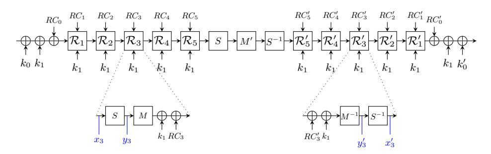

Fig. 1: the PRINCE cipher.

The encryption is quite similar to the AES and consists of a nibble-based substitution layer S and a linear layer M. The operation M can be divided into a ShiftRows operations and a matrix multiplication M' operating independently on each column but not nibble-oriented. Furthermore the matrix M' is an involution and, combined to the fact that the round constants satisfy the relation  $RC_i \oplus RC_i' = \alpha$  where  $\alpha = \text{C0AC29B7C97C50DD}$ , the decryption process  $D_{k_0,k_1,k_0'}$  is equal to the encryption process  $E_{k_0',k_1\oplus\alpha,k_0}$ . For further details about PRINCE we refer the reader to [5].

**Notations.** In the sequel we denote both the plaintext and the ciphertext by p and c respectively. For the first R rounds of 2R-round PRINCE, we denote the

internal state just before (resp. after) the r-th SubNibble layer by  $x_r$  (resp.  $y_r$ ) while for the last R rounds those internal states are denoted by  $y'_r$  and  $x'_r$  respectively as shown on Figure 1. Given a collection of messages  $\{p^0, \ldots, p^m, \ldots\}$ , the notation  $x_r^m[i]$  holds for the nibble i of the state  $x_r$  of the message  $p^m$ . As PRINCE is not fully nibble-oriented we use the notation  $x_r[i]_b$  to refer to the bit i of the state  $x_r$  and the following relation holds for all  $i \in \{0, \ldots, 15\}$ :

$$x_r[i] = x_r[4i+3]_b \parallel x_r[4i+2]_b \parallel x_r[4i+1]_b \parallel x_r[4i]_b.$$

|    |    |    |    |    |    |    | bi | ts |    |    |    |    |    |          |               |  | 1  | nib | bles | 3 |
|----|----|----|----|----|----|----|----|----|----|----|----|----|----|----------|---------------|--|----|-----|------|---|
| 63 | 62 | 61 | 60 | 47 | 46 | 45 | 44 | 31 | 30 | 29 | 28 | 15 | 14 | 13       | 12            |  | 15 | 11  | 7    | 3 |
| 59 | 58 | 57 | 56 | 43 | 42 | 41 | 40 | 27 | 26 | 25 | 24 | 11 | 10 | 9        | 8             |  | 14 | 10  | 6    | 2 |
| 55 | 54 | 53 | 52 | 39 | 38 | 37 | 36 | 23 | 22 | 21 | 20 | 7  | 6  | 5        | 4             |  | 13 | 9   | 5    | 1 |
| 51 | 50 | 49 | 48 | 35 | 34 | 33 | 32 | 19 | 18 | 17 | 16 | 3  | 2  | 1        | 0             |  | 12 | 8   | 4    | 0 |
|    |    |    |    |    |    |    |    |    |    |    |    |    |    | $\nabla$ | $\overline{}$ |  |    |     |      | ア |

Fig. 2: Ordering of bits/nibbles in PRINCE.

Finally, we use the following notations for some functions.

R The composition of S and M so that R(x) = M(S(x)) = SR(M'(S(x))).  $E_{k_{0||k_1}}^r$  PRINCE reduced to r rounds.  $E_{c,k_1}$  full PRINCE-core.

 $E_{k_1}^{c,r}$  PRINCE-core reduced to r rounds.

### <span id="page-4-0"></span>3 Meet-in-the-Middle Attacks

In this section we present both the 6-round attack and the 8-round attack which won the PRINCE Challenge in the chosen-plaintext category together with a new attack on 10 rounds. The aim of the challenge was to find the best attacks using at most  $2^{20}$  chosen plaintexts and thus we decided to follow the strategy used by Demirci and Selçuk on AES in [3], later improved by Dunkelman et al. in [12], Derbez et al. in [13,14] and by Li et al. in [9]. While our 10-round attack does not fit the restriction on the data complexity it shows that this kind of attacks is one of the most powerful on SP-Network.

First we give the definition of an ordered  $\delta$ -set which is a particular structure of messages used in our attacks.

**Definition 1.** Let a  $\delta$ -set be a set of 16 PRINCE-states that are all different in one state nibble (the active nibble) and all equal in the other state nibble (the inactive nibbles). An ordered  $\delta$ -set is a  $\delta$ -set  $\{x^0, \ldots, x^{15}\}$  such that the difference in the active nibble between  $x^0$  and  $x^i$  is equal to i, for  $0 \le i \le 15$ .

In the sequel we consider  $\delta$ -sets such that nibble 7 is the active one. For such a particular set we made the following observations which are the core of our new attacks.

<span id="page-5-0"></span>**Observation 1** Consider the encryption of a collection  $\{p^0, p^1, \ldots, p^{15}\}$  of 16 messages through 6-round PRINCE. If the set  $\{y_2^0, y_2^1, \ldots, y_2^{15}\}$  is an ordered  $\delta$ -set then the ordered sequence

$$\left[y_2'^{1}[7] \oplus y_2'^{0}[7], y_2'^{2}[7] \oplus y_2'^{0}[7], \dots, y_2'^{15}[7] \oplus y_2'^{0}[7]\right]$$

is fully determined by the following 8 nibble parameters:

$$-x_3^0[0,7,10,13]$$
  $-x_3'^0[0,7,10,13]$

Consequently, there are at most  $2^{8\times4}=2^{32}$  possible sequences when we consider all the possible choices of keys and ordered  $\delta$ -sets (out of the  $2^{4\times15}=2^{60}$  of the theoretically possible 15-nibble sequences).

*Proof.* The proof is straightforward. The goal is to propagate the differences from the state  $y_2$  (which are known) to the state nibble  $y'_2[7]$ . At each intermediate round, each S-box is either a parameter, not required or constant (so output differences are equal to zero).

<span id="page-5-1"></span>**Observation 2** Consider the encryption of a collection  $\{p^0, p^1, \ldots, p^{15}\}$  of 16 messages through 8-round PRINCE. If the set  $\{x_2^0, x_2^1, \ldots, x_2^{15}\}$  is an ordered  $\delta$ -set then the ordered sequence

$$\left[x_2'^{1}[7] \oplus x_2'^{0}[7], \dots, x_2'^{15}[7] \oplus x_2'^{0}[7], y_2'^{1}[6] \oplus y_2'^{0}[6], \dots, y_2'^{15}[6] \oplus y_2'^{0}[6]\right]$$

is fully determined by the following 42 nibble parameters:

$$\begin{array}{lll} - & x_2^0[7] & - & x_4'^0[0..15] \\ - & x_3^0[0,7,10,13] & - & x_3'^0[0,7,10,13] \\ - & x_4^0[0..15] & - & x_2'^0[7] \end{array}$$

Furthermore, those 42 state nibbles can be directly computed from the full state  $x_4$  and 4 nibbles of  $M^{-1}(k_1)$ . Consequently, there are at most  $2^{4\times(16+4)}=2^{80}$  possible sequences when we consider all the possible choices of keys and ordered  $\delta$ -sets (out of the  $2^{4\times30}=2^{120}$  of the theoretically possible 30-nibble sequences).

*Proof.* The proof is similar to the one of Observation 1 except the parameters are related. Indeed, from the full state  $x_4$  one can directly compute  $x_4'$  as no keys are involved. Then we note that the 4 nibbles  $M^{-1}(k_1)[4..7]$  are enough to compute  $x_3^0[0,7,10,13]$  from  $x_4$  and  $x_3''[0,7,10,13]$  from  $x_4'$ . Finally, the knowledge of  $M^{-1}(k_1)[7]$  allows to compute  $x_2^0[7]$  and  $x_2''[7]$  from  $x_3^0[0,7,10,13]$  and  $x_3''[0,7,10,13]$  respectively.

#### 3.1 6-round Attack

The 6-round attack is depicted on Figure 3 and its scenario is straightforward. First the  $2^{32}$  possible sequences given in Observation 1 are computed and stored in a hash table during a preprocessing phase. Then during the online phase, we begin by asking for the encryption of a structure of  $2^{16}$  chosen plaintexts such that nibbles from 4 to 7 take all the possible values while the other ones are constant, and pick one of them denoted  $p^0$ . Now the goal of the adversary is to identify an ordered  $\delta$ -set containing  $y_2^0$ . To do so, he has to guess the fives nibbles  $x_1^0[4..7]$  and  $x_2^0[7]$  and propagate the differences from the state  $y_2$  to the plaintext. Then he gets the corresponding ciphertexts, guess the fives nibbles  $x_1''[4..7]$  and  $x_2''[7]$  and propagates the differences from the ciphertexts to  $y_2'[7]$ . Finally he discards all the guesses which do not lead to a match in the previously built hash table. The probability for a wrong guess to pass the test is  $2^{32} \times 2^{-60} = 2^{-28}$  so we expect  $2^5$  candidates to remain at the end of the attack. The wrong ones can be discarded by replaying the attack with an other choice for  $p^0$  without increasing the overall complexity of the attack.

<span id="page-6-0"></span>

Fig. 3: 6r attack. No difference in white nibbles. Nibbles required in online (resp. offline) phase are in gray (resp. black). Differences in dotted nibbles are known during the offline phase. Hatched nibbles play no role.

The data complexity of this attack is  $2^{16}$  chosen plaintexts and the memory requirement is around  $2^{32} \times 4 \times 15 \times 2^{-3} \approx 2^{34.9}$  bytes. During the online phase 10 state nibbles are guessed however they can assume only  $2^{33}$  values once the plaintext/ciphertext pair is given. Indeed, the knowledge of the 33 bits

$$\{(k_0 \oplus k_1)[16..27]_b, (k'_0 \oplus k_1)[16..27]_b, k_1[28..31]_b, k_0[28..32]_b\},\$$

is enough to compute all of them from p and c. Thus the time complexity of the online phase is approximately  $16 \times 2^{33} \times 40/(6 \times 64) \approx 2^{33.7}$  encryptions.

**Key recovery.** At the end of the attack 128 - 33 = 95 key bits are still missing. To find them the best way is to apply several meet-in-the-middle attacks

successively. For instance, one could begin by running the attack depicted on Figure 12 in Appendix A which has an overall complexity below  $2^{28}$  as most key bits required in the online phase are already known.

### <span id="page-7-1"></span>3.2 8-round Attack

The 8-round attack is similar to the one on 6 rounds and is depicted on Figure 4. It relies on Observation 2 so the memory complexity is around  $2^{80} \times 15 \times 8 \times 2^{-3} \approx 2^{83.9}$  bytes. In the online phase, the data complexity remains unchanged to  $2^{16}$  chosen plaintexts but the number of state variable to guess is increased. The identification step requires to guess the four nibbles  $x_1^0[4..7]$  and then the nine nibbles  $x_1'^0[0..7]$  and  $x_2'^0[6]$  are guessed to build the sequence from the ciphertexts. Those 13 nibbles can assume only  $2^{49}$  values once the plaintext/ciphertext pair  $(p^0, c^0)$  given as they all can be derived from

$$\{(k_0 \oplus k_1)[16..24, 28..31]_b, (k_0' \oplus k_1)[0..23, 27..31]_b, k_0[25..27]_b, k_1[24..27]_b\}.$$

Thus the time complexity of the online phase is approximately  $16 \times 2^{49} \times 52/(8 \times 64) \approx 2^{49.7}$  encryptions and we expect  $2^{49} \times 2^{80} \times 2^{-120} = 2^9$  candidates to remain at the end of the attack.

<span id="page-7-0"></span>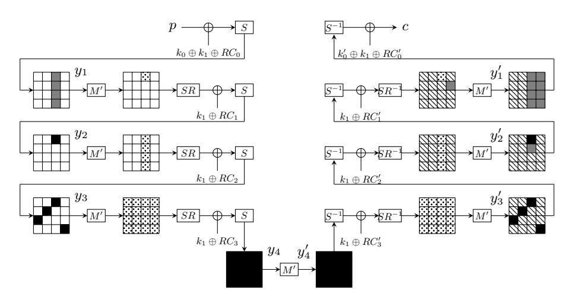

Fig. 4: 8r attack. No difference in white nibbles. Nibbles required in online (resp. offline) phase are in gray (resp. black). Differences in dotted nibbles are known during the offline phase. Hatched nibbles play no role.

**Key recovery.** As for the previous attack, the most efficient way to recover the missing key bits is to perform other attacks. For instance one could run the attack depicted on Figure 13 (Appendix B) which has the same complexity than the one above since there are approximately 2<sup>9</sup> candidates for the 4 active nibbles

of  $x_1$ . Then the search space would be small enough to perform an exhaustive search without increasing the overall complexity.

**Trade-off.** It is possible to trade some memory against time without increasing the data complexity by noticing that for a considered structure of  $2^{16}$  plaintexts the 4 active nibbles of  $x_3$  take all the possible values. Thus we can fix them to 0 during the offline phase and save a factor  $2^{16}$  in memory. In the other hand, we now need to run the attack for all the possible choices for  $p^0$  increasing the time complexity by the same factor of  $2^{16}$ .

A more sophisticated attack against 8-round PRINCE, requiring much less memory, is described in Appendix E.

#### 3.3 10-round Attack

We now investigate PRINCE reduced to 10 rounds. While we were unable to find an attack requiring less than  $2^{20}$  chosen plaintexts for the PRINCE Challenge, we found one competitive with the current best known attack. To describe it we first extend the definition of a  $\delta$ -set as it was done in [13], then we show a meetin-the-middle attack as the two ones above and finally we apply the differential enumeration technique ([12]).

 $\delta$ -set. In [13] Derbez *et al.* shown that the notion of  $\delta$ -set can be extended to set of states such that some *linear combinations* of state bits are constant. In the sequel we denote by  $\delta$ -set a set of 16 messages such that  $y_2[0..4, 6, 8..12, 14]$  and  $M'(y_2)[0..4, 6, 8..12, 14]$  are constant, exploiting the fact that the matrix operating on the columns are not MDS.

10-round attack. The basis of our attack on 10 rounds is depicted on Figure 5. The meet-in-the-middle is performed on the four bit-equations described above. The state bytes required as the parameters of the hash table can be computed from the whole state  $x_5$  and 8 nibbles of the equivalent subkey  $M^{-1}(k_1)$  and thus approximately  $2^{96}$  60-bit sequences are stored. In the online phase the 24 state nibbles needed can be computed from the following 66 key bits:

```
\{k_0[0,20..24,28..32,52..56,60..63]_b, k_1[20..23,28..31,52..55,60..63]_b,\\ (k_0\oplus k_1)[16..19,24..27,48..51,56..59]_b,\\ (k_0'\oplus k_1)[16..19,24..26,48..51,56..58]_b\}.
```

Note that this attack does not actually work because the number of sequences stored is higher than the number of possible 60-bit sequences and thus no key candidates are filtered. The aim of the next section is to show how to reduce the memory requirement.

**Differential Enumeration Technique.** Li et al. applied this technique against PRINCE in [9] and successfully mounted new attacks on 8 and 9 rounds. The idea of this technique originally introduced by Dunkelman *et al.* in [12] is to store in the hash table only the sequences built from a  $\delta$ -set containing a message  $p^0$  that

<span id="page-9-0"></span>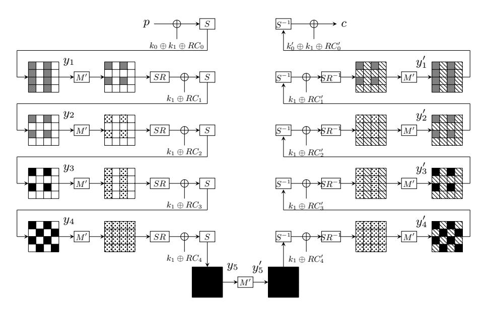

Fig. 5: 10r attack. No difference in white nibbles. Nibbles required in online (resp. offline) phase are in gray (resp. black). Differences in dotted nibbles are known during the offline phase. Hatched nibbles play no role.

belongs to a pair  $(p^0,p^1)$  following a well-chosen differential characteristic. In our case the truncated differential characteristic is depicted on Figure 5 assuming a zero difference in hatched nibbles. Thus we expect to store only  $2^{96+4-60}=2^{40}$  sequences in the offline phase. However generating them is not as trivial as for the basic attack. We propose the following procedure which has a time complexity around  $2^{72}$  operations:

- 1. Consider a pair  $(p^0, p^1)$  following the differential characteristic.
- 2.  $S^{-1} \circ M' \circ S$  can be seen as 4 invertible super Sboxes  $\S_0, \ldots, S_3$  operating on 16-bit words. Build 4 hash tables such that one can retrieve (x, y) from  $(x \oplus y, S_i(x) \oplus S_i(y))$ .
- 3. Guess the difference in the active nibbles of both  $y_4$  and y'4 and retrieve the actual value of  $x_5$  and  $x'_5$  for both messages of the pair.
- 4. Guess the difference in the two active nibbles of the first column of  $y_3$  and get back the actual values of  $y_4[2, 5, 8, 15]$ .
- 5. Combined with the knowledge of  $x_5$  this leads to the knowledge of the four key nibbles  $M^{-1}(k_1)[2,5,8,15]$ . Use them to partially encrypt  $x_5'$  and check if the difference in the first column of  $y_3'$  is correct.
- 6. Use  $M^{-1}(k_1)[15]$  to partially decrypt  $y_4$  and get the difference in  $x_2[15]$  and check its correctness. Do the same for the difference in  $x'_2[15]$ .
- 7. Guess the difference in the two active nibbles of the third column of  $y_3$  and get back  $M^{-1}(k_1)[0,7,11,13]$ .

8. Compute the value of the missing parameters and check whether the pair follows the characteristic or not. If it does then build the 60-bit sequence from  $p^0$  and store it in the hash table.

The complexity of this procedure is dominated by the complexity of steps 4-5 which is  $2^{72}$  simple operations that we estimate to be equivalent to  $2^{69}$  encryptions. Now that the table is built the online phase is quite similar to the one of the offline phase:

- 1. Ask for a structure of  $2^{32}$  chosen plaintexts and store the ciphertexts in a hash table to identify the pairs that may follows the differential characteristic.
- 2. For each pair  $(p^0, p^1)$ :
  - (a) Guess the difference in the first column of  $y_1$  and of  $y_2$ , deduce the corresponding value of  $(k_0 \oplus k_1)[12..15]$  and  $k_1[15]$ . Store them in a hash table  $T_0$  indexed by  $k_1[15], k_0[61..63]_b$ .
  - (b) Similarly compute  $(k'_0 \oplus k_1)[12..15]$  and  $k_1[15]$  from the ciphertexts and use  $T_0$  and the linear relations between  $k_0$  and k'0 to get back the  $2^{2\times 4+2}$ .  $2^{-7} = 2^3$  corresponding values of the key nibbles above. Store those  $2^{13}$  key candidates in a hash table  $T_1$  indexed by  $(k_0 \oplus k_1)[12..15]$ ,  $(k'_0 \oplus k_1)[12..15]$  and  $k_0[55]_b \oplus k_0[60]_b (= (k_0 \oplus k_1)[55]_b \oplus \ldots \oplus (k_0 \oplus k_1)[60]_b \oplus (k'_0 \oplus k_1)[55]_b \oplus \ldots \oplus (k'_0 \oplus k_1)[59]_b \oplus k_1[60]_b)$ .
  - (c) Repeat the two steps above but now by guessing the third column of  $y_2$  and use  $T_1$  to obtain the  $2^{2\times 13-8-8-1}=2^9$  and store them in a hash table  $T_2$  indexed by the difference in  $y_2$ . (While the match is on 33 bits,  $(k_0 \oplus k_1)[12..15]$  and  $(k'_0 \oplus k_1)[12..15]$  only depend on four 4-bit parameters.)
  - (d) Repeat the three steps above but now by guessing the third column of  $y_1$  and use  $T_3$  to finally retrieve all the  $2^{9+9-8} = 2^{10}$  key candidates.
  - (e) For each key candidate identify a  $\delta$ -set from  $p^0$ , build the 60-bit sequence and check whether it belongs to the table constructed in the offline phase. If it does then try the key candidate.
- 3. Repeat the procedure until the right key is found.

As each structure contains  $2^{63}$  pairs and each of these pairs follows the differential with probability  $2^{-28-60}=2^{-88}$ , we need  $2^{25}$  structures on average. Then, for each structure we have to study only  $2^{63-32}=2^{31}$  pairs and for each of them we have to perform  $4\times 2^{13}+2^{10}\times 2^4$  simple operations estimated to approximately  $2^{12}$  encryptions. Thus this procedure has a the time complexity of  $2^{25+31+12}=2^{68}$  encryptions and requires  $2^{25+32}=2^{57}$  chosen plaintexts. At the end of the attack  $2^{66}\times 2^{40}\times 2^{-60}=2^{46}$  key candidates remain. As 62 key bits are also missing performing an exhaustive search is not a valid option. Instead, the best way to recover the key is to apply several meet-in-the-middle attacks. For instance, we can assume that when a match happens we get back the corresponding values of the red nibbles in Figure 5 and then deduce step by step each key bits of  $M^{-1}(k_1)$  by completing the first and the third columns of  $y_3'$  without increasing the overall complexity of the attack.

# <span id="page-11-0"></span>4 Dierential Attack

In this section we describe a new dierential attack against 6-round PRINCE. There has already been some dierential cryptanalyses of PRINCE, see for example [\[10\]](#page-24-9), which is the best attack to date, and also [\[15\]](#page-24-14). Our attack uses a new method to increase the power of the lter by considering groups of pairs. This allows a rather low data complexity considering that 6-rounds are attacked and that dierential attacks usually demand large amounts of chosen plaintexts.

### 4.1 Amplied Dierential Trails

Our attack rely on some dierences propagating identically in dierent pairs. To better describe this, we introduce the following denitions.

Encryption We call encryption a couple plaintext/ciphertext encrypted under a xed key.

Pair A pair is a set of two encryptions where the plaintexts are separated by a known dierence.

Family A family is a group of pairs with a particular structure. They are generated from a single pair (p[0], ..., p[b − 1]),(p 0 [0], ..., p<sup>0</sup> [b − 1]) , where p[i] and p 0 [i] are nibbles. Suppose that the input dierence covers the rst three nibbles so that p[3] = p 0 [3] = c[3], ..., p[b − 1] = p 0 [b − 1] = c[b − 1] for some constants c[i]. Then the family corresponding to this pair is made by exchanging some nibbles between the two encryptions in the pair so as to obtain the following pairs:

```
    (p[0], p[1], p[2], c[3], ..., c[b − 1])
  (p
     0
      [0], p0
             [1], p0
                     [2], c[3], ..., c[b − 1])

                                                       (p
                                                         0
                                                          [0], p[1], p[2], c[3], ..., c[b − 1])
                                                      (p[0], p
                                                               0
                                                                [1], p0
                                                                        [2], c[3], ..., c[b − 1])

   (p[0], p
            0
             [1], p[2], c[3], ..., c[b − 1])
  (p
     0
      [0], p[1], p
                   0
                    [2], c[3], ..., c[b − 1])

                                                      (p[0], p[1], p
                                                                      0
                                                                       [2], c[3], ..., c[b − 1])
                                                     (p
                                                        0
                                                         [0], p0
                                                                [1], p[2], c[3], ..., c[b − 1]).
```

Overall, if there are n nibble with non-zero dierences in the input then a family is made of 2 <sup>n</sup>−<sup>1</sup> pairs and 2 <sup>n</sup> encryptions.

In the case of PRINCE, we consider dierential trails where the input differences are only over one column and such that all the pairs in a family follow the same trail for the rst three rounds. For example, the trails we describe in Section [4.2](#page-12-0) are either followed by all the elements in a family or none of them. A similar heuristic is used in [\[16\]](#page-24-15) to perform a multiset attack on the SASAS structure.

This behaviour comes from the fact that the transition in the trails we study depend only on the transitions occurring during the rst round, which are the same in all pairs of a family, and on the actual value of some nibbles to which the dierence have not had the time to propagate, which are the same in all encryptions of the structure.

#### <span id="page-12-0"></span>4.2 Our Trails

We consider trails which are completely specified during the first 3 rounds and then propagate with probability 1 for 2.5 rounds before having spread to the full internal state. Figure 6 shows a first trail covering 5.5 rounds in this way which we denote  $\mathcal{T}_1$ . Each array corresponds to the differences between the internal states of two encryptions under 6-round PRINCE and each cell gives the value of the difference: light gray corresponds to a fully specified non-zero value at the nibble level (e.g. a difference of 1), dark gray to an unkown non-zero difference and white to a zero difference. A very similar trail with a probability 2 times smaller,  $\mathcal{T}_2$ , is given in Figure 14 (see Appendix C). To compute their probabilities, we use the difference distribution matrix of the S-Box. If we let the input difference be (1,1,1,0,...,0), then  $\mathcal{T}_1$  has a probability of  $2^{-2\cdot 3} \cdot 2^{-2} \cdot 2^{-2-2-3} = 2^{-15}$  and  $\mathcal{T}_2$  has a probability of  $2^{-2\cdot 3} \cdot 2^{-2} \cdot 2^{-2-3-3} = 2^{-16}$ .

<span id="page-12-1"></span>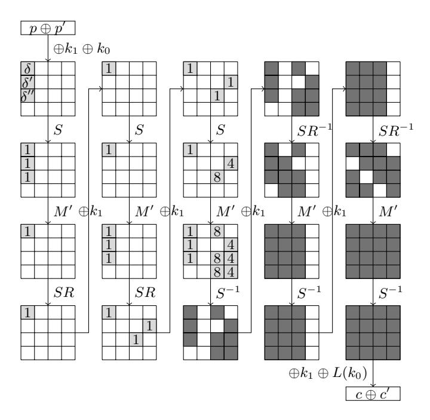

Fig. 6: The 5.5 rounds trail  $\mathcal{T}_1$ .

Querying enough families at random to find one right family for any of these would require  $(2^{-15} + 2^{-16})^{-1} = 2^{14.41}$  families with an input difference over 3 nibbles, i.e.  $2^{14.41} \cdot 2^3 = 2^{17.41}$  encryptions. However, we can use structures to decrease this complexity.

We note that the input differences which might lead to an output difference of 1 are those listed in Table 2. As we can see, the second bit from the right

in little-endian notation is only involved in 0x2 and 0xb which, taken together, only have a probability of 1/4 of leading to a dierence of 1. Hence, we use the following structures where b is a bit taking all possible values and c is constant accross the structure:

### bbcb bbcb bbcb cccc cccc ... cccc.

We found experimentally that such structures contain several[3](#page-13-1) right families with probability 2 <sup>−</sup>5.<sup>9</sup> on average when we take into account all possible input dierences, i.e. (δ, δ<sup>0</sup> , δ<sup>00</sup> , 0, ..., 0) where δ, δ 0 , δ <sup>00</sup> ∈ {1, 4, c, d}. Hence, obtaining at least 2 right families only requires about 2 9+5.<sup>9</sup> = 214.<sup>9</sup> queries to the encryption oracle on average.

<span id="page-13-0"></span>Table 2: Input dierences which might be mapped to a dierence of 1 by the S-Box of PRINCE.

| Hexadecimal Binary Probability |      |     |
|--------------------------------|------|-----|
| 0x1                            | 0001 | 1/4 |
| 0x2                            | 0010 | 1/8 |
| 0x4                            | 0100 | 1/8 |
| 0xb                            | 1011 | 1/8 |
| 0xc                            | 1100 | 1/4 |
| 0xd                            | 1101 | 1/8 |

### 4.3 Filtering Right Pairs

Full diusion has been achieved by the 6-th round. Thus, we guess 12 bits to be able to partially invert the last round on one column. More precisely, we rst guess the dierence in one column before the last MixColumns for one pair. Each guess leads to a candidate for the corresponding column of k 0 <sup>0</sup> ⊕ k<sup>1</sup> that we try against the three other pairs of the family. A guess leads to the correct nibble having a zero dierence in every pair of the family with probability 2 <sup>−</sup>3·<sup>4</sup> = 2<sup>−</sup><sup>12</sup> . We repeat this independently over each column and obtain either 64 bits of key material or none at all. Since there are either several right families or none at all in the structures we consider, we only return the key guesses which come from several families as well as the corresponding families.

<span id="page-13-1"></span><sup>3</sup> Actually, a structure of size 2 <sup>12</sup> where the rst three nibbles take all values contains 64 right families with probability about 2 −5.9 . If we reduce these to form the structures of 2 <sup>9</sup> plaintext/ciphertext encryptions we described, only some of these 64 families are still present, hence the presence of either 0 or several right families in a structure.

Note this is a powerful filter: while we expect each family from the structure to yield about one 64 bits candidates, the probability to have a collision is very small<sup>4</sup>.

The same procedure is then used one round earlier to recover 48 bits of  $k_1$ , corresponding to its three first columns. They allow us to partially decrypt the family and check whether differences after the third MixColumns are correct for the three first columns. The probability for a wrong family to pass this test is  $2^{-6\cdot 4\cdot 4} = 2^{-96}$ , so we expect to be left with right families only. Finally, the missing 16 bits of  $k_1$  are recovered by performing an exhaustive search.

Complexity: Querying  $2^{5.9}$  structures of  $2^9$  chosen plaintexts to obtain at least 2 right families, the time complexity of the key recovery procedure is around  $2^{5.9+9} \cdot 2^{12} \cdot 7$  partial encryptions, which is equivalent to  $2^{29.7} \cdot \frac{4}{6\cdot16} \approx 2^{25.1}$  encryptions. The memory complexity is dominated by the storage of the  $2^{14.9}$  required to run this attack.

# <span id="page-14-0"></span>5 Combining Differential Attack with a SAT-Solver

### 5.1 Attacking 4-Round PRINCE with a SAT-Solver

**Encoding PRINCE as a CNF Formula** The idea is to generate a CNF formula where a set p of boolean variables correspond to the 64 bits of the plaintext, c to the 64 bits of the ciphertext and k to the 128 bits of the key, and such that there exists a unique assignment of the variables satisfying the CNF corresponding to the case  $E_k(p) = c$ .

Hence, if we generate such a formula, set the variables in p and k to a chosen value and use a SAT-solver to find an assignment satisfying the CNF formula, the variables in c will correspond to the ciphertext. Solving such a formula is easy, an observation which we can relate to the fact that the evaluation of a block cipher has to be "easy" from the point of view of complexity theory.

Another way to use such a formula is to fix the variables in p and in c according to a known plaintext/ciphertext pair, solve the CNF and recover the key from the variables corresponding to it. Unless the number of rounds is very small (at most 3 in the case of PRINCE), solving such a system is impractical. Again, we can relate this observation to the fact that recovering the key given one or several plaintext/ciphertext pair has to be "hard". Our approach consists in using some knowledge about the internal state of the cipher to simplify the task of the SAT-solver and make such a resolution possible for a higher number of rounds.

In order to encode a PRINCE encryption as a CNF formula, we introduce several sets of 64 Boolean variables corresponding to each step of each round: one for the internal state at the beginning of the round  $(x_r)$ , one for the internal

<span id="page-14-1"></span><sup>&</sup>lt;sup>4</sup> Each structure yields  $2^{9-3}=2^6$  families for each of the  $4^3$  interesting input differences so that we consider the families by groups of  $2^{12}$ . This implies that a collision has a probability of about  $\binom{2^{12}}{2} \cdot 2^{-64} \approx 2^{-41}$ .

state after going throught the S-Box (yr), etc. We also use boolean variables corresponding to the key bits.

Our task is then to create a CNF formula connecting these variables in such a way as to ensure that, for instance if k[0, ..., 63] is xed, it has only one solution where yr[0, ..., 63] is indeed the image of x[0, ..., 63]<sup>r</sup> by S, etc.

In order to encode the linear layer, we use the alternative representation of M<sup>0</sup> from [\[10\]](#page-24-9) where it was shown that M<sup>0</sup> operates on columns of 4-bits independently by rst rotating them by a column-dependent number of bit and then xor-ing the hamming weight of the column in each bit. We thus add variables corresponding to the hamming weights of the columns and encode the corresponding xor's as CNF formulas. The SR operation is only a permutation of the bits so we simply set the corresponding bits to be equal.

The encoding of the S-Box is less simple to obtain. In order to nd the best one, we chose to look for it directly instead of using the ANF as an intermediate step. Indeed, since the S-Box is 4x4, it is small enough for us to brute-force all clauses[5](#page-15-0) involving input and output bits and check if they hold for every input.

Doing this lead us to nd 29 clauses with 3 variables. However, they are not sucient to completely specify the S-Box so we used a greedy algorithm to nd the best clauses with 4 variables to add to this encoding. In the end, we have 29 clauses with 3 variables and 9 clauses with 4 variables which are such that the only solutions of the CNF made of all these clauses are all the assignments corresponding to pairs x, S(x) for all x ∈ [0, 15].

These clauses with 3 variables can be interpreted as simple implications. For example, if o[3, ..., 0]<sup>b</sup> = S(i[3, ..., 0]b) then the following two clauses hold with probability 1 :

$$(i[1]_b \vee o[2]_b \vee o[3]_b) \wedge (i[1]_b \vee o[1]_b \vee o[2]_b).$$

They are logically equivalent to the following implication:

$$\overline{i[1]_b} \implies \left( (o[2]_b \vee o[3]_b) \wedge (o[1]_b \vee o[2]_b) \right).$$

Dierential Over Denition The approach consisting in using the knowledge from a dierential trail to ease the task of a SAT-solver used to attack a cryptographic primitive has been explored in [\[17\]](#page-25-0) in order to attack MD4 and MD5. The authors of this paper rst use heuristic methods to nd a high probability dierential trail leading to a collision and then use a SAT-solver to nd a pair of messages which satises this trail. In the same paper, we can nd the following observation:

An interesting result of our experiments with SAT solvers is the importance of having a dierential path encoded in the formula.

As we shall see, this also holds for block ciphers. Attacking 4 rounds PRINCEcore takes more than 10 hours if we simply encode as a CNF that some plaintext

<span id="page-15-0"></span><sup>5</sup> A clause is the logical OR of several variables, e.g. a ∨ b, a, a ∨ b ∨ c where x is the negation of x.

are encrypted into known ciphertexts but we can both drastically reduce this time while breaking PRINCE with its whitening keys using dierential overdenition.

Denition 2. We call Dierential Over Denition (or DOD) the following algorithm which simplies a CNF formula knowing that the variables correspond to bits of the internal state of an encryption following a certain trail.

For all pairs of variables in the CNF, proceed as follows:

- If they are assumed to be equal, replace all occurrences of the rst one by the second one.
- If they are assumed to be dierent, replace all occurrences of the rst one by the negation of the second one.

While the idea behind this algorithm is simple, it is necessary for cryptographers to implement it eciently by hand. Indeed, the only input of a SAT-solver is a CNF formula, i.e. merely a list of clauses from which deriving what variables are equal to each other without knowledge of the structure of the problem is far from trivial. For instance, it would be necessary for the SAT-solver to understand that the set of clauses used to model one S-Box call all correspond to a unique function so that identical inputs lead to identical outputs; all this without having any distinction between the input and output bits. That is why dierential over-denition, an easy algorithm for the cryptographer to implement, is a valuable pre-processing step when using a SAT-solver for cryptography leading to gains in time complexity of several orders of magnitude.

This algorithm can be implemented eciently using a hashtable containing the correspondences between the variables. Once this algorithm has been run, the CNF is over dened: the solution would have been such that the equalities hold anyway but there are less variables and less clauses in the CNF. However, if the pair actually does not follow the trail, the CNF has become unsatisable. This is a dierence between our work and the one described in [\[17\]](#page-25-0): we do not always know before hand if the CNF has a solution. We can think of this as a trade-o between solving one CNF known to be true and solving many overdened CNF's which may or may not be true: the second approach loses time by requiring several calls to a SAT-solver but these calls take less time thanks to the over-denition.

Such an over denition can be used in dierent ways.

- 1. Propagating only the zero dierences holding with probability 1 inside a group of 8 encryptions with many zero dierences is enough to reduce the time complexity of an attack on 4 rounds from more than 10 hours to a few seconds (see below). Furthermore, such a formula is always true.
- 2. Instead of implementing an algorithm recovering the key from a pair following a particular trail by peeling of layer after layer of encryption in our attack on 6 rounds described in the remainder of this section, we simply re-used the code of our attack on 4 rounds and over-dened the CNF modeling the encryptions of right pairs according to the high probability trail we used.

We implemented the attack described in Algorithm 1 to attack 4-round PRINCE (with its whitening keys) using the SAT-solver Minisat [18] and obtained an average total time of 5.13s and average time spent solving the CNF of 3.06s. The designers of PRINCE did not consider SAT-based attacks but they did investigate algebraic attacks. They manage to attack 4-round PRINCE-core in less than 2s while our attack requires about 5s to attack 4-round PRINCE, a cipher which uses twice as much key material.

<span id="page-17-1"></span>**Algorithm 1** Using Differential over-Definition to enable an attack on 4-round PRINCE.

Query 2<sup>10</sup> plaintext/ciphertexts where the first 10 bits take all possible values. Select a subset of 8 plaintext/ciphertext maximizing the number of 0-differences in the output.

Encode the 8 encryptions as a CNF A.

Overdefine A by propagating zero-differences with probability 1.

Use a SAT-solver to retrieve the key bits from A

**return**  $k_0||k_1$

#### 5.2 Differential Attacks on 6-Round PRINCE

Another use possible use for a SAT-solver is the handling of the tedious details of an actual attack implementation, e.g. the finding of an efficient guessing strategy. We illustrate this by performing the recovery of the second chunk of the master key in our 6-round differential attack using a SAT-solver. Pseudo-code describing this attack on 6-round PRINCE is provided in Algorithm 2.

We ran this attack 10 times and found that about  $2^{5.75}$  structures were needed on average. The filtering step is the most time consuming: finding a right pair requires about 6 minutes while the SAT-solver requires about 0.5s to recover the full key or (rarely) to discard the pair. For this reason, we approximate the complexity of this attack by the complexity of its filtering step. Memory complexity is dominated by the SAT-solver but is (well) below 1 Go, i.e. (well) below  $2^{27}$  64-bits blocks.

### <span id="page-17-0"></span>6 Structural Analysis of PRINCE

The  $\alpha$ -reflection introduced along with PRINCE [5] is the name given to the following property of a block cipher  $E_k$ :  $E_k^{-1} = E_{k \oplus \alpha}$ . In other words there is a constant  $\alpha$  such that decryption for a key k is the same operation as encryption under key  $k \oplus \alpha$ . PRINCE-core implements this property by having a three-parts structure as decribed here:

$$E_{c,k_1} = F_{k_1 \oplus \alpha}^{-1} \circ I \circ F_{k_1},$$

where  $F_k$  corresponds to 5 rounds of a classical Substitution-Permutation Network construction and where I is an involution.

Since we are going to study the structure of the cycles of different functions in a fashion similar to the way Biryukov analysed the inner-rounds of some involutional ciphers in [19], we define the cycle type of a permutation.

**Definition 3.** The cycle type of a permutation  $\pi$  is an (ordered) multiset containing the cycle lengths of the permutation. The cycle type of  $\pi$  is denoted by  $\mathcal{L}(\pi)$ .

In what follows, we do not represent the round constants for the sake of simplicity. However, not only do our result hold in their presence but we could actually generalize them to any key schedule preserving the fact that the subkeys of symmetric rounds have a XOR equal to  $\alpha$ .

### 6.1 Small Cycles in Round-Reduced PRINCE

The central involution is  $I = S^{-1} \circ M' \circ S$ . Therefore, it is isomorphic to M', a linear involution operating on each column of the internal state independently. It is easy to check experimentally the result given in [7] stating that M' has exactly  $2^{32}$  fixed points, meaning that I also has  $2^{32}$  fixed points. Therefore, I has  $2^{32}$  cycles of length 1 and  $2^{63} - 2^{31}$  cycles of length 2.

The cycle type of  $I^{\alpha}: x \mapsto I(x) \oplus \alpha$  is more sophisticated but still contains a fair amount of small cycles. After noting that both I and  $x \mapsto x \oplus \alpha$  operate on each column of the internal space independently, we denote  $I_i^{\alpha}$  the restriction of  $x \mapsto I(x) \oplus \alpha$  to column i and  $I_i$  that of I. Since each of the  $I_i^{\alpha}$ 's operates only on a space of size  $2^{16}$ , it is easy to generate their complete cycle structures independently by searching the whole space. Each  $I_i^{\alpha}$  has a cycle type made of many "small" cycles, the largest having a length of 2844. This is explained by the fact that both I and  $x \mapsto x \oplus \alpha$  are involutions and each column of I has exactly  $2^8$  fixed points. Thus, most of the cycles have a particular structure described in [20] which we recall in Figure 7. We remark that to each cycle of  $I_i^{\alpha}$  correspond two fixed points of  $I_i$ .

After generating the cycle type for each  $I_i^{\alpha}$ , we combine them to obtain the cycle type of  $x\mapsto I(x)\oplus \alpha$  using Algorithm 3. The cycle type of this function is too complex to be printed completely but some information extracted from it is given in Table 3. If we pick x uniformly at random, the expected length of the cycle it is on is  $2^{30.7}$ .

Recall that  $E_{k_1}^{c,4}$  is the permutation of  $\{0,1\}^{64}$  corresponding to an encryption under key  $k_1$  by PRINCE-core reduced to 4 rounds. Then  $x\mapsto E_{k_1}^{c,4}(x)\oplus\alpha$  has the same cycle type as  $I^\alpha$  due to the cancellation of the last round of one encryption with the first round of the next. Indeed, to each cycle of this function corresponds one of  $I^\alpha$ , as illustrated in Figure 8 where a cycle  $(x_0,x_1,x_2,x_3)$  of length 4 of  $x\mapsto E_{k_1}^{c,4}$  is represented along with the corresponding cycle of  $I^\alpha$  (dashed line).

<span id="page-18-0"></span><sup>&</sup>lt;sup>6</sup> While there are some cycles which do not have this structure, they are a small minority: for  $f_0$ , 256 elements out of 65536 are on such cycles, 64 for  $f_1$ , 8 for  $f_2$  and 194 for  $f_3$ .

<span id="page-19-0"></span>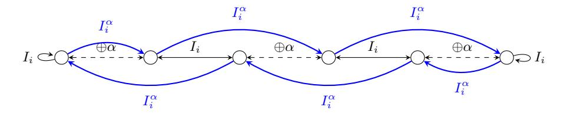

Fig. 7: The structure of a cycle of  $I_i^{\alpha}$  for  $i \in [0,3]$ .

<span id="page-19-1"></span>

| Cycle Length $\ell$ | $\#\{\text{cycles of length}\ell\}$ | $P[\ell(x) = \ell, x \text{ drawn uniformly}]$ |
|---------------------|-------------------------------------|------------------------------------------------|
| 1                   | 0                                   | 0                                              |
| 2                   | $2^{7}$                             | $2^{-57}$                                      |
| 4                   | $2^{10.25}$                         | $2^{-53.75}$                                   |
| 8                   | $2^{15.46}$                         | $2^{-48.54}$                                   |
| 10080               | $2^{33.06}$                         | $2^{-17.63}$                                   |
| 110880              | $2^{31.96}$                         | $2^{-15.27}$                                   |
| $\leq 2^{10}$       | _                                   | $2^{-22.4}$                                    |
| $\leq 2^{15}$       | _                                   | $2^{-12.4}$                                    |
| $\leq 2^{24}$       | _                                   | $2^{-4.1}$                                     |

Table 3: Information about the cycle type of  $I^{\alpha}$ , where  $\ell(x)$  is the length of the cycle on which x is.

A first consequence of these observations is the existence of a distinguisher for 4-round PRINCE-core requiring about  $2^{27.4}$  adaptatively chosen plaintexts. As stated in Table 2, an element picked at random is on a cycle of length at most  $2^{15}$  with probability  $2^{-12.4}$ . Therefore, we repeat multiple times the experiment consisting in picking an element x uniformly at random and then check if it is on a cycle of length at most  $2^{15}$  by iterating  $x\mapsto E_{k_1}^{c,4}(x)\oplus\alpha$  at most  $2^{15}$  times. The experiment is a success if x is on a cycle of length at most  $2^{15}$ . If the permutation is  $E_{k_1}^{c,4}$  for some  $k_1$ , then its probability of success is  $2^{12.4}$  but if the permutation is a random permutation<sup>7</sup>, then the probability of success becomes  $2^{-49}$ . We confirmed experimentally the success probability of this experiment for  $E_{k_1}^{c,4}$ .

A second consequence is the existence of "small" sets of plaintext/ciphertext encryptions where the set of the ciphertexts is the image of the set of the encryptions by a function significantly simpler than a PRINCE encryption. This topic is studied in the next section.

<span id="page-19-2"></span><sup>&</sup>lt;sup>7</sup> Recall that the probability for x to be on a cycle of length  $\ell$  for a permutation of [0, N-1] is equal to 1/N. Hence, the probability that the length is smaller than  $2^{15}$  for a permutation of  $[0, 2^{64} - 1]$  is  $\sum_{\ell=1}^{2^{15}} 2^{-64} = 2^{-49}$ .

<span id="page-20-0"></span>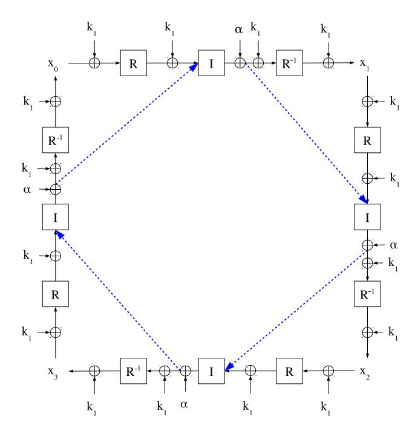

Fig. 8: Correspondance between a cycle of x 7→ E c,4 k<sup>1</sup> (x) ⊕ α and a cycle of I α.

### 6.2 Simplications of PRINCE's Representation

The particular cycle types of the round-reduced versions of PRINCE studied above lead to simpler alternative representations of the encryption algorithm.

Consequences of the Cycle Type of I Suppose that an encryption is such that the input of I is one of the 2 <sup>32</sup> xed-points of this function. Then the key addition before and after this function cancel each other so that only the addition of α remains. Then, since M is linear, the operations M<sup>−</sup><sup>1</sup> ◦ (⊕α) ◦ M become simply the addition of M<sup>−</sup><sup>1</sup> (α). Thus, the 4 center rounds minus the rst and last key addition become a simple S-Box layer which we denote S <sup>0</sup> and which is dened by

$$S'(x) = S^{-1}(S(x) \oplus M^{-1}(\alpha)).$$

This simplifying process is summarized in Figure [9.](#page-21-0) Note that if M<sup>−</sup><sup>1</sup> (α) has any nibble equal to 0 then the function S 0 is the identity for this nibble. However, for the value of α chosen by the designers of PRINCE, there is no such nibble.

<span id="page-21-0"></span>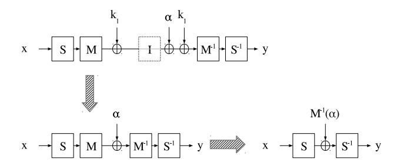

Fig. 9: Simplication of the 4 center-rounds if the input of I is a xed point.

The simplication goes further. Indeed, since S <sup>0</sup> operates only at the nibble level, it commutes with the operations SR and SR<sup>−</sup><sup>1</sup> (up to a reordering of the S-Boxes in S 0 ). Therefore, if we add one round before and one round after S 0 , we can replace SR<sup>−</sup><sup>1</sup> ◦ S <sup>0</sup> ◦ SR by S <sup>00</sup> where S <sup>00</sup> is another S-Box layer. Hence, 6-round of PRINCE operate on each column of the internal state independently: each output bit depends only on 16 bits of the input, 28 bits[8](#page-21-1) of k<sup>1</sup> and at most 18 bits of k0. This simplication is summarized in Figure [10.](#page-21-2)

<span id="page-21-2"></span>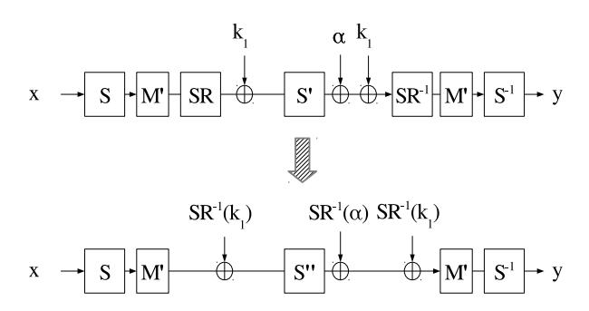

Fig. 10: Simplication of the 6 center-rounds if the input of I is a xed point.

Similar simplications occur if instead of having a xed point we have a particular collision between two encryptions. This setting corresponds to the socalled mirror slide attack described by Dunkelman et al. in [\[21\]](#page-25-4). Consider two

<span id="page-21-1"></span><sup>8</sup> In each column, 16 bits from the corresponding column of k<sup>1</sup> are used as well as 16 bits from the corresponding column of SR<sup>−</sup><sup>1</sup> (k1). Since the top nibble of these two sets is the same, we are left with 32 − 4 = 28 bits.

encryptions  $(p^0,c^0)$  and  $(p^1,c^1)$  by PRINCE-core as follows

$$c^{0} = E_{c,k_{1}}(p^{0}) = (F_{k_{1} \oplus \alpha}^{-1} \circ I \circ F_{k_{1}})(p^{0})$$

$$c^{1} = E_{c,k_{1}}(p^{1}) = (F_{k_{1} \oplus \alpha}^{-1} \circ I \circ F_{k_{1}})(p^{1})$$

which are such that  $F_{k_1}(p^0) = I(F_{k_1}(p^1))$ . In this case, we have that

$$c^{0} = (F_{k_{1} \oplus \alpha}^{-1} \circ F_{k_{1}})(p^{1})$$


$$c^{1} = (F_{k_{1} \oplus \alpha}^{-1} \circ F_{k_{1}})(p^{0}),$$

where 6 rounds of  $F_{k_1 \oplus \alpha}^{-1} \circ F_{k_1}$  can be simplified exactly as described and therefore only operate on each column separately.

In conclusion, if an encryption is such that the input of I is a fixed-point of this function or if two encryptions form a mirror slide pair, then 4 rounds of PRINCE consist simply in 16 parallel operations on each nibble and 6 rounds of PRINCE in 4 parallel operations on each column.

Consequences of the Cycle type of  $I^{\alpha}$  Consider a sequence of plaintexts  $(p^0,\ldots,p^{\ell-1})$  and their corresponding ciphertexts  $(c^0,\ldots,c^{\ell-1})$  such that the input  $x_5^i \oplus k_1$  of the sixth round for the plaintext  $p^i$  is the image of  $x_5^{i-1} \oplus k_1$  by  $I^{\alpha}$ . We call such a sequence a *cycle set* and we give a representation of such a sequence on Figure 11: if two values are equal then they are connected by a line; red lines correspond to the cycle of  $I^{\alpha}$  this set is built out of and blue lines correspond to the propagation of these equalities through identical operations, namely  $x \mapsto k_1 \oplus R^{-1}(x \oplus k_1)$ .

There is a unique function mapping  $p^i$  to  $c^{i-1}$  in every cycle set which corresponds to the encryption algorithm where the 4 center-rounds have been removed and replaced by a simple addition of  $\alpha$ . This means that this function undergoes the simplifications described above except that these cover 2 more rounds. In particular, for 6-round PRINCE-core, the function mapping  $p^i$  to  $c^{i-1}$  only operates at the nibble level and, for 8-round PRINCE-core, it operates at the column level. At least 10 rounds are necessary to obtain full diffusion out of the 12 PRINCE has.

The cycle sets we consider cover the 4 center-rounds of PRINCE but it is possible to generalize this construction to an arbitrary amount of rounds. However, the cycle set sizes are abnormaly small in this case because of the cycle type of  $I^{\alpha}$ . Indeed, a random plaintext/ciphertext pair is in a cycle set of size  $2^{30.7}$  and in a cycle set of size smaller than  $2^{15}$  with probability  $2^{-12.4}$ . In other cases, including a priori if we have a cycle covering at least 6 rounds, the expected size of a cycle set is the expected size of the cycle of a random permutation a random element is on, namely  $2^{63}$ .

Should the cycle sets of PRINCE become identifiable, the security of up to 8 rounds may be compromised as the alternative versions of the cipher we described in this Section are much weaker than the original cipher. Furthermore, since small cycles are not unlikely to be found, the data complexity of such an attack may remain feasible.

<span id="page-23-0"></span>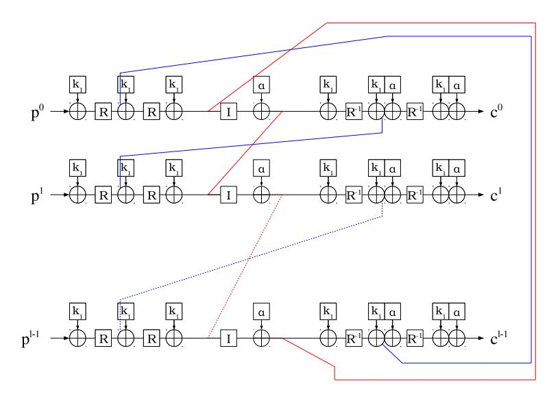

Fig. 11: A cycle set of 6-round PRINCE-core.

# 7 Conclusion

We looked for practical attacks which would hinder the security provided by round-reduced versions of PRINCE in a realistic framework provided by the designers of this cipher. We found that approaches based on a Meet-in-the-Middle, SAT-based or, surprisingly, dierential framework can all lead to practical attacks on up to half of the rounds. We checked our results by actually implementing one of our attacks. As a matter of fact, our attacks were the best submitted to the PRINCE-challenge for 4, 6 and 8 rounds. Furthermore, during our investigations on PRINCE we discovered a new attack on 10 rounds which despite its data complexity of 2 <sup>57</sup> chosen plaintexts has a reasonable complexity and a very (very!) motivated adversary could run it.

We also identied some simplications of the encryption occurring because of the small cycles of the inner-rounds of this block cipher, thus shedding new light on the consequences of the α-reection as it is implemented in PRINCE.

# 8 Acknowledgement

The authors thank Alex Biryukov for useful discussions about the dierential attack on PRINCE. We also thank NXP Semiconductors for organizing the PRINCE challenge and sending us our rewards! The work of the authors was supported by the CORE ACRYPT project (ID C12-15-4009992) funded by the Fonds National de la Recherche (Luxembourg).

# References

- <span id="page-24-0"></span>1. Biham, E., Shamir, A.: Dierential cryptanalysis of DES-like cryptosystems. Journal of CRYPTOLOGY 4(1) (1991) 372
- <span id="page-24-1"></span>2. Matsui, M.: Linear cryptoanalysis method for DES cipher. In: Advances in Cryptology - EUROCRYPT 93, Workshop on the Theory and Application of of Cryptographic Techniques, Lofthus, Norway, May 23-27, 1993, Proceedings. (1993) 386 397
- <span id="page-24-2"></span>3. Demirci, H., Selçuk, A.A.: A meet-in-the-middle attack on 8-round AES. In: Fast Software Encryption, Springer (2008) 116126
- <span id="page-24-3"></span>4. Semiconductors, N.: The PRINCE challenge. [https://www.emsec.rub.de/](https://www.emsec.rub.de/research/research_startseite/prince-challenge/) [research/research\\_startseite/prince-challenge/](https://www.emsec.rub.de/research/research_startseite/prince-challenge/) (2014)
- <span id="page-24-4"></span>5. Borgho, J., Canteaut, A., Güneysu, T., Kavun, E.B., Knezevic, M., Knudsen, L.R., Leander, G., Nikov, V., Paar, C., Rechberger, C., et al.: PRINCE a low-latency block cipher for pervasive computing applications. In: Advances in CryptologyASIACRYPT 2012. Springer (2012) 208225
- <span id="page-24-5"></span>6. Biryukov, A., Perrin, L.: State of the art in lightweight cryptography. [http:](http://cryptolux.org/index.php/Lightweight_Cryptography) [//cryptolux.org/index.php/Lightweight\\_Cryptography](http://cryptolux.org/index.php/Lightweight_Cryptography)
- <span id="page-24-6"></span>7. Soleimany, H., Blondeau, C., Yu, X., Wu, W., Nyberg, K., Zhang, H., Zhang, L., Wang, Y.: Reection cryptanalysis of PRINCE-like ciphers. Journal of Cryptology (2013) 127
- <span id="page-24-7"></span>8. Jean, J., Nikoli¢, I., Peyrin, T., Wang, L., Wu, S.: Security analysis of prince. In: Fast Software Encryption: 20th International Workshop, FSE 2013, Singapore, March 11-13, 2013. Revised Selected Papers. Volume 8424., Springer (2014) 92
- <span id="page-24-8"></span>9. Li, L., Jia, K., Wang, X.: Improved meet-in-the-middle attacks on aes-192 and prince. Cryptology ePrint Archive, Report 2013/573 (2013) [http://eprint.iacr.](http://eprint.iacr.org/) [org/.](http://eprint.iacr.org/)
- <span id="page-24-9"></span>10. Canteaut, A., Fuhr, T., Gilbert, H., Naya-Plasencia, M., Reinhard, J.R.: Multiple dierential cryptanalysis of round-reduced PRINCE (full version). Cryptology ePrint Archive, Report 2014/089 (2014) [http://eprint.iacr.org/.](http://eprint.iacr.org/)
- <span id="page-24-10"></span>11. Rechberger, C.: Update on the 10000 euro PRINCE cipher-breaking challenge: Results of round-1. [http://crypto.2014.rump.cr.yp.to/](http://crypto.2014.rump.cr.yp.to/d037206eda8f9278cef1ea26cd62e51f.pdf) [d037206eda8f9278cef1ea26cd62e51f.pdf](http://crypto.2014.rump.cr.yp.to/d037206eda8f9278cef1ea26cd62e51f.pdf) (2014)
- <span id="page-24-11"></span>12. Dunkelman, O., Keller, N., Shamir, A.: Improved single-key attacks on 8-round AES-192 and AES-256. In: Advances in Cryptology - ASIACRYPT 2010 - 16th International Conference on the Theory and Application of Cryptology and Information Security, Singapore, December 5-9, 2010. Proceedings. (2010) 158176
- <span id="page-24-12"></span>13. Derbez, P., Fouque, P.: Exhausting Demirci-Selçuk meet-in-the-middle attacks against reduced-round AES. In: Fast Software Encryption - 20th International Workshop, FSE 2013, Singapore, March 11-13, 2013. Revised Selected Papers. (2013) 541560
- <span id="page-24-13"></span>14. Derbez, P., Fouque, P.A., Jean, J.: Improved Key Recovery Attacks on Reduced-Round AES in the Single-Key Setting. In Johansson, T., Nguyen, P.Q., eds.: EU-ROCRYPT. Volume 7881 of Lecture Notes in Computer Science., Springer (2013) 371387
- <span id="page-24-14"></span>15. Abed, F., List, E., Lucks, S.: On the security of the core of prince against biclique and dierential cryptanalysis. Cryptology ePrint Archive, Report 2012/712 (2012) [http://eprint.iacr.org/.](http://eprint.iacr.org/)
- <span id="page-24-15"></span>16. Biryukov, A., Shamir, A.: Structural cryptanalysis of SASAS. In Ptzmann, B., ed.: Advances in Cryptology EUROCRYPT 2001. Volume 2045 of Lecture Notes in Computer Science. Springer Berlin Heidelberg (2001) 395405

- <span id="page-25-0"></span>17. Mironov, I., Zhang, L.: Applications of sat solvers to cryptanalysis of hash functions. In Biere, A., Gomes, C., eds.: Theory and Applications of Satisability Testing - SAT 2006. Volume 4121 of Lecture Notes in Computer Science. Springer Berlin Heidelberg (2006) 102115
- <span id="page-25-1"></span>18. Eén, N., Sörensson, N.: An extensible SAT-solver. In: Theory and applications of satisability testing, Springer (2004) 502518
- <span id="page-25-2"></span>19. Biryukov, A.: Analysis of involutional ciphers: Khazad and Anubis. In: Fast Software Encryption, Springer (2003) 4553
- <span id="page-25-3"></span>20. Moore, J.H., Simmons, G.J.: Cycle structure of the DES with weak and semi-weak keys. In: Advances in CryptologyCRYPTO'86, Springer (1987) 932
- <span id="page-25-4"></span>21. Dunkelman, O., Keller, N., Shamir, A.: Minimalism in cryptography: the evenmansour scheme revisited. In: Advances in CryptologyEUROCRYPT 2012. Springer (2012) 336354

<span id="page-26-0"></span>Algorithm 2 Using trails T1, T<sup>2</sup> and a SAT-solver to recover the complete key k0||k<sup>1</sup> of 6-round PRINCE.

```
while the key has not been retrieved do
   Query a structure S =

                            (p
                              0
                               , c0
                                  ), ...,(p
                                         2
                                          12−1
                                              , c2
                                                 12−1

   H ← empty hashtable of lists of families indexed by 64-bits integers
   for all families F in S do
      for one pair in F do
          for all columns of the internal state do
             for all the 2
                          12 possible dierences do
                 Deduce the corresponding 16-bit key material k16
                 for all remaining pairs in F do
                    Invert key addition for the column using k16
                    Invert S
                             −1
                                for the column
                    Invert M0
                               for the column
                 end for
                 if correct nibble has zero dierence in all pairs then store k16
             end for
          end for
      end for
      Combine all guesses from each column into 64-bits guesses
      for all 64-bits guesses k64 append F to H[k64]
   end for
   for all k64 among the keys of H do
      if H[k64] contains strictly more than 1 element then
          for all families F in H[k64] do
             Generate a CNF A encoding all encryptions in F with same key such
that k1 + L(k0) = k64.
             for all trails T in {T1, T2} do
                 B ← DoD(A, T)
                 if B is satisable then retrieve k0||k1 from the solution of B and
return it
             end for
          end for
      end if
   end for
end while
```

#### <span id="page-26-1"></span>Algorithm 3 Generating the cycle type of I <sup>α</sup> from those of its columns.

```
for i ∈ [0, 3] do
   Li ← List of the cycle length of I
                                       α
                                       i
end for
L ← Hashtable indexed by integers
for (`0, `1, `2, `3) ∈ L0 × L1 × L2 × L3 do
   ` ← lcm
             `0, `1, `2, `3

   L[`] ← L[`] + `
                   −1
                      ·
                       Q3
                          i=0 `i
end for
return L
```

# <span id="page-27-1"></span>A The Second 6-round Attack

<span id="page-27-0"></span>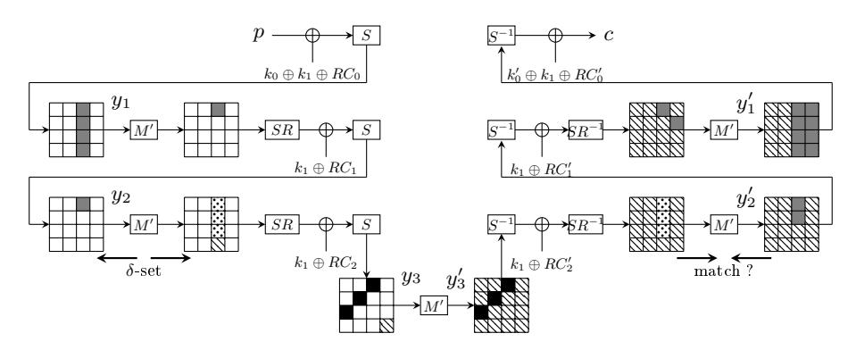

Fig. 12: 6r attack. No difference in white nibbles. Nibbles required in online (resp. offline) phase are in gray (resp. black). Differences in dotted nibbles are known during the offline phase. Hatched nibbles play no role.

### <span id="page-27-3"></span>B The Second 8-round Attack

<span id="page-27-2"></span>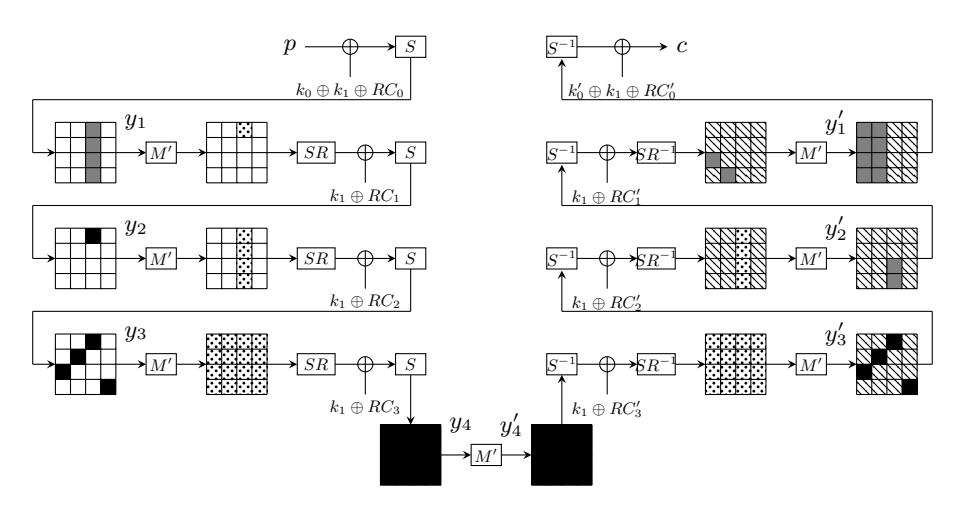

Fig. 13: 8r attack. No difference in white nibbles. Nibbles required in online (resp. offline) phase are in gray (resp. black). Differences in dotted nibbles are known during the offline phase. Hatched nibbles play no role.

### <span id="page-28-2"></span><span id="page-28-1"></span>C The Second 5.5 Rounds Trail

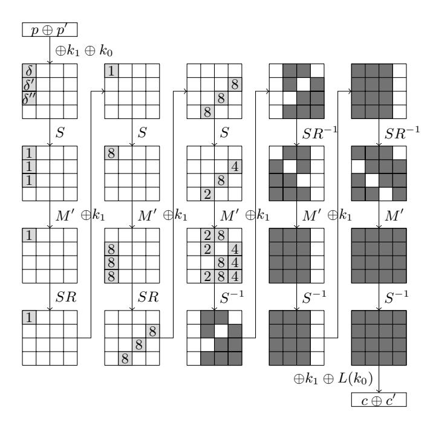

Fig. 14: The second 5.5 rounds trail  $\mathcal{T}_2$ .

### <span id="page-28-0"></span>D Simple Meet-in-the-Middle Attacks

In this section we describe two attacks on round-reduced Prince. Both are simple meet-in-the-middle attacks requiring only few known plaintext/ciphertext pairs to work.

### D.1 4-round Attack

**Simple Attack.** We begin by presenting a simple attack on 4-round Prince with a complexity around  $2^{40}$  which is depicted on Figure 15. It is based on the two following equations involving few bits of the middle states y and y':

$$\begin{cases} y[38]_b \oplus y[46]_b = y'[38]_b \oplus y'[46]_b \\ y[39]_b \oplus y[43]_b \oplus y[47]_b = y'[47]_b \end{cases}$$

Let  $K_p$  (resp.  $K_c$ ) be the key bits required to compute  $y[38]_b \oplus y[46]_b$  and  $y[39]_b \oplus y[43]_b \oplus y[47]_b$  from p (resp.  $y'[38]_b \oplus y'[46]_b$  and  $y'[47]_b$  from p). Then the attacks scenario is:

- 1. Ask for n known plaintext/ciphertext pairs.
- 2. Let T be an empty hash table.
- 3. For all possible values of  $K_p$  do
  - (a) for j from 1 to n compute  $y^j[38]_b \oplus y^j[46]_b$  and  $y^j[39]_b \oplus y^j[43]_b \oplus y^j[47]_b$  from the j-th plaintext
  - (b) make the sequence  $s = [y^1[38]_b \oplus y^1[46]_b, y^1[39]_b \oplus y^1[43]_b \oplus y^1[47]_b, \dots]$
  - (c) add the value of  $K_p$  to  $T[s]_b$
- 4. For all possible values of  $K_c$  do
  - (a) for j from 1 to n compute  $y'^j[38]_b \oplus y'^j[46]_b$  and  $y^j[47]_b$  from the j-th ciphertext
  - (b) make the sequence  $s = [y'^1[38]_b \oplus y'^1[46]_b, y'^1[47]_b, \ldots]$
  - (c) check whether T[s] is empty or not. If T[s] is empty then the guess of  $K_c$  is wrong. Otherwise, T[s] contains the possible value(s) for  $K_p$  and, if n is large enough, this will happen only for the right guess.

<span id="page-29-0"></span>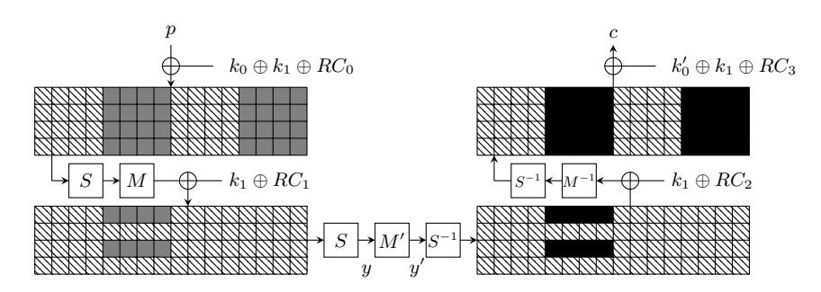

Fig. 15: 4r attack. Hatched bits play no role.

In our case, both  $K_p$  and  $K_c$  can assume only  $2^{40}$  values and thus 40 plaintext/ciphertext pairs are enough to get only one candidate for  $K_p \cup K_c$  with high probability. Thus the complexity of this attack is 40 known plaintexts and around  $2^{40}$  for both time and memory.

**Saving data and memory.** First we stress that  $K_P$  (resp.  $K_C$ ) can be safely replaced by any basis of the vector space spawned by itself so let consider it as a vector space over  $\mathbb{F}_2$ . Now we are interested by the vector space  $K_P \cap K_C$ . Here a basis of this vector space is:

$$\{k_1[36..39]_b, k_1[44..47]_b, k_0[37..39]_b, k_0[45..47]_b, k_0[40]_b \oplus \ldots \oplus k_0[44]_b \oplus k_1[40]_b \oplus \ldots \oplus k_1[43]_b\}.$$

Thus only 33 plaintext/ciphertext pairs are needed to discard the wrong guesses and the attack scenario becomes:

- 1. Ask for n known plaintext/ciphertext pairs.
- 2. For all possible values of  $K_p \cap K_c$  do
  - (a) Let T be an empty hash table.

- (b) Partially encrypt/decrypt the plaintext/ciphertext pairs.
- (c) For all possible values of  $K_p$  do
  - i. for j from 1 to n compute  $y^j[38]_b \oplus y^j[46]_b$  and  $y^j[39]_b \oplus y^j[43]_b \oplus y^j[47]_b$  from the j-th plaintext
  - ii. make the sequence  $s = \left[y^1[38]_b \oplus y^1[46]_b, y^1[39]_b \oplus y^1[43]_b \oplus y^1[47]_b, \ldots\right]$
  - iii. add the value of  $K_p$  to T[s]
- (d) For all possible values of  $K_c$  do
  - i. for j from 1 to n compute  $y'^j[38]_b \oplus y'^j[46]_b$  and  $y^j[47]_b$  from the j-th ciphertext
  - ii. make the sequence  $s = [y'^{1}[38]_{b} \oplus y'^{1}[46]_{b}, y'^{1}[47]_{b}, \ldots]$
  - iii. check whether T[s] is empty or not. If T[s] is empty then the guess of  $K_c$  is wrong. Otherwise, T[s] contains the possible value(s) for  $K_p$  and, if n is large enough, this will happen only for the right guess.

All in all the memory requirement is approximately  $25 \times 2^{25} \times 2^{-3} \approx 2^{26.7}$  bytes and the time complexity around  $33 \times 2 \times 2^{40} \times 40/(4 \times 64) \approx 2^{43.4}$  encryptions.

**Key recovery.** At the end of the attack we know (or have very few candidates for)  $K_p \cup K_c$ . But we still need 128-65=63 key bits to fully recover  $k_0$  and  $k_1$ . Performing an exhaustive search at this point would increase the overall complexity of the attack and thus is not a good idea. Instead, it is better to perform another meet-in-the-middle attacks successively. For instance, the attack depicted in Figure 16 allows to recover 20 more key bits with a time complexity around  $2^{20}$ .

<span id="page-30-0"></span>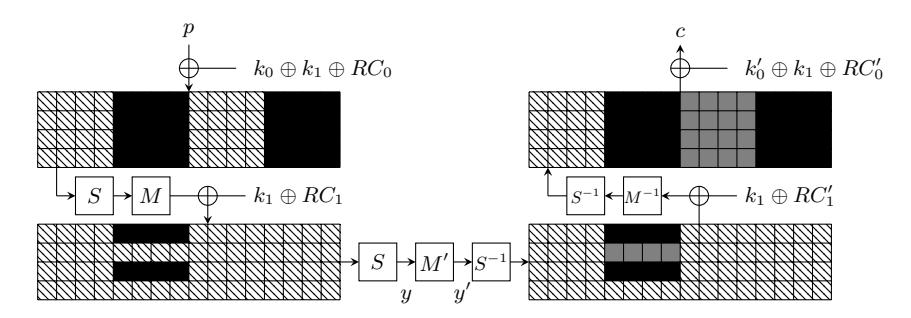

Fig. 16: 4r attack. black bits are known. Hatched bits play no role.

#### D.2 6-round Attack

The 4-round attack can be extended to a 6-round attack as depicted on Figure 17. Now the dimension of both  $K_p$  and  $K_c$  is 96 and the dimension of the intersection is 64. Thus it leads to an attacks requiring  $(2 \times 96 - 64)/2 = 64$  known plaintext/ciphertext pairs, with a memory complexity around  $(96-64) \times 2^{96-64} \times 2^{-3} = 2^{34}$

<span id="page-31-1"></span>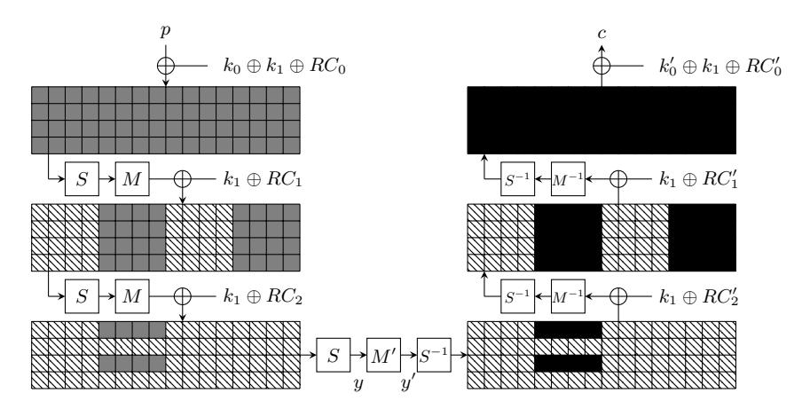

Fig. 17: 6r attack. Hatched bits play no role.

bytes and a time complexity of approximately  $2\times64\times2^{96}\times104/(6\times64)\approx2^{101.1}$  encryptions.

Finally, an exhaustive search can be perform to retrieve  $k_0$  and  $k_1$  without increasing the overall complexity.

# <span id="page-31-0"></span>E Improved 8-round Attack

In this section we concisely describe a second attack against 8-round PRINCE, still based on Demirci and Selçuk technique, requiring much less memory than the attack described Section 3.2.

### Step 1

The first step of the attack is depicted on Figure 18. This is a classical Demirci and Selçuk attack against 8-round PRINCE. The nibble requiblack in the online phase are in gray and can take  $2^{8\times4}=2^{32}$  values. In another hand, nibbles requiblack in the offline phase are in black and can assume  $2^{80}$  values thanks to the (lack of) key schedule.

Here  $\delta$ -sets contain  $2^4=16$  messages and the check is performed on sequences of (16-1)=15 differences in one nibble, *i.e.* on 60-bit sequences. As more than  $2^{60}$  sequences are computed during the offline phase, the attack does not filter values of gray nibbles.

### Step 2

The idea is to switch the online and the offline phases (and actually they are now both performed online). Given a plaintext/ciphertext pair (P, C) we compute the  $2^{32}$  possible 60-bit sequences and store them in a hash table. Then for each value

<span id="page-32-0"></span>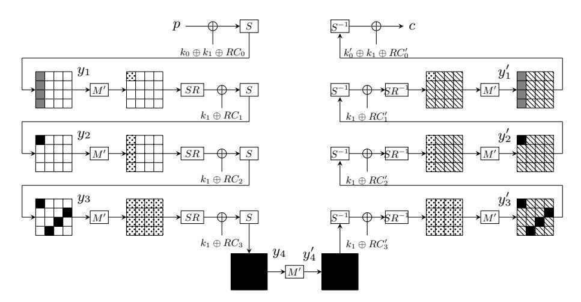

Fig. 18: Step 1. No difference in white nibbles. Nibbles required in online (resp. offline) phase are in gray (resp. black). Differences in dotted nibbles are known during the offline phase. Hatched nibbles play no role.

of the black nibbles, we compute the corresponding 60-bit sequence and check whether it belongs to the hash table. Only  $2^{80-60+32}=2^{52}$  values should pass this test.

#### Step 3

We notice that, given a structure of  $2^{16}$  plaintexts such that the first column is active while the other ones are constant, each column of state  $y_3$  takes all the possible values too. Hence we can fix the value to 0 of 4 black nibbles of  $y_4$  (shiftrows of a column), decreasing the time complexity by a factor  $2^{16}$ . As a result, the hash table now has to contain  $2^{48}$  sequences,  $2^{32}$  for each of the  $2^{16}$  plaintext/ciphertext pairs.

### Step 4

To decrease further the number of possible values for the black nibbles, we apply the same attack but we change the nibble on which the check is performed as shown on Figure 19. So we have to store an other table containing  $2^{48}$  60-bit sequences and guess the value of the black nibble of  $y_2'$ . Only  $2^{52+4-60+48}=2^{44}$  values should pass this test.

### Step 5

As in step 4, we perform the two others attacks corresponding to the two other positions for the black nibble on  $y'_2$ . Only  $2^{28}$  values should pass this test.

<span id="page-33-0"></span>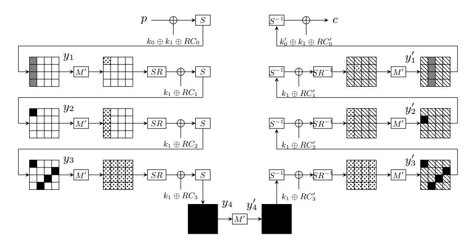

Fig. 19: Step 4. No difference in white nibbles. Nibbles required in online (resp. offline) phase are in gray (resp. black). Differences in dotted nibbles are known during the offline phase. Hatched nibbles play no role.

#### Step 6

We switch again online and offline phases, coming back to a classical Demirci and SelÃğuk attack. We run successively the four previous attacks to retrieve a unique plaintext/ciphertext pair together with a unique value for the first column of  $y_1$  and the whole state  $y_1'$ . Indeed, we did not check whether the plaintext/ciphertext pair and the first column of  $y_1$  are the same for the four attacks, while they have to. Thus only the right ones should remain at the end of the attack.

### Step 7

The missing 48 bits of the key can be exhausted.

### Complexity

The data complexity is  $2^{16}$  chosen plaintexts. The memory complexity is around  $4\times 2^{48}$  60-bit sequences which is equal to  $2^{52.9}$  bytes. The time complexity is dominated by steps 2/3, which is equivalent to  $2^{64}\times 2^4\times (42-4)/(8\times 16)\simeq 2^{66.25}$  encryptions.