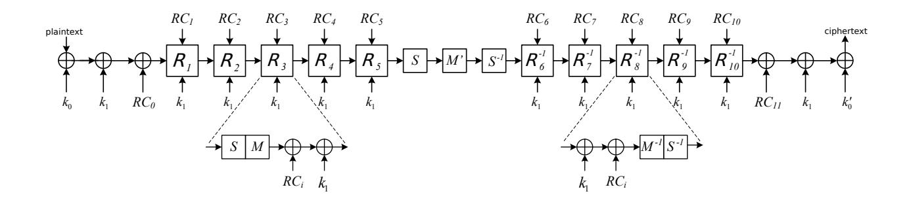

# Practical Attacks on the Round-reduced PRINCE

## Pawe l Morawiecki1,<sup>2</sup>

1 Institute of Computer Science, Polish Academy of Sciences, Poland <sup>2</sup> Section of Informatics, Kielce University of Commerce, Poland

Abstract. The PRINCE cipher is the result of a cooperation between the Technical University of Denmark (DTU), NXP Semiconductors and the Ruhr University Bochum. The cipher was designed to reach an extremely low-latency encryption and instant response time. PRINCE has already gained a lot of attention from the academic community, however, most of the attacks are theoretical, usually with very high time or data complexity. Our work helps to fill the gap in more practically oriented attacks, with more realistic scenarios and complexities. We present new attacks, up to 7 rounds, relying on integral and higher-order differential cryptanalysis.

Keywords: PRINCE, lightweight cryptography, integral cryptanalysis, higher-order differential

### 1 Introduction

A need of low-cost cryptosystems for several fast-growing applications, such as RFID tags, sensor networks or Internet of Things, has drawn great attention to the area of lightweight cryptographic primitives over the last decade. It has been a vibrant research area, where a good trade-off between security and efficiency is a particularly challenging task. Some well established algorithms (e.g., AES[5]) may not meet the basic requirements of constrained devices — low cost hardware implementation, low power usage and latency.

Recently, at Asiacrypt 2012 conference, a new lightweight block cipher called PRINCE has been proposed [2]. PRINCE is the result of a cooperation between the Technical University of Denmark (DTU), NXP Semiconductors and the Ruhr University Bochum. The cipher was designed to reach an extremely low-latency encryption and instant response time. These requirements are highly desirable for applications such as instant authentication or block-wise read/write access to memory devices, e.g., in solid-state hard disks.

For PRINCE — a serious proposal with a clear motivation from industry — it is very important to estimate the security margin, particularly for practical settings, regarding a future deployment of the cipher. Too conservative design (e.g., too many rounds) might result in the algorithm below industry expectations. On the other hand, insufficient level of security will make the users and customers reluctant to deploy and use the algorithm.

PRINCE has already gained a lot of attention from the academic community and some interesting cryptanalysis has been published [3, 7, 10, 11]. However, most of the attacks are theoretical, usually with very high time or data complexity. To spur on more practically oriented research, PRINCE designers launched 'PRINCE challenge' [1] — a competition where cryptanalysts are encouraged to find key recovery attacks with time complexity below 2<sup>64</sup> and a number of plaintexts set to a more realistic scenario.

Our contribution helps to fill the gap in the practical attacks on PRINCE, giving a better estimation of the security margin. Table 1 summarizes our results.

### Related work

As stated, most of published work on PRINCE are theoretical attacks. Though, there are a few attack with practical complexities. In [7], the integral attack was described, up to 6 rounds.

Table 1. Our key recovery attacks

|   |          |                  | 1 *                       | Reference   |
|---|----------|------------------|---------------------------|-------------|
| 4 |          |                  |                           | Section 3.1 |
| 4 | $2^{28}$ | $6 \cdot 2^3$    |                           | Section 4   |
| 5 | $2^{29}$ | $6 \cdot 2^4$    | integral                  | Section 3.2 |
| 6 |          |                  |                           | Section 3.3 |
| 7 | $2^{57}$ | $6 \cdot 2^{57}$ | higher-order differential | Section 5   |

However, the authors conclude that practical attacks can only be mounted for  $PRINCE_{core}$  (an underlying primitive of the cipher) and applying the same technique to PRINCE results in an increase of time complexity to  $2^{64}$ . Our work clearly improves their findings. Very recently, two other approaches (meet-in-the-middle attack and SAT-based cryptanalysis) led to practical (or arguably close to practical) attacks, up to 10 rounds [6].

#### 2 Description of PRINCE

In this section we give a description of the PRINCE cipher with all the details needed to follow our attacks. For a complete specification and design rationale of the cipher, we refer a reader to [2].

PRINCE is the 64-bit block cipher which uses 128-bit key k. First, k is divided into two subkeys  $k_0 \parallel k_1$  and then is expanded into 192 bits with a simple linear transformation L.

$$k = (k_0 \parallel k_1) \to (k_0 \parallel k'_0 \parallel k_1), \text{ where } k'_0 = L(k_0) = (k_0 \gg 1) \oplus (k_0 \gg 63)$$



Fig. 1. A scheme of the PRINCE cipher

The 64-bit subkeys  $k_0$  and  $k'_0$  can be treated as the input and output whitening keys to the underlying block cipher named PRINCE<sub>core</sub> with its internal 64-bit key  $k_1$ . Figure 1 shows the complete scheme.

PRINCE is the substitution-permutation network composed of 12 rounds. The 64-bit state can be organized as the  $4 \times 4$  array of nibbles and we use this convention throughout the paper. To specify a given nibble we use a notation [x,y]. Four nibbles sharing the same x coordinate are called a *column*.

The 4-bit Sbox S can be specified in the hexadecimal notation S = [B, F, 3, 2, A, C, 9, 1, 6, 7, 8, 0, E, 5, D, 4]. In each round the Sbox S (or its inverse  $S^{-1}$ ) is applied to all 16 nibbles. For one

of our attacks, we need an explicit form of the Sbox equations given in the Algebraic Normal Form. Four Sbox outputs  $y_0 \dots y_3$  are described as follows:

```
y_{3} = x_{1} \oplus x_{0} \oplus x_{3}x_{2} \oplus x_{3}x_{0} \oplus x_{2}x_{1} \oplus x_{1}x_{0} \oplus x_{3}x_{2}x_{1} \oplus 1
y_{2} = x_{3}x_{1} \oplus x_{2}x_{1} \oplus x_{2}x_{0} \oplus x_{3}x_{2}x_{1} \oplus x_{2}x_{1}x_{0} \oplus 1
y_{1} = x_{3}x_{2} \oplus x_{3}x_{0} \oplus x_{2}x_{0} \oplus x_{3}x_{2}x_{0} \oplus x_{2}x_{1}x_{0} \oplus x_{3} \oplus x_{0}
y_{0} = x_{2}x_{1} \oplus x_{1}x_{0} \oplus x_{3}x_{2}x_{1} \oplus x_{3}x_{2}x_{0} \oplus x_{3}x_{1}x_{0} \oplus x_{2} \oplus x_{0} \oplus 1
```

The linear step M consists of the linear matrix M' and the nibble shifting SR (similar to ShiftRows in AES);  $M = SR \circ M'$ . The M' is an involutive, linear transformation, a kind of equivalent of MixColumns in AES. We give the bitwise equations of M' in Appendix. For a detailed algebraic description and design rationale of M, we refer to [2].

In the first 5 rounds, an order of steps is as follows. First, the subkey  $k_1$  and the round constant  $RC_i$  are added to the state. Then, the Sbox layer is applied, followed by the linear transformation M. In the last 5 rounds, the inverse transformations  $S^{-1}$  and  $M^{-1}$  are used, also the order of them is reversed, as shown in Figure 1. The middle rounds consist of only S,  $M^{-1}$ , and  $S^{-1}$ .

We attack the round-reduced variants of PRINCE. In case of an even number of rounds, we keep the symmetry of the cipher, that is the same number of rounds are before and after the middle rounds. In case of an odd number of rounds, one extra round is added at the beginning of the cipher. (If an extra round would be added at the end, all the reported attacks still work.)

## 3 Integral Attacks

Integral cryptanalysis was originally designed as a dedicated attack against the Square cipher [4]. This cryptanalytic attack is particularly applicable to block ciphers based on substitution-permutation networks and PRINCE falls into this category.

Unlike differential cryptanalysis, where we usually trace the XOR difference between a pair of plaintexts, integral cryptanalysis uses bigger sets, e.g., 256 chosen plaintexts. Typically, most part of plaintexts is set to a constant and some words vary through all possibilities. (These words are called *active*.) Then, we study how the XOR sum in given words changes through the subsequent steps of a cipher. We hope that after a few steps/rounds, some words still sum up to zero. Such the property would distinguish a given cipher from a random permutation and often leads to a key recovery attack.

The base for all our integral attacks is the 3.5-round integral distinguisher. We start from one active nibble (the position of the nibble is arbitrary) and after 3.5 rounds, all nibbles are still balanced, that is, their XOR sum is zero. A subsequent Sbox layer destroys the property. An integral distinguisher is very similar to the one presented originally for the Square cipher and AES. Figure 2 shows the 3.5-round integral distinguisher.

What is interesting is how the linear M' affects a single column when one nibble is active and the rest are constant. In the classic Square attack (also applied to AES) if a byte is active and other three bytes are constant, then applying MixColumn operation gives you 4 active bytes (in that column). However, in PRINCE, the M' step transforms such column in a way that each nibble (in that column) takes exactly 8 distinct values (rather than 16, as one might expect). Each of these 8 values is present two times, so they balance each other and a nibble is still balanced (sums up to zero) and behaves as it were an active nibble. This property of M' becomes clear when one studies its bitwise equations. We give such analysis in Appendix.

| Α | С | С | С |      | A <sup>8</sup> | С              | С              | С              |       | A <sup>8</sup> | A <sup>4</sup> | A <sup>4</sup> | A <sup>8</sup> |                                   | В | В | В | В |
|---|---|---|---|------|----------------|----------------|----------------|----------------|-------|----------------|----------------|----------------|----------------|-----------------------------------|---|---|---|---|
| С | С | С | С | S, M | С              | С              | С              | A <sup>8</sup> | S, M' | A <sup>4</sup> | A <sup>4</sup> | A <sup>4</sup> | A <sup>4</sup> | S <sup>-1</sup> , M <sup>-1</sup> | В | В | В | В |
| С | С | С | С |      | С              | С              | A <sup>8</sup> | С              |       | A <sup>4</sup> | A <sup>4</sup> | A <sup>4</sup> | A <sup>4</sup> |                                   | В | В | В | В |
| С | С | С | С |      | С              | A <sup>8</sup> | С              | С              |       | A <sup>4</sup> | A <sup>8</sup> | A <sup>8</sup> | A <sup>4</sup> |                                   | В | В | В | В |

- A active nibble (all 16 distinct values taken)
- An quasi-active nibble (n distinct values, each taken 16/n times)
- C constant nibble
- B balanced nibble (XOR sum equals 0)

Fig. 2. 3.5-round integral distinguisher for PRINCE

#### 3.1 4-round Attack

First, we encrypt a set of  $2^4$  plaintexts, with one active nibble. We guess a value of  $k_1 \oplus k_0'$ , partially decrypt ciphertexts through the last Sbox and check whether the given nibble is balanced or not. With a correct guess, a nibble must be balanced. This is repeated for all 16 nibbles. Our implementation shows that there are many false positives and it is better to use more sets, making the filter stronger. (5 sets are sufficient to eliminate all false positives.)

Then, the standard procedure would be to peel off the 4th round (as  $k_1 \oplus k'_0$  is already known) and next recover  $k_1$ , nibble by nibble. However, this is not possible since at the end of the 3rd round all nibbles are still balanced, then any  $k_1$  guess would be 'correct', so there is no filter. To deal with that, the attacker may exhaustively search  $k_1$  (or  $k_0$ ) and recover the whole key with time complexity  $2^{64}$  (as it was done in [8]). However, we can do better by using an extra set of plaintexts.

Instead of using the 3.5-round distinguisher, we now use the 2.5-round one, starting from four active nibbles (placed as in the second diagram in Figure 2). We peel off the 4th round and then recover  $k_1$  key, on nibble by nibble basis. Now a filter works as at the end of the 3rd round a nibble is not guaranteed to be balanced.

Once we know  $k_1$  and  $(k_1 \oplus k_0')$ ,  $k_0'$  is also known. Therefore, we can easily calculate  $k_0$  from a set of linear equations  $L(k_0) = k_0'$ . The complete scheme of the attack is as follows.

- 1. Encrypt 5 sets of 2<sup>4</sup> plaintexts with one active nibble
- 2. for all 16 nibbles
  - (a) for all values of  $k_1 \oplus k_0'$  nibble
    - i. for all 5 sets of plaintexts
      - A. Decrypt all ciphertexts for a given set through the Sbox
      - B. Sum the nibbles calculated in Step A. If the sum is zero, then the guess is a candidate for correct  $k_1 \oplus k_0'$
  - (b) Identify a candidate of  $k_1 \oplus k_0^{'}$  which appears in all 5 sets for a given nibble
- 3. Encrypt another 5 sets of  $2^4$  plaintexts with four active nibbles (placed as in the second diagram in Figure 2)
- 4. Peel off the 4th round with the recovered  $k_1 \oplus k'_0$
- 5. for all 16 nibbles
  - (a) for all values of  $k_1$  nibble
    - i. for all 5 sets of plaintexts

- A. Decrypt all ciphertexts for a given set through the Sbox
- B. Sum the nibbles calculated in Step A. If the sum is zero, then the guess is a candidate for correct  $k_1$
- (b) Identify a candidate of  $k_1$  which appears in all 5 sets for a given nibble
- 6. Recover 64 bits of  $k_0$  by solving a set of linear equations of the form  $L(k_0) = k'_0$

Data complexity of the attack is  $5 \cdot 2^4 + 5 \cdot 2^4 \cong 2^7$  chosen plaintexts. Time complexity is dominated by the Sbox calls and is equal to 16(nibbles)  $\cdot 5$ (sets) $\cdot 2^4 + 16 \cdot 5 \cdot 2^4 \cong 2^{11}$ . We implemented the attack on a desktop PC and the full key recovery takes a fraction of a second.

#### 3.2 5-round Attack

An extension of the attack to 5 rounds is done by guessing a complete column (4 nibbles) of  $k_1 \oplus k'_0$ , rather than a single nibble. Consequently, we can partially decrypt a column of ciphertexts through the Sbox layer and M-layer. Then, we can guess a single nibble of  $k_1[0,0]$  to pass through the subsequent Sbox. If the guesses are correct, the balance property should hold (according to our 3.5-round distinguisher). The pseudo-code of the attack is given below.

- 1. Encrypt 6 sets of  $2^4$  plaintexts with one active nibble
- 2. for all 4 columns of nibbles
  - (a) for all values of  $(k_1 \oplus k_0')$  column and  $k_1[0,0]$  nibble
    - i. for all 6 sets of plaintexts
      - A. Decrypt the column through S-Layer and M-Layer
      - B. Decrypt a nibble [0,0] through the Sbox
      - C. Sum the nibbles calculated in Step B. If the sum is zero, then the guess is a candidate for correct  $k_1 \oplus k_0'$  column
  - (b) Identify a candidate of  $k_1 \oplus k_0'$  which appears in all 6 sets for a given column
- 3. Peel off the 5th round with the recovered  $k_1 \oplus k_0'$
- 4. for all 16 nibbles
  - (a) for all values of  $k_1$  nibble
    - i. for all 6 sets of plaintexts
      - A. Decrypt all ciphertexts for a given set through the Sbox
      - B. Sum the nibbles calculated in Step A. If the sum is zero, then the guess is a candidate for correct  $k_1$
  - (b) Identify a candidate of  $k_1$  which appears in all 6 sets for a given nibble
- 5. Recover 64 bits of  $k_0$  by solving a set of linear equations of the form  $L(k_0) = k'_0$

Our implementation indicates that 6 sets of plaintexts make the filter strong enough. Thus, data complexity is  $6 \cdot 2^4$  chosen plaintexts. Time complexity is dominated by the Sbox calls (the most inner loop in the pseudo-code) and is equal to  $6 \cdot 2^4$  (plaintexts)  $\cdot 4$ (columns)  $\cdot 2^{16+4} \cong 2^{29}$ . We implemented the attack and the secret key is recovered in about 3 minutes on a desktop PC.

#### 3.3 6-round Attack

The 6-round attack is exactly the same as the 5-round variant except that we start with a larger structure of  $2^{16}$  plaintexts. We use the same idea which allows to add one more round (at the beginning) for the integral attack against Square or AES. Four nibbles from the same column takes all possible  $2^{16}$  values and the remaining nibbles are set to some arbitrary constant. After the first round, we have, in fact,  $2^{12}$  sets of  $2^4$  plaintexts ready for the 5-round attack. So, data and time complexity have to be multiplied by a factor of  $2^{12}$  (in comparison to the 5-round attack). Thus, required data is  $6 \cdot 2^{16}$  chosen plaintexts and time is  $2^{41}$ . The 6-round attack

would take a couple of days on a single PC, but it can be easily parallelized and 2<sup>41</sup> complexity is not an obstacle to get the very practical time. We experimented with the limited pool of keys (including the correct key) to confirm that indeed the correct key is recovered and false ones are discarded.

### 4 Bit-Pattern Based Integral Attack

The integral attack naturally fits to the primitives with the word-oriented structure such as Square, AES and also PRINCE. However, it has been shown [12], that a modified variant of the technique (called bit-pattern based integral attack) can be applied to the bit-oriented algorithms. The classic integral attack starts with (at least) one active s-bit word, so a number of chosen plaintexts (data complexity) has a lower bound 2<sup>s</sup> . The bit-pattern variant of the integral attack allows to work with fewer chosen plaintexts. For practical attacks, where the adversary might have very limited power to harvest chosen plaintexts, we believe it is important to push data complexity to the lowest possible value. Hence our motivation to mount the bit-pattern based integral attack against PRINCE.

Let us first briefly describe how the technique works. There are two features which differ the bit-pattern based attack from the classic integral attack. First, we trace single bits (their patterns) rather than the whole words (such as nibbles in PRINCE or bytes in AES). Second, we care about the order of plaintexts. It will becomes clearer as we take a closer look at the bit patterns. In a given structure (e.g., 8 plaintexts), each bit position holds a specific sequence of 0's and/or 1's. For example, '00000000' (8 zeros) is called the constant pattern, while '11110000' is the active pattern denoted by a2. According to the notation introduced in [12], we have the following patters:

- constant pattern c: bits within the structure consists of either all 0's or all 1's.
- active pattern a<sup>i</sup> : alternating values of bits in 2<sup>i</sup> -bit blocks is repeated throughout the structure.
- pattern b<sup>i</sup> : consecutive bits in 2<sup>i</sup> -bit blocks, but the values of the blocks are not necessarily repeated in an alternating manner.
- dual pattern d<sup>i</sup> : bits hold either the c (constant) or the a<sup>i</sup> (active) pattern.

If the XOR sum of all bits in one pattern equals 0, the pattern is balanced. All the above patterns are balanced except for b<sup>0</sup> which may or may not be balanced. In this paper we use the following convention: b<sup>0</sup> is treated as balanced and when it is unknown whether b<sup>0</sup> is balanced or not, the new symbol '?' is introduced.

A key recovery attack with the bit-pattern variant of the integral attack works the same as for the classic integral attack. Once we have the bit-pattern integral distinguisher, we guess a part of the key from the last round, partially decrypt ciphertexts through the Sbox layer and check the balance property of certain bits. If the property holds (according to a distinguisher), then our key guess, most likely, is correct.

To trace how bit patters change through the subsequent rounds in PRINCE, first we need the bitwise description of the cipher. The linear M/M<sup>0</sup> -layer involves only XORs of nibbles, so the bit-level description is straightforward. (The bitwise equations are given in Appendix.) For the Sbox layer we use four ANF equations given in Section 2). Therefore, the whole cipher can be expressed with only the bitwise AND and XOR. Now we have to figure out how to operate on patterns with these two operators. Some operations are pretty obvious, for example, the constant pattern c XORed with any other pattern p gives p. A detailed list of operations on the patterns is given in Appendix.

Figure 3 shows an evolution of patterns through the first 3 rounds. We start with three active bits, so 2<sup>3</sup> chosen plaintexts are needed. Please note that three active bits are placed in separate nibbles. This way they do not interact in the first round and the b<sup>0</sup> pattern does not appear right after the first S-Layer. Addition of secret key and round constants can be omitted as these operations do know bring any changes to patterns of bits (XORing with the the constant pattern c). The balance property holds up to 2.5 rounds and the third layer of the Sboxes destroys the property.

We experimented with other placement of active bits (e.g., all three active bits in a single nibble) but it did not lead to better results than 3 rounds.

| a0 c        | c        | c  | c    | a1 c        |   | c       | c      | c       | a2 c        |    | c    | c | c           | c     |
|-------------|----------|----|------|-------------|---|---------|--------|---------|-------------|----|------|---|-------------|-------|
| c<br>c      | c        | c  | c    | c           | c | c       | c      | c       | c           | c  | c    | c | c           | c     |
| c<br>c      | c        | c  | c    | c           | c | c       | c      | c       | c           | c  | c    | c | c           | c     |
| c<br>c      | c        | c  | c    | c           | c | c       | c      | c       | c           | c  | c    | c | c           | c     |
|             |          |    |      |             |   | ↓       |        |         |             |    |      |   |             |       |
|             |          |    |      |             |   | S-Layer |        |         |             |    |      |   |             |       |
|             |          |    |      |             |   | ↓       |        |         |             |    |      |   |             |       |
| d0 d0 d0 d0 |          |    |      | d1 d1 d1 d1 |   |         |        |         | d2 d2 d2 d2 |    | c    | c | c           | c     |
| c<br>c      | c        | c  | c    | c           | c | c       | c      | c       | c           | c  | c    | c | c           | c     |
| c<br>c      | c        | c  | c    | c           | c | c       | c      | c       | c           | c  | c    | c | c           | c     |
| c<br>c      | c        | c  | c    | c           | c | c       | c      | c       | c           | c  | c    | c | c           | c     |
|             |          |    |      |             |   | ↓       |        |         |             |    |      |   |             |       |
|             |          |    |      |             |   | M-Layer |        |         |             |    |      |   |             |       |
| ↓           |          |    |      |             |   |         |        |         |             |    |      |   |             |       |
| c           | d0 d0 d0 |    | d1 c |             |   | d1 d1   | c      |         | d2 d2 d2    |    | c    | c | c           | c     |
| d1 d1 c     |          | d1 | d2 c |             |   | d2 d2   | c      | c       | c           | c  | d0 c |   |             | d0 d0 |
| d2 d2 c     |          | d2 | c    | c           | c | c       |        | d0 d0 c |             | d0 |      |   | d1 d1 d1 c  |       |
| c<br>c      | c        | c  |      | d0 d0 d0 c  |   |         | c      |         | d1 d1 d1    |    |      |   | d2 d2 d2 c  |       |
|             |          |    |      |             |   | ↓       |        |         |             |    |      |   |             |       |
|             |          |    |      |             |   | S-Layer |        |         |             |    |      |   |             |       |
|             |          |    |      |             |   | ↓       |        |         |             |    |      |   |             |       |
| d0 d0 d0 d0 |          |    |      | d1 d1 d1 d1 |   |         |        |         | d2 d2 d2 d2 |    | c    | c | c           | c     |
| d1 d1 d1 d1 |          |    |      | d2 d2 d2 d2 |   |         | c      | c       | c           | c  |      |   | d0 d0 d0 d0 |       |
| d2 d2 d2 d2 |          |    | c    | c           | c | c       |        |         | d0 d0 d0 d0 |    |      |   | d1 d1 d1 d1 |       |
| c<br>c      | c        | c  |      | d0 d0 d0 d0 |   |         |        |         | d1 d1 d1 d1 |    |      |   | d2 d2 d2 d2 |       |
|             |          |    |      |             |   | ↓       |        |         |             |    |      |   |             |       |
|             |          |    |      |             |   | 0<br>M  | -Layer |         |             |    |      |   |             |       |
|             |          |    |      |             |   | ↓       |        |         |             |    |      |   |             |       |
| b1 b0 b0 b0 |          |    |      | b1 b0 b0 b0 |   |         |        |         | b0 b0 b1 b0 |    |      |   | b0 b0 b1 b0 |       |
| b0 b1 b0 b0 |          |    |      | b0 b1 b0 b0 |   |         |        |         | b0 b0 b0 b1 |    |      |   | b0 b0 b0 b1 |       |
| b0 b0 b1 b0 |          |    |      | b0 b0 b1 b0 |   |         |        |         | b1 b0 b0 b0 |    |      |   | b1 b0 b0 b0 |       |
| b0 b0 b0 b1 |          |    |      | b0 b0 b0 b1 |   |         |        |         | b0 b1 b0 b0 |    |      |   | b0 b1 b0 b0 |       |
|             |          |    |      |             |   | ↓       |        |         |             |    |      |   |             |       |
| S-Layer     |          |    |      |             |   |         |        |         |             |    |      |   |             |       |
| ↓           |          |    |      |             |   |         |        |         |             |    |      |   |             |       |
| ?<br>?      | ?        | ?  | ?    | ?           | ? | ?       | ?      | ?       | ?           | ?  | ?    | ? | ?           | ?     |
| ?<br>?      | ?        | ?  | ?    | ?           | ? | ?       | ?      | ?       | ?           | ?  | ?    | ? | ?           | ?     |
| ?<br>?      | ?        | ?  | ?    | ?           | ? | ?       | ?      | ?       | ?           | ?  | ?    | ? | ?           | ?     |
|             |          |    |      |             |   |         |        |         |             |    |      |   |             |       |
| ?<br>?      | ?        | ?  | ?    | ?           | ? | ?       | ?      | ?       | ?           | ?  | ?    | ? | ?           | ?     |

Fig. 3. Evolution of patterns through the first 3 rounds. After the third Sbox layer the balance property does not hold any more for any of bits.

One may ask why, instead of three active bits (a0, a1, a2), we do not take only two active bits and limit a number of chosen plaintexts even further. The problem is that with two active

bits (structure of four plaintexts) the symbolic operations do not work in the same way as for bigger structures. For example,  $(a_1 \text{ XOR } a_0) \text{ AND } c$  is no longer guaranteed to be balanced, while for bigger structures the outcome is balanced, namely  $b_0$ . Consequently, the '?' symbol would appear earlier. (It becomes even more clear with a trivial structure of two plaintexts, with only  $a_0$  bit.)

#### 4.1 4-round Attack

The scheme of the attack is very similar to the 5-round classic integral attack shown earlier.

- 1. Encrypt 6 sets of  $2^3$  plaintexts where active bits  $a_0$ ,  $a_1$  and  $a_2$  are placed in separate columns (an example placement shown in Figure 3).
- 2. **for all** 4 columns of nibbles
  - (a) for all values of  $(k_1 \oplus k_0')$  column and  $k_1[0,0]$  nibble
    - i. for all 6 sets of plaintexts
      - A. Decrypt the column through S-Laver and M-Laver
      - B. Decrypt a nibble [0,0] through the Sbox
      - C. Sum the nibbles calculated in Step B. If the sum is zero, then the guess is a candidate for correct  $k_1 \oplus k_0'$  column
  - (b) Identify a candidate of  $k_1 \oplus k_0'$  which appears in all 6 sets for a given column
- 3. Peel off the 4th round with the recovered  $k_1 \oplus k'_0$
- 4. for all 16 nibbles
  - (a) for all values of  $k_1$  nibble
    - i. for all 6 sets of plaintexts
      - A. Decrypt all ciphertexts for a given set through the Sbox
      - B. Sum the nibbles calculated in Step A. If the sum is zero, then the guess is a candidate for correct  $k_1$
  - (b) Identify a candidate of  $k_1$  which appears in all 6 sets for a given nibble
- 5. Recover 64 bits of  $k_0$  by solving a set of linear equations of the form  $L(k_0) = k'_0$

Six sets of plaintexts are enough to identify the correct guess of a column of  $k_1 \oplus k'_0$  and eliminate all false positives. Then, the same sets of plaintexts are used to recover  $k_1$ , on a nibble by nibble basis. Thus, data complexity is  $6 \cdot 2^3$  chosen plaintexts, fewer than  $10 \cdot 2^4$  needed for the classic integral attack from Section 3.1. Time complexity is dominated by the Sbox calls in Step 2. So,  $6 \cdot 2^3$  (plaintexts)  $\cdot 4$  (columns)  $\cdot 2^{16+4} \cong 2^{28}$  operations. We implemented the attack on a desktop PC (2.2 GHz, single core) and it takes a minute to recover the key. In Step 5, we observe that for some nibbles there are more than one suggestion of  $k_1$ . To identify the correct 64-bit  $k_1$ , we run trial encryptions with all suggested combinations of  $k_1$  nibbles and then compare the obtained ciphertexts to the real ciphertexts from our data set. We mounted the attack for 100 randomly chosen keys and every time a number of those extra cipher calls was negligible and did not affect time complexity.

#### 5 7-round Higher-order Differential Attack

Higher order differential attack is applicable to ciphers which can be represented as Boolean polynomials of a low algebraic degree [9]. In PRINCE the only non-linear step is the Sbox layer, so an algebraic degree of a single round is the same as the degree of the SBox, which is 3. We can take advantage of this relatively small degree to reach 7 rounds.

For the standard differential cryptanalysis we operate on differences between a pair of plaintexts. Higher-order differential cryptanalysis is a natural extension, where we trace differences

between a larger set of plaintexts. In our attack, we are interested in calculating i-th derivative at some selected points. To do so, we need to form a set of 2<sup>i</sup> plaintexts, where i plaintext variables change through all possible values, while the rest of the state is set to an arbitrary constant.

A ciphertext variable (expressed as a polynomial in plaintext and key variables) of the 3 round PRINCE has an algebraic degree (at most) 3<sup>3</sup> = 27. Therefore, any 28-th order derivative (or higher) must be 0, regardless of the actual key values. This simple observation could lead us to the 5-round attack (similar to the integral attack), but we would have to use 2<sup>28</sup> chosen plaintexts (to calculate a derivative), so it would not bring a better result than that obtained with the integral attack. However, we can get the first few steps for 'free' and start the actual attack after the second S-Layer.

We form a structure of 2<sup>32</sup> chosen plaintexts, where two columns (8 nibbles) take all possible values. As the PRINCE Sbox is a bijection, the first Sbox layer preserves the property, that is, two selected columns still take all possible values. The next step M 0 works on columns independently (see Appendix), thus we still have 32 state bits taking all possible combinations. Then, the SR step only shifts nibbles in the state. The second Sbox layer keeps the desired state property and eventually M 0 in the second round destroys the property.

Therefore, we get first 1.5 rounds (two S-Layers) for free and then we can launch the attack which covers another three S-Layers. (It is not possible to cover four S-Layers as the algebraic degree 3<sup>4</sup> = 81 would be greater than 32 and hence the 32-th derivative is not guaranteed to be 0.)

The scheme of the attack (taking the attack 'interface' point of view) is basically the same as the one given for the 5-round integral attack in Section 3.2. The only difference is that we start with a larger structure of 2<sup>32</sup> plaintexts, so time and data complexities are higher. Time complexity is 6 · 2 <sup>32</sup> (plaintexts) · 4(columns) · 2 16+4 ∼= 2 <sup>57</sup> operations. (We assume, that as in the previous attacks, 6 sets of plaintexts make the filter strong enough.)

#### 6 Conclusion

We presented a few new attacks on the round-reduced (up to 7 rounds) variants of PRINCE. We focused on the practical attacks, most of them implemented and verified on a single desktop PC. Such analysis should help to evaluate the security margin of the cipher, especially regarding real-life scenarios and potential deployment of the algorithm. Using integral cryptanalysis we managed to reach 6 rounds with low data complexity. We also mounted the 7-round attack with an aid of higher-order differential cryptanalysis. We conclude that the full, 12-round PRINCE has sufficient security margin against the attacks which exploit a low algebraic degree in a cryptosystem.

#### References

- 1. PRINCE Challenge: https://www.emsec.rub.de/research/research startseite/prince-challenge
- 2. Borghoff, J., Canteaut, A., G¨uneysu, T., Kavun, E.B., Knezevic, M., Knudsen, L.R., Leander, G., Nikov, V., Paar, C., Rechberger, C., Rombouts, P., Thomsen, S.S., Yal¸cin, T.: PRINCE - A Low-Latency Block Cipher for Pervasive Computing Applications - Extended Abstract. In: Advances in Cryptology - ASIACRYPT 2012 - 18th International Conference on the Theory and Application of Cryptology and Information Security, Beijing, China, December 2-6, 2012. Proceedings. pp. 208–225 (2012)
- 3. Canteaut, A., Fuhr, T., Gilbert, H., Naya-Plasencia, M., Reinhard, J.: Multiple Differential Cryptanalysis of Round-Reduced PRINCE (Full version). IACR Cryptology ePrint Archive 2014, 89 (2014), http://eprint. iacr.org/2014/089
- 4. Daemen, J., Knudsen, L.R., Rijmen, V.: The block cipher square. In: FSE. pp. 149–165 (1997)
- 5. Daemen, J., Rijmen, V.: The Design of Rijndael: AES The Advanced Encryption Standard. Information Security and Cryptography, Springer (2002)

- 6. Derbez, P., Pérrin, L.: Meet-in-the-Middle Attacks and Structural Analysis of Round-Reduced PRINCE. In: Fast Software Encryption Conference (2015)
- 7. Jean, J., Nikolic, I., Peyrin, T., Wang, L., Wu, S.: Security Analysis of PRINCE. In: Fast Software Encryption 20th International Workshop, FSE 2013, Singapore, March 11-13, 2013. Revised Selected Papers. pp. 92–111 (2013)
- 8. Jean, J., Nikolic, I., Peyrin, T., Wang, L., Wu, S.: Security analysis of prince. In: FSE. pp. 92–111 (2013)
- 9. Lai, X.: Higher Order Derivatives and Differential Cryptanalysis. In: Blahut, R., Costello, Daniel J., J., Maurer, U., Mittelholzer, T. (eds.) Communications and Cryptography, The Springer International Series in Engineering and Computer Science, vol. 276, pp. 227–233. Springer US (1994)
- 10. Li, L., Jia, K., Wang, X.: Improved Meet-in-the-Middle Attacks on AES-192 and PRINCE. Cryptology ePrint Archive, Report 2013/573 (2013)
- 11. Soleimany, H., Blondeau, C., Yu, X., Wu, W., Nyberg, K., Zhang, H., Zhang, L., Wang, Y.: Reflection Cryptanalysis of PRINCE-Like Ciphers. In: Fast Software Encryption 20th International Workshop, FSE 2013, Singapore, March 11-13, 2013. Revised Selected Papers. pp. 71–91 (2013)
- 12. Z'aba, M.R., Raddum, H., Henricksen, M., Dawson, E.: Bit-Pattern Based Integral Attack. In: FSE. Lecture Notes in Computer Science, vol. 5086, pp. 363–381. Springer (2008)

## Appendix

## Bitwise Equations of $M^{'}$

 $M^{'}$  can be expressed as the parallel application of two independent transformations:  $\hat{M}^{(0)}$  and  $\hat{M}^{(1)}$ .  $\hat{M}^{(0)}$  is applied to columns 0 and 3, whereas  $\hat{M}^{(1)}$  is applied to columns 1 and 2. So, four nibbles  $(x_3 \dots x_0)$  are transformed into other four nibbles  $(y_3 \dots y_0)$  by these transformations. Bitwise equations behind  $\hat{M}^{(0)}$  and  $\hat{M}^{(1)}$  are as follows. (A nibble in a column and a particular bit in a nibble are denoted by a lower and an upper index, respectively.)

```
 \begin{array}{llllllllllllllllllllllllllllllllllll
```

These equations are helpful to analyse how M' affects the column with one active nibble and other three constant. We stated that M' step transforms such a column in a way that each nibble (in that column) takes exactly 8 distinct values (rather than 16, as one might expect). For example, let us assume that  $\hat{M}^{(0)}$  is applied to a column and the nibble  $x_0$  is active;  $x_0$  consists of four bits  $(x_0^0, x_0^1, x_0^2, x_0^3)$ . Now, if we look carefully, for all four output nibbles  $(y_3, y_2, y_1, y_0)$ , there is one output bit  $(y_3^3, y_2^2, y_1^1, y_0^0$ , respectively) which does not depend on any of these active bits  $(x_0^0, x_0^1, x_0^2, x_0^3)$ . Hence, such a bit has to be constant. Consequently, a nibble can not take all 16 values (but takes 8), as one bit is constant. Reasoning for other situations (e.g., three constant nibbles and one quasi-active  $A^8$ ) can be done in a similar way.

#### Operations on Symbolic Patters Used in Bit-pattern Integral Attack

|    | symbol 1 symbol 2 operator result |   |    |
|----|-----------------------------------|---|----|
| p  | c                                 | ⊕ | p  |
| p  | ?                                 | ⊕ | ?  |
| ai | aj                                | ⊕ | bi |
| ai | bj                                | ⊕ | bi |
| bi | bj                                | ⊕ | bi |
| di | aj                                | ⊕ | di |
| di | bj                                | ⊕ | bi |
| di | dj                                | ⊕ | bi |
| p  | b0                                | & | ?  |
| p  | ?                                 | & | ?  |
| ai | aj                                | & | bi |
| ai | bj                                | & | bi |
| bi | bj                                | & | bi |
| di | aj                                | & | bi |
| di | bj                                | & | bi |
| di | dj                                | & | bi |
| ai | c                                 | & | di |
| di | c                                 | & | di |
| bi | c                                 | & | bi |

All symbols and their meaning were introduced in Section 4. We assume that i 6 j. Both bitwise operators are commutative.