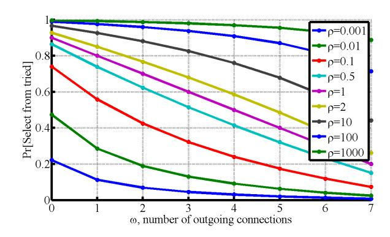
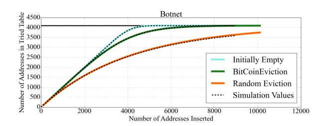
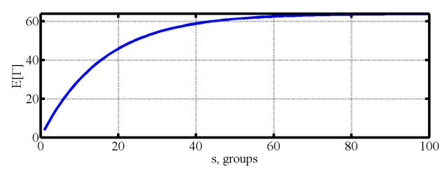
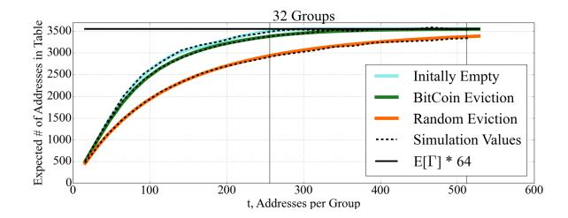
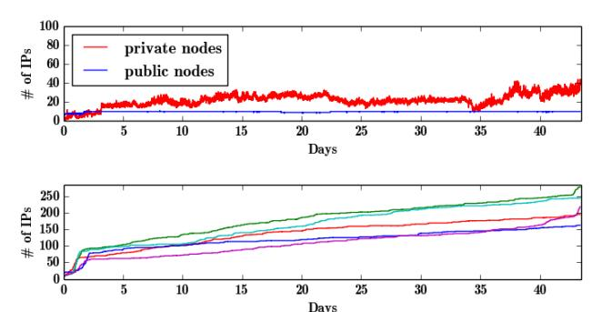
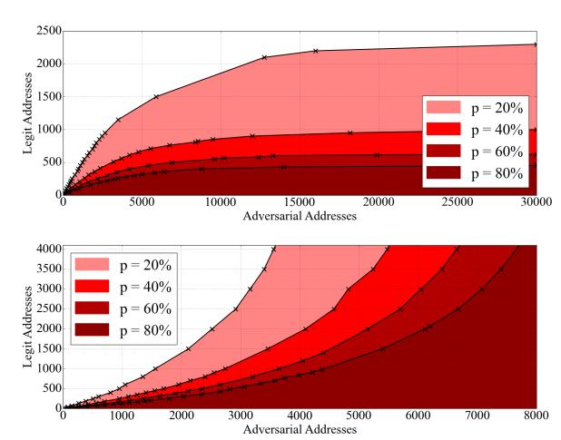
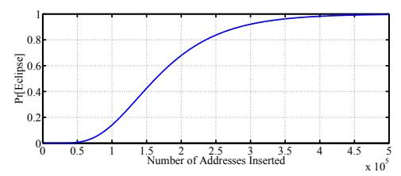
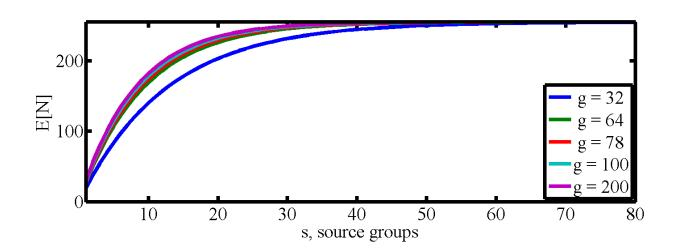
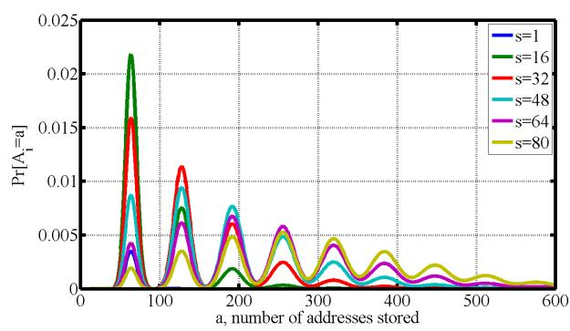

# Eclipse Attacks on Bitcoin's Peer-to-Peer Network <sup>∗</sup>

*Ethan Heilman*<sup>∗</sup> *Alison Kendler*<sup>∗</sup> *Aviv Zohar*† *Sharon Goldberg*<sup>∗</sup> <sup>∗</sup>*Boston University* †*Hebrew University/MSR Israel*

#### Abstract

We present eclipse attacks on bitcoin's peer-to-peer network. Our attack allows an adversary controlling a sufficient number of IP addresses to monopolize all connections to and from a victim bitcoin node. The attacker can then exploit the victim for attacks on bitcoin's mining and consensus system, including *N*-confirmation double spending, selfish mining, and adversarial forks in the blockchain. We take a detailed look at bitcoin's peerto-peer network, and quantify the resources involved in our attack via probabilistic analysis, Monte Carlo simulations, measurements and experiments with live bitcoin nodes. Finally, we present countermeasures, inspired by botnet architectures, that are designed to raise the bar for eclipse attacks while preserving the openness and decentralization of bitcoin's current network architecture.

#### 1 Introduction

While cryptocurrency has been studied since the 1980s [\[22,](#page-14-0) [25,](#page-14-1) [28\]](#page-14-2), bitcoin is the first to see widespread adoption.A key reason for bitcoin's success is its bakedin decentralization. Instead of using a central bank to regulate currency, bitcoin uses a decentralized network of nodes that use computational proofs-of-work to reach consensus on a distributed public ledger of transactions, *aka.,* the *blockchain*. Satoshi Nakamoto [\[52\]](#page-15-0) argues that bitcoin is secure against attackers that seek to shift the blockchain to an inconsistent/incorrect state, as long as these attackers control less than half of the computational power in the network. But underlying this security analysis is the crucial assumption of *perfect information*; namely, that all members of the bitcoin ecosystem can observe the proofs-of-work done by their peers.

∗This is the full version of a paper that appeared at 24th USENIX Security Symposium, Washington, DC., August 2015. First posted March 20, 2015; updated July 2, 2015.

While the last few years have seen extensive research into the security of bitcoin's computational proof-ofwork protocol *e.g.,* [\[14,](#page-14-3) [29,](#page-14-4) [36,](#page-14-5) [37,](#page-14-6) [45,](#page-15-1) [49,](#page-15-2) [50,](#page-15-3) [52,](#page-15-0) [58,](#page-15-4) [60\]](#page-15-5), less attention has been paid to the peer-to-peer network used to broadcast information between bitcoin nodes (see Section [8\)](#page-13-0). The bitcoin peer-to-peer network, which is bundled into the core bitcoind implementation, *aka.,* the Satoshi client, is designed to be open, decentralized, and independent of a public-key infrastructure. As such, cryptographic authentication between peers is not used, and nodes are identified by their IP addresses (Section [2\)](#page-2-0). Each node uses a randomized protocol to select eight peers with which it forms long-lived *outgoing connections*, and to propagate and store addresses of other potential peers in the network. Nodes with public IPs also accept up to 117 *unsolicited incoming connections* from any IP address. Nodes exchange views of the state of the blockchain with their incoming and outgoing peers.

Eclipse attacks. This openness, however, also makes it possible for adversarial nodes to join and attack the peerto-peer network. In this paper, we present and quantify the resources required for *eclipse attacks* on nodes with public IPs running bitcoind version 0.9.3. In an eclipse attack [\[27,](#page-14-7) [61,](#page-15-6) [62\]](#page-15-7), the attacker monopolizes all of the victim's incoming and outgoing connections, thus isolating the victim from the rest of its peers in the network. The attacker can then filter the victim's view of the blockchain, force the victim to waste compute power on obsolete views of the blockchain, or coopt the victim's compute power for its own nefarious purposes (Section [1.1\)](#page-1-0). We present *off-path* attacks, where the attacker controls endhosts, but not key network infrastructure between the victim and the rest of the bitcoin network. Our attack involves rapidly and repeatedly forming unsolicited incoming connections to the victim from a set of endhosts at attacker-controlled IP addresses, sending bogus network information, and waiting until the victim restarts (Section [3\)](#page-4-0). With high probability, the victim then forms all eight of its outgoing connections to

attacker-controlled addresses, and the attacker also monopolizes the victim's 117 incoming connections.

Our eclipse attack uses extremely low-rate TCP connections, so the main challenge for the attacker is to obtain a sufficient number of IP addresses (Section 4). We consider two attack types: (1) infrastructure attacks, modeling the threat of an ISP, company, or nation-state that holds several contiguous IP address blocks and seeks to subvert bitcoin by attacking its peer-to-peer network, and (2) botnet attacks, launched by bots with addresses in diverse IP address ranges. We use probabilistic analysis, (Section 4) measurements (Section 5), and experiments on our own live bitcoin nodes (Section 6) to find that while botnet attacks require far fewer IP addresses, there are hundreds of organizations that have sufficient IP resources to launch eclipse attacks (Section 4.2.1). For example, we show how an infrastructure attacker with 32 distinct /24 IP address blocks (8192 address total), or a botnet of 4600 bots, can always eclipse a victim with at least 85% probability; this is independent of the number of nodes in the network. Moreover, 400 bots sufficed in tests on our live bitcoin nodes. To put this in context, if 8192 attack nodes joined today's network (containing  $\approx$  7200 public-IP nodes [4]) and honestly followed the peer-to-peer protocol, they could eclipse a target with probability about  $(\frac{8192}{7200+8192})^8 = 0.6\%$ .

Our attack is only for nodes with public IPs; nodes with private IPs may be affected if all of their outgoing connections are to eclipsed public-IP nodes.

Countermeasures. Large miners, merchant clients and online wallets have been known to modify bitcoin's networking code to reduce the risk of networkbased attacks. Two countermeasures are typically recommended [3]: (1) disabling incoming connections, and (2) choosing 'specific' outgoing connections to well-connected peers or known miners (*i.e.*, use whitelists). However, there are several problems with scaling this to the full bitcoin network. First, if incoming connections are banned, how do new nodes join the network? Second, how does one decide which 'specific' peers to connect to? Should bitcoin nodes form a private network? If so, how do they ensure compute power is sufficiently decentralized to prevent mining attacks?

Indeed, if bitcoin is to live up to its promise as an open and decentralized cryptocurrency, we believe its peer-to-peer network should be open and decentralized as well. Thus, our next contribution is a set of countermeasures that preserve openness by allowing unsolicited incoming connections, while raising the bar for eclipse attacks (Section 7). Today, an attacker with enough addresses can eclipse *any* victim that accepts incoming connections and then restarts. Our countermeasures ensure that, with high probability, if a victim stores enough legitimate addresses that accept incoming connections, then the vic-

tim be cannot eclipsed *regardless of the number of IP* addresses the attacker controls. Our countermeasures 1, 2, and 6 have been deployed in bitcoind v0.10.1; we also developed a patch [40] with Countermeasures 3,4.

# <span id="page-1-0"></span>1.1 Implications of eclipse attacks

Apart from disrupting the bitcoin network or selectively filtering a victim's view of the blockchain, eclipse attacks are a useful building block for other attacks.

Engineering block races. A block race occurs when two miners discover blocks at the same time; one block will become part of the blockchain, while the other "orphan block" will be ignored, yielding no mining rewards for the miner that discovered it. An attacker that eclipses many miners can engineer block races by hording blocks discovered by eclipsed miners, and releasing blocks to both the eclipsed and non-eclipsed miners once a competing block has been found. Thus, the eclipsed miners waste effort on orphan blocks.

**Splitting mining power.** Eclipsing an *x*-fraction of miners eliminates their mining power from the rest of the network, making it easier to launch mining attacks (*e.g.*, the 51% attack [52]). To hide the change in mining power under natural variations [19], miners could be eclipsed gradually or intermittently.

**Selfish mining.** With selfish mining [14, 29, 37, 60], the attacker strategically withholds blocks to win more than its fair share of mining rewards. The attack's success is parameterized by two values:  $\alpha$ , the ratio of mining power controlled by the attacker, and  $\gamma$ , the ratio of honest mining power that will mine on the attacker's blocks during a block race. If  $\gamma$  is large, then  $\alpha$  can be small. By eclipsing miners, the attacker increases  $\gamma$ , and thus decreases  $\alpha$  so that selfish mining is easier. To do this, the attacker drops any blocks discovered by eclipsed miners that compete with the blocks discovered by the selfish miners. Next, the attacker increases  $\gamma$  by feeding only the selfish miner's view of the blockchain to the eclipsed miner; this coopts the eclipsed miner's compute power, using it to mine on the selfish-miner's blockchain.

Attacks on miners can harm the entire bitcoin ecosystem; mining pools are also vulnerable if their gateways to the public bitcoin network can be eclipsed. Eclipsing can also be used for double-spend attacks on non-miners, where the attacker spends some bitcoins multiple times:

**0-confirmation double spend.** In a 0-confirmation transaction, a customer pays a transaction to a merchant who releases goods to the customer *before* seeing a block confirmation *i.e.*, seeing the transaction in the blockchain [18]. These transactions are used when it is inappropriate to wait the 5-10 minutes typically needed

to for a block confirmation [\[20\]](#page-14-12), *e.g.,* in retail point-ofsale systems like BitPay [\[5\]](#page-14-13), or online gambling sites like Betcoin [\[57\]](#page-15-9). To launch a double-spend attack against the merchant [\[46\]](#page-15-10), the attacker eclipses the merchant's bitcoin node, sends the merchant a transaction *T* for goods, and sends transaction *T* <sup>0</sup> double-spending those bitcoins to the rest of the network. The merchant releases the goods to the attacker, but since the attacker controls all of the merchant's connections, the merchant cannot tell the rest of the network about *T*, which meanwhile confirms *T* 0 . The attacker thus obtains the goods without paying. 0-confirmation double-spends have occurred in the wild [\[57\]](#page-15-9). This attack is as effective as a Finney attack [\[39\]](#page-15-11), but uses eclipsing instead of mining power.

*N*-confirmation double spend. If the attacker has eclipsed an *x*-fraction of miners, it can also launch *N*-confirmation double-spending attacks on an eclipsed merchant. In an *N*-confirmation transaction, a merchant releases goods only after the transaction is confirmed in a block of depth *N* −1 in the blockchain [\[18\]](#page-14-11). The attacker sends its transaction to the eclipsed miners, who incorporate it into their (obsolete) view of the blockchain. The attacker then shows this view of blockchain to the eclipsed merchant, receives the goods, and sends both the merchant and eclipsed miners the (non-obsolete) view of blockchain from the non-eclipsed miners. The eclipsed miners' blockchain is orphaned, and the attacker obtains goods without paying. This is similar to an attack launched by a mining pool [\[10\]](#page-14-14), but our attacker eclipses miners instead of using his own mining power.

Other attacks exist, *e.g.,* a transaction hiding attack on nodes running in SPV mode [\[16\]](#page-14-15).

# <span id="page-2-0"></span>2 Bitcoin's Peer-to-Peer Network

We now describe bitcoin's peer-to-peer network, based on bitcoind version 0.9.3, the most current release from 9/27/2014 to 2/16/2015, whose networking code was largely unchanged since 2013. This client was originally written by Satoshi Nakamoto, and has near universal market share for public-IP nodes (97% of public-IP nodes according to Bitnode.io on 2/11/2015 [\[4\]](#page-14-8)).

Peers in the bitcoin network are identified by their IP addresses. A node with a public IP can initiate up to *eight outgoing connections* with other bitcoin nodes, and accept up to 117 *incoming connections*. [1](#page-2-1) A node with a private IP only initiates eight outgoing connections. Connections are over TCP. Nodes only propagate and store public IPs; a node can determine if its peer has a public IP by comparing the IP packet header with the bitcoin VERSION message. A node can also connect via Tor; we do not study this, see [\[16,](#page-14-15) [17\]](#page-14-16) instead. We now describe how nodes propagate and store network information, and how they select outgoing connections.

# <span id="page-2-4"></span>2.1 Propagating network information

Network information propagates through the bitcoin network via DNS seeders and ADDR messages.

DNS seeders. A DNS seeder is a server that responds to DNS queries from bitcoin nodes with a (not cryptographically-authenticated) list of IP addresses for bitcoin nodes. The size of the list is limited by constraints on DNS; it turns that the maximum possible number of IP addresses that can be returned by a single DNS query is around 4000 [\[41\]](#page-15-13). The seeder obtains these addresses by periodically crawling the bitcoin network. The bitcoin network has six seeders which are queried in two cases only. The first when a new node joins the network for the first time; it tries to connect to the seeders to get a list of active IPs, and otherwise fails over to a hardcoded list of about 600 IP addresses. The second is when an existing node restarts and reconnects to new peers; here, the seeder is queried only if 11 seconds have elapsed since the node began attempting to establish connections and the node has less than two outgoing connections.

ADDR messages. ADDR messages, containing up to 1000 IP address and their timestamps, are used to obtain network information from peers. If more than 1000 addresses are sent in a ADDR message, the peer who sent the message is blacklisted. Nodes accept unsolicited ADDR messages. An ADDR message is solicited *only* upon establishing a outgoing connection with a peer; the peer responds with up to three ADDR message each containing up to 1000 addresses randomly selected from its tables.[2](#page-2-2)

Nodes push ADDR messages to peers in two cases. Each day, a node sends its own IP address in a ADDR message to each peer. Also, when a node receives an ADDR message with no more than 10 addresses, it forwards the ADDR message to two randomly-selected connected peers.[3](#page-2-3) To choose these peers, the node takes the hash of each connected peer's IP address and a secret nonce associated with the day, selects the peers with the lexicographically first and second hash values. Finally, to prevent stale ADDR messages from endlessly propagating, each node keeps a known list of the addresses it has sent to or learned from each of its connected peers, and never sends address on the known list to its peer. The known lists are flushed daily.

<span id="page-2-1"></span><sup>1</sup>This is a configurable. Our analysis only assumes that nodes have 8 outgoing connections, which was confirmed by [\[51\]](#page-15-12)'s measurements.

<span id="page-2-2"></span><sup>2</sup>The peer sends a total of *n* randomly selected addresses from the peer's tried and new tables, where *n* is a random number between *x* and 2500, where *x* is 23% of the addresses the peer has stored.

<span id="page-2-3"></span><sup>3</sup>Actually, if the ADDR message contains addresses that are unroutable for the peer (*e.g.,* a peer with IPv4 address gets an IPv6 address, it will forward the ADDR message to one peer only.

#### <span id="page-3-3"></span>2.2 Storing network information

Public IPs are stored in a node's tried and new tables. Tables are stored on disk and persist when a node restarts.

**The** tried **table.** The tried table consists of 64 *buckets*, each of which can store up to 64 unique addresses for peers to whom the node has successfully established an incoming or outgoing connection. Along with each stored peer's address, the node keeps the timestamp for the most recent successful connection to this peer.

Each peer's address is mapped to a bucket in tried by taking the hash of the peer's (a) IP address and (b) *group*, where the group defined is the /16 IPv4 prefix containing the peer's IP address. <sup>4</sup>A bucket is selected as follows:

```
SK = random value chosen when node is born. IP = the peer's IP address and port number. Group = the peer's group
```

```
i = Hash( SK, IP ) % 4
Bucket = Hash( SK, Group, i ) % 64
return Bucket
```

Thus, every IP address maps to a single bucket in tried, and each group maps to up to four buckets.

When a node successfully connects to a peer, the peer's address is inserted into the appropriate tried bucket. If the bucket is full (*i.e.*, contains 64 addresses), then *bitcoin eviction* is used: four addresses are randomly selected from the bucket, and the oldest is (1) replaced by the new peer's address in tried, and then (2) inserted into the new table. If the peer's address is already present in the bucket, the timestamp associated with the peer's address is updated. The timestamp is also updated when an actively connected peer sends a VERSION, ADDR, INVENTORY, GETDATA or PING message and more than 20 minutes elapsed since the last update.

The new table. The new table consists of 256 buckets, each of which can hold up 64 addresses for peers to whom the node has not yet initiated a successful connection. A node populates the new table with information learned from the DNS seeders, or from ADDR messages. Addresses in the new table also have an associated timestamp; addresses learned from DNS seeders are stamped with a random timestamp between 3 and 7 days old, while addresses learned from ADDR messages are stamped with their timestamp from the ADDR message plus two hours.

Every address *a* inserted in new belongs to (1) a *group*, defined in our description of the tried table, and (2) a

*source group*, the group the contains the IP address of the connected peer or DNS seeder from which the node learned address *a*. The bucket is selected as follows:

```
SK = random value chosen when node is born.
Group = /16 containing IP to be inserted.
Src_Group = /16 containing IP of peer sending IP.\ni = Hash( SK, Src_Group, Group ) % 32
Bucket = Hash( SK, Src_Group, i) % 256
return Bucket
```

Each (group, source group) pair hashes to a single new bucket, while each group selects up to 32 buckets in new. Each bucket holds unique addresses. If a bucket is full, then a function called isTerrible is run over all 64 addresses in the bucket; if any one of the addresses is terrible, in that it is (a) more than 30 days old, or (b) has had too many failed connection attempts, then the terrible address is evicted in favor of the new address; otherwise, bitcoin eviction is used with the small change that the evicted address is discarded. A single address can map to multiple buckets if it is advertised by multiple peers; because it is unnecessary for our attacks, we omit description of the elaborate routine is used to insert duplicate addresses.

# <span id="page-3-2"></span>2.3 Selecting peers

New outgoing connections are selected if a node restarts or if an outgoing connection is dropped by the network. A bitcoin node never deliberately drops a connection, except when a blacklisting condition is met (*e.g.*, the peer sends ADDR messages that are too large).

A node with  $\omega \in [0,7]$  outgoing connections selects the  $\omega + 1^{th}$  connection as follows:

(1) Decide whether to select from tried or new, where

<span id="page-3-1"></span>
$$\Pr[\text{Select from tried}] = \frac{\sqrt{\rho}(9-\omega)}{(\omega+1) + \sqrt{\rho}(9-\omega)} \quad (1)$$

and  $\rho$  is the ratio between the number of addresses stored in tried and the number of addresses stored in new. Figure 1 plots the relationship between p and  $\omega$  for different values of  $\rho$ . The address is more likely to be selected from tried when there are few outgoing connections or the tried table is large.

(2) Select a random address from the table, with a bias towards addresses with fresher timestamps: (i) Choose a random non-empty bucket in the table. (ii) Choose a random position in that bucket. (ii) If there is an address at that position, return the address with probability

<span id="page-3-4"></span>
$$p(r,\tau) = \min(1, \frac{1.2^r}{1+\tau})$$
 (2)

<span id="page-3-0"></span><sup>&</sup>lt;sup>4</sup>For IPv6 addresses matching prefix 2001:0470\* (which is allocated to Hurricane Electric), the group is the /36 IP prefix that contains IPv6 address of the peer. For all other IPv6 addresses,the group is the /32 IP prefix that contains IPv6 address of the peer. For OnionCat Tor addresses, the group is the first 4 bits of the OnionCat address.



<span id="page-4-1"></span>Figure 1: Plot of Pr[Select from tried] vs. ω (the number of outgoing connections) for different values of ρ (the ratio between the number of addresses in tried and the number of addresses stored in new) per equation [\(1\)](#page-3-1).

else, reject the address and return to (i). The acceptance probability *p*(*r*, τ) is a function of *r*, the number of addresses that have been rejected so far, and τ, the difference between the address's timestamp and the current time in measured in ten minute increments.[5](#page-4-2)

(3) Connect to the address. If connection fails, go to (1).

# <span id="page-4-0"></span>3 The Eclipse Attack

Our attack is for a victim with a public IP. Our attacker (1) populates the tried table with addresses for its attack nodes, and (2) overwrites addresses in the new table with "trash" IP addresses that are not part of the bitcoin network. The "trash" addresses are unallocated (*e.g.,* listed as "available" by [\[56\]](#page-15-14)) or as "reserved for future use" by [\[43\]](#page-15-15) (*e.g.,* 252.0.0.0/8). We fill new with "trash" because, unlike attacker addresses, "trash" is not a scarce resource. The attack continues until (3) the victim node restarts and chooses new outgoing connections from the tried and new tables in its persistant storage (Section [2.3\)](#page-3-2). With high probability, the victim establishes all eight outgoing connections to attacker addresses; all eight addresses will be from tried, since the victim cannot connect to the "trash" in new. Finally, the attacker (5) occupies the victim's remaining 117 incoming connections. We now detail each step of our attack.

#### 3.1 Populating tried and new

The attacker exploits the following to fill tried and new:

1. Addresses from unsolicited incoming connections are stored in the tried table; thus, the attacker can insert an address into the victim's tried table simply by

connecting to the victim from that address. Moreover, the *bitcoin eviction* discipline means that the attacker's fresher addresses are likely to evict any older legitimate addresses stored in the tried table (Section [2.2\)](#page-3-3).

- 2. A node accepts unsolicited ADDR messages; these addresses are inserted directly into the new table without testing their connectivity (Section [2.2\)](#page-3-3). Thus, when our attacker connects to the victim from an adversarial address, it can also send ADDR messages with 1000 "trash" addresses. Eventually, the trash overwrites all legitimate addresses in new. We use "trash" because we do not want to waste our IP address resources on overwriting new.
- 3. Nodes only rarely solicit network information from peers and DNS seeders (Section [2.1\)](#page-2-4). Thus, while the attacker overwrites the victim's tried and new tables, the victim almost never counteracts the flood of adversarial information by querying legitimate peers or seeders.

# 3.2 Restarting the victim

Our attack requires the victim to restart so it can connect to adversarial addresses. There are several reasons why a bitcoin node could restart, including ISP outages, power failures, and upgrades, failures or attacks on the host OS; indeed, [\[16\]](#page-14-15) found that a node with a public IP has a 25% chance of going offline after 10 hours. Another predictable reason to restart is a software update; on 1/10/2014, for example, bitnodes.io saw 942 nodes running Satoshi client version 0.9.3, and by 29/12/2014, that number had risen to 3018 nodes, corresponding to over 2000 restarts. Since updating is often *not* optional, especially when it corresponds to critical security issues; 2013 saw three such bitcoin upgrades, and the heartbleed bug [\[53\]](#page-15-16) caused one in 2014. Also, since the community needs to be notified about an upgrade in advance, the attacker could watch for notifications and then commence its attack [\[2\]](#page-14-17). Restarts can also be deliberately elicited via DDoS [\[47,](#page-15-17) [65\]](#page-15-18), memory exhaustion [\[16\]](#page-14-15), or packetsof-death (which have been found for bitcoind [\[6,](#page-14-18)[7\]](#page-14-19)). The bottom line is that the security of the peer-to-peer network should not rely on 100% node uptime.

# <span id="page-4-3"></span>3.3 Selecting outgoing connections

Our attack succeeds if, upon restart, the victim makes all its outgoing connections to attacker addresses. To do this, we exploit the bias towards selecting addresses with fresh timestamps from tried; by investing extra time into the attack, our attacker ensures its addresses are fresh, while all legitimate addresses become increasingly stale. We analyze this with few simple assumptions:

*1.* An *f*-fraction of the addresses in the victim's tried table are controlled by the adversary and the remaining

<span id="page-4-2"></span><sup>5</sup>The algorithm also considers the number of failed connections to this address; we omit this because it does not affect our analysis.

- 1-f-fraction are legitimate. (Section 4 analyzes how many addresses the adversary therefore must control.)
- 2. All addresses in new are "trash"; all connections to addresses in new fail, and the victim is forced to connect to addresses from tried (Section 2.3).
- 3. The attack proceeds in *rounds*, and repeats each round until the moment that the victim restarts. During a single round, the attacker connects to the victim from each of its adversarial IP addresses. A round takes time  $\tau_a$ , so all adversarial addresses in tried are younger than  $\tau_a$ .
- 4. An f'-fraction addresses in tried are actively connected to the victim before the victim restarts. The timestamps on these legitimate addresses are updated every 20 minute or more (Section 2.2). We assume these timestamps are fresh (*i.e.*,  $\tau = 0$ ) when the victim restarts; this is the worst case for the attacker.
- 5. The time invested in the attack  $\tau_\ell$  is the time elapsed from the moment the adversary starts the attack, until the victim restarts. If the victim did not obtain new legitimate network information during of the attack, then, excluding the f'-fraction described above, the legitimate addresses in tried are older than  $\tau_\ell$ .

**Success probability.** If the adversary owns an f-fraction of the addresses in tried, the probability that an adversarial address is accepted on the first try is  $p(1,\tau_a) \cdot f$  where  $p(1,\tau_a)$  is as in equation (2); here we use the fact that the adversary's addresses are no older than  $\tau_a$ , the length of the round. If r-1 addresses were rejected during this attempt to select an address from tried, then the probability that an adversarial address is accepted on the  $r^{th}$  try is bounded by

$$p(r, \tau_a) \cdot f \prod_{i=1}^{r-1} g(i, f, f', \tau_a, \tau_\ell)$$

where

$$\begin{split} g(i,f,f',\tau_a,\tau_\ell) &= (1-p(i,\tau_a)) \cdot f + (1-p(i,0)) \cdot f' \\ &+ (1-p(i,\tau_\ell)) \cdot (1-f-f') \end{split}$$

is the probability that an address was rejected on the  $i^{th}$  try given that it was also rejected on the  $i-1^{th}$  try. An adversarial address is thus accepted with probability

<span id="page-5-1"></span>
$$q(f, f', \tau_a, \tau_\ell) = \sum_{r=1}^{\infty} p(r, \tau_a) \cdot f \prod_{i=1}^{r-1} g(i, f, f', \tau_a, \tau_\ell)$$
(3)

and the victim is eclipsed if all eight outgoing connections are to adversarial addresses, which happens with probability  $q(f,f',\tau_a,\tau_\ell)^8$ . Figure 2 plots  $q(f,f',\tau_a,\tau_\ell)^8$  vs f for  $\tau_a=27$  minutes and different choices of  $\tau_\ell$ ; we assume that  $f'=\frac{8}{64\times 64}$ , which corresponds to a full tried table containing eight addresses that are actively connected before the victim restarts.


<span id="page-5-0"></span>Figure 2: Probability of eclipsing a node  $q(f,f',\tau_a,\tau_\ell)^8$  (equation (3)) vs f the fraction of adversarial addresses in tried, for different values of time invested in the attack  $\tau_\ell$ . Round length is  $\tau_a=27$  minutes, and  $f'=\frac{8}{64\times64}$ . The dotted line shows the probability of eclipsing a node if random selection is used instead.

**Random selection.** Figure 2 also shows success probability if addresses were just selected uniformly at random from each table. We do this by plotting  $f^8$  vs f. Without random selection, the adversary has a 90% success probability even if it only fills f=72% of tried, as long as it attacks for  $\tau_\ell=48$  hours with  $\tau_a=27$  minute rounds. With random selection, 90% success probability requires f=98.7% of tried to be attacker addresses.

# 3.4 Monopolizing the eclipsed victim

Figure 2 assumes that the victim has exactly eight *outgoing connections*; all we require in terms of *incoming connections* is that the victim has a few open slots to accept incoming TCP connections from the attacker.

While it is often assumed that the number of TCP connections a computer can make is limited by the OS or the number of source ports, this applies only when OS-provided TCP sockets are used; a dedicated attacker can open an arbitrary number of TCP connections using a custom TCP stack. A custom TCP stack (see *e.g.*, zmap [35]) requires minimal CPU and memory, and is typically bottlenecked only by bandwidth, and the bandwidth cost of our attack is minimal:

Attack connections. To fill the tried table, our attacker repeatedly connects to the victim from each of its addresses. Each connection consists of a TCP handshake, bitcoin VERSION message, and then disconnection via TCP RST; this costs 371 bytes upstream and 377 bytes downstream. Some attack connections also send one ADDR message containing 1000 addresses; these ADDR messages cost 120087 bytes upstream and 437 bytes downstream including TCP ACKs.

**Monopolizing connections.** If that attack succeeds,

the victim has eight outgoing connections to the attack nodes, and the attacker must occupy the victim's remaining incoming connections. To prevent others from connecting to the victim, these TCP connections could be maintained for 30 days, at which point the victim's address is terrible and forgotten by the network. While bitcoin supports block inventory requests and the sending of blocks and transactions, this consumes significant bandwidth; our attacker thus does not to respond to inventory requests. As such, setting up each TCP connection costs 377 bytes upstream and 377 bytes downstream, and is maintained by ping-pong packets and TCP ACKs consuming 164 bytes every 80 minutes.

We experimentally confirmed that a bitcoin node will accept all incoming connections from the same IP address. (We presume this is done to allow multiple nodes behind a NAT to connect to the same node.) Maintaining the default 117 incoming TCP connections costs  $\frac{164\times117}{80\times60}\approx4$  bytes per second, easily allowing one computer to monopolize multiple victims at the same time. As an aside, this also allows for *connection starvation attacks* [32], where an attacker monopolizes all the incoming connections in the peer-to-peer network, making it impossible for new nodes to connect to new peers.

# <span id="page-6-0"></span>4 How Many Attack Addresses?

Section 3.3 showed that the success of our attack depends heavily on  $\tau_\ell$ , the time invested in the attack, and f, the fraction of attacker addresses in the victim's tried table. We now use probabilistic analysis to determine how many addresses the attacker must control for a given value of f; it's important to remember, however, that even if f is small, our attacker can still succeed by increasing  $\tau_\ell$ . Recall from Section 2.2 that bitcoin is careful to ensure that a node does not store too many IP addresses from the same group (i.e., /16 IPv4 address block). We therefore consider two attack variants:

**Botnet attack** (Section 4.1). The attacker holds several IP addresses, each in a *distinct* group. This models attacks by a botnet of hosts scattered in diverse IP address blocks. Section 4.1.1 explains why many botnets have enough IP address diversity for this attack.

Infrastructure attack (Section 4.2). The attacker controls several IP address blocks, and can intercept bitcoin traffic sent to any IP address in the block, *i.e.*, the attacker holds multiple sets of addresses in the same *group*. This models a company or nation-state that seeks to undermine bitcoin by attacking its network. Section 4.2.1 discusses organizations that can launch this attack.

We focus here on tried; Appendix B considers how to send "trash"-filled ADDR messages that overwrite new.



<span id="page-6-4"></span>Figure 3: Botnet attack: the expected number of addresses stored in tried for different scenarios vs the number of addresses (bots) t. Values were computed from equations (4), (7) and (8), and confirmed by Monte Carlo simulations (with 100 trials/data point).

#### <span id="page-6-1"></span>4.1 Botnet attack

The botnet attacker holds t addresses in distinct groups. We model each address as hashing to a uniformly-random bucket in tried, so the number of addresses hashing to each bucket is binomally distributed<sup>6</sup> as  $B(t, \frac{1}{64})$ . How many of the  $64 \times 64$  entries in tried can the attacker occupy? We model various scenarios, and plot results in Figure 3.

**1. Initially empty.** In the best case for the attacker, all 64 buckets are initially empty and the expected number of adversarial addresses stored in the tried table is

<span id="page-6-2"></span>
$$64E[\min(64, B(t, \frac{1}{64}))] \tag{4}$$

**2. Bitcoin eviction.** Now consider the worst case for the attacker, where each bucket i is full of 64 legitimate addresses. These addresses, however, will be *older* than all  $A_i$  distinct adversarial addresses that the adversary attempts to insert into to bucket i.<sup>7</sup> Since the bitcoin eviction discipline requires each newly inserted address to select four random addresses stored in the bucket and to evict the oldest, if one of the four selected addresses is a legitimate address (which will be older than all of the adversary's addresses), the legitimate address will be overwritten by the adversarial addresses.

For  $a = 0...A_i$ , let  $Y_a$  be the number of adversarial addresses actually stored in bucket i, given that the adversary inserted a unique addresses into bucket i. Let  $X_a = 1$  if the  $a^{th}$  inserted address successfully overwrites a legitimate address, and  $X_a = 0$  otherwise. Then,

$$E[X_a|Y_{a-1}] = 1 - (\frac{Y_{a-1}}{64})^4$$

<span id="page-6-3"></span> $<sup>^6</sup>B(n,p)$  is a binomial distribution counting successes in a sequence of n independent yes/no trials, each yielding 'yes' with probability p.

<span id="page-6-5"></span><sup>&</sup>lt;sup>7</sup>Actually, the addresses of the nodes that are actively connected to the victim are not necessarily older; we already accounted for these in Section 3.3.

and it follows that

$$E[Y_a|Y_{a-1}] = Y_{a-1} + 1 - \left(\frac{Y_{a-1}}{64}\right)^4 \tag{5}$$

$$E[Y_1] = 1 \tag{6}$$

where (6) follows because the bucket is initially full of legitimate addresses. We now have a recurrence relation for  $E[Y_a]$ , which we can solve numerically. We find that  $E[Y_a] > 63$  for  $a \ge 101$ , so the adversary can expect to overwrite 63 of the 64 legitimate addresses in the bucket after inserting 101 unique addresses. The expected number of adversarial addresses in all buckets is thus

<span id="page-7-2"></span>
$$64\sum_{a=1}^{t} E[Y_a] \Pr[B(t, \frac{1}{64}) = a]$$
 (7)

**3. Random eviction.** We again consider the attacker's worst case, where each bucket is full of legitimate addresses, but now we assume that each inserted address evicts a randomly-selected address. (This is not what bitcoin does, but we analyze it for comparison.) Applying Lemma A.1 (Appendix A) we find the expected number of adversarial addresses in all buckets is

<span id="page-7-3"></span>
$$4096(1 - (\frac{4095}{4096})^t) \tag{8}$$

**4. Exploiting multiple rounds.** Our eclipse attack proceeds in *rounds*; in each round the attacker repeatedly inserts each of his *t* addresses into the tried table. While each address always maps to the same bucket in tried in each round, bitcoin eviction maps each address to a *different slot* in that bucket in every round. Thus, an adversarial address that is not stored into its tried bucket at the end of one round, might still be successfully stored into that bucket in a future round. Thus far, this section has only considered a single round. But, more addresses can be stored in tried by repeating the attack for multiple rounds. After sufficient rounds, the expected number of addresses is given by equation (4), *i.e.*, the attack performs as in the best-case for the attacker!

#### <span id="page-7-0"></span>4.1.1 Who can launch a botnet attack?

The 'initially empty' line in Figure 3 indicates that a botnet exploiting multiple rounds can completely fill tried with  $\approx 6000$  addresses. While such an attack cannot easily be launched from a legitimate cloud service (which typically allocates < 20 addresses per tenant [1, 8, 9]), botnets of this size and larger than this have attacked bitcoin [45, 47, 65]; the Miner botnet, for example, had 29,000 hosts with public IPs [54]. While some botnet infestations concentrate in a few IP address ranges [63], it is important to remember that our botnet attack requires no more than  $\approx 6000$  groups; many botnets are orders of magnitude larger [59]. For example, the Walowdac botnet was mostly in ranges 58.x-100.x and 188.x-233.x [63], which creates  $42 \times 2^8 + 55 \times 2^8 = 24832$

<span id="page-7-8"></span><span id="page-7-4"></span>

<span id="page-7-6"></span>Figure 4: Infrastructure attack.  $E[\Gamma]$  (expected number of non-empty buckets) in tried vs s (number of groups).



<span id="page-7-7"></span>Figure 5: Infrastructure attack with s=32 groups: the expected number of addresses stored in tried for different scenarios vs the number of addresses per group t. Results obtained by taking the product of equation (9) and equation (16) or (17), and confirmed by Monte Carlo simulations (100 trials/data point). The horizontal line assumes all  $E[\Gamma]$  buckets per (9) are full.

groups. Randomly sampling from the list of hosts in the Carna botnet [26] 5000 times, we find that 1250 bots gives on average 402 distinct groups, enough to attack our live bitcoin nodes (Section 6). Furthermore, we soon show in Figure 4 that an infrastructure attack with s>200 groups easily fills every bucket in tried; thus, with s>400 groups, the attack performs as in Figure 3, even if many bots are in the same group.

#### <span id="page-7-1"></span>4.2 Infrastructure attack

The attacker holds addresses in s distinct groups. We determine how much of tried can be filled by an attacker controlling s groups s containing t IP addresses/group.

**How many groups?** We model the process of populating tried (per Section 2.2) by supposing that four independent hash functions map each of the s groups to one of 64 buckets in tried. Thus, if  $\Gamma \in [0,64]$  counts the number of non-empty buckets in tried, we use Lemma A.1 to find that

<span id="page-7-5"></span>
$$E[\Gamma] = 64 \left(1 - \left(\frac{63}{64}\right)^{4s}\right) \approx \left(1 - e^{-\frac{4s}{64}}\right)$$
 (9)

Figure 4 plots  $E[\Gamma]$ ; we expect to fill 55.5 of 64 buckets with s=32, and all but one bucket with s>67 groups.

**How full is the tried table?** Appendix C determines the expected number of addresses stored per bucket for


<span id="page-8-2"></span>Figure 6: Histogram of the number of organizations with *s* groups. For the /24 data, we require *t* = 256 addresses per group; for /23, we require *t* = 512.

the first three scenarios described in Section [4.1;](#page-6-1) the expected fraction *E*[ *f* ] of tried filled by adversarial addresses is plotted in in Figure [5.](#page-7-7) The horizontal line in Figure [5](#page-7-7) show what happens if each of *E*[Γ] buckets per equation [\(9\)](#page-7-5) is full of attack addresses.

The adversary's task is easiest when all buckets are initially empty, or when a sufficient number of rounds are used; a single /24 address block of 256 addresses suffices to fill each bucket when *s* = 32 grouips is used. Moreover, as in Section [4.1,](#page-6-1) an attack that exploits multiple rounds performs as in the 'initially empty' scenario. Concretely, with 32 groups of 256 addresses each (8192 addresses in total) an adversary can expect to fill about *f* = 86% of the tried table after a sufficient number of rounds. The attacker is almost as effective in the bitcoineviction scenario with only one round; meanwhile, one round is much less effective with random eviction.

#### <span id="page-8-1"></span>4.2.1 Who can launch an infrastructure attack?

Which organizations have enough IP address resources to launch infrastructure attacks? We compiled data mapping IPv4 address allocation to organizations, using CAIDA's AS to organization dataset [\[23\]](#page-14-26) and AS to prefix dataset [\[24\]](#page-14-27) from July 2014, supplementing our data with information from the RIPE database [\[55\]](#page-15-25). We determined how many groups (*i.e.,* addresses in the same /16 IPv4 address block) and addresses per group are allocated to each organization; see Figure [6.](#page-8-2) There are 448 organizations with over*s* = 32 groups and at least *t* = 256 addresses per group; if these organizations invest τ` = 5 hours into an attack with a τ*<sup>a</sup>* = 27-minute round, then they eclipse the victim with probability greater than 80%.

National ISPs in various countries hold a sufficient number of groups (*s* ≥ 32) for this purpose; for example, in Sudan (Sudanese Mobile), Columbia (ETB), UAE (Etisalat), Guatemala (Telgua), Tunisia (Tunisia Telecom), Saudi Arabia (Saudi Telecom Company) and Dominica (Cable and Wireless). The United States Department of the Interior has enough groups (*s* = 35), as does the S. Korean Ministry of Information and Communication (*s* = 41), as do hundreds of others.

| oldest | #    |        | Age of addresses (in days) |     |      |       |      |  |  |  |  |  |  |
|--------|------|--------|----------------------------|-----|------|-------|------|--|--|--|--|--|--|
| addr   | addr | % live | < 1                        | 1−5 | 5−10 | 10−30 | > 30 |  |  |  |  |  |  |
| 38 d*  | 243  | 28%    | 36                         | 71  | 28   | 79    | 29   |  |  |  |  |  |  |
| 41 d*  | 162  | 28%    | 23                         | 29  | 27   | 44    | 39   |  |  |  |  |  |  |
| 42 d*  | 244  | 19%    | 25                         | 45  | 29   | 95    | 50   |  |  |  |  |  |  |
| 42 d*  | 195  | 23%    | 23                         | 40  | 23   | 64    | 45   |  |  |  |  |  |  |
| 43 d*  | 219  | 20%    | 66                         | 57  | 23   | 50    | 23   |  |  |  |  |  |  |
| 103 d  | 4096 | 8%     | 722                        | 645 | 236  | 819   | 1674 |  |  |  |  |  |  |
| 127 d  | 4096 | 8%     | 90                         | 290 | 328  | 897   | 2491 |  |  |  |  |  |  |
| 271 d  | 4096 | 8%     | 750                        | 693 | 356  | 809   | 1488 |  |  |  |  |  |  |
| 240 d  | 4096 | 6%     | 419                        | 445 | 32   | 79    | 3121 |  |  |  |  |  |  |
| 373 d  | 4096 | 5%     | 9                          | 14  | 1    | 216   | 3856 |  |  |  |  |  |  |

<span id="page-8-3"></span>Table 1: Age and churn of addresses in tried for our nodes (marked with \*) and donated peers files.

# 4.3 Summary: infrastructure or botnet?

Figures [5,](#page-7-7) [3](#page-6-4) show that the botnet attack is far superior to the infrastructure attack. Filling *f* = 98% of the victim's tried table requires a 4600 node botnet (attacking for a sufficient number of rounds, per equation [\(4\)](#page-6-2)). By contrast, an infrastructure attacker needs 16,000 addresses, consisting of *s* = 63 groups (equation [\(9\)](#page-7-5)) with *t* = 256 addresses per group. However, per Section [3.3,](#page-4-3) if our attacker increases the time invested in the attack τ` , it can be far less aggressive about filling tried. For example, per Figure [2,](#page-5-0) attacking for τ` = 24 hours with τ*<sup>a</sup>* = 27 minute rounds, our success probability exceeds 85% with just *f* = 72%; in the worst case for the attacker, this requires only 3000 bots, or an infrastructure attack of *s* = 20 groups and *t* = 256 addresses per group (5120 addresses). The same attack (*f* = 72%, τ*<sup>a</sup>* = 27 minutes) running for just 4 hours still has > 55% success probability. To put this in context, if 3000 bots joined today's network (with < 7200 public-IP nodes [\[4\]](#page-14-8)) and honestly followed the peer-to-peer protocol, they could eclipse a victim with probability ≈ ( 3000 <sup>7200</sup>+<sup>3000</sup> ) <sup>8</sup> = 0.006%.

#### <span id="page-8-0"></span>5 Measuring Live Bitcoin Nodes

We briefly consider how parameters affecting the success of our eclipse attacks look on "typical" bitcoin nodes. We thus instrumented five bitcoin nodes with public IPs that we ran (continuously, without restarting) for 43 days from 12/23/2014 to 2/4/2015. We also analyze several peers files that others donated to us on 2/15/2015. Note that there is evidence of wide variations in metrics for nodes of different ages and in different regions [\[46\]](#page-15-10); as such, our analysis (Section [3](#page-4-0)[-4\)](#page-6-0) and some of our experiments (Section [6\)](#page-9-0) focus on the attacker's worst-case scenario, where tables are initially full of fresh addresses.

Number of connections. Our attack requires the victim to have available slots for incoming connections. Figure [7](#page-9-1) shows the number of connections over time for one of our bitcoin nodes, broken out by connections to public or private IPs. There are plenty of available slots; while our node can accommodate 125 connections, we never see more than 60 at a time. Similar measurements in [\[17\]](#page-14-16) indicate that 80% of bitcoin peers allow at least 40 incoming connections. Our node saw, on average, 9.9 connections to public IPs over the course of its lifetime; of these, 8 correspond to *outgoing* connections, which means we rarely see incoming connections from public IPs. Results for our other nodes are similar.

Connection length. Because public bitcoin nodes rarely drop outgoing connections to their peers (except upon restart, network failure, or due to blacklisting, see Section [2.3\)](#page-3-2), many connections are fairly long lived. When we sampled our nodes on 2/4/2015, across all of our nodes, 17% of connections had lasted more than 15 days, and of these, 65.6% were to public IPs. On the other hand, many bitcoin nodes restart frequently; we saw that 43% of connections lasted less than two days and of these, 97% were to nodes with private IPs. This may explain why we see so few incoming connections from public IPs; many public-IP nodes stick to their mature long-term peers, rather than our young-ish nodes.

Size of tried and new tables. In our worst case attack, we supposed that the tried and new tables were completely full of fresh addresses. While our Bitcoin nodes' new tables filled up quite quickly (99% within 48 hours), Table [1](#page-8-3) reveals that their tried tables were far from full of fresh addresses. Even after 43 days, the tried tables for our nodes were no more than 300/4096 ≈ 8% full. This likely follows because our nodes had very few incoming connections from public IPs; thus, most addresses in tried result from successful outgoing connections to public IPs (infrequently) drawn from new.

Freshness of tried. Even those few addresses in tried are not especially fresh. Table [1](#page-8-3) shows the age distribution of the addresses in tried for our nodes and from donated peers files. For our nodes, 17% of addresses were more than 30 days old, and 48% were more than 10 days old; these addresses will therefore be less preferred than the adversarial ones inserted during an eclipse attack, even if the adversary does not invest much time τ` in attacking the victim.

Churn. Table [1](#page-8-3) also shows that a small fraction of addresses in tried were online when we tried connecting to them on 2/17/2015.[8](#page-9-2) This suggests further vulnerability to eclipse attacks, because if most legitimate addresses in tried are offline when a victim resets, the victim is likely to connect to an adversarial address.



<span id="page-9-1"></span>Figure 7: (Top) Incoming + outgoing connections vs time for one of our nodes. (Bottom) Number of addresses in tried vs time for all our nodes.

#### <span id="page-9-0"></span>6 Experiments

We now validate our analysis with experiments.

Methodology. In each of our experiments, the victim (bitcoind) node is on a virtual machine on the attacking machine; we also instrument the victim's code. The victim node runs on the public bitcoin network (*aka,* mainnet). The attacking machine can read all the victim's packets to/from the public bitcoin network, and can therefore forge TCP connections from arbitrary IP addresses. To launch the attack, the attacking machine forges TCP connections from each of its attacker addresses, making an incoming connection to the victim, sending a VERSION message and sometimes also an ADDR message (per Appendix [B\)](#page-15-19) and then disconnecting; the attack connections, which are launched at regular intervals, rarely occupy all of the victim's available slots for incoming connections. To avoid harming the public bitcoin network, (1) we use "reserved for future use" [\[43\]](#page-15-15) IPs in 240.0.0.0/8-249.0.0.0/8 as attack addresses, and 252.0.0.0/8 as "trash" sent in ADDR messages, and (2) we drop any ADDR messages the (polluted) victim attempts to send to the public network.

At the end of the attack, we repeatedly restart the victim and see what outgoing connections it makes, dropping connections to the "trash" addresses and forging connections for the attacker addresses. If all 8 outgoing connections are to attacker addresses, the attack succeeds, and otherwise it fails. Each experiment restarts the victim 50 times, and reports the fraction of successes. At each restart, we revert the victim's tables to their state at the end of the attack, and rewind the victim's system time to the moment the attack ended (to avoid dating timestamps in tried and new). We restart the victim 50 times to measure the success rate of our (probabilistic) attack; in a real attack, the victim would only restart once.

Initial conditions. We try various initial conditions:

1. Worst case. In the attacker's worst-case scenario, the victim initially has tried and new tables that are

<span id="page-9-2"></span><sup>8</sup>For consistency with the rest of this section, we tested our nodes tables from 2/4/2015. We also repeated this test for tables taken from our nodes on 2/17/2015, and the results did not deviate more than 6% from those of Table [1.](#page-8-3)

|                    | Attacker resources |        |       |              |       | Experiment       |       |                   |       |              |       |      | Predicted    |       |      |
|--------------------|--------------------|--------|-------|--------------|-------|------------------|-------|-------------------|-------|--------------|-------|------|--------------|-------|------|
|                    | grps               | addrs/ | total | , time<br>τ` | τa,   | Total pre-attack |       | Total post-attack |       | Attack addrs |       |      | Attack addrs |       |      |
| Attack Type        | s                  | grp t  | addrs | invest       | round | new              | tried | new               | tried | new          | tried | Wins | new          | tried | Wins |
| Infra (Worstcase)  | 32                 | 256    | 8192  | 10 h         | 43 m  | 16384            | 4090  | 16384             | 4096  | 15871        | 3404  | 98%  | 16064        | 3501  | 87%  |
| Infra (Transplant) | 20                 | 256    | 5120  | 1 hr         | 27 m  | 16380            | 278   | 16383             | 3087  | 14974        | 2947  | 82%  | 15040        | 2868  | 77%  |
| Infra (Transplant) | 20                 | 256    | 5120  | 2 hr         | 27 m  | 16380            | 278   | 16383             | 3088  | 14920        | 2966  | 78%  | 15040        | 2868  | 87%  |
| Infra (Transplant) | 20                 | 256    | 5120  | 4 hr         | 27 m  | 16380            | 278   | 16384             | 3088  | 14819        | 2972  | 86%  | 15040        | 2868  | 91%  |
| Infra (Live)       | 20                 | 256    | 5120  | 1 hr         | 27 m  | 16381            | 346   | 16384             | 3116  | 14341        | 2942  | 84%  | 15040        | 2868  | 75%  |
| Bots (Worstcase)   | 2300               | 2      | 4600  | 5 h          | 26 m  | 16080            | 4093  | 16384             | 4096  | 16383        | 4015  | 100% | 16384        | 4048  | 96%  |
| Bots (Transplant)  | 200                | 1      | 200   | 1 hr         | 74 s  | 16380            | 278   | 16384             | 448   | 16375        | 200   | 60%  | 16384        | 200   | 11%  |
| Bots (Transplant)  | 400                | 1      | 400   | 1 hr         | 90 s  | 16380            | 278   | 16384             | 648   | 16384        | 400   | 88%  | 16384        | 400   | 34%  |
| Bots (Transplant)  | 400                | 1      | 400   | 4 hr         | 90 s  | 16380            | 278   | 16384             | 650   | 16383        | 400   | 84%  | 16384        | 400   | 61%  |
| Bots (Transplant)  | 600                | 1      | 600   | 1 hr         | 209 s | 16380            | 278   | 16384             | 848   | 16384        | 600   | 96%  | 16384        | 600   | 47%  |
| Bots (Live)        | 400                | 1      | 400   | 1 hr         | 90 s  | 16380            | 298   | 16384             | 698   | 16384        | 400   | 84%  | 16384        | 400   | 28%  |

<span id="page-10-0"></span>Table 2: Summary of our experiments.

completely full of legitimate addresses with fresh timestamps. To set up the initial condition, we run our attack for no longer than one hour on a freshly-born victim node, filling tried and new with IP addresses from 251.0.0.0/8, 253.0.0.0/8 and 254.0.0.0/8, which we designate as "legitimate addresses"; these addresses are no older than one hour when the attack starts. We then restart the victim and commence attacking it.

- 2. Transplant case. In our transplant experiments, we copied the tried and new tables from one of our five live bitcoin nodes on 8/2/2015, installed them in a fresh victim with a different public IP address, restarted the victim, waited for it to establish eight outgoing connections, and then commenced attacking. This allowed us to try various attacks with a consistent initial condition.
- 3. Live case. Finally, on 2/17/2015 and 2/18/2015 we attacked our live bitcoin nodes while they were connected to the public bitcoin network; at this point our nodes had been online for 52 or 53 days.

Results (Table [2\)](#page-10-0). Results are in Table [2.](#page-10-0) The first five columns summarize attacker resources (the number of groups *s*, addresses per group *t*, time invested in the attack τ` , and length of a round τ*<sup>a</sup>* per Sections [3](#page-4-0)[-4\)](#page-6-0). The next two columns present the initial condition: the number of addresses in tried and new prior to the attack. The following four columns give the size of tried and new, and the number of attacker addresses they store, at the end of the attack (when the victim first restarts). The *wins* columns counts the fraction of times our attack succeeds after restarting the victim 50 times.

The final three columns give predictions from Sections [3.3,](#page-4-3) [4.](#page-6-0) The *attack addrs* columns give the expected number of addresses in new (Appendix [B\)](#page-15-19) and tried. For tried, we assume that the attacker runs his attack for enough rounds so that the expected number of addresses in tried is governed by equation [\(4\)](#page-6-2) for the botnet, and [\(9\)](#page-7-5) multiplied by [\(16\)](#page-17-0) for the infrastructure attack. The final column predicts success per Section [3.3](#page-4-3) using *experimental values* of τ*a*, τ` , *f* , *f* 0 .

Observations. Our results indicate the following:

- 1. Success in worst case. Our experiments confirm that an infrastructure attack with 32 groups of size /24 (8192 attack addresses total) succeeds in the worst case with very high probability. We also confirm that botnets are superior to infrastructure attacks; 4600 bots had 100% success even with a worst-case initial condition.
- 2. Accuracy of predictions. Almost all of our attacks had an experimental success rate that was *higher* than the predicted success rate. To explain this, recall that our predictions from Section [3.3](#page-4-3) assume that legitimate addresses are exactly τ` old (where τ` is the time invested in the attack); in practice, legitimate addresses are likely to be even older, especially when we work with tried tables of real nodes (Table [1\)](#page-8-3). Less importantly, our predictions also assume that adversarial addresses are exactly τ*<sup>a</sup>* old; in practice, an adversarial address inserted at the end of a round could be even younger. Thus, Section [3.3'](#page-4-3)s predictions are a lower bound on the success rate.

Our experimental botnet attacks were dramatically more successful than their predictions (*e.g.,* 88% actual vs. 34% predicted), most likely because the addresses initially in tried were already very stale prior to the attack (Table [1\)](#page-8-3). Our infrastructure attacks were also more successful then their predictions, but here the difference was much less dramatic. To explain this, we look to the new table. While our success-rate predictions assume that new is completely overwritten, our infrastructure attacks failed to completely overwrite the new table;[9](#page-10-1) thus, we have some extra failures because the victim made outgoing connections to addresses in new.

Finally, note that we decided our attack failed even if the victim tried to connect to a legitimate address that was offline. With high churn rates (per Table [1\)](#page-8-3), our success rates could be even higher than that in Table [2.](#page-10-0)

3. Success in a 'typical' case. Our attacks are successful with even fewer addresses when we test them on our live nodes, or on tables taken from those live nodes.

<span id="page-10-1"></span><sup>9</sup>The new table holds 16384 addresses and from 6*th* last column of Table [2](#page-10-0) we see the new is not full for our infrastructure attacks. Indeed, we predict this in Appendix [B.](#page-15-19)

Most strikingly, a small botnet of 400 bots succeeds with very high probability; while this botnet completely overwrites new, it fills only 400/650 = 62% of tried, and still manages to win with more than 80% probability.

#### <span id="page-11-0"></span>7 Countermeasures

We have shown how an attacker with enough IP addresses and time can eclipse any target victim, regardless of the state of the victim's tried and new tables. We now present countermeasures that make eclipse attacks more difficult. Our countermeasures are inspired by botnet architectures (Section [8\)](#page-13-0), and designed to be faithful to bitcoin's network architecture.

The following five countermeasures ensure that: (1) If the victim has *h* legitimate addresses in tried before the attack, and a *p*-fraction of them accept incoming connections during the attack when the victim restarts, then even an attacker *with an unbounded number of addresses* cannot eclipse the victim with probability exceeding equation [\(10\)](#page-11-1). (2) If the victim's oldest outgoing connection is to a legitimate peer before the attack, then the eclipse attack *fails* if that peer accepts incoming connections when the victim restarts.

- 1. Deterministic random eviction. Replace bitcoin eviction as follows: just as each address deterministically hashes to a single bucket in tried and new (Section [2.2\)](#page-3-3), an address also deterministically hashes to a single slot in that bucket. This way, an attacker cannot increase the number of addresses stored by repeatedly inserting the same address in multiple rounds (Section [4.1\)](#page-6-1). Instead, addresses stored in tried are given by the 'random eviction' curves in Figures [3,](#page-6-4) [5,](#page-7-7) reducing the attack addresses stored in tried.
- 2. Random selection. Our attacks also exploit the heavy bias towards forming outgoing connections to addresses with fresh timestamps, so that an attacker that owns only a small fraction *f* = 30% of the victim's tried table can increase its success probability (to say 50%) by increasing τ` , the time it invests in the attack (Section [3.3\)](#page-4-3). We can eliminate this advantage for the attacker if addresses are selected at random from tried and new; this way, a success rate of 50% always requires the adversary to fill <sup>√</sup><sup>8</sup> 0.5 = 91.7% of tried, which requires 40 groups in an infrastructure attack, or about 3680 peers in a botnet attack. Combining this with deterministic random eviction, the figure jumps to 10194 bots for 50% success probability.

These countermeasures harden the network, but still allow an attacker with enough addresses to overwrite all of tried. The next countermeasure remedies this:

3. Test before evict. Before storing an address in its (deterministically-chosen) slot in a bucket in tried, first

check if there is an older address stored in that slot. If so, briefly attempt to connect to the older address, and if connection is successful, then the older address is *not* evicted from the tried table; the new address is stored in tried only if the connection fails.

We analyze these three countermeasures. Suppose that there are *h* legitimate addresses in the tried table prior to the attack, and model network churn by supposing that each of the *h* legitimate addresses in tried is live (*i.e.,* accepts incoming connections) independently with probability *p*. With test-before-evict, the adversary cannot evict *p*×*h* legitimate addresses (in expectation) from tried, regardless of the number of distinct addresses it controls. Thus, even if the rest of tried is full of adversarial addresses, the probability of eclipsing the victim is bounded to about

<span id="page-11-1"></span>
$$\Pr[\text{eclipse}] = f^8 < \left(1 - \frac{p \times h}{64 \times 64}\right)^8 \tag{10}$$

This is in stark contrast to today's protocol, where attackers with enough addresses have *unbounded* success probability even if tried is *full* of legitimate addresses.

We perform Monte-Carlo simulations assuming churn *p*, *h* legitimate addresses initially stored in tried, and a botnet inserting *a* addresses into tried via unsolicited incoming connections. The area below each curve in Figure [8](#page-12-0) is the number of bots *a* that can eclipse a victim with probability at least 50%, given that there are initially *h* legitimate addresses in tried. With test-before-evict, the curves plateau horizontally at *h* = 4096(1− √8 0.5)/*p*; as long as *h* is greater than this quantity, even a botnet *with an infinite number of addresses* has success probability bounded by 50%. Importantly, the plateau is absent without test-before-evict; a botnet with enough addresses can eclipse a victim *regardless* of the number of legitimate addresses *h* initially in tried.

There is one problem, however. Our bitcoin nodes saw high churn rates (Table [1\)](#page-8-3). With a *p* = 28% churn rate, for example, bounding the adversary's success probability to 10% requires about *h* = 3700 addresses in tried; our nodes had *h* < 400. Our next countermeasure thus adds more legitimate addresses to tried:

4. Feeler Connections. Add an outgoing connection that establish short-lived test connections to randomlyselected addresses in new. If connection succeeds, the address is evicted from new and inserted into tried; otherwise, the address is evicted from new.

Feeler connections clean trash out of new while increasing the number of fresh address in tried that are likely to be online when a node restarts. Our fifth countermeasure is orthogonal to those above:

5. Anchor connections. Inspired by Tor entry guard rotation rates [\[33\]](#page-14-28), we add two connections that persist



<span id="page-12-0"></span>Figure 8: The area below each curve corresponds to a number of bots a that can eclipse a victim with probability at least 50%, given that the victim initially has h legitimate addresses in tried. We show one curve per churn rate p. (Top) With test before evict. (Bottom) Without.

between restarts. Thus, we add an anchor table, recording addresses of current outgoing connections and the time of first connection to each address. Upon restart, the node dedicates two extra outgoing connections to the oldest anchor addresses that accept incoming connections. Now, in addition to defeating our other countermeasures, a successful attacker must also disrupt anchor connections; eclipse attacks fail if the victim connects to an anchor address not controlled by the attacker.

Apart from these five countermeasures, a few other ideas can raise the bar for eclipse attacks:

6. More buckets. Among the most obvious countermeasure is to increase the size of the tried and new tables. Suppose we doubled the number of buckets in the tried table. If we consider the infrastructure attack, the buckets filled by s groups jumps from  $(1 - e^{-\frac{4s}{64}})$  (per equation (9) to  $(1 - e^{-\frac{4s}{128}})$ . Thus, an infrastructure attacker needs double the number of groups in order to expect to fill the same fraction of tried. Similarly, a botnet needs to double the number of bots. Importantly, however, this countermeasure is helpful only when tried already contains many legitimate addresses, so that attacker owns a smaller fraction of the addresses in tried. However, if tried is mostly empty (or contains mostly stale addresses for nodes that are no longer online), the attacker will still own a large fraction of the addresses in tried, even though the number of tried buckets has increased. Thus, this countermeasure should also be accompanied by another countermeasure (e.g., feeler connections) that increases the number of legitimate addresses stored in tried.

**7. More outgoing connections.** Figure 7 indicates

our test bitcoin nodes had at least 65 connections slots available, and [17] indicates that 80% of bitcoin peers allow at least 40 incoming connections. Thus, we can require nodes to make a few additional outgoing connections without risking that the network will run out of connection capacity. Indeed, recent measurements [51] indicate that certain nodes (*e.g.*, mining-pool gateways) do this already. For example, using twelve outgoing connections instead of eight (in addition to the feeler connection and two anchor connections), decreases the attack's success probability from  $f^8$  to  $f^{12}$ ; to achieve 50% success probability the infrastructure attacker now needs 46 groups, and the botnet needs 11796 bots. While this improvement is not as dramatic Countermeasures 1-5, it is still a simple way to raise the bar for eclipse attacks.

- 8. Ban unsolicited ADDR messages. A node could choose not to accept large unsolicited ADDR messages (with > 10 addresses) from incoming peers, and only solicit ADDR messages from outgoing connections when its new table is too empty. This prevents adversarial incoming connections from flooding a victim's new table with trash addresses. We argue that this change is not harmful, since even in the current network, there is no shortage of address in the new table (Section 5). To make this more concrete, note that a node request ADDR messages upon establishing an outgoing connection. The peer responds with *n* randomly selected addresses from its tried and new tables, where n is a random number between x and 2500 and x is 23% of the addresses the peer has stored. If each peer sends, say, about n = 1700 addresses, then new is already 8n/16384 = 83% full the moment that the bitcoin node finishing establishing outgoing connections.
- **9.** Diversify incoming connections. Today, a bitcoin node can have all of its incoming connections come from the same IP address, making it far too easy for a single computer to monopolize a victim's incoming connections during an eclipse attack or connection-starvation attack [32]. We suggest a node accept only a limited number of connections from the same IP address.
- 10. Anomaly detection. Our attack has several specific "signatures" that make it detectable including: (1) a flurry of short-lived incoming TCP connections from diverse IP addresses, that send (2) large ADDR messages (3) containing "trash" IP addresses. An attacker that suddenly connects a large number of nodes to the bitcoin network could also be detected, as could one that uses eclipsing per Section 1.1 to dramatically decrease the network's mining power. Thus, monitoring and anomaly detection systems that look for this behavior are also be useful; at the very least, they would force an eclipse attacker to attack at low rate, or to waste resources on overwriting new (instead of using "trash" IP addresses).

**Status of our countermeasures.** We disclosed our



<span id="page-13-2"></span>Figure 9: Probability of eclipsing a node vs the number of addresses (bots) *t* for bitcoind v0.10.1 (with Countermeasures 1,2 and 6) when tried is initially full of legitimate addresses per equation (11).

results to the bitcoin core developers in 02/2015. They deployed Countermeasures 1, 2, and 6 in the bitcoind v0.10.1 release, which now uses deterministic random eviction, random selection, and scales up the number of buckets in tried and new by a factor of four. To illustrate the efficacy of this, consider the worst-case scenario for the attacker where tried is completely full of legitimate addresses. We use Lemma A.1 to estimate the success rate of a botnet with t IP addresses as

<span id="page-13-1"></span>
$$Pr[Eclipse] \approx \left(1 - \left(\frac{16383}{16384}\right)^t\right)^8$$
 (11)

Plotting (11) in Figure 9, we see that this botnet requires 163K addresses for a 50% success rate, and 284K address for a 90% success rate. This is good news, but we caution that ensuring that tried is full of legitimate address is still a challenge (Section 5), especially since there may be fewer than 16384 public-IP nodes in the bitcoin network at a given time. Countermeasures 3 and 4 are designed to deal with this, and so we have also developed a patch with these two countermeasures; see [40] for our implementation and its documentation.

#### <span id="page-13-0"></span>8 Related Work

The bitcoin peer-to-peer (p2p) network. Recent work considers how bitcoin's network can delay or prevent block propagation [31] or be used to deanonymize bitcoin users [16, 17, 48]. These works discuss aspects of bitcoin's networking protocol, with [16] providing an excellent description of ADDR message propagation; we focus instead on the structure of the tried and new tables, timestamps and their impact on address selection (Section 2). [17] shows that nodes connecting over Tor can be eclipsed by a Tor exit node that manipulates both bitcoin and Tor. Other work has mapped bitcoin peers to autonomous systems [38], geolocated peers and measured churn [34], and used side channels to learn the bitcoin network topology [16, 51].

**p2p and botnet architectures.** There has been extensive research on eclipse attacks [27, 61, 62] in

structured p2p networks built upon distributed hash tables (DHTs); see [64] for a survey. Many proposals defend against eclipse attacks by adding more structure; [61] constrains peer degree, while others use constraints based on distance metrics like latency [42] or DHT identifiers [13]. Bitcoin, by contrast, uses an unstructured network. While we have focused on exploiting specific quirks in bitcoin's existing network, other works e.g., [11, 15, 21, 44] design new unstructured networks that are robust to Byzantine attacks. [44] blacklists misbehaving peers. Puppetcast's [15] centralized solution is based on public-key infrastructure [15], which is not appropriate for bitcoin. Brahms [21] is fully decentralized, and instead constrains the rate at which peers exchange network information—a useful idea that is a significant departure from bitcoin's current approach. Meanwhile, our goals are also more modest than those in these works; rather than requiring that each node is equally likely to be sampled by an honest node, we just want to limit eclipse attacks on initially well-connected nodes. Thus, our countermeasures are inspired by botnet architectures, which share this same goal. Rossow et al. [59] finds that many botnets, like bitcoin, use unstructured peer-to-peer networks and gossip (i.e., ADDR messages), and describes how botnets defend against attacks that flood local address tables with bogus information. The Sality botnet refuses to evict "high-reputation" addresses; our anchor countermeasure is similar (Section 7). Storm uses testbefore-evict [30], which we have also recommended for bitcoin. Zeus [12] disallows connections from multiple IP in the same /20, and regularly clean tables by testing if peers are online; our feeler connections are similar.

#### 9 Conclusion

We presented an eclipse attack on bitcoin's peer-to-peer network that undermines bitcoin's core security guarantees, allowing attacks on the mining and consensus system, including N-confirmation double spending and adversarial forks in the blockchain. Our attack is for nodes with public IPs. We developed mathematical models of our attack, and validated them with Monte Carlo simulations, measurements and experiments. We demonstrated the practically of our attack by performing it on our own live bitcoin nodes, finding that an attacker with 32 distinct /24 IP address blocks, or a 4600-node botnet, can eclipse a victim with over 85% probability in the attacker's worst case. Moreover, even a 400-node botnet sufficed to attack our own live bitcoin nodes. Finally, we proposed countermeasures that make eclipse attacks more difficult while still preserving bitcoin's openness and decentralization; several of these were incorporated in a recent bitcoin software upgrade.

#### Acknowledgements

We thank Foteini Baldimtsi, Wil Koch, and the USENIX Security reviewers for comments on this paper, various bitcoin users for donating their peers files, and the bitcoin core devs for discussions and for implementing Countermeasures 1,2,6. E.H., A.K., S.G. were supported in part by NSF award 1350733, and A.Z. by ISF Grants 616/13, 1773/13, and the Israel Smart Grid (ISG) Consortium.

## References

- <span id="page-14-22"></span>[1] Amazon web services elastic ip. [http://aws.amazon.com/](http://aws.amazon.com/ec2/faqs/#elastic-ip) [ec2/faqs/#elastic-ip](http://aws.amazon.com/ec2/faqs/#elastic-ip). Accessed: 2014-06-18.
- <span id="page-14-17"></span>[2] Bitcoin: Common vulnerabilities and exposures. [https:](https://en.bitcoin.it/wiki/Common_Vulnerabilities_and_Exposures) [//en.bitcoin.it/wiki/Common\\_Vulnerabilities\\_and\\_](https://en.bitcoin.it/wiki/Common_Vulnerabilities_and_Exposures) [Exposures](https://en.bitcoin.it/wiki/Common_Vulnerabilities_and_Exposures). Accessed: 2014-02-11.
- <span id="page-14-9"></span>[3] Bitcoin wiki: Double-spending. [https://en.bitcoin.it/](https://en.bitcoin.it/wiki/Double-spending) [wiki/Double-spending](https://en.bitcoin.it/wiki/Double-spending). Accessed: 2014-02-09.
- <span id="page-14-8"></span>[4] Bitnode.io snapshot of reachable nodes. [https://getaddr.](https://getaddr.bitnodes.io/nodes/) [bitnodes.io/nodes/](https://getaddr.bitnodes.io/nodes/). Accessed: 2014-02-11.
- <span id="page-14-13"></span>[5] Bitpay: What is transaction speed? [https:](https://support.bitpay.com/hc/en-us/articles/202943915-What-is-Transaction-Speed-) [//support.bitpay.com/hc/en-us/articles/](https://support.bitpay.com/hc/en-us/articles/202943915-What-is-Transaction-Speed-) [202943915-What-is-Transaction-Speed-](https://support.bitpay.com/hc/en-us/articles/202943915-What-is-Transaction-Speed-). Accessed: 2014-02-09.
- <span id="page-14-18"></span>[6] Bug bounty requested: 10 btc for huge dos bug in all current bitcoin clients. Bitcoin Forum. [https://bitcointalk.org/](https://bitcointalk.org/index.php?topic=944369.msg10376763#msg10376763) [index.php?topic=944369.msg10376763#msg10376763](https://bitcointalk.org/index.php?topic=944369.msg10376763#msg10376763). Accessed: 2014-06-17.
- <span id="page-14-19"></span>[7] CVE-2013-5700: Remote p2p crash via bloom filters. [https:](https://en.bitcoin.it/wiki/Common_Vulnerabilities_and_Exposures) [//en.bitcoin.it/wiki/Common\\_Vulnerabilities\\_and\\_](https://en.bitcoin.it/wiki/Common_Vulnerabilities_and_Exposures) [Exposures](https://en.bitcoin.it/wiki/Common_Vulnerabilities_and_Exposures). Accessed: 2014-02-11.
- <span id="page-14-23"></span>[8] Microsoft azure ip address pricing. [http://](http://azure.microsoft.com/en-us/pricing/details/ip-addresses/) [azure.microsoft.com/en-us/pricing/details/](http://azure.microsoft.com/en-us/pricing/details/ip-addresses/) [ip-addresses/](http://azure.microsoft.com/en-us/pricing/details/ip-addresses/). Accessed: 2014-06-18.
- <span id="page-14-24"></span>[9] Rackspace: Requesting additional ipv4 addresses for cloud servers. [http://www.](http://www.rackspace.com/knowledge_center/article/requesting-additional-ipv4-addresses-for-cloud-servers) [rackspace.com/knowledge\\_center/article/](http://www.rackspace.com/knowledge_center/article/requesting-additional-ipv4-addresses-for-cloud-servers) [requesting-additional-ipv4-addresses-for-cloud-servers](http://www.rackspace.com/knowledge_center/article/requesting-additional-ipv4-addresses-for-cloud-servers). Accessed: 2014-06-18.
- <span id="page-14-14"></span>[10] Ghash.io and double-spending against betcoin dice, October 30 2013.
- <span id="page-14-33"></span>[11] ANCEAUME, E., BUSNEL, Y., AND GAMBS, S. On the power of the adversary to solve the node sampling problem. In *Transactions on Large-Scale Data-and Knowledge-Centered Systems XI*. Springer, 2013, pp. 102–126.
- <span id="page-14-37"></span>[12] ANDRIESSE, D., AND BOS, H. An analysis of the zeus peer-topeer protocol, April 2014.
- <span id="page-14-32"></span>[13] AWERBUCH, B., AND SCHEIDELER, C. Robust random number generation for peer-to-peer systems. In *Principles of Distributed Systems*. Springer, 2006, pp. 275–289.
- <span id="page-14-3"></span>[14] BAHACK, L. Theoretical bitcoin attacks with less than half of the computational power (draft). *arXiv preprint arXiv:1312.7013* (2013).
- <span id="page-14-34"></span>[15] BAKKER, A., AND VAN STEEN, M. Puppetcast: A secure peer sampling protocol. In *European Conference on Computer Network Defense (EC2ND)* (2008), IEEE, pp. 3–10.
- <span id="page-14-15"></span>[16] BIRYUKOV, A., KHOVRATOVICH, D., AND PUSTOGAROV, I. Deanonymisation of clients in Bitcoin P2P network. In *Proceedings of the 2014 ACM SIGSAC Conference on Computer and Communications Security* (2014), ACM, pp. 15–29.

- <span id="page-14-16"></span>[17] BIRYUKOV, A., AND PUSTOGAROV, I. Bitcoin over tor isn't a good idea. *arXiv preprint arXiv:1410.6079* (2014).
- <span id="page-14-11"></span>[18] BITCOIN WIKI. Confirmation. [https://en.bitcoin.it/](https://en.bitcoin.it/wiki/Confirmation) [wiki/Confirmation](https://en.bitcoin.it/wiki/Confirmation), February 2015.
- <span id="page-14-10"></span>[19] BITCOIN WISDOM. Bitcoin difficulty and hash rate chart. <https://bitcoinwisdom.com/bitcoin/difficulty>, February 2015.
- <span id="page-14-12"></span>[20] BLOCKCHAIN.IO. Average transaction confirmation time. [https://blockchain.info/charts/](https://blockchain.info/charts/avg-confirmation-time) [avg-confirmation-time](https://blockchain.info/charts/avg-confirmation-time), February 2015.
- <span id="page-14-35"></span>[21] BORTNIKOV, E., GUREVICH, M., KEIDAR, I., KLIOT, G., AND SHRAER, A. Brahms: Byzantine resilient random membership sampling. *Computer Networks 53*, 13 (2009), 2340–2359.
- <span id="page-14-0"></span>[22] BRANDS, S. Untraceable off-line cash in wallets with observers (extended abstract). In *CRYPTO* (1993).
- <span id="page-14-26"></span>[23] CAIDA. AS to Organization Mapping Dataset, July 2014.
- <span id="page-14-27"></span>[24] CAIDA. Routeviews prefix to AS Mappings Dataset for IPv4 and IPv6, July 2014.
- <span id="page-14-1"></span>[25] CAMENISCH, J., HOHENBERGER, S., AND LYSYANSKAYA, A. Compact e-cash. In *EUROCRYPT* (2005).
- <span id="page-14-25"></span>[26] CARNABOTNET. Internet census 2012. [http:](http://internetcensus2012.bitbucket.org/paper.html) [//internetcensus2012.bitbucket.org/paper.html](http://internetcensus2012.bitbucket.org/paper.html), 2012.
- <span id="page-14-7"></span>[27] CASTRO, M., DRUSCHEL, P., GANESH, A., ROWSTRON, A., AND WALLACH, D. S. Secure routing for structured peer-topeer overlay networks. *ACM SIGOPS Operating Systems Review 36*, SI (2002), 299–314.
- <span id="page-14-2"></span>[28] CHAUM, D. Blind signature system. In *CRYPTO* (1983).
- <span id="page-14-4"></span>[29] COURTOIS, N. T., AND BAHACK, L. On subversive miner strategies and block withholding attack in bitcoin digital currency. *arXiv preprint arXiv:1402.1718* (2014).
- <span id="page-14-36"></span>[30] DAVIS, C. R., FERNANDEZ, J. M., NEVILLE, S., AND MCHUGH, J. Sybil attacks as a mitigation strategy against the storm botnet. In *3rd International Conference on Malicious and Unwanted Software, 2008.* (2008), IEEE, pp. 32–40.
- <span id="page-14-29"></span>[31] DECKER, C., AND WATTENHOFER, R. Information propagation in the bitcoin network. In *IEEE Thirteenth International Conference on Peer-to-Peer Computing (P2P)* (2013), IEEE, pp. 1–10.
- <span id="page-14-21"></span>[32] DILLON, J. Bitcoin-development mailinglist: Protecting bitcoin against network-wide dos attack. [http://sourceforge.net/](http://sourceforge.net/p/bitcoin/mailman/message/31168096/) [p/bitcoin/mailman/message/31168096/](http://sourceforge.net/p/bitcoin/mailman/message/31168096/), 2013. Accessed: 2014-02-11.
- <span id="page-14-28"></span>[33] DINGLEDINE, R., HOPPER, N., KADIANAKIS, G., AND MATH-EWSON, N. One fast guard for life (or 9 months). In *7th Workshop on Hot Topics in Privacy Enhancing Technologies (HotPETs 2014)* (2014).
- <span id="page-14-31"></span>[34] DONET, J. A. D., PEREZ ´ -SOLA, C., AND HERRERA-JOANCOMART´I, J. The bitcoin p2p network. In *Financial Cryptography and Data Security*. Springer, 2014, pp. 87–102.
- <span id="page-14-20"></span>[35] DURUMERIC, Z., WUSTROW, E., AND HALDERMAN, J. A. ZMap: Fast Internet-wide scanning and its security applications. In *Proceedings of the 22nd USENIX Security Symposium* (Aug. 2013).
- <span id="page-14-5"></span>[36] EYAL, I. The miner's dilemma. *arXiv preprint arXiv:1411.7099* (2014).
- <span id="page-14-6"></span>[37] EYAL, I., AND SIRER, E. G. Majority is not enough: Bitcoin mining is vulnerable. In *Financial Cryptography and Data Security*. Springer, 2014, pp. 436–454.
- <span id="page-14-30"></span>[38] FELD, S., SCHONFELD ¨ , M., AND WERNER, M. Analyzing the deployment of bitcoin's p2p network under an as-level perspective. *Procedia Computer Science 32* (2014), 1121–1126.

- <span id="page-15-11"></span>[39] FINNEY, H. Bitcoin talk: Finney attack. //bitcointalk.org/index.php?topic=3441.msg48384# msg48384, 2011. Accessed: 2014-02-12.
- <span id="page-15-8"></span>[40] HEILMAN, E. Bitcoin: Added test-before-evict discipline in addrman, feeler connections. https://github.com/bitcoin/ bitcoin/pull/6355.
- <span id="page-15-13"></span>[41] HEILMAN, How addresses many ip dns query return? http:// ethanheilman.tumblr.com/post/110920218915/  $\verb|how-many-ip-addresses-can-a-dns-query-return|,$ 2015. Accessed: 2014-02-13.
- <span id="page-15-28"></span>[42] HILDRUM, K., AND KUBIATOWICZ, J. Asymptotically efficient approaches to fault-tolerance in peer-to-peer networks. In Distributed Computing. Springer, 2003, pp. 321-336.
- <span id="page-15-15"></span>Iana ipv4 address space registry. //www.iana.org/assignments/ipv4-address-space/ ipv4-address-space.xhtml, January 2015.
- <span id="page-15-29"></span>[44] JESI, G. P., MONTRESOR, A., AND VAN STEEN, M. Secure peer sampling. Computer Networks 54, 12 (2010), 2086–2098.
- <span id="page-15-1"></span>[45] JOHNSON, B., LASZKA, A., GROSSKLAGS, J., VASEK, M., AND MOORE, T. Game-theoretic analysis of ddos attacks against bitcoin mining pools. In Financial Cryptography and Data Security. Springer, 2014, pp. 72-86.
- <span id="page-15-10"></span>[46] KARAME, G., ANDROULAKI, E., AND CAPKUN, S. Two bitcoins at the price of one? double-spending attacks on fast payments in bitcoin. IACR Cryptology ePrint Archive 2012 (2012), 248.
- <span id="page-15-17"></span>[47] KING, L. Bitcoin hit by 'massive' ddos at-Forbes http://www. tack as tensions rise. forbes. com/sites/leoking/2014/02/12/ bitcoin-hit-by-massive-ddos-attack-as-tensions-rise/ Lemma~A.1.~ If k items are randomly and independently (December 2 2014).
- <span id="page-15-26"></span>[48] KOSHY, P., KOSHY, D., AND MCDANIEL, P. An analysis of anonymity in bitcoin using p2p network traffic. In Financial Cryptography and Data Security. 2014.
- <span id="page-15-2"></span>[49] KROLL, J. A., DAVEY, I. C., AND FELTEN, E. W. The economics of bitcoin mining, or bitcoin in the presence of adversaries. In Proceedings of WEIS (2013), vol. 2013.
- <span id="page-15-3"></span>[50] LASZKA, A., JOHNSON, B., AND GROSSKLAGS, J. When bitcoin mining pools run dry. 2nd Workshop on Bitcoin Research (BITCOIN) (2015).
- <span id="page-15-12"></span>[51] MILLER, A., LITTON, J., PACHULSKI, A., GUPTA, N., LEVIN, D., SPRING, N., AND BHATTACHARJEE, B. Discovering bitcoin's network topology and influential nodes. Tech. rep., University of Maryland, 2015.
- <span id="page-15-0"></span>[52] NAKAMOTO, S. Bitcoin: A peer-to-peer electronic cash system.
- <span id="page-15-16"></span>[53] OPENSSL. TLS heartbeat read overrun (CVE-2014-0160). https://www.openssl.org/news/secadv\_20140407.txt, April 7 2014.
- <span id="page-15-22"></span>[54] PLOHMANN, D., AND GERHARDS-PADILLA, E. Case study of the miner botnet. In Cyber Conflict (CYCON), 2012 4th International Conference on (2012), IEEE, pp. 1-16.
- <span id="page-15-25"></span>Ripestat. https://stat.ripe.net/data/ announced-prefixes, October 2014.
- <span id="page-15-14"></span>[56] RIPE. Latest delegations. ftp://ftp.ripe.net/pub/stats/ ripencc/delegated-ripencc-extended-latest, 2015.
- <span id="page-15-9"></span>[57] ROADTRAIN. Bitcoin-talk: Ghash.io and double-spending against betcoin dice. https://bitcointalk.org/index. php?topic=321630.msg3445371#msg3445371, 2013. Accessed: 2014-02-14.

- <span id="page-15-4"></span>[58] ROSENFELD, M. Analysis of hashrate-based double spending. arXiv preprint arXiv:1402.2009 (2014).
- <span id="page-15-24"></span>[59] ROSSOW, C., ANDRIESSE, D., WERNER, T., STONE-GROSS, B., PLOHMANN, D., DIETRICH, C. J., AND BOS, H. Sok: P2pwned-modeling and evaluating the resilience of peer-to-peer botnets. In IEEE Symposium on Security and Privacy (2013), IEEE, pp. 97-111.
- <span id="page-15-5"></span>[60] SHOMER, A. On the phase space of block-hiding strategies. IACR Cryptology ePrint Archive 2014 (2014), 139.
- <span id="page-15-6"></span>[61] SINGH, A., NGAN, T.-W. J., DRUSCHEL, P., AND WALLACH, D. S. Eclipse attacks on overlay networks: Threats and defenses. In In IEEE INFOCOM (2006).
- <span id="page-15-7"></span>[62] SIT, E., AND MORRIS, R. Security considerations for peer-topeer distributed hash tables. In Peer-to-Peer Systems. Springer, 2002, pp. 261-269.
- <span id="page-15-23"></span>[63] STOCK, B., GOBEL, J., ENGELBERTH, M., FREILING, F. C., AND HOLZ, T. Walowdac: Analysis of a peer-to-peer botnet. In European Conference on Computer Network Defense (EC2ND) (2009), IEEE, pp. 13-20.
- <span id="page-15-27"></span>[64] URDANETA, G., PIERRE, G., AND STEEN, M. V. A survey of dht security techniques. ACM Computing Surveys (CSUR) 43, 2 (2011), 8.
- <span id="page-15-18"></span>[65] VASEK, M., THORNTON, M., AND MOORE, T. Empirical analysis of denial-of-service attacks in the bitcoin ecosystem. In Financial Cryptography and Data Security. Springer, 2014, pp. 57-

#### <span id="page-15-21"></span>A Useful Lemma

<span id="page-15-20"></span>inserted into n buckets, and X is a random variable counting the number of non-empty buckets, then

$$E[X] = n\left(1 - (\frac{n-1}{n})^k\right) \approx n(1 - e^{-\frac{k}{n}})$$
 (12)

*Proof.* Let  $X_i = 1$  if bucket i is non-empty, and  $X_i = 0$ otherwise. The probability that the bucket i is empty after the first item is inserted is  $(\frac{n-1}{n})$ . After inserting k items

<span id="page-15-30"></span>
$$\Pr[X_i = 1] = 1 - \left(\frac{n-1}{n}\right)^k$$

It follows that

$$E[X] = \sum_{i=1}^{n} E[X_i] = \sum_{i=1}^{n} \Pr[X_i = 1] = n(1 - (\frac{n-1}{n})^k)$$

(12) follows since
$$\left(\frac{n-1}{n}\right) \approx e^{-1/n}$$
 for  $n \gg 1$ .

#### <span id="page-15-19"></span>**Overwriting the New Table**

How should the attacker send ADDR messages that overwrite the new table with "trash" IP addresses? Our "trash" is from the unallocated Class A IPv4 address block 252.0.0.0/8, designated by IANA as "reserved for future use" [43]; any connections these addresses will fail, forcing the victim to choose an address from tried. Next, recall (Section 2.2) that the pair (group, source



Figure 10: E[N] vs s (the number of source groups) for different choices of g (number of groups per source group) when overwriting the new table per equation (13).

group) determines the bucket in which an address in an ADDR message is stored. Thus, if the attacker controls nodes in s different groups, then s is the number of source groups. We suppose that nodes in each source group can push ADDR messages containing addresses from g distinct groups; the "trash" 252.0.0.0/8 address block give an upper bound on g of  $2^8 = 256$ . Each group contains a distinct addresses. How large should s, g, and a be so that the new table is overwritten by "trash" addresses?

# **B.1** Infrastructure strategy

In an infrastructure attack, the number of source groups *s* is constrained, and the number of groups *g* is essentially unconstrained. By Lemma A.1, the expected number of buckets filled by a *s* source groups is

<span id="page-16-1"></span>
$$E[N] = 256(1 - (\frac{255}{256})^{32s}) \tag{13}$$

We expect to fill  $\approx 251$  of 256 new buckets with s = 32. Each (group, source group) pair maps to a unique bucket in new, and each bucket in new can hold 64 addresses. Bitcoin eviction is used, and we suppose each new bucket is completely full of legitimate addresses that are older than all the addresses inserted by the adversary via ADDR messages. Since all a addresses in a particular (group, source group) pair map to a single bucket, it follows that the number of addresses that actually stored in that bucket is given by  $E[Y_a]$  in the recurrence relation of equations of (5)-(6). With a = 125 addresses, the adversary expects to overwrite  $E[Y_a] = 63.8$  of the 64 legitimate addresses in the bucket. We thus require each source group to have 32 peers, and each peer to send ADDR messages with 8 distinct groups of a = 125addresses. Thus, there are  $g = 32 \times 8 = 256$  groups per source group, which is exactly the maximum number of groups available in our trash IP address block. Each peer sends exactly one ADDR message with  $8 \times 125 = 1000$  address, for a total of  $256 \times 125 \times s$  distinct addresses sent by all peers. (There are  $2^{24}$  addresses in the 252.0.0.0/8 block, so all these addresses are distinct if s < 524.)

#### **B.2** Botnet strategy

In a botnet attack, each of the attacker's t nodes is in a distinct source group. For s=t>200, which is the case for all our botnet attacks, equation (13) shows that the number of source groups s=t is essentially unconstrained. We thus require each peer to send a single ADDR message containing 1000 addresses with 250 distinct groups of four addresses each. Since s=t is so large, we can model this by assuming that each (group, source group) pair selects a bucket in new uniformly at random, and inserts 4 addresses into that bucket; thus, the expected number of addresses inserted per bucket will be tightly concentrated around

$$4 \times E[B(250t, \frac{1}{256})] = 3.9t$$

For t > 200, we expect at least 780 address to be inserted into each bucket. From equations (5) and (6), we find  $E[Y_{780}] \approx 64$ , so that each new bucket is likely to be full.

#### <span id="page-16-0"></span>C Infrastructure Attack on Tried Table

In Section 4.2 we found the distribution of  $\Gamma$ , the number of non-empty buckets in tried, given that an infrastructure attacker has addresses in s distinct groups. We now determine the expected number of attacker addresses stored in each tried bucket, given t addresses per group. To do this, we first find how many distinct addresses hash to a given a bucket, and then find how many of these addresses will actually be stored in the bucket.

How many addresses hash to a bucket? Recall that each group makes 4 uniform random draws of one of 64 possible buckets in tried. Considering a single bucket i, the probability that a single group hashes to bucket i is

<span id="page-16-3"></span>
$$\frac{1}{\alpha} = 1 - (\frac{63}{64})^4 \approx \frac{1}{16} \tag{14}$$

If  $G_i$  counts the number of distinct groups hashing to bucket i, then  $G_i$  is binomially distributed as  $G_i \sim B(s,\frac{1}{\alpha})$ . If  $G_i=g$  groups hash to bucket i, and each group contains t addresses hashing to up to 4 distinct buckets,  $^{10}$  then the number of addresses hashing to bucket i is the random variable  $A_i \sim B(gt,\frac{1}{4})$ , with distribution

$$\Pr[A_i = a] = \sum_{g=0}^{s} \Pr[B(gt, \frac{1}{4}) = a] \Pr[B(s, \frac{1}{\alpha}) = g]$$
 (15)

and expected value  $E[A_i] = \frac{t}{4} \frac{s}{\alpha}$ . We plot the probability distribution of  $A_i$  in Figure 11; the distribution has a

<span id="page-16-2"></span> $<sup>^{10}</sup>$  Actually this is an underestimate that assumes that each group hashes to exactly 4 buckets; in practice a group can maps to Z buckets, where Z is a random variable with range  $\{1,2,3,4\}$ . The random variable  $Z-1\approx B(3,\frac{63}{64})$  is has a binomial distribution and  $E[Z]=1+3\frac{63}{64}=3.95$ . But an underestimate is fine here, since we need to know how many attacker addresses are needed to fill a bucket.



<span id="page-17-2"></span>Figure 11: Distribution of *A<sup>i</sup>* , for different choices of *s* (the number of groups) and with *t* = 256 (addresses per group), per equation [\(15\)](#page-16-3).

multi-peaked shape, where the first peak corresponds to *G<sup>i</sup>* = 1, *i.e.,* a single group hashes to bucket *i*, the second peak corresponds to *G<sup>i</sup>* = 2, and so on. Moreover, while difficult to see in the plot, there is also a non-negligible probability that *A<sup>i</sup>* = 0, which occurs when *G<sup>i</sup>* = 0.

How many addresses are stored in a bucket? Now that we know that *A<sup>i</sup>* addresses hash to bucket *i*, we need to figure out how many of these addresses will actually be *stored* in the bucket. We consider a variety of situations.

1. Initially empty. In the best case for the attacker, bucket *i* is initially empty. The expected number of addresses that end up getting stored in bucket *i*, given that *at least one group hashes to bucket i* is

<span id="page-17-0"></span>
$$E[\min(64, A_i)|G_i > 0] \tag{16}$$

This is the quantity of interest, since if no groups map to bucket *i*, we cannot fill the bucket by increasing *t*, the number of addresses per group; instead we must increase *s*, the number of groups.

2. Bitcoin eviction. In the worst-case for the attacker, we suppose that bucket *i* is completely full of 64 legitimate addresses. Let *Y<sup>a</sup>* be the number of adversarial addresses actually stored in bucket *i*, given that the adversary inserted *a* unique addresses into bucket *i*; if bitcoin eviction is used, *E*[*Ya*] is given by the recurrence relation in equations [\(5\)](#page-7-8)-[\(6\)](#page-7-4). The expected number of addresses stored in bucket *i*, given that at least one group hashes to bucket *i*, is

<span id="page-17-1"></span>
$$\sum_{a=0}^{st} E[Y_a] \Pr[A_i = a | G_i > 0]$$
 (17)

which we can compute numerically by combining the recurrence for *E*[*Ya*] with the distribution of *A<sup>i</sup>* from [\(15\)](#page-16-3).

3. Random eviction. We once again assume that bucket *i* is completely full of legitimate addresses, but now we assume that each time an address is inserted it evicts a

randomly-selected address. If *Y<sup>a</sup>* is defined as above, then by Lemma [A.1](#page-15-20)

<span id="page-17-3"></span>
$$E[Y_a] = 64(1 - (\frac{63}{64})^a) \tag{18}$$

and substituting equation [\(18\)](#page-17-3) into [\(17\)](#page-17-1) we get the expected number of addresses stored in bucket *i*, given that at least one group hashes to bucket *i*.

How full is tried? *f* is the fraction of tried filled by by adversarial addresses. The exact value of *E*[ *f* ] is

$$E[f] = \sum_{\gamma=1}^{s} \sum_{a=0}^{st} E[Y_a] \Pr[A_i = a | G_i > 0] \Pr[\Gamma = \gamma]$$

in the random and bitcoin evictions scenarios, and

$$E[f] = \sum_{\gamma=1}^{s} \sum_{a=0}^{st} E[\min(64, A_i) | G_i > 0] \Pr[A_i = a | G_i > 0] \Pr[\Gamma = \gamma]$$

in the initially empty scenario. But to keep things simple, Figure [5](#page-7-7) in Section [4](#page-6-0) estimates *E*[ *f* ] for each scenario simply by taking the product of the expected number of attacker addresses stored per bucket (given that at least one attacker group maps to that bucket) and the expected number of non-empty buckets *E*[Γ] from [\(9\)](#page-7-5); we verified numerically that this provides an accurate estimate.