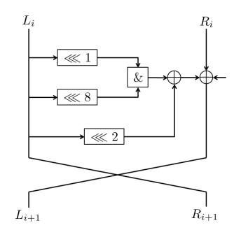
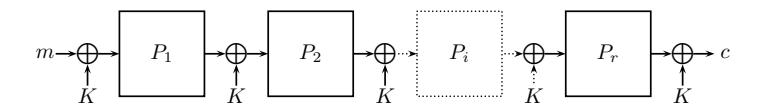

## Improved Top-Down Techniques in Differential Cryptanalysis

Itai Dinur1 , Orr Dunkelman2,3,? , Masha Gutman3 , and Adi Shamir3

Abstract. The fundamental problem of differential cryptanalysis is to find the highest entries in the Difference Distribution Table (DDT) of a given mapping F over n-bit values, and in particular to find the highest diagonal entries which correspond to the best iterative characteristics of F. The standard bottom-up approach to this problem is to consider all the internal components of the mapping along some differential characteristic, and to multiply their transition probabilities. However, this can provide seriously distorted estimates since the various events can be dependent, and there can be a huge number of low probability characteristics contributing to the same high probability entry. In this paper we use a top-down approach which considers the given mapping as a black box, and uses only its input/output relations in order to obtain direct experimental estimates for its DDT entries which are likely to be much more accurate. In particular, we describe three new techniques which reduce the time complexity of three crucial aspects of this problem: Finding the exact values of all the diagonal entries in the DDT for small values of n, approximating all the diagonal entries which correspond to low Hamming weight differences for large values of n, and finding an accurate approximation for any DDT entry whose large value is obtained from many small contributions. To demonstrate the potential contribution of our new techniques, we apply them to the SIMON family of block ciphers, show experimentally that most of the previously published bottom-up estimates of the probabilities of various differentials are off by a significant factor, and describe new differential properties which can cover more rounds with roughly the same probability for several of its members. In addition, we show how to use our new techniques to attack a 1-key version of the iterated Even-Mansour scheme in the related key setting, obtaining the first generic attack on 4 rounds of this well-studied construction.

Keywords: differential cryptanalysis, difference distribution tables, iterative characteristics, Even-Mansour, SIMON.

1 D´epartement d'Informatique, Ecole Normale Sup´erieure, Paris, France ´ 2 Computer Science Department, University of Haifa, Israel

3 Computer Science department, The Weizmann Institute, Rehovot, Israel

? The second author was supported in part by the Israel Science Foundation through grants No. 827/12 and No. 1910/12.

## 1 Introduction

Differential cryptanalysis, which was first proposed in [6], is one of the best known and most widely used tools for breaking the security of many types of cryptographic schemes (including block ciphers, stream ciphers, keyed and unkeyed hash functions, etc). Its main component is a Difference Distribution Table (abbreviated as DDT) which describes how many times each input difference is mapped to each output difference by a given mapping F over n-bit values. The DDT table has exponential size (with 2n rows and 2n columns), but we are usually interested only in its large entries: When we try to attack an existing scheme we try to find the largest DDT entry, and when we develop a new cryptographic scheme we try to demonstrate that all the DDT entries are smaller than some bound.

For large value of n such as 128, it is impractical to find the exact value of even a single entry in the table, but in most cases we are only interested in finding a sufficiently good approximation of its large values. There are many proposed algorithms for computing such approximations, but almost all of them are bottom-up techniques which start by analyzing the differential properties of small components such as a single S-box, and then combine them into large components such as a reduced-round version of the full scheme. To find the best differential attack, they use the detailed description of the scheme in order to identify a consistent collection of high probability differential properties of all the small components, and then multiply all these probabilities. In order to claim that there are no high probability differentials, they lower bound the number of multiplied probabilities, e.g., by showing that any differential characteristic has a large number of active S-boxes.

A second problem is that in most cases, this bottom-up approach concentrates on a single differential characteristic and describes one particular way in which the given input difference can give rise to the given output difference by specifying all the intermediate differences. Moreover, this approach is also more susceptible to variations from the Markov cipher model, where dependence between different rounds can lead to an estimation of probability which is far from the correct value.

In this paper we follow a different top-down approach, in which we consider the given mapping as a black box and ignore its internal structure. In particular, we do not multiply or add a large number of of probabilities associated with its smallest components, and thus we do not suffer from the three methodological problems listed above. Our goal is to use the smallest possible number of evaluations of the given mapping in order to compute either the precise value or a sufficiently good approximation of the most interesting entries in its DDT.

A straightforward black box algorithm can calculate the exact value of any particular entry in the DDT table in 2n time by evaluating the mapping for all the pairs of inputs with the desired input difference, and counting how many times we got the desired output difference. When we want to compute a set of k entries in the DDT, we can always repeat the computation for each entry separately and thus get a k2 n upper bound on the time complexity. However, for some large sets of entries we can do much better. In particular, we can compute all the k = 2n entries in a single row (which corresponds to a fixed input difference and arbitrary output differences) with the same 2n time complexity by using the same algorithm. This also implies that the whole DDT can be computed in 22n time, whereas a naive algorithm which computes each one of the 22n entries separately would require 23n time. If the mapping is a permutation and we are also given its inverse as a black box, we can similarly compute each column in the DDT (which corresponds to a fixed output difference and arbitrary input differences) in 2n time by applying the inverse black box to all the pairs with the desired output difference.

Which other sets of entries in the DDT can be simultaneously computed faster than via the naive algorithm? The first result we show in this paper is a new technique called the diagonal algorithm, which can calculate the exact values of all the 2n diagonal entries in the DDT (whose input and output differences are equal) with a total time complexity of about 2n. These entries in the DDT are particularly interesting in differential cryptanalysis, since they describe the probabilities of all the possible iterative characteristics which can be concatenated to themselves an arbitrarily large number of times in a consistent way. For many well known cryptosystems (such as DES), the best known differential attack on the scheme is based on such iterative characteristics. We then extend the diagonal algorithm to generalized diagonals which are defined as sets of 2n DDT entries in which the input difference and output difference are linearly related rather than equal. This can be particularly useful in schemes such as Feistel structures, in which we are often interested in output differences which are equal to the input differences but with swapped halves.

In many applications of differential cryptanalysis, we can argue that only rows in the DDT which correspond to input differences with low Hamming weight can contain large values (and thus lead to efficient attacks). Our next result is a new top-down algorithm which we call the Hamming Ball algorithm, which can efficiently identify all the large diagonal entries in the DDT whose input and output differences have a low Hamming weight, and approximate their values.

Our third result is a new bins-in-the-middle(BITM) algorithm for computing in a more efficient way an improved approximation for any particular DDT entry whose high value may be accumulated from a large number of differential characteristics which have much smaller probabilities. In this algorithm we assume that the given mapping is only quasi black box in the sense that it is the concatenation of two black boxes which can be computed separately. A typical example of such a situation is a cryptographic scheme which consists of many rounds, where we can choose in our analysis how many rounds we want to evaluate in the first black box, and then define the remaining rounds as the second black box.

In our complexity analysis, we assume that most of the DDT entries are distributed as if the mapping is randomly chosen, but a small number of entries have unusually large values which we would like to locate and to estimate by evaluating the mapping on the smallest possible number of inputs. This is analogous to classical models of random graphs in which we try to identify some planted structure such as a large clique which was artificially added to the random graph.

To demonstrate the power of our new techniques, we used the relatively new but extensively studied proposal of the Simon family of lightweight block ciphers, which was developed by a team of experienced cryptographers from the NSA. Several previous papers [1,2,9,28] tried to find the best possible differential properties of reduced-round variants of Simon with the bottom-up approach by analyzing its individual components. By using our new top-down techniques, we can provide strong experimental evidence that the previous probability estimates were inaccurate, and in fact we found new differential properties which are either longer by two rounds or have better probabilities for the same number of rounds compared to all the previously published results.

The paper is organized as follows. After introducing our notation in Section 2, we survey in Section 3 the main bottom-up techniques for estimating differential probabilities which were proposed in the literature. Our three new top-down techniques are described in Section 4, Section 5, and Section 6. We describe the application of our new techniques to the Simon family of block ciphers in Section 7. Section 8 shows show how to use these top-down techniques in order to analyze the differential properties of the Even-Mansour scheme (whose random permutation is only given in the form of a black box), and to find the first generic attack on its 4-round 1-key version in the related key setting.

## 2 Notations

In this section, we describe the notations used in the rest of this paper.

Given a function  $F: \mathbb{GF}(2)^n \to \mathbb{GF}(2)^n$ , the difference distribution table (DDT) is a  $2^n \times 2^n$  table, where  $DDT[\Delta_I][\Delta_O]$  counts the number of input pairs to F with an n-bit difference of  $\Delta_I$  whose n-bit output difference is  $\Delta_O$ . More formally we define  $DDT[\Delta_I, \Delta_O] \triangleq |\{x \in \mathbb{GF}(2)^n : F(x) \oplus F(x \oplus \Delta_I) = \Delta_O\}|$ .

We define the diagonal (DIAG) of the DDT as a vector of length  $2^n$  which contains only the  $[\Delta_I, \Delta_O]$  entries for which  $\Delta_O = \Delta_I$ , namely  $DIAG[\Delta] \triangleq DDT[\Delta, \Delta]$ . Given an auxiliary function  $L: \mathbb{GF}(2)^n \to \mathbb{GF}(2)^n$ , we define the generalized diagonal (GDIAG) of the DDT as a table of size  $2^n$ , which contains only the  $[\Delta_I, \Delta_O]$  entries for which  $\Delta_O = L(\Delta_I)$ , namely  $GDIAG_L[\Delta] \triangleq DDT[\Delta, L(\Delta)]$ . Thus, the diagonal is a particular case of the generalized diagonal for which the auxiliary function L is the identity. In this paper, we are mostly interested in generalized diagonals for linear functions L (over  $\mathbb{GF}(2)^n$ ), which can be computed efficiently using our algorithms.

Given an n-bit word x, we denote by ham(x) its Hamming weight. Given two n-bit words x,y, we denote by dist(x,y) their Hamming distance, i.e.  $ham(x\oplus y)$ . For an integer  $0 \le r \le n$ , we denote by  $B_r(y)$  the Hamming ball of radius r centered at c, namely  $B_r(c) \triangleq \{x|dist(x,c) \le r\}$ . The number of points in  $B_r(c)$  is denoted as  $M_r^n \triangleq |B_r(c)| = \sum_{i=0}^r \binom{n}{i}$ .

We denote the *n*-bit word with bits  $i_1, ..., i_k$  set to 1 and the rest set to 0 by  $e_{i_1, ..., i_k}$ .

## 3 Previous Work

## 3.1 Bottom-Up Differential Characteristic Search

Since the early works on differential cryptanalysis (including the original work of [6]), there was a need to find good differential characteristics. This need was usually answered in the bottom-up approach: In [21] Matsui described the first general purpose differential characteristic search algorithm, which uses "boundand-branch" approach. Matsui's algorithm is assured to find the best characteristic, but its running time may be unbounded. Later works in the field was sometimes applied to specific ciphers (e.g., analyzing FEAL in [3]), or extending Matsui's approach using basic properties of the block cipher (notably, the byteoriented ciphers studied in [7, 8, 17, 25] or the ARX constructions studied in [10, 14, 20, 22]).

Offering an upper bound on the probability of differential characteristics dates back to the early works of [26], which suggested bounds for Feistel constructions, based on bounds on the probability of differential characteristics through the round function. This method is the basis of the approach of counting the number of active S-boxes (introduced in [13]), which is widely used today. Another approach introduced in [24] is the transformation of the problem into a linear-programming problem, and solving it for constraints. This technique was later extended in [27, 28].

Finally, we note that [10] also explored the concept of sampling the DDT in the context of ARX constructions. If the word size is too big to be analyzed to obtain the full DDT, one may pick a reduced set of entries and compute their probability (for ARX construction one can usually compute the probability of the transition without using input pairs).

#### 3.2 Top-Down Algorithms

The first top-down algorithm which we are aware of is due to [5] — the "Shrinking" algorithm that searches for impossible differentials. The main idea behind the shrinking algorithm is to take a scaled-down version of the cipher (e.g., with reduced word sizes and S-boxes). Such a scaled-down version allows evaluating the full difference distribution table, which in turn can be used to automatically identify impossible differentials. However, we note that many cryptosystems cannot be scaled down in an obvious way while maintaining properties of their DDT, and therefore the applicability of this algorithm is limited.

## 4 The Diagonal Algorithm and its Extensions

#### 4.1 The Diagonal Algorithm

We begin by describing our basic algorithm for calculating the exact values of all the diagonal entries in the difference distribution table with about the same time complexity as computing a single entry. The algorithm is given black box access to a function F : GF(2)n → GF(2)n, and outputs the diagonal of the difference distribution table DIAG[∆] , DDT[∆, ∆]. The algorithm is based on the simple property that the equality x⊕y = F(x)⊕F(y) along the diagonal is equivalent to the equality x ⊕ F(x) = y ⊕ F(y). Therefore, we can efficiently identify all the (x, y) pairs with equal input and output differences ∆ = x ⊕ y (which contribute to the DIAG table) by searching for all the collisions between values of x ⊕ F(x) and y ⊕ F(y).

- 1. Initialize all the entries of the table DIAG to zero, and set DIAG[0] to 2n.
- 2. For each n-bit value x:
  - (a) Compute x ⊕ F(x), and store the pair (x ⊕ F(x), x) in a hash table H, i.e., add x to the set of values stored at H[x ⊕ F(x)].
- 3. For each n-bit value b:
  - (a) For each pair (x, y) of distinct values such that x, y ∈ H[b], increment DIAG[x ⊕ y] by 1.

The time complexity of Steps 1 and 2 is 2n each, and the time complexity of Step 3 is proportional to D, which denotes the total number of pairs (x, y) such that x ⊕ y = F(x) ⊕ F(y) (which is the same as the sum of all the entries in DIAG). Note that for a random function F, the expected value of D is about 2 2n−n = 2n as we have about 22n (x, y) pairs, and the probability that a pair satisfies the n-bit equality is 2−n. Consequently, the expected time complexity of the algorithm for a random function is about 2n, and the total memory complexity is also 2n, which is the size of the hash table H and the output table DIAG.

We note that there are several previous algorithms whose general structure resembles the diagonal algorithm. One such algorithm is impossible differential cryptanalysis of Feistel structures [18] and its various extensions, which use a data structure similar to H to iterate over pairs with related input and output differences. However, in these algorithms H is used in order to filter pairs required to attack specific cryptosystems, and not to explicitly calculate the DDT (as we do in Step 3.(a)).

#### 4.2 The Generalized Diagonal Algorithm

We now extend the diagonal algorithm to compute a generalized diagonal GDIAGL for any given linear function L over GF(2)n. In this case, we are interested in (x, y) pairs such that L(F(x)⊕F(y)) = x⊕y, which is equivalent to the equality x⊕L(F(x)) = y ⊕L(F(y)), since L is linear. Therefore, the generalized diagonal algorithm is very similar to the diagonal algorithm above, and only differs in Step 2.(a), where we store the pair (x⊕L(F(x)), x) in the hash table H (instead of storing the pair (x ⊕ F(x), x)). The complexity analysis of the generalized diagonal algorithm is essentially identical to the basic diagonal algorithm.

## 5 The Hamming Ball Algorithm

The (generalized) diagonal algorithm computes the exact value of the (generalized) diagonal of the DDT of the function F in about 2n time, which is practical for n = 32 but marginal for n = 64. In fact, it is easy to show that information theoretically, the only way to compute the precise value of a single DDT entry is to test all the 2n relevant pairs of inputs or outputs. However, if we assume that we only want to find large entries on the diagonal and to approximate their values, we can do much better.

Assume that there exists some entry DDT[∆, L(∆)] with a value of p · 2 n (where 0 < p ≤ 1 is the probability of an input pair with difference ∆ to have an output difference of L(∆)) for a fixed linear function L. A trivial adaptation to the (generalized) diagonal algorithm evaluates and stores the pairs (x ⊕ L(F(x)), x) for only 0 < C ≤ 2 n random values of x. Clearly, we do not expect to generate a non-zero value in entry DDT[∆, L(∆)] before evaluating at least p −1 (x, x ⊕ ∆) pairs. This gives a lower bound on C and on the complexity of the algorithm, since after the evaluation of C arbitrary values x, we expect to have about C 2 · 2 −n pairs with randomly scattered input differences, and thus we require C 2 · 2 −n ≥ p −1 or C ≥ 2 n/2 · p −1/2 . Therefore, the time and memory complexity of our adaptation are still somewhat large for big domains, and in particular it is barely practical for n = 128 even when p is close to 1 (as C ≥ 2 n/2 = 264).

We now describe a more efficient adaptation that requires the stronger assumption that the high probability entries DDT[∆, L(∆)] occur at ∆'s which have (relatively) low Hamming weight. The motivation behind this assumption is that we are interested in applying our algorithms to concrete cryptosystems in which a high probability entry DDT[∆I , ∆O] typically indicates the existence of a high probability differential characteristic with the corresponding input-output differences. Such high probability characteristics in SP networks are likely to have a small number of active Sboxes, and thus ∆I and ∆O are likely to have low Hamming weights.

In order to consider only DDT[∆, L(∆)] entries where ∆ is of small Hamming weight, we pick an arbitrary center c and a small radius r, and evaluate F only for inputs inside the Hamming ball Br(c). All the pairs of points inside the Hamming ball have a small Hamming distance, and thus for a carefully chosen value of r, we will obtain a quadratic number of relevant pairs from a linear number of values which have small Hamming distances d.

It is easy to see that the raw estimates we get with this approach for the entries in the DDT are biased, since the Hamming ball has more pairs which differ only in their least significant bit than pairs which differ in their d least significant bits for d > 1.1 Given a difference ∆ such that ham(∆) = d, an important measure which is used by our Hamming ball algorithm is the number

1 This claim can be easily supported by the fact that as more bits are changed, the probability that the new computed value is outside the ball increases.

of pairs with difference  $\Delta$  in  $B_r(c)$ . This measure, which we denote by  $P_{r,d}^n$  (it does not depend on the actual values of c or  $\Delta$ ), is used in order to create from the experimental data unbiased estimates for the values of the entries  $DDT[\Delta_I, \Delta_O]$ , as described below.

- 1. Initialize the entries of the table  $GDIAG_L$  to zero.
- 2. For each *n*-bit value  $x \in B_r(c)$ :
  - (a) Compute  $x \oplus L(F(x))$ , and store the pair  $(x \oplus L(F(x)), x)$  in a hash table H, i.e., add x to the set of values stored at  $H[x \oplus L(F(x))]$ .
- 3. For each n-bit value b such that H[b] contains at least 2 values:
  - (a) For each pair (x, y) such that  $x, y \in H[b]$ , increment  $GDIAG_L[x \oplus y]$  by 1.
- 4. For each *n*-bit value  $\Delta$  such that  $GDIAG_L[\Delta] > 0$ :
  - (a) Denote  $ham(\Delta) = d$  and normalize the entry  $GDIAG_L[\Delta]$  by setting  $GDIAG_L[\Delta] \leftarrow GDIAG_L[\Delta] \cdot (2^n/P_{r,d}^n)$ .

The time and memory complexities of Step 2 are  $M_r^n$ . The time and memory complexities of steps 3 and 4 are determined by the number of collisions in the hash table H, which depends on F. For a random function, we expect to have  $(M_r^n)^2 \cdot 2^{-n} \leq M_r^n$  such collisions, and therefore we generally do not expect steps 3 and 4 to dominate the time or memory complexities of the attack (especially for large domains where we select a small r implying that  $M_r^n \ll 2^n$  and thus  $(M_r^n)^2 \cdot 2^{-n} \ll M_r^n$ ).

In order to detect an entry  $DDT[\Delta, L(\Delta)]$  with  $ham(\Delta) = d$  whose probability is p, the most efficient method (assuming that we have sufficient memory) is to select a r such that  $B_r(c)$  contains about  $p^{-1}$  pairs of points with input different  $\Delta$ , or  $P_{r,d}^n \geq p^{-1}$ .

The efficiency of our algorithm for low Hamming weights is derived from the fact that Hamming balls are relatively closed under XOR's - pairs of points which are close to the origin are also close to each other. Similar efficiencies can be obtained for other sets with similar closure properties, such as arbitrary linear subspaces and sets of points which have short Hamming distance to linear subspaces.

#### 5.1 Analyzing Keyed Functions

The algorithms described so far analyze a keyless function F. In order to obtain meaningful results for a keyed function  $F_K$ , we assume the existence of high probability entries  $DDT[\Delta_I, \Delta_O]$ , which are common to a large fraction of the keys. Such common high probability entries are typically the result of a high probability differential characteristics (with the corresponding input-output differences) in iterated block ciphers where the round keys are XORed into the state.3

&lt;sup>2 The computation of  $P_{r,d}^n$  is discussed in Appendix 10.

&lt;sup>3 In such cases, the probability of the characteristic can be estimated independently of the round keys, assuming the input values are selected at random.

Based on this assumption, we can select a few keys  $K_i$  at random, and independently run our algorithms on  $F_{K_i}$  for each  $K_i$ . Then, we look for high probability entries  $DDT[\Delta_I, \Delta_O]$  which are common to several keys. An additional possibility is to first run our algorithms on  $F_{K_1}$ , and then to test the obtained high probability entries  $DDT[\Delta_I, \Delta_O]$  on  $F_{K_i}$  for i > 1, by encrypting sufficiently many pairs with input difference  $\Delta_I$  for each key.

## 6 Improved Approximation of a Single Large DDT Entry

We now turn our attention to a related problem. Assume that we found a pair of input/output differences  $(\Delta_I, \Delta_O)$  which are somehow related. For example, this can occur when an iterative characteristic is repeated several times. Given  $(\Delta_I, \Delta_O)$ , we wish to estimate the probability of the transition  $\Delta_I \xrightarrow{r} \Delta_O$  (where r is the number of rounds in the differential). The standard method to estimate this probability is to take many pairs with input difference  $\Delta_I$  and check how many of them have output difference  $\Delta_O$  (again, trying multiple keys). If the probability of the differential is p, a good estimation requires  $O(p^{-1})$  queries to the encryption algorithm.

Now, assume that the cipher (or the rounds) for which we analyze this transition, can be divided into two (roughly equal) parts. In such a case, we can discuss the transition from  $\Delta_I$  to some  $\Delta_M$  after about r/2 rounds, and from  $\Delta_M$  to  $\Delta_O$  in the the remaining rounds. In other words, we look at  $\Delta_M$  after r' rounds, and use the fact that:

$$\Pr[\Delta_I \xrightarrow{r} \Delta_O] = \sum_{\Delta_M} \Pr[\Delta_I \xrightarrow{r'} \Delta_M \xrightarrow{r-r'} \Delta_O] \tag{1}$$

which by the stochastic equivalence assumption (see [19]) we can re-write as

$$\Pr[\Delta_I \xrightarrow{r} \Delta_O] = \sum_{\Delta_M} \Pr[\Delta_I \xrightarrow{r'} \Delta_M] \cdot \Pr[\Delta_M \xrightarrow{r-r'} \Delta_O]$$
 (2)

To correctly evaluate the probability suggested by Equation (2), one needs to go over all possible  $\Delta_M$  values (which is usually infeasible for common block sizes), and for each one of them evaluate the probability of two shorter differentials,  $\Delta_I \xrightarrow{r'} \Delta_M$  and  $\Delta_M \xrightarrow{r-r'} \Delta_O$  (which in itself may be a hard task).

Luckily, it was already observed in [6] that (in most cases) a high probability differential characteristic has several "close" high probability neighbors. This is explained by taking slightly different transitions through the active S-boxes with probability which is only slightly lower than the highest possible probability (used in the high probability characteristic). Similar behavior sometimes happen for differentials (especially for differentials which are based on a few "strong" characteristics, each having a few high probability "neighbors").

Hence, to give a lower bound on the value suggested by Equation (2), we can use the following computation:

$$\Pr[\Delta_I \xrightarrow{r} \Delta_O] \ge \sum_{\Delta_M \in S} \Pr[\Delta_I \xrightarrow{r'} \Delta_M] \cdot \Pr[\Delta_M \xrightarrow{r-r'} \Delta_O] \tag{3}$$

where the set S contains all the  $\Delta_M$  values for which the differentials  $\Delta_I \xrightarrow{r'} \Delta_M$  and  $\Delta_M \xrightarrow{r-r'} \Delta_O$  have a sufficiently high probability.4

Obviously, this approximation relies on the fact that the two parts of the cipher are independent of each other. When taking into consideration a Markov-cipher assumption or the Stochastic Equivalence assumption (see [19] for more details), then the independence assumption immediately holds. However, in real life, one needs to verify it.

One advantage of the Bins-in-the-Middle algorithm which is presented next over the standard analytical approach is the fact that we "reduce" the independence assumption only to the transition between the two parts of the cipher. This is to be compared with an analytical approach that computes the probability of each round independently, and then simply multiplies the probabilities of each round (i.e., approaches that assume that each round is independent of others). In the Bins-in-the-Middle algorithm, the probabilities which are multiplied are the sampled probabilities of differentials, i.e., probabilities that were experimentally verified.5

## 6.1 The Bins-in-the-Middle (BITM) Algorithm

We now present an algorithm that finds all the "good"  $\Delta_M$  values in the set S and experimentally estimates the probability of the two differentials  $\Delta_I \xrightarrow{r'} \Delta_M$  and  $\Delta_M \xrightarrow{r-r'} \Delta_O$ . The algorithm requires that the last r-r' rounds are invertible (and thus, can be used only on permutations).

The algorithm's basic idea is to actually produce a list of plausible  $\Delta_M$  by sampling random pairs with input difference  $\Delta_I$  (for the first r' rounds) and a corresponding list by sampling random pairs with output difference  $\Delta_O$  (for the last r-r') rounds. We shall denote the two lists,  $L_1$  and  $L_2$ , respectively. The first list,  $L_1$ , contains pairs of the form  $(\Delta_{M_i}, p_i)$  (i.e., the difference  $\Delta_{M_i}$  appears with probability  $p_i$  given an input difference  $\Delta_I$ ). Similarly, the second list,  $L_2$ , contains pairs of the form  $(\Delta_{M_i}, q_j)$ .

Given these two lists, we can define the set S as all the differences which appear both in  $L_1$  and  $L_2$  with sufficiently high probability (which we denote by  $p_b$ ). Then, by using Equation (3), and the estimations for the  $p_i$ 's and  $q_j$ 's, we can compute an estimation for the probability of the differential  $\Delta_I \stackrel{r}{\to} \Delta_O$ :

- 1. Pick N plaintext pairs6 of the form  $(x, x \oplus \Delta_I)$ , and obtain their partial encryption after r' rounds, (z, z').
- 2. Collect the differences  $z \oplus z'$ , and produce  $L_1$ .
- 3. Pick N ciphertext pairs of the form  $(y, y \oplus \Delta_O)$ , and obtain their partial decryption after r r' rounds, (w, w').

&lt;sup>4 When using BITM to calculate the probability of a differential, one can choose the meeting round in a variety of ways. Usually setting  $r' \approx r/2$  gives the optimal results.

 $^{5}$  Of course, we still need to assume independence between the two parts of the cipher.

 $^{6}$  The value of N is discussed later.

- 4. Collect the differences  $w \oplus w'$ , and produce  $L_2$ .
- 5. For all the differences that appear with probability above some bound  $p_b$  in both  $L_1$  and  $L_2$ , compute the sum of all products  $(p_i \cdot q_i)$ .

First, it is easy to see that both  $L_1$  and  $L_2$  contain two types of differences: High-probability differences (e.g., differences that appear with probability higher than  $p_b$ ) as well as low-probability differences that got sampled by chance. For an n-bit block cipher, after sampling N pairs, we expect low probability differences  $\Delta_M$  to be encountered only once (both in  $L_1$  and in  $L_2$ ) as long as  $N < 2^{n/2}$ . Moreover, as we later discuss, estimating the probabilities  $p_i$ 's and  $q_j$ 's can be done over many keys, offering a better estimation.

Now, given  $p_b$ , we wish to assure that we sample the high probability differences. This can be done, by looking for differences that appear at least twice during Steps 1–2 (for  $L_1$ ) or Steps 3–4 (for  $L_2$ ). Given that the number of "appearances" of an output difference follows the Poisson distribution, we need to take  $N = \alpha/p_b$  pairs, where  $\alpha$  determines the quality of our sampling. For example, if we pick  $\alpha = 4$ , i.e., we expect 4 pairs that follow the differential  $\Delta_I \xrightarrow{r'} \Delta_M$ , then with probability of 90%,  $\Delta_M$  would appear at least twice in Steps 1–2. Increasing the value of  $\alpha$  (and/or sampling using more keys) improves the quality of the values in  $L_1$  and  $L_2$ . For example, for  $\alpha = 10$ , the probability that a good  $\Delta_M$  will not appear at least twice is less than 0.5%.

It is important to note that differences of low probability do not affect the overall estimation. This follows from the fact that we count only differences that appear in both lists  $L_1$  and  $L_2$ . Hence, even though there are some low probability differences in each list, it is extremely unlikely that the same low probability difference will appear in both lists simultaneously. Even in the extreme case that there are N low probability  $\Delta_M$  values in each list, expected number of low probability  $\Delta_M$  appearing in both lists is  $N^2/2^n$ , which is less than 1.

We recall that similarly to all approaches that estimate the probability of differentials, we need to rely on some randomness assumptions. A round-by-round approach relies on the cipher being Markovian, whereas an experimental verification of the full differential does not require any assumption. The independence assumption needed by the BITM algorithm lies between these two extremes. We need to assume that the transition between the two parts of the cipher does not affect the probability estimations. In other words, even though the actual pairs in  $L_1$  and  $L_2$  are different, we can use a (reduced) Markov-cipher assumption to obtain an estimate for the total probability of the differential  $\Delta_I \xrightarrow{r} \Delta_O$ .

We note that one can take more pairs, but as we later show,  $N = O(1/p_b)$ , i.e., as long as  $p_b$  is above  $2^{-n/2}$  the algorithm is expected to work. Moreover, if both  $\Delta_I \xrightarrow{r'} \Delta_M$  and  $\Delta_M \xrightarrow{r-r'} \Delta_O$  have probability lower than  $p_b$ , the overall contribution of the characteristic  $\Delta_I \xrightarrow{r'} \Delta_M \xrightarrow{r-r'} \Delta_O$  to the probability we estimate is at most  $p_b^2$ . Picking  $p_b < 2^{-n/2}$  suggests that the contribution is less than  $2^{-n}$ . Such a low probability is usually of little interest in cryptanalysis, and requires a very careful analysis.

As mentioned earlier, as  $\alpha$  increases (or if the probability of the difference we check is higher than  $p_b$ ) the quality of the estimation of the probabilities in  $L_1$  and  $L_2$  improves. This is explained by the fact that we estimate the probability of an event which follows a Poisson distribution. If  $X \sim Poi(\lambda)$ , then  $E[X] = Var[X] = \lambda$ , so the larger  $\lambda$  is, the closer X is to its mean.

Moreover, we note that the use of multiple keys can significantly improve the quality of the estimation. If we repeat the experiment with t different keys, the expected number of times  $\Delta_M$  appeared in all t experiments is increased by a factor t. As the sum of Poisson random variables is itself a Poisson random variable, we obtain a significantly better estimate for the actual probability of the difference.8

Hence, after sampling sufficiently many keys, one can obtain a better estimation of the actual probabilities of the various differences in  $L_1$  and  $L_2$ , and discard the low probability differences. These probabilities can then be combined to offer a higher quality estimate of the probability of the differential  $\Delta_I \xrightarrow{r} \Delta_O$ .

**A few improvements** We first note that there is no need to actually store  $L_2$ . One can generate  $L_1$ , and for each  $w \oplus w'$  value of Steps 3–4, to increment the counter if  $w \oplus w'$  happens to be in  $L_1$ .

We now turn our attention to the generation of  $L_1$ . It is easy to see that  $L_1$  can take at most O(N) memory cells. As N increases this may be a practical bottleneck. Hence, once the used memory reaches the machine's limit (or the process' limit), we suggest to "extract" all the high probability differences encountered so far into a shorter list  $L'_1$ . Then, we sample more random pairs, but this time, we only deal with those pairs whose "output" difference is in the short list  $L'_1$ . The main advantage is now that we use almost no memory (as  $L'_1$  tends to be small), we can actually increase the number of queries, thus obtaining a more accurate estimate.

The final improvement in this front is to perform the previous idea in steps. We first sample many pairs, and store the differences  $z \oplus z'$  in a hash table (with less than N bins). After finding the bins which were suggested more than others, we can dive into them by re-sampling more pairs.

Comparison with Meet in the Middle Attacks We note that while the *BITM* algorithm is is superficially similar to the meet in the middle (MITM) algorithm, it is quite different. In the MITM algorithm, we typically try to find some common value between the two parts of a cipher, and use this value to find the key (depending on the cryptanalytic task at hand, we may search for

&lt;sup>8 For  $\alpha=4$  and t=32 (expecting four pairs in 32 experiments), the total number of times  $\Delta_M$  appears in all experiments follows a Poisson distribution with a mean of 128. Hence, with probability 95%, counting over all experiments will suggest  $\Delta_M$  somewhere between 105 and 151 times (in all 32 experiments). In other words, taking the number of times  $\Delta_M$  appears (divided by 32N) as an estimate for the actual probability will be accurate within 18% of the correct probability with probability 95%.

all the common values). In the BITM algorithm our goal is not to find these values, but to estimate the probability that they exist, in order to choose the best differential attack on the scheme.

## 6.2 The Advantages of the BITM Algorithm

The main advantage of the BITM algorithm over a pure top-down algorithm which evaluates the full mapping is its greatly improved efficiency. Indeed, in order to estimate the differential  $\Delta_I \xrightarrow{r} \Delta_O$  requires  $O(p^{-1})$  pairs. However, if we pick  $r' \approx r/2$ , and under the assumption that both parts are roughly of the same strength, we obtain  $p_b = O(\sqrt{p})$ . This is extremely important for the cases where a time complexity of  $p_b^{-1}$  is still feasible but  $p_b^{-2}$  is not (e.g., when  $p_b \approx 2^{-40}$ ).

Another advantage of the BITM algorithm over bottom-up algorithms is that we take into account all the high probability differential characteristics simultaneously. Hence, the estimation for the differential probability is closer to the actual probability than an estimation which is based on the multiplication of many probabilities along a single differential characteristic.

Finally, this method offers some experimental verification of the stochastic equivalence assumption. Indeed, for most ciphers (and most of the keys), the stochastic equivalence assumption tends to hold (or seem to "work" most of the time). However, when we discuss a single long characteristic, we may encounter some inconsistencies between different parts of the characteristic. In these situations, the real probability and computed probability will differ. Once we take into consideration multiple differential characteristics, the estimation becomes more resilient (though not 100% full-proof), as a "failure" of one of the longer characteristics does not invalidate the full differential. In addition, by running the algorithm with several different r' can also help in validating the probability of the transition between the top half and the bottom half.

# 7 Applying Our New Algorithms to the Simon Family of Block Ciphers

The Simon family of lightweight block ciphers, presented in [4], is implemented using a balanced Feistel structure. The Simon round function is very simple and consists of only three operations: AND, XOR and constant rotations. All the ciphers in the Simon family use the same round function and differ only by the key size, the block size (which ranges from 32 to 128 bits) and the number of Feistel rounds which is dependant on the former two. As in any Feistel structure, the plaintext is divided into two blocks of size n:  $P = (L_0, R_0)$  and then every round  $1 \le i \le r$ :

$$L_i = R_{i-1} \oplus F(L_{i-1}) \oplus K_{i-1}; \quad R_i = L_{i-1}$$

where the ciphertext is  $C = (L_r, R_r)$  and F is the Simon round function:

$$F(x) = ((x \ll 1) \land (x \ll 8)) \oplus (x \ll 2)$$

An illustration of the round function is depicted in Figure 1.

Fig. 1. The SIMON round function

In this section we present the best differentials for Simon64 Simon96 and Simon128 we found using our various diagonal estimation algorithms. We also describe more accurate BITM-based estimates for the differential probabilities of previously presented Simon characteristics, which are substantially different from the original estimates.

#### 7.1 Applying BITM to previously known Simon differentials

We applied the BITM algorithm to some of the previously known differentials for Simon which were published in [1,9,27]. Since testing probabilities  $< 2^{-80}$  is too expensive (it requires throwing  $> 2^{40}$  balls into bins from each side), the longer differentials were evaluated by breaking the characteristic into the smallest possible number of parts, evaluating each part separately, and taking the product of the probabilities as the result. This is not a pure BITM approach, but it is much closer to a top-down computation compared to the bottom-up approach used by other researchers.

For example, the 41-round Simon128 characteristic from [1] was divided into a 9-round differential  $(e_{12},e_{6,10,14})$   $\xrightarrow{9R}$   $(e_{6,10,14},e_{12})$  and a 7-round differential  $(e_{6,10,14},e_{12})$   $\xrightarrow{7R}$   $(e_{12},e_{6,10,14})$ . The probabilities for the differentials were tested many times:  $2^{35}$  balls were thrown from each side for 30 different keys, and  $2^{30}-2^{32}$  balls were thrown from each side for >100 different keys. The results for the 9-round differential were in the range  $[2^{-18.61}, 2^{-18.59}]$  with an average of  $2^{-18.6}$ . The results for the 7-round differential were in the range  $[2^{-32.92}, 2^{-32.25}]$  with an average of  $2^{-32.77}$ . When testing the entire 16-round characteristic (first the 9-round differential, then the 7-round one) with the same number of experiments, the probability range was  $[2^{-51.2}, 2^{-48.4}]$  with an average  $2^{-49.9}$ . This means that the entire 41-round characteristic has probability in the approximate range of  $[2^{-121}, 2^{-115.6}]$  with an average of  $\approx 2^{-118.6}$ .

The advantage of using the BITM algorithm to evaluate the probabilities is the fact we do not consider what happens in the intermediate rounds, but only take interest in the probabilities between the first, last and middle round. Additionally, we do not make any independence assumptions about the round keys since the BITM experiments use the actual SIMON key-schedule.

Table 1 compares all the previously published bottom-up estimates of the probabilities of various differential transitions with our experimentally obtained top-down results (where the numbers are the log to the base 2 of the probabilities). All the results (including those presented in the next subsection) were obtained by the same method as described for the SIMON128 differential (Many experiments with as many as 235 balls thrown from each side with a narrow result range, and the average value is taken as the final probability).

Table 1. The original and our improved estimates of the probabilities of the best previously published differentials

| Cipher   | Rounds | Presented prob. | BITM prob. | Source |
|----------|--------|-----------------|------------|--------|
| SIMON64  | 21     | -60.53          | -56.05     | [9]    |
| SIMON64  | 21     | -61.01          | -56.05     | [1]    |
| SIMON64  | 21     | -60.21          | -59        | [27]   |
| SIMON96  | 30     | -92.20          | -88.5      | [1]    |
| SIMON128 | 41     | -124.6          | -118.6     | [1]    |

This table shows that the previous estimates were too pessimistic (sometimes by a significant factor of 26 = 64) since they considered only a limited number of differential characteristics. Since some of the differential probabilities that appear in the mentioned papers are significantly lower than the probabilities estimated by our BITM algorithm, we can extend the differentials to a larger number of rounds, while maintaining the probability above 2−n. 9 However, even without extending the characteristics, the results of Table 1 automatically translate into better key recovery attacks on the SIMON members, as the previous attacks only depended on differentials for SIMON (and not on the internal characteristics).

## 7.2 Improved SIMON differentials found using GDIAGL

We applied the GDIAGL algorithm to SIMON, followed by estimating the probabilities using BITM. The result is an improvement by two rounds of the best previously known differential from [1] by 2 rounds while maintaining roughly the same probability.

9 All these differential characteristics could be theoretically extended to cover more rounds, but in order to break an n-bit block cipher, the probabilities generally need to be higher than 2−n (otherwise we do not expect to find more than a single accidental pair, even when we try the full code book).

The application of  $GDIAG_L$  was done with the function

$$L(x) = (x \lll n)$$

(which is a half block rotation that swaps its two halves). The result of this function is some differential families of the type  $AB \rightarrow BA$  for various numbers of rounds. After applying a search for complementing differentials pairs  $AB \rightarrow BA \rightarrow AB$ , the most probable ones we found were:

$$\Pr\left[ (e_{i,i+4}, e_{i+6}) \xrightarrow{\text{7R}} (e_{i+6}, e_{i,i+4}) \right] \approx 2^{-14.6}$$
 (4)

$$\Pr\left[ (e_{i+6}, e_{i,i+4}) \xrightarrow{9R} (e_{i,i+4}, e_{i+6}) \right] \approx 2^{-35.6}$$
 (5)

$$\Pr\left[\left(e_{i+2}, e_{i,i+4}\right) \xrightarrow{\text{5R}} \left(e_{i,i+4}, e_{i+2}\right)\right] = 2^{-8}$$
 (6)

$$\Pr\left[\left(e_{i,i+4}, e_{i+2}\right) \xrightarrow{11R} \left(e_{i+2}, e_{i,i+4}\right)\right] \approx 2^{-41.5}$$
 (7)

Both pairs result in a 16-round iterated differential.

Simon 64 In order to construct the full characteristic we additionally use the following differential:

$$\Pr\left[ (e_{i,i+4}, e_{i+6}) \xrightarrow{\text{6R}} (e_{i,i+4}, e_{i+2}) \right] \approx 2^{-11.3}$$
 (8)

Concatenating differentials (4) and (5) results in a 16-round characteristic with probability of  $\approx 2^{-48.6}$ , thus the full characteristic

$$(e_{i,i+4}, e_{i+6}) \xrightarrow[2^{-48.6}]{16R} (e_{i,i+4}, e_{i+6}) \xrightarrow[2^{-11.3}]{6R} (e_{i,i+4}, e_{i+2})$$

has 22 rounds and probability of  $\approx 2^{-59.9}$ .

A different 22-round characteristic can be obtained by using (6), (7), (6) and an additional round. Combining (6) with (7) results in a 16-round differential with probability  $\approx 2^{-48}$ , and adding  $(e_{i,i+4}, e_{i+2}) \xrightarrow{1R} (e_{i+6}, e_{i,i+4})$  after (6) results in a 6-round differential with probability  $\approx 2^{-11.3}$ . The entire 22-round characteristic

$$(e_{i+2}, e_{i,i+4}) \xrightarrow[2^{-48}]{16R} (e_{i+2}, e_{i,i+4}) \xrightarrow[2^{-11.3}]{6R} (e_{i+6}, e_{i,i+4})$$

has probability  $\approx 2^{-59.3}$ .

Note that both characteristics can be extended one round further  $((e_{i+6}, e_{i,i+4,i+8}) \xrightarrow{1R} (e_{i,i+4}, e_{i+6})$  and  $(e_{i+6}, e_{i,i+4}) \xrightarrow{1R} (e_{i,i+4,i+8}, e_{i+6})$ , respectively) while maintaining a probability which is above  $2^{-64}$ . The resultant 23-round differential is longer than all the previously found differentials for SIMON64.

Simon128 The longest previously found differential for Simon128 had 41 rounds. We can find a longer 43-round differential which is based on differentials (4), (5) and another short differential:

$$\Pr\left[\left(e_{i+6}, e_{i,i+4}\right) \xrightarrow{\text{3R}} \left(e_{i,i+8,i+12}, e_{i+2,i+10}\right)\right] = 2^{-12}$$
(9)

Combining (4) with (9) results in a 9-round characteristic of probability  $\approx 2^{-22.4}$ . The full 43-round characteristic

$$(e_{i+6}, e_{i,i+4,i+8}) \xrightarrow[2^{-2}]{1R} (e_{i,i+4}, e_{i+6}) \xrightarrow[2^{-97.2}]{32R} (e_{i,i+4}, e_{i+6}) \xrightarrow[2^{-26.4}]{10R} (e_{i,i+8,i+12}, e_{i+2,i+10})$$

has probability of  $\approx 2^{-125.6}$ .

A different 43-round characteristic will require the same differentials that were used for Simon64, combined with a 4-round differential as follows:

$$\Pr\left[\left(e_{i+2,i+10}, e_{i,i+8,i+12}\right) \xrightarrow{4R} \left(e_{i+2}, e_{i,i+4}\right)\right] = 2^{-15.1}$$
 (10)

and finishing with a single round  $(e_{i+6}, e_{i,i+4}) \xrightarrow{1R} (e_{i,i+4,i+8}, e_{i+6})$ . The full characteristic is:

$$(e_{i+2,i+10},e_{i,i+8,i+12}) \xrightarrow[2^{-15.1}]{\text{4R}} (e_{i+2},e_{i,i+4}) \xrightarrow[2^{-96}]{\text{32R}} (e_{i+2},e_{i,i+4}) \xrightarrow[2^{-13.3}]{\text{7R}} (e_{i,i+4,i+8},e_{i+6})$$

and it has probability of  $\approx 2^{-124.4}$ .

**Table 2.** Summary of the  $GDIAG_L$  results for SIMON

| Cipher   | Differential family                                                   | Rounds | Prob. $(\log_2)$ |
|----------|-----------------------------------------------------------------------|--------|------------------|
| Simon64  | $(e_{i,i+4}, e_{i+6}) \to (e_{i,i+4}, e_{i+2})$                       | 22     | -59.9            |
| Simon64  | $(e_{i+2}, e_{i,i+4}) \to (e_{i+6}, e_{i,i+4})$                       | 22     | -59.3            |
| Simon64  | $(e_{i+6}, e_{i,i+4,i+8}) \to (e_{i,i+4}, e_{i+2})$                   | 23     | -61.9            |
| Simon64  | $(e_{i+2}, e_{i,i+4}) \to (e_{i,i+4,i+8}, e_{i+6})$                   | 23     | -61.3            |
| SIMON128 | $(e_{i+6}, e_{i,i+4,i+8}) \rightarrow (e_{i,i+8,i+12}, e_{i+2,i+10})$ | 43     | -125.6           |
| SIMON128 | $(e_{i+2,i+10}, e_{i,i+8,i+12}) \rightarrow (e_{i,i+4,i+8}, e_{i+6})$ | 43     | -124.4           |

## 8 Application to Iterated Even-Mansour

The Even-Mansour (EM) block cipher was proposed at Asiacrypt 1991 [16]. It uses a single publicly known random permutation P on n-bit values and two secret n-bit keys  $K_1$  and  $K_2$ , and defines the encryption of the n-bit plaintext m as  $E(m) = P(m \oplus K_1) \oplus K_2$ . The decryption of the n-bit ciphertext c is

similarly defined as D(c) = P −1 (c ⊕ K2) ⊕ K1. It can be naturally generalized into an r-round iterated EM encryption function (a.k.a. a key-alternating scheme in [11]), which is defined using r permutations P1, P2, . . . , Pr and r + 1 keys K1, K2, . . . Kr+1 as E(m) = Pr(. . . P2(P1(m ⊕ K1)⊕ K2)⊕ K3 . . .⊕ Kr)⊕ Kr+1, where decryption is defined in an analogous way.

At Asiacrypt 2013, Dinur et al. [15] analyzed several instances of iterated EM schemes, and in particular showed that the scheme in which all round keys are equal to K (shown in Figure 2) must have at least 4 rounds in order to provide perfect n-bit security in the single-key model. In this section, we extend this result to the related-key model, and show that the scheme must have at least 5 rounds in order to provide perfect (n−1)-bit security against related-key attacks that use 2 related keys.10 This is done by presenting a related-key differential attack, which is applicable to (almost) any 4-round EM scheme.

Fig. 2. An iterated EM with one key

Our starting point is the attack of Mendel et al. [23] on the block cipher LED-64, which is a specific instance of the iterated EM scheme shown in Figure 2. This attack assumes that we have an iterative differential characteristic for P2 with probability p, where the input and output difference is ∆, and extends it to a 3-round related-key characteristic with that same probability p. This is done by choosing both the key difference and the plaintext difference as ∆, which implies that the input difference to P4 is ∆ with probability p. The 3-round characteristic can be used to attack 4 rounds of the scheme with time, data and memory complexities of about 2n/2 · p −1/2 using an extension of the attack of Daemen on the original EM scheme [12]. The full details of the attack are given in [23] and are not required in order to understand this section.

The most relevant component of the attack of [23] to our analysis is the iterative differential characteristic for P2. In [23], such a characteristic was efficiently found using the internal properties of LED, but here we notice that we can apply a similar attack to essentially any 4-round EM scheme with one key. Our general framework is similar to the one of [15], which analyzed the public permutations of an EM scheme in order to detect some property which is useful for attacking the full cipher. More specifically, we can use our new diagonal algorithm of Section 4.1 in order to analyze the specific choice of P2 in a particular

10 Exhaustive search given data encrypted with two related keys can be performed with time complexity of 2n−1 .

incarnation of the Even-Mansour scheme, and find in it the highest probability iterative characteristic. However, applying the full diagonal algorithm results in an attack with complexity of at least  $2^n$ , which is not faster than exhaustive search. Therefore, we apply the algorithm by evaluating only a fraction of the input space of  $P_2$ . More specifically, we evaluate an arbitrary linear subspace of inputs X, such that |X| = S (for a parameter S), and look for the entry  $\Delta$  of the (partial) DIAG with a maximal value, denoted by t. The value of S is carefully chosen in order to optimize the total time complexity of the attack, which is about  $S + 2^{n/2} \cdot p^{-1/2}$ , where  $p = t/2^n$ .

In order to calculate t as a function of S, we first compute the expected value of an arbitrary cell of the (partial) DIAG. Assuming that  $P_2$  is a random permutation, then the function  $x \oplus P_2(x)$  is (very close to) a random function, and therefore we expect about  $S^2 \cdot 2^{-n}$  collision in the hash table H in Step 1 of the diagonal algorithm. Each such collision will contribute once to a DIAG entry, but since we selected X as a linear subspace, we know in advance that there are only S relevant DIAG entries (those which belong to the closed subspace X). Therefore, the average value of a relevant entry is  $S^2 \cdot 2^{-n}/S = S \cdot 2^{-n}$  (whereas the other  $2^n - S$  entries have zero values).

Similarly to the analysis of [15], based on some randomness assumptions on  $P_2$ , the value of an entry in the (partial) DIAG is distributed according to the Poisson distribution with an expectation  $\lambda$ , which is equal to the average value  $\lambda = S \cdot 2^{-n}$ . Given a parameter t, the probability that an arbitrary entry of the partial DIAG will have a value of t is estimated as  $(\lambda^t e^{-\lambda})/t!$ . We have S elements in the range, implying that we expect that about  $(S \cdot \lambda^t e^{-\lambda})/t!$  entries will have a value of t. If we equate this number to 1, consider large values of  $S \approx 2^n/n$ , and ignore low order terms, we can deduce that the largest expected entry value t satisfies  $t \cdot \log(t) = n$ , and thus t is approximately equal to  $n/\log(n)$ . When plugging  $S \approx 2^n/n$  and  $p = t \cdot 2^{-n} \approx n/(2^n \cdot \log(n))$  into the complexity of the attack, we obtain  $S + 2^{n/2} \cdot p^{-1/2} \approx 2^n/n + 2^n/\sqrt{n} \approx 2^n/\sqrt{n}$ . In other words, we obtain a related key attack on any particular incarnation of a 4-round EM which is about  $\sqrt{n}$  times faster than exhaustive search, even if we have to include the complexity of analyzing the particular choice of  $P_2$  in the total time complexity.

We note that the analysis provided in this section can be used to improve the complexity of the original 4-round related-key attack on LED-64 [23]. However, the improvement factor is rather small and the main significance of our analysis is theoretical, namely, describing the first generic attack on the 4-round 1-key EM scheme which is (slightly) better than exhaustive search.

## 9 Conclusions

In this paper we described and motivated the top-down approach to differential cryptanalysis, which tries to compute or approximate certain DDT values without looking at the internal structure of the given mapping. We introduced three novel techniques which can compute three types of interesting entries (on

the diagonal, in low Hamming weight entries on the diagonal, and arbitrarily located entries with large values) with improved efficiency. We then applied the new BITM technique to SIMON in order to obtain more accurate estimates of the probabilities of all the previously published differentials and combined it with the generalized diagonal algorithm to find better differentials for a larger number of rounds. This improves the best known cryptanalytic results for this scheme and demonstrates the power and versatility of our new top-down techniques. Finally, in Section 8 we described how to use our new algorithms to efficiently locate the highest diagonal entry in any given incarnation of the four round version of Even-Mansour scheme, in order to break the scheme with a related key attack which is faster than exhaustive search.

## References

- 1. F. Abed, E. List, J. Wenzel, and S. Lucks. Differential Cryptanalysis of roundreduced Simon and Speck, 2014. Presented at FSE 2014. To Appear in Lecture Notes in Computer Science.
- 2. H. A. Alkhzaimi and M. M. Lauridsen. Cryptanalysis of the SIMON Family of Block Ciphers. Cryptology ePrint Archive, Report 2013/543, 2013.
- 3. K. Aoki, K. Kobayashi, and S. Moriai. Best Differential Characteristic Search of FEAL. In Fast Software Encryption, FSE '97, volume 1267 of Lecture Notes in Computer Science, pages 41–53. Springer, 1997.
- 4. R. Beaulieu, D. Shors, J. Smith, S. Treatman-Clark, B. Weeks, and L. Wingers. The SIMON and SPECK Families of Lightweight Block Ciphers. Cryptology ePrint Archive, Report 2013/404, 2013.
- 5. E. Biham, A. Biryukov, and A. Shamir. Cryptanalysis of Skipjack Reduced to 31 Rounds Using Impossible Differentials. In Advances in Cryptology - EUROCRYPT '99, volume 1592 of Lecture Notes in Computer Science, pages 12–23. Springer, 1999.
- 6. E. Biham and A. Shamir. Differential cryptanalysis of DES-like cryptosystems. Journal of CRYPTOLOGY, 4(1):3–72, 1991.
- 7. A. Biryukov and I. Nikolic. Automatic Search for Related-Key Differential Characteristics in Byte-Oriented Block Ciphers: Application to AES, Camellia, Khazad and Others. In Advances in Cryptology - EUROCRYPT 2010, volume 6110 of Lecture Notes in Computer Science, pages 322–344. Springer, 2010.
- 8. A. Biryukov and I. Nikolic. Search for Related-Key Differential Characteristics in DES-Like Ciphers. In Fast Software Encryption, FSE 2011, volume 6733 of Lecture Notes in Computer Science, pages 18–34. Springer, 2011.
- 9. A. Biryukov, A. Roy, and V. Velichkov. Differential Analysis of Block Ciphers SIMON and SPECK, 2014. Presented at FSE 2014. To Appear in Lecture Notes in Computer Science.
- 10. A. Biryukov and V. Velichkov. Automatic Search for Differential Trails in ARX Ciphers. In Topics in Cryptology - CT-RSA 2014, volume 8366 of Lecture Notes in Computer Science, pages 227–250. Springer, 2014.
- 11. A. Bogdanov, L. R. Knudsen, G. Leander, F. Standaert, J. P. Steinberger, and E. Tischhauser. Key-Alternating Ciphers in a Provable Setting: Encryption Using a Small Number of Public Permutations - (Extended Abstract). In Advances in Cryptology - EUROCRYPT 2012, volume 7237 of Lecture Notes in Computer Science, pages 45–62. Springer, 2012.

- 12. J. Daemen. Limitations of the Even-Mansour Construction. In Advances in Cryptology - ASIACRYPT '91, volume 739 of Lecture Notes in Computer Science, pages 495–498. Springer, 1993.
- 13. J. Daemen, R. Govaerts, and J. Vandewalle. A New Approach to Block Cipher Design. In R. J. Anderson, editor, Fast Software Encryption, Cambridge Security Workshop, Cambridge, UK, December 9-11, 1993, Proceedings, volume 809 of Lecture Notes in Computer Science, pages 18–32. Springer, 1993.
- 14. C. De Canni`ere and C. Rechberger. Finding SHA-1 Characteristics: General Results and Applications. In Advances in Cryptology - ASIACRYPT 2006, volume 4284 of Lecture Notes in Computer Science, pages 1–20. Springer, 2006.
- 15. I. Dinur, O. Dunkelman, N. Keller, and A. Shamir. Key Recovery Attacks on 3 round Even-Mansour, 8-step LED-128, and Full AES2 . In Advances in Cryptology - ASIACRYPT 2013, volume 8269 of Lecture Notes in Computer Science, pages 337–356. Springer, 2013.
- 16. S. Even and Y. Mansour. A Construction of a Cipher from a Single Pseudorandom Permutation. J. Cryptology, 10(3):151–162, 1997.
- 17. P. Fouque, J. Jean, and T. Peyrin. Structural Evaluation of AES and Chosen-Key Distinguisher of 9-Round AES-128. In Advances in Cryptology - CRYPTO 2013, volume 8042 of Lecture Notes in Computer Science, pages 183–203. Springer, 2013.
- 18. L. Knudsen. DEAL A 128-bit Block Cipher, 1998. NIST AES Proposal.
- 19. X. Lai and J. L. Massey. Markov Ciphers and Differentail Cryptanalysis. In Advances in Cryptology - EUROCRYPT '91, volume 547 of Lecture Notes in Computer Science, pages 17–38. Springer, 1991.
- 20. G. Leurent. Analysis of Differential Attacks in ARX Constructions. In Advances in Cryptology - ASIACRYPT 2012, volume 7658 of Lecture Notes in Computer Science, pages 226–243. Springer, 2012.
- 21. M. Matsui. On Correlation Between the Order of S-boxes and the Strength of DES. In Advances in Cryptology - EUROCRYPT '94, volume 950 of Lecture Notes in Computer Science, pages 366–375. Springer, 1995.
- 22. F. Mendel, T. Nad, and M. Schl¨affer. Finding SHA-2 Characteristics: Searching through a Minefield of Contradictions. In Advances in Cryptology - ASIACRYPT 2011, volume 7073 of Lecture Notes in Computer Science, pages 288–307. Springer, 2011.
- 23. F. Mendel, V. Rijmen, D. Toz, and K. Varici. Differential Analysis of the LED Block Cipher. In Advances in Cryptology - ASIACRYPT 2012, volume 7658 of Lecture Notes in Computer Science, pages 190–207. Springer, 2012.
- 24. N. Mouha, Q. Wang, D. Gu, and B. Preneel. Differential and Linear Cryptanalysis Using Mixed-Integer Linear Programming. In Information Security and Cryptology - Inscrypt 2011, volume 7537 of Lecture Notes in Computer Science, pages 57–76. Springer, 2012.
- 25. I. Nikolic. Tweaking AES. In Selected Areas in Cryptography SAC 2010, volume 6544 of Lecture Notes in Computer Science, pages 198–210. Springer, 2011.
- 26. K. Nyberg and L. R. Knudsen. Provable Security Against Differential Cryptanalysis. In Advances in Cryptology - CRYPTO '92, volume 740 of Lecture Notes in Computer Science, pages 566–574. Springer, 1993.
- 27. S. Sun, L. Hu, M. Wang, P. Wang, K. Qiao, X. Ma, D. Shi, and L. Song. Automatic Enumeration of (Related-key) Differential and Linear Characteristics with Predefined Properties and Its Applications. 2014.
- 28. S. Sun, L. Hu, P. Wang, K. Qiao, X. Ma, and L. Song. Automatic Security Evaluation and (Related-key) Differential Characteristic Search: Application to SIMON,

PRESENT, LBlock, DES(L) and Other Bit-oriented Block Ciphers. Cryptology ePrint Archive, Report 2013/676, 2013. Accepted to ASIACRYPT 2014.

## 10 Calculating $P_{r,d}^n$

The Hamming ball algorithm of Section 5 relies on the value of  $P_{r,d}^n$ . We compute this value by distinguishing between two cases: when d>2r, then  $P_{r,d}^n=0$ , as the largest Hamming distance between points in  $B_r(c)$  is 2r. Otherwise,  $d\leq 2r$ , and we consider the conditions on a point x such that both  $x\in B_r(c)$  and  $x\oplus\Delta\in B_r(c)$ . We partition the coordinates of  $x\oplus c$  which are set to 1 into two groups: the  $d_1\leq \min(r,d)$  coordinates which are common to  $x\oplus c$  and  $\Delta\oplus c$ , and the remaining  $d_2\leq \min(r,n-d)$  coordinates. Thus, we have  $dist(x,c)=d_1+d_2$  and  $dist(x\oplus\Delta,c)=d+d_2-d_1$ , implying that  $d_1+d_2\leq r$  and  $d+d_2-d_1\leq r$ . In particular, the last equality implies that  $d_1\geq \max(d-r,0)$ , and so  $\max(d-r,0)\leq d_1\leq \min(r,d)$ , while  $0\leq d_2\leq \min(r-d_1,r+d_1-d,n-d)$ . Therefore, we obtain

$$P_{r,d}^{n} = \sum_{d_{1}=m_{1}}^{m_{2}} \sum_{d_{2}=0}^{m_{3}} \binom{d}{d_{1}} \binom{n-d}{d_{2}}$$

where  $m_1 = max(d-r, 0)$ ,  $m_2 = min(r, d)$  and  $m_3 = min(r-d_1, r+d_1-d, n-d)$ .