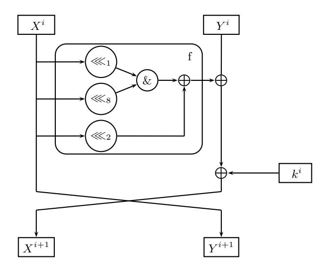

### Improved Linear Trails for the Block Cipher Simon

Tomer Ashur

ESAT/COSIC KU Leuven and iMinds Leuven, Belgium tomer.ashur @ esat.kuleuven.be

Abstract. Simon is a family of block ciphers designed by the NSA and published in 2013. Due to their simple structure and the fact that the specification lacked security design rationale, the ciphers have been the subject of much cryptanalytic work, especially using differential and linear cryptanalysis.

We improve previously published linear trail bias estimations by presenting a novel method to calculate the bias of short linear hulls in Simon and use them to construct longer linear approximations. By using these linear approximations we present key recovery attacks of up to 25 rounds for Simon64/128, 24 rounds for Simon32/64, Simon48/96, and Simon64/96, and 23 rounds for Simon48/72. The attacks on Simon32 and Simon48 are currently the best attacks on these versions. The attacks on Simon64 do not cover as many rounds as attacks using differential cryptanalysis but they work in the more natural setting of known plaintexts rather than chosen plaintexts.

Key words: Linear cryptanalysis, Linear hulls, Linear super-trail, Simon

### 1 Introduction

Simon is a family of lightweight block ciphers designed by the US National Security Agency and published in 2013 [6]. A lightweight block cipher is one that can be implemented via a small circuit and does not consume much energy. From the published benchmarking it seems that the designers of Simon have put much effort into making it efficient in both software and hardware. The Simon family includes 10 variants of the cipher differing in their block and key sizes, making it suitable for various platforms.

Before a block cipher can be used, its security should be evaluated. Contrary to common practice, the designers of Simon did not provide any security arguments for the ciphers. Several works such as [1–5, 9, 13] have studied the security of Simon against common attack techniques, such as linear and differential cryptanalysis.

We contribute to these efforts by presenting a method to estimate the bias of linear trails in Simon in a more accurate way, which we then use to obtain additional rounds from existing trails. After presenting the trails, we show how to use them in key recovery attacks for reduced-round variants of the cipher. We also verify our bias estimations for a set of random keys. To the best of our knowledge, the attacks presented in this paper are the best cryptanalysis for Simon32 and Simon48. The attacks on Simon64 are inferior to their differential counterparts in terms of the number of rounds they can cover, but they work in a less restrictive model.

The structure of this paper is as follows: in Section 2 we give a brief overview of the structure of Simon. Then, in Section 3 we present previous work relating to this paper. In Section 4 we define the notation of a linear super-trail. In Section 5 we show how these super-trails can be used to improve the bias estimation of existing trails. Section 6 shows how super-trails can be extended to cover more rounds than the length of the trail. Finally, Section 7 concludes the paper.

**Fig. 1.** Simon's f function

#### 1.1 Our Contribution

This paper presents a novel way to calculate the probability of short linear hulls in Simon. We use this method to find several good hulls, and concatenate them into one longer linear super-trail. Using this method we show that the biases of previously published linear trails were underestimated, and provide a more accurate (yet, still not tight) estimation for them. We show empirically through repeated experiments that the actual bias of the cipher is close enough to our estimations for the attack to be successful.

We pay special attention to the results published by Alizadeh et al. in [3] and improve their attacks which are, to date, the best results using linear cryptanalysis.

#### 2 Simon

Simon 2n/mn is a family of lightweight block ciphers with various block- and key-sizes. All members of the family have a Feistel structure with round function R employing a non-linear function f. In each round i, R receives two n-bit input words  $X^i$  and  $Y^i$ , and outputs two n-bit words  $X^{i+1}$  and  $Y^{i+1}$ . The round function uses three operations: bitwise XOR, bitwise AND, and a left circular shift by j positions, which we denote hereafter as  $\oplus$ , &, and  $\ll_j$ , respectively. The internal non-linear function f is defined as:

$$f(X^i) = [(X^i \le 1) \& (X^i \le 8)] \oplus (X^i \le 2).$$

The output of the round function R on input block  $(X^i, Y^i)$  is:

$$R^{i}(X^{i}, Y^{i}) = (Y^{i} \oplus f(X^{i}) \oplus k^{i}, X^{i}),$$

where i is the round number. The entire cipher is  $R^{r-1} \circ R^{r-2} \circ \ldots \circ R^0(X^0, Y^0)$ . Note that all binary operations in both R and f are bitwise. The structure of the round function of Simon is depicted in Figure 1.

#### 3 Previous Work

In this section we describe previous attacks for reduced versions of Simon grouped by the techniques used.

#### 3.1 Differential Cryptanalysis

One of the most notable techniques often used to assess the security of block ciphers is differential cryptanalysis published by Biham and Shamir in [7]. When using differential cryptanalysis, the adversary examines how certain differences between two input words affect differences in the respective output words. We say that two words x and x' have an XOR-difference  $\Delta$  if  $x \oplus x' = \Delta$ . Given an input difference  $\Delta$  and an output difference  $\nabla$  we say that  $\Delta$  causes  $\nabla$  with probability p if a fraction p of the pairs of plaintexts having input difference  $\Delta$  results in respective ciphertexts with difference  $\nabla$ ; when this happens, we write  $\Delta \stackrel{p}{\to} \nabla$ .

The first paper to consider the differential properties of Simon was by AlKhzaimi and Lauridsen in [5]. They considered two types of differential characteristics: type-I and type-II. Type-I characteristics are such that have a transition  $\alpha \to \beta$  as well as a transition  $\beta \to \alpha$ . Type-II characteristics are such that have a transition  $\alpha \to \alpha$ . After finding good characteristics, they improved their probability estimation by using a branch-and-bound approach to search for differentials having these input and output differences. Overall, they were able to present key recovery attacks for 16, 18, 24, 29, and 40 rounds for Simon32, Simon48, Simon64, Simon96, and Simon128, respectively.

Abed et al. have extended these results in [1,2] by using a similar branch-and-bound approach to improve the probability estimation of differential characteristics they found using Matsui's algorithm [12] which when used properly is guaranteed to output the best differential characteristic for a specific cipher. This process resulted in differentials for 13, 15, 21, 30, and 41 rounds for Simon32, Simon48, Simon64, Simon96, and Simon128, respectively. These differentials can be used for a key recovery attack on 18 rounds of Simon32, 19 rounds of Simon48, 26 rounds of Simon64, 35 rounds of Simon96, and 46 rounds of Simon128.

Biryukov et al. have used a different technique called *threshold search* in [9] for searching differentials with good probabilities in Simon. The threshold search builds a fraction of the difference distribution table that contains differentials with probability above a certain threshold. To connect these differentials, which are called *highways*, another part of the difference distribution table is built containing differentials with lower probabilities which are called *country roads*. Using this method, Biryukov et al. presented improved differentials for 12 and 13 rounds of Simon32, for 15 rounds in Simon48, and for 20 and 21 rounds in Simon64. They also presented a new 14-round differential for Simon32. Then, they showed how to use these differentials for a key recovery attack on 19 rounds of Simon32, 20 rounds of Simon48, and 26 rounds of Simon64 with better time complexities than before.

Wang et al. showed in [13] how to use existing differentials in a better way. They derived a set of conditions for the plaintexts and the key bits, and showed that by satisfying these constraints, a key recovery attack can be mounted for more rounds than before. They presented attacks for 20 and 21 rounds of Simon32, 21 and 22 rounds of Simon48, and 28 rounds for Simon64.

#### 3.2 Linear Cryptanalysis

Another notable cryptanalytic technique is linear cryptanalysis published by Mitsuru Matsui in [11]. The adversary's goal when using linear cryptanalysis is to find a linear approximation that holds with some probability p and that describes the cipher in terms of its input, its output, and its key. Once an approximation with high probability has been found, the adversary observes pairs

of plaintexts and their respective ciphertexts and places these into the approximation in order to derive the key bits. The number of required plaintexts and ciphertexts an adversary needs to observe for the attack to be successful is  $\epsilon^{-2}$  where  $\epsilon = p - \frac{1}{2}$ .

A few results concerning linear cryptanalysis of Simon have been published. The first to look at the linear properties of Simon were Abed et al. in [1] where they followed the trail induced by a single-bit mask both in the forward and the backward direction. This resulted in linear trails of length 9, 12, 14, 18, and 21, for Simon32, Simon48, Simon64, Simon96, and Simon128, respectively. The trails can be extended by 2 more rounds without any additional cost, for a key recovery attack on 11 rounds of Simon32, 14 rounds of Simon48, 16 rounds of Simon64, 20 rounds of Simon96, and 23 rounds of Simon128.

Better results have been obtained by Alizadeh et al. in [4] by considering the relation between differential characteristics and linear trails. They showed that converting differential characteristics into linear trails yields trails for 10, 13, 17, 26, and 33 rounds for Simon32, Simon48, Simon64, Simon96, and Simon128. These trails can be used to attack 12 rounds of Simon32, 15 rounds of Simon48, 19 rounds of Simon64, 28 rounds of Simon96, and 35 rounds of Simon128.

A recent study by Alizadeh et al. published in [3] slightly improves the previous linear trails and presents trails for 11 rounds of Simon32, 14 rounds of Simon48, 27 rounds of Simon96, and 34 rounds of Simon128. Then, they show how to attack 13, 16, 19, 29, and 36 rounds of Simon32, Simon48, Simon64, Simon96, and Simon128, respectively using Matsui's Algorithm 1; how to attack 16, 18, 19, 21, 23, 33, 40, and 42 rounds of Simon32, Simon48/72, Simon48/96, Simon64/96, Simon64/128, Simon96/144, Simon128/192, Simon128/256, respectively using Matsui's Algorithm 2; and how to attack 18, 20, 22, 33, and 39 rounds of Simon32, Simon48, Simon64, Simon96, and Simon128, respectively using multiple linear cryptanalysis. They also converted some of the previously known differentials into linear hulls and attacked 19 rounds of Simon48/72, 20 rounds of Simon32/64 and Simon48/96, 26 rounds of Simon64/96, 28 rounds of Simon64/128, 35 rounds of Simon96/144, 46 rounds of Simon 128/192, and 49 rounds of Simon128/256.

#### 3.3 Other Results

Other results which include impossible differential attacks on all versions of Simon, a related-key rectangle attack for Simon32, integral, and zero correlation attacks [14] do not extend to the number of rounds attacked by these attacks. All previous attacks and their complexities as well as our contributions can be found in Tables 5–9 in Appendix A. Each table shows the results for versions of Simon with the same block size, and the results are ordered according to the number of rounds the attack cover, and its time complexity.

#### 3.4 Extending Previous Results

All the results discussed in this paper are variants of linear cryptanalysis. Although both linear cryptanalysis and differential cryptanalysis are considered important cryptanalysis techniques, we feel that linear cryptanalysis is a more natural setting, as it can work in the known-plaintext model, whereas differential cryptanalysis usually works in the weaker chosen-plaintext model.

In the sequel we will show how concatenating short linear hulls forms a sort of linear trail which we call a *linear super-trail*. We will first show how this can be used to improve the bias estimations of the linear trails in [3] and thus, cover more rounds. We then use these linear super-trails with the techniques used in [3] to analyse the expected success probability of an attack on reduced versions of Simon. We complement this analysis by presenting empirical results showing that our estimations are close enough to the real bias for the attack to work. To the best of our knowledge, the key recovery attacks suggested in this paper, are the best cryptanalysis of Simon32 and Simon48.

#### 4 A Quick Method for Calculating the Probability of a Linear Hull

In this section we will describe a method for calculating the probability of any linear hull in Simon which is faster than directly encrypting all plaintexts. The method is based on the observation that each output bit can be described as an expression of subkey bits and output bits from the previous round. We recall that we can write Simon's round function for round i as:

$$X^i = (X^{i-1} \lll 1) \& (X^{i-1} \lll 8) \oplus (X^{i-1} \lll 2) \oplus Y^{i-1}$$

$$Y^i = X^{i-1}$$

and hence an individual bit  $x_i^i$  can be rewritten as:

$$x_j^i = x_{j+1}^{i-1} \& x_{j+8}^{i-1} \oplus x_{j+2}^{i-1} \oplus y_j^{i-1}$$

$$\tag{1}$$

where all subscripts are taken modulo n.

We can repeat this process iteratively, and replace all bits in round i-1 by bits from round i-2 and get:

$$\begin{split} x_{j+1}^{i-1} &= x_{j+2}^{i-2} \& x_{j+9}^{i-2} \oplus x_{j+3}^{i-2} \oplus y_{j+1}^{i-2} \\ x_{j+8}^{i-1} &= x_{j+9}^{i-2} \& x_{j+16}^{i-2} \oplus x_{j+10}^{i-2} \oplus y_{j+8}^{i-2} \\ x_{j+2}^{i-1} &= x_{j+3}^{i-2} \& x_{j+10}^{i-2} \oplus x_{j+4}^{i-2} \oplus y_{j+2}^{i-2} \\ y_{j}^{i-1} &= x_{j}^{i-2}, \end{split}$$

I.e.,

$$x_{j}^{i} = (x_{j+2}^{i-2} \& x_{j+9}^{i-2} \oplus x_{j+3}^{i-2} \oplus y_{j+1}^{i-2}) \& (x_{j+9}^{i-2} \& x_{j+16}^{i-2} \oplus x_{j+10}^{i-2} \oplus y_{j+8}^{i-2}) \oplus x_{j+3}^{i-2} \& x_{j+10}^{i-2} \oplus x_{j+4}^{i-2} \oplus y_{j+2}^{i-2} \oplus x_{j}^{i-2} \tag{2}$$

which is an expression involving 10 input bits, 7 of which are from the left input word, and the rest are from the right input word.

A linear hull is a tuple  $(\lambda_i, \lambda_o, \epsilon)$  such that  $\lambda_i$  is an input mask,  $\lambda_o$  is the output mask, and  $\epsilon + \frac{1}{2}$  is the probability that given a randomly chosen input and its corresponding output (p, c), it holds that  $\lambda_i \cdot p \oplus \lambda_o \cdot c = 0$ . If we write the expression  $\lambda_i \cdot p \oplus \lambda_o \cdot c = 0$  as the a sum of input and output bits, i.e.,  $p_{i_0} \oplus \ldots \oplus p_{i_{\alpha}} \oplus c_{o_0} \oplus \ldots \oplus c_{o_{\beta}} = 0$ , and replace all the ciphertext bits using the iterative process we presented, we get a multivariate polynomial in GF(2). A solution to this polynomial is a proper assignment to all its variables. Due to the way we constructed this polynomial, such an assignment is also a valid assignment to the expression describing the linear hull, and hence, the probability of a linear hull is the number of roots for its underlying polynomial divided by the size of the space.

The general problem of finding the number of solutions for a multivariate polynomial in GF(2) is usually a hard problem. Our gain comes from the fact that for a small number of rounds, not all bits are involved in the equation, and therefore do not need to be checked. In the example above we only need to check a space of size  $2^{10}$  to determine the probability of the 2-round linear hull. On the other hand, full diffusion is achieved quite fast in Simon, and the required time complexity, though still smaller than exhaustive search, becomes infeasible for the larger versions of Simon.

After choosing the output mask and writing it as a function of input bits, a proper input mask should be chosen. The input masks we are interested in are those which are not only unbalanced, but also define a hull with high bias.

Possible input masks can be identified by considering the expression describing the linear hull as a multivariate polynomial in GF(2). If we denote the whole polynomial as G we can write it as

$$G = \sum_{i \in N} (i) + \sum_{j \in L} (j) \tag{3}$$

where N is the set of all non-linear terms, and L is the set of all linear ones. The variables we are interested in are the linear ones as they all have to be included in the input mask. Each of the linear terms, if not included in the input mask, is 0 or 1 with bias 0. Not removing those terms from the expression would balance it when the linear part is XORed with the non-linear (i.e., biased) part. On the other hand, including these terms in the input mask cancels them so that only the biased part remains. Identifying which are the linear terms in a given expression can be done either through simplifying the expression to its polynomial form, or by parsing it.

# 5 Better Bias Estimation of Linear Approximations Using Linear Super-trails

In this section we will show how to use the above method to construct a linear super-trail. The idea behind our method is that two linear hulls covering m rounds each can be concatenated to form a linear trail covering  $2 \cdot m$  rounds. We call such a trail a super-trail because it is a merge of several linear trails, all having the same mask in some intermediate values.

Using our method, we can improve the bias estimation of existing linear trails. As an illustrative example we will show how this can be done for the 11-round linear trail with bias  $2^{-16}$  presented in [3]. This better estimation allows us to extend the trail by two more rounds.

Table 1 is taken from [3] and shows the a sequence of approximations (a linear trail) for Simon 32. The 11-round linear trail with bias  $2^{-16}$  that is used as the basis for all attacks is the sequence of the first 11 approximations (i.e., rounds 0–11 in Table 1).

However, if we calculate the bias of the linear super-trail instead of dealing with each round independently we can construct a 13-round linear super-trail with bias  $2^{-15.68}$ . We start with the output mask  $X_0^{13} \oplus X_8^{13} \oplus Y_2^{13} \oplus Y_{10}^{13} \oplus Y_{14}^{13}$  coming out of round 12 and write it as a function of the input mask entering to round 7. In the sequel we will explain how to choose the input mask, but for now we will simply use the original intermediate mask of round 7 presented in [3], i.e.,  $Y_{10}^7$ . After finding the number of roots for this polynomial we get that this 6-round linear hull has bias of  $2^{-8.34}$  (cf.  $2^{-11}$  in [3]).

Since round 6 has bias of  $\frac{1}{2}$  which cannot be improved, we can skip over it and move to improve the bias estimation of rounds 0–6. We take  $X_{10}^6$  which is the output mask coming out of round 5, and write it as a function of input bits. The input mask  $X_2^0 \oplus X_{10}^0 \oplus X_{14}^0 \oplus Y_0^0 \oplus Y_8^0$  is again taken from the original trail. We search for the number of roots for this polynomial to get that this 6-round linear hull also has bias of  $2^{-8.34}$  instead of the bias of  $2^{-11}$  which we get when considering each round independently.

The 13-round linear super-trail with bias  $2^{-8.34 \cdot 2} \cdot 2 = 2^{-15.68}$  resulting from this approach is presented in Table 2.

The same approach, applied to Simon48 and Simon64 can be found in Appendix B.1 and Appendix C.1, respectively.

# 6 Extending the Linear Super-trails and Using them in a Key Recovery Attack

In this section we will look into ways to use a q-round linear super-trail in a  $(q + \alpha)$ -round key recovery attack. We first present a generic extension to any linear trail in Simon. Next, we show

Table 1. A sequence of approximations for Simon32. Taken from [3].

|    |           | Round Active bits on the left side Active bits on the right side # of active bits |   |
|----|-----------|-----------------------------------------------------------------------------------|---|
| 0  | 2, 10, 14 | 0, 8                                                                              | 2 |
| 1  | 0, 8      | 2, 6, 10                                                                          | 3 |
| 2  | 2, 6, 10  | 4                                                                                 | 1 |
| 3  | 4         | 6, 10                                                                             | 2 |
| 4  | 6, 10     | 8                                                                                 | 1 |
| 5  | 8         | 10                                                                                | 1 |
| 6  | 10        | -                                                                                 | 0 |
| 7  | -         | 10                                                                                | 1 |
| 8  | 10        | 8                                                                                 | 1 |
| 9  | 8         | 6, 10                                                                             | 2 |
| 10 | 6, 10     | 4                                                                                 | 1 |
| 11 | 4         | 2, 6, 10                                                                          | 3 |
| 12 | 2, 6, 10  | 0, 8                                                                              | 2 |
| 13 | 0, 8      | 2, 10, 14                                                                         | 3 |
| 14 | 2, 10, 14 | 12                                                                                | 1 |
| 15 | 12        | 2, 14                                                                             | 2 |
| 16 | 2, 14     | 0                                                                                 | 1 |
| 17 | 0         | 2                                                                                 | 2 |
| 18 | 2         | -                                                                                 | 0 |
| 19 | -         | 2                                                                                 | 1 |
| 20 | 2         | 0                                                                                 | 1 |
| 21 | 0         | 2, 14                                                                             | 2 |
| 22 | 2, 14     | 12                                                                                | 1 |
| 23 | 12        | 2, 10, 14                                                                         | 3 |

how guessing a few key bits can be used for attacking more rounds than the length of the linear approximation. Then, we show how multiple linear approximations can be used to reduce the complexity of the attack, thus covering more rounds. Finally, we show how to combine all methods in order to maximize the length of the attack.

#### 6.1 Generic Extension by 2 More Rounds

Due to the Feistel structure of Simon, and the fact that the key is injected into the function only after the f function is applied to the left input word, the adversary can calculate the parity of bits at the end of the first round without additional cost.

The parity of output bits on the right side is the same as the parity of the input bits at the same locations on the input left side. The parity of bits before the key injection can be calculated by calculating the f function for the left input, and XORing it with the right input word. Therefore, the parity of left output bits depends on the parity of these bits before the key injection (which is known), and the parity of the subkey bits in these positions which can be considered as part of the linear approximation.

The same holds for the parity of ciphertext bits which can be used to infer the parity of the bits entering the last round. This procedure allows an extension of 2 rounds to all linear super-trails. These can be used for a key recovery attack on q + 2 rounds using Matsui's Algorithm 1.

**Table 2.** A 13-round linear super-trail for Simon 32 with bias  $2^{-15.68}$

| Rounds | Masked input bits | Masked input bits | Masked output bits | Masked output bits | Bias        |
|--------|-------------------|-------------------|--------------------|--------------------|-------------|
|        | on the left side  | on the right side | on the left side   | on the right side  |             |
| 0-5    | 2, 10, 14         | 0,8               | 10                 | =                  | $2^{-8.34}$ |
| 6      | 10                | -                 | -                  | 10                 | $2^{-1}$    |
| 7-12   | -                 | 10                | 0, 8               | 2, 10, 14          | $2^{-8.34}$ |

#### Using Matsui's Algorithm 2 for a Key Recovery Attack

After extending the linear super-trail by 2 more rounds, further rounds can be attacked using Matsui's Algorithm 2. When using this algorithm some of the key bits of the extended rounds can be guessed in order to connect the plaintext and the ciphertext with the approximation. The masked input bits in the left side of the linear super-trail presented in Table 2 are  $X_2^0, X_{10}^0$ , and  $X_{14}^0$ , and the input bits in the right side are  $Y_0^0$  and  $Y_8^0$ . Extending the input by two more rounds require guessing  $k_0^{-2}, k_1^{-2}, k_2^{-2}, k_6^{-2}, k_8^{-2}, k_9^{-2}, k_{10}^{-2}, k_{12}^{-2}$ , and  $k_{13}^{-2}$  - 9 bits in total. The output bits which are being used by the approximation are  $X_0^{13}, X_8^{13}, Y_2^{13}, Y_{10}^{13}$ , and  $Y_{14}^{13}$ ,

which when extended by 3 more rounds, require guessing 23 key bits:

$$k_0^{15}, k_1^{15}, k_2^{15}, k_6^{15}, k_8^{15}, k_9^{15}, k_{10}^{15}, k_{12}^{15}, k_{13}^{15}, k_0^{16}, k_1^{16}, k_2^{16}, k_4^{16}, \\ k_5^{16}, k_6^{16}, k_7^{16}, k_8^{16}, k_9^{16}, k_{10}^{16}, k_{11}^{16}, k_{12}^{16}, k_{14}^{16}, k_{15}^{16}.$$

This 18-round attack for Simon32 has data complexity of  $2^{-15.68^{-2}} = 2^{31.36}$ . The time complexity for guessing the subkey bits is  $2^{32}$  which results in a total time complexity of  $2^{63.36}$ . A similar analysis concerning both versions of Simon48 and both versions of Simon64 can be found in Appendix B.2 and Appendix C.2, respectively.

#### Using Multiple Linear Cryptanalysis

In 1994 Kaliski and Robshaw showed in [10] how a set of multiple linear trails, all including the same key bits, can be used to decrease the data complexity of a linear attack. An improvement that lifts this constraint about the key bits was published in 2004 by Biryukov et al. in [8]. They defined the *capacity* of a system with m approximations to be

$$\bar{c}^2 = \sum_{j=1}^m c_j^2 = 4 \cdot \sum_{j=1}^m \epsilon_j^2.$$

A key recovery attack on a system with capacity  $\bar{c}^2$  will require data complexity of  $O(\frac{1}{\bar{c}^2})$  with no additional cost to the time complexity. Alizadeh et al. showed how to use multiple linear trails to attack Simon. We adapt the same technique to our 13-round linear super-trail for Simon32 so we can extend the attack by 7 more rounds.

We start by extending our 13-round linear super-trail into a 20-round linear super-trail by appending 7 more rounds having bias of  $2^{-8.15}$  at the end of the existing one. The new 20-round linear super-trail with bias  $2^{-22.83}$  is presented in Table 3. Each bit coming out of the non-linear function f in the first round (i.e., the input bits masked in the right side) needs to be approximated by a linear operation. For each such bit, there are 4 possible approximations, all having the same bias. The same is true for the masked output bits on the left side. In addition, since a linear trail in Simon is invariant to rotation, each approximation can be used to build 15 more approximations by considering a rotational shift of the masked positions.

**Table 3.** The 20-round linear super-trail resulting from appending another 7-round linear hull to the 13-round linear super-trail

| Rounds | Masked input bits | Masked input bits | Masked output bits | Masked output bits | Bias        |
|--------|-------------------|-------------------|--------------------|--------------------|-------------|
|        | on the left side  | on the right side | on the left side   | on the right side  |             |
| 0–5    | 2, 10, 14         | 0,8               | 10                 | -                  | $2^{-8.34}$ |
| 6      | 10                | -                 | -                  | 10                 | $2^{-1}$    |
| 7-12   | -                 | 10                | 0, 8               | 2, 10, 14          | $2^{-8.34}$ |
| 13-19  | 0,8               | 2, 10, 14         | 2                  | 0                  | $2^{-8.15}$ |

**Table 4.** The two additional linear hulls for rounds 0–5.

| Rounds | Masked input bits | Masked input bits | Masked output bits | Masked output bits | Bias        |
|--------|-------------------|-------------------|--------------------|--------------------|-------------|
|        | on the left side  | on the right side | on the left side   | on the right side  |             |
| 0-5    | 2, 10, 14         | 0, 8, 10          | 10                 | =                  | $2^{-9.34}$ |
| 0-5    | 2, 10, 14         | 0, 1, 8           | 10                 | -                  | $2^{-8.75}$ |

Therefore, our system with 2 masked input bits on the right side, and a single masked output bit on the left side has a capacity of

$$\bar{c}^2 = 4 \cdot 2^{-22.83^2} \cdot 4 \cdot 4^2 \cdot 16 = 2^{-33.66}$$
.

The capacity can further be increased by considering different input masks for the linear hull covering the first 6 rounds. If we consider variables taken from the non-linear part of Equation (3), we get different input masks, corresponding to different linear hulls. In fact, each input mask constructed this way will result in a biased approximation (although the actual bias still needs to be calculated).

Starting from the same intermediate mask in round 6, we considered two more linear hulls presented in Table 4. These input masks resulted in 6-round linear hulls with biases  $2^{-9.34}$  and  $2^{-8.75}$ , respectively. The respective capacities of the systems of approximations resulting from these linear super-trails are  $2^{-33.66}$  and  $2^{-32.48}$ . Summing up all these capacities we get an overall capacity of  $2^{-33.66} + 2^{-33.66} + 2^{-32.48} = 2^{-31.57}$ . Using the generic extension presented in Subsection 6.1 we get a key recovery attack for 22 rounds of Simon32 with data complexity of  $2^{31.57}$  and a similar time complexity. To the best of our knowledge, this is the best attack on this version of Simon.

Further results concerning the usage of multiple linear cryptanalysis to attack Simon48 and Simon64 can be found in Appendix B.3 and Appendix C.3, respectively.

#### 6.4 Using Multiple Linear Cryptanalysis with Matsui's Algorithm 2

In Subsection 6.1 we carefully guessed subkey bits in order to connect the plaintext and the ciphertext with the linear super-hull using Matsui's Algorithm 2. Analogously, we can use Matsui's Algorithm to connect the ciphertext to the set of equations acquired in Subsection 6.3. Since the system of equations includes at least one approximation involving any output bit due to the rotational shift we used, we need to guess 16 subkey bits to get an extension of another output round. This can be repeated for another round, such that a total of 32 subkey bits are guessed.

This results in a Matsui's Algorithm 2 multiple linear approximations key recovery attack for 24 rounds of Simon32/64 with data complexity of  $2^{31.57}$  and total time complexity of  $2^{31.57} \cdot 2^{32} = 2^{63.57}$ . A similar analysis for Simon48/72 and Simon48/96 can be found in Appendix B.4, and for Simon64/96 and Simon64/128 in Appendix C.4.

#### 6.5 Further Improving the Capacity of the System

The capacity of the system can further be improved by considering more linear trails with different input masks. As we noted earlier, the input mask must consist of all the linear terms (i.e., the terms in L in Equation (3)), and may include any input bit that is part of N. There are 32 variables in the expression describing our linear hull, 5 of which are linear terms, which leaves  $2^{32-5} = 2^{27}$  possible input masks, some of which have high bias, and thus they result in systems of equations with large capacity.

#### 6.6 Experimental Bias Estimation

In order to validate the accuracy of our estimations in practice we performed some experimental verification. We recall that our estimations for each linear hull were made in a keyless model. Since some of the key bits affect the intermediate values in a non-linear way, we expect the bias to be less significant than our estimations (i.e., the magnitude of the bias will be smaller than predicated). However, this effect is somewhat compensated by the fact that the actual bias is determined by the underlying linear hull, which the super-trail is only a subset of. Thus, the magnitude of the bias in the keyless model is always larger or equal to our estimations. Our experiments show that those two opposite forces operate in a similar strength, and therefore, our estimations are close enough to the real values.

The experiment we ran was as follows: We chose  $2^{10}$  random keys and encrypted a set of  $2^{32}$  plaintexts (the whole codebook) using each of these keys. Then, for each key and its set of plaintexts and ciphertexts we stored in a counter  $t_0$  the number of times  $x_2^0 \oplus x_{10}^0 \oplus x_{14}^0 \oplus y_0^0 \oplus y_2^0 = x_2^{20} \oplus x_0^{20}$  (i.e., our 20-round linear super-trail presented in Table 3). We determined the magnitude of the bias for each key as

$$\hat{\epsilon}_k = |\frac{t_0}{2^{16}} - \frac{1}{2}|$$

and averaged them all.

Our experiments show that the average magnitude over  $2^{10}$  random keys is  $2^{-17.807}$  which is better than our prediction in Subsection 6.3. The capacity of a system of approximations induced by the super-trail in Table 3, where each approximation has a bias with such magnitude, is given by

$$\bar{c}^2 = 4 \cdot 2^{-17.807^2} \cdot 4 \cdot 4^2 \cdot 16 = 2^{-23.614}$$

and therefore requires less than  $2^{24}$  plaintexts for an attack.

#### 7 Conclusions

In this paper we presented a method for calculating the probability of short linear hulls in Simon. We used this method to construct linear approximations for Simon32, Simon48, and Simon64 that are longer than the best approximations published so far. The approximations presented here are improvements of the linear trails published in [3] when several rounds are considered together instead of treating each round independently.

We used these longer approximations for key recovery attacks using Matsui's Algorithms 1 and 2. We also showed how to use multiple linear cryptanalysis to attack more rounds of the cipher and combined multiple linear cryptanalysis with Matsui's Algorithm 2 to attack up to 24 rounds of Simon32/64, 23 rounds for Simon48/72, 24 rounds of Simon48/96, 24 rounds of Simon64/96, and 25 rounds of Simon64/128. Similar results can be achieved for the other versions of Simon.

The security of Simon has been a hot research topic in the cryptographic community. Since the specification of the cipher did not include a security design rationale, and given the healthy suspicion towards cryptographic primitives designed by the NSA it remains the task of the cryptographic community to assess the security of the cipher. Our results are yet another step in an ongoing effort to attack Simon, an effort that seems to advance in an alarming pace. Since the way we group rounds together is only limited by available computing power, future research should be able to improve our results by considering more rounds of the cipher at once.

### References

- 1. Abed, F., List, E., Lucks, S., Wenzel, J.: Differential and Linear Cryptanalysis of Reduced-Round Simon. Cryptology ePrint Archive, Report 2013/526 (2013) http://eprint.iacr.org/.
- 2. Abed, F., List, E., Lucks, S., Wenzel, J.: Differential Cryptanalysis of Reduced-Round Simon. IACR Cryptology ePrint Archive 2013 (2013) 526
- 3. Alizadeh, J., AlKhzaimi, H., Aref, M.R., Bagheri, N., Gauravaram, P., Lauridsen, M.M.: Improved Linear Cryptanalysis of Round Reduced SIMON. IACR Cryptology ePrint Archive 2014 (2014) 681
- 4. Alizadeh, J., Bagheri, N., Gauravaram, P., Kumar, A., Sanadhya, S.K.: Linear Cryptanalysis of Round Reduced SIMON. IACR Cryptology ePrint Archive 2013 (2013) 663
- 5. AlKhzaimi, H., Lauridsen, M.M.: Cryptanalysis of the SIMON Family of Block Ciphers. IACR Cryptology ePrint Archive 2013 (2013) 543
- 6. Beaulieu, R., Shors, D., Smith, J., Treatman-Clark, S., Weeks, B., Wingers, L.: The SIMON and SPECK Families of Lightweight Block Ciphers. Cryptology ePrint Archive, Report 2013/404 (2013) http://eprint.iacr.org/.
- 7. Biham, E., Shamir, A.: Differential Cryptanalysis of DES-like Cryptosystems. J. Cryptology 4(1) (1991) 3–72
- 8. Biryukov, A., De Canni`ere, C., Quisquater, M.: On Multiple Linear Approximations. In Franklin, M.K., ed.: Advances in Cryptology - CRYPTO 2004, 24th Annual International CryptologyConference, Santa Barbara, California, USA, August 15-19, 2004, Proceedings. Volume 3152 of Lecture Notes in Computer Science., Springer (2004) 1–22
- 9. Biryukov, A., Roy, A., Velichkov, V.: Differential Analysis of Block Ciphers SIMON and SPECK. In: Preproceedings of Fast Software Encryption 2014. (2014)
- 10. Kaliski, B.S.J., Robshaw, M.J.B.: Linear Cryptanalysis Using Multiple Approximations. In Desmedt, Y., ed.: Advances in Cryptology - CRYPTO '94, 14th Annual International Cryptology Conference, Santa Barbara, California, USA, August 21-25, 1994, Proceedings. Volume 839 of Lecture Notes in Computer Science., Springer (1994) 26–39
- 11. Matsui, M.: Linear cryptoanalysis method for DES cipher. In Helleseth, T., ed.: Advances in Cryptology - EUROCRYPT '93, Workshop on the Theory and Application of of Cryptographic Techniques, Lofthus, Norway, May 23-27, 1993, Proceedings. Volume 765 of Lecture Notes in Computer Science., Springer (1993) 386–397
- 12. Matsui, M.: On Correlation Between the Order of S-boxes and the Strength of DES. In Santis, A.D., ed.: Advances in Cryptology - EUROCRYPT '94, Workshop on the Theory and Application of Cryptographic Techniques, Perugia, Italy, May 9-12, 1994, Proceedings. Volume 950 of Lecture Notes in Computer Science., Springer (1994) 366–375
- 13. Wang, N., Wang, X., Jia, K., Zhao, J.: Improved Differential Attacks on Reduced SIMON Versions. Cryptology ePrint Archive, Report 2014/448 (2014) http://eprint.iacr.org/.
- 14. Wang, Q., Liu, Z., Varici, K., Sasaki, Y., Rijmen, V., Todo, Y.: Cryptanalysis of Reduced-Round SI-MON32 and SIMON48. In Meier, W., Mukhopadhyay, D., eds.: Progress in Cryptology - INDOCRYPT 2014 - 15th International Conference on Cryptology in India, New Delhi, India, December 14-17, 2014, Proceedings. Volume 8885 of Lecture Notes in Computer Science., Springer (2014) 143–160

### A Comparison of Previous Results Concerning all versions of Simon

In this section we compare previous results relating to Simon. Each of Tables 5–9 shows a version of Simon with a specific block size, and all the attacks relevant to it, ordered by the number of rounds it applies for, and the time complexity of the attack.

Table 5. Previous work concerning Simon32

| Version    | Type of Attack                  | Number of       | Time Complexity | Data Complexity | Presented in   |
|------------|---------------------------------|-----------------|-----------------|-----------------|----------------|
|            |                                 | Attacked Rounds |                 |                 |                |
| Simon32/64 | Linear Cryptanalysis            | 11              |                 | $2^{23}$        | [1]            |
|            | Linear cryptanalysis            | 12              |                 | $2^{31}$        | [4]            |
|            | Matsui's Algorithm 1            | 13              | $2^{32}$        | $2^{32}$        | [3]            |
|            | Matsui's Algorithm 1            | 15              | $2^{31.36}$     | $2^{31.36}$     | Subsection 6.1 |
|            | Matsui's Algorithm 2            | 16              | $2^{54}$        | $2^{32}$        | [3]            |
|            | Differential cryptanalysis      | 16              | $2^{26.481}$    | $2^{29.481}$    | [5]            |
|            | Matsui's Algorithm 2            | 18              | $2^{63.36}$     | $2^{31.36}$     | Subsection 6.2 |
|            | Differential cryptanalysis      | 18              | $2^{62}$        | $2^{31.2}$      | [1, 2]         |
|            | Multiple linear cryptanalysis   | 18              | $2^{32}$        | $2^{32}$        | [3]            |
|            | Differential cryptanalysis      | 19              | $2^{32}$        | $2^{31}$        | [9]            |
|            | Linear hull                     | 20              | $2^{59.69}$     | $2^{31.69}$     | [3]            |
|            | Differential cryptanalysis      | 20              | $2^{31}$        | $2^{31}$        | [13]           |
|            | Differential cryptanalysis      | 21              | $2^{46}$        | $2^{31}$        | [13]           |
|            | Multiple linear cryptanalysis   | 22              | $2^{31.57}$     | $2^{31.57}$     | Subsection 6.3 |
|            | Multiple linear cryptanalysis + | 24              | $2^{63.57}$     | $2^{31.57}$     | Subsection 6.4 |
|            | Matsui's Algorithm 2            |                 |                 |                 |                |

#### B Simon48

## B.1 Converting the 14-round Linear Trail for Simon48 to a 16-round Linear Super-trail

A sequence of approximations for Simon48 is shown in Table 10 where rounds 1–15 are used for a linear approximation with bias  $2^{-23}$ . Our 16-round linear super-trail with bias  $2^{-23.66}$  is presented in Table 11.

#### B.2 Using Matsui's Algorithm 2 to Attack Simon48

The same technique that was used in Subsection 6.2 can be applied for the 16-round linear supertrail we presented in Table 11. A 4-round extension for Simon48/72 can be achieved by guessing 15 subkey bits, namely:

$$k_4^0, k_{10}^0, k_{11}^0, k_0^{19}, k_1^{19}, k_2^{19}, k_6^{19}, k_8^{19}, k_9^{19}, k_{10}^{19}, k_{12}^{19}, k_{13}^{19}, k_{16}^{19}, k_{17}^{19}, k_{18}^{19}. \\$$

Simon48/96 can further be extended by 2 more rounds (in addition to the 4 rounds we got for Simon48/72) by guessing extra 33 subkey bits, namely:

$$k_0^{-1}, k_1^{-1}, k_2^{-1}, k_3^{-1}, k_6^{-1}, k_8^{-1}, k_9^{-1}, k_{10}^{-1}, k_{12}^{-1}, k_{13}^{-1}, k_{16}^{-1}, k_{17}^{-1}, k_{18}^{-1}, k_{20}^{-1}, k_0^{20}, k_1^{20}, k_2^{20}, \\ k_4^{20}, k_5^{20}, k_6^{20}, k_7^{20}, k_8^{20}, k_9^{20}, k_{10}^{20}, k_{11}^{20}, k_{12}^{20}, k_{14}^{20}, k_{15}^{20}, k_{16}^{20}, k_{17}^{20}, k_{18}^{20}, k_{22}^{20}, k_{23}^{20}.$$

The data complexity for the attack on Simon48/72 is  $2^{-23.66^{-2}} = 2^{47.32}$ . The time complexity of guessing the key bits is  $2^{15}$  and the total time complexity for attacking 20 rounds of Simon48/72 is  $2^{47.32} \cdot 2^{15} = 2^{62.32}$ . The data complexity for the attack on Simon48/96 reduced to 22 rounds is  $2^{-23.66^{-2}} = 2^{47.32}$ . The time complexity for guessing the subkey bits is  $2^{48}$ , and the total time complexity is  $2^{95.32}$ .

Table 6. Previous work concerning Simon48

| Version    | Type of Attack                             | Number of       | Time Complexity | Data Complexity | Presented in |
|------------|--------------------------------------------|-----------------|-----------------|-----------------|--------------|
|            |                                            | Attacked Rounds |                 |                 |              |
| Simon48/72 | Linear cryptanalysis                       | 14              |                 | $2^{47}$        | [1]          |
|            | Linear cryptanalysis                       | 15              |                 | $2^{43}$        | [4]          |
|            | Matsui's Algorithm 1                       | 16              | $2^{46}$        | $2^{46}$        | [3]          |
|            | Matsui's Algorithm 2                       | 18              | $2^{65}$        | $2^{46}$        | [3]          |
|            | Matsui's Algorithm 1                       | 18              | $2^{47.32}$     | $2^{47.32}$     | Appendix B.1 |
|            | Differential cryptanalysis                 | 18              | $2^{43.253}$    | $2^{46.423}$    | [5]          |
|            | Linear hull                                | 19              | $2^{65.11}$     | $2^{44.11}$     | [3]          |
|            | Differential cryptanalysis                 | 19              | $2^{52}$        | $2^{46}$        | [1, 2]       |
|            | Matsui's Algorithm 2                       | 20              | $2^{62.32}$     | $2^{47.32}$     | Appendix B.2 |
|            | Differential cryptanalysis                 | 20              | $2^{52}$        | $2^{46}$        | [9]          |
|            | Multiple linear cryptanalysis              | 20              | $2^{47.42}$     | $2^{47.42}$     | [3]          |
|            | Differential cryptanalysis                 | 21              | $2^{50}$        | $2^{45}$        | [13]         |
|            | Differential cryptanalysis                 | 22              | $2^{63}$        | $2^{45}$        | [13]         |
|            | Multiple linear cryptanalysis              | 22              | $2^{44.4}$      | $2^{44.4}$      | Appendix B.3 |
|            | ${\bf Multiple\ linear\ cryptanalysis\ +}$ | 23              | $2^{68.4}$      | $2^{44.4}$      | Appendix B.4 |
|            | Matsui's Algorithm 2                       |                 |                 |                 |              |
| Simon48/96 | Linear cryptanalysis                       | 14              |                 | $2^{47}$        | [1]          |
|            | Linear cryptanalysis                       | 15              |                 | $2^{43}$        | [4] [3]   |
|            | Matsui's Algorithm 1                       | 16              | $2^{46}$        | $2^{46}$        |              |
|            | Matsui's Algorithm 1                       | 18              | $2^{47.32}$     | $2^{47.32}$     | Appendix B.1 |
|            | Differential cryptanalysis                 | 18              | $2^{43.253}$    | $2^{46.423}$    | [5]          |
|            | Matsui's Algorithm 2                       | 19              | $2^{81}$        | $2^{46}$        | [3]          |
|            | Differential cryptanalysis                 | 19              | $2^{76}$        | $2^{46}$        | [1, 2]       |
|            | Linear hull                                | 20              | $2^{80.11}$     | $2^{44.11}$     | [3]          |
|            | Differential cryptanalysis                 | 20              | $2^{75}$        | $2^{46}$        | [9]          |
|            | Multiple linear cryptanalysis              | 20              | $2^{47.42}$     | $2^{47.42}$     | [3]          |
|            | Differential cryptanalysis                 | 21              | $2^{50}$        | $2^{45}$        | [13]         |
|            | Matsui's Algorithm 2                       | 22              | $2^{95.32}$     | $2^{47.32}$     | Appendix B.2 |
|            | Differential cryptanalysis                 | 22              | $2^{71}$        | $2^{45}$        | [13]         |
|            | Multiple linear cryptanalysis              | 22              | $2^{44.4}$      | $2^{44.4}$      | Appendix B.3 |
|            | Multiple linear cryptanalysis +            | 24              | $2^{92.4}$      | $2^{44.4}$      | Appendix B.4 |
|            | Matsui's Algorithm 2                       |                 |                 |                 |              |

#### B.3 Using Multiple Linear Cryptanalysis for Simon48

Similar to Subsection 6.3 we can use multiple linear cryptanalysis to attack more rounds of Simon48. By prepending the 4-round linear super-trail with bias of  $2^{-11.54}$  presented in Table 12 we construct a linear super-trail for 16 rounds of Simon48 with bias  $2^{34.2}$ . If we consider all possible approximations for the first and the last rounds we get a system of approximations with total capacity of

$$\bar{c}^2 = (2 \cdot 2^{-23.66} \cdot 2^{-11.54})^2 \cdot 4^5 \cdot 4^4 \cdot 16 \cdot 4 = 2^{-44.4}.$$

Extending the system using the generic extension of Section 6 we can attack 22 rounds for both versions of Simon 48.

Table 7. Previous work concerning Simon64

| Version     | Type of Attack                  | Number of       | Time Complexity | Data Complexity | Presented in |
|-------------|---------------------------------|-----------------|-----------------|-----------------|--------------|
|             |                                 | Attacked Rounds |                 |                 |              |
| Simon64/96  | Linear cryptanalysis            | 16              |                 | $2^{61}$        | [1]          |
|             | Linear cryptanalysis            | 19              |                 | $2^{61}$        | [4]          |
|             | Matsui's Algorithm 1            | 19              | $2^{58}$        | $2^{58}$        | [3]          |
|             | Matsui's Algorithm 1            | 21              | $2^{63.04}$     | $2^{63.04}$     | Appendix C.1 |
|             | Matsui's Algorithm 2            | 21              | $2^{82}$        | $2^{58}$        | [3]          |
|             | Matsui's Algorithm 2            | 22              | $2^{86.04}$     | $2^{63.04}$     | Appendix C.2 |
|             | Multiple linear cryptanalysis   | 22              | $2^{59}$        | $2^{59}$        | [3]          |
|             | Multiple linear cryptanalysis   | 23              | $2^{57.04}$     | $2^{57.04}$     | Appendix C.3 |
|             | Multiple linear cryptanalysis + | 24              | $2^{89.04}$     | $2^{57.04}$     | Appendix C.4 |
|             | Matsui's Algorithm 2            |                 |                 |                 |              |
|             | Differential cryptanalysis      | 24              | $2^{58.427}$    | $2^{62.012}$    | [5]          |
|             | Differential cryptanalysis      | 26              | $2^{94}$        | $2^{63}$        | [1, 2]       |
|             | Linear hull                     | 26              | $2^{86.53}$     | $2^{62.53}$     | [3]          |
|             | Differential cryptanalysis      | 26              | $2^{89}$        | $2^{63}$        | [9]          |
|             | Differential cryptanalysis      | 28              | $2^{60}$        | $2^{59}$        | [13]         |
| Simon64/128 | Linear cryptanalysis            | 16              |                 | $2^{61}$        | [1]          |
|             | Linear cryptanalysis            | 19              |                 | $2^{61}$        | [4]          |
|             | Matsui's Algorithm 1            | 19              | $2^{58}$        | $2^{58}$        | [3]          |
|             | Matsui's Algorithm 1            | 20              |                 |                 | Appendix C.1 |
|             | Multiple linear cryptanalysis   | 22              | $2^{59}$        | $2^{59}$        | [3]          |
|             | Matsui's Algorithm 2            | 23              | $2^{122}$       | $2^{58}$        | [3]          |
|             | Matsui's Algorithm 2            | 22              |                 |                 | Appendix C.2 |
|             | Multiple linear cryptanalysis   | 23              | $2^{57.04}$     | $2^{57.04}$     | Appendix C.3 |
|             | Differential cryptanalysis      | 24              | $2^{58.427}$    | $2^{62.012}$    | [5]          |
|             | Multiple linear cryptanalysis + | 25              | $2^{121.04}$    | $2^{57.04}$     | Appendix C.4 |
|             | Matsui's Algorithm 2            |                 |                 |                 | _            |
|             | Differential cryptanalysis      | 26              | $2^{126}$       | $2^{63}$        | [1, 2]       |
|             | Differential cryptanalysis      | 26              | $2^{121}$       | $2^{63}$        | [9]          |
|             | Linear hull                     | 28              | $2^{119.53}$    | $2^{62.53}$     | [3]          |
|             | Differential cryptanalysis      | 28              | $2^{60}$        | $2^{59}$        | [13]         |

## B.4 Using Matsui's Algorithm 2 in a Multiple Linear Cryptanalysis Setting to Attack Simon48

As in Subsection 6.4, we can guess the last round subkey word for Simon48/72, and the last two round subkey words for Simon48/96. This results in a key recovery attack for 23 rounds of Simon48/72 with time complexity of  $2^{68.4}$  and data complexity of  $2^{44.4}$ , and a key recovery attack for 24 rounds of Simon48/96 with time complexity of  $2^{92.4}$  and data complexity of  $2^{44.4}$ .

#### C Simon64

## C.1 Converting the 17-round Linear Trail for Simon64 to a 19-round Linear Super-trail

A sequence of approximations for Simon64 is shown in Table 13 where rounds 1-17 are used for a linear approximation with bias  $2^{-29}$ . Our 18-round linear pseudo-trail with bias  $2^{-31.26}$  is presented in Table 14.

Table 8. Previous work concerning Simon96

| Version     | Type of Attack                | Number of       | Time Complexity | Data Complexity | Presented in |
|-------------|-------------------------------|-----------------|-----------------|-----------------|--------------|
|             |                               | Attacked Rounds |                 |                 |              |
| Simon96/96  | Linear cryptanalysis          | 20              |                 | $2^{95}$        | [1]          |
|             | Linear cryptanalysis          | 28              |                 | $2^{93}$        | [4]          |
|             | Matsui's Algorithm 1          | 29              | $2^{94}$        | $2^{94}$        | [3]          |
|             | Differential cryptanalysis    | 29              | $2^{83.674}$    | $2^{87.532}$    | [5]          |
|             | Multiple linear cryptanalysis | 33              | $2^{94.42}$     | $2^{94.42}$     | [3]          |
|             | Differential cryptanalysis    | 35              | $2^{93.3}$      | $2^{93.2}$      | [1, 2]       |
| Simon96/144 | Linear cryptanalysis          | 20              |                 | $2^{95}$        | [1]          |
|             | Linear cryptanalysis          | 28              |                 | $2^{93}$        | [4]          |
|             | Matsui's Algorithm 1          | 29              | $2^{94}$        | $2^{94}$        | [3]          |
|             | Differential cryptanalysis    | 29              | $2^{83.674}$    | $2^{87.532}$    | [5]          |
|             | Matsui's Algorithm 2          | 33              | $2^{135}$       | $2^{94}$        | [3]          |
|             | Multiple linear cryptanalysis | 33              | $2^{94.42}$     | $2^{94.42}$     | [3]          |
|             | Linear hull                   | 35              | $2^{129.2}$     | $2^{94.2}$      | [3]          |
|             | Differential cryptanalysis    | 35              | $2^{101.1}$     | $2^{93.2}$      | [1, 2]       |

Using the 2-round generic extension we can attack 21 rounds of Simon64 using Matsui's Algorithm 1 with data complexity of  $2^{63.04}$ , and similar time complexity.

#### C.2 Using Matsui's Algorithm 2 to Attack Simon64

When using Matsui's Algorithm 2 for Simon64/96 we can use the linear super-trail to attack two more input rounds by guessing the 15 subkey bits in positions

$$k_0^{-2}, k_1^{-2}, k_6^{-2}, k_8^{-2}, k_{12}^{-2}, k_{13}^{-2}, k_{16}^{-2}, k_{17}^{-2}, k_{18}^{-2}, k_{22}^{-2}, k_{24}^{-2}, k_{25}^{-2}, k_{26}^{-2}, k_{28}^{-2}, k_{29}^{-2}$$

, and attack two more output rounds by guessing the 8 subkey bits in positions

$$k_0^{20}, k_1^{20}, k_{16}^{20}, k_{18}^{20}, k_{20}^{20}, k_{21}^{20}, k_{24}^{20}, k_{25}^{20}$$

. Guessing these 23 subkey bits yields an attack on 23 rounds of Simon64/96 with data complexity of  $2^{63.04}$ , and time complexity of  $2^{63.04} \cdot 2^{23} = 2^{86.04}$ .

For Simon64/128 the adversary can attack another output round by guessing the 18 subkey bits in positions  $k_0^{21}$ ,  $k_8^{21}$ ,  $k_{10}^{21}$ ,  $k_{12}^{21}$ ,  $k_{13}^{21}$ ,  $k_{14}^{21}$ ,  $k_{15}^{21}$ ,  $k_{16}^{21}$ ,  $k_{17}^{21}$ ,  $k_{18}^{21}$ ,  $k_{20}^{21}$ ,  $k_{20}^{21}$ ,  $k_{21}^{21}$ ,  $k_{21}^{21}$ ,  $k_{21}^{21}$ ,  $k_{21}^{21}$ ,  $k_{21}^{21}$ ,  $k_{21}^{21}$ ,  $k_{21}^{21}$ ,  $k_{21}^{21}$ ,  $k_{21}^{21}$ ,  $k_{21}^{21}$ ,  $k_{21}^{21}$ ,  $k_{21}^{21}$ ,  $k_{21}^{21}$ ,  $k_{21}^{21}$ ,  $k_{21}^{21}$ ,  $k_{21}^{21}$ ,  $k_{21}^{21}$ ,  $k_{21}^{21}$ ,  $k_{21}^{21}$ ,  $k_{21}^{21}$ ,  $k_{21}^{21}$ ,  $k_{21}^{21}$ ,  $k_{21}^{21}$ ,  $k_{21}^{21}$ ,  $k_{21}^{21}$ ,  $k_{21}^{21}$ ,  $k_{21}^{21}$ ,  $k_{21}^{21}$ ,  $k_{21}^{21}$ ,  $k_{21}^{21}$ ,  $k_{21}^{21}$ ,  $k_{21}^{21}$ ,  $k_{21}^{21}$ ,  $k_{21}^{21}$ ,  $k_{21}^{21}$ ,  $k_{21}^{21}$ ,  $k_{21}^{21}$ ,  $k_{21}^{21}$ ,  $k_{21}^{21}$ ,  $k_{21}^{21}$ ,  $k_{21}^{21}$ ,  $k_{21}^{21}$ ,  $k_{21}^{21}$ ,  $k_{21}^{21}$ ,  $k_{21}^{21}$ ,  $k_{21}^{21}$ ,  $k_{21}^{21}$ ,  $k_{21}^{21}$ ,  $k_{21}^{21}$ ,  $k_{21}^{21}$ ,  $k_{21}^{21}$ ,  $k_{21}^{21}$ ,  $k_{21}^{21}$ ,  $k_{21}^{21}$ ,  $k_{21}^{21}$ ,  $k_{21}^{21}$ ,  $k_{21}^{21}$ ,  $k_{21}^{21}$ ,  $k_{21}^{21}$ ,  $k_{21}^{21}$ ,  $k_{21}^{21}$ ,  $k_{21}^{21}$ ,  $k_{21}^{21}$ ,  $k_{21}^{21}$ ,  $k_{21}^{21}$ ,  $k_{21}^{21}$ ,  $k_{21}^{21}$ ,  $k_{21}^{21}$ ,  $k_{21}^{21}$ ,  $k_{21}^{21}$ ,  $k_{21}^{21}$ ,  $k_{21}^{21}$ ,  $k_{21}^{21}$ ,  $k_{21}^{21}$ ,  $k_{21}^{21}$ ,  $k_{21}^{21}$ ,  $k_{21}^{21}$ ,  $k_{21}^{21}$ ,  $k_{21}^{21}$ ,  $k_{21}^{21}$ ,  $k_{21}^{21}$ ,  $k_{21}^{21}$ ,  $k_{21}^{21}$ ,  $k_{21}^{21}$ ,  $k_{21}^{21}$ ,  $k_{21}^{21}$ ,  $k_{21}^{21}$ ,  $k_{21}^{21}$ ,  $k_{21}^{21}$ ,  $k_{21}^{21}$ ,  $k_{21}^{21}$ ,  $k_{21}^{21}$ ,  $k_{21}^{21}$ ,  $k_{21}^{21}$ ,  $k_{21}^{21}$ ,  $k_{21}^{21}$ ,  $k_{21}^{21}$ ,  $k_{21}^{21}$ ,  $k_{21}^{21}$ ,  $k_{21}^{21}$ ,  $k_{21}^{21}$ ,  $k_{21}^{21}$ ,  $k_{21}^{21}$ ,  $k_{21}^{21}$ ,  $k_{21}^{21}$ ,  $k_{21}^{21}$ ,  $k_{21}^{21}$ ,  $k_{21}^{21}$ ,  $k_{21}^{21}$ ,  $k_{21}^{21}$ ,  $k_{21}^{21}$ ,  $k_{21}^{21}$ ,  $k_{21}^{21}$ ,  $k_{21}^{21}$ ,  $k_{21}^{21}$ ,  $k_{21}^{21}$ ,  $k_{21}^{21}$ ,  $k_{21}^{2$

#### C.3 Using Multiple Linear Cryptanalysis for Simon64

Using multiple linear approximations we can build system of linear approximations covering 21-rounds of Simon64 by extending the existing 19-round linear super-trail by 2 more rounds as presented in Table 15. This system has capacity of  $2^{-40.52^2} \cdot 4 \cdot 16 \cdot 4^4 \cdot 4^5 = 2^{-57.04}$ . Using the generic 2-round extension we can attack 23 rounds of Simon64 with time complexity  $2^{57.04}$  and a similar data complexity.

Table 9. Previous work concerning Simon128

| Version      | Type of Attack                | Number of       | Time Complexity | Data Complexity | Presented in |
|--------------|-------------------------------|-----------------|-----------------|-----------------|--------------|
|              |                               | Attacked Rounds |                 |                 |              |
| Simon128/128 | Linear cryptanalysis          | 23              |                 | $2^{125}$       | [1]          |
|              | Linear cryptanalysis          | 35              |                 | $2^{123}$       | [4]          |
|              | Matsui's Algorithm 1          | 36              | $2^{128}$       | $2^{128}$       | [3]          |
|              | Multiple linear cryptanalysis | 39              | $2^{128}$       | $2^{128}$       | [3]          |
|              | Differential cryptanalysis    | 40              | $2^{120.474}$   | $2^{124.796}$   | [5]          |
|              | Differential cryptanalysis    | 46              | $2^{125.7}$     | $2^{125.6}$     | [1, 2]       |
| Simon128/192 | Linear cryptanalysis          | 23              |                 | $2^{125}$       | [1]          |
|              | Linear cryptanalysis          | 35              |                 | $2^{123}$       | [4]          |
|              | Matsui's Algorithm 1          | 36              | $2^{128}$       | $2^{128}$       | [3]          |
|              | Multiple linear cryptanalysis | 39              | $2^{128}$       | $2^{128}$       | [3]          |
|              | Matsui's Algorithm 2          | 40              | $2^{191}$       | $2^{128}$       | [3]          |
|              | Differential cryptanalysis    | 40              | $2^{120.474}$   | $2^{124.796}$   | [5]          |
|              | Linear hull                   | 46              | $2^{178.6}$     | $2^{126.6}$     | [3]          |
|              | Differential cryptanalysis    | 46              | $2^{142}$       | $2^{125.6}$     | [1, 2]       |
| Simon128/256 | Linear cryptanalysis          | 23              |                 | $2^{125}$       | [1]          |
|              | Linear cryptanalysis          | 35              |                 | $2^{123}$       | [4]          |
|              | Matsui's Algorithm 1s         | 36              | $2^{128}$       | $2^{128}$       | [3]          |
|              | Multiple linear cryptanalysis | 39              | $2^{128}$       | $2^{128}$       | [3]          |
|              | Differential cryptanalysis    | 40              | $2^{120.474}$   | $2^{124.796}$   | [5]          |
|              | Matsui's Algorithm 2          | 42              | $2^{255}$       | $2^{128}$       | [3]          |
|              | Differential cryptanalysis    | 46              | $2^{206}$       | $2^{125.6}$     | [1, 2]       |
|              | Linear hull                   | 49              | $2^{232.6}$     | $2^{126.6}$     | [3]          |

## C.4 Using Matsui's Algorithm 2 in a Multiple Linear Cryptanalysis Setting to Attack Simon64

Using the 23-round system of equations we can attack another round of Simon64/96 by guessing a full 32-bit subkey word, and 2 more rounds for Simon64/128 by guessing 2 subkey words. The 24-round key recovery attack on Simon64/96 has time complexity of  $2^{89.04}$  and data complexity of  $2^{57.04}$ . The 25-round attack on Simon64/128 has time complexity of  $2^{121.04}$  and data complexity of  $2^{57.04}$ .

Table 10. A sequence of linear approximations for Simon48. Taken from [3]

| Round | Active bits on the left side | Active bits on the right side | # of active bits |
|-------|------------------------------|-------------------------------|------------------|
| 0     | 0, 8, 16                     | 2, 10, 14, 18                 | 4                |
| 1     | 2, 10, 14, 18                | 12                            | 1                |
| 2     | 12                           | 2, 14, 18                     | 3                |
| 3     | 2, 14, 18                    | 0,16                          | $\frac{3}{2}$    |
| 4     | 0, 16                        | 2, 18, 22                     | 3                |
| 5     | 2, 18, 22                    | 20                            | 1                |
| 6     | 20                           | 2,22                          | 2                |
| 7     | 2,22                         | 0                             | 1                |
| 8     | 0                            | $\frac{\circ}{2}$             | 1                |
| 9     | $\frac{\circ}{2}$            | _                             | 0                |
| 10    | _                            | 2                             | 1                |
| 11    | 2                            | 0                             | 1                |
| 12    | 0                            | 2,22                          | 2                |
| 13    | 2,22                         | $\frac{2,22}{20}$             | 1                |
| 14    | 20                           | 2, 18, 22                     | 3                |
| 15    | 2, 18, 22                    | 0, 16                         | $\frac{3}{2}$    |
| 16    | 0, 16                        | 2, 14, 18                     | 3                |
| 17    | 2, 14, 18                    | 12                            | 1                |
| 18    | 12                           | 2, 10, 14, 18                 | 4                |
| 10    | 12                           | 2, 10, 14, 18                 | 4                |

**Table 11.** A 16-round linear super-trail with bias  $2^{-23.66}$  for Simon48

|         |                   | 1                 | I                  |                    | _            |
|---------|-------------------|-------------------|--------------------|--------------------|--------------|
| Rounds  | Masked input bits | Masked input bits | Masked output bits | Masked output bits | Bias         |
|         | on the left side  | on the right side | on the left side   | on the right side  |              |
| 2-4     | 12                | 2, 14, 18         | 2, 18, 22          | 20                 | $2^{-7.415}$ |
| 5-8     | 2, 18, 22         | 20                | 2                  | -                  | $2^{-5.415}$ |
| 9       | 2                 | -                 | -                  | 2                  | $2^{-1}$     |
| 10-13   | -                 | 2                 | 20                 | 2, 18, 22          | $2^{-5.415}$ |
| 14 - 16 | 20                | 2, 18, 22         | 2, 14, 18          | 12                 | $2^{-7.415}$ |
| 17      | 2, 14, 18         | 12                | 12                 | 2, 10, 14, 18      | $2^{-2}$     |

**Table 12.** A 4-round linear hull for rounds -2–1 in Simon48

| Rounds  | Masked input bits | Masked input bits | Masked output bits | Masked output bits | Bias         |
|---------|-------------------|-------------------|--------------------|--------------------|--------------|
|         | on the left side  | on the right side | on the left side   | on the right side  |              |
| -2-1    | 4,20              | 2, 6, 10, 18, 22  | 12                 | 2, 14, 18          | $2^{-11.54}$ |
| 2-4     | 12                | 2, 14, 18         | 2, 18, 22          | 20                 | $2^{-7.415}$ |
| 5–8     | 2, 18, 22         | 20                | 2                  | -                  | $2^{-5.415}$ |
| 9       | 2                 | -                 | -                  | 2                  | $2^{-1}$     |
| 10-13   | -                 | 2                 | 20                 | 2, 18, 22          | $2^{-5.415}$ |
| 14 - 16 | 20                | 2, 18, 22         | 2, 14, 18          | 12                 | $2^{-7.415}$ |
| 17      | 2, 14, 18         | 12                | 12                 | 2, 10, 14, 18      | $2^{-2}$     |

Table 13. A sequence of linear approximations for Simon64. Taken from [3]

| Round | Active bits on the left side | Active bits on the right side | # of active bits |
|-------|------------------------------|-------------------------------|------------------|
| 0     | 0, 16, 24                    | 2, 18, 22, 26                 | 4                |
| 1     | 2, 18, 22, 26                | 20                            | 1                |
| 2     | 20                           | 2, 22, 26                     | 3                |
| 3     | 2, 22, 26                    | 0,24                          | 2                |
| 4     | 0, 24                        | 2, 26, 30                     | 3                |
| 5     | 2, 26, 30                    | 28                            | 1                |
| 6     | 28                           | 2,30                          | 2                |
| 7     | 2,30                         | 0                             | 1                |
| 8     | 0                            | 2                             | 1                |
| 9     | 2                            | -                             | 0                |
| 10    | -                            | 2                             | 1                |
| 11    | 2                            | 0                             | 0                |
| 12    | 0                            | 2,30                          | 2                |
| 13    | 2,30                         | 28                            | 1                |
| 14    | 28                           | 2, 26, 30                     | 3                |
| 15    | 2, 26, 30                    | 0,24                          | 2                |
| 16    | 0, 24                        | 2, 22, 26                     | 3                |
| 17    | 2, 22, 26                    | 20                            | 1                |
| 18    | 20                           | 2, 18, 22, 26                 | 4                |

**Table 14.** An 19-round linear pseudo-trail with bias  $2^{-31.52}$  for Simon64

| Rounds   | Masked input bits | Masked input bits | Masked output bits | Masked output bits | Bias        |
|----------|-------------------|-------------------|--------------------|--------------------|-------------|
| resurras | on the left side  | on the right side | •                  | on the right side  | Dias        |
| 0        | 2, 14, 18, 26, 30 | 0, 16, 24         | 0, 16, 24          | 2, 18, 22, 26      | $2^{-4}$    |
| 1-3      | 0, 16, 24         | 2, 18, 22, 26     | 2, 22, 26          | 0, 24              | $2^{-8.42}$ |
| 4        | 2, 22, 26         | 0, 24             | 0,24               | 2, 26, 30          | $2^{-3}$    |
| 5–9      | 0, 24             | 2, 26, 30         | 2                  | -                  | $2^{-7.26}$ |
| 10       | 2                 | -                 | -                  | 2                  | $2^{-1}$    |
| 11-14    | -                 | 2                 | 28                 | 2, 26, 30          | $2^{-5.42}$ |
| 15-17    | 28                | 2, 26, 30         | 2, 22, 26          | 20                 | $2^{-7.42}$ |
| 18       | 2, 22, 26         | 20                | 20                 | 2, 18, 22, 26      | $2^{-2}$    |

Table 15. A 2-round extension for the 19-round linear trail for Simon 64 with bias  $2^{-40.52}$

| Rounds | Masked input bits | Masked input bits | Masked output bits | Masked output bits | Bias        |
|--------|-------------------|-------------------|--------------------|--------------------|-------------|
|        | on the left side  | on the right side | on the left side   | on the right side  |             |
| -1     | 12, 28            | 2, 14, 18, 26, 30 | 2, 14, 18, 26, 30  | 0, 16, 24          | $2^{-6}$    |
| 0      | 2, 14, 18, 26, 30 | 0, 16, 24         | 0, 16, 24          | 2, 18, 22, 26      | $2^{-4}$    |
| 1-3    | 0, 16, 24         | 2, 18, 22, 26     | 2, 22, 26          | 0,24               | $2^{-8.42}$ |
| 4      | 2, 22, 26         | 0, 24             | 0, 24              | 2, 26, 30          | $2^{-3}$    |
| 5–9    | 0, 24             | 2, 26, 30         | 2                  | -                  | $2^{-7.26}$ |
| 10     | 2                 | -                 | -                  | 2                  | $2^{-1}$    |
| 11-14  | -                 | 2                 | 28                 | 2, 26, 30          | $2^{-5.42}$ |
| 15-17  | 28                | 2, 26, 30         | 2, 22, 26          | 20                 | $2^{-7.42}$ |
| 18     | 2, 22, 26         | 20                | 20                 | 2, 18, 22, 26      | $2^{-2}$    |
| 18     | 20                | 2, 18, 22, 26     | 2, 18, 22, 26      | 0, 16, 24          | $2^{-5}$    |