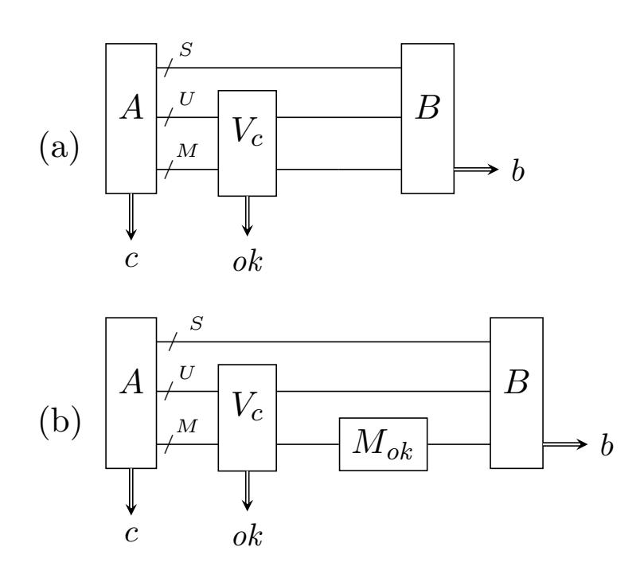
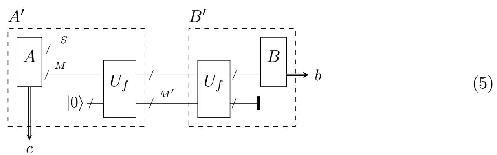
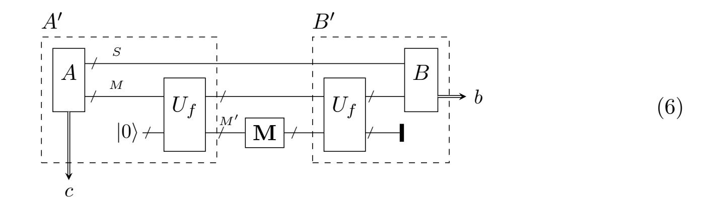
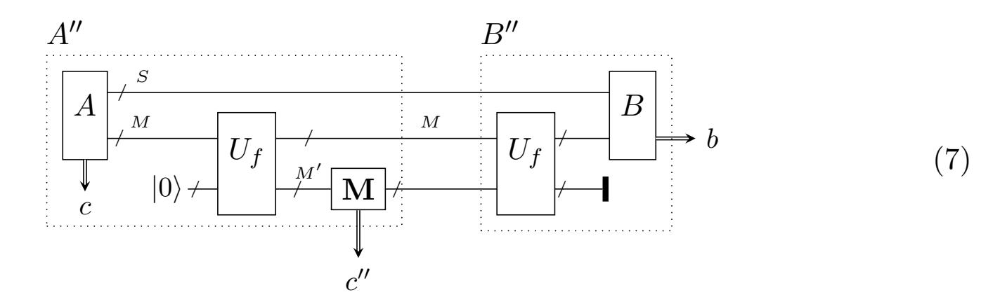
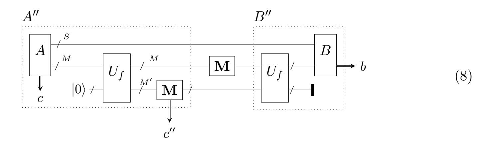
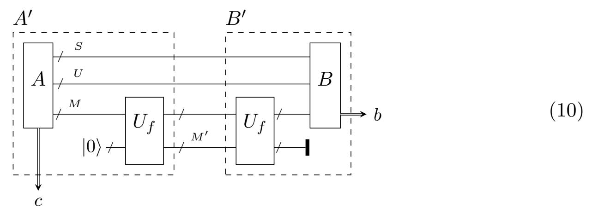
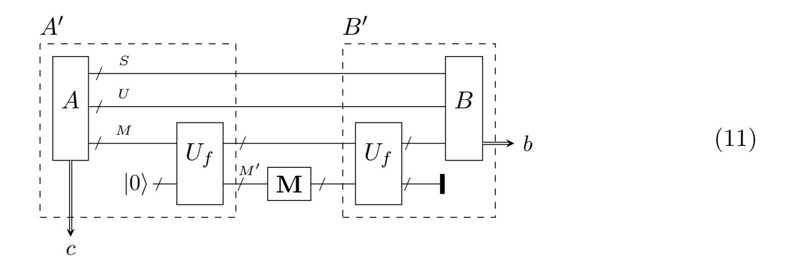
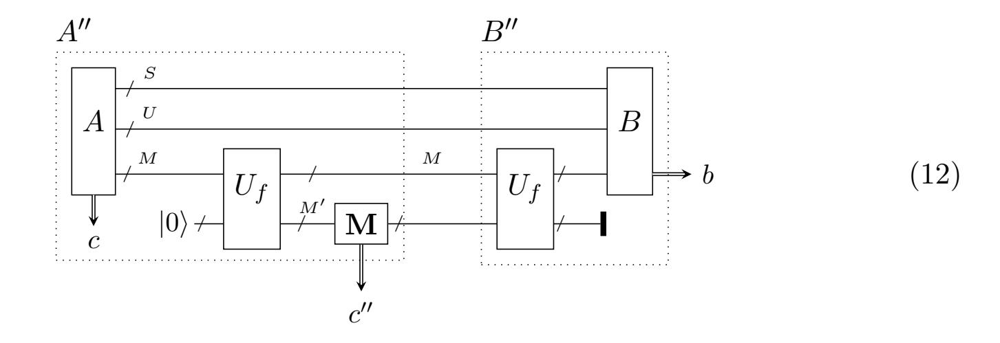
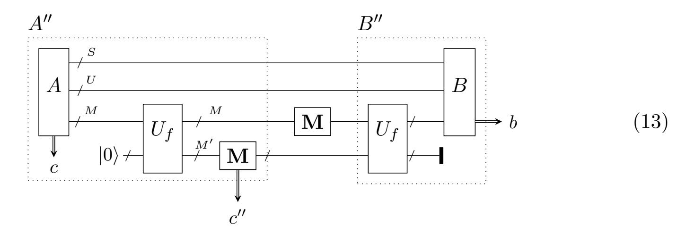

{0}------------------------------------------------

# Computationally binding quantum commitments

Dominique Unruh University of Tartu

December 19, 2022

Abstract. We present a new definition of computationally binding commitment schemes in the quantum setting, which we call "collapse-binding". The definition applies to string commitments, composes in parallel, and works well with rewindingbased proofs. We give simple constructions of collapse-binding commitments in the random oracle model, giving evidence that they can be realized from hash functions like SHA-3. We evidence the usefulness of our definition by constructing three-round statistical zero-knowledge quantum arguments of knowledge for all NP languages.

## Contents

| 1 | Introduction                                                 |    | 6 | Random oracles are collapsing            |    |
|---|--------------------------------------------------------------|----|---|------------------------------------------|----|
|   | 1.1<br>Prior definitions                                     | 2  |   |                                          |    |
|   | 1.2<br>Our contribution<br>                                  | 7  | 7 | Zero-knowledge arguments of knowl        |    |
|   | 1.3<br>Our techniques<br>                                    | 8  |   | edge                                     | 36 |
|   | 1.4<br>Related work                                          | 12 |   | 7.1<br>Interactive proof systems         | 37 |
| 2 |                                                              | 14 |   | 7.2<br>Sigma-protocols                   | 38 |
|   | Definitions and basic properties                             |    |   | 7.3<br>Constructing zero-knowledge       |    |
| 3 | Commitments<br>from<br>collision<br>resistant hash functions |    |   | arguments of knowledge<br>               | 40 |
|   |                                                              |    | 8 | Interactive quantum commitments<br>Index |    |
| 4 | Collapsing hash functions                                    |    |   |                                          |    |
| 5 | Commitments from collapsing hash                             |    |   |                                          | 48 |
|   | functions                                                    |    |   | Symbol index                             | 50 |

{1}------------------------------------------------

## <span id="page-1-0"></span>1 Introduction

We study the definition and construction of computationally binding string commitment schemes in the quantum setting. A commitment scheme is a two-party protocol consisting of two phases, the commit and the open phase. The goal of the commitment is to allow the sender to transmit information related to a message m during the commit phase in such a way that the recipient learns nothing about the message (hiding property). But at the same time, the sender cannot change its mind later about the message (binding property). Later, in the open phase, the sender reveals the message m and proves that this was indeed the message that it had in mind earlier. We will focus on non-interactive classical commitments, that is, the commit and open phase consists of a single classical message. However, the adversary who tries to break the binding or hiding property will be a quantum-polynomial-time algorithm. At the first glance, it seems that the definition of the binding property in this setting is straightforward; we just take the classical definition but consider quantum adversaries instead of classical ones:

<span id="page-1-2"></span>Definition 1 (Classical-style binding – informal) No quantum-polynomial-time algorithm A can output, except with negligible probability, a commitment c (i.e., the message sent during the commit phase) as well as two openings u, u′ that open c to two different messages m, m′ .

(Formal definition in [Section 2.](#page-13-0)) Unfortunately, this definition turns out to be inadequate in the quantum setting. Ambainis, Rosmanis, and Unruh [\[ARU14\]](#page-50-0) show the existence of a commitment scheme (relative to a special oracle) such that: The commitment is classical-style binding. Yet there exists a quantum-polynomial-time adversary A that outputs a commitment c, then expects a message m as input, and then provides valid opening information for c and m. That is, the adversary can open the commitment c to any message of its choosing, even if it learns that message only after committing. This is in clear contradiction to the intuition of the binding property. How is this possible, as [Definition 1](#page-1-2) says that the adversary cannot produce two different openings for the same commitment? In the construction from [\[ARU14\]](#page-50-0), the adversary has a quantum state |Ψ⟩ that allows it to compute one opening for a message of its choosing, however, this computation will destroy the state |Ψ⟩. Thus, the adversary cannot compute two openings simultaneously, hence the commitment is classically-binding. But it can open the commitment to an arbitrary message once, which shows that the commitment scheme is basically useless despite being classically-binding.[1](#page-1-3)

## <span id="page-1-1"></span>1.1 Prior definitions

We now discuss various definitions that appeared in the literature and that circumvent the above limitation of the classical-binding property. (We do not discuss the hiding property here, because that one does not have any comparable problems. See [Definition 9](#page-14-0) below

<span id="page-1-3"></span><sup>1</sup>Note that for classical adversaries, the classical-binding property gives useful guarantees: If an adversary can produce an opening for any message m using some classical algorithm, it can also produce two openings for different messages m, m′ by running that algorithm twice.

{2}------------------------------------------------

<span id="page-2-1"></span>for the definition of hiding.) In each case, we discuss some limitations of the definitions to motivate the need for a new definition for computationally binding commitments. The reader only interested in our results can safely skip this section.

Sum-binding. The most obvious solution is to simply require that the adversary cannot open successfully to each of two messages: That is:

Definition 2 (Sum-binding – informal) Consider a bit commitment scheme. (I.e., one can only commit to m = 0 or m = 1.)

Given an adversary A, let p<sup>b</sup> be the probability that the recipient accepts in the following execution: A commits, then A is given b, and then A provides opening information for message b.

A commitment is sum-binding iff for any quantum-polynomial-time adversary A, p<sup>0</sup> + p<sup>1</sup> ≤ 1 + negligible.

Note that even with an ideal commitment, p<sup>0</sup> +p<sup>1</sup> = 1 is possible (the adversary just picks b := 0 in the commit phase with probability p0, and b := 1 else). So p0+p<sup>1</sup> ≤ 1+negligible is the best we can expect if we allow for a negligible probability of an attack. The sumbinding definition has occurred implicitly and explicitly in different variants in [\[Bra+93;](#page-51-0) [May97;](#page-53-0) [DMS00;](#page-52-0) [Cr´e+04;](#page-51-1) [Cr´e+11\]](#page-51-2). We use the name sum-binding here to distinguish it from the other definitions of binding discussed here since it does not have an established name.

Although it avoids the attack described above, the sum-binding definition has a number of disadvantages:

- It is specific to the bit commitment case. There is no straightforward generalization to the the string commitment case (i.e., where the message m does not have to be a single bit). See [\[Cr´e+04\]](#page-51-1) for discussion why obvious approaches fail.[2](#page-2-0)
- It is unclear how the definition behaves when we use the commitment several times. (I.e., it is not clear how it behaves under composition.) For example, given bits m1, . . . , mn, what are the security guarantees if we commit to each of the mi? (Be it in parallel, or sequentially.) Basically, we would expect that all commitments together form a binding commitment on the string m = m<sup>1</sup> . . . mn, but this is something we cannot even express using the sum-binding definition.
- It is not clear how useful sum-binding commitments are as subprotocols in larger protocols. That is, is the sum-binding property strong enough to allow to prove the security of complex protocols using commitments? While there are constructions of sum-binding in the literature (e.g., [\[DMS00\]](#page-52-0)), we are not aware of research where (computational) sum-binding commitments are used as subprotocols.

<span id="page-2-0"></span><sup>2</sup>One obvious attempt would be: Let p<sup>m</sup> be the probability that A opens the commitment as m when given m after the commit phase. Then for all m0, m1, we have p<sup>m</sup><sup>0</sup> + p<sup>m</sup><sup>1</sup> ≤ 1 + negligible.

However, this leaves the possibility that the adversary A achieves the following: In the commit phase, A outputs c, m0, m<sup>1</sup> where m0, m<sup>1</sup> are uniformly distributed. Then A gets a bit b. Then A opens c with message mb. This should not be possible if c is binding, yet for this A, p<sup>m</sup> is negligible for any fixed m. (Since Pr[m ∈ {m0, m1}] is negligible.)

{3}------------------------------------------------

<span id="page-3-0"></span>**CDMS-binding.** Crépeau, Dumais, Mayers, and Salvail [Cré+04] suggest a generalization of the sum-binding property to string commitments. The basic idea is: Instead of bounding  $p_0 + p_1 \le 1 + negligible$  where  $p_m$  is the probability that the adversary opens its commitment as  $m \in \{0,1\}$ , we could bound  $\sum_m p_m \le 1 + negligible$  where m ranges over all bitstrings. However, as discussed in [Cré+04], this would be too strong a requirement. (Basically, this is because the sum  $\sum_m p_m$  has exponentially many summands, so even negligible attack probabilities can add up to large probabilities.) Instead, they proposed the following definition:

**Definition 3 (CDMS-binding** – **informal)** Let F be a family of functions. Fix a string commitment scheme. For  $f \in F$ , let  $\tilde{p}_y^f$  be the probability that the recipient accepts in the following execution: A commits. A gets y. A tries to open the commitment to some m with f(m) = y.

We call the commitment scheme F-CDMS-binding iff for all adversaries A and all  $f \in F$ , we have  $\sum_{y} \tilde{p}_{y}^{f} \leq 1 + negligible$ .

Now if all  $f \in F$  have a polynomial-size range, the sum  $\sum_y \tilde{p}_y^f$  will have polynomially many summands. The intuition behind this definition is that every function  $f \in F$  represents some property of the committed message m (e.g., f(m) is the parity of m). Then, if a commitment scheme is F-CDMS-binding, this intuitively means that the although the adversary might be able to change its mind about the message m, it cannot change its mind about f(m). (E.g., if the parity function is in F, this means that the adversary will be committed to the parity of the message m.) [Cré+04] successfully used this definition (for a specific class F) to show that using quantum communication and a commitment, we can construct an oblivious transfer protocol. (Note however that their protocol is different and more complex than the original OT protocol from [Ben+91].)

Although the CDMS-binding definition generalizes the sum-binding definition to the case of string commitments, it comes with its own challenges:

- The definition is parametrized by a specific family F of functions that specifies in which way the commitment should be binding. This function family has to be chosen dependent on the particular use case. This makes the definition less universal and canonical.
- To the best of our knowledge, no construction of CDMS-binding commitments is known. Crépeau et al. [Cré+04] conjecture that the protocol from [CLS01] can be extended to a CDMS-binding one for functions F with small range, but no proof or construction is given.
- It is not known whether the definition is composable. If we commit to messages  $m_1, \ldots, m_n$  individually using F-CDMS-binding commitments, does this constitute an F'-CDMS-binding commitment on  $m := m_1 \| \ldots \| m_n$ ? If so, for which F'?
- While CDMS-binding commitments have successfully been used in a larger protocol (namely, the OT protocol from [Cré+04]), we believe that in many contexts, the definition is still not very easy to use. At least in classical cryptography, one often uses the fact that it is possible to extract the committed message by rewinding (basically, one runs the open phase, saves the opened message, and rewinds to before

{4}------------------------------------------------

<span id="page-4-0"></span>the opening phase). It is not clear how to do that with CDMS-binding commitments. For example, it is not clear how one could use CDMS-binding commitments in the construction of sigma-protocols that are quantum arguments of knowledge (as done in [Section 7](#page-35-0) below using our definition of binding commitments).

Perfectly-binding commitments. One possibility to solve all the problems mentioned so far is simply to use perfectly-binding commitments.

Definition 4 (Perfectly-binding – informal) A commitment scheme is perfectly-binding if there exists no tuple (c, m, u, m′ , u′ ) with m ̸= m′ such that u is a valid opening for c with message m, and u ′ is a valid opening for c with message m′ .

However, if we restrict ourselves to perfectly-binding commitments, we get the following disadvantages:

- A perfectly-binding commitment cannot be statistically hiding [\[May97\]](#page-53-0). That is, the hiding property cannot hold against computationally unlimited adversaries. That means that we give up on information-theoretical security for one party just because we do not have a suitable definition for the computationally-binding property. For example, the constructions in [\[Unr12\]](#page-53-1) are only computational zero-knowledge (not statistical zero-knowledge) because perfectly-binding commitments are used.
- Perfectly-binding commitments cannot be short. That is, the length of the commitment must be as long as the length of the committed message. So by using only perfectly-binding commitments, we may lose efficiency.

UC commitments. One further possibility is to use commitments that are UCsecure [\[Unr10\]](#page-53-2). Since the security of a protocol using a UC-secure commitment can be reduced to the security of the same protocol using an ideal (in particular perfectly-binding) commitment, UC-secure commitments are easy to use. Yet, this solution again comes with disadvantages:

- UC-commitments do not exist without the use of additional setup such as, e.g., a common reference strings (CRS). It is possible to chose the CRS in a precomputation phase using a coin-toss protocol [\[DL09\]](#page-52-1). But that increases the round complexity of the resulting protocol (and, incidentally, loses the UC security and possibly even the concurrent composability of the resulting protocol).
- In the construction of UC-secure commitment schemes, trapdoors are used that allow the simulator to extract the committed message. This implies that constructions of UC-secure commitment are usually more complex, less efficient, and use stronger computational assumptions.
- At least when using a CRS, UC commitments cannot be short.

Damg˚ard, Fehr, Lunemann, Salvail, and Schaffner [\[Dam+09\]](#page-51-4) use so-called dual-mode commitments, these are somewhat weaker than UC commitments. Yet, they also use extraction using a trapdoor in the CRS. Hence the disadvantages of UC commitments apply to dual-mode commitments as well.

{5}------------------------------------------------

<span id="page-5-0"></span>Q-binding. Damg˚ard, Fehr, and Salvail [\[DFS04\]](#page-52-2) give another definition for computationally binding string commitments. Intuitively, the definition says that an adversary who uses the commitment has negligible advantage in a "betting game" over an adversary that has to use perfect commitments. Here, a betting game is represented as an arbitrary predicate on the opened values in the commitments, and on some random input that the adversary learns only after committing. (E.g., a bet could be: the sum of all opened values equals the random value u that the adversary learns just before opening.) Somewhat more formally:

Definition 5 (Q-binding – informal) For an adversary A and a predicate Q, consider the following game: A outputs commitments C1, . . . , C<sup>N</sup> . Then A gets a random bitstring u. Then A opens a subset A of the commitments, let (si)i∈<sup>A</sup> be the contents. A wins if Q(A,(si)i∈A, u) = 1.

A commitment scheme is Q-binding iff for any quantum-polynomial-time A and any predicate Q, the adversary A wins with probability at most pIDEAL + negl, where pIDEAL is the maximum winning probability when using a perfectly binding commitment.

The definition overcomes some of the problems of the CDMS-binding definition. In particular, there is no need to parametrize the definition with a class F of functions, specifically chosen to fit the use case at hand. Also, the Q-binding definition composes in parallel: if a commitment scheme is Q-binding, then the commitment scheme resulting from committing to each of m1, . . . , m<sup>n</sup> individually is Q-binding, too. (This should come as no surprise, since the Q-binding definition itself explicitly refers to a polynomial number of parallel copies of the commitment scheme.) The definition seems particularly well-suited for commit-and-choose constructions (i.e., where one party commits to a set of values, and the other party selects which of them should be opened), since security when opening a specific subset is built into the definition. [\[DFS04\]](#page-52-2) give a generic construction for unconditionally hiding Q-binding equivocal trapdoor commitments from a certain class of sigma-protocols. They show that using such commitments, sigma-protocols can be converted into statistical quantum zero-knowledge arguments in the CRS model.

However, their definition also comes with a number of challenges:

- The only construction of unconditionally hiding Q-binding commitments known is actually an equivocal trapdoor commitment. Trapdoor commitments usually need stronger assumptions. Note also that no protocols using non-equivocal Qbinding commitments are known (the zero-knowledge protocols in [\[DFS04\]](#page-52-2) need the trapdoor because they are constructed following the "no quantum rewinding paradigm"). And, due to the absence of rewinding, the zero-knowledge protocols only work in the CRS model.
- The possibility for parallel composition might be limited: It follows directly from the definition that Q-binding commitments on m1, . . . , m<sup>n</sup> are a Q-binding commitment on m = m<sup>1</sup> . . . mn. However, it is not clear what happens if we commit to m1, . . . , m<sup>n</sup> using different Q-binding commitments. (Or the same Q-binding commitment, but using different public keys.)
- The definition is specialized for the commit-and-choose paradigm. It is unclear how it can be used in rewinding-based proofs. (On the other hand, in commit-and-choose

{6}------------------------------------------------

situations, Q-binding commitments might be more suitable than those we propose; whether this is the case constitutes future work.)

Summarizing, Q-binding commitments seem to be well suited for commit-and-choose constructions, but for proofs involving rewinding, we need another definition.

**DFRSS-binding.** Damgård, Fehr, Renner, Salvail, and Schaffner [Dam+07] presented a definition for the unconditional binding property, targeted mainly for the bounded quantum storage model; the following is a direct adaptation of their definition to the computational setting:

<span id="page-6-1"></span>**Definition 6 (DFRSS-binding – adapted)** In a commitment, let V denote the recipient's classical state, and Z the sender's classical state.

A bit commitment is DFRSS-binding iff for any quantum-polynomial-time sender  $\tilde{C}$ , there exists a randomized function B' such that the following holds:

Let  $\tilde{C}$  and the honest recipient execute the commit phase. Compute b' := B'(V, Z). Let  $\tilde{C}(b')$  and the honest recipient execute the open phase. Let b denote the opened bit (or  $\perp$  if the recipient does not accept). Then  $\Pr[b' \neq b]$  is negligible.

In other words, given the classical part of the state of the recipient *and* the sender, it is possible to extract what bit the sender will open to. (The extraction does not have to be efficiently feasible.)

The definition can be extended to string commitments by letting B' range over bitstrings.

We have changed the original definition from [Dam+07] to refer to quantum-polynomial-time adversaries. (We also reformulated it for easier readability, changing a number of technical details in the process. However, the current definition is in the spirit of the original. And our discussion also applies to the original formulation.)

The definition was originally intended for protocols in the bounded quantum storage model. What happens if we use it in the standard model, i.e., with no limit on the quantum memory of the sender? In this case, it is always possible for the malicious sender to perform all its operations in superposition, and only the recipient will perform measurements. Then, in Definition 6, the register Z will be empty. Hence the definition requires that the committed bit b' can be computed from the recipient's state V alone. This immediately implies that the scheme cannot be statistically hiding, and that the commitments cannot be shorter than the message.

Hence the DFRSS-binding definition shares the drawbacks of the perfectly binding definition, unless we are in the bounded quantum storage model. (We stress that [Dam+07] never claimed that the definition should be used outside the bounded quantum storage model.)

#### <span id="page-6-0"></span>1.2 Our contribution

We give a new definition for the computational-binding property for commitment schemes, called "collapse-binding" (Section 2). This definition is composable (several collapse-binding commitments are also collapse-binding together), works well with quantum

{7}------------------------------------------------

rewinding (see below), does not conflict with statistical hiding (as perfectly-binding commitments would), allows for short commitments (i.e., the commitment can be shorter than the committed message, in contrast to perfectly-binding commitments, and to extractable commitments in the CRS model). Basically, collapse-binding commitments seem to be in the quantum setting what computationally-binding commitments are in the classical setting.

We show that collision-resistant hash functions are not sufficient for getting collapsebinding or even just sum-binding commitments (Section 3), at least when using standard constructions, and relative to an oracle. We present a strengthening of collision-resistant hash functions, "collapsing hash functions" that can serve as a drop-in replacement for collision-resistant hash functions (Section 4). Using collapsing hash functions, we show several standard constructions of commitments to be collapse-binding (Section 5).

We conjecture that standard cryptographic hash functions such as SHA-3 [NIS14] are collapsing (and thus lead to collapse-binding commitments). We give evidence for this conjecture by proving that the random oracle is a collapsing hash function.

We show that the definition of collapse-binding commitments is usable by extending the construction of quantum proofs of knowledge from [Unr12] (Section 7). Their construction uses perfectly-binding commitments (actually, strict-binding, which is slightly stronger) to get proofs of knowledge. We show that when replacing the perfectly-binding commitments with collapse-binding ones, we get statistical zero-knowledge quantum arguments of knowledge. In particular, this shows that collapse-binding commitments work well together with rewinding.

### <span id="page-7-0"></span>1.3 Our techniques

Collapse-binding commitments. To explain the definition of collapse-binding commitments, first consider a perfectly-binding commitment. That is, when an adversary A outputs a commitment c, there is only one possible message  $m_c$  that A can open c to. Hence, if the adversary A outputs a superposition of messages that it can open c to, that superposition will necessarily be in the state  $|m_c\rangle$ . Hence, we can characterize perfectly-binding commitments by requiring: when an adversary outputs a superposition of messages that it can open the commitment c to, that superposition will necessarily be a single computational basis vector (i.e., no non-trivial superposition).

<span id="page-7-1"></span>

**Figure 1:** Games from the definition of collapse-binding commitments.

To express this more formally, consider the circuit in Figure 1 (a). Here the adversary A outputs a commitment c (classical message). Furthermore, it outputs three quantum registers S, U, M. S contains the adversary's state. M is supposed to contain a superposition of messages, U a superposition of corresponding opening informations. Then we apply the measurement  $V_c$ . This measurement measures

{8}------------------------------------------------

whether U, M contain matching opening information/message. More formally, V<sup>c</sup> measures whether U, M is a superposition of states |u, m⟩ such that u is valid opening information for message m and commitment c. Let ok = 1 if the measurement succeeds. Then we feed the registers S, U, M back to the second part B of the adversary. B outputs a classical bit b. As discussed before, a commitment is perfectly-binding iff for all adversaries A, the state of M after measuring ok = 1 is a computational basis vector.

The state of a register is a computational basis vector (or, synonymously: is in a collapsed state) iff measuring that register in the computational basis does not change that state. Consider the circuit in [Figure 1](#page-7-1) (b). Here we added a measurement Mok on M after Vc. Mok is a complete measurement in the computational basis, but is executed only if ok = 1. Since Mok disturbs the state of M iff that state is not a computational basis vector, we can rephrase the definition of perfectly-binding commitments:

A commitment is perfectly-binding iff, for all computationally unlimited adversaries A, B, Pr[b = 1] is equal in Figures [1](#page-7-1) (a) and [1](#page-7-1) (b) where b is the output (i.e., guess) of B. [3](#page-8-0) Now we are ready to weaken this characterization to get a computational binding property. Basically, we require that the same holds for quantum-polynomial-time

Definition 7 (Collapse-binding – informal) A commitment is collapse-binding iff, for all quantum-polynomial-time adversaries A, B, Pr[b = 1] in [Figure 1](#page-7-1) (a) is negligibly close to Pr[b = 1] in [Figure 1](#page-7-1) (b).

adversaries:

In other words, with a perfectly-binding commitment, the adversary cannot produce a superposition of different messages that are contained in the commitment. But with a collapse-binding commitment, the adversary is forced to produce a state that looks like it is not a superposition of different messages. For the purpose of computational security, this will often be as good.

We quickly explain why collapse-binding commitments work well with quantum rewinding. In the case of quantum rewinding (e.g., in the analysis of proofs of knowledge [\[Unr12\]](#page-53-1)), one problem is that we might need to run an adversary until it opens a commitment c, then to measure the opened message, and then to go back to an earlier state by applying the inverse of the adversary. The problem is that measuring the opened message will disturb the state of the adversary, and thus make rewinding impossible. Except: if the opened message cannot be distinguished from being already in a collapsed state (as guaranteed by collapse-binding), then measuring the opened message does not disturb the state in a noticeable way and we can rewind. (See the discussion on arguments of knowledge below.)

Constructing collapse-binding commitments. Collapse-binding commitments are useful only if they exist. Perfectly-binding commitments are easily seen to be collapse-binding, but then we cannot have statistically hiding or short commitments. In the classical setting, we get practical computationally-binding commitments from a collision-resistant hash function H. The most obvious construction is to send c := H(m∥u) for uniformly random

<span id="page-8-0"></span><sup>3</sup>Our exposition above was not very rigorous, but it is easy to see that this is indeed an "if and only if".

{9}------------------------------------------------

u of suitable length. We call this the "canonical commitment". The canonical commitment is easily seen to be classical-style binding if H is collision-resistant, and it is statistically hiding if H is a random oracle. To get rid of the random-oracle requirement, we can use a somewhat more complex constructions by Halevi and Micali [\[HM96\]](#page-52-3) instead (which are almost identical to the independently and earlier discovered commitment by Damg˚ard, Pedersen, and Pfitzmann [\[DPP97\]](#page-52-4)). Unfortunately, both the canonical commitment and the Halevi-Micali commitments are not collapse-binding if H is merely collision-resistant. In fact, relative to a specific oracle and using a specific collision-resistant hash function, there is a total break where the adversary can unveil the commitment to any message of its chosing. To show this, we tweak the technique from [\[ARU14\]](#page-50-0) to construct a hash function H such that the adversary can sample an image c of H together with a quantum state |Ψ⟩ such that: Given the state |Ψ⟩, for any m, the adversary can find a random u with H(m∥u) = c. But this process destroys |Ψ⟩, so the adversary cannot find two preimages of c; the hash function is collision-resistant. But the canonical commitment, based on this H, is trivially broken. Similar constructions break the Halevi-Micali commitments.

Since collision-resistance seems too weak a property in the quantum setting (at least for our purposes), we give a strengthening of collision-resistance: collapsing hash functions:

Definition 8 (Collapsing hash function – informal) An adversary is valid if it outputs a classical value c, and a register M containing a superposition of messages m with H(m) = c. We call H collapsing iff no quantum-polynomial-time adversary can distinguish whether we measure M in the computational basis or not, before giving the register M back to the adversary. (This is formalized with games similar to those in [Figure 1.](#page-7-1))

We can show that collapsing hash functions are collision-resistant, and they share a number of structural properties with collision-resistant functions. E.g., injective functions are collapsing, and the composition H ◦ H′ of collapsing functions is collapsing.

Due to the similarity between the definition of collapsing hash functions and collapsebinding commitments, we can show that the canonical commitment and the Halevi-Micali commitments are collapse-binding if H is collapsing.

However, this leaves the question: do collapsing functions exist in the first place? We conjecture that common industrial hash function like SHA-3 [\[NIS14\]](#page-53-3) are actually collapsing (not only collision-resistant). In fact, we argue that the collapsing property should be a requirement for the design of future hash functions (in the sense that a hash function where the collapsing property is in doubt should not be selected for industry standards), since collision-resistance is not sufficient if we wish to achieve post-quantum secure cryptography. We support our conjecture that sufficiently unstructured functions are collapsing by proving that the random oracle is collapsing:

Random oracles are collapsing. We now sketch on a high level our proof that random oracles are collapsing, or, equivalently, that a random function is collapsing with high probability. In our analysis, we assume that the adversary can query the random oracle on the superposition of different inputs; this is necessary for having a realistic modeling of hash functions [\[Bon+11\]](#page-51-6).

{10}------------------------------------------------

The case where the domain is smaller than the range is relatively simple: In that case a random function H : X → Y is indistinguishable from a random injection (by [\[Zha15\]](#page-54-0)), and injections are trivially collapsing.

If the domain X is larger than the range Y , we need a different approach: The first step is to note that a random function H : X → Y is indistinguishable from a composition of three random functions X <sup>G</sup><sup>1</sup> −−→ Y <sup>G</sup><sup>2</sup> −−→ X <sup>G</sup><sup>3</sup> −−→ Y (by [\[Zha12\]](#page-54-1)). (We use this arrow notation here instead of writing G<sup>3</sup> ◦ G<sup>2</sup> ◦ G<sup>1</sup> to make the domains and ranges explicit.) Furthermore, the composition of the first two functions (i.e., X <sup>G</sup><sup>1</sup> −−→ Y <sup>G</sup><sup>2</sup> −−→ X) is indistinguishable from a random permutation X → X (by [\[Zha12;](#page-54-1) [Zha15\]](#page-54-0)). Since random permutations are trivially collapsing, this implies that X <sup>G</sup><sup>1</sup> −−→ Y <sup>G</sup><sup>2</sup> −−→ X is collapsing.

How about G3? G<sup>3</sup> is not necessarily collapsing. (We cannot assume that a random function X → Y is collapsing since that is what we are proving at the moment!) However, all we need is that G<sup>3</sup> is collapsing when restricted to the image of X <sup>G</sup><sup>1</sup> −−→ Y <sup>G</sup><sup>2</sup> −−→ X. And this is the case because the image of X <sup>G</sup><sup>1</sup> −−→ Y <sup>G</sup><sup>2</sup> −−→ X is smaller than Y (the bottleneck in the middle). So the restricted G<sup>3</sup> is a function with domain smaller than range, hence collapsing. (We covered this case above.)

So G<sup>3</sup> (restricted) and X <sup>G</sup><sup>1</sup> −−→ Y <sup>G</sup><sup>2</sup> −−→ X are collapsing, hence their composition X <sup>G</sup><sup>1</sup> −−→ Y <sup>G</sup><sup>2</sup> −−→ X <sup>G</sup><sup>3</sup> −−→ Y is collapsing as well. And since the latter is indistinguishable from the random function H, we have that H : X → Y is collapsing.

Quantum arguments of knowledge. We illustrate the use of collapse-binding commitments by revisiting the construction of proofs of knowledge from Unruh [\[Unr12\]](#page-53-1). Unruh showed that a sigma-protocol (i.e., a particular kind of three round proof system) is a quantum proof of knowledge if it has two properties: special soundness (from two interactions with the same first and different second messages one can efficiently compute a witness) and strict soundness (the first and second message of a valid interaction determine the third). In the classical setting, only special soundness is needed. In the quantum setting, strict soundness is additionally required to allow for quantum rewinding: In the proof from [\[Unr12\]](#page-53-1), we run the malicious prover to get its response (the third message). Then we measure the response. Then we rewind the prover (by applying the inverse of the unitary transformation representing the prover). Then we run the prover again to get a second answer. Special soundness then implies that from the two responses, we get a witness. However, we need to make sure that measuring the prover's response before rewinding does not disturb the state (too much). In [\[Unr12\]](#page-53-1), this follows from strict soundness: strict soundness guarantees that the response is uniquely determined, and thus measuring the response does not disturb the state. To achieve strict soundness, [\[Unr12\]](#page-53-1) lets the prover commit to all possible responses in the first message using perfectly-binding commitments.[4](#page-10-0) The drawback of this solution is that the commitments cannot be statistically hiding, so we cannot get statistical zero-knowledge proofs using the method from [\[Unr12\]](#page-53-1).

<span id="page-10-0"></span><sup>4</sup>Actually, "strict-binding commitments" but this distinction is not relevant for this exposition.

{11}------------------------------------------------

What happens if we replace the perfectly-binding commitments by collapse-binding commitments containing the response? In that case, the response will not necessarily be information-theoretically determined by the first two messages. However, the definition of collapse-binding commitments guarantees that measuring that response will be indistinguishable from not measuring it. Thus, if we measure the response, the state might be disturbed, but it will be computationally indistinguishable from not being disturbed. This is enough for the proof technique from [\[Unr12\]](#page-53-1) to go through when using collapse-binding commitments, assuming the prover is computationally limited. The resulting protocol will not be a quantum proof of knowledge, but a quantum argument of knowledge (i.e., secure only against computationally limited provers). But in contrast to [\[Unr12\]](#page-53-1), the proof system will be statistical zero-knowledge.

To summarize: from collapse-binding commitments (or from collapsing hash functions), we get three-round statistical zero-knowledge quantum arguments of knowledge for all languages in NP (with inverse polynomial knowledge error). To the best of our knowledge, not even three-round statistical zero-knowledge quantum arguments were known before.

### <span id="page-11-0"></span>1.4 Related work.

Commitments. Brassard, Cr´epeau, Jozsa, and Langlois [\[Bra+93\]](#page-51-0) presented an information-theoretically hiding and binding commitment scheme using quantum communication. However, the protocol was flawed, Mayers [\[May97\]](#page-53-0) showed that informationtheoretically hiding and binding commitments are impossible. (This is no contradiction to our results, because our commitments are not information-theoretically binding.) Dumais, Mayers, and Salvail [\[DMS00\]](#page-52-0) and Cr´epeau, L´egar´e, and Salvail [\[CLS01\]](#page-51-3) constructed statistically hiding commitments from quantum one-way permutations/functions, respectively. Their protocols use quantum communication, and are sum-binding. Cr´epeau, Dumais, Mayers, and Salvail [\[Cr´e+04\]](#page-51-1) generalized the sum-binding definition to string commitments and constructed an OT protocol based on that definition. (However, it is not known whether the protocol composes even sequentially.) Damg˚ard, Fehr, Lunemann, Salvail, and Schaffner [\[Dam+09\]](#page-51-4) and Unruh [\[Unr10\]](#page-53-2) showed a much simpler OT protocol to be secure, assuming much stronger commitment definitions in the CRS model, but achieving stronger security notions (sequential composability/UC). Ambainis, Rosmanis, and Unruh [\[ARU14\]](#page-50-0) show that classical-style binding commitments are not necessarily even sum-binding.

Quantum random oracles. Random oracles were first explicitly considered in a quantum cryptographic context by Boneh, Dagdelen, Fischlin, Lehmann, Schaffner, and Zhandry [\[Bon+11\]](#page-51-6) who stressed that the adversary should have superposition access to the random oracle. Zhandry [\[Zha15\]](#page-54-0) showed that the random oracle is collision-resistant. In contrast, we show (based on their result) that the random oracle is collapsing (a stronger property).

Quantum rewinding and proof systems. Watrous [\[Wat09\]](#page-53-4) showed how quantum rewinding can be used to prove the security of quantum zero-knowledge protocols. Unruh [\[Unr12\]](#page-53-1)

{12}------------------------------------------------

showed how a different flavor of quantum rewinding can be used for proving the security of quantum proofs of knowledge; we extend their technique to quantum arguments of knowledge. Unruh [\[Unr15a\]](#page-53-5) constructs non-interactive computational zero-knowledge quantum arguments of knowledge in the random oracle model.

Follow-up work. Since the publication of the conference version of this work [\[Unr16b\]](#page-53-6), there have been numerous follow-up results. We mention some of the most important results:

Unruh [\[Unr16a\]](#page-53-7) showed that collapse-binding commitments and collapsing (keyed) hash functions exist in the standard model (i.e., without using random-oracles); they gave a construction based on LWE (or more generally based on lossy trapdoor functions). Liu and Zhandry [\[LZ19\]](#page-52-5) show that the hash function based on the SIS-problem is collapsing. Zhandy [\[Zha22\]](#page-54-2) shows constructions of collapsing hash functions from collision-resistant hash functions with some extra assumptions. Namely "semi-regularity" (different possible outputs do not have too widely varying probabilities) or near optimal hardness. As a consequence, they get constructions of collapsing hash functions from LPN and from expander graphs.

Unruh [\[Unr16a\]](#page-53-7) shows that the Merkle-Damg˚ard construction is collapsing. That is, if the compression function is collapsing, so is the hash function resulting from the Merkle-Damg˚ard construction. And Czajkowski, Groot Bruinderink, Hulsing, Schaffner, ¨ and Unruh [\[Cza+18\]](#page-51-7) show that the Sponge construction [\[Ber+07\]](#page-50-2) gives a collapsing hash function. (This only applies if the round function is not an invertible permutation.) Gunsing and Mennink [\[GM20\]](#page-52-6) and Chiesa, Ma, Spooner, and Zhandry [\[Chi+22\]](#page-51-8) both show (with somewhat different security definitions) that Merkle trees are collapsing.

Liu and Zhandry [\[LZ19\]](#page-52-5) and Don, Fehr, Majenz, and Schaffner [\[Don+19\]](#page-52-7) both generalize the notion of collapsing commitments to sigma-protocols. (They call it collapsing protocols and protocols with quantum-computationally unique responses, respectively). Roughly speaking, a collapsing sigma-protocol is one where the prover's first message commits in a collapse-binding way to its second message. This is a natural generalization of the ideas presented in [Section 7.](#page-35-0)[5](#page-12-0) Collapsing sigma-protocols with special soundness can then be shown to be proofs of knowledge, similar to [Section 7](#page-35-0) [\(Theorem 38\)](#page-40-0). From this, they derive the security of the signature scheme from [\[Lyu12\]](#page-52-8) and ZKBoo [\[GMO16\]](#page-52-9) in the QROM.

Unruh [\[Unr16a\]](#page-53-7) showed that a collapse-binding bit commitment is also sum-binding, and more generally that a collapse-binding commitment is CDMS-binding. (To the best of our knowledge, it is not known how collapse-binding relates to Q-binding.) And

<span id="page-12-0"></span><sup>5</sup>Strictly speaking, it is actually not a generalization but an incomparable notion. The notions from [\[LZ19\]](#page-52-5) and [\[Don+19\]](#page-52-7) consider the case where the whole response message in the sigma-protocol is measured; they require that such a measurement is not detected. In contrast, we only require that a measurement of the opened message will not be detected; we do not require that a measurement of the opening information of the commitment is not detected. Since the opening information is part of the response in the sigma-protocol, our requirement is weaker. On the other hand, [\[LZ19\]](#page-52-5) and [\[Don+19\]](#page-52-7) cover cases that do not have the specific structure of [Definition 37](#page-40-1) below which makes their approach more generic in that sense.

{13}------------------------------------------------

<span id="page-13-2"></span>Dall'Agnol and Spooner [\[DS22\]](#page-52-10) show the converse. That is, retrospectively, collapsebinding turns out to be equivalent to existing notions of quantum binding. However, this does not mean that the notion of collapsing-binding is obsolete. First, the reduction from [\[DS22\]](#page-52-10) has a quadratic security loss, so by using collapse-binding directly, one may get better security bounds. Second, collapse-binding is more natural and easy to use in many contexts, e.g., in combination with rewinding.

The collapse-binding propery is also useful in a negative sense. Zhandry [\[Zha19\]](#page-54-3) shows that a commitment scheme that is classical-style binding but not collapse-binding gives give to very strong cryptographic constructions such as "quantum lightning" and quantum money. The same holds for collision-resistant but not collapsing hash functions.

## <span id="page-13-0"></span>2 Definitions and basic properties

(We hightlight definitions of symbols with gray background to make them easier to find in the text. See also the symbol index at the end of this paper.)

<span id="page-13-16"></span><span id="page-13-14"></span><span id="page-13-13"></span><span id="page-13-12"></span>Preliminaries. For the necessary background in quantum computing, see, e.g., [\[NC10\]](#page-53-8). By |i⟩ with i ∈ I we denote the vectors of the computational basis of the Hilbert space with dimension |I|. We also use the symbol |·⟩ to refer to other (non-basis) vectors (e.g., |Ψ⟩). And ⟨Ψ| is the conjugate transpose of |Ψ⟩. ∥x∥ refers to the Euclidean or ℓ 2 -norm. We only consider finite dimensional Hilbert spaces. We denote |+⟩ := √ 1 2 |0⟩ + √ 1 2 |1⟩ and |−⟩ := √ 1 2 |0⟩ − √ 1 2 |1⟩. For a linear operator A on a Hilbert space, we denote by A† its conjugate transpose. We denote by I the identity. We call an operator A on a Hilbert space a projector iff it is an orthogonal projector, i.e., a linear map with P <sup>2</sup> = P and P = P † .

<span id="page-13-15"></span><span id="page-13-9"></span><span id="page-13-8"></span><span id="page-13-6"></span><span id="page-13-5"></span><span id="page-13-3"></span>Given an algorithm A, let x ← A(y) denote the result of running A with inputs y, and assigning the output to x. Let x \$ ← M denote assigning a uniformly random element of M to x. We will use η to denote the security parameter , that is a positive integer that will be passed to all algorithms and adversaries and that indicates the required security level. By a ∥ b we denote the concatenation of bitstrings a and b.

<span id="page-13-7"></span><span id="page-13-4"></span>We call an algorithm quantum-polynomial-time if it is a quantum algorithm and its runtime is bounded by a polynomial in its input length with probability 1. We call an algorithm classical-polynomial-time if it performs only classical operations and its runtime is bounded by a polynomial in its input length with probability 1. We write 1 η for a bitstring (of 1's) of length η. (The latter is useful for making algorithms run in polynomial-time in the length of the security parameter, e.g., A(1<sup>η</sup> ) will run polynomial-time in η.)

<span id="page-13-11"></span><span id="page-13-10"></span>Commitments. A commitment scheme ( com , verify ) consists of a quantum-polynomialtime algorithm com and a deterministic quantum-polynomial-time algorithm verify. [6](#page-13-1)

<span id="page-13-1"></span><sup>6</sup>To be practical, those algorithms should of course be classical. We allow quantum-polynomial-time algorithms here to state our results in greater generality.

{14}------------------------------------------------

<span id="page-14-6"></span> $(c, u) \leftarrow com(1^{\eta}, m)$  returns a commitment c and the opening information u for the message m and security parameter  $\eta$ . c alone is supposed not to reveal anything about m (hiding). To open, we send (m, u) to the recipient who checks whether  $verify(1^{\eta}, c, m, u) = 1$ . Both com and verify have classical input and output. com has a well-defined message space  $\mathsf{MSP}_{\eta}$  that also depends on the security parameter  $\eta$  (e.g.,  $\{0,1\}^{\eta}$ ). Furthermore, for technical reasons, we assume that it is possible to find triples (c, m, u) with  $verify(1^{\eta}, c, m, u) = 1$  with probability 1 in quantum-polynomial-time in  $\eta$ .

<span id="page-14-7"></span><span id="page-14-5"></span>We first state some standard properties of commitments.

<span id="page-14-0"></span>**Definition 9** Let (com, verify) be a commitment scheme. We define:

- **Perfect completeness:** (com, verify) has perfect completeness iff for all  $m \in MSP_{\eta}$ ,  $\Pr[verify(1^{\eta}, c, m, u) = 1 : (c, u) \leftarrow com(1^{\eta}, m)] = 1$ .
- Computational hiding: (com, verify) is computationally hiding iff for any quantum-polynomial-time A and any polynomial  $\ell$ , there is a negligible  $\mu$  such that for any  $\eta$ , any  $m_0, m_1 \in \mathsf{MSP}_{\eta}$  with  $|m_0|, |m_1| \leq \ell(\eta)$ , and any  $|\Psi\rangle$ ,  $|P_0 P_1| \leq \mu(\eta)$  where  $P_i := \Pr[b = 1 : (c, u) \leftarrow com(1^{\eta}, m_i), b \leftarrow A(1^{\eta}, |\Psi\rangle, c)]$ .
- Statistical hiding: Like computational hiding, except that we quantify over all A (not just quantum-polynomial-time A).

**Definition 10 (Classical-style binding)** A commitment scheme is classical-style binding iff for any quantum-polynomial-time algorithm A, the following is negligible in  $\eta$ :

$$\Pr[verify(1^{\eta}, c, m, u) = 1 \land verify(1^{\eta}, c, m', u') = 1 \land m \neq m' : (c, m, u, m', u') \leftarrow A(1^{\eta})]$$

<span id="page-14-4"></span>**Definition 11 (Collapse-binding)** For algorithms A, B, consider the following games:

$$\begin{aligned} \mathsf{Game}_1: \quad & (S,M,U,c) \leftarrow A(1^\eta), \ ok \leftarrow V_c(M,U), \ m \leftarrow M_{ok}(M), \ b \leftarrow B(1^\eta,S,M,U) \\ \mathsf{Game}_2: \quad & (S,M,U,c) \leftarrow A(1^\eta), \ ok \leftarrow V_c(M,U), \\ \end{aligned}$$

Here S, M, U are quantum registers.  $V_c$  is a measurement whether M, U contains a valid opening, formally  $V_c$  is defined through the projector  $\sum_{\substack{m,u\\verify(1^{\eta},c,m,u)=1}} |m\rangle\langle m|\otimes |u\rangle\langle u|$ .  $M_{ok}$  is a measurement of M in the computational basis if ok=1, and does nothing if ok=0 (i.e., it sets  $m:=\bot$  and does not touch the register M).

A commitment scheme is collapse-binding iff for any quantum-polynomial-time algorithms A, B, the difference  $|\Pr[b=1:\mathsf{Game}_1] - \Pr[b=1:\mathsf{Game}_2]|$  is negligible.

Instead of measuring using  $V_c$  whether the adversary outputs a correct opening information, we can quantify only over adversaries that always output correct opening information. This leads to the following equivalent definition of collapse-binding commitments. This definition is often easier to handle when proving that a given scheme is collapse-binding.

<span id="page-14-3"></span><span id="page-14-1"></span>This technical condition is necessary, e.g., for Definition 12 below. Without this condition, it is not clear that "valid" adversaries exist at all. Note that a commitment scheme with quantum-polynomial-time com and perfect completeness will always satisfies this technical condition: to find c, m, u, simply set m := 0 and compute  $(m, u) \leftarrow com(1^{\eta}, m)$ .

<span id="page-14-2"></span> $<sup>^{8}|\</sup>Psi\rangle$  is the auxiliary input of A that represents knowledge of A acquired, e.g., in prior protocol runs. One could use a mixed state instead, this would lead to an equivalent definition.

{15}------------------------------------------------

<span id="page-15-2"></span>**Definition 12 (Collapse-binding** – variant) For algorithms A, B, consider the following games:

```
\begin{aligned} \mathsf{Game}_1: \quad & (S,M,U,c) \leftarrow A(1^\eta), \ m \leftarrow M_{comp}(M), \ b \leftarrow B(1^\eta,S,M,U) \\ \mathsf{Game}_2: \quad & (S,M,U,c) \leftarrow A(1^\eta), \qquad \qquad b \leftarrow B(1^\eta,S,M,U) \end{aligned}
```

Here S, M, U are quantum registers.  $M_{comp}(M)$  is a measurement of M in the computational basis.

We call an adversary (A, B) valid if  $\Pr[verify(c, m, u) = 1] = 1$  when running  $(S, M, U, c) \leftarrow A(1^{\eta})$  and measuring M, U in the computational basis to obtain m, u.

A commitment scheme is collapse-binding iff for any quantum-polynomial-time valid adversary (A, B), the difference  $|\Pr[b = 1 : \mathsf{Game}_1] - \Pr[b = 1 : \mathsf{Game}_2]|$  is negligible.

<span id="page-15-1"></span>**Lemma 13** A commitment scheme (com, verify) is collapse-binding with respect to Definition 11 iff it is collapse-binding with respect to Definition 12.

*Proof.* To avoid confusion, we call the games from Definition 11  $\mathsf{Game}_1$ ,  $\mathsf{Game}_2$ , while we call those from Definition 12  $\mathsf{Game}_1'$ ,  $\mathsf{Game}_2'$ . And the adversary in Definition 12 (that is used in  $\mathsf{Game}_1'$ ,  $\mathsf{Game}_2'$ ) we call (A', B').

First, assume that there is an adversary (A', B') breaking Definition 12, i.e.,  $\mu := |\Pr[b=1:\mathsf{Game}_1'] - \Pr[b=1:\mathsf{Game}_2']|$  is non-negligible. Let (A,B) := (A',B'). By definition of validity, the measurement  $V_c$  from Definition 11 will succeed with probability 1 in  $\mathsf{Game}_1$  and  $\mathsf{Game}_2$ . Hence that measurement has no effect, and thus  $\Pr[b=1:\mathsf{Game}_1] = \Pr[b=1:\mathsf{Game}_1']$  and  $\Pr[b=1:\mathsf{Game}_2] = \Pr[b=1:\mathsf{Game}_2']$ . Thus  $|\Pr[b=1:\mathsf{Game}_1'] - \Pr[b=1:\mathsf{Game}_2']| = \mu$  is non-negligible. Thus (A,B) also breaks Definition 11.

Now, consider an adversary (A,B) breaking Definition 11, i.e.,  $\nu := |\Pr[b=1: \mathsf{Game}_1] - \Pr[b=1: \mathsf{Game}_2]|$  is non-negligible. Construct (A',B') as follows:  $A'(1^{\eta})$  runs  $(S,M,U,c) \leftarrow A(1^{\eta})$ . Then it applies  $ok \leftarrow V_c(M,U)$ . If ok=1, A' returns (S,M,U,c). Otherwise, A' picks (c,m,u) with  $verify(1^{\eta},c,m,u)=1$ , initializes M,U with  $|m\rangle|u\rangle$ , and S with  $|\perp\rangle$ , and outputs c. (We assume that  $|\perp\rangle$  is orthogonal to any state that A would produce.) And B' does the following: If ok=0, then B' outputs 0. If ok=1, B' executes B.

A' is valid by construction: If ok = 1,  $verify(1^{\eta}, c, m, u) = 1$  with probability 1 when measuring M, U as m, u, because M, U is in the image of  $V_c$ . And if ok = 0,  $verify(1^{\eta}, c, m, u) = 1$  by choice of c, m, u.

<span id="page-15-0"></span><sup>&</sup>lt;sup>9</sup>This is efficiently possible with probability 1 by assumption, see page 15.

{16}------------------------------------------------

We easily see that

$$\begin{split} 0 &= \Pr[b = 1 : \mathsf{Game}_1' | ok = 0] = \Pr[b = 1 : \mathsf{Game}_2' | ok = 0] = 0 \\ \alpha &:= \Pr[b = 1 : \mathsf{Game}_1 | ok = 0] = \Pr[b = 1 : \mathsf{Game}_2 | ok = 0] \\ \beta &:= \Pr[b = 1 : \mathsf{Game}_1 | ok = 1] = \Pr[b = 1 : \mathsf{Game}_1' | ok = 1] \\ \gamma &:= \Pr[b = 1 : \mathsf{Game}_2 | ok = 1] = \Pr[b = 1 : \mathsf{Game}_2' | ok = 1] \\ \delta &:= \Pr[ok = 1 : \mathsf{Game}_1] = \Pr[ok = 1 : \mathsf{Game}_1'] \\ &= \Pr[ok = 1 : \mathsf{Game}_2] = \Pr[ok = 1 : \mathsf{Game}_2'] \end{split}$$

and from this we calculate

$$\begin{split} \left|\Pr[b=1:\mathsf{Game}_1'] - \Pr[b=1:\mathsf{Game}_2']\right| \\ &= \left|\left(0(1-\delta) + \beta\delta\right) - \left(0(1-\delta) + \gamma\delta\right)\right| = \left|\left(\alpha(1-\delta) + \beta\delta\right) - \left(\alpha(1-\delta) + \gamma\delta\right)\right| \\ &= \left|\Pr[b=1:\mathsf{Game}_1] - \Pr[b=1:\mathsf{Game}_2]\right| = \nu \end{split}$$

which is non-negligible. Thus (A', B') breaks Definition 12.

Definition 11 guarantees that the adversary cannot distinguish whether the register M is measured or not. However, it is not immediately obvious what happens when we measure M partially (e.g., we measure just one qubit). Could it be that such a partial measurement will be noticed? We expect that this is not the case, since a partial measurement lies half-way between no measurement and a complete measurement. The following lemma confirms that intuition: If a commitment scheme is collapse-binding, then Definition 11 also holds for partial measurements. (Assuming that the partial measurement is performed in the computational basis and can be implemented by a polynomial-time circuit.)

<span id="page-16-0"></span>Lemma 14 (Collapse-binding w.r.t. partial measurements) For a commitment scheme (com, verify), and for algorithms A, B, consider the following games:

$$\begin{aligned} \mathsf{Game}_1: \quad & (S,M,U,c,f) \leftarrow A(1^\eta), \ ok \leftarrow V_c(M,U), \ x \leftarrow M_{ok}^f(M), \ b \leftarrow B(1^\eta,S,M,U) \\ \mathsf{Game}_2: \quad & (S,M,U,c,f) \leftarrow A(1^\eta), \ ok \leftarrow V_c(M,U), \\ \end{aligned}$$

Here f is a Boolean circuit (with multiple-bit output).  $V_c$  is as in Definition 11.  $M_{ok}^f$  is a measurement of M that returns f(m) where m is the content of M if ok = 1, and does nothing if ok = 0 (i.e., it sets  $m := \bot$  and does not touch the register M). More formally, if ok = 1,  $M_f$  is the measurement defined by the projectors  $P_x := \sum_{m:f(m)=x} |m\rangle\langle m|$  for all x in the range of f, and if ok = 0,  $M_f$  is defined by the single projector  $P_{\bot} := I$ .

If (com, verify) is collapse-binding, then for any quantum-polynomial-time adversary (A, B), the difference  $|\Pr[b = 1 : \mathsf{Game}_1] - \Pr[b = 1 : \mathsf{Game}_2]|$  is negligible.

{17}------------------------------------------------

*Proof.* We start with  $\mathsf{Game}_1$ . It is easy to see that  $V_c$  and  $M_{ok}^f$  commute, and that  $V_c$  is idempotent. Thus  $\Pr[b=1:\mathsf{Game}_1]=\Pr[b=1:\mathsf{Game}_3]$  with:

$$\mathsf{Game}_3: \quad (S, M, U, c, f) \leftarrow A, \ ok' \leftarrow V_c, \ x \leftarrow M^f_{ok'}, \ ok \leftarrow V_c, \ b \leftarrow B$$

(We omit the inputs of the various algorithms and measurements since they are unchanged throughout the proof.) If we consider the first three operations  $(A, V_c, M_{ok'}^f)$  as a single adversary, we can apply the collapse-binding property of com. Thus  $|\Pr[b=1: \mathsf{Game}_3] - \Pr[b=1: \mathsf{Game}_4]| = \varepsilon_1$  for some negligible  $\varepsilon_1$  with:

$$\mathsf{Game}_4: \quad (S, M, U, c, f) \leftarrow A, \ ok' \leftarrow V_c, \ x \leftarrow M^f_{ok'}, \ ok \leftarrow V_c, \ m \leftarrow M_{ok}, \ b \leftarrow B$$

We can see that  $V_c, M_{ok'}^f, M_{ok}$  all commute. Furthermore  $V_c$  is idempotent, so we get  $\Pr[b=1:\mathsf{Game}_4]=\Pr[b=1:\mathsf{Game}_5]$  with:

$$\mathsf{Game}_5: \quad (S, M, U, c, f) \leftarrow A, \ ok \leftarrow V_c, \ m \leftarrow M_{ok}, \ x \leftarrow M_{ok}^f, \ b \leftarrow B$$

(Note that we replace  $M_{ok'}^f$  by  $M_{ok}^f$ .) The outcome of  $M_{ok}^f$  is determined by the outcome of  $M_{ok}$ , we have  $\Pr[b=1:\mathsf{Game}_5]=\Pr[b=1:\mathsf{Game}_6]$  with:

$$\mathsf{Game}_6: (S, M, U, c, f) \leftarrow A, \ ok \leftarrow V_c, \ m \leftarrow M_{ok}, \ b \leftarrow B$$

Since (com, verify) is collapse-binding, we get  $|\Pr[b = 1 : \mathsf{Game}_6] - \Pr[b = 1 : \mathsf{Game}_2]| = \varepsilon_2$  for negligible  $\varepsilon_2$ .

Thus, summarizing, 
$$|\Pr[b=1:\mathsf{Game}_1] - \Pr[b=1:\mathsf{Game}_2]| \leq \varepsilon_1 + \varepsilon_2$$
 is negligible.  $\square$ 

Another question that naturally arises is whether collapse-binding commitments parallel compose. That is, if we commit to values  $m_1, \ldots, m_n$  with n commitments, does this give a collapse-binding commitment on  $m := (m_1, \ldots, m_n)$ ? Note that such a property is not obvious. For example, to the best of our knowledge, no prior definition of a quantum computational binding property in the literature is known to have this property. For collapse-binding commitments, however, the next lemma shows that the parallel composition of several commitments is still collapse-binding.

**Lemma 15 (Parallel composition)** Let (com, verify) be a collapse-binding commitment with message space M. Let  $n = n(\eta)$  be polynomially-bounded and quantum-polynomial-time computable integer.

<span id="page-17-1"></span><span id="page-17-0"></span>Let  $(com^n, verify^n)$  be the n-fold parallel composition of (com, verify). That is, its message space is  $M^n$ . And  $com^n(m_1, \ldots, m_n)$  computes  $(c_i, u_i) \leftarrow com(m_i)$  for  $i = 1, \ldots, n$ , and returns (c, u) with  $c := (c_1, \ldots, c_n)$  and  $u := (u_1, \ldots, u_n)$ . And  $verify^n((c_1, \ldots, c_n), (m_1, \ldots, m_n), (u_1, \ldots, u_n)) = 1$  iff  $\forall i. verify(c_i, m_i, u_i) = 1$ .

Then  $(com^n, verify^n)$  is collapse-binding.

{18}------------------------------------------------

*Proof.* By Lemma 13, to show that  $(com^n, verify^n)$  is collapse-binding, we need to show that for any valid adversary A against  $(com^n, verify^n)$ ,  $|\Pr[b = 1 : \mathsf{Game}_1] - \Pr[b = 1 : \mathsf{Game}_2]|$  is negligible, with  $\mathsf{Game}_1$ ,  $\mathsf{Game}_2$  as follows:

$$\begin{aligned} \mathsf{Game}_1: \quad & (S,M,U,c) \leftarrow A(1^\eta), \ m \leftarrow M_{comp}(M), \ b \leftarrow B(1^\eta,S,M,U) \\ \mathsf{Game}_2: \quad & (S,M,U,c) \leftarrow A(1^\eta), \\ & b \leftarrow B(1^\eta,S,M,U) \end{aligned}$$

Using the definition of  $(com^n, verify^n)$ , this is equivalent to:

$$\begin{aligned} \mathsf{Game}_1: & (S, M_1, \dots, M_n, U_1, \dots, U_n, c_1, \dots, c_n) \leftarrow A(1^{\eta}), \\ & m_i \leftarrow M_{comp}(M_i) \text{ for } i = 1, \dots, n, \\ & b \leftarrow B(1^{\eta}, S, M_1, \dots, M_n, U_1, \dots, U_n) \\ & \mathsf{Game}_2: & (S, M_1, \dots, M_n, U_1, \dots, U_n, c_1, \dots, c_n) \leftarrow A(1^{\eta}), \\ & b \leftarrow B(1^{\eta}, S, M_1, \dots, M_n, U_1, \dots, U_n) \end{aligned}$$

And the validity of A implies for all i that measuring  $M_i, U_i$  will always return  $m_i, u_i$  with  $verify(c_i, m_i, u_i) = 1$ .

We define hybrid games for i = 0, ..., n:

Hyb<sub>j</sub>: 
$$(S, M_1, ..., M_n, U_1, ..., U_n, c_1, ..., c_n) \leftarrow A(1^{\eta}),$$
 $m_i \leftarrow M_{comp}(M_i) \text{ for } i = 1, ..., j,$ 
 $b \leftarrow B(1^{\eta}, S, M_1, ..., M_n, U_1, ..., U_n)$ 

Note that in  $\mathsf{Hyb}_j$ , only  $M_1, \ldots, M_j$  are measured.  $M_{j+1}, \ldots, M_n$  are untouched. We immediately have

<span id="page-18-0"></span>
$$\Pr[b=1:\mathsf{Game}_1] = \Pr[b=1:\mathsf{Hyb}_n], \qquad \Pr[b=1:\mathsf{Game}_2] = \Pr[b=1:\mathsf{Hyb}_0]. \tag{1}$$

We define a new adversary (A', B') for (com, verify) as follows:  $A'(1^{\eta})$  picks  $j \stackrel{\$}{\leftarrow} \{1, \ldots, n\}$ . Then it executes  $(S, M_1, \ldots, M_n, U_1, \ldots, U_n, c_1, \ldots, c_n) \leftarrow A(1^{\eta})$ . It measures  $m_i \leftarrow M_{comp}(M_i)$  for  $i = 1, \ldots, j-1$ , and then sets

$$S' := (j, S, M_1, \dots, M_{j-1}, M_{j+1}, \dots, M_n, U_1, \dots, U_{j-1}, U_{j+1}, \dots, U_n)$$

and  $M := M_j$  and  $U := U_j$  and  $c := c_j$  and returns (S', M, U, c). And  $B'(1^{\eta}, S', M, U)$  splits S' again into  $(j, S, M_1, \ldots, M_{j-1}, M_{j+1}, \ldots, M_n, U_1, \ldots, U_{j-1}, U_{j+1}, \ldots, U_n)$  and lets  $M_j := M$  and  $U_j := U$  and runs  $B(1^{\eta}, S, M_1, \ldots, M_n, U_1, \ldots, U_n)$ .

As mentioned above, since A is valid for each i, measuring  $M_i, U_i$  returns  $m_i, u_i$  with  $verify(1^{\eta}, c_i, m_i, u_i) = 1$ . Hence measuring M, U as output by A' returns m, u with  $verify(1^{\eta}, c, m, u) = 1$ . Thus A' is valid for (com, verify).

Thus  $|\Pr[b=1:\mathsf{Game}_1'] - \Pr[b=1:\mathsf{Game}_2']|$  is negligible where  $\mathsf{Game}_1',\mathsf{Game}_2'$  are as follows:

Game'<sub>1</sub>: 
$$(S', M, U, c) \leftarrow A'(1^{\eta}), \ m \leftarrow M_{comp}(M), \ b \leftarrow B'(1^{\eta}, S', M, U)$$
  
Game'<sub>2</sub>:  $(S', M, U, c) \leftarrow A'(1^{\eta}), \ b \leftarrow B'(1^{\eta}, S', M, U)$ 

{19}------------------------------------------------

For any fixed choice of j,  $\mathsf{Game}_1'$  is the same as  $\mathsf{Hyb}_j$ , and  $\mathsf{Game}_2'$  is the same as  $\mathsf{Hyb}_{j-1}$ . Thus

<span id="page-19-1"></span>
$$\Pr[b = 1 : \mathsf{Game}'_1] = \sum_{j=1}^{n} \frac{1}{n} \Pr[b = 1 : \mathsf{Hyb}_j],$$

$$\Pr[b = 1 : \mathsf{Game}'_2] = \sum_{j=1}^{n} \frac{1}{n} \Pr[b = 1 : \mathsf{Hyb}_{j-1}].$$
(2)

Hence

<span id="page-19-2"></span>
$$\begin{split} \left| \Pr[b = 1 : \mathsf{Game}_1'] - \Pr[b = 1 : \mathsf{Game}_2'] \right| \\ &\stackrel{(2)}{=} \frac{1}{n} \left| \Pr[b = 1 : \mathsf{Hyb}_n] - \Pr[b = 1 : \mathsf{Hyb}_0] \right| \\ &\stackrel{(1)}{=} \frac{1}{n} \left| \Pr[b = 1 : \mathsf{Game}_1] - \Pr[b = 1 : \mathsf{Game}_2] \right| \end{split} \tag{3}$$

We showed above that the lhs of (3) is negligible. Thus the rhs of (3) is negligible, too. Since n is polynomially-bounded in  $\eta$ , this implies that  $|\Pr[b=1:\mathsf{Game}_1] - \Pr[b=1:\mathsf{Game}_2]|$  is negligible as well. As stated in the beginning of this proof, this implies that  $(com^n, verify^n)$  is collapse-binding.

### <span id="page-19-0"></span>3 Commitments from collision-resistant hash functions

In the following, we will often refer to hash functions. We will always assume that a hash function depends implicitly on the security parameter (in particular, the size of the range can depend on the security parameter). We also assume that the hash function is quantum-polynomial-time computable (in  $\eta$  and the input length).<sup>10</sup> Besides that, we do not assume any further properties such as collision-resistance unless explicitly mentioned.

<span id="page-19-4"></span>**Definition 16 (Canonical commitment scheme)** Given a hash function H and a parameter  $\ell_u = \ell_u(\eta)$ , the canonical commitment scheme for H is:

- Message space  $MSP_{\eta} := \{0, 1\}^*$ .
- <span id="page-19-5"></span>•  $com_{can}(m)$ :  $Pick\ u \stackrel{\$}{\leftarrow} \{0,1\}^{\ell_u}$ .  $Compute\ c := H(m||u|)$ .  $Return\ (c,u)$ .
- <span id="page-19-6"></span>•  $verify_{can}(c, m, u)$ : Return 1 iff H(m||u) = c.

It is immediate to see that this scheme is classical-style binding if H is collision-resistant. However, in general it will not be hiding; for example, H(m||u) could leak the first bit of m. However, it is hiding if H is a random oracle:

**Lemma 17** Fix  $\ell_u \geq 0$  and assume that  $|Y| \leq 2^{\ell_u/8}$ . For a random oracle  $H: X \to Y$ , the canonical commitment is statistically hiding.

<span id="page-19-3"></span><sup>&</sup>lt;sup>10</sup>When working in the random oracle model: Quantum-polynomial-time computable given access to the random oracle.

{20}------------------------------------------------

<span id="page-20-2"></span>Proof. This lemma was proven in [\[Pas04,](#page-53-9) Lemma 9]. The statement of the lemma there additionally assumes that the message space of the canonical commitment is also {0, 1} ℓu (i.e., equal to the space of the randomness u). However, this is never used in the proof. Furthermore, the lemma there assumes that |Y | = 2ℓu/<sup>8</sup> , but the adaption to the case |Y | ≤ 2 ℓu/8 is straightforward. □

When using a hash function in the standard model, we can use the following commitment scheme instead (which is almost identical to the independently and earlier discovered commitment by Damg˚ard, Pedersen, and Pfitzmann [\[DPP97\]](#page-52-4)):

<span id="page-20-0"></span>Definition 18 (Bounded-length Halevi-Micali commitment [\[HM96\]](#page-52-3)) Fix integers ℓ = ℓ(η), n = n(η). Let L := 4ℓ + 2n + 4. Let H : {0, 1} <sup>L</sup> → {0, 1} ℓ be a hash function. Let F = F(η) be a family of universal hash functions f : {0, 1} <sup>L</sup> → {0, 1} n . We define the bounded-length Halevi-Micali commitment (comHMb , verifyHMb ) with MSP<sup>η</sup> = {0, 1} n as:

- <span id="page-20-5"></span>• comHMb (m): Pick f ∈ F and u ∈ {0, 1} <sup>L</sup> uniformly at random, conditioned on f(u) = m. Compute h := H(u). Let c := (h, f). Return (c, u).
- <span id="page-20-6"></span>• verifyHMb (c, m, u) with c = (h, f): Check whether f(u) = m and h = H(u). If so, return 1.

<span id="page-20-1"></span>Definition 19 (Unbounded Halevi-Micali commitment [\[HM96\]](#page-52-3)) Fix an integer ℓ = ℓ(η). Let H : {0, 1} <sup>∗</sup> → {0, 1} ℓ be a hash function. Let L := 6ℓ + 4. Let F be a family of universal hash functions f : {0, 1} <sup>L</sup> → {0, 1} ℓ . We define the unbounded Halevi-Micali commitment (comHMu , verifyHMu ) as:

- <span id="page-20-3"></span>• comHMu (m): Pick f ∈ F and u ∈ {0, 1} <sup>L</sup> uniformly at random, conditioned on f(u) = H(m). Compute h := H(u). Let c := (h, f). Return (c, u).
- <span id="page-20-4"></span>• verifyHMu (c, m, u) with c = (h, f): Check whether f(u) = H(m) and h = H(u). If so, return 1.

Theorem 20 (Security of Halevi-Micali [\[HM96\]](#page-52-3)) If ℓ is superlogarithmic, then the Halevi-Micali commitment and the bounded-length Halevi-Micali commitment are statistically hiding. If H is collision-resistant, then the Halevi-Micali commitment and the boundedlength Halevi-Micali commitment are classical-style binding.

Note that [\[HM96\]](#page-52-3) did not prove the classical-style binding property against quantum adversaries. But the (very simple) proof of binding carries over unchanged to the quantum setting (if H is collision-resistant against quantum adversaries). The statistical hiding property holds against unlimited adversaries anyway, thus also against quantum adversaries.

The following theorem shows that collision-resistance does not seem to be enough to make the above constructions secure in the quantum setting, i.e., classical-style binding is all we get.

{21}------------------------------------------------

**Theorem 21** There is an oracle  $\mathcal{O}$  relative to which there exists a collision-resistant<sup>11</sup> hash function H such that the canonical commitment scheme and both Halevi-Micali commitment schemes using H admit the following attack:

There is a quantum-polynomial-time adversary  $A^{\mathcal{O}}$  that outputs a commitment c, then expects a bit b, and then outputs with overwhelming probability a pair (m, u) such that verify(c, m, u) = 1 and the first bit of m is b.

Clearly, a commitment with that property should not be considered secure. This shows that collision-resistance is too weak a property for constructing commitments in the quantum setting, at least when using standard constructions.

<span id="page-21-4"></span>Proof. [ARU14, Definition 6] defines a specific oracle  $\mathcal{O}_{all}$  (more precisely, a probability distribution on oracles). We repeat only the parts of the construction that are relevant for our proof: Let  $X := \{0,1\}^{\ell_1}$  and  $Y := \{0,1\}^{\ell_2}$  for some arbitrary polynomially-bounded superlogarithmic  $\ell_1, \ell_2$ . For each  $y \in Y$ , let  $S_y \subseteq X$  be a uniformly random subset of a certain size k. Let  $\mathcal{O}_V$  be an oracle that tests membership in  $S_y$ , more precisely  $\mathcal{O}_V(y,x) = 1$  iff  $x \in S_y$ . ( $\mathcal{O}_V$  may be queried in superposition.) Finally,  $\mathcal{O}_{all}$  is defined to be an oracle consisting of  $\mathcal{O}_V$  and several other oracles (some of them implementing unitary transformations).

<span id="page-21-5"></span><span id="page-21-3"></span>We use the following important facts about  $\mathcal{O}_{all}$ :

Fact 1 (Hardness of two values) Let A be an algorithm making a polynomial number of oracle queries. Then  $\Pr[x \neq x' \land x, x' \in S_y : (y, x) \leftarrow A^{\mathcal{O}_{all}}(1^{\eta})]$  is negligible.

This fact is a reformulation of [ARU14, Corollary 7 (i)].

<span id="page-21-2"></span>Fact 2 (Searching one value) There is a pair  $(E_1, E_2)$  of quantum-polynomial-time oracle algorithms such that:

- $E_1^{\mathcal{O}_{all}}(1^{\eta})$  outputs  $y \in Y$  and a quantum state  $|\Psi(y)\rangle$ .
- Given a Boolean circuit P with  $|\{x \in S_y : P(x) = 1\}| \ge |S_y|/3$ ,  $E_2^{\mathcal{O}_{all}}(1^{\eta}, y, |\Psi(y)\rangle, P)$  outputs  $x \in S_y$  with P(x) = 1 with overwhelming probability.

This is a special case of [ARU14, Theorem 5].<sup>12</sup>

Informally, Fact 2 tells us that if we choose  $y \in Y$  ourselves, we get a quantum trapdoor  $|\Psi(y)\rangle$  that allows us to search *one* value  $x \in S_y$  satisfying a predicate of our choice, as long as this predicate is satisfied  $\frac{1}{3}$  of the time. (But note: we cannot get two such x in the same  $S_y$ , as this would violate Fact 1.)

<span id="page-21-6"></span>Let  $h_2: \{0,1\}^* \to \{0,1\}^\ell$  (for some arbitrary polynomially-bounded superlogarithmic  $\ell$ ) be uniformly random. We can then define the oracle  $\mathcal{O}$  to be the oracle containing  $\mathcal{O}_{all}$  and  $h_2$ . (I.e.,  $\mathcal{O}$  gives access to  $\mathcal{O}_{all}$  and an additional random oracle.) Note that since  $h_2$  and  $\mathcal{O}_{all}$  are independent, Fact 1 still applies when A is given access to  $\mathcal{O}$ .

<span id="page-21-0"></span> $<sup>^{11}</sup>H$  is collision-resistant iff for any quantum-polynomial-time A,  $\Pr[x \neq x' \land H(x) = H(x') : (x, x') \leftarrow A(1^{\eta})]$  is negligible.

<span id="page-21-1"></span><sup>&</sup>lt;sup>12</sup>We have fixed  $\delta_{\min} := 1/3$  and n to be the security parameter, and we have removed the argument  $|\Sigma\Psi\rangle$  from  $E_1$  because  $|\Sigma\Psi\rangle$  can be produced by  $E_1$  using the oracle  $\mathcal{O}_{\Psi}$  contained in  $\mathcal{O}_{all}$ .

{22}------------------------------------------------

We now construct a hash function  $H: \{0,1\}^* \to \{0,1\}^\ell$ . For  $x \in X$ ,  $y \in Y$  with  $\mathcal{O}_V(y,x) = 1$ , let  $h_1(x||y) := 0||y$  and let  $h_1(z) := 1||z|$  everywhere else. Let  $H:=h_2 \circ h_1$ .

### Claim 1 (Collision-resistance of H) H is collision-resistant (relative to $\mathcal{O}$ ).

To show this, we show that  $h_1$  and  $h_2$  are collision-resistant relative to  $\mathcal{O}$ . This then shows that  $H = h_2 \circ h_1$  is collision-resistant relative to  $\mathcal{O}$ . Any collision of  $h_1$  must be of the form  $h_1(x||y) = h_1(x'||y')$  with  $x||y \neq x'||y'$  and  $\mathcal{O}_V(y',x') = \mathcal{O}_V(y,x) = 1$  since  $h_1$  is injective everywhere else. By definition of  $h_1$ , this implies that 0||y = 0||y', thus y = y' and  $x \neq x'$ . And then  $\mathcal{O}_V(y',x') = \mathcal{O}_V(y,x) = 1$  implies by definition of  $\mathcal{O}_V$  that  $x,x' \in S_y$ . By Fact 1, a polynomial-time adversary with oracle access to  $\mathcal{O}$  finds such x,x',y only with negligible probability. This shows that  $h_1$  is collision-resistant relative to  $\mathcal{O}$ .

By [Zha15, Theorem 3.1],  $h_2$  is collision-resistant (given oracle access to  $h_2$ ).<sup>13</sup> Since  $\mathcal{O}_{all}$  is chosen independently of  $h_2$ , it can be simulated with no extra queries to  $h_2$ . I.e., an adversary breaking collision resistance of  $h_2$  using  $\mathcal{O} = (\mathcal{O}_{all}, h_2)$  can be transformed into one breaking collision resistance of  $h_2$  using  $h_2$ . Hence  $h_2$  is also collision-resistant given oracle access to  $\mathcal{O}$ .

Thus  $h_1, h_2$  are collision-resistant relative to  $\mathcal{O}$ , and thus  $H = h_2 \circ h_1$  is collision-resistant relative to  $\mathcal{O}$ .

Attack on the canonical commitment scheme. Let  $\ell_m$  be some arbitrary message length, and  $\ell_u$  the length of the opening information (see Definition 16). For this attack, we assume that the length parameters  $\ell_1, \ell_2$  in the construction of  $\mathcal{O}_{all}$  have been chosen such that  $\ell_m + \ell_u = \ell_1 + \ell_2$ . (This is always possible, since  $\ell_1, \ell_2$  are only required to be superlogarithmic.) The adversary A does the following:

- Let  $E_1, E_2$  be the algorithms from Fact 2.
- $(y, |\Psi(y)\rangle) \leftarrow E_1^{\mathcal{O}_{all}}(1^{\eta})$ . Let  $c := h_2(0||y)$  and send c as the commitment.
- Upon input b, choose P such that P(x) := 1 iff the first bit of x is b. Run  $x \leftarrow E_2^{\mathcal{O}_{all}}(1^{\eta}, y, |\Psi(y)\rangle, P)$ . Split x||y as m||u| := x||y with  $|m| = \ell_m, |u| = \ell_u$  and send (m, u). (Note: the lengths of m, u do not necessarily match the lengths of x, y, but their combined length does since  $\ell_1 + \ell_2 = \ell_m + \ell_u$ .)

Since  $S_y \subseteq Y$  is a random set of (superpolynomial) cardinality k, we have that the fraction of  $S_y$  having leading bit b (i.e., satisfying P) is at least  $\frac{1}{3}$  with overwhelming probability. Thus x as returned by  $E_2$  satisfies, by Fact 2, with overwhelming probability  $x \in S_y$  and P(x) = 1. From P(x) = 1 it follows that the first bit of m is b as required. And  $x \in S_y$  implies  $\mathcal{O}_V(y,x) = 1$  which implies  $h_1(x||y) = 0||y$ . Hence  $H(m||u) = h_2(h_1(x||y)) = h_2(0||y) = c$ . Thus  $verify_{can}(c, m, u) = 1$ . This shows that the attack on the canonical commitment is successful with overwhelming probability.

<span id="page-22-0"></span><sup>&</sup>lt;sup>13</sup>Strictly speaking, [Zha15, Theorem 3.1] only applies to random oracles with finite but arbitrary large domain, not to  $h_2$  which has domain  $\{0,1\}^*$ . However, if an adversary finds a collision in  $h_2$  with non-negligible probability  $\mu$ , then there must be a length  $\ell^*$  such that the adversary finds a collision of length at most  $\ell^*$  with probability at least  $\mu/2$ . Thus an adversary breaking collision-resistance of  $h_2$  can be transformed into an adversary breaking collision-resistance of a random oracle with finite domain. [Zha15, Theorem 3.1] then applies.

{23}------------------------------------------------

Attack on the bounded-length Halevi-Micali commitment. Let n be the message length, and  $\ell, L$  as in Definition 18. For this attack, we assume that the length parameters  $\ell_1, \ell_2$  have been chosen such that  $\ell_1 + \ell_2 = L$ . (This is always possible, since  $\ell_1, \ell_2$  are only required to be superlogarithmic.) The adversary A does the following:

- Let  $E_1, E_2$  be the algorithms from Fact 2.
- $(y, |\Psi(y)\rangle) \leftarrow E_1^{\mathcal{O}_{all}}(1^{\eta})$ . Pick  $f \in F$  (the family of universal hash functions). Let  $h := h_2(0||y)$  and let c := (h, f) and send c as the commitment.
- Upon input b, choose P such that P(x) := 1 iff the first bit of f(x) is b. Run  $x \leftarrow E_2^{\mathcal{O}_{all}}(1^{\eta}, y, |\Psi(y)\rangle, P)$ . Let u := x and m := f(u) and send (m, u).

Similarly as for the attack on the canonical commitment, we get that A gets with overwhelming probability an  $x \in S_y$  with P(x) = 1 which then implies  $verify_{HMb}(c, m, u) = 1$ .

Attack on the unbounded Halevi-Micali commitment. We describe the attack on the unbounded Halevi-Micali commitment. Let  $\ell_m$  be a superpolynomial message length, and L the length of the opening information (see Definition 19). For this attack, we assume that the length parameters  $\ell_1, \ell_2$  have been chosen such that  $\ell_1 + \ell_2 = \ell_m$ . (This is always possible, since  $\ell_1, \ell_2$  are only required to be superlogarithmic.) The adversary A does the following:

- Let  $E_1, E_2$  be the algorithms from Fact 2.
- $(y, |\Psi(y)\rangle) \leftarrow E_1^{\mathcal{O}_{all}}(1^{\eta})$ . Pick  $f \in F$  and  $u \in \{0, 1\}^L$  such that  $f(u) = h_2(0||y)$ . Compute h := H(u). Let c := (h, f) and send c as the commitment.
- Upon input b, let P(x) := 1 iff the first bit of x is b. Run  $x \leftarrow E_2^{\mathcal{O}_{all}}(1^{\eta}, y, |\Psi(y)\rangle, P)$ . Let m := x || y. Send (m, u).

Similarly as for the attack on the canonical commitment, we get that A gets with overwhelming probability an  $x \in S_y$  with P(x) = 1 which then implies  $verify_{HMu}(c, m, u) = 1$ .

## <span id="page-23-0"></span>4 Collapsing hash functions

As seen in the previous section, for many protocols collision-resistance is not a sufficiently strong property in the quantum setting. In the following, we propose a strengthening of the collision-resistance property that seems more useful in the quantum setting, namely "collapsing" hash functions. We believe that collapsing hash functions are a natural assumption for real-life hash functions such as SHA-3 etc. This belief is supported by the fact that the random oracle is collapsing (see Section 6).

The definition of collapsing hash functions is similar to that of collapsing commitments (Definition 12).

<span id="page-23-1"></span>**Definition 22 (Collapsing)** For a function H and algorithms A, B, consider the following games:

 $\mathsf{Game}_1: \quad (S,M,c) \leftarrow A(1^{\eta}), \ m \leftarrow M_{comp}(M), \ b \leftarrow B(1^{\eta},S,M)$  $\mathsf{Game}_2: \quad (S,M,c) \leftarrow A(1^{\eta}), \qquad \qquad b \leftarrow B(1^{\eta},S,M)$ 

{24}------------------------------------------------

<span id="page-24-2"></span>Here S, M are quantum registers.  $M_{comp}(M)$  is a measurement of M in the computational basis.

We call an adversary (A, B) valid if  $\Pr[H(m) = c] = 1$  when we run  $(S, M, c) \leftarrow A(1^{\eta})$  and measure M in the computational basis as m.

<span id="page-24-3"></span>A function H is collapsing iff for any quantum-polynomial-time valid adversary (A, B), the difference  $adv := |\Pr[b = 1 : \mathsf{Game}_1] - \Pr[b = 1 : \mathsf{Game}_2]|$  is negligible. (We call adversary the advantage.)

Notice that the definition of collapsing hash functions is inherently quantum, even though the object we consider (the hash function H) is classical. We know of no classical analogue to collapsing hash functions. However, a collapsing hash function will necessarily be collision-resistant, see Lemma 24 below.

We proceed to give a number of useful properties of collapsing hash functions.

#### <span id="page-24-1"></span>**Lemma 23** An injective function H is collapsing with advantage 0.

Proof. Consider an adversary (A, B) against Definition 22. Since (A, B) is valid, by definition we have that  $m \leftarrow M_{comp}(M)$  in  $\mathsf{Game}_1$  returns m with H(m) = c. Since H is injective, this means there is only one such m. Thus M is in state  $|m\rangle$  before applying  $m \leftarrow M_{comp}(M)$ , and the measurement  $M_{comp}(M)$  does not change the state of M. Thus  $\Pr[b=1:\mathsf{Game}_1] = \Pr[b=1:\mathsf{Game}_2]$ .

#### <span id="page-24-0"></span>**Lemma 24** A collapsing hash function is collision resistant.

*Proof.* Assume the hash function H is not collision resistant. Then there is a quantum adversary C that outputs a collision (m, m') with H(x) = H(x') with non-negligible probability  $\mu$ .

We construct a quantum-polynomial-time adversary (A, B) for Definition 22.

Let A be the following quantum algorithm: It runs C to get a collision (m, m'). If (m, m') is a collision, it stores m, m' in the register S, and initializes M with  $|\Psi_{m,m'}\rangle := \frac{1}{\sqrt{2}}|m\rangle + \frac{1}{\sqrt{2}}|m'\rangle$ . It sets c := H(m) = H(m') and returns (S, M, c). If (m, m') is not a collision, A stores  $\bot$  in the register S, initializes M with  $|0\rangle$ , sets c := H(0), and returns (S, M, c).

The algorithm B retrieves m, m' from S. If S contains  $\bot$  instead, B returns b := 0. Otherwise B measures whether M contains  $|\Psi_{m,m'}\rangle$ , i.e., B measures M with the projector  $|\Psi_{m,m'}\rangle\langle\Psi_{m,m'}|$ . If this measurement succeeds, B returns b := 1, else B returns b := 0. By construction, (A, B) is valid.

In  $\mathsf{Game}_2$ , with probability  $1-\mu$ , B finds S to contain  $\bot$  and returns b=0. If S contains a collision m,m', then by construction of A, M contains  $|\Psi_{m,m'}\rangle$ , so B outputs b=1 with probability 1 in this case. Hence  $\Pr[b=1:\mathsf{Game}_2]=\mu$ .

In  $\mathsf{Game}_1$ , with probability  $1 - \mu$ , B finds S to contain  $\bot$  and returns b = 0. If S contains a collision m, m', then by construction the state of M before  $M_{comp}(M)$  is  $|\Psi_{m,m'}\rangle$ , hence after that measurement it is  $|m\rangle$  or  $|m'\rangle$  (each with probability  $\frac{1}{2}$ ). In

{25}------------------------------------------------

each case, the measurement performed by B (projector  $|\Psi_{m,m'}\rangle\langle\Psi_{m,m'}|$ ) succeeds with probability  $\frac{1}{2}$ . Thus, if S contains a collision, B returns b=1 with probability  $\frac{1}{2}$ . Hence  $\Pr[b=1:\mathsf{Game}_1]=\mu/2$ .

Hence  $|\Pr[b=1:\mathsf{Game}_1] - \Pr[b=1:\mathsf{Game}_2]| = \frac{\mu}{2}$  is non-negligible, in contradiction to the assumption that H is collapsing.

Definition 22 guarantees that the adversary cannot distinguish whether the register M is measured or not. Like in the case of commitments (cf. the discussion before Lemma 14) we can ask what happens when a partial measurement is performed. Analogous to Lemma 14 we get that a partial measurement cannot be noticed, either:

<span id="page-25-3"></span>**Lemma 25 (Collapsing w.r.t. partial measurements)** For a function H and algorithms A, B, consider the following games:

$$\begin{aligned} \mathsf{Game}_1': \quad & (S,M,c,f) \leftarrow A(1^\eta), \ x \leftarrow M^f(M), \ b \leftarrow B(1^\eta,S,M) \\ \mathsf{Game}_2: \quad & (S,M,c,f) \leftarrow A(1^\eta), \qquad \qquad b \leftarrow B(1^\eta,S,M) \end{aligned}$$

Here f is a Boolean circuit (with multiple-bit output).<sup>14</sup> And S, M are quantum registers.  $M^f(M)$  measures f(m) where m is the content of M in the computational basis. Formally,  $M^f(M)$  is the measurement defined by the projectors  $P_x := \sum_{m: f(m) = x} |m\rangle\langle m|$  for all x in the range of f.

If H is collapsing, then for any quantum-polynomial-time valid adversary (A, B), the difference  $|\Pr[b=1:\mathsf{Game}_1'] - \Pr[b=1:\mathsf{Game}_2]|$  is negligible.

*Proof.* The proof is analogous to that of Lemma 14. (The proof actually becomes a bit simpler, because all occurrences of and arguments relating to  $V_c$  may be omitted.)

<span id="page-25-2"></span>**Lemma 26** If a valid adversary (A, B) breaks the collapsing property of  $g \circ f$  with advantage  $\varepsilon$ , then there are valid adversaries (A', B') and (A'', B'') with advantages  $\varepsilon', \varepsilon''$  against g, f, respectively, such that  $\varepsilon \leq \varepsilon' + \varepsilon''$ .

(A', B') and (A'', B'') each perform only two additional evaluations of f in comparison to (A, B). (And one additional measurement in the computational basis. But no additional evaluations of g.)

*Proof.* Consider the following circuits:

<span id="page-25-1"></span>
$$\begin{array}{c|ccccccccccccccccccccccccccccccccccc$$

<span id="page-25-0"></span> $<sup>^{14}</sup>$ In the random oracle model, we also allow f to contain gates for evaluating the random oracle.

{26}------------------------------------------------

Here **M** represents a measurement in the computational basis. (Discarding the outcome.) By definition of  $\varepsilon$ , we have

$$\varepsilon = |\Pr[b = 1 : \text{lhs of } (4)] - \Pr[b = 1 : \text{rhs of } (4)]|.$$

Let  $U_f: |x\rangle |y\rangle \mapsto |x\rangle |y\oplus f(x)\rangle$ . Since  $U_f$  is self-inverse, introducing two consecutive applications of  $U_f$  into the lhs of (4) does not change the outcome probability. That is, with

<span id="page-26-0"></span>

we have

$$\Pr[b = 1 : \text{lhs of } (4)] = \Pr[b = 1 : (5)].$$

The dashed boxes in (5) define a new adversary (A', B') against g. The top two wires leaving A' contain the state of A', while the bottom wire M' contains the superposition of hashed values. Since A is valid for  $g \circ f$ , M contains a superposition of values m with  $g \circ f(m) = c$ . (By this we mean formally that the projector  $\sum_{m,u:g \circ f(m)=c} |m\rangle\langle m|$  applied to M passes with probability 1.) Hence M' contains a superposition of values m' = f(m) with g(m') = c. Thus A' is valid for g. Let  $\varepsilon'$  be the advantage of A' against g. That is, we have

$$\varepsilon' = |\Pr[b = 1 : (5)] - \Pr[b = 1 : (6)]|$$

with the following circuit (6):

<span id="page-26-1"></span>

We now change the circuit slightly: Instead of discarding the outcome of the measurement

{27}------------------------------------------------

 $\mathbf{M}$ , we assign it to the classical variable c''.

<span id="page-27-0"></span>

Obviously, not discarding c'' does not change the distribution of b, hence

$$\Pr[b = 1 : (6)] = \Pr[b = 1 : (7)].$$

The dotted lines in (7) define an adversary (A'', B'') against f. The wires S and M' together form the state of (A'', B''), and the middle wire M is supposed to contain the hashed values. If M contains the value m, then M' contains f(m) and c'' will be f(m). Thus, if we measure a particular value c'', then M contains a superposition of values m with f(m) = c''. Thus, (A'', B'') is valid for f. Let  $\varepsilon''$  be the advantage of (A'', B'') against f. Then we have

$$\varepsilon'' = |\Pr[b = 1 : (7)] - \Pr[b = 1 : (8)]|$$

with the following circuit (8):

<span id="page-27-1"></span>

The subcircuit consisting of the two  $U_f$  and the two measurements  $\mathbf{M}$  are easily seen to be equivalent to a measurement  $\mathbf{M}$  on the M wire (since we do not use the outcome c''). Thus

$$Pr[b = 1 : (8)] = Pr[b = 1 : rhs of (4)].$$

Collecting all inequalities, we get:

$$\varepsilon = \left| \Pr[b = 1 : \text{lhs of } (4)] - \Pr[b = 1 : \text{rhs of } (4)] \right| \le \varepsilon' + \varepsilon''.$$

<span id="page-27-2"></span>Corollary 27 If f and g are collapsing, so is  $g \circ f$ .

*Proof.* Immediate from Lemma 26.

{28}------------------------------------------------

## <span id="page-28-0"></span>5 Commitments from collapsing hash functions

In Section 3 we saw that collision-resistant hash functions are not sufficient for several standard constructions of commitment schemes. We will now show that those same constructions are secure in the quantum setting when using collapsing hash functions instead.

The following lemma (and its Corollary 29 below) allows us to extend the message space of a collapsing commitment by hashing the message with a collapsing hash function. Besides being useful in its own right, we need it in the analysis of the unbounded Halevi-Micali commitment. The proof of the lemma is similar to that of Corollary 27.

<span id="page-28-3"></span>**Lemma 28** Let f be a hash function. Let (com, verify) be a commitment scheme. Let  $com_f(1^{\eta}, m) := com(f(m))$  and  $verify_f(1^{\eta}, c, m, u) = verify(1^{\eta}, c, f(m), u)$ . If a valid adversary (A, B) breaks the collapse binding property of  $(com_f, verify_f)$  with advantage  $\varepsilon$  (with respect to Definition 12), then there are valid adversaries (A', B') and (A'', B'') with advantages  $\varepsilon', \varepsilon''$  against the collapse binding property of (com, verify) and the collapsing property of f, respectively, such that  $\varepsilon \leq \varepsilon' + \varepsilon''$ .

(A', B') and (A'', B'') each perform only two additional evaluations of f in comparison to (A, B). (And one additional measurement in the computational basis. But no additional evaluations of com or verify.)

*Proof.* Consider the following circuits:

<span id="page-28-1"></span>
$$\begin{array}{c|ccccccccccccccccccccccccccccccccccc$$

Here **M** represents a measurement in the computational basis. (Discarding the outcome.) By definition of  $\varepsilon$ , we have

$$\varepsilon = \Big| \Pr[b = 1 : \text{lhs of } (9)] - \Pr[b = 1 : \text{rhs of } (9)] \Big|.$$

Let  $U_f: |x\rangle|y\rangle \mapsto |x\rangle|y \oplus f(x)\rangle$ . Since  $U_f$  is self-inverse, introducing two consecutive applications of  $U_f$  into the lhs of (9) does not change the outcome probability. That is, with

<span id="page-28-2"></span>

{29}------------------------------------------------

we have

$$\Pr[b = 1 : \text{lhs of } (9)] = \Pr[b = 1 : (10)].$$

The dashed boxes in (10) define a new adversary (A', B') against (com, verify). The wires S, M leaving A' contain the state of A', the wire M' contains the committed message, and the wire U contains the opening information. Since A is valid for  $(com_f, verify_f)$ , M, U contains a superposition of values m, u with  $verify(1^{\eta}, c, f(m), u) = 1$ . (By this we mean formally that the projector  $\sum_{m,u:verify(1^{\eta},c,f(m),u)=1}|m\rangle\langle m|\otimes |u\rangle\langle u|$  applied to M, U passes with probability 1.) Hence M', U contains a superposition of values m' = f(m) with  $verify(1^{\eta}, c, m', u) = 1$ . Thus A' is valid for (com, verify). Let  $\varepsilon'$  be the advantage of A' against g. That is, we have

$$\varepsilon' = |\Pr[b = 1 : (10)] - \Pr[b = 1 : (11)]|$$

with the following circuit (11):

<span id="page-29-0"></span>

We now change the circuit slightly: Instead of discarding the outcome of the measurement  $\mathbf{M}$ , we assign it to the classical variable c''.

<span id="page-29-1"></span>

Obviously, not discarding c'' does not change the distribution of b, hence

$$Pr[b = 1 : (11)] = Pr[b = 1 : (12)].$$

The dotted lines in (12) define an adversary (A'', B'') against f. The wires S, U, and M' together form the state of (A'', B''), and the middle wire M is supposed to contain the hashed values. If M contains the value m, then M' contains f(m) and c'' will be f(m).

{30}------------------------------------------------

Thus, if we measure a particular value c'', then M contains a superposition of values m with f(m) = c''. Thus, (A'', B'') is valid for f. Let  $\varepsilon''$  be the advantage of (A'', B'') against f. Then we have

$$\varepsilon'' = |\Pr[b = 1 : (12)] - \Pr[b = 1 : (13)]|$$

with the following circuit (13):

<span id="page-30-1"></span>

The subcircuit consisting of the two  $U_f$  and the two measurements  $\mathbf{M}$  are easily seen to be equivalent to a measurement  $\mathbf{M}$  on the M wire (since we do not use the outcome c''). Thus

$$\Pr[b = 1 : (13)] = \Pr[b = 1 : \text{rhs of } (9)].$$

Collecting all inequalities, we get:

$$\varepsilon = |\Pr[b = 1 : \text{lhs of } (9)] - \Pr[b = 1 : \text{rhs of } (9)]| \le \varepsilon' + \varepsilon''.$$

<span id="page-30-0"></span>Corollary 29 Let f be a collapsing function. Let (com, verify) be a collapse binding commitment scheme. Let  $com_f(1^{\eta}, m) := com(1^{\eta}, f(m))$  and  $verify_f(1^{\eta}, c, m, u) = verify(1^{\eta}, c, f(m), u)$ . Then  $(com_f, verify_f)$  is a collapse-binding commitment scheme.

*Proof.* Immediate from Lemma 28. 
$$\Box$$

**Lemma 30** If H is collapsing, then the canonical commitment scheme  $(com_{can}, verify_{can})$ , and the bounded-length Halevi-Micali commitment  $(com_{HMb}, verify_{HMb})$ , and the unbounded Halevi-Micali commitment  $(com_{HMu}, verify_{HMu})$  are collapse-binding. (For any choice of the parameters  $\ell_u, \ell, n$ .)

We give the proof idea first. To show that the canonical commitment  $com_{can}$  is collapse-binding, we use the characterization of collapse-binding from Definition 12. We need to show that the adversary cannot distinguish between a measurement on register M and no measurement on register M, assuming the adversary outputs M, U containing a superposition of m, u with  $verify_{can}(c, m, u) = 1$ . The condition  $verify_{can}(c, m, u) = 1$  is equivalent to H(m||u) = c. Hence the adversary outputs in M, U a superposition of preimages of c under H. Since H is collapsing, this implies that the adversary cannot distinguish between a measurement on M, U and no measurement on M, U. This also implies (using some additional work) that the adversary cannot distinguish between a measurement on M and no measurement on M. Hence  $com_{can}$  is collapse-binding. The Halevi-Micali commitments are handled similarly.

{31}------------------------------------------------

*Proof.* We investigate the three commitment schemes one by one:

Canonical commitment. We show that  $(com_{can}, verify_{can})$  is collapse-binding. Fix a valid quantum-polynomial-time adversary (A, B) against the canonical commitment scheme (with respect to Definition 12). By concatenating the registers M, U into a single register M', we get an adversary (A', B') against the hash function H. Written in terms of A', B' (and unfolding the definition of  $verify_{can}$ ), the games from Definition 12 become:

Game<sub>1</sub>: 
$$(S, M', c) \leftarrow A'(1^{\eta}), \ m \leftarrow M^f(M'), \ b \leftarrow B'(1^{\eta}, S, M')$$
  
Game<sub>2</sub>:  $(S, M', c) \leftarrow A'(1^{\eta}), \ b \leftarrow B'(1^{\eta}, S, M')$ 

where f(m||u) := m and  $M^f$  is defined as in Lemma 25.

Since (A, B) is valid, we have  $\operatorname{verify}_{\operatorname{can}}(1^{\eta}, c, m, u) = 1$  when m, u is the result of measuring M, U. When we define  $m' := m \| u$ , we have  $\operatorname{verify}(1^{\eta}, c, m, u) = 1$  iff H(m') = c by definition of  $\operatorname{verify}$ . Thus in an execution with (A', B'), we have H(m') = c. Thus (A', B') is valid.

Since (A', B') is valid and quantum-polynomial-time, by Lemma 25,  $|\Pr[b = 1 : \mathsf{Game}_1] - \Pr[b = 1 : \mathsf{Game}_2]|$  is negligible. (In Lemma 25, f is chosen by the adversary, but we can transform A' to output f itself.) Since  $\mathsf{Game}_1$  and  $\mathsf{Game}_2$  are equivalent to the games from Definition 12, it follows that  $(com_{can}, verify_{can})$  is collapsing.

**Bounded-length Halevi-Micali commitment.** We show that  $(com_{HMb}, verify_{HMb})$  is collapse-binding. Fix a valid quantum-polynomial-time adversary (A, B) against the commitment scheme (with respect to Definition 12). By unfolding the definition of  $(com_{HMb}, verify_{HMb})$ , see Definition 18, the games from Definition 12 become:

$$\begin{aligned} \mathsf{Game}_1: \quad & (S,M,U,h,f) \leftarrow A(1^{\eta}), \ m \leftarrow M_{comp}(M), \ b \leftarrow B(1^{\eta},S,M,U) \\ \mathsf{Game}_2: \quad & (S,M,U,h,f) \leftarrow A(1^{\eta}), \\ & b \leftarrow B(1^{\eta},S,M,U) \end{aligned}$$

and validity of A implies that M, U are such that when measuring them, we get m, u with f(u) = m and h = H(u). We need to show that  $|\Pr[b = 1 : \mathsf{Game}_1] - \Pr[b = 1 : \mathsf{Game}_2]|$  is negligible.

Since f(u) = m, measuring M in the computational basis is equivalent to applying the measurement  $M^f$  on U. Here  $M^f$  is as in Lemma 25. Thus we have  $\Pr[b=1:\mathsf{Game}_1]=\Pr[b=1:\mathsf{Game}_1']$  with

$$\mathsf{Game}_1': \quad (S, M, U, h, f) \leftarrow A(1^{\eta}), \ m \leftarrow M^f(U), \ b \leftarrow B(1^{\eta}, S, M, U).$$

By Lemma 25, we get that  $|\Pr[b=1:\mathsf{Game}_1'] - \Pr[b=1:\mathsf{Game}_2]|$  is negligible. (Here we instantiate S, M, c, f in Lemma 25 with S:=(S, M), M:=U, c:=h.)

Thus  $|\Pr[b=1:\mathsf{Game}_1] - \Pr[b=1:\mathsf{Game}_2]|$  is also negligible, hence  $(com_{HMb}, verify_{HMb})$  is collapse-binding.

{32}------------------------------------------------

Unbounded Halevi-Micali commitment. We show that  $(com_{HMu}, verify_{HMu})$  is collapse-binding. Let  $(com, verify) := (com_{HMb}, verify_{HMb})$  and f := H. Then  $(com_f, verify_f)$  as defined in Corollary 29 is the same as  $(com_{HMu}, verify_{HMu})$ . We showed above that  $(com_{HMb}, verify_{HMb})$  is collapse-binding. And f = H is collapsing by assumption. Thus by Corollary 29,  $(com_f, verify_f)$  is collapse binding. Hence  $(com_{HMu}, verify_{HMu})$  is collapse-binding.

## <span id="page-32-0"></span>6 Random oracles are collapsing

In Section 5 we saw that collapsing hash functions imply collapse-binding commitments. In this section, we explore the existence of collapsing hash functions. Specifically, we show that the random oracle is collapsing. This implies that there are simple collapse-binding commitments in the random oracle model. Furthermore, it supports the assumption that real-life hash functions built by iterating a random-oracle-like function could be collapse-binding (e.g., SHA-2 [Nat15]). Alternatively, we could also directly start with the assumption that SHA-3 is collapsing, in that setting the constructions from Section 5 would not need the random oracle. (In fact, we advocate that a hash function that is not collapsing should not be considered a post-quantum secure practical hash function, and not recommended for future use.)

For the remainder of this section, X and Y are finite sets, and  $H: X \to Y$  is a random oracle (i.e., a uniformly distributed function). And  $q \ge 1$  always refers to an upper bound on the number of oracle queries performed by the adversary.

<span id="page-32-3"></span>Corollary 31 (Distinguishing random functions and injections [Zha15]) Assume that  $|X| \leq |Y|$ . Let  $H: X \to Y$  be a uniformly random function. Let  $\hat{H}: X \to Y$  be a uniformly random injection. Then for any q-query adversary A,

$$\left| \Pr[A^H = 1] - \Pr[A^{\hat{H}} = 1] \right| \le \frac{8\pi^2 q^3}{3|Y|}.$$

*Proof.* [Zha15, Section 3.1] shows this lemma for the case |X| = |Y|.<sup>16</sup> For the general case, let  $H': Y \to Y$  be a random function and  $\hat{H}': Y \to Y$  be a random permutation. Then  $H' \circ \hat{H}$  has the same distribution as H, and  $\hat{H}' \circ \hat{H}$  has the same distribution as  $\hat{H}$ . Since the corollary holds for |X| = |Y|, we have that H' and  $\hat{H}'$  can be distinguished with probability at most  $8\pi^2q^3/3|Y|$  by a q-query adversary, and thus  $H' \circ \hat{H}$  and  $\hat{H}' \circ \hat{H}$ 

<span id="page-32-1"></span><sup>&</sup>lt;sup>15</sup>In fact, [Unr16a] shows that the Merkle-Damgård-construction yields a collapsing hash function when the underlying compression function is collapsing which implies that SHA-2 [Nat15] is collapsing if the compression function is modeled as a random oracle. [Cza+18] shows the same for the sponge-construction [Ber+07] which implies that Gluon [Ber+12] is collapsing if the compression is modeled as a random oracle. (Note that this does not directly affect SHA-3 [NIS14], also based on the sponge-construction, because SHA-3 uses an invertible permutation as its starting point; an invertible permutation is not well-modeled by a random oracle but rather as a random permutation. Whether SHA-3 is collapsing in the random-permutation model is an open question.)

<span id="page-32-2"></span> $<sup>^{16}</sup>$ [Zha15] states the bound as  $C'q^3/|Y|$  where C' is an unspecified universal constant from Lemma 3.3 of their eprint. However, [Zha12, Corollary 7.5] reveals C' to be  $\frac{8\pi^2}{3}$ .

{33}------------------------------------------------

<span id="page-33-4"></span>can be distinguished with probability at most  $8\pi^2q^3/3|Y|$ . Thus H and  $\hat{H}$  can be distinguished with probability at most  $8\pi^2q^3/3|Y|$ .

<span id="page-33-2"></span>**Lemma 32** Assume  $|X| \leq |Y|$ . Then H is collapsing with  $advantage \leq \frac{16\pi^2q^3}{3|Y|} \leq 53q^3/|Y|$ .

*Proof.* Let  $\hat{H}: X \to Y$  be a random injective function. Let  $\mathsf{Game}_1, \mathsf{Game}_2$  refer to the games from Definition 22, and  $\widehat{\mathsf{Game}}_1, \widehat{\mathsf{Game}}_2$  refer to those games with  $\hat{H}$  instead of H. Consider a adversary A that is valid for H and that makes q queries. Since every value that  $\hat{H}$  can take is also possible with non-zero probability for H, A must also be valid for  $\hat{H}$ . Since  $\hat{H}$  is injective, by Lemma 23,  $\hat{H}$  is collapsing with advantage 0, i.e.,  $\mathsf{Pr}[b=1:\widehat{\mathsf{Game}}_1]=\mathsf{Pr}[b=1:\widehat{\mathsf{Game}}_2].$ 

By Corollary 31, an adversary making q queries can distinguish H and  $\hat{H}$  only with probability  $8\pi^2q^3/3|Y|$ . Thus  $|\Pr[b=1:\mathsf{Game}_i]-\Pr[b=1:\widehat{\mathsf{Game}_i}]| \leq 8\pi^2q^3/3|Y|$  for i=1,2. Altogether  $|\Pr[b=1:\mathsf{Game}_1]-\Pr[b=1:\mathsf{Game}_2]| \leq 16\pi^2q^3/3|Y|$ .

<span id="page-33-3"></span>**Lemma 33** Assume  $|X| \ge |Y|$ . Then H is collapsing with advantage  $1251q^3/|Y|$  (assuming  $q \ge 4$ ).<sup>18</sup>

Proof. Throughout this proof, we call an adversary all-valid if it is valid in the sense of Definition 22 for any function H of the considered domain/range (not just the specific function H that we are considering in that definition). Note that an adversary that is valid for the uniformly random function H is also all-valid because a uniformly random function can take any value with non-zero probability. We call a function H  $\varepsilon$ -all-collapsing if the distinguishing advantage in Definition 22 is  $\leq \varepsilon$  for all all-valid adversaries. Note that  $\varepsilon$ -collapsing trivially implies  $\varepsilon$ -all-collapsing. The motivation for using this slightly different definition in the proof is that this allows us not to worry about whether a given adversary for one function constructed below is also valid for another function. This makes the proof simpler.

Let  $F_1: X \to X$  be a uniformly random permutation.

Since  $F_1$  is injective with probability 1, is it collapsing with advantage 0 (Lemma 23) and thus 0-all-collapsing.

Let  $F_2: X \to X$  be a uniformly random function.

By Corollary 31,  $F_1$  and  $F_2$  are  $8\pi^2q^3/3|X|$ -indistinguishable (by a q-query adversary). Let  $G_1: X \to Y$  and  $G_2: Y \to X$  be uniformly random functions (independent of each other). By [Zha12, Corollary 7.5] ("distinguishing small-range distributions"),  $G_2 \circ G_1$  and  $F_2$  are  $8\pi^2q^3/3|Y|$ -indistinguishable. Thus  $G_2 \circ G_1$  and  $F_1$  are  $\frac{8\pi^2q^3}{3}(1/|X|+1/|Y|)$ -indistinguishable

Since  $F_1$  is 0-all-collapsing, this implies that  $G_2 \circ G_1$  is  $2 \cdot \frac{8\pi^2 q^3}{3} (1/|X| + 1/|Y|)$ -all-collapsing. Note that  $|\operatorname{im} G_2 \circ G_1| \leq |\operatorname{im} G_2| \leq |\operatorname{dom} G_2| = |Y|$ .

<span id="page-33-0"></span><sup>&</sup>lt;sup>17</sup>Notice that it is possible to simulate superposition access to  $H' \circ \hat{H}$  given oracle access to H' using a single query to H' per query. (But it would need two queries to  $\hat{H}$  if we were to count those queries here since the invocation of  $\hat{H}$  needs to be uncomputed.)

<span id="page-33-1"></span><sup>&</sup>lt;sup>18</sup>A more precise formula for all q can be found in (14) below.

{34}------------------------------------------------

Let  $G_3: X \to Y$  be a random function. For any fixed  $G_1, G_2$ , we have that  $G_3|_{\text{im }G_2 \circ G_1}$  is a function whose domain im  $G_2 \circ G_1$  is smaller-equal than its range Y. Thus by Lemma 32,  $G_3|_{\text{im }G_2 \circ G_1}$  is  $\frac{16\pi^2q^3}{3|Y|}$ -all-collapsing for any fixed  $G_1, G_2$  (even if  $G_1, G_2$  are known to the adversary). And thus by averaging,  $G_3|_{\text{im }G_2 \circ G_1}$  is also  $\frac{16\pi^2q^3}{3|Y|}$ -all-collapsing for random  $G_1, G_2$ .

By Lemma 26, if a q-query all-valid adversary breaks  $G_3|_{\operatorname{im} G_2 \circ G_1} \circ (G_2 \circ G_1)$  with some advantage  $\varepsilon$ , then there are all-valid adversaries breaking  $G_3|_{\operatorname{im} G_2 \circ G_1}$  and  $G_2 \circ G_1$  with advantages  $\varepsilon_1, \varepsilon_2$ , respectively, with  $\varepsilon \leq \varepsilon_1 + \varepsilon_2$ . (Strictly speaking, Lemma 26 is only stated for functions f, g where the domain of g does not depend on f, and only in terms of valid adversaries, not all-valid adversaries. But it is straightforward to see that the proof of Lemma 26 also applies in the present case.) And they make g queries to g queries to g queries to g queries to g queries to g queries to g queries to g queries to g queries to g queries to g queries to g queries to g queries to g queries to g queries to g queries to g queries to g queries to g queries to g queries to g queries to g queries to g queries to g queries to g queries to g queries to g queries to g queries to g queries to g queries to g queries to g queries to g queries to g queries to g queries to g queries to g queries to g queries to g queries to g queries to g queries to g queries to g queries to g queries to g queries to g queries to g queries to g queries to g queries to g queries to g queries to g queries to g queries to g queries to g queries to g queries to g queries to g queries to g queries to g queries to g queries to g queries to g queries to g queries to g queries to g queries to g queries to g queries to g queries to g queries to g queries to g queries to g queries to g queries to g queries to g queries to g queries to g queries to g queries to g queries to g queries to g queries to g queries to g queries to g queries to g queries to g queries to g queries to g queries to g queries to g queries to g queries to g queries to g queries to g queries to g queries to g queries to g queries to g queries to

Recall  $G_2 \circ G_1$  is  $\frac{8\pi^2q^3}{3}(1/|X|+1/|Y|)$ -indistinguishable from  $F_1$ . Thus  $G_3 \circ G_2 \circ G_1$  is  $\eta := \frac{8\pi^2(2q)^3}{3}(1/|X|+1/|Y|)$ -indistinguishable from  $G_3 \circ F_1$ . Since  $F_1$  is bijective and independent of  $G_3$ , and  $G_3$  is a uniformly random function,  $G_3 \circ F_1$  is uniformly distributed, too, i.e., has the same distribution as H (from the statement of the lemma). Thus  $G_3 \circ G_2 \circ G_1$  is  $\eta$ -indistinguishable from H. Since  $G_3 \circ G_2 \circ G_1$  is  $\delta$ -all-collapsing, it follows that H is  $\delta + 2\eta$ -all-collapsing.

Since H is a uniformly random function, it can take any value with non-zero probability. Thus an adversary is valid for H iff it is all-valid. Thus H is  $\delta + 2\eta$ -collapsing.

Finally note that

<span id="page-34-0"></span>
$$\delta + 2\eta = \frac{16\pi^2((q+2)^3 + (2q)^3)}{3|X|} + \frac{16\pi^2(q^3 + (q+2)^3 + (2q)^3)}{3|Y|} \le \frac{1251q^3}{|Y|}.$$
 (14)

Here the inequality uses both  $|X| \ge |Y|$  and  $q \ge 4$ .

Remark about a prior version: A prior version of this work [Unr16b; Unr16c] had a different approach for showing that random oracles are collapsing (in the  $|X| \ge |Y|$  case). We first defined the notion of "half-collision resistance" (which is a strengthening of collision-resistance quite specific to that situation). Then we showed that half-collision resistance implies collapsing, and that the random oracle has half-collision resistance. Unfortunately, there was a flaw in the proof that half-collision resistance implies collapsing.<sup>20</sup> (Thanks to Atul Singh Arora for noticing this.) The proof we present here is completely different (simpler and more direct) and saves the result that random oracles are collapsing.

<span id="page-34-1"></span><sup>&</sup>lt;sup>19</sup>Note that to implement superposition queries to  $G_3 \circ F_1$  using superposition queries to  $F_1$ , one needs to query  $F_1$  twice for every query to  $G_3 \circ F_1$  because  $F_1$  needs to be uncomputed.

<span id="page-34-2"></span><sup>&</sup>lt;sup>20</sup>Specifically, in [Unr16c], on page 33 in the proof of Lemma 33, we have the sentence: In particular, since  $B_c$  returns b = 0 for  $|s\rangle|m\rangle$  with  $f(m) \neq c$ , we have that im  $P_c \subseteq \operatorname{im}(1 - P_c^B)$  [...]. Unfortunately, in that context we only know that  $B_c$  returns b = 0 when we additionally assume that all ancilla bits in s are set to 0. But that is not sufficient for deducing that im  $P_c \subseteq \operatorname{im}(1 - P_c^B)$ .

{35}------------------------------------------------

(And the distinguishing probability bound is improved from O( p q <sup>3</sup>/|Y |) to O(q <sup>3</sup>/|Y |).) However, we were not able to save the intermediate result that "half-collision resistance" implies collapsing (but we do not know that it is wrong, either). Fortunately, to the best of our knowledge, this result has not yet been used in the literature for other purposes.

On tightness. We showed (Lemmas [32](#page-33-2) and [33\)](#page-33-3) that a random H : X → Y is collapsing with advantage O(q <sup>3</sup>/|Y |). Is this result tight? Our upper bound of O(q <sup>3</sup>/|Y |) for the distinguishing probability means that to distinguish with constant probability, we need at least Ω(p<sup>3</sup> |Y |) queries. From [\[Zha15\]](#page-54-0), we know that the collision-restance of H can be broken with constant probabability in O( p3 |Y |) queries. (At least when |X| ≥ p |Y |/2.) By [Lemma 24](#page-24-0) (and the concrete bounds in its proof), this implies that the collapsing property of H can be broken with constant distinguishing probability in O( p3 |Y |) queries as well. Thus our lower bound of at least Ω(p<sup>3</sup> |Y |) queries is tight (up to a constant factor).

However, we do not know whether the upper bound O(q <sup>3</sup>/|Y |) for the distinguishing probability is tight. (If the tight upper bound would be, e.g., O(q <sup>6</sup>/|Y | 2 ), which is much smaller, it would still translate to Ω(p<sup>3</sup> |Y |) queries for a constant success probability.)

We stress that we have the same gap for collision-resistance. The probability of finding a collision is O(q <sup>3</sup>/|Y |), but we do not know if this is tight. ([\[Zha15\]](#page-54-0), which shows collision-resistance of the random oracle, also shows tightness only in terms of the query number for constant success probability.)

## <span id="page-35-0"></span>7 Zero-knowledge arguments of knowledge

In this section, we study the security of sigma-protocols. A sigma-protocol is a specific kind three-round proof system in which the verifier's message consists only of random bits. Sigma-protocols play an important role in classical constructions of zero-knowledge proof systems for two reasons: For a number of simple but important languages, sigma-protocols exist. And given sigma-protocols for simple languages, there are efficient constructions for more complex languages. (There are constructions for conjunctions and disjunctions of sigma-protocols, as well as more complex threshold constructions [\[CDS94\]](#page-51-10).)

In the classical setting, it is relatively simple to give conditions under which sigmaprotocols are zero-knowledge proofs of knowledge. In the quantum setting, however, analyzing the security of sigma-protocols turns out to be much harder. Watrous [\[Wat09\]](#page-53-4) presented a rewinding technique for proving the zero-knowledge property of sigmaprotocols (see also [Theorem 36](#page-38-0) below). Unruh [\[Unr12\]](#page-53-1) showed that sigma-protocols are quantum proofs of knowledge under a specific additional condition called "strict soundness". This condition requires that the third message ("response") in a valid interaction is uniquely determined by the first two. However, strict soundness is a strong additional assumption. [\[Unr12\]](#page-53-1) showed how to achieve strict soundness by committing to the response already in the first message. However, the commitment scheme used for this needed to be perfectly-binding (actually, it needed to satisfy a somewhat stronger property, called "strict binding"). In particular, this implies that the commitment scheme cannot be

{36}------------------------------------------------

information-theoretically hiding (hence the resulting protocol cannot be statistical zeroknowledge), and we cannot have short commitments (a perfectly-binding commitment will always be at least as long as the message inside).

Furthermore, Ambainis, Rosmanis, and Unruh [\[ARU14\]](#page-50-0) showed that the condition of strict soundness is necessary, at least relative to an oracle. They also showed that even if we assume that strict soundness holds, but only against computationally limited adversaries,[21](#page-36-1) the resulting sigma-protocol will, in general, not be a quantum argument of knowledge.[22](#page-36-2) Even more, it might not even be a quantum argument. That is, a computationally limited adversary can successfully prove a wrong statement.

In this section we show how we can use collapse-binding commitments as a drop-in replacement for the perfectly-binding commitments in the construction from [\[Unr12\]](#page-53-1). One particular consequence is that given collapse-binding hash functions we can construct three-round statistical zero-knowledge quantum arguments of knowledge from sigmaprotocols (without using a common-reference string). This assumes the sigma-protocol is statistical honest-verifier zero-knowledge and has special soundness. And that the challenge space (the set from which the verifier picks its random message) is polynomiallybounded. These properties, however, are also needed in the classical setting.

### <span id="page-36-4"></span><span id="page-36-3"></span><span id="page-36-0"></span>7.1 Interactive proof systems

An interactive proof system ( P , V ) for some relation R consists of two interactive quantum machines P and V that get classical inputs (x, w) ∈ R and x, respectively. Afterwards, V outputs a bit. For formal definitions see [\[Unr12\]](#page-53-1). (In general, P and V can exchange quantum messages, but our concrete constructions below will be classical.)

We consider two important properties of interactive proof systems: First, we want them to be arguments of knowledge. Informally, they should convince the verifier that the prover knows a witness w for the statement x (i.e., (x, w) ∈ R). Second, we want them to be zero-knowledge. Informally, the proof should not leaks anything about the witness besides its existence.

Quantum arguments of knowledge. The following definition of quantum arguments of knowledge follows the definition from [\[Unr15b\]](#page-53-12), with one difference: we have formulated security against uniform malicious provers. That is, while in [\[Unr15b\]](#page-53-12) the statement x and the auxiliary input |Ψ⟩ are all-quantified, in our setting they are chosen by an quantum-polynomial-time algorithm Z. The reason we consider only uniform malicious provers here is: A non-uniform adversary can break any non-interactive commitment (with classical messages) that is not already perfectly-binding. (Namely, the auxiliary input can simply contain one commitment and two different openings.) Thus, since we consider only non-interactive commitments in this paper, we need a uniform definition of

<span id="page-36-1"></span><sup>21</sup>I.e., it is hard to find two different valid interactions where the first two messages are equal but the response is different.

<span id="page-36-2"></span><sup>22</sup>Argument and argument of knowledge are the variants of proof and proof of knowledge that consider a computationally limited malicious prover.

{37}------------------------------------------------

<span id="page-37-2"></span>quantum arguments of knowledge. For a motivation of the remaining definitional choices, see [\[Unr15b\]](#page-53-12).

<span id="page-37-1"></span>Definition 34 (Quantum Arguments of Knowledge) We call an interactive proof system (P, V) for a relation R (uniformly) quantum-computationally extractable with knowledge error κ if there exists a constant d > 0, a polynomially-bounded function p > 0, and a quantum-polynomial-time oracle algorithm K such that for any unitary quantumpolynomial-time algorithm P ∗ , for any polynomial ℓ, and for any quantum-polynomialtime algorithm Z (input generator), there exists a negligible µ such that for any security parameter η ∈ N, we have that

<span id="page-37-10"></span><span id="page-37-9"></span>
$$\Pr[\langle \mathsf{P}^*(1^{\eta}, x, Z), \mathsf{V}(1^{\eta}, x) \rangle = 1 : (x, Z) \leftarrow \mathsf{Z}(1^{\eta})] \ge \kappa(\eta) \Longrightarrow \\ \Pr[(x, w) \in R : (x, Z) \leftarrow \mathsf{Z}(1^{\eta}), w \leftarrow \mathsf{K}^{\mathsf{P}^*(1^{\eta}, x, Z)}(1^{\eta}, x)] \\ \ge \frac{1}{p(\eta)} \Big( \Pr[\langle \mathsf{P}^*(1^{\eta}, x, Z), \mathsf{V}(1^{\eta}, x) \rangle = 1 : (x, Z) \leftarrow \mathsf{Z}(1^{\eta}) \Big] - \kappa(\eta) \Big)^d - \mu(\eta).$$

<span id="page-37-7"></span>Here ⟨P ∗ (1<sup>η</sup> , x, Z), V(1<sup>η</sup> , x)⟩ is the output of V after an interaction between P <sup>∗</sup> and V on the respective inputs x and Z. Z is a quantum register, x is classical, both initialized using the algorithm Z. And K P <sup>∗</sup>(1η,x,Z) refers to an execution of K with black-box access to P ∗ (1<sup>η</sup> , x, Z). That is, K can apply the unitary U<sup>x</sup> describing the prover P <sup>∗</sup> and its inverse U † <sup>x</sup>. (See [\[Unr12\]](#page-53-1) for a more detailed description of that black-box execution model.)

<span id="page-37-8"></span>Quantum zero-knowledge. Roughly speaking, (P, V) is quantum-computationally zeroknowledge iff for any quantum-polynomial-time malicious verifier V ∗ , there exists a quantum-polynomial-time simulator S such that for any (x, w) ∈ R, the output state of S is quantum computationally indistinguishable from the from the output state of V ∗ in an interaction with P(1<sup>η</sup> , x, w).

Similarly, quantum statistical zero-knowledge is defined in the same way, except that V ∗ is not required to be quantum-polynomial-time.

We will not use the definition of quantum zero-knowledge directly, only the imported [Theorem 36](#page-38-0) from [\[Unr15b\]](#page-53-12) will refer to it. We therefore omit the formal definition and refer to [\[Unr15b\]](#page-53-12).

### <span id="page-37-0"></span>7.2 Sigma-protocols

We now introduce sigma-protocols (following [\[Unr15a\]](#page-53-5) with modifications as mentioned in the footnotes). The notions are like the standard classical definitions, all that was done to adopt them to the quantum setting was to make the adversary quantum-polynomial-time.

<span id="page-37-6"></span><span id="page-37-5"></span><span id="page-37-4"></span><span id="page-37-3"></span>A sigma-protocol for a relation R is a three-message proof system. It is described by its challenge space N<sup>z</sup> (where |Nz| ≥ 2), a classical-polynomial-time prover (P1, P2) and a deterministic classical-polynomial-time verifier V . The first message from the prover is a ← P1(1<sup>η</sup> , x, w) and is called the commitment, the uniformly random reply from the verifier is z \$ ← N<sup>z</sup> (called challenge), and the prover answers with r ← P2(1<sup>η</sup> , x, w, z ) 

{38}------------------------------------------------

<span id="page-38-5"></span>(the response). We assume  $P_1, P_2$  to share state. Finally  $V(1^{\eta}, x, a, z, r)$  outputs whether the verifier accepts.

<span id="page-38-4"></span>**Definition 35 (Properties of sigma-protocols)** Let  $\Sigma = (N_z, P_1, P_2, V)$  be a sigma-protocol. We define:

• Completeness: For any quantum-polynomial-time algorithm A,

$$\Pr[(x, w) \in R \land ok = 0 : (x, w) \leftarrow A(1^{\eta}),$$

$$a \leftarrow P_1(1^{\eta}, x, w), z \stackrel{\$}{\leftarrow} N_z, r \leftarrow P_2(1^{\eta}, x, w, z), ok \leftarrow V(1^{\eta}, x, a, z, r)]$$

<span id="page-38-6"></span>is negligible.

• Computational special soundness: There is a quantum-polynomial-time algorithm  $E_{\Sigma}$  (the extractor)<sup>23</sup> such that for any quantum-polynomial-time A, we have that

$$\Pr[(x, w) \notin R \land z \neq z' \land ok = ok' = 1 : (x, a, z, r, z', r') \leftarrow A(1^{\eta}), \\ ok \leftarrow V(1^{\eta}, x, a, z, r), ok' \leftarrow V(1^{\eta}, x, a, z', r'), w \leftarrow E_{\Sigma}(1^{\eta}, x, a, z, r, z', r')]$$

<span id="page-38-7"></span>is negligible.

• Honest-verifier zero-knowledge (HVZK): There is a quantum-polynomial-time algorithm  $S_{\Sigma}$  (the simulator)<sup>24</sup> such that for any quantum-polynomial-time algorithm A and any polynomial  $\ell$ , the following is negligible for all  $(x, w) \in R$  with  $|x|, |w| \leq \ell(\eta)$  and all states  $|\Psi\rangle$ :

$$\left| \Pr[b=1: a \leftarrow P_1(1^{\eta}, x, w), z \stackrel{\$}{\leftarrow} N_z, r \leftarrow P_2(1^{\eta}, x, w, z), b \leftarrow A(1^{\eta}, |\Psi\rangle, a, z, r)] \right|$$

$$-\Pr[b=1: (a, z, r) \leftarrow S_{\Sigma}(1^{\eta}, x), b \leftarrow A(1^{\eta}, |\Psi\rangle, a, z, r)] \right|$$

• Statistical honest-verifier zero-knowledge (SHVZK): Like HVZK, except that we quantify over computationally unlimited A (not only quantum-polynomial-time A).

Note that the above are the standard conditions expected from sigma-protocols in the classical setting. In contrast, for a sigma-protocol to be a *quantum* proof of knowledge, a much more restrictive condition is required, strict soundness [Unr12; ARU14]. We show below how to circumvent this necessity by adding collapse-binding commitments to the sigma-protocol (at least when we only need a quantum *argument* of knowledge).

<span id="page-38-3"></span>**Remark 1.** Any sigma-protocol  $(N_z, P_1, P_2, V)$  can be seen as an interactive proof (P, V) in a natural way: P sends the output a of  $P_1$  to V. V picks  $z \stackrel{\$}{\leftarrow} N_z$  and sends it to P. P sends the resulting output r of  $P_2$  to V. V checks the triple (a, z, r) using V.

The following theorem is shown in [Unr15b]:

<span id="page-38-1"></span><span id="page-38-0"></span> $<sup>^{-23}</sup>$ [Unr15a] requires a classical  $E_{\Sigma}$  here. By allowing  $E_{\Sigma}$  to be quantum here, we weaken the notion of computational special soundness slightly, and thus strengthen our results below.

<span id="page-38-2"></span> $<sup>^{24}</sup>$ [Unr15a] requires a classical  $S_{\Sigma}$  here. By allowing  $E_{\Sigma}$  to be quantum here, we weaken the notion of HVZK/SHVZK slightly, and thus strengthen our results below.

{39}------------------------------------------------

Theorem 36 (HVZK implies zero-knowledge [\[Unr15b\]](#page-53-12)) Let Σ = (Nz, P1, P2, V ) be a sigma-protocol. We consider Σ as an interactive proof (P, V), see [Remark 1.](#page-38-3)

If |Nz| is polynomially-bounded and is SHVZK, then Σ is quantum statistical zeroknowledge.

If |Nz| is polynomially-bounded and Σ is HVZK, then Σ is quantum computational zero-knowledge.

Due to this theorem, it will be sufficient to verify that the sigma-protocols we construct are HVZK/SHVZK. We will hence not need to use the definition of quantum zero-knowledge explicitly in the following.

### <span id="page-39-0"></span>7.3 Constructing zero-knowledge arguments of knowledge

In [\[Unr12\]](#page-53-1), the following idea was used to construct quantum proofs of knowledge: We assume a sigma-protocol with special soundness and with polynomial-size |Nz|. We convert it into a sigma-protocol with strict soundness as follows: When the prover sends its commitment a ← P1(x, w), it additionally sends com(r<sup>z</sup> ) for all z ∈ N<sup>z</sup> where r<sup>z</sup> is the response to the challenge z. When the prover receives the challenge z , it opens com(r<sup>z</sup> ) instead of sending r<sup>z</sup> . If the commitment has the "strict binding" property, the resulting sigma-protocol has strict soundness (without losing the special soundness or HVZK property).[25](#page-39-1) Strict binding is a strengthening of perfect binding, it means that not only the message in the commitment is information-theoretically determined, but also the opening information.

Given a sigma-protocol with strict and special soundness, we can show that it is a proof of knowledge. Basically, [\[Unr12\]](#page-53-1) runs the protocol twice (using the inverse of the unitary malicious prover to rewind) to get two responses r , r ′ for different challenges z ̸= z ′ . The difficulty here is that measuring r can disturb the state of the malicious prover, leading to a corrupt value r ′ . The trick here is that due to the strict soundness, the value r is essentially uniquely determined, and therefore the measurement does not introduce too much disturbance.[26](#page-39-2)

Unfortunately, that technique needs commitments with the strict binding property. First, it is easy to see that strict binding commitments must be longer than the messages they contain. Short strict binding commitments are not possible. Furthermore, the only known construction of strict binding commitments [\[Unr12\]](#page-53-1) uses quantum 1-1 one-way functions. No candidates for those are known.

We show below that the same technique of committing to the responses works with collapse-binding commitments. The crucial point in the analysis from [\[Unr12\]](#page-53-1) was that measuring the committed response does not change the state. The collapse-binding property guarantees something slightly weaker: when measuring the committed response, the state may change, but this cannot be noticed by a computationally limited adversary.

<span id="page-39-2"></span><span id="page-39-1"></span><sup>25</sup>This part was done only implicitly in [\[Unr12\]](#page-53-1), in the analysis of the Hamiltonian cycle proof system.

<sup>26</sup>There is some disturbance due to the fact that it is not determined whether r is a valid response or an invalid one.

{40}------------------------------------------------

So with collapse-binding commitments, an analog reasoning as in [Unr12] can be used, except that we get security only against quantum-polynomial-time adversaries. I.e., we get a quantum argument of knowledge.

<span id="page-40-1"></span>We will now describe this in more detail.

First, we formalize the sigma-protocol in which we commit to the responses:

**Definition 37 (Sigma-protocol with committed responses)** Let  $(N_z, P_1, P_2, V)$  be a sigma-protocol with polynomially-bounded  $|N_z|$ . Let (com, verify) be a commitment scheme (with the responses of  $(N_z, P_1, P_2, V)$  as message space). We construct a sigma-protocol  $(N_z, P'_1, P'_2, V')$  as follows:

- $P'_1(1^{\eta}, x, w)$  runs:  $a \leftarrow P_1(1^{\eta}, x, w)$ . For each  $z \in N_z$ :  $r_z \leftarrow P_2(1^{\eta}, x, w, z)^{27}$  and  $(c_z, u_z) \leftarrow com(1^{\eta}, r_z)$ . Let  $a' := (a, (c_z)_{z \in N_z})$  and return a'.
- $P'_2(1^{\eta}, x, w, z)$  returns  $r' := (r_z, u_z)$ .
- $V'(1^{\eta}, x, a', z, r')$  with  $a' = (a, (c_z)_{z \in N_z})$  and r' = (r, u): Check whether  $verify(1^{\eta}, c_z, r, u) = 1$  and  $V(1^{\eta}, a, z, r) = 1$ . Iff so, return 1.

<span id="page-40-0"></span>We show that the above construction is a quantum argument of knowledge:

**Theorem 38 (Quantum argument of knowledge)** If  $(N_z, P_1, P_2, V)$  is a sigma-protocol with computational special soundness for a relation R, and (com, verify) is collapse-binding, then  $(N_z, P_1', P_2', V')$  from Definition 37 is computationally quantum extractable for R with knowledge error  $1/\sqrt{|N_z|}$ .

The proof of this theorem will rely on the following lemma from [Unr12]. (That lemma is the core lemma of the rewinding technique from [Unr12].)

<span id="page-40-3"></span>Lemma 39 (Extraction via quantum rewinding [Unr12]) Let C be a set with |C| = c. Let  $(P_i)_{i \in C}$  be projectors. Let  $|\Phi\rangle$  be a unit vector. Let  $V := \sum_{i \in C} \frac{1}{c} ||P_i|\Phi\rangle||^2$  and  $E := \sum_{i,j \in C, i \neq j} \frac{1}{c^2} ||P_iP_j|\Phi\rangle||^2$ . Then, if  $V \ge \frac{1}{\sqrt{c}}$ ,  $E \ge V(V^2 - \frac{1}{c})$ .

Proof of Theorem 38. Recall that any sigma-protocol can be seen as an interactive proof system by Remark 1. Let (P, V) denote the interactive proof system resulting from the sigma-protocol  $(N_z, P_1', P_2', V')$ . (In particular, the verifier V sends a random  $z \in N_z$ , and in the end checks whether  $verify(1^{\eta}, c_z, r, u) = 1$  and  $V(1^{\eta}, a, z, r) = 1$ .)

Let  $P^*$  denote a malicious prover, i.e., a unitary quantum-polynomial-time algorithm. Since  $P^*$  attacks a sigma-protocol, it sends two messages. We can thus assume that  $P^*$  is of the following form:

- It operates on quantum registers Z, C, R, U. Here Z contains the internal state of  $P^*$  (initialized by algorithm Z). C is the register that will contain the first message  $a' = (a, (c_z)_z)$  sent by  $P^*$ . R, U contains the second message r' = (r, u) sent by  $P^*$ . And C, R, U are initialized with  $|0\rangle$ .
- The unitary  $U_x$  describes the unitary operation of  $\mathsf{P}^*$  on Z,C during the first invocation of  $\mathsf{P}^*$ .  $U_x$  is parametrized by the classical input x of  $\mathsf{P}^*$ . The message  $a' = (a,(c_z)_z)$  is obtained by measuring C in the computational basis.

<span id="page-40-2"></span><sup>&</sup>lt;sup>27</sup>We can run  $P_2$  several times using the final state of  $P_1$  because  $P_1$  is classical.

{41}------------------------------------------------

• The unitary  $U_z$  describes the unitary operation of  $\mathsf{P}^*$  on Z, R, U during the second invocation of  $\mathsf{P}^*$ .  $U_z$  is parametrized by the challenge z that  $\mathsf{P}^*$  receives. The message r' = (r, u) is obtained by measuring R and U in the computational basis.

We fix some additional notation for this proof:

- $V_z$ : The projector on R, U onto the span of all  $|r, u\rangle$  with  $verify(1^{\eta}, c_z, r, u) = 1$ . (That is,  $V_z$  measures whether measuring R, U would yield a valid opening of  $c_z$ .)
- $W_z$ : The projector on R onto the span of all  $|r\rangle$  with  $V(1^{\eta}, a, z, r) = 1$ . (That is,  $W_z$  measures whether measuring R yields a valid response r for challenge z.)
- $P_z := U_z^{\dagger} W_z V_z U_z$ . Since  $V_z$  and  $W_z$  are projectors and diagonal in the computational basis, they commute and their product is a projector. And since  $U_z$  is a unitary,  $P_z$  is a projector (acting on registers Z, R, U).
- $x \leftarrow \mathbf{M}(X)$  denotes that x is assigned the result of measuring the register X in the computational basis.
- $ok \leftarrow P(X)$  means that ok is assigned 1 iff measuring the register X with projector P succeeds. (With P being, e.g., one of  $V_z, W_z, P_z$ .)
- We write U(X) or U(X) to mean that the unitary U is applied to the register X. (With U being, e.g., one of  $U_x, U_z$ ).

<span id="page-41-0"></span>With that notation, we can rewrite the success probability of the malicious prover as follows:

$$\Pr_{V} := \Pr[\mathsf{P}^*(1^{\eta}, x, Z), \mathsf{V}(1^{\eta}, x)) = 1 : (x, Z) \leftarrow \mathsf{Z}(1^{\eta})]$$

$$= \Pr[ok_c = ok_v = 1 : (x, Z) \leftarrow \mathsf{Z}(1^{\eta}), \ U_x(ZC), \ (a, (c_z)_z) \leftarrow \mathbf{M}(C), \ z \stackrel{\$}{\leftarrow} N_z,$$

$$U_z(ZRU), \ r \leftarrow \mathbf{M}(R), \ u \leftarrow \mathbf{M}(U), \ ok_c = verify(1^{\eta}, c_z, r, u), \ ok_v = V(1^{\eta}, a, z, r)]$$

$$= \Pr[ok = 1 : (x, Z) \leftarrow \mathsf{Z}(1^{\eta}), \ U_x(ZC), \ (a, (c_z)_z) \leftarrow \mathbf{M}(C), \ z \stackrel{\$}{\leftarrow} N_z, \ ok \leftarrow P_z(ZRU)].$$

We now construct the extractor  $\mathsf{K}^{\mathsf{P}^*(1^\eta,x,Z)}(1^\eta,x)$  required by Definition 34. It operates on quantum registers S,C,R,U as follows:

$$(x, Z) \leftarrow \mathsf{Z}(1^{\eta}), \ U_x(ZC), \ (a, (c_z)_z) \leftarrow \mathbf{M}(C), \ z, z' \stackrel{\$}{\leftarrow} N_z, \ U_z(ZRU), \ ok_c \leftarrow V_z(RU),$$
  
 $r \leftarrow \mathbf{M}(R), \ U_z^{\dagger}(ZRU), \ U_{z'}(ZRU), \ r' \leftarrow \mathbf{M}(R), \ w \leftarrow E_{\Sigma}(1^{\eta}, x, a, z, r, z', r'), \text{ return } w.$ 

Here  $E_{\Sigma}$  is the extractor of the sigma-protocol  $(N_z, P_1, P_2, V)$ . This extractor exists because the sigma-protocol has computational special soundness (see Definition 35). Note that K only uses black-box access to P (via the unitaries  $U_x, U_z, U_{z'}$  and their inverses).

<span id="page-41-1"></span>We will now bound the success probability of the extractor

$$\begin{aligned} \Pr_E &:= \Pr[(x,w) \in R : w \leftarrow \mathsf{K}^{\mathsf{P}^*(1^\eta,x,Z)}(1^\eta,x)] \\ &= \Pr[(x,w) \in R : (x,Z) \leftarrow \mathsf{Z}(1^\eta), \ U_x(ZC), \ (a,(c_z)_z) \leftarrow \mathbf{M}(C), \ z,z' \stackrel{\$}{\leftarrow} N_z, \\ U_z(ZRU), \ ok_c \leftarrow V_z(RU), \ r \leftarrow \mathbf{M}(R), \ U_z^\dagger(ZRU), \ U_{z'}(ZRU), \\ r' \leftarrow \mathbf{M}(R), \ w \leftarrow E_\Sigma(1^\eta,x,a,z,r,z',r')] \\ &= \Pr[(x,w) \in R : (x,Z) \leftarrow \mathsf{Z}(1^\eta), \ U_x(ZC), \ (a,(c_z)_z) \leftarrow \mathbf{M}(C), \ z,z' \stackrel{\$}{\leftarrow} N_z, \end{aligned}$$

{42}------------------------------------------------

$$U_z(ZRU)$$
,  $ok_c \leftarrow V_z(RU)$ ,  $r \leftarrow \mathbf{M}(R)$ ,  $ok_v \leftarrow V(1^{\eta}, x, a, z, r)$ ,  $U_z^{\dagger}(ZRU)$ ,  $U_{z'}(ZRU)$ ,  $r' \leftarrow \mathbf{M}(R)$ ,  $ok'_v \leftarrow V(1^{\eta}, x, a, z', r')$ ,  $w \leftarrow E_{\Sigma}(1^{\eta}, x, a, z, r, z', r')$ ].

Due to the computational special soundness of  $(N_z, P_1, P_2, V)$ , in the previous game, with overwhelming probability,  $z \neq z'$  and  $ok_v = 1$  and  $ok_{v'} = 1$  implies  $(x, w) \in R$ . Thus there exists a negligible  $\mu_1$  such that

$$\Pr_E \ge \Pr[z \ne z' \land ok_v = ok_v' = 1 : (x, Z) \leftarrow \mathsf{Z}(1^{\eta}), \ U_x(ZC), \ (a, (c_z)_z) \leftarrow \mathbf{M}(C), \ z, z' \stackrel{\$}{\leftarrow} N_z,$$

$$U_z(ZRU), \ ok_c \leftarrow V_z(RU), \ r \leftarrow \mathbf{M}(R), \ ok_v \leftarrow V(1^{\eta}, x, a, z, r), \ U_z^{\dagger}(ZRU),$$

$$U_{z'}(ZRU), \ r' \leftarrow \mathbf{M}(R), \ ok_v' \leftarrow V(1^{\eta}, x, a, z', r')] - \mu_1 =: \Pr_E' - \mu_1.$$

Instead of computing  $ok_v \leftarrow V(1^{\eta}, x, a, z, r)$  using the just measured r, we can instead measure whether the register R contains a value r that would make  $V(1^{\eta}, x, a, z, r) = 1$  true. I.e., we can replace  $ok_v \leftarrow V(1^{\eta}, x, a, z, r)$  by a measurement using the projector  $W_z$ . Since at that point, R was just measured in the computational basis, the measurement using  $W_z$  does not disturb the state of the system. Similarly, we can replace  $ok'_v \leftarrow V(1^{\eta}, x, a, z', r')$  by a measurement using  $W_{z'}$ . We get:

$$\Pr'_{E} = \Pr[z \neq z' \land ok_{v} = ok'_{v} = 1 : (x, Z) \leftarrow \mathsf{Z}(1^{\eta}), \ U_{x}(ZC), \ (a, (c_{z})_{z}) \leftarrow \mathbf{M}(C),$$

$$z, z' \stackrel{\$}{\leftarrow} N_{z}, \ U_{z}(ZRU), \ ok_{c} \leftarrow V_{z}(RU), \ r \leftarrow \mathbf{M}(R), \ ok_{v} \leftarrow W_{z}(R), \ U'_{z}(ZRU),$$

$$U_{z'}(ZRU), \ r' \leftarrow \mathbf{M}(R), \ ok'_{v} \leftarrow W_{z'}(R)]$$

$$= \Pr[z \neq z' \land ok_{v} = ok'_{v} = 1 : (x, Z) \leftarrow \mathsf{Z}(1^{\eta}), \ U_{x}(ZC), \ (a, (c_{z})_{z}) \leftarrow \mathbf{M}(C),$$

$$z, z' \stackrel{\$}{\leftarrow} N_{z}, \ U_{z}(ZRU), \ ok_{c} \leftarrow V_{z}(RU), \ r \leftarrow \mathbf{M}_{ok_{c}}(R), \ ok_{v} \leftarrow W_{z}(R), \ U'_{z}(ZRU),$$

$$U_{z'}(ZRU), \ r' \leftarrow \mathbf{M}(R), \ ok'_{v} \leftarrow W_{z'}(R)].$$

In the last probability,  $r \leftarrow \mathbf{M}_{ok_c}(R)$  refers to a measurement on R that is only executed if  $ok_c = 1$ . (And  $r := \bot$  otherwise.) The last two probabilities are equal because  $\mathbf{M}(R)$  and  $\mathbf{M}_{ok_c}(R)$  only differ if  $ok_c = 0$ , in which case " $z \neq z' \land ok_v = ok'_v = 1$ " is false anyway.

Since  $V_z$  measures whether R, U contains  $|r, u\rangle$  with  $verify(1^{\eta}, c_z, r, u) = 1$ , and since (com, verify) is collapse-binding, and since the outcome r is never used, we have that no quantum-polynomial-time adversary can distinguish between " $ok_c \leftarrow V_z(RU)$ ,  $r \leftarrow \mathbf{M}(R)$ " and " $ok_c \leftarrow V_z(RU)$ ", except with negligible probability. (Cf. Definition 11.) Thus there is a negligible  $\mu_2$  such that

$$\Pr_E' \ge \Pr[z \ne z' \land ok_v = ok_v' = 1 : (x, Z) \leftarrow \mathsf{Z}(1^{\eta}), \ U_x(ZC), \ (a, (c_z)_z) \leftarrow \mathbf{M}(C),$$

$$z, z' \stackrel{\$}{\leftarrow} N_z, \ U_z(ZRU), \ ok_c \leftarrow V_z(RU), \ ok_v \leftarrow W_z(R), \ U_z'(ZRU),$$

$$U_{z'}(ZRU), \ r' \leftarrow \mathbf{M}(R), \ ok_v' \leftarrow W_{z'}(R)] - \mu_2 =: \Pr_E'' - \mu_2.$$

Since  $\mathbf{M}(R)$  and  $W_{z'}(R)$  and  $V_{z'}(RU)$  commute, and since adding additional/removing operations after all values  $z, z', ok_v, ok'_v$  are fixed does not change the distribution of those values, we have that " $r' \leftarrow \mathbf{M}(R), ok'_v \leftarrow W_{z'}(R)$ " and " $ok'_c \leftarrow V_{z'}(RU), ok'_v \leftarrow V_{z'}(RU)$ "

{43}------------------------------------------------

 $W_z(R), U_{z'}^{\dagger}(ZRU)$ " lead to the same distribution of  $z, z', ok_v, ok_v'$ . This justifies (\*) in the following calculation:

$$\Pr_E'' \stackrel{(*)}{=} \Pr[z \neq z' \land ok_v = ok_v' = 1 : (x, Z) \leftarrow \mathsf{Z}(1^{\eta}), \ U_x(ZC), \ (a, (c_z)_z) \leftarrow \mathbf{M}(C),$$

$$z, z' \stackrel{\$}{\leftarrow} N_z, \ U_z(ZRU), \ ok_c \leftarrow V_z(RU), \ ok_v \leftarrow W_z(R), \ U_z^{\dagger}(ZRU),$$

$$U_{z'}(ZRU), \ ok_c' \leftarrow V_{z'}(RU), \ ok_v' \leftarrow W_{z'}(R), \ U_{z'}^{\dagger}(ZRU)]$$

$$\geq \Pr[z \neq z' \land ok_c = ok_v = 1 \land ok_c' = ok_v' = 1 : (x, Z) \leftarrow \mathsf{Z}(1^{\eta}), \ U_x(ZC),$$

$$(a, (c_z)_z) \leftarrow \mathbf{M}(C), \ z, z' \stackrel{\$}{\leftarrow} N_z, \ U_z(ZRU), \ ok_c \leftarrow V_z(RU), \ ok_v \leftarrow W_z(R),$$

$$U_z^{\dagger}(ZRU), \ U_{z'}(ZRU), \ ok_c' \leftarrow V_{z'}(RU), \ ok_v' \leftarrow W_{z'}(R), \ U_z^{\dagger}(ZRU)]$$

$$= \Pr[z \neq z' \land ok = 1 \land ok = 1 : (x, Z) \leftarrow \mathsf{Z}(1^{\eta}), \ U_x(ZC), \ (a, (c_z)_z) \leftarrow \mathsf{M}(C),$$

$$z, z' \stackrel{\$}{\leftarrow} N_z, \ ok \leftarrow P_z(ZRU), \ ok \leftarrow P_{z'}(ZRU)].$$

Let  $\alpha_{a'} := \Pr[a' = (a, (c_z)_z)]$  in the previous game, and let  $|\psi_{a'}\rangle$  denote the post-measurement-state of registers Z, R, U after the measurement  $(a, (c_z)_z) \leftarrow \mathbf{M}(C)$ . Then

$$\Pr_{E}'' = \sum_{a'} \alpha_{a'} \underbrace{\sum_{\substack{z,z'\\z \neq z'}} \frac{1}{|N_z|^2} \Big\| P_{z'} P_z |\psi_{a'}\rangle \Big\|^2}_{=:E_{a'}}.$$

Furthermore, note that

$$\Pr_{V} = \sum_{a'} \alpha_{a'} \underbrace{\sum_{z} \frac{1}{|N_z|} \left\| P_z |\psi_{a'}\rangle \right\|^2}_{=:V_{a'}}.$$

Lemma 39 implies that if  $V_{a'} \geq 1/\sqrt{|N_z|}$ , then  $E_{a'} \geq V_{a'}(V_{a'}^2 - 1/|N_z|)$ . Or stated differently:  $E_{a'} \geq \varphi(V_{a'})$  where  $\varphi(x) := 0$  for  $x < 1/\sqrt{|N_z|}$  and  $\varphi(x) := x(x^2 - 1/|N_z|)$  for  $x \geq 1/\sqrt{|N_z|}$ . Since  $\varphi$  is convex on [0,1], by Jensen's inequality we get  $\Pr_E'' \geq \varphi(\Pr_V)$ . In other words  $\Pr_E'' \geq \Pr_V(\Pr_V^2 - 1/|N_z|)$  whenever  $\Pr_V \geq 1/\sqrt{|N_z|}$ . Furthermore, the inequalities derived above give  $\Pr_E \geq \Pr_E'' - \mu$  for  $\mu := \mu_1 + \mu_2$ . And  $\mu$  is negligible. It follows that:

$$\Pr_{V} \ge \frac{1}{\sqrt{N_z}} \qquad \Longrightarrow \qquad \Pr_{E} \ge \Pr_{V} \left( \Pr_{V}^2 - \frac{1}{|N_z|} \right) - \mu \ge \left( \Pr_{V} - \frac{1}{\sqrt{|N_z|}} \right)^3 - \mu.$$

Thus (P, V) is quantum-computationally extractable for R with knowledge error  $\kappa := 1/\sqrt{|N_z|}$ .

Finally, we show that our protocol is still HVZK/SHVZK. From this we conclude below (Corollary 41) that our protocol is quantum zero-knowledge.

<span id="page-43-0"></span>**Lemma 40** If  $|N_z|$  is polynomially-bounded, and  $(N_z, P_1, P_2, V)$  is HVZK and (com, verify) is computationally hiding, and com is a polynomial-time algorithm, then  $(N_z, P'_1, P'_2, V')$  is HVZK.

{44}------------------------------------------------

If  $|N_z|$  is polynomially-bounded, and  $(N_z, P_1, P_2, V)$  is SHVZK and (com, verify) is statistically hiding, and com is a polynomial-time algorithm, then  $(N_z, P'_1, P'_2, V')$  is SHVZK.

*Proof.* We first prove the computational case of the lemma. Assume that  $|N_z|$  is polynomially-bounded, and  $(N_z, P_1, P_2, V)$  is HVZK and (com, verify) is computationally hiding.

We need to show that  $(N_z, P'_1, P'_2, V')$  is HVZK. By definition of HVZK, and by construction of  $(N_z, P'_1, P'_2, V')$ , that means that for any quantum-polynomial-time A,

<span id="page-44-0"></span>
$$\Pr_{1} := \Pr[b = 1 : a \leftarrow P_{1}(1^{\eta}, x, w), \text{ for each } z : r_{z} \leftarrow P_{2}(1^{\eta}, x, w, z),$$

$$\text{for each } z : (c_{z}, u_{z}) \leftarrow com(1^{\eta}, r_{z}), z \stackrel{\$}{\leftarrow} N_{z},$$

$$b' \leftarrow A(1^{\eta}, |\Psi\rangle, a, (c_{z})_{z}, z, r_{z}, u_{z})]$$

$$\approx \Pr[b = 1 : (a, (c_{z})_{z}, z, r_{z}, u_{z}) \leftarrow S'_{\Sigma}(1^{\eta}, x),$$

$$b' \leftarrow A(1^{\eta}, |\Psi\rangle, a, (c_{z})_{z}, z, r_{z}, u_{z})] =: \Pr_{sim}$$

$$(15)$$

Here  $S'_{\Sigma}$  is a quantum-polynomial-time simulator that we will construct below. And  $\approx$  means that the difference between the probabilities is negligible.

We then calculate:

$$\begin{split} \Pr_{1} &= \Pr[b = 1 : a \leftarrow P_{1}(1^{\eta}, x, w), \ z \overset{\$}{\leftarrow} N_{z}, \ r_{z} \leftarrow P_{2}(1^{\eta}, x, w, z), \ (c_{z}, u_{z}) \leftarrow com(1^{\eta}, r_{z}), \\ & \text{for each } z' \neq z \colon r_{z'} \leftarrow P_{2}(1^{\eta}, x, w, z), \\ & \text{for each } z' \neq z \colon (c_{z'}, u_{z'}) \leftarrow com(1^{\eta}, r_{z'}), \ b' \leftarrow A(1^{\eta}, |\Psi\rangle, a, (c_{z})_{z}, z, r_{z}, u_{z})] \\ \overset{(*)}{\approx} \Pr[b = 1 : a \leftarrow P_{1}(1^{\eta}, x, w), \ z \overset{\$}{\leftarrow} N_{z}, \ r_{z} \leftarrow P_{2}(1^{\eta}, x, w, z), \ (c_{z}, u_{z}) \leftarrow com(1^{\eta}, r_{z}), \\ & \text{for each } z' \neq z \colon r_{z'} \leftarrow P_{2}(1^{\eta}, x, w, z), \\ & \text{for each } z' \neq z \colon (c_{z'}, u_{z'}) \leftarrow com(1^{\eta}, 0), \ b' \leftarrow A(1^{\eta}, |\Psi\rangle, a, (c_{z})_{z}, z, r_{z}, u_{z})] \\ &= \Pr[b = 1 : a \leftarrow P_{1}(1^{\eta}, x, w), \ z \overset{\$}{\leftarrow} N_{z}, \ r_{z} \leftarrow P_{2}(1^{\eta}, x, w, z), \ (c_{z}, u_{z}) \leftarrow com(1^{\eta}, r_{z}), \\ & \text{for each } z' \neq z \colon (c_{z'}, u_{z'}) \leftarrow com(1^{\eta}, 0), \ b' \leftarrow A(1^{\eta}, |\Psi\rangle, a, (c_{z})_{z}, z, r_{z}, u_{z})] \\ \overset{(**)}{\approx} \Pr[b = 1 \colon (a, z, r_{z}) \leftarrow S_{\Sigma}(1^{\eta}, x), \ (c_{z}, u_{z}) \leftarrow com(1^{\eta}, r_{z}), \\ & \text{for each } z' \neq z \colon (c_{z'}, u_{z'}) \leftarrow com(1^{\eta}, 0), \ b' \leftarrow A(1^{\eta}, |\Psi\rangle, a, (c_{z})_{z}, z, r_{z}, u_{z})] =: \Pr_{2} \\ \end{cases}$$

Here (\*) uses that (com, verify) is computationally hiding and A is quantum-polynomial-time.  $com(1^{\eta}, 0)$  refers to a commitment to some fixed message 0 in the message space of com. And (\*\*) follows from the HVZK property of  $(N_z, P_1, P_2, V)$  for suitable quantum-polynomial-time  $S_{\Sigma}$ .

Let  $S'_{\Sigma}(1^{\eta}, x)$  perform the following steps:

$$(a, z, r_z) \leftarrow S_{\Sigma}(1^{\eta}, x), \ (c_z, u_z) \leftarrow com(1^{\eta}, r_z),$$
  
for each  $z' \neq z : (c_{z'}, u_{z'}) \leftarrow com(1^{\eta}, 0), \text{ return } (a, (c_z), z, r_z, u_z).$ 

Then  $S'_{\Sigma}$  is quantum-polynomial-time, and

$$\Pr_2 = \Pr[b = 1 : (a, (c_z)_z, z, r_z, u_z) \leftarrow S'_{\Sigma}(1^{\eta}, x), \ b' \leftarrow A(1^{\eta}, |\Psi\rangle, a, (c_z)_z, z, r_z, u_z)] = \Pr_{sim}.$$

{45}------------------------------------------------

Hence  $Pr_1 \approx Pr_{sim}$ , so (15) holds, and it follows that  $(N_z, P'_1, P'_2, V')$  is HVZK. This shows the lemma in the computational case.

The statistical case of the lemma is shown fully analogously, except that we do not assume A to be quantum-polynomial-time (and thus have to use the statistical hiding property of (com, verify) and the SHVZK property of  $(N_z, P_1, P_2, V)$ ).

<span id="page-45-1"></span>Corollary 41 (Zero-knowledge) If  $|N_z|$  is polynomially-bounded, and  $(N_z, P_1, P_2, V)$  is HVZK and (com, verify) is computationally hiding, and com is a polynomial-time algorithm, then  $(N_z, P_1', P_2', V')$  is computational zero-knowledge.

If  $|N_z|$  is polynomially-bounded, and  $(N_z, P_1, P_2, V)$  is SHVZK and (com, verify) is statistically hiding, and com is a polynomial-time algorithm, then  $(N_z, P'_1, P'_2, V')$  is statistical zero-knowledge.

<span id="page-45-6"></span><span id="page-45-4"></span>

*Proof.* Immediate from Lemma 40 and Theorem 36.

## <span id="page-45-0"></span>8 Interactive quantum commitments

The definition of the collapse-binding property (Definition 11) was formulated specifically for non-interactive commitments where only classical messages are exchanged and where the verification in the opening phase is deterministic.

For completeness, we show here how the definition can be generalized to interactive commitments that may send quantum states and have a quantum verification algorithm. Note that we still consider the case where the message that we commit to is classical. Also, for technical reasons, we consider only commitments where the opening phase consists of a single quantum message.

We stress that, in contrast to Definition 11, we have not investigated this definition further. For example, we do not know whether commitments according to Definition 42 below are useful for constructing zero-knowledge arguments. We mainly state this definition for reference and leave it to future research to see how well the definition behaves.

<span id="page-45-5"></span><span id="page-45-3"></span>We model an interactive commitment using two interactive algorithms SND (sender) and RCP (recipient) for the commit phase, and a quantum algorithm VER for the opening phase.  $(S, U, R) \leftarrow \langle \mathsf{SND}(1^{\eta}, m), \mathsf{RCP}(1^{\eta}) \rangle$  denotes an execution of the interaction between SND and RCP where SND is committing to the message m (and with security parameter  $\eta$ ). Here the quantum registers S, U, R contain the state of SND, the opening information (which consists of a single message), and the state of RCP, respectively. The algorithm VER takes the security parameter and quantum registers M, U, R as input and outputs a single bit, indicating whether the opening phase succeeded.

<span id="page-45-2"></span>**Definition 42 (Collapse-binding** – **generalized)** Let Z be an auxiliary quantum register. Let  $P_{\mathsf{VER}}^{\eta}$  be a projector on quantum registers M, U, R, Z (parametric in the security parameter  $\eta$ ), such that for any  $\eta$  and any quantum state  $|\Psi\rangle$  on M, U, R,

{46}------------------------------------------------

<span id="page-46-1"></span>
$$\Pr[\mathsf{VER}(1^{\eta}, M, U, R) = 1 : MUR \leftarrow |\Psi\rangle] = \left|P_{\mathsf{VER}}^{\eta}(|\Psi\rangle \otimes |0\rangle)\right|^2.^{28}$$

For an interactive algorithm A and a non-interactive algorithm B, consider the following games:

$$\begin{aligned} \mathsf{Game}_1: \quad (S,M,U,R) \leftarrow \langle A(1^\eta), \mathsf{RCP}(1^\eta) \rangle, Z \leftarrow |0\rangle, ok \leftarrow P_{\mathsf{VER}}^\eta(M,U,R,Z), \\ m \leftarrow M_{ok}(M), b \leftarrow B(1^\eta,S,M,U) \\ \mathsf{Game}_2: \quad (S,M,U,R) \leftarrow \langle A(1^\eta), \mathsf{RCP}(1^\eta) \rangle, Z \leftarrow |0\rangle, ok \leftarrow P_{\mathsf{VER}}^\eta(M,U,R,Z), \\ b \leftarrow B(1^\eta,S,M,U) \end{aligned}$$

<span id="page-46-2"></span>Here  $(S, M, U, R) \leftarrow \langle A(1^{\eta}), \mathsf{RCP}(1^{\eta}) \rangle$  denotes an interaction between A and the honest recipient RCP. The quantum registers S, M, U are output by A, the register R contains the final state of RCP.  $Z \leftarrow |0\rangle$  means the quantum register Z is initialized with  $|0\rangle$ .  $ok \leftarrow P_{\mathsf{VER}}(M, U, R, Z)$  means that ok is the output of measuring the joint register M, U, R, Z with projector  $P_{\mathsf{VER}}$ .  $M_{ok}$  is as in Definition 11.

We say (SND, RCP, VER) is collapse-binding relative to  $P_{\text{VER}}$  iff for any quantum-polynomial-time interactive algorithm A and any quantum-polynomial-time algorithm B, the difference  $|\Pr[b=1:\mathsf{Game}_1] - \Pr[b=1:\mathsf{Game}_2]|$  is negligible in  $\eta$ .

We stress that the choice of the purification  $P_{\mathsf{VER}}^{\eta}$  of VER is not irrelevant. In general, different purifications  $P_{\mathsf{VER}}^{\eta}$  may have different post-measurement state even if they realize the same algorithm VER [Unr14]. Thus Definition 42 could be satisfied with one  $P_{\mathsf{VER}}^{\eta}$  and not satisfied with another. We conjecture that in most cases where the definition is used, one will simply need the existence of some quantum-polynomial-time  $P_{\mathsf{VER}}^{\eta}$ .

Notice that for a non-interactive commitment scheme with classical messages, Definition 42 coincides with Definition 11: In the non-interactive case, RCP simply stores the classical message c it receives, hence  $(S, M, U, R) \leftarrow \langle A, \mathsf{RCP} \rangle$  becomes  $(S, M, U, c) \leftarrow A(1^{\eta})$ . And the projector  $P_{\mathsf{VER}}$  from Definition 42 can be chosen as  $\sum_{c} V_c \otimes |c\rangle \langle c|$  where  $V_c$  is the projector from Definition 11.

**Acknowledgements.** We thank Ansis Rosmanis for discussions on insecure commitments based on collision-resistant hash functions, Serge Fehr for discussions on the DFRSS-binding definition, and Atul Singh Arora for noticing a flaw in the original proof that random oracles are collapsing.

This research was funded by the European Social Fund's Doctoral Studies and Internationalisation Programme DoRa, by the European Regional Development Fund through the Estonian Center of Excellence in Computer Science, EXCS, by the Estonian ICT program 2011-2015 (3.2.1201.13-0022), by the Estonian Centre of Exellence in IT (EXCITE) funded by ERDF, by the ERC consolidator grant CerQuS (819317), and by the PRG team grant "Secure Quantum Technology" (PRG946) from the Estonian Research Council.

<span id="page-46-0"></span>The other words,  $P_{\text{VER}}$  performs the same measurement as VER does using an ancilla system Z. Given a quantum-polynomial-time VER, we can always construct a polynomial-size quantum circuit implementing P: Let U be the purification of VER using ancillae Z. Let  $P_1$  be the projector that measures whether VER outputs 1. Then  $P_{\text{VER}} := U^{\dagger} P_1 U$  is one possible choice for  $P_{\text{VER}}$ .

{47}------------------------------------------------

## <span id="page-47-0"></span>Index

| advantage<br>(collapsing), 25            | extractable<br>quantum-computationally, 38        |
|------------------------------------------|---------------------------------------------------|
| all-collapsing, 34                       |                                                   |
| all-valid, 34                            | Halevi-Micali commitment                          |
|                                          | bounded-length, 21                                |
| basis                                    | unbounded, 21                                     |
| computational, 14                        | hash function                                     |
| binding                                  | collapsing, 25                                    |
| CDMS-, 4<br>classical-style, 15          | hiding<br>computational, 15                       |
| collapse-, 15, 16                        | statistical, 15                                   |
| collapse- (interactive commitment), 47   | honest-verifier zero-knowledge                    |
| perfectly-, 5                            | (of sigma-protocol), 39                           |
| Q-, 6                                    | statistical (of sigma-protocol), 39               |
| sum-, 3                                  | HVZK,<br>see<br>honest-verifier zero-knowledge    |
| bounded-length Halevi-Micali commitment, |                                                   |
| 21                                       | parameter                                         |
|                                          | security, 14                                      |
| CDMS-binding, 4                          | perfect completeness, 15                          |
| challenge                                | perfectly-binding, 5                              |
| (in sigma-protocol), 38                  | polynomial-time                                   |
| classical-polynomial-time, 14            | classical-, 14                                    |
| classical-style binding, 15              | quantum-, 14                                      |
| collapse-binding, 15, 16                 | projector, 14                                     |
| (interactive commitment), 47             |                                                   |
| collapsing                               | Q-binding, 6                                      |
| (hash function), 25                      | quantum statistical zero-knowledge, 38            |
| commitment                               | quantum-computational zero-knowledge, 38          |
| (in sigma-protocol), 38                  | quantum-computationally extractable, 38           |
| bounded-length Halevi-Micali, 21         | quantum-polynomial-time, 14                       |
| unbounded Halevi-Micali, 21              | response                                          |
| completeness                             | (in sigma-protocol), 39                           |
| (of sigma-protocol), 39                  |                                                   |
| perfect, 15                              | security parameter, 14                            |
| computational basis, 14                  | SHVZK,<br>see<br>statistical honest-verifier zero |
| computational hiding, 15                 | knowledge                                         |
| computational special soundness          | sigma-protocol, 38                                |
| (of sigma-protocol), 39                  | soundness                                         |
| computational zero-knowledge             | computational<br>special<br>(of<br>sigma          |
| quantum-, 38                             | protocol), 39                                     |
| computationally extractable              | special soundness                                 |
| quantum-, 38                             | computational (of sigma-protocol), 39             |

{48}------------------------------------------------

```
statistical hiding, 15
statistical honest-verifier zero-knowledge
    (of sigma-protocol), 39
statistical zero-knowledge
    quantum, 38
sum-binding, 3
unbounded Halevi-Micali commitment, 21
valid
    (adv. for collapse-binding commitment,
        16
    (adv. for collapsing hash fun., 25
zero-knowledge
    honest-verifier (of sigma-protocol), 39
    quantum statistical, 38
    quantum-computationally, 38
    statistical honest-verifier (of sigma-
        protocol), 39
```

{49}------------------------------------------------

# <span id="page-49-0"></span>Symbol index

| $\eta$                           | Security parameter                                                        | 14  |
|----------------------------------|---------------------------------------------------------------------------|-----|
| $1^{\eta}$                       | Security parameter in unary representation                                | 14  |
| I                                | Identity                                                                  | 14  |
| $A^{\dagger}$                    | Conjugate transpose of $A$                                                | 14  |
| x  y                             | Concatenation of bitstrings $x$ and $y$                                   | 14  |
| N                                | Natural numbers $1, 2, \dots$                                             |     |
| [N]                              | $\{1,\dots,N\}$                                                           |     |
| $\operatorname{im} P$            | Image of map $P$                                                          |     |
| $\operatorname{dom} f$           | Domain of function $f$                                                    |     |
| $\operatorname{Re} x$            | Real part of complex number $x$                                           |     |
| $\lceil x \rceil$                | $x$ rounded towards $+\infty$                                             |     |
| $x \leftarrow A$                 | x is assigned the output of algorithm $A$                                 | 14  |
| $x \stackrel{\$}{\leftarrow} S$  | x chosen uniformly from set $S/$ according to distribu-                   | 14  |
| $(c,u) \leftarrow com(m)$        | tion $S$ Produces a commitment $c$ with opening information $u$           | 14  |
| verify(c, m, u)                  | Verifies that commitment $c$ opens as $m$ (opening in-                    | 14  |
|                                  | formation $u$ )                                                           |     |
| $MSP_\eta$                       | Message space of commitment scheme                                        | 15  |
| $com^n$                          | n-fold parallel composition of $com$                                      | 18  |
| $verify^n$                       | <i>n</i> -fold parallel verifyposition of verify                          | 18  |
| $com_{can}$                      | Canonical commitment                                                      | 20  |
| $\textit{verify}_{\textit{can}}$ | Canonical commitment                                                      | 20  |
| $\operatorname{tr} M$            | Trace of matrix $M$ . $\operatorname{tr}_E M$ denotes partial trace       |     |
| aam                              | w.r.t. subsystem E                                                        | 91  |
| $com_{HMu}$                      | Unbounded Halevi-Micali commitment                                        | 21  |
| $verify_{HMu}$                   | Unbounded Halevi-Micali commitment                                        | 21  |
| $com_{HMb}$                      | Bounded-length Halevi-Micali commitment                                   | 21  |
| $verify_{HMb}$                   | Bounded-length Halevi-Micali commitment                                   | 21  |
| $\{0,1\}^n$                      | Bitstrings of length $n$                                                  | 1 1 |
| $\ket{\Psi}$                     | Vector in a Hilbert space (usually a quantum state)                       | 14  |
| $\langle \Psi  $                 | Conjugate transpose of $ \Psi\rangle$                                     | 14  |
| $ +\rangle$                      | $\frac{1}{\sqrt{2}} 0\rangle + \frac{1}{\sqrt{2}} 1\rangle$               | 14  |
| $ -\rangle$                      | $\frac{\sqrt{1}}{\sqrt{2}} 0\rangle - \frac{\sqrt{1}}{\sqrt{2}} 1\rangle$ | 14  |
| x                                | Absolute value / cardinality of $x$                                       |     |
| x                                | Euclidean norm of $x$                                                     | 14  |
| f+g                              | A combination of the functions $f, g$                                     |     |

{50}------------------------------------------------

| f g                            | A combination of the functions $f, g$                                             |          |
|--------------------------------|-----------------------------------------------------------------------------------|----------|
| ${\cal O}_{all}$               | Oracle from [ARU14], contains $\mathcal{O}_V$                                     | 22       |
| $\mathcal{O}_V$                | Oracle from [ARU14], tests membership in $S_y$                                    | 22       |
| $\mathcal{O}$                  | Oracle containing $\mathcal{O}_{all}$ and a random oracle $h_2$                   | 22       |
| a                              | Commitment (first message in sigma protocol)                                      | 38       |
| z                              | Challenge (second message in sigma protocol)                                      | 38       |
| r                              | Response (third message in sigma protocol)                                        | 38       |
| $N_z$                          | Domain for challenge in sigma protocol                                            | 38       |
| $\Sigma$                       | Usually stands for a sigma protocol $(N_z, P_1, P_2, V)$                          |          |
| $E_{\Sigma}(x, com, z, r, z',$ | r<br>Special soundness extractor for sigma protocol $\Sigma$                      | 39       |
| $S_{\Sigma}$                   | Honest-verifier simulator extractor for sigma protocol                            | 39       |
| $\langle P, V \rangle$         | $\Sigma$ Output of $V$ after an interaction between $P$ and $V$ 38,               | , 46, 47 |
| V                              | Verifier from an interactive proof $(P, V)$                                       | 37       |
| Р                              | Prover from an interactive proof $(P, V)$                                         | 37       |
| S                              | Simulator for an interactive proof $(P, V)$                                       | 38       |
| K <sup>P</sup>                 | Extractor for an interactive proof (with black-box access to malicious prover P*) | 38       |
| Z                              | Input generator for an interactive proof                                          | 38       |
| $\Pr_V$                        | Success probability of the malicious prover to make                               | 42       |
| $\mathrm{Pr}_E$                | the verifier accept<br>Success probability of the extractor K                     | 42       |
| SND(m)                         | Sender in an interactive commitment scheme                                        | 46       |
| RCP(m)                         | Recipient in an interactive commitment scheme                                     | 46       |
| VER(m)                         | Verification algorithm in an interactive commitment                               | 46       |
| adv                            | scheme Advantage of an adversary in breaking a scheme                             | 25       |

## References

- <span id="page-50-0"></span>[ARU14] Andris Ambainis, Ansis Rosmanis, and Dominique Unruh. "Quantum Attacks on Classical Proof Systems (The Hardness of Quantum Rewinding)". In: FOCS 2014. Preprint on IACR ePrint 2014/296. IEEE, 2014, pp. 474–483.
- <span id="page-50-1"></span>[Ben+91] Charles H. Bennett et al. "Practical Quantum Oblivious Transfer". In: *Crypto* '91. Vol. 576. LNCS. Springer, 1991, pp. 351–366. ISBN: 3-540-55188-3.
- <span id="page-50-2"></span>[Ber+07] Guido Bertoni et al. Sponge functions. Ecrypt Hash Workshop, http://sponge.noekeon.org/SpongeFunctions.pdf. May 2007.

{51}------------------------------------------------

- <span id="page-51-9"></span>[Ber+12] Thierry P. Berger et al. "The GLUON Family: A Lightweight Hash Function Family Based on FCSRs". In: Africacrypt 2012. Berlin, Heidelberg: Springer, 2012, pp. 306–323. isbn: 978-3-642-31410-0. doi: [10.1007/978- 3- 642-](https://doi.org/10.1007/978-3-642-31410-0_19) [31410-0\\_19](https://doi.org/10.1007/978-3-642-31410-0_19).
- <span id="page-51-6"></span>[Bon+11] Dan Boneh et al. "Random oracles in a quantum world". In: Asiacrypt 2011. Seoul, South Korea: Springer, 2011, pp. 41–69. isbn: 978-3-642-25384-3. doi: [10.1007/978-3-642-25385-0\\_3](https://doi.org/10.1007/978-3-642-25385-0_3).
- <span id="page-51-0"></span>[Bra+93] G. Brassard et al. "A quantum bit commitment scheme provably unbreakable by both parties". In: FOCS '93. Los Alamitos, CA, USA: IEEE, 1993, pp. 362– 371. isbn: 0-8186-4370-6. doi: [10.1109/SFCS.1993.366851](https://doi.org/10.1109/SFCS.1993.366851).
- <span id="page-51-10"></span>[CDS94] Ronald Cramer, Ivan Damg˚ard, and Berry Schoenmakers. "Proofs of Partial Knowledge and Simplified Design of Witness Hiding Protocols". In: Crypto 94. Ed. by Yvo Desmedt. Vol. 839. LNCS. Springer, 1994, pp. 174–187. isbn: 3-540-58333-5.
- <span id="page-51-8"></span>[Chi+22] Alessandro Chiesa et al. "Post-Quantum Succinct Arguments: Breaking the Quantum Rewinding Barrier". In: 2021 IEEE 62nd Annual Symposium on Foundations of Computer Science (FOCS). 2022, pp. 49–58. doi: [10.1109/](https://doi.org/10.1109/FOCS52979.2021.00014) [FOCS52979.2021.00014](https://doi.org/10.1109/FOCS52979.2021.00014).
- <span id="page-51-3"></span>[CLS01] Claude Cr´epeau, Fr´ed´eric L´egar´e, and Louis Salvail. "How to Convert the Flavor of a Quantum Bit Commitment". In: Eurocrypt 2001. Vol. 2045. LNCS. Springer, 2001, pp. 60–77.
- <span id="page-51-1"></span>[Cr´e+04] Claude Cr´epeau et al. "Computational Collapse of Quantum State with Application to Oblivious Transfer". In: TCC 2004. Vol. 2951. LNCS. Springer, 2004, pp. 374–393.
- <span id="page-51-2"></span>[Cr´e+11] Claude Cr´epeau et al. "Two Provers in Isolation". In: Asiacrypt 2011. Ed. by Dong Hong Lee and Xiaoyun Wang. Vol. 7072. LNCS. Springer, 2011, pp. 407–430.
- <span id="page-51-7"></span>[Cza+18] Jan Czajkowski et al. "Post-quantum security of the sponge construction". In: PQCrypto 2018. Vol. 10786. LNCS. Springer, 2018, pp. 185–204.
- <span id="page-51-5"></span>[Dam+07] Ivan Damg˚ard et al. "A Tight High-Order Entropic Quantum Uncertainty Relation with Applications". In: Crypto 2007. Ed. by Alfred Menezes. Vol. 4622. LNCS. Preprint at <http://arxiv.org/abs/quant-ph/0612014>. Springer, 2007, pp. 360–378. isbn: 978-3-540-74142-8. doi: [10.1007/978- 3- 540-](https://doi.org/10.1007/978-3-540-74143-5_20) [74143-5\\_20](https://doi.org/10.1007/978-3-540-74143-5_20).
- <span id="page-51-4"></span>[Dam+09] Ivan Damg˚ard et al. "Improving the Security of Quantum Protocols via Commit-and-Open". In: Crypto 2009. Vol. 5677. LNCS. Springer, 2009, pp. 408–427.

{52}------------------------------------------------

- <span id="page-52-2"></span>[DFS04] Ivan Damg˚ard, Serge Fehr, and Louis Salvail. "Zero-Knowledge Proofs and String Commitments Withstanding Quantum Attacks". In: Crypto 2004. Ed. by Matt Franklin. Vol. 3152. LNCS. Springer, 2004, pp. 254–272. isbn: 978-3-540-22668-0. doi: [10.1007/978-3-540-28628-8\\_16](https://doi.org/10.1007/978-3-540-28628-8_16).
- <span id="page-52-1"></span>[DL09] Ivan Damg˚ard and Carolin Lunemann. "Quantum-Secure Coin-Flipping and Applications". In: Asiacrypt 2009. Vol. 5912. Springer, 2009, pp. 52–69.
- <span id="page-52-0"></span>[DMS00] Paul Dumais, Dominic Mayers, and Louis Salvail. "Perfectly Concealing Quantum Bit Commitment from any Quantum One-Way Permutation". In: Eurocrypt 2000. Vol. 1807. LNCS. Springer, 2000, pp. 300–315.
- <span id="page-52-7"></span>[Don+19] Jelle Don et al. "Security of the Fiat-Shamir Transformation in the Quantum Random-Oracle Model". In: CRYPTO 2019. Ed. by Alexandra Boldyreva and Daniele Micciancio. Vol. 11693. Lecture Notes in Computer Science. Springer, 2019, pp. 356–383. doi: [10.1007/978-3-030-26951-7\\_13](https://doi.org/10.1007/978-3-030-26951-7_13).
- <span id="page-52-4"></span>[DPP97] Ivan Damg˚ard, Torben P. Pedersen, and Birgit Pfitzmann. "On the Existence of Statistically Hiding Bit Commitment Schemes and Fail-Stop Signatures". In: J Cryptology 10.3 (1997), pp. 163–194.
- <span id="page-52-10"></span>[DS22] Marcel Dall'Agnol and Nicholas Spooner. On the necessity of collapsing. IACR ePrint [2022/786.](https://eprint.iacr.org/2022/786) 2022.
- <span id="page-52-6"></span>[GM20] Aldo Gunsing and Bart Mennink. "Collapseability of Tree Hashes". In: Post-Quantum Cryptography. Ed. by Jintai Ding and Jean-Pierre Tillich. Cham: Springer International Publishing, 2020, pp. 524–538. isbn: 978-3-030-44223- 1.
- <span id="page-52-9"></span>[GMO16] Irene Giacomelli, Jesper Madsen, and Claudio Orlandi. "ZKBoo: Faster Zero-Knowledge for Boolean Circuits". In: 25th USENIX Security Symposium (USENIX Security 16). Austin, TX: USENIX Association, Aug. 2016, pp. 1069–1083. isbn: 978-1-931971-32-4. url: [https://www.usenix.org/](https://www.usenix.org/conference/usenixsecurity16/technical-sessions/presentation/giacomelli) [conference / usenixsecurity16 / technical - sessions / presentation /](https://www.usenix.org/conference/usenixsecurity16/technical-sessions/presentation/giacomelli) [giacomelli](https://www.usenix.org/conference/usenixsecurity16/technical-sessions/presentation/giacomelli).
- <span id="page-52-3"></span>[HM96] Shai Halevi and Silvio Micali. "Practical and Provably-Secure Commitment Schemes from Collision-Free Hashing". English. In: Crypto '96. Ed. by Neal Koblitz. Vol. 1109. LNCS. Springer, 1996, pp. 201–215. isbn: 978-3-540- 61512-5. doi: [10.1007/3-540-68697-5\\_16](https://doi.org/10.1007/3-540-68697-5_16).
- <span id="page-52-8"></span>[Lyu12] Vadim Lyubashevsky. "Lattice Signatures without Trapdoors". In: Eurocrypt 2012. Ed. by David Pointcheval and Thomas Johansson. Vol. 7237. LNCS. Cambridge, UK: Springer, Heidelberg, Germany, 2012, pp. 738–755. doi: [10.1007/978-3-642-29011-4\\_43](https://doi.org/10.1007/978-3-642-29011-4_43).
- <span id="page-52-5"></span>[LZ19] Qipeng Liu and Mark Zhandry. "Revisiting Post-quantum Fiat-Shamir". In: Crypto 2019. Ed. by Alexandra Boldyreva and Daniele Micciancio. Cham: Springer International Publishing, 2019, pp. 326–355. isbn: 978-3-030-26951- 7. doi: [10.1007/978-3-030-26951-7\\_12](https://doi.org/10.1007/978-3-030-26951-7_12).

{53}------------------------------------------------

- <span id="page-53-0"></span>[May97] Dominic Mayers. "Unconditionally Secure Quantum Bit Commitment is Impossible". In: Physical Review Letters 78.17 (1997). Online available at <http://arxiv.org/abs/quant-ph/9605044>, pp. 3414–3417.
- <span id="page-53-10"></span>[Nat15] National Institute of Standards and Technology (NIST). Secure Hash Standard (SHS). FIPS PUBS 180-4. 2015. doi: [10.6028/NIST.FIPS.180-4](https://doi.org/10.6028/NIST.FIPS.180-4).
- <span id="page-53-8"></span>[NC10] M. Nielsen and I. Chuang. Quantum Computation and Quantum Information. 10th anniversary. Cambridge: Cambridge University Press, 2010.
- <span id="page-53-3"></span>[NIS14] NIST. SHA-3 Standard: Permutation-Based Hash and Extendable-Output Functions. Draft FIPS 202. Available at [http : / / csrc . nist . gov /](http://csrc.nist.gov/publications/drafts/fips-202/fips_202_draft.pdf) [publications/drafts/fips-202/fips\\_202\\_draft.pdf](http://csrc.nist.gov/publications/drafts/fips-202/fips_202_draft.pdf). 2014.
- <span id="page-53-9"></span>[Pas04] Rafael Pass. "Alternative Variants of Zero-Knowledge Proofs". Online available at [http://www.cs.cornell.edu/~rafael/papers/raf- lic.pdf](http://www.cs.cornell.edu/~rafael/papers/raf-lic.pdf). Licentiate thesis. Stockholm: KTH Numerical Analysis and Computer Science, 2004.
- <span id="page-53-2"></span>[Unr10] Dominique Unruh. "Universally Composable Quantum Multi-Party Computation". In: Eurocrypt 2010. Vol. 6110. LNCS. Springer, May 2010, pp. 486– 505.
- <span id="page-53-1"></span>[Unr12] Dominique Unruh. "Quantum Proofs of Knowledge". In: Eurocrypt 2012. Vol. 7237. LNCS. Full version is [IACR ePrint 2010/212.](http://eprint.iacr.org/2010/212) Springer, Apr. 2012, pp. 135–152.
- <span id="page-53-13"></span>[Unr14] Dominique Unruh. Uniqueness of representing POVM using projective measurement. Physics Stack Exchange answer. [http : / / physics .](http://physics.stackexchange.com/q/144037) [stackexchange.com/q/144037](http://physics.stackexchange.com/q/144037) (version: 2014-10-31). 2014.
- <span id="page-53-5"></span>[Unr15a] Dominique Unruh. "Non-interactive zero-knowledge proofs in the quantum random oracle model". In: Eurocrypt 2015. Vol. 9057. Preprint on IACR ePrint 2014/587. 2015, pp. 755–784.
- <span id="page-53-12"></span>[Unr15b] Dominique Unruh. Quantum Proofs of Knowledge. [IACR ePrint](https://eprint.iacr.org/2010/212/20150211:174234) [2010/212/20150211:174234.](https://eprint.iacr.org/2010/212/20150211:174234) Updated full version of [\[Unr12\]](#page-53-1). Feb. 2015.
- <span id="page-53-7"></span>[Unr16a] Dominique Unruh. "Collapse-binding quantum commitments without random oracles". In: AsiaCrypt 2016. Vol. 10032. LNCS. Springer, 2016, pp. 166–195. doi: [10.1007/978-3-662-53890-6\\_6](https://doi.org/10.1007/978-3-662-53890-6_6).
- <span id="page-53-6"></span>[Unr16b] Dominique Unruh. "Computationally binding quantum commitments". In: Eurocrypt 2016. LNCS. Springer, 2016, pp. 497–527. isbn: 978-3-662-49896-5. doi: [10.1007/978-3-662-49896-5\\_18](https://doi.org/10.1007/978-3-662-49896-5_18).
- <span id="page-53-11"></span>[Unr16c] Dominique Unruh. Computationally binding quantum commitments. IACR ePrint [2015/361,](https://eprint.iacr.org/archive/2015/361/20160203:090737) version from 2016-02-03. 2016.
- <span id="page-53-4"></span>[Wat09] John Watrous. "Zero-Knowledge against Quantum Attacks". In: SIAM J. Comput. 39.1 (2009). Online available at [https : / / cs . uwaterloo . ca /](https://cs.uwaterloo.ca/~watrous/Papers/ZeroKnowledgeAgainstQuantum.pdf) [~watrous / Papers / ZeroKnowledgeAgainstQuantum . pdf](https://cs.uwaterloo.ca/~watrous/Papers/ZeroKnowledgeAgainstQuantum.pdf), pp. 25–58. doi: [10.1137/060670997](https://doi.org/10.1137/060670997).

{54}------------------------------------------------

- <span id="page-54-1"></span>[Zha12] Mark Zhandry. "How to Construct Quantum Random Functions". In: FOCS 2013. Online version is [IACR ePrint 2012/182.](http://eprint.iacr.org/2012/182) Los Alamitos, CA, USA: IEEE Computer Society, 2012, pp. 679–687. doi: [10.1109/FOCS.2012.37](https://doi.org/10.1109/FOCS.2012.37).
- <span id="page-54-0"></span>[Zha15] Mark Zhandry. "A note on the quantum collision and set equality problems". In: Quantum Information & Computation 15.7&8 (2015). Eprint is [arXiv:1312.1027v3 \[cs.CC\],](http://arxiv.org/abs/1312.1027v3) pp. 557–567. doi: [10.26421/QIC15.7-8-2](https://doi.org/10.26421/QIC15.7-8-2).
- <span id="page-54-3"></span>[Zha19] Mark Zhandry. "Quantum Lightning Never Strikes the Same State Twice". In: Eurocrypt 2019. Ed. by Yuval Ishai and Vincent Rijmen. Cham: Springer International Publishing, 2019, pp. 408–438. isbn: 978-3-030-17659-4.
- <span id="page-54-2"></span>[Zha22] Mark Zhandry. "New Constructions of Collapsing Hashes". In: Advances in Cryptology – CRYPTO 2022. Ed. by Yevgeniy Dodis and Thomas Shrimpton. Cham: Springer Nature Switzerland, 2022, pp. 596–624. isbn: 978-3-031- 15982-4.