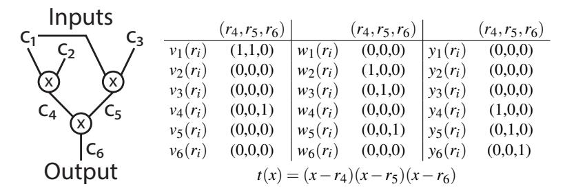

# A Note on the Unsoundness of vnTinyRAM's SNARK

# Bryan Parno Microsoft Research

## **Abstract**

Gennaro, Gentry, Parno, and Raykova (GGPR) introduced Quadratic Arithmetic Programs (QAPs) as a way of representing arithmetic circuits in a form amendable to highly efficient cryptographic protocols [11], particularly for verifiable computation and succinct non-interactive arguments [12]. Subsequently, Parno, Gentry, Howell, and Raykova introduced an improved cryptographic protocol (and implementation), which they dubbed Pinocchio [13].

Ben-Sasson et al. [5] then introduced a lightly modified version of the Pinocchio protocol and implemented it as part of their libsnark distribution. Later work by the same authors employed this protocol [2–4, 10], as did a few works by others [1, 14]. Many of these works cite the version of the paper which was published at USENIX Security [6]. However, the protocol does not appear in that peer-reviewed paper; instead, it appears only in a technical report [5], where it is justified via a lemma that lacks a proof. Unfortunately, the lemma is incorrect, and the modified protocol is unsound. With probability one, an adversary can submit false statements and proofs that the verifier will accept. We demonstrate this theoretically, as well as with concrete examples in which the protocol's implementation in libsnark accepts invalid statements.

Fixing this problem requires different performance tradeoffs, indicating that the performance results reported by papers building on this protocol [1–4, 6, 10, 14] are, to a greater or lesser extent, inaccurate.

## 1 Background: Quadratic Arithmetic Programs

Gennaro, Gentry, Parno, and Raykova (GGPR) introduced Quadratic Arithmetic Programs (QAPs) as a way of representing arithmetic circuits in a form amendable to highly efficient cryptographic protocols [11], particularly for verifiable computation and succinct non-interactive arguments [12] (and/or arguments of knowledge [7]).

We recall their definition below, and then give a brief example of how to construct a QAP from an arithmetic circuit.

**Definition 1 (Quadratic Arithmetic Program (QAP) [11])** A QAP Q over field  $\mathbb{F}$  contains three sets of m+1 polynomials  $\mathcal{V} = \{v_k(x)\}, \ \mathcal{W} = \{w_k(x)\}, \ \mathcal{Y} = \{y_k(x)\}, \ for \ k \in \{0...m\}, \ and a target polynomial <math>t(x)$ . Suppose F is a function that takes as input n elements of  $\mathbb{F}$  and outputs n' elements, for a total of N = n + n' I/O elements. Then we say that Q computes F if:  $(c_1, \ldots, c_N) \in \mathbb{F}^N$  is a valid assignment of

*F's inputs and outputs,* if and only if there exist coefficients  $(c_{N+1},...,c_m)$  such that t(x) divides p(x), where:

$$p(x) = \left(v_0(x) + \sum_{k=1}^m c_k \cdot v_k(x)\right) \cdot \left(w_0(x) + \sum_{k=1}^m c_k \cdot w_k(x)\right)$$
$$-\left(y_0(x) + \sum_{k=1}^m c_k \cdot y_k(x)\right).$$

In other words, there must exist some polynomial h(x) such that  $h(x) \cdot t(x) = p(x)$ . The size of Q is m, and the degree is the degree of t(x).

We now walk through a brief example of how an arithmetic circuit can be converted into a QAP. Prior work provides more details of the general transformation [11, 13]. At a high-level, we choose a "root" value for each multiplication gate in the circuit. Thus, for the circuit in Figure 1, we choose three values  $r_4, r_5, r_6 \in \mathbb{F}$ . We then use the  $\mathcal{V}$  polynomials to represent "left" inputs into multiplications gates, the  $\mathcal{W}$  polynomials to represent "right" inputs, and the  $\mathcal{Y}$  polynomials to represent outputs. Thus, in our example, we say that  $v_1(r_4) = v_1(r_5) = 1$ , since wire  $c_1$  is a left input to gates 4 and 5, while  $v_1(r_6) = 0$ , since  $c_1$  is not a direct left input to gate 5. Similarly,  $w_2(r_4) = w_3(r_5) = 1$ , since wires  $c_2$  and  $c_3$  are right inputs to gates 4 and 5, respectively.

To actually instantiate the various polynomials, let  $\mathcal{R}$  be the set of root values selected (e.g.,  $\mathcal{R} = \{r_4, r_5, r_6\}$  in our example). Let  $L_i(x)$  be a Lagrange polynomial for  $r_i$  over  $\mathcal{R}$ , i.e.,  $L_i(r_i) = 1$  and  $\forall j \neq i : L_i(r_j) = 0$ . We can now write each QAP polynomial as a simple summation of Lagrange polynomials. For example, in Figure 1,  $v_1(x)$  is simply  $L_4(x) + L_5(x)$ .

## **2** Ensuring QAP Consistency

When using QAPs in cryptographic protocols, it is crucial to note that the standard QAP definition (Definition 1) only considers the case where the *same* set of coefficients, i.e., the  $c_k$ , are applied to all three sets of equations. The definition does not provide any guarantees if different coefficients are applied.

In their work, GGPR ensure consistency by giving a generic procedure for "strengthening" a regular QAP into a strong QAP. Unfortunately, this procedure increases the QAP's degree to 3d+2N, more than tripling the original QAP. This significantly impacts the performance of cryptographic protocols employing the QAP. For example, in the verifiable computation setting, the cost of key generation and

Figure 1: Arithmetic Circuit and Equivalent QAP. Each wire value comes from, and all operations are performed over, a field  $\mathbb{F}$ . The polynomials in the QAP are defined in terms of their evaluations at the three roots,  $r_4$ ,  $r_5$ , and  $r_6$ . See text for details.

the size of the evaluation key grow linearly in the degree, and the prover's effort grows as  $O(d \log d)$ .

In contrast, the Pinocchio verifiable computation protocol [13] solved the consistency problem at the cryptographic level, rather than changing the QAP itself. In other words, the protocol works for ordinary QAPs, and uses cryptographic techniques to check for consistency. We summarize the protocol in the left half of Figure 2. To simplify the presentation, we omit the extra terms and steps necessary to make the protocol zero knowledge. We also use a symmetric pairing group, although in practice [13], the protocol is typically implemented using an asymmetric group.

The Pinocchio protocol is proven secure under the d-PKE, q-PDH and 2q-SDH assumptions [13].

The Pinocchio protocol ensures the same coefficients are used for each set of coefficients in two ways. First, the protocol requires the prover to apply the "internal" variables (corresponding to the proof witness) to both the bare  $g_v^{v_k(s)}, g_w^{w_k(s)},$  and  $g_y^{v_k(s)}$  terms in the evaluation key, as well as the  $\beta$  terms, which combine each triplet of  $v_k$ ,  $w_k$ , and  $y_k$  polynomials into a single term. If a malicious prover applies different coefficients to, say, the  $w_k$  terms, this will be caught by the check in Equation 2. Second, to ensure the consistency of the terms corresponding to the IO (or equivalently to the proof statement), the verifier computes those terms herself. In other words, she takes the IO (or statement) from the prover and applies those terms to the corresponding  $v_k$ ,  $w_k$ , and  $y_k$  terms herself before checking Equation 1.

# 3 An Unsound Modification of Pinocchio

Ben-Sasson et al. [5] introduced a tweaked version of the Pinocchio protocol, as shown on the right-hand side of Figure 2. The primary change is that the *prover* calculates the IO terms for the  $\mathcal{W}$  and  $\mathcal{Y}$  polynomials, and the verifier only calculates the IO terms for the  $\mathcal{V}$  polynomials. In terms of memory, this shifts 2N terms from the verification key to the evaluation key. In terms of computation, this requires the prover to perform an additional 5N multi-exponentiations, but it saves the verifier 2N multi-exponentiations.

To ensure consistency of the IO while checking only the  $\mathcal V$  polynomials, Ben-Sasson et al. [5, Lemma 2.4] claim that it suffices that the  $\mathcal V$  polynomials are non-zero and distinct. Note that this is not the case for the example in Figure 1.

Therefore, Ben-Sasson et al. need a transformation to ensure this condition. Unfortunately, this transformation is not specified in their work. Looking at the code of their implementation, libsnark, the transformation appears to be as follows. They add one additional equation (or gate), which means increasing the QAP's degree by one, and they use this equation to ensure the  $\mathcal V$  polynomials are distinct. Concretely, the equation used is

$$\left(1 + \sum_{i=1}^{N} (i+1)c_i\right) \cdot (0) = 0.$$
 (5)

In our running example, this means adding an additional root value, say  $r_7$ , and setting

$$v_1(r_7) = 2$$
  $v_2(r_7) = 3$   $v_3(r_7) = 4$   $v_6(r_7) = 5$  (6)

Unfortunately, the lemma justifying the security of Ben-Sasson et al.'s tweaked protocol is not accompanied by a proof, and it is, in fact, false; the conditions they give are insufficient to produce a secure SNARK, and indeed an adversary can succeed with probability one in producing a false statement with a proof that the verification algorithm will accept. Fundamentally, the protocol does not in fact ensure that the coefficients applied to the QAP polynomials are consistent across all three sets of polynomials.

The key problem is that making the  $\mathcal V$  polynomials distinct is insufficient; they must instead be independent. As long as the polynomials are not independent, a malicious prover can take advantage of the dependencies to make false claims.

Returning to our example, notice that even with Ben-Sasson et al.'s transformation, the polynomials  $v_2(x)$  and  $v_3(x)$ , while distinct, are not independent. Concretely,  $v_2(x) = 3L_7(x)$  and  $v_3(x) = 4L_7(x)$ , where  $L_7(x)$  is the Lagrange polynomial corresponding to  $r_7$ .

When calculating the term corresponding to the IO (or the proof statement), the verifier calculates  $v_{io}(s) = \sum_{i=1}^{N} c_k v_k(s)$  (in the exponent), using the  $c_k$  values the prover supplies for the IO (or statement). If we focus on the portion of the sum that comes from inputs 2 and 3, we have  $c_2v_2(s) + c_3v_3(s)$ . In our example, this becomes  $3c_2L_7(s) + 4c_3L_7(s) = (3c_2 + 4c_3)L_7(s)$ . Thus, as long as  $c_2$  and  $c_3$  remain in the proper ratio,  $v_{io}(s)$  will have the same value; hence any checks it participates in during verification will remain unchanged.

#### Protocol 1 (Pinocchio protocol from regular QAPs [13])

•  $(EK_F, VK_F) \leftarrow \text{KeyGen}(F, 1^{\lambda})$ : Let F be a function with N input/output values from  $\mathbb{F}$ . Convert F into an arithmetic circuit C; then build the corresponding QAP Q = $(t(x), \mathcal{V}, \mathcal{W}, \mathcal{Y})$  of size m and degree d. Let  $I_{mid} = \{N + 1\}$ 1, ..., m}, i.e., the non-IO-related indices.

Let e be a non-trivial bilinear map [8]  $e : \mathbb{G} \times \mathbb{G} \to \mathbb{G}_T$ , and let g be a generator of G.

Choose  $r_v, r_w, s, \alpha_v, \alpha_w, \alpha_v, \beta, \gamma \stackrel{R}{\leftarrow} \mathbb{F}$  and set  $r_v = r_v \cdot r_w$ ,  $g_{v} = g^{r_{v}}, g_{w} = g^{r_{w}} \text{ and } g_{v} = g^{r_{y}}.$

Construct the public evaluation key  $EK_F$  as:

$$\begin{array}{ll} ( & \{g_{v}^{v_{k}(s)}\}_{k \in I_{mid}}, & \{g_{w}^{w_{k}(s)}\}_{k \in I_{mid}}, & \{g_{y}^{y_{k}(s)}\}_{k \in I_{mid}}, \\ & \{g_{v}^{\alpha_{v}v_{k}(s)}\}_{k \in I_{mid}}, & \{g_{w}^{\alpha_{w}w_{k}(s)}\}_{k \in I_{mid}}, & \{g_{y}^{\alpha_{v}y_{k}(s)}\}_{k \in I_{mid}}, \\ & \{g_{v}^{s^{i}}\}_{i \in [d]}, & \{g_{v}^{\beta v_{k}(s)}g_{w}^{\beta w_{k}(s)}g_{y}^{\beta y_{k}(s)})\}_{k \in I_{mid}}, \end{array}$$

and the public verification key as:  $VK_F = (g^1, g^{\alpha_v}, g^{\alpha_w})$  $g^{\alpha_{y}}, g^{\gamma}, g^{\beta\gamma}, g^{t(s)}_{y}, \{g^{\nu_{k}(s)}_{y}, g^{w_{k}(s)}_{w}, g^{\nu_{k}(s)}_{y}\}_{k \in \{0\} \cup [N]} \cdot$

•  $(v, \pi_v) \leftarrow \mathsf{Compute}(EK_F, u)$ : On input u, the worker evaluates the circuit for F to obtain  $y \leftarrow F(u)$ ; he also learns the values  $\{c_i\}_{i\in[m]}$  of the circuit's wires.

He solves for h(x) (the polynomial such that  $p(x) = h(x) \cdot t(x)$ , and computes the proof  $\pi_y$  as:  $\begin{pmatrix} g_{v}^{v_{mid}(s)}, & g_{w}^{w_{mid}(s)}, & g_{y}^{v_{mid}(s)}, \\ g_{v}^{\alpha_{w}v_{mid}(s)}, & g_{w}^{\alpha_{w}w_{mid}(s)}, & g_{y}^{\alpha_{y}v_{mid}(s)} \\ g_{v}^{\beta_{v}v_{mid}(s)}g_{w}^{\beta_{w}v_{mid}(s)}g_{y}^{\beta_{y}v_{mid}(s)} \end{pmatrix}$

where  $v_{mid}(x) = \sum_{k \in I_{mid}} c_k \cdot v_k(x)$ , and similarly for  $w_{mid}(s)$  and  $y_{mid}(s)$ .

- $\{0,1\} \leftarrow \text{Verify}(VK_F, u, y, \pi_v)$ : The verification of an alleged proof with elements  $g^{V_{mid}}$ ,  $g^{W_{mid}}$ ,  $g^{Y_{mid}}$ ,  $g^{H}$ ,  $g^{V'_{mid}}$  $g^{W'_{mid}}$ ,  $g^{Y'_{mid}}$ , and  $g^Z$  uses the public verification key  $VK_F$ and the pairing function e for the following checks.
  - Divisibility check for the QAP: using elements from  $VK_F$  compute  $g_{\nu}^{v_{io}(s)} = \prod_{k \in [N]} \left(g_{\nu}^{v_k(s)}\right)^{c_k}$  (and similarly for  $g_w^{w_{io}(s)}$  and  $g_v^{y_{io}(s)}$ ), and check:

$$e(g_{v}^{v_{0}(s)}g_{v}^{v_{io}(s)}g_{v}^{V_{mid}},g_{w}^{w_{0}(s)}g_{w}^{w_{io}(s)}g_{w}^{W_{mid}}) = (1)$$

$$e(g_{y}^{t(s)},g_{v}^{H})e(g_{y}^{y_{0}(s)}g_{y}^{y_{io}(s)}g_{y}^{Y_{mid}},g).$$

• Check that the linear combinations computed over V, W and Y are in their appropriate spans:

$$\begin{split} e(g_v^{V'_{mid}},g) &= e(g_v^{V_{mid}},g^{\alpha_v}), \quad e(g_w^{W'_{mid}},g) = e(g_w^{W_{mid}},g^{\alpha_w}), \\ e(g_v^{Y'_{mid}},g) &= e(g_v^{Y_{mid}},g^{\alpha_y}). \end{split}$$

• Check that the same coefficients were used in each of the linear combinations over V, W and  $\gamma$ :

$$e(g^{Z},g^{\gamma}) = e(g_{v}^{V_{mid}}g_{w}^{W_{mid}}g_{y}^{Y_{mid}},g^{\beta\gamma}). \tag{2}$$

#### Protocol 2 (Optimization of Ben-Sasson et al. [5])

•  $(EK_F, VK_F) \leftarrow \text{KeyGen}(F, 1^{\lambda})$ : Let F be a function with N input/output values from  $\mathbb{F}$ . Convert F into an arithmetic circuit C; then build an augmented QAP Q' = $(t(x), \mathcal{V}, \mathcal{W}, \mathcal{Y})$  of size m and degree d. Let  $I_{mid} = \{N + 1\}$ 1,...,m, i.e., the non-IO-related indices.

Let e be a non-trivial bilinear map [8]  $e: \mathbb{G} \times \mathbb{G} \to \mathbb{G}_T$ , and let g be a generator of G.

Choose  $r_v, r_w, s, \alpha_v, \alpha_w, \alpha_v, \beta, \gamma \stackrel{R}{\leftarrow} \mathbb{F}$  and set  $r_v = r_v \cdot r_w$  $g_{v} = g^{r_{v}}, g_{w} = g^{r_{w}} \text{ and } g_{v} = g^{r_{y}}.$

Construct the public evaluation key  $EK_F$  as:

Construct the public evaluation key
$$EK_F$$
 as:
$$\left( \left\{ g_{v}^{\nu_{k}(s)} \right\}_{k \in [m]}, \left\{ g_{w}^{w_{k}(s)} \right\}_{k \in [m]}, \left\{ g_{v}^{y_{k}(s)} \right\}_{k \in [m]}, \left\{ g_{w}^{\alpha_{v}\nu_{k}(s)} \right\}_{k \in [m]}, \left\{ g_{w}^{\alpha_{v}\nu_{k}(s)} \right\}_{k \in [m]}, \left\{ g_{v}^{\alpha_{v}\nu_{k}(s)} \right\}_{k \in [m]}, \left\{ g_{v}^{\beta_{v}(s)} g_{w}^{\beta_{w}(s)} g_{y}^{\beta_{v}(s)} \right\}_{k \in [m]},$$

and the public verification key as:  $VK_F = (g^1, g^{\alpha_v}, g^{\alpha_w}, g^{\alpha_w}, g^{\alpha_w}, g^{\alpha_w}, g^{\alpha_w}, g^{\alpha_w}, g^{\alpha_w}, g^{\alpha_w}, g^{\alpha_w}, g^{\alpha_w}, g^{\alpha_w}, g^{\alpha_w}, g^{\alpha_w}, g^{\alpha_w}, g^{\alpha_w}, g^{\alpha_w}, g^{\alpha_w}, g^{\alpha_w}, g^{\alpha_w}, g^{\alpha_w}, g^{\alpha_w}, g^{\alpha_w}, g^{\alpha_w}, g^{\alpha_w}, g^{\alpha_w}, g^{\alpha_w}, g^{\alpha_w}, g^{\alpha_w}, g^{\alpha_w}, g^{\alpha_w}, g^{\alpha_w}, g^{\alpha_w}, g^{\alpha_w}, g^{\alpha_w}, g^{\alpha_w}, g^{\alpha_w}, g^{\alpha_w}, g^{\alpha_w}, g^{\alpha_w}, g^{\alpha_w}, g^{\alpha_w}, g^{\alpha_w}, g^{\alpha_w}, g^{\alpha_w}, g^{\alpha_w}, g^{\alpha_w}, g^{\alpha_w}, g^{\alpha_w}, g^{\alpha_w}, g^{\alpha_w}, g^{\alpha_w}, g^{\alpha_w}, g^{\alpha_w}, g^{\alpha_w}, g^{\alpha_w}, g^{\alpha_w}, g^{\alpha_w}, g^{\alpha_w}, g^{\alpha_w}, g^{\alpha_w}, g^{\alpha_w}, g^{\alpha_w}, g^{\alpha_w}, g^{\alpha_w}, g^{\alpha_w}, g^{\alpha_w}, g^{\alpha_w}, g^{\alpha_w}, g^{\alpha_w}, g^{\alpha_w}, g^{\alpha_w}, g^{\alpha_w}, g^{\alpha_w}, g^{\alpha_w}, g^{\alpha_w}, g^{\alpha_w}, g^{\alpha_w}, g^{\alpha_w}, g^{\alpha_w}, g^{\alpha_w}, g^{\alpha_w}, g^{\alpha_w}, g^{\alpha_w}, g^{\alpha_w}, g^{\alpha_w}, g^{\alpha_w}, g^{\alpha_w}, g^{\alpha_w}, g^{\alpha_w}, g^{\alpha_w}, g^{\alpha_w}, g^{\alpha_w}, g^{\alpha_w}, g^{\alpha_w}, g^{\alpha_w}, g^{\alpha_w}, g^{\alpha_w}, g^{\alpha_w}, g^{\alpha_w}, g^{\alpha_w}, g^{\alpha_w}, g^{\alpha_w}, g^{\alpha_w}, g^{\alpha_w}, g^{\alpha_w}, g^{\alpha_w}, g^{\alpha_w}, g^{\alpha_w}, g^{\alpha_w}, g^{\alpha_w}, g^{\alpha_w}, g^{\alpha_w}, g^{\alpha_w}, g^{\alpha_w}, g^{\alpha_w}, g^{\alpha_w}, g^{\alpha_w}, g^{\alpha_w}, g^{\alpha_w}, g^{\alpha_w}, g^{\alpha_w}, g^{\alpha_w}, g^{\alpha_w}, g^{\alpha_w}, g^{\alpha_w}, g^{\alpha_w}, g^{\alpha_w}, g^{\alpha_w}, g^{\alpha_w}, g^{\alpha_w}, g^{\alpha_w}, g^{\alpha_w}, g^{\alpha_w}, g^{\alpha_w}, g^{\alpha_w}, g^{\alpha_w}, g^{\alpha_w}, g^{\alpha_w}, g^{\alpha_w}, g^{\alpha_w}, g^{\alpha_w}, g^{\alpha_w}, g^{\alpha_w}, g^{\alpha_w}, g^{\alpha_w}, g^{\alpha_w}, g^{\alpha_w}, g^{\alpha_w}, g^{\alpha_w}, g^{\alpha_w}, g^{\alpha_w}, g^{\alpha_w}, g^{\alpha_w}, g^{\alpha_w}, g^{\alpha_w}, g^{\alpha_w}, g^{\alpha_w}, g^{\alpha_w}, g^{\alpha_w}, g^{\alpha_w}, g^{\alpha_w}, g^{\alpha_w}, g^{\alpha_w}, g^{\alpha_w}, g^{\alpha_w}, g^{\alpha_w}, g^{\alpha_w}, g^{\alpha_w}, g^{\alpha_w}, g^{\alpha_w}, g^{\alpha_w}, g^{\alpha_w}, g^{\alpha_w}, g^{\alpha_w}, g^{\alpha_w}, g^{\alpha_w}, g^{\alpha_w}, g^{\alpha_w}, g^{\alpha_w}, g^{\alpha_w}, g^{\alpha_w}, g^{\alpha_w}, g^{\alpha_w}, g^{\alpha_w}, g^{\alpha_w}, g^{\alpha_w}, g^{\alpha_w}, g^{\alpha_w}, g^{\alpha_w}, g^{\alpha_w}, g^{\alpha_w}, g^{\alpha_w}, g^{\alpha_w}, g^{\alpha_w}, g^{\alpha_w}, g^{\alpha_w}, g^{\alpha_w}, g^{\alpha_w}, g^{\alpha_w}, g^{\alpha_w}, g^{\alpha_w}, g^{\alpha_w}, g^{\alpha_w}, g^{\alpha_w}, g^{\alpha_w}, g^{\alpha_w}, g^{\alpha_w}, g^{\alpha_w}, g^{\alpha_w}, g^{\alpha_w}, g^{\alpha_w}, g^{\alpha_w}, g^{\alpha_w}, g^{\alpha_w}, g^{\alpha_w}, g^{\alpha_w}, g^{\alpha_w}, g^{\alpha_w}, g^{\alpha_w}, g^{\alpha_w}, g^{\alpha_w$  $g^{\alpha_y}, g^{\gamma}, g^{\beta\gamma}, g^{t(s)}_y, \left\{ g^{v_k(s)}_v \right\}_{k \in \{0\} \cup [N]}$

•  $(y, \pi_y) \leftarrow \mathsf{Compute}(EK_F, u)$ : On input u, the worker evaluates the circuit for F to obtain  $y \leftarrow F(u)$ ; he also learns the values  $\{c_i\}_{i\in[m]}$  of the circuit's wires.

He solves for h(x) (the polynomial such that  $p(x) = h(x) \cdot t(x)$ , and computes the proof  $\pi_v$  as:

$$h(x) \cdot t(x)$$
, and computes the proof  $\pi_y$
 $(g_v^{v_{mid}(s)}, g_w^{w(s)}, g_y^{y(s)}, g^{h(s)},$
 $g_v^{\alpha_v v_{mid}(s)}, g_w^{w(s)}, g_y^{y(s)}$
 $g_v^{\alpha_v v_{mid}(s)}, g_w^{w(s)}, g_y^{y(s)}$
 $g_v^{\beta} v(s) \beta w(s) \beta y(s)$
 $g_v^{\beta} g_w^{\gamma} g_w^{\gamma} g_y^{\gamma}$

where  $v_{mid}(x) = \sum_{k \in I_{mid}} c_k \cdot v_k(x)$ ,  $w(s) = \sum_{k \in [m]} c_k \cdot w_k(x)$ and similarly for y(s).

- $\{0,1\} \leftarrow \mathsf{Verify}(VK_F, u, y, \pi_v)$ : The verification of an alleged proof with elements  $g^{V_{mid}}$ ,  $g^{W}$ ,  $g^{Y}$ ,  $g^{H}$ ,  $g^{V'_{mid}}$ ,  $g^{W'}$ ,  $g^{Y'}$ , and  $g^{Z}$  uses the public verification key  $VK_F$  and the pairing function e for the following checks.
  - $\bullet$  Divisibility check for the QAP: using elements from  $VK_F$ compute only  $g_v^{v_{io}(s)} = \prod_{k \in [N]} \left(g_v^{v_k(s)}\right)^{c_k}$ , and then check that:

$$e(g_{v}^{v_{0}(s)}g_{v}^{v_{io}(s)}g_{v}^{V_{mid}},g_{w}^{w_{0}(s)}g_{w}^{W}) =$$

$$e(g_{y}^{t(s)},g^{H})e(g_{y}^{v_{0}(s)}g_{y}^{Y},g).$$
(3)

• Check that the linear combinations computed over V, W and Y are in their appropriate spans:

$$\begin{aligned} e(g_{\scriptscriptstyle V}^{V'_{mid}},g) &= e(g_{\scriptscriptstyle V}^{V_{mid}},g^{\alpha_{\scriptscriptstyle V}}), \quad e(g_{\scriptscriptstyle W}^{W'},g) = e(g_{\scriptscriptstyle W}^{W},g^{\alpha_{\scriptscriptstyle W}}), \ e(g_{\scriptscriptstyle V}^{Y'},g) &= e(g_{\scriptscriptstyle V}^{Y},g^{\alpha_{\scriptscriptstyle Y}}). \end{aligned}$$

• Check that the same coefficients were used in each of the linear combinations over V, W and Y:

$$e(g^Z, g^{\gamma}) = e(g_{\nu}^{v_{io}(s)} g_{\nu}^{V_{mid}} g_{\nu}^W g_{\nu}^Y, g^{\beta \gamma}). \tag{4}$$

Figure 2: The original Pinocchio protocol (left) and the modifications introduced by Ben-Sasson et al. (right), with changes highlighted.

To exploit this, the malicious prover can first calculate a correct proof for a legitimate IO (or proof statement). In our example, he might choose inputs  $c_1=1,\,c_2=2,\,$  and  $c_3=10$  with a correct output of  $c_6=20$ . He then exploits the dependencies between  $\mathcal V$  polynomials to return a false statement with the proof he just calculated. For example, he might return  $c_1=1,\,c_2=10,\,$  and  $c_3=4$  with an *incorrect* output of  $c_6=20$  (rather than a correct output of 40). In both cases  $(3c_2+4c_3)=46$ , so the value the verifier calculates for  $g_{\nu}^{\nu_{io}(s)}$  remains unchanged, and hence the verification algorithm accepts, both with the correct IO and with the invalid IO.

As further confirmation, we implemented the example in Figure 1, and confirmed that  $\mathtt{libsnark}^1$  accepts as valid the cheating IO  $c_1=1$ ,  $c_2=10$ ,  $c_3=4$ , and  $c_6=20$ . Note that as a performance optimization,  $\mathtt{libsnark}$  will dynamically decide to relabel the  $\mathcal V$  polynomials as  $\mathcal W$  polynomials, and vice versa, depending on the sparsity of the two sets of polynomials. In the example shown in Figure 1, it does make the swap. Hence, to see the unsoundness example above in action, we disabled the swap. Alternately, with the swap enabled, we can analyze the pre-swap  $\mathcal W$  polynomials and find that using invalid IO  $c_1=6$ ,  $c_2=2$ ,  $c_3=10$ , and  $c_6=18$  also causes  $\mathtt{libsnark}$  to incorrectly accept.

## 4 Remedies

One simple solution is to use the original Pinocchio protocol, which directly ensures consistency by having the verifier check the IO terms on all three sets of polynomials.

Alternately, we can try to preserve the property that the verifier only checks the  $\mathcal{V}$  polynomials by adopting a strategy similar to GGPR's original strengthening step. Specifically, we can add one QAP equation per dependent IO term, and use that equation to ensure that  $\mathcal V$  constitutes a complete set of mutually independent polynomials. For example, if we add N additional roots  $r_{d+1}, \dots, r_{d+N}$  and set  $v_i(r_{d+i}) = 1$  (and 0 for the rest of the new roots), this would ensure independence and remove the degree of freedom the adversary exploited above. The downside is that this technique potentially increases the QAP's degree and size by up to N. Hence, in the worst case, compared with the Pinocchio protocol, the cost of key generation increases by 8N exponentiations and the evaluation key grows by 8N. Similarly, the prover's work increases by 13N multi-exponentiations, and the field operations needed to solve for h(x), the only superlinear step, increase from  $d \log d$ to  $(d+N)\log(d+N)$ .

Whether these costs are worth the 2N savings for the verifier is application dependent. Of course, in some applications, many of the  $\mathcal{V}$  polynomials will already be independent, and hence the costs described above will decrease accordingly.

Adopting one of these remedies results in higher overhead for the verifier or for the key generator and prover, relative to using the unsound protocol. Hence, the absolute performance numbers reported in papers using Ben-Sasson et al.'s modified protocol [1–4, 6, 10, 14] underestimate the true costs.

Relative performance measurements may still be valid.

Based on this work, the libsnark authors are developing a patch that implements the new version of the protocol, as described above, with extra QAP equations added. Preliminary performance results suggest that for applications with small IO relative to the computation, the performance impact is quite small [9].

#### References

- [1] M. Backes, D. Fiore, and R. M. Reischuk. Nearly practical and privacy-preserving proofs on authenticated data. In *Proc. of IEEE Symposium on Security and Privacy*, 2015.
- [2] E. Ben-Sasson, A. Chiesa, C. Garman, M. Green, I. Miers, E. Tromer, and M. Virza. Zerocash: Decentralized anonymous payments from Bitcoin. In *Proc. of the IEEE Symposium on Security and Privacy*, 2014.
- [3] E. Ben-Sasson, A. Chiesa, M. Green, E. Tromer, and M. Virza. Secure sampling of public parameters for succinct zero knowledge proofs. In *Proc. of the IEEE Symposium on Security and Privacy*, May 2015.
- [4] E. Ben-Sasson, A. Chiesa, E. Tromer, and M. Virza. Scalable zero knowledge via cycles of elliptic curves. In *Proc. of IACR CRYPTO*, 2014.
- [5] E. Ben-Sasson, A. Chiesa, E. Tromer, and M. Virza. Succinct non-interactive zero knowledge for a von Neumann architecture. Cryptology ePrint Archive, Report 2013/879, Aug. 2014.
- [6] E. Ben-Sasson, A. Chiesa, E. Tromer, and M. Virza. Succinct non-interactive zero knowledge for a von Neumann architecture. In *Proc. of USENIX Security*, 2014.
- [7] N. Bitansky, R. Canetti, A. Chiesa, and E. Tromer. From extractable collision resistance to succinct non-interactive arguments of knowledge, and back again. In *Innovations in Theoretical Computer Science (ITCS)*, 2012.
- [8] D. Boneh and M. Franklin. Identity-based encryption from the Weil pairing. *Proceedings of IACR CRYPTO*, 2001.
- [9] A. Chiesa. Personal communication, May 2015.
- [10] A. Chiesa, E. Tromer, and M. Virza. Cluster computing in zero knowledge. In *Proceedings of IACR EuroCrypt*, Apr. 2015.
- [11] R. Gennaro, C. Gentry, B. Parno, and M. Raykova. Quadratic span programs and succinct NIZKs without PCPs. In *Proc. of IACR EUROCRYPT*, 2013.
- [12] C. Gentry and D. Wichs. Separating succinct non-interactive arguments from all falsifiable assumptions. In *STOC*, 2011.
- [13] B. Parno, C. Gentry, J. Howell, and M. Raykova. Pinocchio: Nearly practical verifiable computation. In *Proc. of the IEEE Symposium on Security and Privacy*, May 2013.
- [14] R. S. Wahby, S. Setty, Z. Ren, A. J. Blumberg, and M. Walfish. Efficient RAM and control flow in verifiable outsourced computation. In *Proceedings of the ISOC Symposium on Network and Distributed Systems Security (NDSS)*, Feb. 2015.

&lt;sup>1 As of commit faf1ebbe961e51539122d471854b929fdca5864e.