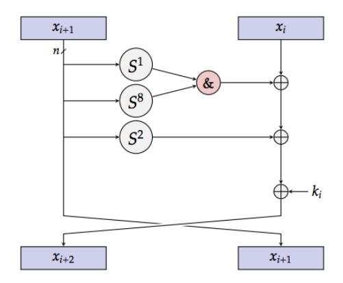
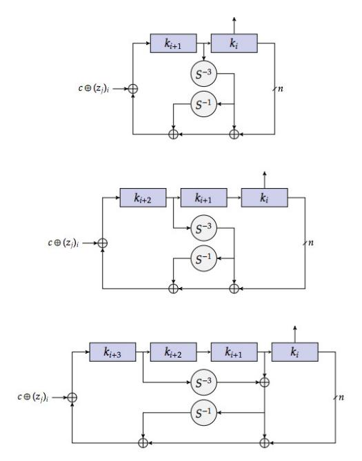
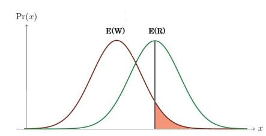
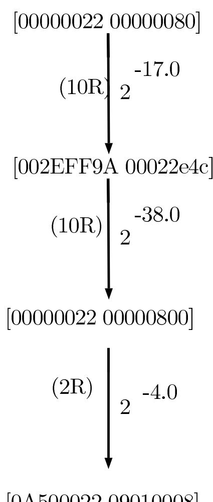
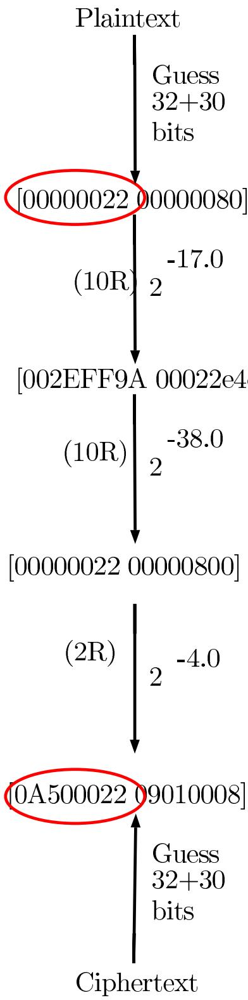

# Advanced Differential Cryptanalysis of Reduced-Round SIMON64/128 Using Large-Round Statistical Distinguishers

Theodosis Mourouzis1 , Guangyan Song1 , Nicolas Courtois 1 and Michalis Christofi 2

1*Department of Computer Science, University College London, London, United Kingdom* 2*Department of Informatics, King's College London, London, United Kingdom* {*tmourouz, g.song,n.courtois ˙* }*@cs.ucl.ac.uk, mc556@kings.ac.uk*

Keywords: lightweight cryptography, hardware performance, multiplicative complexity, internet of things (IoT), blockciphers, Feistel Network, SIMON, differential cryptanalysis, truncated differentials, statistical distinguisher, Type I Error, Type II error, Gauss Error Function, depth-first search

Abstract: Lightweight cryptography is a rapidly evolving area of research and it has great impact especially on the new computing environment called the Internet of Things (IoT) or the Smart Object networks (Holler et al., 2014), where lots of constrained devices are connected on the Internet and exchange information on a daily basis. Every year there are many new submissions of cryptographic primitives which are optimized towards both software and hardware implementation so that they can operate in devices which have limited resources of hardware and are subject to both power and energy consumption constraints. In 2013, two families of ultra-lightweight block ciphers were proposed, SIMON and SPECK, which come in a variety of block and key sizes and were designed to be optimized in hardware and software implementation respectively (Beaulieu et al., 2013). In this paper, we study the security of the 64-bit SIMON with 128-bit key against advanced forms of differential cryptanalysis using truncated differentials (Knudsen, 1995; Courtois et al., 2014a). We follow similar method as the one proposed in SECRYPT 2013 (Courtois and Mourouzis, 2013) in order to heuristically discover sets of differences that propagate with sufficiently good probability and allow us to combine them efficiently in order to construct large-round statistical distinguishers. We present a 22-round distinguisher which we use it in a depth-first key search approach to develop an attack against 24 and 26 rounds with complexity 2124.5 and 2126 SIMON encryptions respectively. Our methodology provides a framework for extending distinguishers to attacks to a larger number of rounds assuming truncated differential properties of relatively high probability were discovered.

## 1 INTRODUCTION

The new computing environment of Internet of Things (IoT) is the network of physical objects embedded with electronics, software, sensors and connectivity to achieve greater value and user experience (Holler et al., 2014; Mark, 2014). All these interconnected devices will exchange lots of data with the manufacturer or operator or any other connected device in a daily basis in order to improve performance and decrease power consumption. On the same time all these data will be aggregated and being used for building fault prediction models and other models that could be used to benefit our the experience.

In order to enjoy this new environment we need to guarantee the security of the nodes of the network up to a desired level. The challenge in this space lies in the implementation of secure enough cryptographic functions on constrained devices due to the limitation of their resources such as hardware availability and power and energy consumption constraints. Lightweight cryptography is the area of cryptography which aims to develop more efficient cryptographic primitives in response to typical constraints in hardware and optimized towards both power and energy consumption. As a result of this great demand of optimizing the performance, every year there are many submissions of lightweight cryptosystems which are designed towards both hardware and software implementation.

In July 2013, a team of cryptographers from National Security Agency (NSA) has proposed two new interesting lightweight block ciphers, SIMON and SPECK (Beaulieu et al., 2013). Both ciphers come in a variety of block and key sizes and were designed towards optimization in hardware and software respectively. In the same paper there was no advanced analysis of the security of these ciphers against well-known cryptanalytic attacks such as differential, linear and algebraic cryptanalysis. In the same year of submission, we had many different attacks against reduced-round versions of both ciphers such as; differential cryptanalysis, linear cryptanalysis, impossible differentials and combined differential algebraic techniques (cf. Table 1 and Table 2).

It is very important to note that SIMON has very low multiplicative complexity, 32 multiplications per round, which implies low non-linearity. Courtois et al demonstrated that several rounds (10/44) of this cipher can be attacked by pure algebraic attacks without even guessing any key bits (Courtois et al., 2014b). This is somehow reconfirms the heuristical approach that multiplicative complexity reduction can reduce the complexity of the underlying algebraic system and thus a solution can be recovered by a solver software, such as a SAT solver, in a more reasonable time (Courtois and Bard, 2007; Courtois et al., 2011).

Table 1: Cryptanalysis of SIMON64/128

| Authors                         | Rounds | Time       |
|---------------------------------|--------|------------|
| (Alkhzaimi and Lauridsen, 2013) | 26     | $2^{94}$   |
| (Farzaneh et al., 2013)         | 24     | $2^{58.4}$ |
| (Farzaneh et al., 2013)         | 16     | $2^{92.0}$ |
| (Courtois et al., 2014b)        | 10     | $2^{98.8}$ |
| This paper                      | 26     | 2126       |

Table 2: Type of attacks against SIMON64/128

| Authors                         | Type         |  |
|---------------------------------|--------------|--|
| (Alkhzaimi and Lauridsen, 2013) | Differential |  |
| (Farzaneh et al., 2013)         | Differential |  |
| (Farzaneh et al., 2013)         | Imp-Diff     |  |
| (Courtois et al., 2014b)        | Alg-Trunc    |  |
| This paper                      | Trunc        |  |

In this paper, we evaluate the security of 64-bit version of SIMON with 128-bit key against advanced forms of differential cryptanalysis using large-round statistical distinguishers. We employ a simple heuristical approach in order to discover truncated differential properties that hold with sufficiently high probability, similar to the method proposed in (Courtois and Mourouzis, 2013; Courtois et al., 2014a). Our heuristical approach includes analysis of patterns of several transitions of low Hamming-distance pairs.

We manage to construct a 22-round distinguisher by combining several truncated differential properties and then we use this distinguisher to attack 24 and 26 rounds of the cipher in a depth-first search style approach as proposed in (Mourouzis, 2014). This method invlolves several key guessing for several outer rounds and measuring the number of plaintext and ciphertext pairs that follow the specified inputoutput differences of the statistical distinguisher.

The rest of this paper is organized as follows:

- Section 2: We provide an introduction to SIMON cipher and we study especially its round function and key schedule algorithm for the particular 64-bit version.
- Section 3: We provide an introduction to differential cryptanalysis and in particular truncated differentials.
- Section 4: We discuss construction of large-round statistical distinguishers using truncated differential properties.
- Section 5: We present a 22-round distinguisher for SIMON64/128.
- Section 6: We mount a differential attacks against 24 and 26 rounds of SIMON using statistical distinguishers.
- Section 7: Conclusions and Future Research

#### 2 SIMON CIPHER

SIMON is a lightweight block cipher designed by NSA. with the aim to have optimal hardware performance (Beaulieu et al., 2013). It follows the classical Feistel design paradigm and operates on two *n*-bit halves in each round.

Each round of SIMON applies a non-linear, non-bijective function  $F: GF(2)^n \to GF(2)^n$  to the left half of the state which is repeated for 44 rounds. The operations used are as follows:

- 1. bitwise XOR.
- 2. bitwise AND and
- 3. left circular shift,  $S^j$  by j bits.

We denote the input to the *i*-th round by  $L^{i-1}||R^{i-1}|$  and in each round the left word  $L^{i-1}$  is used as input to the round function F defined by,

$$F(L^{i-1}) = (L^{i-1} <<< 1).(L^{i-1} <<< 8) \oplus (L^{i-1} <<< 2),$$
(1)

where . is the bitwise AND operator.

The next state  $L_i||R_i$  is computed in the following way (cf. Figure 1),

$$L^{i} = R^{i-1} \oplus F(L^{i-1}) \oplus K^{i-1}$$
 (2)

$$R^i = L^{i-1} \tag{3}$$

Figure 1: The round function of the SIMON block cipher.

The output of the last round is the ciphertext after applying the round function for 44 times for the particular variant SIMON64/128.

Note that SIMON cipher has a very low multiplicative complexity since the only non-linear part is the bitwise multiplication, resulting in 32 multiplications per round. Multiplicative complexity is known to be a measure of non-linearity and hence a (heuristic) measure against resistance to known forms of cryptanalytics attacks against hash functions (Boyar et al., 2013) and block ciphers (Courtois et al., 2011).

SIMON's key schedule is based on an LSFR-like procedure (cf. Figure 2). The *nm*-bits of the key are used to generate the keys *K*0,*K*1,...,*Kr*−1 to be used as round keys. There are three different key schedule procedures depending on the number of words that the secret key consists of (*m* = 2,3,4). In the particular version of the cipher we study, we are interested in the version where *m* = 4.

Furthermore, at the beginning *K* 0 ,*K* 1 ,...,*K m*−1 are initialized keys, while the remaining are generated by the LSFR- like construction which is depicted on Figure 2. For the variant of our interest, where *m* = 4, the rest of the keys are generated as follows:

$$Y = K^{i+1} \oplus (K^{i+3} >>> 3)$$
 (4)

$$K^{i+4} = K^i \oplus Y \oplus (Y >>> 1) \oplus c \oplus (z_j)_i \qquad (5)$$

The constant *c* = 0*x f f*... *f c* is used for preventing slide attacks and attacks exploiting rotational symmetries (Beaulieu et al., 2013).

In addition, the generated subkeys are xored with a bit (zj)i, that denotes the i-th bit from the one of the five constant sequences *z*0,...,*z*4 . These sequences are defined in (Beaulieu et al., 2013) and for our variant we use *z*3.

The way that the key schedule operates it implies that if we recover lots of key bits from the very first rounds, then we have higher chances of recovering next bits since they are generated in a LSFR-like approach. In the methodology we describe in the next sections we focus on recovering several key bits from the very first rounds of encryption.

Figure 2: The SIMON two, three and four-word key expansions.

## 3 DIFFERENTIAL CRYPTANALYSIS

Differential Cryptanalysis is a general form of probabilistic or statistical cryptanalytic technique that is primarily applicable to block ciphers but also to stream ciphers and cryptographic hash functions. It belongs to the category of chosen-plaintext attacks and its discovery was attributed to Eli Biham and Adi Shamir in the later 1980s (Biham and Shamir, 1993; Biham and Shamir, 1990).

However, around 1994, Don Coppersmith as a member pf the original IBM DES team, confirmed that the technique of DC was known to IBM, as early as 1974. In addition, he said that one of the security criteria used to design DES was the resistance against this particular type of attack and this attack was known as T- attack or Tickle attack.

In this type of attack, the main task is to study the propagation of differences of inputs from round to round inside the cipher, and discover specific differences that propagate with comparatively higher probability as the probability expected assuming a uniform distribution. In this way, an attacker discovers where the cipher exhibits non-random behavior and by exploiting these properties further can recover parts of the secret key or the full key with time complexity lower than an exhaustive search on the key length which is the reference time complexity in case of block ciphers.

In differential attacks, the first task is to find series of input and output differences over several rounds, which appear with relatively high probability. For each pair of input-output difference, we need to determine the probability of propagation for each round individually. For the linear components, we can predict the propagation of the difference with probability one. However, in non-linear components, such as S-boxes, a probabilistic analysis is needed.

Figure 3: The diagram on the left illustrates the propagation of differences (0), (1), ..., (r) through different rounds, which is called differential characteristic. The diagram on the right illustrates a differential, where only input-output differences are considered, while middle differences are ignored.

We can either construct round to round paths and join them together to form a larger round differential characteristic or we can search directly for specific input-output differences after a certain number of rounds and this is called differential. Figure 3 illustrates both differential characteristic and differential.

#### 3.0.1 Truncated Differentials

Truncated Differential Cryptanalysis is a generalization of differential cryptanalysis developed by Lars Knudsen (Knudsen, 1995). Usually, in DC we study the propagation of single differences between two plaintexts, while in truncated DC we consider differences that are partially determined (i.e we are interested only in some parts of the difference). This technique has been successfully applied to many block ciphers such as SAFER, IDEA, Skipjack, Twofish and many others. We define the truncation TRUNC(a) of a n-bit string a as in Definition 1.

**Definition 1.** (Truncation, (Knudsen, 1995))

Let  $a = a_0a_1...a_{n-1}$  be an n-bit string, then its truncation is the n-bit string b given by  $b_0b_1..b_{n-1} = TRUNC(a_0a_1..a_{n-1})$ , where either  $b_i = a_i$  or  $b_i = *$ , for all  $0 \le i \le n-1$  and \* is an unknown value

The notion of truncated differentials (cf. Definition 2) extends naturally to differences.

**Definition 2.** (Truncated Differentials, (Knudsen, 1995))

Let  $(\alpha, \beta)$  be an i-round differential, then if  $\alpha'$  and  $\beta'$  are truncations of  $\alpha$  and  $\beta$  respectively, then  $(\alpha', \beta')$  is an i-round truncated differential.

**Remark 1.** Note that we need to exclude the zero difference from our set.

**Example 1.** The truncated differential on 8 bytes of the form 000000000000000000000000000000000000

Given an s-round characteristic  $\Delta_0 \to \Delta_1 \to ... \to \Delta_s$ , then  $\Delta_0' \to \Delta_1' \to ... \to \Delta_s'$  is a truncated characteristic, if  $\Delta_i' = TRUNC(\Delta_i)$  for  $0 \le i \le s$ . A truncated characteristic predicts only part of the difference in a pair of texts after each round of encryption. A truncated differential is a collection of truncated characteristics. Truncated differentials proved to be a very useful cryptanalytic tool against many block ciphers which at first glance seem secure against basic differential cryptanalysis.

In the next section we employ a simple heuristic discovery algororithm for discovering truncated differential properties which propagate with sufficiently high probability. In a later stage we combine these properties to construct a large round distinguisher which we use to mount a differential attack on a larger number of rounds.

# 4 LARGE-ROUND STATISTICAL DISTINGUISHERS

#### 4.0.2 Hypothesis Testing

In cryptanalysis, we very often study the problem of distinguishing distributions, one distribution that describes the variable of the number of certain events that occur at random and another distribution that describes the same variable but due to propagation inside the cipher. Thus, we would like to design a clever distinguisher which would be able to distinguish a given a cipher from a random permutation by capturing as much as possible of its mathematical structure. Such a distinguishing attack might reveal information which can be used to reduce the space of the key candidates and thus lead to an attack faster than exhaustive search. In cryptographic literature, there are several examples of succesful attacks against either the full block cipher or some reduced-round version or more frequently against stream ciphers.

Thus, this can be seen as a hypothesis testing problem of distinguishing the two distributions as shown in Figure 2. Suppose that a source is used to generate independent random samples in some given finite set with some distribution  $\mathcal{P}$ , which is either  $\mathcal{P} = \mathcal{P}_0$  or  $\mathcal{P} = \mathcal{P}_1$ . A distinguisher is a construction used to determine which one is the most likely the one which was used to generate the sample. Hence, the overall attack based on the distinguishers considers the following underlying statistical hypothesis testing problem, where we have either a null hypothesis  $H_0: \mathcal{P} = \mathcal{P}_0$  or an alternative hypothesis  $H_1: \mathcal{P} = \mathcal{P}_1$ .

Our scope is to study this hypothesis problem applied to differential cryptanalysis and its variants. The variable of our interest is the number of plaintext pairs whose output difference after r rounds lies in a particular truncated differential set  $\Delta Y$  given that their difference lies in another truncated differential set  $\Delta X$ . We aim to use particular sets of differences which capture the mathematical structure of the cipher and these are known as general open sets and we described them in the previous section.

Assuming that we have two random variables  $\mathcal{W}$  and  $\mathcal{R}$  which are described by Gaussian distributions with parameters (E(W),V(W)) and (E(R),V(R)) respectively. Our task is given a measurement of the variable of our interest to determine from which distribution this sample is more likely to be taken. Thus, we have the following hypothesis testing problem,  $H_0: P = \mathcal{W}$  and  $H_1: P = \mathcal{R}$ . For cryptanalytic purposes, we assume that distribution  $\mathcal{W}$  corresponds to a wrong key, while  $\mathcal{R}$  corresponds to the right key. In case of a Gaussian distribution, the probability den-

sity function of distribution W is given by the following equation,

$$f_{\mathcal{W}}(x) = \frac{1}{\sqrt{2\pi V(W)}} exp^{-\frac{1}{2V(W)}(x-E(W))^2}.$$
 (6)

Assume that we were given a sample P from which we can observe x events of our interest, in the particular case of differential cryptanalysis is the number of pairs which follow the differential  $\alpha \to \beta$  after r rounds. Then, from Figure 2 we observe that if x is greater than E(R) then we can assume that that this observation corresponds to the right key with probability set to  $\frac{1}{2}$ . On the other hand, the probability of a false positive, for example accepting the key as correct while it is wrong, which is also known as Type I error, is represented by the red-shaded region in Figure 4 and given by the following formulae,

$$P(\mathcal{W} > \mathcal{R}) = \int_{E(R)}^{\infty} f_{\mathcal{W}}(x) dx = \frac{1}{2} \left( 1 - erf\left(\frac{E(R) - E(W)}{\sqrt{2V(W)}}\right) \right)$$

where erf(x) is the Gaussian error function given by

$$erf(x) = \frac{2}{\sqrt{\pi}} \int_0^x exp^{-t^2} dt.$$
 (8)

Figure 4: The two Gaussian distributions corresponding to wrong key guess (red) and right key guess (green). The redshaded region corresponds to the probability of false positives or Type I error value.

In terms of Type II error (right key rejection) we set it to constant probability  $\frac{1}{2}$ . This is achieved by simply accepting a certain key bits assumptios as correct if the number of observed pairs of our interest (truncated differential propertied verified) exceeds the mean of the Gauss distribution corresponding to the right key which is E(R) in our example.

In the next section we describe how to construct a 22-round distinguisher for SIMON cipher. Then, we use this distinguisher to mount an attack against a larger number of rounds.

## **CONSTRUCTION OF** 22-ROUND DISTINGUISHERS

In this section we combine several truncated differential properties in order to construct a 22-round distinguisher. In particular, we combine two transitions discovered to propagate with sufficiently high probability for 10 and 2 rounds. The transitions are shown on Figure 5.

In order to compute the probability of a transition we use a very simple algorithm that simply counts the number of events of our interest for a given fixed number of trials. We assume that the distribution of the number of events of our interest follows (approximately) a Poisson distribution. We use this distribution as we have experimentally observed that for all cases we have tried,

- We have a discrete distribution of small integers
- In all cases we have tried and are included in this thesis the variance is relatively close to the mean.

For a sample of sizeN if x denotes the number of events that were observed (approximated by Poisson with parameter Poisson mean Np where p is the true mean), then the approximated Standard Deviation (SD) of the variable  $\frac{x}{N}$ , where N is assumed to be constant and p the observed mean, is given by  $\sqrt{Np}/N = \sqrt{p/N}$ . This is because the variance equals to the mean in case of a Poisson distribution.

Let  $I_1$  be the interval  $[pt\sqrt{p'/N}, p+t\sqrt{p/N}]$ . In our simulations we would like  $I_1$  to be contained in the interval  $I_2 = [p.2^a, p.2^a]$ , where a is an error we allow in the exponent of the mean as a power of 2. We assume that the true mean that we are aiming to approximate by simulations is bigger than some probability value  $p_0$  in order to ensure that our algorithm terminates in reasonable time. The inclusion of sets implies that we need to run  $N > N_0$  simulations, where  $N_0$  is given by

$$N_0 = \frac{2^{2a}t^2}{(2^a - 1)^2} \cdot \frac{1}{p_0} \tag{9}$$

in order to achieve the desired precision. Since we record the mean  $\frac{x}{N}$  we expect by Central Limit Theorem that the distribution of our mean converges to a Normal Distribution.

Following precisely this methodology we end up in the problem of distinguishing the following two Gaussian distributions.

• Natural Propagation: X: N (212, 26)

• SIMON: Y: N  $(2^{12}+2^7, \sqrt{(2^{12}+2^7)})$

[0A500022 09010008]

Figure 5: A 22-round statistical distinguisher.

**Explanation:** We have in total  $2^{63} \text{.} 2^3 = 2^{66}$ pairs of plaintexts (P,P') that satisfy  $P \oplus P' \in [0000002200000080]$ . A proportion  $2^{10}/2^{64}$  is expected to have a ciphertext difference  $C \oplus C' \in$ [0A50002209010008] by accident (random permutation) after either a large number of rounds or by simply at random, which implies  $2^{12}$  pairs. Now in case of SIMOn we expect  $2^{66-17.0-38.0-4.0} = 2^7$  to follow this truncated differential path with the specified differences in the middle. Since these distribution converge to Gauss distributions, but the underlying source of generating samples is approximated by Poisson, we can assume that the standard deviation can be computed by the square root of the mean.

The other problem that we need to consider is the problem of the number of pairs that by accident have also this intermediate differences after 10 and 20 rounds as specified by the distinguisher. For this particular example, we have that  $2^{16} \cdot 2^{-17-38}$  are expected to have these intermediate differences which implies it is zero and thus the two sets of events are completely disjoint.

Note that we follow the following hypothesis testing; if the number of pairs observed during the attack exceeds  $2^{12} + 2^7$  then we accept the key assumption as correct, otherwise we reject it. This implies that the Type II error of our attack is automatically set to half. That implies that we have to repeat twice our attack in order to retrieve the correct key, More details about Type II error (false key assumption acceptance) is analyzed in the next chapter.

## 6 DIFFERENTIAL ATTACKS AGAINST 24 AND 26 ROUNDS OF SIMON

In this section we present attacks against reduced round versions of SIMON64/128 using the statistical distinguisher we have constructed and presented in the previous section. Our distinguisher combines several truncated differential properties for 10+10+2 rounds, resulting in a 22-round distinguisher with Type I error  $2^{-4.5}$  while Type II error is set to half.

To sum up, Type I error corresponds to false positives, i.e. the number of wrongly accepted keys as correct by following the distinguisher construction for given pairs of plaintext and ciphertexts. The attack that we describe is a depth-first key search like approach, where we guess a specified set of key bits for each round in order to determine the number of plaintext-ciphertext pairs that follows the differences as specified by the statistical distinguisher.

As we have already mentioned in the previous section we are interested in distinguishing the following two Gauss distributions,

- Natural Propagation: X: N (212, 26)
- SIMON: Y: N  $(2^{12} + 2^7, \sqrt{(2^{12} + 2^7)})$

The Type I error for this case can be computed by computing the ration  $\frac{2^7}{2^6} = 2$  which corresponds to Type I error  $2^{-4.5}$  by computing the associated Gauss Error function.

We present two attacks, one against 24 rounds of SIMON and another one, but essentially weaker attack, on 26 rounds of SIMON. The aim of these attacks is to show the generic nature of our attack that makes use of a well-constructed distinguisher to attack several number of rounds. Importantly, the performance of this distinguisher can be improved if better ad-hoc heuristics regarding the structure of the cipher are discovered or there is a significant improve-

ment in the discovery method. Figure 6 illustrates precisely our steps in our attack.

#### 6.0.3 Attack against 24 rounds

Consider a partition of 24 rounds of SIMON as 2+22, where 22 is the distinguisher but inverted. Note that we do not have to guess full round keys but we are only interested in guessing the key bits which allows to check if the path of the plaintext pairs gives collisions on the 0s of the truncated differential masks in the input of the distinguisher.

- 1. For each of the 28+26 key bits of  $k_1, k_2$  do the following
- 2. Compute the partial encryption of all 264 plaintexts for the first two rounds under the selected key bits defined in the previous step.
- 3. Set a counter T = 0.
- 4. If all corresponding bits after 2 rounds of encryption equal to 0 for the selected key bits as specified in the truncated differential mask, then increase *T* by 1.
- 5. Repeat this for all 264 P-C pairs.
- 6. If  $T > 2^{12} + 2^6$  accept the key bits as correct for the round keys  $k_1, k_2$ .
- 7. Out of the total  $2^{28+26}$  key assumption we expect to filter out  $2^{49.5}$  cases to continue the attack
- 8. Brute force on the rest 128-28-26=74 key bits by requesting more pairs of plaintext-ciphertext.
- 9. Repeat the attack for another time

The time complexity of this attack is computed by computing the complexity in each step. Intially we have to perform  $2^{28+26}.2^{64}=2^{118}$  encryptions. We are left with  $2^{49.5}$  cases to continue the attack. The complexity for the rest steps is  $2^{54-4.5-74}=2^{123.5}$ . Thus, the total time complexity is  $2^{123.5}$  and data complexity  $2^{64}$ . The overall complexity due to Type II error is  $2^{124.5}$ .

#### 6.0.4 Attack against 26 rounds

In this section we use a partition of 26 rounds as 2+22+2, where the middle 22 rounds is the statistical distinguisher. The attack is summarized below.

- 1. For each of the (28+26)+(30+31) key bits of  $k_1, k_2, k_{25}, k_{26}$  do the following
- 2. Compute the partial encryption of all 264 plaintexts for the first two and last two rounds under the selected key bits defined in the previous step.
- 3. Set a counter T = 0.

- 4. If all corresponding bits aequal to 0 for the selected key bits as specified in the truncated differential masks, then increase *T* by 1.
- 5. Repeat this for all  $2^{64}$  P-C pairs.
- 6. If  $T > 2^{12} + 2^6$  accept the key bits as correct for the round keys  $k_1, k_2, k_{25}, k_{26}$ .
- 7. Out of the total  $2^{28+26+30+31}$  key assumption we expect to filter out  $2^{110.5}$  cases to continue the attack
- 8. Brute force on the rest 128-28-26=74 key bits by requesting more pairs of plaintext-ciphertext.
- 9. Repeat the attack for another time

The data complexity for this attack is  $2^{64}$  as we again use the entire codebook. The time complexity of the first step is  $(2^{28+26}+2^{30+31}).2^{64}=2^{125}$  SI-MON encryptions. Then, we have to bruteforce on the rest  $2^{54-4.5+74}=2^{123.5}$  to get the correct key. The total time complexity turns out to be  $2^{126}$  due to Type II error.

Note that we have not optimized the number of key bits required to be guessed in the final steps to recover  $k_3, k_4$  by knowning lots of key bits from  $k_1, k_2, k_{25}, k_{26}$ . In order to do this we need to analyze the LFSR-like key schedule and this could be our future work.

### 7 CONCLUSIONS

Lightweight cryptography is the field of cryptography that studies the level of security of cryptographic algorithms designed to be implemented and run efficiently on constrained devices. Nowadays, as we move closer to the evolution of Internet of Things (IoT) network (Holler et al., 2014), where a lot of constrained devices will be connected on the internet and exchange information, the concept of lightweight cryptography gets even more attraction. Constructing an algorithm with the aim to run efficiently on limited hardware constraints, optimal power consumption and simultaneously offer a desired level of security is a highly non-trivial optimization task. Every year researchers are proposing new lightweight ciphers that are designed based on the security and limitation in hardware optimization task in mind. In 2013, a team of researchers from NSA published two new families of lightweight ciphers, SIMON and Speck, which are designed towards hardware and software implementation respectively. In this paper, our aim is to evaluate the level of security that the 64-bit version of SIMON that uses a 128-bit key offers, against advanced forms of differential cryptanalysis

and especially against truncated differentials (Knudsen.,1995). Truncated differentials is a powerful form of advanced differential cryptanalysis and it was used to break ciphers which initially seem to be secure against nave differential cryptanalysis, such as for example GOST (Courtois et al., 2013). In this paper, we follow the idea suggested by Courtois et al in SE-CRYPT 2013 to extend statistical distinguishers to attacks against either the full number of rounds of the cipher or a selected number of rounds. We achieve in obtaining a 26-round attack against 26(/44) rounds of SIMON with time complexity 2126 SIMON encryptions and 264 plaintext-ciphertext pairs. Importantly, this attack is not optimized as we can update the discovery method to obtain even better truncated differential properties which will enable us to either build stronger statistical distinguishers or extend our distinguishers to more than 22 rounds and this would be a topic of our future research.

## REFERENCES

- Alkhzaimi, H. and Lauridsen, M. (2013). Differential and linear cryptanalysis of reduced-round simon. Cryptology ePrint Archive, Report 2013/543.
- Beaulieu, R., Shors, D., Smith, J., Treatman-Clark, S., Weeks, B., and Wingers, L. (2013). The simon and speck families of lightweight block ciphers. In Cryptology ePrint Archive, Report 2013/404.
- Biham, E. and Shamir, A. (1990). Differential cryptanalysis of des-like cryptosystems. Advances in Cryptology - CRYPTO 90.
- Biham, E. and Shamir, A. (1993). Differential cryptanalysis of the data encryption standard. Springer, Verlag.
- Boyar, J., Find, M., and Peralta, R. (2013). Four measures of nonlinearity. Algorithms and Complexity, pp. 61- 72. Springer Berlin Heidelberg.
- Courtois, N. and Bard, G. (2007). Algebraic cryptanalysis of the data encryption standard. IMA Int. Conf. volume 4887, Springer.
- Courtois, N., Hulme, D., and T.Mourouzis (2011). Solving circuit optimisation problems in cryptography and cryptanalysis. electronic proceedings of 2nd IMA Conference Mathematics in Defence 2011.
- Courtois, N. and Mourouzis, T. (2013). Enhanced truncated differential cryptanalysis of gost. SECRYPT 2013, 10th International Conference on Security and Cryptography, Reykjavik, Iceland, July 29-31.
- Courtois, N., Mourouzis, T., Grocholewska-Czurylo, A., and Quisquater, J. (2014a). On optimal size in truncated differential attacks. CECC 2014.
- Courtois, N., Mourouzis, T., Song, G., Sepehrdad, P., and Susil, P. (2014b). Combined algebraic and truncated differential cryptanalysis on reduced-round simon. SECRYPT 2014, 10th International Conference on Security and Cryptography.
- Farzaneh, A., E. List, S. L., and Wenzel, J. (2013). Differential and linear cryptanalysis of reduced-round simon. In Cryptology ePrint Archive, Report 2013/526.
- Holler, J., Tsiatsis, V., Mulligan, C., Karnouskos, S., Aves, S., , and Boyle, D. (2014). From machine-to-machine to the internet of things: Introductions to a new age of intelligence. Elsevier, ISBN 978-0-12-407684-6.
- Knudsen, L. (1995). Truncated and higher order differentials. In Fast Software Encryption, Springer Berlin Heidelberg.
- Mark, F. (2014). Roadmap for the emerging internet of things - its impact, architecuter and future governance. Carre Strauss, United Kington.
- Mourouzis, T. (2014). Optimizations in algebraic and differential cryptanalysis. UCL PhD Thesis.

Figure 6: Illustration of an attack against 26 rounds of GOST in the form of a depth-first key search approach. The red circle represents guessing of well-chosen sets of bits which are 0 which is equivalent to searching for collisions.