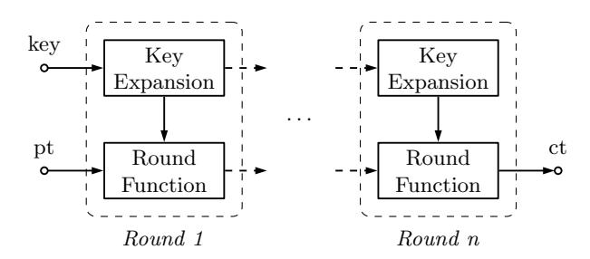
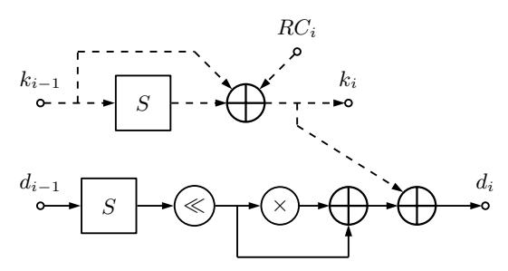
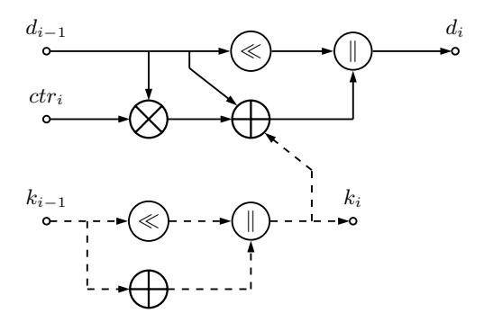
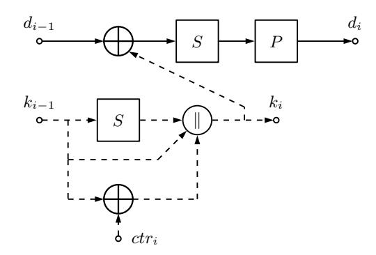
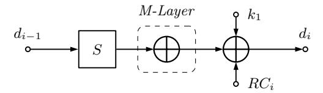
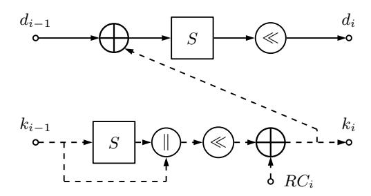
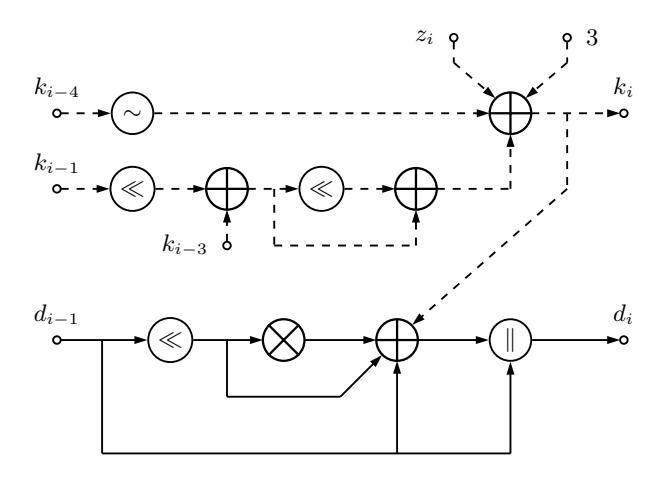
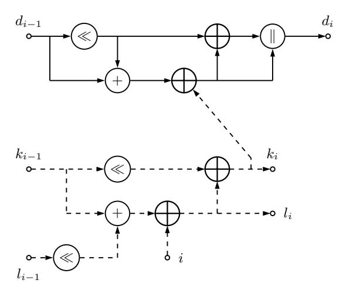
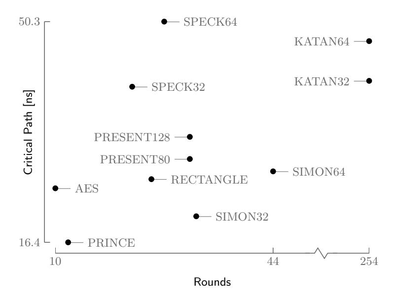

# Single-Cycle Implementations of Block Ciphers

Pieter Maene and Ingrid Verbauwhede

KU Leuven, Department of Electrical Engineering (ESAT), COSIC, Belgium and iMinds, Belgium {pieter.maene,ingrid.verbauwhede}@esat.kuleuven.be

Abstract. Security mechanisms to protect our systems and data from malicious adversaries have become essential. Strong encryption algorithms are an important building block of these solutions. However, each application has its own requirements and it is not always possible to find a cipher that meets them all. This work compares unrolled combinatorial hardware implementations of six lightweight block ciphers, along with an AES implementation as a baseline. Up until now, the majority of such ciphers were designed for area-constrained environments where speed is often not crucial, but recently the need for single-cycle, lowlatency block ciphers with limited area requirements has arisen to build security architectures for embedded systems. Our comparison shows that some designers are already on this track, but a lot of work still remains to be done.

Keywords: block ciphers, lightweight cryptography, single-cycle, synthesis

## 1 Introduction

Software applications have always been vulnerable to attacks from malicious actors. One research topic in the trusted computing community is Protected Module Architectures (PMAs), where applications can be automatically protected against them. For example, Intel's Software Guard Extensions (SGX) provide architectural support to isolate applications [\[3\]](#page-14-0). Software runs in socalled enclaves, which have special hardware features to protect code and data from unauthorised access. When sensitive data leaves or enters the enclave, it is automatically encrypted and decrypted, and this requires a fast algorithm. Finding suitable low-latency cryptographic algorithms is one of the biggest challenges when bringing these isolation techniques to area-constrained embedded systems.

As smaller silicon technology nodes make it possible to place more and more transistors on a single die, modern Systems-on-Chip (SoCs) have become manycore devices. High-bandwidth, packet-switched Networks-on-Chip (NoCs) have replaced slower buses [\[15\]](#page-15-0). Protection of these networks is an open research question. The underlying ideas of security mechanisms for traditional networks can be used, but will require fast and efficient cryptographic primitives.

In both these applications, having high throughput is not the most important design requirement. Rather, when a data element arrives, it should be processed as fast as possible, the additional delay that is introduced has to be as low as possible. A single-cycle implementation is the extreme, as it will not have any additional latency. One approach to achieve this, is by unrolling existing iterative block ciphers. However, this results in long combinatorial paths, which have a high associated delay. As will be shown in our work, they can only operate at such low clock frequencies, the operating speed of the architectures they are integrated with will be limited. Of course, introducing pipeline registers would increase the throughput and maximum clock frequency, but at the cost of additional latency. Another advantage of fully combinatorial implementations is that they can be easily integrated with existing designs, because of the lack of control logic.

Our work gives synthesis results for unrolled implementations of six families of lightweight ciphers, where the same approach is used for all of them. Whenever possible, algorithms are grouped by block and key size to make a fair comparison with regard to the security they offer. The different algorithms are AES [\[14\]](#page-15-1), KATAN [\[16\]](#page-15-2), PRESENT [\[8\]](#page-15-3), PRINCE [\[11\]](#page-15-4), RECTANGLE [\[32\]](#page-16-0), SIMON [\[5\]](#page-15-5) and SPECK [\[5\]](#page-15-5). A short summary of the best known cryptanalysis results is given for each algorithm. [Section 2](#page-1-0) first introduces some general concepts and terminology. Synthesis results for FPGA and ASIC are given in [Section 3.](#page-3-0) Finally, [Section 4](#page-11-0) compares our results, followed by a conclusion in [Section 5.](#page-13-0)

## 2 Preliminaries

#### 2.1 Block Cipher Structure

A block cipher [\(Definition 1](#page-1-1) [\[23\]](#page-16-1)) is a basic cryptographic building block offering confidentiality of data. It is used in a wide variety of applications, from protecting communication to generating pseudo-random numbers.

Definition 1. An n-bit block cipher is a function E : Vn × K → Vn, such that for each key K ∈ K, E(P, K) is an invertible mapping (the encryption function for K) from Vn to Vn, written EK(P). The inverse mapping is the decryption function, denoted DK(C). C = EK(P) denotes that ciphertext C results from encrypting plaintext P under K.

Algorithm designers typically use established design techniques when creating new algorithms. Most current block ciphers are iterated ciphers [\(Definition 2](#page-1-2) [\[23\]](#page-16-1)). Feistel ciphers [\(Definition 3](#page-2-0) [\[23\]](#page-16-1)) are a special instance with a particular structure.

Definition 2. An iterated block cipher is a block cipher involving the sequential repetition of an internal function called the round function. Parameters include the number of rounds r, the block bit-size n, and the bit-size k of the input key K from which r subkeys Ki (round keys) are derived. For invertibility (allowing unique decryption), for each value Ki the round function is a bijection on the round input.

Definition 3. A Feistel cipher is an iterated cipher mapping a 2t-bit plaintext (L0, R0), for t-bit blocks L0 and R0, to a ciphertext (Rr, Lr), through an r-round process where r ≥ 1. For 1 ≤ i ≤ r, round i maps (Li−1, Ri−1) Ki −−→ (Li , Ri) as follows: Li = Ri−1, Ri = Li−1 ⊕ f (Ri−1, Ki), where each subkey Ki is derived from the cipher key K.

Hardware implementations of iterated block ciphers usually have logic for a single round and a controller that manages the round function iterations. Consequently, several clock cycles will be required before the result is ready. It is important to note that the number of clock cycles needed to encrypt a block is a property of the implementation. One way to reduce the number of cycles is by unrolling the iterations, and in doing so, we obtain single-cycle implementations. When all rounds are fully unrolled, this process results in the same basic structure for all of them (see [Figure 1\)](#page-2-1).

It can be seen from [Definition 2](#page-1-2) that each round has two components: the key expansion and round function. The former generates the subkeys Ki based on the original key, a previous one or a combination of both. The latter transforms the input data using the key. In general, the function is identical for each round, but some algorithms introduce small variations (e.g. a different constant could be added in each round). The total number of rounds depends on the algorithm and can vary widely. An operation is sometimes applied to the plaintext before using it as an input to the first round. The last round's output can be similarly modified before using it as the ciphertext.

Fig. 1. Structure of unrolled block ciphers (pt: plaintext, ct: ciphertext).

### 2.2 Logic Depth

The logic depth [\[26\]](#page-16-2) of a path is defined as the number of combinatorial gates between input and output. Since each level of the path has a specific delay associated with it, the logic depth will be linked to the latency of the circuit. However, some operations will have a longer intrinsic delay than others, so that a deep circuit of low-latency gates will have a lower delay than a shallow circuit with high-latency gates. The logic depth is a property of the implementation, which is influenced by the design.

[Section 3](#page-3-0) will give the logic depth of the critical path on FPGA for each algorithm. The critical path of a circuit is the path for which it takes the longest for the output to stabilize [\[27\]](#page-16-3), i.e., the one with the longest delay.

### 2.3 Fan-Out

The fan-out denotes the number of load gates N that are connected to the output of the driving gate [\[27\]](#page-16-3). When the fan-out of a gate is large, it will deteriorate performance because the load on that gate will be very high. This impacts its dynamic performance and will slow down the circuit. The fan-out of a gate is influenced by the design of the algorithm and how it is implemented. Therefore, a designer should be careful not to reuse a single intermediate result in a next step too often.

## 3 Synthesis Results

We will now discuss the design criteria and specifications of each block cipher, as well as its most important results. The best cryptanalysis results known to us are given as well. An overview of the properties of all discussed algorithms is given in [Table 1.](#page-4-0) [Table 2](#page-12-0) and [Table 3](#page-13-1) give an overview of all FPGA and ASIC results respectively. A diagram of the critical path for each cipher is also given. Note that these figures do not show the algorithm's full data flow, but rather a simplified version for clarity.

The regular structure [\(Section 2.1\)](#page-1-3) of block ciphers makes it possible to use a generic approach for unrolling each algorithm. Only the encryption mode of each cipher was implemented. The area cost of adding decryption will depend on the design: this requires less overhead compared to encryption for some than others. Both FPGA and ASIC results are listed, because although most realworld applications will eventually be produced as ASIC, FPGAs are sometimes introduced in products (e.g., because they can be upgraded in the field). They are also heavily used in the development of new chips.

The FPGA results were obtained after Place and Route (PAR) on a Xilinx Virtex 6 in Xilinx ISE. More specifically, the configuration of the Xilinx ML605 development board was selected (xc6vlx240t-2ff1156). All syntheses for ASIC were done with UMC's 0.13 µm technology in Synopsys Design Vision.

### 3.1 AES

In 1998, Daemen and Rijmen submitted their Rijndael algorithm [\[14\]](#page-15-1) to the Advanced Encryption Standard (AES) competition, organised by NIST. Three years later, the design won and it is now known as AES. The implementation criteria for the AES contest were high throughput, low memory requirements, and hardware and software suitability [\[6\]](#page-15-6). It is used for confidentiality in a wide range of applications: among others to protect Wi-Fi connections, secure web traffic, or encrypt hard drivers. The Rijndael family can accommodate any block

Table 1. Properties of all implemented algorithms.

| Cipher    | Key Size Block Size Rounds Type |     |                           | Characteristics                                 | Cryptanalysis |
|-----------|---------------------------------|-----|---------------------------|-------------------------------------------------|---------------|
| AES       | 128                             | 128 | 10 SP Network 8-bit S-box |                                                 | [9]           |
| KATAN     | 80                              | 32  | 254                       | Non-Linear Boolean Functions (AND and XOR) [21] |               |
|           |                                 | 64  |                           |                                                 |               |
| PRESENT   | 80                              |     | 31 SP Network 4-bit S-box |                                                 | [13]          |
|           | 128                             | 64  |                           |                                                 |               |
| PRINCE    | 128                             | 64  | 12 Unrolled               | 4-bit S-box, Matrix Layer                       | [12]          |
| RECTANGLE | 80                              | 64  | 25 SP Network 4-bit S-box |                                                 | [29]          |
| SIMON     | 64                              | 32  | 32 Feistel                | XOR and Left Cyclic Shift                       | [4]           |
|           | 128                             | 64  | 44                        |                                                 |               |
| SPECK     | 64                              | 32  | 22                        | XOR, Addition and Cyclic Shift                  | [18]          |
|           | 128                             | 64  | 27                        |                                                 |               |

and key size from 128 to 256 bits, with steps of 32 bits. NIST fixed the block size at 128 bits, but the key size can be chosen depending on the required level of security (128, 192, or 256 bits) [\[25\]](#page-16-5).

The algorithm has the following three basic operations: SubBytes, ShiftRows and MixColumns. SubBytes substitutes a state byte with the result of an Sbox look-up. ShiftRows cyclically shifts the state's rows. MixColumns applies an invertible linear transformation to each column. AES was not specifically designed as a low-area or low-latency hardware cipher, but it is included here as a reference because its algorithm is well-understood and generally known.

The best known shortcut attack that works on the full versions of AES is a biclique attack from 2011 [\[9\]](#page-15-7). It breaks all 10 rounds of AES128 with a time complexity of 2126.18 and data complexity of 288. These numbers are still high enough to have no practical value.

Fig. 2. Diagram of the critical of one unrolled AES round (RCi: round constant, : circular shift, ×: finite field multiplier). The dashed part is the key expansion, which does not impact the critical path.

Our implementation for 128-bit keys uses 8,984 slices and has a 20.4 ns combinatorial delay. On FPGA, logic is responsible for 21.94% of the delay and routing for 78.06%. The logic depth [\(Section 2.2\)](#page-2-2) of the critical path consists of 52 levels. The S-box look-up of each round accounts for three levels, or 30 for our design (10 rounds). A diagram of the critical path for one round is shown in [Figure 2.](#page-4-1) The S-box look-up and finite field multiplication are the most expensive components in terms of delay. However, note that the multiplication can be implemented efficiently and without a full multiplier. Although the key expansion for each round is done in parallel with the calculations of the round itself and therefore does not appear on the critical path, it is shown to give an idea of its cost.

The big difference between the logic and routing delay has two causes. First, the main operations on the critical path are look-ups in big 8-bit S-boxes, which have long delays. They incur a total delay (both logic and routing) of 11.2 ns, or 45.24%. Second, the input signal to each round has a large fan-out, slowing down the circuit. This is not caused by a design decision here, but rather an effect of how the S-box was synthesized.

All S-boxes were implemented with 8-bit to 8-bit Look-Up Tables (LUTs). This explains the large ASIC area, because LUTs do not map well to ASIC. Note that implementations which rely on composite field arithmetic yield significantly better area results, especially in ASIC [\[28,](#page-16-6)[20\]](#page-15-12).

#### 3.2 KATAN

De Canni`ere et al. designed KATAN and KTANTAN [\[16\]](#page-15-2) to be used in RFID tags. Their goal was to build an algorithm with an efficient hardware implementation, while still achieving reasonable throughput. The family of ciphers has a fixed key size of 80 bits, but the block size is a parameter (32, 48 or 64 bits). KATAN uses a Linear Feedback Shift Register (LFSR) for the key expansion. Encryption is done by splitting the state into two parts of different length and applying a non-linear function to each in every round of the algorithm. The only difference between KATAN and KTANTAN is that the latter has a hard-coded key.

Bogdanov and Rechberger [\[10\]](#page-15-13) first broke the KTANTAN family of ciphers with a meet-in-the-middle attack that has a time complexity of 275.170 and data complexity of 3. So far, there are only known attacks against reduced-round versions of KATAN, the best of which is a related-key boomerang attack by Isobe et al. [\[21\]](#page-15-8). It breaks 174 out of 254 rounds of KATAN32 with a time complexity 278.8 and data complexity 227.6 .

Two versions of KATAN were built: KATAN32 and KATAN64 use 32-bit and 64-bit blocks respectively. The former requires 1,064 slices and has a critical path of 41.2 ns. Although it has a very small area, its practical use is limited by the long delay, which is caused by the large number of rounds. The results for the latter are similar, with 2,550 slices and 47.3 ns. On FPGA, 91% of the delay is caused by routing, and 9% by logic for both variations. The logic depth consists of respectively 62 and 72 levels for the 32- and 64-bit states.

[Figure 3](#page-6-0) shows a diagram of the critical path. The signal runs in parallel through the paths with the left shift and XOR and AND gates respectively. Since it doesn't cost much to implement a shift in hardware, only the latter will be in the critical path. Both the key expansion and LFSR round counter (ctri , which isn't shown) can be calculated in parallel and are therefore not part of the critical

Fig. 3. Diagram of the critical path of one unrolled KATAN round (ctri: LFSR round counter, : regular shift). The dashed part is the key expansion, which does not impact the critical path.

path. Although the round function has a small delay, the large number of rounds explains why a combinatorial implementation of the overall algorithm is slow.

The XOR gates have a 9 to 1 delay ratio. In the Virtex 6 FPGA, they are implemented with 6-input LUTs, which have a constant look-up time of 0.061 ns (the logic delay). The routing delay accounts for the time needed to get the result to the next LUT. Contrary to the constant logic delay, it varies slightly depending on the fan-out [\(Section 2.3\)](#page-3-1) and placement of the design on the fabric.

#### 3.3 PRESENT

Like KATAN [\(Section 3.2\)](#page-5-0), PRESENT [\[8\]](#page-15-3) was created as a lightweight block cipher for constrained environments. They have very similar characteristics, but PRESENT has a higher throughput with lower area. In each encryption round, the state's nibbles are run through a 4-bit S-box. This is followed by a permutation layer which moves bits to different positions. The block size is fixed at 64 bits, but both 80- and 128-bit keys can be used. The variation with 80-bit keys takes up 2,089 slices and has a 29.2 ns delay. Increasing the key size has a small impact on area and critical path.

No known attacks break the full version of PRESENT. The best one was published by Joo Yeon Cho [\[13\]](#page-15-9) and breaks 25 out of 31 rounds of the 80-bit variation with a time complexity of 264 and data complexity of 262.4 .

On FPGA, 9.0% of the delay is caused by logic and 91.0% by routing for both key sizes. A diagram of the critical path for one round is shown in [Figure 4.](#page-7-0) In each round, it first passes through the XOR with the key, followed by the S-box look-up and finally the permutation layer. The latter is a very cheap operation in hardware, as it only requires reordening wires. The XOR gates have the same characteristics that were mentioned earlier, but the smaller 4-bit S-boxes have a logic and routing delay similar to other gates. The critical path of the former has a logic depth of 48 levels, while the latter comes in at 52 levels.

Fig. 4. Diagram of the critical path of one unrolled PRESENT round. The dashed part is the key expansion, which does not impact the critical path.

#### 3.4 PRINCE

PRINCE [\[11\]](#page-15-4) is the first lightweight block cipher design that focuses on reducing latency. Traditional block ciphers are iterated algorithms with almost identical round functions [\(Section 2.1\)](#page-1-3). This similarity is a big advantage to build compact multi-cycle algorithms, but becomes problematic when the ciphertext needs to be ready in a single cycle. By deciding on an unrolled structure from the start, the design space greatly increases, as there is no need for each round to be identical. An additional requirement for PRINCE was negligible overhead for the decryption mode.

The algorithm has a symmetric design about a center matrix multiplication. Aside from the addition of the expanded key and round constants, the rounds have two basic operations: a 4-bit S-box and matrix multiplication. The latter is constructed so that every output bit is influenced by three input bits. The matrix multiplication is implemented as an XOR of the selected bits. Three different matrices are used: the construction of the symmetric matrix M0 is given in the original paper. The matrix M is derived from M0 by first shifting the input state similarly to AES' ShiftRows before the multiplication. Both the block and key size are fixed to 64 and 128 bits respectively. The 128-bit key input is expanded to 192 bits, so that three different 64-bit keys are available. k0 and k 0 0 are used for pre- and post-whitening respectively, and k1 as the round subkey.

The key k0 and a round constant are added first. Then, there are five rounds in which the S-box is applied to the state, followed by multiplication with M, and again the addition of a round constant and the key k1 (see [Figure 5\)](#page-8-0). The center part of the algorithm applies the S-box, multiplies the result with M0 , and applies the inverse S-box. This is followed by five inverse rounds (the order of the operations is reversed, and the inverse S-box and M−1 are used). The final step is again the addition of a round constant and key k 0 0 .

Since its publication, the resistance of PRINCE against different attacks has been investigated. The most recent ones are due to Morawiecki [\[24\]](#page-16-7), Derbez and Perrin [\[17\]](#page-15-14), Canteaut et al. [\[12\]](#page-15-10) and Zhao et al. [\[33\]](#page-16-8). The best known attack so far is the one by Morawiecki [\[24\]](#page-16-7). His meet-in-the-middle approach compromises 10 out of 12 rounds with (online) time complexity 268 and data complexity 2 57. When the reflection parameter α can be chosen, the cipher core, i.e. the algorithm without the pre- and post-whitening keys, is fully broken with a time and data complexity of 241 [\[22\]](#page-16-9).

Fig. 5. Critical path diagram of one regular PRINCE round (RCi: round constant). The dashed part is the key expansion, which does not impact the critical path.

PRINCE only needs 1,244 slices and has a short critical path of 16.4 ns. It first passes through the three initial XORs, which are combined in a single LUT. In the five regular rounds that follow (see [Figure 5\)](#page-8-0), the S-box look-up and matrix multiplication are also synthesized to a single LUT, as well as the two remaining XORs. The signal then runs through another S-box look-up and the matrix multiplication at the center. The rest of the path is symmetric, due to the cipher's design. On FPGA, routing is responsible for 91.0% of the delay and logic for 9.0%, which can again be explained by the general gate characteristics given earlier. The logic depth of the critical path is 26 levels.

The absence of a complicated key expansion does not impact the critical path, as it can be processed in parallel with the data processing. This was observed for the other algorithms, where the key expansion never shows up in the critical path. However, it does lower the area requirements of the cipher.

## 3.5 RECTANGLE

Published in 2014, RECTANGLE [\[32\]](#page-16-0) is the most recent cipher discussed here. It was designed to have good hardware and software performance. The round function is very simple: first, there is an XOR with the round subkey, followed by the application of a 4-bit S-box substitution to the state's columns and a cyclic shift of its rows over different offsets. The key expansion also has these two operations (the S-box is only applied to the 0th column of the key state) and the addition of a round constant, which is generated by an LFSR. The block size is fixed at 64 bits, but there are two possible key sizes (80 and 128 bits).

Since it was only published very recently, few analyses have been published on RECTANGLE. Currently, there is only one report about the variation with 80-bit keys by Shan et al. [\[29\]](#page-16-4). Their differential attack breaks 19 out of 25 rounds with a time complexity of 267.42 and data complexity of 262 .

The variation with 80-bit keys takes up 1,688 slices and has 26.1 ns delay. For each round, the critical path runs through the XOR with the round key, S-

Fig. 6. Critical path diagram of one unrolled RECTANGLE round (: circular shift, RCi: round constant). The dashed part is the key expansion, which does not impact the critical path.

box look-up and circular shift (see [Figure 6\)](#page-9-0). The key expansion can be done in parallel and is only shown to give an idea of its cost. On FPGA, one LUT combines the XOR, S-box look-up, and shift. However, the synthesis cannot merge the three operations in some cases (probably due to placement constraints). The final component is the XOR with the last subkey (not shown on [Figure 6\)](#page-9-0). On FPGA, 9.2% of the delay is caused by logic and 90.8% by routing, which is expected given the general characteristics of the gates. The logic depth of the critical path is 41 levels.

### 3.6 SIMON

The designers of SIMON and SPECK [\(Section 3.7\)](#page-10-0) [\[5\]](#page-15-5) focused on flexibility. Most lightweight block ciphers have a small number of possible block and key sizes. This can make it hard to find a suitable algorithm for a specific application. In contrast, the parameters of SIMON and SPECK give rise to 10 variations. The block size ranges from 32 to 128 bits and the key size from 64 to 256 bits.

SIMON is a Feistel cipher [\(Section 2.1\)](#page-1-3) where the cipher's state is split in half and in each round, the upper part of the input is left unchanged and becomes the lower part of the output. The round function is applied to the lower part and assigned to the upper part of the output. SIMON's round function is very straightforward: it has just three cyclic shifts, three XOR gates, and one AND gate. The key expansion is slightly more complicated, but uses similar building blocks as the round function.

SIMON and SPECK have been analysed for mathematical weaknesses using a variety of techniques ([\[2\]](#page-14-2), [\[7\]](#page-15-15), [\[30\]](#page-16-10), [\[31\]](#page-16-11), [\[4\]](#page-14-1) and [\[1\]](#page-14-3)), but none have broken the full cipher so far. Note that some publications are limited to a set of specific parameter pairs. The best result for SIMON 32/64 at this time is a linear supertrail attack by Ashur [\[4\]](#page-14-1) which breaks 24 out of 32 rounds with a time complexity of 263.57 and data complexity of 231.57 .

We implemented two parameter pairs: one with 32-bit blocks and 64-bit keys and one with 64-bit blocks and 128-bit keys. The former needs 960 slices and has a critical path of 20.4 ns. The latter uses 2,688 slices and the output is ready

Fig. 7. Critical path diagram of one unrolled SIMON round (∼: inverter, : circular shift, zi: bit from a predefined constant vector). The dashed part is the key expansion, which does not impact the critical path.

after 27.3 ns. The critical path runs through a circular shift, AND and XOR gate (see [Figure 7\)](#page-10-1). Again, the key expansion is not part of the critical path, but is only included in the diagram to show its cost. The XOR and AND operations in each round are combined in a single LUT. On FPGA, 90% of the delay is caused by routing and 10% by logic for both variations, which is the ratio we've seen for the other designs as well. The logic depth of the smallest variation consists of 34 levels and 46 levels for the other one.

#### 3.7 SPECK

SPECK was published together with SIMON [\(Section 3.6\)](#page-9-1), and although both perform well in general, SIMON was optimised for hardware implementations and SPECK for software. The state is also split in half in SPECK's design, but it is not a Feistel cipher, so both halves change in each round. The round function has even fewer operations than SIMON's, but a very important difference is that one adder is now being used. Although trivial in software, this design decision has a big impact on hardware performance, as can be seen from the results.

Of all reports on SIMON, only Biryukov et al. [\[7\]](#page-15-15) also analysed SPECK, but improved results were obtained by Dinur [\[18\]](#page-15-11). The best attack breaks 14 out of 22 rounds of SPECK 32/64 with a time complexity of 263 and data complexity of 231 .

Implementations were built for the same two parameter pairs as were used with SIMON [\(Section 3.6\)](#page-9-1). SPECK 32/64 requires 1,513 slices and has a 40.3 ns delay. SPECK 64/128 uses 3,594 slices and has a critical path of 50.3 ns. The components of the critical path differ between the rounds depending on the possible optimizations after placement. In general, it runs through the circular shift, adder chain, and finally the XOR gates (see [Figure 8\)](#page-11-1). Comparing the delay

Fig. 8. Critical path diagram of one unrolled SPECK round (: circular shift, i: round counter). The dashed part is the key expansion, which does not impact the critical path.

for both variations, we can clearly see the impact of the adder. On FPGA, logic is responsible for 33% and the wiring for 67% for both variations. This is due to the adders introducing longer logic delays than the basic gates that were used in all other algorithms. The critical path of SPECK 32/64 has a logic depth of 124 levels, while SPECK 64/128 comes in at 197 levels. The total delay caused by the adders is 26.4 ns (65.53%) and 32.8 ns (65.28%) respectively.

## 4 Comparison

[Table 2](#page-12-0) summarizes all FPGA results from the previous section, grouped by block and key size. Looking at the ciphers with 32-bit blocks, SIMON 32/64 has the best performance both in terms of area and throughput. An important disadvantage are the 64-bit keys which only offer very short-term protection against small organizations [\[19\]](#page-15-16). While KATAN 32/80 uses stronger keys and has has similar area requirements, its large number of rounds results in a long critical path.

Among the algorithms with 64-bit blocks and 80-bit keys, RECTANGLE is the smallest and has the shortest latency too. PRESENT has similar characteristics because they use the same techniques. The difference between the two is only caused by the actual S-box design and permutation layer. Although KATAN's area is still quite small for these parameters, its latency is the second-highest of all implementations. The reason for the higher throughput is the bigger block size.

Comparing the results for the last parameter pair (64-bit blocks, 128-bit keys), PRINCE's performance really stands out. It is by far the smallest in its category and not even that far off SIMON 32/64. The latency is the lowest of all implemented ciphers, which confirms its main design requirement. The numbers for PRESENT and SIMON are similar, with PRESENT having a slightly smaller footprint and SIMON being a bit faster. However, as the area increases with the parameter size, the variations with small parameters are most interesting. The circuit is compounded by a large number of additional rounds when the size of the parameter goes up. SPECK's results don't make it an attractive alternative. The critical path is particularly long because of the adders in its design.

Looking at the different lightweight ciphers, the performance of AES is surprisingly good. It has a very large area because of the big S-boxes (8-bit to 8-bit), but its latency is competitive, given the small number of rounds and efficient permutation layer. Combined with the 128-bit blocks, this results in high throughput.

Table 2. Size, critical path and throughput on FPGA (italics: best result in a security class, bold: best result overall)

| Cipher          |          | Size Critical Path Throughput |          |
|-----------------|----------|-------------------------------|----------|
|                 | [Slices] | [ns]                          | [Gbit/s] |
| SIMON 32/64     | 960      | 20.4                          | 1.46     |
| SPECK 32/64     | 1,513    | 40.3                          | 0.74     |
| KATAN 32/80     | 1,064    | 41.2                          | 0.72     |
| KATAN 64/80     | 2,550    | 47.3                          | 1.26     |
| PRESENT 64/80   | 2,089    | 29.2                          | 2.04     |
| RECTANGLE 64/80 | 1,668    | 26.1                          | 2.29     |
| PRESENT 64/128  | 2,203    | 32.6                          | 1.83     |
| PRINCE 64/128   | 1,244    | 16.4                          | 3.64     |
| SIMON 64/128    | 2,688    | 27.3                          | 2.18     |
| SPECK 64/128    | 3,594    | 50.3                          | 1.19     |
| AES 128/128     | 8,984    | 24.7                          | 4.82     |

Most ASIC results are in line with the expectations from FPGA. The biggest surprise is SPECK's area being smaller than SIMON's, both for 32- and 64 bit blocks. A possible explanation for this difference is that the adders can be mapped better on ASIC than FPGA. Also note that the latency for SPECK 64/128 is very high on ASIC.

It is now possible to make some observations on the design of lightweight ciphers. Unrolling the rounds of an iterated cipher places all data operations of the round function on the critical path. Therefore, when an algorithm has more rounds, the critical path will often be longer as well (see [Figure 9\)](#page-14-4). This is clear from the results for KATAN, which has a very large number of rounds. It is well known that regular arithmetic does not perform well in hardware, especially in terms of latency. SPECK's performance is a clear indication of this. Big S-boxes are also expensive, and as can be seen from the AES implementation, they have

Table 3. Size, critical path and throughput on ASIC (italics: best result in a security class, bold: best result overall)

| Cipher                    |            | Size Critical Path Throughput |          |
|---------------------------|------------|-------------------------------|----------|
|                           | [GE]       | [ns]                          | [Gbit/s] |
| SIMON 32/64               | 8,432.00   | 29.6                          | 1.00     |
| SPECK 32/64               | 5,893.25   | 82.1                          | 0.36     |
| KATAN 32/80               | 11,939.50  | 61.2                          | 0.49     |
| KATAN 64/80               | 24,766.50  | 75.8                          | 0.79     |
| PRESENT 64/80             | 22,063.50  | 39.4                          | 1.51     |
| RECTANGLE 64/80 14,003.75 |            | 39.3                          | 1.52     |
| PRESENT 64/128            | 23,005.75  | 38.1                          | 1.57     |
| PRINCE 64/128             | 9,522.75   | 22.9                          | 2.60     |
| SIMON 64/128              | 23,584.00  | 41.7                          | 1.43     |
| SPECK 64/128              | 16,371.00  | 182.4                         | 0.33     |
| AES 128/128               | 126,571.00 | 61.6                          | 1.93     |

a large area requirement, especially in ASIC. Additionally, because they don't map well to the FPGA fabric, they have very long delays. The number of S-boxes used in the round function is of less importance, as they are working in parallel. Depending on the platform, using multiple-input gates could also negatively impact the latency (e.g. a four-input XOR can be implemented in a single LUT on FPGA, while it will result in a cascade of three XORs in ASIC).

Finally, recommendations for the design of low-latency algorithms follow from these remarks. When focusing on low latency, having an unrolled design, like PRINCE, gives significantly better results. Iterated SP networks also perform well: the delay of small S-boxes is not very high and the permutation layer can essentially be implemented for free. The number of rounds should be as low as possible, while still maintaining an acceptable level of security. Small S-boxes are a nice component, as they have low latency as well as good area performance. Lastly, the general design rule to use boolean operations in hardware designs also applies here.

## 5 Conclusion

In this paper, we have given synthesis results for unrolled implementations of six families of lightweight block ciphers, along with AES for reference. It was shown that PRINCE, the only cipher specifically designed to have low latency, is the fastest of all implemented algorithms, and also has a very competitive area. For smaller block sizes, which are useful for some applications, SIMON has the smallest area and offers good throughput. However, the latency of most ciphers is too high to be useful in practice. For example, PRINCE runs at 61.039 MHz on Virtex 6, which is fast compared to the other ciphers, but is suitable only for

Fig. 9. Plot of the critical path on FPGA in function of the number of rounds.

small embedded applications. The speed in a microcontroller will be even lower once it is integrated with other components that add to the critical path. The search for new ciphers is therefore an important future research topic.

## Acknowledgements

This work was supported in part by the Research Council KU Leuven: GOA TENSE (GOA/11/007). In addition, this work is supported in part by the Flemish Government through FWO G.0130.13N and FWO G.0876.14N. We would like to thank Kimmo J¨arvinen for his valued advice.

## References

- 1. Ahmadian, Z., Rasoolzadeh, S., Salmasizadeh, M., Aref, M.R.: Automated Dynamic Cube Attack on Block Ciphers: Cryptanalysis of SIMON and KATAN. Cryptology ePrint Archive, Report 2015/040 (2015)
- 2. Alkhzaimi, H.A., Lauridsen, M.M.: Cryptanalysis of the SIMON Family of Block Ciphers. Cryptology ePrint Archive, Report 2013/543 (2013)
- 3. Anati, I., Gueron, S., Johnson, S., Scarlata, V.: Innovative Technology for CPU Based Attestation and Sealing. In: Proceedings of the 2nd International Workshop on Hardware and Architectural Support for Security and Privacy. p. 10 (2013)
- 4. Ashur, T.: Improved Linear Trails for the Block Cipher Simon. Cryptology ePrint Archive, Report 2015/285 (2015)

- 5. Beaulieu, R., Shors, D., Smith, J., Treatman-Clark, S., Weeks, B., Wingers, L.: The SIMON and SPECK Families of Lightweight Block Ciphers. Cryptology ePrint Archive, Report 2013/404 (2013)
- 6. Bernstein, D.J.: Crypto Competitions — AES: the Advanced Encryption Standard. [http://competitions](http://competitions.cr.yp.to/aes.html).cr.yp.to/aes.html (2014)
- 7. Biryukov, A., Roy, A., Velichkov, V.: Differential Analysis of Block Ciphers SIMON and SPECK. Cryptology ePrint Archive, Report 2014/922 (2014)
- 8. Bogdanov, A., Knudsen, L.R., Leander, G., Paar, C., Poschmann, A., Robshaw, M.J., Seurin, Y., Vikkelsoe, C.: PRESENT: An Ultra-Lightweight Block Cipher. In: Proceedings of the 9th International Workshop on Cryptographic Hardware and Embedded Systems. pp. 450–466. CHES '07, Springer-Verlag (2007)
- 9. Bogdanov, A., Khovratovich, D., Rechberger, C.: Biclique Cryptanalysis of the Full AES. Cryptology ePrint Archive, Report 2011/449 (2011)
- 10. Bogdanov, A., Rechberger, C.: A 3-Subset Meet-in-the-Middle Attack: Cryptanalysis of the Lightweight Block Cipher KTANTAN. In: Biryukov, A., Gong, G., Stinson, D. (eds.) Selected Areas in Cryptography, pp. 229–240. Lecture Notes in Computer Science, Springer Berlin Heidelberg (2011)
- 11. Borghoff, J., Canteaut, A., Gneysu, T., Kavun, E.B., Kneˇzevi´c, M., Knudsen, L.R., Leander, G., Nikov, V., Paar, C., Rechberger, C., Rombouts, P., Thomsen, S.S., Yaln, T.: PRINCE: A Low-latency Block Cipher for Pervasive Computing Applications. Cryptology ePrint Archive, Report 2012/529 (2012)
- 12. Canteaut, A., Fuhr, T., Gilbert, H., Naya-Plasencia, M., Reinhard, J.R.: Multiple Differential Cryptanalysis of Round-Reduced PRINCE (Full Version). Cryptology ePrint Archive, Report 2014/089 (2014)
- 13. Cho, J.Y.: Linear Cryptanalysis of Reduced-Round PRESENT. Cryptology ePrint Archive, Report 2009/397 (2009)
- 14. Daemen, J., Rijmen, V.: The Rijndael Algorithm. In: The First Advanced Encryption Standard Candidate Conference. p. 45. Ventura, CA, USA (1998)
- 15. Dally, W., Towles, B.: Route Packets, Not Wires: On-Chip Interconnection Networks. Proceedings of the 38th Design Automation Conference (2001)
- 16. De Canni`ere, C., Dunkelman, O., Kneˇzevi´c, M.: KATAN and KTANTAN — A Family of Small and Efficient Hardware-Oriented Block Ciphers. In: Proceedings of the 11th International Workshop on Cryptographic Hardware and Embedded Systems. pp. 272–288. CHES '09, Springer-Verlag (2009)
- 17. Derbez, P., Perrin, L.: Meet-in-the-Middle Attacks and Structural Analysis of Round-Reduced PRINCE. Cryptology ePrint Archive, Report 2015/239 (2015)
- 18. Dinur, I.: Improved Differential Cryptanalysis of Round-Reduced Speck. In: Joux, A., Youssef, A. (eds.) Selected Areas in Cryptography – SAC 2014, pp. 147–164. Lecture Notes in Computer Science, Springer International Publishing (2014)
- 19. Giry, D., Quisquater, J.J.: Keylength — ECRYPT II Report on Key Sizes (2012). [http://www](http://www.keylength.com/en/3/).keylength.com/en/3/ (2014)
- 20. Hamalainen, P., Alho, T., Hannikainen, M., Hamalainen, T.: Design and Implementation of Low-Area and Low-Power AES Encryption Hardware Core. In: Proceedings of the 9th EUROMICRO Conference on Digital System Design: Architectures, Methods and Tools. pp. 577–583 (2006)
- 21. Isobe, T., Sasaki, Y., Chen, J.: Related-Key Boomerang Attacks on KATAN32/48/64. In: Boyd, C., Simpson, L. (eds.) Information Security and Privacy, pp. 268–285. Lecture Notes in Computer Science, Springer Berlin Heidelberg (2013)

- 22. Jean, J., Nikoli´c, I., Peyrin, T., Wang, L., Wu, S.: Security Analysis of PRINCE. In: Moriai, S. (ed.) Fast Software Encryption, pp. 92–111. Lecture Notes in Computer Science, Springer Berlin Heidelberg (2014)
- 23. Menezes, A.J., Vanstone, S.A., Oorschot, P.C.V.: Handbook of Applied Cryptography. CRC Press, Inc., 1st edn. (1996)
- 24. Morawiecki, P.: Practical Attacks on the Round-reduced PRINCE. Cryptology ePrint Archive, Report 2015/245 (2015)
- 25. National Institute of Standards and Technology: FIPS 197 (2001)
- 26. Parhi, K.K.: VLSI Digital Signal Processing Systems: Design and Implementation. John Wiley & Sons (2007)
- 27. Rabaey, J.M., Chandrakasan, A., Nikolic, B.: Digital Integrated Circuits: A Design Perspective (2nd Edition). Prentice-Hall, Inc. (2003)
- 28. Rudra, A., Dubey, P.K., Jutla, C.S., Kumar, V., Rao, J.R., Rohatgi, P.: Efficient Rijndael Encryption Implementation with Composite Field Arithmetic. In: Proceedings of the 3rd International Workshop on Cryptographic Hardware and Embedded Systems. pp. 171–184. Lecture Notes in Computer Science, Springer (2001)
- 29. Shan, J., Hu, L., Song, L., Sun, S., Ma, X.: Related-Key Differential Attack on Round Reduced RECTANGLE-80. Cryptology ePrint Archive, Report 2014/986 (2014)
- 30. Wang, N., Wang, X., Jia, K., Zhao, J.: Differential Attacks on Reduced SIMON Versions with Dynamic Key-guessing Techniques. Cryptology ePrint Archive, Report 2014/448 (2014)
- 31. Wang, Q., Liu, Z., Varc, K., Sasaki, Y., Rijmen, V., Todo, Y.: Cryptanalysis of Reduced-Round SIMON32 and SIMON48. In: Meier, W., Mukhopadhyay, D. (eds.) Progress in Cryptology – INDOCRYPT 2014, pp. 143–160. Lecture Notes in Computer Science, Springer International Publishing (2014)
- 32. Zhang, W., Bao, Z., Lin, D., Rijmen, V., Yang, B., Verbauwhede, I.: RECTANGLE: A Bit-slice Ultra-Lightweight Block Cipher Suitable for Multiple Platforms. Cryptology ePrint Archive, Report 2014/084 (2014)
- 33. Zhao, G., Sun, B., Li, C., Su, J.: Truncated differential cryptanalysis of PRINCE. Security and Communication Networks (2015)