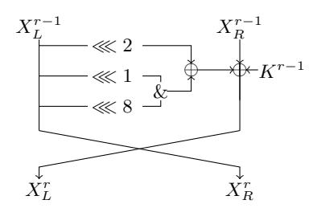
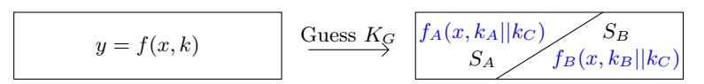

# Improved Linear Hull Attack on Round-Reduced SIMON with Dynamic Key-guessing Techniques

Huaifeng Chen¹, Xiaoyun Wang¹,2⋆

 Key Laboratory of Cryptologic Technology and Information Security, Ministry of Education, Shandong University, Jinan 250100, China
 Institute of Advanced Study, Tsinghua University, Beijing 100084, China hfchen@mail.sdu.edu.cn, xiaoyunwang@mail.tsinghua.edu.cn

Abstract. Simon is a lightweight block cipher family proposed by NSA in 2013. It has drawn many cryptanalysts' attention and varieties of cryptanalysis results have been published, including differential, linear, impossible differential, integral cryptanalysis and so on. In this paper, we give the improved linear attacks on all reduced versions of Simon with dynamic key-guessing technique, which was proposed to improve the differential attack on Simon recently. By establishing the boolean function of parity bit in the linear hull distinguisher and reducing the function according to the property of AND operation, we can guess different subkeys (or equivalent subkeys) for different situations, which decrease the number of key bits involved in the attack and decrease the time complexity in a further step. As a result, 23-round Simon32/64, 24-round Simon48/72, 25-round Simon48/96, 30-round Simon64/96, 31-round Simon64/128, 37-round Simon96/96, 38-round Simon96/144, 49-round Simon128/128, 51-round Simon128/192 and 53-round Simon128/256 can be attacked. As far as we know, our attacks on most reduced versions of Simon are the best compared with the previous cryptanalysis results. However, this does not shake the security of Simon family with full rounds.

### 1 Introduction

In 2013, NSA proposed a new family of lightweight block cipher with Feistel structure, named as SIMON, which is tuned for optimal performance in hardware applications [1]. The SIMON family consists of various block and key sizes to match different application requirements. There is no S-box in the round function. The round function consists of AND, rotation and Xor (ARX structure), leading to a low-area hardware requirement.

Related Works. Simon family has attracted a lot of cryptanalysts' attention since its proposition. Many cryptanalysis results on various versions of Simon were published. For differential attack, Alkhzaimi and Lauridsen [13] gave the first differential attacks on all versions of Simon. The attacks cover 16, 18, 24, 29, 40 rounds for the versions with block size 32, 48, 64, 96 and 128 respectively. At FSE 2014, Abed et al. [9] gave differential attack on variants of Simon reduced to 18, 19, 26, 35, 46 rounds with respective block size 32, 48, 64, 96 and 128. At the same time, Biryukov et al. [10] gave differential attack on several versions of Simon independently. And 19-round Simon32, 20-round Simon48, 26-round Simon64 were attacked. Then Wang et al. [14] proposed better differential attacks with existing differentials, using dynamic key-guessing techniques. As a result, 21-round Simon32/64, 23-round Simon48/72, 24-round Simon48/96, 28-round Simon64/96, 29-round Simon64/128, 37-round Simon96/96, 37-round Simon96/144, 49-round Simon128/128, 49-round Simon128/192, 50-round Simon128/256 were attacked.

For the earlier linear cryptanalysis, 11, 14, 16, 20, 23-round key recovery attacks on Simon with block size 32, 48, 64, 96, 128 were presented in [8]. Then, Alizadeh et al. [15] improved the linear attacks on 13-round Simon32, 15-round Simon48, 19-round Simon64, 28-round Simon96, 35-round Simon128. Recently, Abdelraheem et al. [6] took advantage of the links between linear characteristics and differential characteristics for Simon and found some linear distinguishers using differential characteristics found earlier. They presented various linear attacks on Simon with linear, multiple linear, linear hull cryptanalysis. The linear hull cryptanalysis has better attack results, which can attack 21-round Simon32/64, 20-round Simon48/72, 21-round Simon48/96, 27-round Simon64/96, 29-round Simon64/128, 36-round Simon96/144,

<sup>\*</sup> Corresponding Author

48-round SIMON128/192 and 50-round SIMON128/256. Then, with the Mixed-integer Linear Programming based technique, Shi et al. [7] searched new linear trails and linear hulls, and 21, 21, 29 rounds for SIMON32/64, SIMON48/96, SIMON64/128 were attacked respectively. Also, Sun et al. [12] found a 16-round linear hull distinguisher of SIMON48, with which he attacked 23-round SIMON48/96. Ashur [20] introduced a new way to calculate the correlations of short linear hulls and provided a more accurate estimation for some previously published linear trails. He gave multiple linear cryptanalysis on 24-round SIMON32/64, 23-round SIMON48/72, 24-round SIMON48/96, 24-round SIMON64/96 and 25-round SIMON64/128. However, it uses the correlation when all the subkeys are zero as the expected correlation under random key situations, which is not exact. Moreover, if the potential of each linear hull of the cipher is smaller than that of random permutations, then the combination of these linear hulls can not distinguish between the cipher and a random permutation.

Table 1: Summary of Linear Hull Attacks on Simon

| Cipher         | Total Rounds | Attacked rounds |             | Time                                     | Reference   |
|----------------|--------------|-----------------|-------------|------------------------------------------|-------------|
| Simon32/64     | 32           | 21              | $2^{30.56}$ | $2^{55.56}$                              | [6]         |
|                |              | 21              | - a         | -                                        | [7]         |
|                |              | 23              | $2^{31.19}$ |                                          | Section 4.2 |
| CD (0) (40 /70 | 36           | 20              | $2^{44.11}$ | $2^{70.61}$                              | [6]         |
| Simon $48/72$  |              | 24              | $2^{47.92}$ |                                          | Appendix B  |
|                | 36           | 21              | $2^{44.11}$ | $2^{70.61}$                              | [6]         |
| SIMON/18/06    |              | 21              | -           | -                                        | [7]         |
| Simon $48/96$  |              | 23              | $2^{47.92}$ | $2^{92.92}$                              | [12]        |
|                |              | 25              | $2^{47.92}$ | $2^{91.92}TWO + 2^{89.89}A + 2^{80}E$    | Appendix B  |
| Simon64/96     | 42           | 27              | $2^{62.53}$ | $2^{88.53}$                              | [6]         |
| 51MON04/90     |              | 30              | $2^{63.53}$ |                                          | Appendix B  |
|                | 44           | 29              | $2^{62.53}$ | $2^{123.53}$                             | [6]         |
| Simon 64/128   |              | 29              | -           | -                                        | [7]         |
|                |              | 31              |             | $2^{115.53}TWO + 2^{119.62}A + 2^{120}E$ | Appendix B  |
| Simon96/96     | 52           | 37              | $2^{95.2}$  | $2^{67.94}A + 2^{88}E$                   | Appendix B  |
| Simon96/144    | 54           | 36              | $2^{94.2}$  | $2^{123.5}$                              | [6]         |
|                |              | 38              | $2^{95.2}$  | $2^{126.2}ONE + 2^{98.94}A + 2^{136}E$   | Appendix B  |
| SIMON128/128   | 68           | 49              | $2^{127.6}$ | $2^{87.77}A + 2^{120}E$                  | Appendix B  |
| SIMON128/192   | 69           | 48              | $2^{126.6}$ | $2^{187.6}$                              | [6]         |
|                |              | 51              | $2^{127.6}$ | -   -   -   -   -                        | Appendix B  |
| SIMON128/256   | 7256 72      | 50              | $2^{126.6}$ | $2^{242.6}$                              | [6]         |
| 51WON126/250   |              | 53              | $2^{127.6}$ | $2^{249}ONE + 2^{239.77}A + 2^{248}E$    | Appendix B  |

<sup>&</sup>lt;sup>a</sup> '-' means not given

Also, there are some results with other attack models, such as impossible differential cryptanalysis [15–18], zero-correlation cryptanalysis [16] and integral cryptanalysis [16].

Our Contributions. In this paper, we give the improved linear hull attacks on all reduced versions of SIMON family with dynamic key-guessing technique, which was proposed initially to improve the differential attack on SIMON [14], using existing linear hull distinguishers. In linear attack, one important point is to compute the empirical correlations (bias) of the parity bit, which derives from the Xor-sum of the active bits at both sides of the linear hull distinguisher, under some key guess. Our attack on SIMON improves this procedure efficiently.

The non-linear part in the round function of SIMON is mainly derived from the bitwise AND (&) operation while it has a significant feature. For details, if one of the two elements is equal to zero, the result of their AND will be zero, no matter what value the other element takes. For a function  $f = f_1(x_1, k_1) \& f_2(x_2, k_2)$ , if we

 $<sup>^{\</sup>rm b}\,TWO$  means two rounds encryption or decryption

 $<sup>^{\</sup>mathrm{c}}$  A means addition

 $<sup>^{\</sup>mathrm{d}}$  E means encryption of attacked rounds

<sup>&</sup>lt;sup>e</sup> ONE means one round encryption or decryption

GUESS  $k_1$  at first, and SPLIT the all  $x = x_1 || x_2$  into two cases: case 1,  $f_1(x_1, k_1) = 0$ ; case 2,  $f_1(x_1, k_1) = 1$ , there is no need to guess the key bits  $k_2$  in case 1, since f = 0 holds for any value of  $f_2$  in case 1. Then, we can compute the correlations in each case with less time and at last, we COMBINE the two correlations together for corresponding key  $k = k_1 || k_2$ .

At first, we give the boolean representations for the parity bit in the linear distinguisher of Simon. And then we apply the GUESS, SPLIT and COMBINE technique in the calculation of the empirical correlations, which mainly exploits the dynamic key-guessing idea to reduce the number of subkey bits guessed significantly. For example, in the attack on 21-round Simon32, 32 subkey bits are involved. With above technique, we can only guess 12.5 bits from the total 32-bit subkey on average to compute the correlations.

As a result, the improved attack results are shown as follows. We can attack 23-round SIMON32/64, 24-round SIMON48/72, 25-round SIMON48/96, 30-round SIMON64/96, 31-round SIMON64/128, 37-round SIMON96/96, 38-round SIMON96/144, 49-round SIMON128/128, 51-round SIMON128/192 and 53-round SIMON128/256. This improves the linear attack results for all versions. From the point of number of rounds attacked, the results on most versions are best up to now. The existing and new linear hull attack results on SIMON are summarized in Table 1. Also, we implement the 21-round attack on SIMON32. In the attack, we can decrease the 32 subkey bits involved in the attack by 8 bits. The experiments show that the attack success probability is about 27.7% using 2<sup>31.19</sup> plaintext-ciphertext pairs.

The paper is organised as follows. In section 2, we introduce the linear (hull) cryptanalysis and give the description of Simon family. Section 3 gives the dynamic key-guessing technique used in the linear cryptanalysis. Then the improved attacks on Simon32/64 and all other variants are given in section 4. Finally, we conclude in section 5. Appendix A gives the time complexities to calculate the empirical correlations in some simple situations. In Appendix B, we give the improved attacks on other variants of Simon. The source code of the implementation of 21-round attack on Simon32 is given in Appendix C.

# 2 Preliminaries

#### 2.1 Linear Cryptanalysis and Linear Hull

 $\mathbb{F}_2$  denotes the field with two elements and  $\mathbb{F}_2^n$  is the *n*-dimensional vector space of  $\mathbb{F}_2$ . Let  $g: \mathbb{F}_2^n \to \mathbb{F}_2$  be a Boolean function. Let  $B(g) = \sum_{x \in \mathbb{F}_2^n} (-1)^{g(x)}$ . The correlation c(g) of g and 0 (in the following paper, when we say the correlation of a function, it means the correlation of this function and 0) is defined by

$$c(g) = 2^{-n} \sum_{x \in \mathbb{F}_2^n} (-1)^{g(x)} = 2^{-n} B(g).$$
 (1)

(In some situations of the remainder of this paper, we regard B(g) as the correlation for simplicity of description.) The bias of g is defined by half of c(g), which is represented as  $\epsilon(g) = \frac{1}{2}c(g)$ .

Linear cryptanalysis [2] is a powerful cryptanalytic method proposed in 1993 to cryptanalysis DES. At first, one tries to find a good linear approximation involving some plaintext bits, ciphertext bits and the subkey bits as follows

$$\alpha \cdot P \oplus \beta \cdot C = \gamma \cdot K,\tag{2}$$

where  $\alpha, \beta, \gamma$  are masks and P, C, K represent the plaintext, ciphertext and keys. 'good' means that the probability of the linear approximations is far away from 1/2, which is the probability in random situations. In other words, higher absolute of bias  $\epsilon(\alpha \cdot P \oplus \beta \cdot C \oplus \gamma \cdot K)$  leads to better linear crypanalysis result in general. Algorithm 1 and Algorithm 2 in [2] are two attack models exploiting the linear approximation as distinguisher.  $\mathcal{O}(\frac{1}{\epsilon^2})$  known plaintexts are needed in the key-recovery attacks.

Then in 1994, Nyberg [4] studied the linear approximations with same input mask  $\alpha$  and output mask  $\beta$ , and denoted them as linear hull. The potential of a linear hull is defined as

$$ALH(\alpha,\beta) = \sum_{\gamma} \epsilon^{2} (\alpha \cdot P \oplus \beta \cdot C \oplus \gamma \cdot K) = \bar{\epsilon}^{2}.$$
 (3)

The effect of linear hull is that the final bias  $\bar{\epsilon}$  may become significantly higher than that of any individual linear trail. Then the linear attacks with linear hull require less known plaintexts, *i.e.*,  $\mathcal{O}(\frac{1}{\bar{\epsilon}^2})$ .

Selçuk and Biçak [5] gave the estimation of success probability in linear attack for achieving a desired advantage level. The advantage is the complexity reduction over the exhaustive search. For example, if m-bit key is attacked and the right key is ranked t-th among all  $2^m$  candidates, the advantage of this attack is  $m - log_2(t)$ . Theorem 2 in [5] described the relation between success rate, advantage and number of data samples.

**Theorem 1 (Theorem 2 in [5]).** Let  $P_S$  be the probability that a linear attack, as defined by Algorithm-2 in [2], where all candidates are tried for an m-bit subkey, in an approximation of probability p, with N known plaintext blocks, delivers an a-bit or higher advantage. Assuming that the approximation's probability is independent for each key tried and is equal to 1/2 for all wrong keys, we have, for sufficiently large m and N,

$$P_S = \int_{-2\sqrt{N}|p-1/2| + \Phi^{-1}(1 - 2^{-a-1})}^{\infty} \phi(x) dx, \tag{4}$$

independent of m.

# 2.2 Description of SIMON

SIMON is a family of lightweight block cipher with Feistel structure designed by NSA, which is tuned for optimal performance in hardware applications [1]. The SIMON block cipher with an n-bit word (hence 2n-bit block) is denoted SIMON2n, where n is limited to be 16, 24, 32, 48 or 64. The key length is required to be mn where m takes value from 2,3 and 4. SIMON2n with m-word key is referred to SIMON2n/mn. There are ten versions in the SIMON family and the detailed parameters are listed in Table 2.

| block size $(2n)$ | key size $(mn)$ | rounds |
|-------------------|-----------------|--------|
| $32 \ (n=16)$     | $64 \ (m=4)$    | 32     |
| $48 \ (n=24)$     | $72 \ (m=3)$    | 36     |
| 40 (n - 24)       | $96 \ (m=4)$    | 36     |
| $64 \ (n=32)$     | 96 $(m=3)$      | 42     |
| 04 (n - 32)       | $128 \ (m=4)$   | 44     |
| 96 (n = 48)       | 96 $(m=2)$      | 52     |
| 30 (n = 40)       | $144 \ (m=3)$   | 54     |
|                   | $128 \ (m=2)$   | 68     |
| $128 \ (n = 64)$  | 192 $(m=3)$     | 69     |
|                   | $256 \ (m=4)$   | 72     |

Table 2: The Simon Family Block Ciphers



Fig. 1: Round Function of SIMON

Before introducing the round functions of SIMON, we give some notations of symbols used throughout this paper.

 $X^r$  2*n*-bit output of round r (input of round r+1)

 $X_L^r$  left half *n*-bit of  $X^r$

 $X_R^r$  right half *n*-bit of  $X^r$

 $K^r$  subkey used in round r+1

the *i*-th bit of x, begin with bit 0 from right (e.g.,  $X_{L,0}^r$  is the LSB of  $X_L^r$ )

 $x_{i_1,...,i_t}$  the XOR-sum of  $x_i$  for  $i = i_1, i_2,...,i_t$  (e.g.,  $x_{0,1} = x_0 \oplus x_1$ )

 $x \ll i$  left circulant shift by i bits of x

 $\oplus$  bitwise XOR

& bitwise AND

F(x)  $F(x) = ((x \ll 1)\&(x \ll 8)) \oplus (x \ll 2)$

The r-th round function of SIMON2n is a Feistel map

$$\begin{split} F_{K^{r-1}}: \mathbb{F}_2^n \times \mathbb{F}_2^n &\rightarrow \mathbb{F}_2^n \times \mathbb{F}_2^n, \\ (X_L^{r-1}, X_R^{r-1}) &\rightarrow (X_L^r, X_R^r) \end{split}$$

where  $X_R^r = X_L^{r-1}$  and  $X_L^r = F(X_L^{r-1}) \oplus X_R^{r-1} \oplus K^{r-1}$ . The round function of SIMON is depicted in Figure 1. Suppose the number of rounds is T, the whole encryption of SIMON is the composition  $F_{K^{T-1}} \circ \cdots \circ F_{K^1} \circ F_{K^0}$ . The subkeys are derived from the master key. The key schedules are a little different depending on the key size. However, the master key can be derived from any m consecutive subkeys. Please refer to [1] for more details.

# 3 Time Reduction in Linear Cryptanalysis for Bit-Oriented Block Cipher

For bit-oriented block cipher, such as SIMON, the operations of round function can be seen as the concatenation of some boolean functions. For example, in SIMON32, the 0-th bit of  $X_L^r$  is a boolean function of some bits of  $X^{r-1}$  and subkeys as follows,

$$X_{L,0}^{r} = (X_{L,15}^{r-1} \& X_{L,8}^{r-1}) \oplus X_{L,14}^{r-1} \oplus X_{R,0}^{r-1} \oplus K_{0}^{r-1}.$$

$$\tag{5}$$

Other bits in  $X_L^r$  have similar boolean representations and the bits in  $X_R^r$  are same with the bits in  $X_L^{r-1}$ . The boolean representation of one bit can be extended to multiple rounds.

# 3.1 Linear Compression

In Matsui's improved linear cryptanalysis [3], the attacker can pre-construct a table to store the plaintexts and ciphertexts. We call this pre-construction procedure as linear compression, since the purpose is to reduce the size of efficient states by compressing the linear part. The detail of the compression is as follows.

Suppose x is a  $l_1$ -bit value derived from the n-bit plaintext or ciphertext and k is a  $l_2$ -bit value derived from the subkey.  $y \in \mathbb{F}_2$  is a boolean function of x and k, y = f(x, k). Let V[x] stores the count number of x. We define  $B^k(y)$  with counter vector V and function y = f(x, k) for k as

$$B^{k}(y) = \sum_{x} (-1)^{f(x,k)} V[x]. \tag{6}$$

So,  $B^k(y)$  is the correlation of y with x under key guess k. One needs to do  $2^{l_1+l_2}$  computations of function f to calculate the correlations of y for all k with a straight-forward method at most. If y is linear with some bits of x and k, the time can be decreased.

For simplicity, let  $x = x'||x_0, k = k'||k_0$  and  $y = x_0 \oplus k_0 \oplus f_1(x', k')$ , where both  $x_0$  and  $k_0$  are single bits. The correlation of y under some k is

$$B^{k}(y) = (-1)^{k_0} \sum_{x'} (-1)^{f_1(x',k')} (V[x'||0] - V[x'||1]). \tag{7}$$

It is obvious the correlations of y under same k' and different  $k_0$  have same absolute value, and they are different just in the sign. So if we compress the  $x_0$  bit at first according to V'[x'] = V[x'||0] - V[x'||1],  $B^{k'}(y')$  with counter vertor V' and function y' = g'(x', k') for k' can be computed with  $2^{l_1 + l_2 - 2}$  calculations of  $f_1$ . And the correlation  $B^k(y)$  can be derived directly from  $B^k(y) = (-1)^{k_0} B^{k'}(y')$ . We define  $k_0$  the related bit. If the absolute correlations are desired, the related bit  $k_0$  can be omitted directly, since it has no effect on the absolute values.

If y is linear with multiple bits of x and k, the linear bits can be combined at first, then above linear compression can be applied. For example,  $y=(x_0\oplus k_0)\oplus\cdots\oplus(x_t\oplus k_t)\oplus f_t(x'',k'')$  where x'',k'' are the other bits of x and k respectively. We can initialize a new counter vector  $V'[x''||x'_0]$  where  $x'_0$  is 1-bit value of the xor sum of  $x_0,x_1,\ldots,x_t$ . We set  $V'[x''||x'_0]=\sum_{x_0\oplus\cdots\oplus x_t=x'_0}V[x]$ . Let  $k'_0=k_0\oplus\cdots\oplus k_t$ . The target value y becomes  $y=x'_0\oplus k'_0\oplus f_t(x'',k'')$  with counter vector  $V'[x''||x'_0]$ , which is the case discussed above.

#### 3.2 Dynamic key-guessing in linear attack: Guess, Split and Combination

Suppose one want to compute  $B^k(y)$  with counter vector V and boolean function y = f(x, k), along with the definitions in the above section. With a straight-forward method, the time to compute  $B^k(y)$  is  $2^{l_1+l_2}$ . If



Fig. 2: When  $k_G$  is known, the set of x can be splitted to two sets. f is independent of  $k_B$  in set  $S_A$  and independent of  $k_A$  in set  $S_B$ .

for different values of x, different key bits of k are involved in function f(x,k), the time to calculate  $B^k(y)$ can be decreased.

For simplicity, let  $k = k_G ||k_A|| k_B ||k_C|$ , where  $k_G, k_A, k_B, k_C$  are  $l_2^G, l_2^A, l_2^B$  and  $l_2^C$  bits  $(l_2^G + l_2^A + l_2^B + l_2^C = l_2)$ respectively. Suppose when  $k_G$  is known, the all x can be splitted into two sets, i.e.  $S_A$  with  $N_A$  elements and  $S_B$  with  $N_B$  elements  $(N_A + N_B = 2^{l_1})$ . And when  $x \in S_A$ ,  $f(x,k) = f_A(x,k_A||k_C)$  which is independent of  $k_B$ ; when  $x \in S_B$ ,  $f(x,k) = f_B(x,k_B||k_C)$  which is independent of  $k_A$  (See Figure 2). Then,  $B^k(y)$  can be obtained from the following combination

$$B^{k}(y) = \sum_{x \in S_{A}} (-1)^{f_{A}(x,k_{A}||k_{C})} V[x] + \sum_{x \in S_{B}} (-1)^{f_{B}(x,k_{B}||k_{C})} V[x]$$
(8)

for some guessed  $k_G$ . The time to compute  $\sum (-1)^{f_A(x,k_A||k_C)}V[x]$  for the  $x \in S_A$  needs  $N_A 2^{l_2^G + l_2^A + l_2^C}$  calculations, while  $\sum (-1)^{f_B(x,k_B||k_C)}V[x]$  for  $x \in S_B$  needs  $N_B 2^{l_2^G + l_2^B + l_2^C}$ . The combination needs  $2^{l_2}$  additions. So the time complexity in total is about

$$N_A 2^{l_2^G + l_2^A + l_2^C} + N_B 2^{l_2^G + l_2^B + l_2^C} + 2^{l_2}$$

which improves the time complexity compared with  $2^{l_1+l_2}$ .

The AND operation in SIMON will generate the situations discussed above. Let  $x, k \in \mathbb{F}_2^2$  and y = $f(x,k) = (x_0 \oplus k_0) \& (x_1 \oplus k_1)$ . V[x] denotes the count number of x. With a straight-forward method, the calculation of correlations for all k need time  $2^{2+2} = 2^4$ . If one side of the AND in f(x,k) is 0, y would be 0 without knowing the value in the other side. Exploiting this property, we can improve the time complxity for calculating the correlations. At first, we guess one bit of k, e.g.  $k_0$ . Then we split the x into two sets and compute the correlations in each set. At last, we combine the correlations according to the keys guessed.

- GUESS  $k_0$  and SPLIT the x into two sets

  - For the x with  $x_0 = k_0$ , initialize a counter  $T_0$  and set  $T_0 = V[0||x_0] + V[1||x_0]$  For the x with  $x_0 = k_0 \oplus 1$ , initialize a counter  $T_1$  and set  $T_1 = V[0||x_0] V[1||x_0]$  (Linear compression) COMBINE  $B(y) = T_0 + (-1)^{k_1}T_1$  ( $k_1$  is a related bit)

So in total, it needs  $2(1+1+2)=2^3$  additions to compute the correlations for all the k, which improves the time complexity compared to the straight-forward method. Although there are 2 bits of k involved in the attack, we guess only one bit and make some computations while another bit is just involved in the final combination. This can be viewed as that we reduce the number of key bits guessed from 2 to 1. Morever, this technique adapts to some complicated boolean functions and more key (or equivalent key) bits can be reduced significantly. Some cases have been discussed in Appendix A.

### Linear Cryptanalysis on Simon

In this section, we will give the improved procedure of linear attack on SIMON using existing linear hull distinguishers for all versions of Simon

#### Linear Hulls of SIMON 4.1

Some linear hulls have been proposed recently in [6,7,12], and they are displayed in Table 3. Abdelraheem et al. [6] took advantage of the connection between linear- and differential- characteristics for SIMON and transformed the differential characteristics proposed in [8,10] to linear characteristics directly. Similarly, differentials can be transformed to the linear hulls. Also, they found a new 14-round linear hull for SIMON32/64,

Table 3: Linear Hulls for Simon

|     |                                                             | ,                                                                                   |              |    |      |
|-----|-------------------------------------------------------------|-------------------------------------------------------------------------------------|--------------|----|------|
| BS  | Input Active Bits                                           | Output Active Bits                                                                  | ALH          | // | Ref. |
| 32  | $X_{L,6}^i$                                                 | R.14                                                                                | $2^{-31.69}$ |    | [6]  |
|     | $X_{L,5}^i$                                                 | R,13                                                                                | $2^{-30.19}$ |    | [7]  |
|     | $X_{L,0}^i$                                                 | 11.8 12186                                                                          | $2^{-32.56}$ |    | [6]  |
| 48  | $X_{L,7}^i, X_{L,11}^i, X_{L,19}^i, X_{R,9}^i, X_{R,17}^i$  |                                                                                     | $2^{-44.11}$ |    | [6]  |
|     | $X_{L,6}^i, X_{L,14}^i, X_{L,18}^i, X_{L,22}^i, X_{R,16}^i$ |                                                                                     | $2^{-42.28}$ | 15 | [7]  |
|     | $X_{L,1}^i, X_{L,5}^i, X_{L,21}^i, X_{R,23}^i$              | L.1 , L.5 , L.23                                                                    | $2^{-44.92}$ | 16 | [12] |
| 64  | $X_{L,20}^i, X_{L,24}^i, X_{R,22}^i$                        | L.22, $R.20$ , $R.24$                                                               | $2^{-62.53}$ | 21 | [6]  |
|     | $X_{L,6}^i$                                                 | 1 1 L.0 1 1 R.2 1 R.6 1 R.30                                                        | $2^{-60.72}$ | 21 | [7]  |
|     | $X_{L,3}^i, X_{L,27}^i, X_{L,31}^i, X_{R,29}^i$             | 11L,3, $11R,1$ , $11R,2$                                                            | $2^{-63.83}$ | 22 | [7]  |
| 96  | $X_{L,2}^i, X_{L,34}^i, X_{L,38}^i, X_{L,42}^i, X_{R,36}^i$ | L,2 / L,42 / L,46 / R,0 / R,40                                                      | $2^{-94.2}$  | 30 | [6]  |
| 128 | $X_{L,2}^i, X_{L,58}^i, X_{L,62}^i, X_{R,60}^i$             | $X_{L,60}^{i+41}, X_{R,0}^{i+41}, X_{R,2}^{i+41}, X_{R,58}^{i+41}, X_{R,62}^{i+41}$ | $2^{-126.6}$ | 41 | [6]  |

<sup>\*</sup> BS means the block size of Simon; #R means the number of rounds for the linear hull

by constructing squared correlation matrix to compute the average squared correlation. Shi *et al.* [7] searched the linear characteristics with same input and output masks using the Mixed-integer Linear Programming modelling, which was investigated to search the differential characteristics for bit-oriented block cipher [11] and then extended to search the linear characteristics (hull) later [12].

Similar to the rotational property of integral distinguishers and zero-correlation linear hull shown in [16], more linear hulls can be constructed as follows.

 $Property\ 1. \ \text{Assume that}\ X^{i}_{L,j^{0}_{0}},\dots,X^{i}_{L,j^{0}_{t_{0}}},X^{i}_{R,j^{1}_{0}},\dots,X^{i}_{R,j^{1}_{t_{1}}}\to X^{i+r}_{L,j^{0}_{0}},\dots,X^{i+r}_{L,j^{2}_{t_{2}}},X^{i+r}_{R,j^{3}_{0}},\dots,X^{i+r}_{R,j^{3}_{t_{3}}} \ \text{is a $r$-round linear hull with potential $\bar{\epsilon}^{2}$ for SIMON2$$n$, where $j^{0}_{0},\dots,j^{0}_{t_{0}},j^{1}_{0},\dots,j^{1}_{t_{1}},j^{2}_{0},\dots,j^{2}_{t_{2}},j^{3}_{0},\dots,j^{3}_{t_{3}}\in\{0,\dots,n-1\}$. Let $j^{p,s}_{q}=(j^{p}_{q}+s)$ mod $n$, where $p=0,\dots,3$, $q=0,\dots,t_{p}$, then for $0\leq s\leq n-1$, we have that the potential of the $r$-round linear hull $X^{i}_{L,j^{0,s}_{0}},\dots,X^{i}_{L,j^{0,s}_{t_{0}}},X^{i}_{R,j^{1,s}_{0}},\dots,X^{i}_{R,j^{1,s}_{t_{1}}}\to X^{i+r}_{L,j^{2}_{0}},\dots,X^{i+r}_{L,j^{2}_{t_{2}}},X^{i+r}_{R,j^{3,s}_{0}},\dots,X^{i+r}_{R,j^{3,s}_{t_{3}}}$ for SIMON2$$n$ is also $\bar{\epsilon}^{2}$.}$

Observe the two 13-round linear hulls of SIMON32 in Table 3 and we can find they are in fact the rotations of same linear hull. The potential of  $X_{L,6}^i \to X_{L,14}^{i+13}$  is estimated as  $2^{-31.69}$  in [6] while that of  $X_{L,5}^i \to X_{L,13}^{i+13}$  is estimated as  $2^{-30.19}$  in [7]. The difference may come from the different search methods and different linear trails found. Since SIMON32 has small block size, we can test the bias (potential) of the 13-round linear hull experimentally. In the experimentation, we choose 600 keys randomly, and compute the corresponding bias from the whole plaintexts. The results are shown in the following table.

Table 4: Experimental bias for the 13-round linear hull of Simon32

| $\epsilon^2 =  p - 1/2 ^2$              | Number | $\frac{\text{Number}}{600}$ |
|-----------------------------------------|--------|-----------------------------|
| $\epsilon^2 \ge 2^{-27.19}$             | 7      | 0.012                       |
| $2^{27.19} > \epsilon^2 \ge 2^{-28.19}$ | 21     | 0.035                       |
| $2^{28.19} > \epsilon^2 \ge 2^{-29.19}$ | 58     | 0.097                       |
| $2^{29.19} > \epsilon^2 \ge 2^{-30.19}$ | 72     | 0.12                        |
| $2^{30.19} > \epsilon^2 \ge 2^{-31.19}$ | 104    | 0.173                       |
| $\epsilon^2 < 2^{-31.19}$               | 338    | 0.563                       |

From the table, we know that about 26.4% of the keys have  $\epsilon^2 \geq 2^{-30.19}$ . So  $2^{30.19}$  is a little optimistic for the other 73.6% keys. However, this linear hull distinguisher is interesting and in the following, we will give the key recovery procedure using this linear hull. Also, we implement the 21-round attack on SIMON32 and the results shows that we can decrease the candidate key space by 8 bits when the potential under the real key is large.

#### Improved Key Recovery Attack on Simon32/64

We exploit the 13-round linear hull proposed in [7] to make key recovery attack on round-reduced SIMON32. The linear hull is

$$X_{L,5}^i \to X_{R,13}^{i+13}$$
.

We mount a key recovery attack on 21-round SIMON32/64 by adding four rounds before and appending four rounds after the distinguisher. Here let  $P = X^{i-4}$  be the plaintext and  $C = X^{i+17}$  be the corresponding ciphertext. Suppose the subkeys involved in the first four rounds are  $K_P$  and those in the last four rounds are  $K_C$ . Then  $X_{L,5}^i$  is a function of P and  $K_P$ ,  $X_{L,5}^i = E(P,K_P)$ . Similarly,  $X_{R,13}^{i+13} = D(C,K_C)$  is a function of C and  $K_C$ . Let S be the set of N plaintext-ciphertext pairs obtained, the empirical correlation under some key  $K_P, K_C$  is

$$\bar{c}_{K_P,K_C} = \frac{1}{N} \sum_{P,C \in \mathcal{S}} (-1)^{E(P,K_P) \oplus D(C,K_C)}.$$
(9)

| Table 5: 4 rounds before $X_{t}^{i}$ for S | SIMON32 |
|--------------------------------------------|---------|

| $\boldsymbol{x}$ | Representation of $x_i$                                                                                                                                                                                                                                                                                                                                                                                                                                                                                                                                                                                                                                                                                                                                                                                                                                                                                                                                                                                                                                                                                                                                                                                                                                                                                                                                                                                                                                                                                                                                                                                                                                                                                                                                                                                                                                                                                                                                                                                                                                                                                                                                                                                                                                                                                                                                                                                                                                                                                                                           | k          | Representation of $k_i$                                                                                              |
|------------------|---------------------------------------------------------------------------------------------------------------------------------------------------------------------------------------------------------------------------------------------------------------------------------------------------------------------------------------------------------------------------------------------------------------------------------------------------------------------------------------------------------------------------------------------------------------------------------------------------------------------------------------------------------------------------------------------------------------------------------------------------------------------------------------------------------------------------------------------------------------------------------------------------------------------------------------------------------------------------------------------------------------------------------------------------------------------------------------------------------------------------------------------------------------------------------------------------------------------------------------------------------------------------------------------------------------------------------------------------------------------------------------------------------------------------------------------------------------------------------------------------------------------------------------------------------------------------------------------------------------------------------------------------------------------------------------------------------------------------------------------------------------------------------------------------------------------------------------------------------------------------------------------------------------------------------------------------------------------------------------------------------------------------------------------------------------------------------------------------------------------------------------------------------------------------------------------------------------------------------------------------------------------------------------------------------------------------------------------------------------------------------------------------------------------------------------------------------------------------------------------------------------------------------------------------|------------|----------------------------------------------------------------------------------------------------------------------|
| $x_0$            | $ \begin{array}{l} X_{L,13}^{i-4} \oplus (X_{L,14}^{i-4} \& X_{L,7}^{i-4}) \oplus X_{R,15}^{i-4} \oplus X_{L,1}^{i-4} \\ \oplus X_{L,5}^{i-4} \\ X_{L,14}^{i-4} \oplus (X_{L,15}^{i-4} \& X_{L,8}^{i-4}) \oplus X_{R,0}^{i-4} \end{array} $                                                                                                                                                                                                                                                                                                                                                                                                                                                                                                                                                                                                                                                                                                                                                                                                                                                                                                                                                                                                                                                                                                                                                                                                                                                                                                                                                                                                                                                                                                                                                                                                                                                                                                                                                                                                                                                                                                                                                                                                                                                                                                                                                                                                                                                                                                       | $k_0$      | $ \begin{array}{c} K_{15}^{i-4} \oplus K_1^{i-3} \oplus K_5^{i-3} \oplus K_3^{i-2} \\ \oplus K_5^{i-1} \end{array} $ |
| $x_1$            | $X_{L,14}^{i-4} \oplus (X_{L,15}^{i-4} \& X_{L,8}^{i-4}) \oplus X_{R,0}^{i-4}$                                                                                                                                                                                                                                                                                                                                                                                                                                                                                                                                                                                                                                                                                                                                                                                                                                                                                                                                                                                                                                                                                                                                                                                                                                                                                                                                                                                                                                                                                                                                                                                                                                                                                                                                                                                                                                                                                                                                                                                                                                                                                                                                                                                                                                                                                                                                                                                                                                                                    | $k_1$      | $K_0^{i-4}$                                                                                                          |
| $x_2$            | $X_{L,7}^{i-4} \oplus (X_{L,8}^{i-4} \& X_{L,1}^{i-4}) \oplus X_{R,9}^{i-4}$                                                                                                                                                                                                                                                                                                                                                                                                                                                                                                                                                                                                                                                                                                                                                                                                                                                                                                                                                                                                                                                                                                                                                                                                                                                                                                                                                                                                                                                                                                                                                                                                                                                                                                                                                                                                                                                                                                                                                                                                                                                                                                                                                                                                                                                                                                                                                                                                                                                                      | $k_2$      | $K_9^{i-4}$                                                                                                          |
| $x_3$            | $X_{L,2}^{i-4} \oplus (X_{L,3}^{i-4} \& X_{L,12}^{i-4}) \oplus X_{R,4}^{i-4}$                                                                                                                                                                                                                                                                                                                                                                                                                                                                                                                                                                                                                                                                                                                                                                                                                                                                                                                                                                                                                                                                                                                                                                                                                                                                                                                                                                                                                                                                                                                                                                                                                                                                                                                                                                                                                                                                                                                                                                                                                                                                                                                                                                                                                                                                                                                                                                                                                                                                     | $k_3$      | $K_4^{i-4}$                                                                                                          |
| $x_4$            | $X_{L,11}^{i-4} \oplus (X_{L,12}^{i-4} \& X_{L,5}^{i-4}) \oplus X_{R,13}^{i-4}$                                                                                                                                                                                                                                                                                                                                                                                                                                                                                                                                                                                                                                                                                                                                                                                                                                                                                                                                                                                                                                                                                                                                                                                                                                                                                                                                                                                                                                                                                                                                                                                                                                                                                                                                                                                                                                                                                                                                                                                                                                                                                                                                                                                                                                                                                                                                                                                                                                                                   | $k_4$      | $K_{13}^{i-4}$                                                                                                       |
| $x_5$            | $X_{L,14}^{i-4} \oplus (X_{L,15}^{i-4} \& X_{L,8}^{i-4}) \oplus X_{R,0}^{i-4} \oplus X_{L,2}^{i-4}$                                                                                                                                                                                                                                                                                                                                                                                                                                                                                                                                                                                                                                                                                                                                                                                                                                                                                                                                                                                                                                                                                                                                                                                                                                                                                                                                                                                                                                                                                                                                                                                                                                                                                                                                                                                                                                                                                                                                                                                                                                                                                                                                                                                                                                                                                                                                                                                                                                               | $k_5$      | $K_0^{i-4} \oplus K_2^{i-3}$                                                                                         |
| $x_6$            | $X_{L,15}^{i-4} \oplus (X_{L,0}^{i-4} \& X_{L,9}^{i-4}) \oplus X_{R,1}^{i-4}$                                                                                                                                                                                                                                                                                                                                                                                                                                                                                                                                                                                                                                                                                                                                                                                                                                                                                                                                                                                                                                                                                                                                                                                                                                                                                                                                                                                                                                                                                                                                                                                                                                                                                                                                                                                                                                                                                                                                                                                                                                                                                                                                                                                                                                                                                                                                                                                                                                                                     | $k_6$      | $K_1^{i-4}$                                                                                                          |
| $x_7$            | $X_{L,8}^{i-4} \oplus (X_{L,9}^{i-4} \& X_{L,2}^{i-4}) \oplus X_{R,10}^{i-4}$                                                                                                                                                                                                                                                                                                                                                                                                                                                                                                                                                                                                                                                                                                                                                                                                                                                                                                                                                                                                                                                                                                                                                                                                                                                                                                                                                                                                                                                                                                                                                                                                                                                                                                                                                                                                                                                                                                                                                                                                                                                                                                                                                                                                                                                                                                                                                                                                                                                                     | $k_7$      | $K_{10}^{i-4}$                                                                                                       |
| $x_8$            | $X_{L,7}^{i-4} \oplus (X_{L,8}^{i-4} \& X_{L,1}^{i-4}) \oplus X_{R,9}^{i-4} \oplus X_{L,11}^{i-4}$                                                                                                                                                                                                                                                                                                                                                                                                                                                                                                                                                                                                                                                                                                                                                                                                                                                                                                                                                                                                                                                                                                                                                                                                                                                                                                                                                                                                                                                                                                                                                                                                                                                                                                                                                                                                                                                                                                                                                                                                                                                                                                                                                                                                                                                                                                                                                                                                                                                | $k_8$      | $K_9^{i-4} \oplus K_{11}^{i-3}$                                                                                      |
| $x_9$            | $X_{L,1}^{i-4} \oplus (X_{L,2}^{i-4} \& X_{L,11}^{i-4}) \oplus X_{R,3}^{i-4}$                                                                                                                                                                                                                                                                                                                                                                                                                                                                                                                                                                                                                                                                                                                                                                                                                                                                                                                                                                                                                                                                                                                                                                                                                                                                                                                                                                                                                                                                                                                                                                                                                                                                                                                                                                                                                                                                                                                                                                                                                                                                                                                                                                                                                                                                                                                                                                                                                                                                     | $k_9$      | $K_3^{i-4}$                                                                                                          |
| $x_{10}$         | $ \begin{array}{l} X_{L,14}^{i-4} \oplus (X_{L,15}^{i-4} \& X_{L,8}^{i-4}) \oplus X_{R,0}^{i-4} \\ \oplus (X_{L,3}^{i-4} \& X_{L,12}^{i-4}) \oplus X_{R,4}^{i-4} \end{array} $                                                                                                                                                                                                                                                                                                                                                                                                                                                                                                                                                                                                                                                                                                                                                                                                                                                                                                                                                                                                                                                                                                                                                                                                                                                                                                                                                                                                                                                                                                                                                                                                                                                                                                                                                                                                                                                                                                                                                                                                                                                                                                                                                                                                                                                                                                                                                                    | $k_{10}$   | $K_0^{i-4} \oplus K_2^{i-3} \oplus K_4^{i-4} \oplus K_4^{i-2}$                                                       |
| $x_{11}$         | $X_{L,15}^{i-4} \oplus (X_{L,0}^{i-4} \& X_{L,9}^{i-4}) \oplus X_{R,1}^{i-4} \oplus X_{L,3}^{i-4}$                                                                                                                                                                                                                                                                                                                                                                                                                                                                                                                                                                                                                                                                                                                                                                                                                                                                                                                                                                                                                                                                                                                                                                                                                                                                                                                                                                                                                                                                                                                                                                                                                                                                                                                                                                                                                                                                                                                                                                                                                                                                                                                                                                                                                                                                                                                                                                                                                                                | $ k_{11} $ | $K_1^{i-4} \oplus K_3^{i-3}$                                                                                         |
| $x_{12}$         | $X_{L,0}^{i-4} \oplus (X_{L,1}^{i-4} \& X_{L,10}^{i-4}) \oplus X_{R,2}^{i-4}$                                                                                                                                                                                                                                                                                                                                                                                                                                                                                                                                                                                                                                                                                                                                                                                                                                                                                                                                                                                                                                                                                                                                                                                                                                                                                                                                                                                                                                                                                                                                                                                                                                                                                                                                                                                                                                                                                                                                                                                                                                                                                                                                                                                                                                                                                                                                                                                                                                                                     | $k_{12}$   | $K_2^{i-4}$                                                                                                          |
| $x_{13}$         | $X_{L,9}^{i-4} \oplus (X_{L,10}^{i-4} \& X_{L,3}^{i-4}) \oplus X_{R,11}^{i-4}$                                                                                                                                                                                                                                                                                                                                                                                                                                                                                                                                                                                                                                                                                                                                                                                                                                                                                                                                                                                                                                                                                                                                                                                                                                                                                                                                                                                                                                                                                                                                                                                                                                                                                                                                                                                                                                                                                                                                                                                                                                                                                                                                                                                                                                                                                                                                                                                                                                                                    | $ k_{13} $ | $K_{11}^{i-4}$                                                                                                       |
| $x_{14}$         | $X_{L,8}^{i-4} \oplus (X_{L,9}^{i-4} \& X_{L,2}^{i-4}) \oplus X_{R,10}^{i-4} \oplus X_{L,12}^{i-4}$                                                                                                                                                                                                                                                                                                                                                                                                                                                                                                                                                                                                                                                                                                                                                                                                                                                                                                                                                                                                                                                                                                                                                                                                                                                                                                                                                                                                                                                                                                                                                                                                                                                                                                                                                                                                                                                                                                                                                                                                                                                                                                                                                                                                                                                                                                                                                                                                                                               | $ k_{14} $ | $K_{10}^{i-4} \oplus K_{12}^{i-3}$                                                                                   |
| $x_{15}$         | $\begin{array}{l} \oplus X_{L,5}^{i-4} \\ X_{L,14}^{i-4} \oplus (X_{L,15}^{i-4} \& X_{L,8}^{i-4}) \oplus X_{R,0}^{i-4} \\ X_{L,7}^{i-4} \oplus (X_{L,8}^{i-4} \& X_{L,1}^{i-4}) \oplus X_{R,9}^{i-4} \\ X_{L,7}^{i-4} \oplus (X_{L,3}^{i-4} \& X_{L,1}^{i-4}) \oplus X_{R,4}^{i-4} \\ X_{L,11}^{i-2} \oplus (X_{L,3}^{i-4} \& X_{L,12}^{i-4}) \oplus X_{R,4}^{i-4} \\ X_{L,11}^{i-4} \oplus (X_{L,15}^{i-1} \& X_{L,8}^{i-4}) \oplus X_{R,0}^{i-4} \oplus X_{L,2}^{i-4} \\ X_{L,15}^{i-4} \oplus (X_{L,15}^{i-4} \& X_{L,9}^{i-4}) \oplus X_{R,0}^{i-4} \oplus X_{L,2}^{i-4} \\ X_{L,15}^{i-4} \oplus (X_{L,15}^{i-4} \& X_{L,9}^{i-4}) \oplus X_{R,1}^{i-4} \\ X_{L,15}^{i-4} \oplus (X_{L,9}^{i-4} \& X_{L,1}^{i-4}) \oplus X_{R,10}^{i-4} \\ X_{L,7}^{i-4} \oplus (X_{L,9}^{i-4} \& X_{L,1}^{i-4}) \oplus X_{R,9}^{i-4} \oplus X_{L,11}^{i-4} \\ X_{L,1}^{i-4} \oplus (X_{L,2}^{i-4} \& X_{L,11}^{i-4}) \oplus X_{R,3}^{i-4} \\ X_{L,14}^{i-4} \oplus (X_{L,15}^{i-4} \& X_{L,11}^{i-4}) \oplus X_{R,0}^{i-4} \\ \oplus (X_{L,3}^{i-4} \& X_{L,12}^{i-4}) \oplus X_{R,4}^{i-4} \\ X_{L,15}^{i-4} \oplus (X_{L,9}^{i-4} \& X_{L,9}^{i-4}) \oplus X_{R,1}^{i-4} \oplus X_{L,3}^{i-4} \\ X_{L,9}^{i-4} \oplus (X_{L,1}^{i-4} \& X_{L,9}^{i-4}) \oplus X_{R,1}^{i-4} \\ X_{L,9}^{i-4} \oplus (X_{L,9}^{i-4} \& X_{L,2}^{i-4}) \oplus X_{R,11}^{i-4} \\ X_{L,9}^{i-4} \oplus (X_{L,9}^{i-4} \& X_{L,2}^{i-4}) \oplus X_{R,10}^{i-4} \\ X_{L,7}^{i-4} \oplus (X_{L,9}^{i-4} \& X_{L,1}^{i-4}) \oplus X_{R,9}^{i-4} \\ \oplus (X_{L,7}^{i-4} \& X_{L,9}^{i-4}) \oplus X_{R,13}^{i-4} \\ X_{L,9}^{i-4} \oplus (X_{L,9}^{i-4} \& X_{L,1}^{i-4}) \oplus X_{R,9}^{i-4} \\ \oplus (X_{L,12}^{i-4} \& X_{L,9}^{i-4}) \oplus X_{R,13}^{i-4} \\ X_{L,9}^{i-4} \oplus (X_{L,9}^{i-4} \& X_{L,1}^{i-4}) \oplus X_{R,9}^{i-4} \\ \oplus (X_{L,12}^{i-4} \& X_{L,1}^{i-4}) \oplus X_{R,13}^{i-4} \\ X_{L,19}^{i-4} \oplus (X_{L,9}^{i-4} \& X_{L,1}^{i-4}) \oplus X_{R,9}^{i-4} \\ \oplus (X_{L,12}^{i-4} \& X_{L,1}^{i-4}) \oplus X_{R,13}^{i-4} \\ X_{L,9}^{i-4} \oplus (X_{L,9}^{i-4} \& X_{L,1}^{i-4}) \oplus X_{R,9}^{i-4} \\ \oplus (X_{L,12}^{i-4} \& X_{L,1}^{i-4}) \oplus X_{R,13}^{i-4} \\ X_{L,19}^{i-4} \oplus (X_{L,9}^{i-4} \& X_{L,1}^{i-4}) \oplus X_{R,9}^{i-4} \\ \oplus (X_{L,12}^{i-4} \& X_{L,11}^{i-4}) \oplus X_{R,13}^{i-4} \\ X_{L,12}^{i-4} \oplus (X_{L,12}^{i-4} \& X_{L,11}^{i-4}) \oplus X_{R,13}^{i-4} \\ X_{L,12}^{i-4} \oplus (X_{L,12}^{i-4} \& X_{L,11}^{i-4}) \oplus X_{R,13}^{i-4} \\ X_{L,12}^{i-4} \oplus (X_{L,12}^{i-4}$ | $k_{15}$   | $K_9^{i-4} \oplus K_{11}^{i-3} \oplus K_{13}^{i-4} \oplus K_{13}^{i-2}$                                              |
| $x_{16}$         | $X_{L,1}^{i-4} \oplus (X_{L,2}^{i-4} \& X_{L,11}^{i-4}) \oplus X_{R,3}^{i-4} \oplus X_{L,5}^{i-4}$                                                                                                                                                                                                                                                                                                                                                                                                                                                                                                                                                                                                                                                                                                                                                                                                                                                                                                                                                                                                                                                                                                                                                                                                                                                                                                                                                                                                                                                                                                                                                                                                                                                                                                                                                                                                                                                                                                                                                                                                                                                                                                                                                                                                                                                                                                                                                                                                                                                | $k_{16}$   | $K_3^{i-4} \oplus K_5^{i-3}$                                                                                         |

In a further step,  $X_{L,5}^i$  can be represented as  $X_{L,5}^i = f(x,k)$  where

$$f(x,k) = x_0 \oplus k_0 \oplus ((x_1 \oplus k_1) \& (x_2 \oplus k_2)) \oplus ((x_3 \oplus k_3) \& (x_4 \oplus k_4)) \oplus \\ [(x_5 \oplus k_5 \oplus ((x_6 \oplus k_6) \& (x_7 \oplus k_7))) \& (x_8 \oplus k_8 \oplus ((x_9 \oplus k_9) \& (x_7 \oplus k_7)))] \oplus \\ \{(x_{10} \oplus k_{10} \oplus ((x_6 \oplus k_6) \& (x_7 \oplus k_7)) \oplus \\ [(x_{11} \oplus k_{11} \oplus ((x_{12} \oplus k_{12}) \& (x_{13} \oplus k_{13}))) \& (x_{14} \oplus k_{14} \oplus ((x_3 \oplus k_3) \& (x_{13} \oplus k_{13})))]) \& \\ (x_{15} \oplus k_{15} \oplus ((x_7 \oplus k_7) \& (x_9 \oplus k_9)) \oplus \\ [(x_{14} \oplus k_{14} \oplus ((x_{13} \oplus k_{13}) \& (x_3 \oplus k_3))) \& (x_{16} \oplus k_{16} \oplus ((x_3 \oplus k_3) \& (x_4 \oplus k_4)))])\}$$

 $<sup>^1</sup>$  Notice:  $x_{10}=x_3\oplus x_5, x_{15}=x_4\oplus x_8$   $^2$   $X^{i-4}$  is the plaintext P,  $K^{i-4},\ldots,K^{i-1}$  are the subkeys used in the initial four rounds, i.e.  $K_P$

<sup>&</sup>lt;sup>3</sup> In the description of the paper,  $x_P = x = (x_0, ..., x_{16}), k_P = k = (k_0, ..., k_{16})$

Table 6: 4 rounds after  $X_{R,13}^{i+13}$  for Simon32

| $\boldsymbol{x}$ | Representation of $x_i$                                                                                                                                                                                                                                                                                                                                                                                                                                                                                                                                                                                                                                                                                                                                                                                                                                                                                                                                                                                                                                                                                                                                                                                                                                                                                                                                                                                                                                                                                                                                                                                                                                                                                                                                                                                                                                                                                                                                                                                                                                                                                                                                                                                                                                                                                                                                                                                                                                                                                                                                                                                                                                                                              | k        | Representation of $k_i$                                                                       |
|------------------|------------------------------------------------------------------------------------------------------------------------------------------------------------------------------------------------------------------------------------------------------------------------------------------------------------------------------------------------------------------------------------------------------------------------------------------------------------------------------------------------------------------------------------------------------------------------------------------------------------------------------------------------------------------------------------------------------------------------------------------------------------------------------------------------------------------------------------------------------------------------------------------------------------------------------------------------------------------------------------------------------------------------------------------------------------------------------------------------------------------------------------------------------------------------------------------------------------------------------------------------------------------------------------------------------------------------------------------------------------------------------------------------------------------------------------------------------------------------------------------------------------------------------------------------------------------------------------------------------------------------------------------------------------------------------------------------------------------------------------------------------------------------------------------------------------------------------------------------------------------------------------------------------------------------------------------------------------------------------------------------------------------------------------------------------------------------------------------------------------------------------------------------------------------------------------------------------------------------------------------------------------------------------------------------------------------------------------------------------------------------------------------------------------------------------------------------------------------------------------------------------------------------------------------------------------------------------------------------------------------------------------------------------------------------------------------------------|----------|-----------------------------------------------------------------------------------------------|
| $x_0$            | $X_{R,5}^{i+17} \oplus (X_{R,6}^{i+17} \& X_{R,15}^{i+17}) \oplus X_{L,7}^{i+17} \oplus X_{R,9}^{i+17} \oplus X_{R,13}^{i+17}$                                                                                                                                                                                                                                                                                                                                                                                                                                                                                                                                                                                                                                                                                                                                                                                                                                                                                                                                                                                                                                                                                                                                                                                                                                                                                                                                                                                                                                                                                                                                                                                                                                                                                                                                                                                                                                                                                                                                                                                                                                                                                                                                                                                                                                                                                                                                                                                                                                                                                                                                                                       | $k_0$    | $K_7^{i+16} \oplus K_9^{i+15} \oplus K_{13}^{i+15} \oplus K_{11}^{i+14} \oplus K_{13}^{i+13}$ |
| $x_1$            | $v_{i+17} \oplus (v_{i+17} \oplus v_{i+17}) \oplus v_{i+17}$                                                                                                                                                                                                                                                                                                                                                                                                                                                                                                                                                                                                                                                                                                                                                                                                                                                                                                                                                                                                                                                                                                                                                                                                                                                                                                                                                                                                                                                                                                                                                                                                                                                                                                                                                                                                                                                                                                                                                                                                                                                                                                                                                                                                                                                                                                                                                                                                                                                                                                                                                                                                                                         | $k_1$    | $K_8^{i+16}$                                                                                  |
| $x_2$            | $X_{R,15}^{i+17} \oplus (X_{R,0}^{i+17} \& X_{R,9}^{i+17}) \oplus X_{L,1}^{i+17}$                                                                                                                                                                                                                                                                                                                                                                                                                                                                                                                                                                                                                                                                                                                                                                                                                                                                                                                                                                                                                                                                                                                                                                                                                                                                                                                                                                                                                                                                                                                                                                                                                                                                                                                                                                                                                                                                                                                                                                                                                                                                                                                                                                                                                                                                                                                                                                                                                                                                                                                                                                                                                    | $k_2$    | $K_1^{i+16}$                                                                                  |
| $x_3$            | $X_{R,10}^{i+17} \oplus (X_{R,11}^{i+17} \& X_{R,4}^{i+17}) \oplus X_{L,12}^{i+17}$                                                                                                                                                                                                                                                                                                                                                                                                                                                                                                                                                                                                                                                                                                                                                                                                                                                                                                                                                                                                                                                                                                                                                                                                                                                                                                                                                                                                                                                                                                                                                                                                                                                                                                                                                                                                                                                                                                                                                                                                                                                                                                                                                                                                                                                                                                                                                                                                                                                                                                                                                                                                                  | $k_3$    |                                                                                               |
| $x_4$            | $X_{R,3}^{i+17} \oplus (X_{R,4}^{i+17} \& X_{R,13}^{i+17}) \oplus X_{L,5}^{i+17}$                                                                                                                                                                                                                                                                                                                                                                                                                                                                                                                                                                                                                                                                                                                                                                                                                                                                                                                                                                                                                                                                                                                                                                                                                                                                                                                                                                                                                                                                                                                                                                                                                                                                                                                                                                                                                                                                                                                                                                                                                                                                                                                                                                                                                                                                                                                                                                                                                                                                                                                                                                                                                    | $k_4$    |                                                                                               |
| $x_5$            | $X_{R,6}^{i+17} \oplus (X_{R,7}^{i+17} \& X_{R,0}^{i+17}) \oplus X_{L,8}^{i+17} \oplus X_{R,10}^{i+17}$                                                                                                                                                                                                                                                                                                                                                                                                                                                                                                                                                                                                                                                                                                                                                                                                                                                                                                                                                                                                                                                                                                                                                                                                                                                                                                                                                                                                                                                                                                                                                                                                                                                                                                                                                                                                                                                                                                                                                                                                                                                                                                                                                                                                                                                                                                                                                                                                                                                                                                                                                                                              | $k_5$    | $K_8^{i+16} \oplus K_{10}^{i+15}$                                                             |
| $x_6$            | $X_{R,7}^{i+17} \oplus (X_{R,8}^{i+17} \& X_{R,1}^{i+17}) \oplus X_{L,9}^{i+17}$                                                                                                                                                                                                                                                                                                                                                                                                                                                                                                                                                                                                                                                                                                                                                                                                                                                                                                                                                                                                                                                                                                                                                                                                                                                                                                                                                                                                                                                                                                                                                                                                                                                                                                                                                                                                                                                                                                                                                                                                                                                                                                                                                                                                                                                                                                                                                                                                                                                                                                                                                                                                                     | $k_6$    | $K_9^{i+16}$                                                                                  |
| $x_7$            | $X_{R,0}^{i+17} \oplus (X_{R,1}^{i+17} \& X_{R,10}^{i+17}) \oplus X_{L,2}^{i+17}$                                                                                                                                                                                                                                                                                                                                                                                                                                                                                                                                                                                                                                                                                                                                                                                                                                                                                                                                                                                                                                                                                                                                                                                                                                                                                                                                                                                                                                                                                                                                                                                                                                                                                                                                                                                                                                                                                                                                                                                                                                                                                                                                                                                                                                                                                                                                                                                                                                                                                                                                                                                                                    | $k_7$    | $K_2^{i+16}$                                                                                  |
| $x_8$            | $X_{R,15}^{i+17} \oplus (X_{R,0}^{i+17} \& X_{R,9}^{i+17}) \oplus X_{L,1}^{i+17} \oplus X_{R,3}^{i+17}$                                                                                                                                                                                                                                                                                                                                                                                                                                                                                                                                                                                                                                                                                                                                                                                                                                                                                                                                                                                                                                                                                                                                                                                                                                                                                                                                                                                                                                                                                                                                                                                                                                                                                                                                                                                                                                                                                                                                                                                                                                                                                                                                                                                                                                                                                                                                                                                                                                                                                                                                                                                              | $k_8$    | $K_1^{i+16} \oplus K_3^{i+15}$                                                                |
| $x_9$            | $X_{R,9}^{i+17} \oplus (X_{R,10}^{i+17} \& X_{R,3}^{i+17}) \oplus X_{L,11}^{i+17}$                                                                                                                                                                                                                                                                                                                                                                                                                                                                                                                                                                                                                                                                                                                                                                                                                                                                                                                                                                                                                                                                                                                                                                                                                                                                                                                                                                                                                                                                                                                                                                                                                                                                                                                                                                                                                                                                                                                                                                                                                                                                                                                                                                                                                                                                                                                                                                                                                                                                                                                                                                                                                   | $k_9$    | $K_{11}^{i+16}$                                                                               |
| $x_{10}$         | $\begin{array}{c} X_{R,6}^{-1} \oplus (X_{R,7}^{-1} \otimes X_{R,0}^{-1}) \oplus X_{L,8}^{-1} \\ X_{i+17}^{-1} \oplus (X_{R,0}^{-1} \otimes X_{R,0}^{-1}) \oplus X_{L,1}^{-1} \\ X_{i+17}^{-1} \oplus (X_{R,10}^{-1} \otimes X_{R,4}^{-1}) \oplus X_{L,12}^{-1} \\ X_{R,10}^{-1} \oplus (X_{R,11}^{-1} \otimes X_{R,4}^{-1}) \oplus X_{L,12}^{-1} \\ X_{R,3}^{-1} \oplus (X_{R,4}^{-1} \otimes X_{R,13}^{-1}) \oplus X_{L,5}^{-1} \\ X_{R,6}^{-1} \oplus (X_{R,7}^{-1} \otimes X_{R,0}^{-1}) \oplus X_{L,5}^{-1} \\ X_{R,7}^{-1} \oplus (X_{R,7}^{-1} \otimes X_{R,0}^{-1}) \oplus X_{L,9}^{-1} \\ X_{R,7}^{-1} \oplus (X_{R,1}^{-1} \otimes X_{R,10}^{-1}) \oplus X_{L,9}^{-1} \\ X_{R,10}^{-1} \oplus (X_{R,11}^{-1} \otimes X_{R,10}^{-1}) \oplus X_{L,2}^{-1} \\ X_{R,15}^{-1} \oplus (X_{R,17}^{-1} \otimes X_{R,9}^{-1}) \oplus X_{L,11}^{-1} \oplus X_{R,3}^{-1} \\ X_{R,9}^{-1} \oplus (X_{R,10}^{-1} \otimes X_{R,3}^{-1}) \oplus X_{L,11}^{-1} \\ X_{R,6}^{-1} \oplus (X_{R,17}^{-1} \otimes X_{R,3}^{-1}) \oplus X_{L,12}^{-1} \\ (X_{R,11}^{-1} \otimes X_{R,4}^{-1}) \oplus X_{L,12}^{-1} \\ X_{R,7}^{-1} \oplus (X_{R,8}^{-1} \otimes X_{R,1}^{-1}) \oplus X_{L,10}^{-1} \\ X_{R,7}^{-1} \oplus (X_{R,8}^{-1} \otimes X_{R,1}^{-1}) \oplus X_{L,10}^{-1} \\ X_{R,8}^{-1} \oplus (X_{R,9}^{-1} \otimes X_{R,2}^{-1}) \oplus X_{L,10}^{-1} \\ X_{R,11}^{-1} \oplus (X_{R,21}^{-1} \otimes X_{R,11}^{-1}) \oplus X_{L,3}^{-1} \\ X_{R,11}^{-1} \oplus (X_{R,21}^{-1} \otimes X_{R,11}^{-1}) \oplus X_{L,3}^{-1} \\ X_{R,11}^{-1} \oplus (X_{R,21}^{-1} \otimes X_{R,11}^{-1}) \oplus X_{L,3}^{-1} \\ X_{R,11}^{-1} \oplus (X_{R,21}^{-1} \otimes X_{R,11}^{-1}) \oplus X_{L,3}^{-1} \\ X_{R,11}^{-1} \oplus (X_{R,21}^{-1} \otimes X_{R,11}^{-1}) \oplus X_{L,3}^{-1} \\ X_{R,11}^{-1} \oplus (X_{R,21}^{-1} \otimes X_{R,11}^{-1}) \oplus X_{L,3}^{-1} \\ X_{R,11}^{-1} \oplus (X_{R,21}^{-1} \otimes X_{R,11}^{-1}) \oplus X_{L,3}^{-1} \\ X_{R,11}^{-1} \oplus (X_{R,21}^{-1} \otimes X_{R,11}^{-1}) \oplus X_{L,3}^{-1} \\ X_{R,11}^{-1} \oplus (X_{R,21}^{-1} \otimes X_{R,11}^{-1}) \oplus X_{L,3}^{-1} \\ X_{R,11}^{-1} \oplus (X_{R,21}^{-1} \otimes X_{R,11}^{-1}) \oplus X_{L,3}^{-1} \\ X_{R,11}^{-1} \oplus (X_{R,21}^{-1} \otimes X_{R,11}^{-1}) \oplus X_{L,3}^{-1} \\ X_{R,11}^{-1} \oplus (X_{R,21}^{-1} \otimes X_{R,11}^{-1}) \oplus X_{L,3}^{-1} \\ X_{R,11}^{-1} \oplus (X_{R,21}^{-1} \otimes X_{R,11}^{-1}) \oplus X_{L,3}^{-1} \\ X_{R,11}^{-1} \oplus (X_{R,21}^{-1} \otimes X_{R,11}^{-1}) \oplus X_{L,3}^{-1} \\ X_{R,11}^{-1} \oplus (X_{R,21}^{-1} \otimes X_{R,11}^{-1}) \oplus X_{L,3}^{-1} \\ X_{R,11}^{-1} \oplus (X_{R,21}^{-1} \otimes X_{R,21}^{-1}) $ | 1        | $K_8^{i+16} \oplus K_{10}^{i+15} \oplus K_{12}^{i+16} \oplus K_{12}^{i+14}$                   |
| $x_{11}$         | $X_{R,7}^{i+17} \oplus (X_{R,8}^{i+17} \& X_{R,1}^{i+17}) \oplus X_{L,9}^{i+17} \oplus X_{R,11}^{i+17}$                                                                                                                                                                                                                                                                                                                                                                                                                                                                                                                                                                                                                                                                                                                                                                                                                                                                                                                                                                                                                                                                                                                                                                                                                                                                                                                                                                                                                                                                                                                                                                                                                                                                                                                                                                                                                                                                                                                                                                                                                                                                                                                                                                                                                                                                                                                                                                                                                                                                                                                                                                                              |          | $K_9^{i+16} \oplus K_{11}^{i+15}$                                                             |
| $x_{12}$         | $X_{R,8}^{i+17} \oplus (X_{R,9}^{i+17} \& X_{R,2}^{i+17}) \oplus X_{L,10}^{i+17}$                                                                                                                                                                                                                                                                                                                                                                                                                                                                                                                                                                                                                                                                                                                                                                                                                                                                                                                                                                                                                                                                                                                                                                                                                                                                                                                                                                                                                                                                                                                                                                                                                                                                                                                                                                                                                                                                                                                                                                                                                                                                                                                                                                                                                                                                                                                                                                                                                                                                                                                                                                                                                    | $k_{12}$ | $K_{10}^{i+16}$                                                                               |
| $x_{13}$         | $X_{R,1}^{i+17} \oplus (X_{R,2}^{i+17} \& X_{R,11}^{i+17}) \oplus X_{L,3}^{i+17}$                                                                                                                                                                                                                                                                                                                                                                                                                                                                                                                                                                                                                                                                                                                                                                                                                                                                                                                                                                                                                                                                                                                                                                                                                                                                                                                                                                                                                                                                                                                                                                                                                                                                                                                                                                                                                                                                                                                                                                                                                                                                                                                                                                                                                                                                                                                                                                                                                                                                                                                                                                                                                    | $k_{13}$ | $K_3^{i+16}$                                                                                  |
| $x_{14}$         | $X_{R,0}^{i+17} \oplus (X_{R,1}^{i+17} \& X_{R,10}^{i+17}) \oplus X_{L,2}^{i+17} \oplus X_{R,4}^{i+17}$                                                                                                                                                                                                                                                                                                                                                                                                                                                                                                                                                                                                                                                                                                                                                                                                                                                                                                                                                                                                                                                                                                                                                                                                                                                                                                                                                                                                                                                                                                                                                                                                                                                                                                                                                                                                                                                                                                                                                                                                                                                                                                                                                                                                                                                                                                                                                                                                                                                                                                                                                                                              | $k_{14}$ | $K_2^{i+16} \oplus K_4^{i+15}$                                                                |
| $x_{15}$         | $\begin{array}{c} X_{R,0}^{i+17} \oplus (X_{R,1}^{i+17} \otimes X_{R,10}^{i+17}) \oplus X_{L,2}^{i+17} \oplus X_{R,4}^{i+17} \\ X_{R,0}^{i+17} \oplus (X_{R,0}^{i+17} \otimes X_{R,9}^{i+17}) \oplus X_{L,2}^{i+17} \oplus X_{R,4}^{i+17} \\ Y_{R,15}^{i+17} \oplus (X_{R,0}^{i+17} \otimes X_{R,9}^{i+17}) \oplus X_{L,1}^{i+17} \\ \oplus (X_{R,4}^{i+17} \otimes X_{R,13}^{i+17}) \oplus X_{L,5}^{i+17} \end{array}$                                                                                                                                                                                                                                                                                                                                                                                                                                                                                                                                                                                                                                                                                                                                                                                                                                                                                                                                                                                                                                                                                                                                                                                                                                                                                                                                                                                                                                                                                                                                                                                                                                                                                                                                                                                                                                                                                                                                                                                                                                                                                                                                                                                                                                                                              |          | $K_1^{i+16} \oplus K_3^{i+15} \oplus K_5^{i+16} \oplus K_5^{i+14}$                            |
| $x_{16}$         | $ \begin{array}{c} \overset{R,13}{\oplus} (X_{R,4}^{i,14} \& X_{R,13}^{i+17}) \oplus \overset{R,9}{X_{L,5}} \\ X_{R,9}^{i+17} \oplus (X_{R,10}^{i+17} \& X_{R,3}^{i+17}) \oplus X_{L,11}^{i+17} \oplus X_{R,13}^{i+17} \end{array} $                                                                                                                                                                                                                                                                                                                                                                                                                                                                                                                                                                                                                                                                                                                                                                                                                                                                                                                                                                                                                                                                                                                                                                                                                                                                                                                                                                                                                                                                                                                                                                                                                                                                                                                                                                                                                                                                                                                                                                                                                                                                                                                                                                                                                                                                                                                                                                                                                                                                 | $k_{16}$ | $K_{11}^{i+16} \oplus K_{13}^{i+15}$                                                          |

where the representation of x and k are 17-bit value shown in Table 5. With the same way,  $X_{R,13}^{i+13}$  can also be represented as f(x,k) where the corresponding x and k are described in Table 6. To distinguish them, let  $x_P, k_P$  be the x, k described in Table 5 and  $x_C, k_C$  be the x, k described in Table 6. The N plaintextciphertext pairs in S can be compressed into a counter vector  $V[x_P, x_C]$ , which stores the number of  $x_P, x_C$ . Then there is

$$\bar{c}_{k_P,k_C} = \frac{1}{N} \sum_{x_P,x_C} (-1)^{f(x_P,k_P) \oplus f(x_C,k_C)} V[x_P,x_C]. \tag{10}$$

Notice that f(x,k) is linear with  $x_0 \oplus k_0$ . According to the linear compression technique, the 0-th bit of  $x_P$ and  $x_C$  could be compressed initially. Suppose that  $x_P'$  is the 16-bit value of  $x_P$  without the 0-th bit (same representations for  $x'_C, k'_P, k'_C$ ). Initialize a new counter vector  $V_1$  which has values

$$V_1[x_P', x_C'] = \sum_{x_{P,0}, x_{C,0}} (-1)^{x_{P,0} \oplus x_{C,0}} V[x_P, x_C].$$
(11)

Then the correlation becomes

$$\bar{c}_{k'_{P},k'_{C}} = \frac{1}{N} \sum_{x'_{P},x'_{C}} (-1)^{f'(x'_{P},k'_{P}) \oplus f'(x'_{C},k'_{C})} V_{1}[x'_{P},x'_{C}]
= \frac{1}{N} \sum_{x'_{C}} (-1)^{f'(x'_{C},k'_{C})} \sum_{x'_{P}} (-1)^{f'(x'_{P},k'_{P})} V_{1}[x'_{P},x'_{C}],$$
(12)

where f' is part of f, i.e.  $f(x,k) = x_0 \oplus k_0 \oplus f'(x',k'), x' = (x_1,\ldots,x_{16}), k' = (k_1,\ldots,k_{16}).$

So we can guess  $k'_P$  (16-bit) at first and compress the plaintexts into a counter. Then guess  $k'_C$  (16-bit) to decrypt the appending rounds, to achieve the final correlations. In the following, we introduce the attack procedure in the forward rounds in detail. The procedure to compute  $\sum_{x_P'} (-1)^{f'(x_P',k_P')} V_1[x_P',x_C']$  for each

 $<sup>^1</sup>$  Notice:  $x_{10}=x_3\oplus x_5, x_{15}=x_4\oplus x_8$   $^2$   $X^{i+17}$  is the ciphertext C,  $K^{i+13},\ldots,K^{i+16}$  are the subkeys used in the last four

<sup>&</sup>lt;sup>3</sup> In the description of the paper,  $x_C = x = (x_0, ..., x_{16}), k_C = k = (k_0, ..., k_{16})$

 $x'_C$  is same with the procedure to compute  $B^{k'}(y)$  with some counter vector  $V'_1[x']$  and boolean function f'. Counter vector  $V'_1$  is part of counter vector  $V_1$ . For each specific  $x'_C$ ,

$$V_1'[x'] = V_1[x', x_C'],$$

which means  $V_1'[x']$  takes value of  $V_1[x_P', x_C']$  where  $x_P' = x'$  and  $x_C'$  is fixed. Morever, there are relations that  $x_{10} = x_3 \oplus x_5, x_{15} = x_4 \oplus x_8$  in Table 5,6, which means there are only 14 independent bits for x' ( $x_P'$  or  $x_C'$ ).

Compute  $B^{k'}(y)$  with counter vector  $V'_1[x']$  and Boolean function f'. (For simplicity, we define this procedure as Procedure A.) Although x' is a 16-bit value, there are only  $2^{14}$  possible values for x' as explained above. We use the guess, split and combination technique to decrease the time complexity to compute  $B^{k'}(y)$  with counter vector  $V'_1[x']$  and boolean function y = f', for  $2^{16}$  key vaules k'.

1. Guess  $k_1, k_3, k_7$  and split the plaintexts into 8 sets according to the value  $(x_1 \oplus k_1, x_3 \oplus k_3, x_7 \oplus k_7)$ . The simplification for f'(x', k') after guessing some keys are shown in Table 7. The representation of  $f_{ij}$  are

| Guess                          | $x_1 \oplus k_1, x_3 \oplus k_3, x_7 \oplus k_7$ | f'       | Related Bit |
|--------------------------------|--------------------------------------------------|----------|-------------|
|                                | 0,0,0                                            | $f_{00}$ |             |
|                                | 0,0,1                                            | $f_{01}$ |             |
|                                | 0,1,0                                            | $f_{10}$ | $k_4$       |
| $k_1, k_3, k_7$                | 0,1,1                                            | $f_{11}$ | $k_4$       |
| $\kappa_1, \kappa_3, \kappa_7$ | 1,0,0                                            | $f_{00}$ | $k_2$       |
|                                | 1,0,1                                            | $f_{01}$ | $k_2$       |
|                                | 1,1,0                                            | $f_{10}$ | $k_{2,4}$   |
|                                | 1,1,1                                            | $f_{11}$ | $k_{2,4}$   |

Table 7: Simplification for f'(x', k') after guessing  $k_1, k_3, k_7$

as follows,

$$f_{00} = ((x_5 \oplus k_5)\&(x_8 \oplus k_8)) \oplus \{(x_{10} \oplus k_{10} \oplus [(x_{11} \oplus k_{11} \oplus ((x_{12} \oplus k_{12})\&(x_{13} \oplus k_{13}))) \\ \&(x_{14} \oplus k_{14})])\&(x_{15} \oplus k_{15} \oplus [(x_{14} \oplus k_{14})\&(x_{16} \oplus k_{16})])\},$$

$$f_{01} = ((x_{5,6} \oplus k_{5,6})\&(x_{8,9} \oplus k_{8,9})) \oplus \{(x_{6,10} \oplus k_{6,10} \oplus [(x_{11} \oplus k_{11} \oplus ((x_{12} \oplus k_{12}) \\ \&(x_{13} \oplus k_{13})))\&(x_{14} \oplus k_{14})])\&(x_{9,15} \oplus k_{9,15} \oplus [(x_{14} \oplus k_{14})\&(x_{16} \oplus k_{16})])\},$$

$$f_{10} = ((x_5 \oplus k_5)\&(x_8 \oplus k_8)) \oplus \{(x_{10} \oplus k_{10} \oplus [(x_{11} \oplus k_{11} \oplus ((x_{12} \oplus k_{12})\&(x_{13} \oplus k_{13}))) \\ \&(x_{13,14} \oplus k_{13,14})])\&(x_{15} \oplus k_{15} \oplus [(x_{13,14} \oplus k_{13,14})\&(x_{4,16} \oplus k_{4,16})])\},$$

$$f_{11} = ((x_{5,6} \oplus k_{5,6})\&(x_{8,9} \oplus k_{8,9})) \oplus \{(x_{6,10} \oplus k_{6,10} \oplus [(x_{11} \oplus k_{11} \oplus ((x_{12} \oplus k_{12})\&(x_{13} \oplus k_{13})))\&(x_{13,14} \oplus k_{13,14})])\&(x_{9,15} \oplus k_{9,15} \oplus [(x_{13,14} \oplus k_{13,14})\&(x_{4,16} \oplus k_{4,16})])\}.$$

The counter vectors for x' can be compressed in a further step according to the new representations of f'. For example, if  $(x_1 \oplus k_1, x_3 \oplus k_3, x_7 \oplus k_7) = (0,0,0)$ , f' will be equal to the formula  $f_{00}$ , which is independent of  $x_2, x_4, x_6, x_9$ . So we compress the corresponding counters into a new counter  $V_{000}$ , and

$$V_{000}[x_5, x_8, x_{10} - x_{16}] = \sum_{\substack{x_1 = k_1, x_3 = k_3, x_7 = k_7, x_2 \in \mathbb{F}_2, x_4 \in \mathbb{F}_2, x_6 \in \mathbb{F}_2, x_9 \in \mathbb{F}_2}} V_1'[x'].$$

Notice  $x_{10} = x_3 \oplus x_5$ , so there are 8 independent x bits for  $x_5, x_8, x_{10} - x_{16}$ . Notice  $x_{15} = x_4 \oplus x_8$ , for some fixed value of  $x_5, x_8, x_{10} - x_{16}$ , there are 7 times addition in above equation. So generating this new counter vector needs  $2^8 \times 7$  additions.

We give another example to illustrate the situations with related key bit. If  $(x_1 \oplus k_1, x_3 \oplus k_3, x_7 \oplus k_7) = (1,0,0)$ , there is  $f' = (x_2 \oplus k_2) \oplus f_{00}$ . Notice in this subset, f' is linear with  $x_2 \oplus k_2$  and  $x_2$  can be compressed into the new counters with related key  $k_2$ . So the new counter vector  $V_{100}$  is as follows,

$$V_{100}[x_5, x_8, x_{10} - x_{16}] = \sum_{\substack{x_1 = k_1 \oplus 1, x_3 = k_3, x_7 = k_7, x_2 \in \mathbb{F}_2, x_4 \in \mathbb{F}_2, x_6 \in \mathbb{F}_2, x_9 \in \mathbb{F}_2}} (-1)^{x_2} V_1'[x'].$$

Also, there are 8 independent x bits for  $x_5, x_8, x_{10} - x_{16}$ . For each fixed  $x_5, x_8, x_{10} - x_{16}$ , the new counter can be obtained with 7 additions according to above equation.

The procedures to generate the new counter vectors for other cases are similar as that of case  $(x_1 \oplus k_1, x_3 \oplus k_3, x_7 \oplus k_7) = (0,0,0)$  or (1,0,0). Morever, the time complexity to split the plaintexts and construct new counter vectors is same for each case. Observing the four functions  $f_{00}$ ,  $f_{01}$ ,  $f_{10}$  and  $f_{11}$ , we know that they are with same form. In the following step, we explain the attack procedure of case  $(x_1 \oplus k_1, x_3 \oplus k_3, x_7 \oplus k_7) = (0,0,0)$  in detail and the others can be obtained in the same way.

Note that, there are 9 subkey bits in each function of  $f_{00}$ ,  $f_{01}$ ,  $f_{10}$  and  $f_{11}$  after guessing  $k_1, k_3, k_7$ . So this can be viewed as that 3 + 9 = 12 subkey bits are involved in the attack while there are 16 subkey bits are involved initially in f'. In the following, the number of key bits can be reduced in a further step.

2. For  $f_{00}$ , guess  $k_5$ ,  $k_{14}$  and split the plaintexts into 4 sets according to the value  $(x_5 \oplus k_5, x_{14} \oplus k_{14})$ . The simplification for  $f_{00}$  after guessing some keys are shown in Table 8.

| Guess         | Value | $f_{00}$                                                                                                                 | Related | Bit |
|---------------|-------|--------------------------------------------------------------------------------------------------------------------------|---------|-----|
|               | 0,0   | $(x_{10}\oplus k_{10})\&(x_{15}\oplus k_{15})$                                                                           |         |     |
| $k_5, k_{14}$ | 0,1   | $(x_{10,11} \oplus k_{10,11} \oplus ((x_{12} \oplus k_{12}) \& (x_{13} \oplus k_{13}))) \& (x_{15,16} \oplus k_{15,16})$ |         |     |
| $h_5, h_{14}$ | 1,0   | $(x_{10} \oplus k_{10})\&(x_{15} \oplus k_{15})$                                                                         | $k_8$   |     |
|               | 1,1   | $(x_{10,11} \oplus k_{10,11} \oplus ((x_{12} \oplus k_{12}) \& (x_{13} \oplus k_{13}))) \& (x_{15,16} \oplus k_{15,16})$ | $k_8$   |     |

Table 8: Simplification for  $f_{00}$  after guessing  $k_5, k_{14}$

The time complexity of computing the counters' value  $B^{k_5,k_8,k_{10}-k_{16}}(y)$  with counter vector  $V_{000}$  and function  $f_{00}$  is as follows:

- (a) Guess  $k_5, k_{14}$  and split the states into four parts
  - i.  $(x_5 \oplus k_5, x_{14} \oplus k_{14}) = (0,0)$
    - A. Since  $x_{10} = x_3 \oplus x_5$ ,  $x_5 = k_5$  and  $x_3 = k_3$  (the first case in Table 7), so the  $x_{10}$  here is fixed. There is one variable bit  $x_{15}$  to store. Let  $V_{000}^{00}[x_{10}, x_{15}]$  store the number of  $(x_{10}, x_{15})$ . There is

$$V_{000}^{00}[x_{10}, x_{15}] = \sum_{x_5 = k_5, x_{14} = k_{14}} V_{000}[x_5, x_8, x_{10} - x_{16}].$$
(13)

There are two possible values for  $(x_{10}, x_{15})$  here and for each value, the above sum needs  $2^5 - 1$  additions (5 variable bits  $(x_8, x_{11}, x_{12}, x_{13}, x_{16})$ ). So generating the new counter vector needs  $2 \times (2^5 - 1) = 2^6 - 2$  additions.

- B. Computing  $B_{00}^{k_{10},k_{15}}(y)$  with new function (the first case in Table 8) and vector  $V_{000}^{00}$ : If  $k_{10} = x_{10}$ ,  $B_{00}^{k_{10},k_{15}}(y) = V_{000}^{00}[x_{10},0] + V_{000}^{00}[x_{10},1]$ ; \nif  $k_{10} = x_{10} \oplus 1$ ,  $B_{00}^{k_{10},k_{15}}(y) = (-1)^{k_{15}}(V_{000}^{00}[x_{10},0] - V_{000}^{00}[x_{10},1])$ . So in total there are no more than  $2^2$  additions.
- ii.  $(x_5 \oplus k_5, x_{14} \oplus k_{14}) = (0, 1)$
  - A. There are 4 variable bits  $(x_{10,11}, x_{12}, x_{13}, x_{15,16})$  to store. Let  $V_{000}^{01}[x_{10,11}, x_{12}, x_{13}, x_{15,16}]$  store the counter number of  $(x_{10,11}, x_{12}, x_{13}, x_{15,16})$ . There is

$$V_{000}^{01}[x_{10,11}, x_{12}, x_{13}, x_{15,16}] = \sum_{x_5 = k_5, x_{14} = k_{14} \oplus 1} V_{000}[x_5, x_8, x_{10} - x_{16}]. \tag{14}$$

For each possible value of  $(x_{10,11}, x_{12}, x_{13}, x_{15,16})$ , the above sum needs  $2^2 - 1$  additions (2 free variables  $(x_8, x_{15})$ ,  $x_{10}$  is fixed,  $x_{11} = x_{10} \oplus x_{10,11}$ ,  $x_{16} = x_{15} \oplus x_{15,16}$ ). So generating the new counter vector needs:  $2^4 \times (2^2 - 1) = 2^6 - 2^4$  additions.

- B. Partial  $B_{01}^{k_{10,11},k_{12},k_{13},k_{15,16}}(y)$  with new function and vector  $V_{000}^{01}$ :  $2^{5.64}$  additions. (See  $f_5$  in Appendix A)
- iii.  $(x_5 \oplus k_5, x_{14} \oplus k_{14}) = (1,0)$

A. Similar to the first case in Step (2(a)i), let  $V_{000}^{10}[x_{10}, x_{15}]$  store the number of  $(x_{10}, x_{15})$ . There is

$$V_{000}^{10}[x_{10}, x_{15}] = \sum_{x_5 = k_5, x_{14} = k_{14}} V_{000}(-1)^{x_8}[x_5, x_8, x_{10} - x_{16}].$$
(15)

So generating the new counter vector also needs  $2 \times (2^5 - 1) = 2^6 - 2$  additions.  $k_8$  becomes a related bit.

- B. Partial  $B_{10}^{k_{10},k_{15}}(y)$  with new function and vector  $V_{000}^{10}$ :  $2^2$  additions (same with case (0,0)). iv.  $(x_5 \oplus k_5, x_{14} \oplus k_{14}) = (1,1)$
  - A. Similar to the second case in Step (2(a)ii), let  $V_{000}^{11}[x_{10,11}, x_{12}, x_{13}, x_{15,16}]$  store the counter number of  $(x_{10,11}, x_{12}, x_{13}, x_{15,16})$ . There is

$$V_{000}^{11}[x_{10,11}, x_{12}, x_{13}, x_{15,16}] = \sum_{x_5 = k_5, x_{14} = k_{14} \oplus 1} (-1)^{x_8} V_{000}[x_5, x_8, x_{10} - x_{16}].$$
 (16)

So generating the new counter vector needs:  $2^4 \times (2^2 - 1) = 2^6 - 2^4$  additions.  $k_8$  becomes a related bit.

- related bit. B. Partial  $B_{11}^{k_{10,11},k_{12},k_{13},k_{15,16}}(y)$  with new function and vector  $V_{000}^{11}$ :  $2^{5.64}$  additions. (See  $f_5$  in Appendix A)
- (b) For each of  $2^9$  keys involved in  $f_{00}$ , partial  $B^{k_5,k_8,k_{10}-k_{16}}(y)$  with function  $y=f_{00}$  and counter vector  $V_{000}$  under key guess  $k_5,k_{14}$  is

$$B^{k_5,k_8,k_{10}-k_{16}}(y) = (B_{00}^{k_{10},k_{15}}(y) + B_{01}^{k_{10,11},k_{12},k_{13},k_{15,16}}(y)) + (-1)^{k_8} (B_{10}^{k_{10},k_{15}}(y) + B_{01}^{k_{10,11},k_{12},k_{13},k_{15,16}}(y)).$$

$$(17)$$

We can add  $B_{00}^{k_{10},k_{15}}(y)$  and  $B_{01}^{k_{10,11},k_{12},k_{13},k_{15,16}}(y)$  at first, then add  $B_{10}^{k_{10},k_{15}}(y)$  and  $B_{01}^{k_{10,11},k_{12},k_{13},k_{15,16}}(y)$  at last add the two parts according to the index value and  $k_8$ . The combination phase needs  $2^6 + 2^6 + 2^7 = 2^8$  additions in total when  $k_5, k_{14}$  are fixed.

(c) In total, there are

$$2^2 \times ((2^6 - 2 + 2^2 + 2^6 - 2^4 + 2^{5.64}) \times 2 + 2^8) \approx 2^{11.19}$$

additions to compute  $B^{k_5,k_8,k_{10}-k_{16}}(y)$  for all  $2^9$  possible key values. Note that, about 1 subkey bit is guessed in the first (or third) step of step 2a. In the second (or forth) step of step 2a, 1.5 subkey bits are guessed on average. So, although there are 9 subkey bits in total, only 2+(1+1+1.5+1.5)/4=3.25 bits on average are guessed with dynamic key-guessing technique.

3. The time of computing  $B^{k'}(y)$  with counter vector  $V_1'[x']$  and boolean function f' is shown in Table 9.  $T_1$  denotes the time of seperation of the plaintexts according to the guessed bit of k.  $T_2$  denotes the time of computation in the inner part.  $T_3$  is the time in the combination phase. When  $k_1, k_3, k_7$  are fixed, in each case,  $T_1 = 2^8 \times 7$  as explainted in Step 1.  $T_2$  is  $2^{11.19}$  as explained in Step 2. There are 13 bits for k' except  $k_1, k_3, k_7$ , leading to  $T_3 = 2^{13} \times 7$ . For all guesses of  $k_1, k_3, k_7$ , the total time is about  $2^{19.46}$  additions.

In Step 1, 3 key bits are guessed and the plaintexts are splitted into 8 situations. For each situation, 3.25 key bits are guessed as explained above. So on average, about 3+3.25=6.25 subkey bits are guessed in this procedure, while there are 16 subkey bits involved.

**21-round attack on SIMON32/64.** Adding four rounds and appending four rounds after the 13-round linear hull distinguisher, we give the 21-round linear attack on SIMON32/64. The estimated potential of the linear hull is  $\bar{\epsilon}^2 \approx 2^{-30.19}$  in [7], which is a little optimistic for more than half of keys. In the attack, we use  $N=2^{31.19}$  plaintext-ciphertext pairs. According to Theorem 1, the relation between the bias and success probability is shown in Table 10 when using  $2^{31.19}$  plaintext-ciphertext pairs. So according to Table 4 and Table 10, the expected success probability of the attack is larger than

$$0.012 * p_0 + 0.035 * p_1 + 0.097 * p_2 + 0.12 * p_3 + 0.173 * p_4 \approx 0.22$$

Table 9: Time Complexity of computing  $B^{k'}(y)$  with counter vector  $V'_1[x']$  and boolean function f'

| Guess                          | $x_1 \oplus k_1, x_3 \oplus k_3, x_7 \oplus k_7$ | $7 \mid f' \mid$    | Related Bit              | Time           |                 |                             |  |
|--------------------------------|--------------------------------------------------|---------------------|--------------------------|----------------|-----------------|-----------------------------|--|
| Guess                          |                                                  |                     |                          | $T_1$          | $T_2$           | $T_3$                       |  |
|                                | 0,0,0                                            | $f_{00}$            |                          | $2^8 \times 7$ |                 |                             |  |
|                                | 0,0,1                                            | $f_{01}$            |                          | $2^8 \times 7$ | $2^{11.19}$     |                             |  |
|                                | 0,1,0                                            | $f_{10}$            | $k_4$                    | $2^8 \times 7$ |                 |                             |  |
| $k_1, k_3, k_7$                | 0,1,1                                            | $f_{11}$            | $k_4$                    | $2^8 \times 7$ | _               | $2^{13} \times 7$           |  |
| $\kappa_1, \kappa_3, \kappa_7$ | 1,0,0                                            | $f_{00}$            | $k_2$                    | $2^8 \times 7$ | $2^{11.19}$     | 2 1                         |  |
|                                | 1,0,1                                            | $f_{01}$            | $k_2$                    | $2^8 \times 7$ | $2^{11.19}$     |                             |  |
|                                | 1,1,0                                            | $f_{10}$            | $k_{2,4}$                | $2^8 \times 7$ |                 |                             |  |
|                                | 1,1,1                                            | $f_{11}$            | $k_{2,4}$                | $2^8 \times 7$ |                 |                             |  |
|                                | Total Time                                       | $((2^8)^{-1})^{-1}$ | $3 \times 7 + 2^{11.19}$ | $) \times 8 +$ | $2^{13} \times$ | $7) \times 2^3 = 2^{19.46}$ |  |

Table 10: Relation between bias and success probability using  $2^{31.19}$  data and setting advantage a=8

|                          | $p_0 \approx 1.000$ |
|--------------------------|---------------------|
| $\epsilon^2 = 2^{28.19}$ | $p_1 \approx 0.997$ |
| $\epsilon^2 = 2^{29.19}$ | $p_2 \approx 0.864$ |
| $\epsilon^2 = 2^{30.19}$ | $p_3 \approx 0.477$ |
| $\epsilon^2 = 2^{31.19}$ | $p_4 \approx 0.188$ |

and it is smaller than

$$(0.012 + 0.035) * p_0 + 0.097 * p_1 + 0.12 * p_2 + 0.173 * p_3 \approx 0.33.$$

There are 32 subkey bits involved in this attack. With our attack method, only about 6.25 + 6.25 = 12.5bits are guessed on average, which reduces the number of key bits greatly. Attack:

- 1. Compress the N plaintext-ciphertext pairs into the counter vector  $V_1[x'_P, x'_C]$  of size  $2^{14+14}$ .
- 2. For each of  $2^{14} x'_C$
  - (a) Call Procedure A. Store the counters according to  $x'_C$  and  $k'_P$
- 3. For each  $k_P'$  of  $2^{16}$  possible values.
- (a) Call procedure A. Store the counters according to  $k'_P$  and  $k'_C$ . 4. The keys with counter values ranked in the largest  $2^{32-8} = 2^{24}$  values would be the right subkey candidates. Exploiting the key schedule and guessing some other bits, use two plaintex-ciphertext pairs to check the right key.

Time:  $(1)N = 2^{31.19}$  times compression (2)  $2^{14} \times 2^{19.46} = 2^{33.46}$  additions.  $(3)2^{16} \times 2^{19.46} = 2^{35.46}$  additions. So the time to compute the empirical bias for the subkeys involved is about  $2^{35.84}$  while that given in [6] with similar linear hull is  $2^{63.69}$ . The time is improved significantly. Step (4) is to recovery the master key, which needs  $2^{64-8} = 2^{56}$  21-round encryptions. However, [6] does not give this step.

Also we implemented the 21-round attack on SIMON32 using 2<sup>31.19</sup> plaintext-ciphertext pairs. (The exhaustive search part of the attack is not included since it would take about  $2^{64-8} = 2^{56}$  encryptions, which takes too much time.) In the implementation, we set the main key randomly and collect 2<sup>31.19</sup> plaintextciphertext pairs (data collection part), then use the dynamic key-guessing techniques to recover 8-bit key information for the 32 subkey bits (recovery part). We store the  $2^{32-8}=2^{24}$  keys with large bias in set S as the right key candidates, then compute the real 32 subkey bits from the main key and check whether it is in S. In the implementation, about 5GB memory is needed. The data collection part  $(2^{31.19} \text{ encryptions})$  takes about 11 minutes and the recovery part takes about 11 minutes too (using Intel(R) Xeon(R) CPU E5-2620, 2.00GHz). 1000 experiments were done and 277 of them were successful. This derives that the experimental success probability is about 27.7%, which is consistent with the expected success probability.

22-round attack on Simon32/64. Add one more round before the 21-round attack, we can attack 22-round of Simon32/64. There are 13 active key bits involved in round i-5, which is  $\kappa_1 = (K_0^{i-5} - K_0^{i-5})$

 $K_3^{i-5}, K_5^{i-5}, K_7^{i-5} - K_{12}^{i-5}, K_{14}^{i-5}, K_{15}^{i-5}$ ), to obtain the x represented in Table 5.

- 1. Guess each of  $2^{13} \kappa_1$
  - (a) Encrypt the plaintexts by one round.
  - (b) Do as the first three steps in the 21-round attack
- 2. The keys with counter values ranked in the largest  $2^{32+13-8} = 2^{37}$  values would be the right subkey candidates. Exploiting the key schedule and guessing some other bits, use two plaintex-ciphertext pairs to check the right key.

Time:  $(1.a)2^{13} \times N = 2^{44.19}$  one-round encryptions. (1.b)  $2^{13} \times 2^{35.84} = 2^{48.84}$  additions. (2) Exhaustive phase needs about  $2^{64-8} = 2^{56}$  22-round encryptions. So the total time is about  $2^{56}$  22-round encryptions and  $2^{48.84}$  additions.

**23-round attack on SIMON32/64.** Add one more round before and one round after the 21-round attack, we can attack 23-round of SIMON32/64. There are 13 active key bits involved in round i+17, which is  $\kappa_2 = (K_0^{i+17} - K_3^{i+17}, K_5^{i+17}, K_7^{i+17}, K_{12}^{i+17}, K_{15}^{i+17})$ , to obtain the x represented in Table 6. Attack:

- 1. Guess each of  $2^{13+13} \kappa_1 || \kappa_2$
  - (a) Encrypt the plaintexts by one round and decrypt the ciphertexts by one round.
  - (b) Do as the first three steps in the 21-round attack
- 2. The keys with counter values ranked in the largest  $2^{32+26-8} = 2^{50}$  values would be the right subkey candidates. Exploiting the key schedule and guessing some other bits, use two plaintex-ciphertext pairs to check the right key.

Time:  $(1.a)2^{26} \times N = 2^{57.19}$  two-round encryptions. (1.b)  $2^{26} \times 2^{35.84} = 2^{61.84}$  additions. (2) Exhaustive phase needs about  $2^{64-8} = 2^{56}$  23-round encryptions. So the total time complexity is about  $2^{56.3}$  23-round encryptions and  $2^{61.84}$  additions.

#### 4.3 Improved Key Recovery Attack on Other Variants of Simon

With the dynamic key-guessing technique shown in above attack, we can also improve the linear hull attacks on all other variants of SIMON. The linear hulls used are displayed in Table 3. For SIMON48, we exploit the 22-round linear hull proposed in [12], which covers most rounds up to date. For SIMON64, the 21-round linear hull with potential  $2^{-62.53}$  proposed in [6] is used in the attack. Also, the 31-round (resp. 40-round) linear hull for SIMON96 (resp. SIMON128) in [6] are used to attack corresponding variant. The detail of these attacks is given in Appendix B and the improved results for these variants are listed in Table 1.

#### 4.4 Multiple Linear Hull Attack on Simon

Combining multiple linear cryptanalysis [19] and linear hull together, one can make multiple linear hull attack with improved data complexity. Our attack technique can be used in the multiple linear hull attack of Simon well. According to the rotational property, Property 1, of Simon, lots of linear hulls with high potential can be found. For example, the two 13-round linear hulls for Simon32 in Table 3 are rotations of same linear hull.

Suppose that the time to compute the bias for one linear hull is  $\mathcal{T}_1$  and data complexity is  $\mathcal{N}$ . If m linear hulls with same bias are used in the multiple linear hull attack, the data complexity would be decreased to  $\mathcal{N}/m$ . But the time complexity would increase to  $m\mathcal{T}_1+2^{\mathcal{K}}$ , where  $\mathcal{K}$  is the size of the independent key bits involved in all m linear hull attacks. For example, there are 32 independent key bits involved in the 21-round attack of SIMON32 with linear hull  $X_{L,5}^i \to X_{R,13}^{i+13}$ . The data complexity is  $2^{31.19}$  known plaintext-ciphertext pairs and the time needs about  $2^{35.84}$  additions to get the bias. When another linear hull  $X_{L,6}^i \to X_{R,14}^{i+13}$  is taken in to make a multiple linear hull attack, the data size will decrease to  $2^{30.19}$ . There are also 32 independent key bits involved in this linear hull attack. But, the total independent key size of both linear hulls is 48. So the time to compute the bias for the multiple linear hull attack with above two linear hulls needs about  $2^{36.84}$  additions and  $2^{48}$  combinations.

#### 5 Conclusion

In this paper, we gave the improved linear attacks on all the reduced versions of SIMON family with dynamic key-guessing techniques. By establishing the boolean function of parity bit in the linear hull distinguisher and reducing the expressions of function according to the property of AND operation, we decrease the number of key bits involved in the attack and decrease the attack complexity in a further step. As a result, we can attack 23-round SIMON32/64, 24-round SIMON48/72, 25-round SIMON48/96, 30-round SIMON64/96, 31-round SIMON64/128, 37-round SIMON96/96, 38-round SIMON96/144, 49-round SIMON128/128, 51-round SIMON128/192 and 53-round SIMON128/256. The differential attack in [14] and our linear hull attack are bit-level cryptanalysis results, which provide the more efficient and precise security estimation results on SIMON. It is mentioned that, the bit-level cryptanalysis combining with dynamic key-guessing techniques are applicable to more light-weight block ciphers and hash functions etc.

# References

- 1. Ray Beaulieu, Douglas Shors, Jason Smith, Stefan Treatman-Clark, Bryan Weeks, Louid Wingers. The Simon and Speck Families of Lightweight Block Ciphers. 2013
- Mitsuru Matsui. Linear Cryptanalysis Method for DES Cipher. EUROCRYPT 1993, LNCS 765, pp. 386-397.
   Springer- Heidelberg, 1994
- 3. Mitsuru Matsui. The First Experimental Cryptanalysis of the Data Encryption Standard. CRYPTO 1994. LNCS 839, pp. 1-11. Springer- Heidelberg, 1994
- 4. Kaisa Nyberg. Linear Approximation of Block Ciphers. EUROCRYPT 1994, LNCS 950, pp. 439-444. Springer-Heidelberg, 1995
- 5. Ali Aydin Selçuk, Ali Biçak. On Probability of Success in Linear and Differential Cryptanalysis. SCN 2002. LNCS 2576, pp. 174-185. Springer- Heidelberg, 2003.
- Mohamed Ahmed Abdelraheem, Javad Alizadeh, Hoda A. Alkhzaimi, Mohammad Resa Aref, Nasour Bagheri, Praveen Gauravaram, Martin M. Lauridsen. Improved Linear Cryptanalysis of Reduced-Round Simon. IACR Cryptology ePrint Archive 2014/681, 2014
- 7. Danping Shi, Lei Hu, Siwei Sun, Ling Song, Kexin Qiao, Xiaoshuang Ma. Improved Linear (Hull) Cryptanalysis of Round-reduced Versions of Simon. IACR Cryptology ePrint Archive 2014/973, 2014
- 8. Farzaneh Abed, Eik List, Stefan Lucks, and Jakob Wenzel. Differential Cryptanalysis of Reduced-Round Simon. IACR Cryptology ePrint Archive, 2013/526, 2013.
- 9. Farzaneh Abed, Eik List, Jakob Wenzel, and Stefan Lucks. Differential Cryptanalysis of Reduced-Round Simon and SPECK. In FSE (2014)
- 10. Alex Biryukov, Arnab Roy, and Vesselin Velichkov. Differential analysis of block ciphers SIMON and SPECK. FSE 2014
- 11. Siwei Sun, Lei Hu, Peng Wang, Kexin Qiao, Xiaoshuang Ma, Ling Song. Automatic Security Evaluation and (Related-Key) Differential Characteristic Search: Application to SIMON, PRESENT, LBlock, DES(L) and Other Bit-Oriented Block Ciphers. ASIACRYPT 2014, LNCS 8873, pp. 158-178. Springer- Heidelberg, 2014
- 12. Siwei Sun, Lei Hu, Meiqin Wang, Peng Wang, Kexin Qiao, Xiaoshuang Ma, Danping Ma, Ling Song, Kai Fu. Towards Finding the Best Characteristics of Some Bit-oriented Block Ciphers and Automatic Enumeration of (Related-Key) Differential and Linear Characteristics with Predefined Properties and Its Applications. IACR Cryptology ePrint Archive 2014/747, 2014
- 13. Hoda A. Alkhzaimi, Martin M. Lauridsen. Cryptanalysis of the SIMON Family of Block Ciphers. IACR Cryptology ePrint Archive 2013, 543 (2013)
- 14. Ning Wang, Xiaoyun Wang, Keting Jia, Jingyuan Zhao. Differential Attacks on Reduced SIMON Versions with Dynamic Key-guessing Techniques. IACR Cryptology ePrint Archive 2014, 448 (2014)
- 15. Javad Alizadeh, Hoda A. Alkhzaimi, Mohammad Reza Aref, Nasour Begheri, Paraveen Gauravaram, Abhishek Kumar, Martin M. Lauridsen, and Somitra Kumar Sanadhya. Cryptanalysis of SIMON Variants with Connections. In RFIDsec'14, LNCS, 8651, pp.1-20. Springer- Heidelberg, 2014.
- 16. Qingju Wang, Zhiqiang Liu, Kerem Varıcı, Yu Sasaki, Vincent Rijmen, and Yosuke Todo. Cryptanalysis of Reudced-round SIMON32 and SIMON48. INDOCRYPT 2014.
- 17. Zhan Chen, Ning Wang, Xiaoyun Wang. Impossible Differential Cryptanalysis of Reduced Round SIMON. IACR Cryptology ePrint Archive 2015/286 (2015)
- 18. Boura, C., Naya-Plasencia, M., Suder, V. Scrutinzing and improving impossible differential attacks: Applications to Clefia, Camellia, Lblock and Simon. ASIACRYPT 2014. pp. 179-199. Springer- Heidelberg, 2014

- Alex Biryukov, Christophe De Cannière, Michaël Quisquater. On Multiple Linear Approximations. CRYPTO 2004, LNCS 3152, pp. 1-22, Springer- Heidelberg, 2004
- $20.\,$  Tomer Asgur. Improved Linear Trails dor the Block Cipher SIMON. IACR Cryptology ePrint Archive 2015/285 (2015)

# A Time complexity in some situations

In this section, we give the time complexities of computing the counters  $B^k(y)$  for some simple functions of y = f(x, k). This would be the deepest layer's operation in the linear attack to SIMON. Notice in the following, 'Guess' denotes the bits guessed at first. The second column  $x_i \oplus k_i$  denotes the value of  $x_i$  which is used in the splitting phase. The third column denotes the new representation of the target function according to the value of  $x_i \oplus k_i$ . 'RB' is the related bit (defined in Section 3).  $T_1$  denotes the time of seperation of the plaintexts according to the guessed bit of k.  $T_2$  denotes the time of computation in the inner part.  $T_3$  is the time in the combination phase. Total Time is the final time complexity, which is twice of the sum of all  $T_1, T_2$  and  $T_3$ . Notice that  $T_1, T_2$  and  $T_3$  represent the number of addition operations. For simplicity, we denote  $f^*$  the function with same form of f. For example, if  $f_1 = (x_0 \oplus k_0) \& (x_1 \oplus k_1)$  and  $f'_1 = (x_0 \oplus k_0) \& (x_3 \oplus k_3)$ , we say  $f'_1$  is with form  $f_1^*$ . The calculation of B(y) for the functions with same form have same procedures and time complexties.

1.  $f_1 = (x_0 \oplus k_0) \& (x_1 \oplus k_1)$

| Guess      | $x_0 \oplus k_0$ | $f_1$ | RB    | $T_1$ | $T_2$ | $T_3$          |
|------------|------------------|-------|-------|-------|-------|----------------|
| l.         | 0                | 0     |       | 1     |       | 9              |
| $k_0$      | 1                | 0     | $k_1$ | 1     |       |                |
| Total Time |                  |       |       | 2 >   | (1    | $(+1+2) = 2^3$ |

2.  $f_2 = ((x_0 \oplus k_0) \oplus ((x_1 \oplus k_1) \& (x_2 \oplus k_2))) \& ((x_3 \oplus k_3) \oplus ((x_1 \oplus k_1) \& (x_4 \oplus k_4)))$

| Guess      | $x_1 \oplus k_1$ | $f_2$  | RB | $T_1$                                                  | $T_2$ | $T_3$ |  |
|------------|------------------|--------|----|--------------------------------------------------------|-------|-------|--|
| <i>b</i> . | 0                | $f_1*$ |    | $2^2 \times 3$                                         | $2^3$ | $2^4$ |  |
| $\kappa_1$ | 1                | $f_1*$ |    | $2^2 \times 3$                                         | $2^3$ | 2     |  |
| Total Time |                  |        |    | $2 \times ((2^2 \times 3 + 2^3) \times 2 + 2^4) = 2^6$ |       |       |  |

3.  $f_3 = ((x_0 \oplus k_0) \& (x_1 \oplus k_1)) \oplus ((x_2 \oplus k_2) \oplus ((x_3 \oplus k_3) \& (x_4 \oplus k_4))) \& ((x_5 \oplus k_5) \oplus ((x_3 \oplus k_3) \& (x_6 \oplus k_6)))$

| Guess          | $x_0 \oplus k_0$ | $f_3$  | RB    | $T_1$          | $T_2$          | $T_3$                                     |
|----------------|------------------|--------|-------|----------------|----------------|-------------------------------------------|
| l <sub>k</sub> | 0                | $f_2*$ |       | $2^5 \times 1$ | $2^{6.46}$     | <b>9</b> 6                                |
| $\kappa_0$     | 1                | $f_2*$ | $k_1$ | $2^5 \times 1$ | $2^{6.46}$     | 2                                         |
| Total Time     |                  |        |       | $2 \times ((2$ | $2^5 \times 1$ | $(1+2^{6.46}) \times 2 + 2^6) = 2^{9.25}$ |

4.  $f_4 = (x_0 \oplus k_0) \oplus (x_1 \oplus k_1) \& (x_2 \oplus k_2)$

| Guess | $x_0$ | $f_4$             | RB    | $T_1$          | $T_2$    | $T_3$            |
|-------|-------|-------------------|-------|----------------|----------|------------------|
|       |       | $f_1*$            | $k_0$ | $2^2 \times 1$ | $2^3$    | $2^{3}$          |
| Tot   | al '  | $\Gamma_{\rm im}$ | е     | $2^2 + 2^3$    | $^{3} +$ | $2^3 = 2^{4.32}$ |

5.  $f_5 = (x_0 \oplus k_0) \& ((x_1 \oplus k_1) \oplus (x_2 \oplus k_2) \& (x_3 \oplus k_3))$

| Guess      | $x_0 \oplus k_0$ | $f_5$  | RB | $T_1$            | $T_2$      | $T_3$                         |
|------------|------------------|--------|----|------------------|------------|-------------------------------|
| l.         | 0                | 0      |    | $ 2^3 - 1 $      |            | <b>9</b> 3                    |
| $k_0$      | 1                | $f_4*$ |    |                  | $2^{4.32}$ | 2                             |
| Total Time |                  |        |    | $2 \times (2^3)$ | $^{3}-1$   | $+2^{4.32} + 2^3) = 2^{5.64}$ |

6.  $f_6 = ((x_0 \oplus k_0) \& (x_1 \oplus k_1)) \oplus ((x_2 \oplus k_2) \oplus ((x_3 \oplus k_3) \& (x_1 \oplus k_1))) \& ((x_4 \oplus k_4) \oplus ((x_3 \oplus k_3) \& (x_5 \oplus k_5)))$

| Guess      | $x_1 \oplus k_1$ | $f_6$  | RB    | $T_1$          | $T_2$      | $T_3$                               |
|------------|------------------|--------|-------|----------------|------------|-------------------------------------|
| $k_1$      | 0                | $f_5*$ |       | $2^4 \times 1$ | $2^{5.64}$ | <b>9</b> 5                          |
| h 1        | 1                | $f_5*$ | $k_0$ |                | $2^{5.64}$ |                                     |
| Total Time |                  |        |       | $2 \times ((2$ | $2^4 + 2$  | $(5.64) \times 2 + 2^5) = 2^{8.36}$ |

7.  $f_7 = [x_0 \oplus k_0 \oplus ((x_1 \oplus k_1) \& (x_2 \oplus k_2)) \oplus ((x_3 \oplus k_3 \oplus ((x_4 \oplus k_4) \& (x_5 \oplus k_5))) \& (x_6 \oplus k_6 \oplus ((x_5 \oplus k_5) \& (x_7 \oplus k_7))))] \& [x_8 \oplus k_8 \oplus ((x_2 \oplus k_2) \& (x_9 \oplus k_9)) \oplus ((x_6 \oplus k_6 \oplus ((x_5 \oplus k_5) \& (x_7 \oplus k_7))) \& (x_{10} \oplus k_{10} \oplus ((x_7 \oplus k_7) \& (x_{11} \oplus k_{11}))))]$

| Guess                            | $x_2 \oplus k_2, x_5 \oplus k_5, x_7 \oplus k_7$ | $f_7$ R |                             | $T_2$      | $T_3$                                                  |
|----------------------------------|--------------------------------------------------|---------|-----------------------------|------------|--------------------------------------------------------|
|                                  | 0,0,0                                            | $f_2*$  | $2^5 \times (2^4 - 1)$      |            |                                                        |
|                                  | 0,0,1                                            | $f_2*$  | = / (= +)                   | $2^{6.46}$ |                                                        |
|                                  | 0,1,0                                            | $f_2*$  | = / (= +)                   | $2^{6.46}$ |                                                        |
| $ _{k_2, k_5, k_7}$              | 0,1,1                                            | $f_2*$  | = / (= +)                   | $2^{6.46}$ | $99 \times 7$                                          |
| $[\kappa_2, \kappa_5, \kappa_7]$ | 1,0,0                                            | $f_2*$  | - / · ( - + /               | $2^{6.46}$ |                                                        |
|                                  | 1,0,1                                            | $f_2*$  |                             | $2^{6.46}$ |                                                        |
|                                  | 1,1,0                                            | $f_2*$  | - ' ()                      | $2^{6.46}$ |                                                        |
|                                  | 1,1,1                                            | $f_2*$  | $2^5 \times (2^4 - 1)$      |            |                                                        |
|                                  | Total Time                                       |         | $2^3 \times ((2^5 \times ($ | $2^4 - 1$  | $(1) + 2^{6.46}) \times 8 + 2^9 \times 7) = 2^{15.99}$ |

8.  $f_8 = f_7 \oplus ((x_{12} \oplus k_{12} \oplus ((x_1 \oplus k_1) \& (x_2 \oplus k_2))) \& (x_{13} \oplus k_{13} \oplus ((x_2 \oplus k_2) \& (x_9 \oplus k_9))))$

| Guess             | $x_2 \oplus k_2, x_5 \oplus k_5, x_7 \oplus k_7$ | $f_{\circ}$ | RB  | $T_1$                                                                                                                                                                                                                                                                                                                                                                                                                                                                                                                                                                                                                                                                                                                                                                                                                                                                                                                                                                                                                                                                                                                                                                                                                                                                                                                                                                                                                                                                                                                                                                                                                                                                                                                                                                                                                                                                                                                                                                                                                                                                                                                                                                                                                                                                                                                                                                                                                                                                                                                                                                                                                                                                                                                                                                                                                                                                                                                                                                                                                                                                                                                                                                                                                                                                                                                                                                                                                                                                                                                                                                                                                                              | $T_2$      | $T_3$                                                    |
|-------------------|--------------------------------------------------|-------------|-----|----------------------------------------------------------------------------------------------------------------------------------------------------------------------------------------------------------------------------------------------------------------------------------------------------------------------------------------------------------------------------------------------------------------------------------------------------------------------------------------------------------------------------------------------------------------------------------------------------------------------------------------------------------------------------------------------------------------------------------------------------------------------------------------------------------------------------------------------------------------------------------------------------------------------------------------------------------------------------------------------------------------------------------------------------------------------------------------------------------------------------------------------------------------------------------------------------------------------------------------------------------------------------------------------------------------------------------------------------------------------------------------------------------------------------------------------------------------------------------------------------------------------------------------------------------------------------------------------------------------------------------------------------------------------------------------------------------------------------------------------------------------------------------------------------------------------------------------------------------------------------------------------------------------------------------------------------------------------------------------------------------------------------------------------------------------------------------------------------------------------------------------------------------------------------------------------------------------------------------------------------------------------------------------------------------------------------------------------------------------------------------------------------------------------------------------------------------------------------------------------------------------------------------------------------------------------------------------------------------------------------------------------------------------------------------------------------------------------------------------------------------------------------------------------------------------------------------------------------------------------------------------------------------------------------------------------------------------------------------------------------------------------------------------------------------------------------------------------------------------------------------------------------------------------------------------------------------------------------------------------------------------------------------------------------------------------------------------------------------------------------------------------------------------------------------------------------------------------------------------------------------------------------------------------------------------------------------------------------------------------------------------------------|------------|----------------------------------------------------------|
| Gaess             |                                                  |             | 100 |                                                                                                                                                                                                                                                                                                                                                                                                                                                                                                                                                                                                                                                                                                                                                                                                                                                                                                                                                                                                                                                                                                                                                                                                                                                                                                                                                                                                                                                                                                                                                                                                                                                                                                                                                                                                                                                                                                                                                                                                                                                                                                                                                                                                                                                                                                                                                                                                                                                                                                                                                                                                                                                                                                                                                                                                                                                                                                                                                                                                                                                                                                                                                                                                                                                                                                                                                                                                                                                                                                                                                                                                                                                    |            |                                                          |
|                   | 0,0,0                                            | $f_3*$      |     |                                                                                                                                                                                                                                                                                                                                                                                                                                                                                                                                                                                                                                                                                                                                                                                                                                                                                                                                                                                                                                                                                                                                                                                                                                                                                                                                                                                                                                                                                                                                                                                                                                                                                                                                                                                                                                                                                                                                                                                                                                                                                                                                                                                                                                                                                                                                                                                                                                                                                                                                                                                                                                                                                                                                                                                                                                                                                                                                                                                                                                                                                                                                                                                                                                                                                                                                                                                                                                                                                                                                                                                                                                                    | $2^{9.25}$ |                                                          |
|                   | 0,0,1                                            | $f_3*$      |     |                                                                                                                                                                                                                                                                                                                                                                                                                                                                                                                                                                                                                                                                                                                                                                                                                                                                                                                                                                                                                                                                                                                                                                                                                                                                                                                                                                                                                                                                                                                                                                                                                                                                                                                                                                                                                                                                                                                                                                                                                                                                                                                                                                                                                                                                                                                                                                                                                                                                                                                                                                                                                                                                                                                                                                                                                                                                                                                                                                                                                                                                                                                                                                                                                                                                                                                                                                                                                                                                                                                                                                                                                                                    | $2^{9.25}$ |                                                          |
|                   | 0,1,0                                            | $f_3*$      |     | 2 ^ (2 1)                                                                                                                                                                                                                                                                                                                                                                                                                                                                                                                                                                                                                                                                                                                                                                                                                                                                                                                                                                                                                                                                                                                                                                                                                                                                                                                                                                                                                                                                                                                                                                                                                                                                                                                                                                                                                                                                                                                                                                                                                                                                                                                                                                                                                                                                                                                                                                                                                                                                                                                                                                                                                                                                                                                                                                                                                                                                                                                                                                                                                                                                                                                                                                                                                                                                                                                                                                                                                                                                                                                                                                                                                                          | $2^{9.25}$ |                                                          |
| $ k_2, k_5, k_7 $ | 0,1,1                                            | $f_3*$      |     | - ^ (- +)                                                                                                                                                                                                                                                                                                                                                                                                                                                                                                                                                                                                                                                                                                                                                                                                                                                                                                                                                                                                                                                                                                                                                                                                                                                                                                                                                                                                                                                                                                                                                                                                                                                                                                                                                                                                                                                                                                                                                                                                                                                                                                                                                                                                                                                                                                                                                                                                                                                                                                                                                                                                                                                                                                                                                                                                                                                                                                                                                                                                                                                                                                                                                                                                                                                                                                                                                                                                                                                                                                                                                                                                                                          | $2^{9.25}$ | $1 	 211 \times 7$                                       |
| $n_2, n_5, n_7$   | 1,0,0                                            | $f_3*$      |     | <del> </del>                                                                                                                                                                                                                                                                                                                                                                                                                                                                                                                                                                                                                                                                                                                                                                                                                                                                                                                                                                                                                                                                                                                                                                                                                                                                                                                                                                                                                                                                                                                                                                                                                                                                                                                                                                                                                                                                                                                                                                                                                                                                                                                                                                                                                                                                                                                                                                                                                                                                                                                                                                                                                                                                                                                                                                                                                                                                                                                                                                                                                                                                                                                                                                                                                                                                                                                                                                                                                                                                                                                                                                                                                                       | $2^{9.25}$ |                                                          |
|                   | 1,0,1                                            | $f_3*$      |     | $2^7 \times (2^4 - 1)$                                                                                                                                                                                                                                                                                                                                                                                                                                                                                                                                                                                                                                                                                                                                                                                                                                                                                                                                                                                                                                                                                                                                                                                                                                                                                                                                                                                                                                                                                                                                                                                                                                                                                                                                                                                                                                                                                                                                                                                                                                                                                                                                                                                                                                                                                                                                                                                                                                                                                                                                                                                                                                                                                                                                                                                                                                                                                                                                                                                                                                                                                                                                                                                                                                                                                                                                                                                                                                                                                                                                                                                                                             | $2^{9.25}$ |                                                          |
|                   | 1,1,0                                            | $f_3*$      |     | $2^7 \times (2^4 - 1)$                                                                                                                                                                                                                                                                                                                                                                                                                                                                                                                                                                                                                                                                                                                                                                                                                                                                                                                                                                                                                                                                                                                                                                                                                                                                                                                                                                                                                                                                                                                                                                                                                                                                                                                                                                                                                                                                                                                                                                                                                                                                                                                                                                                                                                                                                                                                                                                                                                                                                                                                                                                                                                                                                                                                                                                                                                                                                                                                                                                                                                                                                                                                                                                                                                                                                                                                                                                                                                                                                                                                                                                                                             | $2^{9.25}$ |                                                          |
|                   | 1,1,1                                            | $f_3*$      |     | \ /                                                                                                                                                                                                                                                                                                                                                                                                                                                                                                                                                                                                                                                                                                                                                                                                                                                                                                                                                                                                                                                                                                                                                                                                                                                                                                                                                                                                                                                                                                                                                                                                                                                                                                                                                                                                                                                                                                                                                                                                                                                                                                                                                                                                                                                                                                                                                                                                                                                                                                                                                                                                                                                                                                                                                                                                                                                                                                                                                                                                                                                                                                                                                                                                                                                                                                                                                                                                                                                                                                                                                                                                                                                | $2^{9.25}$ |                                                          |
|                   | Total Time                                       |             |     | $2^3 \times ((2^7 \times (2^7 \times (2^7 \times (2^7 \times (2^7 \times (2^7 \times (2^7 \times (2^7 \times (2^7 \times (2^7 \times (2^7 \times (2^7 \times (2^7 \times (2^7 \times (2^7 \times (2^7 \times (2^7 \times (2^7 \times (2^7 \times (2^7 \times (2^7 \times (2^7 \times (2^7 \times (2^7 \times (2^7 \times (2^7 \times (2^7 \times (2^7 \times (2^7 \times (2^7 \times (2^7 \times (2^7 \times (2^7 \times (2^7 \times (2^7 \times (2^7 \times (2^7 \times (2^7 \times (2^7 \times (2^7 \times (2^7 \times (2^7 \times (2^7 \times (2^7 \times (2^7 \times (2^7 \times (2^7 \times (2^7 \times (2^7 \times (2^7 \times (2^7 \times (2^7 \times (2^7 \times (2^7 \times (2^7 \times (2^7 \times (2^7 \times (2^7 \times (2^7 \times (2^7 \times (2^7 \times (2^7 \times (2^7 \times (2^7 \times (2^7 \times (2^7 \times (2^7 \times (2^7 \times (2^7 \times (2^7 \times (2^7 \times (2^7 \times (2^7 \times (2^7 \times (2^7 \times (2^7 \times (2^7 \times (2^7 \times (2^7 \times (2^7 \times (2^7 \times (2^7 \times (2^7 \times (2^7 \times (2^7 \times (2^7 \times (2^7 \times (2^7 \times (2^7 \times (2^7 \times (2^7 \times (2^7 \times (2^7 \times (2^7 \times (2^7 \times (2^7 \times (2^7 \times (2^7 \times (2^7 \times (2^7 \times (2^7 \times (2^7 \times (2^7 \times (2^7 \times (2^7 \times (2^7 \times (2^7 \times (2^7 \times (2^7 \times (2^7 \times (2^7 \times (2^7 \times (2^7 \times (2^7 \times (2^7 \times (2^7 \times (2^7 \times (2^7 \times (2^7 \times (2^7 \times (2^7 \times (2^7 \times (2^7 \times (2^7 \times (2^7 \times (2^7 \times (2^7 \times (2^7 \times (2^7 \times (2^7 \times (2^7 \times (2^7 \times (2^7 \times (2^7 \times (2^7 \times (2^7 \times (2^7 \times (2^7 \times (2^7 \times (2^7 \times (2^7 \times (2^7 \times (2^7 \times (2^7 \times (2^7 \times (2^7 \times (2^7 \times (2^7 \times (2^7 \times (2^7 \times (2^7 \times (2^7 \times (2^7 \times (2^7 \times (2^7 \times (2^7 \times (2^7 \times (2^7 \times (2^7 \times (2^7 \times (2^7 \times (2^7 \times (2^7 \times (2^7 \times (2^7 \times (2^7 \times (2^7 \times (2^7 \times (2^7 \times (2^7 \times (2^7 \times (2^7 \times (2^7 \times (2^7 \times (2^7 \times (2^7 \times (2^7 \times (2^7 \times (2^7 \times (2^7 \times (2^7 \times (2^7 \times (2^7 \times (2^7 \times (2^7 \times (2^7 \times (2^7 \times (2^7 \times (2^7 \times (2^7 \times (2^7 \times (2^7 \times (2^7 \times (2^7 \times (2^7 \times (2^7 \times (2^7 \times (2^7 \times (2^7 \times (2^7 \times (2^7 \times (2^7 \times (2^7 \times (2^7 \times (2^7 \times (2^7 \times (2^7 \times (2^7 \times (2^7 \times (2^7 \times (2^7 \times (2^7 \times (2^7 \times (2^7 \times (2^7 \times (2^7 \times (2^7 \times (2^7 \times (2^7 \times (2^7 \times (2^7 \times (2^7 \times (2^7 \times (2^7 \times (2^7 \times (2^7 \times (2^7 \times (2^7 \times (2^7 \times (2^7 \times (2^7 \times (2^7 \times (2^7 \times (2^7 \times (2^7 \times (2^7 \times (2^7 \times (2^7 \times (2^7 \times (2^7 \times (2^7 \times (2^7 \times (2^7 \times (2^7 \times (2^7 \times (2^7 \times (2^7 \times (2^7 \times (2^7 \times (2^7 \times (2^7 \times (2^7 \times (2^7 \times (2^7 \times (2^7 \times (2^7 \times (2^7 \times (2^7 \times (2^7 \times (2^7 \times (2^7 \times (2^7 \times (2^7 \times (2^7 \times (2^7 \times (2^7 \times (2^7 \times (2^7 \times (2^7 \times (2^7 \times (2^7 \times (2^7 \times (2^7 \times (2^7 \times (2^7 \times (2^7 \times (2^7 \times (2^7 \times (2^7 \times (2^7 \times (2^7 \times (2^7 \times (2^7 \times (2^7 \times (2^7 \times (2^7 \times (2^7 \times (2^7 \times (2^7 \times (2^7 \times (2^7 \times $ | $2^4 - 1$  | $(1) + 2^{9.25} \times 8 + 2^{11} \times 7) = 2^{18.08}$ |

Case 1 gives the time complexity when  $y = f(x, k) = (x_0 \oplus k_0) \& (x_1 \oplus k_1)$ . We explain Case 2 in detail and the others are similar.  $f_2$  is a function of 5-bit value x and k. Suppose V[x] denotes the number of x. After  $k_1$  is guessed, the representation of  $f_2$  will be simplified for  $x_1 = k_1$  and  $x_1 = k_1 \oplus 1$ . If  $x_1 = k_1$ , there is  $f_2 = f_2^0 = (x_0 \oplus k_0) \& (x_3 \oplus k_3)$  which is with form  $f_1*$ . Initialize a new counter vector  $V_0[x^0]$  where  $x^0$  is of 2-bit. Set  $V_0[x^0] = \sum_{x_0 = x_0^0, x_3 = x_1^0, x_1 = k_1} V[x]$ . There are three additions for each  $x^0$  and in total  $T_1 = 2^2 \times 3$ . If  $x_1 = k_1 \oplus 1$ , there is  $f_2 = f_2^1 = (x_{0,2} \oplus k_{0,2}) \& (x_{3,4} \oplus k_{3,4})$  which is also with form  $f_1*$ . Similarly, initialize a new counter vector  $V_1[x^1]$  where  $x^1$  is of 2-bit. Set  $V_1[x^1] = \sum_{x_0, 2 = x_0^1, x_3, 4 = x_1^1, x_1 = k_1 \oplus 1} V[x]$ . There are three additions for each  $x^1$  and in total  $T_1 = 2^2 \times 3$ . The function in the inner part is with form  $f_1*$  for both situations and it is easy to know  $T_2 = 2^3$  according to Case 1. Let  $B_0^{k_0,k_3}(y)$  be the B(y) with counter vector  $V_0$  and function  $f_2^0$  for  $k_0, k_3$ . Let  $B_1^{k_0, k_3, k_3, 4}(y)$  be the B(y) with counter vector  $V_1$  and function  $f_2^1$  for  $k_{0,2}, k_{3,4}$ . When  $k_1$  is fixed, leading to  $T_3 = 2^4$ , which is the complexity of combination. In total, the time is twice of  $(2^2 + 2^3) + 2^4$ , since there are two possible guesses for  $k_1$ .

The related bit (RB) is generated in linear compression. For example in Case 3, when  $x_0 \oplus k_0 = 1$ ,  $f_3$  is linear with  $x_1 \oplus k_1$ . As explained in Section 3,  $x_1$  is compressed and  $k_1$  becomes a related bit. In Case 4, linear compression is done before any key guess, leading to the compression of bit  $x_0$  and generation of related bit  $k_0$ .

# B Improved Linear Attacks on Simon48, Simon64, Simon96, Simon128

#### B.1 Linear Attack on SIMON48/K

The linear hull we used to attack Simon48/K is

$$X_{L,1}^i \oplus X_{L,5}^i \oplus X_{L,21}^i \oplus X_{R,23}^i \to X_{L,1}^{i+16} \oplus X_{L,5}^{i+16} \oplus X_{R,23}^{i+16}$$

which is proposed in [12], with potential  $\bar{\epsilon}^2 = 2^{-44.92}$ .

Table 11: 3 rounds before  $X^i_{L,1} \oplus X^i_{L,5} \oplus X^i_{L,21} \oplus X^i_{R,23}$  for Simon48

| $X_{L,15}^{i-3} \oplus X_{R,17}^{i-3} \oplus (X_{L,16}^{i-3} \& X_{L,9}^{i-3}) \oplus X_{R,5}^{i-3} \oplus X_{L,9}^{i-3}$                                                                                                                                                                                                                                                                                                                                                                                                                                                                                                                                                                                                                                                                                                                                                                                                                                                                                                                                                                                                                                                                                                                                                                                                                                                                                                                                                                                                                                                                                                                                                                                                                                                                                                                                                                                                                                                                                                                                                                                                                                                                                                                                                                                                                                                                                                                                                                                                                                                                                      | $\left\  \begin{array}{c} b \\ k_0 \end{array} \right\ _{K_0} \left[ K_3^{i-2} \oplus K_{17}^{i-3} \oplus K_{19}^{i-2} \oplus K_{19}^{i-1} \oplus K_{19}^{i-1} \right]$                                                                                                                                                                                                                                                                                                                                                                                                                                                                                                                                                                                                                                                                                                                                                                                                                                                                                                                                                                                                                                                                                                                                                                                                                                                                                                                                                                                                                                                                                                                                                                                                                                                                                                                                                                                                                                                                                                                                                                                                                                                                                                   |
|----------------------------------------------------------------------------------------------------------------------------------------------------------------------------------------------------------------------------------------------------------------------------------------------------------------------------------------------------------------------------------------------------------------------------------------------------------------------------------------------------------------------------------------------------------------------------------------------------------------------------------------------------------------------------------------------------------------------------------------------------------------------------------------------------------------------------------------------------------------------------------------------------------------------------------------------------------------------------------------------------------------------------------------------------------------------------------------------------------------------------------------------------------------------------------------------------------------------------------------------------------------------------------------------------------------------------------------------------------------------------------------------------------------------------------------------------------------------------------------------------------------------------------------------------------------------------------------------------------------------------------------------------------------------------------------------------------------------------------------------------------------------------------------------------------------------------------------------------------------------------------------------------------------------------------------------------------------------------------------------------------------------------------------------------------------------------------------------------------------------------------------------------------------------------------------------------------------------------------------------------------------------------------------------------------------------------------------------------------------------------------------------------------------------------------------------------------------------------------------------------------------------------------------------------------------------------------------------------------------|---------------------------------------------------------------------------------------------------------------------------------------------------------------------------------------------------------------------------------------------------------------------------------------------------------------------------------------------------------------------------------------------------------------------------------------------------------------------------------------------------------------------------------------------------------------------------------------------------------------------------------------------------------------------------------------------------------------------------------------------------------------------------------------------------------------------------------------------------------------------------------------------------------------------------------------------------------------------------------------------------------------------------------------------------------------------------------------------------------------------------------------------------------------------------------------------------------------------------------------------------------------------------------------------------------------------------------------------------------------------------------------------------------------------------------------------------------------------------------------------------------------------------------------------------------------------------------------------------------------------------------------------------------------------------------------------------------------------------------------------------------------------------------------------------------------------------------------------------------------------------------------------------------------------------------------------------------------------------------------------------------------------------------------------------------------------------------------------------------------------------------------------------------------------------------------------------------------------------------------------------------------------------|
| $   (X_{L,4}^{i-3} \& X_{L,21}^{i-3}) \oplus X_{R,21}^{i-3} \oplus (X_{L,20}^{i-3} \& X_{L,13}^{i-3})   $                                                                                                                                                                                                                                                                                                                                                                                                                                                                                                                                                                                                                                                                                                                                                                                                                                                                                                                                                                                                                                                                                                                                                                                                                                                                                                                                                                                                                                                                                                                                                                                                                                                                                                                                                                                                                                                                                                                                                                                                                                                                                                                                                                                                                                                                                                                                                                                                                                                                                                      | $\oplus K_5^{i-3} \oplus K_{21}^{i-3} \oplus K_5^{i-1} \oplus K_{21}^{i-1}$                                                                                                                                                                                                                                                                                                                                                                                                                                                                                                                                                                                                                                                                                                                                                                                                                                                                                                                                                                                                                                                                                                                                                                                                                                                                                                                                                                                                                                                                                                                                                                                                                                                                                                                                                                                                                                                                                                                                                                                                                                                                                                                                                                                               |
| $x_1 \mid X_{L,0}^{i-3} \oplus X_{R,2}^{i-3} \oplus (X_{L,1}^{i-3} \& X_{L,18}^{i-3})$                                                                                                                                                                                                                                                                                                                                                                                                                                                                                                                                                                                                                                                                                                                                                                                                                                                                                                                                                                                                                                                                                                                                                                                                                                                                                                                                                                                                                                                                                                                                                                                                                                                                                                                                                                                                                                                                                                                                                                                                                                                                                                                                                                                                                                                                                                                                                                                                                                                                                                                         | $  k_1  K_2^{i-3}$                                                                                                                                                                                                                                                                                                                                                                                                                                                                                                                                                                                                                                                                                                                                                                                                                                                                                                                                                                                                                                                                                                                                                                                                                                                                                                                                                                                                                                                                                                                                                                                                                                                                                                                                                                                                                                                                                                                                                                                                                                                                                                                                                                                                                                                        |
| $x_2 \mid X_{L,17}^{i-3} \oplus X_{R,19}^{i-3} \oplus (X_{L,18}^{i-3} \& X_{L,11}^{i-3})$                                                                                                                                                                                                                                                                                                                                                                                                                                                                                                                                                                                                                                                                                                                                                                                                                                                                                                                                                                                                                                                                                                                                                                                                                                                                                                                                                                                                                                                                                                                                                                                                                                                                                                                                                                                                                                                                                                                                                                                                                                                                                                                                                                                                                                                                                                                                                                                                                                                                                                                      | $k_2   K_{19}^{i-3}$                                                                                                                                                                                                                                                                                                                                                                                                                                                                                                                                                                                                                                                                                                                                                                                                                                                                                                                                                                                                                                                                                                                                                                                                                                                                                                                                                                                                                                                                                                                                                                                                                                                                                                                                                                                                                                                                                                                                                                                                                                                                                                                                                                                                                                                      |
| $x_3 \mid X_{L,16}^{i-3} \oplus X_{R,18}^{i-3} \oplus (X_{L,17}^{i-3} \& X_{L,10}^{i-3})$                                                                                                                                                                                                                                                                                                                                                                                                                                                                                                                                                                                                                                                                                                                                                                                                                                                                                                                                                                                                                                                                                                                                                                                                                                                                                                                                                                                                                                                                                                                                                                                                                                                                                                                                                                                                                                                                                                                                                                                                                                                                                                                                                                                                                                                                                                                                                                                                                                                                                                                      | $  k_3  K_{18}^{i-3}$                                                                                                                                                                                                                                                                                                                                                                                                                                                                                                                                                                                                                                                                                                                                                                                                                                                                                                                                                                                                                                                                                                                                                                                                                                                                                                                                                                                                                                                                                                                                                                                                                                                                                                                                                                                                                                                                                                                                                                                                                                                                                                                                                                                                                                                     |
| $x_4 \mid X_{L,9}^{i-3} \oplus X_{R,11}^{i-3} \oplus (X_{L,10}^{i-3} \& X_{L,3}^{i-3})$                                                                                                                                                                                                                                                                                                                                                                                                                                                                                                                                                                                                                                                                                                                                                                                                                                                                                                                                                                                                                                                                                                                                                                                                                                                                                                                                                                                                                                                                                                                                                                                                                                                                                                                                                                                                                                                                                                                                                                                                                                                                                                                                                                                                                                                                                                                                                                                                                                                                                                                        | $k_4 K_{11}^{i-3}$                                                                                                                                                                                                                                                                                                                                                                                                                                                                                                                                                                                                                                                                                                                                                                                                                                                                                                                                                                                                                                                                                                                                                                                                                                                                                                                                                                                                                                                                                                                                                                                                                                                                                                                                                                                                                                                                                                                                                                                                                                                                                                                                                                                                                                                        |
| $x_5 \mid X_{L,20}^{i-3} \oplus X_{R,22}^{i-3} \oplus (X_{L,21}^{i-3} \& X_{L,14}^{i-3}) \oplus X_{L,0}^{i-3}$                                                                                                                                                                                                                                                                                                                                                                                                                                                                                                                                                                                                                                                                                                                                                                                                                                                                                                                                                                                                                                                                                                                                                                                                                                                                                                                                                                                                                                                                                                                                                                                                                                                                                                                                                                                                                                                                                                                                                                                                                                                                                                                                                                                                                                                                                                                                                                                                                                                                                                 | $k_5 \ K_{22}^{i-3} \oplus K_0^{i-2}$                                                                                                                                                                                                                                                                                                                                                                                                                                                                                                                                                                                                                                                                                                                                                                                                                                                                                                                                                                                                                                                                                                                                                                                                                                                                                                                                                                                                                                                                                                                                                                                                                                                                                                                                                                                                                                                                                                                                                                                                                                                                                                                                                                                                                                     |
| $x_6 \mid X_{L,21}^{i-3} \oplus X_{R,23}^{i-3} \oplus (X_{L,22}^{i-3} \& X_{L,15}^{i-3})$                                                                                                                                                                                                                                                                                                                                                                                                                                                                                                                                                                                                                                                                                                                                                                                                                                                                                                                                                                                                                                                                                                                                                                                                                                                                                                                                                                                                                                                                                                                                                                                                                                                                                                                                                                                                                                                                                                                                                                                                                                                                                                                                                                                                                                                                                                                                                                                                                                                                                                                      | $k_6 K_{23}^{i-3}$                                                                                                                                                                                                                                                                                                                                                                                                                                                                                                                                                                                                                                                                                                                                                                                                                                                                                                                                                                                                                                                                                                                                                                                                                                                                                                                                                                                                                                                                                                                                                                                                                                                                                                                                                                                                                                                                                                                                                                                                                                                                                                                                                                                                                                                        |
| $x_7 \mid X_{L,14}^{i-3} \oplus X_{R,16}^{i-3} \oplus (X_{L,15}^{i-3} \& X_{L,8}^{i-3})$                                                                                                                                                                                                                                                                                                                                                                                                                                                                                                                                                                                                                                                                                                                                                                                                                                                                                                                                                                                                                                                                                                                                                                                                                                                                                                                                                                                                                                                                                                                                                                                                                                                                                                                                                                                                                                                                                                                                                                                                                                                                                                                                                                                                                                                                                                                                                                                                                                                                                                                       | $k_7 K_{16}^{i-3}$                                                                                                                                                                                                                                                                                                                                                                                                                                                                                                                                                                                                                                                                                                                                                                                                                                                                                                                                                                                                                                                                                                                                                                                                                                                                                                                                                                                                                                                                                                                                                                                                                                                                                                                                                                                                                                                                                                                                                                                                                                                                                                                                                                                                                                                        |
| $x_8   X_{L,13}^{i-3} \oplus X_{R,15}^{i-3} \oplus (X_{L,14}^{i-3} \& X_{L,7}^{i-3}) \oplus X_{L,17}^{i-3}$                                                                                                                                                                                                                                                                                                                                                                                                                                                                                                                                                                                                                                                                                                                                                                                                                                                                                                                                                                                                                                                                                                                                                                                                                                                                                                                                                                                                                                                                                                                                                                                                                                                                                                                                                                                                                                                                                                                                                                                                                                                                                                                                                                                                                                                                                                                                                                                                                                                                                                    | $k_8 K_{15}^{i-3} \oplus K_{17}^{i-2}$                                                                                                                                                                                                                                                                                                                                                                                                                                                                                                                                                                                                                                                                                                                                                                                                                                                                                                                                                                                                                                                                                                                                                                                                                                                                                                                                                                                                                                                                                                                                                                                                                                                                                                                                                                                                                                                                                                                                                                                                                                                                                                                                                                                                                                    |
| $x_9 \mid X_{L,7}^{i-3} \oplus X_{R,9}^{i-3} \oplus (X_{L,8}^{i-3} \& X_{L,1}^{i-3})$                                                                                                                                                                                                                                                                                                                                                                                                                                                                                                                                                                                                                                                                                                                                                                                                                                                                                                                                                                                                                                                                                                                                                                                                                                                                                                                                                                                                                                                                                                                                                                                                                                                                                                                                                                                                                                                                                                                                                                                                                                                                                                                                                                                                                                                                                                                                                                                                                                                                                                                          | $k_9 K_9^{i-3}$                                                                                                                                                                                                                                                                                                                                                                                                                                                                                                                                                                                                                                                                                                                                                                                                                                                                                                                                                                                                                                                                                                                                                                                                                                                                                                                                                                                                                                                                                                                                                                                                                                                                                                                                                                                                                                                                                                                                                                                                                                                                                                                                                                                                                                                           |
| $x_{10} \mid X_{L,0}^{i-3} \oplus X_{R,2}^{i-3} \oplus (X_{L,1}^{i-3} \& X_{L,18}^{i-3}) \oplus X_{L,4}^{i-3}$                                                                                                                                                                                                                                                                                                                                                                                                                                                                                                                                                                                                                                                                                                                                                                                                                                                                                                                                                                                                                                                                                                                                                                                                                                                                                                                                                                                                                                                                                                                                                                                                                                                                                                                                                                                                                                                                                                                                                                                                                                                                                                                                                                                                                                                                                                                                                                                                                                                                                                 | $k_{10} K_2^{i-3} \oplus K_4^{i-2}$                                                                                                                                                                                                                                                                                                                                                                                                                                                                                                                                                                                                                                                                                                                                                                                                                                                                                                                                                                                                                                                                                                                                                                                                                                                                                                                                                                                                                                                                                                                                                                                                                                                                                                                                                                                                                                                                                                                                                                                                                                                                                                                                                                                                                                       |
| $x_{11}   X_{L,1}^{i-3} \oplus X_{R,3}^{i-3} \oplus (X_{L,2}^{i-3} \& X_{L,19}^{i-3})$                                                                                                                                                                                                                                                                                                                                                                                                                                                                                                                                                                                                                                                                                                                                                                                                                                                                                                                                                                                                                                                                                                                                                                                                                                                                                                                                                                                                                                                                                                                                                                                                                                                                                                                                                                                                                                                                                                                                                                                                                                                                                                                                                                                                                                                                                                                                                                                                                                                                                                                         | $k_{11} K_3^{i-3}$                                                                                                                                                                                                                                                                                                                                                                                                                                                                                                                                                                                                                                                                                                                                                                                                                                                                                                                                                                                                                                                                                                                                                                                                                                                                                                                                                                                                                                                                                                                                                                                                                                                                                                                                                                                                                                                                                                                                                                                                                                                                                                                                                                                                                                                        |
| $X_{12}   X_{L,18}^{i-3} \oplus X_{R,20}^{i-3} \oplus (X_{L,19}^{i-3} \& X_{L,12}^{i-3})$                                                                                                                                                                                                                                                                                                                                                                                                                                                                                                                                                                                                                                                                                                                                                                                                                                                                                                                                                                                                                                                                                                                                                                                                                                                                                                                                                                                                                                                                                                                                                                                                                                                                                                                                                                                                                                                                                                                                                                                                                                                                                                                                                                                                                                                                                                                                                                                                                                                                                                                      | $k_{12} K_{20}^{i-3}$                                                                                                                                                                                                                                                                                                                                                                                                                                                                                                                                                                                                                                                                                                                                                                                                                                                                                                                                                                                                                                                                                                                                                                                                                                                                                                                                                                                                                                                                                                                                                                                                                                                                                                                                                                                                                                                                                                                                                                                                                                                                                                                                                                                                                                                     |
| $X_{13}   X_{L,17}^{i-3} \oplus X_{R,19}^{i-3} \oplus (X_{L,18}^{i-3} \& X_{L,11}^{i-3}) \oplus X_{L,21}^{i-3}$                                                                                                                                                                                                                                                                                                                                                                                                                                                                                                                                                                                                                                                                                                                                                                                                                                                                                                                                                                                                                                                                                                                                                                                                                                                                                                                                                                                                                                                                                                                                                                                                                                                                                                                                                                                                                                                                                                                                                                                                                                                                                                                                                                                                                                                                                                                                                                                                                                                                                                | $k_{13} K_{19}^{i-3} \oplus K_{21}^{i-2}$                                                                                                                                                                                                                                                                                                                                                                                                                                                                                                                                                                                                                                                                                                                                                                                                                                                                                                                                                                                                                                                                                                                                                                                                                                                                                                                                                                                                                                                                                                                                                                                                                                                                                                                                                                                                                                                                                                                                                                                                                                                                                                                                                                                                                                 |
| $x_{14}   X_{L,11}^{i-3} \oplus X_{R,13}^{i-3} \oplus (X_{L,12}^{i-3} \& X_{L,5}^{i-3})$                                                                                                                                                                                                                                                                                                                                                                                                                                                                                                                                                                                                                                                                                                                                                                                                                                                                                                                                                                                                                                                                                                                                                                                                                                                                                                                                                                                                                                                                                                                                                                                                                                                                                                                                                                                                                                                                                                                                                                                                                                                                                                                                                                                                                                                                                                                                                                                                                                                                                                                       | $k_{14} K_{13}^{i-3}$                                                                                                                                                                                                                                                                                                                                                                                                                                                                                                                                                                                                                                                                                                                                                                                                                                                                                                                                                                                                                                                                                                                                                                                                                                                                                                                                                                                                                                                                                                                                                                                                                                                                                                                                                                                                                                                                                                                                                                                                                                                                                                                                                                                                                                                     |
| $X_{15}   X_{L,16}^{i-3} \oplus X_{R,18}^{i-3} \oplus (X_{L,17}^{i-3} \& X_{L,10}^{i-3}) \oplus X_{L,20}^{i-3}$                                                                                                                                                                                                                                                                                                                                                                                                                                                                                                                                                                                                                                                                                                                                                                                                                                                                                                                                                                                                                                                                                                                                                                                                                                                                                                                                                                                                                                                                                                                                                                                                                                                                                                                                                                                                                                                                                                                                                                                                                                                                                                                                                                                                                                                                                                                                                                                                                                                                                                | $k_{15} K_{18}^{i-3} \oplus K_{20}^{i-2}$                                                                                                                                                                                                                                                                                                                                                                                                                                                                                                                                                                                                                                                                                                                                                                                                                                                                                                                                                                                                                                                                                                                                                                                                                                                                                                                                                                                                                                                                                                                                                                                                                                                                                                                                                                                                                                                                                                                                                                                                                                                                                                                                                                                                                                 |
| $x_{16}   X_{L,10}^{i-3} \oplus X_{R,12}^{i-3} \oplus (X_{L,11}^{i-3} \& X_{L,4}^{i-3})$                                                                                                                                                                                                                                                                                                                                                                                                                                                                                                                                                                                                                                                                                                                                                                                                                                                                                                                                                                                                                                                                                                                                                                                                                                                                                                                                                                                                                                                                                                                                                                                                                                                                                                                                                                                                                                                                                                                                                                                                                                                                                                                                                                                                                                                                                                                                                                                                                                                                                                                       | $k_{16} K_{12}^{i-3}$                                                                                                                                                                                                                                                                                                                                                                                                                                                                                                                                                                                                                                                                                                                                                                                                                                                                                                                                                                                                                                                                                                                                                                                                                                                                                                                                                                                                                                                                                                                                                                                                                                                                                                                                                                                                                                                                                                                                                                                                                                                                                                                                                                                                                                                     |
| $X_{17}   X_{L,9}^{i-3} \oplus X_{R,11}^{i-3} \oplus (X_{L,10}^{i-3} \& X_{L,3}^{i-3}) \oplus X_{L,13}^{i-3}$                                                                                                                                                                                                                                                                                                                                                                                                                                                                                                                                                                                                                                                                                                                                                                                                                                                                                                                                                                                                                                                                                                                                                                                                                                                                                                                                                                                                                                                                                                                                                                                                                                                                                                                                                                                                                                                                                                                                                                                                                                                                                                                                                                                                                                                                                                                                                                                                                                                                                                  | $k_{17} K_{11}^{i-3} \oplus K_{13}^{i-2}$                                                                                                                                                                                                                                                                                                                                                                                                                                                                                                                                                                                                                                                                                                                                                                                                                                                                                                                                                                                                                                                                                                                                                                                                                                                                                                                                                                                                                                                                                                                                                                                                                                                                                                                                                                                                                                                                                                                                                                                                                                                                                                                                                                                                                                 |
| $\begin{array}{c} x_0 & X_{L,15}^{i-3} \oplus X_{R,17}^{i-3} \oplus (X_{L,13}^{i-3} \& X_{L,21}^{i-3}) \oplus X_{R,5}^{i-3} \oplus \\ & (X_{L,4}^{i-3} \& X_{L,21}^{i-3}) \oplus X_{R,21}^{i-3} \oplus (X_{L,20}^{i-3} \& X_{L,13}^{i-3}) \\ \hline x_1 & X_{L,0}^{i-3} \oplus X_{R,2}^{i-3} \oplus (X_{L,1}^{i-3} \& X_{L,18}^{i-3}) \\ \hline x_2 & X_{L,17}^{i-3} \oplus X_{R,19}^{i-3} \oplus (X_{L,13}^{i-3} \& X_{L,10}^{i-3}) \\ \hline x_3 & X_{L,16}^{i-3} \oplus X_{R,18}^{i-3} \oplus (X_{L,17}^{i-3} \& X_{L,30}^{i-3}) \\ \hline x_4 & X_{L,9}^{i-3} \oplus X_{R,11}^{i-3} \oplus (X_{L,12}^{i-3} \& X_{L,14}^{i-3}) \\ \hline x_5 & X_{L,20}^{i-3} \oplus X_{R,22}^{i-3} \oplus (X_{L,22}^{i-3} \& X_{L,15}^{i-3}) \\ \hline x_7 & X_{L,14}^{i-3} \oplus X_{R,23}^{i-3} \oplus (X_{L,22}^{i-3} \& X_{L,15}^{i-3}) \\ \hline x_8 & X_{L,13}^{i-3} \oplus X_{R,15}^{i-3} \oplus (X_{L,34}^{i-3} \& X_{L,1}^{i-3}) \oplus X_{L,17}^{i-3} \\ \hline x_9 & X_{L,7}^{i-3} \oplus X_{R,2}^{i-3} \oplus (X_{L,3}^{i-3} \& X_{L,1}^{i-3}) \\ \hline x_{11} & X_{L,1}^{i-3} \oplus X_{R,23}^{i-3} \oplus (X_{L,13}^{i-3} \& X_{L,19}^{i-3}) \\ \hline x_{12} & X_{L,18}^{i-3} \oplus X_{R,2}^{i-3} \oplus (X_{L,13}^{i-3} \& X_{L,12}^{i-3}) \\ \hline x_{13} & X_{L,17}^{i-3} \oplus X_{R,2}^{i-3} \oplus (X_{L,13}^{i-3} \& X_{L,12}^{i-3}) \\ \hline x_{14} & X_{L,17}^{i-3} \oplus X_{R,19}^{i-3} \oplus (X_{L,18}^{i-3} \& X_{L,13}^{i-3}) \oplus X_{L,21}^{i-3} \\ \hline x_{15} & X_{L,16}^{i-3} \oplus X_{R,18}^{i-3} \oplus (X_{L,13}^{i-3} \& X_{L,3}^{i-3}) \\ \hline x_{17} & X_{L,9}^{i-3} \oplus X_{R,18}^{i-3} \oplus (X_{L,13}^{i-3} \& X_{L,3}^{i-3}) \\ \hline x_{17} & X_{L,9}^{i-3} \oplus X_{R,11}^{i-3} \oplus (X_{L,13}^{i-3} \& X_{L,3}^{i-3}) \oplus X_{L,20}^{i-3} \\ \hline x_{17} & X_{L,9}^{i-3} \oplus X_{R,11}^{i-3} \oplus (X_{L,13}^{i-3} \& X_{L,3}^{i-3}) \oplus X_{L,20}^{i-3} \\ \hline x_{17} & X_{L,9}^{i-3} \oplus X_{R,11}^{i-3} \oplus (X_{L,13}^{i-3} \& X_{L,3}^{i-3}) \oplus X_{L,21}^{i-3} \\ \hline x_{18} & X_{L,3}^{i-3} \oplus X_{R,11}^{i-3} \oplus (X_{L,13}^{i-3} \& X_{L,3}^{i-3}) \oplus X_{L,13}^{i-3} \\ \hline x_{18} & X_{L,3}^{i-3} \oplus X_{R,11}^{i-3} \oplus (X_{L,14}^{i-3} \& X_{L,3}^{i-3}) \oplus X_{L,13}^{i-3} \\ \hline x_{18} & X_{L,3}^{i-3} \oplus X_{R,11}^{i-3} \oplus (X_{L,14}^{i-3} \& X_{L,21}^{i-3}) \oplus X_{L,13}^{i-3} \\ \hline x_{18} & X_{L,3}^{i-3} \oplus X_{R,11}^{i-3} \oplus (X_{L,14}^{i-3} \& X_{L,21}^{i-3}) \oplus X_{L,13}^{i-3} \\ \hline x_{18} & X_{L,3}^{i-3} \oplus X_{R,11}^{i-3} \oplus (X_{L,14$ | $ \begin{vmatrix} k_0 & K_3^{i-2} \oplus K_{17}^{i-3} \oplus K_{19}^{i-2} \oplus K_1^{i-1} \\ \oplus K_5^{i-3} \oplus K_{21}^{i-3} \oplus K_5^{i-1} \oplus K_{21}^{i-1} \end{vmatrix} \\ k_1 & K_2^{i-3} \\ k_2 & K_{19}^{i-3} \\ k_3 & K_{18}^{i-3} \\ k_4 & K_{19}^{i-3} \\ k_5 & K_{22}^{i-3} \oplus K_0^{i-2} \\ k_6 & K_{23}^{i-3} \\ k_7 & K_{16}^{i-3} \\ k_8 & K_{15}^{i-3} \oplus K_{17}^{i-2} \\ k_9 & K_9^{i-3} \\ k_{10} & K_2^{i-3} \oplus K_4^{i-2} \\ k_{11} & K_3^{i-3} \\ k_{12} & K_{20}^{i-3} \oplus K_{21}^{i-2} \\ k_{13} & K_{13}^{i-3} \oplus K_{21}^{i-2} \\ k_{14} & K_{13}^{i-3} \\ k_{15} & K_{18}^{i-3} \oplus K_{20}^{i-2} \\ k_{16} & K_{12}^{i-3} \\ k_{17} & K_{11}^{i-3} \oplus K_{13}^{i-2} \\ k_{18} & K_5^{i-3} \oplus K_{13}^{i-2} \\ k_{18} & K_5^{i-3} \oplus K_{13}^{i-2} \\ k_{18} & K_5^{i-3} & K_{13}^{i-3} \\ k_{18} & K_5^{i-3} & K_{13}^{i-2} \\ k_{18} & K_5^{i-3} & K_{13}^{i-3} \\ k_{18} & K_5^{i-3} & K_{13}^{i-2} \\ k_{18} & K_5^{i-3} & K_{13}^{i-3} \\ k_{18} & K_5^{i-3} & K_{13}^{i-3} \\ k_{18} & K_5^{i-3} & K_{13}^{i-3} \\ k_{18} & K_5^{i-3} & K_{13}^{i-3} \\ k_{18} & K_5^{i-3} & K_{13}^{i-3} & K_{13}^{i-3} \\ k_{18} & K_5^{i-3} & K_{13}^{i-3} & K_{13}^{i-3} \\ k_{18} & K_5^{i-3} & K_{13}^{i-3} & K_{13}^{i-3} & K_{13}^{i-3} \\ k_{18} & K_5^{i-3} & K_{13}^{i-3} & K_{13}^{i-3} & K_{13}^{i-3} \\ k_{18} & K_5^{i-3} & K_{13}^{i-3} & K_{13}^{i-3} & K_{13}^{i-3} & K_{13}^{i-3} & K_{13}^{i-3} & K_{13}^{i-3} & K_{13}^{i-3} & K_{13}^{i-3} & K_{13}^{i-3} & K_{13}^{i-3} & K_{13}^{i-3} & K_{13}^{i-3} & K_{13}^{i-3} & K_{13}^{i-3} & K_{13}^{i-3} & K_{13}^{i-3} & K_{13}^{i-3} & K_{13}^{i-3} & K_{13}^{i-3} & K_{13}^{i-3} & K_{13}^{i-3} & K_{13}^{i-3} & K_{14}^{i-3} & K_{15}^{i-3} & K_{15}^{i-3} & K_{15}^{i-3} & K_{15}^{i-3} & K_{15}^{i-3} & K_{15}^{i-3} & K_{15}^{i-3} & K_{15}^{i-3} & K_{15}^{i-3} & K_{15}^{i-3} & K_{15}^{i-3} & K_{15}^{i-3} & K_{15}^{i-3} & K_{15}^{i-3} & K_{15}^{i-3} & K_{15}^{i-3} & K_{15}^{i-3} & K_{15}^{i-3} & K_{15}^{i-3} & K_{15}^{i-3} & K_{15}^{i-3} & K_{15}^{i-3} & K_{15}^{i-3} & K_{15}^{i-3} & K_{15}^{i-3} & K_{15}^{i-3} & K_{15}^{i-3} & K_{15}^{i-3} & K_{15}^{i-3} & K_{15}^{i-3} & K_{15}^{i-3} & K_{15}^{i-3} & K_{15}^{i-3} & $ |

Similar to the attack on SIMON32, at first we give the procedure to compress the plaintexts, then the procedure to compress the ciphertexts. Add 3 rounds before the distinguisher. According to the representations for x, k in Table 11,  $X_{L.1}^i \oplus X_{L.5}^i \oplus X_{L.21}^i \oplus X_{R.23}^i$  can be represented as

```
x_{0} \oplus k_{0} \oplus ((x_{1} \oplus k_{1})\&(x_{2} \oplus k_{2})) \oplus ((x_{3} \oplus k_{3})\&(x_{4} \oplus k_{4})) \oplus ((x_{5} \oplus k_{5} \oplus ((x_{6} \oplus k_{6})\&(x_{7} \oplus k_{7})))\&(x_{8} \oplus k_{8} \oplus ((x_{7} \oplus k_{7})\&(x_{9} \oplus k_{9})))) \oplus ((x_{10} \oplus k_{10} \oplus ((x_{11} \oplus k_{11})\&(x_{12} \oplus k_{12})))\&(x_{13} \oplus k_{13} \oplus ((x_{12} \oplus k_{12})\&(x_{14} \oplus k_{14})))) \oplus ((x_{15} \oplus k_{15} \oplus ((x_{2} \oplus k_{2})\&(x_{16} \oplus k_{16})))\&(x_{17} \oplus k_{17} \oplus ((x_{16} \oplus k_{16})\&(x_{18} \oplus k_{18}))))
```

Compress the plaintexts: (Procedure Simon48-Head) At first compress the data samples into a counter vertor  $V[x_1 - x_{18}]$ , then DO

- 1. For each  $x_3 x_{14}$
  - (a) Guess the keys related to  $x_1 x_2$ ,  $x_{15} x_{18}$  and compress  $x_1 x_2$ ,  $x_{15} x_{18}$  as the Case  $f_6$  in Appendix A. There are 6-bit keys  $(k_1 k_2, k_{15} k_{18})$  to store, and the time is about  $2^{8.36}$ . So here the memory is about  $2^6 \times 2^{12}$  counters, and the total time is about  $2^{12} \times 2^{8.36} = 2^{20.36}$ .
- 2. For each key  $k_1 k_2, k_{15} k_{18}$
  - (a) For each  $x_{10} x_{14}$
    - i. Guess the keys related to  $x_3 x_9$  and compress  $x_3 x_9$  as Case  $f_3$  in Appendix A. There are 7-bit keys  $(k_3 k_9)$  to store, and the time is about  $2^{9.25}$ . So here the memory is about  $2^{6+7} \times 2^5$  counters, and the total time is about  $2^{6+5} \times 2^{9.25} = 2^{20.25}$ .
- 3. For each key  $k_1 k_9, k_{15} k_{18}$
  - (a) Guess the keys related to  $x_{10} x_{14}$  and compress  $x_{10} x_{14}$  as Case  $f_2$  in Appendix A. There are 5-bit keys  $(k_{10} k_{14})$  to store, and the time is about  $2^{6.46}$ . So here the memory is about  $2^{13+5}$  counters, and the total time is about  $2^{13} \times 2^{6.46} = 2^{19.46}$ .
- 4. Total time is  $2^{20.36} + 2^{20.25} + 2^{19.46} = 2^{21.66}$  additions. Memory is about  $O(2^{18})$ .

Table 12: 4 rounds after  $X_{L,1}^{i+16} \oplus X_{L,5}^{i+16} \oplus X_{R,23}^{i+16}$  for Simon48

|            | $\left X_{R,3}^{i+20} \oplus X_{L,5}^{i+20} \oplus (X_{R,4}^{i+20} \& X_{R,21}^{i+20}) \oplus X_{R,3}^{i+20} \oplus X_{R,15}^{i+20} \oplus X_{L,17}^{i+20}\right $                                                                                                                                                                                                                                                 |              | $K_1^{i+19} \oplus K_1^{i+17} \oplus K_{23}^{i+16}$                                            |
|------------|--------------------------------------------------------------------------------------------------------------------------------------------------------------------------------------------------------------------------------------------------------------------------------------------------------------------------------------------------------------------------------------------------------------------|--------------|------------------------------------------------------------------------------------------------|
| $ x_0 $    | $\oplus (X_{R,16}^{i+20} \& X_{R,9}^{i+20}) \oplus X_{L,21}^{i+20} \oplus (X_{R,20}^{i+20} \& X_{R,13}^{i+20})$                                                                                                                                                                                                                                                                                                    | $ k_0 $      | $K_1^{i+19} \oplus K_5^{i+19} \oplus K_3^{i+18} \oplus K_5^{i+17}$                             |
|            |                                                                                                                                                                                                                                                                                                                                                                                                                    |              | $K_{17}^{i+19} \oplus K_{21}^{i+19} \oplus K_{19}^{i+18} \oplus K_{21}^{i+17}$                 |
| $x_1$      | $X_{R,16}^{i+20} \oplus X_{L,18}^{i+20} \oplus (X_{R,17}^{i+20} \& X_{R,10}^{i+20})$                                                                                                                                                                                                                                                                                                                               |              | $K_{18}^{i+19}$                                                                                |
| $ x_2 $    | $(X_{R,9}^{i+20} \oplus X_{L,11}^{i+20} \oplus (X_{R,10}^{i+20} \& X_{R,3}^{i+20}))$                                                                                                                                                                                                                                                                                                                               |              | $K_{11}^{i+19}$                                                                                |
| $x_3$      | $(X_{R,0}^{i+20} \oplus X_{L,2}^{i+20} \oplus (X_{R,1}^{i+20} \& X_{R,18}^{i+20}))$                                                                                                                                                                                                                                                                                                                                |              |                                                                                                |
| $x_4$      | $X_{R,17}^{i+20} \oplus X_{L,19}^{i+20} \oplus (X_{R,18}^{i+20} \& X_{R,11}^{i+20})$                                                                                                                                                                                                                                                                                                                               | $k_4$        | $K_{19}^{i+19}$                                                                                |
| $x_5$      | $X_{R,20}^{i+20} \oplus X_{L,22}^{i+20} \oplus (X_{R,21}^{i+20} \& X_{R,14}^{i+20}) \oplus X_{R,0}^{i+20}$                                                                                                                                                                                                                                                                                                         |              | $K_{22}^{i+19} \oplus K_0^{i+18}$                                                              |
| $x_6$      | $\begin{array}{c} X_{R,20}^{i+20} \oplus X_{L,22}^{i+20} \oplus (X_{R,21}^{i+20} \& X_{R,14}^{i+20}) \oplus X_{R,0}^{i+20} \\ X_{R,21}^{i+20} \oplus X_{L,23}^{i+20} \oplus (X_{R,22}^{i+20} \& X_{R,15}^{i+20}) \end{array}$                                                                                                                                                                                      | $k_6$        | $K_{23}^{i+19}$                                                                                |
| $x_7$      | $X_{R,14}^{i+20} \oplus X_{L,16}^{i+20} \oplus (X_{R,15}^{i+20} \& X_{R,8}^{i+20})$                                                                                                                                                                                                                                                                                                                                | $k_7$        | $K_{16}^{i+19}$                                                                                |
| $x_8$      | $X_{R,13}^{i+20} \oplus X_{L,15}^{i+20} \oplus (X_{R,14}^{i+20} \& X_{R,7}^{i+20}) \oplus X_{R,17}^{i+20}$                                                                                                                                                                                                                                                                                                         | $k_8$        | $K_{15}^{i+19} \oplus K_{17}^{i+18}$                                                           |
| $x_9$      | $\begin{array}{c} X_{R,21} \oplus Y_{L,23} \oplus (X_{R,22} \otimes X_{R,15}) \\ X_{R,14}^{i+20} \oplus X_{L,16}^{i+20} \oplus (X_{R,12}^{i+20} \& X_{R,8}^{i+20}) \\ X_{R,13}^{i+20} \oplus X_{L,15}^{i+20} \oplus (X_{R,14}^{i+20} \& X_{R,7}^{i+20}) \oplus X_{R,17}^{i+20} \\ X_{R,7}^{i+20} \oplus X_{L,9}^{i+20} \oplus (X_{R,8}^{i+20} \& X_{R,1}^{i+20}) \end{array}$                                      | $k_9$        | $K_9^{i+19}$                                                                                   |
| $ x_{10} $ | $(X_{R,0}^{i+20} \oplus X_{L,2}^{i+20} \oplus (X_{R,1}^{i+20} \& X_{R,18}^{i+20}) \oplus X_{R,4}^{i+20})$                                                                                                                                                                                                                                                                                                          | $k_{10}$     | $K_2^{i+19} \oplus K_4^{i+18}$                                                                 |
| $x_{11}$   | $(X_{R,1}^{i+20} \oplus X_{L,3}^{i+20} \oplus (X_{R,2}^{i+20} \& X_{R,19}^{i+20}))$                                                                                                                                                                                                                                                                                                                                | $k_{11}$     | $K_3^{i+19}$                                                                                   |
| $x_{12}$   | $X_{R,18}^{i+20} \oplus X_{L,20}^{i+20} \oplus (X_{R,19}^{i+20} \& X_{R,12}^{i+20})$                                                                                                                                                                                                                                                                                                                               |              | $K_{20}^{i+19}$                                                                                |
| $x_{13}$   | $X_{R,11}^{i+20} \oplus X_{L,13}^{i+20} \oplus (X_{R,12}^{i+20} \& X_{R,5}^{i+20}) \oplus X_{R,21}^{i+20}$                                                                                                                                                                                                                                                                                                         |              | $K_{19}^{\widetilde{i+19}} \oplus K_{21}^{i+18}$                                               |
| $x_{14}$   | $\begin{array}{c} X_{R,11}^{i+20} \oplus X_{L,13}^{i+20} \oplus (X_{R,12}^{i+20} \& X_{R,5}^{i+20}) \oplus X_{R,21}^{i+20} \\ X_{R,11}^{i+20} \oplus X_{L,13}^{i+20} \oplus (X_{R,12}^{i+20} \& X_{R,5}^{i+20}) \end{array}$                                                                                                                                                                                       | $k_{14}$     | $K_{13}^{i+19}$                                                                                |
| $x_{15}$   | $\begin{array}{c} X_{1,10}^{i,11} & L_{13}^{i,13} & X_{1,10}^{i,13} & X_{1,20}^{i,13} \\ X_{R,16}^{i,120} \oplus X_{L,18}^{i+20} \oplus (X_{R,17}^{i+20} \& X_{R,10}^{i+20}) \oplus X_{R,20}^{i+20} \\ X_{R,10}^{i+20} \oplus X_{L,12}^{i+20} \oplus (X_{R,11}^{i+20} \& X_{R,4}^{i+20}) \\ X_{R,30}^{i,20} \oplus X_{L,11}^{i+20} \oplus (X_{R,10}^{i+20} \& X_{R,30}^{i+20}) \oplus X_{R,13}^{i+20} \end{array}$ | $ k_{15} $   | $K_{18}^{ii+19} \oplus K_{20}^{ii+18}$                                                         |
| $x_{16}$   | $X_{R,10}^{i+20} \oplus X_{L,12}^{i+20} \oplus (X_{R,11}^{i+20} \& X_{R,4}^{i+20})$                                                                                                                                                                                                                                                                                                                                | $k_{16}$     | $K_{12}^{i+19}$                                                                                |
| $x_{17}$   | $(X_{R,9}^{i+20} \oplus X_{L,11}^{i+20} \oplus (X_{R,10}^{i+20} \& X_{R,3}^{i+20}) \oplus X_{R,13}^{i+20})$                                                                                                                                                                                                                                                                                                        | $k_{17}$     | $K_{11}^{\tilde{i}+19} \oplus K_{13}^{i+18}$                                                   |
| $x_{18}$   | $X_{R,3}^{i+20} \oplus X_{L,5}^{i+20} \oplus (X_{R,4}^{i+20} \& X_{R,21}^{i+20})$                                                                                                                                                                                                                                                                                                                                  |              | $K_5^{11+19}$                                                                                  |
| $x_{19}$   | $X_{R,16}^{i+20} \oplus X_{L,18}^{i+20} \oplus (X_{R,17}^{i+20} \& X_{R,10}^{i+20}) \oplus X_{L,22}^{i+20} \oplus (X_{R,21}^{i+20} \& X_{R,14}^{i+20})$                                                                                                                                                                                                                                                            |              | $K_{18}^{i+19} \oplus K_{20}^{i+18} \oplus K_{22}^{i+19} \oplus K_{22}^{i+17}$                 |
| $ x_{20} $ | $X_{i,10}^{i+20} \oplus X_{i,12}^{i+20} \oplus (X_{i,11}^{i+20} \& X_{i,4}^{i+20}) \oplus X_{i,14}^{i+20}) \oplus X_{i,14}^{i+20}$                                                                                                                                                                                                                                                                                 | $ _{k_{20}}$ | $K_{12}^{ii+19} \oplus K_{14}^{ii+18}$                                                         |
| $x_{21}$   | $ x_i ^{\pm 20} - x_i ^{\pm 20} - (x_i ^{\pm 20}) - x_i ^{\pm 20} - (x_i ^{\pm 20}) - (x_i ^{\pm 20})$                                                                                                                                                                                                                                                                                                             | $k_{21}$     | $K_{11}^{i_{1}+19} \oplus K_{13}^{i_{1}+18} \oplus K_{15}^{i_{1}+19} \oplus K_{15}^{i_{1}+17}$ |
|            | $X_{R,4}^{i+30} \oplus X_{L,6}^{i+120} \oplus (X_{R,5}^{i+20} \& X_{R,22}^{i+20})$                                                                                                                                                                                                                                                                                                                                 | $k_{22}$     | $K_6^{i+19}$                                                                                   |
| $x_{23}$   | $X_{R,3}^{i,40} \oplus X_{L,5}^{i,00} \oplus (X_{R,4}^{i+20} \& X_{R,21}^{i+20}) \oplus X_{R,7}^{i+20}$                                                                                                                                                                                                                                                                                                            |              | $K_5^{i+19} \oplus K_7^{i+18}$                                                                 |
|            | 11,0 L,0 (11,4 11,21) 11,1                                                                                                                                                                                                                                                                                                                                                                                         | ц            | 1 0 1                                                                                          |

If we append four rounds at the end of the linear distinguisher, according to Table 12,  $X_{L,1}^{i+16} \oplus X_{L,5}^{i+16} \oplus X_{R,23}^{i+16}$  can be represented as

```
x_{0} \oplus k_{0} \oplus ((x_{1} \oplus k_{1})\&(x_{2} \oplus k_{2})) \oplus ((x_{3} \oplus k_{3})\&(x_{4} \oplus k_{4})) \oplus \\ ((x_{5} \oplus k_{5} \oplus ((x_{6} \oplus k_{6})\&(x_{7} \oplus k_{7})))\&(x_{8} \oplus k_{8} \oplus ((x_{7} \oplus k_{7})\&(x_{9} \oplus k_{9}))) \oplus \\ ((x_{10} \oplus k_{10} \oplus ((x_{11} \oplus k_{11})\&(x_{12} \oplus k_{12})))\&(x_{13} \oplus k_{13} \oplus ((x_{12} \oplus k_{12})\&(x_{14} \oplus k_{14}))) \oplus \\ ((x_{15} \oplus k_{15} \oplus ((x_{4} \oplus k_{4})\&(x_{16} \oplus k_{16})))\&(x_{17} \oplus k_{17} \oplus ((x_{16} \oplus k_{16})\&(x_{18} \oplus k_{18}))) \oplus \\ \{(x_{19} \oplus k_{19} \oplus ((x_{4} \oplus k_{4})\&(x_{16} \oplus k_{16})) \oplus \\ ((x_{13} \oplus k_{13} \oplus ((x_{12} \oplus k_{12})\&(x_{14} \oplus k_{14})))\&(x_{20} \oplus k_{20} \oplus ((x_{14} \oplus k_{14})\&(x_{22} \oplus k_{22}))))) \otimes \\ ((x_{21} \oplus k_{21} \oplus ((x_{16} \oplus k_{16})\&(x_{18} \oplus k_{18})) \oplus \\ ((x_{20} \oplus k_{20} \oplus ((x_{14} \oplus k_{14})\&(x_{22} \oplus k_{22})))\&(x_{23} \oplus k_{23} \oplus ((x_{22} \oplus k_{22})\&(x_{6} \oplus k_{6})))))\}
```

Compress the ciphertexts: (Procedure Simon48-Tail) To simplify our description, we introduce the situations that the XOR for the guessed k bit and corresponding x bit is zero in Step 2 to Step 8, since the representation of the target parity bit in another situation has same form with it. At first compress the data samples into a counter vertor  $V[x_1 - x_{23}]$ , then DO

- 1. For each of  $x_3 x_{23}$
  - (a) Compress  $x_1 x_2$  as Case  $f_1$  in Appendix A. There is 2-bit key  $(k_1 k_2)$  to store and the time is  $2^3$ . So this step needs memory  $2^{23}$  counters and total time is about  $2^{21} \times 2^3 = 2^{24}$ .
- 2. Guess  $k_4$ . Since  $x_4 \oplus k_4 = 0$ ,  $x_3$  can be compressed. The time is about  $2^{19}$  additions.
- 3. Guess  $k_7$ . Since  $x_7 \oplus k_7 = 0$ ,  $x_9$  can be compressed. The time is about  $2^{17}$  additions.
- 4. Guess  $k_5$ . Since  $x_5 \oplus k_5 = 0$ ,  $x_8$  can be compressed. The time is about  $2^{15}$  additions.

- 5. Guess  $k_{12}$ . Since  $x_{12} \oplus k_{12} = 0$ ,  $x_{11}$  can be compressed. The time is about  $2^{13}$  additions.
- 6. Guess  $k_{22}$ . Since  $x_{22} \oplus k_{22} = 0$ ,  $x_{14}, x_6$  can be compressed. The time is about  $2^{10} \times 3$  additions.
- 7. Guess  $k_{16}$ . Since  $x_{16} \oplus k_{16} = 0$ ,  $x_{18}$  can be compressed. The time is about  $2^8$  additions.
- 8. Guess  $k_{15}$ . Since  $x_{15} \oplus k_{15} = 0$ ,  $x_{17}$  can be compressed. The time is about  $2^6$  additions.
- 9. After above guessing and split, remained bits for x and k are bit 10, 13, 19, 20, 21, 23. We can compress them as Case  $f_6$  in Appendix A. The time is  $2^{8.36}$ .
- 10. Calculate the other situations similar to that above.

Time is estimated from the inner part to outer part. Step 9 needs about  $T_9 = 2^{8.36}$  additions. In Step 8, the two cases,  $x_{15} \oplus k_{15} = 0$ ,  $x_{15} \oplus k_{15} = 1$  have same time complexity and there are two possible guesses for  $k_{15}$ . So the total time for Step 8 and 9 is  $T_8 = 2 \times ((2^6 + T_9) \times 2 + 2^7) = 2^{10.83}$ , where  $2^7$  is the time for combination. Similarly, the time for Step 2 to Step 9 is as follows.

| Step | Time                                                                     |
|------|--------------------------------------------------------------------------|
| 8-9  | $T_8 = 2 \times ((2^6 + T_9) \times 2 + 2^7) = 2^{10.83}$                |
| 7-9  | $T_7 = 2 \times ((2^8 + T_8) \times 2 + 2^9) = 2^{13.19}$                |
| 6-9  | $T_6 = 2 \times ((2^{10} \times 3 + T_7) \times 2 + 2^{12}) = 2^{15.82}$ |
| 5-9  | $T_5 = 2 \times ((2^{13} + T_6) \times 2 + 2^{14}) = 2^{18.18}$          |
| 4-9  | $T_4 = 2 \times ((2^{15} + T_5) \times 2 + 2^{16}) = 2^{20.47}$          |
| 3-9  | $T_3 = 2 \times ((2^{17} + T_4) \times 2 + 2^{18}) = 2^{22.71}$          |
| 2-9  | $T_2 = 2 \times ((2^{19} \times 3 + T_3) \times 2 + 2^{20}) = 2^{24.91}$ |

So in total, the time is  $2^{24.91} \times 2^2 + 2^{24} \approx 2^{27.09}$ . The memory is about  $\mathcal{O}(2^{23})$  counters.

**23-round attack on SIMON48/72.** We add three rounds before and four rounds after the 16-round linear distinguisher to attack 23-round SIMON48/K. Suppose we use  $N=8\bar{\epsilon}^{-2}=2^{47.92}$  known plaintext-ciphertext pairs. Set advantage a=16. The success probability would be 0.909. At first, compress the N plaintext-ciphertext pairs to  $2^{18+23}$  counters according to Table 11, 12. Suppose the plaintext be compressed to  $x_P$  and ciphertext be compressed to  $x_C$ .

- 1. For each of  $2^{23} x_C$
  - (a) Call Procedure Simon48-Head, and store the counters according to the keys used in the forward rounds
- 2. For each of  $2^{18}$  keys involved in the forward rounds
  - (a) Call Procedure Simon48-Tail, and store the counters according to the keys used in the backward rounds
- 3. Rank the keys and exhaustive the candidates with the help of key schedule

Time: 1.  $2^{23} \times 2^{21.66} = 2^{44.66}$  additions; 2.  $2^{18} \times 2^{27.09} = 2^{45.09}$  additions. So it needs  $2^{44.66} + 2^{45.09} = 2^{45.89}$  additions to get the correlations. 3. Since the size of master key is 72, the exhaustive phase needs  $2^{72-16} = 2^{56}$  23-round encryptions.

**24-round attack on SIMON48/72**. Expand one more round before  $X^{i-3}$ . The key bits of  $K^{i-4}$  involved to obtain the x represented in Table 11 are  $\kappa_1 = (K_0^{i-4} - K_5^{i-4}, K_7^{i-4} - K_{22}^{i-4})$ , in total 22 bits.

- 1. Guess each of  $2^{22} \kappa_1$
  - (a) Encrypt the N plaintexts by one round
  - (b) Do as first two steps of the 23-round attack
- 2. Rank the keys and exhaustive the candidates with the help of key schedule

Time: (1.a)  $2^{22} \times N = 2^{69.92}$  one-round encryptions. (1.b)  $2^{22} \times 2^{45.89} = 2^{67.89}$  additions. 2. Since the size of master key is 72, the exhaustive phase needs  $2^{72-16} = 2^{56}$  24-round encryptions. So in total the time is about  $2^{65.34}$  encryptions and  $2^{67.89}$  additions.

**25-round attack on SIMON48/96.** Expand one more round before  $X^{i-3}$  and one more round after  $X^{i+20}$ . The key bits of  $K^{i+20}$  involved to obtain the x represented in Table 12 are  $\kappa_2 = (K_0^{i+20} - K_5^{i+20}, K_7^{i+20} - K_{22}^{i+18})$ , in total 22 bits.

- 1. Guess each of  $2^{44} \kappa_1 || \kappa_2$
  - (a) Encrypt the N plaintexts by one round
  - (b) Do as first two steps of the 23-round attack
- 2. Rank the keys and exhaustive the candidates with the help of key schedule

Time: (1.a)  $2^{44} \times N = 2^{91.92}$  two-round encryptions. (1.b)  $2^{44} \times 2^{45.89} = 2^{89.89}$  additions. 2. The exhaustive phase needs  $2^{96-16} = 2^{80}$  25-round encryptions. So in total the time is about  $2^{88.28}$  encryptions and  $2^{89.89}$  additions.

# B.2 Linear Attack on Simon64/K

The linear hull we used to attack  ${\tt SIMON64}/K$  is

$$X_{L,20}^{i} \oplus X_{L,24}^{i} \oplus X_{R,22}^{i} \to X_{L,22}^{i+21} \oplus X_{R,20}^{i+21} \oplus X_{R,24}^{i+21}$$

which is proposed in [6], with potential  $\bar{\epsilon}^2 = 2^{-62.53}$ .

If we add four rounds before the linear hull, according to Table 13,  $X_{L,20}^i \oplus X_{L,24}^i \oplus X_{R,22}^i$  can be represented as

```
x_{0} \oplus k_{0} \oplus ((x_{1} \oplus k_{1})\&(x_{2} \oplus k_{2})) \oplus ((x_{3} \oplus k_{3})\&(x_{4} \oplus k_{4})) \oplus ((x_{5} \oplus k_{5})\&(\underline{x_{6} \oplus k_{6}})) \oplus \\ ((x_{7} \oplus k_{7} \oplus ((x_{6} \oplus k_{6})\&(x_{8} \oplus k_{8})))\&(x_{9} \oplus k_{9} \oplus ((x_{8} \oplus k_{8})\&(x_{10} \oplus k_{10}))) \oplus \\ \{(x_{11} \oplus k_{11} \oplus ((x_{6} \oplus k_{6})\&(x_{8} \oplus k_{8})) \oplus \\ ((x_{12} \oplus k_{12} \oplus ((x_{13} \oplus k_{13})\&(x_{14} \oplus k_{14})))\&(x_{15} \oplus k_{15} \oplus ((x_{13} \oplus k_{13})\&(x_{16} \oplus k_{16})))) \otimes \\ \{(x_{17} \oplus k_{17} \oplus ((x_{8} \oplus k_{8})\&(x_{10} \oplus k_{10})) \oplus \\ ((x_{15} \oplus k_{15} \oplus ((x_{13} \oplus k_{13})\&(x_{16} \oplus k_{16})))\&(x_{18} \oplus k_{18} \oplus ((x_{16} \oplus k_{16})\&(x_{19} \oplus k_{19}))))\} \oplus \\ \{(x_{20} \oplus k_{20} \oplus ((x_{21} \oplus k_{21})\&(x_{22} \oplus k_{22})) \oplus \\ ((x_{23} \oplus k_{23} \oplus ((x_{24} \oplus k_{24})\&(x_{25} \oplus k_{25})))\&(x_{26} \oplus k_{26} \oplus ((x_{25} \oplus k_{25})\&(x_{27} \oplus k_{27})))) \otimes \\ \{(x_{28} \oplus k_{28} \oplus ((x_{22} \oplus k_{22})\&(x_{29} \oplus k_{29})) \oplus \\ ((x_{26} \oplus k_{26} \oplus ((x_{25} \oplus k_{25})\&(x_{27} \oplus k_{27})))\&(x_{30} \oplus k_{30} \oplus ((x_{27} \oplus k_{27})\&(x_{31} \oplus k_{31}))))\}\}.
```

Since  $x_{11} = x_1 \oplus x_7$  and  $x_{17} = x_2 \oplus x_9$ , there are 30 independent bits for x and 32 independent bits for k.

Compress the plaintexts: (Procedure SIMON64-Head) At first, compress the plaintexts into a counter vector  $V[x_1 - x_{31}]$  using the linear compression technique. There are  $2^{29}$  elements for V. To simplify our description of attack, the  $x_6, k_6$  with underline above are regarded as new variables  $x'_6, k'_6$ .

- 1. For each  $x_3 x_{31}$
  - (a) Compress  $x_1, x_2$ . Since  $x_1 = x_7 \oplus x_{11}, x_2 = x_9 \oplus x_{17}$ , there is only one value for  $x_1, x_2$ . There is 2-bit key to store  $(k_1, k_2)$ , and the time is  $2^2$ . So here the memory is about  $2^{29} \times 2^2 = 2^{31}$  counters and total time is  $2^{29} \times 2^2 = 2^{31}$ .
- 2. For each  $k_1, k_2, x_5 x_{31}$
  - (a) Compress  $x_3, x_4$  as the Case  $f_1$  in Appendix A. There is 2-bit key to store  $(k_3, k_4)$ , and the time is  $2^3$ . So here the memory is about  $2^{29} \times 2^2 = 2^{31}$  counters and total time is  $2^{29} \times 2^3 = 2^{32}$ .
- 3. For each  $k_1 k_4, x_6 x_{31}$
  - (a) Compress  $x_5, x_6'$ . Since  $x_6' = x_6$ , there is only two values for  $x_5, x_6'$ . There is 1-bit key to store  $(k_5)$  since  $k_6' = k_6$  becomes a related bit, which will be determined in the following steps. The time is  $2^3$ . So here the memory is about  $2^{30} \times 2^1 = 2^{31}$  counters and total time is  $2^{30} \times 2^3 = 2^{33}$ .
- 4. For each  $k_1 k_5, x_{20} x_{31}$
  - (a) Compress  $x_6 x_{19}$  as Case  $f_8$  in Appendix A. There is 14-bit key to store  $(k_6 k_{19})$  and the time is  $2^{18.08}$ . So here the memory is about  $2^{17} \times 2^{14} = 2^{31}$  counters and total time is  $2^{17} \times 2^{18.08} = 2^{35.08}$ .
- 5. For each  $k_1 k_{19}$

Table 13: 4 rounds before  $X^i_{L,20} \oplus X^i_{L,24} \oplus X^i_{R,22}$  for Simon 64

| $ x_0 $          | $\begin{array}{c} X_{L,20}^{i-4} \oplus X_{L,16}^{i-4} \oplus X_{L,12}^{i-4} \oplus (X_{L,13}^{i-4} \& X_{L,6}^{i-4}) \oplus X_{R,14}^{i-4} \oplus \\ X_{L,24}^{i-4} \oplus X_{L,20}^{i-2} \oplus (X_{L,21}^{i-2} \& X_{L,14}^{i-4}) \oplus X_{R,22}^{i-4} \oplus \\ X_{L,17}^{i-4} \oplus (X_{L,18}^{i-4} \& X_{L,11}^{i-4}) \oplus X_{R,19}^{i-4} \\ X_{L,17}^{i-4} \oplus (X_{L,11}^{i-4} \& X_{L,4}^{i-4}) \oplus X_{R,12}^{i-4} \\ X_{L,13}^{i-4} \oplus (X_{L,14}^{i-4} \& X_{L,7}^{i-4}) \oplus X_{R,15}^{i-4} \\ X_{L,24}^{i-4} \oplus (X_{L,24}^{i-4} \& X_{L,3}^{i-4}) \oplus X_{R,23}^{i-4} \\ X_{L,24}^{i-4} \oplus (X_{L,22}^{i-4} \& X_{L,15}^{i-4}) \oplus X_{R,23}^{i-4} \\ X_{L,14}^{i-4} \oplus (X_{L,15}^{i-4} \& X_{L,15}^{i-4}) \oplus X_{R,16}^{i-4} \\ X_{L,14}^{i-4} \oplus (X_{L,15}^{i-4} \& X_{L,15}^{i-4}) \oplus X_{R,16}^{i-4} \\ X_{L,17}^{i-4} \oplus (X_{L,13}^{i-4} \& X_{L,17}^{i-4}) \oplus X_{R,16}^{i-4} \\ X_{L,17}^{i-4} \oplus (X_{L,18}^{i-4} \& X_{L,1}^{i-4}) \oplus X_{R,16}^{i-4} \\ X_{L,17}^{i-4} \oplus (X_{L,18}^{i-4} \& X_{L,1}^{i-4}) \oplus X_{R,19}^{i-4} \\ X_{L,17}^{i-4} \oplus (X_{L,18}^{i-4} \& X_{L,1}^{i-4}) \oplus X_{R,9}^{i-4} \\ X_{L,17}^{i-4} \oplus (X_{L,18}^{i-4} \& X_{L,1}^{i-4}) \oplus X_{R,9}^{i-4} \\ X_{L,19}^{i-4} \oplus X_{L,29}^{i-4} \oplus (X_{L,29}^{i-4} \& X_{L,19}^{i-4}) \oplus X_{R,9}^{i-4} \\ X_{L,19}^{i-4} \oplus X_{L,29}^{i-4} \oplus (X_{L,29}^{i-4} \& X_{L,19}^{i-4}) \oplus X_{R,9}^{i-4} \\ X_{L,19}^{i-4} \oplus X_{L,29}^{i-4} \oplus (X_{L,29}^{i-4} \& X_{L,29}^{i-4}) \oplus X_{L,29}^{i-4} \\ X_{L,29}^{i-4} \oplus X_{L,29}^{i-4} \oplus (X_{L,29}^{i-4} \& X_{L,29}^{i-4}) \oplus X_{R,9}^{i-4} \\ X_{L,29}^{i-4} \oplus X_{L,29}^{i-4} \oplus (X_{L,29}^{i-4} \& X_{L,29}^{i-4}) \oplus X_{L,29}^{i-4} \\ X_{L,29}^{i-4} \oplus X_{L,29}^{i-4} \oplus X_{L,29}^{i-4} \oplus X_{L,29}^{i-4} \oplus X_{L,29}^{i-4} \oplus X_{L,29}^{i-4} \oplus X_{L,29}^{i-4} \\ X_{L,29}^{i-4} \oplus X_{L,29}^{i-4} \oplus X_{L,29}^{i-4} \oplus X_{L,29}^{i-4} \oplus X_{L,29}^{i-4} \oplus X_{L,29}^{i-4} \oplus X_{L,29}^{i-4} \oplus X_{L,29}^{i-4} \oplus X_{L,29}^{i-4} \oplus X_{L,29}^{i-4} \oplus X_{L,29}^{i-4} \oplus X_{L,29}^{i-4} \oplus X_{L,29}^{i-4} \oplus X_{L,29}^{i-4} \oplus X_{L,29}^{i-4} \oplus X_{L,29}^{i-4} \oplus X_{L,29}^{i-4} \oplus X_{L,29}^{i-4} \oplus X_{L,29}^{i-4} \oplus X_{L,29}^{i-4} \oplus X_{L,29}^{i-4} \oplus X_{L,29}^{i-4} \oplus X_{L,29}^{i-4} \oplus X_{L,29}^{i-4} \oplus X_{L,29}^{i-4} \oplus X_{L,29}^{i-4} \oplus X_{L,29}^{i-4} \oplus X_{L$                                                                                                                                                                                                                                                                             | $ k_0 $    | $ \begin{bmatrix} K_{20}^{i-3} \oplus K_{16}^{i-3} \oplus K_{18}^{i-2} \oplus K_{20}^{i-1} \oplus \\ K_{24}^{i-3} \oplus K_{24}^{i-1} \oplus K_{14}^{i-4} \oplus K_{22}^{i-4} \end{bmatrix} $ |
|------------------|------------------------------------------------------------------------------------------------------------------------------------------------------------------------------------------------------------------------------------------------------------------------------------------------------------------------------------------------------------------------------------------------------------------------------------------------------------------------------------------------------------------------------------------------------------------------------------------------------------------------------------------------------------------------------------------------------------------------------------------------------------------------------------------------------------------------------------------------------------------------------------------------------------------------------------------------------------------------------------------------------------------------------------------------------------------------------------------------------------------------------------------------------------------------------------------------------------------------------------------------------------------------------------------------------------------------------------------------------------------------------------------------------------------------------------------------------------------------------------------------------------------------------------------------------------------------------------------------------------------------------------------------------------------------------------------------------------------------------------------------------------------------------------------------------------------------------------------------------------------------------------------------------------------------------------------------------------------------------------------------------------------------------------------------------------------------------------------------------------------------------------------------------------------------------------------------------------------------------------------------------------------------------------------------------------------------------------------------------------------------------------------------------------------------------------------------------------------------------------------------------------------------------------------------------------------------------------------------------------------------------------------------------------------------------------------------------------------------------------------------------------------------------------------------------------------------------------------------------------------------------------|------------|-----------------------------------------------------------------------------------------------------------------------------------------------------------------------------------------------|
|                  | $X_{L,24}^{r} \oplus X_{L,20}^{r} \oplus (X_{L,21}^{r} \& X_{L,14}^{r}) \oplus X_{R,22}^{r}$                                                                                                                                                                                                                                                                                                                                                                                                                                                                                                                                                                                                                                                                                                                                                                                                                                                                                                                                                                                                                                                                                                                                                                                                                                                                                                                                                                                                                                                                                                                                                                                                                                                                                                                                                                                                                                                                                                                                                                                                                                                                                                                                                                                                                                                                                                                                                                                                                                                                                                                                                                                                                                                                                                                                                                                       |            | $K_{24}^{i} \oplus K_{24}^{i} \oplus K_{14}^{i} \oplus K_{22}^{i}$                                                                                                                            |
| $x_1$            | $X_{L,17}^{i-4} \oplus (X_{L,18}^{i-4} \& X_{L,11}^{i-4}) \oplus X_{R,19}^{i-4}$                                                                                                                                                                                                                                                                                                                                                                                                                                                                                                                                                                                                                                                                                                                                                                                                                                                                                                                                                                                                                                                                                                                                                                                                                                                                                                                                                                                                                                                                                                                                                                                                                                                                                                                                                                                                                                                                                                                                                                                                                                                                                                                                                                                                                                                                                                                                                                                                                                                                                                                                                                                                                                                                                                                                                                                                   | $ k_1 $    | $K_{19}^{i-4}$                                                                                                                                                                                |
| $x_2$            | $X_{L,10}^{i-4} \oplus (X_{L,11}^{i-4} \& X_{L,4}^{i-4}) \oplus X_{R,12}^{i-4}$                                                                                                                                                                                                                                                                                                                                                                                                                                                                                                                                                                                                                                                                                                                                                                                                                                                                                                                                                                                                                                                                                                                                                                                                                                                                                                                                                                                                                                                                                                                                                                                                                                                                                                                                                                                                                                                                                                                                                                                                                                                                                                                                                                                                                                                                                                                                                                                                                                                                                                                                                                                                                                                                                                                                                                                                    | $k_2$      | $K_{12}^{i-4}$                                                                                                                                                                                |
| $x_3$            | $X_{L,13}^{i-4} \oplus (X_{L,14}^{i-4} \& X_{L,7}^{i-4}) \oplus X_{R,15}^{i-4}$                                                                                                                                                                                                                                                                                                                                                                                                                                                                                                                                                                                                                                                                                                                                                                                                                                                                                                                                                                                                                                                                                                                                                                                                                                                                                                                                                                                                                                                                                                                                                                                                                                                                                                                                                                                                                                                                                                                                                                                                                                                                                                                                                                                                                                                                                                                                                                                                                                                                                                                                                                                                                                                                                                                                                                                                    | $k_3$      | $K_{15}^{i-4}$                                                                                                                                                                                |
| $x_4$            | $X_{L,6}^{i-4} \oplus (X_{L,7}^{i-4} \& X_{L,0}^{i-4}) \oplus X_{R,8}^{i-4}$                                                                                                                                                                                                                                                                                                                                                                                                                                                                                                                                                                                                                                                                                                                                                                                                                                                                                                                                                                                                                                                                                                                                                                                                                                                                                                                                                                                                                                                                                                                                                                                                                                                                                                                                                                                                                                                                                                                                                                                                                                                                                                                                                                                                                                                                                                                                                                                                                                                                                                                                                                                                                                                                                                                                                                                                       | $k_4$      | $K_8^{i-4}$                                                                                                                                                                                   |
| $x_5$            | $X_{L,21}^{i-4} \oplus (X_{L,22}^{i-4} \& X_{L,15}^{i-4}) \oplus X_{R,23}^{i-4}$                                                                                                                                                                                                                                                                                                                                                                                                                                                                                                                                                                                                                                                                                                                                                                                                                                                                                                                                                                                                                                                                                                                                                                                                                                                                                                                                                                                                                                                                                                                                                                                                                                                                                                                                                                                                                                                                                                                                                                                                                                                                                                                                                                                                                                                                                                                                                                                                                                                                                                                                                                                                                                                                                                                                                                                                   | $k_5$      | $K_{23}^{i-4}$                                                                                                                                                                                |
| $x_6$            | $X_{L,14}^{i-4} \oplus (X_{L,15}^{i-4} \& X_{L,8}^{i-4}) \oplus X_{R,16}^{i-4}$                                                                                                                                                                                                                                                                                                                                                                                                                                                                                                                                                                                                                                                                                                                                                                                                                                                                                                                                                                                                                                                                                                                                                                                                                                                                                                                                                                                                                                                                                                                                                                                                                                                                                                                                                                                                                                                                                                                                                                                                                                                                                                                                                                                                                                                                                                                                                                                                                                                                                                                                                                                                                                                                                                                                                                                                    | $k_6$      | $ K_{16}^{i-4} $                                                                                                                                                                              |
| $\overline{x_7}$ | $X_{L,17}^{i-4} \oplus X_{L,13}^{i-4} \oplus (X_{L,14}^{i-4} \& X_{L,7}^{i-4}) \oplus X_{R,15}^{i-4}$                                                                                                                                                                                                                                                                                                                                                                                                                                                                                                                                                                                                                                                                                                                                                                                                                                                                                                                                                                                                                                                                                                                                                                                                                                                                                                                                                                                                                                                                                                                                                                                                                                                                                                                                                                                                                                                                                                                                                                                                                                                                                                                                                                                                                                                                                                                                                                                                                                                                                                                                                                                                                                                                                                                                                                              | $k_7$      | $K_{17}^{i-3} \oplus K_{15}^{i-4}$                                                                                                                                                            |
| $x_8$            | $X_{L,7}^{i-4} \oplus (X_{L,8}^{i-4} \& X_{L,1}^{i-4}) \oplus X_{R,9}^{i-4}$                                                                                                                                                                                                                                                                                                                                                                                                                                                                                                                                                                                                                                                                                                                                                                                                                                                                                                                                                                                                                                                                                                                                                                                                                                                                                                                                                                                                                                                                                                                                                                                                                                                                                                                                                                                                                                                                                                                                                                                                                                                                                                                                                                                                                                                                                                                                                                                                                                                                                                                                                                                                                                                                                                                                                                                                       | $k_8$      | $ K_9^{i-4} $                                                                                                                                                                                 |
| $x_9$            | $\begin{array}{c} X_{L,7}^{i-4} \oplus (X_{L,8}^{i-4} \& X_{L,1}^{i-4}) \oplus X_{R,9}^{i-4} \\ X_{L,10}^{i-4} \oplus X_{L,6}^{i-4} \oplus (X_{L,7}^{i-4} \& X_{L,0}^{i-4}) \oplus X_{R,8}^{i-4} \\ X_{L,10}^{i-4} \oplus (X_{L,1}^{i-4} \& X_{L,26}^{i-4}) \oplus X_{R,2}^{i-4} \\ (X_{L,18}^{i-4} \& X_{L,11}^{i-4}) \oplus X_{R,19}^{i-4} \oplus X_{L,13}^{i-4} \oplus (X_{L,14}^{i-4} \& X_{L,7}^{i-4}) \oplus X_{R,15}^{i-4} \\ X_{L,18}^{i-4} \oplus X_{L,14}^{i-4} \oplus (X_{L,15}^{i-4} \& X_{L,8}^{i-4}) \oplus X_{R,16}^{i-4} \\ X_{L,8}^{i-4} \oplus (X_{L,9}^{i-4} \& X_{L,9}^{i-4}) \oplus X_{R,10}^{i-4} \\ X_{L,8}^{i-4} \oplus (X_{L,9}^{i-4} \& X_{L,9}^{i-4}) \oplus X_{R,17}^{i-4} \\ X_{L,15}^{i-4} \oplus (X_{L,9}^{i-4} \& X_{L,9}^{i-4}) \oplus X_{R,17}^{i-4} \\ X_{L,15}^{i-4} \oplus (X_{L,9}^{i-4} \& X_{L,9}^{i-4}) \oplus X_{R,9}^{i-4} \\ X_{L,1}^{i-4} \oplus (X_{L,2}^{i-4} \& X_{L,27}^{i-4}) \oplus X_{R,3}^{i-4} \\ (X_{L,11}^{i-4} \& X_{L,4}^{i-4}) \oplus X_{R,12}^{i-4} \oplus (X_{L,7}^{i-4} \& X_{L,0}^{i-4}) \oplus X_{R,8}^{i-4} \\ X_{L,4}^{i-4} \oplus X_{L,9}^{i-4} \oplus (X_{L,1}^{i-4} \& X_{L,2}^{i-4}) \oplus X_{R,2}^{i-4} \\ X_{L,26}^{i-4} \oplus (X_{L,27}^{i-4} \& X_{L,20}^{i-4}) \oplus X_{R,28}^{i-4} \\ X_{L,26}^{i-4} \oplus (X_{L,27}^{i-4} \& X_{L,20}^{i-4}) \oplus X_{R,28}^{i-4} \\ X_{L,26}^{i-4} \oplus (X_{L,27}^{i-4} \& X_{L,20}^{i-4}) \oplus X_{R,28}^{i-4} \\ X_{L,26}^{i-4} \oplus (X_{L,27}^{i-4} \& X_{L,20}^{i-4}) \oplus X_{R,28}^{i-4} \\ X_{L,26}^{i-4} \oplus (X_{L,27}^{i-4} \& X_{L,20}^{i-4}) \oplus X_{R,28}^{i-4} \\ X_{L,26}^{i-4} \oplus (X_{L,27}^{i-4} \& X_{L,20}^{i-4}) \oplus X_{R,28}^{i-4} \\ X_{L,26}^{i-4} \oplus (X_{L,27}^{i-4} \& X_{L,20}^{i-4}) \oplus X_{R,28}^{i-4} \\ X_{L,26}^{i-4} \oplus (X_{L,27}^{i-4} \& X_{L,20}^{i-4}) \oplus X_{R,28}^{i-4} \\ X_{L,26}^{i-4} \oplus (X_{L,27}^{i-4} \& X_{L,20}^{i-4}) \oplus X_{R,28}^{i-4} \\ X_{L,26}^{i-4} \oplus (X_{L,27}^{i-4} \& X_{L,20}^{i-4}) \oplus X_{R,28}^{i-4} \\ X_{L,26}^{i-4} \oplus (X_{L,27}^{i-4} \& X_{L,20}^{i-4}) \oplus X_{R,28}^{i-4} \\ X_{L,26}^{i-4} \oplus (X_{L,27}^{i-4} \& X_{L,20}^{i-4}) \oplus X_{R,28}^{i-4} \\ X_{L,26}^{i-4} \oplus (X_{L,27}^{i-4} \& X_{L,20}^{i-4}) \oplus X_{R,28}^{i-4} \\ X_{L,26}^{i-4} \oplus (X_{L,27}^{i-4} \& X_{L,20}^{i-4}) \oplus X_{R,28}^{i-4} \\ X_{L,26}^{i-4} \oplus (X_{L,27}^{i-4} \& X_{L,20}^{i-4}) \oplus X_{R,28}^{i-4} \\ X_{L,26}^{i-4} \oplus (X_{L,27}^{i-4} \& X_{L,20}^$                                                                                                                                                                                                                                                                                                                                                               | $ k_9 $    | $ K_{10}^{i-3} \oplus K_{8}^{i-4} $                                                                                                                                                           |
| $ x_{10} $       | $X_{L,0}^{i-4} \oplus (X_{L,1}^{i-4} \& X_{L,26}^{i-4}) \oplus X_{R,2}^{i-4}$                                                                                                                                                                                                                                                                                                                                                                                                                                                                                                                                                                                                                                                                                                                                                                                                                                                                                                                                                                                                                                                                                                                                                                                                                                                                                                                                                                                                                                                                                                                                                                                                                                                                                                                                                                                                                                                                                                                                                                                                                                                                                                                                                                                                                                                                                                                                                                                                                                                                                                                                                                                                                                                                                                                                                                                                      | $ k_{10} $ | $K_2^{i-4}$                                                                                                                                                                                   |
| $x_{11}$         | $(X_{L,18}^{i-4}\&X_{L,11}^{i-4}) \oplus X_{R,19}^{i-4} \oplus X_{L,13}^{i-4} \oplus (X_{L,14}^{i-4}\&X_{L,7}^{i-4}) \oplus X_{R,15}^{i-4}$                                                                                                                                                                                                                                                                                                                                                                                                                                                                                                                                                                                                                                                                                                                                                                                                                                                                                                                                                                                                                                                                                                                                                                                                                                                                                                                                                                                                                                                                                                                                                                                                                                                                                                                                                                                                                                                                                                                                                                                                                                                                                                                                                                                                                                                                                                                                                                                                                                                                                                                                                                                                                                                                                                                                        | $ k_{11} $ | $\left  K_{17}^{i-3} \oplus K_{19}^{i-2} \oplus K_{19}^{i-4} \oplus K_{15}^{i-4} \right $                                                                                                     |
| $x_{12}$         | $X_{L,18}^{i-4} \oplus X_{L,14}^{i-4} \oplus (X_{L,15}^{i-4} \& X_{L,8}^{i-4}) \oplus X_{R,16}^{i-4}$                                                                                                                                                                                                                                                                                                                                                                                                                                                                                                                                                                                                                                                                                                                                                                                                                                                                                                                                                                                                                                                                                                                                                                                                                                                                                                                                                                                                                                                                                                                                                                                                                                                                                                                                                                                                                                                                                                                                                                                                                                                                                                                                                                                                                                                                                                                                                                                                                                                                                                                                                                                                                                                                                                                                                                              | $k_{12}$   | $K_{18}^{i-3} \oplus K_{16}^{i-4}$                                                                                                                                                            |
| $x_{13}$         | $X_{L,8}^{i-4} \oplus (X_{L,9}^{i-4} \& X_{L,2}^{i-4}) \oplus X_{R,10}^{i-4}$                                                                                                                                                                                                                                                                                                                                                                                                                                                                                                                                                                                                                                                                                                                                                                                                                                                                                                                                                                                                                                                                                                                                                                                                                                                                                                                                                                                                                                                                                                                                                                                                                                                                                                                                                                                                                                                                                                                                                                                                                                                                                                                                                                                                                                                                                                                                                                                                                                                                                                                                                                                                                                                                                                                                                                                                      | $k_{13}$   | $ K_{10}^{i-4} $                                                                                                                                                                              |
| $x_{14}$         | $X_{L,15}^{i-4} \oplus (X_{L,16}^{i-4} \& X_{L,9}^{i-4}) \oplus X_{R,17}^{i-4}$                                                                                                                                                                                                                                                                                                                                                                                                                                                                                                                                                                                                                                                                                                                                                                                                                                                                                                                                                                                                                                                                                                                                                                                                                                                                                                                                                                                                                                                                                                                                                                                                                                                                                                                                                                                                                                                                                                                                                                                                                                                                                                                                                                                                                                                                                                                                                                                                                                                                                                                                                                                                                                                                                                                                                                                                    | $k_{14}$   | $K_{17}^{i-4}$                                                                                                                                                                                |
| $x_{15}$         | $X_{L,11}^{i-4} \oplus X_{L,7}^{i-4} \oplus (X_{L,8}^{i-4} \& X_{L,1}^{i-4}) \oplus X_{R,9}^{i-4}$                                                                                                                                                                                                                                                                                                                                                                                                                                                                                                                                                                                                                                                                                                                                                                                                                                                                                                                                                                                                                                                                                                                                                                                                                                                                                                                                                                                                                                                                                                                                                                                                                                                                                                                                                                                                                                                                                                                                                                                                                                                                                                                                                                                                                                                                                                                                                                                                                                                                                                                                                                                                                                                                                                                                                                                 | $k_{15}$   | $K_{11}^{i-3} \oplus K_9^{i-4}$                                                                                                                                                               |
| $x_{16}$         | $X_{L,1}^{i-4} \oplus (X_{L,2}^{i-4} \& X_{L,27}^{i-4}) \oplus X_{R,3}^{i-4}$                                                                                                                                                                                                                                                                                                                                                                                                                                                                                                                                                                                                                                                                                                                                                                                                                                                                                                                                                                                                                                                                                                                                                                                                                                                                                                                                                                                                                                                                                                                                                                                                                                                                                                                                                                                                                                                                                                                                                                                                                                                                                                                                                                                                                                                                                                                                                                                                                                                                                                                                                                                                                                                                                                                                                                                                      | $k_{16}$   | $K_{11}^{i-3} \oplus K_{9}^{i-4}$ $K_{3}^{i-4}$                                                                                                                                               |
| $ x_{17} $       | $(X_{L,11}^{i-4}\&X_{L,4}^{i-4}) \oplus X_{R,12}^{i-4} \oplus X_{L,6}^{i-4} \oplus (X_{L,7}^{i-4}\&X_{L,0}^{i-4}) \oplus X_{R.8}^{i-4}$                                                                                                                                                                                                                                                                                                                                                                                                                                                                                                                                                                                                                                                                                                                                                                                                                                                                                                                                                                                                                                                                                                                                                                                                                                                                                                                                                                                                                                                                                                                                                                                                                                                                                                                                                                                                                                                                                                                                                                                                                                                                                                                                                                                                                                                                                                                                                                                                                                                                                                                                                                                                                                                                                                                                            | $ k_{17} $ | $ K_{10}^{i-3} \oplus K_{12}^{i-2} \oplus K_{12}^{i-4} \oplus K_{8}^{i-4} $                                                                                                                   |
| $x_{18}$         | $X_{L,4}^{i-4} \oplus X_{L,0}^{i-4} \oplus (X_{L,1}^{i-4} \& X_{L,26}^{i-4}) \oplus X_{R,2}^{i-4}$                                                                                                                                                                                                                                                                                                                                                                                                                                                                                                                                                                                                                                                                                                                                                                                                                                                                                                                                                                                                                                                                                                                                                                                                                                                                                                                                                                                                                                                                                                                                                                                                                                                                                                                                                                                                                                                                                                                                                                                                                                                                                                                                                                                                                                                                                                                                                                                                                                                                                                                                                                                                                                                                                                                                                                                 | $ k_{18} $ | $ K_4^{i-3} \oplus K_2^{i-4} $                                                                                                                                                                |
| $x_{19}$         | $X_{L,26}^{i-4} \oplus (X_{L,27}^{i-4} \& X_{L,20}^{i-4}) \oplus X_{R,28}^{i-4}$                                                                                                                                                                                                                                                                                                                                                                                                                                                                                                                                                                                                                                                                                                                                                                                                                                                                                                                                                                                                                                                                                                                                                                                                                                                                                                                                                                                                                                                                                                                                                                                                                                                                                                                                                                                                                                                                                                                                                                                                                                                                                                                                                                                                                                                                                                                                                                                                                                                                                                                                                                                                                                                                                                                                                                                                   | $k_{19}$   | $K_{28}^{i-4}$                                                                                                                                                                                |
| $ x_{20} $       | $(X_{L,22}^{i-4}\&X_{L,15}^{i-4}) \oplus X_{R,23}^{i-4} \oplus X_{L,27}^{i-4} \oplus (X_{L,18}^{i-4}\&X_{L,11}^{i-4}) \oplus X_{R,19}^{i-4}$                                                                                                                                                                                                                                                                                                                                                                                                                                                                                                                                                                                                                                                                                                                                                                                                                                                                                                                                                                                                                                                                                                                                                                                                                                                                                                                                                                                                                                                                                                                                                                                                                                                                                                                                                                                                                                                                                                                                                                                                                                                                                                                                                                                                                                                                                                                                                                                                                                                                                                                                                                                                                                                                                                                                       | $ k_{20} $ | $ K_{21}^{i-3} \oplus K_{23}^{i-2} \oplus K_{23}^{i-4} \oplus K_{19}^{i-4} $                                                                                                                  |
| $x_{21}$         | $\begin{array}{c} X_{L,4} \oplus X_{L,0} \oplus (X_{L,1} \otimes X_{L,26}) \oplus X_{R,2} \\ X_{L,26}^{i-4} \oplus (X_{L,27}^{i-4} \& X_{L,20}^{i-4}) \oplus X_{R,28}^{i-4} \\ (X_{L,22}^{i-4} \& X_{L,15}^{i-4}) \oplus X_{R,23}^{i-4} \oplus (X_{L,18}^{i-4} \& X_{L,11}^{i-4}) \oplus X_{R,19}^{i-4} \\ X_{L,18}^{i-4} \oplus (X_{L,19}^{i-4} \& X_{L,12}^{i-4}) \oplus X_{R,20}^{i-4} \\ X_{L,11}^{i-4} \oplus (X_{L,12}^{i-4} \& X_{L,5}^{i-4}) \oplus X_{R,13}^{i-4} \\ X_{L,14}^{i-4} \oplus (X_{L,12}^{i-4} \& X_{L,5}^{i-4}) \oplus X_{R,13}^{i-4} \\ X_{L,14}^{i-4} \oplus (X_{L,12}^{i-4} \otimes X_{L,5}^{i-4}) \oplus X_{R,13}^{i-4} \end{array}$                                                                                                                                                                                                                                                                                                                                                                                                                                                                                                                                                                                                                                                                                                                                                                                                                                                                                                                                                                                                                                                                                                                                                                                                                                                                                                                                                                                                                                                                                                                                                                                                                                                                                                                                                                                                                                                                                                                                                                                                                                                                                                                                                                                                                     | $k_{21}$   | $K_{20}^{i-4}$                                                                                                                                                                                |
| $x_{22}$         | $X_{L,11}^{i-4} \oplus (X_{L,12}^{i-4} \& X_{L,5}^{i-4}) \oplus X_{R,13}^{i-4}$                                                                                                                                                                                                                                                                                                                                                                                                                                                                                                                                                                                                                                                                                                                                                                                                                                                                                                                                                                                                                                                                                                                                                                                                                                                                                                                                                                                                                                                                                                                                                                                                                                                                                                                                                                                                                                                                                                                                                                                                                                                                                                                                                                                                                                                                                                                                                                                                                                                                                                                                                                                                                                                                                                                                                                                                    | $k_{22}$   | $K_{13}^{i-4}$                                                                                                                                                                                |
| $x_{23}$         | $\begin{array}{c} X_{L,11} \oplus (X_{L,12} \otimes X_{L,5}) \oplus X_{R,13} \\ X_{L,22}^{i-4} \oplus X_{L,18}^{i-4} \oplus (X_{L,19}^{i-4} \otimes X_{L,12}^{i-4}) \oplus X_{R,20}^{i-4} \\ X_{L,19}^{i-4} \oplus (X_{L,20}^{i-4} \otimes X_{L,13}^{i-4}) \oplus X_{R,21}^{i-4} \\ X_{L,12}^{i-4} \oplus (X_{L,13}^{i-4} \otimes X_{L,6}^{i-4}) \oplus X_{R,14}^{i-4} \\ X_{L,15}^{i-4} \oplus X_{L,11}^{i-4} \oplus (X_{L,12}^{i-4} \otimes X_{L,5}^{i-4}) \oplus X_{R,13}^{i-4} \\ X_{L,5}^{i-4} \oplus (X_{L,6}^{i-4} \otimes X_{L,31}^{i-4}) \oplus X_{R,7}^{i-4} f_7 \\ (Y_{L,6}^{i-4} \otimes Y_{L,6}^{i-4} \otimes Y_{L,6}^{i-4} \otimes Y_{L,6}^{i-4} \otimes Y_{L,6}^{i-4} \otimes Y_{L,6}^{i-4} \otimes Y_{L,6}^{i-4} \otimes Y_{L,6}^{i-4} \otimes Y_{L,6}^{i-4} \otimes Y_{L,6}^{i-4} \otimes Y_{L,6}^{i-4} \otimes Y_{L,6}^{i-4} \otimes Y_{L,6}^{i-4} \otimes Y_{L,6}^{i-4} \otimes Y_{L,6}^{i-4} \otimes Y_{L,6}^{i-4} \otimes Y_{L,6}^{i-4} \otimes Y_{L,6}^{i-4} \otimes Y_{L,6}^{i-4} \otimes Y_{L,6}^{i-4} \otimes Y_{L,6}^{i-4} \otimes Y_{L,6}^{i-4} \otimes Y_{L,6}^{i-4} \otimes Y_{L,6}^{i-4} \otimes Y_{L,6}^{i-4} \otimes Y_{L,6}^{i-4} \otimes Y_{L,6}^{i-4} \otimes Y_{L,6}^{i-4} \otimes Y_{L,6}^{i-4} \otimes Y_{L,6}^{i-4} \otimes Y_{L,6}^{i-4} \otimes Y_{L,6}^{i-4} \otimes Y_{L,6}^{i-4} \otimes Y_{L,6}^{i-4} \otimes Y_{L,6}^{i-4} \otimes Y_{L,6}^{i-4} \otimes Y_{L,6}^{i-4} \otimes Y_{L,6}^{i-4} \otimes Y_{L,6}^{i-4} \otimes Y_{L,6}^{i-4} \otimes Y_{L,6}^{i-4} \otimes Y_{L,6}^{i-4} \otimes Y_{L,6}^{i-4} \otimes Y_{L,6}^{i-4} \otimes Y_{L,6}^{i-4} \otimes Y_{L,6}^{i-4} \otimes Y_{L,6}^{i-4} \otimes Y_{L,6}^{i-4} \otimes Y_{L,6}^{i-4} \otimes Y_{L,6}^{i-4} \otimes Y_{L,6}^{i-4} \otimes Y_{L,6}^{i-4} \otimes Y_{L,6}^{i-4} \otimes Y_{L,6}^{i-4} \otimes Y_{L,6}^{i-4} \otimes Y_{L,6}^{i-4} \otimes Y_{L,6}^{i-4} \otimes Y_{L,6}^{i-4} \otimes Y_{L,6}^{i-4} \otimes Y_{L,6}^{i-4} \otimes Y_{L,6}^{i-4} \otimes Y_{L,6}^{i-4} \otimes Y_{L,6}^{i-4} \otimes Y_{L,6}^{i-4} \otimes Y_{L,6}^{i-4} \otimes Y_{L,6}^{i-4} \otimes Y_{L,6}^{i-4} \otimes Y_{L,6}^{i-4} \otimes Y_{L,6}^{i-4} \otimes Y_{L,6}^{i-4} \otimes Y_{L,6}^{i-4} \otimes Y_{L,6}^{i-4} \otimes Y_{L,6}^{i-4} \otimes Y_{L,6}^{i-4} \otimes Y_{L,6}^{i-4} \otimes Y_{L,6}^{i-4} \otimes Y_{L,6}^{i-4} \otimes Y_{L,6}^{i-4} \otimes Y_{L,6}^{i-4} \otimes Y_{L,6}^{i-4} \otimes Y_{L,6}^{i-4} \otimes Y_{L,6}^{i-4} \otimes Y_{L,6}^{i-4} \otimes Y_{L,6}^{i-4} \otimes Y_{L,6}^{i-4} \otimes Y_{L,6}^{i-4} \otimes Y_{L,6}^{i-4} \otimes Y_{L,6}^{i-4} \otimes Y_{L,6}^{i-4} \otimes Y_{L,6}^{i-4} \otimes Y_{L,6}^{i-4} \otimes Y_{L,6}^{i-4} \otimes Y_{L,6}^{i-4} \otimes Y_{L,6}^{i-4} \otimes Y_{L,6}^{i-4} \otimes Y_{L,6}^{i-4} \otimes Y_{L,6}^{i-4} \otimes Y_{L,6}^{i-4} \otimes Y_{L,6}^{i-4} \otimes Y_{L,6}^{i-4} \otimes Y_{L,6}^{i$ | $k_{23}$   | $K_{22}^{i-3} \oplus K_{20}^{i-4}$                                                                                                                                                            |
| $x_{24}$         | $X_{L,19}^{i-4} \oplus (X_{L,20}^{i-4} \& X_{L,13}^{i-4}) \oplus X_{R,21}^{i-4}$                                                                                                                                                                                                                                                                                                                                                                                                                                                                                                                                                                                                                                                                                                                                                                                                                                                                                                                                                                                                                                                                                                                                                                                                                                                                                                                                                                                                                                                                                                                                                                                                                                                                                                                                                                                                                                                                                                                                                                                                                                                                                                                                                                                                                                                                                                                                                                                                                                                                                                                                                                                                                                                                                                                                                                                                   | $k_{24}$   | $K_{21}^{i-4}$                                                                                                                                                                                |
| $x_{25}$         | $X_{L,12}^{i-4} \oplus (X_{L,13}^{i-4} \& X_{L,6}^{i-4}) \oplus X_{R,14}^{i-4}$                                                                                                                                                                                                                                                                                                                                                                                                                                                                                                                                                                                                                                                                                                                                                                                                                                                                                                                                                                                                                                                                                                                                                                                                                                                                                                                                                                                                                                                                                                                                                                                                                                                                                                                                                                                                                                                                                                                                                                                                                                                                                                                                                                                                                                                                                                                                                                                                                                                                                                                                                                                                                                                                                                                                                                                                    | $ k_{25} $ | $ K_{14}^{i-4} $                                                                                                                                                                              |
| $ x_{26} $       | $X_{L,15}^{i-4} \oplus X_{L,11}^{i-4} \oplus (X_{L,12}^{i-4} \& X_{L,5}^{i-4}) \oplus X_{R,13}^{i-4}$                                                                                                                                                                                                                                                                                                                                                                                                                                                                                                                                                                                                                                                                                                                                                                                                                                                                                                                                                                                                                                                                                                                                                                                                                                                                                                                                                                                                                                                                                                                                                                                                                                                                                                                                                                                                                                                                                                                                                                                                                                                                                                                                                                                                                                                                                                                                                                                                                                                                                                                                                                                                                                                                                                                                                                              | $k_{26}$   | $K_{15}^{i-3} \oplus K_{13}^{i-4}$                                                                                                                                                            |
| $x_{27}$         | $X_{L,5}^{i-4} \oplus (X_{L,6}^{i-4} \& X_{L,31}^{i-4}) \oplus X_{R,7}^{i-4} f_7$                                                                                                                                                                                                                                                                                                                                                                                                                                                                                                                                                                                                                                                                                                                                                                                                                                                                                                                                                                                                                                                                                                                                                                                                                                                                                                                                                                                                                                                                                                                                                                                                                                                                                                                                                                                                                                                                                                                                                                                                                                                                                                                                                                                                                                                                                                                                                                                                                                                                                                                                                                                                                                                                                                                                                                                                  | $k_{27}$   | $K_7^{i-4}$                                                                                                                                                                                   |
| $x_{28}$         | $(X_{L,15}^{i-4}\&X_{L,8}^{i-4}) \oplus X_{R,16}^{i-4} \oplus X_{L,10}^{i-4} \oplus (X_{L,11}^{i-4}\&X_{L,4}^{i-4}) \oplus X_{R,12}^{i-4}$                                                                                                                                                                                                                                                                                                                                                                                                                                                                                                                                                                                                                                                                                                                                                                                                                                                                                                                                                                                                                                                                                                                                                                                                                                                                                                                                                                                                                                                                                                                                                                                                                                                                                                                                                                                                                                                                                                                                                                                                                                                                                                                                                                                                                                                                                                                                                                                                                                                                                                                                                                                                                                                                                                                                         | $k_{28}$   | $K_{14}^{i-3} \oplus K_{16}^{i-2} \oplus K_{16}^{i-4} \oplus K_{12}^{i-4}$                                                                                                                    |
| $x_{29}$         | $X_{L,4}^{i-4} \oplus (X_{L,5}^{i-4} \& X_{L,30}^{i-4}) \oplus X_{R,6}^{i-4}$                                                                                                                                                                                                                                                                                                                                                                                                                                                                                                                                                                                                                                                                                                                                                                                                                                                                                                                                                                                                                                                                                                                                                                                                                                                                                                                                                                                                                                                                                                                                                                                                                                                                                                                                                                                                                                                                                                                                                                                                                                                                                                                                                                                                                                                                                                                                                                                                                                                                                                                                                                                                                                                                                                                                                                                                      | $k_{29}$   | $K_6^{i-4}$                                                                                                                                                                                   |
| $x_{30}$         | $(X_{L,15}^{i-4} \& X_{L,8}^{i-4}) \oplus X_{R,16}^{i-4} \oplus X_{L,10}^{i-4} \oplus (X_{L,11}^{i-4} \& X_{L,4}^{i-4}) \oplus X_{R,12}^{i-4} $ $X_{L,4}^{i-4} \oplus (X_{L,5}^{i-4} \& X_{L,30}^{i-4}) \oplus X_{R,6}^{i-4} $ $X_{L,4}^{i-4} \oplus (X_{L,5}^{i-4} \& X_{L,30}^{i-4}) \oplus X_{R,6}^{i-4} $ $X_{L,8}^{i-4} \oplus X_{L,4}^{i-4} \oplus (X_{L,5}^{i-4} \& X_{L,30}^{i-4}) \oplus X_{R,6}^{i-4} $ $X_{L,30}^{i-4} \oplus (X_{L,31}^{i-4} \& X_{L,24}^{i-4}) \oplus X_{R,0}^{i-4} $                                                                                                                                                                                                                                                                                                                                                                                                                                                                                                                                                                                                                                                                                                                                                                                                                                                                                                                                                                                                                                                                                                                                                                                                                                                                                                                                                                                                                                                                                                                                                                                                                                                                                                                                                                                                                                                                                                                                                                                                                                                                                                                                                                                                                                                                                                                                                                                 | $ k_{30} $ | $ K_8^{i-3} \oplus K_6^{i-4} $                                                                                                                                                                |
| $x_{31}$         | $X_{L,30}^{i-4} \oplus (X_{L,31}^{i-4} \& X_{L,24}^{i-4}) \oplus X_{R,0}^{i-4}$                                                                                                                                                                                                                                                                                                                                                                                                                                                                                                                                                                                                                                                                                                                                                                                                                                                                                                                                                                                                                                                                                                                                                                                                                                                                                                                                                                                                                                                                                                                                                                                                                                                                                                                                                                                                                                                                                                                                                                                                                                                                                                                                                                                                                                                                                                                                                                                                                                                                                                                                                                                                                                                                                                                                                                                                    | $k_{31}$   | $K_0^{i-4}$                                                                                                                                                                                   |
|                  |                                                                                                                                                                                                                                                                                                                                                                                                                                                                                                                                                                                                                                                                                                                                                                                                                                                                                                                                                                                                                                                                                                                                                                                                                                                                                                                                                                                                                                                                                                                                                                                                                                                                                                                                                                                                                                                                                                                                                                                                                                                                                                                                                                                                                                                                                                                                                                                                                                                                                                                                                                                                                                                                                                                                                                                                                                                                                    |            |                                                                                                                                                                                               |

 $x_{11} = x_1 \oplus x_7, x_{17} = x_2 \oplus x_9,$

- (a) Compress  $x_{20} x_{31}$  as Case  $f_7$  in Appendix A. There is 12-bit key to store  $(k_{20} k_{31})$  and the time is  $2^{15.99}$ . So here the memory is about  $2^{19} \times 2^{12} = 2^{31}$  counters and total time is  $2^{19} \times 2^{15.99} = 2^{34.99}$ .
- 6. The total time is about  $2^{36.31}$  additions and memory is  $\mathcal{O}(2^{31})$ .

Compress the ciphertexts: (Procedure Simon64-Tail) Add four rounds after the distinguisher, the representation of  $X_{R,20}^{i+21} \oplus X_{R,24}^{i+21} \oplus X_{L,22}^{i+21}$  is same as that of  $X_{L,20}^{i} \oplus X_{L,24}^{i} \oplus X_{R,22}^{i}$ , except that the new representations for x and k are shown in Table 14. Compress the ciphertexts to a counter vector  $V[x_1 - x_{31}]$  at first. Then do as the compressing procedure Simon64-Head.

Table 14: 4 rounds after  $X_{L,20}^{i+21} \oplus X_{L,24}^{i+21} \oplus X_{R,22}^{21}$  for Simon64

| $\begin{bmatrix} X_{R,20}^{i+25} \oplus X_{R,16}^{i+25} \oplus X_{R,12}^{i+25} \oplus (X_{R,13}^{i+25} \& X_{R,6}^{i+25}) \oplus X_{L,14}^{i+25} \oplus \\ X_0 \end{bmatrix} \times \begin{bmatrix} X_{R,20}^{i+25} \oplus X_{R,16}^{i+25} \oplus (X_{R,13}^{i+25} \& X_{R,6}^{i+25}) & X_{L,14}^{i+25} \oplus (X_{R,14}^{i+25} \& X_{R,6}^{i+25}) & X_{L,14}^{i+25} \oplus (X_{R,14}^{i+25} \& X_{R,14}^{i+25}) & X_{L,14}^{i+25} \oplus (X_{R,14}^{i+25} \& X_{R,16}^{i+25}) & X_{L,14}^{i+25} \oplus (X_{R,14}^{i+25} \& X_{R,16}^{i+25}) & X_{L,14}^{i+25} \oplus (X_{R,14}^{i+25} \& X_{R,16}^{i+25}) & X_{L,14}^{i+25} \oplus (X_{R,14}^{i+25} \& X_{R,16}^{i+25}) & X_{L,14}^{i+25} \oplus (X_{R,14}^{i+25} \& X_{R,16}^{i+25}) & X_{L,14}^{i+25} \oplus (X_{R,14}^{i+25} \& X_{R,16}^{i+25}) & X_{L,14}^{i+25} \oplus (X_{R,14}^{i+25} \& X_{R,16}^{i+25}) & X_{L,14}^{i+25} \oplus (X_{R,14}^{i+25} \& X_{R,16}^{i+25}) & X_{L,14}^{i+25} \oplus (X_{R,14}^{i+25} \& X_{R,16}^{i+25}) & X_{L,14}^{i+25} \oplus (X_{R,14}^{i+25} \& X_{R,16}^{i+25}) & X_{L,14}^{i+25} \oplus (X_{R,14}^{i+25} \& X_{R,16}^{i+25}) & X_{L,14}^{i+25} \oplus (X_{R,14}^{i+25} \& X_{R,16}^{i+25}) & X_{L,14}^{i+25} \oplus (X_{R,14}^{i+25} \& X_{R,16}^{i+25}) & X_{L,14}^{i+25} \oplus (X_{R,14}^{i+25} \& X_{R,14}^{i+25}) & X_{L,14}^{i+25} \oplus (X_{R,14}^{i+25} \& X_{R,14}^{i+25}) & X_{L,14}^{i+25} \oplus (X_{R,14}^{i+25} \& X_{R,14}^{i+25}) & X_{L,14}^{i+25} \oplus (X_{R,14}^{i+25} \& X_{R,14}^{i+25}) & X_{L,14}^{i+25} \oplus (X_{R,14}^{i+25} \& X_{R,14}^{i+25}) & X_{L,14}^{i+25} \oplus (X_{R,14}^{i+25} \& X_{R,14}^{i+25}) & X_{L,14}^{i+25} \oplus (X_{R,14}^{i+25} \& X_{R,14}^{i+25}) & X_{L,14}^{i+25} \oplus (X_{R,14}^{i+25} \& X_{R,14}^{i+25}) & X_{L,14}^{i+25} \oplus (X_{R,14}^{i+25} \& X_{R,14}^{i+25}) & X_{L,14}^{i+25} \oplus (X_{R,14}^{i+25} \& X_{R,14}^{i+25}) & X_{L,14}^{i+25} \oplus (X_{R,14}^{i+25} \& X_{R,14}^{i+25}) & X_{L,14}^{i+25} \oplus (X_{R,14}^{i+25} \& X_{R,14}^{i+25}) & X_{L,14}^{i+25} \oplus (X_{R,14}^{i+25} \& X_{R,14}^{i+25}) & X_{L,14}^{i+25} \oplus (X_{R,14}^{i+25} \& X_{R,14}^{i+25}) & X_{L,14}^{i+25} \oplus (X_{R,14}^{i+25} \& X_{R,14}^{i+25}) & X_{L,14}^{i+25} \oplus (X_{R,14}^{i+25} \& X_{R,14}^{i+25}) & X_{L,14}^{i+25} \oplus (X_{R,14}^{i+25} \& X_{R,14}^{i+25}) & X_{L,14}^{i+25} \oplus (X_{R,14}^{i+25} \& X_{R,14}^{i+25}) & X$ | $k_0 \mid K_{20}^{i+23} \oplus K_{16}^{i+23} \oplus K_{18}^{i+22} \oplus K_{20}^{i+21} \oplus K_{20}^{i+21} \oplus K_{20}^{i+24}$ |
|-------------------------------------------------------------------------------------------------------------------------------------------------------------------------------------------------------------------------------------------------------------------------------------------------------------------------------------------------------------------------------------------------------------------------------------------------------------------------------------------------------------------------------------------------------------------------------------------------------------------------------------------------------------------------------------------------------------------------------------------------------------------------------------------------------------------------------------------------------------------------------------------------------------------------------------------------------------------------------------------------------------------------------------------------------------------------------------------------------------------------------------------------------------------------------------------------------------------------------------------------------------------------------------------------------------------------------------------------------------------------------------------------------------------------------------------------------------------------------------------------------------------------------------------------------------------------------------------------------------------------------------------------------------------------------------------------------------------------------------------------------------------------------------------------------------------------------------------------------------------------------------------------------------------------------------------------------------------------------------------------------------------------------------------------------------------------------------------------------------------------------------------------------------------------------------------------------------------------------------------------------------------------------------------------------------------------------------------------------------------------------------------------------------------------|-----------------------------------------------------------------------------------------------------------------------------------|
| $X_{R,24}^{120} \oplus X_{R,20}^{120} \oplus (X_{R,21}^{120} \& X_{R,14}^{120}) \oplus X_{L,22}^{120}$                                                                                                                                                                                                                                                                                                                                                                                                                                                                                                                                                                                                                                                                                                                                                                                                                                                                                                                                                                                                                                                                                                                                                                                                                                                                                                                                                                                                                                                                                                                                                                                                                                                                                                                                                                                                                                                                                                                                                                                                                                                                                                                                                                                                                                                                                                                  |                                                                                                                                   |
| $x_1 \ X_{R,17}^{i+25} \oplus (X_{R,18}^{i+25} \& X_{R,11}^{i+25}) \oplus X_{L,19}^{i+25}$                                                                                                                                                                                                                                                                                                                                                                                                                                                                                                                                                                                                                                                                                                                                                                                                                                                                                                                                                                                                                                                                                                                                                                                                                                                                                                                                                                                                                                                                                                                                                                                                                                                                                                                                                                                                                                                                                                                                                                                                                                                                                                                                                                                                                                                                                                                              | $k_1 K_{19}^{i+24}$                                                                                                               |
| $x_2 \mid X_{R,10}^{i+25} \oplus (X_{R,11}^{i+25} \& X_{R,4}^{i+25}) \oplus X_{L,12}^{i+25}$                                                                                                                                                                                                                                                                                                                                                                                                                                                                                                                                                                                                                                                                                                                                                                                                                                                                                                                                                                                                                                                                                                                                                                                                                                                                                                                                                                                                                                                                                                                                                                                                                                                                                                                                                                                                                                                                                                                                                                                                                                                                                                                                                                                                                                                                                                                            | $k_2   K_{12}^{i+24}$                                                                                                             |
| $x_3 \mid X_{R,13}^{i+25} \oplus (X_{R,14}^{i+25} \& X_{R,7}^{i+25}) \oplus X_{L,15}^{i+25}$                                                                                                                                                                                                                                                                                                                                                                                                                                                                                                                                                                                                                                                                                                                                                                                                                                                                                                                                                                                                                                                                                                                                                                                                                                                                                                                                                                                                                                                                                                                                                                                                                                                                                                                                                                                                                                                                                                                                                                                                                                                                                                                                                                                                                                                                                                                            | $k_3 K_{15}^{i+24}$                                                                                                               |
| $\begin{array}{c} x_2 \ X_{R,10}^{i+25} \oplus (X_{R,11}^{i+25} \& X_{R,4}^{i+25}) \oplus X_{L,12}^{i+25} \\ x_3 \ X_{R,13}^{i+25} \oplus (X_{R,11}^{i+25} \& X_{R,7}^{i+25}) \oplus X_{L,15}^{i+25} \\ x_4 \ X_{R,6}^{i+25} \oplus (X_{R,7}^{i+25} \& X_{R,0}^{i+25}) \oplus X_{L,8}^{i+25} \end{array}$                                                                                                                                                                                                                                                                                                                                                                                                                                                                                                                                                                                                                                                                                                                                                                                                                                                                                                                                                                                                                                                                                                                                                                                                                                                                                                                                                                                                                                                                                                                                                                                                                                                                                                                                                                                                                                                                                                                                                                                                                                                                                                               | $k_4 K_8^{i+24}$                                                                                                                  |
| $x_5 \mid X_{R,21}^{i+25} \oplus (X_{R,22}^{i+25} \& X_{R,15}^{i+25}) \oplus X_{L,23}^{i+25}$                                                                                                                                                                                                                                                                                                                                                                                                                                                                                                                                                                                                                                                                                                                                                                                                                                                                                                                                                                                                                                                                                                                                                                                                                                                                                                                                                                                                                                                                                                                                                                                                                                                                                                                                                                                                                                                                                                                                                                                                                                                                                                                                                                                                                                                                                                                           | $k_5 K_{23}^{i+24}$                                                                                                               |
| $x_6 \mid X_{R,14}^{i+25} \oplus (X_{R,15}^{i+25} \& X_{R,8}^{i+25}) \oplus X_{L,16}^{i+25}$                                                                                                                                                                                                                                                                                                                                                                                                                                                                                                                                                                                                                                                                                                                                                                                                                                                                                                                                                                                                                                                                                                                                                                                                                                                                                                                                                                                                                                                                                                                                                                                                                                                                                                                                                                                                                                                                                                                                                                                                                                                                                                                                                                                                                                                                                                                            | $k_6 K_{16}^{i+24}$                                                                                                               |
| $x_7   X_{R,17}^{i+25} \oplus X_{R,13}^{i+25} \oplus (X_{R,14}^{i+25} \& X_{R,7}^{i+25}) \oplus X_{L,15}^{i+25}$                                                                                                                                                                                                                                                                                                                                                                                                                                                                                                                                                                                                                                                                                                                                                                                                                                                                                                                                                                                                                                                                                                                                                                                                                                                                                                                                                                                                                                                                                                                                                                                                                                                                                                                                                                                                                                                                                                                                                                                                                                                                                                                                                                                                                                                                                                        | $k_7 K_{17}^{i+23} \oplus K_{15}^{i+24}$                                                                                          |
| $\begin{array}{c ccccccccccccccccccccccccccccccccccc$                                                                                                                                                                                                                                                                                                                                                                                                                                                                                                                                                                                                                                                                                                                                                                                                                                                                                                                                                                                                                                                                                                                                                                                                                                                                                                                                                                                                                                                                                                                                                                                                                                                                                                                                                                                                                                                                                                                                                                                                                                                                                                                                                                                                                                                                                                                                                                   | $k_8 K_9^{i+24}$                                                                                                                  |
| $ x_9 X_{R.10}^{i+25} \oplus X_{R.6}^{i+25} \oplus (X_{R.7}^{i+25} \& X_{R.0}^{i+25}) \oplus X_{L.8}^{i+25}$                                                                                                                                                                                                                                                                                                                                                                                                                                                                                                                                                                                                                                                                                                                                                                                                                                                                                                                                                                                                                                                                                                                                                                                                                                                                                                                                                                                                                                                                                                                                                                                                                                                                                                                                                                                                                                                                                                                                                                                                                                                                                                                                                                                                                                                                                                            | $k_9 K_{10}^{i+23} \oplus K_8^{i+24}$                                                                                             |
| $ x_{10} X_{R,0}^{i+25} \oplus (X_{R,1}^{i+25} \& X_{R,26}^{i+25}) \oplus X_{L,2}^{i+25}$                                                                                                                                                                                                                                                                                                                                                                                                                                                                                                                                                                                                                                                                                                                                                                                                                                                                                                                                                                                                                                                                                                                                                                                                                                                                                                                                                                                                                                                                                                                                                                                                                                                                                                                                                                                                                                                                                                                                                                                                                                                                                                                                                                                                                                                                                                                               | $k_{10} K_2^{i+24}$                                                                                                               |
| $ x_{11} (X_{R,18}^{i+25}\&X_{R,11}^{i+25}) \oplus X_{L,19}^{i+25} \oplus X_{R,13}^{i+25} \oplus (X_{R,14}^{i+25}\&X_{R,7}^{i+25}) \oplus X_{L,1}^{i+25}$                                                                                                                                                                                                                                                                                                                                                                                                                                                                                                                                                                                                                                                                                                                                                                                                                                                                                                                                                                                                                                                                                                                                                                                                                                                                                                                                                                                                                                                                                                                                                                                                                                                                                                                                                                                                                                                                                                                                                                                                                                                                                                                                                                                                                                                               | $ k_{11}  K_{17}^{i+23} \oplus K_{19}^{i+22} \oplus K_{19}^{i+24} \oplus K_{15}^{i+24}$                                           |
| $X_{12}   X_{R,18}^{i+25} \oplus X_{R,14}^{i+25} \oplus (X_{R,15}^{i+25} \& X_{R,8}^{i+25}) \oplus X_{L,16}^{i+25}$                                                                                                                                                                                                                                                                                                                                                                                                                                                                                                                                                                                                                                                                                                                                                                                                                                                                                                                                                                                                                                                                                                                                                                                                                                                                                                                                                                                                                                                                                                                                                                                                                                                                                                                                                                                                                                                                                                                                                                                                                                                                                                                                                                                                                                                                                                     | $k_{12} K_{18}^{i+23} \oplus K_{16}^{i+24}$                                                                                       |
| $ x_{13} X_{R,8}^{i+25} \oplus (X_{R,9}^{i+25} \& X_{R,2}^{i+25}) \oplus X_{L,10}^{i+25}$                                                                                                                                                                                                                                                                                                                                                                                                                                                                                                                                                                                                                                                                                                                                                                                                                                                                                                                                                                                                                                                                                                                                                                                                                                                                                                                                                                                                                                                                                                                                                                                                                                                                                                                                                                                                                                                                                                                                                                                                                                                                                                                                                                                                                                                                                                                               | $  k_{13} K_{10}^{i+24}$                                                                                                          |
| $ x_{14} X_{R,15}^{i+25} \oplus (X_{R,16}^{i+25} \& X_{R,9}^{i+25}) \oplus X_{L,17}^{i+25}$                                                                                                                                                                                                                                                                                                                                                                                                                                                                                                                                                                                                                                                                                                                                                                                                                                                                                                                                                                                                                                                                                                                                                                                                                                                                                                                                                                                                                                                                                                                                                                                                                                                                                                                                                                                                                                                                                                                                                                                                                                                                                                                                                                                                                                                                                                                             | $k_{14} K_{17}^{i+24}$                                                                                                            |
| $X_{15}   X_{P,11}^{i+25} \oplus X_{P,7}^{i+25} \oplus (X_{P,9}^{i+25} \& X_{P,1}^{i+25}) \oplus X_{I,0}^{i+25}$                                                                                                                                                                                                                                                                                                                                                                                                                                                                                                                                                                                                                                                                                                                                                                                                                                                                                                                                                                                                                                                                                                                                                                                                                                                                                                                                                                                                                                                                                                                                                                                                                                                                                                                                                                                                                                                                                                                                                                                                                                                                                                                                                                                                                                                                                                        | $k_{15} K_{11}^{i+23} \oplus K_{9}^{i+24}$                                                                                        |
| $x_{16} X_{R,1}^{i+25} \oplus (X_{R,2}^{i+25} \& X_{R,27}^{i+25}) \oplus X_{L,3}^{i+25}$                                                                                                                                                                                                                                                                                                                                                                                                                                                                                                                                                                                                                                                                                                                                                                                                                                                                                                                                                                                                                                                                                                                                                                                                                                                                                                                                                                                                                                                                                                                                                                                                                                                                                                                                                                                                                                                                                                                                                                                                                                                                                                                                                                                                                                                                                                                                | $k_{16} K_3^{i+24}$                                                                                                               |
| $\begin{array}{c} x_{16} \\ x_{16} \\ X_{R,1}^{i+25} \oplus (X_{R,2}^{i+25} \& X_{R,27}^{i+25}) \oplus X_{L,3}^{i+25} \\ x_{17} \\ (X_{R,11}^{i+25} \& X_{R,4}^{i+25}) \oplus X_{L,12}^{i+25} \oplus X_{R,6}^{i+25} \oplus (X_{R,7}^{i+25} \& X_{R,0}^{i+25}) \oplus X_{L,8}^{i+25} \\ \end{array}$                                                                                                                                                                                                                                                                                                                                                                                                                                                                                                                                                                                                                                                                                                                                                                                                                                                                                                                                                                                                                                                                                                                                                                                                                                                                                                                                                                                                                                                                                                                                                                                                                                                                                                                                                                                                                                                                                                                                                                                                                                                                                                                     | $ k_{17}  K_{10}^{i+23} \oplus K_{12}^{i+22} \oplus K_{12}^{i+24} \oplus K_{8}^{i+24}$                                            |
| $ x_{18} X_{R,4}^{i+25} \oplus X_{R,0}^{i+25} \oplus (X_{R,1}^{i+25} \& X_{R,26}^{i+25}) \oplus X_{L,2}^{i+25}$                                                                                                                                                                                                                                                                                                                                                                                                                                                                                                                                                                                                                                                                                                                                                                                                                                                                                                                                                                                                                                                                                                                                                                                                                                                                                                                                                                                                                                                                                                                                                                                                                                                                                                                                                                                                                                                                                                                                                                                                                                                                                                                                                                                                                                                                                                         | $  k_{18} K_4^{i+23} \oplus K_2^{i+24} $                                                                                          |
| $(x_{19} X_{R,26} \oplus (X_{R,27} \& X_{R,20}) \oplus X_{L,28})$                                                                                                                                                                                                                                                                                                                                                                                                                                                                                                                                                                                                                                                                                                                                                                                                                                                                                                                                                                                                                                                                                                                                                                                                                                                                                                                                                                                                                                                                                                                                                                                                                                                                                                                                                                                                                                                                                                                                                                                                                                                                                                                                                                                                                                                                                                                                                       | $k_{19} K_{28}^{i+24}$                                                                                                            |
| $x_{20} (X_{R,22}^{i+25} \& X_{R,15}^{i+25}) \oplus X_{L,23}^{i+25} \oplus X_{R,27}^{i+25} \oplus (X_{R,18}^{i+25} \& X_{R,11}^{i+25}) \oplus X_{L,1}^{i+25}$                                                                                                                                                                                                                                                                                                                                                                                                                                                                                                                                                                                                                                                                                                                                                                                                                                                                                                                                                                                                                                                                                                                                                                                                                                                                                                                                                                                                                                                                                                                                                                                                                                                                                                                                                                                                                                                                                                                                                                                                                                                                                                                                                                                                                                                           | $\left  k_{20} \right  \left  k_{21}^{i+23} \oplus K_{23}^{i+22} \oplus K_{23}^{i+24} \oplus K_{19}^{i+24} \right $               |
| $\begin{array}{c} x_{21} X_{R,18}^{i+25} \oplus (X_{R,19}^{i+25} \& X_{R,19}^{i+25}) \oplus X_{L,20}^{i+25} \\ x_{22} X_{R,11}^{i+25} \oplus (X_{R,12}^{i+25} \& X_{R,5}^{i+25}) \oplus X_{L,13}^{i+25} \end{array}$                                                                                                                                                                                                                                                                                                                                                                                                                                                                                                                                                                                                                                                                                                                                                                                                                                                                                                                                                                                                                                                                                                                                                                                                                                                                                                                                                                                                                                                                                                                                                                                                                                                                                                                                                                                                                                                                                                                                                                                                                                                                                                                                                                                                    | $k_{21} K_{20}^{i+24}$                                                                                                            |
| $x_{22}   X_{R,11}^{i+25} \oplus (X_{R,12}^{i+25} \& X_{R,5}^{i+25}) \oplus X_{L,13}^{i+25}$                                                                                                                                                                                                                                                                                                                                                                                                                                                                                                                                                                                                                                                                                                                                                                                                                                                                                                                                                                                                                                                                                                                                                                                                                                                                                                                                                                                                                                                                                                                                                                                                                                                                                                                                                                                                                                                                                                                                                                                                                                                                                                                                                                                                                                                                                                                            | $  k_{22} K_{13}^{i+24} $                                                                                                         |
| $ x_{23} X_{R,22}^{i+25} \oplus X_{R,18}^{i+25} \oplus (X_{R,19}^{i+25} \& X_{R,12}^{i+25}) \oplus X_{L,20}^{i+25}$                                                                                                                                                                                                                                                                                                                                                                                                                                                                                                                                                                                                                                                                                                                                                                                                                                                                                                                                                                                                                                                                                                                                                                                                                                                                                                                                                                                                                                                                                                                                                                                                                                                                                                                                                                                                                                                                                                                                                                                                                                                                                                                                                                                                                                                                                                     | $k_{23} K_{22}^{i+23} \oplus K_{20}^{i+24}$                                                                                       |
| $ x_{24} X_{P,10}^{i+25} \oplus (X_{P,20}^{i+25} \& X_{P,12}^{i+25}) \oplus X_{P,21}^{i+25}$                                                                                                                                                                                                                                                                                                                                                                                                                                                                                                                                                                                                                                                                                                                                                                                                                                                                                                                                                                                                                                                                                                                                                                                                                                                                                                                                                                                                                                                                                                                                                                                                                                                                                                                                                                                                                                                                                                                                                                                                                                                                                                                                                                                                                                                                                                                            | $k_{24} K_{21}^{i+24}$                                                                                                            |
| $ x_{25} X_{P,12}^{i+25} \oplus (X_{P,12}^{i+25} \& X_{P,6}^{i+25}) \oplus X_{I,14}^{i+25}$                                                                                                                                                                                                                                                                                                                                                                                                                                                                                                                                                                                                                                                                                                                                                                                                                                                                                                                                                                                                                                                                                                                                                                                                                                                                                                                                                                                                                                                                                                                                                                                                                                                                                                                                                                                                                                                                                                                                                                                                                                                                                                                                                                                                                                                                                                                             | $k_{25} K_{14}^{i+24}$                                                                                                            |
| $\begin{array}{c} x_{26} X_{R,15}^{i+25} \oplus X_{R,11}^{i+25} \oplus (X_{R,12}^{i+25} \& X_{R,5}^{i+25}) \oplus X_{L,13}^{i+25} \\ x_{27} X_{R,5}^{i+25} \oplus (X_{R,6}^{i+25} \& X_{R,31}^{i+25}) \oplus X_{L,7}^{i+25} \end{array}$                                                                                                                                                                                                                                                                                                                                                                                                                                                                                                                                                                                                                                                                                                                                                                                                                                                                                                                                                                                                                                                                                                                                                                                                                                                                                                                                                                                                                                                                                                                                                                                                                                                                                                                                                                                                                                                                                                                                                                                                                                                                                                                                                                                | $k_{26} K_{15}^{i+23} \oplus K_{13}^{i+24}$                                                                                       |
| $x_{27} X_{R,5}^{i+25} \oplus (X_{R,6}^{i+25} \& X_{R,31}^{i+25}) \oplus X_{L,7}^{i+25}$                                                                                                                                                                                                                                                                                                                                                                                                                                                                                                                                                                                                                                                                                                                                                                                                                                                                                                                                                                                                                                                                                                                                                                                                                                                                                                                                                                                                                                                                                                                                                                                                                                                                                                                                                                                                                                                                                                                                                                                                                                                                                                                                                                                                                                                                                                                                | $  k_{27}  K_7^{i+24} $                                                                                                           |
| $ x_{28} (X_{R,15}^{i+25}\&X_{R,8}^{i+25}) \oplus X_{L,16}^{i+25} \oplus X_{R,10}^{i+25} \oplus (X_{R,11}^{i+25}\&X_{R,4}^{i+25}) \oplus X_{L,1}^{i+25}$                                                                                                                                                                                                                                                                                                                                                                                                                                                                                                                                                                                                                                                                                                                                                                                                                                                                                                                                                                                                                                                                                                                                                                                                                                                                                                                                                                                                                                                                                                                                                                                                                                                                                                                                                                                                                                                                                                                                                                                                                                                                                                                                                                                                                                                                | $ k_{28}   k_{14}^{i+23} \oplus K_{16}^{i+22} \oplus K_{16}^{i+24} \oplus K_{12}^{i+24} \oplus K_{12}^{i+24}$                     |
| $ x_{29} X_{RA}^{i+25} \oplus (X_{R5}^{i+25} \& X_{R30}^{i+25}) \oplus X_{L6}^{i+25}$                                                                                                                                                                                                                                                                                                                                                                                                                                                                                                                                                                                                                                                                                                                                                                                                                                                                                                                                                                                                                                                                                                                                                                                                                                                                                                                                                                                                                                                                                                                                                                                                                                                                                                                                                                                                                                                                                                                                                                                                                                                                                                                                                                                                                                                                                                                                   | $k_{29} K_6^{i+24}$                                                                                                               |
| $x_{30} X_{R,8}^{i+25} \oplus X_{R,4}^{i+25} \oplus (X_{R,5}^{i+25} \& X_{R,30}^{i+25}) \oplus X_{L,6}^{i+25}$                                                                                                                                                                                                                                                                                                                                                                                                                                                                                                                                                                                                                                                                                                                                                                                                                                                                                                                                                                                                                                                                                                                                                                                                                                                                                                                                                                                                                                                                                                                                                                                                                                                                                                                                                                                                                                                                                                                                                                                                                                                                                                                                                                                                                                                                                                          | $  k_{30}  K_8^{i+23} \oplus K_6^{i+24} $                                                                                         |
| $\begin{array}{c} x_{30} X_{R,8}^{i+25} \oplus X_{R,4}^{i+25} \oplus (X_{R,5}^{i+25} \& X_{R,30}^{i+25}) \oplus X_{L,6}^{i+25} \\ x_{31} X_{R,30}^{i+25} \oplus (X_{R,31}^{i+25} \& X_{R,24}^{i+25}) \oplus X_{L,0}^{i+25} \end{array}$                                                                                                                                                                                                                                                                                                                                                                                                                                                                                                                                                                                                                                                                                                                                                                                                                                                                                                                                                                                                                                                                                                                                                                                                                                                                                                                                                                                                                                                                                                                                                                                                                                                                                                                                                                                                                                                                                                                                                                                                                                                                                                                                                                                 | $k_{31} K_0^{i+24}$                                                                                                               |
| m m m m m m m m                                                                                                                                                                                                                                                                                                                                                                                                                                                                                                                                                                                                                                                                                                                                                                                                                                                                                                                                                                                                                                                                                                                                                                                                                                                                                                                                                                                                                                                                                                                                                                                                                                                                                                                                                                                                                                                                                                                                                                                                                                                                                                                                                                                                                                                                                                                                                                                                         |                                                                                                                                   |

 $x_{11} = x_1 \oplus x_7, x_{17} = x_2 \oplus x_9$

**29-round attack on SIMON64/96**. We add four rounds before and after the 21-round linear distinguisher to attack 29-round SIMON64/96. Suppose we use  $N=2\bar{\epsilon}^{-2}=2^{63.53}$  known plaintext-ciphertext pairs. Set advantage a=8. The success probability would be 0.477. At first, compress the N plaintext-ciphertext pairs to  $2^{29+29}$  counters according to Table 13 and 14. Suppose the plaintext be compressed to  $x_P$  and ciphertext be compressed to  $x_C$ .

1. For each of  $2^{29} x_C$

- (a) Call Procedure Simon64-Head, and store the counters according to the keys used in the first four rounds
- 2. For each of  $2^{31}$  keys involved in the first four rounds
  - (a) Call Procedure Simon64-Tail, and store the counters according to the keys used in the last four rounds
- 3. Rank the keys and exhaustive the candidates with the help of key schedule

Time: 1.  $2^{29} \times 2^{36.31} = 2^{65.31}$  additions; 2.  $2^{31} \times 2^{36.31} = 2^{67.31}$  additions. So it needs  $2^{65.31} + 2^{67.31} = 2^{67.62}$  additions to get the bias for the subkeys. 3. The exhaustive phase needs  $2^{96-8} = 2^{88}$  29-round encryptions.

**30-round attack on SIMON64/96**. Expand one more round before  $X^{i-4}$ . The key bits of  $K^{i-5}$  involved to obtain the x represented in Table 13 are  $\kappa_1 = (K_0^{i-5} - K_2^{i-5}, K_4^{i-5} - K_{22}^{i-5}, K_{24}^{i-5}, K_{26}^{i-5}, K_{30}^{i-5}, K_{31}^{i-5})$ , in total 26 bits.

- 1. Guess each of  $2^{26} \kappa_1$
  - (a) Encrypt the N plaintexts by one round. Compress the internal states to a counter vectr of size  $2^{58}$ .
  - (b) Do as first two steps of the 29-round attack
- 2. Rank the keys and exhaustive the candidates with the help of key schedule

Time: (1.a)  $2^{26} \times N = 2^{89.53}$  one-round encryptions. (1.b)  $2^{26} \times 2^{67.62} = 2^{93.62}$  additions. 2. The exhaustive phase needs  $2^{96-8} = 2^{88}$  30-round encryptions. So in total the time is about  $2^{88.13}$  encryptions and  $2^{93.62}$  additions.

**31-round attack on SIMON64/128**. Expand one more round before  $X^{i-4}$  and one more round after  $X^{i+25}$ . The key bits of  $K^{i+25}$  involved to obtain the x represented in Table 14 are

$$\kappa_2 = (K_0^{i+25} - K_2^{i+25}, K_4^{i+25} - K_{22}^{i+25}, K_{24}^{i+25}, K_{26}^{i+25}, K_{30}^{i+25}, K_{31}^{i+25}),$$

in total 26 bits.

- 1. Guess each of  $2^{52} \kappa_1 || \kappa_2$
  - (a) Encrypt the N plaintexts by one round and decrypt coresponding ciphertext by one round. Compress the internal states to a counter vectr of size  $2^{58}$ .
  - (b) Do as first two steps of the 29-round attack
- 2. Rank the keys and exhaustive the candidates with the help of key schedule

Time: (1.a)  $2^{52} \times N = 2^{115.53}$  two-round encryptions. (1.b)  $2^{52} \times 2^{67.62} = 2^{119.62}$  additions. 2.The exhaustive phase needs  $2^{128-8} = 2^{120}$  31-round encryptions. The total time is about  $2^{120.00}$  encryptions and  $2^{119.62}$  additions.

#### B.3 Linear Attack on SIMON96/K

The linear hull used to attack SIMON96/K is

$$X_{L,2}^{i} \oplus X_{L,34}^{i} \oplus X_{L,38}^{i} \oplus X_{L,42}^{i} \oplus X_{R,36}^{i} \to X_{L,2}^{i+30} \oplus X_{L,42}^{i+30} \oplus X_{L,46}^{i+30} \oplus X_{R,0}^{i+30} \oplus X_{R,40}^{i+30},$$

which is proposed in [6] with potential  $2^{-94.2}$ .

If we add three rounds before the linear hull, according to Table 15,  $X_{L,2}^i \oplus X_{L,34}^i \oplus X_{L,38}^i \oplus X_{L,42}^i \oplus X_{R,36}^i$  can be represented as

$$x_{0} \oplus k_{0} \oplus ((x_{1} \oplus k_{1}) \& (x_{2} \oplus k_{2})) \oplus ((x_{3} \oplus k_{3}) \& (x_{4} \oplus k_{4})) \oplus ((x_{5} \oplus k_{5}) \& (x_{6} \oplus k_{6}))$$

$$\oplus ((x_{7} \oplus k_{7} \oplus ((x_{8} \oplus k_{8}) \& (x_{9} \oplus k_{9}))) \& (x_{10} \oplus k_{10} \oplus ((x_{9} \oplus k_{9}) \& (x_{11} \oplus k_{11}))))$$

$$\oplus ((x_{12} \oplus k_{12} \oplus ((x_{6} \oplus k_{6}) \& (x_{13} \oplus k_{13}))) \& (x_{14} \oplus k_{14} \oplus ((x_{13} \oplus k_{13}) \& (x_{15} \oplus k_{15}))))$$

$$\oplus ((x_{16} \oplus k_{16} \oplus ((x_{17} \oplus k_{17}) \& (x_{18} \oplus k_{18}))) \& (x_{19} \oplus k_{19} \oplus ((x_{18} \oplus k_{18}) \& (x_{20} \oplus k_{20}))))$$

$$\oplus ((x_{21} \oplus k_{21} \oplus ((x_{2} \oplus k_{2}) \& (x_{22} \oplus k_{22}))) \& (x_{23} \oplus k_{23} \oplus ((x_{22} \oplus k_{22}) \& (x_{24} \oplus k_{24}))))$$

Table 15: Add 3 rounds before  $X^i_{L,2} \oplus X^i_{L,34} \oplus X^i_{L,38} \oplus X^i_{L,42} \oplus X^i_{R,36}$  for Simon96

|                     | $X_{R,2}^{i-3} \oplus (X_{L,1}^{i-3} \& X_{L,42}^{i-3}) \oplus X_{R,34}^{i-3} \oplus (X_{L,33}^{i-3} \& X_{L,26}^{i-3}) \oplus X_{R,42}^{i-3} \oplus \Big $                                                                                                                                                                                                                                                                                                                                                                                                                                                                                                                                                                                                                                                                                                                                                                                                                                                                                                                                                                                                                                                                                                                                                                                                                                                                                                                                                                                                                                                                                                                                                                                                                                                                                                                                                                                                                                                                                                                                                                                                                                                                                                                                                                                                                                                                                                                                                     |          | $K_2^{i-3} \oplus K_{34}^{i-3} \oplus K_{42}^{i-3} \oplus K_0^{i-2}$                                                                                                                               |
|---------------------|-----------------------------------------------------------------------------------------------------------------------------------------------------------------------------------------------------------------------------------------------------------------------------------------------------------------------------------------------------------------------------------------------------------------------------------------------------------------------------------------------------------------------------------------------------------------------------------------------------------------------------------------------------------------------------------------------------------------------------------------------------------------------------------------------------------------------------------------------------------------------------------------------------------------------------------------------------------------------------------------------------------------------------------------------------------------------------------------------------------------------------------------------------------------------------------------------------------------------------------------------------------------------------------------------------------------------------------------------------------------------------------------------------------------------------------------------------------------------------------------------------------------------------------------------------------------------------------------------------------------------------------------------------------------------------------------------------------------------------------------------------------------------------------------------------------------------------------------------------------------------------------------------------------------------------------------------------------------------------------------------------------------------------------------------------------------------------------------------------------------------------------------------------------------------------------------------------------------------------------------------------------------------------------------------------------------------------------------------------------------------------------------------------------------------------------------------------------------------------------------------------------------|----------|----------------------------------------------------------------------------------------------------------------------------------------------------------------------------------------------------|
| $ x_0 $             | $(X_{L,41}^{i-3}\&X_{L,34}^{i-3}) \oplus X_{R,46}^{i-3} \oplus X_{L,44}^{i-3} \oplus (X_{L,45}^{i-3}\&X_{L,38}^{i-3}) \oplus X_{R,30}^{i-3} \mid$                                                                                                                                                                                                                                                                                                                                                                                                                                                                                                                                                                                                                                                                                                                                                                                                                                                                                                                                                                                                                                                                                                                                                                                                                                                                                                                                                                                                                                                                                                                                                                                                                                                                                                                                                                                                                                                                                                                                                                                                                                                                                                                                                                                                                                                                                                                                                               | $k_0$    | $ \begin{array}{c} \oplus K_{32}^{i-2} \oplus K_{40}^{i-2} \oplus K_{46}^{i-3} \oplus K_{30}^{i-3} \\ \oplus K_{2}^{i-1} \oplus K_{34}^{i-1} \oplus K_{38}^{i-1} \oplus K_{42}^{i-1} \end{array} $ |
|                     | $\oplus X_{L,28}^{i-3} \oplus (X_{L,29}^{i-3} \& X_{L,22}^{i-3})$                                                                                                                                                                                                                                                                                                                                                                                                                                                                                                                                                                                                                                                                                                                                                                                                                                                                                                                                                                                                                                                                                                                                                                                                                                                                                                                                                                                                                                                                                                                                                                                                                                                                                                                                                                                                                                                                                                                                                                                                                                                                                                                                                                                                                                                                                                                                                                                                                                               |          | $\left  \oplus K_2^{i-1} \oplus K_{34}^{i-1} \oplus K_{38}^{i-1} \oplus K_{42}^{i-1} \right $                                                                                                      |
| $x_1$               | $X_{R,47}^{i-3} \oplus X_{L,45}^{i-3} \oplus (X_{L,46}^{i-3} \& X_{L,39}^{i-3})$                                                                                                                                                                                                                                                                                                                                                                                                                                                                                                                                                                                                                                                                                                                                                                                                                                                                                                                                                                                                                                                                                                                                                                                                                                                                                                                                                                                                                                                                                                                                                                                                                                                                                                                                                                                                                                                                                                                                                                                                                                                                                                                                                                                                                                                                                                                                                                                                                                | $k_1$    | $K_{47}^{i-3}$                                                                                                                                                                                     |
| $x_2$               | $X_{R,40}^{i-3} \oplus X_{L,38}^{i-3} \oplus (X_{L,39}^{i-3} \& X_{L,32}^{i-3})$                                                                                                                                                                                                                                                                                                                                                                                                                                                                                                                                                                                                                                                                                                                                                                                                                                                                                                                                                                                                                                                                                                                                                                                                                                                                                                                                                                                                                                                                                                                                                                                                                                                                                                                                                                                                                                                                                                                                                                                                                                                                                                                                                                                                                                                                                                                                                                                                                                | $k_2$    | $K_{40}^{i-3}$                                                                                                                                                                                     |
| $x_3$               | $X_{R,31}^{i-3} \oplus X_{L,29}^{i-3} \oplus (X_{L,30}^{i-3} \& X_{L,23}^{i-3})$                                                                                                                                                                                                                                                                                                                                                                                                                                                                                                                                                                                                                                                                                                                                                                                                                                                                                                                                                                                                                                                                                                                                                                                                                                                                                                                                                                                                                                                                                                                                                                                                                                                                                                                                                                                                                                                                                                                                                                                                                                                                                                                                                                                                                                                                                                                                                                                                                                | $k_3$    | $K_{31}^{i-3}$                                                                                                                                                                                     |
| $x_4$               | $X_{R,24}^{i-3} \oplus X_{L,22}^{i-3} \oplus (X_{L,23}^{i-3} \& X_{L,16}^{i-3})$                                                                                                                                                                                                                                                                                                                                                                                                                                                                                                                                                                                                                                                                                                                                                                                                                                                                                                                                                                                                                                                                                                                                                                                                                                                                                                                                                                                                                                                                                                                                                                                                                                                                                                                                                                                                                                                                                                                                                                                                                                                                                                                                                                                                                                                                                                                                                                                                                                | $k_4$    | $K_{24}^{i-3}$                                                                                                                                                                                     |
| $x_5$               | $X_{R,39}^{i-3} \oplus X_{L,37}^{i-3} \oplus (X_{L,38}^{i-3} \& X_{L,31}^{i-3})$                                                                                                                                                                                                                                                                                                                                                                                                                                                                                                                                                                                                                                                                                                                                                                                                                                                                                                                                                                                                                                                                                                                                                                                                                                                                                                                                                                                                                                                                                                                                                                                                                                                                                                                                                                                                                                                                                                                                                                                                                                                                                                                                                                                                                                                                                                                                                                                                                                | $k_5$    | $K_{30}^{i-3}$                                                                                                                                                                                     |
| $x_6$               | $X_{R,32}^{i-3} \oplus X_{L,30}^{i-3} \oplus (X_{L,31}^{i-3} \& X_{L,24}^{i-3})$                                                                                                                                                                                                                                                                                                                                                                                                                                                                                                                                                                                                                                                                                                                                                                                                                                                                                                                                                                                                                                                                                                                                                                                                                                                                                                                                                                                                                                                                                                                                                                                                                                                                                                                                                                                                                                                                                                                                                                                                                                                                                                                                                                                                                                                                                                                                                                                                                                | $k_6$    | $K_{32}^{i-3}$ $K_{47}^{i-3} \oplus K_1^{i-2}$                                                                                                                                                     |
| $x_7$               | $X_{R,47}^{i-3} \oplus X_{L,45}^{i-3} \oplus (X_{L,46}^{i-3} \& X_{L,39}^{i-3}) \oplus X_{L,1}^{i-3}$                                                                                                                                                                                                                                                                                                                                                                                                                                                                                                                                                                                                                                                                                                                                                                                                                                                                                                                                                                                                                                                                                                                                                                                                                                                                                                                                                                                                                                                                                                                                                                                                                                                                                                                                                                                                                                                                                                                                                                                                                                                                                                                                                                                                                                                                                                                                                                                                           | $k_7$    | $K_{47}^{i-3} \oplus K_1^{i-2}$                                                                                                                                                                    |
| $x_8$               | $X_{R,0}^{i-3} \oplus X_{L,46}^{i-3} \oplus (X_{L,47}^{i-3} \& X_{L,40}^{i-3})$                                                                                                                                                                                                                                                                                                                                                                                                                                                                                                                                                                                                                                                                                                                                                                                                                                                                                                                                                                                                                                                                                                                                                                                                                                                                                                                                                                                                                                                                                                                                                                                                                                                                                                                                                                                                                                                                                                                                                                                                                                                                                                                                                                                                                                                                                                                                                                                                                                 | $k_8$    | $K_0^{i-3}$                                                                                                                                                                                        |
| $x_9$               | $X_{R,41}^{i-3} \oplus X_{L,39}^{i-3} \oplus (X_{L,40}^{i-3} \& X_{L,33}^{i-3})$                                                                                                                                                                                                                                                                                                                                                                                                                                                                                                                                                                                                                                                                                                                                                                                                                                                                                                                                                                                                                                                                                                                                                                                                                                                                                                                                                                                                                                                                                                                                                                                                                                                                                                                                                                                                                                                                                                                                                                                                                                                                                                                                                                                                                                                                                                                                                                                                                                | $k_9$    | $K_{41}^{i-3}$                                                                                                                                                                                     |
| $x_{10}$            | $X_{R,40}^{i-3} \oplus X_{L,38}^{i-3} \oplus (X_{L,39}^{i-3} \& X_{L,32}^{i-3}) \oplus X_{L,42}^{i-3}$                                                                                                                                                                                                                                                                                                                                                                                                                                                                                                                                                                                                                                                                                                                                                                                                                                                                                                                                                                                                                                                                                                                                                                                                                                                                                                                                                                                                                                                                                                                                                                                                                                                                                                                                                                                                                                                                                                                                                                                                                                                                                                                                                                                                                                                                                                                                                                                                          | $k_{10}$ | $K_{40}^{i-3} \oplus K_{42}^{i-2}$                                                                                                                                                                 |
| $x_{11}$            | $X_{R,34}^{i-3} \oplus X_{L,32}^{i-3} \overline{\oplus (X_{L,33}^{i-3} \& X_{L,26}^{i-3})}$                                                                                                                                                                                                                                                                                                                                                                                                                                                                                                                                                                                                                                                                                                                                                                                                                                                                                                                                                                                                                                                                                                                                                                                                                                                                                                                                                                                                                                                                                                                                                                                                                                                                                                                                                                                                                                                                                                                                                                                                                                                                                                                                                                                                                                                                                                                                                                                                                     | $k_{11}$ | $K_{34}^{i-3}$                                                                                                                                                                                     |
| $\overline{x_{12}}$ | $X_{R,31}^{i-3} \oplus X_{L,29}^{i-3} \oplus (X_{L,30}^{i-3} \& X_{L,23}^{i-3}) \oplus X_{L,33}^{i-3}$                                                                                                                                                                                                                                                                                                                                                                                                                                                                                                                                                                                                                                                                                                                                                                                                                                                                                                                                                                                                                                                                                                                                                                                                                                                                                                                                                                                                                                                                                                                                                                                                                                                                                                                                                                                                                                                                                                                                                                                                                                                                                                                                                                                                                                                                                                                                                                                                          | $k_{12}$ | $K_{31}^{i-3} \oplus K_{33}^{i-2}$                                                                                                                                                                 |
| $x_{13}$            | $X_{R,25}^{i-3} \oplus X_{L,23}^{i-3} \oplus (X_{L,24}^{i-3} \& X_{L,17}^{i-3})$                                                                                                                                                                                                                                                                                                                                                                                                                                                                                                                                                                                                                                                                                                                                                                                                                                                                                                                                                                                                                                                                                                                                                                                                                                                                                                                                                                                                                                                                                                                                                                                                                                                                                                                                                                                                                                                                                                                                                                                                                                                                                                                                                                                                                                                                                                                                                                                                                                | $k_{13}$ | $K_{2\pi}^{i-3}$                                                                                                                                                                                   |
| $x_{14}$            | $X_{R,24}^{i-3} \oplus X_{L,22}^{i-3} \oplus (X_{L,23}^{i-3} \& X_{L,16}^{i-3}) \oplus X_{L,26}^{i-3}$                                                                                                                                                                                                                                                                                                                                                                                                                                                                                                                                                                                                                                                                                                                                                                                                                                                                                                                                                                                                                                                                                                                                                                                                                                                                                                                                                                                                                                                                                                                                                                                                                                                                                                                                                                                                                                                                                                                                                                                                                                                                                                                                                                                                                                                                                                                                                                                                          | $k_{14}$ | $K_{24}^{i-3} \oplus K_{26}^{i-2}$                                                                                                                                                                 |
| $x_{15}$            | $X_{R,18}^{i-3} \oplus X_{L,16}^{i-3} \oplus (X_{L,17}^{i-3} \& X_{L,10}^{i-3})$                                                                                                                                                                                                                                                                                                                                                                                                                                                                                                                                                                                                                                                                                                                                                                                                                                                                                                                                                                                                                                                                                                                                                                                                                                                                                                                                                                                                                                                                                                                                                                                                                                                                                                                                                                                                                                                                                                                                                                                                                                                                                                                                                                                                                                                                                                                                                                                                                                | $k_{15}$ | $ K_{18}^{i-3} $                                                                                                                                                                                   |
| $x_{16}$            | $X_{R,35}^{i-3} \oplus X_{L,33}^{i-3} \oplus (X_{L,34}^{i-3} \& X_{L,27}^{i-3}) \oplus X_{L,37}^{i-3}$                                                                                                                                                                                                                                                                                                                                                                                                                                                                                                                                                                                                                                                                                                                                                                                                                                                                                                                                                                                                                                                                                                                                                                                                                                                                                                                                                                                                                                                                                                                                                                                                                                                                                                                                                                                                                                                                                                                                                                                                                                                                                                                                                                                                                                                                                                                                                                                                          | $k_{16}$ | $K_{35}^{i-3} \oplus K_{37}^{i-2}$                                                                                                                                                                 |
| $x_{17}$            | $X_{R,36}^{i-3} \oplus X_{L,34}^{i-3} \oplus (X_{L,35}^{i-3} \& X_{L,28}^{i-3})$                                                                                                                                                                                                                                                                                                                                                                                                                                                                                                                                                                                                                                                                                                                                                                                                                                                                                                                                                                                                                                                                                                                                                                                                                                                                                                                                                                                                                                                                                                                                                                                                                                                                                                                                                                                                                                                                                                                                                                                                                                                                                                                                                                                                                                                                                                                                                                                                                                | $k_{17}$ | $K_{36}^{i-3}$                                                                                                                                                                                     |
| $x_{18}$            | $X_{R,29}^{i-3} \oplus X_{L,27}^{i-3} \overline{\oplus (X_{L,28}^{i-3} \& X_{L,21}^{i-3})}$                                                                                                                                                                                                                                                                                                                                                                                                                                                                                                                                                                                                                                                                                                                                                                                                                                                                                                                                                                                                                                                                                                                                                                                                                                                                                                                                                                                                                                                                                                                                                                                                                                                                                                                                                                                                                                                                                                                                                                                                                                                                                                                                                                                                                                                                                                                                                                                                                     | $k_{18}$ | $K_{29}^{i-3}$                                                                                                                                                                                     |
| $x_{19}$            | $X_{R,28}^{i-3} \oplus X_{L,26}^{i-3} \oplus (X_{L,27}^{i-3} \& X_{L,20}^{i-3}) \oplus X_{L,30}^{i-3}$                                                                                                                                                                                                                                                                                                                                                                                                                                                                                                                                                                                                                                                                                                                                                                                                                                                                                                                                                                                                                                                                                                                                                                                                                                                                                                                                                                                                                                                                                                                                                                                                                                                                                                                                                                                                                                                                                                                                                                                                                                                                                                                                                                                                                                                                                                                                                                                                          | $k_{19}$ | $K_{\circ\circ}^{i-3} \oplus K_{\circ\circ}^{i-2}$                                                                                                                                                 |
| $x_{20}$            | $X_{R,22}^{i-3} \oplus X_{L,20}^{i-3} \oplus (X_{L,21}^{i-3} \& X_{L,14}^{i-3})$                                                                                                                                                                                                                                                                                                                                                                                                                                                                                                                                                                                                                                                                                                                                                                                                                                                                                                                                                                                                                                                                                                                                                                                                                                                                                                                                                                                                                                                                                                                                                                                                                                                                                                                                                                                                                                                                                                                                                                                                                                                                                                                                                                                                                                                                                                                                                                                                                                | $k_{20}$ | $K_{22}^{i-3}$                                                                                                                                                                                     |
| $x_{21}$            | $X_{R,39}^{i-3} \oplus X_{L,37}^{i-3} \oplus (X_{L,38}^{i-3} \& X_{L,31}^{i-3}) \oplus X_{L,41}^{i-3}$                                                                                                                                                                                                                                                                                                                                                                                                                                                                                                                                                                                                                                                                                                                                                                                                                                                                                                                                                                                                                                                                                                                                                                                                                                                                                                                                                                                                                                                                                                                                                                                                                                                                                                                                                                                                                                                                                                                                                                                                                                                                                                                                                                                                                                                                                                                                                                                                          | $k_{21}$ | $K_{39}^{i-3} \oplus K_{41}^{i-2}$                                                                                                                                                                 |
| $x_{22}$            | $X_{R,33}^{i-3} \oplus X_{L,31}^{i-3} \oplus (X_{L,32}^{i-3} \& X_{L,25}^{i-3})$                                                                                                                                                                                                                                                                                                                                                                                                                                                                                                                                                                                                                                                                                                                                                                                                                                                                                                                                                                                                                                                                                                                                                                                                                                                                                                                                                                                                                                                                                                                                                                                                                                                                                                                                                                                                                                                                                                                                                                                                                                                                                                                                                                                                                                                                                                                                                                                                                                | $k_{22}$ | $K_{33}^{i-3}$                                                                                                                                                                                     |
| $x_{23}$            | $X_{R,32}^{i-3} \oplus X_{L,30}^{i-3} \oplus (X_{L,31}^{i-3} \& X_{L,24}^{i-3}) \oplus X_{L,34}^{i-3}$                                                                                                                                                                                                                                                                                                                                                                                                                                                                                                                                                                                                                                                                                                                                                                                                                                                                                                                                                                                                                                                                                                                                                                                                                                                                                                                                                                                                                                                                                                                                                                                                                                                                                                                                                                                                                                                                                                                                                                                                                                                                                                                                                                                                                                                                                                                                                                                                          | $k_{23}$ | $K_{32}^{i-3} \oplus K_{34}^{i-2}$                                                                                                                                                                 |
| $x_{24}$            | $\begin{array}{c} X_{R,2}^{i-3} \oplus (X_{L,1}^{i-3} \& X_{L,42}^{i-3}) \oplus X_{R,34}^{i-3} \oplus (X_{L,33}^{i-3} \& X_{L,26}^{i-3}) \oplus X_{R,42}^{i-3} \oplus (X_{L,41}^{i-3} \& X_{L,34}^{i-3}) \oplus X_{R,44}^{i-3} \oplus X_{L,45}^{i-3} \& X_{L,38}^{i-3}) \oplus X_{R,30}^{i-3} \\ \oplus X_{L,28}^{i-3} \oplus (X_{L,29}^{i-2} \& X_{L,22}^{i-2}) \\ X_{R,47}^{i-3} \oplus X_{L,45}^{i-3} \oplus (X_{L,46}^{i-3} \& X_{L,39}^{i-3}) \\ X_{R,40}^{i-3} \oplus X_{L,45}^{i-3} \oplus (X_{L,39}^{i-3} \& X_{L,32}^{i-3}) \\ X_{R,40}^{i-3} \oplus X_{L,45}^{i-3} \oplus (X_{L,39}^{i-3} \& X_{L,32}^{i-3}) \\ X_{R,31}^{i-3} \oplus X_{L,29}^{i-3} \oplus (X_{L,30}^{i-3} \& X_{L,33}^{i-3}) \\ X_{R,31}^{i-3} \oplus X_{L,22}^{i-3} \oplus (X_{L,33}^{i-3} \& X_{L,31}^{i-3}) \\ X_{R,33}^{i-3} \oplus X_{L,30}^{i-3} \oplus (X_{L,38}^{i-3} \& X_{L,31}^{i-3}) \\ X_{R,33}^{i-3} \oplus X_{L,30}^{i-3} \oplus (X_{L,31}^{i-3} \& X_{L,31}^{i-3}) \\ X_{R,33}^{i-3} \oplus X_{L,30}^{i-3} \oplus (X_{L,31}^{i-3} \& X_{L,31}^{i-3}) \\ X_{R,33}^{i-3} \oplus X_{L,30}^{i-3} \oplus (X_{L,31}^{i-3} \& X_{L,30}^{i-3}) \\ X_{R,34}^{i-3} \oplus X_{L,46}^{i-3} \oplus (X_{L,46}^{i-3} \& X_{L,39}^{i-3}) \\ X_{R,34}^{i-3} \oplus X_{L,36}^{i-3} \oplus (X_{L,47}^{i-3} \& X_{L,40}^{i-3}) \\ X_{R,34}^{i-3} \oplus X_{L,39}^{i-3} \oplus (X_{L,40}^{i-3} \& X_{L,30}^{i-3}) \\ X_{R,34}^{i-3} \oplus X_{L,39}^{i-3} \oplus (X_{L,39}^{i-3} \& X_{L,32}^{i-3}) \\ X_{R,34}^{i-3} \oplus X_{L,38}^{i-3} \oplus (X_{L,39}^{i-3} \& X_{L,32}^{i-3}) \\ X_{R,34}^{i-3} \oplus X_{L,39}^{i-3} \oplus (X_{L,30}^{i-3} \& X_{L,32}^{i-3}) \\ X_{R,34}^{i-3} \oplus X_{L,39}^{i-3} \oplus (X_{L,30}^{i-3} \& X_{L,32}^{i-3}) \\ X_{R,34}^{i-3} \oplus X_{L,39}^{i-3} \oplus (X_{L,39}^{i-3} \& X_{L,31}^{i-3}) \\ X_{R,35}^{i-3} \oplus X_{L,33}^{i-3} \oplus (X_{L,24}^{i-3} \& X_{L,17}^{i-3}) \\ X_{R,35}^{i-3} \oplus X_{L,33}^{i-3} \oplus (X_{L,34}^{i-3} \& X_{L,17}^{i-3}) \\ X_{R,36}^{i-3} \oplus X_{L,33}^{i-3} \oplus (X_{L,34}^{i-3} \& X_{L,31}^{i-3}) \\ X_{R,36}^{i-3} \oplus X_{L,34}^{i-3} \oplus (X_{L,34}^{i-3} \& X_{L,31}^{i-3}) \\ X_{R,36}^{i-3} \oplus X_{L,34}^{i-3} \oplus (X_{L,34}^{i-3} \& X_{L,31}^{i-3}) \\ X_{R,36}^{i-3} \oplus X_{L,34}^{i-3} \oplus (X_{L,34}^{i-3} \& X_{L,31}^{i-3}) \\ X_{R,36}^{i-3} \oplus X_{L,34}^{i-3} \oplus (X_{L,34}^{i-3} \& X_{L,31}^{i-3}) \\ X_{R,39}^{i-3} \oplus X_{L,37}^{i-3} \oplus (X_{L,38}^{i-3} \& X_{L,31}^{i-3}) \\ X_{R,39}$ | $k_{24}$ | $K_{26}^{i-3}$                                                                                                                                                                                     |

Compress the plaintexts: (Procedure Simon 96-Head) At first, compress the plaintexts into a counter vector  $V[x_1 - x_{24}]$  using the linear compression technique.

- 1. For each  $x_3 x_{20}$
  - (a) Compress  $x_1, x_2, x_{21} x_{24}$  as Case  $f_6$  in Appendix A. There is 6-bit key  $(k_1, k_2, k_{21} k_{24})$  to store and time is  $2^{8.36}$ . So here the memory is about  $2^{18} \times 2^6 = 2^{24}$  counters and total time is  $2^{18} \times 2^{8.36} = 2^{26.36}$ .
- 2. For each  $x_3, x_4, x_7 x_{11}, x_{16} x_{20}, k_1, k_2, k_{21} k_{24}$
  - (a) Compress  $x_5, x_6, x_{12} x_{15}$  as Case  $f_6$  in Appendix A. There is 6-bit key  $(k_5, k_6, k_{12} k_{15})$  to store and time is  $2^{8.36}$ . So here the memory is about  $2^{18} \times 2^6 = 2^{24}$  counters and total time is  $2^{18} \times 2^{8.36} = 2^{26.36}$ .
- 3. For each  $x_{16}-x_{20}$ ,  $k_1$ ,  $k_2$ ,  $k_5$ ,  $k_6$ ,  $k_{12}-k_{15}$ ,  $k_{21}-k_{24}$ (a) Compress  $x_3$ ,  $x_4$ ,  $x_7-x_{11}$  as Case  $f_3$  in Appendix A. There is 7-bit key  $(k_3, k_4, k_7-k_{11})$  to store and time is  $2^{9.25}$ . So here the memory is about  $2^{17} \times 2^7 = 2^{24}$  counters and total time is  $2^{17} \times 2^{9.25} = 2^{26.25}$ .
- 4. For each  $k_1 k_{15}, k_{21} k_{24}$
  - (a) Compress  $x_{16} x_{20}$ , as Case  $f_2$  in Appendix A. There is 5-bit key  $(k_{16} k_{20})$  to store and time is  $2^{6.46}$ . So here the memory is about  $2^{19} \times 2^5 = 2^{24}$  counters and total time is  $2^{19} \times 2^{6.46} = 2^{25.46}$ .
- 5. The total time is about  $2^{28.15}$  additions and memory is  $\mathcal{O}(2^{24})$

If we add four rounds after the linear hull, according to Table 16,  $X_{L,2}^{i+30} \oplus X_{L,42}^{i+30} \oplus X_{L,46}^{i+30} \oplus X_{R,0}^{i+30} \oplus X_{R,40}^{i+30}$ can be represented as

```
x_0 \oplus k_0 \oplus ((x_1 \oplus k_1) \& (x_2 \oplus k_2)) \oplus
((x_3 \oplus k_3 \oplus ((x_4 \oplus k_4)\&(x_5 \oplus k_5)))\&(x_6 \oplus k_6 \oplus ((x_5 \oplus k_5)\&(x_7 \oplus k_7))))\oplus
((x_8 \oplus k_8 \oplus ((x_9 \oplus k_9)\&(x_{10} \oplus k_{10})))\&(x_{11} \oplus k_{11} \oplus ((x_{10} \oplus k_{10})\&(x_{12} \oplus k_{12}))))\oplus
((x_{13} \oplus k_{13} \oplus ((x_{14} \oplus k_{14}) \& (x_{15} \oplus k_{15}))) \& (x_{16} \oplus k_{16} \oplus ((x_{15} \oplus k_{15}) \& (x_{17} \oplus k_{17})))) \oplus ((x_{13} \oplus k_{13} \oplus ((x_{14} \oplus k_{14}) \& (x_{15} \oplus k_{15}))) \& (x_{16} \oplus k_{16} \oplus ((x_{15} \oplus k_{15}) \& (x_{17} \oplus k_{17})))) \oplus (x_{16} \oplus k_{16} \oplus ((x_{15} \oplus k_{15}) \& (x_{17} \oplus k_{17})))) \oplus (x_{18} \oplus k_{18} \oplus ((x_{18} \oplus k_{18}) \& (x_{18} \oplus k_{18})))) \oplus (x_{18} \oplus k_{18} \oplus ((x_{18} \oplus k_{18}) \& (x_{18} \oplus k_{18})))) \oplus (x_{18} \oplus k_{18} \oplus ((x_{18} \oplus k_{18}) \& (x_{18} \oplus k_{18})))) \oplus (x_{18} \oplus k_{18} \oplus ((x_{18} \oplus k_{18}) \& (x_{18} \oplus k_{18})))) \oplus (x_{18} \oplus k_{18} \oplus ((x_{18} \oplus k_{18}) \& (x_{18} \oplus k_{18})))) \oplus (x_{18} \oplus k_{18} \oplus ((x_{18} \oplus k_{18}) \& (x_{18} \oplus k_{18})))) \oplus (x_{18} \oplus k_{18} \oplus ((x_{18} \oplus k_{18}) \& (x_{18} \oplus k_{18})))) \oplus (x_{18} \oplus k_{18} \oplus ((x_{18} \oplus k_{18}) \& (x_{18} \oplus k_{18})))) \oplus (x_{18} \oplus k_{18} \oplus ((x_{18} \oplus k_{18}) \& (x_{18} \oplus k_{18})))) \oplus (x_{18} \oplus k_{18} \oplus ((x_{18} \oplus k_{18}) \& (x_{18} \oplus k_{18})))) \oplus (x_{18} \oplus ((x_{18} \oplus k_{18}) \& (x_{18} \oplus k_{18}) \otimes (x_{18} \oplus k_{18})))) \oplus (x_{18} \oplus ((x_{18} \oplus k_{18}) \otimes (x_{18} \oplus k_{18})))) \oplus (x_{18} \oplus ((x_{18} \oplus k_{18}) \otimes (x_{18} \oplus k_{18})))) \oplus (x_{18} \oplus ((x_{18} \oplus k_{18}) \otimes (x_{18} \oplus k_{18})))) \oplus (x_{18} \oplus ((x_{18} \oplus k_{18}) \otimes (x_{18} \oplus k_{18}))))) \oplus (x_{18} \oplus ((x_{18} \oplus k_{18}) \otimes (x_{18} \oplus k_{18}))))) \oplus (x_{18} \oplus (x_{18} \oplus k_{18}) \otimes (x_{18} \oplus k_{18})))) \oplus (x_{18} \oplus (x_{18} \oplus k_{18}) \otimes (x_{18} \oplus k_{18})))) \oplus (x_{18} \oplus (x_{18} \oplus k_{18}) \otimes (x_{18} \oplus k_{18})))) \oplus (x_{18} \oplus (x_{18} \oplus k_{18}) \otimes (x_{18} \oplus k_{18})))) \oplus (x_{18} \oplus (x_{18} \oplus k_{18}) \otimes (x_{18} \oplus k_{18})))) \oplus (x_{18} \oplus (x_{18} \oplus k_{18}) \otimes (x_{18} \oplus k_{18})))) \oplus (x_{18} \oplus (x_{18} \oplus k_{18}) \otimes (x_{18} \oplus k_{18}))))) \oplus (x_{18} \oplus (x_{18} \oplus k_{18}) \otimes (x_{18} \oplus k_{18})))) \oplus (x_{18} \oplus (x_{18} \oplus k_{18}) \otimes (x_{18} \oplus k_{18}))))) \oplus (x_{18} \oplus (x_{18} \oplus k_{18}) \otimes (x_{18} \oplus k_{18}))))))) \oplus (x_{18} \oplus (x_{18} \oplus k_{18}) \otimes (x_{18} \oplus k_{18}))))))))))))))))))))))))))))))))))))
\{(x_{18} \oplus k_{18} \oplus ((x_{19} \oplus k_{19}) \& (x_{20} \oplus k_{20})) \oplus \}
((x_{21} \oplus k_{21} \oplus ((x_{22} \oplus k_{22})\&(x_{23} \oplus k_{23})))\&(x_{24} \oplus k_{24} \oplus ((x_{23} \oplus k_{23})\&(x_{25} \oplus k_{25})))))\&
(x_{26} \oplus k_{26} \oplus ((x_{20} \oplus k_{20}) \& (x_{27} \oplus k_{27})) \oplus
((x_{24} \oplus k_{24} \oplus ((x_{23} \oplus k_{23}) \& (x_{25} \oplus k_{25}))) \& (x_{28} \oplus k_{28} \oplus ((x_{25} \oplus k_{25}) \& (x_{29} \oplus k_{29})))))\} \oplus
\{(x_{30} \oplus k_{30} \oplus ((x_{31} \oplus k_{31}) \& (x_{15} \oplus k_{15})) \oplus ((x_{31} \oplus k_{31}) \& (x_{15} \oplus k_{15})) \oplus ((x_{31} \oplus k_{31}) \& (x_{15} \oplus k_{15})) \oplus ((x_{31} \oplus k_{31}) \& (x_{15} \oplus k_{15})) \oplus ((x_{15} \oplus k_{15}) \oplus ((x_{15} \oplus k_{15})) \oplus ((x_{15} \oplus k_{15})) \oplus ((x_{15} \oplus k_{15})) \oplus ((x_{15} \oplus k_{15})) \oplus ((x_{15} \oplus k_{15})) \oplus ((x_{15} \oplus k_{15})) \oplus ((x_{15} \oplus k_{15})) \oplus ((x_{15} \oplus k_{15})) \oplus ((x_{15} \oplus k_{15})) \oplus ((x_{15} \oplus k_{15})) \oplus ((x_{15} \oplus k_{15})) \oplus ((x_{15} \oplus k_{15})) \oplus ((x_{15} \oplus k_{15})) \oplus ((x_{15} \oplus k_{15})) \oplus ((x_{15} \oplus k_{15})) \oplus ((x_{15} \oplus k_{15})) \oplus ((x_{15} \oplus k_{15})) \oplus ((x_{15} \oplus k_{15})) \oplus ((x_{15} \oplus k_{15})) \oplus ((x_{15} \oplus k_{15})) \oplus ((x_{15} \oplus k_{15})) \oplus ((x_{15} \oplus k_{15})) \oplus ((x_{15} \oplus k_{15})) \oplus ((x_{15} \oplus k_{15})) \oplus ((x_{15} \oplus k_{15})) \oplus ((x_{15} \oplus k_{15})) \oplus ((x_{15} \oplus k_{15})) \oplus ((x_{15} \oplus k_{15})) \oplus ((x_{15} \oplus k_{15})) \oplus ((x_{15} \oplus k_{15})) \oplus ((x_{15} \oplus k_{15})) \oplus ((x_{15} \oplus k_{15})) \oplus ((x_{15} \oplus k_{15})) \oplus ((x_{15} \oplus k_{15})) \oplus ((x_{15} \oplus k_{15})) \oplus ((x_{15} \oplus k_{15})) \oplus ((x_{15} \oplus k_{15})) \oplus ((x_{15} \oplus k_{15})) \oplus ((x_{15} \oplus k_{15})) \oplus ((x_{15} \oplus k_{15})) \oplus ((x_{15} \oplus k_{15})) \oplus ((x_{15} \oplus k_{15})) \oplus ((x_{15} \oplus k_{15})) \oplus ((x_{15} \oplus k_{15})) \oplus ((x_{15} \oplus k_{15})) \oplus ((x_{15} \oplus k_{15})) \oplus ((x_{15} \oplus k_{15})) \oplus ((x_{15} \oplus k_{15})) \oplus ((x_{15} \oplus k_{15})) \oplus ((x_{15} \oplus k_{15})) \oplus ((x_{15} \oplus k_{15})) \oplus ((x_{15} \oplus k_{15})) \oplus ((x_{15} \oplus k_{15})) \oplus ((x_{15} \oplus k_{15})) \oplus ((x_{15} \oplus k_{15})) \oplus ((x_{15} \oplus k_{15})) \oplus ((x_{15} \oplus k_{15})) \oplus ((x_{15} \oplus k_{15})) \oplus ((x_{15} \oplus k_{15})) \oplus ((x_{15} \oplus k_{15})) \oplus ((x_{15} \oplus k_{15})) \oplus ((x_{15} \oplus k_{15})) \oplus ((x_{15} \oplus k_{15})) \oplus ((x_{15} \oplus k_{15})) \oplus ((x_{15} \oplus k_{15})) \oplus ((x_{15} \oplus k_{15})) \oplus ((x_{15} \oplus k_{15})) \oplus ((x_{15} \oplus k_{15})) \oplus ((x_{15} \oplus k_{15})) \oplus ((x_{15} \oplus k_{15})) \oplus ((x_{15} \oplus k_{15})) \oplus ((x_{15} \oplus k_{15})) \oplus ((x_{15} \oplus k_{15})) \oplus ((x_{15} \oplus k_{15})) \oplus ((x_{15} \oplus k_{15})) \oplus ((x_{15} \oplus k_{15})) \oplus ((x_{15} \oplus k_{15})) \oplus ((x_{15} \oplus k_{15})) \oplus ((x_{15} \oplus k_{15})) \oplus ((x_{15} \oplus k_{15})) \oplus ((x_{15} \oplus k_{15})) \oplus ((x_{15} \oplus k_{15})) \oplus ((x_{15} \oplus k_{15})) \oplus ((x_{15}
((x_{32} \oplus k_{32} \oplus ((x_{20} \oplus k_{20})\&(x_{27} \oplus k_{27})))\&(x_{33} \oplus k_{33} \oplus ((x_{27} \oplus k_{27})\&(x_{34} \oplus k_{34})))))\&(x_{33} \oplus k_{33} \oplus ((x_{27} \oplus k_{27})\&(x_{34} \oplus k_{34})))))\&(x_{33} \oplus k_{33} \oplus ((x_{27} \oplus k_{27})\&(x_{34} \oplus k_{34})))))\&(x_{33} \oplus k_{33} \oplus ((x_{27} \oplus k_{27})\&(x_{34} \oplus k_{34})))))\&(x_{34} \oplus k_{34} \oplus ((x_{27} \oplus k_{27})\&(x_{34} \oplus k_{34})))))\&(x_{34} \oplus k_{34} \oplus ((x_{27} \oplus k_{27})\&(x_{34} \oplus k_{34})))))\&(x_{34} \oplus k_{34} \oplus ((x_{27} \oplus k_{27})\&(x_{34} \oplus k_{34})))))\&(x_{34} \oplus k_{34} \oplus ((x_{27} \oplus k_{27})\&(x_{34} \oplus k_{34})))))\&(x_{34} \oplus k_{34} \oplus ((x_{27} \oplus k_{27})\&(x_{34} \oplus k_{34})))))\&(x_{34} \oplus ((x_{27} \oplus k_{27})\&(x_{34} \oplus k_{34})))))\&(x_{34} \oplus ((x_{27} \oplus k_{27})\&(x_{34} \oplus k_{34})))))\&(x_{34} \oplus ((x_{27} \oplus k_{27})\&(x_{34} \oplus k_{34})))))\&(x_{34} \oplus ((x_{27} \oplus k_{27})\&(x_{27} \oplus k_{27})\&(x_{27} \oplus k_{27})\&(x_{27} \oplus k_{27})\&(x_{27} \oplus k_{27})\&(x_{27} \oplus k_{27})\&(x_{27} \oplus k_{27})\&(x_{27} \oplus k_{27})\&(x_{27} \oplus k_{27})\&(x_{27} \oplus k_{27})\&(x_{27} \oplus k_{27})\&(x_{27} \oplus k_{27})\&(x_{27} \oplus k_{27})\&(x_{27} \oplus k_{27})\&(x_{27} \oplus k_{27})\&(x_{27} \oplus k_{27})\&(x_{27} \oplus k_{27})\&(x_{27} \oplus k_{27})\&(x_{27} \oplus k_{27})\&(x_{27} \oplus k_{27})\&(x_{27} \oplus k_{27})\&(x_{27} \oplus k_{27})\&(x_{27} \oplus k_{27})\&(x_{27} \oplus k_{27})\&(x_{27} \oplus k_{27})\&(x_{27} \oplus k_{27})\&(x_{27} \oplus k_{27})\&(x_{27} \oplus k_{27})\&(x_{27} \oplus k_{27})\&(x_{27} \oplus k_{27})\&(x_{27} \oplus k_{27})\&(x_{27} \oplus k_{27})\&(x_{27} \oplus k_{27})\&(x_{27} \oplus k_{27})\&(x_{27} \oplus k_{27})\&(x_{27} \oplus k_{27})\&(x_{27} \oplus k_{27})\&(x_{27} \oplus k_{27})\&(x_{27} \oplus k_{27})\&(x_{27} \oplus k_{27})\&(x_{27} \oplus k_{27})\&(x_{27} \oplus k_{27})\&(x_{27} \oplus k_{27})\&(x_{27} \oplus k_{27})\&(x_{27} \oplus k_{27})\&(x_{27} \oplus k_{27})\&(x_{27} \oplus k_{27})\&(x_{27} \oplus k_{27})\&(x_{27} \oplus k_{27})\&(x_{27} \oplus k_{27})\&(x_{27} \oplus k_{27})\&(x_{27} \oplus k_{27})\&(x_{27} \oplus k_{27})\&(x_{27} \oplus k_{27})\&(x_{27} \oplus k_{27})\&(x_{27} \oplus k_{27})\&(x_{27} \oplus k_{27})\&(x_{27} \oplus k_{27})\&(x_{27} \oplus k_{27})\&(x_{27} \oplus k_{27})\&(x_{27} \oplus k_{27})\&(x_{27} \oplus k_{27})\&(x_{27} \oplus k_{27})\&(x_{27} \oplus k_{27})\&(x_{27} \oplus k_{27})\&(x_{27} \oplus k_{27})\&(x_{27} \oplus k_{27})\&(x_{27} \oplus k_{27})\&(x_{27} \oplus k_{27})\&(x_{27} \oplus k_{27})\&(x_{27} \oplus k_{27})\&(x_
(x_{35} \oplus k_{35} \oplus ((x_{15} \oplus k_{15}) \& (x_{17} \oplus k_{17})) \oplus
((x_{33} \oplus k_{33} \oplus ((x_{27} \oplus k_{27}) \& (x_{34} \oplus k_{34}))) \& (x_{36} \oplus k_{36} \oplus ((x_{34} \oplus k_{34}) \& (x_{37} \oplus k_{37}))))) \}
```

Compress the ciphertexts: (Procedure Simon96-Tail) At first, compress the ciphertexts into a counter vector  $V[x_1 - x_{37}]$  using the linear compression technique. To simplify our description of attack, we regard the  $x_{20}, x_{27}$  with underline as new variables  $x'_{20}, x'_{27}$ . It is the same with  $k_{20}$  and  $k_{27}$ .

- 1. For each  $x_8 x_{37}$
  - (a) Compress  $x_1 x_7$  as Case  $f_3$  in Appendix A. There is 7-bit key  $(k_1 k_7)$  to store and time is  $2^{9.25}$ . So here the memory is about  $2^{30} \times 2^7 = 2^{37}$  counters and total time is  $2^{30} \times 2^{9.25} = 2^{39.25}$ .
- 2. For each  $x_{13} x_{37}, k_1 k_7$
  - (a) Compress  $x_8 x_{12}$  as Case  $f_2$  in Appendix A. There is 5-bit key  $(k_8 k_{12})$  to store and time is  $2^{6.46}$ . So here the memory is about  $2^{32} \times 2^5 = 2^{37}$  counters and total time is  $2^{32} \times 2^{6.46} = 2^{38.46}$ .
- 3. For each  $x_{18}, x_{19}, x'_{20}, x_{21} x_{26}, x'_{27}, x_{28}, x_{29}, k_1 k_{12}$
  - (a) Compress  $x_{13} x_{17}, x_{20}, x_{27}, x_{30} x_{37}$  as Case  $f_7$  in Appendix A. There is 15-bit key  $(k_{13} k_{17}, k_{20}, k_{27}, k_{30} k_{37})$  to store and time is  $2^{18.08}$ . So here the memory is about  $2^{24} \times 2^{15} = 2^{39}$ counters and total time is  $2^{24} \times 2^{18.08} = 2^{42.08}$ .
- 4. For each  $k_1 k_{17}, k_{20}, k_{27}, k_{30} k_{37}$
  - (a) Compress  $x_{18}, x_{19}, x_{20}', x_{21} x_{26}, x_{27}', x_{28}, x_{29}$ , as Case  $f_7$  in Appendix A. There is 10-bit key  $(k_{18}, k_{19}, k_{19}, k_{19}, k_{19}, k_{19}, k_{19}, k_{19}, k_{19}, k_{19}, k_{19}, k_{19}, k_{19}, k_{19}, k_{19}, k_{19}, k_{19}, k_{19}, k_{19}, k_{19}, k_{19}, k_{19}, k_{19}, k_{19}, k_{19}, k_{19}, k_{19}, k_{19}, k_{19}, k_{19}, k_{19}, k_{19}, k_{19}, k_{19}, k_{19}, k_{19}, k_{19}, k_{19}, k_{19}, k_{19}, k_{19}, k_{19}, k_{19}, k_{19}, k_{19}, k_{19}, k_{19}, k_{19}, k_{19}, k_{19}, k_{19}, k_{19}, k_{19}, k_{19}, k_{19}, k_{19}, k_{19}, k_{19}, k_{19}, k_{19}, k_{19}, k_{19}, k_{19}, k_{19}, k_{19}, k_{19}, k_{19}, k_{19}, k_{19}, k_{19}, k_{19}, k_{19}, k_{19}, k_{19}, k_{19}, k_{19}, k_{19}, k_{19}, k_{19}, k_{19}, k_{19}, k_{19}, k_{19}, k_{19}, k_{19}, k_{19}, k_{19}, k_{19}, k_{19}, k_{19}, k_{19}, k_{19}, k_{19}, k_{19}, k_{19}, k_{19}, k_{19}, k_{19}, k_{19}, k_{19}, k_{19}, k_{19}, k_{19}, k_{19}, k_{19}, k_{19}, k_{19}, k_{19}, k_{19}, k_{19}, k_{19}, k_{19}, k_{19}, k_{19}, k_{19}, k_{19}, k_{19}, k_{19}, k_{19}, k_{19}, k_{19}, k_{19}, k_{19}, k_{19}, k_{19}, k_{19}, k_{19}, k_{19}, k_{19}, k_{19}, k_{19}, k_{19}, k_{19}, k_{19}, k_{19}, k_{19}, k_{19}, k_{19}, k_{19}, k_{19}, k_{19}, k_{19}, k_{19}, k_{19}, k_{19}, k_{19}, k_{19}, k_{19}, k_{19}, k_{19}, k_{19}, k_{19}, k_{19}, k_{19}, k_{19}, k_{19}, k_{19}, k_{19}, k_{19}, k_{19}, k_{19}, k_{19}, k_{19}, k_{19}, k_{19}, k_{19}, k_{19}, k_{19}, k_{19}, k_{19}, k_{19}, k_{19}, k_{19}, k_{19}, k_{19}, k_{19}, k_{19}, k_{19}, k_{19}, k_{19}, k_{19}, k_{19}, k_{19}, k_{19}, k_{19}, k_{19}, k_{19}, k_{19}, k_{19}, k_{19}, k_{19}, k_{19}, k_{19}, k_{19}, k_{19}, k_{19}, k_{19}, k_{19}, k_{19}, k_{19}, k_{19}, k_{19}, k_{19}, k_{19}, k_{19}, k_{19}, k_{19}, k_{19}, k_{19}, k_{19}, k_{19}, k_{19}, k_{19}, k_{19}, k_{19}, k_{19}, k_{19}, k_{19}, k_{19}, k_{19}, k_{19}, k_{19}, k_{19}, k_{19}, k_{19}, k_{19}, k_{19}, k_{19}, k_{19}, k_{19}, k_{19}, k_{19}, k_{19}, k_{19}, k_{19}, k_{19}, k_{19}, k_{19}, k_{19},$  $k_{21} - k_{26}, k_{28}, k_{29}$ ) to store and time is  $2^{15.99}$ . So here the memory is about  $2^{27} \times 2^{10} = 2^{37}$  counters and total time is  $2^{27} \times 2^{15.99} = 2^{42.99}$ .

Table 16: Add 4 rounds after  $X_{L,2}^{i+30} \oplus X_{L,42}^{i+30} \oplus X_{L,46}^{i+30} \oplus X_{R,0}^{i+30} \oplus X_{R,40}^{i+30}$  for Simon96

| $X_{R,0}^{i+34} \oplus X_{L,2}^{i+34} \oplus (X_{R,1}^{i+34} \& X_{R,2}^{i+34}) \oplus X_{R,40}^{i+34} \oplus X_{L,42}^{i+34} \oplus$                                                                                                                                                                                                                                                                                                                                                                                                                                                                                                                                                                                                                                                                                                                                                                                                                                                                                                                                                                                                                                                                                                                                                                                                                                                                                                                                                                                                                                                                                                                                                                                                                                                                                                                                                                                                                                                                                                                                                                                                                                                                                                                                                                                                                                                                                                                                                                                                                                                                                                                                                                                                                                                                                                                                                                                                                                                                                                                                                                                                                                                                                                                                                                                                                                                                                                                                                                                                                                                                                                                                                                                                                                                                                                                                                       | $K_2^{i+33} \oplus K_{34}^{i+33} \oplus K_{38}^{i+33} \oplus K_{42}^{i+33}$                                                                                                                                                                                                                                                                                                                                                                                                                                                                                                                                                                                                                                                                                                                                                                                                                                                                                                                                                                                                                                                                                                                                                                                                                                                                                                                                                                                                                                                                                                                                                                                                                                                                                                                                                                                                                                                                                                                                                                                                                                                                                                                                                                                                                                                                                     |
|---------------------------------------------------------------------------------------------------------------------------------------------------------------------------------------------------------------------------------------------------------------------------------------------------------------------------------------------------------------------------------------------------------------------------------------------------------------------------------------------------------------------------------------------------------------------------------------------------------------------------------------------------------------------------------------------------------------------------------------------------------------------------------------------------------------------------------------------------------------------------------------------------------------------------------------------------------------------------------------------------------------------------------------------------------------------------------------------------------------------------------------------------------------------------------------------------------------------------------------------------------------------------------------------------------------------------------------------------------------------------------------------------------------------------------------------------------------------------------------------------------------------------------------------------------------------------------------------------------------------------------------------------------------------------------------------------------------------------------------------------------------------------------------------------------------------------------------------------------------------------------------------------------------------------------------------------------------------------------------------------------------------------------------------------------------------------------------------------------------------------------------------------------------------------------------------------------------------------------------------------------------------------------------------------------------------------------------------------------------------------------------------------------------------------------------------------------------------------------------------------------------------------------------------------------------------------------------------------------------------------------------------------------------------------------------------------------------------------------------------------------------------------------------------------------------------------------------------------------------------------------------------------------------------------------------------------------------------------------------------------------------------------------------------------------------------------------------------------------------------------------------------------------------------------------------------------------------------------------------------------------------------------------------------------------------------------------------------------------------------------------------------------------------------------------------------------------------------------------------------------------------------------------------------------------------------------------------------------------------------------------------------------------------------------------------------------------------------------------------------------------------------------------------------------------------------------------------------------------------------------------------------|-----------------------------------------------------------------------------------------------------------------------------------------------------------------------------------------------------------------------------------------------------------------------------------------------------------------------------------------------------------------------------------------------------------------------------------------------------------------------------------------------------------------------------------------------------------------------------------------------------------------------------------------------------------------------------------------------------------------------------------------------------------------------------------------------------------------------------------------------------------------------------------------------------------------------------------------------------------------------------------------------------------------------------------------------------------------------------------------------------------------------------------------------------------------------------------------------------------------------------------------------------------------------------------------------------------------------------------------------------------------------------------------------------------------------------------------------------------------------------------------------------------------------------------------------------------------------------------------------------------------------------------------------------------------------------------------------------------------------------------------------------------------------------------------------------------------------------------------------------------------------------------------------------------------------------------------------------------------------------------------------------------------------------------------------------------------------------------------------------------------------------------------------------------------------------------------------------------------------------------------------------------------------------------------------------------------------------------------------------------------|
| $x_0 \mid (X_{P,41}^{i,34} \& X_{P,34}^{i+34}) \oplus X_{P,39}^{i+34} \oplus (X_{P,37}^{i,427} \& X_{P,39}^{i+34}) \oplus X_{P,39}^{i+34} \oplus X_{P,39}^{i+34} \oplus X_{P,39}^{i+34} \oplus X_{P,39}^{i+34} \oplus X_{P,39}^{i+34} \oplus X_{P,39}^{i+34} \oplus X_{P,39}^{i+34} \oplus X_{P,39}^{i+34} \oplus X_{P,39}^{i+34} \oplus X_{P,39}^{i+34} \oplus X_{P,39}^{i+34} \oplus X_{P,39}^{i+34} \oplus X_{P,39}^{i+34} \oplus X_{P,39}^{i+34} \oplus X_{P,39}^{i+34} \oplus X_{P,39}^{i+34} \oplus X_{P,39}^{i+34} \oplus X_{P,39}^{i+34} \oplus X_{P,39}^{i+34} \oplus X_{P,39}^{i+34} \oplus X_{P,39}^{i+34} \oplus X_{P,39}^{i+34} \oplus X_{P,39}^{i+34} \oplus X_{P,39}^{i+34} \oplus X_{P,39}^{i+34} \oplus X_{P,39}^{i+34} \oplus X_{P,39}^{i+34} \oplus X_{P,39}^{i+34} \oplus X_{P,39}^{i+34} \oplus X_{P,39}^{i+34} \oplus X_{P,39}^{i+34} \oplus X_{P,39}^{i+34} \oplus X_{P,39}^{i+34} \oplus X_{P,39}^{i+34} \oplus X_{P,39}^{i+34} \oplus X_{P,39}^{i+34} \oplus X_{P,39}^{i+34} \oplus X_{P,39}^{i+34} \oplus X_{P,39}^{i+34} \oplus X_{P,39}^{i+34} \oplus X_{P,39}^{i+34} \oplus X_{P,39}^{i+34} \oplus X_{P,39}^{i+34} \oplus X_{P,39}^{i+34} \oplus X_{P,39}^{i+34} \oplus X_{P,39}^{i+34} \oplus X_{P,39}^{i+34} \oplus X_{P,39}^{i+34} \oplus X_{P,39}^{i+34} \oplus X_{P,39}^{i+34} \oplus X_{P,39}^{i+34} \oplus X_{P,39}^{i+34} \oplus X_{P,39}^{i+34} \oplus X_{P,39}^{i+34} \oplus X_{P,39}^{i+34} \oplus X_{P,39}^{i+34} \oplus X_{P,39}^{i+34} \oplus X_{P,39}^{i+34} \oplus X_{P,39}^{i+34} \oplus X_{P,39}^{i+34} \oplus X_{P,39}^{i+34} \oplus X_{P,39}^{i+34} \oplus X_{P,39}^{i+34} \oplus X_{P,39}^{i+34} \oplus X_{P,39}^{i+34} \oplus X_{P,39}^{i+34} \oplus X_{P,39}^{i+34} \oplus X_{P,39}^{i+34} \oplus X_{P,39}^{i+34} \oplus X_{P,39}^{i+34} \oplus X_{P,39}^{i+34} \oplus X_{P,39}^{i+34} \oplus X_{P,39}^{i+34} \oplus X_{P,39}^{i+34} \oplus X_{P,39}^{i+34} \oplus X_{P,39}^{i+34} \oplus X_{P,39}^{i+34} \oplus X_{P,39}^{i+34} \oplus X_{P,39}^{i+34} \oplus X_{P,39}^{i+34} \oplus X_{P,39}^{i+34} \oplus X_{P,39}^{i+34} \oplus X_{P,39}^{i+34} \oplus X_{P,39}^{i+34} \oplus X_{P,39}^{i+34} \oplus X_{P,39}^{i+34} \oplus X_{P,39}^{i+34} \oplus X_{P,39}^{i+34} \oplus X_{P,39}^{i+34} \oplus X_{P,39}^{i+34} \oplus X_{P,39}^{i+34} \oplus X_{P,39}^{i+34} \oplus X_{P,39}^{i+34} \oplus X_{P,39}^{i+34} \oplus X_{P,39}^{i+34} \oplus X_{P,39}^{i+34} \oplus X_{P,39}^{i+34} \oplus X_{P,39}^{i+34} \oplus X_{P,39}^{i+34} \oplus X_{P,39}^{i+34} \oplus X_{P,39}^{i+34} \oplus X_{P,39}^{i+34} \oplus X_{P,39}^{i+34} \oplus X_{P,39}^{i+34} \oplus X_{P,39}^{i+34} \oplus X_{P,39}^{i+34} \oplus X_{P,39}^{i+34} \oplus X_{P,39}^{i+34} \oplus$                                                                                                                                                                                                                                                                                                                                                                                                                                                                                                                                                                                                                                                                                                                                                                                                                                                                                                                                                                                                                                                                                                                                                                              | $  k_0   \oplus K_{2c}^{i+32} \oplus K_{2c}^{i+31} \oplus K_{2c}^{i+31}$                                                                                                                                                                                                                                                                                                                                                                                                                                                                                                                                                                                                                                                                                                                                                                                                                                                                                                                                                                                                                                                                                                                                                                                                                                                                                                                                                                                                                                                                                                                                                                                                                                                                                                                                                                                                                                                                                                                                                                                                                                                                                                                                                                                                                                                                                        |
| $(11_{R,34}^{14}) \oplus 11_{R,34}^{12}) \oplus (11_{R,37}^{12}) \oplus 11_{R,32}^{12} \oplus (11_{R,37}^{12}) \oplus 11_{R,32}^{12} \oplus (11_{R,37}^{12}) \oplus (11_{R,37}^{12}) \oplus (11_{R,37}^{12}) \oplus (11_{R,37}^{12}) \oplus (11_{R,37}^{12}) \oplus (11_{R,37}^{12}) \oplus (11_{R,37}^{12}) \oplus (11_{R,37}^{12}) \oplus (11_{R,37}^{12}) \oplus (11_{R,37}^{12}) \oplus (11_{R,37}^{12}) \oplus (11_{R,37}^{12}) \oplus (11_{R,37}^{12}) \oplus (11_{R,37}^{12}) \oplus (11_{R,37}^{12}) \oplus (11_{R,37}^{12}) \oplus (11_{R,37}^{12}) \oplus (11_{R,37}^{12}) \oplus (11_{R,37}^{12}) \oplus (11_{R,37}^{12}) \oplus (11_{R,37}^{12}) \oplus (11_{R,37}^{12}) \oplus (11_{R,37}^{12}) \oplus (11_{R,37}^{12}) \oplus (11_{R,37}^{12}) \oplus (11_{R,37}^{12}) \oplus (11_{R,37}^{12}) \oplus (11_{R,37}^{12}) \oplus (11_{R,37}^{12}) \oplus (11_{R,37}^{12}) \oplus (11_{R,37}^{12}) \oplus (11_{R,37}^{12}) \oplus (11_{R,37}^{12}) \oplus (11_{R,37}^{12}) \oplus (11_{R,37}^{12}) \oplus (11_{R,37}^{12}) \oplus (11_{R,37}^{12}) \oplus (11_{R,37}^{12}) \oplus (11_{R,37}^{12}) \oplus (11_{R,37}^{12}) \oplus (11_{R,37}^{12}) \oplus (11_{R,37}^{12}) \oplus (11_{R,37}^{12}) \oplus (11_{R,37}^{12}) \oplus (11_{R,37}^{12}) \oplus (11_{R,37}^{12}) \oplus (11_{R,37}^{12}) \oplus (11_{R,37}^{12}) \oplus (11_{R,37}^{12}) \oplus (11_{R,37}^{12}) \oplus (11_{R,37}^{12}) \oplus (11_{R,37}^{12}) \oplus (11_{R,37}^{12}) \oplus (11_{R,37}^{12}) \oplus (11_{R,37}^{12}) \oplus (11_{R,37}^{12}) \oplus (11_{R,37}^{12}) \oplus (11_{R,37}^{12}) \oplus (11_{R,37}^{12}) \oplus (11_{R,37}^{12}) \oplus (11_{R,37}^{12}) \oplus (11_{R,37}^{12}) \oplus (11_{R,37}^{12}) \oplus (11_{R,37}^{12}) \oplus (11_{R,37}^{12}) \oplus (11_{R,37}^{12}) \oplus (11_{R,37}^{12}) \oplus (11_{R,37}^{12}) \oplus (11_{R,37}^{12}) \oplus (11_{R,37}^{12}) \oplus (11_{R,37}^{12}) \oplus (11_{R,37}^{12}) \oplus (11_{R,37}^{12}) \oplus (11_{R,37}^{12}) \oplus (11_{R,37}^{12}) \oplus (11_{R,37}^{12}) \oplus (11_{R,37}^{12}) \oplus (11_{R,37}^{12}) \oplus (11_{R,37}^{12}) \oplus (11_{R,37}^{12}) \oplus (11_{R,37}^{12}) \oplus (11_{R,37}^{12}) \oplus (11_{R,37}^{12}) \oplus (11_{R,37}^{12}) \oplus (11_{R,37}^{12}) \oplus (11_{R,37}^{12}) \oplus (11_{R,37}^{12}) \oplus (11_{R,37}^{12}) \oplus (11_{R,37}^{12}) \oplus (11_{R,37}^{12}) \oplus (11_{R,37}^{12}) \oplus (11_{R,37}^{12}) \oplus (11_{R,37}^{12}) \oplus (11_{R,37}^{12}) \oplus (11_{R,37}^{12}) \oplus (11_{R,37}^{12}) \oplus (11_{R,37}^{12}) \oplus (11_{R,37}^{12}) \oplus (11_{R,37}^{12}) \oplus (11_{R,37}^{12}) \oplus (11_{R,37}^{12}) \oplus (11_{R,37}^{12})$                                                                                                                                                                                                                                                                                                                                                                                                                                                                                                                                                                                                                                                                                                                                                                                                                                                                                                                                                                                                                                                                                                                                                                                                       | $ \begin{vmatrix} k_0 \\ \oplus K_{36}^{i+32} \oplus K_2^{i+31} \oplus K_{38}^{i+31} \\ \oplus K_{42}^{i+31} \oplus K_0^{i+30} \oplus K_{40}^{i+31} \end{vmatrix} $                                                                                                                                                                                                                                                                                                                                                                                                                                                                                                                                                                                                                                                                                                                                                                                                                                                                                                                                                                                                                                                                                                                                                                                                                                                                                                                                                                                                                                                                                                                                                                                                                                                                                                                                                                                                                                                                                                                                                                                                                                                                                                                                                                                             |
| $x_{0} = \begin{pmatrix} X_{R,0}^{i+34} \oplus X_{L,2}^{i+34} \oplus (X_{R,1}^{i+34} \& X_{R,42}^{i+34}) \oplus X_{R,40}^{i+34} \oplus X_{L,42}^{i+34} \oplus \\ (X_{R,41}^{i+34} \& X_{R,34}^{i+34}) \oplus X_{L,38}^{i+34} \oplus (X_{R,37}^{i+34} \& X_{R,30}^{i+34}) \oplus X_{R,32}^{i+34} \oplus \\ X_{L,34}^{i+34} \oplus (X_{R,33}^{i+34} \& X_{R,26}^{i+34}) \\ x_{1} = \begin{pmatrix} X_{R,33}^{i+34} \oplus X_{L,35}^{i+34} \oplus (X_{R,34}^{i+34} \& X_{R,27}^{i+34}) \\ X_{1}^{i+34} \oplus X_{1}^{i+34} \oplus (X_{1}^{i+34} \& X_{1}^{i+34}) \end{pmatrix}$                                                                                                                                                                                                                                                                                                                                                                                                                                                                                                                                                                                                                                                                                                                                                                                                                                                                                                                                                                                                                                                                                                                                                                                                                                                                                                                                                                                                                                                                                                                                                                                                                                                                                                                                                                                                                                                                                                                                                                                                                                                                                                                                                                                                                                                                                                                                                                                                                                                                                                                                                                                                                                                                                                                                                                                                                                                                                                                                                                                                                                                                                                                                                                                                                                                                                                                | $\begin{array}{c ccccccccccccccccccccccccccccccccccc$                                                                                                                                                                                                                                                                                                                                                                                                                                                                                                                                                                                                                                                                                                                                                                                                                                                                                                                                                                                                                                                                                                                                                                                                                                                                                                                                                                                                                                                                                                                                                                                                                                                                                                                                                                                                                                                                                                                                                                                                                                                                                                                                                                                                                                                                                                           |
| $x_1 \mid X_{R,33} \oplus X_{L,35} \oplus (X_{R,34} \& X_{R,27}^{i+34})$                                                                                                                                                                                                                                                                                                                                                                                                                                                                                                                                                                                                                                                                                                                                                                                                                                                                                                                                                                                                                                                                                                                                                                                                                                                                                                                                                                                                                                                                                                                                                                                                                                                                                                                                                                                                                                                                                                                                                                                                                                                                                                                                                                                                                                                                                                                                                                                                                                                                                                                                                                                                                                                                                                                                                                                                                                                                                                                                                                                                                                                                                                                                                                                                                                                                                                                                                                                                                                                                                                                                                                                                                                                                                                                                                                                                                    | $k_1 \ K_{35}^{i+33}$                                                                                                                                                                                                                                                                                                                                                                                                                                                                                                                                                                                                                                                                                                                                                                                                                                                                                                                                                                                                                                                                                                                                                                                                                                                                                                                                                                                                                                                                                                                                                                                                                                                                                                                                                                                                                                                                                                                                                                                                                                                                                                                                                                                                                                                                                                                                           |
| $x_2 \mid X_{R,26} \oplus X_{L,28} \oplus (X_{R,27} \& X_{R,20})$                                                                                                                                                                                                                                                                                                                                                                                                                                                                                                                                                                                                                                                                                                                                                                                                                                                                                                                                                                                                                                                                                                                                                                                                                                                                                                                                                                                                                                                                                                                                                                                                                                                                                                                                                                                                                                                                                                                                                                                                                                                                                                                                                                                                                                                                                                                                                                                                                                                                                                                                                                                                                                                                                                                                                                                                                                                                                                                                                                                                                                                                                                                                                                                                                                                                                                                                                                                                                                                                                                                                                                                                                                                                                                                                                                                                                           | $k_2 K_{28}^{i+33}$                                                                                                                                                                                                                                                                                                                                                                                                                                                                                                                                                                                                                                                                                                                                                                                                                                                                                                                                                                                                                                                                                                                                                                                                                                                                                                                                                                                                                                                                                                                                                                                                                                                                                                                                                                                                                                                                                                                                                                                                                                                                                                                                                                                                                                                                                                                                             |
| $x_3 \mid X_{R,45}^{i+34} \oplus X_{L,47}^{i+34} \oplus (X_{R,46}^{i+34} \& X_{R,39}^{i+34}) \oplus X_{R,1}^{i+34}$                                                                                                                                                                                                                                                                                                                                                                                                                                                                                                                                                                                                                                                                                                                                                                                                                                                                                                                                                                                                                                                                                                                                                                                                                                                                                                                                                                                                                                                                                                                                                                                                                                                                                                                                                                                                                                                                                                                                                                                                                                                                                                                                                                                                                                                                                                                                                                                                                                                                                                                                                                                                                                                                                                                                                                                                                                                                                                                                                                                                                                                                                                                                                                                                                                                                                                                                                                                                                                                                                                                                                                                                                                                                                                                                                                         | $k_3 K_{47}^{i+33} \oplus K_1^{i+32}$                                                                                                                                                                                                                                                                                                                                                                                                                                                                                                                                                                                                                                                                                                                                                                                                                                                                                                                                                                                                                                                                                                                                                                                                                                                                                                                                                                                                                                                                                                                                                                                                                                                                                                                                                                                                                                                                                                                                                                                                                                                                                                                                                                                                                                                                                                                           |
| $x_4 \mid X_{R,46}^{i+34} \oplus X_{L,0}^{i+34} \oplus (X_{R,47}^{i+34} \& X_{R,40}^{i+34})$                                                                                                                                                                                                                                                                                                                                                                                                                                                                                                                                                                                                                                                                                                                                                                                                                                                                                                                                                                                                                                                                                                                                                                                                                                                                                                                                                                                                                                                                                                                                                                                                                                                                                                                                                                                                                                                                                                                                                                                                                                                                                                                                                                                                                                                                                                                                                                                                                                                                                                                                                                                                                                                                                                                                                                                                                                                                                                                                                                                                                                                                                                                                                                                                                                                                                                                                                                                                                                                                                                                                                                                                                                                                                                                                                                                                | $k_4   K_0^{i+33}$                                                                                                                                                                                                                                                                                                                                                                                                                                                                                                                                                                                                                                                                                                                                                                                                                                                                                                                                                                                                                                                                                                                                                                                                                                                                                                                                                                                                                                                                                                                                                                                                                                                                                                                                                                                                                                                                                                                                                                                                                                                                                                                                                                                                                                                                                                                                              |
| $x_5 \mid X_{R,39}^{i+34} \oplus X_{L,41}^{i+34} \oplus (X_{R,40}^{i+34} \& X_{R,33}^{i+34})$                                                                                                                                                                                                                                                                                                                                                                                                                                                                                                                                                                                                                                                                                                                                                                                                                                                                                                                                                                                                                                                                                                                                                                                                                                                                                                                                                                                                                                                                                                                                                                                                                                                                                                                                                                                                                                                                                                                                                                                                                                                                                                                                                                                                                                                                                                                                                                                                                                                                                                                                                                                                                                                                                                                                                                                                                                                                                                                                                                                                                                                                                                                                                                                                                                                                                                                                                                                                                                                                                                                                                                                                                                                                                                                                                                                               | $k_5 K_{41}^{i+33}$                                                                                                                                                                                                                                                                                                                                                                                                                                                                                                                                                                                                                                                                                                                                                                                                                                                                                                                                                                                                                                                                                                                                                                                                                                                                                                                                                                                                                                                                                                                                                                                                                                                                                                                                                                                                                                                                                                                                                                                                                                                                                                                                                                                                                                                                                                                                             |
| $x_6 \mid X_{R,38}^{i+34} \oplus X_{L,40}^{i+34} \oplus (X_{R,39}^{i+34} \& X_{R,32}^{i+34}) \oplus X_{R,42}^{i+34}$                                                                                                                                                                                                                                                                                                                                                                                                                                                                                                                                                                                                                                                                                                                                                                                                                                                                                                                                                                                                                                                                                                                                                                                                                                                                                                                                                                                                                                                                                                                                                                                                                                                                                                                                                                                                                                                                                                                                                                                                                                                                                                                                                                                                                                                                                                                                                                                                                                                                                                                                                                                                                                                                                                                                                                                                                                                                                                                                                                                                                                                                                                                                                                                                                                                                                                                                                                                                                                                                                                                                                                                                                                                                                                                                                                        | $k_6 K_{40}^{i+33} \oplus K_{42}^{i+32}$                                                                                                                                                                                                                                                                                                                                                                                                                                                                                                                                                                                                                                                                                                                                                                                                                                                                                                                                                                                                                                                                                                                                                                                                                                                                                                                                                                                                                                                                                                                                                                                                                                                                                                                                                                                                                                                                                                                                                                                                                                                                                                                                                                                                                                                                                                                        |
| $x_7   X_{R,32}^{i+34} \oplus X_{L,34}^{\overline{i+34}} \oplus (X_{R,33}^{i+34} \& X_{R,26}^{i+34})$                                                                                                                                                                                                                                                                                                                                                                                                                                                                                                                                                                                                                                                                                                                                                                                                                                                                                                                                                                                                                                                                                                                                                                                                                                                                                                                                                                                                                                                                                                                                                                                                                                                                                                                                                                                                                                                                                                                                                                                                                                                                                                                                                                                                                                                                                                                                                                                                                                                                                                                                                                                                                                                                                                                                                                                                                                                                                                                                                                                                                                                                                                                                                                                                                                                                                                                                                                                                                                                                                                                                                                                                                                                                                                                                                                                       | $k_7 K_{34}^{i+33}$                                                                                                                                                                                                                                                                                                                                                                                                                                                                                                                                                                                                                                                                                                                                                                                                                                                                                                                                                                                                                                                                                                                                                                                                                                                                                                                                                                                                                                                                                                                                                                                                                                                                                                                                                                                                                                                                                                                                                                                                                                                                                                                                                                                                                                                                                                                                             |
| $X_{R,37} \oplus X_{L,39}^{i+34} \oplus (X_{R,38}^{i+34} \& X_{R,31}^{i+34}) \oplus X_{R,41}^{i+34}$                                                                                                                                                                                                                                                                                                                                                                                                                                                                                                                                                                                                                                                                                                                                                                                                                                                                                                                                                                                                                                                                                                                                                                                                                                                                                                                                                                                                                                                                                                                                                                                                                                                                                                                                                                                                                                                                                                                                                                                                                                                                                                                                                                                                                                                                                                                                                                                                                                                                                                                                                                                                                                                                                                                                                                                                                                                                                                                                                                                                                                                                                                                                                                                                                                                                                                                                                                                                                                                                                                                                                                                                                                                                                                                                                                                        | $  k_8  K_{39}^{i+33} \oplus K_{41}^{i+32}  $                                                                                                                                                                                                                                                                                                                                                                                                                                                                                                                                                                                                                                                                                                                                                                                                                                                                                                                                                                                                                                                                                                                                                                                                                                                                                                                                                                                                                                                                                                                                                                                                                                                                                                                                                                                                                                                                                                                                                                                                                                                                                                                                                                                                                                                                                                                   |
| $x_9 \mid X_{R,38}^{i+34} \oplus X_{L,40}^{i+34} \oplus (X_{R,39}^{i+34} \& X_{R,32}^{i+34})$                                                                                                                                                                                                                                                                                                                                                                                                                                                                                                                                                                                                                                                                                                                                                                                                                                                                                                                                                                                                                                                                                                                                                                                                                                                                                                                                                                                                                                                                                                                                                                                                                                                                                                                                                                                                                                                                                                                                                                                                                                                                                                                                                                                                                                                                                                                                                                                                                                                                                                                                                                                                                                                                                                                                                                                                                                                                                                                                                                                                                                                                                                                                                                                                                                                                                                                                                                                                                                                                                                                                                                                                                                                                                                                                                                                               | $k_9   K_{40}^{i+33}$                                                                                                                                                                                                                                                                                                                                                                                                                                                                                                                                                                                                                                                                                                                                                                                                                                                                                                                                                                                                                                                                                                                                                                                                                                                                                                                                                                                                                                                                                                                                                                                                                                                                                                                                                                                                                                                                                                                                                                                                                                                                                                                                                                                                                                                                                                                                           |
| $x_{10}   X_{R,31}^{i+34} \oplus X_{L,33}^{i+34} \oplus (X_{R,32}^{i+34} \& X_{R,25}^{i+34})$                                                                                                                                                                                                                                                                                                                                                                                                                                                                                                                                                                                                                                                                                                                                                                                                                                                                                                                                                                                                                                                                                                                                                                                                                                                                                                                                                                                                                                                                                                                                                                                                                                                                                                                                                                                                                                                                                                                                                                                                                                                                                                                                                                                                                                                                                                                                                                                                                                                                                                                                                                                                                                                                                                                                                                                                                                                                                                                                                                                                                                                                                                                                                                                                                                                                                                                                                                                                                                                                                                                                                                                                                                                                                                                                                                                               | $k_{10}   K_{33}^{\circ +33}$                                                                                                                                                                                                                                                                                                                                                                                                                                                                                                                                                                                                                                                                                                                                                                                                                                                                                                                                                                                                                                                                                                                                                                                                                                                                                                                                                                                                                                                                                                                                                                                                                                                                                                                                                                                                                                                                                                                                                                                                                                                                                                                                                                                                                                                                                                                                   |
| $x_{11} X_{1}^{i+34} X_{1}^{i+34} \oplus (X_{1}^{i+34} \& X_{1}^{i+34}) \oplus X_{1}^{i+34} $                                                                                                                                                                                                                                                                                                                                                                                                                                                                                                                                                                                                                                                                                                                                                                                                                                                                                                                                                                                                                                                                                                                                                                                                                                                                                                                                                                                                                                                                                                                                                                                                                                                                                                                                                                                                                                                                                                                                                                                                                                                                                                                                                                                                                                                                                                                                                                                                                                                                                                                                                                                                                                                                                                                                                                                                                                                                                                                                                                                                                                                                                                                                                                                                                                                                                                                                                                                                                                                                                                                                                                                                                                                                                                                                                                                               | $k_{11} K_{32}^{i3} \oplus K_{34}^{i+32}$                                                                                                                                                                                                                                                                                                                                                                                                                                                                                                                                                                                                                                                                                                                                                                                                                                                                                                                                                                                                                                                                                                                                                                                                                                                                                                                                                                                                                                                                                                                                                                                                                                                                                                                                                                                                                                                                                                                                                                                                                                                                                                                                                                                                                                                                                                                       |
| $x_{12} X_{1,23}^{i+34} \oplus X_{1,23}^{i+34} \oplus (X_{1,23}^{i+34} \& X_{1,23}^{i+34})$                                                                                                                                                                                                                                                                                                                                                                                                                                                                                                                                                                                                                                                                                                                                                                                                                                                                                                                                                                                                                                                                                                                                                                                                                                                                                                                                                                                                                                                                                                                                                                                                                                                                                                                                                                                                                                                                                                                                                                                                                                                                                                                                                                                                                                                                                                                                                                                                                                                                                                                                                                                                                                                                                                                                                                                                                                                                                                                                                                                                                                                                                                                                                                                                                                                                                                                                                                                                                                                                                                                                                                                                                                                                                                                                                                                                 | $k_{12} K_{26}^{i+33}$                                                                                                                                                                                                                                                                                                                                                                                                                                                                                                                                                                                                                                                                                                                                                                                                                                                                                                                                                                                                                                                                                                                                                                                                                                                                                                                                                                                                                                                                                                                                                                                                                                                                                                                                                                                                                                                                                                                                                                                                                                                                                                                                                                                                                                                                                                                                          |
| $\begin{array}{c} x_1 \ X_{R,33}^{1+34} \oplus X_{L,35}^{1+34} \oplus (X_{R,34}^{1+34} \& X_{R,27}^{1+34}) \\ x_2 \ X_{R,26}^{1+34} \oplus X_{L,28}^{1+34} \oplus (X_{R,27}^{1+34} \& X_{R,30}^{1+34}) \\ x_3 \ X_{R,45}^{1+34} \oplus X_{L,47}^{1+34} \oplus (X_{R,46}^{1+34} \& X_{R,39}^{1+34}) \oplus X_{R,1}^{1+34} \\ x_4 \ X_{R,46}^{1+34} \oplus X_{L,0}^{1+34} \oplus (X_{R,47}^{1+34} \& X_{R,34}^{1+34}) \\ x_5 \ X_{R,39}^{1+34} \oplus X_{L,40}^{1+34} \oplus (X_{R,49}^{1+34} \& X_{R,33}^{1+34}) \\ x_6 \ X_{R,38}^{1+34} \oplus X_{L,40}^{1+34} \oplus (X_{R,39}^{1+34} \& X_{R,32}^{1+34}) \oplus X_{R,42}^{1+34} \\ x_7 \ X_{R,32}^{1+34} \oplus X_{L,34}^{1+34} \oplus (X_{R,38}^{1+34} \& X_{R,32}^{1+34}) \oplus X_{R,42}^{1+34} \\ x_8 \ X_{R,37}^{1+34} \oplus X_{L,39}^{1+34} \oplus (X_{R,38}^{1+34} \& X_{R,31}^{1+34}) \oplus X_{R,41}^{1+34} \\ x_9 \ X_{R,38}^{1+34} \oplus X_{L,40}^{1+34} \oplus (X_{R,39}^{1+34} \& X_{R,32}^{1+34}) \\ x_{10} \ X_{R,31}^{1+34} \oplus X_{L,32}^{1+34} \oplus (X_{R,31}^{1+34} \& X_{R,25}^{1+34}) \\ x_{11} \ X_{R,30}^{1+34} \oplus X_{L,32}^{1+34} \oplus (X_{R,31}^{1+34} \& X_{R,24}^{1+34}) \oplus X_{R,34}^{1+34} \\ x_{12} \ X_{R,24}^{1+34} \oplus X_{L,35}^{1+34} \oplus (X_{R,25}^{1+34} \& X_{R,37}^{1+34}) \oplus X_{R,37}^{1+34} \\ x_{13} \ X_{R,33}^{1+34} \oplus X_{L,35}^{1+34} \oplus (X_{R,35}^{1+34} \& X_{R,27}^{1+34}) \oplus X_{R,37}^{1+34} \\ x_{14} \ X_{R,33}^{1+34} \oplus X_{L,35}^{1+34} \oplus (X_{R,35}^{1+34} \& X_{R,27}^{1+34}) \oplus X_{R,37}^{1+34} \\ x_{14} \ X_{R,33}^{1+34} \oplus X_{L,35}^{1+34} \oplus (X_{R,35}^{1+34} \& X_{R,27}^{1+34}) \oplus X_{R,37}^{1+34} \\ x_{14} \ X_{R,33}^{1+34} \oplus X_{L,35}^{1+34} \oplus (X_{R,35}^{1+34} \& X_{R,37}^{1+34}) \oplus X_{R,37}^{1+34} \\ x_{14} \ X_{R,34}^{1+34} \oplus X_{L,35}^{1+34} \oplus (X_{R,35}^{1+34} \& X_{R,27}^{1+34}) \oplus X_{R,37}^{1+34} \\ x_{14} \ X_{R,34}^{1+34} \oplus X_{L,35}^{1+34} \oplus (X_{R,35}^{1+34} \& X_{R,27}^{1+34}) \oplus X_{R,37}^{1+34} \\ x_{14} \ X_{R,34}^{1+34} \oplus X_{L,35}^{1+34} \oplus (X_{R,35}^{1+34} \& X_{R,27}^{1+34}) \oplus X_{R,37}^{1+34} \\ x_{14} \ X_{R,34}^{1+34} \oplus X_{L,35}^{1+34} \oplus (X_{R,35}^{1+34} \& X_{R,27}^{1+34}) \oplus X_{R,37}^{1+34} \\ x_{14} \ X_{R,34}^{1+34} \oplus X_{L,35}^{1+34} \oplus (X_{R,35}^{1+34} \& X_{R,27}^{1+34}) \oplus X_{R,37}^{1+34} \\ x_{14} \ X_{R,34}^{1+34} \oplus X_{L,35}^{1+34} \oplus (X_{R,35}^$                                                                                                                                                                                                                                                                                                                                                                                                                                                                                                                                                                                                                                                                                                                                                                                                                                                                                                                                                                                                                                                                                                                                                                                                                                                                                                                                                                                                 | $L V^{i+33} \cap V^{i+32}$                                                                                                                                                                                                                                                                                                                                                                                                                                                                                                                                                                                                                                                                                                                                                                                                                                                                                                                                                                                                                                                                                                                                                                                                                                                                                                                                                                                                                                                                                                                                                                                                                                                                                                                                                                                                                                                                                                                                                                                                                                                                                                                                                                                                                                                                                                                                      |
| $x_{14} \mid X_{1,33}^{i,33} \subseteq L_{3,35}^{i,35} \subseteq (-R_{i,34}^{i,34} \cup -R_{i,21}^{i,21}) \subseteq -R_{i,37}^{i,34} = x_{1,35}^{i,34} \subseteq (X_{1,34}^{i,34} \cup X_{1,35}^{i,34} \cup X_{1,35}^{i,34} \cup X_{1,35}^{i,34})$                                                                                                                                                                                                                                                                                                                                                                                                                                                                                                                                                                                                                                                                                                                                                                                                                                                                                                                                                                                                                                                                                                                                                                                                                                                                                                                                                                                                                                                                                                                                                                                                                                                                                                                                                                                                                                                                                                                                                                                                                                                                                                                                                                                                                                                                                                                                                                                                                                                                                                                                                                                                                                                                                                                                                                                                                                                                                                                                                                                                                                                                                                                                                                                                                                                                                                                                                                                                                                                                                                                                                                                                                                          | $k_{14} K_{36}^{1+33} $                                                                                                                                                                                                                                                                                                                                                                                                                                                                                                                                                                                                                                                                                                                                                                                                                                                                                                                                                                                                                                                                                                                                                                                                                                                                                                                                                                                                                                                                                                                                                                                                                                                                                                                                                                                                                                                                                                                                                                                                                                                                                                                                                                                                                                                                                                                                         |
| $x_{15} \mid X_{134}^{i-134} \oplus X_{134}^{i+34} \oplus (X_{134}^{i+34} \& X_{134}^{i+34})$                                                                                                                                                                                                                                                                                                                                                                                                                                                                                                                                                                                                                                                                                                                                                                                                                                                                                                                                                                                                                                                                                                                                                                                                                                                                                                                                                                                                                                                                                                                                                                                                                                                                                                                                                                                                                                                                                                                                                                                                                                                                                                                                                                                                                                                                                                                                                                                                                                                                                                                                                                                                                                                                                                                                                                                                                                                                                                                                                                                                                                                                                                                                                                                                                                                                                                                                                                                                                                                                                                                                                                                                                                                                                                                                                                                               | $k_{15} K_{29}^{i+33}$                                                                                                                                                                                                                                                                                                                                                                                                                                                                                                                                                                                                                                                                                                                                                                                                                                                                                                                                                                                                                                                                                                                                                                                                                                                                                                                                                                                                                                                                                                                                                                                                                                                                                                                                                                                                                                                                                                                                                                                                                                                                                                                                                                                                                                                                                                                                          |
| $r_{16} = \frac{1}{2} \frac{1}{2} \frac{1}{2} \frac{1}{2} \frac{1}{2} \frac{1}{2} \frac{1}{2} \frac{1}{2} \frac{1}{2} \frac{1}{2} \frac{1}{2} \frac{1}{2} \frac{1}{2} \frac{1}{2} \frac{1}{2} \frac{1}{2} \frac{1}{2} \frac{1}{2} \frac{1}{2} \frac{1}{2} \frac{1}{2} \frac{1}{2} \frac{1}{2} \frac{1}{2} \frac{1}{2} \frac{1}{2} \frac{1}{2} \frac{1}{2} \frac{1}{2} \frac{1}{2} \frac{1}{2} \frac{1}{2} \frac{1}{2} \frac{1}{2} \frac{1}{2} \frac{1}{2} \frac{1}{2} \frac{1}{2} \frac{1}{2} \frac{1}{2} \frac{1}{2} \frac{1}{2} \frac{1}{2} \frac{1}{2} \frac{1}{2} \frac{1}{2} \frac{1}{2} \frac{1}{2} \frac{1}{2} \frac{1}{2} \frac{1}{2} \frac{1}{2} \frac{1}{2} \frac{1}{2} \frac{1}{2} \frac{1}{2} \frac{1}{2} \frac{1}{2} \frac{1}{2} \frac{1}{2} \frac{1}{2} \frac{1}{2} \frac{1}{2} \frac{1}{2} \frac{1}{2} \frac{1}{2} \frac{1}{2} \frac{1}{2} \frac{1}{2} \frac{1}{2} \frac{1}{2} \frac{1}{2} \frac{1}{2} \frac{1}{2} \frac{1}{2} \frac{1}{2} \frac{1}{2} \frac{1}{2} \frac{1}{2} \frac{1}{2} \frac{1}{2} \frac{1}{2} \frac{1}{2} \frac{1}{2} \frac{1}{2} \frac{1}{2} \frac{1}{2} \frac{1}{2} \frac{1}{2} \frac{1}{2} \frac{1}{2} \frac{1}{2} \frac{1}{2} \frac{1}{2} \frac{1}{2} \frac{1}{2} \frac{1}{2} \frac{1}{2} \frac{1}{2} \frac{1}{2} \frac{1}{2} \frac{1}{2} \frac{1}{2} \frac{1}{2} \frac{1}{2} \frac{1}{2} \frac{1}{2} \frac{1}{2} \frac{1}{2} \frac{1}{2} \frac{1}{2} \frac{1}{2} \frac{1}{2} \frac{1}{2} \frac{1}{2} \frac{1}{2} \frac{1}{2} \frac{1}{2} \frac{1}{2} \frac{1}{2} \frac{1}{2} \frac{1}{2} \frac{1}{2} \frac{1}{2} \frac{1}{2} \frac{1}{2} \frac{1}{2} \frac{1}{2} \frac{1}{2} \frac{1}{2} \frac{1}{2} \frac{1}{2} \frac{1}{2} \frac{1}{2} \frac{1}{2} \frac{1}{2} \frac{1}{2} \frac{1}{2} \frac{1}{2} \frac{1}{2} \frac{1}{2} \frac{1}{2} \frac{1}{2} \frac{1}{2} \frac{1}{2} \frac{1}{2} \frac{1}{2} \frac{1}{2} \frac{1}{2} \frac{1}{2} \frac{1}{2} \frac{1}{2} \frac{1}{2} \frac{1}{2} \frac{1}{2} \frac{1}{2} \frac{1}{2} \frac{1}{2} \frac{1}{2} \frac{1}{2} \frac{1}{2} \frac{1}{2} \frac{1}{2} \frac{1}{2} \frac{1}{2} \frac{1}{2} \frac{1}{2} \frac{1}{2} \frac{1}{2} \frac{1}{2} \frac{1}{2} \frac{1}{2} \frac{1}{2} \frac{1}{2} \frac{1}{2} \frac{1}{2} \frac{1}{2} \frac{1}{2} \frac{1}{2} \frac{1}{2} \frac{1}{2} \frac{1}{2} \frac{1}{2} \frac{1}{2} \frac{1}{2} \frac{1}{2} \frac{1}{2} \frac{1}{2} \frac{1}{2} \frac{1}{2} \frac{1}{2} \frac{1}{2} \frac{1}{2} \frac{1}{2} \frac{1}{2} \frac{1}{2} \frac{1}{2} \frac{1}{2} \frac{1}{2} \frac{1}{2} \frac{1}{2} \frac{1}{2} \frac{1}{2} \frac{1}{2} \frac{1}{2} \frac{1}{2} \frac{1}{2} \frac{1}{2} \frac{1}{2} \frac{1}{2} \frac{1}{2} \frac{1}{2} \frac{1}{2} \frac{1}{2} \frac{1}{2} \frac{1}{2} \frac{1}{2} \frac{1}{2} \frac{1}{2} \frac{1}{2} \frac{1}{2} \frac{1}{2} \frac{1}{2} \frac{1}{2} \frac{1}{2} \frac{1}{2} \frac{1}{2} \frac{1}{2} \frac{1}{2} \frac{1}{2} \frac{1}{2} \frac{1}{2} \frac{1}{2} \frac{1}{2} \frac{1}{2} \frac{1}{2} \frac{1}{2} \frac{1}{2} \frac{1}{2} \frac{1}{2} \frac{1}{2} \frac{1}{2} \frac{1}{2} \frac{1}{2} \frac{1}{2} \frac{1}{2} \frac{1}{2} \frac{1}{2} \frac{1}{2} \frac{1}{2} \frac{1}{2} \frac{1}{2} \frac{1}{2} \frac{1}{2} 1$                                                                                                                                                                                                                                                                                                                                                                                                                                                                                                                                                                                                                                                                                                        | $k_{16} K_{28}^{i+33} \oplus K_{30}^{i+32}$                                                                                                                                                                                                                                                                                                                                                                                                                                                                                                                                                                                                                                                                                                                                                                                                                                                                                                                                                                                                                                                                                                                                                                                                                                                                                                                                                                                                                                                                                                                                                                                                                                                                                                                                                                                                                                                                                                                                                                                                                                                                                                                                                                                                                                                                                                                     |
| $R_{1,2} = X_{1,28} + X_{1,28} + X_{1,28} + X_{1,28} + X_{1,28} + X_{1,28} + X_{1,28} + X_{1,28} + X_{1,28} + X_{1,28} + X_{1,28} + X_{1,28} + X_{1,28} + X_{1,28} + X_{1,28} + X_{1,28} + X_{1,28} + X_{1,28} + X_{1,28} + X_{1,28} + X_{1,28} + X_{1,28} + X_{1,28} + X_{1,28} + X_{1,28} + X_{1,28} + X_{1,28} + X_{1,28} + X_{1,28} + X_{1,28} + X_{1,28} + X_{1,28} + X_{1,28} + X_{1,28} + X_{1,28} + X_{1,28} + X_{1,28} + X_{1,28} + X_{1,28} + X_{1,28} + X_{1,28} + X_{1,28} + X_{1,28} + X_{1,28} + X_{1,28} + X_{1,28} + X_{1,28} + X_{1,28} + X_{1,28} + X_{1,28} + X_{1,28} + X_{1,28} + X_{1,28} + X_{1,28} + X_{1,28} + X_{1,28} + X_{1,28} + X_{1,28} + X_{1,28} + X_{1,28} + X_{1,28} + X_{1,28} + X_{1,28} + X_{1,28} + X_{1,28} + X_{1,28} + X_{1,28} + X_{1,28} + X_{1,28} + X_{1,28} + X_{1,28} + X_{1,28} + X_{1,28} + X_{1,28} + X_{1,28} + X_{1,28} + X_{1,28} + X_{1,28} + X_{1,28} + X_{1,28} + X_{1,28} + X_{1,28} + X_{1,28} + X_{1,28} + X_{1,28} + X_{1,28} + X_{1,28} + X_{1,28} + X_{1,28} + X_{1,28} + X_{1,28} + X_{1,28} + X_{1,28} + X_{1,28} + X_{1,28} + X_{1,28} + X_{1,28} + X_{1,28} + X_{1,28} + X_{1,28} + X_{1,28} + X_{1,28} + X_{1,28} + X_{1,28} + X_{1,28} + X_{1,28} + X_{1,28} + X_{1,28} + X_{1,28} + X_{1,28} + X_{1,28} + X_{1,28} + X_{1,28} + X_{1,28} + X_{1,28} + X_{1,28} + X_{1,28} + X_{1,28} + X_{1,28} + X_{1,28} + X_{1,28} + X_{1,28} + X_{1,28} + X_{1,28} + X_{1,28} + X_{1,28} + X_{1,28} + X_{1,28} + X_{1,28} + X_{1,28} + X_{1,28} + X_{1,28} + X_{1,28} + X_{1,28} + X_{1,28} + X_{1,28} + X_{1,28} + X_{1,28} + X_{1,28} + X_{1,28} + X_{1,28} + X_{1,28} + X_{1,28} + X_{1,28} + X_{1,28} + X_{1,28} + X_{1,28} + X_{1,28} + X_{1,28} + X_{1,28} + X_{1,28} + X_{1,28} + X_{1,28} + X_{1,28} + X_{1,28} + X_{1,28} + X_{1,28} + X_{1,28} + X_{1,28} + X_{1,28} + X_{1,28} + X_{1,28} + X_{1,28} + X_{1,28} + X_{1,28} + X_{1,28} + X_{1,28} + X_{1,28} + X_{1,28} + X_{1,28} + X_{1,28} + X_{1,28} + X_{1,28} + X_{1,28} + X_{1,28} + X_{1,28} + X_{1,28} + X_{1,28} + X_{1,28} + X_{1,28} + X_{1,28} + X_{1,28} + X_{1,28} + X_{1,28} + X_{1,28} +$                                                                                                                                                                                                                                                                                                                                                                                                                                                                                                                                                                                                                                                                                                                                                                                                                                                                                                                                                                                                                                                                                                                                                                                                                                                                                                                                                                                                                                                                                                                                                                                                                                                                                                                                                              | $k_{16}   K_{28} \oplus K_{30} $ $k_{17}   K_{22}^{i+33}$                                                                                                                                                                                                                                                                                                                                                                                                                                                                                                                                                                                                                                                                                                                                                                                                                                                                                                                                                                                                                                                                                                                                                                                                                                                                                                                                                                                                                                                                                                                                                                                                                                                                                                                                                                                                                                                                                                                                                                                                                                                                                                                                                                                                                                                                                                       |
| $\begin{array}{c} x_{13} & \lambda_{R,33} & \oplus \lambda_{L,35} & \oplus (\lambda_{R,34} & \otimes \lambda_{R,27}) \oplus \lambda_{R,37} \\ \hline x_{14} & X_{1,34}^{i+34} & \oplus X_{1,34}^{i+34} & \oplus (X_{1,35}^{i+34} & \otimes X_{1,28}^{i+34}) \\ \hline x_{15} & X_{1,27}^{i+34} & \oplus X_{1,29}^{i+34} & \oplus (X_{1,28}^{i+34} & \otimes X_{1,21}^{i+34}) \\ \hline x_{16} & X_{1,26}^{i+34} & \oplus X_{1,28}^{i+34} & \oplus (X_{1,27}^{i+34} & \otimes X_{1,20}^{i+34}) & \oplus X_{1,30}^{i+34} \\ \hline x_{17} & X_{1,26}^{i+34} & \oplus X_{1,24}^{i+34} & \oplus (X_{1,21}^{i+34} & \otimes X_{1,14}^{i+34}) \\ \hline x_{18} & X_{1,26}^{i+34} & \oplus X_{1,24}^{i+34} & \oplus (X_{1,24}^{i+34} & \otimes X_{1,24}^{i+34}) & \oplus X_{1,24}^{i+34} & \oplus (X_{1,24}^{i+34} & \otimes X_{1,24}^{i+34}) \\ \hline x_{19} & X_{1,24}^{i+34} & \oplus X_{1,24}^{i+34} & \oplus (X_{1,24}^{i+34} & \otimes X_{1,24}^{i+34}) \\ \hline x_{19} & X_{1,24}^{i+34} & \oplus X_{1,24}^{i+34} & \oplus (X_{1,24}^{i+34} & \otimes X_{1,24}^{i+34}) \\ \hline x_{19} & X_{1,24}^{i+34} & \oplus X_{1,24}^{i+34} & \oplus (X_{1,24}^{i+34} & \otimes X_{1,24}^{i+34}) \\ \hline x_{19} & X_{1,24}^{i+34} & \oplus X_{1,24}^{i+34} & \oplus (X_{1,24}^{i+34} & \otimes X_{1,24}^{i+34}) \\ \hline x_{19} & X_{1,24}^{i+34} & \oplus X_{1,24}^{i+34} & \oplus (X_{1,24}^{i+34} & \otimes X_{1,24}^{i+34}) \\ \hline x_{19} & X_{1,24}^{i+34} & \oplus X_{1,24}^{i+34} & \oplus (X_{1,24}^{i+34} & \otimes X_{1,24}^{i+34}) \\ \hline x_{19} & X_{1,24}^{i+34} & \oplus X_{1,24}^{i+34} & \oplus (X_{1,24}^{i+34} & \otimes X_{1,24}^{i+34}) \\ \hline x_{19} & X_{1,24}^{i+34} & \oplus X_{1,24}^{i+34} & \oplus (X_{1,24}^{i+34} & \otimes X_{1,24}^{i+34}) \\ \hline x_{19} & X_{1,24}^{i+34} & \oplus X_{1,24}^{i+34} & \oplus (X_{1,24}^{i+34} & \otimes X_{1,24}^{i+34}) \\ \hline x_{19} & X_{1,24}^{i+34} & \oplus X_{1,24}^{i+34} & \oplus (X_{1,24}^{i+34} & \otimes X_{1,24}^{i+34}) \\ \hline x_{19} & X_{1,24}^{i+34} & \oplus X_{1,24}^{i+34} & \oplus (X_{1,24}^{i+34} & \otimes X_{1,24}^{i+34}) \\ \hline x_{19} & X_{1,24}^{i+34} & \oplus X_{1,24}^{i+34} & \oplus (X_{1,24}^{i+34} & \otimes X_{1,24}^{i+34}) \\ \hline x_{19} & X_{1,24}^{i+34} & \oplus X_{1,24}^{i+34} & \oplus (X_{1,24}^{i+34} & \otimes X_{1,24}^{i+34}) \\ \hline x_{19} & X_{1,24}^{i+34} & \oplus X_{1,24}^{i+34} & \oplus X_{1,24}^{i+34} & \oplus X_{1,24}^{i+34} \\ \hline x_{19} & X_{1,24}^{i+34} & \oplus X_{1,24}^{i+34} & \oplus X_{1,24}^{i+34} & \oplus X_{1,24}^{i+34} \\ \hline x_{19} & X_{1,24}^{i+34} & \oplus X_{1,24}^{i+34} & \oplus X_{1,24}^{i+34} & $                                                                                                                                                                                                                                                                                                                                                                                                                                                                                                                                                                                                                                                                                                                                                                                                                                                                                                                                                                                                                                                                                                                                                                                                    | $ k_{17} ^{K_{22}}  k_{18} ^{K_{43}^{i+33}} \oplus K_{47}^{i+33} \oplus K_{45}^{i+32} \oplus K_{47}^{i+31}  k_{45} ^{K_{45}^{i+31}} \oplus K_{47}^{i+31}  k_{45}^{i+31} ^{K_{45}^{i+31}} \oplus K_{47}^{i+31}  k_{45}^{i+31} ^{K_{45}^{i+31}} \oplus K_{47}^{i+31}  k_{45}^{i+31} ^{K_{45}^{i+31}} \oplus K_{47}^{i+31}  k_{45}^{i+31} ^{K_{45}^{i+31}} \oplus K_{47}^{i+31}  k_{45}^{i+31} ^{K_{45}^{i+31}} \oplus K_{47}^{i+31}  k_{45}^{i+31} ^{K_{45}^{i+31}} \oplus K_{47}^{i+31}  k_{45}^{i+31} ^{K_{45}^{i+31}} \oplus K_{47}^{i+31}  k_{45}^{i+31} ^{K_{45}^{i+31}} \oplus K_{47}^{i+31}  k_{45}^{i+31} ^{K_{45}^{i+31}} \oplus K_{47}^{i+31}  k_{45}^{i+31} ^{K_{45}^{i+31}} \oplus K_{47}^{i+31}  k_{45}^{i+31} ^{K_{45}^{i+31}} \oplus K_{47}^{i+31}  k_{45}^{i+31} ^{K_{45}^{i+31}} \oplus K_{47}^{i+31}  k_{45}^{i+31} ^{K_{45}^{i+31}} \oplus K_{47}^{i+31}  k_{45}^{i+31} ^{K_{45}^{i+31}} \oplus K_{47}^{i+31}  k_{45}^{i+31} ^{K_{45}^{i+31}} \oplus K_{47}^{i+31}  k_{45}^{i+31} ^{K_{45}^{i+31}} \oplus K_{47}^{i+31}  k_{45}^{i+31} ^{K_{45}^{i+31}} \oplus K_{47}^{i+31}  k_{45}^{i+31} ^{K_{45}^{i+31}} \oplus K_{47}^{i+31}  k_{45}^{i+31} ^{K_{45}^{i+31}} \oplus K_{47}^{i+31}  k_{45}^{i+31} ^{K_{45}^{i+31}} \oplus K_{47}^{i+31}  k_{45}^{i+31} ^{K_{45}^{i+31}} \oplus K_{47}^{i+31}  k_{45}^{i+31} ^{K_{45}^{i+31}} \oplus K_{47}^{i+31}  k_{45}^{i+31} ^{K_{45}^{i+31}} \oplus K_{47}^{i+31}  k_{45}^{i+31} ^{K_{45}^{i+31}} \oplus K_{47}^{i+31}  k_{45}^{i+31} ^{K_{45}^{i+31}} \oplus K_{47}^{i+31}  k_{45}^{i+31} ^{K_{45}^{i+31}} \oplus K_{47}^{i+31}  k_{45}^{i+31} ^{K_{45}^{i+31}} \oplus K_{47}^{i+31}  k_{45}^{i+31} ^{K_{45}^{i+31}} \oplus K_{47}^{i+31}  k_{45}^{i+31} ^{K_{45}^{i+31}} \oplus K_{47}^{i+31}  k_{45}^{i+31} ^{K_{45}^{i+31}} \oplus K_{47}^{i+31}  k_{45}^{i+31} ^{K_{45}^{i+31}} \oplus K_{47}^{i+31}  k_{45}^{i+31} ^{K_{45}^{i+31}} \oplus K_{47}^{i+31}  k_{45}^{i+31} ^{K_{45}^{i+31}} \oplus K_{47}^{i+31}  k_{45}^{i+31} ^{K_{45}^{i+31}} \oplus K_{47}^{i+31}  k_{45}^{i+31} ^{K_{45}^{i+31}} \oplus K_{47}^{i+31}  k_{45}^{i+31} ^{K_{45}^{i+31}} \otimes K_{47}^{i+31}  k_{45}^{i+31} ^{K_{45}^{i+31}} \otimes K_{47}^{i+31}  k_{45}^{i+31} ^{K_{45}^{i+31}} \otimes K_{47}^{i+31}  k_{45}^{i+31} ^{K_{45}^{i+31}} \otimes K_{47}^{i+31}  k_{45}^{i+31} ^{K_{45}^{i+31}} \otimes K_{47}$ |
| $X_{10}   X_{i+34} \oplus X_{i+34} \oplus X_{i+34} \oplus X_{i+34} \oplus X_{i+34} \oplus X_{i+34} \oplus X_{i+34} \oplus X_{i+34} \oplus X_{i+34} \oplus X_{i+34} \oplus X_{i+34} \oplus X_{i+34} \oplus X_{i+34} \oplus X_{i+34} \oplus X_{i+34} \oplus X_{i+34} \oplus X_{i+34} \oplus X_{i+34} \oplus X_{i+34} \oplus X_{i+34} \oplus X_{i+34} \oplus X_{i+34} \oplus X_{i+34} \oplus X_{i+34} \oplus X_{i+34} \oplus X_{i+34} \oplus X_{i+34} \oplus X_{i+34} \oplus X_{i+34} \oplus X_{i+34} \oplus X_{i+34} \oplus X_{i+34} \oplus X_{i+34} \oplus X_{i+34} \oplus X_{i+34} \oplus X_{i+34} \oplus X_{i+34} \oplus X_{i+34} \oplus X_{i+34} \oplus X_{i+34} \oplus X_{i+34} \oplus X_{i+34} \oplus X_{i+34} \oplus X_{i+34} \oplus X_{i+34} \oplus X_{i+34} \oplus X_{i+34} \oplus X_{i+34} \oplus X_{i+34} \oplus X_{i+34} \oplus X_{i+34} \oplus X_{i+34} \oplus X_{i+34} \oplus X_{i+34} \oplus X_{i+34} \oplus X_{i+34} \oplus X_{i+34} \oplus X_{i+34} \oplus X_{i+34} \oplus X_{i+34} \oplus X_{i+34} \oplus X_{i+34} \oplus X_{i+34} \oplus X_{i+34} \oplus X_{i+34} \oplus X_{i+34} \oplus X_{i+34} \oplus X_{i+34} \oplus X_{i+34} \oplus X_{i+34} \oplus X_{i+34} \oplus X_{i+34} \oplus X_{i+34} \oplus X_{i+34} \oplus X_{i+34} \oplus X_{i+34} \oplus X_{i+34} \oplus X_{i+34} \oplus X_{i+34} \oplus X_{i+34} \oplus X_{i+34} \oplus X_{i+34} \oplus X_{i+34} \oplus X_{i+34} \oplus X_{i+34} \oplus X_{i+34} \oplus X_{i+34} \oplus X_{i+34} \oplus X_{i+34} \oplus X_{i+34} \oplus X_{i+34} \oplus X_{i+34} \oplus X_{i+34} \oplus X_{i+34} \oplus X_{i+34} \oplus X_{i+34} \oplus X_{i+34} \oplus X_{i+34} \oplus X_{i+34} \oplus X_{i+34} \oplus X_{i+34} \oplus X_{i+34} \oplus X_{i+34} \oplus X_{i+34} \oplus X_{i+34} \oplus X_{i+34} \oplus X_{i+34} \oplus X_{i+34} \oplus X_{i+34} \oplus X_{i+34} \oplus X_{i+34} \oplus X_{i+34} \oplus X_{i+34} \oplus X_{i+34} \oplus X_{i+34} \oplus X_{i+34} \oplus X_{i+34} \oplus X_{i+34} \oplus X_{i+34} \oplus X_{i+34} \oplus X_{i+34} \oplus X_{i+34} \oplus X_{i+34} \oplus X_{i+34} \oplus X_{i+34} \oplus X_{i+34} \oplus X_{i+34} \oplus X_{i+34} \oplus X_{i+34} \oplus X_{i+34} \oplus X_{i+34} \oplus X_{i+34} \oplus X_{i+34} \oplus X_{i+34} \oplus X_{i+34} \oplus X_{i+34} \oplus X_{i+34} \oplus X_{i+34} \oplus X_{i+34} \oplus X_{i+34} \oplus X_{i+34} \oplus X_{i+34} \oplus X_{i+34} \oplus X_{i+34} \oplus X_{i+34} \oplus X_{i+34} \oplus X_{i+34} \oplus X_{i+34} \oplus X_{i+34} \oplus X_{i+34} \oplus X_{i+34} \oplus X_{i+34} \oplus X_{i+34} \oplus X_{i+34} \oplus X_{i+34} \oplus X_{i+34} \oplus X_{i+34} \oplus X_{i+34} \oplus X_{i+34} \oplus X_{i+34} \oplus X_{i+34} \oplus X_{i+34} \oplus X_{i+34} \oplus X_{i+34} \oplus X_{i+34} \oplus X_{i+34} \oplus X_{i+34} \oplus X_{i+34} \oplus X_{i+34} \oplus X_{i+34} \oplus X_{i+34} \oplus X_{i+34} \oplus X_{i+34} \oplus X_{i+34} \oplus X_{i+34} \oplus X_{i+34} \oplus X_{i+34} \oplus X_{i+34} \oplus X_{i+34} \oplus X_{i+34} \oplus X_{i+34} \oplus X_{i+34} \oplus X_{i+34} \oplus X_{i+34} \oplus X_{i+34} \oplus $                                                                                                                                                                                                                                                                                                                                                                                                                                                                                                                                                                                                                                                                                                                                                                                                 | $k_{19} K_{44}^{i+33} \cup K_{47}^{i+33} \cup K_{45}^{i+33}$                                                                                                                                                                                                                                                                                                                                                                                                                                                                                                                                                                                                                                                                                                                                                                                                                                                                                                                                                                                                                                                                                                                                                                                                                                                                                                                                                                                                                                                                                                                                                                                                                                                                                                                                                                                                                                                                                                                                                                                                                                                                                                                                                                                                                                                                                                    |
| $\begin{array}{c} x_{19} \ X_{R,42} \ \cup \ X_{L,44} \ \cup \ (X_{R,43} \ \& \ X_{R,36}) \\ x_{20} \ X_{R,35}^{i+34} \oplus X_{L,37}^{i+34} \oplus (X_{R,36}^{i+34} \& X_{R,29}^{i+34}) \\ x_{21} \ X_{R,42}^{i+34} \oplus X_{L,44}^{i+34} \oplus (X_{R,43}^{i+34} \& X_{R,36}^{i+34}) \oplus X_{R,46}^{i+34} \\ x_{22} \ X_{R,43}^{i+34} \oplus X_{L,45}^{i+34} \oplus (X_{R,44}^{i+34} \& X_{R,37}^{i+34}) \\ x_{23} \ X_{R,36}^{i+34} \oplus X_{L,38}^{i+34} \oplus (X_{R,37}^{i+34} \& X_{R,39}^{i+34}) \\ x_{24} \ X_{R,35}^{i+34} \oplus X_{L,37}^{i+34} \oplus (X_{R,36}^{i+34} \& X_{R,29}^{i+34}) \oplus X_{R,39}^{i+34} \\ x_{24} \ X_{R,35}^{i+34} \oplus X_{L,37}^{i+34} \oplus (X_{R,36}^{i+34} \& X_{R,29}^{i+34}) \oplus X_{R,39}^{i+34} \\ \end{array}$                                                                                                                                                                                                                                                                                                                                                                                                                                                                                                                                                                                                                                                                                                                                                                                                                                                                                                                                                                                                                                                                                                                                                                                                                                                                                                                                                                                                                                                                                                                                                                                                                                                                                                                                                                                                                                                                                                                                                                                                                                                                                                                                                                                                                                                                                                                                                                                                                                                                                                                                                                                                                                                                                                                                                                                                                                                                                                                                                                                                                                                                                                                    | $\begin{vmatrix} k_{19} & K_{44} \\ k_{20} & K_{37}^{i+33} \end{vmatrix}$                                                                                                                                                                                                                                                                                                                                                                                                                                                                                                                                                                                                                                                                                                                                                                                                                                                                                                                                                                                                                                                                                                                                                                                                                                                                                                                                                                                                                                                                                                                                                                                                                                                                                                                                                                                                                                                                                                                                                                                                                                                                                                                                                                                                                                                                                       |
| $R_{i,3} \stackrel{\text{iff}}{\vee} 1.37 \stackrel{\text{iff}}{\vee} 1.37 \stackrel{\text{iff}}{\vee} 1.37 \stackrel{\text{iff}}{\vee} 1.37 \stackrel{\text{iff}}{\vee} 1.34 \stackrel{\text{iff}}{\vee} 1.34 \stackrel{\text{iff}}{\vee} 1.34 \stackrel{\text{iff}}{\vee} 1.34 \stackrel{\text{iff}}{\vee} 1.34 \stackrel{\text{iff}}{\vee} 1.34 \stackrel{\text{iff}}{\vee} 1.34 \stackrel{\text{iff}}{\vee} 1.34 \stackrel{\text{iff}}{\vee} 1.34 \stackrel{\text{iff}}{\vee} 1.34 \stackrel{\text{iff}}{\vee} 1.34 \stackrel{\text{iff}}{\vee} 1.34 \stackrel{\text{iff}}{\vee} 1.34 \stackrel{\text{iff}}{\vee} 1.34 \stackrel{\text{iff}}{\vee} 1.34 \stackrel{\text{iff}}{\vee} 1.34 \stackrel{\text{iff}}{\vee} 1.34 \stackrel{\text{iff}}{\vee} 1.34 \stackrel{\text{iff}}{\vee} 1.34 \stackrel{\text{iff}}{\vee} 1.34 \stackrel{\text{iff}}{\vee} 1.34 \stackrel{\text{iff}}{\vee} 1.34 \stackrel{\text{iff}}{\vee} 1.34 \stackrel{\text{iff}}{\vee} 1.34 \stackrel{\text{iff}}{\vee} 1.34 \stackrel{\text{iff}}{\vee} 1.34 \stackrel{\text{iff}}{\vee} 1.34 \stackrel{\text{iff}}{\vee} 1.34 \stackrel{\text{iff}}{\vee} 1.34 \stackrel{\text{iff}}{\vee} 1.34 \stackrel{\text{iff}}{\vee} 1.34 \stackrel{\text{iff}}{\vee} 1.34 \stackrel{\text{iff}}{\vee} 1.34 \stackrel{\text{iff}}{\vee} 1.34 \stackrel{\text{iff}}{\vee} 1.34 \stackrel{\text{iff}}{\vee} 1.34 \stackrel{\text{iff}}{\vee} 1.34 \stackrel{\text{iff}}{\vee} 1.34 \stackrel{\text{iff}}{\vee} 1.34 \stackrel{\text{iff}}{\vee} 1.34 \stackrel{\text{iff}}{\vee} 1.34 \stackrel{\text{iff}}{\vee} 1.34 \stackrel{\text{iff}}{\vee} 1.34 \stackrel{\text{iff}}{\vee} 1.34 \stackrel{\text{iff}}{\vee} 1.34 \stackrel{\text{iff}}{\vee} 1.34 \stackrel{\text{iff}}{\vee} 1.34 \stackrel{\text{iff}}{\vee} 1.34 \stackrel{\text{iff}}{\vee} 1.34 \stackrel{\text{iff}}{\vee} 1.34 \stackrel{\text{iff}}{\vee} 1.34 \stackrel{\text{iff}}{\vee} 1.34 \stackrel{\text{iff}}{\vee} 1.34 \stackrel{\text{iff}}{\vee} 1.34 \stackrel{\text{iff}}{\vee} 1.34 \stackrel{\text{iff}}{\vee} 1.34 \stackrel{\text{iff}}{\vee} 1.34 \stackrel{\text{iff}}{\vee} 1.34 \stackrel{\text{iff}}{\vee} 1.34 \stackrel{\text{iff}}{\vee} 1.34 \stackrel{\text{iff}}{\vee} 1.34 \stackrel{\text{iff}}{\vee} 1.34 \stackrel{\text{iff}}{\vee} 1.34 \stackrel{\text{iff}}{\vee} 1.34 \stackrel{\text{iff}}{\vee} 1.34 \stackrel{\text{iff}}{\vee} 1.34 \stackrel{\text{iff}}{\vee} 1.34 \stackrel{\text{iff}}{\vee} 1.34 \stackrel{\text{iff}}{\vee} 1.34 \stackrel{\text{iff}}{\vee} 1.34 \stackrel{\text{iff}}{\vee} 1.34 \stackrel{\text{iff}}{\vee} 1.34 \stackrel{\text{iff}}{\vee} 1.34 \stackrel{\text{iff}}{\vee} 1.34 \stackrel{\text{iff}}{\vee} 1.34 \stackrel{\text{iff}}{\vee} 1.34 \stackrel{\text{iff}}{\vee} 1.34 \stackrel{\text{iff}}{\vee} 1.34 \stackrel{\text{iff}}{\vee} 1.34 \stackrel{\text{iff}}{\vee} 1.34 \stackrel{\text{iff}}{\vee} 1.34 \stackrel{\text{iff}}{\vee} 1.34 \stackrel{\text{iff}}{\vee} 1.34 \stackrel{\text{iff}}{\vee} 1.34 \stackrel{\text{iff}}{\vee} 1.34 \stackrel{\text{iff}}{\vee} 1.34 \stackrel{\text{iff}}{\vee} 1.34 \stackrel{\text{iff}}{\vee} 1.34 \stackrel{\text{iff}}{\vee} 1.34 \stackrel{\text{iff}}{\vee} 1.34 \stackrel{\text{iff}}{\vee} 1.34 \stackrel{\text{iff}}{\vee} 1.34 \stackrel{\text{iff}}{\vee} 1.34 \stackrel{\text{iff}}{\vee} 1.34 \stackrel{\text{iff}}{\vee} 1.34 \stackrel{\text{iff}}{\vee} 1.34 \stackrel{\text{iff}}{\vee} 1.34 \stackrel{\text{iff}}{\vee} 1.34 \stackrel{\text{iff}}{\vee} 1.34 \stackrel{\text{iff}}{\vee} 1.34 \stackrel{\text{iff}}{\vee} 1.34 \stackrel{\text{iff}}{\vee} 1.34 \stackrel{\text{iff}}{\vee} 1.34 \stackrel{\text{iff}}{\vee} 1.34 \stackrel{\text{iff}}{\vee} 1.34 \stackrel{\text{iff}}{\vee} 1.34 \stackrel{\text{iff}}{\vee} 1.34 \stackrel{\text{iff}}{\vee} 1.34 \stackrel{\text{iff}}{\vee} 1.34 $ | $k_{20}   K_{37} $ $k_{21}   K_{44}^{i+33} \oplus K_{46}^{i+32}$                                                                                                                                                                                                                                                                                                                                                                                                                                                                                                                                                                                                                                                                                                                                                                                                                                                                                                                                                                                                                                                                                                                                                                                                                                                                                                                                                                                                                                                                                                                                                                                                                                                                                                                                                                                                                                                                                                                                                                                                                                                                                                                                                                                                                                                                                                |
| $ \begin{array}{c ccccccccccccccccccccccccccccccccccc$                                                                                                                                                                                                                                                                                                                                                                                                                                                                                                                                                                                                                                                                                                                                                                                                                                                                                                                                                                                                                                                                                                                                                                                                                                                                                                                                                                                                                                                                                                                                                                                                                                                                                                                                                                                                                                                                                                                                                                                                                                                                                                                                                                                                                                                                                                                                                                                                                                                                                                                                                                                                                                                                                                                                                                                                                                                                                                                                                                                                                                                                                                                                                                                                                                                                                                                                                                                                                                                                                                                                                                                                                                                                                                                                                                                                                                      | $\begin{array}{c ccccccccccccccccccccccccccccccccccc$                                                                                                                                                                                                                                                                                                                                                                                                                                                                                                                                                                                                                                                                                                                                                                                                                                                                                                                                                                                                                                                                                                                                                                                                                                                                                                                                                                                                                                                                                                                                                                                                                                                                                                                                                                                                                                                                                                                                                                                                                                                                                                                                                                                                                                                                                                           |
| $X_{22}   \Lambda_{R,43} \oplus \Lambda_{L,45} \oplus (\Lambda_{R,44} \otimes \Lambda_{R,37})$                                                                                                                                                                                                                                                                                                                                                                                                                                                                                                                                                                                                                                                                                                                                                                                                                                                                                                                                                                                                                                                                                                                                                                                                                                                                                                                                                                                                                                                                                                                                                                                                                                                                                                                                                                                                                                                                                                                                                                                                                                                                                                                                                                                                                                                                                                                                                                                                                                                                                                                                                                                                                                                                                                                                                                                                                                                                                                                                                                                                                                                                                                                                                                                                                                                                                                                                                                                                                                                                                                                                                                                                                                                                                                                                                                                              | $k_{22} K_{4+33}^{i+33}$                                                                                                                                                                                                                                                                                                                                                                                                                                                                                                                                                                                                                                                                                                                                                                                                                                                                                                                                                                                                                                                                                                                                                                                                                                                                                                                                                                                                                                                                                                                                                                                                                                                                                                                                                                                                                                                                                                                                                                                                                                                                                                                                                                                                                                                                                                                                        |
| $\begin{bmatrix} x_{23} \mid X_{R,36} \oplus X_{L,38} \oplus (X_{R,37} \& X_{R,30}^*) \\ x_{3} \mid X_{R,36} \oplus X_{L,38} \oplus (X_{R,37} \& X_{R,30}^*) \end{bmatrix}$                                                                                                                                                                                                                                                                                                                                                                                                                                                                                                                                                                                                                                                                                                                                                                                                                                                                                                                                                                                                                                                                                                                                                                                                                                                                                                                                                                                                                                                                                                                                                                                                                                                                                                                                                                                                                                                                                                                                                                                                                                                                                                                                                                                                                                                                                                                                                                                                                                                                                                                                                                                                                                                                                                                                                                                                                                                                                                                                                                                                                                                                                                                                                                                                                                                                                                                                                                                                                                                                                                                                                                                                                                                                                                                 | $k_{23} K_{38}^{i+33}$                                                                                                                                                                                                                                                                                                                                                                                                                                                                                                                                                                                                                                                                                                                                                                                                                                                                                                                                                                                                                                                                                                                                                                                                                                                                                                                                                                                                                                                                                                                                                                                                                                                                                                                                                                                                                                                                                                                                                                                                                                                                                                                                                                                                                                                                                                                                          |
| $ x_{24}  X_{R,35}^{\bullet} \oplus X_{L,37}^{\bullet} \oplus X_{R,36}^{\bullet} \& X_{R,29}^{\bullet + \neg \sigma}) \oplus X_{R,39}^{\bullet + \neg \sigma}$                                                                                                                                                                                                                                                                                                                                                                                                                                                                                                                                                                                                                                                                                                                                                                                                                                                                                                                                                                                                                                                                                                                                                                                                                                                                                                                                                                                                                                                                                                                                                                                                                                                                                                                                                                                                                                                                                                                                                                                                                                                                                                                                                                                                                                                                                                                                                                                                                                                                                                                                                                                                                                                                                                                                                                                                                                                                                                                                                                                                                                                                                                                                                                                                                                                                                                                                                                                                                                                                                                                                                                                                                                                                                                                              | $k_{24} K_{37}^{i+33} \oplus K_{39}^{i+32}$                                                                                                                                                                                                                                                                                                                                                                                                                                                                                                                                                                                                                                                                                                                                                                                                                                                                                                                                                                                                                                                                                                                                                                                                                                                                                                                                                                                                                                                                                                                                                                                                                                                                                                                                                                                                                                                                                                                                                                                                                                                                                                                                                                                                                                                                                                                     |
| $X_{25}   X_{R,29}^{i+34} \oplus X_{L,31}^{i+34} \oplus (X_{R,30}^{i+34} \& X_{R,23}^{i+34})$                                                                                                                                                                                                                                                                                                                                                                                                                                                                                                                                                                                                                                                                                                                                                                                                                                                                                                                                                                                                                                                                                                                                                                                                                                                                                                                                                                                                                                                                                                                                                                                                                                                                                                                                                                                                                                                                                                                                                                                                                                                                                                                                                                                                                                                                                                                                                                                                                                                                                                                                                                                                                                                                                                                                                                                                                                                                                                                                                                                                                                                                                                                                                                                                                                                                                                                                                                                                                                                                                                                                                                                                                                                                                                                                                                                               | $k_{25} \stackrel{i_1+33}{K_{31}}$                                                                                                                                                                                                                                                                                                                                                                                                                                                                                                                                                                                                                                                                                                                                                                                                                                                                                                                                                                                                                                                                                                                                                                                                                                                                                                                                                                                                                                                                                                                                                                                                                                                                                                                                                                                                                                                                                                                                                                                                                                                                                                                                                                                                                                                                                                                              |
| $  x_{26}  X_{R,34}^{i+34} \oplus X_{L,36}^{i+34} \oplus (X_{R,35}^{i+34} \& X_{R,28}^{i+34}) \oplus X_{L,40}^{i+34} \oplus (X_{R,39}^{i+34} \& X_{R,32}^{i+34}) $                                                                                                                                                                                                                                                                                                                                                                                                                                                                                                                                                                                                                                                                                                                                                                                                                                                                                                                                                                                                                                                                                                                                                                                                                                                                                                                                                                                                                                                                                                                                                                                                                                                                                                                                                                                                                                                                                                                                                                                                                                                                                                                                                                                                                                                                                                                                                                                                                                                                                                                                                                                                                                                                                                                                                                                                                                                                                                                                                                                                                                                                                                                                                                                                                                                                                                                                                                                                                                                                                                                                                                                                                                                                                                                          | $ k_{26}  K_{36}^{i+33} \oplus K_{40}^{i+33} \oplus K_{38}^{i+32} \oplus K_{40}^{i+31}$                                                                                                                                                                                                                                                                                                                                                                                                                                                                                                                                                                                                                                                                                                                                                                                                                                                                                                                                                                                                                                                                                                                                                                                                                                                                                                                                                                                                                                                                                                                                                                                                                                                                                                                                                                                                                                                                                                                                                                                                                                                                                                                                                                                                                                                                         |
| $x_{27}   X_{R,28}^{i+34} \oplus X_{L,30}^{i+34} \oplus (X_{R,29}^{i+34} \& X_{R,22}^{i+34})$                                                                                                                                                                                                                                                                                                                                                                                                                                                                                                                                                                                                                                                                                                                                                                                                                                                                                                                                                                                                                                                                                                                                                                                                                                                                                                                                                                                                                                                                                                                                                                                                                                                                                                                                                                                                                                                                                                                                                                                                                                                                                                                                                                                                                                                                                                                                                                                                                                                                                                                                                                                                                                                                                                                                                                                                                                                                                                                                                                                                                                                                                                                                                                                                                                                                                                                                                                                                                                                                                                                                                                                                                                                                                                                                                                                               | $k_{27} K_{30}^{i+33}$                                                                                                                                                                                                                                                                                                                                                                                                                                                                                                                                                                                                                                                                                                                                                                                                                                                                                                                                                                                                                                                                                                                                                                                                                                                                                                                                                                                                                                                                                                                                                                                                                                                                                                                                                                                                                                                                                                                                                                                                                                                                                                                                                                                                                                                                                                                                          |
| $x_{28}   X_{R,28}^{i+34} \oplus X_{L,30}^{i+34} \oplus (X_{R,29}^{i+34} \& X_{R,22}^{i+34}) \oplus X_{R,32}^{i+34}$                                                                                                                                                                                                                                                                                                                                                                                                                                                                                                                                                                                                                                                                                                                                                                                                                                                                                                                                                                                                                                                                                                                                                                                                                                                                                                                                                                                                                                                                                                                                                                                                                                                                                                                                                                                                                                                                                                                                                                                                                                                                                                                                                                                                                                                                                                                                                                                                                                                                                                                                                                                                                                                                                                                                                                                                                                                                                                                                                                                                                                                                                                                                                                                                                                                                                                                                                                                                                                                                                                                                                                                                                                                                                                                                                                        | $k_{28} K_{30}^{i+33} \oplus K_{32}^{i+32}$                                                                                                                                                                                                                                                                                                                                                                                                                                                                                                                                                                                                                                                                                                                                                                                                                                                                                                                                                                                                                                                                                                                                                                                                                                                                                                                                                                                                                                                                                                                                                                                                                                                                                                                                                                                                                                                                                                                                                                                                                                                                                                                                                                                                                                                                                                                     |
| $\begin{array}{c} x_{24} \mid X_{R,35} \oplus X_{L,37} \oplus (X_{R,36} \otimes X_{R,29}) \oplus X_{R,39} \\ x_{25} \mid X_{R,29}^{i+34} \oplus X_{L,31}^{i+34} \oplus (X_{R,30}^{i+34} \otimes X_{R,23}^{i+34}) \\ x_{26} \mid X_{R,34}^{i+34} \oplus X_{L,36}^{i+34} \oplus (X_{R,35}^{i+34} \otimes X_{R,28}^{i+34}) \oplus X_{L,40}^{i+34} \oplus (X_{R,39}^{i+34} \otimes X_{R,32}^{i+34}) \\ x_{27} \mid X_{R,28}^{i+34} \oplus X_{L,30}^{i+34} \oplus (X_{R,29}^{i+34} \otimes X_{R,22}^{i+34}) \\ x_{28} \mid X_{R,28}^{i+34} \oplus X_{L,30}^{i+34} \oplus (X_{R,29}^{i+34} \otimes X_{R,22}^{i+34}) \oplus X_{R,32}^{i+34} \\ x_{29} \mid X_{R,22}^{i+34} \oplus X_{L,24}^{i+34} \oplus (X_{R,23}^{i+34} \otimes X_{R,16}^{i+34}) \\ x_{29} \mid X_{R,22}^{i+34} \oplus X_{L,34}^{i+34} \oplus (X_{R,23}^{i+34} \otimes X_{R,16}^{i+34}) \\ x_{29} \mid X_{R,22}^{i+34} \oplus X_{L,34}^{i+34} \oplus (X_{R,23}^{i+34} \otimes X_{R,16}^{i+34}) \\ x_{29} \mid X_{R,22}^{i+34} \oplus X_{L,34}^{i+34} \oplus (X_{R,23}^{i+34} \otimes X_{R,16}^{i+34}) \\ x_{29} \mid X_{R,22}^{i+34} \oplus X_{L,34}^{i+34} \oplus (X_{R,23}^{i+34} \otimes X_{R,16}^{i+34}) \\ x_{29} \mid X_{R,22}^{i+34} \oplus X_{L,34}^{i+34} \oplus (X_{R,23}^{i+34} \otimes X_{R,16}^{i+34}) \\ x_{29} \mid X_{R,22}^{i+34} \oplus X_{L,34}^{i+34} \oplus (X_{R,23}^{i+34} \otimes X_{R,26}^{i+34}) \\ x_{29} \mid X_{R,22}^{i+34} \oplus X_{L,34}^{i+34} \oplus (X_{R,23}^{i+34} \otimes X_{R,26}^{i+34}) \\ x_{29} \mid X_{R,22}^{i+34} \oplus X_{L,24}^{i+34} \oplus (X_{R,23}^{i+34} \otimes X_{R,26}^{i+34}) \\ x_{29} \mid X_{R,22}^{i+34} \oplus X_{R,24}^{i+34} \oplus (X_{R,23}^{i+34} \otimes X_{R,26}^{i+34}) \\ x_{29} \mid X_{R,22}^{i+34} \oplus X_{R,24}^{i+34} \oplus (X_{R,23}^{i+34} \otimes X_{R,26}^{i+34}) \\ x_{29} \mid X_{R,22}^{i+34} \oplus X_{R,24}^{i+34} \oplus (X_{R,23}^{i+34} \otimes X_{R,26}^{i+34}) \\ x_{29} \mid X_{R,22}^{i+34} \oplus X_{R,24}^{i+34} \oplus (X_{R,23}^{i+34} \otimes X_{R,26}^{i+34}) \\ x_{29} \mid X_{R,22}^{i+34} \oplus X_{R,24}^{i+34} \oplus (X_{R,23}^{i+34} \otimes X_{R,26}^{i+34}) \\ x_{29} \mid X_{R,22}^{i+34} \oplus X_{R,24}^{i+34} \oplus (X_{R,23}^{i+34} \otimes X_{R,26}^{i+34}) \\ x_{29} \mid X_{R,22}^{i+34} \oplus X_{R,24}^{i+34} \oplus (X_{R,23}^{i+34} \otimes X_{R,26}^{i+34}) \\ x_{29} \mid X_{R,22}^{i+34} \oplus X_{R,24}^{i+34} \oplus X_{R,24}^{i+34} \oplus X_{R,24}^{i+34} \oplus X_{R,24}^{i+34} \\ x_{29} \mid X_{R,24}^{i+34} \oplus X_{R,24}^{i+34} \oplus X_{R,24}^{i+34} \oplus X_{R,24}^{i+34} \oplus X_{R,24}^{i+34} \oplus X_{R,24}^{i+34} \oplus X_{R,24}^{i+34} \oplus X_{R,$                                                                                                                                                                                                                                                                                                                                                                                                                                                                                                                                                                                                                                                                                                                                                                                                                                                                                                                                                                                                                                                                                                                                                                                                                      | $k_{29} K_{24}^{i+33}$                                                                                                                                                                                                                                                                                                                                                                                                                                                                                                                                                                                                                                                                                                                                                                                                                                                                                                                                                                                                                                                                                                                                                                                                                                                                                                                                                                                                                                                                                                                                                                                                                                                                                                                                                                                                                                                                                                                                                                                                                                                                                                                                                                                                                                                                                                                                          |
| $\begin{array}{c} x_{29} & x_{R,22} & x_{L,24} & (X_{R,23} & X_{R,16}) \\ x_{30} & X_{R,33}^{i+34} & \oplus X_{L,35}^{i+34} & (X_{R,34}^{i+34} & X_{R,27}^{i+34}) & \oplus X_{L,39}^{i+34} & (X_{R,38}^{i+34} & X_{R,31}^{i+34} \\ x_{31} & X_{R,34}^{i+34} & \oplus X_{L,36}^{i+34} & (X_{R,35}^{i+34} & X_{R,28}^{i+34}) \\ x_{32} & X_{R,34}^{i+34} & \oplus X_{L,36}^{i+34} & (X_{R,35}^{i+34} & X_{R,28}^{i+34}) & \oplus X_{R,38}^{i+34} \\ x_{33} & X_{R,27}^{i+34} & \oplus X_{L,29}^{i+34} & (X_{R,35}^{i+34} & X_{R,21}^{i+34}) & \oplus X_{R,31}^{i+34} \\ x_{34} & X_{R,21}^{i+34} & \oplus X_{L,23}^{i+34} & (X_{R,34}^{i+34} & X_{R,31}^{i+34}) \\ x_{34} & X_{R,21}^{i+34} & \oplus X_{L,23}^{i+34} & (X_{R,34}^{i+34} & X_{R,31}^{i+34}) & \oplus X_{R,31}^{i+34} \\ x_{34} & X_{R,21}^{i+34} & \oplus X_{L,23}^{i+34} & (X_{R,34}^{i+34} & X_{R,31}^{i+34}) & \oplus X_{R,31}^{i+34} & \oplus X_{R,31}^{i+34} & \oplus X_{R,31}^{i+34} & \oplus X_{R,31}^{i+34} & \oplus X_{R,31}^{i+34} & \oplus X_{R,31}^{i+34} & \oplus X_{R,31}^{i+34} & \oplus X_{R,31}^{i+34} & \oplus X_{R,31}^{i+34} & \oplus X_{R,31}^{i+34} & \oplus X_{R,31}^{i+34} & \oplus X_{R,31}^{i+34} & \oplus X_{R,31}^{i+34} & \oplus X_{R,31}^{i+34} & \oplus X_{R,31}^{i+34} & \oplus X_{R,31}^{i+34} & \oplus X_{R,31}^{i+34} & \oplus X_{R,31}^{i+34} & \oplus X_{R,31}^{i+34} & \oplus X_{R,31}^{i+34} & \oplus X_{R,31}^{i+34} & \oplus X_{R,31}^{i+34} & \oplus X_{R,31}^{i+34} & \oplus X_{R,31}^{i+34} & \oplus X_{R,31}^{i+34} & \oplus X_{R,31}^{i+34} & \oplus X_{R,31}^{i+34} & \oplus X_{R,31}^{i+34} & \oplus X_{R,31}^{i+34} & \oplus X_{R,31}^{i+34} & \oplus X_{R,31}^{i+34} & \oplus X_{R,31}^{i+34} & \oplus X_{R,31}^{i+34} & \oplus X_{R,31}^{i+34} & \oplus X_{R,31}^{i+34} & \oplus X_{R,31}^{i+34} & \oplus X_{R,31}^{i+34} & \oplus X_{R,31}^{i+34} & \oplus X_{R,31}^{i+34} & \oplus X_{R,31}^{i+34} & \oplus X_{R,31}^{i+34} & \oplus X_{R,31}^{i+34} & \oplus X_{R,31}^{i+34} & \oplus X_{R,31}^{i+34} & \oplus X_{R,31}^{i+34} & \oplus X_{R,31}^{i+34} & \oplus X_{R,31}^{i+34} & \oplus X_{R,31}^{i+34} & \oplus X_{R,31}^{i+34} & \oplus X_{R,31}^{i+34} & \oplus X_{R,31}^{i+34} & \oplus X_{R,31}^{i+34} & \oplus X_{R,31}^{i+34} & \oplus X_{R,31}^{i+34} & \oplus X_{R,31}^{i+34} & \oplus X_{R,31}^{i+34} & \oplus X_{R,31}^{i+34} & \oplus X_{R,31}^{i+34} & \oplus X_{R,31}^{i+34} & \oplus X_{R,31}^{i+34} & \oplus X_{R,31}^{i+34} & \oplus X_{R,31}^{i+34} & \oplus X_{R,31}^{i+34} & \oplus X_{R,31}^{$                                                                                                                                                                                                                                                                                                                                                                                                                                                                                                                                                                                                                                                                                                                                                                                                                                                                                                                                                                                                                                                                                                                                                                                                                                                                                                                                                    | $k_{30}   K_{35}^{i+33} \oplus K_{39}^{i+33} \oplus K_{37}^{i+32} \oplus K_{39}^{i+31}$                                                                                                                                                                                                                                                                                                                                                                                                                                                                                                                                                                                                                                                                                                                                                                                                                                                                                                                                                                                                                                                                                                                                                                                                                                                                                                                                                                                                                                                                                                                                                                                                                                                                                                                                                                                                                                                                                                                                                                                                                                                                                                                                                                                                                                                                         |
| $x_{31}   X_{R,34}^{i+34} \oplus X_{L,36}^{i+34} \oplus (X_{R,35}^{i+34} \& X_{R,28}^{i+34})$                                                                                                                                                                                                                                                                                                                                                                                                                                                                                                                                                                                                                                                                                                                                                                                                                                                                                                                                                                                                                                                                                                                                                                                                                                                                                                                                                                                                                                                                                                                                                                                                                                                                                                                                                                                                                                                                                                                                                                                                                                                                                                                                                                                                                                                                                                                                                                                                                                                                                                                                                                                                                                                                                                                                                                                                                                                                                                                                                                                                                                                                                                                                                                                                                                                                                                                                                                                                                                                                                                                                                                                                                                                                                                                                                                                               | $k_{31} K_{36}^{i+33}$                                                                                                                                                                                                                                                                                                                                                                                                                                                                                                                                                                                                                                                                                                                                                                                                                                                                                                                                                                                                                                                                                                                                                                                                                                                                                                                                                                                                                                                                                                                                                                                                                                                                                                                                                                                                                                                                                                                                                                                                                                                                                                                                                                                                                                                                                                                                          |
| $x_{32}   X_{R,34}^{i+34} \oplus X_{L,36}^{i+34} \oplus (X_{R,35}^{i+34} \& X_{R,28}^{i+34}) \oplus X_{R,38}^{i+34}$                                                                                                                                                                                                                                                                                                                                                                                                                                                                                                                                                                                                                                                                                                                                                                                                                                                                                                                                                                                                                                                                                                                                                                                                                                                                                                                                                                                                                                                                                                                                                                                                                                                                                                                                                                                                                                                                                                                                                                                                                                                                                                                                                                                                                                                                                                                                                                                                                                                                                                                                                                                                                                                                                                                                                                                                                                                                                                                                                                                                                                                                                                                                                                                                                                                                                                                                                                                                                                                                                                                                                                                                                                                                                                                                                                        | $k_{32} K_{36}^{i+33} \oplus K_{38}^{i+32}$                                                                                                                                                                                                                                                                                                                                                                                                                                                                                                                                                                                                                                                                                                                                                                                                                                                                                                                                                                                                                                                                                                                                                                                                                                                                                                                                                                                                                                                                                                                                                                                                                                                                                                                                                                                                                                                                                                                                                                                                                                                                                                                                                                                                                                                                                                                     |
| $x_{33}   X_{R,27}^{i+34} \oplus X_{L,29}^{i+34} \oplus (X_{R,28}^{i+34} \& X_{R,21}^{i+34}) \oplus X_{R,31}^{i+34}$                                                                                                                                                                                                                                                                                                                                                                                                                                                                                                                                                                                                                                                                                                                                                                                                                                                                                                                                                                                                                                                                                                                                                                                                                                                                                                                                                                                                                                                                                                                                                                                                                                                                                                                                                                                                                                                                                                                                                                                                                                                                                                                                                                                                                                                                                                                                                                                                                                                                                                                                                                                                                                                                                                                                                                                                                                                                                                                                                                                                                                                                                                                                                                                                                                                                                                                                                                                                                                                                                                                                                                                                                                                                                                                                                                        | $k_{33} K_{29}^{i+33} \oplus K_{31}^{i+32}$                                                                                                                                                                                                                                                                                                                                                                                                                                                                                                                                                                                                                                                                                                                                                                                                                                                                                                                                                                                                                                                                                                                                                                                                                                                                                                                                                                                                                                                                                                                                                                                                                                                                                                                                                                                                                                                                                                                                                                                                                                                                                                                                                                                                                                                                                                                     |
| $x_{34}   X_{R,21}^{i+34} \oplus X_{L,23}^{i+34} \oplus (X_{R,22}^{i+34} \& X_{R,15}^{i+34})$                                                                                                                                                                                                                                                                                                                                                                                                                                                                                                                                                                                                                                                                                                                                                                                                                                                                                                                                                                                                                                                                                                                                                                                                                                                                                                                                                                                                                                                                                                                                                                                                                                                                                                                                                                                                                                                                                                                                                                                                                                                                                                                                                                                                                                                                                                                                                                                                                                                                                                                                                                                                                                                                                                                                                                                                                                                                                                                                                                                                                                                                                                                                                                                                                                                                                                                                                                                                                                                                                                                                                                                                                                                                                                                                                                                               | $\begin{vmatrix} k_{34} & K_{23}^{i+33} & 31 \\ k_{34} & K_{23}^{i+33} & 31 \end{vmatrix}$                                                                                                                                                                                                                                                                                                                                                                                                                                                                                                                                                                                                                                                                                                                                                                                                                                                                                                                                                                                                                                                                                                                                                                                                                                                                                                                                                                                                                                                                                                                                                                                                                                                                                                                                                                                                                                                                                                                                                                                                                                                                                                                                                                                                                                                                      |
| $x_{35}   X_{P,26}^{i+34} \oplus X_{P,27}^{i+34} \oplus (X_{P,27}^{i+34} \& X_{P,29}^{i+34}) \oplus X_{P,29}^{i+34} \oplus (X_{P,27}^{i+34} \& X_{P,29}^{i+34})$                                                                                                                                                                                                                                                                                                                                                                                                                                                                                                                                                                                                                                                                                                                                                                                                                                                                                                                                                                                                                                                                                                                                                                                                                                                                                                                                                                                                                                                                                                                                                                                                                                                                                                                                                                                                                                                                                                                                                                                                                                                                                                                                                                                                                                                                                                                                                                                                                                                                                                                                                                                                                                                                                                                                                                                                                                                                                                                                                                                                                                                                                                                                                                                                                                                                                                                                                                                                                                                                                                                                                                                                                                                                                                                            | $\begin{array}{c ccccccccccccccccccccccccccccccccccc$                                                                                                                                                                                                                                                                                                                                                                                                                                                                                                                                                                                                                                                                                                                                                                                                                                                                                                                                                                                                                                                                                                                                                                                                                                                                                                                                                                                                                                                                                                                                                                                                                                                                                                                                                                                                                                                                                                                                                                                                                                                                                                                                                                                                                                                                                                           |
| $\begin{array}{c} x_{34} = x_{R,21} \oplus x_{L,23} \oplus (x_{R,22} \oplus x_{R,15}) \\ x_{35} = X_{R,26}^{i+34} \oplus X_{L,28}^{i+34} \oplus (X_{R,27}^{i+34} \& X_{R,20}^{i+34}) \oplus X_{L,32}^{i+34} \oplus (X_{R,31}^{i+34} \& X_{R,24}^{i+34} \\ x_{36} = X_{R,20}^{i+34} \oplus X_{L,22}^{i+34} \oplus (X_{R,21}^{i+34} \& X_{R,14}^{i+34}) \oplus X_{R,24}^{i+34} \\ x_{37} = X_{R,14}^{i+34} \oplus X_{L,16}^{i+34} \oplus (X_{R,15}^{i+34} \& X_{R,8}^{i+34}) \end{array}$                                                                                                                                                                                                                                                                                                                                                                                                                                                                                                                                                                                                                                                                                                                                                                                                                                                                                                                                                                                                                                                                                                                                                                                                                                                                                                                                                                                                                                                                                                                                                                                                                                                                                                                                                                                                                                                                                                                                                                                                                                                                                                                                                                                                                                                                                                                                                                                                                                                                                                                                                                                                                                                                                                                                                                                                                                                                                                                                                                                                                                                                                                                                                                                                                                                                                                                                                                                                     | $k_{36} K_{22}^{i+33} \oplus K_{24}^{i+32}$                                                                                                                                                                                                                                                                                                                                                                                                                                                                                                                                                                                                                                                                                                                                                                                                                                                                                                                                                                                                                                                                                                                                                                                                                                                                                                                                                                                                                                                                                                                                                                                                                                                                                                                                                                                                                                                                                                                                                                                                                                                                                                                                                                                                                                                                                                                     |
| $x_{27} = X_{134} \oplus X_{134} \oplus X_{134} \oplus X_{134} \oplus X_{134} \oplus X_{134} \oplus X_{134} \oplus X_{134} \oplus X_{134} \oplus X_{134} \oplus X_{134} \oplus X_{134} \oplus X_{134} \oplus X_{134} \oplus X_{134} \oplus X_{134} \oplus X_{134} \oplus X_{134} \oplus X_{134} \oplus X_{134} \oplus X_{134} \oplus X_{134} \oplus X_{134} \oplus X_{134} \oplus X_{134} \oplus X_{134} \oplus X_{134} \oplus X_{134} \oplus X_{134} \oplus X_{134} \oplus X_{134} \oplus X_{134} \oplus X_{134} \oplus X_{134} \oplus X_{134} \oplus X_{134} \oplus X_{134} \oplus X_{134} \oplus X_{134} \oplus X_{134} \oplus X_{134} \oplus X_{134} \oplus X_{134} \oplus X_{134} \oplus X_{134} \oplus X_{134} \oplus X_{134} \oplus X_{134} \oplus X_{134} \oplus X_{134} \oplus X_{134} \oplus X_{134} \oplus X_{134} \oplus X_{134} \oplus X_{134} \oplus X_{134} \oplus X_{134} \oplus X_{134} \oplus X_{134} \oplus X_{134} \oplus X_{134} \oplus X_{134} \oplus X_{134} \oplus X_{134} \oplus X_{134} \oplus X_{134} \oplus X_{134} \oplus X_{134} \oplus X_{134} \oplus X_{134} \oplus X_{134} \oplus X_{134} \oplus X_{134} \oplus X_{134} \oplus X_{134} \oplus X_{134} \oplus X_{134} \oplus X_{134} \oplus X_{134} \oplus X_{134} \oplus X_{134} \oplus X_{134} \oplus X_{134} \oplus X_{134} \oplus X_{134} \oplus X_{134} \oplus X_{134} \oplus X_{134} \oplus X_{134} \oplus X_{134} \oplus X_{134} \oplus X_{134} \oplus X_{134} \oplus X_{134} \oplus X_{134} \oplus X_{134} \oplus X_{134} \oplus X_{134} \oplus X_{134} \oplus X_{134} \oplus X_{134} \oplus X_{134} \oplus X_{134} \oplus X_{134} \oplus X_{134} \oplus X_{134} \oplus X_{134} \oplus X_{134} \oplus X_{134} \oplus X_{134} \oplus X_{134} \oplus X_{134} \oplus X_{134} \oplus X_{134} \oplus X_{134} \oplus X_{134} \oplus X_{134} \oplus X_{134} \oplus X_{134} \oplus X_{134} \oplus X_{134} \oplus X_{134} \oplus X_{134} \oplus X_{134} \oplus X_{134} \oplus X_{134} \oplus X_{134} \oplus X_{134} \oplus X_{134} \oplus X_{134} \oplus X_{134} \oplus X_{134} \oplus X_{134} \oplus X_{134} \oplus X_{134} \oplus X_{134} \oplus X_{134} \oplus X_{134} \oplus X_{134} \oplus X_{134} \oplus X_{134} \oplus X_{134} \oplus X_{134} \oplus X_{134} \oplus X_{134} \oplus X_{134} \oplus X_{134} \oplus X_{134} \oplus X_{134} \oplus X_{134} \oplus X_{134} \oplus X_{134} \oplus X_{134} \oplus X_{134} \oplus X_{134} \oplus X_{134} \oplus X_{134} \oplus X_{134} \oplus X_{134} \oplus X_{134} \oplus X_{134} \oplus X_{134} \oplus X_{134} \oplus X_{134} \oplus X_{134} \oplus X_{134} \oplus X_{134} \oplus X_{134} \oplus X_{134} \oplus X_{134} \oplus X_{134} \oplus X_{134} \oplus X_{134} \oplus X_{134} \oplus X_{134} \oplus X_{134} \oplus X_{134} \oplus X_{134} \oplus X_{134} \oplus X_{134} \oplus X_{134} \oplus X_{134} \oplus X_{134} \oplus X_{134} \oplus X_{134} \oplus X_{134} \oplus X_{134} \oplus X_{134} \oplus X_{134} \oplus X_{134} \oplus X_{134} \oplus X_{134} \oplus X_{134} \oplus X_{134} \oplus X_{134} \oplus X_{134} \oplus X_{134} \oplus X_{134} \oplus X_{134} \oplus X_{134} \oplus X_{134} \oplus X_{134} \oplus X_{134} \oplus X_{13$                                                                                                                                                                                                                                                                                                                                                                                                                                                                                                                                                                                                                                                                                                       | $ k_{37}  K_{16}^{i+33}$                                                                                                                                                                                                                                                                                                                                                                                                                                                                                                                                                                                                                                                                                                                                                                                                                                                                                                                                                                                                                                                                                                                                                                                                                                                                                                                                                                                                                                                                                                                                                                                                                                                                                                                                                                                                                                                                                                                                                                                                                                                                                                                                                                                                                                                                                                                                        |
| $\lfloor \omega_{3} \ell \rfloor^{21} R, 14 \cup 21 L, 16 \cup 121 R, 15 \cup 121 R, 8$                                                                                                                                                                                                                                                                                                                                                                                                                                                                                                                                                                                                                                                                                                                                                                                                                                                                                                                                                                                                                                                                                                                                                                                                                                                                                                                                                                                                                                                                                                                                                                                                                                                                                                                                                                                                                                                                                                                                                                                                                                                                                                                                                                                                                                                                                                                                                                                                                                                                                                                                                                                                                                                                                                                                                                                                                                                                                                                                                                                                                                                                                                                                                                                                                                                                                                                                                                                                                                                                                                                                                                                                                                                                                                                                                                                                     | 1031  1116                                                                                                                                                                                                                                                                                                                                                                                                                                                                                                                                                                                                                                                                                                                                                                                                                                                                                                                                                                                                                                                                                                                                                                                                                                                                                                                                                                                                                                                                                                                                                                                                                                                                                                                                                                                                                                                                                                                                                                                                                                                                                                                                                                                                                                                                                                                                                      |

5. The total time is less than  $2^{43.71}$  additions and memory is  $\mathcal{O}(2^{39})$ .

**37-round attack on SIMON96/96.** We add three rounds before and four rounds after the 30-round linear distinguisher to attack 37-round SIMON96/K. Suppose we use  $N=2\bar{\epsilon}^{-2}=2^{95.2}$  known plaintext-ciphertext pairs. Set advantage a=8. The success probability would be 0.477. At first, compress the N plaintext-ciphertext pairs to  $2^{24+37}$  counters according to Table 15 and 16. Suppose the plaintext be compressed to  $x_P$  and ciphertext be compressed to  $x_C$ .

- 1. For each of  $2^{37} x_C$
  - (a) Call Procedure Simon96-Head, and store the counters according to the keys used in the first three rounds
- 2. For each of  $2^{24}$  keys involved in the first three rounds
  - (a) Call Procedure Simon96-Tail, and store the counters according to the keys used in the last four rounds
- 3. Rank the keys and exhaustive the candidates with the help of key schedule

Time: 1.  $2^{37} \times 2^{28.15} = 2^{65.15}$  additions; 2.  $2^{24} \times 2^{43.71} = 2^{67.71}$  additions. So it needs  $2^{65.15} + 2^{67.71} = 2^{67.94}$  additions to get the bias for the subkeys. 3. The exhaustive phase needs  $2^{96-8} = 2^{88}$  37-round encryptions. So in total the time is about  $2^{88}$  encryptions and  $2^{67.94}$  additions.

**38-round attack on SIMON96/144**. Expand one more round before  $X^{i-3}$ . The key bits of  $K^{i-4}$  involved to obtain the x represented in Table 15 are  $\kappa_1 = (K_1^{i-4}, K_{10}^{i-4}, K_{14}^{i-4}, K_{16}^{i-4} - K_{18}^{i-4}, K_{20}^{i-4} - K_{35}^{i-4}, K_{37}^{i-4} - K_{42}^{i-4}, K_{45}^{i-4} - K_{47}^{i-4})$ , in total 31 bits.

- 1. Guess each of  $2^{31} \kappa_1$
  - (a) Encrypt the N plaintexts by one round. Compress the internal states to a counter vectr of size  $2^{61}$ .
  - (b) Do as first two steps of the 37-round attack
- 2. Rank the keys and exhaustive the candidates with the help of key schedule

Time: (1.a)  $2^{31} \times N = 2^{126.2}$  one-round encryptions. (1.b)  $2^{31} \times 2^{67.94} = 2^{98.94}$  additions. 2.The exhaustive phase needs  $2^{144-8} = 2^{136}$  38-round encryptions. So in total the time is about  $2^{136}$  enxryptions and  $2^{98.94}$  additions.

#### B.4 Linear Attack on SIMON128/K

The linear hull used to attack Simon128/K is

$$X_{L,2}^{i} \oplus X_{L,58}^{i} \oplus X_{L,62}^{i} \oplus X_{R,60}^{i} \to X_{L,60}^{i+41} \oplus X_{R,2}^{i+41} \oplus X_{R,58}^{i+41} \oplus X_{R,62}^{i+41},$$

which is proposed in [6] with popential  $2^{-126.6}$ .

Table 17: 4 rounds be<br/>ofre  $X^i_{L,2} \oplus X^i_{L,58} \oplus X^i_{L,62} \oplus X^i_{R,60}$  for Simon<br/>128

| $ x_0   X_{L,2}^{i-4} \oplus X_{L,50}^{i-4} \oplus X_{R,52}^{i-4} \oplus (X_{L,51}^{i-4} \& X_{L,44}^{i-4}) \oplus X_{L,54}^{i-4} \oplus X_{L,58}^{i-4} $                                                                                                                                                                                                                                                                                                                                                                                                                                                                                                                                                                                                                                                                                                                                                                                                                                                                                                                                                                                                                                                                                                                                                                                                                                                                                                                                                                                                                                                                                                                                                                                                                                                                                                                                                                                                                                                                                                                                                                      | $ k_0 \begin{vmatrix} K_{52}^{i-4} \oplus K_0^{i-2} \oplus K_2^{i-3} \oplus K_{54}^{i-3} \oplus K_{56}^{i-2} \\ \oplus K_{58}^{i-3} \oplus K_2^{i-1} \oplus K_{58}^{i-1} \oplus K_{62}^{i-1} \end{vmatrix} $ |
|--------------------------------------------------------------------------------------------------------------------------------------------------------------------------------------------------------------------------------------------------------------------------------------------------------------------------------------------------------------------------------------------------------------------------------------------------------------------------------------------------------------------------------------------------------------------------------------------------------------------------------------------------------------------------------------------------------------------------------------------------------------------------------------------------------------------------------------------------------------------------------------------------------------------------------------------------------------------------------------------------------------------------------------------------------------------------------------------------------------------------------------------------------------------------------------------------------------------------------------------------------------------------------------------------------------------------------------------------------------------------------------------------------------------------------------------------------------------------------------------------------------------------------------------------------------------------------------------------------------------------------------------------------------------------------------------------------------------------------------------------------------------------------------------------------------------------------------------------------------------------------------------------------------------------------------------------------------------------------------------------------------------------------------------------------------------------------------------------------------------------------|--------------------------------------------------------------------------------------------------------------------------------------------------------------------------------------------------------------|
| $x_1 X_{L,63}^{i-4} \oplus X_{R,1}^{i-4} \oplus (X_{L,0}^{i-4} \& X_{L,57}^{i-4})$                                                                                                                                                                                                                                                                                                                                                                                                                                                                                                                                                                                                                                                                                                                                                                                                                                                                                                                                                                                                                                                                                                                                                                                                                                                                                                                                                                                                                                                                                                                                                                                                                                                                                                                                                                                                                                                                                                                                                                                                                                             | $k_1 K_1^{i-4}$                                                                                                                                                                                              |
| $ x_2 X_{L.56}^{i-4} \oplus X_{R.58}^{i-4} \oplus (X_{L.57}^{i-4} \& X_{L.50}^{i-4})$                                                                                                                                                                                                                                                                                                                                                                                                                                                                                                                                                                                                                                                                                                                                                                                                                                                                                                                                                                                                                                                                                                                                                                                                                                                                                                                                                                                                                                                                                                                                                                                                                                                                                                                                                                                                                                                                                                                                                                                                                                          | $k_2   K_{58}^{i-4}$                                                                                                                                                                                         |
| $x_3 \ X_{L,51}^{i-4} \oplus X_{R,53}^{i-4} \oplus (X_{L,52}^{i-4} \& X_{L,45}^{i-4})$                                                                                                                                                                                                                                                                                                                                                                                                                                                                                                                                                                                                                                                                                                                                                                                                                                                                                                                                                                                                                                                                                                                                                                                                                                                                                                                                                                                                                                                                                                                                                                                                                                                                                                                                                                                                                                                                                                                                                                                                                                         | $k_3   K_{53}^{i-4}$                                                                                                                                                                                         |
| $X_{L,44} \oplus X_{R,46}^{i-4} \oplus (X_{L,45}^{i-4} \& X_{L,38}^{i-4})$                                                                                                                                                                                                                                                                                                                                                                                                                                                                                                                                                                                                                                                                                                                                                                                                                                                                                                                                                                                                                                                                                                                                                                                                                                                                                                                                                                                                                                                                                                                                                                                                                                                                                                                                                                                                                                                                                                                                                                                                                                                     | $k_4   K_{46}^{i-4}$                                                                                                                                                                                         |
| $x_5 \mid X_{L,55}^{i-4} \oplus X_{R,57}^{i-4} \oplus (X_{L,56}^{i-4} \& X_{L,49}^{i-4})$                                                                                                                                                                                                                                                                                                                                                                                                                                                                                                                                                                                                                                                                                                                                                                                                                                                                                                                                                                                                                                                                                                                                                                                                                                                                                                                                                                                                                                                                                                                                                                                                                                                                                                                                                                                                                                                                                                                                                                                                                                      | $k_5   K_{57}^{i-4}$                                                                                                                                                                                         |
| $x_6 \mid X_{L,48}^{i-4} \oplus X_{R,50}^{i-4} \oplus (X_{L,49}^{i-4} \& X_{L,42}^{i-4})$                                                                                                                                                                                                                                                                                                                                                                                                                                                                                                                                                                                                                                                                                                                                                                                                                                                                                                                                                                                                                                                                                                                                                                                                                                                                                                                                                                                                                                                                                                                                                                                                                                                                                                                                                                                                                                                                                                                                                                                                                                      | $k_6 K_{50}^{i-4}$                                                                                                                                                                                           |
| $x_7 X_{r,50}^{i-4} \oplus X_{r,50}^{i-4} \oplus (X_{r,50}^{i-4} \& X_{r,50}^{i-4}) \oplus X_{r,50}^{i-4}$                                                                                                                                                                                                                                                                                                                                                                                                                                                                                                                                                                                                                                                                                                                                                                                                                                                                                                                                                                                                                                                                                                                                                                                                                                                                                                                                                                                                                                                                                                                                                                                                                                                                                                                                                                                                                                                                                                                                                                                                                     | $k_7 K_{61}^{i-4} \oplus K_{63}^{i-3}$                                                                                                                                                                       |
| $x_8 \mid X_{L,60}^{i-4} \oplus X_{R,62}^{i-4} \oplus (X_{L,61}^{i-4} \& X_{L,54}^{i-4})$                                                                                                                                                                                                                                                                                                                                                                                                                                                                                                                                                                                                                                                                                                                                                                                                                                                                                                                                                                                                                                                                                                                                                                                                                                                                                                                                                                                                                                                                                                                                                                                                                                                                                                                                                                                                                                                                                                                                                                                                                                      | $k_8 K_{62}^{i-4}$                                                                                                                                                                                           |
| $x_9 \mid X_{L,53}^{i-4} \oplus X_{R,55}^{i-4} \oplus (X_{L,54}^{i-4} \& X_{L,47}^{i-4})$                                                                                                                                                                                                                                                                                                                                                                                                                                                                                                                                                                                                                                                                                                                                                                                                                                                                                                                                                                                                                                                                                                                                                                                                                                                                                                                                                                                                                                                                                                                                                                                                                                                                                                                                                                                                                                                                                                                                                                                                                                      | $k_9 K_{55}^{i-4}$                                                                                                                                                                                           |
| $x_{10}   X_{L,52}^{\overline{i-4}} \oplus X_{R,54}^{\overline{i-4}} \oplus (X_{L,53}^{\overline{i-4}} \& X_{L,46}^{\overline{i-4}}) \oplus X_{L,56}^{\overline{i-4}}$                                                                                                                                                                                                                                                                                                                                                                                                                                                                                                                                                                                                                                                                                                                                                                                                                                                                                                                                                                                                                                                                                                                                                                                                                                                                                                                                                                                                                                                                                                                                                                                                                                                                                                                                                                                                                                                                                                                                                         | $ k_{10} K_{54}^{i-4} \oplus K_{56}^{i-3}$                                                                                                                                                                   |
| $\begin{array}{c} x_{8} X_{L,60}^{i-4} \oplus X_{R,61}^{i-4} \oplus (X_{L,61}^{i-4} \& X_{L,54}^{i-4}) \\ x_{9} X_{L,53}^{i-4} \oplus X_{R,55}^{i-4} \oplus (X_{L,54}^{i-4} \& X_{L,47}^{i-4}) \\ x_{10} X_{L,52}^{i-4} \oplus X_{R,54}^{i-4} \oplus (X_{L,53}^{i-4} \& X_{L,46}^{i-4}) \oplus X_{L,56}^{i-4} \\ x_{11} X_{L,46}^{i-4} \oplus X_{R,48}^{i-4} \oplus (X_{L,47}^{i-4} \& X_{L,40}^{i-4}) \end{array}$                                                                                                                                                                                                                                                                                                                                                                                                                                                                                                                                                                                                                                                                                                                                                                                                                                                                                                                                                                                                                                                                                                                                                                                                                                                                                                                                                                                                                                                                                                                                                                                                                                                                                                            | $k_{11}   K_{48}^{i-4}  $                                                                                                                                                                                    |
| $ x_{12} X_{t-44}^{t-4} \oplus X_{R,46}^{t-4} \oplus (X_{t-45}^{t-4} \& X_{t-38}^{t-3}) \oplus X_{t-48}^{t-4}$                                                                                                                                                                                                                                                                                                                                                                                                                                                                                                                                                                                                                                                                                                                                                                                                                                                                                                                                                                                                                                                                                                                                                                                                                                                                                                                                                                                                                                                                                                                                                                                                                                                                                                                                                                                                                                                                                                                                                                                                                 | $k_{12} K_{46}^{i-4} \oplus K_{48}^{i-3}$                                                                                                                                                                    |
| $x_{13} X_{L,45}^{i-4} \oplus X_{R,47}^{i-4} \oplus (X_{L,46}^{i-4} \& X_{L,39}^{i-4})$                                                                                                                                                                                                                                                                                                                                                                                                                                                                                                                                                                                                                                                                                                                                                                                                                                                                                                                                                                                                                                                                                                                                                                                                                                                                                                                                                                                                                                                                                                                                                                                                                                                                                                                                                                                                                                                                                                                                                                                                                                        | $k_{13} K_{47}^{i-4}$                                                                                                                                                                                        |
| $ x_{14}  X_{14}^{i-4} \oplus X_{14}^{i-4} \oplus (X_{14}^{i-4} \& X_{14}^{i-4})$                                                                                                                                                                                                                                                                                                                                                                                                                                                                                                                                                                                                                                                                                                                                                                                                                                                                                                                                                                                                                                                                                                                                                                                                                                                                                                                                                                                                                                                                                                                                                                                                                                                                                                                                                                                                                                                                                                                                                                                                                                              | $k_{14} K_{40}^{i-4}$                                                                                                                                                                                        |
| $x_{15} \mid X_{L,51}^{i,-4} \oplus X_{R,53}^{i,-4} \oplus (X_{L,52}^{i,-4} \& X_{L,45}^{i,-4}) \oplus X_{L,55}^{i,-4}$                                                                                                                                                                                                                                                                                                                                                                                                                                                                                                                                                                                                                                                                                                                                                                                                                                                                                                                                                                                                                                                                                                                                                                                                                                                                                                                                                                                                                                                                                                                                                                                                                                                                                                                                                                                                                                                                                                                                                                                                        | $k_{15} K_{53}^{i-4} \oplus K_{55}^{i-3}$                                                                                                                                                                    |
| $x_{16} \mid X_{L,52}^{i,-4} \oplus X_{R,54}^{i,-4} \oplus (X_{L,53}^{i,-4} \& X_{L,46}^{i,-4})$                                                                                                                                                                                                                                                                                                                                                                                                                                                                                                                                                                                                                                                                                                                                                                                                                                                                                                                                                                                                                                                                                                                                                                                                                                                                                                                                                                                                                                                                                                                                                                                                                                                                                                                                                                                                                                                                                                                                                                                                                               | $k_{16}   K_{54}^{i-4}  $                                                                                                                                                                                    |
| $\begin{array}{c} x_{14} & x_{L,38} & x_{R,40} & \oplus (x_{L,39} \otimes x_{L,32}) \\ x_{15} & X_{L,51}^{i-4} & \oplus X_{R,53}^{i-4} & \oplus (X_{L,52}^{i-4} \& X_{L,45}^{i-4}) & \oplus X_{L,55}^{i-4} \\ x_{16} & X_{L,52}^{i-2} & \oplus X_{R,54}^{i-4} & \oplus (X_{L,53}^{i-4} \& X_{L,46}^{i-4}) \\ x_{17} & X_{L,59}^{i-4} & \oplus X_{R,61}^{i-4} & \oplus (X_{L,60}^{i-4} \& X_{L,53}^{i-4}) & \oplus X_{R,1}^{i-4} & \oplus (X_{L,0}^{i-4} \& X_{L,57}^{i-4}) \\ x_{18} & X_{L,60}^{i-4} & \oplus X_{R,62}^{i-4} & \oplus (X_{L,61}^{i-4} \& X_{L,54}^{i-4}) & \oplus X_{L,0}^{i-4} \\ \end{array}$                                                                                                                                                                                                                                                                                                                                                                                                                                                                                                                                                                                                                                                                                                                                                                                                                                                                                                                                                                                                                                                                                                                                                                                                                                                                                                                                                                                                                                                                                                               | $k_{17} K_1^{i-4} \oplus K_{61}^{i-4} \oplus K_{63}^{i-3} \oplus K_1^{i-2}$                                                                                                                                  |
| $x_{18} \mid X_{1.60}^{i.4} \oplus X_{R.62}^{i.4} \oplus (X_{1.61}^{i.4} \& X_{1.54}^{i.4}) \oplus X_{1.0}^{i.4}$                                                                                                                                                                                                                                                                                                                                                                                                                                                                                                                                                                                                                                                                                                                                                                                                                                                                                                                                                                                                                                                                                                                                                                                                                                                                                                                                                                                                                                                                                                                                                                                                                                                                                                                                                                                                                                                                                                                                                                                                              | $k_{18} K_{62}^{i-4} \oplus K_{0}^{i-3}$                                                                                                                                                                     |
| $x_{19} X_{L,61}^{i-4} \oplus X_{R,63}^{i-4} \oplus (X_{L,62}^{i-4} \& X_{L,55}^{i-4})$                                                                                                                                                                                                                                                                                                                                                                                                                                                                                                                                                                                                                                                                                                                                                                                                                                                                                                                                                                                                                                                                                                                                                                                                                                                                                                                                                                                                                                                                                                                                                                                                                                                                                                                                                                                                                                                                                                                                                                                                                                        | $k_{19}   K_{63}^{i-4}$                                                                                                                                                                                      |
| $x_{20}   X_{L,54}^{i,-4} \oplus X_{R,56}^{i,-4} \oplus (X_{L,55}^{i,-4} \& X_{L,48}^{i,-4})$                                                                                                                                                                                                                                                                                                                                                                                                                                                                                                                                                                                                                                                                                                                                                                                                                                                                                                                                                                                                                                                                                                                                                                                                                                                                                                                                                                                                                                                                                                                                                                                                                                                                                                                                                                                                                                                                                                                                                                                                                                  | $k_{20}   K_{56}^{i-4}$                                                                                                                                                                                      |
| $x_{21}   X_{L,53}^{i,4} \oplus X_{R,55}^{i,-4} \oplus (X_{L,54}^{i,-4} \& X_{L,47}^{i,-4}) \oplus X_{L,57}^{i,-4}$                                                                                                                                                                                                                                                                                                                                                                                                                                                                                                                                                                                                                                                                                                                                                                                                                                                                                                                                                                                                                                                                                                                                                                                                                                                                                                                                                                                                                                                                                                                                                                                                                                                                                                                                                                                                                                                                                                                                                                                                            | $k_{21} K_{55}^{i-4} \oplus K_{57}^{i-3}$                                                                                                                                                                    |
| $x_{22}   X_{L,47}^{i,-4} \oplus X_{R,49}^{i,-4} \oplus (X_{L,48}^{i,-4} \& X_{L,41}^{i,-4})$                                                                                                                                                                                                                                                                                                                                                                                                                                                                                                                                                                                                                                                                                                                                                                                                                                                                                                                                                                                                                                                                                                                                                                                                                                                                                                                                                                                                                                                                                                                                                                                                                                                                                                                                                                                                                                                                                                                                                                                                                                  | $k_{22}   K_{49}^{i-4} $                                                                                                                                                                                     |
| $x_{23} X_{L,52}^{i-4} \oplus X_{R,54}^{i-4} \oplus (X_{L,53}^{i-4} \& X_{L,46}^{i-4}) \oplus X_{R,58}^{i-4} \oplus (X_{L,57}^{i-4} \& X_{L,50}^{i-4})$                                                                                                                                                                                                                                                                                                                                                                                                                                                                                                                                                                                                                                                                                                                                                                                                                                                                                                                                                                                                                                                                                                                                                                                                                                                                                                                                                                                                                                                                                                                                                                                                                                                                                                                                                                                                                                                                                                                                                                        | $k_{23} K_{54}^{i-4} \oplus K_{58}^{i-4} \oplus K_{56}^{i-3} \oplus K_{58}^{i-2}$                                                                                                                            |
| $\begin{array}{c} z_{5,12} & z_{5,33} & z_{5,30} & z_{5,30} \\ x_{24} & X_{L,46}^{i-4} \oplus X_{R,48}^{i-4} \oplus (X_{L,47}^{i-4} \& X_{L,40}^{i-4}) \oplus X_{L,50}^{I-4} \end{array}$                                                                                                                                                                                                                                                                                                                                                                                                                                                                                                                                                                                                                                                                                                                                                                                                                                                                                                                                                                                                                                                                                                                                                                                                                                                                                                                                                                                                                                                                                                                                                                                                                                                                                                                                                                                                                                                                                                                                      | $k_{24} K_{48}^{i-4} \oplus K_{50}^{i-3}$                                                                                                                                                                    |
| $x_{25} X_{L,40}^{4-4} \oplus X_{R,42}^{6-4} \oplus (X_{L,41}^{6-4} \& X_{L,34}^{6-4})$                                                                                                                                                                                                                                                                                                                                                                                                                                                                                                                                                                                                                                                                                                                                                                                                                                                                                                                                                                                                                                                                                                                                                                                                                                                                                                                                                                                                                                                                                                                                                                                                                                                                                                                                                                                                                                                                                                                                                                                                                                        | $k_{25} K_{42}^{i-4}$                                                                                                                                                                                        |
| $x_{26} X_{L,51}^{i-4} \oplus X_{R,53}^{i-4} \oplus (X_{L,52}^{i-4} \& X_{L,45}^{i-4}) \oplus X_{R,57}^{i-4} \oplus (X_{L,56}^{i-4} \& X_{L,49}^{i-4})$                                                                                                                                                                                                                                                                                                                                                                                                                                                                                                                                                                                                                                                                                                                                                                                                                                                                                                                                                                                                                                                                                                                                                                                                                                                                                                                                                                                                                                                                                                                                                                                                                                                                                                                                                                                                                                                                                                                                                                        | $k_{26} K_{53}^{i-4} \oplus K_{57}^{i-4} \oplus K_{55}^{i-3} \oplus K_{57}^{i-2}$                                                                                                                            |
| $x_{27} \mid X_{1.45}^{i-4} \oplus X_{1.45}^{i-4} \oplus (X_{1.46}^{i-4} \& X_{1.40}^{i-4}) \oplus X_{1.40}^{i-4}$                                                                                                                                                                                                                                                                                                                                                                                                                                                                                                                                                                                                                                                                                                                                                                                                                                                                                                                                                                                                                                                                                                                                                                                                                                                                                                                                                                                                                                                                                                                                                                                                                                                                                                                                                                                                                                                                                                                                                                                                             | $k_{27} K_{49}^{i-4} \oplus K_{49}^{i-3}$                                                                                                                                                                    |
| $\begin{array}{c} x_{27} X_{L,45}^{i-4} \oplus X_{R,47}^{i-4} \oplus (X_{L,46}^{i-4} \& X_{L,39}^{i-4}) \oplus X_{L,49}^{i-4} \\ x_{28} X_{L,39}^{i-4} \oplus X_{R,41}^{i-4} \oplus (X_{L,46}^{i-4} \& X_{L,33}^{i-4}) \end{array}$                                                                                                                                                                                                                                                                                                                                                                                                                                                                                                                                                                                                                                                                                                                                                                                                                                                                                                                                                                                                                                                                                                                                                                                                                                                                                                                                                                                                                                                                                                                                                                                                                                                                                                                                                                                                                                                                                            | $k_{28}   K_{41}^{i-4} $                                                                                                                                                                                     |
| $x_{29} X_{L,44}^{i-4} \oplus X_{R,46}^{i-4} \oplus (X_{L,45}^{i-4} \& X_{L,38}^{i-4}) \oplus X_{R,50}^{i-4} \oplus (X_{L,49}^{i-4} \& X_{L,42}^{i-4})$                                                                                                                                                                                                                                                                                                                                                                                                                                                                                                                                                                                                                                                                                                                                                                                                                                                                                                                                                                                                                                                                                                                                                                                                                                                                                                                                                                                                                                                                                                                                                                                                                                                                                                                                                                                                                                                                                                                                                                        | $k_{29} K_{46}^{i-4} \oplus K_{50}^{i-4} \oplus K_{48}^{i-3} \oplus K_{50}^{i-2}$                                                                                                                            |
| $\begin{array}{c} x_{20} = \sum_{L,44} & x_{R,40} & (-L_{,49}) & x_{L,38} & x_{R,50} & (-L_{,49}) & x_{L,42} \\ x_{30} = X_{L,38}^{i-4} & X_{R,40}^{i-4} & (X_{L,39}^{i-4} \& X_{L,32}^{i-4}) & X_{L,42}^{i-4} \end{array}$                                                                                                                                                                                                                                                                                                                                                                                                                                                                                                                                                                                                                                                                                                                                                                                                                                                                                                                                                                                                                                                                                                                                                                                                                                                                                                                                                                                                                                                                                                                                                                                                                                                                                                                                                                                                                                                                                                    | $k_{30}   K_{40}^{i-4} \oplus K_{42}^{i-3} $                                                                                                                                                                 |
| $x_{31}   X_{L,32}^{i-4} \oplus X_{R,34}^{i-4} \oplus (X_{L,33}^{i-4} \& X_{L,26}^{i-4})$                                                                                                                                                                                                                                                                                                                                                                                                                                                                                                                                                                                                                                                                                                                                                                                                                                                                                                                                                                                                                                                                                                                                                                                                                                                                                                                                                                                                                                                                                                                                                                                                                                                                                                                                                                                                                                                                                                                                                                                                                                      | $k_{31} K_{34}^{i-4}$                                                                                                                                                                                        |
| $\begin{array}{c} x_{31} \\ x_{32} \\ X_{L,55}^{i-4} \oplus X_{R,57}^{i-4} \oplus (X_{L,56}^{i-4} \& X_{L,49}^{i-4}) \\ \oplus X_{R,61}^{i-4} \oplus (X_{L,60}^{i-4} \& X_{L,53}^{i-4}) \end{array}$                                                                                                                                                                                                                                                                                                                                                                                                                                                                                                                                                                                                                                                                                                                                                                                                                                                                                                                                                                                                                                                                                                                                                                                                                                                                                                                                                                                                                                                                                                                                                                                                                                                                                                                                                                                                                                                                                                                           | $k_{32} K_{57}^{i-4} \oplus K_{61}^{i-4} \oplus K_{59}^{i-3} \oplus K_{61}^{i-2}$                                                                                                                            |
| $\begin{array}{c} x_{32} x_{L,55} = x_{R,57} \oplus (x_{L,56} \otimes x_{L,49}) \oplus (x_{L,60} \otimes x_{L,53}) \\ x_{33} X_{L,49}^{i-4} \oplus X_{R,51}^{i-4} \oplus (X_{L,50}^{i-4} \& X_{L,43}^{i-4}) \end{array}$                                                                                                                                                                                                                                                                                                                                                                                                                                                                                                                                                                                                                                                                                                                                                                                                                                                                                                                                                                                                                                                                                                                                                                                                                                                                                                                                                                                                                                                                                                                                                                                                                                                                                                                                                                                                                                                                                                       | $k_{33}   K_{51}^{i-4} $                                                                                                                                                                                     |
| $x_{34} X_{1}^{i-4} \oplus X_{1}^{i-4} \oplus (X_{1}^{i-4} \oplus X_{1}^{i-4}) \oplus X_{1}^{i-4}) \oplus X_{1}^{i-4}$                                                                                                                                                                                                                                                                                                                                                                                                                                                                                                                                                                                                                                                                                                                                                                                                                                                                                                                                                                                                                                                                                                                                                                                                                                                                                                                                                                                                                                                                                                                                                                                                                                                                                                                                                                                                                                                                                                                                                                                                         | $k_{34} K_{58}^{i-4} \oplus K_{60}^{i-3}$                                                                                                                                                                    |
| $\begin{array}{c} x_{34} X_{L,56}^{i-4} \oplus X_{R,58}^{i-4} \oplus (X_{L,57}^{i-4} \& X_{L,50}^{i-4}) \oplus X_{L,60}^{i-4} \\ x_{35} X_{L,57}^{i-4} \oplus X_{R,59}^{i-4} \oplus (X_{L,58}^{i-4} \& X_{L,51}^{i-4}) \end{array}$                                                                                                                                                                                                                                                                                                                                                                                                                                                                                                                                                                                                                                                                                                                                                                                                                                                                                                                                                                                                                                                                                                                                                                                                                                                                                                                                                                                                                                                                                                                                                                                                                                                                                                                                                                                                                                                                                            | $k_{35} K_{59}^{i-4}$                                                                                                                                                                                        |
| $x_{36}   X_{L,57} \oplus X_{R,59} \oplus (X_{L,58} \oplus X_{L,51}) $<br>$x_{36}   X_{L,50}^{i-4} \oplus X_{R,52}^{i-4} \oplus (X_{L,51}^{i-4} \& X_{L,44}^{i-4})$                                                                                                                                                                                                                                                                                                                                                                                                                                                                                                                                                                                                                                                                                                                                                                                                                                                                                                                                                                                                                                                                                                                                                                                                                                                                                                                                                                                                                                                                                                                                                                                                                                                                                                                                                                                                                                                                                                                                                            | $k_{36} K_{52}^{i-4}$                                                                                                                                                                                        |
| $\begin{array}{c} x_{36} \ X_{L,50}^{i-4} \oplus X_{R,52}^{i-4} \oplus (X_{L,51}^{i-4} \& X_{L,44}^{i-4}) \\ x_{37} \ X_{L,49}^{i-4} \oplus X_{R,51}^{i-4} \oplus (X_{L,50}^{i-4} \& X_{L,43}^{i-4}) \oplus X_{L,53}^{i-4} \end{array}$                                                                                                                                                                                                                                                                                                                                                                                                                                                                                                                                                                                                                                                                                                                                                                                                                                                                                                                                                                                                                                                                                                                                                                                                                                                                                                                                                                                                                                                                                                                                                                                                                                                                                                                                                                                                                                                                                        | $k_{37} K_{51}^{i-4} \oplus K_{53}^{i-3}$                                                                                                                                                                    |
| $V_{i-1} = V_{i-4} \oplus V_{i-4} \oplus V_{i-4} \oplus V_{i-4}$                                                                                                                                                                                                                                                                                                                                                                                                                                                                                                                                                                                                                                                                                                                                                                                                                                                                                                                                                                                                                                                                                                                                                                                                                                                                                                                                                                                                                                                                                                                                                                                                                                                                                                                                                                                                                                                                                                                                                                                                                                                               | $k_{38} K_{45}^{51} \oplus K_{53}^{61}$                                                                                                                                                                      |
| $x_{39} X_{L,43} \oplus X_{R,45} \oplus (X_{L,44} \otimes X_{L,37}) $<br>$x_{39} X_{L,48}^{i-4} \oplus X_{R,50}^{i-4} \oplus (X_{L,49}^{i-4} \otimes X_{L,42}^{i-4}) \oplus X_{R,54}^{i-4} \oplus (X_{L,53}^{i-4} \otimes X_{L,46}^{i-4})$                                                                                                                                                                                                                                                                                                                                                                                                                                                                                                                                                                                                                                                                                                                                                                                                                                                                                                                                                                                                                                                                                                                                                                                                                                                                                                                                                                                                                                                                                                                                                                                                                                                                                                                                                                                                                                                                                     | $k_{39} K_{50}^{i-4} \oplus K_{54}^{i-4} \oplus K_{52}^{i-3} \oplus K_{54}^{i-2}$                                                                                                                            |
| $r_{40}   x_{1}^{i-4}   x_{1}^{i-4}   x_{1}^{i-4}   x_{1}^{i-4}   x_{1}^{i-4}   x_{1}^{i-4}   x_{1}^{i-4}   x_{1}^{i-4}   x_{1}^{i-4}   x_{1}^{i-4}   x_{1}^{i-4}   x_{1}^{i-4}   x_{1}^{i-4}   x_{1}^{i-4}   x_{1}^{i-4}   x_{1}^{i-4}   x_{1}^{i-4}   x_{1}^{i-4}   x_{1}^{i-4}   x_{1}^{i-4}   x_{1}^{i-4}   x_{1}^{i-4}   x_{1}^{i-4}   x_{1}^{i-4}   x_{1}^{i-4}   x_{1}^{i-4}   x_{1}^{i-4}   x_{1}^{i-4}   x_{1}^{i-4}   x_{1}^{i-4}   x_{1}^{i-4}   x_{1}^{i-4}   x_{1}^{i-4}   x_{1}^{i-4}   x_{1}^{i-4}   x_{1}^{i-4}   x_{1}^{i-4}   x_{1}^{i-4}   x_{1}^{i-4}   x_{1}^{i-4}   x_{1}^{i-4}   x_{1}^{i-4}   x_{1}^{i-4}   x_{1}^{i-4}   x_{1}^{i-4}   x_{1}^{i-4}   x_{1}^{i-4}   x_{1}^{i-4}   x_{1}^{i-4}   x_{1}^{i-4}   x_{1}^{i-4}   x_{1}^{i-4}   x_{1}^{i-4}   x_{1}^{i-4}   x_{1}^{i-4}   x_{1}^{i-4}   x_{1}^{i-4}   x_{1}^{i-4}   x_{1}^{i-4}   x_{1}^{i-4}   x_{1}^{i-4}   x_{1}^{i-4}   x_{1}^{i-4}   x_{1}^{i-4}   x_{1}^{i-4}   x_{1}^{i-4}   x_{1}^{i-4}   x_{1}^{i-4}   x_{1}^{i-4}   x_{1}^{i-4}   x_{1}^{i-4}   x_{1}^{i-4}   x_{1}^{i-4}   x_{1}^{i-4}   x_{1}^{i-4}   x_{1}^{i-4}   x_{1}^{i-4}   x_{1}^{i-4}   x_{1}^{i-4}   x_{1}^{i-4}   x_{1}^{i-4}   x_{1}^{i-4}   x_{1}^{i-4}   x_{1}^{i-4}   x_{1}^{i-4}   x_{1}^{i-4}   x_{1}^{i-4}   x_{1}^{i-4}   x_{1}^{i-4}   x_{1}^{i-4}   x_{1}^{i-4}   x_{1}^{i-4}   x_{1}^{i-4}   x_{1}^{i-4}   x_{1}^{i-4}   x_{1}^{i-4}   x_{1}^{i-4}   x_{1}^{i-4}   x_{1}^{i-4}   x_{1}^{i-4}   x_{1}^{i-4}   x_{1}^{i-4}   x_{1}^{i-4}   x_{1}^{i-4}   x_{1}^{i-4}   x_{1}^{i-4}   x_{1}^{i-4}   x_{1}^{i-4}   x_{1}^{i-4}   x_{1}^{i-4}   x_{1}^{i-4}   x_{1}^{i-4}   x_{1}^{i-4}   x_{1}^{i-4}   x_{1}^{i-4}   x_{1}^{i-4}   x_{1}^{i-4}   x_{1}^{i-4}   x_{1}^{i-4}   x_{1}^{i-4}   x_{1}^{i-4}   x_{1}^{i-4}   x_{1}^{i-4}   x_{1}^{i-4}   x_{1}^{i-4}   x_{1}^{i-4}   x_{1}^{i-4}   x_{1}^{i-4}   x_{1}^{i-4}   x_{1}^{i-4}   x_{1}^{i-4}   x_{1}^{i-4}   x_{1}^{i-4}   x_{1}^{i-4}   x_{1}^{i-4}   x_{1}^{i-4}   x_{1}^{i-4}   x_{1}^{i-4}   x_{1}^{i-4}   x_{1}^{i-4}   x_{1}^{i-4}   x_{1}^{i-4}   x_{1}^{i-4}   x_{1}^{i-4}   x_{1}^{i-4}   x_{1}$ | $k_{40} K_{44}^{i-4}$                                                                                                                                                                                        |
| $\begin{array}{c} x_{38} \mid X_{L,43} \oplus X_{R,45} \oplus (X_{L,44} \& X_{L,37}) \\ x_{39} \mid X_{L,48}^{i-4} \oplus X_{R,50}^{i-4} \oplus (X_{L,49}^{i-4} \& X_{L,42}^{i-4}) \oplus X_{R,54}^{i-4} \oplus (X_{L,53}^{i-4} \& X_{L,46}^{i-4}) \\ x_{40} \mid X_{L,42}^{i-4} \oplus X_{R,44}^{i-4} \oplus (X_{L,43}^{i-4} \& X_{L,36}^{i-4}) \\ x_{41} \mid X_{L,42}^{i-4} \oplus X_{R,44}^{i-4} \oplus (X_{L,43}^{i-4} \& X_{L,36}^{i-4}) \oplus X_{L,46}^{i-4} \\ x_{42} \mid X_{L,36}^{i-4} \oplus X_{R,38}^{i-4} \oplus (X_{L,37}^{i-4} \& X_{L,30}^{i-4}) \end{array}$                                                                                                                                                                                                                                                                                                                                                                                                                                                                                                                                                                                                                                                                                                                                                                                                                                                                                                                                                                                                                                                                                                                                                                                                                                                                                                                                                                                                                                                                                                                                                | $k_{41} K_{44}^{i-4} \oplus K_{46}^{i-3}$                                                                                                                                                                    |
| $X_{41} \ X_{L,42}^{i} \oplus X_{R,44}^{i} \oplus (X_{L,43}^{i} \& X_{L,36}^{i}) \oplus X_{L,46}^{i}$                                                                                                                                                                                                                                                                                                                                                                                                                                                                                                                                                                                                                                                                                                                                                                                                                                                                                                                                                                                                                                                                                                                                                                                                                                                                                                                                                                                                                                                                                                                                                                                                                                                                                                                                                                                                                                                                                                                                                                                                                          | $k_{41}  K_{44}  \oplus K_{46}$ $k_{42}  K_{38}^{i-4}$                                                                                                                                                       |
| $X_{L,36} \oplus X_{R,38} \oplus (X_{L,37} \& X_{L,30})$                                                                                                                                                                                                                                                                                                                                                                                                                                                                                                                                                                                                                                                                                                                                                                                                                                                                                                                                                                                                                                                                                                                                                                                                                                                                                                                                                                                                                                                                                                                                                                                                                                                                                                                                                                                                                                                                                                                                                                                                                                                                       | $ K_{42} \Lambda_{38}$                                                                                                                                                                                       |

Notice:  $x_{17} = x_1 \oplus x_7, x_{23} = x_2 \oplus x_{10}, x_{26} = x_5 \oplus x_{15}, x_{29} = x_6 \oplus x_{12}$

If we add four rounds before the linear hull, according to Table 17,  $X_{L,2}^i \oplus X_{L,58}^i \oplus X_{L,62}^i \oplus X_{R,60}^i$  can be represented as

```
x_0 \oplus k_0 \oplus ((x_1 \oplus k_1)\&(x_2 \oplus k_2)) \oplus ((x_3 \oplus k_3)\&(x_4 \oplus k_4)) \oplus ((x_5 \oplus k_5)\&(x_6 \oplus k_6)) \oplus ((x_7 \oplus k_7 \oplus ((x_8 \oplus k_8)\&(x_9 \oplus k_9)))\&(x_{10} \oplus k_{10} \oplus ((x_9 \oplus k_9)\&(x_{11} \oplus k_{11})))) \oplus ((x_{12} \oplus k_{12} \oplus ((x_{13} \oplus k_{13})\&(x_{14} \oplus k_{14})))\&(x_{15} \oplus k_{15} \oplus ((x_{13} \oplus k_{13})\&(x_{16} \oplus k_{16})))) \oplus \{(x_{17} \oplus k_{17} \oplus ((x_8 \oplus k_8)\&(x_9 \oplus k_9)) \oplus ((x_{18} \oplus k_{18} \oplus ((x_{19} \oplus k_{19})\&(x_{20} \oplus k_{20})))\&(x_{21} \oplus k_{21} \oplus ((x_{20} \oplus k_{20})\&(x_{22} \oplus k_{22})))))\&(x_{23} \oplus k_{23} \oplus ((x_9 \oplus k_9)\&(x_{11} \oplus k_{11})) \oplus ((x_{21} \oplus k_{21} \oplus ((x_{20} \oplus k_{20})\&(x_{22} \oplus k_{22})))\&(x_{24} \oplus k_{24} \oplus ((x_{22} \oplus k_{22})\&(x_{25} \oplus k_{25})))))\} \oplus \{(x_{26} \oplus k_{26} \oplus ((x_{13} \oplus k_{13})\&(x_{16} \oplus k_{16})) \oplus ((x_{10} \oplus k_{10} \oplus ((x_9 \oplus k_9)\&(x_{11} \oplus k_{11})))\&(x_{27} \oplus k_{27} \oplus ((x_{11} \oplus k_{11})\&(x_{28} \oplus k_{28})))))\&(x_{29} \oplus k_{29} \oplus ((x_{13} \oplus k_{13})\&(x_{14} \oplus k_{14})) \oplus ((x_{27} \oplus k_{27} \oplus ((x_{11} \oplus k_{11})\&(x_{28} \oplus k_{28})))\&(x_{30} \oplus k_{30} \oplus ((x_{28} \oplus k_{28})\&(x_{34} \oplus k_{34})))))\} \oplus \{(x_{32} \oplus k_{32} \oplus ((x_{22} \oplus k_2)\&(x_{33} \oplus k_{33})) \oplus ((x_{34} \oplus k_{34} \oplus ((x_{35} \oplus k_{35})\&(x_{36} \oplus k_{36})))\&(x_{37} \oplus k_{37} \oplus ((x_{36} \oplus k_{36})\&(x_{38} \oplus k_{38})))))\&(x_{39} \oplus k_{39} \oplus ((x_{33} \oplus k_{33})\&(x_{40} \oplus k_{40})) \oplus ((x_{37} \oplus k_{37} \oplus ((x_{36} \oplus k_{36})\&(x_{38} \oplus k_{38}))))\&(x_{41} \oplus k_{41} \oplus ((x_{38} \oplus k_{38})\&(x_{42} \oplus k_{42})))))\}
```

Compress the plaintexts: (Procedure SIMON128-Head) At first, compress the plaintexts into a counter vector  $V[x_1 - x_{42}]$ . In fact, there are  $2^{38}$  elements for vector V, since  $x_{17} = x_1 \oplus x_7, x_{23} = x_2 \oplus x_{10}, x_{26} = x_5 \oplus x_{15}$  and  $x_{29} = x_6 \oplus x_{12}$ . To simplify our description, we introduce the situations that the XOR for the guessed k bit and corresponding x bit is zero in Step 2 to Step 9, since the representation of the target parity bit in another situation has same form with it.  $x_2, k_2$  with underline shown above are regarded as new variables  $x'_2, k'_2$ , independent of  $x_2, k_2$ .

- 1. Guess  $k_1, k_2, k_5, k_6$
  - (a)  $x_1, x_2, x_5, x_6$  can be removed and the index value for counter vectors becomes  $x_2', x_3, x_4, x_7 x_{42}$ . There are  $2^{38}$  new counters and the counter values are refreshed according to  $((x_1 \oplus k_1) \& (x_2 \oplus k_2)) \oplus ((x_5 \oplus k_5) \& (x_6 \oplus k_6))$ . The time is  $2^{38} \times 2^4 = 2^{42}$  simple calculations.
- 2. Guess  $k_{13}$ . Since  $x_{13} \oplus k_{13} = 0$ ,  $x_{14}, x_{16}$  can be compressed. The time is  $2^{35} \times 3$  additions.
- 3. Guess  $k_9$ . Since  $x_9 \oplus k_9 = 0$ ,  $x_8$  can be compressed. The time is  $2^{33}$  additions.
- 4. Guess  $k_{20}$ . Since  $x_{20} \oplus k_{20} = 0$ ,  $x_{19}$  can be compressed. The time is  $2^{31}$  additions.
- 5. Guess  $k_{22}$ . Since  $x_{22} \oplus k_{22} = 0$ ,  $x_{25}$  can be compressed. The time is  $2^{29}$  additions.
- 6. Guess  $k_{28}$ . Since  $x_{28} \oplus k_{28} = 0$ ,  $x_{11}, x_{34}$  can be compressed. The time is  $2^{26} \times 3$  additions.
- 7. Guess  $k_{36}$ . Since  $x_{36} \oplus k_{36} = 0$ ,  $x_{35}$  can be compressed. The time is  $2^{24}$  additions.
- 8. Guess  $k_{33}$ . Since  $x_{33} \oplus k_{33} = 0$ ,  $x_2$  with underline and  $x_{40}$  can be compressed. The time is  $2^{22}$  additions.
- 9. Guess  $k_{38}$ . Since  $x_{38} \oplus k_{38} = 0$ ,  $x_{42}$  can be compressed. The time is  $2^{20}$  additions.
- 10. After above guess and split, remained bits for x and k are bit 3,4,7,10,12,15,17,18,21,23,24,26,27,29,30,32, 34,37, 39,41. We can compress  $x_3, x_4, x_{17}, x_{18}, x_{21}, x_{23}, x_{24}$  as case  $f_3$  in Appendix A. The time is  $2^{13} \times 2^{9.25} = 2^{22.25}$ . Then we compress  $x_7, x_{10}, x_{26}, x_{27}, x_{29}, x_{30}$  as case  $f_6$  in Appendix A. The time is  $2^{14} \times 2^{8.36} = 2^{22.36}$ . At last, we compress  $x_{12}, x_{15}, x_{32}, x_{34}, x_{37}, x_{39}, x_{41}$  as case  $f_3$  in Appendix A. The time is  $2^{13} \times 2^{9.25} = 2^{22.25}$ .
- 11. Calculate the other situations as above.

Time is estimated from the inner part to outer part. Step 10 needs about  $T_{10} = 2^{23.87}$  additions. In Step 9, the two cases,  $x_{38} \oplus k_{38} = 0$ ,  $x_{38} \oplus k_{38} = 1$  have same time complexity and there are two possible guesses for  $k_{38}$ . So the total time for Step 9 and 10 is  $T_9 = 2 \times ((2^{20} + T_{10}) \times 2 + 2^{21}) = 2^{26.05}$ , where  $2^{21}$  is the time for combination. Similarly, the time for Step 2 to Step 10 is as follows.

| Step | Time                                                                     |
|------|--------------------------------------------------------------------------|
| 9-10 | $T_9 = 2 \times ((2^{20} + T_{10}) \times 2 + 2^{21}) = 2^{26.05}$       |
| 8-10 | $T_8 = 2 \times ((2^{22} + T_9) \times 2 + 2^{23}) = 2^{28.21}$          |
|      | $T_7 = 2 \times ((2^{24} + T_8) \times 2 + 2^{25}) = 2^{30.36}$          |
| 6-10 | $T_6 = 2 \times ((2^{26} \times 3 + T_7) \times 2 + 2^{28}) = 2^{32.67}$ |
| 5-10 | $T_5 = 2 \times ((2^{29} + T_6) \times 2 + 2^{30}) = 2^{34.88}$          |
| 4-10 | $T_4 = 2 \times ((2^{31} + T_5) \times 2 + 2^{32}) = 2^{37.06}$          |
| 3-10 | $T_3 = 2 \times ((2^{33} + T_4) \times 2 + 2^{34}) = 2^{39.22}$          |
| 2-10 | $T_2 = 2 \times ((2^{35} \times 3 + T_3) \times 2 + 2^{37}) = 2^{41.56}$ |

So in total, the time is  $2^{41.56} \times 2^4 + 2^{42} \approx 2^{45.68}$ . The memory is about  $\mathcal{O}(2^{42})$  counters.

Compress the ciphertexts: (Procedure Simon128-Tail) Since the input active bits and output active bits in the linear hull distinguisher for Simon128 are one-to-one, the representation for  $X_{L,60}^{i+41} \oplus X_{R,62}^{i+41} \oplus X_{R,58}^{i+41} \oplus X_{R,62}^{i+41}$  expanding four rounds (see Table 18) are same with that for  $X_{L,2}^i \oplus X_{L,58}^i \oplus X_{L,62}^i \oplus X_{R,60}^i$ . So at first compress the ciphertexts into a counter vector  $V[x_1-x_{42}]$ , then do as Procedure Simon128-Head.

49-round attack on SIMON128/128. We add four rounds before and after the 41-round linear hull distinguisher to attack 49-round SIMON128/K. We use  $N=2\bar{\epsilon}^{-2}=2^{127.6}$  known plaintexts. Set advantage a=8. The success probability would be 0.477. At first, compress the plaintext-ciphertext pairs to  $2^{38+38}$  counters according to Table 17 and Table 18. Suppose the plaintext be compressed to  $x_P$  and ciphertext be compressed to  $x_C$ .

- 1. For each of  $2^{38} x_C$
  - (a) Call Procedure Simon128-Head, and store the keys used in the first four rounds
- 2. For each of  $2^{42}$  keys involved in the first four rounds
  - (a) Call Procedure Simon128-Tail, and store the keys used in the last four rounds
- 3. Rank the keys and exhaustive the candidates with the help of key schedule.

Time: 1.  $2^{38} \times 2^{45.68} = 2^{83.68}$  additions. 2.  $2^{42} \times 2^{45.68} = 2^{87.68}$ . So the total time to compute the bias is  $2^{83.68} + 2^{87.68} \approx 2^{87.77}$  3. The exhaustive phase needs  $2^{128-8} = 2^{120}$  49-round encryptions. The total time is about  $2^{120}$  encryptions and  $2^{87.77}$  additions.

**51-round attack on SIMON128/192.** We add five rounds before and after the 41-round linear hull distinguisher to attack 51-round SIMON128/K. Compared with the 49-round attack, we expand one more round at each side. To get the x represented in Table 17, we should know the 0, 2, 26, 30, 32 - 34, 36 - 63 bits (35 bits) of  $X_L^{i-5}$  and the 1, 34, 38, 40 - 42, 44 - 59, 61 - 63 bits (25 bits) of  $X_R^{i-5}$ . Notice that the input parity bit of the linear hull is linear with  $X_{L,2}^{i-5}$  and this bit can be compressed at first. So we can compress the plaintexts into one counter vector with  $2^{34+25} = 2^{59}$  elements. The key bits involved in round i-5 are the 0, 26, 30, 32 - 34, 36 - 63 (34 bits) of  $K^{i-5}$ . Similarly, we can compress the ciphertexts to a counter vector with  $2^{59}$  elements and there are 34 bits of  $K^{i+45}$  involved. So, at first, we compress the the plaintext-ciphertext pairs to a counter vector of size  $2^{59+59} = 2^{118}$ .

- 1. Guess the  $2^{34}$  bits of  $K^{i-5}$
  - (a) Encrypt the plaintexts by one round and compress the states into a counter vector of size  $2^{38+59} = 2^{97}$
- 2. Guess the  $2^{34}$  bits of  $K^{i+45}$
  - (a) Decrypt the ciphertexts by one round and compress the states into a counter vector of size  $2^{38+38} = 2^{76}$
- 3. Do as Step 1 and 2 in the 49-round attack
- 4. Rank the keys and exhaustive the candidates with the help of key schedule.

Time: 1.  $2^{118} \times 2^{34} = 2^{152}$  one-round encryptions. 2.  $2^{97} \times 2^{34+34} = 2^{165}$  one-round encryptions. 3.  $2^{68} \times 2^{87.77} = 2^{155.77}$  additions. So the total time to compute the bias is  $2^{152} + 2^{165} \approx 2^{165}$  one-round encryptions and  $2^{155.77}$  additions, which is approximately equal to  $2^{165}$  one-round encryptions. 4. The exhaustive phase needs  $2^{192-8} = 2^{184}$  51-round encryptions. The total time is about  $2^{184}$  encryptions and  $2^{155.77}$  additions.

Table 18: 4 rounds after  $X_{L,60}^{i+41} \oplus X_{R,2}^{i+41} \oplus X_{R,58}^{i+41} \oplus X_{R,62}^{i+41}$  for Simon128

| $V^{i+44} \cap V^{i+44} \cap V^{i+44} \cap V^{i+44} \cap V^{i+44} \cap V^{i+44} \cap V^{i+44} \cap V^{i+44}$                                                                                                                                                                                                                                                                                                                                                                                                                                                                                                                                                                                                                                                                                                                                                                                                                                                                                                                                                                                                                                                                                                                                                                                                                                                                                                                                                                                                                                                                                                                                                                                                                                                                                                                                                                                                                                                                                                                                                                                                                   | $K_{52}^{i+44} \oplus K_{0}^{i+42} \oplus K_{2}^{i+43} \oplus K_{54}^{i+43} \oplus K_{56}^{i+42}$ |
|--------------------------------------------------------------------------------------------------------------------------------------------------------------------------------------------------------------------------------------------------------------------------------------------------------------------------------------------------------------------------------------------------------------------------------------------------------------------------------------------------------------------------------------------------------------------------------------------------------------------------------------------------------------------------------------------------------------------------------------------------------------------------------------------------------------------------------------------------------------------------------------------------------------------------------------------------------------------------------------------------------------------------------------------------------------------------------------------------------------------------------------------------------------------------------------------------------------------------------------------------------------------------------------------------------------------------------------------------------------------------------------------------------------------------------------------------------------------------------------------------------------------------------------------------------------------------------------------------------------------------------------------------------------------------------------------------------------------------------------------------------------------------------------------------------------------------------------------------------------------------------------------------------------------------------------------------------------------------------------------------------------------------------------------------------------------------------------------------------------------------------|---------------------------------------------------------------------------------------------------|
| $ x_0   X_{R,2}^{i+44} \oplus X_{R,50}^{i+44} \oplus X_{L,52}^{i+44} \oplus (X_{R,51}^{i+44} \& X_{R,44}^{i+44}) \oplus X_{R,54}^{i+44} \oplus X_{R,58}^{i+44} $                                                                                                                                                                                                                                                                                                                                                                                                                                                                                                                                                                                                                                                                                                                                                                                                                                                                                                                                                                                                                                                                                                                                                                                                                                                                                                                                                                                                                                                                                                                                                                                                                                                                                                                                                                                                                                                                                                                                                               | $  \oplus K_{58}^{i+43} \oplus K_{2}^{i+41} \oplus k_{58}^{i+41} \oplus K_{62}^{i+41}  $          |
| $x_1 \mid X_{R,63}^{i+44} \oplus X_{L,1}^{i+44} \oplus (X_{R,0}^{i+44} \& X_{R,57}^{i+44})$                                                                                                                                                                                                                                                                                                                                                                                                                                                                                                                                                                                                                                                                                                                                                                                                                                                                                                                                                                                                                                                                                                                                                                                                                                                                                                                                                                                                                                                                                                                                                                                                                                                                                                                                                                                                                                                                                                                                                                                                                                    | $k_1   K_1^{i+44}$                                                                                |
| $x_2 \mid X_{R,56}^{i;444} \oplus X_{L,58}^{i;444} \oplus (X_{R,57}^{i;444} \& X_{R,50}^{i;444})$                                                                                                                                                                                                                                                                                                                                                                                                                                                                                                                                                                                                                                                                                                                                                                                                                                                                                                                                                                                                                                                                                                                                                                                                                                                                                                                                                                                                                                                                                                                                                                                                                                                                                                                                                                                                                                                                                                                                                                                                                              | $k_2   K_{58}^{i+44}$                                                                             |
| $x_3 \mid X_{R,51}^{i,44} \oplus X_{L,53}^{i+44} \oplus (X_{R,52}^{i+44} \& X_{R,45}^{i+44})$                                                                                                                                                                                                                                                                                                                                                                                                                                                                                                                                                                                                                                                                                                                                                                                                                                                                                                                                                                                                                                                                                                                                                                                                                                                                                                                                                                                                                                                                                                                                                                                                                                                                                                                                                                                                                                                                                                                                                                                                                                  | $k_3   K_{53}^{i+44}$                                                                             |
| $x_i + 44 - x_i + 44 - (x_i + 44)$                                                                                                                                                                                                                                                                                                                                                                                                                                                                                                                                                                                                                                                                                                                                                                                                                                                                                                                                                                                                                                                                                                                                                                                                                                                                                                                                                                                                                                                                                                                                                                                                                                                                                                                                                                                                                                                                                                                                                                                                                                                                                             | $k_4 \ K_{46}^{i+44}$                                                                             |
| $X_4 \mid X_{R,44}^{i+14} \oplus X_{L,46}^{i+14} \oplus (X_{R,45}^{i+14} \& X_{R,38}^{i+14})$                                                                                                                                                                                                                                                                                                                                                                                                                                                                                                                                                                                                                                                                                                                                                                                                                                                                                                                                                                                                                                                                                                                                                                                                                                                                                                                                                                                                                                                                                                                                                                                                                                                                                                                                                                                                                                                                                                                                                                                                                                  |                                                                                                   |
| $x_5 \ X_{R,55}^{i+44} \oplus X_{L,57}^{i+44} \oplus (X_{R,49}^{i+44} \otimes X_{R,49}^{i+44})$                                                                                                                                                                                                                                                                                                                                                                                                                                                                                                                                                                                                                                                                                                                                                                                                                                                                                                                                                                                                                                                                                                                                                                                                                                                                                                                                                                                                                                                                                                                                                                                                                                                                                                                                                                                                                                                                                                                                                                                                                                | $k_5 K_{57}^{i+44}$                                                                               |
| $x_6 \ X_{R,48}^{i+44} \oplus X_{L,50}^{i+44} \oplus (X_{R,49}^{i+44} \& X_{R,42}^{i+44})$                                                                                                                                                                                                                                                                                                                                                                                                                                                                                                                                                                                                                                                                                                                                                                                                                                                                                                                                                                                                                                                                                                                                                                                                                                                                                                                                                                                                                                                                                                                                                                                                                                                                                                                                                                                                                                                                                                                                                                                                                                     | $k_6 K_{50}^{i+44}$                                                                               |
| $x_7 \mid X_{R,59}^{i+44} \oplus X_{L,61}^{i+44} \oplus (X_{R,60}^{i+44} \& X_{R,53}^{i+44}) \oplus X_{R,63}^{i+44}$                                                                                                                                                                                                                                                                                                                                                                                                                                                                                                                                                                                                                                                                                                                                                                                                                                                                                                                                                                                                                                                                                                                                                                                                                                                                                                                                                                                                                                                                                                                                                                                                                                                                                                                                                                                                                                                                                                                                                                                                           | $k_7 \ K_{61}^{i+44} \oplus K_{63}^{i+43}$                                                        |
| $x_8 \mid X_{R,60}^{i+44} \oplus X_{L,62}^{i+44} \oplus (X_{R,61}^{i+44} \& X_{R,54}^{i+44})$                                                                                                                                                                                                                                                                                                                                                                                                                                                                                                                                                                                                                                                                                                                                                                                                                                                                                                                                                                                                                                                                                                                                                                                                                                                                                                                                                                                                                                                                                                                                                                                                                                                                                                                                                                                                                                                                                                                                                                                                                                  | $k_8 K_{62}^{i+44}$                                                                               |
| $\begin{array}{c} x_7 & X_{R,59}^{1.444} \oplus X_{L,61}^{1.444} \oplus (X_{R,60}^{1.444} \& X_{R,53}^{1.444}) \oplus X_{R,63}^{1.444} \\ x_8 & X_{R,60}^{1.44} \oplus X_{L,62}^{1.444} \oplus (X_{R,64}^{1.444} \& X_{R,54}^{1.444}) \\ x_9 & X_{R,53}^{1.444} \oplus X_{L,55}^{1.444} \oplus (X_{R,54}^{1.444} \& X_{R,47}^{1.444}) \end{array}$                                                                                                                                                                                                                                                                                                                                                                                                                                                                                                                                                                                                                                                                                                                                                                                                                                                                                                                                                                                                                                                                                                                                                                                                                                                                                                                                                                                                                                                                                                                                                                                                                                                                                                                                                                             | $k_9 K_{55}^{i+44}$                                                                               |
| $x_{10}   X_{R,52}^{i;44} \oplus X_{L,54}^{i;444} \oplus (X_{R,53}^{i;444} \& X_{R,46}^{i;444}) \oplus X_{R,56}^{i;444}$                                                                                                                                                                                                                                                                                                                                                                                                                                                                                                                                                                                                                                                                                                                                                                                                                                                                                                                                                                                                                                                                                                                                                                                                                                                                                                                                                                                                                                                                                                                                                                                                                                                                                                                                                                                                                                                                                                                                                                                                       | $k_{10} K_{54}^{i+44} \oplus K_{56}^{i+43}$                                                       |
| $x_{11} \begin{vmatrix} X_{R,46}^{1.5} \oplus Y_{L,56}^{1.5} \oplus (X_{R,33}^{1.5} \oplus X_{R,46}^{1.5}) \oplus Y_{R,56}^{1.5} \\ X_{11} \begin{vmatrix} X_{R,46}^{1.5} \oplus X_{L,48}^{1.54} \oplus (X_{R,47}^{1.54} \oplus X_{R,40}^{1.55}) & X_{R,46}^{1.55} \end{vmatrix}$                                                                                                                                                                                                                                                                                                                                                                                                                                                                                                                                                                                                                                                                                                                                                                                                                                                                                                                                                                                                                                                                                                                                                                                                                                                                                                                                                                                                                                                                                                                                                                                                                                                                                                                                                                                                                                              | $k_{11} K_{48}^{54} K_{48}^{48}$                                                                  |
| $ x_{i} +44$ $ x_{i} +44$ $ x_{i} +44$ $ x_{i} +44$                                                                                                                                                                                                                                                                                                                                                                                                                                                                                                                                                                                                                                                                                                                                                                                                                                                                                                                                                                                                                                                                                                                                                                                                                                                                                                                                                                                                                                                                                                                                                                                                                                                                                                                                                                                                                                                                                                                                                                                                                                                                            | $k_{12} K_{46}^{i+44} \oplus K_{48}^{i+43}$                                                       |
| $X_{12} \mid X_{R,44} \oplus X_{L,46} \oplus (X_{R,45} \otimes X_{R,38}) \oplus X_{R,48}$                                                                                                                                                                                                                                                                                                                                                                                                                                                                                                                                                                                                                                                                                                                                                                                                                                                                                                                                                                                                                                                                                                                                                                                                                                                                                                                                                                                                                                                                                                                                                                                                                                                                                                                                                                                                                                                                                                                                                                                                                                      | N12   N46                                                                                         |
| $x_{13} X_{R,45}^{i+44} \oplus X_{L,47}^{i+44} \oplus (X_{R,46}^{i+44} \& X_{R,39}^{i+44})$                                                                                                                                                                                                                                                                                                                                                                                                                                                                                                                                                                                                                                                                                                                                                                                                                                                                                                                                                                                                                                                                                                                                                                                                                                                                                                                                                                                                                                                                                                                                                                                                                                                                                                                                                                                                                                                                                                                                                                                                                                    | $k_{13} K_{47}^{i+44}$                                                                            |
| $x_{14} X_{R,38}^{i+44} \oplus X_{L,40}^{i+44} \oplus (X_{R,39}^{i+44} \& X_{R,32}^{i+44})$                                                                                                                                                                                                                                                                                                                                                                                                                                                                                                                                                                                                                                                                                                                                                                                                                                                                                                                                                                                                                                                                                                                                                                                                                                                                                                                                                                                                                                                                                                                                                                                                                                                                                                                                                                                                                                                                                                                                                                                                                                    | $k_{14} K_{40}^{i+44}$                                                                            |
| $x_{15} \mid X_{R,51}^{i+44} \oplus X_{L,53}^{i+44} \oplus (X_{R,52}^{i+44} \& X_{R,45}^{i+44}) \oplus X_{R,55}^{i+44}$                                                                                                                                                                                                                                                                                                                                                                                                                                                                                                                                                                                                                                                                                                                                                                                                                                                                                                                                                                                                                                                                                                                                                                                                                                                                                                                                                                                                                                                                                                                                                                                                                                                                                                                                                                                                                                                                                                                                                                                                        | $k_{15} K_{53}^{i+44} \oplus K_{55}^{i+43}$                                                       |
| $ x_{16} X_{R.52}^{i+44} \oplus X_{L.54}^{i+44} \oplus (X_{R.53}^{i+44} \& X_{R.46}^{i+44})$                                                                                                                                                                                                                                                                                                                                                                                                                                                                                                                                                                                                                                                                                                                                                                                                                                                                                                                                                                                                                                                                                                                                                                                                                                                                                                                                                                                                                                                                                                                                                                                                                                                                                                                                                                                                                                                                                                                                                                                                                                   | $ k_{16} K_{54}^{i+44}$                                                                           |
| $x_{17} \mid X_{R,59}^{i+44} \oplus X_{L,61}^{i+44} \oplus (X_{R,60}^{i+44} \& X_{R,53}^{i+44}) \oplus X_{L,1}^{i+44} \oplus (X_{R,0}^{i+44} \& X_{R,57}^{i+44})$                                                                                                                                                                                                                                                                                                                                                                                                                                                                                                                                                                                                                                                                                                                                                                                                                                                                                                                                                                                                                                                                                                                                                                                                                                                                                                                                                                                                                                                                                                                                                                                                                                                                                                                                                                                                                                                                                                                                                              | $k_{17} K_1^{i+44} \oplus K_{61}^{i+44} \oplus K_{63}^{i+43} \oplus K_1^{i+42}$                   |
| $\begin{array}{cccccccccccccccccccccccccccccccccccc$                                                                                                                                                                                                                                                                                                                                                                                                                                                                                                                                                                                                                                                                                                                                                                                                                                                                                                                                                                                                                                                                                                                                                                                                                                                                                                                                                                                                                                                                                                                                                                                                                                                                                                                                                                                                                                                                                                                                                                                                                                                                           | $k_{18}   K_{62}^{i+44} \oplus K_{0}^{i+43}$                                                      |
| $x_{19} \begin{vmatrix} X_{R,61}^{1+44} \oplus X_{L,63}^{1+44} \oplus X_{L,63}^{1+44} \oplus X_{R,62}^{1+44} \oplus X_{R,55}^{1+44} \end{vmatrix} $                                                                                                                                                                                                                                                                                                                                                                                                                                                                                                                                                                                                                                                                                                                                                                                                                                                                                                                                                                                                                                                                                                                                                                                                                                                                                                                                                                                                                                                                                                                                                                                                                                                                                                                                                                                                                                                                                                                                                                            | $k_{19} K_{63}^{i+44}$                                                                            |
| $x_i + 44$ $x_i + 44$ $x_i + 44$ $x_i + 44$                                                                                                                                                                                                                                                                                                                                                                                                                                                                                                                                                                                                                                                                                                                                                                                                                                                                                                                                                                                                                                                                                                                                                                                                                                                                                                                                                                                                                                                                                                                                                                                                                                                                                                                                                                                                                                                                                                                                                                                                                                                                                    | $k_{20} K_{56}^{i+44}$                                                                            |
| $X_{20}   X_{R,54} \oplus X_{L,56} \oplus (X_{R,55} \& X_{R,48})$                                                                                                                                                                                                                                                                                                                                                                                                                                                                                                                                                                                                                                                                                                                                                                                                                                                                                                                                                                                                                                                                                                                                                                                                                                                                                                                                                                                                                                                                                                                                                                                                                                                                                                                                                                                                                                                                                                                                                                                                                                                              |                                                                                                   |
| $x_{21} X_{R,53}^{i+44} \oplus X_{L,55}^{i+44} \oplus (X_{R,54}^{i+44} \otimes X_{R,47}^{i+44}) \oplus X_{R,57}^{i+44}$                                                                                                                                                                                                                                                                                                                                                                                                                                                                                                                                                                                                                                                                                                                                                                                                                                                                                                                                                                                                                                                                                                                                                                                                                                                                                                                                                                                                                                                                                                                                                                                                                                                                                                                                                                                                                                                                                                                                                                                                        | $k_{21} K_{55}^{i+44} \oplus K_{57}^{i+43}$                                                       |
| $x_{22} X_{R,47}^{i+44} \oplus X_{L,49}^{i+44} \oplus (X_{R,48}^{i+44} \& X_{R,41}^{i+44})$                                                                                                                                                                                                                                                                                                                                                                                                                                                                                                                                                                                                                                                                                                                                                                                                                                                                                                                                                                                                                                                                                                                                                                                                                                                                                                                                                                                                                                                                                                                                                                                                                                                                                                                                                                                                                                                                                                                                                                                                                                    | $k_{22} K_{49}^{i+44}$                                                                            |
| $\begin{array}{c} x_{1,41} = L_{1,49} = X_{1,44} \\ x_{23} \mid X_{R,52}^{i+44} \oplus X_{L,54}^{i+44} \oplus (X_{R,53}^{i+44} \& X_{R,46}^{i+44}) \oplus X_{L,58}^{i+44} \oplus (X_{R,57}^{i+44} \& X_{R,50}^{i+44}) \\ x_{24} \mid X_{R,46}^{i+44} \oplus X_{L,48}^{i+44} \oplus (X_{R,47}^{i+44} \& X_{R,40}^{i+44}) \oplus X_{R,50}^{i+44} \\ \end{array}$                                                                                                                                                                                                                                                                                                                                                                                                                                                                                                                                                                                                                                                                                                                                                                                                                                                                                                                                                                                                                                                                                                                                                                                                                                                                                                                                                                                                                                                                                                                                                                                                                                                                                                                                                                 | $k_{23} K_{54}^{i+44} \oplus K_{58}^{i+44} \oplus K_{56}^{i+43} \oplus K_{58}^{i+42}$             |
| $x_{24} \mid X_{R,46}^{i+44} \oplus X_{L,48}^{i+44} \oplus (X_{R,47}^{i+44} \& X_{R,40}^{i+44}) \oplus X_{R,50}^{i+44}$                                                                                                                                                                                                                                                                                                                                                                                                                                                                                                                                                                                                                                                                                                                                                                                                                                                                                                                                                                                                                                                                                                                                                                                                                                                                                                                                                                                                                                                                                                                                                                                                                                                                                                                                                                                                                                                                                                                                                                                                        | $ k_{24} K_{48}^{i+44} \oplus K_{50}^{i+43}$                                                      |
| $x_{25} X_{R,40}^{i+44} \oplus X_{L,42}^{i+44} \oplus (X_{R,41}^{i+44} \& X_{R,34}^{i+44})$                                                                                                                                                                                                                                                                                                                                                                                                                                                                                                                                                                                                                                                                                                                                                                                                                                                                                                                                                                                                                                                                                                                                                                                                                                                                                                                                                                                                                                                                                                                                                                                                                                                                                                                                                                                                                                                                                                                                                                                                                                    | $k_{25} K_{42}^{i+44}$                                                                            |
| $x_{26}   X_{R,51}^{i,44} \oplus X_{L,53}^{i,44} \oplus (X_{R,52}^{i,44} \& X_{R,45}^{i,44}) \oplus X_{L,57}^{i+44} \oplus (X_{R,56}^{i,44} \& X_{R,49}^{i,44})$                                                                                                                                                                                                                                                                                                                                                                                                                                                                                                                                                                                                                                                                                                                                                                                                                                                                                                                                                                                                                                                                                                                                                                                                                                                                                                                                                                                                                                                                                                                                                                                                                                                                                                                                                                                                                                                                                                                                                               | $k_{26} K_{53}^{i+44} \oplus K_{57}^{i+44} \oplus K_{55}^{i+43} \oplus K_{57}^{i+42}$             |
| $ \begin{array}{c} x_{20} & x_{R,51} & x_{L,53} & (x_{R,52} & x_{R,45}) & x_{L,57} & (x_{R,56} & x_{R,49}) \\ x_{27} & x_{R,45} & x_{L,47} & (x_{R,46}^{i+44} & x_{R,49}^{i+44}) & x_{R,49}^{i+44} \\ \end{array} $                                                                                                                                                                                                                                                                                                                                                                                                                                                                                                                                                                                                                                                                                                                                                                                                                                                                                                                                                                                                                                                                                                                                                                                                                                                                                                                                                                                                                                                                                                                                                                                                                                                                                                                                                                                                                                                                                                            | $k_{27} K_{49}^{i+44} \oplus K_{49}^{i+43}$                                                       |
| $R_{45} = R_{45} = R_{45} = R_{45} = R_{45} = R_{45} = R_{45} = R_{45} = R_{45} = R_{45} = R_{45} = R_{45} = R_{45} = R_{45} = R_{45} = R_{45} = R_{45} = R_{45} = R_{45} = R_{45} = R_{45} = R_{45} = R_{45} = R_{45} = R_{45} = R_{45} = R_{45} = R_{45} = R_{45} = R_{45} = R_{45} = R_{45} = R_{45} = R_{45} = R_{45} = R_{45} = R_{45} = R_{45} = R_{45} = R_{45} = R_{45} = R_{45} = R_{45} = R_{45} = R_{45} = R_{45} = R_{45} = R_{45} = R_{45} = R_{45} = R_{45} = R_{45} = R_{45} = R_{45} = R_{45} = R_{45} = R_{45} = R_{45} = R_{45} = R_{45} = R_{45} = R_{45} = R_{45} = R_{45} = R_{45} = R_{45} = R_{45} = R_{45} = R_{45} = R_{45} = R_{45} = R_{45} = R_{45} = R_{45} = R_{45} = R_{45} = R_{45} = R_{45} = R_{45} = R_{45} = R_{45} = R_{45} = R_{45} = R_{45} = R_{45} = R_{45} = R_{45} = R_{45} = R_{45} = R_{45} = R_{45} = R_{45} = R_{45} = R_{45} = R_{45} = R_{45} = R_{45} = R_{45} = R_{45} = R_{45} = R_{45} = R_{45} = R_{45} = R_{45} = R_{45} = R_{45} = R_{45} = R_{45} = R_{45} = R_{45} = R_{45} = R_{45} = R_{45} = R_{45} = R_{45} = R_{45} = R_{45} = R_{45} = R_{45} = R_{45} = R_{45} = R_{45} = R_{45} = R_{45} = R_{45} = R_{45} = R_{45} = R_{45} = R_{45} = R_{45} = R_{45} = R_{45} = R_{45} = R_{45} = R_{45} = R_{45} = R_{45} = R_{45} = R_{45} = R_{45} = R_{45} = R_{45} = R_{45} = R_{45} = R_{45} = R_{45} = R_{45} = R_{45} = R_{45} = R_{45} = R_{45} = R_{45} = R_{45} = R_{45} = R_{45} = R_{45} = R_{45} = R_{45} = R_{45} = R_{45} = R_{45} = R_{45} = R_{45} = R_{45} = R_{45} = R_{45} = R_{45} = R_{45} = R_{45} = R_{45} = R_{45} = R_{45} = R_{45} = R_{45} = R_{45} = R_{45} = R_{45} = R_{45} = R_{45} = R_{45} = R_{45} = R_{45} = R_{45} = R_{45} = R_{45} = R_{45} = R_{45} = R_{45} = R_{45} = R_{45} = R_{45} = R_{45} = R_{45} = R_{45} = R_{45} = R_{45} = R_{45} = R_{45} = R_{45} = R_{45} = R_{45} = R_{45} = R_{45} = R_{45} = R_{45} = R_{45} = R_{45} = R_{45} = R_{45} = R_{45} = R_{45} = R_{45} = R_{45} = R_{45} = R_{45} = R_{45} = R_{45} = R_{45} = R_{45} = R_{45} = R_{45} = R_{45} = R_{45} = R_{45} = R_{45} = R_{45} = R_{45} = R$ | $k_{28} K_{41}^{i+44}$                                                                            |
| $x_{28} X_{R,39}^{i+44} \oplus X_{L,41}^{i+44} \oplus (X_{R,40}^{i+44} \& X_{R,33}^{i+44})$                                                                                                                                                                                                                                                                                                                                                                                                                                                                                                                                                                                                                                                                                                                                                                                                                                                                                                                                                                                                                                                                                                                                                                                                                                                                                                                                                                                                                                                                                                                                                                                                                                                                                                                                                                                                                                                                                                                                                                                                                                    |                                                                                                   |
| $x_{29} \ X_{R,44}^{i+44} \oplus X_{L,46}^{i+44} \oplus (X_{R,45}^{i+44} \& X_{R,38}^{i+44}) \oplus X_{L,50}^{i+44} \oplus (X_{R,49}^{i+44} \& X_{R,42}^{i+44})$                                                                                                                                                                                                                                                                                                                                                                                                                                                                                                                                                                                                                                                                                                                                                                                                                                                                                                                                                                                                                                                                                                                                                                                                                                                                                                                                                                                                                                                                                                                                                                                                                                                                                                                                                                                                                                                                                                                                                               | $k_{29} K_{46}^{i+44} \oplus K_{50}^{i+44} \oplus K_{48}^{i+43} \oplus K_{50}^{i+42}$             |
| $X_{30} \mid X_{R,38}^{i+44} \oplus X_{L,40}^{i+44} \oplus (X_{R,39}^{i+44} \& X_{R,32}^{i+44}) \oplus X_{R,42}^{i+44}$                                                                                                                                                                                                                                                                                                                                                                                                                                                                                                                                                                                                                                                                                                                                                                                                                                                                                                                                                                                                                                                                                                                                                                                                                                                                                                                                                                                                                                                                                                                                                                                                                                                                                                                                                                                                                                                                                                                                                                                                        | $k_{30} K_{40}^{i+44} \oplus K_{42}^{i+43}$                                                       |
| $X_{31}   X_{R,32}^{i+44} \oplus X_{L,34}^{i+44} \oplus (X_{R,33}^{i+44} \& X_{R,26}^{i+44})$                                                                                                                                                                                                                                                                                                                                                                                                                                                                                                                                                                                                                                                                                                                                                                                                                                                                                                                                                                                                                                                                                                                                                                                                                                                                                                                                                                                                                                                                                                                                                                                                                                                                                                                                                                                                                                                                                                                                                                                                                                  | $k_{31} K_{34}^{i+44}$                                                                            |
| $X_{32} X_{R,55}^{i+44} \oplus X_{L,57}^{i+44} \oplus (X_{R,56}^{i+44} \& X_{R,49}^{i+44}) \oplus X_{L,61}^{i+44} \oplus (X_{R,60}^{i+44} \& X_{R,53}^{i+44})$                                                                                                                                                                                                                                                                                                                                                                                                                                                                                                                                                                                                                                                                                                                                                                                                                                                                                                                                                                                                                                                                                                                                                                                                                                                                                                                                                                                                                                                                                                                                                                                                                                                                                                                                                                                                                                                                                                                                                                 | $k_{32} K_{57}^{i+44} \oplus K_{61}^{i+44} \oplus K_{59}^{i+43} \oplus K_{61}^{i+42}$             |
| $\begin{array}{c} x_{30} & X_{R,44}^{i,44} \oplus X_{L,40}^{i,44} \oplus (X_{R,39}^{i,444} \otimes X_{R,39}^{i,444}) \oplus X_{R,42}^{i,444} \\ x_{31} & X_{R,38}^{i,444} \oplus X_{L,40}^{i,444} \oplus (X_{R,39}^{i,444} \otimes X_{R,32}^{i,444}) \oplus X_{R,42}^{i,444} \\ x_{31} & X_{R,32}^{i,444} \oplus X_{L,34}^{i,444} \oplus (X_{R,33}^{i,444} \otimes X_{R,26}^{i,444}) \\ x_{32} & X_{R,55}^{i,444} \oplus X_{L,57}^{i,444} \oplus (X_{R,56}^{i,444} \otimes X_{R,49}^{i,444}) \oplus X_{L,61}^{i,444} \oplus (X_{R,60}^{i,444} \otimes X_{R,53}^{i,444}) \\ x_{33} & X_{R,49}^{i,444} \oplus X_{L,51}^{i,444} \oplus (X_{R,50}^{i,444} \otimes X_{R,43}^{i,444}) \\ \end{array}$                                                                                                                                                                                                                                                                                                                                                                                                                                                                                                                                                                                                                                                                                                                                                                                                                                                                                                                                                                                                                                                                                                                                                                                                                                                                                                                                                                                                                                | $k_{33}  K_{51}^{i+44}$                                                                           |
| $x_{34} \mid X_{R,56}^{i,44} \oplus X_{L,58}^{i+44} \oplus (X_{R,57}^{i+44} \& X_{R,50}^{i+44}) \oplus X_{R,60}^{i+44}$                                                                                                                                                                                                                                                                                                                                                                                                                                                                                                                                                                                                                                                                                                                                                                                                                                                                                                                                                                                                                                                                                                                                                                                                                                                                                                                                                                                                                                                                                                                                                                                                                                                                                                                                                                                                                                                                                                                                                                                                        | $k_{34} K_{58}^{i+44} \oplus K_{60}^{i+43}$                                                       |
| $ \mathbf{x}_{i}  + 44 - \mathbf{x}_{i} + 44 - (\mathbf{x}_{i}) + 44 - \mathbf{x}_{i}$                                                                                                                                                                                                                                                                                                                                                                                                                                                                                                                                                                                                                                                                                                                                                                                                                                                                                                                                                                                                                                                                                                                                                                                                                                                                                                                                                                                                                                                                                                                                                                                                                                                                                                                                                                                                                                                                                                                                                                                                                                         | $k_{35} \stackrel{11}{k_{59}} \oplus 11_{60}$                                                     |
| $X_{35}   X_{R,57}^{F,13} \oplus X_{L,59}^{F,13} \oplus (X_{R,58}^{F,13} \& X_{R,51}^{F,13})$                                                                                                                                                                                                                                                                                                                                                                                                                                                                                                                                                                                                                                                                                                                                                                                                                                                                                                                                                                                                                                                                                                                                                                                                                                                                                                                                                                                                                                                                                                                                                                                                                                                                                                                                                                                                                                                                                                                                                                                                                                  | N35   1159                                                                                        |
| $\begin{array}{c} x_{36} & X_{R,50}^{i+44} \oplus X_{L,52}^{i+44} \oplus (X_{R,51}^{i+44} \& X_{R,44}^{i+44}) \\ x_{37} & X_{R,49}^{i+44} \oplus X_{L,51}^{i+44} \oplus (X_{R,50}^{i+44} \& X_{R,43}^{i+44}) \oplus X_{R,53}^{i+44} \\ x_{38} & X_{R,43}^{i+44} \oplus X_{L,45}^{i+44} \oplus (X_{R,44}^{i+44} \& X_{R,37}^{i+44}) \\ x_{39} & X_{R,48}^{i+44} \oplus X_{L,50}^{i+44} \oplus (X_{R,49}^{i+44} \& X_{R,42}^{i+44}) \oplus X_{L,54}^{i+44} \oplus (X_{R,53}^{i+44} \& X_{R,46}^{i+44}) \\ \end{array}$                                                                                                                                                                                                                                                                                                                                                                                                                                                                                                                                                                                                                                                                                                                                                                                                                                                                                                                                                                                                                                                                                                                                                                                                                                                                                                                                                                                                                                                                                                                                                                                                           | $k_{36} K_{52}^{i+44}$                                                                            |
| $x_{37} \mid X_{R,49}^{i+44} \oplus X_{L,51}^{i+44} \oplus (X_{R,50}^{i+44} \& X_{R,43}^{i+44}) \oplus X_{R,53}^{i+44}$                                                                                                                                                                                                                                                                                                                                                                                                                                                                                                                                                                                                                                                                                                                                                                                                                                                                                                                                                                                                                                                                                                                                                                                                                                                                                                                                                                                                                                                                                                                                                                                                                                                                                                                                                                                                                                                                                                                                                                                                        | $k_{37} K_{51}^{i+44} \oplus K_{53}^{i+43}$                                                       |
| $X_{38}   X_{R,43}^{i+44} \oplus X_{L,45}^{i+44} \oplus (X_{R,44}^{i+44} \& X_{R,37}^{i+44})$                                                                                                                                                                                                                                                                                                                                                                                                                                                                                                                                                                                                                                                                                                                                                                                                                                                                                                                                                                                                                                                                                                                                                                                                                                                                                                                                                                                                                                                                                                                                                                                                                                                                                                                                                                                                                                                                                                                                                                                                                                  | $k_{38} K_{45}^{i+44}$                                                                            |
| $x_{39}   X_{R,48}^{i+44} \oplus X_{L,50}^{i+44} \oplus (X_{R,49}^{i+44} \& X_{R,42}^{i+44}) \oplus X_{L,54}^{i+44} \oplus (X_{R,53}^{i+44} \& X_{R,46}^{i+44})$                                                                                                                                                                                                                                                                                                                                                                                                                                                                                                                                                                                                                                                                                                                                                                                                                                                                                                                                                                                                                                                                                                                                                                                                                                                                                                                                                                                                                                                                                                                                                                                                                                                                                                                                                                                                                                                                                                                                                               | $k_{39} K_{50}^{i+44} \oplus K_{54}^{i+44} \oplus K_{52}^{i+43} \oplus K_{54}^{i+42}$             |
| $ x_{40} X_{BA3}^{t+44} \oplus X_{IAA}^{t+44} \oplus (X_{BA3}^{t+44} \& X_{BA3}^{t+44})$                                                                                                                                                                                                                                                                                                                                                                                                                                                                                                                                                                                                                                                                                                                                                                                                                                                                                                                                                                                                                                                                                                                                                                                                                                                                                                                                                                                                                                                                                                                                                                                                                                                                                                                                                                                                                                                                                                                                                                                                                                       | $k_{40} K_{44}^{i+44}$                                                                            |
| $ x_{41} X_{P,42}^{i+44} \oplus X_{I,44}^{i+44} \oplus (X_{P,42}^{i+44} \& X_{P,26}^{i+44}) \oplus X_{P,46}^{i+44}$                                                                                                                                                                                                                                                                                                                                                                                                                                                                                                                                                                                                                                                                                                                                                                                                                                                                                                                                                                                                                                                                                                                                                                                                                                                                                                                                                                                                                                                                                                                                                                                                                                                                                                                                                                                                                                                                                                                                                                                                            | $ k_{41}  K_{44}^{i+44} \oplus K_{46}^{i+43}$                                                     |
| $ \begin{array}{c} x_{41} \times_{R,42} \times_{L,44} \oplus (x_{R,43} \otimes x_{R,36}) \oplus x_{R,46} \\ x_{42} \times_{R,36} \oplus X_{R,36}^{i+44} \oplus X_{R,38}^{i+44} \oplus (X_{R,37}^{i+44} \& X_{R,30}^{i+44}) \end{array} $                                                                                                                                                                                                                                                                                                                                                                                                                                                                                                                                                                                                                                                                                                                                                                                                                                                                                                                                                                                                                                                                                                                                                                                                                                                                                                                                                                                                                                                                                                                                                                                                                                                                                                                                                                                                                                                                                       | $k_{42} K_{38}^{i+44}$                                                                            |
| $\begin{array}{c} \begin{array}{c} A42 & A_{R,36} \oplus A_{L,38} \oplus (A_{R,37} \otimes A_{R,30}) \end{array}$                                                                                                                                                                                                                                                                                                                                                                                                                                                                                                                                                                                                                                                                                                                                                                                                                                                                                                                                                                                                                                                                                                                                                                                                                                                                                                                                                                                                                                                                                                                                                                                                                                                                                                                                                                                                                                                                                                                                                                                                              | M42   M38                                                                                         |

Notice:  $x_{17} = x_1 \oplus x_7, x_{23} = x_2 \oplus x_{10}, x_{26} = x_5 \oplus x_{15}, x_{29} = x_6 \oplus x_{12}$

53-round attack on Simon128/256. We add six rounds before and after the 41-round linear hull distinguisher to attack 53-round Simon128/K. Compared with the 51-round attack, we expand one more round at each side. The 1, 18, 22, 24 − 26, 28 − 63 bits (42 bits) of Ki−<sup>6</sup> and Ki+45 are involved in the attack.

- 1. Guess the 2 42+42 bits of Ki−<sup>6</sup> , Ki+46 involved
  - (a) Encrypt the plaintexts by one round and decrypt the corresponding ciphertext by one round
- 2. Do as Step 1-3 in the 51-round attack
- 3. Rank the keys and exhaustive the candidates with the help of key schedule.

Time: 1. 2 <sup>127</sup>.<sup>6</sup> × 2 <sup>84</sup> = 2211.<sup>6</sup> two-round encryptions. 2. 2 <sup>165</sup> × 2 <sup>84</sup> = 2<sup>249</sup> one-round encryptions and 2 197.77 additions. So the total time to compute the bias is about 2 <sup>249</sup> one-round encryptions and 2 <sup>197</sup>.<sup>77</sup> additions. 3. Since K = 256, the exhaustive phase needs 2 <sup>256</sup>−<sup>8</sup> = 2<sup>248</sup> 53-round encryptions. The total time is about 2 <sup>248</sup>.<sup>01</sup> encryptions and 2 <sup>155</sup>.<sup>77</sup> additions.

# C Implementation of the 21-round attack on Simon32

```
// SIMON .H
# ifndef SIMON_H_
# define SIMON_H_
extern const int z [5][62];
/* simon32 */
typedef unsigned int uint32 ;
# define rotateleft32 (x , l ) ((( x < < l ) |( x > > (16 - l ) ) ) & 0 xFFFF )
# define rotateright32 (x , l ) ((( x > > l ) |( x < < (16 - l ) ) ) & 0 xFFFF )
extern const int c32 ;
uint32 func32 ( uint32 x ) ;
void round32 ( uint32 in [2] , uint32 out [2] , uint32 k) ;
void round32_inv ( uint32 in [2] , uint32 out [2] , uint32 k ) ;
void key32 ( uint32 k [32]) ;
void ENC32 ( uint32 in [2] , uint32 out [2] , uint32 subkey [32] , int rN ) ;
# endif
```

```
// SIMON . cpp
# include " SIMON . H "
const int z [5][62] = {
     {1 ,1 ,1 ,1 ,1 ,0 ,1 ,0 ,0 ,0 ,1 ,0 ,0 ,1 ,0 ,1 ,0 ,1 ,1 ,0 ,0 ,0 ,0 ,1 ,1 ,1 ,0 ,0 ,1 ,1 ,0 ,
  1 ,1 ,1 ,1 ,1 ,0 ,1 ,0 ,0 ,0 ,1 ,0 ,0 ,1 ,0 ,1 ,0 ,1 ,1 ,0 ,0 ,0 ,0 ,1 ,1 ,1 ,0 ,0 ,1 ,1 ,0} ,
     {1 ,0 ,0 ,0 ,1 ,1 ,1 ,0 ,1 ,1 ,1 ,1 ,1 ,0 ,0 ,1 ,0 ,0 ,1 ,1 ,0 ,0 ,0 ,0 ,1 ,0 ,1 ,1 ,0 ,1 ,0 ,
  1 ,0 ,0 ,0 ,1 ,1 ,1 ,0 ,1 ,1 ,1 ,1 ,1 ,0 ,0 ,1 ,0 ,0 ,1 ,1 ,0 ,0 ,0 ,0 ,1 ,0 ,1 ,1 ,0 ,1 ,0} ,
     {1 ,0 ,1 ,0 ,1 ,1 ,1 ,1 ,0 ,1 ,1 ,1 ,0 ,0 ,0 ,0 ,0 ,0 ,1 ,1 ,0 ,1 ,0 ,0 ,1 ,0 ,0 ,1 ,1 ,0 ,0 ,
  0 ,1 ,0 ,1 ,0 ,0 ,0 ,0 ,1 ,0 ,0 ,0 ,1 ,1 ,1 ,1 ,1 ,1 ,0 ,0 ,1 ,0 ,1 ,1 ,0 ,1 ,1 ,0 ,0 ,1 ,1} ,
     {1 ,1 ,0 ,1 ,1 ,0 ,1 ,1 ,1 ,0 ,1 ,0 ,1 ,1 ,0 ,0 ,0 ,1 ,1 ,0 ,0 ,1 ,0 ,1 ,1 ,1 ,1 ,0 ,0 ,0 ,0 ,
  0 ,0 ,1 ,0 ,0 ,1 ,0 ,0 ,0 ,1 ,0 ,1 ,0 ,0 ,1 ,1 ,1 ,0 ,0 ,1 ,1 ,0 ,1 ,0 ,0 ,0 ,0 ,1 ,1 ,1 ,1} ,
     {1 ,1 ,0 ,1 ,0 ,0 ,0 ,1 ,1 ,1 ,1 ,0 ,0 ,1 ,1 ,0 ,1 ,0 ,1 ,1 ,0 ,1 ,1 ,0 ,0 ,0 ,1 ,0 ,0 ,0 ,0 ,
  0 ,0 ,1 ,0 ,1 ,1 ,1 ,0 ,0 ,0 ,0 ,1 ,1 ,0 ,0 ,1 ,0 ,1 ,0 ,0 ,1 ,0 ,0 ,1 ,1 ,1 ,0 ,1 ,1 ,1 ,1}
};
const int c32 = (1 < <16) - 4;
uint32 func32 ( uint32 x ) {
  uint32 y = rotateleft32 (x ,1) ;
  y &= rotateleft32 (x ,8) ;
  y ^= rotateleft32 (x ,2) ;
  return y ;
}
void round32 ( uint32 in [2] , uint32 out [2] , uint32 k) { // [0] left , [1] right
  out [1] = in [0];
  out [0] = in [1] ^ func32 ( in [0]) ^ k ;
}
```

```
void round32_inv ( uint32 in [2] , uint32 out [2] , uint32 k ) {
  out [0] = in [1];
  out [1] = in [0] ^ func32 ( in [1]) ^ k ;
}
void key32 ( uint32 k [32]) {
  for ( int i =4; i < 32; ++ i ) {
     k [ i ] = rotateright32 ( k [i -1] , 3) ;
     k [ i ] ^= k [i -3];
     k [ i ] ^= rotateright32 ( k [ i ] , 1) ;
     k [ i ] ^= c32 ^ z [0][ i -4] ^ k [i -4];
  }
}
void ENC32 ( uint32 in [2] , uint32 out [2] , uint32 subkey [32] , int rN =32) { // The whole
    32 - round encryption of SIMON32 /64
     uint32 tmp [2];
     tmp [0] = in [0];
     tmp [1] = in [1];
     for ( int i =0; i < rN ; ++ i ) {
          round32 ( tmp , out , subkey [ i ]) ;
          tmp [0] = out [0];
          tmp [1] = out [1];
     }
}
```

```
// VERIFY .H
# ifndef VERIFY_H_
# define VERIFY_H_
# include " SIMON . H "
# define TAKE_BIT (x , pos ) ((( x ) >> ( pos ) ) & 0 x1 )
# define COMPRESS_HEAD_x0 ( XL , XR ) \
  ( TAKE_BIT (XL , 13) ^ TAKE_BIT ( XR , 15) ^ TAKE_BIT ( XL , 1) ^ TAKE_BIT ( XL , 5) ^ (
      TAKE_BIT ( XL , 14) & TAKE_BIT ( XL , 7) ) )
# define COMPRESS_HEAD_x1 ( XL , XR ) ( TAKE_BIT ( XL , 14) ^ TAKE_BIT ( XR , 0) ^ ( TAKE_BIT
    ( XL , 15) & TAKE_BIT ( XL , 8) ) )
# define COMPRESS_HEAD_x2 ( XL , XR ) ( TAKE_BIT ( XL , 7) ^ TAKE_BIT ( XR , 9) ^ ( TAKE_BIT
    ( XL , 8) & TAKE_BIT ( XL , 1) ) )
# define COMPRESS_HEAD_x3 ( XL , XR ) ( TAKE_BIT ( XL , 2) ^ TAKE_BIT ( XR , 4) ^ ( TAKE_BIT
    ( XL , 3) & TAKE_BIT ( XL , 12) ) )
# define COMPRESS_HEAD_x4 ( XL , XR ) ( TAKE_BIT ( XL , 11) ^ TAKE_BIT ( XR , 13) ^ ( TAKE_BIT
    ( XL , 12) & TAKE_BIT ( XL , 5) ) )
# define COMPRESS_HEAD_x5 ( XL , XR ) \
  ( TAKE_BIT (XL , 14) ^ TAKE_BIT ( XR , 0) ^ ( TAKE_BIT ( XL , 15) & TAKE_BIT ( XL , 8) ) ^
      TAKE_BIT ( XL , 2) )
# define COMPRESS_HEAD_x6 ( XL , XR ) ( TAKE_BIT ( XL , 15) ^ TAKE_BIT ( XR , 1) ^ ( TAKE_BIT
    ( XL , 0) & TAKE_BIT ( XL , 9) ) )
# define COMPRESS_HEAD_x7 ( XL , XR ) ( TAKE_BIT ( XL , 8) ^ TAKE_BIT ( XR , 10) ^ ( TAKE_BIT
    ( XL , 9) & TAKE_BIT ( XL , 2) ) )
# define COMPRESS_HEAD_x8 ( XL , XR ) \
  ( TAKE_BIT (XL , 7) ^ TAKE_BIT ( XR , 9) ^ ( TAKE_BIT ( XL , 8) & TAKE_BIT (XL , 1) ) ^
      TAKE_BIT ( XL , 11) )
# define COMPRESS_HEAD_x9 ( XL , XR ) ( TAKE_BIT ( XL , 1) ^ TAKE_BIT ( XR , 3) ^ ( TAKE_BIT
    ( XL , 2) & TAKE_BIT ( XL , 11) ) )
# define COMPRESS_HEAD_x10 ( XL , XR ) ( TAKE_BIT ( XL , 14) ^ TAKE_BIT ( XR , 0) ^ TAKE_BIT (
    XR , 4) \
  ^ ( TAKE_BIT ( XL , 15) & TAKE_BIT ( XL , 8) ) ^ ( TAKE_BIT ( XL , 3) & TAKE_BIT ( XL , 12) ) )
# define COMPRESS_HEAD_x11 ( XL , XR ) \
  ( TAKE_BIT (XL , 15) ^ TAKE_BIT ( XR , 1) ^ ( TAKE_BIT ( XL , 0) & TAKE_BIT ( XL , 9) ) ^
      TAKE_BIT ( XL , 3 ) )
```

```
# define COMPRESS_HEAD_x12 ( XL , XR ) ( TAKE_BIT ( XL , 0) ^ TAKE_BIT ( XR , 2) ^ ( TAKE_BIT
    ( XL , 1) & TAKE_BIT ( XL , 10) ) )
# define COMPRESS_HEAD_x13 ( XL , XR ) ( TAKE_BIT ( XL , 9) ^ TAKE_BIT ( XR , 11) ^ ( TAKE_BIT
    ( XL , 10) & TAKE_BIT ( XL , 3) ) )
# define COMPRESS_HEAD_x14 ( XL , XR ) \
  ( TAKE_BIT (XL , 8) ^ TAKE_BIT ( XR , 10) ^ ( TAKE_BIT ( XL , 9) & TAKE_BIT ( XL , 2) ) ^
      TAKE_BIT ( XL , 12) )
# define COMPRESS_HEAD_x15 ( XL , XR ) ( TAKE_BIT ( XL , 7) ^ TAKE_BIT ( XR , 9) ^ TAKE_BIT (
    XR , 13) \
  ^ ( TAKE_BIT ( XL , 8) & TAKE_BIT ( XL , 1) ) ^ ( TAKE_BIT ( XL , 12) & TAKE_BIT ( XL , 5) ) )
# define COMPRESS_HEAD_x16 ( XL , XR ) \
  ( TAKE_BIT (XL , 1) ^ TAKE_BIT ( XR , 3) ^ ( TAKE_BIT ( XL , 2) & TAKE_BIT (XL , 11) ) ^
      TAKE_BIT ( XL , 5) )
# define KEY_HEAD_k0 ( K0 , K1 , K2 , K3 ) ( TAKE_BIT ( K0 , 15) ^ TAKE_BIT ( K1 , 1) ^ TAKE_BIT
    ( K1 , 5) ^ TAKE_BIT ( K2 , 3) ^ TAKE_BIT ( K3 , 5) )
# define KEY_HEAD_k1 ( K0 , K1 , K2 , K3 ) ( TAKE_BIT ( K0 , 0 ) )
# define KEY_HEAD_k2 ( K0 , K1 , K2 , K3 ) ( TAKE_BIT ( K0 , 9 ) )
# define KEY_HEAD_k3 ( K0 , K1 , K2 , K3 ) ( TAKE_BIT ( K0 , 4 ) )
# define KEY_HEAD_k4 ( K0 , K1 , K2 , K3 ) ( TAKE_BIT ( K0 , 13) )
# define KEY_HEAD_k5 ( K0 , K1 , K2 , K3 ) ( TAKE_BIT ( K0 , 0 ) ^ TAKE_BIT ( K1 , 2) )
# define KEY_HEAD_k6 ( K0 , K1 , K2 , K3 ) ( TAKE_BIT ( K0 , 1 ) )
# define KEY_HEAD_k7 ( K0 , K1 , K2 , K3 ) ( TAKE_BIT ( K0 , 10) )
# define KEY_HEAD_k8 ( K0 , K1 , K2 , K3 ) ( TAKE_BIT ( K0 , 9 ) ^ TAKE_BIT ( K1 , 11) )
# define KEY_HEAD_k9 ( K0 , K1 , K2 , K3 ) ( TAKE_BIT ( K0 , 3 ) )
# define KEY_HEAD_k10 ( K0 , K1 , K2 , K3 ) ( TAKE_BIT ( K0 , 0 ) ^ TAKE_BIT ( K1 , 2 ) ^
    TAKE_BIT ( K0 , 4) ^ TAKE_BIT ( K2 , 4) )
# define KEY_HEAD_k11 ( K0 , K1 , K2 , K3 ) ( TAKE_BIT ( K0 , 1 ) ^ TAKE_BIT ( K1 , 3 ) )
# define KEY_HEAD_k12 ( K0 , K1 , K2 , K3 ) ( TAKE_BIT ( K0 , 2 ) )
# define KEY_HEAD_k13 ( K0 , K1 , K2 , K3 ) ( TAKE_BIT ( K0 , 11) )
# define KEY_HEAD_k14 ( K0 , K1 , K2 , K3 ) ( TAKE_BIT ( K0 , 10) ^ TAKE_BIT ( K1 , 12) )
# define KEY_HEAD_k15 ( K0 , K1 , K2 , K3 ) ( TAKE_BIT ( K0 , 9 ) ^ TAKE_BIT ( K1 , 11) ^
    TAKE_BIT ( K0 , 13) ^ TAKE_BIT ( K2 , 13) )
# define KEY_HEAD_k16 ( K0 , K1 , K2 , K3 ) ( TAKE_BIT ( K0 , 3 ) ^ TAKE_BIT ( K1 , 5 ) )
# define COMPRESS_HEAD ( XL , XR , x0_linear , x_other14 ) \
  x0_linear = COMPRESS_HEAD_x0 ( XL , XR ) ; \
  x_other14 = COMPRESS_HEAD_x16 ( XL , XR ) ; \
  x_other14 = ( x_other14 << 1) ^ COMPRESS_HEAD_x14 ( XL , XR ) ; \
  x_other14 = ( x_other14 << 1) ^ COMPRESS_HEAD_x13 ( XL , XR ) ; \
  x_other14 = ( x_other14 << 1) ^ COMPRESS_HEAD_x12 ( XL , XR ) ; \
  x_other14 = ( x_other14 << 1) ^ COMPRESS_HEAD_x11 ( XL , XR ) ; \
  x_other14 = ( x_other14 << 1) ^ COMPRESS_HEAD_x9 ( XL , XR ) ; \
  x_other14 = ( x_other14 << 1) ^ COMPRESS_HEAD_x8 ( XL , XR ) ; \
  x_other14 = ( x_other14 << 1) ^ COMPRESS_HEAD_x7 ( XL , XR ) ; \
  x_other14 = ( x_other14 << 1) ^ COMPRESS_HEAD_x6 ( XL , XR ) ; \
  x_other14 = ( x_other14 << 1) ^ COMPRESS_HEAD_x5 ( XL , XR ) ; \
  x_other14 = ( x_other14 << 1) ^ COMPRESS_HEAD_x4 ( XL , XR ) ; \
  x_other14 = ( x_other14 << 1) ^ COMPRESS_HEAD_x3 ( XL , XR ) ; \
  x_other14 = ( x_other14 << 1) ^ COMPRESS_HEAD_x2 ( XL , XR ) ; \
  x_other14 = ( x_other14 << 1) ^ COMPRESS_HEAD_x1 ( XL , XR ) ;
# define COMPRESS_TAIL ( XL , XR , x0_linear , x_other14 , XL_shift , XR_shift ) \
  XL_shift = ((( XL >> 8) ^ ( XL << 8) ) & 0 xFFFF ) ;\
  XR_shift = ((( XR >> 8) ^ ( XR << 8) ) & 0 xFFFF ) ;\
  COMPRESS_HEAD ( XR_shift , XL_shift , x0_linear , x_other14 ) ;
# define KEY_HEAD ( K0 , K1 , K2 , K3 , k0_linear , k_other16 ) \
  k0_linear = KEY_HEAD_k0 ( K0 , K1 , K2 , K3 ) ; \
  k_other16 = KEY_HEAD_k16 ( K0 , K1 , K2 , K3 ) ; \
  k_other16 = ( k_other16 << 1) ^ KEY_HEAD_k15 ( K0 , K1 , K2 , K3 ) ; \
  k_other16 = ( k_other16 << 1) ^ KEY_HEAD_k14 ( K0 , K1 , K2 , K3 ) ; \
  k_other16 = ( k_other16 << 1) ^ KEY_HEAD_k13 ( K0 , K1 , K2 , K3 ) ; \
```

```
k_other16 = ( k_other16 << 1) ^ KEY_HEAD_k12 ( K0 , K1 , K2 , K3 ) ; \
  k_other16 = ( k_other16 << 1) ^ KEY_HEAD_k11 ( K0 , K1 , K2 , K3 ) ; \
  k_other16 = ( k_other16 << 1) ^ KEY_HEAD_k10 ( K0 , K1 , K2 , K3 ) ; \
  k_other16 = ( k_other16 << 1) ^ KEY_HEAD_k9 ( K0 , K1 , K2 , K3 ) ; \
  k_other16 = ( k_other16 << 1) ^ KEY_HEAD_k8 ( K0 , K1 , K2 , K3 ) ; \
  k_other16 = ( k_other16 << 1) ^ KEY_HEAD_k7 ( K0 , K1 , K2 , K3 ) ; \
  k_other16 = ( k_other16 << 1) ^ KEY_HEAD_k6 ( K0 , K1 , K2 , K3 ) ; \
  k_other16 = ( k_other16 << 1) ^ KEY_HEAD_k5 ( K0 , K1 , K2 , K3 ) ; \
  k_other16 = ( k_other16 << 1) ^ KEY_HEAD_k4 ( K0 , K1 , K2 , K3 ) ; \
  k_other16 = ( k_other16 << 1) ^ KEY_HEAD_k3 ( K0 , K1 , K2 , K3 ) ; \
  k_other16 = ( k_other16 << 1) ^ KEY_HEAD_k2 ( K0 , K1 , K2 , K3 ) ; \
  k_other16 = ( k_other16 << 1) ^ KEY_HEAD_k1 ( K0 , K1 , K2 , K3 ) ;
# define KEY_TAIL ( K0 , K1 , K2 , K3 , k0_linear , k_other16 , K0_shift , K1_shift ,
    K2_shift , K3_shift ) \
  K0_shift = ((( K0 >> 8) ^ ( K0 << 8) ) & 0 xFFFF ) ;\
  K1_shift = ((( K1 >> 8) ^ ( K1 << 8) ) & 0 xFFFF ) ;\
  K2_shift = ((( K2 >> 8) ^ ( K2 << 8) ) & 0 xFFFF ) ;\
  K3_shift = ((( K3 >> 8) ^ ( K3 << 8) ) & 0 xFFFF ) ;\
  KEY_HEAD ( K0_shift , K1_shift , K2_shift , K3_shift , k0_linear , k_other16 ) ;
uint32 function_fp ( uint32 x_14bits , uint32 k_16bits ) ;
uint32 function_f00 ( uint32 x_8bits , uint32 k_9bits , uint32 x3 ) ;
uint32 function_f3_append ( uint32 x_4bits , uint32 k_4bits ) ;
void simon32_4rounds_enc ( uint32 in [2] , uint32 out [2] , uint32 k [4]) ;
void simon32_4rounds_dec ( uint32 in [2] , uint32 out [2] , uint32 k [4]) ;
void correlation_function_fp_OPTIMIZE (int data [1 < <14] , int corr_K [1 < <16]) ;
void correlation_function_f00_OPTIMIZE ( int data [1 < <8] , int corr_K [1 < <9] , int x3 ) ;
void correlation_function_f3_append_OPTIMIZE ( int data [16] , int corr_K [16]) ;
void correlation_function_fp_GENERAL ( int data [1 < <14] , int corr_K [1 < <16]) ;
void correlation_function_f00_GENERAL (int data [256] , int corr_K [512] , uint32 x3 ) ;
void correlation_function_f3_append_GENERAL ( int data [16] , int corr_K [16]) ;
# endif
```

```
// VERIFY . cpp
# include " VERIFY . H "
# include < cstring >
# include < iostream >
using namespace std ;
uint32 function_fp ( uint32 x_14bits , uint32 k_16bits ) {
  uint32 x [17] , k [17];
  x [1] = TAKE_BIT ( x_14bits , 0) ;
  x [2] = TAKE_BIT ( x_14bits , 1) ;
  x [3] = TAKE_BIT ( x_14bits , 2) ;
  x [4] = TAKE_BIT ( x_14bits , 3) ;
  x [5] = TAKE_BIT ( x_14bits , 4) ;
  x [6] = TAKE_BIT ( x_14bits , 5) ;
  x [7] = TAKE_BIT ( x_14bits , 6) ;
  x [8] = TAKE_BIT ( x_14bits , 7) ;
  x [9] = TAKE_BIT ( x_14bits , 8) ;
  x [10] = x [3] ^ x [5];
  x [11] = TAKE_BIT ( x_14bits , 9) ;
  x [12] = TAKE_BIT ( x_14bits , 10) ;
  x [13] = TAKE_BIT ( x_14bits , 11) ;
  x [14] = TAKE_BIT ( x_14bits , 12) ;
  x [15] = x [4] ^ x [8];
  x [16] = TAKE_BIT ( x_14bits , 13) ;
  k [1] = TAKE_BIT ( k_16bits , 0) ;
  k [2] = TAKE_BIT ( k_16bits , 1) ;
  k [3] = TAKE_BIT ( k_16bits , 2) ;
```

```
k [4] = TAKE_BIT ( k_16bits , 3) ;
  k [5] = TAKE_BIT ( k_16bits , 4) ;
  k [6] = TAKE_BIT ( k_16bits , 5) ;
  k [7] = TAKE_BIT ( k_16bits , 6) ;
  k [8] = TAKE_BIT ( k_16bits , 7) ;
  k [9] = TAKE_BIT ( k_16bits , 8) ;
  k [10] = TAKE_BIT ( k_16bits , 9) ;
  k [11] = TAKE_BIT ( k_16bits , 10) ;
  k [12] = TAKE_BIT ( k_16bits , 11) ;
  k [13] = TAKE_BIT ( k_16bits , 12) ;
  k [14] = TAKE_BIT ( k_16bits , 13) ;
  k [15] = TAKE_BIT ( k_16bits , 14) ;
  k [16] = TAKE_BIT ( k_16bits , 15) ;
  for ( int i =1; i <=16; ++ i ) {
    x [ i ] ^= k [ i ];
  }
  uint32 x1_2 = x [1] & x [2];
  uint32 x3_4 = x [3] & x [4];
  uint32 x6_7 = x [6] & x [7];
  uint32 x7_9 = x [7] & x [9];
  uint32 x12_13 = x [12] & x [13];
  uint32 x3_13 = x [3] & x [13];
  x [14] = x [14] ^ x3_13 ;
  x [16] = x [16] ^ x3_4 ;
  x [15] = x [15] ^ x7_9 ;
  x [11] = x [11] ^ x12_13 ;
  x [10] = x [10] ^ x6_7 ;
  x [5] = x [5] ^ x6_7 ;
  x [8] = x [8] ^ x7_9 ;
  uint32 out = ( x [10] ^ ( x [11] & x [14]) ) & ( x [15] ^ ( x [14] & x [16]) ) ;
  out ^= ( x [5] & x [8]) ;
  out ^= x1_2 ;
  out ^= x3_4 ;
  return out ;
}
uint32 function_f00 ( uint32 x_8bits , uint32 k_9bits , uint32 x3 ) {
  uint32 x [17];
  uint32 k [17];
  x [5] = TAKE_BIT ( x_8bits , 0) ;
  x [8] = TAKE_BIT ( x_8bits , 1) ;
  x [11] = TAKE_BIT ( x_8bits , 2) ;
  x [12] = TAKE_BIT ( x_8bits , 3) ;
  x [13] = TAKE_BIT ( x_8bits , 4) ;
  x [14] = TAKE_BIT ( x_8bits , 5) ;
  x [15] = TAKE_BIT ( x_8bits , 6) ;
  x [16] = TAKE_BIT ( x_8bits , 7) ;
  x [10] = x3 ^ x [5];
  k [5] = TAKE_BIT ( k_9bits , 0) ;
  k [8] = TAKE_BIT ( k_9bits , 1) ;
  k [10] = TAKE_BIT ( k_9bits , 2) ;
  k [11] = TAKE_BIT ( k_9bits , 3) ;
  k [12] = TAKE_BIT ( k_9bits , 4) ;
  k [13] = TAKE_BIT ( k_9bits , 5) ;
  k [14] = TAKE_BIT ( k_9bits , 6) ;
  k [15] = TAKE_BIT ( k_9bits , 7) ;
  k [16] = TAKE_BIT ( k_9bits , 8) ;
  uint32 out ;
  for ( int i =0; i <17; ++ i ) {
    x [ i ] = x [ i ] ^ k [ i ];
```

```
}
  uint32 x15 = x [15] ^ ( x [14] & x [16]) ;
  uint32 x11 = x [11] ^ ( x [12] & x [13]) ;
  x11 = x11 & x [14];
  uint32 x10 = x11 ^ x [10];
  out = x [5] & x [8];
  out = out ^ ( x10 & x15 ) ;
  return out ;
}
uint32 function_f3_append ( uint32 x_4bits , uint32 k_4bits ) {
  // f3(x,k) = (x0 ^ k0 ^ (x1 ^ k1)&( x2 ^ k2)) & (x3 ^ k3)
  uint32 x [4] , k [4];
  for ( int i =0; i <4; ++ i ) {
    x [ i ] = TAKE_BIT ( x_4bits , i ) ;
    k [ i ] = TAKE_BIT ( k_4bits , i ) ;
    x [ i ] = x [ i ] ^ k [ i ];
  }
  uint32 out ;
  out = x [1] & x [2];
  out = out ^ x [0];
  out = out & x [3];
  return out ;
}
void simon32_4rounds_enc ( uint32 in [2] , uint32 out [2] , uint32 k [4]) {
  uint32 tmp [2];
  tmp [0] = in [0];
  tmp [1] = in [1];
  for ( int i =0; i <4; ++ i ) {
    round32 ( tmp , out , k[ i ]) ;
    tmp [0] = out [0];
    tmp [1] = out [1];
  }
}
void simon32_4rounds_dec ( uint32 in [2] , uint32 out [2] , uint32 k [4]) {
  uint32 tmp [2];
  tmp [0] = in [0];
  tmp [1] = in [1];
  for ( int i =0; i <4; ++ i ) {
    round32_inv ( tmp , out , k [ i ]) ;
    tmp [0] = out [0];
    tmp [1] = out [1];
  }
}
void correlation_function_fp_OPTIMIZE (int data [1 < <14] , int corr_K [1 < <16]) {
  uint32 k [17];
  uint32 eight ;
  uint32 eight0 , eight1 , eight2 , eight3 , eight4 , eight5 , eight6 , eight7 ;
  int V000 [256] , V001 [256] , V010 [256] , V011 [256];
  int V100 [256] , V101 [256] , V110 [256] , V111 [256];
  int K000 [512] , K001 [512] , K010 [512] , K011 [512];
  int K100 [512] , K101 [512] , K110 [512] , K111 [512];
  int case000_001 , case010_011 , case100_101 , case110_111 ;
  int case000_001_010_011 , case100_101_110_111 ;
  for ( uint32 k1_3_7 =0; k1_3_7 < 8; ++ k1_3_7 ) {
    k [1] = TAKE_BIT ( k1_3_7 , 0) ;
    k [3] = TAKE_BIT ( k1_3_7 , 1) ;
    k [7] = TAKE_BIT ( k1_3_7 , 2) ;
    uint32 K16_k1_3_7 = k [1] | ( k [3] << 2) | ( k [7] << 6) ;
    memset ( V000 , 0 , sizeof (int) *256) ;
```

```
memset ( V001 , 0 , sizeof (int) *256) ;
memset ( V010 , 0 , sizeof (int) *256) ;
memset ( V011 , 0 , sizeof (int) *256) ;
memset ( V100 , 0 , sizeof (int) *256) ;
memset ( V101 , 0 , sizeof (int) *256) ;
memset ( V110 , 0 , sizeof (int) *256) ;
memset ( V111 , 0 , sizeof (int) *256) ;
for ( uint32 data000 =0; data000 <256; ++ data000 ) {
  eight = k [1];
  eight |= ( k [3] << 2) ;
  eight |= (( TAKE_BIT ( data000 , 1) ^ TAKE_BIT ( data000 , 6) ) << 3) ;
  eight |= ( TAKE_BIT ( data000 , 0) << 4) ;
  eight |= ( k [7] << 6) ;
  eight |= ( TAKE_BIT ( data000 , 1) << 7) ;
  eight |= (( data000 & 0 x3C ) << 7) ;
  eight |= ( TAKE_BIT ( data000 , 7) << 13) ;
  eight0 = eight ;
  eight1 = eight0 ^ 0 x0002 ;
  eight2 = eight0 ^ 0 x0020 ;
  eight3 = eight0 ^ 0 x0100 ;
  eight4 = eight0 ^ 0 x0022 ;
  eight5 = eight0 ^ 0 x0102 ;
  eight6 = eight0 ^ 0 x0120 ;
  eight7 = eight0 ^ 0 x0122 ;
  V000 [ data000 ] = data [ eight0 ] + data [ eight1 ] + data [ eight2 ] + data [ eight3 ] +
      data [ eight4 ] + data [ eight5 ] + data [ eight6 ] + data [ eight7 ];
  eight0 = eight ^ 0 x0001 ;
  eight1 = eight0 ^ 0 x0002 ;
  eight2 = eight0 ^ 0 x0020 ;
  eight3 = eight0 ^ 0 x0100 ;
  eight4 = eight0 ^ 0 x0022 ;
  eight5 = eight0 ^ 0 x0102 ;
  eight6 = eight0 ^ 0 x0120 ;
  eight7 = eight0 ^ 0 x0122 ;
  V100 [ data000 ] = data [ eight0 ] - data [ eight1 ] + data [ eight2 ] + data [ eight3 ] -
      data [ eight4 ] - data [ eight5 ] + data [ eight6 ] - data [ eight7 ];
  eight0 = eight ^ 0 x0040 ;
  eight1 = eight0 ^ 0 x0002 ;
  eight2 = eight0 ^ 0 x0030 ;
  eight3 = eight0 ^ 0 x0180 ;
  eight4 = eight0 ^ 0 x0032 ;
  eight5 = eight0 ^ 0 x0182 ;
  eight6 = eight0 ^ 0 x01B0 ;
  eight7 = eight0 ^ 0 x01B2 ;
  V001 [ data000 ] = data [ eight0 ] + data [ eight1 ] + data [ eight2 ] + data [ eight3 ] +
      data [ eight4 ] + data [ eight5 ] + data [ eight6 ] + data [ eight7 ];
  eight0 = eight ^ 0 x0041 ;
  eight1 = eight0 ^ 0 x0002 ;
  eight2 = eight0 ^ 0 x0030 ;
  eight3 = eight0 ^ 0 x0180 ;
  eight4 = eight0 ^ 0 x0032 ;
  eight5 = eight0 ^ 0 x0182 ;
  eight6 = eight0 ^ 0 x01B0 ;
  eight7 = eight0 ^ 0 x01B2 ;
  V101 [ data000 ] = data [ eight0 ] - data [ eight1 ] + data [ eight2 ] + data [ eight3 ] -
      data [ eight4 ] - data [ eight5 ] + data [ eight6 ] - data [ eight7 ];
  eight0 = eight ^ 0 x0004 ;
  eight0 ^= ( TAKE_BIT ( eight , 11) << 12) ;
  eight0 ^= ( TAKE_BIT ( eight , 3 ) << 13) ;
```

```
eight1 = eight0 ^ 0 x0002 ;
eight2 = eight0 ^ 0 x0020 ;
eight3 = eight0 ^ 0 x0100 ;
eight4 = eight0 ^ 0 x0022 ;
eight5 = eight0 ^ 0 x0102 ;
eight6 = eight0 ^ 0 x0120 ;
eight7 = eight0 ^ 0 x0122 ;
V010 [ data000 ] = data [ eight0 ] + data [ eight1 ] + data [ eight2 ] + data [ eight3 ] +
    data [ eight4 ] + data [ eight5 ] + data [ eight6 ] + data [ eight7 ];
if (1 == TAKE_BIT ( eight , 3) ) {
  V010 [ data000 ] = 0 - V010 [ data000 ];
}
eight0 = eight ^ 0 x0005 ;
eight0 ^= ( TAKE_BIT ( eight , 11) << 12) ;
eight0 ^= ( TAKE_BIT ( eight , 3 ) << 13) ;
eight1 = eight0 ^ 0 x0002 ;
eight2 = eight0 ^ 0 x0020 ;
eight3 = eight0 ^ 0 x0100 ;
eight4 = eight0 ^ 0 x0022 ;
eight5 = eight0 ^ 0 x0102 ;
eight6 = eight0 ^ 0 x0120 ;
eight7 = eight0 ^ 0 x0122 ;
V110 [ data000 ] = data [ eight0 ] - data [ eight1 ] + data [ eight2 ] + data [ eight3 ] -
    data [ eight4 ] - data [ eight5 ] + data [ eight6 ] - data [ eight7 ];
if (1 == TAKE_BIT ( eight , 3) ) {
  V110 [ data000 ] = 0 - V110 [ data000 ];
}
eight0 = eight ^ 0 x0044 ;
eight0 ^= ( TAKE_BIT ( eight , 11) << 12) ;
eight0 ^= ( TAKE_BIT ( eight , 3) << 13) ;
eight1 = eight0 ^ 0 x0002 ;
eight2 = eight0 ^ 0 x0030 ;
eight3 = eight0 ^ 0 x0180 ;
eight4 = eight0 ^ 0 x0032 ;
eight5 = eight0 ^ 0 x0182 ;
eight6 = eight0 ^ 0 x01B0 ;
eight7 = eight0 ^ 0 x01B2 ;
V011 [ data000 ] = data [ eight0 ] + data [ eight1 ] + data [ eight2 ] + data [ eight3 ] +
    data [ eight4 ] + data [ eight5 ] + data [ eight6 ] + data [ eight7 ];
if (1 == TAKE_BIT ( eight , 3) ) {
  V011 [ data000 ] = 0 - V011 [ data000 ];
}
eight0 = eight ^ 0 x0045 ;
eight0 ^= ( TAKE_BIT ( eight , 11) << 12) ;
eight0 ^= ( TAKE_BIT ( eight , 3) << 13) ;
eight1 = eight0 ^ 0 x0002 ;
eight2 = eight0 ^ 0 x0030 ;
eight3 = eight0 ^ 0 x0180 ;
eight4 = eight0 ^ 0 x0032 ;
eight5 = eight0 ^ 0 x0182 ;
eight6 = eight0 ^ 0 x01B0 ;
eight7 = eight0 ^ 0 x01B2 ;
V111 [ data000 ] = data [ eight0 ] - data [ eight1 ] + data [ eight2 ] + data [ eight3 ] -
    data [ eight4 ] - data [ eight5 ] + data [ eight6 ] - data [ eight7 ];
if (1 == TAKE_BIT ( eight , 3) ) {
  V111 [ data000 ] = 0 - V111 [ data000 ];
}
```

```
}
    correlation_function_f00_OPTIMIZE ( V000 , K000 , k [3]) ;
    correlation_function_f00_OPTIMIZE ( V001 , K001 , k [3]) ;
    correlation_function_f00_OPTIMIZE ( V010 , K010 , k [3] ^ 0 x1 ) ;
    correlation_function_f00_OPTIMIZE ( V011 , K011 , k [3] ^ 0 x1 ) ;
    correlation_function_f00_OPTIMIZE ( V100 , K100 , k [3]) ;
    correlation_function_f00_OPTIMIZE ( V101 , K101 , k [3]) ;
    correlation_function_f00_OPTIMIZE ( V110 , K110 , k [3] ^ 0 x1 ) ;
    correlation_function_f00_OPTIMIZE ( V111 , K111 , k [3] ^ 0 x1 ) ;
    for ( uint32 k6_9 =0; k6_9 <4; ++ k6_9 ) {
      k [6] = k6_9 & 0 x1 ;
      k [9] = TAKE_BIT ( k6_9 , 1) ;
      uint32 K16_k6_9 = ( k [6] << 5) | ( k [9] << 8) ;
      for ( uint32 key_9_bits =0; key_9_bits < 512; ++ key_9_bits ) {
         k [5] = TAKE_BIT ( key_9_bits , 0) ;
         k [8] = TAKE_BIT ( key_9_bits , 1) ;
         k [13] = TAKE_BIT ( key_9_bits , 5) ;
         uint32 K16_k5_8_10_TO_16 = ( k [5] << 4) | ( k [8] << 7) | (( key_9_bits & 0
             x1FC ) << 7) ;
         uint32 key00 = key_9_bits ;
         uint32 key01 = key_9_bits ^ k [6] ^ ( k [9] << 1) ^ ( k [6] << 2) ^ ( k [9] << 7)
            ;
         case000_001 = K000 [ key00 ] + K001 [ key01 ];
         case100_101 = K100 [ key00 ] + K101 [ key01 ];
           k [4] = 0;
           uint32 K16_k4 = ( k [4] << 3) ;
           uint32 key10 = key_9_bits ^ ( k [13] << 6) ^ ( k [4] << 8) ;
           uint32 key11 = key_9_bits ^ key01 ^ key10 ;
           case010_011 = K010 [ key10 ] + K011 [ key11 ];
           case110_111 = K110 [ key10 ] + K111 [ key11 ];
           case000_001_010_011 = case000_001 + case010_011 ;
           case100_101_110_111 = case100_101 + case110_111 ;
           uint32 K16 = K16_k5_8_10_TO_16 | K16_k6_9 | K16_k1_3_7 | K16_k4 ;
           corr_K [ K16 ] = case000_001_010_011 + case100_101_110_111 ;
           corr_K [ K16 ^ 0 x2 ] = case000_001_010_011 - case100_101_110_111 ;
           k [4] = 1;
           K16_k4 = ( k [4] << 3) ;
           key10 = key_9_bits ^ ( k [13] << 6) ^ ( k [4] << 8) ;
           key11 = key_9_bits ^ key01 ^ key10 ;
           case010_011 = K010 [ key10 ] + K011 [ key11 ];
           case110_111 = K110 [ key10 ] + K111 [ key11 ];
           case000_001_010_011 = case000_001 - case010_011 ;
           case100_101_110_111 = case100_101 - case110_111 ;
           K16 = K16_k5_8_10_TO_16 | K16_k6_9 | K16_k1_3_7 | K16_k4 ;
           corr_K [ K16 ] = case000_001_010_011 + case100_101_110_111 ;
           corr_K [ K16 ^ 0 x2 ] = case000_001_010_011 - case100_101_110_111 ;
      }
    }
  }
}
void correlation_function_f00_OPTIMIZE ( int data [1 < <8] , int corr_K [1 < <9] , int x3 ) {
  int V00 [2];
  int V01 [16];
  int V10 [2];
  int V11 [16];
  uint32 x10 ;
  int case00_k10_15 [4];
  int case01_k10__11_12_13_15__16 [16];
```

```
int case10_k10_15 [4];
int case11_k10__11_12_13_15__16 [16];
uint32 tmp ;
uint32 case00 , case01 , case10 , case11 ;
for ( uint32 k5_14 =0; k5_14 < 4; ++ k5_14 ) {
  uint32 K9_k5_14 = (( k5_14 << 5) ^ k5_14 ) & 0 x41 ;
  case00 = (( k5_14 < <4) ^ k5_14 ) & 0 x21 ;
  memset ( V00 , 0 , sizeof (int) *2) ;
  memset ( V01 , 0 , sizeof (int) *16) ;
  memset ( V10 , 0 , sizeof (int) *2) ;
  memset ( V11 , 0 , sizeof (int) *16) ;
  for ( uint32 idx_data =0; idx_data <256; ++ idx_data ) {
    switch ((( idx_data & 0 x21 ) ^ case00 ) ) {
      case 0 x00 : // (0 ,0)
         V00 [ TAKE_BIT ( idx_data , 6) ] += data [ idx_data ];
         break ;
      case 0 x20 : // (0 ,1)
         tmp = TAKE_BIT ( k5_14 , 0) ^ x3 ^ TAKE_BIT ( idx_data , 2) ;
         tmp |= (( idx_data &0 x18 ) >> 2) ;
         tmp |= ((( idx_data &0 x80 ) >> 4) ^(( idx_data &0 x40 ) >> 3) ) ;
         V01 [ tmp ] += data [ idx_data ];
         break ;
      case 0 x01 : // (1 ,0)
         if (( idx_data & 0 x02 ) == 0) {
           V10 [ TAKE_BIT ( idx_data , 6) ] += data [ idx_data ];
         } else {
           V10 [ TAKE_BIT ( idx_data , 6) ] -= data [ idx_data ];
         }
         break ;
      case 0 x21 : // (1 ,1)
         tmp = TAKE_BIT ( k5_14 , 0) ^ 0 x1 ^ x3 ^ TAKE_BIT ( idx_data , 2) ;
         tmp |= (( idx_data &0 x18 ) >> 2) ;
         tmp |= ((( idx_data &0 x80 ) >> 4) ^(( idx_data &0 x40 ) >> 3) ) ;
         if (( idx_data & 0 x02 ) == 0) {
           V11 [ tmp ] += data [ idx_data ];
         } else {
           V11 [ tmp ] -= data [ idx_data ];
         }
         break ;
    }
  }
  x10 = TAKE_BIT ( k5_14 , 0) ^ x3 ; // x10 = x5 ^ x3
  case00_k10_15 [ x10 ] = V00 [0] + V00 [1]; // k10 = x10 , k15 = 0
  case00_k10_15 [ x10 ^ 0 x2 ] = case00_k10_15 [ x10 ]; // k10 = x10 , k15 = 1
  case00_k10_15 [ x10 ^ 0 x1 ] = V00 [0] - V00 [1]; // k10 = x10 ^ 1 , k15 = 0
  case00_k10_15 [ x10 ^ 0 x3 ] = V00 [1] - V00 [0]; // k10 = x10 ^ 1 , k15 = 1
  // case01 (x5 = k5 , x14 = k14 ^ 1)
  correlation_function_f3_append_OPTIMIZE ( V01 , case01_k10__11_12_13_15__16 );
  // case10 (x5 = k5 ^ 1 , x14 = k14)
  x10 = TAKE_BIT ( k5_14 , 0) ^ 0 x1 ^ x3 ; // x10 = x5 ^ x3
  case10_k10_15 [ x10 ] = V10 [0] + V10 [1]; // k10 = x10 , k15 = 0
  case10_k10_15 [ x10 ^ 0 x2 ] = case10_k10_15 [ x10 ]; // k10 = x10 , k15 = 1
  case10_k10_15 [ x10 ^ 0 x1 ] = V10 [0] - V10 [1]; // k10 = x10 ^ 1 , k15 = 0
  case10_k10_15 [ x10 ^ 0 x3 ] = V10 [1] - V10 [0]; // k10 = x10 ^ 1 , k15 = 1
  // case11
  correlation_function_f3_append_OPTIMIZE ( V11 , case11_k10__11_12_13_15__16 );
  for ( uint32 key_6_bits =0; key_6_bits < 64; ++ key_6_bits ) {
    uint32 K9_k10_TO_13_15_16 = ((( key_6_bits & 0 x30 ) << 1) | ( key_6_bits & 0 x0f
        ) ) << 2; // k16 , k15 , _, k13 , k12 , k11 , k10 , _, _
```

```
uint32 k10_15 = key_6_bits & 0 x1 ;
      k10_15 |= (( key_6_bits & 0 x10 ) >> 3) ;
      uint32 k10__11_12_13_15__16 = (( key_6_bits ^ ( key_6_bits >> 1) ) & 0 x1 ) ;
      k10__11_12_13_15__16 |= (( key_6_bits & 0 xC ) > >1) ;
      k10__11_12_13_15__16 |= ((( key_6_bits > >2) ^ ( key_6_bits > >1) ) & 0 x08 ) ;
      int c0 = case00_k10_15 [ k10_15 ] + case01_k10__11_12_13_15__16 [
          k10__11_12_13_15__16 ];
      int c1 = case10_k10_15 [ k10_15 ] + case11_k10__11_12_13_15__16 [
          k10__11_12_13_15__16 ];
      uint32 key_9_bits = k5_14 & 0 x1 ;
      key_9_bits |= (( key_6_bits & 0 xF ) << 2) ;
      key_9_bits |= (( k5_14 & 0 x2 ) << 5) ;
      key_9_bits |= (( key_6_bits & 0 x30 ) << 3) ;
      uint32 K9 = K9_k5_14 | K9_k10_TO_13_15_16 ;
      corr_K [ K9 ] = c0 + c1 ;
      corr_K [ K9 ^ 0 x2 ] = c0 - c1 ;
    }
  }
}
void correlation_function_f3_append_OPTIMIZE ( int data [16] , int corr_K [16]) {
  // f3 = ( x10_11 ^ k10_11 ^ (x12^ k12) & (x13 ^ k13)) & ( x15_16 ^ k15_16 )
  uint32 xx ;
  int case0 ;
  int case1 [4];
  int c0 , c1 ;
  for ( uint32 k15_16 = 0; k15_16 <=1 ; ++ k15_16 ) {
    xx = k15_16 << 3;
    case0 = data [ xx ] + data [ xx ^ 0 x1 ] + data [ xx ^ 0 x2 ] + data [ xx ^ 0 x3 ] +
        data [ xx ^ 0 x4 ] + data [ xx ^ 0 x5 ] + data [ xx ^ 0 x6 ] + data [ xx ^ 0 x7 ];
    case1 [0] = data [ xx ^ 0 x8 ] - data [ xx ^ 0 x9 ];
    case1 [1] = data [ xx ^ 0 xA ] - data [ xx ^ 0 xB ];
    case1 [2] = data [ xx ^ 0 xC ] - data [ xx ^ 0 xD ];
    case1 [3] = data [ xx ^ 0 xE ] - data [ xx ^ 0 xF ];
    c0 = case1 [0] + case1 [2]; // x12 = k12 = 0
    c1 = case1 [1] - case1 [3]; // x12 = k12 = 1
    corr_K [ xx ] = c0 + c1 ; // k13 = 0
    corr_K [ xx ^ 0 x4 ] = c0 - c1 ; // k13 = 1
    corr_K [ xx ^ 0 x1 ] = case0 - corr_K [ xx ]; // k13 = 0 , k12 = 0 , k10_11 = 1
    corr_K [ xx ] = case0 + corr_K [ xx ]; // k13 = 0 , k12 = 0 , k10_11 = 0
    corr_K [ xx ^ 0 x5 ] = case0 - corr_K [ xx ^ 0 x4 ]; // k13 = 1 , k12 = 0 , k10_11 = 1
    corr_K [ xx ^ 0 x4 ] = case0 + corr_K [ xx ^ 0 x4 ]; // k13 = 1 , k12 = 0 , k10_11 = 0
    c0 = case1 [1] + case1 [3];
    c1 = case1 [0] - case1 [2];
    corr_K [ xx ^ 0 x2 ] = c0 + c1 ; // k13 = 0; k12 = 1 , k10_11 = 0
    corr_K [ xx ^ 0 x6 ] = c0 - c1 ; // k13 = 1; k12 = 1 , k10_11 = 0
    corr_K [ xx ^ 0 x3 ] = case0 - corr_K [ xx ^ 0 x2 ]; // k13 = 0 , k12 = 1 , k10_11 = 1
    corr_K [ xx ^ 0 x2 ] = case0 + corr_K [ xx ^ 0 x2 ]; // k13 = 0 , k12 = 1 , k10_11 = 0
    corr_K [ xx ^ 0 x7 ] = case0 - corr_K [ xx ^ 0 x6 ]; // k13 = 1 , k12 = 1 , k10_11 = 1
    corr_K [ xx ^ 0 x6 ] = case0 + corr_K [ xx ^ 0 x6 ]; // k13 = 1 , k12 = 1 , k10_11 = 0
  }
}
void correlation_function_fp_GENERAL ( int data [1 < <14] , int corr_K [1 < <16]) {
  memset ( corr_K , 0 , sizeof (int) * (1 < <16) ) ;
  uint32 out ;
  for ( uint32 key =0; key < (1 < <16) ; ++ key ) {
    for ( uint32 idx_data = 0; idx_data < (1 < <14) ; ++ idx_data ) {
      out = function_fp ( idx_data , key ) ;
      if( out == 0) {
         corr_K [ key ] += data [ idx_data ];
```

```
} else {
         corr_K [ key ] -= data [ idx_data ];
       }
    }
  }
}
void correlation_function_f00_GENERAL (int data [256] , int corr_K [512] , uint32 x3 ) {
  memset ( corr_K , 0 , sizeof (int) * 512) ;
  uint32 out ;
  for ( uint32 key =0; key < 512; ++ key ) {
    for ( uint32 idx_data = 0; idx_data < 256; ++ idx_data ) {
       out = function_f00 ( idx_data , key , x3 ) ;
       if( out == 0) {
         corr_K [ key ] += data [ idx_data ];
       } else {
         corr_K [ key ] -= data [ idx_data ];
       }
    }
  }
}
void correlation_function_f3_append_GENERAL ( int data [16] , int corr_K [16]) {
  memset ( corr_K , 0 , sizeof (int) * 16) ;
  uint32 out ;
  for ( uint32 key =0; key < 16; ++ key ) {
    for ( uint32 idx_data = 0; idx_data < 16; ++ idx_data ) {
       out = function_f3_append ( idx_data , key ) ;
       if( out ==0) {
         corr_K [ key ] += data [ idx_data ];
       } else if( out == 1) {
         corr_K [ key ] -= data [ idx_data ];
       }
    }
  }
}
```

```
// recovery .cpp
# include " VERIFY . H "
# include < iostream >
# include < cstdlib >
# include < iomanip >
# include < vector >
# include < algorithm >
typedef long long int64 ;
# define MEMORY 0
# define TIME 1
# define argument MEMORY // memory optimized , this takes more time
//# define argument TIME // memory not optimized , this takes less time
using namespace std ;
struct corr {
  uint32 kP_kC ; // 16 MSB is the kP; 16 LSB is the kC
  int count ;
  void pri () {
    cout < < hex < < setw (4) < <( kP_kC >> 16) <<" " << setw (4) < <( kP_kC &0 xFFFF ) <<" " << dec < <
        count ;
  }
};
bool Comp ( const corr &a , const corr & b ) {
  return ( a . count > b . count ) ;
```

```
}
bool sucsess ( vector < corr > & vc , int kP_kC ) {
  for ( int i =0; i <( vc . size () ) ; ++ i ) {
    if( vc [ i ]. kP_kC == kP_kC ) {
       return true ;
    }
  }
  return false ;
}
const int cst_1_rl_14 = (1 < <14) ;
const int64 dataSize = 2449771427; // (2^31.19)
void simon32_21rounds_enc ( uint32 in [2] , uint32 out [2] , uint32 k [32] , int SR ) {
  uint32 tmp [2];
  tmp [0] = in [0];
  tmp [1] = in [1];
  for ( int i = SR ; i < SR +21; ++ i ) {
     round32 ( tmp , out , k[ i ]) ;
    tmp [0] = out [0];
    tmp [1] = out [1];
  }
}
int abs ( int x ) { return (( x > 0) ? x : (0 - x ) ) ;}
void data_collection ( uint32 k [32] , int ** v ) ;
void correlation_compute (int* data [1 < <14] , vector < corr > & out , int argu ) ;
int main ( int argc , char ** argv ) {
  uint32 key [32];
  srand ( time ( NULL ) ) ;
  key [0] =( uint32 ) random () &0 xffff ;
  key [1] =( uint32 ) random () &0 xffff ;
  key [2] =( uint32 ) random () &0 xffff ;
  key [3] =( uint32 ) random () &0 xffff ;
  cout < < " ----------------------------------------------------- " << endl ;
  cout < < " | Select the main key randomly ... |\ n " ;
  cout . fill ( '0 ') ;
  cout < < " | key [0]= " <<hex < < setw (4) << key [0] < < "
                                                  |\ n " ;
  cout < < " | key [1]= " <<hex < < setw (4) << key [1] < < "
                                                  |\ n " ;
  cout < < " | key [2]= " <<hex < < setw (4) << key [2] < < "
                                                  |\ n " ;
  cout < < " | key [3]= " <<hex < < setw (4) << key [3] < < "
                                                  |\ n " ;
  cout < < " ----------------------------------------------------- " << endl ;
  cout < < endl ;
  key32 ( key ) ;
  uint32 KP , KC ;
  uint32 K0P , K0C ;
  uint32 KC_shift0 , KC_shift1 , KC_shift2 , KC_shift3 ;
  KEY_HEAD ( key [1] , key [2] , key [3] , key [4] , K0P , KP ) ;
  KEY_TAIL ( key [21] , key [20] , key [19] , key [18] , K0C , KC , KC_shift0 , KC_shift1 ,
      KC_shift2 , KC_shift3 ) ;
  uint32 KP_KC = (( KP < <16) | KC ) ;
  int ** data = new int *[1 < <14];
  for ( int i =0; i <(1 < <14) ; ++ i ) {
     data [ i ] = new int [1 < <14];
  }
  time_t t ;
  time (& t ) ;
  cout < < " Data collection begins . TIME : " << ctime (& t) << endl ;
```

```
data_collection ( key , data ) ;
  time (& t ) ;
  cout < < " Data collection finishes . TIME : " << ctime (& t ) << endl ;
  time (& t ) ;
  cout < < " Correlation computation begins : " << ctime (& t ) << endl ;
  vector < corr > vc ;
  correlation_compute ( data , vc , argument ) ;
  time (& t ) ;
  cout < < " Correlation computation finishes : " << ctime (& t) << endl ;
  if( sucsess ( vc , KP_KC ) ) {
     cout < < " SUCCESS \ n " ;
  } else {
     cout < < " FAIL \ n " ;
  }
  for ( int i =0; i <( cst_1_rl_14 ) ; ++ i ) {
     delete [] data [ i ];
  }
  delete [] data ;
  return 0;
}
void data_collection ( uint32 k [32] , int ** v ) {
  for ( int i =0; i < cst_1_rl_14 ; ++ i ) {
     for ( int j =0; j < cst_1_rl_14 ; ++ j ) {
       v [ i ][ j ] = 0;
     }
  }
  uint32 x0 , xP ;
  uint32 y0 , yP ;
  uint32 pl [2];
  uint32 cl [2];
  uint32 cl_L , cl_R ;
  for ( int64 dS = 0; dS < dataSize ; ++ dS ) {
     // pl [0] = (( uint32 ) random ()) & 0 xffff ;
     // pl [1] = (( uint32 ) random ()) & 0 xffff ;
     pl [0] = ( dS > >16) & 0 xFFFF ;
     pl [1] = dS &0 xFFFF ;
     simon32_21rounds_enc ( pl , cl , k , 1) ;
     COMPRESS_HEAD ( pl [0] , pl [1] , x0 , xP ) ;
     COMPRESS_TAIL ( cl [0] , cl [1] , y0 , yP , cl_L , cl_R ) ;
     if( x0 == y0 ) {
       v [ xP ][ yP ] += 1;
     } else {
       v [ xP ][ yP ] -= 1;
     }
  }
}
void correlation_compute (int* data [1 < <14] , vector < corr > & out , int argu ) {
  corr zero ;
  zero . count = -1;
  out . push_back ( zero ) ;
  vector < corr >:: iterator it ;
  int ** ck = new int *[1 < <14];
  for ( int i =0; i <(1 < <14) ; ++ i ) {
     ck [ i ] = new int [1 < <16];
  }
  int tmp [1 < <14];
  int kk [1 < <16];
  corr x ;
  for ( int i =0; i < cst_1_rl_14 ; ++ i ) {
```

```
correlation_function_fp_OPTIMIZE ( data [ i ] , ck [ i ]) ;
  }
  time_t t ;
  for ( int j =0; j <(1 < <16) ; ++ j ) {
     for ( int i =0; i <(1 < <14) ; ++ i ) {
        tmp [ i ] = ck [ i ][ j ];
     }
     correlation_function_fp_OPTIMIZE ( tmp , kk ) ;
     for ( int i =0; i <(1 < <16) ; ++ i ) {
        x . kP_kC = ((( uint32 ) i ) << 16) ;
        x . kP_kC |= (( uint32 ) j ) ;
        x . count = abs ( kk [ i ]) ;
        out . push_back ( x ) ;
     }
     if( argu == MEMORY ){
        if (( j & 0 xFF ) == 0 xFF ) {
          sort ( out . begin () , out . end () , Comp ) ;
          // cout < <out. size () <<endl ;
          if( out . size () > (1 < <24) ) {
             out . erase ( out . begin () +(1 < <24) , out . end () ) ;
          }
        }
     }
  }
  sort ( out . begin () , out . end () , Comp ) ;
  // cout < <out. size () <<endl ;
  if( out . size () > (1 < <24) ) {
     out . erase ( out . begin () +(1 < <24) , out . end () ) ;
  }
  for ( int i =0; i <(1 < <14) ; ++ i ) {
     delete [] ck [ i ];
  }
  delete [] ck ;
}
```

```
// test_verify .cpp
# include " VERIFY . H "
# include < cstdlib >
# include < iostream >
# include < cstring >
using namespace std ;
struct argu_error {
  argu_error () {}
  void usage () {
    cout < < " ./ test -- head :\ n "
         <<" \ tIllustrate the correctness of Table 5 and function f (x , k ) .\ n ";
    cout < < " ./ test -- tail :\ n "
         <<" \ tIllustrate the correctness of Table 6 and function f (x , k ) .\ n ";
    cout < < " ./ test -- correlation :\ n "
         <<" \ tIllustrate that the optimized method to compute the correlation of '
              fp ( x1_16 , k1_16 ) ' is right .\ n "
         <<" \ t ( f (x , k ) = x0 ^ k0 ^ fp ( x1_16 , k1_16 ) ) \ n " ;
    cout < < " ./ test -- time :\ n "
       <<" \ tCompare the time complexity of computing the correlations of ' fp ' using
            OPTIMIZED and GENERAL methods .\ n " ;
  }
};
void test_table4_function_f () ;
void test_table5_function_f () ;
```

```
void test_correlation_fp () ;
void time_compare () ;
void test_fp_3round () ;
void test_correlation_fp_3round () ;
int main ( int argc , char ** argv ) {
  try {
     string argument ;
     if( argc < 2) { throw argu_error () ;}
     argument = argv [1];
     if( argument == " -- head " ) {
       test_table4_function_f () ;
     } else if( argument == " -- tail " ) {
       test_table5_function_f () ;
     } else if( argument == " -- correlation " ) {
       test_correlation_fp () ;
     } else if( argument == " -- time " ) {
       time_compare () ;
     } else {
       throw argu_error () ;
     }
  }
  catch ( argu_error & e ) {
     e . usage () ;
  }
  return 0;
}
void test_table4_function_f () {
  srand ( time ( NULL ) ) ;
  uint32 X [2];
  uint32 Y [2];
  uint32 K [4];
  uint32 x0 , k0 , x_other14 , k_16bits ;
  cout < < "
       | - - - - - - - - - - - - - - - - - - - - - - - - - - - - - - - - - - - - - - - - - - - - - - - - - - - - - - - - - - - - - - - - - - - - - - - - - - - - - - - - - - - - - - - - - - - - - - - - - - - - - - - - - - - - - - - - -|
       " << endl ;
  cout < < " | This is to test the correctness of Table 4 and function f .
                                                                      | " << endl ;
  cout < < " | X ^{ i -4} and K [i -4] , K [i -3] , K [i -2] , K [i -1] are set randomly .
                                                                        | " << endl ;
  cout < < " | In the following , the second column is the output of function 'f '
       using the representation in Table 4. | " << endl ;
  cout < < " | The third column is the 'X ^ i_ {L ,5} ' , which is computed using 4- round
        encryption . | " << endl ;
  cout < < "
       | - - - - - - - - - - - - - - - - - - - - - - - - - - - - - - - - - - - - - - - - - - - - - - - - - - - - - - - - - - - - - - - - - - - - - - - - - - - - - - - - - - - - - - - - - - - - - - - - - - - - - - - - - - - - - - - - -|
       " << endl ;
  for ( int i =0; i <20; ++ i ) {
     X [0] = random () & 0 xFFFF ;
     X [1] = random () & 0 xFFFF ;
     K [0] = random () & 0 xFFFF ;
     K [1] = random () & 0 xFFFF ;
     K [2] = random () & 0 xFFFF ;
     K [3] = random () & 0 xFFFF ;
     COMPRESS_HEAD ( X [0] , X [1] , x0 , x_other14 ) ;
     KEY_HEAD ( K [0] , K [1] , K [2] , K [3] , k0 , k_16bits ) ;
     simon32_4rounds_enc (X ,Y , K ) ; //4 - round encryption , Y is the
         output (Y[0] , Y [1])
     uint32 f1 = x0 ^ function_fp ( x_other14 , k_16bits ) ^ k0 ; // f1 = f(x,k) = x0 ^
          k0 ^ fp(x1_16 , k1_16 )
```

```
uint32 f2 = ( Y [0] > >5) & 0 x1 ; // f2 = Y[0] _5 = Y_{L ,5}
     if( f1 != f2 ) {
        cout < < " TEST " <<i < < " : FAILED \ n " ;
        cout < < X [0] < < " \ t " <<X [1] < < endl ;
        cout < < K [0] < < " \ t " <<K [1] < < " \ t " <<K [2] < < " \ t " <<K [3] < < endl ;
        cout < < f1 < < " \ t " ;
        cout < < f2 < < endl ;
     } else {
        cout < < dec ;
        cout < < " test " < <1+i < < " :\ t \ t " <<f1 < < " \ t " <<f2 < < "\ t OK \ n " ;
     }
  }
}
void test_table5_function_f () {
  srand ( time ( NULL ) ) ;
  uint32 X [2];
  uint32 Y [2];
  uint32 K [4];
  uint32 x0 , k0 , x_other14 , k_16bits ;
  uint32 tmp1 , tmp2 , tmp3 , tmp4 ;
  cout < < "
       | - - - - - - - - - - - - - - - - - - - - - - - - - - - - - - - - - - - - - - - - - - - - - - - - - - - - - - - - - - - - - - - - - - - - - - - - - - - - - - - - - - - - - - - - - - - - - - - - - - - - - - - - - - - - - - - - -|
       " << endl ;
  cout < < " | This is to test the correctness of Table 5 and function f .
                                                                          | " << endl ;
  cout < < " | X ^{ i +17} and K [ i +16] , K [ i +15] , K [ i +14] , K [ i +13] are set randomly .
                                                                     | " << endl ;
  cout < < " | In the following , the second column is the output of function 'f '
       using the representation in Table 5. | " << endl ;
  cout < < " | The third column is the 'X ^{ i +13} _ {L ,5} ' , which is computed using 4 -
       round decryption . | " << endl ;
  cout < < "
       | - - - - - - - - - - - - - - - - - - - - - - - - - - - - - - - - - - - - - - - - - - - - - - - - - - - - - - - - - - - - - - - - - - - - - - - - - - - - - - - - - - - - - - - - - - - - - - - - - - - - - - - - - - - - - - - - -|
       " << endl ;
  for ( int i =0; i <20; ++ i ) {
     X [0] = random () & 0 xFFFF ;
     X [1] = random () & 0 xFFFF ;
     K [0] = random () & 0 xFFFF ;
     K [1] = random () & 0 xFFFF ;
     K [2] = random () & 0 xFFFF ;
     K [3] = random () & 0 xFFFF ;
     COMPRESS_TAIL ( X [0] , X [1] , x0 , x_other14 , tmp1 , tmp2 ) ;
     KEY_TAIL ( K [0] , K [1] , K [2] , K [3] , k0 , k_16bits , tmp1 , tmp2 , tmp3 , tmp4 ) ;
     simon32_4rounds_dec (X ,Y , K ) ; //4 - round decryption , Y is the
          output (Y[0] , Y [1])
     uint32 f1 = x0 ^ function_fp ( x_other14 , k_16bits ) ^ k0 ; // f1 = f(x,k) = x0 ^
           k0 ^ fp(x1_16 , k1_16 )
     uint32 f2 = ( Y [1] > >13) & 0 x1 ; // f2 = Y[1] _13 = Y_{R ,13}
     if( f1 != f2 ) {
        cout < < " TEST " <<i < < " : FAILED \ n " ;
        cout < < X [0] < < " \ t " <<X [1] < < endl ;
        cout < < K [0] < < " \ t " <<K [1] < < " \ t " <<K [2] < < " \ t " <<K [3] < < endl ;
        cout < < f1 < < " \ t " ;
        cout < < f2 < < endl ;
     } else {
        cout < < dec ;
        cout < < " test " < <1+i < < " :\ t \ t " <<f1 < < " \ t " <<f2 < < "\ t OK \ n " ;
     }
  }
```

```
}
void test_correlation_fp () {
  cout < < "
       | - - - - - - - - - - - - - - - - - - - - - - - - - - - - - - - - - - - - - - - - - - - - - - - - - - - - - - - - - - - - - - - - - - - - - - - - - - - - - - - - - - - - - - - - - - - - - - - - - - - - - - - - - - - - - -|\
       n " ;
  cout < < " | This is to illustrate that the correlation of ' fp (x , k ) ' under 'k '
       got from the optimized method |\ n " ;
  cout < < " | is equal to that from the general method . The counter number of 'x '
       is set randomly ( <16) . For 20 |\ n " ;
  cout < < " | random given 'k ', the corresponding correlations are given . The
       first column is got from the optimized |\ n " ;
  cout < < " | method ; the second column is from the general method .
                                                                          |\ n " ;
  cout < < " | This program will take several minutes ...
                                                                                          |\ n " ;
  cout < < "
       | - - - - - - - - - - - - - - - - - - - - - - - - - - - - - - - - - - - - - - - - - - - - - - - - - - - - - - - - - - - - - - - - - - - - - - - - - - - - - - - - - - - - - - - - - - - - - - - - - - - - - - - - - - - - - -|\
       n " ;
  srand ( time ( NULL ) ) ;
  int DATA [1 < <14];
  int CORRELATION_OPTIMIZE [1 < <16];
  int CORRELATION_GENERAL [1 < <16];
  int flag = 0;
  for ( int i =0; i <(1 < <14) ; ++ i ) {
     DATA [ i ] = random () & 0 xF ;
  }
  correlation_function_fp_OPTIMIZE ( DATA , CORRELATION_OPTIMIZE ) ;
  correlation_function_fp_GENERAL ( DATA , CORRELATION_GENERAL ) ;
  for ( int i =0; i <(1 < <16) ; ++ i ) {
     if( CORRELATION_OPTIMIZE [ i ] != CORRELATION_GENERAL [ i ]) {
       flag = 1;
       break ;
     }
  }
  int i =0;
  while (i <20) {
     int j = random () &0 xFFFF ;
     cout < < " key =0 x " << hex < <j < < " :\ t " << dec < < CORRELATION_OPTIMIZE [ j ] < < " \ t" <<
         CORRELATION_GENERAL [ j ] < < endl ;
     ++ i ;
  }
  if (1 == flag ) {
     cout < < " The optimized method is wrong !\ n " ;
  } else {
     cout < < " The optimized method is right !\ n " ;
  }
}
void time_compare () {
  time_t T1 , T2 , T3 , T4 ;
  srand ( time ( NULL ) ) ;
  int DATA [1 < <14];
  int CORRELATION_OPTIMIZE [1 < <16];
  int CORRELATION_GENERAL [1 < <16];
  for ( int i =0; i <(1 < <14) ; ++ i ) {
     DATA [ i ] = random () & 0 xF ;
  }
  T1 = time ( NULL ) ;
  correlation_function_fp_OPTIMIZE ( DATA , CORRELATION_OPTIMIZE ) ;
  T2 = time ( NULL ) ;
```

```
T3 = time ( NULL ) ;
  cout < < " Time to compute the correlations of ' fp ' for all the 'k ' using OPTIMIZED
       method : t1 = " << difftime ( T2 , T1 ) <<" seconds " << endl ;
  correlation_function_fp_GENERAL ( DATA , CORRELATION_GENERAL ) ;
  T3 = time ( NULL ) ;
  cout < < " Time to compute the correlations of ' fp ' for all the 'k ' using GENERAL
       method : t2 = " << difftime ( T3 , T2 ) <<" seconds " << endl ;
  for ( int i = 0; i <(1 < <16) ; ++ i ) {
     correlation_function_fp_OPTIMIZE ( DATA , CORRELATION_OPTIMIZE ) ;
  }
  T4 = time ( NULL ) ;
  cout < < "
       - - - - - - - - - -- - - - - - - - - - - - - - - - - - - - -- - - - - - - - - - - - - - - - - - - -- - - - - - - - - - - - - - - - - - - - -- - - - - - - - - - - - - - - - - - - - -- - - - - - - -\
       n " ;
  cout < < " 2^16 * t1 is :\ n " ;
  cout < < " Time to compute the correlations of ' fp ' for all the 'k ' using OPTIMIZED
       method : t3 = " << difftime ( T4 , T3 ) <<" seconds " << endl ;
}
```

```
# Makefile
OBJECTS_VERIFY = VERIFY . o test_verify . o SIMON . o
OBJECTS_RECOVERY = SIMON . o recovery .o VERIFY . o
all : VERIFY RECOVERY
RECOVERY : $ ( OBJECTS_RECOVERY )
  g ++ - O3 - march = native $ ( OBJECTS_RECOVERY ) -o recovery
recovery . o : VERIFY . o recovery . cpp
  g ++ - O3 - march = native -c recovery . cpp -o recovery . o
VERIFY : $ ( OBJECTS_VERIFY )
  g ++ - O3 - march = native $ ( OBJECTS_VERIFY ) -o verify
VERIFY . o : SIMON . o VERIFY . H VERIFY . cpp
  g ++ - O3 - march = native -c VERIFY . cpp -o VERIFY . o
test_verify . o : VERIFY . o test_verify . cpp
  g ++ - O3 - march = native -c test_verify . cpp -o test_verify . o
SIMON . o : SIMON . H SIMON . cpp
  g ++ - O3 - march = native -c SIMON . cpp -o SIMON . o
clean :
  rm *. o
```

Use "make", we will get two executable files:

- verify
- This is to verify the correctness of our expression and method in the paper
- recovery

This is to attack 21-round (round 2 to 20) Simon32

#### Usage:

- verify
  - ./test –head

Illustrate the correctness of Table 5 and function f(x, k)

• ./test –tail

Illustrate the correctness of Table 6 and function f(x, k)

• ./test –correlation

Illustrate that the optimized method to compute the correlation of f 0 (x1−16, k1−16) is right (f(x, k) = x<sup>0</sup> ⊕ k<sup>0</sup> ⊕ f 0 (x1−16, k1−16)

• ./test –time:

Compare the time complexity of computing the correlations of f 0 (x1−16, k1−16) using OPTIMIZED and GEN-ERAL methods

– recovery

#### • ./recovery

Generatea random key and 2 <sup>31</sup>.<sup>19</sup> plaintext-ciphertext pairs (round 2 to 20), then compute the bias for all the key and store the 2 <sup>32</sup>−<sup>8</sup> = 2<sup>24</sup> candidates with large bias in set S, at last check whether the right key is in S