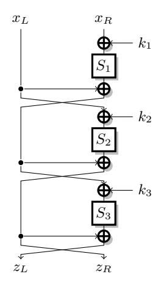
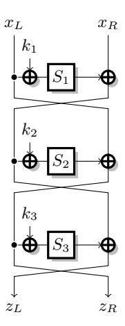
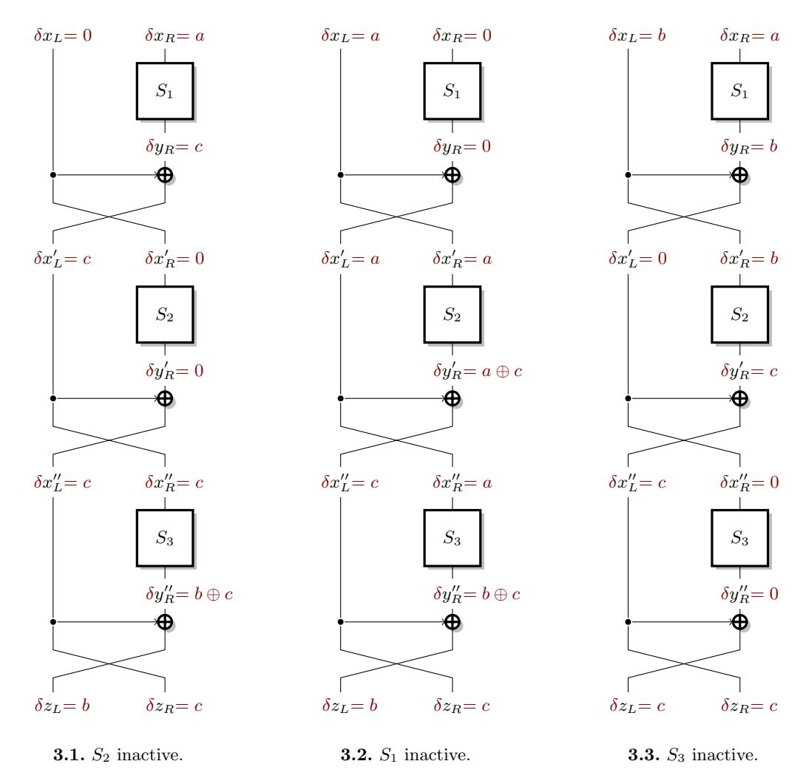
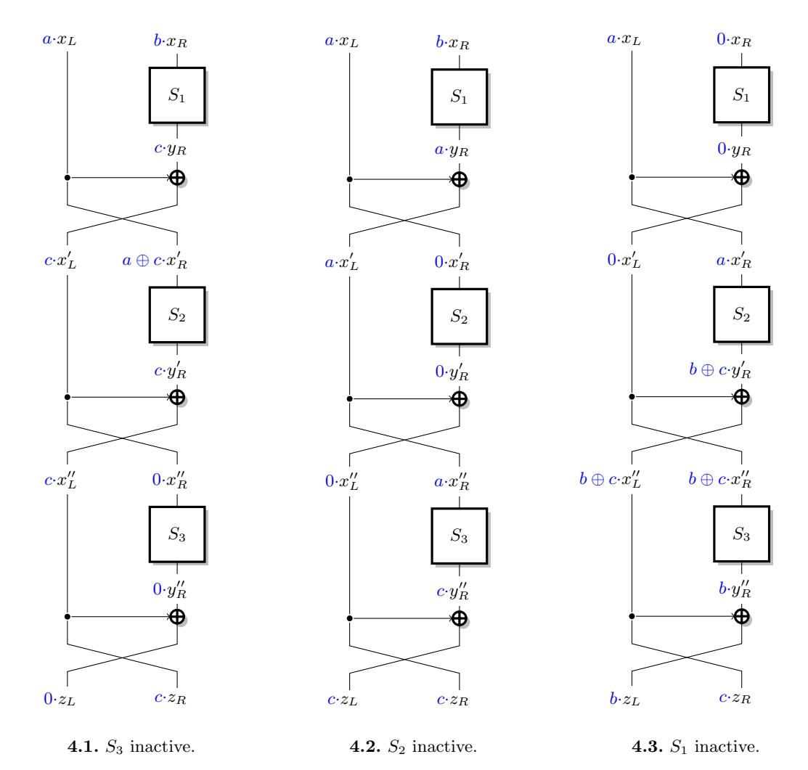
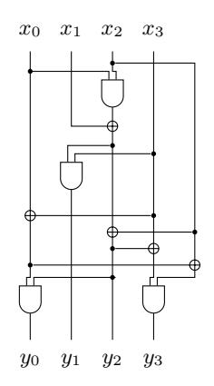
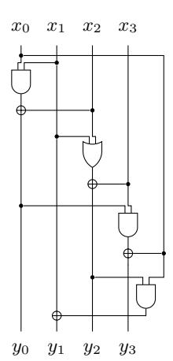

# Construction of Lightweight S-Boxes using Feistel and MISTY structures (Full Version\*)\*\*

Anne Canteaut, Sébastien Duval, and Gaëtan Leurent

Inria, project-team SECRET, France {Anne.Canteaut, Sebastien.Duval, Gaetan.Leurent}@inria.fr

Abstract. The aim of this work is to find large S-Boxes, typically operating on 8 bits, having both good cryptographic properties and a low implementation cost. Such S-Boxes are suitable building-blocks in many lightweight block ciphers since they may achieve a better security level than designs based directly on smaller S-Boxes. We focus on S-Boxes corresponding to three rounds of a balanced Feistel and of a balanced MISTY structure, and generalize the recent results by Li and Wang on the best differential uniformity and linearity offered by such a construction. Most notably, we prove that Feistel networks supersede MISTY networks for the construction of 8-bit permutations. Based on these results, we also provide a particular instantiation of an 8-bit permutation with better properties than the S-Boxes used in several ciphers, including Robin, Fantomas or CRYPTON.

Keywords: S-Box, Feistel network, MISTY network, Lightweight block-cipher.

#### 1 Introduction

A secure block cipher must follow Shannon's criteria and provide confusion and diffusion [42]. In most cases, confusion is achieved with small substitution boxes (S-Boxes) operating on parts of the state (usually bytes) in parallel, and diffusion is achieved with linear operations mixing the state. The security of the cipher is then strongly dependent on the cryptographic properties of the S-Boxes. For instance, the AES uses an 8-bit S-Box based on the inversion in the finite field with 2<sup>8</sup> elements. This S-Box has the smallest known differential probability and linear correlation, and then allows the AES to be secure with a small number of rounds, and to reach very good performances. However, it is not always the best option for constrained environments. In software, an S-Box can be implemented with a look-up table in memory, but this takes 256 bytes for the AES S-Box, and there might be issues with cache-timing attacks [7]. In hardware, the best known implementation of the AES S-Box requires 115 gates [13]; this hardware description can also be used for a bit-sliced software implementation [24]. For some constrained environments, this cost might be too high. Therefore, the field of lightweight cryptography has produced many alternatives with a smaller footprint, such as Tea [48], Crypton [28,29], Noekeon [15], PRESENT [11], Katan [16], LBLOCK [49], PRINCE [12], TWINE [45], the LS-Designs [22], or PRIDE [2]. In particular, many of those lightweight ciphers use S-Boxes operating on 4-bit words, or even on a smaller alphabet like in [1]. But, reducing the number of variables increases the values of the optimal differential probability and linear correlation. Therefore, more rounds are required in order to achieve the same resistance against differential and linear attacks.

An alternative approach when constructing a lightweight cipher consists in using larger S-Boxes, typically operating on 8 bits like in the AES, but with a lower implementation cost. Then, we search for S-Boxes with better implementations than the AES S-Box, at the cost of suboptimal cryptographic properties. Finding 8-bit S-Boxes which offer such an interesting trade-off is a difficult problem: they cannot be classified like in the 4-bit case [26,17], and randomly chosen S-Boxes have a high implementation cost [47]. Therefore, we focus on constructions based on smaller S-Boxes and linear operations. This general approach has been used in several previous constructions: CRYPTON v0.5 [28] (3-round Feistel), CRYPTON v1.0 [29] (2-round SPN), WHIRLPOOL [5] (using five small S-Boxes), KHAZAD [4] (3-round SPN), ICEBERG [43] (3-round SPN), ZORRO [20] (4-round

<sup>\*</sup> Full version of the extended abstract published in the proceedings of SAC 2015.

<sup>\*\*</sup> Partially supported by the French Agence Nationale de la Recherche through the BLOC project under Contract ANR-11-INS-011.

Feistel with mixing layer), and the LS-Designs [\[22\]](#page-21-7) (3-round Feistel and MISTY network). As in [\[22\]](#page-21-7), we here focus on constructions with a 3-round Feistel network, or a 3-round balanced MISTY network, because they use only 3 smaller S-Boxes, but can still provide good large S-Boxes. And we study the respective merits of these two constructions, since this comparison is raised as an open question in [\[22\]](#page-21-7).

The Feistel and MISTY structures have been intensively studied in the context of block cipher design, and bounds are known for the maximum expected differential probability (MEDP) [\[37](#page-21-12)[,38](#page-21-13)[,3,](#page-20-11)[31\]](#page-21-14) and maximum expected linear potential (MELP) [\[36,](#page-21-15)[3\]](#page-20-11). However, those results are not relevant for the construction of S-Boxes, because they only consider the average value over all the keys, while an S-Box is unkeyed. Therefore, the differential and linear properties of the Feistel and MISTY constructions need to be analyzed in the unkeyed setting. Such a study has been initiated recently by Li and Wang [\[27\]](#page-21-16) in the case of 3 rounds of a Feistel network. In this work, we expand the results of Li and Wang, by giving some more general theoretical results for unkeyed Feistel and MISTY structures, with a particular focus on the construction of 8-bit permutations.

Our contributions. We first explain why the usual MEDP and MELP notions are meaningless in the unkeyed setting. In particular we exhibit a 3-round MISTY network where there exists a differential with probability higher than the MEDP for any fixed key, but this optimal differential depends on the key. Then, Section [3](#page-4-0) gives some lower bounds on the differential uniformity and linearity of any 3-round balanced MISTY structure, which involve the properties of the three inner S-Boxes. Section [4](#page-9-0) then focuses on the construction of 8-bit permutations. Similar results on 3-round Feistel networks are detailed in Section [5,](#page-13-0) which generalize the previous result from [\[27\]](#page-21-16). Most notably, we show that 3 rounds of a Feistel network with appropriate inner S-Boxes provide better cryptographic properties than any 3-round MISTY network, explaining some experimental results reported in [\[22\]](#page-21-7). Section [6](#page-17-0) then gives an instantiation of such an 8-bit permutation, which offers a very good trade-off between the cryptographic properties and the implementation cost. It can be implemented efficiently in hardware and for bit-sliced software, and has good properties for side-channel resistant implementations with masking. In particular, this S-Box supersedes the S-Boxes considered in many lightweight ciphers including CRYPTON, Robin and Fantomas.

## 2 From keyed constructions to unkeyed S-Boxes

### <span id="page-1-0"></span>2.1 Main cryptographic properties for an S-Box

In this paper, we focus on S-Boxes having the same number of input and output bits. The resistance offered by an S-Box against differential [\[10\]](#page-20-12) and linear [\[30\]](#page-21-17) cryptanalysis is quantified by the highest value in its difference table (resp. table of linear biases, aka linear-approximation table). More precisely, these two major security parameters are defined as follows.

Definition 1 (Differential uniformity [\[35\]](#page-21-18)). Let F be a function from F n 2 into F n 2 . For any pair of differences (a, b) in F n 2 , we define the set

$$D_F(a \to b) = \{ x \in \mathbb{F}_2^n \mid F(x \oplus a) \oplus F(x) = b \} .$$

The entry at position (a, b) in the difference table of F then corresponds to the cardinality of D<sup>F</sup> (a → b) and will be denoted by δ<sup>F</sup> (a, b).

Moreover, the differential uniformity of F is

$$\delta(F) = \max_{a \neq 0, b} \delta_F(a, b) .$$

Obviously, the differential uniformity of an S-Box is always even, implying that, for any F, δ(F) ≥ 2. The functions F for which equality holds are named almost perfect nonlinear (APN) functions.

Similarly, the bias of the best linear approximation of an S-Box is measured by its linearity.

**Definition 2 (Walsh transform of an S-Box).** Let F be a function from  $\mathbb{F}_2^n$  into  $\mathbb{F}_2^n$ . The Walsh transform of F is the function

$$\begin{array}{ccc} \mathbb{F}_2^n \times \mathbb{F}_2^n \to \mathbb{Z} \\ (a,b) & \mapsto \lambda_F(a,b) = \sum_{x \in \mathbb{F}_2^n} (-1)^{b \cdot F(x) + a \cdot x} \ . \end{array}$$

Moreover, the linearity of F is

$$\mathcal{L}(F) = \max_{a,b \in \mathbb{F}_{2}^{n}, b \neq 0} |\lambda_{F}(a,b)|.$$

Indeed, up to a factor  $2^n$ , the linearity corresponds to the bias of the best linear relation between the input and output of F:

$$\Pr_X[b \cdot F(X) + a \cdot X = 1] = \frac{1}{2^n} \left( 2^{n-1} - \frac{1}{2} \sum_{x \in \mathbb{F}_2^n} (-1)^{b \cdot F(x) + a \cdot x} \right) = \frac{1}{2} \left( 1 - \frac{\lambda_F(a, b)}{2^n} \right).$$

It is worth noticing that, for any fixed output mask  $b \in \mathbb{F}_2^n$ , the function  $a \mapsto \lambda_F(a, b)$ , corresponds to the Walsh transform of the *n*-variable Boolean component of  $F: x \mapsto b \cdot F(x)$ . In particular, it enjoys all properties of a discrete Fourier transform, for instance the Parseval relation.

#### 2.2 Constructing S-Boxes from smaller ones

If this paper we focus on the construction of S-Boxes using several smaller S-Boxes. Indeed small S-Boxes are much cheaper to implement that large S-Boxes:

- for table-based software implementations, the tables are smaller;
- for hardware implementations, the gate count is lower;
- for bit-sliced software implementation, the instructions count is lower;
- for vectorized implementation, small S-Boxes can use vector permutations.

In many cases, implementing several small S-Boxes requires less resources than implementing a large one. Therefore, constructing S-Boxes from smaller ones can reduce the implementation cost.

The Feistel construction is a well-known construction to build a 2n-bit permutation from smaller n-bit functions, introduced in 1971 for the design of Lucifer (which later became DES [33]). It is a good candidate for constructing large S-Boxes from smaller ones at a reasonable implementation cost. In particular, this construction has been used for the S-Boxes of Crypton v0.5 [28], ZUC [19] (for  $S_0$ ), Robin [22] and iSCREAM [21]. The MISTY construction introduced by Matsui [31] uses a different structure, but offers a similar level of security. The main advantage of the MISTY network is that it can offer a reduced latency because the first two S-Boxes can be evaluated in parallel. Therefore it is a natural alternative to Feistel networks for the construction of lightweight S-Boxes, and it has been used in the design of Fantomas [22] and SCREAM [21]. In order to reduce the number of gates used for implementing the construction, we focus on balanced MISTY networks, while the MISTY block cipher proposed in [32] is unbalanced and combines an (n-1)-bit S-Box and an (n+1)-bit S-Box.

The two structures we study are depicted in Figures 1 and 2. It is worth noticing a major difference between the two: the function resulting from the Feistel construction is always invertible (since one round is an involution, up to a permutation of the outputs), while the function resulting from the MISTY construction is invertible if and only if all the inner S-Boxes are invertible.

Analysis of Feistel and MISTY structures. Since these two constructions have been used for the design of many block ciphers (in particular the DES [33] and MISTY [32], respectively), their security properties have been intensively studied. A natural way to measure the resistance of the resulting block cipher against differential and linear cryptanalysis is to study the probabilities of the differentials (respectively the potentials of the linear approximations) averaged over all keys.





<span id="page-3-0"></span>Fig. 1. 3-round MISTY network

<span id="page-3-1"></span>Fig. 2. 3-round Feistel network

Definition 3 (MEDP and MELP). Let F<sup>K</sup> be a family of function from F n 2 into F n 2 . The MEDP is the maximum probability of a differential, averaged over all keys:

$$\mathsf{MEDP}(F_K) = \max_{a \neq 0, b} \frac{1}{2^k} \sum_{K \in \mathbb{F}_2^k} \frac{\delta_{F_K}(a, b)}{2^n} \;.$$

The MELP is the maximum potential of a linear approximation, averaged over all keys:

$$\mathsf{MELP}(F_K) = \max_{a,b \neq 0} \frac{1}{2^k} \sum_{K \in \mathbb{F}_2^k} \left( \frac{\lambda_{F_K}(a,b)}{2^n} \right)^2 \ .$$

<span id="page-3-2"></span>The following theorem shows that the MEDP and MELP of a Feistel or MISTY network can be bounded.

#### Theorem 1 (Feistel or MISTY, averaged over all keys, [\[37,](#page-21-12)[38,](#page-21-13)[3,](#page-20-11)[31\]](#page-21-14)).

Given S1, S<sup>2</sup> and S<sup>3</sup> three n-bit permutations, let p = max<sup>i</sup> δ(Si)/2 <sup>n</sup> and q = maxi(L(Si)/2 n) 2 . Then the family of functions (FK)K=(K1,K2,K3)∈<sup>F</sup> 3k 2 defined by 3 rounds of a Feistel or of a MISTY network with S<sup>i</sup> as inner functions verifies

$$\mathsf{MEDP}(F_K) \leq p^2 \ and \ \mathsf{MELP}(F_K) \leq q^2 \ .$$

This theorem is very powerful for the construction of iterated block ciphers: it shows that a big function with strong cryptographic properties can be built from small functions with strong cryptographic properties. However, for the design of an S-Box from smaller S-Boxes, it is of little use. Indeed, we are interested in the properties of a single fixed S-Box, rather than the average properties of a family of S-Boxes. For a fixed (a, b) the theorem proves that the average values of δ<sup>F</sup><sup>K</sup> (a, b) and λ<sup>F</sup><sup>K</sup> (a, b) are bounded, therefore there exist at least one key for which the value is smaller than or equal to the average. However, it might be that the values a, b where the maximum is reached are not the same for every key. Therefore if we select a key so that δ<sup>F</sup><sup>K</sup> (a, b) is small for an a, b maximizing the average probability, the maximum can be reached for another entry of the differential table.

More strikingly, we discovered some choices of S1, S2, S<sup>3</sup> such that the maximum differential probability of the functions in the corresponding family is always higher than the MEDP.

Example 1. We consider a MISTY structure with three identical S-Boxes:

$$S_i = [A, 7, 9, 6, 0, 1, 5, B, 3, E, 8, 2, C, D, 4, F].$$

We have MEDP(FK) ≤ 16/256 according to Th. [1,](#page-3-2) because δ(Si) = 4. However, for any function in this family, there exists a differential with probability 32/256. This is not a contradiction, because the differential reaching the maximum depends on the key.

The relevant property for the construction of an S-Box is the maximum differential probability (respectively maximum linear potential). Therefore, we could derive some information on this quantity for  $F_K$  for some fixed keys from the knowledge of the average value of the maximal differential probability, i.e., the EMDP (resp. EMLP), which may significantly differ from the MEDP (resp. MELP). We would like to point out that there is a confusion between the two notions in [32]: the definition corresponds to the expected maximum differential probability (respectively expected maximum linear potential), while the theorems apply to the MEDP and MELP.

Analysis of Feistel and MISTY structures with fixed key. In order to study the properties of Feistel and MISTY structures for the construction of lightweight S-Boxes, we must study these structures with a fixed key. Equivalently, we can consider the structures without any key, because a structure with a fixed key is equivalent to an unkeyed one with different S-Boxes. Indeed, using an S-Box  $S_i$  with round key  $k_i$  is equivalent to using  $S_i': x \mapsto S_i(x + k_i)$  as an S-Box without any key. In the following, we always consider a key-less variant.

In a recent analysis of the fixed-key Feistel structure [27], Li and Wang derive the best differential uniformity and linearity which can be achieved by a 3-round Feistel cipher with a fixed key, and give examples reaching this bound. Their main results are as follows:

**Theorem 2 (Feistel unkeyed, [27]).** Let  $S_1$ ,  $S_2$  and  $S_3$  be three n-bit S-Boxes and F be the 2n-bit function defined by the corresponding 3-round Feistel network. Then,  $\delta(F) \geq 2\delta(S_2)$ . Moreover, if  $S_2$  is not a permutation,  $\delta(F) \geq 2^{n+1}$ .

If n = 4, F satisfies  $\delta(F) \geq 8$ . If equality holds, then  $\mathcal{L}(F) \geq 64$ .

#### <span id="page-4-0"></span>3 S-Boxes obtained from 3 rounds of MISTY

#### 3.1 Our results

In this paper, we generalize the bounds of Li and Wang [27] on Feistel structures, and derive bounds for MISTY structures. The results are very similar for the two structures, but for a MISTY structure, optimal results are only achieved with non-invertible inner functions. Therefore, our work shows that Feistel structures allow better results than MISTY structures for the design of invertible 8-bit S-Boxes.

More precisely, we introduce two new S-Box properties  $\delta_{\min}$  and  $\mathcal{L}_{\min}$  in order to derive our bounds:  $\mathcal{L}_{\min}$  is the smallest linearity we can have for a non-trivial component of the S-Box. Similarly,  $\delta_{\min}$  is the smallest value we can have for the maximum  $\max_b \delta(a,b)$  within a row in the difference table. In particular, for any 4-bit function S,  $\delta_{\min}(S) \geq 2$  and  $\mathcal{L}_{\min}(S) \geq 4$ . Moreover, if S is a 4-bit permutation, then  $\delta_{\min}(S) \geq 4$  and  $\mathcal{L}_{\min}(S) \geq 8$ .

We first present the general lower bounds we obtain on the differential uniformity and linearity of 3 rounds of a Feistel and of a MISTY construction.

```
1. For a Feistel network with inner S-Boxes S_1, S_2 and S_3:

 - \delta(F) \geq \delta(S_2) \max{(\delta_{\min}(S_1), \delta_{\min}(S_3))}
 - \text{if } S_2 \text{ is not a permutation, } \delta(F) \geq 2^{n+1}.
 - \text{if } S_2 \text{ is a permutation, } \delta(F) \geq \max_{i \neq 2, j \neq i, 2} \left(\delta(S_i)\delta_{\min}(S_j), \ \delta(S_i)\delta_{\min}(S_2^{-1})\right).
 - \mathcal{L}(F) \geq \mathcal{L}(S_2) \max{(\mathcal{L}_{\min}(S_1), \mathcal{L}_{\min}(S_3))}
 - \text{if } S_2 \text{ is a permutation, } \mathcal{L}(F) \geq \max_{i \neq 2, j \neq i, 2} \left(\mathcal{L}(S_i)\mathcal{L}_{\min}(S_j), \ \mathcal{L}(S_i)\mathcal{L}_{\min}(S_2^{-1})\right).
2. For a MISTY network with inner S-Boxes S_1, S_2 and S_3:
 - \delta(F) \geq \delta(S_1) \max{(\delta_{\min}(S_2), \delta_{\min}(S_3))}
 - \text{if } S_1 \text{ is not a permutation, } \delta(F) \geq 2^{n+1}.
 - \text{if } S_1 \text{ is a permutation, } \delta(F) \geq \max_{i \neq 1, j \neq 1, i} \left(\delta(S_i)\delta_{\min}(S_j), \ \delta(S_i)\delta_{\min}(S_1^{-1})\right);
 - \mathcal{L}(F) \geq \max{(\mathcal{L}(S_1)\mathcal{L}_{\min}(S_2), \mathcal{L}(S_2)\mathcal{L}_{\min}(S_1), \ \mathcal{L}(S_3)\mathcal{L}_{\min}(S_1)); }
 - \text{if } S_3 \text{ is a permutation, } \mathcal{L}(F) \geq \mathcal{L}(S_1)\mathcal{L}_{\min}(S_2).
 - \text{if } S_1 \text{ is a permutation, } \mathcal{L}(F) \geq \mathcal{L}(S_3)\mathcal{L}_{\min}(S_2).
 - \text{if } S_1 \text{ and } S_3 \text{ are permutations, } \mathcal{L}(F) \geq \mathcal{L}(S_2)\mathcal{L}_{\min}(S_3^{-1}).
```

If n = 4 this yields for both constructions:

$$\delta(F) \geq 8$$
 and  $\mathcal{L}(F) \geq 48$ .

Moreover,  $\mathcal{L}(F) \geq 64$  unless  $\delta(F) \geq 32$ .

For the MISTY construction with n=4, if F is a permutation, we obtain tighter bounds:  $\delta(F) \geq 16$  and  $\mathcal{L}(F) \geq 64$ . This implies that the Feistel construction is more appropriate for constructing 8-bit permutations. We will also show that all these bounds for n=4 are tight. We now detail the results first in the case of the MISTY construction, and then for the Feistel construction.

#### 3.2 Differential uniformity of 3 rounds of MISTY

Our lower bound on the differential uniformity of the 3-round MISTY relies on the evaluation of the number of solutions of some differentials for which the input difference of one of the 3 S-Boxes is canceled (see Figure 3).

**Proposition 1.** Let  $S_1$ ,  $S_2$  and  $S_3$  be three n-bit S-Boxes and F be the 2n-bit function defined by the corresponding 3-round MISTY network. Then, for all a, b and c in  $\mathbb{F}_2^n$ , we have:

(i)
$$\delta_F(0||a,b||c) = \delta_{S_1}(a,c) \times \delta_{S_3}(c,b \oplus c);$$

(ii) If  $S_1$  is bijective.

<span id="page-5-0"></span>
$$\delta_F(a||0,b||c) = \delta_{S_2}(a, a \oplus c) \times \delta_{S_3}(a, b \oplus c) ;$$

(iii)
$$\delta_{S_1}(a,b) \times \delta_{S_2}(b,c) \leq \delta_F(b||a,c||c) \leq \sum_{d \in \mathbb{F}_2^n} \delta_{S_1}(a,b \oplus d) \times \delta_{S_2}(b,c \oplus d) \times \gamma_{S_3}(d)$$

where  $\gamma_{S_3}(d)$  is 0 if  $\delta_{S_3}(d,0) = 0$  and 1 otherwise. Most notably, if  $S_3$  is bijective,

$$\delta_F(b||a,c||c) = \delta_{S_1}(a,b) \times \delta_{S_2}(b,c) .$$

*Proof.* Let x be the input of the MISTY network, and let  $x_L$  and  $x_R$  be its left and right parts respectively. The three results that we prove correspond to the configurations depicted on Figure 3.

(i)
$$x = (x_L, x_R)$$
 satisfies  $F(x_L || x_R) \oplus F(x_L || (x_R \oplus a)) = b || c$  if and only if

$$\begin{cases} S_3(S_1(x_R) \oplus x_L) \oplus S_3(S_1(x_R \oplus a) \oplus x_L) = b \oplus c, \\ S_2(x_L) \oplus S_1(x_R) \oplus x_L \oplus S_2(x_L) \oplus S_1(x_R \oplus a) \oplus x_L = c \end{cases}$$

$$\Leftrightarrow \begin{cases} S_3(S_1(x_R) \oplus x_L) \oplus S_3(S_1(x_R \oplus a) \oplus x_L) = b \oplus c, \\ S_1(x_R) \oplus S_1(x_R \oplus a) = c \end{cases}$$

or equivalently

$$x_R \in D_{S_1}(a \to c)$$
 and  $x_L \in S_1(x_R) \oplus D_{S_2}(c \to b \oplus c)$ .

Hence, we deduce that there are exactly  $\delta_{S_1}(a,c)$  values of  $x_R$ , and for each of those,  $\delta_{S_3}(c,b\oplus c)$  values of  $x_L$ , such that x verifies the differential.

(ii)  $x = (x_L, x_R)$  satisfies  $F(x_L || x_R) \oplus F((x_L \oplus a) || x_R) = b || c$  if and only if

$$\begin{cases} S_3(S_1(x_R) \oplus x_L) \oplus S_3(S_1(x_R) \oplus x_L \oplus a) = b \oplus c, \\ S_2(x_L) \oplus S_1(x_R) \oplus x_L \oplus S_2(x_L \oplus a) \oplus S_1(x_R) \oplus x_L \oplus a = c \end{cases}$$

$$\Leftrightarrow \begin{cases} S_1(x_R) \oplus x_L \in D_{S_3}(a \to b \oplus c), \\ S_2(x_L) \oplus S_2(x_L \oplus a) = a \oplus c \end{cases}$$

or equivalently,

$$x_L \in D_{S_2}(a \to a \oplus c)$$
 and  $S_1(x_R) \in x_L \oplus D_{S_3}(a \to b \oplus c)$ .

If  $S_1$  is invertible, for any fixed  $x_L$ , each one of the  $\delta_{S_3}(a, b \oplus c)$  values defined by the second condition determines a unique value of  $x_R$ . Therefore, the number of  $(x_L, x_R)$  satisfying the differential is exactly  $\delta_{S_2}(a, a \oplus c) \times \delta_{S_3}(a, b \oplus c)$ .



<span id="page-6-0"></span>Fig. 3. Red values indicate differences. The interest of these differentials is that for each of them, only 2 S-Boxes influence the 3-round differential (under the condition that  $S_1$  is invertible for 3.2 and that  $S_3$  is invertible for 3.3).

(iii)
$$(x_L, x_R)$$
 satisfies  $F(x_L || x_R) \oplus F((x_L \oplus b) || (x_R \oplus a)) = c || c$  if and only if

$$\begin{cases} S_3(S_1(x_R) \oplus x_L) \oplus S_3(S_1(x_R \oplus a) \oplus x_L \oplus b) = 0, \\ S_2(x_L) \oplus S_1(x_R) \oplus x_L \oplus S_2(x_L \oplus b) \oplus S_1(x_R \oplus a) \oplus x_L \oplus b = c \end{cases}$$

$$\Leftrightarrow \begin{cases} S_3(S_1(x_R) \oplus x_L) \oplus S_3(S_1(x_R \oplus a) \oplus x_L \oplus b) = 0, \\ S_2(x_L) \oplus S_1(x_R) \oplus S_2(x_L \oplus b) \oplus S_1(x_R \oplus a) = b \oplus c \end{cases}$$

This equivalently means that there exists some  $d \in \mathbb{F}_2^n$  such that

$$\begin{cases} x_R \in D_{S_1}(a \to b \oplus d), x_L \in D_{S_2}(b \to c \oplus d), \\ S_3(S_1(x_R) \oplus x_L) \oplus S_3(S_1(x_R \oplus a) \oplus x_L \oplus b) = 0, \end{cases}$$

i.e.,

$$x_R \in D_{S_1}(a \to b \oplus d), \ x_L \in D_{S_2}(b \to c \oplus d) \text{ and } S_1(x_R) \oplus x_L \in D_{S_3}(d \to 0).$$

Then, for any fixed  $d \in \mathbb{F}_2^n$  such that  $\delta_{S_3}(d,0) = 0$ , no pair  $(x_L, x_R)$  satisfies the third condition. If  $\delta_{S_3}(d,0) > 0$ , then some of the values  $(x_L, x_R)$  defined by the first two conditions may also satisfy the third one, and if d = 0, the third condition is always satisfied. It then follows that

$$\delta_{S_1}(a,b) \times \delta_{S_2}(b,c) \leq \delta_F(b||a,c||c) \leq \sum_{d \in \mathbb{F}_2^n} \delta_{S_1}(a,b \oplus d) \times \delta_{S_2}(b,c \oplus d) \times \gamma_{S_3}(d)$$

where  $\gamma_{S_3}(d)$  is 0 if  $\delta_{S_3}(d,0) = 0$  and 1 otherwise. Moreover, if  $S_3$  is bijective,  $\delta_{S_3}(d,0) > 0$  if and only if d = 0, implying that the two previous bounds are equal, i.e.,

<span id="page-7-1"></span>
$$\delta_F(b||a,c||c) = \delta_{S_1}(a,b) \times \delta_{S_2}(b,c) . \qquad \Box$$

These three particular types of differentials provide us with the following lower bound on the differential uniformity of any 3-round MISTY network.

**Theorem 3.** Let  $S_1$ ,  $S_2$  and  $S_3$  be three n-bit S-Boxes and let F be the 2n-bit function defined by the corresponding 3-round MISTY network. Then,

$$\delta(F) \ge \delta(S_1) \max \left(\delta_{\min}(S_2), \delta_{\min}(S_3)\right) \text{ where } \delta_{\min}(S) = \min_{a \ne 0} \max_b \delta_S(a, b) \text{ .}$$

Moreover.

- if  $S_1$  is a permutation,

$$\delta(F) \ge \max_{i \ne 1, j \ne 1, i} \max \left( \delta(S_i) \delta_{\min}(S_j), \ \delta(S_i) \delta_{\min}(S_1^{-1}) \right) ,$$

- if  $S_1$  is not a permutation,  $\delta(F) \geq 2^{n+1}$ .

*Proof.* The result is a direct consequence of Prop. 1. We here derive the bounds from the first item in Prop. 1; the other cases can be similarly deduced from the two other items. Let us first consider a pair of differences  $(\alpha, \beta)$  which achieves the differential uniformity of  $S_1$ , i.e.,  $\delta(S_1) = \delta_{S_1}(\alpha, \beta)$ . Then, we choose  $a = \alpha$  and  $c = \beta$ , and get that, for any  $b \in \mathbb{F}_2^n$ ,

$$\delta_F(0||\alpha, b||\beta) = \delta(S_1) \times \delta_{S_3}(\beta, \beta \oplus b)$$
.

Then, we can choose for b the value which maximizes  $\delta_{S_3}(\beta, \beta \oplus b)$ . This value is always greater than or equal to  $\delta_{\min}(S_3)$ . Similarly, we can now consider a pair of differences  $(\alpha, \beta)$  which achieves the differential uniformity of  $S_3$ , i.e.,  $\delta(S_3) = \delta_{S_3}(\alpha, \beta)$ . In this case, we choose  $c = \alpha$  and  $b = \alpha \oplus \beta$ , and get that, for any  $a \in \mathbb{F}_2^n$ ,

$$\delta_F(0||a,(\alpha\oplus\beta)||\alpha) = \delta_{S_1}(a,\alpha)\times\delta(S_3)$$
.

We then choose for a the value which maximizes  $\delta_{S_1}(a,\alpha)$  which is always greater than or equal to  $\delta_{\min}(S_1^{-1})$  when  $S_1$  is a permutation.

Let us now assume that  $S_1$  is not bijective. This means that there exists some nonzero  $a \in \mathbb{F}_2^n$  such that  $\delta_{S_1}(a,0) \geq 2$ . Then, we deduce from the first item in Prop. 1, with b=c=0, that  $F(x_L||x_R) \oplus F_K(x_L \oplus a||x_R) = (0,0)$  has  $\delta_{S_1}(a,0) \times \delta_{S_3}(0,0) \geq 2 \times 2^n = 2^{n+1}$  solutions in  $\mathbb{F}_2^{2n}$ .  $\square$

#### 3.3 Linearity of 3 rounds of MISTY

The lower bound on the linearity of a three-round MISTY structure can be derived in a similar way.

<span id="page-7-0"></span>**Proposition 2.** Let  $S_1$ ,  $S_2$  and  $S_3$  be three n-bit S-Boxes and F the 2n-bit function defined by the corresponding 3-round MISTY network. Then, for all a, b and c in  $\mathbb{F}_2^n$ , we have:

- (i)  $\lambda_F(a||b,0||c) = \lambda_{S_1}(b,c)\lambda_{S_2}(a \oplus c,c)$
- (ii)  $\lambda_F(a||b,c||c) = \lambda_{S_1}(b,a)\lambda_{S_3}(a,c)$
- (iii) If  $S_1$  is bijective,  $\lambda_F(a||0,b||c) = \lambda_{S_2}(a,b\oplus c)\lambda_{S_3}(b\oplus c,b)$

Proof. The following three results correspond to the configurations depicted on Figure 4.

(i)
$$\lambda_{F}(a||b,0||c) = \sum_{(x_{R},x_{L})\in(\mathbb{F}_{2}^{n})^{2}} (-1)^{c\cdot S_{2}(x_{L})\oplus c\cdot S_{1}(x_{R})\oplus c\cdot x_{L}\oplus a\cdot x_{L}\oplus b\cdot x_{R}}$$

$$= \sum_{x_{R}\in\mathbb{F}_{2}^{n}} (-1)^{c\cdot S_{1}(x_{R})\oplus b\cdot x_{R}} \sum_{x_{L}\in\mathbb{F}_{2}^{n}} (-1)^{c\cdot S_{2}(x_{L})\oplus (a\oplus c)\cdot x_{L}}$$

$$= \lambda_{S_{1}}(b,c) \lambda_{S_{2}}(a\oplus c,c)$$



<span id="page-8-0"></span>Fig. 4. Blue values indicate linear masks.

(ii)
$$\lambda_F(a||b,c||c) = \sum_{(x_R,x_L) \in (\mathbb{F}_2^n)^2} (-1)^{(c,c) \cdot F_K(x_L||x_R) \oplus (a,b) \cdot (x_L,x_R)}$$
$$= \sum_{(x_R,x_L) \in (\mathbb{F}_2^n)^2} (-1)^{c \cdot S_3(S_1(x_R) \oplus x_L) \oplus a \cdot x_L \oplus b \cdot x_R}$$
$$(x_R,x_L) \in (\mathbb{F}_2^n)^2$$

We set  $x_L = S_1(x_R) \oplus z$  and observe that, for any fixed  $x_R$ , z takes all possible values in  $\mathbb{F}_2^n$  when  $x_L$  varies, implying that

$$\lambda_F(a\|b,c\|c) = \sum_{x_R \in \mathbb{F}_2^n} \sum_{z \in \mathbb{F}_2^n} (-1)^{c \cdot S_3(z) \oplus a \cdot (z \oplus S_1(x_R)) \oplus b \cdot x_R} = \lambda_{S_1}(b,a) \lambda_{S_3}(a,c) .$$
(iii)
$$\lambda_F(a\|0,b\|c) = \sum_{(x_R,x_L) \in (\mathbb{F}_2^n)^2} (-1)^{(b,c) \cdot F_K(x_L\|x_R) \oplus (a,0) \cdot (x_L,x_R)}$$

$$= \sum_{(x_R,x_L) \in (\mathbb{F}_2^n)^2} (-1)^{b \cdot S_3(S_1(x_R) \oplus x_L) \oplus [b \oplus c] \cdot [S_1(x_R) \oplus S_2(x_L)] \oplus [a \oplus b \oplus c] \cdot x_L}$$

$$(x_R,x_L) \in (\mathbb{F}_2^n)^2$$

If  $S_1$  is bijective, we set  $x_R = S_1^{-1}(z \oplus x_L)$ . Using that, for any fixed  $x_L$ , z takes all possible values in  $\mathbb{F}_2^n$  when  $x_R$  varies, we deduce that

$$\lambda_F(a||0,b||c) = \sum_{x_L \in \mathbb{F}_2^n} (-1)^{(b \oplus c) \cdot S_2(x_L) \oplus a \cdot x_L} \sum_{z \in \mathbb{F}_2^n} (-1)^{b \cdot S_3(z) \oplus (b \oplus c) \cdot z}$$
$$= \lambda_{S_2}(a,b \oplus c) \lambda_{S_3}(b \oplus c,b) \quad \Box$$

As in the differential case, the previous three linear approximations provide us with a lower bound on the linearity of any 3-round MISTY network. This bound involves both the linearity of the constituent S-Boxes and another quantity denoted by  $\mathcal{L}_{\min}$  computed from the table of linear biases as follows.

**Definition 4** ( $\mathcal{L}_{\min}$ ). Let F be an n-bit S-Box. We define

<span id="page-9-2"></span>
$$\mathcal{L}_{\min}(F) = \min_{b \in \mathbb{F}_2^n, b \neq 0} \max_{a \in \mathbb{F}_2^n} |\lambda_F(a, b)|.$$

Most notably,  $\mathcal{L}_{\min}(F) \geq 2^{\frac{n}{2}}$  and this bound is not tight when F is bijective.

*Proof.* By definition,  $\mathcal{L}_{\min}(F)$  is the smallest linearity achieved by a component  $F_b: x \mapsto b \cdot F(x)$  of F, when b varies in  $\mathbb{F}_2^n \setminus \{0\}$ . Since any  $F_b$  is an n-variable Boolean function, its linearity is at least  $2^{\frac{n}{2}}$  with equality if and only if  $F_b$  is bent [41]. Since bent functions are not balanced, none of the components of a permutation is bent, implying that  $\mathcal{L}_{\min}(F) > 2^{\frac{n}{2}}$  when F is a permutation.  $\square$

We then derive the following lower bound on the linearity of any 3-round MISTY network.

<span id="page-9-1"></span>**Theorem 4.** Let  $S_1$ ,  $S_2$  and  $S_3$  be three n-bit S-Boxes and let F be the 2n-bit function defined by the corresponding 3-round MISTY network. Then,

$$\mathcal{L}(F) \ge \max(\mathcal{L}(S_1)\mathcal{L}_{\min}(S_2), \ \mathcal{L}(S_2)\mathcal{L}_{\min}(S_1), \ \mathcal{L}(S_3)\mathcal{L}_{\min}(S_1))$$
.

Moreover, if  $S_1$  is a permutation,  $\mathcal{L}(F) \geq \mathcal{L}(S_3)\mathcal{L}_{\min}(S_2)$ ; if  $S_3$  is a permutation,  $\mathcal{L}(F) \geq \mathcal{L}(S_1)\mathcal{L}_{\min}(S_3^{-1})$ , and if both  $S_1$  and  $S_3$  are permutations, then  $\mathcal{L}(F) \geq \mathcal{L}(S_2)\mathcal{L}_{\min}(S_3^{-1})$ .

*Proof.* Let us first choose a pair of masks  $(\alpha, \beta)$  for some  $S_i$  which achieves the linearity  $\mathcal{L}(S_i)$ . For i = 1 or i = 2, we use the first item in Prop. 2 and deduce that, for any  $\gamma$ ,

$$|\lambda_F(\gamma || \alpha, 0 || \beta)| = \mathcal{L}(S_1) |\lambda_{S_2}(\gamma \oplus \beta, \beta)|$$
$$|\lambda_F((\alpha \oplus \beta) || \gamma, 0 || \beta)| = \mathcal{L}(S_2) |\lambda_{S_1}(\gamma, \beta)|.$$

For i = 3, we use the second item in Prop. 2 and get

$$|\lambda_F(\alpha||\gamma,\beta||\beta)| = \mathcal{L}(S_3)|\lambda_{S_1}(\gamma,\alpha)|.$$

Moreover, when  $S_1$  is a permutation, the third item in Prop. 2 applies, and for  $(\alpha, \beta)$  such that  $|\lambda_{S_3}(\alpha, \beta)| = \mathcal{L}(S_3)$ , we get

$$|\lambda_F(\gamma||0,\beta||(\alpha\oplus\beta))| = \mathcal{L}(S_3)|\lambda_{S_2}(\gamma,\alpha)|.$$

Then, in all these four cases, we choose for  $\gamma$  the nonzero value which maximizes the right-hand term in the product, i.e., which maximizes the Walsh transform of the involved component of  $S_j$ . By definition,  $\mathcal{L}_{\min}(S_j)$  is then a lower bound for this right-hand term.

The last statements in the theorem are derived from the second (resp. third) item in Prop. 2, by choosing  $(\alpha, \beta)$  such that  $|\lambda_{S_1}(\alpha, \beta)| = \mathcal{L}(S_1)$  (resp.  $|\lambda_{S_2}(\alpha, \beta)| = \mathcal{L}(S_2)$ ). Then we obtain

$$|\lambda_F(\beta \| \alpha, \gamma \| \gamma)| = \mathcal{L}(S_1) |\lambda_{S_3}(\beta, \gamma)| |\lambda_F(\alpha \| 0, \gamma \| \beta \oplus \gamma)| = \mathcal{L}(S_2) |\lambda_{S_3}(\beta, \gamma)| ,$$

where the second equality holds when  $S_1$  is a permutation. Then, if  $S_3$  is a permutation, we use that, for any fixed  $\beta \neq 0$ ,

$$\max_{\gamma \in \mathbb{F}_2^n} |\lambda_{S_3}(\beta, \gamma)| \ge \mathcal{L}_{\min}(S_3^{-1}) . \qquad \Box$$

# <span id="page-9-0"></span>4 Application to 8-bit S-Boxes

In this section, we investigate the cryptographic properties of 8-bit S-Boxes corresponding to a 3-round MISTY structure with 4-bit inner S-Boxes, with a particular focus on the case where the three inner S-Boxes are bijective, since it corresponds to the case where the resulting function is a permutation.

#### 4.1 Differential uniformity

The following bound on the differential uniformity of any 3-round MISTY network over  $\mathbb{F}_2^8$  is a direct consequence of Theorem 3.

Corollary 1. Any 8-bit function F corresponding to a 3-round MISTY network satisfies  $\delta(F) \geq 8$ .

*Proof.* The bound clearly holds when  $S_1$  is not bijective, since we known from Theorem 3 that  $\delta(F) \geq 32$  in this case. If  $S_1$  is bijective, then  $\delta(S_1) \geq 4$  since APN permutations over  $\mathbb{F}_2^4$  do not exist, as proved in [23, Th. 2.3]. Obviously, any 4-bit S-Box S satisfies  $\delta_{\min}(S) \geq 2$ , implying that

<span id="page-10-1"></span><span id="page-10-0"></span>
$$\delta(F) \ge \delta(S_1)\delta_{\min}(S_2) \ge 8$$
.

Besides this general result, we can provide some necessary conditions on the constituent S-Boxes to achieve the previous lower bound. This result relies on the following lemma.

**Lemma 1.** Let  $S_1$  be a 4-bit permutation with  $\delta(S_1) = 4$  and  $S_2$  and  $S_3$  be two 4-bit functions. Let F be the 8-bit function defined by the corresponding 3-round MISTY network. If  $\delta(S_2) \geq 4$  or if  $\delta(S_3) \geq 4$ , then  $\delta(F) \geq 16$ .

*Proof.* Here,  $S_2$  and  $S_3$  play a symmetrical role. Then, we assume Wlog that  $\delta(S_3) \geq 4$ . Let us consider nonzero differences a and b such that  $\delta_{S_3}(a,b) \geq 4$ . Then  $D_{S_3}(a \to b)$  contains an affine subspace of dimension 2 of  $\mathbb{F}_2^4$ . Indeed, if we choose  $x \in D_{S_3}(a \to b)$ , there exists  $c \in \mathbb{F}_2^4 \setminus \{0\}$ ,  $c \neq a$ , such that  $D_{S_3}(a \to b) \supseteq \{x, x \oplus a, x \oplus c, x \oplus c \oplus a\}$ . Hence, we get that

$$S_3(x) \oplus S_3(x \oplus c) = S_3(x \oplus a) \oplus S_3((x \oplus a) \oplus c)$$

and

$$S_3(x) \oplus S_3(x \oplus (c \oplus a)) = S_3(x \oplus a) \oplus S_3((x \oplus a) \oplus (c \oplus a))$$

Thus the three rows defined by a, c and  $(a \oplus c)$  in the differential table of  $S_3$  contain a value greater than or equal to 4.

From the first item in Prop. 1, we deduce that, for any  $\alpha \in \{a, c, a \oplus c\}$ , we can choose some b such that, for any  $\gamma$ ,

$$\delta_F(0||\gamma, b||\alpha) = \delta_{S_1}(\gamma, \alpha) \times \delta_{S_2}(\alpha, b \oplus \alpha) > 4\delta_{S_1}(\gamma, \alpha)$$
.

Therefore,  $\delta(F) \geq 16$  unless the three columns in the difference table of  $S_1$  defined by a difference in  $\{a, c, a \oplus c\}$  do not contain any 4. Let  $\mathcal{C}(S_1)$  denote the set of columns in the difference table of an S-Box which consist of 0s and 2s only:

$$C(S_1) = \{b \in \mathbb{F}_2^4 \setminus \{0\} : \delta_{S_1}(a,b) \le 2, \forall a \ne 0\}.$$

Amongst all equivalence classes of 4-bit permutations  $S_1$  with  $\delta(S_1) = 4$ , only 12 satisfy  $\#\mathcal{C}(S_1) \geq 3$ . Moreover, 3 of them have their set  $\mathcal{C}(S_1)$  included in the set  $\mathcal{C}(S_1')$  of a function in another class, hence we ignore them.

The values of C for the 9 remaining classes are listed below.

| Representatives of the class                     | $\mathcal C$            |
|--------------------------------------------------|-------------------------|
| [0, 1, 2, 3, 4, 6, 9, A, 8, C, 5, D, B, E, F, 7] | $\{4, 5, 7, 9, 15\}$    |
| [0, 1, 2, 3, 4, 6, 9, C, 8, 5, B, F, E, D, 7, A] | $\{4, 6, 7, 11, 14\}$   |
| [0, 1, 2, 3, 4, 6, 9, C, 8, 5, F, D, B, 7, A, E] | $\{4, 10, 12, 13, 15\}$ |
| [0, 1, 2, 3, 4, 6, 9, A, 8, B, C, E, F, 7, 5, D] | $\{4, 5, 11, 12, 13\}$  |
| [0, 1, 2, 3, 4, 6, 9, A, 8, 5, C, F, D, B, E, 7] | $\{4, 9, 11, 14\}$      |
| [0, 1, 2, 3, 4, 6, 9, A, 8, C, 5, D, 7, E, F, B] | $\{5, 9, 11, 15\}$      |
| [0, 1, 2, 3, 4, 6, 9, A, 8, C, B, D, 5, F, E, 7] | $\{5, 7, 14, 15\}$      |
| [0, 1, 2, 3, 4, 6, 9, C, 8, 5, D, A, E, 7, B, F] | $\{10, 14, 15\}$        |
| $[{\tt 0,1,2,3,4,6,9,A,8,B,C,E,5,D,F,7}]$        | $\{6,7,11,14,15\}$      |

We can check that none of these sets C(S) contains a subset with 3 elements stable by addition. Furthermore, this property is invariant under affine transformation. Indeed, for  $S' = A_2 \circ S \circ A_1$ , we have

$$\delta_{S'}(a,b) = \delta_S(L_1(a), L_2^{-1}(b))$$

where  $L_1$  and  $L_2$  are the linear parts of  $A_1$  and  $A_2$ . It follows that  $\mathcal{C}(S') = L_2(\mathcal{C}(S))$ . Therefore, the configuration needed for having  $\delta(F) < 16$  never appears.

We can now deduce some necessary conditions to achieve  $\delta(F) = 8$ .

**Theorem 5.** Let  $S_1$ ,  $S_2$  and  $S_3$  be three 4-bit S-Boxes and let F be the 8-bit function defined by the corresponding 3-round MISTY network. Then,  $\delta(F) = 8$  implies that  $S_1$  is a permutation with  $\delta(S_1) = 4$  and  $S_2$  and  $S_3$  are two APN functions. Otherwise,  $\delta(F) \geq 12$ .

Proof. Since  $\delta(F) \geq 32$  when  $S_1$  is not bijective, we only need to focus on the case where  $S_1$  is a permutation. If any of the constituent S-Boxes  $S_i$  has differential uniformity strictly greater than 4, i.e.,  $\delta(S_i) \geq 6$ , we deduce from Theorem 3 that  $\delta(F) \geq \delta(S_i)\delta_{\min}(S_j) \geq 12$ . Therefore,  $\delta(F) = 8$  can be achieved only if  $\delta(S_1) = 4$ ,  $\delta(S_2) \leq 4$ , and  $\delta(S_3) \leq 4$ . The fact that  $\delta(F) \geq 16$  when at least one of the S-Boxes  $S_2$  or  $S_3$  has differential uniformity 4 is proved in Lemma 1.

We can then prove that the lower bound in Corollary 1 is tight by exhibiting three 4-bit S-Boxes satisfying the previous conditions which lead to a 3-round MISTY network with differential uniformity 8.

<span id="page-11-1"></span> $Example\ 2$ . The following 4-bit S-Boxes yield an 8-bit S-Box with differential uniformity 8 and linearity 64 when used in a MISTY structure:

$$\begin{split} S_1 &= [\texttt{4}, \texttt{0}, \texttt{1}, \texttt{f}, \texttt{2}, \texttt{b}, \texttt{6}, \texttt{7}, \texttt{3}, \texttt{9}, \texttt{a}, \texttt{5}, \texttt{c}, \texttt{d}, \texttt{e}, \texttt{8}] \\ S_2 &= [\texttt{0}, \texttt{0}, \texttt{0}, \texttt{1}, \texttt{0}, \texttt{a}, \texttt{8}, \texttt{3}, \texttt{0}, \texttt{8}, \texttt{2}, \texttt{b}, \texttt{4}, \texttt{6}, \texttt{e}, \texttt{d}] \\ S_3 &= [\texttt{0}, \texttt{7}, \texttt{b}, \texttt{d}, \texttt{4}, \texttt{1}, \texttt{b}, \texttt{f}, \texttt{1}, \texttt{2}, \texttt{c}, \texttt{e}, \texttt{d}, \texttt{c}, \texttt{5}, \texttt{5}] \end{split}$$

With bijective inner S-Boxes. We now focus on the case where the three inner S-Boxes are permutations since this guarantees that the resulting MISTY network is a permutation. We have proved that, in this case, the lowest possible differential uniformity we can obtain is 12. Here, we refine this result and show that the differential uniformity cannot be lower than 16. This improved bound exploits the following lemma on the difference tables of 4-bit permutations.

<span id="page-11-0"></span>**Lemma 2.** Let  $S_1$ ,  $S_2$  and  $S_3$  be 4-bit permutations. Then, there exists a nonzero difference  $\gamma \in \mathbb{F}_2^4 \setminus \{0\}$  such that at least one of the following statements holds:

- The difference table of  $S_1$  has at least one value greater than or equal to 4 in Column  $\gamma$  and the difference table of  $S_2$  has at least one value greater than or equal to 4 in Row  $\gamma$ ;
- The difference table of  $S_1$  has at least one value greater than or equal to 4 in Column  $\gamma$  and the difference table of  $S_3$  has at least one value greater than or equal to 4 in Row  $\gamma$ ,
- The difference table of  $S_2$  has at least one value greater than or equal to 4 in Row  $\gamma$  and the difference table of  $S_3$  has at least one value greater than or equal to 4 in Row  $\gamma$ .

*Proof.* This result relies on an exhaustive search over the equivalence classes defined by composition on the left and on the right by an affine transformation, exactly as in the classification of optimal 4-bit S-Boxes in [17,26]. There are 302 equivalence classes for 4-bit permutations. From each of the classes we picked a representative, and checked that its difference table has at least six rows defined by some nonzero input difference a which contain a value greater than or equal to 4. Let  $\mathcal{R}(S)$  denote the corresponding set (of size at least six):

$$\mathcal{R}(S) = \left\{ a \in \mathbb{F}_2^4 \setminus \{0\} : \exists b \in \mathbb{F}_2^4 \setminus \{0\}, \delta_S(a, b) \ge 4 \right\}.$$

Therefore, if there exists no difference  $\gamma \in \mathbb{F}_2^4 \setminus \{0\}$  satisfying one of the three statements in the lemma, then this would mean that the three sets  $\mathcal{R}(S_2)$ ,  $\mathcal{R}(S_3)$  and  $\mathcal{R}(S_1^{-1})$  are disjoint. In other words, we could find 18 distinct values amongst the 15 nonzero elements in  $\mathbb{F}_2^4$ , which is impossible.

We then deduce the following refined lower bound on the differential uniformity of a 3-round MISTY network over  $\mathbb{F}_2^8$  with inner permutations.

**Theorem 6.** Let  $S_1$ ,  $S_2$  and  $S_3$  be three 4-bit permutations and let F be the 8-bit function defined by the corresponding 3-round MISTY network. Then,  $\delta(F) \geq 16$ .

*Proof.* The result is a direct consequence of Prop. 1 combined with the previous lemma. Indeed, Lemma 2 guarantees the existence of a, b and c such that at least one of the three following properties holds:

- $$\begin{split} &-\delta_{S_1}(a,c)\geq 4 \text{ and } \delta_{S_3}(c,b\oplus c)\geq 4,\\ &-\delta_{S_2}(a,a\oplus c)\geq 4 \text{ and } \delta_{S_3}(a,b\oplus c)\geq 4,\\ &-\delta_{S_1}(a,b)\geq 4 \text{ and } \delta_{S_2}(b,c)\geq 4. \end{split}$$

In each of these three situations, Prop. 1 exhibits a differential  $(\alpha, \beta)$  for F with  $\delta_F(\alpha, \beta) = 16$ .

#### 4.2Linearity

In order to apply Theorem 4 to the case of 8-bit MISTY network, we need to estimate the best linearity (and  $\mathcal{L}_{min}$ ) for 4-bit S-Boxes. It is well-known that the lowest linearity for a 4-bit permutation is 8. But, this result still holds if the S-Box is not bijective.

**Lemma 3.** Any 4-bit S-Box S satisfies  $\mathcal{L}(S) \geq 8$ .

*Proof.* Assume that there exists some S from  $\mathbb{F}_2^4$  into  $\mathbb{F}_2^4$  with  $\mathcal{L}(S) < 8$ , i.e., with  $\mathcal{L}(S) \le 6$ . Then, all nonzero Boolean components of S,  $S_c: x \mapsto c \cdot S(x)$  with  $c \neq 0$ , satisfy  $\mathcal{L}(S_c) \leq 6$ . From the classification of all Boolean functions of at most 5 variables by Berlekamp and Welch [6], we deduce that any  $S_c$ ,  $c \neq 0$ , is affine equivalent either to  $x_1x_2x_3x_4 + x_1x_2 + x_3x_4$  or to  $x_1x_2 + x_3x_4$ , because these are the only classes of Boolean functions with linearity at most 6. Let  $L_1$  (resp.  $L_2$ ) denote the set of all nonzero  $c \in \mathbb{F}_2^4$  such that  $S_c$  belongs to the first (resp. second) class. Since the degree is invariant under affine transformations,  $L_1$  (resp.  $L_2$ ) corresponds to the components with degree 4 (resp. with degree at most 2). The sum of two components of degree at most 2 has degree at most 2, implying that  $L_2 \cup \{0\}$  is a linear subspace V of  $\mathbb{F}_2^4$ . It follows that the projection of S on V can be seen as a function from  $\mathbb{F}_2^4$  into  $\mathbb{F}_2^{\dim V}$  with linearity 4, i.e., a bent function. It has been shown by Nyberg [34] that, if a function F from  $\mathbb{F}_2^n$  into  $\mathbb{F}_2^m$  is bent, then  $m \leq n/2$ . Therefore, dim $V \leq 2$ . But, the sum of any two components  $S_c$  of degree 4 cannot have degree 4 since there is a single monomial of degree 4 of 4 variables. We deduce that, if  $L_1$  contains t words of weight 1 (i.e., if S has t coordinates with linearity 6), then

$$\#L_2 \ge {t \choose 2} + 2^{4-t} - 1 > 3,$$

for all  $0 \le t \le 4$ , a contradiction

Combined with the previous lemma and with Definition 4, Theorem 4 provides the following lower bound on the linearity of a 3-round MISTY network over  $\mathbb{F}_2^8$ .

Corollary 2. Any 8-bit function F corresponding to a 3-round MISTY network satisfies  $\mathcal{L}(F) \geq 32$ .

This bound is of marginal interest since, up to our best knowledge,  $\mathcal{L}(S) = 32$  is the lowest known linearity for an 8-bit S-Box. But, once again, the previous lower bound can be improved when focusing on permutations. Indeed, we can exploit that  $\mathcal{L}_{\min}(S) \geq 8$  for any 4-bit permutation:

<span id="page-12-0"></span>**Lemma 4.** For any 4-bit permutation S, the table of linear biases of S has at least one value greater than or equal to 8 on every row and column.

*Proof.* This result is obtained by an exhaustive search over all affine equivalence classes. The 302 representatives have been examined, and we could check the result for each of them.

Using that any 4-bit permutation S satisfies  $\mathcal{L}(S) \geq 8$  and  $\mathcal{L}_{\min}(S) \geq 8$ , we directly deduce from Theorem 4 the following improved lower bound.

Proposition 3. Let S1, S<sup>2</sup> and S<sup>3</sup> be three 4-bit S-Boxes and let F be the 8-bit function defined by the corresponding 3-round MISTY network. If any of the three inner S-Boxes is a permutation, then L(F) ≥ 64. Most notably, if L(F) < 64, then δ(F) ≥ 32.

The last statement in the previous theorem is deduced from the first item in Theorem [3.](#page-7-1) While it shows that 3-round MISTY with L(F) < 64 would be of little interest, we now show that their linearity is at least 48.

We first observe that if there is a nonzero linear mask c with |λS<sup>3</sup> (0, c)| ≥ 4, then we have |λ<sup>F</sup> (0k0, ckc)| = 16 × 4 = 64 according to Prop. [2.](#page-7-0) Therefore we study the functions such that |λS(0, c)| < 4 for all nonzero c.

<span id="page-13-1"></span>Lemma 5. The only 4-bit functions S with |λS(0, c)| < 4 for all nonzero c are the permutations, and the functions with image size 15.

Proof. The property ∀c 6= 0: |λS(0, c)| < 4 depends only on the set of images of S, with multiplicity. This results is obtained by an exhaustive search over all the multisets of 16 elements in {0, . . . , 15}. We have tested the property over all 300540195 multisets; only the multiset with 16 distinct values and the 240 multisets with 15 distinct values satisfy it.

<span id="page-13-2"></span>Lemma 6. For any 4-bit functions S with image size 15 or 16, the table of linear biases of S has at least one value greater than or equal to 6 in every column ( i.e. ∀c 6= 0: ∃a, |λS(a, c)| ≥ 6).

Proof. The property is invariant under affine equivalence. Therefore, we obtain the result by an exhaustive search over the affine equivalence classes of S with image size 15 or 16. According to the classification of 4-bit permutations [\[17\]](#page-20-8), there is a set of 302 permutations P<sup>k</sup> such that any 4-bit permutation P can be decomposed as P = β ◦ P<sup>k</sup> ◦ α, where α, β are affine permutations.

Let S be a 4-bit function with image size 15. We denote by πi,j the projection i 7→ j; x 6= i 7→ x. There exist a permutation P, and a projection πi,j such that S = πi,j ◦ P. Using the decomposition P = β ◦ P<sup>k</sup> ◦ α, we show that S is affine equivalent to a function πa,b ◦ Pk:

$$S = \pi_{i,j} \circ \beta \circ P_k \circ \alpha = \beta \circ \pi_{\beta^{-1}(i),\beta^{-1}(j)} \circ P_k \circ \alpha.$$

We have tested the property for all 302 permutations P<sup>k</sup> and all 72480 functions πa,b ◦ Pk.

This allows to prove the following improved bound.

Theorem 7. Let S1, S<sup>2</sup> and S<sup>3</sup> be three 4-bit S-Boxes and let F be the 8-bit function defined by the corresponding 3-round MISTY network. Then L(F) ≥ 48.

Proof. The result is immediate if there exists a nonzero c with |λS<sup>3</sup> (0, c)| ≥ 4. Otherwise, we choose a and b such that |λ<sup>S</sup><sup>1</sup> (b, a)| ≥ 8, and Lemmas [5](#page-13-1) and [6](#page-13-2) show that there exists c with |λ<sup>S</sup><sup>3</sup> (a, c)| ≥ 6. We have |λ<sup>F</sup> (akb, ckc)| ≥ 48 from Prop. [2.](#page-7-0)

We conjecture that any MISTY network with 4-bit inner functions actually satisfies L(F) ≥ 64, but it seems hard to prove without a full classification of the 4-bit functions.

# <span id="page-13-0"></span>5 S-Boxes obtained from a 3-round Feistel network

The results by Li and Wang [\[27\]](#page-21-16) on 3 rounds of the Feistel construction provide a lower bound on the differential uniformity and on the linearity of the resulting function depending on the differential uniformity and linearity of S2. However, these results can be generalized in order to involve the properties of the three constituent S-Boxes in an almost symmetric way by using the same method as for the MISTY construction. We here detail these generalized results and their proofs.

#### 5.1 Differential uniformity of a 3-round Feistel construction

<span id="page-14-0"></span>**Proposition 4.** Let  $S_1$ ,  $S_2$  and  $S_3$  be three n-bit S-Boxes and F be the 2n-bit function defined by the corresponding 3-round Feistel network. Then, for all a, b and c in  $\mathbb{F}_2^n$ , we have:

(i)
$$\delta_F(0||a,b||c) = \delta_{S_2}(a,c) \times \delta_{S_3}(c,a \oplus b);$$

(ii) If  $S_2$  is bijective,

$$\delta_F(a||b,c||a)| = \delta_{S_1}(a,b) \times \delta_{S_3}(a,c) ;$$

(iii)
$$\delta_F(a||b,c||0) = \delta_{S_1}(a,b\oplus c) \times \delta_{S_2}(c,a) .$$

Proof.

(i)  $x = (x_L, x_R)$  satisfies  $F(x_L||x_R) \oplus F(x_L||(x_R \oplus a)) = b||c|$  if and only if

$$\begin{cases} S_2(S_1(x_L) \oplus x_R \oplus a) \oplus S_2(S_1(x_L) \oplus x_R) = c \\ S_3(y_R \oplus c) \oplus S_1(x_L) \oplus x_R \oplus a \oplus S_3(y_R) \oplus S_1(x_L) \oplus x_R = b \end{cases}$$

or equivalently.

$$S_1(x_L) \oplus x_R \in D_{S_2}(a \to c)$$
 and  $y_R \in D_{S_3}(c \to a \oplus b)$ .

The function  $(x_L, x_R) \mapsto ((S_1(x_L) \oplus x_R), y_R)$  is a permutation since it corresponds to 2 rounds of the Feistel construction. Therefore, the number of  $x = (x_L, x_R)$  satisfying the differential is  $\delta_{S_2}(a \to c) \times \delta_{S_3}(c \to a \oplus b)$ .

(ii)  $x = (x_L, x_R)$  satisfies  $F(x_L||x_R) \oplus F((x_L \oplus a)||(x_R \oplus b)) = c||a|$  iff

$$\begin{cases} S_2(S_1(x_L \oplus a) \oplus x_R \oplus b) \oplus x_L \oplus a \oplus S_2(S_1(x_L) \oplus x_R) \oplus x_L = a \\ S_3(y_R \oplus a) \oplus S_1(x_L \oplus a) \oplus x_R \oplus b \oplus S_3(y_R) \oplus S_1(x_L) \oplus x_R = c \end{cases}$$

The first equality corresponds to

$$S_2(S_1(x_L \oplus a) \oplus x_R \oplus) \oplus S_2(S_1(x_L) \oplus x_R) = 0$$
,

which is equivalent to

$$S_1(x_L \oplus a) \oplus x_R \oplus b = S_1(x_L) \oplus x_R$$

if  $S_2$  is a permutation. Therefore,  $(x_L, x_R)$  satisfies the differential iff

$$x_L \in D_{S_1}(a \to b)$$
 and  $y_R \in D_{S_2}(a \to c)$ .

For any fixed  $x_L \in D_{S_1}(a \to b)$ , there are  $\delta_{S_3}(a,c)$  values of  $x_R = S_2^{-1}(x_L \oplus y_R) \oplus S_1(x_L)$  which provide a valid input.

(iii)  $x=(x_L,x_R)$  satisfies  $F(x_L||x_R)\oplus F((x_L\oplus a)||(x_R\oplus b))=c||0$  iff

$$\begin{cases} S_2(S_1(x_L \oplus a) \oplus x_R \oplus b) \oplus x_L \oplus a \oplus S_2(S_1(x_L) \oplus x_R) \oplus x_L = 0 \\ S_3(y_R) \oplus S_1(x_L \oplus a) \oplus x_R \oplus b \oplus S_3(y_R) \oplus S_1(x_L) \oplus x_R = c \end{cases}$$

The second equation is equivalent to

$$x_L \in D_{S_1}(a \to b \oplus c)$$

and the first one corresponds to

$$S_1(x_L) \oplus x_R \in D_{S_2}(c \to a)$$
.

From these three particular types of differentials, we deduce a lower bound on the differential uniformity of a 3-round Feistel construction, similar to Theorem 3.

**Theorem 8.** Let  $S_1$ ,  $S_2$  and  $S_3$  be three n-bit S-Boxes and let F be the 2n-bit function defined by the corresponding 3-round Feistel network. Then,

$$\delta(F) \geq \delta(S_2) \max (\delta_{\min}(S_1), \delta_{\min}(S_3))$$
.

Moreover,

– if S<sup>2</sup> is a permutation,

$$\delta(F) \ge \max_{i \ne 2, j \ne 2, i} \max \left( \delta(S_i) \delta_{\min}(S_j), \ \max_{i \ne 2} \delta(S_i) \delta_{\min}(S_2^{-1}) \right) ,$$

– if S<sup>2</sup> is not a permutation, δ(F) ≥ 2 n+1 .

Proof. The result when S<sup>2</sup> is not a permutation has been proved in [\[27\]](#page-21-16). From the first item in the previous theorem, we now deduce that

$$\delta(F) \ge \delta(S_2)\delta_{\min}(S_3)$$
 and  $\delta(F) \ge \delta(S_3)\delta_{\min}(S_2^{-2})$

where the second inequality requires that S<sup>2</sup> is a permutation. Indeed, the first result is obtained by choosing (a, c) such that δS<sup>2</sup> (a, c) = δ(S2) and by taking the maximum over all b. When we choose (a ⊕ b, c) such that δS<sup>3</sup> (c, a ⊕ b) = δ(S3) and take the maximum over all a, we get the second result using that

$$\max_{\alpha \neq 0} \delta_{S_2}(\alpha, \beta) = \max_{\alpha \neq 0} \delta_{S_2^{-1}}(\beta, \alpha) \ge \delta_{\min}(S_2^{-1})$$

when S<sup>2</sup> is a permutation.

The second item in Prop. [4,](#page-14-0) which holds when S<sup>2</sup> is a permutation, leads to

$$\delta(F) \ge \delta(S_1)\delta_{\min}(S_3)$$
 and  $\delta(F) \ge \delta(S_3)\delta_{\min}(S_1)$ .

The first inequality is obtained by choosing (a, b) such that δS<sup>1</sup> (a, b) = δ(S1) and by taking the maximum over all c, and the second one by choosing (a, c) such that δS<sup>3</sup> (a, c) = δ(S3) and then taking the maximum over all b.

The third item in Prop. [4](#page-14-0) leads to

$$\delta(F) \ge \delta(S_1) \delta_{\min}(S_2^{-1})$$
 and  $\delta_F \ge \delta(S_2) \delta_{\min}(S_1)$  .

The first inequality is obtained by choosing (a, b ⊕ c) such that δS<sup>1</sup> (a, b ⊕ c) = δ(S1) and by taking the maximum over all c when S<sup>2</sup> is a permutation, and the second one by choosing (a, c) such that δS<sup>2</sup> (c, a) = δ(S2) and then taking the maximum over all b.

Also, for n = 4, we can exhibit a necessary condition on the S-Boxes to achieve the lower bound δ(F) = 8, by using the same technique as for the MISTY construction. Indeed, we have a result analogous to Lemma [1.](#page-10-0)

<span id="page-15-0"></span>Lemma 7. Let S<sup>2</sup> be a 4-bit permutation with δ(S2) = 4 and S<sup>1</sup> and S<sup>3</sup> be two 4-bit functions. Let F be the 8-bit function defined by the corresponding 3-round Feistel network. If δ(S1) ≥ 4 or if δ(S3) ≥ 4, then δ(F) ≥ 16.

Proof. Let C(S) denote the set of columns in the difference table of an S-Box which consist of 0s and 2s only. Then, the first item in Prop. [4](#page-14-0) shows that δ(F) ≥ 16 unless C(S2) contains all the rows in the difference table of S<sup>3</sup> with a value greater than or equal to 4. Also, the third item in Prop. [4](#page-14-0) shows that δ(F) ≥ 16 unless C(S2) contains all the rows in the difference table of S<sup>1</sup> with a 4. We have shown in the proof of Lemma [1](#page-10-0) that this situation cannot occur.

<span id="page-15-1"></span>Therefore, we deduce the following condition for obtaining a 3-round Feistel construction over F 8 <sup>2</sup> with differential uniformity 8.

Theorem 9. Let S1, S<sup>2</sup> and S<sup>3</sup> be three 4-bit S-Boxes and let F be the 8-bit function defined by the corresponding 3-round Feistel construction. Then, δ(F) = 8 implies that S<sup>2</sup> is a permutation with δ(S2) = 4 and S<sup>1</sup> and S<sup>3</sup> are two APN functions. Otherwise, δ(F) ≥ 12.

For instance, we can directly derive that the 8-bit S-Box P in CS-Cipher [\[44\]](#page-21-25) and the S-Box of Robin [\[22\]](#page-21-7) have differential uniformity at least 16 since their constituent S-Boxes satisfy the hypotheses of Lemma [7.](#page-15-0)

#### 5.2 Linearity of a 3-round Feistel construction

<span id="page-16-0"></span>**Proposition 5.** Let  $S_1$ ,  $S_2$  and  $S_3$  three n-bit S-Boxes and F the 2n-bit function defined by the corresponding 3-round Feistel construction. Then, for all a, b and c in  $\mathbb{F}_2^n$ , we have:

- (i)  $\lambda_F(a||b,0||c) = \lambda_{S_1}(a \oplus c,b)\lambda_{S_2}(b,c)$
- (ii)  $\lambda_F(a||0,b||c) = \lambda_{S_2}(b,a)\lambda_{S_3}(a \oplus c,b)$
- (iii) If  $S_2$  is bijective,  $\lambda_F(a||b,b||c) = \lambda_{S_1}(a,b)\lambda_{S_3}(c,b)$

Proof. (i)
$$\lambda_{F}(a||b,0||c) = \sum_{(x_{R},x_{L}) \in (\mathbb{F}_{2}^{n})^{2}} (-1)^{c \cdot x_{L} + c \cdot S_{2}(S_{1}(x_{L}) \oplus x_{R}) \oplus a \cdot x_{L} \oplus b \cdot x_{R}}$$

$$= \sum_{x_{L} \in \mathbb{F}_{2}^{n}} (-1)^{(a \oplus c) \cdot x_{L} + b \cdot S_{1}(x_{L})} \sum_{z \in \mathbb{F}_{2}^{n}} (-1)^{c \cdot S_{2}(z) + b \cdot z}$$

$$= \lambda_{S_{1}}(a \oplus c, b) \lambda_{S_{2}}(b, c)$$

where we set  $z = S_1(x_L) + x_R$  and we use the fact that, for any fixed  $x_L, x_R \mapsto z$  is a permutation.

(ii)
$$\lambda_{F}(a||0,b||c) = \sum_{(x_{R},x_{L}) \in (\mathbb{F}_{2}^{n})^{2}} (-1)^{c \cdot y_{R} + b \cdot S_{3}(y_{R}) + b \cdot (S_{1}(x_{L}) \oplus x_{R}) \oplus a \cdot x_{L}}$$

$$= \sum_{(y_{R},z) \in (\mathbb{F}_{2}^{n})^{2}} (-1)^{c \cdot y_{R} + b \cdot S_{3}(y_{R}) + b \cdot z + a \cdot (y_{R} + S_{2}(z))}$$

$$= \lambda_{S_{2}}(b,a) \lambda_{S_{3}}(a \oplus c,b)$$

where we use that the function  $(x_L, x_R) \mapsto (y_R, z)$  is a permutation since it corresponds to two rounds of the Feistel construction.

(iii)
$$\lambda_{F}(a||b,b||c) = \sum_{(x_{R},x_{L})\in(\mathbb{F}_{2}^{n})^{2}} (-1)^{c\cdot y_{R}+b\cdot S_{3}(y_{R})+b\cdot x_{R}+b\cdot S_{1}(x_{L})\oplus a\cdot x_{L}+b\cdot x_{R}}$$

$$= \sum_{x_{L}\in\mathbb{F}_{2}^{n}} (-1)^{b\cdot S_{1}(x_{L})\oplus a\cdot x_{L}} \sum_{y\in\mathbb{F}_{2}^{n}} (-1)^{c\cdot y+b\cdot S_{3}(y)}$$

$$= \lambda_{S_{1}}(a,b) \lambda_{S_{3}}(c,b)$$

using that  $x_R \mapsto y = x_L \oplus S_2(S_1(x_L) \oplus x_R)$  is a permutation for any fixed  $x_L$  when  $S_2$  is a permutation.

We then deduce the following lower bound on the linearity of any 3-round Feistel construction.

**Theorem 10.** Let  $S_1$ ,  $S_2$  and  $S_3$  be three n-bit S-Boxes and let F be the 2n-bit function defined by the corresponding 3-round Feistel network. Then,

$$\mathcal{L}(F) \ge \mathcal{L}(S_2) \max (\mathcal{L}_{\min}(S_1), \mathcal{L}_{\min}(S_3))$$
.

Moreover, if  $S_2$  is a permutation,

$$\mathcal{L}(F) \ge \mathcal{L}(S_1) \max \left(\mathcal{L}_{\min}(S_2^{-1}), \ \mathcal{L}_{\min}(S_3)\right)$$

and
$$\mathcal{L}(F) \geq \mathcal{L}(S_3) \max \left(\mathcal{L}_{\min}(S_1), \ \mathcal{L}_{\min}(S_2^{-1})\right)$$
.

*Proof.* From the first item in the previous theorem, we deduce that

$$\mathcal{L}(F) \ge \mathcal{L}(S_1)\mathcal{L}_{\min}(S_2^{-1})$$
 and  $\mathcal{L}(F) \ge \mathcal{L}(S_2)\mathcal{L}_{\min}(S_1)$

where the first inequality requires that  $S_2$  be a permutation.

The second item in Prop. 5 provides

$$\mathcal{L}(F) \ge \mathcal{L}(S_2)\mathcal{L}_{\min}(S_3)$$
 and  $\mathcal{L}(F) \ge \mathcal{L}(S_3)\mathcal{L}_{\min}(S_2^{-1})$

where the second inequality holds when  $S_2$  is a permutation.

From the third item in Prop. 5, we get that, when  $S_2$  is a permutation

$$\mathcal{L}(F) \geq \mathcal{L}(S_1)\mathcal{L}_{\min}(S_3)$$
 and  $\mathcal{L}(F) \geq \mathcal{L}(S_3)\mathcal{L}_{\min}(S_1)$ .

The previous general bound can be improved in the case n=4, exactly as for the MISTY construction. First, we get the following proposition as a direct consequence of Lemma 4.

**Proposition 6.** Let  $S_1$ ,  $S_2$  and  $S_3$  be three 4-bit S-Boxes and let F be the 8-bit function defined by the corresponding 3-round Feistel network. If any of the three inner S-Boxes is a permutation, then

$$\mathcal{L}(F) \geq 64$$
.

Most notably, if  $\mathcal{L}(F) < 64$ , then  $\delta(F) \geq 32$ .

Even if 3-round Feistel with  $\mathcal{L}(F) < 64$  would be of very little interest, we can show that their linearity is at least 48.

**Theorem 11.** Let  $S_1$ ,  $S_2$  and  $S_3$  be three 4-bit S-Boxes and let F be the 8-bit function defined by the corresponding 3-round Feistel network. Then

$$\mathcal{L}(F) \geq 48$$
.

*Proof.* The previous theorem shows that the result holds if  $S_2$  is a permutation. Assume that  $S_2$  is not a permutation, i.e., there exists some nonzero output mask c such that  $\lambda_{S_2}(0,c) > 0$ . Using the first item in Prop. 5, we get that

$$\lambda_F(c||0,0||c) = \lambda_{S_1}(0,0)\lambda_{S_2}(0,c) = 16\lambda_{S_2}(0,c)$$
.

The result then holds if there exists some nonzero c such that  $\lambda_{S_2}(0,c) \geq 4$ . Otherwise, we deduce from Lemmas 5 and 6 that

$$\mathcal{L}(F) \ge 48$$
.

#### <span id="page-17-0"></span>6 Constructions

We now use the previous results to design concrete 8-bit invertible S-Boxes optimized for lightweight implementations. We use Feistel and MISTY networks, and select 4-bit S-Boxes  $S_i$ 's with a low-cost implementation that provide good cryptographic properties of the resulting 8-bit S-Box. Such S-Boxes have been considered as good candidates for many lightweight construction (e.g. the LS-designs [22]), but their respective merits and their cryptographic properties remained open.

We focus on implementing functions with a low gate count for hardware implementations, and a low instruction count for bit-sliced implementations (for table-based implementations, the table size is independent of the concrete S-Boxes). Moreover, we focus on implementations with a small number of non-linear gates, because non-linear gates are much harder to implement than linear gates in some dedicated settings such as masking [40], multi-party computation, or homomorphic encryption [1]. Bit-slicing can be used as an implementation technique to take advantage of some platform characteristics (for instance, it yields the fastest known implementation of AES on some Intel processors [24]), but it can also be a design criterion. Indeed, using a bit-sliced S-Box allow compact implementations without tables, and good performances both in software and hardware. In addition, S-Boxes implemented in this way are easier to protect against side-channel attacks with masking. Therefore, this approach is used by many lightweight designs such as SERPENT [9], NOEKEON [15], KECCAK [8], ROBIN and FANTOMAS [22], PRIDE [2], PRØST [25], or ASCON [18]. This makes the construction of S-Boxes with a low gate count particularly relevant for lightweight cryptography.

Following the previous sections, the best results we can achieve for an 8-bit invertible S-Box are:

With a MISTY network:  $\delta(F) = 16$  and  $\mathcal{L}(F) = 64$ .

With a Feistel network: δ(F) = 8 and L(F) = 64.

We can provide some examples fulfilling these bounds: Example [2](#page-11-1) is optimal for the MISTY construction, and an example for the Feistel construction is now exhibited. It is worth noticing that these results explain the compared properties of the S-Boxes obtained by the simulations reported in [\[22\]](#page-21-7). Since Feistel networks can reach a better security, we will mostly consider this construction. In this case, the optimal differential uniformity can be reached only if S1, S<sup>3</sup> are APN, and S<sup>2</sup> is a permutation with δ(S2) = 4, as proved in Th. [9.](#page-15-1) Note that, in some other contexts, the MISTY construction presents some advantages since it offers better performance in terms of throughput and latency because the first two S-Boxes can be evaluated in parallel.

#### 6.1 Feistel network with low gate count and instruction count

Rather than choosing S-Boxes S1, S<sup>2</sup> and S<sup>3</sup> with good properties first, and then searching for an efficient implementation of these S-Boxes (as in [\[39](#page-21-28)[,13\]](#page-20-1) for instance), we take the opposite approach, following Ullrich et al. [\[46\]](#page-21-29). We build gate descriptions of S-Boxes, and we test their cryptographic properties until we find a good candidate. Indeed, we do not have to specify in advance the 4-bit S-Boxes S1, S2, S3. Instead, we look for a good implementation of a permutation with δ(S) = 4 for S2, a good implementation of an APN function for S<sup>1</sup> and S3, and we test the properties of the resulting Feistel structure. With good probability, this results in a Feistel network F with δ(F) = 8 and L(F) = 64.

Following Ullrich et al., we run a search oriented towards bit-sliced implementations. We consider sequences of software instructions, with instructions AND, OR, XOR, NOT, and MOV, using at most 5 registers. This directly translates to a hardware representation: the MOV instruction become a branch while the other instructions represent the corresponding gates. There are 85 choices of instructions at each step, but we use an equivalence relation to restrict the search. For S2, we can directly reuse the results of [\[46\]](#page-21-29): they give an optimal implementation of a 4-bit permutation with δ(S) = 4. For S<sup>1</sup> and S3, we implemented a version of their algorithm, and searched for APN functions. We found that there is no construction of an APN function with 9 or fewer instructions. There are solutions with 10 instructions, but they have at least 6 non-linear instructions (AND, OR), which is not efficient for a masked implementation. Finally, with 11 instructions, there are constructions of APN functions with 4 non-linear instructions, 5 XOR instructions, and 2 MOV (copy) instructions. This search requires about 6000 core-hours of computation. The branching factor of our search is close to 10, while Ullrich et al. report a branching factor of less than 7; this is because we do not restrict the search to permutations (indeed, 4-bit APN functions are not permutations). This results in a very efficient 8-bit S-Box with good cryptographic properties, using 12 nonlinear gates, and 26 XORs. According to Theorem [9](#page-15-1) and to the following Lemma, this is the optimal number of non-linear gates.

Lemma 8. Let S be a 4-bit permutation with δ(S) ≤ 4 or a 4-bit APN function. Any implementation of S requires at least 4 non-linear gates.

Proof. If S can be implemented with 3 non-linear gates or less, then the algebraic expression of the output variables is a linear combination of the input variables, and of the 3 polynomials corresponding to the output of the 3 non-linear gates. Therefore, there exists a linear combination of the input and output variables that sums to a constant, i.e. L(S) = 16. According to the classification of 4-bit permutation in [\[17\]](#page-20-8), any permutation with δ(S) = 4 satisfies L(S) ≤ 12. Furthermore, the classification of 4-bit APN functions [\[14\]](#page-20-18) shows that they satisfy L(S) = 8, which proves the lemma.

We give an example of such an implementation in Figure [5,](#page-19-0) and we compare our results with previous designs in Table [1.](#page-20-19) In particular, we reach a better differential uniformity than the S-Boxes used in Robin and Fantomas [\[22\]](#page-21-7), for a small number of extra gates. For comparing the respective merits of the S-Boxes considered in Table [1,](#page-20-19) we use the fact that, as a simple approximation, the number of rounds needed to reach a fixed security level against differential attacks is proportional to 1/ log(δ(S)/256), and the implementation cost per round is proportional to the number of non-linear gates (for a bit-sliced software implementation with masking). This allows to derive a simple implementation cost metric for the S-Boxes presented in the last column, taking 1 for the AES, and considering only security against differential attacks.





<span id="page-19-0"></span>**5.1.**
$$S_1$$
, APN function with  $\delta(S_1) = 2$ .  $S_1 = [0, 0, 4, d, c, 0, 0, 5, 8, 0, 7, 6, 5, a, 2, 4]$

5.2. S2, permutation with δ(S2) = 4. S<sup>2</sup> = [0, 8, 6, d, 5, f, 7, c, 4, e, 2, 3, 9, 1, b, a]

Fig. 5. Construction of a lightweight S-Box S with a three-round Feistel (S1, S2, S1) satisfying δ(S) = 8 and L(S) = 64.

# 6.2 Unbalanced MISTY structure

Finally, we consider an alternative to MISTY structures as studied in this paper. Instead of dividing the input into two halves of equal size, we consider unbalanced networks. The idea is to split the 8 input bits in two inequal parts of 3 and 5 bits. Thus, the MISTY network will use only 3 and 5 bit S-Boxes. The advantage of 3- and 5-bit S-Boxes is that invertible S-Boxes with δ = 2 exist, contrarily to the case of 4-bit S-Boxes. We managed to obtain 8-bit S-Boxes S with δ(S) = 8 using unbalanced MISTY networks, which is better than the lower bound δ(S) ≥ 16 proved for balanced MISTY networks. However, this method uses 5-bit S-Boxes, which are more complicated to implement than 4-bit S-Boxes.

Example 3. We consider a 3-round unbalanced MISTY structure, with 5-bit permutations S1, S<sup>3</sup> and a 3-bit permutation S2. After S<sup>1</sup> and S3, the 3-bit x<sup>L</sup> is xored in the 3 MSB of xR; after S<sup>2</sup> the 3 MSB of the 5-bit x<sup>L</sup> are xored into xL. The following S-Boxes define an 8-bit S-Box with δ = 8 and L = 64:

```
S1 = [00, 01, 02, 04, 03, 08, 0d, 10, 05, 11, 1c, 1b, 1e, 0e, 18, 0a,
       06, 13, 0b, 14, 1f, 1d, 0c, 15, 12, 1a, 0f, 19, 07, 16, 17, 09]
S2 = [2, 5, 6, 4, 0, 1, 3, 7]
S3 = [00, 01, 02, 04, 03, 08, 10, 1c, 05, 0a, 1a, 12, 11, 14, 1f, 1d,
       06, 15, 18, 0c, 16, 0f, 19, 07, 0e, 13, 0d, 17, 09, 1e, 1b, 0b]
```

This shows that generalizing our results to the unbalanced case, especially for the MISTY construction, may be of interest.

# 7 Conclusion

Our results give a better understanding of the cryptographic properties of lightweight S-Boxes built from smaller S-Boxes. We give a precise description of the best security achievable with a 3-round balanced Feistel or MISTY structure for an 8-bit S-Box, and necessary conditions to reach the bound. Interestingly, the MISTY network cannot offer the same security as the Feistel network for constructing an invertible 8-bit S-Box. Using those results, we describe an 8-bit S-Box S using only 12 non-linear gates and 26 XOR gates, with δ(S) = 8 and L(S) = 64. This is the best security than can be achieved with a 3-round Feistel or MISTY structure, and our construction uses the minimal number of non-linear gates to reach this security with these structures. This is an improvement over previous proposals, including the S-Boxes used in CRYPTON, Fantomas and Robin, but further work is required to determine whether different structures can provide better S-Boxes.

<span id="page-20-19"></span>Table 1. Comparison of some 8-bit S-Boxes. δ and L respectively denote the differential uniformity and the linearity of the S-Box (see Section [2.1](#page-1-0) for the definitions), the last column presents the relative overall implementation cost (taking 1 for the AES).

| S-Box         | Construction                 | Implementation |     | Properties |    |      |
|---------------|------------------------------|----------------|-----|------------|----|------|
|               |                              | AND/OR         | XOR | L          | δ  | cost |
| AES [13]      | Inversion in F28<br>+ affine | 32             | 83  | 32         | 4  | 1    |
| Whirlpool [5] | Lai-Massey                   | 36             | 58  | 64         | 8  | 1.35 |
|               | CRYPTON [28] 3-round Feistel | 49             | 12  | 64         | 8  | 1.83 |
| Robin [22]    | 3-round Feistel              | 12             | 24  | 64         | 16 | 0.56 |
| Fantomas [22] | 3-round MISTY (3/5 bits)     | 11             | 25  | 64         | 16 | 0.51 |
| Unnamed [22]  | Whirlpool-like               | 16             | 41  | 64         | 10 | 0.64 |
| New           | 3-round Feistel              | 12             | 26  | 64         | 8  | 0.45 |

# References

- <span id="page-20-7"></span>1. Albrecht, M., Rechberger, C., Schneider, T., Tiessen, T., Zohner, M.: Ciphers for MPC and FHE. In: Advances in Cryptology - EUROCRYPT 2015, Part I. LNCS, vol. 9056, pp. 430–454. Springer (2015)
- <span id="page-20-6"></span>2. Albrecht, M.R., Driessen, B., Kavun, E.B., Leander, G., Paar, C., Yal¸cin, T.: Block Ciphers - Focus on the Linear Layer (feat. PRIDE). In: Advances in Cryptology - CRYPTO 2014. LNCS, vol. 8616, pp. 57–76. Springer (2014)
- <span id="page-20-11"></span>3. Aoki, K., Ohta, K.: Strict Evaluation of the Maximum Average of Differential Probability and the Maximum Average of Linear Probability. IEICE TRANSACTIONS on Fundamentals of Electronics, Communications and Computer Sciences E80A(1), 2–8 (1997)
- <span id="page-20-10"></span>4. Barreto, P.S., Rijmen, V.: The KHAZAD Legacy-Level Block Cipher. NESSIE submission
- <span id="page-20-9"></span>5. Barreto, P.S., Rijmen, V.: The WHIRLPOOL Hashing Function. NESSIE submission
- <span id="page-20-14"></span>6. Berlekamp, E.R., Welch, L.R.: Weight distributions of the cosets of the (32, 6) Reed-Muller code. IEEE Transactions on Information Theory 18(1), 203–207 (1972)
- <span id="page-20-0"></span>7. Bernstein, D.J.: Cache-timing on AES. In: Symmetric-Key Encryption Workshop - SKEW 2005 (2005), <http://cr.yp.to/antiforgery/cachetiming-20050414.pdf>
- <span id="page-20-16"></span>8. Bertoni, G., Daemen, J., Peeters, M., Assche, G.V.: The Keccak reference (January 2011), [http:](http://keccak.noekeon.org/) [//keccak.noekeon.org/](http://keccak.noekeon.org/)
- <span id="page-20-15"></span>9. Biham, E., Anderson, R.J., Knudsen, L.R.: Serpent: A new block cipher proposal. In: Fast Software Encryption - FSE '98. LNCS, vol. 1372, pp. 222–238. Springer (1998)
- <span id="page-20-12"></span>10. Biham, E., Shamir, A.: Differential Cryptanalysis of DES-like Cryptosystems. J. Cryptology 4(1), 3–72 (1991)
- <span id="page-20-3"></span>11. Bogdanov, A., Knudsen, L.R., Leander, G., Paar, C., Poschmann, A., Robshaw, M.J.B., Seurin, Y., Vikkelsoe, C.: PRESENT: An Ultra-Lightweight Block Cipher. In: Cryptographic Hardware and Embedded Systems - CHES 2007. LNCS, vol. 4727, pp. 450–466. Springer (2007)
- <span id="page-20-5"></span>12. Borghoff, J., Canteaut, A., G¨uneysu, T., Kavun, E.B., Knezevic, M., Knudsen, L.R., Leander, G., Nikov, V., Paar, C., Rechberger, C., Rombouts, P., Thomsen, S.S., Yal¸cin, T.: PRINCE - A Low-Latency Block Cipher for Pervasive Computing Applications - Extended Abstract. In: Advances in Cryptology - ASIACRYPT 2012. LNCS, vol. 7658, pp. 208–225. Springer (2012)
- <span id="page-20-1"></span>13. Boyar, J., Peralta, R.: A new combinational logic minimization technique with applications to cryptology. In: International Symposium on Experimental Algorithms - SEA 2010. LNCS, vol. 6049, pp. 178–189. Springer (2010)
- <span id="page-20-18"></span>14. Brinkmann, M., Leander, G.: On the classification of APN functions up to dimension five. Des. Codes Cryptography 49(1-3), 273–288 (2008)
- <span id="page-20-2"></span>15. Daemen, J., Peeters, M., Assche, G.V., Rijmen, V.: Nessie proposal: NOEKEON (2000)
- <span id="page-20-4"></span>16. De Canni`ere, C., Dunkelman, O., Knezevic, M.: KATAN and KTANTAN - A family of small and efficient hardware-oriented block ciphers. In: Cryptographic Hardware and Embedded Systems - CHES 2009. LNCS, vol. 5747, pp. 272–288. Springer (2009)
- <span id="page-20-8"></span>17. De Canni`ere, C.: Analysis and Design of Symmetric Encryption Algorithms. Ph.D. thesis, KU Leuven (2007)
- <span id="page-20-17"></span>18. Dobraunig, C., Eichlseder, M., Mendel, F., Schl¨affer, M.: Ascon v1. CAESAR Competition (2014), <http://competitions.cr.yp.to/round1/asconv1.pdf>
- <span id="page-20-13"></span>19. ETSI/SAGE: Specification of the 3GPP Confidentiality and Integrity Algorithms 128-EEA3 & 128-EIA3. Document 4: Design and Evaluation Report. Tech. rep. (2011)

- <span id="page-21-11"></span>20. G´erard, B., Grosso, V., Naya-Plasencia, M., Standaert, F.: Block ciphers that are easier to mask: How far can we go? In: Cryptographic Hardware and Embedded Systems - CHES 2013. LNCS, vol. 8086, pp. 383–399. Springer (2013)
- <span id="page-21-20"></span>21. Grosso, V., Leurent, G., Standaert, F.X., Varici, K., Durvaux, F., Gaspar, L., Kerckhof, S.: SCREAM & iSCREAM Side-Channel Resistant Authenticated Encryption with Masking. CAESAR competition (2014), <http://competitions.cr.yp.to/round1/screamv1.pdf>
- <span id="page-21-7"></span>22. Grosso, V., Leurent, G., Standaert, F.X., Varıcı, K.: LS-designs: Bitslice encryption for efficient masked software implementations. In: Fast Software Encryption - FSE 2014. LNCS, Springer (2014)
- <span id="page-21-23"></span>23. Hou, X.D.: Affinity of permutations of F n <sup>2</sup> . Discrete Applied Mathematics 154(2), 313 – 325 (2006)
- <span id="page-21-1"></span>24. K¨asper, E., Schwabe, P.: Faster and timing-attack resistant AES-GCM. In: Cryptographic Hardware and Embedded Systems - CHES 2009. LNCS, vol. 5747, pp. 1–17. Springer (2009)
- <span id="page-21-27"></span>25. Kavun, E.B., Lauridsen, M.M., Leander, G., Rechberger, C., Schwabe, P., Yal¸cın, T.: Prø st. CAESAR Proposal (2014), <http://proest.compute.dtu.dk>
- <span id="page-21-8"></span>26. Leander, G., Poschmann, A.: On the Classification of 4 Bit S-Boxes. In: Arithmetic of Finite Fields - WAIFI. LNCS, vol. 4547, pp. 159–176. Springer (2007)
- <span id="page-21-16"></span>27. Li, Y., Wang, M.: Constructing S-boxes for Lightweight Cryptography with Feistel Structure. In: Cryptographic Hardware and Embedded Systems – CHES 2014, LNCS, vol. 8731, pp. 127–146. Springer (2014)
- <span id="page-21-3"></span>28. Lim, C.H.: CRYPTON: A New 128-bit Block Cipher. AES submission (1998)
- <span id="page-21-4"></span>29. Lim, C.H.: A Revised Version of CRYPTON - CRYPTON V1.0. In: Fast Software Encryption – FSE'99. LNCS, vol. 1636, pp. 31–45. Springer (1999)
- <span id="page-21-17"></span>30. Matsui, M.: Linear cryptanalysis method for DES cipher. In: Advances in Cryptology—EUROCRYPT'93. LNCS, vol. 765, pp. 386–397. Springer (1994)
- <span id="page-21-14"></span>31. Matsui, M.: New Structure of Block Ciphers with Provable Security against Differential and Linear Cryptanalysis. In: Fast Software Encryption - FSE'96. LNCS, vol. 1039, pp. 205–218. Springer (1996)
- <span id="page-21-21"></span>32. Matsui, M.: New Block Encryption Algorithm MISTY. In: Fast Software Encryption - FSE'97. LNCS, vol. 1267, pp. 54–68. Springer (1997)
- <span id="page-21-19"></span>33. National Institute of Standards and Technology: Data Encryption Standard. FIPS Publication 46-2 (December 1993)
- <span id="page-21-24"></span>34. Nyberg, K.: Perfect nonlinear S-boxes. In: Advances in Cryptology - EUROCRYPT'91. LNCS, vol. 547, pp. 378–385. Springer-Verlag (1991)
- <span id="page-21-18"></span>35. Nyberg, K.: Differentially uniform mappings for cryptography. In: Advances in Cryptology - EURO-CRYPT '93. LNCS, vol. 765, pp. 55–64. Springer (1993)
- <span id="page-21-15"></span>36. Nyberg, K.: Linear approximation of block ciphers. In: Advances in Cryptology - EUROCRYPT '94. LNCS, vol. 950, pp. 439–444. Springer (1994)
- <span id="page-21-12"></span>37. Nyberg, K., Knudsen, L.R.: Provable security against differential cryptanalysis. In: Advances in Cryptology - CRYPTO '92. LNCS, vol. 740, pp. 566–574. Springer (1992)
- <span id="page-21-13"></span>38. Nyberg, K., Knudsen, L.R.: Provable security against a differential attack. J. Cryptology 8(1), 27–37 (1995)
- <span id="page-21-28"></span>39. Osvik, D.A.: Speeding up Serpent. In: AES Candidate Conference. pp. 317–329 (2000)
- <span id="page-21-26"></span>40. Rivain, M., Prouff, E.: Provably secure higher-order masking of AES. In: Cryptographic Hardware and Embedded Systems, CHES 2010. LNCS, vol. 6225, pp. 413–427. Springer (2010)
- <span id="page-21-22"></span>41. Rothaus, O.S.: On "bent" functions. J. Comb. Theory, Ser. A 20(3), 300–305 (1976)
- <span id="page-21-0"></span>42. Shannon, C.E.: Communication Theory of Secrecy Systems. Bell system technical journal 28(4), 656–715 (1949)
- <span id="page-21-10"></span>43. Standaert, F., Piret, G., Rouvroy, G., Quisquater, J., Legat, J.: ICEBERG : An involutional cipher efficient for block encryption in reconfigurable hardware. In: Fast Software Encryption - FSE 2004. LNCS, vol. 3017, pp. 279–299. Springer (2004)
- <span id="page-21-25"></span>44. Stern, J., Vaudenay, S.: CS-Cipher. In: Fast Software Encryption - FSE '98. LNCS, vol. 1372, pp. 189–205. Springer (1998)
- <span id="page-21-6"></span>45. Suzaki, T., Minematsu, K., Morioka, S., Kobayashi, E.: Twine: A lightweight block cipher for multiple platforms. In: Selected Areas in Cryptography - SAC 2012. LNCS, vol. 7707, pp. 339–354. Springer (2012)
- <span id="page-21-29"></span>46. Ullrich, M., De Canni`ere, C., Indesteege, S., K¨u¸c¨uk, O., Mouha, N., Preneel, B.: Finding Optimal ¨ Bitsliced Implementations of 4x4-bit S-Boxes. In: SKEW 2011 Symmetric Key Encryption Workshop, Copenhagen, Denmark. pp. 16–17 (2011)
- <span id="page-21-9"></span>47. Wegener, I.: The complexity of Boolean functions. Wiley-Teubner (1987)
- <span id="page-21-2"></span>48. Wheeler, D.J., Needham, R.M.: TEA, a Tiny Encryption Algorithm. In: Fast Software Encryption - FSE'94. LNCS, vol. 1008, pp. 363–366. Springer (1994)
- <span id="page-21-5"></span>49. Wu, W., Zhang, L.: LBlock: A lightweight block cipher. In: Applied Cryptography and Network Security - ACNS 2011. LNCS, vol. 6715, pp. 327–344 (2011)