{0}------------------------------------------------

#### 1

# Fault Space Transformation: A Generic Approach to Counter Differential Fault Analysis and Differential Fault Intensity Analysis on AES-like Block Ciphers

Sikhar Patranabis, Abhishek Chakraborty, Debdeep Mukhopadhyay, and P.P. Chakrabarti Department of Computer Science and Engineering IIT Kharagpur, India

{sikhar.patranabis, abhishek.chakraborty, debdeep, ppchak}@cse.iitkgp.ernet.in

**Abstract**—Classical fault attacks such as Differential Fault Analysis (DFA) as well as biased fault attacks such as the Differential Fault Intensity Analysis (DFIA) have been a major threat to cryptosystems in recent times. DFA uses pairs of fault-free and faulty ciphertexts to recover the secret key. DFIA, on the other hand, combines principles of side channel analysis and fault attacks to try and extract the key using faulty ciphertexts only. Till date, no effective countermeasure that can thwart both DFA as well as DFIA based attacks has been reported in the literature to the best of our knowledge. In particular, traditional redundancy based countermeasures that assume uniform fault distribution are found to be vulnerable against DFIA due to its use of biased fault models. In this work, we propose a novel generic countermeasure strategy that combines the principles of redundancy with that of fault space transformation to achieve security against both DFA and DFIA based attacks on AES-like block ciphers. As a case study, we have applied our proposed technique to to obtain temporal and spatial redundancy based countermeasures for AES-128, and have evaluated their security against both DFA and DFIA via practical experiments on a SASEBO-GII board. Results show that our proposed countermeasure makes it practically infeasible to obtain a single instance of successful fault injection, even in the presence of biased fault models.

**Index Terms**—Security, Block Ciphers, Fault Attacks, Biased Faults, Countermeasure, Redundancy, Fault Space Transformation

### ✦

### **1 INTRODUCTION**

The advent of pervasive devices for communication and information systems such as the Internet of Things (IoT) has led to an increasing demand for embedded security solutions. State of the art block ciphers such as the Advanced Encryption Standard (AES) [\[1\]](#page-12-0) form crucial building blocks in the design of secure embedded devices for consumer products and electronic gadgets. While any cryptographic primitive must be resistant to cryptanalysis attacks, they must also be implemented carefully to resist passive and active side channel attacks (SCA). SCAs exploit the leakage from a target device executing a cryptographic algorithm to try and retrieve the secret key using divide and conquer techniques. There exist today extremely strong passive SCAs such as the differential power analysis (DPA) [\[2\]](#page-12-1) that exploits the correlation between physical measurements such as power dissipation obtained at various time instances, and the internal state of the processing device at those time instances, to reveal the secret key. In active side channel attacks, such as fault analysis (FA) [\[3\]](#page-12-2)–[\[5\]](#page-12-3), an adversary injects faults to disturb the normal execution of cryptographic systems, and then analyzes the corresponding leakage behavior to try and retrieve the secret key. Fault attacks are a potent threat to cryptographic algorithms since they are easy to mount, require low cost equipment, and render even mathematically robust and cryptographically secure algorithms vulnerable.

Fault attacks come in many varieties. Some fault attacks such as the differential fault attack (DFA) [\[6\]](#page-12-4)–[\[11\]](#page-12-5) exploit the propagation of a fault from the point of injection to the output, and requires pairs of correct and faulty ciphertexts. Other techniques such as differential fault intensity analysis (DFIA) [\[12\]](#page-12-6)–[\[14\]](#page-12-7) require only faulty ciphertexts and exploit the biased nature of the fault distribution. Safe error attacks (SEA) [\[15\]](#page-12-8), [\[16\]](#page-12-9) do not even require faulty ciphertexts, but only exploit the behavior of the cipher under fault attacks. With fault attacks now being an established and potent threat to cryptosystems, sound countermeasures against them must be introduced into cryptographic devices. Countermeasures against DFA come in many flavors - concurrent error detection techniques [\[17\]](#page-12-10)–[\[23\]](#page-12-11), infection based countermeasures [\[24\]](#page-12-12), [\[25\]](#page-13-0) and coding based countermeasures [\[26\]](#page-13-1), [\[27\]](#page-13-2). In this paper, we introduce a generic variety of countermeasure against fault attacks known as fault space transformation (FST) based countermeasures. This family of countermeasures is sound against a wide variety of fault attacks and fault models, and overcomes a number of drawbacks of the existing countermeasures. In particular, the security of FST is independent of the fault distribution, is nearly exhaustive against all first order fault attacks, is independent of fault properties such as Hamming weight, and does not drastically deteriorate the area footprint or the throughput of the cipher implementation.

{1}------------------------------------------------

### **1.1 Contributions**

The major contributions of the paper are as follows:

- The paper provides a mathematical quantification of the threat posed by biased fault models to classical fault attack countermeasures in terms of the variance of the fault probability distribution.
- The paper introduces a generalized countermeasure framework against both DFA and DFIA using the concept of fault space transformation (FST), provides a theoretical justification for its effectiveness, and presents several examples of how this framework may be instantiated While some of these instances are prevalent in the cryptographic literature, the paper also introduces a new instance of FST that successfully counters both DFA and DFIA.
- The paper motivates the requirement of such a countermeasure by demonstrating actual DFIA attacks using practically achievable biased fault models on the trivial temporal and spatial redundancy countermeasures, applied to AES-128 implementations on a SASEBO GII platform.
- The paper presents a novel instance of the proposed countermeasure scheme applied to AES-128, and demonstrates its effectiveness in preventing both DFA and DFIA via practical experiments on a SASEBO GII platform.

Note that a preliminary version of the present work was published in COSADE 2015 [\[28\]](#page-13-3). In the preliminary version, we presented a mathematical quantification of the threat posed by biased fault models to classical fault attack countermeasures in terms of the variance of the fault probability distribution, and an experimantal demonstration of the vulnerability of na¨ıve redundancy based techniques such as temporal and spatial redundancy to biased fault attacks such as DFIA. The current version not only presents the analysis with respect to the above contributions in a much more detailed manner, but also makes several new technical contributions, including the proposal of a novel countermeasure technique referred to as Fault Space Transformation (FST) against both DFA and DFIA based fault attacks, which was not present in [\[28\]](#page-13-3). We provide theoretical analysis to demonstrate the effectiveness of fault space transformation, and suggest possible realizations of the same. FST is also compared against five major categories of existing fault attack countermeasures in the literature - linear complimentary dual codes, infective countermeasures, information redundancy, dual rail precharge logic and encryption followed by decryption. Section 6 presents a case study for our proposed FST countermeasure strategy as applied to AES-128. We propose using the MixColumns transformation for transforming the fault space, and demonstrate an efficient pipelined version of the implementation which has lower overhead than the generally proposed strategy. We present implementation details for both temporally and spatially redundant versions of our countermeasure as well detailed descriptions of the fault models they are secure against. The frequency ranges and fault models for the spatial redundant version, as well as the countermeasure implementation are novel contributions of the currently submitted version and do not appear in [\[28\]](#page-13-3). The experimental results presented

on a SASEBO GII platform are broadly categorized into two parts. The first part demonstrates the practical feasibility of DFIA on na¨ıve redundancy based techniques such as temporal and spatial redundancy. The results of the attack on spatial redundancy are novel contributions of the currently submitted version and do not appear in [\[28\]](#page-13-3). The second part of the experimental results focus on the effectiveness of our proposed countermeasure strategy in preventing both DFA and DFIA. In particular, we demonstrate that even on using precise fault models such as single and double bit flips, we require as many as 106 fault injection instances to recover the key, which is practically infeasible. These results do not appear in [\[28\]](#page-13-3).

### **2 BACKGROUND AND RELATED WORK**

### **2.1 Fault Attacks on Block Ciphers: A Brief Survey**

The seminal work of Boneh et al. [\[3\]](#page-12-2) that demonstrated fault attacks on the RSA cryptosystem triggered an extensive study of fault analysis with respect to a wide variety of cryptosystems. In particular, fault attacks on block ciphers such as AES have received widespread attention in recent years. The basic principle of any fault attack is to cause a malicious aberration in the normal execution of the target cryptographic algorithm, and to use the corresponding leakage to try and recover the key. In general, fault attacks on block ciphers may be categorized into three major categories based on the attack principle and the nature of the data recovered by the attacker. We describe them next.

### *2.1.1 Differential Fault Analysis (DFA)*

In DFA, the adversary injects a random fault with certain known spatio-temporal characteristics, and analyzes faulty and fault-free ciphertext pairs to recover the secret key. DFA has been widely studied on a number of block ciphers such as AES [\[6\]](#page-12-4)–[\[10\]](#page-12-13). DFA is powerful enough to recover the entire 128 bit key of AES with just a *single* random fault injection [\[9\]](#page-12-14). The usage of practically achievable fault models such as bit faults and byte faults that can be injected using low cost fault injection techniques [\[9\]](#page-12-14) makes DFA a potent threat to the security of cryptographic algorithms.

### *2.1.2 Differential Fault Intensity Analysis (DFIA)*

DFIA [\[14\]](#page-12-7) represents a class of fault attacks that combine principles of side channel analysis techniques such as DPA with that of fault based perturbations to recover the secret key [\[13\]](#page-12-15). Such attacks require *only* faulty ciphertexts, and exploit the fact that the key-dependent faulty state value has a strongly biased distribution for the correct key hypothesis. This in turn can be distinguished from a random state due to an incorrect key hypothesis using an appropriate distinguisher.

### *2.1.3 Safe-Error Attacks (SEA), Differential Behavior Analysis (DBA), Fault Sensitivity Analysis (FSA)*

Safe error attacks (SEA) and differential behavior analysis (DBA) deduce the presence or absence of a fault during an encryption operation from the *behavior* of a cryptographic device [\[15\]](#page-12-8), [\[16\]](#page-12-9). The crux of the attack lies in the fact that depending on a particular subpart of

{2}------------------------------------------------

the secret key (such as a bit or a byte), a fault may or may not lead to a faulty computation. Hence, such key dependent behavior can be a potential source of leakage, and has in fact been exploited to mount implementation dependent attacks on AES [\[16\]](#page-12-9). In case of AES, the attack targets the implementation of the **xtime** operation to reveal secret key bytes based on the response of the device to fault injections. More recent propositions that use a similar agorithm, such as the fault behavior analysis (FBA) [\[29\]](#page-13-4), are also quite powerful. Another class of fault attacks - fault sensitivity analysis (FSA) has also been proposed in the recent literature [\[11\]](#page-12-5). It monitors the sensitivity information of the design under faulty conditions to try and reveal information about the circuit. FSA shares similarities with side channel analysis (SCA) attacks, and has been recently combined with zero value attacks [\[30\]](#page-13-5) for greater accuracy.

An important aspect of any fault attack is the injection technique. Fault injection techniques that have been reported in the cryptographic literature include voltage spike attacks [\[16\]](#page-12-9), clock glitch attacks [\[31\]](#page-13-6), optical and laser attacks [\[32\]](#page-13-7) and electromagnetic attacks [\[33\]](#page-13-8). Except laser based attacks, all the aforementioned injection techniques are semiinvasive in the sense that they do not require physical openings, chemical procedures or electrical contact with the IC surface [\[16\]](#page-12-9). Moreover, these attacks are easy to mount and do not require very high-end equipment or elaborate injection set-ups. Laser fault injection attacks provide greater precision, but are more expensive and do require physical modifications of the IC. Table [1](#page-3-0) summarizes the major fault attack techniques and their variants discussed above on the AES block cipher.

### **2.2 Countermeasures Against Fault Attacks**

Any countermeasure against fault attack has two major phases - fault detection and fault nullification. The first step usually involves the usage of some form of spatio-temporal redundancy to detect the occurrence of the fault, while the second phase attempts to either suppress or adequately randomize the effect of the fault so as to render it ineffective in recovering the secret key. We present three broad classifications for countermeasures against fault attacks on block ciphers proposed in the cryptographic literature.

### *2.2.1 Concurrent Error Detection (CED)*

CED techniques use four major kinds of redundancies temporal, spatial, information and hybrid (combination of space, time and information) to detect faults. In temporal redundancy, each operation is performed twice, followed by a check to detect errors [\[17\]](#page-12-10), [\[18\]](#page-12-16). A similar concept is that of spatial redundancy, where the system maintains two copies of the same hardware operating in parallel, and checks for errors by comparison [\[17\]](#page-12-10), [\[20\]](#page-12-17). Information redundancy uses additional check bits that are generated by encoding the input message and are transmitted with the encrypted message [\[22\]](#page-12-18). The decrypter derives these check bits and checks if they indeed are generated by encoding the decrypted message. These bits could be derived from linear codes such as parity [\[42\]](#page-13-9) or non-linear robust codes [\[19\]](#page-12-19).

### *2.2.2 Infective Countermeasures*

A second variety of countermeasures against fault attacks is based on infection. Infective countermeasures avoid the usage of comparison (as opposed to detection based countermeasures) by diffusing the effect of the fault to render the ciphertext unexploitable. Several propositions regarding infective countermeasures have been made in the cryptographic literature, and the most recently proposed variant [\[25\]](#page-13-0) combines the usage of redundancy with dummy rounds to confuse the adversary. Infective countermeasures have been proven to be formally secure against standard first order DFA and have been suitably implemented to prevent even advanced software-based fault attacks such as instruction skips [\[43\]](#page-13-10). However, a major shortcoming of infective countermeasures lies in their usage of the additional dummy rounds, which tends to reduce throughput to a large extent.

### *2.2.3 Encoding Based Countermeasures*

A third and very efficient class of countermeasures against fault attacks use the concept of *data encoding*. In such countermeasures, the na¨ıve detection step is performed using a different data encoding so as to reduce the fault collision probability. A foremost example of such technique is the orthogonal direct sum masking (ODSM) [\[26\]](#page-13-1) that uses linear complementary dual codes to detect and prevent both side channel and fault attacks. An extended version of this is used to prevent hardware Trojan horse based fault attacks on encoded circuits [\[27\]](#page-13-2). A major disadvantage of the technique in [\[26\]](#page-13-1), [\[27\]](#page-13-2) is that it can only detect first order fault attacks upto a maximum Hamming weight d. Secondly, the usage of masking makes the overhead of ODSM large with respect to fault attack prevention. Another popular encoding technique to prevent fault attacks is the usage of dual rail precharge logic [\[44\]](#page-13-11).

We finally note that the above mentioned techniques are not sufficient against strong attack models such as SEA. To prevent SEA, the designer must ensure that the circuit behaves identically under fault free and faulty computations (behavior here includes power consumption, time for computations as well as output). In practice, it is very difficult to prevent such attacks. Also fault attacks such as FSA are more similar in principle to side channel countermeasures and are generally thwarted using SCA countermeasure techniques such as masking [\[11\]](#page-12-5), as well as usage of WDDL logic [\[11\]](#page-12-5), [\[45\]](#page-13-12) and configurable delay blocks [\[46\]](#page-13-13). In this paper, we focus on presenting a generalized countermeasure framework for preventing DFA and DFIA. While we believe that our generalized framework can be combined with the aforementioned techniques to protect against FSA as well, a detailed discussion of the same is beyond the scope of this paper and may be an interesting future work.

### **3 PRELIMINARIES**

### **3.1 Definitions**

In this section, we introduce some definitions related to faults that are extensively used throughout the rest of the paper. The definitions are illustrated using an example for the ease of understanding.

{3}------------------------------------------------

TABLE 1: Fault Attacks on Block Ciphers: A Summary of Status

| Attack Nature        | Fault Model                                                      | ilt Model No. of Faulty Ciphertexts Key Search Space |                    |       | e Fault Source |         |     |
|----------------------|------------------------------------------------------------------|------------------------------------------------------|--------------------|-------|----------------|---------|-----|
|                      |                                                                  |                                                      | , ,                | Clock | Spike          | Optical | EM  |
|                      | Random                                                           | 2 128                                     | $2^{128}$          |       |                |         |     |
|                      | Single bit [16]                                                  | 128                                                  | 1                  |       |                |         |     |
|                      | Single Byte [34]                                                 | 2                                                    | $2^{40}$           |       | [35]           | [36]    | [5] |
|                      | Single Byte [8]                                                  | 2                                                    | $2^{32}$           |       |                | [36]    | [5] |
|                      | Single Byte [9]                                                  | 1                                                    | $2^{8}$            |       |                | [36]    | [5] |
|                      | Multiple Byte $DM_0^*$ [37]                                      | 1                                                    | $2^{32}$           | [37]  |                |         | [5] |
| DFA                  | $DM_1[37]$                                                       | 1                                                    | $2^{64}$           | [37]  |                |         | [5] |
| DIII                 | $DM_2$ [37]                                                      | 1                                                    | $2^{96}$           | [37]  |                |         | [5] |
|                      | $DM_3$ [37]                                                      | 1                                                    | $2^{128}$          | [37]  |                |         | [5] |
|                      | Single bit [38]                                                  | $\approx 50$                                         | 1                  | [31]  |                |         | [5] |
|                      | Single Byte [39]                                                 | $\approx 40$                                         | 1                  |       | [40]           | [36]    | [5] |
|                      | Single Byte [41]                                                 | $\approx 36$                                         | $2^{12}$           | [41]  |                |         |     |
| FSA and Zero Value   | Gradual Increase in Fault Intensity [11] Fault Intensity [30] | 360                                                  | 28                 |       |                |         |     |
|                      | Single Byte [13], [14]                                           | 10-14                                                | $2^{12}$           | [14]  |                |         |     |
| Biased Fault Attacks | Single Byte [13]                                                 | 14-80                                                | $\frac{1}{2^{34}}$ | i1    |                |         |     |
|                      | Diagonal Fault (Stuck-at) [13]                                   | 4-10                                                 | $2^{32}$           |       |                |         |     |
|                      | Random [16]                                                      | 256                                                  | 1                  |       |                | [16]    |     |
| SEA and DBA          | Single bit [15]                                                  | 256                                                  | $2^{8}$            |       |                | [-~]    |     |

\* DM refers to Diagonal Fault Models as proposed in [37]

### 3.1.1 Fault Space

The fault space  $\mathcal{F}$  is defined as the whole set of possible faults  $\{f_1, f_2, \dots, f_n\}$  that an adversary can inject using a specific fault injection technique. For example, if we consider the simplest fault attack on AES-128 presented in [38], where the adversary wishes to recover a single byte of the key, the fault space  $\mathcal{F}$  is the set of all possible byte faults  $\{1, 2, \dots, 255\}$ .

#### 3.1.2 Fault Number

Given a fault space  $\mathcal{F}$ , the fault number is a map from  $\mathcal{F}$  to  $\mathbb{N}$  that associates with each fault  $f \in \mathcal{F}$  a unique number  $i \in \{1, \cdots, n\}$ , where  $n = |\mathcal{F}|$ . For example, for the single byte fault space, one such numbering is to associate with each 8-bit fault value a number corresponding to its decimal equivalent. In our representation, we refer to the fault associated with fault number i as  $f_i$ .

### 3.1.3 Fault Probability

Given a fault space  $\mathcal{F} = \{f_1, f_2, \cdots, f_n\}$ , let F be a discrete random variable that denotes the outcome of a single random fault injection, and let  $p_i$  be the probability of occurrence of fault  $f_i$ , where  $1 \leq i \leq n$ . Hence, we have

$$p_i = Pr[F = f_i]$$

We denote by  $\mathcal{P}$  the probability distribution  $\{p_1, \cdots, p_n\}$  and refer to it as the fault probability distribution followed by the fault space  $\mathcal{F}$ . For example, let  $\mathcal{F}$  be the space of all single byte faults, and assume that the adversary only injects single bit flip faults with uniform probability. Then, if  $\mathcal{F}_1 = \{f_{2^j}\}_{1 \leq j \leq 7}$ , we have

$$Pr[F = f_i | f_i \in \mathcal{F}_1] = \frac{1}{8}$$

$$Pr[F = f_i | f_i \in \mathcal{F} \setminus \mathcal{F}_1] = 0$$

On the other hand, if the adversary injects all single byte faults with uniform probability, then we have

$$Pr[F = f_i] = \frac{1}{255} \ \forall i \in \{1, \dots, 255\}$$

We further note that the latter is an example of a *uniform* fault probability distribution since all faults in  $\mathcal{F}$  have equal probability of occurrence, while the former is an example of a *biased* fault probability distribution, due to its non-uniform nature.

### 3.1.4 Fault Model

A fault model is a two-tuple  $(\mathcal{F}, \mathcal{P})$ , where  $\mathcal{F}$  and  $\mathcal{P}$  are the fault space and the fault probability distributions respectively, as defined above. A fault model is termed as uniform or biased depending on the nature of  $\mathcal{P}$ .

### 3.1.5 Fault Order

In this paper, we focus on first and second order fault injections. We refer to any fault injection as a *first order fault injection* if the adversary faults an arbitrary number of bits such that each bit belongs to a single state of a single encryption block. A *second order fault injection* is said to occur if the adversary faults an arbitrary number of bits such that they are spread across two different states in the same encryption block. For example, suppose that an encryption block has two registers  $R_0$  and  $R_1$ . Then a first order fault injection affects any number of bits in either only  $R_0$  or only  $R_1$ , while a second order fault injection affects any number of bits in both  $R_0$  and  $R_1$ . Note that for a second order fault injection, both  $R_0$  and  $R_1$  may be affected by the same or different fault injection events.

#### 3.1.6 Fault Bias

In the statistical literature, the bias of an estimator  $\hat{\theta}$  for a random variable  $\theta$  is given by  $E_{\theta}(\hat{\theta}-\theta)$ . In the context of fault models, let  $\hat{p}_i$  be the estimator of the probability  $p_i$  of occurrence of fault  $f_i$ . The expectation of  $p_i$  is  $\frac{1}{n}$ , where n is the total number of faults, which coincides with the uniform fault distribution case. Thus, for a real life fault model, any metric for the bias of the fault model should capture the information of how the different fault probabilities stray from their expected uniform probability of occurrence. With these requirements in perspective, we propose the following metric to *quantify* the bias of a fault model.

{4}------------------------------------------------

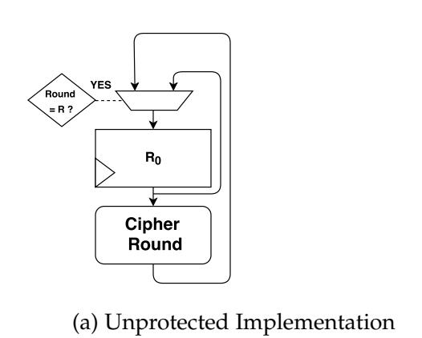

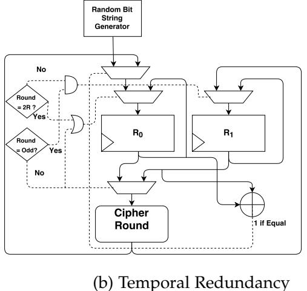

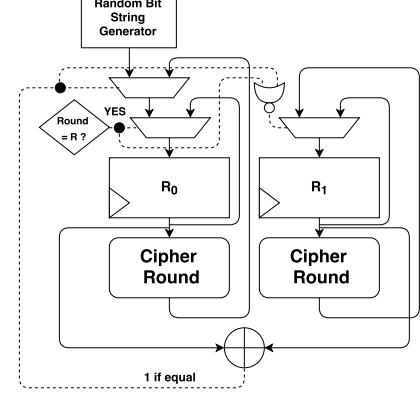

dancy (c) Spatial Redundancy

Fig. 1: Generalized Schematics for Block Cipher Implementations

**Definition 1.** The bias of the fault model  $(\mathcal{F}, \mathcal{P})$  is defined as Var, the variance of  $\mathcal{P}$ .

It may be observed that  $Var = \frac{\sum_{i=1}^{n} p_i^2}{n} - \frac{1}{n^2}$ . We choose Var as the measure of bias for the simple reason that the variance represents the second central moment of the probability distribution, and captures how far the values are spread from the central mean. For a fault model, it thus successfully measures how far the distribution is from that of a uniform model. To the best of our knowledge, this is the first attempt in the cryptographic literature to quantify the bias of a fault model using a generic probability based metric that is independent of the fault model and fault injection technique.

### 3.2 A Generalized Block Cipher Implementation

We introduce in Figure 1a a simple schematic description for a generalized block cipher structure with no protection against fault attacks. We intentionally abstract out the round function to make it independent of any specific block cipher structure such as substitution permutation network (SPN) or Fiestel. The register  $R_0$  is an N bit state register, and is updated with the N bit intermediate cipher state value at the end of each round. The block cipher has a total of R rounds. Note that it is assumed that the round function involves the secret key corresponding to a particular round, and an adversary tries to inject a fault in the state register  $R_0$ . In all our forthcoming discussions, we use this block cipher schematic as our reference point.

In order to illustrate the concepts of temporal and spatial redundancy as fault countermeasures, we also present in Figures 1b and 1c the schematics for block cipher ciphers using these countermeasure techniques. Once again, these schematics are generic and are independent of any particular block cipher structure.

### 4 FAULT BIAS: A THREAT TO TRIVIAL REDUN-DANCY TECHNIQUES

In this section, we formally present the idea that biased fault attacks indeed weaken redundancy based countermeasures using the formal quantification of the bias of a fault model in term of the variance of the fault probability distribution introduced in Section 3.1. In particular, we demonstrate a relationship between the bias of the fault model and the probability that the adversary can introduce *identical faults* in independent fault injections, which we refer to as the *fault collision probability*.

### 4.1 The Fault Collision Probability

Consider a redundant implementation of an encryption algorithm in which each operation is repeated twice (maybe in space or in time). In order to get a faulty ciphertext, an adversary using a fault model  $(\mathcal{F},\mathcal{P})$  has to ensure that the same fault  $f_i \in \mathcal{F}$  occurs in both the original and redundant computations. Let  $\hat{f}_0$  and  $\hat{f}_1$  be the random variables denoting the outcome of fault injections in the original and redundant rounds respectively. Since the fault injection in the original and redundant rounds are independent, we have  $Pr[\hat{f}_0 = f_i, \hat{f}_1 = f_j] = p_i p_j$ . We focus on the event where  $\hat{f}_0 = \hat{f}_1$ . Let the probability of this event be denoted by  $\tilde{p}$ .

$$\tilde{p} = \sum_{i=1}^{n} Pr[\hat{f}_0 = f_i, \hat{f}_1 = f_i] = \sum_{i=1}^{n} p_i^2.$$
 (1)

Evidently, this is also the probability of leakage of faulty ciphertexts. Any redundancy based countermeasure, if naïvely implemented, would fail to detect the occurrence of a fault as long as the adversary could inject the same fault in both the original and redundant computations. This probability is expected to depend on two major factors - the bias of the fault model and the precision of the fault model. In particular, an increase in bias should increase this probability value, while an increase in the number of faults would reduce the fault collision probability. We note that this is precisely the case since the following relationship holds between the fault variance Var and the fault collision probability  $\tilde{p}$ :

$$\tilde{p} = nVar + \frac{1}{n} \tag{2}$$

This equation captures the fact that the fault collision probability is characterized by both the fault bias (quantified by Var) and the fault precision, represented by the number of faults n in the fault space. Thus, this choice of metric allows us to mathematically quantify the threat posed by biased fault models to redundancy based countermeasures, in terms of the bias of the fault model. To the best of our knowledge, no other metric currently proposed in fault attack literature does the same.

### 5 COUNTERING FAULT COLLISION: TRANSFOR-MATION OF THE FAULT SPACE

In this section we present a generalized view of fault space transformation as a countermeasure strategy to prevent

{5}------------------------------------------------

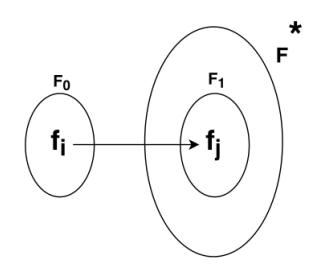

Fig. 2: Fault Space Transformation

fault collision based attacks on classical redundancy based countermeasures. The basic idea is to prevent the adversary from being able to exploit the underlying bias in the fault model to inject the same fault in both the original and redundant state registers, referred to as  $R_0$  and  $R_1$  respectively (refer Figures 1b and 1c). We begin by introducing the concept of *equivalent* fault injection under fault space transformation. We then introduce the countermeasure and examine its security against second order fault attacks.

## **5.1 The Generic Countermeasure Strategy : Fault Space Transformation**

The idea of fault space transformation is to ensure that the computations for  $R_0$  and  $R_1$  are performed under different encodings, such that it is difficult to inject equivalent faults in them. Let  $W: (0,1)^N \to (0,1)^N$  be an additional bijective mapping introduced in the redundant computation such that  $R_1 = W(R_0)$  under fault free operation of the augmented redundancy-based countermeasure. As a result of this state space transformation, the fault space  $\mathcal{F}_0$  for the original computation is mapped to a corresponding fault space  $\mathcal{F}_1$  for the redundant computation, which in turn is a subset of a much larger fault space  $\mathcal{F}^*$ , as demonstrated in Figure 2. In particular, for each fault  $f_i \in \mathcal{F}_0$  there is an equivalent fault  $f_j \in \mathcal{F}_1$ , that is,  $f_i \equiv f_j$  under the mapping W. The following broad assumption may be stated regarding an adversary mounting a second order fault attack on a redundant block cipher implementation with fault space transformation:

**Assumption** 1: The adversary can guarantee the occurrence of a fault in the larger fault space  $\mathcal{F}^*$  but not in the subset  $\mathcal{F}_1$ .

The assumption is intuitive as we demonstrate with respect to our earlier example of fault space mapping W that maps the space  $\mathcal{F}_0$  of all single byte faults in the original computation to a specific subspace  $\mathcal{F}_1$  of the larger fault space  $\mathcal{F}^*$  of all four byte faults, in the redundant computation. We point out that the adversary can use a specific fault injection technique (such as glitching or EM injections) to inject single byte and four byte faults in the original and redundant computations respectively. However, it is practically infeasible to specifically enhance the probability of occurrence of the four byte faults in  $\mathcal{F}_1$  out of all four byte faults in  $\mathcal{F}^*$ . In other words, the faults in  $\mathcal{F}_1$  would still have the same probability of occurrence as they had in the larger fault space  $\mathcal{F}^*$ .

We next examine mathematically the probability of the fault injection event for a random choice of the transformation W. We begin with a generalized analysis and then look at some specific cases with respect to practical fault injection techniques. Any chosen mapping W maps  $\mathcal{F}_0$  to a subset  $\mathcal{F}_1$  of  $\mathcal{F}^*$  such that  $|\mathcal{F}_1| = |\mathcal{F}_0|$ . There are  $\binom{|\mathcal{F}^*|}{|\mathcal{F}_1|}$ 

such subsets. A particular fault  $f_j \in \mathcal{F}^*$  occurs in  $\binom{|\mathcal{F}^*|-1}{|\mathcal{F}_1|-1}$  of the subsets. Thus, given a random fault  $f_i \in \mathcal{F}_0$  and a random fault  $f_j \in \mathcal{F}^*$ , the expectation of  $Pr[f_j = W(f_i)]$  over all possible choices of W (assuming the adversary has no control over W) is given as follows:

$$\mathbb{E}(Pr[f_j = W(f_i)]) = \frac{\binom{|\mathcal{F}^*| - 1}{|\mathcal{F}_1| - 1}}{\binom{|\mathcal{F}^*|}{|\mathcal{F}_1|}|\mathcal{F}_1|} = \frac{1}{|\mathcal{F}^*|}$$
(3)

Let  $p_i$  and  $p_j$  be the probability of occurrence of the faults  $f_i \in \mathcal{F}_0$  and  $f_j \in \mathcal{F}^*$ , and let  $\rho$  denote the correlation coefficient between the fault probability distributions for  $\mathcal{F}_0$  and  $\mathcal{F}^*$ . Also, let  $Var_0$  and  $Var^*$  be the variances of the two fault probability distributions. Assuming that the adversary has perfect knowledge of first fault injection  $\hat{f}_0 = f_i \in \mathcal{F}_0$  for some i, the expected probability of equivalent fault injection  $\tilde{p}$  on two random fault injections  $\hat{f}_0$  and  $\hat{f}_1$  is given as follows:

$$\mathbb{E}(\hat{p}) = \mathbb{E}(\sum_{i=1}^{|\mathcal{F}_{0}|} Pr[\hat{f}_{0} = f_{i}, \hat{f}_{1} = W(f_{i})])$$

$$= \sum_{i=1}^{|\mathcal{F}_{0}|} \mathbb{E}(Pr[\hat{f}_{0} = f_{i}]) \mathbb{E}(Pr[\hat{f}_{1} = W(f_{i})]) + \rho \sqrt{Var_{0}.Var^{*}}$$

$$= \sum_{i=1}^{|\mathcal{F}_{0}|} \mathbb{E}(Pr[\hat{f}_{0} = f_{i}]) (\frac{1}{|\mathcal{F}^{*}|}) + \rho \sqrt{Var_{0}.Var^{*}}$$

$$= \frac{1}{|\mathcal{F}^{*}|} \sum_{i=1}^{|\mathcal{F}_{0}|} \mathbb{E}(Pr[\hat{f}_{0} = f_{i}]) + \rho \sqrt{Var_{0}.Var^{*}}$$

$$= \frac{1}{|\mathcal{F}^{*}|} + \rho \sqrt{Var_{0}.Var^{*}}$$
(4)

We now look at some special cases and the corresponding expressions for  $\tilde{p}$ .

### 5.1.1 Uniform Fault Models

If the fault model corresponding to at least one of  $\mathcal{F}_0$  or  $\mathcal{F}^*$  follows a uniform probability distribution, then the corresponding variance is 0 and the expression for  $\tilde{p}$  is simply  $\frac{1}{|\mathcal{F}^*|}$ .

## 5.1.2 Independent Original and Redundant Fault Distributions

For certain transient fault injection techniques such as glitching (clock/voltage) and EM injections, it is reasonable to assume that the probability distribution of faults in the fault spaces  $\mathcal{F}_0$  and  $\mathcal{F}^*$  are independent, that is,  $\rho=0$ . In this case also, the expression for  $\tilde{p}$  is  $\frac{1}{|\mathcal{F}^*|}$ , as for uniform fault models. Clearly, in such a scenario, the fault collision probability is the same for uniform and biased fault models. In other words, the threat of biased fault attacks is nullified in such a case.

## 5.1.3 Dependent Original and Redundant Fault Distributions

Certain fault injection techniques such as bit flips in the memory could lead to correlations between the probability distribution of faults in the fault spaces  $\mathcal{F}_0$  and  $\mathcal{F}^*$ . In such scenarios, depending on the value of the correlation coefficient  $\rho$ ,  $\tilde{p}$  could be better or worse for biased fault models as compared to uniform fault models. However, for a random choice of the mapping W, the fault spaces  $\mathcal{F}_0$  and  $\mathcal{F}^*$  are expected to be strongly correlated with very low probability. Thus fault space transformation indeed reduces

{6}------------------------------------------------

the threat of biased fault models in such scenarios, even it does not completely obliterate it.

Figure 3a present a schematic idea of the proposed countermeasure technique as applied to any general block cipher. The redundant computation mentioned in Figure 3a could be either spatial or temporal, as illustrated separately in Figures 3b and 3c the modified temporal and spatial redundancy countermeasure schemes for block ciphers that incorporate the fault space transformation W. Observe that the main components of the countermeasure are the original and redundant computations, and the fault space transformation W applied to the redundant computation, which do not depend on the specific structure of the block cipher. In particular, our countermeasure strategy is applicable to SPN block ciphers such as AES as well as Fiestel block ciphers.

## 5.2 The Transformation Function W : the $\operatorname{\textit{Good}}$ and the $\operatorname{\textit{Bad}}$

An important aspect of the fault space transformation strategy presented above is the choice of the transformation function W. From the designer's perspective of countering both classical DFA as well as the biased fault model-based DFIA, the following must be ensured while choosing W:

- The transformation W must ensure that a smaller fault space  $\mathcal{F}_0$  should be mapped onto the subspace of a larger fault space  $\mathcal{F}_1$ . This is because a larger fault space makes it more difficult for the adversary to achieve the desired fault with desirable precision.
- The occurrence of faults in the original and transformed fault spaces should be uncorrelated so as to reduce the fault collision probability.

Based on the above criterion, we may broadly classify all possible transformation functions W into two categories - good transformations that ensure that the fault space transformation achieve the aforementioned criteria and bad transformations that fail to do so. For example, with respect to the standard block cipher AES, the MixColumns operation represents a good choice of transformation since it maps a single byte fault to a much larger space of four byte faults by virtue of its MDS properties. On the other hand, the SubBytes operation represents a bad choice of transformation since it maps a single byte fault to a single byte fault, virtually achieving no fault space transformation at all.

### 5.2.1 Are Random Transformations Desirable?

We now explore some concrete design choices for W. A possible strategy is to use a randomized transformation, such as a random permutation of the operands in the redundant computation [22]. We point out, however, that a randomized transformation may not be the best choice for W with respect to fault attack prevention, since the inherently random nature of the transformation implies that it may be good or bad with uniform probability. We present an example here to illustrate this phenomenon. Suppose that W is chosen to be full-round AES-128 with a randomly chosen secret key, which essentially makes W an excellent random permutation. Unfortunately, for some choice of secret key, it is possible that a single byte differential at the input of W could actually be mapped onto a

single byte differential at the output, which is a bad fault space transformation according to our specified criteria. Thus, instead of randomized transformations, we propose using a deterministic W, that always guarantees good fault space transformation and successfully thwarts both DFA and DFIA. This is discussed in details next.

## 5.3 Our Proposed Fault Space Transformations: Using MDS Matrices

We now look at a possible strategy for designing the transformation function W. We propose the use of Maximum Distance Separable (MDS) matrices [47] for W. An MDS matrix is a matrix representing a function with special diffusion properties and has many useful applications in cryptography, especially in designing multipermutations to prevent cryptanalysis. Now, suppose that the linear transformation W is a  $m_2 \times m_1$  MDS mapping over a field K from  $\mathbb{K}^{m_1}$ to  $\mathbb{K}^{m_2}$ . We propose the use of MDS matrices because they guarantee a fault space transformation such that the original and redundant fault spaces  $\mathcal{F}_0$  and  $\mathcal{F}_1$  differ sufficiently in their Hamming weights to have low correlation of occurrence. Let the adversary inject a t byte fault  $f_0$  in the register  $R_0$ , and let  $f_1$  be the corresponding fault to be injected in the register  $R_1$  so that the countermeasure fails to detect the fault injection. By the MDS diffusion property, any tbyte fault  $f_0$  is mapped to an at least a  $m_2 - t + 1$  byte fault  $f_1$ . For the special case of a single byte fault (t = 1), the transformed fault space comprises of faults that affect at least  $m_2$  bytes of the output. Thus the precision of the transformed fault space  $\mathcal{F}_1$  is approximately  $\frac{1}{2(8m_2-1)}$  times lower than the original fault space  $\mathcal{F}_0$ , making it difficult for the adversary to create equivalent fault injections with high probability. Additionally, since using MDS matrices causes W to be a linear transformation, the side channel leakage of the implementation is not adversely affected [48].

## 5.3.1 Comparison with the use of Linear Complementary Dual Codes

In the cryptographic literature, the use of linear complementary dual codes for fault detection has been a subject of recent study as part of a number of countermeasure schemes combining fault and side channel protection such as ODSM [26], and have also been used for Trojan detection [27]. A major drawback of the use of dual codes is that they can only detect a certain subclass of even first order fault attacks upper bounded by a certain Hamming weight d that parameterizes the system. In addition, the possibility of preventing second order biased fault attacks using such codes on top of redundant cipher implementations has also not been studied to the best of our knowledge. On the other hand, using MDS matrices for fault space transformation achieves fault space transformation without putting any restrictions on the Hamming weight of the injected fault.

#### 5.3.2 Comparison with Infective Countermeasures

We note that our proposed countermeasure scheme is fundamentally different from infective countermeasure scheme in the sense that there are no dummy rounds in our proposition. Infective countermeasures avoid an explicit detection step; rather they focus on modifying and amplifying the

{7}------------------------------------------------

Fig. 3: Our Proposed Countermeasure : Fault Space Transformation

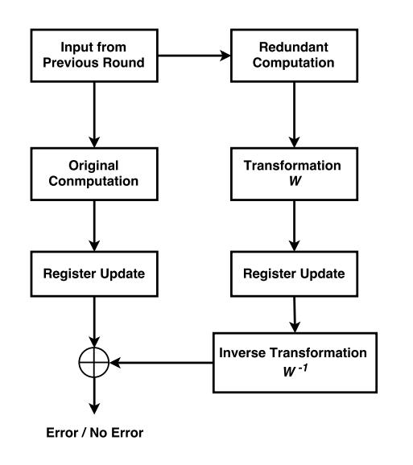

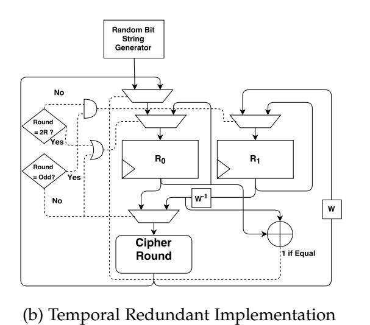

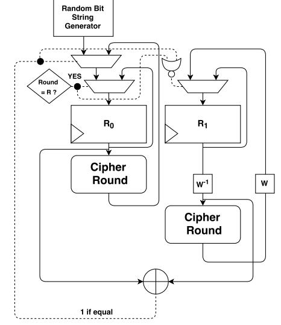

(a) Schematic of Proposed Countermeasure

(c) Spatial Redundant Implementation

effect of the injected fault so as to render the faulty ciphertext unexploitable to the adversary [\[25\]](#page-13-0). However, the most recently proposed infective countermeasures that are provably secure against first order DFA [\[25\]](#page-13-0), [\[43\]](#page-13-10) make use of additional dummy rounds (over and above the standard redundancy of performing each round twice) in order to confuse the adversary. On the other hand, our countermeasure uses only standard redundancy, but the original and redundant computations occur in different state spaces so as to reduce the fault collision probability. Also, our proposed countermeasure uses detection and not amplification to render the faulty ciphertext unexploitable, and does not require any additional dummy rounds. In this respect, our countermeasure achieves better throughput as compared to infective countermeasures.

### *5.3.3 Comparison with Information Redundancy*

We also present a comparison our countermeasure technique with information redundancy techniques such as parity [\[42\]](#page-13-9) and robust codes [\[19\]](#page-12-19). We note first of all that unlike information redundancy, our proposed countermeasure does not require any separate prediction units. The main overhead in information redundancy techniques such as robust codes arises from the use of elaborate prediction units (such as linear codes for parity or non-linear robust codes), while that in our proposed countermeasure arises from the use of redundant computations and the transformation function W. In information redundancy, designers prefer the use of non-linear codes owing to their better fault coverage as compared to linear codes. It is important to note, however, that using non-linear error detection codes often tends to increase the correlation of the circuit power consumption, thus making it more vulnerable against SCA attacks [\[48\]](#page-13-23). In this regard, our proposed countermeasure is advantageous because the use of an additional linear transformation function W does not enhance the side channel vulnerability of the implementation.

### *5.3.4 Comparison with Dual Rail Precharge Logic*

The authors of [\[44\]](#page-13-11) claim that dual rail precharge logic acts as a sound countermeasure against classical DFA, since the injection of multi-bit flips leads to a NULL value encoding (00 or 11) with high probability and renders the faulty ciphertext unexploitable. Indeed, under the assumption that

all the injected faults are uniformly distributed in the target fault space of single byte faults, the probability that the adversary successfully injects a two bit flip (simultaneous 0 → 1 and 1 → 0 bit flips) in a single dual rail couple [\[44\]](#page-13-11) is low. Even so, there still exists a finite probability that such a fault may be injected, implying that the coverage with respect to first order fault injections is not 100% for dual rail precharge logic. On the other hand, fault space transformation provides 100% coverage against all first order fault attacks. Moreover, the assumption in [\[44\]](#page-13-11) that a random fault injection leads to a NULL value with high probability is not valid when the fault model is biased, as is the case for DFIA. In such a scenario, depending on the fault injection technique and the critical path delay of the circuit, the adversary may appreciably enhance the probability of a successful fault injection using a precise single byte fault model to perform a number of successful fault injections, and then use these faulty ciphertexts and the underlying bias of the fault model to recover the key.

### *5.3.5 Comparison with Round Encryption followed by Decryption*

A popular fault detection technique in the literature is to use a temporal redundancy where instead of repeating each round of the encryption algorithm twice, an encryption round is followed by a decryption round. An efficient implementation of such a technique with respect to AES-128 is presented in [\[21\]](#page-12-21). In this case, the transformation function W is essentially the entire AES round itself. We note however, that instead of using the entire round operation, using only the MixColumns operation (which uses an MDS mapping) would achieve the same fault space transformation, since the other round operations (SubBytes, ShiftRows and AddRoundKey) do not conribute towards transforming the fault space. Thus instead of incorporating all the round operations in the transformation W, our proposed technique focuses on efficiently using specifically the MDS operation that suffices for transforming the fault space.

### **6 CASE STUDY : APPLICATION OF FAULT SPACE TRANSFORMATION ON AES-128**

In this section, we present a case-study on the block cipher AES-128, which is the current standard block cipher in the

{8}------------------------------------------------

TABLE 2: Fault Model Description

| Symbol | Fault Model                     |
|--------|---------------------------------|
| SBU    | Single Bit Upset                |
| SBDBU  | Single Byte Double Bit Upset    |
| SBTBU  | Single Byte Triple Bit Upset    |
| SBQBU  | Single Byte Quadruple Bit Upset |

cryptographic community. The case study is organized as follows. We first discuss a possible fault model to perform biased fault attack DFIA on AES-128. We show that such a fault model is indeed practically feasible and can be achieved on a real life hardware implementations of AES-128. We present simulation studies to illustrate the the relation of attack efficiency with the precision and bias of the fault model. Finally, we present actual experimental results where the biased fault attack is mounted on two classical fault-tolerant implementations of AES-128, namely spatial (or hardware) redundancy and temporal redundancy. Finally, we apply the proposed countermeasure strategy of fault space transformation to these implementations, and demonstrate the effectiveness of the countermeasure in thwarting such attacks.

#### 6.1 The Fault Model

Depending on the type and method of fault injection, different types of faults may occur with varying granularity. These include single bit upsets, multi bit upsets, single and multi byte upsets, and diagonal upsets. Table 2 summarizes our proposed fault models. Our experiments have shown that SBU is the most suitable fault model for our attacks on time or hardware redundant AES implementations. However, we also present results for SBDBU, SBTBU and SBQBU to show the impact of fault model granularity on the performance of our attacks. Note that the degree of control that the attacker has on the fault location impacts the fault models in terms of the number of possible fault (N) under that fault model. We distinguish between the following two situations - Situation-1 when the attacker has perfect control over the faulty byte and Situation-2 when the attacker does not have control over the faulty byte.

#### 6.2 The Fault Injection Set Up

The fault injection set up consists of an FPGA (Spartan-3A XC3S400A), a PC and an external arbitrary function generator (Tektronix AFG3252). The FPGA has a DUT (Device Under Test) block, which is a time or hardware redundant AES implementation. Faults were injected using clock glitches and the fault intensity was controlled by increasing/decreasing the glitch frequency. The system had two clock signals -  $clk_{slow}$  and  $clk_{fast}$ , both of which were derived from an external clock signal  $clk_{ext}$  via a Xilinx Digital Clock Manager (DCM) module. The  $clk_{slow}$  signal was used for fault-free operation of the DUT, while the  $clk_{fast}$  signal was used to create the glitches for fault injection. The appropriate signal was fed to the DUT via a MUX. The faulty states of the registers were monitored using Chipscope Pro 12.3 analyzer.

We performed biased fault attacks on both the time and hardware redundant versions of AES. The attack essentially extends DFIA [14] to two target rounds instead of just one, and also uses an additional distinguisher function

TABLE 3: Fault Models and Corresponding Frequency Ranges

| Fault Model   | Frequency Range (MHz) |                     |  |  |
|---------------|-----------------------|---------------------|--|--|
| l autt Wiodei | Time Redundancy       | Hardware Redundancy |  |  |
| SBU           | 125.3-125.4           | 70.3-70.5           |  |  |
| SBDBU         | 125.6 - 125.7         | 70.6-70.9           |  |  |
| SBTBU         | 126.0-126.1           | 71.0-71.1           |  |  |
| SBQBU         | 126.3-126.4           | 71.3 - 71.4         |  |  |

- the Squared Euclidean Imbalance (SEI), along with the Hamming distance (HD) based distinguisher, to identify the correct key hypothesis. The attack procedure introduces the fault into either round 8 or round 9 of AES, and exploits the biased nature of the introduced fault to decipher the key. Note that our fault model for the attack only comprises SBU, SBDBU, SBTBU and SBQBU (refer Table 2), i.e, all the fault models are *single byte fault models*. Further details of the attack approach may be found in [13], [14]. Since the Chipscope pro 12.3 Analyzer limits the number of observable samples at a given frequency to 1024, we observed 512 samples for the original computation and 512 samples for the redundant computation. Table 3 elucidates the common frequency ranges between either round where each type of fault model is predominant for either countermeasure.

### 6.3 Applying Fault Space Transformation to AES-128

We apply our proposed fault space transformation based countermeasure technique to protect AES-128 against biased fault attacks. For the transformation function W, we propose using the Rjindael MixColumns matrix for its ease of implementation. The Rjindael MixColumns operation used in AES consists of multiplying a input vector of length 4 by a  $4 \times 4$  MDS matrix in the finite field **GF**( $2^8$ ). Each column of the matrix is treated as a polynomial over  $\mathbf{GF}(2^8)$  and is then multiplied modulo  $x^4 + 1$  with a fixed polynomial  $c(x) = 3x^3 + x^2 + x + 2$ , where  $\{2\}, \{3\} \in \mathbf{GF}(2^8)$ . The MixColumns operation takes four bytes as input and produces 4 bytes as output, where each input byte affects all four output bytes. This implies that if a single byte of the input vector is changed, all 4 bytes of the output are affected. From the point of view of fault injections, if the adversary were to inject a single byte fault in the input vector, the MixColumns would diffuse the fault across all four bytes of the output vector. Thus essentially, the fault model transformation takes place from a single byte fault to a four byte fault. Since we have already demonstrated that fault models beyond single byte faults are of little practical significance to the adversary for attacking the time and hardware redundancy countermeasures due to lack of precision, it is sufficient to consider the diffusion property of MixColumns for single byte faults. Thus, in accordance with our previous discussion  $\mathcal{F}_0$  is the set of all single byte faults,  $\mathcal{F}^*$  is the set of all 4 byte faults and  $\mathcal{F}_1$  is the image of  $\mathcal{F}_0$  in  $\mathcal{F}^*$  under the MixColumns mapping. Even if the adversary were to know precisely which byte of  $R_0$  was affected by the injected fault (and the corresponding bytes of  $R_1$  that would need to be affected for an equivalent fault), the size of  $\mathcal{F}^*$  is too huge for the adversary to be able to precisely introduce only those faults that are in  $\mathcal{F}_1$ .

To elucidate this fact we present a comparison with the use of linear complimentary dual codes as a fault detection countermeasure. Suppose an adversary uses single

{9}------------------------------------------------

TABLE 4: Implementation Details of Our Proposed Countermeasure

| AES Implementation                               | Area Overhead (Slice Count) | Maximum Frequency (MHz) | Clock Cycles |
|--------------------------------------------------|--------------------------------|----------------------------|--------------|
| Without Redundancy                               | 2580                           | 78.5                       | 10           |
| Naïve Temporal Redundancy                        | 3580                           | 74.6                       | 20           |
| Naïve Spatial Redundancy                         | 5250                           | 68.9                       | 10           |
| Temporal Redundancy + Fault Space Transformation | 3876                           | 72.3                       | 20           |
| Spatial Redundancy + Fault Space Transformation  | 5538                           | 66.7                       | 10           |
| Optimized Architecture (Figure 4)                | 5356                           | 67.5                       | 10           |

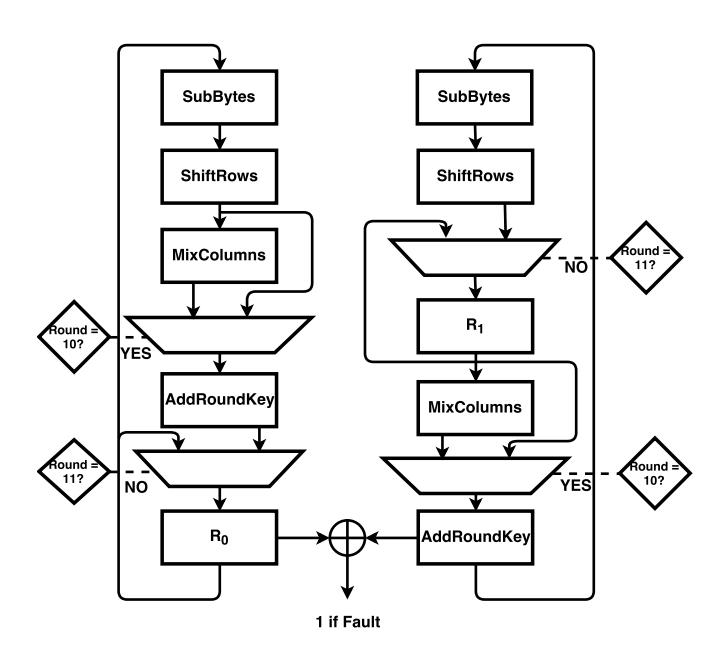

Fig. 4: Efficient Implementation of AES-128: Spatial Redundancy with Fault Space Transformation

byte faults to attack ODSM [26], which uses linear complimentary dual codes, as well as our proposed fault space transformation (FST) based countermeasure, that uses MDS matrixes. As per the implementation of ODSM using a [16,8,5] dual code on AES-128 presented in [26] as well as in [27], any fault injection that affects more than four bits is not detected. Assuming uniform fault injection probability, the success probabilities of the adversary are as follows:

$$Pr[Success]_{ODSM} = \frac{2^8 - \sum_{i=1}^{i=4} {8 \choose i}}{2^8} \approx 0.5$$

$$Pr[Success]_{FST} = \frac{|\mathcal{F}_1|}{|\mathcal{F}^*|} = \frac{255}{2^{32} - 4.2^{24} - 6.2^{16} - 4.2^8 - 1}$$

$$\approx 6.032 \times 10^{-8}$$

The above comparison highlights the advantage of using the MixColumns transformation for transforming the fault space to prevent second order fault injection attacks.

#### 6.3.1 Implementation Overhead

We present here the implementation overhead and critical frequency for the proposed countermeasure technique in Table 4. The results are presented on a Spartan-3A XC3S400A FPGA.

## 6.3.2 Reason for Choosing MixColumns: Efficient Pipelined Implementations

We point out here that the presence of the MixColumns operation in the normal round function of AES allows to obtain a pipelined implementation where the state registers  $R_0$  and  $R_1$  are placed after and before the MixColumns operation respectively. This achieves the desired fault space transformation without the additional overhead of the MixColumns and the Inverse MixColumns operation. Figure

TABLE 5: Experimental Results: Biased Fault Attacks on Time Redundancy

| Round | Fault Model | Fault Variance       | Ciphertexts | Faults(estimate) | Faults(practical) |
|-------|-------------|----------------------|-------------|------------------|-------------------|
|       | SBU         | $9.5 \times 10^{-2}$ | 305         | 340              | 388               |
| 8     | SBDBU       | $1.4 \times 10^{-2}$ | 625         | 1456             | 1448              |
| 0     | SBTBU       | $9.7 \times 10^{-3}$ | 1020        | 1816             | 1975              |
|       | SBQBU       | $3.2 \times 10^{-3}$ | 1879        | 7869             | 8003              |
|       | SBU         | $9.2 \times 10^{-2}$ | 304         | 386              | 388               |
| 9     | SBDBU       | $8.8 \times 10^{-2}$ | 625         | 641              | 648               |
| ,     | SBTBU       | $8.1 \times 10^{-2}$ | 832         | 874              | 856               |
|       | SBQBU       | $7.5 \times 10^{-2}$ | 1328        | 1788             | 1809              |

TABLE 6: Experimental Results: Biased Fault Attacks on Hardware Redundancy

| Round | Fault Model | Fault Variance       | Ciphertexts | Faults (estimate) | Faults (practical) |
|-------|-------------|----------------------|-------------|-------------------|--------------------|
|       | SBU         | $1.1 \times 10^{-1}$ | 300         | 336               | 323                |
| Q     | SBDBU       | $9.4 \times 10^{-2}$ | 651         | 1426              | 1455               |
| O     | SBTBU       | $5.6 \times 10^{-3}$ | 990         | 1857              | 1824               |
|       | SBQBU       | $4.5 \times 10^{-3}$ | 1724        | 7536              | 7503               |
|       | SBU         | $9.5 \times 10^{-2}$ | 304         | 390               | 377                |
| Q     | SBDBU       | $7.7 \times 10^{-2}$ | 619         | 647               | 664                |
| 9     | SBTBU       | $7.6 \times 10^{-2}$ | 883         | 892               | 829                |
|       | SBQBU       | $3.4 \times 10^{-2}$ | 1299        | 1851              | 1913               |

4 shows such an efficient implementation of the spatial redundancy with fault space transformation. The pipelined implementation has the same overhead as the naïve redundancy technique, but with the added protection of fault space transformation.

### 7 EXPERIMENTAL RESULTS

In this section, we present experimental results to validate the security of our proposed countermeasure scheme. All experiments have been conducted on a Spartan 3A FPGA, on a SASEBO GII platform. The experimental section is divided into two broad parts. The first part demonstrates that the proposed fault attack is indeed feasible on time and hardware redundant implementations of AES. The second part shows the effect of introducing the fault space transformation on the number of fault injections required per faulty ciphertext.

## 7.1 Demonstration of Biased Fault Attacks on Naïve Spatial and Temporal Redundancies

In this section we present the practical results of biased fault attacks on both the time and hardware redundancy countermeasure schemes. The implementation is a register-transfer level Verilog definition of the countermeasure algorithms described in Figures 1b and 1c. We repeated the experiment 100 times, with the same randomly chosen key and the randomly chosen plaintext. Tables 5and 6 summarize the results of our attacks for different fault models. The estimated number of fault injections is computed from the number of faults and the experimentally observed variance. It is evident from the results that the experimentally obtained number of fault injections corroborates the estimated number of fault injections results very well. The results thus confirm that biased fault attacks can recover the key from classical redundancy based countermeasures in practically

{10}------------------------------------------------

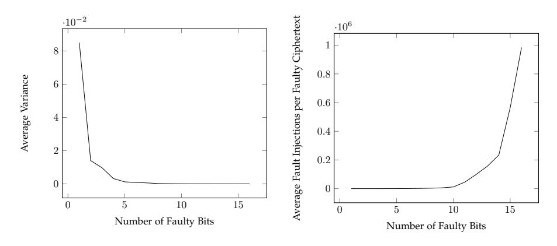

Fig. 5: Effect of Fault Precision

feasible number of fault injections. Additionally, greater the fault model precision, lesser is the number of fault injections necessary to recover the key, as demonstrated in Figure 5.

## 7.2 Effect of Fault Space Transformation on Biased Fault Attacks

This section presents the practical results of biased fault attacks on the temporal and spatial redundancy countermeasures with fault space transformation. Our results demonstrate that FST enhances the security of both the spatial and temporal redundancy countermeasures by rendering both DFA and DFIA practically infeasible. The faults are observed using the Chipscope pro 12.3 Analyzer just before the comparison step, where the fault collision is expected to occur in case of a successful fault injection. Figures 6 and 7 summarize the impact of our proposed countermeasure on biased fault attacks using single bit upset (SBU) on the time and hardware redundancy countermeasures respectively. It is observed that the frequency ranges where the single bit upsets are observed in the original and redundant rounds respectively, are completely disjoint due to the fault space transformation. Moreover, the specific four byte faults, which are equivalent to single bit faults under the Mix-Columns transformation, occur with very low frequency. Tables 7 and 8 summarize the results of our attacks for different fault models before and after applying FST. Note that the term Faults Required in both these tables refers to the number of fault injections required to be performed in order to recover the entire secret key of AES-128, in the absence and presence of FST, respectively. This was calculated as follows. After performing each fault injection, we tried to recover the key bytes using the faulty ciphertexts acquired so far. We note here that only those faulty ciphertexts in which the effect of countermeasure could be nullified by injecting equivalent faults in the original and redundant computations contributed towards recovering the key. The results show that injection of equivalent faults is much easier to achieve in the absence of FST, resulting in key recovery using fewer number of fault injections. However, the presence of FST drastically increases the number of fault injections required for recovering the key, thus rendering the attacks practically infeasible. In addition, this result holds for each of the four fault models considered in this paper, as demonstrated in Tables 7 and 8.

#### 7.3 Distribution of Faults against Clock Frequency

Tables 9a and 9b summarize the frequency ranges at which various fault models are observed for the modified time

TABLE 7: Effect of Fault Space Transformation with Temporal Redundancy

|  | Round | Fault Model | Faults Required (without FST) | Faults Required (with FST) |
|--|-------|-------------|-------------------------------|----------------------------|
|  |       | SBU         | 388                           | $3 \times 10^{6}$          |
|  | 8     | SBDBU       | 1448                          | $5 \times 10^{6}$          |
|  |       | SBTBU       | 1975                          | $10^{7}$                   |
|  |       | SBQBU       | 8003                          | $> 10^7$                   |
|  | 9     | SBU         | 388                           | $5 \times 10^{6}$          |
|  |       | SBDBU       | 648                           | $10^{7}$                   |
|  |       | SBTBU       | 856                           | $10^{7}$                   |
|  |       | SBQBU       | 1809                          | $> 10^7$                   |

TABLE 8: Effect of Fault Space Transformation with Spatial Redundancy

| Round | Fault Model | Faults Required (without FST) | Faults Required (with FST) |
|-------|-------------|-------------------------------|----------------------------|
|       | SBU         | 323                           | $2 \times 10^{6}$          |
| 8     | SBDBU       | 1455                          | $2.5 \times 10^{6}$        |
| 0     | SBTBU       | 1824                          | $5 \times 10^{6}$          |
|       | SBQBU       | 7503                          | $> 10^7$                   |
|       | SBU         | 377                           | $3 \times 10^{6}$          |
| 9     | SBDBU       | 664                           | $5 \times 10^{7}$          |
| ,     | SBTBU       | 829                           | $> 10^7$                   |
|       | SBQBU       | 1913                          | $> 10^7$                   |

and hardware redundancy countermeasures respectively. The results have been presented for 512 samples obtained at different frequencies for both the time and hardware implementations of AES-128. Quite evidently, for each fault model, the transformation not only causes the frequency ranges for equivalent faults in the original and redundant computations to be drastically different, but also affects the occurrence probability of various faults. Moreover, unlike in the original computation where different fault models have disjoint frequencies of occurrences, the frequency ranges for the redundant computation overlap. This makes it impossible for the adversary to identify characteristic frequencies to inject faults belonging to a particular fault model with a high probability. Thus our proposed countermeasure successfully combines redundancy with fault space transformation to render DFA and DFIA practically infeasible.

## 7.4 Distribution of Faults in the Original and Redundant Calculations

Figures 8a and 8b depict the distribution of faults in terms of the number of affected bytes in the original and redundant rounds of AES-128 obtained via our fault injection experiments using clock glitches, generalized over 107 injections. The results are presented separately for temporally and spatially redundant implementations. We contrast the distribution of the target fault space corresponding to the original round, and the actually obtained fault space in the redundant round, for the and without the presence of fault space transformation. Quite evidently, the results highlight that in the absence of fault space transformation, these spaces overlap almost always upto a fault space of 11 bytes, making it easy for the adversary to inject equivalent faults and bypass the final check. In particular, singe byte faults are extremely effective for launching DFIA attacks in this case. However, in the presence of fault space transformation, these spaces rarely overlap in an actual fault injection scenario, making it very difficult for the adversary to bypass the final check by injecting equivalent faults. In particular, the fault spaces obtained in the redundant computation quickly saturate to 16 bytes, implying that all bytes in the state register are affected. Even for single byte faults, the target fault space is that of 4 byte faults, which is extremely imprecise for equivalent fault injection.

We also point out here that the fault injection parameters required to achieve a given target fault space is essentially

{11}------------------------------------------------

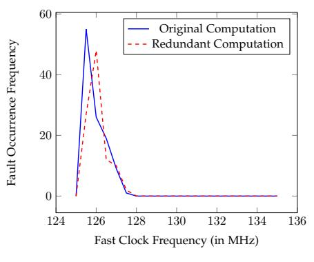

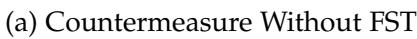

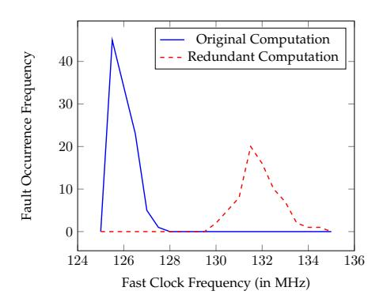

(b) Countermeasure With FST

Fig. 6: Effect of Fault Space Transformation on Biased Fault Attacks : Temporal Redundancy

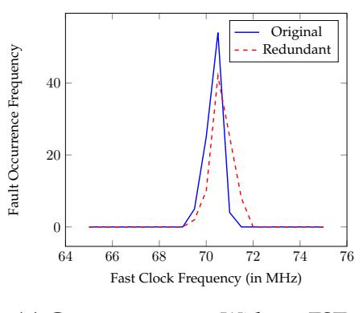

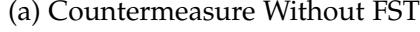

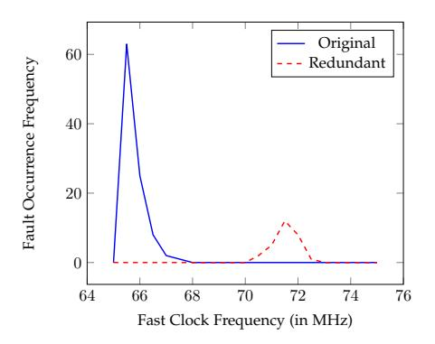

(b) Countermeasure With FST

Fig. 7: Effect of Fault Space Transformation on biased fault attacks : Spatial Redundancy

dependent on the target device and the fault injection methodology used. In the absence of FST, the same fault injection parameters suffice to achieve equivalent fault injection in the original and redundant rounds, since both faults lie in the same target space. For instance, if the adversary wishes to inject single byte faults in both the original and redundant computations using clock glitches, the same glitch frequency range may be used for both the injections. In the presence of FST, however, the equivalent fault spaces for the original and redundant computations are distinct. Hence the adversary must vary the fault injection parameters between the two computations to achieve the desirable faults in these two spaces. For instance, a single byte fault in the original redundant round may be equivalent to a four byte fault in the redundant round; hence the adversary would need to switch between the precise glitch frequency ranges for the single byte and the corresponding four byte fault. As the aforementioned results demonstrate, this is practically infeasible to achieve.

In order to further elucidate the implication of the aforementioned results, we explain how Figures [8a](#page-12-23) and [8b](#page-12-23) essentially explain the observations in Tables [7](#page-10-1) and [8.](#page-10-2) We point out that the target fault space described in these figures is essentially the fault space in which the adversary intends to inject a second fault in the redundant round so that she achieves an equivalent fault injection to nullify the effect of the fault space transformation. The figures illustrate that in the absence of FST, this is easy to achieve, which is precisely why the DFIA based attack is practically feasible in the absence of FST. The results in Tables [7](#page-10-1) and [8](#page-10-2) reflect this observation, since the number of fault injections required in the absence of FST is less. On the other hand, achieving equivalent fault injection in the presence of FST is difficult, which is reflected in the fact that the corresponding attacks in the presence of FST require very high number of fault injections. Once again, Tables 7 and 8 corroborate this observation.

### **7.5 Nature of Fault Injection**

Although FST is a general countermeasure technique and is independent of fault injection techniques, in this paper we focus on violation based fault injections because they are easier to inject and hence more potent. Other more precise fault injections such as laser fault injection will be more difficult to counter using FST, since injecting equivalent faults in the original and redundant computations would be easier using such techniques. An interesting future direction of work would be to compare and contrast the degree of difficulty in injecting equivalent faults in the original and redundant rounds with and without FST, for different fault injection techniques.

### **8 CONCLUSIONS**

In this work, we have proposed a novel fault space transformation based countermeasure that counters both traditional DFA as well as DFIA-like biased fault attacks on AES-like block ciphers. We propose a formal quantification of the bias of a fault model in terms of the variance of the fault probability distribution, and use this definition to formally argue the threat posed by biased fault attacks to na¨ıve redundancy based countermeasure techniques. We introduce the concept of fault space transformation, in which the adversary is forced to inject two equivalent faults in different fault spaces to bypass the detection step. We propose the use of MDS matrices to provide formal guarantees of low correlation between the original and redundant fault spaces. Our proposed countermeasure is independent of the block cipher structure, and is generic enough to be applied to a variety of redundancy based countermeasures against a variety of fault injection techniques. We present a case study on AES-128 to prove the effectiveness of our countermeasure. We demonstrate how our proposed countermeasure thwarts glitch based biased fault attacks on RTL implementations of spatial and temporal redundant implementations of AES-128 on a Spartan 3A FPGA on a SASEBO GII board.

{12}------------------------------------------------

TABLE 9: Frequency Ranges for Fault Models: Fault Space Transformation

| Fault Model | Frequency Range (MHz) |                       |  |
|-------------|-----------------------|-----------------------|--|
| rault Model | Original Computation  | Redundant Computation |  |
| SBU         | 125.3-125.4           | 129.8 - 134.4         |  |
| SBDBU       | 125.6-125.7           | 130.1 - 133.6         |  |
| SBTBU       | 126.0-126.1           | 129.7-133.8           |  |
| SBQBU       | 126.3-126.4           | 128.9 - 132.5         |  |

(a) Modified Time Redundancy

| Fault Model | Frequency Range (MHz) |                       |  |
|-------------|-----------------------|-----------------------|--|
| rault Model | Original Computation  | Redundant Computation |  |
| SBU         | 64.3-64.9             | 71.2 - 72.5           |  |
| SBDBU       | 65.1-65.4             | 70.1 - 73.8           |  |
| SBTBU       | 65.8-66.2             | 69.1 - 74.6           |  |
| SBQBU       | 66.4 - 67.1           | 69.5 - 72.2           |  |

(b) Modified Hardware Redundancy

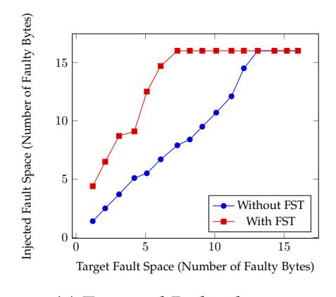

(a) Temporal Redundancy

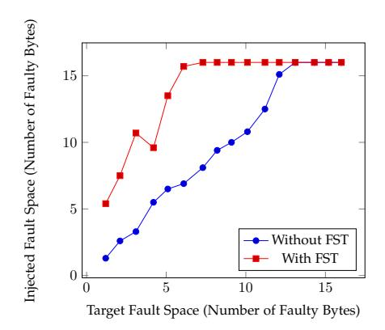

(b) Spatial Redundancy

Fig. 8: Effect of Fault Space Transformation on Fault Distribution: Original and Redundant Computations

### 9 ACKNOWLEDGMENTS

The authors would like to acknowledge the Information Security and Education Awareness (ISEA) projec and the Institute Seed Grant (NGI) for partial funding of the work. P.P. Chakrabarti would like to acknowledge the Department of Science and Technology, Government of India, for partial funding of the work.

### REFERENCES

- [1] Joan Daemen and Vincent Rijmen. *The design of Rijndael: AES-the advanced encryption standard*. Springer Science & Business Media, 2013.
- [2] Paul Kocher, Joshua Jaffe, and Benjamin Jon. Differential Power Analysis. *Advances in Cryptology CRYPTO99.Springer*, pages 388–397, 1999.
- [3] Dan Boneh, Richard Millo, and Richard Lipton. On the Importance of Checking Cryptographic Protocols for Faults. *Advances in Cryptology EUROCRYPT97.Springer*, pages 37–51, 1997.
- [4] Eli Biham and Adi Shamir. Differential Fault Analysis of Secret Key Cryptosystems. In Burton S. Kaliski Jr., editor, *Advances in Cryptology CRYPTO 1997*, volume 1294 of *Lecture Notes in Computer Science*, pages 513–525. Springer, 1997.
- [5] Amine Dehbaoui, J-M Dutertre, Bruno Robisson, and Assia Tria. Electromagnetic transient faults injection on a hardware and a software implementations of aes. In *Fault Diagnosis and Tolerance in Cryptography (FDTC)*, 2012 Workshop on, pages 7–15. IEEE, 2012.
- [6] Matthieu Rivain. Differential fault analysis on DES middle rounds. *Cryptographic Hardware and Embedded Systems-CHES* 2009, pages 457–469, 2009.
- [7] Gilles Piret and Jean-Jacques Quisquater. A Differential Fault Attack Technique against SPN Structures, with Application to the AES and KHAZAD. *Cryptographic Hardware and Embedded Systems, CHES* 2003, *Springer*, pages 77–88, 2003.
- [8] Debdeep Mukhopadhyay. An Improved Fault Based Attack of the Advanced Encryption Standard. In Bart Preneel, editor, *Progress in Cryptology – AFRICACRYPT 2009*, volume 5580 of *Lecture Notes in Computer Science*, pages 421–434. Springer, 2009.
- [9] Michael Tunstall, Debdeep Mukhopadhyay, and Subidh Ali. Differential fault analysis of the advanced encryption standard using a single fault. In *Information Security Theory and Practice. Security and Privacy of Mobile Devices in Wireless Communication*, pages 224–233. Springer, 2011.
- [10] H.C Kim. Differential Fault Analysis against AES-192 and AES-256 with Minimal Faults. 2010 Workshop on Fault Diagnosis and Tolerance in Cryptography(FDTC), IEEE, pages 3–9, 2010.
- [11] Yang Li, Kazuo Sakiyama, Shigeto Gomisawa, Toshinori Fukunaga, Junko Takahashi, and Kauzo Ohta. Fault Sensitivity Analysis. *Cryptographic Hardware and Embedded Systems, CHES* 2010, *Springer*, pages 320–334, 2010.

- [12] Thomas Fuhr, Éliane Jaulmes, Victor Lomné, and Adrian Thillard. Fault Attacks on AES with Faulty Ciphertexts Only. In Wieland Fischer and Jörn-Marc Schmidt, editors, *Fault Diagnosis and Tolerance in Cryptography – FDTC 2013*, pages 108–118. IEEE Computer Society, 2013.
- [13] Thomas Fuhr, Eliane Jaulmes, Victor Lomne, and Adrian Thillard. Fault Attacks on AES with Faulty Ciphertexts Only. 2013 Workshop on Fault Diagnosis and Tolerance in Cryptography(FDTC).IEEE, pages 108–118, 2013.
- [14] Nahid Ghalaty, Bilgiday Yuce, Mostafa Taha, and patrick Schaumont. Differential Fault Intensity Analysis. 2014 Workshop on Fault Diagnosis and Tolerance in Cryptography(FDTC).IEEE, 2014.
- [15] Bruno Robisson and Pascal Manet. Differential behavioral analysis. In *Cryptographic Hardware and Embedded Systems - CHES* 2007, 9th International Workshop, Vienna, Austria, September 10-13, 2007, Proceedings, pages 413–426, 2007.
- [16] Johannes Blömer and Jean-Pierre Seifert. Fault Based Cryptanalysis of the Advanced Encryption Standard (AES). In Rebecca N. Wright, editor, *Financial Cryptography*, volume 2742 of *Lecture Notes in Computer Science*, pages 162–181. Springer, 2003.
- [17] T Malkin, F.X Standaert, and M Yung. A Comparative Cost/Security Analysis of Fault Attack Countermeasures. 2005 Workshop on Fault Diagnosis and Tolerance in Cryptography(FDTC),IEEE, pages 109–123, 2005.
- [18] P. Maistri and R Leveugle. Double-Data-Rate Computation as a Countermeasure against Fault Analysis. *IEEE Transactions on Computers*, 57(11):1528–1539, 2008.
- [19] Mark Karpovsky, Konrad J Kulikowski, and Alexander Taubin. Robust protection against fault-injection attacks on smart cards implementing the advanced encryption standard. In *Dependable Systems and Networks*, 2004 International Conference on, pages 93–101. IEEE, 2004.
- [20] Marc Joye, Pascal Manet, and J-B Rigaud. Strengthening hardware aes implementations against fault attacks. *IET Information Security*, 1(3):106–110, 2007.
- [21] Akashi Satoh, Takeshi Sugawara, Naofumi Homma, and Takafumi Aoki. High-performance concurrent error detection scheme for aes hardware. In *Cryptographic Hardware and Embedded Systems—CHES* 2008, pages 100–112. Springer, 2008.
- [22] Xiaofei Guo and Ramesh Karri. Recomputing with permuted operands: A concurrent error detection approach. *Computer-Aided Design of Integrated Circuits and Systems, IEEE Transactions on*, 32(10):1595–1608, 2013.
- [23] Michel Agoyan, Sylvain Bouquet, Jacques Fournier, Bruno Robisson, Assia Tria, Jean-Max Dutertre, and Jean-Baptiste Rigaud. Design and characterisation of an aes chip embedding countermeasures. *International Journal of Intelligent Engineering Informatics*, 1(3-4):328–347, 2011.
- [24] Benedikt Gierlichs, Jörn-Marc Schmidt, and Michael Tunstall. Infective Computation and Dummy Rounds: Fault Protection for Block Ciphers without Check-before-Output. In Alejandro Hevia and Gregory Neven, editors, *Progress in Cryptology – LATINCRYPT*

{13}------------------------------------------------

- *2012*, volume 7533 of *Lecture Notes in Computer Science*, pages 305– 321. Springer, 2012.
- [25] Harshal Tupsamudre, Shikha Bisht, and Debdeep Mukhopadhyay. Destroying fault invariant with randomization. In *Cryptographic Hardware and Embedded Systems–CHES 2014*, pages 93–111. Springer, 2014.
- [26] Julien Bringer, Claude Carlet, Herve Chabanne, Sylvain Guilley, ´ and Houssem Maghrebi. Orthogonal direct sum masking. In *Information Security Theory and Practice. Securing the Internet of Things*, pages 40–56. Springer, 2014.
- [27] Xuan Thuy Ngo, Shivam Bhasin, Jean-Luc Danger, Sylvain Guilley, and Zakaria Najm. Linear complementary dual code improvement to strengthen encoded circuit against hardware trojan horses. In *Hardware Oriented Security and Trust (HOST), 2015 IEEE International Symposium on*, pages 82–87. IEEE, 2015.
- [28] Sikhar Patranabis, Abhishek Chakraborty, Phuong Ha Nguyen, and Debdeep Mukhopadhyay. A Biased Fault Attack on the Time Redundancy Countermeasure for AES. In *Constructive Side-Channel Analysis and Secure Design*, pages 189–203. Springer, 2015.
- [29] Yang Li, Yu-ichi Hayashi, Arisa Matsubara, Naofumi Homma, Takafumi Aoki, Kazuo Ohta, and Kazuo Sakiyama. Yet another fault-based leakage in non-uniform faulty ciphertexts. In *Foundations and Practice of Security*, pages 272–287. Springer, 2014.
- [30] Oliver Mischke, Amir Moradi, and Tim Guneysu. Fault sensitivity ¨ analysis meets zero-value attack. In *2014 Workshop on Fault Diagnosis and Tolerance in Cryptography, FDTC 2014, Busan, South Korea, September 23, 2014*, pages 59–67, 2014.
- [31] Michel Agoyan, Jean-Max Dutertre, Amir-Pasha Mirbaha, David Naccache, Anne-Lise Ribotta, and Assia Tria. How to flip a bit? In *IOLTS*, pages 235–239, 2010.
- [32] Elena Trichina and Roman Korkikyan. Multi fault laser attacks on protected CRT-RSA. In *Fault Diagnosis and Tolerance in Cryptography (FDTC), 2010 Workshop on*, pages 75–86. IEEE, 2010.
- [33] Nicolas Moro, Amine Dehbaoui, Karine Heydemann, Bruno Robisson, and Emmanuelle Encrenaz. Electromagnetic fault injection: towards a fault model on a 32-bit microcontroller. In *Fault Diagnosis and Tolerance in Cryptography (FDTC), 2013 Workshop on*, pages 77–88. IEEE, 2013.
- [34] Gilles Piret and Jean-Jacques Quisquater. A Differential Fault Attack Technique against SPN Structures, with Application to the AES and Khazad. In Colin D. Walter, C¸ etin K. KoC¸ , and Christof Paar, editors, *Cryptographic Hardware and Embedded Systems - CHES 2003*, volume 2779 of *Lecture Notes in Computer Science*, pages 77– 88. Springer, 2003.
- [35] Nidhal Selmane, Sylvain Guilley, and J-L Danger. Practical setup time violation attacks on aes. In *Dependable Computing Conference, 2008. EDCC 2008. Seventh European*, pages 91–96. IEEE, 2008.
- [36] Robert Demming and Daniel J Duffy. *Introduction to the Boost C++ Libraries; Volume I-Foundations*. Datasim Education BV, 2010.
- [37] Dhiman Saha, Debdeep Mukhopadhyay, and Dipanwita Roy Chowdhury. A diagonal fault attack on the advanced encryption standard. *IACR Cryptology ePrint Archive*, 2009:581, 2009.
- [38] Christophe Giraud. DFA on AES. In Hans Dobbertin, Vincent Rijmen, and Aleksandra Sowa, editors, *Advanced Encryption Standard – AES*, volume 3373 of *Lecture Notes in Computer Science*, pages 27–41. Springer, 2005.
- [39] Pierre Dusart, Gilles Letourneux, and Olivier Vivolo. Differential fault analysis on aes. In *Applied Cryptography and Network Security*, pages 293–306. Springer, 2003.
- [40] Alessandro Barenghi, Cedric Hocquet, David Bol, Franc¸ois-Xavier ´ Standaert, Francesco Regazzoni, and Israel Koren. Exploring the feasibility of low cost fault injection attacks on sub-threshold devices through an example of a 65nm aes implementation. In *RFID. Security and Privacy*, pages 48–60. Springer, 2012.
- [41] Ronan Lashermes, Guillaume Reymond, Jean-Max Dutertre, Jacques Fournier, Bruno Robisson, and Assia Tria. A dfa on aes based on the entropy of error distributions. In *Fault Diagnosis and Tolerance in Cryptography (FDTC), 2012 Workshop on*, pages 34–43. IEEE, 2012.
- [42] Ramesh Karri, Grigori Kuznetsov, and Michael Goessel. Paritybased concurrent error detection of substitution-permutation network block ciphers. In *Cryptographic Hardware and Embedded Systems-CHES 2003*, pages 113–124. Springer, 2003.
- [43] Sikhar Patranabis, Abhishek Chakraborty, and Debdeep Mukhopadhyay. Fault tolerant infective countermeasure for aes. In *Security, Privacy, and Applied Cryptography Engineering*, pages 190–209. Springer, 2015.

- [44] Jean-Luc Danger, Sylvain Guilley, Shivam Bhasin, Maxime Nassar, and Laurent Sauvage. Overview of dual rail with precharge logic styles to thwart implementation-level attacks on hardware cryptoprocessors. 2009.
- [45] Li Yang and Kazuo Sakiyama. Toward effective countermeasures against an improved fault sensitivity analysis. *IEICE TRANSAC-TIONS on Fundamentals of Electronics, Communications and Computer Sciences*, 95(1):234–241, 2012.
- [46] Sho Endo, Yang Li, Naofumi Homma, Kazuo Sakiyama, Kazuo Ohta, and Takafumi Aoki. An efficient countermeasure against fault sensitivity analysis using configurable delay blocks. In *Fault Diagnosis and Tolerance in Cryptography (FDTC), 2012 Workshop on*, pages 95–102. IEEE, 2012.
- [47] Pascal Junod and Serge Vaudenay. Perfect diffusion primitives for block ciphers. In *Selected Areas in Cryptography*, pages 84–99. Springer, 2005.
- [48] Francesco Regazzoni, Thomas Eisenbarth, Luca Breveglieri, Paolo Ienne, and Israel Koren. Can knowledge regarding the presence of countermeasures against fault attacks simplify power attacks on cryptographic devices? In *Defect and Fault Tolerance of VLSI Systems, 2008. DFTVS'08. IEEE International Symposium on*, pages 202–210. IEEE, 2008.

**Sikhar patranabis** has been pursuing Ph.D. in Dept. of Computer Science and Engineering, IIT Kharagpur since 2015. His research interests include public key cryptography, lightweight cryptography and hardware security.

**Abhishek Chakraborty** received his M.S from Dept. of Computer Science and Engineering, IIT Kharagpur in 2016. His research interests include high performance computer architecture, embedded systems, and hardware security.

**Debdeep Mukhopadhyay** received his PhD from Dept. of Computer Science and Engineering, IIT Kharagpur in 2007, where he is presently an Associate Professor. His research interests include cryptography, VLSI of cryptographic algorithms, hardware security and side channel analysis.

**Partha Pratim Chakrabarti** received his Ph.D. from Dept. of Computer Science and Engineering, IIT Kharagpur, in 1988. He is currently the Director and a Professor in the Department of Computer Science and Engineering at IIT Kharagpur. His areas of interest include AI, CAD for VLSI, Embedded Systems, Algorithm Design, and Reliable and Fault Tolerant Systems.