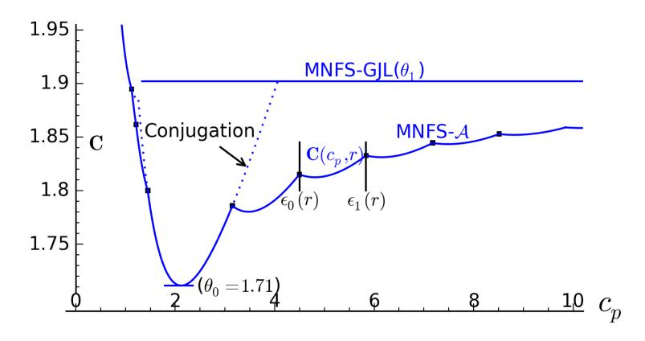
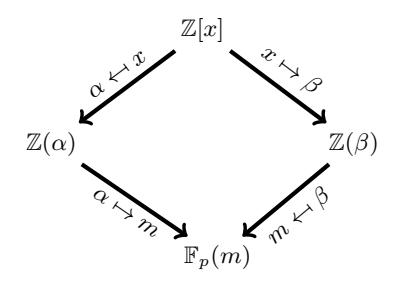
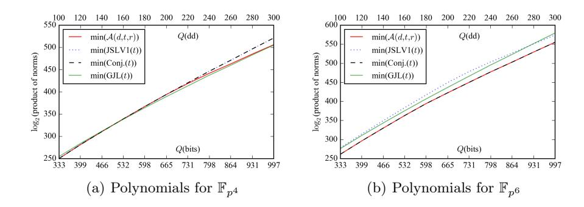
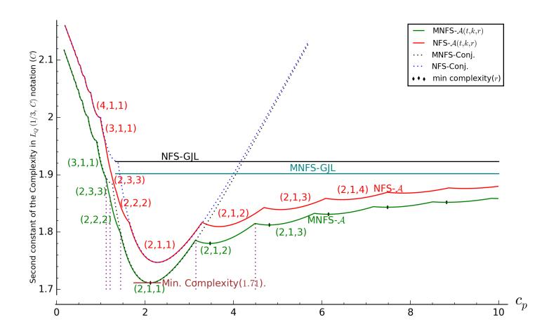

# New Complexity Trade-Offs for the (Multiple) Number Field Sieve Algorithm in Non-Prime Fields

Palash Sarkar and Shashank Singh

Applied Statistics Unit Indian Statistical Institute palash@isical.ac.in, sha2nk.singh@gmail.com

Abstract. The selection of polynomials to represent number fields crucially determines the efficiency of the Number Field Sieve (NFS) algorithm for solving the discrete logarithm in a finite field. An important recent work due to Barbulescu et al. builds upon existing works to propose two new methods for polynomial selection when the target field is a nonprime field. These methods are called the generalised Joux-Lercier (GJL) and the Conjugation methods. In this work, we propose a new method (which we denote as A) for polynomial selection for the NFS algorithm in fields FQ, with Q = p n and n > 1. The new method both subsumes and generalises the GJL and the Conjugation methods and provides new trade-offs for both n composite and n prime. Let us denote the variant of the (multiple) NFS algorithm using the polynomial selection method "X" by (M)NFS-X. Asymptotic analysis is performed for both the NFS-A and the MNFS-A algorithms. In particular, when p = LQ(2/3, cp), for cp ∈ [3.39, 20.91], the complexity of NFS-A is better than the complexities of all previous algorithms whether classical or MNFS. The MNFS-A algorithm provides lower complexity compared to NFS-A algorithm; for cp ∈ (0, 1.12] ∪ [1.45, 3.15], the complexity of MNFS-A is the same as that of the MNFS-Conjugation and for cp ∈/ (0, 1.12] ∪ [1.45, 3.15], the complexity of MNFS-A is lower than that of all previous methods.

### 1 Introduction

Let G = hgi be a finite cyclic group. The discrete log problem (DLP) in G is the following. Given (g, h), compute the minimum non-negative integer e such that h = g e . For appropriately chosen groups G, the DLP in G is believed to be computationally hard. This forms the basis of security of many important cryptographic protocols.

Studying the hardness of the DLP on subgroups of the multiplicative group of a finite field is an important problem. There are two general algorithms for tackling the DLP on such groups. These are the function field sieve (FFS) [1, 2, 16, 18] algorithm and the number field sieve (NFS) [11, 17, 19] algorithm. Both these algorithms follow the framework of index calculus algorithms which is currently the standard approach for attacking the DLP in various groups.

For small characteristic fields, the FFS algorithm leads to a quasi-polynomial running time [6]. Using the FFS algorithm outlined in [15, 6], Granger et al. [12] reported a record computation of discrete log in the binary extension field F2 9234 . FFS also applies to the medium characteristic fields. Some relevant works along this line are reported in [18, 14, 25].

For medium to large characteristic finite fields, the NFS algorithm is the state-of-the-art. In the context of the DLP, the NFS was first proposed by Gordon [11] for prime order fields. The algorithm proceeded via number fields and one of the main difficulties in applying the NFS was in the handling of units in the corresponding ring of algebraic integers. Schirokauer [26, 28] proposed a method to bypass the problems caused by units. Further, Schirokauer [27] showed the application of the NFS algorithm to composite order fields. Joux and Lercier [17] presented important improvements to the NFS algorithm as applicable to prime order fields.

Joux, Lercier, Smart and Vercauteren [19] later showed that the NFS algorithm is applicable to all finite fields. Since then, several works [20, 5, 13, 24] have gradually improved the NFS in the context of medium to large characteristic finite fields.

The efficiency of the NFS algorithm is crucially dependent on the properties of the polynomials used to construct the number fields. Consequently, polynomial selection is an important step in the NFS algorithm and is an active area of research. The recent work [5] by Barbulescu et al. extends a previous method [17] for polynomial selection and also presents a new method. The extension of [17] is called the generalised Joux-Lercier (GJL) method while the new method proposed in [5] is called the Conjugation method. The paper also provides a comprehensive comparison of the trade-offs in the complexity of the NFS algorithm offered by the various polynomial selection methods.

The NFS based algorithm has been extended to multiple number field sieve algorithm (MNFS). The work [8] showed the application of the MNFS to medium to high characteristic finite fields. Pierrot [24] proposed MNFS variants of the GJL and the Conjugation methods. For more recent works on NFS we refer to [7, 22, 4].

Our contributions: In this work, we build on the works of [17, 5] to propose a new method of polynomial selection for NFS over Fpn . The new method both subsumes and generalises the GJL and the Conjugation methods. There are two parameters to the method, namely a divisor d of the extension degree n and a parameter r ≥ k where k = n/d.

For d = 1, the new method becomes the same as the GJL method. For d = n and r = k = 1, the new method becomes the same as the Conjugation method. For d = n and r > 1; or, for 1 < d < n, the new method provides polynomials which leads to different trade-offs than what was previously known. Note that the case 1 < d < n can arise only when n is composite, though the case d = n and r > 1 arises even when n is prime. So, the new method provides new trade-offs for both n composite and n prime.

Following the works of [5, 24] we carry out an asymptotic analysis of new method for the classical NFS as well as for MNFS. For the medium and the large characteristic cases, the results for the new method are exactly the same as those obtained for existing methods in [5, 24]. For the boundary case, however, we obtain some interesting asymptotic results. Letting  $Q = p^n$ , the subexponential expression  $L_Q(a, c)$  is defined to be the following:

$$L_Q(a,c) = \exp\left((c + o(1))(\ln Q)^a(\ln \ln Q)^{1-a}\right). \tag{1}$$

Write  $p = L_Q(2/3, c_p)$  and let  $\theta_0$  and  $\theta_1$  be such that the complexity of the MNFS-Conjugation method is  $L_Q(1/3, \theta_0)$  and the complexity of the MNFS-GJL method is  $L_Q(1/3, \theta_1)$ . As shown in [24],  $L_Q(1/3, \theta_0)$  is the minimum complexity of MNFS† while for  $c_p > 4.1$ , complexity of new method (MNFS- $\mathcal{A}$ ) is lower than the complexity  $L_Q(1/3, \theta_1)$  of MNFS-GJL method.

The classical variant of the new method, (i.e., NFS- $\mathcal{A}$ ) itself is powerful enough to provide better complexity than all previously known methods, whether classical or MNFS, for  $c_p \in [3.39, 20.91]$ . The MNFS variant of the new method provides lower complexity compared to the classical variant of the new method for all  $c_p$ .

The complexity of MNFS- $\mathcal{A}$  with k=1 and using linear sieving polynomials can be written as  $L_Q(1/3, \mathbf{C}(c_p, r))$ , where  $\mathbf{C}(c_p, r)$  is a function of  $c_p$  and a parameter r. For every integer  $r \geq 1$ , there is an interval  $[\epsilon_0(r), \epsilon_1(r)]$  such that for  $c_p \in [\epsilon_0(r), \epsilon_1(r)]$ ,  $\mathbf{C}(c_p, r) < \mathbf{C}(c_p, r')$  for  $r \neq r'$ . Further, for a fixed r,

Fig. 1. Complexity plot for MNFS boundary case

let C(r) be the minimum value of  $\mathbf{C}(c_p, r)$  over all  $c_p$ . We show that C(r) is monotone increasing for  $r \geq 1$ ;  $C(1) = \theta_0$ ; and that C(r) is bounded above by  $\theta_1$  which is its limit as r goes to infinity. So, for the new method the minimum

&lt;sup>†The value of  $\theta_0$  obtained in [24] is incorrect.

complexity is the same as MNFS-Conjugation method. On the other hand, as r increases, the complexity of MNFS- $\mathcal{A}$  remains lower than the complexities of all the prior known methods. In particular, the complexity of MNFS- $\mathcal{A}$  interpolates nicely between the complexity of the MNFS-GJL and the minimum possible complexity of the MNFS-Conjugation method. This is depicted in Figure 1. In Figure 4 of Section 8.1, we provide a more detailed plot of the complexity of MNFS- $\mathcal{A}$  in the boundary case.

The complete statement regarding the complexity of MNFS- $\mathcal{A}$  in the boundary case is the following. For  $c_p \in (0, 1.12] \cup [1.45, 3.15]$ , the complexity of MNFS- $\mathcal{A}$  is the same as that of MNFS-Conjugation; for  $c_p \notin (0, 1.12] \cup [1.45, 3.15]$ , the complexity of MNFS- $\mathcal{A}$  is lower than that of all previous methods. In particular, the improvements for  $c_p$  in the range (1.12, 1.45) is obtained using k=2 and 3; while the improvements for  $c_p > 3.15$  is obtained using k=1 and k=1. In all cases, the minimum complexity is obtained using linear sieving polynomials.

# 2 Background on NFS for Non-Prime Fields

We provide a brief sketch of the background on the variant of the NFS algorithm that is applicable to the extension fields  $\mathbb{F}_Q$ , where  $Q = p^n$ , p is a prime and n > 1. More detailed discussions can be found in [17,5].

Following the structure of index calculus algorithms, NFS has three main phases, namely, relation collection (sieving), linear algebra and descent. Prior to these, is the set-up phase. In the set-up phase, two number fields are constructed and the sieving parameters are determined. The two number fields are set up by choosing two irreducible polynomials f(x) and g(x) over the integers such that their reductions modulo p have a common irreducible factor  $\varphi(x)$  of degree n over  $\mathbb{F}_p$ . The field  $\mathbb{F}_{p^n}$  will be considered to be represented by  $\varphi(x)$ . Let  $\mathfrak{g}$  be a generator of  $\mathfrak{G} = \mathbb{F}_{p^n}^*$  and let q be the largest prime dividing the order of  $\mathfrak{G}$ . We are interested in the discrete log of elements of  $\mathfrak{G}$  to the base  $\mathfrak{g}$  modulo this largest prime q.

The choices of the two polynomials f(x) and g(x) are crucial to the algorithm. These greatly affect the overall run time of the algorithm. Let  $\alpha, \beta \in \mathbb{C}$  and  $m \in \mathbb{F}_{p^n}$  be the roots of the polynomials f(x), g(x) and  $\varphi(x)$  respectively. We further let l(f) and l(g) denote the leading coefficient of the polynomials f(x) and g(x) respectively. The two number fields and the finite field are given as follows.

$$\mathbb{K}_1 = \mathbb{Q}(\alpha) = \frac{\mathbb{Q}[x]}{\langle f(x) \rangle}, \, \mathbb{K}_2 = \mathbb{Q}(\beta) = \frac{Q[x]}{\langle g(x) \rangle} \text{ and } \mathbb{F}_{p^n} = \mathbb{F}_p(m) = \frac{\mathbb{F}_p[x]}{\langle \varphi(x) \rangle}.$$

Thus, we have the following commutative diagram shown in Figure 2, where we represent the image of  $\xi \in \mathbb{Z}(\alpha)$  or  $\xi \in \mathbb{Z}(\beta)$  in the finite field  $\mathbb{F}_{p^n}$  by  $\overline{\xi}$ . Actual computations are carried out over these number fields and are then transformed to the finite field via these homomorphisms. In fact, instead of doing the computations over the whole number field  $\mathbb{K}_i$ , one works over its ring

of algebraic integers  $\mathcal{O}_i$ . These integer rings provide a nice way of constructing a factor basis and moreover, unique factorisation of ideals holds over these rings.

The factor basis  $\mathcal{F} = \mathcal{F}_1 \cup \mathcal{F}_2$  is chosen as follows.

$$\mathcal{F}_1 = \left\{ \begin{array}{l} \text{prime ideals } \mathfrak{q}_{1,j} \text{ in } \mathcal{O}_1, \text{ either having norm less than } B \\ \text{or lying above the prime factors of } l(f) \end{array} \right\}$$

$$\mathcal{F}_2 = \left\{ \begin{array}{l} \text{prime ideals } \mathfrak{q}_{2,j} \text{ in } \mathcal{O}_2, \text{ either having norm less than } B \\ \text{or lying above the prime factors of } l(g) \end{array} \right\}$$

where B is the smoothness bound and is to be chosen appropriately. An algebraic integer is said to be B-smooth if the principal ideal generated by it factors into the prime ideals of norms less than B. As mentioned in the paper [5], independently of choice of f and g, the size of the factor basis is  $B^{1+o(1)}$ . For asymptotic computations, this is simply taken to be B. The work flow of NFS can be understood by the diagram in Figure 2.

Fig. 2. A work-flow of NFS.

A polynomial  $\phi(x) \in \mathbb{Z}[x]$  of degree at most t-1 (i.e. having t coefficients) is chosen and the principal ideals generated by its images in the two number fields are checked for smoothness. If both of them are smooth, then

$$\phi(\alpha)\mathcal{O}_1 = \prod_j \mathfrak{q}_{1,j}^{e_j} \text{ and } \phi(\beta)\mathcal{O}_2 = \prod_j \mathfrak{q}_{2,j}^{e'_j}$$
 (2)

where  $\mathfrak{q}_{1,j}$  and  $\mathfrak{q}_{2,j}$  are prime ideals in  $\mathcal{F}_1$  and  $\mathcal{F}_2$  respectively. For i=1,2, let  $h_i$  denote the class number of  $\mathcal{O}_i$  and  $r_i$  denote the torsion-free rank of  $\mathcal{O}_i^{\star}$ . Then, for some  $\varepsilon_{i,j} \in \mathfrak{q}_{i,j}$  and units  $u_{i,j} \in \mathcal{O}_i^{\star}$ , we have

$$\log_{g} \overline{\phi(\alpha)} \equiv \sum_{j=1}^{r_{1}} \lambda_{1,j} (\phi(\alpha)) \Lambda_{1,j} + \sum_{j} e_{j} X_{1,j} \pmod{q}, \tag{3}$$

$$\log_{g} \overline{\phi(\beta)} \equiv \sum_{j=1}^{r_{2}} \lambda_{2,j} (\phi(\beta)) \Lambda_{2,j} + \sum_{j} e'_{j} X_{2,j} \pmod{q}, \tag{4}$$

where for i=1,2 and  $j=1\ldots r_i,\,\Lambda_{i,j}=\log_q\overline{u_{i,j}}$  is an unknown **virtual logarithm** of the unit  $u_{i,j},\,X_{i,j}=h_i^{-1}\log_g\overline{\varepsilon_{i,j}}$  is an unknown **virtual logarithm** 

of prime ideal  $\mathfrak{q}_{i,j}$  and  $\lambda_{i,j}: \mathcal{O}_i \mapsto \mathbb{Z}/q\mathbb{Z}$  is Schirokauer map [26, 28, 19]. We skip the details of virtual logarithms and Schirokauer maps, as these details will not affect the polynomial selection problem considered in this work.

Since  $\overline{\phi(\alpha)} = \overline{\phi(\beta)}$ , we have

$$\sum_{j=1}^{r_1} \lambda_{1,j} (\phi(\alpha)) \Lambda_{1,j} + \sum_{j=1}^{r_2} \lambda_{2,j} (\phi(\beta)) \Lambda_{2,j} + \sum_{j=1}^{r_2} \lambda_{2,j} (\text{mod } q)$$
 (5)

The relation given by (5) is a linear equation modulo q in the unknown virtual logs. More than  $(\#\mathcal{F}_1 + \#\mathcal{F}_2 + r_1 + r_2)$  such relations are collected by sieving over suitable  $\phi(x)$ . The linear algebra step solves the resulting system of linear equations using either the Lanczos or the block Wiedemann algorithms to obtain the virtual logs of factor basis elements.

After the linear algebra phase is over, the descent phase is used to compute the discrete logs of the given elements of the field  $\mathbb{F}_{p^n}$ . For a given element  $\mathfrak{p}$  of  $\mathbb{F}_{p^n}$ , one looks for an element of the form  $\mathfrak{p}^i\mathfrak{g}^j$ , for some  $i, j \in \mathbb{N}$ , such that the principal ideal generated by preimage of  $(\mathfrak{p}^i\mathfrak{g}^j)$  in  $\mathcal{O}_1$ , factors into prime ideals of norms bounded by some bound  $B_1$  and of degree at most t-1. Then the special- $\mathfrak{q}$  descent technique [19] is used to write the ideal generated by the preimage as a product of prime ideals in  $\mathcal{F}_1$ , which is then converted into a linear equation involving virtual logs. Putting the value of virtual logs, obtained after linear algebra phase, the value of  $\log_{\mathfrak{g}}(\mathfrak{p})$  is obtained. For more details and recent work on the descent phase, we refer to [19, 13].

# 3 Polynomial Selection and Sizes of Norms

It is evident from the description of NFS that the relation collection phase requires polynomials  $\phi(x) \in \mathbb{Z}[x]$  whose images in the two number fields are simultaneously smooth. For ensuring the smoothness of  $\phi(\alpha)$  and  $\phi(\beta)$ , it is enough to ensure that their norms viz,  $\mathrm{Res}(f,\phi)$  and  $\mathrm{Res}(g,\phi)$  are B-smooth. We refer to [5] for further explanations.

Using the Corollary 2 of Kalkbrener's work [21], we have the following upper bound for the absolute value of the norm.

$$|\operatorname{Res}(f,\phi)| \le \kappa \left(\operatorname{deg} f, \operatorname{deg} \phi\right) \|f\|_{\infty}^{\operatorname{deg} \phi} \|\phi\|_{\infty}^{\operatorname{deg} f} \tag{6}$$

where  $\kappa(a,b)=\binom{a+b}{a}\binom{a+b-1}{a}$  and  $\|f\|_{\infty}$  is maximum of the absolute values of the coefficients of f.

Following [5], let E be such that the coefficients of  $\phi$  are in  $\left[-\frac{1}{2}E^{2/t}, \frac{1}{2}E^{2/t}\right]$ . So,  $\|\phi\|_{\infty} \approx E^{2/t}$  and the number of polynomials  $\phi(x)$  that is considered for the sieving is  $E^2$ . Whenever  $p = L_Q(a, c_p)$  with  $a > \frac{1}{3}$ , we have the following bound on the  $\operatorname{Res}(f, \phi) \times \operatorname{Res}(g, \phi)$  (for details we refer to [5]).

$$|\operatorname{Res}(f,\phi) \times \operatorname{Res}(g,\phi)| \approx (\|f\|_{\infty} \|g\|_{\infty})^{t-1} E^{(\deg f + \deg g)2/t}. \tag{7}$$

For small values of n, the sieving polynomial  $\phi(x)$  is taken to be linear, i.e., t=2 and then the norm bound becomes approximately  $||f||_{\infty}||g||_{\infty}E^{(\deg f + \deg g)}$ .

The methods for choosing f and g result in the coefficients of one or both of these polynomials to depend on Q. So, the right hand side of (7) is determined by Q and E. All polynomial selection algorithms try to minimize the RHS of (7). From the bound in (7), it is evident that during polynomial selection, the goal should be to try and keep the degrees and the coefficients of both f and g to be small. Ensuring both degrees and coefficients to be small is a nontrivial task and leads to a trade-off. Previous methods for polynomial selections provide different trade-offs between the degrees and the coefficients. Estimates of Q-E trade-off values have been provided in [5] and is based on the CADO factoring software [3]. Table 1 reproduces these values where Q(dd) represents the number of decimal digits in Q.

Table 1. Estimate of Q-E values [5].

| Q(dd)                                                          |  |  |  | 100 120 140 160 180 200 220 240 260 280 300 |  |  |
|----------------------------------------------------------------|--|--|--|---------------------------------------------|--|--|
| Q(bits) 333 399 466 532 598 665 731 798 864 931 997            |  |  |  |                                             |  |  |
| E(bits) 20.9 22.7 24.3 25.8 27.2 28.5 29.7 30.9 31.9 33.0 34.0 |  |  |  |                                             |  |  |

As mentioned in [5, 13], presently the following three polynomial selection methods provide competitive trade-offs.

- 1. JLSV1: Joux, Lercier, Smart, Vercauteren method [19].
- 2. GJL: Generalised Joux Lercier method [23, 5].
- 3. Conjugation method [5].

Brief descriptions of these methods are given below.

JLSV1. Repeat the following steps until f and g are obtained to be irreducible over Z and ϕ is irreducible over Fp.

- 1. Randomly choose polynomials f0(x) and f1(x) having small coefficients with deg(f1) < deg(f0) = n.
- 2. Randomly choose an integer ` to be slightly greater than d √pe.
- 3. Let (u, v) be the rational reconstruction of ` in Fp, i.e., ` ≡ u/v mod p.
- 4. Define f(x) = f0(x) + `f1(x) and g(x) = vf0(x) + uf1(x) and ϕ(x) = f(x) mod p.

Note that deg(f) = deg(g) = n and both kfk∞ and kgk∞ are O p 1/2 = O Q1/(2n) and so (7) becomes E4n/tQ(t−1)/n which is E2nQ1/n for t = 2.

GJL. The basic Joux-Lercier method [17] works for prime fields. The generalised Joux-Lercier method extends the basic Joux-Lercier method to work over composite fields Fpn .

The heart of the GJL method is the following idea. Let  $\varphi(x)$  be a monic polynomial  $\varphi(x) = x^n + \varphi_{n-1}x^{n-1} + \cdots + \varphi_1x + \varphi_0$  and  $r \geq \deg(\varphi)$  be an integer. Let  $n = \deg(\varphi)$ . Given  $\varphi(x)$  and r, define an  $(r+1) \times (r+1)$  matrix  $M_{\varphi,r}$  in the following manner.

$$M_{\varphi,r} = \begin{bmatrix} p & & & & \\ & \ddots & & & \\ & & \ddots & & \\ & & p & & \\ \varphi_0 & \varphi_1 & \cdots & \varphi_{n-1} & 1 & \\ & \ddots & \ddots & & \ddots & \\ & & \varphi_0 & \varphi_1 & \cdots & \varphi_{n-1} & 1 \end{bmatrix}$$
(8)

The first  $n \times n$  principal sub-matrix of  $M_{\varphi,r}$  is diag $[p, p, \ldots, p]$  corresponding to the polynomials  $p, px, \ldots, px^{n-1}$ . The last r - n + 1 rows correspond to the polynomials  $\varphi(x), x\varphi(x), \ldots, x^{r-n}\varphi(x)$ .

Apply the LLL algorithm to  $M_{\varphi,r}$  and let the first row of the resulting LLL-reduced matrix be  $[g_0, g_1, \dots, g_{r-1}, g_r]$ . Define

$$g(x) = g_0 + g_1 x + \dots + g_{r-1} x^{r-1} + g_r x^r.$$
(9)

The notation

$$g = LLL(M_{\varphi,r}) \tag{10}$$

will be used to denote the polynomial g(x) given by (9). By construction,  $\varphi(x)$  is a factor of g(x) modulo p.

The GJL procedure for polynomial selection is the following. Choose an  $r \geq n$  and repeat the following steps until f and g are irreducible over  $\mathbb{Z}$  and  $\varphi$  is irreducible over  $\mathbb{F}_p$ .

- 1. Randomly choose a degree (r+1)-polynomial f(x) which is irreducible over  $\mathbb{Z}$  and having coefficients of size  $O(\ln(p))$  such that f(x) has a factor  $\varphi(x)$  of degree n modulo p which is both monic and irreducible.
- 2. Let  $\varphi(x) = x^n + \varphi_{n-1}x^{n-1} + \dots + \varphi_1x + \varphi_0$  and  $M_{\varphi,r}$  be the  $(r+1) \times (r+1)$  matrix given by (8).
- 3. Let  $g(x) = LLL(M_{\varphi,r})$ .

The polynomial f(x) has degree r+1 and g(x) has degree r. The procedure is parameterised by the integer r.

The determinant of M is  $p^n$  and so from the properties of the LLL-reduced basis, the coefficients of g(x) are of the order  $O\left(p^{n/(r+1)}\right) = O\left(Q^{1/(r+1)}\right)$ . The coefficients of f(x) are  $O(\ln p)$ .

The bound on the norm given by (7) in this case is  $E^{2(2r+1)/t}Q^{(t-1)/(r+1)}$  which becomes  $E^{2r+1}Q^{1/(r+1)}$  for t=2. Increasing r reduces the size of the coefficients of g(x) at the cost of increasing the degrees of f and g. In the concrete example considered in [5] and also in [24], r has been taken to be n and so M is an  $(n+1)\times(n+1)$  matrix.

**Conjugation.** Repeat the following steps until f and g are irreducible over  $\mathbb{Z}$  and  $\varphi$  is irreducible over  $\mathbb{F}_p$ .

- 1. Choose a quadratic monic polynomial  $\mu(x)$ , having coefficients of size  $O(\ln p)$ , which is irreducible over  $\mathbb{Z}$  and has a root  $\mathfrak{t}$  in  $\mathbb{F}_p$ .
- 2. Choose two polynomials  $g_0(x)$  and  $g_1(x)$  with small coefficients such that  $\deg g_1 < \deg g_0 = n$ .
- 3. Let (u, v) be a rational reconstruction of  $\mathfrak{t}$  modulo p, i.e.,  $\mathfrak{t} \equiv u/v \mod p$ .
- 4. Define  $g(x) = vg_0(x) + ug_1(x)$  and  $f(x) = \text{Res}_y(\mu(y), g_0(x) + y g_1(x))$ .

Note that  $\deg(f) = 2n$ ,  $\deg(g) = n$ ,  $\|f\|_{\infty} = O(\ln p)$  and  $\|g\|_{\infty} = O(p^{1/2}) = O(Q^{1/(2n)})$ . In this case, the bound on the norm given by (7) is  $E^{6n/t}Q^{(t-1)/(2n)}$  which becomes  $E^{3n}Q^{1/(2n)}$  for t=2.

# 4 A Simple Observation

For the GJL method, while constructing the matrix M, the coefficients of the polynomial  $\varphi(x)$  are used. If, however, some of these coefficients are zero, then these may be ignored. The idea is given by the following result.

**Proposition 1.** Let n be an integer, d a divisor of n and k = n/d. Suppose A(x) is a monic polynomial of degree k. Let  $r \ge k$  be an integer and set  $\psi(x) = \text{LLL}(M_{A,r})$ . Define  $g(x) = \psi(x^d)$  and  $\varphi(x) = A(x^d)$ . Then

- 1.  $deg(\varphi) = n$  and deg(g) = rd;
- 2.  $\varphi(x)$  is a factor of g(x) modulo p;
- 3.  $||g||_{\infty} = p^{n/(d(r+1))}$ .

*Proof.* The first point is straightforward. Note that by construction A(x) is a factor of  $\psi(x)$  modulo p. So,  $A(x^d)$  is a factor of  $\psi(x^d) = g(x)$  modulo p. This shows the second point. The coefficients of g(x) are the coefficients of  $\psi(x)$ . Following the GJL method,  $\|\psi\|_{\infty} = p^{k/(r+1)} = p^{n/(d(r+1))}$  and so the same holds for  $\|g\|_{\infty}$ . This shows the third point.

Note that if we had defined  $g(x) = \text{LLL}(M_{\varphi,rd})$ , then  $||g||_{\infty}$  would have been  $p^{n/(rd+1)}$ . For d > 1, the value of  $||g||_{\infty}$  given by Proposition 1 is smaller.

**A variant.** The above idea shows how to avoid the zero coefficients of  $\varphi(x)$ . A similar idea can be used to avoid the coefficients of  $\varphi(x)$  which are small. Suppose that the polynomial  $\varphi(x)$  can be written in the following form.

$$\varphi(x) = \varphi_{i_1} x^{i_1} + \dots + \varphi_{i_k} x^{i_k} + x^n + \sum_{j \notin \{i_1, \dots, i_k\}} \varphi_j x^j$$
(11)

where  $i_1, \ldots, i_k$  are from the set  $\{0, \ldots, n-1\}$  and for  $j \in \{0, \ldots, n-1\} \setminus \{i_1, \ldots, i_k\}$ , the coefficients  $\varphi_j$  are all O(1). Some or even all of these  $\varphi_j$ 's could

be zero. A  $(k+1) \times (k+1)$  matrix M is constructed in the following manner.

$$M = \begin{bmatrix} p & & & \\ & \ddots & & \\ & & \ddots & \\ & & p & \\ \varphi_{i_1} & \varphi_{i_2} & \cdots & \varphi_{i_k} & 1 \end{bmatrix}$$
 (12)

The matrix M has only one row obtained from  $\varphi(x)$  and it is difficult to use more than one row. Apply the LLL algorithm to M and write the first row of the resulting LLL-reduced matrix as  $[g_{i_1}, \ldots, g_{i_k}, g_n]$ . Define

$$g(x) = (g_{i_1}x^{i_1} + \dots + g_{i_k}x^{i_k} + g_nx^n) + \sum_{j \notin \{i_1, \dots, i_k, n\}} \varphi_j x^j.$$
 (13)

The degree of g(x) is n and the bound on the coefficients of g(x) is determined as follows. The determinant of M is  $p^k$  and by the LLL-reduced property, each of the coefficients  $g_{i_1}, \ldots, g_{i_k}, g_n$  is  $O(p^{k/(k+1)}) = O(Q^{k/(n(k+1))})$ . Since  $\varphi_j$  for  $j \notin \{i_1, \ldots, i_k\}$  are all O(1), it follows from (13) that all the coefficients of g(x) are  $O(Q^{k/(n(k+1))})$  and so  $||g||_{\infty} = O(Q^{k/(n(k+1))})$ .

# 5 A New Polynomial Selection Method

In the simple observation made in the earlier section, the non-zero terms of the polynomial g(x) are powers of  $x^d$ . This creates a restriction and does not turn out to be necessary to apply the main idea of the previous section. Once the polynomial  $\psi(x)$  is obtained using the LLL method, it is possible to substitute any degree d polynomial with small coefficients for x and still the norm bound will hold. In fact, the idea can be expressed more generally in terms of resultants. Algorithm  $\mathcal A$  describes the new general method for polynomial selection.

The following result states the basic properties of Algorithm A.

**Proposition 2.** The outputs f(x), g(x) and  $\varphi(x)$  of Algorithm A satisfy the following.

- 1.  $\deg(f) = d(r+1)$ ;  $\deg(g) = rd$  and  $\deg(\varphi) = n$ ;
- 2. both f(x) and g(x) have  $\varphi(x)$  as a factor modulo p;
- 3.  $||f||_{\infty} = O(\ln(p))$  and  $||g||_{\infty} = O(Q^{1/(d(r+1))})$ .

Consequently,

$$|\operatorname{Res}(f,\phi) \times \operatorname{Res}(g,\phi)| \approx (\|f\|_{\infty} \|g\|_{\infty})^{t-1} \times E^{2(\deg f + \deg g)/t}$$
  
=  $O\left(E^{2d(2r+1)/t} \times Q^{(t-1)/(d(r+1))}\right)$ . (14)

### Algorithm: A: A new method of polynomial selection.

Input: p, n, d (a factor of n) and r ≥ n/d. Output: f(x), g(x) and ϕ(x).

Let k = n/d;

repeat

Randomly choose a monic irreducible polynomial A1(x) having the following properties: deg A1(x) = r + 1; A1(x) is irreducible over the integers; A1(x) has coefficients of size O(ln(p)); modulo p, A1(x) has an irreducible factor A2(x) of degree k.

Randomly choose monic polynomials C0(x) and C1(x) with small coefficients such that deg C0(x) = d and deg C1(x) < d. Define

$$f(x) = \text{Res}_y (A_1(y), C_0(x) + y C_1(x));$$
  

$$\varphi(x) = \text{Res}_y (A_2(y), C_0(x) + y C_1(x)) \text{ mod } p;$$
  

$$\psi(x) = \text{LLL}(M_{A_2,r});$$
  

$$g(x) = \text{Res}_y (\psi(y), C_0(x) + y C_1(x)).$$

until f(x) and g(x) are irreducible over Z and ϕ(x) is irreducible over Fp. return f(x), g(x) and ϕ(x).

Proof. By definition f(x) = Resy (A1(y), C0(x) + y C1(x)) where A1(x) has degree r + 1, C0(x) has degree d and C1(x) has degree d − 1, so the degree of f(x) is d(r + 1). Similarly, one obtains the degree of ϕ(x) to be n. Since ψ(x) is obtained from A2(x) as LLL(MA2,r) it follows that the degree of ψ(x) is r and so the degree of g(x) is rd.

Since A2(x) divides A1(x) modulo p, it follows from the definition of f(x) and ϕ(x) that modulo p, ϕ(x) divides f(x). Since ψ(x) is a linear combination of the rows of MA2,r, it follows that modulo p, ψ(x) is a multiple of A2(x). So, g(x) = Resy (ψ(y), C0(x) + y C1(x)) is a multiple of ϕ(x) = Resy (A2(y), C0(x) + y C1(x)) modulo p.

Since the coefficients of C0(x) and C1(x) are O(1) and the coefficients of A1(x) are O(ln p), it follows that kfk∞ = O(ln p). The coefficients of g(x) are O(1) multiples of the coefficients of ψ(x). By third point of Proposition 1, the coefficients of ψ(x) are O(p n/(d(r+1))) = Q1/(d(r+1)) which shows that kgk∞ = O(Q1/(d(r+1))). ut

Proposition 2 provides the relevant bound on the product of the norms of a sieving polynomial φ(x) in the two number fields defined by f(x) and g(x). We note the following points.

- 1. If d = 1, then the norm bound is E2(2r+1)/tQ(t−1)/(r+1) which is the same as that obtained using the GJL method.
- 2. If d = n, then the norm bound is E2n(2r+1)/tQ(t−1)/(n(r+1)). Further, if r = k = 1, then the norm bound is the same as that obtained using the

- Conjugation method. So, for d=n, Algorithm  $\mathcal{A}$  is a generalisation of the Conjugation method. Later, we show that choosing r>1 provides asymptotic improvements.
- 3. If n is a prime, then the only values of d are either 1 or n. The norm bounds in these two cases are covered by the above two points.
- 4. If n is composite, then there are non-trivial values for d and it is possible to obtain new trade-offs in the norm bound. For concrete situations, this can be of interest. Further, for composite n, as value of d increases from d = 1 to d = n, the norm bound nicely interpolates between the norm bounds of the GJL method and the Conjugation method.

Existence of  $\mathbb{Q}$ -automorphisms: The existence of  $\mathbb{Q}$ -automorphism in the number fields speeds up the NFS algorithm in the non-asymptotic sense [19]. Similar to the existence of  $\mathbb{Q}$ -automorphism in GJL method, as discussed in [5], the first polynomial generated by the new method, can have a  $\mathbb{Q}$ -automorphism. In general, it is difficult to get an automorphism for the second polynomial as it is generated by the LLL algorithm. On the other hand, we can have a  $\mathbb{Q}$ -automorphism for the second polynomial also in the specific cases. Some of the examples are reported in [10].

# 6 Non-asymptotic Comparisons and Examples

We compare the norm bounds for t=2, i.e., when the sieving polynomial is linear. In this case, Table 2 lists the degrees and norm bounds of polynomials for various methods. Table 3 compares the new method with the JLSV1 and the GJL method for concrete values of n, r and d. This shows that the new method provides different trade-offs which were not known earlier.

As an example, we can see from Table 3 that the new method compares well with GJL and JLSV1 methods for n=4 and Q of 300 dd (refer to Table 1). As mentioned in [5], when the differences between the methods are small, it is not possible to decide by looking only at the size of the norm product. Keeping this in view, we see that the new method is competitive for n=6 as well. These observations are clearly visible in the plots given in the Figure 3. From the Q-E pairs given in Table 1, it is clear that the increase of E is slower than that of Q. This suggests that the new method will become competitive when Q is sufficiently large.

Next we provide some concrete examples of polynomials f(x), g(x) and  $\varphi(x)$  obtained using the new method. The examples are for n=6 and n=4. For n=6, we have taken d=1,2,3 and 6 and in each case r was chosen to be r=k=n/d. For n=4, we consider d=2 with r=k=n/d and r=k+1; and d=4 with r=k. These examples are to illustrate that the method works as predicted and returns the desired polynomials very fast. We have used Sage [29] and MAGMA computer algebra system [9] for all the computations done in this work.

Fig. 3. Product of norms for various polynomial selection methods

Table 2. Parameterised efficiency estimates for NFS obtained from the different polynomial selection methods.

| Methods                   | deg f |    | deg g kfk∞   | kgk∞          | (deg f+deg g) kfk∞kgk∞E  |
|---------------------------|-------|----|--------------|---------------|-----------------------------|
| JLSV1                     | n     | n  | 1 Q 2n | 1 Q 2n  | 1 2nQ E n          |
| GJL (r ≥ n)               | r + 1 | r  | O(ln p)      | 1 Q r+1 | 1 2r+1Q E r+1      |
| Conjugation               | 2n    | n  | O(ln p)      | 1 Q 2n  | 1 3nQ E 2n         |
| A (d n, r ≥ n/d) d(r + 1) |       | dr | O(ln p) Q    | 1 d(r+1)   | d(2r+1)Q 1/(d(r+1)) E |

Table 3. Comparison of efficiency estimates for composite n with d = 2 and r = n/2.

| FQ  |       | method (deg f, deg g) kfk∞ |              | kgk∞         | (deg f+deg g) kfk∞kgk∞E |
|-----|-------|----------------------------|--------------|--------------|----------------------------|
|     | GJL   | (5, 4)                     | O(ln p)      | 1 Q 5  | 1 9Q E 5          |
| Fp4 | JLSV1 | (4, 4)                     | 1 Q 8  | 1 Q 8  | 1 8Q E 4          |
|     | A     | (6, 4)                     | O(ln p)      | 1 Q 6  | 1 10Q E 6         |
|     | GJL   | (7, 6)                     | O(ln p)      | 1 Q 7  | 1 13Q E 7         |
| Fp6 | JLSV1 | (6, 6)                     | 1 Q 12 | 1 Q 12 | 1 12Q E 6         |
|     | A     | (8, 6)                     | O(ln p)      | 1 Q 8  | 1 14Q E 8         |
|     | GJL   | (9, 8)                     | O(ln p)      | 1 Q 9  | 1 17Q E 9         |
| Fp8 | JLSV1 | (8, 8)                     | 1 Q 16 | 1 Q 16 | 1 16Q E 8         |
|     | A     | (10, 8)                    | O(ln p) Q    | 1 10      | 1 18Q E 10        |
|     | GJL   | (10, 9)                    | O(ln p) Q    | 1 10      | 1 19Q E 10        |
| Fp9 | JLSV1 | (9, 9)                     | 1 Q 18 | 1 Q 18 | 1 18Q E 9         |
|     | A     | (12, 9)                    | O(ln p) Q    | 1 12      | 1 21Q E 12        |

Example 1. Let n = 6, and p is a 201-bit prime given below.

Taking d = 1 and r = n/d, we get

$$f(x) = x^7 + 18x^6 + 99x^5 - 107x^4 - 3470x^3 - 15630x^2 - 30664x - 23239$$

- g(x) = 712965136783466122384156554261504665235609243446869 x + 16048203858903 x + 14867720774814154920358989 x + 7240853845391439257955648357229262561 x + 194693204195493982969795038496468458378024972218 x + 2718971797270235171234259793142851416923331519178675874 x +1517248296800681060244076172658712224507653769252953211
- ϕ(x) = x + 671560075936012275401828950369729286806144005939695349290760 x + x + 1100 x + 27131646 x + 4101717389506 x + 1326632804961027767

Note that kgk∞ ≈ 2 . Taking d = 2 and r = n/d, we get

$$f(x) = x^8 - x^7 - 5x^6 - 50x^5 - 181x^4 - 442x^3 - 801x^2 - 633x - 787$$

- g(x) = 833480932500516492505935839185008193696457787 x + 2092593616641287655 x + 1298540899568952261791537743468335194 x + 21869741590966357897620167461539967141532970622 x + 6 x + 558647116952815842 x + 921778354059077827252784356704871327
- ϕ(x) = x + 225577566898041285405539226183221508226286589225546142714057 x + x + 10214 x + 674978102 x + 632426210761786 x + 104093530686601670252

Note that kgk∞ ≈ 2 . Taking d = 3 and r = n/d, we get

$$f(x) = x^9 - 4x^8 - 54x^7 - 174x^6 - 252x^5 - 174x^4 - 76x^3 - 86x^2 - 96x - 42$$

- g(x) = 2889742364508381557593312392497801006712 x + 83633695370646306085610 x + 10828078806524085705506412783408772941877 x + x + 1497421347777532476213 x + 240946716989443210293442965552611305592194 x +151696455655104744403073743333940426598833
- ϕ(x) = x + 265074577705978624915342871970538348132010154368109244143774 x +21159801273629654486978970226092134077566675973129512551886 x + 10 x + 1459 x + 145654 x + 378129170

Note that kgk∞ ≈ 2 . Taking d = 6 and r = n/d, we get

$$f(x) = x^{12} + 3x^{10} + 10x^{9} + 53x^{8} + 112x^{7} + 163x^{6} + 184x^{5} + 177x^{4} + 166x^{3} + 103x^{2} + 72x + 48$$

- g(x) = −666878138402353195498832669848 x − 1867253271074924746011849188889 x −5601759813224774238035547566667 x − 6668753801765210948063915265053 x −4268003536420067847037882226971 x − 6935516090029480629033212906363 x −7469013084299698984047396755556
- ϕ(x) = x + 356485336847074091920944597187811284411849047991334266185684 x + x + 175 x + 1069456 x + 1069456010 x + 14259413473882

In this case we get kgk∞ ≈ 2 .

Example 2. Let n = 4, and p is a 301-bit prime given below.

p = 203703597633448608626844568840937816105146839366593625063614044935438

Taking d = 2 and r = n/d, we get

$$f(x) = x^6 + 2x^5 + 10x^4 + 11x^3 + 8x^2 + 3x + 5$$

- g(x) = 1108486244023576208689360410176300373132220654590976786482134 x + 20 x + 5523 x + 456222 x + 441498133
- ϕ(x) = x + 1305623360698284685175599277707343457576279146188242586245210199 x + 1630663764713242722426772175575945319 x + 1955704168 x + 163066376471324272242677217557594531964066565579496293

In this case we have kgk∞ ≈ 2 . If we take r = n/d + 1, we get

$$f(x) = x^8 + 16x^7 + 108x^6 + 398x^5 + 865x^4 + 1106x^3 + 820x^2 + 328x + 55$$

- g(x) = 348482147842083865380881347784399925335728557 x + 5536103979982210590 x + 3381254505070666477453052572333514580 x + 96062171957261124763428590648958745188735445330 x + 1 x + 73090839973729169 x + 16093810783274309055350481972028841
- ϕ(x) = x + 5128690964597943246501962358998676237033930846168967447990334244 x + 1802408796932749487444974790576022081 x + 1553341208 x + 263801507553366513494386082876419210598165405378517676

In this case we have kgk∞ ≈ 2 . If we take d = 4 and r = d/n, we have

$$f(x) = x^8 - 3x^7 - 33x^6 - 97x^5 - 101x^4 + 3x^3 + 73x^2 - 35x - 8$$

g(x) = 684862886024125973911391867198415841436877278 x + 1925808392957060519 x + 1668247862726425714278449912696271875 x + 40961560447538961485182385700123093758271763 x + 124094

ϕ(x) = x 4 + 3001292991290566658187708046113162326822746963576576248059013380 7217067092452460559896554 x 3 + 900387897387169997456312413833948698046 82408907297287441770401421651201277357381679689656 x 2 + 15006464956452 8332909385402305658116341137348178828812402950669036085335462262302799 482756 x + 30012929912905666581877080461131623268227469635765762480590 133807217067092452460559896553

In this case also we have kgk∞ ≈ 2 150 .

# 7 Asymptotic Complexity Analysis

The goal of the asymptotic complexity analysis is to express the runtime of the NFS algorithm using the L-notation and at the same time obtain bounds on p for which the analysis is valid. Our description of the analysis is based on prior works predominantly those in [17, 19, 5, 24].

For 0 < a < 1, write

$$p = L_Q(a, c_p)$$
, where  $c_p = \frac{1}{n} \left( \frac{\ln Q}{\ln \ln Q} \right)^{1-a}$  and so  $n = \frac{1}{c_p} \left( \frac{\ln Q}{\ln \ln Q} \right)^{1-a}$  (15)

The value of a will be determined later. Also, for each cp, the runtime of the NFS algorithm is the same for the family of finite fields Fpn where p is given by (15).

From Section 3, we recall the following.

- 1. The number of polynomials to be considered for sieving is E2 .
- 2. The factor base is of size B.

Sparse linear algebra using the Lanczos or the block Wiedemann algorithm takes time O(B2 ). For some 0 < b < 1, let

$$B = L_Q(b, c_b). (16)$$

The value of b will be determined later. Set

$$E = B \tag{17}$$

so that asymptotically, the number of sieving polynomials is equal to the time for the linear algebra step.

Let π = Ψ(Γ, B) be the probability that a random positive integer which is at most Γ is B-smooth. Let Γ = LQ(z, ζ) and B = LQ(b, cb). Using the L-notation version of the Canfield-Erd¨os-Pomerance theorem,

$$(\Psi(\Gamma, B))^{-1} = L_Q\left(z - b, (z - b)\frac{\zeta}{c_b}\right). \tag{18}$$

The bound on the product of the norms given by Proposition 2 is

$$\Gamma = E^{\frac{2}{t}d(2r+1)} \times Q^{\frac{t-1}{d(r+1)}}.$$
(19)

Note that in (19), t − 1 is the degree of the sieving polynomial. Following the usual convention, we assume that the same smoothness probability π holds for the event that a random sieving polynomial φ(x) is smooth over the factor base.

The expected number of polynomials to consider for obtaining one relation is π −1 . Since B relations are required, obtaining this number of relations requires trying Bπ−1 trials. Balancing the cost of sieving and the linear algebra steps requires Bπ−1 = B2 and so

$$\pi^{-1} = B. \tag{20}$$

Obtaining π −1 from (18) and setting it to be equal to B allows solving for cb. Balancing the costs of the sieving and the linear algebra phases leads to the runtime of the NFS algorithm to be B2 = LQ(b, 2cb). So, to determine the runtime, we need to determine b and cb. The value of b will turn out to be 1/3 and the only real issue is the value of cb.

Lemma 1. Let n = kd for positive integers k and d. Using the expressions for p and E(= B) given by (15) and (16), we obtain the following.

$$E^{\frac{2}{t}d(2r+1)} = L_Q\left(1 - a + b, \frac{2c_b(2r+1)}{c_pkt}\right);$$

$$Q^{\frac{t-1}{d(r+1)}} = L_Q\left(a, \frac{kc_p(t-1)}{(r+1)}\right).$$
(21)

Proof. The second expression follows directly from Q = p n, p = LQ(a, cp) and n = kd. The computation for obtaining the first expression is the following.

$$E^{\frac{2}{t}d(2r+1)} = L_Q \left( b, c_b \frac{2}{t} d(2r+1) \right)$$

$$= \exp\left( c_b \frac{2}{t} (2r+1) \frac{n}{k} (\ln Q)^b (\ln \ln Q)^{1-b} \right)$$

$$= \exp\left( c_b \frac{2}{c_p k t} (2r+1) \left( \frac{\ln Q}{\ln \ln Q} \right)^{1-a} (\ln Q)^b (\ln \ln Q)^{1-b} \right)$$

$$= L_Q \left( 1 - a + b, \frac{2c_b (2r+1)}{c_p k t} \right).$$

Theorem 1 (Boundary Case). Let k divide n, r ≥ k, t ≥ 2 and p = LQ(2/3, cp) for some 0 < cp < 1. It is possible to ensure that the runtime of the NFS algorithm with polynomials chosen by Algorithm A is LQ(1/3, 2cb) where

$$c_b = \frac{2r+1}{3c_pkt} + \sqrt{\left(\frac{2r+1}{3c_pkt}\right)^2 + \frac{kc_p(t-1)}{3(r+1)}}.$$
 (22)

ut

Proof. Setting 2a = 1 + b, the two L-expressions given by (21) have the same first component and so the product of the norms is

$$\Gamma = L_Q\left(a, \frac{2c_b(2r+1)}{c_pkt} + \frac{kc_p(t-1)}{(r+1)}\right).$$

Then π −1 given by (18) is

$$L_Q\left(a-b, (a-b)\left(\frac{2(2r+1)}{c_pkt} + \frac{kc_p(t-1)}{c_b(r+1)}\right)\right).$$

From the condition π −1 = B, we get b = a − b and

$$c_b = (a - b) \left( \frac{2(2r+1)}{c_p kt} + \frac{kc_p(t-1)}{c_b(r+1)} \right).$$

The conditions a − b = b and 2a = 1 + b show that b = 1/3 and a = 2/3. The second equation then becomes

$$c_b = \frac{1}{3} \left( \frac{2(2r+1)}{c_p kt} + \frac{kc_p(t-1)}{c_b(r+1)} \right).$$
 (23)

Solving the quadratic for cb and choosing the positive root gives

$$c_b = \frac{2r+1}{3c_pkt} + \sqrt{\left(\frac{2r+1}{3c_pkt}\right)^2 + \frac{kc_p(t-1)}{3(r+1)}}.$$

Corollary 1 (Boundary Case of the Conjugation Method [5]). Let r = k = 1. Then for p = LQ(2/3, cp), the runtime of the NFS algorithm is LQ(1/3, 2cb) with

$$c_b = \frac{1}{c_p t} + \sqrt{\left(\frac{1}{c_p t}\right)^2 + \frac{c_p (t-1)}{6}}.$$

Allowing r to be greater than k leads to improved asymptotic complexity. We do not perform this analysis. Instead, we perform the analysis in the similar situation which arises for the multiple number field sieve algorithm.

Theorem 2 (Medium Characteristic Case). Let p = LQ(a, cp) with a > 1/3. It is possible to ensure that the runtime of the NFS algorithm with the polynomials produced by Algorithm A is LQ(1/3,(32/3)1/3 ).

Proof. Since a > 1/3, the bound Γ on the product of the norms can be taken to be the expression given by (7). The parameter t is chosen as follows [5]. For 0 < c < 1, let t = ctn((ln Q)/(ln ln Q))−c . For the asymptotic analysis, t − 1 is also assumed to be given by the same expression for t. Then the expressions given by (21) become the following.

$$E^{\frac{2}{t}d(2r+1)} = L_Q\left(b+c, \frac{2c_b(2r+1)}{kc_t}\right); \ \ Q^{\frac{t-1}{d(r+1)}} = L_Q\left(1-c, \frac{kc_t}{r+1}\right). \tag{24}$$

ut

This can be seen by substituting the expression for t in (21) and further by using the expression for n given in (15).

Setting 2c = 1−b, the first components of the two expressions in (24) become equal and so

$$\Gamma = L_Q \left( b + c, \frac{2c_b(2r+1)}{kc_t} + \frac{kc_t}{r+1} \right).$$

Using this Γ, the expression for π −1 is

$$\pi^{-1} = L_Q \left( c, c \left( \frac{2(2r+1)}{kc_t} + \frac{kc_t}{c_b(r+1)} \right) \right).$$

We wish to choose ct so as to maximise the probability π and hence to minimise π −1 p . This is done by setting 2(2r + 1)/(kct) = (kct)/(cb(r + 1)) whence kct = 2cb(r + 1)(2r + 1). With this value of kct,

$$\pi^{-1} = L_Q\left(c, \frac{2c\sqrt{2c_b(r+1)(2r+1)}}{c_b(r+1)}\right).$$

Setting π −1 to be equal to B = LQ(b, cb) yields b = c and

$$c_b = \left(\frac{2c\sqrt{2c_b(r+1)(2r+1)}}{c_b(r+1)}\right).$$

From b = c and 2c = 1 − b we obtain c = b = 1/3. Using this value of c in the equation for cb, we obtain cb = (2/3)2/3 × ((2(2r + 1))/(r + 1))1/3 . The value of cb is the minimum for r = 1 and this value is cb = (4/3)1/3 . ut

Note that the parameter a which determines the size of p is not involved in any of the computation. The assumption a > 1/3 is required to ensure that the bound on the product of the norms can be taken to be the expression given by (7).

Theorem 3 (Large Characteristic). It is possible to ensure that the runtime of the NFS algorithm with the polynomials produced by Algorithm A is LQ(1/3,(64/9)1/3 ) for p ≥ LQ(2/3,(8/3)1/3 ).

Proof. Following [5], for 0 < e < 1, let r = cr/2((ln Q)/(ln ln Q))e . For the asymptotic analysis, the expression for 2r + 1 is taken to be two times this expression. Substituting this expression for r in (21), we obtain

$$E^{\frac{2}{t}d(2r+1)} = L_Q \left( 1 - a + b + e, \frac{2c_b c_r}{c_p kt} \right);$$

$$Q^{\frac{t-1}{d(r+1)}} = L_Q \left( a - e, \frac{2kc_p(t-1)}{c_r} \right).$$
(25)

Setting 1 + b = 2(a − e), we obtain Γ = LQ 1 + b 2 , 2cbcr cpkt + 2kcp(t − 1) cr and so the probability π −1 is given by

$$L_Q\left(\frac{1-b}{2}, \frac{1-b}{2} \times \left(\frac{2c_r}{c_pkt} + \frac{2kc_p(t-1)}{c_rc_b}\right)\right).$$

The choice of  $c_r$  for which the probability  $\pi$  is maximised (and hence  $\pi^{-1}$  is minimised) is obtained by setting  $c_r/(c_p k) = \sqrt{(t(t-1))/c_b}$  and the minimum value of  $\pi^{-1}$  is

$$L_Q\left(\frac{1-b}{2}, \frac{1-b}{2} \times \left(4\sqrt{\frac{t-1}{tc_b}}\right)\right).$$

Setting this value of  $\pi^{-1}$  to be equal to B, we obtain

$$b = (1-b)/2; \ c_b = \frac{1-b}{2} \times \left(4\sqrt{\frac{t-1}{tc_b}}\right).$$

The first equation shows b = 1/3 and using this in the second equation, we obtain  $c_b = (4/3)^{2/3}((t-1)/t)^{1/3}$ . This value of  $c_b$  is minimised for the minimum value of t which is t = 2. This gives  $c_b = (8/9)^{1/3}$ .

Using 2(a-e)=1+b and b=1/3 we get a-e=2/3. Note that  $r\geq k$  and so  $p\geq p^{k/r}=L_Q(a,(c_pk)/r)=L_Q(a-e,(2c_pk)/c_r)$ . With t=2, the value of  $(c_pk)/c_r$  is equal to  $(1/3)^{1/3}$  and so  $p\geq L_Q(2/3,(8/3)^{1/3})$ .

Theorems 2 and 3 show that the generality introduced by k and r do not affect the overall asymptotic complexity for the medium and large prime case and the attained complexities in these cases are the same as those obtained for previous methods in [5].

# 8 Multiple Number Field Sieve Variant

As the name indicates, the multiple number field sieve variant uses several number fields. The discussion and the analysis will follow the works [8, 24].

There are two variants of multiple number field sieve algorithm. In the first variant, the image of  $\phi(x)$  needs to be smooth in at least any two of the number fields. In the second variant, the image of  $\phi(x)$  needs to be smooth in the first number field and at least one of the other number fields.

We have analysed both the variants of multiple number field sieve algorithm and found that the second variant turns out to be better than the first one. So we discuss the second variant of MNFS only. In contrast to the number field sieve algorithm, the right number field is replaced by a collection of V number fields in the second variant of MNFS. The sieving polynomial  $\phi(x)$  has to satisfy the smoothness condition on the left number field as before. On the right side, it is sufficient for  $\phi(x)$  to satisfy a smoothness condition on at least one of the V number fields.

Recall that Algorithm  $\mathcal{A}$  produces two polynomials f(x) and g(x) of degrees d(r+1) and dr respectively. The polynomial g(x) is defined as  $\mathrm{Res}_y(\psi(y), C_0(x) + yC_1(x))$  where  $\psi(x) = \mathrm{LLL}(M_{A_2,r})$ , i.e.,  $\psi(x)$  is defined from the first row of the matrix obtained after applying the LLL-algorithm to  $M_{A_2,r}$ .

Methods for obtaining the collection of number fields on the right have been mentioned in [24]. We adapt one of these methods to our setting. Consider Algorithm  $\mathcal{A}$ . Let  $\psi_1(x)$  be  $\psi(x)$  as above and let  $\psi_2(x)$  be the polynomial defined

from the second row of the matrix  $M_{A_2,r}$ . Define  $g_1(x) = \operatorname{Res}_y(\psi_1(y), C_0(x) + yC_1(x))$  and  $g_2(x) = \operatorname{Res}_y(\psi_2(y), C_0(x) + yC_1(x))$ . Then choose V-2 linear combinations  $g_i(x) = s_i g_1(x) + t_i g_2(x)$ , for  $i=3,\ldots,V$ . Note that the coefficients  $s_i$  and  $t_i$  are of the size of  $\sqrt{V}$ . All the  $g_i$ 's have degree dr. Asymptotically,  $\|\psi_2\|_{\infty} = \|\psi_1\|_{\infty} = Q^{1/(d(r+1))}$ . Since we take  $V = L_Q(1/3)$ , all the  $g_i$ 's have their infinity norms to be the same as that of g(x) given by Proposition 2.

For the left number field, as before, let B be the bound on the norms of the ideals which are in the factor basis defined by f. For each of the right number fields, let B' be the bound on the norms of the ideals which are in the factor basis defined by each of the  $g_i$ 's. So, the size of the entire factor basis is B+VB'. The following condition balances the left portion and the right portion of the factor basis.

$$B = VB'. (26)$$

With this condition, the size of the factor basis is  $B^{1+o(1)}$  as in the classical NFS and so asymptotically, the linear algebra step takes time  $B^2$ . As before, the number of sieving polynomials is  $E^2 = B^2$  and the coefficients of  $\phi(x)$  can take  $E^{2/t}$  distinct values.

Let  $\pi$  be the probability that a random sieving polynomial  $\phi(x)$  gives rise to a relation. Let  $\pi_1$  be the probability that  $\phi(x)$  is smooth over the left factor basis and  $\pi_2$  be the probability that  $\phi(x)$  is smooth over at least one of the right factor bases. Further, let  $\Gamma_1 = \operatorname{Res}_x(f(x), \phi(x))$  be the bound on the norm corresponding to the left number field and  $\Gamma_2 = \operatorname{Res}_x(g_i(x), \phi(x))$  be the bound on the norm for any of the right number fields. Note that  $\Gamma_2$  is determined only by the degree and the  $L_{\infty}$ -norm of  $g_i(x)$  and hence is the same for all  $g_i(x)$ 's. Heuristically, we have

$$\pi_1 = \Psi(\Gamma_1, B);$$
 $\pi_2 = V\Psi(\Gamma_2, B');$ 
 $\pi = \pi_1 \times \pi_2.$ 
(27)

As before, one relation is obtained in about  $\pi^{-1}$  trials and so B relations are obtained in about  $B\pi^{-1}$  trials. Balancing the cost of linear algebra and sieving, we have as before  $B=\pi^{-1}$ .

The following choices of B and V are made.

$$E = B = L_Q(\frac{1}{3}, c_b);$$

$$V = L_Q(\frac{1}{3}, c_v); \text{ and so}$$

$$B' = B/V = L_Q(\frac{1}{3}, c_b - c_v).$$
(28)

With these choices of B and V, it is possible to analyse the MNFS variant for Algorithm  $\mathcal{A}$  for three cases, namely, the medium prime case, the boundary case and the large characteristic case. Below we present the details of the boundary case. This presents a new asymptotic result.

Theorem 4 (MNFS-Boundary Case). Let k divide  $n, r \geq k, t \geq 2$  and

$$p = L_Q\left(\frac{2}{3}, c_p\right) \text{ where } c_p = \frac{1}{n} \left(\frac{\ln Q}{\ln \ln Q}\right)^{1/3}.$$

It is possible to ensure that the runtime of the MNFS algorithm is LQ(1/3, 2cb) where

$$c_b = \frac{4r+2}{6ktc_p} + \sqrt{\frac{r(3r+2)}{(3ktc_p)^2} + \frac{c_pk(t-1)}{3(r+1)}}.$$
 (29)

Proof. Note the following computations.

$$\begin{split} \Gamma_1 &= \|\phi\|_{\infty}^{\deg(f)} = E^{2\deg(f)/t} = E^{(2d(r+1))/t} = E^{(2n(r+1))/(kt)} \\ &= L_Q\left(\frac{2}{3}, \frac{2(r+1)c_b}{ktc_p}\right); \\ \pi_1^{-1} &= L_Q\left(\frac{1}{3}, \frac{2(r+1)}{3ktc_p}\right); \\ \Gamma_2 &= \|\phi\|_{\infty}^{\deg(g)} \times \|g\|_{\infty}^{\deg(\phi)} = E^{2\deg(g)/t} \times Q^{(t-1)/(d(r+1))} \\ &= E^{(2rd)/t} \times Q^{(t-1)/(d(r+1))} = E^{(2rn)/(kt)} \times Q^{k(t-1)/(n(r+1))} \\ &= L_Q\left(\frac{2}{3}, \frac{2rc_b}{c_pkt} + \frac{kc_p(t-1)}{r+1}\right); \\ \pi_2^{-1} &= L_Q\left(\frac{1}{3}, -c_v + \frac{1}{3(c_b - c_v)}\left(\frac{2rc_b}{c_pkt} + \frac{kc_p(t-1)}{r+1}\right)\right); \\ \pi^{-1} &= L_Q\left(\frac{1}{3}, \frac{2(r+1)}{3ktc_p} - c_v + \frac{1}{3(c_b - c_v)}\left(\frac{2rc_b}{c_pkt} + \frac{kc_p(t-1)}{r+1}\right)\right); \end{split}$$

From the condition π −1 = B, we obtain the following equation.

$$c_b = \frac{2(r+1)}{3ktc_p} - c_v + \frac{1}{3(c_b - c_v)} \left( \frac{2rc_b}{c_p kt} + \frac{kc_p(t-1)}{r+1} \right).$$
 (30)

We wish to find cv such that cb is minimised subject to the constraint (30). Using the method of Lagrange multipliers, the partial derivative of (30) with respect to cv gives

$$c_v = \frac{r+1}{3ktc_p}.$$

Using this value of cv in (30) provides the following quadratic in cb.

$$(3ktc_p)c_b^2 - (4r+2)c_b + \frac{(r+1)^2}{3ktc_p} - \frac{(c_pk)^2t(t-1)}{r+1} = 0.$$

Solving this and taking the positive square root, we obtain

$$c_b = \frac{4r+2}{6ktc_p} + \sqrt{\frac{r(3r+2)}{(3ktc_p)^2} + \frac{c_pk(t-1)}{3(r+1)}}.$$
 (31)

Hence the overall complexity of MNFS for the boundary case is LQ 1 3 , 2cb .

#### 8.1 Further Analysis of the Boundary Case

Theorem 4 expresses  $2c_b$  as a function of  $c_p$ , t, k and r. Let us write this as  $2c_b = \mathbf{C}(c_p, t, k, r)$ . It turns out that fixing the values of (t, k, r) gives a set S(t, k, r) such that for  $c_p \in S(t, k, r)$ ,  $\mathbf{C}(c_p, t, k, r) \leq \mathbf{C}(c_p, t', k', r')$  for any  $(t', k', r') \neq (t, k, r)$ . In other words, for a choice of (t, k, r), there is a set of values for  $c_p$  where the minimum complexity of MNFS- $\mathcal{A}$  is attained. The set S(t, k, r) could be empty implying that the particular choice of (t, k, r) is suboptimal.

For  $1.12 \leq c_p \leq 4.5$ , the appropriate intervals are given in Table 4. Further, the interval (0,1.12] is the union of S(t,1,1) for  $t\geq 3$ . Note that the choice (t,k,r)=(t,1,1) specialises MNFS- $\mathcal{A}$  to MNFS-Conjugation. So, for  $c_p\in(0,1.12]\cup[1.45,3.15]$  the complexity of MNFS- $\mathcal{A}$  is the same as that of MNFS-Conjugation.

| (t,k,r)            | S(t,k,r)                                                                                        |
|--------------------|-------------------------------------------------------------------------------------------------|
| $(t,1,1), t \ge 3$ | $\bigcup_{t\geq 3} S(t,1,1) \approx (0,1.12]$                                                   |
|                    | $\left[ (1/3)(4\sqrt{21} + 20)^{1/3}, (\sqrt{78}/9 + 29/36)^{1/3} \right] \approx [1.12, 1.21]$ |
| (2, 2, 2)          | $[(\sqrt{78}/9 + 29/36)^{1/3}, (1/2)(4\sqrt{11} + 11)^{1/3}] \approx [1.21, 1.45]$              |
| (2,1,1)            | $[(1/2)(4\sqrt{11}+11)^{1/3},(2\sqrt{62}+31/2)^{1/3}] \approx [1.45,3.15]$                      |
| (2,1,2)            | $[(2\sqrt{62}+31/2)^{1/3},(8\sqrt{33}+45)^{1/3}]\approx [3.15,4.5]$                             |

**Table 4.** Choices of (t, k, r) and the corresponding S(t, k, r).

In Figure 4, we have plotted  $2c_b$  given by Theorem 4 against  $c_p$  for some values of t, k and r where the minimum complexity of MNFS- $\mathcal{A}$  is attained. The plot is labelled MNFS- $\mathcal{A}$ . The sets S(t,k,r) are clearly identifiable from the plot. The figure also shows a similar plot for NFS- $\mathcal{A}$  which shows the complexity in the boundary case given by Theorem 1. For comparison, we have plotted the complexities of the GJL and the Conjugation methods from [5] and the MNFS-GJL and the MNFS-Conjugation methods from [24].

Based on the plots given in Figure 4, we have the following observations.

- 1. Complexities of NFS- $\mathcal{A}$  are never worse than the complexities of NFS-GJL and NFS-Conjugation. Similarly, complexities of MNFS- $\mathcal{A}$  are never worse than the complexities of MNFS-GJL and MNFS-Conjugation.
- 2. For both the NFS- $\mathcal A$  and the MNFS- $\mathcal A$  methods, increasing the value of r provides new complexity trade-offs.
- 3. There is a value of  $c_p$  for which the minimum complexity is achieved. This corresponds to the MNFS-Conjugation. Let  $L_Q(1/3, \theta_0)$  be this complexity. The value of  $\theta_0$  is determined later.
- 4. Let the complexity of the MNFS-GJL be  $L_Q(1/3, \theta_1)$ . The value of  $\theta_1$  was determined in [24]. The plot for MNFS- $\mathcal{A}$  approaches the plot for MNFS-GJL from below.

5. For smaller values of  $c_p$ , it is advantageous to choose t > 2 or k > 1. On the other hand, for larger values of  $c_p$ , the minimum complexity is attained for t = 2 and k = 1.

Fig. 4. Complexity plot for boundary case

From the plot, it can be seen that for larger values of  $c_p$ , the minimum value of  $c_b$  is attained for t=2 and k=1. So, we decided to perform further analysis using these values of t and t.

#### 8.2 Analysis for t = 2 and k = 1

Fix t=2 and k=1 and let us denote  $\mathbf{C}(c_p,2,1,r)$  as simply  $\mathbf{C}(c_p,r)$ . Then from Theorem 4 the complexity of MNFS- $\mathcal{A}$  for  $p=L_Q(2/3,c_p)$  is  $L_Q(1/3,\mathbf{C}(c_p,r))$  where

$$\mathbf{C}(c_p, r) = 2c_b = 2\sqrt{\frac{c_p}{3(r+1)} + \frac{(3r+2)r}{36c_p^2}} + \frac{2r+1}{3c_p}.$$
 (32)

Figure 4 shows that for each  $r \geq 1$ , there is an interval  $[\epsilon_0(r), \epsilon_1(r)]$  such that for  $c_p \in [\epsilon_0(r), \epsilon_1(r)]$ ,  $\mathbf{C}(c_p, r) < \mathbf{C}(c_p, r')$  for  $r \neq r'$ . For r = 1, we have

$$\epsilon_0(1) = \frac{1}{2} \left( 4\sqrt{11} + 11 \right)^{\frac{1}{3}} \approx 1.45; \ \epsilon_1(1) = \left( 2\sqrt{62} + \frac{31}{2} \right)^{\frac{1}{3}} \approx 3.15.$$

For  $p = L_Q(2/3, c_p)$ , the complexity of MNFS- $\mathcal{A}$  is same as the complexity of MNFS-Conj. for  $c_p$  in [1.45, 3.15]; for  $c_p > 3.15$ , the complexity of MNFS- $\mathcal{A}$  is

lower than the complexity of all prior methods. The following result shows that the minimum complexity attainable by MNFS- $\mathcal{A}$  approaches the complexity of MNFS-GJL from below.

**Theorem 5.** For  $r \geq 1$ , let  $C(r) = \min_{c_n > 0} \mathbf{C}(c_p, r)$ . Then

- C(1) = θ0 = (146/261 √22 + 208/87)1/3.
   For r ≥ 1, C(r) is monotone increasing and bounded above.
- 3. The limiting upper bound of C(r) is  $\theta_1 = \left(\frac{2 \times (13\sqrt{13} + 46)}{27}\right)^{1/3}$ .

*Proof.* Differentiating  $\mathbf{C}(c_p, r)$  with respect to  $c_p$  and equating to 0 gives

$$\frac{\frac{6}{r+1} - \frac{(3r+2)r}{c_p^3}}{18\sqrt{\frac{c_p}{3(r+1)} + \frac{(3r+2)r}{36c_p^2}}} - \frac{2r+1}{3c_p^2} = 0$$
 (33)

On simplifying we get,

$$\frac{6c_p^3 - (3r+2)r(r+1)}{\sqrt{\left(12c_p^3 + (r+1)(3r+2)r\right)(r+1)}} - \frac{2r+1}{1} = 0$$
 (34)

Equation (34) is quadratic in  $c_p^3$ . On solving we get the following value of  $c_p$ .

$$c_p = \left(\frac{7}{6}r^3 + \frac{13}{6}r^2 + \frac{1}{6}\sqrt{13r^2 + 10r + 1}\left(2r^2 + 3r + 1\right) + \frac{7}{6}r + \frac{1}{6}\right)^{1/3} \ddagger$$
  
=  $\rho(r)$  (say). (35)

Putting the value of  $c_p$  back in (32), we get the minimum value of C (in terms of r) as

$$C(r) = 2\sqrt{\frac{\rho(r)}{3(r+1)} + \frac{(3r+2)r}{36\rho(r)^2}} + \frac{2r+1}{3\rho(r)}.$$
 (36)

All the three sequences in the expression for C(r), viz,  $\frac{\rho(r)}{3(r+1)}$ ,  $\frac{(3r+2)r}{36\rho(r)^2}$  $\frac{2r+1}{3\rho(r)}$  are monotonic increasing. This can be verified through computation (with a symbolic algebra package) as follows. Let  $s_r$  be any one of these sequences. Then computing  $s_{r+1}/s_r$  gives a ratio of polynomial expressions from which it is possible to directly argue that  $s_{r+1}/s_r$  is greater than one. We have done these computations but, do not present the details since they are uninteresting and quite messy. Since all the three sequences  $\frac{\rho(r)}{3(r+1)}$ ,  $\frac{(3r+2)r}{36\rho(r)^2}$  and  $\frac{2r+1}{3\rho(r)}$  are monotonic increasing so is C(r).

&lt;sup>‡This equation is incorrect in the proceedings version.

Note that for  $r \ge 1$ ,  $\rho(r) > (7/6)^{1/3}r > 1.05r$ . So, for r > 1,

$$\frac{(3r+2)r}{\rho(r)^2} = 3\left(\frac{r}{\rho(r)}\right)^2 + 2\frac{r}{\rho(r)^2} < 3 \times \left(\frac{1}{1.05}\right)^2 + 2 \times \frac{1}{1.05}.$$

$$\frac{(2r+1)}{\rho(r)} = 2\frac{r}{\rho(r)} + \frac{1}{\rho(r)} < 2 \times \frac{1}{1.05} + \frac{1}{1.05}.$$

This shows that the sequences  $\frac{(3r+2)r}{\rho(r)^2}$  and  $\frac{(2r+1)}{\rho(r)}$  are bounded above. For r>8, we have  $(3r+1)<(8r+1)< r^2$  and  $(2r^2+r+1/6)< r^3/3$  which implies that for r>8,  $\rho(r)<(7/6+1/6\times\sqrt{14}\times 3+1/3)^{1/3}r<1.5\,r$ . Using  $\rho(r)<1.5r$  for r>8, it can be shown that the sequence  $\left(\frac{\rho(r)}{r+1}\right)_{r>8}$  is bounded above by 1.5. Since the three constituent sequences  $\frac{\rho(r)}{(r+1)}$ ,  $\frac{(3r+2)r}{\rho(r)^2}$  and  $\frac{2r+1}{\rho(r)}$  are bounded above, it follows that C(r) is also bounded above. Being monotone increasing and bounded above C(r) is convergent. We claim that

$$\lim_{r\to\infty}C(r)=\left(\frac{2\times \left(13\sqrt{13}+46\right)}{27}\right)^{1/3}.$$

The proof of the claim is the following. Using the expression for  $\rho(r)$  from (35)

we have 
$$\lim_{r\to\infty} \frac{\rho(r)}{r} = \left(\frac{2}{6}\sqrt{13} + \frac{7}{6}\right)^{\frac{1}{3}}$$
. Now,

$$C(r) = 2\sqrt{\frac{\rho(r)/r}{3(1+1/r)} + \frac{(3+2/r)}{36\rho(r)^2/r^2}} + \frac{2+1/r}{3\rho(r)/r}.$$
 (37)

Hence,

$$\lim_{r\to\infty}C(r)=2\sqrt{\frac{(2\sqrt{13}+7)^{1/3}}{3\times 6^{1/3}}+\frac{3\times 6^{2/3}}{36\,(2\sqrt{13}+7)^{2/3}}}+\frac{2\times 6^{1/3}}{3\,(2\sqrt{13}+7)^{1/3}}$$

After further simplification, we get

$$\lim_{r \to \infty} C(r) = \left(\frac{2 \times (13\sqrt{13} + 46)}{27}\right)^{1/3}.$$

The limit of C(r) as r goes to infinity is the value of  $\theta_1$  where  $L_Q(1/3, \theta_1)$  is the complexity of MNFS-GJL as determined in [24]. This shows that as r goes to infinity, the complexity of MNFS- $\mathcal{A}$  approaches the complexity of MNFS-GJL from below.

We have already seen that C(r) is monotone increasing for  $r \geq 1$ . So, the minimum value of C(r) is obtained for r = 1. After simplifying C(1), we get the minimum complexity of MNFS- $\mathcal{A}$  to be

$$L_Q\left(1/3, \frac{3+\sqrt{3(11+4\sqrt{6})}}{\left(18\left(7+3\sqrt{6}\right)\right)^{1/3}}\right) = L\left(1/3, 1.7114\right).$$
 (38)

This minimum complexity is obtained at  $c_p = \rho(1) = \left(2\sqrt{6} + \frac{14}{3}\right)^{\frac{1}{3}} = 2.123$ .

Note 1. As mentioned earlier, for r = k = 1, the new method of polynomial selection becomes the Conjugation method. So, the minimum complexity of MNFS- $\mathcal{A}$  is the same as the minimum complexity for MNFS-Conjugation. Here we note that the value of the minimum complexity given by (38), is not same as the one reported by Pierrot in [24]. This is due to an error in the calculation in [24].

Complexity of NFS- $\mathcal{A}$ : From Figure 4, it can be seen that there is an interval for  $c_p$  for which the complexity of NFS- $\mathcal{A}$  is better than both MNFS-Conjugation and MNFS-GJL. An analysis along the lines as done above can be carried out to formally show this. We skip the details since these are very similar to (actually a bit simpler than) the analysis done for MNFS- $\mathcal{A}$ . Here we simply mention the following two results:

- 1. For  $c_p \ge \left(2\sqrt{89} + 20\right)^{\frac{1}{3}} \approx 3.39$ , the complexity of NFS- $\mathcal{A}$  is better than that of MNFS-Conjugation.
- 2. For  $c_p \leq \frac{1}{8}\sqrt{390}\sqrt{\left(5\sqrt{13}-18\right)\left(\frac{26}{27}\sqrt{13}+\frac{92}{27}\right)^{\frac{1}{3}}} + \frac{45}{8}\left(\frac{26}{27}\sqrt{13}+\frac{92}{27}\right)^{\frac{2}{3}} \approx 20.91$ , the complexity of NFS- $\mathcal{A}$  is better than that of MNFS-GJL.
- 3. So, for  $c_p \in [3.39, 20.91]$ , the complexity of NFS- $\mathcal{A}$  is better than the complexity of all previous method including the MNFS variants.

Current state-of-the-art: The complexity of MNFS- $\mathcal{A}$  is lower than that of NFS- $\mathcal{A}$ . As mentioned earlier (before Table 4) the interval (0,1.12] is the union of  $\cup_{t\geq 3}S(t,1,1)$ . This fact combined with Theorem 5 and Table 4 show the following. For  $p=L_Q(2/3,c_p)$ , when  $c_p\in(0,1.12]\cup[1.45,3.15]$ , the complexity of MNFS- $\mathcal{A}$  is the same as that of MNFS-Conjugation; for  $c_p\notin(0,1.12]\cup[1.45,3.15]$  and  $c_p>0$ , the complexity of MNFS- $\mathcal{A}$  is smaller than all previous methods. Hence, MNFS- $\mathcal{A}$  should be considered to provide the current state-of-the-art asymptotic complexity in the boundary case.

#### 8.3 Medium and Large Characteristic Cases

In a manner similar to that used to prove Theorem 4, it is possible to work out the complexities for the medium and large characteristic cases of the MNFS corresponding to the new polynomial selection method. To tackle the medium prime case, the value of t is taken to be  $t = c_t n \left( (\ln Q) (\ln \ln Q) \right)^{-1/3}$  and to tackle the large prime case, the value of t is taken to be  $t = c_r / 2 \left( (\ln Q) (\ln \ln Q) \right)^{1/3}$ .

§These values are incorrect in the proceedings version and the source of error was the incorrect expression for equation (35).

¶The error is the following. The solution for  $c_b$  to the quadratic  $(18t^2c_p^2)c_b^2 - (36tc_p)c_b + 8 - 3t^2(t-1)c_p^3 = 0$  is  $c_b = 1/(tc_p) + \sqrt{5/(9(c_pt)^2) + (c_p(t-1))/6}$  with the positive sign of the radical. In [24], the solution is erroneously taken to be  $1/(tc_p) + \sqrt{5/((9c_pt)^2) + (c_p(t-1))/6}$ 

This will provide a relation between cb, cv and r (for the medium prime case) or t (for the large prime case). The method of Lagrange multipliers is then used to find the minimum value of cb. We have carried out these computations and the complexities turn out to be the same as those obtained in [24] for the MNFS-GJL (for large characteristic) and the MNFS-Conjugation (for medium characteristic) methods. Hence, we do not present these details.

### 9 Conclusion

In this work, we have proposed a new method for polynomial selection for the NFS algorithm for fields Fpn with n > 1. Asymptotic analysis of the complexity has been carried out both for the classical NFS and the MNFS algorithms for polynomials obtained using the new method. For the boundary case with p = LQ(2/3, cp) for cp outside a small set, the new method provides complexity which is lower than all previously known methods.

### References

- 1. Leonard M. Adleman. The function field sieve. In Leonard M. Adleman and Ming-Deh A. Huang, editors, ANTS, volume 877 of Lecture Notes in Computer Science, pages 108–121. Springer, 1994.
- 2. Leonard M. Adleman and Ming-Deh A. Huang. Function field sieve method for discrete logarithms over finite fields. Inf. Comput., 151(1-2):5–16, 1999.
- 3. Shi Bai, Cyril Bouvier, Alain Filbois, Pierrick Gaudry, Laurent Imbert, Alexander Kruppa, Fran¸cois Morain, Emmanuel Thom´e, and Paul Zimmermann. CADO-NFS, an implementation of the number field sieve algorithm. CADO-NFS, Release 2.1.1, 2014. http://cado-nfs.gforge.inria.fr/.
- 4. Razvan Barbulescu. An appendix for a recent paper of Kim. IACR Cryptology ePrint Archive, 2015:1076, 2015.
- 5. Razvan Barbulescu, Pierrick Gaudry, Aurore Guillevic, and Fran¸cois Morain. Improving NFS for the discrete logarithm problem in non-prime finite fields. In Elisabeth Oswald and Marc Fischlin, editors, Advances in Cryptology – EURO-CRYPT 2015, volume 9056 of Lecture Notes in Computer Science, pages 129–155. Springer Berlin Heidelberg, 2015.
- 6. Razvan Barbulescu, Pierrick Gaudry, Antoine Joux, and Emmanuel Thom´e. A heuristic quasi-polynomial algorithm for discrete logarithm in finite fields of small characteristic. In Phong Q. Nguyen and Elisabeth Oswald, editors, Advances in Cryptology EUROCRYPT 2014, volume 8441 of Lecture Notes in Computer Science, pages 1–16. Springer Berlin Heidelberg, 2014.
- 7. Razvan Barbulescu, Pierrick Gaudry, and Thorsten Kleinjung. The tower number field sieve. In Tetsu Iwata and Jung Hee Cheon, editors, Advances in Cryptology – ASIACRYPT 2015, volume 9453 of Lecture Notes in Computer Science, pages 31–55. Springer, 2015.
- 8. Razvan Barbulescu and C´ecile Pierrot. The multiple number field sieve for medium and high characteristic finite fields. LMS Journal of Computation and Mathematics, 17:230–246, 2014.

- 9. Wieb Bosma, John Cannon, and Catherine Playoust. The Magma algebra system. I. The user language. J. Symbolic Comput., 24(3-4):235–265, 1997. Computational algebra and number theory (London, 1993).
- 10. Pierrick Gaudry, Laurent Grmy, and Marion Videau. Collecting relations for the number field sieve in GF(p 6 ). Cryptology ePrint Archive, Report 2016/124, 2016. http://eprint.iacr.org/.
- 11. Daniel M. Gordon. Discrete logarithms in GF(p) using the number field sieve. SIAM J. Discrete Math, 6:124–138, 1993.
- 12. Robert Granger, Thorsten Kleinjung, and Jens Zumbr¨agel. Discrete logarithms in GF(29234). NMBRTHRY list, January 2014.
- 13. Aurore Guillevic. Computing individual discrete logarithms faster in GF(p n ). Cryptology ePrint Archive, Report 2015/513, 2015. http://eprint.iacr.org/.
- 14. Antoine Joux. Faster index calculus for the medium prime case: Application to 1175-bit and 1425-bit finite fields. In Thomas Johansson and Phong Q. Nguyen, editors, EUROCRYPT, volume 7881 of Lecture Notes in Computer Science, pages 177–193. Springer, 2013.
- 15. Antoine Joux. A new index calculus algorithm with complexity L(1/4 + o(1)) in small characteristic. In Tanja Lange, Kristin E. Lauter, and Petr Lisonek, editors, Selected Areas in Cryptography – SAC 2013, volume 8282 of Lecture Notes in Computer Science, pages 355–379. Springer, 2013.
- 16. Antoine Joux and Reynald Lercier. The function field sieve is quite special. In Claus Fieker and David R. Kohel, editors, ANTS, volume 2369 of Lecture Notes in Computer Science, pages 431–445. Springer, 2002.
- 17. Antoine Joux and Reynald Lercier. Improvements to the general number field sieve for discrete logarithms in prime fields. A comparison with the gaussian integer method. Math. Comput., 72(242):953–967, 2003.
- 18. Antoine Joux and Reynald Lercier. The function field sieve in the medium prime case. In Serge Vaudenay, editor, EUROCRYPT, volume 4004 of Lecture Notes in Computer Science, pages 254–270. Springer, 2006.
- 19. Antoine Joux, Reynald Lercier, Nigel P. Smart, and Frederik Vercauteren. The number field sieve in the medium prime case. In Cynthia Dwork, editor, Advances in Cryptology – CRYPTO, volume 4117 of Lecture Notes in Computer Science, pages 326–344. Springer, 2006.
- 20. Antoine Joux and C´ecile Pierrot. The special number field sieve in Fpn Application to pairing-friendly constructions. In Zhenfu Cao and Fangguo Zhang, editors, Pairing-Based Cryptography – Pairing 2013, volume 8365 of Lecture Notes in Computer Science, pages 45–61. Springer, 2013.
- 21. M. Kalkbrener. An upper bound on the number of monomials in determinants of sparse matrices with symbolic entries. Mathematica Pannonica, 8(1):73–82, 1997.
- 22. Taechan Kim. Extended tower number field sieve: A new complexity for medium prime case. IACR Cryptology ePrint Archive, 2015:1027, 2015.
- 23. D. Matyukhin. Effective version of the number field sieve for discrete logarithm in a field GF(p k ). Trudy po Discretnoi Matematike 9, 121151 (2006) (in Russian), 2006. http://m.mathnet.ru/php/archive.phtml?wshow=paper&jrnid= tdm&paperid=144&option\_lang=eng.
- 24. C´ecile Pierrot. The multiple number field sieve with conjugation and generalized Joux-Lercier methods. In Advances in Cryptology – EUROCRYPT 2015, volume 9056 of Lecture Notes in Computer Science, pages 156–170, 2015.
- 25. P. Sarkar and S. Singh. Fine tuning the function field sieve algorithm for the medium prime case. Information Theory, IEEE Transactions on, PP(99):1–1, 2016.

- 26. Oliver Schirokauer. Discrete logarithms and local units. Philosophical Transactions: Physical Sciences and Engineering, 1993.
- 27. Oliver Schirokauer. Using number fields to compute logarithms in finite fields. Math. Comp., 69(231):1267–1283, 2000.
- 28. Oliver Schirokauer. Virtual logarithms. J. Algorithms, 57(2):140–147, Nov 2005.
- 29. W. A. Stein et al. Sage Mathematics Software. The Sage Development Team, 2013. http://www.sagemath.org.