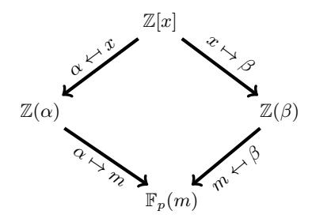

# Challenges with Assessing the Impact of NFS Advances on the Security of Pairing-based Cryptography

Alfred Menezes<sup>1</sup>, Palash Sarkar<sup>2</sup>, and Shashank Singh<sup>3</sup>

Department of Combinatorics & Optimization, University of Waterloo ajmeneze@uwaterloo.ca
Applied Statistics Unit, Indian Statistical Institute palash@isical.ac.in
3 INRIA
sha2nk.singh@gmail.com

**Abstract.** In the past two years there have been several advances in Number Field Sieve (NFS) algorithms for computing discrete logarithms in finite fields  $\mathbb{F}_{p^n}$  where p is prime and n > 1 is a small integer. This article presents a concise overview of these algorithms and discusses some of the challenges with assessing their impact on keylengths for pairing-based cryptosystems.

#### 1 Introduction

A cryptographic pairing is a non-degenerate bilinear map  $\hat{e}: \mathbb{G}_1 \times \mathbb{G}_2 \to \mathbb{G}_T$ , where  $\mathbb{G}_1$ ,  $\mathbb{G}_2$ ,  $\mathbb{G}_T$  are groups of the same prime order r. The pairing is symmetric if  $\mathbb{G}_1 = \mathbb{G}_2$ ; otherwise it is asymmetric. Such pairings are generally constructed from elliptic curves E defined over a finite field  $\mathbb{F}_q$  and having low embedding degree n. For symmetric pairings,  $\mathbb{F}_q$  is either a characteristic-two or characteristic-three field (with n=4 or n=6) or a prime field (with n=2). For asymmetric pairings,  $\mathbb{F}_p$  is a prime field and n is small, e.g.,  $n \in \{2, 6, 12, 18, 24\}$ . Here,  $\mathbb{G}_1$  and  $\mathbb{G}_2$  are order-r groups of  $\mathbb{F}_q^n$ -rational points on E,  $\mathbb{G}_T$  is the order-r subgroup of  $\mathbb{F}_q^n$ , and the map  $\hat{e}$  is derived from the Weil or Tate pairings.

Beginning in 2001 when Boneh and Franklin proposed their identity-based encryption scheme [11], pairings have become an indispensable instrument in the cryptographer's toolbox. Hundreds (if not thousands) of research papers have been written that use pairings to design protocols that achieve certain cryptographic or efficiency objectives that do not seem attainable with conventional cryptosystems such as RSA and elliptic curve cryptography (ECC). Among these applications are aggregate signature schemes, non-interactive zero-knowledge proof systems, certificateless encryption, attribute-based encryption, and searchable encryption.

A vast majority of research papers on pairing-based protocols treat the underlying pairing  $\hat{e}$  as a black box, and emphasize reductionist security proofs for the protocols with respect to some hardness assumption on  $\hat{e}$ . An unfortunate consequence of this predominant point of view is that issues with functionality, efficiency and security of the pairing-based protocols have not been given the attention they deserve sometimes leading to misleading or incorrect claims. For example, beginning with the BLS signature scheme [12], many papers described protocols using so-called Type-2 asymmetric pairings whereby  $\mathbb{G}_1 \neq \mathbb{G}_2$  and an efficiently-computable isomorphism  $\psi$  from  $\mathbb{G}_2$  to  $\mathbb{G}_1$  is known. However, a concrete analysis subsequently revealed that Type 2 pairings are inferior to their Type 3 counterparts with respect to functionality, efficiency and security, and therefore there is no reason to use them [14] (see also [15]). As a second example, consider the Boneh-Shacham group signature scheme with asymmetric pairings  $\hat{e}: \mathbb{G}_1 \times \mathbb{G}_2 \to \mathbb{G}_T$  in which

```
BN curves: n = 12, \rho \approx 1

p(z) = 36z^4 + 36z^3 + 24z^2 + 6z + 1

r(z) = 36z^4 + 36z^3 + 18z^2 + 6z + 1, t(z) = 6z^2 + 1

BLS12 curves: n = 12, \rho \approx 1.5

p(z) = (z-1)^2(z^4-z^2+1)/3+z, r(z) = z^4-z^2+1, t(z) = z+1

KSS curves: n = 18, \rho \approx 4/3

p(z) = (z^8 + 5z^7 + 7z^6 + 37z^5 + 188z^4 + 259z^3 + 343z^2 + 1763z + 2401)/21

r(z) = (z^6 + 37z^3 + 343)/343, t(z) = (z^4 + 16z + 7)/7

BLS24 curves: n = 24, \rho \approx 1.25

p(z) = (z-1)^2(z^8-z^4+1)/3+z, r(z) = z^8-z^4+1, t(z) = z+1
```

Table 1. Important parameters for the BN, BLS12, KSS and BLS24 families of elliptic curves.

one needs to hash onto  $\mathbb{G}_2$  and thereafter apply  $\psi$  to the resulting hash value [13]. This protocol, although 'provably secure', is not implementable since no construction of such a pairing is known. As a third example, we mention the bewildering array of contrived hardness assumptions that have been proposed in the literature in order to attain a reductionist security proof (see [32]). It is typically easy to prove that these assumptions are valid in the generic group model. However, their validity in practice is much more difficult to ascertain. Indeed, Cheon [16] showed that the so-called Strong Diffie-Hellman (SDH) problem that had been formulated by Boneh and Boyen [10] can be solved significantly faster than previous believed. Shortly after, Jao and Yoshida [24] showed that Cheon's SDH solver could be used to forge signatures for the Boneh-Boyen signature scheme.

More recently, confidence in the security of pairing-based protocols has been shaken because of spectacular advances in algorithms for solving the discrete logarithm problem (DLP) in  $\mathbb{G}_T$ , a problem whose intractability is necessary for the security of *all* pairing-based protocols. Most astonishingly, the DLP in small-characteristic finite fields can now be solved in quasi-polynomial time [3], thereby rendering insecure all protocols that use symmetric pairings derived from elliptic and hyperelliptic curves over small-characteristic finite fields. Moreover, numerous improvements to the Number Field Sieve for computing discrete logarithms in fields  $\mathbb{F}_{p^n}$  where p is prime and n > 1 is small have been proposed [4,31], thereby appearing to decrease the security of popular asymmetric pairings including those derived from Barreto-Naehrig (BN) elliptic curves [8].

The purpose of this paper is to initiate an examination of the impact of the aforementioned NFS improvements on keylengths for protocols that employ asymmetric pairings. Of special interest are parameters for BN [8], BLS12 [7], KSS [30] and BLS24 [7] pairings that achieve the 128-bit and 192-bit security levels in light of the new DLP attacks. Table 1 lists the important parameters for these families of elliptic curves. All elliptic curves E are defined over a prime field  $\mathbb{F}_p$ . The group order  $\#E(\mathbb{F}_p) = p+1-t$  is divisible by a prime r, and we set  $\rho = \log p/\log r$ . In order to achieve the  $\ell$ -bit security level, one must select the parameter z so that the bitlength of r is at least  $2\ell$  (in order to resist Pollard's rho attack [36] on the DLP in  $\mathbb{G}_1$ ), and so that the bitlength of  $p^n$  is sufficiently large to resist NFS attacks on the DLP in  $\mathbb{F}_{p^n}^*$ .

We find that the published analyses of the NFS algorithms are inherently asymptotic in nature, and that much more work remains to be done before the impact on keylengths can be determined with full confidence. In the meantime, implementers who wish to deploy pairing-based protocols are advised to make conservative parameter choices that ignore hidden constants in the running times of the NFS algorithms. Note that these hidden constants (most likely) have the effect of multiplying

the running time by at least 1, so ignoring them results in an underestimation of the NFS running times.

The remainder of this paper is organized as follows. In §2 we give some examples of the difficulties and limitations of interpreting asymptotic results in practice. Concise overviews of the NFS and the Tower Number Field Sieve (TNFS) and their derivatives are presented in §3 and §4. In §5, we identify some hidden constants in the asymptotic analysis of the TNFS. The combined effect of these hidden constants is difficult to ascertain but can have a significant impact on the concrete running time of the algorithm. In §6, we consider the effect of one such constant, namely the constant that arises in the expression for the upper bound of the norm. Translating the effect of this constant into concrete running times yields several interesting observations on the practical efficiency of the algorithms. We make some concluding remarks in §7.

### 2 Pitfalls in Asymptotic Analysis

This section gives some examples of the difficulties and limitations of interpreting asymptotic results in practice.

### 2.1 Integer Factorization

The NFS for factoring integers N has running time L<sup>N</sup> ( 1 3 , 1.923) [33]. Here, L<sup>N</sup> (a, c) with 0 < a < 1 and c > 0 denotes the expression

$$O\left(\exp\left((c+o(1))(\log N)^a(\log\log N)^{1-a}\right)\right) \tag{1}$$

that is subexponential in log N<sup>1</sup> . This running time expression hides a multiplicative constant. Moreover, an exact formula for the o(1) term in the exponent is not known.

In the 1990's, there was considerable debate in standards forums about the RSA keylengths that were needed to ensure long-term security against NFS attacks. While experiments with factoring medium-sized N were being conducted, there was no consensus on how to scale the experimental results to large-sized N. In addition, the NFS has large storage needs and requires a large amount of RAM in order to perform sieving efficiently. Thus, since it is difficult to predict the cost and speed of hardware many years into the future, it was difficult to assess the true cost of running the NFS on large-sized N. Nonetheless, consensus was reached that the conservative approach to determining security levels for RSA would be to use the running time of the NFS as the sole measure. RSA keylength estimates that were made 15 years ago have survived with no changes. In particular, it has become widely accepted that RSA with moduli of bitlengths 1024, 2048, 3072, 7680, 15360, offers security levels of 80, 112, 128, 192, 256 bits, respectively [6].

#### 2.2 Elliptic Curve Discrete Logarithm Problem

For any fixed n ≥ 4, the Gaudry-Hess-Smart (GHS) Weil descent attack [21] for solving the elliptic curve discrete logarithm problem (ECDLP) in elliptic curves over characteristic-two finite fields Fq<sup>n</sup> has running time

$$O(q^{2+\epsilon})$$
 as  $q \to \infty$ . (2)

<sup>1</sup> In this paper, log N and lg N are the logarithms of N to the base e and 2, respectively.

Consider the case of elliptic curves E over  $\mathbb{F}_{2^{163}}$  where  $\#E(\mathbb{F}_{2^{163}})$  is twice a prime. Pollard's rho attack takes time  $2^{81}$  to compute logarithms in  $E(\mathbb{F}_{2^{163}})$ . One would expect that the GHS attack is not applicable since q=2 is small. On the other hand, if one ignores the hidden constant and the  $\epsilon$  term in (2) then one might conclude that by embedding  $\mathbb{F}_{2^{163}}$  in  $\mathbb{F}_{2^{25\cdot 163}}$  (where we now have  $q=2^{25}$  and n=163), the GHS attack would take time approximately  $2^{50}$  and thus would be significantly faster than Pollard's rho method. However, the running time expression (2) hides a very bad dependency on n, namely a multiplicative constant  $2^n$ !. For n=163,  $2^n$ !  $\approx 2^{2^{170}}$  which makes it clear that the GHS attack is completely impractical for computing logarithms in elliptic curves over  $\mathbb{F}_{2^{163}}$ .

As another example, we mention Diem's striking result [18] (see also [19]). Let a and b be fixed positive real numbers with a < b. Then Diem proved that discrete logarithms in the group of rational points on any elliptic curve defined over  $\mathbb{F}_{q^n}$  with  $a \cdot \sqrt{\log q} \le n \le b \cdot \sqrt{\log q}$  can be solved in subexponential time

$$e^{O((\log q^n)^{2/3})}$$

Now, a subexponential-time algorithm for solving the ECDLP could have devastating consequences for the security of conventional ECC whose *raison d'être* is the belief that the fastest algorithm for solving the ECDLP is Pollard's rho method which takes fully exponential time. However, Diem's algorithm is inherently asymptotic and it is generally accepted that it does not pose a threat to the security of ECC in practice where elliptic curves over prime fields or over prime-degree extensions of the field of two elements are employed.

#### 2.3 Indistinguishability Obfuscation

In 2013, Garg et al. [20] gave the first provably-secure construction for a polynomial-time indistinguishability obfuscator. The security proof was for all polynomial-time adversaries under certain assumptions on the underlying cryptographic primitives. However, a concrete analysis undertaken by Mayo [34] highlighted the asymptotic nature of the scheme and its impracticality. Mayo considered the obfuscation of a circuit of depth  $\ell^3$  and size  $\ell^5$ , where  $\ell$  denotes the security parameter. When the Coron-Lepoint-Tibouchi multilinear map [17] is employed in the Garg et al. obfuscator, the size of the obfuscated circuit for  $\ell=128$  was estimated to be at least  $2^{1357}$  bits. Thus, even though the Garg et al. obfuscator was provably secure and efficient within the "polynomial-time" paradigm, it is hopelessly impractical.

#### 3 Overview of the Number Field Sieve

Let p be a prime,  $n \ge 1$ , and  $Q = p^n$ . Suppose that p is written as  $p = L_Q(a, c_p)$  for real numbers  $a, c_p > 0$ . Depending on the value of a, finite fields  $\mathbb{F}_Q$  are classified into the following types: small characteristic if  $a \le 1/3$ ; medium characteristic if 1/3 < a < 2/3; boundary if a = 2/3; and large characteristic if a > 2/3.

For small-characteristic finite fields, there has been tremendous progress in the discrete logarithm computation. The approach has been based on the function field sieve algorithm and asymptotically the fastest known algorithm runs in quasi-polynomial time [3].

For the other classes of finite fields, i.e., those with medium to large characteristic, the Number Field Sieve is presently the state-of-the-art. The NFS was initially proposed for integer factorization [33]. Application of the NFS to DLP computation was first proposed by Gordon [22] who considered

prime-order fields. Extensions to composite-order fields were made by Schirokauer [41]. For the case of prime-order fields, improvements were made by Joux and Lercier [27]. Joux, Lercier, Smart and Vercauteren [28] showed that the NFS is applicable to all finite fields. For fields where the prime p is of a special form, Joux and Pierrot [29] applied the special NFS to obtain improved complexity.

The NFS is an index-calculus algorithm having three main phases: (i) relation collection, (ii) linear algebra, and (iii) individual logarithm. Asymptotically, the times for the relation collection and the linear algebra phases dominate the time for the individual logarithm phase. The parameters are tuned so that the time for the relation collection phase is equal to the time for the linear algebra phase and this time is the asymptotic run time of the NFS.

Two number fields  $\mathbb{K}_f = \mathbb{Q}[x]/(f)$  and  $\mathbb{K}_g = \mathbb{Q}[x]/(g)$  are defined by choosing irreducible polynomials f(x) and g(x) over the integers. The required condition on f(x) and g(x) is that modulo p they have a common irreducible factor  $\varphi(x)$  of degree n over  $\mathbb{F}_p$ . The field  $\mathbb{F}_{p^n}$  is represented by  $\varphi(x)$ . Let  $\gamma$  be a generator of the multiplicative group of  $\mathbb{F}_{p^n}$ .

Let  $\alpha, \beta \in \mathbb{C}$  and  $m \in \mathbb{F}_{p^n}$  be roots of f(x), g(x) and  $\varphi(x)$  respectively. The commutative diagram given in Figure 1 shows two homomorphisms  $\mathbb{K}_f \to \mathbb{F}_{p^n}$  and  $\mathbb{K}_g \to \mathbb{F}_{p^n}$  given by  $\alpha \mapsto m$  and  $\beta \mapsto m$  respectively. This diagram explains the basic working of the NFS.



Fig. 1. The basic principle of NFS.

Instead of working over the whole number fields  $\mathbb{K}_f$  and  $\mathbb{K}_g$ , one works over the corresponding rings of integers  $\mathcal{O}_f$  and  $\mathcal{O}_g$ . The notion of norm of ideals allows one to define a suitable factor base, namely the prime ideals of  $\mathcal{O}_f$  and  $\mathcal{O}_g$ , whose norms are at most some pre-specified smoothness bound B. The size of the factor base is  $B^{1+o(1)}$ , where B is chosen so as to balance the times for relation collection and linear algebra.

To generate relations, polynomials  $\phi \in \mathbb{Z}[x]$  of degree at most t-1 are considered. If the principal ideals  $\phi(\alpha)\mathcal{O}_f$  and  $\phi(\beta)\mathcal{O}_g$  are B-smooth, then such a  $\phi$  yields a relation among the factor base elements. Formally, a relation is actually a linear relation between the discrete logarithms of certain elements of the field  $\mathbb{F}_{p^n}$ . Such discrete logarithms are called virtual logarithms<sup>2</sup>. The number of relations collected is a little more than B. This allows carrying out the linear algebra phase to compute the virtual logarithms of the factor base elements. The individual logarithm phase consists of finding the discrete logarithm of some element  $h \in \mathbb{F}_{p^n}$ . The task in this phase is to find an element of the form  $h^i \gamma^j$  such that the principal ideal generated by the preimage of  $h^i \gamma^j$  in  $\mathcal{O}_f$  factors into prime ideals of degrees at most t-1 and bounded norms. Then the special-q technique is used to express the desired discrete logarithm in terms of the virtual discrete logarithms of factor

<sup>&</sup>lt;sup>2</sup> The details are complicated and involve using the homomorphisms  $\alpha \mapsto m$  and  $\beta \mapsto m$  along with the class numbers and the torsion-free ranks of  $\mathcal{O}_f$  and  $\mathcal{O}_g$ . We skip these details.

base elements. Since these virtual discrete logarithms have already been computed, it is possible to finally obtain the desired discrete logarithm. We refer to [2] for more details on the relation collection phase and to [23] for the individual discrete logarithm phase.

#### 3.1 Polynomial Selection and Sizes of Norms

The crucial step in relation collection is to obtain  $\phi \in \mathbb{Z}[x]$  such that the ideals  $\phi(\alpha)\mathcal{O}_f$  and  $\phi(\beta)\mathcal{O}_g$  are both smooth. For ensuring this smoothness, it is sufficient to ensure that their norms, i.e.,  $\operatorname{Res}(f,\phi)$  and  $\operatorname{Res}(g,\phi)$ , are both B-smooth, where Res denotes the resultant. Let E be such that the coefficients of  $\phi$  are in  $\left[-\frac{1}{2}E^{2/t},\frac{1}{2}E^{2/t}\right]$ , whence  $\|\phi\|_{\infty}\approx E^{2/t}$  and the number of polynomials  $\phi$  that are considered for sieving is  $E^2$ . Here, the  $\ell_{\infty}$  norm  $\|\phi\|_{\infty}$  of the polynomial  $\phi$  is the maximum of the absolute values of the coefficients of  $\phi$ . For  $p=L_Q(a,c_p)$  with  $a>\frac{1}{3}$ , the following can be shown (a more precise bound is provided later in the context of the TNFS):

$$|\operatorname{Res}(f,\phi)| = O\left(\left(\|f\|_{\infty}\right)^{t-1} E^{2(\deg f)/t}\right) \quad \text{and} \quad |\operatorname{Res}(g,\phi)| = O\left(\left(\|g\|_{\infty}\right)^{t-1} E^{2(\deg g)/t}\right), \quad (3)$$

yielding the norm bound

$$|\operatorname{Res}(f,\phi) \times \operatorname{Res}(g,\phi)| = O\left( \left( \|f\|_{\infty} \|g\|_{\infty} \right)^{t-1} E^{(\deg f + \deg g)2/t} \right). \tag{4}$$

The probability of B-smoothness of the product of norms (4) determines the cost of obtaining a single relation and hence the cost of relation collection. A suitable choice of B is made to balance this cost with the cost of the linear algebra step. Thus the value of the product of norms in (4) is crucial for determining the overall run time of the algorithm.

Note that the norm bound is determined by the degrees of f and g and their  $\ell_{\infty}$  norms. So, to ensure that the norm bound is small, it is required that the degrees and  $\ell_{\infty}$  norms of f and g are small. Ensuring both of these is a very difficult problem. In the literature several methods for polynomial selection have been proposed which provide polynomials with different trade-offs between degrees and  $\ell_{\infty}$  norms. We briefly describe some of the important ones next.

**JLSV1** [28]. Choose random polynomials  $f_0(x)$  and  $f_1(x)$  having small coefficients with  $\deg(f_1) < \deg(f_0) = n$ . Choose a random positive integer  $\delta$  which is slightly greater than  $\lceil \sqrt{p} \rceil$  and let (u, v) be a rational reconstruction of  $\delta$  modulo p, i.e.,  $\delta \equiv u/v \pmod{p}$ . More precisely, (u, v) is obtained as the first row on applying the LLL-reduction algorithm to the matrix

$$\begin{bmatrix} p & 0 \\ \delta & 1 \end{bmatrix}.$$

Let  $f(x) = f_0(x) + \delta f_1(x)$  and  $g(x) = v f_0(x) + u f_1(x)$  and  $\varphi(x) = f(x)$  mod p. Repeat the above procedure until f and g are irreducible over  $\mathbb{Z}$  and  $\varphi$  is irreducible over  $\mathbb{F}_p$ . For this method, the bound (4) is  $O\left(E^{4n/t}Q^{(t-1)/n}\right)$ .

**GJL** [2]. The basic Joux-Lercier method [27] works for prime fields. In [2], it was generalized to work over composite-order fields. Let  $\varphi(x) = x^n + \varphi_{n-1}x^{n-1} + \cdots + \varphi_1x + \varphi_0$  and  $r \geq n$ . Define an  $(r+1) \times (r+1)$  matrix  $M_{\varphi,r}$  whose rows are obtained from the coefficients of the polynomials  $p, px, \ldots, px^{n-1}, \varphi(x), x\varphi(x), \ldots, x^{r-n}\varphi(x)$ . The LLL algorithm is applied to  $M_{\varphi,r}$ . Let the first row of the resulting LLL-reduced matrix be  $[g_0, g_1, \ldots, g_{r-1}, g_r]$  and let  $g = \text{LLL}(M_{\varphi,r})$  denote the

corresponding polynomial  $g(x) = g_0 + g_1 x + \dots + g_{r-1} x^{r-1} + g_r x^r$ . By construction,  $\varphi(x)$  is a factor of g(x) modulo p.

The GJL procedure for polynomial selection is the following. Let  $r \geq n$  and randomly choose a degree-(r+1) polynomial f(x) that is irreducible over  $\mathbb{Z}$ , has coefficients of size  $O(\log p)$ , and has a degree-n factor  $\varphi(x)$  modulo p which is both monic and irreducible. The procedure is repeated until  $g = \text{LLL}(M_{\varphi,r})$  is irreducible over  $\mathbb{Z}$ . In this case, the norm bound (4) is  $O(E^{2(2r+1)/t}Q^{(t-1)/(r+1)})$ .

Conjugation [2]. Choose a random monic quadratic polynomial  $\mu(x)$  having coefficients of size  $O(\log p)$ , and which is irreducible over  $\mathbb{Z}$  but has a root t modulo p. Let (u,v) be a rational reconstruction of t modulo p. Choose random polynomials  $g_0(x)$  and  $g_1(x)$  with small coefficients with deg  $g_1 < \deg g_0 = n$ . Let  $g(x) = vg_0(x) + ug_1(x)$  and  $f(x) = \operatorname{Res}_y(\mu(y), g_0(x) + y \cdot g_1(x))$ . Repeat this until f and g are irreducible over  $\mathbb{Z}$  and  $\varphi$  is irreducible over  $\mathbb{F}_p$ . In this case, the norm bound (4) is  $O(E^{6n/t}Q^{(t-1)/(2n)})$ .

**SS** [37]. A general method (called Algorithm- $\mathcal{A}$ ) for polynomial selection was given in [37]. This method has two parameters d and r, where d is a divisor of n and  $r \geq n/d$ . The method uses the LLL algorithm in a more general manner than the GJL method. The norm bound (4) is  $O\left(E^{2d(2r+1)/t}Q^{(t-1)/(d(r+1))}\right)$ . Putting d=n and r=1 gives the Conjugation method, whereas putting d=1 gives the GJL method. For 1 < d < n and also for d=n, r>1, this method provides trade-offs which cannot be obtained using either the GJL or the Conjugation method.

### 3.2 Asymptotic Complexity

For each polynomial selection method, the norm bound (4) can be used to obtain a rough estimate of the efficiency of the resulting DLP computation. It is also possible to convert the norm bound into an asymptotic estimate of the run time. The details of how this can be done are a bit messy and so we skip the details. Instead, we just mention the final results.

**Medium characteristic case:** For  $p = L_Q(a, c_p)$  with a > 1/3, the run time of the NFS with the Conjugation method is  $L_Q(1/3, (96/9)^{1/3})$ .

**Boundary case:** For  $p = L_Q(2/3, c_p)$ , the run time of the NFS with Algorithm- $\mathcal{A}$  is  $L_Q(1/3, 2c_b)$ , where

$$c_b = \frac{2r+1}{3c_pkt} + \sqrt{\left(\frac{2r+1}{3c_pkt}\right)^2 + \frac{kc_p(t-1)}{3(r+1)}}$$
 (5)

with k = n/d. For d = n and r = k = 1, this reduces to the complexity obtained by the Conjugation method. The best complexity that is obtained is  $L_Q(1/3, (48/9)^{1/3})$ . This complexity, however, is attained for only one particular value of  $c_p$ , namely  $c_p = 12^{1/3} \approx 2.3$ . As  $c_p \to \infty$ , the minimum complexity (taken over r, k and t) approaches  $L_Q(1/3, (64/9)^{1/3})$  from below.

**Large characteristic case:** For  $p = L_Q(a, c_p)$  with a > 2/3, the run time of the NFS with the GJL method is  $L_Q(1/3, (64/9)^{1/3})$ .

Among the three cases, the best complexity is achieved in the boundary case for a specific  $c_p$  value.

<sup>&</sup>lt;sup>3</sup> For comparisons with other run times, it is useful to note that  $(96/9)^{1/3} \approx 2.201$ ,  $(64/9)^{1/3} \approx 1.923$ ,  $(48/9)^{1/3} \approx 1.747$ , and  $(32/9)^{1/3} \approx 1.526$ .

Remark 1. The sharp distinction between the run times for the medium characteristic, boundary (with c<sup>p</sup> = 121/<sup>3</sup> ), and large characteristic cases highlights the inherent asymptotic nature of the analysis and the difficulty in deriving concrete run time estimates. In particular, without the benefit of extensive experimentation, it is not clear whether a concrete problem instance, e.g., with p ≈ 2 256 and n = 12, falls within the medium characteristic, boundary, or large characteristic cases.

### 3.3 Multiple Number Field Sieve Algorithm

Using multiple number fields to obtain faster asymptotic complexity was suggested in [5, 35]. Pierrot [35] provided a detailed analysis of the GJL and the Conjugation methods using multiple number fields. The MNFS variant of Algorithm-A was analyzed in [37]. The complexities of the MNFS algorithms for the different cases of p = LQ(a, cp) are as follows: LQ(1/3, 2.156) for the medium characteristic case, LQ(1/3, 1.71) for the boundary case, and LQ(1/3, 1.90) for the large characteristic case. The complexity for the boundary case is obtained for only one value of cp, namely c<sup>p</sup> ≈ 2.12.

### 3.4 Special Number Field Sieve Algorithm

Suppose that p can be written as p = Γ(u) for some polynomial Γ of degree λ and having small coefficients so that u = O(p <sup>1</sup>/λ). Note that the primes p in Table 1 are in this special form. Joux and Pierrot [29] showed how to modify the polynomial selection algorithm from [28] to obtain improved complexity. Choose an irreducible polynomial f of the form f(x) = x <sup>n</sup> + R(x) − u where R(x) is a polynomial of small degree with coefficients from {0, ±1}. Let g = Γ(x <sup>n</sup> + R(x)). Then g(x) = Γ(f(x)+u) ≡ Γ(u) = p (mod f(x)) and so g(x)−p is a multiple of f(x) implying that g(x) is a multiple of f(x) modulo p. This choice of f and g ensures that deg f = n, kfk<sup>∞</sup> = O(p <sup>1</sup>/λ), deg g = λn, and kgk<sup>∞</sup> = O((log n) λ ).

The asymptotic complexities reported in [29] are the following. As before, let p = LQ(a, cp).

```
Medium characteristic case: LQ

                                    1/3,((64/9) · (λ + 1)/λ)
                                                            1/3

                                                                for 1/3 ≤ a < 2/3.
Boundary case: LQ

                      1/3,((32/9) · (λ + 1)/λ)
                                              1/3

                                                  for a = 2/3;
Large characteristic case: LQ

                                 1/3,(32/9)1/3

                                                 for 2/3 < a < 1.
```

Unlike the NFS, for SNFS the best complexity is achieved for the large characteristic case.

## 4 Overview of the Tower Number Field Sieve

The Tower Number Field Sieve (TNFS) algorithm was initially considered by Schirokauer [41] and was revisited by Barbulescu et al. [4]. The implications of this algorithm for improving the complexity of the medium prime case were pointed out by Kim and Barbulescu [31] which has led to several follow-up works [38, 39]. Following [31] we denote these algorithms by 'extended TNFS' (exTNFS).

As we saw in §3.2, the Conjugation method from [2] resulted in the NFS complexity of the boundary case being smaller than the complexity of the medium prime case. Suppose that the extension degree n is composite and n = ηκ is a non-trivial factorization of n. Then Fp<sup>n</sup> has a tower field representation F<sup>q</sup> <sup>κ</sup> , where q = p η . The main idea behind the complexity reduction for the medium prime case using a tower field representation is the following. If p and Q = p <sup>n</sup> are such that  $p = L_Q(a, c_p)$  for 1/3 < a < 2/3, then one can translate the problem to that of computing DLP in  $\mathbb{F}_{q^\kappa}$  where  $q = L_Q(2/3, c_q)$ . This corresponds to the boundary case and so one benefits from the lower complexity of the boundary case for the medium prime case.

Here q is not prime and the characteristic of the field  $\mathbb{F}_Q$  remains p irrespective of how the field is represented. Hence, strictly speaking, it is not correct to say that the medium characteristic case transforms to the boundary case. On the other hand, from the complexity point of view what matters are the norms of the polynomials and in that sense it is possible to obtain smaller norm bounds with the tower field representation than what could be done directly.

The basic idea of the exTNFS algorithm is the following. One starts with a monic polynomial h(z) of degree  $\eta$  which is irreducible over  $\mathbb{F}_p$  and hence is also irreducible over  $\mathbb{Z}$ . Let  $\mathbb{F}_{p^{\eta}} = \mathbb{F}_p[z]/(h(z))$  and  $R = \mathbb{Z}[z]/(h(z))$ . Suppose f and g are polynomials in R[x] whose leading coefficients are from  $\mathbb{Z}$ . It is required that both f and g are irreducible over R (this can be verified by testing irreducibility over  $\mathbb{Q}[z]/(h(z))$ ) and over  $\mathbb{F}_{p^{\eta}}$ , and that f and g have a degree- $\kappa$  common factor  $\varphi(x)$  that is irreducible over  $\mathbb{F}_{p^{\eta}}$ . The field  $\mathbb{F}_{p^n}$  is then realized as  $\mathbb{F}_{p^{\eta}}[x]/(\varphi(x)) = (R/pR)[x]/(\varphi(x))$ .

Let  $\mathbb{K}_f$  and  $\mathbb{K}_g$  be the number fields defined by f and g respectively. As in the case of the NFS (see Figure 1), the above set-up provides two different decompositions of a homomorphism from R[x] to  $\mathbb{F}_{p^n}$ . One of these goes through R[x]/(f(x)) and the other goes through R[x]/(g(x)). Using this set-up it is possible to define a factor base and carry out the three main phases of NFS. Here also, the factor base consists of  $B^{1+o(1)}$  elements for some smoothness bound B.

Sieving for relation collection is done using polynomials  $\phi \in R[x]$  of degrees at most t-1 with  $\|\phi\|_{\infty} = E^{2/\eta t}$  so that the number of sieving polynomials is  $E^2$ . A sieving polynomial  $\phi \in R[x]$  generates a relation if both the norms

$$N(\phi, f) = \operatorname{Res}_{z}(\operatorname{Res}_{x}(\phi(x), f(x)), h(z)) \quad \text{and} \quad N(\phi, g) = \operatorname{Res}_{z}(\operatorname{Res}_{x}(\phi(x), g(x)), h(z)) \tag{6}$$

are B-smooth. Note that in this case, f and g can be viewed as bivariate polynomials in x and z and hence the norm is obtained by taking resultants twice. Bounds on the norm are obtained from the bounds on resultants of bivariate polynomials [9].

The polynomial selection methods for NFS (see §3.1) translate to the exTNFS setting. Instead of providing the details of these methods, we provide a summary of recent work with a focus on the medium prime case.

Kim and Barbulescu [31]. This work chooses  $f, g \in \mathbb{Z}[x]$ , whence the degree- $\kappa$  polynomial  $\varphi(x) = \gcd(f(x), g(x))$  is over  $\mathbb{F}_p$ . The requirement that  $\varphi(x)$  is irreducible over  $\mathbb{F}_{p^n}$  imposes the condition that  $\gcd(\eta, \kappa) = 1$ . Hence, the Kim-Barbulescu method works only for composite non prime-power values of n. The actual polynomial selection is done using a translated version of the Conjugation method, resulting in the best achievable complexity for  $p = L_Q(a, c_p)$ , 1/3 < a < 2/3 to be  $L_Q(1/3, (48/9)^{1/3})$ . This complexity, however, is not achieved for all values of p.

Sarkar and Singh [38]. This work described a polynomial selection method (called Algorithm-C) in which the coefficients f and g are in R (and not necessarily in  $\mathbb{Z}$ ), with the restriction that f is monic and the leading coefficient of g is in  $\mathbb{Z}$ . As a result, the restriction that  $\varphi(x)$  has coefficients in  $\mathbb{F}_p$  is also removed resulting in the removal of the  $\gcd(\eta, \kappa) = 1$  constraint. This leads to a variant of the TNFS algorithm for the medium characteristic case with improved complexity for all composite n. For prime-power n, however, the minimum complexity obtained in [38] is larger than  $L_Q(1/3, (48/9)^{1/3})$ .

**Jeong and Kim [25].** The Conjugation method was extended to the TNFS setting where the condition  $gcd(\eta, \kappa) = 1$  was not required. The best achievable complexity for  $p = L_Q(a, c_p)$ , 1/3 < a < 2/3 was shown to be  $L_Q(1/3, (48/9)^{1/3})$ . For prime-power n, this improves upon the complexity achieved in [38].

Sarkar and Singh [39]. A new polynomial selection algorithm, called Algorithm- $\mathcal{D}$ , was described. This provides another translation of Algorithm- $\mathcal{A}$  to the TNFS setting without requiring the condition  $\gcd(\eta,\kappa)=1$ . Special cases of Algorithm- $\mathcal{D}$  lead to the GJL and the Conjugation methods in both classical NFS and TNFS. As a result, Algorithm- $\mathcal{D}$  subsumes the Jeong-Kim polynomial selection method. The asymptotic complexity for the medium prime case can be described as follows. Let  $p=L_Q(a,c_p)$  with  $1/3\leq a<2/3$  and suppose that  $q=p^\eta$  can be written as  $q=L_Q(2/3,c_\theta)$ . Then the asymptotic complexity is  $L_Q(1/3,2c_b)$  where  $c_b$  is given by (5) with  $c_p$  replaced by  $c_\theta$ . The minimum complexity is still  $L_Q(1/3,(48/9)^{1/3})$  which is the same as that of the Jeong-Kim method and this complexity is attained for  $c_\theta=12^{1/3}$ . However, improvements in asymptotic complexity are obtained for certain ranges of values of  $c_\theta$ .

### 4.1 Multiple Number Field Sieve Algorithm

Multiple number fields can also be used with the TNFS [31]. As in the case of the NFS, this reduces the asymptotic complexity. The best achievable complexity for the medium prime case is  $L_Q(1/3, 1.71)$ .

### 4.2 Special Number Field Sieve Algorithm

As explained above, the main advantage of the TNFS method is to transform the problem for the medium characteristic case to that of the boundary characteristic for which the complexity is lower. In fact, it is also possible to transform to the large characteristic case. Carrying out this exercise for the SNFS (yielding the SexTNFS algorithm) leads to an asymptotic complexity of  $L_Q(1/3, (32/9)^{1/3})$  for the medium prime case; this complexity is achieved for all medium primes unlike the case of TNFS. This works for composite n; in the case where n has a non-trivial factorization as  $n = \eta \kappa$  with  $\gcd(\eta, \kappa) = 1$ , this complexity was reported in [31], whereas the same complexity was reported in [25] without the restriction  $\gcd(\eta, \kappa) = 1$ .

#### 5 Asymptotic Analysis

In summary, the asymptotic run times of the NFS variants for computing discrete logarithms in  $\mathbb{F}_Q$  in the medium characteristic case are  $L_Q(1/3,c)$  where:

```
-c = 2.201 for the NFS (§3.2);

-c = 2.156 for the multiple NFS (§3.3);

-c = 2.072 for the special NFS with \lambda = 4 (§3.4);

-c = 1.747 for the exTNFS for some p (§4);

-c = 1.71 for the multiple exTNFS for some p (§4.1); and

-c = 1.526 for the SexTNFS (§4.2).
```

Asymptotic complexity analysis proceeds by ignoring various factors that do not have significant effect on the run time as  $Q = p^n$  goes to infinity. In this section, we take a look at the different steps of this analysis with a view towards assessing whether the ignored factors can have a noticeable effect on the run time for concrete values of Q. At the same time, we consider issues of storage and observe that different operations which are assumed to asymptotically require O(1) time, in practice have noticeable difference in their times.

We consider the TNFS setting where  $Q = p^n$  and  $n = \eta \kappa$  is a non-trivial factorization of n.

### 5.1 Bounds on Norms of Polynomials

The number fields  $\mathbb{K}_f$  and  $\mathbb{K}_g$  are defined using two polynomials f(x) and g(x) over  $R = \mathbb{Z}[z]/(h(z))$  where h(z) is a degree- $\eta$  irreducible polynomial over  $\mathbb{Z}$ . The degrees and  $\ell_{\infty}$  norms of f and g are the main factors that influence the running time. These quantities are determined based on the actual polynomial selection method that is employed. To make the ideas concrete, we work with a special case of Algorithm- $\mathcal{D}$  [37]. This special case is important since it is the TNFS variant of the Conjugation method proposed by Kim and Barbulescu [31].

Using random trials, one chooses a monic quadratic polynomial  $A_1 \in \mathbb{Z}[y]$  having  $O(\log p)$ size coefficients such that  $A_1$  is irreducible over  $\mathbb{Z}$  and has a factor  $A_2(y) = y + \delta$  over  $\mathbb{F}_p$ . Further, using random trials, one chooses monic polynomials  $C_0(x)$  and  $C_1(x)$  over R with  $\|C_i\|_{\infty} = O(1)$ ,  $\deg C_0(x) = \kappa$ ,  $\deg C_1(x) < \kappa$ , and such that f(x) and g(x) are irreducible over R and  $\varphi(x)$  is irreducible over  $\mathbb{F}_{p^n} = \mathbb{F}_p[z]/(h(z))$  where  $f(x) = \operatorname{Res}_x(A_1(y), C_0(x) + yC_1(x))$ ,  $\varphi(x) = \operatorname{Res}_y(A_2(y), C_0(x) + yC_1(x))$  mod p,  $\psi(x) = \psi_1 x + \psi_0$ , and  $g(x) = \operatorname{Res}_x(\psi(y), C_0(x) + yC_1(x))$ . The integer coefficients  $\psi_1$  and  $\psi_0$  of  $\psi(x)$  are obtained by a rational reconstruction of  $\delta$  modulo p. From the bound on the first vector of an LLL-reduced basis and the bound on the shortest vector of a lattice, one obtains  $\|\psi\|_{\infty} \leq 2p^{1/2}$ .

Asymptotically, the above method for selecting f and g yields  $||f||_{\infty} = O(\log p)$  and  $||g||_{\infty} = O(Q^{1/2n})$ . The contribution to  $||f||_{\infty}$  and  $||g||_{\infty}$  from the coefficients of  $C_0(x)$  and  $C_1(x)$  arising from the resultant computation are absorbed in the big-O notation.

#### 5.2 Size of the Factor Base

The polynomials f and g define the two (tower) number fields  $\mathbb{K}_f$  and  $\mathbb{K}_g$  having ring of integers  $\mathcal{O}_f$  and  $\mathcal{O}_g$  respectively. The factor base consists of all prime ideals of  $\mathcal{O}_f$  and  $\mathcal{O}_g$  whose norms are at most B. From this, the factor base size is asymptotically  $B^{1+o(1)}$ . For concrete polynomials f and g, the actual number of prime ideals could have a small but noticeable difference from B.

#### 5.3 Bounds on Norms of Ideals

Sieving is done using polynomials of degrees at most t-1. Consider the simplest and the most important case of t=2. Then the sieving polynomials are linear polynomials  $\phi \in R[x]$  with  $\|\phi\|_{\infty} = E^{1/\eta}$ . There are a total of  $E^2$  sieving polynomials. A relation is obtained if the principal ideals generated by the images of  $\phi$  in  $\mathcal{O}_f$  and  $\mathcal{O}_g$  are smooth over the factor base. This smoothness depends on the norms  $N(f,\phi)$  and  $N(g,\phi)$  whose bounds are given by (6).

Let
$$H = ||h||_{\infty}$$
 and

$$\mathfrak{C}(\eta, s, H) = ((\eta - 1)(1+s) + 1)^{\eta/2} \cdot (\eta + 1)^{(\eta - 1)(1+s)/2} \cdot H^{(\eta - 1)(1+s)} \cdot ((s+1)!\eta^s)^{\eta}.$$

The following bounds on the norms can be obtained:

$$N(f,\phi) \le \mathfrak{C}(\eta, 2\kappa, H) \cdot E^{2\kappa} \cdot O\left((\log p)^{\eta}\right) \quad \text{and} \quad N(g,\phi) \le \mathfrak{C}(\eta, \kappa, H) \cdot E^{\kappa} \cdot O\left(Q^{1/(2\kappa)}\right);$$
 (7)

see Appendix A for details of the resultant calculations. In the asymptotic analysis these are written as N(f, φ) = E2κLQ(2/3, o(1)) and N(g, φ) = EκQ1/(2κ)LQ(2/3, o(1)). In other words, one takes C(η, 2κ, H) = LQ(2/3, o(1)) and C(η, κ, H) = LQ(2/3, o(1)), and consequently their contribution to the overall running time LQ(1/3, c) is absorbed by the o(1) term in the latter.

For concrete values, the factors that get absorbed in the LQ(2/3, o(1)) expression can be very large. For n = 12, let η = 4 and κ = 3 and suppose that H = 5. Then C(4, 3, 5) ≈ 2 <sup>91</sup>.<sup>5</sup> and C(4, 6, 5) ≈ 2 179.3 . On the other hand, suppose we choose η = 1 and κ = 12 and H = 5 as before. These values of η and κ correspond to the usual NFS, i.e., we are not exploiting the tower structure. Then C(1, 12, 5) ≈ 2 <sup>32</sup>.<sup>5</sup> and C(1, 24, 5) ≈ 2 83.7 . While these are still large numbers, they are significantly smaller than the numbers obtained in the case of the tower representation.

#### 5.4 Smoothness Probability from the Canfield-Erd¨os-Pomerance Theorem

The bounds obtained on the norms N(f, φ) and N(g, φ) are used to estimate the probability that a random sieving polynomial will provide a relation. The required condition is that the principal ideals generated by the images of φ in the two integer rings are smooth over the factor base. Two assumptions are used, which means that the entire analysis is heuristic.

- 1. It is assumed that the probability that the principal ideal generated by the image of φ in O<sup>f</sup> factors over the factor base is the same as the probability that a random integer of size N(f, φ) is B-smooth. Similarly for Og.
- 2. The events that the two principal ideals generated by the images of φ are smooth over the factor base are independent.

The probability that a random integer of size N(f, φ) is B-smooth is obtained from the L-notation version of a theorem due to Canfield, Erd¨os and Pomerance. (See Theorem 15.2 of [26] for the statement of the theorem.) The smoothness probability can also be expressed in concrete terms. Let Ψ(N, B) be the number of positive integers ≤ N which are B-smooth. Ignoring lower order terms, it can be shown that

$$\log\left(\frac{\Psi(N,B)}{N}\right) \approx -\frac{\log N}{\log B}\log\left(\frac{\log N}{\log B}\right). \tag{8}$$

Let Π(N, B) = Ψ(N, B)/N be the probability that a random integer ≤ N is B-smooth. We are interested in

$$\Pi(N(f,\phi),B) \cdot \Pi(N(g,\phi),B). \tag{9}$$

The number of trials (i.e., the number of sieving polynomials to consider) to obtain a single relation is about

$$\mathfrak{n} = (\Pi(N(f,\phi),B) \cdot \Pi(N(g,\phi),B))^{-1}.$$

Since about B relations are required, the total number of trials to obtain all the relations is about Bn. This is how the bounds on the norms determine the run time of the relation collection phase.

#### 5.5 Balancing Costs

For the asymptotic analysis, the costs of the relation collection and the linear algebra phases are balanced. This balancing proceeds by imposing two conditions. Recall that the number of sieving polynomials is E<sup>2</sup> and the size of the factor base is B1+o(1). Sparse linear algebra requires time B2+o(1). Hence, the costs of the relation collection and linear algebra phases are balanced by setting E = B.

Note that this assumes that the total time for sieving with E<sup>2</sup> polynomials is equal to the time required for completing the linear algebra phase. While this is true in an asymptotic sense, in concrete terms the two costs can be significantly different. We note the following differences between these two tasks.

- 1. For both sieving and linear algebra, the basic operations are field operations in Fp. However, the number of such field operations are different for the two tasks.
- 2. For linear algebra, it is required to perform read and write operations on a very large matrix. In practice, these read/write operations will incur a significant overhead.
- 3. The sieving step is parallelizable up to any extent. This is not true for the linear algebra step. The block Wiedemann algorithm can be parallelized, but this comes at the cost of additional memory requirements.

# 6 Concrete Analysis

We take some concrete values to get an idea of the effect of the constants in the norm bounds on the smoothness probability. Suppose Q ≈ 2 3000 , n = 12, η = 4, κ = 3, H = 5, whence p ≈ 2 250 . Assume that the factor base size is B = 2<sup>64</sup> so that the linear algebra phase requires approximately 2 <sup>128</sup> operations. As discussed in §5.5, E is taken to be equal to B so that E is also 264. Then taking the upper bounds in (7) to be the norm values and the hidden constants in the big-O notation to be 1, we obtain

$$\begin{split} N(f,\phi) &\approx \mathfrak{C}(4,6,5) E^{2\kappa} (\log p)^{\eta} \approx 2^{593}, \\ N(g,\phi) &\approx \mathfrak{C}(4,3,5) E^{\kappa} Q^{1/(2\kappa)} \approx 2^{783}, \\ \Pi(N(f,\phi),B) &\approx \Pi(2^{593},2^{64}) \approx 2^{-29.8}, \\ \Pi(N(g,\phi),B) &\approx \Pi(2^{783},2^{64}) \approx 2^{-44.2}, \\ \mathfrak{n} &= (\Pi(N(f,\phi),B) \cdot \Pi(N(g,\phi),B))^{-1} \approx 2^{74}. \end{split}$$

Hence a single relation will be obtained after trying about 2<sup>74</sup> sieving polynomials. On the other hand, if we ignore the factors C(4, 6, 5) and C(4, 3, 5), then n ≈ 2 <sup>54</sup>. So, in this case the effect of the constants in the norm bounds is to increase the number of iterations for finding a single relation by a factor of about 2<sup>20</sup> .

The number of iterations required to find a single relation affects the overall cost of the algorithm. The total number of iterations required to find the B required relations determines the cost of the relation collection phase. If we take the constants into account, the relation collection phase will have cost about 274B = 2<sup>138</sup> for B = 264. On the other hand, if the constants are ignored, then the relation collection phase will have cost about 254B = 2118. In both cases, the linear algebra phase will have cost approximately B<sup>2</sup> = 2<sup>128</sup> .

The above choice of B does not balance the costs of the relation collection and linear algebra phases. We have redone the calculations with Q ≈ 2 <sup>3000</sup> so as to balance these costs. The overall approximate costs of the algorithm are given by the values in the fourth column (if the constants are taken into consideration) and fifth column (if the constants are ignored) of the first row of Table 2. The size of the factor base is the square root of the overall cost.

| n algorithm         | (η, κ, λ) | with     | without             |
|---------------------|-----------|----------|---------------------|
|                     |           |          | constants constants |
| 12 exTNFS           | (4, 3, −) | 138<br>2 | 116<br>2            |
| SexTNFS             | (6, 2, 4) | 155<br>2 | 108<br>2            |
| 18 exTNFS           | (6, 3, −) | 154<br>2 | 118<br>2            |
| SexTNFS             | (9, 2, 8) | 279<br>2 | 160<br>2            |
| 24 exTNFS           | (8, 3, −) | 169<br>2 | 118<br>2            |
| SexTNFS (12, 2, 10) |           | 369<br>2 | 186<br>2            |

Table 2. Approximate run times of exTNFS and SexTNFS for Q = p <sup>n</sup> ≈ 2 <sup>3000</sup> for several different values of n, with and without the constants. These constants are C(η, κ, H) and C(η, 2κ, H) for exTNFS, and C(η, κ, H) and C(η, κλ, H) for SexTNFS.

A similar calculation can be done for SexTNFS; cf. Remark 2. In this case, however, the minimum complexity is not achieved for η = 4 and κ = 3. Instead the minimum is achieved for η = 6 and κ = 2. Since in this case η and κ are not coprime, this choice would not be allowed by the Kim-Barbulescu work [31], but would be permitted by [25]. The run times considering and ignoring constants are respectively given in the second row of Table 2.

We have performed similar calculations for n = 18 and n = 24. It turns out that the factorization of n that minimizes the exTNFS complexity is not the same as the factorization of n that minimizes the SexTNFS complexity. Table 2 provides the run times of exTNFS and SexTNFS both when the constants in the norm bound are taken into consideration and also when they are ignored. We observe the following from the values in Table 2.

- 1. If the constants are taken into consideration, then in each case the run time is significantly greater than if the constants are ignored. In particular, a 3000-bit Q does seem to provide at least 128-bit security for n = 12.
- 2. The concrete run time for exTNFS is smaller than that of SexTNFS. (The only exception to this is for n = 12 and when the constants in the norm bounds are ignored.) This is contrary to what one would expect from the asymptotic analysis in which the run time of SexTNFS is smaller than that of exTNFS; cf. Remark 2.
- 3. The asymptotic expression for the run time does not have any dependence on n and depends only on Q. This means that for a given Q, the run times will asymptotically be the same for all n. However, concrete values show a significant dependence on the value of n. For a fixed Q, as n increases there is a significant increase in the run time. This is because the constants in the norm bound depend on n and increase quite rapidly as n increases.
- 4. For exTNFS without constants, the run time does not vary much as n increases. This behaviour is not observed for SexTNFS.

Remark 2. For SexTNFS, the upper bounds on the norms are

$$N(f,\phi) \le \mathfrak{C}(\eta,\kappa,H) \cdot E^{\kappa} \cdot p^{\eta/\lambda} \quad \text{and} \quad N(g,\phi) \le \mathfrak{C}(\eta,\kappa\lambda,H) \cdot E^{\kappa\lambda} \cdot \|\Gamma\|_{\infty}^{n}. \tag{10}$$

These values should be compared with the norm bounds for exTNFS-Conj given by (7). The values of  $\lambda$  are 4, 6, 8 and 10 respectively for BN, BLS12, KSS and BLS24 curves. In the asymptotic complexity analysis,  $\lambda$  is treated as a constant and does not have a noticeable influence on the run time. On the other hand, in the concrete analysis, the actual value of  $\lambda$  has a noticeable effect on the upper bound on  $N(g,\phi)$ . This effect is present even if the constants  $\mathfrak{C}(\eta,\kappa,H)$  and  $\mathfrak{C}(\eta,\kappa\lambda,H)$  are ignored. Since a higher value of the norm bound implies a lower smoothness probability and hence a higher overall run time, the concrete run time for SexTNFS turns out to be greater than that of exTNFS.

Remark 3. Consider an asymmetric pairing derived from an ordinary elliptic curve over  $\mathbb{F}_p$  with embedding degree n, whereby the target group is  $\mathbb{G}_T = \mathbb{F}_Q^*$  with  $Q = p^n$ . For a fixed Q, as n increases, p decreases. Since the elliptic curve group is of size roughly p, the size of the elliptic curve group also decreases. Considering the 128-bit security level, the size of p going below 256 will violate Pollard-rho security. Hence, 128-bit security cannot be achieved by keeping Q at the 3000-bit level and simply increasing p beyond 12.

### 6.1 On the Tightness of the Norm Bounds

The norms  $N(f,\phi)$  and  $N(g,\phi)$  are expressed in terms of resultants. Upper bounds on these norms are known bounds on resultants [9] and are given by (7); let  $U_f$  and  $U_g$  be the upper bounds on  $N(f,\phi)$  and  $N(g,\phi)$ . Let  $V_f = E^{2\kappa} \cdot O\left((\log p)^{\eta}\right)$  and  $V_g = E^{\kappa} \cdot O\left(Q^{1/(2\kappa)}\right)$ . Note that  $V_f$  and  $V_g$  are not necessarily upper bounds on  $N(f,\phi)$  and  $N(g,\phi)$  because the constants  $\mathfrak{C}(\eta,2\kappa,H)$  and  $\mathfrak{C}(\eta,\kappa,H)$  are absent.

Let  $\mu = \Pi(U_f, B) \cdot \Pi(U_g, B)$  and  $\nu = \Pi(V_f, B) \cdot \Pi(V_g, B)$  where B is the factor base size. Then  $\mu$  is a lower bound on the probability of obtaining a single relation and  $\mu^{-1}$  is an upper bound on the number of iterations required to obtain a single relation. The quantity  $\nu$  is similar to that of  $\mu$  except that  $V_f$  and  $V_g$  are used instead of  $U_f$  and  $U_g$ .

In [9], an example is provided to show that the resultant bounds are tight and in general cannot be improved. On the other hand, the question of whether the bounds are tight for the kinds of polynomials arising in the context of NFS algorithms deserves an answer. To determine this, we conducted some experiments. The generalized Conjugate method (gConj) [25] was implemented and the polynomials h(z), f(x) and g(x) computed. This determines  $H = ||h||_{\infty}$ ,  $||f||_{\infty}$  and  $||g||_{\infty}$ . Now choose a value for B and set E = B so that the number of sieving polynomials  $\phi(x)$  is  $B^2$ . We further set t = 2, i.e., only linear sieving polynomials were considered. Then the coefficients of a sieving polynomial  $\phi(x)$  (considered as a bivariate polynomial in z and x) can take  $B^{1/\eta}$  values. We chose 1000 random sieving polynomials and in each case computed the actual values of  $N(f,\phi)$  and  $N(g,\phi)$ . From these two values, the smoothness probability  $\pi = \Pi(N(f,\phi),B) \cdot \Pi(N(g,\phi),B)$  was computed. Let  $\overline{N}_f$ ,  $\overline{N}_g$  and  $\overline{\pi}$  be the average of  $N(f,\phi)$ ,  $N(g,\phi)$  and  $\pi$  computed over the 1000 random  $\phi$ 's. A summary of these values is given in Table 3. The table also shows the results of a similar experiment conducted for the SexTNFS algorithm where BN curves were used.

In each case considered in Table 3, it turned out that taking H=2 is sufficient. We have previously considered H=5 and the reduced value of H=2 results in slightly lower values for  $U_f$  and  $U_g$ . There are several points to note from the results in Table 3.

1. The average value  $\lg \overline{N}_f$  is closer to  $\lg V_f$  than to the known upper bound  $\lg U_f$ . Similarly for  $\lg \overline{N}_g$  and  $\overline{\pi}$ .

|  |  | Table 3. Upper bound and average values of norms for the 128-bit security level. |
|--|--|----------------------------------------------------------------------------------|
|--|--|----------------------------------------------------------------------------------|

| method                  |  |            | n η κ lg p lg B lg Vf |     | lg Nf | lg Uf | lg Vg | lg Ng          | lg Ug |    | − lg ν − lg π − lg µ |     |
|-------------------------|--|------------|-----------------------|-----|-------|-------|-------|----------------|-------|----|----------------------|-----|
| exTNFS-gConj 12 4 3 384 |  |            | 70                    | 452 | 458   | 603   | 978   | 992            | 1053  | 70 | 70                   | 85  |
| exTNFS-gConj 18 6 3 256 |  |            | 70                    | 464 | 495   | 731   | 978   | 996            | 1113  | 71 | 72                   | 98  |
| exTNFS-gConj 24 8 3 256 |  |            | 81                    | 545 | 617   | 937   |       | 1267 1302 1467 |       | 80 | 84                   | 116 |
| SexTNFS                 |  | 12 6 2 384 | 64                    | 543 | 717   | 902   | 711   | 655            | 806   | 64 | 70                   | 99  |

- 2. Consider lg N<sup>f</sup> . The average has been computed over 1000 iterations. The value of lg N<sup>f</sup> being substantially less than lg U<sup>f</sup> indicates that polynomials φ such that N(f, φ) is close to U<sup>f</sup> are not very common. On the other hand, this does not indicate that such polynomials do not occur at all. A total of B<sup>2</sup> sieving polynomials φ have to be considered. It is possible that a non-negligible fraction of these do have norms close to the upper bound. Our experiments only indicate that the fraction is less than 1/1000. Thus, in the absence of further experimental data, one cannot completely disregard the role of the constants in the analysis.
- 3. In each case, B has been chosen so that lg B is roughly equal to µ. Further, in each case it turns out that π is at least µ. So, even if the actual norms behave like N<sup>f</sup> and Ng, choosing lg p as given provides at least 128 bits of security.

### 6.2 Deriving Group Sizes from the Asymptotic Run Time Expressions

In this subsection, we consider the question of deriving concrete group sizes from the asymptotic run time expressions. Following the ECRYPT recommendation [42, Page 26], consider a constant A and write the run time of an NFS algorithm as

$$A \cdot \exp\left((c + o(1))(\log Q)^{1/3}(\log\log Q)^{2/3}\right).$$
 (11)

Again following [42], assume o(1) = 0. In [42], the constant A is determined in the following manner. It is mentioned that experience from available data points suggests that the resistance of RSA-512 is about 4 to 6 bits lower than that of DES. Plugging in Q = 2<sup>512</sup> and c = (64/9)1/<sup>3</sup> into (11) and setting the resulting expression equal to 250, one obtains A ≈ 2 −14 .

More generally, let A = 2−<sup>d</sup> and denote by s(Q, c, d) the base-two logarithm of the expression in (11) with o(1) = 0. Then, we have

$$s(Q, c, d) = c(\lg e)(\log Q)^{1/3}(\log \log Q)^{2/3} - d.$$
(12)

Here Q is p <sup>n</sup> and c is the second argument in the L-notation. As described above, the ECRYPT recommendation takes d = 14.

The task of deriving group sizes is the following. Given c, d, n and a target security level `, find the minimum Q such that both (lg Q)/n ≥ 2` and s(Q, c, d) ≥ ` hold. The first condition ensures Pollard-rho security while the second condition ensures security against (exT)NFS attack. In the case where ρ > 1 (see Table 1), the Pollard-rho condition (lg Q)/n ≥ 2` should be replaced with the condition (lg Q)/n ≥ 2`ρ.

Taking c = (64/9)1/<sup>3</sup> and d = 14, yields lg Q values of 3247, 7958, 15447 for ` = 128, 192, 256, respectively. These values of lg Q are close to the ECRYPT recommendations of 3248, 7936, 15424. We note that taking  $c = (64/9)^{1/3}$  and d = 10 yields  $\lg Q$  values of 3034, 7587, 14889 for  $\ell = 128$ , 192, 256, respectively. Rounding up these  $\lg Q$  values to the nearest integer multiple of 512 yields 3072, 7680, 15360, which are the NIST recommendations for prime-order fields at the 128, 192, 256-bit security levels [6].

Remark 4. (on the choice of d) As we have described earlier, the  $L_Q(1/3,c)$  run time expression for exTNFS is obtained from the bounds  $\mathfrak{C}(\eta, 2\kappa, H) \cdot E^{2\kappa} \cdot O((\log p)^{\eta})$  and  $\mathfrak{C}(\eta, \kappa, H) \cdot E^{\kappa} \cdot O(Q^{1/(2\kappa)})$  respectively on the norms  $N(f, \phi)$  and  $N(g, \phi)$ . The asymptotic analysis considers  $\mathfrak{C}(\eta, 2\kappa, H)$  and  $\mathfrak{C}(\eta, \kappa, H)$  to be  $L_Q(2/3, o(1))$  and ultimately the effect of these constants get absorbed in the o(1) term in (11). At a later point, when we set o(1) to be 0, we are in effect replacing the constants by 1. The values in Table 3 show that replacing the constants by 1 actually results in underestimates of the run time compared to what would be obtained from the actual values of the norms.

Choosing a positive value of d amounts to considering the actual run time to be lower than the run time predicted by values obtained from the asymptotic expression  $L_Q(1/3, c)$  (with o(1) assumed to be 0). Since the values obtained from the asymptotic run time expression are already lower than what would be obtained from the actual value of the norms, reducing these values further by choosing a value of d greater than 0 seems to be over-engineering. So, we suggest that the value of d be taken as 0 which would mean choosing A = 1 in (11).

### 6.3 The 128-bit and 192-bit Security Levels

In this section, we provide estimates of group sizes required to achieve a desired security level. These estimates depend on the values of the norms  $N(f,\phi)$  and  $N(g,\phi)$ . One can work with the upper bounds on these norms. The upper bounds involve the constant terms which can be quite large. The experiments reported in Section 6.1 show that the actual values of the norms appear to be closer to the expressions for the upper bounds without the constants. So, we report group size estimates both with and without the constants in the norm bounds. The estimates obtained without considering the constants can be considered to be conservative estimates. The actual methodology for obtaining the estimates is described below.

For each choice of security level  $\ell \in \{128, 192\}$ , the value of n, the choice of curve, the choice of the algorithm (exTNFS or SexTNFS), and the choice of whether or not to use constants in the bounds, the following was done. For each possible non-trivial factor  $\eta$  of n, let  $lgp(\eta)$  denote the minimum value of lg p required to achieve security level  $\ell$ . The maximum of  $lgp(\eta)$  over all possible non-trivial factors  $\eta$  of n is reported.

The values  $\operatorname{lgp}(\eta)$  were determined as follows. The initial value of  $\operatorname{lg} p$  was taken to be  $2\rho\ell$  and the size B of the factor base was fixed to  $2^{\ell/2}$ . The joint smoothness probability (9) was computed and the value of  $\operatorname{lg} p$  was incremented until for the first time the joint smoothness probability became lower than  $2^{-\ell/2}$ . This value was returned as  $\operatorname{lgp}(\eta)$ .

Once  $\lg p$  was calculated, the complexity of each stage was determined as follows. With all other parameters fixed, the value of B was incremented until the smoothness probability became approximately equal to 1/B. This balances the costs of the relation collection and the linear algebra stages.

The final results are given in Tables 4 and 5. Note that all estimates were generated using H=2.

A reasonable conclusion is that BN curves with  $\lg p = 383$  and  $\lg Q = 4596$  offer (at least) 128 bits of security. With these parameters, there is a mismatch in security levels with BN curves

| BN curves: n = 12, ρ = 1, λ = 4, kΓk∞<br>= 36     |                                                     |  |  |  |               |              |  |  |  |  |  |
|---------------------------------------------------|-----------------------------------------------------|--|--|--|---------------|--------------|--|--|--|--|--|
|                                                   | algorithm constants η κ lg p lg Q                   |  |  |  |               | lg(run time) |  |  |  |  |  |
| exTNFS                                            | without                                             |  |  |  | 4 3 311 3732  | 128          |  |  |  |  |  |
| exTNFS                                            | with                                                |  |  |  | 4 3 256 3072  | 136          |  |  |  |  |  |
| SexTNFS                                           | without                                             |  |  |  | 6 2 383 4596  | 128          |  |  |  |  |  |
| SexTNFS                                           | with                                                |  |  |  | 6 2 256 3072  | 150          |  |  |  |  |  |
| BLS12 curves: n = 12, ρ ≈ 1.5, λ = 6, kΓk∞<br>≈ 1 |                                                     |  |  |  |               |              |  |  |  |  |  |
|                                                   | algorithm constants η κ lg p lg Q                   |  |  |  |               | lg(run time) |  |  |  |  |  |
| exTNFS                                            | without                                             |  |  |  | 4 3 384 4608  | 140          |  |  |  |  |  |
| exTNFS                                            | with                                                |  |  |  | 4 3 384 4608  | 156          |  |  |  |  |  |
| SexTNFS                                           | without                                             |  |  |  | 6 2 384 4608  | 132          |  |  |  |  |  |
| SexTNFS                                           | with                                                |  |  |  | 6 2 384 4608  | 189          |  |  |  |  |  |
|                                                   | KSS curves: n = 18, ρ ≈ 4/3, λ = 8, kΓk∞            |  |  |  |               | ≈ 2401/21    |  |  |  |  |  |
|                                                   | algorithm constants η κ lg p lg Q                   |  |  |  |               | lg(run time) |  |  |  |  |  |
| exTNFS                                            | without                                             |  |  |  | 6 3 342 6156  | 160          |  |  |  |  |  |
| exTNFS                                            | with                                                |  |  |  | 6 3 342 6156  | 184          |  |  |  |  |  |
| SexTNFS                                           | without                                             |  |  |  | 9 2 342 6156  | 170          |  |  |  |  |  |
| SexTNFS                                           | with                                                |  |  |  | 9 2 342 6156  | 274          |  |  |  |  |  |
|                                                   | BLS24 curves: n = 24, ρ ≈ 1.25, λ = 10, kΓk∞<br>≈ 1 |  |  |  |               |              |  |  |  |  |  |
|                                                   | algorithm constants η κ lg p lg Q                   |  |  |  |               | lg(run time) |  |  |  |  |  |
| exTNFS                                            | without                                             |  |  |  | 6 4 320 7680  | 172          |  |  |  |  |  |
| exTNFS                                            | with                                                |  |  |  | 6 4 320 7680  | 204          |  |  |  |  |  |
| SexTNFS                                           | without 12 2 320 7680                               |  |  |  |               | 202          |  |  |  |  |  |
| SexTNFS                                           | with                                                |  |  |  | 12 2 320 7680 | 360          |  |  |  |  |  |
|                                                   |                                                     |  |  |  |               |              |  |  |  |  |  |

Table 4. Approximate run times of exTNFS and SexTNFS for values of Q and n that achieve the 128-bit security level. The constants are C(η, κ, H) and C(η, 2κ, H) for exTNFS, and C(η, κ, H) and C(η, κλ, H) for SexTNFS.

| BN curves: n = 12, ρ = 1, λ = 4, kΓk∞<br>= 36     |                                          |  |  |         |                |                                                     |  |  |  |
|---------------------------------------------------|------------------------------------------|--|--|---------|----------------|-----------------------------------------------------|--|--|--|
|                                                   | algorithm constants η κ lg p             |  |  |         | lg Q           | lg(run time)                                        |  |  |  |
| exTNFS                                            | without                                  |  |  |         | 3 4 847 10164  | 192                                                 |  |  |  |
| exTNFS                                            | with                                     |  |  | 3 4 728 | 8736           | 192                                                 |  |  |  |
| SexTNFS                                           | without                                  |  |  |         | 6 2 1031 12372 | 192                                                 |  |  |  |
| SexTNFS                                           | with                                     |  |  | 6 2 697 | 8364           | 192                                                 |  |  |  |
| BLS12 curves: n = 12, ρ ≈ 1.5, λ = 6, kΓk∞<br>≈ 1 |                                          |  |  |         |                |                                                     |  |  |  |
|                                                   | algorithm constants η κ lg p             |  |  |         | lg Q           | lg(run time)                                        |  |  |  |
| exTNFS                                            | without                                  |  |  |         | 3 4 847 10164  | 192                                                 |  |  |  |
| exTNFS                                            | with                                     |  |  | 3 4 728 | 8736           | 192                                                 |  |  |  |
| SexTNFS                                           | without                                  |  |  |         | 6 2 1147 13764 | 192                                                 |  |  |  |
| SexTNFS                                           | with                                     |  |  | 6 2 576 | 6912           | 200                                                 |  |  |  |
|                                                   | KSS curves: n = 18, ρ ≈ 4/3, λ = 8, kΓk∞ |  |  |         |                | ≈ 2401/21                                           |  |  |  |
|                                                   | algorithm constants η κ lg p             |  |  |         | lg Q           | lg(run time)                                        |  |  |  |
| exTNFS                                            | without                                  |  |  | 3 6 512 | 9216           | 194                                                 |  |  |  |
| exTNFS                                            | with                                     |  |  | 6 3 512 | 9216           | 214                                                 |  |  |  |
| SexTNFS                                           | without                                  |  |  |         | 9 2 597 10746  | 192                                                 |  |  |  |
| SexTNFS                                           | with                                     |  |  | 9 2 512 | 9216           | 281                                                 |  |  |  |
|                                                   |                                          |  |  |         |                | BLS24 curves: n = 24, ρ ≈ 1.25, λ = 10, kΓk∞<br>≈ 1 |  |  |  |
|                                                   | algorithm constants η κ lg p             |  |  |         | lg Q           | lg(run time)                                        |  |  |  |
| exTNFS                                            | without                                  |  |  |         | 6 4 480 11520  | 203                                                 |  |  |  |
| exTNFS                                            | with                                     |  |  |         | 6 4 480 11520  | 231                                                 |  |  |  |
| SexTNFS                                           | without 12 2 480 11520                   |  |  |         |                | 214                                                 |  |  |  |
| SexTNFS                                           | with                                     |  |  |         | 12 2 480 11520 | 366                                                 |  |  |  |
|                                                   |                                          |  |  |         |                |                                                     |  |  |  |

Table 5. Approximate run times of exTNFS and SexTNFS for values of Q and n that achieve the 192-bit security level. The constants are C(η, κ, H) and C(η, 2κ, H) for exTNFS, and C(η, κ, H) and C(η, κλ, H) for SexTNFS.

(λ = 4) for G<sup>1</sup> and G<sup>T</sup> — the former offers 191 bits of security, whereas the latter offers 128 bits. On the other hand, BLS12 curves (λ = 6) with lg p = 384 and lg Q = 4608 do not have this mismatch — G<sup>1</sup> and G<sup>T</sup> both offer 128 bits of security (the former since the bitlength of r is approximately 256). Since KSS curves have ρ ≈ 4/3 and BLS24 curves have ρ ≈ 1.25, these curves with lg p = 342 and lg p = 320, respectively, offer (at least) 128 bits of security. In summary, if one is aiming for the 128-bit security level, then the bitlength of p should be at least 383, 384, 342 and 320 for BN, BLS12, KSS and BLS24 pairings.

For the 192-bit security level, the bitlength of p should be at least 1031, 1147, 597 and 480 for BLS, BLS12, KSS and BLS24 pairings. This should be contrasted with the pre-TNFS recommendations of 640, 640, 512 and 480 bits [1].

Remark 5. We have reported group size estimates for several families of curves at the 128-bit and the 192-bit security levels. The methodology for obtaining these estimates is more general. It can be applied to other curve families and also to the 256-bit security level.

Remark 6. Prior to the recent developments of the TNFS algorithm, BN curves with a 256-bit p (and consequently a 3072-bit Q) were considered to provide 128-bit security. Applying our methodology to these curves, we find the runtime estimates of exTNFS are 2<sup>136</sup> and 2<sup>118</sup> with and without constants respectively; and the runtime estimates of SexTNFS are 2<sup>150</sup> and 2<sup>110</sup> with and without constants respectively. Thus, a conservative estimate of the security level of BN curves with a 256-bit prime p is 110 bits.

# 7 Concluding Remarks

Our examination of the run times of recently-proposed improvements to the TNFS highlights their asymptotic nature. Much work remains to be done before the impact of these new algorithms on concrete keylengths for pairing-based cryptography can be determined with full confidence. Before this concrete analysis is completed, a conservative choice for BN pairings would be to increase the bitlength of p from 256 to 383 if one is aiming for the 128-bit security level. For BLS12, KSS and BLS24 pairings, there is no change in the pre-TNFS recommendations to use primes p of bitlength 384, 342 and 320, respectively, at the 128-bit security level. At the 192-bit security level, conservative choices for the bitlength p are 1031, 1147, 597 and 480 for BN, BLS12, KSS and BL24 pairings, respectively.

### Acknowledgements

We thank the referees for their comments which helped improve the presentation of the paper.

#### References

- 1. D. Aranha, L. Fuentes-Casta˜neda, E. Knapp, A. Menezes and F. Rodr´ıguez-Henr´ıquez, "Implementing pairings at the 192-bit security level", Pairing-Based Cryptography – Pairing 2012, LNCS 7708 (2013), 177–195.
- 2. R. Barbulescu, P. Gaudry, A. Guillevic, and F. Morain, "Improving NFS for the discrete logarithm problem in non-prime finite fields", Advances in Cryptology – EUROCRYPT 2015, LNCS 9056 (2015), 129–155.
- 3. R. Barbulescu, P. Gaudry, A. Joux and E. Thom´e, "A heuristic quasi-polynomial algorithm for discrete logarithm in finite fields of small characteristic: Improvements over FFS in small to medium characteristic", Advances in Cryptology – EUROCRYPT 2014, LNCS 8441 (2014), 1–16.

- 4. R. Barbulescu, P. Gaudry and T. Kleinjung, "The tower number field sieve", Advances in Cryptology ASI-ACRYPT 2015, LNCS 9453 (2015), 31–55.
- 5. R. Barbulescu and C. Pierrot, "The multiple number field sieve for medium and high characteristic finite fields", LMS Journal of Computation and Mathematics, 17 (2014), 230–246.
- 6. E. Barker, "Recommendation for key management, Part 1: General", NIST Special Publication 800-57, Part 1, Revision 4, January 2016.
- 7. P. Barreto, B. Lynn and M. Scott, "Constructing elliptic curves with prescribed embedding degrees", Security in Communication Networks – SCN 2002, LNCS 2576 (2003), 257–267.
- 8. P. Barreto and M. Naehrig, "Pairing-friendly elliptic curves of prime order", Selected Areas in Cryptography SAC 2005, LNCS 3897 (2006), 319–331.
- 9. Y. Bistritz and A. Lifshitz, "Bounds for resultants of univariate and bivariate polynomials", Linear Algebra and its Applications, 432 (2010), 1995–2005.
- 10. D. Boneh and X. Boyen, "Strong signatures without random oracles and the SDH assumption in bilinear groups", Journal of Cryptology, 21 (2008), 149–177.
- 11. D. Boneh and M. Franklin, "Identity-based encryption from the Weil pairing", Advances in Cryptology CRYPTO 2001, LNCS 2139 (2001), 213–229.
- 12. D. Boneh, B. Lynn, and H. Shacham, "Short signatures from the Weil pairing", Journal of Cryptology, 17 (2004), 297–319.
- 13. D. Boneh and H. Shacham, "Group signatures with verifier-local revocation", 11th ACM Conference on Computer and Communications Security – CCS 2004, 168–177, 2004.
- 14. S. Chatterjee and A. Menezes, "On cryptographic protocols employing asymmetric pairings The role of ψ revisited", Discrete Applied Mathematics, 159 (2011), 1311–1322.
- 15. S. Chatterjee and A. Menezes, "Type 2 structure-preserving signature schemes revisited", Advances in Cryptology – ASIACRYPT 2015, LNCS 9452 (2015), 286–310.
- 16. J. Cheon, "Security analysis of the Strong Diffie–Hellman problem", Advances in Cryptology EUROCRYPT 2006, LNCS 4004 (2006), 1–11.
- 17. J. Coron, T. Lepoint and M. Tibouchi, "Practical multilinear maps over the integers", Advances in Cryptology CRYPTO 2013, LNCS 8042 (2013), 476–493.
- 18. C. Diem, "On the discrete logarithm problem in elliptic curves", Compositio Mathematica, 147 (2011), 75–104.
- 19. C. Diem, "On the discrete logarithm problem in elliptic curves II", Algebra and Number Theory, 7 (2013), 1281– 1323.
- 20. S. Garg, C. Gentry, S. Halevi, M. Raykova, S. Sahai and B. Waters, "Candidate indistinguishability obfuscation and functional encryption for all circuits", IEEE 54th Annual Symposium on Foundations of Computer Science (FOCS), 2013, 40–49.
- 21. P. Gaudry, F. Hess and N. Smart, "Constructive and destructive facets of Weil descent on elliptic curves", Journal of Cryptology, 15 (2002), 19–34.
- 22. D. Gordon, "Discrete logarithms in GF(p) using the number field sieve", SIAM Journal on Discrete Mathematics, 6 (1993), 124–138.
- 23. A. Guillevic, "Computing individual discrete logarithms faster in GF(p n ) with the NFS-DL algorithm", Advances in Cryptology – ASIACRYPT 2015, LNCS 9452 (2015), 149–173.
- 24. D. Jao and K. Yoshida, "Boneh–Boyen signatures and the strong Diffie-Hellman problem", Pairing-Based Cryptography – Pairing 2009, LNCS 5671 (2009), 1–16.
- 25. J. Jeong and T. Kim, "Extended tower number field sieve with application to finite fields of arbitrary composite extension degree", Cryptology ePrint Archive: Report 2016/526, 2016.
- 26. A. Joux, Algorithmic Cryptanalysis. Chapman & Hall/CRC, 2009.
- 27. A. Joux and R. Lercier, "Improvements to the general number field sieve for discrete logarithms in prime fields. A comparison with the Gaussian integer method", Mathematics of Computation, 72 (2003), 953–967.
- 28. A. Joux, R. Lercier, N. Smart and F. Vercauteren, "The number field sieve in the medium prime case"', Advances in Cryptology – CRYPTO 2006, LNCS 4117 (2006), 326–344.
- 29. A. Joux and C. Pierrot, "The special number field sieve in Fp<sup>n</sup> Application to pairing-friendly constructions", Pairing-Based Cryptography – Pairing 2013, LNCS 8365 (2013), 45–61.
- 30. E. Kachisa, E. Schaefer and M. Scott, "Constructing Brezing-Weng pairing-friendly elliptic curves using elements in the cyclotomic field", Pairing-Based Cryptography – Pairing 2008, LNCS 5209 (2008), 126–135.
- 31. T. Kim and R. Barbulescu, "Extended tower number field sieve: A new complexity for medium prime case", Advances in Cryptology – CRYPTO 2016, LNCS 9814 (2016), 543–571.
- 32. N. Koblitz and A. Menezes, "The brave new world of bodacious assumptions in cryptography", Notices of the AMS, 57 (2010), 357–365.

- 33. A. Lenstra, H. Lenstra, M. Manasse and J. Pollard, "The number field sieve", The Development of the Number Field Sieve, Lecture Notes in Mathematics 1554 (1993), 11–42
- 34. K. Mayo, "A primer on cryptographic multilinear maps and code obfuscation", M.Math. thesis, University of Waterloo, 2015. Available at http://hdl.handle.net/10012/9698.
- 35. C. Pierrot. "The multiple number field sieve with conjugation and generalized Joux-Lercier methods", Advances in Cryptology EUROCRYPT 2015, LNCS 9056 (2015), 156–170.
- 36. J. Pollard, "Monte Carlo methods for index computation mod p", Mathematics of Computation, 32 (1978), 918–924.
- 37. P. Sarkar and S. Singh, "New complexity trade-offs for the (multiple) number field sieve algorithm in non-prime fields", Advances in Cryptology EUROCRYPT 2016, LNCS 9665 (2016), 429–458.
- 38. P. Sarkar and S. Singh, "A general polynomial selection method and new asymptotic complexities for the tower number field sieve algorithm", *Advances in Cryptology ASIACRYPT 2016*, LNCS 10031 (2016), 37–62.
- 39. P. Sarkar and S. Singh, "A generalisation of the conjugation method for polynomial selection for the extended tower number field sieve algorithm", IACR Cryptology ePrint Archive: Report 2016/537, 2016.
- 40. O. Schirokauer, "Discrete logarithms and local units", *Philosophical Transactions of the Royal Society London* A, 345 (1993), 409–423.
- 41. O. Schirokauer, "Using number fields to compute logarithms in finite fields", *Mathematics of Computation*, 69 (2000), 1267–1283.
- 42. N. Smart (editor), "ECRYPT II yearly report on algorithms and keysizes (2011-2012)", September 30, 2012.

#### A Calculations of Bounds on Resultants

Consider the setting of the TNFS with  $Q = p^n$ ,  $n = \eta \kappa$ , h a degree- $\eta$  irreducible polynomial in  $\mathbb{Z}[z]$ ,  $R = \mathbb{Z}[z]/(h(z))$ , and  $f, \phi \in R[x]$ . Note that  $\deg_z f = \deg_z \phi = \eta - 1$ .

Let  $\mathfrak{f}(z,x)$  be a bivariate polynomial with integer coefficients where  $\mathfrak{f}_{i,j}$  is the coefficient of  $x^iz^j$ . Then  $\|\mathfrak{f}\|_{\infty} = \max |\mathfrak{f}_{i,j}|$ . Bounds on resultants of univariate and bivariate polynomials have been given in [9]. We summarize these below.

Let a(u) and b(u) be two polynomials with integer coefficients. From [9], we have

$$|\operatorname{Res}_{u}(a(u), b(u))| \le (\deg(a) + 1)^{\deg(b)/2} \cdot (\deg(b) + 1)^{\deg(a)/2} \cdot ||a||_{\infty}^{\deg(b)} \cdot ||b||_{\infty}^{\deg(a)}.$$
 (13)

Let a(u, v) and b(u, v) be two polynomials with integer coefficients. Let  $c(u) = \text{Res}_v(a(u, v), b(u, v))$ . Then

$$||c||_{\infty} \le (\deg_v(a) + \deg_v(b))! \cdot (\max(\deg_u(a), \deg_u(b)) + 1)^{\deg_v a + \deg_v b - 1} \cdot ||a||_{\infty}^{\deg_v b} \cdot ||b||_{\infty}^{\deg_v a}.$$
 (14)

The bounds given by (13) and (14) combine to provide bounds on  $\operatorname{Res}_z(\operatorname{Res}_x(\phi(x),\mathfrak{f}(x)),h(z))$ . Let  $\mathfrak{c}(z)=\operatorname{Res}_x(\phi(x),\mathfrak{f}(x))$ . The degree of  $\mathfrak{c}(z)$  is given in [9] and from (14) we obtain  $\|\mathfrak{c}\|_{\infty}$ . These quantities are as follows:

$$\begin{split} \deg \mathfrak{c}(z) &= (\deg_x \phi + \deg_x f) \cdot \max(\deg_z \phi + \deg_z f) = (\eta - 1)(\deg_x \phi + \deg_x f), \\ \|\mathfrak{c}\|_{\infty} &\leq (\deg_x \phi + \deg_x \mathfrak{f})! \cdot (\max(\deg_z \phi, \deg_z \mathfrak{f}) + 1)^{\deg_x \phi + \deg_x \mathfrak{f} - 1} \cdot \|\phi\|_{\infty}^{\deg_x \mathfrak{f}} \cdot \|\mathfrak{f}\|_{\infty}^{\deg_x \phi} \\ &= (\deg_x \phi + \deg_x \mathfrak{f})! \cdot \eta^{\deg_x \phi + \deg_x \mathfrak{f} - 1} \cdot \|\phi\|_{\infty}^{\deg_x \mathfrak{f}} \cdot \|\mathfrak{f}\|_{\infty}^{\deg_x \phi}. \end{split}$$

Using these values we obtain

$$|\operatorname{Res}_{z}(\operatorname{Res}_{x}(\phi(x),\mathfrak{f}(x)),h(z))| = |\operatorname{Res}_{z}(\mathfrak{c}(z),h(z))|$$

$$\leq ((\eta-1)(\deg_{x}\phi + \deg_{x}\mathfrak{f}) + 1)^{\eta/2} \cdot (\eta+1)^{(\eta-1)(\deg_{x}\phi + \deg_{x}\mathfrak{f})/2} \cdot \|\mathfrak{c}\|_{\infty}^{\eta} \cdot \|h\|_{\infty}^{(\eta-1)(\deg_{x}\phi + \deg_{x}\mathfrak{f})}$$

$$\leq ((\eta-1)(\deg_{x}\phi + \deg_{x}\mathfrak{f}) + 1)^{\eta/2} \cdot (\eta+1)^{(\eta-1)(\deg_{x}\phi + \deg_{x}\mathfrak{f})/2} \cdot \|h\|_{\infty}^{(\eta-1)(\deg_{x}\phi + \deg_{x}\mathfrak{f})}$$

$$\cdot \left((\deg_{x}\phi + \deg_{x}\mathfrak{f})! \cdot \eta^{\deg_{x}\phi + \deg_{x}\mathfrak{f}-1}\right)^{\eta} \cdot \|\phi\|_{\infty}^{\eta \deg_{x}\mathfrak{f}} \cdot \times \|\mathfrak{f}\|_{\infty}^{\eta \deg_{x}\phi}. \tag{15}$$