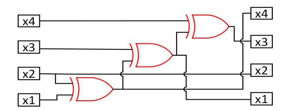

## **Designing Optimal Implementations of Linear Layers (Full Version)**

Ruoxin Zhao<sup>1</sup>*,*<sup>2</sup> , Baofeng Wu<sup>1</sup> , Rui Zhang<sup>1</sup>*,*<sup>2</sup> and Qian Zhang<sup>1</sup>

> <sup>1</sup> State Key Laboratory of Information Security, Institute of Information Engineering, Chinese Academy of Sciences [zhaoruoxin@iie.ac.cn](mailto:zhaoruoxin@iie.ac.cn)

**Abstract.** Linear layer is a fundamental primitive for many aspects of information technology. For information security, the performance of a linear layer depends on two aspects: diffusion ability and implementation cost, where the latter is usually measured by the number of XORs required to implement it. For many years, linear layers have been implemented by computing co-ordinates of the output independently. With this method, costs are determined only by the matrices representing linear layers. However, we note that the implementation cost of a given linear layer depends not only on its matrix but also on its implementation methods. So, in this paper, we focus on another implementation method: modifying input vectors to output step by step. This method uses fewer XORs than previous methods do and makes the implementation cost of every linear layer same as that of its inverse. With the new implementation method, we first clarify the measurement of implementation cost and the optimal implementation procedure of invertible linear layers. Here, "optimal" means using fewest XORs. Then, to find the optimal implementation procedure of a given invertible linear layer, we construct a graph-theoretical model and transfer the problem to the shortest path problem in graph theory. Next, we construct a new "double-direction" algorithm that uses less storage and makes the search for a shortest path more efficient in a regular graph. However, this algorithm is not practical enough for heavyweight invertible linear layers because of its high space/time complexity. So, we present another algorithm for finding efficient implementations of invertible linear layers. The advantages of this algorithm are its low complexity and high practicality. By this algorithm, we design highly efficient implementations of the linear layers of AES. To handle more general linear layers, we finally construct a practical algorithm for finding efficient implementations of singular linear layers.

**Keywords:** Linear Layer · XOR Count · Equivalence Relation · Regular Graph · The Shortest Path

## **1 Introduction**

Linear layer is a fundamental primitive for cryptography and is widely used in many aspects of computer science, electronic engineering and telecommunication. For example, it is used as diffusion layer in cryptography. Most modern block ciphers and hash functions are composed by confusion layers and diffusion layers. From the viewpoint of mathematics, confusion layers are usually nonlinear functions (S-boxes) while diffusion layers are usually linear functions. The goal of confusion layers is to increase chaos of information. And the goal of diffusion layers is to spread the chaos caused by confusion layers as much as possible. The performance of a linear layer depends on two aspects: diffusion ability and

<sup>2</sup> University of Chinese Academy of Sciences

implementation efficiency. In general, these two aspects often contradict. In other words, the higher its diffusion ability is, the lower its implementation efficiency is. So, finding proper tradeoffs is a challenge for designers.

Efficient hardware implementation draws more and more attention in recent years. Implementation efficiency on hardware depends on several factors including running time, area, and power consumption. In most cases, these factors restrict mutually. So, "optimal implementation" has different meanings under different circumstances. For example, there are many lightweight equipments such as a variety of sensors in internet of things (IoT). Consequently, area of circuits naturally becomes the primary factor when designing them.

Essentially, linear layers are  $\mathbb{F}_q$ -linear transformations over  $(\mathbb{F}_q)^n$ . We only concern about q as powers of 2 since they are almost all the cases in computer science. According to correspondence between linear transformations and matrices, every  $\mathbb{F}_q$ -linear layer can be represented by a matrix over  $\mathbb{F}_q$ . And this representation is unique under a fixed basis of  $(\mathbb{F}_q)^n$ . Some linear layers are just matrices over  $\mathbb{F}_2$ , such as the candidates presented in [10, 13, 8]. They are very convenient for implementation. However, there are also many linear layers over the extension fields of  $\mathbb{F}_2$ , such as the candidates presented in [4, 1, 9, 12]. A typical example of this type is the linear layers used in AES. They are  $(4 \times 4)$  matrices over  $\mathbb{F}_{2^8}$ . Note that multiplying a fixed element in  $\mathbb{F}_{2^m}$  is actually an  $\mathbb{F}_2$ -linear transformation over  $(\mathbb{F}_2)^m$  and can be represented by an  $(m \times m)$  matrix over  $\mathbb{F}_2$ . So, an  $\mathbb{F}_{2^m}$ -linear layer over  $(\mathbb{F}_{2^m})^n$  is essentially an  $\mathbb{F}_2$ -linear transformation over  $(\mathbb{F}_2)^{mn}$  and can be represented by an  $(mn \times mn)$  matrix over  $\mathbb{F}_2$ . Hence, matrices over  $\mathbb{F}_2$  are generic forms for linear layers.

Because every linear layer can be represented by a matrix over  $\mathbb{F}_2$  and every element in  $\mathbb{F}_{2^m}$  is represented by a bit string in computers, the number of bit-operations required for implementing linear layers naturally becomes the measurement of implementation cost of them. In this work, we concentrate on how to implement a given linear layer with as few XORs as possible.

#### 1.1 Related Work

As we mentioned above, the implementation efficiency of a linear layer is measured by the number of XORs needed to implement it. For an invertible  $n \times n$  matrix L over  $\mathbb{F}_2$ and an input column vector X, LX is usually implemented by computing the co-ordinates independently. For example, the first co-ordinate of LX is computed as the product of the first row of L and X. Consequently, the number of XORs of L is naturally considered to be the difference between the Hamming weight of L and the its order n. However, if a linear layer L' is an invertible  $n \times n$  matrix over  $\mathbb{F}_{2^m}$ , counting its number of XORs is a little complicated. In [12], the authors investigated this case in details. They formally defined the XOR counts of elements in  $\mathbb{F}_{2^m}$  which is closely relevant to the computational pattern over  $\mathbb{F}_{2^m}$ , or more specifically, the basis of  $\mathbb{F}_{2^m}$ . Then, the XOR count of L' is the sum of XOR counts of all entries of L' plus mn(n-1). In fact, according to our statement above, L' can be alternatively represented by an  $(mn \times mn)$  matrix L'' over  $\mathbb{F}_2$  once we fix an  $\mathbb{F}_2$ -basis of  $\mathbb{F}_{2^m}$ . From this viewpoint, the XOR count of L' defined in [12] is exactly the number of XORs needed to implement the  $(mn \times mn)$  matrix L'', namely, the difference between the Hamming weight of L'' and its order mn. Later, some papers ([11, 9, 8]) about linear layers adopted the essentially same measurement of implementation cost as in [12]. Here we point out that all those papers have identical essence: computing the co-ordinates of outputs of a linear layer independently. Thus, the implementation cost of linear layers in those papers is only related to their matrices over  $\mathbb{F}_2$  once bases are fixed.

In recent years, a new notion of implementation cost of linear layers were presented by Jean, Peyrin, and Sim ([7]). Later, Beierle, Kranz, and Leander ([1]) presented a measurement of implementation cost of multiplication with a fixed element in finite field  $\mathbb{F}_{2^m}$  and constructed a series of lightweight maximum distance separable (MDS) linear

layers. In brief, their new measurement originally came from an implementation method different from previous ones. And this new one can indeed save XORs in comparison with previous methods.

### **1.2 Our Contributions**

In this work, our goal is to find the optimal implementation for any given linear layer. Here, "optimal" means using fewest XORs. To attain the goal, we investigate the relation between implementation cost and implementation procedure. From the investigation, we present a generic measurement for implementation cost of linear layers. After that, we construct a graph-theoretical model and transfer the main problem to the shortest path problem in graph theory. Then, we construct a particular algorithm that is very proper to solve the particular shortest path problem related to invertible linear layers. However, this algorithm for finding optimal implementations of linear layers is not practical enough because of its high space/time complexity. So, we construct another practical algorithm with very low space/time complexity for finding efficient implementations of invertible linear layers, although we cannot guarantee that it necessarily gives optimal implementations. To handle more general linear layers, we finally present a highly practical algorithm for finding efficient implementations of singular linear layers.

In Section 3, we firstly investigate the effect of different implementation procedures for implementation cost of invertible linear layers. Briefly, we compare two implementation strategies: computing the co-ordinates of output vectors independently and modifying the input vectors to output step by step (MIOSS). The former is straightforward and has been used for years. However, the latter requires fewer XORs. Therefore, we focus on the latter one. From the investigation, we present a reasonable measurement of implementation cost of a invertible linear layer *L*: the minimum number of additive elementary matrices in *L*'s factorization of the form *P*1*A*<sup>1</sup> · · · *PsAsPs*+1 where every *P<sup>i</sup>* is a permutation matrix and every *A<sup>j</sup>* is an additive elementary matrix. Then, we give some properties that make our measurement more flexible.

In Section 4, we firstly give an equivalence relation over all invertible linear layers of order *n* over F2. Based on this equivalence relation, we construct a graph whose vertices are all the equivalence classes. Then we show finding an optimal implementation of a given invertible linear layer *L* is essentially same as finding a shortest path between the vertex containing *L* and the vertex containing the identity matrix *In*.

In Section 5, our main goal is to solve the shortest path problem in the graph defined in Section 4. Although there has already been "single-direction" methods (Dijkstra's algorithm, for example) for the shortest path problem, we abandon them and construct a "double-direction" algorithm. That is because the graph that we are talking about is a regular graph, and our double-direction algorithm uses less storage and makes the search for a shortest path more efficient in a regular graph. With our algorithm, we perform experiments to some linear layers and obtain good results.

Although the algorithm in Section 5 can give us optimal implementations, it is not practical enough for heavyweight invertible linear layers because of its high space/time complexity. To solve this problem, we present another algorithm in Section 6. An important advantage of this algorithm is that its space/time complexity is incredibly low. On the other hand, we have to admit that it does not necessarily give us optimal implementations of linear layers. As an application, we investigate the linear layers of AES with the algorithm and get implementations much more efficient than before.

In above sections, we talked about minimum-XOR-implementations and efficient implementations of invertible linear layers. However, we are confronted with singular (even not square) matrices sometimes. So, in Section 7, we pay attention to singular linear layers and construct a highly practical algorithm for finding efficient implementations of singular linear layers.

## **2 Preliminary**

## **2.1 Notations**

In this paper, F*<sup>q</sup>* or *GF*(*q*) denotes the finite field of *q* elements. M*m*×*n*(*R*) denotes the set consisting of all (*m* × *n*) matrices over a ring *R*, IM*n*×*n*(*R*) denotes the set consisting of all (*n* × *n*) invertible matrices over a ring *R*, PM*n*×*n*(*R*) denotes the set consisting of all (*n* × *n*) permutation matrices over a ring *R*, EEM*n*×*n*(*R*) denotes the set consisting of all (*n* × *n*) exchanging elementary matrices over a ring *R*, MEM*n*×*n*(*R*) denotes the set consisting of all (*n*×*n*) multiplicative elementary matrices over a ring *R*, and AEM*n*×*n*(*R*) denotes the set consisting of all (*n* × *n*) additive elementary matrices over a ring *R*. For a matrix *A*, *A<sup>T</sup>* denotes the transpose of *A* and *WH*(*A*) denotes the Hamming weight (the number of nonzero entries) of *A*. *Ei,j* denotes the matrix whose (*i, j*)th entry is 1 and other entries are 0. *I<sup>n</sup>* denotes the (*n* × *n*) identity matrix. For a set *S*, *]S* or |*S*| denotes the cardinality of *S*.

## **2.2 Some Basic Facts about Linear Algebra**

In this subsection, we review some basic facts about linear algebra. For more details, refer to [\[6\]](#page-20-5).

To begin with, let us talk about elementary operations to matrices. For every matrix *L* ∈ M*m*×*n*(*F*) where *F* is a field, there are three types of elementary row operations on it: row exchanging, row multiplication, and row addition. Row exchanging means exchanging tow rows of *L*. Row multiplication means multiplying every entries of a row by an invertible element of *F*. Row addition means adding a scalar-product of an element in *F* and a row to another row. In addition to elementary row operations, there are also three types of corresponding elementary column operations. All the elementary operations to matrices are invertible.

Corresponding to elementary operations, there are three types of elementary matrices: exchanging elementary matrices, multiplicative elementary matrices, and additive elementary matrices. An (*n* × *n*) exchanging elementary matrix is the matrix obtained by exchanging two rows of *In*. An (*n* × *n*) multiplicative elementary matrix is the matrix obtained from *I<sup>n</sup>* by substituting an invertible element in *F* for a 1 on the diagonal of *In*. An (*n* × *n*) additive elementary matrix *Ai,j* is the matrix *I<sup>n</sup>* + *aEi,j* where *a* ∈ *F* and *i* 6= *j*. For any matrix *L* ∈ M*m*×*n*(*F*), left-multiplying *L* by an (*m* × *m*) elementary matrix causes a corresponding elementary row operation to it, while right-multiplying *L* by an (*n* × *n*) elementary matrix causes a corresponding elementary column operation to it. A useful fact is that every elementary matrix is invertible. The inverse matrix of an exchanging elementary matrix is just itself. And the inverse matrix of an additive elementary matrix *Ai,j* = *I<sup>n</sup>* + *aEi,j* is *I<sup>n</sup>* − *aEi,j* .

Another type of matrices important for this paper is permutation matrix. An *n* × *n* permutation matrix is the matrix obtained from *I<sup>n</sup>* by permutes the rows of it. It is trivial that a matrix *P* ∈ M*n*×*n*(*F*) is a permutation matrix if and only if it is invertible and its entries are zero except *n* entries equal to 1. For any matrix *L* ∈ M*m*×*n*(*F*), left-multiplying *L* by an (*m* × *m*) permutation matrix permutes the rows of it, while right-multiplying *L* by an (*n* × *n*) permutation matrix permutes the columns of it. In this paper, we sometimes write a permutation matrix *P* ∈ M*n*×*n*(*F*) as a column (*ρ*(1)*,* · · · *, ρ*(*n*))*<sup>T</sup>* , where *ρ* is a permutation over the set *N* = {1*,* · · · *, n*} and *ρ*(*i*) is the column index of the nonzero entry in the *i*-th row of *P* for *i* = 1*,* · · · *, n*. For example, we write the permutation matrix

$$\left(\begin{array}{cccc} 0 & 0 & 1 & 0 \\ 0 & 0 & 0 & 1 \\ 0 & 1 & 0 & 0 \\ 1 & 0 & 0 & 0 \end{array}\right) = \left(\begin{array}{c} 3 \\ 4 \\ 2 \\ 1 \end{array}\right) = \left(\begin{array}{c} \rho(1) \\ \rho(2) \\ \rho(3) \\ \rho(4) \end{array}\right).$$

With this notation, if  $P = (\rho(1), \dots, \rho(n))^T$ , then  $P^{-1} = (\rho^{-1}(1), \dots, \rho^{-1}(n))^T$  is also a permutation matrix, and the *i*-th row of PL is the  $\rho(i)$ -th row of L.

## 2.3 Some Basic Facts about Graph Theory

In this subsection, we review some basic facts about graph theory. For more details, refer to [2, 5].

A graph G is composed of two types of objects. It has a set V of elements called vertices (or nodes) and a set of unordered pairs of vertices called edges. We denote the graph whose vertex set is V and edge set is E by G=(V,E). The cardinality of the vertex set V is called the order of the graph G. If  $\alpha=\{x,y\}$  is an edge of G, we say that  $\alpha$  joins x and y, x and y are adjacent, and x and  $\alpha$  are incident. The degree of a vertex x is a the number of edges that are incident with x and is denoted by  $\deg(x)$ . If the degree of every vertex of the graph G is r, we say G is an r-regular graph.

In a graph G = (V, E), a sequence of m edges of the form

$$\{x_0, x_1\}, \{x_1, x_2\}, \cdots, \{x_{m-1}, x_m\}$$

is called a walk of length m. We also denote it by  $x_0 - x_1 - \cdots - x_m$ . The walk  $x_0 - x_1 - \cdots - x_m$  is closed (open) if  $x_0 = x_m$  ( $x_0 \neq x_m$ ). If a walk has distinct edges, we call it a trail. In addition, if a trail has distinct vertices, we call it a path. A closed path is called a cycle. The distance between two vertices x and y is the shortest length of walks joining them and denoted by d(x,y). It is clear that a walk joining x and y of length d(x,y) is a path. We say two vertices x and y are connected if there exists a walk joining them. And we say a graph x is connected if every pair of vertices of x is connected.

## 2.4 Linear Layers

In general, an F-linear layer is an F-linear transformation over  $F^n$  for a field F. In this paper, we merely focus on fields of characteristic 2 because they are widely used in computer science and telecommunication.

Suppose L is an  $\mathbb{F}_q$ -linear layer over  $(\mathbb{F}_q)^n$ , where  $q=2^m$ . According to the correspondence between linear transformations and matrices, L can be uniquely represented by a matrix in  $\mathcal{M}_{n\times n}(\mathbb{F}_q)$  under a given  $\mathbb{F}_q$ -basis of  $(\mathbb{F}_q)^n$ . Let

$$L = \begin{pmatrix} \alpha_{1,1} & \alpha_{1,2} & \cdots & \alpha_{1,n} \\ \alpha_{2,1} & \alpha_{2,2} & \cdots & \alpha_{2,n} \\ \cdots & \cdots & \cdots & \cdots \\ \alpha_{n,1} & \alpha_{n,2} & \cdots & \alpha_{n,n} \end{pmatrix} \in \mathcal{M}_{n \times n}(\mathbb{F}_q).$$

Then for every input column  $X = (\boldsymbol{x}_1, \boldsymbol{x}_2, \cdots, \boldsymbol{x}_n)^T \in (\mathbb{F}_q)^n$ , the output is  $Y = LX = (\boldsymbol{y}_1, \boldsymbol{y}_2, \cdots, \boldsymbol{y}_n)^T \in (\mathbb{F}_q)^n$ , where  $\boldsymbol{y}_i = \sum_{j=1}^n \alpha_{i,j} \boldsymbol{x}_j$  for  $i = 1, \cdots, n$ . Note that being multiplied by a fixed element in  $\mathbb{F}_q$  is an  $\mathbb{F}_2$ -linear transformation over  $\mathbb{F}_q$  and can be uniquely represented by a matrix in  $\mathcal{M}_{m \times m}(\mathbb{F}_2)$  under a given  $\mathbb{F}_2$ -basis of  $\mathbb{F}_q$ . Therefore, L is essentially an  $\mathbb{F}_2$ -linear transformation over  $\mathbb{F}_2^{mn}$  and can be represented by a matrix

$$L = \begin{pmatrix} L_{1,1} & L_{1,2} & \cdots & L_{1,n} \\ L_{2,1} & L_{2,2} & \cdots & L_{2,n} \\ \cdots & \cdots & \cdots & \cdots \\ L_{n,1} & L_{n,2} & \cdots & L_{n,n} \end{pmatrix} \in \mathcal{M}_{mn \times mn}(\mathbb{F}_2),$$

where  $L_{i,j} \in \mathcal{M}_{m \times m}(\mathbb{F}_2)$  for  $i, j = 1, \dots, n$ . From this viewpoint, every  $\mathbb{F}_q$ -linear layer is essentially an  $\mathbb{F}_2$ -linear transformation and can be represented by a matrix over  $\mathbb{F}_2$ . That gives us a uniform pattern for linear layers.

## 3 Measurement of Implementation Costs of Linear Layers

In this section, we clarify how to measure the implementation costs of linear layers. As we mentioned above, considering invertible linear layers over GF(2) suffices.

In general, the implementation cost of a given linear layer L over GF(2) is measured by the number of additions (XORs) required to compute the output vector LX for input X. In [12], the authors formally presented a measurement of the number of XORs (XORcount) of elements in  $GF(2^m)$  as well as of whole diffusion layers. Later, some papers ([11, 9, 8]) adopted that measurement. We know that multiplication with a given element in  $GF(2^m)$  can be represented by an  $\mathbb{F}_2$ -linear transformation over  $\mathbb{F}_2^m$ , namely, a matrix L in  $\mathcal{M}_{m\times m}(\mathbb{F}_2)$ . From this viewpoint, their measurement XOR-count is exactly  $W_H(L)-m$  since co-ordinates of output vector are computed independently. In fact, this notion has been used for years. However, the implementation cost of a given linear layer depends not only on the linear layer itself but also on ways by which we implement it. To show the effect of different implementation methods on implementation costs, we at first give Example 1.

#### <span id="page-5-0"></span>Example 1. Suppose

$$L = \begin{pmatrix} 1 & 1 & 1 & 0 \\ 0 & 1 & 0 & 0 \\ 1 & 1 & 1 & 1 \\ 1 & 1 & 0 & 0 \end{pmatrix} \in \mathcal{IM}_{4 \times 4}(\mathbb{F}_2)$$

is a linear transformation over  $\mathbb{F}_2^4$ . Then for every input vector  $X = (x_1, x_2, x_3, x_4)^T \in GF(2)^4$ , the corresponding output is

$$Y = LX = \begin{pmatrix} x_1 + x_2 + x_3 \\ x_2 \\ x_1 + x_2 + x_3 + x_4 \\ x_1 + x_2 \end{pmatrix}.$$

<span id="page-5-1"></span>We may compute Y with a common method that has been used for years. That is, we compute the co-ordinates of Y independently. In this case, it requires  $W_H(L) - 4 = 6$  additions (XORs) over GF(2). However, we can adopt another method to compute Y – modifying the input X to the output LX step by step as Figure 1. In Figure 1, we

$$(1) \begin{bmatrix} x_{1} + & & & & \\ x_{2} & & & \\ x_{3} & & & \\ x_{4} \end{bmatrix}; (2) \begin{bmatrix} x_{1} + x_{2} & & & \\ x_{2} & & & \\ x_{3} + & & & \\ x_{4} + & & & \\ \end{bmatrix}; (3) \begin{bmatrix} x_{1} + x_{2} & & & \\ x_{2} & & & \\ x_{1} + x_{2} + x_{3} & & \\ x_{4} + & & & \\ \end{bmatrix}; (4) \begin{bmatrix} x_{1} + x_{2} & & & \\ x_{1} + x_{2} + x_{3} & & \\ x_{1} + x_{2} + x_{3} & & \\ x_{1} + x_{2} + x_{3} + x_{4} \end{bmatrix} = LX.$$

Figure 1: Modifying input to output step by step (MIOSS)

compute LX through a series of operations on the co-ordinates of X. These operations can be easily implemented on programmable hardware (ASIC or FPGA, for instance). Step (1) adds  $x_2$  to  $x_1$  and remain  $x_2, x_3, x_4$ . So, its delay is  $T_X$ . Likewise, step (2) and step (3) costs  $T_X$  delay, respectively. Note that step (2) requires only  $T_X$  delay but not  $2T_X$  delays because  $x_1 + x_2$  has been already computed on preceding steps and saved in the

<span id="page-6-0"></span>

**Figure 2:** Implementing Example 1 by MIOSS in one clock cycle

register. Step (4) does not cost any delay because it is merely performed by twisting wires. Although we illustrate the procedure by four steps, it can actually be implemented in one clock cycle as Figure 2. Regardless of 4 clock cycles or 1 clock cycle, the whole procedure of the second method uses 3 XORs. It is quite fewer than 6 XORs of the first method. In form of matrices, we can express the second method as  $LX = PA_{4,3}A_{3,1}A_{1,2}X$ , where each  $A_{i,j} = I_4 + E_{i,j}$  and  $P = (\rho(1), \rho(2), \rho(3), \rho(4))^T = (3, 2, 4, 1)^T$ .

Computing every co-ordinate independently is indeed easy to implement and has been used for years. However, it is not necessarily the optimal implementation according to Example 1. Here, "optimal" means "using fewest XORs". To find the optimal implementations of linear layers, we must take implementation procedures into account. Let us give a lemma at first.

<span id="page-6-1"></span>**Lemma 1.** Suppose  $L \in \mathcal{IM}_{n \times n}(\mathbb{F}_2)$ . Then there exists a series of matrices  $P_i \in \mathcal{PM}_{n \times n}(\mathbb{F}_2)$  and  $A_j \in \mathcal{AEM}_{n \times n}(\mathbb{F}_2)$  such that  $L = P_1 A_1 P_2 A_2 \cdots P_s A_s P_{s+1}$ .

Proof. As we know, L can be transformed to its equivalent standard form through a series of elementary row/column operations. L's equivalent standard form is  $I_n \in \mathcal{IM}_{n \times n}(\mathbb{F}_2)$  because L is invertible. According to the invertibility of elementary operations,  $I_n$  can be transformed to L through a series of elementary row/column operations. So, L is equal to the product of a series of elementary matrices. Note that multiplicative elementary matrix over GF(2) is just  $I_n$  and can be omitted from the product. Besides, the product of some exchanging elementary matrices with order n is a permutation matrix. Thus, L is equal to the form  $P_1A_1P_2A_2\cdots P_sA_sP_{s+1}$ , where  $P_i \in \mathcal{PM}_{n \times n}(\mathbb{F}_2)$  for  $i=1,\cdots,s,$   $A_j \in \mathcal{AEM}_{n \times n}(\mathbb{F}_2)$  for  $j=1,\cdots,s+1$ .

In accordance with Lemma 1, for every linear layer  $L \in \mathcal{IM}_{n \times n}(\mathbb{F}_2)$  and input vector  $X = (x_1, \cdots, x_n)^T \in \mathbb{F}_2^n$ , the output vector is  $LX = P_1A_1P_2A_2\cdots P_sA_sP_{s+1}X$  which means we can get the output vector through a series of co-ordinate permutations or additive elementary operations. On the contrary, every modification procedure from X to LX can be expressed by the form  $P_1A_1P_2A_2\cdots P_sA_sP_{s+1}X$  as in Example 1. Note that for implementation of  $P_1A_1P_2A_2\cdots P_sA_sP_{s+1}X$ , left-multiplying every  $P_j$  costs 0 XOR while left-multiplying every  $A_i$  costs 1 XOR. In detail, for a column vector  $X = (x_1, \cdots, x_n)^T$  in  $\mathbb{F}_2^n$  and a permutation matrix  $P = (\rho(1), \cdots, \rho(n))^T$  where  $\rho(i)$  denotes the column index of nonzero entry in the i-th row of P,

$$PX = (x_{\rho(1)}, x_{\rho(2)}, \cdots, x_{\rho(n)}).$$

For a column vector  $X = (x_1, \dots, x_n)^T$  in  $\mathbb{F}_2^n$  and an additive elementary matrix  $A_{i,j} = E_{i,j} + I_n$  in  $\mathcal{AEM}_{n \times n}(\mathbb{F}_2)$ , left-multiplying X by  $A_{i,j}$  will add the j-th row of X to its i-th row. Therefore, L's factorization  $P_1A_1P_2A_2\cdots P_sA_sP_{s+1}$  in Lemma 1 indicates the number of XORs used for its implementation. Now we can give the following definition.

<span id="page-6-2"></span>**Definition 1.** For a linear layer  $L \in \mathcal{IM}_{n \times n}(\mathbb{F}_2)$ , its minimum XOR-count Min-XOR-Count(L) is the minimum number of additive elementary matrices  $A_i$  such that L can be

written as form  $P_1A_1P_2A_2\cdots P_sA_sP_{s+1}$ , where every  $P_i\in\mathcal{PM}_{n\times n}(\mathbb{F}_2)$  and every  $A_j\in\mathcal{AEM}_{n\times n}(\mathbb{F}_2)$ . And we call an implementation procedure  $LX=P_1A_1P_2A_2\cdots P_rA_rP_{r+1}X$  containing Min-XOR-Count(L) additive elementary matrices a minimum-XOR-implementation of L.

In addition to Definition 1, we have other ways to describe the optimal implementation procedures of linear layers. To clarify those ways, we need the following lemma.

<span id="page-7-0"></span>**Lemma 2.** Suppose
$$P = (\rho(1), \dots, \rho(n))^T \in \mathcal{PM}_{n \times n}(\mathbb{F}_2)$$
,  $A_{r,s} = I_n + E_{r,s} \in \mathcal{AEM}_{n \times n}(\mathbb{F}_2)$ . Then  $PA_{r,s} = A_{\rho^{-1}(r),\rho^{-1}(s)}P$  where  $A_{\rho^{-1}(r),\rho^{-1}(s)} = I_n + E_{\rho^{-1}(r),\rho^{-1}(s)} \in \mathcal{AEM}_{n \times n}(\mathbb{F}_2)$ .

Proof. As we mentioned before, left-multiplying P permutes the rows of  $A_{r,s}$ . In detail, the i-th row of  $PA_{r,s}$  is the  $\rho(i)$ -th row of  $A_{r,s}$ . So, the  $\rho^{-1}(r)$ -th row of  $PA_{r,s}$  is the r-th row of  $A_{r,s}$ , and the  $\rho^{-1}(s)$ -th row of  $PA_{r,s}$  is the s-th row of  $A_{r,s}$ . Obviously,  $PA_{r,s}$  will become P if we add  $\rho^{-1}(s)$ -th row of  $PA_{r,s}$  to  $\rho^{-1}(r)$ -th row of it. Thus,  $A_{\rho^{-1}(r),\rho^{-1}(s)}PA_{r,s} = P$ . Then we get  $PA_{r,s} = (A_{\rho^{-1}(r),\rho^{-1}(s)})^{-1}P = A_{\rho^{-1}(r),\rho^{-1}(s)}P$  since  $(A_{\rho^{-1}(r),\rho^{-1}(s)})^{-1} = A_{\rho^{-1}(r),\rho^{-1}(s)}$ .

Combining Lemma 1 and Lemma 2, we get the next lemma easily. We omit its proof because it is really trivial.

<span id="page-7-1"></span>**Lemma 3.** Every  $L \in \mathcal{IM}_{n \times n}(\mathbb{F}_2)$  can be factorized to the form  $L = \prod_{i=1}^s B_i$  where every  $B_i$  is either in  $\mathcal{PM}_{n \times n}(\mathbb{F}_2)$  or in  $\mathcal{AEM}_{n \times n}(\mathbb{F}_2)$ .

We call every factorization of L as the form in Lemma 3 a P-AE factorization of it. Obviously, the factorization form in Lemma 1 is a P-AE factorization. On the contrary, every P-AE factorization can be written as the form in Lemma 1 since identity matrix is also a permutation matrix, and the product of permutation matrices in  $\mathcal{PM}_{n\times n}(\mathbb{F}_2)$  is a permutation matrix too. Therefore, the minimum XOR count of a given linear layer  $L \in \mathcal{IM}_{n\times n}(\mathbb{F}_2)$  is exactly equal to the minimum number of additive elementary matrices in L's P-AE factorizations. In summary of this paragraph, we present the following theorem.

**Theorem 1.** For every linear layer  $L \in \mathcal{IM}_{n \times n}(\mathbb{F}_2)$ , Min - XOR - Count(L) is equal to the minimum number of additive elementary matrices in L's P-AE factorizations.

In [1], the authors measured the lowest implementation cost (it is called XOR count in [1]) of a linear layer  $L \in \mathcal{IM}_{n \times n}(\mathbb{F}_2)$  by the minimum number t such that L can be written as  $L = P \prod_{i=1}^t A_i$  where  $P \in \mathcal{PM}_{n \times n}(\mathbb{F}_2)$  and every  $A_i \in \mathcal{AEM}_{n \times n}(\mathbb{F}_2)$ . It is easy to see that every factorization of the form  $L = P \prod_{i=1}^t A_i$  corresponds to a factorization of the form in Definition 1 according to Lemma 2. So, our definition of Min-XOR-count does not contradict theirs. We shall indicate the advantage of our definition later.

Because a linear layer is often used bidirectionally (for example encryption and decryption), we also need to consider the inverse of it.

**Theorem 2.** For every linear layer  $L \in \mathcal{IM}_{n \times n}(\mathbb{F}_2)$ ,  $Min - XOR - Count(L^{-1})$  is equal to Min - XOR - Count(L). Moreover, if a minimum-XOR-implementation of L is  $P_1A_1P_2A_2\cdots P_rA_rP_{r+1}$ , then  $P_{r+1}^{-1}A_rP_r^{-1}\cdots A_1P_1^{-1}$  is a minimum-XOR-implementation of  $L^{-1}$ .

*Proof.* Suppose a factorization  $L=Q_1B_1\cdots Q_sB_sQ_{s+1}$  is a minimum-XOR-implementation of L, where each  $Q_i\in\mathcal{PM}_{n\times n}(\mathbb{F}_2)$  and each  $B_j\in\mathcal{AEM}_{n\times n}(\mathbb{F}_2)$ . Then we have a factorization  $L^{-1}=Q_{s+1}^{-1}B_s^{-1}Q_s^{-1}\cdots B_1^{-1}Q_1^{-1}$  of  $L^{-1}$ . Note that the inverse of a permutation matrix is a permutation too, and the inverse of each additive elementary matrix  $B_j$  is just  $B_j$  itself. Thus,

$$Min - XOR - Count(L) \ge Min - XOR - Count(L^{-1}).$$

Likewise, we can get

$$Min - XOR - Count(L^{-1}) \ge Min - XOR - Count(L).$$

So,  $Min - XOR - Count(L^{-1})$  is equal to Min - XOR - Count(L). And the second part of the theorem is trivial.

At the end of this section, we point out that if a linear layer L' is a power of another linear layer L, for example  $L'=L^5$ , then minimum-XOR-implementation of L' is better successive 5 times minimum-XOR-implementations of L. That is because successive 5 times minimum-XOR-implementations of L is merely an implementation procedure of L' and it cannot perform better than minimum-XOR-implementation of L'. Consequently, if  $L'=L^r$ , then  $Min-XOR-Count(L') \leq rMin-XOR-Count(L)$ .

## 4 A Graph-Theoretical Model

After clarifying the measurement of the lowest implementation cost of linear layers, we are confronted by two problems:

- 1. How to calculate the Min-XOR-Count of a given linear layer  $L \in \mathcal{IM}_{n \times n}(\mathbb{F}_2)$ ;
- 2. How to get a minimum-XOR-implementation of a given linear layer  $L \in \mathcal{IM}_{n \times n}(\mathbb{F}_2)$ .

Obviously, the 1st problem will be trivial provided that we solve the 2nd one. In this section, we would like to handle the two problems by a graph-theoretical model.

First of all, we introduce a relation over  $\mathcal{IM}_{n\times n}(\mathbb{F}_2)$ . We say two matrices  $B,C\in\mathcal{IM}_{n\times n}(\mathbb{F}_2)$  are row-permutation-equivalent (denoted by  $B\sim_{RP}C$ ) if there exists a  $Q\in\mathcal{PM}_{n\times n}(\mathbb{F}_2)$  such that B=QC. For every  $B\in\mathcal{IM}_{n\times n}(\mathbb{F}_2)$ ,  $B\sim_{RP}B$  since  $B=I_nB$ . If  $B\sim_{RP}C$ , then  $C\sim_{RP}B$  because  $C=Q^{-1}B$  and  $Q^{-1}\in\mathcal{PM}_{n\times n}(\mathbb{F}_2)$  too. If there exists  $Q_1,Q_2\in\mathcal{PM}_{n\times n}(\mathbb{F}_2)$  such that  $B=Q_1C$  and  $C=Q_2D$ , then  $B=Q_1Q_2D$  and  $Q_1Q_2\in\mathcal{PM}_{n\times n}(\mathbb{F}_2)$ . Therefore, " $\sim_{RP}$ " is an equivalence relation over  $\mathcal{IM}_{n\times n}(\mathbb{F}_2)$ . For every  $B\in\mathcal{IM}_{n\times n}(\mathbb{F}_2)$ , let  $[B]_{RP}$  denote the equivalence class containing B under " $\sim_{RP}$ ". It is easy to see that for every  $B\in\mathcal{IM}_{n\times n}(\mathbb{F}_2)$ ,  $[B]_{RP}=\{QB|Q\in\mathcal{PM}_{n\times n}(\mathbb{F}_2)\}$ , and  $Q_1B\neq Q_2B$  if  $Q_1\neq Q_2$ .

Next, we define a graph dependent on row-permutation-equivalence over  $\mathcal{IM}_{n\times n}(\mathbb{F}_2)$ .

<span id="page-8-0"></span>**Definition 2.** For a positive integer n, let G(n) = (V, E) be a graph where the vertex set consists of all the equivalence classes under row-permutation-equivalence relation over  $\mathcal{IM}_{n\times n}(\mathbb{F}_2)$ . And two vertices  $[B]_{RP}$  and  $[C]_{RP}$  are adjacent if there exists  $B' \in [B]_{RP}$ ,  $C' \in [C]_{RP}$  and  $A \in \mathcal{AEM}_{n\times n}(\mathbb{F}_2)$  such that B' = AC'.

Now let us show some useful properties of the graph in Definition 2.

<span id="page-8-1"></span>**Theorem 3.** Let G(n) = (V, E) be the graph described in Definition 2 and  $[B]_{RP}$  be a vertex of G(n). Then G(n) is an  $(n^2 - n)$ -regular graph,  $[A_1B]_{RP} \neq [A_2B]_{RP}$  for distinct  $A_1, A_2 \in \mathcal{AEM}_{n \times n}(\mathbb{F}_2)$ , and  $[AB]_{RP}$  runs all the vertices adjacent to  $[B]_{RP}$  when A runs over  $\mathcal{AEM}_{n \times n}(\mathbb{F}_2)$ .

*Proof.* If  $[A_1B]_{RP} = [A_2B]_{RP}$ , then  $A_1B = PA_2B$  for some  $P \in \mathcal{PM}_{n \times n}(\mathbb{F}_2)$ . Consequently, we get  $A_1 = PA_2$  by right-multiplying two sides of  $A_1B = PA_2B$  by  $B^{-1}$ . We assert that P must be  $I_n$ . Otherwise, some entries on the diagonal of  $PA_2$  would be 0 and  $PA_2$  cannot be equal to  $A_1$ . Then  $A_1 = A_2$ . So,  $[A_1B]_{RP} \neq [A_2B]_{RP}$  for distinct  $A_1, A_2 \in \mathcal{AEM}_{n \times n}(\mathbb{F}_2)$ .

On the other hand, if a vertex  $[C]_{RP}$  is adjacent to  $[B]_{RP}$ , there exists  $B' \in [B]_{RP}$ ,  $C' \in [C]_{RP}$  and  $A \in \mathcal{AEM}_{n \times n}(\mathbb{F}_2)$  such that B' = AC'. Then AB' = C' since  $A^{-1} = A$ .

Consequently, there exists  $P_2 \in \mathcal{PM}_{n \times n}(\mathbb{F}_2)$  and  $A' \in \mathcal{AEM}_{n \times n}(\mathbb{F}_2)$  such that  $C' = AB' = AP_1B = P_2A'B$  according to Lemma 2. So,  $[C]_{RP} = [C']_{RP} = [P_2A'B]_{RP} = [A'B]_{RP}$ . That shows  $[AB]_{RP}$  runs all the vertices adjacent to  $[B]_{RP}$  when A runs over  $\mathcal{AEM}_{n \times n}(\mathbb{F}_2)$ .

In summary of two preceding paragraphs, the degree of every vertex of G(n) is the cardinality of  $\mathcal{AEM}_{n\times n}(\mathbb{F}_2)$ , namely,  $n^2-n$ .

Finally, we present a significant theorem that explains why we set up the graph-theoretical model.

<span id="page-9-0"></span>**Theorem 4.** Let G(n) = (V, E) be the graph described in Definition 2 and  $L \in \mathcal{IM}_{n \times n}(\mathbb{F}_2)$ . Then the minimum XOR-count of L is equal to the distance between vertices  $[L]_{RP}$  and  $[I_n]_{RP}$  in G(n).

*Proof.* For every factorization of L with the form  $P_1A_1P_2A_2\cdots P_sA_sP_{s+1}$ , where every  $P_i \in \mathcal{PM}_{n\times n}(\mathbb{F}_2)$  and every  $A_j \in \mathcal{AEM}_{n\times n}(\mathbb{F}_2)$ , there exists a path

$$[L]_{RP} = [P_1 A_1 P_2 A_2 \cdots P_s A_s P_{s+1}]_{RP} - [P_2 A_2 \cdots P_s A_s P_{s+1}]_{RP} - \cdots - [P_s A_s P_{s+1}]_{RP} - [P_{s+1}]_{RP} = [I_n]_{RP}$$

between  $[L]_{RP}$  and  $[I_n]_{RP}$  of length s.

On the other hand, for every path

$$[L]_{RP} - [L_{r-1}]_{RP} - \dots - [L_2]_{RP} - [L_1]_{RP} - [I_n]_{RP}$$

of length r, according to Theorem 3, there must be  $L=Q_{r-1}A_{r-1}L_{r-1}$ ,  $L_j=Q_{j-1}A_{j-1}L_{j-1}$  for  $j=2,\cdots,r-1$ , and  $L_1=Q_0A_0I_n$  for some  $Q_i\in\mathcal{PM}_{n\times n}(\mathbb{F}_2)$  and  $A_i\in\mathcal{AEM}_{n\times n}(\mathbb{F}_2)$  for  $i=0,1,\cdots,r$ . Consequently,  $L=Q_{r-1}A_{r-1}\cdots Q_1A_1Q_0A_0I_n$  which is a factorization of L with the form in Lemma 1.

Therefore, the minimum XOR-count of L is equal to the minimum length of paths between  $[L]_{RP}$  and  $[I_n]_{RP}$ , namely, their distance.

From the proof of Theorem 4, we can easily see that a shortest path between  $[L]_{RP}$  and  $[I_n]_{RP}$  indicates a minimum-XOR-implementation of L.

# 5 Searching for Optimal Implementations of Invertible Linear Layers

In this section, we talk about how to get a minimum-XOR-implementation of a given linear layer  $L \in \mathcal{IM}_{n \times n}(\mathbb{F}_2)$ . In accordance with the preceding section, this question is equivalent to finding a shortest path between  $[L]_{RP}$  and  $[I_n]_{RP}$ .

Let us sketch our strategy firstly. Suppose G(V, E) is a connected graph,  $a, b \in V$ . To find a shortest path between a and b, we let  $\mathcal{A}_0 = \{a\}$ ,  $\mathcal{B}_0 = \{b\}$  and check whether a = b. If a = b, we do not have to do anything. If  $a \neq b$ , we construct a set  $\mathcal{A}_1$  consisting of the vertices of G that are adjacent to a. In other words,  $\mathcal{A}_1$  consists of the vertices having distance 1 from a. Then we check whether there exists  $x \in \mathcal{A}_1$  such that x = b. If there is, we get a shortest path a - b between a and b. If there is not, we construct a set  $\mathcal{B}_1$  consisting of the vertices of G that are adjacent to b. In other words,  $\mathcal{B}_1$  consists of the vertices having distance 1 from b. Then we check whether there exists  $x \in \mathcal{A}_1$  and  $y \in \mathcal{B}_1$  such that x = y. If there is, we get a shortest path  $a - a_1^* - b$  between a and b where  $a_1^* \in \mathcal{A}_1$ . If there is not, we proceed the procedure above: check and move forwards one step from  $\mathcal{A}_i$ , then check and move forwards one step from  $\mathcal{B}_i$ . Finally, we will find

 $x \in \mathcal{A}_{k+1}$  and  $y \in \mathcal{B}_{k+1}$  (or  $y \in \mathcal{B}_k$ ) for some k such that x = y. As a result, we find a shortest path

```
a - a_1^* - \dots - a_k^* - a_{k+1}^* - b_k^* - \dots - b_1^* - b  (or a - a_1^* - \dots - a_k^* - b_k^* - \dots - b_1^* - b)
```

between a and b, where  $a_i^* \in \mathcal{A}_i$ ,  $b_i^* \in \mathcal{B}_i$ , every pair  $a_i^*$ ,  $a_{i+1}^*$  and every pair  $b_j^*$ ,  $b_{j+1}^*$  are adjacent. We formally describe the above procedures in Algorithm 1 with pseudocode.

#### <span id="page-10-0"></span>Algorithm 1 Double-Direction Search for a Shortest Path

```
Require: a graph G = (V, E), a, b \in V.
Ensure: a shortest path between a and b.
   \mathcal{A}_0 \leftarrow \{a\}, \, \mathcal{B}_0 \leftarrow \{b\}, \, i \leftarrow 0, \, j \leftarrow 0, \, link \leftarrow 0;
   while link = 0 do
       if there exists a_i^* \in \mathcal{A}_i and b_i^* \in \mathcal{B}_j such that a_i^* = b_i^* then
           link \leftarrow 1:
           continue:
       else
           i \leftarrow i + 1;
           construct a set A_i consisting of the vertices adjacent to some vertex in A_{i-1} and not in \bigcup_{k=0}^{i-1} A_k;
       if there exists a_i^* \in \mathcal{A}_i and b_i^* \in \mathcal{B}_j such that a_i^* = b_i^* then
           continue;
       واحو
           j \leftarrow j + 1;
           construct a set \mathcal{B}_j consisting of the vertices adjacent to some vertex in \mathcal{B}_{j-1} and not in \bigcup_{k=0}^{j-1} \mathcal{B}_k;
       end if
   end while
   return the path a_0^* - \cdots - a_i^* - b_{i-1}^* - \cdots - b_0^* such that every pair a_k^*, a_{k+1} and every pair b_l^*, b_{l+1}^*
   are adjacent;
```

**Lemma 4.** Suppose G = (V, E) is a graph,  $a, b \in V$ . Then we get a shortest path between a and b with Algorithm 1.

*Proof.* Assume there is a path  $a-c_1-\cdots-c_{r-1}-b$  shorter than the output of Algorithm 1. Then  $c_k \in \mathcal{A}_k$  for  $k=1,\cdots,\lceil\frac{r-1}{2}\rceil$ , and  $c_{r-l} \in \mathcal{B}_l$  for  $l=1,\cdots,\lfloor\frac{r-1}{2}\rfloor$ . Consequently, there exists  $a_k^* \in \mathcal{A}_k$ ,  $b_l^* \in \mathcal{B}_l$  such that  $a_k^* = b_l^*$  for some k < i or some l < j which contradicts Algorithms 1.

Algorithm 1 is a generic method for any graph. Now we use it to handle our main target: a minimum-XOR-implementation of a given linear layer  $L \in \mathcal{IM}_{n \times n}(\mathbb{F}_2)$ . For this target, we present Algorithm 2 and omit the proof of its correctness because it directly comes from Algorithm 1. Here, we just give an explanation of Algorithm 2 as follows.

- We choose an element in every equivalence class to represent it. For example,  $L_i^*$  represents the class  $[L_i^*]_{RP}$ . Hence, we determine  $[L_i]_{RP} = [B_j]_{RP}$  by checking  $L_i \sim_{RP} B_j$ .
- When we need to determine whether two invertible matrices  $L_i$  and  $B_j$  are row-permutation-equivalent, we check the Hamming weight of  $L_i B_j^{-1}$  since  $L_i \sim_{RP} B_j$  if and only if  $W_H(L_i B_j^{-1}) = n$ . This method can be implemented easily when B is a product of some additive elementary matrices. More explicitly, if  $B = A_1 \cdots A_s$ ,  $B^{-1} = A_s \cdots A_1$ .

For a given graph and two vertices of it, there has already been algorithms in literature for finding the shortest path of them. For example, the famous Dijkstra's algorithm ([3], Chapter 11, page 443). Certainly, we can adopt it to solve the main problem in this paper. Essentially, Dijkstra's algorithm is a single-direction search, while our algorithms are

#### <span id="page-11-0"></span>Algorithm 2 Finding a Minimum-XOR-Implementation of an Invertible Linear Layer

```
Require: a positive integer n, a matrix L \in \mathcal{IM}_{n \times n}(\mathbb{F}_2).
Ensure: a minimum-XOR-implementation of L.
   \mathcal{L}_0 \leftarrow \{L\}, \, \mathcal{B}_0 \leftarrow \{I_n\}, \, i \leftarrow 0, \, j \leftarrow 0, \, link \leftarrow 0;
   while link = 0 do
       if there exists L_i^* \in \mathcal{L}_i and B_j^* \in \mathcal{B}_j such that L_i^* \sim_{RP} B_i^* then
           link \leftarrow 1:
           continue;
       else
           construct a set \mathcal{L}_i consisting of the matrices having the form A_{r,s}L_{i-1} and not row-permutation-
           equivalent to any matrix in \bigcup_{k=0}^{i-1} \mathcal{L}_k, where A_{r,s} runs over \mathcal{AEM}_{n\times n}(\mathbb{F}_2) and L_{i-1} runs over
       end if
       if there exists L_i^* \in \mathcal{L}_i and B_i^* \in \mathcal{B}_j such that L_i^* \sim_{RP} B_i^* then
           link \leftarrow 1:
           continue;
       else
           j \leftarrow j + 1;
           construct a set \mathcal{B}_j consisting of the matrices having the form A_{r,s}B_{j-1} and not row-permutation-
           equivalent to any matrix in \bigcup_{k=0}^{j-1} \mathcal{B}_k, where A_{r,s} runs over \mathcal{AEM}_{n\times n}(\mathbb{F}_2) and B_{j-1} runs over
           \mathcal{B}_{i-1}
       end if
   end while
   return the path L_0^* - \cdots - L_i^* - B_{i-1}^* - \cdots - B_0^* such that every pair L_k^*, L_{k+1} and every pair B_l^*, B_{l+1}^*
   are adjacent;
```

double-direction search. Let us show what will happen if we handle our main problem with Dijkstra's algorithm. We use the same notations as that in Algorithm 1. We start from vertex a to find a shortest path between a and b. By means of Dijkstra's algorithm, we need to construct a series of sets  $A_i$  consisting of vertices whose distance to a is i for  $i=1,2,\cdots$ . According to Theorem 3,  $|A_1|=n^2-n$ , and  $|A_i|=(n^2-n)(n^2-n-1)^{i-1}$  for  $i\geq 2$  in the worst case. If the distance between a and b is  $s\geq 2$ , the algorithm will not terminate until  $A_s$  is constructed. We see the cardinality of  $A_i$ s increase too fast and will occupy too much space. Actually, that is the reason why we abandon single-direction strategies and adopt a double-direction strategy – moving forwards step by step from a and b alternately. With a double-direction strategy, we can save a lot of memory space and modify the search for the shortest path. For instance, suppose the distance between a and b is s=2t. If we use our method, then we need to construct  $A_i$ ,  $B_i$  for  $i=1,\cdots,t$ , where  $|A_1|=|B_1|=n^2-n$ ,  $|A_2|=|B_2|=(n^2-n)(n^2-n-1),\cdots,|A_t|=|B_t|=(n^2-n)(n^2-n-1)^{t-1}$  in the worst case. However, if we use a single-direction strategy, we have to construct  $A_i$  for  $i=1,\cdots,2t$ , where  $|A_1|=n^2-n$ ,  $|A_2|=(n^2-n)(n^2-n-1),\cdots,|A_t|=(n^2-n)(n^2-n-1)^{t-1}$ ,  $|A_{t+1}|=(n^2-n)(n^2-n-1)^{t-1}$ ,  $|A_{t+1}|=(n^2-n)(n^2-n-1)^{t-1}$ ,  $|A_{t+1}|=(n^2-n)(n^2-n-1)^{t-1}$ ,  $|A_{t+1}|=(n^2-n)(n^2-n-1)^{t-1}$ ,  $|A_{t+1}|=(n^2-n)(n^2-n-1)^{t-1}$ ,  $|A_{t+1}|=(n^2-n)(n^2-n-1)^{t-1}$ ,  $|A_{t+1}|=(n^2-n)(n^2-n-1)^{t-1}$ ,  $|A_{t+1}|=(n^2-n)(n^2-n-1)^{t-1}$ ,  $|A_{t+1}|=(n^2-n)(n^2-n-1)^{t-1}$ ,  $|A_{t+1}|=(n^2-n)(n^2-n-1)^{t-1}$ ,  $|A_{t+1}|=(n^2-n)(n^2-n-1)^{t-1}$ ,  $|A_{t+1}|=(n^2-n)(n^2-n-1)^{t-1}$ ,  $|A_{t+1}|=(n^2-n)(n^2-n-1)^{t-1}$ ,  $|A_{t+1}|=(n^2-n)(n^2-n-1)^{t-1}$ ,  $|A_{t+1}|=(n^2-n)(n^2-n-1)^{t-1}$ ,  $|A_{t+1}|=(n^2-n)(n^2-n-1)^{t-1}$ ,  $|A_{t+1}|=(n^2-n)(n^2-n-1)^{t-1}$ .

#### 5.1 Experimental Results

We search the minimum XOR implementations of many linear layers and list some of them in Appendix A. The optimal implementation procedure of each one is like what we show in Example 1. Meanwhile, we list the minimum XOR count and the difference between Hamming weight and the order of the linear layers in Table 1, where the former indicates implementation cost of our strategy and the latter indicates the cost of computing co-ordinates of output independently.  $L_1, \dots, L_{10}$  in Table 1 are matrices in  $\mathcal{M}_{5\times 5}(\mathbb{F}_2)$ , and  $L_{11}, \dots, L_{20}$  are matrices in  $\mathcal{M}_{6\times 6}(\mathbb{F}_2)$ . We do not choose  $(6\times 6)$  matrices with large Hamming weights because of hardware limitation of the PC we use. According to the experimental results, we save approximately 55.2% XORs of implementing  $L_1, \dots, L_{10}$  in average, in comparison with the previous method (computing the co-ordinates of outputs

<span id="page-12-0"></span>

| Linear Layer               | $L_1$                                                 | $L_2$              | $L_3$              | $L_4$        | $L_5$              | $L_6$              | $L_7$              | $L_8$              | $L_9$              | $L_{10}$           |
|----------------------------|-------------------------------------------------------|--------------------|--------------------|--------------|--------------------|--------------------|--------------------|--------------------|--------------------|--------------------|
| Min-XOR-Count              | 6                                                     | 7                  | 6                  | 5            | 6                  | 6                  | 6                  | 6                  | 6                  | 6                  |
| $W_H(L_i) - n$             | 14                                                    | 14                 | 14                 | 13           | 13                 | 14                 | 13                 | 13                 | 13                 | 13                 |
|                            |                                                       |                    |                    |              |                    |                    |                    |                    |                    |                    |
| Linear Layer               | $L_{11}$                                              | $L_{12}$           | $L_{13}$           | $L_{14}$     | $L_{15}$           | $L_{16}$           | $L_{17}$           | $L_{18}$           | $L_{19}$           | $L_{20}$           |
| Linear Layer Min-XOR-Count | $\begin{array}{ c c } L_{11} \\ \hline 6 \end{array}$ | $\frac{L_{12}}{6}$ | $\frac{L_{13}}{6}$ | $L_{14}$ $5$ | $\frac{L_{15}}{6}$ | $\frac{L_{16}}{7}$ | $\frac{L_{17}}{6}$ | $\frac{L_{18}}{7}$ | $\frac{L_{19}}{6}$ | $\frac{L_{20}}{6}$ |

Table 1: Implementation Cost of Linear Layers

independently). And the corresponding percentage for implementing  $L_{11}, \dots, L_{20}$  is 20.8%.

# 6 A More Practical Strategy for Efficient Implementations of Invertible Linear Layers

Although we present an algorithm to search for an optimal implementation of a given linear layer, its space/time complexity skyrockets along with the increase of order and minimum XOR count of the given linear layer. For example, in the case when a linear layer L is in  $\mathcal{IM}_{8\times8}(\mathbb{F}_2)$ , the time complexity of Algorithm 2 is  $56^r$ , where r=Min-XOR-Count(L). If r=15 (not very large), then the time complexity of searching for the minimum XOR implementation of L will be  $56^{15}\approx 2^{87}$ .

In this section, to avoid high computational complexity of searching for optimal implementations of linear layers, we switch to other efficient implementations of them. Our aim is still looking for a P-AE factorization of a given linear layer, but it is not necessarily a minimum XOR implementation of it.

As we know, every matrix  $M \in \mathcal{IM}_{n \times n}(\mathbb{F}_2)$  can be transformed to a diagonal matrix with the same rank as M via a series of row/column exchanging and row/column addition. This diagonal matrix must be  $I_n$  because M's rank is n. According to Lemma 2, M can be transformed to a permutation matrix  $P \in \mathcal{PM}_{n \times n}(\mathbb{F}_2)$  via a series of row/column addition. In a form of matrix, there exists a series of additive elementary matrices  $R_1, \cdots, R_r$  and  $C_1, \cdots, C_s$  such that  $R_r \cdots R_1 M C_1 \cdots C_s = P$ . Consequently, we get a P-AE factorization  $M = R_1 \cdots R_r P C_s \cdots C_1$ . That indicates left-multiplying an input column  $X \in \mathbb{F}_2^n$  by M with this P-AE factorization uses r+s XORs. If each row/column addition reduces the Hamming weight of the matrix by 1, the implementation cost of this MIOSS procedure will be equal to that of computing co-ordinates of output of M independently, namely,  $W_H(M) - n$ . Therefore, if we want an MIOSS procedure better than computing co-ordinates of output of M independently, the guideline is trying to reduce the Hamming weight of the given linear layer as much as possible by each additive row/column elementary operation in  $R_r \cdots R_1 M C_1 \cdots C_s = P$ . To attain this goal, we present Algorithm 3.

In Algorithm 3, r is a variable recording the number of additive elementary operations, and RUB is assigned the difference between the Hamming weight of origin matrix M and its order n. If r exceeds RUB, it is unnecessary to let the program proceed because its output MIOSS procedure will not be better than computing co-ordinates of output of the linear layer independently. In each while loop, Algorithm 3 looks for an additive elementary operation that can reduce the Hamming weight of M most among all additive row and column elementary operations and operate M by it. If the algorithm finally displays "Success", then we will get a series of additive elementary operations and a permutation matrix. In form of matrix multiplication, we will get  $R_r \cdots R_1 M C_1 \cdots C_s = P$ , where each  $R_i$  and each  $C_j$  are additive elementary matrices and P is a permutation matrix. Consequently, we will obtain a P-AE factorization  $M = R_1 \cdots R_r P C_s \cdots C_1$ .

#### <span id="page-13-0"></span>Algorithm 3 Finding an Efficient Implementation of an Invertible Linear Layer

```
Require: a positive integer n, a matrix M \in \mathcal{IM}_{n \times n}(\mathbb{F}_2);
Ensure: a series of additive elementary operations and a permutation matrix in \mathcal{PM}_{n\times n}(\mathbb{F}_2);
  r \leftarrow 0, RUB \leftarrow W_H(M) - n;
  while W_H(M) > n and r \leq RUB do
      let \alpha_i denote the i-th row of M and \beta_i denote the i-th column of M for i=1,\cdots,n, weight decrease \leftarrow
      W_H(\alpha_1) - W_H(\alpha_1 + \alpha_2), AE \leftarrow (R, 2, 1);
      for 1 \le i < j \le n do
          compute \alpha_i + \alpha_j;
          if W_H(\alpha_i) - W_H(\alpha_i + \alpha_j) > weight decrease then
             weightdecrease \leftarrow W_H(\alpha_i) - W_H(\alpha_i + \alpha_j), AE \leftarrow (R, j, i);
          end if
          if W_H(\alpha_j) - W_H(\alpha_i + \alpha_j) > weight
decrease then
             weight decrease \leftarrow W_H(\alpha_i) - W_H(\alpha_i + \alpha_i), AE \leftarrow (R, i, j);
          end if
      end for
      for 1 \le i < j \le n do
          compute \beta_i + \beta_j;
          if W_H(\beta_i) - W_H(\beta_i + \beta_j) > weight decrease then
             weightdecrease \leftarrow W_H(\beta_i) - W_H(\beta_i + \beta_j), AE \leftarrow (C, j, i);
          if W_H(\beta_i) - W_H(\beta_i + \beta_i) > weight decrease then
             weightdecrease \leftarrow W_H(\beta_j) - W_H(\beta_i + \beta_j), AE \leftarrow (C, i, j);
          end if
      end for
      if AE = (R, i, j) then
          add \alpha_i to \alpha_i, output AE, r \leftarrow r + 1;
         add \beta_i to \beta_i, output AE, r \leftarrow r + 1;
      end if
  end while
  if W_H(M) > n then
      print "Fail.";
  else
      print "Success via r steps.", output M;
  end if
```

One important advantage of Algorithm 3 is that its time/space complexity is much lower than that of Algorithm 2. For a linear layer  $M \in \mathcal{IM}_{n \times n}(\mathbb{F}_2)$ , if Algorithm 3 runs k while loops, then the time complexity of it is  $k(n^2-n)$ . It is a piece of cake in comparison with  $(n^2-n)^k$  – the time complexity of Algorithm 2 with the same number of loops. Therefore, Algorithm 3 is substantially more practical than Algorithm 2 is. Nevertheless, we have to admit that Algorithm 3 does not necessarily give us an optimal implementation of the input linear layer even though it succeeds.

It is well known that implementation costs of the inverses of many linear layers are higher than that of themselves (the linear layer of AES, for example). As we mentioned before, besides using fewer XORs, another advantage of MIOSS is implementing every invertible linear layer and its inverse with the same cost. This advantage is also valid to the contents of this section. More specifically, if we get an efficient implementation  $M = R_1 \cdots R_r PC_s \cdots C_1$  of a given linear layer  $M \in \mathcal{IM}_{n \times n}(\mathbb{F}_2)$  by Algorithm 3, then we immediately obtain an implementation of  $M^{-1}$ :  $M^{-1} = C_1 \cdots C_s P^{-1} R_r \cdots R_1$ . Obviously,  $M^{-1}$  has the same implementation cost as M does. In fact, we recommend a better strategy – for a given linear layer M, one can conduct Algorithm 3 to both M and  $M^{-1}$ , then choose a better (with a fewer number of additive elementary matrices) one from two implementations as the final option.

### **6.1 New Efficient Implementations of the Linear Layers of AES**

As an application of Algorithm [3,](#page-13-0) we investigate the linear layers of AES. The linear layer of AES consists of two phases: ShiftRows and MixColumns. We care nothing about ShiftRows since it is just a permutation over co-ordinates of input vectors. MixColumn is the one we really concern about. The Hamming weights of the matrices of encryption MixColumns and decryption MixColumns are 184 and 472, respectively. So, if we implement them by computing co-ordinates of output independently, they will cost 152 XORs and 440 XORs, respectively. However, with Algorithm [3,](#page-13-0) we get an efficient implementation of encryption MixColumns with 132 XORs and an efficient implementation of decryption MixColumns with 228 XORs. In other words, we can save 13*.*16% XORs of computing co-ordinates of output of MixColumns independently and 48*.*18% XORs of computing co-ordinates of output of the inverse MixColumns independently. We would like to show the design of these efficient implementations below.

Let *MC* denote the matrix of encryption MixColumns of AES. Then

$$MC = \left( \begin{array}{cccc} M(0x02) & M(Ox03) & M(Ox01) & M(Ox01) \\ M(0x01) & M(0x02) & M(0x03) & M(0x01) \\ M(0x01) & M(0x01) & M(0x02) & M(0x03) \\ M(0x03) & M(0x01) & M(0x01) & M(0x02) \end{array} \right)$$

is a matrix in M32×32(F2), where

$$M(0x02) = \begin{pmatrix} 0 & 1 & 0 & 0 & 0 & 0 & 0 & 0 \\ 0 & 0 & 1 & 0 & 0 & 0 & 0 & 0 \\ 0 & 0 & 0 & 1 & 0 & 0 & 0 & 0 \\ 1 & 0 & 0 & 0 & 1 & 0 & 0 & 0 & 0 \\ 1 & 0 & 0 & 0 & 1 & 0 & 0 & 0 & 0 \\ 1 & 0 & 0 & 0 & 0 & 1 & 0 & 0 & 0 \\ 0 & 0 & 0 & 0 & 0 & 0 & 0$$

Meanwhile, the matrix of decryption MixColumns of AES is

$$MC^{-1} = \begin{pmatrix} M(0x0e) & M(0x0b) & M(0x0d) & M(0x09) \\ M(0x09) & M(0x0e) & M(0x0b) & M(0x0d) \\ M(0x0d) & M(0x09) & M(0x0e) & M(0x0b) \\ M(0x0b) & M(0x0d) & M(0x09) & M(0x0e) \end{pmatrix}$$

$$\in \mathcal{M}_{32\times32}(\mathbb{F}_2),$$

where

$$M(0x0e) = \begin{pmatrix} 0 & 1 & 1 & 1 & 0 & 0 & 0 & 0 \\ 1 & 0 & 1 & 1 & 1 & 0 & 0 & 0 \\ 0 & 1 & 0 & 1 & 1 & 1 & 0 & 0 \\ 0 & 0 & 1 & 0 & 1 & 1 & 1 & 0 \\ 0 & 1 & 1 & 0 & 0 & 1 & 1 & 1 \\ 0 & 1 & 0 & 0 & 0 & 0 & 1 & 1 \\ 0 & 0 & 1 & 0 & 0 & 0 & 0 & 0 \\ 1 & 1 & 1 & 0 & 0 & 0 & 0 & 0 \end{pmatrix},$$

$$M(0x0b) = \begin{pmatrix} 1 & 1 & 0 & 1 & 0 & 0 & 0 & 0 \\ 1 & 1 & 1 & 0 & 1 & 0 & 0 & 0 \\ 1 & 1 & 1 & 1 & 0 & 1 & 0 & 0 \\ 1 & 1 & 1 & 1 & 0 & 1 & 0 & 0 \\ 0 & 0 & 1 & 0 & 1 & 1 & 0 & 1 \\ 1 & 1 & 0 & 0 & 0 & 1 & 1 & 0 \\ 1 & 1 & 1 & 0 & 0 & 0 & 0 & 1 & 1 \\ 1 & 0 & 1 & 0 & 0 & 0 & 0 & 1 \end{pmatrix},$$

$$M(0x0d) = \begin{pmatrix} 1 & 0 & 1 & 1 & 0 & 0 & 0 & 0 \\ 1 & 1 & 0 & 1 & 1 & 0 & 0 & 0 \\ 0 & 1 & 1 & 0 & 1 & 1 & 0 & 0 \\ 1 & 0 & 1 & 1 & 0 & 1 & 1 & 0 \\ 1 & 1 & 1 & 0 & 1 & 0 & 1 & 1 \\ 0 & 1 & 0 & 0 & 0 & 1 & 0 & 1 \\ 1 & 0 & 1 & 0 & 0 & 0 & 0 & 1 & 0 \\ 0 & 1 & 1 & 0 & 0 & 0 & 0 & 1 \end{pmatrix},$$

$$M(0x09) = \begin{pmatrix} 1 & 0 & 0 & 1 & 0 & 0 & 0 & 0 \\ 1 & 1 & 0 & 0 & 1 & 0 & 0 & 0 \\ 1 & 1 & 1 & 0 & 0 & 1 & 0 & 0 \\ 0 & 1 & 1 & 1 & 0 & 0 & 1 & 0 \\ 1 & 0 & 1 & 0 & 1 & 0 & 0 & 1 \\ 1 & 1 & 0 & 0 & 0 & 1 & 0 & 0 \\ 0 & 1 & 1 & 0 & 0 & 0 & 1 & 0 \\ 0 & 0 & 1 & 0 & 0 & 0 & 0 & 1 \end{pmatrix}.$$

We have  $W_H(MC) = 184$  and  $W_H(MC^{-1}) = 472$ .

We conduct Algorithm 3 to MC and  $MC^{-1}$  but get nothing useful. Therefore, we perform some tricks on them: divide and conquer.

Firstly, let us consider MC. We divide MC to 4 blocks:

$$MC = \left( \begin{array}{cc} M1 & M2 \\ M2 & M1 \end{array} \right),$$

where

$$M1 = \begin{pmatrix} M(0x02) & M(0x03) \\ M(0x01) & M(0x02) \end{pmatrix},$$

and

$$M2 = \left( \begin{array}{cc} M(0x01) & M(0x01) \\ M(0x03) & M(0x01) \end{array} \right).$$

We easily get  $W_H(M1) = 49$  and  $W_H(M2) = 43$ . Meanwhile, we let the input vector  $X = (X_1, X_2, X_3, X_4)^T$ , where each  $X_i \in \mathbb{F}_2^8$ . Hereby, the output vector can be computed

as

<span id="page-16-2"></span>
$$MC \cdot X = \begin{pmatrix} M1 & M2 \\ M2 & M1 \end{pmatrix} (X_1, X_2, X_3, X_4)^T$$

$$= \begin{pmatrix} M1(X_1, X_2)^T + M2(X_3, X_4)^T \\ M2(X_1, X_2)^T + M1(X_3, X_4)^T \end{pmatrix}.$$
(1)

Then the implementation cost of MC is the sum of twice of that of M1 and twice of that of M2 plus 32. We conduct Algorithm 3 to M1 and  $M1^{-1}$  and obtain an MIOSS implementation of M1 with 46 XORs. But  $W_H(M1) = 49$  for which we can compute co-ordinates of  $M1(X_1, X_2)^T$  independently with 49 - 16 = 33 XORs. So, such an MIOSS implementation of M1 is not a good option. However, we may use divide and conquer once again to M1. We conduct Algorithm 3 to M(0x02) and  $M(0x02)^{-1}$  and obtain an MIOSS implementation of M(0x02) with 3 XORs. This MIOSS implementation of M(0x02) costs the same number of XORs as computing co-ordinates of output vector independently does. So we implement M(0x02) by computing co-ordinates of output vector independently. Next, we conduct Algorithm 3 to M(0x03) and  $M(0x03)^{-1}$  and obtain an MIOSS implementation of M(0x03) with 9 XORs as follows.

<span id="page-16-0"></span>
$$M(0x03) = A_{7,8}A_{6,7}A_{5,6}A_{4,5}A_{3,4} A_{2,3}A_{1,2}A_{8,1}P_{0x03}A_{5,1},$$
 (2)

where each  $A_{i,j} = E_{i,j} + I_8$  and  $P_{0x03} = I_8$ . This MIOSS implementation uses less XORs than computing co-ordinates of output of M(0x03) independently does because the latter uses 11 XORs. Implementing M(0x02) by computing co-ordinates of output independently and implementing M(0x03) by the MIOSS method in Equation (2), we can implement M1 by divide and conquer with  $3 \times 2 + 9 + 16 = 31$  XORs. It is less than 33 XORs of implementing M1 by computing co-ordinates of output independently. So, we choose divide and conquer to implement M1 as follows:

<span id="page-16-3"></span>
$$M1(X_1, X_2)^T = \begin{pmatrix} M(0x02)X_1^T + M(0x03)X_2^T \\ M(0x01)X_1^T + M(0x02)X_2^T \end{pmatrix},$$
(3)

where left-multiplying M(0x02) is implemented by computing co-ordinates of output independently, and left-multiplying M(0x03) is implemented by MIOSS method in Equation 2. Similarly, we investigate the costs of different implementation methods of M2. We conduct Algorithm 3 to M2 and  $M2^{-1}$  and obtain an MIOSS implementation of M2 with 19 XORs as follows.

<span id="page-16-1"></span>
$$M2 = A_{9,1}A_{10,2}A_{11,3}A_{12,4}A_{13,5}A_{14,6}A_{15,7} A_{16,8}A_{1,16}A_{2,9}A_{3,10}A_{4,11}A_{7,14}A_{12,16} A_{5,12}A_{13,16}A_{6,13}A_{15,16}A_{8,15}P_{M2},$$

$$(4)$$

where each  $A_{i,j} = E_{i,j} + I_{16}$  and  $P_{M2}$  is described in Table 2. This MIOSS implementation of M2 is better than computing co-ordinates of output of M2 independently because the latter costs 43 - 16 = 27 XORs. In addition, implementing M2 by divide and conquer costs 9 + 16 = 25 XORs which is larger than 19 too. So, we choose the MIOSS procedure in Equation (4) to implement M2. In summary of this paragraph, we choose the divide and conquer procedure in Equation (1) to implement MC, choose the divide and conquer procedure in Equation (3) to implement M1, choose the MIOSS procedure in Equation (2) to implement M(0x03), choose the MIOSS procedure in Equation (4) to implement M2, and finally obtain an efficient implementation of MC with  $31 \times 2 + 19 \times 2 + 32 = 132$  XORs. It saves 13.16% XORs of computing co-ordinates of output of MC independently.

Secondly, let us consider  $MC^{-1}$ . Similar to the case of MC, we divide  $MC^{-1}$  to 4 blocks:

$$MC^{-1} = \left(\begin{array}{cc} M3 & M4 \\ M4 & M3 \end{array}\right),\,$$

 $\rho_{M2}(i)$  $\rho_{M2}(i)$

<span id="page-17-0"></span>**Table 2:** The Permutation Matrix  $P_{M2}$  in the MIOSS Implementation of M2

•  $\rho_{M2}(i)$  is the column index of the nonzero entry in *i*-th row of  $P_{M2}$ .

where

$$M3 = \begin{pmatrix} M(0x0e) & M(0x0b) \\ M(0x09) & M(0x0e) \end{pmatrix},$$

and

$$M4 = \begin{pmatrix} M(0x0d) & M(0x09) \\ M(0x0b) & M(0x0d) \end{pmatrix}.$$

We easily get  $W_H(M3) = 115$  and  $W_H(M4) = 121$ . Meanwhile, we let the input vector  $Y = (Y_1, Y_2, Y_3, Y_4)^T$ , where each  $Y_i \in \mathbb{F}_2^8$ . Hereby, the output vector can be computed as

<span id="page-17-2"></span>
$$MC^{-1} \cdot Y = \begin{pmatrix} M3 & M4 \\ M4 & M3 \end{pmatrix} (Y_1, Y_2, Y_3, Y_4)^T$$

$$= \begin{pmatrix} M3(Y_1, Y_2)^T + M4(Y_3, Y_4)^T \\ M4(Y_1, Y_2)^T + M3(Y_3, Y_4)^T \end{pmatrix}.$$
(5)

Then the implementation cost of  $MC^{-1}$  is the sum of twice of that of M3 and twice of that of M4 plus 32. For convenience of later investigation, let us consider the implementation costs of M(0x0e), M(0x0b), M(0x0d), and M(0x09) first. We conduct Algorithm 3 to M(0x0e) and  $M(0x0e)^{-1}$  and obtain an MIOSS implementation of M(0x0e) with 15 XORs. This MIOSS implementation of M(0x0e) uses less XORs than computing co-ordinates of output of M(0x0e) independently does because the latter uses 28-8=20 XORs. Thus, we choose the MIOSS procedure to implement M(0x0e). Likewise, we choose an MIOSS procedure with 15 XORs to implement M(0x0b), choose an MIOSS procedure with 15 XORs to implement M(0x0d), and choose an MIOSS procedure with 11 XORs to implement M(0x0g). Then, we conduct Algorithm 3 to M3 and  $M3^{-1}$  and obtain an MIOSS implementation of M3 with 52 XORs as follows.

<span id="page-17-1"></span>
$$M3 = A_{3,1}A_{5,15}A_{13,7}A_{7,16}A_{4,2}A_{2,1}A_{10,2} A_{11,2}A_{11,3}A_{1,9}A_{8,1}A_{6,16}A_{12,6}A_{6,15} A_{6,7}A_{14,7}A_{1,10}A_{15,1}A_{3,6}A_{5,6}A_{13,6} A_{7,8}A_{4,7}A_{15,8}A_{4,15}A_{9,11}A_{13,10} A_{16,10}A_{14,11}A_{16,11}A_{2,1}A_{2,3}A_{2,5} A_{3,1}A_{3,14}A_{13,3}A_{9,13}A_{1,14}A_{5,1}A_{5,16} A_{12,5}A_{9,12}A_{2,9}A_{16,2}A_{1,16}P_{M3}A_{2,6} A_{12,6}A_{12,4}A_{7,1}A_{2,1}A_{11,12}A_{3,11},$$

$$(6)$$

where each  $A_{i,j} = E_{i,j} + I_{16}$  and  $P_{M3}$  is described in Table 3. This MIOSS implementation of M3 is better than computing co-ordinates of output of M3 independently because the latter costs 115 - 16 = 99 XORs. In addition, implementing M3 by divide and conquer costs  $15 \times 2 + 15 + 11 + 16 = 72$  XORs which is larger than 52 too. So, we choose the MIOSS procedure in Equation (6) to implement M3. Next, we conduct Algorithm 3 to

*i* 1 2 3 4 5 6 7 8 *ρM*3(*i*) 6 8 5 12 13 14 15 16 *i* 9 10 11 12 13 14 15 16 *ρM*3(*i*) 11 9 10 4 1 2 7 3

<span id="page-18-0"></span>**Table 3:** The Permutation Matrix *PM*<sup>3</sup> in the MIOSS Implementation of *M*3

• *ρM*3(*i*) is the column index of the nonzero entry in *i*-th row of *PM*3.

<span id="page-18-1"></span>**Table 4:** The Permutation Matrix *PM*<sup>4</sup> in the MIOSS Implementation of *M*4

| i      | 1 | 2  | 3  | 4  | 5  | 6  | 7  | 8  |
|--------|---|----|----|----|----|----|----|----|
| ρM4(i) | 9 | 10 | 11 | 12 | 13 | 14 | 15 | 1  |
| i      | 9 | 10 | 11 | 12 | 13 | 14 | 15 | 16 |
| ρM4(i) | 8 | 3  | 4  | 5  | 6  | 7  | 16 | 2  |

• *ρM*4(*i*) is the column index of the nonzero entry in *i*-th row of *PM*4.

*M*4 and *M*4 <sup>−</sup><sup>1</sup> and obtain an MIOSS implementation of *M*4 with 46 XORs as follows.

<span id="page-18-2"></span>
$$M4 = A_{10,2}A_{5,9}A_{13,1}A_{14,10}A_{11,3}A_{13,5}A_{3,12} A_{12,4}A_{5,14}A_{14,6}A_{2,11}A_{11,5}A_{5,7}A_{5,12} A_{5,15}A_{11,6}A_{12,6}A_{6,13}A_{6,15}A_{15,9}A_{9,8} A_{8,16}P_{M4}A_{12,6}A_{11,6}A_{6,15}A_{15,2}A_{2,12} A_{2,11}A_{2,1}A_{8,9}A_{7,9}A_{16,15}A_{15,7}A_{7,8} A_{16,3}A_{11,3}A_{9,3}A_{2,8}A_{3,12}A_{13,1}A_{1,10} A_{12,4}A_{8,16}A_{10,2}A_{9,1}A_{5,8},$$

$$(7)$$

where each *Ai,j* = *Ei,j* +*I*<sup>16</sup> and *PM*<sup>4</sup> is described in Table [4.](#page-18-1) This MIOSS implementation of *M*4 is better than computing co-ordinates of output of *M*4 independently because the latter costs 121 − 16 = 105 XORs. In addition, implementing *M*4 by divide and conquer costs 15 × 2 + 15 + 11 + 16 = 72 XORs which is larger than 46 too. So, we choose the MIOSS procedure in Equation [\(7\)](#page-18-2) to implement *M*4. In summary of this paragraph, we choose the divide and conquer procedure in Equation [\(5\)](#page-17-2) to implement *MC*<sup>−</sup><sup>1</sup> , choose the MIOSS procedure in Equation [\(6\)](#page-17-1) to implement *M*3, choose the MIOSS procedure in Equation [\(7\)](#page-18-2) to implement *M*4, and finally obtain an efficient implementation of *MC*<sup>−</sup><sup>1</sup> with 52 × 2 + 46 × 2 + 32 = 228 XORs. It saves 48*.*18% XORs of computing co-ordinates of output of *MC*<sup>−</sup><sup>1</sup> independently.

## **7 Efficient Implementations of Singular Linear Layers**

In above sections, we talked about minimum-XOR-implementations and efficient implementations of invertible linear layers. However, we are confronted with singular (even not square) matrices sometimes. So, let us pay attention to singular linear layers in this section. Actually, we can find efficient implementations of singular linear layers with a method similar to that we used to find efficient implementations of invertible linear layers.

As we know, every matrix *M* ∈ M*m*×*n*(F2) can be transformed to a rectangular diagonal matrix with the same rank as *M* via a series of row/column exchanging and row/column addition. *rank*(*M*) entries on the diagonal of this rectangular diagonal matrix are 1, and other entries are all 0. According to Lemma [2,](#page-7-0) *M* can be transformed to a matrix *B* ∈ M*m*×*n*(F2) via a series of row/column addition, where all but *rank*(*M*) entries of *B* are 0, each row of *B* contains one 1 and so does each column of it. In a form of matrix, there exists a series of additive elementary matrices  $R_1, \dots, R_r$  in  $\mathcal{AEM}_{m \times m}(\mathbb{F}_2)$  and a series of  $C_1, \dots, C_s$  in  $\mathcal{AEM}_{n \times n}(\mathbb{F}_2)$  such that  $R_r \dots R_1 M C_1 \dots C_s = B$ . Consequently, we get a factorization  $M = R_1 \dots R_r B C_s \dots C_1$ . Note that left-multiplying a column  $X \in \mathbb{F}_2^n$  by B results in a column in  $\mathbb{F}_2^m$  by using no XOR. For example,

$$\begin{pmatrix} 0 & 1 & 0 & 0 & 0 & 0 \\ 0 & 0 & 0 & 1 & 0 & 0 \\ 1 & 0 & 0 & 0 & 0 & 0 \\ 0 & 0 & 0 & 0 & 0$$

That indicates left-multiplying an input column  $X \in \mathbb{F}_2^n$  by M with this factorization uses r+s XORs. If each row/column addition reduces the Hamming weight of the matrix by 1, the implementation cost of this MIOSS procedure will be  $W_H(M) - rank(M)$ . It is probably greater than the implementation cost  $W_H(M) - m$  of computing co-ordinates of output of M independently. Therefore, if we want an MIOSS procedure better than computing co-ordinates of output of M independently, the guideline is trying to reduce the Hamming weight of the given linear layer as much as possible by an additive row/column elementary operation on each step. To attain this goal, we present Algorithm 4.

#### <span id="page-19-0"></span>Algorithm 4 Finding an Efficient Implementation of a Linear Layer

```
Require: a matrix M \in \mathcal{M}_{m \times n}(\mathbb{F}_2), rank(M);
Ensure: a series of additive elementary operations and a matrix in \mathcal{M}_{m \times n}(\mathbb{F}_2);
  r \leftarrow 0, RUB \leftarrow W_H(M) - rank(M);
  while W_H(M) > rank(M) and r \leq RUB do
      let \alpha_i denote the i-th row of M for i=1,\cdots,m and \beta_j denote the j-th column of M for j=1,\cdots,n,
      weightdecrease \leftarrow W_H(\alpha_1) - W_H(\alpha_1 + \alpha_2), AE \leftarrow (R, 2, 1);
      for 1 \le i < j \le m do
         compute \alpha_i + \alpha_j;
         if W_H(\alpha_i) - W_H(\alpha_i + \alpha_j) > weight decrease then
             weightdecrease \leftarrow W_H(\alpha_i) - W_H(\alpha_i + \alpha_j), AE \leftarrow (R, j, i);
         end if
         if W_H(\alpha_j) - W_H(\alpha_i + \alpha_j) > weightdecrease then
             weight decrease \leftarrow W_H(\alpha_i) - W_H(\alpha_i + \alpha_i), AE \leftarrow (R, i, j);
         end if
      end for
      for 1 \le i < j \le n do
          compute \beta_i + \beta_j;
          if W_H(\beta_i) - W_H(\beta_i + \beta_i) > weight decrease then
             weight decrease \leftarrow W_H(\beta_i) - W_H(\beta_i + \beta_j), AE \leftarrow (C, j, i);
          end if
         if W_H(\beta_i) - W_H(\beta_i + \beta_i) > weight decrease then
             weight decrease \leftarrow W_H(\beta_j) - W_H(\beta_i + \beta_j), AE \leftarrow (C, i, j);
          end if
      end for
      if AE = (R, i, j) then
         add \alpha_i to \alpha_j, output AE, r \leftarrow r + 1;
      end if
      if AE = (C, i, j) then
         add \beta_i to \beta_i, output AE, r \leftarrow r + 1;
      end if
  end while
  if W_H(M) > rank(M) then
     print "Fail.";
   else
     print "Success via r steps.", output M;
  end if
```

## **8 Conclusion**

In this paper, we first investigate the effect of two implementation methods on implementation costs of linear layers: computing the co-ordinates of outputs independently and modifying input vectors to outputs step by step. We focus on the latter because it preforms better than the former. Then, we clarify the measurement of implementation cost and optimal implementation procedures of linear layers. Next, to find an optimal implementation procedure of a given linear layer, we construct a graph-theoretical model and transfer the problem to the shortest path problem in graph theory. Then, we adopt a "double-direction" algorithm that uses less storage space and makes the search for a shortest path more efficient in our regular graph. After that, we construct another algorithm for finding efficient implementations of linear layers. The advantages of this algorithm are its low complexity and high practicality. We conduct it to the linear layers of AES and obtain highly efficient implementations of them. To handle more general linear layers, we finally present a practical algorithm for finding efficient implementations of singular linear layers. We wish our work would be beneficial to the design of implementation of linear layers.

**Acknowledgements.** Ruoxin Zhao would like to thank Dr. Meicheng Liu and Dr. Yongqiang Li for sincere discussion and constructive suggestion.

## **References**

- <span id="page-20-2"></span>[1] Christof Beierle, Thorsten Kranz, and Gregor Leander. Lightweight multiplication in *GF*(2*<sup>n</sup>*) with applications to MDS matrices. In *Advances in Cryptology - CRYPTO 2016 - 36th Annual International Cryptology Conference, Santa Barbara, CA, USA, August 14-18, 2016, Proceedings, Part I*, pages 625–653, 2016.
- <span id="page-20-6"></span>[2] Béla Bollobás. *Modern Graph Theory*, volume 184 of *Graduate Texts in Mathematics*. Springer Science+Business Media, New York City, USA, 1998.
- <span id="page-20-8"></span>[3] Richard A. Brualdi. *Introductory Combinatorics*. Pearson Education, New York City, USA, 5th edition, 2009.
- <span id="page-20-1"></span>[4] Joan Daemen and Vincent Rijmen. *The Design of Rijndael: AES - The Advanced Encryption Standard*. Information Security and Cryptography. Springer, 2002.
- <span id="page-20-7"></span>[5] John M. Harris, Jeffry L. Hirst, and Michael J. Mossinghoff. *Combinatorics and Graph Theory*. Undergraduate Texts in Mathematics. Springer Science+Business Media, New York City, USA, 2nd edition, 2008.
- <span id="page-20-5"></span>[6] Kenneth Hoffman. *Linear Algebra*. Prentice-Hall, Englewood Cliffs, USA, 2nd edition, 1971.
- <span id="page-20-4"></span>[7] Jérémy Jean, Thomas Peyrin, and Siang Meng Sim. Minimal implementations of linear and non-linear lightweight building blocks. Personal communication, 2015.
- <span id="page-20-0"></span>[8] Yongqiang Li and Mingsheng Wang. On the construction of lightweight circulant involutory MDS matrices. In *Fast Software Encryption - 23rd International Conference, FSE 2016, Bochum, Germany, March 20-23, 2016, Revised Selected Papers*, pages 121–139, 2016.
- <span id="page-20-3"></span>[9] Meicheng Liu and Siang Meng Sim. Lightweight MDS generalized circulant matrices. In *Fast Software Encryption - 23rd International Conference, FSE 2016, Bochum, Germany, March 20-23, 2016, Revised Selected Papers*, pages 101–120, 2016.

- <span id="page-21-0"></span>[10] Mahdi Sajadieh, Mohammad Dakhilalian, Hamid Mala, and Pouyan Sepehrdad. Recursive diffusion layers for block ciphers and hash functions. In *Fast Software Encryption - 19th International Workshop, FSE 2012, Washington, DC, USA, March 19-21, 2012. Revised Selected Papers*, pages 385–401, 2012.
- <span id="page-21-3"></span>[11] Sumanta Sarkar and Siang Meng Sim. A deeper understanding of the XOR count distribution in the context of lightweight cryptography. In *Progress in Cryptology - AFRICACRYPT 2016 - 8th International Conference on Cryptology in Africa, Fes, Morocco, April 13-15, 2016, Proceedings*, pages 167–182, 2016.
- <span id="page-21-2"></span>[12] Siang Meng Sim, Khoongming Khoo, Frédérique E. Oggier, and Thomas Peyrin. Lightweight MDS involution matrices. In *Fast Software Encryption - 22nd International Workshop, FSE 2015, Istanbul, Turkey, March 8-11, 2015, Revised Selected Papers*, pages 471–493, 2015.
- <span id="page-21-1"></span>[13] Shengbao Wu, Mingsheng Wang, and Wenling Wu. Recursive diffusion layers for (lightweight) block ciphers and hash functions. In *Selected Areas in Cryptography, 19th International Conference, SAC 2012, Windsor, ON, Canada, August 15-16, 2012, Revised Selected Papers*, pages 355–371, 2012.

## <span id="page-21-4"></span>**A Experimental Results**

In this appendix, every *Ai,j* denotes *I<sup>n</sup>* + *Ei,j* with a proper order *n*.

$$L_1 = \left(\begin{array}{ccccc} 1 & 0 & 1 & 1 & 1 \\ 1 & 1 & 0 & 1 & 1 \\ 0 & 1 & 1 & 0 & 1 \\ 1 & 1 & 1 & 1 & 1 \\ 1 & 1 & 0 & 0 & 1 \end{array}\right) = A_{1,4}A_{4,2}A_{3,4} \left(\begin{array}{cccccc} 0 & 1 & 0 & 0 & 0 \\ 0 & 0 & 0 & 1 & 0 \\ 0 & 0 & 0 & 0 & 1 \\ 0 & 0 & 1 & 0 & 0 \\ 1 & 0 & 0 & 0 & 0 \end{array}\right) A_{4,1}A_{1,5}A_{5,2}.$$

$$L_2 = \left(\begin{array}{ccccc} 1 & 1 & 1 & 0 & 1 \\ 0 & 1 & 1 & 0 & 1 \\ 0 & 1 & 1 & 1 & 1 \\ 1 & 1 & 0 & 1 & 1 \\ 1 & 0 & 1 & 1 & 1 \end{array}\right) = A_{4,1} A_{1,2} A_{5,1} A_{2,3} \left(\begin{array}{cccccc} 1 & 0 & 0 & 0 & 0 \\ 0 & 0 & 0 & 1 & 0 \\ 0 & 1 & 0 & 0 & 0 \\ 0 & 0 & 1 & 0 & 0 \\ 0 & 0 & 0 & 0 & 1 \end{array}\right) A_{2,5} A_{5,3} A_{3,5}.$$

$$L_{3} = \begin{pmatrix} 1 & 1 & 0 & 0 & 1 \\ 0 & 1 & 1 & 0 & 1 \\ 1 & 0 & 1 & 1 & 1 \\ 1 & 1 & 0 & 1 & 1 \\ 1 & 1 & 1 & 1 & 1 \end{pmatrix} = A_{3,5}A_{5,3}A_{2,5} \begin{pmatrix} 1 & 0 & 0 & 0 & 0 \\ 0 & 0 & 0 & 0 & 1 \\ 0 & 1 & 0 & 0 & 0 \\ 0 & 0 & 0 & 1 & 0 \\ 0 & 0 & 1 & 0 & 0 \end{pmatrix} A_{4,1}A_{1,5}A_{5,2}.$$

$$L_4 = \begin{pmatrix} 1 & 1 & 0 & 0 & 0 \\ 1 & 1 & 1 & 1 & 1 \\ 1 & 1 & 0 & 1 & 0 \\ 0 & 1 & 1 & 1 & 1 \\ 1 & 1 & 0 & 1 & 1 \end{pmatrix} = A_{4,2} A_{2,5} A_{5,3} \begin{pmatrix} 0 & 1 & 0 & 0 & 0 \\ 0 & 0 & 1 & 0 & 0 \\ 0 & 0 & 0 & 1 & 0 \\ 1 & 0 & 0 & 0 & 0 \\ 0 & 0 & 0 & 0 & 1 \end{pmatrix} A_{4,2} A_{2,1}.$$

$$L_{5} = \begin{pmatrix} 1 & 1 & 1 & 1 & 0 \\ 1 & 1 & 1 & 0 & 1 \\ 1 & 0 & 1 & 1 & 0 \\ 0 & 1 & 1 & 1 & 1 \\ 0 & 1 & 1 & 1 & 0 \end{pmatrix} = A_{2,4}A_{4,5}A_{5,1} \begin{pmatrix} 0 & 1 & 0 & 0 & 0 \\ 0 & 0 & 0 & 1 & 0 \\ 0 & 0 & 1 & 0 & 0 \\ 0 & 0 & 0 & 0 & 1 \\ 1 & 0 & 0 & 0 & 0 \end{pmatrix} A_{2,3}A_{3,4}A_{4,1}.$$

$$L_{6} = \begin{pmatrix} 1 & 0 & 1 & 0 & 1 \\ 1 & 1 & 0 & 1 & 1 \\ 1 & 1 & 1 & 1 & 1 \\ 1 & 1 & 1$$

$$L_{15} = \begin{pmatrix} 1 & 0 & 1 & 1 & 0 & 1 \\ 0 & 1 & 0 & 1 & 0 & 1 \\ 1 & 0 & 0 & 1 & 0 & 0 \\ 0 & 0 & 0 & 0 & 1 & 0 \\ 0 & 0 & 0 & 0 & 1 & 0 \\ 0 & 0 & 0 & 0 & 0 & 1 \end{pmatrix} = A_{1,3}A_{2,1}A_{1,6} \begin{pmatrix} 0 & 0 & 1 & 0 & 0 & 0 \\ 0 & 1 & 0 & 0 & 0 & 0 \\ 1 & 0 & 0 & 0 & 0 & 0 \\ 0 & 0 & 0 & 0 & 1 & 0 \\ 0 & 0 & 0 & 1 & 1 & 0 & 0 \\ 0 & 1 & 1 & 0 & 0 & 1 \\ 1 & 1 & 1 & 0 & 0 & 0 \\ 0 & 0 & 0 & 1 & 1 & 1 \\ 0 & 0 & 1 & 1 & 0 & 1 \\ 1 & 1 & 1 & 0 & 0 & 0 \\ 0 & 0 & 0 & 1 & 1 & 1 \\ 0 & 0 & 0 & 1 & 1 & 1 \\ 0 & 0 & 0 & 0 & 1 & 1 \end{pmatrix} = A_{1,4}A_{2,1}A_{1,6}A_{3,1} \begin{pmatrix} 0 & 0 & 1 & 0 & 0 & 0 \\ 0 & 1 & 0 & 0 & 0 & 0 \\ 0 & 1 & 0 & 0 & 0 & 0 \\ 0 & 0 & 0 & 1 & 0 & 0 \\ 0 & 0 & 0 & 1 & 1 & 0 \\ 0 & 1 & 0 & 1 & 0 & 0 \\ 0 & 1 & 0 & 1 & 0 & 0 \\ 0 & 1 & 0 & 1 & 0 & 0 \\ 0 & 1 & 0 & 1 & 0 & 0 \\ 0 & 1 & 0 & 1 & 0 & 0 \\ 0 & 1 & 0 & 1 & 0 & 0 \\ 0 & 1 & 0 & 1 & 0 & 0 \\ 0 & 1 & 0 & 1 & 0 & 0 \\ 0 & 1 & 1 & 1 & 0 & 0 \\ 0 & 1 & 1 & 1 & 0 & 0 \\ 0 & 1 & 1 & 1 & 0 & 0 \\ 0 & 1 & 1 & 1 & 0 & 0 \\ 0 & 1 & 1 & 1 & 0 & 0 \\ 0 & 1 & 1 & 1 & 0 & 0 \\ 0 & 1 & 1 & 1 & 0 & 0 \\ 0 & 1 & 1 & 0 & 0 & 0 \\ 0 & 1 & 1 & 0 & 0 & 0 \\ 0 & 1 & 1 & 0 & 0 & 0 \\ 0 & 1 & 1 & 0 & 0 & 0 \\ 0 & 1 & 1 & 0 & 0 & 0 \\ 0 & 1 & 1 & 0 & 0 & 0 \\ 0 & 1 & 1 & 0 & 0 & 0 \\ 0 & 1 & 1 & 0 & 0 & 0 \\ 0 & 1 & 1 & 0 & 0 & 0 \\ 0 & 1 & 1 & 0 & 0 & 0 \\ 0 & 1 & 1 & 0 & 0 & 0 \\ 0 & 1 & 1 & 0 & 0 & 0 \\ 0 & 1 & 1 & 0 & 0 & 0 \\ 0 & 1 & 1 & 0 & 0 & 0 \\ 0 & 0 & 1 & 0 & 0 & 0 \\ 0 & 1 & 1 & 0 & 0 & 0 \\ 0 & 0 & 1 & 0 & 0 & 0 \\ 0 & 0 & 1 & 0 & 0 & 0 \\ 0 & 0 & 1 & 0 & 0 & 0 \\ 0 & 0 & 1 & 0 & 0 & 0 \\ 0 & 0 & 1 & 0 & 0 & 0 \\ 0 & 0 & 1 & 0 & 0 & 0 \\ 0 & 0 & 1 & 0 & 0 & 0 \\ 0 & 0 & 1 & 0 & 0 & 0 \\ 0 & 0 & 1 & 0 & 0 & 0 \\ 0 & 0 & 1 & 0 & 0 & 0 \\ 0 & 0 & 1 & 0 & 0 & 0 \\ 0 & 0 & 0 & 0 & 0 & 1 \\ 0 & 0 & 0 & 0 & 0 & 1 \\ 0 & 0 & 0 & 0 & 0 & 1 \\ 0 & 0 & 0 & 0 & 0 & 1 \\ 0 & 0 & 0 & 0 & 0 & 0 \\ 0 & 0 & 0 & 0$$

0 0 0 1 0 0

0 0 1 1 0 0