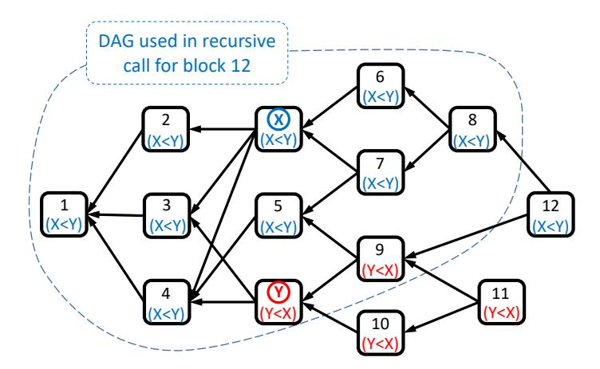
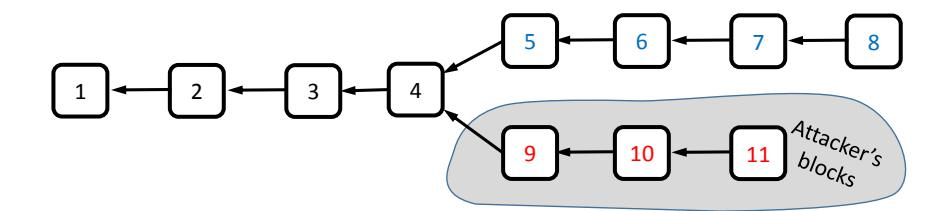
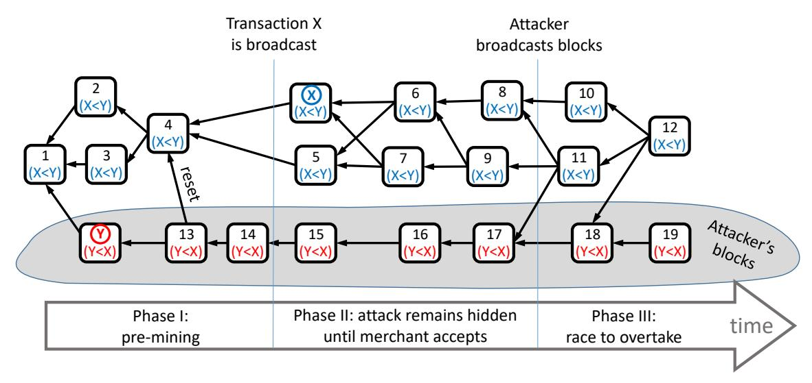
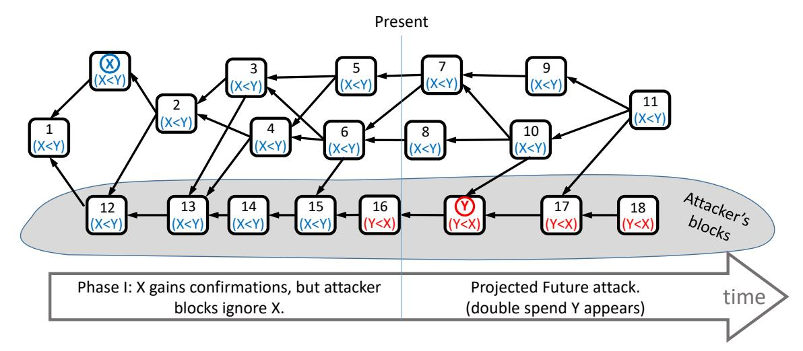
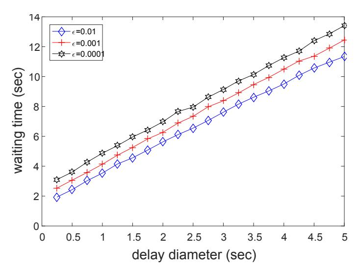
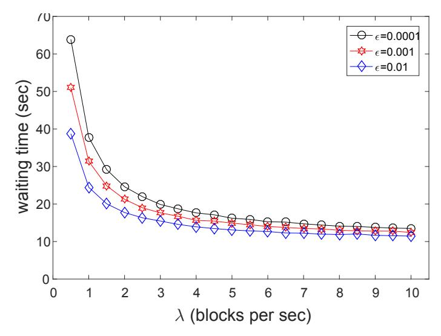
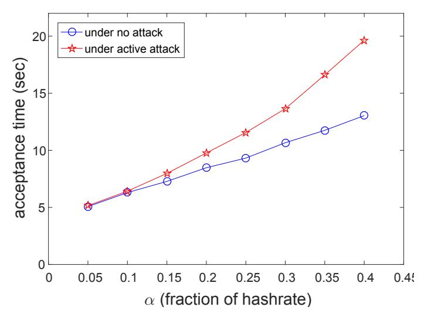
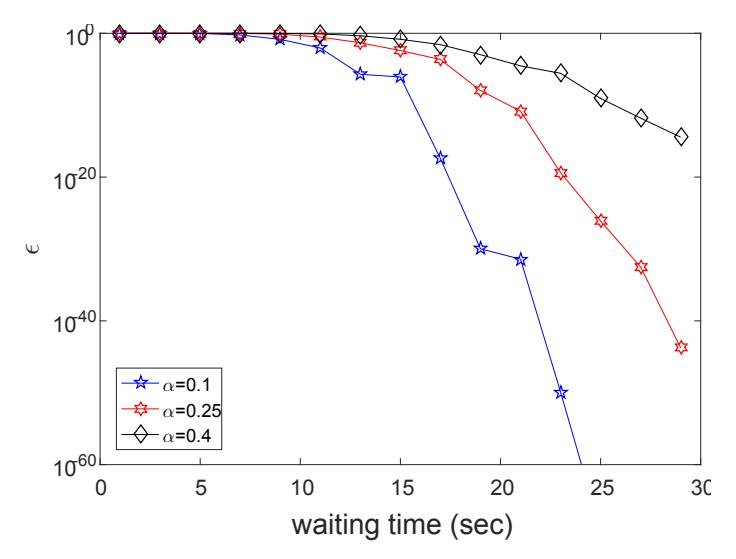

# SPECTRE:

Serialization of Proof-of-work Events: Confirming Transactions via

## Recursive Elections

Yonatan Sompolinsky, Yoad Lewenberg, and Aviv Zohar

School of Engineering and Computer Science, The Hebrew University of Jerusalem, Israel {yoni sompo,yoadlew,avivz}@cs.huji.ac.il

#### Abstract

Bitcoin utilizes the Nakamoto Consensus to achieve agreement on a consistent set of transactions, in the permissionless setting, where anyone can participate in the protocol anonymously. Since its rise, many other permissionless consensus protocols have been proposed. We present SPECTRE, a new protocol for the consensus core of cryptocurrencies that remains secure even under high throughput and fast confirmation times. At any throughput, SPECTRE is resilient to attackers with up to 50% of the computational power (reaching the limit defined by network congestion and bandwidth constraints). SPECTRE can operate at arbitrarily high block creation rates, which implies that its transactions confirm in mere seconds (limited mostly by the round-trip-time in the network).

SPECTRE's underlying model falls into the category of partial synchronous networks: its security depends on the existence of some bound on the delivery time of messages between honest participants, but the protocol itself does not contain any parameter that depends on this bound. Hence, while other protocols that do encode such parameters must operate with extreme safety margins, SPECTRE converges according to the actual network delay.

Key to SPECTRE's achievements is the fact that it satisfies weaker properties than classic consensus requires. In the conventional paradigm, the order between any two transactions must be decided and agreed upon by all non-corrupt nodes. In contrast, SPECTRE only satisfies this with respect to transactions performed by honest users. We observe that in the context of money, two conflicting payments that are published concurrently could only have been created by a dishonest user, hence we can afford to delay the acceptance of such transactions without harming the usability of the system. Our framework formalizes this weaker set of requirements for a cryptocurrency's distributed ledger. We then provide a formal proof that SPECTRE satisfies these requirements.

#### 1

#### 1. INTRODUCTION

Bitcoin is a novel cryptocurrency system, and an accompanying protocol, invented and deployed by Satoshi Nakamoto [13]. Transactions made in the currency are organized in a public ledger, *the blockchain*. Each *block* in the chain is a batch of transactions that were published by users of the currency. The blockchain contains consistent transactions only, as new blocks that extend it are required to maintain consistency.

Unfortunately, Nakamoto Consensus has severe scalability limitations [5], [18], [14]: adjusting the protocol to support a high transaction throughput – by creating larger or more frequent blocks – requires stronger assumptions on the underlying network, hence smaller safety margins.

In this paper we propose a new protocol, SPECTRE, that achieves high scalability. Transactions in SPECTRE can be confirmed within seconds, and the throughput can be improved by orders-of-magnitude over Bitcoin; it is limited by the network infrastructure and capacity only. The protocol thus alleviates the security-scalablility trade-off imposed by Nakamoto Consensus.

In SPECTRE, every block is counted and integrated into the ledger. Technically, SPECTRE generalizes Nakamoto's blockchain into a direct acyclic graph – a block DAG. By maintaining a full DAG of blocks, SPECTRE can allow miners to create blocks concurrently and much more frequently. This design is intended to avoid the need for nodes to reconcile their different world views regarding the identity of a selected chain at the time of block creation.

Reasoning about the consensus properties of SPECTRE requires a new formal framework. Indeed, previous work that formalized the robustness of Nakamoto Consensus [7], [15] focused on robustness of *blocks* in the ledger. Extending this to the robustness of *transactions* in SPECTRE is not immediate, because all blocks are incorporated into the DAG, but individual transactions embedded in the DAG may still be rejected due to conflicts.

Thus, this paper contains two contributions: (1) an inherently scalable protocol, SPECTRE; and (2) a formal framework for cryptocurrency payment protocols that do not necessarily use a chain of blocks to represent their ledger (in this respect we differ from previously proposed frameworks). We apply it on SPECTRE, and provide rigorous analysis of SPECTRE's robustness properties.

The main technique behind SPECTRE is a voting algorithm regarding the order between each pair of blocks in the DAG. The voters are blocks (not miners); the vote of each block is interpreted algorithmically (and not provided interactively) according to its location within the DAG. We show that the majority's aggregate vote becomes irreversible very fast, and we use this majority vote to extract a consistent set of transactions. Essentially, Bitcoin's longest chain rule can be seen as a voting mechanism as well – each block adding one vote to every chain that contains it – the highest-scoring chain being also the longest one. However, Bitcoin's selection of a "single winner chain" makes it inherently unscalable, as we demonstrate below.

We note that there have been several recent works revolving around new protocols for public blockchain systems. These include Bitcoin-NG [6], Byzcoin [9], a work by Decker *et. al.* [4], Hybrid Consensus [16], Solidus [1], and recently Algorand [11]. We discuss these and other related works in Section 6.

#### 2. FORMAL STATEMENT OF THE PROBLEM

In this section we describe a generic framework for reasoning about the security and scalability properties of cryptocurrency protocols. Generally, in our framework, a cryptocurrency protocol specifies two sets of instructions – *the mining protocol*, regarding the creation of blocks and formation of the block ledger, and *the TxO protocol*, interpreting the ledger and extracting from it a consistent subset of valid transactions. Since transactions in the protocol are accepted with increasing probability as time goes on, users additionally run *the Robust TxO protocol*, to quantify the *robustness* of an accepted transaction – a bound on the probability that it will ever be reversed, when a malicious attacker attempts to do so (Bitcoin transactions for example, can be reversed if the attacker manages to produce a longer alternative chain on which they are not present – this event occurs with decreasing probability as time passes). Next, we present our framework in the abstract sense, so as to keep it as general as possible. In Section 4, we present a protocol that meets the requirements and uses a block DAG to do so. We defer the specifics of the solution and the mining protocol, till then. We will use our framework to make clear the sense in which SPECTRE avoids the security-scalability trade-off that Bitcoin suffers from.

Transactions. A transaction is typically denoted tx. inputs (tx) is the set of transactions that must be accepted before tx can be accepted; these are the transactions that have provided the money that is being spent in tx. Two different transactions tx<sup>1</sup> and tx<sup>2</sup> conflict if they share a common input, i.e., they double spend the same money; we then write tx<sup>2</sup> ∈ conflict(tx1) (this is a symmetric relation).

Mining protocol. We denote by N the set of nodes, aka miners. Miners maintain and extend the ledger, by adding transactions to it and propagating messages, according to *the mining protocol*. The propagation time of a message of size B KB to all nodes in the system is assumed to be under D = D(B) seconds. For now, we regard the mining protocol as an abstract set of rules that miners must follow. We denote by honest the set of nodes that always follow the protocol's instructions, and by malicious the complementary of this set.

In the family of protocols we focus on, miners possess computational power and perform proof-of-work (PoW). We denote by α the attacker's relative computational power. Formally, it is the probability that the creator of the next PoW in the system belongs malicious; this is well defined, as PoW creation is modeled as a memoryless process [13], [18], [17].

Formation of ledger. The result of the mining protocol is an (abstract) public data structure G containing transactions (to be instantiated later, in our solution proposal, as a block DAG), aka the ledger. Nodes replicate the ledger locally. As they might hold slightly different views of the ledger (e.g., since blocks take time to propagate to all nodes), we denote by G<sup>v</sup> t the state of the ledger as observed by node v at time t; we write G<sup>t</sup> when the local context is unimportant.

TxO protocol. Given a public ledger G, *the TxO protocol* extracts a consistent subset of transactions from G, denoted T xO(G). Every transaction in this set must have its inputs in it as well, and cannot conflict with another transaction in the set.

Robust TxO protocol. Users of the system must get assurances regarding their payments. Basically, we want to guarantee that transactions will be accepted by all users, and that they will remain so forever. Given  $G_t$ , the RobustTxO protocol specifies a subset of  $TxO(G_t)$ , denoted  $RobustTxO(G_t)$ , which represents the set of accepted transactions that are guaranteed to remain so forever, up to an error probability of  $\epsilon$ . RobustTxO takes as input  $G_t^v$  (the local replicate of v), and the values of  $D, \lambda, \alpha$ , and  $\epsilon$ . A tx in (Robust) TxO is said to be (robustly) accepted.

**Desired properties.** Thus, the following properties are essential for a cryptocurrency protocol:

**Property 1** (Consistency). The accepted set is consistent: For any ledger G,

- 1) if  $tx \in TxO(G)$  and  $tx_2 \in inputs(tx)$  then  $tx_2 \in TxO(G)$ .
- 2) if  $tx \in TxO(G)$  and  $tx_2 \in conflict(tx)$  then  $tx_2 \notin TxO(G)$ .

**Property 2** (Safety). If a transaction is robustly accepted by some node, then w.h.p. it will be robustly accepted forever by all nodes, and the expected waiting time for this event is constant. Formally,  $\forall \epsilon > 0$ ,  $\forall v \in \mathcal{N}$ , if  $tx \in RobustTxO(G_t^v, D, \lambda, \alpha, \epsilon)$ , then w.p. of at least  $1 - \epsilon$ , there exists a time  $\tau \geq t$  such that  $\forall u \in \mathcal{N}, \forall s \geq \tau : tx \in RobustTxO(G_s^u, D, \lambda, \alpha, \epsilon)$ . If this event occurs, the expected value of  $\tau - t$  is constant.

**Property 3** (Weak Liveness). If a transaction is published in the ledger, it is robustly accepted by any node after a short while, provided that its inputs are robustly accepted and that no conflicting transactions are published. Formally, let  $v \in \mathcal{N}$ ,  $tx \in G_t^v$ , and  $\epsilon > 0$ . Define by  $\psi(t, D, \lambda, \alpha, \epsilon) := \min\{s \geq t : tx \in RobustTxO(G_s^v, D, \lambda, \alpha, \epsilon)\}$  the waiting time for its robust acceptance by v. Then,  $\mathbb{E}\left[\psi - t \mid inputs(tx) \subseteq TxO(G_\psi^v) \land conflict(tx) \cap G_\psi^v = \emptyset\right]$  is constant

**Definition 1.** The *security threshold* of a cryptocurrency protocol is defined by the maximal  $\alpha$  (attacker's relative computational power) for which Properties 1-3 hold.

The expected values of  $\tau - t$  and  $\psi - t$ , as written in Properties 2 and 3, define the expected waiting time for confirmation of transactions in the given protocol.

The "weakness" of the Liveness property corresponds to the fact that we do not guarantee (though it is still hard for an attacker to prevent) a resolution in case conflicting transactions were published soon one after the other. Contrast this to traditional consensus protocols, where all conflicts are required to be decided in finite time, a property usually referred to as Liveness. Observe, however, that an honest user of the system will never publish conflicting transactions, and will transfer money only after he robustly accepted the original funds (the inputs) himself; payments of honest users are thus guaranteed to meet the conditions formalized in Weak Liveness, and to be robustly accepted. On the other hand, an attacker trying to defraud must keep his attack secret before publishing the conflict, until the victim robustly accepts; but then the victim is guaranteed that w.h.p. his transaction will not be reversed. Therefore, these two properties together ensure that payments of honest users will be robustly accepted in constant expected time, and that they remain robustly accepted forever, w.h.p.

<sup>&</sup>lt;sup>1</sup>For the sake of clear exposition, we regard here these values as known. However, we emphasize that SPECTRE does not assume that nodes know or agree on the precise values of these parameters. See Section 3.

In this work we set out to design a protocol that can support a large throughput, and achieve fast confirmation times, while maintaining a high security threshold.

#### 3. SPECTRE VS BITCOIN - OVERVIEW

SPECTRE adopts many of Bitcoin's solution features. In particular, miners create *blocks*, which are batches of transactions. A valid block must contain a solution to the PoW puzzle (Bitcoin for example, uses PoW that is based on partial SHA256 collisions). The block creation rate, denoted  $\lambda$ , is kept constant by the protocol by occasional readjustments of the PoW difficulty; we elaborate on this mechanism in SPECTRE in Appendix D. The size of a block is limited by some B KB.

Bitcoin's throughput can be increased by increasing either the block size limit (which in turn increases D) or\and the block creation rate  $\lambda$ . Alas, it is well established that the security threshold of Nakamoto Consensus deteriorates as  $D \cdot \lambda$  increases:

**Theorem 2.** [Bitcoin is not scalable] The security threshold of the Bitcoin protocol goes to zero as  $D \cdot \lambda$  increases.

The proof of this theorem appears in various forms in previous works, see [18], [15], [7]. To maintain a high security threshold, Bitcoin suppresses its throughput by keeping  $\lambda$  low – 1/600 blocks per second. This large safety margin is needed because  $\lambda$  (and B) are decided once and for all at the inception of the protocol. Consequently, even when the network is healthy and D is low, Bitcoin suffers from a low throughput – 3 to 7 transactions per second, and slow confirmation times – tens of minutes. In contrast, SPECTRE's throughput can be increased without deteriorating the security threshold:

**Theorem 3.** [SPECTRE is scalable] For any  $D \cdot \lambda$ , SPECTRE's security threshold is 50%.

Therefore, in the context of the Distributed Algorithms literature, SPECTRE falls into the partial synchronous setup, as it remains secure for any value of D. Theorem 3 is proven rigorously in Appendix E.

Of course,  $\lambda$  cannot be increased indefinitely or otherwise the network will be flooded with messages (blocks) and become congested. Theorem 3 "lives" in the theoretical framework (specified in Section 2), which does not model the limits on nodes' bandwidth and network capacity. Practically, these barriers allow for a throughput of thousands of transactions per second, by setting  $\lambda=10$  and b=100, for instance. For further discussion refer to Appendices B and D.

Asymptotically, SPECTRE's confirmation times are in  $\mathcal{O}\left(\frac{\ln(1/\epsilon)}{\lambda(1-2\alpha)} + \frac{D}{1-2\alpha}\right)$ . In practice, this allows for confirmation times of mere seconds, under normal network conditions. When running RobustTxO, each node in SPECTRE uses its own upper bound on the recent D in the network. This bound affects only its own operation—underestimating D will result in premature acceptance of transactions, and overestimating it by far will delay acceptance unnecessarily (by a time linear in the difference). Importantly, in case of network hiccups and long network delays, the node can switch in his local client to a more conservative bound on D without coordinating this with other nodes.

#### 4. THE SPECTRE PROTOCOL

#### *A. The generation of the block DAG*

As in Bitcoin, participating nodes (called *miners*) create blocks of transactions by solving PoW puzzles. A block specifies its direct predecessors by referencing their ID in its header (a block's ID is obtained by applying a collision resistant hash to its header); we will describe in the next subsection how these predecessors are chosen. This results in a structure of a direct acyclic graph (DAG) of blocks (as blocks can only reference blocks created before them), denoted typically G = (C, E). Here, C represents blocks and E represents the hash references. We will frequently write z ∈ G instead of z ∈ C.

past(z, G) ⊂ C denotes the subset of blocks reachable from z, and similarly future (z, G) ⊂ C denotes the subset of blocks from which z is reachable; these are blocks that were provably created before and after z, correspondingly. *Note that an edge in the DAG points back in time, from the new block to previously created blocks which it extends.* A node does not consider a block as valid until it receives its entire past set. We denote by cone (z, G) the set of blocks that the DAG directly orders with respect to z: cone (z, G) := past(z, G)∪ {z}∪future (z, G), and by anticone (z) the complementary of cone (z, G). The set past(b, G) is fixed once and for all at the creation of b (in sharp contrast to future (z, G) and anticone (z, G) that may grow as blocks are added later to the DAG), hence we can simply write past(b) without noting the context.

The unique block genesis is the block created at the inception of the system, and every valid block must have it in its past set. In addition, we relate to a hypothetical block, virtual(G). This block satisfies past(virtual(G)) = G. While its role is merely methodological, virtual(G) can also be thought of as representing the next block that a node whose current observed DAG is G attempts to create.

G<sup>v</sup> <sup>t</sup> denotes the block DAG observed by node v ∈ N at time t. This DAG represents the history of all (valid) block-messages received by the node, instantiating the abstract data structure assumed in Section 2.

#### *B. The mining protocol*

SPECTRE's instructions to miners are extremely simple:

- *1) When creating or receiving a block, transmit the block to all peers.*
- *2) When creating a block, embed in its header a list containing the hash of all leaf-blocks (blocks with in-degree 0) in the locally-observed DAG.*

Note that these instructions allow miners to operate concurrently irrespective of potential conflicts in the contents of their blocks.

## *C. The* T xO *protocol*

Overview. As the block DAG may contain conflicting transactions, we must provide a method for nodes to interpret the DAG and extract from it the set of accepted transactions. Doing so in a way that will be agreed upon by all nodes (eventually) is the main challenge of SPECTRE. We now describe how this is done.

The topology of a block DAG G induces a natural precedence-relation over blocks: if x is reachable from y (i.e., x ∈ past(y)) then x precedes y, as it was provably created before it. SPECTRE extends this relation into a complete relation over G's blocks, denoted ≺. This order is immediately translatable into an order over transactions in G: tx<sup>1</sup> precedes tx<sup>2</sup> if the block containing the former precedes that containing the latter. This relation, in turn, induces a natural subset of accepted transactions: tx is accepted if it precedes all of its conflicting transactions in G. The relation ≺ is generated by a pairwise vote procedure that occurs independently for every pair of blocks. The operation of this layer will be explained in the next subsections.

Although we may at times refer to ≺ as though it orders blocks, we stress that ≺ *is not necessarily a transitive relation*. It is possible to have a series of blocks that precede each other cyclically.<sup>2</sup> The lack of a total linear ordering over blocks is in fact the way SPECTRE utilizes the weaker consensus requirements of our framework, as a linear order is equivalent to solving the consensus problem [3].

Pairwise ordering of blocks. The basic layer of SPECTRE involves deciding on a pairwise order over the block DAG. Fix two blocks x, y ∈ G. In order to decide if x ≺ y or y ≺ x, we interpret the structure of the DAG as representing an abstract vote. Every block z ∈ G is considered a voter with respect to the pair (x, y), and *its vote is inferred from the structure of the DAG*. We represent a vote by a number in {−1, 0, +1}, and we denote z's voting-profile on all pairs by vote (z, G). votex,y (z, G) = −1 represents x preceding y (x ≺ y), votex,y (z, G) = +1 represents y preceding x, and votex,y (z, G) = 0 represents a tie. Importantly, vote (z, G) is an asymmetric relation: votey,x (z, G) = −votex,y (z, G).

To simplify presentation, we associate a vote with virtual(G) as well. Recall that the virtual block of G is a hypothetical block which satisfies past(virtual(G)) = G. The vote of virtual(G) represents essentially the aggregated vote of the entire block DAG. The basic rules of z's vote, for any z ∈ G ∪ {virtual(G)}, are as follows:

- 1) if z ∈ G is in future (x) but not in future (y) then it will vote in favour of x (i.e., for x ≺ y).
- 2) if z ∈ G is in future (x)∩future (y) then z's vote will be determined recursively according to the DAG that is reduced to its past, i.e., it has the same vote as virtual(past(z)). If the result of this vote is a tie, z breaks it arbitrarily.<sup>3</sup>
- 3) if z ∈ G is not in the future of either blocks then it will vote the same way as the vote of the majority of blocks in its own future.
- 4) if z is the virtual block of G then it will vote the same way as the vote of the majority of blocks in G.
- 5) finally, (for the case where z equals x or y), z votes for itself to succeed any block in past(z) and to precede any block outside past(z).

<sup>2</sup>This is related to the Condorcet paradox in social choice [2].

<sup>3</sup>We can use information encoded in z's header, e.g., explicit instructions for tie-breaking, or use the lexicographical ordering of (hashes of) tied blocks, etc.



Fig. 1: An example of the voting procedure on a simple DAG. Block x and blocks 6-8 vote  $x \prec y$  as they only see x in their past, and not y. Similarly, block y and blocks 9-11 vote  $y \prec x$ . Block 12 votes according to a recursive call on the DAG that does not contain blocks 10,11,12. Any block from 1-5 votes  $x \prec y$ , because it sees more  $x \prec y$  voters in its future than  $y \prec x$  voters.

Intuitively, the first rule dictates that a block that was honestly published gain votes over blocks that are secretly withheld, as honest nodes keep adding new blocks to its future set. The second and fourth rules together guarantee majority amplification, as new blocks add votes that comply with and enhance previous decisions. The third rule is the most subtle; basically, it allows blocks in past(x) (in addition to those in future(x)) to vote in its favour against y, in case y was withheld for a long time. This is needed to counter a pre-mining attack scheme, which will be described in future sections. Notice that all votes respect the DAG's topology: If x is reachable from y then all blocks vote unanimously  $x \prec y$ .

Figure 1 illustrates the voting procedure with regards to a single pair of blocks (x,y). Additional examples along with intuition regarding this key algorithm are provided in Appendix A.

The voting procedure is implemented in Algorithm 1 below. In the algorithm,  $\widetilde{sgn}(n) = -1$  for n < 0,  $\widetilde{sgn}(n) = +1$  for n > 0, and  $\widetilde{sgn}(0) = 0$ . To see that the recursion calls from line 4 halt, observe that they take as inputs DAGs strictly smaller than G (because  $past(z) \subseteq G$ ), and hence eventually all arrive at the base case  $G = \emptyset$  and return. The algorithm is written in its naïve form, for the sake of readability, with a run time of  $\mathcal{O}(|G|^3)$ . We have written a more sophisticated implementation of this procedure, which runs in expected time of  $\mathcal{O}(d \cdot \lambda)$ . We will make the code available online in the full version.

The pairwise ordering of SPECTRE has the following highly valuable property:

**Property 4.** Once a block is published, the set of blocks that precede it in the pairwise ordering closes fast—w.h.p. it consists only of blocks published before or right after its publication.

The implications of this guarantee to the security of transactions is immediate, at least at the intuitive level: A user whose transaction is embedded in some published block x can guarantee its safety by waiting some time after x's publication before accepting it; he is then guaranteed that any block published later on – and that might contain a conflicting transaction – will be preceded by x hence will not threaten the acceptance of his transaction. In Section 5 we will explain how this guarantee is achieved.

#### Algorithm 1 CalcV otes

```
Input: G – a block DAG
Output: vote (virtual(G)) – a pairwise ordering of blocks in G
 1: if G = ∅ then
 2: return an empty ordering
 3: for all z ∈ G do
 4: vote (z, past(z)) ← CalcV otes (past(z)) and break ties arbitrarily
 5: for all z ∈ G in some topological order (from leaves to root) do
 6: for all x, y ∈ G (x 6= y) do
 7: if
             x ∈ past (z) ∧ y /∈ past(z)

                                       ∨ (x ∈ past(z), y = z) then
 8: votex,y (z, G) ← −1
 9: else if
                 y ∈ past (z) ∧ x /∈ past(z)

                                           ∨ (y ∈ past(z), x = z) then
10: votex,y (z, G) ← +1
11: else if x, y ∈ past(z) then
12: votex,y (z, G) ← votex,y (z, past(z))
13: else if x, y /∈ past(z) then
14: votex,y (z, G) ← sgn g
                                 P
                                    z
                                     0∈future(z,G)
                                                 votex,y (z
                                                          0
                                                           , G)

15: vote (virtual(G), G) ← sgn g
                              P
                                 z∈G vote (z, G)

16: return vote (virtual(G), G)
```

Accepting transactions. Equipped with the pairwise relation over blocks, we now turn to construct the set of accepted transactions. To maintain consistency, we mark a transaction as accepted iff all three conditions below hold true:

- 1) all of its inputs have been accepted.
- 2) all conflicting transactions from its anticone set (i.e., that are not related to it topologically) are contained in blocks that are preceded by the block containing the transaction.
- 3) all conflicting transactions from its past set (i.e., that precede it in the DAG, topologically) have been rejected.

Algorithm 2 implements these rules, and outputs a set of accepted transactions. It operates recursively, and should be initially called with T xO(G, G) (we later denote this simply by T xO(G)). In the algorithm, the notation ZG(tx) stands for all blocks in G that contain tx. Some complexity arises due to possible multiple copies of the same transaction in the DAG; we denote by [tx] the equivalence class containing all of tx's copies.

The third part of the SPECTRE protocol, namely, the RobustT xO procedure, is rather involved. We defer its description to Appendix C.

## 5. HIGH-LEVEL OVERVIEW OF THE PROOF

We now provide some intuition as to why SPECTRE's procedures indeed guarantee that transactions can be accepted safely, and that all transactions of honest users are quickly accepted. We aim at proving Property 4. As mentioned above, this property is easy to translate to the desired

#### Algorithm 2 TxO

Input: G – a block DAG, subG – a subDAG of G which is the past of a (possibly virtual) block

```
Output: Tx – a hyper-set of valid transactions in G
 1: vote\left(virtual\left(G\right)\right) \leftarrow CalcVotes(G)
 2: Tx \leftarrow \emptyset
 3: for all z_1 \in subG do
 4:
         for all tx \in z_1 do
             for all tx_2 \in G \cap conflict(tx) do
 5:
                 for all z_2 \in Z_G(tx_2) \cap anticone(z_1, G) do
 6:
 7:
                      if vote_{z_1,z_2} (virtual(G)) \geq 0 then
                          break (to line 4 and pick next tx)
 8:
                 if [tx_2] \cap TxO(G, past(z_1)) \neq \emptyset then
 9:
                      break (to line 4 and pick next tx)
10:
             for all [tx_3] \in inputs(tx) do
11:
                 if [tx_3] \cap TxO(G, past(z_1)) = \emptyset then
12:
13:
                      break (to line 4 and pick next tx)
             add tx to Tx
14:
15: return Tx
```

security properties of transactions (as we do formally in Appendix E). Concretely, we wish to prove the following statement (in the proposition,  $G_r^{pub} := \bigcup_{u \in honest} G_r^u$ ):

**Proposition.** Assume block x was published at time  $t_{pub}$  ( $x \in G_{t_{pub}}^{pub}$ ), and y not published before time  $t_{acc}$  ( $y \notin G_{t_{acc}}^{pub}$ ). Let  $T = t_{acc} - t_{pub}$ . Then the probability that x will not always precede y ( $\Pr(\exists u \in honest, \exists s \geq t_{acc} : vote_{x,y}(virtual(G_s^u)) \geq 0$ )) decreases exponentially in T.

*Proof overview.* Assume that the event in which y comes to precede x in some future DAG occurs. Let s be the earliest moment in time that such an event occurred at some node. Notice that y cannot be in the past of x or in its future (otherwise their order is determined by the topology and cannot be reversed). We thus assume henceforth  $y \in anticone(x)$ .

The block race after x is published. We first consider the votes of blocks created after the publication of block x:

- (Almost) all honest blocks created between  $t_{pub}$  and  $t_{acc}$  vote forever in favour of  $x \prec y$ , as they have x in their past but not y. Denote by  $n_1$  the number of such blocks.
- All honest blocks created between  $t_{acc}$  and s vote in favour of  $x \prec y$ , as well, by the choice of s. Denote by  $n_2$  the number of such blocks.
- Denote by  $m_1$  and  $m_2$  the number of blocks created by the attacker in the time intervals corresponding to  $n_1$  and  $n_2$ . Honest nodes possess a fraction  $1 \alpha > \alpha$  of the computational

<sup>&</sup>lt;sup>4</sup>Intuitively,  $t_{acc}$  represents the time at which some node accepted a transaction which appears in block x.

power. Consequently, for any positive constant C, the probability that the relation m<sup>1</sup> + m<sup>2</sup> + C − (n<sup>1</sup> + n2) ≥ 0 will ever be satisfied decreases exponentially with n1. This is typically analyzed as the probability that a biased random walk on the integers, beginning at C, returns to the origin (see [13], [17], [18]).

The term m<sup>1</sup> + m<sup>2</sup> − (n<sup>1</sup> + n2) represents the aggregate vote between x and y, considering only blocks created after x's publication. We now show that blocks that the attacker prepared in advance before x's publication, in a preparatory "pre-mining" stage, do not give him more than some constant advantage (which will be counted into C above).

The pre-mining stage. Honest blocks that were created before x was published are typically in its past (apart from a small set of blocks) and hence have their vote decided by the majority of votes in their future (as per Alg. 1). Their vote is thus possibly subject to change as the DAG grows, and as the attacker publishes blocks.

For every block z in the past of x we must therefore consider the number of blocks above it that vote in favour of x and those that vote against it. Denote by X<sup>z</sup> the gap between the number of attacker blocks and honest blocks in the future of z, up to time tpub. In Lemma 24 we show that the worst case gap X<sup>z</sup> (over all blocks z ∈ past(x)) can be modeled as a reflecting random walk over the nonnegative integers, with bias towards the origin. Consequently, the best gap that the attacker can secretly gain over a block in past(x) has an exponentially decaying tail, and, in particular, is bounded by a constant w.h.p.

All in all, as tacc − tpub grows, the number n<sup>1</sup> of votes, or "confirmations", that x receives increases linearly, and the probability that the attacker will be able to reveal enough blocks so that some z ∈ past(x) will have more y ≺ x votes in its future than x ≺ y votes, decreases exponentially in n1. Since this holds for all z ∈ past(x) uniformly, it implies in particular that the genesis block has more x ≺ y votes in its future than y ≺ x votes (unless an exponentially unlikely event occurred). The vote of the virtual block is determined by that of the genesis block (this is easy to see, and is proven in Lemma 13), completing the argument.

The proposition above is the gist of Lemmas 14 and 15. In the above sketch, we abstracted out many additional subtleties and details. For instance, honest blocks that were created D seconds around tpub, tacc, or s may not have contributed votes in favour of x. In our formal analysis (Appendix E) we count these as attacker blocks, accounting for the worst case, and add them to the aforementioned constant C. We additionally show how the user can measure n<sup>1</sup> correctly, even if the attacker publishes his blocks in an attempt to delay acceptance.

## 6. RELATED WORK

Previous research has produced several suggestions for protocols that attempt to address the security-scalability challenge, but all protocols still provide a total order over blocks:

GHOST is an alternative chain selection rule that gradually chooses a tree of blocks until converging on a single chain [18]. It can be shown that the Liveness property of GHOST can be attacked, as was demonstrated by [8]. The use of block DAGs was proposed in the Inclusive work [10], in which throughput was increased by integrating off-chain blocks into the ledger. Due to the reliance on a chain, Inclusive mitigates but does not avoid the security-scalability trade-off. The Inclusive paper further includes a game theoretic analysis of the incentives of nodes to embed different transactions in their blocks (without the ability to coordinate).<sup>5</sup>

Bitcoin-NG [6] provides a clever chain structure that is composed of two types of blocks: key blocks that require PoW but contain no transactions, and mini-blocks that do not require PoW but do contain transactions. Bitcoin-NG manages to obtain a significant scalability increase, but its key blocks are still generated slowly, hence, confirmation times remain high. Another line of work bootstraps PoW to instantiate a committee that is later used to run classical BFT protocols. Examples from this line of research include Byzcoin [9], a work by Decker *et. al.* [4], Hybrid Consensus [16], and recently Solidus [1]. Protocols built in this manner are highly scalable, building upon work in consensus protocols, but lack some of the properties achieved by Bitcoin. They typically require large committees and require committee members to remain online for long periods of time, making them susceptible to network isolation and DoS attacks. [9], [4], [1] additionally fail without recovering if the committee is ever composed of a high fraction of malicious entities (Bitcoin, on the other hand, is self-stabilizing). Moreover, they require forward secrecy. If the cryptographic keys of a sufficient fraction of the committee at any point in the past is compromised, the attacker can create an alternative equally acceptable version of events.

The Algorand protocol [11] is a proof-of-stake based algorithm that uses the ownership of currency itself to achieve a scalable consensus protocol. It utilizes additional techniques (based on VRFs) to hide the committee members that take place in the consensus protocol. In contrast, miners in SPECTRE are not directly involved in any explicit consensus protocol and moreover can operate with little regard of other nodes' synchronization status. Honey Badger [12] is an atomic broadcast protocol that is oblivious to network parameters and does not require tuning under different network conditions (similarly to SPECTRE). It is set in the classical permissioned setting where identities of the participants are known.

#### 7. CONCLUSION

In this work we presented SPECTRE, a new cryptocurrency protocol that is inherently scalable. Unlike Bitcoin and its many variants, SPECTRE is secure against attackers with less than 50% of the computational power, even when its throughput is increased and the propagation delay becomes non-negligible. Our results demonstrate that SPECTRE can achieve incredibly low confirmation times, especially compared to Nakamoto Consensus. Further work to improve and tighten the acceptance policy we derived can lower confirmation times further. Key to SPECTRE's achievements is its willingness to delay the decision regarding visibly double-spent transactions. It thus solves a weaker problem than traditional consensus protocols. This fact also makes it less suitable for systems like Ethereum, where a total order over transactions is required

The core algorithm of SPECTRE – the pairwise voting procedure (Alg. 1) – is nontrivial. We encourage the reader to refer to Appendix A for intuition and illustrations about its operation.

<sup>5</sup>We build on this argument, and indeed assume that nodes will maximize their profits by avoiding transaction "collisions" and will try to embed unique content in their blocks.

## REFERENCES

- [1] Ittai Abraham, Dahlia Malkhi, Kartik Nayak, Ling Ren, and Alexander Spiegelman. Solidus: An incentive-compatible cryptocurrency based on permissionless byzantine consensus. *arXiv preprint arXiv:1612.02916*, 2016.
- [2] Kenneth J Arrow, Amartya Sen, and Kotaro Suzumura. *Handbook of Social Choice & Welfare*, volume 2. Elsevier, 2010.
- [3] Miguel Correia, Nuno Ferreira Neves, and Paulo Ver´ıssimo. From consensus to atomic broadcast: Time-free byzantine-resistant protocols without signatures. *The Computer Journal*, 49(1):82–96, 2006.
- [4] Christian Decker, Jochen Seidel, and Roger Wattenhofer. Bitcoin meets strong consistency. In *Proceedings of the 17th International Conference on Distributed Computing and Networking*, page 13. ACM, 2016.
- [5] Christian Decker and Roger Wattenhofer. Information propagation in the bitcoin network. In *13th IEEE International Conference on Peer-to-Peer Computing (P2P), Trento, Italy*, September 2013.
- [6] Ittay Eyal, Adem Efe Gencer, Emin Gun Sirer, and Robbert Van Renesse. Bitcoin-ng: A scalable blockchain ¨ protocol. In *13th USENIX Symposium on Networked Systems Design and Implementation (NSDI 16)*, pages 45–59, 2016.
- [7] Juan Garay, Aggelos Kiayias, and Nikos Leonardos. The bitcoin backbone protocol: Analysis and applications. In *Annual International Conference on the Theory and Applications of Cryptographic Techniques*, pages 281–310. Springer, 2015.
- [8] Aggelos Kiayias and Giorgos Panagiotakos. On trees, chains and fast transactions in the blockchain. Cryptology ePrint Archive, Report 2016/545, 2016.
- [9] Eleftherios Kokoris-Kogias, Philipp Jovanovic, Nicolas Gailly, Ismail Khoffi, Linus Gasser, and Bryan Ford. Enhancing bitcoin security and performance with strong consistency via collective signing. In *25th USENIX Security Symposium, USENIX Security 16, Austin, TX, USA, August 10-12, 2016.*, pages 279–296, 2016.
- [10] Yoad Lewenberg, Yonatan Sompolinsky, and Aviv Zohar. Inclusive block chain protocols. In *International Conference on Financial Cryptography and Data Security*, pages 528–547. Springer, 2015.
- [11] Silvio Micali. Algorand: the efficient and democratic ledger. *arXiv preprint arXiv:1607.01341*, 2016.
- [12] Andrew Miller, Yu Xia, Kyle Croman, Elaine Shi, and Dawn Song. The honey badger of bft protocols. In *Proceedings of the 2016 ACM SIGSAC Conference on Computer and Communications Security*, pages 31–42. ACM, 2016.
- [13] Satoshi Nakamoto. Bitcoin: A peer-to-peer electronic cash system, 2008.
- [14] Rafael Pass, Lior Seeman, and Abhi Shelat. Analysis of the blockchain protocol in asynchronous networks. *IACR Cryptology ePrint Archive*, 2016:454, 2016.
- [15] Rafael Pass, Lior Seeman, and Abhi Shelat. Analysis of the blockchain protocol in asynchronous networks. *IACR Cryptology ePrint Archive*, 2016:454, 2016.
- [16] Rafael Pass and Elaine Shi. Hybrid consensus: Efficient consensus in the permissionless model. Cryptology ePrint Archive, Report 2016/917, 2016.
- [17] Meni Rosenfeld. Analysis of hashrate-based double spending. *arXiv preprint arXiv:1402.2009*, 2014.
- [18] Yonatan Sompolinsky and Aviv Zohar. Secure high-rate transaction processing in bitcoin. In *International Conference on Financial Cryptography and Data Security*, pages 507–527. Springer, 2015.

## APPENDIX A INTUITION AND EXAMPLES

In this section we provide some basic explanations and intuitions regarding the operation of SPECTRE. We focus primarily on explaining the ideas underlying Alg. 1 that is at the core of the protocol. We later go on to present examples for simple attacks that shed some light on how resilience is achieved.

Intuition 1 (Vote in favour of visible blocks). If a block x is known by honest participants, their blocks will include it in their past. Given that blocks vote in favour of blocks in their past (over other unknown blocks), and given that honest nodes publish their blocks quickly, hidden attacker blocks lose votes.

Intuition 2 (Majority amplification). Given blocks x, y that contain potential conflicts, blocks that are generated by honest participants after their publication reference both of them in the DAG. According to Alg. 1, these new blocks adopt the vote of the sub-DAG in their past with regards to x and y. Thus, if block x precedes block y, additional votes that support this decision are added, and the attacker will find it more difficult to reverse the vote.

Intuition 3 (Referencing recent blocks is beneficial). Blocks from the past vote according to their future. Thus if an attacker creates a block that does not reference recent blocks, it is at a disadvantage compared to other blocks that do (it loses votes from recent blocks it did not reference and did not "convince").

Intuition 4 (Votes from the past counter pre-mining attacks). Consider an attacker that creates a block y, withholds it, and constructs many blocks on top of it over an extended period of time. After a long while, a conflicting transaction is released to the network, and eventually ends up in some block x. Block y has many blocks (built by the attacker) that reference it. Thus, if only votes from the future are counted, block y would prevail even if x is allowed to accumulate some votes. In SPECTRE, blocks that were created by honest nodes while y was withheld, look to their future for their votes. These will usually vote in favour of x and will usually outnumber the attacker blocks that were created when y was withheld (an example of pre-mining appears in Fig. 3).



Fig. 2: SPECTRE coincides with the longest-chain rule when it is applied to "simple" chains of blocks. In the depicted DAG, the chain ending at block 8 is longer and would be selected in the longest chain protocol. In SPECTRE each one of the blocks 5,6,7,8 precedes each of the blocks in 9,10,11. Consider for instance blocks 6 and 10 and the pairwise vote that involves them. Blocks 6-8 vote strongly 6 ≺ 10, as they see block 6 in their past but not block 10. Block 5 is a weak voter, as it sees neither 6 nor 10 in its past, hence it votes as the majority of its future (thus voting 6 ≺ 10 as well). For similar reasons, blocks 9-11 all vote 10 ≺ 6. Block 4, at the fork of the two chains, is a weak voters as well, as it sees neither 6 nor 10 in its past; it therefore votes according to the majority of future blocks. As block 4 sees four votes in favour of 6 ≺ 10, and three votes in favour of 10 ≺ 6, it will vote in favour of 6 ≺ 10. Blocks 1-3 similarly vote according to their future, and see an increasing number of votes for 6 ≺ 10, adding their own vote to the result. Thus, the end result is that 6 precedes 10.

## *A. Equivalence to longest-chain*

We now demonstrate how SPECTRE coincides with Bitcoin's longest-chain rule, in the case of a "simple" fork between two chains. Consider the DAG illustrated in Fig. 2. In Bitcoin, the longer chain would be selected. Similarly, in the pairwise ordering of SPECTRE, each of the blocks in the longest chain 5,6,7,8 would precede each of the blocks in the shorter one 9,10,11. To see why this is true refer to the caption of the figure.

We now turn to examine two different attack scenarios, which we name *double-spending*, and *censorship*. Recall the requirement from our miner protocol: each miner is required to *(i)* reference recent blocks, and to *(ii)* publish his blocks immediately. Each attack is basically a violation of one of these requirements. In the double-spending attack, the attacker delays the publication of a set of blocks (that includes a conflicting transaction), and in the censorship attack he publishes blocks but "ignores" a certain block and transactions inside it, hoping to convince nodes that it did not secure enough votes, and thus cannot be accepted.

#### *B. Example of a double-spending attack*

Fig. 3 depicts an (unsuccessful) double-spending attack. The attack is composed of three main phases:

Phase I: Pre-mining. In phase I, the attacker begins building blocks and withholding them from the network. The first block that is constructed (named block y) contains a transaction that will later conflict with the transaction sent to the honest nodes. Blocks built by the attacker ideally



Fig. 3: An example of the voting procedure on a DAG in which a double-spending attack is (unsuccessfully) attempted. Block x and blocks 6-8 vote strongly  $x \prec y$  as they only see x in their past, and not y. Similarly, block y and blocks 13-19 vote strongly  $y \prec x$ . In the DAG which is the past of block 11, each of the blocks 1-5 sees more  $x \prec y$  voters in its future than  $y \prec x$  voters, hene each of them votes  $x \prec y$ . Block 11 votes (as the virtual block of its past votes), according to the majority in its past, thus it too votes  $x \prec y$ . A similar argument goes for the the vote of 11 and 12. Finally, aggregating the vote of all blocks in the DAG, x got more votes hence  $x \prec y$ .

form a chain, and due to the voting rules in SPECTRE, will all vote  $y \prec x$  (blocks y,13,14). Blocks built by the honest node are unaware of y (and also of x that is yet to be created), and will eventually vote according to the majority of future votes. During this phase, attacker blocks reference honest blocks that are built (in hopes of later convincing them to vote  $y \prec x$ ). After some time, the attacker transmits the transaction to the network, and proceeds to phase II.

Notice that at the exact time that phase I ends, the attacker has more blocks above block 4 than honest nodes have, so it starts at an advantage: it will more easily sway the vote of block 4 towards  $y \prec x$  (this advantage later disappears as honest nodes typically build blocks faster than the attacker).

**Phase II: Waiting for acceptance.** The attacker now continues to build blocks in secret. If he publishes his blocks, then his conflicting transaction will be visible to all, and the double-spend will be detected. Instead, he waits for block x to receive sufficient weight (in the form of blocks built on top of it) so that the recipient of the transaction in x accepts it, and provides the attacker with some service or product. During this phase, attacker blocks that are created (blocks 15-17) vote  $y \prec x$ , as the attacker is careful to have them reference only his secret chain, and never indirectly reference block x. Honest blocks created during this phase will typically vote  $x \prec y$

since y is hidden from them. Some small number of blocks (created before x propagated to the whole network – block 5 in this example) do not reference x, and so will vote according to the result of future votes.

Phase III: Race to overtake. Once x was -accepted by the victim, the attacker wishes to publish his secret blocks in hopes of causing his conflicting transaction in y to precede x. In this case, the transaction in x will be considered rejected, and the payment will be canceled (leaving the attacker with an item he did not pay for). He publishes his secret chain (which from this point on is referenced by honest nodes), and continues to build upon it. Blocks that he builds, again do not reference x, and so they vote y ≺ x, supporting his goal. New honest nodes are for the first time exposed to the conflicting transaction y, and thus vote according to the result in the sub-DAG in their past.

Why the attack fails. First, notice that the attacker in the above example creates fewer blocks in each phase than the honest nodes. This will usually be the case if attackers have less computational power than all honest nodes. "Poisson bursts" in block creation by the attacker are possible, and this will allow him to overtake the network, but these are less likely if the attack lasts for a long period of time. The defender can control the length of phase II by waiting a long while before accepting the transaction, which decreases the probability of such bursts. If phase II is long enough, x will have more votes in this period than y. Weak blocks in the past of x will then vote in favour of x, according to this majority. Such blocks that look at their future begin a cascade: each block further in the past adds a vote that agrees with the majority of future blocks and thus strengthens the decision. The greater the majority obtained in Phase II, the less likely it is that the attacker will be able to catch up from behind in Phase III. The attack therefore depends heavily on successfully swaying the votes of blocks that were created just before x (e.g., block 4).

It is important to note that an attacker that creates more blocks in expectation than the honest network will succeed in carrying out this attack. The blocks voting y ≺ x would outnumber those who vote to the contrary. Hence the 50% threshold in Theorem 3.

## *C. Example of a censorship attack*

Fig. 4 depicts an (unsuccessful) censorship attack. The attack is composed of a single main phase during which an attacker creates his own blocks, publishes them instantly, but also ignores (and does not reference) recent blocks created by the honest network. The figure depicts (in stage I on the left side) the current state of the blockchain (where all blocks are published at this point). An honest participant that then observes the network and wishes to tell if a transaction in block x is secure, can see a large number of blocks that do not reference x. These blocks are not guaranteed to vote in favour of x. An attacker may later insert a conflicting transaction y and add blocks atop it (this projected attack is depicted on the right-hand side of the figure). These may potentially sway previously created attacker blocks to vote against x.

The main risk from the censorship attack is that merchants, upon seeing the attacker's blocks, will consider transactions in block x not sufficiently secure. This could potentially delay the



Fig. 4: An example of the voting procedure on DAG in which an unsuccessful censorship attack is depicted. The left side depicts the current state of the block DAG. The right-hand side depicts its likely future development. Blocks 12-16 do not add strong votes to x. Can they be convinced to vote for block y when it appears? Will they further sway other blocks in their past? The vote of each block in this projected future are depicted: Blocks 2-9 vote strongly for x as they see it in their past (but not y). Blocks 17-18 similarly vote strongly for y. Block 16 is indeed convinced to vote for y as more blocks in its future vote for y than for x. Blocks 1, 12-15 vote for x. They each see more votes in favour of x than votes in favour of y in their future. Blocks 10-11 see more  $x \prec y$  voters in their past when they make a recursive call.

acceptance of transactions forever. Our analysis of SPECTRE shows that even in this case the merchants accept transactions quickly (and securely).

# APPENDIX B SIMULATION RESULTS

We implemented the SPECTRE protocol in Python along with an event-driven simulator of network dynamics. For each experiment we generated an Erdős-Rényi random network topology with 20 nodes. Each node forms 5 outgoing links, in expectation. The delay on each link was uniformly distributed and later scaled linearly so that the diameter of the graph is D (for the given D). Every point represents the average outcome over at least 500 experiments.

The main benefit of SPECTRE is fast transaction confirmation. The asymptotic waiting times derived from our formal analysis are in  $\mathcal{O}\left(\frac{\ln(1/\epsilon)}{\lambda(1-2\alpha)} + \frac{D}{1-2\alpha}\right)$ . In order to measure the actual waiting times, we utilized the online acceptance policy derived by Alg. 7. Accordingly, we stress that the merchant needs to wait additional D seconds in order to verify that no double-spend has been released in the past D seconds, as explained at the end of Appendix C.

How does the delay diameter affect acceptance times? Given that block creation rate is high, most of the waiting time for acceptance is dominated by the block propagation delay. Fig. 5 depicts the transaction acceptance times of SPECTRE, for various values of the delay diameter D, and for different security thresholds . Note that, unlike the Nakamoto Consensus, D affects the acceptance time of transactions but not their security.



Fig. 5: The average time for a transaction to enter RobustT xO, assuming there's no visible double-spend, for λ = 10 blocks per second and α = 0.25.

How does the block creation rate affect acceptance times? Fig. 6 depicts the acceptance times for various values of the block creation rate λ, under a constant delay d = 5 seconds. The graph reaffirms the role of λ in our asymptotic bound: accelerating the block creation process allows for faster acceptance times. For comparison, Bitcoin's block creation rate of 1/600 implies waiting times that are orders of magnitudes higher (not plotted).



Fig. 6: The average time for a transaction to enter RobustTxO, assuming there's no visible double-spend, for d=5 seconds and  $\alpha=0.25$ .

Can an attacker delay acceptance? We now turn to demonstrate the effect of censorship attacks in which some dishonest nodes publish blocks that do not reference other miners' blocks. Recall that the Weak Liveness property of SPECTRE (Proposition 3) guarantees fast acceptance of transactions that are not visibly double-spent, even in the presence of a censorship attack. However, such an attack still causes some delay in transaction acceptance, but this delay is minor for small attackers. In Fig. 7 we quantify this effect, by comparing the acceptance times in "peace days" to those under an active censorship attack. The parameters here are d=5 seconds,  $\lambda=10$  blocks per second, and  $\epsilon=0.01$ . The results display a modest effect of the attack, and they show that in order to delay transaction acceptance by more than 5 to 10 seconds an attacker must possess a significant share of the computational power in the network.



Fig. 7: The average time for a transaction to enter RobustTxO, assuming there's no visible double-spend, for d=5 seconds,  $\lambda=10$  blocks per second, and  $\epsilon=0.01$ , in the presence and in the absence of a censorship attack.

How does  $\epsilon$  decrease for various sizes of the attacker? Once an honest node  $\epsilon$ -accepts a transaction, there's still a small risk  $(\epsilon)$  that it would eventually be rejected. We show that the probability of this event vanishes quickly, even for an extremely capable attacker (e.g., with  $\alpha=0.4$  of the hashrate). This is illustrated in Fig. 8, assuming d=5 seconds and  $\lambda=10$  blocks per second (notice that the y-axis is in log scale).

How tight is our security analysis? The analysis on which Alg. 3 relies makes several worst-case assumptions in order to bound the probability of a successful attack, e.g., that the attacker can broadcast blocks to and receive blocks from all nodes without any delay (see Appendix E, mainly Lemmas 14 and 20). Accordingly, the analysis is not tight, and in reality attacks are in fact less likely to succeed. In Fig. 9, we depict the comparison between the analytical bound and two different empirical simulations. In these simulations we explicitly generate blocks for the attacker and simulate the optimal double-spending attack. We repeat the experiment 10,000 times for each point in the graph, and measure the empirical success rate. The simulations assume two types of attackers: a worst-case attacker that is able to transmit and receive blocks with no delays, and a more realistic attacker that is connected to other nodes with typical delays. We compared the fraction of successful attacks under these setups to the analytical risk calculated by SPECTRE's policy (Alg. 7).

The results show that the risk considered by SPECTRE's RiskTxAccept indeed upper bounds the actual risk, and that transactions are even safer than we guarantee formally.



Fig. 8: The probability of a successful double-spending attack, as a function of the waiting time before acceptance, under d = 5 seconds and λ = 10 blocks per second, for α = 0.1, 0.25, and 0.4. The probability here is the result of the calculation performed by Alg.3.


Fig. 9: The analytical vs. empirical probabilities of a successful double-spending attack, as a function of the waiting time before acceptance, under d = 5 seconds, λ = 10, and α = 0.25.

## APPENDIX C ADDITIONAL ALGORITHMS

In Sec. 4 we described the way SPECTRE pairwise orders blocks, and how this order is used to construct the subset of accepted transactions. In this section we describe the procedures of the second layer of SPECTRE, which allows users to measure the robustness of this order, and to translate this into the robustness of accepted transactions.

## A. Robustness of the block pairwise ordering

Assume that in the order of the current observable DAG the block x precedes y. We need a method to measure how likely is it that this relation will persist forever. Algorithm 3 outputs an upper bound on the probability that an attacker will be able to reverse the relation  $x \prec y$ . When the argument y is unspecified, the interpretation of the algorithm's output is x's robustness against an unseen block (withheld by an attacker or yet to be created). In the algorithm, gap(b,G) denotes the size of the set  $\{z \in anticone(b,G) : vote_{z,b}(virtual(G)) \geq 0\}$ . The notation  $\langle G, z, K \rangle$  will be explained in the paragraphs that follow.

In the algorithms below, we omit for the sake of brevity the following parameters which the user must set by himself:  $\alpha$  – maximal size of attacker, d – upper bound on D (the recent delay diameter in the network),  $\lambda$  – the block creation rate

## Algorithm 3 Risk (offline)

```
Input: G = G^v_{time\_now} – some node v's current block DAG, x – a block in G, y (optional) – a block in anticone(x,G)
```

**Output:** risk – an upper bound on the probability that x will not recede y in some point in the future  $(\Pr(\exists u \in honest, \exists s \geq time\_now : vote_{x,y}(virtual(G_s^u)) \geq 0))$

```
1: if time\_now < publication(x) + 2 \cdot d then

2: return 1

3: K \leftarrow \lceil \sqrt{|future(x,G)|} \rceil

4: if NULL = y then

5: g \leftarrow |future(x,G)|

6: M \leftarrow 0

7: else

8: g \leftarrow \sum_{z' \in future(x,G)} vote_{y,x}(z',G)

9: M \leftarrow \left| \left\{ z \in future(x,G) : vote_{x,y}(z,G) = +1 \land gap(z,\langle G,z,K\rangle) = 0 \right\} \right|

10: n_x \leftarrow |future(x,G)| - M

11: j \leftarrow gap(x,G) + K

12: l \leftarrow K

13: risk \leftarrow f_{pre\_mine}(l) + f_{pre\_pub}(K) + f_{post\_pub}(M) + f_{post\_mine}(n_x,g,j,l,M)

14: return risk
```

In line 13 the algorithm uses several functions whose precise definitions we defer to later sections. An explicit formula for  $f_{pre\_pub}$  is given in (54), for  $f_{post\_pub}$  is given in (50) and (52), and for  $f_{post\_mine}$  is given in (5). Preceding Lemma 24, we provide a method to calculate  $f_{pre\_mine}$  numerically.

Intuitively, the function  $f_{pre\_mine}$  upper bounds the probability that the attacker has gained an advantage larger than l during the pre-mining phase (i.e., up until the creation of x). The function  $f_{post\_mine}$  upper bounds the probability that the attacker will ever be able to create enough blocks so as to reverse the relation  $x \prec y$ . In essence,  $f_{post\_mine}$  is an adaptation of a formula from [17]. According to our version of the formula, if during the interval  $[time(x), t_{acc}]$  (where  $t_{acc}$  represents the current time) honest nodes created n blocks, then  $\binom{n-1+m}{m} \cdot \alpha^m \cdot (1-\alpha)^n$  is the probability that the attacker has created during this interval m blocks. If g aggregates all the votes of blocks in future(x,G), then the probability that the attacker will be able to reverse the majority's vote is roughly  $\left(\frac{\alpha}{1-\alpha}\right)^{\max\{g-m,0\}}$ . The combined expressions produce an upper bound on the success-probability of an attack.

The main challenge here is to correctly measure n. This is a difficult task, as Algorithm 3 uses only structural information (with the exception of making sure that x has been published for at least  $2 \cdot d$  seconds) and does not rely on measurements of blocks' timings. Naïvely one would use  $n \approx |future(x,G)|$  to upper bound blocks created after publication(x). However, there are two main difficulties:

- The block x might have been created by a dishonest node and withheld by it. In this case, there might have passed a long time between its creation and its publication, which implies that |future(x,G)| alone may be well below n. To avoid underestimating n, we upper bound the number of honest blocks in anticone(x,G), by the variable j, and add it to our count (the addition is done inside  $f_{post\_mine}(n_x,g,j,l,M)$ ).
  - The function  $f_{pre\_pub}$  upper bounds the probability that we have underestimated j.
- By publishing his attack blocks, the attacker can increase the size of future(x,G) and cause us to overestimate n. This would result in an upper bound on the success-probability of an attack that is not tight enough, which would allow an attacker with a large value of  $\alpha$  to delay acceptance indefinitely. Risk overcomes this problem, by recognizing attacker blocks and excluding them from the count of n. This is done as follows.
  - Let G be a block DAG, b a block in G, and K a whole number. The DAG  $\langle G, b, K \rangle$  is obtained by creating a new chain  $z_1, ..., z_K$  of K hypothetical blocks, connecting an edge from  $z_1$  to b and replacing every edge  $(z,b) \in G$  with  $(z,z_K) \in G$ . Essentially, this adds to the DAG K artificial voters which vote strongly  $x \prec y$ , against any  $y \notin past(x,G)$ . In line 9, the algorithm checks whether  $gap(z,\langle G,z,K\rangle)=0$ , i.e., whether there exists a block in anticone(z) that precedes z in the modified DAG  $\langle G,z,K\rangle$ . In the case of a negative answer, z is counted into n (in line 10).

The following property explains why this procedure is useful: If we add K voters in favour of an honest block, for some small K, then no other block will precede it in the pairwise ordering (apart from its past set). This is restated formally and proven in Lemma 29.

<sup>&</sup>lt;sup>6</sup>The calculations we use are quite more involved, as will be detailed later on. The reason why we aggregate in g votes from future(x,G) alone – rather than votes from the entire DAG – was discussed in Sec. 5. Essentially, observe that counting all votes – including votes of blocks in past(x) – is not meaningful, as such voters might reverse their vote as future events unfold. Rather, it is useful to measure how robustly voters in past(x) support  $x \prec y$ , which is captured by our calculations.

The function fpost pub upper bounds the probability that we have underestimated the number of honest blocks in future (x, G).

## *B. Robustness of transaction acceptance*

The next step is to translate robustness of blocks (calculated by Risk) to robustness of transactions. This transition is implemented similarly to the transition from the (non-robust) ordering of blocks (Alg. 1) to the (non-robust) accepted set of transactions (Alg. 2).

The RiskT xAccept procedure (Alg. 4) takes as input G and tx (and an additional argument) and returns an upper bound on the probability that some honest node will not -accept tx. The main task of RiskT xAccept is to properly account and aggregate the error bounds that Risk induces. As can be easily recognized, RiskT xAccept and RiskT xReject (Alg. 5) are mirror images of each other. While RiskT xAccept upper bounds the probability that a given transaction will ever be *removed* from the accepted transaction subset, RiskT xReject upper bounds the probability that a given transaction will ever be *included* in this subset. This is particularly vital for the case where two conflicting transactions are related topologically, i.e., tx<sup>2</sup> ∈ y and tx<sup>1</sup> ∈ x ∈ future (y), but tx<sup>2</sup> is not in the accepted set (due to some previous conflict). In this case, although the block containing tx<sup>2</sup> precedes that containing tx1, we accept tx1. It can be further -accepted if the rejection-status of tx<sup>2</sup> is robust, as calculated by RiskT xReject.

## Algorithm 4 RiskT xAccept

```
Input: G = Gv
            time now – a block DAG,
Output: risk – an upper bound on the probability that some honest node
   in some future point in time will accept no transaction in [tx] ∩ subG
   (Pr (∃u ∈ honest, ∃s ≥ time now, [tx] ∩ subG ∩ RobustT xOGu
                                                          s = ∅))
 1: minrisk ← 1
 2: for all z1 ∈ ZG([tx]) ∩ subG do
 3: risk ← Risk (G, z1, ∅)
 4: for all tx2 ∈ G ∩ conflict(tx) do
 5: for all z2 ∈ ZG(tx2) ∩ anticone (z1, G) do
 6: risk ← risk + Risk (G, z1, z2)
 7: risk ← risk + RiskT xReject(G, [tx2], past(z1))
 8: for all [tx3] ∈ inputs (tx) ∩ past(z1) do
 9: risk ← risk + RiskT xAccept(G, [tx3], past(z1))
10: minrisk ← min {minrisk, risk}
11: risk ← minrisk
12: return risk
```

Building on these procedures, we now present the RobustT xO procedure of SPECTRE. The user should provide as input the entire DAG that he currently observes G, and the maximal error probability he is willing to tolerate . As mentioned above, the user should also set the α, d, λ parameters; these will be used in the auxiliary proceudres of RobustT xO described above.

#### Algorithm 5 RiskT xReject

Input: G – a block DAG, subG – a subDAG of G which is the past of a (possibly virtual) block, tx – a copy of the transaction to defend

Output: risk – an upper bound on the probability that some honest node in some future point in time will accept a transaction in [tx] ∩ subG.

```
1: risk ← 0
2: for all z1 ∈ ZG([tx]) ∩ subG do
3: minrisk ← 1
4: for all tx2 ∈ G ∩ conflict(tx) do
5: for all z2 ∈ ZG(tx2) ∩ anticone (z, G) do
6: minrisk ← min {minrisk, Risk (G, z2, z1)}
7: minrisk ← min {minrisk, RiskT xAccept(G, [tx2], past(z1))}
8: for all [tx3] ∈ inputs (tx) do
9: minrisk ← min {minrisk, RiskT xReject(G, [tx3], past(z1))}
10: risk ← risk + minrisk
11: return risk
```

## Algorithm 6 RobustT xO

Input: G = G<sup>v</sup> time now – a block DAG representing the current DAG observed by the node running the algorithm, – the maximum risk the user is willing to tolerate, α – maximal size of attacker, d – upper bound on network's delay diameter, λ – the block creation rate

Output: a set of transactions that are guaranteed to remain accepted, as defined by Property 2

```
1: RobustT x ← ∅
2: for all z ∈ G do
3: for all tx ∈ z do
4: if RiskT xAccept(G, [tx] ∩ G) <  then
5: add tx to RobustT x
```

#### *C. Online policy*

We now present an alternative implementation of Risk, which requires that the user be online at the time when his block gains confirmations. This assumption is highly reasonable for many practical scenarios, e.g., a cashier serving a continuous line of customers. The main benefit of the online version is that it relies on a tighter analysis, and therefore accepts transactions slightly faster. We now confine ourselves to the case where there is no visible double-spend (i.e., y = NULL).

The fact that the user is online can be utilized in two ways: First, any block that the user receives after received<sup>v</sup> (b) + 2 · d and does not belong to future (x) can be marked by him as an attacker block.<sup>7</sup> Second, the user can estimate the number of hidden attacker blocks by

<sup>7</sup> received<sup>v</sup> b is the time at which node v received node b. Below, for all r, G pub <sup>r</sup> is defined G pub <sup>r</sup> := ∪u∈N G u r .

measuring the time that passed since the creation of x.

Below we describe the online version of Risk. The algorithm takes as input node v's DAG and the block x to defend, and returns an upper bound on the probability that some block  $y \in G^{pub}_{\infty} \setminus G^{pub}_t$  will ever precede it.

#### **Algorithm 7** Risk (online)

```
Input: G_t^v – the block DAG that v observes at time t, x – a block in G_t^v
Output: risk – an upper bound on the probability of block x not preceding y at any point in
    the future, for some y \in G^{pub}_{\infty} \setminus G^{pub}_t
 1: if time\_now < publication(x) + d then
         return 1
 3: T \leftarrow time\_now - received^v(x)
 4: G_x \leftarrow G_{received^v(x)+2\cdot d}^v \cup future(x, G_x)
 5: g \leftarrow \min_{x' \in \overline{anticone}(x,G_x)} |future(x',G_x)|
 6: risk \leftarrow risk\_hidden(T, g)
 7: if risk < \epsilon then
         return ACCEPT
 8:
 9: else
         return WAIT
10:
```

The definition of  $risk\_hidden$  appears in (45)-(46). In practice, as node v may have a partial view of  $G^{pub}_{\infty} \setminus G^{pub}_t$ , in order to use Alg. 7 the user must wait additional d seconds and verify that  $conflict(tx) \cap G_{t+d}^v = \emptyset$ , i.e., that the attacker did not publish a double-spend in the interval [t-d,t]. The correctness of the online policy modification is proven in Corollary 27.

## APPENDIX D IMPLEMENTATION DETAILS

**Minting.** In SPECTRE, any block whose target meets the required value TARGET – as will be defined below – receives the same minting reward. If its target is higher than TARGET (i.e., it is solved with an easier difficulty) by a factor of  $(1+\delta)$  at most, then its reward is reduced by the same factor. The parameter  $\delta$  represents the protocol's tolerance to blocks mined with an outdated difficulty. Thus, if for instance  $\delta$  is chosen to equal 2, then blocks with a target value of  $2 \cdot TARGET$  or  $3 \cdot TARGET$  are valid, and their minting rewards are reduced by a factor of 2 or 3, respectively; blocks with a target higher than  $3 \cdot TARGET$  are invalid and discarded. We now explain how TARGET is defined and readjusted.

**Retargeting.** Similarly to Bitcoin and other PoW-based systems, the difficulty of block creation, represented by TARGET (Subsection 4.1), must be occasionally adapted. Varying network conditions, and changes in the amount of computational resources invested in the system, require we limit the number of blocks created per second, to avoid network congestion. In Bitcoin this is done as follows: Every 2016 blocks, the next block – which we call the reference block – is mined according to an adjusted difficulty. The new difficulty is obtained by taking the time that elapsed since the previous reference block (using the timestamps written inside each block) and plugging it into the retargeting formula. The output of this formula is the new value of TARGET that the new reference block should be mined with.

We adapt this scheme to SPECTRE: Let  $x_{n-1}$  be the previous reference block. Every new block  $x_n$  that has the property that  $|past(x_n) \cap \overline{future}(x_{n-1})| = 2016$ , is a candidate to become the new reference block. In case additional candidates exist, we choose the one with the minimal  $dist\_gap$ , with some arbitrary tie-breaking, where  $dist\_gap(b,G) := \min_{K \in \mathbb{N}} gap(b, \langle G, b, K \rangle) = 0$ . The variable  $dist\_gap(b,G)$  represents the minimal K such that adding K votes in favour of b makes its gap equal zero. This guarantees that among a set of candidates to become  $x_n$  (satisfying the above property) one and only block would be chosen as the reference block succeeding  $x_{n-1}$ . In particular, as explained in Appendix A, an attacker block that was withheld for a while will have a large  $dist\_gap$  and will not be eligible as a reference block. Furthermore, an attacker block that was mined before  $x_{n-1}$  will not affect the next retargeting, as it cannot belong to  $future(x_{n-1})$ .

The new difficulty, with which the new reference block should be mined, is given again through the formula that uses the time that elapsed between  $x_{n-1}$  and  $x_n$  to update TARGET. The formula should aim for a predefined  $\lambda$  for which nodes are believed to have sufficient bandwidth, e.g., 1 MB per second. This difficulty dictates the difficulty for every block in  $antipast(x_n) \setminus \overline{anticone}(x_{n+1})$ , where  $x_{n+1}$  is the next reference block. Every block in this set should be mined according to the same difficulty as  $x_n$ .

If block  $b \in antipast(x_n) \setminus \overline{anticone}(x_{n+1})$  was solved with an easier difficulty than that dictated by the reference block  $x_n$ , then b is still considered valid, provided that its outdated target is at most  $(1+\delta)$  of the target of  $x_n$  (i.e., a difficulty easier by at most  $(1+\delta)$ ). The parameter  $\delta$  is the protocol's tolerance threshold. The minting reward of b is reduced by the corresponding factor, as explained above. Blocks whose target exceeds the required one by a factor higher of  $(1+\delta)$  are ignored and discarded.

**Block headers.** In order to incorporate all blocks into the DAG, every block embeds in its header pointers to the hash of previous blocks. No redundancies are permitted, hence only leaf-blocks of past(b) should be pointed at by the header of b. The implication of this is that a block's header is of size  $\approx 50 + d \cdot \lambda \cdot 32$  Byte. Therefore, there is a limit to the extent at which block size could be reduced and block creation rates increased – at extremely high rates, the overhead of the block header becomes significant relative to the number of included transactions. We note, additionally, that in case the current observable DAG has too many leaves (whether by a rare burst in block creations or by an attacker releasing many outdated blocks), the next block creator can cap the number of leaf-blocks it points at. Blocks left out by this block will later integrate into the DAG, as future blocks will have available space in their headers and will be able to point at these blocks and include them.

**Efficient implementation.** Our current implementation of SPECTRE uses naïve calculations which are usually inefficient, specifically, cascading the votes all the way to the *genesis*

<sup>8</sup> Some new notation is used in these paragraphs:  $\overline{future}\,(x) := future\,(x) \cup \{x\}$ , and similarly for  $\overline{past}\,(x)$  and  $\overline{anticone}\,(x)$ . In addition,  $antipast\,(x) = future\,(x) \cup anticone\,(x)$ , and similarly for  $antifuture\,(x)$ .

block. Several efficient implementations are possible. Designing such an efficient implementation requires attention to CPU attacks, in which the attacker exposes peculiar structures of outdated blocks in order to cause other nodes to perform extensive computation. It can be shown that these attacks are highly costly to the attacker. We have an implementation of SPECTRE's procedures that works in O(d · λ) in expectation, compared to the na¨ıve implementation with O(|G| 3 ). We leave its full specification, and a proof of the cost of CPU attacks on it, to future work.

Transaction fees. The body of a transaction specifies the amount transferred from the payer to the payee. The transaction-fee specifies the payment from the payer to the miner whose block contains the transaction. We regard these two parts as separate transactions, in the following sense. Assume that tx ∈ x, and denote by fee(tx, x) the transaction representing the fee-payment of tx to the creator of block x. Assume now that two copies of tx appear in two different blocks x, y. Then the body is considered simply as a copy of the same transaction (recall the notation [tx] from Sec. 2), whereas the transactions fee(tx, x) and fee(tx, y) are considered a conflict, i.e., a double-spend. Accordingly, as in the ordinary scheme of SPECTRE, the fee is granted to (the creator of) block x iff tx ∈ T xO(G) and x defeats all other blocks that contain tx as well.

This rule can potentially harm miners, in the special case when the relation between x and y does not become robust (SPECTRE does not guarantee robustness if these blocks were published in time proximity and an active attack is taking place). We address this problem by introducing *settlement transactions*. A settlement transaction is a voluntary transaction which both the creators of x and y sign after they observe that their blocks conflict. We denote it settlement(x, y). The interpretation of settlement(x, y) is that the fees from all of (or part of, if the parties involved so choose) the transactions in x∩y should be divided evenly between blocks x and y. settlement(x, y) essentially overrides fee(tx, x) and fee(tx, y). When settlement(x, y) appears in some block z in the DAG G, it is considered accepted (i.e., a member of T xO(G)) iff x, y ∈ past(z) and z precedes every block that contains a transaction *spending* fee(tx, x) or fee(tx, y). Therefore, once one party has spent its fee before it belonged to it robustly, it won't be able to settle later (w.h.p.). Miners are therefore advised to wait for their transaction-fee rewards to become robust, or to initiate a settlement, before spending these rewards.

Note that this scheme can be used to settle conflicts between blocks of multiple parties simultaneously. Furthermore, the settlement scheme need not be confined to conflicts regarding fees, and can be applied to any double-spend.

## APPENDIX E THE COMPLETE PROOF OF THEOREM 3

Theorem 3. *For any* D · λ*, SPECTRE's security threshold is 50%.*

## *A. Additional notation*

• While honest was defined as the set of honest nodes (Section 2), we here abuse notation and use it also to denote the of blocks created by honest nodes. The context will make our use of honest unambiguous.

- $G_t^{oracle} := \bigcup_{v \in \mathcal{N}} G_t^v$ ; this is the DAG as observed by a hypothetical oracle node. Similarly,  $G_t^{pub} := \bigcup_{v \in honest} G_t^v$ ; this is the DAG as observed by a hypothetical node that has 0 delay from and to honest nodes.
- $node(b) \in \mathcal{N}$  the node that created block b, time(b) the time of its creation, publication(b) the time at which node(b) begun the transmission of b to some other honest node,  $received^v(b)$  the time at which node v received b.
- $\overline{future}(x) := future(x) \cup \{x\}$ , and similarly for  $\overline{past}(x)$  and  $\overline{anticone}(x)$ . In addition,  $antipast(x) = future(x) \cup anticone(x)$ , and similarly for antifuture(x)
- $\widehat{\mathcal{E}}_{s}^{u}(x,y) := \text{the event where } vote_{y,x}\left(virtual\left(G_{s}^{u}\right)\right) = +1.$
- $\mathcal{E}^u_s(x,y,\epsilon) :=$  the event where  $Risk(G^u_s,x,y) < \epsilon$ .
- $\mathcal{A}^u_s(tx) := \text{the event where } tx \in TxO(G^u_s).$
- $\mathcal{A}_t^u(tx,\epsilon) := \text{the event where } TxO \in RobustTxO(G_t^u,\epsilon).$
- $\mathcal{E}^{all}_{t\to\infty}(x,y,\epsilon) :=$  the event  $\cap_{u\in honest} \cap_{s\in(t,\infty)} \mathcal{E}^u_s(x,y,\epsilon)$ , and similarly for  $\widehat{\mathcal{E}}^{all}_{t\to\infty}(x,y)$ ,  $\mathcal{A}^{all}_{t\to\infty}(tx,\epsilon)$ , and  $\widehat{\mathcal{A}}^{all}_{t\to\infty}(tx)$ .
- $past_h(z,G) := past(z,G) \cap honest$ , and similarly for the future and anticone sets.
- $V_{x \prec y}(G) := \{z \in G | z \text{ is a strong voter w.r.t. } (x,y) \text{ and } vote_{x,y}(z) = -1\}$   $(V_{x \prec y}(G) \text{ depends on } x,y).$
- $\mathcal{P}_{oiss}(\delta,j) := e^{-\delta} \cdot \frac{\delta^j}{i!}$ .
- $\bullet$  If  ${\mathcal E}$  is a set or an event, its complement set or event is denoted  ${\mathcal E}^\complement$ .
- If x is a real number,  $x^+$  is defined by  $\max\{0, x\}$ .

#### B. Formal claims

We now take apart Theorem 3 and write a separate proposition for each of the security properties Safety, Progress, and Weak Liveness, and for Consistency. In order to prove Theorem 3, we need to prove the following propositions:

**Proposition 4** (Consistency). The accepted set is consistent: For any history G,

- 1) if  $tx \in TxO(G)$  and  $tx_2 \in inputs(tx)$  then  $tx_2 \in TxO(G)$ .
- 2) if  $tx \in TxO(G)$  and  $tx_2 \in conflict(tx)$  then  $tx_2 \notin TxO(G)$ .

**Proposition 5** (Safety). For any  $v \in honest$  and time t, if  $tx \in RobustTxO\left(\epsilon, G_t^v, d^v, \alpha\right)$  then, with probability of at least  $1 - \epsilon$ , there exists a  $\tau \geq t$  such that  $\forall u \in honest, \forall s \geq \tau$ :  $RiskTxAccept\left(tx, G_s^u, d^u, \alpha\right) < \epsilon$ , and the expectation of  $\tau - t$  is finite.

**Proposition 6** (Weak Liveness). Let t be the current time, and assume that  $tx \in G_t^{pub}$ . Let  $\psi \geq t$  be the earliest time after t at which an honest node  $\epsilon$ -accepts tx. Then, conditioned on the event where  $conflict(tx) \cap G_{\psi}^{pub} = \emptyset$  and on the event where for all  $tx_2 \in inputs(tx)$ ,  $tx_2$  remains  $\epsilon$ -accepted forever (by some honest node), the expectation of  $\psi - t$  is finite.

We add and prove another proposition, which states that after robustly accepting a transcation for a certain  $\epsilon$ , it becomes (w.p. of at least  $1 - \epsilon$ ) robustly accepted for all  $\epsilon' < \epsilon$  as well:

**Proposition 7** (Progress). For any  $v \in honest$  and time t, if  $tx \in RobustTxO\left(\epsilon, G_t^v, d^v, \alpha\right)$  then, with probability of  $1 - \epsilon$  at least, for any  $\epsilon'$  there exists a  $\phi$  such that  $\forall s \geq \phi$ :  $RiskTxAccept\left(tx, G_s^v, d^v, \alpha\right) < \epsilon$ , and the expectation of  $\phi - t$  is finite.

To each of the last three propositions we write a matching one which regards robustness of blocks (rather than that of transactions).

**Proposition 8** (Safety (blocks)). For any  $v \in honest$ , if  $Risk(x, y, G_t^v) < \epsilon$  then, with probability of  $1-\epsilon$  at least, there exists a  $\tau$  such that  $\forall u \in honest, \forall s \geq \tau : Risk(x, y, G_s^u) < \epsilon$ , and  $\mathbb{E}[\tau - t] < \infty$ .

**Proposition 9** (Progress (blocks)). For any  $v \in honest$ , if  $Risk(x, y, G_t^v) < \epsilon$  then, with probability of  $1-\epsilon$  at least, for any  $\epsilon' < \epsilon$  there exists a  $\phi$  such that  $\forall s \geq \phi : Risk(x, y, G_s^u) < \epsilon$ , and  $\mathbb{E}[\phi - t] < \infty$ .

**Proposition 10** (Weak Liveness (blocks)). Let t be the current time, and assume that  $x \in G_t^{pub}$ . Let  $\psi$  be the first time s at which for some honest node v:  $Risk(x, y, G_s^v) < \epsilon$ . Then, conditioned on the event where  $y \notin G_{\psi}^{pub}$ , the expectation of  $\psi - t$  is finite.

We prove the correctness of these propositions in separate subsections below; Consistency will be proven in a later subsection. But first, we begin with three simple lemmas.

## C. Basic properties

The two following lemmas are immediate from lines 7-14 of Algorithm 1.

**Lemma 11.** Topological relations are unanimously agreed: If G = (C, E) is a block DAG, and  $(y, x) \in E$ , then  $\forall z \in G : vote_{x,y}(z, G) = -1$ .

**Lemma 12.** A block's vote regarding block(s) in its past depends only on its past, hence remains fixed forever: Let  $G_1$  and  $G_2$  be two block DAGs, and assume  $x, y, z \in G_1 \cap G_2$ . If  $\{x, y\} \cap \overline{past}(z) \neq \emptyset$  then  $vote_{x,y}(z, G_1) = vote_{x,y}(z, G_2)$ .

Accordingly, we say that z is a strong voter w.r.t the pair (x,y) if  $z \in \overline{future}(x) \cup \overline{future}(y)$ , and otherwise it is a weak voter.

The following Lemma shows that the vote of the *genesis* coincides with the vote of the virtual block. Intuitively, the *genesis* votes according to the majority vote in the DAG excluding itself, and amplifies this majority, which in turn dictates the virtual block's vote.

**Lemma 13.** genesis's vote is the final vote: vote(virtual(G)) = vote(genesis, G).

*Proof.* Suffice it show that if  $vote_{x,y}$   $(genesis, G) \ge 0$  then  $vote_{x,y}$   $(virtual(G)) \ge 0$ . If (x,y) are related topologically then by Lemma 11 all votes agree unanimously on their ordering, and

in particular  $vote_{x,y}$  (virtual(G)) =  $vote_{x,y}$  (genesis, G)  $\geq 0$ . Otherwise, it cannot be the case that x or y are the genesis block, hence the genesis is a weak voter, and by line 14 we obtain

$$vote_{x,y}\left(virtual\left(G\right)\right) = \widetilde{sgn}\left(\sum_{z\in G}vote_{x,y}\left(z,G\right)\right) =$$
 (1)

$$\widetilde{sgn}\left(vote_{x,y}\left(genesis,G\right) + \sum_{z \in future(genesis,G)} vote_{x,y}\left(z,G\right)\right) \ge$$

$$\widetilde{sgn}\left(\sum_{z \in future(genesis,G)} vote_{x,y}\left(z,G\right)\right) = vote_{x,y}\left(genesis,G\right) \ge 0,$$

$$(3)$$

$$\widetilde{sgn}\left(\sum_{z \in future(genesis,G)} vote_{x,y}\left(z,G\right)\right) = vote_{x,y}\left(genesis,G\right) \ge 0,\tag{3}$$

hence
$$vote_{x,y}\left(virtual\left(G\right)\right)\geq0.$$

## D. Overview of the proof of Safety (blocks)

Proposition 8 claims essentially that all nodes will forever agree on the (robustness of) the order  $x \prec y$ , provided that it was sufficiently robust in the DAG observed by some honest node. This is the main and most involved part of the proof. The rest of the propositions follow from it, and their proofs are rather self explanatory. Since its proof is involved and occasionally technical, we begin with an overview of its structure.

In order to simplify the analysis, we need to make some worst case assumptions regarding the behaviour of the attacker. Lemma 20 proves that these are indeed worst case assumptions, namely, that they indeed represent the optimal attack. The vote of each block under our modification is denoted  $p\_vote()$ , a notion which we describe formally in Subsection E.6.

In the next central lemma we show that, provided that the aggregate vote in future(x) is sufficiently biased in favour of  $x \prec y$ , the *genesis* block – hence the virtual block (by Lemma 13) - will vote  $x \prec y$ . This proves that, roughly speaking, the vote of recent weak voters cascades through the DAG and convinces older weak blocks, forming thus the genesis's vote. The way we prove this is by choosing a specific weak voter  $z_{late}$  (in case x is an honest block,  $z_{late} = x$ ), and making sure that its vote is sufficiently robust so as to guarantee that (i) it will not be reversed, and (ii) it will cascade all the way to the *genesis*. Consequently, a successful attack (namely, a reversal of  $x \prec y$  in the DAG observed by some honest node) requires that the attacker add more blocks to  $future(z_{late})$  than the honest network adds (up to some additive term), in some time interval.

The following lemma formalizes these observations. It uses some parameters (h, j, etc.) that only an oracle can have full knowledge of. We will later show how in reality a node can infer the robustness of block relations without having access to these parameters.

**Lemma 14.** Let  $t \ge publication(x) + 2 \cdot d$ . Let  $z_{late}$  be the latest block in  $\overline{past}_h(x)$ . Denote:

•  $h := |anticone_h(z_{late}, G_t^{oracle})|$ •  $j := |future_h(z_{late}, G_t^{oracle}) \setminus future_h(x, G_t^v)|$

•
$$m := \left|future_a\left(z_{late}, G_t^{oracle}\right) \setminus future_a\left(x, G_t^v\right)\right|$$
•  $k_1 := \left|G_{[t-d,t]}^{oracle} \cap honest\right|$
•  $l := \max_{z \in G_t^{oracle} \cap honest} \left\{\left|future_a\left(z, G_{time(z_{late})}^u\right)\right| - \left|future_h\left(z, G_{time(z_{late})}^u\right)\right|\right\}$
•  $g := \sum_{z \in \overline{future}\left(x, G_t^v\right)} vote_{y,x}\left(z, G_t^v\right)$

Then,
$$\widehat{\mathcal{E}}_{t \to \infty}^{all}(x, y)^{\complement} \subseteq \left\{\exists s \geq t, \exists u \in honest \ s.t. \ \left|G_{[t,s]}^u \cap malicious\right|\right\}$$

$$\mathcal{E}^{ull}_{t \to \infty}(x,y)$$
  $\subseteq \left\{ \exists s \geq t, \exists u \in honest \ s.t. \ \left| G^u_{[t,s]} \cap malicious \right. \right.$   $\geq \left| G^u_{[t,s]} \cap honest \right| + g - 2 \cdot h - j - k_1 - l - m \right\}.$

Given the result of the previous lemma, we can upper bound the probability that the order of  $x \prec y$  will be reversed. This result resembles the conventional analysis of Bitcoin's security: The greater number of blocks currently pointing at x (and in SPECTRE: voting for  $x \prec y$ ), the less likely it is that the attacker will be able to win the block-count race and reverse the decision.

Lemma 15. Given the parameters of Lemma 14,

$$\Pr\left(\widehat{\mathcal{E}}_{t\to\infty}^{all}(x,y)^{\complement}\right) \leq \sum_{h'=0}^{\infty} \mathcal{P}_{oiss}(d \cdot \alpha \cdot \lambda, h') \cdot \left(\frac{\alpha}{1-\alpha}\right)^{(g-2\cdot h-j-k_1-l-m-h')^+}.$$

An ordinary node does not typically know for sure the values of the parameters assumed in Lemma 14. The next corollary shows that the result of that lemma (and the one that follows) applies when replacing these parameters with proper bounds thereof. We will later discuss how a node can obtain such bounds.

#### Corollary 16. If

•
$$j \ge \left| anticone_h\left(x, G_t^{oracle}\right) \right|$$

•  $l \ge \max_{z \in G_t^{oracle} \cap honest} \left\{ \left| future_a\left(z, G_{time(z_{late})}^u\right) \right| - \left| future_h\left(z, G_{time(z_{late})}^u\right) \right| \right\}$
•  $n_x \ge future_h\left(x, G_t^{oracle}\right)$
•  $g \le \sum_{z \in \overline{future}(x, G_t^v)} vote_{y,x}\left(z, G_t^v\right)$ .

Then

$$\Pr\left(\widehat{\mathcal{E}}_{t\to\infty}^{all}(x,y)^{\complement}\right) \leq \sum_{k=0}^{\infty} \mathcal{P}_{oiss}((2-\alpha)\cdot d\cdot \lambda,k) \cdot \sum_{h=0}^{\infty} \mathcal{P}_{oiss}(d\cdot (1-\alpha)\cdot \lambda,h) \cdot \sum_{m=0}^{\infty} \binom{n_x+j+h+m-1}{m} \cdot (1-\alpha)^{n_x+j+h} \cdot \alpha^m \cdot \left(\frac{\alpha}{1-\alpha}\right)^{(g-2\cdot h-k-j-l-m)^+}$$

We adjust the above results to the case where some blocks in future(x, G) are known to belong to the attacker. Here we assume that this knowledge is granted to us by a hypothetical oracle. Later on, we will see how attacker blocks are recognized by Algorithm 3, w.h.p.

**Corollary 17.** If in addition to the assumptions of Corollary 16 we assume that  $M \leq |future_a(x, G_t^v)|$ , then

$$\Pr\left(\widehat{\mathcal{E}}_{t\to\infty}^{all}(x,y)^{\complement} \mid |future_{a}(x,G_{t}^{v})| \geq M\right) \leq \sum_{k=0}^{\infty} \mathcal{P}_{oiss}((2-\alpha) \cdot d \cdot \lambda, k) \cdot \sum_{h=0}^{\infty} \mathcal{P}_{oiss}(d \cdot (1-\alpha) \cdot \lambda, h) \cdot \left(\sum_{m'=M}^{\infty} \binom{n_{x}+j+h+m'-1}{m'} \cdot (1-\alpha)^{n_{x}+j+h} \cdot \alpha^{m'}\right)^{-1} \cdot \sum_{m=M}^{\infty} \binom{n_{x}+j+h+m-1}{m} \cdot (1-\alpha)^{n_{x}+j+h} \cdot \alpha^{m} \cdot \left(\frac{\alpha}{1-\alpha}\right)^{(g-2\cdot h-k-j-l-(m-M))^{+}} \cdot \left(\frac{\alpha}{1-\alpha}\right)^{(g-2\cdot h-k-j-l-(m-M))^{+}} \cdot (1-\alpha)^{m_{x}+j+h} \cdot \alpha^{m} \cdot \left(\frac{\alpha}{1-\alpha}\right)^{(g-2\cdot h-k-j-l-(m-M))^{+}} \cdot (1-\alpha)^{m_{x}+j+h} \cdot \alpha^{m} \cdot (1-\alpha)^{m_{x}+j+h} \cdot \alpha^{m} \cdot (1-\alpha)^{m_{x}+j+h} \cdot \alpha^{m} \cdot (1-\alpha)^{m_{x}+j+h} \cdot \alpha^{m} \cdot (1-\alpha)^{m_{x}+j+h} \cdot \alpha^{m} \cdot (1-\alpha)^{m_{x}+j+h} \cdot \alpha^{m} \cdot (1-\alpha)^{m_{x}+j+h} \cdot \alpha^{m} \cdot (1-\alpha)^{m_{x}+j+h} \cdot \alpha^{m} \cdot (1-\alpha)^{m_{x}+j+h} \cdot \alpha^{m} \cdot (1-\alpha)^{m_{x}+j+h} \cdot \alpha^{m} \cdot (1-\alpha)^{m_{x}+j+h} \cdot \alpha^{m} \cdot (1-\alpha)^{m_{x}+j+h} \cdot \alpha^{m} \cdot (1-\alpha)^{m_{x}+j+h} \cdot \alpha^{m} \cdot (1-\alpha)^{m_{x}+j+h} \cdot \alpha^{m} \cdot (1-\alpha)^{m_{x}+j+h} \cdot \alpha^{m} \cdot (1-\alpha)^{m_{x}+j+h} \cdot \alpha^{m} \cdot (1-\alpha)^{m_{x}+j+h} \cdot \alpha^{m} \cdot (1-\alpha)^{m_{x}+j+h} \cdot \alpha^{m} \cdot (1-\alpha)^{m_{x}+j+h} \cdot \alpha^{m} \cdot (1-\alpha)^{m_{x}+j+h} \cdot \alpha^{m} \cdot (1-\alpha)^{m_{x}+j+h} \cdot \alpha^{m} \cdot (1-\alpha)^{m_{x}+j+h} \cdot \alpha^{m} \cdot (1-\alpha)^{m_{x}+j+h} \cdot \alpha^{m} \cdot (1-\alpha)^{m_{x}+j+h} \cdot \alpha^{m} \cdot (1-\alpha)^{m_{x}+j+h} \cdot \alpha^{m} \cdot (1-\alpha)^{m_{x}+j+h} \cdot \alpha^{m} \cdot (1-\alpha)^{m_{x}+j+h} \cdot \alpha^{m} \cdot (1-\alpha)^{m_{x}+j+h} \cdot \alpha^{m} \cdot (1-\alpha)^{m_{x}+j+h} \cdot \alpha^{m} \cdot (1-\alpha)^{m_{x}+j+h} \cdot \alpha^{m} \cdot (1-\alpha)^{m_{x}+j+h} \cdot \alpha^{m} \cdot (1-\alpha)^{m_{x}+j+h} \cdot \alpha^{m} \cdot (1-\alpha)^{m_{x}+j+h} \cdot \alpha^{m} \cdot (1-\alpha)^{m_{x}+j+h} \cdot \alpha^{m} \cdot (1-\alpha)^{m_{x}+j+h} \cdot \alpha^{m} \cdot (1-\alpha)^{m_{x}+j+h} \cdot \alpha^{m} \cdot (1-\alpha)^{m_{x}+j+h} \cdot \alpha^{m} \cdot (1-\alpha)^{m_{x}+j+h} \cdot \alpha^{m} \cdot (1-\alpha)^{m_{x}+j+h} \cdot \alpha^{m} \cdot (1-\alpha)^{m_{x}+j+h} \cdot \alpha^{m} \cdot (1-\alpha)^{m_{x}+j+h} \cdot \alpha^{m} \cdot (1-\alpha)^{m_{x}+j+h} \cdot \alpha^{m} \cdot (1-\alpha)^{m_{x}+j+h} \cdot \alpha^{m} \cdot (1-\alpha)^{m_{x}+j+h} \cdot \alpha^{m} \cdot (1-\alpha)^{m_{x}+j+h} \cdot \alpha^{m} \cdot (1-\alpha)^{m_{x}+j+h} \cdot \alpha^{m} \cdot (1-\alpha)^{m_{x}+j+h} \cdot \alpha^{m} \cdot (1-\alpha)^{m_{x}+j+h} \cdot \alpha^{m} \cdot (1-\alpha)^{m_{x}+j+h} \cdot \alpha^{m} \cdot (1-\alpha)^{m_{x}+j+h} \cdot \alpha^{m} \cdot (1-\alpha)^{m_{x}+j+h} \cdot \alpha^{m} \cdot (1-\alpha)^{m_{x}+j+h} \cdot \alpha^{m} \cdot (1-\alpha)^{m_{x}+j+h} \cdot \alpha^{m} \cdot (1-\alpha)^{m_{x}+j+h} \cdot \alpha^{m} \cdot (1-\alpha)^{m_{x}+j+h} \cdot \alpha^{m} \cdot (1-\alpha)^{m_{x}+j+h} \cdot \alpha^{m} \cdot (1-\alpha)^{m_{x}+j+h} \cdot \alpha^{m}$$

We denote the RHS of this inequality by  $f_{post\_mine}(n_x, g, j, l, M)$ .

So far, our analysis assumed that we are given some proper bounds over the parameters from Lemma 14. Lemmas 24, 29, and 31 show how to appropriately bound these parameters. For each of these parameters, a separate error function is defined, which upper bounds the probability that it does not serve as a correct bound. These error functions deteriorate exponentially fast, by Lemmas 25, 30, and 32. Algorithm 3 aggregates these error functions into the total risk that it outputs.

The parameters are:

- l the pre-mining lead that the attacker obtained before the publication of x, with error function  $f_{pre\_mine}(l(G_t^v))$ , calculated numerically in Subsection E.6.1
- $n_x$  the number of honest blocks in  $future(x, G_t^v)$ , with error function  $f_{post\_pub}(|future(x, G_t^v)|)$ , defined in Corollary 29 (Inequality (52)), and

• j – the number of honest blocks created after time(x), with error function  $f_{pre\_pub}(n_j(G_t^v))$ , defined in Lemma 31 (Inequality (54)).

While we have previously shown that  $n_x$  properly counts all honest blocks, we now show that it does successfully exclude almost all attack blocks. Without such a guarantee, weaker attackers would have been able to publish their blocks and delay acceptance indefinitely.

**Lemma 18.** Conditioned on the event  $\widehat{\mathcal{E}}_{t\to\infty}^{all}(x,y)$ , there exists a time  $\tau\in[t,\infty)$  such that  $\forall s\geq \tau\colon M(oracle^u,s)\geq \left|future_a\left(x,G_s^{oracle^u}\right)\cap G_{[t,s]}^{oracle}\setminus V_{x\prec y}(G_s^{oracle^u})\right|-m^*$ , for some  $m^*$  that remains fixed after  $\tau$  (and with  $\mathbb{E}[m^*]$  determined by the events up to time t).

The above analysis (particularly Lemma 14) has upper bounded the probability that the attacker would be able to reverse the relation  $x \prec y$ . We now show that, conditioned on the order remaining  $x \prec y$ , the error function  $f_{post\_mine}$  (which upper bounds the probability of this order ever reversing) vanishes as well, which in turn implies that their order would be considered robust by all honest nodes.

**Lemma 19.** There exists a
$$\psi \in [t, \infty)$$
 such that  $\Pr\left(\mathcal{E}^{all}_{t \to \infty}(x, y, \epsilon)^{\complement} \mid \mathcal{E}^{v}_{t}(x, y, \epsilon)\right) < \epsilon$ . Moreover,  $\mathbb{E}\left[\psi - t\right] < \epsilon$ .

We have thus shown that if the output of Algorithm 3, as run by some honest node, was smaller than  $\epsilon$  then with probability of at least  $1-\epsilon$ , any honest node running Algorithm 3 (after some time) will get a result smaller than  $\epsilon$ . This completes the proof of Safety w.r.t. blocks.

## E. Proof of Consistency

*Proof. Part I:* We first prove that for any DAG G, and for any  $tx_1, tx_2 \in T$ : if  $tx_2 \in inputs(tx_1)$  and  $[tx_1] \cap TxO(G) \neq \emptyset$  then  $[tx_2] \cap TxO(G) \neq \emptyset$ .

Assume  $tx_2 \in inputs (tx_1)$  and  $[tx_1] \cap TxO(G,G) \neq \emptyset$  and let  $tx_1 \in [tx_1] \cap TxO(G,G)$ . Consider the iteration of the second loop (line 4) over  $tx = tx_1$ . As  $tx \in TxO(G,G)$  it must be the case that during this iteration the algorithm has reached line 14. This means that for any  $[tx_3] \in inputs (tx_1)$  it hasn't visited line 13; in particular for  $[tx_3] = [tx_2]$ , the condition  $[tx_2] \cap TxO(G, past(x_1)) = \emptyset$  has failed, i.e.,  $[tx_2] \cap TxO(G, past(x_1)) \neq \emptyset$ . To see that  $TxO(G, past(x_1)) \subseteq TxO(G,G)$  observe that (i) during the run of the algorithm no transaction is ever removed from TX, and that (ii) for any  $x_1 \in G \cap subG$ , the operations (in lines 4-14) of TxO(G, subG) and TxO(G,G) are identical; thus any addition of a transaction in line 14 in TxO(G, subG) occurs in TxO(G,G) as well. In particular,  $[tx_2] \cap TxO(G,G) \neq \emptyset$ .

**Part II:** We now prove that for any DAG G, and for any  $tx_1, tx_2 \in T$ : if  $tx_2 \in conflict(tx_1)$  and  $[tx_1] \cap TxO(G, G) \neq \emptyset$  then  $[tx_2] \cap TxO(G) = \emptyset$ .

Assume that  $tx_2 \in conflict$   $(tx_1)$  and  $[tx_1] \cap TxO(G,G) \neq \emptyset$  and let  $tx_1$  be an element in the latter intersection. Assume by way of negation that there exists a  $tx_2 \in [tx_2] \cap TxO(G,G)$ . Then during the iteration of the first loop (line 3) over some instantiation  $z_1^1$  of  $z_1$  such that

 $<sup>^{9}\</sup>epsilon$  here simply represents a value greater than  $f_{pre\_mine} + f_{pre\_pub} + f_{post\_pub} + f_{post\_mine}$ .

 $tx_1 \in z_1^1$ , and of the second loop (line 4) over  $tx_1$ , the algorithm has reached line 14. In particular, it did not reach line 10, hence  $z_1^2 \notin past\left(z_1^1\right)$ . For the symmetrical argument,  $z_1^1 \notin past\left(z_1^2\right)$ , which implies that  $z_1^2 \in anticone\left(z_1^1,G\right)$  (and  $z_1^2 \in anticone\left(z_1^1,G\right)$ ). Now, either  $vote_{z_1^1,z_1^2}\left(virtual\left(G\right)\right) \geq 0$  or  $vote_{z_1^2,z_1^1}\left(virtual\left(G\right)\right) \geq 0$ . Either way, line 8 was reached by either the run on  $tx_1$  or the run on  $tx_2$ , which contradicts the assumption that both runs reached line 14.

## F. Proof of Safety (blocks)

In order to simplify the analysis, we need to make some worst case assumptions regarding the behaviour of the attacker, namely, that it publishes all of its blocks immediately after time t (which represents the time at which some honest node accepted the transaction), and that before time(x) its blocks point at all available blocks. These assumptions essentially modify the DAG (in case the attacker does not carry out the optimal attack scheme). We need to prove that these modifications indeed represent the worst case. To this end we use the notion of a pseudo-vote. A pseudo-vote begins by first explicitly defining and fixing the pseudo-vote of some blocks, which we call the  $initial\ pseudo-voters$ . Then we define the pseudo-vote of the rest of the blocks as in Algorithm 1. In more detail, we replace in Algorithm 1 the vote() notation by the  $p\_vote()$  notation, and whenever the algorithm references  $p\_vote(c)$  of an initial pseudo-voter c, we refer to its fixed predetermined value. Thus, the pseudo-vote of an initial pseudo-voter might change the pseudo-vote of other blocks.

**Lemma 20.** Let  $x, y \in G = (C, E)$  such that  $G_t^v \subseteq G$ . Let G' = (C, E') be the DAG resulting from adding the following edges to E:

- 1)  $\forall z_1 \in G \cap before(time(x)) \cap malicious$ ,  $\forall z_2 \in G \cap before(time(z_1)) \setminus \{z_1\}$ : add  $(z_1, z_2)$  to E.
- 2)  $\forall z_1 \in G \cap malicious \setminus G_t^v$ ,  $\forall z_2 \in G_{[publication(z_1),\infty)}^{oracle} \cap honest: add(z_2, z_1) to E.$

Let p\_vote() be defined by specifying the following initial pseudo-voters (and their votes):

 $\textit{3)} \ \, \forall z \in (G \cap malicious \setminus G^v_t) \cup G \cap before(time(x)) \cap malicious: p\_vote_{x,y}\left(z,G\right) = +1.$

```
\begin{aligned} &\textit{Then } vote_{x,y} \left( virtual\left(G\right),G\right) \leq \\ &p\_vote_{x,y} \left( virtual\left(G'\right),G'\right) .^{10} \end{aligned}
```

Importantly, we assume here that blocks in  $G \cap malicious$  break ties in favour of  $y \prec x$ .

*Proof. Part I:* Assume by way of negation that  $vote_{x,y}$  (virtual(G), G) = +1 yet nonetheless  $p\_vote_{x,y}$  (virtual(G), G') = -1 (observe that this is the only case in which the claim can fail, by definition, as a virtual vote cannot take the value of 0).

Let b be a block in  $\overline{future}\,(x,G)\cup\{virtual\,(G)\}$  such that  $p\_vote_{x,y}\,(b,G')=-1$ . b cannot belong to  $G\setminus G_t^v$  or to  $G\cap before(time(x))\cap malicious$ , because blocks in these sets have a pseudo-vote of +1. Let z be a block in  $past\,(b,G)$ . Since  $b\notin(G\setminus G_t^v)\cup(G\cap before(time(x))\cap malicious)$ , there exists in G' a path from b to z that passes through

<sup>&</sup>lt;sup>10</sup>Note that virtual(G) = virtual(G'), as they share the same vertex-set.

an edge  $(z_2, z_1)$  satisfying the conditions of the second modification to G, and through an edge  $(z_1', z_2')$  satisfying those of the first modification. In particular,  $time(z_2) \geq publication(z_1) \geq time(z_2)$ t-d, and  $time(x) \geq time(z'_2) \geq time(z'_1)$ . As b and z are the end-vertices of this path,  $time(b) \ge time(z_2) \ge t - d \ge publication(x) + d \ge time(x) + d \ge time(z_1') + d \ge time(z) + d.$ Since  $z_2$  is honest,  $z \in past(z_2, G)$ , hence  $z \in past(b, G)$ . Combined with  $E \subset E'$  we obtain: past(b, G') = past(b, G).

**Part II:** Let b be the earliest block in  $\overline{future}(x,G) \cup \{virtual(G)\}\$  for which  $vote_{x,y}(b,G) =$ +1 but  $p\_vote_{x,y}(b,G') = -1$ , and let z be the latest block in antifuture(x,G') for which  $vote_{x,y}(z, past(b,G)) > p\_vote_{x,y}(z, past(b,G'))$ . If such a z exists then, similarly to the previous part, we know that past(z, G') = past(z, G); this proves that z is a weak voter both in G and in G', hence that its pseudo-vote is the sign of the sum of pseudo-votes in its future. <sup>11</sup>

To see that such a z indeed exists, observe that the genesis satisfies these conditions: By Lemma 13  $vote_{x,y}(b,G) = vote_{x,y}(virtual(past(b,G))) =$ implies  $vote_{x,y}\left(genesis, past\left(b,G\right)\right) \geq 0$ , and in a similar way  $p\_vote_{x,y}\left(b,G'\right) = p\_vote_{x,y}\left(virtual\left(past\left(b,G'\right)\right)\right) = -1$  implies that  $p\_vote_{x,y}\left(genesis, past\left(b,G'\right)\right)$ =-1.12

**Part III:** By the choice of z, if  $z' \in future(z, past(b, G'))$  is weak with respect to (x,y) then  $vote_{x,y}(z',past(b,G)) \leq p\_vote_{x,y}(z',past(b,G'))$ . Moreover, by the choice of b, if  $z' \in past(b,G')$  is strong w.r.t. (x,y) and  $vote_{x,y}(z',past(b,G)) = +1$  then  $p\_vote_{x,y}(z', past(b, G')) = +1$ . All in all, we have that for all  $z' \in future(z, past(b, G'))$ ,  $vote_{x,y}(z', past(b, G)) \leq p\_vote_{x,y}(z', past(b, G'))$ . Therefore:

$$\sum_{z' \in future(z, past(b,G))} vote_{x,y} \left(z', past(b,G)\right) \leq \sum_{z' \in future(z, past(b,G))} p\_vote_{x,y} \left(z', past(b,G')\right) \leq z' \in future(z, past(b,G))$$

$$(6)$$

$$\sum p_{vote_{x,y}}(z', past(b, G')) \le$$
(7)

$$\sum \qquad p\_vote_{x,y}\left(z',past\left(b,G'\right)\right) +$$

$$\sum_{z' \in future(z, past(b,G))} p\_vote_{x,y} \left(z', past(b,G')\right) + \sum_{z' \in future(z, past(b,G') \setminus past(b,G))} p\_vote_{x,y} \left(z', past(b,G')\right) =$$

$$z' \in future(z, past(b,G') \setminus past(b,G))$$

$$(8)$$

$$\sum_{z' \in future(z, past(b, G'))} p\_vote_{x,y} \left(z', past\left(b, G'\right)\right). \tag{9}$$

$$z' \in future(z, past(b, G'))$$

The last equality follows from  $future(z, past(b, G)) \subseteq future(z, past(b, G'))$ , which holds because  $E \subseteq E'$ . The inequality in (7) holds because if some z' has been added (by transforming

<sup>&</sup>lt;sup>11</sup>It cannot be the case that  $y \in past(z,G')$ , because we know that z is not an initial pseudo-voter (as its pseudo-vote is -1), and therefore the pseudo-vote procedure would have assigned its pseudo-vote to be +1, because y is in its past but x is not in it past, in the same way the ordinary procedure does.

<sup>&</sup>lt;sup>12</sup>The equality  $p\_vote_{x,y}(b,G') = p\_vote_{x,y}(virtual(past(b,G')))$  holds because b is either a strong voter w.r.t. (x, y) or the virtual voter.

G into G') to the future of some honest block, then z' must belong to the attacker, hence  $p\_vote_{x,y}(z', past(b, G')) = +1 > 0.$

**Part IV:** Consequently, since z is a weak voter with respect to (x, y), (6)-(9) imply that  $vote_{x,y}(z, past(b, G)) \le p\_vote_{x,y}(z, past(b, G')),$  which contradicts the choice of z.

**Lemma 14.** Let  $t \ge publication(x) + 2 \cdot d$ . Let  $z_{late}$  be the latest block in  $\overline{past_h}(x)$ . Denote:

- $\begin{array}{l} \textbf{ennia 14.} \ \ Let \ t \geq publication(x) + 2 \cdot d. \ \ Let \ z_{late} \ be \ me \\ & \ \ \ \ \ \ \ \ \ \ \ \ \ \ \ \ \ \$

Then,

$$\widehat{\mathcal{E}}_{t\to\infty}^{all}(x,y)^{\complement} \subseteq \left\{ \exists s \geq t, \exists u \in honest \ s.t. \ \left| G_{[t,s]}^{u} \cap malicious \right| \right. \\ \left. \geq \left| G_{[t,s]}^{u} \cap honest \right| + g - 2 \cdot h - j - k_{1} - l - m \right\}.$$

$$(10)$$

*Proof.* Part 1: In the proof below we make the following assumption: Any attacker-block z created before time(x) always votes in favour of  $y \prec x$  (even if it is supposed to vote otherwise according to Algorithm 1). We further assume that any such z satisfies  $\overline{past}\left(z\right)=G_{time\left(z\right)}^{oracle}$ , i.e., it points at all blocks available at the time of its creation. Finally, we assume that the attacker releases all of his blocks to all nodes in  $honest \setminus \{v\}$  precisely at time t and onward. The previous lemma implies that these are indeed worst case assumptions: Take G to be any  $G_s^u$ . Then, what the lemma shows is that as long as  $p\_vote_{x,y}\left(virtual\left(G_{s}^{u}\right)\right)=-1$ , also  $vote_{x,y}\left(virtual\left(G_{s}^{u}\right)\right)=$ -1 (under the worst case assumption that ties are always broken in favour of y). The analysis below applies, formally, to  $p\_vote()$  as formalized in the prevoius lemma (specifically in (3)). Nevertheless, now that the argument has been formally made, we omit this notation henceforth.

Part II: Let us look at the following chain of implications:

$$vote_{x,y}\left(virtual\left(G_{s}^{u}\right)\right) \geq 0 \Rightarrow vote_{x,y}\left(genesis, G_{s}^{u}\right) \geq 0 \Rightarrow$$

$$\sum_{z' \in future(genesis, G_{s}^{u})} vote_{x,y}\left(z', G_{s}^{u}\right) \geq 0$$

$$(11)$$

<sup>13</sup>In fact, we use the lemma with a slight modification: The second modification does not apply to all such  $(z_2,z_1)$  satisfying the specified conditions, rather to a subset thereof, since blocks created by node v between tand t+d need not point at all attacker blocks in  $G\setminus G_s^v$ . It is easy to see, however, that the proof of the lemma remains intact (and it remains so when applying the second modification to any subset of  $(G \cap malicious \setminus G_v^t)$  ×  $(G_{[publication(z_1),\infty)}^{oracle} \cap honest)).$

The first implication follows from Lemma 13. The second one follows from the definition of *genesis*'s vote.<sup>14</sup> Thus,

$$\widehat{\mathcal{E}}_{t\to\infty}^{all}(x,y)^{\complement} = \bigcup_{u\in honest, s\in[t,\infty)} \widehat{\mathcal{E}}_{s}^{u}(x,y)^{\complement} = \{\exists u \in honest, \exists s \geq t : vote_{x,y} \left(virtual\left(G_{s}^{u}\right)\right) \geq 0\}$$

However, if there exists such an s as the latter event requires, then we can look at the first such s. With respect to it, between t and s all honest votes were in favour of  $x \prec y$ ; this is because for any bonest block z' with  $time(z') \in [t,s)$ ,  $past(z') = G^{node(z')}_{time(z')}$ , hence  $vote(z') = vote\left(virtual\left(G^{node(z')}_{time(z')}\right)\right)$ , and by the choice of s as the earliest time for which an honest node's DAG's virtual block votes in favour of  $y \preceq x$ , we know that  $vote_{x,y}(z', G^u_s) = -1$ . Part III: Below, the notation  $G^u_{[t_1,t_2]}$  stands for  $G^u_s \cap before(t_2) \setminus before(t_1)$ . We claim that for all  $z \in \overline{past_h}(x)$ :

$$vote_{x,y}\left(z,G_{s}^{u}\right) \leq \widetilde{sgn}\left(\left|G_{[t,s]}^{u}\cap malicious\right| - \left|G_{[t,s]}^{u}\cap honest\right| + 2\cdot h + l + k_{1} + j + m - g\right).$$

We prove the claim by a complete induction on  $D(z) := \left|future\left(z,\overline{past_h}\left(x\right)\right)\right|$ . Assume we have proved the claim for any z with D(z) < D. We now prove it for z with D(z) = D. If z = x then  $vote_{x,y}\left(z,G_s^u\right) = -1$  hence the above inequality is satisfied trivially. Otherwise, z is a weak voter, and  $vote_{x,y}\left(z,G_s^u\right)$  is given by the sign of the sum of votes in its future. We decompose these voters into three subsets: members of  $future\left(z,G_{time(z_{late})}^u\right)$ , members of  $future\left(z,G_{[time(z_{late}),t]}^u\right)$ , and members of  $future\left(z,G_{[t,s]}^u\right)$ .

1) Members of  $future\left(z,G^u_{time(z_{late})}\right)$ : By the induction hypothesis we know that all blocks in  $future_h\left(z,\overline{past_h}\left(z_{late}\right)\right)$  vote in favour of  $x\prec y$ , and additionally we have  $future_h\left(z,G^u_{time(z_{late})}\right)\setminus\overline{past}\left(z_{late}\right)\subseteq anticone_h\left(z_{late},G^u_{time(z_{late})}\right)$ . Thus,  $\sum_{z'\in future_h\left(z,G^u_{time(z_{late})}\right)}vote_{x,y}\left(z',G^u_s\right)\le 2\cdot\left|anticone_h\left(z_{late},G^u_{time(z_{late})}\right)\right|-\left|future_h\left(z,G^u_{time(z_{late})}\right)\right|$ . We obtain:

$$\sum_{z' \in future\left(z, G^{u}_{time(z_{late})}\right)} vote_{x,y}\left(z', G^{u}_{s}\right) \leq \\ 2 \cdot \left| anticone_{h}\left(z_{late}, G^{u}_{time(z_{late})}\right) \right| \\ - \left| future_{h}\left(z, G^{u}_{time(z_{late})}\right) \right| + \left| future_{a}\left(z, G^{u}_{time(z_{late})}\right) \right|.$$

<sup>&</sup>lt;sup>14</sup>Here we implicitly assume that x and y are not related topologically, which rules out the option that x = genesis or y = genesis, hence genesis is weak w.r.t. (x, y). If they are related topologically, the result is trivial, for all votes are then forever unanimous in the same direction (Lemma 11).

- 2) Members of  $future\left(z,G^{u}_{[time(z_{late}),t]}\right)$ :
  - a) Honest blocks: By  $Part\ I$  we have that  $future_a\left(z,G^u_{[time(z_{late}),t]}\right)\setminus future_a\left(z_{late},G^u_{[time(z_{late}),t]}\right)$  =  $\emptyset$ . This implies that  $anticone_h\left(z_{late},G^u_{[time(z_{late}),time(z_{late})+d]}\right)$   $\supseteq$   $future\left(z,G^u_{[time(z_{late}),t]}\right)\setminus future\left(z_{late},G^u_t\right)$ . We obtain:

$$\sum_{z' \in future_h\left(\mathbf{z}, G^u_{[time(z_{late}),t]}\right)} vote_{x,y}\left(z', G^u_s\right) \leq \\ \sum_{z' \in future_h\left(\mathbf{z}_{late}, G^u_t\right)} vote_{x,y}\left(z', G^u_s\right) + \\ \sum_{z' \in future_h\left(\mathbf{z}_{late}, G^u_t\right)} vote_{x,y}\left(z', G^u_s\right) + \\ \sum_{z' \in future_h\left(z_{late}, G^v_t\right)} vote_{x,y}\left(z', G^u_s\right) + \\ \sum_{z' \in future_h\left(z_{late}, G^v_t\right)} vote_{x,y}\left(z', G^u_s\right) + \\ \left| G^{oracle}_{[t-d,t]} \cap honest \right| \leq \\ \sum_{z' \in future_h\left(\mathbf{x}, G^v_t\right)} vote_{x,y}\left(z', G^u_s\right) + \\ \sum_{z' \in future_h\left(\mathbf{x}, G^v_t\right)} vote_{x,y}\left(z', G^u_s\right) + \\ \left| G^{oracle}_{[t-d,t]} \cap honest \right| + \\ \left| G^{oracle}_{[t-d,t]} \cap honest \right| + \\ \left| future_h\left(z_{late}, G^v_t\right) \setminus future_h\left(\mathbf{x}, G^v_t\right) \right|.$$

b) Attacker blocks: We utilize our worst case assumptions described in *Part I* to obtain:

$$\sum_{z' \in future_a\left(\mathbf{z}, G^u_{[time(z_{late}), t]}\right)} vote_{x,y}\left(z', G^u_s\right) = \\ \sum_{z' \in future_a\left(\mathbf{z}_{late}, G^u_{[time(z_{late}), t]}\right)} vote_{x,y}\left(z', G^u_s\right) \leq \\ \sum_{z' \in future_a\left(\mathbf{z}, G^v_t\right)} vote_{x,y}\left(z', G^u_s\right) + \\ z' \in future_a\left(\mathbf{z}, G^v_t\right) \setminus future_a\left(\mathbf{z}, G^v_t\right) |.$$

c) All blocks: We combine the honest and attacker blocks in  $future\left(z, G^{u}_{[time(z_{late}),t]}\right)$  to obtain:

$$\sum_{z' \in future\left(z, G^{u}_{[time(z_{late}), t]}\right)} vote_{x,y}\left(z', G^{u}_{s}\right) \leq \sum_{z' \in future_{h}\left(x, G^{v}_{t}\right)} vote_{x,y}\left(z', G^{u}_{s}\right) + \sum_{z' \in future_{h}\left(x, G^{v}_{t}\right)} \left| anticone_{h}\left(z_{late}, G^{u}_{[time(z_{late}), time(z_{late}) + d]}\right) \right| + \left| G^{oracle}_{[t-d,t]} \cap honest \right| + \left| future_{h}\left(z_{late}, G^{v}_{t}\right) \setminus future_{h}\left(x, G^{v}_{t}\right) \right| + \sum_{z' \in future_{a}\left(x, G^{v}_{t}\right)} vote_{x,y}\left(z', G^{u}_{s}\right) + \left| future_{a}\left(z_{late}, G^{u}_{t}\right) \setminus future_{a}\left(x, G^{v}_{t}\right) \right| =$$

$$\left| future_{a}\left(z_{late}, G^{u}_{t}\right) \setminus future_{a}\left(x, G^{v}_{t}\right) \right| =$$

$$(12)$$

$$g + \left| anticone_{h} \left( z_{late}, G^{u}_{[time(z_{late}), time(z_{late}) + d]} \right) \right| +$$

$$\left| G^{oracle}_{[t-d,t]} \cap honest \right| + \left| future_{h} \left( z_{late}, G^{v}_{t} \right) \setminus future_{h} \left( x, G^{v}_{t} \right) \right|$$

$$+ \left| future_{a} \left( z_{late}, G^{u}_{t} \right) \setminus future_{a} \left( x, G^{v}_{t} \right) \right|.$$

$$(13)$$

3) Members of  $future\left(z,G^u_{[t,s]}\right)$ : Finally, by the choice of s, all honest blocks created between t and s vote in favour of  $x \prec y$ , hence

$$\sum_{z' \in future\left(z, G_{[t,s]}^{u}\right)} vote_{x,y}\left(z', G_{s}^{u}\right) \leq \\ -\left|future_{h}\left(z, G_{[t,s]}^{u}\right)\right| + \left|future_{a}\left(z, G_{[t,s]}^{u}\right)\right| \leq \\ -\left|G_{[t,s]}^{u} \cap honest\right| + \left|G_{[t,s]}^{u} \cap malicious\right|,$$

where we used again the fact that  $t \ge publication(x) + d \ge publication(z) + d$ .

4) Combining all the above results we obtain:

$$\sum_{z' \in future(z,G_{s}^{u})} vote_{x,y} \left(z', G_{s}^{u}\right) \leq$$

$$2 \cdot \left| anticone_{h} \left( z_{late}, G_{time(z_{late})}^{u} \right) \right|$$

$$- \left| future_{h} \left( z, G_{time(z_{late})}^{u} \right) \right| + \left| future_{a} \left( z, G_{time(z_{late})}^{u} \right) \right|$$

$$- g + \left| anticone_{h} \left( z_{late}, G_{[time(z_{late}), time(z_{late}) + d]}^{u} \right) \right| +$$

$$\left| G_{[t-d,t]}^{oracle} \cap honest \right| +$$

$$\left| future_{h} \left( z_{late}, G_{t}^{v} \right) \setminus future_{h} \left( x, G_{t}^{v} \right) \right| +$$

$$\left| future_{a} \left( z_{late}, G_{t}^{u} \right) \setminus future_{a} \left( x, G_{t}^{v} \right) \right| +$$

$$- \left| G_{[t,s]}^{u} \cap honest \right| + \left| G_{[t,s]}^{u} \cap malicious \right| \leq$$

$$(14)$$

(18)

$$2 \cdot h + l + k_{1} - g + \left| G_{[t,s]}^{u} \cap malicious \right| - \left| G_{[t,s]}^{u} \cap honest \right|$$

$$+ \left| future_{h} \left( z_{late}, G_{t}^{v} \right) \setminus future_{h} \left( x, G_{t}^{v} \right) \right| +$$

$$\left| future_{a} \left( z_{late}, G_{t}^{u} \right) \setminus future_{a} \left( x, G_{t}^{v} \right) \right| \leq$$

$$2 \cdot h + l + k_1 - g + \left| G_{[t,s]}^u \cap malicious \right| - \left| G_{[t,s]}^u \cap honest \right|$$

$$+ \left| future_h \left( z_{late}, G_t^{oracle} \right) \setminus future_h \left( x, G_t^v \right) \right| +$$

$$(19)$$

$$\left| future_a \left( z_{late}, G_t^{oracle} \right) \setminus future_a \left( x, G_t^v \right) \right| = \tag{20}$$

$$2 \cdot h + l + k_1 - g + j + m + \left| G^u_{[t,s]} \cap malicious \right| - \left| G^u_{[t,s]} \cap honest \right|.$$

$$(21)$$

As z is a weak voter, we conclude that  $vote_{x,y}\left(z,G_{s}^{u}\right) \leq \widetilde{sgn}\left(\left|G_{[t,s]}^{u}\cap malicious\right|-\left|G_{[t,s]}^{u}\cap honest\right|+2\cdot h+l+k_{1}+g+j+m\right).$  **Part IV:** In particular, for z=genesis, the event  $vote_{x,y}\left(genesis,G_{s}^{u}\right)\geq0$  is contained in

**Part IV:** In particular, for z = genesis, the event  $vote_{x,y} (genesis, G^u_s) \geq 0$  is contained in the event where  $\left|G^u_{[t,s]} \cap malicious\right| \geq \left|G^u_{[t,s]} \cap honest\right| + g - 2 \cdot h - l - k_1 - j - m$ . By (11), for all  $u \in honest$  and  $s \geq t$  this event contains also  $\widehat{\mathcal{E}}^s_u(x,y)^{\complement}$ , hence it contains also their union  $\widehat{\mathcal{E}}^{all}_{t \to \infty}(x,y)^{\complement}$ .

**Lemma 15.** Given the parameters of Lemma 14,

$$\Pr\left(\widehat{\mathcal{E}}_{t\to\infty}^{all}(x,y)^{\complement}\right) \leq \sum_{h'=0}^{\infty} \mathcal{P}_{oiss}(d \cdot \alpha \cdot \lambda, h') \cdot \left(\frac{\alpha}{1-\alpha}\right)^{(g-2\cdot h-j-k_1-l-m-h')^+}$$
(22)

*Proof.* Since all nodes  $u \in honest$  receive honest blocks with a delay of d seconds at most, we have that  $\left|G^u_{[t,s]} \cap malicious\right| - \left|G^u_{[t,s]} \cap honest\right| \leq \left|future_a\left(z_{late}, G^{oracle}_{[t,s]}\right)\right| - \left|future_h\left(z_{late}, G^{oracle}_{[t,\max\{s-d,t\}]}\right)\right|$ . We further upper bound  $\left|future_a\left(x, G^{oracle}_{[s',s]}\right)\right|$  by  $\left|future_a\left(x, G^{oracle}_{[s-d,s]}\right)\right|$ , and observe that the latter follows a Poisson distribution with parameter  $\alpha \cdot d \cdot \lambda$ ; we denote this variable by h'. For any given value of h', the variable  $\left|future_a\left(x,G_{s'}^{oracle}\setminus G_t^{oracle}\right)\right|-\left|future_h\left(x,G_{s'}^{oracle}\setminus G_t^{oracle}\right)\right|+h' \text{ can be modeled as a}$ random walk  $X_i$  (where the *i*th step is the creation-time of the *i*th block after time t), with  $X_0 = h'$ , and with a drift of  $\alpha$  towards positive infinity. The probability that  $X_i$  would ever reach the interval  $[-h-j-k_1-h'-l-m+g,+\infty)$  is  $\left(\frac{\alpha}{1-\alpha}\right)^{g-2\cdot h-j-k_1-l-m-h'}$  if  $g>h+j+k_1+l+m+h'$ , and 1 otherwise (see [18], [17]).

## Corollary 16. If

- $j \ge |anticone_h(x, G_t^{oracle})|$
- $l \ge \max_{z \in G_t^{oracle} \cap honest} \left\{ A_{time(x)}^z H_{time(x)}^z \right\}$   $n_x \ge future_h \left( x, G_t^{oracle} \right)$
- $g \leq \sum_{z \in \overline{future}(x,G_{\star}^{v})} vote_{y,x}(z,G_{t}^{v}).$

Then

$$\Pr\left(\widehat{\mathcal{E}}_{t\to\infty}^{all}(x,y)\right) \leq \sum_{k=0}^{\infty} \mathcal{P}_{oiss}((2-\alpha)\cdot d\cdot \lambda, k) \cdot \sum_{h=0}^{\infty} \mathcal{P}_{oiss}(d\cdot (1-\alpha)\cdot \lambda, h) \cdot \sum_{m=0}^{\infty} \binom{n_x+j+h+m-1}{m} \cdot (1-\alpha)^{n_x+j+h} \cdot \alpha^m \cdot \left(\frac{\alpha}{1-\alpha}\right)^{(g-2\cdot h-k-j-l-m)^+}$$

*Proof.* We build on the results of previous lemmas. The proof of Lemma 14, which is deterministic, remains intact when the corresponding parameters serve as bounds; see (14)-(21).

The variables  $k_1$ ,  $\left|anticone_h\left(z_{late}, G^u_{[time(z_{late}), time(z_{late}) + d]}\right)\right|$ , and h' are the sum of independent Poisson processes; the parameter of the first two is  $d \cdot (1 - \alpha) \cdot \lambda$ , and the parameter of h' is  $d \cdot \alpha \cdot \lambda$ . Thus, their sum is a new Poisson variable k with parameter  $(2 \cdot (1 - \alpha) + \alpha) \cdot d \cdot \lambda = (2 - \alpha) \cdot d \cdot \lambda$ . The variable  $\left| anticone_h \left( z_{late}, G^u_{time(z_{late})} \right) \right|$  is an additional Poisson variable with parameter  $d \cdot (1 - \alpha) \cdot \lambda$ . We denote it by h (thereby overriding its original meaning in Lemma 14).

Lemma 14 uses the variable  $m = |future_a(z_{late}, G_t^{oracle}) \setminus future_a(x, G_t^v)|$  which is upper bounded by  $|future_a\left(z_{late},G_t^{oracle}\right)|$ . Provided that the honest network has created precisely n blocks since the creation of  $z_{late}$ , the number of blocks created by the attacker at the same time follows a negative binomial distribution (see [17]), i.e., it takes the value m with probability  $\binom{n+m-1}{m} \cdot (1-\alpha)^n \cdot \alpha^m$ . In the worst case, all of these blocks belong to  $future(z_{late}, G_t^{oracle})$ . Here, again, it is sufficient to upper bound n, since increasing the parameter n results in a distribution over m that stochastically dominates (in first order) the original one. The number of honest blocks created after  $time(z_{late})$  (up to time t) is upper bounded by  $antipast_h(z_{late}, G_t^{oracle})$ , since blocks in  $past_h(z_{late})$ . We thus have:  $|n| \leq |anticone_h(z_{late}, G_t^v)| + |future_h(z_{late}, G_t^v) \setminus future_h(x, G_t^v)| + |future_h(x, G_t^v)| \leq |anticone_h(z_{late}, G_t^v)| + |future_h(x, G_t^v)| \leq |anticone_h(z_{late}, G_t^v)| + |future_h(x, G_t^v)| + |future_h(x, G_t^v)| \leq |anticone_h(z_{late}, G_t^v)| + |future_h(x, G_t^v)| + |future_h(x, G_t^v)| + |future_h(x, G_t^v)| + |future_h(x, G_t^v)| + |future_h(x, G_t^v)| + |future_h(x, G_t^v)| + |future_h(x, G_t^v)| + |future_h(x, G_t^v)| + |future_h(x, G_t^v)| + |future_h(x, G_t^v)| + |future_h(x, G_t^v)| + |future_h(x, G_t^v)| + |future_h(x, G_t^v)| + |future_h(x, G_t^v)| + |future_h(x, G_t^v)| + |future_h(x, G_t^v)| + |future_h(x, G_t^v)| + |future_h(x, G_t^v)| + |future_h(x, G_t^v)| + |future_h(x, G_t^v)| + |future_h(x, G_t^v)| + |future_h(x, G_t^v)| + |future_h(x, G_t^v)| + |future_h(x, G_t^v)| + |future_h(x, G_t^v)| + |future_h(x, G_t^v)| + |future_h(x, G_t^v)| + |future_h(x, G_t^v)| + |future_h(x, G_t^v)| + |future_h(x, G_t^v)| + |future_h(x, G_t^v)| + |future_h(x, G_t^v)| + |future_h(x, G_t^v)| + |future_h(x, G_t^v)| + |future_h(x, G_t^v)| + |future_h(x, G_t^v)| + |future_h(x, G_t^v)| + |future_h(x, G_t^v)| + |future_h(x, G_t^v)| + |future_h(x, G_t^v)| + |future_h(x, G_t^v)| + |future_h(x, G_t^v)| + |future_h(x, G_t^v)| + |future_h(x, G_t^v)| + |future_h(x, G_t^v)| + |future_h(x, G_t^v)| + |future_h(x, G_t^v)| + |future_h(x, G_t^v)| + |future_h(x, G_t^v)| + |future_h(x, G_t^v)| + |future_h(x, G_t^v)| + |future_h(x, G_t^v)| + |future_h(x, G_t^v)| + |future_h(x, G_t^v)| + |future_h(x, G_t^v)| + |future_h(x, G_t^v)| + |future_h(x, G_t^v)| + |future_h(x, G_t^v)| + |future_h(x, G_t^v)| + |future_h(x, G_t^v)| + |future_h(x, G_t^v)| + |future_h(x, G_t^v)| + |future_h(x, G_t^v)| + |future_h(x, G_t^v)| + |future_h(x, G_t^v)| + |future_h(x, G_t^v)| + |future_h(x, G_t^v)| + |future_h(x, G_t^v)| + |future_h(x, G_t^v)| + |future_h(x, G_t^v)| + |future_h(x, G_t^v)| + |future_h(x, G_t^v)| + |future_h(x, G_t^v)| + |future_h(x, G_t^v)| + |future_h(x, G_t^v)| + |future_h(x, G_t^v)| + |future_h(x, G_t^v)$  $h+j+n_x$ .

Finally, as l and j are upper bounds and q is a lower bound to the corresponding variables from Lemma 14, one could simply turn all equalities in its proof (and in the proof of Lemma 15) into "<" inequalities and the proof remains intact.

Below we revisit previous results, regarding the case where x is known to be an honest block, and to the case where one needs to defend a group of blocks rather than an individual block.

**Lemma 21.** Assume that  $node(x) \in honest$  and that  $publication(y) \geq publication(x) +$ d. Let  $z_{late}$  be the latest block in  $\overline{anticone_h}(x, G_t^v)$  and let  $z_{early}$  be the earliest block in  $\overline{anticone_h}$   $(x, G_t^v)$ . Furthermore, assume:

•
$$l := \max_{z \in G_t^{oracle} \cap honest} \left\{ \left| future_a \left( z, G_{time(z_{early})}^u \right) \right| - \left| future_h \left( z, G_{time(z_{early})}^u \right) \right| \right\}$$
•  $n > \max \left\{ \left| future_t \left( z', G_t^{oracle} \right) \right| \right\}$

•  $l := \max_{z \in G_t^{oracle} \cap honest} \left\{ \left| future_a \left( z, G_{time(z_{early})}^u \right) \right| - \left| future_h \left( z, G_{time(z_{early})}^u \right) \right| \right\}$ •  $n_x \ge \max_{x' \in \overline{anticone_h}(x)} \left\{ \left| future_h \left( x', G_t^{oracle} \right) \right| \right\}$ •  $g \le \max_{x' \in \overline{anticone_h}(x, G_t^v)} \left\{ z \in \overline{future} \left( x', G_t^v \right) : vote_{y,x} \left( z, G_t^v \right) = -1 \right\} - \min_{x' \in \overline{anticone_h}(x, G_t^v)} \left\{ z \in \overline{future} \left( x', G_t^v \right) : vote_{y,x} \left( z, G_t^v \right) = +1 \right\}.$

Then,

$$\Pr\left(\widehat{\mathcal{E}}_{t\to\infty}^{all}(x,y)^{\complement}\right) \le \sum_{h=0}^{\infty} \mathcal{P}_{oiss}(d \cdot \lambda, h) \cdot \tag{24}$$

$$\sum_{m=0}^{\infty} \binom{n_x + m - 1}{m} \cdot (1 - \alpha)^{n_x} \cdot \alpha^m \cdot \left(\frac{\alpha}{1 - \alpha}\right)^{(g - h - l - m)^+}.$$
(25)

*Proof.* Let  $k_1 \geq \left|G_{[t-d,t]}^{oracle} \cap honest\right|$ , and let  $m := \left|future_a\left(z_{early}, G_t^{oracle}\right) \setminus future_a\left(z_{late}, G_t^v\right)\right|$ . We adjust the analysis from the proof of Lemma 14. We claim that for all  $z \in \overline{anticone_h}\left(x, G_t^v\right)$ :

$$vote_{x,y}\left(z,G_{s}^{u}\right) \leq \widetilde{sgn}\left(\left|G_{[t,s]}^{u}\cap malicious\right| - \left|G_{[t,s]}^{u}\cap honest\right| + k_{1} + m - g\right).$$

We prove the claim by a complete induction on  $D(z) := \left|future\left(z,\overline{anticone_h}\left(x\right)\right)\right|$ . Assume we have proved the claim for any z with D(z) < D. We now prove it for z with D(z) = D. If z = x then  $vote_{x,y}\left(z,G_s^u\right) = -1$  hence the above inequality is satisfied trivially. Otherwise, z is a weak voter, as  $y \notin \overline{past}\left(z\right)$  by the assumption on publication(y), therefore  $vote_{x,y}\left(z,G_s^u\right)$  is given by the sign of the sum of votes in its future. We decompose these voters into three subsets: members of  $future\left(z,G_{time(z_{late})}^u\right)$ , members of  $future\left(z,G_{[t,s]}^u\right)$ .

1) Members of  $future\left(z,G^u_{time(z_{late})}\right)$ : By the induction hypothesis we know that all blocks in  $future_h\left(z,\overline{anticone_h}\left(z_{late}\right)\right)$  vote in favour of  $x \prec y$ , hence We obtain:

$$\sum_{z' \in future\left(z, G^{u}_{time(z_{late})}\right)} vote_{x,y}\left(z', G^{u}_{s}\right) \leq \\ -\left|future_{h}\left(z, G^{u}_{time(z_{late})}\right)\right| + \left|future_{a}\left(z, G^{u}_{time(z_{late})}\right)\right|.$$

2) Members of  $future\left(z,G^{u}_{[time(z_{late}),t]}\right)$ : Every z' in this set belongs to  $future\left(x'\right)$  for some  $x'\in\overline{anticone_{h}}\left(x,G^{v}_{t}\right)$ , therefore, by the definition of g:

$$\sum_{z' \in future\left(z, G^{u}_{[time(z_{late}), t]}\right)} vote_{x,y}\left(z', G^{u}_{s}\right) \leq \\ -g + \left|future_{a}\left(z_{early}, G^{oracle}_{t}\right) \setminus future_{a}\left(z_{late}, G^{v}_{t}\right)\right| + \\ \left|future_{h}\left(z, G^{u}_{t}\right) \setminus future_{h}\left(z, G^{v}_{t}\right)\right| \leq \\ -g + \left|future_{a}\left(z_{early}, G^{oracle}_{t}\right) \setminus future_{a}\left(z_{late}, G^{v}_{t}\right)\right| + \left|G^{oracle}_{[t-d,t]} \cap honest\right| = \\ -g + m + k_{1}.$$

$$(26)$$

3) Members of  $future\left(z,G_{[t,s]}^{u}\right)$ : By the choice of s, all honest blocks created between t and

s vote in favour of  $x \prec y$ , hence

$$\sum_{z' \in future\left(z, G_{[t,s]}^{u}\right)} vote_{x,y}\left(z', G_{s}^{u}\right) \leq$$

$$-\left|future_{h}\left(z, G_{[t,s]}^{u}\right)\right| + \left|future_{a}\left(z, G_{[t,s]}^{u}\right)\right| \leq$$

$$-\left|G_{[t,s]}^{u} \cap honest\right| + \left|G_{[t,s]}^{u} \cap malicious\right|,$$

where we used the fact that  $t \ge publication(x) + d \ge publication(z) + d$ .

4) All in all,

$$\sum_{z' \in future(z, G_s^u)} vote_{x,y} \left( z', G_s^u \right) \le \tag{27}$$

$$|l + k_{1} + m - g - |G_{[t,s]}^{u} \cap honest| + |G_{[t,s]}^{u} \cap malicious| \leq$$

$$|l + k_{1} + m - g - |future_{h} \left(z_{late}, G_{[t, \max\{s-d, t\}]}^{oracle}\right)| +$$

$$|future_{a} \left(z_{late}, G_{[t,s]}^{oracle}\right)|$$

$$(29)$$

Therefore, the event where for some s and some u,  $vote_{x,y}\left(virtual\left(G_{s}^{u}\right)\right)\geq 0$  is contained in the event where (29) is non-negative. As in the proof of Lemma 15, the probability of the latter event is upper bounded by  $\left(\frac{\alpha}{1-\alpha}\right)^{(l+k_1+h'+m-g)^+}$ , where h' equals  $\left|future_a\left(x,G_{[s',s]}^{oracle}\right)\right|$ . We then combine  $k_1$  and h' into one Poisson variable h with parameter  $\alpha \cdot d \cdot \lambda + (1-\alpha) \cdot d \cdot \lambda = d \cdot \lambda$ , to obtain:

$$\Pr\left(\widehat{\mathcal{E}}_{t\to\infty}^{all}(x,y)^{\complement}\right) \le \sum_{h=0}^{\infty} \mathcal{P}_{oiss}(d \cdot \lambda, h) \cdot \tag{30}$$

$$\sum_{m=0}^{\infty} \binom{n_x + m - 1}{m} \cdot (1 - \alpha)^{n_x} \cdot \alpha^m \cdot \left(\frac{\alpha}{1 - \alpha}\right)^{(g - h - l - m)^+}.$$
(31)

**Corollary 22.** If in addition to Lemma 21's assumptions we know that  $publication(y) \ge t$ , then

$$\Pr\left(\widehat{\mathcal{E}}_{t\to\infty}^{all}(x,y)^{\complement}\right) \le \sum_{h=0}^{\infty} \mathcal{P}_{oiss}(d \cdot \alpha \cdot \lambda, h) \cdot \tag{32}$$

$$\sum_{m=0}^{\infty} \binom{n_x + m - 1}{m} \cdot (1 - \alpha)^{n_x} \cdot \alpha^m \cdot \left(\frac{\alpha}{1 - \alpha}\right)^{(g - h - l - m)^+}.$$
(33)

*Proof.* Given that y wasn't published until time t, we know that all honest blocks in  $future\left(x,G_{[t-d,t]}^{oracle}\right)$  vote in favour of x, hence the reduction of  $k_1=\left|G_{[t-d,t]}^{oracle}\cap honest\right|$  in (26) is superfluous, and we thus only need to reduce h', the Poisson variable with parameter  $d\cdot\alpha\cdot\lambda$  from Lemma 15.

**Corollary 23.** Let  $X \subseteq G_t^v \cap honest$  and  $Y \subseteq G_t^{oracle} \setminus G_t^v$ . Assume further that elements in X do not relate topologically to one another (i.e.,  $\forall x_1, x_2 \in X, x_1 \in anticone(x_2, G_t^v)$ ). Let  $z_{late}$  be the latest block in X, let  $z_{early}$  be the earliest block in X.

Then,

$$\Pr\left(\widehat{\mathcal{E}}_{t\to\infty}^{all}(x,y)^{\complement}\right) \leq \sum_{h=0}^{\infty} \mathcal{P}_{oiss}((3-2\cdot\alpha)\cdot d\cdot\lambda,h)\cdot$$

$$\sum_{m=0}^{\infty} \binom{n_x+m-1}{m} \cdot (1-\alpha)^{n_x} \cdot \alpha^m \cdot \left(\frac{\alpha}{1-\alpha}\right)^{(n_x-h-l-m)^+}.$$

Proof. We adjust the result of Lemma 21. The main modification is that now g must relate to all pairs (x,y). Define:  $g:=\max_{x_1,x_2\in X}\left\{z\in\overline{future}\left(x_1,G_t^v\right):vote_{y,x_2}\left(z,G_t^v\right)=-1\right\}-\min_{x_1,x_2\in X}\left\{z\in\overline{future}\left(x_1,G_t^v\right):vote_{y,x_2}\left(z,G_t^v\right)=+1\right\}$ . Observe that in the interval  $[time(z_{early})+2\cdot d,t]$  all honest blocks belong to  $\bigcap_{x\in X}\overline{future}\left(x,G_t^v\right)$ . In particular, if we denote  $h':=n_x-g$  we have that h' is upper bounded by a Poisson variable with parameter  $2\cdot d\cdot \lambda$ . We then apply the analysis done in the proof of Lemma 21, with s being the first time at which for some  $(x,y)\in X\times Y$ ,  $vote_{x,y}\left(virtual\left(G_s^u\right)\right)\geq 0$ . Combining the result of that lemma with the probability distribution over h' we conclude that the probability of the event  $\bigcup_{(x,y)\in X\times Y}\widehat{\mathcal{E}}_{t\to\infty}^{all}(x,y)$  is at most

$$\Pr\left(\widehat{\mathcal{E}}_{t\to\infty}^{all}(x,y)^{\complement}\right) \leq \sum_{h'=0}^{\infty} \mathcal{P}_{oiss}(2 \cdot d \cdot (1-\alpha) \cdot \lambda, h') \cdot \sum_{h=0}^{\infty} \mathcal{P}_{oiss}(d \cdot \lambda, h) \cdot \sum_{h=0}^{\infty} \binom{n_x + m - 1}{m} \cdot (1-\alpha)^{n_x} \cdot \alpha^m \cdot \left(\frac{\alpha}{1-\alpha}\right)^{(n_x - h' - h - l - m)^+} = \sum_{h=0}^{\infty} \mathcal{P}_{oiss}((3-2 \cdot \alpha) \cdot d \cdot \lambda, h) \cdot \sum_{h=0}^{\infty} \binom{n_x + m - 1}{m} \cdot (1-\alpha)^{n_x} \cdot \alpha^m \cdot \left(\frac{\alpha}{1-\alpha}\right)^{(n_x - h - l - m)^+}.$$

**Corollary 17.** If in addition to the assumptions of Corollary 16 we assume that  $M \leq |future_a(x, G_t^v)|$ , then

$$\Pr\left(\widehat{\mathcal{E}}_{t\to\infty}^{all}(x,y) \mid |future_a(x,G_t^v)| \ge M\right) \le \tag{34}$$

$$\sum_{k=0}^{\infty} \mathcal{P}_{oiss}((2-\alpha) \cdot d \cdot \lambda, k) \cdot \sum_{h=0}^{\infty} \mathcal{P}_{oiss}(d \cdot (1-\alpha) \cdot \lambda, h) \cdot \left(\sum_{m'=M}^{\infty} \binom{n_x + j + h + m' - 1}{m'} \cdot (1-\alpha)^{n_x + j + h} \cdot \alpha^{m'}\right)^{-1} \cdot \sum_{m=M}^{\infty} \binom{n_x + j + h + m - 1}{m} \cdot (1-\alpha)^{n_x + j + h} \cdot \alpha^m \cdot \left(\frac{\alpha}{1-\alpha}\right)^{(g-2 \cdot h - k - j - l - (m-M))^+}$$

We denote the RHS of this inequality by  $f_{post\_mine}(n_x, g, j, l, M)$ . We note that from Lemmas 25, 32, and 30 it follows that, in order to compute  $f_{post\_mine}$ , one can truncate these sums and suffer an exponentially low error.

Proof. Under the assumption on M we have  $\left|future_a\left(z_{late},G_t^{oracle}\right)\setminus future_a\left(x,G_t^v\right)\right| = \left|future_a\left(z_{late},G_t^{oracle}\right)\right| - \left|future_a\left(x,G_t^v\right)\right| \geq \left|future_a\left(z_{late},G_t^{oracle}\right)\right| - M.$  We then adjust the result of Corollary 16 and adjust (4) to account for the above

We then adjust the result of Corollary 16 and adjust (4) to account for the above updated definition of m. Thus, in the exponent, we substitute m-M for m and write:  $\left(\frac{\alpha}{1-\alpha}\right)^{(g-2\cdot h-j-k-l-(m-M))^+}$ . Next, the updated probability distribution over m-M can be obtained by conditioning the negative binomial distribution (described in the proof of Corollary 16) on its being larger than or equal to M; indeed, the M blocks of  $future_a\left(x,G_t^v\right)$  were created after  $z_{late}$  (and before time t), and  $future_a\left(x,G_t^v\right)\subseteq future_a\left(z_{late},G_t^{oracle}\right)$ . Consequently, the probability distribution over m-M is given by

$$\Pr(m-M) = \left(\sum_{m'=M}^{\infty} \binom{n_x+j+h+m'-1}{m'} \cdot (1-\alpha)^{n_x+j+h} \cdot \alpha^{m'}\right)^{-1} \cdot \binom{n_x+j+h+m-1}{m} \cdot (1-\alpha)^{n_x+j+h} \cdot \alpha^m,$$

and we arrive at the desired term. The rest of the arguments in the proof of Corollary 16 remain unaffected.  $\Box$

- 1) Numerical method to calculate  $f_{pre\_mine}$ :
- Put  $\delta := \alpha \cdot \lambda \cdot d$ . Pick some  $N \gg 1$ ,  $^{15}$  and define a matrix  $T \in \mathbb{R}_{N \times N}$  as follows. For all  $1 \leq l < N-1$ ,  $T_{l-1,l} = 1-\alpha$ ,  $T_{l+1,l} = \alpha$ , and for l = N-1:  $T_{l-1,l} = 1-\alpha$ ,  $T_{l,l} = \alpha$ .

<sup>15</sup>By Lemma 25, to achieve an error of at most  $\hat{\epsilon}$  it suffices to choose N such that  $\left(\frac{\alpha}{1-\alpha}\right)^{N-1} < \hat{\epsilon}/2$  and  $e^{-d\cdot\alpha\cdot\lambda}\cdot\frac{(d\cdot\alpha\cdot\lambda)^N}{N!}<\hat{\epsilon}/2$ . In particular, N is logarithmic in  $\hat{\epsilon}$ .

The first column of the matrix is defined by:  $T_{0,0}:=(1-\alpha)\cdot e^{-\delta},\ T_{1,0}=e^{-\delta}\cdot \alpha+e^{-\delta}\cdot \delta,$  for 1< l< N-1:  $T_{l,0}=e^{-\delta}\cdot \frac{\delta^l}{l!},$  and for l=N-1:  $T_{l,0}=1-\sum_{l=0}^{N-2}e^{-\delta}\cdot \frac{\delta^l}{l!}.$

• Find the eigenvector of T corresponding to the eigenvalue 1, and denote it  $\pi$ . Define  $\Pi(l) := \sum_{l'=0}^{l} \pi(l')$ , and, finally, define  $f_{pre\_mine}(l) := 1 - \Pi((l-1)^+)$ .

The matrix T is the transition probability matrix of a special reflecting random walk  $(X_k)$  over the nonnegative integers:  $T_{i,j} := \Pr\left(X_{k+1} = i \mid X_k = j\right)$ . At every position (apart from the edges 0 and N-1) the walk takes a step towards negative infinity w.p. $(1-\alpha)$  and towards positive infinity w.p. $\alpha$ . Whenever it reaches the origin, it jumps to its next position in  $\{0,1,...,N-1\}$  according to a (modified) Poisson distribution. It is easy to see that this random walk induces an ergodic Markov chain, hence it has a unique stationary distribution, which we denoted  $\pi$ ;  $\Pi$  is the cumulative probability function of  $\pi$ .

**Lemma 24.** For all  $\hat{r} \geq r$  and for all For all  $l \in \mathbb{N}$ :

$$\Pr\left(\max_{z \in G_{\hat{r}}^{oracle} \cap honest} \left\{ \left| future_{a}\left(z, G_{r}^{oracle}\right) \right| - \left| future_{h}\left(z, G_{r}^{oracle}\right) \right| \right\} > l \right) \leq f_{pre\_mine}(l).$$
(36)

Proof. Part I: We prove the result assuming the maximum is taken over all  $z \in G_r^{oracle} \cap honest$ ; taking then the maximum over all  $z \in G_{\hat{r}}^{oracle} \cap honest$  does not change the result, because the variable  $\left\{ \left| future_a\left(z,G_r^{oracle}\right) \right| - \left| future_h\left(z,G_r^{oracle}\right) \right| \right\}$  is nonnegative (as will be shown below), and its value for  $z \in G_{\hat{r}}^{oracle} \setminus G_r^{oracle}i$  is zero.

We show that the variable  $\max_{z \in G_s^{oracle} \cap honest} \left\{ \left| future_a\left(z,G_s^{oracle}\right) \right| - \left| future_a\left(z,G_s^{oracle}\right) \right| \right\}$

We show that the variable  $\max_{z \in G_s^{oracle} \cap honest} \left\{ \left| future_a\left(z, G_s^{oracle}\right) \right| - \left| future_h\left(z, G_s^{oracle}\right) \right| \right\}$  can be modeled as a reflecting random walk (with some special behaviour when the walk visits the origin, due to the honest network's inner delay d).

Intuitively, observe that whenever a new honest block b is created,  $future_h\left(z,G_{time(b)}^{oracle}\right)$  increases by 1 for all z's in its past. For b itself, the value of this variable is 0. Thus, the value of  $\max_{z\in G_s^{oracle}\cap honest}\left\{future_a\left(z,G_s^{oracle}\right)-future_h\left(z,G_s^{oracle}\right)\right\}$  is lower bounded by 0. On the other hand, whenever a new attack block is created, the value of  $future_a\left(z,G_s^{oracle}\right)$  increases by 1 for all honest blocks available to it at the time (following the worst case assumptions specified in Lemma 14,  $Part\ I$ ). Therefore, the attacker's maximal advance over the honest network can be modeled as a reflecting random walk. Note that, since the creation of an honest block b increases  $future_h\left(z,G_s^{oracle}\right)$  only for blocks in  $past_h\left(b\right)$ , which might be a proper subset of  $before\left(time(b)\right)$  (when d>0), there are certain situations where honest blocks do not "work against" attack blocks to decrease the value of  $\max\left\{\left|future_a\left(z,G_s^{oracle}\right)\right|-\left|future_h\left(z,G_s^{oracle}\right)\right|\right\}$ . We take this into account by skewing the behviour of the walk whenever the origin is visited (and proving that in all other states the honest network's inner delay has no effect).

In the following analysis, we assume the worst case scenario, namely, that if  $z_1$  and  $z_2$  are honest blocks such that  $|time(z_1) - time(z_2)| < d$  then  $z_1 \in anticone(z_2)$ . That this is a worst case follows simply from the fact that omitting some edges between honest blocks

can only decrease  $future_h\left(z,G_s^{oracle}\right)$  hence increase the value of  $\left|future_a\left(z,G_s^{oracle}\right)\right| - \left|future_h\left(z,G_s^{oracle}\right)\right|$ .

If the attacker is creating blocks in secret, it needs to decide upon a strategy regarding which blocks should its new block point at, for every new block it creates. Consider the following strategy: The attacker's new block b, created at time(b), points at  $G_{time(b)}^{oracle}$  (except itself, of course). While we have already argued why this is a worst case assumption (Lemma 14, Part I), it is here easy to see that this strategy maximizes  $\max_{z \in G_s^{oracle} \cap honest} \left\{ \left| future_a\left(z, G_s^{oracle}\right) \right| - \left| future_h\left(z, G_s^{oracle}\right) \right| \right\}$ .

**Part II:** Denote by  $t_i$  the creation time of the ith block in  $G_r^{oracle}$ . Denote by  $z_s$  the variable  $\arg\max_{z\in G_s^{oracle}\cap honest}\left\{\left|future_a\left(z,G_s^{oracle}\right)\right|-\left|future_h\left(z,G_s^{oracle}\right)\right|\right\}$ . Define further  $A_s^z:=\left|future_a\left(z,G_s^{oracle}\right)\right|$ , and  $H_s^z:=\left|future_h\left(z,G_s^{oracle}\right)\right|$ . Abbreviate  $A_s:=\left|future_a\left(z_s,G_s^{oracle}\right)\right|$ , and  $H_s:=\left|future_h\left(z_s,G_s^{oracle}\right)\right|$ .

We define a subseries  $(s_k) \subseteq (t_i)$  recursively:  $s_0 = 0$ , and for all k > 0:  $s_{k+1} = \min_i \{t_i : t_i \ge time(z_{s_k}) + d\}$ . We claim that  $(A_{s_k} - H_{s_k})$  has the same probability distribution as  $X_k$ . Assume this claim holds true, and let  $s_k$  be the earliest  $s_k$  with  $s_k \ge r$ . Then  $(A_r - H_r) \le 1 + (A_{s_k} - H_{s_k})$ . Consequently,

$$\Pr\left(\max_{z \in G_r^u \cap honest} \{|future_a(z, G_r^u)| - |future_h(z, G_r^u)|\} > l\right) =$$

$$\Pr\left(A_r - H_r > l\right) \leq \Pr\left(A_{s_k} - H_{s_k} > l - 1\right) =$$

$$\Pr\left(X_k > l - 1\right) = 1 - \Pi((l - 1)^+).$$

**Part III:** To complete the proof we prove our claim, by induction on k. For k=0,  $s_0=0$ . At time 0, following the creation of the genesis block, the value of  $(A_0-H_0)$  is 0, as  $future(genesis) \cap G_0^{oracle} = \emptyset$ , and likewise  $X_0=0$ . Assume we have proved this for k, and we now prove it for k+1. Assume first that  $(A_{s_k}-H_{s_k})>0$ . Assume by way of negation that  $s_k < time(z_{s_k}) + d$ . Then, by the construction of  $(s_k)$ ,  $s_k = time(z_{s_k})$ . This implies that the honest network created  $z_{s_k}$  in time  $s_k$ . Thus  $(A_{s_k}-H_{s_k})=0$ , because  $z_{s_k}$  was created at time  $s_k$ . As  $s_k$  is supposed to be in  $s_k$  and  $s_k$  and  $s_k$  and  $s_k$  and  $s_k$  and  $s_k$  are time  $s_k$ . As  $s_k$  is supposed to be in  $s_k$  and  $s_k$  and  $s_k$  are time  $s_k$ . As  $s_k$  is supposed to be in  $s_k$  and  $s_k$  are time  $s_k$ . As  $s_k$  are time  $s_k$  and  $s_k$  are time  $s_k$ . As  $s_k$  are time  $s_k$  are time  $s_k$ . Thus  $s_k$  are time  $s_k$  are time  $s_k$ . As  $s_k$  are time  $s_k$  are time  $s_k$ . Thus  $s_k$  are time  $s_k$  are time  $s_k$ . As  $s_k$  are time  $s_k$  are time  $s_k$ . Thus  $s_k$  are time  $s_k$  are time  $s_k$ . As  $s_k$  are time  $s_k$  are time  $s_k$ . Thus  $s_k$  are time  $s_k$  are time  $s_k$ . Thus  $s_k$  are time  $s_k$  are time  $s_k$ . As  $s_k$  are time  $s_k$  are time  $s_k$ . Thus  $s_k$  are time  $s_k$  are time  $s_k$ .

Consequently, if  $(A_{s_k}-H_{s_k})>0$ , we are guaranteed that the entire honest network has learnt about the block  $z_{s_k}$ . Thence, the honest network adds blocks to  $future(z_{s_k})$  at a rate of  $(1-\alpha\cdot\lambda)$ , while the attacker adds them at a rate of  $\alpha$ . Every block of the honest network then contributes 1 to  $|future_h(z,G_s^{oracle})|$ , whereas an attacker block contributes 1 to  $|future_a(z,G_s^{oracle})|$ . Thus,  $(A_{s_k}-H_{s_k})$  increases by 1 by the addition of an attacker's block, that is, w.p. $\alpha$ , and decreases by 1 w.p. $(1-\alpha)$ . Indeed, conditioned on  $X_k>0$ ,  $X_{k+1}$ 's distribution behaves the same:  $\Pr(X_{k+1}=X_k+1\mid X_k>0)=1-\Pr(X_{k+1}=X_k-1\mid X_k>0)=\alpha$ .

<sup>&</sup>lt;sup>16</sup>Indeed, if  $r = s_k$  then this holds trivially. Otherwise, in the interval  $(r, s_k)$  the honest network could have contributed at most one block to  $future(z_{s_{k-1}})$ , because  $(X_i)$  can decrease by at most 1 at every step, according to its transition matrix, thus in the interval  $(r, s_k) \subseteq (s_{k-1}, s_k)$  the honest network created at most 1 block.

Assume now that  $(A_{s_k}-H_{s_k})=0$ . It cannot be the case that the block that was created in time  $s_k$  belongs to the attacker, since that would imply that the attacker has an advantage of at least 1 over the last block that was created by the honest network (up to time  $s_k$ ). Therefore, it belongs to the honest network. By the definition of  $z_{s_k}$ , it is precisely the block that was created in time  $s_k$ . Consequently, in the interval  $(s_k, s_k + d)$ , the honest network does not add blocks to  $future(z_{s_k})$  (recall we are assuming that the worst case scenario is realized, i.e., a propagation time of d seconds per honest block). During this interval, the attacker creates blocks at following a Poisson process with parameter  $\alpha \cdot \lambda$ . Thus,  $(A_{s_k+d}^{z_{s_k}} - H_{s_k+d}^{z_{s_k}}) = i$  w.p.  $\mathcal{P}_{oiss}(\alpha \cdot \lambda \cdot d, i)$ . Upon which, the next block in the system, created after  $s_k+d$ , is the attacker's w.p. $\alpha$ , in case which the total gap increases by j+1, i.e.,  $(A_{s_{k+1}}^{z_{s_{k+1}}} - H_{s_{k+1}}^{z_{s_{k+1}}}) = (A_{s_k+d}^{z_{s_k}} - H_{s_k+d}^{z_{s_k}}) + 1$ ; alternatively, the next block after  $s_k+d$  is the honest network's, w.p. $(1-\alpha)$ , in case which  $(A_{s_{k+1}}^{z_{s_{k+1}}} - H_{s_{k+1}}^{z_{s_{k+1}}}) = \max\{(A_{s_k+d}^{z_{s_k}} - H_{s_k+d}^{z_{s_k}}) - 1, 0\}$ . By comparing this to  $\Pr(X_{k+1} \mid X_k = 0)$ , we see that also in this case the variable  $X_{k+1}$  behaves the same as  $(A_{s_{k+1}}^{z_{s_{k+1}}} - H_{s_{k+1}}^{z_{s_{k+1}}})$ .

**Lemma 25.**  $f_{pre\_mine}(l) \leq C_l \cdot e^{-B_l \cdot future_a(x,G_t^v)}$  for some positive constants  $B_l, C_l$ .

To get the intuition of this result, notice that when d=0 the stationary distribution of the reflecting random walk is known to be proportionate to  $\left(\frac{\alpha}{1-\alpha}\right)^l$ , and if d>0, this relation still holds for  $l\gg d\cdot\lambda$ .

*Proof.* For n > 1, the stationary distribution  $\pi$  satisfies the relation  $\pi(n) = (1 - \alpha) \cdot \pi(n + 1) + \alpha \cdot \pi(n - 1) + e^{-\delta} \cdot \frac{\delta^n}{n!} \cdot \pi(0)$ . Let us write  $\pi(n) = C_n \cdot \left(\frac{\alpha}{1 - \alpha}\right)^n$  for  $n \ge 0$ . We have:

$$C_n \cdot \left(\frac{\alpha}{1-\alpha}\right)^n = (1-\alpha) \cdot C_{n+1} \cdot \left(\frac{\alpha}{1-\alpha}\right)^{n+1} + \tag{37}$$

$$\alpha \cdot C_{n-1} \cdot \left(\frac{\alpha}{1-\alpha}\right)^{n-1} + e^{-\delta} \cdot \frac{\delta^n}{n!} \cdot \pi(0) \Longrightarrow \tag{38}$$

$$C_n = C_{n+1} \cdot \alpha + C_{n-1} \cdot (1-\alpha)^{-1} + e^{-\delta} \cdot \frac{\left(\delta \cdot \frac{(1-\alpha)}{\alpha}\right)^n}{n!} \cdot \pi(0).$$
 (39)

For large enough n's, the last summand in the above expression is negligible. Thus, when we write  $\forall n: C_n \approx C$ , the above relation will be satisfied for large n's (up to the negligible error of the last summand). Thus, for some constant C,  $\pi(n) \leq C \cdot \left(\frac{\alpha}{1-\alpha}\right)^n$ , hence  $1 - \Pi((n-1)^+) = \sum_{k=n}^{\infty} \pi(k) \leq B_l \cdot e^{-C_l \cdot n}$ , for some large enough n, and some constants  $B_l$ ,  $C_l > 0$ .

The following Corollary is immediate from Lemma 24.

**Corollary 26.** In Lemma 21, if l is not known, then

$$\Pr\left(\widehat{\mathcal{E}}_{t\to\infty}^{all}(x,y)^{\complement}\right) \le \sum_{l=0}^{\infty} \pi(l) \cdot \sum_{h=0}^{\infty} \mathcal{P}_{oiss}(d \cdot \lambda, h)$$
 (40)

$$\sum_{m=0}^{\infty} \binom{n_x + m - 1}{m} \cdot (1 - \alpha)^{n_x} \cdot \alpha^m \cdot \left(\frac{\alpha}{1 - \alpha}\right)^{(g - h - l - m)^+}$$

$$(41)$$

Similarly, in Corollary 22,

$$\Pr\left(\widehat{\mathcal{E}}_{t\to\infty}^{all}(x,y)^{\complement}\right) \le \sum_{l=0}^{\infty} \pi(l) \cdot \sum_{h=0}^{\infty} \mathcal{P}_{oiss}(d \cdot \alpha\lambda, h) \cdot \tag{42}$$

$$\sum_{m=0}^{\infty} \binom{n_x + m - 1}{m} \cdot (1 - \alpha)^{n_x} \cdot \alpha^m. \tag{43}$$

$$\left(\frac{\alpha}{1-\alpha}\right)^{(g-h-l-m)^+}.\tag{44}$$

Finally, in Corollary 23,

$$\Pr\left(\widehat{\mathcal{E}}_{t\to\infty}^{all}(x,y)^{\complement}\right) \leq \sum_{l=0}^{\infty} \pi(l) \cdot \sum_{h=0}^{\infty} \mathcal{P}_{oiss}((3-2\cdot\alpha)\cdot d\cdot\lambda,h) \cdot \sum_{m=0}^{\infty} \binom{n_x+m-1}{m} \cdot (1-\alpha)^{n_x} \cdot \alpha^m \cdot \left(\frac{\alpha}{1-\alpha}\right)^{(n_x-h-l-m)^+}.$$

Using this corollary we can prove the bound that is used by the online policy described in Algorithm 7. Denote:

$$risk\_hidden(T,g) := \sum_{l=0}^{\infty} \pi(l) \cdot \sum_{m=0}^{\infty} \mathcal{P}_{oiss}((T+2\cdot d) \cdot \alpha \cdot \lambda) \cdot \tag{45}$$

$$\left(\frac{\alpha}{1-\alpha}\right)^{(g-l-m)^+} \tag{46}$$

**Corollary 27.** If Algorithm 7 returns a value less than  $\epsilon$  then  $\Pr\left(\bigcup_{y \in G_{\infty}^{pub} \backslash G_{t}^{pub}} \widehat{\mathcal{E}}_{t \to \infty}^{all}(x,y)^{\complement}\right) < \epsilon$ .

*Proof.* First, observe that the variable g used in Corollary 22 could be replaced (here and in that corollary) with  $\min_{x' \in \overline{anticone}_h(x,G_t^v)} |future(x',G_t^v)|$ , because all blocks in  $future(x,G_t^v)$  vote in favour of x, by the assumption on y. The value assigned to g, in line 5 of Algorithm 7, is upper bounded by  $\min_{x' \in \overline{anticone}(x,G_x)} |future(x',G_x)|$ , because  $G_x$  includes all honest blocks in  $G_t^v$ . Next, T is assigned the value  $time\_now-received^v(x)=t-received^v(x)$ , in line 3. Observe

that m is distributed according to  $\mathcal{P}_{oiss}(m, (t-time(x)) \cdot \alpha \cdot \lambda)$ . <sup>17</sup> As  $time(x) \geq received^v(x) + d$ , we can upper bound this by a Poisson variable with parameter  $(T+d) \cdot \alpha \cdot \lambda$ . We then adjust the result of the second term in Corollary 26; we combine the distributions over h and m (where h is taken from (42), to conclude that

$$\Pr\left(\bigcup_{y \in G_{\infty}^{pub} \setminus G_{t}^{pub}} \widehat{\mathcal{E}}_{t \to \infty}^{all}(x, y)^{\complement}\right) \le \tag{47}$$

$$\sum_{l=0}^{\infty} \pi(l) \cdot \sum_{m=0}^{\infty} \mathcal{P}_{oiss}((T+2\cdot d)\cdot \alpha \cdot \lambda) \cdot \left(\frac{\alpha}{1-\alpha}\right)^{(g-l-m)^{+}} =$$
(48)

$$risk\_hidden(T,g).$$
 (49)

Note that we do not need to apply here a union bound over the different y's in  $G^{pub}_{\infty}\setminus G^{pub}_t$ , because our analysis assumes that in the worst case all of the attacker blocks vote strongly in favour of  $y \prec x$ , for all y in this set, and, additionally, all honest blocks in  $G^v_t$  will always vote strongly in favour of  $x \prec y$ , for all y's in this set (as they do not see y in their past). Thus, under our worst case analysis, the event where for some y in  $G^{pub}_{\infty}\setminus G^{pub}_t$  the attacker manages to reverse the relation  $x \prec y$  is equivalent to the event where it manages to do so for a given y. In conclusion, if Algorithm 7 returned a value less than  $\epsilon$ , we know that  $\Pr\left(\bigcup_{y\in G^{pub}_{\infty}\setminus G^{pub}_t}\widehat{\mathcal{E}}^{all}_{t\to\infty}(x,y)^{\complement}\right)<\epsilon$ .

Denote by  $dist\_gap(b, G)$  the minimal k for which  $gap(b, \langle G, b, K \rangle) = 0$ .

**Lemma 28.** Let b be an honest block. Then,

$$\Pr\left(\bigcup_{u \in honest, s \in [time(b), \infty)} dist\_gap\left(b, G_s^u\right) > K\right) \leq \sum_{l=0}^{\infty} \pi(l) \cdot \sum_{h=0}^{\infty} \mathcal{P}_{oiss}(d \cdot \lambda, h) \cdot \sum_{m=0}^{\infty} \binom{n_x + m - 1}{m} \cdot (1 - \alpha)^{n_x} \cdot \alpha^m \cdot \binom{\alpha}{1 - \alpha}^{(K - h - l - m)^+}$$
(51)

We denote the RHS of (50) by  $f_{distqap}(K)$ .

*Proof.* By its definition, the event where  $dist\_gap(b, G_s^u) > K$  is equivalent to the event where some block in  $anticone\left(b, G_{time(b)}^{node(b)}\right) \cup \left(G_s^u \setminus G_{time(b)}^{node(b)}\right)$  precedes b (or achieves a tie with it) according to  $vote\left(virtual\left(\langle G_s^u, b, K \rangle\right)\right)$ . In  $\langle G_s^u, b, K \rangle$ , b has additional K blocks  $b_1, ..., b_K$  that vote in favour of it against any other  $y \notin \overline{past}(b)$ ; indeed, for any  $y \notin \overline{past}(b)$ ,  $y \notin \overline{past}(b)$ . Consequently, at  $G_{time(b)}^{node(b)}$ , K blocks in future(b) vote in its favour against any block in its anticone. We can thus apply the first part of Corollary 26 with  $n_x = K$ ,  $K = \{b\}$ , and  $K = \{b\}$

<sup>&</sup>lt;sup>17</sup>Our previous analysis measured m using  $n_x$ , as it was structure-based and had no access to T.

 $G^{oracle}_{\infty} \setminus \overline{past}$  (b) to conclude that (50) is an upper bound on the probability that a block in  $anticone\left(b,G^{node(b)}_{time(b)}\right)$  will ever precede b (or obtain a tie with it) in the pairwise order of  $\langle G^u_s,b,k\rangle$  for any  $s \geq time(b)$  in the future.

**Lemma 29.** For all  $n_x \in \mathbb{N}$ ,

$$\Pr\left(\left|future_{h}\left(x,G_{t}^{v}\right)\right|>n_{x}\right)\leq\tag{52}$$

$$|future(x, G_t^v)| \cdot f_{distgap}\left(\sqrt{|future(x, G_t^v)|}\right).$$
 (53)

The RHS of the last inequality is denoted  $f_{post\_pub}\left(|future\left(x,G_{t}^{v}\right)|\right)$ .

*Proof.* If y = NULL there is nothing to prove, since then  $n_x = future(x, G_t^v) \ge future_h(x, G_t^v)$ . Assume  $y \ne NULL$ .

Denote  $K:=\sqrt{|future\,(x,G^v_t)|}$ .  $n_x$  is obtained in Algorithm 3 by subtracting M, the number of blocks with  $dist\_gap>K$ , from  $future\,(x,G^v_t)$ . Let b be an honest block in  $future\,(x,G)$ . By Lemma 28, the probability that  $dist\_gap\,(b,G^v_t)$  will be larger than K is at most  $f_{distgap}\,(K)$ . By the union bound, the probability that for some b in  $future_h\,(x,G^v_t)$ ,  $dist\_gap\,(b,G^v_t)>K$ , is at most  $|future_h\,(x,G^v_t)|\cdot f_{distgap}\,(K)\leq |future\,(x,G^v_t)|\cdot f_{distgap}\,(K)=f_{post\_pub}\,(|future\,(x,G^v_t)|)$ .

The RHS of Inequality (50) implies:

**Lemma 30.**  $f_{post\_pub}\left(|future\left(x,G_{t}^{v}\right)|\right) \leq C_{c} \cdot e^{-B_{c} \cdot future_{a}\left(x,G_{t}^{v}\right)}$  for some positive constants  $B_{c}, C_{c}$ .

**Lemma 31.** For  $n_j \in \mathbb{N}$  put  $j := gap(x, G) + n_j$ .

$$\Pr\left(\left\{\left|anticone_{h}\left(x, G_{t}^{oracle}\right)\right| > j\right\}\right) \leq \tag{54}$$

$$f_{pre\_mine}\left(\sqrt{n_j}\right) + \sum_{h'=0}^{\infty} \mathcal{P}_{oiss}((1-\alpha) \cdot \lambda \cdot d, h')$$
 (55)

$$f_{post\_mine}\left(n_j, n_j - h' + 1, \sqrt{n_j}\right) \tag{56}$$

We denote the RHS of this inequality by  $f_{pre\_pub}(n_j)$ . To understand the intuition behind this resul recall that w.h.p. a block defeats only blocks that were published close to its publication or after it.

Proof. Part I: Let  $t_x := publication(x)$ . Define  $L_n := \{z \in anticone_h(x, G_t^v) : future_h(z, anticone_h(x, G_{t_x}^v)) \geq n\}$ . (Note the use of  $t_x$  in this definition). Denote by  $A_n$  the event  $\{\exists z \in L_n : z \in X_{win}(x, G_t^v)\}$ . Finally, let  $z_e$  be the earliest block in  $L_{n'}^{\mathbf{C}} \cap anticone_h(x, G_t^{oracle})$  and put  $n' := n_j - |\overline{anticone_h(z_e, G_t^{oracle})}| + 1$  for  $n_j := n_j - |\overline{anticone_h(z_e, G_t^{oracle})}|$

 $\sqrt{|future(x, G_t^v)|}$ . Denote by  $X_{win}(x, G)$  the set of blocks that x precedes (or obtains a tie with) in the pairwise order of G's virtual vote, and by  $X_{lose}(x, G)$  the rest of blocks. Then:

$$\begin{split} &\left\{\left|anticone_{h}\left(x,G_{t}^{oracle}\right)\right|>gap\left(x,G\right)+n_{j}\right\}=\\ &\left\{\left|X_{win}\left(x,G_{t}^{pub}\right)\cap anticone_{h}\left(x,G_{t}^{oracle}\right)\right|+\\ &\left|X_{lose}\left(x,G_{t}^{pub}\right)\cap anticone_{h}\left(x,G_{t}^{oracle}\right)\right|>gap\left(x,G\right)+n_{j}\right\}=\\ &\left\{\left|X_{win}\left(x,G_{t}^{pub}\right)\cap anticone_{h}\left(x,G_{t}^{oracle}\right)\right|+gap\left(x,G_{t}^{v}\right)>gap\left(x,G\right)+n_{j}\right\}=\\ &\left\{\left|X_{win}\left(x,G_{t}^{pub}\right)\cap anticone_{h}\left(x,G_{t}^{oracle}\right)\right|+n_{j}\right\}=\\ &\left(\left\{\left|X_{win}\left(x,G_{t}^{pub}\right)\cap anticone_{h}\left(x,G_{t}^{oracle}\right)\right|>n_{j}\right\}\cap A_{n'}\right)\cup\\ &\left(\left\{\left|X_{win}\left(x,G_{t}^{pub}\right)\cap anticone_{h}\left(x,G_{t}^{oracle}\right)\right|>n_{j}\right\}\cap A_{n'}^{\complement}\right)\subseteq\\ &A_{n'}\cup\left\{\left|L_{n'}^{\complement}\cap anticone_{h}\left(x,G_{t}^{oracle}\right)\cap anticone_{h}\left(x,G_{t}^{oracle}\right)\right|>n_{j}\right\}=\\ &A_{n'}\cup\left\{\left|L_{n'}^{\complement}\cap anticone_{h}\left(x,G_{t}^{oracle}\right)\cap future_{h}\left(z_{e},G_{t}^{oracle}\right)\right|>n_{j}\right\}=\\ &A_{n'}\cup\left\{\left|L_{n'}^{\complement}\cap anticone_{h}\left(x,G_{t}^{oracle}\right)\cap future_{h}\left(z_{e},G_{t}^{oracle}\right)\right|>n_{j}-\left|L_{n'}^{\complement}\cap anticone_{h}\left(x,G_{t}^{oracle}\right)\cap anticone_{h}\left(z_{e},G_{t}^{oracle}\right)\right|\right\}\subseteq\\ &A_{n'}\cup\left\{\left|anticone_{h}\left(x,G_{t}^{oracle}\right)\cap future_{h}\left(z_{e},G_{t}^{oracle}\right)\right|\right\}=\\ &n_{j}-\left|anticone_{h}\left(x,G_{t}^{oracle}\right)\cap future_{h}\left(z_{e},G_{t}^{oracle}\right)\right|>\\ &n_{j}-\left|anticone_{h}\left(x,G_{t}^{oracle}\right)\cap future_{h}\left(z_{e},G_{t}^{oracle}\right)\right|>\\ &n_{j}-\left|anticone_{h}\left(z_{e},G_{t}^{oracle}\right)\right|\right\}. \end{split}$$

As  $z_e \in L_{n'}$ , and by the definition of n', it cannot be the case that  $anticone_h\left(x,G_t^{oracle}\right) \cap future_h\left(z_e,G_t^{oracle}\right)$  contains more than  $n_j-\left|\overline{anticone_h}\left(z_e,G_t^{oracle}\right)\right|$  blocks. Thus, the event  $\left\{\left|anticone_h\left(x,G_t^{oracle}\right)\cap future_h\left(z_e,G_t^{oracle}\right)\right|>n_j-\left|\overline{anticone_h}\left(z_e,G_t^{oracle}\right)\right|\right\}$  occurs w.p. 0, and we obtain:  $\Pr\left(\left\{\left|anticone_h\left(x,G_t^{oracle}\right)\right|>gap\left(x,G\right)+n_j\right\}\right) \leq \Pr\left(A_{n'}\right)$ .

Observe that all blocks in  $future\left(z, anticone_h\left(x, G_{t_x}^v\right)\right)$  vote strongly in favour of z against x, for any  $z\in L_{n'}$ , and that by definition there are at least n' such votes at time  $t_x$ . Consequently, we can apply the result of Corollary 23 with respect to the following parameters:  $v=pub,\ t=t_x,\ X=$  the leaf-blocks of  $L_{n'},\ Y=\{x\},\ g:=n',\ n_x:=n_j,\ \text{and}\ l'=\max_{z\in G_{t_x}^{oracle}\cap honest}\left\{\left|future_a\left(z,G_{t_x}^{oracle}\right)\right|-\left|future_h\left(z,G_{t_x}^{oracle}\right)\right|\right\}$ , to obtain:

$$\Pr(A_{n'}) = \Pr(\exists z \in L_{n'} : z \in X_{win}(x, G_t^v)) \leq$$

$$\Pr(\exists s > t_x, \exists z \in L_{n'} : z \in X_{win}(x, G_s^v)) \leq$$

$$f_{post\_mine}(n_j, n', l').$$

As the value of l' is unknown to us, we use Lemma 24 to conclude that with probability  $\geq 1 - f_{pre\_mine}(l)$  its value is at most l. Fix  $l = \sqrt{n_j}$ . Similarly, the value of n' is unknown to us. However, blocks in  $\overline{anticone_h}\left(z_e, G_t^{oracle}\right)$  are created in the time interval  $[time(z_e), time(z_e) + d]$  (by its choice), hence  $|\overline{anticone_h}\left(z_e, G_t^{oracle}\right)|$  is a Poisson variable with parameter  $(1 - \alpha) \cdot \lambda \cdot d$ . We thus conclude that:

$$\Pr\left(\left\{\left|anticone_{h}\left(x,G_{t}^{oracle}\right)\right| > gap\left(x,G\right) + n_{j}\right\}\right) \leq f_{pre\_mine}\left(\sqrt{n_{j}}\right) + \sum_{h'=0}^{\infty} \mathcal{P}_{oiss}((1-\alpha) \cdot \lambda \cdot d, h') \cdot f_{post\_mine}\left(n_{j}, n_{j} - h' + 1, \sqrt{n_{j}}\right) = f_{pre\_pub}(n_{j}).$$

It is easy to verify that  $f_{post\_mine}\left(n_j, n_j - h' + 1, \sqrt{n_j}\right)$  decreases exponentially (we do this in fact in subsequent lemmas). Therefore:

**Lemma 32.**  $f_{pre\_pub}(n_j) \leq C_j \cdot e^{-B_j \cdot n_j}$  for some positive constants  $B_j, C_j$ .

In the lemma below,  $oracle^u$  is a (hypothetical) node such that  $G_s^{oraclej} := G_s^u \cup (G_s^{oracle} \cap malicious)$ .

**Lemma 18.** Conditioned on the event  $\widehat{\mathcal{E}}_{t\to\infty}^{all}(x,y)$ , there exists a time  $\tau\in[t,\infty)$  such that  $\forall s\geq \tau\colon M(oracle^u,s)\geq \left|future_a\left(x,G_s^{oracle^u}\right)\cap G_{[t,s]}^{oracle}\setminus V_{x\prec y}(G_s^{oracle^u})\right|-m^*$ , for some  $m^*$  that remains fixed after  $\tau$  (and with  $\mathbb{E}[m^*]$  determined by the events up to time t).

Proof. Part 1: If  $y \notin G_s^{oracle^u}$  then  $M(oracle^u,s) = 0$  (line 6),  $V_{x \prec y}(G_s^{oracle^u}) = future(x,G_s^{oracle^u})$ , and the required inequality follows trivially. Assume  $y \in G_s^{oracle^u}$ .

Let  $\hat{G}$  be any block DAG that equals the past-set of some (possibly virtual) block. Observe that conditioned on  $\widehat{\mathcal{E}}^{all}_{t\to\infty}(x,y)$ , for some constant  $C_t$  determined at time t, if  $\left|G_{[t,s]}\cap malicious\right| - \left|G_{[t,s]}^{oracle^u}\cap honest\right| < -C_t$  then  $vote_{x,y}\left(virtual\left(G\right)\right) = -1$ . This follows from the proof of Lemma 14: We take the LHS of (17), replace g by  $\sum_{z'\in future(x,G_t)}vote_{x,y}\left(z',G\right)$ , and observe that the value of the remaining term  $2\cdot\left|anticone_h\left(z_{late},G_{time(z_{late})}^{oracle^u}\right)\right| - \left|future_h\left(z,G_{time(z_{late})}^{oracle^u}\right)\right| + \left|future_a\left(z,G_{time(z_{late})}^{oracle^u}\right)\right| + \left|anticone_h\left(z_{late},G_{[time(z_{late}),time(z_{late})+d]}^{oracle^u}\right)\right| + \left|future_a\left(z_{late},G_t^{oracle^u}\right)\setminus future_a\left(x,G_t^v\right)\right|$  is determined by time t, hence we can denote it  $C_t$ .

Let  $z \in future\left(x,G_{t,s}^{oracle}\right)$ . By the conditioning on  $\widehat{\mathcal{E}}_{t\to\infty}^{all}(x,y)$ ,  $z \in malicious$ . Fix the DAG  $G^z := past\left(z\right)$ . The above argument holds in particular for  $G^z$ : If  $\left|G_{[t,s]}^z \cap malicious\right| - \left|G_{[t,s]}^z \cap honest\right| < -C_t$  then  $vote_{x,y}\left(z\right) = vote_{x,y}\left(virtual\left(past\left(z\right)\right)\right) = -1$  (since z is a

<sup>&</sup>lt;sup>18</sup>We write here  $G_{[t,s]}^z$  for  $G^z \cap before(s) \setminus before(t)$ .

strong voter we do not need to specify the context of its vote). Consequently, if  $z \in G_{t,s}^{oracle}$  $V_{x \prec y}\left(G_{s}^{oracle}\right) \text{ then } \left|G_{[t,time(z)]}^{z} \cap malicious\right| - \left|G_{[t,time(z)]}^{z} \cap honest\right| \geq -C_{t}.^{19}$  We arrive at the following important implication: If  $z \in future\left(x,G_{s}^{oracle^{u}}\right) \setminus V_{x \prec y}\left(G_{s}^{oracle^{u}}\right)$

then:

$$\left|anticone\left(z, G_s^{pub}\right)\right| \ge \left|anticone\left(z, G_{time(z)}^{pub}\right)\right| \ge$$
 (57)

$$\left|anticone\left(z, G_{time(z)}^{pub}\right) \setminus G_{t}^{oracle}\right| = \tag{58}$$

$$\left| G_{time(z)}^{pub} \setminus G_{t}^{oracle} \right| - \left| \overline{past} \left( z \right) \setminus G_{t}^{oracle} \right| \ge$$
 (59)

$$\left| G_{time(z)}^{pub} \cap honest \setminus G_{t}^{oracle} \right| - G_{[t,time(z)]}^{z} \cap honest \ge$$
 (60)

$$\left| G_{[t,time(z)]}^{pub} \cap honest \right| - G_{[t,time(z)]}^{z} \cap malicious - C_{t}. \tag{61}$$

**Part II:** Let  $z_1, z_2, ...$  the order of creation of blocks in  $future_a\left(x, G_s^{oracle^u} \setminus G_t^{oracle}\right) \setminus V_{x \prec y}\left(G_s^{oracle^u}\right)$ . Fix  $z_m$ , and let  $b_m$  be the earliest block in  $anticone_h\left(z_m, future\left(x, G_s^{oracle^u}\right)\right)$ . With probability  $\mathcal{P}_{oiss}(d \cdot (1 - \alpha) \cdot \lambda, h')$ ,  $\left|anticone_h\left(b_m,G_{\infty}^{pub}\right)\right|=h'$ . By the choice of  $b_m$  together with (57) we obtain:

$$\left|future_{h}\left(b_{m}, G_{time(z_{m})}^{pub}\right)\right| =
\left|anticone_{h}\left(z_{m}, G_{time(z_{m})}^{pub}\right) \setminus anticone_{h}\left(b_{m}, G_{time(z_{m})}^{pub}\right)\right| \geq
\left|anticone_{h}\left(z_{m}, G_{time(z_{m})}^{pub}\right)\right| - \left|anticone_{h}\left(b_{m}, G_{time(z_{m})}^{pub}\right)\right| \geq
\left|G_{[t,time(z_{m})]}^{pub} \cap honest\right| - \left|G_{[t,time(z_{m})]}^{z_{m}} \cap malicious\right| - C_{t} - h' =
\left|G_{[t,time(z_{m})]}^{pub} \cap honest\right| - m - C_{t} - h',$$
(62)

where we used the fact that  $past(b_m) \cap anticone_h(z_m) = \emptyset$ , by the choice of  $b_m$ , and that  $anticone_h\left(z_m,G^{pub}_{time(z_m)}\right) = antipast_h\left(z_m,G^{pub}_{time(z_m)}\right)$ .

**Part III:** Given m,  $G_{[t,time(z_m)]}^{pub} \cap honest$  is distributed according to a negative binomial distribution:  $\Pr\left(\left|G_{[t,time(z_m)]}^{pub} \cap honest\right| = n\right) = \binom{n+m-1}{n} \cdot (1-\alpha)^n \cdot \alpha^m$ . We claim that the probability that the honest block is a simple state of the probability that the honest block is a simple state of the honest block is a simple state of the probability that the honest block is a simple state of the probability that the honest block is a simple state of the probability that the honest block is a simple state of the probability of the probability that the honest block is a simple state of the probability that the honest block is a simple state of the probability of the probability of the probability of the probability of the probability of the probability of the probability of the probability of the probability of the probability of the probability of the probability of the probability of the probability of the probability of the probability of the probability of the probability of the probability of the probability of the probability of the probability of the probability of the probability of the probability of the probability of the probability of the probability of the probability of the probability of the probability of the probability of the probability of the probability of the probability of the probability of the probability of the probability of the probability of the probability of the probability of the probability of the probability of the probability of the probability of the probability of the probability of the probability of the probability of the probability of the probability of the probability of the probability of the probability of the probability of the probability of the probability of the probability of the probability of the probability of the probability of the probability of the probability of the probability of the probability of the probability of the probability of the probability of the probability of the probability of the probability of the probabili the probability that the honest block  $b_m$  will ever be preceded by  $z_m$  in the order of  $virtual\left(\langle G_s^{oracle^u}, z_m, K \rangle\right)$  is at most

$$\sum_{l=0}^{\infty} \pi(l) \cdot \sum_{k=0}^{\infty} \mathcal{P}_{oiss}(5 \cdot d \cdot (1-\alpha) \cdot \lambda, k) \cdot \sum_{h=0}^{\infty} \mathcal{P}_{oiss}(d \cdot (1-\alpha) \cdot \lambda, h) \cdot \sum_{h=0}^{\infty} \binom{n+m-1}{m} \cdot (1-\alpha)^n \cdot \alpha^m \cdot \left(\frac{\alpha}{1-\alpha}\right)^{(n-m-K-2\cdot h-C_t-k-l)^+}.$$
(63)

<sup>&</sup>lt;sup>19</sup>Note that  $G^z$  contains only blocks created up to time(z).

This follows from a similar analysis to that made in the proof of Lemma 14 and of Corollary 23. Indeed, at  $time(z_m)$  there were at least  $n-m-h'-C_t$  blocks in  $future(b_m)\setminus \overline{future}(z_m)$ , by the above lower bound on  $\left|future_h\left(b_m,G_{time(z_m)}^{pub}\right)\right|$ ; and while  $future_a\left(b_m,G_{time(z_m)}^{pub}\right)=\emptyset$ , as  $b_m\notin past(z_m)$ , there are additional K hypothetical blocks that vote  $y\prec x$ , by the construction of  $\langle G_s^{oracle^u},z_m,K\rangle$ . Instead of reducing h' in the exponent (as in the bound given in Corollary 23), we added  $2\cdot d\cdot (1-\alpha)\cdot \lambda$  to the variable k, as the sum of Poisson variables is a Poisson variable. Finally, we use the result of Lemma 24 to ensure that  $\pi(l)$  upper bounds the distribution over l, l0

As  $dist\_gap(G_s^{oracle^u}, z_m) \leq K$  requires  $z_m$  to precede  $b_m$  in the order of  $virtual\left(\langle G_s^{oracle^u}, z_m, K \rangle\right)$ , (63) serves as an upper bound also to the probability that  $dist\_gap(G_s^{oracle^u}, z_m) \leq K$ .

**Part IV:** Using Lemma 25 it is easy to verify the existence of constants a, b, and W such that  $\Pr(k+l+2\cdot h>W)\leq e^{-a\cdot W+b}$ .

Put  $K(oracle^u, s) = \sqrt{|future(x, G_s^{oracle^u})|}$ . The block  $z_m$  is counted into  $M(oracle^u, s)$  in line 9 of Algorithm 3 whenever  $dist\_gap(G_s^{oracle^u}, z_m) > K(oracle^u, s)$ . From (63) we conclude that the probability that  $z_m$  does *not* increment by 1 the value of  $M(oracle^u, s)$  is upper bounded by

$$\Pr\left(dist\_gap(G_s^{oracle^{u}}, z_m) \leq K(oracle^{u}, s)\right) \leq$$

$$\sum_{n=0}^{\infty} \binom{n+m-1}{m} \cdot (1-\alpha)^n \cdot \alpha^m \cdot \left(\frac{\alpha}{1-\alpha}\right)^{(n-m-K(oracle^{u}, s)-W-C_t)^+} <$$

$$\left(\frac{\alpha}{1-\alpha}\right)^{-W-C_t-K(oracle^{u}, s)} \cdot \sum_{n=0}^{\infty} \binom{n+m-1}{n} \cdot (1-\alpha)^n \cdot \alpha^m \cdot \left(\frac{\alpha}{1-\alpha}\right)^{(n-m)^+} =$$

$$\left(\frac{\alpha}{1-\alpha}\right)^{-W-C_t-K(oracle^{u}, s)} \cdot \left(\Pr_{n\sim Z(m, 1-\alpha)}(n>m) + \Pr_{n\sim Z(m, \alpha)}(n\leq m)\right),$$

$$(64)$$

where Z(n, p) denotes a negative binomial random variable.

We now aim at showing that the last term is upper bounded by some  $e^{-D \cdot m}$ . The proof is very similar to that given in Lemma 19 below.

**Part V:** For large enough m's, a variable distributed according to  $Z(1-\alpha,m)$  converges to a normal variable with mean  $m \cdot \frac{\alpha}{1-\alpha}$  and variance  $m \cdot \frac{\alpha}{(1-\alpha)^2}$ . The second multiplicand in (66)

 $<sup>^{20}</sup>l \text{ here represents } \max_{z \in G_{time(b_m)}^{oracle} \cap honest} \Big\{ \Big| future_a\left(z, G_{time(b_m)}^{oracle^u}\right) \Big| - \Big| future_h\left(z, G_{time(b_m)}^{oracle^u}\right) \Big| \Big\}.$

 $<sup>^{21}</sup>$ We rely here on the assumption specified in the proof of Lemma 14 according to which, in the worst case, after time t the attacker publishes all his blocks to all nodes immediately after their creation.

thus converges, as m grows, to

$$\Pr_{z \sim \mathcal{N}(0,1)} \left( z \le \frac{m - \frac{1-\alpha}{\alpha} \cdot m}{\sqrt{\frac{1-\alpha}{\alpha^2} \cdot m}} \right) + \Pr_{z \sim \mathcal{N}(0,1)} \left( z \ge \frac{m - \frac{\alpha}{1-\alpha} \cdot m}{\sqrt{\frac{\alpha}{(1-\alpha)^2} \cdot m}} \right) = \tag{67}$$

$$\Pr_{z \sim \mathcal{N}(0,1)} \left( z \ge \frac{\frac{1-\alpha}{\alpha} \cdot m - m}{\sqrt{\frac{1-\alpha}{\alpha^2} \cdot m}} \right) + \Pr_{z \sim \mathcal{N}(0,1)} \left( z \ge \frac{m - \frac{\alpha}{1-\alpha} \cdot m}{\sqrt{\frac{\alpha}{(1-\alpha)^2} \cdot m}} \right). \tag{68}$$

The following inequality is due to Komatu (1955). Let  $x \geq 0$  and let  $z \sim \mathcal{N}(0,1)$ . Then:  $\Pr\left(z > x\right) \leq \frac{1}{\sqrt{2 \cdot \pi}} \cdot \frac{2 \cdot e^{-x^2/2}}{x + \sqrt{2 + x^2}}$ . Put  $x_1 := \frac{\frac{1 - 2 \cdot \alpha}{\alpha} \cdot m}{\sqrt{\frac{1 - \alpha}{\alpha^2} \cdot m}}$  and  $x_2 := \frac{\frac{1 - 2 \cdot \alpha}{1 - \alpha} \cdot m}{\sqrt{\frac{\alpha}{(1 - \alpha)^2} \cdot m}}$ . We obtain an upper bound on (68):

$$\frac{1}{\sqrt{2 \cdot \pi}} \cdot \frac{2 \cdot e^{-x_1^2/2}}{x_1 + \sqrt{2 + x_1^2}} + \frac{1}{\sqrt{2 \cdot \pi}} \cdot \frac{2 \cdot e^{-x_2^2/2}}{x_2 + \sqrt{2 + x_2^2}} \le \tag{69}$$

$$C_1 \cdot e^{-x_1^2/2} + C_2 \cdot e^{-x_2^2/2} = C_1 \cdot e^{-D_1 \cdot m} + C_2 \cdot e^{-D_2 \cdot m} \le C_3 \cdot e^{-D_3 \cdot m}$$

$$(70)$$

for some positive constants  $C_i, D_i$  that depend on  $\alpha$  (a property which applies to the constants below as well).

When this term is multiplied by  $\left(\frac{\alpha}{1-\alpha}\right)^{-W-C_t-K(oracle^u,s)}$  we obtain

$$\left(\frac{\alpha}{1-\alpha}\right)^{-W-C_t-K(oracle^u,s)} \cdot C_3 \cdot e^{-D_3 \cdot m} \le \tag{71}$$

$$C_4 \cdot e^{-D_3 \cdot m + D_4 \cdot K(oracle^u, s)} = C_4 \cdot e^{-D_3 \cdot m + D_4 \cdot \sqrt{|future(x, G_s^{oracle^u})|}}.$$
(72)

There exists therefore an  $M_1$  such that if  $m > \left|future\left(x,G_s^{oracle^u}\right)\right| > M_1$  then the last expression is upper bounded by  $C_5 \cdot e^{-D_5 \cdot m}$  for some  $C_5,D_5$ .

**Part VI:** After some  $\psi$  (with expected value  $M_1/\lambda$ ), the condition  $|future(x, G_s^{oracle^u})| \geq$

 $M_1$  is satisfied. Put  $s_m:=time(z_m)$  and assume  $s_m\geq \psi$ . As  $\sum_{m=\sqrt{\left|future\left(x,G_{s_m}^{oracle^u}\right)\right|}+1}C_5\cdot e^{-D_5\cdot m}<\infty$ , Fatou's lemma implies that there exists (a.s.) an  $m^* > \sqrt{\left|future\left(x, G_{s_m}^{oracle^u}\right)\right|}$  such that for all  $m \ge m^*$ ,  $dist\_gap(z_m) > K(oracle^u, s_m)$ . The expected waiting time for  $z_{m^*}$  is finite.<sup>22</sup> Define  $\tau = \max\{\psi, time(z_{m^*})\}$ . Then, for any

<sup>22</sup>We have  $\Pr(m^* \ge r) \le \sum_{m=\sqrt{|future(x,G_s^{oracle^u})|}+1}^{r-1} C_5 \cdot e^{-D_5 \cdot m}$ . Therefore,

$$\mathbb{E}\left[m^*\right] \leq \sum_{r=\sqrt{\left|future\left(x,G_{s_m}^{oracle^u}\right)\right|}+1}^{\infty} \sum_{m=\sqrt{\left|future\left(x,G_{s_m}^{oracle^u}\right)\right|}+1}^{r-1} C_5 \cdot e^{-D_5 \cdot m} = \sum_{m=\sqrt{\left|future\left(x,G_{s_m}^{oracle^u}\right)\right|}+1}^{\infty} C_6 \cdot e^{-D_6 \cdot m} \leq \sum_{m=\sqrt{\left|future\left(x,G_{s_m}^{oracle^u}\right)\right|}+1}^{\infty} C_6 \cdot e^{-D_6 \cdot m} \leq C_7 \cdot e^{-D_7 \cdot \sqrt{\left|future\left(x,G_{s_m}^{oracle^u}\right)\right|}}.$$

$$s \ge \tau$$
:  $M(oracle^u, s) \ge \left| future_a\left(x, G_s^{oracle^u}\right) \cap G_{[t,s]}^{oracle} \setminus V_{x \prec y}(G_s^{oracle^u}) \right| - m^*.^{23}$

**Lemma 19.** There exists a  $\psi \in [t, \infty)$  such that  $\Pr\left(\mathcal{E}_{t\to\infty}^{all}(x,y,\epsilon)^{\complement} \mid \mathcal{E}_{t}^{v}(x,y,\epsilon)\right) < \epsilon$ . Moreover,  $\mathbb{E}\left[\psi - t\right] < \epsilon.$

*Proof.* Part 1: We show that if all honest blocks vote in favour of x then all error functions converge to zero. Indeed, the event  $\mathcal{E}^v_t(x,y,\epsilon)$  implies that  $f_{pre\_mine}(l\left(G^v_t\right))$  +  $f_{pre\_pub}\left(n_{j}\left(G_{t}^{v}\right)\right)+f_{post\_pub}\left(\left|future\left(x,G_{t}^{v}\right)\right|\right)+f_{post\_mine}\left(n_{x}\left(G_{t}^{v}\right),g\left(G_{t}^{v}\right),l\left(G_{t}^{v}\right)\right)<\epsilon.$  By the union bound, and by Lemmas 24, 29, and 31 respectively, the following relations hold with probability  $\geq 1 - \epsilon$ :

- $\max_{z \in G_t^{oracle} \cap honest} \left\{ \left| future_a\left(z, G_{time(x)}^{oracle}\right) \right| \left| future_h\left(z, G_{time(x)}^{oracle}\right) \right| \right\} \le l\left(G_t^v\right)$   $\left| future_h\left(x, G_t^v\right) \right| \le n_x$   $\left| anticone_h\left(x, G_t^{oracle}\right) \right| \le gap\left(x, G\right) + n_j =: j$

Conditioned on these relations, by Corollary 17 the event  $\widehat{\mathcal{E}}_{t\to\infty}^{all}(x,y)$  occurs w.p.  $\geq 1-f_{post\_mine}\left(n_x\left(G_t^v\right),g\left(G_t^v\right),l\left(G_t^v\right)\right)$ . All in all, conditioned on  $\mathcal{E}_t^v(x,y,\epsilon)$ , the event  $\widehat{\mathcal{E}}_{t\to\infty}^{all}(x,y)$ occurs w.p.  $\geq 1 - \epsilon$ .

**Part II:** We proceed to show that, conditioned on  $\widehat{\mathcal{E}}_{t\to\infty}^{all}(x,y)$  and on the above relations, the value of  $Risk(G_s^u, x, y)$  goes (almost surely) to 0 as time develops, for all  $u \in honest.^{24}$

That  $f_{pre\_mine}(l\left(G_{s}^{u}\right)) + f_{pre\_pub}\left(n_{j}\left(G_{s}^{u}\right)\right) + f_{post\_pub}\left(\left|future\left(x,G_{s}^{u}\right)\right|\right)$  goes to 0 as s grows follows immediately from Lemmas 25, 32, and 30. Let  $\epsilon_0 > 0$ . We now prove that after some  $\tau$  of finite expectation,  $f_{post\_mine}\left(n_x\left(G_s^u\right), g\left(G_s^u\right), l\left(G_s^u\right)\right) < \epsilon_0$ .

We claim that

$$M(oracle^{u}, s) + g(oracle^{u}, s) - n_{x}(oracle^{u}, s) \ge -2 \cdot \left| G_{[time(x), t]}^{oracle} \right| - m^{*}$$
 (73)

where  $m^*$  is the variable described in Lemma 18. Assume first that  $malicious \cap G_s^{oracle} \subseteq$  $G_s^{oracle^u}$ . Let us decompose  $future\left(x,G_s^{oracle^u}\right)$  as follows:

- Blocks in  $G_{[time(x),t]}^{oracle}$ . Clearly, the number of blocks in this set does not grow with s. Their contribution is lower bounded by  $-2 \cdot \left| G_{[time(x),t]}^{oracle} \right|$ .

  • Blocks in  $V_{x \prec y}(G_s^{oracle^u}) \setminus G_t^{oracle}$ : Every z in this set adds (+1) to  $g(oracle^u,s)$ . As
- z cannot decrement the value of  $M(oracle^u, s) n_x(oracle^u, s)$  by more than 1, the contribution of this set is at least 0. 25

The expected waiting time for  $z_{m^*}$  is the last term divided by  $\alpha \cdot \lambda$ .

<sup>23</sup>Note that  $\mathbb{E}[m^*]$  is determined by the events up to time t: take the expected value of the expression in the previous proof, where the distribution over the values of  $\left|future\left(x,G_{s_m}^{oracle^u}\right)\right|$  (and of the  $s_m$ 's themselves) is conditioned on  $\left|future\left(x,G_t^{oracle^u}\right)\right|$  (for the  $oracle^u$  which maximizes the expected value).

<sup>24</sup>In fact, we need to show that  $\max \{Risk(G_s^u, x, y)\}$  goes to 0. However, since our analysis below takes the worst case regarding u, namely, that messages from it and to it arrive at a delay of precisely d, these events are equivalent in the worst case, and thus we will relate to u as a fixed honest node.

<sup>25</sup>In fact, by the conditioning on the relation  $|future_h(x,G_v^v)| \leq n_x$ , we know that all honest blocks belong to this category, hence we can arrive at a tighter bound:  $M(oracle^u, s) + g(oracle^u, s) - n_x(oracle^u, s) \ge 1$  $-\left|G_{[time(x),t]}^{oracle} \cap malicious\right| - m^*.$

• Blocks in  $G_s^{oracle^u} \setminus \left(V_{x \prec y}(G_s^{oracle^u}) \cup G_t^{oracle}\right)$ : Lemma 18 guarantees that, conditioned on the event  $\widehat{\mathcal{E}}_{t \to \infty}^{all}(x,y)$ , at least  $\left|future_a\left(x,G_s^{oracle^u}\right) \cap G_{[t,s]}^{oracle}\right| - m^*$  of the blocks that are published after some  $\tau$  and that do not belong to  $V_{x \prec y}(G_s^{oracle^u})$  - hence that add (-1) to  $g(oracle^u,s)^{26}$  - add (+1) to the value of  $M(oracle^u,s)$ . In other words, at most  $m^*$  blocks from the set  $future_a\left(x,G_s^{oracle^u}\right) \cap G_{[t,s]}^{oracle} \setminus V_{x \prec y}(G_s^{oracle^u})$  add (-1) to  $g(oracle^u,s)$  and are not canceled out by a (+1) increment to the value of  $M(oracle^u,s)$ . The contribution of this set is therefore lower bounded by  $-m^*$ .

Part III: We now claim that

$$M\left(G_{s}^{u}\right)+g\left(G_{s}^{u}\right)-n_{x}\left(G_{s}^{u}\right)\geq-2\cdot\left|G_{\left[time\left(x\right),t\right]}^{oracle}\right|-m^{*}\tag{74}$$

Indeed, let C(z) be the contribution of z to (73) and let c(z) be its contribution to (74). First,  $C(z) \geq -2$ , hence the contribution of all  $z \in G_{[time(x),t]}^{oracle}$  is at least  $-2 \cdot \left| G_{[time(x),t]}^{oracle} \right|$ , as previously.

Assume that  $z \in G_s^{oracle^u} \setminus G_t^{oracle}$  and that it votes  $x \prec y$ . Then z is not counted into  $M(oracle^u, s)$ , hence its contribution to  $M(oracle^u, s) + g(oracle^u, s) - n_x(oracle^u, s)$  is 0 + 1 - 1 = 0, i.e., c(z) = 0. And for the same argument C(z) = 0.

Assume that  $z \in G_s^{oracle^u} \setminus G_t^{oracle}$  and that it votes  $y \prec x$ . Then  $z \in malicious$  (by the conditioning on  $\widehat{\mathcal{E}}_{t \to \infty}^{all}(x,y)$ ). In the analysis of Lemma 18 we assumed the following worst case: that for any three blocks  $v,z,w \in G_s^{oracle^u}$ , such that  $v,z \in malicious$  and  $w \in honest$ , v votes strongly for  $z \prec w$ .<sup>27</sup> Under this worst case assumption regarding the votes of attacker blocks,  $dist\_gap(z,G_s^{oracle^u}) \leq dist\_gap(z,G_s^u)$ , as  $G_s^{oracle^u} \setminus G_s^u$  contains only attacker blocks. Thus, if z was counted in  $M(oracle^u,s)$  then it is counted also in  $M(G_s^u)$ ; in particular,  $C(z) \geq c(z)$ . Consequently, using the analysis from Lemma 18,

$$-m^* \leq \sum_{z \in G_s^{oracle^u} \backslash G_t^{oracle}} c(z) \leq \sum_{z \in G_s^{oracle^u} \backslash (G_t^{oracle} \cup V_{x \prec y}(G_s^{oracle^u}))} c(z) = \sum_{z \in G_s^{oracle^u} \backslash (G_t^{oracle} \cup V_{x \prec y}(G_s^{oracle^u}))} c(z) + \sum_{z \in G_s^{oracle^u} \backslash (G_s^{oracle} \cup V_{x \prec y}(G_s^{oracle^u}))} c(z) \leq \sum_{z \in G_s^{u} \backslash (G_t^{oracle} \cup V_{x \prec y}(G_s^{oracle^u}))} c(z).$$

All in all,
$$M\left(G_{s}^{u}\right)+g\left(G_{s}^{u}\right)-n_{x}\left(G_{s}^{u}\right)\geq-2\cdot\left|G_{\left[time\left(x\right),t\right]}^{oracle}\right|-m^{*}.$$

**Part IV:** In the remainder of the proof we occasionally abbreviate  $n_{x}\left(G_{s}^{u}\right)$  and write simply

**Part IV:** In the remainder of the proof we occasionally abbreviate  $n_x(G_s^u)$  and write simply  $n_x$ , and similarly for the rest of the variables, for convenience. Lemmas 25 and 32 imply further

<sup>&</sup>lt;sup>26</sup>They cannot add 0 since only strong voters are counted into these variables.

<sup>&</sup>lt;sup>27</sup>Indeed, therein we only counted honest voters in favour of honest blocks. This could be formalized using pseudo-votes, as in Lemma 20.

that there exist constants a, b, and W such that  $\Pr(k+l+2\cdot h+j>W) \leq e^{-a\cdot W+b}$  (as in the proof of the previous lemma, but not necessarily with the same constants). Take W such that  $e^{-a\cdot W+b} < \epsilon_0/4$ . Thus, with probability  $\geq 1 - \epsilon_0/4$ :

 $f_{post\_mine}\left(n_{x}\left(G_{s}^{u}\right),g\left(G_{s}^{u}\right),l\left(G_{s}^{u}\right)\right)=$

$$\sum_{k=0}^{\infty} \mathcal{P}_{oiss}(3 \cdot d \cdot (1-\alpha) \cdot \lambda, k) \cdot \sum_{k=0}^{\infty} \mathcal{P}_{oiss}(d \cdot (1-\alpha) \cdot \lambda, k)$$
 (75)

$$\left(\sum_{m'=M}^{\infty} \binom{n_x+j+h+m'-1}{m'} \cdot (1-\alpha)^{n_x+j+h} \cdot \alpha^{m'}\right)^{-1}.$$
 (76)

$$\sum_{m=M}^{\infty} \binom{n_x+j+h+m-1}{m} \cdot (1-\alpha)^{n_x+j+h} \cdot \alpha^m \cdot \left(\frac{\alpha}{1-\alpha}\right)^{(g-2\cdot h-k-j-l-(m-M))^+}.$$
(77)

For large enough  $n_x$ 's, this term is at most  $\epsilon_0/4$  away from

$$\left(\frac{\alpha}{1-\alpha}\right)^{g+M-n_x-W} \cdot \left(\sum_{m'=M}^{\infty} \binom{n_x+m'-1}{m'} \cdot (1-\alpha)^{n_x} \cdot \alpha^{m'}\right)^{-1} .$$
(78)

$$\sum_{m=M}^{\infty} \binom{n_x + m - 1}{m} \cdot (1 - \alpha)^{n_x} \cdot \alpha^m \cdot \left(\frac{\alpha}{1 - \alpha}\right)^{(n_x - m)^+}.$$
 (79)

**Part V:** As for the first multiplicand of (78), by Part II of this proof, after some  $\tau$  of finite expectation:  $M\left(G_s^u\right)+g\left(G_s^u\right)-n_x\left(G_s^u\right)\geq -\left|G_{[time(x),t]}^{oracle}\right|-m^*=:D_2$  (a constant determined by time  $\tau$ ). Assume  $s\geq \tau$ . We conclude that the term  $\left(\frac{\alpha}{1-\alpha}\right)^{g+M-n_x-W}$  is upper bounded by  $e^{D_3\cdot D_4}$  (with  $D_3=\ln\left(\frac{1-\alpha}{\alpha}\right)$ ). Thus, in order to show that (78) vanishes suffice it to show that

$$\left(\sum_{m'=M}^{\infty} \binom{n_x + m' - 1}{m'} \cdot (1 - \alpha)^{n_x} \cdot \alpha^{m'}\right)^{-1}.$$
 (80)

$$\sum_{m=M}^{\infty} \binom{n_x + m - 1}{m} \cdot (1 - \alpha)^{n_x} \cdot \alpha^m \cdot \left(\frac{\alpha}{1 - \alpha}\right)^{(n_x - m)^+}$$
(81)

vanishes.

The last term equals

$$\left(\Pr_{m \sim Z(1-\alpha, n_x)} \left(m \ge M\right)\right)^{-1} \cdot \left(\Pr_{m \sim Z(\alpha, n_x)} \left(m \le n_x\right) + \Pr_{m \sim Z(1-\alpha, n_x)} \left(m \ge n_x\right)\right).$$
(82)

For large enough  $n_x$ 's, a variable distributed according to  $Z(1-\alpha,n_x)$  converges to a normal variable with mean  $n_x \cdot \frac{\alpha}{1-\alpha}$  and variance  $n \cdot \frac{\alpha}{(1-\alpha)^2}$ . The last term is therefore at most  $\epsilon_0/4$ away from

$$\left(\Pr_{z \sim \mathcal{N}(0,1)} \left( z \ge \frac{M - \frac{\alpha}{1-\alpha} \cdot n_x}{\sqrt{\frac{\alpha}{(1-\alpha)^2} \cdot n_x}} \right) \right)^{-1} .$$
(83)

$$\left(\Pr_{z \sim \mathcal{N}(0,1)} \left( z \le \frac{n_x - \frac{1-\alpha}{\alpha} \cdot n_x}{\sqrt{\frac{1-\alpha}{\alpha^2} \cdot n_x}} \right) + \Pr_{z \sim \mathcal{N}(0,1)} \left( z \ge \frac{n_x - \frac{\alpha}{1-\alpha} \cdot n_x}{\sqrt{\frac{\alpha}{(1-\alpha)^2} \cdot n_x}} \right) \right) =$$
(84)

$$\left(\Pr_{z \sim \mathcal{N}(0,1)} \left( z \ge \frac{M - \frac{\alpha}{1-\alpha} \cdot n_x}{\sqrt{\frac{\alpha}{(1-\alpha)^2} \cdot n_x}} \right) \right)^{-1} .$$
(85)

$$\left(\Pr_{z \sim \mathcal{N}(0,1)} \left( z \ge \frac{\frac{1-\alpha}{\alpha} \cdot n_x - n_x}{\sqrt{\frac{1-\alpha}{\alpha^2} \cdot n_x}} \right) + \Pr_{z \sim \mathcal{N}(0,1)} \left( z \ge \frac{n_x - \frac{\alpha}{1-\alpha} \cdot n_x}{\sqrt{\frac{\alpha}{(1-\alpha)^2} \cdot n_x}} \right) \right).$$
(86)

We use the following inequalities due to Komatu (1955), for  $x \ge 0$ , and a standard normal variable  $z \sim \mathcal{N}(0,1)$ :  $\frac{1}{\sqrt{2 \cdot \pi}} \cdot \frac{2 \cdot e^{-x^2/2}}{x + \sqrt{4 + x^2}} \le \Pr\left(z > x\right) \le \frac{1}{\sqrt{2 \cdot \pi}} \cdot \frac{2 \cdot e^{-x^2/2}}{x + \sqrt{2 + x^2}}.$  Put  $x_1 := \frac{M - \frac{\alpha}{1 - \alpha} \cdot n_x}{\sqrt{\frac{\alpha}{(1 - \alpha)^2} \cdot n_x}}, \ x_2 := \frac{1 - \alpha}{\sqrt{\frac{\alpha}{2^2} \cdot n_x}}, \ \text{and} \ x_3 := \frac{n_x - \frac{\alpha}{1 - \alpha} \cdot n_x}{\sqrt{\frac{\alpha}{(1 - \alpha)^2} \cdot n_x}}.$

Put
$$x_1 := \frac{M - \frac{\alpha}{1 - \alpha} \cdot n_x}{\sqrt{\frac{\alpha}{(1 - \alpha)^2} \cdot n_x}}, x_2 := \frac{\frac{1 - \alpha}{\alpha} \cdot n_x - n_x}{\sqrt{\frac{\alpha}{0 - \alpha}^2 \cdot n_x}}, \text{ and } x_3 := \frac{n_x - \frac{n_x}{1 - \alpha} \cdot n_x}{\sqrt{\frac{n_x}{(1 - \alpha)^2} \cdot n_x}}$$

$$\sqrt{\pi/2} \cdot \left(x_1 + \sqrt{4 + x_1^2}\right) \cdot e^{x_1^2/2} \cdot \left(\frac{1}{\sqrt{\pi/2}} \cdot \frac{e^{-x_2^2/2}}{x_2} + \frac{1}{\sqrt{\pi/2}} \cdot \frac{e^{-x_3^2/2}}{x_3}\right) = \tag{87}$$

$$\left(x_1 + \sqrt{4 + x_1^2}\right) \cdot e^{x_1^2/2} \cdot \left(\frac{e^{-x_2^2/2}}{x_2} + \frac{e^{-x_3^2/2}}{x_3}\right) \tag{88}$$

We further observe that, for large  $n_x$ 's:  $x_2 \geq C_2 \cdot \sqrt{n_x}$  and  $x_3 \geq C_3 \cdot \sqrt{n_x}$ , for some positive constants  $C_i$  (this applies to all constants below as well). Therefore,  $\frac{\left(x_1+\sqrt{4+x_1^2}\right)}{\min\{x_2,x_3\}} \leq C_1/\max\{C_2,C_3\} =: D_1$ . The above term is therefore upper bounded, up to a multiplicative factor of  $D_1$ , by

$$e^{x_1^2/2 - x_2^2/2} + e^{x_1^2/2 - x_3^2/2} = e^{0.5 \cdot \left(\left(\frac{M - \frac{\alpha}{1 - \alpha} \cdot n_x}{\sqrt{\frac{\alpha}{(1 - \alpha)^2} \cdot n_x}}\right)^2 - \left(\frac{\frac{1 - \alpha}{\alpha} \cdot n_x - n_x}{\sqrt{\frac{1 - \alpha}{\alpha^2} \cdot n_x}}\right)^2\right)} + e^{0.5 \cdot \left(\left(\frac{M - \frac{\alpha}{1 - \alpha} \cdot n_x}{\sqrt{\frac{\alpha}{(1 - \alpha)^2} \cdot n_x}}\right)^2 - \left(\frac{n_x - \frac{\alpha}{1 - \alpha} \cdot n_x}{\sqrt{\frac{\alpha}{(1 - \alpha)^2} \cdot n_x}}\right)^2\right)} \le e^{0.5 \cdot \left(\frac{(1 - \alpha)^2}{\alpha \cdot n_x} \cdot \left(M - \frac{\alpha}{1 - \alpha} \cdot n_x\right)^2 - \frac{(1 - 2 \cdot \alpha)^2}{1 - \alpha} \cdot n_x\right)} + e^{0.5 \cdot \left(\frac{(1 - \alpha)^2}{\alpha \cdot n_x} \cdot \left(M - \frac{\alpha}{1 - \alpha} \cdot n_x\right)^2 - \frac{(1 - 2 \cdot \alpha)^2}{\alpha} \cdot n\right)}.$$
(89)

Conditioned on the relation  $\left|future_h\left(x,G_t^{oracle}\right)\right| \leq n_x,\ M \leq future_a\left(x,G_s^u\right)$ , hence its expected value is at most  $\frac{\alpha}{1-\alpha} \cdot n_x$ . For any  $\delta>0$ , by the Strong Law of Large Numbers, after some  $\tau$  (of finite expectation),  $\forall s \geq \tau: M \leq (1+\delta) \cdot \mathbb{E}\left[M\right] \leq (1+\delta) \cdot \frac{\alpha}{1-\alpha} \cdot n_x$ .

Consequently, (89) is upper bounded by

$$e^{0.5 \cdot \frac{(1-\alpha)^2}{\alpha \cdot n_x} \cdot \left(M - \frac{\alpha}{1-\alpha} \cdot n_x\right)^2 - 0.5 \cdot \frac{(1-2 \cdot \alpha)^2}{1-\alpha} \cdot n_x} + e^{0.5 \cdot \frac{(1-\alpha)^2}{\alpha \cdot n_x} \cdot \left(M - \frac{\alpha}{1-\alpha} \cdot n_x\right)^2 - 0.5 \cdot \frac{(1-2 \cdot \alpha)^2}{\alpha} \cdot n_x} \le \tag{90}$$

$$e^{0.5 \cdot \frac{(1-\alpha)^2}{\alpha \cdot n_x} \cdot \left(\delta \cdot \frac{\alpha}{1-\alpha} \cdot n_x\right)^2 - 0.5 \cdot \frac{(1-2\cdot\alpha)^2}{1-\alpha} \cdot n_x} + e^{0.5 \cdot \frac{(1-\alpha)^2}{\alpha \cdot n_x} \cdot \left(\delta \cdot \frac{\alpha}{1-\alpha} \cdot n_x\right)^2 - 0.5 \cdot \frac{(1-2\cdot\alpha)^2}{\alpha} \cdot n_x} \le \tag{91}$$

$$e^{R_1/n_x - R_2 \cdot n_x} + e^{R^3/n_x - R_4 \cdot n_x} < e^{-R_5 \cdot n_x}, \tag{92}$$

for some positive constants  $R_i$ , where the last inequality holds for large enough  $n_x$ 's, and the preceding inequality holds for small enough  $\delta$ 's ( $\delta < 1/n_x$ ).

Taking  $n_x$  to be greater than  $n_x > \ln \left(4 \cdot D_1/\epsilon_0\right)/R_5$  we conclude that for some large enough  $n_x$ :

$$f_{post\_mine}\left(n_x\left(G_s^u\right), g\left(G_s^u\right), l\left(G_s^u\right)\right) < 4 \cdot \epsilon_0/4 = \epsilon_0. \tag{93}$$

(Note that the expected waiting time for the first  $\tau$  such that  $\forall j \in honest : n_x(u, \psi)$  is at least some  $n_0$  is at most  $n_0 \cdot ((1 - \alpha) \cdot \lambda)^{-1} + d$ : it is  $1/((1 - \alpha) \cdot \lambda)$  for the creation of every honest block, and d for the last one to arrive at all nodes.)

The same technique used in the proof of Lemma 19 is used below to prove the Progress property (Proposition 9); indeed, in the proof we see that the term that aggregates all the error functions vanishes as time develops, w.h.p., in the perspective of all honest nodes. In particular, for v (the node that originally  $\epsilon$ -accepted the transaction), it becomes smaller than  $\epsilon'$  w.h.p. A yet similar usage of this argument is used below to prove Weak Liveness (Proposition 10); indeed, in the latter we only need to regard the case where y=NULL. In this case, all published blocks are strong voters in favour of x, and so we can guarantee the convergence of the error functions without going through Lemma 14 and the analysis that follows.

#### G. Proof of Weak Liveness (blocks)

We've seen that the error functions  $f_{pre\_mine}(l\left(G_{s}^{u}\right))$ ,  $f_{pre\_pub}\left(n_{j}\left(G_{s}^{u}\right)\right)$ , and  $f_{post\_pub}\left(|future\left(x,G_{s}^{u}\right)|\right)$  go to zero as s grows. For any  $s<\psi,\ y\notin G_{s}^{pub}$ , hence by line 5 of Algorithm 3,  $g\left(G_{s}^{v}\right)=|future\left(x,G\right)|=n_{x}\left(G_{s}^{u}\right)$ , and  $M\left(G_{s}^{v}\right)=0$ . In particular, the relation (73) is satisfied trivially, and the analysis in the proof of Lemma 19 applies, proving that the term  $f_{post\_mine}$  vanishes as time grows. In particular, since these functions decrease exponentially, it becomes smaller than  $\epsilon$  after a number of honest blocks in the order of  $\mathcal{O}(\ln(1/\epsilon))$  are created, and the expected waiting time for this is obtained by dividing this number by  $(1-\alpha)\cdot\lambda$  (and adding d for all honest blocks to receive these blocks).

#### H. Proof of Progress (blocks)

This follows immediately from the proof of Lemma 19, in which it was shown that, conditioned on the event  $\widehat{\mathcal{E}}_{-\infty}^{all}t(x,y)$ ,  $f_{pre\_mine}(l\left(G_s^v\right))+f_{pre\_pub}\left(n_j\left(G_s^u\right)\right)+f_{post\_pub}\left(|future\left(x,G_t^u\right)|\right)+f_{post\_mine}\left(n_x\left(G_s^u\right),g\left(G_s^u\right),l\left(G_s^u\right)\right)$  vanishes as s grows indefinitely. In Lemma 14 it was shown that, up to a probability of  $\epsilon$ , the event  $\mathcal{E}_t^v(x,y,\epsilon)$  is contained in  $\widehat{\mathcal{E}}_{-\infty}^{all}t(x,y)$  (i.e., when the former is intersected with an event of probability  $\geq 1-\epsilon$ ).

#### I. Proof of Safety

**Part I:** Denote by  $risk_{acc}(G_s^u, tx, subG)$   $(risk_{rej})$  the output of Algorithm 4 (respectively, Algorithm 5) when given the inputs  $G_s^u$  (for some honest u), tx, and subG (such that subG is the past of some (possibly virtual) block). For any  $z \in [tx] \cap subG$ , denote by  $risk_{acc}^z(G_s^u, tx, subG)$  the value of the risk variable as the loop in line 2 of RiskTxAccept terminates its run over z. Denote similarly  $minrisk_{rej}^z(G_s^u, tx, subG)$  w.r.t. the variable minrisk in RiskTxReject.

We claim that, with probability  $> 1 - risk_{acc}(G_t^v, tx, subG)$ , there exists a  $\tau_{acc}$  of finite expectation such that for all  $s \ge \tau_{acc}$ , for all  $u \in honest$ , and for all  $subG' \supseteq subG$ :

$$risk_{acc}(G_t^v, tx, subG) \ge risk_{acc}(G_s^u, tx, subG')$$
 (94)

Similarly, we claim that, with probability  $> 1 - risk_{rej}(G_t^v, tx, subG)$ , there exists a  $\tau_{rej}$  of finite expectation such that for all  $s \ge \tau_{rej}$ , for all  $u \in honest$ :

$$risk_{rej}(G_t^v, tx, subG) \ge risk_{rej}(G_s^u, tx, subG).$$
 (95)

Assume we have proved this for all subG of size < k. We now prove this for  $subG_k$  of size k.

By the definition of  $risk_{acc}$ , there exists a  $z_{tx} \in subG_k \cap [tx]$  such that  $risk_{acc}(G_t^v, tx, subG') = risk_{acc}^{z_{tx}}(G_t^v, tx, subG')$ .

**Part II:** Denote by  $Z_2$  the set of instantiations of the third-loop-variable  $z_2$ , inside the iteration of the first-loop with  $z_1=z_{tx}$ . By Propositions 8 and 9,  $\forall z_2\in Z_2$ , with probability  $\geq 1-Risk\left(G_t^v,(vote(z'))_{z'\in C},z_1,z_2\right)$ , for any  $\epsilon'$ , after some  $\tau$  (of finite expectation),  $\forall z_2'\in (G_s^u\setminus G_t^v)\cup\{z_2\}:Risk\left(G_s^u,(vote(z))_{z\in C},z_{tx},z_2'\right)\leq \epsilon'$ . Moreover, in the proof of Proposition 19 it was shown that the minimal  $\epsilon'$  for which this property holds at time s decreases exponentially with s (which grows linearly with s). Thus, for all s greater than some t,  $\sum_{z_2'\in (G_s^u\setminus G_t^v)\cup Z_2}:Risk\left(G_s^u,(vote(z))_{z\in C},z_{tx},z_2'\right)\leq \sum_{z_2'\in Z_2}Risk\left(G_t^v,(vote(z))_{z\in C},z_{tx},z_2'\right)$ .

 $\begin{array}{lll} \textit{\textit{Part}} & \textit{\textit{III:}} & \text{Similarly,} & \text{by} & \text{Proposition} & 8, & \text{with probability} & \text{of at least} \\ Risk\left(G_t^v, (vote\left(z\right))_{z \in C}, z_{tx}, \emptyset\right), & \text{after some} & \tau & (\text{of finite expectation}), \\ Risk\left(G_s^u, (vote\left(z\right))_{z \in C}, z_{tx}, \emptyset\right) \leq Risk\left(G_t^v, (vote\left(z\right))_{z \in C}, z_{tx}, \emptyset\right). \end{array}$

**Part IV:** Let  $\epsilon_i(G^u_s, tx, subG)$  be the series of values returned by the call to RiskTxAccept in line 7 of RiskTxAccept (when given the inputs  $(G^u_s, tx, subG)$ ) and to RiskTxReject in line 9 of RiskTxAccept (with these inputs). By the induction hypothesis, with probability  $\geq 1 - \epsilon_i$ , after some time  $\tau$ ,  $\epsilon_i(G^u_s, tx, past(z_{tx})) \leq \epsilon_i(G^v_t, tx, past(z_{tx}))$ .

**Part V:** The above arguments show that, with probability  $\geq 1 - risk_{acc}^{z_{tx}}(G_t^v, tx, subG)$ , the sum of increments to the value of  $risk_{acc}^{z_{tx}}(G_s^u, tx, subG')$  is upper bounded by the

<sup>&</sup>lt;sup>28</sup>Technically, the indexes i on both hand-sides of this inequality should be described more carefully. To save cumbersome notation, we rely on the understanding of the reader. Informally, every instantiation of the loop-variables inside RiskTxAccept (when given the inputs  $(G_s^v, tx, subG)$ ) is also realized by future calls of RiskTxAccept (when given the inputs  $(G_s^u, tx, subG')$ ). We thus compare the results of the increments in the former to those in the latter. This is also true vice versa (for  $z_1 = z_{tx}$ ): Inside the first-loop's iteration over  $z_1 = z_{tx}$ , the exact same calls to RiskTxAccept and RiskTxReject are made, because  $past(z_{tx})$  does not evolve with time.

the sum of increments to the value of  $risk_{acc}^{z_{tx}}(G_t^v,tx,subG)$ , for all  $s \geq \tau$ , where  $\tau$  is of finite expectation. As  $risk_{acc}(G_s^u,tx,subG') \leq risk_{acc}^{z_{tx}}(G_s^u,tx,subG')$ , and as  $risk_{acc}(G_t^v,tx,subG) = risk_{acc}^{z_{tx}}(G_t^v,tx,subG)$ , this proves that, with probability  $\geq 1 - risk_{acc}^{z_{tx}}(G_t^v,tx,subG)$  the inequality  $risk_{acc}(G_s^u,tx,subG') \leq risk_{acc}(G_t^v,tx,subG)$  holds.

**Part VI:** Similar arguments prove the induction step w.r.t. RiskTxReject. The difference in the proof is that, since  $risk_{rej}^{z_1}$  is not a sum, rather a minimum, hence we can ignore the fact that  $anticone\left(z_1,G_s^u\right)$  may grow in time and add loop-iterations that might further reduce the value of  $risk_{rej}^{z_1}$ . Note further that the induction claim, w.r.t. RiskTxReject, is restricted to the case subG'=subG. Hence, the fact that the set  $Z_G([tx])$  possibly grows with time is of no consequence, since the first loop-variable is chosen from  $Z_G([tx]) \cap subG$ . We thus conclude that, with probability  $\geq 1-risk_{rej}(G_s^u,tx,subG_k)$ , there exists a  $\tau$  of finite expectation such that for all  $s \geq \tau$  and all  $u \in honest$ :  $risk_{rej}(G_s^u,tx,subG_k) \leq risk_{rej}(G_t^v,tx,subG_k)$ .

This completes the proof of the induction claim.

**Part VII:** Algorithm 6 returns a set that contains tx if and only if RiskTxAccept returned a value smaller than  $\epsilon$ . The above claim implies that, if  $risk_{acc}(G_t^v, tx, G_t^v) < \epsilon$ , with probability  $\geq 1-\epsilon$ , for all  $s \geq \tau$ , for some  $\tau$  of finite expectation, for all  $u \in honest$ :  $risk_{acc}(G_s^u, tx, G_s^u) < \epsilon$ . In other words, conditioned on  $\mathcal{A}_t^v(tx, \epsilon)$ , the event  $\cap_{u \in honest, s \in (\tau(t), \infty)} \mathcal{A}_s^u(tx, \epsilon)$  occurs with probability  $\geq 1-\epsilon$ .

## J. Proof of Liveness

Fix some  $z_1 \in Z_G([tx])$  for  $G = G_t^v$ . The condition that until  $\psi(t)$ :  $conflict(tx) \cap G_s^{pub} = \emptyset$ , implies that lines 6 and 7 of RiskTxAccept do not contribute to the value of  $risk_{acc}(G_s^u, tx, subG)$ . The assumption  $\sum_{[tx_i] \in inputs(tx)} RiskTxAccept \left(G_t^v, (vote(z))_{z \in C}, [tx_i], G_t^v\right) < \epsilon/2$  implies that, with probability  $\geq 1 - \epsilon/2$ , the overall contribution of the fourth loop to the value of  $risk_{acc}^{z_1}(G_s^u, [tx], G_s^u)$  is at most  $\epsilon/2$  (after some  $\tau$ ). Finally, by Proposition 10, the contribution of line 3 to  $risk_{acc}^{z_1}$  is less than  $\epsilon/2$ , after some  $\tau$  of finite expectation. We conclude that after some  $\tau$  of finite expectation, the value of  $risk_{acc}^{z_1}(G_s^u, [tx], G_s^u)$  is smaller than  $\epsilon/2 + \epsilon/2 = \epsilon$ , for all  $s \geq \tau$  and  $u \geq s$ , hence  $risk_{acc}(G_s^u, [tx], G_s^u) < \epsilon$ , which implies the event  $\cap_{u \in honest, s \in (\tau(t), \infty)} \mathcal{A}_s^u(tx, \epsilon)$ .

#### K. Proof of Progress

The proof of this proposition is similar in structure to that of Proposition 2. Therein we have already argued that the contributions to the value of  $risk_{acc}^{z_{tx}}$  (and similarly for  $risk_{rej}^{z_{tx}}$ ) of lines 3 and of 6 go to zero; and the increments of lines 7 and 9 go to zero by the induction hypothesis. Thus,  $risk_{acc}(G_s^v, tx, G_s^v)$  goes to 0 as time develops, with probability  $\geq 1 - risk_{acc}(G_t^v, tx, G_t^v)$ . As  $\epsilon > risk_{acc}(G_t^v, tx, G_t^v)$ , we conclude that, with probability  $\geq 1 - \epsilon$ , for all  $G_s^v$  with  $s \geq \tau$  and  $u \in honest$ , Algorithm 6 returns a set that contains tx.