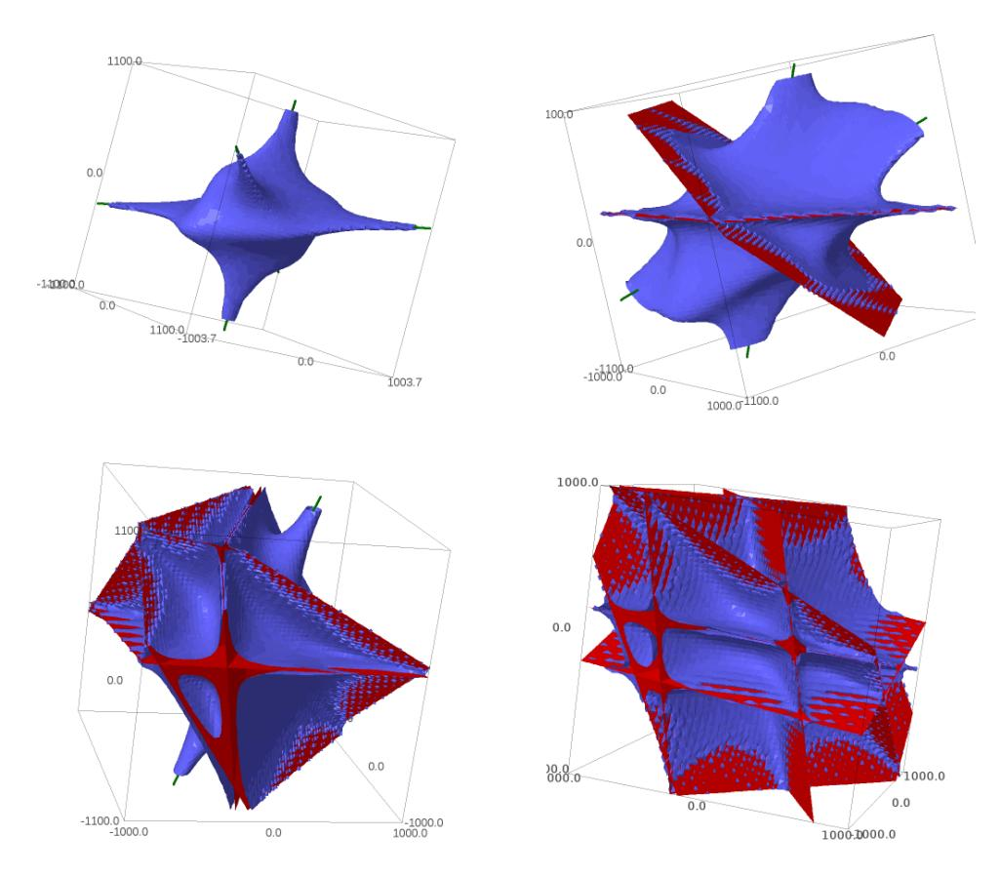
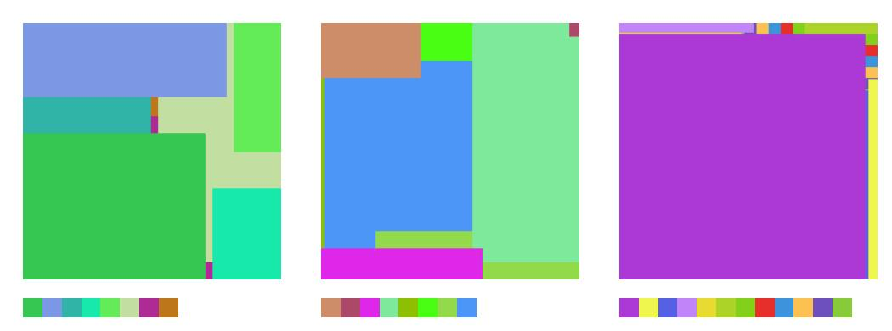

# Collecting relations for the Number Field Sieve in $GF(p^6)$

# Pierrick Gaudry, Laurent Grémy and Marion Videau

#### ABSTRACT

In order to assess the security of cryptosystems based on the discrete logarithm problem in non-prime finite fields, as are the torus-based or pairing-based ones, we investigate thoroughly the case in  $\mathbb{F}_{p^6}$  with the Number Field Sieve. We provide new insights, improvements, and comparisons between different methods to select polynomials intended for a sieve in dimension 3 using a special- $\mathfrak{q}$  strategy. We also take into account the Galois action to increase the relation productivity of the sieving phase. To validate our results, we ran several experiments and real computations for various polynomial selection methods and field sizes with our publicly available implementation of the sieve in dimension 3, with special- $\mathfrak{q}$  and various enumeration strategies.

#### 1. Introduction

The security of major cryptographic protocols relies heavily on the difficulty of two main number theoretic problems: large integer factorization and discrete logarithm computation in a finite group. Recently, the discrete logarithm problem on finite fields has received a lot of attention, bringing new results all related to the index calculus family of algorithms. If the small characteristic finite fields can be classified as a lost cause thanks to the quasi-polynomial algorithm [3] and the prime field case resorts to the *classical* Number Field Sieve (NFS) [13, 30, 18], there is still room to understand better how to adapt variants of NFS to non-prime finite fields [19, 2].

Cryptosystems that would be affected by better complexity and practical results in this setting would be torus-based [23, 27] or pairing-based (see [11] for a survey). Although not widely deployed in everyday products, the specificity of their use makes it necessary to finely assess the security margin that one can expect from a given choice of parameters for an expected period of time as progress in cryptanalysis can spectacularly undermine their usability, as it was the case for pairing-based cryptography using small characteristic finite fields.

In this context, today favorite finite fields targets are  $\mathbb{F}_{p^{12}}$  and  $\mathbb{F}_{p^6}$ . As already mentioned in [19], the classical NFS whose relation search relies on polynomials of degree 1 (dimension 2) is not the best suited in those cases. Instead, if we want to optimize the number of relations found, we need to consider a variant of NFS in higher dimension, that is relying on polynomials of degree greater than 1. Although the complexity fits in the L(1/3, c) class, these finite fields where higher dimensional sieving is required are those for which the constant c is the highest compared to other finite fields, despite recent advances [6, 25, 4, 21].

The NFS algorithm is usually considered composed of four sub-algorithms: the *polynomial selection* which produces a pair of polynomials that define the number fields used in the *relation collection*, which in turn produces relations involving small elements of the number fields. When enough relations are produced, a *linear algebra* step provides the logarithms of the small elements. Then, an *individual logarithm* step computes the logarithm of the target element thanks to the logarithms of the small elements.

In the literature, the two main computation examples using higher dimensional sieves which can serve as a reference to compare different variants and strategies are set in an  $\mathbb{F}_{p^6}$  of 240 bits and in an  $\mathbb{F}_{p^{12}}$  of 203 bits. The computation in  $\mathbb{F}_{p^{12}}$  is presented in [16]. It uses a sieve in

dimension 7, a special-q strategy to divide the sieving region and a line sieve to enumerate the polynomials in each special-q lattice.

There are several examples of computations in Fp<sup>6</sup> . In [[32](#page-13-14)], Zajac sets the first record computation. He uses a sieve in dimension 3, no special-q and a line sieve to enumerate the polynomials in the sieving region. In [[33](#page-13-15)], he also made experiments to apply a special-q strategy to divide the sieving region. He concluded that in his reference example it seemed too slow to provide any performance gain. In [[17](#page-13-16)], Hayasaka et al. targeted the same finite field but using both a special-q strategy and an adapted lattice-sieve enumeration inspired by Franke-Kleinung [[10](#page-13-17)]. Their computation time is comparable, around 22-24 normalized CPU-days. Both results use the same polynomial pair which define the number fields.

Our contributions. In this article we focus on improving the sieve in dimension 3, which is best suited to finite fields of the form Fp<sup>6</sup> . This is achieved by carefully analyzing the polynomial selection phase and adapt computations that are usually handled in dimension 2 to the case of dimension 3, for instance the α-value and the Murphy-E quantity. Besides, we compare different polynomial selection methods and take also into account that these polynomials will be used with a special-q strategy suggesting to introduce a controlled unbalance between them. We also consider the possibility of a Galois action for the polynomials which provide cheap relations, sparing some sieving time. Our goal is to output better polynomials to improve the relation productivity of the sieving phase.

In order to validate these criteria for polynomial selection, in the end we have to rely on real computations. To that purpose, we implemented a 3-dimensional sieve with a special-q strategy and several adapted enumeration algorithms (line sieve, plane sieve and space sieve) to be able to run several experiments and compare different strategies.

With our implementation, the improvements in the polynomial selection, and a Galois action of order 6, we were able to find a complete set of relations for the Zajac's 40-bit p in less than 1 normalized CPU-day. We ran two bigger computations in an Fp<sup>6</sup> , one with a 50-bit p which ran in about 7 CPU-days and the second one with a 65-bit p in about 790 CPU-days.

# 2. Background on special-q sieve, notation

# 2.1. The number field sieve

We recall briefly the general workflow of NFS in the context of finite fields Fp<sup>n</sup> , keeping in mind those of the form Fp<sup>6</sup> as our favorite targets. We take the occasion to fix the global notation used in the rest of the article.

Using more than two polynomials in NFS (the so-called MNFS variants [[9](#page-13-18), [8](#page-13-19), [6](#page-13-9), [25](#page-13-10)]) has not yet been used for practical computations, even in the much easier case of integer factorization, so we stick to two polynomials. The setting starts therefore with two irreducible polynomials f<sup>0</sup> and f<sup>1</sup> over Z that have a common irreducible factor of degree n modulo p. They define two number fields K<sup>f</sup><sup>0</sup> and K<sup>f</sup><sup>1</sup> . Then relations are collected by trying many content-free irreducible polynomials a: each trial a is viewed as an element of the field K<sup>f</sup><sup>0</sup> and one tests if the corresponding principal ideal is smooth, i.e. factors into prime ideals of norm less than a given smoothness bound. Similarly, a smoothness test is done in the other field K<sup>f</sup><sup>1</sup> , and if both sides are smooth, then we call it a relation. To detect that a principal ideal paq is smooth in a field K<sup>f</sup> , we start by testing the smoothness of its norm, which is an integer (or maybe a rational if f is not monic) or simply the smoothness of its resultant with f. In this article, we will talk indifferently about the norm and the resultant, keeping in mind that for steps of the algorithm after the relation collection, care must be taken if f is not monic. Also, when a large prime power is involved, smoothness of the norm does not imply smoothness of the ideal.

The set of polynomials a that must be tried before finding enough relations is called the sieving region S. The size of the coefficients of these is therefore p#Sq 1{t , where t is the number of coefficients of a (that is its degree plus one), which is the dimension of the sieve.

Since f<sup>0</sup> and f<sup>1</sup> must have degrees at least n, this degree can be large compared to the size of p, and then also to the size of the coefficients of the f<sup>i</sup> . At some point, n becomes large enough so that the norms get smaller if we consider a-polynomials with a larger value of t and smaller coefficients: this is the reason why we have to sieve in dimension higher than 2.

In order to speed-up the detection of smooth elements, a sieving procedure is used. For each prime ideal r in Kf<sup>0</sup> of norm less than a sieving bound (that is less than the smoothness bound), all the polynomials a where r divides the corresponding principal ideal are marked as such. Storing the set of a-polynomials in a t-dimensional array, these locations are regularly spaced in memory, which speeds-up considerably the process. Once this has been done, the promising locations that have been hit many times are scrutinized more thoroughly for smoothness with the ECM algorithm. Of course this is also done with ideals in Kf<sup>1</sup> , and actually, the processing of the two sides is interleaved, so that ECM is run only if the a-polynomial looks promising on both sides. We call threshold the bound on the number of bits left in the norm after sieving, used to define what "promising" means.

Once we have collected more relations than the number of prime ideals less than the smoothness bound, the relations are interpreted as linear equations between the virtual logarithms [[29](#page-13-20)] of those ideals thanks to Schirokauer maps. Then a sparse linear algebra step is performed to solve these equations. Finally, the so-called descent step [[14](#page-13-21)] allows to deduce the discrete logarithm of any finite field element. Since we are mostly interested in sieving we do not say more about these steps. The overall complexity is in Lp<sup>n</sup> p1{3, c ` op1qq, with a constant c that varies from 1.75 to 2.21 depending on the variant that can be used (or from 1.72 to 2.16 with MNFS); but the practical consequence is unclear for the Fp<sup>6</sup> target for which the best algorithm to use for currently feasible sizes is still to be determined.

# 2.2. Using special-q's

The special-q strategy introduced by Pollard [[26](#page-13-22)] is a way to organize the exploration of the sieving region S. Since most of the relations come from norms that are divisible by at least one not-so-small ideal, we do not lose much by exploring only locations with this property. Hence, we choose a list of prime ideals q of K<sup>f</sup><sup>0</sup> (we can choose K<sup>f</sup><sup>1</sup> instead) of norms less than the smoothness bound, but large enough (typically, above the sieving bound). We treat each q separately and consider the sublattice of a-polynomials having divisibility by q in K<sup>f</sup><sup>0</sup> , that we call the q-lattice. For a given norm size, prime ideals of inertia degree more than 1 are far less numerous than those of degree 1, so we consider only q's of inertia degree 1. In K<sup>f</sup><sup>0</sup> , the element x is not necessarily an integer; still, all but a tiny number of the q's can be represented by two elements of the form pq, x ´ ρq, where q is the norm of q and ρ a root of f<sup>0</sup> modulo q; a basis of the q-lattice is then given by pq,px ´ ρq, xpx ´ ρq, . . . , x<sup>t</sup>´<sup>2</sup> px ´ ρqq. Applying the LLL algorithm, we obtain a reduced basis whose elements form a matrix Mq, such that for any vector c with integral coefficients, the vector a " Mqc is in the q-lattice. Furthermore, taking all coefficients of c bounded in absolute value by a bound H, we get vectors a that cover approximately the target sieving region S. In fact, since two proportional a-polynomials would give the same relation, we consider only c vectors with a positive last coordinate. From now on, we will therefore always consider that the sieving region for c is a cuboid C of the form r´H0, H0rˆr´H1, H1rˆ ¨ ¨ ¨ ˆ r0, H<sup>t</sup>´<sup>1</sup>r. To fit with the classical notation, in the case of 3-dimensional sieving that we will study at length, we will set I " 2H0, J " 2H1, and K " H2.

# <span id="page-3-0"></span>2.3. Sieving in the special-q-lattice

For a given special-q, the sieving phase goes as follows. A t-dimensional array corresponding to the cuboid C is initialized with approximations of the logarithms of the norms. Then for each prime ideal r of norm less than the sieving bound, one has to find a description of the vectors c that yield elements divisible by r, in order to enumerate and visit all the corresponding locations to subtract the logarithm of the norm of r. Only ideals of inertia degree less than t can occur, so there is no need to consider the others.

All but a tiny number of the ideals r of inertia degree d are generated by two elements of the form pr, hpxqq, where r d is the norm of r and h is a monic polynomial of degree d. A basis of the lattice of a-polynomials yielding divisibility by r is pr, rx, . . . , rxd´<sup>1</sup> , hpxq, xhpxq, . . . , xt´d´1hpxqq. Therefore, modulo r, the first d columns of the corresponding matrix are zero and its rank is t ´ d. Hence this lattice can be described by a set of d linear relations modulo r between the coefficients of a. We write these relations in a d ˆ t matrix U<sup>r</sup> such that Ura " 0 mod r if and only if a yields divisibility by r. This can be translated into a condition on the coefficients of c: since a " Mqc, setting Uq,<sup>r</sup> " UrMq, we can identify the vectors c yielding divisibility by r with the equation Uq,rc " 0 mod r, where again, Uq,<sup>r</sup> is a d ˆ t matrix. In particular, in the most frequent case where r is of inertia degree 1, this becomes a single linear equation modulo r. From this description, fast algorithms are described in Section [4;](#page-7-0) but before going into these details, we describe more thoroughly the polynomial selection step.

# 3. Polynomial selections

# <span id="page-3-1"></span>3.1. Quality criteria

In the case of the classical NFS algorithm based on a 2-dimensional sieve, criteria to select the best polynomial pair among several candidates have been defined and refined over time [[24](#page-13-23), [22](#page-13-24), [1](#page-13-25)]. Although the general idea remains the same, it is necessary to revisit them in the case of a t-dimensional sieving for t ą 2, and in particular for t " 3.

3.1.1. Size properties The first and easiest criterion is to compute an upper bound on the sizes of the norms corresponding to both polynomials. This is enough for getting the optimal theoretical complexities, and can also be used as a first filter in practice.

Let pf0, f1q be the polynomial pair to be studied. In order to give a bound on the corresponding norms, it is first necessary to get an estimate on the size of the sieving region S. Doing that from a theoretical point of view is classical, but often imprecise compared to what is obtained in practice. The strategy is therefore as follows: a crude estimate for #S is made, which allows, taking other criteria into account, to select a not-so-bad pair; then running some sample sieving, it is possible to get a much better view of the actual sieving region size, and the polynomial selection is run again, possibly giving a better pair. This bootstrapping process does not have to be done again for each finite field: all the fields Fp<sup>n</sup> for fixed n and p of similar sizes will behave similarly. So from now on, we assume that an estimate for #S is known.

Then the skewness must be taken into account. If all the coefficients of f<sup>0</sup> (resp. of f1) are of similar sizes, the smallest upper bound is obtained by taking all the coefficients of a bounded by the same value p#Sq 1{t . On the other hand, if one of the f<sup>i</sup> is skewed, i.e. its coefficients have a size that decreases with the degree, then it is better to choose a-polynomials with the same property. This is even more true if both f<sup>0</sup> and f<sup>1</sup> are skewed. The ratio between the size of two consecutive coefficients of the a-polynomials is called the skewness.

Finally, having taken into account the size of the sieving region and the skewness, it is possible to obtain an upper bound for each norm. It remains to subtract from one of them the size of the special- $\mathfrak{q}$  that is planned to be used (again, it might be necessary to bootstrap with some crude sieving experiments to tune this size).

The first criterion is then to select the polynomial pair for which the sum of the sizes of the norms on both sides is minimal. This can be refined to take into account the fact that the Dickman rho function is convex: in a list of polynomial pairs that yield a similar value for the sum of the sizes of the norms, it is better to choose the pair for which the norms have sizes as close as possible to each other.

3.1.2. Local properties We now study the effect of local properties, i.e. the fact that the polynomials can have many roots modulo small primes. This is done on each side independently. Therefore, we let f be an irreducible polynomial in  $\mathbb{Z}[x]$ , that in the end will be either  $f_0$  or  $f_1$ . The  $\alpha$  quantity related to f, that we denote  $\alpha(f)$ , measures the difference in terms of smoothness probability between an integer obtained by computing the resultant of f and a polynomial of degree t-1 and a random integer of the same size. In other words, if a norm has size A, it will be smooth with the same probability as a random integer of size  $A + \alpha(f)$ . A negative value for  $\alpha(f)$  is a characteristic of a good polynomial f. In the following formal definition of  $\alpha$ , the size of an integer is given by the natural logarithm, in conformance with the traditional definition of  $\alpha$  in dimension 2.

DEFINITION 1. Let f be an irreducible polynomial in  $\mathbb{Z}[x]$ . Let  $\mathcal{S}$  be the set of content-free irreducible polynomials of degree t-1 over  $\mathbb{Z}$ . For a prime  $\ell$ , the local  $\alpha$ -value of f at  $\ell$  is

$$\alpha_{\ell}(f) = \log(\ell) \Big( \mathbb{A} \big( \operatorname{val}_{\ell}(n) \mid n \in \mathbb{Z} \big) - \mathbb{A} \big( \operatorname{val}_{\ell}(\operatorname{Res}(f, a)) \mid a \in \mathcal{S} \big) \Big),$$

where  $\operatorname{val}_{\ell}$  denotes the  $\ell$ -adic valuation and  $\mathbb{A}()$  is the average value. The  $\alpha$ -value of f is then defined as the sum over all primes  $\alpha(f) = \sum_{\ell} \alpha_{\ell}(f)$ .

In this definition, the average value  $\mathbb{A}()$  is defined by taking the limit of the average value of the quantity for increasingly large finite subsets of the whole considered set. To disambiguate this choice, we take these subsets as intersections of  $\mathcal{S}$  with centered balls of increasing radius. Another potential issue with this definition is the convergence of the series defining  $\alpha(f)$ . We leave it as a conjecture, since adapting the proof of [5] goes beyond the scope of this article.

The quantity  $\mathbb{A}\left(\operatorname{val}_{\ell}(n) \mid n \in \mathbb{Z}\right)$  is equal to  $1/(\ell-1)$ . The other part of the formula defining  $\alpha_{\ell}(f)$  can be simplified when  $\ell$  does not divide the leading coefficient of f nor its discriminant. The case of t=2 is well known [24] and yields  $\alpha_{\ell}(f) = \frac{\log(\ell)}{\ell-1}(1-\frac{\ell}{\ell+1}n_1)$ , where  $n_1$  is the number of roots of f modulo  $\ell$ . We derive the same kind of formula for the case t=3.

PROPOSITION 2. Let f be an irreducible polynomial in  $\mathbb{Z}[x]$  and  $\ell$  be a prime not dividing the leading coefficient of f nor its discriminant. Then, in the case of sieving in dimension t = 3,

$$\alpha_{\ell}(f) = \frac{\log(\ell)}{\ell - 1} \left( 1 - n_1 \frac{\ell(\ell + 1)}{\ell^2 + \ell + 1} - 2n_2 \frac{\ell^2}{(\ell + 1)(\ell^2 + \ell + 1)} \right),$$

where  $n_1$  and  $n_2$  are the number of linear (resp. degree 2) irreducible factors of f modulo  $\ell$ .

*Proof.* The condition on the leading coefficient allows to avoid questions about projective roots, and the condition on the discriminant implies that any irreducible factor of f modulo  $\ell$  can be lifted to an irreducible factor of f of the same degree over the  $\ell$ -adic ring  $\mathbb{Z}_{\ell}$ .

Let  $\varphi$  be a quadratic irreducible factor of f over  $\mathbb{Z}_\ell$ . Let a(x) be a quadratic polynomial with coefficients in  $\mathbb{Z}$  whose content is not divisible by  $\ell$ . Then the  $\ell$ -adic valuation of the resultant of  $\varphi$  and a(x) is 2k, where k is the largest integer such that a(x) is proportional to  $\varphi$  modulo  $\ell^k$ . The number of a(x) with coefficients in  $[0,\ell^k-1]$  that satisfy this condition is  $\ell^k-\ell^{k-1}$  since they are the polynomials of the form  $\gamma\varphi$ , where  $\gamma$  is not divisible by  $\ell$ . Furthermore, the number of polynomials a(x) with coefficients in  $[0,\ell^k-1]$  whose content is not divisible by  $\ell$  is  $\ell^{3k}-\ell^{3k-3}$ . Hence the proportion of those polynomials for which the valuation of its resultant with  $\varphi$  is at least 2k is  $(\ell^k-\ell^{k-1})/(\ell^{3k}-\ell^{3k-3})$ . Finally the contribution due to  $\varphi$  in the expected valuation of the resultant of f and a is  $\sum_{k\geqslant 1} 2\frac{\ell^k-\ell^{k-1}}{\ell^{3k}-\ell^{3k-3}} = \frac{2\ell^2}{(\ell^2-1)(\ell^2+\ell+1)}$ . The case of the contributions of roots of f is handled similarly: the number of polynomials

The case of the contributions of roots of f is handled similarly: the number of polynomials a(x) with coefficients in  $[0, \ell^k - 1]$  whose content is not divisible by  $\ell$  and that give a value divisible by  $\ell^k$  when evaluated at an  $\ell$ -adic root  $\rho$  of f is  $\ell^{2k} - \ell^{2k-2}$ , since they are all of the form  $(x - \rho)(\alpha x - \beta)$ , with  $\alpha$  and  $\beta$  in  $[0, \ell^k - 1]$  and not simultaneously divisible by  $\ell$ . Therefore the contribution of a root  $\rho$  in the expected valuation of the resultant of f and a is  $\sum_{k \geqslant 1} \frac{\ell^{2k} - \ell^{2k-2}}{\ell^{3k} - \ell^{3k-3}} = \frac{\ell^2 + \ell}{\ell^3 - 1}$ .

When the proposition does not apply, the natural workaround is to compute the factorization of f over the  $\ell$ -adic field (see for instance [7, Chapter 6.1]) and for each factor do the same kind of study as in the proof of the proposition. One could argue that, anyway, since computing the  $\ell$ -maximal order is required for converting relations to rows of the matrix, this is appropriate. However, computing  $\alpha$  must be as fast as possible because we might want to investigate billions of polynomials. In the classical 2-dimensional case, a very simple lifting is enough to deduce the average  $\ell$ -adic valuation. In Appendix A, we sketch a similar approach that, in many cases, will give the average valuation without having to perform a full  $\ell$ -adic factorization.

Finally, the case where  $\ell$  divides the leading coefficient of f is dealt with by adding the contribution of the (possibly multiple) root 0 in the reverted polynomial  $f(1/x)x^{\deg f}$ .

3.1.3. A 3-dimensional Murphy-E The Murphy-E quantity has been introduced in [24] as an estimate of the average smoothness probability of the norms corresponding to a sieving region. In the most precise variant the sieving region is replaced by a volume in  $\mathbb{R}^3$ , leading to the following definition, where we assume that the special- $\mathfrak{q}$ 's are chosen in  $K_{f_0}$ .

DEFINITION 3. Let  $(f_0, f_1)$  be a pair of irreducible polynomials used in the NFS algorithm, S a volume in  $\mathbb{R}^3$  approximating the sieving region, and B the smoothness bound. Let Q be the average size of the special- $\mathfrak{q}$ 's on the  $f_0$ -side. The Murphy-E function is defined by

$$E(f_0, f_1, \mathcal{S}, B, Q) = \int_{a \in \mathcal{S}} \rho\left(\frac{\log|\operatorname{Res}(f_0, a)| - Q + \alpha(f_0)}{\log B}\right) \rho\left(\frac{\log|\operatorname{Res}(f_1, a)| + \alpha(f_1)}{\log B}\right),$$

where  $\rho$  is Dickman's rho function.

This 3-dimensional integral is in general too costly to compute when we have a large set of polynomial pair candidates to select from. Various approaches have been taken in dimension 2, and we follow the one taken in CADO-NFS (see [31]), which is inspired from Kleinjung's code and Murphy's thesis. The idea is to use a Monte-Carlo approach, not on  $\mathcal{S}$  itself but on its boundary, so that the dimension drops by one. The rationale is that when we multiply a polynomial a by a scalar r, the resultant with f is multiplied by  $r^{\deg f}$ , and therefore the sizes of the norms on a line through the origin are well controlled once one value on it is known.

With the special- $\mathfrak{q}$  sieving strategy, since we are dealing with many ideals  $\mathfrak{q}$ , each of them favoring some direction, viewed globally the general shape of the sieving region will be a sphere, or an ellipsoid if there is some skewness in  $f_0$  and  $f_1$ . Hence, we will use this approximation

for computing a Murphy-E value and compare the polynomial pairs: we pick a sphere or an ellipsoid corresponding to our sieving region, and perform a Monte-Carlo evaluation of the integral on its surface. In practice, we found it convenient to use a Fibonacci sphere [12] as evaluation points.

Finally, in the classical 2-dimensional NFS, having many real roots tends to increase the Murphy-E value. We describe an analogue for 3-dimensional sieving in Appendix B, but this is not really another criterion, because it is already captured by Murphy-E.

3.1.4. Explicit Galois action An additional criterion that must be taken into account is the possible existence of an explicit Galois action that takes the same form for  $f_0$  and  $f_1$ . Examples are given in [2] and we also use some in our experiments. For a polynomial f, and a homography  $\sigma(x) = n(x)/d(x)$ , we define  $f^{\sigma}(x) = f(\sigma(x))d(x)^{\deg f}$ . Then,  $\sigma$  is said to be an explicit Galois action for f if  $f^{\sigma}$  is proportional to f. In that case,  $\sigma$  is an automorphism of the number field  $K_f$ . In this field,  $a(\sigma(x))$  is a conjugate of a(x): they have the same norm. In our context we need to work with polynomials, so we consider  $a^{\sigma} = a(\sigma(x))d(x)^{\deg a}$ . The norm is therefore multiplied by the norm of  $d(x)^{\deg a}$ , which is typically a small, smooth number.

We have shown that if  $\sigma$  is an explicit Galois action for  $f_0$  and  $f_1$ , and if a is a polynomial that has a smooth norm on both sides and hence yields a relation, then  $a^{\sigma}$  also yields a relation. And in fact, if  $\sigma$  is of order k, then we can deduce k-1 additional relations from each relation obtained by sieving, by letting  $\sigma$  act on a.

In a special- $\mathfrak{q}$  context, it is simple to organize the computation in order to save a factor k in the relation collection phase. Indeed, the special- $\mathfrak{q}$ 's can be organized in orbits of k conjugate ideals, and if a polynomial a yields a principal divisor divisible by  $\mathfrak{q}$ , then  $a^{\sigma}$  yields a principal divisor divisible by  $\mathfrak{q}^{\sigma}$ . It is therefore enough to sieve only one of the special- $\mathfrak{q}$ 's per orbit, and to derive relations for the other special- $\mathfrak{q}$ 's with conjugation by  $\sigma$ .

## 3.2. Several strategies

We now review the different polynomial selection methods that could make sense for a finite field  $\mathbb{F}_{p^6}$ ; we present them for any field  $\mathbb{F}_{p^n}$ , but we keep this target in mind. We do not discuss the SNFS case [20], where the polynomials are directly derived from a special form of p.

3.2.1. Adapting the JLSV strategy to special-q sieving The most basic polynomial selection method adapted to our case is the one proposed by Joux-Lercier-Smart-Vercauteren in [19]: we pick first a polynomial  $f_0$  of degree n with small coefficients, that is irreducible modulo p; then  $f_1$  is set to  $f_1 = f_0 + p$ . The polynomial  $f_1$  resulting from this construction is skewed, while  $f_0$  is not; but since  $f_1$  is the polynomial that yields the largest norms, it make sense to sieve a-polynomials with the skewness of  $f_1$ , namely  $p^{1/n}$ .

A first improvement to this method was proposed in [19], and was used in particular in [6, 2, 25]. The goal is to obtain polynomials  $f_0$  and  $f_1$ , without skewness and of similar sizes, so that the norms are balanced. We propose a modification of this polynomial selection to take into account the fact that we use a special- $\mathfrak{q}$  sieving: the goal is now to obtain norms of slightly different sizes, so that after dividing out by the special- $\mathfrak{q}$ , they become of the same size.

Let Q be the average value of q for all the special-q's we consider, and assume that we are going to take them on the  $f_1$ -side. We first look for an irreducible polynomial  $f_0$  such that  $f_0 = \pi + \eta \rho$  with  $\pi$  and  $\rho$  two polynomials with small integer coefficients and of degree at most n, with at least one of them of degree exactly n, and with  $\eta$  an integer close to  $p^{1/2-\epsilon}$ , with  $0 < \epsilon < 1/2$ . Thanks to the extended Euclidean algorithm, we then compute  $\kappa$  and  $\lambda$  such that  $\eta \equiv \kappa/\lambda \mod p$ , with  $\kappa \approx p^{1/2-\epsilon}$  and  $\lambda \approx p^{1/2+\epsilon}$ , to define  $f_1 = \lambda \pi + \kappa \rho$  with coefficients of size  $O(p^{1/2+\epsilon})$ . Using a crude upper bound, the ratio between the norms on both sides is  $N_{f_1}(a)/N_{f_0}(a) \approx \|f_1\|_{\infty}^{t-1} / \|f_0\|_{\infty}^{t-1} \approx p^{2\epsilon(t-1)}$ . By taking  $\epsilon = \log_p(Q)/(2(t-1))$ , we can ensure

that this ratio is close to Q, and therefore, we obtain balanced norms after taking the special- $\mathfrak{q}$  sieving into account.

As explained in [2], by using specific  $\pi$  and  $\rho$  polynomials, it is possible to enforce a Galois action of order n, at least for small values of n. This is still true with our unbalanced version. Finally, for a given choice of  $f_0$  and the  $f_1$  following our construction, it is possible to find other choices for  $f_1$  by adding to it a small multiple of  $f_0$ . Since the coefficients of  $f_0$  are smaller than those of  $f_1$ , there are many choices that do not change the size properties, so that we can select the  $f_1$  with the best other criteria, in particular its  $\alpha$  value.

3.2.2. Sarkar-Singh constructions for  $\mathbb{F}_{p^6}$  We recall the Sarkar-Singh method, in a slightly less general setting than in [28], since we always set r = k = n/d in the Algorithm  $\mathcal{A}$  of this article; on the other hand we do not insist on having monic polynomials. The method is parametrized by a divisor d of n; for d = 1 we recover the GJL construction and for d = n, the Conjugation method (see [2] for the original description of GJL and Conjugation methods). For n = 6, we have two additional cases, d = 2 and d = 3, to consider.

The construction works as follows. Let  $\pi$  and  $\rho$  be two polynomials with small integer coefficients with  $\pi$  of degree d and  $\rho$  of degree at most d-1. Then, we pick a polynomial A of degree 1+n/d with small integer coefficients, irreducible over  $\mathbb{Z}$ , and that admits an irreducible factor  $\Phi$  of degree n/d modulo p. The polynomial  $f_0$  is then defined by  $f_0(x) = \operatorname{Res}_y(A(y), \pi(x) + y\rho(x))$ ; it is of degree n+d, and has small coefficients. If it is not irreducible we restart the construction with other choices. The polynomial defining  $\mathbb{F}_{p^n}$  in this setting is  $\varphi(x) = \operatorname{Res}_y(\Phi(y), \pi(x) + y\rho(x))$  mod p, therefore, if it is not irreducible over  $\mathbb{F}_p$ , we have also to start over with other choices. To construct  $f_1$ , we first use a lattice basis reduction to compute a polynomial  $\Psi$  over  $\mathbb{F}_p$  proportional to  $\Phi$  with coefficients represented by integers of sizes approximately  $p^{n/(n+d)}$ . The polynomial  $f_1$  is then defined by  $f_1 = \operatorname{Res}_y(\Psi(y), \pi(x) + y\rho(x))$ ; it is of degree n and its coefficients have sizes about  $p^{n/(n+d)}$ , and again we check its irreducibility over  $\mathbb{Z}$  and repeat the whole procedure if it is not the case. In Table C.1 of the Appendix, we summarize the sizes of the coefficients and the degree of  $f_0$  and  $f_1$  for the case n=6.

Just as for the JLSV construction, it is possible to choose  $\pi$  and  $\rho$  in order to enforce a common explicit Galois action for  $f_0$  and  $f_1$  of order d. A drawback of this method compared to JLSV is that there is less room to play for optimizing the  $\alpha$ -value of the polynomials.

## 4. Special-q sieve in dimension 3

<span id="page-7-0"></span>For finite fields of the form  $\mathbb{F}_{p^6}$  of sizes that are within reach with current technology and algorithms, it is difficult to predict which polynomial selection method is the best. We will therefore rely on practical experiments, based on the runtime of a sieve implementation to decide and validate our criteria. In this setting, the optimal sieving dimension is 3. It might be 4 for small values of p, where it is unclear whether NFS is actually the best available algorithm; and for a sufficiently large value of p, the best sieving dimension will eventually become 2, but this will occur for sizes that are too large to run meaningful experiments. Therefore, we concentrate on the 3-dimensional sieving.

In the factor base, most of the ideals are of inertia degree 1, so we describe our sieving procedure only for this case. In fact we consider a slightly more restrictive situation. From Section 2.3 the vectors c=(x,y,z) that yield elements divisible by a factor base ideal  $\mathfrak r$  are those whose coordinates verify a modular linear relation, and we assume that this relation is of the form

<span id="page-7-1"></span>
$$x + By + Cz \equiv 0 \mod r,\tag{4.1}$$

where r is the norm of the ideal  $\mathfrak{r}$ , and B is non-zero. This avoid complications due to projective roots (or generalizations thereof to dimension 3).

In order to obtain elements  $a=M_{\mathfrak{q}}c$  in the target sieving region  $\mathcal{S}$ , and norms of controlled sizes, we are interested in vectors c in the cuboid  $\mathcal{C}$  of size  $I\times J\times K$ . Our convention for the memory organization of this cuboid is z-major, and then y-major for each xy-plane (i.e. fixedz-plane). Hence, for fixed values of y and z, the corresponding x-line contains cells that are contiguous in memory. With this setting, for ideals of tiny norms r < I, it makes sense to do line-sieving. When r becomes larger than I, the average number of hits per x-line is less than 1, and line-sieving is suboptimal: Franke-Kleijung's plane-sieving is then more appropriate. But then again, when r becomes larger than IJ, the average number of hits per xy-plane is less than 1, and it is better to switch to a space-sieve strategy.

Line sieving is the most basic sieving strategy: after specializing all-but-one coordinates, this becomes a one-dimensional sieve, and one can jump from one hit location to the other by just adding r to the location index. For fixed y and z coordinates, finding the initial hit location amount to solving the linear equation 4.1 to get the smallest x solution within the given range. We remark furthermore that solving this problem for (y+1,z) after having solved it for (y,z) costs essentially no more than one addition modulo r.

#### 4.1. Plane sieve

The plane sieve is for sieving ideals whose norms r are of intermediate sizes. It works only for r > I, and we assume this from now on. The general idea is to process all the xy-planes in turn, by increasing values of z. For a given value of z, there are two problems to solve: first, we need to find an initial hit location in the intersection of the given plane and the cuboid  $\mathcal{C}$ , and second, we need to adapt Franke-Kleinjung's algorithm (FK-algorithm, for short) in order to visit efficiently all the other hit locations in the plane.

We denote by  $\Lambda$  the lattice corresponding to the vectors c that verify Equation 4.1, or equivalently that corresponds to divisibility by the ideal  $\mathfrak{r}$ . For any  $z_0$ , we denote by  $\Lambda_{z_0}$  the intersection of  $\Lambda$  and the plane of equation  $z=z_0$ . The set of points in  $\Lambda_0$  form a 2-dimensional lattice of volume r, and  $\Lambda_{z_0}$  is a translate of  $\Lambda_0$ . The FK-algorithm relies on a particular basis for almost all 2-dimensional lattices, adapted to the bound I on the x-coordinate: in [10, Proposition 1], it is shown that there exists a unique basis  $\{(\alpha, \beta)^T, (\gamma, \delta)^T\}$  of the lattice  $\Lambda_0$ , called FK-basis, which can be efficiently computed using the extended Euclidean algorithm, such that

- $\beta > 0$  and  $\gamma > 0$ ;
- $-I < \alpha \le 0 \le \gamma < I$ ;
- $\gamma \alpha \geqslant I$ .

Using this basis, the classical FK-algorithm allows to enumerate the elements of  $\Lambda_0$  whose x-coordinate is within an interval of size I, by increasing value of y. The following proposition shows that with a natural extension of the FK-algorithm, it is possible to enumerate the elements of  $\Lambda_{z_0}$  whose x-coordinate is within an interval of size I, by increasing and decreasing values of y; finding an initial point with the smallest y-value is therefore not necessary.

<span id="page-8-1"></span>PROPOSITION 4. Let I > 0 be an integer and let  $\Lambda$  be a 3-dimensional lattice of volume r > I. Let  $\{(\alpha, \beta)^T, (\gamma, \delta)^T\}$  be the FK-basis of the intersection of  $\Lambda$  with the xy-plane. Let A be an integer, and A = [A, A + I[ the corresponding interval of length I. Let  $z_0$  be a fixed third coordinate for elements of  $\Lambda$ . Let  $c = (x_0, y_0, z_0)$  be an element of  $\Lambda_{z_0}$  with  $x_0 \in A$ . Then the point of  $\Lambda_{z_0}$ , with an abscissa in A and with the smallest y-coordinate larger than  $y_0$  is obtained by adding to c one of the following vector:

<span id="page-8-0"></span>
$$\begin{cases} (\alpha, \beta, 0)^T & \text{if } x_0 \geqslant A - \alpha, \\ (\gamma, \delta, 0)^T & \text{if } x_0 < A + I - \gamma, \\ (\alpha, \beta, 0)^T + (\gamma, \delta, 0)^T & \text{if } A + I - \gamma \leqslant x_0 < A - \alpha. \end{cases}$$

$$(4.2)$$

Similarly, the point of  $\Lambda_{z_0}$ , with an abscissa in  $\mathcal{A}$  and with the largest y-coordinate smaller than  $y_0$  is obtained by subtracting to c one of the following vector:

$$\begin{cases}
(\alpha, \beta, 0)^T & \text{if } x_0 < A + I + \alpha, \\
(\gamma, \delta, 0)^T & \text{if } x_0 \geqslant A + \gamma, \\
(\alpha, \beta, 0)^T + (\gamma, \delta, 0)^T & \text{if } A + I + \alpha \leqslant x_0 < A + \gamma.
\end{cases}$$
(4.3)

Proof. Let  $c=(x_0,y_0,z_0)$  be an element of  $\Lambda_{z_0}$  with  $x_0 \in \mathcal{A}$ . Let  $c'=(x'_0,y'_0,z_0)$  be the vector obtained by applying Equation 4.2 to it, and  $c''=(x''_0,y''_0,z_0)$  be the vector of  $\Lambda_{z_0} \cap (\mathcal{A} \times \mathbb{Z} \times \{z_0\})$  with the smallest y-coordinate that is larger than  $y_0$ . We want to show that c'' is equal to c'. Let  $u \in \Lambda$  be defined by  $u=(0,-C/B \bmod r,1)$ , with the notations of Equation 4.1. Subtracting  $z_0u$  to c, c' and c'', we obtain three vectors  $\underline{c}$ ,  $\underline{c}'$  and  $\underline{c}''$ , in  $\Lambda_0$  while preserving their x-coordinates, and translating their y-coordinates by a constant. Contrarily to  $\Lambda_{z_0}$ ,  $\Lambda_0$  is a lattice, therefore we are exactly in the context of the 2-dimensional FK-algorithm, and by [10, Proposition 2], we must have  $\underline{c}'=\underline{c}''$ , and, adding back  $z_0u$ , the result follows. The second case is obtained by symmetry.

It remains to explain how to find a valid starting point for this variant of the FK-algorithm. Our strategy is to precompute a few lattice vectors with a z-coordinate equal to 1, and other coordinates as small as possible. Hence, from a point in  $\Lambda_{z_0}$  whose x- and y-coordinates are within the target intervals of length I and J, adding such a vector will give a point in  $\Lambda_{z_0+1}$  whose x- and y-coordinates are maybe not in the target interval, but probably not too far from it. In order to compute three small lattice vectors with z=1, we proceed as follows:

- (1) Select a lattice vector v with z = 1, for instance the one given in the proof above;
- (2) Find a reduced basis  $(e_0, e_1)$  of  $\Lambda_0$  using Gauss algorithm;
- (3) Deduce the closest vector  $u_0$  of the orthogonal projection of v in  $\Lambda_0$ ;
- (4) Add or subtract  $e_0$  and  $e_1$  to  $u_0$ , to get three vectors  $(u_0, u_1, u_2)$  of  $\Lambda_0$  that form the smallest triangle containing the projection of v;
- (5) Return the three vectors  $v u_i$  for  $0 \le i < 3$ .

Again, there is no guarantee that adding one of the small vectors with z=1 will keep the two other coordinates within the target intervals. If after having tried the three vectors we do not find a starting point, then by adding or subtracting the vector of the FK-basis with the largest x-coordinate, it is possible to quickly get the x-coordinate back into the target interval. Then, we apply the modified FK-algorithm to enumerate the hit locations for the current plane.

#### 4.2. Space sieve

When the volume r of the lattice  $\Lambda$  becomes large compared to the area IJ of the intersection of the sieving cuboid and the xy-plane, the plane sieve becomes inefficient, because in most of the planes, the modified FK-algorithm will not find any hit location. In that case, we have to find a way to jump quickly from one lattice point in the cuboid  $\mathcal C$  to the one with the smallest larger z-coordinate. This justifies the following definition.

<span id="page-9-0"></span>DEFINITION 5. Let  $\mathcal{A}$  and  $\mathcal{B}$  be two integral intervals of length I and J respectively. Let  $\Lambda$  be a lattice of volume r > IJ. A transition vector v is a vector of  $\Lambda$  for which there exists a vector u of  $\Lambda$  in  $\mathcal{A} \times \mathcal{B} \times \mathbb{Z}$  such that u + v is the vector of  $\Lambda$  belonging to  $\mathcal{A} \times \mathcal{B} \times \mathbb{Z}$  and which is the one with the smallest z-coordinate that is larger than the one of u.

For simplicity, we first assume that there is no lattice vector in  $\mathcal{A} \times \mathcal{B} \times \{0\}$ , so that for a given u, there is a unique transition vector associated to it.

An analogue notion of transition vector can be defined for 2-dimensional sieving. The first statement of Proposition [4](#page-8-1) says that the two vectors of the FK-basis and their sum are the only transition vectors. Unfortunately, in 3-dimensional sieving, the number of transition vectors is much less controlled. We give some examples, in the Appendix [D](#page-16-1) . Still, the transition vectors have some simple properties that follow directly from their definition.

<span id="page-10-0"></span>Lemma 6. With the notation of Definition [5,](#page-9-0) the following holds:

- For a given lattice vector, the associated transition vector depends only on its x- and y-coordinates;
- The set of transition vectors depend only on Λ, and on the length I and J of the intervals A and B, not on the intervals themselves;
- The x- and y-coordinates of a transition vector belong to s ´ I, Ir and s ´ J, Jr respectively.

We do not try to compute the complete set of transition vectors, but only a subset that covers a large enough proportion of the I ˆ J area. In fact, we do not even insist on proving that we really have transition vectors: we accept the fact that in some not-too-frequent cases we will use a vector that makes us jump too far in the z-coordinate, thus missing a hit location. The general idea is that this step is in a very critical loop of the algorithm, and we cannot afford to spend too much time in it. Therefore, it is better to miss a few relations if the general rate of relations found per second is higher than with an algorithm that would try to be exhaustive.

We resort to a heuristic but simple and efficient method to find candidate transition vectors: with a weighted-LLL algorithm, we find a reduced basis of Λ, targeting vectors with x- and ycoordinates with sizes about I and J respectively (and then the target for the z-coordinate is about r{IJ). Then, we compute a few small linear combinations of the vectors of this reduced basis, and keep the list of the half-dozen vectors with the smallest z-coordinates and x- and y-coordinates of absolute value bounded by I and J respectively. There are certainly highly unbalanced lattices for which this method will fail, but we observed that in practice for most of the ideals it produces a list of transition vectors that covers a large xy-area.

After computing this list L of candidate transition vectors, our space-sieve algorithm proceeds as follows. Let v be the current hit location that we initialize with the zero vector (assuming 0 belongs to the intervals A and B). To get the next hit location, we try to add, in turn, the elements of L, until this addition produces a vector in A ˆ B ˆ Z. We test the vectors of L in increasing order of their z-coordinates. If no appropriate vector is found after trying all vectors of L, we fallback to a plane sieve strategy: we use vectors with z " 1 to go up by one plane, and if there is no hit in this plane, we continue until one is found. This slower process yields a new transition vector that is added to L before resuming with the space sieve.

In this description, we have assumed that there were no lattice vector with z " 0, |x| ă I and |y| ă J, which is certainly true in general provided that r is large enough, but we cannot exclude it to occur, especially when r is just marginally larger than IJ. It is not too difficult to handle those ideals that can hit several times in some planes: before trying to apply transition vectors, one must check whether the vectors with z " 0 can yield hits, and if so, transition vectors can be tried on all these hits. A pseudo-code following these ideas can be found in Appendix, as Algorithm [3.](#page-17-0) Experiments in the next section confirm that using the space sieve is indeed faster than the plane sieve for large ideals (see also Appendix [F\)](#page-16-2).

Remark 7. In the recent preprint [[17](#page-13-16)], another 3-dimensional version of FK-algorithm is proposed. Although we did not manage to fully reproduce the work of this preprint, their strategy is not to precompute a set of transition vectors, but to try to compute them on the fly at each step, using a well reduced basis (when it exists).

## 5. Experimental results

The experiments in this section have been done with our C implementation of the 3-dimensional sieving that we made available as a branch called hd in the CADO-NFS official repository [31] (done with commit OaeO1dO...). In the file README.nfs-hd, instructions are given to reproduce all our experiments. The polynomial selection based on the criteria and constructions that we explained in Section 3 has been performed by Aurore Guillevic who has developed strategies to speed-up the exhaustive search that she will describe in an independent article in which  $\mathbb{F}_{p^6}$  will be just an example among many others. All the running times are given after normalization for a single core at 2 GHz.

# 5.1. Experiments with the example of the literature

Our first experiment follows the two previous computations made by Zajac [32] and Hayasaka et al. [17] for a 40-bit prime p=1081034284409. They used different sieving algorithms but the same polynomial pair, the same smoothness bounds and the same sieving region for the polynomials a. With these parameters, the Murphy-E value computed with our description is about  $2^{-24.5}$  with Zajac's parameters and  $2^{-21.6}$  for Hayasaka's parameters. The difference between the two is due to the special- $\mathfrak{q}$  sieve.

We have selected our own polynomials. In this small field, the best polynomial selection appears to be the asymmetric JLSV method with the explicit Galois action of order 6 given by  $x\mapsto -(2x+1)/(x-1)$ . We chose  $f_0=x^6+91354x^5+228370x^4-20x^3-228385x^2-91348x+1$  and  $f_1=23667000x^6+6549182x^5-338632045x^4-473340000x^3-16372955x^2+135452818x+23667000$ . We have selected the smoothness bounds and the sieving region in order to reduce the total sieving time. The sizes of norms are about 115 bits on the  $f_0$ -side and 117 bits on the  $f_1$ -side, after subtracting the contribution of the special-q. We sieved all the prime ideals  $\mathfrak r$  of inertia degree 1 less than  $2^{19}$ . The thresholds are set to  $2^{65}$ . We obtained 1312416 raw relations with 12.3% of duplicates. These results are summarized in Table 1.

|                                                       | Zajac [ <b>32</b> ]                                          | Hayasaka et al. [17]                                        | Our work                                        |
|-------------------------------------------------------|--------------------------------------------------------------|-------------------------------------------------------------|-------------------------------------------------|
| Special-q sieve                                       | No                                                           | Yes                                                         | Yes                                             |
| Enumeration algorithm                                 | Line sieve                                                   | Line sieve and<br>FK method in 3D                           | Line, plane and space sieves                    |
| Sieving region (global or per q)<br>Smoothness bounds | $2^{19} \times 2^{14} \times 1149$<br>$2^{22.64}, 2^{22.64}$ | $2^{8} \times 2^{8} \times 2^{6}$<br>$2^{22.64}, 2^{22.64}$ | $2^7 \times 2^7 \times 2^6$<br>$2^{23}, 2^{23}$ |
| $\alpha$ values                                       | 1.7, 0                                                       | 1.7, 0                                                      | -1.8, -11.5                                     |
| Murphy-E                                              | $2^{-24.5}$                                                  | $2^{-21.6}$                                                 | $2^{-20.1}$                                     |
| Number of special-q's                                 | _                                                            | $2^{17.77}$                                                 | $2^{14.44}$                                     |
| Order of the Galois action                            | _                                                            | _                                                           | 6                                               |
| Number of relations                                   | 1077984                                                      | 937575                                                      | 1151099                                         |
| Number of needed relations                            | 854833                                                       | 893773                                                      | 1128604                                         |
| Timing (days)                                         | 24.13                                                        | 21.94                                                       | 0.90                                            |

<span id="page-11-0"></span>Table 1. Experiments on sieving in  $\mathbb{F}_{p^6}$  with p = 1081034284409.

#### <span id="page-11-1"></span>5.2. Experiments with a 300-bit finite field

In order to compare the polynomial selections described in Section 3, we have chosen a new  $\mathbb{F}_{p^6}$  field with a 50-bit prime p=1043035802846857. For this experiment, we worked with a reduced range of about 10000 special- $\mathfrak{q}$  up to  $2^{20.5}$ . Our tests were done with a sieving region of size  $2^8 \times 2^8 \times 2^7$  and two smoothness bounds equal to  $2^{25}$ . The polynomials we used can be found in Appendix G. The results are summarized in Table 2. It allowed us to select the best suitable polynomials in order to find a complete set of relations. The numbers of relations per

special-q are given without the use of the Galois action; therefore to get a fair comparison the entries of the last two lines of Table 2 should be multiplied together.

|                                | Asym. JLSV                      | Conjugation              | Sarkar-Singh (8, 6)                                            | Sarkar-Singh (9, 6)                                     |
|--------------------------------|---------------------------------|--------------------------|----------------------------------------------------------------|---------------------------------------------------------|
| $\alpha$ values Murphy- $E$    | $-12, -4.9$ $2^{-19.0}$         | $-0.8, -6.4$ $2^{-27.3}$ | $1.2, -4.6$ $2^{-22.5}$                                        | $ \begin{array}{c} 1.9, -6.5 \\ 2^{-23.0} \end{array} $ |
| Special-q side                 | $\frac{1}{2^{128}}$ , $2^{139}$ | 0                        | $ \begin{array}{c} 2\\ 1\\ 2^{153} \cdot 2^{143} \end{array} $ | 1<br>2 <sup>186</sup> , 2 <sup>144</sup>                |
| Size of norms<br>Galois action | 6                               | $2^{251}, 2^{148}$ $6$   | 2                                                              | 3                                                       |
| Rels per q                     | 25.7                            | 0.2                      | 1.2                                                            | 0.9                                                     |

<span id="page-12-0"></span>Table 2. Experiments on sieving with p = 1043035802846857.

For the full sieving computation, we kept the sieving region and the smoothness bounds of the experiments and used the polynomials given by the asymmetric JLSV polynomial selection. They are  $f_0 = x^6 - 867578x^5 - 2168960x^4 - 20x^3 + 2168945x^2 + 867584x + 1$  and  $f_1 = 2404471680x^6 + 4874502674x^5 - 23880818515x^4 - 48089433600x^3 - 12186256685x^2 + 9552327406x + 2404471680$ , with the same Galois action as for the smaller example. The  $2^{14.7}$  special-q's are set on the  $f_1$ -side. The sieving bounds equal to  $2^{20.5}$  and the thresholds were set to  $2^{80}$ . We obtained 4637772 raw relations that gave 4231562 unique relations after duplicate removal; there are 4129438 ideals in the factor bases. The relation collection time is 6.84 days.

## 5.3. Computation for a 389-bit finite field

We have selected a 65-bit prime p=31415926535897942161. For this computation, the asymmetric JLSV polynomial selection with the same Galois action of order 6 seems to give anew the best polynomials in terms of Murphy-E value. The polynomials are  $f_0=x^6-218117072x^5-545292695x^4-20x^3+545292680x^2+218117078x+1$  and  $f_1=288064804440x^6+1381090484642x^5-868245854995x^4-5761296088800x^3-3452726211605x^2+347298341998x+288064804440$ . We selected the sieving region to be  $2^{10}\times 2^{10}\times 2^8$  and two smoothness bounds equal to  $2^{28}$ . The  $2^{18.7}$  special-q's are set on the  $f_1$  side and the average value of the norms are  $2^{160}$  on the  $f_0$ -side and  $2^{173}$  on the  $f_1$ -side. The sieving bounds are equal to  $2^{21}$  and the thresholds are set to  $2^{90}$ . The relation collection required 790 days to find 29428326 unique relations after the removal of less than 20.3% duplicates; this is greater than the 29261526 ideals in the factor bases. This computation was done with commit 4470e1....

#### 6. Conclusion

In this article we investigated at length different strategies to improve the relation productivity of the sieving step in NFS in dimension 3 targeted for a discrete logarithm computation in  $\mathbb{F}_{p^6}$ . This involved adapting and comparing differents polynomial selection methods taking into account a special- $\mathfrak{q}$  sieve and a Galois action especially for dimension 3. We ran experiments on several real computations to compare with existing records and set new reference timings. Most notably, we ran a relation collection for a 50-bit p in about 7 normalized CPU-days and a 65-bit p in about 790 CPU-days. Our implementation is publicly available as part of CADO-NFS.

In a near future, we plan to run a full discrete logarithm computation in  $\mathbb{F}_{p^6}$  that includes the linear algebra and individual logarithm steps for a size as large as possible with our computing resources. It is possible that including some of the ideas of [17] would speed-up our implementation. Further work includes also studying the practical aspects of the Tower NFS variants [4, 21]; this would imply sieving in dimension at least 4.

# References

- <span id="page-13-25"></span>1. Bai, S., Brent, R., Thomé, E.: Root optimization of polynomials in the number field sieve. Math. Comp. 84, 2447–2457 (2015)
- <span id="page-13-5"></span>2. Barbulescu, R., Gaudry, P., Guillevic, A., Morain, F.: Improving NFS for the discrete logarithm problem in non-prime finite fields. In: Oswald, E., Fischlin, M. (eds.) EUROCRYPT 2015. LNCS, vol. 9056, pp. 129–155. Springer (2015)
- <span id="page-13-0"></span>3. Barbulescu, R., Gaudry, P., Joux, A., Thomé, E.: A heuristic quasi-polynomial algorithm for discrete logarithm in finite fields of small characteristic. In: Nguyen, P., Oswald, E. (eds.) EUROCRYPT 2014. LNCS, vol. 8441, pp. 1–16. Springer (2014)
- <span id="page-13-11"></span>4. Barbulescu, R., Gaudry, P., Kleinjung, T.: The tower number field sieve. In: Iwata, T., Cheon, J.H. (eds.) ASIACRYPT 2015. LNCS, vol. 9453, pp. 31–55. Springer (2015)
- <span id="page-13-26"></span>5. Barbulescu, R., Lachand, A.: Some mathematical remarks on the polynomial selection in NFS (2014), <https://hal.inria.fr/hal-00954365>, preprint, to appear in Math. Comp.
- <span id="page-13-9"></span>6. Barbulescu, R., Pierrot, C.: The Multiple Number Field Sieve for Medium and High Characteristic Finite Fields. LMS J. Comput. Math 17, 230–246 (2014)
- <span id="page-13-27"></span>7. Cohen, H.: A course in algorithmic algebraic number theory, GTM, vol. 138. Springer–Verlag (1993)
- <span id="page-13-19"></span>8. Commeine, A., Semaev, I.: An algorithm to solve the discrete logarithm problem with the number field sieve. In: et al., M.Y. (ed.) PKC 2006. LNCS, vol. 3958, pp. 174–190. Springer (2006)
- <span id="page-13-18"></span>9. Coppersmith, D.: Modifications to the number field sieve. J. of Cryptology 6(3), 169–180 (1993)
- <span id="page-13-17"></span>10. Franke, J., Kleinjung, T.: Continued fractions and lattice sieving. In: SHARCS (2005)
- <span id="page-13-8"></span>11. Freeman, D., Scott, M., Teske, E.: A taxonomy of pairing-friendly elliptic curves. J. of Cryptology 23, 224–280 (2010)
- <span id="page-13-29"></span>12. González, Á.: Measurement of areas on a sphere using Fibonacci and latitude–longitude lattices. Math. Geosc. pp. 42–49 (2010)
- <span id="page-13-1"></span>13. Gordon, D.M.: Discrete logarithms in GFppq using the number field sieve. SIAM Journal on Discrete Mathematics 6(1), 124–138 (1993)
- <span id="page-13-21"></span>14. Guillevic, A.: Computing individual discrete logarithms faster in GFpp <sup>n</sup>q with the NFS-DL algorithm. In: Iwata, T., Cheon, J.H. (eds.) ASIACRYPT 2015. LNCS, vol. 9452, pp. 149–173. Springer (2015)
- <span id="page-13-32"></span>15. Hanrot, G., Pujol, X., Stehlé, D.: Algorithms for the shortest and closest lattice vector problems. In: Chee, Y.M., Guo, Z., Ling, S., Shao, F., Tang, Y., Wang, H., Xing, C. (eds.) Coding and Cryptology - Third International Workshop, IWCC 2011. LNCS, vol. 6639, pp. 159–190. Springer (2011)
- <span id="page-13-13"></span>16. Hayasaka, K., Aoki, K., Kobayashi, T., Takagi, T.: An experiment of number field sieve for discrete logarithm problem over GF(p <sup>12</sup>). In: Fischlin, M., Katzenbeisser, S. (eds.) Number Theory and Cryptography. LNCS, vol. 8260, pp. 108–120. Springer (2013)
- <span id="page-13-16"></span>17. Hayasaka, K., Aoki, K., Kobayashi, T., Takagi, T.: A construction of 3-dimensional lattice sieve for number field sieve over Fp<sup>n</sup> . Cryptology ePrint Archive, 2015/1179 (2015)
- <span id="page-13-3"></span>18. Joux, A., Lercier, R.: Improvements to the general number field sieve for discrete logarithms in prime fields. Math. Comp. 72(242), 953–967 (2003)
- <span id="page-13-4"></span>19. Joux, A., Lercier, R., Smart, N.P., Vercauteren, F.: The Number Field Sieve in the Medium Prime Case. In: Dwork, C. (ed.) CRYPTO 2006. LNCS, vol. 4117, pp. 326–344. Springer (2006)
- <span id="page-13-30"></span>20. Joux, A., Pierrot, C.: The special number field sieve in Fp<sup>n</sup> – application to pairing-friendly constructions. In: Cao, Z., Zhang, F. (eds.) Pairing 2013. LNCS, vol. 8365, pp. 45–61. Springer (2013)
- <span id="page-13-12"></span>21. Kim, T., Barbulescu, R.: Extended tower number field sieve: A new complexity for medium prime case. Cryptology ePrint Archive, 2015/1027 (2015), preprint, to appear at CRYPTO 2016.
- <span id="page-13-24"></span>22. Kleinjung, T.: On polynomial selection for the general number field sieve. Math. Comp. 75, 2037–2047 (2006)
- <span id="page-13-6"></span>23. Lenstra, A.K., Verheul, E.R.: The XTR public key system. In: Bellare, M. (ed.) CRYPTO 2000. LNCS, vol. 1880, pp. 1–19. Springer (2000)
- <span id="page-13-23"></span>24. Murphy, B.A.: Polynomial selection for the number field sieve integer factorisation algorithm. Ph.D. thesis, The Australian National University (1999)
- <span id="page-13-10"></span>25. Pierrot, C.: The multiple number field sieve with conjugation and generalized Joux-Lercier methods. In: Oswald, E., Fischlin, M. (eds.) EUROCRYPT 2015. LNCS, vol. 9056, pp. 156–170. Springer (2015)
- <span id="page-13-22"></span>26. Pollard, J.: The lattice sieve. In: Lenstra, A.K., Lenstra, Jr., H.W. (eds.) The development of the number field sieve, Lecture Notes in Math., vol. 1554, pp. 43–49. Springer (1993)
- <span id="page-13-7"></span>27. Rubin, K., Silverberg, A.: Torus-based cryptography. In: Boneh, D. (ed.) CRYPTO 2003, LNCS, vol. 2729, pp. 349–365. Springer (2003)
- <span id="page-13-31"></span>28. Sarkar, P., Singh, S.: New complexity trade-offs for the (multiple) number field sieve algorithm in nonprime fields. In: Fischlin, M., Coron, J.S. (eds.) EUROCRYPT 2016. LNCS, vol. 9665, pp. 429–458. Springer (2016)
- <span id="page-13-20"></span>29. Schirokauer, O.: Virtual logarithms. J. Algorithms 57, 140–147 (2005)
- <span id="page-13-2"></span>30. Schirokauer, O.: Discrete logarithms and local units. Philos. Trans. A 345(1676), 409–423 (1993)
- <span id="page-13-28"></span>31. The CADO-NFS Development Team: CADO-NFS, an implementation of the number field sieve algorithm (2015), <http://cado-nfs.gforge.inria.fr/>, release 2.2.0
- <span id="page-13-14"></span>32. Zajac, P.: Discrete Logarithm Problem in Degree Six Finite Fields. Ph.D. thesis, Slovak University of Technology (2008), <http://www.kaivt.elf.stuba.sk/kaivt/Vyskum/XTRDL>
- <span id="page-13-15"></span>33. Zajac, P.: On the use of the lattice sieve in the 3D NFS. Tatra Mt. Math. Publ. 45, 161–172 (2010)

## Appendix A. Computing the average $\ell$ -adic valuation

<span id="page-14-0"></span>In the case of 2-dimensional sieving, the average  $\ell$ -adic valuation can be computed with the small recursive lifting function given as Algorithm 1. This is what is done for instance in the CADO-NFS implementation. This is admittedly much simpler and faster that running a full factorization of f over the  $\ell$ -adics, which is advantageous when many polynomials have to be tested.

The equivalent for 3-dimensional sieving is not as simple, but can still be faster in many cases than a full  $\ell$ -adic factorization. Let us give first the modifications to be done for computing the contribution of irreducible factors of degree 2 modulo  $\ell$ . The normalization factor C must be changed to  $\ell^2/(\ell^2 + \ell + 1)$ . Then, all the computations must no longer be done over the integers, but over the unramified extension  $\mathbb{Q}_{\ell^2}$  of  $\mathbb{Q}_{\ell}$  of degree 2. Only the roots genuinely over this extension are considered in the for loop, but their computation is still done modulo  $\ell$ : in step 4, we are now doing polynomial factorization over  $\mathbb{F}_{\ell^2}$ . Finally, in step 6, the contribution to add is  $1/(\ell^2 - 1)$ , and in step 8, the result of the recursive call must be multiplied by  $C/\ell^2$  instead of  $C/\ell$ . We obtain Algorithm 2.

We emphasize that this algorithm returns the correct answer, even in the case where the degree 2 factor is a multiple factor of f modulo  $\ell$ ; knowing the nature of the  $\ell$ -adic factorization above this multiple factor is not required.

The case of a multiple factor of degree 1 is less straightforward, because the contribution to the average valuation will not be the same for a split, inert or ramified factor above this root. Still, in most cases, and in particular when the root is only a double root, it is possible to adapt Algorithm 1 and get the correct answer. We skip the details; the corresponding code is given in the hd branch of the CADO-NFS repository.

#### Algorithm 1: av\_val\_dim2 Average $\ell$ -adic valuation, 2-dim. case. **input**: A polynomial f; a prime $\ell$ . output: The average \( \ell \)-adic valuation of $\operatorname{Res}_x(f(x), a - bx).$ 1 $v \leftarrow \ell$ -valuation of the content of f. $f \leftarrow f/\ell^v$ . $C \leftarrow \ell/(\ell+1); v \leftarrow Cv$ . 4 for r in Roots(f) modulo $\ell$ do if r is a simple root then $v \leftarrow v + C/(\ell - 1)$ . 6 else $v \leftarrow v + \frac{C}{\ell}$ av\_val\_dim2 $(f(r + \ell x), \ell)$ . end 10 end 11 return v.

# $\label{lem:algorithm 2: av_val_dim3_deg2} Average $\ell$-adic valuation, 3-dim. case; Contribution of irreducible factors of deg 2.$

```
input: A polynomial f over \mathbb{Q}_{\ell^2}; a prime \ell.
    output: The contribution to the average \ell-adic
                valuation of \operatorname{Res}_x(f(x), ax^2 + bx + c), coming
                from irreducible factors of degree 2 mod \ell.
 1 v \leftarrow Minimum \ell-valuation of the coefficients of f.
   f \leftarrow f/\ell^v
    C \leftarrow \ell^2/(\ell^2 + \ell + 1); v \leftarrow Cv.
 4 for r in Roots(f) modulo \ell do
          At top-level of recursion, if r is in \mathbb{Q}_{\ell}, skip it.
         if r is a simple root then
              v \leftarrow v + C/(\ell^2 - 1).
 7
 8
              v \leftarrow v + \frac{C}{\ell^2} \text{ av\_val\_dim3\_deg2}(f(r + \ell x), \ell).
 9
         end
10
11 end
12 return v.
```

<span id="page-14-3"></span>Appendix B. Real and complex roots: shape of the isonorms

<span id="page-14-2"></span><span id="page-14-1"></span>In the classical 2-dimensional NFS, having many real roots in  $f_0$  and  $f_1$  tends to increase the Murphy-E value. This can be explained by the fact that when we sieve a degree 1 polynomial whose (rational) root is a good approximation of a root of f, then the corresponding norm will be small. In the case of 3-dimensional sieving, complex roots have to be taken into account as well.

Let f be a polynomial to be used in NFS. A first order estimate of the sizes of the norms would imply that the surface of points corresponding to polynomials a(x) of degree 2 that yield a norm of a given size is a sphere (or an ellipsoid if there is skewness). A real root in f will

correspond to a plane in the direction of which the isonorm sphere is deformed with a bump. Since we are now sieving polynomials of degree 2, they can also approximate complex roots (or irreducible real factors of degree 2). The iso-norm sphere is therefore also stretched in the direction of the lines corresponding to polynomials close to irreducible factors of degree 2.

In Figure B.1, we give pictures illustrating how the sphere is modified in the directions corresponding to real and complex roots of f. This clearly shows that the spherical approximation is not accurate enough and justifies to use the more precise Murphy-E estimate. For these pictures, we used the following polynomials:

```
- with no real roots: 1456x^6 - 170x^5 + 15810x^4 - 20x^3 - 1825x^2 + 2676x + 1774;

- with 2 real roots: 1456x^6 + 6330x^5 + 15810x^4 - 20x^3 - 15825x^2 - 6324x + 1771;

- with 4 real roots: 1067x^6 + 3757x^5 + 4277x^4 + 3637x^3 - 1789x^2 - 4876x + 603;

- with 6 real roots: 3267x^6 + 3251x^5 - 16174x^4 - 12508x^3 + 11988x^2 + 2084x - 531.
```



<span id="page-15-0"></span>FIGURE B.1. Isonorms for polynomials of degree 6 with 0, 2, 4 and 6 real roots. The red planes correspond to real roots and the green lines to complex roots.

#### Appendix C. Sarkar-Singh polynomial selections

For the various choices of d in the case n=6, we report the sizes of the coefficients and the degrees of the two polynomials  $f_0$  and  $f_1$  according to Algorithm  $\mathcal{A}$  of [28].

|        | d " 1 (GJL) | d " 2 | d " 3 | d " 6 (Conjugation) |
|--------|-------------|-------|-------|---------------------|
| }f0}8  | small       | small | small | small               |
| deg f0 | 7           | 8     | 9     | 12                  |
| }f1}8  | 6{7         | 3{4   | 2{3   | 1{2                 |
|        | p           | p     | p     | p                   |
| deg f1 | 6           | 6     | 6     | 6                   |
| Galois | none        | 2     | 3     | 6                   |

Table C.1. Sizes and degrees of polynomials with the Sarkar-Singh constructions for Fp<sup>6</sup> .

# <span id="page-16-0"></span>Appendix D. Transitions vectors for the space sieve algorithm

<span id="page-16-1"></span>The space sieve algorithm relies heavily on the notion of transition vectors, but the number of them is not easily controlled. From Lemma [6,](#page-10-0) for a given lattice we can define the transition vector associated to a point in the I ˆ J plane. In Figure [D.1,](#page-16-3) pictures are shown where a different color is associated to each transition vector. The example on the right is highly degenerate, in the sense that there are many different transition vectors; however, in this example, most of the area is covered by the vector with the smallest z-coordinate.



<span id="page-16-3"></span>Figure D.1. Three examples of how transition vectors covers the I ˆ J plane. Each color correspond to a transition vector; below each picture, the colors are listed in the increasing order of the z-coordinate of the corresponding vector.

# Appendix E. Full space sieve algorithm

We describe in Algorithm [3](#page-17-0) a complete space sieve algorithm, that takes care about vectors with a z-coordinate equals to 0 that could be found during the weighted LLL and small combination processes. In this algorithm, L is a list that stores all the point we enumerate, L<sup>z</sup>"<sup>0</sup> contains vectors with coordinates in s ´ I, Irˆs ´ J, Jrˆt0u and L<sup>z</sup>‰<sup>0</sup> the transition vectors.

# Appendix F. Comparison between sieves in the space sieve zone

<span id="page-16-2"></span>We first tried to use an enumeration algorithm following Algorithm 10 of [[15](#page-13-32)]; the plane sieve turned out to be about 120 times faster than our implementation of this enumeration algorithm.

We also compared the efficiency of the space sieve compared to the plane sieve. We sampled 1600 special-q among those that we used during the computation detailed in Section [5.2](#page-11-1) and sieved about 2 16.7 ideals of norm larger than IJ on each side. In average for each side, the

#### **Algorithm 3:** Space sieve

```
input: a lattice \Lambda and the target cuboid of size I \times J \times K.
output: list of visited points.
L \leftarrow \emptyset.
// Compute candidate transition vectors.
M^{SLR} \leftarrow weighted LLL on \Lambda, with non-negative z-coordinate.
L_z \leftarrow \text{linear combinations of the elements of } M^{SLR}
Split L_z into L_{z=0} \cup L_{z\neq 0} according to the z-coordinate of elements being zero or not.
Keep only the smallest non colinear vectors of L_{z=0} if they exist.
Sort L_{z\neq 0} by increasing z coordinate.
// Main enumeration loop.
s \leftarrow (0, 0, 0)^T.
while the z-coordinate of s is smaller than K do
    // Find elements in the plane of the z-coordinate of s.
    L_c \leftarrow \emptyset.
    for v \in L_{z=0} do
     Add to L and L_c all the points in the intersection of the line s + \lambda v and the cuboid, \lambda \in \mathbb{Z}.
    // Find smallest next location.
    s_t \leftarrow (0, 0, K)^T.
    for s_n \in L_c do
         for v \in L_{z\neq 0} do
              if v + s_n is in the sieving region and (v + s_n)[2] < s_t[2] then
               s_t \leftarrow v + s_n.
              end
         \mathbf{end}
    end
    // Use plane sieve as a fallback.
    if s_t was not updated then
         s_t \leftarrow \text{call the plane sieve with } L_c[0] as a starting point and stop when an element is found.
         Insert s_t - s in L_{z\neq 0}, keeping the list sorted.
    end
    s \leftarrow s_t.
end
return L
```

<span id="page-17-0"></span>plane sieve takes 5.23 seconds in a single core at 3.20 GHz against 1.60 seconds for the space sieve. This gives a 3.25 accelerating factor by using the space sieve instead of the plane sieve.

Appendix G. Different polynomial selections for the field  $\mathbb{F}_{p^6}$  with a 50 bits p

<span id="page-17-1"></span>We report here the three different pairs of polynomials we used to build Table 2: - Conjugation:

```
• f_0 = x^{12} + 12x^{11} + 40x^{10} - 20x^9 - 245x^8 - 200x^7 + 344x^6 + 592x^5 + 250x^4 - 20x^3 - 26x^2 + 1;
```

- $f_1 = 31943784x^6 + 201177002x^5 + 23785745x^4 638875680x^3 502942505x^2 9514298x + 31943784$ .
- Sarkar-Singh with d = 2, yielding degrees (8,6):  $f_0 = 2x^8 2x^7 + 6x^6 4x^5 + 9x^4 4x^3 + 6x^2 2x + 2$ ;

  - $f_1 = 13305451020x^6 + 13068452527x^5 122274520263x^4 + 74260869388x^3 122274520263x^2 + 13068452527x + 12274520263x^2 + 12274520263x^2 + 12274520263x^2 + 12274520263x^2 + 12274520263x^2 + 12274520263x^2 + 12274520263x^2 + 12274520263x^2 + 12274520263x^2 + 12274520263x^2 + 12274520263x^2 + 12274520263x^2 + 12274520263x^2 + 12274520263x^2 + 12274520263x^2 + 12274520263x^2 + 12274520263x^2 + 12274520263x^2 + 12274520263x^2 + 12274520263x^2 + 12274520263x^2 + 12274520263x^2 + 12274520263x^2 + 12274520263x^2 + 12274520263x^2 + 12274520263x^2 + 12274520263x^2 + 12274520263x^2 + 12274520263x^2 + 12274520263x^2 + 12274520263x^2 + 12274520263x^2 + 12274520263x^2 + 12274520263x^2 + 12274520263x^2 + 12274520263x^2 + 12274520263x^2 + 12274520263x^2 + 12274520263x^2 + 12274520263x^2 + 12274520263x^2 + 12274520263x^2 + 12274520263x^2 + 12274520263x^2 + 12274520263x^2 + 12274520263x^2 + 12274520263x^2 + 12274520263x^2 + 12274520263x^2 + 12274520263x^2 + 12274520263x^2 + 12274520263x^2 + 12274520263x^2 + 12274520263x^2 + 12274520263x^2 + 12274520263x^2 + 12274520263x^2 + 12274520263x^2 + 12274520263x^2 + 12274520263x^2 + 12274520263x^2 + 12274520263x^2 + 12274520263x^2 + 12274520263x^2 + 12274520263x^2 + 12274520263x^2 + 12274520263x^2 + 12274520263x^2 + 12274520263x^2 + 1227452066x^2 + 122745206x^2 + 122745206x^2 + 122745206x^2 + 122745206x^2 + 122745206x^2 + 1227456x^2 + 1227456x^2 + 1227456x^2 + 1227456x^2 + 1227456x^2 + 122746x^2 + 122746x^2 + 122746x^2 + 122746x^2 + 122746x^2 + 122746x^2 + 122746x^2 + 122746x^2 + 122746x^2 + 122746x^2 + 122746x^2 + 122746x^2 + 122746x^2 + 122746x^2 + 122746x^2 + 122746x^2 + 122746x^2 + 122746x^2 + 122746x^2 + 122746x^2 + 122746x^2 + 122746x^2 + 122746x^2 + 122746x^2 + 122746x^2 + 122746x^2 + 122746x^2 + 122746x^2 + 122746x^2 + 122746x^2 + 122746x^2 + 122746x^2 + 122746x^2 + 122746x^2 + 122746x^2 + 122746x^2 + 122746x^2 + 122746x^2 + 122746x^2 + 122746x^2 + 122746x^2 + 122746x^2 + 122746x^2 + 122746x^2 + 122746x^2 + 122746x^2 + 122746x^2 + 122746x^2 + 122746x^2 + 122746x^2 + 12274$ 13305451020.

- Sarkar-Singh with d = 3, yielding degrees (9,6):  $f_0 = x^9 + 2x^8 5x^7 9x^6 + 13x^5 + 24x^4 2x^3 15x^2 7x 1$ ;
  - $f_1 = 10266423024x^6 6028238612x^5 67420797690x^4 2036172080x^3 + 116716740730x^2 + 67626776756x +$ 10266423024.

Pierrick Gaudry and Laurent Grémy Inria, CNRS, Université de Lorraine Nancy, France

firstname.lastname@loria.fr

Marion Videau Quarkslab, Paris, France Inria, CNRS, Université de Lorraine Nancy, France