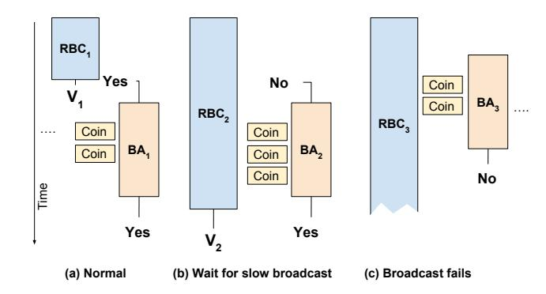
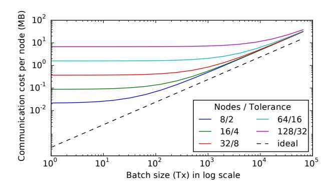
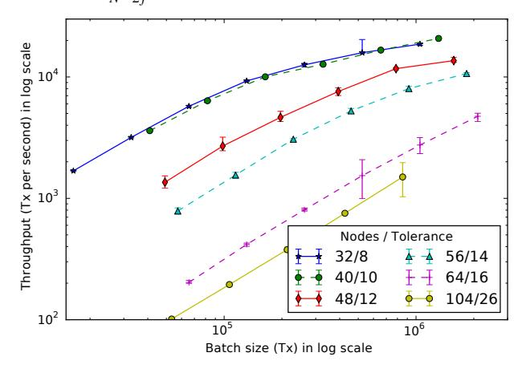
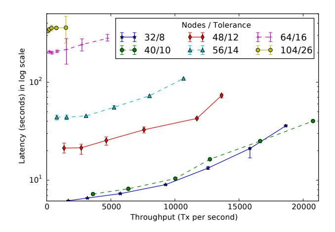
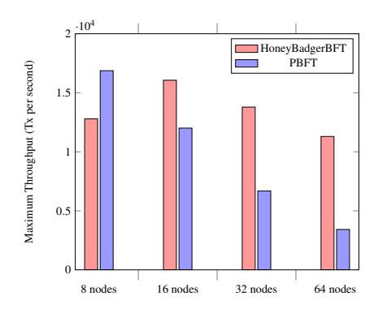
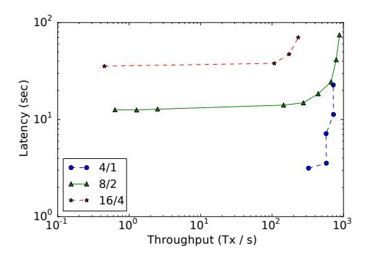

## **The Honey Badger of BFT Protocols**

Andrew Miller University of Illinois, Urbana-Champaign

Elaine Shi Cornell University

Yu Xia Tsinghua University

Kyle Croman Cornell University

Dawn Song University of California, Berkeley

## ABSTRACT

The surprising success of cryptocurrencies has led to a surge of interest in deploying large scale, highly robust, Byzantine fault tolerant (BFT) protocols for mission-critical applications, such as financial transactions. Although the conventional wisdom is to build atop a (weakly) synchronous protocol such as PBFT (or a variation thereof), such protocols rely critically on network timing assumptions, and only guarantee liveness when the network behaves as expected. We argue these protocols are ill-suited for this deployment scenario.

We present an alternative, HoneyBadgerBFT, the first practical *asynchronous* BFT protocol, which guarantees liveness without making any timing assumptions. We base our solution on a novel atomic broadcast protocol that achieves optimal asymptotic efficiency. We present an implementation and experimental results to show our system can achieve throughput of tens of thousands of transactions per second, and scales to over a hundred nodes on a wide area network. We even conduct BFT experiments over Tor, without needing to tune any parameters. Unlike the alternatives, HoneyBadgerBFT simply does not care about the underlying network.

## <span id="page-0-0"></span>1. INTRODUCTION

Distributed fault tolerant protocols are promising solutions for mission-critical infrastructure, such as financial transaction databases. Traditionally, they have been deployed at relatively small scale, and typically in a single administrative domain where adversarial attacks might not be a primary concern. As a representative example, a deployment of Google's fault tolerant lock service, Chubby [\[14\]](#page-10-0), consists of five nodes, and tolerates up to two crash faults.

In recent years, a new embodiment of distributed systems called "cryptocurrencies" or "blockchains" have emerged, beginning with Bitcoin's phenomenal success [\[43\]](#page-11-0). Such cryptocurrency systems represent a surprising and effective breakthrough [\[12\]](#page-10-1), and open a new chapter in our understanding of distributed systems.

Cryptocurrency systems challenge our traditional belief about the deployment environment for fault tolerance protocols. Unlike the classic "5 Chubby nodes within Google" environment, cryptocurrencies have revealed and stimulated a new demand for consensus protocols over a wide area network, among a large number of nodes that are mutually distrustful, and moreover, network connections can be much more unpredictable than the classical LAN setting, or even adversarial. This new setting poses interesting new challenges, and calls upon us to rethink the design of fault tolerant protocols.

Robustness is a first-class citizen. Cryptocurrencies demonstrate the demand for and viability of an unusual operating point that prioritizes robustness above all else, even at the expense of performance. In fact, Bitcoin provides terrible performance by distributed systems

standards: a transaction takes on average 10 minutes to be committed, and the system as a whole achieves throughput on the order of 10 transactions per second. However, in comparison with traditional fault tolerant deployment scenarios, cryptocurrencies thrive in a highly adversarial environment, where well-motivated and malicious attacks are expected (if not commonplace). For this reason, many of Bitcoin's enthusiastic supporters refer to it as the "Honey Badger of Money" [\[41\]](#page-11-1). We note that the demand for robustness is often closely related to the demand for *decentralization* — since decentralization would typically require the participation of a large number of diverse participants in a wide-area network.

Favor throughput over latency. Most existing works on scalable fault tolerance protocols [\[6,](#page-10-2) [49\]](#page-11-2) focus on optimizing scalability in a LAN environment controlled by a single administrative domain. Since bandwidth provisioning is ample, these works often focus on reducing (cryptographic) computations and minimizing response time while under contention (i.e., requests competing for the same object).

In contrast, blockchains have stirred interest in a class of financial applications where response time and contention are not the most critical factors, e.g., payment and settlement networks [\[1\]](#page-10-3). In fact, some financial applications intentionally introduce delays in committing transactions to allow for possible rollback/chargeback operations.

Although these applications are not latency critical, banks and financial institutions have expressed interest in a *high-throughput* alternative of the blockchain technology, to be able to sustain high volumes of requests. For example, the Visa processes 2,000 tx/sec on average, with a peak of 59,000 tx/sec [\[1\]](#page-10-3).

## 1.1 Our Contributions

Timing assumptions considered harmful. Most existing Byzantine fault tolerant (BFT) systems, even those called "robust," assume some variation of *weak synchrony*, where, roughly speaking, messages are guaranteed to be delivered after a certain bound ∆, but ∆ may be time-varying or unknown to the protocol designer. We argue that protocols based on timing assumptions are unsuitable for decentralized, cryptocurrency settings, where network links can be unreliable, network speeds change rapidly, and network delays may even be adversarially induced.

First, the liveness properties of weakly synchronous protocols can fail completely when the expected timing assumptions are violated (e.g., due to a malicious network adversary). To demonstrate this, we explicitly construct an adversarial "intermittently synchronous" network that violates the assumptions, such that existing weakly synchronous protocols such as PBFT [\[20\]](#page-11-3) would grind to a halt (Section [3\)](#page-2-0).

Second, even when the weak synchrony assumptions are satisfied in practice, weakly synchronous protocols degrade significantly in throughput when the underlying network is unpredictable. Ideally, we would like a protocol whose throughput closely tracks the network's performance even under rapidly changing network conditions. Unfortunately, weakly asynchronous protocols require timeout parameters that are finicky to tune, especially in cryptocurrency application settings; and when the chosen timeout values are either too long or too short, throughput can be hampered. As a concrete example, we show that even when the weak synchrony assumptions are satisfied, such protocols are slow to recover from transient network partitions (Section [3\)](#page-2-0).

Practical asynchronous BFT. We propose HoneyBadgerBFT, the first BFT *atomic broadcast* protocol to provide *optimal asymptotic efficiency* in the asynchronous setting. We therefore directly refute the prevailing wisdom that such protocols a re necessarily impractical.

We make significant efficiency improvements on the best priorknown asynchronous atomic broadcast protocol, due to Cachin et al. [\[15\]](#page-10-4), which requires each node to transmit *O*(*N* 2 ) bits for each committed transaction, substantially limiting its throughput for all but the smallest networks. This inefficiency has two root causes. The first cause is redundant work among the parties. However, a naïve attempt to eliminate the redundancy compromises the fairness property, and allows for targeted censorship attacks. We invent a novel solution to overcome this problem by using threshold publickey encryption to prevent these attacks. The second cause is the use of a suboptimal instantiation of the Asynchronous Common Subset (ACS) subcomponent. We show how to efficiently instantiate ACS by combining existing but overlooked techniques: efficient reliable broadcast using erasure codes [\[18\]](#page-10-5), and a reduction from ACS to reliable broadcast from the multi-party computation literature [\[9\]](#page-10-6).

HoneyBadgerBFT's design is optimized for a cryptocurrencylike deployment scenario where network bandwidth is the scarce resource, but computation is relatively ample. This allows us to take advantage of cryptographic building blocks (in particular, threshold public-key encryption) that would be considered too expensive in a classical fault-tolerant database setting where the primary goal is to minimize response time even under contention.

In an asynchronous network, messages are eventually delivered but no other timing assumption is made. Unlike existing weakly synchronous protocols where parameter tuning can be finicky, HoneyBadgerBFT does not care. Regardless of how network conditions fluctuate, HoneyBadgerBFT's throughput always closely tracks the network's available bandwidth. Imprecisely speaking, HoneyBadgerBFT eventually makes progress as long as messages eventually get delivered; moreover, it makes progress as soon as messages are delivered.

We formally prove the security and liveness of our HoneyBadgerBFT protocol, and show experimentally that it provides better throughput than the classical PBFT protocol [\[20\]](#page-11-3) even in the optimistic case.

Implementation and large-scale experiments. We provide a fullfledged implementation of HoneyBadgerBFT, which will we release as free open source software in the near future.[1](#page-1-0) We demonstrate experimental results from an Amazon AWS deployment with more than 100 nodes distributed across 5 continents. To demonstrate its versatility and robustness, we also deployed HoneyBadgerBFT over the Tor anonymous relay network *without changing any parameters*, and present throughput and latency results.

## 1.2 Suggested Deployment Scenarios

Among numerous conceivable applications, we highlight two likely deployment scenarios that are sought after by banks, financial institutions, and advocates for fully decentralized cryptocurrencies.

Confederation cryptocurrencies. The success of decentralized cryptocurrencies such as Bitcoin has inspired banks and financial institutions to inspect their transaction processing and settlement infrastructure with a new light. "Confederation cryptocurrency" is an oft-cited vision [\[24,](#page-11-4) [25,](#page-11-5) [47\]](#page-11-6), where a conglomerate of financial institutions jointly contribute to a Byzantine agreement protocol to allow fast and robust settlement of transactions. Passions are running high that this approach will streamline today's slow and clunky infrastructure for inter-bank settlement. As a result, several new open source projects aim to build a suitable BFT protocol for this setting, such as IBM's Open Blockchain and the Hyperledger project [\[40\]](#page-11-7).

A confederation cryptocurrency would require a BFT protocol deployed over the wide-area network, possibly involving hundreds to thousands of consensus nodes. In this setting, enrollment can easily be controlled, such that the set of consensus nodes are known *a priori* — often referred to as the "permissioned" blockchain. Clearly HoneyBadgerBFT is a natural candidate for use in such confederation cryptocurrencies.

Applicability to permissionless blockchains. By contrast, decentralized cryptocurrencies such as Bitcoin and Ethereum opt for a "permissionless" blockchain, where enrollment is open to anyone, and nodes may join and leave dynamically and frequently. To achieve security in this setting, known consensus protocols rely on proofs-of-work to defeat Sybil attacks, and pay an enormous price in terms of throughput and latency, e.g., Bitcoin commits transactions every ∼ 10 min, and its throughput limited by 7 tx/sec even when the current block size is maximized. Several recent works have suggested the promising idea of leveraging either a slower, external blockchain such as Bitcoin or economic "proof-of-stake" assumptions involving the underlying currency itself [\[32, 32,](#page-11-8) [35,](#page-11-9) [37\]](#page-11-10) to bootstrap faster BFT protocols, by selecting a random committee to perform BFT in every different epoch. These approaches promise to achieve the best of both worlds, security in an open enrollment, decentralized network, and the throughput and response time matching classical BFT protocols. Here too HoneyBadgerBFT is a natural choice since the randomly selected committee can be geographically heterogeneous.

## <span id="page-1-1"></span>2. BACKGROUND AND RELATED WORK

Our overall goal is to build a replicated state machine, where clients generate and submit transactions and a network of nodes receives and processes them. Abstracting away from application specific details (such as how to represent state and compute transitions), it suffices to build a totally globally-consistent, totallyordered, append-only transaction log. Traditionally, such a primitive is called *total order* or *atomic broadcast* [\[23\]](#page-11-11); in Bitcoin parlance, we would call it a *blockchain*.

Fault tolerant state machine replication protocols provide strong safety and liveness guarantees, allowing a distributed system to provide correct service in spite of network latency and the failure of some nodes. A vast body of work has studied such protocols, offering different performance tradeoffs, tolerating different forms of failures and attacks, and making varying assumptions about the underlying network. We explain below the most closely related efforts to ours.

<span id="page-1-0"></span><sup>1</sup>https://github.com/amiller/HoneyBadgerBFT

## 2.1 Robust BFT Protocols

While Paxos [\[36\]](#page-11-12), Raft [\[45\]](#page-11-13), and many other well-known protocols tolerate crash faults, Byzantine fault tolerant protocols (BFT), beginning with PBFT [\[20\]](#page-11-3), tolerate even arbitrary (e.g., maliciously) corrupted nodes. Many subsequent protocols offer improved performance, often through *optimistic execution* that provides excellent performance when there are no faults, clients do not contend much, and the network is well-behaved, and at least some progress otherwise [\[2,](#page-10-7) [5,](#page-10-8) [33,](#page-11-14) [39,](#page-11-15) [51\]](#page-11-16).

In general, BFT systems are evaluated in deployment scenarios where latency and CPU are the bottleneck [\[49\]](#page-11-2), thus the most effective protocols reduce the number of rounds and minimize expensive cryptographic operations.

Clement et al. [\[22\]](#page-11-17) initiated a recent line of work [\[4,](#page-10-9) [6,](#page-10-2) [10,](#page-10-10) [21,](#page-11-18) [22,](#page-11-17) [50\]](#page-11-19) by advocating improvement of the *worst-case* performance, providing service quality guarantees even when the system is under attack — even if this comes at the expense of performance in the optimistic case. However, although the "Robust BFT" protocols in this vein gracefully tolerate compromised nodes, they still rely on timing assumptions about the underlying network. Our work takes this approach further, guaranteeing good throughput even in a fully asynchronous network.

## 2.2 Randomized Agreement

Deterministic asynchronous protocols are impossible for most tasks [\[27\]](#page-11-20). While the vast majority of practical BFT protocols steer clear of this impossibility result by making timing assumptions, randomness (and, in particular, cryptography) provides an alternative route. Indeed we know of asynchronous BFT protocols for a variety of tasks such as binary agreement (ABA), reliable broadcast (RBC), and more [\[13,](#page-10-11) [15,](#page-10-4) [16\]](#page-10-12).

Our work is most closely related to SINTRA [\[17\]](#page-10-13), a system implementation based on the asynchronous atomic broadcast protocol from Cachin et al. (CKPS01) [\[15\]](#page-10-4). This protocol consists of a reduction from atomic broadcast (ABC) to common subset agreement (ACS), as well as a reduction from ACS to multi-value validated agreement (MVBA).

The key invention we contribute is a novel reduction from ABC to ACS that provides better efficiency (by an *O*(*N*) factor) through batching, while using threshold encryption to preserve censorship resilience (see Section [4.4\)](#page-5-0). We also obtain better efficiency by cherry-picking from the literature improved instantiations of subcomponents. In particular, we sidestep the expensive MVBA primitive by using an alternative ACS [\[9\]](#page-10-6) along with an efficient RBC [\[18\]](#page-10-5) as explained in Section [4.4.](#page-5-0)

Table [1](#page-2-1) summarizes the asymptotic performance of HoneyBadgerBFT with several other atomic broadcast protocols. Here "Comm. compl." denotes the expected communication complexity (i.e., total bytes transferred) per committed transaction. Since PBFT relies on weak synchrony assumptions, it may therefore fail to make progress at all in an asynchronous network. Protocols KS02 [\[34\]](#page-11-21) and RC05 [\[46\]](#page-11-22) are optimistic, falling back to an expensive recovery mode based on MVBA. As mentioned the protocol of Cachin et al. (CKPS01) [\[15\]](#page-10-4) can be improved using a more efficient ACS construction [\[9,](#page-10-6) [18\]](#page-10-5). We also obtain another *O*(*N*) improvement through our novel reduction.

Finally, King and Saia [\[30,](#page-11-23)[31\]](#page-11-24) have recently developed agreement protocols with less-than-quadratic number of messages by routing communications over a sparse graph. However, extending these results to the asynchronous setting remains an open problem.

Table 1: Asymptotic communication complexity (bits per transaction, expected) for atomic broadcast protocols

<span id="page-2-1"></span>

|                            | Async? | Comm. compl.  |               |
|----------------------------|--------|---------------|---------------|
|                            |        | Optim.        | Worst         |
| PBFT                       | no     | O(N)          | ∞             |
| KS02 [34]                  | yes    | 2<br>O(N<br>) | 3<br>O(N<br>) |
| RC05 [46]                  | yes    | O(N)          | 3<br>O(N<br>) |
| CKPS01 [15]                | yes    | 3<br>O(N<br>) | 3<br>O(N<br>) |
| CKPS01 [15]+ [9, 18]       | yes    | 2<br>O(N<br>) | 2<br>O(N<br>) |
| HoneyBadgerBFT (this work) | yes    | O(N)          | O(N)          |

## <span id="page-2-0"></span>3. THE GAP BETWEEN ASYNCHRONOUS AND WEAKLY SYNCHRONOUS NET-WORK MODELS

Almost all modern BFT protocols rely on timing assumptions (such as *partial* or *weak synchrony*) to guarantee liveness. Purely asynchronous BFT protocols have received considerably less attention in recent years. Consider the following argument, which, if it held, would justify this narrowed focus:

[X] *Weak synchrony assumptions are unavoidable, since in any network that violates these assumptions, even asynchronous protocols would provide unacceptable performance.*

In this section, we present make two counterarguments that refute the premise above. First, we illustrate the theoretical separation between the asynchronous and weakly synchronous network models. Specifically we construct an adversarial network scheduler that violates PBFT's *weak synchrony* assumption (and indeed causes it to fail) but under which any purely asynchronous protocol (such as HoneyBadgerBFT) makes good progress. Second, we make a practical observation: even when their assumptions are met, weakly synchronous protocols are slow to recover from a network partition once it heals, whereas asynchronous protocols make progress as soon as messages are delivered.

## 3.1 Many Forms of Timing Assumptions

Before proceeding we review the various standard forms of timing assumptions. In an asynchronous network, the adversary can deliver messages in any order and at any time, but nonetheless must *eventually* deliver every message sent between correct nodes. Nodes in an asynchronous network effectively have no use for "real time" clocks, and can only take actions based on the *ordering* of messages they receive.

The well-known FLP [\[27\]](#page-11-20) result rules out the possibility of deterministic asynchronous protocols for atomic broadcast and many other tasks. A deterministic protocol must therefore make some stronger timing assumptions. A convenient (but very strong) network assumption is *synchrony*: a ∆-synchronous network guarantees that every message sent is delivered after at most a delay of ∆ (where ∆ is a measure of real time).

Weaker timing assumptions come in several forms. In the *unknown-*∆ model, the protocol is unable to use the delay bound as a parameter. Alternatively, in the *eventually synchronous* model, the message delay bound ∆ is only guaranteed to hold after some (unknown) instant, called the "Global Stabilization Time." Collectively, these two models are referred to as *partial synchrony* [\[26\]](#page-11-25). Yet another variation is *weak synchrony* [\[26\]](#page-11-25), in which the delay bound is time varying, but eventually does not grow faster than a polynomial function of time [\[20\]](#page-11-3).

In terms of feasibility, the above are equivalent — a protocol that succeeds in one setting can be systematically adapted for another. In terms of concrete performance, however, adjusting for *weak synchrony* means gradually increasing the timeout parameter over time

(e.g., by an "exponential back-off" policy). As we show later, this results in delays when recovering from transient network partitions.

Protocols typically manifest these assumptions in the form of a timeout event. For example, if parties detect that no progress has been made within a certain interval, then they take a corrective action such as electing a new leader. Asynchronous protocols do not rely on timers, and make progress whenever messages are delivered, regardless of actual clock time.

**Counting rounds in asynchronous networks.** Although the guarantee of eventual delivery is decoupled from notions of "real time," it is nonetheless desirable to characterize the running time of asynchronous protocols. The standard approach (e.g., as explained by Canetti and Rabin [19]) is for the adversary to assign each message a virtual round number, subject to the condition that every (r-1)-message between correct nodes must be delivered before any (r+1)-message is sent.

#### 3.2 When Weak Synchrony Fails

We now proceed to describe why weakly synchronous BFT protocols can fail (or suffer from performance degradation) when network conditions are adversarial (or unpredictable). This motivates why such protocols are unsuited for the cryptocurrency-oriented application scenarios described in Section 1.

A network scheduler that thwarts PBFT. We use Practical Byzantine Fault Tolerance (PBFT) [20], the classic leader-based BFT protocol, a representative example to describe how an adversarial network scheduler can cause a class of leader-based BFT protocols [4, 6, 10, 22, 33, 50] to grind to a halt.

At any given time, the designated leader is responsible for proposing the next batch of transactions. If progress isn't made, either because the leader is faulty or because the network has stalled, then the nodes attempt to elect a new leader. The PBFT protocol critically relies on a weakly synchronous network for liveness. We construct an adversarial scheduler that violates this assumption, and indeed prevents PBFT from making any progress at all, but for which HoneyBadgerBFT (and, in fact, any asynchronous protocol) performs well. It is unsurprising that a protocol based on timing assumptions fails when those assumptions are violated; however, demonstrating an explicit attack helps motivate our asynchronous construction.

The intuition behind our scheduler is simple. First, we assume that a single node has crashed. Then, the network delays messages whenever a correct node is the leader, preventing progress and causing the next node in round-robin order to become the new leader. When the crashed node is the next up to become the leader, the scheduler immediately heals the network partition and delivers messages very rapidly among the honest nodes; however, since the leader has crashed, no progress is made here either.

This attack violates the weak synchrony assumption because it must delay messages for longer and longer each cycle, since PBFT widens its timeout interval after each failed leader election. On the other hand, it provides larger and larger periods of synchrony as well. However, since these periods of synchrony occur at inconvenient times, PBFT is unable to make use of them. Looking ahead, Honey-BadgerBFT, and indeed any asynchronous protocol, would be able to make progress during these opportunistic periods of synchrony.

To confirm our analysis, we implemented this malicious scheduler as a proxy that intercepted and delayed all view change messages to the new leader, and tested it against a 1200 line Python implementation of PBFT. The results and message logs we observed were consistent with the above analysis; our replicas became stuck in a loop requesting view changes that never succeeded. In the Ap-

pendix A we give a complete description of PBFT and explain how it behaves under this attack.

Slow recovery from network partitions. Even if the weak synchrony assumption is eventually satisfied, protocols that rely on it may also be slow to recover from transient network partitions. Consider the following scenario, which is simply a finite prefix of the attack described above: one node is crashed, and the network is temporarily partitioned for a duration of  $2^D\Delta$ . Our scheduler heals the network partition precisely when it is the crashed node's turn to become leader. Since the timeout interval at this point is now  $2^{D+1}\Delta$ , the protocol must wait for another  $2^{D+1}\Delta$  interval before beginning to elect a new leader, despite that the network is synchronous during this interval.

The tradeoff between robustness and responsiveness. Such behaviors we observe above are not specific to PBFT, but rather are fundamentally inherent to protocols that rely on timeouts to cope with crashes. Regardless of the protocol variant, a practitioner must tune their timeout policy according to some tradeoff. At one extreme (eventual synchrony), the practitioner makes a specific estimate about the network delay  $\Delta$ . If the estimate is too low, then the system may make no progress at all; too high, and it does not utilize the available bandwidth. At the other extreme (weak synchrony), the practitioner avoids specifying any absolute delay, but nonetheless must choose a "gain" that affects how quickly the system tracks varying conditions. An asynchronous protocol avoids the need to tune such parameters.

## 4. THE HoneyBadgerBFT PROTOCOL

In this section we present HoneyBadgerBFT, the first asynchronous atomic broadcast protocol to achieve optimal asymptotic efficiency.

#### 4.1 Problem Definition: Atomic Broadcast

We first define our network model and the atomic broadcast problem. Our setting involves a network of N designated nodes, with distinct well-known identities ( $\mathcal{P}_0$  through  $\mathcal{P}_{N-1}$ ). The nodes receive transactions as input, and their goal is to reach common agreement on an ordering of these transactions. Our model particularly matches the deployment scenario of a "permissioned blockchain" where transactions can be submitted by arbitrary clients, but the nodes responsible for carrying out the protocol are fixed.

The atomic broadcast primitive allows us to abstract away any application-specific details, such as how transactions are to be interpreted (to prevent replay attacks, for example, an application might define a transaction to include signatures and sequence numbers). For our purposes, transactions are simply unique strings. In practice, clients would generate transactions and send them to all of the nodes, and consider them committed after collecting signatures from a majority of nodes. To simplify our presentation, we do not explicitly model clients, but rather assume that transactions are chosen by the adversary and provided as input to the nodes. Likewise, a transaction is considered committed once it is output by a node.

Our system model makes the following assumptions:

• (Purely asynchronous network) We assume each pair of nodes is connected by a reliable authenticated point-to-point channel that does not drop messages.<sup>2</sup> The delivery schedule is entirely determined by the adversary, but every message sent between correct nodes must eventually be delivered. We will be interested in characterizing the running time of protocols based on the

<span id="page-3-0"></span><sup>&</sup>lt;sup>2</sup>Reliable channels can be emulated on top of unreliable channels by resending transmissions, at the expense of some efficiency.

number of asynchronous rounds (as described in Section 2). As the network may queue messages with arbitrary delay, we also assume nodes have unbounded buffers and are able to process all the messages they receive.

- (Static Byzantine faults) The adversary is given complete control of up to f faulty nodes, where f is a protocol parameter. Note that  $3f+1 \le N$  (which our protocol achieves) is the lower bound for broadcast protocols in this setting.
- (Trusted setup) For ease of presentation, we assume that nodes may interact with a trusted dealer during an initial protocol-specific setup phase, which we will use to establish public keys and secret shares. Note that in a real deployment, if an actual trusted party is unavailable, then a distributed key generation protocol could be used instead (c.f., Boldyreva [11]). All the distributed key generation protocols we know of rely on timing assumptions; fortunately these assumptions need only to hold during setup.

DEFINITION 1. An atomic broadcast protocol must satisfy the following properties, all of which should hold with high probability (as a function  $1 - \operatorname{negl}(\lambda)$  of a security parameter,  $\lambda$ ) in an asynchronous network and in spite of an arbitrary adversary:

- (Agreement) If any correct node outputs a transaction tx, then every correct node outputs tx.
- (*Total Order*) If one correct node has output the sequence of transactions  $\langle \mathsf{tx}_0, \mathsf{tx}_1, ... \mathsf{tx}_j \rangle$  and another has output  $\langle \mathsf{tx}_0', \mathsf{tx}_1', ... \mathsf{tx}_{i'}' \rangle$ , then  $\mathsf{tx}_i = \mathsf{tx}_i'$  for  $i \leq \min(j, j')$ .
- (Censorship Resilience) If a transaction tx is input to N − f correct nodes, then it is eventually output by every correct node.

The censorship resilience property is a liveness property that prevents an adversary from blocking even a single transaction from being committed. This property has been referred to by other names, for example "fairness" by Cachin et al. [15], but we prefer this more descriptive phrase.

**Performance metrics.** We will primarily be interested in analyzing the *efficiency* and *transaction delay* of our atomic broadcast protocol.

• (Efficiency) Assume that the input buffers of each honest node are sufficiently full  $\Omega(\mathsf{poly}(N,\lambda))$ . Then efficiency is the expected communication cost for each node amortized over all committed transactions.

Since each node must output each transaction, O(1) efficiency (which our protocol achieves) is asymptotically optimal. The above definition of efficiency assumes the network is under load, reflecting our primary goal: to sustain high throughput while fully utilizing the network's available bandwidth. Since we achieve good throughput by batching, our system uses more bandwidth per committed transaction during periods of low demand when transactions arrive infrequently. A stronger definition without this qualification would be appropriate if our goal was to minimize costs (e.g., for usage-based billing).

In practice, network links have limited capacity, and if more transactions are submitted than the network can handle, a guarantee on confirmation time cannot hold in general. Therefore we define *transaction delay* below relative to the number of transactions that have been input *ahead* of the transaction in question. A finite transaction delay implies censorship resilience.

• (Transaction delay) Suppose an adversary passes a transaction tx as input to N-f correct nodes. Let T be the "backlog", i.e. the difference between the total number of transactions previously input to any correct node and the number of transactions that have been committed. Then transaction delay is the expected number

of asynchronous rounds before tx is output by every correct node as a function of T.

#### 4.2 Overview and Intuition

In HoneyBadgerBFT, nodes receive transactions as input and store them in their (unbounded) buffers. The protocol proceeds in epochs, where after each epoch, a new batch of transactions is appended to the committed log. At the beginning of each epoch, nodes choose a subset of the transactions in their buffer (by a policy we will define shortly), and provide them as input to an instance of a randomized agreement protocol. At the end of the agreement protocol, the final set of transactions for this epoch is chosen.

At this high level, our approach is similar to existing asynchronous atomic broadcast protocols, and in particular to Cachin et al. [15], the basis for a large scale transaction processing system (SINTRA). Like ours, Cachin's protocol is centered around an instance of the Asynchronous Common Subset (ACS) primitive. Roughly speaking, the ACS primitive allows each node to propose a value, and guarantees that every node outputs a common vector containing the input values of at least N-2f correct nodes. It is trivial to build atomic broadcast from this primitive — each node simply proposes a subset of transactions from the front its queue, and outputs the union of the elements in the agreed-upon vector. However, there are two important challenges.

**Challenge 1:** Achieving censorship resilience. The cost of ACS depends directly on size of the transaction sets proposed by each node. Since the output vector contains at least N-f such sets, we can therefore improve the overall efficiency by ensuring that nodes propose *mostly disjoint* sets of transactions, thus committing more distinct transactions in one batch for the same cost. Therefore instead of simply choosing the first element(s) from its buffer (as in CKPS01 [15]), each node in our protocol proposes a randomly chosen sample, such that each transaction is, on average, proposed by only one node.

However, implemented naïvely, this optimization would compromise censorship resilience, since the ACS primitive allows the adversary to choose *which* nodes' proposals are ultimately included. The adversary could selectively censor a transaction excluding whichever node(s) propose it. We avoid this pitfall by using threshold encryption, which prevents the adversary from learning which transactions are proposed by which nodes, until after agreement is already reached. The full protocol will be described in Section 4.3.

**Challenge 2: Practical throughput.** Although the theoretical feasibility of asynchronous ACS and atomic broadcast have been known [9, 15, 17], their practical performance is not. To the best of our knowledge, the only other work that implemented ACS was by Cachin and Portiz [17], who showed that they could attain a throughput of 0.4 tx/sec over a wide area network. Therefore, an interesting question is whether such protocols can attain high throughput in practice.

In this paper, we show that by stitching together a carefully chosen array of sub-components, we can efficiently instantiate ACS and attain much greater throughput both asymptotically and in practice. Notably, we improve the asymptotic cost (per node) of ACS from  $O(N^2)$  (as in Cachin et al. [15,17]) to O(1). Since the components we cherry-pick have not been presented together before (to our knowledge), we provide a self-contained description of the whole construction in Section 4.4.

**Modular protocol composition.** We are now ready to present our constructions formally. Before doing so, we make a remark about the style of our presentation. We define our protocols in a modu-

lar style, where each protocol may run several instances of other (sub)protocols. The outer protocol can provide input to and receive output from the subprotocol. A node may begin executing a (sub)protocol even before providing it input (e.g., if it receives messages from other nodes).

It is essential to isolate such (sub)protocol instances to ensure that messages pertaining to one instance cannot be replayed in another. This is achieved in practice by associating to each (sub)protocol instance a unique string (a session identifier), tagging any messages sent or received in this (sub)protocol with this identifier, and routing messages accordingly. We suppress these message tags in our protocol descriptions for ease of reading. We use brackets to distinguish between tagged instances of a subprotocol. For example, RBC[i] denotes an i<sup>th</sup> instance of the RBC subprotocol.

We implicitly assume that asynchronous communications between parties are over authenticated asynchronous channels. In reality, such channels could be instantiated using TLS sockets, for example, as we discuss in Section 5.

To distinguish different message types sent between parties within a protocol, we use a label in typewriter font (e.g., VAL(m) indicates a message m of type VAL).

# <span id="page-5-1"></span>4.3 Constructing HoneyBadgerBFT from Asynchronous Common Subset

**Building block:** ACS. Our main building block is a primitive called asynchronous common subset (ACS). The theoretical feasibility of constructing ACS has been demonstrated in several works [9, 15]. In this section, we will present the formal definition of ACS and use it as a blackbox to construct HoneyBadgerBFT. Later in Section 4.4, we will show that by combining several constructions that were somewhat overlooked in the past, we can instantiate ACS efficiently!

More formally, an ACS protocol satisfies the following properties:

- (Validity) If a correct node outputs a set  $\mathbf{v}$ , then  $|\mathbf{v}| \ge N f$  and  $\mathbf{v}$  contains the inputs of at least N 2f correct nodes.
- (Agreement) If a correct node outputs v, then every node outputs v.
- (Totality) If N f correct nodes receive an input, then all correct nodes produce an output.

**Building block: threshold encryption.** A *threshold encryption* scheme TPKE is a cryptographic primitive that allows any party to encrypt a message to a master public key, such that the network nodes must work together to decrypt it. Once f+1 correct nodes compute and reveal *decryption shares* for a ciphertext, the plaintext can be recovered; until at least one correct node reveals its decryption share, the attacker learns nothing about the plaintext. A threshold scheme provides the following interface:

- TPKE.Setup(1<sup>λ</sup>) → PK, {SK<sub>i</sub>} generates a public encryption key PK, along with secret keys for each party SK<sub>i</sub>
- TPKE.Enc(PK,m)  $\rightarrow$  C encrypts a message m
- TPKE.DecShare(SK<sub>i</sub>, C)  $\rightarrow \sigma_i$  produces the i<sup>th</sup> share of the decryption (or  $\perp$  if C is malformed)
- TPKE.Dec(PK, C, {i, o<sub>i</sub>}) → m combines a set of decryption shares {i, o<sub>i</sub>} from at least f + 1 parties obtain the plaintext m (or, if C contains invalid shares, then the invalid shares are identified).

In our concrete instantiation, we use the threshold encryption scheme of Baek and Zheng [7]. This scheme is also robust (as required by our protocol), which means that even for an adversarially generated ciphertext C, at most one plaintext (besides  $\bot$ ) can be recovered. Note that we assume TPKE.Dec effectively identifies *invalid* decryption shares among the inputs. Finally, the scheme satisfies the

```
Algorithm HoneyBadgerBFT (for node \mathcal{P}_i)
```

Let  $B = \Omega(\lambda N^2 \log N)$  be the batch size parameter.

Let PK be the public key received from TPKE. Setup (executed by a dealer), and let  $SK_i$  be the secret key for  $\mathcal{P}_i$ .

Let buf := [] be a FIFO queue of input transactions.

Proceed in consecutive epochs numbered r:

// Step 1: Random selection and encryption

- let proposed be a random selection of  $\lfloor B/N \rfloor$  transactions from the first B elements of buf
- encrypt  $x := \mathsf{TPKE}.\mathsf{Enc}(\mathsf{PK},\mathsf{proposed})$

// Step 2: Agreement on ciphertexts

- pass x as input to ACS[r] //see Figure 4
- receive  $\{v_j\}_{j\in S}$ , where  $S\subset [1..N]$ , from ACS[r]

// Step 3: Decryption

• for each  $j \in S$ :

```
\mathsf{let}\, e_j := \mathsf{TPKE}.\mathsf{DecShare}(\mathsf{SK}_i, v_j)
```

 $\mathsf{multicast} \ \mathsf{DEC}(r,j,i,e_j)$

wait to receive at least f+1 messages of the form  $\mathtt{DEC}(r,j,k,e_{i,k})$

 $\mathsf{decode}\ y_j := \mathsf{TPKE}.\mathsf{Dec}(\mathsf{PK}, \{(k, e_{j,k})\})$

- let block<sub>r</sub> := sorted( $\cup_{j \in S} \{y_j\}$ ), such that block<sub>r</sub> is sorted in a canonical order (e.g., lexicographically)
- set buf := buf block<sub>r</sub>

<span id="page-5-3"></span>Figure 1: HoneyBadgerBFT.

obvious correctness properties, as well as a threshold version of the  $\emph{IND-CPA}$  game.  $^3$

**Atomic broadcast from ACS.** We now describe in more detail our atomic broadcast protocol, defined in Figure 1.

As mentioned, this protocol is centered around an instance of ACS. In order to obtain scalable efficiency, we choose a batching policy. We let B be a batch size, and will commit  $\Omega(B)$  transactions in each epoch. Each node proposes B/N transactions from its queue. To ensure that nodes propose mostly distinct transactions, we randomly select these transactions from the first B in each queue.

As we will see in Section 4.4, our ACS instantiation has a total communication cost of  $O(N^2|\mathbf{v}| + \lambda N^3 \log N)$ , where  $|\mathbf{v}|$  bounds the size of any node's input. We therefore choose a batch size  $B = \Omega(\lambda N^2 \log N)$  so that the contribution from each node (B/N) absorbs this additive overhead.

In order to prevent the adversary from influencing the outcome we use a threshold encryption scheme, as described below. In a nutshell, each node chooses a set of transactions, and then encrypts it. Each node then passes the encryption as input to the ACS subroutine. The output of ACS is therefore a vector of ciphertexts. The ciphertexts are decrypted once the ACS is complete. This guarantees that the set of transactions is fully determined before the adversary learns the particular contents of the proposals made by each node. This guarantees that an adversary cannot selectively prevent a transaction from being committed once it is in the front of the queue at enough correct nodes.

#### <span id="page-5-0"></span>4.4 Instantiating ACS Efficiently

Cachin et al. present a protocol we call CKPS01 that (implic-

<span id="page-5-2"></span><sup>&</sup>lt;sup>3</sup>The Baek and Zheng threshold scheme also satisfies (the threshold equivalent of) the stronger *IND-CCA* game, but this is not required by our protocol.

#### Algorthm RBC (for party $P_i$ , with sender $P_{Sender}$ )

- upon input(v) (if  $\mathcal{P}_i = \mathcal{P}_{Sender}$ ):
  - let  $\{s_j\}_{j\in[N]}$  be the blocks of an (N-2f,N)-erasure coding scheme applied to  $\nu$
  - let h be a Merkle tree root computed over  $\{s_i\}$
  - send  $VAL(h,b_j,s_j)$  to each party  $\mathcal{P}_j$ , where  $b_j$  is the  $j^{th}$  Merkle tree branch
- upon receiving VAL $(h, b_i, s_i)$  from  $\mathcal{P}_{Sender}$ , multicast ECHO $(h, b_i, s_i)$
- upon receiving ECHO(h, b<sub>j</sub>, s<sub>j</sub>) from party P<sub>j</sub>,
   check that b<sub>j</sub> is a valid Merkle branch for root h and leaf s<sub>j</sub>
   and otherwise discard
- upon receiving valid ECH0( $h,\cdot,\cdot$ ) messages from N-f distinct parties,
  - interpolate  $\{s'_i\}$  from any N-2f leaves received
  - recompute Merkle root h' and if  $h' \neq h$  then abort
  - if READY(h) has not yet been sent, multicast READY(h)
- $\bullet\,$  upon receiving f+1 matching READY (h) messages, if READY has not yet been sent, multicast READY (h)
- upon receiving 2f + 1 matching READY(h) messages, wait for N 2f ECHO messages, then decode v

<span id="page-6-0"></span>Figure 2: Reliable broadcast algorithm, adapted from Bracha's broadcast [13], with erasure codes to improve efficiency [18]

itly) reduces ACS to multi-valued validated Byzantine agreement (MVBA) [15]. Roughly speaking, MVBA allows nodes to propose values satisfying a predicate, one of which is ultimately chosen. The reduction is simple: the validation predicate says that the output must be a vector of signed inputs from at least N-f parties. Unfortunately, the MVBA primitive agreement becomes a bottleneck, because the only construction we know of incurs an overhead of  $O(N^3|\mathbf{v}|)$ .

We avoid this bottleneck by using an alternative instantiation of ACS that sidesteps MVBA entirely. The instantiation we use is due to Ben-Or et al. [9] and has, in our view, been somewhat overlooked. In fact, it predates CKPS01 [15], and was initially developed for a mostly unrelated purpose (as a tool for achieving efficient asynchronous multi-party computation [9]). This protocol is a reduction from ACS to *reliable broadcast* (RBC) and *asynchronous binary Byzantine agreement* (ABA). Only recently do we know of efficient constructions for these subcomponents, which we explain shortly.

At a high level, the ACS protocol proceeds in two main phases. In the first phase, each node  $\mathcal{P}_i$  uses RBC to disseminate its proposed value to the other nodes, followed by ABA to decide on a bit vector that indicates which RBCs have successfully completed.

We now briefly explain the RBC and ABA constructions before explaing the Ben-Or protocol in more detail.

**Communication-optimal reliable roadcast.** An asynchronous reliable broadcast channel satisfies the following properties:

- (Agreement) If any two correct nodes deliver v and v', then v = v'.
- (Totality) If any correct node delivers v, then all correct nodes deliver v
- (Validity) If the sender is correct and inputs v, then all correct nodes deliver v

While Bracha's [13] classic reliable broadcast protocol requires  $O(N^2|\nu|)$  bits of total communication in order to broadcast a message of size  $|\nu|$ , Cachin and Tessaro [18] observed that erasure coding can reduce this cost to merely  $O(N|\nu| + \lambda N^2 \log N)$ , even in the



<span id="page-6-1"></span>Figure 3: (Illustrated examples of ACS executions.) Each execution of our protocol involves running N concurrent instances of reliable broadcast (RBC), as well as N of byzantine agreement (BA), which in turn use an expected constant number of common coins. We illustrate several possible examples of how these instances play out, from the viewpoint of Node 0. (a) In the ordinary case, Node 0 receives value  $V_1$  (Node 1's proposed value) from the reliable broadcast at index 1. Node 0 therefore provides input "Yes" to BA<sub>1</sub>, which outputs "Yes." (b) RBC<sub>2</sub> takes too long to complete, and Node 0 has already received (N-f) "Yes" outputs, so it votes "No" for BA<sub>2</sub>. However, other nodes have seen RBC<sub>2</sub> complete successfully, so BA<sub>2</sub> results in "Yes" and Node 0 must wait for  $V_2$ . (c) BA<sub>3</sub> concludes with "No" before RBC<sub>3</sub> completes.

worst case. This is a significant improvement for large messages (i.e., when  $|v| \gg \lambda N \log N$ ), which, (looking back to Section 4.3) guides our choice of batch size. The use of erasure coding here induces at most a small constant factor of overhead, equal to  $\frac{N}{N-2f} < 3$ .

If the sender is correct, the total running time is three (asynchronous) rounds; and in any case, at most two rounds elapse between when the first correct node outputs a value and the last outputs a value. The reliable broadcast algorithm shown in Figure 2.

**Binary Agreement.** Binary agreement is a standard primitive that allows nodes to agree on the value of a single bit. More formally, binary agreement guarantees three properties:

- (Agreement) If any correct node outputs the bit b, then every correct node outputs b.
- (*Termination*) If all correct nodes receive input, then every correct node outputs a bit.
- (Validity) If any correct node outputs b, then at least one correct node received b as input.

The validity property implies unanimity: if all of the correct nodes receive the same input value b, then b must be the decided value. On the other hand, if at any point two nodes receive different inputs, then the adversary may force the decision to either value even before the remaining nodes receive input.

We instantiate this primitive with a protocol from Moustefaoui et al. [42], which is based on a cryptographic common coin. We defer explanation of this instantiation to the Appendix. Its expected running time is O(1), and in fact completes within O(k) rounds with probability  $1-2^{-k}$ . The communication complexity per node is  $O(N\lambda)$ , which is due primarily to threshold cryptography used in the common coin.

**Agreeing on a subset of proposed values.** Putting the above pieces together, we use a protocol from Ben-Or et al. [9] to agree on a set of values containing the entire proposals of at least N-f nodes.

At a high level, this protocol proceeds in two main phases. In the

#### Algorithm ACS (for party $P_i$ )

Let  $\{RBC_i\}_N$  refer to N instances of the reliable broadcast protocol, where  $\mathcal{P}_i$  is the sender of  $RBC_i$ . Let  $\{BA_i\}_N$  refer to N instances of the binary byzantine agreement protocol.

- upon receiving input  $v_i$ , input  $v_i$  to RBC<sub>i</sub> // See Figure 2
- upon delivery of  $v_j$  from  $RBC_j$ , if input has not yet been provided to  $BA_j$ , then provide input 1 to  $BA_j$ . *See Figure 11*
- upon delivery of value 1 from at least N f instances of BA provide input 0 to each instance of BA that has not yet been provided input.
- once all instances of BA have completed, let C ⊂ [1..N] be the indexes of each BA that delivered 1. Wait for the output v<sub>j</sub> for each RBC<sub>j</sub> such that j ∈ C. Finally output ∪<sub>j∈C</sub>v<sub>j</sub>.

# <span id="page-7-1"></span>Figure 4: Common Subset Agreement protocol (from Ben-Or et al. [9])

first phase, each node  $\mathcal{P}_i$  uses Reliable Broadcast to disseminate its proposed value to the other nodes. In the second stage, N concurrent instances of binary Byzantine agreement are used to agree on a bit vector  $\{b_j\}_{j\in[1..N]}$ , where  $b_j=1$  indicates that  $\mathcal{P}_j$ 's proposed value is included in the final set.

Actually the simple description above conceals a subtle challenge, for which Ben-Or provide a clever solution.

A naïve attempt at an implementation of the above sketch would have each node to wait for the first (N-f) broadcasts to complete, and then propose 1 for the binary agreement instances corresponding to those and 0 for all the others. However, correct nodes might observe the broadcasts complete in a different order. Since binary agreement only guarantees that the output is 1 if all the correct nodes unaninimously propose 1, it is possible that the resulting bit vector could be empty.

To avoid this problem, nodes abstain from proposing 0 until they are certain that the final vector will have at least N-f bits set. To provide some intuition for the flow of this protocol, we narrate several possible scenarios in Figure 3. The algorithm from Ben-Or et al. [9] is given in Figure 4. The running time is  $O(\log N)$  in expectation, since it must wait for all binary agreement instances to finish.  $^4$  When instantiated with the reliable broadcast and binary agreement constructions described above, the total communication complexity is  $O(N^2|\nu| + \lambda N^3 \log N)$  assuming  $|\nu|$  is the largest size of any node's input.

#### <span id="page-7-5"></span>4.5 Analysis

First we observe that the agreement and total order properties follow immediately from the definition of ACS and robustness of the TPKE scheme.

THEOREM 1. (Agreement and total order). The HoneyBadgerBFT protocol satisfies the agreement and total order properties, except for negligible probability.

PROOF. These two properties follow immediately from properties of the high-level protoocls, ACS and TPKE. Each ACS instance guarantees that nodes agree on a vector of ciphertexts in each epoch (Step 2). The robustness of TPKE guarantees that each correct node decrypts these ciphertexts to consistent values (Step 3). This suffices to ensure agreement and total order.

THEOREM 2. (Complexity). Assuming a batch size of  $B = \Omega(\lambda N^2 \log N)$ , the running time for each HoneyBadgerBFT epoch

is  $O(\log N)$  in expectation, and the total expected communication complexity is O(B).

PROOF. The cost and running time of ACS is explained in Section 4.4. The N instances of threshold decryption incur one additional round and an additional cost of  $O(\lambda N^2)$ , which does not affect the overall asymptotic cost.  $\square$

The HoneyBadgerBFT protocol may commit up to B transactions in a single epoch. However, the actual number may be less than this, since some correct nodes may propose overlapping transaction sets, others may respond too late, and corrupted nodes may propose an empty set. Fortunately, we prove (in the Appendix) that assuming each correct node's queue is full, then B/4 serves as an lower bound for the expected number of transactions committed in an epoch.<sup>5</sup>

THEOREM 3. (Efficiency). Assuming each correct node's queue contains at least B distinct transactions, then the expected number of transactions committed in an epoch is at least  $\frac{B}{4}$ , resulting in constant efficiency.

Finally, we prove (in the Appendix) that the adversary cannot significantly delay the commit of any transaction.

THEOREM 4. (Censorship Resilience). Suppose an adversary passes a transaction tx as input to N-f correct nodes. Let T be the size of the "backlog", i.e. the difference between the total number of transactions previously input to any correct node and the number of transactions that have been committed. Then tx is committed within  $O(T/B + \lambda)$  epochs except with negligible probability.

#### <span id="page-7-0"></span>5. IMPLEMENTATION AND EVALUATION

In this section we carry out several experiments and performance measurements using a prototype implementation of the HoneyBadgerBFT protocol. Unless otherwise noted, numbers reported in this section are by default for the *optimistic* case where all nodes are behaving honestly.

First we demonstrate that HoneyBadgerBFT is indeed scalable by performing an experiment in a wide area network, including up to 104 nodes in five continents. Even under these conditions, Honey-BadgerBFT can reach peak throughputs of thousands of transactions per second. Furthermore, by a comparison with PBFT, a representative partially synchronous protocol, HoneyBadgerBFT performs only a small constant factor worse. Finally, we demonstrate the feasibility of running asynchronous BFT over the Tor anonymous communication layer.

**Implementation details.** We developed a prototype implementation of HoneyBadgerBFT in Python, using the gevent library for concurrent tasks.

For deterministic erasure coding, we use the zfec library [52], which implements Reed-Solomon codes. For instantiating the common coin primitive, we implement Boldyreva's pairing-based threshold signature scheme [11]. For threshold encryption of transactions, we use Baek and Zheng's scheme [7] to encrypt a 256-bit ephemeral key, followed by AES-256 in CBC mode over the actual payload. We implement these threshold cryptography schemes using the Charm [3] Python wrappers for PBC library [38]. For threshold signatures, we use the provided MNT224 curve, resulting in signatures (and signature shares) of only 65 bytes, and heuristically providing 112 bits of security. Our threshold encryption scheme requires a

<span id="page-7-2"></span> $<sup>^4</sup>$ The expected running time can be reduced to O(1) (c.f. [8]) by running several instances in parallel, though this comes at the expense of throughput.

<span id="page-7-3"></span><sup>&</sup>lt;sup>5</sup>The actual bound is  $(1 - e^{-1/3})B > B/4$ , but we use the looser bound B/4 for readability.

<span id="page-7-4"></span><sup>&</sup>lt;sup>6</sup>Earlier reports estimate 112 bits of security for the MNT224 curve [44]; however, recent improvements in computing discrete log suggest larger parameters are required [28, 29].

symmetric bilinear group: we therefore use the SS512 group, which heuristically provides 80 bits of security [44].<sup>7</sup>

In our EC2 experiments, we use ordinary (unauthenticated) TCP sockets. In a real deployment we would use TLS with both client and server authentication, adding insignificant overhead for long-lived sessions. Similarly, in our Tor experiment, only one endpoint of each socket is authenticated (via the "hidden service" address).

Our theoretical model assumes nodes have unbounded buffers. In practice, more resources could be added dynamically to a node whenever memory consumption reaches a watermark, (e.g., whenever it is 75% full) though our prototype implementation does not yet include this feature. Failure to provision an adequate buffer would count against the failure budget f.

#### 5.1 Bandwidth Breakdown and Evaluation

We first analyze the bandwidth costs of our system. In all experiments, we assume a constant transaction size of  $m_T = 250$  bytes each, which would admit an ECDSA signature, two public keys, as well as an application payload (i.e., approximately the size of a typical Bitcoin transaction). Our experiments use the parameter N = 4f, and each party proposes a batch of B/N transactions. To model the worst case scenario, nodes begin with identical queues of size B. We record the running time as the time from the beginning of the experiment to when the (N - f)-th node outputs a value.

Bandwidth and breakdown findings. The overall bandwidth consumed by each node consists of a fixed additive overhead as well as a transaction dependent overhead. For all parameter values we considered, the additive overhead is dominated by an  $O(\lambda N^2)$  term resulting from the threshold cryptography in the ABA phases and the decryption phase that follows. The ABA phase involves each node transmitting  $4N^2$  signature shares in expectation. Only the RBC phase incurs a transaction-dependent overhead, equal to the erasure coding expansion factor  $r = \frac{N}{N-2f}$ . The RBC phase also contributes  $N^2 \log N$  hashes to the overhead because of Merkle tree branches included in the ECHO messages. The total communication cost (per node) is estimated as:

$$m_{\text{all}} = r(Bm_{\text{T}} + Nm_{\text{E}}) + N^2((1 + \log N)m_{\text{H}} + m_{\text{D}} + 4m_{\text{S}})$$

where  $m_{\rm E}$  and  $m_{\rm D}$  are respectively the size of a ciphertext and decryption share in the TPKE scheme, and  $m_{\rm S}$  is the size of a TSIG signature share.

The system's effective throughput increases as we increase the proposed batch size B, such that the transaction-dependent portion of the cost dominates. As Figure 5 shows, for N=128, for batch sizes up to 1024 transactions, the transaction-independent bandwidth still dominates to overall cost. However, when when the batch size reaches 16384, the transaction-dependent portion begins to dominate — largely resulting from the RBC.ECHO stage where nodes transmit erasure-coded blocks.

#### 5.2 Experiments on Amazon EC2

To see how practical our design is, we deployed our protocol on Amazon EC2 services and comprehensively tested its performance. We ran HoneyBagderBFT on 32, 40, 48, 56, 64, and 104 Amazon EC2 *t2.medium* instances uniformly distributed throughout its 8



<span id="page-8-2"></span>Figure 5: Estimated communication cost in megabytes (per node) for varying batch sizes. For small batch sizes, the fixed cost grows with  $O(N^2 \log N)$ . At saturation, the overhead factor approaches  $\frac{N}{N-2f} < 3$ .



<span id="page-8-3"></span>Figure 6: Throughput (transactions committed per second) vs number of transactions proposed. Error bars indicate 95% confidence intervals.

regions spanning 5 continents. In our experiments, we varied the batch size such that each node proposed 256, 512, 1024, 2048, 4096, 8192, 16384, 32768, 65536, or 131072 transactions.

**Throughput.** Throughput is defined as the number of transactions committed per unit of time. In our experiment, we use "confirmed transactions per second" as our measure unit if not specified otherwise. Figure 6 shows the relationship between throughput and total number of transactions proposed by all N parties. The fault tolerance parameter is set to be f = N/4.

Findings. From Figure 6 we can see for each setting, the throughput increases as the number of proposed transactions increases. We achieve throughput exceeding 20,000 transactions per second for medium size networks of up to 40 nodes. For a large 104 node network, we attain more than 1,500 transactions per second. Given an infinite batch size, all network sizes would eventually converge to a common upper bound, limited only by available bandwidth. Although the total bandwidth consumed in the network increases (linearly) with each additional node, the additional nodes also contribute additional bandwidth capacity.

**Throughput, latency, and scale tradeoffs.** Latency is defined as the time interval between the time the first node receives a client request and when the (N-f)-th node finishes the consensus pro-

<span id="page-8-0"></span><sup>&</sup>lt;sup>7</sup>We justify the relatively weak 80-bit security level for our parameters because the secrecy needs are short-lived as the plaintexts are revealed after each batch is committed. To defend against precomputation attacks, the public parameters and keys should be periodically regenerated.

<span id="page-8-1"></span><sup>&</sup>lt;sup>8</sup>The setting N = 4f is not the maximum fault tolerance, but it is convenient when f divides N.



Figure 7: Latency vs. throughput for experiments over wide area networks. Error bars indicate 95% confidence intervals.

<span id="page-9-0"></span>

<span id="page-9-1"></span>Figure 8: Comparison with PBFT on EC2s

tocol. This is reasonable because the (N-f)-th node finishing the protocol implies the accomplishment of the consensus for the honest parties.

Figure 7 shows the relationship between latency and throughput for different choices of N and f=N/4. The positive slopes indicate that our experiments have not yet fully saturated the available bandwidth, and we would attain better throughput even with larger batch sizes. Figure 7 also shows that latency increases as the number of nodes increases, largely stemming from the ABA phase of the protocol. In fact, at N=104, for the range of batch sizes we tried, our system is CPU bound rather than bandwidth bound because our implementation is single threaded and must verify  $O(N^2)$  threshold signatures. Regardless, our largest experiment with 104 nodes completes in under 6 minutes.

Although more nodes (with equal bandwidth provisioning) could be added to the network without affecting maximum attainable throughput, the minimal bandwidth consumed to commit one batch (and therefore the latency) increases with  $O(N^2 \log N)$ . This constraint implies a limit on scalability, depending on the cost of bandwidth and users' latency tolerance.

Comparison with PBFT. Figure 8 shows a comparison with the PBFT protocol, a classic BFT protocol for partially synchronous networks. We use the Python implementation from Croman et al. [24], running on 8, 16, 32, and 64 nodes evenly distributed among Amazon AWS regions. Batch sizes were chosen to saturate the network's available bandwidth.

Fundamentally, while PBFT and our protocol have the same

asymptotic communication complexity *in total*, our protocol distributes this load evenly among the network links, whereas PBFT bottlenecks on the leader's available bandwidth. Thus PBFT's attainable throughput diminishes with the number of nodes, while HoneyBadgerBFT's remains roughly constant.

Note that this experiment reflects only the optimistic case, with no faults or network interruptions. Even for small networks, HoneyBadgerBFT provides significantly better robustness under adversarial conditions as noted in Section 3. In particular, PBFT would achieve **zero throughput** against an adversarial asynchronous scheduler, whereas HoneyBadgerBFT would complete epochs at a regular rate.

## **5.3** Experiments over Tor

To demonstrate the robustness of HoneyBadgerBFT, we run the first instance (to our knowledge) of a fault tolerant consensus protocol carried out over Tor (the most successful anonymous communication network). Tor adds significant and varying latency compared to our original AWS deployment. Regardless, we show that we can run HoneyBadgerBFT without tuning any parameters. Hiding HoneyBadgerBFT nodes behind the shroud of Tor may offer even better robustness. Since it helps the nodes to conceal their IP addresses, it can help them avoid targeted network attacks and attacks involving their physical location.

Brief background on Tor. The Tor network consists of approximately 6,500 relays, which are listed in a public directory service. Tor enables "hidden services," which are servers that accept connections via Tor in order to conceal their location. When a client establishes a connection to a hidden service, both the client and the server construct 3-hop circuits to a common "rendezvous point." Thus each connection to a hidden service routes data through 5 randomly chosen relays. Tor provides a means for relay nodes to advertise their capacity and utilization, and these self-reported metrics are aggregated by the Tor project. According to these metrics, the total capacity of the network is  $\sim$ 145Gbps, and the current utilization is  $\sim$ 65Gbps.

Tor experiment setup. We design our experiment setup such that we could run all N HoneyBadgerBFT nodes on a single desktop machine running the Tor daemon software, while being able to realistically reflect Tor relay paths. To do this, we configured our machine to listen on N hidden services (one hidden service for each HoneyBadgerBFT node in our simulated network). Since each HoneyBadgerBFT node forms a connection to each other node, we construct a total of  $N^2$  Tor circuits per experiment, beginning and ending with our machine, and passing through 5 random relays. In summary, all pairwise overlay links traverse real Tor circuits consisting of random relay nodes, designed so that the performance obtained is representative of a real HoneyBadgerBFT deployment over Tor (despite all simulated nodes running on a single host machine).

Since Tor provides a critical public service for many users, it is important to ensure that research experiments conducted on the live network do not adversely impact it. We formed connections from only a single vantage point (and thus avoid receiving), and ran experiments of short duration (several minutes) and with small parameters (only 256 circuits formed in our largest experiment). In total, our experiments involved the transfer of approximately five gigabytes of data through Tor – less than a 1E-5 fraction of its daily utilization

Figure 9 shows how latency changes with throughput. In contrast to our EC2 experiment where nodes have ample bandwidth, Tor

<span id="page-9-2"></span><sup>&</sup>lt;sup>9</sup>https://metrics.torproject.org/bandwidth.html as of Nov 10, 2015



<span id="page-10-19"></span>Figure 9: Latency vs throughput for experiments running HoneyBadgerBFT over Tor.

circuits are limited by the slowest link in the circuit. We attain a maximum throughput of over 800 transactions per second of Tor.

In general, messages transmitted over Tor's relay network tends to have significant and highly variable latency. For instance, during our experiment on 8 parties proposing 16384 transactions per party, a single message can be delayed for 316.18 seconds and the delay variance is over 2208 while the average delay is only 12 seconds. We stress that our protocol did not need to be tuned for such network conditions, as would a traditional eventually-synchronous protocol.

#### 6. CONCLUSION

We have presented HoneyBadgerBFT, the first efficient and highthroughput asynchronous BFT protocol. Through our implementation and experimental results we demonstrate that HoneyBadgerBFT can be a suitable component in incipient cryptocurrency-inspired deployments of fault tolerant transaction processing systems. More generally, we believe our work demonstrates the promise of building dependable and transaction processing systems based on asynchronous protocol.

Acknowledgements. We thank Jay Lorch, Jonathan Katz, and Emin Gün Sirer for helpful suggestions, and especially Dominic Williams for several excellent discussions that inspired us to tackle this problem. This work is supported in part by NSF grants CNS-1314857, CNS-1453634, CNS-1518765, CNS-1514261, and CNS-1518899, DARPA grant N66001-15-C-4066, a Packard Fellowship, a Sloan Fellowship, two Google Faculty Research Awards, and a VMWare Research Award. This work was done in part while a subset of the authors were visiting students at UC Berkeley, and while a subset of the authors were visiting the Simons Institute for the Theory of Computing, supported by the Simons Foundation and by the DI-MACS/Simons Collaboration in Cryptography through NSF grant CNS-1523467.

#### 7. REFERENCES

- <span id="page-10-3"></span>[1] How a Visa transaction works. http://apps.usa.visa.com/merchants/become-a-merchant/ how-a-visa-transaction-works.jsp, 2015.
- <span id="page-10-7"></span>[2] M. Abd-El-Malek, G. R. Ganger, G. R. Goodson, M. K. Reiter, and J. J. Wylie. Fault-scalable byzantine fault-tolerant services. ACM SIGOPS Operating Systems Review, 39(5):59–74, 2005.
- <span id="page-10-18"></span>[3] J. A. Akinyele, C. Garman, I. Miers, M. W. Pagano, M. Rushanan, M. Green, and A. D. Rubin. Charm: a framework for rapidly prototyping cryptosystems. *Journal of Cryptographic Engineering*, 3(2):111–128, 2013.

- <span id="page-10-9"></span>[4] Y. Amir, B. Coan, J. Kirsch, and J. Lane. Prime: Byzantine replication under attack. *Dependable and Secure Computing*, *IEEE Transactions on*, 8(4):564–577, 2011.
- <span id="page-10-8"></span>[5] Y. Amir, C. Danilov, D. Dolev, J. Kirsch, J. Lane, C. Nita-Rotaru, J. Olsen, and D. Zage. Steward: Scaling byzantine fault-tolerant replication to wide area networks. *Dependable and Secure Computing, IEEE Transactions on*, 7(1):80–93, 2010.
- <span id="page-10-2"></span>[6] P.-L. Aublin, S. Ben Mokhtar, and V. Quéma. Rbft: Redundant byzantine fault tolerance. In *Distributed Computing Systems (ICDCS)*, 2013 IEEE 33rd International Conference on, pages 297–306. IEEE, 2013.
- <span id="page-10-16"></span>[7] J. Baek and Y. Zheng. Simple and efficient threshold cryptosystem from the gap diffie-hellman group. In *Global Telecommunications Conference*, 2003. GLOBECOM'03. IEEE, volume 3, pages 1491–1495. IEEE, 2003.
- <span id="page-10-17"></span>[8] M. Ben-Or and R. El-Yaniv. Resilient-optimal interactive consistency in constant time. *Distributed Computing*, 16(4):249–262, 2003.
- <span id="page-10-6"></span>[9] M. Ben-Or, B. Kelmer, and T. Rabin. Asynchronous secure computations with optimal resilience. In *Proceedings of the thirteenth annual ACM symposium on Principles of distributed computing*, pages 183–192. ACM, 1994.
- <span id="page-10-10"></span>[10] A. Bessani, J. Sousa, and E. E. Alchieri. State machine replication for the masses with bft-smart. In *Dependable Systems and Networks (DSN)*, 2014 44th Annual IEEE/IFIP International Conference on, pages 355–362. IEEE, 2014.
- <span id="page-10-15"></span>[11] A. Boldyreva. Threshold signatures, multisignatures and blind signatures based on the gap-diffie-hellman-group signature scheme. In *Public key cryptographyâĂŤPKC 2003*, pages 31–46. Springer, 2002.
- <span id="page-10-1"></span>[12] J. Bonneau, A. Miller, J. Clark, A. Narayanan, J. Kroll, and E. W. Felten. Research perspectives on bitcoin and second-generation digital currencies. In 2015 IEEE Symposium on Security and Privacy. IEEE, 2015.
- <span id="page-10-11"></span>[13] G. Bracha. Asynchronous byzantine agreement protocols. *Information and Computation*, 75(2):130–143, 1987.
- <span id="page-10-0"></span>[14] M. Burrows. The Chubby lock service for loosely-coupled distributed systems. In *Proceedings of the 7th symposium on Operating systems design and implementation*, pages 335–350. USENIX Association, 2006.
- <span id="page-10-4"></span>[15] C. Cachin, K. Kursawe, F. Petzold, and V. Shoup. Secure and efficient asynchronous broadcast protocols. In *Advances in Cryptology – Crypto 2001*, pages 524–541. Springer, 2001.
- <span id="page-10-12"></span>[16] C. Cachin, K. Kursawe, and V. Shoup. Random oracles in constantipole: Practical asynchronous byzantine agreement using cryptography. In *Proceedings of the Nineteenth Annual* ACM Symposium on Principles of Distributed Computing, pages 123–132. ACM, 2000.
- <span id="page-10-13"></span>[17] C. Cachin, J. Poritz, et al. Secure intrusion-tolerant replication on the internet. In *Dependable Systems and Networks*, 2002. DSN 2002. Proceedings. International Conference on, pages 167–176. IEEE, 2002.
- <span id="page-10-5"></span>[18] C. Cachin and S. Tessaro. Asynchronous verifiable information dispersal. In *Reliable Distributed Systems*, 2005. SRDS 2005. 24th IEEE Symposium on, pages 191–201. IEEE, 2005.
- <span id="page-10-14"></span>[19] R. Canetti and T. Rabin. Fast asynchronous byzantine agreement with optimal resilience. In *Proceedings of the twenty-fifth annual ACM symposium on Theory of computing*, pages 42–51. ACM, 1993.

- <span id="page-11-3"></span>[20] M. Castro, B. Liskov, et al. Practical byzantine fault tolerance. In *OSDI*, volume 99, pages 173–186, 1999.
- <span id="page-11-18"></span>[21] A. Clement, M. Kapritsos, S. Lee, Y. Wang, L. Alvisi, M. Dahlin, and T. Riche. Upright cluster services. In *Proceedings of the ACM SIGOPS 22nd symposium on Operating systems principles*, pages 277–290. ACM, 2009.
- <span id="page-11-17"></span>[22] A. Clement, E. L. Wong, L. Alvisi, M. Dahlin, and M. Marchetti. Making byzantine fault tolerant systems tolerate byzantine faults. In *NSDI*, volume 9, pages 153–168, 2009.
- <span id="page-11-11"></span>[23] F. Cristian, H. Aghili, R. Strong, and D. Dolev. *Atomic broadcast: From simple message diffusion to Byzantine agreement*. Citeseer, 1986.
- <span id="page-11-4"></span>[24] K. Croman, C. Decker, I. Eyal, A. E. Gencer, A. Juels, A. Kosba, A. Miller, P. Saxena, E. Shi, E. G. Sirer, D. Song, and R. W. and. On scaling decentralized blockchains — a position paper. 3rd Bitcoin Research Workshop, 2015.
- <span id="page-11-5"></span>[25] G. Danezis and S. Meiklejohn. Centrally banked cryptocurrencies. *arXiv preprint arXiv:1505.06895*, 2015.
- <span id="page-11-25"></span>[26] C. Dwork, N. Lynch, and L. Stockmeyer. Consensus in the presence of partial synchrony. *Journal of the ACM (JACM)*, 35(2):288–323, 1988.
- <span id="page-11-20"></span>[27] M. J. Fischer, N. A. Lynch, and M. S. Paterson. Impossibility of distributed consensus with one faulty process. *Journal of the ACM (JACM)*, 32(2):374–382, 1985.
- <span id="page-11-31"></span>[28] A. Guillevic. Kim-barbulescu variant of the number field sieve to compute discrete logarithms in finite fields. https://ellipticnews.wordpress.[com/2016/05/02/kim](https://ellipticnews.wordpress.com/2016/05/02/kim-barbulescu-variant-of-the-number-field-sieve-to-compute-discrete-logarithms-in-finite-fields/)[barbulescu-variant-of-the-number-field-sieve-to-compute](https://ellipticnews.wordpress.com/2016/05/02/kim-barbulescu-variant-of-the-number-field-sieve-to-compute-discrete-logarithms-in-finite-fields/)[discrete-logarithms-in-finite-fields/,](https://ellipticnews.wordpress.com/2016/05/02/kim-barbulescu-variant-of-the-number-field-sieve-to-compute-discrete-logarithms-in-finite-fields/) May 2016.
- <span id="page-11-32"></span>[29] T. Kim and R. Barbulescu. Extended tower number field sieve: A new complexity for medium prime case. Technical report, IACR Cryptology ePrint Archive, 2015: 1027, 2015.
- <span id="page-11-23"></span>[30] V. King and J. Saia. From almost everywhere to everywhere: Byzantine agreement with *O*(*n* 3/2 ) bits. In *Distributed Computing*, pages 464–478. Springer, 2009.
- <span id="page-11-24"></span>[31] V. King and J. Saia. Breaking the *O*(*n* 2 ) bit barrier: scalable byzantine agreement with an adaptive adversary. *Journal of the ACM (JACM)*, 58(4):18, 2011.
- <span id="page-11-8"></span>[32] E. Kokoris-Kogias, P. Jovanovic, N. Gailly, I. Khoffi, L. Gasser, and B. Ford. Enhancing bitcoin security and performance with strong consistency via collective signing. *arXiv preprint arXiv:1602.06997*, 2016.
- <span id="page-11-14"></span>[33] R. Kotla, L. Alvisi, M. Dahlin, A. Clement, and E. Wong. Zyzzyva: speculative byzantine fault tolerance. In *ACM SIGOPS Operating Systems Review*, volume 41, pages 45–58. ACM, 2007.
- <span id="page-11-21"></span>[34] K. Kursawe and V. Shoup. Optimistic asynchronous atomic broadcast. In *in the Proceedings of International Colloqium on Automata, Languages and Programming (ICALP05)(L Caires, GF Italiano, L. Monteiro, Eds.) LNCS 3580*. Citeseer, 2001.
- <span id="page-11-9"></span>[35] J. Kwon. TenderMint: Consensus without Mining, August 2014.
- <span id="page-11-12"></span>[36] L. Lamport. The part-time parliament. *ACM Transactions on Computer Systems (TOCS)*, 16(2):133–169, 1998.
- <span id="page-11-10"></span>[37] L. Luu, V. Narayanan, K. Baweja, C. Zheng, S. Gilbert, and P. Saxena. Scp: A computationally-scalable byzantine consensus protocol for blockchains. Cryptology ePrint Archive, Report 2015/1168, 2015. [http://eprint](http://eprint.iacr.org/).iacr.org/.
- <span id="page-11-29"></span>[38] B. Lynn. On the implementation of pairing-based

- cryptography. *The Department of Computer Science and the Committee on Graduate Studies of Stanford University*, 2007.
- <span id="page-11-15"></span>[39] Y. Mao, F. P. Junqueira, and K. Marzullo. Mencius: building efficient replicated state machines for wans. In *OSDI*, volume 8, pages 369–384, 2008.
- <span id="page-11-7"></span>[40] R. McMillan. Ibm bets big on bitcoin ledger. Wall Street Journal.
- <span id="page-11-1"></span>[41] R. McMillan. How bitcoin became the honey badger of money. Wired Magazine, http://www.wired.[com/2013/12/bitcoin\\_honey/,](http://www.wired.com/2013/12/bitcoin_honey/) 2013.
- <span id="page-11-27"></span>[42] A. Mostefaoui, H. Moumen, and M. Raynal. Signature-free asynchronous byzantine consensus with t< n/3 and o (n 2) messages. In *Proceedings of the 2014 ACM symposium on Principles of distributed computing*, pages 2–9. ACM, 2014.
- <span id="page-11-0"></span>[43] S. Nakamoto. Bitcoin: A peer-to-peer electronic cash system. [http://bitcon](http://bitcon.org/bitcoin.pdf).org/bitcoin.pdf, 2008.
- <span id="page-11-30"></span>[44] NIST. Sp 800-37. *Guide for the Security Certification and Accreditation of Federal Information Systems*, 2004.
- <span id="page-11-13"></span>[45] D. Ongaro and J. Ousterhout. In search of an understandable consensus algorithm. In *Proc. USENIX Annual Technical Conference*, pages 305–320, 2014.
- <span id="page-11-22"></span>[46] H. V. Ramasamy and C. Cachin. Parsimonious asynchronous byzantine-fault-tolerant atomic broadcast. In *OPODIS*, pages 88–102. Springer, 2005.
- <span id="page-11-6"></span>[47] D. Schwartz, N. Youngs, and A. Britto. The Ripple Protocol Consensus Algorithm, September 2014.
- <span id="page-11-33"></span>[48] V. Shoup. Practical threshold signatures. In *EUROCRYPT*, pages 207–220. Springer, 2000.
- <span id="page-11-2"></span>[49] A. Singh, T. Das, P. Maniatis, P. Druschel, and T. Roscoe. Bft protocols under fire. In *Proceedings of the 5th USENIX Symposium on Networked Systems Design and Implementation*, NSDI'08, pages 189–204, Berkeley, CA, USA, 2008. USENIX Association.
- <span id="page-11-19"></span>[50] G. S. Veronese, M. Correia, A. N. Bessani, and L. C. Lung. Spin one's wheels? byzantine fault tolerance with a spinning primary. In *Reliable Distributed Systems, 2009. SRDS'09. 28th IEEE International Symposium on*, pages 135–144. IEEE, 2009.
- <span id="page-11-16"></span>[51] G. S. Veronese, M. Correia, A. N. Bessani, and L. C. Lung. Ebawa: Efficient byzantine agreement for wide-area networks. In *High-Assurance Systems Engineering (HASE), 2010 IEEE 12th International Symposium on*, pages 10–19. IEEE, 2010.
- <span id="page-11-28"></span>[52] Z. Wilcox-O'Hearn. Zfec 1.4. 0. *Open source code distribution: http:// pypi*.*python*.*[org/ pypi/ zfec](http://pypi.python.org/pypi/zfec)*, 2008.

## APPENDIX

## <span id="page-11-26"></span>A. ATTACKING PBFT

PBFT. The PBFT protocol consists of two main workflows: a "fast path" that provides good performance in optimistic case (when the network is synchronous and the leader functions correctly), and a "view-change" procedure to change leaders.

The fast path consists of three rounds of communication: PRE\_PREPARE, PREPARE, and COMMIT. The leader of a given view is responsible for totally ordering all requests. Upon receiving a client request, the leader multicasts a PRE\_PREPARE message specifying the request and a sequence number to all other replicas, who respond by multicasting a corresponding PREPARE message. Replicas multicast a COMMIT message on receipt of 2 *f* PREPARE messages (in addition to the corresponding PRE\_PREPARE message), and execute the request on receipt of 2 *f* +1 COMMIT messages (including their own).

Replicas increment their view number and multicast a VIEW\_CHANGE message to elect a new leader when a request takes too long to execute (i.e., longer than a timeout interval), a previously initiated view change has taken too long, or it receives *f* +1 VIEW\_CHANGE messages with a higher view number. The leader of the next view is determined by the view number modulo the number of replicas (thus, leadership is transferred in a round-robin manner). The new leader multicasts a NEW\_VIEW message once it receives 2 *f* +1 VIEW\_CHANGE messages and includes them as proof of a valid view. A replica accepts the NEW\_VIEW mesage if its number is equal to or greater than its own current view number, and resumes processing messages as normal; however messages with lower view numbers are ignored. The timeout interval is initialized to a fixed value (∆), but increases by a factor of 2 with each consecutive unsuccessful leader election.

An intermittently synchronous network that thwarts PBFT. The scheduler does not drop or reorder any messages, but simply delays delivering messages to whichever node is the current leader. In particular, whenever the current leader is a faulty node, this means that messages among all honest nodes are delivered immediately. Shortly we provide a detailed illustration of the PBFT protocol behaves under our attack.

To confirm our analysis, we implemented this malicious scheduler as a proxy that intercepted and delayed all view change messages to the new leader, and tested it against a 1200 line Python implementation of PBFT. The results and message logs we observed were consistent with the above analysis; our replicas became stuck in a loop requesting view changes that never succeeded.

Since this scheduler is intermittently synchronous, any purely asynchronous protocol (including HoneyBadgerBFT) would make good progress during periods of synchrony, regardless of preceding intervals.

How PBFT behaves under attack. In Figure [10,](#page-12-0) we illustrate our attack on PBFT. The scheduler does not drop or reorder any messages, but simply delays delivering messages to whichever node is the current leader. In particular, whenever the current leader is a faulty node, this means that messages among all honest nodes are delivered immediately.

We abbreviate client requests as "Req," NEW\_VIEW messages as "N," VIEW\_CHANGE messages as "V," and PRE\_PREPARE messages as "PP." The subscript on a message indicates the view in which it was sent. Here, followed by a message indicates that this message has been broadcast to all other nodes (called replicas) by the replica specified by the column number, at the time specified by the row number multiplied by the fixed timeout interval ∆. Similarly, • followed by a message indicates that this message has been delivered to the replica specified by the column number, at the time specified by the row. As multiple VIEW\_CHANGE messages for a given view are sent to each individual node, •*V<sup>n</sup>* indicates the delivery of all VIEW\_CHANGE messages with view number *n*. A red "X" appended to a delivered message indicates that the message is ignored because the view number does not match that replica's current view. A "\*" indicates that a timer has been started as a result of the delivered message. "\*\*" indicates that a replica's view number has incremented as a result of the delivered message(s). A red region indicates that all broadcast operations from this replica at this time will be delayed by ∆. A pink region indicates that the receipt of all messages will be delayed by ∆.

In this example, the faulty replica 0 is initially the leader and withholds a PRE\_PREPARE message for longer than the timeout period ∆. This triggers all nodes to increment their view counter and multicast a VIEW\_CHANGE message for view number 1. The scheduler then

|      | Replicas                                                                                                                                                                                                                                                                                                                    |                                      |                                                 |                                                 |                                       |  |  |  |
|------|-----------------------------------------------------------------------------------------------------------------------------------------------------------------------------------------------------------------------------------------------------------------------------------------------------------------------------|--------------------------------------|-------------------------------------------------|-------------------------------------------------|---------------------------------------|--|--|--|
|      |                                                                                                                                                                                                                                                                                                                             | 0 (faulty)                           | 1<br>2                                          |                                                 | 3                                     |  |  |  |
|      | 0Δ                                                                                                                                                                                                                                                                                                                          | ⚫ Req*<br>⚪ PP0<br>view:0            | ⚫ Req*<br>view:0                                | ⚫ Req*<br>view:0                                | ⚫ Req*<br>view:0                      |  |  |  |
| Time | 1Δ                                                                                                                                                                                                                                                                                                                          | ⚪ V1<br>⚫ V1*<br>view:1              | ⚪ V1<br>⚫ PP0X<br>view:1                        | ⚪ V1<br>⚫ PP0X<br>⚫ V1<br>*<br>view:1           | ⚪ V1<br>⚫ PP0X<br>⚫ V1<br>*<br>view:1 |  |  |  |
|      | 3Δ                                                                                                                                                                                                                                                                                                                          | ⚪ V2<br>⚫ N1,PP1X<br>⚫ V2*<br>view:2 | ⚫ V1<br>⚪ N1,PP1*<br>⚫ V2**<br>⚪ V2<br>view:1/2 | ⚪ V2<br>⚫ N1,PP1X<br>view:2                     | ⚪ V2<br>⚫ N1,PP1X<br>⚫ V2*<br>view:2  |  |  |  |
|      | 7Δ                                                                                                                                                                                                                                                                                                                          | ⚪ V3<br>⚫ N2,PP2X<br>⚫ V3*<br>view:3 | ⚪ V3<br>⚫ N2,PP2X<br>⚫ V3<br>*<br>view:3        | ⚫ V2<br>⚪ N2,PP2*<br>⚫ V3**<br>⚪ V3<br>view:2/3 | ⚪ V3<br>⚫ N2,PP2X<br>view:3           |  |  |  |
|      | Nn New View with view n<br>* Start timer<br>Vn<br>View change for view n<br>** Increment view<br>PPn Pre-prepare from replica n<br>⚫ Message delivered<br>Req Client request<br>⚪ Message sent<br>X Message ignored by protocol<br>Send withheld<br>Rapid message delivery<br>Delayed receive<br>between all honest parties |                                      |                                                 |                                                 |                                       |  |  |  |

<span id="page-12-0"></span>Figure 10: An *intermittently synchronous* scheduler that violates PBFT's assumptions and indeed prevents it from making progress. Only the first four phases are shown - the behavior continues to repeat indefinitely. In the pink regions, messages to the leader are delayed (for longer than the timeout ∆, thus violating the eventual-synchrony assumption). However, all other messages are delivered at the ordinary rate between honest parties, hence "intermittently synchronous."

delays the delivery of all VIEW\_CHANGE messages to replica 1 (the leader in view 1). The view change operation for the remaining nodes times out, as they do not receive a valid NEW\_VIEW message from replica 1. Nodes 0,2, and 3 then increment their view counters to 2, and multicast another VIEW\_CHANGE message. At this point, the VIEW\_CHANGE messages for view 1 are delivered to replica 1, which responds by multicasting a NEW\_VIEW and a PRE\_PREPARE message in view 1. These messages are then delivered and subsequently ignored by all other nodes, as they have progressed to view number 2. Replica 1 will then receive the VIEW\_CHANGE messages for view 2, and increments its view counter accordingly. The scheduler then delays the delivery of all VIEW\_CHANGE messages to replica 2, ensuring that the view change operation of all other nodes times out again. This process will continue until the faulty replica 0 is again elected leader, at which point the scheduler will deliver all messages at an accelerated rate while replica 0 withholds the corresponding NEW\_VIEW and PRE\_PREPARE messages to trigger another view change and repeat this cycle. The cycle may continue indefinitely so long as the scheduler withholds VIEW\_CHANGE messages from the intended non-faulty leader for longer than the

(exponentially increasing) timeout interval, preventing any view changes from succeeding and stopping the protocol from making any progress, despite the fact that at time intervals where replica 0 is the leader  $(0\Delta, 8\Delta, 64\Delta...)$  all non-faulty replicas are able to communicate without any interference.

Intermittently synchronous networks. To more clearly illustrate the difference between asynchronous networks, we introduce a new network performance assumption,  $\Delta$ -intermittently synchrony, which is strictly weaker than even weak synchrony. The idea is that a  $\Delta$ intermittently synchronous network approximates a  $\Delta$ -synchronous network in the sense that on average it delivers messages at a rate of  $1/\Delta$ . However, the delivery rate may be unevenly distributed in time (e.g., "bursty"), delivering no messages at all during some time intervals and delivering messages rapidly during others.

DEFINITION 2. A network is  $\Delta$ -intermittently synchronous if for any initial time  $T_0$ , and for any duration  $\underline{D}$ , there exists an interval  $[T_0, T_1]$  such that  $T_1 - T_0 \ge \underline{D}$  and the number of asynchronous rounds advanced during  $[T_0, T_1]$  is at least  $(T_1 - T_0)/\Delta$ .

It is clearly the case that every  $\Delta$ -synchronous network is also  $\Delta$ -intermittently synchronous, since for every interval of duration  $\Delta$ , messages sent prior to that interval are delivered by the end of that interval. It is also clear that any intermittently synchronous network guarantees eventual delivery (i.e., it is no weaker than the asynchronous model).

Asynchronous protocols make progress whenever rounds of messages are delivered. Since an intermittently-synchronous network guarantees messages are delivered on average within  $\Delta$ , this means any asynchronous protocol also makes progress at an average rate of  $\Delta$ .

#### **DEFERRED PROOFS**

We now restate and prove the theorems originally stated in Section 4.5.

<span id="page-13-0"></span>THEOREM 3. (Efficiency). Assuming each correct node's queue contains at least B distinct transactions, then the expected number of transactions committed in an epoch is at least  $\frac{B}{A}$ , resulting in constant efficiency.

PROOF. First, we consider an experiment where the thresholdencrypted ciphertexts are replaced with encryptions of random plaintexts. In this case, the adversary does not learn any information about the proposed batch for each honest party. We will first show that in this experiment, the expected number of transactions committed in an epoch is at least  $\frac{1}{4}B$ .

**Experiment 1.** Each correct node selects a random subset of B/Ndistinct transactions from buf[: B], where buf[: B] denotes the first B elements in its queue. The adversary selects N-2f correct nodes and let S denote the union of their proposed transactions — recall that the ACS protocol guarantees that the agreed set contains at least transactions proposed by N-2f correct nodes. Let  $X_1$  denote the number of distinct transactions in S.

The contents of buf[: B] can be adversarially chosen, and clearly, the worst case is when buf[: B] is identical for all honest parties; since otherwise  $E[\mathbf{X}_1]$  can only be greater.

We now consider a slightly different experiment where instead of choosing B/N distinct elements from buf [: B]; each honest party chooses a set of B/N elements from buf [: B] with replacement. The expected number of distinct elements in the agreed set can only be smaller in this stochastic process. Also note that we can bound (N-2f)(B/N) > B/3 since N > 3f. Therefore, we will bound the number of distinct items in the agreed set in Experiment 1 with the

following, much simpler experiment: Experiment 2. Throw  $\frac{B}{3}$  balls at B bins. Let  $\mathbf{X}_2$  denote the number of bins with at least one ball. Clearly,  $E[\mathbf{X}_2] \leq E[\mathbf{X}_1]$ .

We now bound  $E[X_2]$ . Since for each bin, the probability of being empty is  $1 - \frac{1}{R}^{B/3}$ , the expected number of bins with at least one ball is  $E[\mathbf{X}_2] = B(1 - (1 - \frac{1}{B})^{B/3}) > B(1 - e^{-1/3}) > \frac{1}{4}B$ .

We now claim that when the ciphertexts are instantiated with real encryptions rather than random ones, no polynomial-time adversary can cause the expected number of committed transactions in an epoch to be smaller than  $\frac{B}{4}$ . We can prove this by contradiction. If some polynomial-time adversary A can cause the expectation to be  $\frac{B}{A}$  or smaller, then we can construct a distinguisher  $\mathcal{D}$  that can distinguish random vs. real ciphertexts by running A for  $\Omega(\lambda)$ many epochs. If the average number of transactions across these epochs is smaller than  $\frac{1}{4}B$ ,  $\mathcal{D}$  guesses that the ciphertexts are real; otherwise it guess they are random. By a standard Hoeffding bound,  $\mathcal{D}$  succeeds with  $1 - \exp(-\Omega(\lambda))$  probability. Note that we rely only on the semantic security (i.e., IND-CPA) of the underlying threshold encryption scheme (not on a stronger definition like IND-CCA2); this is because the adversary cannot decrypt any ciphertexts in an epoch until the ACS subprotocol completes.  $\Box$

THEOREM 4. (Censorship Resilience). Suppose an adversary passes a transaction tx as input to N-f correct nodes. Let T be the size of the "backlog", i.e. the difference between the total number of transactions previously input to any correct node and the number of transactions that have been committed. Then tx is committed within  $O(T/B + \lambda)$  epochs except with negligible probability.

At the beginning of each epoch, each correct node can be in one of two states: either (Type 1) tx appears in the front of its queue (i.e., the first B elements), or else (Type 2) it queue has more than B elements placed in front of tx.

The main idea is that in each epoch the adversary must include the proposals of either at least  $\lceil N/6 \rceil$  Type 1 nodes (a Type 1 epoch), or at least  $\lceil N/6 \rceil$  Type 2 nodes (a Type 2 epoch). In a Type 1 epoch, tx is committed with probability at least  $1 - e^{-1/6}$ . Clearly after  $O(\lambda)$  such epochs, tx will likely have been committed. However, in a Type 2 epoch, we expect to clear at least  $B(1-e^{-1/6})$  transactions from the initial backlog.

We will therefore show that after  $O(T/B + \lambda)$  Type 2 epochs, with high probability all T transactions will have been committed.

LEMMA 1. After at most  $O(T/B + \lambda)$  Type 2 epochs, T transactions from the backlog will have been committed with high probability.

Let  $\varepsilon > 0$  be a constant, which we will use as a safety margin for our tail bound analysis. Let X denote total number of committed transactions after k epochs as described. Using the expectation analysis from Theorem 3, the expected value of **X** is  $\mathbb{E}[\mathbf{X}] \geq \frac{kB}{8}$ .

We choose the number of epochs to wait as  $k = \max(\lambda, \frac{8T}{(1-\epsilon)B})$ , which ensures that  $k \ge \lambda$  and that  $\mathbb{E}[\mathbf{X}] - T \ge \varepsilon \mathbb{E}[\mathbf{X}]$ .

Although the adversary may correlate its behavior from one epoch to the next, the bound on E[X] depends only on the random choices of the parties, which are independent. Therefore using Hoeffding's inequality, we have

$$\begin{split} \Pr\left[\mathbf{X} < T\right] &\leq \Pr\left[\mathbb{E}[\mathbf{X}] - \mathbf{X} > \varepsilon \mathbb{E}[\mathbf{X}]\right] \\ &\leq \exp(-\Omega(\mathbb{E}[\mathbf{X}]^2/kB^2)) \leq \exp(-\Omega(k)), \end{split}$$

giving us the desired bound.  $\square$

#### Algorithm BA (for party P*i*)

- upon receiving input *b*input, set est<sup>0</sup> := *b*input and proceed as follows in consecutive epochs, with increasing labels *r*:
  - multicast BVAL*r*(est*r*)
  - bin\_values*<sup>r</sup>* := {}
  - upon receiving BVAL*r*(*b*) messages from *f* + 1 nodes, if BVAL*r*(*b*) has not been sent, multicast BVAL*r*(*b*)
  - upon receiving BVAL*r*(*b*) messages from 2 *f* + 1 nodes, bin\_values*<sup>r</sup>* := bin\_values*<sup>r</sup>* ∪ {*b*}
  - wait until bin\_values*<sup>r</sup>* 6= /0, then
    - ∗ multicast AUX*r*(*w*) where *w* ∈ bin\_values*<sup>r</sup>*
    - ∗ wait until at least (*N* − *f*) AUX*<sup>r</sup>* messages have been received, such that the set of values carried by these messages, vals are a subset of bin\_values*<sup>r</sup>* (note that bin\_values*<sup>r</sup>* may continue to change as BVAL*<sup>r</sup>* messages are received, thus this condition may be triggered upon arrival of either an AUX*r* or a BVAL*r* message)
    - ∗ *s* ← Coin*r*.GetCoin() *// See Figure [12](#page-14-1)*
    - ∗ if vals = {*b*}, then
      - · est*r*+<sup>1</sup> := *b*
    - · if (*b* = *s*%2) then output *b*
    - ∗ else est*r*+<sup>1</sup> := *s*%2
- continue looping until both a value *b* is output in some round *r*, and the value Coin*<sup>r</sup>* <sup>0</sup> = *b* for some round *r* <sup>0</sup> > *r*

<span id="page-14-0"></span>Figure 11: Binary Byzantine Agreement from a Common Coin. Note that in the algorithm, *b* ranges over {0,1}. This protocol makes use of a sequence of common coins, labeled Coin*r*.

## C. ASYNCHRONOUS BINARY BYZANTINE AGREEMENT

Realizing binary agreement from a common coin. Binary agreement allows nodes to agree on the value of a single bit. More formally, binary agreement guarantees three properties:

- *(Agreement)* If any correct node outputs the bit *b*, then every correct node outputs *b*.
- *(Termination)* If all correct nodes receive input, then every correct node outputs a bit.
- *(Validity)* If any correct node outputs *b*, then at least one correct node received *b* as input.

The validity property implies *unanimity*: if all of the correct nodes receive the same input value *b*, then *b* must be the decided value. On the other hand, if at any point two nodes receive different inputs, then the adversary may force the decision to either value even before the remaining nodes receive input.

We instantiate this primitive with a protocol based on cryptographic common coin, which essentially act as synchronizing gadgets. The adversary only learns the value of the next coin after a majority of correct nodes have committed to a vote — if the coin matches the majority vote, then that is the decided value. The adversary can influence the majority vote each round, but only until the coin is revealed.

The Byzantine agreement algorithm from Moustefaoui et al. [\[42\]](#page-11-27) is shown in Figure [11.](#page-14-0) Its expected running time is *O*(1), and in fact completes within *O*(*k*) rounds with probability 1−2 −*k* . When instantiated with the common coin defined below, the total communication complexity is *O*(λ*N* 2 ), since it uses a constant number of common coins.

Realizing a common coin from a threshold signature scheme. A common coin is a protocol that satisfies the following properties:

- If *f* +1 parties call GetCoin(), then all parties eventually receive a common value, *s*.
- The value *s* is uniformly sampled in the range {0,1} λ , and cannot be influenced by the adversary.
- Until at least one party calls GetCoin(), no information about *s* is revealed to the adversary.

Following Cachin et al. [\[16\]](#page-10-12), a common coin can be realized from a unique threshold signature scheme. An (*N*, *f*)-threshold signature scheme involves distributing shares of a signing key sk*<sup>i</sup>* to each of N parties. Given a message, a party using secret key sk*<sup>i</sup>* can compute a *signature share* on an arbitrary message *m*. Given *f* +1 such signature shares for message *m*, anyone can combine the shares to produce a valid signature, which verifies under the public key pk. With fewer than *f* +1 shares, (i.e., unless at least one honest party deliberately computes and reveals a share), the adversary learns nothing. We rely on an additional *uniqueness* property, which guarantees that for a given public key pk, there exists exactly one valid signature on each message *m*.

The idea of Cachin et al. [\[16\]](#page-10-12) is simply to use the threshold signature as a source of random bits, by signing a string that serves as the "name" of the coin. This naturally allows the protocol to be used to generate a sequence (or random-access table) of coins, and makes it convenient to use in modular subprotocols.

#### Algorithm Coinsid for party P*<sup>i</sup>*

sid is assumed to be a unique nonce that serves as "name" of this common coin

- (Trusted Setup Phase): A trusted dealer runs pk,{*ski*} ← ThresholdSetup to generate a common public key, as well as secret key shares {sk*i*}, one for each party (secret key sk*<sup>i</sup>* is distributed to party P*i*). Note that a single setup can be used to support a family of Coins indexed by arbitrary sid strings.
- on input GetCoin, multicast ThresholdSignpk(sk*<sup>i</sup>* ,sid)
- upon receiving at least *f* +1 shares, attempt to combine them into a signature:

```
sig ← ThresholdCombinepk({ j,sj})
if ThresholdVerifypk(sid) then deliver sig
```

Figure 12: A common coin based on threshold signatures [\[48\]](#page-11-33)

We assume that ThresholdCombine is robust, in the sense that if it is run with a set of more than *f* +1 signature shares, it rejects any invalid ones. In particular, if 2 *f* +1 shares are provided, certainly a valid subset of *f* + 1 is among them. In practice, any incorrect shares detected this way can be used as evidence to incriminate a node.

Concretely, we use an efficient threshold scheme [\[11\]](#page-10-15) based on bilinear groups and the Gap Diffie Hellman assumption. We use TSIG to refer to this scheme. The common coin requires only one asynchronous round to complete, and the communication cost is *O*(*N*λ) per node.