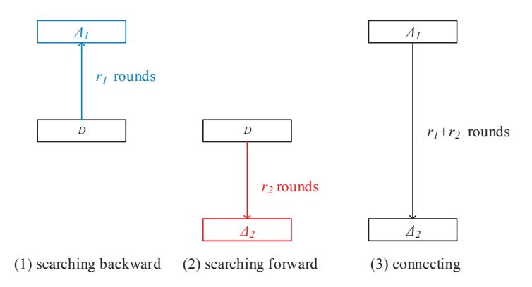
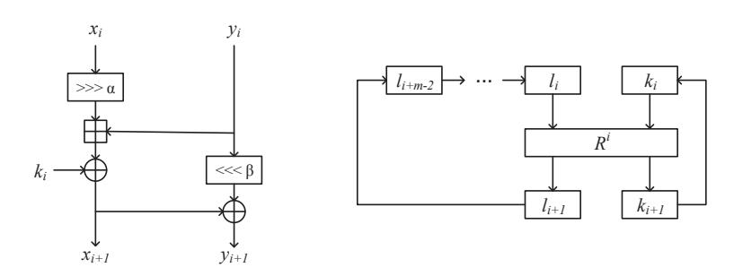
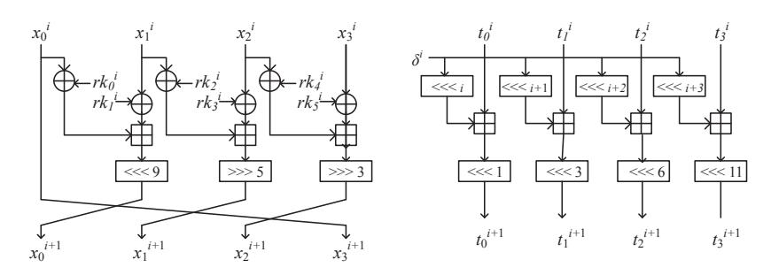
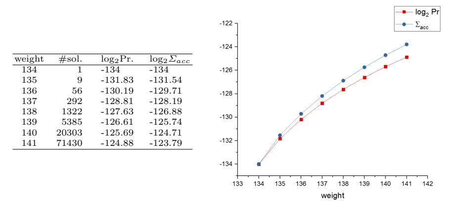

# **Automatic Differential Analysis of ARX Block Ciphers with Application to SPECK and LEA** *<sup>⋆</sup>*

Ling Song<sup>1</sup>*,*2*,*<sup>3</sup> , Zhangjie Huang<sup>1</sup>*,*2() , Qianqian Yang<sup>1</sup>*,*<sup>2</sup>

<sup>1</sup> State Key Laboratory of Information Security, Institute of Information Engineering, Chinese Academy of Sciences, Beijing 100093, China <sup>2</sup> Data Assurance and Communication Security Research Center, Chinese Academy of Sciences, Beijing 100093, China <sup>3</sup> Nanyang Technological University, Singapore *{*songling,huangzhangjie,yangqianqian*}*@iie.ac.cn

**Abstract.** In this paper, we focus on the automatic differential cryptanalysis of ARX block ciphers with respect to XOR-difference, and develop Mouha et al.'s framework for finding differential characteristics by adding a new method to construct long characteristics from short ones. The new method reduces the searching time a lot and makes it possible to search differential characteristics for ARX block ciphers with large word sizes such as *n* = 48*,* 64. What's more, we take the differential effect into consideration and find that the differential probability increases by a factor of 1*.*4 *∼* 8 for SPECK and about 2<sup>10</sup> for LEA when multiple characteristics are counted in. The efficiency of our method is demonstrated by improved attacks of SPECK and LEA, which attack 1, 1, 4 and 6 more rounds of SPECK48, SPECK64, SPECK96 and SPECK128, respectively, and 2 more rounds of LEA than previous works.

**Key words:** Differential cryptanalysis, automatic search, ARX, SPECK, LEA

## **1 Introduction**

ARX ciphers are a broad class of symmetric-key cryptographic algorithms that only consists of three operations: additions modulo 2*<sup>n</sup>*, bit rotations and XORs. Some examples of ARX ciphers are: the block ciphers SPECK [3], LEA [14], Chaskey [17], the stream cipher Salsa20 [4], and the SHA-3 finalists Skein [11] and

*<sup>⋆</sup>* **Note**: The paper with the same title was published on ACISP 2016. After the publication, the authors found that when calculating the probability of a differential, the number of solutions was computed inaccurately due to some simplifications of STP. To revise the paper, the authors re-evaluate the differential effect using another solver named Yices [10]. The experiments show that STP overestimates the number of solutions by a factor of 2 for most cases and thus the actual probabilities of differentials should be slightly lower. After revision, all the differentials and attacks are still valid. The authors would like to thank Pascal Jung for the helpful discussion.

Blake [2]. To evaluate the security of an ARX cipher, differential cryptanalysis [5] is one of the most important attacks that should be considered.

Even though ARX ciphers have a long history for use, their security analysis are lagging behind. For S-box based symmetric-key ciphers, their security against differential cryptanalysis is measured by the number of active S-boxes. On the contrary, there is no rigorous security proof of ARX ciphers against differential cryptanalysis in existing literature, so searching optimal differentials becomes the only way for evaluation. In 2013, Mouha et al. introduce a framework [18] for searching optimal differential characteristics of ARX ciphers, assuming all the operations in the cipher are independent. From the application to Salsa20, the assumption is shown to be invalid sometimes. In [7, 6], Biryukov et al. proposed a tool for automatically searching differential characteristics in ARX ciphers based on Matsui's algorithm and partial difference distribution tables. This tool suits differential search with respect to both XOR- and ADD- differences. However, the it is not applicable for cases where the block size is too large, such as *n* = 48*,* 64. [12]

In this paper, we focus on the automatic differential cryptanalysis of ARX block ciphers with respect to XOR-difference. We apply Mouha et al.'s framework of finding differential characteristics to ARX block ciphers assuming additions are independent, and develop the framework by adding a new method for constructing long characteristics from short ones. The new method reduces the searching time, especially for a large word size such as *n* = 64. Besides, we take the differential effect into consideration and find that the differential probability increases by a factor of 1*.*4 *∼* 2 <sup>10</sup> when multiple characteristics are counted in. The efficiency of our new method can be demonstrated by the application to two block ciphers: SPECK and LEA, in which better differentials are found and differential attacks against them are improved. The results are summarized in Table 1 and compared with the best ones of previous works. As can be seen, for SPECK we reduce the complexities of differential attack on SPECK32/64, and attack 1, 1, 4 and 6 more rounds against SPECK48, SPECK64, SPECK96 and SPECK128, respectively; for LEA, except the attacks in the specification we provide the first differential analysis for it and attack 13, 13 and 15 rounds of LEA-128, LEA-192 and LEA-256, respectively.

During the submission of this paper, there are another two related papers presented on FSE 2016 [12, 8]. In [12] Fu et al. extend Sun's MILP-based automatic search algorithms for differential and linear trails [21] from Sbox-based block ciphers to ARX block ciphers and improve the differential and linear attacks on SPECK. In the other paper, Biryukov et al. [8] propose the first adaptation of Matsuis algorithm for finding the best differential and linear trails in ARX ciphers and the adapted algorithm is also applied to SPECK. Still the differential characteristics of SPECK96 and SPECK128 are the best in terms of the number of rounds, and the ones of SPECK32, SPECK48 and SPECK64 are best in terms of probabilities because we take differential effect into account.

The rest of this paper is organized as follows. Section 2 provides a background of differential cryptanalysis; Section 3 elaborates on searching method developed

| Variant      | Rounds attacked/ | Time          | Data       | Memory  | Reference  |
|--------------|------------------|---------------|------------|---------|------------|
|              | Total rounds     |               | (CP)       |         |            |
| SPECK32/64   | 14/22            | 63<br>2       | 31<br>2    | 22<br>2 | [9]        |
|              | 14/22            | 62.47<br>2    | 30.47<br>2 | 22<br>2 | This paper |
| SPECK48/72   | 14/22            | 65<br>2       | 41<br>2    | 22<br>2 | [9]        |
|              | 15/22            | 69.31<br>2    | 45.31<br>2 | 22<br>2 | This paper |
| SPECK48/96   | 15/23            | 89<br>2       | 41<br>2    | 22<br>2 | [9]        |
|              | 16/23            | 93.31<br>2    | 45.31<br>2 | 22<br>2 | This paper |
| SPECK64/96   | 18/26            | 93<br>2       | 61<br>2    | 22<br>2 | [9]        |
|              | 19/26            | 93.56<br>2    | 61.56<br>2 | 22<br>2 | This paper |
| SPECK64/128  | 19/27            | 125<br>2      | 61<br>2    | 22<br>2 | [9]        |
|              | 20/27            | 125.56 2<br>2 | 61.56      | 22<br>2 | This paper |
| SPECK96/96   | 16/28            | 85<br>2       | 85<br>2    | 22<br>2 | [9]        |
|              | 18/28            | 82<br>2       | 82<br>2    | 22<br>2 | This paper |
|              | 20/28            | 95.94<br>2    | 95.94<br>2 | 22<br>2 | This paper |
| SPECK96/144  | 17/29            | 133<br>2      | 85<br>2    | 22<br>2 | [9]        |
|              | 19/29            | 130<br>2      | 82<br>2    | 22<br>2 | This paper |
|              | 21/29            | 143.94 2<br>2 | 95.94      | 22<br>2 | This paper |
| SPECK128/128 | 17/32            | 113<br>2      | 113<br>2   | 22<br>2 | [9]        |
|              | 23/32            | 125.35 2<br>2 | 125.35     | 22<br>2 | This paper |
| SPECK128/192 | 18/33            | 177<br>2      | 113<br>2   | 22<br>2 | [9]        |
|              | 24/33            | 189.35 2<br>2 | 125.35     | 22<br>2 | This paper |
| SPECK128/256 | 19/34            | 241<br>2      | 113<br>2   | 22<br>2 | [9]        |
|              | 25/34            | 253.35 2<br>2 | 125.35     | 22<br>2 | This paper |
| LEA-128      | 12/24            | 84<br>2       | 100<br>2   | 76<br>2 | [14]       |
| LEA-128      | 14/24            | 124.79 2<br>2 | 124.79     | 22<br>2 | This paper |
| LEA-192      | 14/28            | 124.79 2<br>2 | 124.79     | 22<br>2 | This paper |
| LEA-256      | 15/32            | 252.79 2<br>2 | 124.79     | 22<br>2 | This paper |
|              |                  |               |            |         |            |

**Table 1.** Previous attacks and our new attacks on SPECK.

in this paper; Section 4 briefly describes the two block ciphers SPECK and LEA; in Section 5 we provide the searching results for differentials of SPECK and LEA, on which attacks are launched; Section 6 is a short discussion; and finally, the last section is the conclusion.

A few words on notations: differences here are expressed using XOR; values for differences are represented in hexadecimal.

## **2 Background**

This section briefly reviews the differential cryptanalysis and differential properties of addition. At the end of this section, the assumption we take in this paper is clarified.

#### **2.1 Differential Cryptanalysis**

Differential cryptanalysis was introduced by Biham and Shamir in [5]. For block ciphers, it is used to analyze how input differences lead to output differences. If certain input/output difference happens in a non-random way, it can be used to build a distinguisher or even to recover keys.

To consider the security of iterated block ciphers against differential cryptanalysis, Lai et al. first introduced the theory of Markov ciphers and made a distinction between a differential and a differential characteristic [15]. A differential is a difference propagation from an input difference to an output difference, while a differential characteristic specifies not only the input/output difference, but also all the internal differences after each round. For a Markov cipher, the probability of a differential characteristic is the multiplication of difference transition probabilities of each round, and the probability of a differential is equal to the sum of the probabilities of all differential characteristics which correspond to the differential.

#### **2.2 Estimating Differential Probabilities for ARX Ciphers**

For ARX block ciphers, only additions modulo 2*<sup>n</sup>* are non-linear operations and propagate differences indefinitely. So we focus on calculating differential probability of addition. In [16], Lipmaa and Moriai study the differential properties of addition. Let xdp<sup>+</sup>(*α, β <sup>→</sup> <sup>γ</sup>*) be the XOR-differential probability of addition modulo 2*<sup>n</sup>*, with input differences *α, β* and output difference *γ*. The authors prove that the differential (*α, β → γ*) is valid if and only if

$$eq(\alpha \ll 1, \beta \ll 1, \gamma \ll 1) \land (\alpha \oplus \beta \oplus \gamma \oplus (\beta \ll 1)) = 0, \tag{1}$$

where

$$eq(x, y, z) := (\neg x \oplus y) \land (\neg x \oplus z). \tag{2}$$

For every valid differential (*α, β → γ*), the weight *w*(*α, β → γ*) is defined as follows:

$$w(\alpha, \beta \to \gamma) := -\log_2(xdp^+(\alpha, \beta \to \gamma)).$$

The weight of a valid differential can be calculated as:

$$w(\alpha, \beta \to \gamma) = h(\neg eq(\alpha, \beta, \gamma)),$$
 (3)

where *h*(*x*) denotes the number of non-zero bits in *x* except the most significant bit.

**Assumption of independent additions.** In this paper, we assume that additions in the block cipher are independent of each other with regard to XORdifference due to the use of round keys. Under this assumption, the probability of a differential characteristic is equal to the multiplication of the probabilities of all addition operations. Specifically, we calculate the weight of a differential characteristic as the sum of weights of all addition operations.

## **3 Automatic Search for Characteristics and Differentials in ARX Block Ciphers**

In this section we elaborate on the searching method used in this paper.

#### **3.1 Mouha's Framework for Searching Differential Characteristics of ARX Ciphers**

In [18], Mouha and Preneel construct a framework to search for optimal differential characteristics of ARX ciphers and apply it to Salsa20. In their framework, a typical Satisfiability Modulo Theory (SMT) solver STP [13] is used. STP is built upon a SAT solver. Since many word-wise operations are included in its input language, it is suitable for searching problems of ARX ciphers.

In the framework, they find differential characteristics up to a certain weight *W* with STP. First, they write simple equations with respect to XOR-difference for every addition, rotation and XOR of an ARX cipher as follows.

- **–** Use *n*-bit variables to represent input difference words.
- **–** Introduce additional *n*-bit variables to represent the differences after the addition, XOR, and rotation operations when required.
- **–** Use Equation (1) and (2) for every addition modulo 2*<sup>n</sup>* of the cipher to ensure that the input and output differences correspond to a valid differential of the addition operation.
- **–** Include Equation (3) to calculate the weight of each addition operation, and represent the sum of weights of all additions with *W*, which corresponds to the weight of the differential characteristics under consideration.
- **–** Specify that input difference is non-zero and restrict *W* to a maximum of a certain number.

Second, they feed the equations generated into STP. STP converts these equations into formulae of conjunctive normal form (CNF), and then invokes an underlying SAT solver to find solutions.

Although Mouha's framework that multiplies the differential probabilities of all additions was originally applied to a stream cipher, it is more suitable for ARX block ciphers where a round key is XORed each round. The reason is that additions in an ARX stream cipher are usually not independent, while additions in an ARX block cipher may be independent due to the use of round keys.

#### **3.2 Obtaining a Long Characteristic from Two Short Ones**

Mouha's framework can be applied directly to ARX block ciphers where additions are independent with regard to XOR-difference. However, due to the limitation of computation power, it takes too much time to find a long characteristic. In this paper, we introduce a method to obtain a long characteristic from two short ones. The method lies in searching differential characteristics from an internal difference which has only one active bit. This idea for searching long characteristics was inspired by the phenomenon that many optimal characteristics obtained have a special internal difference with only one active bit which usually leads to a differential transition of the nearest round with probability 1.

The method for obtaining long characteristics is illustrated in Fig. 1. First, we set an internal difference after some rounds *D* to be a value where only one bit is nonzero, and then search forward and backward independently to get

6 L. Song et al.

two short characteristics. After that we combine these two short characteristics together to get a long one. Since either the input or output difference is fixed, two short characteristics with best probability can be easily searched. Note that this method saves much time for searching long characteristics, but does not always guarantee best characteristics.



**Fig. 1.** Obtaining a longer characteristic from two shorter ones.

This method in differential attack resembles the one used in boomerang attack [22]. However, conditions for the two short characteristics are different. Suppose the probabilities of the two short characteristics are *p* and *q* respectively, and the block size is *N*. For standard differential attacks, *pq >* 2 *<sup>−</sup><sup>N</sup>* and the two short characteristics must be connected, while for boomerang attacks *pq >* 2 *<sup>−</sup>N/*2+1 and the two short characteristics are independent.

### **3.3 Characteristics to Differentials**

For ARX ciphers, the probability of one characteristic cannot well approximate the probability of the corresponding differential because of a strong differential effect, that is, between the input difference and the output difference there are many characteristics.

To calculate the differential probability as accurately as possible, more characteristics sharing the same input and output difference should be counted in. After a good characteristic is obtained, we fix the input and output difference, and search all characteristics with probability less or equal than that of the one obtained. More precisely, if the characteristic obtained has a weight *W*, we search all characteristics with the same input and output difference where the weight is *W, W* + 1*, W* + 2*, · · ·* , and add the probabilities of all these characteristics together.

**STP to Yices.** Note that STP just outputs one solution. To find all solutions, in [19], i.e., the version of this paper published on ACISP 2016, the authors used STP to generate the CNF formulae, and then invoke a SAT solver, such as CryptoMiniSat [20], to get all solutions. However, due to some simplifications of STP in outputing CNF which preserve satisfiability, but not the number of solutions, the number of solutions we obtained was not accurate. To revise this, we now use Yices [10], another SMT solver to generate CNF formulae. Yices uses its own input language but it also supports SMT-LIB 1.0 and 2.0. Actually, Yices is an alternative of STP, but Yices is only used to patch the part of evaluating the differential effect.

## **4 Description of SPECK and LEA**

#### **4.1 SPECK**

SPECK is a family of lightweight block ciphers designed by researchers from the U.S. National Security Agency (NSA)[3]. It contains 10 variants, each of which is characterized by its block size 2*n* and key size *mn*. For example, SPECK32/64 refers to the SPECK block cipher with block size 32 bits and key size 64 bits. The parameters of SPECK are listed in Table 4.

The SPECK2*n* encryption maps a plaintext of two *n*-bit words (*x*0*, y*0) into a ciphertext (*x<sup>T</sup> , y<sup>T</sup>* ), using a sequence of *T* rounds. The key-dependent round function is defined as

$$R^k(x,y) = (((x \ggg \alpha) \boxplus y) \oplus k, (y \lll \beta) \oplus ((x \ggg \alpha) \boxplus y) \oplus k),$$

where *k* is the round key, and rotation constants *α* and *β* are given in Table 4.

The SPECK key schedule reuses the round function to generate the round keys *k*0*, · · · , k<sup>T</sup>* . The *m*-word master key *K* = (*l<sup>m</sup>−*<sup>2</sup>*, · · · , l*0*, k*0) are used as follow:

$$l_{i+m-1} = (k_i \boxplus (l_i \gg \alpha)) \oplus i$$

$$k_{i+1} = (k_i \ll \beta) \oplus l_{i+m-1}.$$

Figure 2 provides a schematic view on the round function and the key schedule of SPECK.



**Fig. 2.** The round function and the key schedule of SPECK. *R i* is the SPECK round function with *i* acting as the round key.

#### 4.2 LEA

LEA is an ARX block cipher designed by Hong et al.[14] and provides a high-speed software encryption on general-purpose processors. It has the block size of 128 bits and the key size of 128, 192, or 256 bits. We denote the algorithms with 128-bit, 192-bit, and 256-bit keys by LEA-128, LEA-192, and LEA-256, respectively.

The encryption of LEA maps a plaintext of four 32-bit words  $(x_0^0, x_1^0, x_2^0, x_3^0)$  into a ciphertext  $(x_0^r, x_1^r, x_2^r, x_3^r)$  using a sequence of r rounds, where r = 24 for LEA-128, r = 28 for LEA-192 and r = 32 for LEA-256. The round function for round  $i, 0 \le i < r$  is defined as follows:

$$\begin{split} x_0^{i+1} &\leftarrow ((x_0^i \oplus rk_0^i) \boxplus (x_1^i \oplus rk_1^i)) \lll 9, \\ x_1^{i+1} &\leftarrow ((x_1^i \oplus rk_2^i) \boxplus (x_2^i \oplus rk_3^i)) \ggg 5, \\ x_2^{i+1} &\leftarrow ((x_2^i \oplus rk_4^i) \boxplus (x_3^i \oplus rk_5^i)) \ggg 3, \\ x_3^{i+1} &\leftarrow x_0^i. \end{split}$$

where  $rk^i = (rk_0^i, rk_1^i, rk_2^i, rk_3^i, rk_4^i, rk_5^i)$  is the round key, which is generated by a key schedule. We take LEA-128 as an example. Let  $K = (k_0, k_1, k_2, k_3)$  be a 128-bit key. We set  $t_i^0 = k_i$  for  $0 \le i < 4$ . For round  $i, 0 \le i < r$ ,  $rk^i$  is produced through following relations:

$$\begin{split} t_0^{i+1} &\leftarrow (t_0^i \boxplus (\delta^i \lll i)) \lll 1, \\ t_1^{i+1} &\leftarrow (t_1^i \boxplus (\delta^i \lll i+1)) \lll 3, \\ t_2^{i+1} &\leftarrow (t_2^i \boxplus (\delta^i \lll i+2)) \lll 6, \\ t_3^{i+1} &\leftarrow (t_3^i \boxplus (\delta^i \lll i+3)) \lll 11, \\ rk^i &\leftarrow (t_0^{i+1}, t_1^{i+1}, t_2^{i+1}, t_1^{i+1}, t_3^{i+1}, t_1^{i+1}). \end{split}$$

where  $\delta^i$  is the constant for round *i*. Figure 3 provides a schematic view on the round function of LEA and the key schedule of LEA-128. For key schedules of LEA-192 and LEA-256, please refer to Appendix A.2.



Fig. 3. The round function of LEA and the key schedule of LEA-128.

## **5 Searching Results and Attacks of SPECK and LEA**

In this section we apply the searching method explained in Section 3 to SPECK and LEA. For five versions of SPECK (in respect of block size) and LEA, we would like to find the longest characteristics. To this goal, we need to find the minimal weight of differential characteristics with given number of rounds. Suppose the block size is *N*. If the weight of an *r*-round differential characteristic is less than *N*, then the corresponding differential characteristic can be used to build a distinguisher or to recover the key. On the contrary, if the minimal weight of all *r*-round differential characteristics is no less than *N*, then no useful differential characteristic exists for that *r*-round cipher. However, even though the weight of some characteristics is larger than *N*, the weight of the corresponding differential may be less than *N*. Therefore, we also evaluate the probability of the corresponding differential by counting in more characteristics which share the same input and output difference. For a differential, as long as its weight is less than *N*, it is useful, and our attacks in this paper are mounted based on differentials. Note that all of the characteristics are searched with STP2.0 on a 3.4GHz Intel Core i7-2600 processor, and CryptoMiniSat4 is used as the underlying solver of STP. The differential effect is evaluated using Yices 2.5.

### **5.1 Characteristics and Differentials of SPECK**

**Characteristics of SPECK32 and SPECK48.** We directly apply Mouha's framework to SPECK with block size 2*n* = 32*,* 48. For SPECK32, the best 9 round characteristic obtained has a weight of 30, which coincides with that of [6]. We provide the Python code for generating Yices problems in Appendix D for verification. In addition, from a 10-round characteristic with weight 35 as shown in Table 5, we get the corresponding differential (0040*,* 2040) *→* (*A*840*,* 0800) with weight slightly less than 32. The probability calculation of the differential is displayed in Fig. 4. As far as we know, this 10-round characteristic is the longest distinguisher for SPECK32 in the literature. For SPECK48, our computer takes 12.5 days to find a 11-round characteristic with weight 46, and the corresponding differential has a weight of 44.31.

**Characteristics of SPECK64, SPECK96 and SPECK128.** We construct long characteristics for these versions where 2*n* = 64*,* 96*,* 128 from two short ones. Take SPECK64 as an example. We set an internal difference to be (00000080*,* 00000000) and search forward and backward independently. According to experiments, a 4-round forward characteristic with weight 9 and an 11-round backward characteristic with weight 53 can be combined to get a 15 round characteristic of weight 62. The corresponding differential has a weight less than 60.56. For SPECK96 and SPECK128, the searching works similarly. However, for both of them, differentials are derived from characteristics with weight equal to the block size. Specifically, from a 17-round characteristic of SPECK96 with weight 96 we get a 17-round differential with weight less than 94.94; from a 19-round characteristic of SPECK128 with weight 128, we obtain a 19-round differential with weight less than 124.35. The times for searching

| weight | #sol. | log2Pr. | log2Σacc |  |
|--------|-------|---------|----------|--|
| 35     | 1     | -35     | -35      |  |
| 36     | 2     | -35     | -34      |  |
| 37     | 3     | -35.42  | -33.54   |  |
| 38     | 8     | -35     | -33.09   |  |
| 39     | 19    | -34.75  | -32.70   |  |
| 40     | 25    | -35.36  | -32.48   |  |
| 41     | 44    | -35.54  | -32.32   |  |
| 42     | 46    | -36.48  | -32.24   |  |
| 43     | 90    | -36.51  | -32.17   |  |
| 44     | 113   | -37.18  | -32.12   |  |
| 45     | 142   | -37.85  | -32.10   |  |
| 46     | 251   | -38.03  | -32.07   |  |
| 47     | 401   | -38.35  | -32.06   |  |
| 48     | 648   | -38.66  | -32.04   |  |
| 49     | 1022  | -39.00  | -32.03   |  |
| 50     | 1823  | -39.17  | -32.02   |  |
| 51     | 2987  | -39.46  | -32.0109 |  |
| 52     | 5130  | -39.67  | -32.0038 |  |
| 53     | 9703  | -39.76  | -31.9971 |  |
| 54     | 18688 | -39.81  | -31.9907 |  |

**Fig. 4.** A 10-round differential of SPECK32 with (*∆x*0*, ∆y*0) = (2040*,* 0040), (*∆x*10*, ∆y*10) = (0800*, A*840).

long characteristics for SPECK64, SPECK96 and SPECK128 are 0.9 hour, 11.3 hours and 5.2 hours respectively, which are much less compared with the time for directly searching characteristics of SPECK48.

**Comparison.** Table 2 compares the differentials of SPECK we find with the ones in the literature. For SPECK32, we find a 10-round differential with probability 2*−*31*.*<sup>99</sup>, the best distinguisher of SPECK32 to date. We also find a 9 round characteristic of SPECK32 that coincides with that of [6] but has a tighter estimation of differential probability. For SPECK48, we obtain an 11-round characteristic with a better weight. For SPECK64, SPECK96 and SPECK128, the characteristics cover 1, 4 and 5 more round(s) than previous works.

#### **5.2 Characteristics and Differentials of LEA**

**Characteristics of LEA.** We construct long characteristics for LEA from two short ones. We set an internal difference to be (00000100*,* 00000000*,* 00000000*,* 000 00000) and search forward and backward independently. A 12-round characteristic of weight 112 can be constructed by combining two short ones of 6 forward rounds and 6 backward rounds respectively. From this characteristic we derive a 12-round differential

```
(10401080, 0A001080, 02041208, 00049228)
→(88008008, 88A2A00A, 22020060, 00000010)
```

with weight less than 103.19. Also, a 13-round characteristic can be constructed by connecting two short ones of 6 forward rounds and 7 backward rounds and its weight is 134. From this characteristic a 13-round differential

```
(00049018, 40049000, 10220041, 00028001)
→(88008008, 88A2A00A, 22020060, 00000010)
```

|                      | Block Rounds Prob. |          | Input              | Output                                               | Reference  |
|----------------------|--------------------|----------|--------------------|------------------------------------------------------|------------|
| Size                 | r                  |          | Difference         | Difference                                           |            |
|                      | 9                  | 2−30     | (8054, A900)       | (0040, 0542)                                         | [6]        |
| 32                   | 9                  | 2−29.47  | (8054, A900)       | (0040, 0542)                                         | This paper |
|                      | 10                 | 2−31.99  | (2040, 0040)       | (A840, 0800)                                         | This paper |
|                      | 11                 | 2−46.48  | (202040, 082921)   | (808424, 84A905)                                     | [6]        |
| 48                   | 11                 | 2−44.31  | (504200, 004240)   | (202001, 202000)                                     | This paper |
|                      | 14                 | 2−59.02  |                    | (00000009, 01000000) (00040024, 04200D01)            | [6]        |
| 64                   | 15                 | 2−60.56  |                    | (04092400, 20040104) (808080A0, A08481A4) This paper |            |
|                      |                    | 2−84     | (2A20200800A2,     | (1008004C804,                                        |            |
| 13<br>96<br>15<br>17 |                    |          | 322320680801)      | C0180228C60)                                         | [1]        |
|                      |                    | 2−81     | (082020000000,     | (800400008124,                                       | This paper |
|                      |                    |          | 000120200000)      | 842004008801)                                        |            |
|                      |                    | 2−94.94  | (240004000009,     | (A0A000008880,                                       | This paper |
|                      |                    |          | 010420040000)      | 81A02004C88C)                                        |            |
|                      | 15                 | 2−117.28 | (0640240804002440, | (828028080A080888,                                   | [1]        |
| 128<br>18            |                    |          | 6004400C20040004)  | E88C81A4A0924B2C)                                    |            |
|                      |                    | 2−113    | (0800202000000000, | (8080808000000020,                                   | This paper |
|                      |                    |          | 4808012020000000)  | A084808000000124)                                    |            |
|                      |                    |          | (0124000400000000, | (8004000080000124,                                   |            |
| 20                   |                    | 2−124.35 | 0801042004000000)  | 8420040080000801)                                    | This paper |

**Table 2.** Comparison of our differentials of SPECK with previous ones.

of weight less than 123.79 is derived. The probability calculation of the differential is displayed in Fig. 5. Note that, besides the input and output differences, an intermediate difference after the seventh round is also fixed to speed up the calculation. It seems that the accumulated probability *Σacc* has a property of slow convergence, which is different from the case of SPECK. The underlying reason keeps unexplored for the moment.

The details of these two characteristics are shown in Table 7. Compared with the only differential analysis in the specification of LEA, the differential in this paper covers two more rounds.

**Table 3.** Comparison of our differentials of LEA with previous ones.

| #Rounds | Prob. | Reference           |
|---------|-------|---------------------|
| 11      | 2−98  | [14]                |
| 12      | 2−128 | [14]                |
| 12      |       | 2−103.19 This paper |
| 13      |       | 2−123.79 This paper |



**Fig. 5.** A 13-round differential of LEA,  $(00049018, 40049000, 10220041, 00028001) \rightarrow (88008008, 88A2A00A, 22020060, 00000010).$

#### 5.3 Differential Attacks on SPECK and LEA

**Differential attacks on SPECK.** In [9] Dinur proposed an enumeration technique for key recovery in differential attacks against SPECK. Given a differential characteristic for SPECK2n/mn that covers r rounds of the cipher with probability  $p > 2 \cdot 2^{-2n}$ , the enumeration technique can be used to recover the key of a variant with (r+m) rounds with  $2 \cdot p^{-1}$  chosen plaintexts, in an average time complexity of  $2 \cdot p^{-1} \cdot 2^{(m-2)n}$  encryptions. The required memory is constant for all versions of SPECK, which is  $2^{22}$  bytes, i.e. only a few megabytes. Appendix B provides more information about Dinur's enumeration technique.

Adding one round for free. We use the r-round differential  $(\alpha \to \beta)$  over rounds  $2 \sim (r+1)$ , and choose pairs of plaintexts such that their difference after the first round is  $\alpha$ . In this way, one more round can be extended for free. This idea was also adopted by Abed et al. in [1]. Consequently, given an r-round differential, the attack can cover (r+m+1) rounds.

For SPECK32/64, we use the same 9-round differential as in [1,6]. According to our experiments, the differential holds with probability at least  $2^{-29.47}$ , which is larger than  $2^{-30}$ , the probability of the best characteristic of the differential. This indicates that the complexities of the attack can be reduced with a tighter estimation of the probability of the differential. Combined with Dinur's enumeration technique for key recovery, the differential can be used to attack a 14-round SPECK32/64 at a cost of  $2 \cdot 2^{29.47} = 2^{30.47}$  plaintexts and  $2 \cdot 2^{29.47} \cdot 2^{32} = 2^{62.47}$  encryptions.

Differential attacks for the rest variants are similar to that of SPECK32/64, so we omit the details on calculation of the complexities. The attacks are mounted based on the differentials in Table 2 and the results are summarized in Table 1. Compared with the previous works, the attacks on SPECK48, SPECK64, SPCKE96, SPECK128 extend 1, 1, 4 and 6 more round(s) respectively.

**Differential attacks on LEA.** Since the differential equations of addition in the key recovery of LEA are similar to that of SPECK, Dinur's enumeration technique can be adapted to LEA. Given an r-round differential characteristic of LEA with probability  $p > 2 \cdot 2^{-N}$  where N is the block size, for LEA-128 and LEA-192, the attack recovers the key of a variant of (r+1) rounds with  $2 \cdot p^{-1}$  plaintexts, in expected time complexity of  $2 \cdot p^{-1}$  encryptions, while (r+2) rounds of LEA-256 can be attacked with  $2 \cdot p^{-1}$  plaintexts and  $2 \cdot p^{-1} \cdot 2^{N}$  encryptions in average. The attacks are summarized in Table 1.

#### 6 Discussion

**Differential effect.** Experimental results confirm the strong differential effect of ARX block ciphers. When the characteristics sharing the same input and output difference are counted in, the differential probability increases by a factor of  $1.4 \sim 8$  for SPECK and by a factor around  $2^{10}$  for LEA. Due to this differential effect, the probability of a characteristic shouldn't be simply taken as the differential probability for these ARX block ciphers.

**Limitation of our searching method.** The searching method discussed in this paper takes the assumption of independent additions with respect to XOR-difference. However, additions are not independent in most ARX block ciphers, such as TEA [23], and Chaskey [17], to which our searching method can not be applied directly. One of our future work is to deal with the dependency among additions.

#### 7 Conclusion

In this paper, we apply Mouha's framework of finding differential characteristics to ARX block ciphers where the additions are independent with respect to XOR differences, and develop this framework by adding a new method for constructing long characteristics from short ones. This new method reduces the searching time a lot and makes it possible to search differential characteristics for ARX block ciphers with large word size such as n=64. In addition, we take the differential effect into consideration and the results show the probability of a characteristic shouldn't be simply taken as the differential probability for these ARX block ciphers. The efficiency of our method is demonstrated by improved attacks of SPECK and LEA. One of our future work is to deal with the dependency among additions which are common in most ARX ciphers.

**Acknowledgement:** The authors would like to thank Jian Guo for his valuable suggestions and thank the anonymous reviewers for their valuable comments and suggestions.

#### References

1. Farzaneh Abed, Eik List, Stefan Lucks, and Jakob Wenzel. Differential cryptanalysis of round-reduced simom and speck. In Cid Carlos and Rechberger Christian,

- editors, *Fast Software Encryption FSE 2014*, volume 8540 of *Lecture Notes in Computer Science*, pages 525–545. Springer Berlin Heidelberg, 2014.
- 2. Jean-Philippe Aumasson, Luca Henzen, Willi Meier, and Raphael C.-W. Phan. Sha-3 proposal blake. Technical report, Submission to the NIST SHA-3 Competition (Round 2), 2008.
- 3. Ray Beaulieu, Douglas Shors, Jason Smith, Stefan Treatman-Clark, Bryan Weeks, and Louis Wingers. The simon and speck families of lightweight block ciphers. Technical report, Cryptology ePrint Archive, Report 2013/404, 2013.
- 4. Daniel J. Bernstein. *The Salsa20 Family of Stream Ciphers*, volume 4986, pages 84–97. Springer Berlin Heidelberg, 2008.
- 5. Eli Biham and Adi Shamir. Differential cryptanalysis of des-like cryptosystems. *Journal of Cryptology*, 4(1):3–72, 1991.
- 6. Alex Biryukov, Arnab Roy, and Vesselin Velichkov. Differential analysis of block ciphers simon and speck. In Cid Carlos and Rechberger Christian, editors, *Fast Software Encryption - FSE 2014*, volume 8540 of *Lecture Notes in Computer Science*, pages 525–545. Springer Berlin Heidelberg, 2014.
- 7. Alex Biryukov and Vesselin Velichkov. Automatic search for differential trails in arx ciphers. In Josh Benaloh, editor, *Topics in Cryptology – CT-RSA 2014*, volume 8366 of *Lecture Notes in Computer Science*, pages 227–250. Springer International Publishing, 2014.
- 8. Alex Biryukov, Vesselin Velichkov, and Yann Le Corre. Milp-based automatic search algorithms for differential and linear trails for speck. In Thomas Peyrin, editor, *Fast Software Encryption - FSE 2016*. To appear in FSE 2016, 2016.
- 9. Itai Dinur. Improved differential cryptanalysis of round-reduced speck. In Antoine Joux and Amr Youssef, editors, *Selected Areas in Cryptography – SAC 2014*, volume 8781 of *Lecture Notes in Computer Science*, pages 147–164. Springer International Publishing, 2014.
- 10. Bruno Dutertre. The yices smt solver. Website, 2017. http://yices.csl.sri. com/.
- 11. Niels Ferguson, Stefan Lucks, Bruce Schneier, Doug Whiting, Mihir Bellare, Tadayoshi Kohno, Jon Callas, and Jesse Walker. The skein hash function family. Technical report, Submission to the NIST SHA-3 Competition (Round 2), 2009.
- 12. Kai Fu, Meiqin Wang, Yinghua Guo, Siwei Sun, and Lei Hu. Automatic search for the best trails in arx: Application to block cipher speck. In Thomas Peyrin, editor, *Fast Software Encryption - FSE 2016*. To appear in FSE 2016, 2016.
- 13. Vijay Ganesh and David L. Dill. A decision procedure for bit-vectors and arrays. In *Proceedings of the 19th International Conference on Computer Aided Verification*, CAV'07, pages 519–531, Berlin, Heidelberg, 2007. Springer-Verlag.
- 14. Deukjo Hong, Jung-Keun Lee, Dong-Chan Kim, Daesung Kwon, Kwon Ho Ryu, and Dong-Geon Lee. Lea: A 128-bit block cipher for fast encryption on common processors. In Yongdae Kim, Heejo Lee, and Adrian Perrig, editors, *Information Security Applications - WISA 2013*, volume 8267 of *Lecture Notes in Computer Science*, pages 3–27. Springer International Publishing, 2014.
- 15. Xuejia Lai, JamesL. Massey, and Sean Murphy. Markov ciphers and differential cryptanalysis. In Donald W. Davies, editor, *Advances in Cryptology - EU-ROCRYPT 91*, volume 547 of *Lecture Notes in Computer Science*, pages 17–38. Springer Berlin Heidelberg, 1991.
- 16. Helger Lipmaa and Shiho Moriai. Efficient algorithms for computing differential properties of addition. In Mitsuru Matsui, editor, *Fast Software Encryption*, volume 2355 of *Lecture Notes in Computer Science*, pages 336–350. Springer Berlin Heidelberg, 2002.

- 17. Nicky Mouha, Bart Mennink, Anthony Herrewege, Dai Watanabe, Bart Preneel, and Ingrid Verbauwhede. Chaskey: An efficient mac algorithm for 32-bit microcontrollers. In Antoine Joux and Amr Youssef, editors, *Selected Areas in Cryptography – SAC 2014*, volume 8781 of *Lecture Notes in Computer Science*, pages 306–323. Springer International Publishing, 2014.
- 18. Nicky Mouha and Bart Preneel. Towards finding optimal differential characteristics for arx: Application to salsa20. Technical report, Cryptology ePrint Archive, Report 2013/328, 2013.
- 19. Ling Song, Zhangjie Huang, and Qianqian Yang. Automatic differential analysis of ARX block ciphers with application to SPECK and LEA. In Joseph K. Liu and Ron Steinfeld, editors, *Information Security and Privacy - 21st Australasian Conference, ACISP 2016, Melbourne, VIC, Australia, July 4-6, 2016, Proceedings, Part II*, volume 9723 of *Lecture Notes in Computer Science*, pages 379–394. Springer, 2016.
- 20. Mate Soos, Karsten Nohl, and Claude Castelluccia. Extending sat solvers to cryptographic problems. In *Proceedings of the 12th International Conference on Theory and Applications of Satisfiability Testing*, SAT '09, pages 244–257, Berlin, Heidelberg, 2009. Springer-Verlag.
- 21. Siwei Sun, Lei Hu, Peng Wang, Kexin Qiao, Xiaoshuang Ma, and Ling Song. *Automatic Security Evaluation and (Related-key) Differential Characteristic Search: Application to SIMON, PRESENT, LBlock, DES(L) and Other Bit-Oriented Block Ciphers*, pages 158–178. Springer Berlin Heidelberg, Berlin, Heidelberg, 2014.
- 22. David Wagner. The boomerang attack. In Lars Knudsen, editor, *Fast Software Encryption*, volume 1636 of *Lecture Notes in Computer Science*, pages 156–170. Springer Berlin Heidelberg, 1999.
- 23. David J. Wheeler and Roger M. Needham. *TEA, a tiny encryption algorithm*, volume 1008, pages 363–366. Springer Berlin Heidelberg, 1995.

## **A More Description of SPECK and LEA**

#### **A.1 Parameters of SPECK**

**Table 4.** The SPECK parameters.

| Block Size | Key Size | Word Size | Key Words | Rounds | α | β |
|------------|----------|-----------|-----------|--------|---|---|
| 2n         | mn       | n         | m         | T      |   |   |
| 32         | 64       | 16        | 4         | 22     | 7 | 2 |
| 48         | 72       | 24        | 3         | 22     | 8 | 3 |
|            | 96       |           | 4         | 23     | 8 | 3 |
| 64         | 96       | 32        | 3         | 26     | 8 | 3 |
|            | 128      |           | 4         | 27     | 8 | 3 |
| 96         | 96       | 48        | 2         | 28     | 8 | 3 |
|            | 144      |           | 3         | 29     | 8 | 3 |
| 128        | 128      | 64        | 2         | 32     | 8 | 3 |
|            | 192      |           | 3         | 33     | 8 | 3 |
|            | 256      |           | 4         | 34     | 8 | 3 |

#### A.2 Key Schedules of LEA-192 and LEA-256

**Key schedule of LEA-192** Let  $K = (k_0, k_1, k_2, k_3, k_4, k_5)$  be a 192-bit key. We set  $t_i^0 = k_i$  for  $0 \le i < 6$ . For round  $i, 0 \le i < 28$ ,  $rk^i$  is produced through following relations:

$$\begin{split} t_0^{i+1} &\leftarrow (t_0^i \boxplus (\delta^i \lll i)) \lll 1, \\ t_1^{i+1} &\leftarrow (t_1^i \boxplus (\delta^i \lll i+1)) \lll 3, \\ t_2^{i+1} &\leftarrow (t_2^i \boxplus (\delta^i \lll i+2)) \lll 6, \\ t_3^{i+1} &\leftarrow (t_3^i \boxplus (\delta^i \lll i+3)) \lll 11, \\ t_4^{i+1} &\leftarrow (t_4^i \boxplus (\delta^i \lll i+3)) \lll 13, \\ t_5^{i+1} &\leftarrow (t_5^i \boxplus (\delta^i \lll i+5)) \lll 17, \\ rk^i &\leftarrow (t_0^{i+1}, t_1^{i+1}, t_2^{i+1}, t_3^{i+1}, t_4^{i+1}, t_5^{i+1}). \end{split}$$

where  $\delta^i$  is the constant for round i.

**Key schedule of LEA-256** Let  $K = (k_0, k_1, k_2, k_3, k_4, k_5, k_6, k_7)$  be a 192-bit key. We set  $t_i^0 = k_i$  for  $0 \le i < 8$ . For round  $i, 0 \le i < 32$ ,  $rk^i$  is produced through following relations:

```
t_{6i \bmod 8} \leftarrow (t_{6i \bmod 8} \boxplus (\delta^{i} \ll i)) \ll 1,
t_{6i+1 \bmod 8} \leftarrow (t_{6i+1 \bmod 8} \boxplus (\delta^{i} \ll i+1)) \ll 3,
t_{6i+2 \bmod 8} \leftarrow (t_{6i+2 \bmod 8} \boxplus (\delta^{i} \ll i+2)) \ll 6,
t_{6i+3 \bmod 8} \leftarrow (t_{6i+3 \bmod 8} \boxplus (\delta^{i} \ll i+3)) \ll 11,
t_{6i+4 \bmod 8} \leftarrow (t_{6i+4 \bmod 8} \boxplus (\delta^{i} \ll i+4)) \ll 13,
t_{6i+5 \bmod 8} \leftarrow (t_{6i+5 \bmod 8} \boxplus (\delta^{i} \ll i+5)) \ll 17,
rk^{i} \leftarrow (t_{6i \bmod 8}, t_{6i+11 \bmod 8}, t_{6i+2 \bmod 8}, t_{6i+3 \bmod 8}, t_{6i+4 \bmod 8}, t_{6i+5 \bmod 8}).
```

where  $\delta^i$  is the constant for round i.

## B Dinur's Enumeration Technique for Key Recovery Attack against SPECK

In this section, we review Itai's key recovery attack against SPECK and refer the reader to [9] for a complete description.

#### B.1 The Full Differential Attack

Counting techniques are common in key recovery of differential cryptanalysis, while in the differential cryptanalysis of SPECK, Itai increased the number of rounds attacked by the application of enumeration techniques in the key recovery [9]. Instead of extracting partial key material from outer rounds of the cipher

using statistical analysis, the enumeration technique tries all suggestions for the full key proposed by a sub-cipher attack.

To describe the details of Itai's attack on SPECK with enumeration technique, we first consider the case that m=2, i.e. the master key contains 2 words. The attack of the case that m=2 can be easily extended to other cases, in which m=3 or m=4.

Given an r-round differential of the cipher  $(\Delta x_0, \Delta y_0) \to (\Delta x_r, \Delta y_r)$  with high probability p, the (r+2)-round attack is proceeded as follow.

- 1. Request the encryption of  $p^{-1}$  plaintext pairs P and  $P' = P \oplus (\Delta x_0, \Delta y_0)$  and denote the corresponding ciphertexts by C and C', respectively.
- 2. For each plaintext pair P and P':
  - (a) Execute the 2-round attack (Section 7 of [9]) using  $(\Delta x_r, \Delta y_r)$ , C and C' and get suggestions for  $k_{r+1}$  and  $k_r$ .
  - (b) For each returned value of  $k_{r+1}$  and  $k_r$ , reverse the key schedule to obtain the master key. Test the master key using additional encryptions. Return the master key if it passes the test.

The above attack requires  $2 \cdot p^{-1}$  chosen plaintexts. Since in the key recovery, the 2-round attack has an average time complexity less than 2 encryptions, the total time complexity of the attack is  $2 \cdot p^{-1}$ . As Itai pointed out in [9], the memory complexity is  $2^{22}$  bytes, i.e. only a few megabytes. In next subsection, we describe the 2-round attack.

For m > 2 (m = 3 or m = 4), by guessing the last m - 2 round key(s), the attack can cover r + m rounds with data complexity of  $2 \cdot p^{-1}$  plaintexts and time complexity of  $2 \cdot p^{-1} \cdot 2^{(m-2)n}$  encryptions.

#### B.2 The 2-Round Attack

As described in Section B.1, for a 2-round attack we have a known input difference  $(\Delta x_r, \Delta y_y)$  and two ciphertexts  $(x_{r+2}, y_{r+2})$  and  $(x_{r+2} \oplus \Delta x_{r+2}, y_{r+2} \oplus \Delta y_{r+2})$ . The 2-round attack is to enumerate all the possible round keys  $k_r$  and  $k_{r+1}$  under which after the 2-round decryption the difference of the two ciphertexts is equal to  $(\Delta x_r, \Delta y_y)$ .

Since  $\Delta y_{r+1} = (\Delta x_{r+2} \oplus \Delta y_{r+2}) \gg \beta$  and  $\Delta x_{r+1} = \Delta y_{r+1} \oplus (\Delta y_r \ll \beta)$  can be calculated immediately according known variables, all the differences in the 2-round scheme are determined. Similarly, the value  $y_{r+1}$  can be calculated from the known ciphertexts, whereas  $(x_r, y_r)$  and  $x_{r+1}$  remain unknown. Further, deriving  $k_r$  and  $k_{r+1}$  is equivalent to deriving  $x_r$  and  $x_{r+1}$ , because  $k_{r+1} = (y_{r+1} \boxplus (x_{r+1} \gg \alpha)) \oplus x_{r+1}$  and as  $y_r = (x_{r+1} \oplus y_{r+1}) \gg \beta$ , then  $k_r = (y_r \boxplus (x_r \gg \alpha)) \oplus x_{r+1}$  can be computed as well. Thus, the key point is to deriving the values  $x_r$  and  $x_{r+1}$ .

For convenience, we omit the right circular shift  $\gg \alpha$ , and then we have two differential equations of addition

$$(x_r \oplus \Delta x_r) \boxplus (y_r \oplus \Delta y_r) = (x_r \boxplus y_r) \oplus \Delta x_{r+1},$$
$$(x_{r+1} \oplus \Delta x_{r+1}) \boxplus (y_{r+1} \oplus \Delta y_{r+1}) = (x_{r+1} \boxplus y_{r+1}) \oplus \Delta x_{r+2}.$$

where all differences are known, and in the second equation *yr*+1 and *yr*+1 *⊕ ∆yr*+1 are also known.

This type of differential equations of addition has an average of 1 solution. However, for almost any value of (*∆xr, ∆yr*), a large part of ciphertext pairs lead to no solutions. Therefore, to save the time, a filtering process is needed before solving these two equations.

Again, the property of addition explained by Equation (1) and Equation (2) are used as filters, which means checking whether the equation holds given all differences of the 2-round scheme. Using the filter, the complexity of the 2-round attacked can be optimized to less than 2 encryptions, which was verified by a lots of experiments on SPECK in [9].

## **C Differential Characteristics of SPECK and LEA**

| r               | SPECK32 |           | SPECK48   |    | SPECK64       |           |    |                   |           |
|-----------------|---------|-----------|-----------|----|---------------|-----------|----|-------------------|-----------|
|                 | ∆x      | ∆y        | log2<br>p | ∆x | ∆y            | log2<br>p | ∆x | ∆y                | log2<br>p |
| 0               |         | 2040 0040 |           |    | 504200 004240 |           |    | 04092400 20040104 |           |
| 1               |         | 8000 8100 | -1        |    | 001202 020002 | -5        |    | 20000820 20200001 | -6        |
| 2               |         | 8000 8402 | -1        |    | 000010 100000 | -3        |    | 00000009 01000000 | -4        |
| 3               |         | 8D02 9D08 | -4        |    | 000000 800000 | -1        |    | 08000000 00000000 | -2        |
| 4               |         | 6002 1420 | -9        |    | 800000 800004 | 0         |    | 00080000 00080000 | -1        |
| 5               |         | 1060 40E0 | -5        |    | 808004 808020 | -2        |    | 00080800 00480800 | -2        |
| 6               |         | 0380 0001 | -6        |    | 8400A0 8001A4 | -4        |    | 00480008 02084008 | -4        |
| 7               |         | 0004 0000 | -3        |    | 608DA4 608080 | -9        |    | 06080808 164A0848 | -7        |
| 8               |         | 0800 0800 | -1        |    | 042003 002400 | -11       |    | F2400040 40104200 | -13       |
| 9               |         | 0810 2810 | -2        |    | 012020 000020 | -5        |    | 00820200 00001202 | -8        |
| 10              |         | 0800 A840 | -3        |    | 200100 200000 | -3        |    | 00009000 00000010 | -4        |
| 11              |         |           |           |    | 202001 202000 | -3        |    | 00000080 00000000 | -2        |
| 12              |         |           |           |    |               |           |    | 80000000 80000000 | 0         |
| 13              |         |           |           |    |               |           |    | 80800000 80800004 | -1        |
| 14              |         |           |           |    |               |           |    | 80008004 84008020 | -3        |
| 15              |         |           |           |    |               |           |    | 808080A0 A08481A4 | -5        |
| Σr log2<br>pr   |         |           | -35       |    |               | -46       |    |                   | -62       |
| log2<br>pdiff > |         |           | -31.99    |    |               | -44.31    |    |                   | -60.56    |

**Table 5.** Differential characteristics for SPECK32, SPECK48 and SPECK64.

### **D Source Code**

Copy the Python code below, and generate the Yices file for the 9-round problem of SPECK32. The Yices problems of other versions can be generated easily by changing the word size and the number of rounds. Solve the Yices problem with Yices or use –logic=QF BV of Yices to export the corresponding CNF file and then find all solutions with CryptoMiniSAT using option –maxsol.

**Table 6.** Differential characteristics for SPECK96 and SPECK128.

| r               | SPECK96                   |           | SPECK128                          |           |  |
|-----------------|---------------------------|-----------|-----------------------------------|-----------|--|
|                 | ∆x<br>∆y                  | log2<br>p | ∆x<br>∆y                          | log2<br>p |  |
| 0               | 240004000009 010420040000 |           | 0124000400000000 0801042004000000 |           |  |
| 1               | 082020000000 000120200000 | -6        | 0800202000000000 4808012020000000 | -6        |  |
| 2               | 000900000000 000001000000 | -4        | 4800010000000000 0840080100000002 | -6        |  |
| 3               | 000008000000 000000000000 | -2        | 0808080000000006 4A08480800000016 | -7        |  |
| 4               | 000000080000 000000080000 | -1        | 4000400000000032 1042004000000080 | -12       |  |
| 5               | 000000080800 000000480800 | -2        | 0202000000000080 8012020000000480 | -7        |  |
| 6               | 000000480008 000002084008 | -4        | 0010000000000480 0080100000002084 | -5        |  |
| 7               | 0800FE080808 0800EE4A0848 | -12       | 8080000000006080 84808000000164A0 | -6        |  |
| 8               | 000772400040 400000104200 | -21       | 0400000000032400 2004000000080104 | -11       |  |
| 9               | 000000820200 000000001202 | -11       | 2000000000080020 2020000000480801 | -7        |  |
| 10              | 000000009000 000000000010 | -4        | 0000000000480001 0100000002084008 | -6        |  |
| 11              | 000000000080 000000000000 | -2        | 000000000E080808 080000001E4A0848 | -8        |  |
| 12              | 800000000000 800000000000 | 0         | 00000000F2400040 4000000000104200 | -15       |  |
| 13              | 808000000000 808000000004 | -1        | 0000000000820200 0000000000001202 | -8        |  |
| 14              | 800080000004 840080000020 | -3        | 0000000000009000 0000000000000010 | -4        |  |
| 15              | 808080800020 A08480800124 | -5        | 0000000000000080 0000000000000000 | -2        |  |
| 16              | 800400008124 842004008801 | -9        | 8000000000000000 8000000000000000 | 0         |  |
| 17              | A0A000008880 81A02004C88C | -9        | 8080000000000000 8080000000000004 | -1        |  |
| 18              |                           |           | 8000800000000004 8400800000000020 | -3        |  |
| 19              |                           |           | 8080808000000020 A084808000000124 | -5        |  |
| 20              |                           |           | 8004000080000124 8420040080000801 | -9        |  |
| Σr log2<br>pr   |                           | -96       |                                   | -128      |  |
| log2<br>pdiff > |                           | -94.94    |                                   | -124.35   |  |

**Table 7.** Differential characteristics for LEA.

| r            | 12-round                         |         | 13-round                         |         |
|--------------|----------------------------------|---------|----------------------------------|---------|
|              | ∆x0 ∥ ∆x1 ∥ ∆x2 ∥ ∆x3            | log2 p  | ∆x0 ∥ ∆x1 ∥ ∆x2 ∥ ∆x3            | log2 p  |
| 0            | 104010800A0010800204120800049228 |         | 00049018400490000002800110220041 |         |
| 1            | 80000014404020140040100410401080 | -20     | 104010800A0010800204100800049018 | -20     |
| 2            | 80400080860000808200001080000014 | -16     | 800000144040200C0040100410401080 | -20     |
| 3            | 8000000C8040000C8040000480400080 | -14     | 80400080860000808200001080000014 | -18     |
| 4            | 8000000080000000800000108000000C | -10     | 8000000C8040000C8040000480400080 | -14     |
| 5            | 00000000800000008000000080000000 | -4      | 8000000080000000800000108000000C | -10     |
| 6            | 00000100000000000000000000000000 | 0       | 00000000800000008000000080000000 | -4      |
| 7            | 00020000000000000000000000000100 | -1      | 00000100000000000000000000000000 | -0      |
| 8            | 04000000000000000000002000020000 | -2      | 00020000000000000000000000000100 | -1      |
| 9            | 00000008000000070000400404000000 | -6      | 04000000000000000000002000020000 | -2      |
| 10           | 00000200080002008080080000000008 | -11     | 00000008000000070000400404000000 | -6      |
| 11           | 00000010044400501010010100000200 | -9      | 00000200080002008080080000000008 | -11     |
| 12           | 8800800888A2A00A2202006000000010 | -19     | 00000010044400501010010100000200 | -9      |
| 13           |                                  |         | 8800800888A2A00A2202006000000010 | 19      |
| Σr log2 pr   |                                  | -112    |                                  | -134    |
| log2 pdiff > |                                  | -103.19 |                                  | -123.79 |

```
Rnds = 9
bound = 30 # bound for the weight
ws = 16 # word size
alpha = 7 # 8 for word size > 16
beta = 2 # 3 for word size > 16
zero = 'zero'
f = open('speck' + str(Rnds) + '.ys', 'w')
\begin{array}{cccccccccccccccccccccccccccccccccccc
\begin{array}{llllllllllllllllllllllllllllllllllll
def shift1(v0):
    return '(bv-shift-left0 '+v0+' 1)'
def add(v0, x0, x3):
    negv0 = '(bv-not '+shift1(v0)+')'
    eq = '(bv-and (bv-xor '+negv0+' '+shift1(x0)+') (bv-xor '+negv0+' '+shift1(x3)

\begin{array}{llllllllllllllllllllllllllllllllllll
def weight (p0):
              s=[]
for i in range(ws-1):

 \begin{array}{llllllllllllllllllllllllllllllllllll
f.write('; intermediate variables\n')
vAfterRt = ['v' + str(i) for i in range(Rnds)]
for i in range(Rnds):

f.write('; penalty variables\n')
pen = ['p' + str(i) for i in range(Rnds)]
for i in range(Rnds):

f.write('; weight of the characteristic\n') f.write('(define weight:: (bitvector 11))\n\n') f.write('(assert (= zero (mk-bv '+str(ws)+' 0)))\n')
for i in range(Rnds):
    f.write( rotr(states[2*i+1], vAfterRt[i], alpha))
    f.write(add(vAfterRt[i], states[2*i], states[2*i+3]))
    f.write( rotl(states[2*i], states[2*i+3], states[2*i+2], beta))
    f.write(penalty(vAfterRt[i], states[2*i], states[2*i+3], pen[i]))
#f.write('; No all?zero characteristic :\n')
f.write('(assert (/= (bv-or '+states[0]+' '+ states[1] +') '+zero+'))\n')
sumW = []
for i in range(Rnds):
    sumW += weight(pen[i])
f.write('(assert (= weight (bv-add '+ ' '.join(sumW)+')))\n')
f.write('; fix the input and output differences \n')
f.write('(assert (= x0 (mk-bv 16 '+str(int(0x4900 ))+')))\n')
f.write('(assert (= x1 (mk-bv 16 '+str(int(0x8054 ))+')))\n')
f.write('(assert (= x'+str(2*Rnds )+' (mk-bv 16 '+str(int(0x0542 ))+')))\n')
f.write('(assert (= x'+str(2*Rnds+1)+' (mk-bv 16 '+str(int(0x0040 ))+')))\n')
f.write('(assert (bv-le weight (mk-bv 11 '+ str(bound)+')))\n')
f.write('(check)\n')
f.write('(show-model)\n')
f.write('(export-to-dimacs "test.cnf")')
```