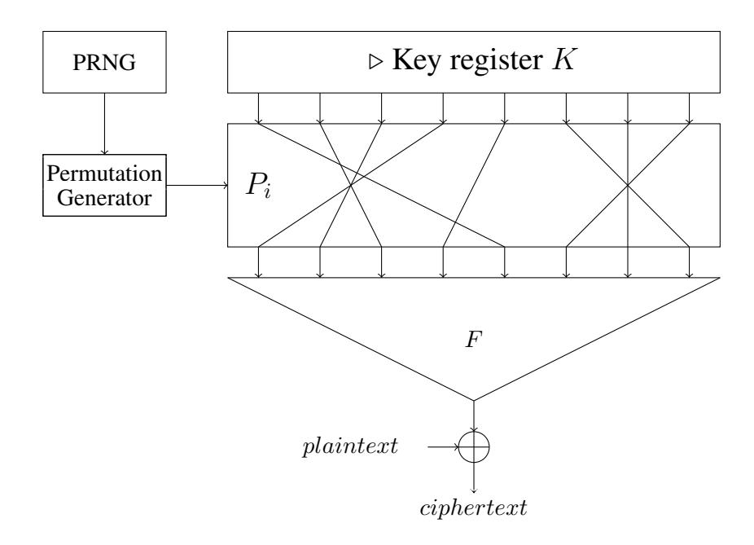

# Towards Stream Ciphers for Efficient FHE with Low-Noise Ciphertexts

Pierrick Meaux ´ 1 , Anthony Journault2 , Franc¸ois-Xavier Standaert2 , Claude Carlet3 .

1 INRIA, CNRS, ENS and PSL Research University, Paris, France. 2 ICTEAM/ELEN/Crypto Group, Universite catholique de Louvain, Belgium. ´ 3 LAGA, Department of Mathematics, University of Paris VIII and University of Paris XIII, France.

Abstract. Symmetric ciphers purposed for Fully Homomorphic Encryption (FHE) have recently been proposed for two main reasons. First, minimizing the implementation (time and memory) overheads that are inherent to current FHE schemes. Second, improving the homomorphic capacity, *i.e.* the amount of operations that one can perform on homomorphic ciphertexts before bootstrapping, which amounts to limit their level of noise. Existing solutions for this purpose suggest a gap between block ciphers and stream ciphers. The first ones typically allow a constant but small homomorphic capacity, due to the iteration of rounds eventually leading to complex Boolean functions (hence large noise). The second ones typically allow a larger homomorphic capacity for the first ciphertext blocks, that decreases with the number of ciphertext blocks (due to the increasing Boolean complexity of the stream ciphers' output). In this paper, we aim to combine the best of these two worlds, and propose a new stream cipher construction that allows constant and small(er) noise. Its main idea is to apply a Boolean (filter) function to a public bit permutation of a constant key register, so that the Boolean complexity of the stream cipher outputs is constant. We also propose an instantiation of the filter function designed to exploit recent (3rd-generation) FHE schemes, where the error growth is quasi-additive when adequately multiplying ciphertexts with the same amount of noise. In order to stimulate further investigation, we then specify a few instances of this stream cipher, for which we provide a preliminary security analysis. We finally highlight the good properties of our stream cipher regarding the other goal of minimizing the time and memory complexity of calculus delegation (for 2nd-generation FHE schemes). We conclude the paper with open problems related to the large design space opened by these new constructions.

### 1 Introduction

Purpose: calculus delegation. Recent years have witnessed massive changes in communication technologies, that can be summarized as a combination of two trends: (1) the proliferation of small embedded devices with limited storage and computing facilities, and (2) the apparition of cloud services with extensive storage and computing facilities. In this context, the outsourcing of data and the delegation of data processing gains more and more interest. Yet, such new opportunities also raise new security and privacy concerns. Namely, users typically want to prevent the server from learning about their data and processing. For this purpose, Gentry's breakthrough Fully Homomorphic Encryption (FHE) scheme [\[Gen09\]](#page-27-0) brought a perfect conceptual answer. Namely, it allows applying processing on ciphertexts in a homomorphic way so that after decryption, plaintexts have undergone the same operations as ciphertexts, but the server has not learned anything about these plaintexts.1

Application scenario. Cloud services can be exploited in a plethora of applications, some of them surveyed in [\[NLV11\]](#page-28-0). In general, they are always characterized by the aforementioned asymmetry between the communication parties. For illustration, we start by providing a simple example where data outsourcing and data processing delegation require security and privacy. Let us say that a patient, Alice, has undergone

1 In the remaining of the paper, and when not specified otherwise, the term FHE will also be used for related schemes such as Leveled HE, SomeWhat HE, Scalable HE, *etc.*

a surgery and is coming back home. The hospital gave her a monitoring watch (with limited storage) to measure her metabolic data on a regular basis. And this metabolic data should be made available to the doctor Bob, to follow the evolution of the post-surgery treatment. Quite naturally, Bob has numerous patients and no advanced computing facilities to store and process the data of all his patients. So this is a typical case where sending the data to a cloud service would be very convenient. That is, Alice's data could be sent to and stored on the cloud, and associated to both her and the doctor Bob. And the cloud would provide Bob with processed information in a number of situations such as when the metabolic data of Alice is abnormal (in which case an error message should be sent to Bob), or during an appointment between Alice and Bob, so that Bob can follow the evolution of Alice's data (possibly after some processing). Bob could in fact even be interested by accessing some other patient's data, in order to compare the effect of different medications. And of course, we would like to avoid the cloud to know anything about the (private) data it is manipulating.

**Typical Framework.** More technically, the previous exemplary application can be integrated in a quite general cloud service application framework, that can be seen as a combination of 5 steps, combining a symmetric encryption scheme and an asymmetric homomorphic encryption scheme, as summarised in Figure 1 and described next:

- 1. *Initialization*. Alice runs the key generation algorithms H.KeyGen and S.KeyGen of the two schemes, and sends her homomorphic public key  $pk^H$  and the homomorphic ciphertext of her symmetric key  $\mathbf{C}^H(\mathsf{sk}_i^S)$ .
- 2. Storage. Alice encrypts her data  $m_i$  with the symmetric encryption scheme, and sends  $\mathbf{C}^S(m_i)$  to Claude.
- 3. Evaluation. Claude homomorphically evaluates, with the H. Eval algorithm, the decryption  $\mathbf{C}^H(m_i)$  of the symmetric scheme on Alice's data  $\mathbf{C}^S(m_i)$ .
- 4. Computation. Claude homomorphically executes the treatment f on Alice's encrypted data.
- 5. Result. Claude sends a compressed encrypted result of the data treatment  $\mathbf{c}^H(f(m_i))$ , obtained with the H.Comp algorithm, and Alice decrypts it.

Note that if we assume the existence of a trusted third party active only during the initialization step, Alice can avoid Step 1, which needs a significant computational and memory storage effort. Note also that this framework is versatile: computation can be done in parallel (in a batch setting) or can be turned into a secret key FHE.

**FHE bottlenecks.** The main limitation for the deployment of cloud services based on such FHE frameworks relates to its important overheads, that can be related to two main concerns: computational and memory costs (especially on the client side) and limited homomorphic capacity (*i.e.* noise increase). More precisely:

- The computational and memory costs for the client depend overwhelmingly on the homomorphic encryption and decryption algorithms during the steps 1 and 5. The memory cost is mostly influenced by the homomorphic ciphertexts and public key sizes. Solving these two problems consists in building size-efficient FHE schemes with low computational cost [HS14, KGV14]. On the server side, this computational cost further depends on the symmetric encryption scheme and function to evaluate.
- The homomorphic capacity relates to the fact that FHE constructions are built on noise-based cryptography, where the unbounded amount of homomorphic operations is guaranteed by an expensive bootstrapping technique. The homomorphic capacity corresponds to the amount of operations doable

|                   | <u>Alice</u>                                                                                                                                                  |                                                       | <u>Claude</u>                                                                       |
|-------------------|---------------------------------------------------------------------------------------------------------------------------------------------------------------|-------------------------------------------------------|-------------------------------------------------------------------------------------|
| 1: Initialization | $\begin{aligned} (sk^H,pk^H) &\leftarrow H.KeyGen(\lambda) \\ sk^S &\leftarrow S.KeyGen(\lambda) \\ \mathbf{C}^H(sk_i^S) &= H.Enc(sk_i^S,pk^H) \end{aligned}$ | $\underline{\mathbf{C}^H(sk_i^S),pk_{\rightarrow}^H}$ | $\mathbf{C}^H(sk_i^S),pk^H$                                                         |
| 2: Storage        | $\mathbf{C}^S(m_i) = S.Enc(m_i,sk^S)$                                                                                                                         | $\begin{array}{c} \mathbf{C}^S(m_i) \\ \end{array}$   | $\mathbf{C}^S(m_i)$                                                                 |
| 3: Evaluation     |                                                                                                                                                               |                                                       | $\mathbf{C}^H(m_i)$ $=$ $H.Eval(S.Dec(\mathbf{C}^S(m_i),\mathbf{C}^H(sk_i^S),pk^H)$ |
| 4: Computation    | f                                                                                                                                                             | $\xrightarrow{\hspace*{1cm}} f$                       | $\mathbf{C}^H(f(m_i)) = H.Eval(f(\mathbf{C}^H(m_i))$                                |
| 5: Result         | $\mathbf{c}^H(f(m_i))$ $f(m_i) = H.Dec(\mathbf{c}^H(f(m_i)),sk^H)$                                                                                            | $\leftarrow$ $\mathbf{c}^H(f(m_i))$                   | $\mathbf{c}^H(f(m_i)) = H.Comp(\mathbf{C}^H(f(m_i)))$                               |

**Fig. 1.** Homomorphic Encryption - Symmetric Encryption framework. H and S respectively refer to homomorphic and symmetric encryption schemes, for algorithms (e.g. H.KeyGen) or scheme components (e.g.  $\mathsf{sk}^S$ ).

before the noise growing too much forcing to use bootstrapping. Therefore, and in order to reduce the time and computational cost of the framework, it is important to manage the error growth during the homomorphic operations (*i.e.* steps 3 and 4). Furthermore, since the 4th step is the most important one from the application point-of-view (since this is where the useful operations are performed by the cloud), there is strong incentive to minimize the cost of the homomorphic decryption in the 3rd step.

**Previous works.** In order to mitigate these bottlenecks, several works tried to reduce more and more the homomorphic cost of evaluating a symmetric decryption algorithm. First attempts in this direction, which were also used as benchmark for FHE implementations, used the AES for this purpose [GHS12, CLT14]. Various alternative schemes were also considered, all with error and sizes depending on the multiplicative depth of the symmetric encryption scheme, such as BGV [BGV12] and FV [FV12]. Additional optimizations exploited batching and bitslicing, leading to the best results of performing 120 AES decryptions in 4 minutes [GHS12].

Since the multiplicative depth of the AES decryption evaluation was a restrictive bound in these works, other symmetric encryption schemes were then considered. The most representative attempts in this direction are the family of block ciphers LowMC [ARS+15] and the stream cipher Kreyvium [CCF+15]. These constructions led to reduced and more suitable multiplicative depths. Yet, and intuitively, these attempts were still limited by complementary drawbacks. First for LowMC, the remaining multiplicative depth

remains large enough to significantly reduce the homomorphic capacity (*i.e.* increase the noise). Such a drawback seems to be inherent in block cipher structures where the iteration of rounds eventually leads to Boolean functions with large algebraic degree, which inevitably imply a constant per block but high noise after homomorphic evaluation. For example, ciphers dedicated to efficient masking against side-channel attacks [\[PRC12,](#page-28-1) [GLSV14,](#page-27-5) [GGNS13\]](#page-27-6), which share the goal of minimizing the multiplicative complexity, suffer from similar issues and it seems hard to break the barrier of one multiplication per round (and therefore of 12 to 16 multiplications for 128-bit ciphers). Second for Kreyvium, the error actually grows with the number of evaluated ciphertexts, which implies that at some point, the output ciphertexts are too noisy, and cannot be decrypted (which requires either to bootstrap or to re-initialize the stream cipher).

Our contribution. In view of this state-of-the-art, a natural direction would be to try combining the best of these two previous works. That is, to design a cipher inheriting from the constant noise property offered by block ciphers, and the lower noise levels of stream ciphers (due to the lower algebraic degree of their outputs), leading to the following contributions.

First, we introduce a new stream cipher construction, next denoted as a filter permutator (by analogy with filter generators). Its main design principle is to filter a constant key register with a variable (public) bit permutation. More precisely, at each cycle, the key register is (bit) permuted with a pseudorandomly generated permutation, and we apply a non-linear filtering function to the output of this permuted key register. The main advantage of this construction is to always apply the non-linear filtering directly on the key bits, which allows maintaining the noise level of our outputs constant. Conceptually, this type of construction seems appealing for any FHE scheme.

Second, and going deeper in the specification of a concrete scheme, we discuss the optimization of the components in a filter permutator, with a focus on the filtering function (which determines the output noise after homomorphic evaluation). For this purpose, we first notice that existing FHE schemes can be split in (roughly) two main categories. On one hand the so-called *2nd-generation* FHE (such as [\[BGV12,](#page-26-1) [CLT14\]](#page-26-0)) where the metric for the noise growth is essentially the multiplicative depth of the circuit to homomorphically evaluate. On the other hand, the so-called *3rd-generation* FHE (such as [\[GSW13,](#page-27-7) [AP14\]](#page-26-4)) where the error growth is asymmetric, and in particular quasi-additive when considering a multiplicative chain. From these observations, we formalize a *comb* structure which can be represented as a (possibly long) multiplicative chain, in order to take the best advantage of 3rd-generation FHE schemes. We then design a filtering function based on this comb structure (combined with other technical ingredients in order to prevent various classes of possible attacks against stream ciphers) and specify a family of filter permutators (called FLIP ).

Third, and in order to stimulate further investigations, we instantiate a few version of FLIP designs, for 80-bit and 128-bit security. We then provide a preliminary evaluation of their security against some of the prevailing cryptanalysis from the open literature – such as (fast) algebraic attacks, (fast) correlation attacks, BKW-like attacks [\[BKW03\]](#page-26-5), guess and determine attacks, *etc.* – based on state-of-the-art tools. We also analyze the noise brought by their filtering functions in the context of 3rd-generation FHE. In this respect, our main result is that we can limit the noise after the homomorphic evaluation of a decryption to a level of the same order of magnitude as for a single homomorphic multiplication - hence essentially making the impact of the symmetric encryption scheme as small as possible.

We finally observe that our FLIP designs have a very reduced multiplicative depth, which makes them suitable for 2nd-generation FHE schemes as well, and provide preliminary results of prototype implementations using HElib that confirm their good behavior compared to state-of-the-art block and stream ciphers designed for efficient FHE.

Overall, filter permutators in general and FLIP instances in particular open a large design space of new symmetric constructions to investigate. Hence, we conclude the paper with a list of open problems regarding these algorithms, their best cryptanalysis, the Boolean functions used in their filter and their efficient implementation if concrete applications.

### 2 Background

#### 2.1 Boolean functions

In this section, we recall the cryptographic properties of Boolean functions that we will need in the rest of the paper (mostly taken from [Car10]).

**Definition 1** (Boolean Function). A Boolean function f with n variables is a function from  $\mathbb{F}_2^n$  to  $\mathbb{F}_2$ . The set of all Boolean functions in n variables is denoted by  $\mathcal{B}_n$ .

**Definition 2** (Walsh Transform). Let  $f \in \mathcal{B}_n$  a Boolean function. Its Walsh Transform  $W_f$  at  $a \in \mathbb{F}_2^n$  is defined as:

$$W_{\mathsf{f}}(a) = \sum_{x \in \mathbb{F}_2^n} (-1)^{f(x) + \langle a, x \rangle},$$

where  $\langle a, x \rangle$  denotes the inner product in  $\mathbb{F}_2^n$ .

**Definition 3** (Balancedness). A Boolean function  $f \in \mathcal{B}_n$  is said to be balanced if its outputs are uniformly distributed over  $\{0,1\}$ .

**Definition 4** (Non-linearity). The non-linearity NL of a Boolean function  $f \in \mathcal{B}_n$ , where n is a positive integer, is the minimum Hamming distance between f and all the affine functions g:

$$\mathsf{NL}(f) = \min_{g} \{ d_H(f, g) \},$$

with  $d_H(f,g) = \#\{x \in \mathbb{F}_2^n \mid f(x) \neq g(x)\}$  the Hamming distance between f and g. The non-linearity of a Boolean function can also be defined by its Walsh Transform:

$$NL(f) = 2^{n-1} - \frac{1}{2} \max_{a \in \mathbb{F}_2^n} |W_f(a)|.$$

**Definition 5** (Resiliency). A Boolean function  $f \in \mathcal{B}_n$  is said m-resilient if any of its restrictions obtained by fixing at most m of its coordinates is balanced. We will denote by res(f) the resiliency m of f and set res(f) = -1 if f is unbalanced.

**Definition 6 (Algebraic Immunity).** The algebraic immunity of a Boolean function  $f \in \mathcal{B}_n$ , denoted as Al(f), is defined as:

$$\mathsf{AI}(f) = \min_{g \neq 0} \{ \mathsf{deg}(g) \mid fg = 0 \text{ or } (f \oplus 1)g = 0 \},$$

where deg(g) is the degree of g. The function g is called an annihilator of f (or  $(f \oplus 1)$ ).

**Definition 7 (Fast Algebraic Immunity).** The fast algebraic immunity of a Boolean function  $f \in \mathcal{B}_n$ , denoted as  $\mathsf{FAI}(f)$ , is defined as:

$$\mathsf{FAI}(f) = \min\{2\mathsf{AI}(f), \min_{\substack{1 < \deg(q) < \mathsf{AI}(f)}} (\max[\deg(g) + \deg(fg), 3\deg(g)])\}.$$

Summarizing, the good balancedness, non-linearity and resiliency properties have to be ensured to widthstand correlation attacks [Sie85] and fast correlation attacks [MS88]. The high algebraic immunity and fast algebraic immunity have to be ensured to widthstand algebraic attacks [CT15].

### 2.2 (Ring) Learning With Errors

In this section, we recall useful notations and definitions needed about the decisional LWE problem and its ring variation. For an integer modulus q, we denote by  $\mathbb{Z}_q$  the quotient ring of integers modulo q. We denote vectors with bold letters  $\mathbf{e}$  and matrices with bold capital letters  $\mathbf{A}$ . The notation  $s \leftarrow_{\$} S$  (resp.  $s \leftarrow_{\$} \chi$ ) denotes that s is picked uniformly at random from a finite set S (resp. from a distribution  $\chi$ ).

The decisional Learning With Error problem (dLWE) was introduced by Regev [Reg05].

**Definition 8 (dLWE).** For an integer  $q = q(n) \ge 2$ , an adversary A and an error distribution  $\chi = \chi(n)$  over  $\mathbb{Z}_q$ , we define the following advantage function:

$$\mathsf{Adv}^{\mathsf{dLWE}_{n,m,q,\chi}}_{\mathcal{A}} := |\Pr[\mathcal{A}(\mathbf{A},\mathbf{z}_0) = 1] - \Pr[\mathcal{A}(\mathbf{A},\mathbf{z}_1) = 1]|,$$

where

$$\mathbf{A} \leftarrow_{\$} \mathbb{Z}_q^{n \times m}, \mathbf{s} \leftarrow_{\$} \mathbb{Z}_q^n, \mathbf{e} \leftarrow_{\$} \chi^m, \mathbf{z}_0 := \mathbf{s}^{\mathsf{T}} \mathbf{A} + \mathbf{e}^{\mathsf{T}} \quad \textit{and} \quad \mathbf{z}_1 \leftarrow_{\$} \mathbb{Z}_q^m.$$

The dLWE $n,m,q,\chi$  assumption asserts that for all PPT adversaries  $\mathcal{A}$ , the advantage  $Adv_{\mathcal{A}}^{dLWE_{n,m,q,\chi}}$  is a negligible function in n.

The ring variant was introduced by Lyubashevsky, Peikert and Regev in [LPR10].

**Definition 9** (dR-LWE). For a polynomial ring  $R = \mathbb{Z}[X]/f(X)$  with f of degree n, an integer  $q \geq 2$ , an adversary A and an error distribution  $\chi$  over  $R_q = R/qR$ ,  $R^{\vee}$  being R dual fractional ideal, we define the following advantage function:

$$\mathsf{Adv}^{\mathsf{d}R\mathsf{LWE}_{R,q,\chi}}_{\mathcal{A}} := |\Pr[\mathcal{A}(a,z_0) = 1] - \Pr[\mathcal{A}(a,z_1) = 1]|,$$

where

$$a \leftarrow_{\$} R_q, \ s \leftarrow_{\$} R_q^{\lor}, \ e \leftarrow_{\$} \chi, \ z_0 := a \cdot s + e \quad and \quad z_1 \leftarrow_{\$} R \ .$$

With f(X) a cyclotomic polynomial, the  $dRLWE_{R,q,\chi}$  assumption asserts that for all PPT adversaries  $\mathcal{A}$ , the advantage  $Adv_{\mathcal{A}}^{dRLWE_{R,q,\chi}}$  is a negligible function in n.

For our constructions, we need to take the distribution  $\chi$  as a subgaussian random variable which we define hereafter. More details about the subgaussian distribution and the lemmas' proof can be found in [AP14, Ver10].

**Definition 10** (Subgaussian Random Variables). Let X be a random variable. We say X is subgaussian with parameter  $\sigma$  if there exists  $\sigma$  such that:

$$\forall t \in \mathbb{R}, \mathbb{E}[e^{tX}] \le e^{\sigma^2 t^2/2},$$

where  $\mathbb{E}[e^{tX}]$  is the moment generating function of X.

**Lemma 1** (Subgaussian Random Variables properties). Let X, X' be independent subgaussian random variables of parameter  $\sigma$  and  $\sigma'$  respectively. Assuming  $\mathbb{E}(X) = \mathbb{E}(X') = 0$  we have the following properties:

- Tails:  $\forall t \geq 0$  we have  $Pr[|X| \geq t] \leq 2e^{-\pi t^2/\sigma^2}$ .
- Homogeneity:  $\forall c \in \mathbb{R}$ , cX is subgaussian with parameter  $|c|\sigma$ .
- Pythagorean additivity: X + X' is subgaussian with parameter  $\sqrt{\sigma^2 + {\sigma'}^2}$ .

We extend the notion of subgaussianity to vectors and polynomials. Since the coefficients of a polynomial are seen as a vector, we call subgaussian vector of parameter  $\sigma$  a vector where each coefficient follows an independent subgaussian distribution with parameter  $\sigma$ .

Lemma 2 (Subgaussian Vector Norm, adapted from [AP14], Lemma 2.1). Let  $\mathbf{x} \in \mathbb{R}^n$  be a random vector where each coordinates follows an independent subgaussian distribution of parameter  $\sigma$ . Then for some universal constant C > 0 we have  $Pr[||\mathbf{x}||_2 > C\sigma\sqrt{n}] \leq 2^{-\Omega(n)}$  and therefore  $||\mathbf{x}||_2 = \mathcal{O}(\sigma\sqrt{n})$ .

### 2.3 Fully Homomorphic Encryption

In this section we recall the definition of (Fully) Homomorphic Encryption and present the Homomorphic Encryption schemes we will use, both based on GSW [GSW13].

**Definition 11** (Homomorphic Encryption Scheme). Let  $\mathcal{M}$  be the plaintext space,  $\mathcal{C}$  the ciphertext space and  $\lambda$  the security parameter. A homomorphic encryption scheme consists of four algorithms:

- H.Key $Gen(1^{\lambda})$ . Output  $pk^H$  and  $sk^H$  the public and secret keys of the scheme.
- $H.\mathsf{Enc}(m, \mathsf{pk}^H)$ . From the plaintext  $m \in \mathcal{M}$  and the public key, output a ciphertext  $c \in \mathcal{C}$ .
- $H.\mathsf{Dec}(c,\mathsf{sk}^H)$ . From the ciphertext  $c\in\mathcal{C}$  and the secret key, output  $m'\in\mathcal{M}$ .
- $H.\mathsf{Eval}(f, c_1, \cdots, c_k, \mathsf{pk}^H)$ . With  $c_i = H.\mathsf{Enc}(m_i, \mathsf{pk}^H)$  for  $1 \le i \le k$ , output a ciphertext  $c_f \in \mathcal{C}$  such that  $H.\mathsf{Dec}(c_f) = f(m_1, \cdots, m_k)$ .

A homomorphic encryption scheme is called a Fully Homomorphic Encryption (FHE) scheme when f can be any function and  $|\mathcal{C}|$  is finite. A simpler primitive to consider is the SomeWhat Homomorphic Encryption (SWHE) scheme, where f is restricted to be any univariate polynomial of finite degree.

Since the breakthrough work of Gentry [Gen09], the only known way to obtain FHE consists in adding a bootstrapping technique to a SWHE. As bootstrapping computational cost is still expensive in comparison to the other FHE algorithms, in the following part of the article we will only consider SWHE for our applications.

**GSW Homomorphic Encryption Scheme.** In 2013, Gentry, Sahai and Waters [GSW13] introduced a Homomorphic Encryption scheme based on LWE using a new technique stemming from the *approximate eigenvector problem*. This new technique led to a new family of FHE, called 3rd-generation FHE, consisting in Homomorphic Encryption schemes such that the multiplicative error growth is quasi-additive. Hereafter, we present two schemes belonging to this generation, the first one with security based on dLWE and the second one based on dRLWE. We first set some useful notations considering the different schemes.

For a matrix  $\mathbf E$  we refer to the i-th row as  $\mathbf e_i^{\!\!\top}$  and to the j-th column as  $\mathbf e_j$ . The  $\log q$  notation refers to the logarithm in base 2 of q. The notation  $[a]_q$  is for  $a \mod q$  and  $\lfloor [a]_q \rceil_2 \in \{0,1\}$  is a function in  $a \in \mathbb Z_q$  giving 1 if  $\lfloor \frac{q}{4} \rfloor \leq a \leq \lfloor \frac{3q}{4} \rfloor \mod q$  and 0 otherwise. We denote by [n] the set of integers  $\{1,\cdots,n\}$ . We finally use |x| and  $||x||_2$  for the standard norms 1 and 2 on vectors  $x \in \mathbb R^n$ .

**Batched GSW.** This scheme is a batched version of GSW presented in [HAO15], enabling to pack independently r plaintexts in one ciphertext. From the security parameter  $\lambda$  and the considered applications, we can derive the parameters  $n, q, r, \chi$  of the scheme described below.

 $H.\mathsf{KeyGen}(n,q,r,\chi).$  On inputs the lattice dimension n, the modulus q, the number of bits by ciphertext r and the error distribution  $\chi$  do:

- Set
$$\ell = \lceil \log q \rceil$$
,  $m = \mathcal{O}(n\ell)$ ,  $N = (r+n)\ell$ ,  $\mathcal{M} = \{0,1\}^r$  and  $\mathcal{C} = \mathbb{Z}_q^{(r+n)\times N}$ .

- Pick
$$\mathbf{A} \leftarrow_{\$} \mathbb{Z}_q^{n \times m}$$
,  $\mathbf{S}' \leftarrow_{\$} \chi^{r \times n}$  and  $\mathbf{E} \leftarrow_{\$} \chi^{r \times m}$ .

- Set
$$\mathbf{S} = [\mathbf{I}| - \mathbf{S}'] \in \mathbb{Z}_q^{r \times (r+n)}$$
 and  $\mathbf{B} = \left[ \frac{\mathbf{S}'\mathbf{A} + \mathbf{E}}{\mathbf{A}} \right]_q \in \mathbb{Z}_q^{(r+n) \times m}$ .

– For all  $\mathbf{m} \in \{0,1\}^r$ :

• Pick
$$\mathbf{R_m} \leftarrow_{\$} \{0,1\}^{m \times N}$$
.

• Set
$$\mathbf{P_m} = \begin{bmatrix} \mathbf{BR_m} + \begin{pmatrix} \frac{m_1 \cdot \mathbf{s}_1^{\mathsf{T}}}{\vdots} \\ \frac{m_r \cdot \mathbf{s}_r^{\mathsf{T}}}{0} \end{bmatrix} \mathbf{G} \end{bmatrix}_q \in \mathbb{Z}_q^{(r+n) \times N}.$$

with  $\mathbf{s}_i^{\! {\scriptscriptstyle \mathsf{T}}}$  the i-th row of  $\mathbf{S}$  and  $\mathbf{G} = (2^0, \cdots, 2^{\ell-1})^{\! {\scriptscriptstyle \mathsf{T}}} \otimes \mathbf{I} \in \mathbb{Z}_q^{(r+n) \times N}$ .

– Output  $pk^H := (\{\mathbf{P_m}\}, \mathbf{B})$  and  $sk^H := \mathbf{S}$ .

 $H.\mathsf{Enc}(\mathsf{pk}^H,\mathbf{m}).$  On input  $\mathsf{pk}^H,$  and  $\mathbf{m} \in \{0,1\}^r,$  do:

– Pick
$$\mathbf{R} \leftarrow_{\$} \{0,1\}^{m \times N}$$
, and output  $\mathbf{C} = [\mathbf{B}\mathbf{R} + \mathbf{P_m}]_q \in \mathbb{Z}_q^{(r+n) \times N}$ .

 $H.\mathsf{Dec}(\mathbf{C},\mathsf{sk}^H).$  On input the secret key  $\mathsf{sk}^H,$  and a ciphertext  $\mathbf{C},$  do:

- For all  $i \in [r]: m_i' = \lfloor [\langle \mathbf{s}_i^{\mathsf{\scriptscriptstyle T}}, \mathbf{c}_{i\ell} \rangle]_q \rceil_2$  where  $\mathbf{c}_{il}$  is the column  $i\ell$  of  $\mathbf{C}$ .
- Output  $m'_1, \dots, m'_r \in \{0, 1\}^r$ .

Note that
$$\mathbf{SC} = \mathbf{SBR} + \mathbf{SP_m} = \mathbf{ER} + \mathbf{ER_m} + \left( \frac{\underline{m_1 \cdot \mathbf{s}_1^{\mathsf{T}}}}{\vdots \underline{m_r \cdot \mathbf{s}_r^{\mathsf{T}}}} \right) \mathbf{G} = \mathbf{E}' + \left( \frac{\underline{m_1 \cdot \mathbf{s}_1^{\mathsf{T}}}}{\vdots \underline{m_r \cdot \mathbf{s}_r^{\mathsf{T}}}} \right) \mathbf{G}.$$

The H.Eval algorithm finally consists in iterating, following a circuit f, the homomorphic operations H.Add and H.Mul:

- $H.Add(C_1, C_2) : C_+ = C_1 + C_2.$
- $H.\mathsf{Mul}(\mathbf{C}_1, \mathbf{C}_2) : \mathbf{C}_{\times} = \mathbf{C}_1 \times \mathbf{G}^{-1}\mathbf{C}_2$  with  $\mathbf{G}^{-1}$  a function such that  $\forall \mathbf{C} \in \mathbb{Z}_q^{(r+n)\times N}, \mathbf{G}\mathbf{G}^{-1}(\mathbf{C}) = \mathbf{C}$  and the values of  $\mathbf{G}^{-1}(\mathbf{C})$  follow a subgaussian distribution with parameter  $\mathcal{O}(1)$  (see [MP12] for the existence and proof of  $\mathbf{G}^{-1}$ ).

The correctness and security of this scheme are proven in Appendix A.

Remark 1. For practical use, we only need to store r+1 matrices  $\mathbf{P}_m$ , namely the r+1 ones with  $\mathbf{m}$  of hamming weight equal to 0 or 1 are sufficient to generate correct encryption of all  $\mathbf{m} \in \{0,1\}^r$  with at most r additions of the corresponding  $\mathbf{P}_m$  matrices.

**Ring-GSW** This scheme is a ring version of GSW presented in [KGV14], transposing the *approximate* eigenvector problem into the ring setting. From  $\lambda$  the security parameter and the considered applications, we can derive the parameters n, q and  $\mathcal{M}$  of the scheme described below.

H.KeyGen $(n, q, \chi, \mathcal{M})$ . On inputs the lattice dimension n, which is set to a power of 2, the modulus q, the error distribution  $\chi$  and the plaintext space  $\mathcal{M}$  do:

- Set  $R = \mathbb{Z}[X]/(X^n + 1)$ ,  $R_q = R/qR$ ,  $\ell = \lceil \log q \rceil$ ,  $N = 2\ell$  and  $\mathcal{C} = R_q^{2 \times N}$ .
- Set  $R_{0,1} = \{ P \in R_q, p_i \in \{0,1\}, 0 \le i < n \}.$
- Pick  $a \leftarrow_{\$} R_q, s' \leftarrow_{\$} \chi$  and  $e \leftarrow_{\$} \chi$ .
- $\textbf{-} \ \operatorname{Set} \mathbf{s} = [1|-s']^{\!\top} \in R_q^{1 \times 2} \ \text{and} \ \mathbf{b} = \left(\!\frac{s'a+e}{a}\!\right) \in R_q^{2 \times 1} \ .$
- Output  $pk^H := b$  and  $sk^H := s$ .

 $H.\mathsf{Enc}(\mathsf{pk}^H, m).$  On input  $\mathsf{pk}^H,$  and  $m \in \mathcal{M},$  do:

- Pick  $\mathbf{E} \leftarrow_{\$} \chi^{2 \times N}$ .
- Pick  $\mathbf{r} \leftarrow_\$ R_{0,1}^N$ , and output  $\mathbf{C} = [\mathbf{b}\mathbf{r}^{\scriptscriptstyle \top} + m\mathbf{G} + \mathbf{E}]_q \in R_q^{2 \times N}$  .

 $H.\mathsf{Dec}(\mathbf{C},\mathsf{sk}^H)$ . On input the secret key  $\mathsf{sk}^H$ , and a ciphertext  $\mathbf{C}$ , do:

- Compute  $m' = \lfloor [\langle \mathbf{s}, \mathbf{c}_l \rangle]_a \rceil_2$ .
- Output  $m' \in R_q$ .

The  $H.\mathsf{Eval}$  algorithm finally consists in iterating  $H.\mathsf{Add}$  and  $H.\mathsf{Mul}$ :

- $H.\mathsf{Add}(\mathbf{C}_1,\mathbf{C}_2):\mathbf{C}_+=\mathbf{C}_1+\mathbf{C}_2.$
- $H.\mathsf{Mul}(\mathbf{C}_1, \mathbf{C}_2) : \mathbf{C}_{\times} = \mathbf{C}_1 \times \mathbf{G}^{-1}\mathbf{C}_2.$

The correctness and security of this scheme are proven in Appendix B.

Remark 2. The plaintext space  $\mathcal{M}$  has a major influence on the considered application in terms of quantity of information contained in a single ciphertext and error growth. For our application we choose  $\mathcal{M}$  as the set of polynomials with all coefficients of degree greater than 0 being zero, and the constant coefficient being bounded.

Fig. 2. Filter permutator construction.

## 3 New stream cipher constructions

In this section, we introduce our new stream cipher construction. We first describe the general filter permutator structure. Next we list a number of Boolean building blocks together with their necessary cryptographic properties. Third, we specify a family of filter permutators (denoted as FLIP) and analyze its security based on state-of-the art cryptanalysis and design tools. Finally, we propose a couple of parameters to fully instantiate a few examples of FLIP designs.

#### 3.1 Filter permutators

The general structure of filter permutators is depicted in Figure [2.](#page-9-0) It is composed of three parts: a register where the key is stored, a (bit) permutation generator parametrised by a Pseudo Random Number Generator (PRNG) [\[BM84,](#page-26-8) [KL07\]](#page-27-9) (which is initialized with a public IV), and a filtering function which generates a keystream. The filter permutator can be compared to a filter generator, in which the LFSR is replaced by a permuted key register. In other words, the register is no longer updated by means of the LFSR, but with pseudorandom bit permutations. More precisely, at each cycle (*i.e.* each time the filtering function outputs a bit), a pseudo-random permutation is applied to the register and the permuted key register is filtered. Eventually, the encryption (*resp.* decryption) with a filter permutator simply consists in XORing the bits output by the filtering function with those of the plaintext (*resp.* ciphertext).

#### 3.2 Boolean building blocks for the filter permutator

We will first exploit direct sums of Boolean functions defined as follows:

Definition 12 (Direct Sum). *Let* f1(x0, · · · , xn1−1) *and* f2(xn1 , · · · , xn1+n2−1) *be two Boolean functions in respectively* n1 *and* n2 *variables. The direct sum of* f1 *and* f2 *is defined as* f = f1 ⊕ f2*, which is a* *Boolean function in* n1 + n2 *variables such that:*

$$f(x_0, \dots, x_{n_1+n_2-1}) = f_1(x_0, \dots, x_{n_1-1}) \oplus f_2(x_{n_1}, \dots, x_{n_1+n_2-1}).$$

They inherit from the following set of properties, proven in Appendix [C.1.](#page-29-1)

Lemma 3 (Direct sum properties). *Let* f *be the direct sum of* f1 *and* f2 *with* n1 *and* n2 *variables respectively. Then* f *has the following cryptographic properties:*

- *1. Non Linearity:* NL(f) = 2n2NL(f1) + 2n1NL(f2) − 2NL(f1)NL(f2)*.*
- *2. Resiliency:* res(f) = res(f1) + res(f2) + 1*.*
- *3. Algebraic Immunity:* AI(f1) + AI(f2) ≥ AI(f) ≥ max(AI(f1), AI(f2))*.*
- *4. Fast Algebraic Immunity:* FAI(f) ≥ max(FAI(f1), FAI(f2))*.*

Our direct sums will then be based on three parts: a linear function, a quadratic function and triangular functions, defined as follows.

Definition 13 (Linear functions). *Let* n > 0 *be a positive integer, the* Ln *linear function is a* n*-variable Boolean function defined as:*

$$L_n(x_0, \dots, x_{n-1}) = \sum_{i=0}^{n-1} x_i.$$

Definition 14 (Quadratic functions). *Let* n > 0 *be a positive integer, the* Qn *linear function is a* 2n*variable Boolean function defined as:*

$$Q_n(x_0, \dots, x_{2n-1}) = \sum_{i=0}^{n-1} x_{2i} x_{2i+1}.$$

Definition 15 (Triangular functions). *Let* k > 0 *be a positive integer. The* k*-th triangular function* Tk *is a* k(k+1) 2 *-variable Boolean function defined as:*

$$T_k(x_0, \cdots, x_{\frac{k(k+1)}{2}-1}) = \sum_{i=1}^k \prod_{j=0}^{i-1} x_{j+\sum_{\ell=0}^{i-1} \ell}.$$

For example, the 4th triangular function T4 is:

$$T_4 = x_0 \oplus x_1 x_2 \oplus x_3 x_4 x_5 \oplus x_6 x_7 x_8 x_9.$$

These three types of functions allow us to guarantee the following properties.

Lemma 4 (Linear functions properties). *Let* Ln *be a linear function in* n *variables, then* Ln *has the following cryptographic properties:*

- *1. Non Linearity:* NL(Ln) = 0*.*
- *2. Resiliency:* res(Ln) = n − 1*.*
- *3. Algebraic Immunity:* AI(Ln) = 1*.*
- *4. Fast Algebraic Immunity:* FAI(Ln) = 2*.*

**Lemma 5** (Quadratic functions properties). Let  $Q_n$  be a linear function in 2n variables, then  $Q_n$  has the following cryptographic properties:

- 1. Non Linearity:  $NL(Q_n) = 2^{2n-1} 2^{n-1}$ .
- 2. Resiliency:  $res(Q_n) = -1$ .
- 3. Algebraic Immunity:  $AI(Q_1) = 1$  and  $\forall n > 1$ ,  $AI(Q_n) = 2$ .
- 4. Fast Algebraic Immunity:  $\mathsf{FAI}(Q_1) = 2$  and  $\forall n > 1$ ,  $\mathsf{FAI}(Q_n) = 4$ .

**Lemma 6** (Triangular functions properties). Let k a positive integer and let  $T_k$  the k-th triangular function. Then the following properties hold:

1. Non Linearity follows the recursive formula defined as:

(i)
$$NL(T_1 = 0)$$
,
(ii)  $NL(T_{k+1}) = (2^{k+1} - 2)NL(T_k) + 2^{k(k+1)/2}$ .

- 2. Resiliency:  $res(T_k) = 0$ .
- 3. Algebraic Immunity:  $AI(T_k) = k$ .
- 4. Fast Algebraic Immunity:  $FAI(T_k) = k + 1$ .

The proof of Lemma 6 can be found in Appendix C.2 (Lemmas 4 and 5 are standard).

### 3.3 The FLIP family of stream ciphers

Based on the previous definitions, we specify the FLIP family of stream ciphers as a filter permutator using a forward secure PRNG [BY01] based on the AES-128 (e.g. as instantiated in the context of leakage-resilient cryptography [SPY13]), the Knuth shuffle (see below) as bit permutation generator and such that the filter F is the N-variable Boolean function defined by the direct sum of three Boolean functions  $f_1$ ,  $f_2$  and  $f_3$  of respectively  $n_1$ ,  $n_2$  and  $n_3$  variables, such that:

- $f_1(x_0, \cdots, x_{n_1-1}) = L_{n_1},$ -  $f_2(x_{n_1}, \cdots, x_{n_1+n_2-1}) = Q_{n_2/2},$
- $f_3(x_{n_1+n_2}, \dots, x_{n_1+n_2+n_3-1})$  is the direct sum of nb triangular function  $T_k$ , *i.e.* such that each  $T_k$  acts on different and independent variables, that we denote as  $nb \Delta^k$ .

That is, we have  $F: \mathbb{F}_2^{n_1+n_2+n_3} \to \mathbb{F}_2$  the Boolean function such that:

$$F(x_0, \dots, x_{n_1+n_2+n_3-1}) = L_{n_1} \oplus Q_{n_2/2} \oplus \bigoplus_{i=1}^{nb} T_k.$$

In the following section, we provide a preliminary security analysis of the FLIP filter permutators against a couple of standard attacks against stream ciphers, based on state-of-the-art tools. For this purpose, we will assume that no additional weaknesses arise from its PRNG and bit permutation generator. In this respect, we note that our forward secure PRNG does not allow malleability, so it should be hard to obtain a collision in the chosen IV model better than with birthday probability. This should prevent collisions on the generated permutations. Besides, the Knuth shuffle [Knu69] (or Fisher-Yates shuffle) is an algorithm allowing to generate a random permutation on a finite set. This algorithm has the interesting property of giving the same probability to all permutations if used with a random number generator. As a result, we

expect that any deviation between a bit permutation based on a Knuth shuffle fed with the PRNG will be hard to exploit by an adversary. Our motivation for this assumption is twofold. First, it allows us to focus on whether the filter permutator construction is theoretically sound. Second, if such a choice was leading to an exploitable weakness, it remains possible to build a pseudorandom permutation based on standard cryptographic constructions [LR88].

Remark 3. Since the permutation generation part of FLIP has only birthday security (with respect to the size of the PRNG), it implies that it is only secure up to  $2^{64}$  PRNG outputs when implemented with the AES-128. Generating more keystream using larger block ciphers should be feasible. However, in view of the novelty of the FLIP instances, our claims are only made for this limited (birthday) data complexity so far, which should not be limiting for the intended FHE applications. We leave the investigation of their security against attacks using larger data complexities as a scope for further research. Besides, we note that using a PRNG based on a tweakable block cipher [LRW11] (where a part of the larger IV would be used as tweak) could be an interesting track to reduce the impact of a collision on the PRNG output in the known IV model, which we also leave as an open research direction.

#### 3.4 Security analysis

Since the filter permutator shares similarities with a filter generator, it is natural to start our investigations with the typical attacks considered against such types of stream ciphers. For this purpose, we next study the applicability of algebraic attacks and correlation attacks, together with more specialized cryptanalyses that have been considered against stream ciphers. Note that the attacks considered in the rest of this section frequently require to solve systems of equations and to implement a Gaussian reduction. Our complexity estimations will consider Strassen's algorithm for this purpose and assume  $\omega = \log 7$  to be the exponent in a Gaussian reduction. Admittedly, approaches based on Gröbner bases [Fau99] or taking advantage of the sparsity of the matrices [Wie86] could lead to even faster algorithms. We ignore them for simplicity in these preliminary investigations. Note also that we only claim security in the single-key setting.

**Algebraic Attacks** were first introduced by Courtois and Meier in [CM03] and applied to the stream cipher Toyocrypt. Their main idea is to build an over-defined system of equations with the initial state of the LFSR as unknown, and to solve this system with Gaussian elimination. More precisely, by using a nonzero function g such that both g and h=gF have low algebraic degree, an adversary is able to obtain T equations with monomials of degree at most AI(f). It is easily shown that g can be taken equal to the annihilator of F or of  $F\oplus 1$ , i.e. such that gF=0 or  $g(F\oplus 1)=0$ . After a linearisation step, the adversary obtains a system of T equations in  $D=\sum_{i=0}^{\operatorname{AI}(F)} \binom{N}{i}$  variables. Therefore, the time complexity of the algebraic attack is  $\mathcal{O}(D^\omega)$ , that is,  $\mathcal{O}(N^{\omega AI(f)})$ .

Fast Algebraic Attacks are a variation of the previous algebraic attacks introduced by Courtois at Crypto 2003 [Cou03]. Considering the relation gF = h, their goal is to find and use functions g of low algebraic degree e, possibly smaller than AI(f), and h of low but possibly larger degree d, and to lower the degree of the resulting equations by an off-line elimination of the monomials of degrees larger than e (several equations being needed to obtain each one with degree at most e). Following [ACG+06], this attack can be decomposed into four steps:

- 1. The search of the polynomials g and h generating a system of D + E equations in D + E unknowns, where  $D = \sum_{i=0}^{d} \binom{N}{i}$  and  $E = \sum_{i=0}^{e} \binom{N}{i}$ . This step has a time complexity in  $\mathcal{O}(\sum_{i=0}^{d} \binom{n}{i})$
- 2. The search of linear relations which allows the suppression of the monomials of degree more than e. This step has a time complexity in  $\mathcal{O}(D \log^2(D))$ .
- 3. The elimination of monomials of degree larger than e using the Berlekamp-Massey algorithm. This step has a time complexity in  $\mathcal{O}(ED \log(D))$ .
- 4. The resolution of the system. This step has a time complexity in  $\mathcal{O}(E^{\omega})$ .

Given the FAI of F, the time complexity of this attack is in  $\mathcal{O}(N^{\text{FAI}})$ , or more precisely  $O(D \log^2 D +$  $E^2D + E^{\omega}$ ) (ignoring Step 1 which is trivial for our choice of F).

**Correlation Attacks.** In their basic versions, correlation attacks try to distinguish the output sequence of a stream cipher from a random one, by exploiting the bias  $\delta$  of the filtering function. We can easily rule out such attacks by considering a (much) simplified version of filter permutator where the bit permutations  $P_i$ 's would be made on two independent permutations  $P_i^1$  and  $P_i^{2,3}$  (respectively acting on the  $n_1 + 1$  bits of the linear part and the  $n_2 + n_3 - 1$  bits of the non-linear part of F). Suppose for simplicity that  $P_i^1$  is kept constant t times, then the output distribution of F has a bias  $\delta$  and it can be distinguished for the right choice of the  $n_1 + 1 = res + 1$  bits of the linear part. In this case, a correlation attack would have a data

complexity of  $\mathcal{O}(\delta^{-2})$  and a time complexity of  $\mathcal{O}(2^{\mathsf{res}(F)+1}\delta^{-2})$ , with  $\delta = \frac{1}{2} - \left(\frac{\mathsf{NL}(F)}{2^N}\right)$ . For simplicity,

we will consider this conservative estimation in our following selection of security parameters. Yet, we note that since the permutation  $P_i$  of a filter permutator is acting on all the N bits of the filter F, the probability that the linear part of F is kept invariant by the permutations t times is in fact considerably smaller than what is predicted by the resilience.

**BKW-like Attack.** The BKW algorithm was introduced in [BKW03] as a solution to solve the LPN problem using smart combinations of well chosen vectors and their associated bias. Intuitively, our stream cipher construction simplified as just explained (with two independent permutations  $P_i^1$  and  $P_i^{2,3}$  rather than a single one  $P_i$ ) also shares similarities with this problem. Indeed, we could see the linear part as the parity of an LPN problem and the non-linear one (with a small bias) as a (large) noise. Adapting the BKW algorithm to our setting amounts to XOR some linear parts of F in order to obtain vectors of low Hamming weight, and then to consider a distinguishing attack with the associated bias. Denoting h the target Hamming weight, x the log of the number of XORs and  $\delta$  the bias, the resulting attack (which can be viewed as an extension of the previous correlation attack) has data complexity  $\mathcal{O}(2^h\delta^{-2(x+1)})$  (more details are given in Appendix D).

**Higher-Order Correlation Attacks** were introduced by Courtois [Cou02] and exploit the so-called XL algorithm. They look for good correlations between F and an approximation q of degree d > 1, in order to solve a linearised system based on the values of this approximation. The value  $\varepsilon$  is defined such that q is equal to F with probability greater than  $1 - \varepsilon$ . Such attacks have a (conservative) time complexity estimate:

$$\mathcal{O}\left(\binom{N}{D}^{\omega}(1-\varepsilon)^{-m}\right), \text{ where } D \geq d \text{ and } m \geq \frac{\binom{N}{D}}{\binom{N}{D-d}}.$$

Guess and Determine Attacks. Note that this section has been motivated by a private communication from Sébastien Duval, Virginie Lallemand and Yann Rotella, of which the details will be available in an upcoming ePrint report [DLR16]. Guess and determine attacks are generic attacks which consist in guessing  $\ell$  bits of the key in order to cancel some monomials. In our context, it allows an adversary to focus on a filtering function restricted to a subset of variables. This weaker function can then be cryptanalyzed, e.g. analyzed with the four aforementioned attacks, i.e. the algebraic attack, the fast algebraic attack, the correlation/BKWlike attacks and the higher-order correlation attack. The complexity of a guess and determine attack against a function F of N variables is  $\min_{\ell} \{ 2^{\ell} C(F[\ell]) \}$  where  $F[\ell]$  is a function of  $N[\ell]$  variables obtained by fixing  $\ell$  variables of F, C(F) is the complexity of the best of the four attacks considered on the filtering function F and the minimum is taken over all  $\ell$ 's. The case  $\ell=0$  corresponds to attack the scheme without guess and determine. We next bound the minimal complexity over these four attacks considering the weakest functions obtained by guessing. To do so, we introduce some notations and criteria allowing us to specify the cryptographic properties of Boolean functions obtained by guessing  $\ell$  variables of Boolean functions being direct sums of monomials. As the impact of guessing is most relevant for fast algebraic attacks and CA/BKW-like attacks, we defer the other part of the analysis and extra lemmas to the Appendix E.

**Definition 16** (Direct Sum Vector). For a boolean function F of N variables obtained as a direct sum of monomials we associate its **direct sum vector**:  $\mathbf{m}_F$  of length  $k = \deg(F)$ :  $[m_1, m_2, \cdots, m_k]$  such that  $m_i$ is the number of monomials of degree i of F and  $N = \sum_{i=1}^k im_i$ . We define two quantities related to this vector:

-  $\mathbf{m}_F^*$  is the number of nonzero values of  $\mathbf{m}_F$ .

$$- \delta_{\mathbf{m}_F} = \frac{1}{2} - \frac{\mathsf{NL}(F)}{2^N}.$$

These notations will be useful to quantify the impact of guessing some bits on the cryptographic properties of a Boolean function obtained by direct sums.  $\mathbf{m}_F$ ,  $\mathbf{m}_F^*$  and  $\delta_{\mathbf{m}_F}$  are easily computable from the description of F, the latter can be computed recursively using Lemma 3.

**Lemma 7** (Guessing and Direct Sum Vector). For all guessing of  $0 \le \ell \le N$  variables of a Boolean function F in N variables obtained by direct sums associated with  $\mathbf{m}_F$ , we obtain a function  $F[\ell]$  in  $N[\ell]$ variables associated with  $\mathbf{m}_{F[\ell]}$  such that :

1.
$$\sum_{i=1}^{\deg(F[\ell])} m_i[\ell] \ge (\sum_{i=1}^{\deg(F)} m_i) - \ell.$$

2.  $\mathbf{m}_{F[\ell]}^* \ge \mathbf{m}_F^* - \lfloor \frac{\ell}{\min_{1 \le i \le \deg(F)} m_i} \rfloor.$

2.
$$\mathbf{m}_{F[\ell]}^* \geq \mathbf{m}_F^* - \lfloor \frac{\ell}{\min_{1 \leq i \leq \deg(F)} m_i} \rfloor$$
.

3.
$$\delta_{\mathbf{m}_F[\ell]} \leq \delta_{\mathbf{m}_F} 2^{\ell}$$
.

Hereafter we describe the bounds we have used in order to assess the security of our instances.

**Lemma 8** (Guess And Determine & Fast Algebraic Attacks). Let F be a boolean function in N variables and  $C_{GDFAA}(F)$  be the minimum complexity of the Guess And Determine with Fast Algebraic Attacks on F, then:

$$C_{GDFAA}(F) \geq \min_{0 \leq \ell \leq N} \left[ 2^{\ell} \binom{\min N[\ell]}{\mathbf{m}_{F[\ell]}^*} \log^2 \binom{\min N[\ell]}{\mathbf{m}_{F[\ell]}^*} + (\min N[\ell])^2 \binom{\min N[\ell]}{\mathbf{m}_{F[\ell]}^*} + (\min N[\ell])^{\omega} \right],$$

where
$$\mathbf{m}_{F[\ell]}^* = \mathbf{m}_F^* - \lfloor \frac{\ell}{\min_{i \in [\deg(F)]} m_i} \rfloor$$
.

Lemma 9 (Guess and Determine & CA/BKW-like Attacks). *Let* F *be a boolean function in* N *variables and* CGDCA/BKW (F) *be the minimum complexity of the Guess And Determine with Correlation/BKW Attacks on* F*, then :*

$$C_{GDCA/BKW}(F) \ge \min_{0 \le \ell \le N} \{ 2^{-\ell} \delta_{\mathbf{m}_F}^{-2} \}.$$

Other attacks. Besides the previous attacks that will be taken into account quantitatively when selecting our concrete instances of FLIP designs, we also investigated the following other cryptanalyses. First, *fast correlation attacks* were introduced by Meier and Staffelbach at Eurocrypt 1988 [\[MS88\]](#page-28-3). A recent survey can be found in [\[Mei11\]](#page-28-13). The attack is divided into two phases. The first one aims at looking for relations between the output bits ai of the LFSR to generate a system of parity-check equations. The second one uses a fast decoding algorithm (*e.g.* the belief propagation algorithm) in order to decode the words of the code zi = F(ai) satisfying the previous relations, where the channel has an error probability p = NL(F) 2N . The working principles of this attack are quite similar to the ones of the previously mentioned correlation attacks and BKW-like attacks. So we assume that the previous (conservative) complexity estimates rule out this variation as well. Besides, note that intuitively, the belief propagation algorithm is best suited to the decoding of low-density parities, which is what our construction (and the LPN problem) typically avoid.

Second, *weak keys* (*i.e.* keys of low or high hamming weights) can produce a keystream sufficiently biased to determine this hamming weight, and then to recover the key among the small amount of possible ones. The complexity of such attacks can be computed from the resiliency of F. However, since our N parameter will typically be significantly larger than the bit-security of our filter permutator instances, we suggest to restrict the key space to keys of Hamming weight N/2 to rule out this concern. For this purpose, master keys can simply be generated by applying a first (secret) random permutation to any stream with Hamming weight N/2.

Third, *augmented function attacks* are attacks focusing on multiple outputs of the function rather than one. The goal is to find coefficients j1, · · · , jr such that a relation between the key and the outputs si+j1 , · · · , si+jr can be exploited. This relation can be a correlation (as explained in [\[And94\]](#page-25-1)) or simply algebraic [\[FM07\]](#page-27-13). In both cases, a prerequisite is that the relation holds on a sufficient number of i. As each bit output by FLIP depends on a different permutation, we believe that there is no exploitable relation between different outputs.

Eventually, *cube attacks* were introduced by Dinur and Shamir at Eurocrypt 2009 [\[DS09\]](#page-27-14) as a variant of algebraic attacks taking advantage of the public parameters of a cryptographic protocol (plaintext in block ciphers, IV in stream cipher) in order to generate a system of equations of low degree. However in filter permutator constructions, the only such public parameter is the seed of the PRNG allowing to generate the pseudo-random bit permutations Pi . Since controlling this seed hardly allow any control of the F function's inputs, such attacks do not seem applicable. A similar observation holds for conditional differential cryptanalysis [\[KMN10\]](#page-27-15) and for integral/zero-sum distinguishers [\[BC10,](#page-26-13) [KW02\]](#page-27-16).

#### 3.5 Cautionary note and design tweaks

As already mentioned, all the previous analyzes are based on standard cryptanalysis and design tools. In particular, the security of our FLIP designs is based on properties of Boolean functions that are generally computed assuming a uniform input distribution. Yet, for filter permutators this condition is not strictly respected since the Hamming weight of the key register is fixed (we decided to set it to N/2 in order to avoid weak keys, but even without this condition, it would be fixed to an unknown value). This means the input distribution of our linear, quadratic and triangle functions is not uniform. We verified experimentally that the output of FLIP is sufficiently balanced despite this non-uniformity. More precisely, we could not detect biases larger than  $2^{\frac{q}{2}}$  when generating  $2^q$  bits of keystream (based on small-scale experiments with q=32). But we did not study the impact of this non-uniformity for other attacks, which we leave as an important research scope, both from the cryptanalysis and the Boolean functions points-of-view.

Note that in case the filter permutator of Section 3.1 turns out to have weaknesses specifically due to the imbalanced F function's inputs, there are tweaks that could be used to mitigate their impact. The simplest one is to apply a public whitening to the input bits of the non-linear parts of F (using additional public PRNG outputs), which has no impact on the homomorphic capacity. The adversary could then bias the F function's inputs based on his knowledge of the whitening bits, but to a lower extent than with our fixed Hamming weight keys. Alternatively, one could add a (more or less complex) linear layer before the non-linear part of F, which would then make the filter permutator conceptually more similar to filter generators, and (at least for certain layers) only imply moderate cost from the FHE point-of-view.

#### 3.6 80- & 128-bit security instances

We selected a few instances aiming at 80- and 128-bit security based on the previous bounds, leading to the attack complexities listed in Table 1, where  $\mathsf{FLIP}(n_1,n_2,{}^{nb}\Delta^k)$  denotes the instantiation of  $\mathsf{FLIP}$  with linear part of  $n_1$  bits, quadratic part of  $n_2$  bits and nb triangular functions of degree k. These instances are naturally contrasted. On the one hand, the bounds taken are conservative with respect to the attacks

| Instance                            | N    | AA  | $\ell$ | FAA | l   | CA/BKW | $\ell$ | HOC | $\ell$ | λ   |
|-------------------------------------|------|-----|--------|-----|-----|--------|--------|-----|--------|-----|
| $FLIP(42, 128, {}^8\varDelta^9)$    | 530  | 95  | 56     | 81  | 0   | 86     | 72     | 94  | 55     | 81  |
| $FLIP(46, 136, {}^4\varDelta^{15})$ | 662  | 91  | 52     | 81  | 52  | 80     | 72     | 90  | 48     | 80  |
| $FLIP(82, 224, {}^8\varDelta^{16})$ | 1394 | 156 | 112    | 140 | 40  | 134    | 120    | 155 | 109    | 134 |
| $FLIP(86, 238, {}^5\varDelta^{23})$ | 1704 | 149 | 105    | 137 | 105 | 133    | 124    | 128 | 74     | 128 |

**Table 1.** Attack complexities in function of  $n_1$ ,  $n_2$  and  ${}^{nb}\Delta^k$ . AA stands for algebraic attacks, FAA stands for fast algebraic attacks, CA/BKW stands for correlation or BKW-like attacks, HOC stands for higher-order correlation attacks and  $\ell$  stands for the number of bits guessed leading to the best complexity for guess and determine attacks. For the CA/BKW column, we reported the minimum complexity between the correlation and BKW-like attack. Eventually,  $\lambda$  stands for the security parameter of F and is simply taken as the minimum between AA, FAA,CA/BKW and HOC.

considered: if these attacks were the best ones, more aggressive instances could be proposed (*e.g.* in order to reduce the key size). On the other hand, filter permutators are based on non-standard design principles, and our security analysis is only preliminary, which naturally suggests the need of security margins. Overall, we believe the proposed instances are a reasonable trade-off between efficiency and security based on our current understanding of filter permutators, and therefore are a good target for further investigations.

#### 3.7 Indirect sums

Before analyzing the FHE properties of filter permutators, we finally suggest FLIP designs based on indirect sums as another interesting topic for evaluation, since they lead to quite different challenges. Namely, the main motivation to use direct sums in the previous sections was the possibility to assess their cryptographic properties based on existing tools. By contrast, filter permutator designs based on indirect sums seem harder to analyze (both for designers and cryptanalysts). This is mainly because in this case, not only the inputs of the Boolean functions vary, but also the Boolean functions themselves. For illustration, we can specify "multi-FLIP " designs, next denoted as b-FLIP designs, such that we compute b instances of FLIP in parallel, each with the same filtering function but with different permutations, and then to XOR the b computed bits in order to produce a keystream bit. We conjecture that such b-FLIP designs could lead to secure stream ciphers with smaller states, and suggest 10-FLIP(10, 20, 1∆20) and 15-FLIP(15, 30, 1∆30) as exemplary instances for 80- and 128-bit security.

### 4 Application to FHE

## 4.1 80- & 128-bit security parameters

For the security parameters choices, we follow the analysis of Lindner and Peikert [\[LP11\]](#page-28-14) for the hardness of LWE and RLWE, considering distinguishing and decoding attacks using BKZ [\[SE94,](#page-28-15) [CN11\]](#page-26-14). We assume that the distribution χ in the considered LWE instances is the discrete Gaussian distribution with mean 0 and standard deviation σ. First we compute the best root Hermite factor δ of a basis (see [\[GN08\]](#page-27-17)) computable with complexity 2 λ from the conservative lower bound of [\[LP11\]](#page-28-14):

$$\log(\delta) = 1.8/(110 + \lambda). \tag{1}$$

The distinguishing attack described in [\[MR09,](#page-28-16) [RS10,](#page-28-17) [LP11\]](#page-28-14) is successful with advantage ε by finding vectors of length α q σ with α = p ln(1/ε)/π. The length of the shortest vector that can be computed is 2 2 √ n log q log δ , leading to the inequation:

$$\alpha \frac{q}{\sigma} < 2^{2\sqrt{n\log q \log \delta}}.$$
 (2)

Given σ ≥ 2 √ n from Regev's reduction [\[Reg05\]](#page-28-4), we can choose parameters for n and q matching equation [\(2\)](#page-17-0) for the considered security parameter λ. The parameters we select for our application are summarized in Table [2.](#page-17-1)

| Security λ | n   | log q |  |  |
|---------------|-----|----------|--|--|
| 80            | 256 | 80       |  |  |
| 128           | 512 | 120      |  |  |

Table 2. (R)LWE parameters used in our applications.

### 4.2 Noise analysis

Considering our framework of Figure [1,](#page-2-0) Claude has at its disposal the homomorphic encryption of the symmetric key CH(skS i ), the homomorphic public key pkH and the symmetric encrypted messages CS (mi). He has to perform the homomorphic evaluation of the symmetric decryption circuit, *i.e.* to perform homomorphic operations on the ciphertexts CH(skS i ) in order to get CH(mi), the homomorphic encryption of mi . In this section, we study the error growth in these ciphertexts after the application of the homomorphic operations. As we are considering SWHE, we need to control the magnitude of the error and keep it below a critical level to ensure the correctness of a final ciphertext. This noise management is crucial for the applications, it is directly linked with the quantity of computation that the server can do for the client. We now study the error growth stemming from the homomorphic evaluation of FLIP. In this case, all the ciphertexts used by the server in the computation step will have a same starting error. The knowledge of this starting error (defined by some parameter) and its growth for additions and multiplications (in a chosen order) is enough to determine the amount of computation that can be performed correctly by the server.

In the remaining of this section we proceed in three steps. First we recall the error growth implied by the H.Add and H.Mul operations: for GSW-like HE it has already been done in [\[GSW13,](#page-27-7) [AP14,](#page-26-4) [BV14,](#page-26-15) [HAO15,](#page-27-8) [DM15\]](#page-27-18). As our homomorphic encryption schemes are slightly differently written to fit our applications (batched version to perform in parallel the same computations, generic notations for various frameworks), we give these error growth with our notations for completeness and consistency of the paper. Then we analyse the error for a sub-case of homomorphic product, namely H.Comb, which gives a practical tool to study the error growth in FLIP. As the asymmetric property of GSW multiplication and plaintext norm have been pointed out relatively to the error growth, we consider important to focus on both when analysing this error metric. Considering H.Comb types of operations is therefore suited to be consistent with this metric and is very important for practical purpose (in term of real life applications). Finally we analyse the error in a ciphertext output by FLIP and study some optimizations to reduce the noise growth further.

Error Growth in H.Add and H.Mul. We first need to evaluate the error growth of the basic homomorphic operations, the addition and the multiplication of ciphertexts. We use the analysis of [\[AP14\]](#page-26-4) based on subgaussian distributions to study the error growth in these homomorphic operations. From a coefficient or a vector following a subgaussian distribution of parameter σ, we can bound its norm with overwhelming probability and then study the evolution of this parameter while performing the homomorphic operations. Hence we can bound the final error to ensure correctness.

For simplicity we use two notations arising in the error growth depending on the arithmetic of the underlying ring of the two schemes, γ the expansion factor (see [\[BGV12\]](#page-26-1)) and Norm(mj ) such that:

- Batched GSW: γ = 1 and Norm(mj ) = |mj | (arithmetic in Z) .
- Ring GSW: γ = n and Norm(mj ) = ||mj ||2 (arithmetic in R).

Lemma 10 (H.Add error growth). *Suppose* Ci *for* 1 ≤ i ≤ k *are ciphertexts of a GSW based Homomorphic Encryption scheme with error components* ei *of coefficients following a distribution of parameter* σi *. Let* Cf = H.Add(Ci *, for* 1 ≤ i ≤ k) *and* ef *the related error with subgaussian parameter* σ 0 *such that:*

$$\sigma' = \sqrt{\sum_{i=1}^{k} \sigma_i^2}$$
 or  $\sigma' = \sigma \sqrt{k}$  if  $\sigma_i = \sigma, \forall i \in [k]$ .

**Lemma 11** (H.Mul **error growth**). Suppose  $C_i$  for  $1 \le i \le k$  are ciphertexts of a GSW based Homomorphic Encryption scheme with error components  $e_i$ , of coefficients following a subgaussian distribution of parameter  $\sigma_i$ , and plaintext  $m_i$ .  $C_f$  is the result of a multiplicative homomorphic chain such that:

$$\mathbf{C}_f = H.\mathsf{Mul}(\mathbf{C}_1, H.\mathsf{Mul}(\mathbf{C}_2, H.\mathsf{Mul}(\cdots, H.\mathsf{Mul}(\mathbf{C}_k, \mathbf{G})))),$$

and  $e_f$  the corresponding error with subgaussian parameter  $\sigma'$  such that:

$$\sigma' = \mathcal{O}\left(\sqrt{N\gamma}\sqrt{\sigma_1^2 + \sum_{i=2}^k \left(\sigma_i \Pi_{j=1}^{i-1} Norm(m_j)\right)^2}\right).$$

Lemmas 10 and 11 are proven in Appendix F.

**Error Growth in** H**.Comb.** For the sake of clarity, we formalize hereafter the comb homomorphic product H.Comb and the quantity  $\sigma_{comb}$  which stands for the subgaussian parameter. We study the error growth of H.Comb as we will use it as a tool for the error growth analysis of FLIP.

**Definition 17** (homomorphic comb H.Comb). Let  $\mathbf{C}_1, \dots, \mathbf{C}_k$  be k ciphertexts of a GSW based Homomorphic Encryption scheme with error coefficients from independent distributions with same subgaussian parameter  $\sigma$ . We define H.Comb $(y, \sigma, c, k) = H$ .Mul $(\mathbf{C}_1, \dots, \mathbf{C}_k, \mathbf{G})$  where:

- $y = \sqrt{N\gamma}$  is a constant depending on the ring,
- $c = \max_{1 \le i \le k}(Norm(m_i))$  is a constant which depends on the plaintexts,

and  $\mathbf{C}_{comb} = H.\mathsf{Comb}(y, \sigma, c, k)$  as error components following a subgaussian distribution of parameter  $\mathcal{O}(\sigma_{comb})$ .

**Lemma 12** ( $\sigma_{comb}$  quantity). Let  $\mathbf{C}_1, \dots, \mathbf{C}_k$  be k ciphertexts of a GSW based Homomorphic Encryption scheme with same error parameter  $\sigma$  and  $\mathbf{C}_{comb} = H.\mathsf{Comb}(y, \sigma, c, k)$ . Then we have:

$$\sigma_{comb}(y,\sigma,c,k) = y\sigma c_k, \quad \text{where } c_k = \sqrt{\sum_{i=0}^{k-1} c^{2i}}.$$

*Proof.* Thanks to Lemma 11 we obtain:

$$\begin{split} &\sigma_{comb} = \sqrt{N\gamma} \sqrt{\sigma^2 + \sum_{i=2}^k (\sigma \Pi_{j=1}^{i-1} Norm(m_j))^2}, \\ &\sigma_{comb} = y \sqrt{\sigma^2 + \sum_{i=2}^k (\sigma c^{i-1})^2}, \\ &\sigma_{comb} = y \sigma \sqrt{\sum_{i=1}^k (c^{i-1})^2}, \\ &\sigma_{comb} = y \sigma c_k. \end{split}$$

The compatibility of this comb structure with the asymmetric multiplicative error growth property of GSW enables us to easily quantify the error in our construction, with a better accuracy than computing the multiplicative depth. In order to minimize the quantity  $\sigma_{comb}$ , we choose the plaintext space such that c=1

for freshly generated ciphertexts. The resulting  $\sigma_{comb}(y,\sigma,1,k)$  quantity is therefore  $y\sigma\sqrt{k}$ , growing less than linearly in the number of ciphertexts. Fixing the constant c to be 1 is usual with FHE. As we mostly consider Boolean circuits, it is usual to use plaintexts in  $\{-1,0,1\}$  to encrypt bits, leading to c=1 and therefore  $c_k=\sqrt{k}$ .

Error Growth in FLIP In the previous paragraphs, we have evaluated the error growth in the basic homomorphic operations H.Add, H.Mul and H.Comb. We will use them as building blocks in order to evaluate the error growth in the homomorphic evaluation of FLIP. Coming back to the framework of Figure 1, the error in the ciphertexts  $\mathbf{C}^H(m_i)$  is of major importance as it will determine the possible number of homomorphic computations f that Claude is able to perform.

The main feature of the filter permutator model, considering FHE settings, is that it allows to handle with ciphertexts having the same error level, whatever the number of output bits. Consequently all ciphertexts obtained by FLIP evaluation will have the same constant and small amount of noise and will be considered as fresh start for more computation.

Evaluating homomorphically the FLIP decryption ( $\mathit{resp}$ . encryption) algorithm consists in applying three steps of homomorphic operations on the ciphertexts  $\mathbf{C}^H(\mathsf{sk}_i^S)$  in our application framework, each one encoding one bit of the key register. For each ciphertext bit, these steps are: a (bit) permutation, the application of the filtering function F and a XOR with the ciphertext ( $\mathit{resp}$ . plaintext). The (bit) permutation consists only in a public rearrangement of the key ciphertexts, leading to a noise-free operation. The last XOR is done with a freshly encrypted bit. Hence the error growth depends mostly on the homomorphic evaluation of F.

As H.Dec outputs quantities modulus 2, we can evaluate the XORs of F by H.Add and the ANDs by H.Mul. We then determine the subgaussian parameter of the error of a ciphertext from the homomorphic evaluation of F. For a given encrypted key, this parameter will be the same for every homomorphic evaluation of FLIP and is computed from  $\sigma_{comb}$ .

**Lemma 13** (Error growth evaluating F). Let F be the FLIP filtering function in N variables defined in Section 3.3. Assume that  $\mathbf{C}_i$  for  $0 \le i \le N-1$  are ciphertexts of a GSW HE scheme with same subgaussian parameter  $\sigma$  and c=1. We define  $\mathbf{C}_F=H.\mathsf{Eval}(F,\mathbf{C}_i)$  the output of the homomorphic evaluation of the ciphertexts  $\mathbf{C}_i$ 's along the circuit F. Then the error parameter  $\sigma'$  is:

$$\sigma' = \mathcal{O}\left(\sigma\sqrt{n_1 + y^2(n_2 + n_3)}\right) \approx \mathcal{O}\left(\sigma y \sqrt{N}\right).$$

*Proof.* We first evaluate the noise brought by F for each of its components  $L_{n_1}$ ,  $Q_{n_2}$ ,  $^{nb}\Delta^k$ , defining the respective ciphertexts  $\mathbf{C}_{L_{n_1}}$ ,  $\mathbf{C}_{Q_{n_2}}$ ,  $\mathbf{C}_{T_k}$  (the last one standing for one triangle only) and the subgaussian parameter of the respective error distributions (of the components of the error vectors)  $\sigma_{L_{n_1}}$ ,  $\sigma_{Q_{n_2}}$ ,  $\sigma_{T_k}$ :

- $\begin{array}{l} \textbf{-} \ L_{n_1} \colon \mathbf{C}_{L_{n_1}} = H. \mathsf{Eval}(L_{n_1}, \mathbf{C}_0, \cdots, \mathbf{C}_{n_1-1}) = H. \mathsf{Add}(\mathbf{C}_0, \cdots, \mathbf{C}_{n_1-1}) \ \text{then} \ \sigma_{L_{n_1}} = \sigma \sqrt{n_1}. \\ \textbf{-} \ Q_{n_2} \colon \mathbf{C}_{Q_{n_2}} = H. \mathsf{Add}(H. \mathsf{Mul}(\mathbf{C}_{n_1+2j}, \mathbf{C}_{n_1+2j+1}, \mathbf{G})) \ \text{for} \ 0 \leq j \leq n_2. \\ H. \mathsf{Mul}(\mathbf{C}_{n_1+2j}, \mathbf{C}_{n_1+2j+1}, \mathbf{G}) = H. \mathsf{Comb}(y, \sigma, 1, 2) \ \text{has subgaussian parameter} \ \mathcal{O}(\sigma_{comb}(y, \sigma, 1, 2)) = \\ \mathcal{O}(y\sigma\sqrt{2}) \ \text{for} \ 0 \leq j \leq n_2. \\ \mathsf{Then} \ \sigma_{Q_{n_2}} = \mathcal{O}(y\sigma\sqrt{2}\sqrt{\frac{n_2}{2}}) = \mathcal{O}(y\sigma\sqrt{n_2}). \end{array}$
- $T_k$ :  $\mathbf{C}_{T_k} = H$ . Add(H. Mul $(\mathbf{C}_{n_1+n_2+j+(i-1)(i-2)/2}; 1 \leq j \leq i); 1 \leq i \leq k)$ .  $\mathbf{C}_{T_k} = H$ . Add(H. Comb $(y, \sigma, 1, i), 1 \leq i \leq k)$ .

then
$$\sigma_{T_k} = \mathcal{O}(\sqrt{\sum_{i=1}^k (y\sigma\sqrt{i})^2}) = \mathcal{O}(y\sigma\sqrt{\frac{k(k+1)}{2}}).$$
 As  ${}^{nb}\Delta^k$  is obtained by adding  $nb$  independent triangles, we get:  $\mathbf{C}_{nb\Delta^k} = H.\mathsf{Add}(\mathbf{C}_{T_k,i}, 1 \leq i \leq nb),$  and  $\sigma_{nb\Delta^k} = \mathcal{O}(y\sigma\sqrt{nb}\sqrt{\frac{k(k+1)}{2}}) = \mathcal{O}(y\sigma\sqrt{n_3}).$

By Pythagorean additivity the subgaussian parameter of  $\mathbf{C}_F$  is finally:

$$\sigma' = \mathcal{O}(\sqrt{(\sigma\sqrt{n_1})^2 + (y\sigma\sqrt{n_2})^2 + (y\sigma\sqrt{n_3})^2}) = \mathcal{O}(\sigma\sqrt{n_1 + y^2(n_2 + n_3)}).$$

**Optimizations** The particular error growth in GSW Homomorphic Encryption enables to use more optimizations to reduce the error norm and perform more operations without increasing the parameter sizes. The error growth in H. Comb depends on the quantity  $c_k$  derived from bounds on norms of the plaintexts; these quantities can be reduced using negative numbers. A typical example is in the LWE-based scheme to use  $m \in \{-1,0,1\}$  rather than  $\{0,1\}$ ; the  $c_k$  quantity is the same and in average the sums in  $\mathbb Z$  are smaller. Then the norm  $|\sum m_i|$  is smaller which is important when multiplying. Conserving this norm as low as possible gives better bounds and  $c_k$  coefficients, leading to smaller noise when performing distinct levels of operations. An equivalent way of minimizing the error growth is to still use  $\mathcal{M} = \{0,1\}$  but with H. Add( $\mathbf{C}_1, \mathbf{C}_2$ ) =  $\mathbf{C}_1 \pm \mathbf{C}_2$ . This homomorphic addition is still correct because:

$$\mathbf{S} - \mathbf{C}_2 = -\mathbf{E}_2' - \left( \frac{m_{2,1} \cdot \mathbf{s}_1^{\mathsf{T}}}{\vdots \atop m_{2,r} \cdot \mathbf{s}_r^{\mathsf{T}}} \right) \mathbf{G} = \mathbf{E}_2'' + \left( \frac{-m_{2,1} \cdot \mathbf{s}_1^{\mathsf{T}}}{\vdots \atop -m_{2,r} \cdot \mathbf{s}_r^{\mathsf{T}}} \right),$$

where the coefficients in  $\mathbf{E}_2''$  rows follow distribution of same subgaussian parameter as the one in  $\mathbf{E}_2'$  by homogeneity and  $-m = m \mod 2$ .

#### 4.3 Concrete results

Contrary to other works published in the context of symmetric encryption schemes for efficient FHE [GHS12, CCF+15, ARS+15], our primary focus is not on the performances (see SHIELD [KGV14] for efficient implementation of Ring-GSW) but rather on the error growth. As pointed out in [CCF+15], in most of these previous works, after the decryption process the noise inside the ciphertexts was too high to perform any other operation on them, whereas it is the main motivation for a practical use of FHE.

In this section, we consequently provide experimental results about this error growth in the ciphertexts after different operations evaluated on the Ring GSW scheme. As the link between subgaussian parameter, ciphertext error and homomorphic computation is not direct, we make some choices for representing these results focusing on giving intuition on how the error behaves.

The choice of the Ring GSW setting rather than Batched GSW is for convenience. It allows to deal with smaller matrices and faster evaluations, providing the same confirmation on the heuristic error growth. We give the parameters n and  $\ell$  defining the polynomial ring and fix  $\sigma = 2\lceil \sqrt{n} \rceil$  for the error distribution.

An efficient way of measuring the error growth within the ciphertexts is to compute the difference by applying the rounding  $\lfloor \cdot \rceil_2$  in H.Dec between various ciphertexts with known plaintext. This difference

(for each polynomial coefficient or vector component) corresponds to the amount of noise contained in this ciphertext. The correctness requires this quantity to be inferior to 2 `−2 . Then, considering its logarithm in base 2, it enables to have an intuitive and practical measure of the ciphertext noise: this quantity grows with the homomorphic operations until this log equals ` − 2. Concretely, in our experiments we encrypt polynomials being m = 0 or m = 1, compute on the constant coefficient the quantity e = |(hs, c`i − m2 `−1 ) mod q|, and give its logarithm. We give another quantity in order to provide intuition about the homomorphic computation possibilities over the ciphertexts, by simply computing a percentage of the actual level of noise relatively to the maximal level ` − 2.

*Remark 4.* The quantity exhibited by our measures is roughly the subgaussian parameter of the distribution of the error contained in the ciphertexts. Considering the simpler case of a real Gaussian distribution N (0, σ2 ), the difference that we compute then follows a half normal distribution with mean σ √ √ 2 π .

We based our prototype implementation on the NTL library combined with GMP and the discrete gaussian sampler of BLISS [\[DDLL13\]](#page-26-16). We report in Table [3](#page-22-0) experimental results on the error growth for different RLWE and FLIP parameters, based on an average over a hundred of samples.

The results confirm the quasi-additive error growth when considering the specific metric of GSW given by the asymptotic bounds. The main conclusion of these results is that the error inside the ciphertexts after a homomorphic evaluation of FLIP is of the same order of magnitude as the one after a multiplication. The only difference between these noise increases is a term provided by the root of the symmetric key register size, that is linear in λ. Therefore, with the FLIP construction the error growth is roughly the basic multiplicative error growth of two ciphertexts. Hence, we conclude that filter permutators as FLIP release the bottleneck of evaluating symmetric decryption, and lead the further improvement of the calculus delegation framework to depend overwhelmingly on improvements of the homomorphic operations.

| Ring (n, `) FLIP |     | Fresh                    |           | H.Add |           | H.Mul |           | H.Eval(FLIP) |           |     |
|------------------------|-----|--------------------------|-----------|-------|-----------|-------|-----------|--------------|-----------|-----|
|                        |     |                          | log e  | %     | log e  | %     | log e  | %            | log e  | %   |
| 256                    | 80  | 8∆9 (42, 128, ) | 13, 07 | 17 %  | 13, 96 | 18%   | 19, 82 | 25%          | 24, 71 | 31% |
| 512                    | 120 | 8∆16) (82, 224,    | 14, 68 | 12 %  | 15, 14 | 13%   | 23, 27 | 20%          | 28, 77 | 24% |

Table 3. Experimental error growth of Ring-GSW. Fresh, H.Add, H.Mul and H.Eval(FLIP) respectively stands for the noise e measure after a fresh homomorphic encryption, the homomorphic addition of two fresh ciphertexts, the homomorphic multiplication of two fresh ciphertexts and the homomorphic evaluation of FLIP on fresh ciphertexts. The first value is the log of the error e inside the corresponding ciphertexts and the percentage represents the proportion of the noise with respect to the capacity of decryption (*i.e.* ` − 2).

#### 4.4 Performances for 2nd-generation schemes

Despite our new constructions are primarily designed for 3rd-generation FHE, a look at Table [4](#page-23-0) suggests that also from the multiplicative depth point of view, FLIP instances bring good results compared to their natural competitors such as LowMC [\[ARS](#page-26-2)+15] and Trivium/Kreyvium [\[CCF](#page-26-3)+15]. In Trivium/Kreyvium, the multiplicative depth of the decryption circuit is at most 13, while the LowMC family has a record multiplicative depth of 11 which is still larger than our FLIP instances. For completeness, we finally investigated the performances of some instances of FLIP for 2nd-generation FHE schemes using HElib, as reported in Table [5,](#page-24-0) where the latency is the amount of time (in seconds) needed to homomorphically decrypt (Nb \* Number of Slots) bits, and the throughput is calculated as (Nb \* Number of Slots \* 60)/latency. As

| Algorithm                    | Reference      | Multiplicative depth | Security |
|------------------------------|----------------|----------------------|----------|
| SIMON-32/64                  | [LN14]         | 32                   | 64       |
| Trivium-12                   | [CCF+15]       | 12                   | 80       |
| Trivium-13                   | [CCF+15]       | 13                   | 80       |
| LowMc-80                     | [ARS+15]       | 11                   | 80       |
| 8∆9 FLIP(42, 128, ) | This work      | dlog 9e = 4       | 80       |
| AES-128                      | [GHS12, CLT14] | 40                   | 128      |
| SIMON-64/128                 | [LN14]         | 44                   | 128      |
| Prince                       | [DSES14]       | 24                   | 128      |
| Kreyvium-12                  | [CCF+15]       | 12                   | 128      |
| Kreyvium-13                  | [CCF+15]       | 13                   | 128      |
| LowMc-128                    | [ARS+15]       | 12                   | 128      |
| 8∆16) FLIP(82, 224,    | This work      | dlog 16e = 4      | 128      |

Table 4. Multiplicative depth of different symmetric ciphers.

in [\[CCF](#page-26-3)+15], we have considered two noise levels: a first one that does not allow any other operations on the ciphertexts, and a second one where we allow operations of multiplicative depth up to 7. Note that the (max) parenthesis in the Nb column recalls that for Trivium/Kreyvium, the homomorphic capacity decreases with the number of keystream bits generated, which therefore bounds the number of such bits before re-keying. We observe that for 80-bit security, our instances outperform the ones based on Trivium. As for 128-bit security, the gap between our instances and Kreyvium is limited (despite the larger state of FLIP), and LowMC has better throughput in this context. Note also that our results correspond to the evaluation of the F function of FLIP (we verified that the time needed to generate the permutations only marginally affects the overall performances of homomorphic FLIP evaluations). We finally mention that these results should certainly not be viewed as strict comparisons, since obtained on different computers and for relatively new ciphers for which we have limited understanding of the security margins (especially for LowMC [\[DLMW15,](#page-26-17) [DEM15\]](#page-26-18) and FLIP). So they should mainly be seen as an indication that besides their excellent features from the FHE capacity point-of-view, filter permutators inherently have good properties for efficient 2nd-generation FHE implementations as well.

#### 5 Conclusions and open problems

In the context of our Homomorphic Encryption - Symmetric Encryption framework, where most of the computations are delegated to a server, we have designed a symmetric encryption scheme which fits the FHE settings, with as main goal to get the homomorphic evaluation of the symmetric decryption circuit as cheap

| Algorithm                    | Security      | Nb        | L  | Number        | Latency | Throughput |
|------------------------------|---------------|-----------|----|---------------|---------|------------|
|                              |               |           |    | of Slots      | (sec)   | (bits/min) |
|                              | 80            | 45 (max)  | 12 | 600           | 1417.4  | 1143.0     |
| Trivium-12                   | 80            | 45 (max)  | 19 | 720           | 4420.3  | 439.8      |
|                              | 80            | 136 (max) | 13 | 600 3650.3 |         | 1341.3     |
| Trivium-13                   | 80            | 136 (max) | 20 | 720           | 11379.7 | 516.3      |
|                              | 128           | 42 (max)  | 12 | 504           | 1715.0  | 740.5      |
| Kreyvium-12                  | 128           | 42 (max)  | 19 | 756           | 4956.0  | 384.4      |
|                              | 128           | 124 (max) | 13 | 682           | 3987.2  | 1272.6     |
| Kreyvium-13                  | 128           | 124 (max) | 20 | 420           | 12450.8 | 286.8      |
|                              | ? ≤ 128 | 256       | 13 | 682           | 3368.8  | 3109.6     |
| LowMC-128                    | ≤ ? 128 | 256       | 20 | 480           | 9977.1  | 739.0      |
| 8∆9 FLIP(42, 128, ) | 80            | 1         | 5  | 378           | 4.72    | 4805.08    |
|                              | 80            | 1         | 12 | 600           | 17.39   | 2070.16    |
| 8∆16) FLIP(82, 224,    | 128           | 1         | 6  | 630           | 14.53   | 2601,51    |
|                              | 128           | 1         | 13 | 720           | 102.51  | 421.42     |

Table 5. Timings of the homomorphic evaluation of several instances of the Boolean function of FLIP using HElib on an Intel Core i7-3770. The other results are taken from [\[CCF](#page-26-3)+15]. L and Number of Slots are HElib parameters which stand respectively for the level of noise and the number of bits packed in one ciphertext. (Nb \* Number of Slots) corresponds to the number of decrypted bits.

as possible, with respect to the error growth. In particular the error growth obtained by our construction, only one level of multiplication considering the metric of third generation FHE, achieves the lowest bound we can get with a secure symmetric encryption scheme. The use of zero-noise operations as permutations enables us to combine the advantages of block ciphers and stream ciphers evaluation, namely constant noise on the one hand and starting low noise on the other hand. As a result, the homomorphic evaluation of filter permutators can be made insignificant relatively to a complete FHE framework.

The general construction of our encryption scheme – *i.e.* the filter permutator – and its FLIP instances are admittedly provocative. As a result, we believe an important contribution of this paper is to open a wide design space of symmetric constructions to investigate, ranging from the very efficient solutions we suggest to more classical stream ciphers such as filter generators. Such a design space leads to various interesting directions for further research. Overall, the main question raised by filter permutators is whether it is possible to build a secure symmetric encryption scheme with aggressively reduced algebraic degree. Such a question naturally relates to several more concrete problems. First, and probably most importantly, additional cryptanalysis is needed in view of the non-standard design principles exploited in filter permutators. It typically includes algebraic attacks tacking advantage of the sparsity of their systems of equations, attacks exploiting the imbalances at the input of the filter, and the possibility to exploit chosen IVs to improve those attacks. Second, our analyses also raise interesting problems in the field of Boolean functions, *e.g.* the analysis of such functions with non-uniform input distributions and the investigation of the best fixed degree approximations of a Boolean function (which is needed in our study of higher-order correlation attacks). More directly related to the FLIP instances, it would also be interesting to refine our security analyses, with a stronger focus on the attacks data complexity, and to evaluate whether instances with smaller key register could be sufficiently secure. In case of new cryptanalysis results, the design tweaks we suggest in the paper are yet another interesting research path. Eventually, and from the FHE application point-of-view, optimizing the implementations of filter permutators, *e.g.* by taking advantage of parallel computing clusters that we did not exploit so far, would be useful in order to evaluate their applicability to real-world scenarii.

Acknowledgements. We are highly grateful to Sebastien Duval, Virginie Lallemand and Yann Rotella for ´ sharing their ideas about guess and determine attacks before the publication of this paper, which allowed us to modify the instances of FLIP accordingly. We are also indebted to Anne Canteaut for numerous useful suggestions about the design of filter permutators, and for putting forward some important open problems they raise. Finally, we would like to thank Thierry Berger, Sergiu Carpov, Raphael Delpino, Malika ¨ Izabachene, Nicky Mouha, Thomas Prest and Renaud Sirdey for their feedback about early (and less early) versions of this paper. This work was funded in parts by the H2020 ICT COST CryptoAction, by the H2020 ICT Project SAFECrypto, by the H2020 ERC Staring Grant CRASH and by the INNOVIRIS SCAUT project. Franc¸ois-Xavier Standaert is a research associate of the Belgian Fund for Scientific Research (F.R.S.-FNRS).

## References

[ACG+06] Frederik Armknecht, Claude Carlet, Philippe Gaborit, Simon Kunzli, Willi Meier, and Olivier Ruatta. Efficient ¨ Computation of Algebraic Immunity for Algebraic and Fast Algebraic Attacks. In *Advances in Cryptology - EUROCRYPT 2006, 25th Annual International Conference on the Theory and Applications of Cryptographic Techniques, St. Petersburg, Russia, May 28 - June 1, 2006, Proceedings*, pages 147–164, 2006.

[And94] Ross J. Anderson. Searching for the optimum correlation attack. In *Fast Software Encryption: Second International Workshop. Leuven, Belgium, 14-16 December 1994, Proceedings*, pages 137–143, 1994.

- [AP12] Jacob Alperin-Sheriff and Chris Peikert. Circular and KDM security for identity-based encryption. In *Public Key Cryptography - PKC 2012 - 15th International Conference on Practice and Theory in Public Key Cryptography, Darmstadt, Germany, May 21-23, 2012. Proceedings*, pages 334–352, 2012.
- [AP14] Jacob Alperin-Sheriff and Chris Peikert. Faster bootstrapping with polynomial error. In *Advances in Cryptology - CRYPTO 2014 - 34th Annual Cryptology Conference, Santa Barbara, CA, USA, August 17-21, 2014, Proceedings, Part I*, pages 297–314, 2014.
- [ARS+15] Martin R. Albrecht, Christian Rechberger, Thomas Schneider, Tyge Tiessen, and Michael Zohner. Ciphers for MPC and FHE. In *Advances in Cryptology - EUROCRYPT 2015 - 34th Annual International Conference on the Theory and Applications of Cryptographic Techniques, Sofia, Bulgaria, April 26-30, 2015, Proceedings, Part I*, pages 430–454, 2015.
  - [BC10] Christina Boura and Anne Canteaut. Zero-sum distinguishers for iterated permutations and application to keccak-*f* and hamsi-256. In Alex Biryukov, Guang Gong, and Douglas R. Stinson, editors, *Selected Areas in Cryptography - 17th International Workshop, SAC 2010, Waterloo, Ontario, Canada, August 12-13, 2010, Revised Selected Papers*, volume 6544 of *Lecture Notes in Computer Science*, pages 1–17. Springer, 2010.
- [BGV12] Zvika Brakerski, Craig Gentry, and Vinod Vaikuntanathan. (leveled) fully homomorphic encryption without bootstrapping. In *Innovations in Theoretical Computer Science 2012, Cambridge, MA, USA, January 8-10, 2012*, pages 309–325, 2012.
- [BKW03] Avrim Blum, Adam Kalai, and Hal Wasserman. Noise-tolerant learning, the parity problem, and the statistical query model. *J. ACM*, 50(4):506–519, 2003.
  - [BM84] Manuel Blum and Silvio Micali. How to generate cryptographically strong sequences of pseudo random bits. *SIAM J. Comput.*, 13(4):850–864, 1984.
  - [BV14] Zvika Brakerski and Vinod Vaikuntanathan. Lattice-based FHE as secure as PKE. In *Innovations in Theoretical Computer Science, ITCS'14, Princeton, NJ, USA, January 12-14, 2014*, pages 1–12, 2014.
  - [BY01] Mihir Bellare and Bennet S. Yee. Forward-security in private-key cryptography. *IACR Cryptology ePrint Archive*, 2001:35, 2001.
  - [Car10] Claude Carlet. *Boolean Models and Methods in Mathematics, Computer Science, and Engineering*, chapter Boolean Functions for Cryptography and Error Correcting Codes., pages 257–397,. 2010.
- [CCF+15] Anne Canteaut, Sergiu Carpov, Caroline Fontaine, Tancrede Lepoint, Mar ` ´ıa Naya-Plasencia, Pascal Paillier, and Renaud Sirdey. Stream ciphers: A practical solution for efficient homomorphic-ciphertext. *IACR Cryptology ePrint Archive*, 2015:113, 2015.
- [CLT14] Jean-Sebastien Coron, Tancr ´ ede Lepoint, and Mehdi Tibouchi. Scale-invariant fully homomorphic encryption over ` the integers. In *Public-Key Cryptography - PKC 2014 - 17th International Conference on Practice and Theory in Public-Key Cryptography, Buenos Aires, Argentina, March 26-28, 2014. Proceedings*, pages 311–328, 2014.
- [CM03] Nicolas Courtois and Willi Meier. Algebraic Attacks on Stream Ciphers with Linear Feedback. In *Advances in Cryptology - EUROCRYPT 2003, International Conference on the Theory and Applications of Cryptographic Techniques, Warsaw, Poland, May 4-8, 2003, Proceedings*, pages 345–359, 2003.
- [CN11] Yuanmi Chen and Phong Q. Nguyen. BKZ 2.0: Better lattice security estimates. In *Advances in Cryptology - ASIACRYPT 2011 - 17th International Conference on the Theory and Application of Cryptology and Information Security, Seoul, South Korea, December 4-8, 2011. Proceedings*, pages 1–20, 2011.
- [Cou02] Nicolas Courtois. Higher Order Correlation Attacks, XL Algorithm and Cryptanalysis of Toyocrypt. In *Information Security and Cryptology - ICISC 2002, 5th International Conference Seoul, Korea, November 28-29, 2002, Revised Papers*, pages 182–199, 2002.
- [Cou03] Nicolas Courtois. Fast Algebraic Attacks on Stream Ciphers with Linear Feedback. In *Advances in Cryptology - CRYPTO 2003, 23rd Annual International Cryptology Conference, Santa Barbara, California, USA, August 17-21, 2003, Proceedings*, pages 176–194, 2003.
- [CT15] Claude Carlet and Deng Tang. Enhanced Boolean functions suitable for the filter model of pseudo-random generator. *Des. Codes Cryptography*, 76(3):571–587, 2015.
- [DDLL13] Leo Ducas, Alain Durmus, Tancr ´ ede Lepoint, and Vadim Lyubashevsky. Lattice signatures and bimodal gaussians. ` In *Advances in Cryptology - CRYPTO 2013 - 33rd Annual Cryptology Conference, Santa Barbara, CA, USA, August 18-22, 2013. Proceedings, Part I*, pages 40–56, 2013.
- [DEM15] Christoph Dobraunig, Maria Eichlseder, and Florian Mendel. Higher-order cryptanalysis of lowmc. *IACR Cryptology ePrint Archive*, 2015:407, 2015.
- [DLMW15] Itai Dinur, Yunwen Liu, Willi Meier, and Qingju Wang. Optimized interpolation attacks on lowmc. *IACR Cryptology ePrint Archive*, 2015:418, 2015.

- [DLR16] Sebastien Duval, Virginie Lallemand, and Yann Rotella. Cryptanalysis of the FLIP family of stream ciphers. ´ Cryptology ePrint Archive, Report 2016/???, 2016. <http://eprint.iacr.org/>.
- [DM15] Leo Ducas and Daniele Micciancio. FHEW: bootstrapping homomorphic encryption in less than a second. In ´ *Advances in Cryptology - EUROCRYPT 2015 - 34th Annual International Conference on the Theory and Applications of Cryptographic Techniques, Sofia, Bulgaria, April 26-30, 2015, Proceedings, Part I*, pages 617–640, 2015.
- [DS09] Itai Dinur and Adi Shamir. Cube Attacks on Tweakable Black Box Polynomials. In *Advances in Cryptology - EUROCRYPT 2009, 28th Annual International Conference on the Theory and Applications of Cryptographic Techniques, Cologne, Germany, April 26-30, 2009. Proceedings*, pages 278–299, 2009.
- [DSES14] Yarkin Doroz, Aria Shahverdi, Thomas Eisenbarth, and Berk Sunar. Toward practical homomorphic evaluation of ¨ block ciphers using prince. In *Financial Cryptography and Data Security - FC 2014 Workshops, BITCOIN and WAHC 2014, Christ Church, Barbados, March 7, 2014, Revised Selected Papers*, pages 208–220, 2014.
  - [Fau99] Jean-Charles Faugre. A new efficient algorithm for computing grbner bases (f4). *Journal of Pure and Applied Algebra*, 139(13):61 – 88, 1999.
  - [FM07] Simon Fischer and Willi Meier. Algebraic immunity of s-boxes and augmented functions. In *Fast Software Encryption, 14th International Workshop, FSE 2007, Luxembourg, Luxembourg, March 26-28, 2007, Revised Selected Papers*, pages 366–381, 2007.
  - [FV12] Junfeng Fan and Frederik Vercauteren. Somewhat practical fully homomorphic encryption. *IACR Cryptology ePrint Archive*, 2012:144, 2012.
- [Gen09] Craig Gentry. Fully homomorphic encryption using ideal lattices. In *Proceedings of the 41st Annual ACM Symposium on Theory of Computing, STOC 2009, Bethesda, MD, USA, May 31 - June 2, 2009*, pages 169–178, 2009.
- [GGNS13] Benoˆıt Gerard, Vincent Grosso, Mar ´ ´ıa Naya-Plasencia, and Franc¸ois-Xavier Standaert. Block ciphers that are easier to mask: How far can we go? In *Cryptographic Hardware and Embedded Systems - CHES 2013 - 15th International Workshop, Santa Barbara, CA, USA, August 20-23, 2013. Proceedings*, pages 383–399, 2013.
- [GHS12] Craig Gentry, Shai Halevi, and Nigel P. Smart. Homomorphic evaluation of the AES circuit. In *Advances in Cryptology - CRYPTO 2012 - 32nd Annual Cryptology Conference, Santa Barbara, CA, USA, August 19-23, 2012. Proceedings*, pages 850–867, 2012.
- [GLSV14] Vincent Grosso, Gaetan Leurent, Franc¸ois-Xavier Standaert, and Kerem Varici. Ls-designs: Bitslice encryption for ¨ efficient masked software implementations. In *Fast Software Encryption - 21st International Workshop, FSE 2014, London, UK, March 3-5, 2014. Revised Selected Papers*, pages 18–37, 2014.
  - [GN08] Nicolas Gama and Phong Q. Nguyen. Predicting Lattice Reduction. In *Advances in Cryptology EUROCRYPT 2008, 27th Annual International Conference on the Theory and Applications of Cryptographic Techniques, Istanbul, Turkey, April 13-17, 2008. Proceedings*, pages 31–51, 2008.
- [GSW13] Craig Gentry, Amit Sahai, and Brent Waters. Homomorphic Encryption from Learning with Errors: Conceptually-Simpler, Asymptotically-Faster, Attribute-Based. In *Advances in Cryptology - CRYPTO 2013 - 33rd Annual Cryptology Conference, Santa Barbara, CA, USA, August 18-22, 2013. Proceedings, Part I*, pages 75–92, 2013.
- [HAO15] Ryo Hiromasa, Masayuki Abe, and Tatsuaki Okamoto. Packing Messages and Optimizing Bootstrapping in GSW-FHE. In *Public-Key Cryptography - PKC 2015 - 18th IACR International Conference on Practice and Theory in Public-Key Cryptography, Gaithersburg, MD, USA, March 30 - April 1, 2015, Proceedings*, pages 699–715, 2015.
  - [HS14] Shai Halevi and Victor Shoup. Algorithms in helib. In *Advances in Cryptology CRYPTO 2014 34th Annual Cryptology Conference, Santa Barbara, CA, USA, August 17-21, 2014, Proceedings, Part I*, pages 554–571, 2014.
- [KGV14] Alhassan Khedr, P. Glenn Gulak, and Vinod Vaikuntanathan. SHIELD: scalable homomorphic implementation of encrypted data-classifiers. *IACR Cryptology ePrint Archive*, 2014:838, 2014.
- [KL07] Jonathan Katz and Yehuda Lindell. *Introduction to Modern Cryptography*. Chapman and Hall/CRC Press, 2007.
- [KMN10] Simon Knellwolf, Willi Meier, and Mar´ıa Naya-Plasencia. Conditional differential cryptanalysis of nlfsr-based cryptosystems. In Masayuki Abe, editor, *Advances in Cryptology - ASIACRYPT 2010 - 16th International Conference on the Theory and Application of Cryptology and Information Security, Singapore, December 5-9, 2010. Proceedings*, volume 6477 of *Lecture Notes in Computer Science*, pages 130–145. Springer, 2010.
- [Knu69] Donald E. Knuth. *The Art of Computer Programming, Volume II: Seminumerical Algorithms*. Addison-Wesley, 1969.
- [KW02] Lars R. Knudsen and David Wagner. Integral cryptanalysis. In Joan Daemen and Vincent Rijmen, editors, *Fast Software Encryption, 9th International Workshop, FSE 2002, Leuven, Belgium, February 4-6, 2002, Revised Papers*, volume 2365 of *Lecture Notes in Computer Science*, pages 112–127. Springer, 2002.
- [LF06] Eric Levieil and Pierre-Alain Fouque. An Improved LPN Algorithm. In ´ *Security and Cryptography for Networks, 5th International Conference, SCN 2006, Maiori, Italy, September 6-8, 2006, Proceedings*, pages 348–359, 2006.

- [LN14] Tancrède Lepoint and Michael Naehrig. A comparison of the homomorphic encryption schemes FV and YASHE. In *Progress in Cryptology - AFRICACRYPT 2014 - 7th International Conference on Cryptology in Africa, Marrakesh, Morocco, May 28-30, 2014. Proceedings*, pages 318–335, 2014.
- [LP11] Richard Lindner and Chris Peikert. Better Key Sizes (and Attacks) for LWE-Based Encryption. In *Topics in Cryptology - CT-RSA 2011 - The Cryptographers' Track at the RSA Conference 2011, San Francisco, CA, USA, February 14-18, 2011. Proceedings*, pages 319–339, 2011.
- [LPR10] Vadim Lyubashevsky, Chris Peikert, and Oded Regev. On Ideal Lattices and Learning with Errors over Rings. In Advances in Cryptology - EUROCRYPT 2010, 29th Annual International Conference on the Theory and Applications of Cryptographic Techniques, French Riviera, May 30 - June 3, 2010. Proceedings, pages 1–23, 2010.
- [LR88] Michael Luby and Charles Rackoff. How to Construct Pseudorandom Permutations from Pseudorandom Functions. *SIAM J. Comput.*, 17(2):373–386, 1988.
- [LRW11] Moses Liskov, Ronald L. Rivest, and David Wagner. Tweakable block ciphers. J. Cryptology, 24(3):588-613, 2011.
- [Mei11] Willi Meier. Fast Correlation Attacks: Methods and Countermeasures. In Fast Software Encryption - 18th International Workshop, FSE 2011, Lyngby, Denmark, February 13-16, 2011, Revised Selected Papers, pages 55–67, 2011.
- [MP12] Daniele Micciancio and Chris Peikert. Trapdoors for lattices: Simpler, tighter, faster, smaller. In Advances in Cryptology - EUROCRYPT 2012 - 31st Annual International Conference on the Theory and Applications of Cryptographic Techniques, Cambridge, UK, April 15-19, 2012. Proceedings, pages 700–718, 2012.
- [MR09] Daniele Micciancio and Oded Regev. Lattice-based cryptography. Springer, 2009.
- [MS88] Willi Meier and Othmar Staffelbach. Fast Correlation Attacks on Stream Ciphers (Extended Abstract). In *Advances in Cryptology - EUROCRYPT '88, Workshop on the Theory and Application of of Cryptographic Techniques, Davos, Switzerland, May 25-27, 1988, Proceedings*, pages 301–314, 1988.
- [NLV11] Michael Naehrig, Kristin E. Lauter, and Vinod Vaikuntanathan. Can homomorphic encryption be practical? In *Proceedings of the 3rd ACM Cloud Computing Security Workshop, CCSW 2011, Chicago, IL, USA, October 21, 2011*, pages 113–124, 2011.
- [PRC12] Gilles Piret, Thomas Roche, and Claude Carlet. PICARO - A block cipher allowing efficient higher-order side-channel resistance. In *Applied Cryptography and Network Security - 10th International Conference, ACNS 2012, Singapore, June 26-29, 2012. Proceedings*, pages 311–328, 2012.
- [Reg05] Oded Regev. On lattices, learning with errors, random linear codes, and cryptography. In *Proceedings of the 37th Annual ACM Symposium on Theory of Computing, Baltimore, MD, USA, May 22-24, 2005*, pages 84–93, 2005.
- [RS10] Markus Rückert and Michael Schneider. Estimating the security of lattice-based cryptosystems. *IACR Cryptology ePrint Archive*, 2010:137, 2010.
- [SE94] Claus-Peter Schnorr and M. Euchner. Lattice basis reduction: Improved practical algorithms and solving subset sum problems. *Math. Program.*, 66:181–199, 1994.
- [Sie85] Thomas Siegenthaler. Decrypting a Class of Stream Ciphers Using Ciphertext Only. *IEEE Trans. Computers*, 34(1):81–85, 1985.
- [SPY13] François-Xavier Standaert, Olivier Pereira, and Yu Yu. Leakage-resilient symmetric cryptography under empirically verifiable assumptions. In *Advances in Cryptology - CRYPTO 2013 - 33rd Annual Cryptology Conference, Santa Barbara, CA, USA, August 18-22, 2013. Proceedings, Part I*, pages 335–352, 2013.
- [Ver10] Roman Vershynin. Introduction to the non-asymptotic analysis of random matrices. CoRR, abs/1011.3027, 2010.
- [Wie86] Douglas H. Wiedemann. Solving sparse linear equations over finite fields. *IEEE Transactions on Information Theory*, 32(1):54–62, 1986.

### A Correctness and security of Batch GSW

#### Lemma 14 (Correctness of Batch GSW scheme).

For every  $(pk^H, sk^H) \leftarrow H$ . Key $Gen(n, q, r, \chi)$ ,  $\mathbf{m} \in \{0, 1\}^r$  and  $\mathbf{C} \leftarrow H$ .  $Enc(pk^H, \mathbf{m})$  (respectively  $\mathbf{C}_f \leftarrow H$ .  $Eval(f, \mathbf{C}_1, \cdots, \mathbf{C}_k, pk^H)$  such that for all  $i \in [r]$ ,  $|\mathbf{s}_i^{\mathsf{T}} \mathbf{c}_{i\ell} - m_i 2^{\ell-1} \mod q| < 2^{\ell-2}$  (where  $x \mod q \in [-q/2+1, q/2]$ ) we have  $\mathbf{m} = H$ .  $Dec(\mathbf{C}, sk^H)$  (respectively  $f(\mathbf{m}_1, \cdots, \mathbf{m}_k) \mod 2 = H$ .  $Dec(\mathbf{C}_f, sk^H)$ ).

*Proof.* With the expression of  $\mathbf{SC}$  for all  $i \in [r]$ ,  $\mathbf{s}_i^{\mathsf{T}} \mathbf{c}_{i\ell}$  can be written as  $(\mathbf{SC})_{i,i\ell} = e'_{i,i\ell} + 2^{\ell-1} m_i \mod q$ . Then if  $|e'_{i,i\ell}| \mod q | < 2^{\ell-2}$ , the rounding in the decryption algorithm outputs  $m_i$ . If the inequality is correct for all  $i \in [r]$ ,  $\mathbf{m} = H.\mathsf{Dec}(\mathbf{C},\mathsf{sk}^H)$ .

Note that a sufficient condition for correctness is to ensure:  $\forall (i,j) \in [r] \times [N], |e'_{i,j}| < 2^{\ell-2};$

#### Lemma 15 (Security of Batch GSW scheme).

Let  $\mathbf{B}, \mathbf{R}_m, \mathbf{R}$  be generated in H. KeyGen and H. Enc. Then the joint distribution  $(\mathbf{B}, \mathbf{B}\mathbf{R}_m, \mathbf{B}\mathbf{R})$  is computationally indistinguishable from uniform over  $\mathbf{Z}_q^{(n+r)\times m} \times \mathbf{Z}_q^{(n+r)\times N} \times \mathbf{Z}_q^{(n+r)\times N}$ .

*Proof.* **B** is indistinguishable from uniform over  $\mathbf{Z}_q^{(n+r)\times m}$  using the dLWE $_{q,n,m,\chi}$  assumption r times. Then we can apply the leftover hash lemma on  $(\mathbf{B},\mathbf{B}\mathbf{R}_m)$  and  $(\mathbf{B},\mathbf{B}\mathbf{R})$  which concludes the proof.

## B Correctness and security of Ring-GSW

### Lemma 16 (Correctness of Ring-GSW scheme).

For every  $(pk^H, sk^H) \leftarrow H$ . Key $Gen(n, q, \chi, \mathcal{M}), m \in \mathcal{M}$  and  $\mathbf{C} \leftarrow H$ .  $Enc(pk^H, m)$  (respectively  $\mathbf{C}_f \leftarrow H$ .  $Eval(f, \mathbf{C}_1, \cdots, \mathbf{C}_k, pk^H)$ ) such that all the coefficients of  $|\mathbf{s}^\top \mathbf{c}_\ell - m2^{\ell-1} \mod q|$  are inferiors to  $2^{\ell-2}$  then we have m = H.  $Dec(\mathbf{C}, sk^H)$  (respectively  $f(m_1, \cdots, m_k) \mod 2 = H$ .  $Dec(\mathbf{C}_f, sk^H)$ ).

The proof follows directly the one of lemma 14 for each coefficient of the polynomial.

**Lemma 17** (Security of Ring-GSW scheme ). Let  $pk^H \leftarrow H$ . KeyGen and  $\mathbf{C} \leftarrow H$ . Enc $(pk^H, m)$ . Then the joint distribution  $(\mathbf{b}, \mathbf{C})$  is computationally indistinguishable from uniform over  $R_q^{2\times 1} \times R_q^{2\times N}$ .

*Proof.* **b** is computationally indistinguishable from uniform over  $R_q^2$  using the  $dRLWE_{R,q,\chi}$  assumption. Applying the  $dRLWE_{R,q,\chi}$  assumption with a secret from  $R_{0,1}$  on  $(\mathbf{b},\mathbf{r},\mathbf{E})$ ,  $(\mathbf{b},\mathbf{C})$  is indistinguishable from uniform over  $R_q^{2\times 1}\times R_q^{2\times N}$  which concludes the proof.

#### C Proofs

#### C.1 Proof of Lemma 3

- 1,2. see [Car10] page 125.
  - 3. For the first part of the inequality:

For  $i \in \{1,2\}$ , let  $h_i$  be an annihilator of  $f_i$  or  $1 \oplus f_i$  of degree  $\mathsf{AI}(f_i)$ . Then  $h_1 \cdot h_2 \cdot f = 0$  or  $h_1 \cdot h_2 \cdot (1 \oplus f) = 0$ .

Finally  $deg(h_1h_2) = AI(f_1) + AI(f_2)$ , so  $AI(f) \le AI(f_1) + AI(f_2)$ .

We prove the second part of the inequality by contradiction:

Consider that  $AI(f) < \max(AI(f_1), AI(f_2))$ . Without loss of generality we have:

$$\max\{AI(f_1),AI(f_2)\} = AI(f_2) \text{ and } AI(f) < AI(f_2).$$

Then  $\exists h$  such that fh = 0 or  $(1 \oplus f)h = 0$  with  $\deg(h) = \mathsf{AI}(f)$ .

Hence we have two possibilities. Either we have:

$$f(0,\dots,0,x_{n_1},\dots,x_{n_1+n_2-1})h(0,\dots,0,x_{n_1},\dots,x_{n_1+n_2-1})=0 \Rightarrow f_2h=0,$$

that is h is an annihilator of f2 of degree < AI(f2): there is a contradiction, or we have:

$$(f(0,\cdots,0,x_{n_1},\cdots,x_{n_1+n_2-1})\oplus 1)h(0,\cdots,0,x_{n_1},\cdots,x_{n_1+n_2-1})=0 \Rightarrow (f_2\oplus 1)h=0,$$

that is h annihilator of 1 ⊕ f2 of degree < AI(f2): there is a contradiction.

4. Analog to 3.

### C.2 Proof of Lemma [6](#page-11-0)

- 1. The proof is by induction. T1 is a linear function so NL(T1) = 0. Then using Lemma [3.](#page-10-2)1, ∀k ∈ N ∗ , Tk+1 = Tk ⊕ Πk+1 (where Πk+1 is the monomial of degree k + 1 in the k + 1 last variables). We have the following implications:
  - ⇒ NL(Tk+1) = NL(Tk ⊕ Πk+1),
  - ⇒ NL(Tk+1) = 2k+1NL(Tk) + 2k(k+1)/2NL(Πk+1) − 2NL(Tk)NL(Πk+1),
  - ⇒ NL(Tk+1) = (2k+1 − 2)NL(Tk) + 2k(k+1)/2 as NL(Πn) = 1, ∀n ≥ 2.
- 2. By induction suppose that for k ≥ 1,res(Tk) = 0. The function T1 has one variable and therefore its resiliency is 0. By construction, for ` ≥ 1, T`+1 is the direct sum of T` and a monomial of degree ` + 1. This monomial has a resiliency of −1. By Lemma [3.](#page-10-2)2, res(T`+1) = 1 + res(T`) + res(Π`+1) = 0. In conclusion for all k ∈ N ∗ we have res(Tk) = 0.
- 3. By induction on k we prove that for all k ∈ N ∗ , AI(Tk) = k. For k = 1 we have T1 = x0 of algebraic immunity AI(x0) ≥ 1 by definition. Hence 1 ⊕ x0 is a degree 1 annihilator of x0 and we have AI(T1) = 1.
  - For k = `, by the induction hypothesis we have that AI(T`) = `. We want now to determine AI(T`+1) where T`+1 = T` ⊕ Π`+1 with Π`+1 the product of the ` + 1 variables which are not in T` . Π`+1 is a monomial of degree ` + 1, therefore its AI is 1. By Lemma [3](#page-10-2) we have that ` + 1 ≥ AI(T`+1) ≥ `.

We prove the induction hypothesis by contradiction: suppose that AI(T`+1) = `, then ∃h such that deg(h) = ` and h · T`+1 = 0 or h · (1 ⊕ T`+1) = 0. Hence we have two different cases:

– Case h·T`+1 = 0. Let decompose h as hT ⊕hΠ ⊕hmix, a decomposition of monomials of variables taken respectively from T` , Π`+1 and the mixed part between the two.

Restricting the equation h·T`+1 = 0 to the variables from T` we obtain hT ·T` = 0. So by induction hypothesis we have deg(hT ) = ` or hT = 0. Again two cases are possible:

- When deg(hT ) = `. Then h · T`+1 = 0 ⇔ (hT ⊕ hΠ ⊕ hmix) · T`+1 = hT · Π`+1 ⊕ hΠ · T` ⊕ hmix · T` ⊕ hmix · Π`+1 = 0 The first polynomial hT · Π`+1 contains at least one monomial of degree 2` + 1 divisible by Π`+1. The degrees of the second and third polynomials are at most 2` ≥ deg(h) + deg(T`). By construction all the monomials of hmix have at most ` − 1 variables from T` then hmix · Π`+1 has no monomial of degree 2` + 1 and the equation is leading to a contradiction.
- When hT = 0. Then h·T`+1 = 0 ⇔ (0⊕hΠ⊕hmix)·T`+1 = hΠ·T`⊕hmix·T`+hmix·Π`+1 = 0. Only the last polynomial contains monomials with all variables of Π`+1, then the equation is false or h = 0, both leading to a contradiction.

- Case  $h \cdot (1 \oplus T_{\ell+1}) = 0$ . We use the same decomposition technique leading to a contradiction.

To sum up,  $AI(T_{\ell+1}) = \ell + 1$ , so from the initialization step k = 1 and the induction step  $k = \ell$  we conclude that  $\forall k \in \mathbb{N}^*$ ,  $AI(T_k) = k$ .

4. By contradiction, let consider that  $FAI(T_k) < k + 1$ .

By definition we have:

$$\min\{2AI(T_k), \max\{\deg(g \cdot T_k) + \deg(g), 3\deg(g)\} \mid 1 \leq \deg(g) < \mathsf{AI}(T_k)\} < k+1.$$

And by Lemma 6 we have:

$$\min\{2k, \max\{\deg(g \cdot T_k) + \deg(g), 3\deg(g)\} \mid 1 \le \deg(g) < k\} < k+1.$$

Hence it implies that:

$$\exists g \mid \deg(g \cdot T_k) + \deg(g) < k+1$$
 and  $3 \cdot \deg(g) < k+1$ .

We have that  $T_k \oplus 1$  is an annihilator of  $g \cdot T_k$ . Then  $T_k(g \cdot T_k \oplus g) = 0$  implies that  $g \cdot T_k \oplus g = 0$  or  $\deg(g \cdot T_k \oplus g) \geq k$ .

If  $g \cdot T_k \oplus g = 0$ , we have either g = 0 or  $\deg(g) \ge k$ , which is a contradiction.

If  $\deg(gT_k \oplus g) \geq k$  then we get  $\deg(g) \geq k$  or  $\deg(gT_k) \geq k$ . The first inequation leads to a contradiction.

The second inequation leads to  $\deg(g \cdot T_k) + \deg(g) \ge k + 1$  which is a contradiction.

To sum up,  $\mathsf{FAI}(T_k) \ge k+1$  and taking  $g = 1 \oplus x_{k(k+1)/2-1}$ , we have that  $\deg(g \cdot T_k) + \deg(g) = k+1$  and therefore  $\mathsf{FAI}(T_k) = k+1$ .

#### D Details on BKW-like attack

Decomposing F in a linear and non-linear part, we can study our filtering function by analogy with LPN and therefore consider the impact of BKW [BKW03] on our construction. Let  $\mathbf{s} \leftarrow_\$ \{0,1\}^N$ . A LPN sample is a couple  $(\mathbf{a}, \langle \mathbf{a}, \mathbf{s} \rangle + \nu)$  such that  $\mathbf{a} \leftarrow_\$ \{0,1\}^N$  and  $\nu \leftarrow_\$$  Bernoulli $(\varepsilon)$ . At each cycle of the filter permutator, the permutation on the linear part of F of  $\ell$  bits is analogous to the random choice of  $\mathbf{a}$ , with the restriction that its hamming weight is fixed to  $\ell$ . Then the non-linear part of F can be considered as the  $\nu$  part of a LPN sample, such that the output bit follows a Bernoulli distribution with parameter  $\varepsilon = \frac{\mathsf{NL}(F)}{2^N}$ . As in our case the  $\mathbf{a}$  distribution is restricted and the output bits are produced from dependent distributions, we cannot formally reduce the filter permutator key recovery to the search-LPN problem. Nevertheless, we can evaluate the computational cost of a strategy similar to the BKW algorithm to recover the key, based on the LF1 algorithm complexity [LF06].

Namely, writing N as a\*b, the main point of the attack is to find a lot of groups of  $2^a$  well-chosen vectors such that  $\mathbf{a}_1 \oplus \cdots \oplus \mathbf{a}_{2^a} = \mathbf{e}_j$ . With  $2^a$  a small number, the bias introduced by XORing  $2^a$  LPN samples is not too small, enabling to recover  $\mathbf{s}_j$  from a majority vote over the different groups of  $2^a$  vectors, since  $\langle \mathbf{s}, \mathbf{a}_1 \oplus \cdots \oplus \mathbf{a}_{2^a} \rangle = \langle \mathbf{s}, \mathbf{e}_j \rangle = \mathbf{s}_j$ . For our construction, the case a=1 is impossible: as the Hamming weight of each  $\mathbf{a}_i$  is the same, no difference can give a vector of Hamming weight 1. Therefore, at least two XORs are needed to obtain a new vector with Hamming weight 1. Let  $\delta = 0.5 - \varepsilon$  be the bias of the original vectors. This implies that the bias of such new vectors is  $\delta^3$ . To distinguish this bias and to recover  $\mathbf{s}_j$ , we therefore need  $\mathcal{O}(\delta^{-6})$  operations. Such an attack can be extended by finding vectors such that the sum is

 $\mathbf{e}_i \oplus \mathbf{e}_j$ , which leads to perform at least one XOR to obtain a targeted vector if  $\ell > 2$ . The computational cost of recovering one sum is then  $\mathcal{O}(\delta^{-4})$ . It leads to a complexity  $\mathcal{O}(N\delta^{-4})$  to recover all the key. For the case where  $\ell = 2$ , there is no need to perform XORs: the  $\mathbf{a}_i$ 's are already of Hamming weight 2 and the corresponding attacks are therefore the correlation attack described in Section 3.4. But we can extend this attack considering vectors of Hamming weight  $h \leq \ell$ , and number of XORs x, leading to a (conservative) complexity of  $\mathcal{O}(2^h\delta^{-2(x+1)})$ .

#### **E** Guess And Determine Proofs

*Proof of lemma 7.* 1. We prove this property by induction on  $\ell$ .

For  $\ell=0$ : without guessing F[0]=F therefore  $\sum_{i=1}^{\deg(F[\ell])} m_i[\ell]=\sum_{i=1}^{\deg(F)} m_i$  and the property is true.

From j to j+1: After guessing j variables we obtain F[j] satisfying the induction property. Without loss of generality, let consider that we guess an extra variable  $x_d$  contributing in a monomial of degree d. We have then two distinct cases.

- Case  $x_d=0$ . The monomial of degree d containing  $x_d$  is cancelled therefore  $\mathbf{m}_{F[j+1]}$  the resulting vector is such that  $m_d[j+1]=m_d[j]-1$  and  $\forall i\neq d; m_i[j+1]=m_i[j]$  for all the coefficients correctly defined (by definition  $m_i$  is defined if  $\exists k\geq i$  such that  $m_k>0$ , i.e.  $\mathbf{m}_{F[j+1]}$  can be shorter than  $\mathbf{m}_{F[j]}$ ). Then  $\sum_{i=1}^{\deg(F[j+1])}m_i[j+1]=(\sum_{i=1}^{\deg(F[j])}m_i[j])-1\geq (\sum_{i=1}^{\deg(F)}m_i)-(j+1)\geq (\sum_{i=1}^{\deg(F)}m_i)-\ell$ ; the property is verified.
- Case  $x_d=1$ . The monomial of degree d containing  $x_d$  is turned into a degree d-1 monomial therefore  $\mathbf{m}_{F[j+1]}$  the resulting vector is such that  $m_d[j+1]=m_d[j]-1$ ,  $m_{d-1}[j+1]=m_{d-1}[j]+1$  and  $\forall i\neq d$  or d-1;  $m_i[j+1]=m_i[j]$  for all the coefficients correctly defined (by definition  $m_i$  is defined if i>0, i.e. d=1 is the only case diminishing the sum). Then  $\sum_{i=1}^{\deg(F[j+1])} m_i[j+1] \geq (\sum_{i=1}^{\deg(F)} m_i[j]) 1 \geq (\sum_{i=1}^{\deg(F)} m_i) (j+1) \geq (\sum_{i=1}^{\deg(F)} m_i) \ell$ ; the property is verified. In conclusion the property is true for all  $0\leq \ell \leq N$ .
- 2. The precedent property on  $\mathbf{m}_F$  stands that at most one  $m_i$  is diminished by each guessing therefore :  $\mathbf{m}_{F[\ell]}^* \geq \mathbf{m}_F^* \max_{\pi \in S_{\deg(F)}} \{j | (\sum_{k=1}^j m_{\pi(k)}) \leq \ell \}$  with  $S_{\deg(F)}$  the group of permutation of  $\deg(F)$  elements.

This maximum corresponds to the maximal number of  $m_i$ 's that can be cancelled with  $\ell$  guesses. We can bound it by:  $\max_{\pi \in S_{\deg(F)}} \{j | (\sum_{k=1}^j m_{\pi(k)}) \leq \ell\} \leq \lfloor \frac{\ell}{\min_{1 \leq i < \deg(F)} m_i} \rfloor$ .

Using this bound corresponding to the worst case (all  $m_i$ 's being minimal) we get:

$$\mathbf{m}_{F[\ell]}^* \ge \mathbf{m}_F^* - \lfloor \frac{\ell}{\min_{1 \le i \le \deg(F)} m_i} \rfloor.$$

3. First we study the parameter  $\delta_{\mathbf{m}_F}$  on similar functions. We focus on  $\delta_{\mathbf{m}_F}$  and  $\delta_{\mathbf{m}_G}$  where F is the direct sum of G (of N-d variables) and a monomial of degree d>1.

By the property of nonlinearity of direct sums we have  $\mathsf{NL}(F) = (2^d - 2)\mathsf{NL}(G) + 2^{N-d}$ , then

$$\mathsf{NL}(G) = \frac{\mathsf{NL}(F) - 2^{N-d}}{2^d - 2}.$$

Therefore
$$\delta_{\mathbf{m}_G} = \frac{1}{2} - \frac{\mathsf{NL}(G)}{2^{N-d}} = \frac{(2^{d-1}-1)2^{N-d} - \mathsf{NL}(F) + 2^{N-d}}{(2^{d-1}-1)2^{N-d+1}} = \frac{2^{N-1} - \mathsf{NL}(F)}{2^N} \frac{2^{d-1}}{2^{d-1}-1},$$
 meaning that

$$\delta_{\mathbf{m}_G} = \delta_{\mathbf{m}_F} \frac{2^{d-1}}{2^{d-1} - 1}.$$

The last case to consider is when d=1, then  $\mathsf{NL}(F)=2\mathsf{NL}(G)$  by the property of nonlinearity of direct sums and therefore  $\delta_{\mathbf{m}_F}=\delta_{\mathbf{m}_G}$ .

Then, using the property on  $\mathbf{m}_F$  and that  $\frac{2^{d-1}}{2^{d-1}-1}$  decreases when d increases we obtain the bound  $\delta_{\mathbf{m}_F[\ell]} \leq \delta_{\mathbf{m}_F} \Pi_{i=2}^{\deg(F)} (\frac{2^{i-1}}{2^{i-1}-1})^{\ell_i}$  such that  $\forall i, \ell_i \leq m_i$  and  $\sum_{i=1}^{\deg(F)} \ell_i = \ell$ .

This bound corresponds to the case when all variables are fixed to 0, otherwise fixing a variable to 1 is equivalent to cancel a monomial and add a new one (except if d=1 which does not add a new one).

Optimizing the choices for the  $\ell_i$  we can give a tight upper bound on the product; let denote j the integer such that  $\sum_{2 \le i \le j} m_i \le \ell < \sum_{2 \le i \le j} m_i$ . Then we have:

$$\varPi_{i=2}^{\deg(F)}(\frac{2^{i-1}}{2^{i-1}-1})^{\ell_i} \leq (\varPi_{2 \leq i < j}(\frac{2^{i-1}}{2^{i-1}-1})^{m_i})(\frac{2^{j-1}}{2^{j-1}-1})^{\ell-\sum_{2 \leq i < j} m_i}.$$

As  $\ell_2 \leq \ell$  we consider the worst case :  $\ell_2 = \ell$ , giving  $\Pi_{i=2}^{\deg(F)}(\frac{2^{i-1}}{2^{i-1}-1})^{\ell_i} \leq 2^{\ell}$  and therefore the conservative bound  $\delta_{\mathbf{m}_F[\ell]} \leq \delta_{\mathbf{m}_F} 2^{\ell}$ .

### **Algebraic Attacks**

**Lemma 18** (Algebraic Attack on Direct Sums). Let F be a boolean function in N variables obtained by direct sums, therefore  $Al(F) \ge \mathbf{m}_F^*$ .

*Proof.* F is an N variables function with associated vector  $\mathbf{m}_F$ , we thereafter write F as  $F(x_1, \dots, x_N)$ . Let d be the highest integer such that  $m_d = 0$  and is well defined (i.e. it cannot be  $m_k$ ), we can pick two variables of one monomial of F of degree d+1 and denote their product by the variable  $X_{N-1}$ .

Reordering the variables we obtain a function  $F_{N-1}(x_1, \cdots, x_{N-2}, X_{N-1})$  with an associated vector without 0 in d-th coordinate and with  $m_{d+1}$  inferior by one from the previous vector or nonexistent if it reached 0 and was the last coefficient of the vector and such that  $\mathbf{m}_{F_{N-1}}^* \geq \mathbf{m}_F^*$ .

Therefore we can recursively apply this technique to obtain the function  $G = F(x_1, \dots, X_j)$  in j variables with associated vector  $\mathbf{m}_G$  being null or without coefficients equal to zero (the recursion is ending because  $N = \sum_{i=1}^k i m_i$  is finite and applying the technique reduces N and the recursion ends if N = 0).

Considering the last function G and  $\mathbf{m}_G$  of length  $k' = \mathbf{m}_G^* \ge \mathbf{m}_F^*$  we have that G is the direct sum of  $T_{k'}$  ( $\mathbf{m}_{T_n}$  is the n-length vector with all components being 1 by definition of  $T_n$ ) and another function. Then by the property of direct sums  $\mathsf{AI}(G) \ge \mathsf{AI}(T_{k'})$  therefore  $\mathsf{AI}(G) \ge \mathbf{m}_G^*$ .

That means that there exists no annihilator of degree strictly inferior to  $\mathbf{m}_G^*$  for G or G+1 in the variables  $x_1, \dots, x_j$ . Then by construction of the variables X there exists no annihilator of degree strictly inferior to  $\mathbf{m}_F^*$  for F or F+1 in the variables  $x_1, \dots, x_N$ . We conclude that  $\mathsf{Al}(F) \geq \mathbf{m}_F^*$ .

Now we consider the best complexity of combining Guess And Determine and Algebraic Attacks.

**Lemma 19** (Guess And Determine & Algebraic Attack). Let F be a boolean function in N variables and  $C_{GDAA}(F)$  (respectively  $C_{AA}(F)$ ) be the minimum complexity of the Guess And Determine with Algebraic Attack (respectively Algebraic Attack) on F, then:

$$C_{GDAA}(F) \geq \min_{0 \leq \ell \leq N} \left[ 2^{\ell} \binom{\min N[\ell]}{\mathbf{m}_F^* - \lfloor \frac{\ell}{\min_{i \in [\deg(F)]} m_i} \rfloor}^{\omega} \right].$$

*Proof.*  $C_{GDAA}(F) = \min(2^{\ell}C_{AA}(F[\ell]))$  by definition, with the minimum taken over all guessing of  $\ell$ variables, with  $0 \le \ell \le N$ .

We then have
$$C_{GDAA}(F) = \min[2^{\ell}(\sum_{i=1}^{\mathsf{AI}(F[\ell])} \binom{N[\ell]}{i})^{\omega}] \ge \min[2^{\ell}\binom{N[\ell]}{\mathsf{AI}(F[\ell])}].$$

As for all Boolean function the algebraic immunity is less than half the number of its variables, for all fixed  $\ell$  we can use the bound  $\binom{N[\ell]}{\mathsf{Al}(F[\ell])} \geq \binom{\min N[\ell]}{\min \mathsf{Al}(F[\ell])}$  where the minimum is taken over all functions obtained by guessing  $\ell$  variables.

Moreover  $\mathsf{AI}(F[\ell]) \geq \mathbf{m}_{F[\ell]}^* \geq \mathbf{m}_F^* - \lfloor \frac{\ell}{\min_{i \in [\deg(F)]} m_i} \rfloor$  by lemmas 7.2 and 18. We recall that  $\min N[\ell]$ is the smallest number of variables of a function obtained by cancelling  $\ell$  variables of F; this quantity is easily computable and may be smaller than the number of variables of the function used for the actual attack.

Putting all thing together leads to:
$$C_{GDAA}(F) \geq \min_{0 \leq \ell \leq N} \left[ 2^{\ell} \binom{\min N[\ell]}{\min_{i \in [\deg(F)]} m_i} \right]$$
.

### **Fast Algebraic Attacks**

*Proof.* Proof of Lemma 8

 $C_{GDFAA}(F) = \min(2^{\ell}C_{FAA}(F[\ell]))$  by definition, with the minimum taken over all guessing of  $\ell$ variables, with  $0 \le \ell \le N$ .

Then for all Boolean function f,  $C_{FAA}(f) = \min[(D \log^2 D + E^2 D + E^{\omega})]$  where:

- the minimum is taken over all Boolean functions g and h such that fg = h,
- $-d = \deg(h)$  and  $e = \deg(q)$ ,
- $-D = \sum_{i=1}^{d} {N \choose i}$  and  $E = \sum_{i=1}^{e} {N \choose i}$ ,
- $\omega$  is the exponent appearing in solving a linear system.

As we need to bound d and e for all guesses, we use the following property of the algebraic immunity:  $fg = h \Rightarrow g = fh \Rightarrow f(g+h) = 0$ . By definition of Al(f),  $\deg(g+h) \geq \operatorname{Al}(f)$  therefore  $\max(d,e) \geq \operatorname{Al}(f)$ AI(f).

As  $C_{FAA}(f)$  is defined as a minimal value over all choices of g and h such that fg = h, we can restrict the choices to  $1 \le e \le d$  with  $d \ge \mathsf{AI}(f)$ . Therefore we get:

$$C_{FAA}(f) = \min(D\log^2 D + E^2 D + E^{\omega}) \ge \min(\binom{N}{d}\log^2\binom{N}{d} + \binom{N}{e}^2\binom{N}{d} + \binom{N}{e}^{\omega}).$$

$$C_{FAA}(f) \ge {N \choose \mathsf{AI}(f)} \log^2 {N \choose \mathsf{AI}(f)} + {N \choose 1}^2 {N \choose \mathsf{AI}(f)} + {N \choose 1}^{\omega}$$
. Using lemma 18 on our particular functions  $F[\ell]$  we obtain:

$$C_{FAA}(F[\ell]) \ge \binom{N[\ell]}{\mathbf{m}_{F[\ell]}^*} \log^2 \binom{N[\ell]}{\mathbf{m}_{F[\ell]}^*} + (N[\ell])^2 \binom{N[\ell]}{\mathbf{m}_{F[\ell]}^*} + (N[\ell])^{\omega}.$$

We can use the bound  $\binom{N[\ell]}{\mathbf{m}_F^*[\ell]} \geq \binom{\min N[\ell]}{\mathbf{m}_F^* - \lfloor \frac{\min N[\ell]}{\min_{i \in [\deg(F)]} m_i} \rfloor}$  using that  $\mathsf{AI}(F[\ell]) \leq \frac{N[\ell]}{2}$  and lemma 7. Therefore :

$$C_{GDFAA}(F) \geq \min_{0 \leq \ell \leq N} [2^{\ell} (C \log^2 C + (\min N[\ell])^2 C + (\min N[\ell])^{\omega})],$$
 where  $C = {\min_{\mathbf{m}^* - \lfloor \frac{\min N[\ell]}{\min_{i \in [\deg(F)]} m_i} \rfloor}.$

#### **CA/BKW-like Attack**

**Lemma 20** (Guess and Determine & CA/BKW-like Attack). Let F be a boolean function in N variables and  $C_{GDCA/BKW}(F)$  be the minimum complexity of the Guess And Determine with Correlation/BKW Attack on F, then :

$$C_{GDCA/BKW}(F) \ge \min_{0 \le \ell \le N} \{ 2^{-\ell} \delta_{\mathbf{m}_F}^{-2} \}.$$

Proof.  $C_{GDCA/BKW}(F) = \min\{2^{\ell}C_{CA}(F[\ell]), 2^{\ell}C_{BKW}(F[\ell])\} \geq \min\{2^{\ell}(\delta_{\mathbf{m}_{F[\ell]}})^{-2}\}$  where  $C_{CA}$  and  $C_{BKW}$  stand for the (data) complexity of the correlation and the BKW attack and  $\delta_{\mathbf{m}_{F[\ell]}}$  is the bias of the function  $F[\ell]$ , the minimum is taken over all guessing of  $\ell$  variables, with  $0 \leq \ell \leq N$ .

From Lemma 7 we know that the bias increases the most when considering the restriction of F to the  $N[\ell]$  variables canceling the monomials of degree 2. We can then derive the following bound from Lemma 7:

$$(\delta_{\mathbf{m}_{F[\ell]}})^{-2} \ge \delta_{\mathbf{m}_{F}}^{-2} \cdot 2^{-2\ell}.$$

Hence we have

$$C_{GDCA/BKW}(F) \ge \min_{0 \le \ell \le N} \{ 2^{-\ell} \delta_{\mathbf{m}_F}^{-2} \}.$$

**HOC Attack** The HOC attack leads to consider the best approximation of fixed degree of a Boolean function, which corresponds to determine its non-linearity of order greater than 1. As this characteristic is still generally unknown for almost all functions up to our knowledge, we approximate the non-linearity of order d of a direct sum of monomials F by the distance between F and its restriction  $F_d$  to degrees up to d monomials. We define  $G_d = F \oplus F_d$ .

Let F be associated to  $\mathbf{m}_F = [m_1, \cdots, m_d, \cdots, m_k]$ , thereafter we consider  $F_d$  associated to  $\mathbf{m}_{F_d} = [m_1, \cdots, m_d, 0, \cdots, 0]$  and  $G_d$  associated to  $\mathbf{m}_{G_d} = [0, \cdots, 0, m_{d+1}, \cdots, m_k]$ .

**Lemma 21** (Guess and Determine and HOC). Let F be a boolean function in N variables of degree k such that  $\mathbf{m}_F = [m_1, \dots, m_k]$ :

$$C_{GDHOC} = \min_{0 \le \ell \le N} \left( 2^{\ell} \min_{1 \le d \le \deg(F)} \left[ \binom{\min N[\ell]}{D}^{\omega} \left( \frac{1}{2} + \delta_{\mathbf{m}_{G_d}} \left( \frac{2^d}{2^d - 1} \right)^{\ell} \right)^{-m} \right] \right),$$

where:

-
$$d \le D \le \frac{\min N[\ell]}{2}$$
, for each  $\ell$ .
-  $m \ge \frac{\binom{\min N[\ell]}{D}}{\binom{\min N[\ell]}{N}}$ , for each  $\ell$ .

-
$$m \ge \frac{\binom{\min N[\ell]}{D}}{\binom{\min N[\ell]}{D-d}}$$
, for each  $\ell$ .

*Proof.*  $C_{GDHOC} = \min(2^{\ell}C_{HOC}(F[\ell]))$  By definition, with the minimum taken over all guessing of  $\ell$ variables, with  $0 \le \ell \le N$ .

Applying the complexity bound for the HOC attack:

$$C_{GDHOC} = \min(2^{\ell} \min_{1 \leq d \leq \deg(F)} [\binom{N[\ell]}{D}^{\omega} (1 - \varepsilon)^{-m}]),$$
 where:

$$-d \leq D \leq N.$$

-  $d \le D \le N$ . -  $\varepsilon = \frac{d_H(F[\ell],g)}{2^{N[\ell]}}$  with g a Boolean function of degree at most d.

$$- m \ge \frac{\binom{N[\ell]}{D}}{\binom{N[\ell]}{D-d}}.$$

First we bound the term  $(1-\varepsilon)$ , by definition of the non-linearity of order d,  $\min_g(\frac{d_H(F[\ell],g)}{2^{N[\ell]}}) = \operatorname{NL}_d(F[\ell])$ . We approximate  $F[\ell]$  by  $F[\ell]_d$  and as  $F[\ell] \oplus F[\ell]_d$  is a direct sum of monomials we obtain :  $\operatorname{NL}_d(F[\ell]) \approx \frac{d_H(F[\ell],F[\ell]_d)}{2^{N[\ell]}} = \frac{\operatorname{NL}(F[\ell] \oplus F[\ell]_d)}{2^{N[\ell]}}.$

$$\operatorname{NL}_d(F[\ell]) \approx \frac{d_H(F[\ell], F[\ell]_d)}{2^{N[\ell]}} = \frac{\operatorname{NL}(F[\ell] \oplus F[\ell]_d)}{2^{N[\ell]}}$$

We write  $G[\ell]_d = F[\ell] \oplus F[\ell]_d$  for simplicity, then  $\frac{1}{2} - \frac{\mathsf{NL}(F[\ell] \oplus F[\ell]_d)}{2^{N[\ell]}} = \delta_{\mathbf{m}_{G[\ell]_d}}$ . As  $G[\ell]_d$  contains only monomials of degree greater than d we use Lemma 7(part 3) and get  $\delta_{\mathbf{m}_{G[\ell]}} \leq \delta_{\mathbf{m}_{G_d}} (\frac{2^d}{2^d-1})^\ell$ .

We conclude
$$(1-\varepsilon) \geq (\frac{1}{2} + \delta_{\mathbf{m}_{G_d}}(\frac{2^d}{2^d-1})^\ell).$$

Then we bound the term  $\binom{N[\ell]}{D}$  and m in consequences. Following [Cou02] we assume D << N and more precisely  $D \leq \frac{\min N[\ell]}{2}$  where the minimum is taken over all guess of  $\ell$  bits.

Putting all together we obtain:

$$C_{GDHOC} = \min_{0 \leq \ell \leq N} (2^{\ell} \min_{1 \leq d \leq \deg(F)} [\binom{\min N[\ell]}{D}^{\omega} (\frac{1}{2} + \delta_{\mathbf{m}_{G_d}} (\frac{2^d}{2^d - 1})^{\ell})^{-m}]),$$
 where:

-
$$d \le D \le \frac{\min N[\ell]}{2}$$
, for each  $\ell$ .

-
$$d \leq D \leq \frac{\min N[\ell]}{2}$$
, for each  $\ell$ .
-  $m \geq \frac{\binom{\min N[\ell]}{D}}{\binom{\min N[\ell]}{D-d}}$ , for each  $\ell$ .

#### **Error Growth Proofs**

Proof of lemma 10

*Proof.* We first prove the lemma in the batched GSW setting following the analysis in [AP14] for the sum of two ciphertexts. Considering the addition of two ciphertexts we can write:

$$\mathbf{SC}_{+} = \mathbf{SC}_{1} + \mathbf{SC}_{2} = \mathbf{E}_{1}' + \left( \frac{\underline{m}_{1,1} \cdot \mathbf{s}_{1}^{\mathsf{T}}}{\vdots} \right) \mathbf{G} + \mathbf{E}_{2}' + \left( \frac{\underline{m}_{2,1} \cdot \mathbf{s}_{1}^{\mathsf{T}}}{\vdots} \right) \mathbf{G}.$$

The error of  $\mathbf{C}_+$  is therefore  $\mathbf{E}_+ = \mathbf{E}_1' + \mathbf{E}_2' \in \mathbb{Z}_q^{r \times N}$ ; each row  $\mathbf{e}_{+,j}^{\mathsf{T}}$  for  $1 \leq j \leq r$  is the sum of  $\mathbf{e}_{1,j}^{\mathsf{T}}$  and  $\mathbf{e}_{2,j}^{\mathsf{T}}$ . Then for  $1 \leq j \leq r$  the N coefficients of  $\mathbf{e}_{1,j}^{\mathsf{T}}$  (respectively  $\mathbf{e}_{2,j}^{\mathsf{T}}$ ) follow a subgaussian distribution of parameter  $\sigma_1$  (respectively  $\sigma_2$ ) and by Pythagorean additivity each coefficient of  $\mathbf{e}_{+,j}^{\mathsf{T}}$  as subgaussian parameter  $\sigma_+ = \sqrt{\sigma_1^2 + \sigma_2^2}$ .

Then we prove the analogous property in the ring setting. To add two ciphertexts we consider:

$$\mathbf{s}^{\mathsf{T}}\mathbf{C}_{+} = \mathbf{s}^{\mathsf{T}}\mathbf{C}_{1} + \mathbf{s}^{\mathsf{T}}\mathbf{C}_{2} = \mathbf{e}_{1}^{\mathsf{T}} + m_{1}\mathbf{s}^{\mathsf{T}}\mathbf{G} + \mathbf{e}_{2}^{\mathsf{T}} + m_{2}\mathbf{s}^{\mathsf{T}}\mathbf{G}.$$

The error of  $\mathbf{C}_+$  is therefore  $\mathbf{e}_+^{\mathsf{T}} = \mathbf{e}_1'^{\mathsf{T}} + \mathbf{e}_2'^{\mathsf{T}} \in \mathbb{R}^N$  where each N coefficient is the sum of polynomials where each component follows a subgaussian distribution of parameter respectively  $\sigma_1$  or  $\sigma_2$ . By Pythagorean additivity on subgaussian parameters, each component of the polynomials of the vector  $\mathbf{e}_+^{\mathsf{T}}$  has therefore subgaussian parameter  $\sigma_+ = \sqrt{\sigma_1^2 + \sigma_2^2}$ .

Finally, in both cases the subgaussian parameter for the addition of k ciphertexts is simply obtained by applying successively the formula of the addition of two ciphertexts. The case  $\sigma' = \sigma \sqrt{k}$  is a subcase when all ciphertexts error distributions have identical parameter  $\sigma$ .

#### Proof of lemma 11

*Proof.* We first prove the statement on batched-GSW following the same direction as [AP12] (considering only the subcase of diagonal matrices as plaintexts). Let consider the noise in a product of two ciphertexts  $SC_{\times}$ . We have the following relations:

$$\begin{split} \mathbf{SC}_{\times} &= \mathbf{SC}_{1}\mathbf{G}^{-1}(\mathbf{C}_{2}) = \left(\mathbf{E}_{1}^{\prime} + \left(\frac{m_{1,1} \cdot \mathbf{s}_{1}^{\top}}{\vdots}\right) \mathbf{G}\right) \mathbf{G}^{-1}(\mathbf{C}_{2}), \\ &= \mathbf{E}_{1}^{\prime}\mathbf{G}^{-1}(\mathbf{C}_{2}) + \left(\frac{m_{1,1} \cdot \mathbf{s}_{1}^{\top}}{\vdots}\right) \mathbf{C}_{2} = \mathbf{E}_{1}^{\prime}\mathbf{G}^{-1}(\mathbf{C}_{2}) + \begin{pmatrix} m_{1,1} & 0 & \dots & 0 \\ 0 & m_{1,2} & \dots & 0 \\ \vdots & \vdots & \ddots & \vdots \\ 0 & 0 & \dots & m_{1,n} \end{pmatrix} \mathbf{SC}_{2}, \\ &= \mathbf{E}_{1}^{\prime}\mathbf{G}^{-1}(\mathbf{C}_{2}) + \begin{pmatrix} m_{1,1} & 0 & \dots & 0 \\ 0 & m_{1,2} & \dots & 0 \\ \vdots & \vdots & \ddots & \vdots \\ 0 & 0 & \dots & m_{1,n} \end{pmatrix} \mathbf{E}_{2}^{\prime} + \left(\frac{m_{1,1}m_{2,1} \cdot \mathbf{s}_{1}^{\top}}{\vdots}\right) \mathbf{G}. \end{split}$$

The error of
$$\mathbf{C}_{\times}$$
 is therefore  $\mathbf{E}_{\times} = \mathbf{E}_1' \mathbf{G}^{-1}(\mathbf{C}_2) + \begin{pmatrix} m_{1,1} & 0 & \dots & 0 \\ 0 & m_{1,2} & \dots & 0 \\ \vdots & \vdots & \ddots & \vdots \\ 0 & 0 & \dots & m_{1,n} \end{pmatrix} \mathbf{E}_2'.$

As  $G^{-1}(C_2)$  is an  $N \times N$  matrix from independent subgaussian distribution with parameter  $\sigma_{G^{-1}} = 1$ , we can consider independently the r rows of  $E_{\times}$ , leading to:

$$\mathbf{e}_{\times,j}^{\mathsf{T}} = \mathbf{e}_{1,j}^{\mathsf{T}} \mathbf{G}^{-1}(\mathbf{C}_2) + m_{1,j} \mathbf{e}_{2,j}^{\mathsf{T}}$$

The components of  $m_{1,j}\mathbf{e}_{2,j}^{\mathsf{T}}$  follow a subgaussian distribution of parameter  $|m_{1,j}|\sigma_2$  by homogeneity, with  $|m_{1,j}|\in\mathbb{N}$  the absolute norm of  $m_{1,j}$ . By Pythagorean additivity, the components of  $\mathbf{e}_{1,j}^{\mathsf{T}}\mathbf{G}^{-1}(\mathbf{C}_2)$  follow a subgaussian distribution of parameter  $\sqrt{\sum_{\ell=1}^{N}(\sigma_{\mathbf{G}^{-1}}\mathbf{e}_{1,j,\ell}^{\mathsf{T}})^2}=\sigma_{\mathbf{G}^{-1}}||\mathbf{e}_{1,j}^{\mathsf{T}}||_2=\mathcal{O}(\sigma_1\sqrt{N})$  by Lemma 2.

The components of  $\mathbf{e}_{\times,j}^{\mathsf{T}}$  are therefore following independent subgaussian distribution of parameter  $\sigma' = \mathcal{O}\left(\sqrt{(\sigma_1\sqrt{N})^2 + (|m_{1,j}|\sigma_2)^2}\right)$ .

Applying this formula recursively for a multiplicative chain we obtain the following one for  $\sigma'$ :

$$\mathcal{O}\left(\sqrt{(\sigma_1\sqrt{N})^2 + (|m_{1,j}|\sigma_2\sqrt{N})^2 + \dots + ((\Pi_{i=1}^{k-1}|m_{i,j}|)\sigma_k\sqrt{N})^2 + ((\Pi_{i=1}^k|m_{i,j}|)\sigma_{\mathbf{G}})^2}\right).$$

As G is a noiseless encryption of I,  $\sigma_G = 0$  and we can conclude:

$$\sigma' = \mathcal{O}\left(\sqrt{N_{\chi}} \sqrt{\sigma_1^2 + \sum_{i=2}^k (\sigma_i \Pi_{j=1}^{i-1} |m_j|)^2}\right).$$

Then we prove the property in the ring setting.

We first recall that R is a cyclotomic polynomial of degree being a power of two. Hence we have the following relations on a product of  $a, b \in R_q$ :

$$ab = \sum_{i=0}^{n-1} \left( \sum_{j=0}^{i} a_j b_{i-j} X^i \right) + \sum_{i=0}^{n-2} \left( \sum_{j=i+1}^{n-1} a_j b_{n+i-j} X^{n+i} \right) \mod X^n + 1.$$

Using the reduction modulus  $X^n + 1$  we get:

$$ab = \sum_{i=0}^{n-1} \left( \sum_{j=0}^{i} a_j b_{i-j} X^i \right) - \sum_{i=0}^{n-2} \left( \sum_{j=i+1}^{n-1} a_j b_{n+i-j} X^i \right),$$

and for each coefficient:

$$(ab)_i = \left(\sum_{j=0}^i a_j b_{i-j}\right) - \left(\sum_{j=i+1}^{n-1} a_j b_{n+i-j}\right),$$

where each coefficient of a and b appears only once in the sum. This expression on the coefficients enables then to obtain the subgaussian parameter of a product of subgaussian polynomials.

With  $a, b \in R_q$ , each coefficient of b following independent subgaussian distributions of parameter  $\sigma_b$ , by Pythagorean additivity we obtain the subgaussian parameter  $\sigma_{ab}$  of the coefficients of ab:

$$\sigma_{ab} = \sqrt{\sum_{j=0}^{n-1} (a_j \sigma_b)^2} = \sigma_b ||a||_2.$$
 (3)

Hereafter, as in the batched setting, we obtain the subgaussian parameter in the simpler case of a product of two ciphertexts. Multiplying two ciphertexts  $C_1$  and  $C_2$  we can consider the resultant error vector:

$$\mathbf{e}_{\times}^{\mathsf{T}} = \mathbf{e}_{1}^{\mathsf{T}} \mathbf{G}^{-1}(\mathbf{C}_{2}) + m_{1} \mathbf{e}_{2}^{\mathsf{T}} \in R_{q}^{N}.$$

For the second part, we consider all polynomial of  $e_2$  with coefficient from subgaussian independent distributions of parameter  $\sigma_2$ . Then the subgaussian parameter obtained is  $\sigma_2 ||m_1||_2$  using relation 3.

For the first component  $\mathbf{e}_1^{\mathsf{T}}\mathbf{G}^{-1}(\mathbf{C}_2)$ , each polynomial of the result is the sum of N independent products from an element of  $\mathbf{e}_1^{\mathsf{T}}$  and a polynomial with coefficients following subgaussian distributions of parameter 1 (by construction of  $\mathbf{G}^{-1}$ ). The subgaussian parameter of the first part is  $\sqrt{\sum_{i=1}^{N}(||\mathbf{e}_{1i}^{\mathsf{T}}||_2)^2}$  by Relation 3. Finally the subgaussian parameter  $\sigma_{\times}$  of the coefficients of the polynomials of  $\mathbf{e}_{\times}$  is:

$$\sigma_{\times} = \mathcal{O}\left(\sqrt{(\sigma_1\sqrt{nN})^2 + (\sigma_2||m_1||_2)^2}\right).$$

using Lemma 2 on the  $e_{1i}$  and Pythagorean additivity.

We apply this formula recursively for a multiplicative chain ending by G. The resulting subgaussian parameter is  $\sigma'$ :

$$\mathcal{O}\left(\sqrt{(\sigma_1\sqrt{nN})^2 + (||m_{1,j}||_2\sigma_2\sqrt{nN})^2 + \cdots + ((\Pi_{i=1}^{k-1}||m_{i,j}||_2)\sigma_k\sqrt{nN})^2 + ((\Pi_{i=1}^k||m_{i,j}||_2)\sigma_{\mathbf{G}})^2}\right).$$

As G is a noiseless encryption of I,  $\sigma_G = 0$  and we can conclude:

$$\sigma' = \mathcal{O}\left(\sqrt{nN}\sqrt{\sigma_1^2 + \sum_{i=2}^k (\sigma_i \Pi_{j=1}^{i-1}||m_j||_2)^2}\right).$$