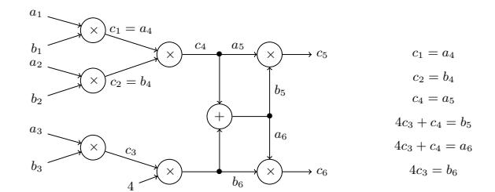

# **Efficient Zero-Knowledge Arguments for Arithmetic Circuits in the Discrete Log Setting†∗**

Jonathan Bootle<sup>1</sup> , Andrea Cerulli<sup>1</sup> , Pyrros Chaidos<sup>1</sup>∗∗, Jens Groth<sup>1</sup> , and Christophe Petit<sup>2</sup>

<sup>1</sup> University College London {**jonathan.bootle.14,andrea.cerulli.13,pyrros.chaidos.10,j.groth**}**@ucl.ac.uk** <sup>2</sup> University of Oxford **christophe.petit@maths.ox.ac.uk**

**Abstract.** We provide a zero-knowledge argument for arithmetic circuit satisfiability with a communication complexity that grows logarithmically in the size of the circuit. The round complexity is also logarithmic and for an arithmetic circuit with fan-in 2 gates the computation of the prover and verifier is linear in the size of the circuit. The soundness of our argument relies solely on the well-established discrete logarithm assumption in prime order groups.

At the heart of our new argument system is an efficient zero-knowledge argument of knowledge of openings of two Pedersen multicommitments satisfying an inner product relation, which is of independent interest. The inner product argument requires logarithmic communication, logarithmic interaction and linear computation for both the prover and the verifier. We also develop a scheme to commit to a polynomial and later reveal the evaluation at an arbitrary point, in a verifiable manner. This is used to build an optimized version of the constant round square root complexity argument of Groth (CRYPTO 2009), which reduces both communication and round complexity.

**Keywords:** Sigma-protocol, zero-knowledge argument, arithmetic circuit, discrete logarithm assumption.

# **1 Introduction**

Zero-knowledge proofs and arguments are ubiquitous in cryptography today, with prominent applications in authentication protocols, multi-party computation, encryption primitives, electronic voting systems and verifiable computation protocols.

<sup>†</sup> This is the full version of an article with the same title that was accepted for publication at Eurocrypt 2016.

<sup>∗</sup> The research leading to these results has received funding from the European Research Council under the European Union's Seventh Framework Programme (FP/2007-2013) / ERC Grant Agreement n. 307937 and EPSRC grant EP/J009520/1.

<sup>∗∗</sup> Was supported by an EPSRC scholarship (EP/G037264/1 – Security Science DTC).

Informally, a zero-knowledge argument involves two parties, the prover and the verifier, and allows the prover to prove to the verifier that a particular statement is true, without revealing anything else about the statement itself. Statements are of the form *u* ∈ *L*, where *L* is a language in NP. We call *w* a witness for a statement *u* if (*u, w*) ∈ *R*, where *R* is a polynomial time decidable binary relation associated with *L*. We require the zero-knowledge argument to be complete, sound and zero-knowledge.

**Completeness:** A prover with a witness *w* for *u* ∈ *L* can convince the verifier of this fact.

**Soundness:** A prover cannot convince a verifier when *u /*∈ *L*.

**Zero-knowledge:** The interaction should not reveal anything to the verifier except that *u* ∈ *L*. In particular, it should not reveal the prover's witness *w*.

Our goal is to build an efficient argument system for the satisfiability of an arithmetic circuit, i.e., a circuit that consists of addition and multiplication gates over a finite field Z*p*. Moreover we want to base the security of this argument solely on the discrete logarithm assumption: this will provide both strong security guarantees and good efficiency since there exists no known attacks better than generic ones for well-chosen elliptic curve subgroups.

The most efficient zero-knowledge arguments solely based on the discrete logarithm assumption are Groth's protocol based on linear algebra [\[Gro09b\]](#page-36-0) and its variant by Seo [\[Seo11\]](#page-36-1). Both of these protocols have a communication complexity that is proportional to the square root of the circuit size. This square root complexity has since then appeared as a (perhaps fundamental) barrier for discrete logarithm-based arguments for circuit satisfiability.

## **1.1 Our Contributions**

We provide an honest verifier zero-knowledge argument for arithmetic circuit satisfiability based on the discrete logarithm assumption that only requires a *logarithmic* communication complexity. Our argument has perfect completeness and perfect special honest verifier zero-knowledge. Soundness is computational and based on the discrete logarithm assumption. We require a logarithmic number of moves, and both the prover and verifier have linear computational complexity. The argument is therefore efficient on all parameters with the biggest improvement being in the communication complexity.

*Improved Square Root Complexity Argument.* We start from the circuit satisfiability argument of Groth [\[Gro09b\]](#page-36-0), which requires 7 moves and has square root communication complexity in the *total* number of gates. In this argument the prover commits to all the wires using homomorphic multicommitments, verifies addition gates using the homomorphic properties, and uses a product argument to show that the multiplication gates are satisfied.

We first improve Groth's argument into a 5 moves argument with square root communication complexity in the number of *multiplication gates* only. We achieve fewer moves compared to [\[Gro09b\]](#page-36-0) by avoiding generic reductions to linear algebra statements. We remove the communication cost of the addition gates in the argument by providing a technique that can directly handle a set of Hadamard products and linear relations together. Another efficiency improvement is a subroutine to commit to a polynomial and later reveal its evaluation at an arbitrary point in a verifiable manner. In Section [3](#page-10-0) we provide a protocol to perform this task, which has a square root communication complexity with respect to the degree of the polynomial, and which may be of independent interest.

*Logarithmic Complexity Argument.* In spite of all these improvements, the above argument still requires a square root communication complexity with respect to multiplication gates. In the first move the prover commits to all circuit wires using 3*m* commitments to *n* elements each, where *mn* = *N* is a bound on the number of multiplication gates, and in the last move after receiving a challenge he opens one commitment that can be constructed from the previous ones and the challenge. By setting *m* ≈ *n* we get a minimal communication complexity of *O*( √ *N*).

Our key idea to break this square root communication complexity barrier is to replace the last opening step in this protocol by an argument of knowledge of the opening values. Using specific properties of Pedersen multicommitments, namely homomorphic properties with respect to the keys, we rewrite this argument as an argument of knowledge of openings of two homomorphic commitments, satisfying an inner product relation. In Section [4](#page-16-0) we provide an argument system for this problem, which only requires a logarithmic communication with respect to the vector sizes. The argument is built in a recursive way, reducing the size and complexity of the statement further in each recursion step. Using this inner product argument as a subroutine we obtain an arithmetic circuit satisfiability argument with logarithmic communication.

*Implementation.* In Section [6](#page-30-0) we report on an implementation of our arguments. To show the practicality of our results we compare the efficiency of our implementation to that of Pinocchio [\[PHGR13\]](#page-36-2). Pinocchio is a practical verifiable computation scheme allowing a constrained client to outsource computation of a function to a powerful worker and to efficiently verify the outcome of the function. It uses quadratic arithmetic programs, a generalisation of arithmetic circuits, and for some functions achieves verification that is faster than local computation. While we do not achieve comparably fast verification, we compare favourably in terms of prover computation, and do so under simpler assumptions.

#### **1.2 Related Work**

Zero-knowledge proofs were invented by Goldwasser et al. [\[GMR89\]](#page-35-0). It is useful to distinguish between zero-knowledge *proofs*, with statistical soundness, and zero-knowledge *arguments* with computational soundness. In general proofs can only have computational zero-knowledge, while arguments may have perfect zero-knowledge. Goldreich et al. [\[GMW91\]](#page-36-3) showed that all languages in NP have zero-knowledge proofs while Brassard et al. [\[BCC88\]](#page-34-0) showed that all languages in NP have zero-knowledge arguments with perfect zero-knowledge.

Gentry et al. [\[GGI](#page-35-1)<sup>+</sup>14] used fully homomorphic encryption to construct zeroknowledge proofs where the communication complexity corresponds to the size of the witness. However, proofs cannot in general have communication that is smaller than the witness size unless surprising results about the complexity of solving SAT instances hold [\[GH98,](#page-35-2) [GVW02\]](#page-36-4).

Kilian [\[Kil92\]](#page-36-5) showed that in contrast to zero-knowledge proofs, zero-knowledge arguments can have very low communication complexity. His construction relied on the PCP theorem though, and did not yield a practical scheme.

Schnorr [\[Sch91\]](#page-36-6) and Guillou and Quisquater [\[GQ88\]](#page-36-7) gave early examples of practical zero-knowledge arguments for concrete number theoretic problems. Extending Schnorr's protocols, there have been many constructions of zeroknowledge arguments based on the discrete logarithm assumption. Cramer and Damg˚ard [\[CD98\]](#page-35-3) gave a zero-knowledge argument for arithmetic circuit satisfiability, which has linear communication complexity.

Currently the most efficient discrete logarithm based zero-knowledge arguments for arithmetic circuits are the ones by Groth [\[Gro09b\]](#page-36-0) and Seo [\[Seo11\]](#page-36-1), which are constant move arguments with a communication proportional to the square root of the circuit size. Using pairing-based cryptography instead of just relying on the discrete logarithm assumption, Groth [\[Gro09a\]](#page-36-8) extended these techniques to give a zero-knowledge argument with a cubic root communication complexity.

There are recent works giving a logarithmic communication complexity for specific languages. Bayer and Groth [\[BG13\]](#page-35-4) show that one can prove that a polynomial evaluated at a secret committed value gives a certain output with a logarithmic communication complexity and Groth and Kohlweiss [\[GK14\]](#page-35-5) show that one can prove that one out of *N* commitments contain 0 with logarithmic communication complexity. These results are for very specific types of statements (with low circuit depth) and the techniques do not seem to generalize to arbitrary NP languages.

An exciting line of research [\[Gro10,](#page-36-9) [Lip12,](#page-36-10) [BCCT12,](#page-35-6) [GGPR13,](#page-35-7) [BCCT13,](#page-35-8) [PHGR13,](#page-36-2) [BCG](#page-35-9)<sup>+</sup>13, [BCTV14,](#page-35-10) [GK14\]](#page-35-5) has developed many proposals for succinct non-interactive arguments (SNARGs) yielding pairing-based constructions where the arguments consist of a constant number of group elements. However, they all rely on a common reference string (with a special structure) and non-falsifiable knowledge extractor assumptions. In contrast, the arguments we develop here are based solely on the discrete logarithm assumption, and use a small common reference string which is independent of the circuit.

Table [1](#page-4-0) compares the most efficient previous zero-knowledge arguments based on the discrete logarithm assumption with our scheme, when allowing for 5 moves or a logarithmic number of moves. Using 5 moves, our scheme requires significantly less computation than [\[Seo11\]](#page-36-1). On the other hand when using a logarithmic number of moves and applying a reduction similar to [\[BG12\]](#page-35-11), our scheme dramatically improves the communication costs with respect to all previous work without incurring any significant overhead. We note that [BG12] uses the reduction to reduce computation whereas we use it to reduce communication.

| Reference  | Moves         | Commu         | nication        | Prove               | er Complexity           | Verifier                    | Complexity        |  |
|------------|---------------|---------------|-----------------|---------------------|-------------------------|-----------------------------|-------------------|--|
|            |               | G             | $\mathbb{Z}_p$  | exp.                | mult.                   | exp.                        | mult.             |  |
| [CD98]     | 3             | 6N            | 5N + 2          | 6N                  | 6N                      | 6N                          | 0                 |  |
| [Gro09b]   | 7             | $9\sqrt{N}+4$ | $7\sqrt{N} + 6$ | $\frac{6N}{\log N}$ | $O\left(N\log N\right)$ | $\frac{39\sqrt{N}}{\log N}$ | O(N)              |  |
| [Gro09b]   | $2\log N + 5$ | $2\sqrt{N}$   | $7\sqrt{N}$     | $\frac{6N}{\log N}$ | O(N)                    | $\frac{18\sqrt{N}}{\log N}$ | $O\left(N\right)$ |  |
| [Seo11]    | 5             | $30\sqrt{N}$  | $7\sqrt{N}$     | $\frac{6N}{\log N}$ | $O\left(N\log N\right)$ | $\frac{77\sqrt{N}}{\log N}$ | $O\left(N\right)$ |  |
| This paper | 5             | $2\sqrt{N}$   | $2\sqrt{N}$     | $\frac{6N}{\log N}$ | $3N\log N$              | $\frac{8\sqrt{3N}}{\log N}$ | O(N)              |  |
| This paper | $2\log N + 1$ | $4\log N + 7$ | $2\log N + 6$   | 12N                 | O(N)                    | 4N                          | O(N)              |  |

<span id="page-4-0"></span>**Table 1.** Efficiency comparison between our arguments and the most efficient interactive zero-knowledge arguments relying on discrete logarithm. We express communication in number of group elements  $\mathbb{G}$  and field elements  $\mathbb{Z}_p$  and computation costs in number of exponentiations over  $\mathbb{G}$  and multiplications over  $\mathbb{Z}_p$ . The efficiency displayed is for a circuit with N multiplication gates.

As part of our construction we give a protocol for committing to a polynomial and later revealing an evaluation of the polynomial in a given point. Kate et al. [KZG10] have also provided protocols to commit to polynomials and then evaluate them at a given point in a verifiable way. Their protocols only require a constant number of commitments but security relies on pairing assumptions. Our polynomial commitment protocol has square root communication complexity but relies solely on the discrete logarithm assumption.

#### 2 Preliminaries

We write y = A(x; r) when the algorithm A on input x and randomness r, outputs y. We write  $y \leftarrow A(x)$  for the process of picking randomness r at random and setting y = A(x; r). We also write  $y \leftarrow S$  for sampling y uniformly at random from the set S. We will assume one can sample uniformly at random from sets such as  $\mathbb{Z}_p$  and  $\mathbb{Z}_p^*$ .

Algorithms in our schemes receive a security parameter  $\lambda$  as input (sometimes implicitly) written in unary. The intuition is that the higher the security parameter, the lower the risk of the scheme being broken. Given two functions  $f, g: \mathbb{N} \to [0,1]$  we write  $f(\lambda) \approx g(\lambda)$  when  $|f(\lambda) - g(\lambda)| = \lambda^{-\omega(1)}$ . We say that f is negligible when  $f(\lambda) \approx 0$  and that f is overwhelming when  $f(\lambda) \approx 1$ .

Throughout the paper we let  $\mathbb{G}$  be a group of prime order p. Let  $g = (g_1, \ldots, g_n) \in \mathbb{G}^n$  and  $f = (f_1, \ldots, f_n) \in \mathbb{Z}_p^n$ . We write  $g^f$  for the multi-exponentiation  $g^f = \prod_{i=1}^n g_i^{f_i}$ . A multi-exponentiation of size n can be computed at a cost of roughly  $\frac{n}{\log n}$  single group exponentiations using the multi-exponentiation techniques of [Lim00, Möl01, MR08].

#### 2.1 The Discrete Logarithm Assumption

Let GGen be an algorithm that on input  $1^{\lambda}$  returns  $(\mathbb{G}, p, g)$  such that  $\mathbb{G}$  is the description of a finite cyclic group of prime order p, where  $|p| = \lambda$ , and g is a generator of  $\mathbb{G}$ .

**Definition 1 (Discrete Logarithm Assumption).** The discrete logarithm assumption holds relative to GGen if for all non-uniform polynomial time adversaries A

$$\Pr\left[(\mathbb{G},p,g)\leftarrow \mathrm{GGen}(1^{\lambda}); h\leftarrow \mathbb{G}; a\leftarrow \mathcal{A}(\mathbb{G},p,g,h): g^a=h\right]\approx 0$$

In this definition, the value a is called the discrete logarithm of h in the basis g. Note that the discrete logarithm assumption is defined with respect to a particular group generator algorithm GGen. According to current state-of-the-art cryptanalytic techniques, to get a security level of  $2^{-\lambda}$  the group generator may for example return well-chosen elliptic curve groups where group elements can be represented with  $O(\lambda)$  bits or multiplicative subgroups of finite fields with a large characteristic where group elements can be represented with  $O(\lambda)$  bits. It is well-known that the discrete logarithm assumption is equivalent to the following assumption.

**Definition 2 (Discrete Logarithm Relation Assumption).** For all  $n \geq 1$  and all non-uniform polynomial time adversaries A

$$\Pr\left[ (\mathbb{G}, p, g) \leftarrow \operatorname{GGen}(1^{\lambda}); g_1, \dots, g_n \leftarrow \mathbb{G}; : \exists a_i \neq 0 \text{ and } g^{a_0} \prod_{i=1}^n g_i^{a_i} = 1 \right] \approx 0$$

We call such a product  $g^{a_0} \prod_{i=1}^n g_i^{a_i} = 1$  a non-trivial discrete logarithm relation.

#### 2.2 Pedersen Commitments

A non-interactive commitment scheme allows a sender to create a commitment to a secret value. She may later open the commitment and reveal the value in a verifiable manner. A commitment should be hiding, i.e., not reveal the secret value, and binding in the sense that a commitment cannot be opened to two different values.

Formally, a non-interactive commitment scheme is a pair of probabilistic polynomial time algorithms (CGen, Com). The setup algorithm  $ck \leftarrow \text{CGen}(1^{\lambda})$  generates a commitment key ck. The commitment key specifies a message space  $\mathcal{M}_{ck}$ , a randomness space  $\mathcal{R}_{ck}$  and a commitment space  $\mathcal{C}_{ck}$ . The commitment algorithm combined with the commitment key specifies a function  $\text{Com}_{ck}$ :  $\mathcal{M}_{ck} \times \mathcal{R}_{ck} \to \mathcal{C}_{ck}$ . Given a message  $m \in \mathcal{M}_{ck}$  the sender picks uniformly at random  $r \leftarrow \mathcal{R}_{ck}$  and computes the commitment  $c = \text{Com}_{ck}(m; r)$ .

**Definition 3 (Perfectly hiding).** We say a non-interactive commitment scheme (CGen, Com) is perfectly hiding if a commitment does not reveal the committed

value. For all non-uniform polynomial time stateful interactive adversaries A

$$\Pr\left[\begin{array}{l} ck \leftarrow \mathrm{CGen}(1^{\lambda}); (m_0, m_1) \leftarrow \mathcal{A}(ck); \\ b \leftarrow \{0, 1\}; c \leftarrow \mathrm{Com}_{ck}(m_b) \end{array} \right] = \frac{1}{2}$$

where  $\mathcal{A}$  outputs  $m_0, m_1 \in \mathcal{M}_{ck}$

**Definition 4 (Binding).** A non-interactive commitment scheme (CGen, Com) is computationally binding if a commitment can only be opened to one value. For all non-uniform polynomial time adversaries A

$$\Pr \begin{bmatrix} ck \leftarrow \operatorname{CGen}(1^{\lambda}); \\ (m_0, r_0, m_1, r_1) \leftarrow \mathcal{A}(ck) \end{bmatrix} : \frac{\operatorname{Com}_{ck}(m_0; r_0) = \operatorname{Com}_{ck}(m_1; r_1)}{\operatorname{and} \ m_0 \neq m_1} \right] \approx 0$$

where  $\mathcal{A}$  outputs  $m_0, m_1 \in \mathcal{M}_{ck}$  and  $r_0, r_1 \in \mathcal{R}_{ck}$

We say a commitment scheme is homomorphic if for all valid keys ck the message, randomness and commitment spaces are abelian groups and for all messages  $m_0, m_1 \in \mathcal{M}_{ck}$  and randomness  $r_0, r_1 \in \mathcal{R}_{ck}$  we have

$$\operatorname{Com}_{ck}(m_0; r_0) \cdot \operatorname{Com}_{ck}(m_1; r_1) = \operatorname{Com}_{ck}(m_0 + m_1; r_0 + r_1).$$

The most prominent example of a homomorphic perfectly hiding commitment scheme is the Pedersen commitment scheme. Pedersen commitments have the form  $c = g^r h^m$  where g, h are group elements specified in the commitment key. The opening of a Pedersen commitment is  $(m,r) \in \mathbb{Z}_p^2$ , from which anybody can recompute the commitment c and verify it was a valid commitment. Since Pedersen commitments are random group elements, they are perfectly hiding. On the other hand, breaking the binding property of Pedersen commitments corresponds to breaking the discrete logarithm assumption.

We will be using a variant of Pedersen commitments that allow us to commit to multiple values at once. The commitment key is  $ck = (\mathbb{G}, p, g, g_1, \dots, g_n)$  and a commitment is of the form  $c = g^r \prod_{i=1}^n g_i^{m_i}$ . We write  $c = \text{Com}_{ck}(m_1, \dots, m_n; r)$  for this operation.

With the Pedersen commitment scheme in mind, we will assume throughout the paper that the message space is  $\mathbb{Z}_p^n$  and the randomness space is  $\mathbb{Z}_p$ . The constructions we have in Sections 3 and 5.1 require a perfectly hiding, homomorphic commitment scheme so we are not limited to using the Pedersen commitment scheme. However, in Sections 4 and 5.2, we will rely on specific properties of the Pedersen scheme and work directly on the group elements in the key.

#### 2.3 Zero-knowledge Arguments of Knowledge

Let R be a polynomial time decidable binary relation, i.e., a relation that defines a language in NP. We call w a witness for a statement u if  $(u, w) \in R$ .

In the arguments we consider a prover  $\mathcal{P}$  and a verifier  $\mathcal{V}$ , both of which are probabilistic polynomial time interactive algorithms. The transcript produced by  $\mathcal{P}$  and  $\mathcal{V}$  when interacting on inputs s and t is denoted by  $tr \leftarrow \langle \mathcal{P}(s), \mathcal{V}(t) \rangle$ . We write  $\langle \mathcal{P}(s), \mathcal{V}(t) \rangle = b$  depending on whether the verifier rejects, b = 0, or accepts, b = 1.

**Definition 5 (Argument of knowledge).** *The pair* (P*,* V) *is called an* argument of knowledge *for the relation R if we have perfect completeness and statistical witness-extended emulation as defined below.*

**Definition 6 (Perfect completeness).** (P*,* V) *has perfect completeness if for all non-uniform polynomial time adversaries* A

$$\Pr\left[(u, w) \leftarrow \mathcal{A}(1^{\lambda}) : (u, w) \notin R \text{ or } \langle \mathcal{P}(u, w), \mathcal{V}(u) \rangle = 1\right] = 1$$

To define an argument of knowledge we follow Groth and Ishai [\[GI08\]](#page-35-12) that borrowed the term witness-extended emulation from Lindell [\[Lin03\]](#page-36-15). Informally, their definition says that given an adversary that produces an acceptable argument with some probability, there exists an emulator that produces a similar argument with the same probability together with a witness *w*. Note that the emulator is allowed to rewind the prover and verifier's interaction to any previous move.

**Definition 7 (Statistical witness-extended emulation).** (P*,* V) *has* statistical witness-extended emulation *if for all deterministic polynomial time* P ∗ *there exists an expected polynomial time emulator* E *such that for all interactive adversaries* A

$$\begin{split} & \text{Pr}\left[(u,s) \leftarrow \mathcal{A}(1^{\lambda}); tr \leftarrow \langle \mathcal{P}^*(u,s), \mathcal{V}(u) \rangle : \mathcal{A}(tr) = 1\right] \\ & \approx & \text{Pr}\left[\frac{(u,s) \leftarrow \mathcal{A}(1^{\lambda}); (tr,w) \leftarrow \mathcal{E}^{\langle \mathcal{P}^*(u,s), \mathcal{V}(u) \rangle}(u) :}{\mathcal{A}(tr) = 1 \text{ and if } tr \text{ is accepting then } (u,w) \in R\right] \end{split}$$

*where the oracle called by* E hP<sup>∗</sup> (*u,s*)*,*V(*u*)<sup>i</sup> *permits rewinding to a specific point and resuming with fresh randomness for the verifier from this point onwards.*

In the definition, *s* can be interpreted as the state of P ∗ , including the randomness. So, whenever P ∗ is able to make a convincing argument when in state *s*, E can extract a witness. This is why we call it an argument of knowledge.

**Definition 8 (Public coin).** *An argument* (P*,* V) *is called* public coin *if the verifier chooses his messages uniformly at random and independently of the messages sent by the prover, i.e., the challenges correspond to the verifier's randomness ρ.*

An argument is zero-knowledge if it does not leak information about the witness beyond what can be inferred from the truth of the statement. We will present arguments that have special honest verifier zero-knowledge in the sense that if the verifier's challenges are known in advance, then it is possible to simulate the entire argument without knowing the witness.

**Definition 9 (Perfect special honest verifier zero-knowledge).** *A public coin argument* (P*,* V) *is called a* perfect special honest verifier zero knowledge (SHVZK) argument for R if there exists a probabilistic polynomial time simulator S such that for all interactive non-uniform polynomial time adversaries A

$$\Pr\left[(u, w, \rho) \leftarrow \mathcal{A}(1^{\lambda}); tr \leftarrow \langle \mathcal{P}(u, w), \mathcal{V}(u; \rho) \rangle : (u, w) \in R \text{ and } \mathcal{A}(tr) = 1\right]$$
$$= \Pr\left[(u, w, \rho) \leftarrow \mathcal{A}(1^{\lambda}); tr \leftarrow \mathcal{S}(u, \rho) : (u, w) \in R \text{ and } \mathcal{A}(tr) = 1\right]$$

where  $\rho$  is the public coin randomness used by the verifier.

**Full zero-knowledge.** In real life applications special honest verifier zero-knowledge may not suffice since a malicious verifier may give non-random challenges. However, it is easy to convert an SHVZK argument into a full zero-knowledge argument secure against *arbitrary* verifiers in the common reference string model using standard techniques [Gro04, GMY06]. The conversion can be very efficient and only costs a small additive overhead.

The Fiat-Shamir heuristic. The Fiat-Shamir transformation takes an interactive public coin argument and replaces the challenges with the output of a cryptographic hash function. The idea is that the hash function will produce random looking output and therefore be a suitable replacement for the verifier. The Fiat-Shamir heuristic yields a non-interactive zero-knowledge argument in the random oracle model [BR93].

The transformation can be applied to our arguments to make them non-interactive at the cost of using the random oracle model in the security proofs. From an efficiency point of view this is especially useful for the arguments in Sections 4 and 5.2, reducing a logarithmic number of moves to a single one.

A general forking lemma. Suppose that we have a  $(2\mu+1)$ -move public-coin argument with  $\mu$  challenges,  $x_1, \ldots, x_{\mu}$  in sequence. Let  $n_i \geq 1$  for  $1 \leq i \leq \mu$ . Consider  $\prod_{i=1}^{\mu} n_i$  accepting transcripts with challenges in the following tree format. The tree has depth  $\mu$  and  $\prod_{i=1}^{\mu} n_i$  leaves. The root of the tree is labelled with the statement. Each node of depth  $i < \mu$  has exactly  $n_i$  children, each labelled with a distinct value for the ith challenge  $x_i$ .

This can be referred to as an  $(n_1,\ldots,n_\mu)$ -tree of accepting transcripts. All of our arguments allow a witness to be extracted efficiently from an appropriate tree of accepting transcripts. This is a natural generalisation of special-soundness for Sigma-protocols, where  $\mu=1$  and n=2. For simplicity in the following lemma, we assume that the challenges are chosen uniformly from  $\mathbb{Z}_p$  where  $|p|=\lambda$ , but any sufficiently large challenge space would suffice.

**Lemma 1 (Forking Lemma).** Let  $(\mathcal{P}, \mathcal{V})$  be a  $(2\mu+1)$ -move, public coin interactive protocol. Let  $\chi$  be a witness extraction algorithm that always succeeds in extracting a witness from an  $(n_1, \ldots, n_{\mu})$ -tree of accepting transcripts in probabilistic polynomial time. Assume that  $\prod_{i=1}^{\mu} n_i$  is bounded above by a polynomial in the security parameter  $\lambda$ . Then  $(\mathcal{P}, \mathcal{V})$  has witness-extended emulation.

For simplicity in the following proof, we assume challenges are chosen uniformly from  $\mathbb{Z}_p$  where  $|p| = \lambda$ , but any sufficiently large challenge space would suffice.

*Proof.* Suppose that for deterministic polynomial time  $\mathcal{P}^*$  there is a non-uniform polynomial time interactive adversary  $\mathcal{A}$  in the sense of witness-extended emulation, such that

$$\Pr\left[(u,s) \leftarrow \mathcal{A}(1^{\lambda}); tr \leftarrow \langle \mathcal{P}^*(u,s), \mathcal{V}(u) \rangle : \mathcal{A}(tr) = 1\right] = \epsilon.$$

Note that if  $\epsilon$  is negligible, then we do not need to extract a witness, since the emulator can simply fail every time and trivially achieve witness-extended emulation. Therefore, from now on, we assume that  $\epsilon$  is not negligible.

We construct an expected polynomial time emulator  $\mathcal{E}$ , which has access to a rewindable transcript oracle  $\langle \mathcal{P}^*, \mathcal{V} \rangle$  and produces a witness. This is done via recursive calls to tree-finders  $\mathcal{T}$  that deal with the protocol after the first few challenges are already fixed. The *i*th tree-finder takes the previous challenges and partial transcript given to it as input, picks random values for  $x_{i+1}$ , runs the prover on these values and hands the result to the next tree-finder. Each tree-finder may fail on the first value of  $x_{i+1}$ , ensuring that the whole process runs in expected polynomial time. With overwhelming probability, the emulator obtains an  $(n_1, \ldots, n_{\mu})$ -tree of transcripts and is then able to extract a witness, using the efficient algorithm  $\chi$  that exists by assumption.

```
 \begin{array}{l} \mathcal{E}^{\langle \mathcal{P}^*, \mathcal{V} \rangle}(u) \to (tr, w) \colon \\ - \operatorname{Run} \, \mathcal{T}^{\langle \mathcal{P}^*, \mathcal{V} \rangle}(1) \to (tr, \mathsf{tree}) \end{array}
        - If tree = \perp then return (tr, \perp).
        - If tree is not a valid (n_1, \ldots, n_n)-tree of transcripts (i.e. there are collisions
             in certain challenges) then return (tr, \perp).
        - Else run w \leftarrow \chi(u, \mathsf{tree}).
        - Return (tr, w)
For 1 \le i \le \mu + 1: \mathcal{T}^{\langle \mathcal{P}^*, \mathcal{V} \rangle}(i) \to (tr, \mathsf{tree}):
        - \text{ If } i = \mu + 1
            - Obtain a complete protocol transcript from tr \leftarrow \langle \mathcal{P}^*, \mathcal{V} \rangle
            - Run \mathcal{V}(tr) \to b
            - If b = 0 then return (tr, \perp).
            - If b = 1 then set tree = \{tr\} and return (tr, tree).
        - Run \langle \mathcal{P}^*, \mathcal{V} \rangle up to and including move 2i+1.
- Run \mathcal{T}^{\langle \mathcal{P}^*, \mathcal{V} \rangle}(i+1) \to (tr, \mathsf{tree})
        - If tree = \perp then return (tr, \perp).
        - Set counter = 1
        - While counter < n_i:
             - Rewind \langle \mathcal{P}^*, \mathcal{V} \rangle back until just before move 2i.
            - Run \mathcal{T}^{\langle \mathcal{P}^*, \mathcal{V} \rangle}(i+1) \to (tr', \mathsf{tree}')
             - If tree' \neq \perp, append the tree' transcripts to tree, and increment counter.
        - Return (tr, tree)
```

Fix  $1 \le i \le \mu$ , and fix  $x_1, \ldots, x_{i-1}$ . We say that  $\mathcal{T}(i)$  has failed if it returns  $(tr, \perp)$ .

Let  $\epsilon'$  be the probability that the  $\mathcal{T}(i)$  fails for this choice of challenges, and let  $\epsilon'(x_i)$  be the probability that  $\mathcal{T}(i+1)$  fails for this choice of challenges continued with  $x_i$ . The *i*th tree-finder can fail only if the (i+1)th tree-finder fails the first time it is called. This implies that for uniformly random  $x_i$ , the probability that  $\mathcal{T}(i+1)$  fails is  $\epsilon' = \sum_{x_i \in \mathbb{Z}_p} \Pr[X = x_i] \epsilon'(x_i)$ .

Therefore, the expected number of times that  $\mathcal{T}(i)$  runs  $\mathcal{T}(i+1)$  is  $1+\epsilon'\frac{(n_i-1)}{\epsilon'}=n_i$ . The final tree-finder  $\mathcal{T}(k+1)$  merely checks whether the transcript is accepting or not. Hence, the total expected running time for  $\mathcal{T}(1)$  to be  $\prod_{i=1}^{\mu} n_i$  multiplied by the time taken to check whether a transcript is accepting. We conclude that the emulator  $\mathcal{E}$  runs in expected polynomial time.

The first tree-finder  $\mathcal{T}(1)$  only outputs  $(tr, \perp)$  if the very first set of challenges generated by all of the emulators fails to produce an accepting transcript. This is exactly the probability that  $\mathcal{P}^*$  successfully produces an accepting transcript in one run.

Given that we receive  $\prod_{i=1}^{\mu} n_i$  accepting transcripts in tree, we now consider the probability that they do not form an  $(n_1, \ldots, n_{\mu})$ -tree. This occurs only when the  $n_i$  values of challenge  $x_i$  used by  $\langle \mathcal{P}^*, \mathcal{V} \rangle$  while in the loop controlled by counter are not distinct, or in other words, there is a collision between these values, for some i.

By Markov's inequality, an algorithm whose expected running time is t will only run for longer than time T > t with probability  $\frac{t}{T}$ . Let t be the expected running time of  $\mathcal{E}$ , which is bounded above by a polynomial in the security parameter. For easier analysis, we limit the actual running time of  $\mathcal{E}$  to T, whose value will be chosen later.

When  $\mathcal{E}$  runs in time at most T, then at most T uniformly random public coin challenges were selected by  $\mathcal{V}$  in  $\langle \mathcal{P}^*, \mathcal{V} \rangle$ . If there are no collisions between any of the public coins chosen, then there are certainly no collisions of the type which would prevent tree from being a  $(n_1, \ldots, n_{\mu})$ -tree of transcripts. The probability that there is a collision between T values sampled uniformly from  $\mathbb{Z}_p$  is at most  $\frac{T^2}{n}$ .

Now, we choose  $T = \sqrt[3]{p}$ . The probability that tree fails to be an  $(n_1, \ldots, n_{\mu})$ -tree is at most  $\frac{t}{T} + \frac{T^2}{p}$  which is now equal to  $\frac{t}{\sqrt[3]{p}} + \frac{1}{\sqrt[3]{p}}$ . This is negligible. Therefore, there is negligible probability of the tree-finding algorithms succeeding, yet  $\mathcal{E}$  failing to extract a witness. This proves the argument has statistical witness-extended emulation.

# <span id="page-10-0"></span>3 Commitments to Polynomials

In this section, we present a protocol to commit to a polynomial t(X) and later reveal the evaluation of t(X) at any point  $x \in \mathbb{Z}_p^*$  together with a proof that enables a verifier to check that the evaluation is correct with respect to the committed t(X). We will consider Laurent polynomials  $t(X) \in \mathbb{Z}_p[X, X^{-1}]$  i.e.

polynomials in which we allow terms of negative degree. This protocol will be used as a subroutine for the arguments described in Sections 5.1 and 5.2.

A simple solution for this problem would be to send commitments to coefficients of t(X) individually, from which the evaluation of t(X) at any particular point can be verified using the homomorphic properties. This solution requires d group elements to be sent, where d is the number of non-zero coefficients in t(X). As we shall show it is possible to reduce the communication costs to  $O(\sqrt{d})$  group elements, where  $d = d_2 + d_1$  if  $t(X) = \sum_{k=-d_1}^{d_2} t_k X^k$ . For clarity we first informally describe our protocol for a standard (not Lau-

For clarity we first informally describe our protocol for a standard (not Laurent) polynomial  $t(X) = \sum_{k=0}^{d} t_k X^k$ . We then extend this informal description to Laurent polynomials with zero constant term. We finally provide a formal description of the protocol and analyze its security and efficiency.

Main idea for standard polynomials. Let  $t(X) = \sum_{k=0}^{d} t_k X^k$  be a polynomial with coefficients in  $\mathbb{Z}_p$  and assume d+1=mn. We can write  $t(X)=\sum_{i=0}^{m-1}\sum_{j=0}^{n-1} t_{i,j}(X)X^{in+j}$  and arrange the coefficients in a  $m\times n$  matrix

$$\begin{pmatrix} t_{0,0} & t_{0,1} & \cdots & t_{0,n-1} \\ t_{1,0} & t_{1,1} & \cdots & t_{1,n-1} \\ \vdots & \vdots & & \vdots \\ t_{m-1,0} & t_{n-1,1} & \cdots & t_{m-1,n-1} \end{pmatrix}$$

Now, t(X) can be evaluated by multiplying the matrix by row and column vectors.

$$t(X) = \begin{pmatrix} 1 \ X^n \cdots X^{(m-1)n} \end{pmatrix} \begin{pmatrix} t_{0,0} & t_{0,1} & \cdots & t_{0,n-1} \\ t_{1,0} & t_{1,1} & \cdots & t_{1,n-1} \\ \vdots & \vdots & & \vdots \\ t_{m-1,0} & t_{n-1,1} \cdots & t_{m-1,n-1} \end{pmatrix} \begin{pmatrix} 1 \\ X \\ \vdots \\ X^{n-1} \end{pmatrix}$$

The idea behind the protocol is to commit to the rows of this matrix using commitments  $T_0, \ldots, T_{m-1}$ . Later, when given an evaluation point  $x \in \mathbb{Z}_p$  we can use the homomorphic property of the commitment scheme to compute the commitment  $\prod_{i=0}^{m-1} T_i^{x^{in}}$  to the vector

$$\bar{t} = (1 \ x^n \cdots x^{(m-1)n}) \begin{pmatrix} t_{0,0} & t_{0,1} & \cdots & t_{0,n-1} \\ t_{1,0} & t_{1,1} & \cdots & t_{1,n-1} \\ \vdots & \vdots & & \vdots \\ t_{m-1,0} \ t_{m-1,1} \cdots & t_{m-1,n-1} \end{pmatrix}$$

The prover opens this latter commitment and now it is easy to compute v=t(x) from  $\bar{t}$  and x.

The problem with this straightforward solution is that it leaks partial information about the coefficients of t(X). We remedy this by inserting some blinding values  $u_1, \ldots, u_{n-1}$  to hide the weighted sum of the coefficients in each column.

However, we make sure that the blinding values cancel each other out so that we still get the correct evaluation of the polynomial. More precisely, we commit to the rows of the following  $(m+1) \times n$  matrix

$$T = \begin{pmatrix} t_{0,0} & t_{0,1} - u_1 & \cdots & t_{0,n-2} - u_{n-2} & t_{0,n-1} - u_{n-1} \\ t_{1,0} & t_{1,1} & \cdots & t_{1,n-2} & t_{1,n-1} \\ \vdots & \vdots & & \vdots & & \vdots \\ t_{m-1,0} & t_{m-1,1} & \cdots & t_{m-1,n-2} & t_{m-1,n-1} \\ u_1 & u_2 & \cdots & u_{n-1} & 0 \end{pmatrix}$$

with U being a commitment to the last row. This time

$$t(X) = \begin{pmatrix} 1 \ X^n \cdots X^{(m-1)n} \ X \end{pmatrix} T \begin{pmatrix} 1 \ X \ X^2 \\ \vdots \\ X^{n-1} \end{pmatrix}$$

We now open  $U^x \prod_{i=0}^{m-1} T_i^{x^{in}}$  by revealing the vector

$$\bar{t} = (1 x^n \cdots x^{(m-1)n} x) T$$

This still allows us to compute t(x), but due to the blinders we no longer leak information about the coefficients of t(X). In fact, each element of  $\bar{t}$  is uniformly random, conditional on their weighted sum being equal to t(x), which the prover intends for the verifier to learn anyway.

**Extension to Laurent polynomials.** Let now t(X) be a Laurent polynomial  $t(X) = \sum_{i=-d_1}^{d_2} t_i X^i$  with constant term  $t_0 = 0$ . Let  $m_1, m_2, n$  be positive integers such that  $d_1 = nm_1$  and  $d_2 = nm_2$  and write  $t(X) = X^{-m_1n}t'(X) + Xt''(X)$  for degree  $d_1 - 1$  and  $d_2 - 1$  polynomials  $t'(X), t''(X) \in \mathbb{Z}_p[X]$ . We can write  $t'(X) = \sum_{i=0}^{m_1-1} \sum_{j=0}^{n-1} t'_{i,j} X^{in+j}$  and  $t''(X) = \sum_{i=0}^{m_2-1} \sum_{j=0}^{n-1} t''_{i,j} X^{in+j}$ . We can arrange the coefficients of t'(X) and t''(X) in a  $(m_1 + m_2) \times n$  matrix

We can arrange the coefficients of t'(X) and  $\overline{t''(X)}$  in a  $(m_1 + m_2) \times n$  matrix T. We commit to both t'(X) and t''(X) simultaneously by committing to the rows of the matrix using commitments  $T'_i$  and  $T''_i$ . As when committing to polynomials we add blinders  $u_1, \ldots, u_{n-1}$  and make a commitment U to the additional last row arising from this.

$$T = \begin{pmatrix} t'_{0,0} & t'_{0,1} & \cdots & t'_{0,n-1} \\ t'_{1,0} & t'_{1,1} & \cdots & t'_{1,n-1} \\ \vdots & \vdots & & \vdots \\ t'_{m_1-1,0} & t'_{m_1-1,1} & \cdots & t'_{m_1-1,n-1} \\ t''_{0,0} & t''_{0,1} - u_1 & \cdots & t''_{0,n-1} - u_{n-1} \\ t''_{1,0} & t''_{1,1} & \cdots & t''_{1,n-1} \\ \vdots & \vdots & & \vdots \\ t''_{m_2-1,0} & t''_{m_2-1,1} & \cdots & t''_{m_2-1,n-1} \\ u_1 & u_2 & \cdots & 0 \end{pmatrix} = \begin{pmatrix} t'_0 \\ t'_1 \\ \vdots \\ t'_{m_1-1} \\ t''_0 \\ \vdots \\ t''_{m_2-1} \\ u \end{pmatrix}$$

Define vectors

$$\boldsymbol{Z} = \boldsymbol{Z}(X) = \begin{pmatrix} X^{-m_1 n}, X^{-(m_1 - 1)n}, \dots, X^{-n}, X, X^{n+1}, \dots, X^{(m_2 - 1)n + 1}, X^2 \end{pmatrix}$$

$$\boldsymbol{X} = \boldsymbol{X}(X) = \begin{pmatrix} 1 \\ X \\ \vdots \\ X^{n-1} \end{pmatrix}$$

and we have  $t(X) = \mathbf{Z}T\mathbf{X}$ .

To evaluate at  $x \in \mathbb{Z}_p^*$  we open  $\left(\prod_{i=0}^{m_1-1} (T_i')^{x^{(i-m_1)n}}\right) \left(\prod_{i=0}^{m_2-1} (T_i'')^{x^{in+1}}\right) U^{x^2}$  to the vector  $\bar{\boldsymbol{t}} = \boldsymbol{Z}(x)T$ . This allows us to compute t(x) as  $\bar{\boldsymbol{t}}\boldsymbol{X}(x)$ . The blinders hide the weighted sums of each column as before, and now the verifier is able to compute t(x) without gaining additional information about its coefficients.

**Evaluation Protocol.** Our protocol is made of the following three algorithms. For simplicity, we restrict our description to the case of Pedersen commitments, but all aspects of the construction and proof carry over in the general case.

• PolyCommit $(ck, m_1, m_2, n, t(X)) \to (\mathsf{pc}, \mathsf{st})$ : Take as input a commitment key ck and a Laurent polynomial  $t(X) = \sum_{i=-m_1 n}^{nm_2} t_i X^i$  with constant coefficient  $t_0 = 0$ . Pick blinders  $u_1, \ldots, u_{n-1} \leftarrow \mathbb{Z}_p$  and randomness  $\tau_u, \tau'_0, \ldots, \tau'_{m_1-1}, \tau''_0, \ldots, \tau''_{m_2-1} \leftarrow \mathbb{Z}_p$ . Set  $\boldsymbol{\tau} = \left(\tau'_0, \ldots, \tau'_{m_1-1}, \tau''_0, \ldots, \tau''_{m_2-1}, \tau_u\right)$ . Compute

$$T'_i = \operatorname{Com}_{ck}(\boldsymbol{t}'_i; \tau'_i), \qquad T''_i = \operatorname{Com}_{ck}(\boldsymbol{t}''_i; \tau''_i), \qquad U = \operatorname{Com}_{ck}(\boldsymbol{u}; \tau_u)$$

Return a polynomial commitment  $pc = (\{T_i'\}_{i=0}^{m_1-1}, \{T_i''\}_{i=0}^{m_2-1}, U)$  and private information  $st = (t(X), \tau)$ .

• PolyEval(st, x)  $\rightarrow$  pe: Compute

$$\bar{\boldsymbol{t}} = \boldsymbol{Z}(x)T, \qquad \bar{\tau} = \boldsymbol{Z}(x) \cdot \boldsymbol{\tau}$$

Return  $pe = (\bar{t}, \bar{\tau})$ .

• PolyVerify $(ck, m_1, m_2, n, pc, pe, x) \rightarrow v$ : The verifier checks whether

$$\operatorname{Com}_{ck}(\bar{\boldsymbol{t}};\bar{\tau}) = \left(\prod_{i=0}^{m_1-1} (T_i')^{x^{(i-m_1)n}}\right) \left(\prod_{i=0}^{m_2-1} (T_i'')^{x^{in+1}}\right) U^{x^2}$$

If the check is satisfied the verifier returns  $v=t(x)=\bar{\boldsymbol{t}}\boldsymbol{X}(x).$  Otherwise, the verifier rejects pe as invalid with respect to pc and x and returns  $v=\bot$ .

**Security Properties.** We define three security properties for our protocol: completeness, *l*-special soundness, and special-honest-verifier zero-knowledge.

Later, the protocol is used as a sub-protocol inside our zero-knowledge arguments-of-knowledge. These properties will help us to prove the completeness, witness-extended emulation, and special honest verifier zero knowledge for the zero knowledge argument.

The definition of completeness simply guarantees that if PolyCommit, PolyVerify are carried out honestly, then PolyVerify will accept and return a commitment to the evaluation of the polynomial.

**Definition 10 (Perfect Completeness).** (PolyCommit, PolyEval, PolyVerify) has perfect completeness if for all non-uniform polynomial time adversaries  $\mathcal{A}$

$$\Pr \begin{bmatrix} (ck, m_1, m_2, n, t(X), x) \leftarrow \mathcal{A}(1^{\lambda}) \\ (\mathsf{pc}, \mathsf{st}) \leftarrow \operatorname{PolyCommit}(ck, m_1, m_2, n, t(X)) \\ \mathsf{pe} \leftarrow \operatorname{PolyEval}(\mathsf{st}, x) \\ v \leftarrow \operatorname{PolyVerify}(ck, m_1, m_2, n, \mathsf{pc}, \mathsf{pe}, x) \end{bmatrix} = 1$$

where ck is a key for a homomorphic commitment scheme, t(X) is a Laurent polynomial of degrees  $d_1 = m_1 n, d_2 = m_2 n$  and  $x \in \mathbb{Z}_p^*$ .

The definition of l-Special Soundness says that given l accepting evaluations for different evaluation points, but from the same commitment pc, then it is possible to extract either a valid Laurent polynomial t(X) with zero constant term that is consistent with the evaluations produced or a breach in the binding property of the commitment scheme. Furthermore, any other accepting evaluations for the same commitment will also be evaluations of t(X).

**Definition 11 (Statistical** *l*-**Special Soundness).** (PolyCommit, PolyEval, PolyVerify) is statistically *l*-special sound if there exists a probabilistic polynomial time algorithm  $\chi$  that, given *l* accepting transcripts with the same commitment pc, either extracts the committed polynomial t(X), or extracts a break of the binding property of the underlying commitment scheme. For all adversaries A and all  $L \geq l$

$$\Pr \begin{bmatrix} ck \leftarrow \operatorname{CGen}(1^{\lambda}) & \forall i: \ v_i = \mathbf{Z}(x_i)T\mathbf{X}(x_i) \\ (m_1, m_2, n, \operatorname{pc}, x_1, \operatorname{pe}_1, \dots, x_L, \operatorname{pe}_L) \leftarrow \mathcal{A}(ck) & \text{or } \exists j \text{ s.t.} \\ \operatorname{Parse} \ \operatorname{pe}_i = (\bar{\boldsymbol{t}}_i, \bar{\tau}_i) & : \operatorname{Com}_{ck}(\bar{\boldsymbol{t}}_j; \bar{\tau}_j) = \\ (T, \boldsymbol{\tau}) \leftarrow \chi(ck, m_1, m_2, n, \operatorname{pc}, x_1, \operatorname{pe}_1, \dots, x_l, \operatorname{pe}_l) & \operatorname{Com}_{ck}\left(\mathbf{Z}(x_j)T; \mathbf{Z}(x_j)\boldsymbol{\tau}\right), \\ v_i \leftarrow \operatorname{PolyVerify}(ck, m_1, m_2, n, \operatorname{pc}, \operatorname{pe}_i, x_i) & \text{where } \bar{\boldsymbol{t}}_j \neq \mathbf{Z}(x_j)T \end{bmatrix} \approx 1,$$

where  $x_1, \ldots, x_l$  are distinct,  $x_i \in \mathbb{Z}_p^*$ ,  $\mathsf{pe}_i \in \mathbb{Z}_p^n \times \mathbb{Z}_p$ ,  $T \in \mathbb{Z}_p^{(m_1 + m_2) \times n}$ , and  $\tau \in \mathbb{Z}_p^{m_1 + m_2}$ .

Perfect special honest verifier zero-knowledge means that given any value v and evaluation point x, it is possible to simulate pc and pe, distributed exactly as in a real execution of the protocol where v was the evaluation of t(X) at x.

# Definition 12 (Perfect Special Honest Verifier Zero Knowledge). (PolyCommit, PolyEval, PolyVerify) has perfect special honest verifier zero knowledge (SHVZK) if there exists a probabilistic polynomial time simulator S such

that for all interactive non-uniform polynomial time adversaries A

$$\begin{split} & \text{Pr} \begin{bmatrix} (ck, m_1, m_2, n, t(X), x) \leftarrow \mathcal{A}(1^{\lambda}) \\ (\mathsf{pc}, \mathsf{st}) \leftarrow & \text{PolyCommit}(ck, m_1, m_2, n, t(X)) : \mathcal{A}(\mathsf{pc}, \mathsf{pe}) = 1 \\ \mathsf{pe} \leftarrow & \text{PolyEval}(\mathsf{st}, x) \\ \end{bmatrix} \\ & = \text{Pr} \begin{bmatrix} (ck, m_1, m_2, n, t(X), x) \leftarrow \mathcal{A}(1^{\lambda}) \\ (\mathsf{pc}, \mathsf{pe}) \leftarrow \mathcal{S}(ck, m_1, m_2, n, x, t(x)) : \mathcal{A}(\mathsf{pc}, \mathsf{pe}) = 1 \end{bmatrix} \end{split}$$

where ck is a key for a homomorphic commitment scheme, t(X) is a Laurent polynomial of degrees  $d_1 = m_1 n, d_2 = m_2 n$  and  $x \in \mathbb{Z}_p^*$ .

<span id="page-15-0"></span>**Theorem 1.** The polynomial commitment protocol has perfect completeness, perfect special honest verifier zero-knowledge and  $(m_1+m_2)n+1$ -special soundness for extracting either a breach of the binding property of the commitment scheme or openings to the polynomial.

*Proof.* Direct verification of the protocol shows that the verifier correctly obtains the evaluation of the committed polynomial t(X) at the point x.

For special honest verifier zero-knowledge suppose we have an evaluation point x and an evaluation v. To simulate the polynomial evaluation we first pick random  $\bar{t}_2, \ldots, \bar{t}_n, \bar{\tau} \leftarrow \mathbb{Z}_p$  and  $T'_0, \ldots, T'_{m_1-1}, T''_0, \ldots, T''_{m_2-1} \leftarrow \mathbb{G}$ . Now,  $\bar{t}_1$  is computed as

$$\bar{t}_1 = v - \sum_{i=2}^n \bar{t}_i x^{i-1}$$

Let  $\bar{\boldsymbol{t}} = (\bar{t}_1, \dots, \bar{t}_n)$  and compute

$$U = \operatorname{Com}_{ck}(\bar{t}x^{-2}; \bar{\tau}x^{-2}) \left[ \prod_{i=0}^{m_1 - 1} (T_i')^{x^{(i-m_1)n}} \right]^{x^{-2}} \left[ \prod_{i=0}^{m_2 - 1} (T_i'')^{x^{in+1}} \right]^{x^{-2}}$$

This is a perfect simulation. Given x,v observe that both in the simulation and in the real execution we get uniformly random  $\bar{t}_2,\ldots,\bar{t}_n,\bar{\tau}\in\mathbb{Z}_p$  and  $T'_0,\ldots,T'_{m_1-1},T''_0,\ldots,T''_{m_2-1}\leftarrow\mathbb{G}$ . Now, conditioning on the values of x,v and the verification equations, U and  $\bar{t}_1$  are uniquely determined. Therefore, the simulation is perfect, and we have special honest verifier zero-knowledge.

Finally, for special soundness note that if we have valid evaluations of  $l=(m_1+m_2)n+2$  different challenges  $x\in\mathbb{Z}_p^*$  the vectors  $(x^{-m_1n},\ldots,x^{m_2n-n+1})$  form the rows of a Vandermonde matrix multiplied by  $x^{-m_1n}$  and we can obtain any unit vector  $(0,\ldots,1,\ldots,0)$  by taking an appropriate linear combination of these vectors. By taking the correct linear combinations of the l verification equations

$$\operatorname{Com}_{ck}(\bar{\boldsymbol{t}};\bar{\tau}) = \left[\prod_{i=0}^{m_1-1} (T_i')^{x^{(i-m_1)n}}\right] \left[\prod_{i=0}^{m_2-1} (T_i'')^{x^{in+1}}\right] U^{x^2}$$

for these l different challenges, we can then extract an opening of any  $T'_i = \operatorname{Com}_{ck}(t'_i; \tau'_i), T''_i = \operatorname{Com}_{ck}(t''_i; \tau''_i)$  and  $U = \operatorname{Com}_{ck}(u; \tau_u)$ .

This implies that whenever we have  $L \geq l$  different challenges  $x \in \mathbb{Z}_p^*$  with valid evaluations we must either have  $\bar{\boldsymbol{t}} = \boldsymbol{Z}(x)T$  for each (x, pe) pair, where the rows of T are the extracted  $\boldsymbol{t}_i'$  and  $\boldsymbol{t}_i''$  and  $\boldsymbol{u}$ , or we could extract a violation of the binding property of the commitment scheme.

In the first case where  $\bar{\boldsymbol{t}} = \boldsymbol{Z}(x)T$ , for each pair,  $\chi$  sets  $\tau = (\tau'_0, \ldots, \tau'_{m_1-1}, \tau''_0, \ldots, \tau''_{m_2-1}, \tau_u)$ , and sets  $S, \boldsymbol{\sigma}$  to be all zeroes. Since  $\bar{\boldsymbol{t}} = \boldsymbol{Z}(x)T$ , it follows that  $v_i = \boldsymbol{Z}(x_i)T\boldsymbol{X}(x_i)$  for each i.

Alternatively, if  $\bar{\boldsymbol{t}}_i \neq \boldsymbol{Z}(x_i)T$  for some  $x_i$  and  $\mathsf{pe}_i = (\bar{\boldsymbol{t}}_i, \bar{\tau}_i)$ , then since the verifier was accepting, we have  $\mathrm{Com}_{ck}(\bar{\boldsymbol{t}}_i; \bar{\tau}_i) = \mathrm{Com}_{ck}(\boldsymbol{Z}(x_i)T; \boldsymbol{Z}(x_i)\boldsymbol{\tau})$ , and this gives a violation of the binding property of the commitment scheme.

Efficiency. We now discuss the efficiency of the above protocol when instantiated with the Pedersen multicommitment scheme. The outputs pc, pe of the polynomial commitment protocol have sizes of  $m_1+m_2+1$  group elements and n+1 field elements respectively. The computational cost of computing pc is dominated by computing commitments  $T_i'$  and  $T_i''$ , corresponding to  $m_1+m_2$  n-wide multiexponentiations. Using multi-exponentiation techniques as in [Lim00, Möl01, MR08], the total cost is roughly  $\frac{(m_1+m_2)n}{\log n}$  group exponentiations. The main cost for computing pc is dominated by the  $n(m_1+m_2)$  field multiplications required to compute ZT. The dominant cost in PolyVerify is to check the verification equation. This costs roughly  $\frac{m_1+m_2+n}{\log (m_1+m_2+n)}$  group exponentiations.

# <span id="page-16-0"></span>4 Recursive Argument for Inner Product Evaluation

We will now give an inner product argument of knowledge of two vectors  $\boldsymbol{a}, \boldsymbol{b} \in \mathbb{Z}_p^n$  such that  $A = \boldsymbol{g^a}$ ,  $B = \boldsymbol{h^b}$  and  $\boldsymbol{a} \cdot \boldsymbol{b} = z$ , given  $z \in \mathbb{Z}_p$ ,  $A, B \in \mathbb{G}$  and  $\boldsymbol{g}, \boldsymbol{h} \in \mathbb{G}^n$ . The argument will be used later as a subroutine where zero-knowledge is not required, so the prover could in principle just reveal the witness  $\boldsymbol{a}, \boldsymbol{b}$  to the verifier. In the following we show how to use interaction to reduce the communication from linear to logarithmic in n, the length of the vectors.

The basic step in our inner product argument is a 2-move reduction to a smaller statement using techniques similar to [BG12]. It will suffice for the prover to reveal the witness for the smaller statement in order to convince the verifier about the validity of the original statement. In the full argument, prover and verifier recursively run the reduction to obtain increasingly smaller statements. The argument is then concluded with the prover revealing a witness for a very small statement. The outcome of this is a  $O(\log n)$ -move argument with an overall communication of  $O(\log n)$  group and field elements. The inner product argument will be used in the next section to build a logarithmic size argument for circuit satisfiability.

Due to the obvious relationship with Pedersen commitments, we will think of multi-exponentiations  $g^a$  and  $h^b$  as commitments with randomness set equal to zero, and to a, b as openings with respect to commitment keys g, h.

#### 4.1 Main Idea

We now describe the basic step in our argument. Consider the common input for both prover and verifier to be of the form  $(\mathbb{G}, p, \boldsymbol{g}, A, \boldsymbol{h}, B, z, m)$  where m divides n, the length of the vectors. For arbitrary n one can always reduce to the case where m|n by appending at most m-1 random group elements to  $\boldsymbol{g}$  and  $\boldsymbol{h}$ .

We split the bases for the multi-exponentiations into m sets  $\mathbf{g} = (\mathbf{g}_1, \dots, \mathbf{g}_m)$  and  $\mathbf{h} = (\mathbf{h}_1, \dots, \mathbf{h}_m)$ , where each set has size  $\frac{n}{m}$ . We want to prove knowledge of vectors  $\mathbf{a} = (\mathbf{a}_1, \dots, \mathbf{a}_m)$  and  $\mathbf{b} = (\mathbf{b}_1, \dots, \mathbf{b}_m)$  such that

$$A = \boldsymbol{g}^{\boldsymbol{a}} = \prod_{i=1}^m \boldsymbol{g}_i^{\boldsymbol{a}_i} \qquad B = \boldsymbol{h}^{\boldsymbol{b}} = \prod_{i=1}^m \boldsymbol{h}_i^{\boldsymbol{b}_i} \qquad \boldsymbol{a} \cdot \boldsymbol{b} = \sum_{i=1}^m \boldsymbol{a}_i \cdot \boldsymbol{b}_i = z$$

The key idea is for the prover to replace A with A', a commitment to a shorter vector  $\mathbf{a}' = \sum_{i=1}^{m} \mathbf{a}_i x^i$ , given a random challenge  $x \leftarrow \mathbb{Z}_p^*$  provided by the verifier. In the argument, the prover first computes and sends

$$A_k = \prod_{i=\max(1,1-k)}^{\min(m,m-k)} \boldsymbol{g}_i^{\boldsymbol{a}_{i+k}} \quad \text{ for } k = 1-m,\dots,m-1$$

corresponding to the products over the diagonals of the following matrix

$$\begin{array}{cccccccccccccccccccccccccccccccccccc$$

Notice that  $A_0 = A$  is already known to the verifier since it is part of the statement. The verifier now sends a random challenge  $x \leftarrow \mathbb{Z}_p^*$ .

At this point, both the prover and the verifier can compute  $\mathbf{g}' := \prod_{i=1}^m \mathbf{g}_i^{x^{-i}}$  and  $A' := \prod_{k=1-m}^{m-1} A_k^{x^k}$ . If the prover is honest then we have  $A' = (\mathbf{g}')^{\mathbf{a}'}$ , namely A' is a commitment to  $\mathbf{a}'$  under the key  $\mathbf{g}'$ . Furthermore, even if the prover is dishonest, we can show that if the prover can open A' with respect to the key  $\mathbf{g}'$  for 2m-1 different challenges, then we can extract opening  $(\mathbf{a}_1,\ldots,\mathbf{a}_m)$  corresponding to  $A = \prod_{i=1}^m \mathbf{g}_i^{a_i}$ .

The same type of argument can be applied in parallel to B with the inverse challenge  $x^{-1}$  giving us a sum of the form  $\mathbf{b}' = \sum_{i=1}^m \mathbf{b}_i x^{-i}$  and a new base  $\mathbf{h}' = \prod_{i=1}^m \mathbf{h}_i^{x^i}$ .

All that remains is to demonstrate that z is the constant term in the product  $\mathbf{a}' \cdot \mathbf{b}' = \sum_{i=1}^{m} \mathbf{a}_i x^i \cdot \sum_{j=1}^{m} \mathbf{b}_j x^{-j}$ . Similarly to A and B, the prover sends values

$$z_k = \sum_{i=\max(1,1-k)}^{\min(m,m-k)} \boldsymbol{a}_i \cdot \boldsymbol{b}_{i+k} \quad \text{for } k = 1-m,\dots,m-1$$

where  $z_0 = z = \sum_{i=1}^m \boldsymbol{a}_i \cdot \boldsymbol{b}_i$ , and shows that  $z' := \boldsymbol{a}' \cdot \boldsymbol{b}' = \sum_{k=1-m}^{m-1} z_k x^{-k}$ . To summarise, after the challenge x has been sent, both parties compute

To summarise, after the challenge x has been sent, both parties compute g', A', h', B', z' and then run an argument for the knowledge of a', b' of length  $\frac{n}{m}$ . Given  $n = m_{\mu}m_{\mu-1}\cdots m_1$ , we recursively apply this reduction over the factors of n to obtain, after  $\mu-1$  iterations, vectors of length  $m_1$ . The prover concludes the argument by revealing a short witness associated with the last statement.

#### 4.2 Formal description

We now give a formal description of the argument of knowledge introduced above.

Common input:  $(\mathbb{G}, p, \boldsymbol{g}, A, \boldsymbol{h}, B, z, m_{\mu} = m, m_{\mu-1} = m', \dots, m_1)$  such that  $\boldsymbol{g}, \boldsymbol{h} \in \mathbb{G}^n, A, B \in \mathbb{G}$  and  $n = \prod_{i=1}^{\mu} m_i$ .

Prover's witness:  $(a_1, \ldots, a_m, b_1, \ldots, b_m)$  satisfying

$$A = \prod_{i=1}^{m} \boldsymbol{g}_{i}^{\boldsymbol{a}_{i}}$$
  $B = \prod_{i=1}^{m} \boldsymbol{h}_{i}^{\boldsymbol{b}_{i}}$   $\sum_{i=1}^{m} \boldsymbol{a}_{i} \cdot \boldsymbol{b}_{i} = z$

Argument if  $\mu = 1$ :

 $\mathbf{P} \to \mathbf{V}$ : Send  $(a_1, \dots, a_m, b_1, \dots, b_m)$ .

 $\mathbf{P} \leftarrow \mathbf{V}$ : Accept if and only if

$$A = \prod_{i=1}^{m} g_i^{a_i}$$
  $B = \prod_{i=1}^{m} h_i^{b_i}$   $\sum_{i=1}^{m} a_i b_i = z$

Reduction if  $\mu \neq 1$ :

 $P \to V$ : Send  $A_{1-m}, B_{1-m}, z_{1-m}, \dots, A_{m-1}, B_{m-1}, z_{m-1}$  where

$$A_k = \prod_{i=\max(1,1-k)}^{\min(m,m-k)} \boldsymbol{g}_i^{\boldsymbol{a}_{i+k}} \qquad B_k = \prod_{i=\max(1,1-k)}^{\min(m,m-k)} \boldsymbol{h}_i^{\boldsymbol{b}_{i+k}} \qquad z_k = \sum_{i=\max(1,1-k)}^{\min(m,m-k)} \boldsymbol{a}_i \cdot \boldsymbol{b}_{i+k}$$

Observe  $A_0 = A, B_0 = B, z_0 = z$  so they can be omitted from the message.  $\mathbf{P} \leftarrow \mathbf{V}$ :  $x \leftarrow \mathbb{Z}_p^*$ .

Both prover and verifier compute a reduced statement of the form

$$(\mathbb{G}, p, \mathbf{g}', A', \mathbf{h}', B', z', m_{\mu-1}, \dots, m_1)$$

where

$$\begin{aligned} \bm{g}' &= (\bm{g}_1', \dots, \bm{g}_{m'}') = \prod_{i=1}^m \bm{g}_i^{x^{-i}} \qquad A' = \prod_{k=1-m}^{m-1} A_k^{x^k} \ \bm{h}' &= (\bm{h}_1', \dots, \bm{h}_{m'}') = \prod_{i=1}^m \bm{h}_i^{x^i} \qquad B' = \prod_{k=1-m}^{m-1} B_k^{x^{-k}} \qquad z' = \sum_{k=1-m}^{m-1} z_k x^{-k} \end{aligned}$$

The prover computes a new witness as  $(\mathbf{a}'_1, \dots, \mathbf{a}'_{m'}) = \sum_{i=1}^m \mathbf{a}_i x^i$  and  $(\mathbf{b}'_1, \dots, \mathbf{b}'_{m'}) = \sum_{i=1}^m \mathbf{b}_i x^{-i}$ .

#### Security Analysis.

**Theorem 2.** The argument has perfect completeness and statistical witness extended emulation for either extracting a non-trivial discrete logarithm relation or a valid witness.

*Proof.* Perfect completeness can be verified directly. To prove witness-extended emulation we start by giving an extractor that either extracts a witness for the original statement or a non-trivial discrete logarithm relation.

For  $\mu=1$  we have (perfect) witness-extended emulation since the prover reveals a witness and the verifier checks it.

Before discussing extraction in the recursive step, note that if we get a non-trivial discrete logarithm relation for  $g'_1,\ldots,g'_{m'}$  then we also get a non-trivial discrete logarithm relation for  $g_1,\ldots,g_m$ , since  $x\neq 0$ . A similar argument applies to  $h'_1,\ldots,h'_{m'}$  and  $h_1,\ldots,h_m$ .

Now, assume we get witness a', b' such that

$$A' = \prod_{k=1-m}^{m-1} A_k^{x^k} = \left(\prod_{i=1}^m \boldsymbol{g}_i^{x^{-i}}\right)^{\boldsymbol{a}'} \quad B' = \prod_{k=1-m}^{m-1} B_k^{x^{-k}} = \left(\prod_{i=1}^m \boldsymbol{h}_i^{x^i}\right)^{\boldsymbol{b}'} \quad \boldsymbol{a}' \cdot \boldsymbol{b}' = \sum_{k=1-m}^{m-1} z_k x^{-k}$$

for 2m-1 different challenges  $x \in \mathbb{Z}_p^*$ . We will show that they yield either a witness for the original statement, or a non-trivial discrete logarithm relation for either  $g_1, \ldots, g_m$  or  $h_1, \ldots, h_m$ .

Take 2m-1 different challenges  $x \in \mathbb{Z}_p^*$ . They form a shifted Vandermonde matrix with rows  $(x^{1-m}, x^{2-m}, \ldots, x^{m-1})$ . By taking appropriate linear combinations of the vectors we can obtain any unit vector  $(0, \ldots, 0, 1, 0, \ldots, 0)$ . Taking the same linear combinations of the 2m-1 equations

$$\prod_{k=1-m}^{m-1} A_k^{x^k} = \left(\prod_{i=1}^m \boldsymbol{g}_i^{x^{-i}}\right)^{\boldsymbol{a}'} \quad \text{we get vectors } \boldsymbol{a}_{k,i} \text{ such that } \quad A_k = \prod_{i=1}^m \boldsymbol{g}_i^{\boldsymbol{a}_{k,i}}$$

For each of the 2m-1 challenges, we now have  $\prod_{k=1-m}^{m-1} A_k^{x^k} = \left(\prod_{i=1}^m \boldsymbol{g}_i^{x^{-i}}\right)^{\boldsymbol{a}'}$ , which means that for all i we have

$$x^{-i}\boldsymbol{a}' = \sum_{k=1-m}^{m-1} \boldsymbol{a}_{k,i} x^k$$

unless we encounter a non-trivial discrete logarithm relation for  $g_1,\ldots,g_m$ . This means that  $\mathbf{a}' = \sum_{k=1-m}^{m-1} \mathbf{a}_{k,i} x^{k+i}$  for all i, and in particular  $\sum_{k=1-m}^{m-1} \mathbf{a}_{k,i} x^{k+i} = \sum_{k=1-m}^{m-1} \mathbf{a}_{k,1} x^{k+1} = \sum_{k=1-m}^{m-1} \mathbf{a}_{k,m} x^{k+m}$ . Matching terms of degree outside  $\{1,\ldots,m\}$  reveals  $\mathbf{a}_{k,i} = 0$  for  $k+i \notin \{1,\ldots,m\}$ . Defining  $\mathbf{a}_i = \mathbf{a}_{0,i}$ , and matching terms of similar degree we get

$$\boldsymbol{a}_{k,i} = \begin{cases} \boldsymbol{a}_{k+i} & \text{if } k+i \in \{1,\dots,m\} \\ 0 & \text{otherwise} \end{cases}$$

This means

$$a' = \sum_{k=1-m}^{m-1} a_{k,1} x^{k+1} = \sum_{k=0}^{m-1} a_{k+1} x^{k+1} = \sum_{i=1}^{m} a_i x^i$$

A similar analysis of  $B_{1-m}, \ldots, B_{m-1}$  and openings b' for 2m-1 different challenges  $x^{-1} \in \mathbb{Z}_p^*$  gives us either a non-trivial discrete logarithm relation for  $h_1, \ldots, h_m$  or vectors  $b_i$  such that  $b' = \sum_{i=1}^m b_i x^{-i}$  and  $B = \prod_{i=1}^m h_i^{b_i}$ .

 $h_1, \ldots, h_m$  or vectors  $\boldsymbol{b}_i$  such that  $\boldsymbol{b}' = \sum_{i=1}^m \boldsymbol{b}_i x^{-i}$  and  $B = \prod_{i=1}^m \boldsymbol{h}_i^{\boldsymbol{b}_i}$ . Finally, with  $\sum_{i=1}^m \boldsymbol{a}_i x^i \cdot \sum_{j=1}^m \boldsymbol{b}_j x^{-j} = \sum_{k=1-m}^{m-1} z_k x^{-k}$  for 2m-1 different challenges we get  $z = z_0 = \sum_{i=1}^m \boldsymbol{a}_i \cdot \boldsymbol{b}_i$ .

We can now apply the forking lemma to a tree of size  $(2m_{\mu} - 1)(2m_{\mu-1} - 1)\cdots(2m_2 - 1) \leq n^2$ , which is polynomial in  $\lambda$ , to conclude that the argument has witness-extended emulation.

**Efficiency.** The recursive argument uses  $2\mu - 1$  moves. The communication cost of all steps sums up to  $4\sum_{i=2}^{\mu}(m_i - 1)$  group elements and  $2\sum_{i=2}^{\mu}(m_i - 1) + 2m_1$  field elements.

At each iteration, the main cost for the prover is computing the  $A_k$  and  $B_k$  values, using less than  $\frac{4(m_\mu^2 m_{\mu-1} \dots m_1)}{\log (m_\mu \dots m_1)}$  group exponentiations via multi-exponentiation techniques, and the  $z_k$  values using  $m_\mu^2 m_{\mu-1} \dots m_1$  field multiplications. The cost of computing the reduced statements is dominated by  $\frac{2(m_\mu m_{\mu-1} \dots m_1)}{\log m_\mu}$  group exponentiations for both the prover and the verifier. In the case where  $m_\mu = \dots = m_1 = m$ , the verifier complexity is bounded above by  $\frac{2m^\mu}{\log m} \frac{m}{m-1}$  group exponentiations. The prover complexity is bounded above by  $\frac{6m^{\mu+1}}{\log m} \frac{m}{m-1}$  group exponentiations and  $m^{\mu+1} \frac{m}{m-1}$  field multiplications.

**Zero-knowledge version.** The above argument can be modified to become zero-knowledge. We leave the details to the reader as zero-knowledge is not needed for our use of this argument in the next section.

# 5 Logarithmic Communication Argument for Arithmetic Circuit Satisfiability

In this section, we revisit zero knowledge arguments for the satisfiability of an arithmetic circuit under the discrete logarithm assumption. We will explain how

to build an argument with square root communication complexity, and superior efficiency to the argument of [\[Gro09b\]](#page-36-0). We then observe that our new argument involves computing a large inner product, and can achieve as good as logarithmic communication complexity by using our recursive inner product argument.

At a high level, we transform an arithmetic circuit into two kinds of equations. Multiplication gates are directly represented as equations of the form *a* · *b* = *c*, where *a, b, c* represent the left, right and output wires. We will arrange these values in matrix form producing a Hadamard matrix product. This process will lead to duplicate values, when a wire is the output of one multiplication gate and the input of another, or when it is used as input multiple times. We keep track of this by using a series of linear constraints. For example, if the output of the first multiplication gate is the right input of the second, we would write *c*<sup>1</sup> − *b*<sup>2</sup> = 0.

We also add linear constraints representing the addition and multiplication by constant gates of the circuit. We then rewrite those equations so that the only wires that are referenced in the equations are those linked to (non-constant) multiplication gates. We describe this process in Appendix [A.](#page-33-0)

Finally, we fold both the Hadamard matrix product and the linear constraints into a single polynomial equation, where a Laurent polynomial has 0 as its constant term, and use the construction of Section [3](#page-10-0) to prove this. We can optionally integrate the inner product argument of Section [4](#page-16-0) to reduce communication.

Our technique improves on the efficiency of [\[Gro09b\]](#page-36-0) by making three main changes, each resulting in efficiency improvements.

- 1. We do not need commitments to the input and output wires of addition gates. We handle addition gates with linear consistency equations thus yielding a significant performance improvement proportional to the number of addition gates. This parallels [\[GGPR13\]](#page-35-7) who also manage to eliminate addition gates when constructing Quadratic Arithmetic Programs from circuits.
- 2. We avoid black-box reductions to zero-knowledge arguments for generic linear algebra statements and instead design an argument directly for arithmetic circuit satisfiability. As a result, our square-root argument has only 5 moves, while the argument from [\[Gro09b\]](#page-36-0) requires 7 moves. We note that [\[Seo11\]](#page-36-1) reduced the complexity of [\[Gro09b\]](#page-36-0) to 5 moves as well, but at a significant computational overhead whereas we also reduce the computational cost.
- 3. We use our protocol from Section [3](#page-10-0) to reduce the communication costs of a polynomial commitment.

These improvements give us a square root communication complexity with respect to the number of multiplication gates in the circuit. This is because for a circuit with *N* = *mn* multiplication gates, the prover makes 3*m* commitments to wire values in his first move, and later provides an opening consisting of *n* field elements to a homomorphic combination of these commitments. Optimising the parameters by choosing *m* ≈ *n* ≈ √ *N* leads to square root complexity.

In our square root complexity argument, the verifier uses the *n* field elements to check an inner product relation. Our key idea to reduce communication further is to use our inner product evaluation argument instead of sending these field elements. This allows for verification of the inner product, and also provides an argument of knowledge of the opening of the commitment. We no longer need to open a large commitment, leading to a drastic reduction in communication complexity depending on the settings for the inner product argument.

Below we give a first informal exposition of our arguments, and follow with a formal description.

**Reduction of Circuit Satisfiability to a Hadamard Matrix Product and Linear Constraints.** We consider an arithmetic circuit containing *N* = *mn* multiplication gates over a field Z*p*. Without loss of generality, we assume that the circuit has been pre-processed (see Appendix [A](#page-33-0) for a way to do this) , so that the input and the output wires feed into and go out from multiplication gates only. We number the multiplication gates from 1 to *N* and we arrange the inputs and outputs of these gates into three *m* × *n* matrices *A, B* and *C* such that the (*i, j*) entries of the matrices correspond to the left input, right input and output of the same multiplication gate.

As shown in Appendix [A,](#page-33-0) anarithmetic circuit can be described as a system of equations in the entries of the above matrices. The multiplication gates define a set of *N* equations

<span id="page-22-1"></span>
$$A \circ B = C \tag{1}$$

where ◦ is the Hadamard (entry-wise) product. The circuit description also contains constraints on the wires between multiplication gates. Denoting the rows of the matrices *A, B, C* as

$$\mathbf{a}_i = (a_{i,1}, \dots, a_{i,n})$$
  $\mathbf{b}_i = (b_{i,1}, \dots, b_{i,n})$   $\mathbf{c}_i = (c_{i,1}, \dots, c_{i,n})$  for  $i \in \{1, \dots, m\}$

these constraints can be expressed as *Q <* 2*N* linear equations of inputs and outputs of multiplication gates of the form

<span id="page-22-0"></span>
$$\sum_{i=1}^{m} \boldsymbol{a}_{i} \cdot \boldsymbol{w}_{q,a,i} + \sum_{i=1}^{m} \boldsymbol{b}_{i} \cdot \boldsymbol{w}_{q,b,i} + \sum_{i=1}^{m} \boldsymbol{c}_{i} \cdot \boldsymbol{w}_{q,c,i} = K_{q} \quad \text{ for } q \in \{1,\dots,Q\} \quad (2)$$

for constant vectors *wq,a,i, wq,b,i, wq,c,i* and scalars *Kq*.

For example, suppose that the circuit contains a single addition gate, with *a*1*,*<sup>1</sup> and *a*1*,*<sup>2</sup> as inputs, and *b*1*,*<sup>1</sup> as output. In this case, *Q* = 1 and we would set *w*1*,a,*<sup>1</sup> = (1*,* 1*,* 0*, . . . ,* 0), *w*1*,b,*<sup>1</sup> = (−1*,* 0*, . . . ,* 0), and all other *w* vectors would be set to **0**. Then [\(2\)](#page-22-0) would simply read

$$a_{1,1} + a_{1,2} - b_{1,1} = 0$$

to capture the constraint imposed by the addition gate.

In total, to capture all multiplications and linear constraints, we have *N* + *Q* equations that the wires must satisfy in order for the circuit to be satisfiable.

**Reduction to a Single Polynomial Equation.** Let *Y* be a formal indeterminate. We will reduce the *N* + *Q* equations above to a single polynomial equation

in Y by embedding each equation into a distinct power of Y. In our argument we will then require the prover to prove that this single equation holds when replacing Y by a random challenge received from the verifier.

Let  $\mathbf{Y}'$  denote the vector  $(Y^m, \dots, Y^{mn})$  and  $\mathbf{Y}$  denote  $(Y, Y^2, \dots, Y^m)$ . Then, we can multiply (1) by  $\mathbf{Y}$  from the left and  $\mathbf{Y}'^T$  on the right to obtain  $\mathbf{Y}(A \circ B)\mathbf{Y'}^T = \mathbf{Y}C\mathbf{Y'}^T$ , or equivalently

$$\sum_{i=1}^m Y^i(\boldsymbol{a}_i \circ \boldsymbol{b}_i) \cdot \boldsymbol{Y}' = \sum_{i=1}^m Y^i(\boldsymbol{c}_i \cdot \boldsymbol{Y}')$$

Since  $(a \circ b) \cdot Y' = a \cdot (b \circ Y')$ , we obtain the following expression

$$\sum_{i=1}^{m} \boldsymbol{a}_i \cdot (\boldsymbol{b}_i \circ \boldsymbol{Y}') Y^i = \left(\sum_{i=1}^{m} \boldsymbol{c}_i Y^i \cdot \boldsymbol{Y}'\right)$$

This is easily seen to be equivalent to (1), because  $a_{i,j}b_{i,j}=c_{i,j}$  appears in the coefficients of  $Y^{i+jm}$ , and i+jm takes every value from m+1 to M=N+m exactly once.

Moreover, the Q linear constraints on the wires in Eq. 2 are satisfied if and only if

$$\sum_{q=1}^{Q} \left( \sum_{i=1}^{m} \boldsymbol{a}_{i} \cdot \boldsymbol{w}_{q,a,i} + \sum_{i=1}^{m} \boldsymbol{b}_{i} \cdot \boldsymbol{w}_{q,b,i} + \sum_{i=1}^{m} \boldsymbol{c}_{i} \cdot \boldsymbol{w}_{q,c,i} \right) Y^{q} = \sum_{q=1}^{Q} K_{q} Y^{q}$$

since the qth constraint arises from comparing the coefficients of  $Y^q$ . Combining the two polynomial equations by adding them after multiplying the latter by  $Y^M$ , and swapping summations, we see that the circuit is satisfied if and only if

$$\left(\sum_{i=1}^{m} \boldsymbol{a}_{i} \cdot (\boldsymbol{b}_{i} \circ \boldsymbol{Y}') Y^{i}\right) + \sum_{i=1}^{m} \boldsymbol{a}_{i} \cdot \left(\sum_{q=1}^{Q} \boldsymbol{w}_{q,a,i} Y^{M+q}\right) + \sum_{i=1}^{m} \boldsymbol{b}_{i} \cdot \left(\sum_{q=1}^{Q} \boldsymbol{w}_{q,b,i} Y^{M+q}\right) + \sum_{i=1}^{m} \boldsymbol{c}_{i} \cdot \left(-Y^{i} \boldsymbol{Y}' + \sum_{q=1}^{Q} \boldsymbol{w}_{q,c,i} Y^{M+q}\right) = \left(\sum_{q=1}^{Q} K_{q} Y^{M+q}\right)$$

Let us define

$$\begin{aligned} \boldsymbol{w}_{a,i}(Y) &= \sum_{q=1}^Q \boldsymbol{w}_{q,a,i} Y^{M+q} & \boldsymbol{w}_{b,i}(Y) &= \sum_{q=1}^Q \boldsymbol{w}_{q,b,i} Y^{M+q} \ \boldsymbol{w}_{c,i}(Y) &= -Y^i \boldsymbol{Y}' + \sum_{q=1}^Q \boldsymbol{w}_{q,c,i} Y^{M+q} & K(Y) &= \sum_{q=1}^Q K_q Y^{M+q} \end{aligned}$$

Then the circuit is satisfied if and only if

<span id="page-23-0"></span>
$$\sum_{i=1}^{m} \boldsymbol{a}_{i} \cdot (\boldsymbol{b}_{i} \circ \boldsymbol{Y}') Y^{i} + \sum_{i=1}^{m} \boldsymbol{a}_{i} \cdot \boldsymbol{w}_{a,i}(Y) + \sum_{i=1}^{m} \boldsymbol{b}_{i} \cdot \boldsymbol{w}_{b,i}(Y) + \sum_{i=1}^{m} \boldsymbol{c}_{i} \cdot \boldsymbol{w}_{c,i}(Y) - K(Y) = 0$$
(3)

In the argument, the prover will commit to  $a_i, b_i$  and  $c_i$ . The verifier will then issue a random challenge  $y \leftarrow \mathbb{Z}_p^*$  and the prover will convince the verifier that the committed values satisfy Eq. 3, evaluated on y. If the committed values do not satisfy the polynomial equation, the probability the equality holds for a random y is negligible, so the prover is unlikely to be able to convince the verifier.

## <span id="page-24-0"></span>5.1 Square Root Communication Argument

In order to show that (3) is satisfied, we craft a special Laurent polynomial t(X) in a second formal indeterminate X, whose constant coefficient is exactly twice the left-hand side of (3). Therefore, this polynomial will have zero constant term if and only if (3) is satisfied. In our argument this is proved using the polynomial commitment protocol of Section 3. We define

$$\begin{split} & \boldsymbol{r}(X) := \sum_{i=1}^m \boldsymbol{a}_i y^i X^i + \sum_{i=1}^m \boldsymbol{b}_i X^{-i} + X^m \sum_{i=1}^m \boldsymbol{c}_i X^i + \boldsymbol{d} X^{2m+1} \\ & \boldsymbol{s}(X) := \sum_{i=1}^m \boldsymbol{w}_{a,i}(y) y^{-i} X^{-i} + \sum_{i=1}^m \boldsymbol{w}_{b,i}(y) X^i + X^{-m} \sum_{i=1}^m \boldsymbol{w}_{c,i}(y) X^{-i} \\ & \boldsymbol{r}'(X) := \boldsymbol{r}(X) \circ \boldsymbol{y}' + 2\boldsymbol{s}(X) \\ & \boldsymbol{t}(X) := \boldsymbol{r}(X) \cdot \boldsymbol{r}'(X) - 2K(y) \end{split}$$

Here y' is the vector Y' evaluated at y, and d is a blinding vector consisting of random scalars that the prover commits to in the first round. In the square root argument the prover will reveal r(x) for a randomly chosen challenge  $x \in \mathbb{Z}_p^*$ , and the blinding vector d ensures that we can reveal r(x) without leaking information about  $a_i, b_i$  and  $c_i$ . We also observe that s(x) is efficiently computable from public information about the circuit and the challenges.

We have designed these polynomials such that the constant term of  $\mathbf{r} \cdot (\mathbf{r} \circ \mathbf{y}')$  is equal to  $2 \sum_{i=1}^{m} \mathbf{a}_i \cdot (\mathbf{b}_i \circ \mathbf{y}') y^i$  and the constant term of  $\mathbf{r} \cdot \mathbf{s}$  is equal to  $\sum_{i=1}^{m} \mathbf{a}_i \cdot \mathbf{w}_{a,i}(y) + \sum_{i=1}^{m} \mathbf{b}_i \cdot \mathbf{w}_{b,i}(y) + \sum_{i=1}^{m} \mathbf{c}_i \cdot \mathbf{w}_{c,i}(y)$ . We conclude that the constant term of t(X) is exactly twice the left-hand side of (3), and is therefore zero if and only if the circuit is satisfied.

We are now in a position to describe an argument with square root communication complexity.

The prover first commits to vectors  $a_i, b_i, c_i$  and d and the verifier replies with a challenge  $y \leftarrow \mathbb{Z}_p^*$ . The prover computes t(X) and commits to it by using the algorithm PolyCommit defined in Section 3. Then, the verifier sends a random challenge  $x \leftarrow \mathbb{Z}_p^*$  and the prover responds by revealing r(x) and blinded openings pe of t(X) obtained by running algorithm PolyEval as described in Section 3.

The verifier first checks that r(x) is consistent with the previously sent commitments of  $a_i, b_i, c_i$  and d using the homomorphic properties of the commitment scheme. She also computes s(x), r'(x) and K. Then, she computes v = t(x) using the PolyVerify algorithm of Section 3, and checks if  $v = r(x) \cdot r'(x) - 2K$ . The verifier accepts the argument if both checks are satisfied.

As described so far, the argument requires communicating O(m) group elements and O(n) field elements, so setting  $m \approx n$  leads to square root communication. The argument improves on [Gro09b, Seo11] by requiring only 5 moves without computational overhead and significantly reduces the computational complexity. However, breaking this ostensible square root communication barrier requires new ideas that we describe in the next section.

## <span id="page-25-0"></span>5.2 Breaking the Square Root Barrier

The square root complexity argument described above was designed so that the verifier uses  $\mathbf{r} = \mathbf{r}(x)$  to check the inner product  $v = \mathbf{r} \cdot \mathbf{r}' - 2K$ , where v is the evaluation of a committed polynomial at x. Sending  $\mathbf{r}$  has a cost of n field elements. In order to break the square root barrier we try to avoid sending  $\mathbf{r}$  directly so that we can then let n be larger and m be smaller and thus globally lower the communication of the argument.

Rather than sending r to the verifier, the prover could instead send commitments to r and r', and use our inner product argument to show that v + 2K was a correctly formed inner product. In fact, the prover does not even need to send commitments to r and r'! The verifier can compute a commitment to r(x) directly from  $A_i, B_i, C_i$  and D, the commitments to  $a_i, b_i, c_i$  and d which were previously used to check that r is correctly formed

$$\operatorname{Com}_{ck}(\boldsymbol{r};0) = \operatorname{Com}_{ck}(0;-\rho) \left[ \prod_{i=1}^m A_i^{x^i y^i} \right] \left[ \prod_{i=1}^m B_i^{x^{-i}} \right] \left[ \prod_{i=1}^m C_i^{x^{m+i}} \right] D^{x^{2m+1}} = \boldsymbol{g^r}$$

where  $\rho$  is an appropriate randomness value, which is sent by the prover to the verifier, and the vector  $\mathbf{g} = (g_1, \dots, g_n)$  for a given commitment key  $ck = (\mathbb{G}, p, g, g_1, \dots, g_n)$ .

As for a commitment to r', we observe that the Pedersen commitment, besides its well-known homomorphic properties with respect to the message and the randomness, also has the useful property that it is homomorphic with respect to the commitment key. Specifically, let  $\mathbf{h} = (g_1^{y^{-m}}, \ldots, g_n^{y^{-mn}})$ , so that  $\mathbf{g}^r = \mathbf{h}^{r \circ y'}$ . Multiplying  $\mathbf{g}^r$  by  $\mathbf{h}^{2s}$ , the verifier obtains  $\mathrm{Com}_{ck'}(r';0) = \mathbf{h}^{r'}$ , with respect to the new commitment key ck' which uses  $\mathbf{h}$  instead of  $\mathbf{g}$ . We note that  $\mathbf{h}$  and  $\mathbf{s} = \mathbf{s}(x)$  can be computed by the verifier.

Now the prover and verifier can run the inner product argument with statement

$$(\mathbb{G}, p, \boldsymbol{g}, r, \boldsymbol{h}, r', v + 2K, m_{\mu}, m_{\mu-1}, \dots, m_{1}) \quad \text{where}$$

$$ck = (\mathbb{G}, p, g, \boldsymbol{g}) \qquad n = m_{\mu} m_{\mu-1} \cdots m_{1}$$

$$\boldsymbol{g} = (g_{1}, g_{2}, \dots, g_{n}) \qquad \boldsymbol{h} = (g_{1}^{y^{-m}}, g_{2}^{y^{-2m}}, \dots, g_{n}^{y^{-mn}})$$

$$R = \operatorname{Com}_{ck}(0; -\rho) \left[ \prod_{i=1}^{m} A_{i}^{x^{i}y^{i}} \right] \left[ \prod_{i=1}^{m} B_{i}^{x^{-i}} \right] \left[ \prod_{i=1}^{m} C_{i}^{x^{m+i}} \right] D^{x^{2m+1}} = \boldsymbol{g}^{\boldsymbol{r}}$$

$$R' = R \cdot \boldsymbol{h}^{2s} = \boldsymbol{h}^{\boldsymbol{r}'}$$

and the prover's witness is r, r'.

The values of  $m_{\mu}, \dots, m_1$  can be chosen according to the desired efficiency of the circuit satisfiability argument.

#### 5.3 Formal Description

We now give the formal description of the above arguments of knowledge for the satisfiability of an arithmetic circuit C. Both prover and verifier take the move parameter  $\mu$  as common input. For square root communication complexity, the inner product argument is not used and we set  $\mu=0$ . For  $\mu>0$ , the common input includes the values  $(m_{\mu},\ldots,m_1)$  used in the inner product argument. The description of the arithmetic circuit C is given as a number N of multiplication gates and the values  $\mathbf{w}_{q,a,i},\mathbf{w}_{q,b,i},\mathbf{w}_{q,c,i}$ , which specify linear consistency constraints between the input and output values of the multiplication gates.

**Common Input:**  $(ck, C, N, m, n, m'_1, m'_2, n', m_\mu, \dots, m_1, \mu)$  where ck is a commitment key, C is the description of an arithmetic circuit with N = mn multiplication gates,  $\mu$  is the move parameter and  $n = m_\mu \cdots m_1$ . Parameters  $(m'_1, m'_2, n')$  are set to satisfy both  $3m \le m'_1 n'$  and  $4m + 2 \le m'_2 n'$ .

**Prover's Witness:** Satisfying assignments  $a_i, b_i$  and  $c_i$  to the wires of C. Argument:

 $\mathbf{P} \to \mathbf{V}$ : Pick randomness  $\alpha_1, \beta_1, \gamma_1, \dots, \alpha_m, \beta_m, \gamma_m, \delta \leftarrow \mathbb{Z}_p$  and blinding vector  $\mathbf{d} \leftarrow \mathbb{Z}_p^n$ . Compute for  $i \in \{1, \dots, m\}$

$$A_i = \text{Com}(\boldsymbol{a}_i; \alpha_i)$$
  $B_i = \text{Com}(\boldsymbol{b}_i; \beta_i)$   $C_i = \text{Com}(\boldsymbol{c}_i; \gamma_i)$   $D = \text{Com}(\boldsymbol{d}; \delta)$ .

Send to the verifier  $A_1, B_1, C_1, \ldots, A_m, B_m, C_m, D$ .

 $\mathbf{P} \leftarrow \mathbf{V}: \ y \leftarrow \mathbb{Z}_p^*.$

As argued before, the circuit determines vectors of polynomials  $\boldsymbol{w}_{a,i}(Y)$ ,  $\boldsymbol{w}_{b,i}(Y)$ ,  $\boldsymbol{w}_{c,i}(Y)$  and K(Y) such that C is satisfiable if and only if

$$\sum_{i=1}^m \boldsymbol{a}_i \cdot (\boldsymbol{b}_i^T \circ \boldsymbol{Y}') Y^i + \sum_{i=1}^m \boldsymbol{a}_i \cdot \boldsymbol{w}_{a,i}(Y) + \sum_{i=1}^m \boldsymbol{b}_i \cdot \boldsymbol{w}_{b,i}(Y) + \sum_{i=1}^m \boldsymbol{c}_i \cdot \boldsymbol{w}_{c,i}(Y) = K(Y)$$

where  $\mathbf{Y}' = (Y^m, \dots, Y^{mn})$ . Given y, both the prover and verifier can compute K = K(y),  $\mathbf{w}_{a,i} = \mathbf{w}_{a,i}(y)$ ,  $\mathbf{w}_{b,i} = \mathbf{w}_{b,i}(y)$  and  $\mathbf{w}_{c,i} = \mathbf{w}_{c,i}(y)$ .

 $\mathbf{P} \to \mathbf{V}$ : Compute Laurent polynomials r, s, r', which have vector coefficients, and Laurent polynomial t, in the indeterminate X

$$\begin{split} & \boldsymbol{r}(X) = \sum_{i=1}^{m} \boldsymbol{a}_{i} y^{i} X^{i} + \sum_{i=1}^{m} \boldsymbol{b}_{i} X^{-i} + X^{m} \sum_{i=1}^{m} \boldsymbol{c}_{i} X^{i} + \boldsymbol{d} X^{2m+1} \\ & \boldsymbol{s}(X) = \sum_{i=1}^{m} \boldsymbol{w}_{a,i} y^{-i} X^{-i} + \sum_{i=1}^{m} \boldsymbol{w}_{b,i} X^{i} + X^{-m} \sum_{i=1}^{m} \boldsymbol{w}_{c,i} X^{-i} \\ & \boldsymbol{r}'(X) = \boldsymbol{r}(X) \circ \boldsymbol{y}' + 2\boldsymbol{s}(X) \\ & \boldsymbol{t}(X) = \boldsymbol{r}(X) \cdot \boldsymbol{r}'(X) - 2K = \sum_{k=-3m}^{4m+2} t_{k} X^{k} \end{split}$$

When the wires  $a_i, b_i, c_i$  correspond to a satisfying assignment, the Laurent polynomial t(X) will have constant term  $t_0 = 0$ .

Commit to t(X) by running

$$(pc, st) \leftarrow PolyCommit(ck, m'_1, m'_2, n', t(X))$$

Send pc to the verifier.

 $\mathbf{P} \leftarrow \mathbf{V}: \ x \leftarrow \mathbb{Z}_p^*$

 $\mathbf{P} \to \mathbf{V}$ : Compute PolyEval( $\mathsf{st}, x$ )  $\to \mathsf{pe}$ , and

$$r = \sum_{i=1}^{m} a_i x^i y^i + \sum_{i=1}^{m} b_i x^{-i} + x^m \sum_{i=1}^{m} c_i x^i + dx^{2m+1}$$

$$\rho = \sum_{i=1}^{m} \alpha_i x^i y^i + \sum_{i=1}^{m} \beta_i x^{-i} + x^m \sum_{i=1}^{m} \gamma_i x^i + \delta x^{2m+1}$$

- If  $\mu = 0$ : the inner product argument is not used. The prover sends  $(\mathsf{pe}, r, \rho)$  to the verifier.
- If  $\mu > 0$ : the inner product argument is used. The prover computes r' = r'(x) and sends  $(pe, \rho)$  to the verifier.

Verification: First, the verifier computes

PolyVerify
$$(ck, m'_1, m'_2, n', \mathsf{pc}, \mathsf{pe}, x) \to v$$

and rejects the argument if  $v = \bot$ .

• If  $\mu = 0$ : the inner product argument is not used. The verifier computes  $r' = r \circ y' + 2s(x)$ , and accepts only if

$$\begin{aligned} & \boldsymbol{r} \cdot \boldsymbol{r}' - 2K &= v \\ & \operatorname{Com}_{ck}(\boldsymbol{r}; \rho) = \left[ \prod_{i=1}^{m} A_i^{x^i y^i} \right] \left[ \prod_{i=1}^{m} B_i^{x^{-i}} \right] \left[ \prod_{i=1}^{m} C_i^{x^{m+i}} \right] D^{x^{2m+1}} \end{aligned}$$

 $\bullet$  If  $\mu>0$  : prover and verifier run the inner product argument with common input

$$(\mathbb{G}, p, \mathbf{g}, R, \mathbf{h}, R', v + 2K, m_{\mu}, m_{\mu-1}, \dots, m_1)$$
 where

$$ck = (\mathbb{G}, p, g, \mathbf{g}) \qquad n = m_{\mu} m_{\mu-1} \cdots m_{1}$$

$$\mathbf{g} = (g_{1}, g_{2}, \dots, g_{n}) \qquad \mathbf{h} = (g_{1}^{y^{-m}}, g_{2}^{y^{-2m}}, \dots, g_{n}^{y^{-mn}})$$

$$R = \operatorname{Com}_{ck}(0; -\rho) \left[ \prod_{i=1}^{m} A_{i}^{x^{i}y^{i}} \right] \left[ \prod_{i=1}^{m} B_{i}^{x^{-i}} \right] \left[ \prod_{i=1}^{m} C_{i}^{x^{m+i}} \right] D^{x^{2m+1}} = \mathbf{g}^{\mathbf{r}}$$

$$R' = R \cdot \mathbf{h}^{2\mathbf{s}(x)} = \mathbf{h}^{\mathbf{r}'}$$

and the prover's witness is r and r'.

The verifier accepts if the inner product argument is accepting.

#### Security Analysis.

**Theorem 3.** The argument for satisfiability of an arithmetic circuit has perfect completeness, perfect special honest verifier zero-knowledge and statistical witness-extended emulation for extracting either a breach of the binding property of the commitment scheme or a witness for the satisfiability of the circuit.

*Proof.* Perfect completeness follows by inspection and using the fact that the polynomial commitment protocol and inner product argument also have perfect completeness.

For perfect special honest verifier zero-knowledge we are given  $y, x \in \mathbb{Z}_p^*$ , which allows us to compute  $\boldsymbol{w}_{a,i}, \boldsymbol{w}_{b,i}, \boldsymbol{w}_{c,i}$  and K from the circuit. The simulator picks  $\boldsymbol{r} \leftarrow \mathbb{Z}_p^n$  and  $\rho \leftarrow \mathbb{Z}_p$  and random commitments  $A_i, B_i$  and  $C_i$ . It computes

$$D = \left[ \prod_{i=1}^{m} A_i^{x^i y^i} B_i^{x^{-i}} C_i^{x^{m+i}} \operatorname{Com}_{ck}(-\boldsymbol{r}; -\rho) \right]^{-x^{-2m-1}} \qquad v = \boldsymbol{r} \cdot \boldsymbol{r}' - 2K$$

and simulates pc and pe from the polynomial commitment protocol.

To see that the simulated components have the same distribution as a real argument observe that since the commitment scheme is perfectly hiding the commitments  $A_i, B_i$  and  $C_i$  have the same distribution as in a real argument. Also, in both the simulation and a real argument  $\boldsymbol{r}$  and  $\rho$  are uniformly random. Given these values the commitment D is uniquely defined. Furthermore, since the polynomial commitment protocol is perfect special honest verifier zero-knowledge,  $\operatorname{pc}$  and  $\operatorname{pe}$  have the same distribution as in a real argument, conditioned on the value of v.

When  $\mu > 0$  we simply remove  $\boldsymbol{r}$  from the transcript and execute a fresh run of the inner product argument, given our knowledge of  $\boldsymbol{r}$ .

It remains to show that we have witness-extended emulation. We treat the cases  $\mu=0$  and  $\mu>0$  separately.

Square Root Argument. Assume that we have N+Q different challenges  $y\in\mathbb{Z}_p^*$  for the same initial message, and for each of these challenges a further 7m+3 different challenges  $x\in\mathbb{Z}_p^*$  for the same third message, all with valid answers. We begin by showing that from this information we either extract a satisfying assignment to the wires  $a_i, b_i, c_i$  in the circuit, or encounter a breach of the binding property of the commitment scheme.

Let us first consider a fixed initial transcript  $(A_1,\ldots,A_m,\ldots,C_m,D,y,\operatorname{pc})$  and suppose we have valid arguments with 3m+2 different values of x. Then the vectors  $(x^{-m},\ldots,x^{2m+1})$  form the rows of a shifted Vandermonde matrix and we can obtain any unit vector  $(0,\ldots,1,\ldots,0)$  by taking an appropriate linear combination of these vectors. By taking the correct linear combinations of the 3m+2 verification equations  $D^{x^{2m+1}}\prod_{i=1}^m A_i^{x^iy^i}B_i^{x^{-i}}C_i^{x^{m+i}}=\operatorname{Com}_{ck}(\boldsymbol{r};\rho)$ , we can then extract openings to each  $A_i,B_i$  and  $C_i$ , since  $y\in\mathbb{Z}_p^*$ .

We have valid arguments for  $(m'_1 + m'_2)n' + 1 = 7m + 3$  different challenges  $x \in \mathbb{Z}_p^*$ . By the proof of Theorem 1 this implies that there exists a Laurent

polynomial  $t(X) = \sum_{i=-n'm'_1}^{n'm'_2} t_i x^i$  with constant term  $t_0 = 0$  that is consistent with respect to all 3m + 2 evaluations of  $\mathbf{r}(X) \cdot \mathbf{r}'(X) - 2K$ . This directly implies that Equation 3 holds for Y = y.

Finally, suppose that this holds for N+Q different challenges  $y\in\mathbb{Z}_p^*$ . Then, we have equality of polynomials in Equation 3, since a non-zero polynomial of degree N+Q-1 cannot have N+Q roots. This means that the circuit is satisfied.

Now we can apply the forking lemma to get witness-extended emulation, as the tree formed by the transcripts has size  $(N+Q)\cdot(7m+3)$  which is polynomial in  $\lambda$ .

Inner Product Variant Assume that we have  $(N+Q)\cdot(7m+3)\cdot(2m_{\mu}-1)\dots(2m_2-1)$  accepting transcripts for the same statement arranged in a tree as follows:

- The root is labeled with the statement.
- Each of the (N+Q) depth 1 nodes is labeled with a different challenge y and has 7m+3 children labeled x.
- The children are subtrees of size  $(2m_{\mu}-1)\dots(2m_2-1)$
- Each level has nodes labeled with the challenges  $x_i$  used in the *i*-th move of the recursive argument, and of degree  $2m_{\mu-i+1}-1$ .

Given the above tree of transcripts, we are able to do a two-stage extraction: First, we invoke the witness-extended emulation of the recursive inner product argument. At this point, we either have a non-trivial discrete logarithm relation, in which case we are done, or we have an accepting  $\boldsymbol{r}$  for each y,x pair. In this case, we proceed with the second stage and repeat the extraction procedure for  $\mu=0$  to obtain either a witness for the original statement or a breach of the binding property of the commitment scheme.

We now point out that the size of the tree will be  $O(N \cdot (2m)^{\mu}) \approx O(N^{2 + \log_m 2})$  which is polynomial in the security parameter  $\lambda$  and invoke the forking lemma to complete the proof.

#### Efficiency.

Square Root Communication. When we set  $\mu=0$ , the argument above has a communication cost of  $m'_1+m'_2+2+1+3m$  commitments and n+n'+2 field elements. Setting  $m\approx\sqrt{\frac{N}{3}},\ n\approx\sqrt{3N},\ n'\approx\sqrt{7m},\ m'_1\approx3\sqrt{\frac{m}{7}}$  and  $m'_2\approx4\sqrt{\frac{m}{7}}$  we get a total communication complexity where the total number of group and field elements sent is as low as possible and approximately  $2\sqrt{N}$  each. The main computational cost for the prover is computing the initial commitments, corresponding to  $\frac{3mn}{\log n}$  group exponentiations. The prover can compute t(X) using FFT-based techniques. Assuming that p is of a suitable form [Can89], the dominant number of multiplications for this process is  $\frac{3}{2}mn\log m$ . The main cost in the verification is computing s(X) given the description of the circuit which requires in the worst case Qn multiplications in  $\mathbb{Z}_p$ , considering arbitrary fan-in

addition gates. In case of O(N)-size circuits with fan-in 2 gates, computing s(X) requires O(N) multiplications. Evaluating s(x) requires 3N multiplications. The last verification equation costs roughly  $\frac{(n+3m)}{\log n+3m}$  group exponentiations to the verifier.

 $(\mu+1)$ -Root Communication. We can reduce communication by using  $\mu=O(1)$  iterations of the inner product argument. Choosing  $m=N^{\frac{1}{\mu+1}}$ ,  $n=N^{\frac{\mu}{\mu+1}}$  and  $m_i=(\frac{N}{m})^{\frac{1}{\mu}}$  will give us a communication complexity of  $4\mu N^{\frac{1}{\mu+1}}$  group elements and  $2\mu N^{\frac{1}{\mu+1}}$  field elements. The prover's complexity is dominated by  $\frac{6\mu N}{\log N}$  group exponentiations and fewer than  $\frac{3N}{2\mu}\log N$  field multiplications. The verifier's cost is dominated by  $\frac{2\mu N}{\log N}$  group exponentiations and O(N) field multiplications.

Logarithmic Communication. By increasing the number of iteration of the inner product argument we can further reduce the communication complexity.

To minimize the communication, we set  $\mu = \log N - 1$ ,  $n = \frac{N}{2}$ ,  $m = m_i = 2$ ,  $m'_1 = 2$ ,  $m'_2 = 3$  and n' = 4 in the above argument gives us  $2 \log N + 1$  moves. The total communication amounts to  $4 \log N + 7$  group elements and  $2 \log N + 6$  field elements. The prover computational cost is dominated by 12N group exponentiations, and O(N) multiplications in  $\mathbb{Z}_p$ . The main verification cost is bounded by 4N group exponentiations and O(N) multiplications in  $\mathbb{Z}_p$ .

Alternatively, we can optimize the computation while maintaining logarithmic communication by setting  $\mu = \log N - \log \log 2N$ ,  $m = \log N$ ,  $n = \frac{N}{\log N}$ ,  $n' \approx \sqrt{7\log N}$ ,  $m_1' \approx 3\sqrt{\frac{\log N}{7}}$ ,  $m_2' \approx 4\sqrt{\frac{\log N}{7}}$ ,  $m_i = 2$  for  $1 \le i \le \mu$ . In this way we obtain a  $2\log N - 2\log\log N + 1$  moves argument. With respect to the previous settings, we now save  $2\log\log N$  moves by starting the inner product argument with a smaller statement. The resulting communication is at most  $7\log N + \sqrt{7\log N}$  group elements and at most  $2\log N + \sqrt{7\log N}$  field elements. Thus, the prover computation is dominated by  $\frac{3N}{\log N}$  group exponentiations and  $11N\log\log N$  field multiplications. For the verifier, it is bounded from above by  $\frac{4N}{\log N\log\log N}$  group exponentiations and O(N) field multiplications.

# <span id="page-30-0"></span>6 Implementation using Python

To verify the practicality of our construction we produced a proof of concept implementation in Python using the NumPy [Oli06] package. The more costly operations are executed natively: we use Petlib [Dan15] to outsource elliptic curve operations to the OpenSSL library, and also use a small C++ program to calculate the polynomial multiplication producing t(X) using NTL [Sho01]. Our implementation is single-threaded, but the operations performed are easily parallelisable.

Our implementation accepts the circuit description format used by Pinocchio [PHGR13], which it preprocesses to remove addition and multiplication by constant gates, encoding them as a constraint tableas in Appendix A. Pinocchio

also supports split gates, taking as input a single arithmetic wire and producing a fixed number of binary wires as outputs, so the binary wires correspond to the binary representation of the arithmetic wire. We handle split gates by adding appropriate multiplication gates and constraints to ensure binary wires can only carry zeroes or ones, and that their values scaled by the appropriate powers of 2 sum up to the gate's input.

**Performance Comparison.** We compared the performance of our implementation to that of Pinocchio [PHGR13] for a set of circuits produced by Pinocchio's toolchain. The circuits implement multiplication of a vector by a fixed matrix, multiplication of two matrices, evaluation of a multivariate polynomial, and other applications for which we refer to [PHGR13]. We used an i5-4690K running Pinocchio under Windows 10 and our software under Ubuntu 14.04 for the tests.

We note here that Pinocchio operates in a pairing-based setting, using knowledge of exponent assumptions, whereas we operate in the discrete log setting. Even so, we feel the comparison is meaningful, as we are not aware of previous implementations of circuit-evaluation arguments in our setting.

From the comparison in Table 2, it is clear that our implementation is extremely competitive in terms of prover computation, with the square root version outperforming Pinocchio by a factor larger than 10 for some applications. There is a significant amount of variance in terms of the speedups achieved. The worst cases are those where the number of constraints is high in comparison with the number of multiplication gates: the calculation of s(X) is performed entirely in Python and thus becomes the dominant term in the computation. We expect that in a fully compiled implementation, optimisation would prevent this issue.

|               |       | This work   |      |       |        |                  |      |                  |       |        |      | Pinocchio  |                    |       |        |      |
|---------------|-------|-------------|------|-------|--------|------------------|------|------------------|-------|--------|------|------------|--------------------|-------|--------|------|
|               |       | Square Root |      |       |        |                  |      | Logarithmic      |       |        |      | (Constant) |                    |       |        |      |
| Application   | Mult. | Key         |      | Proof |        | Key              |      | Proof            |       | Key    |      | Proof      |                    |       |        |      |
|               | Gates | Gen         | Size | Prove | Verify | Size             | Gen  | Size             | Prove | Verify | Size | Gen        | Size               | Prove | Verify | Size |
|               |       | s           | В    | s     | s      | В                | s    | В                | s     | s      | В    | s          | В                  | s     | S      | В    |
| Vector Matrix | 600   | 0.07        | 1120 | 0.38  | 0.25   | 6K               | 0.03 | 3872             | 0.55  | 0.31   | 3552 | 0.42       | 0.3M               | 0.23  | .023   | 288  |
| Product       | 1000  | 0.10        | 1440 | 0.76  | 0.61   | 8K               | 0.06 | 6464             | 1.05  | 0.67   | 3744 | 0.93       | 0.5M               | 0.53  | .035   | 288  |
| Matrix        | 347K  | 1.1         | 19K  | 14.7  | 3.4    | 76K              | 5.3  | 618K             | 49.9  | 22.9   | 5792 | 47.3       | 97.9M              | 167.4 | .201   | 288  |
| Product       | 1343K | 2.7         | 37K  | 60.8  | 12.7   | 160K             | 18.6 | 2.2M             | 187.0 | 81.7   | 6496 | 170.4      | $374.8 \mathrm{M}$ | 706.8 | .503   | 288  |
| Polynomial    | 203K  | 1.0         | 14K  | 30.0  | 2.1    | 88K              | 3.3  | 383K             | 53.1  | 14.0   | 5440 | 24.4       | 55.9M              | 146.8 | .007   | 288  |
| Evaluation    | 571K  | 1.7         | 24K  | 97.0  | 5.6    | 160K             | 8.3  | $962 \mathrm{K}$ | 164.5 | 36.0   | 6272 | 60.2       | $156.8\mathrm{M}$  | 422.1 | .007   | 288  |
| Image         | 86K   | 0.7         | 9K   | 2.6   | 1.0    | 44K              | 1.5  | 171K             | 11.4  | 6.2    | 5120 | 15.2       | 23.6M              | 25.1  | .007   | 288  |
| Matching      | 278K  | 1.2         | 17K  | 7.4   | 2.9    | 72K              | 4.2  | $490\mathrm{K}$  | 34.3  | 18.1   | 5920 | 38.9       | 75.8M              | 88.8  | .007   | 288  |
| Shortest      | 366K  | 1.5         | 19K  | 9.3   | 3.7    | 52K              | 5.6  | 644K             | 45.6  | 23.9   | 5792 | 50.4       | 99.6M              | 130.7 | .015   | 288  |
| Paths         | 1400K | 2.6         | 38K  | 35.1  | 12.6   | 72K              | 19.2 | 2.2M             | 169.8 | 84.0   | 6496 | 177.6      | $381.4\mathrm{M}$  | 523.3 | .026   | 288  |
| Gas           | 144K  | 0.8         | 12K  | 8.8   | 6.1    | 64K              | 2.3  | 271K             | 23.7  | 13.9   | 5440 | 22.6       | 39.6M              | 47.6  | .007   | 288  |
| Simulation    | 283K  | 1.2         | 17K  | 26.7  | 20.7   | $160 \mathrm{K}$ | 4.3  | 503K             | 54.8  | 34.5   | 5920 | 45.9       | 77.7M              | 103.1 | .007   | 288  |
| SHA-1         | 24K   | 0.18        | 5K   | 3.7   | 3.3    | 24K              | 0.5  | 54K              | 6.5   | 4.3    | 4992 | 7.9        | 6.5M               | 9.0   | .007   | 288  |

<span id="page-31-0"></span>**Table 2.** Performance comparison between our implementation and Pinocchio. Pinocchio was set to use public verifiability and zero-knowledge.

The logarithmic communication version is slower in comparison but still outperforms Pinocchio for most applications. The performance also becomes more even, as the constraints are irrelevant in the recursive part.

Our verification times are much higher than Pinocchio's, which can often verify circuit evaluation faster than native execution of an equivalent program. As with the prover, some speedups can be gained by moving to a compiled language, but we would still not expect to match Pinocchio's performance; our verification cost would still be linear. Our proofs are considerably larger as well, especially for the square root version.

Our key generation is simply a commitment key generation, and is not application-specific. Therefore, it can be easily amortised even across different circuits. For a circuit with N multiplication gates, the size of our commitment key is  $\sqrt{N}$  elements for the square root version and  $\frac{N}{\log N}$  for the log version. In comparison, Pinocchio's key generation is bound to specific circuits and produces keys of size 8N. Thus, if the keys need to be communicated, our arguments are competitive in terms of total communication if the number of circuit evaluations is up to  $\sqrt{N}$  for the square root version, and up to  $\frac{N}{\log N}$  for the log version.

#### <span id="page-33-0"></span>A Arithmetic Circuits

Our satisfiability arguments consider arithmetic circuits described as a list of multiplication gates together with a set of linear consistency equations relating the inputs and outputs of the gates. In this section, we show how to reduce an arbitrary arithmetic circuit to this format.

An arithmetic circuit over a field  $\mathbb{Z}_p$  and variables  $(a_1, \ldots, a_m)$  is a directed acyclic graph whose vertices are called gates. Gates of in-degree 0 are inputs to the circuit and labelled with some  $a_i$  or a constant field element. All other gates are labelled + or  $\times$ . We may consider fan-in 2 circuits, in which case all of the + and  $\times$  gates have in-degree 2, or arbitrary fan-in circuits.

Arithmetic circuits can be described alternatively as a list of multiplication gates with a collection of linear consistency equations relating the inputs and outputs of the gates. Our zero-knowledge protocols for circuit satisfiability use circuits in this form. Any circuit described as an acyclic graph can be efficiently converted into the alternative description.

We show how to remove addition and multiplication-by-constant gates from an arithmetic circuit A, and replace them with bilinear consistency equations on the inputs and outputs of the remaining gates, such that satisfiability of the equations is equivalent to satisfiability in the original circuit.

Let B be the sub-circuit of A containing all wires and gates before a multiplication gate, with m input wires and n output wires. Label the m inputs of B with the unit vectors  $\mathbf{e}_i = (0, \dots, 1, \dots, 0)$  of length m. For every addition gate with inputs labelled as  $\mathbf{x}, \mathbf{y}$ , label the output wire as  $\mathbf{x} + \mathbf{y}$ . For every multiplication-by-constant gate with inputs  $\mathbf{x}$  and constant c label the output with  $c\mathbf{x}$ . By proceeding inductively, the n outputs of B are now labelled with vectors of length m representing them as linear combinations of the inputs.

This requires at most m|B| arithmetic operations. Note however that all outputs of B are linear combinations of the inputs, and that B can be written with n(2m-1) fan-in 2 gates in such a way that the consistency equations can be trivially read off from the circuit description. More specifically, a linear combination  $\sum_{i=1}^{m} a_i x_i$  can be produced using m multiplication-by-constant gates and m-1 addition gates to add the answers together.

We can now remove the gates of B from A. We also remove any multiplication gates whose inputs are the inputs of the new circuit. Now we simply repeat the process of finding consistency equations until we have considered the whole of A. In Figure 1 there is an example of a circuit together and the corresponding consistency equations.

The first (input) and final (output) sub-circuits require additional processing. We show how to do this for the output sub-circuit. The input sub-circuit is very similarly handled.

Let B be the output sub-circuit. Write  $(a_1, \ldots, a_m) = \mathbf{a}$  for the input wires of B and  $(b_1, \ldots, b_n) = \mathbf{b}$  for the output wires. Without loss of generality, we may ignore variable output wires. By construction of B, each output  $b_i$  is of the form  $\sum_{i=1}^{n} q_{ij}a_j + p_i$ , with consistency equations obtained as above. We write



<span id="page-34-1"></span>**Fig. 1.** A simple arithmetic circuit, and the corresponding consistency equations. The first sub-circuit contains the wires  $a_1, b_1, c_1, a_2, b_2, c_2, a_3, a_3, c_3$ . The second sub-circuit contains the wires  $c_1, a_4, c_2, b_4, c_4, c_5, c_6$ . The third sub-circuit B contains the wires  $c_3, c_4, a_5, b_5, a_6$ .

this in terms of an  $m \times n$  matrix Q and a column vector  $\boldsymbol{p}$  of size m, namely

$$\boldsymbol{b} = Q\boldsymbol{a} + \boldsymbol{p}.$$

Let r be the rank of Q. We convert Q into reduced row echelon form R, writing

$$b'' = Ra$$
.

By the properties of reduced row echelon form, after relabelling the  $a_i$  and permuting the columns of R to match, we have that  $b_i'' = a_i + \sum_{j=l+1}^m r_{ij}a_j$  for  $1 \leq i \leq l$ . Therefore, we may consider  $a_{l+1}, \ldots, a_m$  as free wires and express other  $a_i$  as linear functions of these wires plus constants.

Note that if  $b_i'' \neq 0$  for some i > l, the circuit can never be satisfied anyway. However, assuming that our statement is a satisfiable circuit, with a witness consisting of satisfying wire values, this never occurs. Then the original circuit is satisfied if and only if the  $a_i$  values satisfy the consistency equations.

If Q is an  $m \times n$  matrix then it can be converted into reduced row echelon form using  $O(\max(m,n)mn)$  operations. It is trivial that  $m \leq 2 |B|$  and  $n \leq |B|$ . This gives an upper bound of  $O(|B|^3)$  computation for the output sub-circuit. Note that this is often a large over-estimate; this upper bound occurs for circuits of depth 1 where inputs feed into distinct gates. For circuits of large depth, where the same input is fed into several gates, the upper bound will definitely not be reached.

The case of the input sub-circuit is very similar, except that we take the transpose of the matrix.

# References

<span id="page-34-0"></span>BCC88. Gilles Brassard, David Chaum, and Claude Crépeau. Minimum disclosure proofs of knowledge. *Journal of Computer and System Sciences*, 37(2):156–189, 1988.

- <span id="page-35-6"></span>BCCT12. Nir Bitansky, Ran Canetti, Alessandro Chiesa, and Eran Tromer. From extractable collision resistance to succinct non-interactive arguments of knowledge, and back again. In *Innovations in Theoretical Computer Science – ITCS 2012*, pages 326–349, 2012.
- <span id="page-35-8"></span>BCCT13. Nir Bitansky, Ran Canetti, Alessandro Chiesa, and Eran Tromer. Recursive composition and bootstrapping for SNARKS and proof-carrying data. In *Symposium on Theory of Computing Conference – TCC 2013*, pages 111–120, 2013.
- <span id="page-35-9"></span>BCG<sup>+</sup>13. Eli Ben-Sasson, Alessandro Chiesa, Daniel Genkin, Eran Tromer, and Madars Virza. SNARKs for C: verifying program executions succinctly and in Zero Knowledge. In *Advances in Cryptology – CRYPTO 2013*, pages 90–108, 2013.
- <span id="page-35-10"></span>BCTV14. Eli Ben-Sasson, Alessandro Chiesa, Eran Tromer, and Madars Virza. Succinct non-interactive zero knowledge for a von neumann architecture. In *USENIX Security Symposium 2014*, pages 781–796, 2014.
- <span id="page-35-11"></span>BG12. Stephanie Bayer and Jens Groth. Efficient zero-knowledge argument for correctness of a shuffle. In *Advances in Cryptology – EUROCRYPT 2012*, pages 263–280, 2012.
- <span id="page-35-4"></span>BG13. Stephanie Bayer and Jens Groth. Zero-knowledge argument for polynomial evaluation with application to blacklists. In *Advances in Cryptology – EUROCRYPT 2013*, pages 646–663, 2013.
- <span id="page-35-13"></span>BR93. Mihir Bellare and Phillip Rogaway. Random oracles are practical: A paradigm for designing efficient protocols. In *ACM conference on Computer and communications security – CCS 1993*, pages 62–73, 1993.
- <span id="page-35-14"></span>Can89. David G Cantor. On arithmetical algorithms over finite fields. *Journal of Combinatorial Theory, Series A*, 50(2):285–300, 1989.
- <span id="page-35-3"></span>CD98. Ronald Cramer and Ivan Damg˚ard. Zero-knowledge proofs for finite field arithmetic; or: Can zero-knowledge be for free? In *Advances in Cryptology – CRYPTO 1998*, pages 424–441, 1998.
- <span id="page-35-15"></span>Dan15. George Danezis. petlib: A python library that implements a number of privacy enhancing technologies (PETs), 2015.
- <span id="page-35-1"></span>GGI<sup>+</sup>14. Craig Gentry, Jens Groth, Yuval Ishai, Chris Peikert, Amit Sahai, and Adam Smith. Using fully homomorphic hybrid encryption to minimize non-interative zero-knowledge proofs. *Journal of Cryptology*, pages 1–24, 2014.
- <span id="page-35-7"></span>GGPR13. Rosario Gennaro, Craig Gentry, Bryan Parno, and Mariana Raykova. Quadratic span programs and succinct NIZKs without PCPs. In *Advances in Cryptology – EUROCRYPT 2013*, pages 626–645, 2013.
- <span id="page-35-2"></span>GH98. Oded Goldreich and Johan H˚astad. On the complexity of interactive proofs with bounded communication. *Information Processing Letters*, 67(4):205–214, 1998.
- <span id="page-35-12"></span>GI08. Jens Groth and Yuval Ishai. Sub-linear zero-knowledge argument for correctness of a shuffle. In *Advances in Cryptology – EUROCRYPT 2008*, pages 379–396. 2008.
- <span id="page-35-5"></span>GK14. Jens Groth and Markulf Kohlweiss. One-out-of-many proofs: Or how to leak a secret and spend a coin. In *Advances in Cryptology – EUROCRYPT 2015*, page 764, 2014.
- <span id="page-35-0"></span>GMR89. Shafi Goldwasser, Silvio Micali, and Charles Rackoff. The knowledge complexity of interactive proofs. *SIAM Journal on Computing*, 18(1):186–208, 1989.

- <span id="page-36-3"></span>GMW91. Oded Goldreich, Silvio Micali, and Avi Wigderson. Proofs that yield nothing but their validity or all languages in NP have zero-knowledge proof systems. *Journal of the ACM*, 38(3):691–729, 1991.
- <span id="page-36-17"></span>GMY06. Juan a. Garay, Philip MacKenzie, and Ke Yang. Strengthening zeroknowledge protocols using signatures. *Journal of Cryptology*, 19(2):169–209, 2006.
- <span id="page-36-7"></span>GQ88. Louis C. Guillou and Jean-Jacques Quisquater. A practical zero-knowledge protocol fitted to security microprocessor minimizing both trasmission and memory. In *Advances in Cryptology – EUROCRYPT 1998*, pages 123–128, 1988.
- <span id="page-36-16"></span>Gro04. Jens Groth. *Honest verifier zero-knowledge arguments applied*. PhD thesis, University of Aarhus, 2004.
- <span id="page-36-8"></span>Gro09a. Jens Groth. Efficient zero-knowledge arguments from two-tiered homomorphic commitments. In *Advances in Cryptology – ASIACRYPT 2009*, pages 431–448, 2009.
- <span id="page-36-0"></span>Gro09b. Jens Groth. Linear algebra with sub-linear zero-knowledge arguments. In *Advances in Cryptology – CRYPTO 2009*, pages 192–208, 2009.
- <span id="page-36-9"></span>Gro10. Jens Groth. Short pairing-based non-interactive zero-knowledge arguments. In *Advances in Cryptology – ASIACRYPT 2010*, pages 321–340, 2010.
- <span id="page-36-4"></span>GVW02. Oded Goldreich, Salil P. Vadhan, and Avi Wigderson. On interactive proofs with a laconic prover. *Computational Complexity*, 11(1-2):1–53, 2002.
- <span id="page-36-5"></span>Kil92. Joe Kilian. A note on efficient zero-knowledge proofs and arguments. In *Symposium on Theory of Computing Conference – TCC 1992*, pages 723–732, 1992.
- <span id="page-36-11"></span>KZG10. Aniket Kate, Gregory M. Zaverucha, and Ian Goldberg. Constant-size commitments to polynomials and their applications. In *Advances in Cryptology – ASIACRYPT 2010*, pages 177–194, 2010.
- <span id="page-36-12"></span>Lim00. Chae Hoon Lim. Efficient multi-exponentiation and application to batch verification of digital signatures, 2000. Manuscript available at http://dasan.sejong.ac.kr/∼chlim/pub/multi exp.ps.
- <span id="page-36-15"></span>Lin03. Yehuda Lindell. Parallel coin-tossing and constant-round secure two-party computation. *Journal of Cryptology*, 16(3):143–184, 2003.
- <span id="page-36-10"></span>Lip12. Helger Lipmaa. Progression-free sets and sublinear pairing-based noninteractive zero-knowledge arguments. In *Theory of Cryptography Conference – TCC 2012*, pages 169–189, 2012.
- <span id="page-36-13"></span>M¨ol01. Bodo M¨oller. Algorithms for multi-exponentiation. In *Selected Areas in Cryptography – SAC 2001*, pages 165–180. Springer, 2001.
- <span id="page-36-14"></span>MR08. Bodo M¨oller and Andy Rupp. Faster multi-exponentiation through caching: accelerating (EC) DSA signature verification. In *Security and Cryptography for Networks – SCN 2008*, pages 39–56. Springer, 2008.
- <span id="page-36-18"></span>Oli06. Travis E Oliphant. *A guide to NumPy*, volume 1. Trelgol Publishing USA, 2006.
- <span id="page-36-2"></span>PHGR13. Bryan Parno, Jon Howell, Craig Gentry, and Mariana Raykova. Pinocchio: Nearly practical verifiable computation. In *IEEE Symposium on Security and Privacy*, pages 238–252, 2013.
- <span id="page-36-6"></span>Sch91. Claus-Peter Schnorr. Efficient signature generation by smart cards. *Journal of Cryptology*, 4(3):161–174, 1991.
- <span id="page-36-1"></span>Seo11. Jae Hong Seo. Round-efficient sub-linear zero-knowledge arguments for linear algebra. In *Public Key Cryptography – PKC 2011*, pages 387–402, 2011.
- <span id="page-36-19"></span>Sho01. Victor Shoup. NTL: A library for doing number theory, 2001.