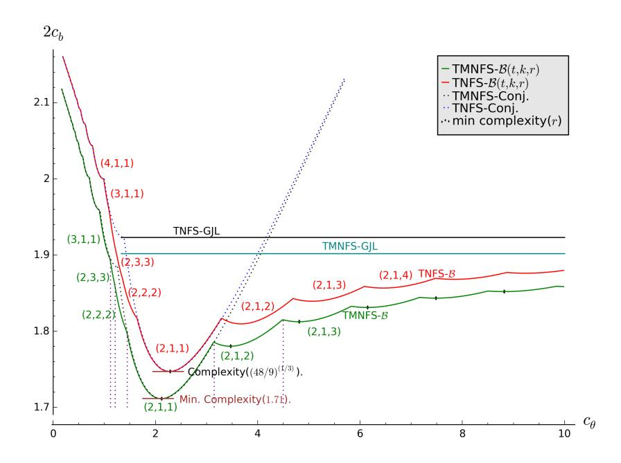

# Tower Number Field Sieve Variant of a Recent Polynomial Selection Method

Palash Sarkar and Shashank Singh

Applied Statistics Unit Indian Statistical Institute palash@isical.ac.in, sha2nk.singh@gmail.com

Abstract. At Asiacrypt 2015, Barbulescu et al. performed a thorough analysis of the tower number field sieve (TNFS) variant of the number field sieve algorithm. More recently, Kim and Barbulescu combined the TNFS variant with several polynomial selection methods including the Generalised Joux-Lercier method and the Conjugation method proposed by Barbulescu et al. at Eurocrypt 2015. Sarkar and Singh (Eurocrypt 2016) proposed a polynomial selection method which subsumes both the GJL and the Conjugation methods. This study was done in the context of the NFS and the multiple NFS (MNFS). The purpose of the present note is to show that the polynomial selection method of Sarkar and Singh subsumes the GJL and the Conjugation methods also in the context of the TNFS and the multiple TNFS variants. This was not clear from the recent work by Kim and Barbulescu. Applying the new polynomial selection method to the TNFS variants results in new asymptotic complexities for certain ranges of primes.

## 1 Introduction

There has been a recent increase in the interest of applying the number field sieve (NFS) algorithms and its several variants to the study of the discrete logarithm problem on finite fields Fp<sup>n</sup> with n > 1. The work by Barbulescu et al. [1] at Eurocrypt 2015 proposed two new methods for polynomial selections and worked out the asymptotic complexities of these methods as applied to the NFS algorithm. These polynomial selection methods were named the generalised Joux-Lercier (GJL) method and the Conjugation method. At the same conference, Pierrot [5] showed how to combine these polynomial selection methods with the multiple NFS (MNFS) variant [5] and worked out the corresponding asymptotic complexities. Sarkar and Singh (Eurocrypt 2016) proposed [6] a new polynomial selection method which subsumes both the GJL and the Conjugation methods. Using this method, the asymptotic complexity of both the NFS and the MNFS were worked out in [6].

At Asiacrypt 2015, Barbulescu et al., [2] presented a detailed analysis of the tower number field sieve (TNFS) variant. In a recent paper, Kim and Barbulescu [4] applied previous polynomial selection methods to the TNFS, the multiple TNFS (MTNFS) and the special TNFS variants. The polynomial selection methods considered in [4] include the methods from Joux-Lercier-Smart-Vercauteren [3], the GJL and the Conjugation methods from [1] and the polynomial selection method from [6]. The discussion in [4] does not make it clear that the polynomial selection method from [6] subsumes the GJL and the Conjugation methods in the context of TNFS.

The main point of the present note is to properly apply the polynomial selection method of Sarkar and Singh [6] to TNFS. Once this is done, it once more follows that the polynomial selection method from [6] subsumes the GJL and the Conjugation methods for the TNFS variant also.

The polynomial selection method considered in [6] has been called  $\mathcal{A}$ . The modification considered here provides a generalisation of  $\mathcal{A}$  and let us denote the generalisation as  $\mathcal{B}$ . Let the variant of TNFS obtained by using  $\mathcal{B}$  be denoted by TNFS- $\mathcal{B}$  and similarly denote MTNFS- $\mathcal{B}$ .

Let  $Q=p^n$ , where  $n=\eta\kappa$  and  $\gcd(\eta,\kappa)=1$ . Suppose that  $p=L_Q(a,c_p)$  for some a in (1/3,2/3) where  $L_Q$  is the usual sub-exponential notation. Further suppose that  $\eta$  can be written as  $\eta=c_{\eta}(\ln Q/\ln \ln Q)^{2/3-a}$  and let  $c_{\theta}=c_{p}c_{\eta}$ . For this setting, the following new asymptotic results are obtained: For  $c_{\theta}\in[3.39,20.91]$ , the complexity of TNFS- $\mathcal{B}$  is better than the complexities of all previous algorithms whether classical or MNFS. The TMNFS- $\mathcal{B}$  algorithm provides lower complexity compared to TNFS- $\mathcal{B}$  algorithm; for  $c_{\theta}\in(0,1.12]\cup[1.45,3.15]$ , the complexity of TMNFS- $\mathcal{B}$  is the same as that of the TMNFS-Conjugation and for  $c_{\theta}\notin(0,1.12]\cup[1.45,3.15]$ , the complexity of TMNFS- $\mathcal{B}$  is lower than that of all previous methods. Figure 1 shows the plot of the asymptotic complexity for both TNFS- $\mathcal{B}$  and MTNFS- $\mathcal{B}$ .

In this short note, we do not provide a background on the NFS algorithm. Instead, we refer to the above mentioned papers for a background on NFS and its variants as applied to the discrete logarithm problem.

#### 2 Using LLL for Polynomial Selection

The method from [6] uses an idea earlier considered in [1]. We briefly mention this idea.

Let  $\varphi(x)$  be a monic polynomial over the integers  $\varphi(x) = x^n + \varphi_{n-1}x^{n-1} + \cdots + \varphi_1 x + \varphi_0$  and  $r \ge \deg(\varphi)$  be an integer. Let  $n = \deg(\varphi)$ . Given  $\varphi(x)$  and r, define an  $(r+1) \times (r+1)$  matrix  $M_{\varphi,r}$  in the following manner.

$$M_{\varphi,r} = \begin{bmatrix} p & & & & \\ & \ddots & & & \\ & & \ddots & & \\ & & p & & \\ \varphi_0 & \varphi_1 & \cdots & \varphi_{n-1} & 1 & \\ & & \ddots & \ddots & & \ddots \\ & & \varphi_0 & \varphi_1 & \cdots & \varphi_{n-1} & 1 \end{bmatrix}$$
 (1)



Fig. 1. Complexity plot for medium prime case

The first n × n principal sub-matrix of Mϕ,r is diag[p, p, . . . , p] corresponding to the polynomials p, px, . . . , pxn−<sup>1</sup> . The last r − n + 1 rows correspond to the polynomials ϕ(x), xϕ(x), . . . , xr−nϕ(x).

Apply the LLL algorithm to Mϕ,r and let the first row of the resulting LLLreduced matrix be [g0, g1, . . . , gr−1, gr]. Define

$$g(x) = g_0 + g_1 x + \dots + g_{r-1} x^{r-1} + g_r x^r.$$
 (2)

The notation

$$g = LLL(M_{\varphi,r}) \tag{3}$$

will be used to denote the polynomial g(x) given by (2). By construction, ϕ(x) is a factor of g(x) modulo p.

## 3 A New Polynomial Selection Method for TNFS

We show how to properly modify the polynomial selection method described in [6] to the TNFS variant.

Consider the field Fp<sup>n</sup> where n = ηκ with gcd(η, κ) = 1. Let h(z) be an irreducible polynomial over Z of degree η and R = Z[z]/(h(z)). This is the basic set-up of the tower number field sieve algorithm.

Let A be a positive integer. Consider the set of all polynomials φ(x) of the form

$$\phi(x) = \phi_0(z) + \phi_1(z)x + \dots + \phi_{t-1}(z)x^{t-1},$$

where φi(z) ∈ Z[z], deg(φi) ≤ η − 1 and kφik<sup>∞</sup> ≤ A. The number of such polynomials φ(x) is at most Aηt. We will call any such polynomial to be a sieving polynomial. Sieving is done using such polynomials φ(x).

Define E to be E<sup>2</sup> = Aηt and so A<sup>η</sup> = E2/t. So, the number of possible coefficient polynomials of φ(x) is E2/t .

Let f be an irreducible polynomial over the integers. Define

$$N_f(\phi) = \operatorname{Res}_t(\operatorname{Res}_x(\phi(x), f(x)), h(z)).$$

If khk<sup>∞</sup> is bounded by an absolute constant H and p = LQ(`p, c) for some `<sup>p</sup> > 1/3 and c > 0, then following [2, 4], it can be proved that the following holds:

$$N_f(\phi) \le E^{2\deg(f)/t} (\|f\|_{\infty})^{t-1} L_Q(2/3, o(1)).$$

Algorithm B describes the extension of our previous method to the TNFS setting. Note that if η = 1, then κ = n and B becomes identical to the polynomial selection algorithm A defined in [6]. The following result states the basic

#### Algorithm: B: Polynomial selection for TNFS.

Input: p, n = ηκ, d (a factor of κ) and r ≥ κ/d.

Output: f(x), g(x) and ϕ(x).

Let k = κ/d;

repeat

Randomly choose a monic irreducible polynomial A1(x) having the following properties: deg A1(x) = r + 1; A1(x) is irreducible over the integers; A1(x) has coefficients of size O(ln(p)); modulo p, A1(x) has an irreducible factor A2(x) of degree k.

Randomly choose monic polynomials C0(x) and C1(x) with small coefficients such that deg C0(x) = d and deg C1(x) < d. Define

$$f(x) = \text{Res}_{y} (A_{1}(y), C_{0}(x) + y C_{1}(x));$$

$$\varphi(x) = \text{Res}_{y} (A_{2}(y), C_{0}(x) + y C_{1}(x)) \text{ mod } p;$$

$$\psi(x) = \text{LLL}(M_{A_{2},r});$$

$$g(x) = \text{Res}_{y} (\psi(y), C_{0}(x) + y C_{1}(x)).$$

until f(x) and g(x) are irreducible over Z and ϕ(x) is irreducible over Fp. return f(x), g(x) and ϕ(x).

Proposition 1. The outputs f(x), g(x) and ϕ(x) of Algorithm B satisfy the following.

- 1. deg(f) = d(r + 1); deg(g) = rd and deg(ϕ) = κ;
- 2. both f(x) and g(x) have ϕ(x) as a factor modulo p;
- 3. kfk<sup>∞</sup> = O(ln(p)) and kgk<sup>∞</sup> = O(Q1/(d(r+1))).

Consequently, if φ is a sieving polynomial, then

$$N_f(\phi) = E^{2d(r+1)/t} \times L_Q(2/3, o(1));$$
 (4)

$$N_g(\phi) = E^{2dr/t} \times Q^{(t-1)/(d(r+1))} \times L_Q(2/3, o(1));$$
(5)

$$N_f(\phi) \times N_g(\phi) = E^{(2d(2r+1))/t} \times Q^{(t-1)/(d(r+1))} L_Q(2/3, o(1)).$$
 (6)

We note the following points.

- 1. If d = 1, then the norm bound is E2(2r+1)/tQ(t−1)/(r+1) which is the same as that obtained using the GJL method.
- 2. If d = κ, then the norm bound is E2κ(2r+1)/tQ(t−1)/(κ(r+1)). Further, if r = k = 1, then the norm bound is the same as that obtained using the Conjugation method. So, for d = κ, Algorithm B is a generalisation of the Conjugation method.
- 3. If κ is a prime, then the only values of d are either 1 or n. The norm bounds in these two cases are covered by the above two points.
- 4. If κ is composite, then there are non-trivial values for d and it is possible to obtain new trade-offs in the norm bound. For concrete situations, this can be of interest. Further, for composite κ, as value of d increases from d = 1 to d = κ, the norm bound nicely interpolates between the norm bounds of the GJL method and the Conjugation method.

## 4 Examples

In this section, we present some of the examples, generated by new polynomial selection algorithm.

Example 1. Let p is a 201-bit prime given below.

```
p = 1606938044258990275541962092341162602522202993782792835301611 (7)
```

and n = 6. To apply the new polynomial selection algorithm, we have to choose η and κ such that ηκ = n and gcd(η, κ) = 1. We have the following two choices of (η, κ).

Case 1: Let (η, κ) = (2, 3). Choose d = κ, and so k = κ/d = 1. Taking r = k, we get the following polynomials.

$$\begin{split} h(x) &= x^2 + 14\,x + 20 \\ f(x) &= x^6 + 5\,x^5 + 6\,x^4 + 18\,x^3 + 73\,x^2 + 52\,x + 20 \\ g(x) &= 516378785784706099560748701401\,x^3 + 1874354673374387667869084608560\,x \\ &\quad + 459276162276102007999766811670\,x + 1683194203609950937495174411516 \\ \phi(x) &= x^3 + 4370464675316262929768958368698673612607491294431378655895\,x^2 \\ &\quad + 13111394025948788789306875106096020837822473883294135967675\,x \\ &\quad + 8740929350632525859537916737397347225214982588862757311786 \end{split}$$

2

Clearly, the above polynomials represents the polynomials generated by Conjugation method and we have kgk<sup>∞</sup> ≈ 2 100 .

If we choose r = k + 1 i.e., r = 2, we get the following polynomials.

$$\begin{split} h(x) &= x^2 + x + 20 \\ f(x) &= x^9 + 14\,x^8 + 74\,x^7 + 183\,x^6 + 200\,x^5 - 32\,x^4 - 375\,x^3 - 232\,x^2 - 48\,x - 1 \\ g(x) &= 46647198736133019425\,x^6 + 530869201059776791498\,x^5 + 2094297655062561189093\,x^4 \\ &\quad + 3465328474724235168588\,x^3 + 2717008192279799547052\,x^2 \\ &\quad + 1322043132032704860464\,x + 290748395825577445032 \\ \phi(x) &= x^3 + 315444052193803149917391335705534526435873425227915090402562\,x^2 \\ &\quad + 1261776208775212599669565342822138105743493700911660361610232\,x \\ &\quad + 315444052193803149917391335705534526435873425227915090402559 \end{split}$$

We note that kgk<sup>∞</sup> ≈ 2 <sup>71</sup>. Thus taking r > k, gives us the polynomials which are not obtained by Conjugation method.

Case 2: Let (η, κ) = (3, 2). Taking d = κ and r = 1, we get the following polynomials.

$$\begin{split} h(x) &= x^3 + x^2 + 15\,x + 7 \\ f(x) &= x^4 - x^3 - 2\,x^2 - 7\,x - 3 \\ g(x) &= 717175561486984577278242843019\,x^2 + 2189435313197775056442946543188\,x \\ &\quad + 2906610874684759633721189386207 \\ \phi(x) &= x^2 + 131396875851816610915684123600060137654000542337369130402554\,x \\ &\quad + 131396875851816610915684123600060137654000542337369130402555 \end{split}$$

Note that kgk<sup>∞</sup> ≈ 2 <sup>101</sup>. If we take d = κ and r = 2, we get the following set of polynomials where kgk<sup>∞</sup> ≈ 2 69 .

$$\begin{split} h(x) &= x^3 + x^2 + 15\,x + 7 \\ f(x) &= x^6 - 4\,x^5 - 53\,x^4 - 147\,x^3 - 188\,x^2 - 157\,x - 92 \\ g(x) &= 15087279002722300985\,x^4 + 124616743720753879934\,x^3 + 451785460058994237397\,x^2 \\ &\quad + 749764394939964245000\,x + 567202989572349792620 \\ \phi(x) &= x^2 + 459743211307624787973091830151418256356779099860453048165628\,x \\ &\quad + 1379229633922874363919275490454254769070337299581359144496879 \end{split}$$

Example 2. Consider the same prime p given by the equation (7). Let n = 12. Choose η = 3 and κ = 4. We can now apply the new polynomial selection method by taking d a divisor of κ. Note that for d = 1, we get the polynomials which are generated by GJL method, and for d = κ and r = κ/d, we get the polynomials which are generated by Conjugation method.

Let us take d = 2 and so k = κ/d = 2. Choosing r = 2, we get the following polynomials using the new polynomial selection method.

$$h(x) = x^3 + 6\,x^2 + 17\,x + 9$$

$$f(x) = x^6 + 5\,x^5 - 30\,x^4 - 266\,x^3 - 676\,x^2 - 708\,x - 272$$

$$g(x) = 6467759678841805870369474068891432876119\,x^4 + 6502041296101468515405699029621$$

$$6084937901\,x^3 + 222170443795536450104732978193530615480075\,x^2 + 288848458312$$

$$346890039868803933886050843398x + 131565328984563790448827928636681124756276$$

$$\phi(x) = x^4 + 524836704622542585952303793367376227408021565148774944064926\,x^3$$

$$+ 412331973798848955780775364051098068524174598906061062223842\,x^2$$

$$+ 729366207515760721958696718425775500473208458672566373192896\,x$$

$$+ 794222068298485757328798142903843341069485055345502379406598$$

Note that kgk<sup>∞</sup> ≈ 2 <sup>137</sup> and these polynomials are neither covered by GJL method nor by Conjugation method.

## 5 Asymptotic Complexity Analysis for the Medium Prime Case

For 1/3 < a < 2/3, write

$$p = L_Q(a, c_p), \text{ where } c_p = \frac{1}{n} \left( \frac{\ln Q}{\ln \ln Q} \right)^{1-a} \text{ and so } n = \frac{1}{c_p} \left( \frac{\ln Q}{\ln \ln Q} \right)^{1-a}.(8)$$

For each cp, the runtime of the NFS algorithm is the same for the family of finite fields Fp<sup>n</sup> where p is given by (8).

Recall that n = ηκ where gcd(η, κ) = 1. Suppose η can be written as

$$\eta = c_{\eta} \left( \frac{\ln Q}{\ln \ln Q} \right)^{2/3 - a}. \tag{9}$$

Define P = p η . Then

$$P = L_{Q}(a, c_{p}\eta)$$

$$= \exp\left(c_{p}\eta(\ln Q)^{a}(\ln \ln Q)^{1-a}\right)$$

$$= \exp\left(c_{p}c_{\eta}\left(\frac{\ln Q}{\ln \ln Q}\right)^{2/3-a}(\ln Q)^{a}(\ln \ln Q)^{1-a}\right)$$

$$= \exp\left(c_{p}c_{\eta}(\ln Q)^{2/3}(\ln \ln Q)^{1/3}\right)$$

$$= L_{Q}(2/3, c_{p}c_{\eta}). \tag{10}$$

So, if p is a medium prime with p = LQ(a, cp) with 1/3 < a < 2/3 and η is given by (9), then P is of the form LQ(2/3, cpcη), i.e., its size corresponds to the boundary case of NFS. The tower number field sieve considers an extension of degree κ over P. So, the extension of degree ηκ over a medium size prime p is transformed into an extension of degree κ over a boundary case size prime power P. Consequently, for such a situation, the asymptotic results obtained earlier for the boundary case can be translated to the medium size case.

We recall the following.

- 1. The number of polynomials to be considered for sieving is E<sup>2</sup> .
- 2. The factor base is of size B.

Sparse linear algebra using the Lanczos or the block Wiedemann algorithm takes time O(B<sup>2</sup> ). For some 0 < b < 1, let

$$B = L_Q(b, c_b). (11)$$

The value of b will be determined later. Set

$$E = B \tag{12}$$

so that asymptotically, the number of sieving polynomials is equal to the time for the linear algebra step.

Let π = Ψ(Γ, B) be the probability that a random positive integer which is at most Γ is B-smooth. Let Γ = LQ(z, ζ) and B = LQ(b, cb). Using the L-notation version of the Canfield-Erd¨os-Pomerance theorem,

$$(\Psi(\Gamma, B))^{-1} = L_Q\left(z - b, (z - b)\frac{\zeta}{c_b}\right). \tag{13}$$

Following the usual convention, we assume that the same smoothness probability π holds for the event that a random sieving polynomial φ(x) is smooth over the factor base.

The expected number of polynomials to consider for obtaining one relation is π −1 . Since B relations are required, obtaining this number of relations requires trying Bπ−<sup>1</sup> trials. Balancing the cost of sieving and the linear algebra steps requires Bπ−<sup>1</sup> = B<sup>2</sup> and so

$$\pi^{-1} = B. \tag{14}$$

Obtaining π −1 from (13) and setting it to be equal to B allows solving for cb. Balancing the costs of the sieving and the linear algebra phases leads to the runtime of the NFS algorithm to be B<sup>2</sup> = LQ(b, 2cb). So, to determine the runtime, we need to determine b and cb. The value of b will turn out to be 1/3 and the only real issue is the value of cb.

Lemma 1. Let n = ηκ and κ = kd for positive integers η, k and d. Using the expressions for p and E(= B) given by (8) and (11), we obtain the following.

$$E^{\frac{2}{t}d(2r+1)} = L_Q \left( 1 - a + b, \frac{2c_b(2r+1)}{c_p\eta kt} \right);$$

$$Q^{\frac{t-1}{d(r+1)}} = L_Q \left( a, \frac{kc_p\eta(t-1)}{(r+1)} \right).$$
(15)

If further η = cη(ln Q/ln ln Q) 2/3−a , then

$$E^{\frac{2}{t}d(2r+1)} = L_Q\left(1/3 + b, \frac{2c_b(2r+1)}{c_pc_\eta kt}\right);$$

$$Q^{\frac{t-1}{d(r+1)}} = L_Q\left(2/3, \frac{kc_pc_\eta(t-1)}{(r+1)}\right).$$
(16)

Proof. The second expression follows directly from Q = p <sup>n</sup>, p = LQ(a, cp) and n = ηkd. The computation for obtaining the first expression is the following.

$$E^{\frac{2}{t}d(2r+1)} = L_Q \left( b, c_b \frac{2}{t} d(2r+1) \right)$$

$$= \exp \left( c_b \frac{2}{t} (2r+1) \frac{n}{k\eta} (\ln Q)^b (\ln \ln Q)^{1-b} \right)$$

$$= \exp \left( c_b \frac{2}{c_p \eta kt} (2r+1) \left( \frac{\ln Q}{\ln \ln Q} \right)^{1-a} (\ln Q)^b (\ln \ln Q)^{1-b} \right)$$

$$= L_Q \left( 1 - a + b, \frac{2c_b (2r+1)}{c_p \eta kt} \right).$$

Theorem 1. Let n = ηκ; gcd(η, κ) = 1; κ = kd; r ≥ k; t ≥ 2; p = LQ(a, cp) with 1/3 < a < 2/3 and 0 < c<sup>p</sup> < 1; and η = cη(ln Q/ln ln Q) 2/3−a . It is possible to ensure that the runtime of the NFS algorithm with polynomials chosen by Algorithm B is LQ(1/3, 2cb) where

$$c_b = \frac{2r+1}{3c_\theta kt} + \sqrt{\left(\frac{2r+1}{3c_\theta kt}\right)^2 + \frac{kc_\theta(t-1)}{3(r+1)}} \text{ and}$$
 (17)

$$c_{\theta} = c_p c_{\eta}. \tag{18}$$

ut

Proof. Setting b = 1/3, the two L-expressions given by (16) have the same first component and so the product of the norms is

$$\Gamma = L_Q \left( \frac{2}{3}, \frac{2c_b(2r+1)}{c_p c_{\eta} kt} + \frac{kc_p c_{\eta}(t-1)}{(r+1)} \right)$$
$$= L_Q \left( \frac{2}{3}, \frac{2c_b(2r+1)}{c_{\theta} kt} + \frac{kc_{\theta}(t-1)}{(r+1)} \right).$$

Then π <sup>−</sup><sup>1</sup> given by (13) is

$$L_Q\left(\frac{1}{3}, \frac{1}{3}\left(\frac{2(2r+1)}{c_\theta kt} + \frac{kc_\theta(t-1)}{c_b(r+1)}\right)\right).$$

From the condition π <sup>−</sup><sup>1</sup> = B, we get

$$c_b = \frac{1}{3} \left( \frac{2(2r+1)}{c_\theta kt} + \frac{kc_\theta(t-1)}{c_b(r+1)} \right). \tag{19}$$

Solving the quadratic for c<sup>b</sup> and choosing the positive root gives

$$c_b = \frac{2r+1}{3c_\theta kt} + \sqrt{\left(\frac{2r+1}{3c_\theta kt}\right)^2 + \frac{kc_\theta(t-1)}{3(r+1)}}.$$

Note that c<sup>b</sup> is minimised at cpc<sup>η</sup> = c<sup>θ</sup> = 121/<sup>3</sup> whence the corresponding complexity of the TNFS algorithm is LQ(1/3,(48/9)1/<sup>3</sup> ).

## 6 Multiple Number Field Sieve Variant

There are two variants of multiple number field sieve algorithm. In the first variant, the image of φ(x) needs to be smooth in at least any two of the number fields. In the second variant, the image of φ(x) needs to be smooth in the first number field and at least one of the other number fields. We discuss the second variant of MNFS only. In contrast to the number field sieve algorithm, the right number field is replaced by a collection of V number fields in the second variant of MNFS. The sieving polynomial φ(x) has to satisfy the smoothness condition on the left number field as before. On the right side, it is sufficient for φ(x) to satisfy a smoothness condition on at least one of the V number fields.

Recall that Algorithm B produces two polynomials f(x) and g(x) of degrees d(r+1) and dr respectively. The polynomial g(x) is defined as Resy(ψ(y), C0(x)+ yC1(x)) where ψ(x) = LLL(M<sup>A</sup>2,r), i.e., ψ(x) is defined from the first row of the matrix obtained after applying the LLL-algorithm to M<sup>A</sup>2,r.

Methods for obtaining the collection of number fields on the right have been mentioned in [5]. We adapt one of these methods to our setting. Consider Algorithm B. Let ψ1(x) be ψ(x) as above and let ψ2(x) be the polynomial defined from

ut

the second row of the matrix  $M_{A_2,r}$ . Define  $g_1(x) = \operatorname{Res}_y(\psi_1(y), C_0(x) + yC_1(x))$  and  $g_2(x) = \operatorname{Res}_y(\psi_2(y), C_0(x) + yC_1(x))$ . Then choose V-2 linear combinations  $g_i(x) = s_i g_1(x) + t_i g_2(x)$ , for  $i=3,\ldots,V$ . Note that the coefficients  $s_i$  and  $t_i$  are of the size of  $\sqrt{V}$ . All the  $g_i$ 's have degree dr. Asymptotically,  $\|\psi_2\|_{\infty} = \|\psi_1\|_{\infty} = Q^{1/(d(r+1))}$ . Since we take  $V = L_Q(1/3)$ , all the  $g_i$ 's have their infinity norms to be the same as that of g(x) given by Proposition 1.

For the left number field, as before, let B be the bound on the norms of the ideals which are in the factor basis defined by f. For each of the right number fields, let B' be the bound on the norms of the ideals which are in the factor basis defined by each of the  $g_i$ 's. So, the size of the entire factor basis is B+VB'. The following condition balances the left portion and the right portion of the factor basis.

$$B = VB'. (20)$$

With this condition, the size of the factor basis is  $B^{1+o(1)}$  as in the classical NFS and so asymptotically, the linear algebra step takes time  $B^2$ . As before, the number of sieving polynomials is  $E^2 = B^2$  and the coefficient polynomials of  $\phi(x)$  can take  $E^{2/t}$  distinct values.

Let  $\pi$  be the probability that a random sieving polynomial  $\phi(x)$  gives rise to a relation. Let  $\pi_1$  be the probability that  $\phi(x)$  is smooth over the left factor basis and  $\pi_2$  be the probability that  $\phi(x)$  is smooth over at least one of the right factor bases. Further, let  $\Gamma_1 = \operatorname{Res}_x(f(x), \phi(x))$  be the bound on the norm corresponding to the left number field and  $\Gamma_2 = \operatorname{Res}_x(g_i(x), \phi(x))$  be the bound on the norm for any of the right number fields. Note that  $\Gamma_2$  is determined only by the degree and the  $L_{\infty}$ -norm of  $g_i(x)$  and hence is the same for all  $g_i(x)$ 's. Heuristically, we have

$$\pi_1 = \Psi(\Gamma_1, B);$$
 $\pi_2 = V\Psi(\Gamma_2, B');$
 $\pi = \pi_1 \times \pi_2.$
(21)

As before, one relation is obtained in about  $\pi^{-1}$  trials and so B relations are obtained in about  $B\pi^{-1}$  trials. Balancing the cost of linear algebra and sieving, we have as before  $B=\pi^{-1}$ .

The following choices of B and V are made.

$$E = B = L_Q(\frac{1}{3}, c_b);$$

$$V = L_Q(\frac{1}{3}, c_v); \text{ and so}$$

$$B' = B/V = L_Q(\frac{1}{3}, c_b - c_v).$$
(22)

**Theorem 2.** Let  $n = \eta \kappa$ ;  $\gcd(\eta, \kappa) = 1$ ;  $\kappa = kd$ ;  $r \geq k$ ;  $t \geq 2$ ;  $p = L_Q(a, c_p)$  with 1/3 < a < 2/3 and  $0 < c_p < 1$ ; and  $\eta = c_{\eta} (\ln Q / \ln \ln Q)^{2/3-a}$ . It is possible to ensure that the runtime of the MNFS algorithm is  $L_Q(1/3, 2c_b)$  where

$$c_b = \frac{4r+2}{6ktc_{\theta}} + \sqrt{\frac{r(3r+2)}{(3ktc_{\theta})^2} + \frac{c_{\theta}k(t-1)}{3(r+1)}}$$
 and
$$c_{\theta} = c_p c_{\eta}.$$
 (23)

Proof. Note the following computations. For a sieving polynomial φ,

$$\begin{split} &\Gamma_{1} = N_{f}(\phi) \\ &= E^{(2d(r+1))/t} L_{Q}(2/3, o(1)) \\ &= E^{(2n(r+1))/(\eta kt)} \\ &= L_{Q} \left(\frac{2}{3}, \frac{2(r+1)c_{b}}{ktc_{p}c_{\eta}}\right); \\ &\pi_{1}^{-1} = L_{Q} \left(\frac{1}{3}, \frac{2(r+1)}{3ktc_{\theta}}\right); \\ &\Gamma_{2} = N_{g}(\phi) \\ &= E^{(2rd)/t} \times Q^{(t-1)/(d(r+1))} L_{Q}(2/3, o(1)) \\ &= E^{(2rn)/(\eta kt)} \times Q^{\eta k(t-1)/(n(r+1))} \\ &= L_{Q} \left(\frac{2}{3}, \frac{2rc_{b}}{c_{p}c_{\eta}kt} + \frac{kc_{p}c_{\eta}(t-1)}{r+1}\right); \\ &\pi_{2}^{-1} = L_{Q} \left(\frac{1}{3}, -c_{v} + \frac{1}{3(c_{b} - c_{v})} \left(\frac{2rc_{b}}{c_{\theta}kt} + \frac{kc_{\theta}(t-1)}{r+1}\right)\right); \\ &\pi^{-1} = L_{Q} \left(\frac{1}{3}, \frac{2(r+1)}{3ktc_{\theta}} - c_{v} + \frac{1}{3(c_{b} - c_{v})} \left(\frac{2rc_{b}}{c_{\theta}kt} + \frac{kc_{\theta}(t-1)}{r+1}\right)\right); \end{split}$$

From the condition π <sup>−</sup><sup>1</sup> = B, we obtain the following equation.

$$c_b = \frac{2(r+1)}{3ktc_pc_\eta} - c_v + \frac{1}{3(c_b - c_v)} \left( \frac{2rc_b}{c_\theta kt} + \frac{kc_\theta(t-1)}{r+1} \right).$$
 (24)

We wish to find c<sup>v</sup> such that c<sup>b</sup> is minimised subject to the constraint (24). Using the method of Lagrange multipliers, the partial derivative of (24) with respect to c<sup>v</sup> gives

$$c_v = \frac{r+1}{3ktc_{\theta}}.$$

Using this value of c<sup>v</sup> in (24) provides the following quadratic in cb.

$$(3ktc_{\theta})c_{b}^{2} - (4r+2)c_{b} + \frac{(r+1)^{2}}{3ktc_{\theta}} - \frac{(c_{\theta}k)^{2}t(t-1)}{r+1} = 0.$$

Solving this and taking the positive square root, we obtain

$$c_b = \frac{4r+2}{6ktc_{\theta}} + \sqrt{\frac{r(3r+2)}{(3ktc_{\theta})^2} + \frac{c_{\theta}k(t-1)}{3(r+1)}}.$$
 (25)

Hence the overall complexity of MNFS for the boundary case is L<sup>Q</sup> 1 3 , 2c<sup>b</sup> . ut

From Theorem 2, the entire analysis carried out in Sections 8.1 and 8.2 of [6] apply with the constant c<sup>p</sup> replaced by c<sup>θ</sup> leading to the new asymptotic complexity results for the medium prime case that has been mentioned in the introduction.

## References

- 1. Razvan Barbulescu, Pierrick Gaudry, Aurore Guillevic, and Fran¸cois Morain. Improving NFS for the discrete logarithm problem in non-prime finite fields. In Elisabeth Oswald and Marc Fischlin, editors, Advances in Cryptology - EUROCRYPT 2015 - 34th Annual International Conference on the Theory and Applications of Cryptographic Techniques, Sofia, Bulgaria, April 26-30, 2015, Proceedings, Part I, volume 9056 of Lecture Notes in Computer Science, pages 129–155. Springer, 2015.
- 2. Razvan Barbulescu, Pierrick Gaudry, and Thorsten Kleinjung. The tower number field sieve. In Tetsu Iwata and Jung Hee Cheon, editors, Advances in Cryptology - ASIACRYPT 2015 - 21st International Conference on the Theory and Application of Cryptology and Information Security, Auckland, New Zealand, November 29 - December 3, 2015, Proceedings, Part II, volume 9453 of Lecture Notes in Computer Science, pages 31–55. Springer, 2015.
- 3. Antoine Joux, Reynald Lercier, Nigel P. Smart, and Frederik Vercauteren. The number field sieve in the medium prime case. In Cynthia Dwork, editor, Advances in Cryptology - CRYPTO 2006, 26th Annual International Cryptology Conference, Santa Barbara, California, USA, August 20-24, 2006, Proceedings, volume 4117 of Lecture Notes in Computer Science, pages 326–344. Springer, 2006.
- 4. Taechan Kim and Razvan Barbulescu. Extended tower number field sieve: A new complexity for medium prime case. Cryptology ePrint Archive, Report 2015/1027, 2015. http://eprint.iacr.org/.
- 5. C´ecile Pierrot. The multiple number field sieve with conjugation and generalized Joux-Lercier methods. In Advances in Cryptology - EUROCRYPT 2015 - 34th Annual International Conference on the Theory and Applications of Cryptographic Techniques, Sofia, Bulgaria, April 26-30, 2015, Proceedings, Part I, pages 156–170, 2015.
- 6. Palash Sarkar and Shashank Singh. New complexity trade-offs for the (multiple) number field sieve algorithm in non-prime fields. Cryptology ePrint Archive, Report 2015/944, 2015. http://eprint.iacr.org/.