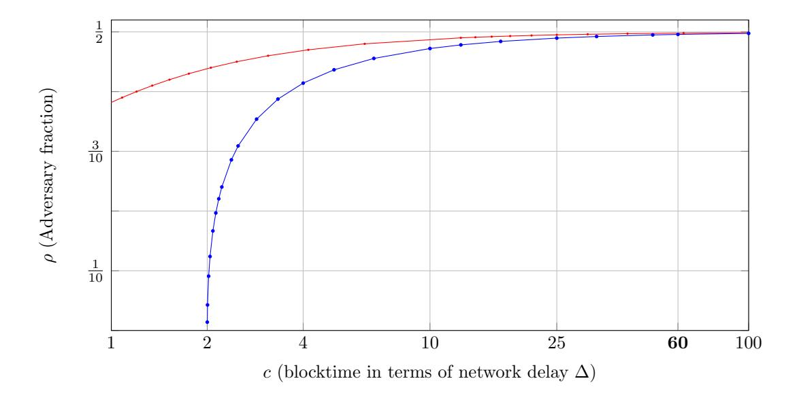

# Analysis of the Blockchain Protocol in Asynchronous Networks

Rafael Pass∗ Cornell Tech rafael@cornell.edu

Lior Seeman Harvard University lior.seeman@gmail.com

abhi shelat† U of Virginia abhi@virginia.edu

September 13, 2016

#### Abstract

Nakamoto's famous blockchain protocol enables achieving consensus in a so-called permissionless setting—anyone can join (or leave) the protocol execution, and the protocol instructions do not depend on the identities of the players. His ingenious protocol prevents "sybil attacks" (where an adversary spawns any number of new players) by relying on computational puzzles (a.k.a. "moderately hard functions") introduced by Dwork and Naor (Crypto'92).

The analysis of the blockchain consensus protocol (a.k.a. Nakamoto consensus) has been a notoriously difficult task. Prior works that analyze it either make the simplifying assumption that network channels are fully synchronous (i.e. messages are instantly delivered without delays) (Garay et al, Eurocrypt'15) or only consider specific attacks (Nakamoto'08; Sampolinsky and Zohar, FinancialCrypt'15); additionally, as far as we know, none of them deal with players joining or leaving the protocol.

In this work we prove that the blockchain consensus mechanism satisfies a strong forms of consistency and liveness in an asynchronous network with adversarial delays that are a-priori bounded, within a formal model allowing for adaptive corruption and spawning of new players, assuming that the computational puzzle is modeled as a random oracle. (We complement this result by showing a simple attack against the blockchain protocol in a fully asynchronous setting, showing that the puzzle-hardness needs to be appropriately set as a function of the maximum network delay; this attack applies even for static corruption.)

As an independent contribution, we define an abstract notion of a blockchain protocol and identify appropriate security properties of such protocols; we prove that Nakamoto's blockchain protocol satisfies them and that these properties are sufficient for typical applications; we hope that this abstraction may simplify further applications of blockchains.

∗Supported in part by NSF Award CNS-1217821, AFOSR Award FA9550-15-1-0262, a Microsoft Faculty Fellowship, and a Google Faculty Research Award.

†Supported in part by NSF grants CNS-0845811, TC-1111781, TC-0939718, a Microsoft Faculty Fellowship, an SAIC Faculty Award, and a Google Faculty Research Award.

## 1 Introduction

Distributed systems have been historically analyzed in a closed setting in which both the number of participants in the system, as well as their identities, are common knowledge. A departure from this model started with the design of peer-to-peer systems, e.g. with systems such as Napster and Gnutella for file sharing. The success of those systems led to academically designed systems such as Freenet [CSWH00], CAN [RFH+00], Chord [SMK+01], and Pastry [DR01] which offered redundant file storage, distributed hashing, selection of nearby servers, and hierarchical naming.

A novel aspect of these peer systems is that they are permissionless— anyone can join (or leave) the protocol execution (without getting permission from a centralized or distributed authority), and the protocol instructions do not depend on the identities of the players. As participants may continuously join and leave the system, successful permissionless systems require a fault-tolerant design. Unfortunately, the mentioned systems, while "robust" with respect to measures such as connectivity [DLN02], were not designed to tolerate against adversarial behavior. For example, there were no guarantee that one participant's experience with the system was consistent with another's: Two participants requesting the same file may end up receiving different versions and never know that they did. At first sight one may think that using standard consensus/Byzantine agreement methods (e.g., [CL99, MA05, Lam10, Lam11]) could help overcome this issue. The problem is that such protocols require that a large fraction of the participating players are honest, but in the permissionless setting an attacker can trivially mount a so-called "sybil attack"—it simply spawns lots of players (that it controls) and can thus easily ensure that it controls a majority of all the players. Indeed, Barak et al [BCL+05] proved that this is a fundemental problem with the permissionless model.

Nakamoto's Blockchain In 2008, Nakamoto [Nak08] proposed his celebrated "blockchain protocol" which overcomes the above-mentioned problems by relying on the idea of computational puzzles—a.k.a. moderately hard functions or proofs of work—put forth by Dwork and Naor [DN92]. Rather than attempting to provide robustness whenever the majority of the participants are honest (since participants can be easily spawned in the permissionless setting), it attempts to provide robustness as long as a majority of the computing power is held by honest participants. It explicitly claims consistency properties that are strong enough to support a financial transaction system; indeed, the first application of a blockchain is the Bitcoin digital currency which needs strong properties to prevent fraud and double-spending attacks. A number of follow-up digital currencies [Lit], micro-payment schemes [PS15, PD15], time-stamping [BTP], naming [Nam], fair secure computation [BK14] and secure messaging and PKI applications [FVY14] are based on the blockchain idea. Additionally, financial firms have announced intentions of using the blockchain to lower transaction costs, remove geopolitical barriers to transferring assets, and reconcile differences between systems.

The core blockchain protocol (a.k.a. "Nakamoto consensus", or the "Bare-bones blockchain protocol"), roughly speaking, is a method for maintaining a public, immutable and ordered ledger of records (for instance, in the bitcoin application, these records are simply transactions); that is, records can be added to the end of the ledger at any time (but only to the end of it); additionally, we are guaranteed that records previously added cannot be removed or reordered and that all honest users have a consistent view of the ledger. While standard consensus/Byzantine agreement mechanisms could be used to achieve such an immutable ordered sequence of records, the amazing aspect of Nakamoto's consensus mechanism is that it functions in a fully permissionless setting.

Roughly speaking, in his protocol each participant maintains its own local "chain" of "blocks" of records/messages—called the blockchain. Each block consist of a triple (h−1, η, m) where h−1 is a pointer to the previous block in chain, m is the record component of the block, and η is a "proof-of-work"—a solution to a computational puzzle that is derived from the pair (h−1, m). The

proof of work can be thought of as a "key-less digital signature" on the whole blockchain up until this point.

Concretely, Nakamoto's protocol is parametrized by a parameter p—which we refer to as the mining hardness parameter, and a proof-of-work is deemed valid if η is a string such that H(h−1, η, m) < Dp, where H is a hash function (modeled as a random oracle) and Dp is set so that the probability that an input satisfies the relation is less than p. (In practice, the hardness parameter p is adaptively modified through some external process to incorporate an estimate of the number of participants in the system and the network delays; we shall return to the choice of p later.) At any point of the protocol execution, each participant attempts to increase the length of its own chain by "mining" for a new block: upon receiving some record m, it picks a random η and checks whether η is a valid proof of work w.r.t. m and h−1, where h−1 is a pointer to the last block of its current chain; if so, it extends is own local chain and broadcast it to the all the other participants (the broadcast takes places through some gossip protocol, which we do not discuss here). Whenever a participant receives a chain that is longer than its own local chain, it replaces its own chain with the longer one.

The fundamental question with such an approach is whether honest participants eventually end up with the same longest chain of blocks, and thus, the same ordered list of records, or whether the system devolves into a state where participants have inconsistent local chains.

### 1.1 Does Nakamoto's Protocol Achieve Consistency?

Requiring that all participant agree on the whole chain is a too strong consistency requirement if the protocol is executed on a network with message delays (as Nakamoto's protocol is intended to be)—for instance, some players may have received the "last block" whereas other have not. Rather, as discussed by Nakamoto [Nak08], the appropriate notion of consistency for the blockchain—which we refer to as T-consistency—should require that honest players agree on the current chain, except for potentially a small number, T, of "unconfirmed" blocks at the end of the chain. If we can show this property holds except with exponentially small probability in T, honest parties are guaranteed that for a sufficiently large choice of T (except with tiny probability), "confirmed" blocks will never be lost from the chain (which is what is needed for all the above-mentioned applications; for instance, for the case of bitcoin, it ensures that players cannot double-spend money).

Nakamoto provides an initial analysis of consistency assuming that the adversary only mounts a particular attack strategy (namely, an attacker tries to generate a chain faster than the honest players); for instance, his analysis does not consider more sophisticated attack strategies where the adversary may attempt to "split the players" and have them work on different chains.

A beautiful recent work by Garay, Kiayas and Leonardos [GKL15] provides a more formal model for studying Nakamoto's blockchain protocol; their analysis, however, only considers a synchronous network with a rushing adversary—that is, messages sent in a particular round arrive in the next round without any delays, but the adversary gets to see all messages sent by honest parties before having to send its own message. In this model, they demonstrate that the blockchain protocol satisfies consistency (under appropriate assumptions on the mining hardness and the relative computational power held by the attacker), in a setting with a fixed number of players (but the protocol is not aware of the exact number of players).

Assuming a synchronous network, however, is a very strong, possibly unrealistic assumption; indeed, Nakamoto's protocol is explicitly designed to work in a network with message delays, and indeed is executed on such a network (i.e., the Internet).

The Power of Network Delays Consequently, we are here interested in analyzing to what extent the blockchain protocol satisfies consistency in the more realistic setting of an asynchronous network, where an adversary controls the scheduling/delivery of messages between honest parties. As we observe (and formally prove in Theorem 8.1), in a fully asynchronous setting, where an adversary can arbitrarily delay messages, consistency cannot be satisfied: an adversary controlling a small percentage of the computational power can simply delay messages from honest parties for sufficiently long to ensure that the adversary can come up with its own chain (containing any set of records it desires) which is longer than the chain held by all honest players, and consequently it can make the honest players switch to the adversarial chain at any point. In fact, our attack works even in the setting of partial synchrony (see e.g. [DLS88]) where there is an a-priori bound  $\Delta$  on the network latency (that is, the adversary may arbitrary delay messages as long as it delivers them within time  $\Delta$ ), as long as the mining hardness parameter p exceeds  $\frac{1}{pn\Delta}$ , where  $\rho$  is the fraction of the computational power held by the adversary and p is the number of players (and p is the mining-hardness parameter in Nakamoto's protocol). Indeed, Decker and Wattenhofer [DW13] already experimentally observed that increasing the networks delays in Nakamoto's protocol leads to increased forks, and they noted (through heuristic calculations) that an attacker could use these delays to violate consistency with an attack that requires less than 50% of the mining power.

Motivated by the work by Decker and Wattenhofer, an elegant work by Sompolinsky and Zohar [SZ15] provides some initial analysis of the blockchain protocol even in a network with (bounded) delays. They show how to extend Nakamoto's analysis to deal with (bounded) delays, but again (just like Nakamoto) they only consider particular attack strategies—e.g., they do not consider "block-withholding (or "pre-mining") attacks" where the attacker withholds blocks for later use [mtg10, ES14]; furthermore, their analysis only shows that consistency holds in the limit (when T goes to infinity), and consequently their bounds (even for the restricted attacker setting) are not useful for applications.

This leaves open the question of providing an analysis of Nakamoto's blockchain protocol or in fact any consensus protocol in the permissionless setting—with respect to arbitrary attack strategies in networks with  $\Delta$ -bounded delays.

Does Nakamoto's blockchain protocol satisfy consistency when executed in asynchronous networks with  $\Delta$ -bounded delays?

As mentioned above, Garay et al [GKL15] provide a positive answer for the special case when  $\Delta=1$  (i.e., messages are delivered in the next time step1), and Sampolinsky and Zohar [SZ15] show that certain (natural, but restricted) strategies cannot be employed to break consistency of Nakamoto's protocol (in the limit) in  $\Delta$ -bounded delay networks.

Let us highlight why dealing with network delays in the "proof-of-work" setting (where we assume that a majority of the computing power is honest) is significantly more challenging than in the "standard" permissioned setting: In the standard model, any synchronous protocol can be turned into a protocol that is secure also in  $\Delta$ -delay networks by simply requiring all honest players to always "wait" (without doing anything) for  $\Delta$  time steps before responding to any message, effectively emulating synchronous rounds. This approach completely fails in the proof-of-work setting—the adversary can now increase its computational resources by a factor  $\Delta$  (since it can try to solve puzzle when the honest players are "waiting").

#### 1.2 Main Results

In this paper, we resolve the above-mentioned problem and demonstrate that (assuming puzzles are modeled as random oracles) Nakamoto's protocol satisfies consistency (under appropriate assumptions on the mining hardness and the relative computational power held by the attacker) also

&lt;sup>1Alternatively, one way to interpret the result of Garay et al, is that it shows consistency of Nakamoto's protocol also with  $\Delta$  delays, but with a *particular delay structure* where time is divided into intervals of length  $\Delta$ , and any message sent within an interval is delayed to the end of it.

in networks with message delays. We emphasize that our analysis is not just a combination of the techniques/ideas from [GKL15] and [SZ15]—in fact, the bulk of our proof consists of dealing with the attack strategies which are omitted from the analysis in [SZ15], and dealing with them requires us to consider an altogether different proof technique. Additionally, our analysis considers adaptive corruption and spawning of new players (i.e., new players joining); as far as we know, it is the first analysis to formally deal with spawning of new players (which is a cruical desidrata of the blockchain protocol).

A Consistency Theorem with Delays We provide a rough overview of our model and consistency theorem. Consider Nakamoto's protocol with mining-hardness p (that is, a single random oracle query is a successful "in mining" with probability p), and consider an execution with n players, each of them with identical computing power—we assume the protocol proceeds in rounds (timesteps), and in each round each player gets a single random oracle query and the adversary controlling a  $\rho$  fraction of the players gets  $\rho n$  random oracles queries (as in [GKL15], the honest players need to make their queries in parallel, but we allow the adversary to makes the queries sequentially). Let  $\alpha = 1 - (1-p)^{(1-\rho)n}$  be the probability that some honest player succeeds in solving a puzzle in one round, and let  $\beta = \rho np$  be the expected number of blocks that an attacker can mine in a round. When  $p \ll 1/n$  (which is the case considered in practice), we have that  $\alpha \approx p(1-\rho)n$  and thus  $\frac{\alpha}{\beta} \approx \frac{1-\rho}{\rho}$ .

**Theorem 1.1.** Assume there exists some  $\delta > 0$  such that

$$\alpha(1 - (2\Delta + 2)\alpha) \ge (1 + \delta)\beta.$$

Then, except with exponentially small probability (in T), Nakamoto's protocol satisfies T-consistency in the random oracle model, assuming the network's latency is bounded by  $\Delta$ .

As a consequence we have that as long as  $\rho < \frac{1}{2}$  (i.e., the adversary controls less than half of the computational power), for every  $\Delta$  there exists some (sufficiently small) p, such that Nakamoto's protocol satisfies consistency. (Note that as mentioned above, if  $p > \frac{1}{\rho n \Delta}$ , Nakamoto's fails to satisfy consistency.)

#### 1.3 What is a Blockchain?

As an independent contribution, we formally define an *abstract* notion of a blockchain (as opposed to *the* blockchain protocol proposed by Nakamoto) and put forward desired security properties of such a blockchain. We believe that having such a notion will a) simplify applications of blockchains (as we can ignore the implementation details of the blockchain protocol) and b) enable formally studying to what extent the protocol can be improved. (As we explain below, both of these points have been illustrated in subsequent works [PS16a, PS16b].) We mention that while abstract models for *higher-level applications* of the blockchain (e.g., a "smart contract" abstraction) were provided in the UC framework—see [KMS+15, BK14]—it is not clear to what extent those abstractions can be satisfied by Nakamoto's protocol; rather, we are here interested in having a simple notion of the blockchain itself that we can prove is satisfied by Nakamoto's protocol and yet is useful for applications.

Roughly speaking, a blockchain is an interactive protocol where each participant has a local variable state which contains a list of messages  $\vec{m}$ , called the "chain". Players receive inputs, called records/batches/messages, that they attempt to include in the chain of themselves and of others. We require the following properties from a secure blockchain:

• consistency: with overwhelming probability (in T), at any point, the chains of two honest players can differ only in the last T blocks;

- future self-consistence: with overwhelming probability (in T), at any two points r, s the chains of any honest player at r and s differ only within the last T blocks;
- g-chain-growth: with overwhelming probability (in T), at any point in the execution, the chain of honest players grows by at least T messages in the last  $\frac{T}{g}$  rounds; g is called the chain-growth of the protocol.
- the  $\mu$ -chain quality with overwhelming probability (in T), for any T consecutive messages in any chain held by some honest player, the fraction of messages that were "contributed by honest players" is at least  $\mu$ .

The consistency property is just the "plain" one considered already by Nakamoto [Nak08] (and formalized by Garay et al [GKL15]). As we note, however, this consistency property is typically not sufficient for applications. In particular, it does not rule out a protocol that oscillates between two different chains  $\vec{m}_1, \vec{m}_2$ ; on even rounds all players have  $\vec{m}_1$  as their chain, and on odd rounds  $\vec{m}_2$ . Clearly such a protocol does not suffice for typical applications (e.g., bitcoin, or achieving a public ledger). Thus, to prevent it, we introduce the *future self-consistency* property.

The lower bound on chain-growth was explicitly considered by Sampolinsky and Zohar [SZ15] (but they only consider growth in expectation); Garay et al [GKL15] implicitly show a lower-bound on on chain growth within one of their proofs, and [KP15] explicitly introduce it as a desideratum. In this paper, we additionally introduce an *upper-bound* on chain growth as a desirable property; as shown in subsequent work [PS16a, PS16b], this property is useful in applications.

Finally, the chain quality property was first discussed on the Bitcoin forum [mtg10] and made explicit in the selfish mining attacks by Eyal and Sirer [ES14] w.r.t. the bitcoin application of the blockchain.2 The property was first formalized, and given the name "chain quality" by Garay et al [GKL15]; Garay et al [GKL15] furthermore show new applications of it (as we discuss shortly).

We show the usefulness of these properties by demonstrating that any blockchain protocol satisfying them can be used to achieve a public ledger (i.e., consensus) satisfying a) persistency (namely, if a message gets added to the public ledger, it never gets removed) and b) liveness (that is, if all honest players want to add a some message to the ledger, the message should eventually appear on it). We mention that Garay et al [GKL15] already noted that, intuitively, the chain quality property implies liveness (since, by chain quality the adversary cannot monopolize the chain), and consistency implies persistence. However, although they show how to use Nakamoto's protocol to obtain a public ledger (in the synchronous model), they use those two properties and additional properties of the concrete protocol to establish it. Kiayias and Panagiotakos [KP15] demonstrate that by additionally requiring chain growth suffices to prove liveness in a black-box way, but proving persistence still required an analysis of the concrete protocol. We highlight that it is our notion of future-self consistency that allows us to obtain also persistence in a black-box way. Subsequent works by Pass and Shi [PS16a, PS16b] give further evidence to the usefulness of our abstract notion of a blockchain (and its security properties).

**Main theorem** Our main result demonstrates that Nakamoto's protocol achieves consistency as well as all of our other desiderata. Let  $\gamma = \frac{\alpha}{1+\Delta\alpha}$ ; think of  $\gamma$  as a "discounted" version of  $\alpha$  due to delays on the network. Intuitively, by delaying messages the adversary gets additional computation time.

**Theorem 1.2.** Assume there exists some  $\delta > 0$  such that

$$\alpha(1 - 2(\Delta + 1)\alpha) \ge (1 + \delta)\beta.$$

&lt;sup>2In the bitcoin application of the blockchain, each player receives a reward whenever if mines a block; the chain quality thus dictates a bound on how much more reward an adversary can get by deviating from the protocol.

Let  $g = \frac{\gamma}{1+\delta}$  and  $\mu = 1 - (1+\delta)\frac{\beta}{\gamma}$ . Then Nakamoto's protocol satisfies consistency, future self consistency,  $\mu$ -chain quality and g-chain growth.

Note that when  $p \ll 1/n\Delta$  (which is the case considered in practice), we have that  $\gamma \approx \alpha \approx (1-\rho)np$  and thus  $\frac{\gamma}{\beta} \approx \frac{1-\rho}{\rho}$ . As a consequence, we have the following corollary:

**Corollary 1.3.** Assume  $\rho < \frac{1}{2}$ . Then for every  $n, \Delta$ , there exists some sufficiently small  $p_0 = \Theta(\frac{1}{\Delta n})$  such that Nakamoto's protocol with mining parameter  $p \leq p_0$  satisfies consistency, future self consistency,  $1 - \frac{\rho}{1-\rho}$ -chain quality and  $\frac{pn}{2}$ -growth.

Thus, as long as  $\rho < \frac{1}{2}$ , Nakamoto's protocol guarantees that messages contributed by honest players will eventually end up on the chain, and as long as  $\rho < \frac{1}{3}$ , we have that half of the messages on the chain will be contributed by honest players. We mention that our chain quality bound matches that established by Garay et al [GKL15] assuming no delays (i.e.,  $\Delta = 1$ ), and is tight due to the selfish mining (a.k.a. "mining-cartel") attacks of [mtg10, ES14]).

A natural question left open by our main theorem is whether there exists protocols satisfying our abstract notion of a blockchain that improve upon the parameters achieved by Nakamoto's protocol (i.e., is Nakamoto's protocol "optimal"?). A subsequent result by Pass and Shi [PS16a] shows how we can "amplify" the chain quality in Nakamoto's protocol to achieve a "close-to-optimal" chain quality of  $1 - (1 - \delta)\rho$ , where  $\delta$  is an arbitrary small constant. We highlight that the results in [PS16a] relies on the analysis from this paper in a blackbox way.

## 1.4 Is Nakamoto's Protocol Really Permissionless?

Our theorem only shows that for every  $n, \Delta$ , there exists some mining-hardness parameter p that makes the protocol secure, so it might seem like the protocol needs to know n and therefore cannot be "permissionless"; see Section 1.5 for an experimental evaluation of how the level of security depends on the choice of p. (As we pointed out above, this is not an anomaly of our analysis; when  $p > \frac{1}{n\rho\Delta}$  the protocol is insecure.) The point, however, is that the protocol only needs to know a very rough upper-bound on the number of players n (but the worse the upper-bound gets, the worse the efficiency of the protocol becomes.)

We additionally remark that our theorem regarding the lower bound on the chain growth actually does not make any assumption about p; this means that the honest players can use an initial set-up phase to estimate the chain growth and from this deduce a weak upper-bound on the number of players n, and then use this new upperbound to run the protocol. Indeed, as we hinted to before, the bitcoin protocol recalibrates the mining hardness parameter p every 2016 blocks (roughly 2 weeks) based on the time it took to find 2016 blocks. We leave a formal analysis of this update procedure for future work.

#### 1.5 An Experimental Interpretation

In this section, we provide an experimental interpretation of our theorems by using estimates of parameters in a real world setting. In early 2016, the Bitcoin network collectively performed roughly  $10^{18}$  hash operations per second [Blo16]. Several companies sell mining hardware that operates at  $10^{12}$  hash operations per second. To be consistent with these values, we consider  $n=10^5$  participants and  $\Delta=10^{13}$ , which corresponds to roughly 10s delay for the network at the given hashing rates. The 10s estimation is based on an assumption that most of the computational power contributing to the Bitcoin network operates with a connection that exceeds 1mb/s, thus, each block takes roughly 1s to transmit, and the diameter of the network is less than 10 hops. These

&lt;sup>3An "optimal" chain quality of  $1 - \rho$  means a  $\rho$  fraction attacker gets a  $\rho$  fraction of the blocks.

Figure 1: For  $n=10^5$  and  $\Delta=10^{13}$  (i.e., 10s delays at 1TH/s for commercially available mining hardware—these parameters roughly coincide with estimates of hashrate as of February 2016), we set hardness parameter  $p=\frac{1}{c\cdot n\Delta}$  where c varies along the x-axis. We can interpret c as the expected blocktime in terms of the network delay  $\Delta$ . The blue graph depicts a numerically-computed maximum value of  $\rho$  for which  $\alpha(1-(2\Delta+2)\alpha)>\beta$ , i.e. parameters under which our theorem 4.3 shows consistency of the Nakamoto protocol. The red plot shows when our best attack succeeds in violating consistency. When c=60, the hardness roughly corresponds to an expected 10-minute blocktime, and our theorem shows that Nakamoto tolerates a  $\rho<49.57\%$  attack, and our best attack succeeds when  $\rho>49.79\%$ .

assumptions align with the empirical measurements made by Decker and Wattenhofer [DW13]. For a period during the summer of 2012, they computed the average blocktime to be roughly 10.55m and the "weighted average"  $\Delta \sim 11.37s$  (their model realistically allows for  $\Delta$  to be a distribution with a long tail). Their measurements are supported by website bitcoinstats.com for 2016. However, in both cases, they measure connectivity by number of nodes instead of by computational resources; thus their "95th percentile" estimations are biased larger because they include many hobby nodes which are connected by slow network connections and do not contribute any noticeable computation to the protocol.

The hardness parameter in Nakamoto's protocol reflects the expected time between the discovery of blocks among all participants. Here, we can explore how consistency is related to this parameter  $p = \frac{1}{n\Delta \cdot c}$  by changing c. One can interpret c as the scale-free *expected block-time* expressed in terms of the number of networks delays.

For these choices, Fig. 1 depicts when our consistency theorm holds in Nakamoto's protocol by graphing c against the fraction  $(\rho)$  of computation controlled by the adversary. The blue graph depicts a numerically-computed maximum value of  $\rho$  for which  $\alpha(1-(2\Delta+2)\alpha)>\beta$ , i.e. parameters under which our theorem 4.3 shows consistency of the Nakamoto protocol. The red plot shows when our best attack succeeds in violating consistency.

Nakamoto's protocol attempts to maintain a 10-minute block time by varying hardness p. For a delay  $\Delta \sim 10s$ , this corresponds to a setting of c=60. In this range, the Nakamoto protocol, as well as our attack give essentially the same result: Nakamoto tolerates an adversary with  $\rho < 49.57\%$  and our best attack succeeds when ρ > 49.79%. If we make a very conservative estimate of network delays being 1m, then c = 10, and Nakamoto remains consistent with respect to a 47.2% coalition.

Finally, let us remark that the reason that our analysis is not tight when c is small is that in our attack we only consider the probability that the adversary is able to completely control the chain. When c is small, there is also a large probability that honest players do not converge on a chain even without any adversarial messages.

### 1.6 Proof Highlights

Although our high-level approach follows similar intuitions as the analyses from Garay et al [GKL15] and Sompolinsky and Zohar [SZ15], our actual proof uses a quite different proof strategy. As mentioned, the bulk of our proof consists of dealing with the attack strategies which are omitted from the analysis in [SZ15], and dealing with them requires us to consider an altogether different proof technique: instead of directly analyzing the whole blockchain process, we consider a sequence of simplified processes which are "dominated" by the original one but are simpler to analyze. For instance, we aim to show that in the optimal attack, the adversary should always delay messages for as long as possible (so that messages are always delivered after ∆ steps). An obstacle in performing such a stochastic domination analysis is that once we start delaying messages, honest parties start to "mine" different blocks and the executions of our two processes diverge and become hard to compare: Ideally, to perform the domination argument we would like to consider a fixed execution (where the randomness of all parties are fixed) and to show by induction delaying messages less than ∆ never helps the attacker in that particular execution. The problem is that such a domination claim is not true: one can come up with scenarios (where the randomness is fixed) where, "by luck" delaying messages improves things for the honest parties (they now start mining blocks that magically lead to more successes). Of course, the probability of this happening should be small, but formally showing this would require us to somehow couple the experiments with and without maximum delays which is non-trivial (due to dependencies created by the random oracle)

The Ftree model. To overcome this issue, we rely on "simulation techniques" from the cryptographic literature on secure computation [GMW87, Can00]: we first consider an idealized scenario where the players do not mine blocks but instead have access to an idealized "mining" functionality, which we call Ftree. This functionality determines whether honest parties succeed in mining (at random) and the success probability is independent of the current chain an honest party is trying to extend. In this model, we can now perform a domination argument for every fixed randomness for the experiment. One of our main technical lemmas, which turns out to be quite subtle to prove, shows that any attack that succeeds in the "real-life" protocol in the random oracle model can be turned into (i.e., simulated by) an attack in the idealized Ftree model. The key technical issue here is to deal with the dependencies created by the random oracle. (As an independent contribution, we believe that our Ftree simulation lemma can be helpful in formalizing some steps left informal in e.g., [GKL15, KP15, SZ15].)

The chain growth lowerbound. Armed with the above-mentioned techniques, the next crucial step is demonstrating a lowerbound on the chain growth. Roughly speaking, we prove by induction that (in the Ftree model) the chain grows at least as fast in the real execution of the protocol, as in a "hybrid" experiment where a) all messages are maximally delayed, b) honest parties "freeze" and stop mining for ∆ steps whenever some honest player mines a block and c) all messages sent by the adversary are removed. The advantage of this hybrid experiment is that the chain growth process can now be described as a simple Markov chain—there are no longer any "adversarial transitions" and due to the "freezing", honest players never have any chain conflict. This process can next be analyzed using standard Chernoff bounds. We emphasize that for the induction proof to go through, we cruicially rely on the fact that our analysis is in the Ftree-model.

No "long" block withholding. We next use the chain growth lowerbound to demonstrate a central property of the blockchain protocol, which we refer to as the "no long block withholding" property : an adversary cannot "withhold" a block that it has mined for too "long"—unless it broadcasts the block to the honest players within some short amount of time, the block becomes "irrelevant" and will never be accepted by the honest players. Roughly speaking, we prove this by showing that, assuming that the adversary controls less than half of the computational power in the network, the chain of honest players will grow at a faster rate than any private chain the adversary can create, and thus unless it releases any block it finds quickly, the honest players' chain will be too long for the block to ever be relevant.

Proving consistency. Finally, proving consistency is the most challenging part of our proof. We start by first considering an execution without adversarial messages, and with deterministic delays, and identify a "pattern" which ensures that the chain of honest players converges: roughly, the pattern—which we refer to as a "convergence opportunity"—is that 1) there is a period of "silence" for ∆ rounds where no honest player mines a block, 2) this is followed by a round where a single honest player mines a block, 3) which is followed by another ∆ rounds of silence. Note that whenever such a pattern occurs, at the end of it all honest players have converged on the chain (which is why we call it a convergence opportunity): after the first period of silence, they all agree on the length of the chain (but may still have different chains), and thus the lone miner who finds a new block extends this longest chain by 1, and finally after the second period of silence this chain has propagated to all honest players (and since it is longer than all their current chains, they will switch to it). We are now interested in understanding how many such patterns happen within some specific period of time t. The cruicial points here is that the process we now are analyzing is memoryless, and thus can be described by a (somewhat simple) Markov chain. On the negative side, the Markov chain that arises from this problem is too complicated to be analyzed with standard concentration bounds for Markov chains (see e.g., [CLLM12]); we instead, provide a direct analysis of a simplified experiment (which, roughly speaking, instead analyzes the times between successful mining of honest players.) and we then use this to provide a lowerbound on the number of convergence opportunities.

Finally, once we have established a strong concentration bound on the number of occurrences of such convergence opportunities, we argue that the only way that an attacker can "ruin" such a pattern is by itself mining a block that is accepted by the honest players during it. We here rely on the block-withholding lemma to argue that any block that the attacker can use to ruin a convergence opportunity must have been mined by the adversary not long before the beginning of the period of time we are analyzing; we then show that the number of adversarial block mined during this (slightly extended) period of time is smaller than the number of "convergence opportunities", and thus conclude that at least one convergence opportunity will remain even in the presence of the adversary, and thus honest parties still converge on their chain.

#### 1.7 Related Work

The problem of reaching agreement in the presence of faulty participants, described first by Pease, Shostak, and Lamport [PSL80], and also known as distributed consensus has been very well studied over the past 40 years. The basic problem considers a set of n parties connected by reliable and authenticated pairwise network channels who wish to agree on a common output in the presence of an adversary who controls a fraction of the participants. Many aspects of the problem have been studied, with relaxations concerning the fraction of corrupted parties, the channels available to the participants, whether the protocols are deterministic or randomized and whether the participants are computationally bounded. Some protocols only consider fail-stop adversaries, while others consider a Byzantine setting in which some of the participants are malicious adversaries who attempt to disrupt the agreement. In the Byzantine agreement (BA) version of the problem, Castro and Liskov [CL99] implemented a replication library that was practical enough to use for a file system; subsequently, other works have considered "fast" or "simpler" versions of the Paxos protocol [MA05, Lam10, Lam11]. All of these works assume, however, common knowledge of the number of participants n, as well as identities for the participants.

Okun [Oku05a, Oku05b, OB08] considers BA in an "anonymous [synchronous] model without port awareness" in which processors do not have identifiers and cannot correlate messages to their sources; Okun shows both an impossibility result for deterministic protocols, and a feasibility result for probabilistic ones. Aspnes et al. [AJK05] shows how using a proof-of-work in a pre-processing step for this model can be used to assign interim identities to parties so that the number of identities assigned was proportional to computational power. After the pre-processing, a standard authenticated BA protocol is used. Neither results, however, are in the peer-to-peer setting in which new users can join and leave during the execution.

Miller and LaViola [ML14] show that variant of Nakamoto's protocol can be used to solve the single-shot Byzantine agreement problem in the presence of a minority of faults in an asynchronous setting. The single-shot setting is substantially easier, since the adversary is limited, and for example, cannot mount block-withholding attacks. Garay, Kiayias, and Leonardas [GKL15] provide a better analysis of Nakamoto's protocol, and also propose two protocols based on Nakamoto's protocol that satisfy all the properties of BA in the multiple-instance setting. They only consider synchronous networks (and no spawning of new honest players). (As mentioned above, however, in synchronous networks, simpler solutions are possible.)

## 2 Blockchain Protocols and Executions

In this section, we present an abstract model for blockchain protocols which aims to cover many variants of blockchain protocols.

#### 2.1 Blockchain Protocols

A blockchain protocol is a pair of algorithms  $(\Pi, \mathcal{C})$  where  $\Pi$  is a stateful algorithm that receives a security parameter  $\kappa$  as inputs and maintains a local state state. The algorithm  $\mathcal{C}(\kappa, \mathsf{state})$  outputs an *ordered* sequence of "records", or "batches",  $\vec{\mathsf{m}}$  (e.g., in the bitcoin protocol, each such record is an ordered sequence of transactions). We call  $\mathcal{C}(\kappa, \mathsf{state})$  the "record chain" of a player with security parameter  $\kappa$  and local variable state; to simplify notation, whenever  $\kappa$  is clear from context we often write  $\mathcal{C}(\mathsf{state})$  to denote  $\mathcal{C}(\kappa, \mathsf{state})$ .

Algorithm  $\Pi$  is parameterized by a *validity* predicate V (denoted by  $\Pi^V$ ) that encapsulates the semantic properties (e.g., "no double spending") that a blockchain application aims to achieve.  $V(\vec{\mathbf{m}})$  returns 1 if and only if the chain  $\vec{\mathbf{m}}$  is *valid* for some notion of validity.

A Blockchain Execution Following the framework for Universal Composability [Can00], we consider the execution of a blockchain protocol ( $\Pi^V, \mathcal{C}$ ) that is directed by an environment  $Z(1^{\kappa})$  (where  $\kappa$  is a security parameter), which activates a number of parties  $1, 2, \ldots, n$  as either "honest" or corrupted parties. Honest parties execute  $\Pi$  on input  $1^{\kappa}$  with an empy local state state; corrupt parties are controlled by an attacker A which reads all their inputs/message and sets their outputs/messages to be sent.

- The execution proceeds in rounds that model time steps. In round r, each honest player i receives a message (a "record") m from Z (that it attempts to "add" to its chain) and potentially receives incoming network messages (delivered by A). It may then perform any computation, broadcast a message to all other players (which will be delivered by the adversary; see below) and update its local state  $state_i$ .
- A is responsible for delivering all messages sent by parties (honest or corrupted) to all other parties. A cannot modify the content of messages broadcast by honest players, but it may delay or reorder the delivery of a message as long as it eventually delivers all messages. (Later, we shall consider restrictions on the delivery time.) The identity of the sender is not known to the recipient.4
- At any point, Z can communicate with adversary A or access  $C(\mathsf{state}_i)$  where  $\mathsf{state}_i$  is the local state of player i.
- At any point, Z can corrupt an honest party j which means that A gets access to its local state and subsequently, A controls party j. (In particular, this means we consider a model with "erasures"; random coin tosses that are no longer stored in the local state of j are not visible to A.)5
- At any point, Z can uncorrupt a corrupted player j, which means that A no longer controls j and instead player j starts executing  $\Pi(1^{\kappa})$  with a fresh state  $\mathsf{state}_j$ . (This is also how we model Z spawning a "new" honest player.) A gets informed of all such uncorrupt messages and is required to deliver all messages previously sent by (currently alive) honest players.6

Let  $\mathsf{EXEC}^{(\Pi^V,\mathcal{C})}(A,Z,\kappa)$  be a random variable denoting the joint view of all parties (i.e., all their inputs, random coins and messages received, including those from the random oracle) in the above execution; note that this joint view fully determines the execution.

**Admissible Environments** We will be considering executions with restricted adversaries and environments; these restrictions will be specified by a predicate  $\Gamma(\cdot,\cdot,\cdot,\cdot)$ .

**Definition 2.1** (Admissible Environments). We say that the tuple  $(n(\cdot), \rho, \Delta(\cdot), A, Z)$  is  $\Gamma$ -admissible w.r.t.  $(\Pi^V, \mathcal{C})$  if A and Z are non-uniform probabilistic polynomial-time algorithms,  $\Gamma(n(\cdot), \rho, \Delta) = 1$  and for every  $\kappa \in N$ , every view view in the support of  $\mathsf{EXEC}^{(\Pi^V, \mathcal{C})}(A, Z, \kappa)$ , the following holds:

- 1. Z activates  $n = n(\kappa)$  parties in view;
- 2. A delays messages by at most  $\Delta = \Delta(\kappa)$  rounds (and in the case of newly spawned players, instantly delivers messages that were sent more than  $\Delta$  rounds ago);
- 3. at any round r in view, A controls at most  $\rho \cdot n(\kappa)$  parties; and
- 4. in every round r in view, Z only sends local inputs m to an honest player i, if  $V(\mathcal{C}(\mathsf{state}_i)||m) = 1$ , where  $\mathsf{state}_i$  is player i's local state at round r in view.

Whenever the protocol  $(\Pi^V, \mathcal{C})$  is clear from context, we simply call  $(n, \rho, \Delta, A, Z)$   $\Gamma$ -admissible.

&lt;sup>4We could also consider a seemingly weaker model where messages sent by corrupted parties need not be delivered to all honest players. We can easily convert the weaker model to the stronger model by having honest parties "gossip" all messages they receive.

&lt;sup>5Our proof actually extends also to the model "without erasures".

&lt;sup>6This models the fact that a player is not considered "honest" before it has joined the network and gotten "initialized". In the real-life execution of bitcoin, new players joining send out a message to the network, request to be initialized and download the longest chain known to the network. We only consider them honest once this process is over.

#### 2.2 A remark about the communication model

Our model assumed that any player can send a message to all other players in the network, and that those messages arrive within  $\Delta$  rounds, no matter how long they are. This is clearly not a very realistic model. In real-life, player communicate their messages through a gossip network, and thus we need to assume that this network is sufficiently connected and has sufficiently many honest players to ensure  $\Delta$  delivery time. This still clearly is infeasible if messages can be arbitrary long. However, in the applications we consider—assuming that records  $\mathbf{m}$  provided by the environment are of length  $O(\kappa)$  (i.e., there is a "block-size limit")—honest players only communicate messages that differ in the last  $O(\kappa)$  bits from messages that they have previously received. For such cases it seems reasonable to assume that a sufficiently connected routing network has the desired property of ensuring delivery of all messages within  $\Delta$  rounds.

## 2.3 Blockchain protocols in the ROM

To model Nakamoto's blockchain protocol, we need to extend the model with a random oracle. In an execution with security parameter  $\kappa$ , we assume all parties have access to a random function  $H:\{0,1\}^* \to \{0,1\}^\kappa$  which they can access through two oracles: H(x) simply outputs H(x) and H.ver(x,y) output 1 iff H(x)=y and 0 otherwise. In any round r, the players (as well as A) may make any number of queries to H.ver. On the other hand, in each round r, honest players can make only a single query to H, and an adversary A controlling q parties, can make q sequential queries to H. (This modeling is meant to capture the assumption that we only "charge" for the effort of finding a solution to a "proof of work" [DN92], but checking the validity of a solution is cheap. We discuss this further after introducing Nakamoto's protocol.) We emphasize that the environment Z does not get direct access to the random oracle (but can instruct A to make queries).

#### 2.4 Nakamoto's Protocol

We turn to describing Nakamoto's protocol [Nak08], which we refer to as  $(\Pi^p_{Nak}, \mathcal{C}^p_{Nak})$ . The local state state maintained by  $\Pi^p_{Nak}$  is a sequence of (mined) blocks  $\vec{\mathbf{b}}$ , where each mined block is a tuple  $(h_{-1}, n, \mathbf{m}, h)$  that consists of a hash  $h_{-1}$  (a pointer to the previous record), a nonce  $\eta$ , a record  $\mathbf{m}$ , and a hash h (a pointer to the current record8) and is initialized to a special "genesis" block:  $(0, 0, \bot)$ ,  $\mathsf{H}(0, 0, \bot)$ . Let  $\mathcal{C}(\mathsf{state})$  be the sequence of records  $\vec{\mathbf{m}}$  contained in the sequence of blocks state. The protocol is parameterized by a hardness function  $p(\cdot)$  which defines a constant  $D_p = p(\kappa) \cdot 2^{\kappa}$  such that for all (h, b),  $\Pr_{\eta}[\mathsf{H}(h, \eta, b) < D_p] = p(\kappa)$ . Whenever p is clear for context, we simply denote the protocol  $(\Pi_{Nak}, \mathcal{C}_{Nak})$  (without the p superscript); additionally, whenever  $\kappa$  is clear from context, we let  $p = p(\kappa)$ .

We say a block  $b = (h_{-1}, \eta, m, h)$  is valid with respect to (a predecessor block)  $b_{-1} = (h'_{-1}, n', m', h')$  if three conditions hold:  $h_{-1} = h'$ ,  $h = H(h_{-1}, \eta, m)$ , and  $h < D_p$ . A sequence of blocks state  $= (b_0, \ldots, b_\ell)$  is valid if a)  $b_0 = (0, 0, \perp, H(0, 0, \perp))$  is the genesis block, b) for all  $i \in [\ell]$ ,  $b_i$  is valid with respect to  $b_{i-1}$ , and c)  $V(\mathcal{C}(\text{state})) = 1$ .

Each round of  $\Pi^{V}_{Nak}$  proceeds as follows:

• Read all incoming messages (delivered by A). If any incoming message state' is a valid sequence of blocks that is longer than its local state state, replace state by state'. (Note that checking the validity of state' can be done using only H.ver queries)

&lt;sup>7In Bitcoin's instantiation of the blockchain protocol, there is currently a severe restriction on the block-size. There is currently an active debate whether to raise the block-size limit or to leave it small.

 $^{8}$ In reality (as well as in the description in the introduction), h is not included in the block (as it can be easily determined from the remaining elements); we include it to ensure that we can verify validity of a block using only H.ver.

• Read local message m (from Z). If m is such that  $V(\mathcal{C}(\mathsf{state})||\mathsf{m}) \neq 1$ , proceed to the next round. Otherwise, pick a random nonce  $n \in \{0,1\}^{\kappa}$  and issue query  $h = \mathsf{H}(h_{-1},\eta,\mathsf{m})$  where  $h_{-1}$  is the 4'th element in the last block in state. If  $h < D_p$ , then  $\Pi$  adds the newly mined block  $(h_{-1},\eta,b,h)$  to state and broadcasts the updated state.

Depending on the definition of V, one can instantiate either Bitcoin, e.g., by having V enforce that  $\mathbf{m}$  can be parsed into a sequence of well-formed transactions each of which is authorized and spends money from a source account to a destination account at most once without deficit, etc., as well as other cryptocurrencies with different semantics such as Namecoin. We may also consider a simpler predicate  $V_{\mathcal{L}}$  that simply accepts all messages; that is  $V_{\mathcal{L}}(\vec{\mathbf{m}}) = 1$ ; such a predicate is useful, for instance, to use a blockchain to provide a public ledger.

A Remark on our use of the Random Oracle Recall that in our model, we restrict players to a single evaluation query H per round, but allow them any number of verification queries H.ver in the same round. We do this to model the fact that checking the validity of mined blocks is "cheap" whereas the mining process is expensive. (To enable this, we have included a pointer h to the current record in every mined block in the description of Nakamoto; thus a player need not spend an H query to compute the pointer to the previous record.)

In practice, the cost of evaluating a hash function (which is used to instantiate the random oracle) is the same as verifying its outputs, but our modeling attempts to capture the phenomena that a miner typically use various heuristics (such as black lists of IP addresses that have sent invalid blocks) and different hardware to check the validity of a mined block versus to mine a new block.

## 3 Formal Definitions of the Desiderata

In this section, we provide formal definitions of the desiderata mentioned in the introduction. We start of with some notation and preliminaries.

**Notation** For some A, Z, consider some view in the support of  $\mathsf{EXEC}^{(\Pi^V, \mathcal{C})}(A, Z, \kappa)$ . We use the notation |view| to denote the number of rounds in the execution, viewr to denote the prefix of view up until round r,  $\mathsf{state}_i(\mathsf{view})$  denotes the local state of player i in  $\mathsf{view}$ ,  $\mathcal{C}_i(\mathsf{view}) = \mathcal{C}(\mathsf{state}_i(\mathsf{view}))$  and  $\mathcal{C}_i^r(\mathsf{view}) = \mathcal{C}_i(\mathsf{view}^r)$ .

(Strongly) Negligible Functions A function  $\epsilon(\cdot)$  is said to be negligible if for every polynomial  $p(\cdot)$ , there exists some  $\kappa_0$  such that  $\epsilon(\kappa) \leq \frac{1}{p(\kappa)}$  for all  $\kappa \geq \kappa_0$ . Our bounds will actually also apply to an exponentially-strong interpretation of what it means for a function to be negligible. A function  $\epsilon(\cdot)$  is said to be (strongly) negligible if there exists constants  $c_0 > 0$ ,  $c_1$  such that for all  $\kappa$ ,  $\epsilon(\kappa) \leq e^{-c_0\kappa + c_1}$ . In the rest of the paper, we simply use the term "negligible", but all uses of it can be replaced by strongly negligible. We often use the shorthand  $\operatorname{neg}(\kappa)$  to denote a function that is negligible as a function of  $\kappa$ .

#### 3.1 Chain Growth

Our first desiderata is that the chain grows proportionally with the number of rounds of the protocol. This intuitive property was explicitly considered by Sompolinsky and Zohar [SZ15] but they only consider growth in expectation; it was also implicitly considered in Garay et al [GKL15] within one of their proofs (but was not highlighted as a desideratum), and explicitly highlighted as a desideratum by Kiayias and Panagiotakos [KP15]. We here generalize these definitions to

"abstract" blockchain protocols, and add a useful "length" consistency property. (Looking forward, in Section 3.4, we will also consider an upper-bound on chain growth.)

Let.

$$\mathsf{min\text{-}chain\text{-}increase}_{r,t}(\mathsf{view}) = \min_{i,j} |\mathcal{C}_j^{r+t}(\mathsf{view})| - |\mathcal{C}_i^r(\mathsf{view})|$$

where we quantify over players i, j such that i is honest at  $\mathsf{view}^r$  and j is honest at  $\mathsf{view}^{r+t}$ . Let  $\mathsf{growth}^t(\mathsf{view}, \Delta, T) = 1$  iff the following two properties hold:

- (consistent length) for all rounds  $r \leq |\mathsf{view}| \Delta$ ,  $r + \Delta \geq r' \leq |\mathsf{view}|$ , for every two players i, j such that in view i is honest at r and j is honest at r', we have that  $|\mathcal{C}_i^{r'}(\mathsf{view})| \geq |\mathcal{C}_i^{r}(\mathsf{view})|$
- (chain growth) for every round  $r \leq |\mathsf{view}| t$ , we have

min-chain-increase$$r,t$$(view)  $\geq T$ .

In other words,  $growth^t$  is a predicate which tests that a) honest parties have chains of roughly the same length, and b) during any t rounds in the execution, all honest parties' chains increase by at least T.

**Definition 3.1.** A blockchain protocol  $(\Pi, \mathcal{C})$  has chain growth rate  $g(\cdot, \cdot, \cdot, \cdot)$  in Γ-environments if for all Γ-admissible  $(n(\cdot), \rho, \Delta(\cdot), A, Z)$ , there exists some constant c and negligible functions  $\epsilon_1, \epsilon_2$  such that for every  $\kappa \in \mathbb{N}, T \geq c \log(\kappa)$ , and  $t \geq \frac{T}{g(n(\kappa), \rho, \Delta(\kappa))}$ , the following holds:

$$\Pr\left[\textit{view} \leftarrow \textit{EXEC}^{(\Pi^V,\mathcal{C})}(A,Z,\kappa) : \textit{growth}^t(\textit{view},\Delta(\kappa),T) = 1\right] \geq 1 - \epsilon_1(\kappa) - \epsilon_2(T)$$

Additionally, if  $\epsilon_1 = 0$ , we say that  $(\Pi, \mathcal{C})$  has error-less chain growth rate g in  $\Gamma$ -environments.

## 3.2 Chain Quality

Our second desideratum is that the number of records contributed by the adversary is proportional to its relative power. This property was first discussed on the Bitcoin forum [mtg10] and made explicit in the selfish mining attacks by Eyal and Sirer [ES14] w.r.t. the bitcoin application of the blockchain. The property was first formalized, and given the name "chain quality" by Garay et al [GKL15]. We generalize their definition to abstract blockchain protocols. Doing so is somewhat non-trivial in that it is not directly clear what it means for a record to be adversarial (Garay et al [GKL15] only provide a definition of an adversarial block for the particular protocol of Nakamoto, and their definition only applies in the random oracle model).

We say that a record m is non-adversarial (or honest) w.r.t. view and prefix  $\vec{m}$  if there exists a player j and some round r' such that in viewr', j is honest, the environment provided m as input to j, and  $\vec{m}$  is a prefix of  $C_i(\text{view}^{r'})$ . (That is, there exists some honest player that received m as an input when their chain contained  $\vec{m}$ ).

Let qualityT(view,  $\mu$ ) = 1 iff for every round r and every player i such that i is honest in viewr, among any consecutive sequence of T records M in  $C_i^r$ (view), the fraction of records m that are honest w.r.t. viewr and  $\vec{m}$ , where  $\vec{m}$  is the prefix of  $C_i^r$ (view) preceding M, is at least  $\mu$ .

**Definition 3.2.** A blockchain protocol  $(\Pi, \mathcal{C})$  has chain quality  $\mu(\cdot, \cdot, \cdot, \cdot)$  in  $\Gamma$  environments, if for all  $\Gamma$ -admissible  $(n(\cdot), \rho, \Delta(\cdot), A, Z)$ , there exists some constant c and negligible functions  $\epsilon_1, \epsilon_2$  such that for every  $\kappa \in \mathbb{N}, T > c \log(\kappa)$  the following holds:

$$\Pr\left[\textit{view} \leftarrow \textit{EXEC}^{(\Pi^V,\mathcal{C})}(A,Z,\kappa): \textit{quality}^T(\textit{view},\mu(\kappa,n(\kappa),\rho,\Delta(\kappa))) = 1\right] \geq 1 - \epsilon_1(\kappa) - \epsilon_2(T)$$

Additionally, if  $\epsilon_1 = 0$ , we say that  $(\Pi, \mathcal{C})$  has errorless chain quality  $\mu$  in  $\Gamma$ -environments.

&lt;sup>9In the bitcoin application of the blockchain, each player receives a reward whenever if mines a block; the chain quality thus dictates a bound on how much more reward an adversary can get by deviating from the protocol.

### 3.3 Consistency

The common-prefix property by Garay et al [GKL15], which was already considered and studied by Nakamoto [Nak08], requires that in any round r, the record chains of any two honest players i, j agree on all, but potentially the last T, records. We note that this property (even in combination with the other two desiderata) provides quite weak guarantees: even if any two honest parties perfectly agree on the chains, the chain could be completely different on, say, even rounds and odd rounds. We here consider a stronger notion of consistency which additionally stipulates players should be consistent with their "future selves".  $^{10}$

Let consistentT(view) = 1 iff for all rounds  $r \leq r'$ , and all players i, j (potentially the same) such that i is honest at viewr and j is honest at viewr', we have that the prefixes of  $\mathcal{C}_i^r(\text{view})$  and  $\mathcal{C}_j^{r'}(\text{view})$  consisting of the first  $\ell = |\mathcal{C}_i^r(\text{view})| - T$  records are identical.11

**Definition 3.3.** A blockchain protocol  $(\Pi, \mathcal{C})$  satisfies consistency in  $\Gamma$  environments, if for all  $\Gamma$ -admissible  $(n(\cdot), \rho, \Delta(\cdot), A, Z)$ , there exists some constant c and negligible functions  $\epsilon_1, \epsilon_2$  such that for every  $\kappa \in \mathbb{N}, T > c \log(\kappa)$  the following holds:

$$\Pr\left[\textit{view} \leftarrow \textit{EXEC}^{(\Pi^V,\mathcal{C})}(A,Z,\kappa) : \textit{consistent}^T(\textit{view}) = 1\right] \geq 1 - \epsilon_1(\kappa) - \epsilon_2(T)$$

Additionally, if  $\epsilon_1 = 0$ , we say that  $(\Pi, \mathcal{C})$  has errorless consistency in  $\Gamma$ -environments.

Note that a direct consequence of consistency is that the chain length of any two honest players can differ by at most T (except with negligible probability in T).

## 3.4 Chain Growth Upperbound

Our final desiderata is the existence of an *upperbound on the chain growth*. While we do not present any applications of this property in the current paper, it is an intuitively useful property—for instance, combined with the chain growth lower bound, it implies we can use a blockchain as a "partially-synchronized clock". (Additionally, subsequent work by Pass and Shi [PS16a, PS16b] demonstrate the usefulness of this property.)

Let.

$$\mathsf{max\text{-}chain\text{-}increase}_{r,t}(\mathsf{view}) = \max_{i,j} |\mathcal{C}_j^{r+t}(\mathsf{view})| - |\mathcal{C}_i^r(\mathsf{view})|$$

where we quantify over players i, j such that i is honest at  $\mathsf{view}^r$  and j is honest at  $\mathsf{view}^{r+t}$ . Let  $\mathsf{upper-growth}^t(\mathsf{view}, \Delta, T) = 1$  iff for every round  $r \leq |\mathsf{view}| - t$ , we have

$$\max$$
-chain-increaser,t(view)  $\leq T$ .

**Definition 3.4.** A blockchain protocol  $(\Pi, \mathcal{C})$  has upper-bound on chain growth rate  $g'(\cdot, \cdot, \cdot, \cdot)$  in Γ-environments if for all Γ-admissible  $(n(\cdot), \rho, \Delta(\cdot), A, Z)$ , there exists some constant c and negligible functions  $\epsilon_1, \epsilon_2$  such that for every  $\kappa \in \mathbb{N}, T \geq c \log(\kappa)$ , and  $t = \frac{T}{g'(n(\kappa), \rho, \Delta(\kappa))}$ , the following holds:

$$\Pr\left[\textit{view} \leftarrow \textit{EXEC}^{(\Pi^V,\mathcal{C})}(A,Z,\kappa) : \textit{upper-growth}^t(\textit{view},\Delta(\kappa),T) = 1\right] \geq 1 - \epsilon_1(\kappa) - \epsilon_2(T)$$

Additionally, if  $\epsilon_1 = 0$ , we say that  $(\Pi, \mathcal{C})$  has error-less upper-bound on chain growth rate g' in  $\Gamma$ -environments.

 $^{10}$ This stronger notion of consistency combines what we called "plain" consistency and "future-self" consistency in the introduction.

&lt;sup>11Pedantically, the "first  $\ell$  records of  $C_j^{r'}$  (view) is not defined if  $C_j^{r'}$  (view)  $< \ell$ ; to formalize it, we may represent the chains as infinite sequences of records, where all records after the end of the chain is a special "nil" symbol. In particular, this ensures that consistent T (view) = 0 if  $C_j^{r'}$  (view)  $< \ell$ .

#### 3.5 Some Remarks on T v.s. $\kappa$

Our definitions of the above properties are quite strong in the sense that we require the probability of "bad" events happening to decrease exponentially with T, even for  $small\ T > c\log \kappa$ . A simpler definition of an abstract blockchain would require the above definitions to hold when  $T \geq T_0(\kappa)$ , where  $T_0$  is some polynomial, in this case, we may simply require that the probability of the bad event is  $neg(\kappa)$ .

The reason we here distinguish between T and  $\kappa$  (and in particular, require the above definitions to hold when T is small) is that we aim to use the definitions to analyze Nakamoto's specific blockchain protocol, and real-life instantiations of it typically consider quite different settings of values of  $\kappa$  and T; for instance, in the Bitcoin application, we are interested in achieving T-consistency for T=6 (i.e., transactions are only considered confirmed when they appear at depth 6 in the chain), but  $\kappa$  is typically 128.

We emphasize, however, that if our goal is to study optimal parameters (for e.g., consistency and chain quality), the more general notion seems more appropriate.

### 4 Main Theorem Statements

Our main results will be most convenient to parameterize in the following two quantities (which are defined for some fixed mining hardness function  $p(\cdot)$ ; recall that Nakamoto's protocol is parametrized by p):

- let  $\alpha(\kappa, n, \rho, \Delta) = 1 (1 p(\kappa))^{(1-\rho)n}$ . That is,  $\alpha$  is the probability that *some* honest player succeeds in mining a block in a round;
- let  $\beta(\kappa, n, \rho, \Delta) = \rho n p(\kappa)$ . That is  $\beta$  is the expected number blocks that an attacker can mine in a round.

Whenever  $\kappa, n, \rho, \Delta$  are clear from the context, we simply write  $\alpha, \beta$ . In essence, the quantities capture the per round expected "chain length increase" by the honest parties and the adversary; the reason the quantities are defined differently is that we assume that the adversary can sequentialize its queries in a round, whereas honest players make a single parallel query (they each act independently), and thus even if they manage to mine several blocks, the longest chain held by honest players can increase by at most 1. Note, however, that when p is small (in comparison to 1/n), which is case for the Bitcoin protocol,  $\alpha$  is well approximated by  $(1-\rho)np$  and thus  $\frac{\alpha}{\beta} \approx \frac{1-\rho}{\rho}$ , so this difference is minor.

We will also consider the following quantity:

• let
$$\gamma(\kappa, n, \rho, \Delta) = \frac{\alpha}{1 + \Delta \alpha}$$

(Again, whenever  $\kappa, n, \rho, \Delta$  are clear from the context, we simply write  $\gamma$ .) Roughly speaking,  $\gamma$  should be thought of a "discounted" version of  $\alpha$  due to the fact that messages sent by honest parties can be delayed by  $\Delta$  rounds and this may lead to honest players "redoing work";  $\gamma$  corresponds to their "effective" mining power. Note that if p is sufficiently small then  $\gamma \approx \alpha$  and thus  $\frac{\gamma}{\beta} \approx \frac{1-\rho}{\rho}$ .

We are now ready to state our main theorems. We will consider two environments:

- In the least restrictive environment,  $\Gamma^0$ , we make *no restrictions* on the parameters (more than them being "valid"). Namely, let  $\Gamma_0(n(\cdot), \rho, \Delta(\cdot)) = 1$  iff  $n(\cdot), \Delta(\cdot)$  are functions  $\mathcal{N} \to \mathcal{N}^+$  and  $0 \le \rho \le 1$ .
- In the more restrictive environment, we additionally assume that the adversary controls a sufficiently small fraction of the computational power. Let  $\Gamma^p_{\lambda}(n(\cdot), \rho, \Delta(\cdot)) = 1$  iff  $\Gamma_0(n(\cdot), \rho, \Delta(\cdot)) = 1$  and for all  $\kappa, n = n(\kappa), \Delta = \Delta(k)$ ,

$$\alpha(1 - 2(\Delta + 1)\alpha) \ge \lambda\beta$$

The following three theorems formalize Theorem 1.2 from the introduction (which in turn implies Theorem 1.1). We first prove a lower-bound on the chain growth.

**Theorem 4.1** (Chain growth). For any  $\delta > 0$ , any  $p(\cdot)$ ,  $(\Pi^p_{Nak}, \mathcal{C}^p_{nak})$  has chain growth rate

$$g_{\delta}^{p}(\kappa, n, \rho, \Delta) = (1 - \delta)\gamma$$

in  $\Gamma_0$  environments.

We next prove a lowerbound on the chain quality.

**Theorem 4.2** (Chain quality). For all  $\delta > 0$ , any  $p(\cdot)$ ,  $(\Pi^p_{Nak}, \mathcal{C}^p_{nak})$  has chain quality

$$\mu^p_\delta(\kappa,n,\rho,\Delta) = 1 - (1+\delta)\frac{\beta}{\gamma}$$

in  $\Gamma_0$  environments.

We finally show consistency.

**Theorem 4.3** (Consistency). For any  $\lambda > 1$ , any  $p(\cdot)$ ,  $(\Pi^p_{nak}, \mathcal{C}^p_{nak})$  satisfies consistency in  $\Gamma^p_{\lambda}$  environments.

Chain growth upperbound We additionally present an upperbound on the the chain growth. (As mentioned before, this property is not needed for any of the applications that we present in the current paper, nor for the statement of the main result in the introduction, but may be useful in other contexts (and indeed, subsequent work [PS16a, PS16b] show its usefulness).)

**Theorem 4.4** (Upperbound on Chain growth). For any  $\delta > 0$ , any  $p(\cdot)$ ,  $(\Pi^p_{Nak}, \mathcal{C}^p_{nak})$  has upperbound on chain growth rate

$$\hat{g}^p_{\delta}(\kappa, n, \rho, \Delta) = (1 + \delta)np$$

in  $\Gamma^p_{\lambda}$  environments.

We prove these theorems in the following two sections.

# 5 The $\mathcal{F}_{tree}$ Hybrid Model

Towards proving that Nakamoto's protocol satisfies the above properties, we first show that it suffices to prove these properties for a simplified protocol having access to an "idealized tree" functionality,  $\mathcal{F}_{tree}$ , instead of a random oracle.

#### 5.1 The $\mathcal{F}_{tree}$ Oracle

This  $\mathcal{F}^p_{tree}$  functionality is parameterized by a hardness parameter p and keeps track of "valid chains" of records through a tree. Upon initialization, the tree contains just the root—a special genesis record  $\bot$ . Upon receiving a message Tree.extend( $(\mathsf{m}_1,\ldots,\mathsf{m}_{\ell-1}),\mathsf{m}$ ), it checks whether  $\mathsf{m}_1,\ldots,\mathsf{m}_{\ell-1}$  is a path on the tree it keeps track of, and if so, with probability  $p(\kappa)$ , extends this path in the tree with the record  $\mathsf{m}$  (unless it was already part of the tree) and returns 1, and otherwise, returns 0. Upon receiving a message Tree.ver( $m_1,\ldots,\mathsf{m}_\ell$ ) from player i,  $\mathcal{F}_{tree}$  return 1 if  $(\mathsf{m}_1,\ldots,\mathsf{m}_\ell)$  is a path in the tree it keeps track of, and 0 otherwise. In analogy with how  $\mathsf{H}$  is treated, we allow each honest party to make a single query to Tree.extend per round, and the adversary controlling q parties is allowed to make q sequential queries to Tree.extend. In analogy with how  $\mathsf{H}$ .ver is treated, we allow parties (honest or corrupted) to make any number of queries to Tree.ver per round. Whenever p is clear from context, we simply denote the functionality  $\mathcal{F}_{tree}$ .

### 5.2 Nakamoto in the $\mathcal{F}_{tree}$ -hybrid

We now define a version of Nakamoto's protocol  $(\Pi^p_{Nak}, \mathcal{C}^p_{nak})$  in the  $\mathcal{F}^p_{tree}$ -hybrid model. Essentially, this protocol replaces the random oracle with calls to  $\mathcal{F}^p_{tree}$ . state is initialized to just  $\bot$  (i.e., the genesis record). Let  $\mathcal{C}_{\mathsf{tree}}(\mathsf{state}) = \mathsf{state}$  (i.e., the state of a player is now simply the sequence of records, as opposed to blocks). Let  $\Pi^p_{\mathsf{tree}}$  be  $\Pi^p_{Nak}$  with the exception that:

- When a player is trying to add a new record m to their current state state, instead of trying to "mine" it by picking a random nonce n etc, the player simply calls Tree.extend(state, m) and if it gets back the answer 1, it adds m to state and broadcasts (the whole updated chain) state.
- Upon receiving a message state' from some other player, instead of checking whether it is "valid" using H.ver, simply check validity using Tree.ver(state').

Whenever p is clear from context we simply denote the protocol  $(\Pi_{\mathsf{tree}}, \mathcal{C}_{\mathsf{tree}})$ .

## 5.3 Reducing the security of $(\Pi_{\text{tree}}, \mathcal{C}_{\text{tree}})$ to the security of $(\Pi_{Nak}, \mathcal{C}_{Nak})$

We now show that if our three desiderata hold w.r.t.  $(\Pi_{\mathsf{tree}}, \mathcal{C}_{\mathsf{tree}})$ , then they also hold w.r.t.  $(\Pi_{Nak}, \mathcal{C}_{Nak})$ . In fact, we show something stronger:  $(\Pi_{Nak}, \mathcal{C}_{Nak})$  is as "secure as"  $(\Pi_{\mathsf{tree}}, \mathcal{C}_{\mathsf{tree}})$  w.r.t. any property that is a function of the view of the environment (which is the case for the properties in our desiderata—more formally, for any  $g, \mu$ , growth(view, g), quality(view,  $\mu$ ) and consistent(view) are only of function of the view of Z in view).

Let  $view_Z(view)$  denote the view of Z in the (full) view view.

**Lemma 5.1.** For every non-uniform PPT A, there exists a non-uniform PPT A' such that for every  $V, \Gamma$  such that if  $n(\cdot), \rho, \Delta(\cdot), A, Z$  is  $\Gamma$ -admissible w.r.t.  $(\Pi^V_{Nak}, \mathcal{C}_{Nak})$ , it holds that  $n(\cdot), \rho, \Delta(\cdot), A', Z$  is  $\Gamma$ -admissible w.r.t.  $(\Pi^V_{tree}, \mathcal{C}_{tree})$  and the following ensembles are statistically close

- $\bullet \ \{\mathit{view}_Z(\mathit{EXEC}^{(\Pi^V_{Nak},\mathcal{C}_{Nak})}(A,Z,\kappa))\}_{\kappa \in \mathbb{N}}$
- $\{\mathit{view}_Z(\mathit{EXEC}^{(\Pi^V_{\mathit{tree}},\mathcal{C}_{\mathit{tree}})}(A',Z,\kappa))\}_{\kappa\in\mathbb{N}}.$

*Proof.* Consider some non-uniform PPT adversary A for  $(\Pi_{Nak}^V, \mathcal{C}_{Nak})$ . We construct a non-uniform PPT A' that proceeds as follows on input  $1^{\kappa}$ :

- 1. A' maintains a table  $T = \{(x_i, y_i)\}_i$  of random oracle queries  $x_i$  and answers  $y_i$ . Initially, the table contains only the pair  $((0, 0, \bot), h_0)$  where  $h_0$  is a uniformly random string in  $\{0, 1\}^{\kappa}$ . If A' ever attempts to add a pair (x', y) that "collides" with a pair (x, y) already in T, A' aborts and outputs collision.
- 2. Whenever A makes a  $\mathsf{H.ver}(x,y)$  query, return 1 if  $(x,y) \in T$  (and otherwise 0). We define validity of a chain of blocks  $(\mathsf{b}_0,\ldots,\mathsf{b}_\ell)$  in exactly the same way as in the random oracle model (See Section 2.4), with the exception that any " $\mathsf{H.ver}(x,y)$  check" is replaced by a " $(x,y) \in T$ " check.
- 3. Whenever A makes a H(x) query:
  - (a) Check whether there exists some record  $(x,y) \in T$  and if so return y to A; otherwise continue.

- (b) If x is of the form  $(h_{\ell-1}, \eta_{\ell}, \mathsf{m}_{\ell})$  such that there exists a "valid chain of blocks"  $\vec{\mathsf{b}} = (\mathsf{b}_0, \ldots, \mathsf{b}_{\ell-1})$  where the 4'th component of  $\mathsf{b}_{\ell-1}$  equals  $h_{\ell-1}$  (this can be determined in polynomial time by "tracing" back from  $h_{\ell-1}$  using the table T, assuming there are no "collisions") proceed as follows. Let  $\vec{\mathsf{m}}$  denote the records contained in the sequence of blocks  $\vec{\mathsf{b}}$ . If Tree.ver( $\vec{\mathsf{m}}$ )  $\neq 1$  abort outputting tree-failure. If Tree.extend( $\vec{\mathsf{m}}$ ,  $\mathsf{m}_{\ell}$ ) outputs 1, pick y uniformly at random from  $\{0,1\}^{\kappa}$  conditioned on  $y < D_p$  (this event happens w.p. p so it can be done efficiently with rejection sampling), and otherwise pick y uniformly at random from  $\{0,1\}^{\kappa}$  conditioned on  $y \geq D_p$ . Store (x,y) in T and return y.
- (c) Otherwise, pick y uniformly at random from  $\{0,1\}^{\kappa}$ , store (x,y) in T and return y.
- 4. Whenever A wants to deliver a message  $\vec{b}$  to an honest player j such that  $\vec{b}$  is a valid chain of blockss, deliver  $\vec{m}$  to j, where  $\vec{m}$  is the record sequence contained in  $\vec{b}$ . All other messages are dropped.
- 5. Whenever an honest party j attempts to broadcast a chain of records  $\vec{m} = (\bot, m_1, \ldots, m_\ell)$ , replace it by a chain of blocks  $\vec{b}$  and relay it to A, where  $\vec{b}$  is computed as follows:
  - (a) Compute  $b_0, \ldots, b_{\ell-1}$  as follows:
    - i. If  $\ell < 1$  (i.e., the chain is of length 0 or 1), abort outputting chain-length-failure.
    - ii. If  $\ell=1$  (i.e., the chain is of length 2) , let  $b_0=(0,0,\perp,h_0).$
    - iii. If  $\ell > 1$ , let  $(b_0, \ldots, b_{\ell-1})$  be longest valid chain that A previously received from, or delivered to j; if there are two such chains, we break ties by giving a preference to received messages (over delivered ones), and to earlier messages (over later ones). If no such chain exists, abort outputting no-chain-found.
  - (b) Compute  $b_{\ell}$  as follows: Pick  $h_{\ell}$  uniformly at random from  $\{0,1\}^{\kappa}$  conditioned on  $h_{\ell} < D_p$ , pick  $\eta_{\ell}$  uniformly at random from  $\{0,1\}^{\kappa}$ , add  $((h_{\ell-1},\eta_{\ell},\mathsf{m}_{\ell}),h_{\ell})$  to T (where  $h_{\ell-1}$  is the last component of  $b_{\ell-1}$ ), and let  $b_{\ell} = (h_{\ell-1},\eta_{\ell},\mathsf{m}_{\ell},h_{\ell})$ .
- 6. Whenever an honest party j becomes corrupted, replace its chain of records  $\vec{m}$  by a chain of blocks  $\vec{b}$ , just as in step 5.
- 7. Directly relay all messages from Z to A and vice versa.

Now, consider some V, some  $(n(\cdot), \rho, \Delta(\cdot), A, Z)$  that are  $\Gamma$ -admissible w.r.t.  $(\Pi^V_{Nak}, \mathcal{C}_{Nak})$ . By construction, it directly follows that  $(n(\cdot), \rho, \Delta(\cdot), A', Z)$  is  $\Gamma$ -admissible w.r.t.  $(\Pi^V_{\mathsf{tree}}, \mathcal{C}_{\mathsf{tree}})$ .

We now turn to show that  $\{\mathsf{view}_Z(\mathsf{EXEC}^{(\Pi^V_{Nak},\mathcal{C}_{Nak})}(A,Z,\kappa))\}_{\kappa\in\mathcal{N}}$  and  $\{\mathsf{view}_Z(\mathsf{EXEC}^{(\Pi^V_{tree},\mathcal{C}_{\mathsf{tree}})}(A',Z,\kappa))\}_{\kappa\in\mathcal{N}}$  are statistically close. Towards this goal, we consider a sequence of hybrid experiments.

• Define HYB1 $(A, Z, \kappa)$  just like  $\mathsf{EXEC}^{(\Pi^V_{Nak}, \mathcal{C}_{Nak})}(A, Z, \kappa)$  except that we simulate the random oracle queries H, H.ver using a table T' as follows: Initially, the table contains only the pair  $((0,0,\bot),h_0)$  where  $h_0$  is a uniformly random string in  $\{0,1\}^{\kappa}$ . Whenever any party makes an  $\mathsf{H}(x)$  query such that  $(x,y) \in T'$ , return y, and otherwise pick a random  $y \in \{0,1\}^{\kappa}$ , add (x,y) to T' and return y. H.ver(x,y) queries are answered by checking if  $(x,y) \in T'$ .

Note that in  $\mathsf{HYB1}(A, Z, \kappa)$ , all H queries return a perfectly random string, and H.ver queries are answered as a function of H queries. In contrast, in  $\mathsf{EXEC}^{(\Pi^V_{Nak}, \mathcal{C}_{Nak})}(A, Z, \kappa)$ , H.ver queries can (slightly) skew the distribution of an H query. This gap in statistical distance, however, is negligible. Let bad0 denote the event that some  $\mathsf{H.ver}(x,\cdot)$  query returns 1, yet no party has previously called  $\mathsf{H}(x)$ . Note that conditioned on bad0 not happening, the answer to every individual  $\mathsf{H}(x)$  query is statistically close to uniform (we sample uniformly at random from

a set  $\{0,1\}^{\kappa}\setminus \mathbf{W}$  where  $\mathbf{W}$  is some set of polynomial size—namely,  $\mathbf{W}$  is the set of outputs y for which the emulation up until this point of  $\mathsf{H.ver}(x,y)$  gave the answer 0). By a hybrid argument, we have that conditioned on bad0 not happening, the answers to all  $\mathsf{H}$  queries are statistically close to uniform; additionally, under the same conditioning, the answer to all  $\mathsf{H.ver}$  queries are just a function of what  $\mathsf{H}$  queries have been made. It follows that conditioned on bad0 not happening,  $\mathsf{HYB1}(A,Z,\kappa)$  is statistically close to  $\mathsf{EXEC}^{(\Pi^V_{Nak},\mathcal{C}_{Nak})}(A,Z,\kappa)$ . Finally, by union bound over all queries we have that the probability of bad0 happening in either  $\mathsf{EXEC}^{(\Pi^V_{Nak},\mathcal{C}_{Nak})}(A,Z,\kappa)$  or  $\mathsf{HYB1}(A,Z,\kappa)$  is bounded by  $poly(\kappa) \cdot 2^{-\kappa}$  and we thus conclude that  $\mathsf{HYB1}(A,Z,\kappa)$  is statistically close to  $\mathsf{EXEC}^{(\Pi^V_{Nak},\mathcal{C}_{Nak})}(A,Z,\kappa)$ .

• Define  $\mathsf{HYB2}(A,Z,\kappa)$  just like  $\mathsf{EXEC}^{(\Pi^V_{Nak},\mathcal{C}_{Nak})}(A,Z,\kappa)$  except that we simulate the oracle queries  $\mathsf{H},\mathsf{H}.\mathsf{ver}$  using the table T used by A' (in the same way as A' simulates the answers to those queries for A), as opposed to using the table T' used in  $\mathsf{HYB1}(A,Z,\kappa)$ ; note that the only differences between these methods is that in the emulation using T, we may also abort outputting collision or tree-failure.

Let bad1 denote the event that some player makes an  $\mathsf{H}(h_{-1},\cdot,\cdot)$ , or  $\mathsf{H.ver}((h_{-1},\cdot,\cdot),\cdot)$  query without any player ever having received  $h_{-1}$  as the answer to some  $\mathsf{H}$  query, but then, later, some player does receive  $h_{-1}$  as the answer to some  $\mathsf{H}$  query. We note that the probability of bad1 happening in either  $\mathsf{HYB1}(A,Z,\kappa)$  or  $\mathsf{HYB2}(A,Z,\kappa)$  is negligible: for any query  $(h_{-1},n,b)$ , the probability of any subsequent  $\mathsf{H}$  query returning  $h_{-1}$  is  $2^{-\kappa}$ , and thus by a union bound, with probability  $poly(\kappa) \cdot 2^{-\kappa}$ , no subsequent query (that was not already asked before) will output  $h_{-1}$ ; finally, the claim follows by another union bound over all queries  $(h_{-1},n,\mathsf{m})$  made during the execution.

Let bad2 denote the event that some (possibly the same) players query two different x, x' such that H(x) = H(x'). It follows by a similar (but slightly simpler) argument that the probability of this event happening in either  $\mathsf{HYB1}(A, Z, \kappa)$  or  $\mathsf{HYB2}(A, Z, \kappa)$  is negligible. Note that we trivially have that if bad2 does not happen,  $\mathsf{HYB2}(A, Z, \kappa)$  does not abort outputting collision.

Let us argue that conditioned on bad1 and bad2 not happening, HYB2( $A, Z, \kappa$ ) also does not abort outputting tree-failure. Assume for contradiction that the experiment aborts outputting tree-failure conditioned on bad1 and bad2 not happening. Let  $(b_0, \ldots, b_\ell)$  s.t.  $b_i = (h_{i-1}, \eta_i, \mathsf{m}_i, h_i)$  be the shortest valid chain (obtained in the emulation of H) such that Tree.ver $(\mathsf{m}_0, \ldots, \mathsf{m}_{\ell-1}) = 1$  but Tree.ver $(\mathsf{m}_0, \ldots, \mathsf{m}_\ell) \neq 1$ . Since  $\vec{m}$  is valid, we have that the pair  $((h_{\ell-1}, \eta_{\ell-1}, \mathsf{m}_{\ell-1}), h_{\ell-1}) \in T$ , but at the time when it was added to T (through an H query), there was no valid chain that ended with  $h_{\ell-1}$  (or else the whole chain would have been in the tree). This means that there could not have been any earlier H queries that returned  $h_{\ell-1}$ , since a) if the query was  $(h_{\ell-2}, \eta_{\ell-2}, \mathsf{m}_{\ell-2})$  then  $\vec{b}$  could not have been the shortest chain with the above properties, and b) if the query was not  $(h_{\ell-2}, \eta_{\ell-2}, \mathsf{m}_{\ell-2})$  then event bad2 must happen. We conclude that event bad1 must have happened, which is a contradiction.

It follows that conditioned on bad1 and bad2 not happening,  $\mathsf{HYB1}(A,Z,\kappa)$  proceed identically the same as  $\mathsf{HYB2}(A,Z,\kappa)$ : the answers to all H queries x are answered independently and uniformly at random (and H.ver queries are treated the same way). We conclude that  $\mathsf{HYB1}(A,Z,\kappa)$  is statistically close to  $\mathsf{HYB2}(A,Z,\kappa)$ .

• Define HYB3 $(A, Z, \kappa)$  just like HYB2 $(A, Z, \kappa)$  except that whenever an honest player fails in a mining operation (i.e., if  $h = \mathsf{H}(h_{-1}, n, \mathsf{m}) \geq D_p$ ), we do not store the pair  $(h_{-1}, n, \mathsf{m}), h$ ) in T. Note that conditioned on the event that such "failed queries" x are never queried again (by either honest parties or A), we have that  $\mathsf{HYB2}(A, Z, \kappa)$  and  $\mathsf{HYB3}(A, Z, \kappa)$  are identically distributed. Since the nonce n inside every failed query x is randomly selected in  $\{0,1\}^{\kappa}$ ,

it follows that except with probability  $poly(\kappa) \cdot 2^{-\kappa}$ , x is different from every earlier query; additionally, since an honest party discards every failed query (and never communicates it to anyone), we additionally have that except with probability  $poly(\kappa) \cdot 2^{-\kappa}$ , x is also different from every later query. Finally, by a union bound over all (failed) query, we have that except with the probability  $poly(\kappa) \cdot 2^{-\kappa}$ , failed queries of an honest player are never queried twice. We conclude that  $\mathsf{HYB3}(A, Z, \kappa)$  is statistically close to  $\mathsf{HYB2}(A, Z, \kappa)$ .

- Define HYB4 $(A, Z, \kappa)$  just like HYB3 $(A, Z, \kappa)$  except that honest parties now run  $\Pi_{\mathsf{tree}}$  (as opposed to  $\Pi_{Nak}$ ) but first process incoming and outgoing messages exactly as A' does them for A in Step 4 and 5 (and we update T in exactly the same way). Note that it follows from the definition of the honest party strategy that the experiment never aborts outputting chainlength-failure or no-chain-found (honest players start of with a chain of length 1, containing the genesis block, and only broadcast a chain once they have increased their chain length, thus will never broadcast a chain of length < 2 so chain-length-failure does not happen; they will only broadcast a chain of length  $\ell' > 2$  if they have previously received, or broadcast, a chain of length  $\ell'-1$ , thus no-chain-found does not happen.) Additionally, it follows from the definition of the honest party strategies that both T and all messages and "observable states" (i.e., the record chains) of honest parties are updated in exactly the same way in  $\mathsf{HYB4}(A,Z,\kappa)$  and  $\mathsf{HYB3}(A,Z,\kappa)$ .  $\mathsf{HYB4}(A,Z,\kappa)$  and  $\mathsf{HYB3}(A,Z,\kappa)$  are not identical (or even statistically close) since a) in HYB4 $(A, Z, \kappa)$  honest parties have less (none) H queries in their view, and b) their local variable state is different; but since everything else in the experiment proceeds the same (and in particular, the "projection"  $\mathcal{C}(\mathsf{state})$  seen by the environment) is identically distributed, we have that  $\mathsf{view}_Z(\mathsf{HYB4}(A,Z,\kappa))$  is identically distributed to  $\mathsf{view}_Z(\mathsf{HYB3}(A, Z, \kappa))$
- HYB4 $(A,Z,\kappa)$  is just an rephrasing of the experiment  $\mathsf{EXEC}^{(\Pi^V_\mathsf{tree},\mathcal{C}_\mathsf{tree})}(A',Z,\kappa)$  where we push operations "performed by the experiment" into the players. It follows that  $\mathsf{view}_Z(\mathsf{HYB4}(A,Z,\kappa))$  is identically distributed to  $\mathsf{view}_Z(\mathsf{EXEC}^{(\Pi^V_\mathsf{tree},\mathcal{C}_\mathsf{tree})}(A',Z,\kappa))$  (note however that the views of the players are different since they perform different oracle operations).

We conclude that  $\mathsf{view}_Z(\mathsf{EXEC}^{(\Pi^V_{Nak},\mathcal{C}_{Nak})}(A,Z,\kappa))$  and  $\mathsf{view}_Z(\mathsf{EXEC}^{(\Pi^V_{\mathsf{tree}},\mathcal{C}_{\mathsf{tree}})}(A',Z,\kappa))$  are statistically close, which concludes the proof of the theorem

# 6 Proofs of Security in the $\mathcal{F}_{tree}$ Hybrid Model

In this section, we finally prove Theorems 4.1, 4.2 and 4.3. By Lemma 5.1, it will suffice to prove them w.r.t. ( $\Pi_{\mathsf{tree}}, \mathcal{C}_{\mathsf{tree}}$ ). We will heavily make use of the (multiplicative) Chernoff bound, which we recall in Appendix A.

Notation Although Nakamoto's protocol in the  $\mathcal{F}_{tree}$  hybrid model does not utilize the notion of a "block" or "mining", for intuition, we still employ those terminologies with the following interpretations. A block b refers to a "path"  $\vec{m}$ ; such a block b is valid at some point in the execution if b is a path (starting at the root) in the tree maintained by  $\mathcal{F}_{tree}$ . We say that a block b was mined at round r if in the view view, r is the round in which the block b became valid (i.e., the path b was included in tree). Given a (record) chain  $C = (m_0, \ldots, m_\ell)$ , we refer to the blocks in C as sub-paths  $m_0, \ldots, m_k$  of C; we say that C is valid at a round r if all the blocks in C are valid at r. We say that chain C was mined at round r if r was the first round in which C became valid. Let REAL( $\sigma$ ) denote the output of EXEC( $\Pi^V_{tree}, \mathcal{C}_{tree}$ )( $A', Z, \kappa$ ) with the randomness of the experiment fixed to  $\sigma$  and let REAL = EXEC( $\Pi^V_{tree}, \mathcal{C}_{tree}$ )( $A', Z, \kappa$ ).

For the remainder of this section, we consider some fixed  $A, Z, n, \rho, \Delta$  such that (A, Z) is  $(n, \rho, \Delta)$ -valid. Unless we explicitly mention it, we also consider some fixed  $\kappa$ .

An abuse of notation To simplify notation, we abuse of notation and ignore  $\mathsf{poly}(\kappa)$  factors when describing error probabilities such as  $\mathsf{neg}(T)$  and  $e^{-O(T)}$ ; that is, when writing  $\mathsf{neg}(T)$  or  $e^{-O(T)}$  we actually meant  $\mathsf{poly}(\kappa) \cdot \mathsf{neg}(T)$  or  $\mathsf{poly}(\kappa) \cdot e^{-O(T)}$ ; since our final theorem statements restrict to the case when  $T > c \log \kappa$  for some sufficiently large c, this will suffice to conclude it. We mention that these  $\mathsf{poly}(\kappa)$  factors in the error probability arise from the fact that we often apply a union bound over the number of rounds in the execution (which is bounded by  $\mathsf{poly}(\kappa)$ , since Z is polynomial time in  $\kappa$ ).

## 6.1 Proof of the Chain-Growth Property (Theorem 4.1)

The following theorem (which proves chain growth for the protocol in the  $\mathcal{F}_{tree}$ -hybrid model), combined with Lemma 5.1, yields Theorem 4.1.

**Theorem 6.1.** For any  $\delta > 0$ ,  $(\Pi^p_{tree}, C^p_{tree})$  has (errorless) chain growth rate  $g^p_{\delta}(\kappa, n, \rho, \Delta) = (1-\delta)\gamma$  in  $\Gamma_0$  environments.

*Proof.* We first observe that the consistent length property holds, and then turn to lower-bounding the chain growth.

Consistent Length The following claim shows that if some honest player has a chain of length  $\ell$  at round r, then all other honest players will have a chain of length at least  $\ell$  at round  $r + \Delta$ , which proves the desired consistent length property.

Claim 6.2. If in view, i is honest at r and j is honest at  $r + \Delta$ , then  $|C_i^{r+\Delta}(\text{view})| \geq |C_i^r(\text{view})|$

*Proof.* Due to the fact that all messages are delivered within  $\Delta$  steps, we have that whenever some player either receives a chain of length  $\ell$  all other honest players will receive the same chain within  $\Delta$  step; additionally, whenever an honest player mines a block, it broadcasts it to all other players and they will thus receive it within  $\Delta$  steps.

Chain Growth Towards proving the chain growth property, we first consider a hybrid experiment. Let  $\mathsf{HYB}_r(\sigma)$  denote the output of  $\mathsf{EXEC}^{(\Pi^V_{\mathsf{tree}},\mathcal{C}_{\mathsf{tree}})}(A',Z,\kappa)$  with the randomness of the experiment fixed to  $\sigma$ , where the experiment is modified as follows: after round r, a) fix all messages/actions by Z to be the ones in  $\mathsf{REAL}(\sigma)$ ; b) remove all new messages sent by the adversary to honest players, and delay currently undelivered messages from corrupted parties to the maximum of  $\Delta$  round; c) delay all messages sent by honest players (that have not already been delivered by round r) to the maximum of  $\Delta$  rounds; and d) whenever some message is being delayed, all honest players "freeze" (i.e., stop "mining") until the message is delivered. Finally, let  $\mathsf{HYB}_r$  denote the output of  $\mathsf{HYB}_r(\sigma)$  for a randomly sampled  $\sigma$ .

The following lemma shows that the chain of every honest player cannot decrease in length if we maximally delay messages from honest parties, freeze all honest players during this delay, and drop all adversarial messages for every fixed randomness  $\sigma$ . We emphasize that for this lemma to hold it is crucial that we consider the protocol in the  $\mathcal{F}_{tree}$  model and not the random oracle model. Otherwise, there exists randomness  $\sigma$  such that if we fixed the randomness of the experiment to  $\sigma$ , honest parties could end up on a "better path" once we, for example, remove adversarial message. Additionally, to prove this lemma it is important that we fix the messages/actions of Z (which is enabled by us fixing  $\sigma$ ), or else Z could "help" honest players if it notices that messages from A are delayed.

**Lemma 6.3.** For all  $\sigma$ ,  $r,t \geq 0$  and player j that is honest at round r+t in  $REAL(\sigma)$ ,  $|\mathcal{C}_{j}^{r+t}(REAL(\sigma))| \geq |\mathcal{C}_{j}^{r+t}(HYB_{r}(\sigma))|$ .

*Proof.* Fix some r. We prove the lemma by induction on t. The base case (t=0) is trivial. Assume the lemma holds for all t' < t. We prove it for t. Consider some  $\sigma$  and some player j that is honest at round s = r + t in  $\mathsf{REAL}(\sigma)$  and assume for contradiction that  $|\mathcal{C}_j^s(\mathsf{REAL}(\sigma))| < |\mathcal{C}_j^s(\mathsf{HYB}_r(\sigma))|$ . We distinguish between two cases:

- j is corrupted at round s-1 in REAL $(\sigma)$ : Note that mining at round s is successful in HYB $_r(\sigma)$ only if it is successful in  $REAL(\sigma)$ , 12 so the only possibility of j's chain to be longer in at round s in  $HYB_r(\sigma)$  is if it started off with a longer chain in  $HYB_r(\sigma)$ , before it did its mining in this round. We now argue that this is impossible. Since j is honest at round s, j must have been "uncorrupted" in round s, j will thus start with a "blank state" and receive incoming messages (sent by honest parties before round s-1) and potentially also messages from the adversary. By construction, the same players are honest in  $REAL(\sigma)$  and  $HYB_r(\sigma)$ . In both experiments A needs to deliver all messages sent by these honest players in rounds on or before  $s - \Delta$ ; in HYBr( $\sigma$ ) these are the only messages being delivered, and in REAL( $\sigma$ ), A may deliver additional messages (from honest parties sent after  $s - \Delta$ , or from adversarial players). Let j' be the player that sends j its currently longest chain in  $HYB_r(\sigma)$  and let r' be the round when it "mined" this chain; since  $\sigma$  determines when players are successful in "mining" in both experiments, we have that j' also mines a chain in round r' in  $\mathsf{REAL}(\sigma)$ (and this chain will be delivered to j by round s). By the induction hypothesis, the chain of j' at r' is at least as long in REAL $(\sigma)$  as in HYB $_r(\sigma)$ , which contradicts that the chain of j (before mining) is longer in  $\mathsf{HYB}_r(\sigma)$ .
- j is honest at round s-1 in  $\mathsf{REAL}(\sigma)$ : By the induction hypothesis we have that the chain of j is at least as long at round s-1 in  $\mathsf{REAL}(\sigma)$  as in  $\mathsf{HYB}_r(\sigma)$ , thus the chain of j must have grown at round s in  $\mathsf{HYB}_r(\sigma)$  (or else it could not be longer at round s as we assumed for contradiction). Also, note that mining at round s is successful in  $\mathsf{HYB}_r(\sigma)$  only if it is successful in  $\mathsf{REAL}(\sigma)$ ,  $^{13}$  so the only possibility of j's chain to be longer in  $\mathsf{HYB}_r(\sigma)$  is if it received a chain in round s that extended its chain. This chain must have come from an honest player, since the exact same messages sent by corrupt parties and delivered in  $\mathsf{HYB}_r(\sigma)$  are also delivered in  $\mathsf{REAL}(\sigma)$  at the same or earlier round. Let j' be the honest player that sent the chain, and let  $r' = s \Delta$  be the round in which j' mined the chain; as before, we also have that j' mines a chain in round r' in  $\mathsf{REAL}(\sigma)$  and this chain must have been delivered to j by round s (and potentially earlier). The chain delivered in  $\mathsf{REAL}(\sigma)$  may not be the exact same chain delivered in  $\mathsf{HYB}_r(\sigma)$ , but by the induction hypothesis the chain of j' at r' is at least as long in  $\mathsf{REAL}(\sigma)$  as in  $\mathsf{HYB}_r(\sigma)$ , which contradicts that the chain of j is longer in  $\mathsf{HYB}_r(\sigma)$ .

We turn to prove a lower bound on the chain growth of the longest chain known to the honest players. Let  $\ell^r(\text{view})$  denote the length of the longest chain  $C_i^r(\text{view})$  of any honest player i at round r in view.

**Lemma 6.4.** For any  $r, t \ge 0$  and any  $\delta > 0$ ,

$$\Pr\left[\ell^{r+t}(\mathit{HYB}_r) < \ell^r(\mathit{HYB}_r) + (1-\delta)\gamma t\right] < e^{-\Omega\left(\delta^2\gamma t\right)}$$

&lt;sup>12We do not have an "if and only if" since the players may also be "freezed" in  $HYB_r(\sigma)$ .

&lt;sup>13Again, we do not have an "if and only if" since the players may also be "freezed" in  $HYB_r(\sigma)$ .

*Proof.* Fix some r. Note that at every round  $s' \geq r$  in  $\mathsf{HYB}_r$  where the honest players are not frozen, they have *all* received all sent messages; they, thus, all have chains of the same length (but not necessarily the same chain). In every such round, the probability that the longest chain (known to the honest parties) is successfully extended is thus exactly  $\alpha$ , *independent* of the prefix of the experiment.

If after t rounds, the longest chain's increase is less than c, it means that there were at least  $t-c\Delta$  "unfrozen" rounds (each success leads to  $\Delta$  frozen rounds, and we potentially have  $\Delta$  initially frozen rounds). Moreover, in those  $t-c\Delta$  rounds there were less than c successes. Thus, the probability that the longest chain grows by less than c blocks is upper bounded by  $\Pr[W^{t-c\Delta} < c]$  where  $W^k$  is the sum of k independent binary random variables  $w_i$  that are 1 with probability  $\alpha$ . Let's find a c such that  $E[W^{t-c\Delta}] = c$ . That is,

$$E[W^{t-c\Delta}] = \alpha t - \alpha c \Delta = c$$

which implies that

$$c = \frac{\alpha t}{1 + \alpha \Delta} = \gamma t$$

Thus, if we set  $c = \gamma t$ , we have

$$E[W^{t-c\Delta}] = t\gamma$$

By the Chernoff bound (see Appendix A), we thus have:

$$\Pr[W^{t-c\Delta} < (1-\delta)t\gamma] \le e^{-\Omega(\delta^2\gamma t)}$$

Since the probability that the longest chain grows by less than  $(1 - \delta)\gamma t$  blocks is upper bounded by  $\Pr[W^{t-(1-\delta)\gamma t\Delta} < (1-\delta)\gamma t]$ , which proves the lemma.

By combining Lemma 6.3 and Lemma 6.4, we get the following lemma.

**Lemma 6.5.** For any  $r, t \ge 0$  and any  $\delta > 0$ ,

$$\Pr\left[\ell^{r+t}(\textit{REAL}) < \ell^r(\textit{REAL}) + (1-\delta)\gamma t\right] < e^{-\Omega\left(\delta^2\gamma t\right)}$$

*Proof.* By Lemma 6.4, we have that

$$\Pr\left[\ell^{r+t}(\mathsf{HYB}_r) < \ell^r(\mathsf{HYB}_r) + (1-\delta)\gamma t\right] < e^{-\Omega\left(\delta^2\gamma t\right)}$$

By definition, for every  $\sigma$ , we have that  $\ell^r(\mathsf{HYB}_r(\sigma)) = \ell^r(\mathsf{REAL}(\sigma))$ . By Lemma 6.3, for every  $\sigma$ , we have that  $\ell^{r+t}(\mathsf{HYB}_r(\sigma)) \leq \ell^{r+t}(\mathsf{REAL}(\sigma))$ . Thus,

$$Pr\left[\ell^{r+t}(\mathsf{REAL}) < \ell^r(\mathsf{REAL}) + (1-\delta)\gamma t\right] \leq Pr\left[\ell^{r+t}(\mathsf{HYB}_r) \right. \\ \left. < \ell^r(\mathsf{HYB}_r) + (1-\delta)\gamma t\right] < e^{-\Omega\left(\delta^2\gamma t\right)} \\ \left. < \ell^r(\mathsf{HYB}_r) + (1-\delta)\gamma t\right] < e^{-\Omega\left(\delta^2\gamma t\right)} \\ \left. < \ell^r(\mathsf{HYB}_r) + (1-\delta)\gamma t\right] < e^{-\Omega\left(\delta^2\gamma t\right)} \\ \left. < \ell^r(\mathsf{HYB}_r) + (1-\delta)\gamma t\right] < e^{-\Omega\left(\delta^2\gamma t\right)} \\ \left. < \ell^r(\mathsf{HYB}_r) + (1-\delta)\gamma t\right] < e^{-\Omega\left(\delta^2\gamma t\right)} \\ \left. < \ell^r(\mathsf{HYB}_r) + (1-\delta)\gamma t\right] < e^{-\Omega\left(\delta^2\gamma t\right)} \\ \left. < \ell^r(\mathsf{HYB}_r) + (1-\delta)\gamma t\right] < e^{-\Omega\left(\delta^2\gamma t\right)} \\ \left. < \ell^r(\mathsf{HYB}_r) + (1-\delta)\gamma t\right] < e^{-\Omega\left(\delta^2\gamma t\right)} \\ \left. < \ell^r(\mathsf{HYB}_r) + (1-\delta)\gamma t\right] < e^{-\Omega\left(\delta^2\gamma t\right)} \\ \left. < \ell^r(\mathsf{HYB}_r) + (1-\delta)\gamma t\right] < e^{-\Omega\left(\delta^2\gamma t\right)} \\ \left. < \ell^r(\mathsf{HYB}_r) + (1-\delta)\gamma t\right] < e^{-\Omega\left(\delta^2\gamma t\right)} \\ \left. < \ell^r(\mathsf{HYB}_r) + (1-\delta)\gamma t\right] < e^{-\Omega\left(\delta^2\gamma t\right)} \\ \left. < \ell^r(\mathsf{HYB}_r) + (1-\delta)\gamma t\right] < e^{-\Omega\left(\delta^2\gamma t\right)} \\ \left. < \ell^r(\mathsf{HYB}_r) + (1-\delta)\gamma t\right] < e^{-\Omega\left(\delta^2\gamma t\right)} \\ \left. < \ell^r(\mathsf{HYB}_r) + (1-\delta)\gamma t\right] < e^{-\Omega\left(\delta^2\gamma t\right)} \\ \left. < \ell^r(\mathsf{HYB}_r) + (1-\delta)\gamma t\right] < e^{-\Omega\left(\delta^2\gamma t\right)} \\ \left. < \ell^r(\mathsf{HYB}_r) + (1-\delta)\gamma t\right] < e^{-\Omega\left(\delta^2\gamma t\right)} \\ \left. < \ell^r(\mathsf{HYB}_r) + (1-\delta)\gamma t\right] < e^{-\Omega\left(\delta^2\gamma t\right)}$$

Lemma 6.5 only gives a bound on the growth of the *longest chain*. We now give a bound on the chain growth between any two honest users by combining Lemma 6.5 and Claim 6.2 (i.e., the consistent length property).

**Lemma 6.6.** For any  $r, t \ge 0$  and any  $\delta > 0$ ,

$$\Pr\left[ \textit{min-chain-increase}_{r,t}(\textit{REAL}) < (1-\delta)\gamma t \right] < e^{-\Omega\left(\delta^2\gamma t\right)}$$

Proof. Note that for any view,

$$\min_{i,j} |\mathcal{C}_j^{r+t}(\mathsf{view})| - |\mathcal{C}_i^r(\mathsf{view})| = \min_j |\mathcal{C}_j^{r+t}(\mathsf{view})| - \max_i |\mathcal{C}_i^r(\mathsf{view})|$$

By Claim 6.2, minj |Cr+t j (view)| ≥ maxj |Cr+t−∆ j (view)|. Thus,

$$\min_{i,j} |\mathcal{C}_j^{r+t}(\mathsf{view})| - |\mathcal{C}_i^r(\mathsf{view})| \geq \max_j |\mathcal{C}_j^{r+t-\Delta}(\mathsf{view})| - \max_i |\mathcal{C}_i^r(\mathsf{view})| = \ell^{r+t-\Delta}(\mathsf{view}) - \ell^r(\mathsf{view}).$$

By Lemma 6.5, we have that for every constant δ 0 ,

$$\Pr\left[\ell^{r+t-\Delta}(\mathsf{REAL}) < \ell^r(\mathsf{REAL}) + (1-\delta')\gamma(t-\Delta)\right] < e^{-\Omega\left(\delta^2\gamma(t-\Delta)\right)}.$$

Since γ∆ = α∆ 1+α∆ < 1, it follows that for every constant δ (by picking a sufficiently small δ 0 ), we have

$$\Pr\left[\ell^{r+t-\Delta}(\mathsf{REAL}) < \ell^r(\mathsf{REAL}) + (1-\delta)\gamma t\right] < e^{-\Omega\left(\delta^2\gamma t\right)}.$$

We thus conclude that

$$\Pr\left[\min_{i,j} |\mathcal{C}_j^{r+t}(\mathsf{REAL})| - |\mathcal{C}_i^r(\mathsf{REAL})| < (1-\delta)\gamma t\right] < e^{-\Omega\left(\delta^2\gamma t\right)}.$$

which proves the lemma.

The proof of Theorem 6.1 is concluded by combining 6.6 with a union bound over the rounds r.

## 6.2 Proof of the Chain Quality Property (Theorem 4.2)

Towards proving the chain quality property, the following two simple lemmas will be useful.

Lemma 6.7 (Upperbound on Blocks). Let Qt(view) be the maximum number of blocks mined in any windows of t rounds (i.e., between round r and r + t for any r) in view. For any t ≥ 0 and any δ > 0,

$$\Pr\left[Q_t(\textit{REAL}) > (1+\delta) \, np \cdot t\right] < e^{-\Omega\left(\delta^2 npt\right)}$$

Proof. In t rounds, the players get tn chances to mine a block; each chance succeeds with probability p. The desired bound follows directly from the Chernoff bound and a union bound of the rounds r.

Lemma 6.8 (Upperbound on Adversarial Blocks). Let Ar(view) be the maximum number of blocks mined by the adversary in any window of r rounds. For any t and δ > 0

$$\Pr[A_t(REAL) > (1+\delta)\beta t] < e^{-\Omega(\delta^2\beta t)}.$$

Proof. In t rounds, the adversary gets tρn chances to mine a block; each chance succeeds with probability p. The desired bound follows directly from the Chernoff bound and a union bound over the rounds r.

Armed with these lemma, we are now ready to prove Theorem 4.2. The following theorem (which proves the chain quality property for the protocol in the Ftree-hybrid model), combined with Lemma 5.1, yields Theorem 4.2.

**Theorem 6.9.** For all  $\delta \geq 0$ , any  $p(\cdot)$ ,  $(\Pi^p_{tree}, \mathcal{C}^p_{tree})$  has (errorless) chain quality  $\mu^p_{\delta}(n, \rho, \Delta) = 1 - (1 + \delta) \frac{\beta}{\gamma}$  in  $\Gamma_0$  environments.

Proof. Consider some view view in the support of REAL, some round r and player i that is honest at viewr. Let  $C = C_i^r(\text{view})$ , let  $b_0, \ldots, b_{|C|}$  be the blocks in C, let  $m_0, \ldots, m_{|C|}$  be the records contained in them and let  $b_j, \ldots, b_{j+T}$  be T consecutive blocks in C for some j. We say that a block  $b_i$  is adversarial w.r.t. view if  $b_i$  was mined by the adversary in view; note that the record  $m_i$  (s.t.  $i \geq j$ ) contained in  $b_i$  can only be adversarial w.r.t viewr and the prefix  $m_0, \ldots, m_{j-1}$  if  $b_i$  is adversarial w.r.t view. We show that except with probability neg(T) over view  $\leftarrow$  REAL, the fraction of adversarial blocks in any such sequence  $b_j, \ldots, b_{j+T}$  is upper-bounded by  $(1 + \delta)\frac{\beta}{\gamma}$ .

Let us start by noting that it suffices to provide a bound assuming that  $b_{j-1}$  is not adversarial (i.e., it was either mined by an honest player, or it is the genesis block), and that  $b_{j+T+1}$  is not adversarial (i.e., it was either mined by an honest player or |C| = j + T); otherwise, the fraction of adversarial blocks can only increase if we "enlarge" the segment (by considering a smaller j and/or a bigger T).

Consider such a sequence. Let r' be the round when  $b_{j-1}$  was mined; since it was not adversarial it was the chain of some honest player at this point. Let r'+t be the round when  $b_{j+T}$  first appeared as an honest players' chain; by construction such a round exists (since  $b_{j+T+1}$  is not adversarial). Note that by the definition of  $\mathcal{F}_{tree}$ , all the adversarial blocks in  $b_j, \ldots, b_{j+T}$  must have been mined between round r' and r' + t.

We simplify the experiment by "ignoring" bad events that happen with negligible probability:

- By Lemma 6.7, for every  $0 < \tilde{\delta} < 1$ , except with probability  $e^{-\Omega(\delta^2 T)}$ , we have that  $Q_{\frac{T}{(1+\delta)np}}(\text{view}) < T$ . Thus except with probability  $e^{-\Omega(\delta^2 T)}$ , we have that  $t > \frac{T}{(1+\delta)np}$ . Assume this holds and let bad1 denote the event that it does not (for *some* sequence  $b_j, \ldots, b_{j+T}$ ).
- Since by Theorem 6.1, for every  $\delta'$ , the chain growth is lower bounded by  $(1 \delta')\gamma$ , except with probability neg(T), we have that,

$$t \le \frac{T}{(1 - \delta')\gamma}.$$

Assume this holds, and let bad2 denote the event that it does not (again for *some* sequence  $b_j, \ldots, b_{j+T}$ ).

• By Lemma 6.8, we have that for every  $\delta''$ , except with probability  $e^{-\Omega(\delta''^2\beta t)}$ , the number of adversarial blocks mined during this period is upper bounded by

$$(1+\delta'')\beta t \le \frac{(1+\delta'')}{1-\delta'} \cdot T \cdot \frac{\beta}{\gamma}$$

Let bad3 denote the event that this does not happen. Since we assumed that bad1 does not happens,  $\beta t = \rho npt > \rho np \frac{T}{(1+\delta)np} = \frac{\rho T}{1+\delta}$ , thus bad3 only happens with probability  $\operatorname{neg}(T)$ .

We conclude by noting that assuming that none of the bad events happen, the fraction of adversarial blocks in any such sequence is

$$\frac{(1+\delta'')}{1-\delta'}\cdot\frac{\beta}{\gamma}$$

For every  $\delta > 0$ , by picking sufficiently small  $\delta', \delta''$ , this quantity is upperbounded by

$$(1+\delta)\frac{\beta}{\gamma}$$
.

Finally, by applying the union bound over the bad events, we have that the upperbound on the fraction of adversarial blocks holds except with probability neg(T).

#### 6.3 Proof of the Consistency Property (Theorem 4.3)

Towards proving consistency, we first show that if an adversary "withholds" a block for "too long", it will never make it to the chain. Let witholding-time(view) be the longest number of rounds t such that in view, 1) the adversary mines a block b at some round r, and 2) there exists some honest player i such that b appeared (for the first time) as i's chain at round r + t.

**Lemma 6.10** ("No long block witholding"). Assume  $\gamma \geq (1+\delta)\beta$  for some  $\delta \in (0,1)$ . Then, for every constant  $0 < \omega < 1$  there exists a negligible function  $\epsilon(\cdot)$  such that

$$\Pr\left[\textit{view} \leftarrow \textit{REAL}: \textit{witholding-time}(\textit{view}) \geq \omega t\right] \leq \epsilon(\beta t)$$

Proof. Consider some view view where the adversary mines block  $b_l = (m_0, ..., m_l)$  at round r and some honest party i accepts a block b as its chain in round s, such that  $s - r \ge \omega t$ . Let block  $b_{l-k} = (m_0, ..., m_{l-k})$  be the most recent (i.e., smallest k) non-adversarial block (i.e., it was mined by an honest party or it was a genesis block) that is a prefix of block  $b_l$ . Since  $b_{l-k}$  is not adversarial, it was the chain of some honest player j at some round  $r' \le r$ ; thus at least  $\omega t$  rounds have elapsed from r' to s. As in Theorem 6.9, we simplify the experiment by "ignoring" bad events that happen with negligible probability:

• At round r' some honest player has a chain of length l-k and at s some (potentially other) honest player has a chain of length l. Since by Theorem 6.1, for every  $\delta'$ , the chain growth is lower bounded by  $(1 - \delta')\gamma$ , except with probability  $neg(\gamma t)$ , we thus have that,

$$k \ge (1 - \delta')\gamma \omega t$$
.

Assume this holds, and let bad1 denote the event that it does not. Since by assumption  $\gamma > \beta$ , we thus have that bad1 only happens with probability  $neg(\beta t)$ .

• By Lemma 6.8, we have that for every  $\delta''$ , except with probability  $e^{-\Omega(\beta t)}$  the number of adversarial blocks mined during this period is upper bounded by

$$(1+\delta'')\beta\omega t$$

Assume it holds and let bad2 denote the event that does not. By construction, all the blocks from  $b_{l-k}$  to  $b_l$  are adversarial, thus we have that

$$k \le (1 + \delta'')\beta\omega t$$

We conclude that, assuming that none of the bad events happen,

$$(1 - \delta')\gamma\omega t \le (1 + \delta'')\beta\omega t$$

Thus,

$$\gamma \le \frac{(1+\delta'')}{(1-\delta')}\beta$$

By picking  $\delta'$  and  $\delta''$  sufficiently small, we get that

$$\gamma < (1+\delta)\beta$$

which is a contradiction.

We next prove that the chains of the honest players can only diverge "recently" (i.e., in the last t rounds); we then use the upper-bound on chain growth to conclude the theorem. We say that two chains  $C_1 = \vec{m}_1, C_2 = \vec{m}_2$  diverge at round r in view if the last block  $b = (m_0, \ldots, m_k)$  they have in common was mined before round r. (Note that by definition of a block in the  $\mathcal{F}_{tree}$  model, if  $C_1, C_2$  have some block in common the chains up to this block must be identical.)

**Lemma 6.11.** Assume there is an  $0 < \delta < 1$  such that  $\alpha(1 - 2(\Delta + 1)\alpha) \ge (1 + \delta)\beta$ . Except with probability  $e^{-\Omega(\beta t)}$  over view  $\leftarrow$  REAL, there does not exists rounds  $r \ge r'$  and players i, j such that i is honest at r, j is honest at r' and  $C_i^r(\text{view})$  and  $C_j^{r'}(\text{view})$  diverge at round s = r - t.

*Proof.* We start by noting that by a simple induction over r' - r, it suffices to show the lemma for the special cases that a) r' = r or b) r' = r + 1; the base case of the induction is case a), and the inductive step follows directly from b) and the observation that if two chains do not diverge at r' > r, then they clearly do not diverge at r either.

We now turn to prove the lemma for the special case (that  $r \leq r' \leq r+1$ ). We begin with a proof outline and then turn to the actual proof.

**Proof outline.** We show that between the rounds s = r - t and r, there are many "patterns" of rounds such that

- for  $\Delta$  rounds no honest player mines a block;
- then a single player mines a new block;
- $\bullet$  which is followed by  $\Delta$  rounds in which no honest player mines a block.

Whenever such a pattern occurs, unless the adversary mines a chain of length  $\ell + 1^{14}$ , where  $\ell$  is the length of the longest chain known to the honest players when the pattern begins, there exists a unique block that can appear on position  $\ell+1$  in any chain held by an honest player at round r (and thus by the definition of a block, the prefixes of all chains held by honest players are identical up until position  $\ell+1$ ). Intuitively this follows since, "after the first period of silence", unless the adversary mines a chain of length  $\ell + 1$ , the honest players all agree on the length of the chain (being exactly  $\ell$ ), then agree on the newly mined block after the second silence; no honest player will therefore attempt to mine a chain that is shorter and thus will never mine a block for position  $\ell+1$ ). Furthermore, each new pattern gives rise to a new such "converge opportunity". Thus, unless between the rounds s and  $r' \leq s + (t+1)$ , the number of times the adversary succeeds in mining a chain of length  $\ell+1$  (where as before  $\ell$  is the length of the longest chain known to the honest players) is smaller than the number of such patterns, chains of honest players at rounds r, r' cannot diverge at s. The proof is concluded by showing that the number of such patterns increases at a faster rate than the number of blocks mined by the adversary; to do this, we rely on the block withholding lemma (Lemma 6.10) to argue that the adversary cannot make use of any blocks mined too long ago in order to create disagreement.

The actual proof. We start by making the following useful observations.

Claim 6.12. For every  $0 < \delta < 1$  there exists  $0 < \delta' < 1$  such that for all positive  $\kappa, n, \rho, \Delta, \alpha, \beta$  such that

$$\alpha(1 - 2\alpha(\Delta + 1)) \ge (1 + \delta)\beta$$

holds, the following holds

$$\alpha > \gamma > (1 + \delta')\beta \tag{1}$$

$$(1 - \delta') > (\Delta + 1)\alpha \tag{2}$$

&lt;sup>14That is, the adversary mines a block of length  $\ell+1$  since recall that a block is vector m of records.

*Proof.* The proof follows by simple calculation. We start by proving Equation 1. For any  $\Delta > 0$  and any  $\alpha > 0$ , it follows that

$$2(\Delta+1) > \frac{\Delta}{1+\Delta\alpha}$$

Multiplying both sides by  $\alpha$ , and breaking out fractions:

$$2\alpha(\Delta+1)>1-\left(\frac{1}{1+\Delta\alpha}\right)$$

and finally, moving the fraction to the left, rearranging, and multiplying by  $\alpha$ , we have

$$\alpha > \gamma = \alpha \left(\frac{1}{1 + \Delta \alpha}\right) > \alpha \left(1 - 2\alpha(\Delta + 1)\right) \ge (1 + \delta)\beta$$

where the last inequality follows from the hypothesis.

To prove Equation 2, divide both sides of the hypothesis by  $\alpha$ , distribute the left-hand side of the hypothesis and rearrange to get

$$1 - \left( (1 + \delta) \frac{\beta}{\alpha} \right) \ge 2\alpha(\Delta + 1) > \alpha(\Delta + 1)$$

Because  $\alpha$  and  $\Delta$  are positive, the left side too must be positive, and thus, we can pick  $0 < \delta' < \min\left\{\delta, (1+\delta)\frac{\beta}{\alpha}\right\} < 1$  to satisfy both conditions.

Now, consider some view view in the execution of REAL and consider some round  $r \leq |\text{view}|$  and some t such that  $s = r - t \geq 0$ .

We simplify the experiment by "ignoring" bad events that happen with negligible probability. In the sequel we will define various random variables  $\mathbf{L}(\mathsf{view}), \mathbf{X}(\mathsf{view}), \mathbf{R}_i(\mathsf{view})$ ; to simplify the notation, we omit view whenever it is clear from context.

• We say that a round  $\tilde{r}$  in view is *successful* if there exists some honest player that mines a block at round  $\tilde{r}$ . Note that (by definition),  $\alpha$  is the probability that a round  $\tilde{r}$  is successful. Let  $\mathbf{L}(\text{view})$  be the number of successful rounds between s and r and let  $L = (1 - \delta') \alpha t$  for some constant  $0 < \delta' < 1$ . Let bad1 be the event that  $\mathbf{L} < L$ . By the Chernoff bound we have,

$$\Pr[\mathsf{bad1}] = \Pr\left[\mathbf{L} < L\right] \le e^{-\Omega(\delta'^2 \alpha t)} \le e^{-\Omega(\delta'^2 \beta t)}$$

where the last inequality follows by Claim 6.12(1).

• Let  $\mathbf{R}_1(\text{view})$  be the number of rounds from s to the first successful round, and let  $\mathbf{R}_i(\text{view})$  for i > 1 be the number of rounds between the  $(i-1)^{\text{th}}$  successful round to the  $i^{\text{th}}$  successful round. Let  $\mathbf{X}_i(\text{view}) = 1$  if  $\mathbf{R}_i > \Delta$  and exactly one player mines a block in the i+1'st successful round (and 0 otherwise). Note that the random variables  $\mathbf{X}_i$ 's are independent (when view  $\leftarrow$  REAL). Because the probability that some player mines a block in a round is  $\alpha$ , by the union bound, we have that  $\Pr[\mathbf{X}_i(\text{REAL}) = 0] \geq (\Delta + 1)\alpha$  (the bad event happens if somebody mines a block in one of the  $\Delta$  rounds after the i'th successful round, or if somebody else mines a block in the (i+1)'st successful round). Let  $\mathbf{X}(\text{view}) = \sum_{i=1}^L \mathbf{X}_i$  and let  $X = (1 - \delta'') (1 - (\Delta + 1)\alpha) L$ . By the Chernoff bound, we have that,

$$\Pr\left[\mathbf{X} \le X\right] \le e^{-\Omega(\delta''^2 X)}$$
.

Let bad2 be the event that  $\mathbf{X} \leq X$ . Since by Claim 6.12, there exists some constant  $0 < \tilde{\delta} < 1$  such that a)  $(\Delta + 1)\alpha < 1 - \tilde{\delta}$  and b)  $\alpha \geq \beta$ , it follows that bad2 happens with probability at most  $e^{-\Omega(\delta''^2\beta t)}$ .

 $^{15}$ Formally, we consider an extended experiment where the honest players continue mining blocks forever (even after the environment Z stops sending them messages.

• Let  $\mathbf{Y}_i(\mathsf{view}) = 1$  if  $\mathbf{X}_i = 1$  and  $\mathbf{X}_{i+1} = 1$  (that is, we have a period of at least  $\Delta$  rounds "of silence", followed by a round in which exactly one honest players successfully mines a block, followed by at least  $\Delta$  rounds of silence); we refer to such an event as a convergence opportunity. Let  $\mathbf{Y}(\mathsf{view}) = \sum_{i=1}^{L} \mathbf{Y}_i$ . Since each  $\mathbf{X}_i = 0$  can "ruin" at most two convergence opportunities, we have that

$$\mathbf{Y} \ge \sum_{i=1}^{L} 1 - 2 \sum_{i=1}^{L} (1 - \mathbf{X}_i) = 2\mathbf{X} - L$$

We conclude that conditioned on bad1 and bad2 not happening, the number of convergence opportunities is at least

$$2X - L = \left[2(1 - \delta'')\left(1 - (\Delta + 1)\alpha\right)L\right] - L$$
$$= L\left[1 - 2\delta'' - 2\alpha(\Delta + 1)(1 - \delta'')\right]$$
$$\geq L\left[1 - 2\delta'' - 2\alpha(\Delta + 1)\right]$$
$$= \left((1 - \delta')\alpha t\right)\left[1 - 2\delta'' - 2\alpha(\Delta + 1)\right]$$

It follows that for every constant  $0 < \delta''' < 1$ , by appropriately picking (sufficiently small)  $\delta'$  and  $\delta''$ , we have that conditioned on bad1 and bad2 do not happening, the number of convergence opportunities is at least

$$(1 - \delta''')(1 - 2\alpha(\Delta + 1))\alpha t$$

Additionally, by a union bound, the probability that either of these events occur is at most  $e^{-\Omega(\beta t)}$ .

Whenever such a convergence opportunity occurs, unless the adversary mines a chain of length  $\ell+1$  before round r', where  $\ell$  is the length of the longest chain known to the honest players when the convergence opportunity begins, there exists a unique block that can appear on position  $\ell+1$  in any chain held by an honest player after the convergence opportunity and up until round r'. This follows because of three reasons: first, after the first  $\Delta$  period of silence, all honest parties have chains of the same length  $\ell$  (the longest chain known to the honest players before the period of silence must have been delivered to all of them by this point, and the only way the adversary can disrupt this is if it mines a longer chain which is only possible if it first mines a chain of length  $\ell+1$ ; secondly, there is a unique miner that succeeds in extending its chain, thus obtaining a chain of length  $\ell+1$ ; and finally, by the end of the second period of silence, all players must have received this extension or potentially some other chain (by the adversary) which is at least as long, which means that no honest player will ever try to mine from a chain of length smaller than  $\ell+1$  and thus no other block mined by an honest player can appear in position  $\ell+1$  in any valid chain.

Additionally, note that at every such convergence opportunity, the length of the longest chain  $\ell$  grows by at least 1. Thus the only way for the chains of two honest player i,j at rounds r,r' to diverge at s is if between the rounds s and r', the adversary mines a block of length  $\ell+1$  for every such convergence opportunity (or else they will have a block in common after s, and thus in fact, all blocks in common up until this point). Thus it needs to mine at least

$$T_{\delta'''} = (1 - \delta''')(1 - 2\alpha(\Delta + 1))\alpha t$$

new blocks. Furthermore, these blocks all need to be accepted by some honest player at round s (or later).

Since by Claim 6.12, there exists some constant  $0 < \tilde{\delta} < 1$  such that a)  $\gamma > (1 + \tilde{\delta})\beta$ , we can apply the block witholding lemma (Lemma 6.10), to conclude that for any constant  $\omega$ , any such block must have been mined by round  $s - \omega t$  except probability  $e^{-\Omega(\beta t)}$ . But, by the "upper-bound on adversarial blocks" lemma (Lemma 6.8), for every constant  $\omega'$ , except with probability  $e^{-\Omega(\beta t)}$ ,

the adversary can only have mined  $(1 + \omega')(1 + \omega)(t + 1)\beta$  blocks between round s and round r' < s + (t + 1); under the conditions of the theorem, it thus follows that the adversary could have mined at most

$$\frac{(1+\omega')(1+\omega)}{(1+\delta)}\cdot(1-2\alpha(\Delta+1))\alpha(t+1)$$

blocks. By picking a sufficiently small  $\delta''', \omega, \omega'$ , we have that  $T_{\delta'''}$  is greater than this quantity, and it follows that the chains diverge at s only with probability  $e^{-\Omega(\beta t)}$ .

Armed with these lemmas, we now prove the following theorem (which proves consistency for the protocol in the  $\mathcal{F}_{tree}$ -hybrid model), which combined with Lemma 5.1, yields Theorem 4.3.

**Theorem 6.13.** For any  $\lambda > 1$ , any  $p(\cdot)$ ,  $(\Pi^p_{\mathsf{tree}}, \mathcal{C}^p_{\mathsf{tree}})$  satisfies (errorless) consistency in  $\Gamma^p_{\lambda}$  environments.

*Proof.* Consider some view view in the execution REAL, let i, j be players such that, in view, i is honest at round r and j is honest at round r' > r; let  $C_1 = \mathcal{C}_i^r(\mathsf{view})$  and  $C_2 = \mathcal{C}_j^{r'}(\mathsf{view})$ . For every constant  $0 < \delta < 1$ , by Lemma 6.11 the probability that  $C_1$  and  $C_2$  diverge at

For every constant  $0 < \delta < 1$ , by Lemma 6.11 the probability that  $C_1$  and  $C_2$  diverge at  $s = r - \frac{T}{\gamma(1+\delta)}$  is at most  $e^{-\Omega(T\frac{\beta}{\gamma})} = e^{-\Omega(T\frac{1}{\rho})} = e^{-\Omega(T)}$ . By Lemma 6.7, except with probability  $e^{-\Omega(T)}$ , the number of blocks mined between rounds s and r is smaller than  $(1+\delta) \cdot \gamma \cdot \frac{T}{\gamma(1+\delta)} = T$ . Thus, by a union bound we have that except with probability  $e^{-\Omega(T)}$ ,  $C_1$  and  $C_2$  are identical except for potentially the last T blocks.

## 6.4 Proof of the Upperbound on Chain Growth Property (Theorem 4.4)

We finally prove the following theorem (which proves the upperbound on chain growth for the protocol in the  $\mathcal{F}_{tree}$ -hybrid model), which combined with Lemma 5.1, yields Theorem 4.4.

**Theorem 6.14.** For any  $\delta > 0$ , any  $p(\cdot)$ ,  $(\Pi^p_{\mathsf{tree}}, \mathcal{C}^p_{\mathsf{tree}})$  has (errorless) upperbound on chain growth rate

$$\hat{g}^p_{\delta}(\kappa, n, \rho, \Delta) = (1 + \delta)np$$

in  $\Gamma^p_{\lambda}$  environments.

*Proof.* Consider some view view and some T; let  $t = \frac{T}{\hat{g}(n(\kappa), \rho, \Delta(\kappa))}$ . By Lemma 6.7, we have that for any  $\delta' > 0$ ,

$$\Pr\left[Q_t(\mathsf{REAL}) > (1 + \delta') \, np \cdot t\right] < e^{-\Omega\left(\delta^2 npt\right)} = \mathsf{neg}(T)$$

where  $Q_t(\text{view})$  is the maximum number of blocks mined in any window of t rounds in view.

By Claim 6.12 and Lemma 6.10, for every constant  $0 < \omega < 1$ , except with probability  $\operatorname{neg}(\beta t) = \operatorname{neg}(\rho np) = \operatorname{neg}(T)$ , at most  $\omega t$  extra block may be accepted by some honest player in such a window. Thus, except with probability  $\operatorname{neg}(T)$ , the chain can grow by at most  $((1 + \delta')np + \omega) \cdot t$  in any window; for every  $\delta$ , by appropriately setting  $\delta'$ , this quantity can be made smaller than  $(1+\delta)np \cdot t$ , which proves the theorem.

# 7 Application: Public Ledger

In this section, we demonstrate how to use *any* blockchain satisfying the growth, quality, and consistency properties defined in §3 to construct a secure *public ledger* system. Garay et al. [GKL15] show a similar theorem, in the synchronous setting, for the *specific* blockchain of Nakamoto.

Informally, a *public ledger* serves as an immutable "bulletin board" to which anyone can post a message, and everyone can read all messages posted. As descibed by Garay et al. [GKL15], such a bulletin board ought to satisfy two properties, *liveness* and *persistence*:16

- Liveness: The liveness property stipulates that from any given round r, if a sufficiently long period of time t elapses—we refer to this time as the wait-time of the ledger—every honest player will output a message m as part of their (local) ledger, where m was provided as an input to some honest player between rounds r and r + t. (In particular, this implies the liveness condition of [GKL15] which requires that if the same message was provided to all honest players between rounds r and r + t, this messages will be output in the ledger.)
- Persistence: The persistence property stipulates that if some honest player i outputs a message m at position i in its local ledger, then 1) m is the only message that can ever be output at position i of any other honest player's ledger and 2) every honest player will eventually output m at position i.

Let us turn to a formal definition.

## 7.1 Definition of a Public Ledger

Just like the blockchain protocol, a public ledger is pair of algorithms  $(\Pi, \mathcal{L})$  where  $\Pi$  is a stateful algorithm that maintains a local state state. The algorithm  $\mathcal{L}(\kappa, \text{state})$  outputs ordered sequence of messages  $\vec{m}$ . We call  $\mathcal{L}(\kappa, \text{state})$  the (local) ledger of a player with security parameter  $\kappa$  and local variable state. We define the execution of a public ledger protocol in exactly the same way as the execution of a blockchain protocol (see Section 2.1), and define the random variable  $\mathsf{EXEC}^{(\Pi,\mathcal{L})}(A,Z,\kappa)$  in exactly the same way. Let  $\mathcal{L}_i(\mathsf{view})$  denote the ledger of player i in the view view and let  $\mathcal{L}_i^r(\mathsf{view}) = \mathcal{L}_i(\mathsf{view}^r)$ .

**Liveness** Let live(view, t) = 1 iff for any t consecutive rounds r, ..., r+t in view there exists some round  $t' \in [r, r+t]$  and players i such that in view, 1) i is honest at t', 2) i received a message m as input at round t', and 3) for every player t' that is honest at t' in view, t' in view, t' in view, t' in view, t' in view, t' in view, t' in view, t' in view, t' in view, t' in view, t' in view, t' in view, t' in view, t' in view, t' in view, t' in view, t' in view, t' in view, t' in view, t' in view, t' in view, t' in view, t' in view, t' in view, t' in view, t' in view, t' in view, t' in view, t' in view, t' in view, t' in view, t' in view, t' in view, t' in view, t' in view, t' in view, t' in view, t' in view, t' in view, t' in view, t' in view, t' in view, t' in view, t' in view, t' in view, t' in view, t' in view, t' in view, t' in view, t' in view, t' in view, t' in view, t' in view, t' in view, t' in view, t' in view, t' in view, t' in view, t' in view, t' in view, t' in view, t' in view, t' in view, t' in view, t' in view, t' in view, t' in view, t' in view, t' in view, t' in view, t' in view, t' in view, t' in view, t' in view, t' in view, t' in view, t' in view, t' in view, t' in view, t' in view, t' in view, t' in view, t' in view, t' in view, t' in view, t' in view, t' in view, t' in view, t' in view, t' in view, t' in view, t' in view, t' in view, t' in view, t' in view, t' in view, t' in view, t' in view, t' in view, t' in view, t' in view, t' in view, t' in view, t' in view, t' in view, t' in view, t' in view, t' in view, t' in view, t' in view, t' in view, t' in view, t' in view, t' in view, t' in view, t' in view, t' in view, t' in view, t' in view, t' in view, t' in view, t' in view, t' in view, t' in view, t' in view,

**Definition 7.1** (Liveness). We say that public ledger  $(\Pi, \mathcal{L})$  is live with wait-time  $w(\cdot, \cdot, \cdot, \cdot)$  in Γ environments if for all Γ-admissible  $(n(\cdot), \rho, \Delta(\cdot), A, Z)$ , there exists a negligible function  $\epsilon$  in the security parameter  $\kappa \in \mathbb{N}$ , such that

$$\Pr\left[\textit{view} \leftarrow \textit{EXEC}^{(\Pi,\mathcal{L})}(A,Z,\kappa) : \textit{live}(\textit{view},w(\kappa,n(\kappa),\rho,\Delta(\kappa)) = 1\right] \geq 1 - \epsilon(\kappa)$$

**Persistence** Let  $\mathsf{persist}_\Delta(\mathsf{view}) = 1$  iff for every round  $r \leq |\mathsf{view}| - \Delta$ , every player i that is honest at  $\mathsf{view}^r$  and every position  $\mathsf{pos} \leq |\mathcal{L}_i^r(\mathsf{view})|$ , if  $\mathcal{L}_i^r(\mathsf{view})$  contains the message  $\mathsf{m}$  at position  $\mathsf{pos}$ , then for every round r' such that  $r + \Delta \leq r'$  and every honest player j (possibly the same as i) we have that  $\mathsf{m}$  is also at position  $\mathsf{pos}$  in  $\mathcal{L}_i^{r'}(\mathsf{view})$ .

**Definition 7.2** (Persistence). We say that  $(\Pi, \mathcal{L})$  is persistent in  $\Gamma$  environments if for all  $\Gamma$ -admissible  $(n(\cdot), \rho, \Delta(\cdot), A, Z)$ , there exists a negligible function  $\epsilon$  such that for every security parameter  $\kappa \in \mathbb{N}$ ,

$$\Pr\left[\mathit{view} \leftarrow \mathit{EXEC}^{(\Pi,\mathcal{L})}(A,Z,\kappa) : \mathit{persist}_{\Delta(\kappa)}(\mathit{view}) = 1\right] \geq 1 - \epsilon(\kappa)$$

&lt;sup>16The notion of Garay et al. [GKL15] is actually somewhat different and weaker: for instance, 1) they only require these properties to hold for records that are sufficiently "deep" in the ledger (we feel it is more natural/simpler to require it for *all* records in the ledger), and 2) they only require the liveness property to hold if all players received the *same* message.

#### 7.2 Constructing a Public Ledger from a Blockchain

We turn to constructing a public ledger from any blockchain protocol. Let TRUE be the predicate that always outputs 1 (on any input).

**Definition 7.3.** Given a blockchain protocol  $(\Pi, \mathcal{C})$ , we call  $(\Pi', \mathcal{L})$  the public ledger  $T(\kappa)$ -induced by  $(\Pi, \mathcal{C})$ , where  $\Pi' = \Pi^{TRUE}$  and  $\mathcal{L}(\kappa, \mathsf{state})$  computes  $\mathcal{C}(\kappa, \mathsf{state})$ , truncates the last  $T(\kappa)$  records of it, and outputs the results.

**Theorem 7.4.** Let  $T(\cdot)$  be a strictly positive, super-constant, polynomial,  $(\Pi, \mathcal{C})$  a blockchain protocol satisfying chain growth g, chain quality  $\mu$  and chain consistency in  $\Gamma$ -environments, where  $\mu$  and g are strictly positive. Then, for every  $\delta > 0$ , the public ledger  $(\Pi', \mathcal{L})$   $T(\cdot)$ -induced by  $(\Pi, \mathcal{C})$  is persistent and live with wait-time  $w(\kappa, n, \rho, \Delta) = (1 + \delta) \frac{T(\kappa)}{g(\kappa, n, \rho, \Delta)}$  in  $\Gamma$ -environments.17

*Proof.* Consider  $\Gamma$ -admissible  $n(\cdot), \rho, \Delta(\cdot), A, Z$ , some  $\delta > 0$ , some  $\kappa$ , and some view view  $\leftarrow \mathsf{EXEC}^{(\Pi,\mathcal{L})}(A,Z,\kappa)$ . Let  $n = n(\kappa), \Delta = \Delta(\kappa), g = g(\kappa,n,\rho,\Delta)$  and  $\mu = \mu(\kappa,n,\rho,\Delta), T = T(\kappa)$ . We now separately show liveness and persistence.

**Liveness** Let  $T' = (1 + \delta)T$  and let  $t = \frac{T'}{g}$ . Pick  $\delta'$  such that  $0 < \delta' < \delta$ . Condition on the events that  $\operatorname{growth}^t(\operatorname{view}, \Delta(\kappa), T') = 1$ , consistent  $\delta'^{T-1}(\operatorname{view}) = 1$ , and  $\operatorname{quality}^{T'-T}(\operatorname{view}) = 1$ ; by our assumptions and the union bound, these events occur with probability  $1 - \operatorname{neg}(T)$ ; since T is polynomial in  $\kappa$ , these events occur except with probability  $\operatorname{neg}(\kappa)$ . Let j, j' be players such that in view, j' is honest at r and j is honest at r + t such that  $r + t \leq |\operatorname{view}|$ .

By the conditioning, we have that:

- By chain growth,  $|\mathcal{C}_{j}^{r+t}(\mathsf{view})| |\mathcal{C}_{j'}^{r}(\mathsf{view})| \ge T + \delta T$ ; thus  $|\mathcal{C}_{j}^{r+t}(\mathsf{view})| \ge T + \delta T$
- By "truncation", at least  $\delta T$  records that were not part of the chain of j' at r are thus output as part of j's ledger.
- By consistency, before round r, no honest player has ever had a chain whose length exceeds  $|\mathcal{C}_{i'}^r(\mathsf{view})| + \delta' T 1$ .
- Thus, we have a segment of length at least  $(\delta \delta')T$  of records in  $C_j^{r+t}(\text{view})$  which is output as part of j's ledger such that each record appears at a position which exceeds  $|C_{j'}^r(\text{view})| + \delta'T$ . By (strictly positive) chain quality, at least  $(\delta \delta')T\mu > 0$  records at a position exceeding  $|C_{j'}^r(\text{view})| + \delta'T$  are "non-adversarial"; since no honest player ever had a chain of length  $|C_{j'}^r(\text{view})| + \delta'T$  before round r, these non-adversarial records must have been provided by the environment at or after round r.

**Persistence** Let  $t = \frac{T}{g}$ . Condition on the events that  $\operatorname{growth}^t(\operatorname{view}, \Delta(\kappa), T) = 1$  and  $\operatorname{consistent}^T(\operatorname{view}) = 1$ ; by our assumptions and the union bound, these events occur with probability  $1 - \operatorname{neg}(T)$ ; since T is polynomial in  $\kappa$ , these events occur except with probability  $\operatorname{neg}(\kappa)$ . Consider players i, j such that in view, i is honest at round r, and j is honest at round r' such that  $r' \geq r + \Delta$ . By the conditioning, we have that:

 $^{17}$ We are grateful to Elaine Shi for pointing out that a variant of our proof for the liveness property works with a sharper wait-time bound. Our original theorem and proof (which set parameters in a non-optimal way) only claimed  $w(\kappa,n,\rho,\Delta) = \frac{(1+\delta)T(\kappa)}{\mu(\kappa,n,\rho,\Delta)\cdot g(\kappa,n,\rho,\Delta)}$ . The reason we do not need a dependency on  $\mu$  is that by our definition of chain quality, it suffices for the fraction of non-adversarial blocks to be *positive* (as opposed to greater than  $\frac{1}{T}$ ) to conclude the existence of at least one non-adversarial block.

- Because consistentT(view) = 1, prefixes of  $C_i^T$ (view) and  $C_j^{T'}$ (view) consisting of the first  $|C_i^T(\text{view})| T$  records are identical.
- By the consistent-length property of the chain-growth property, it also follows that  $|\mathcal{C}_i^{r'}(\mathsf{view})| \geq |\mathcal{C}_i^r(\mathsf{view})|$ .

By the above two statements, and the fact that  $\mathcal{L}$  simply truncates the last T records of the chain, it follows that  $\mathcal{L}_i^r(\text{view})$  is a prefix of  $\mathcal{L}_j^{r'}(\text{view})$ . Therefore, if  $\mathcal{L}_i^r(\text{view})$  contains a message m at position p, then so does  $\mathcal{L}_j^{r'}(\text{view})$ . Because this holds for all such  $r, r' > r + \Delta, i, j$ , it follows that  $persist_{\Delta(\kappa)}(\text{view}) = 1$ .

Corollary 7.5. For any  $\lambda > 1$ , any  $\delta > 0$ , any  $p(\cdot)$ , and any strictly positive, super-constant, polynomial  $T(\cdot)$ , the public ledger  $(\Pi_{Nak}, \mathcal{L}_{Nak})$  that is  $T(\cdot)$ -induced by the blockchain protocol  $(\Pi_{Nak}^p, \mathcal{C}_{Nak}^p)$  is persistent and live with wait-time

$$w(n,\kappa,\rho,\Delta) = (1+\delta) \, \frac{T(\kappa)}{\gamma}$$

in  $\Gamma^p_{\lambda}$  environments.

*Proof.* From Thm. 4.1, Thm 4.2 and Thm. 4.3, for every  $\delta'$ ,  $\delta''$ ,  $(\Pi^p_{Nak}, C^p_{Nak})$  has growth  $(1 - \delta')\gamma$ , chain quality  $1 - (1 + \delta'')\frac{\beta}{\gamma}$ , and satisfies consistency. By Claim 6.12 (item 1), the chain quality is thus strictly positive. From Thm. 7.4, for every  $\delta''$ ,  $(\Pi_{Nak}, \mathcal{L}_{Nak})$  thus has rate

$$w(n,\kappa,\rho,\Delta) = (1+\delta''')\frac{T(\kappa)}{(1-\delta')\gamma} < (1+\delta)\,\frac{T(\kappa)}{\gamma}$$

where the last inequality follows by picking sufficiently small  $\delta', \delta'''$ .

# 8 An Attack on Nakamoto with "Long" Delays

In this section, we formally demonstrate that Nakamoto's protocol satisfies neither consistency nor positive chain quality, in a fully asynchronous network without an upperbound  $\Delta$  on the network delay, even if the adversary controls just a tiny fraction of computational power. More specifically, we show that for every hardness parameter p,  $\Pi^p_{Nak}$ ,  $\mathcal{C}^p_{Nak}$ , satisfies neither consistency nor chain quality when  $\Delta = \frac{1+\delta}{\rho np}$  for some  $\delta > 0$ . This demonstrates why our consistency theorem needs to rely on the assumption that  $p \leq \frac{\Theta(1)}{\Delta n}$ , and why the chain quality we get is  $1 - \frac{\beta}{\gamma}$  as opposed to just  $1 - \frac{\beta}{\alpha}$  (recall that  $\gamma = \frac{\alpha}{1+\Delta\alpha}$  is a discounted version of  $\alpha$  that takes delays into account.) In particular, we present a "51%" attack a la Nakamoto—where the attacker at some point in the future replace the whole chain with a chain of its choice, even if it only controls a small fraction of the computational power.

Intuitively, in every segment of  $\Delta$  rounds, if we delay all messages between honest players until the end of the segment, honest players are effectively "mining on their own" and thus are unlikely to extend their chain by more than 1. The adversary, on the other hand, may coordinate its mining and thus in expectation extends its chain by  $\Delta \cdot \rho np$ ; so if we set  $\Delta > \rho np$  the adversary can mine its own chain (without sending it to the honest player) and is likely to have a longer (private) chain.

**Theorem 8.1** (Inconsistency of Nakamoto with Unbounded Delays). Let  $\widehat{\Gamma}^p_{\rho',\delta}(\kappa,n,\rho,\Delta) = 1$  iff 1)  $n = \frac{2}{\rho^2} \cdot \kappa$ , 2)  $\rho = \rho'$  and 3)  $\Delta = \frac{1+\delta}{\rho np}$ . For every  $0 < \delta < \frac{1}{2}, 0 < \rho' < 1$ , and every inverse polynomial  $p(\cdot)$ ,  $(\Pi^p_{Nak}, \mathcal{C}^p_{Nak})$  does not satisfy neither consistency nor chain quality q in  $\widehat{\Gamma}^p_{\rho',\delta}$ -valid environments, where q > 0.

*Proof.* Consider an environment Z that invokes  $n = \frac{2}{\rho^2} \cdot \kappa$  players, a fraction  $\rho$  of them being adversarial, and sends messages  $m_1, m_2 \dots$  to the honest players; for simplicity, assume  $m_i = 0$  for all i. The environment runs for  $\kappa \Delta + 1$  steps.

The attacker A proceeds as follows:

- A divides the rounds into  $\kappa$  segments of  $\Delta$  rounds and delays all messages sent by honest players within such a segment to the end of it (note that this means no messages are delayed more than  $\Delta$ );
- A ignores the content of the messages sent by honest players and tries to independently build its own chain  $\hat{C}$  with messages  $m'_1, m'_2, \ldots$  such that  $m_i \neq m'_i$  for  $\kappa \Delta$  rounds (for simplicity, assume  $m'_i = 1$  for all i);
- In the next to last round  $r = \kappa \Delta$ , it sends  $\hat{C}$  to any (strict) subset of the honest players (and delivers it instantly).

Note that in any view  $\mathsf{view} \in \mathsf{EXEC}^{(\Pi^V,\mathcal{C})}(A,Z,\kappa)$  where 1)  $|\hat{C}| > \kappa$  and 2)  $\hat{C}$  is longer than the longest chain known to the honest players, we have that  $\mathsf{consistent}^{\kappa}(\mathsf{view}) = 0$  and  $\mathsf{quality}^{\kappa}(\mathsf{view},1) = 0$ . We show that the probability that both events happen is constant, which proves the theorem.

The following two claims bound the probability that either event does not happen; by a union bound we can then conclude that the probability that both happen is constant.

Claim 8.2. Let  $\hat{C}(\text{view})$  denote the length of the adversary's chain in the next to last round (i.e., round  $\kappa\Delta$ ) of view. Then,

$$\Pr[\mathit{view} \leftarrow \mathit{EXEC}^{(\Pi^V,\mathcal{C})}(A,Z,\kappa) : |\hat{C}(\mathit{view})| < (1+\frac{\delta}{2})\kappa] \leq e^{-\Omega(\kappa)}.$$

*Proof.* In the  $\kappa\Delta$  rounds, the adversary has  $\rho np \cdot \kappa\Delta$  chances to mine a block; each chance succeeds with probability p; since  $\Delta = \frac{(1+\delta)}{\rho np}$ , the expected number of mined blocks is thus  $(1+\delta)\kappa$ . The desired bound thus follows directly from the Chernoff bound.

Claim 8.3. Let  $\ell(\text{view})$  denote the length of the longest chain known to the honest players in the last round of view. Then,

$$\Pr[\mathit{view} \leftarrow \mathit{EXEC}^{(\Pi^V,\mathcal{C})}(A,Z,\kappa) : \ell(\mathit{view}) \geq \kappa] \leq \frac{3}{4}.$$

*Proof.* In every fixed segment of  $\Delta$  rounds, the number of blocks mined by a *single* honest player is distributed as a binomial distribution with parameters  $\Delta$  (trials) and p (success probability). Let X be such a random variable. The probability that some *fixed* single honest player mines more than 1 block in any *fixed* segment is

$$\begin{split} Pr[X > 1] &= 1 - Pr[X \le 1] \\ &= 1 - Pr[X = 0] - Pr[X = 1] \\ &= 1 - (1 - p)^{\Delta} - \Delta p (1 - p)^{\Delta - 1} \\ &= 1 - (1 - p)^{\Delta - 1} (1 + (\Delta - 1)p) \\ &\le 1 - (1 - (\Delta - 1)p)(1 + (\Delta - 1)p) \\ &= (\Delta - 1)^2 p^2 \\ &\le \frac{(1 + \delta)}{\rho^2 n^2} \\ &\le \frac{(1 + \delta)}{2n\kappa} \end{split}$$

By a union bound over the number of players n and the number of segments  $\kappa$ , we have that except with probability  $\frac{1+\delta}{2} \leq \frac{3}{4}$ , no honest player mines more than one block in any segment, and whenever that happens, the length of the longest chain grows by at most 1 for each segement and thus becomes of length at most  $\kappa$  after  $\kappa$  segments.

**Remark 8.4.** We note that our proof applies even in the setting of static corruptions, and already to a weaker notion of consistency which ignores "future-self consistency". In addition, the attacker never looks at the messages sent by honest players.

Remark 8.5. We additionally point out that at the cost of complicating the proof (and increasing the number of players), we can obtain an even stronger attack—which works also when  $\Delta > \frac{1}{c \cdot np}$  where  $\frac{1}{c} > \frac{1}{\rho} - \frac{1}{1-\rho}$  (as opposed to just  $\frac{1}{\rho}$  as in our previous proof)—as follows: instead or partitioning the rounds into segments, simply always delay messages between honest players by  $\Delta$ . Intuitively (but significantly oversimlifying), when we delay the messages between honest parties by  $\Delta$ , the expected time they need to wait until finding and propagating a block is roughly  $\frac{1}{(1-\rho)np} + \Delta$ , whereas the adversaries only needs to wait  $\frac{1}{\rho np}$  in expectation; thus, the attacker succeeds whenever it mines faster (i.e., when  $\frac{1}{\rho} < \frac{1}{1-\rho} + \Delta np$ ), and since  $\Delta np = \frac{1}{c}$ , the attack succeeds when  $\frac{1}{c} > \frac{1}{\rho} - \frac{1}{1-\rho}$ .

We turn to describe how to formalize this attack (following the proof of 8.3). We, in fact, show an attack that works as long as  $\beta > \gamma$  (i.e., the adversary mining rate is higher than the "discounted" honest player mining rate), and then use this to deduce that the attack applies when  $\frac{1}{c} > \frac{1}{\rho} - \frac{1}{1-\rho}$ .

It follows using exactly the same proof as the lowerbound on chain growth in the "hybrid"

It follows using exactly the same proof as the lowerbound on chain growth in the "hybrid" model (see Claim 6.4) that we can get  $(1+\delta)\gamma$  as an upperbound on the chain growth of the honest players in a modified game where all honest players "freeze" for  $\Delta$  rounds whenever some honest player mines a block (just as in the "hybrid" model in Claim 6.4). Since successes in each round are independent, it follows that conditioned on no single player ever mining two blocks within  $\Delta$  rounds, the chain growth of honest players is upperbounded by  $(1+\delta)\gamma$ , whereas the chain growth of the adversary is lowerbounded by  $(1-\delta)\beta$ . Thus when  $\beta > (1+\delta')\gamma$ , if we run the experiment for t steps (and condition on no single player ever mining two blocks within  $\Delta$  rounds), we get an attack except with probability  $e^{-\Omega(\gamma t)}$ . Since  $\gamma$  is monotonically increasing in  $\alpha$  and  $\alpha \leq (1-\rho)np$ , it follows that the above also holds when  $\alpha$

$$\beta = \rho np > \frac{(1-\rho)np}{1+\Delta(1-\rho)np}$$

and thus when

$$\Delta np > \frac{1}{\rho} - \frac{1}{1 - \rho}$$

So if we set  $\Delta = \frac{1}{cnp}$ , we get an attack (conditioned on no single player ever mining two blocks within  $\Delta$  rounds) when  $\frac{1}{c} > \frac{1}{\rho} - \frac{1}{1-\rho}$ . Finally, as in the proof of Claim 8.3 we have that at any given round r, for any fixed player

Finally, as in the proof of Claim 8.3 we have that at any given round r, for any fixed player j, the probability of j mining more that 1 block within the next  $\Delta$  rounds is upperbounded by  $(\Delta-1)^2p^2 \leq \frac{1}{c^2n^2}$ . Thus, if we set n>2t, it follows that no player every mines more than 1 block within  $\Delta$  rounds, except with probability 1/2 (by the union bound).

&lt;sup>18For readability, we ignore the  $(1 + \delta')$  term.

## 9 Acknowledgements

We are very grateful to Elaine Shi for many helpful comments on an earlier draft of this paper.

## References

- [AJK05] J. Aspnes, C. Jackson, and A. Krishnamurthy. Exposing computationally-challenged byzantine impostors, 2005.
- [BCL+05] Boaz Barak, Ran Canetti, Yehuda Lindell, Rafael Pass, and Tal Rabin. Secure computation without authentication. In CRYPTO'05, 2005.
- [BK14] Iddo Bentov and Ranjit Kumaresan. How to use bitcoin to design fair protocols. In Advances in Cryptology–CRYPTO 2014, pages 421–439. Springer, 2014.
- [Blo16] Blockchain.info. Hash rate for blockchain. https://blockchain.info/charts/ hash-rate, February 2016.
- [BTP] BTProof. https://www.btproof.com.
- [Can00] Ran Canetti. Universally composable security: A new paradigm for cryptographic protocols. Cryptology ePrint Archive, Report 2000/067, 2000. http://eprint.iacr.org/ 2000/067.
- [CL99] Miguel Castro and Barbara Liskov. Practical byzantine fault tolerance. In OSDI'99, 1999.
- [CLLM12] Kai-Min Chung, Henry Lam, Zhenming Liu, and Michael Mitzenmacher. Chernoffhoeffding bounds for markov chains: Generalized and simplified. In 29th International Symposium on Theoretical Aspects of Computer Science, STACS 2012, February 29th - March 3rd, 2012, Paris, France, pages 124–135, 2012.
- [CSWH00] I. Clarke, O. Sandberg, B. Wiley, and T.W. Hong. Freenet: A distributed anonymous information storage and retrieval system. In Proceedings of the ICSI Workshop on Design Issues in Anonymity and Unobservability, 2000.
- [DLN02] David Karger David Liben-Nowell, Hari Balakrishnan. Analysis of the evolution of peer-to-peer systems. In PODC'02, 2002.
- [DW13] Christian Decker and Roger Wattenhofer. Information propagation in the bitcoin network. In IEEE International Conference on Peer-to-Peer Computing, pages 1–10, 2013.
- [DR01] P. Druschel and A. Rowstron. Past: Persistent and anonymous storage in a peer-to-peer networking environment. In HotOS 2001, pages 65–70, 2001.
- [DLS88] Cynthia Dwork, Nancy Lynch, and Larry Stockmeyer. Consensus in the presence of partial synchrony. Journal of the ACM (JACM), 35(2):288–323, 1988.
- [DN92] Cynthia Dwork and Moni Naor. Pricing via processing or combatting junk mail. In CRYPTO'92, pages 139–147, 1992.
- [ES14] Ittay Eyal and Emin G¨un Sirer. Majority is not enough: Bitcoin mining is vulnerable. In Financial Cryptography and Data Security, pages 436–454. Springer, 2014.

- [FVY14] Conner Fromknecht, Dragos Velicanu, and Sophia Yakoubov. A decentralized public key infrastructure with identity retention. IACR Cryptology ePrint Archive, 2014:803, 2014.
- [GKL15] Juan Garay, Aggelos Kiayias, and Nikos Leonardos. The bitcoin backbone protocol: Analysis and applications. In Advances in Cryptology-EUROCRYPT 2015, pages 281– 310. Springer, 2015.
- [GMW87] Oded Goldreich, Silvio Micali, and Avi Wigderson. How to play any mental game or a completeness theorem for protocols with honest majority. In STOC, pages 218–229, 1987.
- [KP15] Aggelos Kiayias and Giorgos Panagiotakos. Speed-security tradeoffs in blockchain protocols, 2015.
- [KMS+15] Ahmed Kosba, Andrew Miller, Elaine Shi, Zikai Wen, and Charalampos Papamanthou. Hawk: The blockchain model of cryptography and privacy-preserving smart contracts. Technical report, Cryptology ePrint Archive, Report 2015/675, 2015. http://eprint. iacr. org, 2015.
- [Lam10] Leslie Lamport. Byzantizing paxos by refinement, 2010.
- [Lam11] Leslie Lamport. Leaderless byzantine paxos. In DISC'11, 2011.
- [Lit] Litecoin. https://litecoin.org.
- [MA05] Jean-Philippe Martin and Lorenzo Alvisi. Fast byzantine consensus. In DSN'05, 2005.
- [ML14] A. Miller and J. J. LaViola. Anonymous byzantine consensus from moderately-hard puzzles: A model for bitcoin, 2014.
- [mtg10] mtgox. https://bitcointalk.org/index.php?topic=2227.msg29606#msg29606, 2010.
- [Nak08] Satoshi Nakamoto. Bitcoin: A peer-to-peer electronic cash system, 2008.
- [Nam] Namecoin. https://www.namecoin.org.
- [Oku05a] M. Okun. Agreement among unacquainted byzantine generals. In DISC'05, pages 499–500, 2005.
- [Oku05b] M. Okun. Distributed computing among unacquainted processors in the presence of byzantine failures, 2005.
- [OB08] M. Okun and A. Barak. Efficient algorithms for anonymous byzantine agreement. Theor. Comp. Sys., 42:222–238, 2008.
- [PS15] Rafael Pass and Abhi Shelat. Micropayments for decentralized currencies. In CCS'15, 2015.
- [PS16a] Rafael Pass and Elaine Shi. Fruitchains: An (almost) optimally fair blockchain, 2016.
- [PS16b] Rafael Pass and Elaine Shi. Hybrid consensus, 2016.
- [PSL80] M. C. Pease, R. E. Shostak, and L. Lamport. Reaching agreement in the presence of faults. J. ACM, 27:228–234, 1980.

- [PD15] Joseph Poon and Thaddeus Dryja. The bitcoin lightning network: Scalable off-chain instant payments draft 0.5.9.1. https://lightning.network/ lightning-network-paper.pdf, 2015.
- [RFH+00] S. Ratanasamy, P. Francis, M. Handley, R. Karp, and S. Shenker. A scalable contentaddressable network. In SIGCOMM'00, 2000.
- [SZ15] Yonatan Sompolinsky and Aviv Zohar. Secure high-rate transaction processing in bitcoin. In Financial Cryptography and Data Security, pages 507–527. Springer, 2015.
- [SMK+01] Ion Stoica, Robert Morris, David Karger, M. Frans Kaashoek, and Hari Balakrishnan. Chord: A scalable peer-to-peer lookup service for internet applications. In SIG-COMM'01, 2001.

# A Appendix

We recall the standard Chernoff bound.

Lemma A.1 (Multiplicative Chernoff Bound). Let X1, . . . Xn be independent Boolean random variables, such that for all i, Pr[Xi = 1] = p; let X be the sum of these variables, and µ be the expectation of the sum. Then for any δ ∈ (0, 1], we have

$$Pr[X > (1+\delta)\mu] < e^{-\Omega(\delta^2\mu)}$$

$$Pr\left[X < (1 - \delta)\,\mu\right] < e^{-\Omega\left(\delta^2\mu\right)}$$