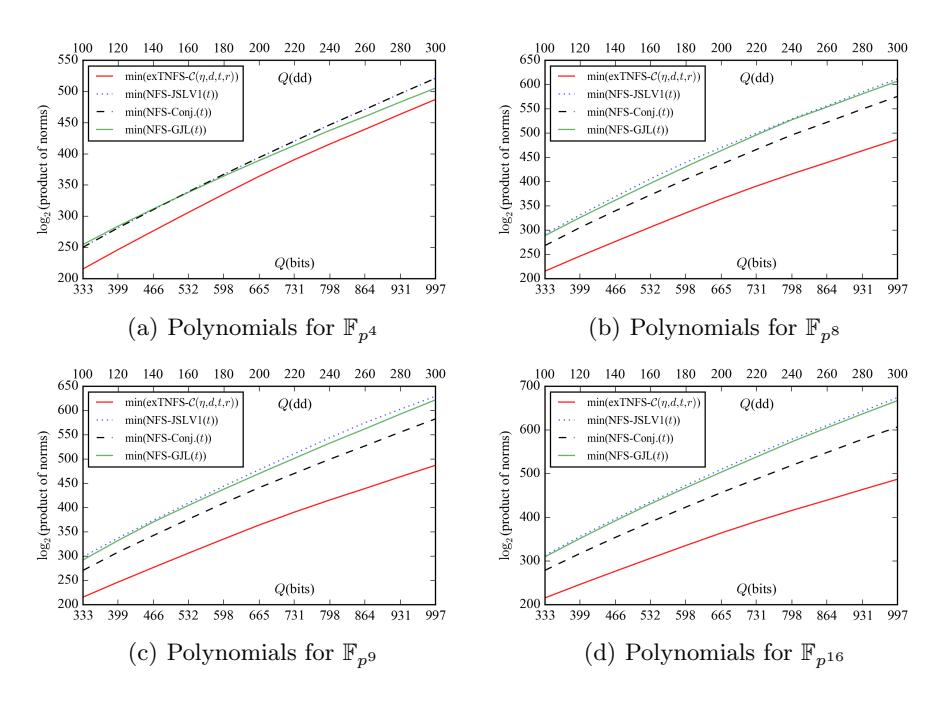
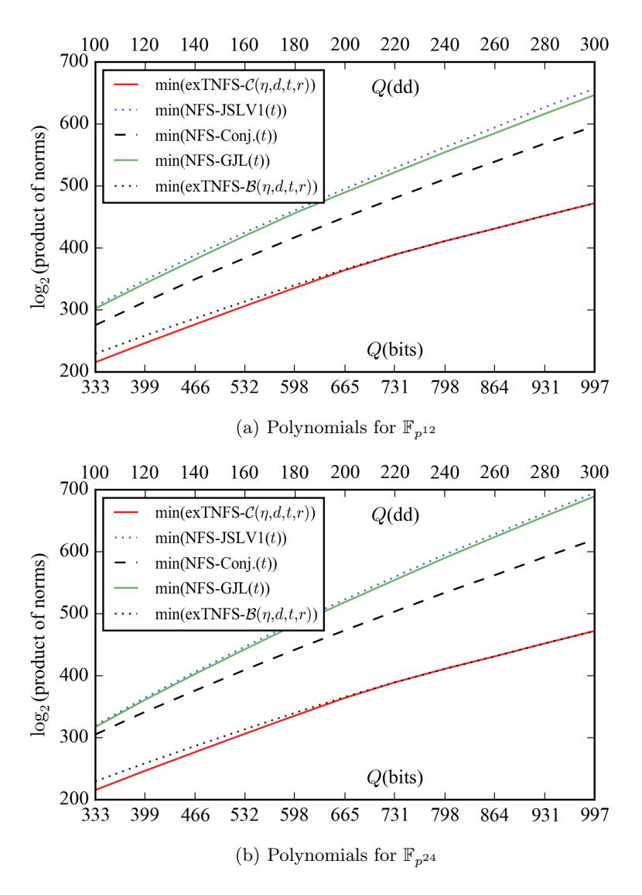
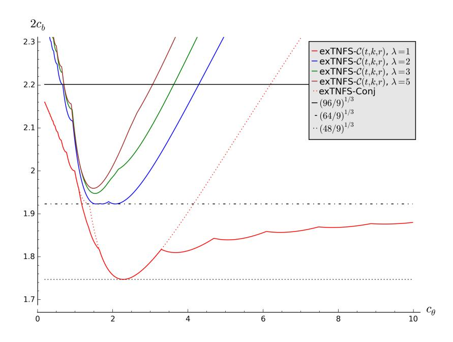
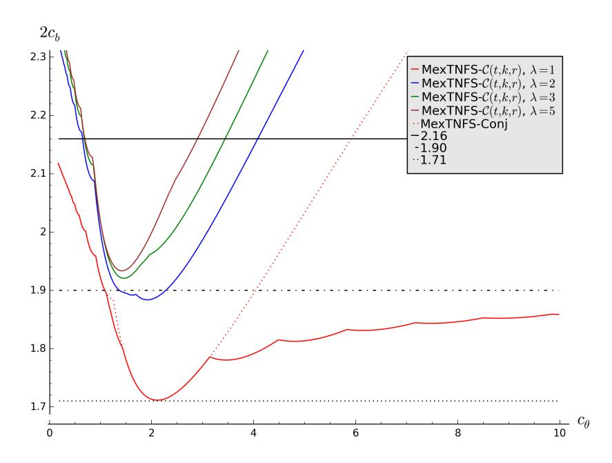

# A General Polynomial Selection Method and New Asymptotic Complexities for the Tower Number Field Sieve Algorithm

Palash Sarkar and Shashank Singh

Applied Statistics Unit Indian Statistical Institute palash@isical.ac.in, sha2nk.singh@gmail.com

Abstract. In a recent work, Kim and Barbulescu had extended the tower number field sieve algorithm to obtain improved asymptotic complexities in the medium prime case for the discrete logarithm problem on Fp<sup>n</sup> where n is not a prime power. Their method does not work when n is a composite prime power. For this case, we obtain new asymptotic complexities, e.g., Lp<sup>n</sup> (1/3,(64/9)<sup>1</sup>/<sup>3</sup> ) (resp. Lp<sup>n</sup> (1/3, 1.88) for the multiple number field variation) when n is composite and a power of 2; the previously best known complexity for this case is Lp<sup>n</sup> (1/3,(96/9)<sup>1</sup>/<sup>3</sup> ) (resp. Lp<sup>n</sup> (1/3, 2.12)). These complexities may have consequences to the selection of key sizes for pairing based cryptography. The new complexities are achieved through a general polynomial selection method. This method, which we call Algorithm-C, extends a previous polynomial selection method proposed at Eurocrypt 2016 to the tower number field case. As special cases, it is possible to obtain the generalised Joux-Lercier and the Conjugation method of polynomial selection proposed at Eurocrypt 2015 and the extension of these methods to the tower number field scenario by Kim and Barbulescu. A thorough analysis of the new algorithm is carried out in both concrete and asymptotic terms.

### 1 Introduction

The discrete logarithm problem (DLP) over the multiplicative group of a finite field is a basic problem in cryptography. Two general approaches are known for tackling the DLP on such groups. These are the function field sieve (FFS) [1, 2, 12, 14] algorithm and the number field sieve (NFS) [8, 13, 15] algorithm.

Let p be a prime, n ≥ 1 be an integer and Q = p <sup>n</sup>. Suppose that p = LQ(a, cp) where

$$L_Q(a, c_p) = \exp((c_p + o(1))(\ln Q)^a (\ln \ln Q)^{1-a}).$$

Depending of the value of a, fields F<sup>Q</sup> are classified into the following types: small characteristic, if a ≤ 1/3; medium characteristic, if 1/3 < a < 2/3; boundary, if a = 2/3; and large characteristic, if a > 2/3.

For fields of small characteristic, there has been tremendous progress in the FFS algorithm leading to a quasi-polynomial time algorithm [4]. Based on the FFS algorithms given in [11, 4], a record computation of discrete log in the binary extension field F<sup>2</sup> <sup>9234</sup> was reported by Granger et al [9]. Applications of the FFS algorithm to the medium prime case have been reported in [14, 10, 19].

For medium to large characteristic finite fields, the NFS algorithm is generally considered to be the state-of-the-art. NFS was initially proposed for solving the factoring problem. Its application to DLP was first proposed by Gordon [8] for prime order fields. Application to composite order fields was shown by Schirokauer [21]. Important improvements to the NFS for prime order fields was given by Joux and Lercier [13].

A major step in the application of NFS was by Joux, Lercier, Smart and Vercauteren [15] who showed that the NFS algorithm is applicable to all finite fields. When the prime p is of a special form, Joux and Pierrot [16] showed the application of the special number field sieve algorithm to obtain improved complexity.

The NFS algorithm proceeds by constructing two polynomials f(x) and g(x) over the integers which have a common factor ϕ(x) of degree n modulo p. The polynomial ϕ(x) defines the field Fp<sup>n</sup> while the polynomials f(x) and g(x) define two number fields. The efficiency of the NFS algorithm is crucially dependent on the properties of the polynomials f(x) and g(x) used to construct the number fields. Consequently, polynomial selection is an important step in the NFS algorithm and is an active area of research.

There has been a recent spurt of interest in the study of the NFS algorithm for DLP in finite fields. The work [3] by Barbulescu et al. extends a previous method [13] for polynomial selection and also presents a new method. The extension of [13] is called the generalised Joux-Lercier (GJL) method while the new method proposed in [3] is called the Conjugation method. The paper also provides a comprehensive comparison of the trade-offs in the complexity of the NFS algorithm offered by the various polynomial selection methods.

The NFS based algorithm has been extended to multiple number field sieve algorithm (MNFS). The work [6] showed the application of the MNFS to medium to high characteristic finite fields. More recently, Pierrot [18] proposed MNFS variants of the GJL and the Conjugation methods. Sarkar and Singh proposed [20] a new polynomial selection method which subsumes both the GJL and the Conjugation methods. Using this method, the asymptotic complexity of both the NFS and the MNFS were worked out in [20].

The minimum asymptotic complexities using the NFS algorithm of Barbulescu et al. [3] can be written as LQ(1/3,(c/9)<sup>1</sup>/<sup>3</sup> ) where c = 96 for the medium characteristic case; c = 48 for the boundary case and c = 64 for the large characteristic case. The multiple number field sieve algorithm [18] improves these complexities. Further, the minimum complexities are achievable for a certain value of cp. The analysis in [20] improves the asymptotic complexity of the boundary case for a range of values of cp.

When the extension degree n is composite, the finite field Fp<sup>n</sup> can be represented as a tower of fields. The idea of using this in the context of DLP is due to Schirokauer [21]. This variant is called the tower number field sieve (TNFS) algorithm.

At Asiacrypt 2015, Barbulescu et al., [5] presented a detailed analysis of the tower number field sieve (TNFS) variant. In a recent paper, Kim and Barbulescu [17] extended the TNFS algorithm and applied previous polynomial selection methods to the TNFS, the multiple TNFS (MTNFS) and the special TNFS variants. These were respectively called the exTNFS, MexTNFS and the SexTNFS algorithms. The polynomial selection methods considered in [17] include the methods from Joux-Lercier-Smart-Vercauteren [15], the GJL and the Conjugation methods from [3] and the polynomial selection method from [20].

Consequences to the medium prime case. An important achievement of the work by Kim and Barbulescu [17] is to improve the asymptotic complexity of the medium prime case when n is not a prime power. In this case, they show that the complexity  $L_Q(1/3, (48/9)^{1/3})$  is achievable. Further, if p is of a special form, then the complexity of  $L_Q(1/3, (32/9)^{1/3})$  is achievable. The condition n is not a prime power is equivalent to saying that n can be written as  $\eta \kappa$  with  $\gcd(\eta, \kappa) = 1$ . How restrictive is the condition  $\gcd(\eta, \kappa) = 1$ ?

One way of removing this restriction is to embed  $\mathbb{F}_{p^n}$  into  $\mathbb{F}_{p^{nm}}$  with  $\gcd(n,m)=1$  and compute discrete logarithms in  $\mathbb{F}_{p^{nm}}$ . Let  $Q=p^n$  and  $Q'=p^{nm}$ . The complexity of the NFS algorithm in  $\mathbb{F}_{Q'}$  can be written as  $L_{Q'}(1/3,\mu)$  where  $\mu$  is a constant. Note that  $L_{Q'}(1/3,\mu)$  is  $L_Q(1/3,\mu m^{1/3})$  (ignoring small terms). The best complexity obtained by Kim and Barbulescu is  $\mu=(48/9)^{1/3}$ . So, the best complexity achieved for solving DLP in  $\mathbb{F}_{p^n}$  by embedding into  $\mathbb{F}_{p^{nm}}$  is  $L_Q(1/3,\nu)$  where  $\nu=(48m/9)^{1/3}$ .

Since  $m \geq 2$ ,  $\nu \geq (96/9)^{1/3}$ . For  $p = L_Q(a, c_p)$  with 1/3 < a < 2/3, the complexity of NFS for directly solving DLP in  $\mathbb{F}_{p^n}$  is  $L_Q(1/3, (96/9)^{1/3})$ . So, we see that trying to solve DLP in  $\mathbb{F}_{p^n}$  by embedding into a larger field increases the complexity. This motivates the problem of finding a variant of NFS for fields  $\mathbb{F}_{p^n}$  where n is a composite prime-power with complexity  $L_Q(1/3, \nu)$  with  $\nu < (96/9)^{1/3}$ .

#### **Our Contributions**

This paper makes two contributions.

The first contribution is to present a general polynomial selection method which we call Algorithm- $\mathcal{C}$ . The polynomial selection method of [20] can be obtained as a special case and so, in turn, the GJL and the Conjugation methods are also obtained as special cases. Further, the exTNFS variants of the GJL and the Conjugation methods are also obtained as special cases of Algorithm- $\mathcal{C}$ .

One important feature of Algorithm- $\mathcal{C}$  is that both prime-power and non prime-power n can be covered. For the medium prime case, we have the following consequences.

1. For non prime-power n, the minimum complexity achievable is that obtained by Kim and Barbulescu [17]. The analysis, however, reveals improvement

- over the complexities achieved by Kim and Barbulescu in certain ranges of the relevant parameters.
- 2. For composite prime-power n, the complexities achieved by the new polynomial selection method are currently the best known. For some small values of n, the minimum achievable complexities using the exTNFS and the MexTNFS algorithms are shown in Table 1. For n = 4, 8, 9 and 16 the new complexities may have consequences to choosing the key sizes for pairing based cryptography.

Table 1. Improved minimum complexities LQ(1/3, c) for some composite prime-power n. The entries in the table are the various values of c in different cases.

|                   | NFS                 |                  | MNFS          |  |
|-------------------|---------------------|------------------|---------------|--|
| n                 | new                 | [3]              | new [18]      |  |
| i<br>2<br>, i ≥ 2 | (64/9)1/3 ≈<br>1.92 | (96/9)1/3 ≈      | 2.2 1.88 2.12 |  |
| 9                 | (112/15)1/3 ≈       | 1.95 (96/9)1/3 ≈ | 2.2 1.92 2.12 |  |
| 25                | (880/117)1/3 ≈      | 1.96 (96/9)1/3 ≈ | 2.2 1.94 2.12 |  |

# 2 The Set-Up of the Tower Number Field Sieve Algorithm

The target is to compute discrete logarithm in the field Fp<sup>n</sup> where n is composite. Suppose that n = ηκ is a non-trivial factorisation of n. We do not necessarily require gcd(η, κ) = 1.

Let h(z) be a monic polynomial of degree η which is irreducible over both Z and Fp. Let R = Z[z]/(h(z)). Also, note that Fp<sup>η</sup> = Fp[z]/(h(z)).

Let f(x) and g(x) be polynomials in R[x] whose leading coefficients are from Z. The other coefficients of f and g are polynomials in z of degrees at most η−1. In particular, f and g can be viewed as bi-variate polynomials in x and z with coefficients in Z. The following properties are required.

- 1. Both f(x) and g(x) are irreducible over R.
- 2. Over Fp<sup>η</sup> , f(x) and g(x) have a common factor ϕ(x) of degree κ.

The field Fp<sup>n</sup> is realised as Fp<sup>η</sup> [x]/(ϕ(x)) = (R/pR)[x]/(ϕ(x)).

Let K<sup>f</sup> and K<sup>g</sup> be the number fields associated with the polynomials f and g respectively. The above set-up provides two different decompositions of a homomorphism from R[x] to Fp<sup>n</sup> . One of these goes through R[x]/(f(x)) and the other goes through R[x]/(g(x)).

With this set-up, it is possible to set up a factor base and perform the three main steps (relation collection, linear algebra and descent) of the NFS algorithm. For details we refer to [5, 17]. In this work, we will need only the following facts.

- 1. The factor base consists of B elements for some value B which determines the overall complexity of the algorithm.
- 2. A polynomial  $\phi(x) \in R[x]$  generates a relation if both the norms  $N(\phi,f)$  and  $N(\phi,g)$  are B-smooth, where

$$\begin{split} N(\phi,f) &:= \mathrm{Res}_z(\mathrm{Res}_x(\phi(x),f(x)),h(z));\\ N(\phi,g) &:= \mathrm{Res}_z(\mathrm{Res}_x(\phi(x),g(x)),h(z)). \end{split}$$

In this work, we describe a method to choose h(z), f(x), g(x) and  $\varphi(x)$  such that the above norms are suitably bounded. Consequences to the complexity of the NFS algorithm are analysed.

#### 2.1 Bounds on Resultants

Let f(z,x) be a bivariate polynomial with integer coefficients where  $f_{i,j}$  is the coefficient of  $x^iz^j$ . Then

$$||f||_{\infty} = \max |f_{i,j}|.$$

We summarise bounds on resultants of univariate and bivariate polynomials given in [7].

Univariate polynomials: Let a(u) and b(u) be two polynomials with integer coefficients. From [7], we have

$$|\operatorname{Res}_{u}(a(u), b(u))| \leq (\deg(a) + 1)^{\deg(b)/2} (\deg(b) + 1)^{\deg(a)/2} ||a||_{\infty}^{\deg(b)} \times ||b||_{\infty}^{\deg(a)}.$$
(1)

**Bivariate polynomials:** Let a(u, v) and b(u, v) be two polynomials with integer coefficients. Let  $c(u) = \text{Res}_v(a(u, v), b(u, v))$ . Then

$$||c||_{\infty}$$

$$\leq (\deg_{v}(a) + \deg_{v}(b))! \left( \max(\deg_{u}(a), \deg_{u}(b)) + 1 \right)^{\deg_{v}(a) + \deg_{v}(b) + 1}$$

$$\times ||a||_{\infty}^{\deg_{v}(b)} \times ||b||_{\infty}^{\deg_{v}(a)}. \tag{2}$$

The bounds given by (1) and (2) combine to provide bounds on  $N(\phi, f)$ . Let  $\phi(x, z)$  and f(x, z) be two polynomials and

$$\rho(z) = \operatorname{Res}_x(\phi(x, z), f(x, z)).$$

Further, suppose  $\deg_x \phi \leq t-1$  and  $\deg_z \phi \leq \eta-1$ . For  $\|\phi\|_{\infty} = E^{2/(t\eta)}$ , the number of possible  $\phi(x,z)$ 's is  $E^2$ . Assuming that  $t,\eta,\deg_x f$  and  $\deg_z f$  are small in comparison to E, using (2) we have

$$\|\rho\|_{\infty} = O\left(E^{2\deg_x(f)/(t\eta)} \cdot \|f\|_{\infty}^{t-1}\right).$$

Suppose h(z) is a polynomial of degree  $\eta$  with  $||h||_{\infty} = H$ . Let

$$\Gamma = \operatorname{Res}_{z} \left( \operatorname{Res}_{x} (\phi(x), f(x)), h(z) \right).$$

Assuming that H is negligible in comparison to E, using (1) we have

$$\begin{split} |\Gamma| &= O\left(\left(\|\rho\|_{\infty}^{\eta} \cdot \|h\|_{\infty}^{\deg(\rho)}\right)\right) \\ &= O\left(E^{2\deg_x f/t} \cdot \|f\|_{\infty}^{\eta(t-1)}\right). \end{split}$$

Note that in the TNFS set-up described above  $N(\phi, f) = \Gamma$ .

Sieving polynomials: Sieving is done using polynomials  $\phi(x) \in R[x]$  of degrees at most t-1 with  $\|\phi\|_{\infty} = E^{2/\eta t}$ . Then the number of sieving polynomials is  $E^2$ .

### 3 Using the LLL Algorithm for Polynomial Selection

The work [3] provides two methods for selecting polynomials for the classical NFS algorithm. These are called the generalised Joux-Lercier (GJL) and the Conjugation method. The GJL method is based on an earlier method due to Joux and Lercier [13] and uses the LLL algorithm to select polynomials.

**The GJL matrix:** Given a vector  $\mathbf{a} = [a_0, \dots, a_{n-1}]\mathbb{F}_p^n$  and  $r \geq n$ , define an  $(r+1) \times (r+1)$  matrix in the following manner.

$$\begin{bmatrix} p & & & & & & & & & & & & & & & & & &$$

We extend the idea of the GJL to work for tower fields. In the TNFS set-up,  $Q = p^n$  where  $n = \eta \kappa$ . Recall that h(z) is a monic irreducible polynomial of degree  $\eta$  over the integers and  $R = \mathbb{Z}[z]/(h(z))$ .

Let  $\varphi(x) \in R[x]$  be a monic polynomial of degree k. We can write

$$\varphi(x) = x^k + \varphi_{k-1}(z)x^{k-1} + \dots + \varphi_1(z)x + \varphi_0(z),$$

where each

$$\varphi_i(z) = \varphi_{i,0} + \varphi_{i,1}z + \dots + \varphi_{i,\eta-1}z^{\eta-1}$$

is a polynomial of degree less than  $\eta$  with the coefficients  $\varphi_{i,j}$  in  $\mathbb{Z}$ .

Let  $\lambda$  be an integer such  $\deg(\varphi_i) \leq \lambda - 1$  for  $i = 0, \ldots, k$ . The possible values of  $\lambda$  are  $1, \ldots, \eta$ . The quantity  $\lambda$  will be a parameter of the polynomial selection algorithm and the asymptotic complexity. Though in theory  $\lambda$  can take any value in the range  $1, \ldots, \eta$ , in practice the values of  $\lambda$  which can be achieved

are 1 and  $\eta$ . Later we will consider these values of  $\lambda$  in more details. Note that the condition  $\eta=1$  reduces to the classical NFS and in this case  $\lambda$  is necessarily 1.

The polynomial  $\varphi_i(z)$  can be uniquely encoded by the vector  $\varphi_i = (\varphi_{i,0}, \dots, \varphi_{i,\lambda-1})$  and the polynomial  $\varphi(x)$  is uniquely encoded by the vector

$$\boldsymbol{\varphi} = (\varphi_{0,0}, \dots, \varphi_{0,\lambda-1}, \dots, \varphi_{k-1,0}, \dots, \varphi_{k-1,\lambda-1}) \tag{4}$$

which is the concatenation of the vectors  $\varphi_0, \ldots, \varphi_{k-1}$ .

We introduce some matrix notation.

- 1.  $\operatorname{diag}_{i}(p)$ : the  $i \times i$  diagonal matrix having all the diagonal entries to be p.
- 2.  $\mathbf{0}_{i,j}$ : the  $i \times j$  matrix all of whose entries are 0.
- 3. For a vector  $\mathbf{a}$ , let shift<sub>i</sub>( $\mathbf{a}$ ) be the vector  $(0,\ldots,0,\mathbf{a})$ .

Given the polynomial  $\varphi(x)$  and an integer  $r \geq k$ , we define a lower triangular matrix  $M_{\varphi,r}$  as follows:

$$M_{\varphi,r} = \begin{bmatrix} \operatorname{diag}_{\lambda k}(p) & & & & \\ \varphi & 1 & & & & \\ \mathbf{0}_{\lambda-1,1+\lambda k} & \operatorname{diag}_{\lambda-1}(p) & & & & \\ \operatorname{shift}_{\lambda}(\varphi) & 1 & & & & \\ \mathbf{0}_{\lambda-1,1+\lambda(k+1)} & \operatorname{diag}_{\lambda-1}(p) & & & & \\ & \cdot & \cdot & \cdot & \cdot & \\ & \cdot & \cdot &$$

Note that for  $\lambda = 1$ , the matrix given by (5) becomes identical to the matrix given by (3).

Apply the LLL algorithm to  $M_{\varphi,r}$  and let the first row of the resulting LLL-reduced matrix be written as

$$[\psi_{0,0},\ldots,\psi_{0,\lambda-1},\psi_{1,0},\ldots,\psi_{1,\lambda-1},\ldots,\psi_{r-1,0},\ldots,\psi_{r-1,\lambda-1},\psi_r].$$

This vector is taken to represent a polynomial  $\psi(x) \in R[x]$  of degree r where

$$\psi(x) = \psi_0(z) + \psi_1(z)x + \dots + \psi_{r-1}(z)x^{r-1} + \psi_r x^r; \psi_i(z) = \psi_{i,0} + \psi_{i,1}z + \dots + \psi_{i,\lambda-1}z^{\lambda-1}.$$

We denote  $\psi(x)$  as

$$\psi(x) = LLL(M_{\varphi,r}). \tag{6}$$

The number of rows of  $M_{\varphi,r}$  which are constructed from  $\varphi$  is r-k+1. Each of these rows contribute 1 as the diagnal entry. All the other rows contribute p as the diagonal entry and there are  $r\lambda+1-(r-k+1)=r(\lambda-1)+k$  such rows.

Since Mϕ,r is a lower triangular matrix, its determinant is the product of its diagonal entries which is equal to p r(λ−1)+k . Since the matrix has rλ + 1 rows, each entry of the first row of the matrix formed by applying LLL to Mϕ,r is at most

$$p^{\frac{r(\lambda-1)+k}{r\lambda+1}}$$
.

So, each ψi,j and also ψ<sup>r</sup> is at most this value. Consequently,

$$\|\psi\|_{\infty} = p^{\frac{r(\lambda-1)+k}{r\lambda+1}} = Q^{\frac{1}{n} \cdot \frac{r(\lambda-1)+k}{r\lambda+1}} = Q^{\varepsilon/n}$$
 (7)

where

$$\varepsilon = \frac{r(\lambda - 1) + k}{r\lambda + 1}. (8)$$

Note that for k ≤ r, ε < 1. The quantity ε will be another parameter in the asymptotic analysis.

# 4 A New Polynomial Selection Method for TNFS

Algorithm C describes the polynomial selection method for TNFS. It extends Algorithm-A in [20] to the setting of tower fields.

The following result states the basic properties of Algorithm C.

Proposition 1. The outputs f(x), g(x) and ϕ(x) of Algorithm C satisfy the following.

- 1. deg(f) = d(r + 1); deg(g) = rd and deg(ϕ) = κ;
- 2. over Fp<sup>n</sup> , both f(x) and g(x) have ϕ(x) as a factor;
- 3. kfk<sup>∞</sup> = O(ln(p)) and kgk<sup>∞</sup> = O(Qε/n).

Consequently, if φ is a sieving polynomial, then

$$N(\phi, f) = E^{2d(r+1)/t} \times L_Q(2/3, o(1)); \tag{9}$$

$$N(\phi, g) = E^{2dr/t} \times Q^{(t-1)\varepsilon/\kappa} \times L_Q(2/3, o(1)); \tag{10}$$

$$N(\phi, f) \times N(\phi, g) = E^{(2d(2r+1))/t} \times Q^{(t-1)\varepsilon/\kappa} L_Q(2/3, o(1)).$$
 (11)

We note the following points.

- 1. If η = 1, then λ must be 1 and we obtain Algorithm-A of [20]. As has been noted in [20], Algorithm-A generalises and also subsumes the GJL and the Conjugation methods for polynomial selection for the classical NFS given in [3].
- 2. If η > 1 and λ = 1, then ϕ(x) produced by Algorithm-C has coefficients in F<sup>p</sup> and is of degree κ. For such a ϕ(x) to be irreducible over Fp<sup>η</sup> it is required that gcd(η, κ) = 1.

#### Algorithm: C: Polynomial selection for TNFS.

```
Input: p, n = ηκ, d (a factor of κ), r ≥ κ/d and λ ∈ [1, η].
Output: f(x), g(x) and ϕ(x).
Let k = κ/d;
Let R = Z[z]/(h(z));
Let Fpη = Fp[z]/(h(z));
repeat
   Randomly choose a monic polynomial A1(x) ∈ R[x] having the following
   properties:
     deg A1(x) = r + 1;
     A1(x) is irreducible over Q[z]/(h(z)) and hence over R;
     A1(x) has coefficient polynomials of size O(ln(p));
     over Fpη , A1(x) has an irreducible factor A2(x) of degree k such that all the
        coefficient polynomials of A2(x) have degrees at most λ − 1.
```

Randomly choose monic polynomials C0(x) and C1(x) with small integer coefficients such that deg C0(x) = d and deg C1(x) < d. Define

```
f(x) = Resy (A1(y), C0(x) + y C1(x)) ;
ϕ(x) = Resy (A2(y), C0(x) + y C1(x)) mod p;
ψ(x) = LLL(MA2,r);
g(x) = Resy (ψ(y), C0(x) + y C1(x)).
```

until f(x) and g(x) are irreducible over Q[z]/(h(z)) (and hence over R) and ϕ(x) is irreducible over Fp<sup>η</sup> = Fp[z]/(h(z)).

return f(x), g(x) and ϕ(x).

- 3. TNFS variants of the GJL and the Conjugation methods were described in [17]. These can be seen as special cases of Algorithm-C: Suppose η > 1 and λ = 1; if k = κ, then we obtain the TNFS variant of the GJL algorithm; and if r = k = 1, then we obtain the TNFS variant of the Conjugation method.
- 4. The case λ = η > 1 has not been considered earlier. Later we show that this case leads to new asymptotic complexity when n is a composite prime-power.
- 5. As mentioned earlier, the case 1 < λ < η is difficult to achieve in practice and so we will not consider the details of this case.

### 5 Non-Asymptotic Analysis and Examples

In Table 2, we compare the expressions for norm bounds for the various algorithms. As has already been mentioned in [20], the NFS-GJL and the NFS-Conj methods can be seen as special cases of NFS-A: for the former choose d = 1 while for the latter, choose d = n and r = k = 1. We explain that NFS-A, exTNFS-GJL and exTNFS-Conj can be seen as special cases of exTNFS-C.

- 1. Choose η = λ = 1 in exTNFS-C to obtain NFS-A.
- 2. Choose η > 1, λ = 1 and d = 1 in exTNFS-C to obtain exNFS-GJL.
- 3. Choose η > 1, λ = 1, d = κ and r = k in exTNFS-C to obtain exNFS-Conj. Choosing η > 1, λ = 1, d = κ and r > k in exTNFS-C provides a generalisation of exNFS-Conj.

We note that NFS-JLSV1 cannot be derived as a special case of NFS-A and similarly, exTNFS-JLSV1 cannot be derived as a special case of exTNFS-C.

The exTNFS-JLSV1, exTNFS-GJL and exTNFS-Conj algorithms are applicable only for non-prime power n. These algorithms cannot be applied when n is a composite prime-power. In Table 3, we compare concrete norm bounds for n = 4, 8 and 9 for NFS-JLSV1, NFS-GJL, NFS-Conj, NFS-A with exTNFS-C. This shows that new trade-offs are achievable with exTNFS-C. In Table 4, we compare concrete norm bounds for n = 6 and 12. This shows that exTNFS-GJL and exTNFS-Conj can be seen as special cases of exTNFS-C; also, by choosing r > k, new trade-offs are achievable.

Table 2. Parameterised efficiency estimates for NFS obtained from the different polynomial selection methods.

| Method            | norms product                                         | conditions                                                                                            |
|-------------------|-------------------------------------------------------|-------------------------------------------------------------------------------------------------------|
| NFS-JLSV1 [15]    | t−1<br>4n<br>E<br>t Q<br>n                            |                                                                                                       |
| NFS-GJL [3]       | t−1<br>2(2r+1)<br>E<br>Q<br>r+1<br>t                  | r ≥ n                                                                                                 |
| NFS-Conj [3]      | t−1<br>6n<br>E<br>t Q<br>2n                           |                                                                                                       |
| NFS-A [20]        | t−1<br>2d(2r+1)<br>E<br>Q<br>d(r+1)<br>t              | d n, r ≥ n/d                                                                                          |
| exTNFS-JLSV1 [17] | t−1<br>4κ<br>E<br>t Q<br>κ                            | n = ηκ, gcd(η, κ) = 1, η small                                                                        |
| exTNFS-GJL [17]   | t−1<br>2(2r+1)<br>E<br>Q<br>r+1<br>t                  | n = ηκ, gcd(η, κ) = 1, η small, r ≥ κ                                                                 |
| exTNFS-Conj [17]  | t−1<br>6κ<br>E<br>t Q<br>2κ                           | n = ηκ, gcd(η, κ) = 1, η small                                                                        |
| exTNFS-C          | (t−1)(r(λ−1)+k)<br>2d(2r+1)<br>E<br>Q<br>κ(rλ+1)<br>t | n = ηκ, k = κ/d, r ≥ k;<br>NFS: η = λ = 1;<br>exTNFS (gcd(η, κ) = 1): η > 1, λ = 1;<br>exTNFS: η = λ. |

Table 3. Comparison of norm bounds for composite prime-power n with t = 2.

| FQ  | method                                        | norm bound          |
|-----|-----------------------------------------------|---------------------|
|     | NFS-JLSV1                                     | 1<br>8Q<br>E<br>4   |
| Fp4 | NFS-GJL (r = n)                               | 1<br>9Q<br>E<br>5   |
|     | NFS-Conj                                      | 1<br>12Q<br>E<br>8  |
|     | NFS-A (d = 2, r = n/d)                        | 1<br>10Q<br>E<br>6  |
|     | exTNFS-C (η = λ = 2, κ = 2, d = 1, r = k = κ) | 2<br>5Q<br>E<br>5   |
|     | exTNFS-C (η = λ = 2, κ = 2, d = 2, r = k = 1) | 1<br>6Q<br>E<br>3   |
|     | NFS-JLSV1                                     | 1<br>16Q<br>E<br>8  |
| Fp8 | NFS-GJL (r = n)                               | 1<br>17Q<br>E<br>9  |
|     | NFS-Conj                                      | 1<br>24Q<br>E<br>16 |
|     | NFS-A (d = 2, r = n/d)                        | 1<br>18Q<br>E<br>10 |
|     | NFS-A (d = 4, r = n/d)                        | 1<br>20Q<br>E<br>12 |
|     | exTNFS-C (η = λ = 2, κ = 4, d = 1, r = k = κ) | 2<br>9Q<br>E<br>9   |
|     | exTNFS-C (η = λ = 2, κ = 4, d = 2, r = k = 2) | 1<br>10Q<br>E<br>5  |
|     | exTNFS-C (η = λ = 2, κ = 4, d = 4, r = k = 4) | 1<br>12Q<br>E<br>6  |
|     | NFS-JLSV1                                     | 1<br>18Q<br>E<br>9  |
| Fp9 | NFS-GJL (r = n)                               | 1<br>19Q<br>E<br>10 |
|     | NFS-Conj                                      | 1<br>27Q<br>E<br>18 |
|     | NFS-A (d = 3, r = n/d)                        | 1<br>21Q<br>E<br>12 |
|     | exTNFS-C (η = λ = 3, κ = 3, d = 1, r = k = κ) | 3<br>7Q<br>E<br>10  |
|     | exTNFS-C (η = λ = 3, κ = 3, d = 3, r = k = 1) | 1<br>9Q<br>E<br>4   |

### 5.1 Plots of Norm Bounds

In Figure 1, we provide plots of norm bound for various finite fields of composite prime power extension degree. It is clear from the plots that for composite prime power extension degree, the algorithm-C provides the lowest norm bound. Note that we have used the estimates of Q-E pairs given in the Table 2 of the paper [3] for plotting these norm bound.

Plots of norm bound for extension degrees 12 and 24 are given in the Figure 2. Note that for these extension degrees, two types of towers are possible; one for which gcd(η, κ) = 1, and the other for which gcd(η, κ) 6= 1. Let us denote by Algorithm-B, the special case of Algorithm-C where λ = 1 and so gcd(η, κ) = 1. Plots for Algorithm-B are shown separately in Figures 2. It is interesting to note that, in the certain range of finite fields, the minimum norm bound achieved by Algorithm-C is lower than the minimum norm bound achieved by Algorithm-B, i.e., it is not necessarily the best to choose gcd(η, κ) = 1. While this appears in the concrete comparison, it is not captured by the asymptotic analysis.

Table 4. Comparison of norm bounds for non prime-power n with t = 2.

| FQ   | method                                              | norm bound          |
|------|-----------------------------------------------------|---------------------|
|      | NFS-JLSV1                                           | 1<br>12Q<br>E<br>6  |
| Fp6  | NFS-GJL (r = n)                                     | 1<br>13Q<br>E<br>7  |
|      | NFS-Conj                                            | 1<br>18Q<br>E<br>12 |
|      | NFS-A (d = 2, r = n/d)                              | 1<br>14Q<br>E<br>8  |
|      | exTNFS-JLSV1 (η = 2, κ = 3)                         | 1<br>6Q<br>E<br>3   |
|      | exTNFS-GJL (η = 2, r = κ = 3)                       | 1<br>7Q<br>E<br>4   |
|      | exTNFS-Conj (η = 2, κ = 3)                          | 1<br>9Q<br>E<br>6   |
|      | exTNFS-C (η = 2, λ = 1, d = 1, r = k = κ = 3)       | 1<br>7Q<br>E<br>4   |
|      | exTNFS-C (η = 2, λ = 1, d = 3, κ = 3, r = k = 1)    | 1<br>9Q<br>E<br>6   |
|      | exTNFS-C (η = 2, λ = 1, d = 3, κ = 3, k = 1, r = 2) | 1<br>15Q<br>E<br>9  |
|      | NFS-JLSV1                                           | 1<br>24Q<br>E<br>12 |
| Fp12 | NFS-GJL (r = n)                                     | 1<br>25Q<br>E<br>13 |
|      | NFS-Conj                                            | 1<br>36Q<br>E<br>24 |
|      | NFS-A (d = 2, r = n/d)                              | 1<br>26Q<br>E<br>14 |
|      | exTNFS-JLSV1 (η = 3, κ = 4)                         | 1<br>8Q<br>E<br>4   |
|      | exTNFS-GJL (η = 3, r = κ = 4)                       | 1<br>9Q<br>E<br>5   |
|      | exTNFS-Conj (η = 3, κ = 4)                          | 1<br>12Q<br>E<br>8  |
|      | exTNFS-C (η = 3, λ = 1, d = 1, r = k = κ = 4)       | 1<br>9Q<br>E<br>5   |
|      | exTNFS-C (η = 3, λ = 1, d = 4, κ = 4, r = k = 1)    | 1<br>12Q<br>E<br>8  |
|      | exTNFS-C (η = 3, λ = 1, d = 4, κ = 4, k = 1, r = 2) | 1<br>20Q<br>E<br>12 |



Fig. 1. Product of norms for various polynomial selection methods



Fig. 2. Product of norms for various polynomial selection methods. Note that algorithm-B is the algorithm-C with gcd(η, κ) = 1.

#### 5.2 Examples for Non Prime-Power n

Example 1. Let p is a 201-bit prime given below

p = 1606938044258990275541962092341162602522202993782792835301611 (12) and n = 6.

Case 1: Let (η, κ) = (2, 3) so we can take λ = 1. Choose d = κ, and so k = κ/d = 1. Taking r = k, we get the following polynomials.

$$\begin{split} h(z) &= z^2 + 14\,z + 20 \\ f(x) &= x^6 + 5\,x^5 + 6\,x^4 + 18\,x^3 + 73\,x^2 + 52\,x + 20 \\ g(x) &= 516378785784706099560748701401\,x^3 + 1874354673374387667869084608560\,x^2 \\ &\quad + 459276162276102007999766811670\,x + 1683194203609950937495174411516 \\ \phi(x) &= x^3 + 4370464675316262929768958368698673612607491294431378655895\,x^2 \\ &\quad + 13111394025948788789306875106096020837822473883294135967675\,x \\ &\quad + 8740929350632525859537916737397347225214982588862757311786 \end{split}$$

Clearly, the above polynomials represents the polynomials generated by Conjugation method and we have kgk<sup>∞</sup> ≈ 2 100 .

If we choose r = k + 1 i.e., r = 2, we get the following polynomials.

$$\begin{split} h(z) &= z^2 + z + 20 \\ f(x) &= x^9 + 14\,x^8 + 74\,x^7 + 183\,x^6 + 200\,x^5 - 32\,x^4 - 375\,x^3 - 232\,x^2 - 48\,x - 1 \\ g(x) &= 46647198736133019425\,x^6 + 530869201059776791498\,x^5 + 2094297655062561189093\,x^4 \\ &\quad + 3465328474724235168588\,x^3 + 2717008192279799547052\,x^2 \\ &\quad + 1322043132032704860464\,x + 290748395825577445032 \\ \phi(x) &= x^3 + 315444052193803149917391335705534526435873425227915090402562\,x^2 \\ &\quad + 1261776208775212599669565342822138105743493700911660361610232\,x \\ &\quad + 315444052193803149917391335705534526435873425227915090402559 \end{split}$$

We note that kgk<sup>∞</sup> ≈ 2 <sup>71</sup>. Thus taking r > k, gives us the polynomials which are not obtained by Conjugation method.

Case 2: Let (η, κ) = (3, 2). Taking d = κ and r = 1, we get the following polynomials.

$$\begin{split} h(z) &= z^3 + z^2 + 15\,z + 7 \\ f(x) &= x^4 - x^3 - 2\,x^2 - 7\,x - 3 \\ g(x) &= 717175561486984577278242843019\,x^2 + 2189435313197775056442946543188\,x \\ &\quad + 2906610874684759633721189386207 \\ \phi(x) &= x^2 + 131396875851816610915684123600060137654000542337369130402554\,x \\ &\quad + 131396875851816610915684123600060137654000542337369130402555 \end{split}$$

Note that kgk<sup>∞</sup> ≈ 2 <sup>101</sup>. If we take d = κ and r = 2, we get the following set of polynomials where kgk<sup>∞</sup> ≈ 2 69 .

$$\begin{split} h(z) &= z^3 + z^2 + 15\,z + 7 \\ f(x) &= x^6 - 4\,x^5 - 53\,x^4 - 147\,x^3 - 188\,x^2 - 157\,x - 92 \\ g(x) &= 15087279002722300985\,x^4 + 124616743720753879934\,x^3 + 451785460058994237397\,x^2 \\ &\quad + 749764394939964245000\,x + 567202989572349792620 \\ \phi(x) &= x^2 + 459743211307624787973091830151418256356779099860453048165628\,x \\ &\quad + 1379229633922874363919275490454254769070337299581359144496879 \end{split}$$

Example 2. Consider p given by the equation (12) and n = 12. Take η = 3, so we have κ = 4. Since gcd(η, κ) = 1, we can take λ = 1. For d = 4 and r = 1, we get the following set of polynomials.

$$h(z) = z^3 + 4\,z^2 + z + 10$$

$$f(x) = x^8 - 76\,x^7 - 2425\,x^6 - 18502\,x^5 - 29145\,x^4 - 27738\,x^3 - 19029\,x^2 - 5470\,x - 899$$

$$g(x) = 671675518400038868509761185847\,x^4 + 9229254771349687453155139482193\,x^3 + 26443212483689677462178491316111\,x^2 + 10373268895295520528776837441409\,x + 12363161023892249178889813706137$$

$$\phi(x) = x^4 + 646864792711457069399567439420493376414881652645022449494547\,x^3 + 1021416876665447593884133690181094257197328168116350116415450x^2 + 667312667750761865313480451840635053444883928304549026363993\,x + 40895750078609591827826024840283354060004551319053153738907$$

Note that kgk<sup>∞</sup> ≈ 2 <sup>104</sup>. If we take d = 2 and r = 2, we get the following set of polynomials.

$$h(z) = z^3 + 9 z^2 + 16 z + 6$$

$$f(x) = x^6 - 31 x^5 - 1368 x^4 - 12769 x^3 - 25114 x^2 + 80676 x + 46152$$

$$g(x) = -3110542872966491216142377505541399497324 x^4$$

$$-54264461590446758438380470085644010261628 x^3$$

$$-314785140535769975569807658242015173572525 x^2$$

$$-494316435479518971993478541468803889032252 x$$

$$+1282345843739963030376594369830360797777868$$

$$\phi(x) = x^4 + 1116388795346251464070007744580761572151679553868796347306938 x^3$$

$$+244260557761228308164124096832151544783881431251339247716776 x^2$$

$$+1431585169281315380026562186279392445746733001920060626360960 x$$

$$+32011873619053829538406325963389282580742061899867342029365$$

Note that kgk<sup>∞</sup> ≈ 2 139 .

#### 5.3 Examples for Composite Prime-Power n

Example 3. Consider again the prime p given by the equation (12). Let n = 4. Take η = 2, so we have κ = 2 and gcd(η, κ) 6= 1. For d = 2 and r = 1, we get the following set of polynomials.

$$h(z) = z^2 + 3z + 9$$

$$f(x) = x^4 - 63x^3 + (z - 2252)x^2 + (26z - 16788)x + 169z - 4547$$

$$g(x) = 1383414878882125995926103183619409643753x^2 + (-12055618797162796264$$

$$473546996019291321934z + 14012672311131936989090775878360513129145)x$$

$$-156723044363116351438156110948250787185142z - 64083108396303246416$$

$$666280265568245909149$$

$$\phi(x) = x^2 + (798416622337500091381910575158288554062555186688024078635466z$$

$$+785830490896857795429628245104444589150795878935080690250345)x$$

$$+737787824833559534713064923010775587679999464247556010451392z$$

$$+574168116105209687333394632310804043827128463459291961444641$$

Note that kgk<sup>∞</sup> ≈ 2 136 .

Example 4. Consider n = 8 and p as given by the equation (12). Take η = 2, so we have κ = 4 and gcd(η, κ) 6= 1. For d = 2 and r = 2, we get the following set of polynomials.

$$\begin{split} h(z) &= z^2 + 5\,z + 1 \\ f(x) &= x^6 - 12\,x^5 - 34\,x^4 + (-z + 555)\,x^3 + (-21\,z - 2768)\,x^2 + (-147\,z - 9405)\,x \\ &\quad + (-343\,z + 23477) \\ g(x) &= -854222881267358737695287657076641386620058484405\,x^4 \\ &\quad + \left(467414345978337995266367841532280454475021913634\,z \\ &\quad - 1878475973524618534396011193885090526793115658979\right)\,x^3 \\ &\quad + \left(3248230356563661967038490496701146071676382792940\,z \\ &\quad - 19355129191104729581101186589804682604098474268847\right)\,x^2 \\ &\quad + \left(1070862123949157988233922008249401828342277305930\,z \\ &\quad - 20761869164169319401391385643744079935947739470833\right)\,x \\ &\quad + 8655868066594601909115589364961851171185700663912\,z \\ &\quad - 100078545728007341155285556202587502786725328926840 \end{split}$$

```
φ(x) = x
         4 + (219112197525249939489021148723396195060526757240452305599911 z
        +232195459756277207668290744189666458139902433390551341656528) x
                                                                         3
        +(594916073500040823788294024401624746100803972996113795081168 z
        +1491733188035767138269714863651199530197565717202128281224736) x
                                                                          2
        +(368670618173749485914803951629408734838837634364966781557695 z
        +432633999913395482830349485439642501997391862510211315077671) x
        +377149149105267014252611707616265415027056683736547273647776 z
        +1541864260749309457110332874518502663676542578712339437212985
```

Note that kgk<sup>∞</sup> ≈ 2 . If we take d = 4 and r = 1, we get the following polynomials.

$$h(z) = z^{2} + 12z + 7$$

$$f(x) = x^{8} - 33x^{7} + (z - 732)x^{6} + (14z - 3424)x^{5} + (57z - 2627)x^{4} + (68z - 5218)x^{3} + (100z - 3524)x^{2} + (48z - 2940)x + (36z - 1764)$$

$$g(x) = -8459635622214131881453154771645357881453x^{4} + (279295371920032891418561)$$

<sup>z</sup> − <sup>75589030561045575141735230547349874103523</sup>) x + (<sup>1955</sup> z − 46258053500428493420510179894369 ) x + (<sup>11171814876801315656742449606777045707224</sup> <sup>z</sup> − <sup>485670535777</sup> ) x + 16757722315201973485113674410165568560 z−47471673499995120540659954245122066311394

φ(x) = x + (<sup>565475204609949271152307636708128312016958684733798907353217</sup> <sup>z</sup> + <sup>11</sup> ) x + (<sup>744450</sup> z + 258607273176292 ) x + (<sup>654962774180806809067</sup> z + 1525151051179873287455054670110 ) x + 178975139141715075829921635566444667057 z + 6807885325108196556406199128246965059313373994285

Note that kgk<sup>∞</sup> ≈ 2 .

Example 5. Consider n = 9 and p as given by the equation (12). Take η = 3, so we have κ = 3. For d = 1 and r = 3, we get the following set of polynomials.

$$h(z) = z^3 + z^2 + 18z + 15$$

$$f(x) = x^4 - 6x^3 - 211x^2 - 1187x + z - 2034$$

```
g(x) = 26981402912709485347737825847046497279699330705965517 x
                                                               3
        +(−145287218523022264703232833237431484597080807921826676 z
                                                                     2
        +50411393983336265694242961439957876885464685858782189 z
        +206881479896404787521252534650020897293982167689590409) x
                                                                   2
        +(−562799080702299135013029013687164984984908940586595961 z
                                                                     2
        +349365561960939643979968647853372949952345188547313416 z
        −23877234432621396396578679238125394048073361562258711) x
        +1285779122778936362366127131791594871482581595497499229 z
                                                                   2
        +687713620758567056387946957984845559129643558060874123 z
        −830129381763336761947236727036816628661146469569955030
φ(x) = x
         3 + (669339476643413131528050298510860109656533927528567342123649 z
        +1552664467516964209731788191787357794434681140723383971203939 z
        +943932691068840507491372697519702885049901068217108999449340) x
                                                                         2
        +(1191853923360225777848944386877957883516261096877478017413866 z
        +421341580961908534729044227924897299449513889433708503340901 z
        +235622039392351511019273446915854970293312748291080468943554) x
        +209551211497370380856126797068962682591000324511877123851147 z
        +1000724369592593057730299648522737075992111849892300346453870 z
        +1059974783679948959817423948843794374202743207017793637420370
```

Note that kgk<sup>∞</sup> ≈ 2 179 .

# 6 Asymptotic Complexity Analysis for the Medium Prime Case

For 1/3 < a ≤ 2/3, write

$$p = L_Q(a, c_p)$$
, where  $c_p = \frac{1}{n} \left( \frac{\ln Q}{\ln \ln Q} \right)^{1-a}$  and so  $n = \frac{1}{c_p} \left( \frac{\ln Q}{\ln \ln Q} \right)^{1-a}$  (13)

For each cp, the runtime of the NFS algorithm is the same for the family of finite fields Fp<sup>n</sup> where p is given by (13).

Recall that n = ηκ. Suppose η can be written as

$$\eta = c_{\eta} \left( \frac{\ln Q}{\ln \ln Q} \right)^{2/3 - a}. \tag{14}$$

The boundary case arises when a = 2/3 and in this case η = cη. If further, we have η = 1, then c<sup>η</sup> is also 1.

From n = ηκ, we get

$$\kappa = \frac{1}{c_{\theta}} \left( \frac{\ln Q}{\ln \ln Q} \right)^{1/3} \text{ where}$$

$$c_{\theta} = c_{p} c_{\eta}.$$
(15)

So, given Q and κ, the value of c<sup>θ</sup> is fixed. We recall the following.

- 1. The number of polynomials to be considered for sieving is E<sup>2</sup> , so the cost of relation collection step is O(E<sup>2</sup> ).
- 2. The factor base is of size B and hence cost of linear algebra step is O(B<sup>2</sup> ).

Let

$$B = L_Q(1/3, c_b). (16)$$

Set

$$E = B \tag{17}$$

so that asymptotically, the cost of relation collection step is same as the cost of linear algebra step.

Let π = Ψ(Γ, B) be the probability that a random positive integer which is at most Γ is B-smooth. Let Γ = LQ(z, ζ) and B = LQ(b, cb). Using the L-notation version of the Canfield-Erd¨os-Pomerance theorem,

$$(\Psi(\Gamma, B))^{-1} = L_Q\left(z - b, (z - b)\frac{\zeta}{c_b}\right). \tag{18}$$

Following the usual convention, we assume that the same smoothness probability π holds for the event that a random sieving polynomial φ(x) is smooth over the factor base.

Since the total number of polynomials considered for sieving is E<sup>2</sup> , the number of relations obtained after sieving is E2π. For linear algebra step to be successful, we need E2π = B and so

$$\pi^{-1} = B. (19)$$

Obtaining π −1 from (18) and setting it to be equal to B allows solving for cb. Balancing the costs of the sieving and the linear algebra phases leads to the runtime of the NFS algorithm to be B<sup>2</sup> = LQ(b, 2cb). So, to determine the runtime, we need to determine cb.

Lemma 1. Let n = ηκ and κ = kd for positive integers η, k and d. Using the expressions for p and E(= B) given by (13) and (16), we obtain the following.

$$E^{\frac{2}{t}d(2r+1)} = L_Q\left(4/3 - a, \frac{2c_b(2r+1)}{c_p\eta kt}\right);$$

$$Q^{\frac{(t-1)\varepsilon}{\kappa}} = L_Q\left(a, \eta c_p(t-1)\varepsilon\right).$$
(20)

If further η = cη(ln Q/ln ln Q) 2/3−a , then

$$E^{\frac{2}{t}d(2r+1)} = L_Q\left(2/3, \frac{2c_b(2r+1)}{c_\theta kt}\right); Q^{\frac{(t-1)\varepsilon}{\kappa}} = L_Q\left(2/3, (t-1)c_\theta \varepsilon\right).$$
(21)

Theorem 1. Let n = ηκ; κ = kd; r ≥ k; t ≥ 2; p = LQ(a, cp) with 1/3 < a ≤ 2/3; and η = cη(ln Q/ln ln Q) 2/3−a . It is possible to ensure that the runtime of the NFS algorithm with polynomials chosen by Algorithm B is LQ(1/3, 2cb) where

$$c_b = \frac{2(2r+1)}{6c_\theta kt} + \sqrt{\left(\frac{2r+1}{3c_\theta kt}\right)^2 + \frac{(t-1)c_\theta \varepsilon}{3}}.$$
 (22)

Proof. The product of the norms given by (21) is

$$\Gamma = L_Q \left( \frac{2}{3}, \frac{2c_b(2r+1)}{c_\theta kt} + (t-1)c_\theta \varepsilon \right).$$

Then π <sup>−</sup><sup>1</sup> given by (18) is

$$L_Q\left(\frac{1}{3}, \frac{1}{3}\left(\frac{2(2r+1)}{c_\theta kt} + \frac{(t-1)c_\theta \varepsilon}{c_b}\right)\right).$$

From the condition π <sup>−</sup><sup>1</sup> = B, we get

$$c_b = \frac{1}{3} \left( \frac{2(2r+1)}{c_\theta kt} + \frac{(t-1)c_\theta \varepsilon}{c_b} \right). \tag{23}$$

Solving the quadratic for c<sup>b</sup> and choosing the positive root gives

$$c_b = \frac{2(2r+1)}{6c_\theta kt} + \sqrt{\left(\frac{2r+1}{3c_\theta kt}\right)^2 + \frac{(t-1)c_\theta \varepsilon}{3}}.$$

We wish to minimise the value of c<sup>b</sup> with respect to cθ. To do this, we differentiate (22) with respect to c<sup>θ</sup> and set to 0 to obtain the following equation which has to be solved for cθ.

$$0 = \frac{-2(2r+1)}{6ktc_{\theta}^2} + \frac{1}{2}\left(\left(\frac{2r+1}{3c_{\theta}kt}\right)^2 + \frac{(t-1)c_{\theta}\varepsilon}{3}\right)^{-1/2}\left(\frac{-2(2r+1)^2}{9k^2t^2c_{\theta}^3} + \frac{(t-1)\varepsilon}{3}\right)$$

This can be seen as a quadratic in c 3 <sup>θ</sup> which can be solved using standard algebraic manipulations to obtain

$$c_{\theta}^{3} = 8\left(\frac{2r+1}{3kt}\right)^{2} \cdot \frac{3}{(t-1)\varepsilon}.$$

Taking cube roots on both sides gives the value of cθ. Substituting this value of c<sup>θ</sup> in (22) we obtain

$$2c_b = \left(\frac{64(2r+1)(t-1)\varepsilon}{9kt}\right)^{1/3} = \left(\frac{64(2r+1)(t-1)}{9kt} \cdot \frac{r(\lambda-1)+k}{r\lambda+1}\right)^{1/3} (24)$$

ut

The expression on the right hand side of (24) clearly increases as t increases. So, to minimise 2cb, we should choose the minimum value of t which is t = 2. With t = 2, the right hand side of (24) becomes

$$\left(\frac{32(2r+1)}{9k} \cdot \frac{r(\lambda-1)+k}{r\lambda+1}\right)^{1/3}$$
(25)

We consider several cases:

Case λ = 1: The right hand side of (25) becomes

$$\left(\frac{32(2r+1)}{9(r+1)}\right)$$

which takes the minimum value of (48/9)<sup>1</sup>/<sup>3</sup> for r = 1. This can arise in the following ways.

- 1. η = 1, a = 2/3: This corresponds to the boundary case and the minimum complexity of (48/9)1/<sup>3</sup> has already been reported in [3].
- 2. η > 1, 1/3 < a < 2/3: Again, the minimum complexity of (48/9)1/<sup>3</sup> for this case has already been reported in [17]. Note that since λ = 1 and η > 1, this case requires gcd(η, κ) = 1 and hence applies to non prime-power values of n.

In both the above cases, the minimum complexity is not achievable for all values of cθ. The minimum achievable values of 2c<sup>b</sup> as c<sup>θ</sup> varies depends on the values of r, k and t. This is shown in Figure 3 by the plot of 2c<sup>b</sup> against c<sup>θ</sup> where c<sup>b</sup> is given by (22). This plot extends a similar plot provided in [20] for the case η = 1.

Case λ = η > 1: For a fixed k, increasing r leads to increase in the value of (25) which shows that this expression is minimised for the minimum value of r which is r = k. Setting r = k, and using λ = η, (25) becomes

$$\left(\frac{32(2k+1)}{9} \cdot \frac{\eta}{k\eta + 1}\right)^{1/3}.$$
(26)

The expression given by (26) decreases as k increases and so the minimum is achieved for the maximum value of k which is k = κ implying that d = 1. Using k = κ in (26) we obtain the minimum possible value of 2c<sup>b</sup> in this case to be

$$\left(\frac{32(2\kappa+1)}{9} \cdot \frac{\eta}{\kappa\eta+1}\right)^{1/3} = \left(\frac{32(2n+\eta)}{9(n+1)}\right)^{1/3}.$$
 (27)

We consider composite prime-power values of n. Suppose that n can be written as n = η i for some prime η and some i > 1.

1. If η = 2, then the minimum possible value of 2c<sup>b</sup> for the case λ = η = 2 is (64/9)<sup>1</sup>/<sup>3</sup> ≈ 1.92 for all n = 2<sup>i</sup> . In particular, this case covers n = 4, 8, 16.

- 2. If η = 3 and n = 9, then the minimum possible value of 2c<sup>b</sup> for the case λ = η = 3 is (112/15)1/<sup>3</sup> ≈ 1.95.
- 3. If η = 5 and n = 25, then the minimum possible value of 2c<sup>b</sup> for the case λ = η = 5 is (880/117)1/<sup>3</sup> ≈ 1.96.

The above covers the small composite prime-power values of n and the minimum value of 2c<sup>b</sup> that can be achieved in each case. Note that similar to the case of λ = 1, this minimum is achieved at a particular value of cθ. The more general picture of the variation in complexity is given by 2c<sup>b</sup> where the expression for c<sup>b</sup> is given by (22). Figure 3 shows the plots of 2c<sup>b</sup> (minimised over t, k and r) against c<sup>θ</sup> for different values of λ.



Fig. 3. Complexity plots for the medium prime case using the exTNFS algorithm.

### 7 Multiple Number Field Sieve Variant

In the multiple number field sieve (MNFS) algorithm, several number fields are considered. These number fields are generated by the irreducible polynomials in R[x], having a common irreducible factor over Fp<sup>η</sup> . There are two variants of MNFS algorithm. We discuss the second variant of MNFS only where the image of φ(x) needs to be smooth in the first number field and at least one of the other V number fields.

Methods for obtaining the collection of number fields for MNFS algorithm have been mentioned in [18]. We adapt one of these methods to our setting. Note that the Algorithm  $\mathcal C$  produces two polynomials f(x) and g(x) of degrees d(r+1) and dr respectively. The polynomial g(x) is defined as  $\mathrm{Res}_y(\psi(y), C_0(x) + yC_1(x))$  where  $\psi(x) = \mathrm{LLL}(M_{A_2,r})$ , i.e.,  $\psi(x)$  is defined from the first row of the matrix obtained after applying the LLL-algorithm to  $M_{A_2,r}$ . We use f(x) for constructing the first number field. Let  $g_1(x) = g(x)$  and  $g_2(x) = \mathrm{Res}_y(\psi_2(y), C_0(x) + yC_1(x))$ , where  $\psi_2(x)$  is the polynomial defined from the second row of the matrix  $M_{A_2,r}$ . For  $i=3,\ldots,V$ , we consider  $g_i(x)=s_ig_1(x)+t_ig_2(x)$  where the coefficients  $s_i$  and  $t_i$  are of the size of  $\sqrt{V}$ . These  $g_i(x)$  are used for constructing the other V number fields.

Clearly the  $g_i$ 's have degree dr. Asymptotically, we have  $\|\psi_2\|_{\infty} = \|\psi_1\|_{\infty} = Q^{1/(d(r+1))}$ . If we choose  $V = L_Q(1/3)$ , all the  $g_i$ 's have their infinity norms given by Proposition 1.

Let B and B' be the bounds on the norms of the ideals which are in the factor basis defined by f and each of  $g_i$ 's respectively. So, the size of the entire factor basis is B + VB'. We further use the following condition to balances the factor basis.

$$B = VB'. (28)$$

With this condition, the size of the factor basis is  $B^{1+o(1)}$  and so asymptotically, the linear algebra step takes time  $B^2$ . Similar to the analysis of NFS variant, the number of sieving polynomials is  $E^2$  and the coefficient polynomials of  $\phi(x)$  can take  $E^{2/t}$  distinct values. Since we require that the cost of relation collection should be same as the cost of linear algebra, we have  $E^2 = B^2$  i.e., E = B.

As before, let  $\pi$  be the probability that a random sieving polynomial  $\phi(x)$  gives rise to a relation. Let  $\pi_1$  be the probability that  $\phi(x)$  is smooth over the factor basis for the first number field and  $\pi_2$  be the probability that  $\phi(x)$  is smooth over at least one of the other V factor bases. Further, let  $\Gamma_1 = \operatorname{Res}_x(f(x), \phi(x))$  be the bound on the norm corresponding to the first number field and  $\Gamma_2 = \operatorname{Res}_x(g_i(x), \phi(x))$  be the bound on the norm for any of the other number fields. Recall that  $\Gamma_2$  is determined only by the degree and the  $L_{\infty}$ -norm of  $g_i(x)$  and hence is the same for all  $g_i(x)$ 's. Heuristically, we have

$$\pi_1 = \Psi(\Gamma_1, B);$$
 $\pi_2 = V\Psi(\Gamma_2, B');$
 $\pi = \pi_1 \times \pi_2.$
(29)

One relation is obtained in about  $\pi^{-1}$  trials and so total number of relations obtained after sieving would be  $E^2\pi$  and this should be equal to B for linear algebra step to go through. Hence we have, as before,  $B=E=\pi^{-1}$ .

The following choices of B and V are made.

$$E = B = L_Q(\frac{1}{3}, c_b);$$

$$V = L_Q(\frac{1}{3}, c_v); \text{ and so}$$

$$B' = B/V = L_Q(\frac{1}{3}, c_b - c_v).$$
(30)

Theorem 2. Let n = ηκ; p = LQ(a, cp) with 1/3 < a < 2/3; and η = cη(ln Q/ln ln Q) 2/3−a . It is possible to ensure that the runtime of the MNFS algorithm is LQ(1/3, 2cb) where

$$c_b = \frac{2r+1}{3c_\theta kt} + \sqrt{\frac{r(3r+2)}{9c_\theta^2 k^2 t^2} + \frac{(t-1)c_\theta \varepsilon}{3}}.$$
 (31)

Proof. For a sieving polynomial φ,

$$\begin{split} &\Gamma_{1} = N(\phi, f) = E^{2d(r+1)/t} L_{Q}(2/3, o(1)) \\ &= L_{Q}(2/3, (2c_{b}(r+1))/(c_{\theta}kt)); \\ &\pi_{1}^{-1} = L_{Q}(1/3, 2(r+1)/(3c_{\theta}kt)); \\ &\Gamma_{2} = N(\phi, g) = E^{2dr/t} \times Q^{(t-1)\varepsilon/\kappa} L_{Q}(2/3, o(1)) \\ &= L_{Q}(2/3, 2c_{b}r/(c_{\theta}kt) + (t-1)c_{\theta}\varepsilon); \\ &\pi_{2}^{-1} = L_{Q}\left(\frac{1}{3}, -c_{v} + \frac{1}{3(c_{b} - c_{v})} \left(\frac{2c_{b}r}{c_{\theta}kt} + (t-1)c_{\theta}\varepsilon\right)\right); \\ &\pi^{-1} = L_{Q}\left(\frac{1}{3}, \frac{2(r+1)}{3c_{\theta}kt} - c_{v} + \frac{1}{3(c_{b} - c_{v})} \left(\frac{2c_{b}r}{c_{\theta}kt} + (t-1)c_{\theta}\varepsilon\right)\right); \end{split}$$

From the condition π <sup>−</sup><sup>1</sup> = B, we obtain the following equation.

$$c_b = \frac{2(r+1)}{3c_\theta kt} - c_v + \frac{1}{3(c_b - c_v)} \left( \frac{2c_b r}{c_\theta kt} + (t-1)c_\theta \varepsilon \right). \tag{32}$$

Simplifying, we obtain

$$3c_{\theta}kt(c_b^2 - c_v^2) = 2(2r+1)c_b - 2(r+1)c_v + (t-1)c_{\theta}^2\varepsilon kt.$$
 (33)

We wish to find c<sup>v</sup> such that c<sup>b</sup> is minimised subject to the constraint (33). Using the method of Lagrange multipliers, the partial derivative of (33) with respect to c<sup>v</sup> gives

$$c_v = \frac{(r+1)}{3c_\theta kt}.$$

Using this value of c<sup>v</sup> in (33) provides the following quadratic in cb.

$$(3c_{\theta}kt)^{2}c_{b}^{2} - (6(2r+1)c_{\theta}kt)c_{b} + (r+1)^{2} - 3(t-1)c_{\theta}^{3}k^{2}t^{2}\varepsilon = 0.$$

Solving this and taking the positive square root, we obtain the expression for c<sup>b</sup> given by (31). ut



Fig. 4. Complexity plots for the medium prime case using the MexTNFS algorithm.

To find the absolute minimum complexity, we need to minimise the expression for  $c_b$  given by (31) with respect to  $c_{\theta}$ . The standard way of doing this is to differentiate with respect to  $c_{\theta}$  and set to 0 to find the value of  $c_{\theta}$  for which the minimum value of  $c_b$  is attained. Differentiating the right hand side of (31) with respect to  $c_{\theta}$  and setting to 0 yields (after some simplifications) a quadratic in  $c_{\theta}^3$  which can be solved to obtain:

$$c_{\theta}^{3} = \frac{2}{3\varepsilon k^{2}t^{2}(t-1)} \cdot \left(4r^{2} + 9r + 1 + \sqrt{7r^{2} + 16r + 1}\right). \tag{34}$$

Substituting the value of  $c_{\theta}$  in (31) provides the expression for the corresponding value of  $2c_b$  in terms of t, r, k and  $\lambda$ . For each value of  $\lambda$ , we wish to obtain the minimum possible value of  $2c_b$ . This is achieved with t=2 and r=k. The actual value of r depends on the value of r for r the minimum value of r is r 1.71 and is achieved for r 1; for r 2 the minimum value of r 3 the minimum value of r 3 the minimum value of r 3 the minimum value of r 3 the minimum value of r 3 the minimum value of r 3 the minimum value of r 3 the minimum value of r 3 the minimum value of r 3 the minimum value of r 3 the minimum value of r 4.

The variation of  $2c_b$  with  $c_\theta$  is more complex. Figure 4 shows these plots for various values of  $\lambda$ . From [17], the complexities for the medium characteristic case, the large characteristic case and the best complexity for the boundary case are respectively  $L_Q(1/3, 2.12)$ ,  $L_Q(1/3, 1.90)$  and  $L_Q(1/3, 1.71)$ . For composite prime-power n, these are the previously known best known complexities for these

cases. To make the comparison of the new complexities easier, Figure 4 shows the lines for 2.12, 1.90 and 1.71.

# 8 Conclusion

In this paper, we have presented a new polynomial selection method for exTNFS algorithm. The new polynomial selection method subsumes GJL, Conjugation and Sarkar-Singh polynomial selection methods. The exTNFS algorithm combined with new polynomial selection method provides new asymptotic complexities for the extension fields with composite prime power extension degrees.

### References

- 1. Leonard M. Adleman. The function field sieve. In Leonard M. Adleman and Ming-Deh A. Huang, editors, ANTS, volume 877 of Lecture Notes in Computer Science, pages 108–121. Springer, 1994.
- 2. Leonard M. Adleman and Ming-Deh A. Huang. Function field sieve method for discrete logarithms over finite fields. Inf. Comput., 151(1-2):5–16, 1999.
- 3. Razvan Barbulescu, Pierrick Gaudry, Aurore Guillevic, and Fran¸cois Morain. Improving NFS for the discrete logarithm problem in non-prime finite fields. In Elisabeth Oswald and Marc Fischlin, editors, Advances in Cryptology – EURO-CRYPT 2015, volume 9056 of Lecture Notes in Computer Science, pages 129–155. Springer Berlin Heidelberg, 2015.
- 4. Razvan Barbulescu, Pierrick Gaudry, Antoine Joux, and Emmanuel Thom´e. A heuristic quasi-polynomial algorithm for discrete logarithm in finite fields of small characteristic. In Phong Q. Nguyen and Elisabeth Oswald, editors, Advances in Cryptology - EUROCRYPT 2014 - 33rd Annual International Conference on the Theory and Applications of Cryptographic Techniques, Copenhagen, Denmark, May 11-15, 2014. Proceedings, volume 8441 of Lecture Notes in Computer Science, pages 1–16. Springer, 2014.
- 5. Razvan Barbulescu, Pierrick Gaudry, and Thorsten Kleinjung. The tower number field sieve. In Tetsu Iwata and Jung Hee Cheon, editors, Advances in Cryptology - ASIACRYPT 2015 - 21st International Conference on the Theory and Application of Cryptology and Information Security, Auckland, New Zealand, November 29 - December 3, 2015, Proceedings, Part II, volume 9453 of Lecture Notes in Computer Science, pages 31–55. Springer, 2015.
- 6. Razvan Barbulescu and C´ecile Pierrot. The multiple number field sieve for medium and high characteristic finite fields. LMS Journal of Computation and Mathematics, 17:230–246, 2014.
- 7. Yuval Bistritz and Alexander Lifshitz. Bounds for resultants of univariate and bivariate polynomials. Linear Algebra and its Applications, 432(8):1995 – 2005, 2010. Special issue devoted to the 15th {ILAS} Conference at Cancun, Mexico, June 16-20, 2008.
- 8. Daniel M. Gordon. Discrete logarithms in GF(p) using the number field sieve. SIAM J. Discrete Math., 6(1):124–138, 1993.
- 9. Robert Granger, Thorsten Kleinjung, and Jens Zumbr¨agel. Discrete logarithms in GF(2<sup>9234</sup>). NMBRTHRY list, January 2014.

- 10. Antoine Joux. Faster index calculus for the medium prime case: Application to 1175-bit and 1425-bit finite fields. In Thomas Johansson and Phong Q. Nguyen, editors, EUROCRYPT, volume 7881 of Lecture Notes in Computer Science, pages 177–193. Springer, 2013.
- 11. Antoine Joux. A new index calculus algorithm with complexity L(1/4 + o(1)) in small characteristic. In Tanja Lange, Kristin E. Lauter, and Petr Lisonek, editors, Selected Areas in Cryptography - SAC 2013 - 20th International Conference, Burnaby, BC, Canada, August 14-16, 2013, Revised Selected Papers, volume 8282 of Lecture Notes in Computer Science, pages 355–379. Springer, 2013.
- 12. Antoine Joux and Reynald Lercier. The function field sieve is quite special. In Claus Fieker and David R. Kohel, editors, ANTS, volume 2369 of Lecture Notes in Computer Science, pages 431–445. Springer, 2002.
- 13. Antoine Joux and Reynald Lercier. Improvements to the general number field sieve for discrete logarithms in prime fields. A comparison with the gaussian integer method. Math. Comput., 72(242):953–967, 2003.
- 14. Antoine Joux and Reynald Lercier. The function field sieve in the medium prime case. In Serge Vaudenay, editor, EUROCRYPT, volume 4004 of Lecture Notes in Computer Science, pages 254–270. Springer, 2006.
- 15. Antoine Joux, Reynald Lercier, Nigel P. Smart, and Frederik Vercauteren. The number field sieve in the medium prime case. In Cynthia Dwork, editor, Advances in Cryptology - CRYPTO 2006, 26th Annual International Cryptology Conference, Santa Barbara, California, USA, August 20-24, 2006, Proceedings, volume 4117 of Lecture Notes in Computer Science, pages 326–344. Springer Berlin Heidelberg, 2006.
- 16. Antoine Joux and C´ecile Pierrot. The special number field sieve in Fp<sup>n</sup> Application to pairing-friendly constructions. In Zhenfu Cao and Fangguo Zhang, editors, Pairing-Based Cryptography - Pairing 2013 - 6th International Conference, Beijing, China, November 22-24, 2013, Revised Selected Papers, volume 8365 of Lecture Notes in Computer Science, pages 45–61. Springer, 2013.
- 17. Taechan Kim and Razvan Barbulescu. Extended tower number field sieve: A new complexity for medium prime case. Cryptology ePrint Archive, Report 2015/1027, 2015. http://eprint.iacr.org/.
- 18. C´ecile Pierrot. The multiple number field sieve with conjugation and generalized Joux-Lercier methods. In Advances in Cryptology - EUROCRYPT 2015 - 34th Annual International Conference on the Theory and Applications of Cryptographic Techniques, Sofia, Bulgaria, April 26-30, 2015, Proceedings, Part I, pages 156–170. Springer Berlin Heidelberg, 2015.
- 19. Palash Sarkar and Shashank Singh. Fine tuning the function field sieve algorithm for the medium prime case. IEEE Transactions on Information Theory, 62(4):2233–2253, April 2016. http://ieeexplore.ieee.org/xpl/ articleDetails.jsp?reload=true&arnumber=7405328.
- 20. Palash Sarkar and Shashank Singh. New complexity trade-offs for the (multiple) number field sieve algorithm in non-prime fields. In Marc Fischlin and Jean-S´ebastien Coron, editors, Advances in Cryptology - EUROCRYPT 2016 - 35th Annual International Conference on the Theory and Applications of Cryptographic Techniques, Vienna, Austria, May 8-12, 2016, Proceedings, Part I, volume 9665 of Lecture Notes in Computer Science, pages 429–458. Springer, 2016.
- 21. Oliver Schirokauer. Using number fields to compute logarithms in finite fields. Math. Comp., 69(231):1267–1283, 2000.