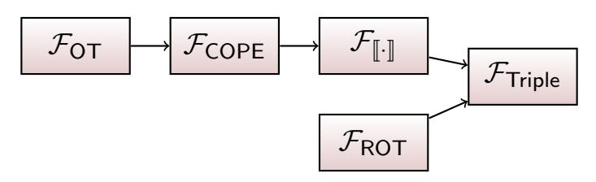
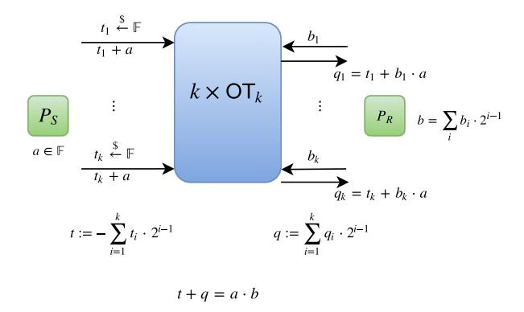
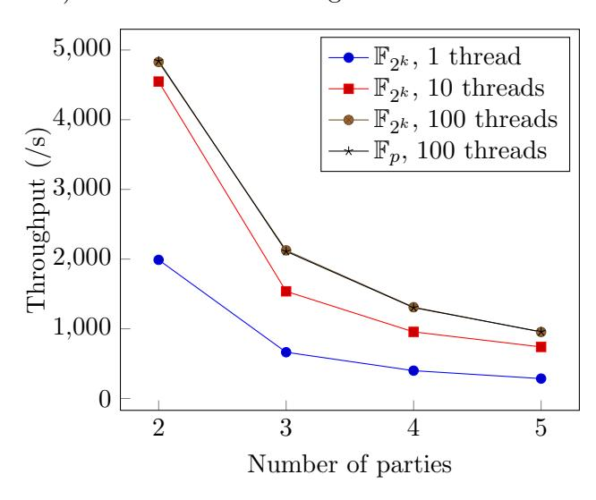
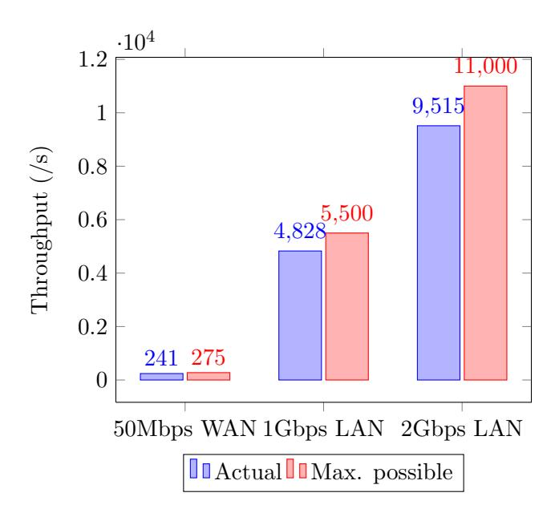
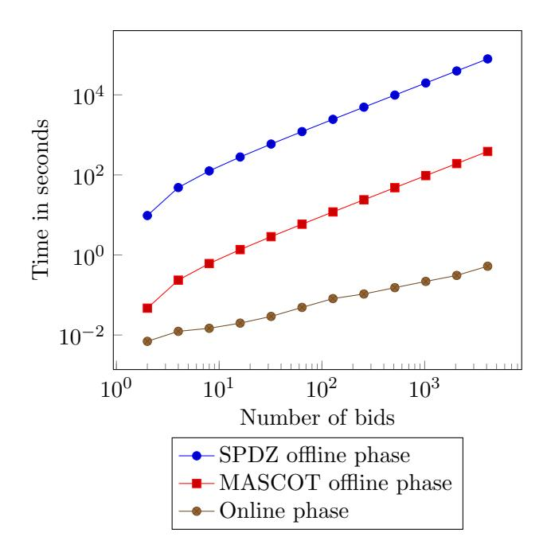

# MASCOT: Faster Malicious Arithmetic Secure Computation with Oblivious Transfer

Marcel Keller∗ Emmanuela Orsini†

Peter Scholl‡

Department of Computer Science, University of Bristol {m.keller,emmanuela.orsini,peter.scholl}@bristol.ac.uk

## Abstract

We consider the task of secure multi-party computation of arithmetic circuits over a finite field. Unlike Boolean circuits, arithmetic circuits allow natural computations on integers to be expressed easily and efficiently. In the strongest setting of malicious security with a dishonest majority where any number of parties may deviate arbitrarily from the protocol — most existing protocols require expensive public-key cryptography for each multiplication in the preprocessing stage of the protocol, which leads to a high total cost.

We present a new protocol that overcomes this limitation by using oblivious transfer to perform secure multiplications in general finite fields with reduced communication and computation. Our protocol is based on an arithmetic view of oblivious transfer, with careful consistency checks and other techniques to obtain malicious security at a cost of less than 6 times that of semi-honest security. We describe a highly optimized implementation together with experimental results for up to five parties. By making extensive use of parallelism and SSE instructions, we improve upon previous runtimes for MPC over arithmetic circuits by more than 200 times.

Keywords: Multi-party computation; oblivious transfer

## 1 Introduction

Secure multi-party computation (MPC) allows a set of parties to jointly compute a function on their private inputs, learning only the output of the function. In the last decade, MPC has rapidly moved from purely theoretical study to an object of practical interest, with a growing interest in practical applications, and many implementations now capable of handling complex computations [\[30,](#page-27-0) [31\]](#page-27-1).

Most MPC protocols either perform secure computation of Boolean circuits, or arithmetic circuits over a finite ring or field such as Fp, for some prime p. Historically, the Boolean circuit

∗Supported by EPSRC via grant EP/M016803.

†Supported by ERC Advanced Grant ERC-2010-AdG-267188-CRIPTO.

‡Supported by the Defense Advanced Research Projects Agency (DARPA) and Space and Naval Warfare Systems Center, Pacific (SSC Pacific) under contract No. N66001-15-C-4070.

approach has led to fast protocols that mostly need only symmetric cryptography, such as twoparty protocols based on Yao's garbled circuits [\[43\]](#page-28-0), or protocols based on fast oblivious transfer techniques [\[32,](#page-27-2) [36\]](#page-27-3). In contrast, protocols for arithmetic circuits are typically based on more expensive, public-key technology (except for special cases when a majority of the parties are honest).

Despite the need for expensive techniques, secret-sharing-based MPC protocols for arithmetic circuits have the key advantage that secure addition requires no communication and essentially come 'for free', whereas with current Boolean circuit-based 2-PC, the only 'free' operation is XOR.

The following motivating examples further highlight the practical applicability of integer-based secure computation, compared with Boolean circuits:

- Bogdanov et al. [\[8,](#page-25-0) [9\]](#page-25-1) describe using MPC to perform secure statistical analysis of income tax records for the Estonian government. The latter work analyzed a large database with over 600000 students and 10 million tax records. The kinds of computations involved were very simple statistics, but made heavy use of the fact that secure additions are non-interactive.
- In [\[14\]](#page-26-0), an application of MPC to confidential benchmarking was presented, allowing banks to jointly evaluate customers' risks whilst retaining privacy for the customers' data. They used secure linear programming, which is a highly complex task in MPC, requiring either secure floating point arithmetic or very large integer arithmetic (to emulate real numbers without overflow), both of which would be impractical using Boolean circuits.
- MPC has been suggested as a tool for helping prevent collisions between satellites, by securely performing collision detection using sensitive location and trajectory data. Kamm et al. [\[27\]](#page-27-4) showed how to implement the relevant conjunction analysis algorithms in MPC with a protocol based on secret-sharing. This also requires secure floating point operations.

Unfortunately, all of the above case studies are somewhat limited, in either the security properties obtained, or the efficiency. The first and third examples above used the Sharemind system [\[1\]](#page-24-0), which is restricted to semi-honest security with three parties, where at most one is corrupt. The second example used the SPDZ MPC protocol [\[18\]](#page-26-1), which has security against any number of maliciously corrupted parties, but is much slower. They report a fairly quick evaluation time of around 20–30 s with a prototype implementation, but this does not include the costly 'preprocessing' stage required in SPDZ, which would likely take several hours.

We conclude that although these applications are practical, the MPC protocols used still fall short: in many real-world applications, semi-honest adversaries and an honest majority are not realistic assumptions, and MPC may not be cost-effective if it requires several hours of heavy computation.

Furthermore, it is the case that all known practical protocols for MPC with integer operations either require an honest majority, or expensive public-key techniques for every multiplication in the circuit. For example, the SPDZ protocol [\[16,](#page-26-2) [18\]](#page-26-1) mentioned above uses a somewhat homomorphic encryption scheme to perform secure multiplications, whilst the BDOZ protocol [\[6\]](#page-25-2) uses additively homomorphic encryption, and both of these require expensive zero-knowledge proofs or cut-andchoose techniques to achieve security against malicious adversaries.

These protocols mitigate this cost to an extent by restricting the expensive computation to a preprocessing phase, which is independent of the inputs and can be done in advance. Although this is highly effective for reducing the latency of the secure computation — as the online phase is indeed very efficient — the *total cost* of these protocols can still be thousands of times greater than the online phase, which may render them ineffective for many applications.

Frederiksen et al. [20] recently showed how to efficiently use oblivious transfer to generate multiplication triples — the main task of the SPDZ preprocessing — in binary fields, and estimated much improved performance, compared with previous methods. However, this does not give the benefits of general arithmetic circuits that allow integer operations.

#### 1.1 Our contributions

In this paper, we present MASCOT: a new MPC protocol designed to overcome the above limitations of the preprocessing phase, allowing for efficient, secure computation of general arithmetic circuits using almost exclusively fast, symmetric cryptography.

| Protocol      | Field                    | Comms. (kbit) | Throughput, $n = 2$ (/s) |
|---------------|--------------------------|---------------|--------------------------|
| SPDZ (active) | $\mathbb{F}_p$ , 128-bit | 215n(n-1)     | 23.5                     |
|               | $\mathbb{F}_{2^{40}}$    | 2272n(n-1)    | 3.68                     |
| SPDZ (covert, | $\mathbb{F}_p$ , 128-bit | 66n(n-1)      | 204                      |
| pr. $1/10$ )  | $\mathbb{F}_{2^{40}}$    | 844n(n-1)     | 31.9                     |
| Ours (active) | $\mathbb{F}_p$ , 128-bit | 180n(n-1)     | 4842                     |
|               | $\mathbb{F}_{2^{128}}$   | 180n(n-1)     | 4827                     |

Table 1: Comparing the cost of *n*-party secure multiplication in our OT-based protocol with previous implementations of SPDZ [15, 16].

Arithmetic-circuit MPC from OT. We present a practical protocol for secure multi-party computation of arithmetic circuits based on oblivious transfer (OT), for the first time with malicious security in the dishonest majority setting. We achieve this by taking an "arithmetic" view of OT (as was done by Gilboa for two-party RSA key generation [21] and Demmler et al. [19] for two-party computation in the semi-honest model), which allows us to generalize the preprocessing protocol by Frederiksen et al. [20] to create multiplication triples in any (sufficiently large) finite field, instead of just binary fields. We achieve security against malicious adversaries using simple consistency checking and privacy amplification techniques, with the result that our maliciously secure protocol is only 6 times less efficient than a semi-honest version of the protocol. Moreover, our protocol can be based entirely on symmetric primitives, after a one-time setup phase, by using efficient OT extensions [25, 28].

Implementation. A key advantage of our approach to triple generation is that we obtain a streamlined protocol, which is highly amenable to a parallelized and pipelined implementation that interleaves computation and communication. The results from our open source implementation [29], shown in Table 1, highlight this: the time for a single secure multiplication in a prime field is 200 times faster than the previous best actively secure implementation based on somewhat homomorphic encryption [16], in spite of a fairly small improvement in communication cost. Compared with a covertly secure implementation using SHE [16], our actively secure protocol requires slightly

 $^{1}$ For  $\mathbb{F}_{2^{40}}$  in SPDZ with covert security, we could not find precise figures so the throughput in Table 1 is estimated based on other results.

more communication, but still runs over 20 times faster. In binary fields, where SHE is much less suited, the improvement is over 1000 times, compared to previous figures [\[15\]](#page-26-4). Note that the online phase of our protocol is identical to that of SPDZ, which has been previously reported to achieve very practical performance for a range of applications [\[30\]](#page-27-0).

Our optimized implementation utilizes over 80% of the network's capacity, whereas the previous schemes based on SHE are so computation-intensive that the network cannot come close to capacity. We also describe new techniques for reducing the cost of OT extension using consumer hardware instructions, namely efficient matrix transposition using SSE instead of Eklundh's algorithm, and hashing using the Matyas–Meyer–Oseas construction from any block cipher, which allows hashing 128-bit messages with AES-NI whilst avoiding a re-key for every hash.

More general assumptions. We also improve upon the previous most practical protocol by allowing a much wider variety of cryptographic assumptions, since we only require a secure OT protocol, which can be built from DDH, quadratic residuosity or lattices [\[38\]](#page-27-8). In contrast, security of the SHE scheme used in SPDZ is based on the ring learning with errors assumption, which is still relatively poorly understood — it is possible that new attacks could surface that render the protocol totally impractical for secure parameters. So as well as increasing efficiency, we obtain much greater confidence in the security of our protocol, and it seems more likely to withstand the test of time.

## 1.2 Technical overview

The main goal of our MPC protocol is to create multiplication triples, which are essentially additive secret sharings of tuples (a, b, a· b, a·∆, b ·∆, a· b ·∆) where a, b are random values and ∆ is a secretshared global random MAC key. Shares of a, b and ∆ can be generated by every party choosing a random share. It remains to generate secret sharings of the products.

Our starting point is the passively secure two-party product-sharing protocol of Gilboa [\[21\]](#page-26-5), which uses k oblivious transfers to multiply two k-bit field elements. By running OT instances between every pair of parties, the multiplication triples can be created.

However, corrupted parties can deviate by providing inconsistent inputs to the different OT instances.[2](#page-3-0) These deviations will not only lead to potentially incorrect results when the triples are used in SPDZ but also to selective failures, that is, the checks used in SPDZ might fail (or not) depending on secret information.

To obtain an actively secure protocol, we use two different strategies: one to ensure correctness of the products in the MAC generation, and one to ensure correctness and privacy of the multiplication triples themselves.

For the MAC generation, it turns out the passively secure protocol is almost enough; we just need to check random linear combinations of the MACs immediately after creation, and also when later opening values. Proving the security of this, however, is not straightforward and requires a careful, technical analysis of the possible deviations. To simplify this as much as possible, we model the MAC generation and opening requirements in a separate functionality, FJ·K , which can be seen as a generalization of verifiable secret-sharing to the case of full-threshold corruption. This greatly reduces the work in proving higher-level protocols secure, as these can then be made independent of the MAC scheme and underlying MAC keys.

2We assume that the OT instances themselves are secure against malicious parties.

For triple generation, we need to ensure correctness and privacy of the triples. Correctness is easily verified with a standard sacrifice technique [\[17,](#page-26-7) [18\]](#page-26-1), which checks a pair of triples such that one can then be used securely. To guarantee privacy we use a simple variant of privacy amplification, where first several leaky triples are produced, from which a single, random triple is extracted by taking random combinations.

In more detail, the protocol starts by generating shares of a correlated vector triple (a, b, c), where b ∈ F and a, c ∈ F τ for some constant τ , using Gilboa's multiplication protocol. If at this point the triple is checked with a sacrifice, b is guaranteed to be uniformly random, but the fact that the sacrifice passes may leak a few bits of a, if a corrupt party used inconsistent inputs to some of the OTs. To counteract this, the parties sample a public random vector r ∈ F τ and obtain the triple (a, b, c) by defining

$$a = \langle \mathbf{a}, \mathbf{r} \rangle, \quad c = \langle \mathbf{c}, \mathbf{r} \rangle$$

Intuitively, taking inner products ensures that any leaking bits of a are randomly combined with non-leaking bits, so that the final value a appears uniformly random. In the security proof, the simulator can precisely define any leakage of a and bound its min-entropy by analysing the adversary's inputs to the OTs. Since the inner product defines a universal hash function, we can then use the leftover hash lemma to show that a is uniformly random when τ is large enough.

At this point, we could repeat the process to obtain another triple, then authenticate both triples and check correctness with a sacrifice. However, we observe that this stage can be optimized by using the original vector triple (a, b, c) to obtain a second, correlated triple, with the same b value, at a lower cost. To do this, we simply sample another random vector ˆr and compute ˆa, cˆ accordingly. Again, we can show (for suitable τ ) that ˆa is uniformly random and independent of a. We can then use (ˆa, b, cˆ) to check correctness of (a, b, c), as follows. After adding MACs to both triples, the parties sample a random value s ∈ F and open ρ = s · JaK − JaˆK, where J·K denotes the linear authenticated secret sharing scheme. Now, we have:

$$s \cdot \llbracket c \rrbracket - \llbracket \hat{c} \rrbracket - \llbracket b \rrbracket \cdot \rho = \llbracket s \cdot (c - a \cdot b) + (\hat{a} \cdot b - \hat{c}) \rrbracket$$

Since the left-hand side is linear in the shared values, the parties can compute this and check that it opens to zero. If one or both triples are incorrect then this is non-zero with probability at most 1/|F|, since s is uniformly random and unknown at the time of authentication.

It turns out that for this optimized method, using τ = 4 suffices to give a correct triple and ensure a distinguishing advantage in O(1/|F|). If we allow this to be O(1/ p |F|) then we can have τ = 3. Concretely, this means that we can use τ = 3 for ≥ 128-bit fields with 64-bit statistical security.

Comparison with Previous Techniques. Previous works have used similar privacy amplification techniques for MPC. In [\[17\]](#page-26-7), privacy amplification was done on a large batch of triples using packed Shamir secret-sharing, which leads to high computation costs. In contrast, our protocol only requires removing leakage on one of the three triple values, which we do very efficiently by combining a constant-sized vector of correlated triples. In situations where leakage is possible on more than one triple component, our techniqe would have to be repeated and [\[17\]](#page-26-7) may be more efficient, at least in terms of communication. Other works use more complex 'bucketing' techniques [\[37\]](#page-27-9) to remove leakage in F2, but when working in large finite fields this is not needed.

We also note that our authentication method is similar to that of the triple generation protocol for binary fields in [20], except there, MACs are only checked after opening values, whereas we also check MACs at time of creation. That work did not describe the online phase of the resulting MPC protocol, and it turns out that for creating inputs in the online phase, this is not enough, and our additional check is crucial for security of the whole protocol.

**Roadmap.** We model oblivious transfer and random oblivious transfer with  $\mathcal{F}_{\mathsf{OT}}$  and  $\mathcal{F}_{\mathsf{ROT}}$ , respectively. The multiplication with fixed element provided by OT extension with  $\mathcal{F}_{\mathsf{COPEe}}$  described in Section 3. This functionality is then used to implement  $\mathcal{F}_{\llbracket.\rrbracket}$  in Section 4, which guarantees the correctness of linear operations. Both  $\mathcal{F}_{\mathsf{ROT}}$  and  $\mathcal{F}_{\llbracket.\rrbracket}$  are required to implement the triple generation functionality  $\mathcal{F}_{\mathsf{Triple}}$  in Section 5, which is used for the online protocol described in Appendix 6. In Section 7, we evaluate the complexity and the implementation of our protocol. Fig. 1 illustrates the relationship between our functionalities.

Figure 1: Dependency among functionalities

#### 1.3 Related work

Aside from the works already mentioned, many other secure computation protocols use oblivious transfer. Protocols based on GMW [2, 22] and TinyOT [10, 32, 36] use OT extensions for efficient MPC on binary circuits, and fast garbled circuit protocols use OT extensions in the input stage of the protocol [33]. Pinkas et al. [39, 40] used OT extensions to achieve a very efficient and scalable protocol for the dedicated application of private set intersection.

Ishai et al. [26] present another protocol achieving malicious security based on OT. However, they only give asymptotic complexity measures. Furthermore, the building blocks of their protocol such as codes and fast fourier transforms suggest more expensive computation than our protocol, where the computation mainly consists of a few field operations.

Baum et al. [3] described improvements to the 'sacrifice' step and the zero-knowledge proofs used with somewhat homomorphic encryption in SPDZ. Their sacrifice technique requires generating triples that form codewords, which does not seem straightforward with our protocol. Their zero-knowledge proofs improve upon the method by Damgård et al. [16] by roughly a factor of two, but our protocol still performs much faster.

### 2 Preliminaries

In this section, we describe the security model, introduce some important notation, define the oblivious transfer primitive, and give a basic overview of the SPDZ protocol.

Security model. We prove our security statements in the universal composition (UC) framework of Canetti [11], and assume familiarity with this. Our protocols work with n parties from the set  $\mathcal{P} = \{P_1, \ldots, P_n\}$ , and we consider security against malicious, static adversaries, i.e. corruption may only take place before the protocols start, corrupting up to n-1 parties. When we say that a protocol  $\Pi$  securely implements a functionality  $\mathcal{F}$  with statistical (resp. computational) security parameter  $\kappa$  (resp.  $\lambda$ ), our theorems guarantee that the advantage of any environment in distinguishing the real and ideal executions is in  $O(2^{-\kappa})$  (resp.  $O(2^{-\lambda})$ ). Here,  $\kappa$  and  $\lambda$  denote the statistical and computational security parameters, respectively.

**Notation.** The protocols we present in this paper work in both  $\mathbb{F}_p$ , for prime  $p = 2^k + \mu$ , and  $\mathbb{F}_{2^k}$ ; we introduce some notation to unify the two finite fields. First note that if  $k \geq \kappa$ , for statistical security parameter  $\kappa$ , and  $\mu \in \mathsf{poly}(k)$  then with overwhelming probability a random element of  $\mathbb{F}_p$  can be represented with k bits in  $\{0,1\}$ , and likewise for any element of  $\mathbb{F}_{2^k}$ . Let  $\mathbb{F}$  denote the finite field, which will be either  $\mathbb{F}_p$  or  $\mathbb{F}_{2^k}$ , and write  $\mathbb{F}_{2^k} \cong \mathbb{F}_2[X]/f(X)$  for some monic, irreducible polynomial f(X) of degree k. We use lower case letters to denote finite field elements and bold lower case letters for vectors in  $\mathbb{F}$ , for any finite field  $\mathbb{F}$ . If  $\mathbf{x}, \mathbf{y}$  are vectors over  $\mathbb{F}$ , then  $\mathbf{x} * \mathbf{y}$  denotes the component-wise products of the vectors. We denote by  $a \stackrel{\$}{\leftarrow} A$  the uniform sampling of a from a set A, and by [d] the set of integers  $\{1, \ldots, d\}$ .

Following notation often used in lattice-based cryptography, define the 'gadget' vector **g** consisting of the powers of two (in  $\mathbb{F}_p$ ) or powers of X (in  $\mathbb{F}_{2^k}$ ), so that

$$\mathbf{g} = (1, g, g^2, \dots, g^{k-1}) \in \mathbb{F}^k,$$

where g=2 in  $\mathbb{F}_p$  and g=X in  $\mathbb{F}_{2^k}$ . Let  $\mathbf{g}^{-1}:\mathbb{F}\to\{0,1\}^k$  be the 'bit decomposition' function that maps  $x\in\mathbb{F}$  to a bit vector  $\mathbf{x}_B=\mathbf{g}^{-1}(x)\in\{0,1\}^k$ , such that  $\mathbf{x}_B$  can be mapped back to  $\mathbb{F}$  by taking the inner product  $\langle \mathbf{g}, \mathbf{g}^{-1}(x) \rangle = x$ . These basic tools allow us to easily switch between field elements and vectors of bits whilst remaining independent of the underlying finite field.

Oblivious Transfer. Oblivious transfer (OT) is a protocol between a sender and a receiver, where the sender transmits one of several messages to the receiver, whilst remaining oblivious to which message was sent. All known constructions of OT require public-key cryptography, but in 1996, Beaver [5] introduced the concept of OT extensions, where cheap, symmetric primitives (often available in consumer hardware) are used to produce many OTs from only a few. Ishai et al. [25] later optimized this concept to the form that we will use in this paper.

Recently, Keller et al. [28] presented a simple consistency check that allows maliciously secure OT extension at essentially no extra cost: the cost for a single OT on random strings is almost that of computing two hash function evaluations and sending one string.

The ideal functionality for a single 1-out-of-2 oblivious transfer on k-bit strings is specified as follows, along with the random OT variant, where the sender's messages are sampled at random:

$$\mathcal{F}_{\mathsf{OT}}^{1,k}: ((s_0,s_1),b) \quad \mapsto \quad (\bot,s_b)$$

$$\mathcal{F}_{\mathsf{ROT}}^{1,k}: (\bot,b) \qquad \mapsto \quad ((r_0,r_1),r_b),$$

where  $r_0, r_1 \stackrel{\$}{\leftarrow} \{0, 1\}^k$ , and  $b \in \{0, 1\}$  is the receiver's input. We use the notation  $\mathcal{F}_{\mathsf{OT}}^{l, k}, \mathcal{F}_{\mathsf{ROT}}^{l, k}$  to denote l sets of oblivious transfers on k-bit strings.

#### 2.1 The SPDZ Protocol

The online phase of SPDZ [16, 18] uses additive secret sharing over a finite field, combined with information-theoretic MACs to ensure active security. A secret value  $x \in \mathbb{F}$  is represented by

$$[\![x]\!] = (x^{(1)}, \dots, x^{(n)}, m^{(1)}, \dots, m^{(n)}, \Delta^{(1)}, \dots, \Delta^{(n)}),$$

where each party  $P_i$  holds the random share  $x^{(i)}$ , the random MAC share  $m^{(i)}$  and the fixed MAC key share  $\Delta^{(i)}$ , such that the MAC relation  $m = x \cdot \Delta$  holds, for

$$x = \sum_i x^{(i)}, \quad m = \sum_i m^{(i)}, \quad \Delta = \sum_i \Delta^{(i)}$$

over  $\mathbb{F}$ .

When opening a shared value  $[\![x]\!]$ , parties first broadcast their shares  $x^{(i)}$  and compute x. To ensure that x is correct, they then check the MAC by committing to and opening  $m^{(i)} - x \cdot \Delta^{(i)}$ , and checking these shares sum up to zero. To increase efficiency when opening many values, a random linear combination of the MACs can be checked instead.

The main task of the SPDZ preprocessing phase is to produce the following types of random, authenticated shared values:

**Input**  $P_i$ : ([r], i) a random, shared value r, such that only party  $P_i$  knows the value r.

**Triple:**  $(\llbracket a \rrbracket, \llbracket b \rrbracket, \llbracket c \rrbracket)$  for uniformly random a, b, with  $c = a \cdot b$ .

In the online phase, parties interact and use the **Input** values to create shared representations of their private inputs, and the **Triple** values to perform multiplications on secret-shared values. Note that since the  $\llbracket \cdot \rrbracket$  representation is linear, additions and linear functions can be computed locally.

## 3 Correlated oblivious product evaluation

In this section we describe an arithmetic generalization of the passively secure OT extension of Ishai et al. [25], which we call *correlated oblivious product evaluation* (COPE). This allows two parties to obtain an additive sharing of the product  $x \cdot \Delta$ , where one party holds  $x \in \mathbb{F}$  and the other party holds  $\Delta \in \mathbb{F}$ . The correlation,  $\Delta$ , is fixed at the start of the protocol, and then future iterations create sharings for different values of x.

**Oblivious product evaluation.** The key mechanism behind COPE is Gilboa's method for (possibly non-correlated) oblivious product evaluation, which is illustrated for  $\mathbb{F}_p$  in Fig. 2, and also used in our triple generation protocol later. The two parties run k sets of OTs on k-bit strings, where in each OT the sender,  $P_S$ , inputs a random value  $t_i \stackrel{\$}{\leftarrow} \mathbb{F}$  and the correlated value  $t_i + a$ , where  $a \in \mathbb{F}$  is the sender's input. The receiver inputs the bit decomposition of their input,  $(b_1, \ldots, b_k) \in \{0, 1\}^k$ , and receives back either  $t_i$  or  $t_i + a$ , depending on the bit  $b_i$ . Since the sender's correlation is computed over  $\mathbb{F}$ , we have the relation

$$q_i = t_i + b_i \cdot a$$

Figure 2: Two-party secret-shared multiplication in  $\mathbb{F}_p$  using 1-out-of-2 OT

where  $q_i$  is the receiver's output in the *i*-th OT. Now both parties simply compute the inner product of their values  $(q_i)_i$ ,  $(-t_i)_i$  with the gadget vector **g** to obtain values q and t which form an additive sharing of the product of the inputs, so that

$$a + t = a \cdot b \in \mathbb{F}$$
.

**Correlated OPE.** To obtain COPE, where one party's input is fixed for many protocol runs, we only need to perform the k OTs once, where the receiver,  $P_B$ , inputs their bits of  $\Delta \in \mathbb{F}$  and the sender,  $P_A$ , inputs k pairs of random  $\lambda$ -bit seeds (recall that  $\lambda$  is the computational security parameter and  $k = |\log |\mathbb{F}|$ ). This is the **Initialize** phase of  $\Pi_{\text{COPEe}}$  (Protocol 1).

After initialization, on each **Extend** call the parties expand the original seeds using a PRF to create k bits of fresh random OTs, with the same receiver's choice bits  $\Delta_B$ . Party  $P_A$  now creates a correlation between the two sets of PRF outputs using their input, x (step (b)). The masked correlation is sent to  $P_B$ , who uses this to adjust the PRF output accordingly; now both parties have k correlated OTs on field elements. These are then mapped into a single field element by taking the inner product of their outputs with the gadget vector  $\mathbf{g}$  to obtain an additive sharing of  $x \cdot \Delta$  in steps 4–5.

**Malicious behavior.** Now consider what happens in  $\Pi_{\mathsf{COPEe}}$  if the parties do not follow the protocol. Party  $P_B$  fixes their input  $\Delta$  at the start of the protocol, and sends no more messages thereafter, so cannot possibly cheat. On the other hand,  $P_A$  may use different values of x in each  $u^i$  that is sent in step 2 of **Extend**. Suppose a corrupt  $P_A$  uses  $x^i$  to compute  $u^i$ , for  $i \in [k]$ , then in step 4 we will instead have  $\mathbf{q} = \mathbf{t} + \mathbf{x} * \Delta_B$ , where  $\mathbf{x} = (x^1, \dots, x^k)$ , which then results in

$$t + q = \langle \mathbf{g} * \mathbf{x}, \mathbf{\Delta}_B \rangle$$

We do not prevent this in our protocol, but instead model this behavior in the functionality  $\mathcal{F}_{\mathsf{COPEe}}$  (Fig. 3).

The proof of the following theorem, showing that our protocol securely implements  $\mathcal{F}_{COPEe}$  in the  $\mathcal{F}_{OT}$ -hybrid model if F is a PRF, is given in Appendix A.

**Protocol 1** The protocol  $\Pi_{\mathsf{COPEe}}$ : Oblivious correlated product evaluation with errors over the finite field  $\mathbb{F}$ .

The protocol uses a PRF  $F: \{0,1\}^{\lambda} \times \{0,1\}^{\lambda} \to \mathbb{F}$  and maintains a counter j:=0. After initialization, **Extend** may be called multiple times.

**Initialize:** On input  $\Delta \in \mathbb{F}$  from  $P_B$ :

- 1:  $P_A$  samples k pairs of seeds,  $\{(\mathbf{k}_0^i, \mathbf{k}_1^i)\}_{i=1}^k$ , each in  $\{0, 1\}^{\lambda}$ .
- 2: Both parties call  $\mathcal{F}_{\mathsf{OT}}^{k,\lambda}$  with inputs  $\{\mathbf{k}_0^i,\mathbf{k}_1^i\}_{i\in[k]}$  from  $P_A$  and  $\Delta_B = (\Delta_0,\ldots,\Delta_{k-1}) \in \{0,1\}^k$  from  $P_B$ .
- 3:  $P_B$  receives  $\mathbf{k}_{\Delta_i}^i$  for  $i \in [k]$ .

**Extend:** On input  $x \in \mathbb{F}$  from  $P_A$ :

- 1: For each i = 1, ..., k:
  - (a) Define

$$t_0^i = F(\mathbf{k}_0^i, j) \in \mathbb{F}$$
 and  $t_1^i = F(\mathbf{k}_1^i, j) \in \mathbb{F}$

so  $P_A$  knows  $(t_0^i, t_1^i)$  and  $P_B$  knows  $t_{\Delta_i}^i$ .

- (b)  $P_A$  sends  $u^i = t_0^i - t_1^i + x$  to  $P_B$ .
- (c)  $P_B$  computes

$$q^{i} = \Delta_{i} \cdot u^{i} + t_{\Delta_{i}}^{i}$$
$$= t_{0}^{i} + \Delta_{i} \cdot x$$

- 2: Store j := j + 1
- 3: Let  $\mathbf{q} = (q^1, \dots, q^k)$  and  $\mathbf{t} = (t_0^1, \dots, t_0^k)$ . Note that

$$\mathbf{q} = \mathbf{t} + x \cdot \mathbf{\Delta}_B \in \mathbb{F}^k.$$

- 4:  $P_B$  outputs  $q = \langle \mathbf{g}, \mathbf{q} \rangle$ .
- 5:  $P_A$  outputs  $t = -\langle \mathbf{g}, \mathbf{t} \rangle$ .
- 6: Now it holds that  $t + q = x \cdot \Delta \in \mathbb{F}$ .

**Theorem 1.** The protocol  $\Pi_{\mathsf{COPEe}}$  securely implements  $\mathcal{F}_{\mathsf{COPEe}}$  in the  $\mathcal{F}_{\mathsf{OT}}$ -hybrid model with computational security parameter  $\lambda$ , if F is a PRF.

**Complexity.** The communication complexity of a single iteration of our COPE protocol, after the k base OTs in initialization, is k field elements, for a total of  $k^2$  bits. The computation cost is 3k PRF evaluations and 8k finite field operations between the two parties.

## 4 Authenticating and opening additive shares

In this section we show how to create authenticated SPDZ shares using COPE and securely open linear combinations of these shares with a MAC checking procedure. The main challenge is to ensure that an adversary who inputs errors in our COPE protocol cannot later open an authenticated share to the incorrect value. We model these requirements in a single functionality,  $\mathcal{F}_{\llbracket \cdot \rrbracket}$  (Fig. 4), which is independent of the details of the MAC scheme used and the underlying MAC keys. One can

### Functionality $\mathcal{F}_{\mathsf{COPEe}}$

The functionality uses a finite field  $\mathbb{F}$ , of bit length k, and runs with with parties  $P_A$ ,  $P_B$  and an adversary  $\mathcal{A}$ .

**Initialize**( $\mathbb{F}$ ): Upon receiving  $\Delta \in \mathbb{F}$  from  $P_B$ , the functionality stores  $\Delta$ . Let  $\Delta_B = \mathbf{g}^{-1}(\Delta)$ .

**Extend:** Upon receiving  $x \in \mathbb{F}$  from  $P_A$ :

1: If  $P_A$  is corrupt then receive  $t \in \mathbb{F}$  and  $\mathbf{x} \in \mathbb{F}^k$  from  $\mathcal{A}$ , and compute q such that

$$q + t = \langle \mathbf{g} * \mathbf{x}, \mathbf{\Delta}_B \rangle$$

Otherwise, sample  $t \overset{\$}{\leftarrow} \mathbb{F}$  and compute q such that

$$q + t = x \cdot \Delta$$

2: If only  $P_B$  is corrupt then receive  $q \in \mathbb{F}$  from  $\mathcal{A}$  and recompute t to satisfy the above. Output t to  $P_A$  and q to  $P_B$ .

Figure 3: Correlated oblivious product evaluation with errors

### Functionality $\mathcal{F}_{\llbracket \cdot \rrbracket}$

The functionality maintains a dictionary, Val, to keep track of the authenticated values. Entries of Val lie in the (fixed) finite field  $\mathbb{F}$  and cannot be changed, for simplicity.

**Input:** On receiving (Input,  $\mathsf{id}_1, \ldots, \mathsf{id}_l, x_1, \ldots, x_l, P_j$ ) from party  $P_j$  and (Input,  $\mathsf{id}_1, \ldots, \mathsf{id}_l, P_j$ ) from all other parties, where  $x_i \in \mathbb{F}$ , set  $\mathsf{Val}[\mathsf{id}_i] \leftarrow x_i$  for  $i = 1, \ldots, l$ .

**Linear comb.:** On receiving (LinComb,  $\overline{\mathsf{id}}$ ,  $\mathsf{id}_1, \ldots, \mathsf{id}_t, c_1, \ldots, c_t, c$ ) from all parties, where  $(\mathsf{id}_1, \ldots, \mathsf{id}_t) \subseteq \mathsf{Val}.\mathsf{keys}()$  and the combination coefficients  $c_1, \ldots, c_t, c \in \mathbb{F}$ , set  $\mathsf{Val}[\overline{\mathsf{id}}] \leftarrow \sum_{i=1}^t \mathsf{Val}[\mathsf{id}_i] \cdot c_i + c$ .

**Open:** On receiving (Open, id) from all parties, where id  $\in$  Val.keys(), send Val[id], wait for x from the adversary, and output x to all parties.

Check: On receiving (Check,  $\mathsf{id}_1, \ldots, \mathsf{id}_t, x_1, \ldots, x_t$ ) from every party  $P_i$ , wait for an input from the adversary. If it inputs  $\mathsf{OK}$ , and  $\mathsf{Val}[\mathsf{id}_j] = x_j$  for all j, return  $\mathsf{OK}$  to all parties, otherwise return  $\bot$  and terminate.

**Abort:** On receiving Abort from the adversary, send  $\perp$  to all parties and terminate.

Figure 4: Functionality for authenticating, computing linear combinations of, and opening additively shared values

see this functionality as a generalization of verifiable secret sharing with the main difference that it allows full-threshold corruption. We first explain the mechanics of the functionality, and then describe the protocols for implementing it.

Inputs are provided to the functionality with the Input command, which takes as input a list of values  $x_1, \ldots, x_l$  from one party and stores these along with the identifiers  $\mathsf{id}_1, \ldots, \mathsf{id}_l$ . Linear functions can then be computed on values that have been input using the  $\mathsf{LinComb}$  command.

#### Protocol 2 MAC checking subprotocol

On input an opened value y, a MAC share  $m^{(i)}$  and a MAC key share  $\Delta^{(i)}$  from party  $P_i$ , each  $P_i$  does the following:

- 1: Compute  $\sigma^{(i)} \leftarrow m^{(i)} y \cdot \Delta^{(i)}$  and call  $\mathcal{F}_{\mathsf{Comm}}$  to commit to this and receive the handle  $\tau_i$ .
- 2: Call  $\mathcal{F}_{\mathsf{Comm}}$  with  $(\mathsf{Open}, \tau_i)$  to open the commitments.
- 3: If  $\sigma^{(1)} + \cdots + \sigma^{(n)} \neq 0$ , output  $\perp$  and abort, otherwise continue.

The Open command lets the adversary output inconsistent or incorrect values. However, if this happened to honest parties, the Check command will reveal this.

## 4.1 Authentication using COPE

We first consider a natural approach for one party to create an authenticated sharing of their private inputs using the correlated oblivious product evaluation protocol, and describe why this is not sufficient for active security on its own. We then show that an actively secure protocol can be obtained by authenticating one extra random value and checking a random linear combination of all MACs during the input phase. For ease of exposition, we restrict ourselves to the two-party setting, and briefly explain at the end how  $\Pi_{\mathbb{F}.\mathbb{F}}$  (Protocol 3) extends this to n parties.

Suppose party  $P_1$  is honest and wishes to authenticate an input  $x \in \mathbb{F}$ .  $P_1$  runs an instance of  $\mathcal{F}_{\mathsf{COPEe}}$  with  $P_2$  and inputs x into the **Extend** command, whilst  $P_2$  inputs a MAC key share  $\Delta^{(2)}$ .  $P_1$  then receives t and  $P_j$  receives q such that  $q + t = x \cdot \Delta^{(2)}$ .  $P_1$  then defines the MAC share  $m^{(1)} = x \cdot \Delta^{(1)} + t$ , and  $P_2$  defines the MAC share  $m^{(2)} = q$ . Clearly, we have  $m^{(1)} + m^{(2)} = x \cdot \Delta$ , as required.

To convert x into shares,  $P_1$  simply generates random additive shares  $x^{(1)}, x^{(2)}$  and sends  $x^{(2)}$  to  $P_2$ . Note that since the shares and MACs are linear, computing linear combinations on authenticated values is straightforward. Parties can also add a constant by adjusting their MAC shares accordingly, and choosing one party (say,  $P_1$ ) to adjust their share.

Now consider a corrupt  $P_1^*$ , who can input a vector  $\mathbf{x}$  into  $\mathcal{F}_{\mathsf{COPEe}}$ . If  $P_1^*$  chooses  $\mathbf{x} = (1, \dots, 1, 0, \dots, 0) \in \mathbb{F}^k$ , where this is 1 in the first k/2 positions and 0 elsewhere, then the relation between the MAC shares becomes:

$$m^{(1)} + m^{(2)} = \langle \mathbf{g} * (1, \dots, 1, 0, \dots, 0), \mathbf{\Delta}_B \rangle$$

where we have defined  $m^{(1)} = t + \langle \mathbf{g} * \mathbf{x}, \mathbf{\Delta}^{(1)} \rangle$  for convenience.

If  $P_1^*$ 's input is later opened, then to pass the MAC check,  $P_1^*$  essentially needs to come up with a value x and a valid MAC share  $m^*$  such that  $m^* + m^{(2)} = x \cdot \Delta$ . One possibility is to guess the first k/2 bits of  $\Delta$ , denoted  $\Delta'$ , and compute

$$m^* = m^{(1)} - \langle \mathbf{g}, \mathbf{\Delta}_B' \rangle$$

which gives a valid MAC relation for x = 0. However,  $P_1^*$  could similarly try to guess the latter k/2 bits of  $\Delta$ , which corresponds to opening to x = 1. Note that each of these openings only succeeds with probability  $2^{-k/2}$ , but for efficiency we would like to achieve a failure probability much closer to  $2^{-k}$ .

## **Protocol 3** $\Pi_{\llbracket \cdot \rrbracket}$ , creating $\llbracket \cdot \rrbracket$ elements

This protocol additively shares and authenticates inputs in  $\mathbb{F}$ , and allows linear operations and openings to be carried out on these shares. Note that the **Initialize** procedure only needs to be called once, to set up the MAC key.

Each party  $P_i$  samples a MAC key share  $\Delta^{(i)} \in \mathbb{F}$ . Each pair of parties  $(P_i, P_i)$  (for  $i \neq j$ ) calls  $\mathcal{F}_{\mathsf{COPEe}}$ .Initialize( $\mathbb{F}$ ) where  $P_j$  inputs  $\Delta^{(j)}$ .

**Input:** On input  $(\mathsf{Input}, \mathsf{id}_1, \dots, \mathsf{id}_l, x_1, \dots, x_l, P_j)$  from  $P_j$  and  $(\mathsf{Input}, \mathsf{id}_1, \dots, \mathsf{id}_l, P_j)$  from all other

- 1:  $P_i$  samples  $x_0 \stackrel{\$}{\leftarrow} \mathbb{F}$ .
- 2: For  $h=0,\ldots,l,$   $P_j$  generates a random additive sharing  $\sum_i x_h^{(i)} = x_h$  and sends  $x_h^{(i)}$  to  $P_i$ . 3: For every  $i \neq j,$   $P_i$  and  $P_j$  call  $\mathcal{F}_{\mathsf{COPEe}}$ . Extend, where  $P_j$  inputs  $(x_0,\ldots,x_l) \in \mathbb{F}^{l+1}$ .
- 4:  $P_i$  receives  $q_h^{(i,j)}$  and  $P_j$  receives  $t_h^{(j,i)}$  such that

$$q_h^{(i,j)} + t_h^{(j,i)} = x_h \cdot \Delta^{(i)}, \text{ for } h = 0, \dots, l.$$

5: Each  $P_i$ ,  $i \neq j$ , defines the MAC shares  $m_h^{(i)} = q_h^{(i,j)}$ , and  $P_j$  computes the MAC shares

$$m_h^{(j)} = x_h \cdot \Delta^{(j)} + \sum_{j \neq i} t_h^{(j,i)}$$

to obtain  $[x_h]$ , for  $h = 0, \ldots, l$ .

- 6: The parties sample  $\mathbf{r} \leftarrow \mathcal{F}_{\mathsf{Rand}}(\mathbb{F}^{l+1})$ .
  7:  $P_j$  computes and broadcasts  $y = \sum_{h=0}^l r_h \cdot x_h$ .
  8: Each party  $P_i$  computes  $m^{(i)} = \sum_{h=0}^l r_h \cdot m_h^{(i)}$ .
  9: The parties execute  $\Pi_{\mathsf{MACCheck}}$  with y and  $\{m^{(i)}\}_{i \in [n]}$ .
- 10: All parties store their shares and MAC shares under the handles  $id_1, \ldots, id_l$ .

#### Linear comb.:

On input (LinComb, id,  $id_1, \ldots, id_t, c_1, \ldots, c_t, c$ ), the parties retrieve their shares and MAC shares  $\{x_i^{(i)}, m(x_j)^{(i)}\}_{j \in [t], i \in [n]}$  corresponding to  $\mathsf{id}_1, \ldots, \mathsf{id}_t$ , and each  $P_i$  computes:

$$y^{(i)} = \sum_{j=1}^{t} c_j \cdot x_j^{(i)} + \begin{cases} c & i = 1\\ 0 & i \neq 1 \end{cases}$$

$$m(y)^{(i)} = \sum_{j=1}^{t} c_j \cdot m(x_j)^{(i)} + c \cdot \Delta^{(i)},$$

They then store the new share and MAC of [y] under the handle  $\overline{id}$ .

The main problem here is that  $P_1^*$  can choose, at the time of opening, what to open to, and is not committed to one particular value. This means the simulator cannot compute a valid input during the **Input** stage, and we cannot securely realize the functionality.

To get around this problem, we require two changes to the **Input** stage. Firstly,  $P_1$  samples a random dummy input  $x_0 \stackrel{\$}{\leftarrow} \mathbb{F}$ , and authenticates this as well as the m actual inputs. Secondly,

Protocol  $\Pi_{\llbracket . \rrbracket}$  (continued)

**Open:** On input (Open, id):

- 1: Each  $P_i$  retrieves and broadcasts their share  $x^{(i)}$ .
- 2: Parties reconstruct  $x = \sum_{i=1}^{n} x^{(i)}$  and output it.

**Check:** On input (Check,  $id_1, \ldots, id_t, x_1, \ldots, x_t$ ), the parties do the following:

- 1: Sample a public, random vector  $\mathbf{r} \leftarrow \mathcal{F}_{\mathsf{Rand}}(\mathbb{F}^t)$ .
- 2: Compute  $y \leftarrow \sum_{j=1}^{t} r_j \cdot x_j$  and  $m(y)^{(i)} \leftarrow \sum_{j=1}^{t} r_j \cdot m_{\mathsf{id}_j}^{(i)}$ , where  $m_{\mathsf{id}_j}^{(i)}$  denotes  $P_i$ 's MAC share stored under  $\mathsf{id}_j$  for all  $i \in [n]$  and  $j \in [t]$ .
- 3: Execute  $\Pi_{\mathsf{MACCheck}}$  with y and  $m(y)^{(i)}$ .

after computing the MACs using  $\mathcal{F}_{\mathsf{COPEe}}$ ,  $P_1$  opens a random linear combination of the inputs  $x_0, \ldots, x_l$ , and the MAC on this is checked by all parties. This ensures that  $P_1$  is committed to their inputs during the input stage and cannot later open to a different value, whilst  $x_0$  masks the actual inputs in this opening.

We now examine in more detail why this suffices. Suppose a corrupt  $P_1^*$  is meant to input m values to be shared, in the actual protocol  $\Pi_{\llbracket \cdot \rrbracket}$ . A dummy value  $x_0 \in \mathbb{F}$  is sampled, and  $P_1^*, P_2$  can obtain MAC shares such that:

$$m_h^{(1)} + m_h^{(2)} = \langle \mathbf{g} * \mathbf{x}_h, \mathbf{\Delta}_B \rangle, \quad \text{for } h = 0, \dots, l$$

where  $\mathbf{x}_h$  are  $P_1^*$ 's inputs to  $\mathcal{F}_{\mathsf{COPEe}}$ . In the MAC check of the **Input** stage, the parties sample a random  $\mathbf{r} \in \mathbb{F}^{l+1}$ , and  $P_1^*$  then opens the value y, which  $P_1^*$  can force to be any value. Next,  $P_2$  computes during steps 8–9 the values:

$$m^{(2)} = \sum_{h=0}^{l} r_h \cdot m_h^{(2)}$$
$$\sigma^{(2)} = m^{(2)} - y \cdot \Delta.$$

 $P_1^*$  must then come up with a value  $\sigma^{(1)}$  such that  $\sigma^{(1)} + \sigma^{(2)} = 0$ , which implies:

$$\sigma^{(1)} = -\sigma^{(2)} = y \cdot \Delta - \sum_{h=0}^{l} r_h \cdot (\langle \mathbf{g} * \mathbf{x}_h, \mathbf{\Delta}_B \rangle - m_h^{(1)})$$

$$\Leftrightarrow \sigma^{(1)} - \sum_{h} r_h \cdot m_h^{(1)} = y \cdot \Delta - \sum_{h=0}^{l} r_h \cdot \langle \mathbf{g} * \mathbf{x}_h, \mathbf{\Delta}_B \rangle. \tag{1}$$

Since  $r_h, m_h^{(1)}$  are known to  $P_1^*$ , this is equivalent to guessing the right-hand side of (1), after choosing  $\mathbf{x}_h$  (independently of  $r_h$ ) and y.

Clearly, one way of achieving this is letting  $\mathbf{x}_h = (x_h, \dots, x_h)$  for some  $x_h \in \mathbb{F}$ , which implies that  $\langle \mathbf{g} * \mathbf{x}_h, \mathbf{\Delta}_B \rangle = x_h \cdot \Delta$ , and letting  $y = \sum_{h=0}^l r_h \cdot x_h$ . This corresponds to the honest behavior. Otherwise, we prove in the full version that for  $P_1^*$ , passing the check implies being able to compute a correct MAC share for  $x_h$ . Once a correct MAC share for a specific value is known, passing a later MAC check for another value implies knowledge of the MAC key.

As an example, consider the case of  $\mathbf{x}_h = (0, x_h, \dots, x_h)$  for some  $x_h \neq 0, h \in [l]$ . This implies that

$$\sum_{i=0}^{l} r_h \cdot \langle \mathbf{g} * \mathbf{x}_h, \mathbf{\Delta}_B \rangle = \sum_{h=0}^{l} r_h \cdot (x_h \cdot \Delta - x_h \cdot \Delta_1)$$
$$= \sum_{h=0}^{l} r_h \cdot x_h \cdot (\Delta - \Delta_1),$$

where  $\Delta_1$  denotes the first bit of  $\Delta_B$ . Define  $\Delta' = \Delta - \Delta_1$ . Then, (1) can be written as

$$\sigma^{(1)} - \sum_{h=0}^{l} r_h \cdot m_h^{(1)} = (y - \sum_{h=0}^{l} r_h \cdot x_h) \cdot \Delta' - \sum_{h=0}^{l} r_h \cdot x_h \cdot \Delta_1.$$

If  $y \neq \sum_{h=0}^{l} r_h \cdot x_h$ ,  $P_1^*$  has only negligible chance of passing the check. Otherwise,  $P_1^*$  can succeed with probability 1/2 by "guessing"  $\Delta_1$ . If successful,  $P_1^*$  can compute  $m_h^{(1)} + x_h \cdot \Delta_1$ , which is a correct MAC share for  $x_h$  because

$$m_h^{(1)} + x_h \cdot \Delta_1 + m_h^{(2)} = \langle \mathbf{g} * \mathbf{x}_h, \mathbf{\Delta}_B \rangle + x_h \cdot \Delta_1$$
$$= \langle \mathbf{g} \cdot x_h, \mathbf{\Delta}_B \rangle$$
$$= x_h \cdot \Delta.$$

This means that  $P_1^*$  is effectively committed to  $x_h$ . Finally, the simulation involves solving

$$0 = \left\langle \mathbf{g} \cdot y - \mathbf{g} * \sum_{h=0}^{l} r_h \cdot \mathbf{x}_h, \tilde{\mathbf{\Delta}}_B \right\rangle$$
$$= \sum_{h=0}^{l} r_h \cdot x_h \cdot \tilde{\Delta}_1$$

for  $\tilde{\Delta}$ . Clearly, the first bit of any solution  $\tilde{\Delta}$  must be zero. It is easy to see that

$$\tilde{\Delta}^{-1} \cdot \langle \mathbf{g} * \mathbf{x}_h, \tilde{\Delta} \rangle = x_h$$

for any such  $\tilde{\Delta}$ . This is how the simulator in our proof computes the value  $P_1^*$  is committed to after passing the check.

We need that, once  $P_1^*$  has passed the check in the input phase, they are committed to a particular value. However, the adversary has an edge because only a random combination of inputs can be checked (otherwise all the inputs would be revealed). This can be seen as follows: Denote by  $x_{h,g}$  the g-th entry of the vector  $\mathbf{x}_h$  input when authenticating the h-th value, and denote by  $\{r_h\}_{h\in[l]}$  the random coefficients generated using  $\mathcal{F}_{\mathsf{Rand}}$ . For  $g\neq g'\in[k]$ , if  $x_{h,g}\neq x_{h,g'}$ , there is a

 $1/|\mathbb{F}|$  chance that  $\sum r_h x_{h,g} = \sum r_h x_{h,g'}$ . Because the check only relates to the randomly weighted sum, the adversary could therefore act as if  $x_{h,g} = x_{h,g'}$  and decide later between  $\{x_{h,g}\}_{h \in [l]}$  and  $\{x_{h,g'}\}_{h \in [l]}$ . The fact that there are  $\log |\mathbb{F}|(\log |\mathbb{F}| - 1)/2$  such pairs  $g \neq g'$  explains the  $2 \log \log |\mathbb{F}|$  subtrahend in the theorem below. It is easy to see that a repeated check would suffice for security parameter  $\log |\mathbb{F}|$ .

Extension to more than two parties. Extending the authentication protocol to n parties is relatively straightforward. When party  $P_j$  is inputing a value x,  $P_j$  runs  $\mathcal{F}_{\mathsf{COPEe}}$  (on input x) with every other party  $P_i \neq P_j$ , who each inputs the MAC key share  $\Delta^{(i)}$ . Summing up these outputs allows  $P_j$  to obtain an authenticated share under the global MAC key,  $\Delta = \sum_i \Delta^{(i)}$ . Note that this introduces further potential avenues for cheating, as  $P_j$  may provide inconsistent x's to  $\mathcal{F}_{\mathsf{COPEe}}$  with different parties, and the other parties may not use the correct  $\Delta^{(i)}$ . However, it is easy to see that except with probability  $1/|\mathbb{F}|$ , these deviations will cause the MAC check to fail in the **Input** stage, so are not a problem.

The security of our authentication and MAC checking protocols is given formally in the following theorem, which we prove in Appendix B.

**Theorem 2.** The protocol  $\Pi_{\llbracket \cdot \rrbracket}$  securely implements  $\mathcal{F}_{\llbracket \cdot \rrbracket}$  in the  $(\mathcal{F}_{\mathsf{COPEe}}, \mathcal{F}_{\mathsf{Comm}}, \mathcal{F}_{\mathsf{Rand}})$ -hybrid model, with statistical security parameter  $\log |\mathbb{F}| - 2 \log \log |\mathbb{F}|$ .

## 5 Multiplication triples using oblivious transfer

In the previous section we showed how parties can compute linear functions on their private inputs using the authentication and MAC checking protocols. We now extend this to arbitrary functions, by showing how to create multiplication triples using  $\mathcal{F}_{\mathbb{L}^{\parallel}}$  and OT.

Recall that a multiplication triple is a tuple of shared values ([a], [b], [c]) where  $a, b \stackrel{\$}{\leftarrow} \mathbb{F}$  and  $c = a \cdot b$ . Given  $\mathcal{F}_{[\cdot]}$  and a protocol for preprocessing triples, the online phase of the resulting MPC protocol is straightforward, using Beaver's method for multiplying two secret-shared values [4]. For completeness, this is detailed in Appendix 6.

Our protocol is designed to use  $\mathcal{F}_{\llbracket \cdot \rrbracket}$  and an ideal OT functionality to securely implement the functionality  $\mathcal{F}_{\mathsf{Triple}}$ , which has all of the same features as  $\mathcal{F}_{\llbracket \cdot \rrbracket}$ , with the following additional command:

 $\mathcal{F}_{\mathsf{Triple}}$ : On input  $(\mathsf{Triple},\mathsf{id}_a,\mathsf{id}_b,\mathsf{id}_c)$  from all parties, sample two random values  $a,b \overset{\$}{\leftarrow} \mathbb{F}$  and set  $(\mathsf{Val}[\mathsf{id}_a],\mathsf{Val}[\mathsf{id}_b],\mathsf{Val}[\mathsf{id}_c]) \leftarrow (a,b,a\cdot b).$

Figure 5: Triple generation command for  $\mathcal{F}_{\mathsf{Triple}}$

Throughout this section, we write  $[\![x]\!]$  to mean that each party holds a random, additive share of x, and the value of x is stored in the ideal functionality  $\mathcal{F}_{[\![.]\!]}$ .

The protocol  $\Pi_{\mathsf{Triple}}$  (Protocol 4) begins with the **Multiply** step, which uses  $\mathcal{F}_{\mathsf{OT}}$  to compute a secret sharing of the product of  $b \in \mathbb{F}$  and  $\mathbf{a} \in \mathbb{F}^{\tau}$ , where  $\tau \geq 3$  is a parameter affecting security. This is done by running  $\tau$  copies of the basic two-party product sharing protocol between every pair of parties (steps (a)–(g)), followed by each party locally summing up their shares.

#### **Protocol 4** Triple generation protocol, $\Pi_{\mathsf{Triple}}$

The integer parameter  $\tau \geq 3$  specifies the number of triples to be generated per output triple.

## Multiply:

- 1: Each party samples  $\mathbf{a}^{(i)} \stackrel{\$}{\leftarrow} \mathbb{F}^{\tau}, b^{(i)} \stackrel{\$}{\leftarrow} \mathbb{F}$ .
- 2: Every ordered pair of parties  $(P_i, P_j)$  does the following:
  - (a) Both parties call  $\mathcal{F}_{\mathsf{ROT}}^{\tau k, k}$  where  $P_i$  inputs  $(a_1^{(i)}, \dots, a_{\tau k}^{(i)}) = \mathbf{g}^{-1}(\mathbf{a}^{(i)}) \in \mathbb{F}_2^{\tau k}$ .
  - (b)  $P_j$  receives  $q_{0,h}^{(j,i)}, q_{1,h}^{(j,i)} \in \mathbb{F}$  and  $P_i$  receives  $s_h^{(i,j)} = q_{a_h^{(i)},h}^{(j)}$ , for  $h = 1, \dots, \tau k$ .
  - (c)  $P_j$  sends  $d_h^{(j,i)} = q_{0,h}^{(j,i)} q_{1,h}^{(j,i)} + b^{(j)}, h \in [\tau k].$
  - (d)  $P_i$  sets  $t_h^{(i,j)} = s_h^{(i,j)} + a^{(i)} \cdot d_h^{(j,i)} = q_{0,h}^{(j,i)} + a_h^{(i)} \cdot b^{(j)}$ , for  $h = 1, \dots, \tau k$ . Set  $q_h^{(j,i)} = q_{0,h}^{(j,i)}$ .
  - (e) Split  $(t_1^{(i,j)}, \ldots, t_{\tau k}^{(i,j)})$  and  $(q_1^{(j,i)}, \ldots, q_{\tau k}^{(j,i)})$  into  $\tau$  vectors of k components each,  $(\mathbf{t}_1, \ldots, \mathbf{t}_{\tau})$  and  $(\mathbf{q}_1, \ldots, \mathbf{q}_{\tau})$ .
  - (f)  $P_i$  sets  $\mathbf{c}_{i,j}^{(i)} = (\langle \mathbf{g}, \mathbf{t}_1 \rangle, \dots, \langle \mathbf{g}, \mathbf{t}_{\tau} \rangle) \in \mathbb{F}^{\tau}$ .
  - (g)  $P_j$  sets  $\mathbf{c}_{i,j}^{(j)} = -(\langle \mathbf{g}, \mathbf{q}_1 \rangle, \dots, \langle \mathbf{g}, \mathbf{q}_{\tau} \rangle) \in \mathbb{F}^{\tau}$ .
  - (h) Now we have

$$\mathbf{c}_{i,j}^{(i)} + \mathbf{c}_{i,j}^{(j)} = \mathbf{a}^{(i)} \cdot b^{(j)} \in \mathbb{F}^{\tau}$$

3: Each party  $P_i$  computes:

$$\mathbf{c}^{(i)} = \mathbf{a}^{(i)} \cdot b^{(i)} + \sum_{j \neq i} (\mathbf{c}_{i,j}^{(i)} + \mathbf{c}_{j,i}^{(i)})$$

#### Combine:

- 1: Sample  $\mathbf{r}, \hat{\mathbf{r}} \leftarrow \mathcal{F}_{\mathsf{Rand}}(\mathbb{F}^{\tau})$ .
- 2: Each party  $P_i$  sets

$$a^{(i)} = \langle \mathbf{a}^{(i)}, \mathbf{r} \rangle, \qquad c^{(i)} = \langle \mathbf{c}^{(i)}, \mathbf{r} \rangle \qquad \text{and}$$

 $\hat{a}^{(i)} = \langle \mathbf{a}^{(i)}, \hat{\mathbf{r}} \rangle, \qquad \hat{c}^{(i)} = \langle \mathbf{c}^{(i)}, \hat{\mathbf{r}} \rangle$

**Authenticate:** Each party  $P_i$  runs  $\mathcal{F}_{\llbracket.\rrbracket}$ .Input on their shares to obtain authenticated shares  $\llbracket a \rrbracket, \llbracket b \rrbracket, \llbracket c \rrbracket, \llbracket \hat{a} \rrbracket, \llbracket \hat{c} \rrbracket$ .

**Sacrifice:** Check correctness of the triple ( $[\![a]\!], [\![b]\!], [\![c]\!]$ ) by sacrificing  $[\![\hat{a}]\!], [\![\hat{c}]\!]$ .

- 1: Sample  $s \leftarrow \mathcal{F}_{\mathsf{Rand}}(\mathbb{F})$ .
- 2: Call  $\mathcal{F}_{\llbracket \cdot \rrbracket}$ .LinComb to store  $s \cdot \llbracket a \rrbracket \llbracket \hat{a} \rrbracket$  under  $\llbracket \rho \rrbracket$ .
- 3: Call  $\mathcal{F}_{\llbracket \cdot \rrbracket}$ . Open on input  $\llbracket \rho \rrbracket$  to obtain  $\rho$ .
- 4: Call  $\mathcal{F}_{\llbracket \cdot \rrbracket}$ .LinComb to store  $s \cdot \llbracket c \rrbracket \llbracket \hat{c} \rrbracket \llbracket b \rrbracket \cdot \rho$  under  $\llbracket \sigma \rrbracket$ .
- 5: Run  $\mathcal{F}_{\llbracket \cdot \rrbracket}$ .Check( $\llbracket \rho \rrbracket$ ,  $\llbracket \sigma \rrbracket$ ,  $\rho$ , 0) and abort if  $\mathcal{F}_{\llbracket \cdot \rrbracket}$  aborts.

**Output:**  $(\llbracket a \rrbracket, \llbracket b \rrbracket, \llbracket c \rrbracket)$  as a valid triple.

During this stage, a corrupt  $P_j$  may attempt to guess some bits of  $\mathbf{a}$  by using values other than  $b^{(j)}$  in step (c). This is why we start with  $\tau$  components for  $\mathbf{a}$  instead of just one, ensuring that  $\mathbf{a}$  still has sufficient randomness to produce a triple. Note that there is no need for privacy amplification on b, which is already protected by the protocol because the shares  $b^{(j)}$  are only used to compute  $d^{(j,i)} = q_{0,h}^{(j,i)} - q_{1,h}^{(j,i)} + b^{(j)}$ , which is uniformly random because  $P_j$  learns only one of

 $q_{0,h}^{(j,i)}$  and  $q_{1,h}^{(j,i)}$ .

After the **Multiply** step, the parties have an additively shared triple  $(\mathbf{a}, b, \mathbf{c})$ , which may be incorrect if someone was dishonest. In the **Combine** step, they take random linear combinations of the  $\tau$  components of  $(\mathbf{a}, b, \mathbf{c})$  using random  $\mathbf{r}$  and  $\hat{\mathbf{r}}$  in  $\mathbb{F}^{\tau}$  obtained from  $\mathcal{F}_{\mathsf{Rand}}$ . By using two sets of random coefficients, this produces two triples with the same b component; later, one of these will be 'sacrificed' to check correctness of the other.

Using random combinations ensures that even if a few bits of the vector  $\mathbf{a}$  are leaked to the adversary, the values  $a, \hat{a}$  are still statistically close to uniform. The parties then use  $\mathcal{F}_{\llbracket \cdot \rrbracket}$  to **Authenticate** their shares of  $a, \hat{a}, b, c$  and  $\hat{c}$ .

Finally, correctness of the triple [a], [b], [c] is checked in a **Sacrifice** phase, using  $[\hat{a}]$  and  $[\hat{c}]$ . The idea of this step is similar to the corresponding step in previous works [16, 18], with the key difference that in our case both triples have the same b value. We observe that this still suffices to check correctness of the triples, and means we only need to authenticate 5 values instead of 6.

## 5.1 Security analysis

We now give some more intuition behind the security of the protocol. Let us first examine the possible adversarial deviations in the **Multiply** step.

Suppose  $P_j$  is corrupt. Let  $\mathbf{a}^{(j,i)} \in \mathbb{F}^{\tau}$  and  $\mathbf{b}^{(j,i)} \in \mathbb{F}^{\tau k}$  be the *actual* values used by  $P_j$  in the two executions of steps 1 and 3 with an honest  $P_i$ , instead of  $\mathbf{a}^{(j)}$  and  $b^{(j)}$ . Define the values  $\mathbf{a}^{(j)}$  and  $b^{(j)}$  to be those values used in the instance with an arbitrary (e.g. lowest index) honest party  $P_{i_0}$ .

Then, for each  $i \notin A$ , let  $\boldsymbol{\delta}_a^{(j,i)} = \mathbf{a}^{(j,i)} - \mathbf{a}^{(j)} \in \mathbb{F}^{\tau}$  and  $\boldsymbol{\delta}_b^{(j,i)} = \mathbf{b}^{(j,i)} - (b^{(j)}, \dots, b^{(j)}) \in \mathbb{F}^{\tau k}$  be the deviation in  $P_j$ 's input with an honest  $P_i$ . Let  $\boldsymbol{\delta}_a^{(i)} = \sum_{j \in A} \boldsymbol{\delta}_a^{(j,i)}$  and  $\boldsymbol{\delta}_b^{(i)} = \sum_{j \in A} \boldsymbol{\delta}_b^{(j,i)}$ , and consider  $\boldsymbol{\delta}_b^{(i)}$  as a length  $\tau$  vector with components in  $\mathbb{F}^k$  (similarly to  $\mathbf{t}_h, \mathbf{q}_h$  in the protocol).

Now by analyzing the possible adversarial deviations and summing up shares, we can see that the h-th component of  $\mathbf{c}$  (for  $h \in [\tau]$ ), at the end of the **Multiply** stage, is

$$\mathbf{c}[h] = \mathbf{a}[h] \cdot b + \underbrace{\sum_{i \notin A} \langle (\mathbf{a}^{(i)}[h])_B, \boldsymbol{\delta}_b^{(i)}[h] \rangle}_{=e_{a_h}} + \underbrace{\sum_{i \notin A} b^{(i)} \cdot \boldsymbol{\delta}_a^{(i)}[h]}_{=e_{b_h}}. \tag{2}$$

Intuitively, it is easy to see that any non-zero  $\delta_a^{(i)}$  errors will be blown up by the random honest party's share  $b^{(i)}$ , so should result in an incorrect triple with high probability. On the other hand, the  $\delta_b^{(i)}$  errors can be chosen so that  $e_{a_h}$  only depends on single bits of the shares  $\mathbf{a}^{(i)}$ . This means that a corrupt party can attempt to guess a few bits (or linear combinations of bits) of  $\mathbf{a}^{(i)}$ . If this guess is incorrect then the resulting triple should be incorrect; however, if all guesses succeed then the triple is correct and the sacrifice step will pass, whilst the adversary learns the bits that were guessed.

This potential leakage (or selective failure attack) is mitigated by the **Combine** stage. The intuition here is that, to be able to guess a single bit of the final shares  $a^{(i)}, \hat{a}^{(i)}$ , the adversary must have guessed many bits from the input vector  $\mathbf{a}^{(i)}$ , which is very unlikely to happen. To prove this intuition, we analyze the distribution of the honest party's output shares using the Leftover Hash Lemma, and show that if  $\tau$  is large enough, the combined output is statistically close to uniform to the adversary.

Protocol 5 Preprocessing input tuples, ΠInputTuple

Input: On input (Input, Pj ) from all parties, do the following:

- 1: Pj samples r \$← F, and calls FJ·K with (Input, r, Pj ).
- 2: All parties output JrK and Pj outputs r.

Regarding the Sacrifice stage, note that the check first opens ρ = s ·a−aˆ and then checks that

$$s \cdot c - \hat{c} - b \cdot \rho = 0$$

which is equivalent to s · (c − a · b) = ˆc − aˆ · b. If the triples are incorrect then this will only pass with probability 1/|F|, since s is random and unknown when the triples are authenticated.

The following results (proven in Appendix [C\)](#page-34-0) state the security of our protocol. The first requires the combining parameter set to τ = 4, to obtain a a general result for any k-bit field, whilst the second (which is evident from the proof of the theorem) shows that for k-bit fields and k/2-bit statistical security, τ = 3 suffices.

Theorem 3. If τ = 4 then the protocol ΠTriple (Protocol [4\)](#page-16-0) securely implements FTriple in the (FROT, FJ·K )-hybrid model with statistical security parameter k.

Corollary 1. If τ = 3 then ΠTriple securely implements FTriple in the (FROT, FJ·K )-hybrid model with statistical security parameter k/2.

## 6 Complete preprocessing and online protocols

We now describe the complete protocols for preprocessing and the online phase of our MPC protocol.

## 6.1 Preprocessing

As well as multiplication triples, we also want the preprocessing to produce random, shared values known by a single party (called input tuples), to allow that party to provide inputs in the online phase. This is easy to do with Protocol [5:](#page-18-1) the relevant party simply inputs a random value to FJ·K . In the online phase, they broadcast the difference of this and their actual input, so that the shared random value can then be adjusted to the correct value by all parties. Note that this method avoids having to use the Input command of FPrep (and hence of ΠJ·K in the actual protocol) in the online phase, by instead offloading this cost to the preprocessing.

The requirements for input tuple and triple generation are specified in the functionality FPrep (Fig. [6\)](#page-19-0), which also contains all features from FJ·K (like FTriple). Given this and the proof of Theorem [3,](#page-18-2) it is straightforward to show that the triple generation and input tuple generation protocols securely implement FPrep.

Theorem 4. The protocols ΠTriple and ΠInputTuple together securely realize the functionality FPrep, in the (FJ·K , FROT, FRand)-hybrid model.

### Functionality $\mathcal{F}_{\mathsf{Prep}}$

 $\mathcal{F}_{\mathsf{Prep}}$  has all of the same features as  $\mathcal{F}_{\llbracket \cdot \rrbracket}$ , with the following additional commands:

Input Tuple: On input (InputTuple,  $P_j$ , id) from all parties, sample  $Val[id] \stackrel{\$}{\leftarrow} \mathbb{F}$ , and output it to  $P_j$ .

**Triple:** On input (Triple,  $\mathsf{id}_a$ ,  $\mathsf{id}_b$ ,  $\mathsf{id}_c$ ) from all parties, sample two random values  $a, b \stackrel{\$}{\leftarrow} \mathbb{F}$  and set  $(\mathsf{Val}[\mathsf{id}_a], \mathsf{Val}[\mathsf{id}_b], \mathsf{Val}[\mathsf{id}_c]) \leftarrow (a, b, a \cdot b)$ .

Figure 6: Ideal functionality for the SPDZ preprocessing phase.

#### Functionality $\mathcal{F}_{\mathsf{ABB}}$

**Initialize:** On input  $(Init, \mathbb{F})$  from all parties, store  $\mathbb{F}$ .

**Input:** On input (Input,  $P_i$ , id, x) from  $P_i$  and (Input,  $P_i$ , id) from all other parties, with id a fresh identifier and  $x \in \mathbb{F}$ , store (id, x).

**Add:** On command  $(\mathsf{Add},\mathsf{id}_1,\mathsf{id}_2,\mathsf{id}_3)$  from all parties (where  $\mathsf{id}_1,\mathsf{id}_2$  are present in memory), retrieve  $(\mathsf{id}_1,x)$ ,  $(\mathsf{id}_2,y)$  and store  $(\mathsf{id}_3,x+y)$ .

**Multiply:** On input  $(\mathsf{Mult}, \mathsf{id}_1, \mathsf{id}_2, \mathsf{id}_3)$  from all parties (where  $\mathsf{id}_1, \mathsf{id}_2$  are present in memory), retrieve  $(\mathsf{id}_1, x)$ ,  $(\mathsf{id}_2, y)$  and store  $(\mathsf{id}_3, x \cdot y)$ .

Output: On input (Output, id) from all honest parties (where id is present in memory), retrieve (id, y) and output it to the adversary. Wait for an input from the adversary; if this is Deliver then output y to all parties, otherwise output Abort.

Figure 7: The ideal functionality for the MPC arithmetic black box.

#### 6.2 Online phase

Given the preprocessing data from  $\mathcal{F}_{\mathsf{Prep}}$ , the online phase is quite straightforward, essentially the same as in SPDZ [18], and shown in Protocol 6. Note that all of the linear computations on  $\llbracket \cdot \rrbracket$ -shared data are performed by calling the relevant command of  $\mathcal{F}_{\llbracket \cdot \rrbracket}$ .

To share an input  $x_i$  by party  $P_i$ , they take a preprocessed random value  $\llbracket r \rrbracket$  and broadcast the value  $x_i - r$ . Since r is uniformly random in  $\mathbb{F}$  and unknown to all other parties, it acts as a one-time pad to perfectly hide  $x_i$ . All parties can then locally compute  $\llbracket r \rrbracket + (x_i - r)$  to obtain  $\llbracket x_i \rrbracket$ .

Multiplication of two shared values [x] and [y] uses Beaver's circuit randomization technique. Given a multiplication triple [a], [b], [c], first the values x-a and y-b are opened; again, the triple values perfectly mask the inputs, so this appears uniformly random to an adversary. Given this, a sharing of the product  $x \cdot y$  can be locally computed by all parties using the triple.

The final functionality that the online phase implements is the arithmetic black box, shown in Fig. 7. The following theorem proves UC security of the protocol.

**Theorem 5.** The protocol  $\Pi_{\mathsf{Online}}$  (Protocol 6) securely implements the functionality  $\mathcal{F}_{\mathsf{ABB}}$  (Fig. 7) against a static, active adversary corrupting up to n-1 parties in the  $\mathcal{F}_{\mathsf{Prep}}$ -hybrid model.

*Proof.* Because most of the protocol purely consists of interaction with  $\mathcal{F}_{\mathsf{Prep}}$  based on value identifiers, the simulation in Fig. 8 is straightforward. The only values sent in the protocol are masked openings for multiplications and outputs.

#### **Protocol 6** Operations for Secure Function Evaluation, $\Pi_{Online}$

**Initialize:** The parties call  $\mathcal{F}_{\mathsf{Prep}}$  for the handles of a number of multiplication triples ( $[\![a]\!]$ ,  $[\![b]\!]$ ,  $[\![c]\!]$ ) and mask values  $(r_i, [\![r_i]\!])$  as needed for the function being evaluated. If  $\mathcal{F}_{\mathsf{Prep}}$  aborts then the parties output  $\bot$  and abort.

**Input:** To share an input  $x_i$ , party  $P_i$  takes an available mask value  $(r_i, [r_i])$  and does the following:

- 1: Broadcast  $\epsilon \leftarrow x_i r_i$ .
- 2: The parties compute  $[x_i] \leftarrow [r_i] + \epsilon$ .

**Add:** On input ( $[\![x]\!]$ ,  $[\![y]\!]$ ), locally compute  $[\![x+y]\!] \leftarrow [\![x]\!] + [\![y]\!]$ .

**Multiply:** On input  $(\llbracket x \rrbracket, \llbracket y \rrbracket)$ , the parties do the following:

- 1: Take one multiplication triple ([a], [b], [c]), compute  $[\epsilon] \leftarrow [x] [a], [\rho] \leftarrow [y] [b]$  and call  $\mathcal{F}_{\mathsf{Prep}}$ . Open on these shares to get  $\epsilon, \rho$  respectively.
- 2: Set  $[\![z]\!] \leftarrow [\![c]\!] + \epsilon \cdot [\![b]\!] + \rho \cdot [\![a]\!] + \epsilon \cdot \rho$

**Output:** To output a share [y], do the following:3

- 1: Call  $\mathcal{F}_{\mathsf{Prep}}$ . Check with input all opened values so far. If it fails, output  $\bot$  and abort.
- 2: Call  $\mathcal{F}_{\mathsf{Prep}}$  with commands  $\mathsf{Open}$  and then  $\mathsf{Check}$  to open and verify  $[\![y]\!]$ . If the check fails, output  $\bot$  and abort, otherwise accept y as a valid output.

#### Simulator $S_{Online}$

Initialize: The simulation of this procedure is performed by running a local copy of  $\mathcal{F}_{\mathsf{Prep}}$ . It is straightforward because the InputTuple and Triple commands of  $\mathcal{F}_{\mathsf{Prep}}$  only involve value identifiers.

Input: Simulate according to the following two cases:

- For inputs from an honest party, broadcast a random value.
- For inputs from a corrupt party  $P_i$ , wait for  $P_i$  to broadcast the (possibly incorrect) value  $\epsilon'$ , compute  $x_i' \leftarrow r_i + \epsilon'$  and use  $x_i'$  as input to  $\mathcal{F}_{\mathsf{ABB}}$ .

Add: This local procedure requires no simulation.

**Multiply:** Send random values for  $\epsilon$  and  $\rho$  to the adversary and wait for it to input  $\epsilon'$  and  $\rho'$ . If  $(\epsilon, \rho) \neq (\epsilon', \rho')$ , set Fail.

Output: Simulate the output stage as follows:

- 1. If Fail is set, abort in the first call of  $\mathcal{F}_{\mathsf{Prep}}$ . Check.
- 2. Receive the output y from  $\mathcal{F}_{\mathsf{ABB}}$  and forward it to the adversary in  $\mathcal{F}_{\mathsf{Prep}}$ . If it returns  $y' \neq y$ , input Abort to  $\mathcal{F}_{\mathsf{ABB}}$  and abort in the simulation of the second Check call, otherwise input Deliver to  $\mathcal{F}_{\mathsf{ABB}}$  and continue.

Figure 8: Simulator for the online phase.

Since each multiplication triple is only used once, the two values opened during a multiplication call are uniformly random in both worlds. This means that up until the output stage, the two views of the environment in both worlds are identically distributed and so indistinguishable.

The output stage is straightforward to simulate because the  $\sf Check$  aborts exactly if the adversary deviated.  $\Box$

## 7 Performance and implementation

We first analyse the complexity of our preprocessing protocol, and then describe our implementation and experiments.

## 7.1 Complexity

We measure the communication complexity of our protocol in terms of the *total* amount of data sent across the network. Note that the number of rounds of communication is constant ( $\ll 100$ ), so is unlikely to heavily impact performance when generating large amounts of preprocessing data. Throughout this section, we exclude the cost of the  $\lambda$  base OTs (between every pair of parties) in the initialization stages, as this is a one-time setup cost that takes less than a second using [13].

**Input tuple generation.** The main cost of authenticating one party's field element in a k-bit field with  $\Pi_{\llbracket \cdot \rrbracket}$  is the n-1 calls to  $\Pi_{\mathsf{COPEe}}$ , each of which sends  $k^2$  bits, plus sending n-1 shares of k bits, for a total of  $(n-1)(k^2+k)$  bits. We ignore the cost of authenticating one extra value and performing the MAC check, as this is amortized away when creating a large batch of input tuples.

**Triple generation.** To generate a triple, each pair of parties makes  $\tau k$  calls to  $\mathcal{F}_{\mathsf{ROT}}$ , followed by sending a further  $\tau k^2$  bits in step (c) and then 5 calls to  $\Pi_{\mathsf{COPEe}}$  for authentication (ignoring  $\mathcal{F}_{\mathsf{Rand}}$  and sending the input shares as these are negligible). Since each call to  $\mathcal{F}_{\mathsf{ROT}}$  requires communicating  $\lambda$  bits, and  $\Pi_{\mathsf{COPEe}}$  requires  $k^2$  bits, this gives a total of  $n(n-1)(\tau \lambda k + (\tau + 5)k^2)$  bits sent across the network.

Table 2 shows these complexities for a few choices of field size, with  $\lambda=128$  and  $\tau$  chosen to achieve at least 64 bit statistical security. We observe that as k increases, the cost of inputs scales almost exactly quadratically. For triples, k=64 is slightly less efficient as we require  $\tau=4$  (instead of 3), whilst for larger k the cost reduces slightly as k becomes much larger than  $\lambda$ . Note also that the cost of an input is much lower than a triple, as the input protocol does not require any of the expensive sacrificing or combining that we use to obtain active security with triples. This is in contrast to the SPDZ protocol [16, 18], where creating input tuples requires complex zero-knowledge or cut-and-choose techniques.

Comparison with a passive protocol. A passively secure (or semi-honest) version of our protocol can be constructed by setting  $\tau=1$  and removing the authentication step, saving 5 calls to  $\Pi_{\text{COPEe}}$  for every pair of parties. Note that for two parties this is essentially the same as the protocol in ABY [19]. The communication cost of a single triple is then  $n(n-1)(\lambda k + k^2)$  bits. For triples where  $k \geq 128$ , and 64-bit statistical security, the actively secure protocol achieves  $\tau=3$ , so is just 5.5 times the cost of the passive variant.

#### 7.2 Implementation

As part of our implementation, we have used the optimizations described below. The first two apply to the OT extension by Keller et al. [28].

| Field bit length | Input cost (kbit) | Triple cost (kbit) |
|------------------|-------------------|--------------------|
| 64               | 4.16(n-1)         | 53.25n(n-1)        |
| 128              | 16.51(n-1)        | 180.22n(n-1)       |
| 256              | 65.79(n-1)        | 622.59n(n-1)       |
| 512              | 262.66(n-1)       | 2293.76n(n-1)      |

Table 2: Communication cost of our protocols for various field sizes, with n parties.

Bit matrix transposition. Asharov et al. [2] mention the bit matrix transposition as the most expensive part of the computation for their OT extension. They propose Eklundh's algorithm to reduce the number of cache misses. Instead of transposing a matrix bit by bit, the matrix is transposed with respect to increasingly small blocks while leaving the blocks internally intact. Keller et al. also use this algorithm.

However, for security parameter  $\lambda$ , the OT extension requires the transposition of a  $n \times \lambda$ -matrix. We store this matrix as list of  $\lambda \times \lambda$ -blocks, and thus, we only have to transpose those blocks. For  $\lambda = 128$ , one such block is 2 KiB, which easily fits into the L1 cache of most modern processors.

Furthermore, we use the PMOVMSKB instruction from SSE2. It outputs a byte consisting of the most significant bits of 16 bytes in a 128-bit register. Together with a left shift (PSLLQ), this allows a  $16 \times 8$ -matrix to be transposed [35] with only 24 instructions (eight of PMOVSKB, PSLLQ, and MOV each).

Pseudorandom generator and hashing. Keller et al. [28] used AES-128 in counter mode to implement the PRG needed for the OT extension. This allows to use the AES-NI extension provided by modern processors. We have also implemented the hash function using AES-128 by means of the Matyas–Meyer–Oseas construction [34], which was proven secure by Black et al. [7]. This construction uses the compression function  $h_i = E_{g(h_{i-1})}(m_i) \oplus m_i$ , where  $m_i$  denotes the *i*-th message block,  $h_i$  is the state after the *i*-th compression, and g denotes a conversion function. In our case, the input is only one block long (as many bits as the computational security parameter of the OT extension), and g is the identity. This gives a hash function  $H(m) = E_{IV}(m) \oplus m$  for some initialization vector IV, which allows to precompute the key schedule. This precomputation in turn allows to easily take advantage of the pipelining capabilities of AES-NI in modern Intel processors: While the latency of the AESENC instruction is seven clock cycles, the throughput is one per clock cycle [24]. This means that the processor is capable of computing seven encryptions in parallel.

Inner product computation. Both  $\Pi_{\mathsf{COPEe}}$  and  $\Pi_{\mathsf{Triple}}$  involve the computation of  $\langle \mathbf{g}, \mathbf{x} \rangle$  for  $\mathbf{x} \in \mathbb{F}^{\log |\mathbb{F}|}$ . Elements of both  $\mathbb{F}_{2^k}$  and  $\mathbb{F}_p$  are commonly represented as elements of larger rings  $(\mathbb{F}_2[X]]$  and  $\mathbb{Z}$ , respectively), and some operations involves a modular reduction (modulo an irreducible polynomial or p). When computing, we defer this reduction until after computing the sum. Furthermore, we use the  $\mathtt{mpn}_*$  functions of MPIR [42] for the large integer operations for  $\mathbb{F}_p$ . For  $\mathbb{F}_{2^k}$  on the other hand, the computation before the modular reduction is straightforward because addition in  $\mathbb{F}_2[X]$  corresponds to XOR.

Multithreading. In order to make optimal use of resources, we have organized the triple generation as follows: There are several threads independently generating triples, and every such thread controls n-1 threads for the OTs with the n-1 other players. Operations independent of OT instances, such as amplification and sacrificing, are performed by the triple generation threads. We found that performance is optimal if the number of generator threads is much larger than the number of processor cores. This is an indication that the communication is the main bottleneck.

### 7.3 Experiments

We have tested our implementation for up to five parties on off-the-shelf machines (eight-core i7 3.1 GHz CPU, 32 GB RAM) in a local network. Fig. 9 shows our results.

Figure 9: Triple generation throughput for 128-bit fields.

We could generate up to 4800 and 1000  $\mathbb{F}_{2^{128}}$  triples per second with two and five parties, respectively, using 100 threads. For  $\mathbb{F}_p$  with p a 128-bit prime, the figures are the same. These figures come close to the maximum possible throughput of the correlation steps, which is 5500 and 1400, respectively. The maximum figures are computed from the analysis above, with  $\tau=3$  and  $k=\lambda=128$ . Assuming a 1 Gbit/s link per party and unlimited routing capacity gives the desired result.

Using just a single thread, we can produce 2000 triples/s with two parties, which is still over 72 times faster than the single-threaded implementation of SPDZ [16].

By increasing the bandwidth to 2 Gbit/s, we could increase the throughput to 9500 and 1600 triples per seconds for two and five parties, respectively. This confirms the observation that the communication is the main bottleneck. Fig. 10 shows the throughput for two parties in various network environments. The WAN environment was simulated over a LAN by restricting bandwidth to  $50\,\mathrm{Mbit/s}$  and a round-trip latency of  $100\,\mathrm{ms}$ .

#### 7.3.1 Vickrey Auction

To highlight the practicality of our protocol, we have implemented the Vickrey second-price auction. Figure 11 shows the results for the offline and online phase run between two parties on a local

Figure 10: Throughput and maximum possible throughput for different networks with two parties

network. This clearly illustrates the 200-fold performance improvement of our protocol, compared with (actively secure) SPDZ. Now the preprocessing phase in within 2–3 orders of magnitude of the online phase.

## Acknowledgements

We thank Claudio Orlandi and the anonymous reviewers for valuable feedback that helped to improve the presentation.

## References

- [1] The Sharemind project. <http://sharemind.cs.ut.ee>, 2007.
- [2] Asharov, G., Lindell, Y., Schneider, T., and Zohner, M. More efficient oblivious transfer and extensions for faster secure computation. In Proceedings of the 2013 ACM SIGSAC conference on Computer & communications security (2013), ACM, pp. 535–548.
- [3] Baum, C., Damg˚ard, I., Toft, T., and Zakarias, R. Better preprocessing for secure multiparty computation. IACR Cryptology ePrint Archive (2016).
- [4] Beaver, D. Efficient multiparty protocols using circuit randomization. Advances in Cryptology - CRYPTO 1991 (1992).
- [5] Beaver, D. Correlated pseudorandomness and the complexity of private computations. In Proceedings of the Twenty-Eighth Annual ACM Symposium on the Theory of Computing (1996), G. L. Miller, Ed., ACM, pp. 479–488.

Figure 11: Vickrey auction run by two parties.

- [6] Bendlin, R., Damg˚ard, I., Orlandi, C., and Zakarias, S. Semi-homomorphic encryption and multiparty computation. In Advances in Cryptology - EUROCRYPT 2011 (2011), pp. 169–188.
- [7] Black, J., Rogaway, P., Shrimpton, T., and Stam, M. An analysis of the blockcipherbased hash functions from PGV. J. Cryptology 23, 4 (2010), 519–545.
- [8] Bogdanov, D., Joemets, M., Siim, S., and Vaht, M. ˜ How the Estonian tax and customs board evaluated a tax fraud detection system based on secure multi-party computation. In Financial Cryptography and Data Security - 19th International Conference, FC 2015, Revised Selected Papers (2015), pp. 227–234.
- [9] Bogdanov, D., Kamm, L., Kubo, B., Rebane, R., Sokk, V., and Talviste, R. Students and taxes: a privacy-preserving social study using secure computation. IACR Cryptology ePrint Archive (2015).
- [10] Burra, S. S., Larraia, E., Nielsen, J. B., Nordholt, P. S., Orlandi, C., Orsini, E., Scholl, P., and Smart, N. P. High performance multi-party computation for binary circuits based on oblivious transfer. Cryptology ePrint Archive, Report 2015/472, 2015. [http:](http://eprint.iacr.org/) [//eprint.iacr.org/](http://eprint.iacr.org/).
- [11] Canetti, R. Universally composable security: A new paradigm for cryptographic protocols. In 42nd Annual Symposium on Foundations of Computer Science, FOCS (2001), pp. 136–145.
- [12] Carter, L., and Wegman, M. N. Universal classes of hash functions. J. Comput. Syst. Sci. 18, 2 (1979), 143–154.

- [13] Chou, T., and Orlandi, C. The simplest protocol for oblivious transfer. In Progress in Cryptology - LATINCRYPT 2015 - 4th International Conference on Cryptology and Information Security in Latin America (2015), pp. 40–58.
- [14] Damg˚ard, I., Damg˚ard, K., Nielsen, K., Nordholt, P. S., and Toft, T. Confidential benchmarking based on multiparty computation. In Financial Cryptography (2016).
- [15] Damg˚ard, I., Keller, M., Larraia, E., Miles, C., and Smart, N. P. Implementing AES via an actively/covertly secure dishonest-majority MPC protocol. In SCN (2012), I. Visconti and R. D. Prisco, Eds., vol. 7485 of Lecture Notes in Computer Science, Springer, pp. 241–263.
- [16] Damg˚ard, I., Keller, M., Larraia, E., Pastro, V., Scholl, P., and Smart, N. P. Practical covertly secure MPC for dishonest majority - or: Breaking the SPDZ limits. In ESORICS (2013), J. Crampton, S. Jajodia, and K. Mayes, Eds., vol. 8134 of Lecture Notes in Computer Science, Springer, pp. 1–18.
- [17] Damg˚ard, I., and Orlandi, C. Multiparty computation for dishonest majority: From passive to active security at low cost. In Advances in Cryptology - CRYPTO (2010), pp. 558– 576.
- [18] Damg˚ard, I., Pastro, V., Smart, N. P., and Zakarias, S. Multiparty computation from somewhat homomorphic encryption. In Advances in Cryptology – CRYPTO 2012 (2012), R. Safavi-Naini and R. Canetti, Eds., vol. 7417 of Lecture Notes in Computer Science, Springer, pp. 643–662.
- [19] Demmler, D., Schneider, T., and Zohner, M. ABY - A framework for efficient mixedprotocol secure two-party computation. In 22nd Annual Network and Distributed System Security Symposium, NDSS (2015), The Internet Society.
- [20] Frederiksen, T. K., Keller, M., Orsini, E., and Scholl, P. A unified approach to MPC with preprocessing using OT. In Advances in Cryptology – ASIACRYPT 2015, Part I (2015), T. Iwata and J. H. Cheon, Eds., vol. 9452 of Lecture Notes in Computer Science, Springer, pp. 711–735.
- [21] Gilboa, N. Two party RSA key generation. In Advances in Cryptology - CRYPTO (1999), pp. 116–129.
- [22] Goldreich, O., Micali, S., and Wigderson, A. How to play any mental game or A completeness theorem for protocols with honest majority. In Proceedings of the 19th Annual ACM Symposium on Theory of Computing (1987), pp. 218–229.
- [23] Impagliazzo, R., Levin, L. A., and Luby, M. Pseudo-random generation from one-way functions (extended abstracts). In Proceedings of the 21st Annual ACM Symposium on Theory of Computing, May 14-17, 1989, Seattle, Washigton, USA (1989), pp. 12–24.
- [24] Intel. Intel intrinsics guide. [https://software.intel.com/sites/landingpage/](https://software.intel.com/sites/landingpage/IntrinsicsGuide) [IntrinsicsGuide](https://software.intel.com/sites/landingpage/IntrinsicsGuide), 2016. Online; accessed February 2016.

- [25] Ishai, Y., Kilian, J., Nissim, K., and Petrank, E. Extending oblivious transfers efficiently. In Advances in Cryptology - CRYPTO (2003), pp. 145–161.
- [26] Ishai, Y., Prabhakaran, M., and Sahai, A. Secure arithmetic computation with no honest majority. In Reingold [\[41\]](#page-28-4), pp. 294–314.
- [27] Kamm, L., and Willemson, J. Secure floating point arithmetic and private satellite collision analysis. International Journal of Information Security 14, 6 (2015), 531–548.
- [28] Keller, M., Orsini, E., and Scholl, P. Actively secure OT extension with optimal overhead. In Advances in Cryptology - CRYPTO 2015, Part I (2015), pp. 724–741.
- [29] Keller, M., Rotaru, D., Scholl, P., and Smart, N. P. Multiparty computation with SPDZ online phase and MASCOT offline phase, 2016. [https://github.com/bristolcrypto/](https://github.com/bristolcrypto/SPDZ-2) [SPDZ-2](https://github.com/bristolcrypto/SPDZ-2).
- [30] Keller, M., Scholl, P., and Smart, N. P. An architecture for practical actively secure MPC with dishonest majority. In ACM Conference on Computer and Communications Security (2013), pp. 549–560.
- [31] Kreuter, B., Shelat, A., and Shen, C. Billion-gate secure computation with malicious adversaries. In Proceedings of the 21st USENIX conference on Security symposium (2012), USENIX Association, pp. 14–14.
- [32] Larraia, E., Orsini, E., and Smart, N. P. Dishonest majority multi-party computation for binary circuits. In Advances in Cryptology - CRYPTO 2014, Part II (2014), pp. 495–512.
- [33] Lindell, Y., and Riva, B. Blazing fast 2PC in the offline/online setting with security for malicious adversaries. In Proceedings of the 22nd ACM SIGSAC Conference on Computer and Communications Security (2015), pp. 579–590.
- [34] Matyas, S. M., Meyer, C. H., and Oseas, J. Generating strong one-way functions with cryptographic algorithm. IBM Technical Disclosure Bulletin 27, 10A (1985), 5658–5659.
- [35] mischasan. What is SSE !@# good for? Transposing a bit matrix. [https://mischasan.](https://mischasan.wordpress.com/2011/07/24/what-is-sse-good-for-transposing-a-bit-matrix) [wordpress.com/2011/07/24/what-is-sse-good-for-transposing-a-bit-matrix](https://mischasan.wordpress.com/2011/07/24/what-is-sse-good-for-transposing-a-bit-matrix), 2011. Online; accessed February 2016.
- [36] Nielsen, J. B., Nordholt, P. S., Orlandi, C., and Burra, S. S. A new approach to practical active-secure two-party computation. In Advances in Cryptology–CRYPTO 2012. Springer, 2012, pp. 681–700.
- [37] Nielsen, J. B., and Orlandi, C. LEGO for two-party secure computation. In Reingold [\[41\]](#page-28-4), pp. 368–386.
- [38] Peikert, C., Vaikuntanathan, V., and Waters, B. A framework for efficient and composable oblivious transfer. In Advances in Cryptology - CRYPTO (2008), pp. 554–571.
- [39] Pinkas, B., Schneider, T., Segev, G., and Zohner, M. Phasing: Private set intersection using permutation-based hashing. In 24th USENIX Security Symposium, USENIX Security 15 (2015), pp. 515–530.

- [40] PINKAS, B., SCHNEIDER, T., AND ZOHNER, M. Faster private set intersection based on OT extension. In *Proceedings of the 23rd USENIX Security Symposium* (2014), pp. 797–812.
- [41] REINGOLD, O., Ed. Theory of Cryptography, 6th Theory of Cryptography Conference, TCC (2009), vol. 5444 of Lecture Notes in Computer Science, Springer.
- [42] The MPIR Team. Multiple precision integers and rationals. https://www.mpir.org, 2016. Online; accessed February 2016.
- [43] YAO, A. C. How to generate and exchange secrets (extended abstract). In 27th Annual Symposium on Foundations of Computer Science (1986).

## A Security of the $\Pi_{COPEe}$ Protocol

**Lemma 1.** The protocol  $\Pi_{\mathsf{COPEe}}$  securely implements  $\mathcal{F}_{\mathsf{COPEe}}$  in the OT-hybrid model, with computational security  $\lambda$ .

*Proof.* We construct a simulator  $\mathcal{S}$  such that for any adversary  $\mathcal{A}$  who corrupts one party, and any environment  $\mathcal{Z}$  who chooses both parties' inputs and sees all outputs,  $\mathcal{Z}$  cannot distinguish between a real execution of the protocol between  $\mathcal{A}$  and an honest party, or a simulated execution of the protocol between  $\mathcal{S}$  and the ideal functionality  $\mathcal{F}_{\mathsf{COPEe}}$ .

We consider two cases, depending on whether party  $P_A$  or  $P_B$  is corrupted (if  $\mathcal{A}$  corrupts no parties or both parties then simulation is trivial).  $\mathcal{S}$  begins by receiving the corrupted party's input from  $\mathcal{Z}$ , copying this onto the input tape of  $\mathcal{A}$  and invoking  $\mathcal{A}$ . All communication with  $\mathcal{A}$  is then passed back to  $\mathcal{Z}$ .

Corrupt  $P_B$ . The simulator receives  $\Delta \in \{0,1\}^{\lambda}$  from  $\mathcal{A}$ , and sends this to  $\mathcal{F}_{\mathsf{COPEe}}$  for the Initialize stage.  $\mathcal{S}$  samples random seeds  $\{(\mathbf{k}_0^i, \mathbf{k}_1^i)\}_{i=1}^{\lambda}$ , and sends  $\mathbf{k}_{\Delta_i}^i$  to  $\mathcal{A}$ , for  $i=1,\ldots,\lambda$ . During the **Extend** stage,  $\mathcal{S}$  simulates the honest  $P_A$ 's messages  $u^i$  with uniformly random values  $\tilde{u}^i \in \mathbb{F}$ .  $\mathcal{S}$  then computes q as an honest  $P_B$  would in the protocol and sends q to  $\mathcal{F}_{\mathsf{COPEe}}$ .

Indistinguishability. We now argue indistinguishability of the real and ideal executions to an environment,  $\mathcal{Z}$ . Recall that  $\mathcal{Z}$  can choose the inputs of both parties (the values  $\Delta, x$ ). The view of  $\mathcal{Z}$  in the real world then consists of these inputs, the messages received by the adversary (namely  $\mathbf{k}_{\Delta_i}^i$  and a set of  $\tilde{u}^i$  for each call to **Extend**), and both parties' outputs t, q. In the ideal world, the values  $\mathbf{k}_{\Delta_i}^i$  and  $u^i$  are randomly generated by the simulator, while each receiver's output t is computed by the functionality, according to the input q provided by  $\mathcal{S}$  and the honest input x.

In the real world, since  $P_A$  is honest, the seeds are also uniformly random, so these values are identically distributed in both worlds. Note also that in both worlds, t and q are entirely determined by the remainder of the transcript, so we only need to show that the real world values  $u^i = F(\mathbf{k}_0^i, j) - F(\mathbf{k}_1^i, j) + x^i$  are indistinguishable from the uniformly random  $\tilde{u}^i$  values in the ideal world.

To do this, we define a sequence of hybrid experiments,  $H_1, \ldots, H_{k+1}$ , with the environment  $\mathcal{Z}$ , as follows.

**Hybrid**  $\mathsf{H}_1$ : This models an interaction of  $\mathcal{Z}$  with the real world protocol. Here, in each invocation of **Extend**,  $\mathcal{Z}$  provides  $P_A$ 's input x and receives the messages  $u^i = t^i_0 - t^i_1 + x$ , where  $t^i_0, t^i_1$  are computed from the PRF F using uniformly random keys  $\mathbf{k}^i_0, \mathbf{k}^i_1$ .  $\mathcal{Z}$  also receives the outputs t, q, which are computed as in the protocol.

**Hybrid**  $\mathsf{H}_h$  ( $2 \le h \le k$ ): In the h-th experiment, values  $u^1, \ldots, u^{h-1}$  are sampled uniformly at random, whilst for  $i \ge h$ ,  $u^i$  is computed as in  $\mathsf{H}_1$ . The q outputs are computed as an honest  $P_B$  would, and t computed to satisfy  $q + t = x \cdot \Delta$ .

**Hybrid**  $H_{k+1}$ : The final experiment models the ideal world, where all of the  $u^i$  values sent to  $\mathcal{Z}$  during **Extend** are uniformly random.

Claim 1. Hybrids  $H_h$  and  $H_{h+1}$  are indistinguishable, for every  $1 \le h \le k$ .

Proof. Suppose  $\mathcal{Z}$  distinguishes between  $\mathsf{H}_h$  and  $\mathsf{H}_{h+1}$  with advantage  $\epsilon$ . We construct an algorithm,  $\mathcal{D}$ , that breaks the security of the PRF.  $\mathcal{D}$  has access to an oracle  $\mathcal{O}_{\mathsf{PRF}}$ , which either returns uniformly random values in  $\mathbb{F}$ , or outputs from F.  $\mathcal{D}$  runs  $\mathcal{Z}$ , and samples random seeds  $\{\mathbf{k}_0^i, \mathbf{k}_1^i\}_{i=1}^k$  for the **Initialize** stage.  $\mathcal{D}$  receives the inputs  $\{\Delta_i\}_i$  from  $\mathcal{Z}$ , and sends back  $\mathbf{k}_{\Delta_i}^i$ . For the j-th **Extend** invocation by  $\mathcal{Z}$  on input x,  $\mathcal{D}$  computes  $u^1, \ldots, u^{h-1}$  uniformly at random. The values  $u^{h+1}, \ldots, u^k$  are computed using the keys  $(\mathbf{k}_0^{h+1}, \mathbf{k}_1^{h+1}), \ldots, (\mathbf{k}_0^k, \mathbf{k}_1^k)$ , as in the protocol. For the h-th value,  $\mathcal{D}$  obtains  $t_{1-\Delta_h}^h \leftarrow \mathcal{O}_{\mathsf{PRF}}(j)$  and computes  $u^h = t_0^h - t_1^h + x$ , where  $t_{\Delta_h}^h$  is computed as  $F(\mathbf{k}_{\Delta_h}^h, j)$ .

Notice that, if  $\mathcal{O}_{\mathsf{PRF}}$  gives outputs from the PRF then the view of  $\mathcal{Z}$  is identically distributed to a run of the experiment  $\mathsf{H}_h$ . If the outputs of  $\mathcal{O}_{\mathsf{PRF}}$  are uniformly random then  $u^h$  is uniformly random, so the view of  $\mathcal{Z}$  is identical to that of experiment  $\mathsf{H}_{h+1}$ . Therefore, the distinguishing advantage of  $\mathcal{D}$  with  $\mathcal{O}_{\mathsf{PRF}}$  is  $\epsilon$ , the same as  $\mathcal{Z}$ .

It follows that any  $\mathcal{Z}$  who distinguishes between  $\mathsf{H}_1$  and  $\mathsf{H}_{k+1}$  with advantage  $\epsilon$  can be used to distinguish the outputs of the PRF with advantage at least  $\frac{\epsilon}{k}$ .

Corrupt  $P_A$ . In the Initialize stage,  $\mathcal{S}$  receives and stores the seeds  $\{(\mathbf{k}_0^i, \mathbf{k}_1^i)\}_{i=1}^k$  from the corrupt  $P_A$ , as input to the functionality  $\kappa \times \mathsf{OT}_{\kappa}$ . Whenever **Extend** is called,  $\mathcal{S}$  computes  $t_0^i, t_1^i$  using these seeds and the PRF, as in the protocol. The corrupt  $P_A$  sends the vectors  $u^i$  for  $i = 1, \ldots, k$ , and  $\mathcal{S}$  extracts the inputs by computing  $x^i = u^i - t_0^i + t_1^i$ , and then  $t = -\langle \mathbf{g}, (t_0^1, \ldots, t_0^k) \rangle$  as in the protocol and sends  $t, \mathbf{x}$  to the  $\mathcal{F}_{\mathsf{COPEe}}$  functionality.

Since no messages are sent to the adversary, and all outputs are computed identically in both worlds, it is clear that the real and ideal worlds are perfectly indistinguishable.

## B Authentication and MAC checking security proof

We now prove security of the authentication and MAC checking protocol.

**Theorem 6** (Theorem 2, restated). The protocol  $\Pi_{\llbracket \cdot \rrbracket}$  securely implements  $\mathcal{F}_{\llbracket \cdot \rrbracket}$  in the  $(\mathcal{F}_{\mathsf{COPEe}}, \mathcal{F}_{\mathsf{Comm}}, \mathcal{F}_{\mathsf{Rand}})$ -hybrid model, with statistical security parameter  $\log |\mathbb{F}| - 2 \log \log |\mathbb{F}|$ .

*Proof.* We describe a simulator,  $\mathcal{S}$ , that interacts with  $\mathcal{F}_{\llbracket \cdot \rrbracket}$ , such that no environment  $\mathcal{Z}$  can distinguish between an interaction with  $\mathcal{S}$  and  $\mathcal{F}_{\llbracket \cdot \rrbracket}$  and an interaction with the real adversary  $\mathcal{A}$  and  $\Pi_{\llbracket \cdot \rrbracket}$ . After describing the simulator we then argue indistinguishability of the real and ideal worlds.

 $\mathcal S$  maintains several databases, LC for linear combinations, HS for simulated shares of honest parties in the open and check phases, and CS for the sums of shares of corrupted parties.

Simulating the Initialize phase. Emulating  $\mathcal{F}_{\mathsf{COPEe}}$  instances between every pair of corrupt party  $P_i$  and honest party  $P_j$ , receive  $\Delta^{(i,j)}$  input by  $P_i$  to the respective instance. Furthermore, sample  $\Delta^{(i)} \stackrel{\$}{\leftarrow} \mathbb{F}$  for all  $i \notin A$ .

### Simulating the Input phase.

- If  $P_j$  is corrupted, emulate the communication channels and instances of  $\mathcal{F}_{\mathsf{COPEe}}$  with honest parties  $P_i$ ,  $i \notin A$ . For the  $\mathcal{F}_{\mathsf{COPEe}}$  instance with  $P_i$ , receive  $\mathbf{x}_h^{(i,j)}, t_h^{j,i}$  from the adversary and set it to the input of  $P_j$ , for  $i = 1, \ldots, n$  and  $h = 0, \ldots, l$ . For the checking, sample  $\mathbf{r} \stackrel{\$}{\leftarrow} \mathbb{F}^{l+1}$  to emulate  $\mathcal{F}_{\mathsf{Rand}}$ , receive y from  $P_j$ , and receive  $\{\sigma^{(i)}\}_{i\in A}$  emulating  $\mathcal{F}_{\mathsf{Comm}}$ . Compute  $\sigma^{(i)} = \sum_{h=0}^{l} r_h \cdot (\langle \mathbf{g} * \mathbf{x}_h^{(i,j)}, \boldsymbol{\Delta}_B^{(i)} \rangle - t^{(i,j)})$  for all  $i \notin A$ . If  $\sum_{i=1}^{n} \sigma_i \neq 0$ , abort. Otherwise, solve

$$\sum_{i \notin A} \left\langle \mathbf{g} \cdot y - \mathbf{g} * \sum_{h=0}^{l} r_h \cdot \sum_{j \in A} \mathbf{x}_h^{(i,j)}, \tilde{\mathbf{\Delta}}_B^{(i)} \right\rangle = 0$$
 (3)

for  $\{\tilde{\Delta}_B^{(i)}\}_{i\notin A}$  in  $\mathbb{F}$ . The solutions represent the set of all possible MAC keys of honest parties that let the MAC check pass, not just the concrete MAC keys chosen by the simulator. If  $\sum_{i\notin A}\tilde{\Delta}^{(i)}=0$  for all solutions, abort. Otherwise, for some  $\{\tilde{\Delta}^{(i)}\}_{i\notin A}$  such that  $\sum_{i\notin A}\tilde{\Delta}^{(i)}\neq 0$  and for each  $h\in [l]$ , compute

$$x_h = \left(\sum_{i \notin A} \langle \mathbf{g}, \tilde{\mathbf{\Delta}}_B^{(i)} \rangle\right)^{-1} \cdot \sum_{i \notin A} \sum_{j \in A} \langle \mathbf{g} * \mathbf{x}_h^{(i,j)}, \tilde{\mathbf{\Delta}}_B^{(i)} \rangle, \tag{4}$$

and input  $\{x_h\}_{h\in[l]}$  to  $\mathcal{F}_{\llbracket\cdot\rrbracket}$  on behalf of  $P_j$ . We will show that, with overwhelming probability,  $x_h$  is unique over all possible  $\tilde{\Delta}^{(i)}$ .

- Otherwise, emulate communication channels and instances of  $\mathcal{F}_{\mathsf{COPEe}}$  with corrupted parties  $P_i, i \in A$ . For the channel with  $P_i$ , send a random share  $x^{(i)}$ , and for the  $\mathcal{F}_{\mathsf{COPEe}}$  instance, receive  $q^{(i,j)}$  from  $\mathcal{A}$ , for  $h = 0, \ldots, l$ . Store  $\sum_{i \in A} x_h^{(i)}$  and  $\sum_{i \in A} m_h^{(i)} = \sum_{i \in A} x^{(i)} \cdot \Delta^{(i)} + q^{(i,j)}$  in CS. Sample  $\mathbf{r} \overset{\$}{\leftarrow} \mathbb{F}^t$  to emulate  $\mathcal{F}_{\mathsf{Rand}}$ , sample  $y \overset{\$}{\leftarrow} \mathbb{F}$ , and send both to the corrupted parties. Compute  $\sum_{i \in A} \sigma^{(i)} = \sum_{j=0}^{l} r_h \cdot \sum_{i \in A} m_h^{(i)} - y \cdot \Delta^{(i)}$ . Then sample  $\{\sigma^{(i)}\}_{i \notin A}$  in  $\mathbb{F}$  such that  $\sum_{i=1}^{n} \sigma^{(i)} = 0$  and use  $\{\sigma^{(i)}\}_{i \notin A}$  to emulate  $\mathcal{F}_{\mathsf{Comm}}$  just as in the Check phase below.

Simulating the Linear comb. phase. Store the linear combination in LC under  $\overline{id}$ .

Simulating the Open phase. Receive the constraints on x from  $\mathcal{F}_{\llbracket \cdot \rrbracket}$  and check if the value to be opened and the previously opened values form a linearly dependent set in the input values w.r.t. LC. If so, compute the shares of the honest parties accordingly from the entries in HS. Otherwise, sample random shares  $\{x^{(i)}\}_{i\notin A}$  and MAC shares  $\{m^{(i)}\}_{i\notin A}$  such that  $\sum_i x^{(i)} = x$  and  $\sum_i m^{(i)} = x \cdot \Delta$  with  $\sum_{i\in A} x^{(i)}$  and  $\sum_{i\in A} m^{(i)}$  taken from the relevant linear combination of values from CS. Emulating the broadcast channel send  $\{x^{(i)}\}_{i\notin A}$  and receive  $\{x^{(j)}\}_{j\in A}$ . Compute  $x = \sum_i x^{(i)}$  and input it to  $\mathcal{F}_{\llbracket \cdot \rrbracket}$ .

Simulating the Check phase. Sample  $\mathbf{r} \stackrel{\$}{\leftarrow} \mathbb{F}^t$  to emulate  $\mathcal{F}_{\mathsf{Rand}}$  and send it to the corrupted parties. Emulating  $\mathcal{F}_{\mathsf{Comm}}$ , receive  $\sigma_i$  from corrupted party  $P_i$  for  $i \in A$ .

For  $j \in [t]$ , compute  $x_j'$  and  $m_j'$  as the respective linear combination from values in CS. Furthermore, look up  $m_j^{(i)}$  in HS for all  $i \notin A$ . For  $i \notin A$ , compute  $\sigma_i = \sum_{j=1}^t r_j \cdot (m_j^{(i)} - \Delta^{(i)} \cdot x_j)$  and complete the emulation of  $\mathcal{F}_{\mathsf{Comm}}$ . If  $\sum_i \sigma_i = 0$ , input OK to  $\mathcal{F}_{\llbracket \cdot \rrbracket}$  and  $\bot$  otherwise.

Indistinguishability. Now we argue indistinguishability. The LinComb command does not require communication, and the Initialize command only involve sending random shares and using  $\mathcal{F}_{\mathsf{COPEe}}$ , which only outputs random information from the point of view of a single party. Therefore, the simulation of these commands is easily seen to indistinguishable. It remains to discuss Input, Open, and Check.

If  $P_j$  in the Input phase is not corrupted, it is easy to see that adversary only learns random information.  $\mathcal{F}_{\mathsf{COPEe}}$  only outputs random shares, y has  $r_0 \cdot x_0$  as summand for random single-use  $x_0$ , and  $\Pi_{\mathsf{MACCheck}}$  only reveals a random secret sharing of zero because it also contains one-time randomness in the MAC of  $x_0$ . The simulation therefore simply generates the required randomness.

More intricate is the simulation for a corrupted  $P_j$ . While it is easy to simulate all information sent to the adversary, the simulation aborts if there is no adequate solution of (3) to be used in (4). A solution is inadequate if  $\sum_{i \notin A} \tilde{\Delta}^{(i)} = 0$ . Clearly, there exist  $|\mathbb{F}|^{n-|A|-1}$  inadequate solutions. Since every such solution corresponds to a choice of  $\{\Delta^{(i)}\}_{i\notin A}$  where the MAC check succeeds, the inexistence of an adequate solution means that the success probability of the adversary is at most  $2^{-\log |\mathbb{F}|}$  because there are  $|\mathbb{F}|^{n-|A|}$  possible choices of  $\{\Delta^{(i)}\}_{i\notin A}$ .

In the Open procedure, corrupted parties learn the honest parties shares. Using HS ensures that all the openings are consistent. Furthermore, the sampling constraints ensure that the simulated honest parties' shares and the correct corrupted parties' shares sum up the correct value. Finally,  $\mathcal{F}_{\llbracket \cdot \rrbracket}$  allows the adversary to determine the honest parties' outputs, which the simulator uses with values computed as in the real protocol.

The most intricate phase is the Check procedure. While it is straightforward to simulate  $\sigma_i$  sent by an honest party  $P_i$ , the indistinguishability of the abort behavior requires further discussion. The idea of our proof is that, once a corrupted player has passed the MAC check in the Input phase, they only can pass the MAC check for a specific value for each of their inputs, namely  $x_h$  computed in (4). In the following, we will focus on  $\mathbb{F} = \mathbb{F}_{2^k}$ . Later we will discuss  $\mathbb{F} = \mathbb{F}_p$ .

Generally, the sum of the honest parties' MACs is given by

$$\begin{split} &\sum_{i \notin A} m^{(i)} = \sum_{i \notin A} x^{(i)} \cdot \Delta^{(i)} + \sum_{i \notin A} \sum_{j \neq i} \left( q^{(i,j)} + t^{(i,j)} \right) \\ &= \sum_{i \notin A} x^{(i)} \cdot \Delta^{(i)} + \sum_{j \notin A, i \neq j} x^{(i)} \cdot \Delta^{(j)} \end{split}$$

$$\begin{split} &+ \sum_{i \notin A} \sum_{j \in A} \langle \mathbf{g} * \mathbf{x}^{(i,j)}, \boldsymbol{\Delta}_{B}^{(i)} \rangle - t^{(j,i)} + x^{(i)} \cdot \boldsymbol{\Delta}^{(j,i)} - q^{(j,i)} \\ &= \sum_{i \notin A} x^{(i)} \cdot \boldsymbol{\Delta}^{(i)} + \sum_{j \notin A, i \neq j} x^{(i)} \cdot \boldsymbol{\Delta}^{(j)} \\ &+ \sum_{i \notin A} \sum_{j \in A} \langle \mathbf{g} * \mathbf{x}^{(i,j)}, \boldsymbol{\Delta}_{B}^{(i)} \rangle - t^{(j,i)} + x^{(i)} \cdot \boldsymbol{\Delta}^{(j,i)} - q^{(j,i)} \\ &= \sum_{i \notin A} \left( \left\langle \mathbf{g} \cdot \sum_{j \notin A} x^{(j)} + \mathbf{g} * \sum_{j \in A} \mathbf{x}^{(i,j)}, \boldsymbol{\Delta}_{B}^{(i)} \right\rangle \\ &+ \sum_{j \in A} (-t^{(j,i)} + x^{(i)} \cdot \boldsymbol{\Delta}^{(j,i)} - q^{(j,i)}) \right). \end{split}$$

Define the second summand to be  $R_i$ . If only checking the opening of this value to x, the honest party  $P_i$  broadcasts  $\sigma^{(i)} = m^{(i)} - x \cdot \Delta^{(i)}$ . Summing up,

$$\sum_{i \notin A} m^{(i)} - x \cdot \Delta^{(i)}$$

$$= \sum_{i \notin A} \left( \left\langle \mathbf{g} \cdot \sum_{j \notin A} x^{(j)} + \mathbf{g} * \sum_{j \in A} \mathbf{x}^{(i,j)} - \mathbf{g} \cdot x, \mathbf{\Delta}_{B}^{(i)} \right\rangle + R_{i} \right)$$

$$= \sum_{i \notin A} \left( \left\langle \mathbf{g} \cdot \left( \sum_{j \notin A} x^{(j)} - x \right) + \mathbf{g} * \sum_{j \in A} \mathbf{x}^{(i,j)}, \mathbf{\Delta}_{B}^{(i)} \right\rangle + R_{i} \right).$$
(5)

Adapting (5) to the input phase gives that, in order to pass the MAC check, the adversary has to send  $\{\sigma^{(i)}\}_{i\in A}$  such that

$$-\sum_{i \in A} \sigma^{(i)} = \sum_{i \notin A} \sigma^{(i)}$$

$$= \sum_{i \notin A} m^{(i)} - y \cdot \Delta^{(i)}$$

$$= \sum_{i \notin A} \left( \left\langle \mathbf{g} \cdot y + \mathbf{g} * \sum_{j \in A} \sum_{h=0}^{l} r_h \cdot \mathbf{x}_h^{(i,j)}, \mathbf{\Delta}_B^{(i)} \right\rangle + R_i \right), \tag{6}$$

where  $R_i$  is computed as the  $\{r_h\}_{h=0}^l$ -weighted sum from the equivalent rest terms in (5). Assuming that the above equality is satisfied for a different  $\{\bar{\Delta}^{(i)}\}_{i\notin A}$ , we get (3) for  $\tilde{\Delta}^{(i)} = \Delta^{(i)} - \bar{\Delta}^{(i)}$  for all  $i\notin A$ . This proves that the set  $S_{\Delta}$  of  $\{\Delta^{(i)}\}_{i\notin A}$  fulfilling (6) is an affine subspace of  $\mathbb{F}_2^{n-|A|}$ .

Clearly, (4) provides a solution for  $y = \sum_{h=0}^{\tilde{l}} r_h x_h$  such that

$$\left\langle \mathbf{g} \cdot x_h - \mathbf{g} * \sum_{j \in A} \mathbf{x}_h^{(i,j)}, \tilde{\mathbf{\Delta}}_B^{(i)} \right\rangle = 0$$
 (7)

holds for all  $h \in [l]$  and some  $\{\tilde{\Delta}^{(i)}\}_{i \notin A} \in \tilde{S}_{\Delta}$ , where the latter denotes the linear space parallel to  $S_{\Delta}$ . We have to prove that this is the only solution for a sufficiently large subspace of  $\tilde{S}_{\Delta}$ , otherwise the adversary has two sets of  $\{x_h\}_{h \in [l]}$  to choose from later. Assume now that, for every  $f \in [l]$  for some  $l \in \mathbb{N}$ , there is a different set  $\{x_{f,h}\}_{h \in [l]}$  with  $\sum_{i=1}^{l} r_h \cdot x_{f,h} = y$  and

$$\left\langle \mathbf{g} \cdot x_{f,h} - \mathbf{g} * \sum_{j \in A} \mathbf{x}_{h}^{(i,j)}, \tilde{\boldsymbol{\Delta}}_{f,B}^{(i)} \right\rangle = 0$$
 (8)

for all  $\{\tilde{\Delta}_f^{(i)}\}_{i\notin A}\in \tilde{S}_f\subset \tilde{S}_\Delta$  such that  $|\tilde{S}_f|>2^{(n-|A|-1)\log|\mathbb{F}|}$ . The latter condition is required for the adversary to be successful with probability more than  $2^{-\log|\mathbb{F}|}$  at the later opening. Since  $\tilde{S}_f$  clearly is a linear space for all  $f\in[l]$ , and  $\tilde{S}_f\cap \tilde{S}_{f'}=\{0\}$  by definition, and  $|\tilde{S}_\Delta|\leq 2^{(n-|A|)\log|\mathbb{F}|}$  by definition,  $l\leq \log|\mathbb{F}|$ .

Let  $f \neq f' \in [l]$ . Then

$$\sum_{i \notin A} \left\langle \mathbf{g} \cdot y - \mathbf{g} * \sum_{h=0}^{l} r_h \cdot \sum_{j \in A} \mathbf{x}_h^{(i,j)}, \tilde{\mathbf{\Delta}}_B^{(i)} \right\rangle = 0$$

for all  $\{\tilde{\Delta}^{(i)}\}_{i\notin A}$  implies that

$$\sum_{h=0}^{l} r_h \cdot \sum_{i \notin A} \left\langle \mathbf{g} * \sum_{j \in A} \mathbf{x}_h^{(i,j)}, \tilde{\mathbf{\Delta}}_{f,B}^{(i)} - \tilde{\mathbf{\Delta}}_{f',B}^{(i)} \right\rangle = 0$$

for all  $\{\Delta_f^{(i)}\}_{i\notin A}\in \tilde{S}_f$  and  $\{\Delta_{f'}^{(i)}\}_{i\notin A}\in \tilde{S}_{f'}$ . Using (8), we get

$$\sum_{h=0}^{l} r_h \cdot \left( x_{f,h} \cdot \sum_{i \notin A} \tilde{\Delta}_f^{(i)} - x_{f',h} \cdot \sum_{i \notin A} \tilde{\Delta}_{f'}^{(i)} \right) = 0.$$
 (9)

By definition, there exists  $\bar{h} \in \{0, \dots, l\}$  such that  $x_{f,h} \neq x_{f',h}$ . Furthermore, a simple counting argument shows that  $\sum_{i \notin A} \tilde{\Delta}_f^{(i)}$  and  $\sum_{i \notin A} \tilde{\Delta}_{f'}^{(i)}$  each have at least two results for  $\{\tilde{\Delta}_f^{(i)}\}_{i \notin A} \in \tilde{S}_f$  and  $\{\tilde{\Delta}_{f'}^{(i)}\}_{i \notin A} \in \tilde{S}_{f'}$ . It follows that

$$\left(x_{f,h} \cdot \sum_{i \notin A} \tilde{\Delta}_f^{(i)} - x_{f',h} \cdot \sum_{i \notin A} \tilde{\Delta}_{f'}^{(i)}\right) \neq 0$$

for some  $\{\tilde{\Delta}_f^{(i)}\}_{i\notin A}\in \tilde{S}_f$  and  $\{\tilde{\Delta}_{f'}^{(i)}\}_{i\notin A}\in \tilde{S}_{f'}$ . Therefore, by applying the principle of deferred decisions, the probability of (9) is  $2^{-\log|\mathbb{F}|}$  over the choice of  $\{r_h\}_{h=0}^l$ . Given that there are less than  $(\log|\mathbb{F}|)^2$  pairs  $f\neq f'\in [l]$ , the overall probability is at most  $(\log|\mathbb{F}|)^2\cdot 2^{-\log|\mathbb{F}|}=2^{-\log|\mathbb{F}|+2\log\log|\mathbb{F}|}$ .

We have established that, for every  $h \in [l]$ , there exists a unique  $x_h$  where the adversary can compute

$$\sum_{i \notin A} \langle \mathbf{g} \cdot x_h - \mathbf{g} * \sum_{j \in A} \mathbf{x}_h^{(i,j)}, \mathbf{\Delta}_B^{(i)} \rangle.$$

(5) shows that this term is viable to passing the MAC check. Furthermore, if the computing this term for a different  $x'_h$  is equivalent to guessing  $\sum_{i \notin A} \Delta^{(i)}$  because the difference between the terms is

$$\langle \mathbf{g} \cdot x_h - \mathbf{g} \cdot x_h', \mathbf{\Delta}_B^{(i)} \rangle = (x_h - x_h') \cdot \sum_{i \notin A} \Delta^{(i)}.$$

Since  $\sum_{i \notin A} \Delta^{(i)}$  is uniformly random the probability of this happening is  $2^{-\log |\mathbb{F}|}$ .

We now turn to the discussion of  $\mathbb{F} = \mathbb{F}_p$ . The main difference to the case of  $\mathbb{F} = \mathbb{F}_{2^k}$  is that there is no bijection between  $\Delta \in \mathbb{F} = \mathbb{F}_p$  and  $\Delta \in \mathbb{F}_p^{\log p}$ . While there are canonical maps both ways, bit decomposition from  $\mathbb{F}_p$  to  $\mathbb{F}_p^{\log p}$  and  $\langle \mathbf{g}, \Delta \rangle$  from  $\mathbb{F}_p^{\log p}$  to  $\mathbb{F}_p$ , the former is not surjective and the latter not injective. This implies that the solutions of (6) or (7) are not necessarily vectors

of bits rather than elements of  $\mathbb{F}_p$ . Nevertheless, the lemma below proves that, if  $\tilde{S}_f$  contains at least  $2^{(n-|A|-1)\log|\mathbb{F}|}$  vectors consisting only of bits (which is necessary for an adversary to pass the MAC check), then it has dimension at least  $(n-|A|-1)\log|\mathbb{F}|$  for all f. Together with the fact that  $\tilde{S}_{\Delta}$  has dimension at most  $(n-|A|)\log|\mathbb{F}|$  by definition and  $\tilde{S}_f\cap \tilde{S}_{f'}=\{0\}$  for  $f\neq f'\in [l]$ , it follows that  $l\leq \log|\mathbb{F}|$  as above.

**Lemma 2.** Let V be subspace of  $\mathbb{F}_p^k$  containing  $2^l$  elements of  $\{0,1\}^k$ . Then the dimension of V is at least l.

Proof. We prove that if the dimension of V is l, it cannot contain more than  $2^l$  elements of  $\{0,1\}^k$ . There exists a basis  $\mathbf{v}_1,\ldots,\mathbf{v}_l$  such that  $\mathbf{v}_{i+1}$  starts with more zeroes than  $\mathbf{v}_i$  for all  $i=1,\ldots,l-1$ . Such a basis can be constructed from any basis using Gaussian elimination. Every element of V has the form  $\sum_{i=1}^l a_i \mathbf{v}_i$ . Now consider the following algorithm for generating an element of  $V \cap \{0,1\}^k$ . For  $i \in [l]$ , assume that  $\{a_j\}_{1 \leq j < i}$  have already been chosen. Furthermore let g such that the g-th element of  $\mathbf{v}_i$  is not zero but the g-th element of  $\mathbf{v}_{i+1},\ldots,\mathbf{v}_l$  is. This exists by definition. Then, there exist only two choices of  $a_i$  in order to let the g-th element of  $\sum_{i=1}^l a_i \mathbf{v}_i$  be in  $\{0,1\}$ . Iterating over  $a_1,\ldots,a_l$ , this proves that the size of  $V \cap \{0,1\}^k$  is at most  $2^l$ .

## C Triple generation security proof

Here we give a proof of Theorem 3. First we need to recall some basic facts and definitions about entropy.

## C.1 Entropy definitions

Given a probability distribution X over a sample space S, we denote by  $P_X$  the probability distribution of X.

**Definition 1.** Let X be a discrete probability distribution. The min-entropy of X is defined as

$$H_{\infty}(X) = -\log\left(\max_{x} \Pr\left[X = x\right]\right)$$

Intuitively, the min-entropy of a distribution is a measure of how predictable the distribution is. We now state some basic properties of min-entropy that easily follow from the definition:

#### Proposition 1.

1. If U is the uniform distribution over a sample space S, then

$$H_{\infty}(U) = \log |S|$$

2. If X is the joint distribution of  $X_1, \ldots, X_n$ , then there exists  $i \in [n]$  such that

$$H_{\infty}(X_i) \ge H_{\infty}(X)/n$$

3. Let X and Y be independent distributions over a finite field  $\mathbb{F}$ . Then

$$H_{\infty}(X+Y) \ge \max(H_{\infty}(X), H_{\infty}(Y))$$

We will also use the concept of universal hashing, due to Carter and Wegman [12].

**Definition 2.** Let T be a set and  $\mathcal{H} = \{h_t\}_{t \in t}$  be a family of keyed hash function  $h_t : \{0,1\}^n \to \{0,1\}^k$ . Then  $\{h_t\}_{t \in T}$  is a 2-universal hash function family, if for every  $x, y \in \{0,1\}^n$  such that  $x \neq y$ , we have that

$$\Pr_{t \in T}[h_t(x) = h_t(y)] \le 2^{-k}.$$

The following is a version of the Leftover Hash Lemma, phrased over finite fields.

**Lemma 3** (Leftover Hash Lemma [23]). Let S and T be two sets, and  $\mathbb{F}$  a finite field. Let X be a random variable over S and  $\mathcal{H} = \{h_t\}_{t \in T}$ ,  $h_t : S \to \mathbb{F}$ , a 2-universal hash function. Let  $U_S$  and  $U_T$  be the uniform distribution over S and T, respectively. If

$$H_{\infty}(X) \ge 2\kappa + \log_2 |\mathbb{F}|$$

then for  $t \stackrel{\$}{\leftarrow} T$  (independent of X), we have

$$(h_t(X), U_t) \stackrel{s}{\approx} (U_s, U_t)$$

for statistical security parameter  $\kappa$ .

#### C.2 Proof of Theorem 3

**Theorem 7** (Theorem 3, restated). The protocol  $\Pi_{\mathsf{Triple}}$  (Protocol 4) securely implements  $\mathcal{F}_{\mathsf{Triple}}$  in the  $(\mathcal{F}_{\mathsf{ROT}}, \mathcal{F}_{\llbracket.\rrbracket})$ -hybrid model, with statistical security parameter  $\log_2|\mathbb{F}|$ , for  $\tau=4$ .

*Proof.* Let  $\mathcal{A}$  be a real world adversary corrupting up to n-1 parties and  $A \subset \mathcal{P}$  the set of corrupt parties. We describe a simulator  $\mathcal{S}$  for  $\mathcal{A}$  who interacts with  $\mathcal{F}_{\mathsf{Prep}}$  and simulates each received message of  $\mathcal{A}$  in the protocol  $\Pi_{\mathsf{Triple}}$  from the honest parties and from the other functionalities, stage by stage.

Simulating the Multiply phase. The simulator emulates  $\mathcal{F}_{\mathsf{ROT}}^{\tau k, k}$  and sends  $\mathbf{q}_0^{(j,i)}, \mathbf{q}_1^{(j,i)}, j \in A$  to  $\mathcal{A}$ . Then for each  $j \in A$ ,  $\mathcal{S}$  receives  $d^{(j,i)}$  by  $\mathcal{A}$ , for each  $j \neq i$ , sets  $b^{(j,i)} = d^{(j,i)} - q_{0,h}^{(j,i)} + q_{1,h}^{(j,i)}$ ,  $h \in [\tau \cdot k]$ , and sends random  $d_h^{(i,j)}$ ,  $i \notin A$  to  $\mathcal{A}$ .

If  $P_j$ ,  $j \in A$ , gives any inconsistent  $b^{(j,i)}$ , then  $\mathcal{S}$  computes  $\boldsymbol{\delta}_b^{(j,i)} \in (\mathbb{F}^k)^{\tau}$  and  $\boldsymbol{\delta}_b^{(i)} = \sum_{j \in A} \boldsymbol{\delta}_b^{(j,i)}$ , as in Section 5.1. Similarly, if some  $P_j$  inputs inconsistent values  $\mathbf{a}^{(j)}$ , when playing with  $P_i$ ,  $i \notin A$ , then  $\mathcal{S}$  computes  $\boldsymbol{\delta}_a[h]^{(j,i)} \in \mathbb{F}^{\tau}$  and  $\boldsymbol{\delta}_a^{(i)} = \sum_{j \in A} \boldsymbol{\delta}_a^{(j,i)}$ .

Simulating the Combining phase. All the computations are local, so S just emulates  $\mathcal{F}_{Rand}$  and proceeds according to the protocol.

Simulating the Authentication phase. Now  $\mathcal{S}$  emulates  $\mathcal{F}_{\llbracket \cdot \rrbracket}$  with inputs from the corrupt parties provided by  $\mathcal{A}$ . So if some inputs are inconsistent with previous computation,  $\mathcal{S}$  defines  $e_{Auth}, \hat{e}_{Auth}$  to be the deviation introduced by  $\mathcal{A}$  in this step. Note that here  $e_{Auth}, \hat{e}_{Auth} \neq 0$  essentially means that the adversary authenticates values different from those computed in the previous phases. If  $\mathcal{A}$  sends Abort to  $\mathcal{F}_{\llbracket \cdot \rrbracket}$  then  $\mathcal{S}$  sends Abort to  $\mathcal{F}_{\mathsf{Prep}}$ .

Simulating the Sacrifice step. The simulator emulates the functionalities  $\mathcal{F}_{\mathsf{Rand}}$  and  $\mathcal{F}_{\llbracket \cdot \rrbracket}$ . Open honestly. Emulating  $\mathcal{F}_{\llbracket \cdot \rrbracket}$ . Check,  $\mathcal{S}$  aborts randomly depending on how many errors there are.

**Indistinguishability.** Now we argue indistinguishability. During the **Multiply** command, in both the simulated and the hybrid model,  $\mathcal{Z}$  can see the mask  $d_h^{(i,j)}$ , for each  $i \notin A$ , but they look perfectly random as the values  $q_{1-a_h^{(j)},h}^{(i,j)}$  are uniformly random and never revealed to  $\mathcal{Z}$ .

Then the **Amplify/Combine** command do not require communication and in the **Authenticate** command the simulator honestly runs  $\mathcal{F}_{\llbracket \cdot \rrbracket}$ , so the view of  $\mathcal{Z}$  up to the point where the values  $\rho$  and  $\sigma$  are opened in the **Sacrifice** step, has exactly the same distribution in both the execution. In the openings, we need to prove that the values produced in the real world and the simulated random values are indistinguishable.

Let us consider  $a = \langle \mathbf{a}, \mathbf{r} \rangle$  and  $\hat{a} = \langle \mathbf{a}, \hat{\mathbf{r}} \rangle$ , and let X be the joint distribution of  $\mathbf{a} = (a_1, \dots, a_{\tau})$ . For  $\mathbf{r}, \hat{\mathbf{r}} \stackrel{\$}{\leftarrow} \mathbb{F}^{\tau}$ , let  $h_{r,\hat{r}} : \mathbb{F}^{\tau} \to \mathbb{F}^2$  be defined by

$$h_{r,\hat{r}}(\mathbf{a}) = (\langle \mathbf{r}, \mathbf{a} \rangle, \langle \hat{\mathbf{r}}, \mathbf{a} \rangle),$$

Applying the Leftover Hash Lemma (Lemma 3) with  $S = \mathbb{F}^{\tau}$  and  $T = \mathbb{F}^{\tau}$ , we have that  $h_{r,\hat{r}}(X)$  is within statistical distance  $2^{-\kappa}$  of uniform, provided that

$$H_{\infty}(X) \ge 2\kappa + 2\log|\mathbb{F}|. \tag{10}$$

In this way, if (10) is satisfied, it is easy to see that the opened value  $\rho$  in the real protocol is statistically indistinguishable from the uniformly random value used in the simulation.

Towards analyzing the min-entropy of X, we first consider the probability of passing the sacrificing step. We recall that, from Equation (2), after authentication parties obtain values  $[\![b]\!], [\![a]\!], [\![c]\!], [\![\hat{a}]\!], [\![\hat{c}]\!],$  which can be seen as:

$$c = a \cdot b + e_a + e_b + e_{Auth}$$
$$\hat{c} = \hat{a} \cdot b + \hat{e}_b + \hat{e}_a + \hat{e}_{Auth}$$

where we have defined the errors

$$e_a = \sum_{h=1}^{\tau} r_h \cdot e_{a,h} = \sum_{h=1}^{\tau} r_h \cdot \sum_{i \notin A} \langle (\mathbf{a}^{(i)}[h])_B, \boldsymbol{\delta}_b^{(i)}[h] \rangle$$

$$e_b = \sum_{h=1}^{\tau} r_h \cdot e_{b,h} = \sum_{h=1}^{\tau} r_h \cdot \sum_{i \notin A} b^{(i)} \cdot \boldsymbol{\delta}_a^{(i)}[h]$$

with  $\mathbf{r} = (r_1, \dots, r_h)$ , and  $\hat{e}_a, \hat{e}_b$  defined similarly. First of all, if no Abort occurs, we obtain a correct triple in both worlds with overwhelming probability, as shown by the following claim.

Claim 2. Let A be the set of the corrupt parties and  $B = \mathcal{P} \setminus A$ . If the sacrificing step passes then

$$e = e_a + e_b + e_{Auth} = 0$$

and

$$\hat{e} = \hat{e}_a + \hat{e}_b + \hat{e}_{Auth} = 0$$

with overwhelming probability.

*Proof.* This is easy to see, following the same argument used for triple generation with SHE in [18]. In particular, rewriting the value  $\sigma$  in the second opening of sacrificing as  $s \cdot (c - a \cdot b) - (\hat{c} - \hat{a} \cdot b)$ , and assuming that  $e, \hat{e} \neq 0$ , then the probability of satisfying the check is  $1/|\mathbb{F}|$ , since there is only one random challenge  $s \in \mathbb{F}$  for which  $\sigma$  would be zero.

We have shown that if the sacrifice test passes then e=0 and the output triple is correct. However this could happen even if  $e_a$ ,  $e_b$  and  $e_{Auth}$  are not (all) zero.

Claim 3. If the sacrificing step passes then  $\delta_a^{(i)}[h] = 0$ , for all  $i \notin A$  and  $h \in [\tau]$ , with overwhelming probability.

*Proof.* Suppose that  $\{\boldsymbol{\delta}_a^{(i)}[h]\}_{h,i}$  are not all zero. If the sacrificing passes, then by Claim 2,

$$-e_{Auth} = e_a + e_b = \sum_{h \in \tau} r_h \cdot \big(\sum_{i \not\in A} b^{(i)} \cdot \pmb{\delta}_a^{(i)}[h] + \sum_{i \not\in A} \langle \mathbf{a}_B^{(i)}[h], \pmb{\delta}_b^{(i)}[h] \rangle \big),$$

where  $\{b^{(i)}\}_{i\notin A}$  are uniformly random in  $\mathbb{F}$  and all other values are independent of  $\{b^{(i)}\}_{i\notin A}$ . So the probability of passing the check is the same as the probability of guessing  $b^{(i)}$ , i.e.  $1/|\mathbb{F}|$ .

This shows that  $e_b = \hat{e}_b = 0$ . Consider now the error

$$e_a = \sum_{h \in \tau} r_h \cdot \sum_{i \notin A} \langle \mathbf{a}_B^{(i)}[h], \boldsymbol{\delta}_b[h]^{(i)} \rangle,$$

and let m = n - |A| be the number of honest parties, and S the set of all possible honest shares  $(\mathbf{a}_B^{(i)})_{i \notin A}$  of  $\mathbf{a}_B$ , which are determined by the adversarial errors, and for which the sacrifice would pass. The value  $(\mathbf{a}_B^{(i)})_{i \notin A}$  is uniformly distributed in S, and so its min-entropy is  $\log |S|$ . Using Proposition 1, there exists an i such that  $\mathbf{a}_B^{(i)}$  has min-entropy at least  $\log |S|/m$ . Since at least one  $\mathbf{a}_B^{(i)}$  has min-entropy  $\log |S|/m$ , and each  $\mathbf{a}_B^{(i)}$  is independent, it follows that the shared value  $\mathbf{a}_B = \sum_{i \in [n]} \mathbf{a}_B^{(i)}$  has min-entropy at least  $\log |S|/m$ .

Also, let  $\beta$  be the probability of passing the sacrifice, so  $\beta := \frac{|S|}{2^{mk\tau}}$ , since  $(\mathbf{a}_B^{(i)})_{i \notin A}$  is chosen at random from a set of size  $2^{mk\tau}$ . Writing  $\beta = 2^{-c}$  for some  $c \geq 0$ , we get

$$H_{\infty}(\mathbf{a}) \ge \frac{\log |S|}{m} = \frac{\log (\beta \cdot 2^{mk\tau})}{m}$$
$$= k \cdot \tau - \frac{c}{m} \ge k \cdot \tau - c \tag{11}$$

Noting that  $k = \lceil \log |\mathbb{F}| \rceil$ , (11) implies that (10) is satisfied for  $\kappa = (k(\tau - 2) - c)/2$ . Now the overall distinguishing advantage of the environment (ignoring the failure events in the previous claims that occur with negligible probability) is obtained by multiplying the probability of passing the sacrifice

check and the probability of distinguishing the output distribution from random (given that the sacrifice passed), so this is given by

$$\beta \cdot 2^{-\kappa} = 2^{-\kappa - c} = 2^{-k(\tau - 2)/2 - c/2}$$

For this to be no more than 2−k (for any c ≥ 0) it suffices to set the number of triples to combine to τ = 4. Note that if the field size is much larger than the statistical security parameter, say k = 2κ, then we only need distinguishing advantage ≤ 2 −k/2 , so could combine just τ = 3 triples to ensure security.

The final analysis in this proof also gives the following special case as a corollary.

Corollary 2 (Corollary [1,](#page-18-3) restated). If τ = 3 then ΠTriple securely implements FTriple in the (FROT, FJ·K )-hybrid model with statistical security parameter k/2.