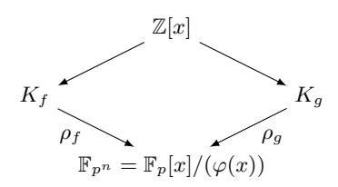
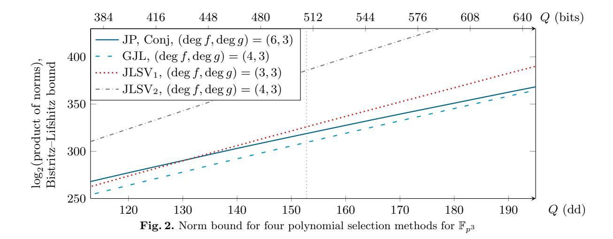

# Solving discrete logarithms on a 170-bit MNT curve by pairing reduction

Aurore Guillevic<sup>4,5</sup>, François Morain<sup>3</sup>, and Emmanuel Thomé<sup>1,2</sup>

<sup>1</sup> Institut national de recherche en informatique et en automatique (INRIA), Nancy, France emmanuel.thome@inria.fr

 LORIA, CNRS UMR 7503, Nancy, France
 École Polytechnique/LIX, CNRS UMR 7161, Palaiseau, France morain@lix.polytechnique.fr

<sup>4</sup> University of Calgary, Alberta, Canada aurore.guillevic@ucalgary.ca

<sup>5</sup> Pacific Institute for the Mathematical Sciences, CNRS UMI 3069, Canada

**Abstract.** Pairing based cryptography is in a dangerous position following the breakthroughs on discrete logarithms computations in finite fields of small characteristic. Remaining instances are built over finite fields of large characteristic and their security relies on the fact the embedding field of the underlying curve is relatively large. How large is debatable. The aim of our work is to sustain the claim that the combination of degree 3 embedding and too small finite fields obviously does not provide enough security. As a computational example, we solve the DLP on a 170-bit MNT curve, by exploiting the pairing embedding to a 508-bit, degree-3 extension of the base field.

Keywords: Discrete logarithm, finite field, number field sieve, MNT elliptic curve

# 1 Introduction

# 1.1 Pairing-based cryptography

Pairings were introduced as a constructive cryptographic tool in 2000 by Joux [29], who proposed a one-round three participants key-exchange. Numerous protocols also based on pairings have been developed since. Beyond efficient broadcast protocols, prominent applications include Identity-Based Encryption [33,34,12], or short signatures [13].

The choice of appropriate curves and pairing definitions in the context of pairing-based cryptography has been the topic of many research articles. An important invariant is the degree of the embedding field, which measures the complexity of evaluating pairings, but is also related to the security of systems (see Section 2 for more precisions). The first cryptographic setups proposed used pairings on supersingular curves of embedding degree 2 defined over a prime field  $\mathbb{F}_p$ , where p is 512-bit long, so that the pairing embeds into a 1024-bit finite field  $\mathbb{F}_{p^2}$ . Another early curve choice is a supersingular elliptic curve in characteristic three, defined over  $\mathbb{F}_{3^{97}}$ , of embedding degree 6 (used e.g. in [13], as well as various implementation proposals, e.g. [9]). More recent proposals define pairing-friendly ordinary curves over large characteristic fields, where constraining the embedding degree to selected values is a desired property [40,15,18,14,24,21,8,22].

Cryptanalysis of pairings can be attempted via two distinct routes. Either attack the discrete logarithm problem on the curve, or in the embedding field of the pairing considered. The former approach is rarely successful, given that it is usually easy to choose curves which are large enough to thwart  $O(\sqrt{N})$  attacks such as parallel collision search or Pollard rho. Note however that derived

problems such as the discrete logarithm with auxiliary inputs are much easier to handle, as shown by [\[44\]](#page-13-4).

Attacking pairings via the embedding field is a strategy known as the Menezes–Okamoto– Vanstone [\[39\]](#page-13-5) or Frey–R¨uck [\[23\]](#page-12-10) attack, depending on which pairing is considered. Successful cryptanalyses that follow this strategy have been described in small characteristic. In [\[28\]](#page-13-6), for a supersingular curve over F<sup>3</sup> <sup>97</sup> , the small characteristic allowed the use of the Function Field Sieve algorithm [\[1\]](#page-11-0), and the composite extension degree was also a very useful property. More recently, following recent breakthroughs for discrete logarithm computation in small characteristic finite fields [\[6](#page-12-11)[,26\]](#page-12-12), a successful attack has been reported on a supersingular curve over F<sup>2</sup> <sup>1223</sup> , with degree-4 embedding [\[26\]](#page-12-12). The outcome of these more recent works is that curves in small characteristic are now definitively avoided for pairing-based cryptography.

As far as we know, there is no major record computation of discrete logarithms over pairingfriendly curves in large characteristic using a pairing reduction in the finite field. The pairing-friendly curves used in practice have a large embedding field of more than 1024 bits, where computing a discrete logarithm is still very challenging. A few curves in large characteristic have comparatively small embedding fields, and were identified as weak to this regard, although no practical computation to date demonstrated the criticality of this weakness. This includes the so-called MNT curves defined by Miyaji–Nakabayashi–Takano, e.g. [\[40,](#page-13-3) Example 1], an elliptic curve defined over a 170-bit prime p, and of 508-bit embedding field F<sup>p</sup> 3 .

Despite the academic agreement on the fact that the pairing embedding fields for 170-bit MNT curves in general, and the one just mentioned in particular, are too small for cryptographic use, recent work like [\[2\]](#page-12-13) has shown how cryptography relying on overly optimistic hardness assumptions can linger almost indefinitely in the wild. Demonstrating a practical break is key to really phasing out such outdated cryptographic choices. As far as we know, an MNT curve of low embedding degree 3 was never used in pairing-based cryptography, but was never attacked by a pairing reduction either. In this article, we present our attack over the weak[6](#page-1-0) MNT curve [\[40,](#page-13-3) Example 1], with p of 170 bits and n = 3. We report a discrete logarithm computation in the group of points of this curve by a pairing reduction, using only a moderate amount of computing power.

In order to attack the discrete logarithm problem in the embedding field, appropriate variants of the Number Field Sieve must be used. The crucial point is the adequate choice of a polynomial pair defining the Number Field Sieve setup, among the various choices proposed in the literature [\[30,](#page-13-7)[38,](#page-13-8)[31,](#page-13-9)[5](#page-12-14)[,7\]](#page-12-15). It is also important to arrange for the computation to take advantage of Galois automorphisms when available, both within sieving and linear algebra. Last, some care is needed in order to efficiently compute individual logarithms of arbitrary field elements.

This article is organized as follows. Section [2](#page-2-0) reviews some background and notations for MNT curves on the one hand, and the Number Field Sieve (NFS) as a general framework on the other hand. Section [3](#page-4-0) discusses in more detail the various possible choices of polynomial selection techniques for NFS. Section [4](#page-7-0) discusses the details of the discrete logarithm computation with NFS, while Section [4.3](#page-9-0) defines and solves an arbitrary challenge on the MNT curve.

<span id="page-1-0"></span><sup>6</sup> already described as weak in the paper by the authors

# <span id="page-2-0"></span>2 Background and notations

#### <span id="page-2-1"></span>2.1 Using pairing embedding to break DLP

We follow e.g. [11, chap. IX]. To fix notations, pairings are defined as follows, the map being bilinear, non-degenerate and computable in polynomial time in the size of the inputs.

$$e: \begin{cases} E(\mathbb{F}_p)[\ell] \times E(\mathbb{F}_{p^n})[\ell] \to \mu_{\ell} \subset \mathbb{F}_{p^n}^* \\ (P,Q) \mapsto e(P,Q). \end{cases}$$
 (1)

Here,  $\mu_{\ell}$  is the subgroup of  $\ell$ -th roots of unity, i.e. an element  $u \in \mu_{\ell}$  satisfies  $u^{\ell} = 1 \in \mathbb{F}_{p^n}^*$ . The integer n is the so-called *embedding degree*, that is the smallest integer i for which the  $\ell$ -torsion is contained in  $\mathbb{F}_{p^i}$ . It has a major impact on evaluating the difficulty of solving the DLP on the curve.

Let  $G_1$  be a generator of  $E(\mathbb{F}_p)[\ell]$  and P in the same group, whose discrete logarithm u is sought (so that  $P = [u]G_1$ ). We choose a generator  $G_2$  for  $E(\mathbb{F}_{p^n})[\ell]$ . We observe that

$$e(P, G_2) = e(G_1, G_2)^u$$

so that u can be recovered as the logarithm of  $U = e(P, G_2)$  in base  $T = e(G_1, G_2)$ , where both elements belong to the subgroup of order  $\ell$  of  $\mathbb{F}_{p^n}^*$ . Note that by construction,  $\ell = O(p)$ , so that the Number Field Sieve linear algebra phase has to be considered modulo  $\ell$ , which is a priori much smaller than the largest prime order subgroup of  $\mathbb{F}_{p^n}^*$ , which has size  $O(p^{\phi(n)})$ .

#### 2.2 MNT curves

The Miyaji–Nakabayashi–Takano curves were designed in 2000 in [40] as the first example of ordinary curves with low embedding degree n=3,4, or 6. The curves were presented as a weak instance of ordinary elliptic curves that should be avoided in elliptic-curve cryptography because of the Menezes-Okamoto-Vanstone and Frey-Rück attacks [39,23] that embed the computation of a discrete logarithm from the group of points of the curve to the embedding field  $\mathbb{F}_{p^n}$ . At the 80-bit security level which was used in the 2000's, an elliptic curve of 160-bit prime order was considered safe, and of at least the same security as an 1024-bit RSA modulus. However for MNT curves over prime fields of 160 bits, the MOV and FR reduction attacks embed to finite fields of size 480, 640, or 960 bits, none of which should be considered as having a hard enough DLP. For these three cases and most of all for n=3, computing a discrete logarithm in the embedding field is considerably easier than over the elliptic curve. The conclusion of the MNT paper was to advise developers to systematically check that the embedding degree of an elliptic curve is large enough, to avoid pairing reduction attacks. The authors also mentioned as a constructive use of their curves the prequel work of Kasahara, Ohgishi, and Sakai on identity-based encryption using pairings [33,34]. Some implementations using MNT curves exist, for example the Miracl Library proposes software on an MNT curve over a 170-bit prime, with embedding degree n = 6, providing a 80-bit security level.

Construction of MNT curves The parameters p,  $\tau$ ,  $\ell$  (base field, trace, and number of points) of the curve are given by polynomials of degree at most two. For n = 3, 4, or 6, these are

| embedding of | degree $n p$ | P(x)            | $\tau = \operatorname{Tr}(x)$ | $\#E(\mathbb{F}_p) = p + 1 - \tau$ |
|--------------|--------------|-----------------|-------------------------------|------------------------------------|
| 3            | 1:           | $2x^2 - 1$      | $\pm 6x - 1$                  | $12x^2 \mp 6x + 1$                 |
| 4            | x            | $ x^2 + x + 1 $ | -x, or $x+1$                  | $x^2 + 2x + 2$ or $x^2 + 1$        |
| 6            | 4:           | $x^2 + 1$       | $1 \pm 2x$                    | $x^2 \mp 2x + 2$                   |

| embedding degree n log2 | p (#E(Fp)) | p (#Fpn<br>n log2 | ) 80-bit security |
|-------------------------|------------|-------------------|-------------------|
| 3                       | 170        | 510               | no                |
| 4                       | 170        | 680               | no                |
| 6                       | 170        | 1020              | yes               |

Table 1. MNT curves as pairing-friendly curves in the 2000's

To generate a curve, one needs to find an integer y of the appropriate size, such that p = P(y) is prime and #E(Fp) is also prime, or equal to a small cofactor times a large prime. To compute the coefficients of the curve equation, a Pell equation need to be solved.

The target curve Our target will be the MNT curve given in [\[40,](#page-13-3) Example 1]. We recall that the curve parameters satisfy

```
y = −0x732c8cf5f983038060466
       p = 12y
               2 − 1 = 0x26dccacc5041939206cf2b7dec50950e3c9fa4827af of 170 bits
       τ = 6y − 1 where τ is the trace of the curve
#E(Fp) = p + 1 − τ = 72
                            · 313 · ` where ` is a 156-bit prime
       ` = 0xa60fd646ad409b3312c3b23ba64e082ad7b354d
```

The pairing embeds into the prime order ` subgroup of the cyclotomic subgroup of F<sup>p</sup> <sup>3</sup> , where ` divides p <sup>2</sup> + p + 1.

# 2.3 A brief overview of NFS-DL

Our target field is Fp<sup>n</sup> . NFS-DL starts by selecting two irreducible integer polynomials f and g such that ϕ = gcd(f mod p, g mod p) is irreducible of degree n (construction of f and g is discussed in Section [3\)](#page-4-0). We use the representation Fp<sup>n</sup> = Fp[x]/(ϕ(x)). Let K<sup>f</sup> = Q[x]/(f(x)) = Q(α), and O<sup>f</sup> be its ring of integers. Note that because f is not necessarily monic, α might not be an algebraic integer. Let ρ<sup>f</sup> be the map from K<sup>f</sup> to Fp<sup>n</sup> , sending α to T mod (p, ϕ(T)). We define likewise K<sup>g</sup> = Q(β), together with O<sup>g</sup> and ρg. This installs the (typical) commutative diagram in Figure [1.](#page-3-0)



<span id="page-3-0"></span>Fig. 1. NFS-DL diagram for Fp<sup>n</sup>

Given f and g, we choose a smoothness bound B and build factor bases F<sup>f</sup> (resp. Fg) consisting of prime ideals in O<sup>f</sup> (resp. Og) of norm less than B, to which we add prime ideals dividing lc(f) (resp. lc(g)) to take into account the fact that α and β are not algebraic integers. Then, we collect relations, that is polynomials φ(x) ∈ Z[x] such that both ideals hφ(α)i and hφ(β)i are smooth, namely factor completely over F<sup>f</sup> (resp. Fg). Smoothness is related to Norm(φ(α)), and in turn to Res(f, φ) since we have

$$\pm \operatorname{lc}(f)^{\operatorname{deg}(\phi)} \operatorname{Norm}(\phi(\alpha)) = \operatorname{Res}(f, \phi).$$

When φ is such that the integers Res(f, φ) and Res(g, φ) are B-smooth (only prime factors below B), we have a relation:

<span id="page-4-1"></span>
$$\begin{cases} \phi(\alpha)\mathcal{O}_f = \prod_{\mathfrak{q} \in \mathcal{F}_f} \mathfrak{q}^{\mathrm{val}_{\mathfrak{q}}(\phi(\alpha))}, \\ \phi(\beta)\mathcal{O}_g = \prod_{\mathfrak{r} \in \mathcal{F}_f} \mathfrak{r}^{\mathrm{val}_{\mathfrak{r}}(\phi(\beta))} \end{cases}$$

that are transformed as linear relation between virtual logarithms of ideals [\[47\]](#page-13-10), to which are added the so-called Schirokauer maps [\[46\]](#page-13-11), labelled λf,i for 1 ≤ i ≤ r<sup>f</sup> where r<sup>f</sup> is the unit rank of K<sup>f</sup> (and the same for g).

To overcome the problem of dealing with fractional ideals instead of integral ideals, we use the following result from [\[41\]](#page-13-12) (see also [\[19\]](#page-12-17)).

Proposition 1. Let f(X) = P<sup>d</sup> <sup>i</sup>=0 ciX<sup>i</sup> with coprime integer coefficients and α a root of f. Let

$$J_f = \langle c_d, c_d \alpha + c_{d-1}, c_d \alpha^2 + c_{d-1} \alpha + c_{d-2}, \dots, c_d \alpha^{d-1} + c_{d-1} \alpha^{d-2} + \dots + c_1 \rangle.$$

Then h1, αiJ<sup>f</sup> = (1), J<sup>f</sup> has norm |cd|, and J<sup>f</sup> ha − bαi is an integral ideal for integers a and b.

If φ(X) has degree k − 1, we have Norm(J k−1 f hφ(α)i) = ± Res(f, φ), so that we can read off the factorization of the integral J k−1 f hφ(α)i directly from the factorization of its norm. A relation can now be written as:

$$(k-1)\operatorname{vlog}(J_f) + \sum_{\mathfrak{q} \in \mathcal{F}_f} \operatorname{val}_{\mathfrak{q}}(\phi(\alpha))\operatorname{vlog}(\mathfrak{q}) + \sum_{i=1}^{r_f} \lambda_{f,i}(\phi(\alpha))\operatorname{vlog}(\lambda_{f,i})$$

$$\equiv (k-1)\operatorname{vlog}(J_g) + \sum_{\mathfrak{r}\in\mathcal{F}_g}\operatorname{val}_{\mathfrak{r}}(\phi(\beta))\operatorname{vlog}(\mathfrak{r}) + \sum_{i=1}^{r_g}\lambda_{g,i}(\phi(\beta))\operatorname{vlog}(\lambda_{g,i}) \bmod \ell.$$

We select as many φ(x) of degree at most k −1 (for k ≥ 2 and very often k = 2) as needed to find #F<sup>f</sup> + #F<sup>g</sup> + r<sup>f</sup> + r<sup>g</sup> + 2 relations. Note that J<sup>f</sup> and J<sup>g</sup> are not always prime ideals. Nevertheless since all their prime divisors have a grouped contribution for each relation, we may count them as single columns. We may even replace the two columns by one, corresponding to vlog(J<sup>f</sup> ) − vlog(Jg) (e.g. this is done in cado-nfs).

Given sufficiently many equations, the linear system in the virtual logarithms can be solved using sparse linear algebra techniques such as the Block Wiedemann algorithm [\[17\]](#page-12-18). When we want to compute the logarithm of a given target, we need to rewrite some power (or some multiple) of the target as a multiplicative combination of the images in Fp<sup>n</sup> of the factor base ideals, and use the precomputed data base of computed logarithms. Section [4](#page-7-0) will briefly discusses algebraic factorization in practice.

# <span id="page-4-0"></span>3 Polynomial Selection

The polynomial selection is the first step of the NFS algorithm. Polynomial selection is rather cheap, but care is needed since the quality of the polynomial pair it outputs conditions the running time

of the three next steps. Sections 3.1 and 3.1 below explain the two phases of polynomial selection. In a nutshell, we first decide from which family the polynomials are chosen, and then we search among possible solutions for "exceptionally good" polynomials. Note that because all degree nirreducible polynomials correspond to isomorphic finite fields  $\mathbb{F}_{p^n}$ , we are not constrained in the choice of Res(f,g). This degree of freedom allows to select good polynomials.

As of 2016, the available polynomial selection algorithms are:

- the Conjugation method (Conj) [5, §. 3.3], explained in Algorithm 1;
- the Generalized Joux-Lercier method (GJL) [5, §. 3.2] and [38] that produces polynomials of unbalanced coefficient sizes (see Algorithm 2 in Appendix A);
- the Joux-Lercier-Smart-Vercauteren method (JLSV<sub>1</sub>) [30, §. 2.3], explained in Algorithm 3, that produces two polynomials of degree n and coefficient size in  $O(\sqrt{p})$  for both polynomials;
- the second proposition (JLSV<sub>2</sub>) of the same paper [30,  $\S$ . 3.2];
- the Joux-Pierrot (JP) method for pairing-friendly curves [31] which produces polynomials equivalent to the Conjugation method for MNT curves (Algorithm 4);
- the TNFS method of Barbulescu, Gaudry and Kleinjung [7].

Remark 1 (Non-applicable methods.). The Sarkar-Singh and Kim-Barbulescu methods [45,35] do not apply to finite fields of prime extension degree n such as  $\mathbb{F}_{p^3}$ . The TNFS method is not better than the best above methods for our practical case study, as shown in the paper [7, §5].

Algorithm 1 presents the Conjugation method, which eventually provided the best yield. Pseudocode describing the other methods can be found in Appendix A.

```
Algorithm 1: Polynomial selection with the Conjugation method [5, §3.3]
```

```
Input: p prime and n integer
   Output: f, g, \psi with f, g \in \mathbb{Z}[x] irreducible and \psi = \gcd(f \mod p, g \mod p) in \mathbb{F}_p[x] irreducible of degree n
1 repeat
        Select g_1(x), g_0(x), two polynomials with small integer coefficients, deg g_1 < \deg g_0 = n
       Select a(y) a quadratic, monic, irreducible polynomial over \mathbb{Z} with small coefficients
4 until a(y) has a root y in \mathbb{F}_p and \psi(x) = g_0(x) + yg_1(x) is irreducible in \mathbb{F}_p[x]
5 f \leftarrow \text{Res}_{y}(a(y), g_{0}(x) + yg_{1}(x))
6 (u,v) \leftarrow a rational reconstruction of y
7 g \leftarrow vg_0 + ug_1
8 return (f, g, \psi)
```

#### <span id="page-5-0"></span>A First Comparison 3.1

The various methods above yield polynomial pairs whose characteristics differ significantly. Table 2 gives the expected degrees and coefficient sizes. From this data, we can derive bounds on the resultants on both sides of a relation (either using the coarse bound  $(\deg f + \deg \phi)! \|f\|_{\infty}^{\deg \phi} \|\phi\|_{\infty}^{\deg f}$ , or finer bounds such as [10, Th. 7], as used in [7, §. 3.2]). These norms should be minimized in order to obtain the best running-time for the NFS algorithm. We obtain the plot of Figure 2 for the bit-size of the product of norms, similar to [5, Fig. 3].

Figure 2 suggests that the GJL method yields the smallest norms for  $\log_2 Q = 508$ . The norms produced with the Conjugation and JLSV<sub>1</sub> methods are not very far however so we compared more

| method     | deg f         | kfk∞               | deg g     | kgk∞               |
|------------|---------------|--------------------|-----------|--------------------|
| GJL        | D + 1 ≥ n + 1 | O(log p)           | D ≥ n O(Q | 1/(D+1))           |
| JP or Conj | 2n            | O(log p)           | n         | 1/(2n)<br>O(Q<br>) |
| JLSV1      | n             | 1/(2n)<br>O(Q<br>) | n         | 1/(2n)<br>O(Q<br>) |
| JLSV2      | D ≥ n + 1     | 1/(D+1))<br>O(Q    | n         | 1/(D+1))<br>O(Q    |

<span id="page-6-0"></span>Table 2. Norm bound w.r.t. Q



<span id="page-6-1"></span>precisely these three methods for our 170-bit parameters. This entails finding competitive polynomial pairs for each method, and comparing their merits. Estimated bounds as well as experimental values for the products of norms for log<sup>2</sup> Q = 508 are reported in Table [3.](#page-6-2) Results of sieving on one slide of special-q is reported in Table [4.](#page-8-0) The algorithms and computed polynomials are given in Appendix [A.](#page-13-13) The theoretical bound kfk<sup>∞</sup> equals one bit in the Conjugation and GJL methods whereas in practice to improve the smoothness properties of f, we have chosen a polynomial with moderately larger coefficients, and with better α and Murphy's E values (see [\[42,](#page-13-16) §5.2 eq. (5.7)] on Murphy's E value). The coefficient size of g selected with the GJL, Conj and JLSV1methods is a few bits larger than the theoretical bound because we computed linear combinations of two distinct g, and of f and the initial g in the JLSV<sup>1</sup> case (since they are of same degree). The advantage of the hybrid Joux–Pierrot method (Algorithm [5\)](#page-16-0) in the MNT case is that g can be monic, which does not allow for linear combinations.

| method    | kfk∞ |    | kgk∞                        |         |     | Norm bound f Norm bound g |       |      | product    |     |
|-----------|------|----|-----------------------------|---------|-----|---------------------------|-------|------|------------|-----|
|           |      |    | bound exp. bound exp. bound |         |     | exp.                      | bound | exp. | bound exp. |     |
| GJL       | 1    | 2  |                             | 127 130 | 106 | 107                       | 206   | 208  | 311        | 314 |
| Conj      | 1    | 9  | 85                          | 86      | 157 | 165                       | 163   | 164  | 320        | 328 |
| hybrid JP | 1    | 12 | 85                          | 85      | 157 | 168                       | 163   | 164  | 320        | 331 |
| JLSV1     | 85   | 85 | 85                          | 86      | 163 | 163                       | 163   | 164  | 326        | 327 |
| JLSV2     | 102  | –  | 102                         | –       | 206 | –                         | 180   | –    | 386        | –   |

<span id="page-6-2"></span>Table 3. Norm bounds in bits for log Q = 508 and log E = 25.25: estimates based on Table [2,](#page-6-0) compared to experimental values with our selected polynomials.

<span id="page-7-1"></span>Galois actions: For small extension degrees  $n \in \{3, 4, 6\}$  there exist families of polynomials producing number fields with cyclic Galois groups, and an easy-to-compute automorphism [20, Prop. 1.2]. Taking polynomials from these families yields a speed-up in the sieving part as well as in the linear algebra part for the JLSV<sub>1</sub> and Conjugation methods. We take  $g = x^3 - y_0x^2 - (y_0 + 3)x - 1$  for the Conjugation method, i.e.  $g_0 = x^3 - 3x - 1$  and  $g_1 = -x^2 - x$  in Algorithm 1. The Galois action is  $\sigma(x) = (-x - 1)/x$  which is independent of the parameter  $y_0$ . In that case, given the factorization for  $\langle a - b\alpha \rangle$ , we can deduce that of

$$\sigma(\langle a - b\alpha \rangle) = \langle a - b\sigma(\alpha) \rangle = -\frac{1}{\alpha}(b - (-a - b)\alpha).$$

The same holds on the f side.

Forming a database of good polynomials f. For the Conjugation method (and similarly for the competing methods), the early steps in Algorithm 1 can be tabulated in some way, depending only on the extension degree n (and for JLSV<sub>1</sub>, also on the size of p, but not its value): we can store a database of f's with good smoothness properties (low  $\alpha$  and high Murphy's E values). Actually we searched over  $a(y) = a_2y^2 + a_1y + a_0$ , where  $0 < a_2 < 32$ ,  $|a_1| < 32$  and  $|a_0| < 512$ , and computed  $f = \text{Res}_y(a(y), x^3 - yx^2 - (y+3)x - 1)$ . Later, depending on p, we can continue Algorithm 1 for these precomputed polynomials (test whether a has a root modulo p).

Note also that in Algorithm 1, the rational reconstruction step naturally produces several quotients u/v, which yield several candidate polynomials g. Small linear combinations of these polynomials can be tried, in order to improve on the Murphy's E value.

# <span id="page-7-2"></span>3.2 Probing the sieving yield

To finalize the comparison between the polynomials, we compared the relation yield for small special-q ranges sampled over the complete special-q space. Because the JLSV<sub>1</sub> and Conjugation methods feature balanced norms, we used similar large prime bounds (27 bits) on both sides in both cases, and allowed two large prime on each side. In contrast, for the GJL method, we allowed 28-bit large primes on the g side, and chose g to be only on that side. The Conjugation method (polynomial below) appeared as the best option based on the seconds/relation measure, given that the overall yield was sufficient. Results of this test are reported on Table 4.

$$\begin{array}{ll} f &= 28x^6 + 16x^5 - 261x^4 - 322x^3 + 79x^2 + 152x + 28 \\ \alpha(f) &= -2.94 \\ \log_2 \|f\|_{\infty} = 8.33 \\ g &= 24757815186639197370442122 \ x^3 + 40806897040253680471775183 \ x^2 \\ \qquad \qquad \qquad \qquad \qquad \qquad \qquad \qquad \qquad \qquad \qquad \qquad \qquad \qquad \qquad \qquad \qquad \qquad$$

# <span id="page-7-0"></span>4 Solving DLP over $\mathbb{F}_{p^3}$

# 4.1 Sieving and linear algebra

We took a smoothness bound of  $50 \times 10^6$  on both sides; and all special-q in  $[50 \times 10^6, 2^{27}]$ , on both sides. This took roughly 660 core-days, normalized on the most common hardware used, namely

| Method                   | seconds/relation | relations/special-q |                                               |
|--------------------------|------------------|---------------------|-----------------------------------------------|
| Generalized Joux–Lercier | 3.48             |                     | 0+3 large primes below 2 <sup>28</sup>        |
| $\rm JLSV_1$             | 1.31             | 4.24                | $2+2$ large primes below $2^{27}$ , orbits of |
| Conjugation              | 0.91             | 5.93                | three special-q batched together              |

<span id="page-8-0"></span>Table 4. Probed yield for special-q ranges. Cpu time on Intel Xeon E5520 (2.27GHz).

4-core Intel Xeon E5520 CPUs (2.27GHz). We collected 57070251 relations, out of which 34740801 were non duplicate. Filtering produced a 1982791  $\times$  1982784 matrix M with weight 396558692. Taking into account the block of 7 Schirokauer maps S, the matrix  $M \parallel S$  is square.

We computed 8 sequences in the Block Wiedemann algorithm, using the trick mentioned in [17, §8], as programmed in cado-nfs (rediscovered and further analyzed in [32]). All these sequences can be computed independently. Computation time for the 8 Krylov sequence was about 250 core-days (Xeon E5-2650, 2.4GHz, using four 16-core nodes per sequence). Finding the linear (matrix) generator for the matrices took 75 core-hours, parallelized over 64 cores. Building the solution costed some more 170 core-days. We reconstructed virtual logarithms for 15196345 out of the 15206761 factor base elements (99.9%). This was good enough to start looking for individual logarithms.

# 4.2 Computing individual discrete logarithms in $\mathbb{F}_{p^3}$

From the linear algebra step, we know how to compute the logarithm modulo  $\ell$  of any element of  $\mathbb{F}_{p^3}$  whose lift in either  $K_f$  or  $K_g$  factors completely over the factor base. Lifting in  $K_f$  is often convenient because norms are smaller.

The tiny case. A particular element which lifts conveniently in  $K_f$  is the common root t of both polynomials. By construction, its lift  $\alpha \in K_f$  generates a principal (fractional) ideal that factors as  $J_f^{-1}$  (see Proposition 1) times prime ideals of norm dividing 28, namely:  $(\alpha) = I_{2,0}^2 I_{7,\infty}^{-2} I_{7,0} I_{7,\infty}^{-1}$ , where  $I_{2,\infty}^2 I_{7,\infty}$  corresponds to  $J_f$  and the prime ideals in the right-hand side can be made explicit. Its logarithm therefore writes as <sup>7</sup>

$$\log(t) = 2\operatorname{vlog} I_{2,0} - 2\operatorname{vlog} I_{2,\infty} + \operatorname{vlog} I_{7,0} - \operatorname{vlog} I_{7,\infty} + \sum_{i=1}^{5} \lambda_{f,i}(\alpha)\operatorname{vlog}(\lambda_{f,i}).$$

 $\lambda_{f,1}(\alpha) = \text{0x3720106a3d368d7f731a0757b905778050ae327}, \lambda_{f,2}(\alpha) = \text{0x1dbeace7d0ec187712ae8afcd6ccdc4db06f781}, \lambda_{f,2}(\alpha) = \text{0x1dbeace7d0ec187712ae8afcd6ccdc4db06f781}, \lambda_{f,2}(\alpha) = \text{0x1dbeace7d0ec187712ae8afcd6ccdc4db06f781}, \lambda_{f,2}(\alpha) = \text{0x1dbeace7d0ec187712ae8afcd6ccdc4db06f781}, \lambda_{f,2}(\alpha) = \text{0x1dbeace7d0ec187712ae8afcd6ccdc4db06f781}, \lambda_{f,2}(\alpha) = \text{0x1dbeace7d0ec187712ae8afcd6ccdc4db06f781}, \lambda_{f,2}(\alpha) = \text{0x1dbeace7d0ec187712ae8afcd6ccdc4db06f781}, \lambda_{f,2}(\alpha) = \text{0x1dbeace7d0ec187712ae8afcd6ccdc4db06f781}, \lambda_{f,2}(\alpha) = \text{0x1dbeace7d0ec187712ae8afcd6ccdc4db06f781}, \lambda_{f,2}(\alpha) = \text{0x1dbeace7d0ec187712ae8afcd6ccdc4db06f781}, \lambda_{f,2}(\alpha) = \text{0x1dbeace7d0ec187712ae8afcd6ccdc4db06f781}, \lambda_{f,2}(\alpha) = \text{0x1dbeace7d0ec187712ae8afcd6ccdc4db06f781}, \lambda_{f,2}(\alpha) = \text{0x1dbeace7d0ec187712ae8afcd6ccdc4db06f781}, \lambda_{f,2}(\alpha) = \text{0x1dbeace7d0ec187712ae8afcd6ccdc4db06f781}, \lambda_{f,2}(\alpha) = \text{0x1dbeace7d0ec187712ae8afcd6ccdc4db06f781}, \lambda_{f,2}(\alpha) = \text{0x1dbeace7d0ec187712ae8afcd6ccdc4db06f781}, \lambda_{f,2}(\alpha) = \text{0x1dbeace7d0ec187712ae8afcd6ccdc4db06f781}, \lambda_{f,2}(\alpha) = \text{0x1dbeace7d0ec187712ae8afcd6ccdc4db06f781}, \lambda_{f,2}(\alpha) = \text{0x1dbeace7d0ec187712ae8afcd6ccdc4db06f781}, \lambda_{f,2}(\alpha) = \text{0x1dbeace7d0ec187712ae8afcd6ccdc4db06f781}, \lambda_{f,2}(\alpha) = \text{0x1dbeace7d0ec187712ae8afcd6ccdc4db06f781}, \lambda_{f,2}(\alpha) = \text{0x1dbeace7d0ec187712ae8afcd6ccdc4db06f781}, \lambda_{f,2}(\alpha) = \text{0x1dbeace7d0ec187712ae8afcd6ccdc4db06f781}, \lambda_{f,2}(\alpha) = \text{0x1dbeace7d0ec187712ae8afcd6ccdc4db06f781}, \lambda_{f,2}(\alpha) = \text{0x1dbeace7d0ec187712ae8afcd6ccdc4db06f781}, \lambda_{f,2}(\alpha) = \text{0x1dbeace7d0ec187712ae8afcd6ccdc4db06f781}, \lambda_{f,2}(\alpha) = \text{0x1dbeace7d0ec187712ae8afcd6ccdc4db06f781}, \lambda_{f,2}(\alpha) = \text{0x1dbeace7d0ec187712ae8afcd6ccdc4db06f781}, \lambda_{f,2}(\alpha) = \text{0x1dbeace7d0ec187712ae8afcd6ccdc4db06f781}, \lambda_{f,2}(\alpha) = \text{0x1dbeace7d0ec187712ae8afcd6ccdc4db06f781}, \lambda_{f,2}(\alpha) = \text{0x1dbeace7d0ec187712ae8afcd6ccdc4db06f781}, \lambda_{f,2}(\alpha) = \text{0x1dbeace7d0ec187712ae8afcd6ccdc4db06f781}, \lambda_{f,2}(\alpha) = \text{0x1dbeace7d0ec187712ae8afcd6ccdc4db06f781}, \lambda_{f,2}(\alpha) = \text{0x1dbeace7d0ec187712ae8$

 $\lambda_{f,3}(\alpha) = \text{0x9c3109f7741d625869f135706be03fc09375450}, \\ \lambda_{f,4}(\alpha) = \text{0x1e46653b287d99c502a5c6e12ab17a3dd10988c}, \\ \lambda_{f,3}(\alpha) = \text{0x1e46653b287d99c502a5c6e12ab17a3dd10988c}, \\ \lambda_{f,4}(\alpha) = \text{0x1e46653b287d99c502a5c6e12ab17a3dd10988c}, \\ \lambda_{f,4}(\alpha) = \text{0x1e46653b287d99c502a5c6e12ab17a3dd10988c}, \\ \lambda_{f,4}(\alpha) = \text{0x1e46653b287d99c502a5c6e12ab17a3dd10988c}, \\ \lambda_{f,4}(\alpha) = \text{0x1e46653b287d99c502a5c6e12ab17a3dd10988c}, \\ \lambda_{f,4}(\alpha) = \text{0x1e46653b287d99c502a5c6e12ab17a3dd10988c}, \\ \lambda_{f,4}(\alpha) = \text{0x1e46653b287d99c502a5c6e12ab17a3dd10988c}, \\ \lambda_{f,4}(\alpha) = \text{0x1e46653b287d99c502a5c6e12ab17a3dd10988c}, \\ \lambda_{f,4}(\alpha) = \text{0x1e46653b287d99c502a5c6e12ab17a3dd10988c}, \\ \lambda_{f,4}(\alpha) = \text{0x1e46653b287d99c502a5c6e12ab17a3dd10988c}, \\ \lambda_{f,4}(\alpha) = \text{0x1e46653b287d99c502a5c6e12ab17a3dd10988c}, \\ \lambda_{f,4}(\alpha) = \text{0x1e46653b287d99c502a5c6e12ab17a3dd10988c}, \\ \lambda_{f,4}(\alpha) = \text{0x1e46653b28d}, \\ \lambda_{f,4}(\alpha) = \text{0x1e46653b28d}, \\ \lambda_{f,4}(\alpha) = \text{0x1e46653b28d}, \\ \lambda_{f,4}(\alpha) = \text{0x1e46653b28d}, \\ \lambda_{f,4}(\alpha) = \text{0x1e46653b28d}, \\ \lambda_{f,4}(\alpha) = \text{0x1e46653b28d}, \\ \lambda_{f,4}(\alpha) = \text{0x1e46653b28d}, \\ \lambda_{f,4}(\alpha) = \text{0x1e46653b28d}, \\ \lambda_{f,4}(\alpha) = \text{0x1e46653b28d}, \\ \lambda_{f,4}(\alpha) = \text{0x1e46653b28d}, \\ \lambda_{f,4}(\alpha) = \text{0x1e46653b28d}, \\ \lambda_{f,4}(\alpha) = \text{0x1e46653b28d}, \\ \lambda_{f,4}(\alpha) = \text{0x1e46653b28d}, \\ \lambda_{f,4}(\alpha) = \text{0x1e46653b28d}, \\ \lambda_{f,4}(\alpha) = \text{0x1e46653b28d}, \\ \lambda_{f,4}(\alpha) = \text{0x1e46653b28d}, \\ \lambda_{f,4}(\alpha) = \text{0x1e46653b28d}, \\ \lambda_{f,4}(\alpha) = \text{0x1e46653b28d}, \\ \lambda_{f,4}(\alpha) = \text{0x1e46653b28d}, \\ \lambda_{f,4}(\alpha) = \text{0x1e46653b28d}, \\ \lambda_{f,4}(\alpha) = \text{0x1e46653b28d}, \\ \lambda_{f,4}(\alpha) = \text{0x1e46653b28d}, \\ \lambda_{f,4}(\alpha) = \text{0x1e46653b28d}, \\ \lambda_{f,4}(\alpha) = \text{0x1e46653b28d}, \\ \lambda_{f,4}(\alpha) = \text{0x1e46653b28d}, \\ \lambda_{f,4}(\alpha) = \text{0x1e46653b28d}, \\ \lambda_{f,4}(\alpha) = \text{0x1e46653b28d}, \\ \lambda_{f,4}(\alpha) = \text{0x1e46653b28d}, \\ \lambda_{f,4}(\alpha) = \text{0x1e46653b28d}, \\ \lambda_{f,4}(\alpha) = \text{0x1e46653b28d}, \\ \lambda_{f,4}(\alpha) = \text{0x1e46653b28d}, \\ \lambda_{f,4}(\alpha) = \text{0x1e46653b28d}, \\ \lambda_{f,4}(\alpha) = \text{0x1e46653b28d}, \\ \lambda_{f,4}(\alpha) = \text{0x1e46653b28d}, \\ \lambda_{f,4}(\alpha) = \text{0x1e46653b28d}, \\ \lambda_{f,4}(\alpha) = \text{0x1e46653b28d}, \\ \lambda_$

 $\lambda_{f,5}(\alpha) = 0$ x31628f3e0b491e622946b32f66292c1389a7427.

By construction the value  $\log(t)$  above is invertible modulo  $\ell$ , and we can freely normalize our virtual logarithm values so that it is equal to one.

The tame case. Elements whose lifts do not factor completely over any of the factor base but have only moderate-size outstanding factors can be dealt with using a classical descent procedure. This finds recursively new relations involving smaller and smaller primes, until all primes involved belong to the factor base. Software achieving this exists, such as the las\_descent program in cado-nfs.

<span id="page-8-1"></span><sup>&</sup>lt;sup>7</sup> The convention in cado-nfs is to take coefficients of largest degree first in the Schirokauer maps computation  $z\mapsto \frac{1}{\ell}(z^{\ell^m-1}-1)$  where  $m=\mathrm{lcm}_{\mathfrak{l}\ \mathrm{prime},\ \mathfrak{l}|\ell}[\mathfrak{l}:\ell]$ . Here we have m=1.

The general case. For computing individual logarithms of arbitrary elements, we used the boot technique described in [27]. For each target, we compute a preimage in  $\mathbb{Z}[x]$  represented by a polynomial of degree at most 5 and coefficients bounded by  $p^{1/3}$ . The norm in  $K_f$  of the preimage is  $O(p^2) = O(Q^{2/3})$ , of approximately 340 bits. The asymptotic complexity of this step is  $L_Q[1/3, 1.26]$ , and would be  $L_Q[1/3, 1.132]$  with one early-abort test (see e.g. [43, §4.3] or [3, Ch. 4]). The optimal size of largest prime factors in the decomposition is given by the formula  $L_Q[2/3, (e^2/3)^{1/3} \approx 0.529]$ , where e = 2/3 (see [16, §4]). Applying it for  $\log_2 Q = 508$  gives a bound of 68 bits and a running-time of approximately  $2^{42}$  tests. In practice we found very easily initial splittings where  $B_1$  is less than 64 bits, which eased the descent.

# <span id="page-9-0"></span>4.3 Solving the challenge

Our main use case for individual logarithm computation in  $\mathbb{F}_{p^3}$  is to solve a DLP challenge on the curve. The challenge definition procedure described in Appendix B gives:

```
G_1 = \text{(0x106b415d7b4a2d71659ae97440cbb20a6de42d76d69, 0x16d74a2a88e817f1821a1c40e220d34eec93e33cb83)}, \\ P = \text{(0x15052ba45717710e6b0cbf8ed89c5c1a0a279480e26.0x8050f05a231ae1f13e56de1171c108294656052339)}
```

From Section 2.1, we need to compute  $\log(G_T)$  and  $\log(S)$ , where  $G_T = e(G_1, G_2)$  and  $S = e(P, G_2)$  are given in Appendix B. We searched for randomized values  $G_T^r$  and  $G_T^{r'}S$  which were amenable to the descent procedure. After 32 core-hours looking in the range  $r \in [1, 64000]$ , we selected the following element

$$G_T^{52154} = -0 \times 21 \text{d} 517 \text{d} 51512 \text{e} 9 - 0 \times 95233 \text{b} 3 \text{a} \text{f} 1 \text{b} 3 \text{c} 7 \ x + 0 \times 8 \text{d} 324 \text{e} \text{b} \text{c} 7849 \text{b} \text{b} \ x^2 \\ + 0 \times 18 \text{f} 10 \text{d} 5 \text{a} \text{e} 0 \text{b} 52 \text{b} \ x^3 + 0 \times 13 \text{f} 711 \text{f} \text{e} 92 \text{d} 63 \text{cd} \ x^4 - 0 \times 15 \text{c} 778630 \text{d} 36920 \ x^5 \\ \end{pmatrix}$$

whose straightforward lift in  $K_f$  has 59-bit smooth norm (resultant with f, more precisely):

```
0 \times 87 \text{ac} 1 \text{a} 057 \text{d} f 9772 \text{d} 1 \text{e} 08 \text{d} 4 \text{d} \text{e} 56 \text{b} 3 \text{e} 6 \text{b} 5 \text{f} 208710437 \text{b} 5 \text{f} 92 \text{ac} 4 \text{a} 494 \text{c} 318 \text{c} 9781107 \text{e} 00364934 \text{e} 34 \text{e} f \text{a} 87 \text{b} 26597771 \text{c} \\ = 2^2 \cdot 5 \cdot 7^2 \cdot 31 \cdot 193 \cdot 277 \cdot 1787 \cdot 12917 \cdot 125789 \cdot 142301513 \cdot 380646221 \cdot 2256567883 \\ \cdot 132643203397 \cdot 138019432565816569 \cdot 603094914193031251 \cdot 801060739300538627
```

Virtual logarithms for primes below  $50 \cdot 10^6$  (25.57 bits) were known. The descent procedure took 13.4 hours. Once all logarithms were computed, the value of  $\log(G_T)$  could be deduced:

```
\log(G_T) = 0x8c58b66f0d8b2e99a1c0530b2649ec0c76501c3 (normalized to \log t = 1).
```

Similarly, we selected

```
G_T^{35313}S \mapsto \text{ 0x457449569db669} + \text{ 0x88c32ec54242fd } x - \text{ 0x2370c0f5914ba9 } x^2 \\ + \text{ 0x14c7ccbafc20e2 } x^3 + \text{ 0xde2e21c5f1a4c4 } x^4 - \text{ 0x10b6bfd826db49c } x^5
```

whose lift in  $K_f$  has norm

```
-0 \times 44 \text{dafd6ec57c91e64567fa045187100da9a98c5c509b388cb61759f345b3ce27226a5e8520be0bd4559acbd538b90} \\ = -2^4 \cdot 5^2 \cdot 7 \cdot 643 \cdot 1483 \cdot 2693 \cdot 95617 \cdot 9573331 \cdot 33281579 \cdot 1608560119 \cdot 48867401441 \\ \cdot 516931716361 \cdot 896237937459937 \cdot 16606283628226811 \cdot 19530910835315983
```

the largest factor having 54 bits, a very small size indeed (compared to the 68 bits predicted by theory). The descent procedure for other primes took 10.7 hours. We found that

$$\log(S) = 0$$
x48a6bcf57cacca997658c98a0c196c25116a0aa (normalized to  $\log t = 1$ ).

We eventually found that

$$\log_{G_1}(P) = 0$$
x711d13ed75e05cc2ab2c9ec2c910a98288ec038 mod  $\ell$ .

# 5 Conclusion and future work

# 5.1 Consequences for pairing-based cryptography

Our work showed that the choice of embedding degree n and finite field size  $\log p^n$  should be done carefully. The size of  $\mathbb{F}_{p^n}$  should be large enough to provide the desired level of security. We recall these sizes for  $\mathbb{F}_{p^3}$ . The recent improvement of Kim–Barbulescu [36] does not apply to  $\mathbb{F}_{p^n}$  where n is prime, so  $\mathbb{F}_{p^3}$  is not affected. The asymptotic complexity of the NFS algorithm for  $\mathbb{F}_{p^3}$  is  $\exp\left((c+o(1))(\log p^n)^{1/3}(\log\log p^n)^{2/3}\right) = L_{p^3}[1/3,(64/9)^{1/3}]$ . Since there is a polynomial factor hidden in the notation c+o(1), taking  $\log_2 L_{p^3}[1/3,(64/9)^{1/3}]$  does not give the exact security level but only an approximation. We may compare our present record with previous records of same size for prime fields  $\mathbb{F}_p$  and quadratic fields  $\mathbb{F}_{p^2}$ . Kleinjung in 2007 announced a record computation in a prime field  $\mathbb{F}_p$  of 530 bits (160 decimal digits) [37]. Barbulescu, Gaudry, Guillevic and Morain in 2014 announced a record computation in  $\mathbb{F}_{p^2}$  of 529 bits (160 decimal digits) [4]. We compare the timings in Table 5. The timings of relation collection and linear algebra were not balanced in Kleinjung record: 3.3 years compared to 14 years and moreover, this is a quite old record so it is not really possible to compare our record with this one directly. We can compare our record with the 529-bit  $\mathbb{F}_{p^2}$  record computation of 2014 [4]. Our total running-time is 15.5 times longer whereas the finite field is 21 bit smaller.

| record         | relation collection       | linear algebra              | individual log                        | total                 |
|----------------|---------------------------|-----------------------------|---------------------------------------|-----------------------|
| Kleinjung [37] | 3.3 CPU-years             | 14 years                    | few hours                             |                       |
| 530-bit field  | 3.2 GHz Xeon64            | 3.2 GHz Xeon64              | 3.2 GHz Xeon64                        | 17.3 years            |
| BGGM [4]       | 68  core-days = 0.19 y    | 30.3 hours                  | few hours                             | 70 days               |
| 529-bit field  | 2.0 GHz E5-2650           | NVidia GTX 680 graphic card | 2.0  GHz  E5-2650                     | = 0.2  year           |
| this work      | 660  core-days = 1.81 y   | 423  days = 1.16y           | 2 days                                | $1085  \mathrm{days}$ |
| 508-bit field  | 2.27GHz 4-core Xeon E5520 | 2.4 GHz Xeon E5-2650        | $2.27 \mathrm{GHz}$ 4-core Xeon E5520 | = 2.97  years         |

<span id="page-10-0"></span>**Table 5.** Comparison of running-time for Discrete Logarithm records in  $\mathbb{F}_p$ ,  $\mathbb{F}_{p^2}$  and  $\mathbb{F}_{p^3}$  of 530, 529 and 508 bits

#### 5.2 Future work

We have computed a DLP on an MNT curve with embedding degree 3. What are the next candidates? We could continue the series in two directions: increasing the size of p to 600 bits, in order to compare this new record to the previous records of the same size, in particular the  $\mathbb{F}_{p^2}$  record of 600 bits [5]. We could conjecture, according to the present record and the size of the norms, that a DLP record in  $\mathbb{F}_{p^3}$  of 600 bits will be more than 15 times harder than in a 600-bit field  $\mathbb{F}_{p^2}$ .

The second direction would be to continue the series of MNT curves, with n=4. We found an MNT curve of embedding degree 4 in Miracl (file k4mnt.ecs). The curve was generated by Drew Sutherland for Mike Scott a long time ago.

$$y = \text{0xf19192168b16c1315d33}$$

$$p = y^2 + y + 1 = \text{0xe3f367d542c82027f33dc5f3245769e676a5755d}$$

$$\ell = \text{0x6b455e0a014f1e30eaef7300bd4bb4258290fc5}$$

$$\tau = y + 1 = \text{0xf19192168b16c1315d34}$$

$$\#E(\mathbb{F}_p) = y^2 + 1 = p + 1 - \tau = 2 \cdot 17 \cdot \ell$$

Since n is a prime power, we have to adapt the Kim–Barbulescu technique (dedicated to non-prime power n) to prime-power extension degrees. We construct  $\mathbb{F}_{p^4}$  as  $\mathbb{F}_{p^2}[x]/(\varphi(x))$ , where  $\mathbb{F}_{p^2} = \mathbb{F}_p[s]/(h_1(s))$  and both  $h_1$  and  $\varphi$  are of degree 2, and  $\varphi$  has coefficients in  $\mathbb{F}_{p^2}$ . As a consequence, the polynomials f and g will have coefficients in  $\mathbb{Z}[s]/(h_1(s))$  instead of  $\mathbb{Z}$ . For example, one could take

$$\begin{split} h_1(s) &= s^2 + 2, \\ h_2(x,t_0,s) &= x^2 + s + t_0, \\ P(t_0) &= t_0^2 + t_0 + 1, \\ f &= \mathrm{Res}_{t_0}(P(t_0),h_2(x,t_0,s)) = x^4 + (2s-1)x^2 - s - 1, \\ g &= h_2(x,y,s) = x^2 + s + 0 \text{xf19192168b16c1315d33}. \end{split}$$

The major difference is that to be efficient, we have to sieve polynomials of degree 1 with coefficients in  $\mathbb{Z}[s]/(h_1(s))$ , that is elements of the form  $(a_0 + a_1 s) + (b_0 + b_1 s)x$  where the  $a_i$ 's and  $b_i$ 's are small rational integers, say  $|a_i|, |b_i| \leq A$ . For instance, taking  $\log_2(E) = 1.1(\log Q)^{1/3}(\log \log Q)^{2/3} \approx 28$ , we obtain  $A = E^{2/(2 \deg h)}$  of 14 bits. The upper bound on the norm would be of 120 bits on f-side and 219 bits on g-side, the total being roughly of 339 bits. This is 11 bits more than our present record for the 508-bit n = 3 MNT curve (328 bits, Table 3), but by far much less than with any previous technique applied to that  $\mathbb{F}_{p^4}$ . Norm estimates are provided in Table 6. From a practical point of view, we would need extensions of the work [25].

| method                                | $  f  _{\infty}$ | $  g  _{\infty}$ | $NB_f$ | $NB_g$ | $NB_f + NB_g$ |
|---------------------------------------|------------------|------------------|--------|--------|---------------|
| Kim-Barbulescu+hybrid JP              | 1                | 80               | 120    | 219    | 339           |
| GJL                                   | 1                | 128              | 144    | 243    | 387           |
| $\overline{\rm JLSV_1}$               | 320              | 80               | 195    | 195    | 390           |
| Sarkar-Singh, $r = 2$                 | 1                | 107              | 172    | 222    | 394           |
| JP-Conj                               | 1                | 80               | 159    | 240    | 399           |
| $JLSV_2$ , $D = 6$ ( $D$ best choice) | 91               | 91               | 264    | 206    | 470           |

<span id="page-11-1"></span>**Table 6.** Norm bound estimates for  $\mathbb{F}_{p^4}$  of 640 bits.

Acknowledgements. The authors are grateful to Pierrick Gaudry for his help in running the computations.

#### References

<span id="page-11-0"></span>1. L. M. Adleman and M.-D. Huang. Function field sieve methods for discrete logarithms over finite fields. *Inform. and Comput.*, 151(1):5–16, 1999.

- <span id="page-12-13"></span>2. D. Adrian, K. Bhargavan, Z. Durumeric, P. Gaudry, M. Green, J. A. Halderman, N. Heninger, D. Springall, E. Thom´e, L. Valenta, B. VanderSloot, E. Wustrow, S. Z. B´eguelin, and P. Zimmermann. Imperfect forward secrecy: How Diffie-Hellman fails in practice. In I. Ray, N. Li, and C. Kruegel:, editors, ACM CCS 15, pages 5–17. ACM Press, Oct. 2015.
- <span id="page-12-21"></span>3. R. Barbulescu. Algorithmes de logarithmes discrets dans les corps finis. PhD thesis, Universit´e de Lorraine, 2013.
- <span id="page-12-23"></span>4. R. Barbulescu, P. Gaudry, A. Guillevic, and F. Morain. Discrete logarithms in GF(p 2 ) — 160 digits. Announcement on the Number Theory List, Jun 2014. [https://listserv.nodak.edu/cgi-bin/wa.exe?A2=NMBRTHRY;2ddabd4c.](https://listserv.nodak.edu/cgi-bin/wa.exe?A2=NMBRTHRY;2ddabd4c.1406) [1406](https://listserv.nodak.edu/cgi-bin/wa.exe?A2=NMBRTHRY;2ddabd4c.1406).
- <span id="page-12-14"></span>5. R. Barbulescu, P. Gaudry, A. Guillevic, and F. Morain. Improving NFS for the discrete logarithm problem in non-prime finite fields. In E. Oswald and M. Fischlin, editors, EUROCRYPT 2015, Part I, volume 9056 of Lecture Notes in Comput. Sci., pages 129–155. Springer, Heidelberg, Apr. 2015.
- <span id="page-12-11"></span>6. R. Barbulescu, P. Gaudry, A. Joux, and E. Thom´e. A heuristic quasi-polynomial algorithm for discrete logarithm in finite fields of small characteristic. In P. Q. Nguyen and E. Oswald, editors, EUROCRYPT 2014, volume 8441 of Lecture Notes in Comput. Sci., pages 1–16. Springer, Heidelberg, May 2014.
- <span id="page-12-15"></span>7. R. Barbulescu, P. Gaudry, and T. Kleinjung. The tower number field sieve. In T. Iwata and J. H. Cheon, editors, ASIACRYPT 2015, Part II, volume 9453 of Lecture Notes in Comput. Sci., pages 31–55. Springer, Heidelberg, Dec. 2015.
- <span id="page-12-8"></span>8. P. S. L. M. Barreto and M. Naehrig. Pairing-friendly elliptic curves of prime order. In B. Preneel and S. Tavares, editors, SAC 2005, volume 3897 of Lecture Notes in Comput. Sci., pages 319–331. Springer, Heidelberg, Aug. 2006.
- <span id="page-12-2"></span>9. J. Beuchat, N. Brisebarre, J. Detrey, E. Okamoto, M. Shirase, and T. Takagi. Algorithms and arithmetic operators for computing the η<sup>T</sup> pairing in characteristic three. IEEE Trans. Computers, 57(11):1454–1468, 2008.
- <span id="page-12-19"></span>10. Y. Bistritz and A. Lifshitz. Bounds for resultants of univariate and bivariate polynomials. Linear Algebra and its Applications, 432(8):1995 – 2005, 2010. Special issue devoted to the 15th ILAS Conference at Cancun, Mexico, June 16-20, 2008.
- <span id="page-12-16"></span>11. I. F. Blake, G. Seroussi, and N. Smart. Advances in Elliptic Curve Cryptography, volume 317 of London Mathematical Society Lecture Note Series. Cambridge University Press, 2005.
- <span id="page-12-0"></span>12. D. Boneh and M. K. Franklin. Identity-based encryption from the Weil pairing. In J. Kilian, editor, CRYPTO 2001, volume 2139 of Lecture Notes in Comput. Sci., pages 213–229. Springer, Heidelberg, Aug. 2001.
- <span id="page-12-1"></span>13. D. Boneh, B. Lynn, and H. Shacham. Short signatures from the Weil pairing. In C. Boyd, editor, ASIACRYPT 2001, volume 2248 of Lecture Notes in Comput. Sci., pages 514–532. Springer, Heidelberg, Dec. 2001.
- <span id="page-12-5"></span>14. F. Brezing and A. Weng. Elliptic curves suitable for pairing based cryptography. Des. Codes Cryptogr., 37(1):133– 141, 2005.
- <span id="page-12-3"></span>15. C. Cocks and R. G. Pinch. ID-based cryptosystems based on the Weil pairing, 2001. Unpublished manuscript.
- <span id="page-12-22"></span>16. A. Commeine and I. Semaev. An algorithm to solve the discrete logarithm problem with the number field sieve. In M. Yung, Y. Dodis, A. Kiayias, and T. Malkin, editors, PKC 2006, volume 3958 of Lecture Notes in Comput. Sci., pages 174–190. Springer, Heidelberg, Apr. 2006.
- <span id="page-12-18"></span>17. D. Coppersmith. Solving homogeneous linear equations over GF(2) via block Wiedemann algorithm. Math. Comp., 62(205):333–350, 1994.
- <span id="page-12-4"></span>18. R. Dupont, A. Enge, and F. Morain. Building curves with arbitrary small MOV degree over finite prime fields. Journal of Cryptology, 18(2):79–89, Apr. 2005.
- <span id="page-12-17"></span>19. R. M. Elkenbracht-Huizing. An implementation of the number field sieve. Experiment. Math., 5(3):231–253, 1996.
- <span id="page-12-20"></span>20. K. Foster. HT90 and "simplest" number fields. Illinois J. Math., 55(4):1621–1655, 2011.
- <span id="page-12-7"></span>21. D. Freeman. Constructing pairing-friendly elliptic curves with embedding degree 10. In F. Hess, S. Pauli, and M. E. Pohst, editors, Algorithmic Number Theory, 7th International Symposium, ANTS-VII, Berlin, Germany, July 23-28, 2006, Proceedings, volume 4076 of Lecture Notes in Comput. Sci., pages 452–465. Springer, 2006.
- <span id="page-12-9"></span>22. D. Freeman, M. Scott, and E. Teske. A taxonomy of pairing-friendly elliptic curves. Journal of Cryptology, 23(2):224–280, Apr. 2010.
- <span id="page-12-10"></span>23. G. Frey and H. G. R¨uck. A remark concerning m-divisibility and the discrete logarithm in the divisor class group of curves. Math. Comp., 62(206):865–874, 1994.
- <span id="page-12-6"></span>24. S. D. Galbraith, J. F. McKee, and P. C. Valen¸ca. Ordinary abelian varieties having small embedding degree. Finite Fields and Their Applications, 13(4):800–814, 2007.
- <span id="page-12-24"></span>25. P. Gaudry, L. Gr´emy, and M. Videau. Collecting relations for the number field sieve in GF(p 6 ). Cryptology ePrint Archive, Report 2016/124, 2016. <https://eprint.iacr.org/2016/124>.
- <span id="page-12-12"></span>26. R. Granger, T. Kleinjung, and J. Zumbr¨agel. Breaking '128-bit secure' supersingular binary curves - (or how to solve discrete logarithms in F24·<sup>1223</sup> and F212·<sup>367</sup> ). In J. A. Garay and R. Gennaro, editors, CRYPTO 2014, Part II, volume 8617 of Lecture Notes in Comput. Sci., pages 126–145. Springer, Heidelberg, Aug. 2014.

- <span id="page-13-18"></span>27. A. Guillevic. Computing individual discrete logarithms faster in GF(p n ) with the NFS-DL algorithm. In T. Iwata and J. H. Cheon, editors, ASIACRYPT 2015, Part I, volume 9452 of Lecture Notes in Comput. Sci., pages 149–173. Springer, Heidelberg, Dec. 2015.
- <span id="page-13-6"></span>28. T. Hayashi, T. Shimoyama, N. Shinohara, and T. Takagi. Breaking pairing-based cryptosystems using η<sup>T</sup> pairing over GF(3<sup>97</sup>). In X. Wang and K. Sako, editors, ASIACRYPT 2012, volume 7658 of Lecture Notes in Comput. Sci., pages 43–60. Springer, Heidelberg, Dec. 2012.
- <span id="page-13-0"></span>29. A. Joux. A one round protocol for tripartite Diffie-Hellman. In W. Bosma, editor, ANTS-IV, volume 1838 of Lecture Notes in Comput. Sci., pages 385–394. Springer, 2000.
- <span id="page-13-7"></span>30. A. Joux, R. Lercier, N. Smart, and F. Vercauteren. The number field sieve in the medium prime case. In C. Dwork, editor, CRYPTO 2006, volume 4117 of Lecture Notes in Comput. Sci., pages 326–344. Springer, Heidelberg, Aug. 2006.
- <span id="page-13-9"></span>31. A. Joux and C. Pierrot. The special number field sieve in Fp<sup>n</sup> - application to pairing-friendly constructions. In Z. Cao and F. Zhang, editors, PAIRING 2013, volume 8365 of Lecture Notes in Comput. Sci., pages 45–61. Springer, Heidelberg, Nov. 2014.
- <span id="page-13-17"></span>32. A. Joux and C. Pierrot. Nearly sparse linear algebra. Cryptology ePrint Archive, Report 2015/930, 2015. <http://eprint.iacr.org/2015/930>.
- <span id="page-13-1"></span>33. M. Kasahara, K. Ohgishi, and R. Sakai. Notes on ID-based key sharing systems on elliptic curve. Technical report, IEICE, Nov. 1999.
- <span id="page-13-2"></span>34. M. Kasahara, K. Ohgishi, and R. Sakai. Cryptosystems based on pairing. In The 2000 Symposium on Cryptography and Information Security, volume SCIS2000-C20, Jan. 2000.
- <span id="page-13-15"></span>35. T. Kim. Extended tower number field sieve: A new complexity for medium prime case. Cryptology ePrint Archive, Report 2015/1027, 2015. <http://eprint.iacr.org/2015/1027>.
- <span id="page-13-20"></span>36. T. Kim and R. Barbulescu. Extended Tower Number Field Sieve: A New Complexity for Medium Prime Case. preprint, Mar. 2016.
- <span id="page-13-21"></span>37. T. Kleinjung. Discrete logarithms in GF(p) — 160 digits. Announcement on the Number Theory List, Feb 2007. <https://listserv.nodak.edu/cgi-bin/wa.exe?A2=NMBRTHRY;1c737cf8.0702>.
- <span id="page-13-8"></span>38. D. Matyukhin. Effective version of the number field sieve for discrete logarithms in the field GF(p k ) (in Russian). Tr. Diskr. Mat., 9:121–151, 2006. [http://m.mathnet.ru/php/archive.phtml?wshow=paper&jrnid=tdm&paperid=](http://m.mathnet.ru/php/archive.phtml?wshow=paper&jrnid=tdm&paperid=144&option_lang=eng) [144&option\\_lang=eng](http://m.mathnet.ru/php/archive.phtml?wshow=paper&jrnid=tdm&paperid=144&option_lang=eng).
- <span id="page-13-5"></span>39. A. Menezes, T. Okamoto, and S. A. Vanstone. Reducing elliptic curve logarithms to logarithms in a finite field. IEEE Transactions on Information Theory, 39(5):1639–1646, 1993.
- <span id="page-13-3"></span>40. A. Miyaji, M. Nakabayashi, and S. Takano. Characterization of elliptic curve traces under FR-reduction. In D. Won, editor, ICISC 00, volume 2015 of Lecture Notes in Comput. Sci., pages 90–108. Springer, Heidelberg, Dec. 2001.
- <span id="page-13-12"></span>41. P. L. Montgomery. Square roots of products of algebraic numbers, 1997. Unpublished draft, dated May 16, 1997.
- <span id="page-13-16"></span>42. B. A. Murphy. Polynomial Selection for the Number Field Sieve Integer Factorisation Algorithm. PhD thesis, Australian National University, 1999.
- <span id="page-13-19"></span>43. C. Pomerance. Analysis and comparison of some integer factoring algorithms. In H. W. J. Lenstra and R. Tijdeman, editors, Computational methods in number theory, part I, volume 154 of Mathematical Centre Tracts, pages 89–139. Mathematisch Centrum, Amsterdam, 1982. available in pdf at [http://oai.cwi.nl/oai/asset/19571/19571A.](http://oai.cwi.nl/oai/asset/19571/19571A.pdf) [pdf](http://oai.cwi.nl/oai/asset/19571/19571A.pdf).
- <span id="page-13-4"></span>44. Y. Sakemi, G. Hanaoka, T. Izu, M. Takenaka, and M. Yasuda. Solving a discrete logarithm problem with auxiliary input on a 160-bit elliptic curve. In M. Fischlin, J. Buchmann, and M. Manulis, editors, PKC 2012, volume 7293 of Lecture Notes in Comput. Sci., pages 595–608. Springer, Heidelberg, May 2012.
- <span id="page-13-14"></span>45. P. Sarkar and S. Singh. New complexity trade-offs for the (multiple) number field sieve algorithm in non-prime fields. In M. Fischlin and J.-S. Coron, editors, EUCROCRYPT 2016, Lecture Notes in Comput. Sci., May 2016. <http://eprint.iacr.org/2015/944>.
- <span id="page-13-11"></span>46. O. Schirokauer. Discrete logarithms and local units. Philos. Trans. Roy. Soc. London Ser. A, 345(1676):409–423, 1993.
- <span id="page-13-10"></span>47. O. Schirokauer. Virtual logarithms. J. Algorithms, 57(2):140–147, 2005.

# <span id="page-13-13"></span>A Polynomial selection methods

We provide in this section the algorithms of the polynomial selection methods that we compared in Section [3,](#page-4-0) together with the polynomials computed for our F<sup>p</sup> <sup>3</sup> record.

### Algorithm 2: Polynomial selection with the GJL method

<span id="page-14-0"></span>**Input**: p prime, n integer and  $d \ge n$  integer

**Output**:  $f, g, \psi$  with  $f, g \in \mathbb{Z}[x]$  irreducible and  $\psi = \gcd(f \mod p, g \mod p)$  in  $\mathbb{F}_p[x]$  irreducible of degree n

- 1 Choose a polynomial f(x) of degree d+1 with small integer coefficients which has a monic irreducible factor  $\psi(x) = \psi_0 + \psi_1 x + \cdots + x^n$  of degree n modulo p
- <span id="page-14-1"></span>2 Reduce the following matrix using LLL

$$M = \begin{bmatrix} p \\ \vdots \\ p \\ \psi_0 \ \psi_1 \cdots \ 1 \\ \vdots \\ \psi_0 \ \psi_1 \cdots \ 1 \end{bmatrix} \begin{cases} \deg \psi = n \\ &, \text{ to get } \text{LLL}(M) = \begin{bmatrix} g_0 \ g_1 \cdots \ g_d \\ \\ * \end{bmatrix} \\ d + 1 - n \end{cases}$$

**return**  $(f, g = g_0 + g_1 x + \dots + g_d x^d, \psi)$

Generalized Joux–Lercier method. The first step of Algorithm 2 is to choose a polynomial f of degree 4 in our context. We need f to factor as a linear polynomial times a degree 3 polynomial modulo p, hence we cannot allow for a degree two subfield, or any of the Galois groups C4, V4 or D4. We extracted from the Magma number field database the list of irreducible polynomials of degree 4 and Galois group A4 (of order 12), class number one and signature (0,2) (592 polynomials) and (4,0) (3101 polynomials).

In step 2 of Algorithm 2, the LLL algorithm outputs four polynomials  $g_1$ ,  $g_2$ ,  $g_3$  and  $g_4$  with small coefficients. To obtain the smallest possible coefficients, we set the LLL parameters to  $\delta = 0.99999$  and  $\eta = 0.50001$ . We compute linear combinations  $g = \sum_{i=1}^4 \lambda_i g_i$  with  $|\lambda_i| ||g_i||_{\infty} \leq 2^5 \cdot \min_{1 \leq i \leq 4} ||g_i||_{\infty}$  (roughly speaking,  $|\lambda_i| \leq 32$ ) so that the size of the coefficients of g do not increase too much, while we can obtain a polynomial g with a better Murphy's  $\mathbb{E}$  value.

Then we run Algorithm 2 with our modified step 2 for each polynomial f in our database and we selected the pair with the highest Murphy's  $\mathbb{E}$  value. We obtained

$$\begin{array}{ll} f &= x^4 - 2x^3 + 2x^2 + 4x + 2 \\ \alpha(f) &= 1.2 \\ \log_2 \|f\|_{\infty} = 2 \\ g &= \text{133714102332614336563681181193704960555} \ x^3 \\ &+ \text{173818706907699496668994559342802299969} \ x^2 \\ &+ \text{878019651910536420352249995702628405053} \ x \\ &- \text{185403948115503498471378323785210605885} \\ \alpha(g) &= -2.1 \\ \log_2 \|g\|_{\infty} = 129.37, \ \text{the optimal being} \ \frac{3}{4} \log_2 p = 127.5 \\ \mathbb{E}(f,g) &= 5.08 \cdot 10^{-13} \end{array}$$

Joux-Lercier-Smart-Vercauteren method. The Joux-Lercier-Smart-Vercauteren method, described in Algorithm 3, is possibly the most striaghforward polynomial selection method adapted to non-prime finite fields. It is possible to force this method to pick polynomials f within a specific family, in order to force nice Galois properties. For example, we may use the form  $\psi = x^3 - tx^2 - (t+3)x - 1$ .

The enumeration was the largest for the JLSV<sub>1</sub> method: we searched over  $2^{25}$  polynomials f in the cyclic family  $x^3 - t_0x^2 - (t_0 + 3)x - 1$ , with a parameter  $t_0$  of 84 up to 85 bits. We kept the

### **Algorithm 3:** Polynomial selection with the JLSV<sub>1</sub> method [30, $\S 2.3$ ]

```
Input: p prime and n integer
Output: f,g\in\mathbb{Z}[x] irreducible and \psi=\gcd(f\bmod p,g\bmod p)\in\mathbb{F}_p[x] irreducible of degree n
1 Select f_1(x),f_0(x), two polynomials with small integer coefficients, \deg f_1<\deg f_0=n
2 repeat
3 | \cosh y\approx\lceil\sqrt{p}\rceil
4 | (u,v)\leftarrow a rational reconstruction of y modulo p (different from y/1)
5 | g\leftarrow vf_0+uf_1
6 until f=f_0+yf_1 and g are irreducible in \mathbb{F}_p[x]
7 return (f,g,\psi=f\bmod p)
```

polynomials whose  $\alpha$  value was less than -3.0. We then continued Algorithm 3 selectively for these good precomputed polynomials. The "initial" g (say  $g_0$ ) produced by Algorithm 3 can be improved by using instead any linear combination  $g = \lambda f + \mu g_0$  for small  $\lambda$  and  $\mu$ , thereby improving the Murphy's E value. We set  $|\lambda|, |\mu| \leq 2^5$ .

$$\begin{array}{ll} f &= x^3 - 30145663100857939296343446 \ x^2 - 30145663100857939296343449 \ x - 1 \\ \alpha(f) &= -3.0 \\ \log_2 \|f\|_{\infty} = 84.64 \\ g &= 30145663100857939299699540 \ x^3 + 46845274144495980578316407 \ x^2 \\ \qquad -43591715158077837320782213 \ x - 30145663100857939299699540 \\ \alpha(g) &= -2.8 \\ \log_2 \|g\|_{\infty} = 85.28, \ \text{the optimal being} \ \frac{1}{2} \log_2 p = 85 \\ \mathrm{E}(f,g) &= 1.02 \cdot 10^{-12} \end{array} \tag{3}$$

Conjugation and Joux–Pierrot methods. The Joux–Pierrot method produces polynomials with the same degree and coefficient properties as the Conjugation method for MNT curves and that are moreover monic. The polynomials constructed with the Conjugation method allow a factor two speed-up thanks to a Galois automorphism. We propose here a hybrid variant in Algorithm 5 for pairing-friendly curves. The conjugation method, in Algorithm 1, is the one which eventually produced the best polynomial pair.

# Algorithm 4: Polynomial selection with the Joux-Pierrot method [31]

```
Input: p prime, p = P(x_0) where P is a degree d \ge 2 polynomial, and n integer

Output: f, g, \psi with f, g \in \mathbb{Z}[x] irreducible and \psi = \gcd(f \mod p, g \mod p) in \mathbb{F}_p[x] irreducible of degree n

1 repeat

2 | Choose g(x) = x^n + R(x) - x_0 with R of small degree and tiny coefficients

3 | f(x) \leftarrow P(x^n + R(x)) // where P is the polynomial s.t. p = P(x_0)

4 until f and g are irreducible

5 return (f, g, \psi = g)
```

For the Conjugation method as well as the hybrid method of Algorithm 5, and similarly to the JLSV<sub>1</sub> method, it is possible to choose polynomials g of the form  $\psi = x^3 - tx^2 - (t+3)x - 1$  to allow a Galois automorphism of degree 3.

### Algorithm 5: Polynomial selection, variant of Joux-Pierrot and Conjugation methods

```
Input: p prime, p = P(y) with \deg P \geq 2 and P of tiny coefficients, and n integer Output: f, g, \psi with f, g \in \mathbb{Z}[x] irreducible and \psi = \gcd(f \bmod p, g \bmod p) in \mathbb{F}_p[x] irreducible of degree n repeat

Select g_1(x), g_0(x), two polynomials with small integer coefficients, \deg g_1 < \deg g_0 = n

Select small integers a, b, c, d

\psi(x) = g_0(x) + \left(\frac{a+by}{c+dy} \bmod p\right) g_1(x)

f \leftarrow \operatorname{Res}_Y(P(Y), (c+dY)g_0(x) + (a+bY)g_1(x))

g \leftarrow (c+dy)g_0(x) + (a+by)g_1(x)

// g \equiv (c+dy)\psi(x) \bmod p
\nuntil \psi(x) is irreducible in \mathbb{F}_p[x] and f, g are irreducible in \mathbb{Z}[x]

return (f, g, \psi)
```

In practice, in Algorithm 5 one might prefer to constrain d = 0, so that g has small leading coefficient c. Going further and requiring c = 1 so that g is monic reduces however too much the possibilities to find a good pair of polynomials.

The following example has been obtained with Algorithm 5, searching over all (a + by)/c with  $|a|, |b|, |c| \le 256$ .

```
y=-8702303353090049898316902 \text{ is the targeted MNT curve parameter} \\ f=108x^6+1116x^5+3347x^4+2194x^3-613x^2-468x+108 \\ g=6x^3+34809213412360199593267639 \\ x^2+34809213412360199593267621 \\ x-6=6x^3-(4y-31)x^2-(4y-13)x-6 \\ \varphi=\frac{1}{6}g \bmod p=x^3+151460167298404651346258165094598961506004769966481 \\ x^2+151460167298404651346258165094598961506004769966478 \\ x-1
```

# <span id="page-16-1"></span>B Magma verification script

#### B.1 Preparation.

We first compute a generator  $G_1$  of  $E(\mathbb{F}_p)[\ell]$  by taking a point  $G_0$  on the curve and multiplying it by the cofactor  $\frac{\#E(\mathbb{F}_p)}{\ell}$ . For simplicity, we took the smallest possible x-coordinate such that  $(x^3 + ax + b)$  is a square and took the square root y of even least significant bit (lsb). This give:

```
\begin{split} G_0 &= (\texttt{2}, \texttt{0} \times \texttt{17b2192d9f643d079f733dd3a6a5372c469dea666ce}), \\ G_1 &= (\texttt{0} \times \texttt{106b415d7b4a2d71659ae97440cbb20a6de42d76d69}, \texttt{0} \times \texttt{16d74a2a88e817f1821a1c40e220d34eec93e33cb83}). \end{split}
```

For the challenge, we took a point P on the curve whose x-coordinate is made of the 51 first decimal digits of  $\pi$ , and such that its y-coordinate is of even lsb. We then get  $P = \left[\frac{\#E(\mathbb{F}_p)}{\ell}\right]P_0$ .

```
P_0 = (0 \times d6f4dcacdbe68004d7666a4d01dfa3321e33e476e6, 0 \times 13acf67269153bf52bdaedd8fbd4272989187e77c9a), \\ P = (0 \times 15052ba45717710e6b0cbf8ed89c5c1a0a279480e26, 0 \times 8050f05a231ae1f13e56de1171c108294656052339).
```

Applying the FR-reduction. We first construct  $\mathbb{F}_{p^3}$  as  $\mathbb{F}_p(z) = \mathbb{F}_p[x]/(x^3+x+1)$ , for ease of pairing computations. We compute a generator  $G_2$  of the order  $\ell$  subgroup of  $E(\mathbb{F}_{p^3})$  which is not  $E(\mathbb{F}_p)$ . We decided to take a point whose x-coordinate is  $x_Q = z + a$  with a as small as possible, such that

 $x_Q^3 + ax_Q + b$  is a square in  $\mathbb{F}_{p^3}$ . Again we took the square root of even lsb. We multiplied this point Q by the cofactor to get a generator  $G_2$  of the right order  $\ell$  subgroup. Given  $\#E(\mathbb{F}_p) = p+1-\tau$ , the order of  $E(\mathbb{F}_{p^3})$  is  $p^3+1-\tau^3+3p\tau$ , so that  $G_2=[\frac{\#E(\mathbb{F}_{p^3})}{\ell^2}]Q$ . We compute the reduced Tate pairing of the two generators, to get a generator  $G_T=e(G_1,G_2)$  of the order  $\ell$  subgroup of  $\mathbb{F}_{p^3}$  (reduced means we perform the final exponentiation to the power  $(p^3-1)/\ell$  to get a unique result). We compute the reduced Tate pairing of our challenge and  $G_2$ , to get a challenge  $S=e(P,G_2)$  in  $\mathbb{F}_{p^3}$ . This process leads to

```
S = 0 \times 21 \text{e} 33 \text{c} d9 \text{b} 53366343 \text{b} \text{c} f0 d519 \text{f} 5a80 \text{b} 32 \text{e} 3 \text{b} \text{a} \text{b} 8 \text{c} 44 \text{a} \quad z^2 + 0 \times \text{c} \text{e} 97 \text{b} 3388642 \text{a} \text{f} \text{c} 9 \text{d} 74 \text{b} 42 \text{a} 4 \text{e} 4 \text{e} 1 \text{e} 135 \text{a} 3375 \text{a} 437 \text{e} \quad z \\ + 0 \times 166327121 \text{a} \text{b} 56 \text{b} 7 \text{b} 22 \text{e} 28 \text{e} \text{a} 7 \text{f} 0 \text{b} \text{a} \text{a} 731 \text{a} 7 \text{c} \text{f} 92 \text{a} 8348 \\ G_T = 0 \times 14 \text{f} \text{a} \text{b} \text{f} 0 \text{e} 76 \text{b} 0 \text{d} 2 \text{e} 77 \text{b} \text{b} 3767494448 \text{b} \text{d} 094184 \text{b} 65316} \quad z^2 + 0 \times \text{d} 39926 \text{b} 9280 \text{b} 8 \text{c} 6 \text{f} 54970 \text{a} 5569 \text{e} 74813 \text{a} \text{f} 5 \text{a} 172 \text{d} 6 \quad z \\ + 0 \times 9 \text{e} \text{b} 16519 \text{c} 8 \text{b} \text{c} 9 \text{a} 34 \text{b} 9460 \text{a} \text{a} \text{e} 9 \text{f} \text{b} \text{c} 9 \text{a} 25 \text{b} 575 \text{f} 82548. \\ \end{cases}
```

Computing the individual log using NFS-DL. We change the representation of  $\mathbb{F}_{p^3}$  according to the defining polynomial described in Section 3.1. It means that we compute an isomorphism from  $\mathbb{F}_p(z) = \mathbb{F}_p[x]/(x^3 + x + 1)$  to  $\mathbb{F}_p(t) = \mathbb{F}_p[x]/(\varphi(x))$ , where  $\varphi = \text{Res}(f,g)$  with f,g as given in 3.2. This isomorphism can be written as follows, and gives the following values for the challenge S and the generator  $G_T$ :

```
z\mapsto 0 \text{x} 1963349 \text{a} f 2 \text{b} c 59 \text{b} 4 \text{b} 166 \text{a} c 91643384 \text{d} e 0 \text{e} f \text{d} b 797 \text{e} \text{b} d \\ + 0 \text{x} 2440 \text{f} 3d 5 \text{f} 3e 6 \text{d} e 8039 \text{b} 767 \text{b} 132 \text{a} 935 \text{e} \text{b} 797 \text{f} f d 24 \text{d} d 1 \ t + 0 \text{x} 287 \text{c} \text{d} 0 \text{b} 842 \text{a} \text{d} 6 \text{a} 479 \text{c} 0431 \text{f} 51 \text{e} 52 \text{c} \text{e} e 08874 \text{d} \text{f} 3 \text{f} \text{d} 6 \ t^2 \\ S = 0 \text{x} 11 \text{a} 2 \text{f} 1 \text{f} 13 \text{f} \text{a} \text{9} \text{b} 08703 \text{a} 033 \text{e} \text{e} 3 \text{c} 4321539156 \text{f} 865 \text{e} \text{e} 9 \\ + 0 \text{x} 1098 \text{c} 3 \text{b} 7280 \text{e} \text{f} 2 \text{c} \text{f} 8 \text{b} 091 \text{d} 08197 \text{d} \text{e} 0 \text{a} 9 \text{b} \text{a} 935 \text{f} \text{f} 79 \text{c} 6 \ t + 0 \text{x} 221205020 \text{e} 7729 \text{c} \text{b} 46166 \text{a} 9 \text{e} \text{d} \text{f} \text{d} 5 \text{a} \text{c} \text{b} 3 \text{b} \text{f} 59 \text{d} 0 \text{a} 744 \ t^2 \\ G_T = 0 \text{x} \text{d} 772111 \text{b} 150 \text{e} \text{c} 08 \text{f} 0 \text{a} \text{d} 89 \text{d} 987 \text{f} 1 \text{b} 037 \text{c} 630155608 \text{c} \\ + 0 \text{x} \text{f} 956 \text{c} \text{a} \text{b} 6840 \text{c} 7 \text{e} 909 \text{a} \text{b} \text{c} 29584 \text{f} 1 \text{a} \text{e} 48 \text{c} \text{c} \text{b} \text{d} 39 \text{d} 698 \ t + 0 \text{x} 205 \text{e} \text{b} 5 \text{b} 1 \text{e} 09 \text{f} 76 \text{b} \text{f} 0 \text{e} \text{f} 85 \text{e} \text{f} \text{e} \text{a} 3 \text{f} \text{d} \text{c} \text{b} 3827 \text{d} 43441 \text{b} 3 \ t^2 \\ \end{cases}
```

Back to the curve. We obtained

```
\log(S) = \texttt{0x48a6bcf57cacca997658c98a0c196c25116a0aa}, \quad \log(G_T) = \texttt{0x8c58b66f0d8b2e99a1c0530b2649ec0c76501c3}, so that u = \log(S)/\log(G_T) = \log(P) = \texttt{0x711d13ed75e05cc2ab2c9ec2c910a98288ec038} \mod \ell.
```

#### B.2 Code

```
ZZ := Integers();
x0 := -8702303353090049898316902;
t := 6*x0 - 1;
p := 12*x0^2 - 1; // this is a 170-bit prime
cofactor_E := 7^2*313;\nell := (p+1-t) div cofactor_E; // this is a 156-bit prime
cofactor_E3 := (p^3 + 1 - t^3 + 3*p*t) div ell^2;
cofactor_Fp3:=(p^3-1) div ell;
a := 818416342594888291485044088811640789053085789975506;
b := 666070443323978349780035881803413282865714842057992;
Fp := FiniteField(p,1);
```

```
E := EllipticCurve([Fp!a, Fp!b]);
even_sqrt:=func<x| (ZZ!Eltseq(y)[1] mod 2 eq 1 select -y else y) where y is Sqrt(x)>;
SetPrintLevel("Hex");
// generator of rational subgroup
G0:=E![x,even_sqrt(x^3+a*x+b)] where x is Fp!2;
G1 := cofactor_E*G0;
printf "G1 = %o\n", ChangeUniverse(Eltseq(G1)[1..2],Integers());
// generator of subgroup over extension
// an arbitrary representation of Fp3.
Fp3<z> := ext<Fp | Polynomial([1,1,0,1])>;
Q := E(Fp3)![x,even_sqrt(x^3+a*x+b)] where x is z+2;
G2 := cofactor_E3*Q;
// generator of image subgroup
generator := ReducedTatePairing(E(Fp3) ! G1, G2, ell);
// challenge
x_P := Fp ! 314159265358979323846264338327950288419716939937510;
P0:=E![x,even_sqrt(x^3+a*x+b)]
    where x is Fp!314159265358979323846264338327950288419716939937510;
P := cofactor_E*P0;
printf "P = %o\n", ChangeUniverse(Eltseq(P)[1..2],Integers());
challenge := ReducedTatePairing(E(Fp3)!P, G2, ell);
// Our chosen representation of Fp3
g0:=Polynomial([-1,-3,0,1]);
g1:=Polynomial([0,-1,-1]);
y0:=66860548332739903465896435955260897778062220455483;
Fpn:=ext<Fp | g0+y0*g1>;
Embed(Fp3,Fpn,Roots(DefiningPolynomial(Fp3),Fpn)[1][1]);
Fpn_challenge := Fpn ! challenge;
Fpn_generator := Fpn ! generator;
log_t:=1; // this is our normalization choice (for t == Fpn.1)
log_generator:=0x8C58B66F0D8B2E99A1C0530B2649EC0C76501C3; // logarithm of generator e(G1,G2)
log_challenge:=0x48A6BCF57CACCA997658C98A0C196C25116A0AA; // logarithm of challenge
printf "// checking log(challenge) w.r.t. log(basis)";
assert (Fpn_generator^log_challenge/Fpn_challenge^log_generator) ^ cofactor_Fp3 eq 1;
assert (generator^log_challenge/challenge^log_generator)^cofactor_Fp3 eq 1; // of course
assert (Fpn_generator / Fpn.1^log_generator) ^ cofactor_Fp3 eq 1;
print " OK";
printf "// back to the elliptic curve: ";
log_P := ZZ ! (GF(ell) ! log_challenge / log_generator);
assert log_challenge*G1 eq log_generator*P and log_P * G1 eq P;
print " OK";
```